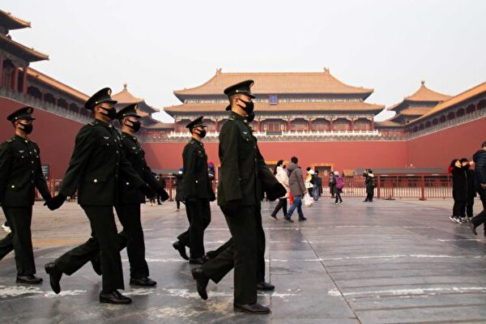

<a name=top>

<a target="_blank" href="https://git.io/bb99bbss">

 

 
 

<a href="https://github.com/gofun72/telove/blob/master/soft.md"><b>免费突破封锁翻墙软件</b></a>
 

<b>请收藏本网址，连上免翻视频 https://bit.ly/2RQM1hX</b>

 

<a target="_blank" href="https://bit.ly/3ezRQKo">

 
 

<b> 看更多真相   https://bit.ly/3ezRQKo  </b>

<a href="https://github.com/candysn/nini/blob/master/wnn-1.md"><b>小之每日真相(一)</a></b>

<a href="https://github.com/candysn/nini/blob/master/wnn-2.md"><b>小之每日真相(二)</a></b>

<a href="https://github.com/candysn/nini/blob/master/wnn-3.md"><b>小之每日真相(三)</a></b>

<a href="https://github.com/candysn/nini/blob/master/wnn-4.md"><b>小之每日真相(四)</a></b>

<a href =#2>2.北京教师：小时候知道的很多事都是假的】</a> 
<a href =#1>1.一位司机的肺腑之言</a> 

<a name=2> 
<h2 align="center"><b>北京教师：小时候知道的很多事都是假的</b></h2>

图为2020年1月26日中国北京，中共公安在故宫博物院封闭的入口前行走。(Betsy Joles/Getty Images)

 
【大纪元2020年06月25日讯】（编者按：姚玲玲（化名），北京教师。她的爷爷是村支书，因此有点特权，但她长大后知道爷爷当上支书的秘密，开始了解到共产党不说真话，像是黑社会，从此接受更多的真相，她说：“有神存在，有鬼就不可怕。”这是她的口述整理。）

 
<b>因为我爷是村支书</b>

小时候我住城里，假期回老家，和小朋友一起玩，那些小孩对都我特别好，就连打架打得很厉害的孩子王都对我很好。后来我知道，那些孩子的爸妈会告诉他们，好好带她玩，不许欺负她！因为我爷是村支书记嘛。

那些小孩都穿着秋衣秋裤，特别破，浑身脏兮兮的，但是我穿的就是小公主裙。

我有特别多的衣服。那会儿别人家都不怎么照相，但我专门有个柜子，里面一本一本的相册，全是我的照片。有次，一个小哥哥到我们家玩，回头跟他爸妈说，怎么她家的零食那么多，我都没有吃过！是，我家里的零食，我都不爱吃，我觉得别人家也是这样呢。

我爷爷家也有个大柜子，我一去，爷爷就打开那个大柜子，你喜欢吃哪个，搬走！然后就成箱成箱搬我们家了，后来知道那都是别人送的。现在我都记得，每次一到选举村干部的时候，我爷他们就会挨家挨户送礼，烟啊，酒啊。

一次，我抱着一个两岁的小娃娃逗他玩，老远见我妈回来，一下我就把这小娃娃给扔了，然后就跑我妈那去了。结果那家人就说，没事没事！因为我爷是村支书记嘛。

印象很深的是我爷带我去聚会。很多当官的在一个大桌上喝酒，各种各样的酒瓶子，特别多，我就玩那些酒瓶子，吃菜的时候，那个菜全是白酒的味，后来想起那些当官的，就觉得都是白酒味儿。

我爷爷为什么能当书记？我姥跟我讲，我爷文化水平不是很高，但在文化大革命的时候做过一些事。为了表功，就给同村一个人安上反党的罪名，把那人吊到大梁上，底下生着火，然后问他承认不承认反党，他不承认，就把绳子砍断，让那人掉到火堆上，然后再吊起来，再这么掉下来……后来那人就疯了，每天蹲在合作社旁边，像狼一样“噢，噢，噢”地叫。我姥说，参与这事的人后来都挺惨的，有的被黑社会给打残了，有的得病了。

我爷就得了癌症，他不想告诉人自己得病，觉得丢人。我爷当书记时挣了很多钱嘛，但是得癌症时花了很多钱。我姥就说他之前做的不好的事情太多，我姥信报应的。

我小时身体特别不好，总发烧，哪都不舒服，住院也不好。有个人就对我说，你爷做坏事太多，殃及子孙。

我姥相信“迷信”，把我认给一个庙里的什么东西当干女儿，好像带点灵气的那种，我妈和我姥说这些事时，总是偷偷摸摸的。因为我家好多人是党员，我爷还是支书啊，怕人说“迷信”。

过节时，我姥和我妈说该给我认的那个东西烧点纸了。她俩就摆了一个案子，还送给它杀死的猪啊、鸡啊。烧烧烧，然后就让我去磕头。很奇怪，我身体从那时就好了一点。

我们家族的人找对象，首选都是体制内的党员。我表姨就嫁了个交警。

一次表姨夫穿着交警制服，领我去小卖部买奶喝，他让我随便挑，就挑了一个我喜欢的，我站那儿不走，表姨夫拉我走，小卖部老板说拿着走吧。我对表姨夫说，你还没有付钱呢。那老板就说：哎呀，你拿着喝吧！不要了不要了！

他的表情让我觉得很难受，我想起了电视剧里的黑社会，恶霸去街头抢人东西，或者让人交保护费啥的。我感觉很不好，老师教育我们拿别人东西是要给钱的。

以前，我就会跟别人说，我表姨夫是交警，很厉害的，这事之后，我对表姨夫不感到自豪了。其实表姨夫没什么职位，就是一个小小的交警。

<b>最大的黑社会在北京？</b>

我妈的国有单位要转成私有，员工们就出来维权。来了很多警察，我妈的同事阿姨录像，一个膀大腰圆的警察就过来了，跟那阿姨说，你干嘛呢！？你把你手机放下来！不放下来我就给你摔了。阿姨不放，警察抢过她的手机就给摔了，还上去打给了她一个大耳光。然后指着说，这个，这个，这个，把这几个人都给抓起来！一看这阵势，我妈就退下来，我妈是党员嘛。

那时我上高中，政治老师说公民有举报权，我就想我是不是可以上网举报这事啊？我就填举报网页，还没写事实，它就弹出一个小对话框，让我写真实姓名、家庭住址等，我一看，这比那个罪犯调查的还清楚呢，还是不举报了吧。

我们小区的物业与业主闹矛盾，物业就找社会上的小流氓打业主，楼下一个白头发的老奶奶给打了，我妈就报警了。警察来了，把我妈给抓进了派出所。警察训诫我妈，你为什么报警？警察和那个流氓当时在那儿称兄道弟的，我妈一看这样，就说那我就报错了，以后就不报了。警察这才把我妈放了。

我妈回来就给我打电话：共产党真的是太坏了，千万不要和共产党有任何关系，你不要加入他，你也不要反对它，你千万不要招惹它。

后来有一个新闻，好像是河北抓了一个黑社会组织，我们班有个男生说，哎呀！最大的黑社会不是在北京吗？大家听了都哈哈笑，我沉默了。第一次听这样的话，我就听懂了，黑社会指的就是共产党嘛，我觉得他说的挺对的。

<b>小时候知道的很多事都是假的</b>

我弟是我妈请假回家，偷偷摸摸生的。别人都跟我说：你千万不能让人知道你有弟弟！所以那时如果有人问我，你有弟弟吗？我马上回答：没有！我弟一岁多了还没有户口。

记得一次我带小弟去单位找我妈，突然听说领导来了，我抄起小弟弟就往家跑，那时候生二胎罚几万块钱。

因为有这个弟弟，我小时候有点自卑。老师常让独生子女举手，他们举手的就觉得很光荣，家里有好多孩子的，就觉得没有为中国做贡献。

老师说，世界上那么多人，环境污染呀，破坏呀，只有咱们中国只生一个孩子，外国还说咱们没有人权。我当时就想，对呀！我觉得我们中国很伟大啊！付出了这么多，最后还说我们，当时就那么想。

小学时学校组织我们看天安门自焚的视频，印象特别深的就是有一个小女孩叫刘思影，电影里说，她特别好，和同学玩的也特别好，她会把全班同学的名字编成一首歌，但是下面的镜头就是她被火烧伤，浑身被包扎着的场景，很可怕。有同学看完电影就回家做噩梦。后来我在我家楼道看到一本法轮功小册子，好奇地翻开了，里面说天安门自焚是假的，当时想往下看，但还是一下子合上了，怕看多了会变成刘思影那样啊。

<b>历史老师：我的话不是真话 但考试这样答</b>

有位中学历史老师上课，总是先说，“从现在开始，我说的话都不是真话，但是你们考试的时候要这么回答，好了，我现在开始讲了……”我当时就知道老师是什么意思。

大学时，老师给我们推荐一些电影，比如《蓝风筝》啊、林昭啊、还有一个女老师文革被打死的事，印象特别深，这些使我就对中国特别失望。后来朋友给我拷了一个自由门软件，我就翻墙了，看到国内新闻里没有的事，各种腐败，各种乱搞啊，跟我小时候看到的一样。

虽然知道党员会习惯性造假，但看到任长霞把女法轮功人扔到男监狱里，还是很震惊。因为小时候看任长霞的电视剧，特别崇拜她，那时新华书店把任长霞的书摆了一个展台，所有的学生都看！

我跟我的朋友说这些翻墙的事儿，他们不感兴趣，觉得离自己比较远，大家都不是很理解我。觉得你一个女孩你关注这些干嘛？学习成绩、电视剧啊、综艺，是她们关注的。

很多大学同学还积极入党，我觉得他们加入党都是有目的，为了利益吧。有人总是把共产党当母亲，但是共产党把你当儿子吗？你真入了党，它会怎么对你？他会把你当儿子吗？

所以，后来我在人民币上看到“三退保平安”“天灭中共”的字，我就觉得说的是对的，如果是这样就好了！

<b>我兴奋得跳着回了寝室</b>

大二时，当我知道了法轮功真相，当时兴奋得跳着就回寝室了。进屋我就登上上铺梯子，拉开帘子，告诉里面的密友：“知道吗？法轮功是好的！法轮功是被迫害的！天安门自焚是假的！”我密友很紧张，指着拉着帘子的下铺：“嘘，你小声一点，下铺有人！”

我当时一愣，那时不知道害怕嘛，就是那种看到最好的东西，一定要跟朋友说的心理。

后来我高兴地炼了法轮功。一点也不害怕，但知道迫害很严重之后，就知道不能随便跟人说了。一般我们几个同学早上在教室炼动功。有次突然教室的门开了，有人闯进来，我们“啪”就散开了，从那以后就很注意安全。

寝室里，我就在帘子里打坐。有次晚上正在打坐，和我对床的室友突然坐起来，她看着我，因为我俩之间没帘子嘛，我也很尴尬，但后来她也明白了真相。

学法时，我会去同学寝室，把门插上，几个人小声读出来，我们都是大学期间得法的新学员。

有次做梦我给关进监狱了，警察用鞭子沾着盐水打我，问我还炼不炼了，我说“炼！”，说完后，我就感觉自己能飞了，但飞一下就落下来，我跳了起来，然后再飞，就这样，我跑出监狱了。

<b>我家人的转变</b>

我妈知道我炼功后，认为我心理有问题：“你有啥想不开的，上了大学还信上这些了，你一个大学生啊，你怎么能信这些迷信呢？你干点啥不好？”

我妈还说，“你要再炼，就跟你断绝母女关系，这两个你选一个吧。”我就哭了，说：“我不能我不能！”我妈就再也没说什么，现在我妈也“三退”了。

我爸开始也让我放弃，现在不劝我了，就说要注意安全。其实他挺明白。一次，他跟我说，三年“自然灾害”时死了三千万人，三千万是什么概念？日本人杀中国人都没有这么多，还说我们河南这个地儿，整个村整个村的饿死。

疫情期间，我发现我妈在我家温度计下面，藏了一个护身符。有次回家我还看到姥姥床头放着一个法轮功真相台历，是她赶集时有人送她的。

<b>有神存在，有鬼就不可怕</b>

记得最早看到明慧网，一篇文章说有个老太太被马蜂蛰了，念九字真言就好了，我觉得这说的也太玄乎了吧。后来修炼后，经历了一些神奇的事，我明白明慧网里说的都是真实不虚的，因为我自己都有体验啊。

以前我痛经非常严重，有时会边哭边打滚，甚至都会疼昏过去，现在我一念九字真言，真的就不疼了。

小时候特别怕鬼，我妈说人死如灯灭，没有鬼。后来一害怕，我就对自己说人死如灯灭，但还是觉得有鬼，一闭眼就会觉得有东西看着我。现在我不怕了，我知道神真的存在，有鬼并不可怕，因为神会保护我。

姚玲玲（化名）口述，尚云天整理。 

原文https://www.epochtimes.com/gb/20/5/24/n12133812.htm

<a href=#top><h6 align="right">回上方</h6></a>

<a name=1> 
<h2 align="center"><b>一位司机的肺腑之言</b></h2>
 
【明慧网二零二零年六月二十七日】一位在一直辖市城建局专为领导开车的司机给我讲了一个故事。他说：

我为领导们开车几十年了，对我态度最好的是一位专管技术的高级工程师，是一位岩土土木学专家，又是一位城建局城市建筑专家，国务院指定专治三峡库区滑坡问题的专家。

他也是炼法轮功的，一直按“真善忍”的标准严格要求自己，工作勤勤恳恳认真负责，甚至废寝忘食，没日没夜的干着手中的活，真可以说是无私无我！他把自己所掌握的知识与经验手把手教给学生，带出了大批技术骨干，现分散在市里几大部门，技术都好，工资也高。

他对谁都好，连伙食团的、看门的都是他的好朋友。

在他那个单位，技术部门分奖金只有他才能摆平，因为他从不为自己，自己勤俭节约，都为大伙考虑，奖金就连我这个司机都有份，以前可是从来没有过的。

就这样一个处处事事为别人、为公家、为公司着想的好人，只因为修炼法轮功，警察们多次骚扰他、跟踪他。因为讲真话他被非法关押过。局里找不到能代替他的技术人员，局领导就去警方担保他，他才能正常工作。

国安的车经常跟踪我，因是我接送这位专家上下班，有几次警察骚扰他，被我骂回去了，有时想不通，这些国安的人，拿着公民的血汗钱却专门去迫害好人，真不是东西！有时我就故意开车乱跑，让国安的车追着我瞎转去吧！

这么好的一位老技术人才，在这十几年的无休止的骚扰、威胁中，在各方面的强大压力下，于二零一五年五月含冤离世！这世道不公啊！

最后司机说：这是我亲身经历的。你说我能不知道法轮大法的好，共产邪党的恶吗？！

听了这位司机的肺腑之言，我流泪了，默默祝福这位正义司机！ 

原文https://www.minghui.org/mh/articles/2020/6/27/-408251.html

<a href=#top><h6 align="right">回上方</h6></a>

