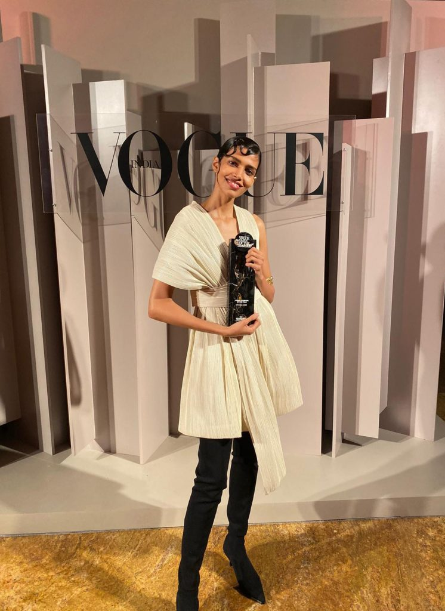
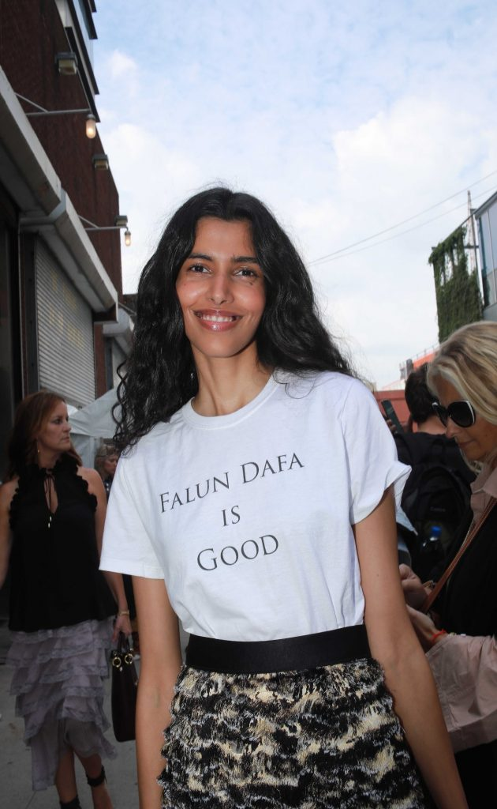

 

<b>直连不必翻墙 🌼必看 精彩视频 http://36.227.112.13</b>

<b>中共覆灭在即 勿依赖中共保权 https://git.io/Ffor</b>

 

<b>● 红潮即将倾覆 天之将明 ●https://git.io/bb99bbss</b>
 

<h2 align="center"><a href=https://github.com/3fmd/gm/blob/master/epub.md>免费下载好书 下载 epub 视频 音频 图文 电子书</a></h2>

<h2 align="center"><a href="https://github.com/candysn/nini/blob/master/wnn-1.md"><b>2018年5月~8月看更多</a></b></h2>

<h2 align="center"><a href="https://github.com/candysn/nini/blob/master/wnn-2.md"><b>2108年9月~12月, 看更多</a></b></h2>

<h2 align="center"><b>生命的升华——记一位年轻的大学讲师</b></h2> 

越南岘港大学校门与该校讲师阮胡南（Nguyen Huu Nhan）

 
【希望之声2019年11月7日】（本台记者慧光综合编译）
阮胡南（Nguyen Huu Nhan）是越南岘港市岘港大学的一位年轻讲师，该学校是符合国际标准的综合性大学，是越南中南部规模最大的高等学府，同等规模的大学在越南只有四所。他拥有韩国物理学博士学位，虽然已经回国工作，仍保持着在韩国的博士后研究项目。他不仅事业成功，还有一个幸福的家庭。毫无疑问，他是同龄人中的佼佼者。 
 
他的成功不仅在于勤奋和努力，也与天赋有关。他说：“我从上小学起就很优秀，未经考试被直接招入中学。 初中时，我获得了区和省的优秀学生奖，这使我很容易就进入了省级中学。 在高年级学习期间，我取得了许多成就，获得过省和国家的最佳学生奖。正因如此，我无需参加高考就直接被大学录取。当同学们不得不加倍努力准备考试时，我却呆在家里很悠闲。最后我选择了在南方最负盛名的大学学习。大学毕业后，我获得了出国留学奖学金，去韩国攻读硕士和博士学位。我所取得的这些成绩让我的家人都感到非常自豪。”

也许有人会问，拥有如此骄人的成绩，可能与他的家庭背景有直接关系吧。他说：“我的家庭只是一个普通的家庭，与其他家庭没有太大区别，唯一不同的是我的整个家庭保持着传统的道德价值观，比如温良恭俭让等等。对我而言，道德和礼仪是基础，是成功的根源，而不仅仅是教育和知识。”

然而在他成功道路上却出现了一次重大转折，对他的人生产生了巨大影响。

那是在2015年，他还在韩国攻读博士学位，却患上急性结核病。由于事发突然，他入住医院时已经处于昏迷状态，医生对家属说“情况不容乐观，要做好最坏的心理准备”。在失去意识两天后他才醒过来，醒来时发现自己整个身体上有六、七根管线连接到身边的检查和监控仪器上。

他这次在医院被抢救十一天，医生对他说，今后要接受长期治疗，每两个月要进行复查，至少要服药一年。按照医生的说法，他这种结核病死亡率很高，即使抢救过来也会留下严重后遗症。他说：“这次生病让我发现，人的生命是如此脆弱和无常，出院后我不得不抽出时间为自己的健康寻求更好的解决方案。”

他首先选择了印度瑜伽，经过大约一个月练习后，发现它并不适合，因为要投入太多的时间和精力却看不到效果。此时，一位朋友向他推荐了法轮功，他很好奇，就上网查
寻，发现法轮功的练习方法竟然非常简单，就立即尝试按照教功视频学习。

阮博士在阅读越南文版《转法轮》

 
因为刚出院不久，他的身体还很虚弱，经常感到头痛。住院期间，他做了几次骨髓检查，对脊椎造成伤害，经常感到背痛。经过一段时间炼功后，他的第一反应是头痛减轻了，背部疼痛的症状也得到了有效缓解，身体状况有了明显改善。炼功三个月后，他停服了所有药物。

他说：“我能清楚的感觉到，修炼带来的改变比服药的效果好很多。六个月后我去复查，医生说我的身体恢复得比其他人都快，即使我已经停止服药超过两个月，结核病菌几乎消失了。 一年后，我再次做最后一次检查，医生说所有结核病菌都消失了。回顾这段时间，我真的很感激法轮功，否则就要持续服药一年，如果那样我不知道它会对我的身体造成多大伤害。”

因为亲身感觉到了法轮功的神奇，在炼功的同时，他开始阅读法轮功的主要指导书《转法轮》。作为学者，他非常喜欢探索和研究，他说：“我研究得越多，就越清楚业力和疾病之间的关系，对人生中很多不解之谜都找到了最合理解释，知道人应该多做善事，避免做坏事；我学习的越多，对我自己做出的选择就越自信，甚至感到自豪，感到这种机会的珍贵，因为我所学的是真正的佛法，是非常值得珍惜的。”

在工作中，他用“真、善、忍”标准指导自己做人做事，做事之前首先考虑别人。有一位同学曾这样评价他，说：“做项目时他总是站在学校的角度去思考，从不把个人放在前面，就像从来没有竞争对手一样，与其他同学完全不一样。而我们总是在考虑竞争对手会怎么样，怎样超过他们。”

阮胡南说：“我知道这种赞扬是对我修炼法轮功的肯定，其实这是作为大法修炼者应该有的状态。当然我也有做得不好的时候，但是我会变得越来越好，越来越好。以前我很自私，但自从修炼法轮功以后，我知道如何更多地去关心别人。”

在韩国读书期间，他远离家人，只有陪读的妻子跟他在一起。当孩子出生以后，家庭出现了很多问题，夫妻之间有很多冲突，有一段时间他竟然不知道该如何平衡好家庭关系。当他用修炼人的标准衡量时，才发现了自己的不对。他说：“我需要对妻子更友善，不能因为修炼而忽视了家人。作为修炼人要始终为他人着想，以同样态度对待每一个人。”从那以后，他能够站在妻子的角度思考问题，尽管只是做了一些琐碎的事情，但夫妻在一起很快乐，很少再有冲突。

他说：“我只需要改变自己，发现自己的错误并纠正错误，一切都会变得更好，而不是强迫他人怎么做。现在我太太也开始修炼法轮功，我和妻子经常一起学法、听法，我女儿也喜欢学习师父的诗词，并喜欢看书中师父的照片。现在我们全家人非常幸福，我对大法充满感激。”

作为一名科学家，在对客观世界的认知方面，他也有了很多新的认识。

他说：“当我还是一名物理专业的大三学生时，我本人是非常固执地不相信超自然现象，认为它们都是伪造的、虚假的，或使用技术制造的。但是读完《转法轮》后，我被师父用现代科学知识解释的客观现象所吸引，并发自内心的心悦诚服。比如说‘德’也是一种物质，当人在行善或受苦时能够积德，也可以在做坏事时被消耗，就像进行商品交易一样，这话说的通俗而又深刻。在这之前我是很模糊的，我知道很多人都是这样，这也成为人干坏事的原因和理由。还有关于‘第三只眼’、‘植物是有感觉的’等等，都解释的非常深刻。所以我认识到，法轮大法是真正的科学，只有佛法才可以解释宇宙中的万事万物。对科学家来说，这不也是最幸运的事情吗？！”

从韩国回到越南工作后，他与其他法轮功学员有了更多接触，对大法修炼也有了更为深刻的认识。面对中国政府对法轮功的迫害，他也有了越来越清晰的判断。他说：“现在我认识到，这种迫害不仅是人权和信仰问题，而是善与恶之间的斗争；这也是对世界上每个人的良心检验：我们是要维护‘真、善、忍’的价值观，还是选择沉默，这关系到每个人的未来，因为未来不就是由今天的决定所决定的吗？ 因此，我认为每个人都不应在邪恶面前保持沉默，也不应让这些谎言继续误导和阻碍个人的命运。在面对媒体宣传时，请先做好自己的独立判断，最好去亲身体验。”

现在，他也经常利用工作之余，向民众讲述法轮大法的美好，将代表“真、善、忍”美好信息的莲花传递给善良的人。

原文http://www.soundofhope.org/gb/2019/11/07/n3320304.html

<h2 align="center"><b>我和国人欠法轮功一个道歉</b></h2> 

法轮功在海内外受到民众欢迎，但却被中共迫害抹黑。图为1998年5月沈阳市法轮功学员集体炼功场景（大纪元资料库）

 
【大纪元2019年11月11日讯】历史的真相有时像一坛老酒，多年的尘封难掩饰它本有的芳香，有时又像古代女人的裹脚带，一旦松开又臭又长。中共执政70年来，它利用谎言、暴力治国，无数的历史真相被其掩盖；无数的邪恶行为被其装点成“伟光正”；无数的善良被其歪曲成“邪恶”。法轮功组织被中共构陷成“X教”就是一个最好的例证。

前几天，我看到一位香港女青年在接受媒体采访时说：“我欠法轮功学员和大纪元时报一个道歉！过去受中共官媒的影响，我始终把法轮功当成‘X教’，我还经常把个人对法轮功的偏见告诉同学和朋友，平时对法轮功的媒体很排斥。自从6月9日香港反送中运动开始以来，我们每次参加抗议活动时都会看到大纪元时报和新唐人记者冒着生命危险冲在第一线，更可敬的是，他们多次在采访中受伤，可他们还是继续坚守岗位，从不退缩。每次抗议活动他们都会在现场直播，每次都是在第一时间把香港发生的事及时传播到全世界，报导也相当客观真实。与其它媒体相比，法轮功媒体不仅及时准确，而且是多角度全方位，多语种传播，毫不夸张地说，法轮功旗下媒体是这次报导香港反送中运动、当之无愧的国际传播主力军。”

面对记者的镜头，她显得很激动。她不断的用手抹去眼中流下的泪水，她感慨地说：“如今，我每当参加抗议活动看到大纪元时报和新唐人记者时，都会感到一种从未有过的亲切感和安全感，也因此对自己过去的偏听偏信感到羞愧，今天我要借此机会向法轮功所有学员表示道歉，同时也要向他们致于最崇高的敬意和谢意！如果没有各大媒体的无私奉献，香港反送中运动不可能争持到今天。”

这位香港女青年朴实的话语，无意中道出了许多人对法轮功看法的改变。我也是其中一个。

我与许多国人一样，过去也一直把法轮功当成“X教组织”，对该团体旗下的媒体也很排斥，对该团体成员也是敬而远之。然而，通过这两年我在美国对法轮功团体及其媒体近距离观察，发现自己过去的判断存在严重失误。

首先我认为法轮功团体绝对不是中共所说的“X教”，如果真是“X教”，法轮功不可能深受100多个国家民众及政府的欢迎。到目前为止，也从来没有看到法轮功团体在任何一个国家出现过暴力事件，更没有听说法轮功团体凭借学员众多去参与哪个国家的政治。

另外，法轮功学员待人都很友善，修炼法轮功的学员个个都反映受益匪浅，他们认为修炼法轮功不仅能强身健体，还能提高心性，改善自身过去的行为缺点。这实属难得。这也是法轮功学员对他们的师父李洪志先生产生敬仰、感恩的缘故。

宗教不等于信仰，信仰不等于宗教。据我了解，法轮功并非是一个宗教组织，而是一个对外开放的信仰团体，其学员当中有各国政府官员、高校教师、科研人员、体育运动员、媒体从业者、公司职员、医务人员、律师、退休人员、普通市民，其成员几乎涵盖社会各个阶层、各种族。据美媒报导，法轮功学员人数已超过一亿。

法轮功组织在各国都很受欢迎。而且有些国家元首及政要也是法轮功学员。这可能会令许多国人费解，一个被自己国家视为“X教”的团体，却被世界各国高度认可。这究竟说明了什么呢？

正义往往总是迟到，但她从来不曾缺席。我很认同香港女青年的说法。我认为，不仅是她欠法轮功一个道歉，准确地说，我和国人都欠法轮功一个道歉。也许这个道歉来得太迟，法轮功学员饱受了20年的迫害、误解与苦难，但世人应该都能感受到，正义的天秤正在向法轮功快速倾斜。这种倾斜，又何止是一个道歉就能比拟的呢？ 

原文http://www.epochtimes.com/gb/19/11/10/n11646369.htm

<h2 align="center"><b>信不信由你</b></h2> 

法轮功学员在打坐炼功（网络照片）

 
【希望之声2019年11月5日】（本台记者慧光综合报导）我是生活在中国大陆西南地区的一位普通农村妇女，没有多少文化。年轻时身体还可以，自从坐月子不小心落下了风湿病，身体就越来越差，严重时手脚发麻，身上好像有很多虫子在爬。还有心脏病，吃药打针都不好使，一直被病痛折磨着。

有一年春节期间，在婆婆家看到有一本书叫《转法轮》，心想过年比较清闲，就拿过来看了。当时就感觉书里写的真好，越看越爱看，越看越想看。接着学会了五套功法，每天读书再加上炼功，身体的变化很大，走路轻飘飘的，干活也不觉得累。很快就发现手脚发麻的症状没有了，心脏病也好了，亲身的体验让我感觉到法轮功太神奇了。

自打修炼以后，可能是我的天目功能打开了，遇到的神奇事儿太多了。有些事儿不敢说，怕人不相信，就比如我老叔这件事儿吧。

我老叔得了肝癌，被医生判了死刑，只能在家等死。有一位法轮功学员对我老婶说：“给他读《转法轮》吧，如果他信，就还有希望。”反正是等死了，老婶就每天守在床前为老叔读《转法轮》，三天以后，老叔就能从床上坐起来了，然后就能自己看书了。因为效果很明显，老叔就坚持看书，不久病就好了。看着这活生生的事实，他们全家都信法轮功了。可是看到当地有很多法轮功学员被抓了，他的压力很大，不敢坚持，最后还是去世了。

半个月后，有一天我在地里干活，猛然间看见西南方向的天空中出现一个人，仔细一看是我老叔。老叔对我说：“请你告诉我家人，我虽然离开了，但没有遭罪，在地府呆了七天就出来了。”当时我点点头答应了。我心里明白，这是因为他相信法轮大法才有的福报，可是过后我也有点儿为难：该怎么跟他的家人说呢？

到了第三天，遇见了他的大儿媳妇，就对她说：“你公公没遭罪，已经去他该去的地方了。”然后我指着西北方向说：“老叔这三天一直在那呆着，但是有像雾一样的东西罩着，不过我能感觉到他是在那打坐。”

又过了几天，按照当地的习俗要“烧三七”，亲属们都到了他的墓地。不过我看到墓里什么都没有，老叔还在西北方向那里打坐，看着我们。老婶一边烧纸一边哭，我就用手指着老叔打坐的方向说：“您对着这个方向，想说什么就说什么吧，我老叔都能听到。”过一会儿老叔就不见了。

还有我自己家里遇到的神奇事儿，说起来怕有一箩筐。

我跟我母亲的感情很好，有一天她生病了，我心里总是放不下，搞得我心神不宁，寝食难安。也许是师父为了点化我吧，有一天在打坐时，我看到了母亲前世是个修炼人，我儿子的前世是一条白龙，所以她们都支持我炼法轮功。看到这里，我放下了对亲情的执着，知道每个人的人生道路其实都是安排好的。

有一次打坐时，我看到丈夫的前世是一位历史名人。因为他的根基好，《转法轮》只看了一半就不能吃肉了，还看到书上的每一个字都是佛。2014年过年期间，丈夫的脚后跟骨折，医生要给他做手术，说要给骨折处下钢板固定，丈夫不同意，于是找到附近的一家中医门诊，大夫看完X光片子说，不用手术，吃药养三、四个月就好了。后来吃了两个月中药，脚还是肿，又去拍了个片子，不但没有好转，还错位了。

我外甥女是学医的，建议我丈夫赶紧做手术，说如果发炎了后果不堪设想。我对丈夫说，现在你是相信法轮大法，还是去医院做手术，他说相信大法。第二天早起就开始看《转法轮》，看到第三天，他就把双拐扔了，然后高兴的走到我跟前，一副得意洋洋的样子。我诧异的问：“你怎么不拄拐了呢？”他说拿拐感到累，扔了反而轻松了。这不是奇迹吗！？

我女儿上初中时就是团员，在我的引导下她退了团。上高中时全班都是团员，老师让她重新入团，她就是不入。上大学时，老师让她入党，女儿对老师说“我不是团员”，自然就不能入党了。女儿大学毕业后被招聘到铁路系统工作，成了一名在编的正式职工，有了一份稳定的工作。这是很多人梦寐以求的，是需要花钱才能办到的，可我们没花一分钱就得到了，这不也是福报吗！？

因丈夫外出打工，女儿有了工作，我也不能在家里闲着，于是就到城里当保姆。我护理的是一位九十九岁的老阿姨，她的腿摔坏了，坐在轮椅上，大小便不能自理。她有三个女儿，但只有我和老人住在一起。我的工作就是做饭、洗衣服，其它的不用管。但我除了约定的事情外，只要她有需求，我就尽量满足她。她有满口假牙，每顿饭后都要刷，我每次都用温水将其刷干净，晚上我还用热水给她洗脚。

有一天，老阿姨对我说：“你是不是有功能呀，你看我的脚本来是肿的，现在已经消肿了，你刷完的牙我带上可舒服了。”我说：“阿姨，那不是我的功劳，那是你常念‘法轮大法好，真善忍好’得福报了，你要谢谢我们师父。”她还说：“你没来的时候，我总能看见有一个老太太龇着牙和一个穿旗袍的女人，每天都在我跟前扭来扭去的，可吓人了。自从你来了，她们就看不见了。”我没敢跟她说什么，但我知道因为我是修大法的，有师父的法身看着，一切不好的阴性的东西在我身边都呆不住。

后来保姆不做了，我就到菜市场去卖菜。有一天，相邻摊位的大姐说她牙疼，饭都吃不了。我就对她说：“我姐夫是党员、大队干部、退伍军人，一提法轮功他就摇头。有一次，姐夫牙疼了半个多月，怎么治都不好，有人让他念‘法轮大法好，真善忍好’，他当面还是说不信。到牙疼的实在没办法了，就在心里默念‘法轮大法好’。念了两个多小时，不那么疼了。继续念，真的就好了。一直到现在，牙就再也没疼过。”

大姐听了高兴地说：“怎么念？你也教教我。”我就一字一句的教她。到了下午三点多钟时，大姐告诉我，她的牙不疼了。她向我道谢，说我是个好人。我说：“别谢我，谢我师父吧，是我师父教我这样做的。”

法轮大法是佛法修炼，是最高科学，有千千万万的法轮功修炼者在精进实修中体验到了数不清的神迹，这些神迹都是现代科学解释不了，但科学解释不了的不代表就不存在，更不能说是迷信。 

原文http://www.soundofhope.org/gb/2019/11/05/n3314130.html

<h2 align="center"><b>香港响彻“天灭中共” 谁替天行道？</b></h2> 

2019年11月2日，香港民众打出“天灭中共”的标语牌，在维园举行“112求援国际 坚守自治”大集会，向国际发出求援讯息。（文瀚林／大纪元）

【大纪元2019年11月04日讯】何谓天灭中共？在十几年前出现这个标语的时候，许多人会不屑一顾，以为把希望寄托于天不太现实，今天的香港人似乎读懂了，其标语和口号时常出现在香港街头和每一次运动中。简单理解或顾名思义就是指，邪恶的中共注定被上天灭亡。然而只有顺天意的人们，才能替上天在人间行使正道，伸张正义。

香港的这场运动，很快就让世界人民和国际社会分辨出谁正谁邪，香港民众在反送中的抗争中，也很快就找到了祸乱香港的邪恶根源，不是特区政府，更不是海外某种势力，而是中共！在这四个多月的抗争中，从反送中很快就上升为抗共反极权的时代革命，人们践踏和焚烧中共血旗等标志物来表达对中共的不满，“驱逐共党光复香港”、“打倒共匪”、“天灭中共”等标语和口号随处可见。

从中共窃取政权以来，还未遭遇过如此庞大的反共浪潮，在中共关起国门搞斗争的文革时期，“反共”成为最敏感的词汇，人们一旦触及就是反革命或者阶级敌人，必将被打倒或消灭；“六四”前的学生运动虽然席卷了全国，但是，当跪着的人们刚刚站起来的时候就遭到血腥的暴力，当反共声音刚刚出口的时候，就已经被扼杀在摇篮里；在中共搞经济这些年头，大陆到处出现此起彼伏的群体维权运动，虽然偶尔出现“打倒共产党”等声音，但是，这种建立在经济利益之上的维权，很难形成规模性的反共抗争。

法轮功群体面对中共强大的暴力机器，反对邪恶共产极权对“真、善、忍”的迫害，用《九评共产党》、《魔鬼在统治着我们的世界》等系列文章，揭开中共的面纱，将邪恶的魔鬼嘴脸暴露于天下。大陆学员不畏强暴常常冒着被关押的危险，甚至付出生命去传播真相，希望更多人了解真相，退出邪恶的中共，拯救日益下滑的道德等，同时引发了大规模退党潮，“天灭中共”之说也不迳而走。

以和平、理性和非暴力抗争的香港民众，如何对抗暴力成性的、毫无理性的粗暴邪恶政权？许多香港人开始反思，开始关注被镇压20年仍然挺立的法轮功学员，他们是中共第一次没有镇压成功的群体，香港的法轮功学员坚持了20年持续反中共暴政，被认为“虎口拔牙”，特别是大陆学员，他们面临前所未有的残酷迫害，甚至被杀戮或活摘器官，却仍然以打不还手骂不还口的态度去面对，虽然显得弱势，但来势汹汹的强权暴力却无法消亡这浩然之正气和崇高之精神理念，反倒有更多人加入到这个群体，更多了解真相的人们也毅然选择站在正义一方，脱离中共邪恶组织。法轮功学员坚持20年不屈不挠的抗争，早已受到国际社会的广泛支持，已让世界人民和国际社会刮目相看。

许多人就像不了解法轮功学员一样不了解香港人，港人拥有富足的物质和精神生活，却没有安图享乐，为抵制共产邪恶的侵蚀，不惜流血流汗甚至付出生命，他们都知道，面对的是残杀“六四”学生的那群屠夫；是对法轮功犯下反人类罪的犯罪群体。港民虽然也害怕，但谁都不愿退缩，他们许多人写下了遗书，他们用和平理性的态度去面对全副武装的、野狼般的蒙面群警，用普世价值的文明精神去抗衡中共强权匪帮，正如法轮功学员用“真、善、忍”的理念去抗衡“假、恶、斗”一样，其实已经发生了惊天动地的正邪大战。

港民虽然失去了许多正常生活与工作时间；虽然流下了许多血与泪；虽然生活中充满了硝烟与疯狂的扰民，但是，在不经意间你会看到，强权的中共却在节节败退，港府已经撤回“送中条例”，林郑月娥将下台的消息也开始流传，中共在其它方面的损失更大，国际社会以及各种社会团体都普遍抨击中共，支持香港民众的抗争运动，港民掀起的反共势头正在延伸，世界各地人民普遍反击中共为港民发声，中共已经成为世界人民谴责的公敌。

英勇的香港人民面对世界上最恐怖的、最大的邪恶团体，从银发族到孩子纷纷地走出来了，当中大多数是风华正茂的年轻人，他们唱响了时代革命的最强音符，他们给世界人民和这段香港历史写下了许多可歌可泣的动人故事。

香港人民是中华民族的一部分，他们没有被党文化薰染，拥有良好的价值观和思想境界，具备崇高素质，无论文明素质还是文化素质都令世界人民为之惊叹和赞许，透过香港人就可以理解到中华民族的崇高伟大！而大陆人一旦洗净党文化污垢，照样可以焕发出真正的民族精神。

当中共邪恶还没有表露在香港的时候，港民都没有认识到中共究竟有多邪恶，今天中共在香港已经赤裸裸地展现出来，甚至在世界各大媒体的众目睽睽面前，连遮羞布也不要了，这一切邪恶就是中共要展示给世界和香港人民的，中共不断上演恐怖，绑架、抛尸、强奸、黑社会手段，还常常对没有任何妨害的示威者，发射大量催泪弹，常常在根本没有任何暴徒的香港之夜，大量警察也要上街丑陋地炫耀一番其邪恶力量，而观众只是记者和过路街坊，警方也就把他们当成示威者去攻击，却扰乱香港的正常社会秩序，给香港居民制造了无数的红色恐怖。其目的似乎在告诉港民：中共就是邪恶的，你又能咋样！赶快移民逃离吧！让中共更多地入住香港，实现大换血。

一个庞然怪魔已经来到香港，让港民和世界人民都看得到摸得着，许多人这才认识到新唐人大纪元媒体集团的《九评共产党》、《魔鬼在统治着我们的世界》等系列文章和节目，对中共挖根究底的描述真实不虚。

近几个月，越来越多香港市民在社交媒体上留言，因中共的误导，对法轮功曾经的许多误解表达歉意！正在与魔鬼抗争的香港人民，也自然而然的就喊出了“天灭中共！”不过，无神论的中共不相信天会灭掉它，早就喊出“与天斗、与地斗、与人斗其乐无穷”。但中共无论与哪个群体斗，甚至与美国斗、与国际社会斗，都将中共自己斗成了败局，越斗越输，真是其愁无穷了。

天灭中共是上天注定的，天理不容作恶多端的邪恶在世间横行，不容许道德沦丧的中共污染世界，绝不让无度违背世间善恶法理而反人类的中共存活于人类社会，与神对立的魔鬼就必然被天谴和消灭，而人们需要做出选择，是与魔鬼为伍还是顺天意而替天行道！

法轮功学员掀起的三退大潮，人数已经超过三亿人，也许这就是“天灭中共”的一个重要标志；香港民众持续的时代革命，不断取得进展，也许这就是“天灭中共”的一个重要过程，三退大潮和时代革命以及各种反共声音，无疑都是在替天行道！

世界上一场正邪大战已经拉开，共产主义邪恶势力企图不断侵蚀世界，与世界正义力量发生冲闯和较量，却是邪不胜正，邪恶势力明显遭到世界正义力量的制衡，美中贸易战已经削弱中共经济，美国政要的演讲，已经击中中共在意识形态方面的要害。

退党大潮正在拔掉中共的根；香港正在前沿阵地与邪恶专制发生较量；正义的世界人民和国际社会正在将中共置于孤寡境地，成为一头困兽。

看到了吗？白色的紫荆花正在盛开；听到了吗？“天灭中共”的吼声已经响彻在黎明的夜空。

原文http://www.epochtimes.com/gb/19/11/3/n11630770.htm

<h2 align="center"><b>被称为“大哥”的年轻女孩</b></h2> 

越南年轻的健身教练阮玉艳（Nguyen Thi Ngoc Diem）（Pooja Mor）

【希望之声2019年10月23日】（本台记者慧光综合编译）阮玉艳（Nguyen Thi Ngoc Diem）是一位越南姑娘，性格刚强，在她身上有种宁折不弯的劲儿，就因为仗义、勇敢，她被朋友们称为“大哥”。之所以有这样的个性，与她的成长经历是分不开的。

她父亲曾经是一位士兵，从小对她要求很严，总是教育她要学会有尊严的生活。虽然是女孩，她却喜欢和爸爸一起看拳击比赛或武打动作片。正是在这样的环境熏陶中，她形成了坚强的个性，而且她非常喜爱武术，梦想着长大后能成为勇敢的女骑士。

然而她的成长道路并不是一帆风顺的。

从小学起她就很要强，在老师眼里她是一个好学生，可是她有一个明显缺点，就是骄傲自大，看不起人，总认为别人不如自己，为此常常受到父亲的训斥和殴打。每当她不服气时，父亲甚至会用鞭子抽打她。

上中学时，因为仗义她经常受到欺侮和攻击，于是她发誓反击，并开始喝酒、打架。对嘲笑她的男生，她会挥舞自己的拳头教训对方。慢慢的她喜欢与男孩子打架，每当打赢了她就很高兴，直到后来无所畏惧，人也变得越来越专横。从那时起，她就被同学们称为“大哥”。

报考大学时，本来她想选择建筑专业，可是却因为一些阴差阳错的原因，最后还是不得不选择武术和体育。开始她以为武术就是要学习一些搏击技巧，可上课的时候，老师却侃侃而谈“道德”。后来她才慢慢认识到，真正的武术家不仅需要高超的技击能力，更重要的是要培养顽强的意志和武德。

大学毕业后，她应聘为一家大型外企（健身和瑜伽中心）当健身教练。虽然赚了不少钱，也赢得了一定的尊重，可是她却渐渐的失去了人生方向，她发现在课堂上老师教的道德知识，到社会上完全不适用，慢慢的就被她置于脑后。为了追求时尚，她把头发染成各种颜色，穿着奇装异服，喜欢去豪华的地方。她说：“因为有了较好的经济基础，我可以做自己想做的任何事情，似乎没有谁能阻止我。可是当我把一切都尝试过之后，却发现这样的生活并不是我所期望的。有时候坐在大街旁看着眼前过往的人群，反而有一种自卑和失落感油然而生，在这样的社会，除了随波逐流，我还能做什么？”

有一天，一位客户给她带来了一本书——《转法轮》，并对她说：“这本书可以改变人，希望你认真阅读。”她虽然没有理解对方的话，出于礼貌，还是把书带回家阅读了。第一次阅读，她并没有完全看懂，但却在朦胧中看到了人生的希望。

后来这位客户还带她去了一处炼功场所，在那里她学会了法轮功的五套功法。刚去的时候，她的头发被染成了红色，手背上纹有图案。她本以为这些会受到鄙视或嘲笑，可是没有，她发现那里的人都很善良，而且对她很热情。就这样，她自然而然的走入法轮功修炼。

她说：“过去我也曾想过到寺庙里去修行，可是去了寺庙就不能为父母尽孝，这是我的主要顾虑。而法轮功不需要离开自己的生活，就是立足于常人社会修炼，这一点甚合我意。而且遵照‘真、善、忍’法理做人，这是整个社会都需要的，也是现在的社会最缺乏的。”

修炼以后，她的生活出现了显著的变化，她放弃了长期养成的不良习惯，改掉了以往的骄横和霸气，内心变得越来越平静，女性柔美气质也回到了她身上。

她说：“我首先体验到的一个十分重要的奇迹是身体上的变化。我做了五年专业健身教练，初进入时进行过高强度器械训练，导致身体出现了消化系统疾病，有低血压、脑部微循环障碍和胃痛，还有关节痛等病症，每年需要三次定期到医院复查和治疗。做我们这行的都知道，这些属于职业病，虽然算不上什么大病，可都是很难治愈的。开始炼功没多久，这些症状就没有了，痊愈了，这些感觉让我很惊讶，也很震撼！看到我的这些变化，我母亲和姐姐也都开始修炼了。母亲患有十年的失眠症，姐姐患有严重的中耳炎，不久也都康复了。尤其是母亲原来脾气不好，爱生气，后来也明显减轻了。现在我每次回家，都能感受到家庭的温暖和关爱，感受到了从未有过的家庭幸福。”

“按照‘真、善、忍’的原则要求自己，我的性格越来越平和，工作也越来越顺利，而且有越来越多的客户给予我信任和支持。每当我跟客户说我在修炼法轮功时，她们都感到惊讶。很多人认为健美运动和气功是互相排斥的，其实不然。亲身体验告诉我，健美运动和大法修炼能帮助我和谐的保持平衡。为了保持健美的身体，我每天也做些轻量级运动。即使进行了剧烈训练之后，只要我坚持炼五套功法，就能很快恢复体力，并能保持身体的柔韧性。”

阮玉艳（Nguyen Thi Ngoc Diem）在旅游景点炼功（Pooja Mor）

 
原文http://www.soundofhope.org/gb/2019/10/23/n3280938.html

<h2 align="center"><b>锲而不舍揭露中共 法轮功值得感谢</b></h2> 

2019年7月21，香港，法轮功学员举行反迫害20年大游行。图为“复兴文明善良 回归中华传统”的竖幅。（宋碧龙／大纪元）（Pooja Mor）

 
【大纪元2019年11月01日讯】香港前立法会议员梁国雄今年7月在法轮功反迫害20周年集会上表示：“我觉得很唏嘘，20年前很少人支持法轮功，或者同情法轮功，现在香港人在‘送中条例’的时候看到了中共的本质，越来越多人对于反对中共的专制，觉得应该支持并且自己参与。我觉得法轮功在这个过程里用他们活生生的经验告诉其他人。”

近期，同样的感触是来自不少香港市民在社交媒体上表示，法轮功十多年不懈的呼吁，现在终于明白了，为自己以前对法轮功的误解致歉。这些留言的缘起是，美国福克斯新闻（Fox News）10月26日刊登了一则题为“幸存者和受害者披露令人震惊的中共活摘器官行为”的深度报导指出，中共强摘器官是从1990年代开始的，最初是小规模的，是从死囚犯身上强行摘取器官，但在2000年左右规模开始激增，关键原因是法轮功被镇压，直到今天也没有停止。

香港人应该对2013年“林慧思事件”记忆犹新，香港女教师林慧思路见打压法轮功学员讲真相的青关会（中共610系统外围组织），以及现场不作为的港警，因而怒斥：“如果共产党做得对的话，干嘛做这种缺德事，邪恶得不得了，你别以为我们不出声，共产党做什么你心知肚明，交换器官日日都有，共产党杀人贩卖器官全世界都知道，你们警方还在维护这种共匪。”

中共“按需杀人”活摘器官全世界都知道，是因包括香港在内的全球法轮功学员长年锲而不舍揭露真相。尤其在香港这个地方，对一般人而言只是中国大陆的南大门，但对法轮功学员犹如“虎口”，险恶不在话下。

外媒《路透社》在“From 1997 to 2017: Hong Kong in pictures”专辑中，为每一年的香港选出了一张代表照片，2001年是法轮功，图说：“数名法轮功的成员正在炼功。法轮功自从在1999年被中共政府打压后，就持续待在香港抗议。”在《路透社》2014年题为〈为香港的灵魂而战〉（Special Report: The battle for Hong Kong’s soul）的特别报导中，开篇首先访问法轮功学员Lau Wai-hing，并从她长期在铜锣湾商业区向行人讲述法轮功真相的开始说起。

这20年来，法轮功学员在香港市区真相点上的横幅标语“天灭中共、天佑中国”，以及法轮功学员主办的香港《大纪元时报》真相报导，可以说都让中共又恨又怕。

香港大纪元成立于2001年，香港新闻大事件从萨斯（SARS）爆发、反23条立法，到雨伞运动，香港《大纪元时报》无役不与，乃至时下的“反送中”抗议现场也没有缺席，但报纸却于活动正盛的8月中旬遭到中共黑手打压从一超商下架。

深度参与香港反送中运动的年轻人David Ng获悉香港《大纪元时报》被下架后表示：《大纪元时报》是香港极少数拒绝中共收买、渗透、恐吓的良心媒体。从反送中运动开始，香港《大纪元时报》坚持在最前线报导香港实况，记者戴着头盔冲在新闻第一线实况报导，最近还被亲共背景的人袭击，专业精神毋庸置疑。David Ng说：香港大纪元通过第一手采访报导，加上独家稿件和相片，给全世界带来香港的真实新闻，对抗中共党媒的泼污。

香港大纪元暨新唐人采访主任梁珍说：“香港人民并不独行，因你我都在现场。”从“反送中”开始迄今5个多月的时间，香港大纪元总是将香港民众努力争取自由、对抗警察暴力的第一线报导即时传送给国际社会。

7年前，香港《独立媒体》网2012年9月8日刊文《法轮功对香港很重要》，作者jackso开头就写道：“我认为法轮功对香港十分重要，但我必先声明，我不是法轮功人，法轮功在香港一直宣布中国共产党及官员的罪行，经年的坚持令小弟感动。”

今年，香港前立法会议员梁国雄表示，很多香港人在“反送中”修例的过程中，才清楚看清中共的本质。对于香港法轮功学员20年来，不间断的揭露中共邪恶本质、真相及反共的意志，梁国雄表示感谢。相信不仅香港，还有世界其他国家地区应该都无异议，在揭露中共方面，法轮功确实值得感谢。 
 
原文http://www.epochtimes.com/gb/19/11/1/n11627189.htm

<h2 align="center"><b>“超模”的控诉——“我要为无声者发声”</b></h2> 

旅居纽约的印度裔“超模”普贾穆尔（Pooja Mor）

 
【希望之声2019年11月1日】（本台记者慧光综合报导）据旧金山『美丽日报』记者李莘10月29日报道，现旅居纽约的印度裔“超模”普贾穆尔（Pooja Mor），于2019年10月19日荣获印度著名《时尚》（Vogue）杂志颁发的“年度青年最佳成就奖”。 

 

2019年10月19日，普贾穆尔在印度孟买获颁《时尚》（Vogue）杂志“年度青年最佳成就奖”（照片取自『美丽日报』）

 
 
 普贾穆尔今年二十七岁，出生于印度西北地区古吉拉特邦的第一大城市——艾哈迈达巴德市，拥有计算机工程学学位。从2012年参加当地选美活动时她就开启了模特生涯，先后与Elie Saab、Alexander McQueen、Tory Burch、Dolce＆Gabbana、Calvin Klein等著名时尚品牌合作，取得了骄人成绩。2016年她亮相美国加州棕榈泉市举办的路易威登游轮秀，并于当年荣获《时尚》杂志颁发的年度最佳模特奖——“《时尚》美人奖”，从此活跃在国际时尚舞台。2018年，她获得英国时尚委员会颁发的“新浪潮—创意奖”（NEW WAVE: Creatives），成为时尚界偶像。

10月19日，普贾穆尔前往印度孟买领奖，参加此次颁奖活动的还有宝莱坞影视界一众名人。她在发表获奖感言时说：“最近我才意识到，怎样才是真正的实现人生目标，那是当你不仅为自己，也为他人工作、为无声者发声、为需要世界关注的更大理由挺身而出的时候。”“我不能坐视数百万计无辜民众受到无理迫害，未经同意、不打麻药就被摘取器官。我必须为此挺身而出，这是我的目标——就是为无声者发声。”“为他人发声，让我意识到实现人生目标的真正意义。”

普贾穆尔在发言中直指目前仍然在中国大陆持续进行的对法轮功学员“活摘”器官的非人道迫害，她说：“最初听说中共按需杀人的时候，感到难以置信。政府本来应该保护民众，我无法相信这样的事情会发生，特别是发生在遵循‘真、善、忍’做人做事的法轮功学员身上。”

当听到中共“活摘”器官的罪行仍然在持续进行时，她开始自己寻找真相，观看有关纪录片和资料，最终不得不相信这的确是每天都发生在中国大陆的事实，此后她开始撰文，借助媒体和各种场合、同时也向身边人亲自讲述法轮功被迫害真相。过去几年中，她一直致力让更多人了解法轮功在中国大陆遭受迫害的状况。
 

普贾穆尔在炼法轮功第五套功法神通加持法

普贾穆尔于五年前开始修炼法轮功，她对媒体说：“我感到这种修炼是那么美好，那么平静，总让我获得积极的正能量。”

身穿印有「法轮大法好」字样T恤的普贾穆尔（照片取自『美丽日报』）

 
 
她在获奖感言的最后说：“当写完获奖辞的那一刻，一种幸福的满足感贯通全身，我变成了一个更好的人。”颁奖典礼结束后，不少观众积极与她互动，观众的反应也让她感动，她说：“大家都想进一步了解真相。” 

原文http://www.soundofhope.org/gb/2019/11/01/n3304824.html

<h2 align="center"><b>通告如天网　恶徒岂能逃</b></h2> 

（网络照片）

 
【明慧网二零一九年十一月一日】多年参与迫害法轮功学员的辽宁省“610办公室”头目姜庆明，近期被民众举报。明慧网二零一九年五月三十一日发表《通告》，美国政府将严格审核赴美签证，对人权及宗教迫害者、迫害法轮功者，拒发签证，拒绝入境。国际社会已从对中共停止迫害法轮功的呼吁，走向实质性的具体拒签行动。

姜庆明曾任职中共辽宁省委政法委员会、“610办公室”、营口市委常委、市委政法委书记等，亲自操控对辽宁省法轮功学员的绑架、抄家、关押、判刑、洗脑等系统性迫害，积极推行迫害政策。仅二零一六年至二零一七年期间，在其“610”的操控下，辽宁省有35名法轮功学员被迫害离世；400名法轮功学员被非法判刑；117名法轮功学员被非法庭审；47名法轮功学员被非法起诉；180名法轮功学员被非法批捕；49名法轮功学员被取保候审；656名法轮功学员被非法抓捕、强制洗脑及超期关押；705名法轮功学员被非法行政拘留及刑事拘留；1890人次的法轮功学员被骚扰及绑架未遂。被迫害的4080人次法轮功学员中，至少有622人被非法抄家，被抢劫财物、被勒索的现金金额至少为511.2万元；二零一六年遭迫害的法轮功学员为1460人次；二零一七年为2620人次。

导致如此众多的法轮功学员或丧失生命，或遭抄家、关押与判刑，以至家破人亡与巨大财产损失，身为“610办公室”头目的姜庆明负有不可推卸的直接责任。

美国国务院官员曾透露，有28个国家已经制定或准备制定类似于美国的《全球马格尼茨基人权问责法》，对人权迫害者拒发签证、冻结资产。官员更明确告知，近年有多人因迫害人权被拒发签证，皆因参与迫害法轮功。近一个月内，美国、加拿大、英国与澳大利亚等四国的法轮功学员将又一批迫害法轮功的恶人名单递交给本国政府，要求依法对这些恶人拒发签证、乃至冻结资产。

姜庆明之流者应认清，为中共卖命，就如同为虎作伥者，一概没有好下场。迫害走入末路，其实有迹可循，江氏集团已濒临覆灭：以周永康、徐才厚、薄熙来、郭伯雄、李东生为首的一大批替江泽民疯狂迫害法轮功的刽子手被以贪腐的名义法办，或死或抓，纷纷遭恶报锒铛入狱。善恶有报是天理，因果铁律彰显了报应不爽。以下三则真实案例，发人省思。

山东省青岛市公安局市北分局副大队长傅杰，积极执行中共与江泽民集团对法轮功“名誉上搞臭、经济上截断、肉体上消灭”的灭绝政策，导致法轮功学员被诬判、冤判，今年四月傅杰突发心肌梗死，年仅五十一岁；内蒙古莫力达瓦旗尼尔基第一中学语文教师于力明，举报炼法轮功的同事，其后于力明遭恶报，车祸死亡，死状凄惨；陕西省宝鸡市共党书记田存科，经常诽谤法轮功，积极配合“610办公室”及国保人员迫害法轮功学员，后罹患胃癌，死时仅五十五岁。傅杰、于力明与田存科横遭惨祸，都是他们昔日迫害法轮功的“现世报应”，正所谓“人不治天治”。

古籍《太上感应篇》有云：“祸福无门，唯人自招；善恶之报，如影随形”。法轮功学员是信仰“真、善、忍”的佛法修炼人，近年因迫害法轮功而遭恶报者频频发生，明慧网已公布了二万余实名案例，其中包括中共中央与地方官员、公安科长、“610”头目、派出所所长与居委会主任等。这些斑斑可考的实例，如振聩警钟，正是上苍启示世人。神目如电，报应不爽，应验了“多行不义必自毙”的古训。

天网恢恢，疏而不漏。邪恶可能逞凶一时，但终究不能长久。法轮功学员将不断收集、整理迫害者的名单，要求西方国家对其拒发签证、冻结资产。同时，对已经来到海外的恶人，也会向移民局举报、要求将其驱逐出境，让迫害者更难以替自己和家人及其财产找到藏匿之处。那些仍在参与迫害法轮功学员的恶徒，应该赶快停止迫害，保护法轮功学员，收集其他人的犯罪证据，为自己的未来预留后路，才能忏悔赎罪、将功补过。

原文http://www.minghui.org/mh/articles/2019/11/1/-395290.html

<h2 align="center"><b>在家暴中成长、事业有成的年轻人为什么做出了新的人生选择</b></h2> 

（网络照片）

【希望之声2019年10月20日】（本台记者慧光综合报导）他是上海人，可以说是一位事业有成的年轻人。在上海他经营网络赌球及百家乐博彩生意，有非常稳定的下线代理和赌徒会员，也拥有专门为他算账、收账、放高利贷平账的团队，每月收入有几十万。

然而他的成长道路并不是一帆风顺的，尤其是有一个悲惨的童年让他不忍回顾。

他说：“我出生在一个非常糟糕的家庭，从记事儿起就看到父母之间总是争吵不断，他们相互算计、互相埋怨，而且无休无止，家中几乎没有片刻安宁。我经常看到母亲被父亲殴打辱骂，在我刚会说话时，父亲就教我用脏话骂母亲。而我因为不听他的话，常常被父亲打的遍体鳞伤，淤青淤血随处可见。有时我被打的跪地求饶，哭肿了眼睛，喊哑了嗓子，他也不肯放过我。家暴使我内心充满了恐惧和怨恨，我从未感受过家庭的温暖。那时唯一支撑我活下去的人是我外婆，她是唯一关心和疼爱我的人，我也格外珍惜和外婆在一起的时光。”

上小学时，本来他是想好好读书的，可是在父亲蛮不讲理的体罚和虐待下，他变得厌学。因为学习成绩下滑，老师经常叫家长到学校，当面对他父亲进行训斥，而父亲则会当着全班同学的面抽他耳光。只要他稍有反抗，父亲就会将他打倒在地，进而拳脚相加，甚至拿椅子砸他，他也因此经常遭到同学的排挤、嘲讽、歧视和侮辱。

他说：“所有的委屈和不公，让我备受煎熬，心灵极度扭曲，对人生充满困惑和无奈，对家庭和学校则充满了仇恨和抱怨，我看不到生活的希望和未来。”

他曾回忆说：“在我七、八岁时，我曾问过母亲‘我从哪里来，将来会到哪里去？’母亲回答说‘你是从我肚子里来，将来老了就会死，死后化成灰，什么都没有了’。听了这话，我的内心充满了绝望和失落。既然是这样，母亲为何要生我出来承受这般痛苦呢？”

渐渐长大后，在无神论的教育下，他接受了“人死如灯灭”的说法，他认为这是一个弱肉强食的世界，适者生存，要想不受欺负，就必须让自己强大起来，狠过别人。为此，他从中学起就开始结交社会上比他年长的混混儿做朋友。在这样的氛围中，他学会了抽烟、喝酒、逃夜，并开始拉帮结派打群架。

他说：“在大人眼里，我成了问题少年，而我却觉得很开心，因为我不会再像以前那样被人欺负了，相反那些曾经欺负、伤害我的人开始变的害怕和敬畏我，我第一次感到自己在这世上终于有站脚的地方了。到了初二下半学期，我就被送进了工读学校。而在这里，同学们交流的话题充斥着暴力、色情和黑社会等，我的思想被污染的更严重了。”

初中毕业后他就辍学，在“人生苦短，及时行乐”的思想指导下走入社会。他曾在多个服务行业打工，交过形形色色的朋友，而这些人的价值观几乎都跟他一样，除了赚钱、赚更多的钱，就是吃喝嫖赌，通过满足更多、更大的欲望来填充精神世界。

他从十八岁起就开始嗑药吸毒。那时的上海，在许多夜场吸毒是公开的，他也从不认为这有什么不对，反倒觉得这是一种时尚和享受。

2010年的一天，偶然间他收到朋友发来的一条短信，其实就是一个互联网链接，点开之后看到是《九评共产党》的文章。带着强烈的好奇心他开始阅读，没想到很快就被其内容所吸引，内心也不断受到震撼。当时他产生一个疑问：为什么在一个信息高度发达的国家，从来没听到、看到过类似的报道呢？了解真相后他才知道，原来在中共统治下的中国，所有的新闻媒体发布的信息竟然都是被层层审核、过滤过的，至此他才如梦初醒。

后来他学会了使用翻墙软件浏览国外的真实信息，也开始将了解到的真相分享给别人。

2012年下半年，在一次“翻墙”时，他发现了法轮功的主要指导书——《转法轮》，无意间打开阅读时，竟然出现了让他意想不到的现象：整个读书过程中，他的眼泪总是止不住的往下流，仿佛其中的每一句话都能触动他的心灵。看完第一讲他就动了想要修炼的念头；看第三讲时，明显感到腹部有个圆形物体在转动，他知道这是师父给他下法轮了；看第四讲的“灌顶”章节时，突然感到有一股热流从头顶到脚底通透全身，他知道是师父给他灌顶了。强烈的感觉让他对此书爱不释手，再也放不下了。

他说：“我用了三天时间才看完了《转法轮》全书，看过之后我的整个世界观都转变了，第一次感到生命充满了希望与美好，心胸变得敞亮了。随后我赶紧从网上下载了师父的教功录像，开始自学五套功法，还下载了炼功音乐开始炼功。那时我每天都感到心情无比喜悦，内心感到充实和快乐！”

然而大法修炼的道路并不是一帆风顺的，当面对各种社会诱惑时，在名、利、情的欲望驱使下，他也出现过犹豫和彷徨，甚至脱离了修炼。可即使在商业利益得到满足之后，他仍然无法摆脱内心的空虚和寂寞，痛定思痛之后，最终他还是选择了修炼，此时已经到了2016年。

真正的修炼之人要修去各种执着心，才能提升思想境界，这是每个法轮功修炼者都要走的路，在这方面他也付出了实际行动。

有一次，一个急需用钱的客户用房产做抵押，向他借了一百万元人民币，说好一个月归还，三分利息。可这笔债拖了两年多，最终是以出售其房产偿还，他连本带息加违约金得到一百八十万。如果没有修炼，他会心安理得的收下这份钱，可修炼了，拿到这笔钱后却感觉心里不踏实，于是他主动联系对方退还五十万，让对方非常感动。

有一年外婆的房子要拆迁，外婆执意要把房子和钱留给他。他想到自己是修炼人，如果接受了可能会引起姨妈的反感，便坦然谢绝了外婆的赠予。

他说：“每当我做对的时候，就会感到头部、手臂和身体多处都有无数的法轮在旋转。每当做的不对时，一打开《转法轮》就会伤心的流泪，此时我就会在心里说‘师父啊师父，您把这么好的大法传给我，而我却这么不争气，这样执迷不悟，实在是愧对师父’。”

“如今我已经坚定的修炼三年了，大法让我彻底摆脱了毒品、烟酒和所有不良嗜好，告别了过去那种灯红酒绿、纸醉金迷的生活。我发现自己的心变的宽敞了，我越来越能找到自身的不足和缺点，并努力修去这些执著，提升自己，也越来越知道修炼大法的珍贵。”

“修炼让我认识到，我虽然经营网络赌球及百家乐博彩生意赚了钱，可这个钱却是建立在占有别人利益的基础上，对输钱的人是一种伤害，是一种不正当的挣钱手段，同时输掉了自己的人性与良知，于是我决定放弃了这个缺德的生意，同时对所有欠下的债务都不再追讨索要。在这样一个无比现实的社会里，只有在大法的指引下，我才能这么做。感谢法轮大法！感谢师父的呵护和教诲！”

原文http://www.soundofhope.org/gb/2019/10/20/n3271074.html

<h2 align="center"><b>莫待报应悔恨迟</b></h2> 

（网络照片）

【明慧网二零一九年九月二十六日】近日明慧网刊登了数则因为迫害法轮功而遭恶报的真实案例，发人省思。

辽宁省锦州市公安局警察张海泉，单位体检时发现舌头异常，赴北京就医当晚即死亡，终年五十八岁；内蒙古莫力达瓦旗尼尔基第一中学语文教师于力明，举报炼法轮功的同事，其后于力明遭了恶报，车祸死亡，死状凄惨；陕西省宝鸡市共党书记田存科，经常在村委会议上诽谤法轮功，多次积极配合“六一零办公室”及国保人员迫害法轮功学员，田存科身体不适，就医检查发现已患胃癌晚期无法治疗，死时仅五十五岁。

《太上感应篇》有云：“祸福无门，唯人自招；善恶之报，如影随形”。法轮功学员是信仰“真、善、忍”的佛法修炼人，近年因迫害法轮功而遭恶报者频频发生，明慧网已公布了二万余实名案例，其中包括中共中央与地方官员、公安科长、“六一零”头目、派出所所长与居委会主任等。这些斑斑可考的实例，果报昭彰，如震耳发聩的警钟，正是上苍启示世人。神目如电，报应不爽，应验了“多行不义必自毙”的古训。

历史上记载了灭佛造成的灾难，最有名的就是三武一宗（即北魏太武帝、北周武帝、唐武宗与后周世宗），他们都在壮年暴毙，情节各异，但结局却惊人的雷同。“以史为鉴，可以知兴替”，历史总是重复警示后人：敬神者得善福、谤佛者遭恶报。

殷鉴不远。文革期间，中国各地红卫兵和民众受中共蛊惑而到处“破四旧”，肆意摧毁寺院、道观、教堂等宗教场所，毫无顾忌地砸烂佛像，焚毁佛经，批斗僧人，甚至逼得僧人舍身自焚。有件现世报应，流传乡里迄今。

在山东省临清市与河北省交界处，有座数百年历史的舍利塔，塔身八层，每层八面八角，曾经每个角都有一尊阿弥陀佛像，每层每面都有“南无阿弥陀佛”几个字。当年，在临清县城工作、三十多岁的王德忠受中共“无神论”荼毒，不信因果报应。一次，王德忠拿起锤子朝着“南无阿弥陀佛”砸了过去。刚砸了几下，他即倒栽葱一头朝地，当场毙命。此后，再无人敢侵犯佛像和舍利塔。

随着中共长期灌输“无神论”的邪恶思想，现在许多中国人不相信神佛的存在，鄙视“三尺头上有神灵”为迷信，甚至口出狂言，无惧报应云云。以下实例，足堪警戒。

辽宁省朝阳县柳城派出所所长潘石，多年来一直疯狂迫害法轮功学员，不听劝告，被朝阳市“六一零办公室”捧为“先进典型”，曾扬言：“我不怕报应，就打、就抓（法轮功学员），共产党我跟定了。”就在他狂嚣不到两个月时，本来身体健壮的潘石在四十一岁生日那天突然暴死。

明慧网经常刊载许多因迫害法轮功、遭到报应的事例，非出自幸灾乐祸，而是真诚的为这些生命受到中共的谎言欺骗、成为助纣为虐的帮凶而深感惋惜。前述现世恶报的鲜明事例，值得人们深思。

在法轮功学员二十年如一日的讲真相中，广大民众已经逐渐觉醒，各地释放法轮功学员的案例已越来越多，仅从二零一六年上半年至今，中国大陆已有二十一个省、直辖市出现不予起诉、释放法轮功学员或退卷的案例。不愿参与迫害的中共各级人员以各种形式与江氏集团切割，这些释放无辜法轮功学员的案例，是很多公检法人员在明白真相后的自保和赎罪。

天网恢恢，疏而不漏。邪恶可能逞凶一时，但终究不能长久。“善有善报，恶有恶报，不是不报，时辰未到”，迫害法轮功的江氏集团已呈土崩瓦解之势，迫害正信的恶徒已到了穷途末路。鉴古知今，真诚奉劝所有行恶之徒不要再助纣为虐，赶紧悬崖勒马、忏悔救赎，及时将功补过，以免它日恶报加身，悔恨已晚。

原文https://www.minghui.org/mh/articles/2019/9/26/-393625.html

<h2 align="center"><b>一名高中女教师的快乐人生【音频】</b></h2> 

法轮功学员在打坐炼功（网络照片）

希望之声2019年10月21日】（本台记者慧光综合报导）我是中国大陆东北人，开始在当地一家矿办中学担任高中教师，后来应聘到北京的一家封闭式贵族学校上班。我本是一个在偏僻地区工作的普通教师，为什么能够到北京大都市的高级贵族学校上班呢？每当回想起来都有很多的感慨和激动。

在矿办中学担任老师时，有一天单位里一位炼法轮功的同事借给我一本书，说很值得一看，我接过来看到书名是《转法轮》。那时我对法轮功了解不多，但莫名的觉得法轮功很神奇，就开始认真阅读。说实话，身为高中教师的我，平时只关心与自己业务相关的事情，对修炼这个概念很少听说，也不关心，我一直认为修炼与老百姓的生活相当遥远，与自己没啥关系。当我看第一遍《转法轮》时，一直是懵懵懂懂的，不明白书中说的是什么，有一种说不清、道不明的感觉，就是觉得很奇特，是好奇心驱使我将书完整的看了一遍。

记得在看书后的第三天午休时，似睡非睡之间突然听到耳边有一个声音说：“你正与你丈夫生气呢吧？”朦胧中我一个激灵就醒了，可环顾四周一个人也没有。我心想：“这室内也没别人啊？可声音是从哪儿来的呢？”但回头一想，这句话说的是真实的。这几天我正在跟丈夫闹矛盾，心中一直憋着一股无名火，满是郁闷和怨气。

我将这事儿与那位炼法轮功的同事诉说了，没想到对方说：“这是法轮功师父管你了，是要化解你心中的积怨和怒气，同时让你悟道。”我一听就觉得这事儿太神奇了，可心里还是有一点儿疑惑，我这还没弄明白法轮功是怎么回事呢，师父就管我了？既然法轮功这么奇妙、超常，我为什么不继续往前走走看呢？从那以后我就开始炼法轮功。

通过每天学法、炼功，更神奇的事儿出现了。我有心脏病，曾得过“脑梗”，后被抢救过来，但身体状况一直很差，炼功没多久，就感觉走路轻飘飘的，总觉得身上有使不完的劲儿。病的症状消失了，再也不用吃药、打针了，丈夫和女儿都亲眼目睹了这个奇迹，也都跟我一起修炼了。

作为修炼人，要放下各种执着心，才能提高思想境界。当我用“真、善、忍”法理要求自己时，我收获的不仅仅是心性上的提高，我的生活也出现了意料不到的变化。

那年暑假结束后，开学的第一天就得到通知说高中部要砍掉，这就意味着在高中部工作的都要被辞退。在我们这样的偏远地区，有一份稳定的工作非常不容易，辞退就得失业，人人都感到恐慌。回家后我对丈夫说：“学校要裁人了，你得有个思想准备呀！”丈夫对我说：“你干的这么好，如果裁了你，还能留下谁呢？”

第二天刚到学校，校长就找我谈话，我立马儿就答应了，没有任何犹豫。可能我的态度出乎校长的预料，校长惊讶的说：“我可是认真的呀！”他以为我在开玩笑呢。

我说：“我也是认真的。我知道您的工作不好做，谁也不愿意下来，但我可以配合您工作。我是炼法轮功的，师父教我们要做好人、做更好的人，您就放心吧，我不会给您出难题的。”

没想到回去后我刚坐下，又接到校长通知，叫我和另两位女老师去校长办公室。校长说：“人事变动很大，现在我说说你们仨的分工。你（指我）教初三……”我对校长说：“唉—！刚才你可不是这么说的呀？”

校长不跟我解释，反而果断的说：“就这么定了！”

前后就这么几分钟的时间，我却经历了下岗失业又重新工作的重大变动。

后来有同事告诉我，她听校长说：“这炼法轮功的可真了不得，某某（指我）让她下岗二话没说，马上就答应了。可我跟另外的老师谈话，哪个都谈不通。”

那一学期我担任初三的班主任，一直忙于指导初三学生的总复习，工作很忙很累，但我端正心态，直到来年的六月将最后一批毕业生送出了校门。我心里知道，那是个动荡时期，新学期开学后的人事安排仍然是个未知数。

在那段时间，我的很多同事都下岗了，就在我还未来得及思考下一步工作时，却收到了北京某学校的“招聘培训通知书”，并要求七月九日报到，十日正式开始培训，时间还很急。

在北京期间，我接受了两周的军训和教学培训，结束时对教学基本知识、技能以及教学经验和才艺以及身体素质等方面都进行了考评。在总结大会上，我获得了学校颁发的《聘任书》，从那一刻起，我这个从未见过大世面的基层教师，正式成为北京城里的一名中学教师了，这在我们当地矿区也是一份了不起的荣耀，很多人都为我感到高兴。

这所学校是封闭式贵族学校，学生二十四小时受监护，教职人员满负荷工作，教学质量和管理要求极高、极严。新的环境、新的节奏、新的管理方式和新的教学体制，使我一时难以适应，进退两难。但我坚持学法、炼功，从未间断过。有时因此而错过了开饭时间，错过了就不吃，不吃也不感到饿。

我担任高一（九）班班主任，在第一次教务会议上，学校肯定了我的教学方案为优秀教案，在同年级十二个班的评比中，我们班获得了“优胜班”奖旗。

来年我又教高二。班里有一个在全校出了名的顽劣学生，经常跟同学干仗，还顶撞老师，听说之前还曾破口大骂班主任，让老师很难堪、下不来台。我用交朋友的方式找他谈话，不是批评、指责他的缺点，而是肯定他的优点、激发他善良的一面，动之以情，晓之以理。他感受到了我的真诚和师爱，后来的变化非常大。不但爱学习了，也知道关心和尊重老师了。

一次开家长会时，他母亲非常感慨的对我说：“我这个儿子呀，从小认死理，他认为不对的就不服、就顶嘴，说过多少次他也改不了。从上小学起他就没说过几个老师的好话，可这学期变了，他说遇到好老师了，总说老师脾气好，教学有水平，他服了！我就在心里想，能使我儿子学好，有这么大的转变，这老师真了不起，我得当面谢谢这位老师！”

从那以后，这位母亲经常主动与我联系。为了感谢我，还曾几次送给我礼品，都被我婉言谢绝了。其实我不仅对这个学生这样，对所有学生都如此，因为这是我师父教我这样做的。

过去一到工作忙碌时，我就感到身心疲惫。上一天课后，总会感到浑身瘫软、无力，甚至连伸懒腰的力气都没有。可修炼法轮功后，每天都很忙，除了工作，还要晨炼、学法，时间非常紧，但我炼功后马上就会感到心清气爽，浑身是劲，身体充满了正能量。我知道师父就在我身边，师父一直在呵护着弟子。师父的洪大慈悲弟子永远铭记在心，鼓舞我坚定的走在修炼路上。

原文http://www.soundofhope.org/gb/2019/10/21/n3274695.html

<h2 align="center"><b>从博物馆赝品谈自焚伪案</b></h2> 

2001年1月23日，在北京天安门广场，一个由中共自编自导“法轮功学员自焚求圆满”的事件，震惊世界。18年后，一部纪录片《欺世伪火》揭开了自焚伪案的黑幕和来龙去脉。（纪录片《欺世伪火》介绍篇视频截图）

 
 【大纪元2019年10月22日讯】近日媒体披露，重庆大学博物馆在该校九十周年校庆前夕展出大量文物，被质疑是赝品，有造假之嫌，引起舆论广泛关注。一名看过展览、身为收藏爱好者的作者发表文章，质疑馆内充斥数百件赝品，并对展品逐一点评。从秦始皇陵铜车马、唐三彩挂蓝到汉代彩绘俑，这些仿制品工艺粗糙，颠覆文物常识，不仅行家看了直摇头，连普通参观者也能发现破绽。

报导引述一名曾供职于中国知名博物馆的权威文物专家的话称，可以用“荒唐”二字评价此事，大学是学术机构，收藏并展示大量赝品，表示对赝品背书，让赝品摇身变成“真古董”。此已无涉争议，而是假得离谱。这是明显的学术腐败，与利益输送。

西方文明社会或许认为此个案是市场机制所致，但对中国人而言，却不陌生。“造假”是中共一贯手法，其歪风引领人心沉沦，“温、良、恭、俭、让”等传统品格被鄙视成迂腐幼稚的思想。近年中国很多社会怪像，看似人的素质日益低下，实肇因被“假、恶、斗”的党文化耳濡目染所致。

当年号称亩产万斤粮，却饿死中国人四千万；中共统计本质是造假，信用早已破产。民间广传顺口溜，所谓“村骗乡，乡骗县，一直骗到国务院”，顽疾已久，根治也难。不仅地方造假，上梁不正下梁歪，基层政府需要政绩来升职，高层政府要保GDP增长速度。二零一六年十二月八日，中共国家统计局局长宁吉喆在《人民日报》撰文表示，一些地方时有发生的统计造假、弄虚作假，违反法律法规。

现今中国，道德下滑极严重，为谋私利不择手段，假食品、冒牌货与“山寨版”早已不是新闻。世风日下，人心不古，以地沟油冒充食用油，从黑心棉被到硕博士文凭，只要有利可图，就会造假、诈欺。

“造假”更是中共党媒的常用伎俩。曾在《人民日报》麾下《人民论坛》担任副主编的邱明伟揭示一桩事实：记者、编辑常常被迫造假，编造假新闻、假报导，在中共媒体工作的人，大多深谙其道。二零一二年十二月，《人民日报》海外版一篇名为《经济数据造假成统计领域最大腐败 获利大处罚轻》的报导，该报即承认中国的经济数据造假。

二零零八年，中国爆发“三聚氰胺毒奶粉事件”，震惊全球。“中国制造”的造假，日渐引起西方国家关注。近期美国与中国贸易大战，也与此难脱干系。不止百工百业，实际上中国大陆假货遍地，只要有利可图，就会有人造假。

流风所及，“造假”泛滥，“假新闻”更席卷中国，其中荼毒世人最严重者，莫过于二零零一年一月二十三日炮制的“天安门自焚事件”，意图诬蔑陷害法轮功，以所谓的五人“自焚”谎言欺骗海内外民众。

一九九九年七月二十日中共与江氏集团动用整部国家机器迫害法轮功，为了实行“肉体上消灭、经济上搞垮、名誉上搞臭”的灭绝政策，不断制造“假新闻”，编造一连串自焚、杀人与敛财等弥天谎言，企图激发民众对法轮功的仇恨。

如果把十八年前的中央电视台“天安门自焚事件”录像画面进行慢镜头分析，便会暴露出很多疑点，说明这场“自焚”事件完全是一场精心布局的预谋与骗局。

一‧在“自焚”事件中被大面积烧伤的小女孩刘思影气管被切开后四天就能接受采访并能唱歌。

二‧《焦点访谈》录影证实，刘春玲没被火烧死，却被警察用重物击打头部倒下。

http://big5.minghui.org/mh/article_images/2014-1-10-minghui-tiananmen-zifen.jpg

三‧天安门巡逻的警察几分钟内从两辆警车里拿出二十多个灭火器和灭火毯“应付”该起“自焚”突发事件。

四‧北京积水潭医院治疗“自焚”大面积烧伤者，不作任何防护。允许记者近距离采访，所有被严重烧伤的人都被紧紧的用纱布包裹，完全违反医学常识。

http://big5.minghui.org/mh/article_images/2011-8-23-minghui-wenzhou-zifen-03.jpg

五‧“王进东”在自焚时衣服已被烧焦，但是最易燃烧的头发还在头上，他腿间的盛满汽油的雪碧瓶却完好无损。在他喊出那句似是而非的口号之前，警察手中的灭火毯却在他头上优闲的摇晃很久，没有丝毫灭火的急迫。

http://big5.minghui.org/mh/article_images/2013-6-5-zifen-1.jpg

六‧在央视和新华社的“自焚”报导中，先后出现了三个不同的“王进东”。台湾大学语音识别实验室受“追查迫害法轮功国际组织”委托，对王进东的声音作了语音鉴定，得出明确结论：《焦点访谈》第一集中的王进东与后来的王进东不是同一人。“追查迫害法轮功国际组织”经可靠途径查获：参与“自焚”的“王进东”是由一名现役军人扮演。

原文http://www.epochtimes.com/gb/19/10/22/n11603777.htm

<h2 align="center"><b>二十载游戏狂人脱瘾记【音频】</b></h2> 

觉醒（图片取自网络）

 
 【希望之声2019年10月11日】（本台记者慧光综合报导）

我出生在中国大陆南方的一座大城市，是一名八零后男生。不知是幸福还是悲哀，从我记事儿起，就赶上电视里每天大量播放动画片，我被它深深的吸引了，每天都要看很长时间，那时候就已经上瘾了。

上小学后，在我家不远处有一家游戏厅，我总是偷偷的去那里玩，那是我最喜欢去的地方。上初中后又发现到网吧里玩电脑游戏更有意思，就每天早早离开家，对爸妈谎称去学校，其实是去游戏厅、网吧玩游戏，为此迟到、旷课是常事儿。因我家离学校较远，班主任总以为我是因家远而迟到，直到临毕业的最后一天，他也没发现这个“秘密”。

上高中后我选择了住校，一到晚上就跑到网吧去通宵打游戏。由于把主要精力放在了玩游戏上，学习成绩很差，正常参加高考肯定考不上，父母也知道我的情况，不得不花钱走后门把我送进大学。当时有三个专业让我选择，为了能让家人给我购置一台顶级电脑，我选择了计算机专业，这样我就可以光明正大的玩游戏了。大学三年里，我因为沉迷于游戏，课都很少去上了。

大学毕业后，在父母的安排下我去了一家国企工作。因为经济独立了，时间能自己把控，更是在网络游戏中越陷越深。其中有一个游戏我就投入了几万元，工资不够用就透支信用卡，工作了七、八年我一直是“月光族”。

那时我每天都沉迷在游戏中，在单位里玩、在家里玩、节假日还叫上朋友去网吧玩。只要一去一般都是玩一天。有时在家里家人喊我吃饭，我总是说“马上，马上”，但身体却不动，直到筋疲力尽才肯罢休。我还经常与一起玩游戏的外地朋友聊游戏，花了多少长途电话费都说不清。我的生活和时间完全被游戏占用了，游戏就像鸦片一样控制、麻醉着我，让我无力自拔。

父亲看到我的状况很愤怒，但已没有办法。后来我有了孩子，可是我依然我行我素，对孩子根本就不管不顾，妻子见状十分痛苦，整个人越来越憔悴，可无论他们采用什么办法都拉不回我的心。

因长期痴迷在游戏中，身体也出现了严重问题。原本健康的身体，出现了不同程度的病症：头发脱落，眼睛近视；游戏中长期憋尿不上厕所，导致膀胱出现炎症，前列腺也出现问题；久坐不动又出现了痔疮，天天流血；腰、颈椎和头部经常疼痛，第三、四节颈椎上还长了个包，整个人含胸驼背，完全是一副未老先衰的形象。2016年10月，我突然感到两腿无力，行走困难，腿上出现了严重的静脉曲张。那时我常常因为疼痛躺在沙发上苦苦哀嚎。

每当被病痛折磨的无法承受时，“死”这个字常常莫名其妙的出现在脑海中，有时真想走到单位的楼顶上一跃而下，结束生命。即使这样了，还幻想着死后的灵魂依旧能到游戏中继续畅游，以实现内心虚幻的欲念。说实话，那时我对未来的人生看不到一点希望，活着就如同一具行尸走肉，不明白人活着的意义是什么。

我母亲修炼法轮功，经常用大法的法理开导我，可是我根本听不进去。有一天，她看到了我痛苦的样子，连说带拖的把我弄去了“法轮功九天学法班”。记得那天我走两步就要歇一会儿，旁边还需要人搀扶着，是步履艰难的走去的。

在中国大陆残酷镇压的环境下，这个九天班是在一个很隐蔽的地方。当我走进去时，看到已经有很多年轻人坐在地板上，于是我就勉强的坐在角落里。那天是看法轮功师父在广州的讲法录像。

这是我第一次系统的、完整的聆听师父讲法。开始时还有点儿心不在焉，但渐渐的就听进去了。师父讲的法理通俗易懂，很多时候就感觉像重锤一样敲在我的心上。我明白了这是度人的佛法，头脑中的无神论以及旧观念、坏思想不断的崩塌，身体感到越来越轻松。

每天听师父讲法后，大家还在一起炼五套功法。盘腿对我来说是一大难关，就是单盘也盘不了，但在其他学员的鼓励下，我一直坚持着。没想到三、四天过后，感觉自己完全变了。后来的几天我每天都盼着去那里听法、炼功，本来走路是需要人搀扶的，三天过后我就能独自步行去了，上楼时母亲已追不上我。七天过后，我发现腿上的静脉曲张（即那个一坨一坨的筋包）竟然消失了！

在那里每个人都会真诚的解答我的问题，我心中的结被一个一个解开，仿佛像捆绑在身上的一条一条绳索被解开了。那里没有社会上的尔虞我诈和利益争夺，只有祥和与宁静。我终于清醒了，我下决心与玩了近二十年的游戏彻底决裂。

非常奇妙的是，那期间我只要碰到游戏手柄手就发麻，试了几次都这样，我悟到不能玩了，玩游戏的瘾就这样消除了。因为玩游戏与家人发生过无数次冲突，没想到这么快就戒掉了，连我自己都感到震撼。

不玩游戏了，玩了多年的游戏账号还是挺值钱的，于是就想把它卖掉。当我与一位炼法轮功的叔叔交流时，他对我说：“孩子，打个比方说，你吸毒了，把毒瘾戒了，可是却要把毒品卖给别人吸，那不是在害别人吗？”听到这话我一下子被镇住了。是啊，我是修炼人了，不能去害别人，我就决定把游戏账号删除，奇怪的是开始怎么都删不掉。经过一次次尝试，最后终于彻底的将游戏账号删除了，其间也经历了多次考验，只要一接触心就痒痒。从删除那天起，那些曾经天天占据我大脑的游戏再也没有出现过，玩游戏的瘾被彻底戒掉了，真的戒掉了！

以前曾有朋友对我说：“你要能把游戏戒掉，我就戒饭！”有多少人都不敢相信的事，因为修炼大法我做到了！不玩游戏了，我也有时间陪伴家人和孩子了。全家人看到我的变化，都感到由衷的高兴。

现在的国营企业，没有几个人是积极主动的工作，而我修炼后时时刻刻都用“真、善、忍”的标准要求自己，不争名夺利，全身心的投入到工作中，遇到什么事都包容、谦让别人，大家都觉得我变了。我还默默的用自己的专业技术知识为单位改进、优化设备，这是在前五年的工作中从来没有过的。

在这个道德下滑的社会里，有太多的八零后、九零后、零零后，甚至更小的孩子，像原来的我一样迷失在虚拟的网络世界中，过着迷茫的日子。如今的我看到他们，从内心里感到他们很可怜。我将自己的亲身经历写出来，就是想唤醒那些还在痴迷游戏的年轻人，赶紧悬崖勒马，抓紧这最后的时间醒悟，愿世人都能在法轮大法中受益。

原文http://www.soundofhope.org/gb/2019/10/11/n3248790.html

<h2 align="center"><b>迫害未停歇 世人快退党</b></h2> 

2019年1月至9月法轮功学员遭中共非法判刑人数按刑期分布示意图。（明慧网）

 
 【大纪元2019年10月20日讯】据明慧网统计，二零一九年一至九月份中共非法判刑528名法轮功学员，非法庭审558场，更有68名法轮功学员被迫害离世。在中共迫害法轮功长达二十年之后的今天，它仍不遗余力地对无辜民众加剧迫害，制造出许许多多的妻离子散、家破人亡的冤案。

中共一贯以集权统治，法律不过是箝制与镇压民众的工具、愚弄舆论的幌子。1999年江泽民集团成立专责迫害法轮功的黑机关，即“六一零办公室”执行迫害政策，非法指挥全国公检法各级人员实施迫害。警察、检察官与法官成了流氓犯罪集团的傀儡，昧着良心迫害法轮功，所谓审判其实是对宪法和法律的肆意践踏和亵渎。

中共为制造冤假错案，对挺身为法轮功学员做无罪辩护的律师进行疯狂打压。明慧网二零一九年九月十八日报导，甘肃金昌市司法局逼迫全市十一家律师事务所的一百零三名律师及二百四十三名工作人员必须签署“自愿书”，禁止律师为法轮功学员无罪辩护，只有让遭迫害的法轮功学员放弃修炼，才允许律师给当事人辩护。

律师的正义辩护每每令中共司法人员难堪与嫉恨。在非法庭审中，公检法人员起初只是强词夺理，最后都被律师辩驳得语无伦次，尴尬无奈，律师经常问公检法“法轮功学员到底破坏了那一条法律，造成了什么社会危害？”相关人员无法回答，成了法盲。来时气汹汹，走时灰溜溜。

在中国现行法律中，没有任何一条法律认定修炼法轮功违法。信仰自由、言论自由是中国《宪法》赋予公民的基本权利，《刑法》的原则是“法无明文不定罪”。法轮功学员没有违反任何法律，警察抓捕法轮功学员本身就是非法的，属于黑帮绑架行为。中共法院滥用法律，最常见的就是滥用“刑法三百条”和“两高”的司法解释给法轮功学员非法判刑、定罪。

所谓“两高”（最高法院和最高检察院）的司法解释，《宪法》六十七条和《立法法》四十二条明文规定，司法解释权在全国人大常委会，而不是最高法院和最高检察院。“两高”作为司法机构，没有立法权，它们的“司法解释”不具有法律效力，也违反了《宪法》和《立法法》而不能作为法律处理依据。

辽宁抚顺市望花区法院对张德艳等五位法轮功学员非法庭审前，主审的法官对律师说：“不要跟我讲法律。”律师诧异，反问：“不讲法律讲笑话吗？”四川省西昌市政法委副书记刘某公然对律师称：“不要跟我讲法律，我们不讲法律。”江苏省苏州市中级法院庭长顾迎庆更说：“你跟我讲法律干什么，我跟你讲政治。”难怪在中国有句话：你跟他讲道德，他跟你讲法律；你跟他讲法律，他跟你讲政治；你跟他讲政治，他跟你耍流氓。

河北省迁安市法院审判长冯小林面对法轮功学员家属的质疑不得不坦言：“法轮功的案子不按照法律”。吉林省农安县六一零办公室马主任说：“在这我们说了算，我们讲政治不讲法律，你们愿上哪告就去上哪告。”法院是个讲法律的地方，在法院不让讲法律，还有比这更荒唐的吗？这不是赤裸裸的政治迫害吗？

其实有些公检法人员明知法轮功学员都是好人，却昧于良知，恣意迫害。个中原因除了利益诱惑，就是不信因果报应。随着中共长期灌输“无神论”的邪恶思想，现在许多中国人不相信神佛的存在，鄙视“三尺头上有神灵”为迷信，甚至口出狂言，无惧报应云云。在迫害法轮功学员的恶徒中，不乏有据可查的实例，果报昭彰，正是上苍警示世人。

辽宁省朝阳县柳城派出所所长潘石，多年来一直疯狂迫害法轮功学员，不听劝告，被朝阳市“六一零办公室”捧为“先进典型”，在朝阳县城乡演讲二十场，他扬言：“我不怕报应，就打、就抓（法轮功学员），共产党我跟定了。”就在他狂嚣不到两个月，本来身体健壮的潘石在四十一岁生日那天突然暴死。

江西省都昌县原国保大队长张世新，在任期间竭力迫害法轮功学员。二零零七年七月二十六日张世新绑架法轮功学员柳秋生时，叫嚣说：“有报应就让我遭报应吧，我不怕。”二零一二年新年期间，张世新突发脑血栓不省人事，治疗数月仍半身不遂，只能在家疗养。

自古善恶有报是天理，无论罪魁祸首或帮凶恶徒都将罪责难逃。据不完全统计，迄今已逾两万人因为迫害法轮功学员而遭受恶报，许多“现世报”历历在目，详载于明慧网的报导中。《九评共产党》问世以来，迄今声明退出共产党、共青团与少先队者已逾三亿四千万人，中共解体覆亡已是迫在眉睫。曾经参与迫害的中共官员与警察，幡然悔悟、诚心悔改才是正路，尽早声明退党、与邪党划清界线，方为自保自救之途。真诚奉劝这些行恶者不要再助纣为虐，快快悬崖勒马，为自己和家人救赎未来。

原文http://www.epochtimes.com/gb/19/10/19/n11599540.htm

<h2 align="center"><b>从优秀军官到一再被挽留的国企高管【音频】</b></h2> 

法轮功学员在湖边打坐炼功（网络照片） 

【希望之声2019年10月12日】（本台记者慧光综合报导）他曾经是中共军队某部机关的一名中级指挥军官，在要害部门工作，因工作努力，尽职尽责，多次受到师、团机关以及军队院校、大军区和总参谋部等颁发的嘉奖和表彰，是所在部队的先进人物，在部队服役近三十年。

由于长期加班加点工作，尤其是有重大任务时会连续数日加班到深夜，甚至通宵达旦，给他的身体造成了极大伤害。年纪轻轻的他就患上了多种疾病，主要有胃病、肾炎和肝炎，还有关节炎、偏头痛、痔疮等多种慢性病，有时多种病会同时发作，使得他痛不欲生，成了单位有名的“药罐子”。后来在朋友的推荐下他走入法轮功修炼，才使身体得到彻底康复。他经常对同事说：“如果不修炼法轮功，我的命早就没有了，不是病死，也会是累死。”

可是在中共残酷迫害法轮功的环境下，不管有任何理由，也是不会允许他修炼的。最后领导向他摊牌：要仕途还是要修炼只能选择其一。他果断的选择了修炼，被强制复员。

从一名受人尊敬的军官，转瞬间变成一个无职无权、无依无靠、一切从零开始自谋生路的人，这种落差太大了，曾一度让他难以适应，但他并未因此而动摇。他说：“刚开始是有些失落感，但我内心从未失望过。因为修炼法轮大法是千古难求的机缘，我为能在大法中修炼感到无比自豪，无比荣耀！”

复员后，他应聘到一家大型国企下属的物业公司工作。刚到企业时，面对名誉、地位和待遇上的极大落差，他感受到了从未有过的压力，但他用修炼人的标准严格要求自己，淡泊名利，放下架子，不耻下问，尽快熟悉行业规则和业务流程，很快就拿到了人事、招投标和国家统考的物管员、项目经理、物管师等多个职业证书，他的工作能力也很快得到认可。他在公司曾经担任过人事、安保、市场拓展、质量管理等不同项目的经理、总监等，成为此行业的专家和公司核心管理人员。

因为有平和的心态和超强的能力，遇到问题时能一眼就看出症结所在，并能从容自如的处理，公司遇到突发事件和棘手问题基本都让他参与解决。在公司的重大问题上，董事长和总经理往往在第一时间先听取他的意见和建议。

2007年，他被“610”的人盯上，被警察绑架关入看守所，因为拒绝“转化”又被关进劳教所。董事长听说后着急了，亲自去“610”要人，后来又带着副总经理驱车几百里到劳教所去看望他。在看望时，董事长对他遭受的迫害感到非常气愤，直接跟他说“‘610’是在耍流氓”。董事长还给他留下了生活费，并且告诉他公司会为他保留职位，直到他出狱。

当他从劳教所出来回公司上班时，董事长高兴的说：“你可回来了。你不在的这段时间里，我的日子过的好苦、好累，公司遇到大事、难事，没有人给我想办法、出主意，也找不到人商量。这下子好了，我的好帮手终于回来了！”

虽然走出了“魔窟”，但“610”并没有放过他，要求公司对他严加看管。可董事长根本不予理会，还发给他全额补偿金。即使在他被关押期间，公司也一直持续的为他交纳社保金，甚至应当由个人缴纳的部份都由公司补交了。因为他经常给董事长讲述法轮功真相，董事长能正面认识法轮功，也从不反对他修炼。

他说：“董事长对我的态度，使我能在公司大大方方的上班，也能够堂堂正正的给同事们讲真相。因为我知道，他对我的肯定不仅是针对我个人，更多的是对法轮大法修炼人的肯定和褒奖。”

2017年3月，他到了退休年龄，想尽快退休。可从董事长、总经理以及整个公司领导层都出面挽留他。最后虽然给他办理了退休手续，却要求他不能离开工作岗位，说是“特聘”继续工作，这在公司的历史上从来没有过。公司领导明确对他说：公司需要你，不要考虑退休方面的规定，你现在所从事的岗位、薪资待遇完全保留不变。他被领导的诚意所感动，只好表示服从。

不久公司参加了几个重要项目的投标，并且交给他负责。后来投标任务顺利完成，他又提出了离岗的想法，并且有十几天没去公司上班。可领导们仍然不同意，发动了各级管理人员对他进行游说，有的同事还对他说：“现在不是有一种说法叫‘退休再干、赛过高干’吗，这是一般人梦寐以求的事情，这真真切切的实惠你都不要，你不是傻吗？”

后面发生的事情更让他始料不及了。公司中标的是一个大型国企项目，甲方提出了一个条件：乙方的物业管理负责人非他莫属。接下来公司为了挽留他，几乎是想尽了办法。

有一天上午，董事长亲自驱车来到他住的小区。他当时在午睡，手机被静音，董事长给他打电话、发短信他都不知道。当他午睡醒后看到短信时，马上问“董事长在哪里？”董事长说“我就在你家门口”。听到这话时让他难以置信，因为这位董事长性格刚强，平常是“不求人”的人。当他走到门口一看，董事长和司机果然在门口等着，并且已经等了一个多小时，让他非常感动。

董事长对他说：“在这个节骨眼上，这个忙你必须得帮。项目是你投标、中标的，招标方只认同你，直接点名要你负责，叫你尽快去改变物业管理脏、乱、差的状况，否则公司就会非常被动，甚至接管不下去。”董事长还说：“你只要接手，上下班时间由你自己确定，不去公司办公也可以，这些已经征得了甲方同意。”

盛情难却之下，他只好答应了，并明确表示不会搞特殊，更不会无功受禄，同时希望公司抓紧时间物色更合适人选，因为毕竟退休了，继续工作有诸多不便，更不可能太久。董事长听了他的表态，高兴的拍着他的肩膀，开心的笑了！

他到岗后，面对的是一家大型物流配送中心，国家一级防火单位。该物流配送中心占地三百余亩，有十几个出入口，进出人员多、车流量大，日进出货物多达三十余万件，年配送能力达一百多亿，要全天候运营。这样的企业要求提供高标准、高质量、高效率的专业化服务，经营管理的难度很大，对项目负责人的要求也很高。他运用多年的行业经验，依照项目特点、重点和难点理清思路，确立目标，制定措施和计划，工作局面很快打开，日常工作规范运行，突发事件应对自如，重大任务和重大活动也都完成的很好。他的工作得到了多方面认可，无论是甲方、乙方，还是合作单位和内部员工都对他给予了充分肯定和赞誉。

尽管如此辛苦的工作，他却在利益上不争不占。财务人员在上报奖金报表时，他都在审批过程中把自己的名字划掉；公司给员工发的高温补助费和节、假日加班费他也从来不领，甚至公司发给全体员工的慰问品，他也会转赠给其他人。

在他负责管理期间，没有发生过一起利用工作之便搞交易、拿东西、要好处和乱办事等方面的投诉，一些老员工说：过去的项目领导架子大、空话多，管理差劲，将主要心思用在吃喝、拉关系上，有时甚至有意挑起事端，在矛盾冲突中自己捞好处，前后对比真是天壤之别。了解他的员工真诚的说：“还是炼法轮功的人做事让人佩服。”

如今的他，虽说已经六十多岁了，可看上去只有四十几岁，而且越活越年轻。

2018年底，他物色了一名接替人，各方面基本符合招标时对项目经理的要求，甲方对此人的印象也不错，于是他又向董事长提出要在2019年1月离岗。董事长恳切的对他说：“公司同仁都舍不得你离开公司，但你执意提出退休离岗，大家只好尊重你的意愿，同时也请你答应我一个请求：聘你为公司顾问，每周或十天、半个月去项目看一看、指导指导；公司有难题时，还要请你帮忙。” 他爽快的答应了，同时明确表示“只当不拿工资的顾问”。

最后他说：“同事们对我的敬重和赞誉是对大法弟子的肯定。若没有大法的熔炼，没有师父的慈悲呵护，就没有我的今天。弟子一定要走好、走正最后的路，直到圆满。”

原文http://www.soundofhope.org/gb/2019/10/12/n3251859.html

<h2 align="center"><b>迫害优秀大学生 再证中共邪恶</b></h2> 

2017年7月，部分法轮功学员在华盛顿DC烛光悼念在中国大陆被迫害致死的法轮功学员。（石青云／大纪元）

 
【大纪元2019年10月11日讯】日前明慧网报道了南京邮电大学二十岁女生宛春晓，只因在宿舍炼法轮功而遭到学校非法开除的事例，人们除了对这个女生感到惋惜之外，又一次看到了中共集团的极端和变态。

宛春晓是黑龙江省哈尔滨人，二零一六年开始修炼法轮功，按照“真、善、忍”修心做好人，二零一八年以优异的成绩考入南京邮电大学电子与光学工程学院、微电子学院。二零一九年五月一日，她在宿舍炼法轮功，被同学发现举报给辅导员，辅导员上报到学校保卫处。五月十二日，学校治安科保卫处四人对宛春晓进行调查和恐吓，并抢走了她的法轮大法书和资料，交到了南京仙林派出所。五月十三日，宛春晓被迫违心地写了所谓不修炼的“保证书”。五月二十八日，南京邮电大学对宛春晓做出“留校察看”一年的处分。

六月初，在自责的痛苦之中，宛春晓决定否定之前写的所谓“保证书”，再次开始在宿舍炼功，随即又被同学举报。保卫处再次找她谈话，宛春晓坚持认为自己炼功没有错，宪法规定信仰自由，何况是修心向善，声明所谓的“保证书”作废。七月一日，学校学生处和保卫处找到宛春晓和她的两个辅导员，学生处处长劝她自己退学，否则将被学校开除，宛春晓拒绝退学，结果三天后，七月四日，宛春晓被南京邮电大学非法开除学籍。

法轮功是以“真、善、忍”为原则的佛家修炼大法，普遍使学炼者身体健康、道德提高、明白人生的意义，修者日众，却在一九九九年遭到中共江泽民集团的迫害和栽赃污蔑。多年来，宪法法律、人权、信仰自由、言论自由被中共任意践踏，大批中国主流民众、优秀人才横遭摧残。

据不完全统计，在修炼法轮功的学员中，仅清华大学就有近百名教授、教师、研究生、大学生被强制休学、退学、停职、非法关押、劳教、判刑和洗脑，多人被迫流离失所。曾保送清华的山东省才女柳志梅，二零零二年被非法判刑十二年，期间头部被打变形，遭受酷刑，出狱前被打毒针而精神失常、失去记忆，已含冤离世。重庆大学硕士研究生魏星艳，二零零三年在沙坪坝区白鹤林看守所被狱警当众强奸，曝光此事的黎坚被中共绑架，诬判十三年。

中共迫害、抹黑法轮功的这二十年，也是法轮功学员和平理性反迫害、向世界讲清真相的二十年。法轮功学员顶着巨大压力向世界讲述真相，就是为了唤醒世人的良知和善良本性。

有人说：共产党比城墙还硬，这样做能有什么用呢？中共打压了你们，不还是有更多的精英在为它服务吗？况且军队还是在它的手里，共产党会因此就垮了吗？

善恶到头终有报。中共罪恶累累，其统治的唯一合法性—经济发展，靠的是外来投资，全球化和发展中国家的优惠待遇。当年西方允许中共加入WTO的初衷是，使中国经济发展之后，逐渐过渡为民主自由、开放法治的社会。近二十年过去了，现实证明中共之独裁狂妄深入骨髓，本质并没有丝毫改变，还在不断犯下新的罪恶，甚至活摘法轮功学员器官，震惊了世界。

今天，世界已经看清了中共，没有人再相信中共的任何话。如同毒药就是毒的，幻想让它自动变好、或换个美丽的包装就变得不毒了是不可能的，这一点已经成为共识。

物极必反。放眼国际，正气在回升，世界格局在迅速转变。随着中共的恶行被进一步揭示出来，世界将联合起来对抗中共，所有国家都不会接受这个反人类的邪党。因此，崩溃解体是中共必然的结局，是它作恶的报应；而跟中共跑的也将一起被淘汰，承担其历史上犯下的一切罪恶。奉劝南京邮电大学的领导看清形势，立即悔过自新，不要充当拔橛子的人，落得可悲下场。

转自明慧网 
 
原文 http://www.epochtimes.com/gb/19/10/10/n11580629.htm

<h2 align="center"><b>好莱坞大奖获得者 一位北京青年的音乐路</b></h2> 

获好莱坞音乐大奖的北京青年陈东（右）

【大纪元2019年10月11日讯】他曾在2013年和2014年两度获得好莱坞传媒音乐大奖，他也曾荣获第三届印度“班加罗尔短片电影节”（Bangalore shorts Film Festival）的最佳音乐奖，他还曾经被成功列入第86届奥斯卡奖最佳原创音乐，和最佳原创歌曲奖的官方竞争者。

故事的主人陈东是一位来自北京的年轻音乐人，目前陈东列为葛莱美奖投票评审专家。

2002年上高中时，陈东一位老师给了他一本小册子，里面讲述了栽赃、陷害法轮功的天安门自焚假案的真相。他这才知道原来老师也是一位法轮大法学员。

一开始陈东只是帮助修炼法轮功的母亲和老师打印法轮功创始人李洪志先生在海外各地的讲法，在打印过程，他也开始阅读这些内容。渐渐地，他发现法轮大法不只是祛病健身的气功，还讲了很多深奥、有科学根据的道理。

2003年，高中毕业之后，独自前往英国哈德斯菲尔德大学的陈东，仍然记得母亲临行前的叮咛，希望他有机会在海外修炼法轮功。

陈东到了英国后，开始寻找法轮功，他在书店里买到了《转法轮》和李洪志先生的其他著作。

2004年1月1日，伦敦新年大游行，住在哈德斯菲尔德小镇的陈东抱着“去看看”的心情前往，当他遇到法轮大法游行队伍的时候，很自然地就加入了其中，他说：“我感到很自豪，我可以在自由社会中为法轮大法发声。”

陈东5岁开始学习钢琴，16岁自学电脑作曲，他在音乐方面一直有特殊的造诣，但是到了英国学习音乐方面的课程之后，他一直没有找到方向。

在修炼法轮大法之前，陈东很容易沉溺于复杂的情绪之中，难以自拔。

陈东说，很多音乐家都有在情绪上的困扰，在这个音乐圈子里，习以为常，并不是什么新鲜事，曾经也有抑郁倾向的陈东，庆幸自己修炼了法轮大法。

他说：“不管做音乐也好，做其它事情也好，人的道德是非常重要的。法轮功大法要求我们炼功要重德，我们做出来产品或音乐，自然就会在其中体现出道德提升的状态，我认为这对整个社会都是非常有好处的。”

至今为止，陈东已经创作出四张专辑，50多首佳作，如此高产，在音乐界并不多见。

谈及此事，陈东表示，任何一个音乐人，都不愿意重复自己，但是超越自己实在是一个难以逾越的鸿沟。他深入研究以后，发现了一种规律。

“优秀作品的旋律，似乎与中华文化的阴阳平衡，相生相克，有种自然而又奇妙的对应，是一种天然的呼应。你符合了它，这个音乐就有说不出来的魅力，你不符合他，怎么听都听不出感觉来。”

陈东说：“当有了这种对规律的掌握，好像就不存在没有灵感的问题了。”

借着这把“钥匙”，陈东可以在短时间内谱写满意的旋律，他把掌握这种规律视为修炼的提升，视为“是在法轮大法修炼中获得的可贵领悟”。

2010年至2011年间，陈东参与了纪录片《自由中国》的全片配乐以及主题歌的创作。该纪录片是有一群爱好和平的志愿者筹资拍摄，是为了维护人权和正义，反映远在中国大陆遭受残酷迫害的法轮功学员的现状，让国际社会有直观而深刻的认知。

对陈东来说，这是一次令人无比震撼的心灵历程，修炼者对于信仰的坚韧，那是“惊天地泣鬼神”的气魄，只有真正的正法，才有在世俗中脱颖而出的力量。

陈东感受到了这种力量。他说：“音乐不但是给整个社会带来正向文化的作用，同时在具体的事情当中，音乐可以拯救一个人的生命。这也是很重要的使命之一。”

当纪录片《自由中国》打动了屏幕下一拨又一拨的观众时，陈东感觉到一种神圣的力量在支撑着他。“那是一种温暖，而有说不出来的强大感。”

2013年，陈东凭借为纪录片《自由中国》所做的主题曲《有勇气相信》获得好莱坞传媒大奖中的独立纪录片最佳主题曲奖。

过去，听众反馈说陈东东音乐很美，现在渐渐有人称赞他的音乐纯正，气势磅礡。

洞开音乐之门的陈东已经走在平和中展现辉煌的正途上。

原文http://www.epochtimes.com/gb/19/10/10/n11580971.htm

<h2 align="center"><b>她为何执着的还一笔“良心债”</b></h2> 

法轮功学员在打坐炼功（网络照片）(Alex Wong/Getty Images)

 
【希望之声2019年10月4日】（本台记者慧光综合报导）我是中国大陆湖北省人，是一位普通女性，曾在当地一家国企工作，负责车间管理，算是一个中层干部吧。

由于长期在大型企业的一线工作，很辛苦，导致我的身体很差，曾患有多种疾病，主要有腰椎骨质增生、颈椎骨质增生、胃溃疡以及血管痉挛等，还有鼻窦炎等多种慢性病，经常出现头晕、耳鸣、心悸等症状，虽然不是什么要命的病，但这些病怎么治都除不了根儿，所以经常被折磨的很痛苦，真是没有三天好日子过。

在一次偶然机会，我走进了法轮功修炼，没想到大法师父很快就给我净化身体，没多久我身上的疾病就感觉不到了，各种痛苦的症状消失了，为此我非常激动，下决心好好修炼。十几年来我的身体一直很健康，也深深的体会到大法修炼的难得和不易。

当我严格按照大法的要求不断提高心性时，我的思想境界也发生了很大的变化。我不会再为生活中的琐事而烦恼，也不会再为利益的得失而动心，在家庭和工作中矛盾冲突也越来越少。

有一天，我突然想起十几年前的一件事，那时我还没有走入修炼，所以也没觉得什么，但是用修炼人的标准来衡量时，显然就不对了。

当时工厂要更新设备，而正在使用的设备大都还能正常工作，因此领导决定将现有设备转卖，我们车间的大型机床设备转卖就交给我办理。因这些设备操作复杂，我还要为购买设备的工厂培养他们所需要的技术骨干。前来购买设备的工厂有三家，我选择了一位出价最高的重型机床厂厂长，将设备卖给他。为了感谢我，该厂长塞给我几千元现金后就急匆匆的离开了。对于这个“天上掉下来的馅饼”我没有拒绝，心安理得的接受了。在当今的中国社会这是很正常的事情，也没什么值得大惊小怪的，时间一长也早就把这件事忘到九霄云外去了。

修炼以后，我知道作为大法修炼者要去除利益之心，不该得的东西一定不能要，因为“有所得必有所失”，师父在《转法轮》中对“得与失”的法理讲的十分清楚，于是我决定还清那笔“债”，了结这一笔良心帐。可是这件事已经过去很多年了，我与这位厂长之间没再有任何联系。后来经多方打听，总算找到了他女儿的电话，知道了他女儿也在这个厂工作。

当我拨通他女儿的电话时，没想到对方不接，可能因为是陌生电话吧，于是我一连换了三个不同的号码打过去，最后她总算接了。我诚心的向她说明情况，我说：“我在十几年前欠了你爸爸几千元钱，现在要还给他，请帮忙给转达一下。”她却说：“我爸不在家，到外地开会去了，等他回来再说吧。”

由于我的老母亲住院了，打完电话后我就回老家照料了十多天，回来后又给她打电话，她却说：“我爸说他不记得了。”

我说：“我是在某国营企业工作的一位婆婆，你就跟你爸说，当年我们厂卖给他一个大型机床设备，这样他就能想起来了。”

他女儿说：“你当时怎么不说呢？要是他不要就算了呗！”

我说：“我想跟你爸见一面，有些情况当面才能说清楚。”她迟疑了，说要跟她爸商量一下。

过了几天，我又给她去了电话。她回答说：“我爸说不记得有这个事儿，如果有就算我爸送给你的吧，不用还了。”

我赶紧说：“那怎么行！这件事情后来有了变化，我一定要还给他。”

2011年11月中旬的一天，大约是上午十一点半钟，我拎着香蕉，兜里装着几千元现金，信心满满的来到这家重型机床厂的大门前。我对门卫说：“我是你们厂长的朋友，我是来还债的。”可是门卫说厂长不在，无论我怎么说，他就是不让我进去，搞得我无计可施。没办法，这一次就无功而返了。

过了几天我又来了，到厂门口我用肯定的语气说：“今天你们厂长在吧！”

门卫说：“今天在，那你先打电话给他吧！”可是我只有他女儿的电话，于是就叫门卫用他的电话帮忙打，门卫打了电话以后马上改口说：“厂长不在，他女儿也外出采购去了，要很晚才回来。”

我说：“那我就等他们回来！”此时我也有点儿着急了，没想到送钱还会这么难。

等了一会儿，不得已我只好再给他女儿打电话，她说：“我正忙工作呢，你先回家吧，晚上我再给你去电话。”

我一听就知道这明显是推拖的意思，于是有些不满的对她说：“当初我也是帮了你爸的忙，怎么现在连面都不肯见，是不是瞧不起人呀？”

听我这么说，她只好派了一个人出来接待我，并说这是值得信任的人，有什么事儿完全可以跟他说。可这个人听我解释了半天，就是不肯收钱，我都有点儿气馁了，钱还是没送出去。

在回家的路上，我开始反思自己：为什么还不了这笔债，是我的心不诚吗？还是我有些事情没有考虑周全？我突然想到，这件事我只想到了自己，完全是站在自己的角度上去想问题，想了结自己的心理负担，而没有站在对方的角度去想。尽管送钱是件好事，可在对方来看这也不是一件光彩的事儿，可能也不想让这事曝光吧。我一下子恍然大悟了。

可是该怎么办呢？这钱送不出去，我又不能留着自己用。最后我悟到，如果我不修炼，就不可能出现还钱的事儿，是因为我修炼了，才会这样做，那我为何不把它用到一个合适的地方，让它发挥一些该有的作用呢！于是我用这笔钱资助了当地法轮功学员的资料点，让他们用在揭露中共对法轮功的迫害、弘扬大法等有益的事情上。

这件事情虽然不大，在普通人看来也许不算什么，甚至会有人说我小题大做，但是作为大法修炼者，我绝不能做任何不符合大法要求的事情，只有这样才能使自己的境界得到升华。当我这样做之后，我也的确如释重负，感到全身心轻松，我知道我做对了。 

原文http://www.soundofhope.org/gb/2019/10/04/n3233774.html

<h2 align="center"><b>一名数学女教师的好人好运</b></h2> 

法轮功学员在打坐炼功（网络照片）(Alex Wong/Getty Images)

【希望之声2019年10月9日】（本台记者慧光综合报导）我是中国大陆北方某市教育局下属的一名乡镇学校女教师，长期从事数学教学工作。因工作辛苦，我的身体比较差，每逢期中考试后都要大病一场，按当地医院的医疗习惯，一般要连续输液五、六天才会好。

在我们学校有两位炼法轮功的同事，相处过程中，我发现他们人品好，不抽烟不喝酒，不打牌不赌博，平时也不说脏话，工作上很容易配合。遇到有矛盾冲突时，他们不摆架子，不势利，不刁难人，不在背后议论人，总是诚恳待人，热情助人，让我很感动。在他们的影响下，我也走进了法轮功修炼。

在中国大陆，中共对法轮功迫害很严重，而且对炼法轮功的人实行株连政策，如果我不放弃修炼，我的领导要受到处分，我的家人也会受到连累，为此我有过压力，家人也有过恐惧，但在走入修炼之前我经过了认真、慎重的思考：“真、善、忍”法理没有错，我做好人也没有错，因此我决定不做犬儒，认定正确的事情就要坚持。在以后的修炼中，尽管承受着巨大的压力，但我坚定的走了过来。而我也确实在修炼中受益良多，我的身体状况有了很大变化，不管工作量有多大，任务有多重，再也没发生过生病的事情。不仅如此，我的家人和我的学生也都得到了福报。

修炼以后，我能明显的感觉到思维灵活了，教学艺术和水平有一个质的飞跃。我制作的教具和课件，能使抽象的知识形象化，不再像之前那么枯燥。对于教学中的难点，我能找准突破口，然后深入浅出，化难为易，引导学生找到规律。教学中遇到什么问题，总能恰到好处的找到解决问题的方法。我带的班学生的数学成绩远远高出平行班的成绩。

学校每学期都要组织老师上公开课，我的讲课一般都被作为示范课。有一次上级教育机关派人来我校查课，听完其他老师（包括校长）的课后，都不满意，可听了我的课后，在讲评时他说“听这位老师讲课是一种享受”。在全校教师大会上，他说我们学校只有一个半老师合格，他所说的一个老师是指我，另外半个老师是指一个男老师，连校长都称不上老师。

市教育局很重视全国小学生数学的奥林匹克竞赛活动，并且把获奖名次作为市直学校及各乡镇学校数学教学组的一项考核依据。市直小学和几个重点乡镇小学都是从三年级学生中选苗子，四年级开始组成“奥数班”，与教材同步搞“奥数专题训练”。到六年级学生参赛时，学生就具备了扎实基础，在知识、能力与方法上养成了良好习惯，出成绩也是理所当然的事情了。

我校领导开始没太重视这项工作，后来在形势的推动下重视起来了，要我负责“奥数班”的教学，这对我来说难度比较大。别的学校都是从四年级组班，而我校起步太晚，只能在六年级组班。我之前没有辅导“奥赛”的经验，学校也没有足够的辅导资料。我本想推辞，但直到最后也没能推辞掉，只能服从领导安排。

接受任务后，我很自然的用“真、善、忍”理念要求自己、指导学生。学生懒惰时，偶尔会抄袭答案，我告诉他们：好学生就要求“真”务实，不能偷懒、不能弄虚作假；学生之间如果发生矛盾了，我要求他们要做到“善和忍”，要善待同学，互相体谅；考前紧张、有压力了，我跟他们说：一个好学生只管把份内的作业做好，其余的一切顺其自然，不要虚荣、不要考虑名次……

孩子们本性善良，知道老师是为他们好，就真心按照我的要求做，课堂上全神贯注听讲，课间休息时帮老师擦黑板、整理讲台和教具。学习退步时，也能向内找自己的不足。

“奥赛”考试的前一天晚自习，我让同学们放下功课，听我读《转法轮》。三十名学生心里装着“真、善、忍好”，参加了全国小学生数学奥林匹克竞赛考试，考试结果是：两人得满分，荣获全国小学生数学奥林匹克竞赛特等奖；十人获全国小学生奥林匹克竞赛一等奖；十人获二等奖；五人获三等奖。两名获特等奖的学生又赴北京参加了全国小学生数学奥林匹克夏令营活动。这样的成绩在我校是首创，也超过了市属的那些名校，我也赢得了很多赞扬。

对于这样的结果只有我自己知道，是因为我修炼了法轮功，才具备了足够的智慧和体力，才能够在独自承担选题、讲课、制卷、阅卷、辅导、学生管理等一系列方面应付自如，同学们也因为认同法轮大法好而开智开慧，才考出了如此超常的成绩。

不寻常的事情也同样体现在我家中。我儿子的中考成绩是513分，比老师预测的高中录取分数线低。我跟儿子说：5月13日是世界法轮大法日，你相信法轮大法好，刚好考了513分，这不是偶然的，不要担心，顺其自然。结果当年的录取分数线出来后，儿子的分数还高出了9分。

进高一时，儿子的成绩在七十多人的班级里位居中等。后来放松了学习，成绩就排到班级的末尾了。高三下学期，儿子知道往前赶，进步很大，成绩一次比一次提高，名次一次比一次往前移。可老师在考前还是对我说：考“一本”有点难，能保住“二本”就不错了。儿子在参加高考时带着“法轮大法好，真善忍好”的护身符进考场，结果其成绩超过了“一本”录取线，以全班第十一名的成绩考入了理想的大学。

如今儿子在一家大型外企工作，工资高、前景好，还有到国外工作和学习交流的机会。

我丈夫因我不放弃修炼而承受了巨大压力，但他看到我因为修炼不仅身体好了，脾气、性格也变好了，还能包容他的缺点，渐渐的他也认同大法，支持我修炼，并得到了福报。

有一次他喝醉酒后骑摩托车，稀里糊涂的摔进了沟里，检查发现肋骨断了几根，肺部出血严重，经手术抽出来的胸腔积液就有两大桶，估计有十公斤左右。有同事去到他摔倒的地方看过，发现沟里有几块大石头，要是撞到石头上就彻底完了。丈夫后来完全恢复了，没有留下任何后遗症，看见的人无不称奇。后来他调换了工作，新的岗位工作轻松，待遇也好，而且是他喜欢的工作。为了好运长久，他在办公室里挂上了法轮大法的护身符。

法轮大法是佛法，作为大法弟子我深感幸运，十分感恩师父对我们全家人的呵护！也请善良的人们认同“法轮大法好，真善忍好”，和我们一样，好人必有好运，同时也会拥有美好的未来。

原文http://www.soundofhope.org/gb/2019/10/09/n3245896.html

<h2 align="center"><b>全球掀反共潮 台立委吁中国人把握机会三退</b></h2> 

台湾立委王定宇，资料照。（陈柏州／大纪元）(Alex Wong/Getty Images)

【大纪元2019年10月09日讯】（大纪元记者钟元、特约记者张东旭报导）截至十一国殇日之际，海内外有3亿4千多万中国人，勇敢退出共产党、共青团、少先队组织（三退）。对此，台湾立委王定宇呼吁，中国人把握机会三退，加入全球反共大潮。

王定宇表示，中共在人权方面从残酷迫害法轮功，到近年对新疆、西藏、香港人的迫害，“我们看到其实在中共眼中，人命并不值钱”，它还用控制手段，对待所管辖下的人民。但人的天性是渴望自由、尊重生命价值的，所以当中共用伤害生命、强摘器官，去迫害不同想法的人，暴露出的是这政权的邪恶本质；而邪恶违反天性，中共是违反天性的东西，存在不会长久。

“退出中共运动，代表对人权的重视，对极权的反抗。”王定宇表示，中共是独裁政权，最重要事情就是要控制人的思想，绝对不容许有人“脱离”共产党，但目前在大陆有超过3.4亿人响应三退运动，代表这个独裁政体的失控。“我们可预料退党运动会越来越大，自由民主国家不能为了跟中国做生意假装没看到，我觉得世界不能忽略这浪潮的时代已经到了。”

他分析，全球去共化浪潮，从东欧就看到一波很强力量，一夕之间波兰、罗马尼亚、捷克等共产党国家的剧变，到苏联在戈巴契夫、叶尔钦手上瓦解掉。中共警觉到了，从邓小平的“改革开放”试图减缓，但中共独裁本质没变，还是为了维系政权控制人民。他表示，苏联解体的经验告诉人们：当你违反人性压迫人权，但人对自由、信仰的渴慕，是高墙、船坚炮利挡不住，秘密警察迫害也挡不下来的。

王定宇说，法轮功面对中共独裁的压迫，彰显人类莫大的勇气跟追求信仰的努力，全世界都在看，“我们跟法轮功站在一起，让我们把正义人权自由的价值，高举在这片土地之上。法轮功加油！”

“法轮功在世界各地提出自己的勇气”，学员们去告诉各国当政者中共迫害法轮功，甚至于在西班牙也提起对迫害元凶江泽民的刑事诉讼。他认为，这些行动一时间好像没什么用，可是当一块、一块砖堆叠累积起来时，法轮功成就了一个人类伟大的事业。“3亿4千多万中国人勇敢三退，这是第二波的去共化。”

他表示，在美国洛杉矶机场，看到法轮功学员排队发传单讲真相。为什么海外有这么多法轮功的信众，这是一个渴望基本人性、追求宗教信仰自由、人权尊重的风潮。他说，美国总统川普（特朗普）高举起宗教自由的大旗，在华府举办宗教自由会议，邀请台湾跟宗教自由的国家来参加；这显示中共拚命压迫宗教自由，禁绝一切信仰的反作用力，导致正义的力量集结，去共化的力量会更高。

香港反送中运动持续延烧，曾有3次超过百万人大型集会游行，并创下香港史无前例近200万人上街，掀起香港反共大潮。有些港人将中共称为“赤纳粹”，像纳粹般残害人民。对掌握权力的香港警察，王定宇指出，“你们在执行的不是林郑月娥的政策，而是在执行北京独裁的政策；在中国，不管是公安武警、或共军执行的也是中共的政策。”

王定宇呼吁，“你们还是有人性的人，不是工具、机器人，当你们静下来看到，面对的是手无寸铁的人民，要想清楚这样做对或错、值不值得？希望你们在执行命令时，多放一些人性进去，也希望你们可以匿名退党，不与共产党为伍；当关键时刻来临时，要站起来背向人民，保护自己的人民。”

最后，他并呼吁，“对中国人来讲，你可以不再跟中共站在一起，这是你的机会，利用机会匿名退党。而在香港有很多中共地下党员，也要利用机会匿名退党，改邪归正是一个机会，否则像当年纳粹到现在还被追诉、还要被审判。那你们迫害法轮功、或在图博（西藏）、新疆、香港的罪行，有朝一日也会被审判。”

原文 http://www.epochtimes.com/gb/19/10/9/n11579029.htm

<h2 align="center"><b>从仇恨中走出来的私企女老板</b></h2> 

法轮功学员在打坐炼功（网络照片）(Alex Wong/Getty Images)

 
【希望之声2019年10月2日】（本台记者慧光综合报导）她是中国大陆北方人，曾经是一位年轻漂亮的私企女老板，三十来岁时就有了自己的工厂，产品销往广东、深圳等发达地区，后来为扩大经营，还在上海建了一个门市销售产品。她很聪明，很要强，也能吃苦，所以开始时在生意场上走得很顺利。

然而正应着中国的那句老话——人有旦夕祸福，就在她的生意刚刚有了起色，想打开更大的销售市场时，却发生了一件让她无论如何也想象不到的事情，她的业务经理在经手托运三火车皮货物时，把货款私吞了，然后卷走近四十万元钱跑路了。

这个打击对她来说实在是太大了，导致她的资金链断裂，她被推上了绝境，就像天塌下来一样！一下子亏空这么多钱，而工厂要继续生产，工人要开工资，原材料还得进，靠什么维持呢？只好靠借债维持了。没多久她就债台高筑，每天都感到头上像有一座大山压着，压得她喘不过气来，整天像丢了魂儿似的打不起精神，既睡不着觉，也吃不下饭，只要一想起来就哭，整天以泪洗面，眼睛都哭肿了。这种精神打击对人的摧残实在是太大了，只几天功夫，她的身体就明显不行了，走路打晃，脑子里整天都是乱糟糟的，理不出一点儿头绪，不知道下一步该怎么办。

她回忆说：“我真真切切的感受到了什么是绝望，毕竟我只有三十多岁，哪能承受那么大压力呢？”

面对这场灾难，所有的亲戚朋友都来劝她，也生怕她走绝路。可是谁劝都不管用，她想既然活不下去了，死之前也要把这口恶气出出来。为此她想到了一个复仇计划：花钱雇人去寻找那个业务经理，一定要把他整死，要不就不能出这口气儿。

看到她的这种状况，两个姐姐忧心忡忡，其实最担心的还是她母亲。老太太没什么文化，每天都寸步不离的跟着她，嘴里反反复复的只有一句话：“三儿（乳名），想开些，想开些。” 望着母亲那饱经沧桑的脸庞和渴望的眼神，她感到很心酸，经常是情不自禁的流眼泪。她无奈的对母亲说：“妈，是女儿无能，生意赔了，被骗的好惨，以后的日子咋过呢？”

母亲抚摸着她的脸，眼泪也下来了，说：“三儿，想开些，他缺德，他会得报应，你得想开些。”因为邻家的一个老板就是开厂子赔钱而得了精神病，整天疯疯癫癫的，谁看了都揪心。母亲怕她也跟那人一样，所以整天跟着她、劝她。但她心里明白，这事儿谁也帮不了她。

好在她母亲那时已经开始炼法轮功，经常听法轮功师父的讲法录音。有一天母亲拿着小录音机对她说：“三儿，你听听这个吧，也许对你有帮助。”她说：“妈，我不想听这个，心里烦。”但母亲已经将录音机打开递到她手上，她也只好接了过来。可是她心里太乱，根本就听不进去，她想“我失去了这么多钱，谁能给我呢？这钱怎么样才能找回来呢？”一想到钱她就心烦意乱，恨上心头。于是只好把录音机还给母亲，她觉得“炼功是老年人的事，我还年轻，修炼的事离我太远。”

有一天，上海的门市有急事需要她过去，在上海办完事回北京的火车上，她遇到了一件很意外的事情，使她的心受到震撼，也彻底改变了她的想法。

那天她乘坐的是卧铺车厢下铺，对面下铺是一个学者模样的人，通过聊天知道他是一位教授。旁边还坐着几位年轻人，好像是他的学生。当时教授正全神贯注的看一本书，很入神，乘对方休息时，她随口问了一句：“您在看什么书呢？”对方把书合上，将封面对向她，说：“是《转法轮》。”她一看突然一惊，心想“怎么有文化的人也看这个呢？”因为母亲也经常看这本书，她以为只有没文化的老年人才会对气功感兴趣。

教授看到她疑惑不解的表情，微笑着对她说：“看这本书的人很多，因为这本书的内容博大精深呀！”

她说：“我母亲也在学，可是她没啥文化。您是有文化的人，怎么也看这本书呢？”

教授放下书，和蔼的对她说：“全世界的人都在研究这本书，因为他不只是祛病健身这么简单，这是一本佛家上乘修炼大法，你读多少书，都看不到这上面的内容，深奥啊……”说的时候他指着旁边几个年轻人说：“这几个是我的学生，我们都是搞科研的，刚从国外回来，他们也在看、也在学。”

她看着那几个年轻人问教授：“他们也信这个吗？”教授笑着说：“人都是有脑子的，我在学，他们能不想知道是怎么回事儿吗？你看了也会信的。”

受这件事的启发，回家后她的第一件事就是朝母亲要《转法轮》，她急切的想研究一下这到底是一本什么样的书？

她回忆说：“就在我翻开《转法轮》的那一瞬间，突然觉得头顶上有个东西在急速旋转，这种感觉很舒服，这让我非常惊讶。于是我把书合上，心想这是不是错觉呢？可在我合上书后，头顶上旋转的东西马上就没了。我以为这是偶然的，又把书翻开，头顶上立刻又有东西急速旋转。我很疑惑，心想翻书跟头顶上旋转的东西是什么关系呢？于是，我又把书合上然后再第三次把书翻开，这种感觉又重复出现了。我这才感到震撼，原来这真的不是普通的书。”

“在看《转法轮》的过程中我有很多疑惑：为什么这样？为什么那样？可是，这些疑惑就像师父说的，在看第二遍时一个个疑惑都解开了；然后又有新的疑惑，在看第三遍时又解开了……，我终于搞明白了，原来这真是一本天书，从此后我走进了大法修炼。”

“简单的说，修炼后我受益无穷，一身病好了，心胸开阔了，遇上不顺心的事能想开了。对于骗我钱的那个人，书中说的很明白‘不失不得’，得到不该得的东西，就要用德交换，人要是德没了，灾祸必来，这是天理。”

“后来也知道了，那个业务经理当时带着钱跑了，自己的老婆、孩子不要了，到南方又找了一个小媳妇，成了个家。可没过几年，小媳妇把他的钱折腾光了，就把他踹了，他只好又回来找原配。后来他的两腿生了恶疮，一直往上烂，烂到大腿就被截肢了，没多久就死了。”

“法理让我明白了更深层的因缘关系，我就不恨他了，反而觉得他很可怜。他是用德来换‘业力’，他不知道这个后果有多可怕。人在迷中就知道钱好，却不知道背后的深层道理。”

为了还债，她后来把工厂兑出去了，一下子变的很轻松，之后又转行做别的生意。现在她的家庭和事业都很顺利，什么也没丢，反而得到了更多，她知道这是大法修炼带来的福分。后来她开始背诵《转法轮》，因为她明白了能遇到这么好的大法，这辈子没有白活。 

原文http://www.soundofhope.org/gb/2019/10/02/n3228351.html

<h2 align="center"><b>麦康奈尔：共产党是十几亿中国人悲剧根源</b></h2> 

为参议院共和党领袖麦康奈尔（中）召开记者会。 (Alex Wong/Getty Images)

 
【大纪元2019年10月02日讯】（大纪元记者林燕编译报导）美国参议院多数党领袖米奇·麦康奈尔（Mitch McConnell）周二（10月1日）发表对中共篡政70周年的声明，指中共的行为不仅是十几亿中国人的悲剧根源，也在对周围的国家构成威胁。

“在中国（中共）成立（篡政）70周年之际，我们应该停下来认识到在中国共产党统治下有数百万人失去生命。”麦康奈尔在声明中说。

“谴责（中共）在香港对民主人士持续使用暴力”
他批评中共对当代中国的监控就像回到毛泽东时代。“从监禁新疆维吾尔人的现代古拉格，到控制信息流动的高科技防火墙和审查制度，再到国家层面的广泛技术监视，以及共产党使用的其它社会和政治控制工具，习近平治下的中国看起来令人不安，像是毛时代中国的现代版。”声明中写道。

麦康奈尔是资深共和党议员，是1992年推动国会通过《香港政策法》的元老，他非常关注持续17周的香港民主抗议活动，近期已多次公开警告中共，不要在香港事务上玩火。

在周二的声明中，麦康奈尔再次表示，“我特别谴责（中共）在香港对民主人士持续使用暴力。”

他指出，在中共建政70周年之际，其代理人本应当减少对香港抗议人士施用武力，因为抗议人士只是在寻求基本人身自由，但中共的代理人却反其道行之。“中共一向用武力压制异议。”麦康奈尔的声明中写道。

“中国共产党的作为不仅是十（几）亿中国人的悲剧，他们本应受到北京领导人的更多尊重，并享有更多的自由。”声明说，“中国人的遭遇也是中国（中共）对邻国构成威胁的明证。如果这就是（中共）一个大国对待自己公民的方式，那么需想一下，它将如何对待外国人——那些落后于中国（中共）日益增长经济和军事影响之下的外国人。”

周二香港警察首次对抗议民众真枪实弹，并导致一名18岁高中生胸部中弹送医，令北京竭力打造的“欢庆”蒙上阴影。美国国会多位议员发声谴责港府使用暴力，升级紧张局势。

多名美国议员谴责中共 支持港人追求自由
共和党参议员米特·罗姆尼（Mitt Romney）同日发表声明说，在执政（篡政）70年后，中国共产党继续猛烈的残酷镇压和审查制度。

“独裁中国（中共）许是世上对自由的最大威胁。”他在声明中写道。

罗姆尼指出，中国（中共）严重侵犯人权，特别是对香港抗议者使用暴力以及拘禁维吾尔人，这凸显美国迫切需要与盟友并肩合作、制定一项综合战略，以应对日益严重的中国（中共）威胁。

共和党参议员瑞克·斯科特（Rick Scott）也推文说，当中国（中共）庆祝成立70周年之际，香港人仍每天都在为争取自由和人的尊严而奋斗。

“他们的声音被（外界）听到，总有一天他们将重获自由。”他还附上“跟香港站在一起”的标签。

在另一条推文中，斯科特更指出，“亲北京的警力在继续升级香港局势”。他表示，民主抗议者在争取他们的自主权以及人权，“中国（中共）本可以在某个时候结束这种混乱局面，但相反它们却进行严厉镇压”。

到截稿时，有超过十位国会议员，包括民主党以及共和党的参议员、众议员发声明或推文关注香港局势，亦有议员称，10月1日不是中国的国庆日。

原文http://www.epochtimes.com/gb/19/10/1/n11561228.htm

<h2 align="center"><b>生命尽头的阳光——记一位设计师的沧桑历程【音频】</b></h2> 

法轮功学员同步递交又一批迫害者名单给美加英澳政府

 
【希望之声2019年9月21日】（本台记者慧光综合报导）他生活在中国大陆湖北省，是大陆改革开放以后第一批经过认证的建筑行业设计师。在以后的工作中，他通过自己的辛苦努力，很快就取得了一定成就，有了一个幸福的家庭，也拥有一家自己的公司，这样顺利的日子过了十多年。

1997年，为了扩大经营规模，那年他新购了办公室，并在附近买了一套住宅。由于资金透支，装修未完就住了进去。有一天早上起床后，莫名的跌倒了，爬起来后又跌倒了，无法控制，一连几天都是如此。去医院检查，医生说是颈椎有问题，后来才知道是因为甲醛中毒造成的。

有一年他在装修时由于用力过猛闪了腰，当时没太在意，接着就出现了颈椎和胸椎疼痛，疼到无法睡觉。有时候浑身抽筋，发抖发冷，要过好久才能缓过劲儿来。大热天的，别人穿短袖，他却要穿厚毛衣。

有一次他去东南亚旅行，在一座寺庙求了一个挂件，并让僧人进行了所谓的“开光”，从此后头痛得不行，加上颈椎和胸椎疼痛，搞得他痛苦不堪。有一次在召开一个项目会议时，他突然感到心脏狂跳不止，无法忍受，被送去医院抢救，最后通过CT检查，医生却诊断说他是脑萎缩。

那时他一边拼命工作，一边吃药，还一边研究易经和风水。有一次做按摩理疗时，医生对他说：你都按了好几年了也没效果，我怀疑是患了骨结核，于是他赶紧去结核病院检查，结果真是骨结核。于是又进行了一连几个月的治疗，可是看不见任何效果，最后医生无奈的对他说了实话：各种药物都试过了，都没有效果，看来你只能回家等死了。

听了这话，他感到气愤，也非常绝望，甚至还有点儿气急败坏。心想：整整八年，为治病花了这么多钱，吃了这么多药，到头来还是死路一条，还把自己搞得死去活来，这样的人生还有什么意义？

就在他心灰意冷之时，一位炼法轮功的好朋友来看他，并送给他一本宝书《转法轮》。当时他就迫不及待的看了一遍，但因为被很多事情缠绕，并没有往心里去。每当病痛出现时，他也会拿起《转法轮》看，他说：“看书的时候，身体会舒服很多，能感觉到师父已经在帮我清理身体了，但还是执迷的认为那就是病，还是要去医院进行检查和治疗。”

2005年5月1日早上，他浑身发抖并出现虚脱，家人马上把他送进了医院。经X光拍片检查发现，他因骨结核有四节颈椎出现穿孔，盆骨上也有很多烂洞。第二天转送到省里一家著名医院，经检查各项指标都有问题，而且明确说对骨结核没有有效的治疗措施。那时的他已经不能进食，还不能躺下，一躺下就天旋地转的吐个不停，所以也睡不了觉，真是生不如死。

妻子见状后抱头痛哭，悲伤的说：“我们辛苦了这么多年，才刚刚过了些好日子，可我马上就要带着两个孩子守寡了，我为什么这么命苦啊！”

一天早上，当他坐着轮椅去做检查的时候，看到窗外熙熙攘攘的人群，很多人都带着满脸的纠结与执着，似乎都在为蝇头小利而争吵和忙碌着，那一刻他突然觉得人是多么可怜，这样的世界还有什么值得留恋的呢？于是他决定放弃治疗，等待死亡。

当天晚上，他想要干干净净的离开这个世界，于是就扶着墙去到卫生间，他要为自己洗个澡。洗完澡之后，突然感到心情坦然，就下意识的炼了几个法轮功的动作，没想到马上就感觉身体轻松了。当夜深人静的时候，他实在睡不着，又来到病房的走廊上开始炼功，没想到身体感觉非常舒服，此时他仿佛看到生命中出现了一束阳光，照亮了他的心田。

天刚亮他就迫不及待的给妻子打电话，坚决要求出院。妻子没有办法，只好为他办理了出院手续。离开医院之前，他把所有的药物打包扔进了垃圾桶。他说：“这一天是我新生命的开始，我会永远记住这个日子——2005年5月18日。”

回家之后，除了休息就是炼功。开始只能炼一小会儿，但很快就能坚持到半小时。随之出现的现象让他吃惊，他每天都要拉肚子，还不断的出汗，而且出的汗非常臭，整个屋子都臭得不行。可是七天后他就能正常行走了，十三天后完全恢复正常，又回公司上班了。

有一天在建筑工地上，他看到有一块约两百斤重的石头摆在门口碍事儿，就想把它移到旁边去，可是身边一时找不到工人，于是他蹲下身子，双手抱着石头，猛然发力，石头就被挪到了一边。当他站起身时才突然想起来：十几天前我不是还坐在轮椅上吗？——法轮大法真是太神奇了！他由衷的从内心深处发出了赞叹。

说起来他的妻子也不简单。据妻子回忆说，她十七岁就开了天目，因为不知道是怎么回事儿，就感到害怕，后来就看不见了。可是在他正式走入修炼后不久，她又能看见了。妻子说在他炼功的时候，看到他头上有层层叠叠的罗汉，有很多层。

有一天他炼功时，妻子在一旁目瞪口呆的看着他。于是他就问：“你又看到什么啦？”妻子说：“当炼功音乐响起来时，从音乐中飞出了一群仙女在散花，然后出来一群天兵天将把你围住了，他们围成一圈在保护你炼功。”他听后也呆住了。

七岁的小女儿后来也开了天目，当他炼功时，女儿看到空中出现了佛和菩萨，她自己还能追着空中的法轮玩耍。

他说：“虽然我的天目什么也看不见，但我的亲身经历以及妻子和女儿的见证，都让我体悟到法轮大法的神奇和伟大，也更加增强了我修炼的决心和信心。我非常感激师父的慈悲救度！我真实不虚的感受到了佛恩浩荡！但愿佛光普照的天下众生，切莫辜负这万古机缘。”

原文http://www.soundofhope.org/gb/2019/09/21/n3200844.html
