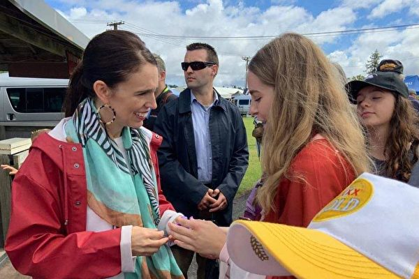
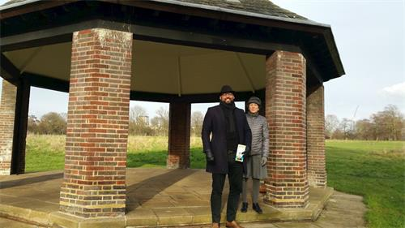
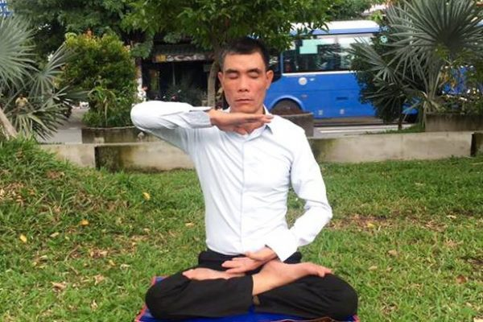

<b>直连不必翻墙 必看视频 http://118.161.49.82/</b>

<h1 align="center"></h1>
<h1 align="center"><a href=https://github.com/3fmd/gm/blob/master/epub.md>免费下载好书 下载 epub 视频 音频 图文 电子书</a></h1>
<h2 align="center"><a href="https://github.com/3fmd/gm/blob/master/gm/download/Reasily1802h.apk?raw=true">手机必备Reasily - EPUB 阅读器apk 请下载安装 才能阅读影视epub</a></h2>

<h2 align="center"><a href="https://github.com/candysn/nini/blob/master/wnn-1.md"><b>2018年5月~8月看更多</a></b></h2>
<h2 align="center"><a href="https://github.com/candysn/nini/blob/master/wnn-2.md"><b>2108年9月~12月, 看更多</a></b></h2>

<h2 align="center"><b>她用实际行动证实了医生的修炼之路</b></h2> 

在大法中修炼的中国医生（网络照片）

【希望之声2019年3月22日】（本台记者慧光综合报导）我的家在中国大陆东北的辽宁省，我是一家大型医院的医生。我在医生岗位上工作了几十年，虽然工龄不短，但因我长期在内科住院部工作，经常打交道的大多都是有明确诊断后的病人，所以在工作中不需要太多的思考。也有人羡慕我，认为我的工作单纯、轻松，然而长期下来才知道后果，我的临床经验很少，尤其是对外科、皮肤科、妇产科等科系的病人，我的治疗经验几乎为零，就是内科也只是对单纯的几种病有一些经验，谈不上有多高水平。之所以这样，是因为我知道在大陆的国营医院，医术其实并不是最重要的，最重要的是人际关系，只要人际关系搞好了，职称、评级、先进都少不了，有了这些经济效益自然就跟上来了。

1999年以前，在朋友的推荐下，我走入法轮功修炼。我的身体没有太大问题，自然不是奔着祛病健身来的。通过阅读《转法轮》和听师父讲法，大法的法理深深的打动了我。看着当前人类道德行为的低下，真可谓触目惊心，而自己一直是随波逐流，不知道人生的意义究竟是什么，糊里糊涂的活了几十年，想想都感到后怕，因此我下决心做一名真正的修炼人，在行医中修好自己。

修炼以后，我开始用“真、善、忍”的标准指导自己的工作，对病人体贴周到、热情，很多病人都说我像他们的亲人一样，我也从不在行医过程中向病人谋取任何私利。时间长了，领导也知道了我的为人，经常将他们的亲属直接安排给我诊治。

几年前，一位亲属要开设诊所，需要各方面都精通的全科医生，就找到了我。可我对很多常见病都缺乏经验，才认识到自己的医术不行，就没敢答应。但这件事引起了我的思考，师父要求我们无论在哪个行业都要做一个好人，否则就不能算作修炼人。而我作为一名医生就一定要当一名好医生，否则空有其名，也不能达到修炼人的标准。认识到这个道理后，我就提出申请到临床科室，同时开始认真学习业务，与以往不同的是，我用大法的法理作指导，业务水平提高的非常快。比如遇到难题后，我先是简单的翻一下医书，了解一下大概情况，然后站在法理上去悟。因为修炼是以人体为基础的，法理中对人为什么会生病讲的非常透彻，我用师父的法理作指导，一下子就能抓住问题的核心和关键，从而找到有效的治疗方法。有些医书上没有讲到的或讲的不清楚的问题，我都能找到更准确的答案。我是学西医的，当我换一个视角重新审视西医理论的时候，不仅能使认识更加深入，有些问题还完全超越了它的认识。当然，我也将中医理论结合到行医实践中，收获就更多了。

比如最简单常见的感冒，站在西医的角度很难立刻区分出不同的类型，只能靠经验判断，用药就很难对症。如果站在中医的角度就很容易区分为“风热感冒和风寒感冒”，这样诊治的思路马上就明确了。我按照自己的思路走，很快就能找到最好的治疗方法。为了保险起见，我先在亲属身上验证，用后果然效果显著。在以后的临床实践中，证明我的治疗方案效果又好又快。经我治疗的亲属都反映说：“在其它地方需要长时间才能治愈的病人，而在你这里一、二天就好了。”

有几次我遇到了高度过敏体质的病人，这种人一般对多种药物过敏，询问时有的还刻意隐瞒，可用药后立即就会出现强烈的过敏反应。在常规抢救用药不见缓解的情况下，我会急中生“智”，找到特殊的治疗方法，而且立即见效。有的病人家属过后对我说：“以前也出现过类似的过敏反应，被送到大医院抢救都没你治的快。”

我听说有一味中药可以治疗糜烂性胃炎，就让我的一个亲属服用，服用后很快好转，胃镜复查时已经痊愈。而西医对糜烂性胃炎是很难治愈的。后来我又研发了两个中药方剂，一个是治疗肠炎；一个是治疗“帕金森病”。我的邻居患有慢性肠炎，久治不愈，我让他按我的方子服药，结果两天就明显好转，十天痊愈。一年后再见到他时，病情仍未复发。治疗帕金森病的方剂，经过我反复验证，也是一个可行的治疗方案，由此我也体验到了中医中药的博大精深。可是药监局在审核时却因我没有中医上岗证而禁止我独立配制中药，我只好停用了。

我能够根据病人的病症、体征迅速确诊并很快找到有效的治疗方法，业务水平提高很快。一年后我基本上能做到对常见病心中有数，对不同类型的病症能够应付自如。

然而修炼的路并非是一帆风顺的，心性的提高只有在矛盾冲突中才能体现出来，在这方面我也经历了很多。比如，有一个面部过敏的病人，我给她治疗后很快痊愈，但她却说是用“面部保护霜”治愈的，我当时听了心里很不是滋味，因为我知道这是不可能的。几天后当她再次过敏时，她才跟我讲了真话。

曾经服用过我配制的中药治疗的病人，有的后来知道我没有中医处方权，病治好了还跟我讲条件，让我哭笑不得。遇到这些事儿有时我的争斗心、怨恨心、报复心等执着心都出来了，当我意识到这是在考验我的心性时，就能够心态平和的去对待了。无论遇到什么样的矛盾，我都会一如既往的热情对待病人，有的病人看到后曾问我：“碰到这样不公平的事情，作为旁观者我都看不下去了，怎么就看不见你生气呢？”后来还有一个病人对我说：“过去有句话说，宁可得罪君子而不得罪小人，像你这样的医生，为人善良、和气，没有坏心眼，得罪你都没有关系。”

现在中国大陆的很多医院，医风败坏，多开药，多收钱，拖延治疗过程以达到多收钱的目的，甚至敲诈、勒索病人已经司空见惯了。有的亲属也鼓励我这样做，我只是笑了笑。我始终坚持，无论出现任何情况，我都要用“真、善、忍”的标准来衡量，不符合这个标准的绝对不动心。

由于长期坚持诚信服务，加之我的医术提高很快，治疗方法简单快速，也逐渐赢得了病人的信任，也为我自己开创了很好的环境，有的病人（包括邻居）人前人后都亲切的叫我“法轮功大夫”。

<h2 align="center"><b>三退声明传心声（下）</b></h2> 

香港法轮功学员举行声援三亿人退出中共党团队组织的盛大游行活动。（大纪元）

 
【明慧网二零一九年三月二十三日】（接前文）中共建政七十年运动不停，灾难不断，多少家庭遭受摧残。很多人从家族的经历、个人的亲身经历中感受到中共的残暴，或从《九评共产党》、大纪元网站等了解到真相，认清了中共的本质。

去年12月18日，来自司法领域的谭明在大纪元网站上发表三退声明：“我是一位在公检法司领域里的工作人员，常年的工作，深知共产党残害老百姓的恶行，它将遭到天谴和报应。我是一个有良知的人，我知道只有早日退出这个邪恶的组织，远离邪恶，等天灭它的时候，保佑我的平安。”

3月17日，来自安徽的“三叶”在声明中说：“我是一名历经2018年中共制造的P2P暴雷潮中的金融难民。可怜自己辛苦积攒的十几万元被洗劫一空，要知道，当年我父亲病重期间都舍不得用这笔钱看病啊！这是用命省下的钱！共产党金融创新缺乏监管苦果，我们金融难民绝不承受！以前懵懂无知，跟着大家入了少先队、共青团这些魔教组织，经历了这次大劫难，我彻底清醒了，现在郑重声明，我退出曾经加入的少先队和共青团，和共产邪党彻底决裂！天佑中华，也希望亿万国人不要再沉迷于共产党宣传的岁月静好假相，早点退出这个邪恶组织自救。现在，已经到了泰坦尼克沉没前最后的狂欢时刻！”

2月18日来自贵州的万醒称：“我是一名曾经参加过所谓的中越自卫还击战的老兵，现今为生活所迫，难以维持基本生活，通过法轮功修炼者的讲清真相及亲眼所见，彻底认清了共产党的虚伪、凶残、狡诈、无赖的流氓本性，在此，我郑重声明退出邪恶的中国共产党。”

2月10日发表声明的李一说：“我是当年下过乡的知识青年，当过红卫兵、插过队、回城待过业、当过临时工。我人生最美好的时光都让中共的运动给毁了，中共给中国人民带来的苦难罄竹难书，只有解体中共才能把中国人民彻底解脱。我在此郑重声明：退出当年被哄骗加入的少先队、共青团！废除宣过的毒誓，彻底与邪党划清界限！”

2月7日发表声明的辽宁省营口市访民王素娥：“上访十三年无果，八次坐牢，六个取保，被边控内控被维稳人。无（不给）退休金、无（不给）医保、无（不给）低保、无土地，让我（当今杨白劳）怎么生存？因此我王素娥郑重声明退出中共！！！”

湖北武汉吴华堂在去年12月24日的声明中称：“91岁高龄，当年参加长江大桥建设，时为团支书，今天听明白了真相，愿意退出邪党附属组织。”

2月4日发表声明的山东淄博张云杰称：“我是一个历史学者，一生致力于复兴中华传统文化，努力将中国变成一个正德正善、自然良循的社会。然而，邪恶的中共‘党文化’正在将中国文化糟蹋的面目全非。在阅读了《九评共产党》之后，我深刻地体会到了中共邪党的罪恶，现和父亲张笃银一起声明退党。”

2018年12月30日来自北京的朱贤声明：“我是某大学的一位教师，近年来深感中共的可恶。原本以为中共会变好，可是它越来越坏，是根本不可能变好的毒药。今天，我决定退出中国共产党。”

今年2月发表声明的李田英说：“我已是九十四岁高龄的普通百姓，被共产党骗了一辈子。……有幸聆听大法弟子讲真相，然我内心确切领悟到宁信地狱鬼、不信共产党的嘴。天要灭共匪的时辰到了，我真的如梦初醒决心脱离中共这个大恶魔的长期束缚，决不能做他的陪葬品，赶紧退出这个大魔教邪恶党组织，老天肯定会保佑善良人的。但愿同胞快快觉醒！！！期盼共产党在地狱中做自己的鬼梦吧！”

2月1日发表声明的聂吾明称：“禁锢思想，无法禁锢我的灵魂。一个只会禁锢思想的党派，就不会是一个得民心的统治者，从小所受的洗脑教育，让人蒙蔽了双眼，我了解了它的邪恶本质后，决心退党，以免在有生之年，对不起自己的灵魂。”

化名“士兵”的人在去年12月31日的声明中说：“我在部队加入的中国共产党，本来以为是保家卫国最后却成了共产党的一条狗，维护中国共产党这个无耻的政党的统治！中国共产党迫害了多少中国人民，造就了多少贪官污吏，欺压群众，八九六四更是血债累累！中国共产党是一个欺骗和土匪组织，从七九年起，中国人被中共洗脑变得没有人性，只认钱！没有了伦理，我在这里郑重声明退出中国共产党、退出中国共青团、退出中国少先队！”

去年12月15日发表声明的“正义”称：“我是一名国企的基层管理人员，被共产邪党拉人其组织被动入党，最近又被绑架成支部书记，共产党邪恶至极，不允许你有任何信仰，现在又利用巡视、督查、和网络平台监视等手段强迫学习其理论，如果不做或要求退出其组织，就会给你扣上政治问题的帽子，用工作和职位威胁你。共产党是幽灵邪党危害人类，我以化名正义郑重声明；退出共产党的党、团队及一切组织绝不和共产恶党为伍，和共产党划清界限。”

来自圣地亚哥的黄卫红去年12月14日发表声明：“我看了神韵晚会，揭露中共迫害法轮功真相，和领略了5000年的中国传统文化，竟然要由一个巡回世界的舞台剧发扬。我决定在此声明三退。”

来自美国佛罗里达州的林正心2月16日声明：“自从看到委内瑞拉，以及看到诸多历史真相之后，我看到了整个共产主义的虚伪、邪恶和极端的恐怖。因此，我在此说明：本人林正心在此，公开退出共产党、共青团和少先队，并且不会再允许各种变种的共产邪说污染我的大脑。希望人类永绝共产祸患！祝一切反共的人一切安好！

这些三退声明见证了中共的独裁与残暴，也见证了世人的觉醒。希望更多的人能加入三退大潮，为自己选择美好的未来。

（完） 

<h2 align="center"><b>冲破谎言找出路，“610”也有明白人</b></h2> 

向道之心通苍天 醒悟之后莫迟疑

 
【希望之声2019年3月17日】（本台记者慧光综合报导）

“610”（也称“610办公室”）是指中共专门从事镇压、迫害法轮功并凌驾于公检法之上的非法组织，“610”组织内的人员都是直接参与迫害法轮功的骨干。即使在这样一个十分邪恶的组织内，也有一些良知尚存的人，他们通过与法轮功学员的长期接触和观察，渐渐明白了中共迫害法轮功的真相，从而在走投无路时反过来求助于法轮功。

我生活在中国大陆北方的一座二线城市，是一名普通职员，修炼法轮功多年了。1999年中共开始迫害法轮功之后，我多次与“610”打交道，都是在他们要陷害、加害于我的时候，但没想到他们中的人后来也有求我的时候，一开始让我感到很诧异。

2006年春天，有一位“610”的女成员私下里找到我，对我说她得了肝硬化，已经很严重了，医院表示没有什么好办法，没有治愈的可能了。因为她母亲就是得这种病离世的，所以她的压力非常大。因她在“610”工作期间与我有过接触，对我的情况比较了解，所以她对我说：“我知道有很多得绝症的人都是因为修炼法轮功而获得了新生，我也想修炼法轮功，希望你能帮我。”我们进行了认真的交流，最后她表示已经彻底认清了中共的邪恶本质，要退出中共。我送给她一本《转法轮》并教会了她五套功法。开始修炼后没多久，她的病很快就好了，此后再没吃过一粒药。她全家人都目睹了她的变化，有不少人也从此修炼法轮功。

从她的变化中我也意识到，即使在最邪恶的机关里，也并不是人人都那么坏，有的人是被江泽民流氓集团“绑架”着稀里糊涂走进去的，当他们明白了真相的时候，他们也就知道自己该怎样选择了。

2011年5月13日上午，有一个陌生号码给我打电话，连续打了四次我都未接。到了下午这个号码又打过来了，这次我接了，才知道是我过去的一位同事，说有要紧事想跟我见面。因为好久未见了，我们就约定了见面地点。见面后他三言两语就转入正题，他说他得了重病，治疗无效，对医院失去了信心。见他表情凝重，我知道他没有说谎，不像是在骗我，于是我就直截了当的问：“那你想怎么办？我能帮到你吗？”

没等我说完，他就迫不及待的说：“我想学法轮功，现在只有你能帮我了。”

听到这里我迟疑了，因为我知道他有一个很要好的朋友是“610”办公室的官员，那个人我也认识。我被绑架进洗脑班时，他的那个朋友就是负责“转化”我的骨干。一时间我的心中翻出了很多疑问：难道他是“610”派来试探我的吗？还是想利用我达到更大的目的？这些年“610”为了抓捕和迫害我们什么手段都用了，无所不用其极，我不得不留个心眼儿。

看到我没有回答，他似乎察觉了我的迟疑，就对我说：“好久不见了，有些话三言两语也说不清楚，看你什么时间方便我们需要详谈一次，我会把事情经过都跟你说。”看到他的诚意，我答应第二天让他到我家来。

第二天他如约前来，详细介绍了他近几年的情况和事情经过。

原来在最近几年里他的身体发现了多种疾病，先是诊断有胆囊炎，后来肝、肺、胃等器官都出现异常，随后又发现患有高血压。而现在又发现了一个医院无法确诊的综合病症，就是全身多个部位都出现剧烈疼痛，几乎是每时每刻，不同部位的痛感交替出现，有时腰、背部像有刀扎、刀割一样，有时像抽筋拔骨般难受，更要命的是心脏经常出现窒息一样的感觉，就像要死过去一样。最痛苦时他说真想拿刀捅了自己，尽快了结。

这次发病后他已经服用了长达十七天的含有激素的药，可病情没有一点减轻。他才四十多岁，感觉自己全身的器官都在走向衰竭。当地市级医院的医生都感到纳闷，从拍出的片子看，只能预判情况很不好，但无法确定究竟是什么病。医生建议他立即转往北京的大医院检查治疗。

他还说这一次病情来势凶猛，又痛彻骨髓。尤其到了晚上，剧烈疼痛常使他整宿不能入睡。偶尔睡一会儿，就会梦见跟他过世的父亲在一起喝酒聊天，并说一些不着边际的话。朦胧中他感觉死神在一步步向他走近。

无可奈何之下，他向他最要好的朋友——那位“610”的官员倾诉，并将后事交代清楚，让对方在他死后照料他的妻儿。说到伤心处俩人都心如刀绞，抱头痛哭。不料到最后，对方却给他一个十分意外的建议——让他学炼法轮功，还推荐他来找我。

谈话中了解到，他的这位在“610”工作的朋友是因为能言善辩，被政法委看中，调其到办公室工作。其实在那次洗脑班“转化”我的过程中，我跟他已有过多次交流，交流中我能感觉到他对中共为什么镇压法轮功有疑惑，我向他讲述了大量事实，使他明白了中共迫害法轮功的真相。日后他也接触了不少法轮功学员，对我们的情况有了更多了解，所以才在朋友危难之际，劝朋友找我学炼法轮功。

听着这位同事的讲述，我也被感动了，我知道他是真诚的。之后我教会了他五套功法，并嘱咐他多学法轮功的主要指导书《转法轮》，他都欣然答应了。

一个月之后，他的病情有了明显好转。惊喜之余，他写下一首诗表达了自己的真实情感：

重疴八载难医治

几将后事付遗言

旦夕祸福由宿命

半生名利悟空然

喜结圣缘修大法

主佛挥手化灵丹

阴霾扫尽乾坤朗

精修正果路通天

<h2 align="center"><b>抛弃中共 大陆民众三退声明传心声（上）</b></h2> 

香港法轮功学员举行声援三亿人退出中共党团队组织的盛大游行活动。（大纪元）

 
【大纪元2019年03月25日讯】“如果民不聊生无法让我们动容，如果邪恶无法让我们清醒，如果正义已经远离我们而去，那我们存在的意义何在？本人声明退出共产党及其相关组织，远离邪恶，为生命迎来新的希望。”

这是化名为“赤乌鹏”的一位大陆民众，2019年1月10日在大纪元网站上发表的“三退”（退出中共党、团、队组织）声明。

2004年11月19日，大纪元发表系列社论《九评共产党》，全面揭露了中共邪恶、残暴、谎言欺骗的本性。自此，中国人退出中共党、团、队组织的“三退”运动波澜壮阔。迄今为止，在大纪元退党网站上声明“三退”的人数已超过3.2亿。

下面是选自发表在大纪元网站上的“三退”声明。

<b>警察的觉醒</b>

一名化名为“学历”的警察在2019年1月8日的声明中写道，他是派出所的警察，开始时也跟着迫害过法轮功学员，可后来看到政府机构对法轮功学员不讲法律，而且是极其残忍地对待他们。他看不下去，可又无能为力，就抱病号不去上班，后来干脆办了病退。

“今天听了大法弟子给我讲了大法真相，我彻底明白了，是江泽民魔头和邪党干的这场泯灭人性的大恶事，原来中共邪党的根就是魔鬼撒旦，反天、反地、反神佛、反人性。中国人都被邪党给欺骗了，我坚决退出邪党的党、团、队一切邪恶组织。”

来自黑龙江省佳木斯市的张晓梅也是一名员警，她在2018年11月11日的“三退”声明中称，她接触过几个法轮功学员，个个都那么善良，而她接触的领导和政府官员都那么唯利是图。中共的“扫黑”实际是共产恶党的流氓文化，把好人“培养”坏，把坏人“培养”得更坏。

“中共恶党就是最大的黑恶势力。迫害好人的一定是邪恶的。”所以，她退出了中共党、团、队组织。

<b>亲历中共的迫害</b>

2018年10月10日，来自北京的景才俊在声明中说，他曾在中共野战部队服役过。1999年，部队要求他们参加抹黑法轮功的培训教育，以法轮功为敌人进行作战训练。

他说，他家族祖辈的家产、田地等私人财产，在1949年都被中共剥夺。他的家族有40多人都饱受中共的迫害。诸如升学、提干等，都与他的家族无缘。

“我了解中共杀人的历史，了解中共栽赃法轮功的事。我要退出自己曾经加入中共的少先队、共青团邪恶组织。”

<b>被法轮功学员所感动</b>

来自南京的禾苗在2018年10月7日的声明中说：同单位里有个70岁的同事能打乒乓球，看到她矫健的身手、和善的态度、白里透红的肤色，感叹不已。大家都知道她已修炼法轮功22年，期间从未报销过医药费。她虽然因传播法轮功真相资料曾被拘留过，但始终不放弃修炼。

在打球休息的时间，她给禾苗讲了很多，列举了本单位很多明真相者得福报的事例，活生生的例子很有说服力，她还讲了贵州那块带有天然形成的“中国共产党亡”字样的藏字石以及“三退”的意义。

“跟共产邪党划清界限，以保平安”。禾苗声明自愿退出曾加入过的少先队和共青团组织。

2018年8月3日，化名为“天地良心”的人士介绍说，他是一名在全国发行的某杂志社的领导，周末出差的旅途中有幸听到“三退”保平安的事，对此很赞同。他说：“我很佩服法轮功学员，敢于坚守自己的信仰‘真、善、忍’，敢于对中共邪党的邪恶说不，这是很了不起的”。

他还说，眼下在中国大陆，出现信仰缺失、道德观麻木，人们看不到中华民族的未来和希望。他认为“三退”是一件很伟大的事，“虽然我没有勇气像法轮功学员那样去做，但是我很赞同，恢复中华民族的传统文化和美德，抛弃中共邪党的无神论，这是对的，在此我声明，退出中共邪党”。

来自黑龙江省佳木斯市的郑彩莲，在2019年1月3日的声明中说：她遇到过一位法轮功学员，他对她说，法轮功祛病健身有奇效。她问他，“你不怕危险吗？”他说，“我不怕，法轮功救了我的命，我希望炎黄子孙都能幸福安康。”

这位法轮功学员的话深深地感动了她。她表示：“自己好，希望别人也好的人，是大法弟子的慈悲与善良；自己好，不希望别人好的是中共恶党的歹毒与邪恶。”比如，贪官遍地，到处搜刮民财；贪官吃特供，而百姓吃的食品，有毒有害及致癌物 ⋯⋯

她说自己是佛教信徒，认识到：“中共恶党破坏传统文化，灌输无神论邪说，是断炎黄子孙的慧命；有毒食品的泛滥是断炎黄子孙的生命。这是从精神到肉体灭我中华。用心歹毒，邪恶至极。”

因而，她郑重声明退出了中共党、团、队组织。

<b>退出迫害好人的恶党</b>

2019年3月17日，来自黑龙江省佳木斯市殷敬莲在其声明中说，他是市人社局的干部，20多年前，一位同事因患肝癌没上班，后来修炼了法轮功。

一次，五月节局里每人分十斤鸡蛋，最后只剩五斤鸡蛋，办公室给这位炼法轮功的同事送去五斤鸡蛋和五斤鸡蛋的钱，这位同事收下了鸡蛋，但没要五斤鸡蛋的钱。

一年多，他没报销一分钱医药费，给医保局省很多医药费，局领导研究决定给他5万元现金，让他看病用。他说自己修炼法轮功身体挺好的，不能收这钱。

这两件事使单位的人都很感动，“一个人人向钱看的拜金时代，修炼法轮功的人竟然如此高尚，如此善良！当今社会贪官污吏比比皆是，这中共恶党不惩恶扬善，却迫害修炼法轮功的好人，真是邪恶至极！作为中共的一员是我的耻辱，我声明退出中共恶党的党团队组织！”

2018年12月26日，来自黑龙江省佳木斯市典志莲留言，说自己是小企业主，深受中共贪污腐败之苦。2018年区税务局某局长的孩子结婚时大操大办。局长在饭店门口收钱，背个大包，钱装得满满的，还不止一次。

他说，中共说反腐，只是为了维护腐败的政治体制，现在的官员已经无官不贪、无官不腐，“暴政猛如虎”。

他介绍说，本企业里有个法轮功学员，是企业里最好的员工，却屡遭迫害。他无不感叹道：“穷凶极恶迫害好人的恶党暴政，扼杀了中国人的善良，也扼杀了中国人勤劳创业的热情。中共暴政是中华民族的悲哀，也是世界文明的悲哀。我真心退出邪恶的中共党、团、队组织！”

资料来源：明慧网 

<h2 align="center"><b>“两次绝处逢生——主治医师都感到震撼的奇迹</b></h2> 

生命奇迹一念间 何去何从看人心

 
【希望之声2019年3月15日】（本台记者慧光综合报导）我是中国大陆河北省人，是生活在一个小县城的普通农村妇女。我修炼法轮功已经二十年了，在这二十年里，我经历了很多磨难，也收获很多。师父不仅给了我一个健康的身体，也给了我一个完整的家。尤其是我丈夫在两次面临生命危险之际都转危为安，堪称人间奇迹。

2003年正月，当时我被非法关押在河北省高阳劳教所。正月十九日晚上，我丈夫在马路旁等车时，被一个酒后驾驶摩托车的人给撞了，据说当时整个人都飞起来了，然后又头朝下跌落到地上，当时流了很多血，人也昏迷不醒了，在场的好心人打120急救电话才被救护车送进了医院。

没想到更糟糕的事情还在后面。肇事者怕我丈夫成为植物人，会让他们承担巨额赔偿，就派了三个蒙面人闯进抢救室，当着我家人的面，拔掉了丈夫身上的氧气管和输液管，还把他从床上拖到地上，在他受伤的头部用脚又踢又踩。家人都给他们跪下了，恳求他们放手，但他们根本不理睬。后来是医护人员打了110报警，他们才逃跑了。后来听说肇事者被抓了，但因为公安局里有靠山，关在看守所里没几天就被偷偷放走了。

随后医院就下了病危通知书，说人已经不行了，没法抢救了，准备后事吧。亲属中有人不忍心，就去北京请来了一位脑科专家。专家诊断后说，病人是脑干损伤、头部粉碎性骨折，还有右眼球破裂、锁骨及肋骨等多处骨折。专家强调说：就脑干损伤这一项就没有活下来的，最多只能维持三天。

即使这样，亲属也不愿将他抬回家，说怎么着也得等病人的妻子回来见一面再说。出事的第三天，我弟弟就去高阳劳教所交涉，把情况跟他们说了，说必须要我回家才能处理，别人都做不了主。劳教所百般刁难，最后给他们送了八千元钱才同意放人。

当我赶到医院的时候，看到躺在病床上的丈夫面部模糊，模样已经辨认不出来了，而且呼吸困难，神智昏迷。我趴在丈夫耳边对他说：“你一定要活过来！我一人炼功全家受益，我师父会救你的，你不能就这样稀里糊涂的走了。”

接下来我每天都用耳机让他听师父讲法录音，跟他说话、交流，给他讲我们修炼人的故事。同病房的一个病人看到后很不解，对我说：“他什么都不知道，你这样做有用吗？”我说：“我相信他会好起来的。”我看到在场的人都在摇头。

到第五天时，丈夫突然出现呼吸急促，情况十分危急，医生就把他的气管切开了。在气管切开瞬间，从刀口喷出一口痰直达三米远，把医生都吓一跳。医生还在他的头部打了两个眼，接上了引流管，并把他的全身用冰块围上。即便这样，我仍然不想放弃，照样每天让他听师父讲法，与他交流。到第十六天的时候，医生看他还没有死，认为最危险的时间过去了，就把他身体周围的冰块撤走了。

一个月后，他还是没有醒过来。

有一天上午，一位法轮功学员拿来了一个护身符，我接过后对丈夫说：“这是‘法轮大法好’的护身符，你想要吗？”没想到他慢慢的抬起左手。当我把护身符放到他手里时，他接过护身符还做出了要往上衣兜里放的动作。在场的人都看到了，有人惊喜的喊起来：“他会动了！他知道拿护身符了！他知道有上衣兜了！”医生、护士听到喊声后也都围了过来，主治医生大声说：“太神奇了，我还没见过脑干损伤能活下来的人，出奇迹了！”

从那以后丈夫就一天天好起来了。

两个月后，护士拔掉了给他灌食的胃管，让他学着自己吃饭。开始时一口饭含在嘴里一天也咽不下去，他已经不会吞咽了，也不会说话。后来把插在他气管里的管子也拔了下来，等到刀口愈合了，他也就逐渐的会说话了。我曾问医生：“我家的病人气管切开后怎么就不会说话呀？在天安门自焚的刘思影，为什么气管切开了还能接受记者采访，和记者讲话、给记者唱歌呢？”医生说：“这可骗不了我们，那真是假的，都成笑话了。”

此事惊动了曾经来给丈夫会诊的那位北京脑科专家，他专门来医院查看。我听到他对主治医生说：“这个病人怎么这么特殊？病房里整天都是人，连楼道里都挤得满满的？”医生对他说：“病人是炼法轮功的亲属，来看他的人很多是炼法轮功的，大家都像一家人一样待他。”

等到丈夫基本恢复后，我们就出院回家了。尽管身体恢复了，可是他却出现失忆状态，过去的什么事都不记得了，无论做任何事情，每个动作都得从新学，但我仍然坚信奇迹会出现，仍然坚持与他一起学法交流。

有一天夜里，突然听到他喊“师父！师父！”我急忙打开灯问他：“你看见谁了？”他说：“师父来了！”我又问他：“师父跟你说什么了？”他说：“师父叫我看书。”

我连忙拿来《转法轮》，问他：“封面上的字是什么？”他一个字一个字的说：“是—转—法—轮”。 听到他清楚的声音我激动万分，平时他说话都是不连贯的，发音也不清楚，可他此时却能清醒的认识《转法轮》，这不是奇迹吗！

此后他的身体状况恢复的更快了，不到一年时间就跟正常人一样了。

2010年，我丈夫又被检查出患有胆结石。到了6月份，因胆管被结石堵住，肚子大的可怕，尿和全身都是黄的，人也昏迷了，有时还抽搐。到医院检查后，医生说是因胆结石导致肝坏死造成的，各项化验结果都很吓人，如此严重的病情医院已经不收了，是托关系找到院长开口才允许住院的。

我儿子是学医的，为了不留遗憾，儿子非要把他父亲接到他所在的医院治疗，说死也得让他死在医院里。到医院安置好后，我就准备炼功。儿子对我说：“我爸都昏迷几天了，你还像没事人似的。你没看看这是什么地方，到处是监控！”我说：“我是炼功人，在什么地方都得炼功。”

我俩正在争论时，突然听到丈夫大声说：“法轮大法没有错，法轮大法是正法！”儿子惊呆了，哭着说：“爸呀，你终于醒过来了！”几个小时后，丈夫的肚子消下去了，身上的黄色也在快速的往下褪。

第二天上午，儿子找来省内最好的医生做检查。医生检查后诧异的说：“胆囊是空的，肝是有损伤，但石头哪去了？”我儿子当时就哭了，对医生说：“我爸的经历是医学上无法解释的，法轮大法好！奇迹都是法轮功创造的。”我当时也泪流满面，我知道是师父将他的结石拿掉了。

以后每逢过年时，不修炼的儿子都会制作了一张电子贺卡，代表我们全家人给师父拜年，感谢师父两次救了他父亲的命，感谢法轮大法给了我们一个完整的家！

<h2 align="center"><b>“好口碑和好素质来自于修法轮大法</b></h2> 

 
【明慧网二零一九年二月十八日】我修炼法轮大法二十年了，在中共诽谤、迫害法轮功时，我给各级官员和公检法司人员寄信让他们了解法轮功真相，邮寄的真相信被查出来，我被撤销领导职务，后多次被迫害、非法劳教。回来后，我被安排给局里搞办公室。我是法轮功学员，无论在哪个岗位上，都要严格按法轮大法的标准要求自己。

有一次单位会计叫我找人开个药发票，把我几百元医药费报了，不报以后就不能拿现金了，同事们都纷纷到处开发票。当时我想，我是修炼真、善、忍的法轮功学员，怎么能够搞假的呢？当时孩子上大学正需要钱，我被迫害时工资降两级两档，年终奖金别人拿七八千元，我只拿五百元。当时那个环境很艰难，局里有人叫我某某局长，党委书记批评说：“你们阶级观念不强，不能叫她局长了，以后只能叫名字。”我是修法轮大法了，坦坦荡荡面对一切，不怨恨任何人，在艰难困苦的环境中，不能给大法抹黑。为这事分管领导还专门给我说，家里经济那么困难，还是开个发票报了吧，我谢绝了领导的好意，最后还是没报。假如我没修炼法轮大法，肯定会去开假发票报账。

二零零八年四川汶川大地震后，单位灾后重建，从四楼到一楼，几十间办公室的窗帘、灯具、办公桌椅、文柜等全换新的，一付旧窗帘价值千元，大家都往家拿，叫我要啥随便拿。但我是修大法的，不能得不义之财。我严格按法轮大法要求自己，自始至终没有拿过一分钱的东西。

单位每年都要办两次培训班，每次都要我去采购上万元的物品，同路的驾驶员有时需要买一点小东西，我都不会要的，开发票时商家都要问我开多少，我说是多少就开多少。并给他们讲：我是修法轮大法的，师父叫我们按真、善、忍做个好人，修炼人讲有失有得，不能得不义之财。还给他们讲真相劝“三退”（退党、退团、退队）。他们都说法轮功学员太好了，现在找不到你们这么好的人了，你们师父太伟大！法轮功太了不起。

单位领导很多重要事都交给我办，特别是购物用钱的事都叫我去办，因为知道我正派，不搞假、不贪不占。在迫害法轮功严重时，单位公章交给办公室其他人保管，没多久分管领导又拿来叫我保管，她说：“有人反映他给别人盖章，还叫别人给他买这买那的，还是你们修法轮功的人放心，没有私心，不贪不占。”其实在社会这个大染缸中，假如我没修炼法轮功，根本就不知道失与得的关系，在工作之便也可能会占些小便宜，办公室的本子、钢笔、墨水等东西，自己需要拿一点也不算什么。但是学法轮大法后，不是因为工作在家赶材料的需要，绝不会把办公用品拿回家，自己需用就到商店去买。

有一次，企业给局里送来几十把雨伞，每个职工一把，其中有一把是坏的，按一般人的理，近水楼台先得月，不会把坏的留给自己。因为我是法轮功学员，我没有向领导和同事们说这件事，把坏伞留给了自己。

在办公室工作这种事情经常遇到，我都是自己吃亏没关系，不让别人吃亏。正因为我能严格按法轮大法要求自己，领导和同事们都很信任我，他们多次阻止“六一零”（中共专门迫害法轮功的非法组织）恶人干扰我，同事们多次提名我当优秀公务员。

有一次，局长叫办公室主任买了一篮鲜花和一个大蛋糕，订了一大桌饭菜，说是给我办生日，我知道后，马上跑去给办公室主任说：我生日早就过了，不要花费单位的钱了。办公室主任却说：“姨啊，局里从来没有这个先例，是局长看你人品好，为单位做了那么多工作，一个人干了三个人的事，没有一点怨言。今年单位各项工作都得到上级部门的表扬，你的功劳最大，你太辛苦了，大家在一起轻松轻松。”

几届局长都主动找省市县相关部门，要求解决我的工资待遇，虽然没有结果，但我很感谢明白真相的人为我做的一切。

退休前，单位领导和同事及家人全都做了“三退”，大家都很尊重我，给他们讲法轮功真相都愿听。退休后我到单位办事，新来的五个年轻人我也给他们讲真相做“三退”（在海外退党网站发表退党、退团、退队的声明）。

其实，我有好的口碑和好的道德素质，都源于师父，源于大法。在人类道德下滑的今天，我的心性境界能得到升华，只有修炼法轮大法才能做的到。 
 

<h2 align="center"><b>“国际银行女主管的幸福人生</b></h2> 

越南国际银行（VIB）风险管理部门的业务主管范红（Van Hong）

 
【希望之声2019年3月18日】（本台记者慧光综合报导）范红（Van Hong）是越南人，是一位漂亮的年轻女性，目前是越南国际银行（VIB）风险管理部门的业务主管，是一位事业有成的白领。

她从小天资聪明，才华横溢，无论是学习成绩，还是其它方面的表现，都高人一筹，使她在学校里小有名气。在家长和老师眼里，她一直都是好孩子。

然而她的童年却是不幸福的。父亲是一名教师，但是长期生病，后来不得不辞去工作。长期的病痛折磨使得他的脾气变得暴躁，常会因为一些小事儿殴打母亲。那时候她已经有了一个弟弟，全家只能靠母亲微薄的工资养活，可想而知生活的艰难。范红回忆说：“每次回家看着憔悴的父亲和忍辱负重的母亲，心中就非常难过。其实我知道父亲是爱母亲的，只是因为生活的压力和病痛的折磨而无法控制自己。那时我心中有一个愿望，就是希望父亲和母亲能够和平分手，不要再互相折磨了。”

后来父亲又找到工作，重返讲台，继续教师生涯，家庭气氛就变平和了，母亲的日子也好了很多。然而好景不长，不到一年时间，父亲就因病去世了。在父亲离世的最后几天，她一直陪伴在父亲身旁，看着父亲痛苦的样子，她悲痛欲绝，经常和母亲抱头痛哭。她说这是她生命中第一次经历失去亲人的悲痛，也使她看到了生命的脆弱。她喜欢看书，在她幼小的心灵中，她一直盼望人们能像小说中描绘的那样，无论是贫穷还是富裕，都能过上幸福生活。可随着年龄的增长，她看到的现实总是与她的愿望完全相反，这让她很困惑。

在大学里，她依然保持了自己的优势，无论是学习还是在各种社交活动中，都能够得心应手，游刃有余，渐渐的她的名气越来越大。可任何事情都具有两面性，她也因此形成了自负的心理和霸气的性格，常常自以为是，听不得反面意见，更容不得伤害自己名誉和声望的事。一旦有这种事情出现时，她就会焦虑不安，甚至几天都睡不好觉，直至失眠。俗话说物极必反，人前骄傲的她遇到挫折之后又开始自卑。她回忆说，我经常将自己的弱点与他人的优势进行对比，这让我活得很累。

大学毕业后，她顺利的找到了工作，并很快就结婚了。结婚不久就发现一个问题，她需要一个坚强的丈夫，一个“伟大的男子汉”，可事实并非如此，让她很失望。尔后她越来越强势，女性的特征似乎在淡化，家庭中没有了幸福感。

2010—2012年间，那时她刚刚结婚不久，欠了一小笔债务，想通过投资证券赚一些钱，然而却失败了。看到周围的同事和朋友都能过着无忧无虑的生活，她的心里又失去了平衡。她说：“那段时间我压力很大，也很孤独，几乎无法与人交流，围绕物质利益的数字整天在眼前晃悠，心中有说不出的痛苦。”

2014年年中，她在Facebook上看到一位大学同学发布了一则有关“修炼”的消息，引起了她的注意。这位同学人很聪明，出生在一个知识分子家庭，父母都是科学家，家教很严，是她最信任的人，她们也是很要好的朋友。于是她就向对方询问，“修炼是什么？能让我和你一起学习吗？”对方马上给她发来了法轮功网站的链接，并推荐她阅读《转法轮》。

当她下载并阅读《转法轮》之后，她说：“我读的书也不算少了，可从来没有读过这样的书。书中的很多内容让我耳目一新，而且还有很多内容没有看懂。我提醒自己必须再读一遍。当读过第二遍时才感到震撼。因为书中提到了生命的起源和意义，以及更高层的生命——神佛的存在。神、佛、上帝，他们是谁？我一无所知。可不知为什么，看书的时候我总是情不自禁的流泪。当眼泪夺眶而出的时候，我意识到这不是一本普通的书，这让我很震惊。但我当时还是没有打算修炼，因为我感到自己与修炼者的标准相差太远，我没有信心，仿佛做不到。”

可奇怪的是，在那之后她的健康状况突然变得很差，总感觉呼吸困难，没有力气。那时她孩子还很小，她甚至想到“如果我死了，我的孩子怎么办？就算是为了孩子也不能退缩”，就这样她决定走入修炼。她坚持每天阅读《转法轮》，每天至少坚持炼功二十分钟。当她这样做的时候，第一天还没什么，第二天突然就有了像重感冒一样的头痛并伴随着严重呕吐。因书中讲的很清楚，这是在清理身体，她就没有去管。没想到一天过去之后身体就完全康复了，并且感觉身体变轻松了，甚至感觉像羽毛一样仿佛能漂起来。她说：“这是我一生中从未有过的感受，我没有吃一片药，可是这么快就康复了，这让我很吃惊，原来书中讲的‘净化身体’的确是真的。”

第一次的神奇体验给了她极大的鼓舞，她决定继续往前走。渐渐的，她对《转法轮》书中的内容有了越来越多的理解，对大法修炼也有了更深的领悟。

她说：“当我按照‘真、善、忍’的标准要求自己时，我的生活完全改变了。我曾经认为我很诚实，但在利益面前经常混淆不清，无法把握；我也错误的认为，坚强就是大声喊叫，其实这是一个无法控制自己情绪的弱者表达。现在我学会了包容，不再责备或批评别人。在家庭生活中，师父曾经说过一句话‘当你表现得更像一位女士时，他的行为更像是一位绅士’，这句话如醍醐灌顶，一下子让我明白了夫妻生活的秘诀，也看到了自己以前的问题所在。”

“银行的工作环境紧张而又繁忙，但我坚持用‘真、善、忍’指导自己的一言一行，对同事的错误不在像过去那样批评、指责，而是致力于寻找解决方案。这样做不仅问题很快解决，而且也创造了和谐的氛围，得到了上级和同事们的赞扬。当你变得坦白和真诚时，没有人会拒绝你，因为人性中都有善良的一面。”

“当我对个人利益不再担心顾虑时，我的心灵就变得很轻松。我每天都像上学一样去工作，总是很快乐。有时我一天要工作9—10个小时，但我不感到疲倦。”

“是伟大的法轮佛法彻底改变了我，使我心中拥有了信仰的力量。我丈夫见证了我的变化，也开始修炼。”

“我记得有一项研究表明，只有10％的人口在朝着正向上发展，最终会为剩下的90％的人口带来变化。只要有10％的人能回归真正的道德和传统，它就会很快传播，这个影响是任何力量都无法阻挡的。我相信，如果不是因为中共迫害法轮功，将大量虚假信息和报道传向世界，那么很多人都将得到被救度的机会。我相信美好的一天终将到来，因为真正信仰的力量是邪恶绝对无法摧毁的，那是以深厚内涵为基础的，是攸关每个人生命永远的大事情。” 
 

<h2 align="center"><b>“从造假盛行 谈自焚伪案</b></h2> 

在中共炮制的“天安门自焚”伪案中，“自焚者”王进东重度烧伤，衣服已被烧焦，但其头发、眉毛和两腿间盛汽油的塑料雪碧瓶却完好无损。（明慧网）

 
【大纪元2019年03月19日讯】中国社会乱象，近日又添两桩。

其一是，中共党刊《半月谈》披露“十八大”以来落马高官的学历普遍造假，达到了匪夷所思的程度，一些高校已沦为这些官员的“奴仆”甚至“帮凶”。自由亚洲电台发专文说，中共政治局委员中的七名“博士”生，没有一个是正科博士，他们根本没有在学校集中时间学习；至于“硕士”学位更是笑柄，很多都是大学“贿赂”给他们的，是典型的官场学历腐败的产物。中共司法部前政治部主任卢恩光，因在学历、年龄、家庭情况、工作经历等方面全面造假，被称为“五假副部”。

其二是，日前四川省成都市温江区七中实验学校惊传发霉食材、危及学生健康的丑闻。三月十六日，当地政府却调动大批警力封锁学校，秘密抓捕家长。三月十七日，当地政府在没有一名家长参加的情况下，自导自演了一场新闻发布会闹剧：将最初在现场拍摄照片、揭发发霉食材的三名家长称为“犯罪嫌疑人”，宣称他们闯入小学食堂，撕破食材包装，刻意摆拍成为照片视频传到网络。对此荒唐的新闻发布会，家长们不仅愤怒，更感慨政府蓄意颠倒黑白。

上述场景，西方文明社会感到不可思议，但对中国人而言，却不陌生。“造假”是中共一贯手法，其歪风引领人心沉沦，道德逐步下滑，“温、良、恭、俭、让”等传统品格被鄙视成迂腐幼稚的思想。近年中国很多社会怪像，看似人的素质日益低下，实肇因被“假、恶、斗”的党文化耳濡目染所致。

当年号称亩产万斤粮，却饿死中国人四千万；中共统计本质是造假，信用早已破产。民间广传顺口溜，所谓“村骗乡，乡骗县，一直骗到国务院”，顽疾已久，根治也难。不仅地方造假，上梁不正下梁歪，基层政府需要政绩来升职，高层政府要保GDP增长速度。二零一六年十二月八日，李克强智囊、中共国家统计局局长宁吉喆在《人民日报》撰文表示，一些地方时有发生的统计造假、弄虚作假，违反法律法规。

“造假”更是中共党媒的常用伎俩。曾在《人民日报》麾下《人民论坛》担任副主编的邱明伟揭示一桩事实：记者、编辑常常被迫造假，编造假新闻、假报导，在中共媒体工作的人，大多深谙其道。二零一二年十二月，《人民日报》海外版一篇名为《经济数据造假成统计领域最大腐败 获利大处罚轻》的报导，该报即承认中国的经济数据造假。

造假源于谋取私利。电视剧收视率不断造假，形成了黑色产业链。演艺圈明星流量造假已是行业公开的秘密，“买微博热搜”、“买粉丝”、“买评论、转发、点赞”、“打话题榜”、“维护百度指数”等，成为制造流量艺人的“标配”。

假食品、冒牌货与“山寨版”早已不是新闻。“中国制造”的造假，近年也引起西方国家关注：二零零八年，中国爆发“三聚氰胺毒奶粉事件”，震惊全球；许多新药临床试验数据凭空捏造，罔顾人命；毕业生论文抄袭，遍及中国各高等院校。从本科生、研究生到博士生，从学生到教授，从校长到中科院的院士，甚至爆出学术界跨国论文造假的丑闻。不止是医药行业，实际上中国大陆一切都是假的，只要有利可图，就会有人造假。

流风所及，“造假”泛滥，“假新闻”更席卷中国，其中荼毒世人最严重者，莫过于二零零一年一月二十三日炮制的“天安门自焚事件”，意图诬蔑陷害法轮功，以所谓的五人“自焚”谎言欺骗海内外民众。

一九九九年七月二十日中共与江氏集团动用整部国家机器迫害法轮功，为了实行“肉体上消灭、经济上搞垮、名誉上搞臭”的灭绝政策，不断制造“假新闻”，编造一连串自焚、杀人与敛财等弥天谎言，企图激发民众对法轮功的仇恨。

如果把十八年前的中央电视台“天安门自焚事件”录像画面进行慢镜头分析，便会暴露出很多疑点，说明这场“自焚”事件完全是一场精心布局的预谋与骗局。

一‧在“自焚”事件中被大面积烧伤的小女孩刘思影气管被切开后四天就能接受采访并能唱歌。

二‧《焦点访谈》录影证实，刘春玲没被火烧死，却被警察用重物击打头部倒下。

http://big5.minghui.org/mh/article_images/2014-1-10-minghui-tiananmen-zifen.jpg

三‧天安门巡逻的警察几分钟内从两辆警车里拿出二十多个灭火器和灭火毯“应付”该起“自焚”突发事件。

四‧北京积水潭医院治疗“自焚”大面积烧伤者，不作任何防护。允许记者近距离采访，所有被严重烧伤的人都被紧紧的用纱布包裹，完全违反医学常识。

http://big5.minghui.org/mh/article_images/2011-8-23-minghui-wenzhou-zifen-03.jpg

五‧“王进东”在自焚时衣服已被烧焦，但是最易燃烧的头发还在头上，他腿间的盛满汽油的雪碧瓶却完好无损。在他喊出那句似是而非的口号之前，警察手中的灭火毯却在他头上优闲的摇晃很久，没有丝毫灭火的急迫。

http://big5.minghui.org/mh/article_images/2013-6-5-zifen-1.jpg

六‧在央视和新华社的“自焚”报导中，先后出现了三个不同的“王进东”。台湾大学语音识别实验室受“追查迫害法轮功国际组织”委托，对王进东的声音作了语音鉴定，得出明确结论：《焦点访谈》第一集中的王进东与后来的王进东不是同一人。“追查迫害法轮功国际组织”经可靠途径查获：参与“自焚”的“王进东”是由一名现役军人扮演。

http://big5.minghui.org/mh/article_images/2018-1-30-zifen-truth-01.jpg

不仅上述造假的凿痕太过明显，《华盛顿邮报》在二零零一年二月四日头版头条发表了调查报告《自焚的火焰照亮了中国的黑幕──当自焚的动机乃加强对法轮功的斗争》。邮报记者菲力蒲﹒潘亲自到自焚身亡的刘春玲的家乡开封实地调查，邻居们说从来没有人看见过刘春玲炼法轮功。

国际教育发展组织于该年八月十四日在联合国会议上，就天安门自焚事件，强烈谴责中共当局“国家恐怖主义”的行为，指控“天安门自焚事件”是对法轮功的构陷，涉及惊人的阴谋与谋杀。声明中说：从录影分析表明，整个事件是“政府一手导演的”。中国代表团面对确凿的证据，没有辩词。该声明已被联合国备案。

令中共极度难堪的是，二零零三年十一月八日由新唐人电视台制作、揭露“天安门自焚真相”的纪录片《伪火》，从各国参赛的六百多部影片中脱颖而出，获得第五十一届哥伦布国际电影电视节荣誉奖。该奖项在记录片领域享有盛誉，其历史仅次于“奥斯卡”。《伪火》影片以触目惊心的画面和精辟严谨的分析，揭示了“自焚”案的诸多疑点，从而证实了整出事件是中共栽赃法轮功而炮制的伪案。《伪火》的视频可在《获奖影片：伪火（中文版）》下载观看。

十九年来，中共与江氏集团残酷迫害修炼“真、善、忍”的法轮功学员，无数善良的学员被非法关押在劳教所与监狱中，长期遭受酷刑折磨，迄今至少已有四千两百多人被迫害死亡。正因为迫害“真、善、忍”，遂使“假、恶、斗”毒害全中国，伦理道德沦丧，人人且为近敌。目前许多中国人唯物是尚，不信神佛。在党文化的薰染下，迷失纯真本性。

学校用发霉食材，黑心是首因；高官学历造假，“假大空”已积习难返。中共炮制自焚伪案，却是出于栽赃构陷，妄图蒙蔽世人；自焚伪案十八年，造假贻害全中国。十几年来，幸有《伪火》在海内外广泛传播，无数民众通过了解“自焚真相”从而明了迫害法轮功的真实情况，人心日渐觉醒。欲匡正社会，必先正人心。“真、善、忍”是普世价值，恰是整饬歪风邪气的解药良方。衷心祝愿中国人回归传统价值，实事求是，唾弃造假，“存真心，说真话，办真事”，提升正气，返回善良，重现华夏古风。 

<h2 align="center"><b>“植物人”的复活</b></h2> 

法轮功学员在炼第五套功法“神通加持法”（网络照片）

 
【希望之声2019年3月12日】（本台记者慧光综合报导）我是中国大陆湖南人，是一名普通女性。1996年8月我幸遇法轮功，从此走上大法修炼之路。我原来一身是病，已经走到了生命尽头，是因为走入大法修炼才使我有了第二次生命。大法不仅改变了我，也改变了我家。今天我就想说说我老伴经历的一件神奇的事。

我老伴原在湖南长沙的铁路机务段工作，1999年3月15日，他突然倒地人事不省，我们赶紧将他送到了铁路医院抢救。在抢救室里他一直处于昏迷状态，好像知觉都没有了。医生检查后说是脑血栓引起的颅内出血造成的。

抢救期间，我儿子请了当地医院有名的专家、教授，包括院长也亲自会诊，但都表露出了无法挽救之意。院长对我说：“我院心脑血管的专家自己都是因为这个病成了植物人，你丈夫送来时已经超过了最佳抢救时间，还能有什么办法？”有些医生、护士也对我说：我们医院的职工得这种病的已经死了好几个了，不死也是植物人，你也得想开点儿，言外之意就是我老伴已经没有生还的希望了。

面对这些专家权威的结论和诸多的议论，我思绪万千，可一想到我本人绝处逢生的经历，我就有了信心。师父说过“一人炼功，全家受益”，这种事情在法轮功学员中有很多很多，我老伴虽然自己不修炼，可他支持我修炼，也算是有缘之人，师父一定会救他、保护他。当然，这件事情本身也是对我的考验，看我在关键时刻能不能坚信大法不动摇，想到这里，我毫不犹豫的对医生说：“我一定要他活着走回家！请你们不要放弃。”

趁儿子在医院陪护时，我回家取了法轮功的主要指导书《转法轮》和师父的讲法录音带到医院，然后就在床边恭恭敬敬的读《转法轮》给老伴听，或者在老伴的耳边播放师父的讲法录音。同时我也在心里祈求师父救他。那段时间，只要有机会我就坚持这么做，不知为什么，我坚信在老伴身上一定会有奇迹出现！

大约过了半个月后，有一天我发现老伴的手指能动了，慢慢的脚也动了，我的心情非常激动，我清楚的意识到——他有希望了！之后他每天都有变化，渐渐的在苏醒。尽管这个过程很缓慢，但几乎每天都有进展。我提醒自己不能着急，仍然抓紧时间与老伴一起学《转法轮》。又过了十来天，他就有意识了，慢慢的能坐起来了，还能吃一点点流质食物了。又过几天他就能说话了，尽管发音听不清楚，可我能听懂他的意思。到这个时候，我就让他跟我一起读《转法轮》，我读一句，也让他跟着读一句，慢慢的他的发音也就渐渐清楚了。到四十天的时候，我跟儿子扶着他，他就可以慢慢的下床了，还能在病房里慢慢的走几步了。

看着老伴逐渐的清醒，我就每天与他交流。我对他说：“是我们师父救了你，你的生命是师父给的，你今后唯有用宇宙大法‘真、善、忍’的标准来要求自己，做一个大法修炼人，才能对得起师父，对得起大法的慈悲救度。”老伴默默的点点头。看到他终于明白了，我的心里不知有多高兴了。

从老伴清醒的那天起，从未修炼的他，好像比以前明白了许多，在交流中我能感觉到他的心态也变了，对自己这次身体上的磨难以及周围的人和事，能够用法理去衡量了。我知道这是大法的法理启迪了他的灵魂，让他真正的苏醒了。随着心性的不断提高，他的身体变化非常明显。

同一病房的几位病人，刚开始看到我每天这样做他们都不理解，有的还露出了不屑的表情。我知道他们心里会怎么想，可是我更清楚，大法修炼本来就是超常的，我又何必在乎普通人是否理解呢。看到老伴一天天在改变，到他能下地走路的时候，周围病人的态度全变了，同病房的病人都露出了惊讶的神情，有的还很虔诚的向我们借大法书看。隔壁病房有一位患心脏病的男士，将《转法轮》借去连续看了三天，还抄下了许多章节，到了第四天他就要求出院，他说“我全看明白了，我要回家修炼法轮功”。其他病房的人，也纷纷找我们要电话号码与联系方式，很多人都表示了想学法轮功的愿望。看着老伴从死亡边缘获得新生的事实，很多人都被感动了。

我老伴是三月份住进医院抢救的，五月份医院就宣判了他的“死刑”，想放弃抢救，在我的坚持下，老伴终于得以康复。我们在八月份办理了出院手续，在医院里前后住了五个月。当我陪着笑容满面、精神抖擞的老伴走出病房、走出医院时，很多医生、护士及病号都出来与我们告别，在那一刻，我情不自禁的热泪盈眶。那天我一路上是哭着走回家的，可是我心里又是无比的高兴和激动。看着老伴能稳健的走在路上，我真是心潮起伏、感概万千，我清楚的知道，是师父给了老伴第二次生命，是师父的慈悲再次降临我家，是大法的超常与神奇在人间的展现。

看着老伴自己走回家了，周围的邻居、朋友无不啧啧称奇，也无不为大法的神奇所震撼。

就在老伴刚刚恢复的时候，正赶上1999年“7.20”中共江泽民流氓集团对法轮功的疯狂镇压也开始了，面对中共媒体铺天盖地的谎言和诬陷，我们坚信大法、坚信师父毫不动摇，每天坚持学法从未间断。那时候他已经能下地走路了，到了晚上，我就扶着他到楼下的球场炼功。

我俩还互相配合，用铁的事实、活生生的事例向遇到的人现身说法，用自己的亲身经历证实“法轮大法好！真、善、忍好！”并告诉人们，媒体上对法轮功的一切说辞都是骗人的谎言。当时还不知这叫“讲真相”，就是知道这么好的功法，中共却要反对、要镇压，心中特别难受。

如今我们在大法中修炼已经二十多年了，经历的神奇的事儿还有很多，今天想跟大家分享这个发生在我们身上的真实故事，只是想让那些还不明真相的人对法轮功有个正面了解，不要再受中共的蒙骗了。无论什么人，只要肯冲破阻碍，走入大法修炼，也能像我们一样受益，也能体验到大法修炼的神奇！

<h2 align="center"><b>流亡醫生：新疆人器官被中共大肆販賣</b></h2> 

新疆流亡医生安华最新披露，阿拉伯人近年大举采购新疆穆斯林的“清真器官”。（视频截图）

 
【大纪元2019年03月16日讯】（大纪元记者梁义综合报导）新疆维吾尔人“集中营”引爆国际社会谴责之际，曾在美国国会作证中共活摘的新疆流亡医生安华最新披露，阿拉伯人近年大举采购新疆穆斯林的“清真器官”，而中国沿海城市关押新疆人的监狱附近都设有器官移植中心。

前乌鲁木齐铁路局中心医院肿瘤外科医师安华（安华托帝·博格达）近日接受自由亚洲电台采访时披露，他一直在关注器官移植信息，根据他最新掌握的线索，新疆人器官比较大的买主是阿拉伯人，以沙特阿拉伯为主。

安华透露，阿拉伯人在自己国家内登记，在国内付款，由沙特阿拉伯驻京大使馆具体操作，转移款项，手术则是在乌鲁木齐接受移植手术。

安华说，阿拉伯人对移植器官有特殊要求，就是要所谓的“清真器官”，而这些只有在穆斯林身上可以找得到，这是比较新的线索，他们正在深入地跟踪和调查。

安华还披露，根据卫星数据和相关消息，部分在押的新疆人被中共转移到中国内地沿海省份。其中，转移到河南和浙江等地监狱的新疆人，这些人都被当作所谓“恐怖分子”对待，由中共中央直接管理，当地监狱警察无权过问。

他发现一个恐怖的现象是，在关押这些新疆人的场所附近，都有一个器官移植中心，这也是一个新发现，他正在找出新的线索。

目前流亡英国的前新疆乌鲁木齐铁路局中心医院肿瘤外科医生安华托帝，是海外唯一一位已知的、曾在中国受命强制摘取死囚犯器官的亲历者。他曾经在1995年被上级带到乌鲁木齐市郊外的一处刑场，对一名死囚摘取肝脏和肾脏。来到海外后他一直关注活摘新疆人器官的黑幕。

据安华回忆往事，他当时是在偶然的情况下参与其事。当时尚未听说有大规模器官移植或者活摘器官的事例，仅听闻有新的科技项目叫“器官移植”。

而早在一九九零年，在安华轮值看门诊的六个月当中，就有维吾尔家长带着失踪后回家的孩子前去检查，他们请求安华查验孩子在失踪期间，是否曾被非法摘取器官，并告诉安华，不少维吾尔失踪孩童或者人间蒸发、或者身上的器官被摘除，当事家长们为此特来请医生验明情况。

以后看诊时，安华吃惊地发现有三个维吾尔孩子，身上留有手术缝线的痕迹，其后证实被盗取了肾脏，然而当事人对事发经过只有非常模糊的记忆，仿佛做梦般的印象。孩子们的家长表示，在孩子失踪后曾向警察局报案，并一直没有得到重视。

一九九五年安华受命到乌鲁木齐市郊外的西山刑场摘取器官，那是一个年轻的死囚，当时的他像机器人般依照指令动手取器官，一刀切下，所谓的“尸体”立时有反应，这让安华一直耿耿于怀。在往后的日子里，安华每遇到寺庙必然要进入燃一炷香；经过教堂，会为死者点烧蜡烛；看到清真寺，也要为死者诵读经文。

安华此前曾曝光新疆一些机场设有“人体器官运输通道”，并质疑，“你得需要多大的（器官）交通量，才会让一个机场，专门给你设一个特殊通道、快速通道。”

安华曾曝光乌鲁木齐机场的“人体器官运输通道”。（网路图片）

安华说，中国器官捐献与死囚器官数量，远远比不上实际的移植数量。在国外做器官移植手术要等几年，而在中国只需要等两个星期，并且在四小时内就可以找到一个匹配的器官。法轮功、维族等群体，成为中共活摘器官的主要对象。 

<h2 align="center"><b>奥克兰展览会 总理接过法轮功学员的莲花</b></h2> 

新西兰总理杰辛达‧阿德恩（Jacinda Ardern）（左）从法轮功学员手中接过莲花。（明慧网）

 
【大纪元2019年03月12日讯】2019年3月9日和10日两天，库姆（Kumeu）农业和园艺年度展览会在新西兰奥克兰举行。法轮功学员参加了活动，受到人们的欢迎。新西兰总理杰辛达‧阿德恩（Jacinda Ardern）接过法轮功学员赠送的莲花。

库姆农业和园艺社团（KAHS）成立于1921年，今年是该社团的第97届库姆秀（Kumeu Show），举行了伐木、舞蹈等比赛，动物评比、射箭、乐队等表演，还有美味佳肴，十里八方的人们兴致高昂、簇拥而至。

由法轮功团体组织的腰鼓队和舞龙队的表演获得了阵阵掌声，法轮功学员装扮的美丽仙女，手持花篮，分发精美的手工莲花和印着“法轮大法好”的气球，传递着“真、善、忍”的美好信息，给人们带去祝福和希望。

新西兰总理杰辛达‧阿德恩也参加了农艺展览会，她愉快地从法轮功学员手中接过莲花，并表示知道法轮功和莲花的象征意义，她还与法轮功学员握手致意。

郝瑞安娜（Horiana）和她的孩子们主动找到法轮功学员的展位，询问关于法轮功的信息。她说她感觉这套功法能让人拓宽思维，值得尝试。当她得知，中共从1999年开始血腥镇压法轮功，至今上百万无辜善良的人们被关押、酷刑折磨、虐杀，甚至器官被强摘和贩卖时，震惊不已。

她说：“是1999年？1999年，这种事情怎么还可能发生？很久之前犹太人曾经在历史上经历过的，你们现在居然还在经历，真是恐怖，真让人心痛。当历史翻过这一页后，要怎么告诉我们的孩子们曾经发生过的这一切？”

她非常认同“真、善、忍”的理念能给世界带来美好，并说：“我们要去教育孩子们我们的理念，这是一件非常重要的事。”

当地居民格兰特（Grant）表示，舞龙队的表演十分精彩，尤其服装总是那么多彩绚丽。他非常喜欢中国文化，当得知舞龙队和腰鼓队都是法轮功学员组成的，立即打听哪里有炼功点，他们家附近是否有。

玛蒂娜（Martina）是一位博览群书的退休教师，她看了法轮功团体的舞龙、腰鼓表演后，称赞说“他们做得很棒！”同时还提出了不少建议。

当她听说中国有许多人修炼法轮功时，就问：“这在中国一定很难吧？”她说，她读过很多关于独裁政府的书，共产党一直说他们是共产主义者，事实上，实行的完完全全就是独裁统治。被统治下的人们无法做真正的自己。身为新西兰人，她倍感幸运，“远离共产主义和共产党是多么地幸运！” 

<h2 align="center"><b>迟到醒悟不算晚 抓住机缘莫迟疑</b></h2> 

法轮功学员在炼第五套功法“神通加持法”（网络照片）

 
【希望之声2019年3月8日】（本台记者慧光综合报导） 我是中国大陆四川人，在上个世纪九十年代，我就是成都市的一个小工厂的厂长。钓鱼是我的业余爱好，2000年以后，我的业余时间都在省“钓协”工作。我的一生平平常常，没有什么值得夸耀的事情，唯有在2005年我选择了修炼大法之路，这是我最引为自豪的事情。

我们这一代人，经历了多次政治运动。在中共的教育下，政治高于一切，遇事爱冲动，所以对健康保护没有概念，身体也就不可避免的出问题。

年轻时我就患有严重的胃病，经常胃痛、胃胀，有时还伴有胃痉挛，每天只能少吃多餐，以面食为主。尽管非常小心，后来还是发展成胃溃疡。有一天因胃部大出血到医院抢救，进了医院医生就下了病危通知书。抢救时我听见医生喊家属赶快进来，说病人没心跳了。当时我感觉自己已经轻飘飘的升到空中，回头看身体还躺在病床上，母亲和姐姐等亲人围着我哭，医生、护士忙着抢救。没过多久，我又回到了身体里，醒来后的第一个感觉是人中穴位置很痛。在这次抢救中，医生为我做了胃切除手术，大部分胃被切掉了。

后来在一次单位体检时，我又被查出患有胆结石，有4×5公分大，我也经常感觉到上腹部胀痛，医生要求我尽快做手术，因为当时身体虚弱，没敢做。当厂长期间，因工作繁忙，常常加班加点通宵工作，造成坐骨神经痛，严重时左腿不听使唤。做CT检查后，医生说是腰椎间盘脱出，就使用牵引、针灸等方法治疗，有一些效果，但时好时坏，除不了根。

最严重的是，2005年我母亲去世了，这对我的打击很大。因为悲痛伤心，我经常感觉心脏部位非常难受。有一天晚饭后与妻子一起出去散步时，突然觉得心慌、心跳过速，左胸部特别痛，导致豆大的汗珠顺着脸往下流淌。妻子马上叫车把我送到医院，可医生怎么检查都没有发现问题。那段时间，我白天上班都正常，晚上回到家就发病。有一次发病后及时赶到医院，急诊科医生马上进行检查，高兴的对我说：“这下可把你的病逮住了，是心律不齐、房颤。”虽然病是确诊了，可医生也直言不讳的说：这种病无药可治，只能通过降血脂、降血压、降血糖，吃一辈子药保命，没有好的治疗方法。回到家后，我感到非常难过，心情很绝望。心想“难道我的一生就这样完了吗？”

为了摆脱困境，我想学气功，当晚就把这个想法对妻子说了，妻子说“要学就学法轮功，父亲练了多年太极拳，最后还是得癌症去世了，实践证明只有法轮功是最好的”，我也同意了。

其实，我的四个姐妹早就炼法轮功了，炼功后身体都变的很好，母亲亲眼目睹了她们的变化，非常支持她们修炼。作为母亲最疼爱的儿子，她临走前曾经说过，“我有五个孩子，四个女儿都炼法轮功，唯有儿子不炼，这是我最大的遗憾”。不是我不听母亲的话，是因为从1999年“7.20”以后，中共开始大规模镇压法轮功，我听信了中共的谎言，加上受中共的多年教育，感觉自己是党员干部，不能在政治上犯错误，所以我不反对她们炼，但是我坚持不参与。

我母亲因为支持法轮功，本身也是受益者。她去世时八十六岁，因为突发脑血栓，很快就离开了人世，走的时候满面红光，安静慈祥，这情景深深的印在我的脑海里。她去世前经常劝我修炼法轮功，但我一直没有听从她的话，也让我感到深深的后悔。

姐妹们听说我想学法轮功的消息后都非常高兴，说母亲的心愿终于实现了。妹妹很快就给我送来了《转法轮》，并教会我五套功法。

当我阅读《转法轮》的时候，出现了一个非常奇怪的现象，从翻开书时就觉得手心冒虚汗，渐渐的身上汗如雨下，心情也总是无法平静。我感到很纳闷，我一辈子看了很多书，还从来没有出现过这种状况。

从学炼功法开始，就感觉全身到处都有“东西”在旋转，连鼻子、眼睛、耳朵和脸上都有感觉，妹妹告诉我这就是法轮在给我调整身体。我的左右肩是习惯性脱位，手举不过头顶，在炼第二套功法“法轮桩法”的“抱轮”动作时，双手自然而然的举过头顶，一点儿没费劲儿，也没有任何不适的感觉。炼功以后，左右肩再没有出现过脱位症状。以前心脏部位总感觉难受，炼功后也渐渐的减轻了。一上来就有这么多的神奇体验，让我的信心大增，所有的负面想法和情绪全都烟消云散。

然而修炼的道路也不是一帆风顺的。2008年3月的一天，我在看《转法轮》时，突然感觉站不起来了，腰也弯不下去了。我悟到这是在还业债，是以前曾经做了不好的事造成的，同时也是对自己的考验，就没有动心，坚持炼功，过几天就好了。过了这一关，腰部的病状就完全消失了，身体能明显感觉轻松多了，上楼爬多高一点儿不觉累。

在《转法轮》书中，提到了唐山大地震后对有关人士做的特殊社会调查，说的是濒死体验者的体会，我一下子联想到自己在医院被抢救时的经历，完全一样，老师说的太对了。从此我认定了《转法轮》中的每一句话都是真实不虚的，老师讲的道理通俗易懂而又内涵深刻，太珍贵了。母亲生前也曾对我说：“李老师传的是宇宙大法，是千年不遇、万年不遇的正道大法，李老师是来度人的。”对此我有了深刻体会，我决心一定要好好学，好好修，做一名真修弟子。

在以后的学法炼功中，我越来越明白了人为什么来当人，做人的真正目地是什么，就是要返本归真，返回自己的先天本性，做一名觉悟了的人——觉者。我时时处处都按照师父书中要求的做好人，多为别人着想，遇事向内找，看淡名和利，不和别人争斗。十几年过去了，家人都说我变年轻了，皮肤变白了，面部白里透红。我自己也觉得身体状况比年轻时还要好。

<h2 align="center"><b>马来西亚年轻华侨在台湾的新生活</b></h2> 

身在台湾的马来西亚华侨黄明胜在炼法轮功静功功法

【希望之声2019年3月11日】（本台记者慧光综合报导）黄明胜是马来西亚人，1971年出生在一个华侨家庭，父亲是普通工人。他有二个姐姐、三个弟弟和一个妹妹，包括父母亲在内是九口之家。这么一大家人全靠父亲赚钱养家，可想而知家庭经济条件的状况，只能够解决温饱问题。

艰苦的条件造就了黄明胜的吃苦品质，在马来西亚的华语学校他一直读到高中毕业，是品学兼优的学生。高中毕业时，在老师的建议下，他报考了台湾的顶尖学府——台湾大学。为了减轻家庭的经济压力，大学期间每年的寒、暑假，他都要外出打工以赚取有限的生活补贴。由于年轻力壮，他经常会到工地从事繁重的体力劳动，长期下来，给他留下了背痛的毛病。

大学毕业后，他进入台北市的一家电脑公司担任助理工程师。走入社会，他的目标很明确，就是希望能多挣点钱，让家人过上富裕的生活。他努力工作，利用一切机会争取好的表现，很快就得到了公司老板的赏识，三十岁就被提升为公司软件研发部经理。然而紧张忙碌的工作，也使得他的背痛状况越来越严重，尽管不断求医诊治，却始终不见好转。

1997年年初，同事见他总是为病痛所累，痛苦不堪，就向他推荐法轮功，他欣然接受。

他回忆说：“在法轮功九天学法班上，我看了李洪志师父的讲法录像，并且学会了五套功法。每次炼完功后，都感觉身心轻松愉快，很舒服。不知不觉间背痛的困扰就消失了。”“以前对人生中的很多问题都感到困惑，稀里糊涂的，不知道人生的意义究竟是什么。在大学学习期间，也曾遇到一些现代科学无法解释的事情，百思不得其解，通过不断学法都找到了答案。尤其是在心性提升方面，感受很深。我日渐明白，人生原来可以过得这么轻松愉快，这么有意义。”

黄明胜说：“修炼法轮功让我内心总有一种喜悦感，好像得到了无上智慧。如果没有修炼法轮功，我可能要得忧郁症，或者是自我封闭。因为我从小到大朋友不多，就只有一、二个，很多事情都会搁在心里闷着，不愿与人交流。”

记者通过观察也能感觉到，黄明胜个性内敛，从表面上看性格温和，但其实他内心细腻，一些细微末节的小事都会在内心翻腾，还有很强的妒忌心，看到同事做出成绩来，会在心里发出讥讽：“有什么好呀？如果让我来做，肯定做得比他好。”有同事获奖，黄明胜心里也会酸溜溜的不是滋味。正因为这样，他常常感到孤独，心里很苦闷。有段时间，因为这类事情发生多了都想要辞职另谋高就了。

修炼以后，他开始用大法的法理指导自己，向内找自己心中的执著，慢慢的他敞开了心扉，能够与其他学员交流切磋，同修们也真诚的勉励他，大家都是这样严格要求心性的提高，没有人会受到嘲笑或讥讽。他说：“与同修们在一起，能感受到法轮大法纯净的场，这个场是那样的纯净祥和，让我看到了自己的不足，看到了自己那颗争强好胜的心和强烈的妒嫉心，我下决心一定要去掉这些不好的心。虽然这个过程很痛苦，甚至是剜心透骨的，但最终还是走了过来。”

他回忆说：“我很幸运，工作一年之后就得法修炼，可以说我主要是在工作环境中修自己。在大法的指导下，我能改掉往日的负面思维，心胸日渐祥和，能够平静的处理问题，原本棘手难解的事情也能很容易化解掉，我知道这是大法给我的智慧。”电脑软件开发是个很费脑筋的工作，但黄明胜能够冷静思考问题，遇到问题先查找自己的原因，而不是推责任，这样问题往往就很容易迎刃而解了。

因为修炼，他的心态有了显著的变化，他不再羡慕和追求富裕的生活，也没有了无止境的欲念。家人、朋友和同事遇到困难，他总是乐于出手援助。他将修炼人的风采也同样展现在职场上的点点滴滴中，使他在工作中游刃有余，短短几年内，他就从工程师、副经理晋升到经理。

2005年，父母想念他，让他回马来西亚陪伴，出于孝心他向公司提出辞呈，但老板极力挽留他，最后提出了一个两全其美的办法：“现在网络这么发达，不一定非要在公司才能做事。工作你可以带回马来西亚去做，然后通过网络传送与联络。”实在无法回绝老板的诚意，黄明胜答应了下来。

回国前夕，他仍然以高度的责任心对公司的发展和产品的改进提出了自己的意见和想法，而对自己今后的待遇和报酬只字未提，令公司高层和同事们非常惊讶。在以后的日子里，他半年在台湾，半年在马来西亚，直到2010年才到台湾定居成家。

黄明胜与妻子和儿子在一起的合影

在台湾生活稳定之后，他娶妻生子，妻子也是法轮功学员，一家人和睦相处，其乐融融。

黄明胜说：“修炼前我优柔寡断，做事瞻前顾后，过于谨小慎微甚至裹足不前，遇事总是先往负面去思考。修炼后，有‘真、善、忍’法理作指导，使我无论做什么事都能正面思考并积极面对，内心非常平静。如今我活得明明白白，我的人生变得非常有意义，既快乐又精彩。”

<h2 align="center"><b>美宗教自由大使在港演讲 谴责中共迫害法轮功</b></h2> 

【明慧网二零一九年三月九日】美国国际宗教自由大使布朗巴克（Sam Brownback）三月八日在香港外国记者会（FCC）就中国大陆宗教自由发表主题演讲。他谴责中共迫害法轮功学员，强摘法轮功学员器官，并要求中共停止长达二十年的迫害。

三月八日，美国国际宗教自由大使布朗巴克在香港谴责中共迫害法轮功，并要求中共停止活摘器官。

 
<b>布朗巴克：中共仍在强摘法轮功学员器官</b>

布朗巴克在位于中环的香港外国记者会的早餐会上发表以中国大陆宗教自由为题的演讲。布朗巴克说：“中共在迫害法轮功学员，这些侵害虐待都被记录在案。中共关押并据报酷刑折磨法轮功学员，成千上万的法轮功学员被关押。法轮功学员估算单在二零一八年，起码有六十九名法轮功学员在中共关押期间死亡，或因伤而死。”

“持续有指控指，中共政府还在强制摘取被关押的信仰人士的器官，包括法轮功学员和维吾尔族人的器官。勇敢而坚持不懈的调查员所提供的数据令人担忧，就是在中国的移植器官系统下，自愿捐赠器官根本无法满足移植器官需求。这背后的可能性真是非常恐怖。”

<b>持续了二十年的迫害必须停止</b>

他强调中共必须停止对法轮功持续二十年的迫害，“我们会继续推动中共政府停止对法轮功学员的侵害和虐待，迫害已经持续了二十年，一定要停止，中共也必须回答那些失踪法轮功学员的去向。”

<b>中共对信仰宣战“永不会赢”</b>

布朗巴克向中国人民表达深深的尊重和钦佩，他称赞中国文化对人类有巨大的贡献，因此当看到有报告指中国人民因信仰蒙受苦难时，他不禁要问，为何中共不信任人民去选择自己的信仰，“尤其这攸关逾十亿的人。中共政府正在对信仰宣战，这是一场它们打不赢的战争。”

布朗巴克提出一个疑问：“中共到底为何惧怕有信仰的人民？”“中共政府继续侵犯信仰的神圣权利，而这权利是在其宪法、在《联合国人权宣言》中明文规定的。”

他表示在一九九九年，美国根据一九九八年通过的《国际宗教自由法》将中国列为宗教自由“特别关注国”，这是侵犯宗教自由国家中最令人担忧的类别。

<b>相信中国很快会拥有信仰自由</b>

他说：“中共必须听见人民要求信仰自由的呼声，并采取行动改正错误。中国人是伟大的人民，很快将有一天，他们能自由地实践信仰。宗教自由的大门将会打开，宗教打压的铁幕将会倾塌。中共政府正站在历史错误的一边，但这一定会改变。”

布朗巴克在演讲中还提到中共任意把新疆维吾尔人关进拘禁营（internment camps）的做法令人担忧。布朗巴克又指，在西藏，中共继续打压佛教，用推土机摧毁寺庙，把数以千计的僧侣逼迁驱出；又提到中共去年执行《2018宗教事务条例》，加强压迫大陆基督徒、天主教徒等。

<b>联合全球推动全民信仰自由</b>

布朗巴克表示，美国正与其它国家联同宗教领袖推动全民信仰自由，包括去年七月举行的促进宗教自由部长级大会。他说，美国国务卿蓬佩奥已宣布下一次大会将于七月十六日至十八日在华盛顿举行。“我们的目标是将推动宗教自由作为各国政府、公民社会与信仰团体的首要任务。我们的努力是为了追逐一个简单但重要的梦：终有一天，全世界所有的人们将能够自由地实践信仰。” 

<h2 align="center"><b>混不下去的“混混儿”终于迎来人生奇迹</b></h2> 

我有救了——刘二奎从内心深处发出呐喊。（网络照片）

 
【希望之声2019年3月5日】（本台记者慧光综合报导）在中国黑龙江省五常市的拉林镇，有一位名叫刘二奎的人。要打听这个叫刘二奎的人几乎没人知道，但只要说起“刘二混”却无人不知，无人不晓。

刘二奎从小失去双亲，缺少管教，是在唯一的亲人——姐姐的帮助下长大的。长大后不懂得好好过日子，上班吊儿郎当，赶上单位不景气，工作没多久就下岗了。他既没知识又没技术，找不到正经的活儿干，就整天借酒浇愁混日子。如果能安安静静的“混”也许还好点儿，可他一喝酒就醉，一喝醉就耍酒疯闹事儿，谁都敢骂，无人敢惹。媳妇一气之下与他离婚，带着孩子远走高飞了。

从此后他更加肆无忌惮，整天骂骂咧咧，与赌棍、酒徒混在一起，看谁不顺眼就挑事儿找茬儿，打架斗殴是常事儿，因为酗酒滋事，成了派出所、拘留所的“常客”，混到三十五岁还是光棍一条。

2008年3月5日，这是他人生中最悲哀的日子，一场车祸导致他双腿骨折，躺在了病床上。肇事者是个老实巴交的农民，天天给他买酒喝，伺候着他，陪着他在医院里度过了三个半月，花光了所有积蓄。最后因为实在承担不起他的医疗费，带着一家老小悄悄的远走他乡了。

没人伺候，也没人付费，刘二奎只好拄着双拐回家了。一个人躺在冰冷的坑上，回想着昔日的狐朋狗友，这些人在他健康时称兄道弟，如今看他残废了，却没有一个人来看他，不免心中有些凄凉，也有些忿忿不平。

关键时刻还是姐姐来看他了。姐姐不仅送来钱和物，对他进行精心照顾，还向他介绍自己修炼法轮功的体会，劝他学大法，走正路，做个堂堂正正的人。糊涂的刘二奎有他的一套混账逻辑，他对姐姐说：“法轮功能供给我酒喝吗？能给我钱花吗？”面对这样一个无赖的弟弟，姐姐也无语了，只好雇了个临时工照料他，自己回家去了。

一晃儿两个半月过去了，刘二奎的钱花完了，临时工也走了，无吃无喝的他躺在坑上，才开始思考自己今后的日子怎样过。他的邻居高老头，就是因为无亲无友，孤苦伶仃的病死在家中，直到尸体腐烂发臭了才被人发现。一想到这个人他就不寒而栗，太可怕了，他在心里发出了哀叹：我可不能这样去死呀！没办法，第二天他咬着牙，拄着双拐，拖着残腿去找他姐姐。

姐姐家住在五常镇，他需要乘火车、换汽车加上步行才能抵达。一路上他放下了平常高傲的头，低三下四的求人帮忙，最后遇到一个好心人将他送到了姐姐家。当他拄着双拐突然出现在姐姐家门口时，姐姐大为惊讶。他向姐姐诉说一路上的辛苦时，姐弟二人不禁抱头痛哭。姐姐再次苦口婆心的对他说：“唯有法轮功师父能救你，赶快学吧！”

走投无路的刘二奎这回动心了，因为姐姐炼法轮功不仅身体健康了，家里的生意也兴旺起来，这些都是他亲眼目睹的。当他躺在床上阅读《转法轮》时，看到书中说“真、善、忍是衡量好坏人的唯一标准”，他的心又忐忑了。一想到自己过往干的那些事儿，抽烟、喝酒、赌博、耍酒疯，张嘴骂人，举手打人，坑蒙拐骗，什么坏事都干过，他犹豫了，“我这样的人大法师父能要我吗？”没想到这一念刚过，突然觉得身体一震，一股热流从头顶灌到脚下，全身暖融融的，非常舒服。他不由自主的落泪了，原来大法这么灵验，看来是真的了。

当他一页一页的往下看时，他被感动了。老师讲的法理都是教人向善、做好人，通俗易懂而又发人深省，都是他从未听过的道理。他开始忏悔，恨自己这一辈子活的太糊涂了，恨自己没听姐姐的话早点儿学，不然就不会走这么多年的弯路了。他边看边流泪，一面是感动，一面是悔恨……

晚饭时，姐夫知道他爱喝酒，不喝酒吃不下饭，就给他倒了一杯酒。当他接过酒杯时，却将酒杯放在了桌子上，然后真诚的说：“不喝了，从今往后都不喝了。”这是他第一次在姐姐家吃饭时不喝酒。姐姐看在眼里，会心的笑了。

饭后，他继续捧起《转法轮》，不过这次不是躺着看，而是端端正正的坐着看了。随着法理的不断展现，他的思绪波澜起伏。那一晚直到深夜他才放下书入睡。

第二天凌晨，他按照以往的习惯上厕所。厕所在院子里，他下了床，弯下腰穿上鞋子，径直走到院子中。正在厨房做饭的姐姐从窗子里看到他时，顿时愣住了，惊讶的喊了一声。他也愣住了，他看着自己的双腿——原来不用拐杖能走了。姐姐惊喜的冲出门去，姐弟俩不约而同的说：“好了，好了，不用拄拐了！”姐姐还说：“你抬抬腿给姐看看。”刘二奎兴奋的抬起左腿，放下；然后又抬起右腿……，他高兴的喊起来：“太神奇了，只一天时间我就扔掉拐杖啦！”惊喜的声音震惊了姐夫一家，也惊动了左邻右舍，大家都被吸引过来，看着高兴的手舞足蹈的他，大家都很激动。

刘二奎兴奋的对大家说：“昨天后半夜入睡时我做了一个梦，梦里看到有个人来到跟前儿，没看清脸啥样，只见有两只大手在我的两条腿上抓来抓去，扽出了很多黑乎乎的东西，最后拍了拍我的腿说‘好了’，我以为是做梦呢，原来是真的，太神奇了！”姐姐高兴的对他说：“这是师父给你清理身体了，你有救啦！”

从那以后，刘二奎彻底戒了烟酒，学法炼功从未间断过。他严格按着“真、善、忍“的标准要求自己，规范自己的一言一行。对过去被自己伤害过的人，他就主动登门赔礼道歉，逐渐的得到了大家的原谅。

不久，刘二奎找到了工作，不但能自食其力，还经常帮助那些需要帮助的人。他还不断的用自己亲身的经历告诉人们：“法轮大法好，真、善、忍好！” 

<h2 align="center"><b>年轻人也在觉醒</b></h2> 
 
【明慧网二零一九年三月六日】自去年十二月中旬至今年三月初，七十多天的时间里，湖北地区只有十几天是晴天，其余六十多天都是阴雨绵绵，有时还下雪，气温一直很低，经常在零度徘徊。这种奇怪的气候成了湖北人现在谈论的一个热门话题。

下面记述的是几位年轻人的谈论。

“气温这么低，不利于农作物生长，今年粮食要减产了。”“这种天气，好多工程不能开工。你看，某某地方的两个工程不是都停工了吗？”“这种天气影响人们出行，街上的行人稀疏，商店都冷冷清清的，打折也没人光顾。”“中国的经济会雪上加霜呀！”“长期没见太阳的天气，利于细菌病毒滋生，容易发生瘟疫，非洲猪瘟恐怕是开始。”

……

一位熟悉明史，读过《万历十五年》、《明朝那些事儿》的年轻人说：“现在和明朝末年很相似——官场腐败、派系争斗厉害，中共内外交困、天灾人祸又多，这连续的低温天气，很象明朝末年的小冰河时期。如果再来点瘟疫的话，就和明朝末年几乎一模一样了。莫不是真的天要灭中共？”

中共这两年搞党建非常凶，近段时间又强逼国人参与“学习强国”网上学习活动。先是党员参与，然后是要求国家工作人员参与，现在有的地方要求学校发动学生家长也参与。各单位建立专门的学习微信群，每个参与者必须在手机上下载邪党的“学习强国”APP，每天的个人得分（包括浏览观看得分、答题得分）和单位得分都有统计，上面还要评比。

我们单位那天召开“学习强国”动员会的时候，头头在上面讲，下面嘘声一片。坐在会场后面的几个年轻人嘀咕：“党建是党员们玩的，怎么要强拉我们呢？”“我们成天忙死了，哪有闲功夫搞这些没名堂的东西？共产党总是瞎折腾。”

有个大个子年轻人把他二月份工资短信的手机截屏发到单位QQ群里，大伙都会心的笑了。“一百七八十斤的人，才三千多块钱的工资，怎么说的出口呀！”“共产党专门忽悠人，一直拖欠我们的工资，怎么不兑现？”

头头说：“这是政治任务，没有参加的要扣款、还要通报批评。”

一个年轻人说：“共产党的东西真的很垃圾！开口闭口是‘政治’，尽是‘假恶斗’，还有脸叫人学！我一听就头疼。这哪里是学习强国，明明是学习误国。”另一个年轻人说：“土匪自有土匪的文化嘛。”

大家都小声笑了……

<h2 align="center"><b>震惊！于溟首度公开中共迫害致死法轮功学员视频画面</b></h2> 

于溟首度公开中共迫害致死法轮功学员视频画面

 
【希望之声2019年3月4日】（本台记者宇明采访报导）在今天上午举办的美国促进中国宗教信仰自由联盟成立大会上，刚刚到美国的法轮功学员于溟，首度公开了他冒生命危险在中国劳教所、监狱拍摄的法轮功学员被迫害的视频画面。其中法轮功学员胡国舰被迫害致死的画面让人震撼。这也是法轮功被迫害二十年来，首次有迫害致死的视频画面在国际社会曝光。

根据于溟介绍，在中共迫害法轮功之前，他是一个成功的商人，有一百多名员工，有一个幸福的家庭。在中共迫害法轮功的二十年中，他有十二年在监狱和劳教所度过。他遭受了电刑、关铁笼、吊铐在门上一个月等酷刑。几次从死亡边缘走回来。

在自己被迫害的同时，于溟看到太多的法轮功学员被残忍迫害。他有了极其大胆的设想，他要把这些残忍的行为拍摄下来，告诉世界中共的恶行。他通过不可思议的方式，将针孔摄影机悄悄运进了劳教所、监狱，从2008年开始，他拍摄了大量奴工、迫害致残、致死法轮功学员的画面。

此次公开的视频中有一段是介绍被关押在本溪监狱的法轮功学员胡国舰，因为不放弃信仰，被迫害成植物人。最终在2018年5月含冤离世。从画面中可以看到胡国舰去逝时还穿着本溪监狱的劳改服。视频中有一个细节，为了确保画面的真实性，于溟把摄影机首先对着自己拍摄，而后再用连贯的镜头拍摄胡国舰。

于溟在接受本台记者采访时说，很多人以为中共迫害法轮功已经基本没有了，其实恰恰相反，2018年他的家乡一天就被中共绑架了46名法轮功学员，胡国舰的死也在告诉世人，血腥的杀戮并没有停止。

今天他能够在美国参加促进中国宗教信仰自由联盟成立大会感到非常高兴，越来越多的人清醒了，认识了中共的邪恶本质。我也呼吁美国政府不用再对中共有什么幻想，再做什么抗议，和邪恶谈改良只会伤害自己。现在需要的是行动，谁迫害就制裁谁。用行动来制止这场残忍的杀戮，才能真正起到作用。

<h2 align="center"><b>诽谤神佛　因言致祸遭恶报</b></h2> 
 
【明慧网二零一九年二月二十日】《太平广记》中就记载了一个不信神佛的韦氏子的结局。韦氏子只信奉儒教，把佛教看作外夷的学说，认为不应该在中国提倡。他死前告诉儿子千万不要用佛家礼仪来送葬，他死后小女儿也死了。大女儿当时也病卧在床，弥留之际忽然起身坐定，说死去的妹妹告诉她，在阴间看见先父高声呼喊：“我因为生平诽谤佛法所以受难，极为痛苦，不分白天黑夜的受着煎熬，没有半刻停息的时候。这里的刑罚和名目来不及细说。唯有用家中全部的钱财修福，立即崇敬神佛，可能补救万一。轮回的劫难很难避免，只想在持续受苦的一百刻中，有一刻能暂得休息，也可稍松一口气啊！”韦氏子死后忏悔，并捎信给家人以求补救。

当代的中国人受中共无神论的毒害，在无知中诽谤佛法而遭恶报的例子很多。例如，郑州大学哲学教授吕鸿儒污蔑大法，死时嘴被撞没了。吕鸿儒利用自己的身份，到处做报告攻击法轮大法，并在河南电视台上大肆诬蔑法轮大法。二零零三年八月初一天，吕鸿儒携妻女、女婿和十来岁的外孙女一行五人，开车回老家祭奠其父去世周年，途中自己撞在一大货车车尾，造成老两口、小两口当场死亡和小外孙女受伤的惨局。更惊人的是吕鸿儒本人面部嘴撞没有了。单位为其举行告别仪式时，只好用块白布把嘴蒙住。知道此事的很多人议论：“这是他攻击法轮大法得的恶报呀！”

法轮功也称法轮大法、法轮佛法，按照“真善忍”修心向善、返本归真，福益社会，修炼者上亿。一九九九年七月中共江泽民集团诽谤法轮功，并对法轮功学员残酷镇压，被迫害致死的就逾四万人。古人云，积善余庆，积恶余殃。参与迫害法轮功的人也遭到恶报，据明慧网《迫害法轮功　19年间逾两万人遭恶报》一文统计，十九年中有20784人遭恶报，其中也包括像吕鸿儒这样宣传教育类人员。据统计，宣传、教育、演艺、媒体、军队、宗教系统中遭恶报的有1132人，其中有161人作恶人员殃及到230位亲友遭恶报。

《河南日报》报业集团董事长、社长杨永德积极追随中共邪党行恶，在其掌控的多家报纸上，大量刊载辱骂法轮大法的内容，散布谎言，毒害民众。海内外法轮功学员反复打电话劝善，但他始终执迷不悟。二零零七年二月九日，一艘游船在越南芒街附近海面航行。忽然，作为船客的杨永德的手机铃声响起，因嫌船舱内嘈杂，他步出舱外，站在船舷边接电话。当时风微浪低，天气尚好。不料，转瞬之间，天上飘来一团云雾，云雾迅速笼罩了周围的海面，能见度顿时变的极低。而游船还在航行，杨永德的通话还在继续。就在此时，忽听“咚”的一声巨响，游船与一艘运煤船相撞。船身猛的一颠，将杨抛向大海。杨在冰冷的海水里拼命挣扎。游船紧急抛锚停航，沉重的铁锚恰巧击中杨永德的头部，结束了他六十四岁的生命。事情怎么那么巧？我们不该想一想吗？用一朵乌云、一个相撞的游船、一个铁锚，神就收走了杨永德的命。

山东省临朐县上林镇的临朐县综艺剧团，编排诬蔑法轮大法的节目在全县巡回演出。二零零五年八月二十七日，该剧团团长张来信、副团长杜兰玲、演员王红霞死亡，其中杜兰玲的两个女儿（也是演员）、还有一名琴师，摔成重伤。这三死三伤的蹊跷和突如其来，冥冥之中让人觉得有一种天意。

在新闻出版、广播电视界，因诽谤法轮功遭恶报的案例有数十起。原央视“东方时空”的主管陈虻，是“天安门自焚”伪案的制片人，二零零八年初患上胃癌和肝癌，在经历九个月的折磨后，痛不欲生的他要求对他放弃抢救，死时年仅四十七岁。

新华社作为中共的喉舌，仅二零零零年一月至二零零三年十月，新华网对法轮功的诋毁文章达522篇之多。原新华社社长田聪明病亡时，现场亲友都戴着口罩，因其得了一种急性的莫名其妙、具有高度杀伤力的流感而死。

从古至今，诽谤佛法、迫害修炼人罪恶极大，必遭天谴。希望那些还在媒体、教科书、会议上诽谤法轮功的人能汲取教训，不要因言致祸。

<h2 align="center"><b>一位当代女诗人的生死劫</b></h2> 

生命尽头有新路 生死一念看选择（网络照片）

 
【希望之声2019年3月1日】（本台记者慧光综合报导）王丽华是台湾人，是台湾著名诗人，曾在台湾静宜大学中文系任教。她曾留学美国，取得亚洲文学硕士学位。她从大学时代就开始写作，许多作品发表在台湾的多个文学期刊和杂志上。她的作品富有韵律感，其中有关政治题材的诗内容犀利、深刻，在女性诗人中独树一帜。她也曾出版过系列诗集，在台湾文学界颇有影响。

 

台湾诗人王丽华（王丽华提供）

然而，与事业顺利发展截然相反的是她的身体状况，从上个世纪九十年代开始，她的身体就越来越差，叫救护车、挂急诊成了生活中的常事儿。大约在1990年，她的血压就出现过超高现象，人的正常血压是小于120／80毫米汞柱，收缩压达到180毫米汞柱就很危险，而她的收缩压常达到190、200毫米汞柱，严重的高血压使得她经常出现晕厥。

初时医生都认为她是心脏方面的疾病，就按照高血压、心脏病治疗，能用的药几乎都吃过了。王丽华回忆说：“我吃药吃到内出血，身体只要稍微被碰撞就到处出现淤青积血，可无论吃什么药病情都无法控制。有一次，有个医生很有把握的说有一种最新的药，服用后病情会有所改善，结果我吃完药两个小时后就渐渐的感到全身无力，呼吸困难，不得不立刻送往医院抢救。”

那时她几乎处于瘫痪状态，严重时连筷子都拿不住，无法吞咽食物，也无法写字。早上醒来，全身无力，起床都需要人帮忙。久治不愈的病痛折磨，使她的精神也受到了巨大打击，无尽的忧伤之余，也让她感受到了人生的悲哀和凄凉，后来她又患上忧郁症。

“我到底得了什么病？怎么会这样？”拥有高学历和丰富现代科学知识的王丽华，在经过多年病痛折磨后，不得不对现代医学产生了质疑。她看过数不清的医生，在她的追问下，医生也多次更改诊断结果，有的医生说她是中风、间歇性脑缺血，有的医生则说她是因为过敏、气喘引起的，甚至有许多医生无法解释她的症状，说不出她到底患了什么病。

2004年，王丽华遇到一位心脏病方面的著名专家，经过详细检查之后，断定她的病因不在心脏，建议她去找神经科专家，最后确诊是罕见的“多发性硬化症”。因为这个病目前无药可医，怕她承受不了，医生在一个月之后才告诉她。

听到自己患有绝症的噩耗，王丽华彻底绝望了。如此痛苦的人生如果能早点儿结束似乎也无可惋惜，但想到自己的很多创作计划未完成，心中还是很遗憾。万般无奈之下，她把遗书都写好了。

然而，人的命运就是那么奇妙。看似悲惨的命运一旦作出了正确选择就会出现翻天覆地的变化。

她认识一位教经济学的张教授，在她病重期间，曾经向她介绍过有关法轮功的信息，也向她讲述过有许多重症病人学炼法轮功后痊愈的事例，但她并未往心里去，在科学观念的影响下，她还是寄希望于现代医学。当她得知自己患有不治之症的消息后，一位亲属又对她说“为何不去炼法轮功呢？”这一次她动心了，尽管是属于不得已。她很快就得到了法轮功的主要指导书《转法轮》和相关资料。

王丽华回忆说：“当我拿起《转法轮》的那一刹那，整个人全身发热，阵阵暖流通透全身，有说不出的舒服。”三天后按照原定安排她去医院复诊，一周后诊断报告出来，医生带着疑惑不解的口气对她说——你的病情好转了！王丽华听后喜出望外，对于一个久病绝望的人来说，她仿佛一下子看到了重生的希望。仅仅是看看书就有如此神奇的效果，也让她对法轮功刮目相看了。

然而修炼的路绝非是一帆风顺的。已经病入膏肓的她，想要炼功也成了一大难题，因为她坐也坐不住，站又站不久，手臂痛得举不起来，走几步就感到两腿发软。第一次学炼动功非常艰难，几分钟就感觉全身发抖，简直像累垮了，隔天连床都爬不起来，甚至想放弃了。

她说：“看到眼前情况我很沮丧，就打电话给张教授。张教授却跟我说‘恭喜你’，我很纳闷，不理解他是什么意思。后来他以自己的亲身体验跟我交流，说那是师父在帮我清理身体，并鼓励我一定要坚持。”

在张教授的鼓励下，她坚持了一个月。对她来说，这是非常难熬的一个月，常常是“一天打鱼，三天晒网”。而张教授好像知道她在想什么，经常来电话鼓励她。一个月之后，她终于迎来了光明，仿佛命运向她张开了笑脸，她能明显的感觉到身体有了力气，体能在恢复，健康状况明显好转。当她再回头阅读《转法轮》时，才恍然大悟什么叫“修炼”。从那之后，她每日坚持炼功从不懈怠，转眼间已经十几年过去了。

大法修炼就是那么神奇，当她坚定修炼信心以后，她就经常出现一些特殊感受，比如有时突然间可以透视物体，隔着衣柜的门可以看到里面的衣服；能看到密闭的汽车里面坐着的人和物品。炼静功的时候能感受到宇宙中的能量和信息。

有一次，她的一个学生来找她，她们一起用电脑查资料。她回忆说：“当我的手一接近电脑，电脑屏幕就像接收到强烈能量一样，‘吱’的一声屏幕大亮；只要我的手一拿开，电脑又恢复正常。”她自己也感到很惊讶，反复试了几次都是这样。学生开玩笑的对她说：“老师，你好像有特异功能喔！”

可是，修炼的路上并非完全都是高兴的事儿，王丽华也曾经历过几次大难，但正因如此才使她对大法修炼有了更加深刻的认识。记得有一次她像是患上了流感，不停的咳嗽，直到咳出血，全身乏力，瘫软在床上，但她清楚这就是考验，无论怎样艰难，学法炼功不动摇。她回忆说：“后来在一次炼静功时，突然感到头顶好像被打开了，全身出现强烈震动，体内仿佛发生大地震一般，身体的每一个汗毛孔都张开了，当时大汗淋漓，可是却感觉很舒服，而且越坐越舒服。”第二天，病的所有症状彻底消失，身体有了脱胎换骨般的变化。

有了这次体验后，王丽华更加深刻的体会到，有付出就一定会有收获。从此她天天都写炼功日记，一方面记下自己的修炼体会，同时也提醒自己不能有一天放松。她说：“在修炼路上要不怕吃苦，才能一直精进不辍。”

王丽华曾经因病无法从事她最热爱的文学创作，修炼后她的创作能力又恢复了，她又可以遨游在自己的笔耕世界，对于身为诗人的她来说，也是一件非常幸福的事。

<h2 align="center"><b>当庭自辩 检察院被迫撤诉 法轮功学员获释</b></h2> 

在非法庭审中，一位法轮功学员为自己做无罪辩护，博得好评。最终检察院撤诉，他被无罪释放。（明慧网）

 
【大纪元2019年02月27日讯】明慧网2019年2月27日刊登了由大陆法轮功学员所写的题为“法院上演庭审秀 检察院被迫撤诉”一文，作者讲述了自己在非法庭审中的自我辩护及获释的经历。

以下为该文的转述。

<b>转折</b>

1997年，那时作者抽烟喝酒很厉害，而且只抽外烟，只有“希尔顿”、“三五”抽起来才过瘾。他与妻子的关系闹得很僵。脾气暴戾的他，被妻子家的姨夫数落：“你要当了官，得了势，要死一层人呢！”

不过，那一年年底，他看了《转法轮》——法轮功的主要著作后，如梦方醒，大有了悟人生之感。

他从小在农村生活，亲身经历过被人称之为迷信的事，看了《转法轮》后他彻底明白了这些事的缘由，也知道了法轮功是佛法修炼、不参与政治。他还彻底明白了人为什么要做一个好人的道理，这些都是以前无人告知的。

激动的心情难以言表，“我要听师父的话，按‘真、善、忍’的最高宇宙特性做个好人、更好的人、为着别人的人。我们一家人沉浸在修大法给我们带来的幸福和美好之中。”作者写道。

更神奇的是，他看《转法轮》后，不久就觉得抽烟很难受，于是很轻易地戒掉了。

<b>起诉</b>

1999年7月，中共江泽民集团发动了对法轮功的残酷迫害，电视、报纸、广播铺天盖地抹黑法轮功、妖魔化法轮功学员。他想，只有走出去才能让被蒙骗的人们看到，炼法轮功的人到底是什么样子的。

于是他和几十名法轮功学员相约，2000年初在本市的广场上集体炼功。他被当地公安局非法抓捕，并以所谓“扰乱社会治安”被非法拘留十五天。

2000年底，他因散发法轮功真相资料再度被非法抓捕。检察院先以“利用某教破坏法律实施罪”，后又改以“诽谤罪”起诉他。

<b>庭审</b>

那时他在看守所已被折磨成皮包骨头，他的好鞋被别的犯人抢走了。开庭那天他穿着一双滑稽的鞋，拖着疲惫的身子，被法警押入法庭。

法官瞄了一眼他脚上的鞋，皱了一下眉头。他抬起头，看到省电视台的记者扛着摄影机正准备给他摄像。周围的法官们正忙着整装、修饰自己，准备上镜头。

法官们为了营造依法办案的氛围，特地给他指定了两位律师，而律师在开庭前从未和他见过面。他想，这次自己要为法轮功澄清事实真相。

他家里无一人到庭，法院压根没有通知其家人。旁听席上坐着一些学生和“610”（专门迫害法轮功的非法机构）人员。事后，法警告诉他，旁听席上坐的是某大学法律系的学生和政法委官员。在他看来，这一切都是走形式。

庭审中，检察院宣读了一些所谓的“罪证”，还提到他2000年在广场上炼功被拘留十五天的事，依此来指证他所谓“屡教不改”。

接着，两位律师为他做无罪辩护。

他们从法律角度讲了信仰自由、言论结社自由，散发资料没有错、无罪；是不是“诽谤罪”得看资料上面说的是不是事实……

他看看左边的检察官，看看右边的律师，双方辩得很激烈。

最后律师说，资料的内容不是他写的，内容来源于明慧网；如果内容涉嫌诽谤，检察院只能去告明慧网。

<b>自辩</b>

庭审那天，法官让他当庭对检察院的指控做自我辩护。

他说：“我到现在也没搞明白，2000年初我在广场上炼功，为啥拘留我？！大清早我闭着眼睛静静地一动不动地站那儿炼功，就算扰乱社会治安了？那我要在街上走，是不是更扰乱社会治安了，又算什么罪？”

他的话音刚落，旁听席上发出一片笑声，连他身后的法警也笑出了声。有点常识的人可能也都觉得很可笑。

要知道，在当时他说完这几句话时，已累得气喘吁吁。

法官对他上述的回答没有反驳，又问他为什么要去散发传单。

他说，1999年“7.20”以后，报纸、电视对法轮功的报导严重失真，根本就不是他所认识和了解的法轮功，不是电视上说的那样啊。他作为法轮功的亲身受益者和当事人，最有资格说清法轮功是怎么回事。

“我身边所认识的法轮功修炼者从来没有说过‘世界末日’之类的话，更没有杀人和自杀的事。”他说，“我们想上电视和媒体说清法轮功的真实情况，电视台不让我说话，媒体不采访我。我没有正常的渠道反映真实情况，只有上街散发传单，向百姓讲明法轮功是被冤枉的，向人们说法轮功不是像电视上宣传的那样。”

“如果媒体给我一个说话的机会，我也不会跑街上去散发传单了。”

庭审只进行了半个小时。庭审后法院书记员找他签字时，对他的态度大变。他非常仔细地阅读庭审记录，生怕他的原话被改，或对他造谣抹黑等。书记员看出了他的心思，笑着说：“你说的话一个字都没改。”

的确，他看到，她如实地记录了他说的一切。

<b>没罪</b>

法警将他送回看守所，他们对他的态度也大为改变，先前押送他去法院时，他们嘲讽地说：“你师父在哪啊？让你师父来救你呀！”

现在他们却一路兴奋地说：“今天可开眼界、长见识了，律师说得太好了，再多说说法律上的事就更好了；你也讲得太好了，再多讲讲法轮功的事就好了；开庭时间太短了，应该再长些，还没听过瘾。”

当时他就想尽快离开看守所这个人间地狱，下车时他顺口问了一句：“不知判决啥时候能下来？”

没想到法警却说：“你别相信他们，他们都是钻（方言，意思是假的或冒牌货）。”

他听后一震，心里很惭愧，这不是在点化他法官们说了不算吗？

法警把他放到看守所院里，也不和看守所办交接就直接走了。从那以后，看守所里的在押犯问他判决啥时下来时，他就回答：“我没罪！”

<b>释放</b>

大约40天后，检察院来人叫他签字。在提审室里，他和另一位被非法关押迫害的法轮功学员相遇。检察院的人告诉他们，法院将诉状退回检察院后，检察院最终同意对他和那位法轮功学员撤诉。

第二天，他被无罪释放。

至今他还记得，当时检察院的人无力地瘫坐在椅子上看着他们签字的模样。 

<h2 align="center"><b>记一位年轻女律师的人生转变</b></h2> 

心灰意冷疑无路 重新选择见光明（网络照片）

 
【希望之声2019年2月23日】（本台记者慧光综合报导）

凤兰是台湾人，是一名年轻的执业律师。三十岁时即是律师事务所的合伙人，事业顺利，家庭和美，在人生道路上几乎一切都随心所愿，拥有令人艳羡的生活。

她的主要业务是办理企业并购案，因为承办了几次成功案例，在业界颇有影响，所以慕名而来的客户越来越多，业务非常繁忙。有时为了赶案子，几个晚上不睡觉是常有的事。她非常热爱自己的工作，对自己的能力也非常自信，总觉得能在自己掌控的范围之内游刃有余，把握一切，对自己取得的成绩也甚感满意和自豪。

然而天有不测风云，长期的工作压力，忙碌的生活，就像上紧的“发条”，突然有一天绷不住了，一场疾病向她袭来，使她几乎无力招架。那期间，她对什么事情都提不起精神，身心俱疲。这场疾病也很奇怪，医生检查并没有发现什么，可她就是觉得神情沮丧，仿佛体力尽失。还有全身浮肿，满脸长了很多痘痘，这对很注重外表、爱美的她也是一个重大打击。她说：“那时有工作做也烦，没工作做也烦，不晓得到底要干什么，觉得心里好苦。”她甚至想逃离工作环境，不想再做律师了。

此次遭遇的灾难尽管对她的人生是一个重大打击，但也促使她开始对人生进行反思：我为什么要经受这般痛苦？人生的意义究竟在哪里？

她出生在一个有佛教信仰的家庭，从小就接触很多经书，跟着家人也经常念经诵咒，可这一切仿佛对她没有任何帮助。她也看了东、西方许多名人写的有关心灵慰籍方面的书，可是找不到自己满意的答案。

就在她心灰意冷的时候，有一天，一位很要好的同事来到她的办公室，兴冲冲的对她说：“我最近学了法轮功，觉得很棒，你要不要试一试？”想到自己的状况，也没有更好的出路，在同事的极力推荐下，她决定亲自体验一下。

当她开始阅读法轮功的主要指导书《转法轮》的时候，没想到书中的内容深深的吸引了她，李洪志先生用最通俗的语言，解开了她心中的所有疑惑，让她看到了一个不同于以往的广阔世界，她顿时感觉心胸豁然开朗，整个人在刹那间就轻松了。她深有感触的说：“以前自己经常怕这、怕那，怕吃苦、怕磨难、怕不幸福、怕不好的事情降临到自己身上……，总想抓住那些看得见的财富不放，把赚更多的钱当作人生目标，视追逐名利为理所当然。其实错误的追求就是人生苦难的根源，‘没有时想拥有，拥有时又怕失去’，我曾经认为自己拥有很多别人羡慕的东西，回过头来才发现这些东西实在太微不足道。每个人在求神拜佛时总是祈求神佛赐予自己幸福的生活、保佑自己一切顺利，可是却忽略了这些都跟自己的德行有直接关系。”

走入修炼之后，她很快发现自己有了明显变化。不仅身体在改变，世界观和人生观都跟以前大不一样了。她还产生了一个强烈愿望，就是要在真修中放下以前那个为私的自我，放下一切执着，走还本归真的路。

大约过了两个月左右，有一天，她从家里出发坐车去办公室，无意间看到窗外阳光洒满大地，地上处处闪现着片片金光，她突然感觉这个世界好美好美，一年多来困扰她的莫名的疾病和负面情绪彻底消失了，她就像脱胎换骨一样，又充满活力，神采飞扬。

她的改变还不仅只在自己身上，环境也随之有了明显变化。她的员工也觉得她有了亲和力，变成了一位最容易沟通的老板。最高兴的莫过于她的先生，以前先生常对她说：“你总是自以为是，什么事儿都是你正确”，那时凤兰听后还颇为得意，觉得这没有什么不好，就应该是这样，我本来就没有什么不对。而修炼后，她会从对方的角度着想，站在对方的立场考虑问题，这一点让先生倍感意外，因此对她修炼法轮功全力支持。

凤兰（中穿黄衣者）参加每天早上的法轮功晨炼

修炼半年后，她开始关注法轮功在中国受到的迫害。开始她很不理解，这么好的利人利己的功法，中共为什么要发动这么大的镇压和迫害？当看清真相后，她坐不住了，为此她专门与其他法轮功学员一起，召开了一个由台湾人权界、律师界人士参加的座谈会，她要让人们了解正在中国发生的这场迫害，同时利用各种机会向更多的人讲述法轮功受迫害真相。

当中共活摘法轮功学员器官的惊人内幕被曝光后，她感到非常震惊，在人类文明高度发展的二十一世纪，居然还会出现这么残忍的事情，她的内心受到了巨大冲击，那几天她无论如何都无法保持内心的平静了。她说：“无论是作为一个身心受益的法轮功学员，还是基于律师的职业操守，我都不能做一个旁观者，我要呼吁台湾政府及社会民众都来共同关注这场邪恶，让更多的国家、组织知道中共对法轮功学员实施的惨无人道的暴行，希望集合全球正义之士的力量，早日结束这场令人发指的迫害。”此后她积极协助“法轮功受迫害真相联合调查团”（CIPFG）组织的多次活动，为唤醒民众的正义和良心做出了很多努力。

回首自己的修炼过程，她无限感慨地说：“法轮功真的是人类的福音，由于中共的抹黑与镇压，阻挡了许多有缘人了解法轮功的美好，我相信在所有正义之士的努力下，法轮功的真相终将大白于天下，而他博大精深的内涵及无穷无尽的奥妙，也将令世人敬仰与追寻。” 

<h2 align="center"><b>迫害法轮功　恶报殃及亲友</b></h2> 
 
【明慧网二零一九年二月二十六日】《三字经》里有这样四句话：“窦燕山，有义方，教五子，名俱扬。”虽然只有寥寥四语，但证明因果报应确实不虚，足以劝世励俗。

窦禹钧是五代后晋时幽州地方人，因为幽州属燕，故名燕山。他到了三十多岁仍膝下无子，忽梦到已故的祖父对他说：“你前生的恶业很重，所以你今生的命运里，不仅没有儿子，并且寿命也不会长，我亲爱的孙儿，希望你及早回心向善，努力多做救人济世的善事，或许可以转变业力，改变命运。”他一觉醒来，把梦中祖父的话一一铭记于心，从此诸恶莫作，众善奉行，救苦济人。

有一天，窦禹钧又做了一个梦，梦见祖父对他说：“你多年以来，做了不少的善事，上天因为你阴德很大，给你延寿三纪，并且赐给你五个贵子，来日都很显达，你将来寿终之后，可上升天堂。”祖父说完以后，又继续谆谆的对他叮嘱：“因果的道理，确实而无虚妄。善恶的报应，或见于现世，或报于来世，或影响子孙。天网恢恢，疏而不漏，绝对没有疑问的。”

从此以后，窦禹钧更加努力修身积德，后来果然连生了五个儿子。因为他家教很严，所以儿子们都很循规蹈矩，和睦雍熙，满门孝顺。五个儿子都先后中了进士，这就是“五子登科”的由来。

行善福泽子孙，如作恶则会殃及子孙。《太上感应篇》记录了下面这样一个故事，明朝时有位儒生叫王用予，他为人敦厚缄默，非常虔诚的信神敬佛。一天晚上他做了一个梦，梦到文昌帝君正在升殿，天下的城隍都齐集殿上，向帝君汇报各地乡试录取的名单。王用予问他的同学郁从周是否考中。

帝君说，郁从周本是天纵的英才，二十六岁就该中进士，三十岁出头应做到中丞，四十五岁晋升为大司空兼领司农司寇；五十四岁在少保的职位上退休，活到六十九岁得以善终；但是因为他从十七岁入学以后，就恃才傲物，言语间经常讽刺讥弹，语带双关的戏谑调侃他人；阴间记录他轻薄的口过，已经满了二千四百七十余条了。上帝因而震怒，已将他记注在阴恶的黑籍中，除去他命中所有功名；倘若他仍不知悔改，到满了三千条过失，就要夺掉他的寿命了。并且还要处罚他的子孙沦落为乞丐啊！因为这些轻薄的口过，会伤了天地间的和气，也触犯了神明的忌讳。

可见，一个人行善或作恶，不仅关系到自己，也会影响到子孙的福份。一个人命好，有时人们会说是祖上积德，这话是有道理的，因果报应虽然看不见摸不着，但神明却记录的清清楚楚。

当今有些人受中共无神论影响，不信神佛，甚至诽谤神佛，同样会遭到恶报。法轮功（法轮大法）教人按照宇宙“真善忍”的特性去修炼，是佛家上乘大法，一九九九年以来江泽民集团残酷迫害法轮功学员，一些公检法人员也盲从参与迫害，殊不知这些恶行早晚会有报应。

明慧网《迫害法轮功　19年间逾两万人遭恶报》一文统计，十九年来有20784人中遭到恶报，有16634人属于自作自受，其中有4149人是被殃及的亲朋好友，殃及亲友者达2866人。

黑龙江省双城市书记李学良一向相信算卦，一次有一算命先生告诉他：你千万不要迫害法轮功，这功厉害，将来会平反的。所以李学良在中共迫害法轮功初期没有积极参与。可在二零零四年中央记者来双城采访，看到新兴乡上空悬挂的法轮大法好的条幅，回去反映给罗干，然后罗干命令李学良迫害法轮功，他为了保官职，召开绑架法轮功的秘密会议。二零零四年二月二十八日，全市进行大搜捕，几十人被绑架，多人被劳教，法轮功学员肖亚丽、顾秀娴几天内被迫害致死。

不久，李学良儿子李树勇驾车从哈市回双城途中，钻到路边停着的大货车底下，将头皮揭盖推到后脑勺，近似植物人，差点丧生。作恶殃及家人，使他后悔莫及。

吉林德大集团公司董事长王秀林追随江氏流氓集团，积极参与迫害法轮功，先后将数名法轮功学员开除工职、送拘留、送劳教。并在本公司小报上写文章污蔑法轮大法，法轮功学员对他讲真相他置若罔闻，反而指使德大派出所抓捕、绑架法轮功学员。他的弟弟原是吉林某大学的副校长，仰仗哥哥的权势赚大钱，在倒粮时发生车祸身亡；其哥哥及其女婿也在此次运粮的车祸中丧生。王秀林的妻子又突发心脏病，离他而去。听到嫂子去世的恶信，家住长春的王秀林妹妹立即赶到德惠，参加嫂子的葬礼。没曾想，在嫂子的遗像前突发脑出血，不治身亡。

河南封邱县曾经严重迫害法轮功学员，二零零四年封邱县政法书记云东海五一节放假期间去封邱县青龙洞去玩，下午四点钟在回家的路上与一辆大卡车相撞，车上还坐着他的女儿、儿子，小姨子和她的孩子，结果四死一伤，他的儿子还成了植物人。

贵州省铜仁市碧江区桐木枰乡政法委书记张建勇，又是“六一零”（中共专门迫害法轮功的非法组织）主任，因迫害法轮功学员有功，他才从一个乡政府办事员提拔到这一职位。他还带着几个警察跑到一位法轮功学员家中威胁说：“不许再炼功了，否则让你过不好日子！”但是不久，他也遭了恶报：他老婆是做水果生意的，一次出门进货，被抢劫了约两万元。身体不错的岳父在二零一零年突然患肝癌去世，紧接着岳母又患了癌病。他的母亲也得了一种怪病，当地治不好，转到重庆大医院也没治好。他的父亲又于同年上半年脑溢血突发去世。

北京市昌平区“六一零”科长廉学玉，一直参与洗脑班迫害，把法轮功学员王桂芬逼的上吊自杀；他利用权力敲诈勒索钱财，在昌平区国岭小区用贪污敲诈的钱买了一百平米的房子，还给自己和儿子买两辆私家车。由于坏事做绝殃及家人，媳妇患病子宫摘除；儿子开车出车祸撞死一人，自己腿被撞折；廉学玉的父亲、大伯、婶子、岳母也在同年相继离世。

亲朋好友被殃及，谁都觉得是非常可怜和令人同情的事，但任何事情都有其因果关系。即使在同一个家庭，你知道法轮大法好，不助纣为虐就不会殃及到你，这就是神目如电，分毫不差的道理。法轮功学员讲真相，就是希望大家对法轮大法能有正确认识，不听信谣言，不参与迫害，不遭恶报，不被殃及。而对于公检法人员来说，福泽子孙还是殃及家人，选择在你。

<h2 align="center"><b>游台北故宫明真相三退　阖家喜洋洋</b></h2> 

 【明慧网二零一九年二月二十四日】（明慧记者郑语焉台湾台北采访报道）（承上文）位于台北市外双溪的国立故宫博物院（简称台北故宫），是台湾法轮功学员于二零零二年第一个建立的真相点，每天都有法轮功学员自发自愿的来在这里讲真相，为中外游客、尤其是来自中国大陆的观光客，递上打开了解真相宝盒的钥匙。

法轮功也称法轮大法，是由李洪志先生于一九九二年五月传出的佛家上乘修炼大法，以“真善忍”为根本指导。经亿万人的修炼实践证明，法轮大法是大法大道，在把真正修炼的人带到高层次的同时，对稳定社会、提高人们的身体素质和道德水准，也起到了不可估量的正面作用。

一九九九年七月二十日，中共发动了对法轮功的全面迫害，这场迫害不仅针对法轮功学员的“真善忍”信仰，也针对所有人的道德原则和精神价值进行摧毁，引发全球法轮功学员和平理性反迫害，透过各种方式讲真相。法轮功学员在观光景点摆展板、发资料、讲真相已经成为世界各地热门景点上最特殊的风景线。

故宫景点上特殊的风景线：法轮功真相展板及内容吸引大陆游客聚焦与关心。

 
<b>中国大陆游客：我们心中都有一把尺</b>

林细泽修炼法轮功之后，人生的疑惑获得解答，身体健康。三年前开始到台北故宫讲真相劝三退。

林细泽于二零零一年经由同事介绍而拜读《转法轮》，紧接着连续读完法轮功所有书籍之后，人生的疑惑找到解答，决心修炼法轮功，不久之后，困扰她许久的头疼、头晕、腰酸和容易感冒的毛病都在不知不觉中消失不见。

三年前，听说故宫需要人手讲真相，她便来到这个景点讲真相。她体会到法轮功学员的善意与所展现的风范能影响对方。她回忆，有一次，一对七十来岁的夫妻对细泽说：“我不信法轮功，也不信共产党。”夫妻俩要去大直，可是不知方向，细泽为他们详细说明，指引路线，临别时；这对夫妻有感叹：“原来你们法轮功真的这么善良，我信你们了。”老太太没戴过红领巾也没入过党团队，老先生则取化名退了党，然后高高兴兴地继续他们的旅游。

细泽还感受到：随着全球法轮功学员努力不懈地透过各种管道，开发各种项目讲真相，近几年来，很多中国人对真相有所了解，越来越多的人听了三言两语就表示要声明三退。

前不久，两男一女结伴而行，细泽上前递上真相报纸，二位男士神情愉快地说他们已有“名字”，早就退了。女士斜眼看细泽，一面走向石椅坐下休息，细泽没有放弃，鼓起勇气跟上那位女士，告诉她：“我是义工，我们来这边唯一的目的就是希望可贵的中国人，在灾难来时一定要平安，法轮功在大陆可是千古奇冤。”那位女士说：“其实我们都知道，我们心里都有一把尺。”细泽劝她勇敢选择正义与善良，女士很快就答应退党，并高兴地向细泽道谢。

接着来了一男一女，女士对细泽说：“他是领导，你去给他退。”细泽刚开头讲真相，那位领导就说，其实他都知道，请细泽帮他三退。

<b>大陆青年：回去后要把真相讯息传出去</b>

一位二十多岁的年轻人细细观看展板上的真相，他对细泽表示，听过法轮功，但一直搞不懂是怎么回事。于是细泽从法轮功是修炼“真、善、忍”的佛家上乘修炼大法，谈到中共捏造天安门自焚伪案等栽赃污蔑的谎言，再讲到天地神人共愤的中共活摘法轮功学员器官等罪行。年轻人专心聆听并仔细收好翻墙软件说：“阿姨，我明白了，回去后，我要把这些消息传出去。”

常有好奇的台湾民众趋前询问：“你们在这里做什么？”听学员讲述法轮功真相，以及学员们自发自愿来在这里对中国大陆游客讲真相的唯一目的，是让他们明白真相，清除共产邪灵灌输的毒素和钳制，选择正义善良，与中共划清界限，以免天灭中共来临时，成为恶贯满盈的中共的陪葬。民众听言之后都会竖起大拇指表示钦佩与支持。也有不少大陆游客三退之后对学员竖起大拇指表示敬佩与感激。

日前，一位男士脱团蹲在路旁抽烟，细泽上前说：“大哥，法轮功的事不能说是不是？那你就听我说说真相可好？”男士点头，于是细泽从基本真相一路讲到中共活摘器官，恶贯满盈，终将被天所灭的报应，善良的人不与邪恶为伍，大难来时，要保平安。男士一面听一面猛点头，细泽帮他取化名退党时，男士的脸色顿时光亮起来，当他临上车前，回头对细泽竖起大拇指，点头表示感谢。

<b>中共党员了心愿：退出中国共产党</b>

玉治到故宫讲真相已有十年，经常帮一个家庭一个家庭的大陆游客声明三退。

玉治因为工作和家庭压力关系，中年时突发坐骨神经痛的毛病，行动困难，长期服用消炎止痛和松弛剂之类药物，吃到后来连胃也痛，医生检查不出病因，玉治干脆放弃治疗，可是经常求神时哭泣：我才五十岁，以后的日子怎么办？后经朋友介绍于二零零三年十二月，上了法轮大法九天学习班，隔天便到住家附近的公园参加集体炼功，从此开始修炼法轮大法，不知不觉过了几个月后，让她经常哭泣的所有病痛都不药而愈。

玉治到故宫景点讲真相将近十年，个性沉默寡言的她，心心念念只想着要让中国人明白真相，做出正确选择，脱离中共谎言的荼毒与戕害。她熟记真相内容，却不知如何开口，于是在发送真相资料过程中，一面观摩其他法轮功学员如何讲真相，渐渐地，真相越讲越顺利。

玉治说，遇到思想观念受到很大冲击的陆客凶狠谩骂，那时会很着急：他们不及时觉醒过来，天灭中共的时刻到来时，他们怎么办？能够把握的话，还是不能放弃。因为她感到：有时陆客恶狠狠地谩骂也不是真心要骂，而是一种掩饰。

有一次，四、五位中年男士同行，从他们的穿着举止判断都是党员，其中一位冲着学员放声大骂，骂声中却一面放慢脚步，与同伴的距离越拉越远，玉治鼓起勇气上前讲真相，对方不但聆听，而且还请玉治帮他退党。玉治说，这才理解，原来这位男士的高声大骂是做给同伴听的，实际是想退党。

<b>故宫前三代退出中共党团队　阖家喜洋洋</b>

两岸开放“自由行”之后，很多大陆游客是阖家来台观光，玉治说她经常帮一个家庭一个家庭的退，近几年的中国新年，许多中国人选择全家来台观光过新年，今年也不例外。

过大年期间，有这么一家三代：祖父母、父母和读小学的孩童五个人，上故宫参观游玩，他们向玉治表示之前已经听过，所以明白真相，对法轮功有很正面的好感，遗憾的是还没三退，玉治帮他们各取化名，四位大人退党，只戴过红领巾的小朋友退出少先队，一家子笑颜灿烂的向玉治道谢，带着新年最大的礼物（三退），欢天喜地地享受他们的旅游度假。

<h2 align="center"><b>上海浪子小汪改旧习换新生的故事</b></h2> 

霓虹灯下的上海（网络图片）

【希望之声2019年2月13日】（本台记者李静兰采访报导）小汪1986年出生在中国上海，他从小家境十分富裕，父亲是一位业内知名人士，后来父母离异了，但都很疼爱他，什么都宠着他。长大后，贪玩的小汪交了一些社会上的朋友，渐渐的走进了一个很不好的社交圈，沾染上了赌博的恶习，经常出入澳门赌博。

小汪二十五岁结婚，有一个可爱的女儿，本应该拥有美好生活，但赌博的恶习使他一步步输掉了原本拥有的一切，走入了人生的最低谷，可以说是妻离子散，众叛亲离。

他痛定思痛，断绝了一切国内的联系，于2012年来到了美国纽约。他开始思考、寻找生命的意义，不断搜索各种相关的资料信息，希望对心中的疑问能找到答案。

2016年10月的一天，小汪来纽约的一个公园，躺在草地上望着天空，一会儿又拿出手机随意翻看，不经意间在youtube上看到一个介绍打坐方法的视频，于是他就按照那个方法在草地上打坐。当那个视频结束之后，自动的又跳到了下一个视频，是有关法轮功的内容。

小汪在纽约法拉盛住了三年，虽然天天都能看到有法轮功学员在街上发资料、讲真相，但是对法轮功一直没有什么感觉。可那一天，他却一个接一个看了法轮功的视频，并且越看越认真，越看越想看，回到家里又整整的看了一个晚上。

看完视频后，他做出了一个决定，就是一定要去炼炼这个让那么多人受益的大法。小汪说，那一天是他人生中最奇妙的一天，他一直在寻找生命的意义，终于找到了人生的终极答案，宇宙的真理。就这样，他走入了修炼的大门。

刚开始参加法轮功九天学习班，炼法轮功的阿姨耐心的教他炼功。之后，其他法轮功学员也给了他很多修炼上的帮助。小汪说，开始修炼的第一年，发生了很多非常奇妙的事，他的世界观不断的被瓦解后再重塑，他的人生好像从剧情片变成了一个神话故事，他深切的感受到法轮功这个大家庭的温暖。

在开始修炼的第一年，小汪不但想不起来让他上瘾难戒的赌博，还戒掉了抽了十几年的香烟。他第一次看了神韵演出，人心感到震撼。他说，知道了生命中最珍贵的东西，并找到了自己的使命。

去年，小汪加入了一个志愿小组，帮助贴神韵演出海报，为复兴传统中国文化做好事。他看到有些年纪已经很大的法轮功学员，顶着风、冒着雨到街上贴海报，每个人都不怕困难，还那样的坚定，他心里十分感动。

有一次，小汪不小心扭伤了脚，可计划那天要去贴神韵海报。他一早上出门，路上脚还很痛，心里十分担心，因为贴海报要走很多的路。在车上，法轮功学员一路上背诵李洪志先生的《论语》。到了布鲁克林，他们就下车贴海报，贴了几条街后，他突然发现脚不疼了，他又加快步伐走了几步，还跳了一跳，感觉脚真的不疼了。

小汪说，他知道一定是李洪志师父在帮他。他感谢法轮功，感谢李洪志师父，说今后会努力去掉各种不好的心，好好修炼，多做好事，来报答师父的再造之恩。

<h2 align="center"><b>扭转命运“翅膀” 飞向灿烂人生</b></h2> 

台湾年轻的创业者江宛芸

【希望之声2019年2月18日】（本台记者慧光综合报导）江宛芸是出生于台湾的年轻女性，今年只有三十三岁，可年纪轻轻的她已经是“台湾神传实业股份有限公司”执行长，是创新饮品“耕耘者”品牌创办人。她毕业于台湾中部著名的东海大学，兼有法律和财务金融双学士学位。其实她的成功事业来之不易，虽然年纪不大，却也经历了一段痛苦人生。是什么改变了她的命运呢？此话还要从头说起。

 
 

“台湾神传实业股份有限公司”执行长，创新饮品“耕耘者”品牌创办人江宛芸（叶俊宏摄影）

 
2003年，她只有十七岁，当时正读国中一年级，有一天一位同学恶作剧，在她要坐下时突然将椅子撤走，害得她失去重心，重重的跌坐到地上，造成尾椎和髋骨受伤，从此后尾椎骨部位总像有个东西压迫着、揪着那个地方，一直有酸痛感，可是却找不到确切位置，也就无法进行有效的治疗。

更糟糕的是，她的健康状况从此急转直下，原本健康的身体不是这儿不舒服，就是那儿出毛病，加之伤痛一直伴随着她，使得她恶梦连连，就像有一个病魔梦魇般跟随着她。父母对她的健康状况非常担忧，带着她走遍了台湾的各大医院。中、西医试过无效后，转向民间的偏方、验方，仍不行就转而求神问卜，可是都看不见任何效果。

她回忆说：“当同学们都在关心学习成绩和如何报考著名大学的时候，我却连谈论的资格都没有。那时我连过马路都感到吃力，还敢奢谈什么功名利禄呢？”因伤痛和疾病，她只能选择离家近的学校，然而身体依旧一天比一天差。她说：“那段时间，好朋友们下课后都忙着去补习、去社团活动，而我却只能忙着去医院。”最后实在坚持不了，终于在高三那年她休学了。

休学在家，她有了充足的时间，就积极尝试所有未使用过的治疗手段，同时积极投身于宗教活动，希望能获得心灵上的支撑和慰藉。然而，花了很多钱，也花了很多时间，却依然没有任何收获。眼看着一年就这样过去了，江宛芸感到了从未有过的焦急和无奈、无助，本应阳光灿烂的少女，却被病痛折磨的失去了生活的信心。她说：“如此痛苦的活着，我看不到任何希望，前途一片灰暗，我实在是找不到继续活下去的理由了。”

一天晚上，邻居家的一位伯伯来家中探访，闲谈中说小区将举办“法轮功九天班”，免费欢迎大家前去参加，并且递给她一张传单。虽然对那位伯伯讲的内容她并没有完全听懂，但不知为何，她却对这张传单非常感兴趣，仿佛从中看到了希望。

接着，江宛芸拉着姐妹一起参加了九天班。当她第一次看到法轮功创始人李洪志老师的讲法录像时，就深有感触的说：“怎么会有这么好的功法！我要修炼！”虽然对老师所讲的法理她还不能全部理解，但她确信这绝对是好功法，而且她有一种自己也说不清楚的感觉——“法轮功能救我！”

参加九天班的当天，那位伯伯又送给江宛芸一本法轮功的主要指导书《转法轮》，她得到后满怀期待地阅读起来。奇怪的是，大约看了不到一个小时，她就感到身体不舒服，有病的地方开始疼痛，而且越来越严重。她回忆说：“那真是前所未有的痛！虽然被病痛折磨了多年，对疼痛有了足够的忍受能力，但如此剧烈的疼痛还从未出现过。”疼痛使得她在床上滚来滚去，甚至发出大声的哀嚎，最后连哀嚎的力气都没有了，感觉自己就像死过去很多次一样。

非常神奇的是，经过这次剧烈的疼痛之后，一直伴随不去的病痛似乎消去了一大半，她感觉整个身体轻松了不少。在接下来的几天课中，通过听李老师讲授的法理才使她明白，原来这次剧烈疼痛竟然是老师在给她清理身体，亲身体验让她耳目一新，也让她对未来有了信心。那年是2004年，她刚刚踏入十八岁的年纪。

九天班过后，她正式走入修炼。不知不觉中，病痛没有了，人也越来越有精神。她又恢复了学习，并且考上了台湾中部的著名大学——东海大学，成为一名法律与金融专业双主修的学生，她想把失去的都找回来。

有一天，她碰到了休学前教了她好多年的一位老师，这位老师看到她的健康状况后直呼神奇，对她的变化觉得非常不可思议。高中时她因为内分泌失调，脸上长满了的痘痘，皮肤也很差。修炼后同学们都称赞她的皮肤好，甚至有同学专门问她：“你的皮肤怎么这么好啊？你用什么牌子的保养品啊？”江宛芸总是微笑着回答说：“这都是因为我炼法轮功呀！”

人们总说年轻人有灿烂的未来，其实不尽然，一个人如果没有了健康，任凭你年轻貌美、聪颖过人、家资万贯，都会觉得人生生趣。因为有了健康，江宛芸告别了灰暗的人生，迎来了自己生命中的曙光。

2014年，她决定自己创业，和父亲一起根据古老秘方共同研发养生饮料，创办了“耕耘者”领导品牌。经过多次考察和研究之后，他们成立了“神传实业股份有限公司”。公司成立后，因为日本对饮食饮品有严格的标准，她首先选择到日本考察，对产品的市场开发和拓展有了自己的思路。

 江宛芸在实体店向顾客推荐自己研发的养生产品（叶俊宏摄影）

有耕耘就有收获，如今“耕耘者”品牌的乌梅汁、仙草茶和柠檬汁等系列产品已经在台湾随处可见，受到大众欢迎。

在事业发展的同时，她也没有忘记自己的责任和使命。2010年1月，由全台湾各大专院校学生发起成立的“促进国际人权发展青年联盟”，大家一致推选江宛芸担任总召集人（简称“总召”）。 江宛芸表示，我们来自各大学院校，深感学校对人权的教育过于薄弱，希望学生在各领域发展的各阶段中，把人权意识带入，唤起各界对人权的重视。

如今，年轻、富有朝气的江宛芸带着一颗充满重生喜悦和感恩的心，已经飞翔在充满希望的灿烂人生！ 
 
 

<h2 align="center"><b>“这书怎么写的这么好？”</b></h2> 

法轮功的主要指导书《转法轮》

【明慧网二零一九年二月二十四日】我来说说我的妻子是怎样从一个无神论者走進法轮大法修炼中来的。

妻子从小受无神论的毒害，什么都不信，她的人生观是不受任何事物约束自己，潇洒走一生。

我修炼法轮大法后，身体上的慢性病都好了，感到法轮大法真神奇，就对妻子说：“法轮功神奇，你也炼吧。”她说：“我可不让约束，不炼。”那时她对我修炼法轮功既不反对也不支持。

但邪党打压的厉害了，我的亲人们都怕我被迫害，鼓动妻子和我吵架。这样有时妻子用头撞墙说：“你炼功我就撞死。”有时妻子睡在地上不搭理我。后来她把我的大法书藏起来了，并撕毁了我抄写的经文。我有点急了，说：“你不要做傻事，会有报应的。”她气愤的说：“世上就没有神佛，我也不怕报应，如有报应就报应我吧。”

妻子时常喊报应她，喊到大概第三年，我们家就不顺了。回家过年骑的摩托车前后轮胎一起爆胎，从此摩托车一个多月大修了四、五次 ，我家的水管在地下不知跑了多少水，妻子差不多每天早上醒来都说做的梦不好。一天妻子早上醒来说，她梦见楼上掉下来的杏砸到了她的后背上，这不是背兴（土话意思是走霉运）吗？

第二天下午，妻子骑摩托车一出门就和大车撞上了。 妻子满脸是血，浑身发抖。送医院时我搂着她说：“以后可不要说报应自己了，快念‘法轮大法好’，师父能管好你。”妻子当时不知是怕，还是在危难中信我，念了三遍“法轮大法好”。她的胳膊断了一根骨头，额头缝了好几针，晚上麻药劲儿过后，她没有感到怎么痛。我对她说：“这真是奇迹，出车祸的哪有不痛的，师父管你了。”她“嗯”了一声。伤好后，妻子感慨的说：“世界上真是有吗（意思是真有人看不到的东西）？”

妻子出车祸前常做不好的梦，现在不做噩梦了。从此后她再也不说报应自己了。我对她说：“老天爷真是对你不薄，现在有许多人坏事做的多了，报应来了，死了都不知道有报应，有神佛。而你出了那么大的车祸，没少胳膊没少腿的，脸上多了点疤，却明白了一件事 ，必有后福。”

但是妻子好了伤疤忘了疼，她还认为法轮功不好，她时常约束我不要和别人说法轮功，一次我去同修家回来有点晚，她把《转法轮》烧了，脾气越来越大。之后她的心脏开始不舒服。到医院一查是得了心脏病。我知道得了心脏病没有几个能好的，大多早早去世了。我劝她炼法轮功。她说：“不炼，我不能被约束，现在医学这么发达，吃一年的药还能好不了?”我的表哥是位名医，她就去找我的表哥看病。

头一年，一个月就拿十几块钱的药，到了第二年，妻子心脏病越来越严重，什么工作都不能做了，家务活也不想做。她去找表哥给她开点特效药，心想吃了就能好的那种。一个月三、四百元的药就这样顶着。到了第三年，妻子吃药就象吃毒药一样，药刺激着胃受不了。不吃药心脏就跳的受不了，苦不堪言。一天晚上她感觉没了空气一样喘不上气来，那种感觉象是快要死了，她害怕了。

亲戚、朋友、同修都劝她炼法轮功，她也感到没有其它的出路了，就对我说：“炼功我还得吃药。”我说：“师父没说不让你吃药，炼吧。”

开始她只炼一、三、四套功法。炼了三天，她就说心脏跳的正常了，心里很好受，不用吃药受罪了。我说：“那你受益了，看书学法吧。”她说：“我先炼着功，以后再看书吧。”我知道她心里是怕书中的事约束她，她不想被约束。

炼了大概有半个月的时候，妻子给欠我们一千元的客户打电话要钱，那个客户说就给五百，爱要不要，不要拉倒。说的话特不入耳。妻子当时就气红了眼，心里难受极了。我赶紧找那个人要了钱，还真就只给了五百。回来跟她说算是两清了，但她就是生气。因心脏病怕惊吓、怕累着，最怕的就是生气，一生气药量就得加大。我的心里七上八下的。第二天，妻子醒后很兴奋的说：“我梦到佛了，佛闪着金光，非常清晰。”我说：“你真与佛有缘，好事，那你现在的心脏怎样？”她说什么事都没有。我说：“那你好好炼功，把书看了更好。”她还是说以后再说。

大约又过了半月，妻子认为我做了错事，生气的说：“不炼了，你没做好。”我说：“我没做好我改，可你炼功炼好了病，别不炼。”她说：“我的病不是炼好的，是我净吃好药，药效上来了就好了。”我无语了。

一个月后，妻子的心脏又不正常了。她想想没有别的出路，只有炼功。我说：“这回你可得真修炼啊，大法书你得看，五套功法全得炼，不然你这么反复，师父不一定管你。”她说行。晚上我们一起炼第二套功法时，我的心里很担心，刚开始炼第二套功法是很费力的，心脏病怕累着，她会不会瘫在地上？我担心的把功法炼完，妻子立刻激动的说：“这回我可真正的相信法轮功了，我坚持不住时想，死也得炼，突然感到一下轻松了，很美妙，两个胳膊轻松的抱着一个球，我的思想在球上畅游，我从来没有遇到这么美妙的事！”

第二天。妻子开始看大法书，前七十页她有点看不懂，但以后师父的话句句入心。她连看了三遍，边看边说：“这书怎么写的这么好？你怎么不让我早点看？”我太诧异了。以后她的表现更是让我感到象是在做梦。

从那时起，妻子的病全好了，至今已经六年没有吃过一次药，现在每月工资是四千多元。她的脾气也变了，以前我们的两个小孩子都不愿理她，现在都愿意和她聊天儿了。以前我们做买卖進货时，她总是抱怨人家这样那样，时不时的跟人家吵一架，现在买菜时不再挑拣，卖菜的说她怎么这么好。

妻子开始反思：“难道以前做错了？”我说：“人之初性本善，随着长大，社会的污染，尤其今天全民道德下滑，人们只顾自己，以这种思想做事，伤害他人，人人也在受伤害，其实人人被这种后天社会观念约束着。现在你通过法轮大法找回真正善良的自己，才会拥有美好的人生。”现在我们俩经常一起证实法，妻子每次都会有美好的感悟。

经过妻子这件事，我能更好的和迷途中的人们讲清真相了，现在的人受无神论的蛊惑，非常多的人敢恶狠狠的骂天骂地、骂神佛，以前我感到震惊，不知怎么说，现在碰到这样的事我就会说：你怎么和我的妻子以前一样？然后将妻子的故事讲给对方。我感到听我讲这故事的人没有了天不怕地不怕的这种恶念了。

法轮功给我们全家带来了健康快乐。可是在中国还有许多不明真相的人们，他们听信了邪党谎言，对有百利而无一害的法轮功却是反对与仇恨。但是大法师父无量的慈悲，无论人对大法怎么误解，只要你还有一点善念，哪怕你以试试的心理，师父都会牵紧你的手帮你走出魔难，走回美好的家园。

<h2 align="center"><b>有这样一位美国人</b></h2> 

居住在美国密苏里州的马丁•罗伯兹（Martin Roberts）

 
【希望之声2019年2月19日】（本台记者慧光综合报导）马丁•罗伯兹（Martin Roberts）是一位美国人，家住美国密苏里州，有一份体面的工作和一个美满的家庭，生活安宁舒适。在安宁的生活中，他想让自己活的更快乐，曾经尝试过多种方式，比如男人们都喜欢做的酗酒、赌博、去俱乐部、参加派对等，一切能给自己带来欢乐的事他都愿意去尝试。当他将这些事都尝试过之后，可并没有从中得到快乐，这让他疑惑了。

人到中年以后，他开始了反思，总觉得人的一生不应该是这样的。

他说：“我想做个好人，这是我心底深处最强烈的愿望，我想变的更好。我也读过一些宗教的书，相信轮回，我希望能够从中解脱出来，但我不知道怎样才能做到。我想通过一些方式得到幸福，在尝试过酗酒、赌博等等方式后，我一点儿也不感到快乐。”通过交流，记者能明显的感觉到，在他的内心深处有一种渴望，就是想要寻找生命的真谛，想搞清楚人为什么活着？人生的道路究竟怎样走才是正确的。

大约是在2002年，他看了一部中国电影，里面提到了气功，这个信息引起了马丁的兴趣，于是他开始到网上搜寻相关信息。在浏览过程中，他看到了有关法轮功的内容，不幸的是，他看到的是一些负面的信息，把当时的马丁给吓住了。其实那些信息都来自于中共媒体的虚假宣传，但确实阻挡了他。多年以后，当他发觉自己受骗时，才深有感触的说：“我最大的遗憾是当时没能看透那些谎言，以至于耽误了四年的时间。不然的话，我就可以更早的开始修炼法轮大法了。”

虽然那些污蔑不实的信息影响了他，但不知为什么，马丁的心里总是放不下法轮功，时不时的还会在网上看一些有关法轮功的信息，发现其中有很多是正面的，这让他犹豫起来，他不知该如何是好。想往前走一走，可又有很多担心和顾虑。他回忆那时的心情时说：“那时我的内心一直在挣扎，怕万一这是不好的，不就受骗上当了吗？如果这是一个危险组织，我可能就没法全身而退了。我可不想把手伸到火里去试一试热不热。”

2007年11月，在犹豫、彷徨了四年之后，带着内心的忐忑，他最终还是鼓起勇气，找到了法轮大法网站，阅读了有关法轮功的真实信息。这一次他受到了鼓舞，他知道这些信息才是最真实的，于是决定找当地的法轮功学员进行直接的接触。经过一番搜寻，他真的找到了当地的炼功点，开始了真正的修炼。

其实法轮功修炼并不复杂，五套功法动作简单易学，难的是要按照“真、善、忍”的标准做一个好人，做一个更好的人。通过阅读法轮功的主要指导书《转法轮》和李洪志先生的其他著作，加上每天炼功，马丁很快就体验到了大法的神奇。

首先是身体上的变化。马丁是过敏体质，一直伴随着他有几十年了，能够引起他过敏的东西有很多很多，可以写满好几张纸，比如花粉、异味、灰尘等，甚至包括有些树木、草和动物等都会引起他的过敏症状，他开玩笑的说“除了对人不过敏，别的啥都过敏”，所以他经常要靠打预防针来对付过敏问题。一般情况下每星期或每两星期就要去诊所打针。开始炼功不久，他就遇到了一件有趣的事。他没想到炼功会对身体的改变来得这么快，就一边炼功一边照常去打针，可有一天打针时，药水总是顺着皮肤冒出来，即使拿药棉按着也压不住。护士一看打不进去，就不断的将针头往深处扎，弄得马丁很疼，可药水还是注射不进去。反复几次都是这样，马丁才想起在《转法轮》里老师讲的一个小故事，说有个法轮功学员在医院把针头给人家打弯了好几个，药水都哧出去了，才想起自己是炼功人。他突然意识到自己的情况不是和那个学员一样吗？不应该去打针了，于是就决定不再去打针了。神奇的是，从此后过敏的症状再也没有出现过，这让他即惊喜又震撼，原来修炼这么“现实”，需要认真对待了。

他还有一个胃酸倒流的毛病，就是经常吐酸水，修炼后也很快就好了。更让他惊奇的是，他把酒戒了，这件事对他来说可不是一件容易的事。修炼以前他经常酗酒，酒瘾非常强烈，宁可不吃饭，不能不喝酒。他说：“要让我戒酒，非得有奇迹发生不可。可是自从修炼后，我就再没喝过酒了，也不想喝了。这么容易就把酒戒了，我自己也感到震惊！”

其实身体上的改变对马丁来说还不是最主要的，他说：“真正吸引我的是法轮大法的法理，他回答了我对人生的所有疑惑，他让我知道了生命存在的根本意义和做人的目的。以前我也读过佛教的书，有的经书中说只要念佛号就可以成佛，我很不理解，哪有那么便宜的事情呢？读了《转法轮》我才恍然大悟，人都有业力，不受苦、不还债怎么可以解脱呢？老师讲的法理通俗易懂让我折服。”

马丁（右一）在芝加哥中领馆前参加集体炼功

记者曾担心的问：“《转法轮》中有很多地方引用了中国传统典故，也使用了一些中国的方言，作为一个美国人，读起来能理解和接受吗？”

马丁爽快的回答说：“一点问题都没有，很容易理解。随着反复诵读《转法轮》，我的领悟能力也在逐渐提高，认识也逐渐加深了。举个例子说，就像是在‘拼图’，渐渐的认识范围越来越大，一个大的、整体的画面就出现了。一切问题都会在最后得到圆满的解答。”

修炼以后，马丁彻底摆脱了从前埋在心底深处的迷茫和不愉快，他说：“遇到矛盾后，我学会了向内心找，甩掉了各种执著，生活变得更简单，更自在，更平和，非常充实。我的身体和精神都得到了很好的改善，我在努力让自己变得更好，我也更快乐了。”

有趣的是，马丁的家人并不修炼，但都支持他。马丁说：“当我播放炼功音乐时，他们会变得放松，常常是我在一边炼功，他们却能够在旁边安静的睡觉。有时他们坐在那儿看电视，一听着炼功音乐，自然的就把烦恼的事情放下了。法轮功的炼功音乐有一种让人平静祥和的神奇力量，这是我在家庭中观察到的。”

如今他修炼法轮功已经十多年了，他特别想告诉那些还在受中共谎言欺骗的人：“在你形成任何负面想法之前，请先来尝试一下，亲身体验一下法轮功到底是怎么回事儿。如果你能够坚持三个月，你一定会发现，法轮大法非常好，带给人的益处太多了！” 

<h2 align="center"><b>山东教育出版社 持续用自焚伪案欺骗小学生</b></h2> 

图说：“人民教育出版社”2003年11月第三次印刷的“九年义务教育六年制小学教科书”中的《思想品德》(第十册)。此课本以自焚伪案毒害著全中国大陆的小学生（明慧网）

 
【大纪元2019年02月23日讯】（大纪元记者穆清综合报导）“非圣书，屏勿视”，古人留下警言，不能让孩子受不良信息污染。今天的教育者更不应为政治目的灌输谎言，因其“蔽聪明，坏心志”。

近日，明慧网获悉，“山东教育出版社”还在持续利用天安门“自焚”伪案欺骗不明真相的小学生。2001年1月23日发生在北京天安门广场的“自焚”案，由于破绽百出，十八年来，不断被海内外各方揭露为伪造。

据悉，“山东教育出版社”将自焚伪案的内容编入小学教科书《品德与社会》五年级上册，毒害涉世未深的学生。

不过，报导说，令人欣慰的是，部分明白真相的老师们，已经公开在课堂上把“天安门自焚”是骗局的真相讲给学生，使很多学生明白：“法轮功是好的，共产党是骗人的。”

2001年，大年除夕，天安门广场燃起“自焚”之火，中共谎称是法轮功学员所为。但仅从央视《焦点访谈》播出的“自焚”录像就能看出诸多造假端倪。

<b>500度高温 坐如钟</b>

有常识的人都知道，汽油著起火来，能达到五百多度。且不说这是五百度高温的汽油之火，即使人将手伸进一百度的沸水中，也不会“岿然不动”。可“自焚”者王进东全身烧伤却能坐得稳如泰山。

有观众称：做菜时一点热油溅到胳膊上，都能让人烫得跳起。那“自焚”要是真的，王进东早就又蹦又跳啦。歇著去吧！拍电影给老百姓看啊！

<b>500度高温 塑料瓶不化</b>

王进东的衣服被大火“烧”破，可两腿间装有汽油的塑料雪碧瓶却翠绿如新，最易燃烧的头发也完好无损。

有人做过试验：装着汽油的塑料瓶如果点燃，五秒钟瓶子开始变软，七秒钟收缩变形，十秒钟缩成一个小疙瘩。

难道王进东两腿间的塑料瓶是特殊材料做的？

<b>镜头 事后“补拍”</b>

王进东“假烧”的破绽，连炮制“自焚”案的参与者、在此案中自始至终采访的女记者李玉强也不得不承认。

2002年初，在河北省“法制教育培训中心”（实为逼迫法轮功学员放弃信仰的洗脑班），李玉强与被非法关押的法轮功学员“座谈”。当法轮功学员质问：“王进东两腿间的塑料雪碧瓶为什么烧不破？”面对铁证，她只好吐露了实情：“雪碧瓶是他们放进去的，此镜头是事后‘补拍’的。”她还辩解道：“早知道被识破就不拍了。”

<b>灭火器材有备而来</b>

2001年2月16日，《北京晚报》曾报导：每一个“自焚”者身上的火是由三四个警察扑灭的。

那么，给五个“自焚”者救火得多少个灭火器？谁见过警察背着灭火器巡逻的？

2004年10月16日，澳洲《时代报》（The Age）对央视“自焚”录像作出强烈质疑，报导说，警方事先不知情，却在90秒内，携带大量消防设备出现在画面中。

显然，灭火器材是有备而来。

<b>突发事件 镜头却稳定清晰</b>

“自焚”是突发事件，央视记者却能把画面拍得那么稳定清晰，而且镜头紧跟事件发展移动，远景、近景和特写俱全，令人难以置信。

以上种种漏洞，足见“天安门自焚”事件的欺骗性。

英国《金融时报》曾指出：“没有任何证据表明自焚者是法轮功的人。”路透社的电讯写道：“北京正在利用身体被烧焦的恐怖形象，来作为与法轮功打传媒战的最新武器。”

国际教育发展组织早在2001年8月就天安门自焚事件，强烈谴责中共当局“国家恐怖主义”的行为，指控该事件是对法轮功的构陷，涉及惊人的阴谋与谋杀。声明说：从录像分析表明，整个事件是“政府一手导演的”。中共代表团面对确凿的证据，没有辩词。

法轮功是一种以真、善、忍为修炼原则的佛家上乘修炼大法，在90年代初，曾被官方媒体大力推广，但几年后，由于其广泛受欢迎程度，以及修炼者敬天重德等理念与共产党无神论斗争意识相驳，1999年7月，中共禁止人们修炼法轮功，随后发起残酷迫害。

中共为制造民众对法轮功的仇恨，给镇压找理由，谎言诬蔑就成了其迫害的主要手段，“天安门自焚”是最为典型的一例。在受欺骗的民众中，小学生们也未能幸免。

<b>造假 中共的一贯手法</b>

中国的学校向来是信息最封闭的地方，中共教育部在全国所有大、中、小学，甚至幼儿园利用学生教材、字典、授课等手段，诬蔑法轮功，把无中生有的内容统一写进了还没有独立思考能力的小学生的课本，无疑，这是从根本上愚弄和坑害无辜的儿童。

其实，中共通过教科书造假由来已久，内容包括历史、模范人物、英雄事迹等等。文革时，从小学生一代人就开始煽动仇恨地主、所谓反动派、美帝、苏修、孔老二，手法类似。

2009年，英国《经济学人》杂志报导，中国民间组织发表研究报告指出，大陆中小学教材中存在错误。目前使用最广的三种版本的小学语文教材，都存在多篇内容失实的文章及常识性错误，例如：“爱迪生救妈妈”、“陈毅探母”、“我的战友邱少云”等。这些教材普遍存在“经典的缺失、儿童视角度缺失、快乐的缺失和事实的缺失”的严重问题。

自此，中国大陆范围内，批评“教科书造假”之声四起。不仅专家和教师们开始呼吁“救救孩子”，连孩子们也开始质疑教科书的真实性。

此外，就在中共还在针对儿童、青少年灌输诬蔑法轮功的谎言的同时，在海外，法轮功洪传一百多个国家和地区，受到不少大、中、小学师生的欢迎。

在美国，学习法轮功成为大学优秀生的荣誉课程，学生体验修炼法轮功带来的身体健康、道德升华。在印度，学校课本编入法轮功经文，数百上千的中小学师生们，体育课集体炼法轮功。

丹妮拉（Daniela）二零一七年九月,美国南卡罗莱纳大学开办《法轮大法打坐及修炼导论》课。该课程在艾肯分校中的编号为“HONS 201”（荣誉课程201号），专为优秀生准备。(大纪元）

 

二零零九年四月十三日印度首都德里（Delhi）警察训练大学的上千学生学炼法轮功。(明慧网)

 

<h2 align="center"><b>与一本东方修炼之书结缘 西方女子走出抑郁</b></h2> 

丹妮拉（Daniela）出生在罗马尼亚。二十多年前，她来到德国，结婚生子，并在慕尼黑定居下来。（本人提供）

 
【大纪元2019年02月18日讯】（大纪元记者祝兰德国报导）有这么一本中文书，被翻译成四十余种语言，其理论和功法曾风靡中国大陆，为上亿人所称颂、信仰。一位罗马尼亚女子，在书中找到了对人生一切疑问的答案，并从此走上修炼之路。

这位女子叫丹妮拉（Daniela），出生在罗马尼亚。二十多年前，她来到德国，结婚生子，并在慕尼黑定居下来。

2016年初，她从一位好朋友那里得到一本罗马尼亚语的《转法轮》，这位朋友那时修炼法轮大法已有四五年了，经常跟丹妮拉说法轮大法的美好。

丹妮拉刚开始看书的时候，看得不是很懂，她离开罗马尼亚已经二十多年了，书里边有许多她不认识的生词。不过她跟朋友和其他修炼者一起读书时，感受到很强大的能量，她觉得法轮大法确实不一般。

后来因一位听信中共对法轮功造谣宣传的亲戚的警告，丹妮拉暂停了对法轮功的了解。丹妮拉感到有点害怕，想等搞清楚情况再说。因各种原因，她一直没机会接触法轮功真相，直到2016年11月，情况才发生转变。
再次与修炼人一起读书 真正走入修炼

这一年，丹妮拉的母亲去世了，丹妮拉非常伤心，本来因为丈夫的离开而患上的抑郁症变得更加严重。她不仅去看医生，还预约了一个在疗养院做治疗的位置。

那时丹妮拉已经考完了专业家政培训（Hauswirtschaft）的考试，但因为抑郁，她不再想找工作、不想洗澡、不想出门，甚至害怕出门，所以她无法看医生，也无法取药，很羞愧自己的颓废，暴饮暴食。那段时间她浑浑噩噩地过日子。

2016年11月初，欧洲法轮大法修炼心得交流会在慕尼黑举办。丹妮拉的好朋友也前去参加。那几天，丹妮拉家住了七位参加交流会的罗马尼亚学员。本身热心肠的丹妮拉虽然没有修炼，也没有参加交流会，但是她做足准备接待客人，在这期间还跟他们一起阅读法轮功的书籍。

随着交流会的结束，留宿的修炼人也离开了，“但他们留下了能量”，丹妮拉回忆说。一位罗马尼亚的修炼人对她说过，反正她也没事做，每天看一点《转法轮》吧。

丹妮拉也认同，但罗马尼亚语的书没怎么看懂，所以她想试试德语版的，于是去书店订了一本德文《转法轮》，第二天就拿到了书。

“这次看懂了，什么都明白了。”丹妮拉说，她看第一讲的时候就哭了，“里面解释了很多”。总共用了大概三个星期，她把书看完了，也看明白了。

她经常在心里问，为什么自己这么苦？为什么生活会这样？为什么孩子对自己不好？为什么有些人那么坏？为什么自己生活在这里？为什么必须在地球上活着？……书中都给出了答案。

另外她发现，在这三个星期里，自己开始找工作了、开始洗澡了，不再处于害怕的状态了。她给诊所打电话，为自己没有及时取药而道歉，也取消了疗养院的预约。她还给医生写邮件，说找到了能帮助自己的良药了。
想做好人的愿望被唤醒

看完书后，她发现自己把许多事情遗忘了。

“书本唤醒了我想做更好的一个人的愿望”，丹妮拉说，自己一直想做一个更好的妈妈、更好的妻子、更好的邻居、更好的同事，“一直想做一个好的榜样”。

她回忆到，以前自己有一个愿望，就是背上一个背包，走遍天涯海角，去找一位师父。内心有一个呐喊：自己需要一位能够引导自己的人。“这个心愿已经忘记了，在看完书之后，我想起来了”，她哽咽著说，从中看到了希望。

后来，丹妮拉找到了一份工作，周一到周四上班，其它时间可以自由支配。

此后，她联系上当地的一些法轮大法学员，跟他们一起炼功、学法。后来她也去参加当地的信息点活动，传播法轮大法在中国大陆受迫害的真相。

回忆第一次参加慕尼黑的法轮功真相信息点的活动，丹妮拉说，那次自己才真正了解活摘器官的事情，感到非常伤心和痛苦，震惊得无法说话。“我想，其他人第一次得知此事也是这种心态。”

2018年2月开始，丹妮拉主动承担了申请和组织中领馆前的讲法轮功真相活动的事情。作为一个西方人、一位才修炼两年的法轮大法学员，她为什么要这么做呢？

许多法轮功学员长年在业余参加各种志愿活动，告诉他人迫害的事情，为此投入了许多时间和心血，不图回报。丹妮拉说，“我希望为这个团体分担些工作，做一些自己能做的事情。”“我从中学到了那么多东西、得到了那么多的支持，这是我没想到的。”

有时候有人会问她，这样做有什么意义？她一开始也没想过，经过思考，她自己找到了答案，“是对‘真、善、忍’价值的支持，对美好价值的支持。”

“对我而言，每个星期五（静坐活动）是世界上最美好的工作。”丹妮拉笑着说。去年她的生日刚好是一个星期五，那天中领馆前的讲真相活动正常举办，她说，这样过生日感到很开心。

<h2 align="center"><b>他们晚年为何忏悔</b></h2> 
 
【明慧网二零一九年二月十三日】当人们还唱着红歌，追忆战斗中的青春岁月时，殊不知一些当年誓死为共产主义而献身的著名人物却在深深地忏悔。

在中共唆使下发动西安军事政变的张学良，在很多人看来是千古罪人。正是他的幼稚之举，使蒋介石剿共功亏一篑，并使中共借抗战时期发展壮大，最终窃取了政权。而政变后被中共抛弃的张学良也看清了中共的面目，并对自己的所为深表后悔，在晚年称自己是“罪人中的罪魁”。同样受中共欺骗的张学良的胞弟张学思却是在临死之前才幡然醒悟。

张学思是张学良的四弟，少年时即受社会主义思想影响，1933年秘密加入中共，并受中共派遣到廊坊东北军六十七军特务大队做兵运工作，中共建政后先后任东北大学校长、大连海军学校副校长等职，1955年被授予少将军衔。张学思还几次受到了毛泽东和周恩来的接见，仕途一帆风顺。

然而，文革爆发后，张学思被批执行刚刚被打倒的罗瑞卿的“资产阶级军事路线”，并要其交代所谓房产不清的问题，免职后被关进营区的一个阴暗潮湿的小房间。在关押期间，张学思还给周恩来写信称自己不是叛徒，但没有任何回音。1968年，张学思住进了医院，因迫害严重1970年离世。临死前，长期处于昏迷状态的张学思已然说不出话来。不过，当他见到在延安最好的多年挚友郑新潮时，眼神一亮，似乎清醒了许多。他把床头的闹钟推到地上，女监护员闻声拿来纸笔，他遂仰卧在病床上，愤然写下了“恶魔缠身”四个大字，郑新潮反复追问：是病魔缠身吧？他摆摆手，又将四个字重写了第二遍。大概直到这一刻，他才明白，自己所遭遇的一切，都是因为上了中共这个恶魔的当所致。

抗日名将傅作义女儿傅冬菊，年轻时舍弃了父亲为她安排的出国留学的机会，24岁那年接受中共党组织的安排，成为中共安插在父亲身边的一名特工，她背叛疼爱自己的父亲，为中共窃取了傅作义卧室保险柜里保存的所有最重要机密。中共得到她拍摄的胶卷，称之为“解放战争初期最重要的军事情报”，而傅冬菊也被中共称为“北平和平解放的大功臣”。

但傅冬菊在北京的晚年却十分凄凉，一直住在二十几年没有装修的老房子里，拿不出钱买房改房，病危之际中共当局都不让她住高干病房，她不得不住自己掏钱的特需病房，由于负担不起特需病房的开销，护理她的人关键时刻甩手走了。傅冬菊曾说，想写一本父亲的回忆录，但最终没有动笔，她说随着岁月的流逝，她慢慢的可以理解父亲当年的做法，但为时已晚。

以《西行漫记》（又名《红星照耀中国》）而知名的美国记者埃德加·斯诺到了晚年才醒悟。1936年他在宋庆龄的安排下进入延安，成为第一位进入延安的外国记者，当时采访了毛泽东、彭德怀、左权、聂荣臻等多位中国红军领导人，在不同的英文媒体上发表了多篇文章，1937年整理出版了这本书。这本美化毛泽东的书为中共在世界上争取了不少外援，也促使众多不明就里的青年投奔延安。

斯诺书中所描述的只是中共的一面之词，因为他在那么短的时间内了解的只是中共希望向外界传递的声音，至于共产党内的严酷内斗是不可能让他知道的。直到斯诺晚年1970年访华时才如梦方醒，毛泽东对他说感谢日本皇军的侵略，中共有机会占领大陆，斯诺才知道自己错了，内心对中国人民有了深深的歉意。

斯诺夫人比斯诺幸运，她在斯诺去世后直接看到了中共的邪恶，在一九八九年六四屠城之后，她开始以不同的眼光看待中共，立即谴责这场镇压，此后成为中国人权活动的坚定支持者。

时至今日，那些追随中共迫害好人的人是不是也应该重新思考一下呢？中共向来借刀杀人，在没有利用价值之后将你抛弃，你还会为它做替罪羊吗？

中共江泽民集团对信仰“真善忍”的法轮功的迫害长达十九年，初期很多人对这场迫害佛家弟子的邪恶政治运动毫无辨别能力，加之本身不信神，中共用谎言和小利使恶人助纣为虐。但随着法轮大法弟子广传真相，许多人也渐渐明白而停止迫害。那些紧随江氏集团迫害法轮功的人却遭到恶报。

明慧网近期发表的《迫害法轮功　19年间逾两万人遭恶报》一文显示， 据不完全统计，十九年中有20784人遭恶报，其中包括被殃及的亲友等4149人。在遭恶报形式的分类统计中，死亡人数最多，高达7405人，占总人数的35.6%。在对遭恶报人员所分的九大类中，公安系统本人作恶遭恶报的最多，高达4540人，占公安系统总数的26.5%，他们殃及的亲友也最多，高达972人。

通过粗略统计还发现，在遭恶报的20784人中有310人在遭恶报后，通过法轮功学员讲真相开始醒悟，有的睁一眼闭一眼，不再参与实质迫害了，有的调离原单位，不参与迫害了，有的明白真相后病很快好了。

希望还在参与迫害法轮功的人，不要像他们一样遭到恶报才醒悟，也不要像傅冬菊一样到晚年才忏悔，停止迫害，才是为自己负责的明智之举。

<h2 align="center"><b>广东台山阮羡俦深陷囹圄 亲人期盼早日团圆</b></h2> 

正月十五元宵节本是合家团圆的日子（网络图片）

 
【希望之声2019年2月17日】（本台记者李静兰采访报导）居住在广东省江门台山市的阮羡俦，1970年出生，今年49岁，他大学本科毕业，是国家公务员。阮羡俦因为炼法轮功，被台山市法院冤判5年，执行期从2015年12月-2020年12月。每逢佳节倍思亲，2019年正月十五将至，阮羡俦深陷囹圄，妻子和孩子又要在对他的思念中度过元宵节了。

自从1999年法轮功在中国被迫害，至今是第20个年头，阮羡俦一家是聚少离多，有十几个元宵节都不能团圆，因为阮羡俦被劳教过2次，一次2年，一次3年，此前被判刑一次4年，这次是第二次被判刑5年，现在在狱中已过了3年，还剩2年。

30岁-50岁，正是事业有成的好时候，然而却有12年在劳教所、监狱度过，还有将近2年才能刑满。14年在牢狱里度过，对阮羡俦一家来说，这不是一个简单的数字，一年365天，阮羡俦要一天一天的熬过来，他的亲人也要跟着承受痛苦，对孩子的伤害就更大了。

2010年12月，阮羡俦在下班回家的路上，被“610”（专门迫害法轮功的机构）人员和警察绑架，之后被非法关押在台山看守所，阮羡俦的妻子被跟踪监控。 “爸爸你快回家呀，我在家门口等你回来。” “求好心的叔叔、姨姨、大哥哥、大姐姐们，援救我爸爸回来啊。” 这是2010年12月阮羡俦的儿子 阮健诚8岁时的呼吁，今年阮健诚应该是17岁的大孩子了。

<b>阮羡俦到底犯了什么罪？</b>

阮羡俦是1996年开始修炼法轮功的，修炼之后，他远离了各种不良嗜好，困扰他多年的大小顽疾在不知不觉中消失了，身体发生了脱胎换骨的变化。他按照法轮功“真、善、忍”的标准做好人，心灵净化，道德升华。

1999年7月，法轮功被江泽民为首的中共迫害后，阮羡俦因为坚持修炼，遭到不法人员施加的牢狱迫害，警察和恶人极尽所能的对阮羡俦的身心进行凌虐和摧残，甚至限制他大小便，长时间不让他睡觉，为的是让他放弃信仰。迫害给阮羡俦造成的直接和间接经济损失达上百万元。

2015年5月，中共最高法院实行“有案必立、有诉必理”的立案登记制度，在这个新政策下，阮羡俦对前中共党魁江泽民提起控告，因为江泽民是迫害法轮功的首恶，阮羡俦申明自己所遭受的迫害，希望依法追究江泽民的刑事责任，期待着能得到司法公正。

大陆民众贴在大街上的标语：起诉江泽民 还人间正道 (网络图片)

然而，阮羡俦和其他法轮功学员及家属控告江泽民的20多万份诉状，不但没有被“有案必立、有诉必理”，法轮功学员反而遭到了江泽民余党新一轮的报复迫害。

2015年12月8日，阮羡俦又一次被警察绑架，被非法关押在台山看守所，2017年1月24日被台山市法院非法开庭。

台山市检察院对阮羡俦所谓犯罪事实的指控是：台山市公安局民警“在其身上、住房、车房内共查获法轮功书籍121本，光碟55张，宣传单张及卡片76张、日历及挂历17个，查获李洪志挂画1幅、真相币40张及笔记本2本、手机3台、U盘3个，移动硬盘1个等物，查获制作工具电脑2台、装订机1台、铡纸机1台、后层切纸机1台、空白光碟270个、光碟包装盒900个等物品。”

台山市法院认为：“证据确实充分，应当以利用邪教组织迫害法律实施罪追究其刑事责任”，法院认为：2011年“阮羡俦因传播法轮功宣传品被判处有期徒刑”，所以这次 “是累犯”，“应当从重处罚”。法院最后判决阮羡俦“有期徒刑5年，并处罚金1万元”。对被扣押的法轮功宣传品“予以没收、销毁”，对制作工具“予以没收，上缴国库”。

<b>阮羡俦在法庭上说自己购置电脑、打印机、切纸机等物品，制作法轮功内容的书籍和光碟不是犯罪，也没有破坏法律实施的行为。</b>

<b>律师王雅军对阮羡俦的无罪辩护</b>

2017年1月24日台山市法院对阮羡俦非法开庭时，北京市北元律师事务所的维权律师王雅军为阮羡俦做了无罪辩护，他的辩护意见是：

1.起诉书指控被告人因宣传法轮功信仰制作法轮功宣传品构成犯罪违反了《刑法》“罪行法定”的原则。

2.公诉机关指控被告人涉嫌利用邪教组织迫害法律实施罪证据不足，在逻辑上是荒谬的。公诉机关所出示的证据只能证明被告人信仰和利用了法轮功，但无法证明邪教组织的存在，也无法证明被告人利用了什么组织及如何利用邪教组织，公安部所认定的14个邪教组织中没有法轮功，故公诉机关没有任何证据证明被告人利用了邪教组织。

3.被告人上网下载制作法轮功宣传品是信仰自由和言论自由，制作评论或者批评共产党意见的宣传品是公民向中国共产党提出批评意见，公诉机关没有指出为什么被告人制作了法轮功宣传品却破坏了法律实施，也没有指出被告人破坏了那条法律、法规的实施，故被告人的上述行为与利用邪教组织迫害法律实施罪无关。

综上，希望法庭遵照“罪行法定”的原则，判处被告人无罪，予以释放。

律师王雅军对阮羡俦做的无罪辩护没有被台山市法院接受，阮羡俦又一次被迫到监狱服刑。

<b>广东江门台山有一位名人叫陈宜禧，在清朝光绪年间主持建造了新宁铁路，为人们的出行和运输带来了方便。了解阮羡俦的人说：阮羡俦不想成为名人，他在互联网络被封锁的中国大陆制作和传播真相，能让人们的心路通向光明，是在做大善事。</b> 

<h2 align="center"><b>审判长为何晕倒了</b></h2> 

【明慧网二零一九年二月十六日】据《太平广记》记载，汉代有位道士叫刘根，面貌就像十四五岁的人。有时他和人对面坐着，忽然就变成穿黑袍戴高帽的装束，也不见他换过衣服。有位张太守认为刘根是妖道，派人召见刘根，打算杀掉他。

刘根到了太守府，张太守厉声问道，你有道术能把鬼招来吗？刘根借了笔砚和批阅公文的桌子，只听得大厅中响起了铮铮的铜铁撞击声，一直传到外面。刘根又大声呼啸，声音非常清亮，听的人都十分惊恐，宾客们都听得不敢出声。顷刻间只见大厅的南墙突然裂开了好几丈，涌进来四五百名穿甲戴盔的士兵。刘根又传呼来四五十个穿红衣的兵，带着刀剑，推着一辆车，从坏了的墙进了大厅，然后那面墙又恢复了原状。

刘根命令车上的鬼下车，哪想到招来的鬼竟是张太守死去的父母！这时张太守又惊又怕，痛哭流涕，赶快向刘根磕头认罪，只求赦免他的父母。于是刘根命令那五百名兵士把两个老人带出去放回阴间，自己也不见了。张太守这时仍是精神恍惚，几乎要发疯，他的老婆当时就昏死了，过了很久才又活了过来。她说：“我刚刚看见刘根捉来的两位老人，他们非常生气，责怪我们冒犯了神界仙官，使他们被抓。他们要杀掉我们。”过了一个月，张太守夫妇和他们的儿子都死了。

触犯神仙与迫害修佛修道的人都是造很大的罪业，必然要偿还，因此会得到不同形式的恶报，可能是现世现报，也可能是过后才报，也可能发生在造业者身上，也可能发生在其亲友身上，其实这一切都没有偶然的，都是神佛用灾祸来点醒世人，不要再诽谤佛法。

法轮功从一九九二年传出，教人信仰“真善忍”，使人身心受益，道德回升，福益社会，至今洪传一百多个国家和地区，在印度等一些国家还走进了课堂，甚至连警察都学法轮功，台湾的监狱还鼓励犯人学法轮功，却唯独在中国遭受打压，这正常吗？且不说美国、欧洲，就是在香港、台湾，法轮功学员也可以自由地在户外炼功，在大街上游行，随意发放法轮功报纸、期刊，为什么就在中国不行呢？难道中国的法律比美国的还健全吗？还更能保护人民的利益吗？

让我们来看看中共治下的法制是如何体现的。据明慧网《2018年933名法轮功学员被非法判刑》一文披露，二零一八年有九百三十三名法轮功学员被非法判刑，其中九十九名六十五岁以上老年法轮功学员被非法判刑，有二十四名法轮功学员因依法控告元凶江泽民遭报复性判刑。非法庭审九百四十二场，法庭非法罚金二百四十六万元，律师依法为法轮功学员无罪辩护四百三十五场，要求无罪释放法轮功学员。

走形式的非法庭审包括：开庭不通知家人和律师，偷偷开庭；请律师被拒绝；拒绝正义律师入内，指派律师进行有罪辩护；不允许当事人反驳；法官无理阻止律师发言等等。二零一八年六月五日，江苏省连云港市海洲区公安分局偷偷地绑架了法轮功学员刘玉萍等十一人。又于十一月二十七日偷偷地一次点名式的草草地开了庭，欺骗家人和世人，庭审法官语无伦次，底气不足、浑身乱抖。

善恶有报是天理，法官迫害法轮功遭到恶报的也不在少数。甘肃省天水市秦安县法院原定于二零零七年五月十二日，非法密判法轮功学员尹亚峰，邪党法院庭长洪亚军曾扬言要判十几年。五月九日洪亚军的母亲突然发病，洪亚军送其母到天水市第一医院抢救，结果抢救无效死亡，洪亚军随之倒地当场暴死，年仅四十八岁，此事轰动整个秦安县城及周边。

安徽省无为县法院原刑庭副庭长吴业平、曹树会均因为在处理刑事案件中，收受贿赂，充当黑社会保护伞落马，一被“双开”判刑，一被“双开”公诉。吴、曹二人落马受到处理，表面原因是因为受贿充当黑社会保护伞，实际上是因为追随江泽民迫害法轮功而受到的天理报应。二零一二年十二月七日，无为县法院吴业平和曹树会二人参与对法轮功学员童小娣非法秘密开庭，在无任何证据也无任何所谓违法事实的情况下，非法判刑三年，缓刑五年。他们自知干的是见不得人的事，就连判决书也没有给。

而明白真相的人就会巧妙地解决这一问题。最近，一位法轮功学员在明慧网上谈到这样一件事。一位法轮功学员第二天将面临非法庭审，她陪家属去法院，审判长之前已经看过两高司法解释违法等不同内容的十来封真相信，从其它渠道了解到他也明白很多真相。

这位法轮功学员先是理解地说：“我觉的你也不容易，上指下派的，在其位不干也不行。”然后开始劝善：“我只是想告诉你，你要保护好你自己。我只是希望你能从这个案子中解脱出去，现在看来也不太可能了，因为明天就要开庭了，你看现在的办案终身责任制，你永远都得对这个案子负责。迫害法轮功是一场政治运动，你知道只要是政治运动就有它结束的那一天。当年纳粹法官站在被告席上的时候，法官有一段独白大概是：我们不是纳粹，可是我们比纳粹更不可饶恕，因为我们知道他们是谁，正在干什么，可是在良知与利益面前，我们还是选择了为虎作伥。我真的希望你能运用你的智慧保护好你自己。”

傍晚，家属接到电话，庭审开不了了，审判长晕倒住院了。这位听劝的审判长智慧地保护了自己，没有参与迫害法轮功。据明慧网统计，随着公检法人员逐渐明白真相，自二零一七年至今，已经有至少八十七名法轮功学员被无罪释放，其中二零一七年七十六人，二零一八年十一人。希望越来越多的法官能保护好自己，为自己和家人选择美好的未来。

<h2 align="center"><b>说往事 话奇缘</b></h2> 

误入歧途终醒悟 喜结良缘换新颜（网络照片）

【希望之声2019年2月15日】（本台记者慧光综合报导）何娅娜是一名年轻女性，小名叫“娜娜”， 家人和朋友也都这么称呼她，她居住在中国天津市大港区。在她六岁的时候父母就离异了，没多久父亲就给她找了一个后妈，母亲也给她找了一个后爹，可是他们谁都不管她，她只好与年迈的姥姥相依为命。

由于缺少家庭关爱，娜娜从少年时期就开始接触社会，可接触的大多都是一些社会上的混混儿，真是应了中国的一句老话——跟着啥人学啥人，不知不觉中她沾染了很多恶习。由于不懂事儿，脑子里根本没有法律观念，她经常做一些违法的事儿自己还不以为然，在百无聊赖的虚度中她也开始吸毒，在罪恶的歧途中越走越远。2000年，终因诈骗罪被劳教，关押进天津市板桥女子劳教所。

板桥女子劳教所位于天津市大港区东北方向的板桥镇，这里是一个独立的院落，高墙电网，一派肃杀气氛。当年她去的时候，此处还是一座孤零零的大院，院子里杂草丛生，还有一大片荒凉的芦苇地。对自己走到这一步她虽有一些心理准备，知道自己早晚会有这一天，但真正进入到这个环境之后，她还是感到十分恐惧。

在劳教所里，她本以为里面关押的都是像她这样犯罪的人，过些时日才发现，与她想象的不完全一样。与她关押在一起的，不仅有花季少女，还有白发苍苍的老婆婆；不仅有普通的工人、农民，还有厂长、经理等有地位的人；不仅有没文化的，还有博士、硕士，甚至还有一位歌唱家，这是怎么回事呢？她疑惑了。这些人虽然年龄不等，地位不同，然而人人看起来都是那么的朴实、善良，这更让她觉得不可思议，世界上怎么会有这样的事情发生呢？她想不通。后来有人告诉她，这些都是法轮功学员，因为信仰，遭到了中共的残酷打压和迫害。

在劳教所里，狱警安排普通犯人对这些法轮功学员实行“包夹”，即每个法轮功学员至少有一名普通犯人监视看管。因为娜娜年纪还小，狱警就安排她看管一位岁数大的老大娘。当她与这位老大娘接触的时候，发觉她的高血压病犯了，而且很严重。尽管这样，这位老大娘仍然像对待自己女儿一样关心她。她们时常在一起唠家常，老大娘也经常跟她讲述法轮功修炼故事，大娘的慈祥与善良深深的感动了她，让她感觉那失去已久的母爱仿佛又回到身边，她也尽自己所能去照顾对方。由于大娘的病情严重，没多久劳教所只好把她释放了。分手时她们约定，出去后一定要再相见。

2002年元旦，娜娜结束了劳教，按照规定必须由家属来接才能出去，可娜娜知道除了姥姥外，不会有人来接她。而姥姥年迈体弱，无人照顾，怎么可能来接她呢？等了大半天，警察只好特准娜娜独自回家，就这样娜娜带着满腹惆怅回到了社会。没过多久，唯一疼爱她的姥姥也去世了，这让她倍感凄凉。孤苦伶仃的娜娜不知道自己以后的路该往哪儿走，这时她想起了那位修炼法轮功的大娘，她觉得这位大娘是她唯一可信赖的人。于是她按照约定与大娘取得了联系，大娘热情的邀请她到家中做客，娜娜欣然前往。

这位大娘的家也住在大港区，与老伴和儿子住在一起。大娘的儿子也是法轮功学员，她们以修炼者特有的宽厚与热情接待了这位特殊的客人，让娜娜倍感亲切。后来她成了这个家中的常客，并且与大娘的儿子有了感情。可是娜娜担心自己的过去会毁了对方的名声，迟迟不敢表露自己的心声。

时间长了，大娘也发觉了她的想法，坦然的对她说，人的缘分都是天意，如果她能够在“真、善、忍”的感召下做一个好人，岂不是一件值得庆贺的事。为了让娜娜的家人放心，大娘在经济不宽裕的情况下举办了简单的婚礼，并邀请了娜娜的亲友和家人参加。

在婚礼上，娜娜的舅舅说了一番发自肺腑的话，表达了娜娜全家的感激之情。

舅舅说：“娜娜过去是什么样大家都知道，我们也为她操了很多心，尤其对她以后的生活有很多担忧，也想为她找一个好人家，但确实不易。只有修炼法轮功的人才能有这样宽广的胸怀接纳她，我们对你们表示无限的敬意。”

婚后的生活幸福甜蜜，在婆婆和丈夫的引导下，娜娜也学着用“真、善、忍”的标准来约束自己的言行。不久她有了女儿，为了感谢婆婆和丈夫的良苦用心，她给女儿取名“心慈”。

回顾自己三十多年的坎坷经历，娜娜时常感慨万千：如果不是有幸遇到法轮功弟子，并与大法弟子结缘，自己真不知会沦落到何种地步。每当此时，她心中总会涌起一股冲动，她要告诉那些至今还在迷失、沉沦的朋友：要牢记法轮大法好，坦坦荡荡的做人，不要再被中共蒙骗，远离罪恶。

由于有了这样美好的愿望，娜娜常常回到过去的旧友中间，向他们讲述中共迫害法轮功的真相，传递法轮大法的美好。朋友们发现娜娜变了，变得光明坦荡，很多人亲眼目睹她的变化后都感到震撼。

2009年3月9日，娜娜来到一个朋友家，向在座的人介绍法轮功的真实信息，可是却被恶意举报。当警察赶来抓人的时候，看见了让他们震惊的一幕：这些平日里在他们眼中的混混儿，其中还有违法乱纪的惯犯，竟然聚在一起观看法轮功真相光盘。而娜娜面对邪恶挺身而出，一身正气更让他们胆寒。

几名恶警将她绑架到派出所，并使用暴力殴打她，而让他们想不到的是，娜娜不再是以前那个放荡不羁、可以任他们随意欺侮和宰割的人了，她坚强的据理力争，说的警察哑口无言。在没有任何理由的情况下，他们只好诬陷娜娜吸毒，并把她关进戒毒所。娜娜又一次失去自由，可是这一次她没有感到后悔，因为她明白了人生的真正目的，她看清了中共的本质。她会坚定不移的走下去，一直要走到最后的光明来到人间。

<h2 align="center"><b>从妻子身上我看到法轮大法的美好</b></h2> 

 
文: 一位法轮功学员家属的自述

【明慧网二零一九年二月三日】人的一生会经历许多的事情，我从十五岁参军到现在，一直接受的是党文化的强制灌输教育，在认知和行为方式上受党文化的熏染，脾气暴躁，独断专行，听不进去不同的意见，缺乏宽容和忍让，却美其名曰雷厉风行、有魄力、有力度。我曾多次获奖，从一名普通科员直接提升为股长，成为单位最年轻的中层干部。我曾为此自豪，觉得没有辜负领导的信任和父母的教诲。

但在面对赡养父母问题时，我与妻子发生矛盾，造成婚姻破裂，我不能容忍只对我好而不能接纳我父母的人。我为此背上沉重的精神负担和生活压力。一个人照顾疾病缠身的八十多岁的老母亲，还要做好每天的工作，身心俱疲。

就在我感觉无望的时候，上天让我结识了现任的妻子，她也是一名教师，和前妻教一个学科，让我感觉真是世事弄人啊。经过短暂的接触，我强烈感到她们两个人的不同。我现在的妻子她善良，不但没有嫌弃我的低收入、负担重，还和我一起照顾老妈，在我心情不好时，象对待学生一样的耐心的开导我。母亲去世时，我一度陷在失去父母的悲痛中不能自拔，是她日夜陪伴我左右，默默忍受我的坏脾气、我的喜怒无常。我坚硬冰冷的心柔软了、温暖了，破除了我对婚姻的恐惧，我们终于结为夫妻。

就在我沉浸在家庭的温馨中时，在一次收拾家务时，偶然的发现了法轮大法书籍。我既惊诧又害怕，质问妻子到底是怎么回事？妻子平静的给我讲述了法轮大法的真相，讲到大法给她带来的身体健康和精神升华。

虽然我也认同妻子的说法，也从妻子身上看到大法的美好。但一想到我俩都是公职人员，我身在这个邪党体制中，深知它的黑暗和可怕。我对她大发雷霆，甚至威胁说：如果你坚持你的信仰咱们就离婚！

让我没想到的是，妻子仍然很平静，什么也不说，只是默默地做着一名妻子应该做的一切，悉心的照顾我和家人。我的关节炎好多了，我爱做噩梦、头痛的毛病好了，身体越来越健康，精气神越来越足。一次，我打出租，司机竟把四十五岁的我认成三十多岁的人。

我深知自己的改变和妻子有关，对妻子的修炼不再阻拦。尤其在经历了下面几件事后，我的观念彻底改变了。

我是一个性子很急的人，家人都说我有洁癖。我穿的袜子只有一个颜色：白色。换洗的衣服得马上洗出来，想做的事念头一出马上就行动，绝不拖延。这种性情让我经历两次脑出血。尤其是第二次把家人都吓坏了，因为得了这种病的人很多治好后却会留下后遗症。但我却健壮如初，丝毫看不出任何痕迹。妻子对我说，这是我明法轮大法真相、做了“三退”（退党、退团、退队）、时常诚念“法轮大法好”得福报了。

现在，我性格开朗，心态平和，看淡名利，还放弃了一次升迁的机会。真诚的感恩法轮大法带给我们一家人的幸福。劝解那些曾和以前的我一样对法轮大法（法轮功）有误解的人，不要盲目听信电视报纸的宣传，珍惜爱护身边的法轮功修炼人。兼听则明，做个维护真善忍的好人，给自己和家人选择一个美好的未来。

<h2 align="center"><b>幸运的小女孩</b></h2> 

 
【明慧网二零一九年二月十一日】〖大陆来稿〗逃逃是一个八岁的女孩，长的漂亮，也懂礼貌，而且学习成绩很好，在上学之前就学习了舞蹈、小提琴、跆拳道，样样成绩优秀，在各项比赛中多次获奖。目前跆拳道考过了四级，曾在全省少儿比赛中三次获金牌，小提琴也考过了四级，学练的舞蹈也能在市里参与一些少儿节目的重大演出。

你可能想，逃逃的父母一定很用心培养教育这个孩子吧，其实不然，说起孩子的家境来还有一番波折。

逃逃刚满月，去接种疫苗，这时医生给孩子听诊，发现孩子心律异常，就让家人带孩子做一个超声检查，结果发现孩子患有先天性肺动脉狭窄，医生还说，随着年龄的增长，病情会越来越重，而且这种疾病目前在医学上没有什么好的办法解决。

全家人听后如晴天霹雳，对盼望已久来临的这个小生命，让全家人愁容满面，全家人到处寻医问药，亲朋好友帮助想办法，在网上查找治疗此病的方法，期盼着奇迹的出现。为了孩子能逃离疾病的苦海，爷爷就给孩子取个小名叫“逃逃。”

孩子的父母常因家庭琐事不断发生口角，也因孩子的治病问题意见相悖，最后在逃逃还未满周岁的时候，父母终因不能相让而离婚。逃逃的妈妈跑回娘家没了踪影，逃逃只好由爷爷奶奶带着喂养照顾，后来爸爸又娶妻生子，也是没有精力顾及这个苦命的女儿，抚养逃逃的重担就完全落在了爷爷和奶奶身上。

孩子吃饭穿衣都好办，就是孩子的病让老俩口忧心忡忡，白天还好说点，一到晚上孩子时常气短喘憋不能平卧，在入睡后憋醒哭闹不止，老俩口只好换班抱着孩子，让孩子直立着睡，看到这幼小孙女的痛苦表情，常常是心急如焚。

两位善良的老人都修炼法轮功，也亲身体验过自己炼功后的受益情况，他们就想，只有大法能救小孙女。给小孙女听听师父的讲法吧，希望小孙女也能在大法中受益，脱离疾病的痛苦折磨。

正当这个幼小的生命还在不会说话、不会走路的时候，爷爷奶奶就一直给孩子听大法师父的讲法录音；等到孩子会说话的时候，就教孩子念“法轮大法好、真善忍好”；孩子三岁的时候，就教她念大法师父的诗词《洪吟》。

渐渐的，孩子呼吸不再困难了，睡觉也安稳了，一次去医院检查，医生告诉说：你家孩子身体正常了。老俩口感激的心情无以言表，深知是大法救了这个孩子，才使孩子脱离疾苦，亲自见证了法轮大法治愈了孩子的这个疑难疾病。

福音的降临，让这个家庭又充满了欢声笑语，昔日被病魔折磨的幼小生命，如今在大法的阳光雨露哺育下健康快乐的成长着，法轮大法的美好在孩子的心里扎下了根。

当有不明法轮功真相的人诬陷大法时，两位老人都会以亲身的经历讲清法轮功的真相，告诉人们法轮大法好。老俩口的心愿是：希望有缘人都来了解法轮功真相，千万别相信中共邪党对法轮功诬陷的谎言宣传，愿法轮佛法的光辉普照寰宇，愿所有的生命都能在大法中受益。 
 

<h1 align="center"><b>“这正是我需要的”</b></h1> 
<h2 align="center"><b>突尼斯商人在伦敦海德公园初学法轮功</b></h2> 
 
【明慧网二零一九年二月九日】（明慧记者方元伦敦采访报道）“这正是我需要的！”二零一九年二月六日下午，来英国伦敦出差的突尼斯商人穆海默德·塔赫尔·阿里（Mohamed Taher Ali）走进海德公园白金山避风亭（Buckhill Shelter）法轮功义务教功点几分钟后这样说。 

 

穆海默德·塔赫尔·阿里开心的和法轮功学员合影

二零一九年二月七日，穆海默德·塔赫尔·阿里（Mohamed Taher Ali）（左）与法轮功学员纳塔莉（Nathalie）在海德公园法轮功义务教功点炼第五套功法

 
穆罕默德·塔赫尔·阿里是突尼斯人，目前住在卡塔尔首都多哈，是一家跨国公司（MTA Global Group）的总裁。六日下午他准备穿过海德公园回到自己住的旅馆去，结果中途看到正在路边亭子里炼打坐（法轮功第五套功法“神通加持法”）的两位法轮功学员，他走过去，在她们旁边静静地坐了下来。

“这正是我需要的”，几分钟后，阿里这样自言自语道。看到闭着双眼坐在一旁的阿里，法轮功学员娜塔莉递给他一个蓝色打坐垫，在随后的十五分钟里，两位法轮功学员继续伴着祥和优美的炼功音乐完成第五套功法。

<b>感受法轮功能量：“这正是我需要的”</b>

被法轮功炼功场的特殊能量所吸引，并立刻体会到宁静祥和的能量带给自己的内心平静，阿里感到震撼，他坦诚地向法轮功学员介绍事情发生的经过和他的感受。

“我在寻找，前一段时间我遇到了困境，相信我，这次来伦敦我是来放松，来寻找，向宇宙寻找信息，我请求宇宙给我指一条正确的道路（right path）。可是当今社会，在伦敦城里，人们也都在争斗啊，喧闹啊，我没有找到正确的一面，不过我还是想寻找。今天的想法就是试试走一下经过公园回旅馆的路。”

“我在心里请求宇宙让我处于积极的能量和好人（good energy and good people）之中，让我承担些承诺（let me be committed to something），接着在路上我就看见你们了。”“实际上当时我并不知道你们在做什么，但我就想加入你们。”

“请相信我，我一走进来（亭子），我感受到了内外的很大的能量差别。平静，当然是平静，在进入这里的二十秒，三十秒的时间里，我就感受到了。”（Peace， of course， since I entered，like 20 seconds to 30 seconds， I felt it.）

问及阿里第一次加入法轮功学员打坐约二十分钟的体会，他说自己感到放松自在：“我感觉非常好，我的体会就是，我感觉很好，我感觉很好，我感觉很好。”“（I feel super great. I feel like， I feel OK， I feel great， I feel good.）”

<b>每天花两小时炼法轮功五套功法“很值得”</b>

阿里迫切表示要学炼法轮功。娜塔莉首先递给阿里一张法轮功传单，告诉他回家后可以从互联网上找到法轮功教功录像去看。法轮功动作简单易学，但要从开始把动作学准确。她向阿里介绍法轮功有五套功法，法轮功学员一般要花两个小时把一至五套功法完整的炼一遍，每天都炼，闻此，阿里表示“这很值得”。

阿里三天后就要回卡塔尔，但他希望继续了解和学习法轮功，娜塔莉嘱咐他尽快到互联网上去看法轮功网站。

阿里称自己一直对能量精神疗法感兴趣，了解到法轮功（法轮大法）是性命双修的古老功法，指导修炼者按照真、善、忍原则去提升道德水平，不但炼功改善身体健康，更注重净化心灵，能够让人内心平静精神升华，打坐时才能入静得什么都不想。

阿里马上表示这正是他追寻向往的人生价值，他说：“这正是我的价值观，对我来说人生的过程应该走向内心的平静（inner peace），我一直在找寻这样的路。”“你们能告诉我怎么样通过打坐净化思想吗？”“我坚持认为不失不得，所以我要想学什么，我一定会先为别人付出和给予。我也是以这种理念在做生意。”

法轮功学员与阿里分享自己的修炼体会说：“你刚才说要寻找积极的能量，如果我们遵循真善忍原则去生活，我们就能时时与宇宙中的积极能量相沟通。”阿里回应道：“相信我，刚才我一踏入（亭子）这里，我马上感受到内外能量的巨大差别，真是这样，谢谢你们。”

<b>“为什么法轮功学员义务教功？”</b>

了解到法轮功学员无论何时何地都是义务教功，对法轮功感兴趣的人都可以自由来学，不收费，阿里对这样“洪扬美好”的纯粹奉献很吃惊，因为当今世界上人们都想赚钱，包括那些从事所谓生命指导（life coaching）的人。对此，法轮功学员娜塔莉与阿里分享了自己的认识：“法轮功是让人生命升华的无价之宝，是买不到的，是神赐的礼物。”“这礼物需要人们自己去发现去接受。”

最后，在娜塔莉帮助下，阿里尝试学炼了法轮功第五套功法。

<b>“积极的能量流动是挡不住的”</b>

法轮功学员也向阿里讲到中共对法轮功的长期残酷迫害，了解到中共出于邪恶本质打压正信的恶行，阿里表示相信中共对法轮功的打压注定会失败。他说：“因为积极的能量流动是挡不住的，强制打压会让正的能量更聚集。”最后他还表示听闻法轮功反迫害的信息让他更想学法轮功。 

<h2 align="center"><b>生命垂危有奇迹 死而复生话感恩</b></h2> 

生命奇迹寻常见 每逢佳节话感恩

【希望之声2019年2月4日】（本台记者慧光综合报导）我生活在中国大陆北方的一个小县城，是一名普通女性，也曾经是机关的一名职员。1997年我开始修炼法轮功，修炼后亲身体验到了大法的很多神奇，但最让我刻骨铭心的是发生在我丈夫身上的两次奇迹。

他今年已经六十六岁了，曾经患有严重的心脏病，医生诊断是：三级心力衰竭，四级心功能不全，冠状动脉粥样硬化，还有双肺感染、肾结石等病，多次住院，但他两次都从鬼门关里走回来，其过程完全不是现代医学能够解释得了的。

2012年1月10日，那天我陪他去县医院看病，刚走到医院二楼拐角处，他突然感到心脏猛烈抽搐，接着浑身颤抖，面色苍白，人也站立不稳。此时正好遇到了从楼上下来的医生和护士，他们与我一同搀扶着丈夫到了抢救室。

在抢救室里，护士立即给他输氧，但他却像死人似的，没有任何反应。护士想抽血化验，但针管扎进去却抽不出血来，心电图显示的是一条直线。我不死心，一直在他耳边念“法轮大法好！真善忍好！”

经过一个多小时的抢救，他终于恢复了知觉，有了正常心跳和呼吸。

1月18日，医生经过检查后说他心脏肥大，肺部还有一个肿块。医生对我说：“你要有个心理准备，作最坏的打算，那个肿块有可能是肺癌，建议到大医院检查治疗。”但这一次的濒死状况主要是因为心脏功能衰竭所致。

那几天连降雨雪，气温较低，我怕他感冒，就没有马上带他去大医院。因为他身体还非常弱，不能正常进食，痰多且有少量吐血，也经不起折腾，得调养一段时间。在这段时间，我每天给他读《转法轮》，并让他与我一起诵念九字真言。十几年来，他一直是支持我修炼法轮功的，我相信会有奇迹出现。

1月29日，也是大年初七，我们去了一家大医院做CT检查，诊断结果是：双肺纹理增多紊乱，双肺密度减低，未见片状影、结节影及异常密度区；双肺门及纵膈结构正常，未见肿大淋巴结；双侧胸膜腔未见积液及胸膜增厚，胸壁未见肿胀或块影；冠状动脉钙化。

回到县医院后，我们把这个结果交给了主治医生。医生看了结果后很吃惊，我能看得出这完全超出了他的预料。他很疑惑但又不得其解，最后解释说：可能是经过长时间输液消炎，肿块已被吸收，所以消失了。我能感受到，说这话时他是言不由衷的。

2月3日，丈夫病情有好转，我们办了出院手续。

其实我丈夫在1999年以前是相信法轮功的。在我们家，他第一个通读完《转法轮》，虽然他没有走入修炼，但是他一直认为法轮大法好，并不断向同事介绍推荐法轮功。但在“7.20”以后，中共对法轮功进行血腥迫害，我随后被绑架、被开除公职，还被非法判刑三年，他就害怕了，退缩了。

有了这一次的体验，丈夫也认识到了问题所在，回家后与我一起读《转法轮》、听师父讲法录音，也开始炼功，身体恢复很快。可是几年之后，他感觉自己的身体状况已恢复的不错，逐渐又懈怠了，放松了对自己的要求，所以后来又出现了一次更大的难关。

2016年3月22日，丈夫再次突发心脏病被紧急送往县医院抢救。四天后病情有好转，医生建议可以出院回家治疗，丈夫却说先稳定几天再定。然而在第六天，也就是在3月28日的中午十二点零五分，他突发恶性室颤，心脏停跳三分钟、脉搏停跳五分钟后呼吸停止。（注：据医学解释，室颤时心室失去正常的收缩节律而颤动或蠕动，完全丧失收缩射血功能，属于心脏骤停的一种，如不进行及时抢救，患者即死亡。）

那天中午的情况太突然了，丈夫就餐后在病床上休息，我就在床边接着用餐。就在我背过身夹菜再回头时，却看见眼前出现了非常恐怖的一幕：丈夫脸部扭曲、舌头伸出、眼球暴睁、嘴角发乌、手脚僵硬。我急忙掐人中、掐虎口，同时摁响警铃，医生、护士很快赶到，马上做人工呼吸，打强心针，用电击等应急手段，然而心电图显示是一条直线，连续几分钟都是这样，毫无生命迹象。

经过一番抢救后，医生与护士长对我说：“他已经走了！抢救现场你都看见了，该用的方法我们都用了，实在没办法，我们已经尽力了。”我当时脑子就懵了，刚才还好好的，还在和我正常说话，怎么说没就没了呢？我难以接受这种事实。

我实在不甘心，就走到丈夫身体的左侧，俯下身体对着他的耳朵轻声呼唤他的名字，喊了三遍无任何回应，情急之下，我就大声喊起来：“法轮大法好！真善忍好！”喊了约有十几遍，同时我在心里祈求师父救他。在那样的情况下，医生、护士都很同情我，也没有任何人制止我。

突然，身旁的一位护士发现丈夫的氧气罩在冒气，于是她惊叫起来：“有呼吸了！他有呼吸了！”在场的医生与护士都感到惊奇，已经停止呼吸那么久的人，怎么会突然活过来呢？只有我心里明白，是慈悲伟大的师父再一次把他从鬼门关救了回来！

随后医生、护士又采取了一些抢救措施后，将他送进了重症监护室。丈夫在重症监护室观察了两天，病情稳定后转至普通病房，于4月6日平安出院。

写到这里，我的心仍然在隐隐作痛。我真的不愿意回想那天的状况，每次想到心都在痛，仿佛灵魂都在颤抖。当时我是那样孤独无助，真是叫天天不应，叫地地不灵。如果不是慈悲的师父救了他 ，他早已撒手人寰，我与他也已经阴阳相隔了。

通过这次起死回生，丈夫又开始耐心的听我读《转法轮》，又开始炼功了。

每当回想这些，弟子对师父的感恩之心真是无法用人间的语言表达，唯有精进实修，才能不负师父的期待。我经常提醒自己，一定要珍惜机缘，做一名合格的大法弟子。

<h2 align="center"><b>生命垂危有奇迹 死而复生话感恩</b></h2> 

2018年被中共迫害离世的部分法轮功学员

【新唐人2019年02月11日讯】中共对法轮功学员的残酷迫害仍然在继续。据“法轮大法明慧网”统计，去年（2018年）一年，至少有69名法轮功学员被中共迫害致死。外界评论指出，中共不死，民难不已。另一方面，法轮功学员对善良、信念的坚守，恰恰是人类的精神所在。

法轮大法明慧网统计，去年至少有69名法轮功学员被中共迫害致死。但因为信息封锁等原因，实际数字可能远高于此。

这69名法轮功学员，有农民、工人、个体经营者，也有博士、工程师、校长、教师、专家等社会精英人士。其中，36人在监狱被迫害致死，27人屡遭迫害骚扰致死，4人在看守所被迫害致死。

旅美时事评论员邢天行：“我就是一个感觉：中共不死，民难不已。中共无比的邪恶，它这种邪恶一定会被天灭的。”

据统计，这些被迫害致死的法轮功学员基本都是中、老年人，平均年龄60.8岁，年龄最大的77岁，最小的40岁。70岁以上的就有15人，60至69岁的24人。

邢天行：“中共在对待这些中老年人、老年人的手段上也是非常非常邪恶的，完全没有人性。”

旅美时事评论员邢天行表示，中共对法轮功学员的原则就是往死里整。所谓的“保外就医”也都是在关押期间竭力虐待，断定这个人已经活不成，才以“保外就医”的名义放出。

山东省沂水县法轮功学员王文中，遭非法判刑7年半，于去年1月12号被山东省监狱迫害致死。原本身高近一米七，体重一百七、八十斤的王文中死时瘦得皮包骨头，缩成一团。

江苏省连云港市法轮功学员仲崇斌，因控告元凶江泽民，遭报复性迫害，被非法判刑3年，在洪泽湖监狱被迫害得身体非常虚弱，体重不足70斤，于去年6月12号回到家中，两个月后含冤离世。

仲崇斌的外甥女李雨璇：“当时他被迫害的时候，上下牙都已经全部掉光了。那时候已经是瘦得不成样子了，那肯定是被刑讯什么的、酷刑。本来是很健康的，走路很快，很矫健地，被迫害成70斤。我不知道他是遭受了怎样的折磨。”

郭振邦，是甘肃宁县农业专家，享受国务院特殊津贴。因为修炼法轮大法，一直被关押、骚扰、恐吓。去年10月底，郭振邦在面临被强行洗脑的压力下含冤离世。

中共自1999年以来在中国大地制造了无数人间惨剧，法轮功学员被随意非法抓捕、关押、酷刑折磨、性虐待、注射不明药物、强行洗脑、骚扰、恐吓等。很多法轮功学员甚至被活摘器官、肆意虐杀。

邢天行：“它是对一个群体、要做好人的这样一群人的非理性的、完全虐杀性的迫害，彻底颠覆了中国整个的道德和法律，所以对整个中国（华）民族来讲，也是一个巨大的破坏。”

邢天行同时表示，在这场残酷的迫害中，在当今物欲横流的社会上，法轮功学员所展现出来的坚定信念是非常可敬的。他们通过修炼法轮功得到了健康的身体、精神得到了升华，所以他们就用生命去捍卫这一信念。

邢天行：“他们不惜冒着生命危险，不惜冒着这种迫害，还在坚持他们做人的这种善良，所以这就非常的了不起。当然这也是人类的精神所在，所以他们是值得全人类的人去敬佩的。”

明慧网特别强调，实际上所有的中国人都是这场迫害的受害者。而在这场善与恶、正与邪的较量中，保持沉默其实就是在助长邪恶。

报导中，还警告那些参与迫害法轮功的人：天网恢恢，疏而不漏。而中共对法轮功的迫害也一定会遭到上天的惩罚。只有赶快清醒、选择脱离中共组织、停止迫害，才可能有美好的未来。

<h2 align="center"><b>震撼——法轮功盛大阵容贺新年</b></h2> 

2019年2月9日，纽约中国新年大游行在纽约法拉盛盛大举行。（张学慧/大纪元）

 
【大纪元2019年02月10日讯】2019年2月9日，己亥年正月初五。我站在纽约法拉盛街头，感受华人新年大游行的热烈喜庆。现场最大的震撼来自法轮功队列：一个个方阵接连不断，色彩明亮，意气昂扬。伴着雄壮的旋律，法轮功学员们自信地前行，传递美好的祝福。

天国乐团开道，古装衬英姿、鼓乐壮声威。“法轮功来了！”“法轮大法好！”人们早已熟悉了这支英武的军乐团，纷纷举起手机录相和拍照。紧接着，舞龙队、舞狮队、彩旗阵、花船阵、新唐人及大纪元媒体集团、全球退党服务中心、腰鼓队，华人和西人修炼者，一排排自信地走来，向沿途民众挥手致意，庆贺新年。

在法拉盛中心缅街，一些中共血旗出现在街道两旁。举旗人大多悄然无声，他们并没有摇旗呐喊，而是定睛注视法轮功的队列。显然，天国乐团刚一出现，他们就被镇住了，眼神里充满了震惊和钦佩。其中不少人还友好地回应法轮功学员，并且讨要学员散发的糖果。

一位也在现场的大陆新移民朋友事后告诉我，当时他用粤语向一个持红旗的中年妇女提问：“你搞这个干嘛？”对方说：“闹着玩呗。”再问：“白干啊？”答曰：“一天一百多块吧。”

他向我叙述时愤愤然地说，中共害死了多少中国人，它的血旗不该出现在这里，美国政府一定会严密调查。到时，那些跟着起哄的人就会发现，这一点也不“好玩”。

中共依赖什么？利诱加蒙骗。可是，金钱买不到人心、也抹不掉真相。正邪分明。血旗搅场不成、落得尴尬陪衬。

法拉盛居民张林对大纪元记者表示，“我每次看到法轮功的队伍都感到非常震撼！你在中国大陆能看到这么美的花车和这么让人骄傲的中国人吗？只有法轮功做到了，他们发挥着自己的聪明才智，努力把中华传统文化推向美国和世界，他们展现出中国人的骄傲和自信，向世人展现了中国人难得的美好！”“他们是一群自由的中国人，他们捍卫了真理，不屈服于共产党的邪恶和残暴；他们虽然遭受迫害，但是依然乐观和自信！”

这一席话，感人至深——法轮功是中国人的骄傲！缅街历尽沧桑，见证了正邪较量的风风雨雨。

中共数十年向海外渗透，收买和控制了世界各国的诸多华人社团。1999年江泽民集团开始迫害法轮功之后，中共也把谎言污蔑输出到法拉盛的街头，毒害广大纽约华人。

2005年初，随着“全球退党服务中心”的成立，纽约法轮功学员在缅街建起了“退党点”，介绍法轮功真相，破解中共欺骗宣传，协助中国民众退出中共。无论严寒酷暑，学员们日日坚守，无惧中共流氓的谩骂和骚扰。十几年过去了，已有数十万中国人明了真相，在这里退出了共产党的各种组织。

日久见人心。大批华人居民感受到了法轮功学员的善良和坚忍，他们对法轮功从心存疑虑转为理解、信任和支持。来自福建的池云光于2015年公开三退，他说：“退党之后，我感觉自己像从泥潭里爬出来一样，轻松、幸福。”

法轮功的震撼激荡在方方面面。当新唐人的电视主播在游行花车上向民众道贺时，当《大纪元时报》全体同仁打出恭祝新年的横幅时，关注和惊羡的目光投向了“大纪元新唐人媒体集团”。这个海外华人最大的媒体集团，也是由法轮功学员创办的。

大纪元和新唐人秉持普世价值，坚持报导真相，积极弘扬传统文化，并且勇于揭露中共的人权迫害罪行，被读者和观众誉为“良心媒体”、“浊世清流”。

2004年11月，大纪元发表系列社论《九评共产党》，深刻揭露了共产党反天、反地、反人类的邪恶本质，历数中共自起家到建政后对中国及中国人民犯下的种种罪恶。《九评》震撼世界读者，被称作是“对共产主义意识形态和共产党的总判决”，开启了波澜壮阔的“三退”精神觉醒运动。

2017年11月、2018年5月，《九评》编辑部先后发表新书《共产主义的终极目的》及《魔鬼在统治着我们的世界》，以前所未有的高度深入地剖析共产主义在中国及世界范围内对人类文化与道德的破坏，彻底揭露共产党意欲毁灭人类的邪恶图谋。

寒风虽凛冽，阳光送暖意。放眼望去，街道正中，法轮功气势如虹，令人慨叹：世间大戏，谁唱主角。

法轮功体现了一种精神，顶住了暴政打压，传真相，反迫害，复兴传统、提振人间正气。在历史的关键时刻，这一批逆流而上的修炼者再送福音。红尘乱世，几人清醒、几人迷？ 

<h2 align="center"><b>走出宿命阴影的少女【音频】</b></h2> 

法轮功学员在炼第五套功法——神通加持法（网络照片）

 
【希望之声2019年1月31日】（本台记者慧光综合报导）在中国大陆河北省的一个小城市，有一位叫树祺的姑娘，她出生在一个普通家庭，父母都是工薪阶层。因为从小体弱多病，母亲总是为她忧心忡忡。在她四、五岁的时候，母亲请了当地一位颇有名望的算命先生为树祺的前程掐算过，算命先生说她的一生疾病不离身，十三岁有病灾，十五岁有车祸，十九岁有大难，每一次都很难闯过。父母听到这个消息就更加担心了。

其实树祺是一个聪明上进的孩子，在小学一、二年级时老师一直让她当班长。到三年级时她得了一种怪病，就是每天早晨鼻子总流血，很不容易止住；把鼻子堵上，就从眼睛里往外流；把眼睛闭上、耳朵堵上，就从嘴里一口一口的往外吐，母亲只好拿脸盆接着。有时候眼看着到了上课时间，可鼻子还在流血，所以上课经常迟到。班长当不了了，老师就让她担任学习组长，但她的身体一天比一天弱，到四、五年级时，身体就更差了，上体育课经常晕倒。好在学校离家只有二、三百米远，严重的时候要靠同学搀扶着才能回家，甚至要家长去将她背回家。

十三岁那年，真象算命先生说的，她得了一场大病，是淋巴癌的前兆，住了很长时间医院，虽然得到了医治，但身体更虚弱了，再加上鼻子流血没得到根治，只能休学在家养病。看到她小小年纪却如此多灾多难，母亲真是心急如焚。

就在她走投无路的时候，母亲在朋友的推荐下走入法轮功修炼，很快她的腰椎间盘凸出症、骨质增生和脑血管硬化以及一些妇科病等都不翼而飞了。亲身受益的母亲经常与树祺分享自己的体会，有时候还让树祺与自己一起听法轮功师父的讲法录像。有一天，树祺对妈妈说：“妈妈，我也想修炼。我一看到师父的照片，就感觉师父是一个特别和蔼可亲的人。”

树祺开始炼功以后，身体很快就发生了明显的变化。精神越来越好，身上渐渐的有了力气，不再是有气无力、弱不禁风的样子。尤其是没有再吃一片药，流鼻血的毛病却彻底好了。由于有了亲身体验，她对大法修炼坚信不疑，始终用“真、善、忍”的标准严格要求自己。那时她已经上中学了，每天她总是第一个到校。她是学习组长，每次把自己组的卫生搞完了，还帮助别的组搞卫生，她们班的卫生总是评优。平时在学校里只要看到有乱扔的废纸和饮料瓶子等杂物，她都会主动的捡起来投放到垃圾箱里。学校开运动会时，她还获得了跳远第一的成绩，并将这个第一连续保持三年。

有一次，在期末考试的前两天，有一位同学对树祺说：“我能搞到考试的标准答案，你要不要，二十五元一份。”树祺说：“我不要，那样做是不对的。”考试时，那位同学很快就按照标准答案抄完了，之后就把标准答案悄悄的放在树祺的桌角上，想让她也抄。树祺当时就想到：我是修炼人，一定要做到“真”，凭自己的实力能考啥样算啥样。想到这里，对那份标准答案她一眼都没看，结果答题时特别顺利。考试结果公布后，奇迹出现了，她比那个抄答案的同学分数还要高，数学考了九十七分、英语考了九十三分，老师对她的表现非常满意。

新学期开学时，班主任老师想让树祺当班长。第一次找她时，她推辞了，说自己只想专心学习，不想当班长。后来班主任又找到她，说这个班长只有你当我才放心，所以你必须要答应我。看到实在推不了，她才说考虑一下。因为她想起了师父的教诲：在哪里都要做一个好人。当班干部可能会有条件帮助更多的同学，所以最后她还是答应下来了。

后来树祺以优异的成绩考入重点大学。在大学宿舍里，七个同学住一个房间，每个人都有一个写字台。别的同学写字台上都是化妆品，只有她的桌上只有学习用具和资料。晚上怕影响同学休息，她就在楼道里学习，经常要学到凌晨四点钟，回到床上还要打坐一个小时，然后再睡两个小时的觉。尽管这样，她依然精力充沛，同学都叫她“神人”。

在班里，她事事处处为别人着想，尽心尽力的帮助同学。班里有一位同学有“口吃”的毛病，谁都不愿与她在一起，而她因为自卑，就整天出去玩。眼看期末到了，可她却拿不出老师要的作品。没有作品就通不过考试，为此急的直哭。看到她这个样子，树祺就主动去帮她，整整三天三夜没睡觉，才帮那位同学的作品赶出来，终于通过了考试，老师还很满意。还有一次，快毕业了，班里却有位同学因家里困难交不上学费，交不上学费就拿不到毕业证，没有毕业证就很难找到工作。因为树祺是班长，她就带头为这个同学募捐，还把自己的奖学金八千元一分不差的全部都给了这位同学。

大学期间，老师对她的学习和工作一直很满意，说她踏实、可靠，做事井井有条。

大法修炼，“一人炼功，全家受益”，树祺的姥姥有四十多年的老胃病、心脏病、顽固性的头痛和腰腿痛，在树祺和妈妈的影响下都好了。树祺的弟弟也是从小身体不好，六、七岁以前整天发烧，缺钙，体弱多病，每个月都得往医院跑好几趟，后来也全好了，

如今树祺已经大学毕业，走上了工作岗位，是一名风华正茂的大姑娘了，但她依然牢记自己是一个法轮功修炼者，事事处处都按照“真、善、忍”的标准要求自己。她比之前更健康，也更加成熟稳健。那位算命先生预测的她十五岁有车祸、十九岁有大难的事儿已经成为笑谈。但树祺深知，是因为走入了大法修炼，她的命运才被改变了。每当回想自己的成长经历，她都会对师父升起无限敬仰和感激之情，她说：“是师父挽救了我，改变了我，才有了我的今天。我只有精进实修，才能不辜负师父对我的慈悲救度和期待。” 

<h2 align="center"><b>受益于法轮功 韩国消防尉走出职业困境</b></h2> 

姜贞玉感慨地说，“我因修炼法轮功，不仅令职业病引发的疾患消失殆尽，家庭也和睦了。”（姜贞玉提供）

 
【大纪元2019年02月01日讯】（大纪元记者金攸俐韩国采访报导）现代人生活在巨大的压力中，身体疲劳、精神疲劳让很多上班族一筹莫展。而投身事故现场、挽救生命财产的消防员更是生活在极度的紧张之中，和一般人相比，不仅要忍受各种疾病的苦楚，心理疾病也伴随而来。

2017年，韩国针对消防员实施的一项调查显示，十名消防员中有六名存在健康异常状况，忧郁症发病率是一般人的五倍，创伤后应激障碍发病率是一般人的十倍。另外，由于精神压力而自杀的消防员也渐渐超过在事故现场殉职的人数。

今年52岁、韩国巨济岛（市）消防所姜贞玉消防尉说，“很多队员患有忧郁症、失眠症，有睡眠障碍并且全身疲劳。在火灾现场，会不时遭受火伤，还会接触到许多致癌物质，有的人因此而罹患肺癌等慢性疾病。不仅如此，在火灾现场受伤之后，造成心理阴影和精神创伤是挥之难去的。”

姜贞玉感慨地说，“我因修炼法轮功，不仅令职业病引发的疾患消失殆尽，家庭也和睦了。”

<b>摆脱消防员所遇困境</b>

韩国巨济岛（市）消防所的姜贞玉消防尉，通过法轮功修炼克服了消防员面对的这种难题，他说，人们只知道消防员要忍受巨大的身体疲劳，其实比肉体疲劳更难以忍受的是心理问题。

他说，“消防员的责任是拯救别人的生命，将人从死亡线上拉回来，而当拯救别人失败时，就会非常难过、自责，因此有些消防员想自杀。在十分危急的火灾现场，因为火苗和浓烟，很多时候难以救人，每当面对这种情况时，消防员真的非常伤心。”

虽然消防员以救死扶伤为使命，但是保护生命财产时，却有诸多变数。如果事如所愿，当然皆大欢喜，但是若结果不好，自然而然会产生心理压力、遭受精神方面的痛苦。

面对这些困境，他每天就靠喝酒、玩游戏来减压，可是随之而来的是健康的恶化，严重失眠，还有脖子、头部、肩膀、腰部等各种身体痛症，后又被医院诊断为颈椎间盘突出症、腰椎间盘突出症。真是苦不堪言，去医院就成了家常便饭。

“没有克服的方法，我修炼之前选择的办法是喝酒。我们的员工都是通过打游戏、喝酒来减压。但是，由于饮酒，很多消防员健康恶化，也有人因此失去了生命。如果我没有找到根本的办法，还会像过去一样喝酒减压，会经常去医院，并一直彷徨。”

姜玉贞说，自己七年前由于身体方面、精神方面极度疲惫，经常出入医院。

就在这个过程中，他在一家中医院看到了法轮功修炼者炼功的照片，他们是那样地安详，深深地触动了他的内心。他当时就确信，这就是他最需要的。

<b>颈椎腰椎间盘突出症、失眠消失</b>

姜玉贞所看到的法轮功是以“真、善、忍”为根本准则的身心修炼功法，而他从此走上了修炼的道路，修炼短短几个月时间，身体的各种疾患不翼而飞，令他苦不堪言的颈椎腰椎间盘突出症、失眠消失，真是神奇，他对此很震惊！

通过修炼，他找回了内心的安定和身体的健康。同时，他认识到，法轮功修炼不仅关注身体锻炼，更重视道德和人性，将成为解决个人问题和社会问题的绝佳方案。

<b>身心轻松 工作压力消除</b>

修炼后，他除了每天早上坚持炼功之外，在工作中，时刻用“真、善、忍”三个字来约束自己，结果他发现，“忙碌一整天，一点也不感到疲劳。”他兴奋地说。

修炼之前，姜贞玉因为经常喝酒回家很晚，不仅造成健康恶化，还引起家庭不和睦。

在工作单位，用他的话说，为人比较刻薄，还常常绷着脸，给整个办公室带来不和谐的气氛。

现今，他不仅为办公室带来欢声笑语，他的属下也不用每天看着他的脸色行事，他的同事说他修炼后完全变了，“我经常听周围人说修炼之后，我变化很大。同事们也认为我是一个值得信赖、体谅别人的人。

<b>身心健康  努力与他人分享</b>

在法轮大法修炼中深深获益的姜玉贞，非常希望能尽快地把大法的美好与人分享，希望所有人都能与他一样健康快乐。

他除了自己修炼外，还曾在给职员进行康复项目的培训中介绍过法轮功，收到很好的反响，“有些人还邀请我在职员培训时间，再进行一些有关法轮功修炼方面说明。”

“我们很多同事主要通过玩智能手机、喝酒来缓解压力，我希望他们能够通过修炼找到内心的安定，维持身体健康，救助更多的生命，挽救更多的财产。”

当他得知中国共产党活摘器官的暴行之后，为了制止这种事情的继续发生，他利用周末的时间向人们述说着真相。

“去中国接受器官移植手术的患者当中，韩国患者最多。听说用于移植手术的器官来自无辜的老百姓，他们被牺牲并被强取器官，对此我大吃一惊。”姜玉贞说，“但是很多去中国接受器官移植手术的韩国人并不知道自己生命的延长导致了一个人的死亡，所以我认为让大家知道这个事实，不仅是救中国人，也是在救韩国人。”

回想过去、接受采访的过程中，姜玉贞消防尉的表情一直很坚毅，也很泰然，但是他的视线中折射出决然的意志。放下自己的生死、救助他人的生命似乎是他天生的使命。让人想起一句话：救一个人的生命就像救整个世界一般。

除了现场出动之外，姜玉贞还针对小学生、大学生、成人等，在各种教育机构进行消防方面的教育指导。他在常规安全教育之外，还增加了道德教育和人性教育，发现效果非常好。

他举例说明道，“我会告诉孩子们，不能给119打恶作剧电话。如果说谎，给别人造成麻烦，损失最终会返回到自身。发火或者想坏事的时候，在自己内心想一下：这符合‘真善忍’吗？有体谅别人吗？”

“道德教育、人性教育同时进行，才会达到良好的消防教育效果。在众多的财产损失、人命损失中，很大一部分是由大家只考虑自己、不体谅别人引发的。”

姜玉贞感慨万千，最近由于经济低迷、家庭不和等原因，很多人很痛苦，甚至想轻生，做出一些极端的决定，他们就像站在悬崖边上一样，“这时我都想伸出双手帮助他们，这种感觉难以用语言来表达。”

他表示，“爱他人就像爱自己那般，或者更胜于爱自己，才能做到即使在困难当中，也能成功救助别人。内心变得温暖、庄重。”

<h2 align="center"><b>法轮大法在芬兰教育展会受欢迎</b></h2> 
 
 【明慧网二零一九年二月四日】二零一九年一月二十四日和二十五日，芬兰法轮功学员在赫尔辛基参加了教育（Educa）展会。这个教育展会是芬兰最大的教育界活动，两天的展会吸引了超过十八万的来宾。

法轮功学员也在展会上设立了展位，向前来参加展会的来宾介绍法轮功，同时揭露中共迫害法轮功的真相。很多参观者对法轮功功法很感兴趣，有的当场学炼，有的则询问哪里还可以学炼，以及在自己城市的炼功点等讯息。也有的老师想邀请学员到他们到学校教学生炼功。

二零一九年一月二十四日和二十五日，芬兰学员在赫尔辛基参加了教育（Educa）展会，在展会上向各界人士介绍法轮功及其真相。

 

这位女士（左）听了介绍后，当场学炼功法。

  
这次的教育展注重于未来阅读，自主学习和教学，以及老师在社交媒体的应用等话题。展会期间很多人刚开始不了解法轮功，询问法轮功是什么，而且还问中共为何迫害法轮功。许多人了解真相后在请愿书上签名，支持制止迫害。

两位年轻人与学员交谈到气功修炼，看到展位上的“真、善、忍”三个字，其中一人说：“这个每个人都要做到。”

一位女士说：“我知道（迫害法轮功）这个事情，但是我不明白为什么这么平和的功法受到迫害。”

一对夫妇停住脚步观看学员的功法展示。男士说：“在观看的时候，感受到我的心平静祥和。”

一位女士跟学员很长的交谈，她告诉说她在学习瑜伽，对打坐很感兴趣。学员告诉她修炼法轮大法让好多人身心受益。她高兴地表示想学炼法轮功。当她看到“真善忍”三个字时，她说：“这是非常好的原则，非常棒。”提到中共对法轮功的迫害，她直接走到展桌前，在制止迫害请愿书上签名。

欧盟议员佩特里•萨瓦玛（Petri Sarvamaa）在制止迫害请愿书上签字。

两天的活动除了教育界人士前来参加外，也有各党派的官员。法轮功学员也向他们介绍了法轮功，及其迫害的真相。欧盟议员佩特里•萨瓦玛（Petri Sarvamaa）在制止迫害请愿书上签名。

<h2 align="center"><b>不畏惧邪恶 敢于走正道的大学教师</b></h2> 

法轮功学员在炼静功（网络照片）

【希望之声2019年1月24日】（本台记者慧光综合报导）

我是中国大陆一所高校的女教师，有研究生学历和高级职称，从事自然科学教学和研究。按照现今大陆高校的评估标准，我的科研和教学成绩都是非常优秀的。我的家庭环境也非常好，有房有车，儿子们事业有成，收入颇丰。

尽管在事业和家庭方面我都比较顺利，但是身体却很糟糕。我患有多种疾病，最严重的是冠心病、高血压和高血脂。在课堂上讲课时，写完板书后的一个转身动作就可能让我头晕目眩，要扶着黑板停半晌才能恢复。有一次还出现休克，一跟头栽倒在教室里，搞得学生们很紧张。在冬季，会因为寒冷导致心血管堵塞，十分难受，长期靠服药维持。我还曾患有淋巴肿瘤，虽经过手术切除了，但手术伤及神经，使左臂活动受限，手臂向上举时总不能伸直。

2007年，一个偶然的机缘，我通过翻墙软件开始接触法轮功，在阅读了大量有关信息之后，我决定走入法轮功修炼，很快就有了神奇的体验。

手术后，我脖子上的伤口经常感到隐隐作痛，有时甚至是剧痛，开始炼功后不仅未见减轻，反而加重了，但我知道这是师父在给我清理身体，便不去管它，坚持炼功，半个月就好了。几个月后又出现过一次，此后再没痛过，而受伤的神经却从此恢复了，左手如右手一样灵活自如。切身的体验，让我体会到师父说的话都是真实不虚的，修炼的决心越来越坚定。

有一次我不慎把刚出锅的滚烫的汤洒在手上，当时没有做任何处理，而是马上炼功半小时。第二天一看，竟恢复如初，没有一个水泡，开车握方向盘也没有任何不适的感觉。如果是修炼以前，手上肯定会布满水泡了，要很长时间才能恢复，我再一次见证了大法的神奇。

如今我修炼已经十二年了，真正体验到了无病一身轻的感觉。在此期间我不再去看医生，也没吃过一片药，却远离了病、伤、痛，五十多岁的人身手敏捷如年轻人。

不仅我自己的变化惊人，就像师父说的“一人炼功，全家受益”，我的家庭也出现了很多变化。我母亲已经九十高龄，在我家住了七年，来时身患多种疾病，苍老瘦弱，而现在身板硬朗，精神矍铄，很少有病痛的反映。我妹夫是教马列的大学教授，他对我说“妈在你这里变的年轻健康了，你这儿的气场不错，看来你炼的东西是真的”，而之前他一直相信中共的宣传，对法轮功很排斥。

修炼中我体会到，大法修炼高深莫测，每一个修炼者都有一条属于自己的修炼之路，绝无雷同之处。作为一名在世俗中修炼的人，既然亲身体验到了大法修炼的好处，那么让更多的人都能在大法中受益就成了义不容辞的责任，为此我义无反顾的选择了在大学课堂中堂堂正正的介绍法轮功的真实情况，揭露中共迫害法轮功的真相。

法轮功教人向善，但中共却以谎言蒙骗民众，甚至用暴力胁迫世人仇视佛法，我在中共的体制内生活多年，这方面体会太深了。我意识到，作为真修者，揭露迫害讲清真相对我来说就是头等重要的大事。但我深知，中共对高校的控制是相当严的，他们在书本上、课堂上、会场上、宣传条幅上等各种场合，都要散布对法轮功的污蔑言辞，千方百计把学生推向正义的对立面；他们还在学生中安置密探（即所谓的“信息员”）监控教师和学生，用金钱利诱等手段唆使学生告密。如果一旦被中共发现，就会遭遇非常严重的迫害。但是，凭着对大法的正信，我没有犹豫动摇。

我一般都是选择在每天的头一节课讲，因为这时学生人数最多且学生精力相对集中，我会借社会热点话题切入，然后抽丝剥茧，旁征博引，引导学生自己分析、判断，启发他们内心的善良和正义。时间往往会持续一节课，效果非常好。

我会讲“真、善、忍”的普世价值，以及他给人类带来的正面效应；讲法轮功修炼者是一群什么样的人，他们的善良、正直和先人后己的具体事例；然后揭露江泽民集团出于妒嫉，公然镇压这样一群好人，尤其是在镇压无以为继的时候，设计制造了“天安门自焚伪案”骗局，蒙蔽了无数人。由于我讲的内容有事实，有根据，说理充分，使绝大多数学生破除了谎言的迷惑。

从2009年开始，除了在大学课堂外，我还利用校外函授、成人教育班，以及外出讲学等一切场所和机会揭露中共迫害真相。直至今日，历时十年。在中共的眼皮底下，我能平稳的这么做，没有出现干扰和受到迫害，这本身就是一个奇迹。

顺便说一件事，也很神奇。

我老家的一位亲属，是农村妇女，患了一种怪病，发作时瞬间倒地，不省人事。当时的症状是脸如死灰，牙关紧闭，浑身冰凉，抽搐不止。已经有很长时间了，大小医院都去过，民间驱邪的法术也用了，偶尔会有好转，可过不了几天又犯了。她本人被折磨得九死一生，家人也被折腾得精疲力竭。

在走投无路的时候，有一天他们突然想起来送我家试试。来我家后，我就让她念“法轮大法好，真、善、忍好”，每天两遍，一遍四十分钟。怕她坚持不了，我在旁边打坐，或与她一起念。期间出现过许多干扰，我都以正念排除了。

不到半月，她竟然完全好了。回家后，持续半年没有发病。但是，在她的脑子里总会有一些奇奇怪怪的信息干扰她，诱惑她，使她不能坚持诵念“九字真言”，后来病又犯了。又过了半年，在她家翻盖房子时，从旧的灶膛里挖出了一窝蛇，大大小小有几十条。他们把这些蛇全都打死了，从此她的病彻底好了。我想这位亲属不花一分钱，就把一个多年的祸害连根铲除了，这也不是一件偶然的事情。

在修炼中，大法的法理不断的清除我心灵深处的污垢，归正我的价值观和行为举止，让我成为一个无私无畏的人，一个先他后我的人。在这个过程中，我真切的体会到了真修的喜悦，每当谈起修炼体会时，我都会由衷的发出内心的感叹：是法轮大法让我明白了真理，让我获得了新生！

<h2 align="center"><b>黄河口冬日里的黑色寒流</b></h2> 
 
【明慧网二零一九年一月三十一日】二零一八年十一月二十四日，在山东省东营市骤然掀起了一股黑色寒流：十多位善良的、坚定“真善忍”信仰的好人，在光天化日之下被警察抄家、抓捕、审讯……整个抓捕过程又是隐秘的，人们似乎并不知道发生了什么。

被绑架的有法轮功学员高宏伟、安雅君夫妇。高宏伟，东营市某净化水器公司经理。他为人厚道，和蔼、大度，即使有人给他造成不必要的麻烦，他也从不会有丝毫埋怨。他的下属员工对他既尊敬又爱戴。高宏伟的老板对他更是信任有加。这不仅仅因为高宏伟的管理和业务能力，更因为十多年里始终如一的仁义：公司创立初期，举步维艰，有时一个月只发几百元的工资。但只因当初对老板的承诺，他坚持不离不弃挺了过来；这些年来，公司逐渐红火，他的工作能力也愈发为人瞩目。他的朋友多次劝他出来自己单干，那样收入会比一个经理高的多。但他依然没有甩开公司。在工作中，也有过多次利益上的诱惑，他总是坦然放下，不多占半点便宜。

高宏伟的妻子安雅君，是一位做事麻利、医术精湛的针灸大夫。她在东城经营着一个自己的诊所。多年来凭借自己的技术和口碑，在事业上小有成就。这对幸福美满的夫妇，如今已被生生拆散：高宏伟被非法批捕，至今关押；安雅君被关押一个月才释放，诊所也被迫关闭。

被绑架的还有法轮功学员张爱丽，她是中心医院退休护师。张爱丽年轻时，丈夫意外伤故，她独自将八岁的儿子养育成人，又要上班又要照顾孩子，其中辛酸可想而知，但她洁身自好，是当今难得的传统女性。不仅如此，作为一名护师，她的工作也得到同事们的认可和尊敬。这样一位令人尊敬的女性，现在正被非法关押在东营市看守所，每天被逼坐小板凳，已有一条腿因久坐而出现麻木症状。

此外被非法抄家的有法轮功学员杨建军、商兆香夫妇、王连忠夫妇……

杨建军，一位戴眼镜的文弱书生，一九九九年被迫害前曾任计算机中心宣传科科长，书法、写作是他的爱好。他和妻子多年前被迫买断，经济上被长期迫害。这次，他们被无端抄家，杨建军被迫离家躲避抓捕，在寒冷的冬日里流离失所。

一个个祥和温馨的家庭被突如其来的强盗般的洗劫，恐怖的气氛久久笼罩在亲朋好友心里。

这次事件是从七月份开始就策划和实施的，东营区文汇派出所、东三路派出所、八分厂胜利派出所的警察对部份大法弟子进行监控、跟踪、录音、录像、拍照，使用违反人权的手段，搜罗所谓“证据”。而翻遍所有录音、录像，任何人都不能从中找出违法犯罪、危害社会的言行。法轮功学员向人们讲真相，是在行使公民最基本的权利。在不公正的对待下，面对恶意诽谤，人应该有说真话的机会。

不得不提的一点是，这些法轮功学员之所以在这样物欲横流、世风日下的社会里，依然保持真诚、善良的本色，是因为他们都是法轮功修炼者，是大法“真、善、忍”法理的实践者。这样一个个普通民众，他们似乎那么平凡，但又那么可敬——作为社会的一份子，他们不可或缺的构成了社会的有序机体，对社会有百利而无一害，他们应该受到社会的尊敬和保护。然而，江泽民迫害法轮功的邪恶政策打破了这一切。妒嫉成性的江泽民是容忍不了民众做好人的。在他的眼里，贪污、败坏、淫乱的人才是可以随意操控、可以随时为他所利用的。江泽民作为假恶丑的总代表，其邪劲与共产恶党历年来整人的体系高度契合，制造了这场震惊世界的邪恶迫害。

然而，正义必将战胜邪恶，迫害者终将受到天理的惩罚。法轮功学员坚定、无私的浩然正气将永世长存。他们用鲜血、泪水铺就的路，是让人们明白真相的希望之路。善良的人们会在这条路上觉醒……

冬天必将过去，春天即将到来。经过一次次寒流的冲击，梅花将更加傲立。
 

<h2 align="center"><b>法轮功在俄罗斯 各行业学员身心受益</b></h2> 

（视频照片）

【大纪元2018年12月27日讯】现代生活的喧嚣中，人们蓦然发觉，自己在寻找灵魂的归宿，那是每个人真正的来处。今天在俄罗斯，很多人通过实践一种修炼，得到了身体的健康和心灵的安宁。

“这种修炼源于东方，在清新的空气中静静地打坐，平缓地呼吸，感觉非常美妙。”寒冬时节的莫斯科植物园，一群市民在静静地炼功，一位女子向记者介绍道。

这就是法轮功（也叫做法轮大法），以修炼“真、善、忍”为核心的古老佛家法门。

莫斯科植物园中，法轮功学员在炼静功（第五套功法）。（视频截图）

 
莫斯科商人亚历山大·科兹洛夫（Alexander Kozlov）每周都来植物园炼法轮功。他说：“特别是身体方面（很受益），自从修炼法轮大法，我过去的许多运动损伤都康复了。医生说我患有肝功能衰竭和肾衰竭，学炼法轮功之后，这些全都好了。我再也不为病痛所苦，感到无病一身轻。”

科兹洛夫还说，通过炼习法轮功的五套功法，在生活中遵循“真、善、忍”的原则，法轮功不仅让他恢复了健康，也让他内心变得很安详。“我曾经相信，只有咆哮和施压才能解决问题。炼了法轮功，我意识到只要微笑着提出建议、耐心解释，就可以让人们换个角度看问题。人们开始倾听并遵循我的建议，我很惊讶。”他说。 

科兹洛夫并不孤单。许多俄罗斯人也有和他相似的体验，通过修炼法轮功，他们感到身心焕然一新。

安娜斯塔西娅·提尤瑞娜（Anastasia Tyurina）说，“法轮大法给灵魂带来安详，生活的一切美好也相伴而来。重要的是有一种好的心态。”她想向所有的人推荐法轮功：“现在我的生活充满欢乐，我想和人们分享这种欢乐。”

斯维特拉娜·季谢列娃（Svetlana Kiseleva）炼法轮功已有九年了，她是一名教师，虽然年近半百，仍然容光焕发。她的一天总是从炼法轮功的静功开始。

季谢列娃的一天总是从炼法轮功的静功开始。（视频截图）

 
季谢列娃说：“秋冬两季是流感高发期，许多同事因此上不了班，请我帮忙代课。同事们也想知道为什么我这么年轻，我就告诉他们‘因为我修炼法轮功’。”

凯里尔·贝兰（Kyrill Belan）是一位医生。修炼法轮功多年的他分享说，“研究表明，冥想确实有积极的效用。冥想已被认定为一种有效的减压疗法。许多科学研究表明，静修可抑制压力荷尔蒙（即肾上腺皮质醇）分泌，从而延年益寿。”

法轮功于1992年在中国传出，现已洪传到世界一百多个国家。

季谢列娃回忆说，自己第一次见到法轮功学员是在印度新德里一个古老的公园，“那是一群来自台湾的修炼者，我不知道他们是谁，但他们纯净的能量场吸引了我的注意”。

对于接触到法轮功学员的人来说，这可以说是一种普遍的感受。

一位女游客说：“我真的很喜欢看这些女孩跳舞，非常美；看到她们，你会感觉自己像在冥想，像是沉浸在一片纯净的天地，是那么的让人安宁，那么的祥和。”

另外一位则说：“非常光明、有趣、正面积极，太棒了！我们真的需要更多（这样美好的东西）。”

<h2 align="center"><b>返老还童不是梦——一位大学女教授的回忆</b></h2> 

打坐中的法轮功学员（网络照片）

 
【希望之声2019年1月28日】（本台记者慧光综合报导）我是中国大陆一所大学的教授，执教几十年，学生遍及全国。因为我教的是外语专业，很多学生毕业后又走出国门发展，去了许多国家，我也算是桃李满天下吧，这一点我甚感欣慰。

1995年我开始修炼法轮功，那一年我已经五十岁了。修炼不仅改变了我的身体，使我获得了意想不到的健康，也打开了我的智慧，给了我超常的能力。从1995年到2015年，此间我二十年如一日，一直健康的活跃在大学课堂上。即使是退休以后，学校仍然返聘我，让我给考研班、补习英语四级的班等多个班次全天候上课，就是上午、下午、晚上连轴转，没有休息日。如此高强度的授课量，年轻的同事都受不了，经常发现她们讲着讲着嗓子就哑了，各种疾病都上来了，而我这么多年从没有哑过嗓子，七十多岁了声音依然还是那么宏亮，也从没有误过一次课。

1999年“7.20”以后，中共开始迫害法轮功，曾有人问我：“你一个大学教授，怎么会相信法轮功呢？”我坦然的回答说：“是因为法轮功好。法轮功给我祛病，使我活得明明白白，还教我按照‘真、善、忍’的标准做好人，这有错吗？”

每当回想起这二十多年走过的路，我都感慨万分，如果不是因为修炼法轮功，我不可能像现在这样健康的活着，也许活不到现在。

1995年之前，我满身都是病，得过的病掰着手指头数起来不下一、二十种，像神经衰弱、神经官能症、植物性神经功能紊乱、美尼尔氏综合症、肠炎、痢疾、肠结核、胃下垂、便秘、肠梗阻、关节炎、腰肌损伤、贫血、高血压（是难治的神经性高血压）等等，这其中有些慢性病是常年折磨着我，真是没有一天好日子过。因长期吃药，头发一把一把的掉，整个人又黑又瘦，一脸病相，憔悴不堪。那时我还五十岁不到，头发少的可怜，完全是一个又衰又弱的老太太。

而让我备受打击的，还不仅仅是病。我五十岁之前例假就停了，更年期综合症随之而来，这标志着女人的衰老，使我感到恐怖，因为我最怕因衰老会被丈夫冷落或遗弃。记得婆婆更年期时，脸总是烧得红红的，经常大汗淋漓，总说心慌、难受。我的一位朋友在更年期时，经常闭门不见人，难受的时候就发疯似的把衣柜打开，把里面的衣服全都扒拉出来扔到地上，发泄够了才好过一些。而怕什么来什么，丈夫真的因此而离家下海了，撇下一个体弱、孤独的我，让我更加苦闷，病情也越来越严重了。

后来我又患上癌症前期的妇科病，朋友、同事都来探望、安慰，不约而同的露出了无奈的同情，我知道我已经走在黄泉路上。望着冷冷的死神逼近，想到可怜的孩子们，心中充满了无限的悲哀和绝望。

1995年8月8日，这一天我记得非常清楚，在朋友的引导下，我开始学炼法轮功。第二天清晨炼完功后，我突然感到肚子痛，赶快去上厕所。从厕所出来我感到从未有过的轻松、舒适，这让我又惊又喜。从那以后，多年来令我痛苦不堪的便秘消失了。

我从小就爱美，但最让我自卑的是我的“罗圈腿”，走起路来一拐一拐的，很难看。我姐姐也有这个毛病，是家里借钱给她做了手术治好了，可家里再也没有能力管我，为此我很苦恼，但也很无奈，几十年来这一直是我的一块心病。有一次炼静功打坐时，我意外的发现腿不那么弯了，赶紧站起来试试看，果然两条腿的膝盖很自然的碰到了一起，“我的腿变直了！”——我心里一阵狂喜，几乎想大声喊！如果不是因为眼睁睁的看着眼前的事实，这种奇迹连我自己都无法相信。

修炼一个多月以后，还有一次经历让我记忆犹新。那天我与很多学员一起在礼堂看师父讲法录像，大礼堂里坐满了人，看到很多学员都双盘着腿观看，我也学着把双腿盘上。盘腿不久，就感觉有一股强大的电流猛击过来，当时我全身出现剧烈抖动，痛的我浑身冒汗，头上脸上的汗水“哗哗”往下流，头部如水洗过一般。这种强烈的电击感后来还出现过一次，当时也不知道为什么，后来明白了，因为师父讲过，功的演化过程是在另外空间，是相当复杂，极其玄妙的。

修炼后不久，我的身体就发生了巨大的改变，精神越来越好，总感觉身上有使不完的劲儿。头发也渐渐的多起来。我平时不用化妆品，却发现皮肤变得白白净净的，皱纹也很少了。最让我兴奋的是，我真的又来了例假。那一天我高兴的像小孩子似的——我开始返老还童了！这是多少人梦寐以求的事，可是却在我身上发生了。从此我告别了衰老，告别了更年期。我也不再担心、害怕，不用去管丈夫是否变心了。我深深的体会到，师父的每一句话都是真实不虚的，常人谁能改变生老病死的规律呢？而我们的师父却能改变一切，无所不能！

修炼前，我知道人有特异功能存在，也看到、听到报纸上有关于耳朵识字等报道，也经常听到别的学员说天目打开了，看见另外空间的景象了，可是我一直没有什么感觉，但我也没想去追求，因为发生在我身体上的奇迹已经让我很满足了。有一天我坐在家里的床沿上炼功，突然感觉两眉之间的肉发紧，往起聚，往里顶！随之我惊奇的感受到，师父就在我身边，在给我开天目。后来，我也真的像师父在《转法轮》书中说的那样，睡梦中或炼功时一直感到自己在跑啊跑啊，有时是骑着马跑，有时是感觉像坐在火车上跑，可总也跑不到头。后来在看师父讲法录像时，我还看到师父的皮肤是金色的，师父脸部的两侧有两个法轮一直在不停的旋转。我看过不止一次，身旁的学员也看到了。

到如今二十多年过去了，在此期间我没有吃过一粒药，没有去过医院，身体却非常健康。我给国家节省了大量的医药费，还做出了更多更大的贡献，可是这样一个于国于民有百利而无一害的功法，中共却对他进行残酷的镇压和迫害，孰正孰邪不是一目了然了吗！

<h2 align="center"><b>女硕士讲述她亲身经历的故事</b></h2> 

法轮功学员在炼第五套功法“神通加持法”（网络照片）

 
【希望之声2019年1月25日】（本台记者慧光综合报导）我是中国大陆湖北人，高中就读于省重点高中的尖子班，我们这个班每年都有三十多个人考上清华、北大，我由于身体原因只考上了省内的一所重点大学，现在是在读研究生。

2001年我刚开始读小学，当在电视上看到中央电视台播放“天安门自焚”的时候，虽然看不懂，但心中留下了很恐怖的画面，一直不明白这是为什么，直到2014年我上了大学以后，才为我多年的疑惑找到答案。

那年在同学的推荐下我阅读了《转法轮》，当时就明白了所谓的“天安门自焚”肯定是假的，因为在《转法轮》书中明确禁止杀生，更不用说自杀。我又联想到为什么会在2001年1月23日发生“自焚事件”，肯定是有背景和原因的，于是通过翻墙软件查阅了大量资料，当看到自焚中的主要角色王进东竟然连盘腿都不会、整个事件的报道漏洞百出时，才觉得央视的报道可耻可笑。可是为什么中国政府要镇压法轮功？我还是想不明白，是好奇心促使我进行了更多的查阅和研究，我就是这样走入法轮功的。

开始修炼以后我体验到了很多神奇，也为我在人生中的更多疑惑找到了答案。下面讲述的就是我亲身经历的事情。

高中时我被医院查出患有“气胸”，医生诊断是“肺大疱破裂导致空气进入胸膜腔挤压肺部所致”，在医生的建议下我做了肺大疱切除手术。术后很长一段时间，肺部经常出现剧烈疼痛，每次坐下再起身后，肺就像被撕开了，让我痛不欲生。上高一时我曾患过重症肺炎，由于大量使用抗生素而导致心脏早搏，在手术后也更加严重了，右臂在手术后也抬不起来了。最让我无法接受的是，因手术使用全麻，让我引以为荣的记忆力大幅度衰退，这让我很悲哀。以前觉得很简单的数学题，手术后连审题都感到困难，很多题都看不懂了，大脑就像“怠工”了。当我意识到我不再像以前那样聪明了——这个打击是相当大的。我甚至感到深深的绝望，觉得一切都完了，因为在中国大陆的学生中，“成绩就是一切”。其实后来我经过研究发现，医生对我当时的病情夸大了，我当时的状况完全不需要手术，可医生为了追求利益一般都这样做，这种事情在中国太普遍了。

更加严重的事情还在后面。上大学以后，没想到开学不久“气胸“就复发了，当初医生给出的理由就是做手术能够避免复发，到此时我才意识到被医生骗了。这次医生坚持让我去“抽气”（即利用胸腔穿刺或胸廓造口术把胸膜腔内空气引流至体外），而我当时的身体状况很糟，稍微吹点风都会头痛欲裂，已经经不起这样的折腾了，就自己决定采用保守治疗。后因此病多次复发，我不得不多次住院，有一年过年都是在医院中度过的。那时病痛将我折磨的筋疲力尽，原本心怀壮志，想在人世中干一番事业，但一切都被这个病毁掉了。如果这个病不离开我，我想成就的一切都无法实现，在心灰意冷之后，我想到了自杀，想干脆一死了之。但是我才二十几岁，又不甘心这么做。

2015年，在别无选择的情况下，我决定走入法轮功修炼，没想到很快就出现了奇迹。有一次下课后，我一个人漫步在学校的广场上，不经意间发现身边有很多仙女若隐若现的跟随着我，当时我的内心充满着喜悦，身体也感受到前所未有的舒适。接着吃饭时不能见荤，看见了就想吐，我很奇怪：我平时不这样啊，以前也从来没有过这样的感觉啊，通过阅读《转法轮》我才找到答案，原来师父在书中将这件事情说的很清楚。我突然意识到：师父开始管我了，我已经是师父的弟子了，这让我欣喜若狂。

炼功后不久，我的身体就出现明显变化，不再像之前那样面色苍白、羸弱无力，而是精力越来越旺盛，身体越来越轻。一次我们全班组织去爬武当山，一路上我连蹦带跳，丝毫不觉累，反而感到脚底生风，身轻如燕，一直走在队伍最前面。同学劝我节省体力，因为很多人都感到很累了，可我依然精力充沛。好几个同学都问我：“你怎么这样快就好了？你是不是遇到什么奇迹了？”出于顾虑心，我没有正面回答。

有一次在“考试周”，我又出现了“气胸”症状，我想我是修炼人，不去管它，该干什么照样干什么。可连续几天越来越痛，午休时还梦到有人前来索命，紧紧的拽住我不放，醒来后突然意识到已经数月没有炼功了。于是我将宿舍的门反锁，开始炼四套动功功法。炼完后发现一切恢复如初，当时就感到太神奇了，一个小时的炼功，前后判若两人。从此我不敢再懈怠，“气胸”的病症就再也没有出现过。

修炼后我的思想境界也发生了翻天覆地的变化，我明白了人生的真谛就是要返本归真，而《转法轮》将这条路说得非常明了，如何做都讲的清清楚楚，我只要按照“真、善、忍”的标准约束自己的行为就可以了。

2017年，我以370多分的成绩通过了研究生入学考试，比自己估计的分多了三十分，而我备考不到四个月。那期间我的思维突然清晰起来，理解能力和记忆力都明显提升，我明白这是因为修炼为我打开智慧的结果。

研究生复试更是奇迹连连，各种“巧合”都碰在了一起，最终由一个往年只带博士的老师破格带了我这个硕士。这个结果是我之前不敢奢望的，这不是单凭成绩就能得到的。

我还年轻，修炼的时间不算长，以上就是我的亲身体会，我之所以将它写出来，就是想告诉人们，法轮大法能够洪传世界上一百多个国家，这绝不是一件简单的事情。希望那些还在参与迫害法轮功的人，看清形势，切莫再助纣为虐。共产党向来卸磨杀驴，为它卖命今天不出事，明天就可能性命难保。为了自己与家人的幸福平安，请善待法轮功修炼人，也是为自己选择一个美好的未来。 

<h2 align="center"><b>迫害佛法最终害了自己</b></h2> 

2017年9月17日，纽约部分法轮功学员在布碌崙华人社区班森贺（Bensonhurst）游行，图为停止迫害方阵。

【大纪元2019年01月23日讯】两千年前，耶稣说过，“一个人赢得了整个世界，却失去了自我，又有何益？”这句话意味深长。两千年来，世界沸沸扬扬，人间熙熙攘攘，苍生忙忙碌碌，都在奋斗拼搏，想要赢得更多，想要赢得世界。而结果呢，也如耶稣所言，如果迷失了方向，即使赢得了整个世界，可能会失去真我，徒劳无益，得不偿失。

高官厚禄、富甲天下、名扬四海，是很多人的毕生向往。在追求荣华富贵的路上，人们在争先恐后，在狂奔赛跑。为了达到个人目的，有的人尔虞我诈，有的唯利是图，有的居心叵测，有的心狠手辣。

靠着趋炎附势、不择手段、出卖良心，也许有的人能爬上官位显赫，积蓄家财万贯。也许有的人能走上人生之顶点，达到了权力之巅峰，得到了梦寐以求的一切。

但是，任何依靠暴力、迫害、打压得到的功名利禄，都是危险的一时之欢。而最终失去的却是真正的身家性命，失去的是自己的百代之福，失去的是永远的声誉名节。

自从一九九九年中共迫害法轮功以来，一些中共的高官追随江泽民的迫害政策，煽动造谣，歪曲佛法，抹杀正信，打压修炼者。周永康、薄熙来、郭伯雄、李东生等等，都在迫害中张牙舞爪、推波助澜，他们对这场迫害的发生与延续，负有不可推卸的责任。

十九年来在对法轮功学员的非法判决中，许多法院院长手中生杀予夺的权力，没有秉公执法，没有为人民伸张正义，而是用于了助纣为虐、残害良善，结果也是害人害己。吴振汉卖力迫害法轮功，他是湖南省高级法院原院长，被判死刑。奚晓明，最高法院原副院长、二级大法官，二零一七年因受贿罪被判无期徒刑。奚晓明在任期间对法轮功学员的申诉案件上，都根据中共的要求枉法断案。

依靠着迫害，他们加官进爵、日进斗金，他们得意忘形、欣喜若狂。他们自以为赢得了世界。然而，他们的高位还没有坐够，他们的享乐正欢愉，就开始摇摇欲坠，丧钟已经为他们鸣响。

他们纷纷落马，被判以重刑，打入深狱大牢，有的被处死，有的被吓死，更多的生不如死。曾经的一手遮天，曾经的财宝如山，曾经的呼风唤雨，急转直下，剩下的只是恶名昭著，剩下的只有身卧囹圄。

为什么位高权重却害了自己，为什么家财万贯却毁了儿孙？因为他们迫害了佛法，迫害了修炼人。古人云：善恶有报，如影随形。佛家讲，害佛之罪，如山如天。害佛敛财者下场之悲惨，绝非危言耸听，历史上著名的“三武一周灭佛”中的几位皇帝，虽贵为九五之尊，结局都落花流水：北魏太武帝拓跋焘灭佛，拆除寺庙，焚烧佛经，捣毁佛像，坑杀僧尼，七年后被宦官宗爱谋杀，其父子都不得好死。

据不完全统计，自迫害以来，通过民间途径证实的已有几千名法轮功学员被迫害致死。还有许多的法轮功学员被非法关押、劳教、判刑，有的被迫害致疯、致残，有的被活摘器官，也有的妻离子散、家破人亡、居无定所、流离失所。这样的恶贯满盈的罪孽，招来的天怒人愤，天惩地罚，那些手上沾满鲜血的迫害者，当然难逃法网。

赢得世界与失去自我，位高权重与阶下囚徒，富甲天下与一无所有，周永康、薄熙来之流，从前途无限到穷途末路，只在几年之间。人生之跌宕起伏，让人唏嘘叹惋。

“眼看他起高楼，眼看他宴宾客，眼看他楼塌了。”（孔尚任）世事无常，兴衰不定。周永康、薄熙来再一次以身试法，再一次身败名裂。历史与现实都在昭示：参与迫害佛法赢得的一切，只是一时之乐，失去的是永远的前程、家业、名誉，甚至家破人亡。

佛法慈悲，广度众生；佛法威严，不容亵渎。前车之鉴，值得借鉴。敬重佛法，珍重自我，才能保全自我，才能安乐绵长。#

——转自明慧网

<h2 align="center"><b>巴黎之旅 大陆青年学子为法轮功点赞</b></h2> 

大陆游客在巴黎艾菲尔铁塔景点观看法轮功真相展板。（大纪元）

【大纪元2019年01月28日讯】2019年中国新年前后，来巴黎及欧洲旅游的大陆游客络绎不绝。在艾菲尔铁塔下，大陆游客每天都可以遇到告诉人们中共迫害法轮功真实情况的法轮功学员，明白真相的人纷纷“三退”（退出中共党、团、队组织）。

明慧网报导，大陆游客到达景点后，从大巴上一下来，就可看到法轮功学员在那儿讲真相。有的人说：“炼法轮功的人都很好。”游客看到在雪中打坐的法轮功学员纷纷称赞：“法轮功真厉害，他们是铁打的！”

<b>为法轮功点赞</b>

一次，从大巴车上下来一位年轻人，二十几岁，看到法轮功的横幅，就蹦了起来：“这不是法轮功吗？法轮大法好！”他念著横幅上的字，兴奋地说：“我活了二十多年了，今天是真真切切看到法轮功这几个字样了。在我上学时只能听到，而不了解。”

他身边的女友拽着他要离开，不让他说。他说：“不行，我一定要看一看，为什么在法国能看到。”

法轮功学员君女士走上前去告诉他，法轮功是佛家修炼的功法，在全世界一百多个国家和地区都有修炼法轮功的人，全世界的人都知道法轮大法好，“只有在中国被迫害。所以你们根本听不到真实的东西”。

年轻人这才明白：“啊，原来是这样的。阿姨，我想问几个问题行不行？”

女友劝他快走，说整团人都要走了，就剩他一人没上车了。他说：“那不行，我不能失去这个机会。”

他说，他从小到大，当听到说法轮功不好的时候，就在问为什么说法轮功不好、为什么会有这样的事情、为什么共产党对他要这样做。但他都听不到关于法轮功真正的信息。

有一次他问老师这些问题，老师让他赶紧把这些想法抹掉，说再有这个思想就危险了。“我今天看到了，我想知道法轮功究竟是什么。”

君女士告诉他，法轮功是佛法修炼，是高德大法，接着又把“天安门自焚伪案”讲给他听，他边听边跺脚：“共产党太邪恶了，才能造这个假，我相信你讲的。我现在才明白是这样。”

年轻人说，当他看到法轮功这几个字样时，整个人感觉就想了解法轮功，不愿离开。“您讲完这些话的时候，我身上热得不行”。

“你能告诉我怎么样修炼法轮功，目标是什么？”年轻人问。

君女士说：“有五套功法，‘真、善、忍’三个字是我们修炼的准则。”

年轻人重复了好几遍“真、善、忍”。君女士还告诉他，有翻墙网址，可以上网看《转法轮》（法轮功的主要著作）这本书。在中国的法轮功学员，尽管受到迫害，也不放弃修炼。“你看了这本书，你就会明白为什么。”

君女士指著现场正在炼功的法轮功学员对年轻人说：“你望望那边，还有炼功的。”他说：“太好了，我一定要了解一下”。

年轻人用手机将翻墙网址拍下来。君女士又帮他“三退”，也给他讲了为什么要三退的原因：“当你举手发誓要为它奋斗终身的时候，就把自己的生命交给它了。共产主义是外来的东西，马克思是德国撒旦魔教的教徒，我们中国人能为它奋斗终身吗？这不是把人领到邪路上去了吗？”

听过君女士的一席话，年轻人一个劲说：“对，对，对！有道理，（我要）退团和队。”

之后，他对君女士说：“阿姨，我是大学二年级的学生，我今天听到这些太好了，我为法轮功点赞！我回去后一定告诉我圈内的朋友，都为法轮功点赞！法轮大法太好了。”

<b>做一个干干净净的中国人</b>

一天，君女士给一团游客讲完真相后，一个二十来岁的青年站在那里不走，君女士走到他身边时，他说：“阿姨，我在这等你呢！我不能失去这个机会。你讲这些真相我都听明白了，我是团员、少先队，你给我退了吧！”

君女士说：“既然你都明白了，那我就送你一个名字退团、退队。”青年说：“我就等这个名字呢！”

他告诉君女士，他是大学三年级的学生，出国旅游之前有一个朋友对他说，在景点有法轮功的人给你讲真相时，你要注意听，听完之后看看你有什么感觉。那位朋友三退后，当时全身感到热乎乎的，特别舒服。

君女士问那位大学生三退有什么感受时，他说：“我就想做一个干干净净的中国人。”

<h2 align="center"><b>红斑狼疮病苦十年 她偶遇一纸“心灵药单”</b></h2> 

从全身性红斑狼疮顽疾中康复的芭芭拉说：“书里讲的内容回答了我所有的问题，我当下就知道这是我寻找的人生答案……我就像是醒过来了一样。”这本书是《转法轮》。（视频截图）

【大纪元2019年01月25日讯】（大纪元记者裴晏综合报导）住在美国密苏里州的芭芭拉·盖伊（Barbara Gay）曾是一名全身性红斑狼疮病患，早在上大学时就发病了。长达十年，她靠着药物一天天地苦捱，“全然不知希望在哪里”。就像是冥冥中的安排，在最无望的时候，上天送来了一张免费的“心灵药单”，那是她从图书馆书架上偶然发现的。

<b>不治之症 让她丧失求生意志</b>

红斑狼疮（SLE）是一种令医生们束手无策的疾病，患者有可能在确诊后几天内离世，或是终生依赖药物、不知何时能解脱病魔的纠缠。由于这是一种自体免疫系统失调的病症，很容易有多种并发症。不管年龄大小，病人时时面临生命危险，像是走在钢索上一样，更容易陷入悲观抑郁和困惑的负面情绪。

由于连续性发烧、全身虚弱无力以及疼痛，芭芭拉到20岁还无法正常工作，只好申请政府残障救助。由于长期用类固醇控制病情，药效也导致了脉管炎，造成血管破裂，“活着”变成一种艰难的任务。

因母亲有暴力倾向，幼年的芭芭拉几度尝试过自杀；少女时代的她，也因屡遭家庭变故而陷于抑郁，时常在酒精和药物中寻求解脱。而今，留有心灵创伤的她，又面临必须仰赖他人帮助才能活下去的残酷事实，这让她越加沮丧，轻生的想法几度回到脑海中……

她告诉新唐人记者：“当时，唯一阻止我付诸行动（轻生）的是，这对女儿会有怎样的影响，还有我的丈夫，我知道我不能这么自私。”

为了避免自己一时想不开而做傻事，她决定去看心理医生，看能不能从忧郁中走出来、勇敢地活下去。

然而，屋漏偏逢连夜雨，芭芭拉接着又被诊断出风湿性关节炎。这时，她再也不想过这种整天等死、暗无天日的日子了。她想，就算死了，也要想办法弄明白，“人生到底所为何来？”“人生的意义到底是什么？”

芭芭拉回忆说：“最重要的问题是：‘我，为什么在这里？’”

<b>寻找生命答案 发现神奇传单</b>

2000年2月6日，芭芭拉走进社区图书馆，去找她渴望知道的答案，虽然她不确定能不能找到。

她在书架走道搜寻着各式各样的书，不经意看见，最底层的书架里，有一张颜色醒目的传单被夹在里边。她出于好奇拿出来看，喔，原来是一张介绍东方静坐的传单，是关于——“法轮大法”。

当看到大大的三个中文字“真、善、忍”和下面的英文注解，她心里一震，直觉告诉她：“我找到了，这就是我要找的答案。”然后她转身离开了图书馆。

就是这张蓝色的救命传单，引领芭芭拉走向东方生命探索的旅程，她当时没想过，为了找生命的答案，竟摆脱了病魔。（视频截图）

她立即联络了传单里注明的当地义务教功辅导员，开始了解什么是“真、善、忍”。这张简单的功法介绍折页，让芭芭拉迎来了重获新生的契机。

“真、善、忍”三个中文字对芭芭拉来说，似乎有着高深的内涵，让她迫不及待地打电话找到当地联络人一探究竟。（视频截图）

当她把法轮大法主要指导著作《转法轮》英文版带回家仔细阅读之后，这才恍然大悟！原来生病不是无缘无故的啊！芭芭拉说：

“书里讲的内容回答了我所有的问题，我当下就知道这是我寻找的人生答案，解答了我现实中经历的因缘，我就像是醒过来了一样。”

当她开始放下病痛，知道人生的真正意义和目的时，她努力以法轮大法师父要求弟子的“做一个好人中的好人”为处事标准。有了大法法理的指导，芭芭拉感到生命有了着落，不管未来会怎样，她就一心一意改变自己的心性，往“返本归真”的路前进就对了。

对于绝望中的芭芭拉来说，就好像是沉浮于汪洋大海之中，突然抱到了一根浮木，从而免于巨浪灭顶之灾。

谁知，令人惊奇的还在后头呢！不久后，芭芭拉惊讶地发现，折磨她十多年的狼疮不见了！就在她修炼三个月后，她完全康复了，她觉得身轻如燕体力很好，体验到无病一身轻的美妙滋味。恢复健康的她，能做任何自己想做的事，也能跟别人一样正常去上班了。

她说：“我当时没料到病会好，我也不知道病有可能会好，结果病真的好了，而且好得太快、近乎神奇。”

同时，幼年时期留下的心灵阴影，也在不知不觉中消散得无影无踪。

至今，芭芭走入法轮大法修炼已超过18年了，自从她因为一张小传单而发现生命奇迹后，发送传单给有缘人就成了她的最大心愿。

在当地各种文化展览、医疗保健博览会中以及公园里，经常会看到她的身影。她在桌上摆着功法简介，为有兴趣的民众当场义务教功，成了一名传播奇迹的使者。

<h2 align="center"><b>一位瑞士现代女性的感悟：人需要换只“眼睛”看世界</b></h2> 

瑞士是一个令人向往的国度，这里风景如画（网络照片）

【希望之声2019年1月23日】（本台记者慧光综合报导）她叫柯秀微，是一位年轻的台湾女性，从小生活在十分优越的环境中，大学毕业后曾在待遇丰厚的国际大公司工作，现生活在瑞士。

初到瑞士的时候，由于在文化、饮食以及生活等诸多方面都存在着差异，一度出现无法适应的状况，导致身体出现了严重问题，后被诊断为甲状腺肿大，因为眼压增高，总感觉眼睛往外突，身体也出现了浮肿现象，体力越来越差，爬楼梯上不了几个台阶就喘不过气来。

尽管她的家境优越，而母亲却是一位了却俗缘的出家人，还曾经在寺院担任过住持。有一年母亲要到瑞士来看她，事前曾在电话里与她联络，并在电话里郑重的对她说要给她带一本好书。她很好奇：是什么书如此重要？让母亲如此看重。她隐约的感觉到母亲的此次行程也会与这本书有关，这让她头一回有了一种异样的感觉，心里充满了期待。

母亲来后，庄重的拿出了这本书，她看到书名是《转法轮》，母亲说这是法轮功修炼的主要指导书。

由于受家庭影响，她很早就对宗教信仰感兴趣，曾经阅读过一些宗教的书，包括一些名人名著等。开始阅读《转法轮》时，她总是习惯于跟以前的观念做对比，头脑中就产生了很多疑问，甚至还说了一些不该说的话。第二天早上起床梳洗时，看到镜子中的自己模样变了，不禁“哇”的一声喊了起来：“天哪！我的嘴唇怎么肿了，而且肿的这么高！”

母亲听到她的喊叫声走了过来，仔细观瞧之后，若有所思的微笑了，然后平静的对她说：“你总是那么骄傲，自以为是。想想看，你昨天说了些什么？”

听了这话，她突然醒悟：“啊——！看来是因为我昨天说了许多不该说的话，对（你们的）师父不敬了！”然后她像个做了错事的小孩子似的，一边轻轻的拍着自己的脸，一边说“对不起，对不起，我说了错话，请师父原谅”。

那天，她和丈夫一起带着母亲驱车游览瑞士的美丽风景。在车上，她总是不由自主的照镜子，希望能看到肿胀的嘴唇消下去，因为外出旅游都会拍照留念，一想到这么“丑”的形象会永远留在照片里，就让她的心情很不爽。

母亲看到她的样子就对她说：“越是执着越不会好，想一想书里是怎么说的？”她觉得母亲说的有道理，决定不去想它了，然后专心的捧起《转法轮》看了起来。

没过多久，坐在后座的母亲突然高兴的对她说：“微，你的嘴唇不肿了！”

她惊喜的抬起头对着车里的化妆镜：“啊——！消了，真—的—消—了！”她几乎兴奋的惊叫起来，像少女一样高兴的欢蹦乱跳。

这奇妙的变化，引起了她的思考。她开始回想书中的内容，第一次有了发自内心的感慨：现代的人，由于所受的教育不同，接触的范围也不同，都生活在一个个“小圈圈”里，对“圈外”的事、更大“圈圈”里的事情就知之甚少，就像博士生的论文，幼儿园的小朋友怎么能看得懂！母亲也告诉她，《转法轮》不是一部普通的书，要放下任何观念去读才可能读懂。

从那以后，她开始用恭敬的心态通读《转法轮》，没想到心态转换之后，马上就有了完全不一样的感觉，她说：“就像被拔掉的电源插头重新接上，丢失的记忆被逐渐找回。《转法轮》一书字面上浅显易懂，而内容涵盖之广之深，让我的心时时受到震撼！我越看越深刻的感觉到这就是‘真经’！因为我知道在宗教中，有很多人吃很多苦终其一生也未必有这种机缘。一想到自己有缘得到‘真经’就兴奋不已。”

在阅读中，她发现自己的思想不断被打开，人生中的很多疑惑都找到了答案，生命之“迷”也不断被破解！好像一切都水到渠成，她决定走入大法修炼。当她按照“真、善、忍”的标准要求自己，并配合炼五套功法的动作时，她惊讶的发现自己的身体开始不断的被净化！

柯秀微曾患有严重的甲状腺肿大症，这是当时的照片

 
 那时，她的病症还比较严重，医生曾亲口对她说：“你的甲状腺肿大经过手术或吃药也许能够暂时治好，但很难说以后不再复发；尤其那双眼球，突出来是根本回不去原样了。”可在一次炼完静功后，她明显的感觉眼睛舒服了，然后她兴奋地跑到镜子前，果然看到眼睛真的变回原来的样子了！她几乎想大声高喊：医学上认为不可能根治的病，大法师父却给我治好了，我亲身体验到了！
 

柯秀微恢复健康后的照片

 

不仅如此，她还发现自己的身体变轻了，走路就像有人在后面推着一样，即使上坡时也可以轻松的往上跑而不觉得累，甚至有时还感觉自己快要飞起来了，身体是那么的轻盈。有一天丈夫突然笑着对她说：“你今天怎么这么忙？上上下下跑来跑去，不需要休息一下吗？”而她自信的回答道：“我精神好的很，一点都不觉得累！”尤其是睡眠好了让她非常高兴，总是一觉睡到天亮，醒来时精神饱满，这种变化连她自己都感到吃惊。

还有更神奇的是，从小她就有严重的手汗问题，两只手无论何时都是汗泠泠的，学钢琴时，钢琴老师总要随时拿块布擦拭留在钢琴上的手汗；写作业时，手下一定要垫块手帕，不然作业本会湿透；严重时只要将手掌立起来，就能看到汗水在往下流。炼功后不久，她习惯性的想要擦拭手汗，却发现双手清爽，也不干，还挺滋润的，但是没有汗水往外流了。还有一件奇妙的事，过去她的力气很弱，每逢遇到力气活儿，比如拧不开瓶盖等，她总需要丈夫帮忙，可现在倒过来了，丈夫遇到打不开瓶盖时还要找她帮助。

她时常在内心里发出感慨：以前因为生病，遭受很多痛苦不说，精神压力还很大，还要花很多钱；而修炼以后，身体比原来还要健康，却没花一毛钱，这是多么大的幸运啊！

她说：“人类的科学确实限定了人对自己生存环境的认识，我想突破这个认识，有人却说我在搞迷信！其实，实证科学的局限性很明显，人不一定非得要透过科学这只‘眼睛’看世界，也许换只‘眼睛’，你就能够看到截然不同的崭新世界！”

<h2 align="center"><b>中共解体在即 国人如何逃生</b></h2> 

【明慧网二零一九年一月二十七日】自古以来朝代的灭亡与更迭，都会有先兆的出现。即有上天的启示，又有当权者逆天意民心的灭亡之象。虽然不同时期朝代灭亡的方式各不相同，有被百姓推翻的，也有被外部环境消灭改朝换代的，也有被上天安排解体的。所以在中国的历史上一直流传着这样一句名言，“顺天者生，逆天者亡”。

<b>欧洲社会主义阵营的解体宿命，对人类的启示</b>

在上世纪九十年代初，以苏联为首的欧洲社会主义联盟的阵营，为什么一瞬间土崩瓦解，而且没发生大规模的战争，几乎是和平解体。以当时苏联的军事实力，以美国为首的资本主义阵营联盟，是无法消灭苏联为首的社会主义阵营。然而以苏联为首的欧洲十几个社会主义国家，却先后发生了解体。苏联解体后变为十几个国家，东德社会主义集权国家解体后，与西德自由民主国家融为一体，成为了现在的德国。罗马尼亚、阿尔巴尼亚、匈牙利、捷克斯洛伐克等一些社会主义国家，都发生了意识形态的变革。这就是上天对人世间社会主义阵营解体的一次操演。

这么多国家，在没有发生战争的形势下，为什么都纷纷解体变色？其中最根本的原因就是天意使然，加之民心思变。而当政者的统治行为，治国方法即违背了上天的意愿，也违背了本国百姓的民众意愿。因此才发生了这场和平解体的重大事件。

<b>“藏字石”出世，是上天对中共恶行的判决书</b>

中共是国际社会主义阵营的主要成员，是在苏联的直接支持下窃取的中国政权。几十年来，中共利用各种运动手段对中华民族进行了荼毒。镇反、肃反、三反、五反、反右、四清、文化大革命，造成了八千万中国人死于非命。

一九八九年春，在中国北京发生了震惊中外的反贪污、反腐败的运动，运动波及全国，中共出于自私邪恶的本性，采取了强力镇压。很多手无寸铁的学生和市民被坦克、机枪所屠杀。众多的人被中共判刑关押。也使中共背上又一罪恶。从此中国社会进入了黑暗的时期。人们不敢再关心国事、政事。在中共的黑恶统治引导下，人们开始只顾吃喝享乐，人心不古。

一九九二年，法轮功在中国弘传，短短几年时间，修炼法轮功的人就达上亿，好人好事在各行各业层出不穷。人心好转，道德回升，社会治安环境明显提升。这充分展现了佛法改变人心的慈悲力量。然而，正是人心的好转也触动了中共的邪恶本性。法轮功倡导的真善忍的普世价值理念与中共信奉的假恶斗的邪恶理念有了根本的冲突。

一九九九年七月，中共江泽民邪恶集团开始无理迫害法轮功。江泽民在政治局上扬言：“我就不相信信仰马克思的共产党战胜不了法轮功，三个月消灭法轮功。”于是中共操纵所有媒体开始不间断地抹黑法轮功。“名义上搞臭、经济上截断、肉体上消灭”，是江泽民迫害法轮功的手段。三个月过去了，三年过去了，法轮功还是法轮功。

佛法慈悲和威严同在，在中共开始迫害法轮大法的时候，中共就被上天判了死刑，这是佛法对中共恶性不改的威严判决。

二零零二年六月，贵州省平塘县掌布乡桃坡村村支书王国富在清扫景区时，无意中发现一巨石上有“产”、“党”两个大字，他把长期堆放在巨石间的秸秆搬开后，发现石壁上隐约有“中国共产党亡”六个大字的岩石图案。后经中国地质专家鉴定，此藏字石为二亿七千万年的产物。中共央视几个频道都进行了报道。但报道时隐去了“亡”字。二零零五年，当地成了旅游景区，游览藏字石的门票上印有六个大字，“中国共产党亡”。。

这其实是上天对世人的慈悲启示，石破天惊！昭示着天灭中共的序幕从此开始。为了让善良的中国人尽快醒悟，不被中共迷惑，不当中共的陪葬，上天利用世间的修炼者法轮功学员，告知每一个中国人脱离中共邪恶组织，是关系每一个人的生死的大事。才有了至今不间断的退出党团队的慈悲救人之举。

<b>天灭中共在即，中国人如何逃生</b>

当今中共统治下的中国各阶层百姓，已经是怨气冲天，而统治百姓的中共利益集团们，已经腐烂到随风解体的程度。中共官场上已经是无官不贪，无官不腐。在中共以反腐名义的权斗中，所落马的中共大大小小的官员，哪一个不是腰缠万贯的富翁？其中许多人都是二奶、三奶成群。这样道德败坏、极其腐烂的官僚政府还能存在下去吗？

而生活在当下的中国百姓们，为房贷、为车贷而不得不每天辛勤的工作。一场大病来临则毁了一生的努力。中国人为什么这么穷，那是因为都被中共腐烂官员们霸占了所有的资源。只许州官放火、不许百姓点灯，在今天可以说表现的是淋淋尽致。不仅如此，这些中共腐败权贵利益集团的官员们，每天吃着特供食品，抽着特制的香烟、喝着特制的名酒，享受着特级的医疗护理，一切由百姓供养。而百姓们每天吃的是地沟油，喝着有毒的水，打着过期的疫苗。一旦有病，不是耗尽一生的积蓄，就是倾家荡产。实在没有办法，只能在家里等死。这就是当下中国官员与百姓不同境遇的真实写照。

不仅如此，在中国这个社会，善恶已经被中共颠倒，好人不但不被尊重，反而被中共政府打压，甚至很多善良的百姓、说真话的百姓，助人为乐的好人，被无故关进监狱遭受迫害，甚至被迫害致死都得不到伸张。相反，那些黑恶势力的老大则受到官员的保护。在反腐权斗中每打掉一个黑帮老大就会牵出几十个，甚至几百个中共官员。因为他们已经融为一体。在中国的不同地区，欺压盘剥当地百姓已经是常态。百姓真正到了有冤无处诉，有苦无处说的地步。

在今天，你在微信中敢说句真话、公道话、申冤的话马上就会有警察找上门，轻者遭警告，重者就会被拘留判刑。当善良的真言在社会得不到弘扬与尊重，正义得不到伸张的乱象下。这样的邪恶和这样败坏的环境已经符合了天灭的条件。

现在的中共统治利益集团不论是在政治上、经济上、道德上、民怨上已经走到无解的局面，其能力也到了无力回天的地步。等待它的将是上天的惩罚“中共败亡解体”的恶报结局。

在当今稍纵即逝的关键时刻，每一个中国人都要理性的看清中共骗人的嘴脸，摆脱中共的控制，退出中共的邪恶组织（退出党、团、队，简称“三退保平安”），就是给自己和家人选择了生命的未来。

<h2 align="center"><b>从病秧子到健康快乐的人</b></h2> 

修炼大法使我彻底由一个病秧子变成一个健康快乐的我，沉浸在无限幸福之中，真是感谢师尊的慈悲救度。

 
【大纪元2019年01月02日讯】 我是一名中学教师，一九九八年五月修炼法轮大法后，由一个病秧子变成一个健康快乐的人。而且耳朵后那个切除后又长出的瘤子一年后突然消失，这一下轰动了全校老师，都说看来法轮功真是好啊。

 
<b>一、得法前多病折磨的人生</b>

在修炼法轮大法前身体有多种疾病，在九十年代初上大学时，得了一种慢性肠炎，经常肚子疼，特别是要大便前，疼起来简直是要命，而且这个病不能吃凉的、生冷的、油炸的，年纪轻轻什么都不能吃，就连吃个桃子都得用高压锅煮了吃。

大学毕业后开始工作，那会工资的四分之三用来买药治这个病，但是也还是没有治好，反而加重，发展成溃疡性肠炎，就是大夏天也不能喝口凉水，更别说解暑的雪糕了，每次肚子疼都会出大颗大颗的汗珠子，不得不喝药，但又由于喝药引起的副作用小腹胀也是令人苦不堪言，简直是无计可施。

之后又得了手关节遇湿疼痛的病，一到下雨的时候，我手指又疼又痒，连自行车都不能骑（那个年代我骑自行车上下班），后来又得了妇科病，经常腹部疼，腰疼，二十多岁的人连个孩子都不能抱，平日的家务都一次完成不了，都得干一会休息一会，年纪轻轻简直是一个废人。由于身体弱，也经常感冒，反正是隔三差五的由于身体原因请假不上班，领导担心影响我所教班级成绩都有意见。

在一九九七年，我左耳朵后长出一个瘤子，特别坚硬，不规则，去多家医院看说也许情况不好，最后到了省城的一家比较好的武警医院，当时手术切除时因为是局部麻醉，都能听到医生们说的话，意思是瘤子一处边界不太清，情况不算太好，因为瘤子长在耳后骨头上，手术用了整整两个小时，主刀大夫都累了，才算切下去，拿去做病检，几天内出结果。

由于当时孩子小，大女儿五岁，二女儿才一岁多，所以我好担心，好痛苦，万一病检结果不好我孩子怎么办？想起做手术时医生的话更紧张，人到了生死关头自己都顾不上了，就想着万一如何如何，我孩子没妈多可怜呀……最终等待的结果出来了，说是纤维瘤，良性的，我如释重负。

总算放心这个瘤子没事了，但别的毛病依然不减，水果不能吃，冷饮不能喝，油炸食品不能吃，最后荤的都不能吃，身体已无力招架，当时二十几岁的我简直享受不到人间的一点乐趣。

一九九八年春，也就是耳后瘤子切除一年后，在同一部位又长出了一个多头坚硬的瘤子，而且还伴随着隐隐的疼痛，我想起了曾在一家医院看瘤子时一位医生的话，说切了之后如果良性瘤此处一般不会再长了，我又陷入难过痛苦中……二十八岁的我正当好年华，我身上的病苦却此起彼伏，何时是尽头！

<b>二、得大法幸福无限</b>

在我很小的时候，我就对人生有许多思考，我父亲是一名乡村教师，爱看书，所以能讲出很多故事，我们一家人吃饭之余，父亲就趁著那会给我们讲故事，我们很享受那饭后的好时光，特别是讲成仙得道的故事。当父亲讲仙女的故事，我就想为什么我是凡人，我要是仙女多好呀。当讲到修行人成仙的故事时，我就想到底有没有神仙，人能不能修成神，我要有个可以教我修行的师父多好呀！特别小时候看到那些五十岁以上的人就很伤感，感觉当人真没意思，还要老死呢。甚至我一个人幻想着会不会从土地里挖出一本天书，要那样我就可以成神仙了。

现在想来童年的这些环境与思想也都是师父给我尽心的安排与那份缘的烙印。童年的天真总归是天真，可现在长大成人的我却是疾病缠身，痛苦不堪，身体与身体导致精神的压力让我感到人类的渺小，怎么喝药都无法根除掉病。

绝望中我的人生出现了转机。那是一九九八年五月的一天在办公室，有两位同事闲聊，一位说他今天遇见本家哥哥，说有一种法轮功挺好让他炼，他说不赶时髦，也没时间。可当我听到法轮功三个字我身体从内部震了一下，但也不知道怎么回事（后来看大法书籍才明白我与大法的缘导致的这种感觉）。

就在接下来的第三天，我正在厕所蹲著，捂著肚子，疼的头上直冒汗，就在这时来了我们学校的一位教音乐的年龄比我稍大一点的刘老师，我们不在一个办公室，所以除了一起开会几乎没有接触的时候，她看我痛苦的样子，问我怎么了，我肚疼的几乎嘴不能大声说话，低着音说，我老毛病，溃疡性肠炎，肚疼的要命。她立即说，你学法轮功吧！

我惊奇的问，能治病？她说，这个功法不止治病，修好还能提升境界成佛。我高兴极了，上完厕所就跟着她去了她们办公室，我好像一生中都在等待的今天终于等到了，就她这两句话我就相信了，我对着她们办公室的人，拍了下刘老师说，我立志成佛。这位刘大姐对我这个没看过书就有这样的表现非常惊喜，随即借给我一本《转法轮》，我如获至宝。

我那天上完晚自习回家安排全家人吃完饭，就开始看那本深深吸引我的《转法轮》了，夜深了丈夫孩子都睡了，我仍然看着书，根本没有丝毫睡意，一气呵成，不知道到了几点钟，我把一本书全部看完了。

我从书中终于明白了人为啥活着，确信真的有神佛，解释了我人生中许许多多无法解释的问题，夜静悄悄，我却热血沸腾，激动的无法入眠，啊，我得天书了，我明白了常人不明白的道理。我明白了病原来是业力所致，我明白了真正修炼大法的人没有病，有师父悄然看护，有师父给净化身体。我明白了原来人能超脱生老病死。我要用修炼人标准要求我了。

我幸福极了。第二天，我来到学校上班，把书还给刘姐，说再借我一本别的大法书吧，这本看完了，她惊诧不已，说你真有缘，我开始追着刘姐让她趁她与我都没课的时候教我炼功，炼著炼着我腿上手指尖多处感到法轮的旋转。

由于得法初期的勇猛精进，很快我身体达到了无病一身轻，不管冷的热的冰的什么都能吃了，而且耳朵后那个又长出的瘤子也在修炼大法一年后某一天突然消失，而且还是一位同事先发现瘤子不在了，因为我那时梳着短发，天天都能看见，她奇怪的问我怎么那个瘤子不见了？这一下轰动了全校老师，都说看来法轮功真是好啊。

这样我彻底由一个病秧子变成一个健康快乐的我，沉浸在无限幸福之中，真是感谢师尊的慈悲救度。

其实，像我这样在大法中的受益者在全世界数不胜数。所以希望被中共谎言毒害的人赶快清醒过来，记住法轮大法好，退出中共邪教组织，给自己选择美好未来。 

<h2 align="center"><b>18年前天安门伪火 自焚者是什么人？</b></h2> 
 
【明慧网二零一九年一月二十三日】2001年1月23日除夕，在天安门广场发生了一起震惊中外的自焚事件，新华社随即发文栽赃法轮功。到了2018年中共还在用自焚骗局参与者王进东的女儿继续跟踪炒作。多年来法轮功学员也充分利用自焚骗局曝光出的各种破绽来揭露中共为了抹黑而毫无底线的造假。比如，最明显的一个破绽就是录像慢镜头画面显示，刘春玲是被人重击脑部致死；《焦点访谈》记者如何能在点火之后两三分钟之内就赶到了现场，比救护车还先到？什么记者能让警察和医护人员在现场无条件地闪开，从容拍摄那些超级近身的平视、俯视大特写？

 

 

笔者把这些年中共围绕自焚骗局所做的文章大概过了一遍，发现除了就一些枝节的疑点进行反驳，比如，王进东为什么是单盘而不是双盘，烧伤病人要不要做包裹疗法之类的问题，基本上都躲开了那些核心的自焚破绽。当然总有一些不知内情的替中共站台的边缘人物在那里强词夺理，而知道内幕的中共主要喉舌从来没有正面回应过那些核心疑点。

<b>中共反复炒作的焦点集中在什么上呢？</b>

十八年来，中共喉舌喋喋不休、长篇累牍地炒作自焚骗局的焦点就是想要证明自焚者是法轮功人员。一是这种炒作可以转移人们对于骗局破绽的注意力，二是如果这个自焚行为与法轮功无关，中共的造谣炒作当然就没有了意义。

法轮功的主要著作《转法轮》第七讲专门讲了“杀生问题”，炼功人不能杀生。1996年法轮功创始人李洪志先生在《悉尼法会讲法》时，当有弟子问，“杀生是一种很大的罪业，一个人他自杀算不算罪呢？”李先生肯定地回答说：“算罪。”

自焚骗局发生后，海外媒体发表了法轮功发言人张而平先生的专访，指出“法轮功的基本原则是真、善、忍，而且法轮功创始人李洪志老师教导我们反对任何形式的杀生行为，包括自杀。因此新华社报道的所谓自焚人士与我们法轮功根本无关，这仅仅是栽赃陷害我们的一种手段。”

不杀生不自杀的法轮功，如何能与自焚案扯上关系呢？这就是中共制造自焚骗局之后面临的最大难题。

参与自焚的七个人，五人自焚，二人未遂，他们的身份比较复杂，里面有特务，有内线，有完全没有接触过法轮功的，也有曾经接触过的。是不是接触过法轮功的，就算是法轮功弟子呢？

中共控制着所有的自焚参与者，外界不能自由地与他们沟通，真实情况也就不得而知。喉舌的报道中，常常会让自焚者说这样的话：谁说我不是法轮功弟子？我练了多少多少年了，还指名道姓要法轮功师父来对质。

师徒之间，谁说了算？师父说了算。你说你是弟子，可你不按照法轮功的“真善忍”的要求做，师父收你这个弟子了吗？认你这个弟子吗？

<b>自创“自焚圆满理论”的刘云芳，是法轮功弟子吗？</b>

法轮功没有花名册，来去自由。法轮功是佛法修炼，修炼人也是人，是人在修，自然有心性上过不去的关，会犯错误，需要爬起来继续修炼。但是，在一些原则问题上，法轮功是有严格要求的，违背这些原则，就不是法轮功弟子。其中一个，就是不能往法轮大法里边掺杂个人的东西，这是法轮大法著作里明确说明的。所以，如果有人真的把自己的什么东西印出来打着法轮大法内容的名义在法轮功学员中散发，那就是乱法。这种人还是大法弟子吗？

在新华社2001年8月17日的相关报道中，有下面一段文字：“刘云芳、王进东、薛红军等人在河南省开封市御街聚宝斋、晋安路华霞油漆行等地，向‘法轮功’练习者宣扬以自焚方式实现‘圆满’的邪说。刘云芳将此邪说制成《圆满》一文，并伙同王进东向‘法轮功’练习者散发。”

刘云芳的理论与法轮功不杀生、不自杀的教导相悖，以自焚方式实现“圆满”是刘云芳自己独特的创新理论，他把自己的乱七八糟的东西印成小册子在法轮功学员中散发，这就是典型的乱法。针对这样和其它的乱法行为，法轮功师父在《精进要旨》“永远记住”一文中对于是不是弟子有明确的讲法，不能按照师父说的去做的就不是师父的弟子。

刘云芳是“自焚圆满”理论的发明人，那些自焚者不过是在跟随和实施刘云芳的理论，与法轮功没有任何关系。换句话说，刘云芳就是自焚者的师父。法轮功发言人张而平否认这些自焚者与法轮功有关，就是很自然很合理的事情。

2014年1月7日，大陆商人陈光标把自焚骗局中的陈果和郝惠君母女弄到纽约开记者会继续诽谤法轮功。有记者问：记者自己也读过法轮功的书籍，法轮功认为自杀、杀人都是不对的，并没有鼓励自焚的内容，为什么还要去自焚，而且还把后果都算在法轮功身上呢？烧伤患者“陈果”回答说：是听信了刘云芳的话，刘云芳是整个事件的策划人。

在中共喉舌的另一篇报道中，还透露了刘云芳想把他的独创理论与“北京‘功友’切磋切磋”。他到了北京之后，约了五个北京的“功友”在一家餐馆里聚会，“当时，我们没说来北京的真实目的，主要是想先听听他们的看法，结果看他们‘悟性’只停留在‘讲法’的表现上”。这就更进一步露出了马脚，刘云芳还没有说到他独创理论的核心部分（自焚圆满），就发现法轮功学员不买他的胡言乱语的帐了，说明他的东西与法轮功根本不相干。

明慧网上登了一位法轮功学员对出租车司机讲真相的故事，学员对司机说：“如果天安门自焚是真的，如果是法轮功所为，那就应该所有的法轮功都去自焚，因为他们学的是同一本书，信的是同一个理，那样的话，自焚的绝不仅仅是央视电视上的几个人，而是全世界范围的自焚！至少是几千万人自焚！”出租车司机一下子就明白了：“你说的太对了，原来我一直没有相信，这次我彻底相信自焚是假的了！”

刘云芳到底是什么人？他自创了一套“自焚理论”，亲自组织几个人到天安门去，别人点火了，他却没有点火，“在整个自焚过程中，没有往自己身上倒过一滴汽油”。另一个妇女刘葆荣，喝了半瓶汽油，当场就反悔了，马上就上《焦点访谈》揭批法轮功。刘葆荣说的话用的词主要就是基于佛教的一些常识，是个法轮功外行。凡此种种难道不可疑吗？法轮功1992年传出，随着越来越多的人炼法轮功，引起了中共职能部门的高度注意。所以，公安派出很多特务、线人混入法轮功，这是公开的秘密。一个人可能在法轮功中混了很多年，却从来不是来真正修炼的，是有特殊任务的。

<b>中共御用打手编造的“自杀论”</b>

如何把这些自焚者与不杀生不自杀的法轮功扯上关系呢？其手法就是断章取义法轮功经文，胡乱加以发挥。因为从正常思维和经文本意上圆不了他们的谎言，中共喉舌和御用打手就热衷于用这个“悟”、那个“梦”之类的神神叨叨的话语来胡编乱造，误导蒙蔽读者。除了用“梦”，御用打手学者们这些年还真是绞尽脑汁地杜撰出了一套一套的所谓理论来给人洗脑。

举一个例子，法轮功不是讲“元神不灭”吗？人不是会轮回转生吗？这些都成为了中共御用打手学者用来编造荒唐言论的理论基础，声称“自杀不算寻短见”，自杀不是杀。中共御用打手学者断章取义、胡搅蛮缠炮制出很多“歪理邪说”，把读者绕得云山雾里，目的就是想要证明自焚者的行为是法轮功教出来的。我们不妨也来绕个例子，不是有这么一句格言吗？“有的人活着却已经死了,有的人死了却还活着”，那么，套用中共御用打手文人的怪诞逻辑，是不是根据“死了还活着”就可以推断出“可以随便杀人了”？因为“死了”还“活着”嘛。

再举一个例子，法轮功经文里有说到过“放下生死”，这本是修炼人去掉人心的决心的一种形容，中共御用打手学者就拿来解释说，这就是鼓励大家去死。照此逻辑，中共经常宣传“一不怕苦，二不怕死”是不是就是鼓励大家去死吗？我们常说见义勇为的英雄“置生死于度外”，那又是什么意思呢？照御用打手学者的逻辑，就是英雄先别去见义勇为了，自己拿刀抹脖子得了。

中共还总拿法轮功师父写的经文《去掉最后的执著》来说事，说是自焚者就是看了这篇文章就要为圆满去自焚。其实，中共敢把这篇经文公布给大家看吗？《去掉最后的执著》说的就是要去掉对“圆满”的执著心。

十八年来，很多御用打手的所谓学术生涯就是以攻击法轮功为主轴的，而且有专门的课题经费来炮制各种各样匪夷所思的“歪理邪说”来给人灌输迷魂汤。

<b>自焚是悲剧，只有中共拿来当武器</b>

不管自焚者是什么人，出于什么原因，都是一场悲剧。在历史上有很多自焚行为。比如，1963年越南和尚释广德（Thich Quang Duc）抗议政府迫害佛教徒而自焚；1968年，一名捷克学生扬·帕拉赫(Jan Palach)抗议华约军队入侵捷克而自焚；2011年突尼斯青年穆罕默德·布瓦集集（Mohamed Bouazizi）因受到城管滥用职权的欺侮，投诉无门而自焚；2012年流亡印度的藏人、27岁的益西（Jamphel Yeshi）因抗议中国的宗教迫害而自焚。

哪个国家都把这种事件当作见不得人的丑事。然而中共却自己要组织一场自焚悲剧，并高调炒作，年年炒作，来作为迫害信仰的武器。这是一种什么样的邪恶呢？

<h2 align="center"><b>十八年前天安门的一把火　《焦点访谈》事先知情吗？</b></h2> 
 
【明慧网二零一九年一月十九日】二零零一年一月二十三日除夕，在天安门广场发生了一起震惊中外的自焚事件，新华社马上发稿栽赃法轮功。七天之后，即一月三十日央视《焦点访谈》播出了自焚节目来进一步煽动仇恨。自焚录像有一些事发现场的特写镜头。这些画面是谁录制的呢？

《焦点访谈》说是它亲自采集的。在《焦点访谈》自焚节目的文字版网页的末尾有一个“资料后记”，原文是这么说的：“自焚事件发生后，《焦点访谈》记者率先赶到自焚现场，采集到了最为鲜活的第一手材料，……”。 

（《焦点访谈》自焚节目的资料后记）

 
事件发生的全过程不过七分钟，《焦点访谈》记者比救护车还先到了好几分钟。《焦点访谈》自焚录像中除了平视、俯视的近身大特写外，还有一些远景。那些远景应该是来自广场的监控视频，画面右下角写有“摄像机71，2001年1月23日以及几点几分的时间”字样，这个时间正好提供了线索来看央视记者是不是事先知情。

<b>《焦点访谈》来得及赶赴现场吗？</b>

下午二点四十一分，王进东点火，不到一分钟火被扑灭，然后被抬上一辆警车运往急救中心。刚处理完王进东，二点四十七分另外四人点火。二点四十八分，三辆救护车赶到。

我们来看王进东的处理过程，总共有六分钟。第一分钟是点火、灭火，第六分钟是被弄上警车拉走。王进东没有等到救护车，却等来了率先赶赴现场的《焦点访谈》摄制组。六分钟除了第一、第六分钟之外的中间四分钟就是《焦点访谈》摄制组接到任务赶赴现场并实施第一手采访的时间了。

天安门的警察什么时候通知《焦点访谈》呢？不可能在第一分钟，大家忙于救火，就说是在第二分钟吧，警察或者天安门广场监控室打电话给了中央电视台。这本身就是匪夷所思的行为，不在第一时间叫救护车，而是叫央视，总之就算是这样吧。于是，央视火速联络《焦点访谈》摄制组，纠集人马之后（至少得有记者和搭档的摄影师，还得有司机），把车子弄到位，立即赶往天安门广场。要知道天安门广场要对行人审查，除夕更是敏感日，差不多是戒严状态，《焦点访谈》人员要掏出证件让警察过目，然后还不能直接就开车驶到出事地点，因为远景画面上只有两辆警务车，没有看到其它车辆，也就是说摄制组必须在广场外边下车，跑步至少五十米才能赶到王进东坐着的地方，到位之后记者要弄清楚采访什么，怎么采访，摄影师要拿出摄像的家伙。

这一系列动作都必须在四分钟之内完成，真可谓“恐怖的四分钟”。可能吗？绝无可能。

在中国，没有事先得到允许，企图在敏感地点、对敏感事件拍照是不可能的。举个一九九九年一月九日北京丰台路口的华龙灯具市场火灾现场发生的故事。

《焦点访谈》记者李玉强和摄影师邢旭东写过有关华龙大火的回忆文章，“大火烧出的热情”（邢旭东），“六小时能不能做得更好”（李玉强）。李玉强说，大火是上午十点燃起的，她在中午十二点二十分正好坐车路过出事地点，看到后就立即请示领导，领导马上调兵，摄制组在下午一点二十分左右赶到了现场。邢旭东说，“为了采访到第一手资料，就要再靠近现场，可受到的还是警察无数次的盘问，无数次的阻拦”，“李玉强和我冲将上去，接近现场正在拍摄时，警察把我们的摄像机、镜头撅向了天空。定格。”从李玉强和邢旭东的描述中我们得到了什么？第一，发现火灾的人通知的是消防队，而不是《焦点访谈》，所以火灾现场是警察先到；第二，消防警察就算到了也没有给《焦点访谈》打电话，而是忙于救火；第三，是《焦点访谈》自己的记者偶然路过才发现，而从请示到摄制组赶到，花了整整一个小时；第四，要想接近现场，就不得不突破警察“无数次的盘问，无数次的阻拦”；第五，警察是不让记者摄像的，拍大特写没有事先得到允许是绝对不可能的。

记者李玉强在华龙灯具市场的火灾事故中的经历是正常的，是符合中共的惯例的。而同样的这个李玉强，也正是《焦点访谈》在天安门自焚骗局中的主要记者和采访人。她要在“恐怖四分钟”内完成“接到通知、调动人马、赶赴天安门、突破警察的无数次盘问和阻挠、步行几十米接近点火者、摆出架势近身拍摄录音录像”等一系列规定动作，是完全没有机会的。如果画面来自《焦点访谈》的第一手材料，只有一个解释，那就是李玉强的《焦点访谈》一队人马早就在自焚者身边等着事件发生了，也就是说《焦点访谈》是事先的知情者，并且是同警察协调好了的。一句话，《焦点访谈》是事先知情的。

4分钟对于《焦点访谈》要赶赴现场来说太短了，但是，对于在现场补拍几个镜头来说，四分钟是绰绰有余的。

明慧网二零零三年五月十四日一篇题为“央视《焦点访谈》女记者李玉强承认‘自焚’镜头有假”的报导披露，“二零零二年初，李玉强在河北省会法制教育培训中心采访（法轮功学员）王博时，曾和那里被非法关押的大法学员进行所谓的‘座谈’，当时有法轮功学员问她‘自焚’镜头的种种疑点和漏洞（尤其是已烧得黑焦的王进东，两腿间夹的盛汽油的雪碧瓶子却完好无损）。面对大家有理有据的分析，李玉强不得不公开承认：广场上的‘王进东’腿中间的雪碧瓶子是他们放进去的，此镜头是他们‘补拍’的。她还狡辩说是为了让人相信是法轮功在自焚，早知道会被识破就不拍了。” 

（《焦点访谈》记者李玉强采访石家庄法轮功学员王博）

（李玉强在诽谤法轮功的节目中总是不露正脸，这是她在一个其它类节目中出现的镜头）

 
 
<b>会是来自西方记者拍摄的录像吗？</b>

《焦点访谈》自焚节目一播出，其特写镜头马上遭到海外质疑，不过中央电视台和新华社并没有出来公开澄清特写镜头的来源，倒是远离北京这个政治中心的《羊城晚报》登了一条小消息，说是特写镜头来自CNN记者被收缴的录像带，因为当时正好有CNN记者在天安门广场。但是这一说法被CNN的新闻主管艾森· 乔丹（Eason Jordan）否认了，艾森· 乔丹称CNN摄影师在事件发生后几乎立即被捕。其实我们都知道，在天安门广场，别说外国记者，就是中国人，遇到突发事件你能随便照相吗？刚摆个姿势，立马就会被收拾。 

（《华盛顿邮报》二零零一年二月九日报道，CNN否认《焦点访谈》特写镜头来自CNN）

 
 
事实上，我们只要看一看《焦点访谈》自焚节目里的那些特写镜头拍摄时与警察的互动，就可以确认这不是来自外国记者的抓拍。拍摄王进东时，警察拎着灭火毯在王进东的身后慢悠悠地晃来晃去，等着王喊口号，王是坐着的，摄影师还要弯腰下蹲才能拍出这种平视的效果。刘思影躺在地上，喊妈妈的镜头是近身从上往下直接俯视拍摄的，而且医护人员先要散开，配合完成这个视频拍摄后，几个人才一拥而上把小思影抬上担架。这些画面的发生有几分钟的间隔，摄影师可以自由地选取特定的最佳角度慢慢拍摄，而且是在警察和医护人员的配合下采集的。没有任何疑问，这些特写不可能来自外媒记者。

<b>预先知情，说明什么呢？</b>《焦点访谈》

《焦点访谈》事先知情，还有公安系统来配合，并在现场有便衣把刘春玲击打致死来制造能够煽动仇恨的最大的悲情效果，更是在最最最敏感的天安门广场来实施这一计划，这一切都说明是最高层策划好的一场阴谋。

《焦点访谈》是这样评价其自焚骗局节目的：“该节目在对‘法轮功’的斗争中起到了关键作用，开创了揭批‘法轮功’宣传工作的新局面，奠定了以后揭批‘法轮功’节目的风格，受到了中央主要领导同志的好评。”显然，这个“中央主要领导同志”应该就是江泽民。一九九九年七月二十日发动迫害法轮功的元凶江泽民原计划三个月铲除法轮功，在经过了一年半的密集诽谤、严酷打压之后，法轮功并没有被打倒，千千万万法轮功学员持续地上访、打横幅、讲真相，人们对江泽民一伙的政治宣传也厌倦了，中共积累几十年的整人经验第一次不灵了。天安门自焚骗局就是在这样的背景下出炉的。

谁是自焚骗局的幕后主使？正是江泽民和时任政法委书记罗干及其操纵的“610办公室”（专门负责迫害法轮功的类似盖世太保的恐怖组织）。就《焦点访谈》而言，中央电视台的副台长李东生就兼职“610办公室”副主任。李东生是跟随江泽民迫害法轮功的急先锋之一。

《焦点访谈》预先知情说明了什么？残害人命，谎言洗脑，证明了中共才是真正的最大的邪教。

<h2 align="center"><b>耄耋老人的回忆：血溅厅堂遇奇人 颠覆人生犹重生</b></h2> 

“神奇——神之奇也！”（网络照片）

 
【希望之声2019年1月14日】（本台记者慧光综合报导）我出生于上个世纪四十年代，是中国大陆湖南人，现已进入耄耋之年。过去是国家干部，不过早就退休了。尽管从事公职多年，但我一生的爱好却是医学，特别对中医颇有研究，所以开过一家药店。以前我认为医学才是一门真正的科学，所以对医学寄予很大希望，其实研究医学的初衷就是为了治病
。

我从中年时起身体就开始出问题，多是慢性病，尽管不危及生命，但却非常折磨人。比如肾结石，苦了我二十多年。退休前有人劝我开刀，可我经过研究发现，不少患者开刀后还要复发，有人曾开过二次，甚至三次，这对身体的伤害是很大的，因此我迟迟没有下这个决心。事实证明我的选择是对的，如今开刀取石已成为医学的忌讳了。后来我又患上糖尿病和高血压，糖尿病也是一种难治之症，发病率高，而治愈概率却极低，只能采取保守疗法维持着。这三种病就像三座大山一样天天压着我，使我几乎没有一天好日子过。

原以为通过医学研究能够找到一条健康出路，谁知越研究越清楚，越清楚就越悲观，当我已届暮年时才发现，我只能带着这一身的疾病终老一生了。然而没想到的是，一次突发事件将我的观念改变了。

2009年8月的一天，家里来了一位我女婿的客人。当晚夜半时分，我那患有精神病的小女儿不知怎么发起疯来，拿着刀对着熟睡的客人胡乱砍了起来。湖南的8月份天气湿热，客人是光着膀子睡在客厅里，小女儿拿着刀专砍他的上半身，前前后后砍了约有几十刀，那真是刀刀见血。当我出来制止时，看到客人的上半身已经血肉模糊，伤势十分严重。尤其是人中穴的一刀，硬是将上嘴唇砍成两半，上颚骨都快露出来了，那一刀是最狠的。从中医角度说，人中穴属人体三十六大穴之一，是生命之穴，也是生死要穴。事发突然，我当时感到事态极为严重，非常紧张，也很惊恐，潜意识中意识到如此大祸后果不堪设想。当时还来不及多想，就想赶快将客人送医院抢救，否则会有生命危险，。

可令我万万没想到的是，眼前这位朋友不急不慌，也不叫痛，十分镇定，没说半句怨言，也看不出有任何恼怒的情绪。只见他平稳的走到水龙头旁，想用自来水冲洗伤口。我一看就急了，那么多伤口，用自来水清洗是要感染发炎的，可在我阻止的话还未出口时，那位朋友却让在场的人快喊“法轮大法好！”他自己先高声的大喊起来。此时全家人都出来了，也都惊恐于眼前的一幕，但都不由自主的跟着喊起来——“法轮大法好！法轮大法好！”

朋友一边喊一边用自来水冲洗伤口，不一会儿，我看到朋友的伤口竟然不流血了。如此严重的多处刀伤，就凭一句口号，这么快就将血止住了，这太神奇了！我的确被他的这一举动惊呆了。如果不是亲眼所见，我一定会认为这是天方夜谭，根本不可能的事。惊奇之余，我似乎也领悟到，这位朋友面临如此大难却能镇静自如，原来他并非常人！

大千世界，真是无奇不有，这一次我真是开眼了。

站在一旁的女婿看到我有太多的疑惑和不解，就对我说：“这位朋友是炼法轮功的。法轮功真修弟子都有师父法身保护，不会有生命危险的。”听他这么说我才如梦方醒，口中喃喃道：“神奇！神奇！神之奇者，非常人所能为也！”

事后每次想到此事，既感到幸运，也感到后怕。我女儿闯下的如此大祸，如果对方是一个普通人，我家怎能赔得起？少则几万元，多则十几万、几十万，甚至会倾家荡产。而经过这次事件，我家不仅没有破财，反而因祸得福。因亲眼目睹了法轮功的巨大威力，我们全家都开始相信“法轮大法好！真、善、忍好！”

一个月后，这位朋友又来到我家，同行的还有另外五位法轮功学员。也许是为了让我放心吧，他有意让我看了看他身上的伤口。我看到大多数伤口的血痂已脱落，只留下刀痕，在这么短的时间里能恢复的这么快，也让我感到惊讶。而他却依旧谈笑风生，就像从未发生过此事。

这次他们带来了2009年的神韵晚会光盘，一坐下我们就打开电视观看。

因天气炎热，我切了一个西瓜招待他们，而我自己却不敢吃，因为我有糖尿病。看着他们津津有味吃着西瓜，我既生羡慕又自惭形秽。这么热的天，吃几块西瓜降降温该多惬意呀！可多年了我从不敢越“雷池一步”！因为这是糖尿病人的共同忌讳。

看到我的犹豫，他们几乎是异口同声的对我说：“没关系，大胆吃吧！不会有问题的。”

在他们的鼓励下，我终于鼓起勇气尝试着吃了一块，当时感觉真是好爽好爽。十分钟后，我解了一次小便，顺畅、舒服极了，真像他们说的“没问题”，我心里很高兴。

接着他们就动员我赶快学法炼功，这一次我毫不犹豫的答应了。

一个月后，一次在解小便时有异物排出，但并没有痛苦的感觉，我一下想到是结石下来了，心中真有说不出的高兴。两个月后，我去医院检查，血压不高了，糖尿病的症状也没有了。从此我是无病一身轻，走路生风，身体恢复的像年轻人一样，总感觉精力旺盛，仿佛一下子年轻了几十岁。

在那短短的三个月里，我的人生观和世界观也随之发生了根本的改变。

从走入修炼的那一天开始，我感觉我的生命充满了活力，就像重生一样，因为我明白了人生的真谛──返本归真，这才是生命的真正意义所在！

每当回想这些往事，我都有无限感慨。我的一身难治之症，不用打针，不用吃药，不用开刀，不用受苦，没花一分钱，就这么一边看书、一边炼功，一边修炼心性，就把压在身上的“三座大山”神奇般的搬走了。我从内心里彻底信服了——法轮大法才是真正超常的科学！

<h2 align="center"><b>神奇屡现引领我迷途知返——一位出租车司机的故事</b></h2> 

法轮功学员在炼第五套功法——神通加持法（网络照片）

 
 【希望之声2019年1月16日】（本台记者慧光综合报导）我是中国大陆山东人，在省会城市济南开出租车多年，已经五十多岁了。

我这个年纪的人，从小接受的都是无神论教育，对神啊佛啊是从来不相信的，更谈不上信仰了。1999年中共开始迫害法轮功之后，我相信了央视的宣传，以为他们说的是对的。之后在开出租时，曾经遇到在车上向我讲述迫害真相的法轮功学员，我就大声的斥责他们，不仅声言厉色，甚至还有对法轮功师父不敬的言语。当时也没觉得什么，还认为这样做是对的。

可是没过多久，记得大约是2006年的6月份吧，那段时间总是感觉心情不好，心里头老是有一种莫名其妙的烦躁不安，好像有一种无形的压力笼罩着，说不清道不明，不知道是什么原因。期间还发生了一件事，一天我在送完客人往回走的时候，轮胎突然爆了，开了几十年的车还是头一次遇到这种事，幸好路上车少，没有出事，可是我心里更加感到惶恐不安了，一出车就提心吊胆，简直是惶惶不可终日。即使不出车，在家里日子也不好过，整天愁眉苦脸，压力非常大。

住在同一小区的一个邻居，平时总见面，但不是很熟悉，看到我心事重重的样子，就关心的问我是不是遇到什么麻烦了，我就简要的跟她说了近日的这个感觉。没想到她专门给我送来了一个“护身符”，并嘱咐我要常念“法轮大法好！真、善、忍好！”说只要诚心这样做，就能逢凶化吉保平安。对她的话我虽然不相信，不过我当时的心态就像一个溺水的人突然遇到别人递过来的一根绳子，只能先抓住再说，顾不上反对了。

此后我将那个“护身符”挂在车里的后视镜上，每当感到心里不好受的时候，我就念“法轮大法好！真、善、忍好！”还别说这话儿真灵验，只要一念就会感觉心里好受一些。

过了几天又遇到一件事，让我的观念彻底转变了。

那天我载着客人行驶过一个十字路口的时候，为了赶在变红灯之前通过，我就紧踩了一下油门，车子很快提速，我迅速驶过路口，可没想到前面的车突然急刹车，当时我手疾眼快，也赶紧踩了刹车，可是由于惯性，两辆车还是撞到了一起，只听“嘭”的一声，我的心顿时凉了半截，后座的乘客也惊叫着惯摔到我身边了，凭职业感觉我知道撞的不轻。在那一瞬间，我的思维好像停滞了，半响没有回过神儿来。可令我惊奇的是，结果完全超出我的想象。

看到前面那辆车的司机下了车，我也不由自主的下了车。当仔细观看两车相撞的情况时，眼前的一幕却让我惊呆了：两辆车虽然撞在了一起，却跟紧靠着停在一起一样，两车都没有什么损坏，仅仅是把接触部位的灰尘碰掉而已。那位司机反复查看后，没说什么就开走了。我看得出他跟我一样，对眼前的事实无法置信，可是又说不出什么，因为和我们的感觉相差太大了，简直是不可思议！

回到车上，我一眼就看到了那个“护身符”，我一下子明白了——原来那位学员说的话是真的！这是我第一次体验到法轮功的神奇。

回到家之后，我急不可耐的找到那位送我“护身符”的人，我知道她是法轮功弟子，就向她述说了当天的经过，并向她表达了自己想炼法轮功的决心。她很热情，当即就送我一部《转法轮》和一些辅导材料，回家后我就如饥似渴的学起来。

阅读《转法轮》的时候，我的心不断受到震撼，师父说的话通俗易懂，却又言简意赅，对我在人生中的很多问题、很多迷惑，都讲的清清楚楚，让我茅塞顿开，恍然大悟。我意识到这就是真理、真法，我不能再犹豫，当时就下了一个决心：我要成为真修弟子！

没过几天，我又遇到一件事儿，更加坚定了我的信心。

那天我把一位客人送到家后，已经过了吃午饭的时间，我就将车停在路边，然后到附近的一个路边摊吃饭。吃饭时我眼睁睁的看到一辆车为躲避行人直接撞到了我的车上，车子损毁严重，可我一点儿也不觉得心疼，因为有保险。当时我的第一反应就是师父又一次救了我，使我躲过了一难。

一次又一次的经历，让我切身体验到了法轮大法的神奇，也知道了修炼提高的不易，对大法修炼的机缘越来越珍惜。在通读《转法轮》的基础上，我把师父这些年来发表的经文，只要是能找到的，都学了一遍。我原来酒量很大，看到书中要求大法弟子不能喝酒，就毫不犹豫的把酒戒了。平日里不管工作再忙再累，我都能学法或炼功到深夜。

开始炼功后我还体验到了一些神奇的景象，炼功时经常感到身体周围有一个椭圆形的肥皂泡似的透明体把自己包裹起来，非常舒服。最神奇的是一次在额头前清晰的展现出一簇盛开的莲花，那清晰美丽的画面真是难以用语言描述。我知道这是师父为鼓励我而为我显现的，每当这时我都会升起对师父无比敬仰和崇敬的心。

修炼一段时间后，我不仅能清楚的感受到身体在变化，也能体会到心性在提高，心胸在不断的扩展，变得越来越开阔。在为自己取得的进步感到高兴的同时，一个令我心神不安的心结也不时出现在我的脑海中，那就是我曾经说过对师父不敬的言语，总觉得愧对师父。

有一天在夜深人静之时，我跪在师父的法像前，在心里默默的向师父说：“弟子受中共的欺骗宣传毒害太深，曾经有过对师父不敬的言语，现在我明白过来了，真是羞愧难当，但弟子决心改过，不辜负师父的慈悲救度。”从那以后就觉得心里坦然了。

如今我已经修炼十几年了，身体上的变化是显而易见的，不仅身体越来越强壮，而且皮肤变的光滑细嫩，头发也变黑了，仿佛年轻了十几岁。

我今天把自己的亲身经历说出来，就是想说：我曾经身犯大错尚能得到师父的原谅和看护，还在迷中的人啊，你还在等待什么呢？！

<h2 align="center"><b>中共要求学校举报有信仰的学生及家长</b></h2> 
 
【明慧网二零一九年一月十七日】自由亚洲电台（RFA）一月十一日报导，中国高等院校应中共当局指示，去年开始在中小学加强灌输“无神论”思想，学校将有宗教信仰的学生上报安全部门，并以奖金、零食，鼓励学生举报揭发信教的父母或相互举报。在共产党统治下，中国早已无“宗教自由”容身之地，如今更深入校园荼毒民族幼苗，摧残学生心灵，令人引以为忧。

关注中国人权与宗教自由的网路媒体“寒冬”报导，去年下半年起，中共积极在中小学“教育”学生，不能有宗教信仰，“要信只能信共产党”；中共还要求校方利用班会和升旗的时间，加强灌输学生观念，让他们向共产党靠拢。去年十月，辽宁省沈阳市和平区的教育部门命令学校“禁止学生有任何宗教信仰”、“抵制宗教进入校园”。总部设在意大利的《寒冬》网络杂志称，校园现在已成为“中共最大的洗脑基地”。

在辽宁省营口市，学校通知家长，声称将向安全部门通报有宗教信仰的学生，教师则收到学校高层简讯，要求老师们确认班上有没有宗教信仰，如果有，都要向上呈报。甘肃省兰州市警方到学校宣传，向公安局举报信徒可获得奖金一千人民币，举报教会负责人则奖励一万到四万人民币，“如果爸妈信了宗教，赶快举报；遇到陌生人传教，要第一时间打电话举报”。

除了强行灌输外，安徽省亳州市的学生表示，去年九月中旬时，警察用钱和零食诱骗一、二年级的小学生，引导他们说出自己的父母、家人是否有宗教信仰，还鼓励他们相互举报，秘密调查宗教信仰的状况。

中国是神传文化的故乡，叫神州大地；源远流长的华夏文明，是神传给人的文化。“仁、义、礼、智、信”等处世为人之道深植民心，“敬畏天地、信奉神佛”与“因果轮回、善恶有报”贯穿着五千年历史，孕育着中国人的文化底蕴。

唯中共窃国以来，对中国人民灌输它的党文化，钳制自由、戕害人权，将悠久的传统价值破坏殆尽。回顾中共八十年历史，堪称为消灭中华神传文化的历史。一如《九评共产党》一书所揭露的史实，从二十年代毛泽东杀豪绅开始，到后来的“文化大革命”，对中华文化进行了一场史无前例的摧残，文献图书被大量销毁，古蹟庙宇被肆意破坏。

在此等氛围下，在现今中国各级学校里，教科书变成党文化的洗脑书。“无神论”邪说与马列主义成为教材正宗，使年轻人不知伦理道德为何物，“孝、悌、廉、耻、温、良、恭、俭、让”等高尚品格被鄙视成迂腐幼稚的思想。很多社会乱象，放纵人的慾望，乱伦拜金，“黄、赌、毒”盛行，表面看似人的素质日益低下，实为中共“假、恶、斗”的党文化导致整个中国道德下滑，全面腐败。

法轮功又称法轮大法，是佛家上乘修炼大法，是同化宇宙最高特性真、善、忍为根本，强调重德修善，被倡导“假、恶、斗”的中共所不容。一九九九年七月起，中共与江泽民集团动用整部国家机器迫害法轮功，对一亿名遵循真、善、忍的法轮功学员进行了残暴的镇压。尤为可悲的是，在中共与江氏迫害法轮功之后，教育界也被全面推到了迫害无辜、灭绝良知的这场空前的民族灾难中。各级教育部门要求对法轮功进行批判，强迫教师学生观看诽谤、攻击法轮功的电影，更在无数的班会与校会上无端声讨，煽动对法轮功的仇恨，并大搞“文革”式的表态过关。

二零零一年二月，中共教育部通知要求全国各级各类学校组织开展攻击法轮功的签名活动，在全国教育系统首先推出“百万签名”，以此来毒害数以亿计的未成年学生。有的学生不签名，班主任连拉带拽，威逼利诱，逼迫学生签名，否则将开除学籍。

中共还把对法轮功的诬陷攻击内容编进中学教材、各级考题，甚至高考和研究生的试题中。造假已被揭穿的“自焚”伪案，赫然出现在六年制小学教科书《思想品德》中。书中假借十二岁的小思影之口，制造学生们对法轮功的憎恨和恐惧。这一幕与文革时煽动一代人仇恨“地主婆、臭老九、走资派、孔老二”之手法惊人相似，只是化妆技术更加成熟了。

“天安门自焚”伪案，被公认为“世纪谎言”。二零零一年一月二十三日，中共为挑动民众仇恨法轮功，特意在天安门广场上演了一齣自焚的闹剧。事后证明，这齣自焚完全是一场骗局。单就第一个点火自焚的“王进东”来讲，中共“殃视”播放的镜头显示，王进东的棉衣裤子都被烧烂了，可他的头发却完好；两腿间盛放汽油的塑料雪碧瓶在大火中也丝毫没有变形。就是这样的弥天谎言被写进小学的教科书，毒害懵懂的孩子们。揭露“天安门自焚真相”的纪录片《伪火》，获得第五十一届哥伦布国际电影电视节荣誉奖，视频可在《伪火（中文版）》下载观看。

中共还对拒绝参与攻击法轮功和不放弃法轮功修炼的师生进行迫害。教师被开除，学生被学校除名，不能升学、毕业，把他们强制送入劳教所、精神病院和洗脑班。甚至被迫害致死。一九九九年仅清华大学就有上百名教师、职工和学生被非法关押、开除公职、学籍或直接送入劳教所。在江泽民的亲信陈至立所领导的教育系统中，至少有七十二名教职员工与在校学生被迫害致死，年纪最轻的是只有十七岁的佳木斯市树人中学学生陈英，年纪最大的是六十八岁的哈尔滨市管理学院的教授周景森。

正因为迫害真、善、忍，遂使假、恶、斗毒害全中国，道德沦丧，伦理荡然无存。目前许多中国人唯物是尚，不信神佛。在党文化的熏染下，逐渐迷失善良本性。教育是百年大计，年轻人是国家的主人翁，欲匡正社会，必先正人心。

真、善、忍是普世价值，也是整饬歪风邪气的解药良方。在中共深入洗脑校园之际，祝愿世人弘扬真、善、忍，抛弃假、恶、斗，挽救青少年受中共戕害的心灵，回归中华文化与传统价值。 
