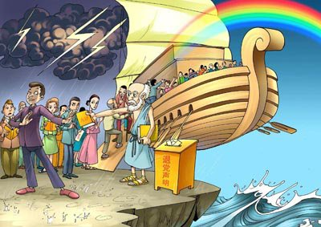

<h1 align="center"><b>新疆流亡医生揭活摘器官：中共如恶魔</b></h1>
<table border="0" cellspacing="3" cellpadding="3">
<tbody>
<tr>
<td align="center"></td>
 
【大纪元2017年11月15日讯】（大纪元记者李怡欣台湾高雄报导）流亡海外的新疆医师安华托帝·博格达，日前应邀在台权会高雄办公室演讲，针对中共器官活摘及新疆人权议题指出，中共活摘人体器官至今还在发生，“我想告诉台湾同胞，去中国不要单独活动，一定随时让家人知道行踪，‘要是生病了，只要一口气在，就算爬也要爬回台湾’”。
安华：任何人都可能遭中共活摘

很多人以为中共国家暴力只针对特定族群，如法轮功、维吾尔族人。安华托帝表示，这是对共产党缺乏清楚认识，“中共在混乱中滋生、在独裁中壮大，在和平中死亡”，为了不死，中共会不惜一切维持混乱，即使是和平、非战争时期。中共无一时刻不在制造“国家敌人”。

“在中国所有人、你只要把自己排除在共产主义分子之外的人，就是潜在被摘器官的目标”，因此，不只法轮功，被摘取器官的有维族、家庭教会等，如果能在中国追踪失踪人口，会发现涉及器官摘取是很普遍现象。

又为何是法轮功？安华表示，“因为这群人不抽烟、不喝酒、器官品质好，因此，成为主要受难群体”。这也说明了，为何自从1999年中共前党魁江泽民发动对法轮功信仰团体迫害、非法关押开始，中国器官移植出现惊人的爆炸性成长。
利益蒙蔽 医师变杀人犯？

安华引述一份中国医疗杂志“两例心肺移植术”论文其中一段话：“供体入室后，按常规予以麻醉及插管”。摘死人器官何需插管？身为外科医生的经验告诉他：“供体肯定是个活人！”这种耸人听闻的医学案例张狂地写在权威期刊上“实在太恐怖了！”说明活摘医师操刀无数，早已麻痹到忘记把“杀人证据”掩盖。

活摘器官已超越纳粹罪刑，驱动万恶的唯一答案是“利益”。安华说，医生为竞争病源，在网站招揽“生意”，宣传：“买一送一、保证质量、换坏重换”，一家医院网站标榜一年进行4千例器官移殖，中国有1百多家移植院所，“哪来这么多器官？”这已超出人类思维极限。

中共以体检、DNA测试等名义，对维吾尔族人大量采血，而过去，有被关押的法轮功学员也证实，在被监禁时自己曾被抽血。无法合理解释该行径，唯一可能就是为了建立“活体器官数据库”。

一张新疆某机场照片上，标示一条“特殊旅客、人体器官运输通道”，这令他感到不寒而栗，“那得需要多大的交通量，才会让一个机场，专门给你设一个特殊通道、快速通道？”这照片如果是真的，“特殊旅客就是器官的主人，通道就是他的黄泉路”。
“如果我不说，我也是罪犯帮凶”

令人难以置信的是“涉入的医疗人员知情，但认为理所当然、就像例行公事。”安华解释，民主社会的人无法理解中共，“中国人从小浸泡在共产党洗脑世界中，这些人甚至觉得消灭国家敌人是光荣的，没有丝毫罪恶感，除非，他离开中国，或接触外界文明、自由、民主价值，就会醒悟并感到罪恶”。

22年前，安华托帝任新疆地区外科医师，奉命前往刑场，等死囚伏法而未断气瞬间，动刀将热呼呼的器官割下带走，至此，他受大很大冲击，无法接受“医师从救人天职变成杀人刽子手”，他放弃在中国的美好前程，选择流亡海外，成为一名公车司机，并在海外致力传达真实的中国人权现况。

有人问他，“如果时间倒流，你后悔吗？”安华说，放弃医职当然后悔，不过，如再一次，他仍会义无反顾选择站在正义的一方，因为揭开这件事，是每一个人的道德责任。

“中共就是恶魔、甚至比魔鬼还坏，我们不应该让恶魔存在，这是人类的悲剧，也是人类最大的失误”，安华托帝提醒所有人，不要对中共抱有任何幻想，活摘器官将是引爆中共垮台的关键事件。 

<tr>

<h1 align="center"><b>一次不寻常的车祸结案</b></h1>

【明慧网二零一八年二月二十六日】我是辽宁某地城郊的一个农民，今年七十来岁。我与三十几岁的儿子母子俩相依为命。儿子从小就患有癫痫性精神病，三十多年他不能下地干活。从小也没怎么念书，我老得看着他，走哪把他带到哪，因为他经常摔倒犯病，一直没有治好，生活艰难。我就这一个孩子，三十八岁了还成不了家。为了谋生，买了一个小凉快（电动车）拉人挣点钱。出车时我得经常跟着他，怕他犯病出事！

二零一五年十月二日，因有事让儿子自己出车，一场意外事故发生了。在早八点多，儿子开车将另一个小三轮摩托车给撞翻了，我闻讯后立即打车到现场一看，惊呆了，被撞的两人都是八十多岁的老人，已经不省人事，昏死过去。

我想儿子这回可是摊事了。报警后在围观者的帮助下，立刻将两位老人送医抢救，到市中心医院抢救室时已是十点多了，诊断结果一位是粉碎性骨折，一位是脑后出血。那位粉碎性骨折的伤者还没醒过来，他八十岁的妻子和另一妇女赶到，这两家人都是炼法轮功的，她们一到就齐声对着伤者喊：“法轮大法好！真善忍好！”喊了两次，老人就醒过来了！他老伴進屋先安慰我，让我不要着急，说：“我们有师父救他，我带钱来了，不用你负责费用。”我心想：哪有这样的老太太，不责怪我还自己带钱来。只见她们对着老人喊了两声“法轮大法好！真善忍好！”伤者就醒过来了！

老人醒后第一句话就是要求回家，不住院。护士说：“这么长时间救不醒你，赶快办住院手续，全面检查，就现在照相来看，很多骨头已碎，有不少已折断，得用仪器一个星期给你骨头对接上，再一个星期用药等等给你治，能不能全接上恢复原样还难说，何况你脑袋和别处是否有问题，为什么那么长时间救你醒不过来？医院不同意你回家。”老人提出：“我得回家，因你们救不了我。”护士回医疗室，又回来问他多大岁数了？他说：八十四岁。护士一声儿没吱，又回去问医生。回来就说：你可以回家了。她把要给老人用的东西全拿走了。其实他们是因他年龄大，又伤的重，没把握救他了，同意他回家了。另一位老人第二天也出院了！

我心想：不住院怎么办？这么大岁数了，老人是不是被撞傻了？就和儿子跟着去了他家。老人对我们说：“我是炼法轮功的，你们不用担心。你们入过党、团、队没有？入过都退了吧。”他们老俩口都告诉我们记住“法轮大法好、真善忍好”九个字，经常念，退出邪党组织可以保平安。老人说：“我们的事你们不用管了，回家去吧！今后一定要多注意。我们不找你们麻烦，你们也不用来了。”

第二天，我们母子俩和小叔子一起又去看望老人，问他有什么要求没有？交通队处理完了就不好办了。他们夫妻一致说：“你们不要再来了，我们绝不找你们的麻烦，一切由我们自己负担，交通队处理结案时，我们会负责任的，不用你们担心。”我流着眼泪说：“炼法轮功这么好，不然这老人要住院治疗我可怎么办哪！这个车还是为了儿子的生活出路借钱买的。”

交通队十月十三日处理这件事时，我和我儿子去了，心想不知怎么处理，心里没底，这种事情也没听说过，别人说：不住院更不好办，要多少钱都要现金，不给不答应。怎么办？万没想到，俩家伤者的儿子都表示：对方不是有意撞车，不要处理司机，说是父亲嘱咐了，我们是炼法轮功的，一切费用自己负担，不给对方增加负担、麻烦。

交通队的人也愣住了，说：“我们从来没有这样处理过交通事故，都是责任者请求减轻处理少花钱，这样被撞者年龄这么大，伤又这么重，却要求不处理司机，一分钱不要，一切自己负担，一次会议就结案，还没碰到过！炼法轮功的真了不起。”

记得车祸发生后，亲属、邻居都说：这回可够你们娘俩呛！家属不答应可怎么办？你们娘俩能受得了吗？这俩老人住起医院不出来怎么办？不住院狠要钱怎么办？后来交通队是按照俩老人的要求：没有惩处司机、一切费用都由伤者自负而结案的。亲朋们听了连连说：现在还有这样的事？不可思议！不可思议！

两位老人在没住院、没打针、没吃药、没有任何医疗的情况下，都康复了！在事实面前，我由衷地相信法轮大法好！法轮大法神奇！通过这件事情，我的小叔子退了党，我退了团，亲属和邻居也都三退了，现在我们一大家子人都在念“法轮大法好！真善忍好！”我儿子天天默念这九字吉言，癫痫病至今半年多一次也没犯过！他好几次对我说：咱们也炼法轮功吧！

一场车祸使我真正认识了法轮大法！法轮大法好！

<h1 align="center"><b>“三退”才能上“方舟”</b></h1>

【明慧网二零一七年三月九日讯】

 <b>“诺亚方舟”《圣经》有记载</b>

大家可能听说过“诺亚方舟”，然而您知道吗？它不只是一个传说，而是被《圣经》记载下来的历史。《圣经》作为基督教的经典，其作者身份包括先知、使徒、祭司，也有君王和专职史官等，而且据信所有作者都是得到“上帝默示”的。

著名的英国民族学家弗雷责·本杰明考察发现，世界上任何一个有足够时间跨度的民族历史传说中，都有着“大洪水”传说。而且传说中对大洪水的描述惊人的相似。

时空跨度可能淡化人类记忆，却无法抹去历史的真实。是的，从今天上溯大约五千年，地球人类确实经历过一场“大洪水”劫难。在中国，诞生了“大禹治水”三过家门而不入的佳话。禹王治的什么水？治的是大洪水退去后剩下的那些水。在西方，则出现了诺亚方舟的凄美故事。

<b>诺亚方舟的故事</b>

创造西方世界万物的上帝耶和华，眼看其子民道德日益下滑，超越了神当初规定的做人标准的底线，充满败坏、强暴和不法的邪恶行为，于是计划用大洪水降灾于人。同时他发现，子民之中有一位叫诺亚的好人。耶和华向诺亚发出神谕，让他建造一艘方舟，带着他的妻子、儿子与媳妇；同时将种籽、牲畜与鸟类等动物带上方舟，且必须包括雌性与雄性。

当方舟建成，诺亚与家人，以及动物们进入方舟，大洪水也来了。《圣经》记载道：“二月十七日那一天，大渊的泉源都裂开了，天上的窗户也敞开了。四十昼夜降大雨在地上”。洪水淹没了最高的山，只有诺亚一家人与方舟中的生命得以存活。

220天之后，方舟在阿勒山附近停下来，等洪水消退了，诺亚一家人与各种动物便走出方舟，开始了新一轮的生息繁衍。今天整个西方人种和文化，都是以诺亚方舟为原点发展起来的。

解读《圣经》记载的诺亚方舟的故事，我们会得到如下重要启示：神是真实的存在；人是神的子民，神创造了人，同时给人规定了做人的道德标准；人类会因为堕落而受到上天的惩罚；神佛会在人类危难时拯救人类，只有那些对神信仰，达到神给人定的标准的人才会成为神拯救的对象。

<b>考古工作者找到了诺亚方舟遗骸</b>

现代人类有一门独立学科，叫做“考古”。考古界有一条铁律：越古越值钱。也就是说，文物的价值，取决于年代，与大小材质基本无关。为什么呢？这是因为考古学的真正目的，在于追溯人类起源的历史踪迹，回归人类的精神家园——对神的信仰。因此，《圣经》中对诺亚方舟的记载，便成为人类考古的热点。《圣经》的相关描述，也再次成为寻找诺亚方舟的指南。

二零一零年四月二十八日，一支由香港人和土耳其人组成的探索队在北京宣布，他们日前在土耳其东部的亚拉腊山（《圣经》记载的阿勒山）海拔超过4000米处发现了诺亚方舟遗迹，并成功进入巨型木结构的方舟内，探索队员还在方舟内发现了陶器、绳索以及类似种籽的物体。

遗骸为巨型木结构，木样本经分析，证实有4800年以上的历史。方舟共有7个空间，最大的空间高5米、长10米。方舟共分上中下三层，里面还有数个隔间，其中一间带有木杆围栏和一些绳索，与《圣经》记载的诺亚方舟完全一致。

<b>“藏字石”——神佛救命的呼喊</b>

历史会有惊人的相似，但却不会是一模一样的重复。五千年前，耶和华决定惩罚败坏的人类，告诉诺亚造方舟躲过劫难。五千后的今天，当人类进入十恶毒世，神再次决定给人以惩罚的时候，在神州大地的西南方，出现了一块神奇的“藏字石”，“中国共产党亡”六个大字振聋发聩，石破天惊！神佛用这种特殊的方式，向人们发出了救命的呼喊。

二零零二年六月，贵州省平塘县发现一块“藏字石”，引起轰动，中共新华网、央视等100多家媒体，都对此事作了报道。包括中国科学院院士在内的三批科学家对“藏字石”科学鉴定的一致结论是：未发现任何人工痕迹，纯粹天然。巨石形成于2.7亿年前，大约五百年前一分为二，断面凸显“中国共产党亡”六个大字。

   
那么，这个“藏字石”应该怎样解读呢？如果说冥冥之中自有天意的话，说白了，它是上天下达的《中共死刑判决书》。为什么中共会被判死刑？因为中共早已恶贯满盈，十恶不赦——

中共以撒旦教徒马克思为祖宗，宣扬“共产主义暴力革命”，为祸中华近百年，五千年中华神传文化被毁坏殆尽，代之以邪恶的“无神论”，强行灌输反天、反地、反人的“党文化”；战争年代杀人如麻，骗窃政权后运动不断，血雨腥风，历次政治运动害死八千万中国人；它集邪教、独裁、暴政、卖国、灭祖、贪腐、匪痞、流氓、黑帮、欺骗、淫乱于一身。特别是一九九九年七月开始的对信仰“真、善、忍”的法轮功学员的残酷迫害，无辜加害，酷刑百种，群体灭绝，活摘器官，如此恶魔行径，招致天怒人怨，必受天惩。《中共死刑判决书》，彰显的是神佛意志，兑现的是“善恶必报”的天理。

<b>“三退”才能上“方舟”</b>
倾巢之下，焉有完卵。当中共作为一个整体被上天严惩的时候，它的所有成员都在劫难逃！死刑判决已然下达，什么时候执行死刑只是个时辰问题了。

<table border="0" cellspacing="3" cellpadding="3">
<tbody>
<tr>
<td align="center"></td>
</tr>
<tr>
<td align="center">漫画：三退方能上方舟</td>
</tr>
</tbody>
</table>
   
天网恢恢，疏而不漏；神佛慈悲，网开一面。十八年来，法轮功学员发放的真相资料，铺平了填满海，码起来连着天。这些真相资料，可能是一份真相传单，可能是一张真相光盘，可能是一条真相横幅，可能是一个真相电话，也可能是一次面对面的聊天。接过来，看一看；停下来，听一听。看清楚了，听明白了，才能真正知道为什么要“三退”——那是神佛给人定下的得救的标准，那是大难来前登上当代“诺亚方舟”的船票。

目前蔚为壮观的“三退大潮”，就是法轮大法为曾经加入过中共邪党组织的人们开创的“三退保命”、值得您万分珍惜的宝贵机缘。中国老百姓有句话说“过了这个村，可没有这个店儿”。早退早平安，晚退晚平安，谁退谁平安，不退很危险！截止到二零一七年三月，在大纪元退党网站声明“三退”的人数，已超过二亿六千万人。命悬一线，生死一念。真心盼望您早一天明白真相，早一天登上当代诺亚方舟，躲过日益逼近的生死劫难。

<h1 align="center"><b>秘密撒旦崇拜和共产主义思想来源简介（图）</b></h1>

【明慧网二零一八年一月二十七日】在人类历史上，世界上的一些地区存在着广泛的土星崇拜。出乎现代人意料的是，古人对土星这个行星相当地了解，例如，古人已经知道土星有个大环（见下图）。他们认为既然崇拜土星，就要听土星的话，于是人们在结婚的时候就要戴结婚戒指；女人要听土星的话，就要戴耳环；国王要听土星的话，就要戴上王冠……这些都是表示对土星的崇拜，一直流传到现在。土星也叫指环王，前些年好莱坞拍的电影《指环王》也是这个意思。

<table border="0" cellspacing="3" cellpadding="3">
<tbody>
<tr>
<td align="center"></td>
</tr>
<tr>
<td align="center">土星环（NASA）</td>
</tr>
</tbody>
</table>

在古代中东的一些地区，例如《旧约》中说的迦南一带（大致对应于现代的黎巴嫩、叙利亚、约旦和以色列），是个多神论的地区。虽然人们信很多神，但是他们崇拜的一个主要的“神”，就是土星。土星在不同的地区和文化，有不同的名字，例如，El，Saturn，Baal，Bel，Cronus，Moloch……

当时迦南人在祭拜土星的时候，还祭活婴，就是把婴儿活活烧死，祭给他们的“神”——土星（Moloch），以求得谷物丰收与好运，以及其它的好处——财富、权力等等。祭活婴的过程大致如下：土星偶像的身体里面是空的，肚子里面烧上火，把婴儿放在偶像的手上，通过一种机制偶像的手可以运动，把婴儿放到张开的大嘴里，代表土星把婴儿吃了，婴儿就掉到偶像肚子里的大火中。婴儿就这样被活活地烧死了（见下图）。

<table border="0" cellspacing="3" cellpadding="3">
<tbody>
<tr>
<td align="center"></td>
</tr>
<tr>
<td align="center">（土星）活祭婴儿（网络图片）</td>
</tr>
</tbody>
</table>

为了掩过婴儿在被烧死过程中的哭叫声，在祭活婴的过程中伴有震耳欲聋的喇叭声、鼓声、笛子或其它的音乐等。同时在祭祀土星的过程中，常常伴有吸毒和性狂欢，就是公开的大规模的性乱等等堕落行为。

当时的迦南是个非常堕落、淫乱的地区，《旧约》也提到过迦南人的堕落。其实这些人信的根本就不是正神了，而是魔鬼了。在古代的西方、中东等地的民间信仰中，土星总是代表黑暗、无序、毁灭、死亡、堕落等等负面的因素，总是站在神的对立面，因此土星成为神的对立面的代表，即土星是魔鬼撒旦的代表，所以在这些民间信仰中，土星和撒旦是同义词，即用崇拜土星作为外表，来掩盖崇拜魔鬼撒旦的本质。这个土星（魔鬼）的崇拜扩散很广，也流传到欧洲。后来西方的一些秘密组织或秘密教派就用土星崇拜作为幌子，来掩盖他们对魔鬼撒旦的崇拜。在古希腊和古罗马的传说中，土星吃自己的孩子，这也是暗示祭活婴。

撒旦自然喜欢迦南人的这种堕落与败坏，因此在魔鬼撒旦的眼里，这种堕落的时代就是其“黄金时代”。这大概是土星（魔鬼）统治下的“黄金时代”的来源。

在古希腊的神话传说中，最初，土星的父亲统治天界，土星用镰刀阉割了其父，推翻了其父的统治，代替了其父成为天界的统治者。神话传说还说，在土星统治时期，出现了一个“黄金时代”。“黄金时代”的本身应该就是一个大谎言，因为它其实是个非常堕落的时代。后来土星的一个儿子木星（也就是宙斯），推翻了土星的统治，从而宙斯（木星）成了天界的统治者。

在古巴比伦、古埃及、古希腊时代，精英阶层很相信占星术。占星术有十二个星座，每隔两千多年太阳就要换一个星座。在《旧约》的出埃及中，摩西对以色列人崇拜金牛很生气。熟悉西方占星术的人们一看就明白，“金牛”其实是说“金牛座”，而在距今三千多年前的摩西时代，已经进入了白羊座，但是以色列人还在拜已经过时的“金牛座”，从而引起摩西的不满。到两千年前耶稣的时候，白羊座已经过去了，太阳进入了双鱼座。紧接着双鱼座的后面就是宝瓶座。至于宝瓶座什么时候到来，人们意见不太一致，有人认为人类（太阳系）已经进入宝瓶座一段时间了，有人认为在2012年玛雅历法结束的时候进入宝瓶座，也有人认为宝瓶座还没有到来。

问题就出在这个宝瓶座上。按照西方的占星术，每一个星座还对应一个统治者，这个统治者来自于太阳系中太阳、月亮和金木水火土五大行星。例如，狮子座的统治者是太阳，巨蟹座的统治者是月亮，白羊座的统治者是火星，双鱼座的统治者是木星，宝瓶座和摩羯座的统治者都是土星，等等。一年的十二个月也对应十二个星座，其中摩羯座和宝瓶座对应冬至后的两个月时间，在地球的北半球，这两个月时间不仅白天短、夜里长，而且寒冷，万物凋零，这正好和土星代表黑暗与死亡一致。这意味着，当星象进入宝瓶座的时候，就是神话传说中所谓的土星统治天界，这时人类将进入非常黑暗的时期，这个黑暗的时期就对应神话传说中土星统治下的“黄金时代”。所以，在欧洲和中东等地，在对土星崇拜的精英中（秘密社团和秘密教派），代代相传一个巨大的秘密（准确地说是谎言），就是要在未来土星统治天界的时候（对应于宝瓶座），在全世界重新建立一个非常黑暗的新“黄金时代”，而这个所谓的新“黄金时代”就是共产主义乌托邦社会——人间天堂（其实是人间地狱）。这样通过神话传说中土星和“黄金时代”的关系，加上占星术，从古至今欺骗了一批批社会精英秘密地策划在宝瓶座的时候（所谓的土星统治天界）重建黄金时代——邪恶、堕落的共产主义乌托邦。撒旦颠倒黑白，把这个黑暗的共产主义称为人间天堂。共产主义乌托邦其实是裹了一层糖霜的砒霜，它的本质是邪恶的，它摧毁道德，摧毁对神的信仰，其最终目的是败坏人类，从而毁灭人类。人们不要对其抱任何幻想。

公元前六世纪古希腊哲学家毕达哥拉斯（Pythagoras）周游古埃及和巴比伦，并且加入了古埃及和巴比伦的秘密教派，获得了古埃及与巴比伦秘密教派的秘密和占星术的知识。他回到希腊后，创立了一个秘密教派（秘密社团），秘密地传授这些知识。这个秘密教派的核心成员不能拥有私人财产，实行共产生活。从此古埃及和巴比伦的秘密知识就在希腊精英中流传……从此，巴比伦和中东地区的秘密土星（撒旦）崇拜和占星术，渐渐地流传到古希腊、古罗马，直到欧洲。共产主义思想在土星崇拜的秘密社团（教派）中，经过长时间的不断发展和完善，直到1776年德国秘密组织光照帮的成立，系统的共产主义理论成熟了。

在1847年，秘密社团在法国召开了一个秘密会议，决定公开发动革命实现共产主义，由秘密组织“正义者同盟”（不久改为“共产主义者同盟”）雇佣马克思，对光照帮的共产主义理论进行更新，于1848年出版了《共产党宣言》，作为世界共产主义革命运动的纲领文件。马克思在大学时代加入了魔教组织，他并不是共产主义的真正创始人。在这一年（1848年），欧洲的许多国家都爆发了共产革命，但都以失败而告终。

了解了共产主义思想的来源之后，大家就明白了，共产主义没有任何神圣之处，它确实来自秘密的魔鬼崇拜，它背后是共产邪灵，当人们加入共产党宣誓的时候，要发毒誓为共产主义奋斗终身，实际上就是把生命献给了魔鬼撒旦，这能有什么好结果吗？那么怎么办？办法有一个，就是不再与魔鬼为伍，退出中共的一切组织。

<h1 align="center"><b>诚念法轮大法好　福报连连</b></h1>

二零一七年三月十九日中午，我去参加喜宴。我这一桌八个人，有两位老师，一位医院科主任，一位居委会主任，一位校长太太，一位家庭主妇。我们都相识多年，她们全都明白大法真相，并已三退。吃饭间我们谈论善恶有报，大家都非常认同，争先恐后地列举生活中自己遇到的事例。

我指着校长太太对大家说：“嫂子诚念‘法轮大法好、真善忍好’十几年了，咱来听听她的故事。”近七十岁的某校长太太很健谈，她绘声绘色地讲起她自己的经历：

“十几年前，我知道诚念‘法轮大法好、真善忍好’会得福报，就天天念，常常念出声来。八年前，我腿疼，当医生的二儿子给我做CT检查，发现左大腿骨头内长瘤子了。赶紧打电话给在青岛当处长的大儿子，大儿子急忙联系大医院做手术，大医院的专家看后说：‘在这个部位长瘤子99%以上是恶性的，但你的瘤子是良性的，做完手术后，最好的结果是有病的腿要短些，走起路来一瘸一瘸的，手术后三个月才能扔拐杖。’没办法只好做了手术。手术中从我大腿骨中取出一个小鸡蛋大小的带蒂瘤子，化验是良性的。手术后三个月扔掉拐杖后，我的腿竟一样长，一点儿也不瘸。这不，现在天天出去遛狗，经常被狗拉着跑，一点儿问题没有，这是不是福报？”大家都认真的听着，不时的发出感叹。

嫂子又接着告诉大家：“我有两个儿子，生的都是孙女儿，丈夫的亲兄弟和我们关系不好，在村里到处说我们家没有孙子，断根儿了。前年可以生二胎了，不久二媳妇怀孕了。我整天念法轮大法好，求上天给我个孙子。两个月前，我们真的抱上了孙子。这不又是福报吗？”

大家都为嫂子的连连福报而高兴，我说：“法轮大法是佛法，今天做最大的好事莫过于传播大法真相，做最大的坏事莫过于迫害大法弟子。一个人，他不迫害大法，不一定好，但迫害大法，迫害大法弟子一定不好。”我再一次叮嘱大家，诚念“法轮大法好，真善忍好”，大难来临保平安。大家拿着我赠送的《天赐洪福》如获至宝。看着这些有缘人，我为她们的明智选择高兴。

<h1 align="center"><b>因坚持正信 在迫害中离世的老年法轮功学员</b></h1>

<table border="0" cellspacing="3" cellpadding="3">
<tbody>
<tr>
<td align="center"></td>
</tr>
<tr>
<td align="center">和平鸽带去亲人们对离世老人们深沉的悼念。（明慧网图片）</td>
</tr>
</tbody>
</table>

 当得知儿子高一喜遇害的消息后，姜自香老人嚎啕大哭，自那以后一天吃不上一顿饭，身体日渐消瘦。她整天担惊受怕，怕家里再有亲人出事，天天以泪洗面，精神恍惚。2017年12月18日晚6点，老人离开了人世，享年88岁。

在经受了多次的恐吓后，80岁的龙玉海状态变得更糟，生活上完全不能自理，人瘦成了皮包骨。那时他被诬判了三年，将遭受“监视居住”。他和老伴不得不再次拖着伤残的身体流离失所。三个多月后，2017年12月6日早上7点，老人在漂泊中离世。

根据明慧网从2017年1月至2018年2月21日报导的消息，据不完全统计，全国19个省、自治区、直辖市有61名法轮功学员在2017年被迫害致死，其中60岁以上离世的老人有27位，占离世者总人数的43%以上，其中逾80岁的老人有2位、逾70岁的有8位、逾60岁的有17位。他们是：

姜自香，88岁，牡丹江市人；龙玉海，80岁，成都人。

董永慧，79岁，山东滨州市人；祁庆元，74岁，辽宁省辽阳市小祁家镇小祁家村居民；霍润芝，73岁，吉林省农安县人；李秀红，73岁，北京人；孙玉发，72岁，吉林省白山市江源区人；王其家，71岁，吉林省长春市人；李明祥，71岁，安徽省阜阳市临泉县土坡乡李集行政村营子自然村人；黄海林，70岁，湖北黄石大冶市还地桥乡人。

陈凌梅，67岁，河北省涿州市人；杜景琴， 67岁，辽宁抚顺市人；冯娟，67岁，福建省佛山市居民；何先珍，67岁，四川西昌市市民；耿仁娥，66岁，辽宁大连甘井子区居民；田玉梅，66岁，吉林省洮南市人；唐净梅，66岁，江苏南京市居民；邢西美，66岁，山东省临沂市沂南县人；黄国栋，66岁，黑龙江省牡丹江市民；于桂香，65岁，吉林长春市人；李福琴，65岁，山东省潍坊市人；朱维英，65岁，安徽合肥市人；路远峰，63岁，辽宁沈阳市于洪区朝鲜族乡人；万铭芬，63岁，甘肃省白银市居民；吕瑞珍，62岁，广西陆川人；柴玉兰，62岁，河南省孟州市赵和镇苏庄村人；郭道友，约60岁，河北省秦皇岛市。

<table border="0" cellspacing="3" cellpadding="3">
<tbody>
<tr>
<td align="center"></td>
</tr>
<tr>
<td align="center">被迫害致死的法轮功学员（左起）：路远峰（63岁）、黄国栋（66岁）、杜景琴（67岁）。（明慧网图片）</td>
</tr>
</tbody>
</table>

在这些老年法轮功学员中，有的是在监狱遭受酷刑折磨致死的；有的是在被非法关押期间被迫害得奄奄一息后，送回家不久后离世的；有的是因为亲人被迫害致死，身心受到摧残含冤离世的；有的是为躲避迫害，在被迫流离失所期间离世的；有的是遭受当地公安局、“610”人员不断地骚扰、恐吓，在忧虑和担心中离世的，等等。

法轮功是修心重德的上乘佛家修炼法门，由李洪志先生于1992年5月在中国大陆公开传出，至今已洪传至世界一百多个国家和地区，其主要著作《转法轮》已被翻译成40多种语言在全世界公开发行。

李洪志先生教导人们按照“真、善、忍”的原则做好人，法轮功自问世之后，使成千上万的中国人民和世界人民身心受益。鉴于李洪志先生为人类做出的卓越贡献，法轮功获得了世界褒奖三千多项。

然而，1999年7月中共江泽民集团对法轮功发动了群体灭绝性的迫害，它操控了国家机器，对法轮功学员实施了长达至今持续十九年的“名誉上搞臭、经济上截断、肉体上消灭”的迫害政策，夺走了不计其数的法轮功修炼者的生命，仍非法关押成千上万的法轮功学员，使他们的家庭支离破碎。这场迫害给中华民族带来了深重的灾难。

<b>她曾有个幸福的家</b>

享年88岁的姜自香生前住在牡丹江市穆棱市穆棱镇河北村，她曾患胃病、败血症、舌癌，全家人为此愁容满面。自从一家人修炼法轮功后，姜自香全身的病神奇般痊愈，大女儿高秀荣的胃癌也好了，小儿子高一喜患有导致他几近失明的青光眼病也康复了，一家人幸福美满。

然而，自江泽民集团疯狂迫害法轮功以来，大女儿因坚持信仰被公安非法关押、游街、劳教。警察三番五次来抄家，丈夫高吉瑞受惊吓心碎而死。2016年4月19日晚，牡丹江国保撬门抄家，45岁的小儿子高一喜被绑架。10天后他离奇身亡，遗体遭强行解剖。

<table border="0" cellspacing="3" cellpadding="3">
<tbody>
<tr>
<td align="center"></td>
</tr>
<tr>
<td align="center">姜自香的儿子、法轮功学员高一喜。（明慧网）</td>
</tr>
</tbody>
</table>

2016年4月19日晚上10点，牡丹江国保支长等人撬门闯入高一喜的家，抄家翻钱，将高一喜和其媳妇孙凤霞绑架。

在两次审讯中，高一喜对指控他的所谓罪名否认并拒绝回答提问，他说出只有“法轮大法好”这几个字被警察记录在询问笔录中。

姜自香得知消息后，4月21日至25日，几次领着16岁的小孙女高美心从穆棱赶到牡丹江，几经周折才找到了立新警务室副队长吕洪峰。老人家一把拽住吕洪峰哭着说：“我要我儿子、儿媳，他们犯什么罪了？凭什么抓他们？你快把他们放了吧！”

吕洪峰使劲一甩，把老人甩在旁边的椅子上，差点倒在地上。之后，他扬长而去。

4月29日中午，祖孙俩来到牡丹江第二看守所，意外得知高一喜被送到牡丹江公安医院。姜自香又赶紧领着孙女边打听边赶往公安医院。

从下午1点到晚上9点，祖孙俩在公安医院病房门外哭诉著，苦苦哀求着，警察就是不让她们见高一喜。看守的警察蛮横地驱赶、恐吓她们：不离开就报110抓人，并威胁要家属拿出5,000元医药费。

多日来担惊受怕、时刻惦念小儿子安危的老人终于支撑不住瘫倒在地，警察却无动于衷。有好心人看着她们可怜，给拿来一些吃的。

4月30日上午，即在祖孙二人被一群人驱赶回家后的第二天早上，牡丹江公安医院宣布高一喜“猝死”。

自小儿子被抓走后，姜自香每天都在痛哭，牵挂着小儿子、小儿媳的安危，家人不敢把这个噩耗告诉她。

最后，老人还是知道了儿子遇害的消息。不久后，老人悲怆离世。

<table border="0" cellspacing="3" cellpadding="3">
<tbody>
<tr>
<td align="center"></td>
</tr>
<tr>
<td align="center">图为姜自香老人（中），左边为二女儿、二儿子，右边为小孙女、二女婿。（明慧网）</td>
</tr>
</tbody>
</table>

<b>他被迫多次流离失所</b>

2014年11月30日，成都两位老年法轮功学员龙玉海与郭淑云在仁寿县清水镇公路旁，将台历和关于法轮功真相的资料送给乡亲们。当时他们遭人举报，清水镇派出所出动警车，动用武力绑架了他们。

2015年1月下旬，龙玉海与郭淑云被仁寿检察院构陷，被起诉到仁寿法院。法院准备年后对他们开庭。

在身心受到严重的摧残下，龙玉海的神志已出现了恍惚状态，郭淑云的视力几近失明而且耳聋。在过年前三天他俩被迫离家出走，近半年后才回到家。仁寿清水派出所还在网上通缉他俩。

2016年6月左右，仁寿县清水派出所的所长和指导员来到龙玉海夫妇家将他们两人抓走，把他们带到仁寿医院做了几项检查。因为他们的血压都高，不被看守所接收。

两个月后，成都仁寿法院准备对他们开庭，龙玉海受到惊吓后神志又出现了不正常状态，郭淑云的视力模糊，已看不清东西了。他俩只好再次离家出走三个月。

2017年6月28日早上10点，从仁寿法院来了八个人到他们家，要对他们进行所谓的“开庭”。他们对龙玉海和郭淑云的家人说：“这只是走走形式。”当时两位老人基本上生活不能自理了。

一个多月后，所谓的“判决书”下来了。郭淑云被诬判四年，龙玉海被诬判三年，两人被非法罚款四千元人民币。

法院让他们到医院开证明，然后再研究他们够不够条件监外执行“监视居住”（在家被监视、不得自由外出）。

两位老人在巨大的精神压力下再度流离失所。在外漂泊了三个月后，2017年12月6日早上7点，龙玉海凄然离世，享年80岁。

<b>善恶有报是天理</b>

亲友们在对姜自香老人的悼词中说道：

“您在世间走过了88个春秋，经历了无数的风霜雨雪，依旧坚守‘真、善、忍’的普世价值，善心助人、诚实守信、勤劳节俭、宽容忍让。您的美德也影响着儿孙们，使他们也都成为真诚朴实而又亲切善良的好人。

“我们知道，您心里最惦念的是您的小儿子、您最疼爱的老幺高一喜冤死快两年了未得昭雪。他仅仅因为坚持按照‘真、善、忍’原则做好人，讲真话，帮助人们看穿中共谎言，了解法轮功被迫害真相就被警察非法抓走，10天后离奇死亡。

⋯⋯

“但请您相信，善恶有报是不变的天理。现在迫害法轮功的高官薄熙来、周永康、王立军等首犯已在天理报应中被查办入狱，其他继续行恶者也都面临天理与法律的清算。您儿子的冤屈在不久的将来一定会昭雪，人们将会看到正气善良得以伸张，一切都将真相大白！

“而您所做的一切不只是在帮助自己儿子讨还公道，您也是在为社会驱邪扶正，弘扬正气，为更多人争取一个做好人的权利。……您经历的苦难将化作无限的福德，您将享受未来的永恒美好与光明！”
