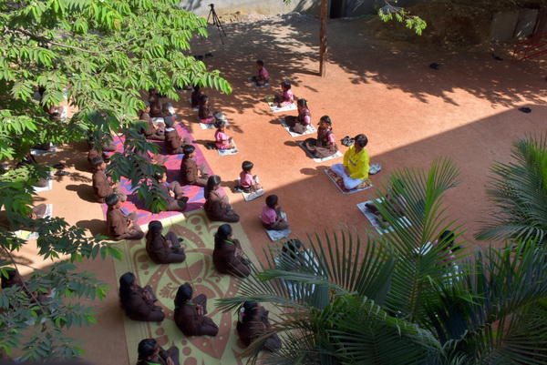
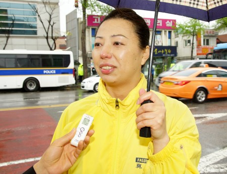
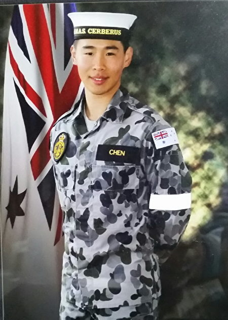
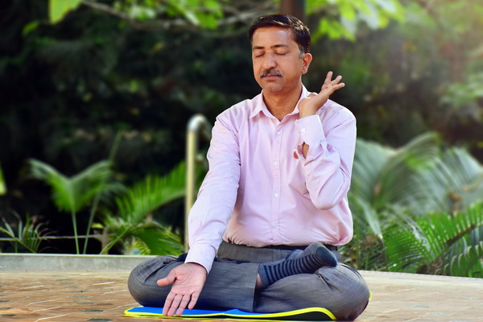
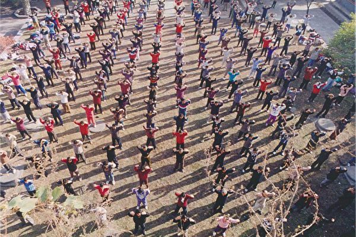
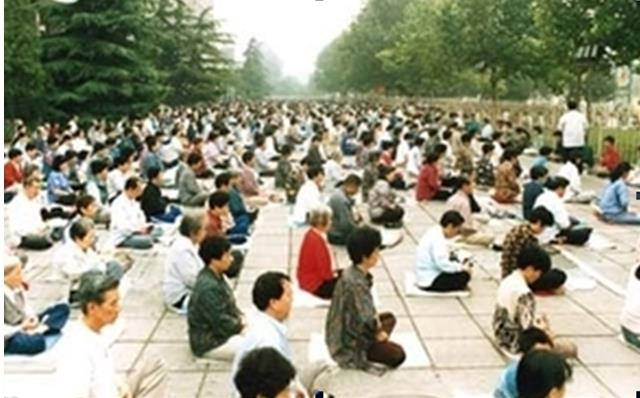
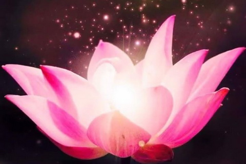
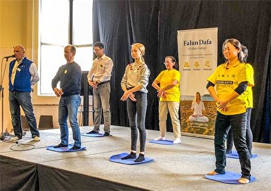
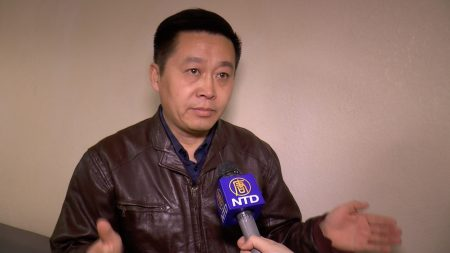

<h1 align="center"></h1>
<h1 align="center"><a href="https://git.io/3f">免费下载epub电子书</a></h1>

<h1 align="center"><b>组图：印尼巴淡岛高中七百多师生学法轮功</b></h1>

七百多名印尼国立巴淡岛高中学生及教师集体学炼法轮功。（明慧网）

	
【大纪元2017年11月14日讯】2017年11月11日（周六），印度尼西亚的部分法轮功学员来到印尼巴淡岛高中，向七百多名学生及老师介绍以“真、善、忍”为原则的性命双修功法——法轮功。

印度尼西亚是位于亚洲东南部，太平洋和印度洋之间的千岛之国，有两亿多人口，位居世界第四大人口国。早在1996年，法轮功就传播到印度尼西亚，目前在雅加达、巴淡岛、丹戎槟榔、北干巴鲁以及占碑等城市都有法轮功修炼者。

1999年以江泽民为首的中共发动了对法轮功的残酷迫害。从那时开始，世界各地的法轮功学员开始了和平反迫害的历程。印尼法轮功学员也经常举办各种活动，或前往高中、大学等校园义务为学生、老师教功，希望人们了解，并受益于法轮功“真、善、忍”的美好。

明慧网报导，星期六早晨，法轮功学员来到国立巴淡岛高中，向学生、教师及员工们介绍法轮功。国立巴淡岛高中大约有一千名学生。但由于学校场地有限，只有720名学生和教师能集合在一起，有幸学炼法轮功。

大约一个小时的时间里，法轮功学员示范了第一至第四套功法，教学生及教师们功法动作，并介绍功法特点。

七百多名印尼国立巴淡岛高中学生及教师集体学炼法轮功。（明慧网）

	

七百多名印尼国立巴淡岛高中学生及教师集体学炼法轮功。（明慧网）

	

七百多名印尼国立巴淡岛高中学生及教师集体学炼法轮功。（明慧网）

	

七百多名印尼国立巴淡岛高中学生及教师集体学炼法轮功。（明慧网）

	

由李洪志先生在1992年传出的法轮功属于佛家上乘修炼大法，目前在亚洲、欧洲、美洲和澳洲等一百多个国家和地区洪传。该功法强调修炼者要按照“真、善、忍”的标准在各种生活环境中努力使自己变得更加诚实、善良、宽容，从而逐渐开启智慧，洞悉人生和宇宙奥秘。

法轮功还包括五套炼功动作：“佛展千手法”“法轮桩法” “贯通两极法”“法轮周天法” 和“神通加持法”，可使人身体有效达到祛病健身，养生长生的状态。

部分学生学完功法后，分享了尝试功法的心得，人们表示法轮功动作容易理解、平和，还能锻炼自己的忍耐力，身体感觉非常放松舒服，炼功音乐也能帮助集中自己的注意力，身心都变得格外平静祥和。#

七百多名印尼国立巴淡岛高中学生及教师集体学炼法轮功。（明慧网）

七百多名印尼国立巴淡岛高中学生及教师集体学炼法轮功。（明慧网）

<h1 align="center"><b>不识机缘的她 终于醒悟获重生</b></h1>

沉迷人间数十载 身在缘中不识缘

【希望之声2018年5月6日】（本台记者慧光综合报导）
我是中国大陆的法轮功学员，但是我走入法轮功修炼的机缘也许和别人不同，每次想起来都觉得心中惭愧。

母亲以前的身体非常不好，通过炼法轮功变好了。看着母亲的变化，我知道法轮功好，但那时只想着挣钱，就没过自己也需要走这条路。 

2005年的一天，母亲病了，我让她去医院看病，可她说这是“病业”反应，不用去医院。不仅不去医院，还拒绝用药。我当时一听就生气了，认为她这是迷信，不可思议。母亲当时忍受着痛苦，坚持听法轮功师父的讲法录音带。我一看她对我说的话无动于衷，气急败坏，走过去把录音带取出来用手撕、用脚踩给整坏了，然后以胜利者的姿态出门上班去了。

当我走到街上过人行横道时，就在走到马路当间儿的那一刹那间，突然感到心脏、后腰和整个脊椎部位疼痛难忍，腿也不听使唤了，仿佛只要迈一下腿就会死掉一样，身不由己。当时很难受，也很尴尬，车辆来来往往从我身边经过，很多人都对我投来不解的眼光。就这样我在马路中间站了约有七、八分钟，一位路人看出了我的异样，就过来搀扶着我走到马路边，然后我倚靠在电线杆子上就不想动了。身体很难受，脑子里却开始翻江倒海。

当时我很诧异，心想“怎么回事儿？为什么会突然出现这个状况？以前没遇到过这种情况啊，难道是我做错了什么事吗？”突然想到自己刚才的所为，“会不会是因为我破坏了大法师父的录音带而受到惩罚呢？”想到这里我知道自己犯错了：母亲以前有很多病，是因为修炼法轮功病才好了，即使常人治好了母亲的病，都应该懂得感恩，何况法轮功师父没要一分钱就治好了母亲的病，我怎么能用这种态度对待大法呢？

想到这儿时悔恨的泪水夺眶而出，我在心里说：“大法师父，我错了！您能原谅我吗？”就在这一念刚过的瞬间，突然感到一只热乎乎的大手捂在我的腰上，像热水袋一样温暖，舒服极了，同时还有一只手在颈椎部位又掰又捏，似乎还能听到“嘎、嘎”的响声，大约二十秒钟后，突然感觉全身哪儿都不疼了，异常轻松。当时我就明白了，是大法师父原谅我了，我抱着电线杆子哭了好半天。我在心里一遍一遍的重复着说：“谢谢大法师父！谢谢大法师父！”

更为神奇的是，这只热乎乎的“大手”捂着我的腰足足有一个星期，腰部始终有一片温热的感觉，非常舒服，难以用语言形容，那期间整个人都觉得身轻气爽，非常精神。我从内心里感到震撼，“怪不得这么多人坚定的炼法轮功，原来他们说的都是真的啊！”

从那时起，我的腰椎间盘和颈椎病再没犯过。通过这件事情使我真真切切的感受到神佛真的存在，大法师父就在我们身边！

2006年末，我觉得腹部疼痛，经检查发现在子宫和卵巢连接的韧带上长出一个肿瘤。那时天天下午低烧，如果坐上五分钟，腹部就会出现剧烈疼痛，就得躺二十分钟才能再坐起来。当时的感觉就像骨盆被打碎了再拼上一样，牵动的五脏六腑都感觉痛，是那种一跳一跳的疼。那时候每天都生活在痛苦之中，真是上天无路，入地无门，很绝望。

到医院检查多次，各项检查费用加起来近五万元，最后医生诊断说是恶性肿瘤，需要做手术，费用要二十八万元，还不能保证手术成功。我当时做生意投资了不少钱，一时半会儿也收不回来，拿不出那么多钱做手术，既着急又很无奈。实在没辙了，就想“算了吧，活到哪天算哪天，如其这么痛苦的活着，不如死了算了”。

当时的悟性就这么差，都这样了也没想到要炼法轮功。

2007年年初，修炼法轮功的大姐知道我的情况后，给我送来一本《转法轮》书，当打开第一页看到《论语》时，我就被震惊了，那天从晚上六点到第二天早上八点，我一口气把书看完。开始是躺着看的，看着看着我就坐起来了。看完《转法轮》后我就感觉饿了，于是吃了一大碗面条。而在此之前的两个月中，我每天只能喝一点水，吃一点点东西，体重由一百三十八斤降到不足一百一十斤。

大姐后来又给我送来一摞子大法书。此后我拒绝来人打扰，专心看书，连续看了四、五天，几乎每天晚上只睡两、三个小时，五天以后把一摞书都看完了。当时就发现这五天腹部怎么一点儿都没疼呢？我很吃惊，“看书也有这么大的作用啊！这哪是一般的书啊！”我想我再也不能犹豫了，当即下定决心，一定要炼法轮功！

当我正式走入修炼时，第一次炼第二套功法的“抱轮”动作时，师父就开始给我清理身体。记得当时汗水就像头上有自来水一样，顺着脸、身上往下流，地上都湿了一大片。五天后开始拉肚子，每天拉七、八次，拉了有一个星期。因为我之前有二十多年的便秘史，十多天便一次，常年要吃泻药。

除了以上的疾病以外，我还患有心脏病、过敏性鼻炎、胃炎、风湿病等，平常吃“猫食儿”，就是每顿饭只能吃一点点，还不敢吃凉的辣的，酸的也不行。而修炼法轮功以后很快就全好了。

修炼半个月后我就上班了，同事一见面就说：“哎呀！我们都以为你不在了，你没死啊？咋还这么精神呢？”我说：“你知道我是怎么好的吗？我炼了法轮功，太神奇了！电视上宣传的全是假的，大法师父太伟大了！真佛降人间！我受益太多了！”

<h1 align="center"><b>从江天勇失忆看中共不能见光的药物迫害</b></h1>

（大纪元）

	
【大纪元2018年05月23日讯】（大纪元记者叶枫综合报导）大陆“709”案律师江天勇的家人5月18日前往河南第二监狱探视，发现江天勇记忆力严重衰退，怀疑他被强迫喂药。

此案再次引发外界关注，中共对健康法轮功学员施行毒针、毒药以及精神病治疗等迫害手段，导致他们失去记忆、瘫痪，甚至死亡。

5月22日，记者用“失去记忆”和“药”同时为关键词在明慧网上搜索，获得超过300条相关迫害信息。2016年，美国国会发布报告引用英文明慧网的报导说，法轮功学员张秀丽被迫害得大脑失去记忆、胳膊被打断。

以下是明慧网报导的因药物迫害而导致失忆的部分法轮功学员的案例：

<b>原北大高材生、国企处长被注射破坏神经药物</b>

李文栋，男，北京大学法律系毕业生，原北京国企处长、北京中外运律师。

因坚持修炼法轮功，2001年8月，李被非法抓捕，关押在北京海淀分局。迫害期间，他遭注射破坏神经系统的药物，后失去记忆，不会说话，不认识人，不会走路，身体骨瘦如柴，全身瘫痪。

<b>吉林美丽女教师被灌食不明药物</b>

宋艳群迫害前后照片对比。（明慧网）

宋艳群，女，吉林省滨大德日语学校英语教师 ，1996年8月，开始修炼法轮功，身心健康。两次考公务员成绩第一。

法轮功是以“真、善、忍”为原则的身心修炼功法，自1992年在大陆长春传出，至1999年，修炼人数约1亿人。因法轮功太受民众欢迎，1999年7月江泽民下令迫害，难以计数的法轮功学员被绑架入狱，遭受酷刑等折磨。

中共打压后，宋坚持信仰，2012年，被监狱酷刑迫害致命危，送公安医院，再遭迫害：被强行灌食、灌不明药物、绑死人床。后四肢麻木，记忆几乎丧失。

女子监狱看人不行了，才放宋回家。回家时，宋体重48斤，内脏衰竭，极度虚弱。

<b>黑龙江女律师被迫害致失忆、脑梗</b>

刘忠杰，女，原黑龙江省天成律师事务所律师、法轮功学员。

中共发动迫害法轮功后，刘被非法抄家、绑架、关押、劳教，被迫流离失所。2012年9月10日，刘忠杰再次身陷囹圄遭迫害。四个月后的2013年1月中旬，刘突陷昏迷，送医抢救，诊断为脑出血。

2013年3月5日（保外就医期间），刘忠杰被非法判刑一年半，缓刑二年执行。

回家后，刘忠杰吃饭、喝水、上厕所均不能自理，成天昏睡，失去记忆，体重下降数十斤。

<b>原合肥梅山饭店副总经理生前被施毒</b>

朱维英，女，原安徽合肥市梅山饭店副总经理、法轮功学员，多次被评为安徽省先进劳动模范。

朱因坚持修炼法轮功，1999年底至2000年被绑架到合肥市精神病医院进行迫害。期间，遭大钢针穿入双侧太阳穴、电击、捆绑、吐痰、强行注射破坏中枢神经的药物。他们一直把她迫害到大脑失去记忆、目光呆滞、不认识人，才放她回家。

酷刑演示：打毒针（绘画）（明慧网）

回家后，朱维英像完全变成了另外一个人，整个人都痴呆了，像傻子一样。后通过修炼法轮功，恢复健康。

2011年6月，朱维英再次被绑架，后被秘密判刑八年，送安徽宿州女子监狱关押。

期间，遭电击、关禁闭、被毒打致颈椎重伤。后不能抬头，头不能后仰，不能坐、不能走路；双目失明。监狱长期把不明药物碾成粉末拌在饭里，给朱维英吃。流氓狱警还强行把朱衣服扒光，一丝不挂一个多月，录像，放给她家人看。

2017年6月，朱刑满出狱；同年7月，凄惨离世。

<b>广东卢秀清被打毒针致残</b>

卢秀清，女，广东省法轮功学员。2003年，茂名市洗脑班强行对卢秀清打毒针，致其昏迷不醒。输氧抢救了四天，醒来后完全失去记忆，全身不能动弹，只剩下一副皮包骨。

同年7月，洗脑班叫家属领人。家人看到卢秀清已神志不清、四肢无力，身体极其虚弱。回家后，卢生活不能自理，双腿不能动弹，要靠双手在地上爬行。

<b>中共百种酷刑虐杀法轮功学员</b>

至今，至少4213名法轮功学员被中共迫害致死，这个数字只是冰山一角。为了让法轮功学员放弃对“真、善、忍”的信仰，中共施用了百种酷刑，包括毒打、电击、约束衣、“死人床”、“老虎凳”、性虐待、有毒药物等等。

明慧网2013年12月7日发表了《中共酷刑虐杀法轮功学员调查报告》，报告从明慧网数据库汇总统计了3,653位法轮功学员被中共迫害致死的案例。

这份调查显示，在65%被关押迫害的致死案例中，21%被毒打直接致死，11%被灌食直接致死，10%被强迫或暗中注射／服用精神药物或毒药直接致死，3%被超负荷劳役直接致死，2%被上刑具直接致死，2%被电击直接致死，2%被虐待直接致死，1%被体罚直接致死，1%被牢中牢（关禁闭／转关押／延期释放）直接致死，26%则在中共多种酷刑手段的共同摧残下致死。

<b>参与迫害法轮功的官员频遭厄运</b>

十九年来，参与迫害法轮功的中共官员频遭厄运，以下仅举数例：

周镇宏，男，原广东省茂名市委书记，曾多次在会议上煽动仇恨，指使迫害法轮功。法轮功学员卢秀清在茂名洗脑班被打毒针致残，他负有领导责任。2012年1月16日，周镇宏被调查；2014年2月28日，因贪污腐败，被判死缓 。

倪俊雄，男，原广东省社会治安综治办公室（610办公室，专门迫害法轮功的非法组织）副主任、茂名市委常委、政法委书记、茂名市公安局长、党委书记，疯狂迫害法轮功。610办公室设立的“茂名市法制教育学校”，对法轮功学员施用酷刑、不明药物，致使多人致残或致死，包括卢秀清。2012年6月27日，倪俊雄因受贿，被判刑15年。

李学海，男，历任原山东青岛市城阳区委副书记、区委书记、党校校长、青岛出口加工区工委书记、中共青岛市市南区委书记、党校校长、青岛市政协副主席等职。1997年12月至2008年3月任青岛市城阳区政法委主要负责人；2007年，曾在电视中抹黑法轮功创始人和攻击法轮功 。当地的鑫源旅馆就是李学海率领的城阳政法委打造的专门迫害法轮功学员的基地之一，该基地对法轮功学员施用有毒药物。2016年5月7日，李学海在开会时被带走，后被双开。

唐国栋，男，历任原湖南省公安厅政治部副主任、湖南省公安厅监所管理处处长、郴州市公安局党委书记、局长、郴州市副市长等职，是郴州地区迫害法轮功的主要责任人之。其任郴州市公安局局长、副市长期间，至少有8名法轮功学员被酷刑、药物迫害致死 。2017年4月1日，据湖南省纪委消息，唐国栋涉嫌严重违纪，接受审查	
	
	
	
	
	

<h1 align="center"><b>警察迫害好人　等待你的将是什么？
</b></h1>

	

【明慧网二零一八年五月二十二日】（明慧网通讯员河北报道）在过去人们的心目中，警察的职责就是打击坏人，维护善良、维护社会公平正义为根本。然而从九九年七·二零江泽民发动对法轮功的迫害后，警察的职责开始偏离正轨，渐渐沦为江泽民这场迫害的家丁和打手，不再是维护公平、维护正义、维护善良的真正警察的形象，特别是国保警察更是如此。
	

在道德不值钱的当下的中国社会、盗窃、抢劫、杀人、绑架孩童等各种恶性事件时有发生，案件不能及时告破，百姓每天生活在恐惧之中，在每天上学放学的学校门口等待的家长拥挤不堪，就说明社会治安有多糟糕。然而那些吃国家俸禄的警察们不打击坏人，而打击迫害好人，打击有道德品行的人。社会还能太平吗？

现实是不是这样呢？我们来看看刚刚发生的又一起国保警察迫害好人的恶性事件。

二零一八年五月六日，河北省雄县国保警察从黑龙江再一次绑架了法轮功学员李成武，那么这到底是怎么回事呢？

李成武，出生在黑龙江省偏僻的林区，从小体弱多病。长大后又染上酗酒的恶习，得了肠胃炎、肋前神经痛，就医、吃药也治不好。一九九七年初，他幸遇法轮大法，改变了他的人生。法轮大法教人按“真、善、忍”做好人，修心向善，提升道德水准，祛病健身有奇效。他修炼法轮大法后，马上戒掉了酗酒等一切不良恶习，很快就达到了无病一身轻的状态。妻子看到他的变化，也开始修炼法轮大法。半年后，他母亲也走入修炼。很快扔掉了多年的药盒子，变得无病一身轻。那时他母亲已是七十岁的人了，生活的非常快乐。李成武的家庭虽不富裕，可平安幸福，其乐融融。

一九九九年七月二十日，祸国殃民的江泽民出于妒嫉，对法轮功丧失理智的疯狂打压。从此李成武幸福、快乐的家庭环境被破坏掉。二零零零年五月，李成武去北京上访，要求还大法师父和大法清白，还大法弟子一个合法公正的修炼环境，然而，他的诉求不但得不到合理解决，反而被非法劳教一年。从劳教所出来后，又被强迫下岗、勒索罚款五千元，长期被监视骚扰，家庭生活极其困难。

二零零七年，为了供孩子上学，生活所迫，来到河北雄县靠打工谋生至今。十一年来他们夫妻二人无论是开小吃店还是打工，都按照大法师父教的真、善、忍的标准做好人。开小吃店得到顾客的一致好评，有顾客说他们是三个第一，卫生第一，服务态度第一，食品安全第一。后来在雄县观湖小区做保洁工，工作兢兢业业，也得到小区物业和小区业主的一致好评和赞赏。都说现在我们找不到象你们这样的好人，找你们这样的人实在太难找了。然而，就是这样的好人却接连遭到雄县公安国保绑架、关押和酷刑迫害。

二零一六年八月二十九日早晨七点半左右，李成武在集市给世人讲法轮功真相，被雄县国保大队两个人（一胖一瘦），在没有出示任何证件的情况下，绑架到公安局国保大队，铐在宿舍的铁床上，进行刑讯，殴打，将他的头往铁床上撞，逼迫他说出家庭住址。之后他们国保队的三个人，用车把李成武拉出公安局找他家，路上李成武拒绝带他们去，他们就在车上打他，撅他的手指头，逼他找到他家。当时家里没有人，这些人抢了李成武的钥匙却没打开门，就在邻居家找来大铁钳子。砸坏门锁，强行入室非法搜查，抢走李洪志师父的法像三张、法轮图形四张、全部大法书籍两套多、笔记本电脑一台、打印机一台，还有李成武房东的旧打印机一台、人民币二千四百元左右（当天返给家属一千元）、四个小播放器、一部老年手机，还有真相小册子等所有和大法内容有关的字画等私人物品。这样的行为与今天发生在我县的入室抢劫案又有什么两样呢？所不同的是雄县国保是明目张胆的公开抢劫罢了。

不仅如此，他们还于当天下午四、五点钟，把李成武送进雄县看守所，非法关押迫害。

雄县国保队和看守所联合起来，操控小号内在押人员，对李成武加重迫害。晚上睡觉让小号内值班人员看着他，不管他睡没睡着，三、五分钟就扒拉他的脑袋，不让他睡觉。没办法，李成武就起来炼功。表面上叫他炼功，却只能坐在水泥地上炼，有时还往地上泼水，坐在有水的地方。白天就更不叫合眼，合眼就用手指弹眼球，或打头和其它部位。连续折磨他四天四夜后，凌晨四点多才叫他睡了两个小时。中午别人都午睡时，李成武坐着休克了两次。下午国保大队张宝忠和国会民，又来到看守所，让他承认犯罪，在逮捕通知书上签字，罪名是“对涉嫌组织、利用会道门、邪教组织、利用迷信破坏法律实施罪”。李成武指出这是对法轮功的污蔑，强加给他的罪名，他拒绝签字，国保队的人就走了。晚上李成武听小号内在押人员议论说：“国保队真狠啊！”

有一天晚上，看守所刘所长从小号观察窗口卷着递给小号里的“号长”一张纸，小声的交代着什么，吓的不可一世的“号长”脸色都变了，回头看了一眼坐在地上的骨瘦如柴的李成武，没接这张纸。刘所长走了以后，“号长”和两个手下的人窃窃私语，不时的看看李成武，李成武感到他们又要加重迫害自己了。之后的迫害中，“号长”把握着尺度，害怕骨瘦如柴的李成武死在他们手上。没几天这个“号长”就突然被送往监狱服刑了。李成武认为可能是他没有完全配合他们的迫害有关。

有一天上午九点多钟，刚到室外活动的时候，值班的刘所长和一名警察拿着厚厚的一沓资料递给铁栏内的在押人员，让李成武在上面签字，他不签警察就让在押人员打他，他们说这是看守所的规定，必须得签字。李成武一看第一张是看守所的，第二张以下全都是国保队曾经让他签字他没签的构陷他的资料。李成武大声的揭露他们的阴谋，事情败露后，刘所长走过来说：“不签就不签吧”，带着警察拿着资料走了。晚上，小号内在押人员议论说：“咱们把他按在床上，把住他手按上手印，不签字，就在他睡觉的时候，把笔放在他手上，替他签上就完事了。”有人说：“不行，笔迹变不了，只有自己亲自写才是真的。”

在看守所非法关押一个月后的一天，检察院来了一男一女两个人，拿着国保大队构陷李成武的厚厚一沓材料，让他承认构陷的内容，并让他在批捕证上签名。对他非法批捕的罪名是国保大队构陷的，罪名是“对涉嫌组织、利用会道门、邪教组织 利用迷信破坏法律实施罪”。李成武拒绝回答问题、拒绝签字。并指出他不知道什么是“会道门”这跟法轮功没关系，是对法轮功的污蔑，是对他的强加迫害。他们就走了。

九月末的一天，刘所长值班，气急败坏地骂小号内的人，表面原因是因为李成武前几天在室外活动时喊“法轮大法好，真善忍好”，三个小号内的在押人员跟着叫好，有的也跟着喊“法轮大法好，真善忍好”。刘所长告诉“号长”再喊就打他。果然李成武刚一喊，“号长”就和其他人把他拖到监控看不见的地方，一顿暴打。看李成武依然不屈服，刘所长走过来说：“他愿意喊就喊吧，别打了”。两天后又是刘所长值班，两个管事的告诉李成武：“今天刘所长值班，你千万别喊，喊我们就得打你，不打你所长就得收拾我们”。本来那几天活挺多的，可这天室外活动却不干活了，也不下棋，打扑克了，显然是布置好了。果然李成武刚一喊“法轮大法好”，他们就迅速把他围起来一顿暴打。拳打脚踢，鞋底蘸水劈头盖脸的一顿猛抽，直到把他的头部打出血，他们才停止。李成武每天都在被轻重程度不同的殴打、谩骂中度过。他的身体一天不如一天，出气恶臭，在押人员说他形如骷髅，随时都有生命危险。

十月四日，万般无奈之下，李成武绝食反迫害，到七天七夜后，就是十月十一日上午，他被调到五号监室，这里的一个身体健壮的杀人犯对他殴打，威胁，用打火机烧他的手，让他放弃绝食。遭到拒绝后，看守所的所长、副所长、警察和值班大夫决定给李成武灌食。一张专用的大铁床放到五号屋内，把李成武的四肢铐在铁床上。从外面找来一男（约四十岁）一女（约三十岁），二人穿着便装给他灌食。在押人员脚踩、手按不让他动。女的动手灌，其他人员在旁边看着。插了四、五次管子到胃里，可食物灌不进去。他一次次呼吸被窒息，最后一次他几乎停止呼吸，发出极度痛苦的叫声。这个女的才把管子拔出来说：“不行，灌不进去，不能灌了”，又用管子量了几次说：“下到胃里了，灌不进去，不能灌了，”他们才停手。接着这个女的强行给李成武输液，一天一夜也不知道输了多少瓶，也不知道输的是什么药。看守所的值班医生让在押人员给他换药瓶。杀人犯用袜子堵在他嘴里，用打火机烧他手，打他，和号长们一起让他放弃绝食，让他自己提出换屋，因为此时他身体发出的恶臭味，让他们难以忍受。

十二日下午四、五点钟，所长、警察、值班大夫和给李成武灌食的一男一女进来停止输液。打开手铐、脚镣，让他出小号。这时的李成武目光呆滞，视力模糊。到了前面的办公室，国保队的人已在那里。看守所的人让他在两张纸上签字，他模糊看到是看守所释放通知书。他们威胁说不签字就不放你出去。他仍然不签字，他们就说不签不签吧。

家人已打听到李成武在里面绝食，担心有生命危险。十二日下午四点多赶到看守所要人，经过一番交涉国保队赶来才同意放人。但条件是让家属在取保候审通知书上签字。遭到拒绝后，国保队的国会民威胁说，不签字里边不放人。家属担心他的生命安全，情急之下被迫签字，这样李成武才得以释放。

李成武当时人已瘦的脱了相，脸上颧骨肿的老高，保留着被殴打的痕迹。而且思维反应迟钝，一些记忆模糊不清、混乱。经过十来天记忆才慢慢的恢复，在看守所遭受严重迫害的过程才慢慢的逐渐清晰。而且经医院检查身体左侧的两根肋骨已被打断。

李成武自二零一六年八月二十九日在雄县集市被绑架，在雄县看守所被非法关押四十四天，遭受到非人的酷刑，生命垂危之际被家人接回家。

一年以后，二零一八年三月九日，两会期间，雄县国保队队长郭军学又以莫须有的罪名把李成武构陷到雄县检察院。

李成武无奈之下向雄县法院递交了诉状，并向两高邮寄了诉状，然而诉状却被郭军学派人非法从邮局截取。当李成武辗转返回家乡时，郭军学却在公安网上发了通缉，家乡派出所派三人（两男一女）去李成武岳父家非法砸门，吓的有病的岳母昏迷了好几天。

五月一日，李成武去当地派出所讲明情况，却被当地派出所扣留。

五月六日，雄县国保人员将李成武从老家派出所，劫持回雄县看守所非法关押迫害，他目前的处境，可想而知。希望雄县父老乡亲们关注雄县国保警察的违法行径，关注好人李成武被雄县公安国保的酷刑迫害。

在正常社会里，好人是人们崇尚和尊敬的对象，做好人只能受到社会公众的支持褒奖，警察对好人会更加的爱护与保护。而今天发生的雄县国保警察迫害好人的恶性事件，严重背离了自己惩恶扬善的职责，于情于法于理是行不通的。这样的恶行不仅害了好人，打压了社会正气，其结果会导致社会道德风气的严重败坏。最终也毁了自己。

中共江泽民集团迫害法轮大法，给当今中国社会带来的国家法制混乱、善恶观念的颠倒、社会道德严重缺失。

善恶有报是宇宙亘古永恒不变的规律，无论何时何地，任何人做任何事其后果都得自己来偿还。不要以为报应没到你跟前就认为没有报应，没有天理。岂不知上天还没有报应你，那是上天在给你改过的机会，一旦报应降临，你就永远失去了机会，随之而来的将是痛苦永远和你相伴。希望雄县公检法的官员们好自为之吧！

<h1 align="center"><b>在印度有一位修炼法轮功十七年的女性</b></h1>

印度法轮功老学员奇特拉（Chitra Devnani）在集体炼功中

【希望之声2018年5月8日】（本台记者慧光综合报导）奇特拉（Chitra Devnani）今年五十九岁，是印度的一位普通家庭主妇，她出生在印度西部城市浦那，长大后与出生于信德家族的丈夫结婚，生活在印度南部城市班加罗尔。她也是一位法轮功老学员，已经修炼十七年了。

奇特拉二十四岁结婚，她回忆说：“结婚一年后，我有了儿子，但是因为妊娠并发症导致产后出现了严重背痛，这个病痛一直持续了十五年。在这期间我又生下了女儿。我的家庭是幸福的，然而疾病却一直伴随着我。”

在十几年的时间里，奇特拉每天都要忍受背痛的折磨。她曾尝试过各种治疗方法，比如针灸、穴位按摩和sujok（一种自行按摩手脚穴位的辅助疗法），长期的治疗让她积累了丰富的经验，她自己都可以当按摩师了，然而无论采用什么方法在自己身上都收效甚微，只能缓解一下症状，不能从根本上解除痛苦。

2001年，有一天她在班加罗尔的Sujok治疗班上，遇到了一位来自新加坡的女士，这位女士向大家介绍了法轮功。那时她本来还想去学习一种健身舞蹈，可是当她看到法轮功平静、祥和的动作时，她有了不一样的感觉，当时就知道了自己的选择。

她说：“当我按照法轮功的动作要求练习时，我体验到了一种难以形容的轻松和愉悦。法轮功的动作很简单，可是有很深的内涵，炼功后不久我所有的病痛都消失了。开始修炼的那一天虽然很平常，但对我来说是一个新的开始，我会永远记住那一天，那是一个十分幸运的日子，因为从那时起我就从痛苦中解脱出来了，这是过去十几年中我一直在期盼的事情。”

奇特拉（Chitra Devnani）参加集体炼功（前排正中）

法轮功修炼中身体的改变还仅仅是表面的，更深层的改变是心态、心境的变化，因为法轮功更重要的是要求修炼者心性的提高和思想境界的升华，在这方面奇特拉的体会也很多。她说：“修炼以后我慢慢的明白了，其实我的痛苦是有原因的，那都是我自己的‘业力’造成的，这个‘业力’就是我曾经犯下的错误。以前我的生活糊里糊涂，很多事情被莫名其妙的牵动着，修炼以后知道人为什么活着，明白以后对人生的意义有了新的理解，一切心理上的包袱都放下了，这种改变让我自己也感到惊叹！”因为长期的病痛折磨使她的脾气不好，总有埋怨情绪，而修炼以后心胸变得开阔和包容，人也变得安静、平和。

她说：“健康状况得到改善，让我的内心深处充满了快乐和平静感。”

从修炼中获得巨大收益之后，她一直渴望与更多人分享。

她说：“每一个活着的人都应该成为一个好人，甚至更好更好的人，‘真、善、忍’的价值观教会了我做一个这样的好人，今天的世界需要更多的人都按照‘真、善、忍’的标准做人，只有这样我们的世界才会变得更加美好，因此我将传播法轮大法作为自己的使命。”

奇特拉在卡纳塔克邦的一所学校教学生炼法轮功

走入法轮功修炼以后，奇特拉一直坚持到全国各地旅行，借机到学校，到各类组织机构以及交易会免费向人们介绍法轮功。她说：“当我从一所学校到另一所学校去传播法轮功的时候，我能感受到孩子们的变化，我感到非常高兴。”

奇特拉向民众传递法轮功真相资料 

如今她修炼法轮功已经十七年了，两个孩子也都长大成人，但她仍然日复一日的坚持学法、炼功，也坚守着自己的使命。

奇特拉在班加罗尔库邦公园的大树下炼功 

在班加罗尔的库邦公园有一颗巨型大树，在大树下面，每天早上六点三十分，人们都能听到平静祥和的炼功音乐，看到一位女士宁静、舒缓的做着炼功动作，非常引人注目。经常有经过的人停下来，人们静静的观看并享受她的平静、祥和，也有人等待她停下来以后想倾听她的故事。

<h1 align="center"><b>大陆法轮功学员感恩李洪志大师</b></h1>

（明慧网）

【大纪元2018年05月21日讯】（大纪元记者叶枫综合报导）一张张贺卡、一封封贺信、一篇篇【庆祝513】世界法轮大法日的经历文章……这些数以万计的恭贺来自五洲四海，展现了最深挚的感恩与喜悦。他们感恩李洪志大师洪传法轮功，向世人指明生命的方向，为人类带来光明和希望。

1992年5月13日，李洪志大师在中国长春将法轮大法洪传于世。26年来，120多个国家的上亿民众修炼法轮功，各族裔学员亲身体验了大法净化身心、提升道德的神奇效果。

以下是明慧网报导的部分大陆法轮功学员的【庆祝513】修炼故事以及贺卡、贺词：

 

 
<b>“金凤凰”的得而复失和失而复得</b> 

“前半生苦苦奋斗追求的，得而复失；修炼大法，美好的一切失而复得。师父给我的太多太多！” 北京一位女法轮功学员如是说。

她本是山沟里飞出的金凤凰，寒门学子跻身北京主流社会。她年轻漂亮，前程似锦，还嫁给了一个保证永远对她好的人。然而世事难料，不到30岁，她得了不治之症，丈夫绝情离去；单位精简整编，她又在被减之列……万念俱灰之际，她仰望苍天，问路在何方。

绝望之际，1995年3月的一天，给她经常打针的医院护士向她介绍了法轮功。当天晚上，她去了炼功点。

法轮功，又称“法轮大法”，以“真、善、忍”为原则，包括五套简单易学的功法动作。

“炼功点正在播放李洪志师父的济南讲法录音。真是很神奇，听着听着，多年来压在我心头的那种绝望情绪消失了，心中很舒畅。从大法中我第一次知道了，做人的真正目的是返本归真。”

炼功时，她感到前所未有的美妙与轻松，“感觉暖暖的能量包围着全身，有病的地方在往外冒凉气。”

两天后，她看了《转法轮》（法轮功主要书籍）一书，“我流着眼泪一口气看完了，真好！这就是我要找的，我要修炼！”

修炼大法后，她身体奇迹般地康复，久违的笑容又回到脸上，她恢复了上班，同事们也都看到了她修炼大法前后的神奇变化，好多人找她学炼法轮功。

<b>女神探生命奄奄一息 “以德报怨”出奇迹</b> 

“好奇心使我翻开了这本《法轮功》，一口气看完。我如梦初醒，人生意义如何，书中用最浅白的语言做了最哲理的剖析，我在名利场中奔波忙碌、积怨争斗结下的一把把的锁打开了。（这是）宇宙的真理，人生的真谛，生命的意义，‘真、善、忍’──我找到了人生的目标，我要从新开始。”大陆一位女刑警如是写道。

她是一个县城里的 “女神探”，经其手的刑事案件，无一差错。但是中共迫害后，由于坚持修炼法轮功，她2000年元月遭被绑架到省城的精神病医院，强迫打毒针。

毒针、毒药以及精神病治疗，是中共系统迫害法轮功学员的手段之一，目的是让身心健康的法轮功学员放弃信仰。明慧网2013年12月发布的一份报告显示，至少234位被迫害致死的法轮功学员，生前被施加了精神病药物或有毒药物。

因被持续注射毒针，她整个身体处于脑瘫状态，极痛苦，难以忍受。“在这种非人的精神与肉体的折磨过程中，我心中默念‘真、善、忍’，没有仇恨任何参与迫害我的人； 在忍受身体巨大疼痛折磨中，向医生讲述着法轮大法的美好。”

医生流着眼泪对她说，“我真叫你把我感动了，我想办法救你出去。” 她被停打毒针，放出精神病医院。

2007年，她再次深陷囹圄，2011年秋，结束4年冤狱回家，当时她身体极度衰弱，生命奄奄一息，再一次面临死亡的考验。

她坚持学法和炼法轮大法的五套功法，一个星期后，身体恢复往日的健康，不但承担所有的家务活，还承担了照顾年迈父母的全部责任。法轮大法的美好再一次在她身上展现出了奇迹。

<b>不争利的销售员业绩第一</b> 

“不知用什么语言才能表达内心对师父的感恩……感恩师父把我从那样一个脾气暴躁、出口伤人、极端自私的人，变成一个遇事为别人着想、宽容忍让、平和善良的人。”河北省一位法轮功学员如此写道。

她是一家家俱商场的销售员，工资和销售业绩挂钩。修炼法轮功后，她从不与同事争抢顾客，但每个月她业绩最好，工资最高。

“去广州、深圳订货时，不管多累，我都要跑到厂家去实地考察生产过程、木材选料、进货渠道等等，每一道都了解得一清二楚。严把进货关。”在销售工作中，她诚心对待每一个顾客， “时时按照‘真、善、忍’的标准要求自己。”

有一年，她看好深圳一个厂家的产品，用材、加工质量都非常好，规模大，供货足。她跟商场老板推荐这个厂家的产品。

老板说，这个产品确实挺好，就是太贵了。

一个店长也说，太贵了，不好卖。

她说：不好卖，我卖，拿回来试试吧。

老板看她坚持，就同意了。

果然，东西拿回来往摊位上一摆，反应特别好，产品畅销，业绩超过了其它店。

结果，一开始说贵、说不好卖的店长看她卖得好，多次找老板要求把产品让给自己。

她想：我是一个修大法的人，师父让我们做一个看淡名利、遇事先为别人着想的人。于是，她跟老板说愿意让出。

老板听了非常高兴，说：“你们炼法轮功的人太好了。从你身上看到一个字，就是‘正’！”

我说：“法轮大法是正法！”

老板听后笑了。

她接手那位店长的产品后，用心重新调整展位，擦得干干净净。

结果没多长时间，她就定了一个大单，而且一个月比一个月卖得好。

<b>师恩浩荡 无以回报</b> 

来自社会各个阶层、年龄以及不同职业背景的大法弟子，在贺卡、贺信、贺词中表达了因为修炼大法、明白人生真谛，而对李洪志大师的无限感恩。他们表示，师尊的谆谆教诲，理白言明，如乱世中的指路明灯，拨开心灵的迷雾，指引生命的归航。

 

	

北京一位大法弟子说：“我们在师尊洪恩浩荡中开启的新纪元中一天天成长，一点点洗净生命中被邪恶党文化污染的部分，在大法中一点点归正。在我们回归的路上，倾注了师尊的多少心血，那是用我们生命的全部都无法回报的。”

“弟子唯有学会用更多的善心和耐心，用更多的包容和忍让帮助众生了解真相，完成师尊的嘱托，不辜负了众生的期盼！”

辽宁辽阳一位大法弟子说：“师父您好，在这普天同庆的日子，我想对师父说我的心里话。在我很小的时候，我就常常觉得这里不是我的家，我来到这里，是要寻找什么。可是一直不知道自己要寻找的到底是什么。直到有一天，我看到了这本天书——《转法轮》，我在内心深处反复地呼喊：我找到了！我找到了！我终于明白我这一生是来干什么来了！”

湖北青年大法弟子说：“遵循大法‘真、善、忍’的标准，让我在十恶毒世中洁身自好；在唯物论、拜金论和无神论盛行的乱世中，不忘大法弟子的风范，坦然坚守道德良善。在不断提升精神境界的同时，身心愈加康健轻盈。”

“师尊教导弟子凡事先考虑他人，逐渐成为一个‘无私无我，先他后我’的生命，在实践中，我变得越来越能理解他人，也渐渐明白不带有自己目的和因素而是完全为了众生的纯善是巨大的力量！心里时刻想着别人，做任何事的出发点都是为着他人，看似舍弃其实是另一种方式的得到，是心胸的豁达与舒畅，是面对世间一切的淡然和坚韧，由此而收获的才是真正的喜悦与美好，是生命最珍贵的财富。”

<b>新学员不断涌入</b> 

中共对法轮大法造谣构陷和残酷迫害持续近19年了，然而，新学员不断走进大法修炼中。

一位新走进法轮功修炼的学员表示，因为他的妈妈、姐姐先后在1996、1997年得法。中共迫害开始后，他的家人天各一方。前不久，他的妻子和儿子得了病，去了多个医院治疗也没有根本好转。情急之下想到了法轮功，辗转找到了妈妈和姐姐。在她们的安排下听了李洪志师父的九天讲法班的讲法录音，学会五套功法。

这一家人学法炼功只有十几天的时间，妻子和儿子的病好了。他们无不感谢法轮功师父对他和家人的慈悲救度！家人也开始修炼法轮功。

一位1995年出生的年轻人表示，他在2016年1月有幸观看了美国神韵艺术团演出的光碟后，感受到真正中国传统文化内涵，决心修炼法轮功。“因为我发现了回归传统才是当今世风日下、寻求救赎的唯一出路。大法正是指导了我们如何返本归真、如何回归传统的真法真道。”

<b>世人明真相</b> 

不少明白了真相的世人和大法弟子的家属们，也藉大法洪传26周年之际，向李洪志大师献上崇高的敬意。

鞍山大法弟子说：“在迫害最严酷的时期，周围的亲戚都不理解，极力反对我们修炼，甚至反目成仇，经过这些年的讲真相，他们都改变了对大法的态度，都支持我们修炼，也相信法轮大法好，很多人都受益于大法，身体健康了，家庭和睦了，有的只是念‘法轮大法好’，很重的病就好了。谢谢师父！”

北京一位明真相的市民表示：“我的邻居是个炼法轮功的。太谢谢您让您的弟子给我讲法轮功真相，使我明白，修炼法轮功的人都是好人。他们按您教的去做，他们的善良、朴实、热心感动了我。我相信他们讲的法轮功真相都是真的。我支持法轮功！再次祝李大师生日快乐！盼著您早点回中国。”

北京的一位法轮功学员的家属说：“法轮功学员冒着生命危险，不怕被抓，不怕坐牢，风雨无阻地给人们讲法轮功真相，使人们明白了法轮功的美好，了解了中共的邪恶，做了“三退”（退出中共的党、团、队）保平安。”

他说，代表爸爸、妈妈、大姐、女儿祝师父生日快乐。“我会一如既往地承担家中的生活家务，支持妻子修炼、多救人，做她应该做的。谢谢您保护我们全家人。我们在大陆恭迎您早日回来的那一天。”

<h1 align="center"><b>台湾未来外交官：修炼让我开智开慧</b></h1>

钟贤玉目前在英国牛津大学攻读英国暨欧洲研究学程。（大纪元）

【大纪元2018年05月18日讯】（大纪元记者舒雅英国伦敦报导）第一次见到贤玉，是在2017年驻英国台北代表处在伦敦举办的“双十”国庆酒会上。一身黑色礼服，稳重得体的举止，清秀文雅的外貌，让这位年轻的未来外交官显得格外出众。

贤玉这名字初听之下，仿佛画中美人，“巧笑倩兮，美目盼兮”。后来得知，因为贤玉母亲早年对道家八卦颇感兴趣，这名字是在他出生前请算命先生取的，其中含义和缘由，贤玉自己也没有过问过，他只是打趣道：“很多人都觉得这是个女子名。”

朋友也介绍说，贤玉人如其名，为人谦和有礼，思维缜密清晰，带人为善，学业有成，是年轻人中的翘楚。

<b>霸道哥哥”转变 家庭和睦融洽</b>“

贤玉透露自己曾是弟弟妹妹心中的“霸道哥哥”，“之前比较爱发脾气，基本上都用命令的方式，用喊来和弟弟妹妹沟通。”这倒让人有点不敢相信。现在的贤玉人如其名，贤达聪颖，儒雅温润。

他道明了其中因由：“我在读台大政治系研究所的时候，从明居正教授那边喜获一本书，我花了两个下午读完，如获至宝，如获至宝。”他饶有兴致地继续说：“读完之后，让我印象最为深刻的是‘心性’两个字。”之后，贤玉就按照书中所写在生活中实践，努力改变自己的脾气，提高自己的“心性”：“与人为善，如果别人讲话让你不舒服，也要忍耐。”

仔细询问，原来这本“宝书”就是《转法轮》，介绍贤玉阅读这本书的明居正教授，是一名法轮大法修炼者。在阅读《转法轮》之后，贤玉就开始修炼法轮大法了，那时是2013年11月。

修炼之后，贤玉按照“真、善、忍”的原则，渐渐成为影响其他家庭成员的正面因素。“我开始懂得如何与家人沟通，更多地理解父母，弟弟妹妹也知道自己有了一个更好的哥哥。”贤玉说，“现在家庭环境更加和睦，其乐融融。”

<b>修炼开智开慧 充实生活</b>

贤玉有着让同龄人羡慕的学习和工作履历。从台湾最高学府台湾大学政治系研究所毕业之后，贤玉参加中华民国外交领事人员特种考试，并在500名参考人员中脱颖而出，考取榜首。他还获得外交部全额奖学金赴英国牛津大学，接受语言培训，毕业之后将会留任外交部工作。

贤玉欣喜地阐述修炼给自己学习生活带来的变化：课堂上的专注力提高，对于知识的理解力增强，更容易找到问题的症结所在，学习效率提高；思维逻辑更清晰，帮助他在课堂辩论、口头报告和撰写论文等方面表现突出 。

贤玉说：“修炼让我的观察力和思考变得更活跃、灵敏，也就是变得聪明，在外交特考中获得榜首就是最好的例证。”

贤玉除了学习努力、成绩优异之外，和大多数的年轻人一样，也会兼顾个人的兴趣爱好，像是音乐、美术、慢跑等等。炼功、学法也成为了他生活中的一部分。“炼功很开心，早上五六点的时候我会炼功一小时，睡觉前读大法书籍，炼功也不会影响我的娱乐生活。”

<b>冲破迷茫 传递正面能量</b>

贤玉一直以来都是班上的好学生：听老师话，认真读书，成绩也不错。但到了大学之后，他开始质疑为何要做一个“好人”。“感觉当一个好人很笨，别人对我坏，他们也并没有什么不好的后果。”那时候贤玉很迷茫。

读了《转法轮》这本书之后，贤玉懂得了，原来“之前所谓的好是自私的好，就是不要惹到我就好”，而将书中“真、善、忍”的标准做为处事的原则，“大家都会受益，正的能量就会传递下去，才是真正的好。”贤玉对于人生不再疑惑。

在英国的学习生活中，面对老师的偏见和误解，贤玉回以真诚和善意回应。“虽然那时我心里有点苦，但老师对我态度的改观，是我做一个‘好人’的最大收获。”贤玉说，“而且相信对方也会尝试去改变别人，把正面的能量传递下去，这是最好的结果。”

<b>寻获人生意义 感受心灵宁静祥和</b>

随着成长，贤玉看到世界的变化，感受到周遭年轻人的躁动和随波逐流，而自己心中却总是有一份对于宁静的渴望以及对于人生意义的追寻。

贤玉在修炼法轮大法之前，也曾对一些宗教感兴趣，他说，“不过他们拉人又收钱，更不能解答我心中的疑问。”

走入法轮大法修炼之后，贤玉感到“大法非常不可思议”，“ 师父把所有的理和法都写成书了”。他说：“有些人只敢在背地里讲，还要收门票，搞特权和阶级。但法轮大法不一样，《转法轮》这本书可以免费在网络上下载，还有其他的相关书籍，都可以免费下载，完全就是毫不保留地给人们看 。”

<b>世界法轮大法日 贤玉感谢师尊</b>

今年5月13日“世界法轮大法日”暨李洪志大师华诞之际，贤玉由衷地表示，祝师尊513大法日好，感谢师尊对所有弟子的提勉。希望中共能停止对大法的打压，让中国大陆人民能自由修炼。

贤玉说：“弟子感谢师父，感谢这一路上对我的指导与看护。我想深深地对您说：师父您辛苦了。这份恩情，我再怎么样也无法答谢完。我绝对会坚持修炼下去，正念正行，勇猛精进。”

贤玉也希望更多的年轻人可以尝试修炼法轮大法，寻找属于每个人内心的宁静与祥和，“在这么躁动的年代，你需要的是一份宁静和不随波逐流的勇气，如果你是这样想法的人，你可以来试试看法轮大法。”

<b>钟贤玉简历：</b>

现在中华民国外交部工作，目前在英国牛津大学攻读英国暨欧洲研究学程，台湾大学政治学系研究所、政治大学外交学系本科毕业

<b>法轮大法简介：</b> 
法轮修炼大法是由法轮佛法大师李洪志先生创编的佛家上乘修炼大法，“是同化宇宙最高特性‘真、善、忍’为根本，以宇宙最高特性为指导，按照宇宙演化原理而修炼，所以我们修的是大法大道。”（来源：法轮大法官方网站：falundafa.org）

<h1 align="center"><b>坚定信念 见证奇迹</b></h1>

临危不惧有正念 勇闯难关忘我行

【希望之声2018年4月30日】（本台记者慧光综合报导）我是中国大陆重庆市的法轮功学员，1994年走入法轮功修炼。

修炼前我是一个多病缠身的人，修炼后不久，折磨我的多种疾病在不知不觉中就消失了，我从一个未老先衰、弯腰弓背的中年妇女变成了身轻气爽、充满活力的阳光女性。

修炼的二十多年中经历了风风雨雨，也亲身见证了诸多神奇，其中最惊险的是1997年发生在我工作中的一次事故。

那时我在一家国有大型化工企业工作，是开氨冷冻机的操作工。具体工作就是使用液氨来冷冻氯气，使氯气液化成液氯。液氨和氯气均是对人体有毒的危险化学品。我的工作是仪表操作，操作室与设备间只有一层玻璃墙隔着。设备间内有五台工作的氨冷机和一台待修机，这台待修机因有些问题需要维修但一直没修。

那一天在我当班时，待修机突然压力升高发生爆炸，一声巨响，瞬间就浓烟滚滚，浓烟立即弥漫了整个机房。当时我没有思考的余地，基于职业本能，我来不及多想，深吸一口气然后屏住呼吸跑进设备间，及时关闭了正在运行的氨冷机总阀门，这样就避免了一场恶性重大事故的发生。因为机房侧面是厂氢气分配站，如果一处发生爆炸就可能产生连环爆炸。

当我从机房跑出来有七、八十米处时，突然发现双眼看不见了。只感到眼睛剧烈疼痛，咳嗽不止，呼吸也很困难。有工友及时赶来，给我丈夫打了电话，因我丈夫与我在同厂工作。

丈夫来后马上将我送到厂医院，医生快速用蒸馏水为我冲洗眼睛，另一个医生说要马上照X光。X光检查后医生说还好，肺烧伤不严重。可是双眼烧伤严重，右眼的黑眼球都看不见了，整个是白蒙蒙的一层。左眼好一点，偶尔能见一点光，但又特怕光。

医生要给我眼睛上药，我说不用上药。那时医疗改革后职工看病需自付部份药费，所以医生还特意跟我说“工伤开药不要钱”，我说“不要钱也不能用药”。医生又说“你可把药开回家给家人用”，我说“更使不得”。医生是我邻居，平常也比较熟悉，说到这里有些急了，说“这不要、那不行，工伤假条我也不给你开了，后果自负。”

我心想不开就不开，这月我还有两天调休假也够了，我要用事实证实给你们看，然后跟丈夫说咱们回家。丈夫很担心的说“眼睛坏了怎办？”我说“我有师父管，不用怕。”

回家后丈夫给我化了一杯猪油白糖水喝，以前遇到一些小病小灾我都习惯于用这种土方法，能润肺止咳。不过那天好像这个土方也不管用了，我的眼睛仍然很痛，又咳又喘，眼泪鼻涕流个不停，但是我没管它，自己该干什么干什么。眼睛看不见书就多炼功，心里牢记着自己是一个大法修炼者，一定要做到正念正行。我能感觉到症状一点儿一点儿的减轻了，两天调休假过后，我的眼睛就好了，一切恢复正常。

第三天我就去上班了。

我首先去了厂医院，跟医生说我好了。经医生检查是好了，她们感到很惊奇。医生上下左右的打量我好半天，嘴里还不停的说：“太神奇了，不可思议。”

上班时间到了，我高高兴兴的去了车间。同事们都不相信我会好得这么快，因为她们都知道冷烧伤比烫伤更难治，何况我连药都没用。虽然有疑惑，但我完好无损的站在她们面前，这是事实，又不得不承认，只好说“真是不可思议”。不过同事都知道我炼法轮功，她们最终不得不佩服法轮功的超常神力。

我用事实向他们证实了大法的威力、大法的超常和大法的玄妙，但其实我心里知道，这是师父替弟子化解了这一难。这次事故也许就是来取命的，是在师父的精心呵护下，我才闯过了这次生死关。

	
<h1 align="center"><b>【法轮功真相系列】大法开传 福泽众生</b></h1>

一九九五年四月在哥德堡讲法班期间，李洪志师父亲自教功。（明慧网）

	
【大纪元2016年05月10日讯】1999年1月初，22岁的托马斯．多布森带着一本《转法轮》从法国来到了中国吉林省长春市。在零下二十多度的低温中，每天清早，托马斯在吉林大学炼法轮功。在法轮功的学法小组里，他是唯一的西方人，和中国同修一起通读《转法轮》。托马斯觉得自己很幸运，因为在这里，他找到了追寻已久的一切。

回忆起那段时光，托马斯神采飞扬：“几乎每家至少有一个法轮功学员，不是祖母、母亲，就是爷爷或父亲。无论你在哪里，差不多步行每十分钟就会走到一个炼功点。在离我那儿最近的一个炼功点，大约有二百人在清晨五点左右开始炼功，之后又有七点钟的晚起组，也是二百多人在一起炼。然后在各地区都有学法组。那情形简直令人难以置信——整个城市都在按‘真、善、忍’做，在向内找自己的不足。当时的这一切对我个人的修炼和提高，起著非常强烈的促进作用。长时间来，我一直寻找的这一切，在这里，就在这个城市里，有这么多的人正在这样实践著！那真是相当惊人的！”

托马斯所亲历的，是上个世纪末中国大陆一道奇特的社会景观：无论城市乡村、酷暑严寒，在公园里、绿地上，都会响起同样的音乐声，悠扬悦耳。一群炼功人，少则十几个，多则几十、上百、上千，他们或坐或站，祥和宁静。这便是当年的盛况：老少皆炼法轮功。

李洪志师父当年在哥德堡办学习班时的会场（明慧网）

<b>神州传福音</b>

1992年5月13日，在吉林省长春市第五中学的阶梯教室里，李洪志先生举办了首期法轮功学习班，向社会公开传授上乘佛家修炼大法——法轮大法（也称法轮功）。在当时气功热的社会背景下，起初这种功法并未引人注意，但是，非常迅速地，修炼者在实践中体验了法轮功的神奇功效：祛病健身、提升道德、指点迷津。人们惊喜地发现：法轮功不同于一般的气功门派，阐述了修炼的根本，是正法正道！于是，人传人，心传心，法轮功传向大江南北，修者日众。

吉林大学第一个炼功点——科技楼炼功点，由李洪志先生亲自选定并给清场。（明慧网）

法轮大法以宇宙特性“真、善、忍”为原则，性命双修，包含五套缓慢、优美的功法动作。“真、善、忍”是宇宙中最根本的特性，也是衡量宇宙中好与坏的标准。法轮大法讲究修在先，炼在后。修炼者只要反复静心通读《转法轮》，努力按照书中阐述的“真、善、忍”标准要求个人心性的提高并辅以炼功，短时期内就能达到意想不到的高层次，返本归真。

从1992年5月到1994年12月，李洪志先生应各地官方气功科学研究会邀请，先后在中国大陆举办学习班共56次，每期为七至十天，共有近七万人有幸聆听李洪志先生讲法。李洪志先生所到之处，都受到学功者的热烈欢迎和大力支持。

为了支持国家举办的大型气功活动，李洪志先生带领弟子参加了1992、1993年在京举办的东方健康博览会，博览会总顾问姜学贵教授评价说：“李洪志先生可以说是92年东方健康博览会上的一颗明星。我看到李老师为这次博览会创造了很多奇迹：看到那些拄著拐棍、乘着轮椅和各种行动不便的病人，经李老师的调治，就能奇迹般地站立行走了。我作为博览会总顾问，负责地向大家推荐法轮功，我认为这个功法的确会给人们带来健康的身体和新的精神风貌。” 1993年，李洪志先生获得博览会最高奖“边缘科学进步奖”和大会“特别金奖”及“受群众欢迎气功师”称号，是荣获奖励最多的气功师。

1993年8月31日，公安部所属中华见义勇为基金会致信中国气功科学研究会，感谢李洪志先生为全国第三届见义勇为先进分子表彰大会代表免费提供康复治疗。9月21日，公安部主办的《人民公安报》刊登《法轮功为见义勇为先进分子提供康复治疗》报导，公安部见义勇为先进分子“经调治后普遍收到了非常好的效果”。1993年12月27日，李洪志先生获公安部所属中华见义勇为基金会荣誉证书。

1994年12月，李洪志先生所著的《转法轮》由中国广播电视出版社出版，这是指导学员修炼的主要著作。1995年1月4日，在北京公安大学礼堂举行的《转法轮》首发式上，李洪志先生说：“我把这个东西传出来，高层次上可以指导人修炼；那么低层次上可以指导人如何去做人。”

1998年，中国大陆体育总局派出调研组到长春和哈尔滨对法轮功进行调研，认为法轮功的功法功效很好，对于社会的稳定和精神文明建设效果显著。1998年9月，一个由医学专家组成的小组，对广东12,553名法轮功学员进行了表格抽样调查，结果表明：法轮功的祛病健身总有效率为97.9%。中国人大常委的调查结论是：法轮功对任何社会任何团体都是“有百利而无一害”。

官方的褒奖、肯定和民众的口耳相传推动了法轮功在大陆的洪传。据中国官方调查，1999年初，大陆修炼法轮功的人数约为一亿。学员来自中国社会各界，包括主流阶层的干部、科学家、知识分子、军人、医生、文学艺术家，也有目不识丁的文盲；既有七八十岁的老人，也有青壮年和儿童。据《江泽民其人》一书介绍，当时中央各大部委的部长、省长乃至中央级别的高官，还有政治局七个常委的夫人，他们都在学。从公安部长、副总理到人大委员长、政协主席到国家主席，几乎人人都看过《转法轮》。

二十四年后，法轮大法已经洪传至全球一百多个国家和地区，深受各族裔人民的赞誉和敬重，并且得到了各级政府组织、团体的肯定和表彰。迄今为止，法轮功创始人李洪志先生及法轮大法共获得社会各界褒奖、支持信函等共三千余项。“真、善、忍”的普世真理之光超越种族、文化、语言和国界。

<b>这就是我要找的”</b>“

十七年前，为了读懂李洪志师父的经文，法国青年托马斯前往东方取经。他的动力、坚定和喜悦，是千千万万东西方法轮功学员共同的感受。他们都表示，法轮大法“这就是我一生所追寻的，这就是我要找的。”

托马斯．多布森（Thomas Dobson）说：“我会永远珍惜我在长春修炼和生活的那些日子。”（明慧网）

1993年7月25日，张琪坐在北京公安大学的礼堂里，聆听李洪志先生在北京第十一期法轮功传授班上讲法。第一堂课下来，张琪听得津津有味，觉得好透气，很兴奋。几天过去，她静心问自己：“我为什么这么被打动？”渐渐地，张琪感到：“老师的为人和老师所讲的一切，都和我内心的很深很深的地方有一种呼应，或是共鸣，或是感应。有一天我终于明白了，就是那个‘真’。今日遇老师，我默默地体会，他真的是那样的高洁、那样的坚不可摧。我的心在震颤。”

1994年12月21日，李洪志先生在广州举办了第五期学习班。听说这是大陆的最后一期，人们从全国各地奔赴广州。求道，是生命中最大的事。据说那一次去了五千多人。开课的第一天，体育馆前的广场就已人山人海。当时北京的一些学员把票让给了新学员，交票时，双方眼里都含着热泪。开课了，没有票的学员就守在体育馆门口的广场上，不愿离去。他们的锲而不舍感动了体育馆的工作人员，他们破例打开了旁边的一个馆，接上了一个同步录像的电视机，让余下的学员进去听课。有一天，听课的学员很早就到了，便站在体育馆大门通往大厅的沿途两边，里三层外三层，站得满满的，中间让开一条通道。人们就这样静静地站着，等著李老师到来。李洪志老师出现了，大家簇拥著老师、向老师表达敬意。上千人发自内心的崇敬让体育馆的工作人员目瞪口呆，他们问学员：“你们老师是什么人物？因为他们从未见过这么多的人，如此虔诚地对待一个人。”

此后，法轮功在中国的传播进入高潮，而且声名远播海外。因为修炼法轮功身心受益的例子在海内外比比皆是，每一个故事都生动感人。当年中国官方的报纸、电台和电视台都进行过相关报导。例如，1998年8月28日，《中国青年报》以《生命的节日》为题介绍了刘菊仙、王效盐等法轮功学员因修炼而身体康复的奇迹。1998年11月10日《羊城晚报》登载一则摄影报导，题为《老少皆练法轮功》，配发了11月8日早上93岁老人和2岁小孩晨炼时的照片，并介绍了其中一位炼功者“原患高位瘫痪，全身70%部位麻木失灵，大小便失禁”，现见她“红光满面，炼功的动作灵活自如”。文章还说，目前广东有近25万人修炼法轮功，法轮功强调传功不收费，义务教功。

中国著名男高音歌唱家关贵敏曾经患肝硬化，尝试了北京的大医院、老中医还有民间秘方都不能根治。1996年，关贵敏开始修炼法轮功，恢复了健康。关贵敏说：“我看了《转法轮》，我相信这是一个很高层次的修炼方法，里面讲很多我们以前不知道的理。人要重德、积德行善，如果我们生病了，老人们就会说：这是哪辈子造的业呀，当时我不懂这意思，看了《转法轮》后，我都明白了。”

前中国国家队游泳选手及奥运奖牌得主黄晓敏女士（明慧网）

前中国奥运游泳名将黄晓敏也是一名法轮功学员。修炼前，她饱受职业病的困扰，心脏经常偷停，内心慌乱，身体和精神上都很痛苦，多方治疗无效。后来偶然经邻居介绍，黄晓敏接触了法轮功，仅炼了一周后，病症就出现好转，从此身体逐渐恢复了正常。黄晓敏说，《转法轮》这本书解开了自己心中多年的疑惑，即人为什么而活的问题。特别重要的是，黄晓敏按照法轮功要求的“真、善、忍”为人处事，原来自私自利的她能够更多地为他人着想。黄晓敏由衷地感慨：能得到法轮大法真是太幸运了。

1995年4月14日至20日，法轮大法学习班在瑞典哥德堡的Nordgården举办。在那个黄色的古老建筑里，一百二十多人成为首批得法的瑞典学员。学习班的第一天。女护士琵丽尤．斯文森早早选了一个靠近讲台的位置，这样能听得更真切。琵丽尤回忆说：“我一看到师父就很高兴，就感觉到了一种希望，我也解释不清是怎么回事。师父就是非常非常的和蔼，让人能感觉到他的慈悲。他给我的感觉非常的温暖祥和。他本身就散射着他教导的‘真、善、忍’。无论我们提了多少问题，他都非常有耐心地给我们一一解答，尽管许多问题重复提出多次，他也会很耐心地解答。后来李老师讲到修炼、修炼的意义、气功等等，我完全被吸引了。虽然当时我还没有理解太深，但也懂得这些道理很珍贵，我知道自己找到了一条很棒的路。”

师父在哥德堡讲法学习班上耐心地给学员讲解（明慧网）

下课了，学员们围着师父不停地提问。师父看着大家说：“我想展示一下法轮大法的威力。”大家的眼睛都紧紧盯着师父，同声翻译复述著师父的指令。“师父让我们所有人都想一件事，身体哪块痛，他要用手做些动作，让我们看着他的手，想着自己身体痛的地方。然后，他用手做了一些特殊的动作。我就想我的脊柱。我看到师父的手做了一些动作，突然间背后感觉一阵风，‘飕’地一下，在我的整个腰部吹过，一种能量直穿过我的脊柱，腰椎被压的感觉瞬间没有了，腰部顿时轻松⋯⋯”

一九九五年四月在哥德堡讲法班期间，李洪志师父亲自教功（明慧网）

同时参加哥德堡学习班的斯万说：“那次传法班给我留下了深刻的印象，那真是大师，我看到了大师的风采。他讲述深奥的法理深入浅出，使人感觉像流水一样顺畅。师父所讲的深深触动了我，我当时坐在那里听课时感觉非常非常的好，体验到了从前没有过的，只是坐着听别人讲话就能让我感觉到身体里有能量在流动。那些高深的法理对我启悟颇深。当听到师父谈到法轮的时候，我感觉到自己身体里有能量在旋转。那时候还不懂什么是法轮，但是我感受到了自己小腹部位旋转的能量。我自己也尝试练过不同的气功，但和法轮功比起来，简直无法相比。法轮功讲的是从这里一直到整个宇宙的理。”

斯特林．坎贝尔在1999年成为摇滚巨星大卫．鲍伊的专职鼓手。他曾经告诉记者，法轮功是一份非常好的礼物。在1998年，斯特林的生活陷入低谷，那时他一天抽两包烟，吸毒、酗酒，漫无目标，意志消沉。有一天，他路过公园，看到一群人在练习一种柔和的功法。他被吸引了，于是就加入进去。这就是法轮功。修炼后，斯特林很快就戒了烟，不再吸毒酗酒，身体变得非常健康。法轮功不仅带给他身体上的健康，更重要的是精神上的改变。斯特林表示：“我现在是一个更快乐的人。我非常认同‘真、善、忍’。”在斯特林演出的鼓上，赫然印着“真、善、忍”三个中文字，他希望观众们都能看到。

马汀斯．鲁本尼斯是拉脱维亚的名人，在2006年都灵冬奥会上获得男子单人无舵雪橇铜牌。2005年，马汀斯开始修炼法轮功。几个星期后，运动造成的疾病和伤痛都不翼而飞了！马汀斯激动地说：“我不再需要药物，这些年来，我甚至没再做过按摩理疗！法轮功的柔和功法和打坐绝对是健身、保持身体巅峰状态的最佳方式！”修炼后，马汀斯的内心和周围的一切都发生了奇妙的变化。马汀斯变得开放、友善，结交了更多朋友。他因为找到“真、善、忍”的原则而感到震撼、欣喜。他说：“我相信无论做什么事，只要遵循大法的‘真、善、忍’原则，自己就能变得越来越好，以至成为一个更好的人。这时在雪橇上的我，已没有了以前与其他运动员竞争的心理，竞赛成为一个战胜自我的美好旅程。”

韩国退休法官和律师赵连浩于2010年11月开始修炼法轮功。他初次阅读《转法轮》后非常激动：“那天我熬了一整夜读完了。那种激动的心情无以言表。过去三十年间，我当法官和律师，在心中常问自己，‘法’究竟是什么啊？这‘法’当然不是我们人类现实生活中的法，而是真理。这真理都在《转法轮》那本书中。”赵连浩说：“每天学法炼功时，四周都有法轮一直转一直转的。身体被调整清理，一个礼拜后我就出去洪法了。”赵先生感到法轮大法真是太大了、太好了。他说：“我信过各种不同的宗教，并且也练过二十种以上的气功。然而我仍觉得这些都不是我所要寻找的法。”修炼后的赵连浩不仅身体变好，思想及人生价值观也都改变了。目睹他翻天覆地的变化，赵太太和两个美国名牌大学毕业的儿女也走入了修炼。

来自西班牙的奥尔加女士是在伦敦接触到法轮功的。她叙述了观看李洪志先生的讲法教功录像时的感受：“突然我看到录像里发出了金色的光芒，并包围了我全身，就像在光芒中沐浴一般，感觉好极了。我想，这可不同寻常哦。那是一种很好的感觉，让我非常安心。我继续看，李先生说的一切都非常有道理，我觉得我可以相信他，我从未有这样的感觉，但是我感到他值得信任。我决定我要继续修炼。”奥尔加说：“当我找到法轮功后，我真的觉得这是我的家、我的归属。他让我就像一棵树一样，有了根，扎根在宇宙中，不需随风飘荡，真的是找到根了。”

法轮功究竟是什么？一位西班牙籍民众感慨地说：“在世风日下的今天，来源于东方神州的法轮功，就好比浊世清流，他让‘真、善、忍’的阳光照耀全球，把福音传递给地球上每个人，让大家都有机会找回真正的幸福。”

乱世降甘霖，指路现明灯。法轮大法，为世间生命破解所有的谜题，拂去心灵的蒙尘。那是明天的希望，经过了漫长的等待，来到你我的面前。	
	
	
	
	
	
	

<h1 align="center"><b>笨孩子入皇家海军军乐队 澳夫妇感恩李大师</b></h1>

Sam夫妇的儿子Eddy。（Sam夫妇提供）

	
【大纪元2018年05月18日讯】（大纪元记者宋芷清墨尔本采访报导）Sam夫妇在墨尔本华人圈里小有名气。多年来投资房产的成功、教育孩子出现的奇迹，加上乐于助人的开朗性格，都使他们成为朋友们效仿的对象。

Sam和太太Annie虽然都快60岁了，但看起来非常年轻，充满活力。夫妻俩都在北京出生，青梅竹马，一起在军队大院长大。一口京腔，外加北京人特有的幽默，让人感觉非常亲切。

“我是1995年来澳洲和Sam团聚的，他1990年就来了。”开朗健谈的Annie手捧一杯热茶，在幽幽的茶香中，将他们的故事婉婉道来。

Sam夫妇合照。（Sam夫妇提供）

“我在国内就对气功之类的特别感兴趣，那时候各种名目的气功讲座特别多，军队家属很多人都练。我妈妈也喜欢，到处去听，然后就把我当她的学生，无论听到什么，回来就第一手教我。”Annie笑着说。从小她就对修炼的书特别有感觉，一直在找寻生命的真谛，找寻能引领自己返本归真的正法正觉。也就是在这样的环境下，她耳濡目染地练过几种气功和密宗等其它法门。

1998年Sam的一位朋友借给了他们一本《转法轮》，Annie一看就特别喜欢，夫妻俩还抢著看，连在一起去打工的路上，趁Sam开车时，Annie都在看。“我就觉得这本书太好看了！”Annie笑着说，“师父讲的气功中的一些现象，例如‘戴气功帽’那些的，我都有过这种感觉。我妈妈就是，一练到一个瓶颈就上不去了，那时候没有心法嘛，就感觉像戴了一个大气帽子一样，然后等不练了之后，慢慢这气就化掉了。”就这样，Annie只用两三天的时间就将《转法轮》全看完了。

李洪志先生在《转法轮》中明确指出“不二法门”的问题，Annie当时在其它宗教中修行，所以她面临到底要选择哪一门。“在犹豫了几天之后，我想先把法轮功都了解透了再决定，就把师父当时所有出的书都看了。”Annie说。

“当时师父的讲法有几句特别打动我的心，师父讲，修炼就是修这颗心，还有就是‘修炼’这两个字，什么叫‘修’、什么叫‘炼’，不是我们以前理解的‘修炼’就是一个名词。所以当时我就明白了‘修’与‘炼’的关系，一下子就打到我的心里，我觉得这个功法就是，你不在师父的身边，但你只要修心，师父就管你，所以我就放弃了其它宗教。”Annie坚定地选择了法轮功，Sam也和她一起成为了大法弟子。

<b>得法受益 奔波各地论公道</b>

2004年，Annie带女儿在曼哈顿街头讲真相。（Sam夫妇提供）

修炼法轮功不久，Annie的咽喉炎、小叶增生、腰部骨质增生都不知不觉地好了，胸部肿块也消失了。Sam因遗传了家族性鼻炎，以前一直困扰他的流鼻血，在炼功后也消失了。

正当Sam一家人每天美滋滋地习炼法轮功时，江泽民因为一己之私，于1999年在中国大陆发动了对法轮功学员的残酷镇压。由于信息封锁，外界无法了解实情，海外的法轮功学员为了制止迫害，开始自发地组织了很多讲真相的活动，让人们了解法轮功的真实情况。

身在墨尔本的Sam夫妇也与众多法轮功学员一起参加了很多讲真相的活动，例如在中领馆前静坐、参加“SOS”步行活动等。2004年，墨尔本成立了腰鼓队，这个后来在很多大型游行中备受欢迎的具有浓厚中国特色的队伍，使用的就是Sam夫妇出资订购的三十支腰鼓，并一直沿用到今天。

在Annie记忆中，那时一年到头就是奔波于澳洲各大城市，甚至世界各地。“2004年在美国曼哈顿讲真相，我们带着孩子在美国一住就是一个月；2004年全世界律师年会在新西兰召开，从美国回来，印象中没在家里待多长时间就又去了新西兰……”虽然旅途奔波，但他们并不觉辛苦：“这更多的是出于一种使命感，我们就觉得应该让更多的人了解法轮功被迫害的真相，应该这样做。”

<b>笨孩子”入职澳洲皇家海军军乐队</b>“

Sam夫妇的儿子Eddy。（Sam夫妇提供）

由于Sam夫妇修炼法轮功，一双儿女也在他们的引导下按照“真、善、忍”的法理来规范自己的品行。特别是儿子Eddy，大法让他强身健体、开智开慧，奇迹不断。

说起抚养儿子的经历，Annie感慨万千：“Eddy小时候身体特别不好，从五个月开始就一个月病一次、一个月病一次，非常难带。到澳洲来之后也是，我的同学看见我儿子之后都说这孩子和难民一样，太瘦了。”为了儿子的健康，Annie给儿子吃了很多营养品，但身体依然不好，直到他们开始修炼法轮功，带着他开始炼功后，Eddy的身体才彻底地好了起来。

曾经在国内担任教师的Annie，非常了解儿子的资质：“他真的不聪明，只能说是一般般的孩子。大法给他开智开慧，不知不觉中，他变聪明了。”

当年Eddy小时候的一件事至今让Annie印象深刻：“我姐家的小孩非常聪明。有一次我去我姐家，我姐夫就教我儿子念诗，我儿子念了一天也没念会，我姐夫就对我说：‘你就把他当个残疾儿养著就算了！没见过这么笨的孩子，教了一天也没学会！’我估计我姐家的小孩肯定是教一两遍就过目不忘了。”

然而，谁也没有想到，当年这个别人嘴里的“笨孩子”在学炼法轮功后，竟然发生了翻天覆地的变化。

父母都喜欢教孩子背诗词，Annie也不例外。但她教的不是“床前明月光”，而是带着小Eddy背诵李洪志先生所著《洪吟》里面的诗。Annie回忆道：“我记得背的第一篇就是《苦其心志》，就这一篇，我就教了他整整一个星期才背下来。”

虽然刚开始的时候很慢，Annie从不灰心，一直带着儿子一遍一遍地背，每次学新诗之前先把旧的温习一遍，正所谓“温故而知新”，Eddy就这样将《洪吟》和《洪吟二》两本著作熟记于心，神奇的事情也在这时发生了。

“大法真的是太超常了！我们就感觉孩子在一点一点地开窍了。开窍体现在什么地方呢？儿子初中毕业时竟然考上了墨尔本市立精英公校。当时我周围朋友的孩子都考上了Melbourne High School，儿子说他也要考Melbourne High School，我们都没想到他竟然考上了！”

其实，在Annie这个做妈妈的心里，根本没指望儿子考上这个尖子生云集的精英中学。儿子能顺利考取，让Annie意识到Eddy在大法中不知不觉地变聪明了。

澳洲学校通常鼓励学生学一门体育或音乐，所以Eddy开始学吹萨克斯风。等到萨克斯考过八级之后，从高二开始，他又开始学吹双簧管，并且仅仅用了一年半的时间就考过了五级。虽然正值高中的紧张时期，但Eddy将学习和学音乐的时间平衡得很好，毕业时顺利考入了很多学子梦想进入的莫纳什大学经济系。学习了两年后，因为对双簧管的热爱，Eddy又再次奇迹般地考入了世界排名前50、全澳排名第一的大学——墨尔本大学深造双簧管。由于成绩优异，他每年都拿到奖学金。

出身于军队家庭的Sam和Annie一直都有军队情结，没想到儿子大学一毕业就实现了他们的梦想，考入了毕业生挤破头都难以进入的澳洲皇家海军军乐队（Royal Australian Navy Band）。虽然获得了这么好的工作，Eddy也没有安于现状，他还有更高的追求，正在攻读双簧管的硕士学位。

说起对儿子的教育过程，Annie发自内心地感谢法轮功创始人：“看到Eddy顺利地走在人生路上，真的是师父给他开智开慧！”

<b>坐拥数套房产 明明白白吃亏</b>

Sam夫妇合照。（Sam夫妇提供）

由于善于投资，Sam夫妇名下拥有多套房产。遇到令人头痛的租客时，夫妻二人一直遵照李洪志师父教导的“真、善、忍”原则来对待。

“遇上不付房租的人，地产中介也没有办法。那我们怎么办？那就是不跟人家计较，能给别人方便就给别人方便。我们基本上就是按照吃亏的原则过来的。”Annie寥寥几句话，道出了Sam夫妇作为修炼人看淡名利后的豁达与境界。

当遇到同样是中国人的租客时，他们会像对待自家朋友一样，尤其遇到中国留学生，他们对孩子们非常照顾。Annie说：“我们会给他们留下东西啊，教他们怎样生活啊。因为都是小孩，而且现在都是独生子女，不会照顾自己，我们就会自己买东西送给他们。”

“其实说实话，因为我们的房子都是通过中介去出租，所以这些事情本不需要我们去做，但是如果他们有什么需要帮助的，我们真的是把他们当作自己的孩子去对待的。”Annie说。

在当今这样一个利欲充斥、金钱至上的时代，真的能将“吃亏是福”做到如此的人并不多见，但是在法轮功修炼者这一群体里却比比皆是。正如《礼记．大道之行也》中所讲：故人不独亲其亲，不独子其子，使老有所终，壮有所用，幼有所长，矜、寡、孤、独、废疾者皆有所养的大同社会。

<b>一人修炼，全家受益</b>

Sam夫妇与女儿合照。（Sam夫妇提供）

李洪志先生在《转法轮》中说：“一人修炼，全家受益”，千千万万的法轮功修炼者都有过亲身体会。

Sam的母亲今年92岁高龄，她曾是一名英语教授。作为一名无神论者，她虽然并不修炼法轮功，但很尊重儿子和儿媳修炼，而且在他们身上也看到法轮大法的美好。在大法的沐浴下，出现了许多神奇的事情。

有一次，Sam的母亲来澳洲探亲，“由于那几天我们有事，我姐姐和我婆婆关系很好，所以我就让我姐姐过来陪我婆婆待几天。”Annie回忆道：“有一天我姐姐用步行器推着我婆婆去附近的购物中心，过红绿灯的时候，不小心一下子把我婆婆从步行器上摔了下来，我姐姐自己也摔了一跤，摔到地上都起不来。”

“我姐姐说当时不知道有多懊恼，她说：‘我这过来帮忙照顾老人，万一把老人摔个三长两短，我再摔个三长两短怎么办？’当时周围热心的西人把她们扶起来，结果，老人什么事都没有！我姐姐说这简直让人难以置信。要知道，我婆婆有严重的骨质疏松症，从那么高的步行器上摔下来，什么事都没有！”

当今社会普遍存在着婆媳难相处的问题，而Annie却和婆婆相处得非常融洽。她说：“中国的传统文化中，家庭观念很强，孝敬赡养老人都是应该的。我们也想通过这种言传身教的方式，让孩子学习到这种品德。我会教育孩子，例如家里地上滴了水，一定要马上擦掉，要不万一奶奶滑倒了呢？”就在这一点一滴中，Sam夫妇用“真、善、忍”的准则指导自己的一言一行，孝敬老人、抚养孩子，也令全家受益。

Sam（前右）、太太Annie（前左）一家幸福合照。（Sam夫妇提供）

5·13世界法轮大法日到了，众多法轮功学员都会在这一天庆祝李洪志师父的生日，同时感恩师父将高德大法带给人们，使人们拥有强健的体魄、道德提升、境界升华。Sam夫妇对李洪志师父的感恩无以言表：“真的谢谢师父！无论是身体、境界、生意、教育、家庭，方方面面都受益于大法。如果没有大法，没有健康的身体，就没有今天的我们。”	

<h1 align="center"><b>一门东方功法如何改变这些西方精英人生</b></h1>

右上为奥运奖牌得主马汀斯‧鲁本尼斯（Martins Rubenis）, 右下为定居纽约的印度裔超模普贾‧莫尔（Pooja Mor）；左下为为专业音乐人米卡.黑尔（Mika Hale），左上为加拿大地产大亨富二代乔‧契布卡（Joel Chipkar）。（Getty Images/大纪元）

	
【大纪元2018年05月16日讯】（大纪元记者叶枫综合报导）5月10日，美国纽约曼哈顿联合广场。一位西方女歌手站在广场舞台中央演唱一支中文歌曲，歌声饱含深情，明亮而动人。她一身蓝底印花的长裙，一头齐腰秀发，明眸皓齿，美丽的面庞上带着温暖的微笑。 一曲唱罢，她向观众鞠躬致谢，台下爆发出一阵喝采欢呼声。

她是美国专业音乐人米卡‧黑尔（Mika Hale），演唱的歌曲名为《生生为此生》。谁能想到10年前，她的人生竟充满了无望，“我的人际关系一片混乱，尤其是和家人之间的关系非常紧张。2007年，我对人生充满绝望，我甚至每天在窗外祈祷——祈祷自己被杀死，（以获得解脱）。”	

专业音乐人米卡‧黑尔（Mika Hale） (Bowen Xiao/The Epoch Times)

	
“这一切在我修炼法轮功后发生了改变。我能和家人交心谈话了，和母亲、妹妹，还有孩子之间的关系也变得出奇的好。”

作为一名法轮功修炼者，米卡‧黑尔参加了纽约为期4天的恭贺法轮功创始人李洪志先生华诞暨世界法轮大法日19周年的庆祝活动。她的歌表达了自己的心声，也代表了亿万法轮功学员感恩的心。正如一位法轮功修者所说：“假如一位医生治好了我的绝症，我会感激他一辈子；假如一位老师教给了我人生的真谛，我会永远尊敬他；假如一个人把我从毁灭的边缘救回来，我会永生永世不忘他的恩德，而您就是这样的恩人！”

法轮功以“真、善、忍”为原则，包括五套功法动作，最初由李洪志先生在1992年5月13日在中国长春公开传出。此后，人传人，心传心，修炼人数迅速增长。1995年3月，李洪志先生受邀远赴法国巴黎，向海外传授功法。至今，法轮功已洪传世界120多个国家和地区，令各族裔民众身心受益。《转法轮》一书被翻译成40种语言在全球发行。李洪志先生本人四次获诺贝尔和平奖提名。

以下是部分西方法轮功学员的修炼故事：

<b>加拿大地产大亨富二代的经历</b>

加拿大地产大亨富二代乔‧契布卡（Joel Chipkar）（右一）（大纪元）

他的父亲是一位白手起家、实力雄厚的加拿大地产大亨。他子承父业，努力工作并赚了很多钱。他曾无限度地追求昂贵的服装和汽车，穿“雨果博斯”品牌的西服和五百美元一件的“范思哲”牌衬，他在不同时期曾拥有过18辆汽车，也拥有同样多的女朋友，还有其它更多的奢侈挥霍……

但是，在30岁出头的时候，他开始对自己的生活和财富感到不满足，虽然脑子总想着不由自主地要做什么工作，但是，无论做什么，他都无法摆脱一种空虚；无论做什么，就好像在努力填补一个自己都感到茫然的空洞。

为了寻求精神的解脱，他休假一年，去了埃及、以色列和印度，会见了一个又一个宗教门派领袖，参观了一座又一座寺庙。最后，他觉得好像只要他有钱，每个人似乎都会给他一个答案。但是，这些都解决不了他心中的疑惑。

从印度回来一年多后，他妈妈接触到了一门古老的东方功法——法轮功。首先令他关注的是：法轮功不收费。 法轮功的这一原则使他产生敬意，他开始跟妈妈一起炼功。

法轮功的功法很简单，能量却非常强大。炼完功后，他惊喜地发现终于能控制自己的大脑了。“那天晚上，我睡得像婴儿一样安宁。”

“在接下来的几个月中，我体会到什么是真正的慈悲和怜悯。我感到了平静和满足，职业道德也有了改善，我甚至在父亲去世之前，愈合了我与他之间的裂痕。”

以上是加拿大一位地产大亨富二代乔‧契布卡，为庆祝2018年世界法轮大法日，向明慧网投稿介绍自己走入法轮功修炼的经历。

和中国大陆一样，海外法轮功学员遍布社会的各行各业，也不乏各领域的精英人士。

<b>冬奥会铜牌获得者体验的奇迹</b>

马汀斯‧鲁本尼斯（Martins Rubenis）是拉脱维亚的著名运动员，但病痛缠身。“我当时只有20多岁，感觉却像是45岁，背痛、肌肉也痛，这让我无法达到最佳竞技状态。”

2005年，马汀斯开始修炼法轮功。几个星期后，运动造成的疾病和伤痛都不翼而飞了！2006年都灵冬奥会上，他重登运动生涯的顶峰获得男子单人无舵雪橇铜牌。

马汀斯激动地说：“我不再需要药物，这些年来，我甚至没再做过按摩理疗！法轮功的柔和功法和打坐绝对是健身、保持身体巅峰状态的最佳方式！” “这时在雪橇上的我，已没有了以前与其他运动员竞争的心理，竞赛成为一个战胜自我的美好旅程。”

2014年索契冬奥会，鲁本尼斯再度出征，与队友获得了团体接力比赛的铜牌。

2014年2月14日，索契冬奥会马汀斯．鲁本尼斯（左二）和队友获得雪橇铜牌。（Getty Images）

	

索契冬奥会雪橇铜牌得主马汀斯‧鲁本尼斯（Martins Rubenis），2014年5月13日在纽约联合广场参加世界法轮大法日庆祝活动，图为集体炼功。（戴兵／大纪元）

鲁本尼斯表示，过去的他相当自私。比如，他总是把亲自设计和制作精良的雪橇藏起来，不让对手看到。修炼大法后，他不再这样做了，比赛前他就让雪橇亮相，谁都可以过来看，没有秘密。

他说：“我意识到，我应该更加无私。你必须放弃才能得到。当我和他人分享时，就会得到新知识，新的想法也会冒出来。情况真的就是这样。”

退役后，鲁本尼斯担任了拉脱维亚国家体育队的教练，同时还负责设计一种新式雪橇。他说：“我感觉，我变得更加谦虚、无私，这不只是为自己而做，而是帮助他人达到目标。虽然我在幕后，但是我的职责比以前更重要。”

“运动只是我人生的一部分，法轮功真的改变了我的整个人生。”他说，修炼法轮功的美好就在于“每一个人有意愿、有勇气来改变自己”。

<b>比利时吸毒青年重归正道</b>

在比利时，贝纳斯父子三人共同修炼法轮大法。最先得法的小儿子约翰曾经误入歧途，他接触毒品、喝酒、放纵自己，令家人失望。在十八九岁时，他甚至想结束生命。约翰说：“那时我经常用另外一双眼睛看我自己，看到的是一个失败并且没有希望的生命。”

后来经同事介绍，约翰开始阅读《转法轮》（法轮功主要书籍）。他写道：“我清楚地记得我第一次读《转法轮》时，刚读了50页，我就清楚地意识到这就是我长久等待的事情；那些深奥的法理能够如此简单地表述出来，非常简单明了。”

约翰立刻按照法理的要求改变自己。“我剪去我的长发，我一次性地停止了吸烟、吸毒以及喝酒。我的外表、思想、行为，所有的一切都在短时间中改变着。”

约翰的变化令家人震惊，逐渐地，“他们意识到这对我以及我周围的每个人都是具有真正意义的事情。” 他的父亲和哥哥同年也走入大法修炼。

<b>纽约超模莫尔：修炼让我在喧哗世界中沉静</b>

定居纽约的印度超模普贾‧莫尔（Pooja Mor），是近年来欧美时尚界炙手可热的东方面孔之一。她曾代言诸多知名品牌，包括Calvin Klein、Alexander McQueen、Tory Burch等等，也是《时尚精英》（Elite）杂志的签约模特，并登上了美国时尚杂志《VOGUE》封面。她还入评国际知名时尚杂志《Grazia》“时尚界百名最有影响力人物”。

普贾•莫尔摄于中央公园。(Samira Bouaou/Epoch Times)

	

（Instagram&Facebook: Pooja Mor／大纪元合成）

	

普贾•莫尔2016年春登《时尚芭莎》杂志封面。(Pooja Mor/Facebook)

在骄人的职业生涯之外，莫尔拥有十分独特的人生故事，贯穿其间的是修炼、坚忍，以及听从内心直觉的召唤。

身处压力巨大的时尚业，莫尔能够处之泰然，她将其归功于总是保持积极正面的态度。

三年前，一位友人向这位超模新秀介绍了法轮大法——以“真、善、忍”原则为根本指导的佛家修炼法。早上留出时间炼法轮功，这就是莫尔踏实沉着、处变不惊的心法秘密。

莫尔说，每次她炼法轮功时，都有一种回归本真自我的感觉。

莫尔说，修炼法轮大法使她成了一个更好的人，是她的灵感源泉。以前，面对困境，她总会挑他人的毛病，如果出状况就归咎于他人。而现在，她会先看到自己的不对，并反思如何改善与提升自己，让局面得到真正的改观。

<b>挪威富商：这是我一生的追寻！</b>

“挣了不少钱，但那又如何呢？ 我还是不知道自己究竟为何而活。当有人问我感觉如何，我的回答是‘一无所获’，那就是当时的我。”这是挪威富商彼得‧吉特森（Peder Giertsen）1999年前对自己心灵的诠释。

1990年，彼得创建一家管理咨询公司 。10年间，彼得挣了不少钱，可他并不感觉快乐。一次他与朋友外出午餐时，席间朋友谈到人生意义与法轮功，使他的人生发生了改变。

在看完法轮功创始人李洪志先生的教功录像后，他欣喜地决定买下这录像带。“付钱时，我发现那录像带出人意料地便宜，而我以前买的此类资料都非常昂贵。我意识到，学法轮功仅仅收取极低的材料成本费，其实就是免费授功啊，因为只有最珍贵的东西才不能用钱来衡量价值。”

彼得立即开始学炼法轮功，他认定“法轮功就是我一生追寻的东西，是唯一应该坚持修炼下去的功法”。

“当我读完第一遍《转法轮》的时候，对师父讲到的‘返本归真’印象特别深，人依照‘真、善、忍’的原则升华自己，最终回归生命的本源——这就是我以前一直在追寻但没找到的生命的意义。”

随着大法修炼，彼得的生活态度发生了巨变。“以前，我总要表现出自己比别人聪明，经常为难别人。在为别人提供咨询时，我常不经意地表现出挑剔和嘲弄的态度；修炼后，我努力理解别人，站在他们的角度去思考问题，并施以真诚帮助……周围的人开始乐于与我交流，愿意和我相处了。”

“比如交通拥挤的时候，路上每个人都想抢先。可大法修炼让我能更多地想到他人，我会选择放慢自己，让别人先走。”他说。

彼得‧吉特森先生为制止中共活体摘取法轮功学员器官而呼吁。（大纪元）

<b>听从内心呼唤 选择站出来</b>

挪威的彼得刚走入法轮功没几个月时，中共对法轮功的迫害就开始了。尽管修炼时间不长，但基于对法轮功的亲身实践，彼得认定是中共错了。“一开始，我对是否参加游行和一些公众活动来制止迫害，还持保留态度。我属于中产阶级，从未游行过；另外，我当时还没想清楚，上街游行是不是涉及了政治。”

经过慎重思考，彼得认识到，告诉世人大法的美好、揭穿中共的谎言，这不是搞政治，而是维护正义。他终于走出来，加入了在挪威奥斯陆市中心举行的首次反迫害法轮功游行。

19年来，彼得、米卡、莫尔、鲁本尼斯……更多千千万万的海外法轮功学员都汇入这一反迫害的洪流之中。

2003年，加拿大的乔-契布卡，起诉中共驻多伦多副总领事潘新春在海外报纸上诽谤迫害法轮功；2004年，加拿大安大略省高等法院判潘新春诽谤案指控成立，判处潘新春有罪。

冬奥会奖牌获得者马汀斯．鲁本尼斯也站了出来。 鲁本尼斯曾在中领馆前绝食72小时，抗议中共对法轮功的残酷迫害。“我们到了一个人类历史的最重要时刻，我们每一个人所说的每一句话、所采取的每一个行动，都将留下永恒的印记。”

“今生有机缘得法，我非常感恩。‘真、善、忍’，这是宇宙的真理，这是整个世界千万年、亿万年所等待的。” 他说。

<h1 align="center"><b>不得不信的神迹——“甲亢”被瞬间抓走</b></h1>

世道堪忧神犹在 心诚则灵奇迹出

【希望之声2018年5月2日】（本台记者慧光综合报导）
她生活在中国东北的哈尔滨市，已经五十多岁了，可看上去比实际年龄年轻很多。因为展现在面前的她脸色红润，皮肤细嫩光洁，没有一丝皱纹，双目炯炯有神，给人的感觉也就四十来岁。她在一个大市场做生意。

她说：“我以前的身体很差。由于多年来一直在生意场上拼搏、操劳，不知不觉患上了多种疾病。不到四十岁的时候，就满脸皱纹，一脸沧桑，一米六六的个子，体重不到一百斤。后来有一天，突然感到眼睛看东西模糊，眼球向外突出，脖子像有根绳子向后勒，憋气、浑身乏力，好多人都劝我去看病，说我的症状像甲状腺机能亢进。”

在亲人的劝说下，她去了哈尔滨医科大学医院做检查，结果不出所料，医生说她得的是“甲亢”，并且说病得很重，建议她马上办理住院手续，要立即手术。

突如其来的消息当时就把她击倒了。她说：“长这么大，没得过什么大病，也没住过医院，更甭说手术了。听说这是一次大手术，手术时要把脖子揭开，吓得我当时腿肚子抽筋，心中非常恐惧。”

回到家她就把这不幸的消息告诉了丈夫，丈夫也觉得像天塌了一样，两口子从此心神不宁。思来想去，不知道该如何是好。一想到手术要把脖子揭开，就觉得心惊肉跳，而且手术费、药费和住院费怎么也得几万元，还得耽误生意，怎么盘算都没有好结果。那期间肉体上的痛苦和精神上的压力，使她们度日如年。最后心想拖一天算一天吧！先糊里糊涂的过一阵儿再说。

有一天，一个似曾相识的顾客听说了她的病情后，再次向她介绍法轮功。因为以前对方就跟她讲过法轮功真相，介绍过法轮功的情况，那时她成天忙于生意，就没往心里去。而且接受了多年的无神论教育，她从思想上也不相信。

这次对方又跟她说：每天默念“法轮大法好”、“真、善、忍好”，只要心诚就能起作用。她当时虽然怀疑，但重病缠身，也没有别的选择。况且默念这两句话也不需要任何成本，万一有用，能节省高额的医疗费，还不耽误生意，何乐而不为呢！生意人嘛，任何思维都离不开利益也是无可厚非的。

就这样她有意无意、没事儿就念“法轮大法好！真善忍好！”

那位顾客还为她送来了《转法轮》书，对她说只要能看效果更好。那时她的双眼视力模糊，看东西不能聚焦，她就用手捂着一只眼睛，用另一只眼睛看书，虽然看的很慢，但她一直坚持看。

大约过了几天之后，有一天在似睡非睡中，像做梦一样，感觉有一只大手从她的脖子里面瞬间抓住了一个看不清楚的什么东西，给拽出去了，她立即被惊醒。醒来后发现自己呼吸通畅，不再感到憋气，“甲亢”病的一切症状都没有了！

此后她就逐渐恢复了健康状态，精力充沛，心情舒畅，体重也逐渐增加到一百三十斤。亲身体验到的奇迹让她非常震惊，无神论的思想彻底瓦解，她激动的说：“头上三尺有神灵，这回我是彻底相信了！”丈夫亲眼目睹了她的变化，从此后逢人便讲：“这回我可真的见到法轮功的神奇了，真的明白真相了，神奇的大法不但使我爱人身心健康，还节省了几万元的手术费，生意也没耽误。”

她用自己的亲身经历向人们讲述法轮功真相，朋友们听后都惊叹不已。说也奇怪，从那以后她的生意也特别好，让相邻的业主都很羡慕。

她们夫妇知道，这都是相信法轮功带给她们的好处，就自觉的维护法轮功。她丈夫几次看见有人从墙上往下揭法轮功的真相贴，就主动跟人说：“这也不碍你啥事，你揭他干什么？”“你要再往下揭，我可不客气了！”有时看到贴的不结实，他还会再给粘结实了。

有一年，她听说老家的舅舅患了肺癌，为了给老人治病，原本很富裕的家境，已经负债累累。她立即回到老家，把她的神奇经历讲给舅舅听。可舅舅是中共的老党员，不相信她说的，说这是唯心，讲的太神了，太高了。还理直气壮的对她说“一个病人不吃药，不住院，病就好了？不可信”。

她就跟舅舅说：“我的事儿您可以先不相信，但是你想想你已经病入膏肓，还举家负债，这条路既不用花钱，又不费什么力，只要你心诚就行，你为何不试一试呢？”几经劝说，舅舅同意试试看。没过几天，奇迹真就出现了，舅舅的一切病症都消失了！一个危在旦夕的人起死回生了，生命得救了！舅舅不得不转变观念，心服口服了。这事儿在老家还引起了不小的轰动呢。

修炼以后，她听到过许多法轮功学员修炼的神奇事。对于他们为什么不顾中共打压，冒着被抓、被判刑的危险，甚至以自己宝贵的生命为代价向世人讲真相，以前她不理解，修炼以后她理解了。她说：“法轮功学员不计名，不计报，不讲条件，都在按‘真、善、忍’的要求做好人，事事处处都为别人着想，这种善良和慈悲太伟大了！”

她常常对亲朋好友说：“谁说世界没有奇迹？谁说世界上没有神佛？就看你信不信了！我自己亲身经历的神迹就是证明，如果没有超越自然的神奇力量，我那么严重的病怎么能说好就好呢！还有什么可怀疑的呢？我相信神佛就在我们身边！”

<h1 align="center"><b>纽约街头耀眼的黄色传递的信息</b></h1>

2018年5月11日，纽约部分法轮功学员曼哈顿中城42街举行盛大游行庆祝世界法轮大法日，并庆祝3亿人退出中共。（张学慧／大纪元）

【大纪元2018年05月13日讯】5月11日中午，纽约曼哈顿中城42街，一队队或穿着黄色或蓝色服装的法轮功学员，吸引了人们的注意力。这是法轮功学员为庆祝即将到来的“世界法轮大法日”与法轮大法洪传世界26周年纪念日，也是在法轮功创始人李洪志先生华诞到来之际表达感恩之情，而举行的盛大游行。

这样的游行业已持续了十几年，在美国、在欧洲都可以见到，尤以美国纽约的游行最为盛大。法轮功阵容壮观的“天国乐团”，巨型书模、送福小花船队、功法展示队、彩旗队、横幅队、腰鼓队，以及面带微笑、身穿纯净的或黄色或蓝色衣服的法轮功学员，无不向世人传递着重要的资讯。

在中国古人看来，黄色是中心色，是居中位的颜色，被认为是最美的、超凡脱俗的颜色，也是佛家崇尚的颜色。蓝色则是黄色在另外空间的对应色。因此，信奉真、善、忍法轮佛法的法轮功学员经常穿这两种颜色的衣服就不足为奇了。

让很多人没想到的是，这两种颜色却是中共前党魁江泽民和中共最为恐惧的颜色。自从江在1999年7月掀起镇压法轮功的狂涛后，在中国国内不可一世的江，却在每次出国访问时，一看到身穿黄色或蓝色衣服的人，就抱头鼠窜。比如，2002年，江出访德国时，整天疑神疑鬼，不仅给德国总统下通牒，要求德国警察将穿着黄衣服或蓝衣服的法轮功学员隔绝在其视线之外，而且还不敢走正门，并频繁改动时间表和行车路线，甚至让警察把其车队沿途的下水道井盖儿焊死。江的可笑之举也成为了国际笑话。

让江和中共胆战心惊的是，镇压后的十九年走过，爱穿纯净的黄色、蓝色衣服的法轮功学员，如今是遍布世界各地。从美国到欧洲，从亚洲到大洋洲，从南美洲到非洲，全球一百多个国家的许多个角落，都有着法轮功学员的身影。而这意味着什么呢？

曾经看过这样一个流传在河南省安阳市一带近五十多年的故事。1960年大饥荒的时候，一位一生虔敬信佛的老奶奶被活活饿死。当她被打成“右派”的二儿子回到乡下的哥哥家中为母亲送别时，他的母亲突然死而复生，并讲述了死后的经历。

她在天上看到地上正在经历大劫难，人们都在忙着插红旗，之后忙分地。再之后又来了一个穿金黄色衣服的人在地上插金色的黄旗，开始是他一个人插，后来有2个、4个，插金色黄旗的人越来越多。而原先插红旗的人忽然围着插金色黄旗的人就杀，好多人围着一个人杀，可就是杀不死，杀1个变2个，杀2个变4个、杀4个变8个，最后越变越多越变越多，天上地上到处都是穿金黄色衣服、插金色黄旗的人。

原来这些穿金黄色衣服、插金色黄旗的人都是神仙，所以落地生根，杀不死。最先那个穿金黄色衣服、插金色黄旗的人是个大神仙，专门给人送福来的。最后当天上人间都插满了金色黄旗时，插红旗的人一个都没有了，红旗也不见了。此时天下太平了，地上的人都有福了。

死而复活的老奶奶向人们反复讲着她在天上看到的事，故事越传越远。一个多月后，她最终还是被饿死了，这次是真的死了，再也没有复活。而人们发现，老奶奶的预言一个个在相继实现：三面红旗、人民公社、文革（到处插红旗）、邓小平经济体制改革（分地）、法轮功洪传。

无疑，当今的天象已然在显示，崇尚红色、嗜血且以红旗为旗帜的中共正在走向终结，而法轮功学员所告诉世人的一切也正在兑现中。因此，脱离中共，支持法轮功，才会走入历史的新纪元。

<h1 align="center"><b>印度公立学校校长修炼法轮功</b></h1>

印度公立学校校长普拉迪普（Pradeep Kumar CN）在看英文版《转法轮》

【希望之声2018年5月3日】（本台记者慧光综合报导）普拉迪普（Pradeep Kumar CN）目前在印度南部卡纳塔克邦库格（Coorg）地区的一所公立学校担任校长。他从1992年取得硕士学位后，就在教育界工作，开始是担任高中教师，后来专门从事教师培训，主要侧重于职业素质和职业道德方面培训。在印度教育界他已经工作了二十五年。

他说：“在工作中我曾经负责教师培训，可是我要首先解决学生的思想道德品质教育问题。在多年的教学生涯中，对这个问题一直感到很困惑。要在几个小时内教会学生如何做人，如何懂得行为规范，如何把握社会的道德标准，其实很难。因为我一直在思考人生的意义究竟是什么？生命的价值在哪里？这些是根本问题，可是我自己也没有答案。”

2005年9月，普拉迪普到位于印度南部的一个小镇上的Byraveshwara学校，为五十五名来自不同学校的教师进行培训。去到之后，该校校长向他介绍了法轮功，因为该校的老师、学生很多都在修炼法轮功，尤其是学生修炼之后获益很大，不仅更专注于学习，学习成绩也有显著提高，而且自律性好了，容易管理了。普拉迪普听后很感兴趣，他说“那次与校长的谈话给我留下了深刻的印象，我觉得这种功法很特别，于是我请求校长向正在接受培训的老师介绍法轮功”。

普拉迪普组织培训老师学炼法轮功 

接着他和接受培训的老师一起学习了法轮功的五套功法，他回忆说：“那些温柔、优雅的动作触动了我的心。同时法轮功的法理对我的触动更大，我知道这就是我一直在寻找的东西，尤其是有关心性方面的修炼提升让我印象深刻，这对我来说是最好的礼物，我终于得到了。”

普拉迪普在炼法轮功第五套功法——静功

 
培训结束后，他回到家就迫不及待的与家人分享了他的新发现。他是一个有责任心的丈夫，也是一个有爱心的父亲，最终妻子和孩子都学会了法轮功的五套功法，全家一起走入了修炼。经过一段实践后，他们都有很多收获，每个人都变得心态平和、内心平静了，全家人的修炼让他们都体验到了和谐、和睦的幸福。

普拉迪普找到了自己的理想之路，而且确实从中获得了巨大好处。他说：“作为一名校长，我通常面临着很大的精神压力。但修炼让我很平静，定期炼功使我能够保持精力充沛，思维也很活跃，不再感到疲劳。”

普拉迪普说：“这套功法的好处不仅仅停留在身体层面。看了法轮功的主要著作《转法轮》后，让我很惊讶，书中的内容简单而深刻，回答了我一生中不解的许多问题。法轮功的核心原则是‘真、善、忍’，这也说到我心里去了，唤醒了我心中内在的力量。不仅为我自己，也为更好的履行我的职责，为家人，为我的学生和工作人员找到了一个很好的方向。”

普拉迪普组织学生学炼法轮功 

 
当普拉迪普听到这么好的功法在中国被镇压，他非常不理解。他说：“当我第一次听到迫害时，我非常震惊。这么好的功法，能够教会每个人真诚的做人，让大家都保持宽容、平静的心态做好人，这有什么不对呢？中共奉行无神论，没有道德意识，发动了全国性的对千千万万好人的迫害，让那么多无辜的人不得不面对严重的追杀、抓捕、酷刑甚至死亡，真让人无法理解。”

他还说：“法轮功是植根于古老传统文化体系的具有珍贵普世价值的修炼方法，我要将法轮功的美好传播给我熟悉的每一个人，因此，我决定向邻近城镇的各学校推荐法轮功。”

普拉迪普在办公室

	
对他来说，每一个新的一天，都是生命中新的一页。普拉迪普都会用“真、善、忍”的精神处理日常工作和所有事务。

最后，他谦虚的带着笑容冷静的说：“到目前为止，我从修炼中得到的最好礼物就是思想得到了净化，在处理每一个问题时，我都要求自己做一个正直和高尚的人。这是我一生中最珍贵的礼物，我将永远珍惜，并继续与我的所有学生分享。”

	
	
	

<h1 align="center"><b>【庆祝5.13特稿】 北京一位老弟子回忆1999年前大法弘传和炼功盛况</b></h1>	

1996年10月30日北京国际法会期间学员在戒台寺集体炼功

【希望之声2018年5月12日】（本台记者慧光采访报导）李洪志大师在1992年和1993年，先后在北京举办了十三期传法教功面授班，参加人数达到一万三千余人次；还带领部分弟子参加了1992年和1993年北京东方健康博览会；举行过多次报告会。当时北京的炼功点从城市到乡村如雨后春笋般建立起来，学员与日俱增。由法轮功研究会安排，还在北京进行了三次大型国际心得交流会。

	

1996年11月2日李洪志先生在地坛公园方泽轩为学员讲法

随着法轮功人传人，心传心，1995年后北京炼功人数迅速增多。记得1998年曾有个统计，北京地区大大小小的炼功点（含室外和室内的）有近千个，小的点十余人，大的点（如海洋局前）周日达上千人，当然还有许多老学员不到炼功点去炼功。当时的北京辅导站安排了一些较大型的集体炼功洪法活动，如戒台寺、地坛、天坛、长安街海洋局前广场、首都体育馆前广场、圆明园前广场，和南郊的一足球场等地。人数从几百到三、四千人不等。

1999年“7.20”前北京大炼功场面

<b>一．师父亲临炼功现场指导炼功</b>

在1993年6月的一个周日上午约9点，阳光灿烂，北京地坛公园炼功点二百多人正在炼功，身材魁梧的师父穿着金色的炼功服亲临炼功现场。有的学员看见了，轻声的说：“师父来了，师父来了！”很快大家都知道了，有的学员停下来，师父挥手叫大家继续炼。看到师父亲临现场，大家非常激动。师父看到有的学员动作不准确，就亲自给纠正。

不久，师父又亲临天坛公园指导炼功，还带着他的女儿美歌，都穿着金色的炼功服。记得小美歌当时仅11岁，也和大家一起炼。师父亲临现场后，天上地上到处都有五彩缤纷的大大小小的法轮在旋转。

1992年和1993年师父多次到北京的几个大炼功点，如地坛、天坛、龙潭湖等处。师父穿着金色的炼功服，耐心地指导和纠正动作，极大地鼓舞和促进了广大学员实修，带动了更多的有缘之士走入修炼行列。小美歌到现场和大家一起炼功，也带动了许多大法小弟子参加到修炼行列。师父亲临现场纠正动作，也有效地激励着各炼功点的辅导员，严格要求大家炼功动作要准确、规范、整齐。

当时北京辅导站专门组建了一个功法组，由七、八个动作比较标准的学员组成，到几个较大的公园炼功点检查并纠正动作。不久师父的教功录像带出来了，各区、县分站把各炼功点的辅导员集中起来，认真观看、学习，一个一个的纠正动作，都达到标准了，才回到炼功点。第一次教新学员动作，一定要尽可能准确。人有一个先入为主的习惯，开始的动作不准确，以后纠正就难了。当时北京各炼功点都很认真按照师父的要求炼功，大家的炼功动作都比较规范。

1998年法轮大法国际交流会中、外小学员在北京文化宫集体炼功场面

<b>二．炼功时队列整齐，动作准确</b>

随着修炼的深入，学法修心，精进实修，整个炼功场面宏大庄严，整齐划一。有几个特点：（1）场正场强，不仅炼功的学员直接感受到，据现场观看的人反映，看你们炼功感到壮观，感到舒服，不少人因此走入修炼行列。（2）人虽多，但很整齐，动作都比较准确。（3）安静，现场只会听到师父洪亮的炼功口令和音乐。（4）干净，炼功结束后，现场干干净净。

记得在1997年的秋天，一次在圆明园南门前举行约三千余人参加的集体炼功活动。辅导总站通知的是附近的炼功点在周日上午9点开始集体炼功，大家在9点前都到场了。

炼功音乐一响，学员们马上安静了，自动左右看齐，前后对齐，不一会儿，一个几千人的炼功场面整整齐齐的出现了。所有的学员都跟随着师父洪亮的口令和音乐炼功。不快不慢，每一个动作都注意了与师父的口令同步，不超前，不滞后，每个动作都听师父的口令，所以上千人的炼功队列，整体看来，非常整齐。

炼功结束后，不少人主动捡拾地上的果皮、烟头和纸片，散场后现场干干净净。原来环卫工人担心，这么多人炼功后，现场不知会脏乱到什么程度，但一看比原来还干净，感到十分惊奇，感慨地说“这些人都是好人！”他们中有不少人因此走入了修炼。

当时，曾有国外媒体如英国BBC、美国和韩国记者现场采访我们，他们提出一个共同的问题，就是“这么多人炼功，如此整齐划一，你们训练了多长时间？”我们回答他们很简单：“我们没有专门地训练。所有的学员都严格地按照师父的口令，做好每一个炼功动作，自然就达到了整齐划一。”他们很惊奇，说：“你们的师父能有这么大的号召力，了不起！”

北京一次2000多法轮功学员参加的集体练功场面

举行大型的集体炼功活动，需要有几个辅导员在场外值班，因为有些人现场表示要学炼法轮功，辅导员即带领他们到人群旁边或后面的小树林里去，那里有专门的辅导员教功，还有些初学者集中在那里炼。每次大型炼功活动的同时，少则十几人，多则几十人走入修炼。

<b>三．组织修炼心得体会交流</b>

除了经常组织大型集体炼功活动外，北京辅导站以及各区辅导站还经常组织修炼心得体会交流活动，每次交流会上都会有许多感人的故事。交流会结束后辅导站还会将这些感人的故事印刷成资料或打印出来，供人们阅读了解。

记得有一次在东城区的交流会上，有一个女学员发言，她原来同婆婆闹矛盾二十多年，发展到互相对骂，家庭不得安宁。正当婆婆得了半身不遂的时候，她学炼了法轮功，完全变成了另外一个人，每天起早摸黑地照顾婆婆，给她洗衣洗澡，倒屎倒尿。婆婆感动的含着眼泪说：“你比我亲生闺女还好，我过去对不住你啊……”这个学员说：“妈，过去是我的不对，学了法轮功，我才知道该怎么做人。”婆媳紧紧抱在一起泣不成声，从此家庭和睦了。

还有一个学员在银行买了9000元的国库券，发现竟给了他90000元！这学员首先想到的是那办事员准是因笔误多给他写了个0，他们发现出了这么大的差错该有多着急啊。第二天一早他就去了银行，经理问他何事，他说要退钱，看到两个办事员正在流泪，她们查账查了一夜，也没查出来。经理和办事员知道他的来意后都感激不尽，并要回报他。他说：“我学了法轮功，师父教导我们要做个好人，替他人着想，我这样做是应该的，不要任何回报。”

记得在海淀区有一个七、八十人的炼功点，学历高的人较多，教授、研究员、高级工程师、大学生等，他们中有许多人以前得过多种疑难病，甚至是绝症，参加了师父办的面授班或看《转法轮》书、听师父讲法录音、录像后，很短时间内这些“不治之症”都烟消云散了；还有的被汽车撞了却安然无恙等等。有些人看了这些心得后半信半疑，就到炼功点询问，现场的学员包括专家、教授就现身说法，谈自己的亲身经历。有个人听了后说“神功啊！”有的人当场就表示“我现在就要学炼法轮功！”

法轮功当年就是这样人传人，心传心，修炼人群迅速扩大，《转法轮》书也供不应求。许多人（包括我自己）开始是为治病学炼法轮功的，但是读了《转法轮》，又参加集体学法炼功，明白了人生的真谛，懂得了师父真正往高层次带人的良苦用心，很快就成了大法实修弟子。

在公园里，有练别的功法开了天目的人，看到法轮功的炼功场有红光罩着，有的还看到佛像、大法轮等美妙景象。他们说：“这才是真正的神功啊！我们上下求索，找了多少年都没找到，原来近在眼前。”

<b>四．夏炼三伏，冬炼三九</b>

当年北京地区的大多数炼功点，一年四季无论是炎热的夏天或是寒冷的冬天，学员们都能坚持在室外晨炼，周末会在公园或较大场地组织更多人集体炼功。

记得在1998年夏天的一个周日，在北京南郊选择了一个较宽敞的水泥地组织集体炼功，那天去了一百多位学员，当天气温达36摄氏度，烈日下的水泥地气温会高达41、42摄氏度。一小时动功，一小时静功，大家都坚持下来了。炼完功后，不少学员衣服都湿透了。有些学员说，打坐时不仅入静了，有的还入定了。

南郊还有个农村炼功点，夏天草地上有虫子。一次炼静功时，一个新学员炼的腿疼，睁眼看到旁边一个老学员脖子上有一个大蚂蚁叮在那里，那老学员一动不动，一直到炼功结束。新学员就问 “那么大个蚂蚁叮在你脖子上，不疼吗？你怎么不把它弄走？”那老学员说：“怎么不疼啊，可它是在帮我消业。再说，你一动手，也会把气机弄乱了。”

1997年一个隆冬的周日上午，天气预报最低温度为零下14、15摄氏度，刮着四级西北风，五、六十个弟子在一块雪地上炼静功，大家都不戴手套，绝大多数是双盘，打坐一小时。路边有几个穿着很厚棉衣的人观看，他们议论说：“炼法轮功的人真能吃苦。”“多冷的天气啊，坐这么长时间，一动不动。”炼完功后，一个老太太关切地走到几个女学员跟前问：“姑娘们，你们不感到冷吗？”学员回答说：“我们不怕冷啊。”其中一个伸出手来说：“大娘，您摸摸我的手。”老太太摸着她的手惊奇地说：“哎呀，怎么还是热乎乎的哟！”旁边一个男士不相信，也去摸一下：“神啦！我还以为你的手冻成了冰棍啦。”老太太问：“姑娘，你结婚了吗？”她回答：“我孩子都上中学了，我都41岁啦！”其他几个女学员也说：“我们都过40啦。”老太太惊奇地看着她们：“看着真年轻啊，红红的脸蛋。”一个男士感慨地说：“雪中梅啊！”

听一个辅导员说，在一个炼功点上有一个男学员，四十来岁，一年四季炼静功就凭一张报纸双盘打坐，雪天就是一块塑料布。这样的例子有许许多多。师父传法当初那几年，大法弟子真能吃苦，大多数人都是在精进实修。

记得在1998年，一个由大法弟子录制的炼功录像，近一百人的炼功场，空中有一个金色的大法轮，而打坐的炼功人大多数只能看到不太清晰的头部，肢体好象都是水晶体，只有几个人能看清全身（可能是新学员）。大家说，大多数都达到师父在《转法轮》说的“晶白体”状态，开始进入佛体修炼了。

回顾当年在师父的直接指导下，北京大法弟子坚持学法和集体炼功的场面还历历在目。当时通过人传人，心传心，仅仅七年，全国就达到有一亿人修炼法轮功。

法轮功是佛家修炼大法，炼功人只要按照师父的教诲，严格按“真、善、忍”标准修炼心性，本体会很快达到无病状态，坚持精进实修，不久就会升华到更高层次，当时全国上亿的大法弟子都有深深的感受。
	
	

	

<h1 align="center"><b>法轮功带给世界的四大思考</b></h1>
 

2018年5月11日，纽约部分法轮功学员聚集在联合国公园向李洪志师尊祝寿暨庆祝法轮大法日。（戴兵／大纪元）

	
又是一个5月13日。对于全世界修炼法轮功的学员来说，这是一个非常特别的日子，26年前的这一天，李洪志师父开始传法；这一天也是法轮功创始人李洪志先生的生日。19年前，这一天被定为“世界法轮大法日”。从那时起，每年的这个时间，各族裔大法修炼者都会齐聚在一起，通过举行声势浩大的游行等活动，来庆祝这个特别、特殊的日子。今年也不例外。

5月11日上午，约两千名身着黄、蓝色服装的各族裔法轮功学员聚集在联合国公园门前，开始了一年一度的大游行，浩浩荡荡的队伍，吸引了大批民众驻足观看和拍照。

游行队伍中有身着蓝衣白裤的天国乐团，法鼓声声，响彻云霄；有黄衣白裤的法轮功方阵，展示美好的功法；有揭露中共邪恶、停止迫害法轮功、法办江泽民等高官的方阵；有“声援三亿人三退”的方阵……一个个方阵走过，一个个真相展示，一份份美好传递，一声声呼唤发出，这资讯不仅在传递给北京高层，传递给所有中国人，也是在传递给全世界，带给世人深度的思考。

<b>第一个思考是为何法轮功超越种族洪传全世界？</b>

曾经，中国大陆遍地都是身着黄色衣衫的法轮功学员，尽管目前因为中共的迫害，人们目之所至看不到他们，但他们所传递的真相资料却让人们每时每刻感受到他们的存在。而在海外，从香港、台湾到新加坡、马来西亚、印度，从日本、韩国到俄罗斯，从北欧到中欧、西欧、东欧和南欧，从英国到美国、加拿大，从澳大利亚、新西兰到巴西、秘鲁……随着法轮大法的洪传，身着黄色和蓝色衣服的法轮功学员正遍布世界每一个角落。

是什么让法轮功超越了种族、地域、民族、信仰、背景和不同的人生境遇，弘传世界？即使在遭受严重迫害的艰困时期，法轮大法真善忍的美好依然在世界110多个国家传播，让上亿的世人身心受益？为什么修炼者涵盖了从幼儿、少年、青年、中年到老年各个年龄段、不同职业的世人？为什么世界许多国家、政府、组织给予法轮功那么多的褒奖？这不正说明法轮大法是一部非凡的高德大法吗？！而这样的高德大法，却惟有在中国被镇压，这说明了什么？谁在世界面前一再出丑？谁在世界面前背负着人权恶劣的罪名？

无疑，法轮功所传递的真、善、忍的资讯，正是当今纷纷嚷嚷的世界所缺失的。而对于法轮功修炼者来说，修炼让他们从内心深处认识到了宇宙的真理，认识到了生命的价值和意义，从而身心都得到升华。

独立网路作家、芬兰华人唐夫曾表示：“由李洪志先生身体力行而引申出来的、以划时代的意义、以真、善、忍的三字真经、以一种神奇的力量使人获得健康而产生的信仰，在普遍道德沉沦的当今社会，无论四海八荒，无论天南地北，或九霄云空，都为之震撼，令人不由自主的投入献身，热衷于传播扩散。无论怎么说，这对芸芸众生，对人类，对蒙昧大众都是一种开导，是未来的路标，对历史的奉献。”

历史正在开启新的一页，对于这样的法轮功，每个与之相遇的世人千万不要擦肩而过。

<b>第二个思考是中共为何依旧在迫害法轮功？</b>

自1999年7月，江泽民与中共掀起镇压法轮功的狂涛后，迫害已持续了19年之久，迄今有名有姓被迫害致死的善良百姓就有四千多人，数十万人被非法关押在看守所、劳教所和监狱中，至少六万人被强摘器官。这场旷日持久、史无前例的迫害，令国人震惊，令世界震惊，亦给中华民族带来了前所未有的灾难。

中共新一届领导人上台后，并不愿为迫害背黑锅，是以在反腐的名义下拿下了众多参与迫害法轮功的江派高官，并采取了若干措施，如提出“依法治国”、废除劳教制度、要求两高“有案必立”，清洗政法系统等，但出于保党需要，至今仍旧没有清算迫害的始作俑者江泽民、曾庆红等，更没有公开停止迫害，导致迫害仍在某些地区持续，江派余孽仍可以伺机兴风作浪。

加之近期中共高调招魂马克思，更加深了外界对中共宁愿一条道走到黑的印象，印证了高举马克思主义的中共是个不折不扣的邪教。《九评共产党》指出，共产党如此邪恶的原因在于，《共产党宣言》为新生的共产党注入了一个反天理、灭人性、狂妄自大、极端自私、而又为所欲为的邪灵，其承担了用暴力公开挑战现实人类社会，要砸烂旧世界，“消灭私有制”，“消灭资产者的个性、独立性和自由”，消灭剥削，“消灭家庭”，让无产者统治世界的使命，而迫害法轮功、否定有神论也是其邪恶的具体表现之一。

换言之，只要中共不解体，其邪恶本质就会使其不会停止迫害。而中共领导人其实选择有限，要么破门出教，堂堂正正宣布停止迫害，像戈巴契夫那样名垂青史；要么像中共其他总书记那样被党吞噬。

<b>第三个思考是世人可以做些什么？</b>

对于中国人而言，了解真相、抛弃中共是第一要务。因为人心向背就在推动历史的变局，而“三退”大潮亦是给中国人表达抛弃中共的真实意愿提供了一个契机。

至于世界各国政府和民众，也都面临着是否支持正义的表态。有居住在纽约的作家Erla表示：“这种事情的发生我真的觉得不可思议，所以各个国家的政要都应该出面制止这个迫害，联合国更要做多点来帮助制止这种灭绝人性的迫害。”目前，美国政府在川普上任后，已几次公开对法轮功问题表示了关切。据悉，未来川普政府还将会采取行动，在宗教问题上发声。此外，多国民众已签名支持法轮功，反对迫害。

当了解真相的世人越来越多，当越来越多的政府选择站出来，对中共迫害法轮功说“不”，中共迫害还能维持多久？

<b>第四个思考是法轮功的出现对世界到底意味着什么？</b>

法轮功的出现对当今世界意味着什么？在历史的长河中，无数人上下求索，不断地在找寻着人生的真谛和灵魂真正的家园。然而，当历史走到今天，人们发现曾经的信仰已无法让人们信服，世人在诸多的诱惑下，道德飞快地下滑著。当大面积的人群在物欲横流中，在眼前利益面前，失去心法约束的时候，人类在将整体的生存环境推向绝境。这也是当今世界灾祸连连的根本原因。

不少有识之士发现，法轮大法提出的基于人类古老的价值体系的“真善忍”原则，会让许多这样的社会问题迎刃而解。而主要由法轮功学员组成的风靡世界的神韵演出团，在全世界通过美轮美奂的演出传递“真善忍”价值的同时，也在启迪世人的神性，让世人体悟到：创世主业已下世救人，一个新的纪元正在开启。

比如4月28日下午，田岛TEKUNIKA株式会社董事长田岛淳次在日本兵库县立艺术文化中心观赏神韵国际艺术团的演出后表示，感佩创世主率众神下世救人“极有冲撀力！”

比如珠宝公司R&W创始人长泽广青表示：“歌词内涵第一次接触，感觉气度洪大，预示一个新纪元即将到来。”

比如玩具公司老板Charles Sammut先生在5月6日观赏完神韵纽约艺术团的表演后，称赞道：“演出充满神性，而且这种神性是普世的。”“我相信创世主。总有一个人在我们之上，在那里保护着我们。虽然不时会有邪恶侵扰，但总有一扇门向我们打开，最终使我们摆脱这种不幸。” “当最后的大审判到来的时候，真的将会有神降临。”

而曾经是歌唱演员的Sainovich于5月10日在本尼德表演艺术中心观看完神韵演出后，不仅被神韵歌唱家完美的演唱技巧征服，也被富有人生哲理和深刻意涵的歌词打动，他说：“我真的很喜欢这首歌，歌词非常好，我完全领悟了其中内涵，我知道上帝回来了，创世主已经回来了。”

还有Doug White牧师在檀香山观赏完神韵国际艺术团的演出后，赞叹神韵演出内容非常广博，他还表示神韵传递的资讯意义深远，“演出告诉了观众避免未来的灾难陷阱。”

…… ……

显然，世人的领悟就在解答“法轮功的出现对当今世界意味着什么”这个问题，那就是世人都在等待着被救度，等待着新纪元的开启。
 
 
 

<h1 align="center"><b>大陆各地法轮功学员恭贺李洪志师父华诞</b></h1>

5月13日世界法轮大法日来临之际，大陆各地法轮功学员向李洪志大师恭贺生日快乐，表达心中的感恩。（明慧网）

【大纪元2018年05月12日讯】（大纪元记者叶枫综合报导）“五月花开香满天，普天同贺师华诞。”在5月13日世界法轮大法日来临之际，大陆各地法轮功学员通过明慧网发来贺信、贺词、贺卡，恭贺李洪志大师生日快乐，表达心中的感恩。

北京怀柔大法弟子全家人表示：“18年前，我的三口之家就要破裂之际，我喜得大法。在师父的教导下，我和家人从中共迫害中走过来，如今我的丈夫也走进大法修炼。”

河北省一位大法弟子说：“用尽人类的语言都无法表达对师父的感恩。谢谢师父使弟子明白了做人的真正目的。我每天都生活在轻松、快乐、幸福之中，常人的那种身体的病痛、疲惫不堪、心灵的伤痛、无奈、怨恨、不平……都一去不复返了。”

甘肃省平凉市泾川县老年大法弟子写道：“我虽然是个农民，不识字，（但）师父打开了我的智慧，我能读完46本书，还学会了打印资料，谢谢师父，我要精进再精进。”

山西省军工系统大法弟子写道：“感恩师尊慈悲苦度！感恩法轮大法的恩泽，为全家带来祥和与幸福平安！”

法轮功是由李洪志先生于1992年5月13日传出的佛家上乘修炼大法，以宇宙最高特性“真、善、忍”为根本指导，按照宇宙演化原理而修炼，对祛病健身、提升道德修养有神奇效果。

	

	

<b>祛病健身显奇迹</b>

山东烟台招远农村法轮功学员在贺信中说：“我今年55岁，2012年因乳腺癌双乳切除，化疗多次致使头发全部掉光，病情比我轻和我做同样手术的同村老乡，不到一年就去世了，使我心灰意冷，痛苦绝望。”

“2013年我幸运得到了法轮大法。师父给我净化了身体，成了比以前都健康的人，满头黑发，红光满面，步履轻盈。到今天再也（不用）去医院，医生都称奇。家人和亲朋好友都见证了大法的超常神奇，都支持我修炼，再也不听中共的欺世谎言。”

上海南汇大法弟子恭祝道：“我心怀深深的感恩，觉得自己是宇宙中最幸福的生命，因为我有宇宙中最伟大的师父！”“当我在修炼中遇到危险时，是师父时时保护着弟子。曾有两次被重物撞昏迷过去，醒来后第一念想到师父，想到自己是大法弟子，结果安然无恙。”

山东烟台招远金岭镇一对农民夫妻说：“我俩一九九六年开始修炼大法，师父把多病的我们净化成无病一身轻的健康人。在大法法理的指导下，我们心胸宽广，做事能为他人着想。我们大家庭人员较多，矛盾也经常发生，但我们不计较自己的得失，不看他人的不足，善待每个家庭成员，赢得了全家人的认可和尊重。”

辽宁沈阳市大法弟子说：“感恩慈悲伟大师尊给我第二次生命！把我从业力满身的死亡线上救度。”“书（法轮功主要书籍《转法轮》）中每个字金光闪闪，另外空间金碧辉煌，佛像慈悲庄严！看书后就一身疾病全无，并且，思想得到净化，以前的烦恼无影无踪，每天开心快乐！我明白了这是宇宙中最高的法理，主掌一切的根源！”

<b>感恩找寻到人生真谛</b>

法轮功学员纷纷感恩李洪志先生帮助他们走过人生的暗礁险滩，找到人生的真正目的。

黑龙江省大法弟子赋诗：
法轮大法日
我们感恩师尊的谆谆嘱托
法轮大法日
我们感恩师尊使我们找到了生命长河中的真我
法轮大法日
我们感恩师尊使我们知道了人生的意义是什么
师尊啊
是您时时慈悲地将我们保护
日夜不离掌舵扬帆引领我们闯过惊涛骇浪
师尊啊
是您把我们人生航行的灯塔点亮
用谆谆教诲指引着我们前进的方向
师尊啊
是您使我们在浊世中保持善良
教导我们时时事事用真善忍特性去衡量
师尊啊
我们用尽全世界的语言也诉不尽您的洪恩浩荡
二十六载是您日日夜夜一直在为救度众生而忙
使法轮大法在一百多个国家和地区洪扬
使法轮大法在五湖四海得到各国各界的支持和赞扬
使法轮大法在五湖四海纷纷得到褒奖
师尊啊
我们唯有紧随师尊救度众生兑现誓约
才能不辜负师尊的谆谆嘱托与厚望
才能不辜负众生久等的期望
才能圆满随师返回天乡

天津市宁河区大法弟子在贺词中说：

师父啊，谢谢您
生生世世的轮回中，我早已千疮百孔。
无尽的岁月里，苦涩、恐惧盈绕我心。
绝望中，心底仍存期许：
也许光明就在眼前，
也许终有一天，我能超然解脱。
一缕阳光破窗而入，
迎著阳光的脸颊渐露笑容，
心中种下了希望的种子，
终有一天开花结果。
您温暖的大手抚平我皱起的眉头，
您宽厚的大手一扫我眼中的绝望，
您坚强的大手替我板正了脊梁，
您慈悲的大手融化了我的心。
从此我的心中充满温暖，
从此我找到了回家的路，
这就是“真、善、忍”的力量，
这就是师父您的浩荡洪恩，
幸福就这样悄然来到了我的身旁。
从弟子心中静静地淌出一首诗，
从弟子口中轻轻地吟出一句话，
那就是“师父啊，谢谢您！”

湖北青年大法弟子说：“遵循大法‘真、善、忍’的标准，让我在十恶毒世中洁身自好；在唯物论、拜金论和无神论盛行的乱世中，不忘大法弟子的风范，坦然坚守道德良善。在不断提升精神境界的同时，身心愈加康健轻盈。”

“师尊教导弟子凡事先考虑他人，逐渐成为一个‘无私无我，先他后我’的生命，在实践中，我变得越来越能理解他人，也渐渐明白不带有自己目的和因素而是完全为了众生的纯善是巨大的力量！心里时刻想着别人，做任何事的出发点都是为着他人，看似舍弃其实是另一种方式的得到，是心胸的豁达与舒畅，是面对世间一切的淡然和坚韧，由此而收获的才是真正的喜悦与美好，是生命最珍贵的财富。”

<b>难中救人志不退</b>

19年前，中共前党魁江泽民认为法轮功“真、善、忍”修炼原则与中共的意识形态不同，下令迫害。19年来，大陆法轮功学员遵照李洪志先生的教导，在坚定修炼的同时，尽一切努力讲清真相，救度众生。

黑龙江省伊春市全家大法弟子以诗明志：

五月十三鼓声激昂
普天同颂洪恩浩荡
祝愿师尊遥寄远洋
感恩师尊慈悲无量
一十九载惊涛骇浪
师尊扬帆日夜导航
师尊给予身体健康
浊世之中保持善良
无私无我为他着想
谨遵师教心里亮堂
随师救众广传真相
兑现誓约返回天乡

湖北咸宁温泉大法弟子说：“去年儿子在外地打工被迫害期间，师父点化我要善待公、检、法人员，并以亲属辩护人的名义以法律的形式向公、检、法人员讲大法的真相，使他们明白真相从而得救。弟子无以言表师尊的救度之恩，唯有在今后的正法修炼路上精进、再精进。弟子叩谢师尊！”

广东省大法弟子赋诗：

真善忍好

大法开传五一三，
神功唤醒千家万。
真善忍好道德升，
性命双修创辉煌。
功名利禄情仇淡，
与世无争解怨缘；
开智开慧奇迹现，
识盲学法书声朗；
拾金不昧归失主，
红包拒收尘不染；
迷途今朝得大法，
去邪归正事业旺；
残疾人士修大法，
悲苦逝去乐无边；
病危绝症信大法，
重获新生焕容颜。
耳闻目睹万家晓，
修者日众亿万万。
中原处处颂大法，
新篇新章憾宇寰。
晴天霹雳倾盆雨，
修者意志铸金刚。
二十六年如一日，
风云雨雾一瞬间。
天蓝日丽回归时，
众神同贺仙乐响。
得救众生载歌舞，
师笑徒随天堂返。

<b>被非法关押的法轮功学员恭贺法轮大法日</b>

被非法关押在牢狱中的大法弟子表示，即使身陷囹圄，但他们心中充满光明。他们通过家人向明慧网转达对法轮功创始人和世界法轮大法日的恭贺。

被非法关押在黑龙江省呼兰监狱一监区的大法弟子在贺词中说：“恭祝师尊生日快乐！普天同庆世界法轮大法日！”“弟子虽然身陷囹圄，决不辜负师尊的慈悲救度，一定坚信师父！坚信大法！”

被非法关押在浙江女子监狱的大法弟子说：“不论环境多么艰难险恶，我们始终秉持坚如磐石的正信，始终牢记自己的责任和使命。漫漫长夜即将过去……有师在，有法在，有大法弟子在，这个世界就有希望！”

<b>新学员不断涌入</b>

中共对法轮大法造谣构陷和残酷迫害持续近十九年了，然而，走进大法修炼的新学员源源不断。

河北赤城县东卯镇一老年大法弟子表示，法轮功令其白血病痊愈，“两年前，我得了白血病，跑了好几家大医院也不见好。是师父给了我第二次生命。”

一位“九零”后青年大法新学员在贺信中说：“2016年1月，我有幸观看神韵艺术晚会后，决心修炼大法。因为我发现了回归传统才是当今世风日下、寻求救赎的唯一出路。大法正是指导了我们如何返本归真，如何回归传统的真法真道。”

“在此，由衷地表达我对师父、对大法、对大法弟子的感恩之心，师恩难以言尽啊。”

河北廊坊管道局一位大法弟子在贺词中说：“大法弟子证实法反迫害历经十九年，我在最艰难最危险时期走进大法，感受到大法强身健体的美好，也对中共铺天盖地的打压深恶痛绝。”

“当时我作为一名新弟子，看到同修（法轮功学员）在打压中还能坚信师父、坚信法，看到同修在最危险时刻冒着生命危险穿越大街小巷发放真相资料，那种为了大法、为了救度众生挺身而出的精神让我为之震撼；看到同修被非法抓捕、关押、判刑，受尽非人折磨连死都不怕，仍不放弃修炼，我为之感动；看到同修们年复一年，日复一日，整体配合、面对面向世人讲真相、救度众生，我深受触动。为此我决心要做一名合格的大法弟子。”

	

<h1 align="center"><b>从痴迷气功和周易到走进法轮功</b></h1>    

从痴迷气功和周易到走进法轮功

	
我是中国大陆江苏省人，居住在江苏的一个小县城附近。

上了高中后，因为喜欢看书，所以最喜欢去的地方就是书店。那个时候还是气功热的时期，书店里有很多气功书，渐渐的引起了我的兴趣，就不停的买，不停的看，还入了迷。

看的多了，就开始按图索骥，练了几种功法。有一种是道家功法，是练小周天的，当我练到气上头顶之后，气却下不来了。因为没人指导，不知道如何提高，所以气在头顶盘旋了几年一直下不来，头上像戴了很重的“气帽子”一样，很难受。这期间我还学了禅密功和九宫八卦掌等别的功法，还出现了自发功现象。

在学练气功的过程中，我又接触到了周易。当时有的老师说周易是封建迷信，可我想周易在我国流传了几千年，肯定有它的道理，我要亲身研究一下才能知道真假。

那个阶段我把业余时间基本上都用在了看书、背书、抄书、推算上，还参加了一些周易培训班。我还收集了一些人的生辰八字，用“四柱”和“八卦”推算他们的经历进行验证。经过四年的精心研究，我总结出了一些算法，也研制了一些预测用的工具，准备去申请国家专利，还准备去考周易预测方面的研究生。那时候我预测的准确率已经达到了百分之七、八十，但我没有用这方面的能力去挣钱，纯粹就是研究。

后来我认识了一位民间高人，他是得到师传的，用的是和奇门遁甲齐名的一种高级预测方法，据他说是从春秋战国时代的孙膑传下来的，可以不用对方开口就能测出对方的很多信息。经过验证，我对他很佩服。我提出要拜他为师，后来正式举行了拜师仪式，那时我也准备在这一门里深入研究下去。

1995年我认识了两个人，一个是修佛家金刚禅的，一个是修道家睡功的，一次偶然的机会，我听到他们谈论有关观音菩萨和释迦牟尼的情况，当时我受到了巨大的震撼，我知道他们绝不可能联合起来骗我，当时惊悟到“啊！原来佛道神是真的存在啊！”此念一出，顿时泪如雨下，一瞬间天目就被打开了，一下子看到观音菩萨真切的出现在我面前，我自己是一个光头和尚跪在观音菩萨面前，观音菩萨把她手中的宝瓶递给我，我将瓶中的甘露一饮而尽，一股热流一下子从头灌到脚，我被淹没在醍醐灌顶的感觉中了，眼泪止不住的流个不停。从此后，我的无神论观念被彻底破除了。

1995年，我在一本气功杂志上看到了武汉广播电台对法轮功李洪志老师的一次专访，李老师谈到在修炼界有一种认识，认为“德”是一种白色物质，“业”是一种黑色物质，人做好事得到白色物质——“德”，做坏事得到黑色物质——“业”，人的肉眼虽然看不到，可在人的身体所在的空间场中存在着，有功能的人都看得见。当时我非常震惊，我确信李老师说的是真的。

几天后，我看到了《中国法轮功》这本书，看完后我受到了更大的震撼。我知道这是一部可以让人修成佛、道、神的正法大道，比周易八卦不知高了多少，所以我把周易八卦完全放下来了。我发誓修炼法轮功，而且要坚修到底。

开始修炼以后，因为我身体没有大毛病，针对心性上的磨练和考验就特别多，靠着扎实的学法和对师父的坚信，一关一关的都闯过来了。

为了提高自己的忍耐力，我不断延长打坐时间，最初只能双盘几分钟，我就一分钟一分钟的延长，无论怎么痛苦，无论怎么疼的汗如雨下，不到预订的时间绝不把腿拿下来，最后盘腿时间延长到了两个半小时。

修炼后来自家庭的干扰和阻力也很大，不管父母、妻子怎么打骂羞辱，我都不为所动。最后他们看到了我的变化，都认同了大法，有的也走入大法修炼了。

1999年“7.20”中共开始迫害法轮功之后，我认识到我有讲真相和弘法的责任，就准备了很多资料散发给有缘人。

有一次被中共抓进了洗脑班，有个恶警造谣说李老师剽窃了禅密功和九宫八卦掌的动作，我立刻对他们说：“你们不要再造谣了，这两种功法我都练过，法轮功的动作和这两种功法没有任何关系。”恶警没想到会遇到有亲身经历的人，立刻惊得哑口无言，好长时间说不出话来。

回顾二十多年的修炼经历，亲身体验到了很多神奇和不可思议的事情，这些经历是我一生中的宝贵财富，鼓励我在大法修炼中坚定的走到现在，也鼓励我以后坚定的走下去。

<h1 align="center"><b>【庆祝513】一个法轮功修炼者家属的自述</b></h1>

	
【明慧网二零一八年五月十二日】我的妻子是一个虔诚的法轮功修炼者。在妻子被迫害时我也曾经不理解她。在妻子的耐心帮助下，我终于明白了真相，相信法轮大法好。我和全家人都在大法中受益。下面谈谈我家被迫害的辛酸经历和在大法中受益的情况。

<b>幸福的家庭变得支离破碎</b>

我妻子是一名小学教师，今年五十七岁。她性格内向，一九九六年在同事的引导下修炼了法轮大法。从那之后，她心态平和，性格变的开朗豁达，工作勤勤恳恳、任劳任怨，她带的班级教学成绩一直是年级的优秀班。连续三年她被评为局级优秀教师和教学骨干。教学论文先后在省里评为一等奖和三等奖，是大家公认的好班主任、好老师。

在家里她也把家务都承担起来，侍奉老人带好孩子，洗衣服做饭和打扫卫生，我不愿做这些家务，她也不和我计较，是个贤妻良母。所以我们的家很和睦，很温馨，也很幸福。

然而一九九九年“七·二零”后，江泽民发动了对法轮功铺天盖地的打压和诽谤，大气候一下反过来了，各方面的压力一下子压了下来。从此我家的生活发生了翻天覆地的变化，从一个被众人羡慕的家庭变成了一个支离破碎的家。

开始时，学校想“转化”妻子，校长带着她丈夫（局长），亲自登门来我家劝说我妻子放弃大法修炼，两位领导都是能说会道的人，从各个方面来劝说。妻子就讲法轮功的美好和她悟到的法理，三个小时过去了，他们没能说服她，失望的走了，但也知道了法轮功是好的。

二零零零年的第一天，妻子独自去北京上访，在北京天安门被绑架，由我们当地的公安警察劫持回来继续关押。因她去北京上访，株连到局领导、教育部门领导、学校的领导、公安局主管迫害法轮功的领导，不少领导被罚款、写检查，他们都非常生气。公安局副局长带着四个警察打骂她。我听说后，对她又恨又担心。我找人托关系，使尽了招数让她出来，两个月后她才回家。

我是个胆小怕事懦弱的人，但又极爱面子，利益心很重，还很固执。现在的家一下翻过来了，由和睦温馨变成了埋怨争吵。局领导让单位停止了我的工作，让我时时看着妻子。外界的压力大，同事有的讥讽，亲属们也埋怨我，我受不了了，怨气全发泄到妻子身上，家庭矛盾不断。我用离婚威胁，也曾绝食三天让她放弃修炼，她都不妥协。后来我发展到酗酒，借酒消愁，有时发酒疯，诽谤大法和李老师，摔东西辱骂她，有时失控还打她、毁坏大法书、李老师法像等。

学校扣罚妻子一个月工资，还降职到后勤扫厕所。我更是怨恨她的固执。那时我和众人一样不解，她为什么好日子不过，非顶着社会的压力、单位的压力、家庭的压力放弃名利，坚持信仰去遭受各方面的欺辱和冷落？为什么非得遭这个罪？而且还牵连到了我及家庭。

二零零零年一年内她被关押两次，一次是上北京上访，一次是因片警问她：“还去北京吗？”她回答：“去！”于是就被关押，那是在放暑假前半个月。那年的寒假和暑假她都是在看守所过的。那时我被搞的焦头烂额，老人和孩子没人管，我还不会做饭，单位的工作也很辛苦，还得听一些冷言碎语，我被搞的身心疲惫，真是苦不堪言。

特别是在二零零八年北京奥运会前，中共为了搞“平安奥运”，大批非法抓捕无辜的法轮功学员。七月末的一天晚上，半夜近十二点，我在睡梦中被惊醒，家中突然闯进一群警察，把我和妻子都控制住，不让动。在极度恐惧中看着他们抄家，把家抄了个底朝天之后，我又眼睁睁的看着妻子被警察抓走。警察抄走电脑等不少物品，至今没还。这突然降临的灾难，象天塌下来一样，我承受不住病倒了。

紧接着，我老父亲听说此事后，血压升高去世。在这双重打击下，我病了两个多月。在姊妹的窜纵下，刚过完年，元宵节还没过，我带着法院的人去看守所与妻子办理了离婚手续。

她说，为了弥补给我带来的痛苦，离婚她不怨我，还说她什么都不要。看着她满眼含泪消瘦的脸，我心里很痛，也很愧疚。我知道她没有错，她很善良，也很贤惠。在魔难中我不能为她遮风挡雨，却又重重的推了她一把。她被判刑五年，被迫离婚，被开除教职，被关进了大牢。我很担心她柔弱的个性和身体，能不能活着出来。

可是在魔难中，她想到的不是自己，想到这场迫害给我和家庭带来的痛苦，她感到内疚，她劝我找一个给我做饭的，不要太难过。孩子去监狱看她时，她劝孩子不要怨恨爸爸：只要你爸爸过的好，咱娘俩都放心。

二零一零年夏天，我去监狱看望她，监狱不让见，我是哭着走出监狱的。这场迫害给本人、老人和孩子及千千万万个家庭带来多大的伤害和痛苦，是我用文字无法表达的。我自己的体会是，那真是心力交瘁，痛苦不堪，那时我都不想活了，真是往事不堪回首。

妻子想做一个好人，坚持真、善、忍的信仰，江泽民这个恶首却不让，发动了一场史无前例的迫害。把我的一个本来幸福的家，迫害的支离破碎。这场迫害使多少家庭妻离子散、家破人亡，他们的孩子辍学流落街头，老人无人照顾，生活在痛苦之中？

和她同时被非法判刑的就有三个人，都被迫害死了！

<b>健康的她被迫害的全身是病</b>

她从监狱出来后，无家可归，无处可去，又没经济来源。“六一零”的不让她去外地，只能回本地。我就把她接回了家，之后复了婚。

妻子原本身体很健康，在监狱里身心被迫害的伤痕累累，一身病，得了子宫肌瘤、右乳房增生、深度淋巴结核、牙龈炎等等。最严重的是淋巴结核，脖子上、肩上长出个大瘤子，脖子也歪了，常常咳嗽得喘不上气了。亲属们凑钱在监狱里给她做了切割手术，不到一年在没愈合好的刀疤旁边又长出来一个又大又深的淋巴瘤。严重的牙周炎，牙齿掉了八、九颗，常常牙痛，吃饭都困难。更让人难过的是，左眼跳的厉害，带动半边脸跟着抽搐，嘴也歪了，眼也斜了，口水不由自主的往下流自己都不知道，视力模糊，而且眼跳的眼眶疼，有时牙疼得睁不开眼睛，整个脑袋也疼。

那时的她怕见人，怕别人看到她被践踏的残像。她说在监狱里没鞋穿，就在垃圾袋里捡旧鞋，得了脚气，脚底板和脚趾上长小泡，很痒，右脚踝旁长了一小片象黑树皮一样的东西，又痒又痛，真是苦不堪言。

身体的痛苦能忍受，精神的痛苦更是剜心透骨。我都害怕了，有个什么风吹草动，派出所、“六一零”、社区、片警就会上门骚扰，还监听电话。她回来后我天天阴沉着脸，一开口就是挖苦讽刺，或嘲笑，每天象看贼一样的看着她，炼功的人来看她，我就脸不是脸，鼻子不是鼻子的，等她们走后就大吵大嚷，翻东西，她的同修给她送来书和MP3都被我拿走藏了起来。她渴望学法炼功，我都不让，她感觉从大监狱出来又进了小监狱，每天在无奈中痛苦的度日。她为了自由，不受限制，不得不远走他乡，流离失所，过着漂泊的日子。

现在想起来我感到深深的愧疚，我当了坏人的帮凶！在我和孩子多方面的努力下，她又回家了。我发现她并没有被迫害吓倒，反而更坚强了，也更理智了，对自己的信仰更坚定了。

<b>认同大法，精神面貌焕然一新</b>

回来后，我怕她再走，对她的态度有所改变，说话不再那么难听了。她学法炼功我也不管了。环境宽松了许多，家庭气氛也温馨了。妻子静心学法炼功，她的身体变化很快，一天一个样，没花一分钱，没去医院打针吃药，身体完全恢复正常。

这对我触动很大。但妻子再给我讲真相，一开始我还是不接受，不让她说。她还把一些文章复制下来叫我看。我一开始不敢看，很抵触，她就给我读，慢慢的她看我敢看了，就教我上网。能上网了，我就很少看电视，而是主动翻墙看明慧网上的文章。有时间我们还一起看视频《九评共产党》、《风雨天地行》、《我们告诉未来》、《江泽民其人》等，我也都能接受了。渐渐的，我的思想发生了变化，观念开始改变。

知道了共产党的邪恶，我非常憎恨江泽民迫害法轮功，也理解了妻子为什么坚持信仰，有时我也听师父的讲法。朋友来了，妻子放真相视频，讲真相我也帮着说。为了法轮功弟子控告江泽民的事，当地的国保大队和片警来家骚扰时，我也能应对了。

二零一五年诉江大潮中，我也在网络上真名实姓举报了江泽民这个恶魔，控告他迫害善良无辜的法轮功弟子，制造天安门假自焚陷害法轮功，残酷的活摘法轮功弟子的器官搞移植获利，让人神共愤！江还出卖大片我们的国土给俄国……罪大恶极。

不久，我发现自己身体的疾病，如腰椎间盘突出、肾结石、胃病、静脉血栓、失眠、高血压等毛病在不知不觉中都好了。现在我每天都看新唐人电视节目，这已经是我生活中不可缺少的一部分了，也让我大开眼界，使我从迷茫、困惑中清醒，我进一步认清了共产党的邪恶。我的思想、观念、生活都发生了翻天覆地的变化。

我把我听到、看到的讲给我的同事及朋友。我多么希望中国的老百姓都能看上《新唐人电视》，看看《九评共产党》、《共产主义的终极目的》，走出恶党的谎言。

现在我知道大法好，邪党恶，身体也健康了，工作也顺心了。现在我也常念“法轮大法好”，也是福报连连。前年考专业资格证顺利通过，并涨了工资。今年还换了一个满意的工作。妻子炼功，不知给我带来了多少福报。

<b>三次车祸 有惊无险</b>

我骑摩托车出过三次车祸，都在李老师的保护下，平安躲过了。第一次是在二零零七年的夏天，上午干完活和同事们聚餐。下午骑摩托车去我姐家。妻子一再叮嘱我不要喝酒，第二天考汽车驾照。在同事的劝说下，我还是忍不住喝了酒。吃完饭两点多钟，独自骑车上路。我姐家在县城，骑车到她家大概要三个多小时。那时路还没修，不太好走。走到半路上，酒劲上来了，大脑迷糊两眼睁不开，感觉自己骑着车睡着了，车速还很快。到了一个拐弯的地方，那是个事故多发区，迷迷糊糊也不知道换挡减速再拐弯，就听到“嘭”的一声，猛撞到石桩子上了，石桩子当时就断裂了，一股反弹力把摩托车反弹回来，我重重的摔在水泥道上，头先着地，摩托车压在腿上。

这突如其来的事故把自己惊醒了，酒劲也没了。一个新安全帽摔得粉碎，头顶划破一个大口子往出流血，额头、脸颊、手、胳膊也都擦破了，沾着沙粒往出渗血。当时只是有些害怕，也没感觉痛。我用力把车掀起，把腿抽出来，慢慢站了起来，活动了一下胳膊和腿，感觉没大事。看看车，车闸等地方摔坏了，油箱不知怎的凹下去个大坑。车摔坏了骑不了了，头上还在流血。等我缓过神来，看看前后左右，前不着村后不着店。也没有车路过，太阳快下山了，我有点害怕，赶紧给我姐打电话，又给妻子打了电话。她们都很担心我。外甥准备打车来接我。等了一会，过来一辆大车停在我跟前，下来一个人正好还是个熟人，问我怎么了，我说车摔坏了骑不了了。他说也要去县城，让我坐他的车走吧。他把我送到我姐家。

奇怪的是，第二天竟然顺利的考取了驾车执照。事后想起这事都后怕，只是觉得自己很幸运，身体没有造成重伤，只是伤点皮，全身的筋骨都好好的。回来后我和妻子说起此事，她说是她师父保护了我。那时我还不相信。现在想想当时的情景，还真是李大师保护了我，要不我不知道会摔成个什么样呢！

那时我还很抵触大法，也诽谤过李大师，慈悲的李大师不计我的过错和无知，还保护了我。安全帽被摔的粉碎，我的头只是破点皮，摩托车摔坏了，我的身体却好好的。感恩李大师！感谢李大师！

第二次是在二零一三年的五月份，我和同事在外工作，当时天黑了，还下着小雨，我坐着同事的摩托车往家赶，地面有些湿有点滑，天有些暗。我不知怎么的从车上被颠了下来，车座挂住了我的衣襟，同事还不知道后面的事，还往前骑，我被摩托车拖在水泥地上五、六米远，车子和同事都倒在地上。同事的脸戗破了，我当时感觉腰有些疼，手和手腕多处磨破出血。回家一看，吓一跳，上衣的右侧衣襟处磨破了一个手掌大的窟窿，右裤腿膝盖处也磨破了手掌大的窟窿。当时穿的衣服很厚。衣服都破了，人却好好的。妻子说：“师父又保护了你。”我还说不信，但事实又无法解释。当时的我好愚钝啊。

第三次是二零一七年夏天的一个早晨，我早起来骑摩托车去大坝看网鱼的。山路窄不好走，半路上有个拐弯处，我捏错了闸，人一下射了出去，车又重重的戗在沙泥地上，人差一点窜到小河沟里去。夏天穿的薄，脸上、手掌和胳膊多处破皮出血，右脸颊有一点擦伤。右眼上方一条大血口子，里面和外边沾着沙粒在隐隐出血。到医院清洗了伤口，缝了几针，也没吃药，几天就恢复好了，也没留下疤痕。

回到家，妻子还是说是她师父保护了我，这次我信了。因为我一个同事骑摩托车在拐弯时，出了车祸，差一点丢了性命，花了十多万元，现在还没完全恢复。感谢李大师的救命之恩！

<b>女儿在大法中受益</b>

我再说一说我女儿。二零零七年六月份，她在上高中。高中在外地。高考的前两天，她和同学去市里买考试用的东西，她在前面走着，后面一辆疾驰的摩托车撞在她的身上，把她撞飞到电线杆上。女儿从电线杆上又反弹回来，一下就昏死过去了，什么也不知道了。当她醒来时，已躺在医院的床上。她起身下地，说自己没事，就走出了医院，也没讹肇事者。

女儿从小跟妻子一起听师父讲法，事事按真、善、忍的法理去做，随身带着“法轮大法好”护身符，相信师父，所以什么事也没有，正常参加高考。高考完后才打电话告诉她妈妈此事。

她考上了自己满意的学校，毕业前在学校直接被招工的单位挑中，有了让人羡慕的工作，因为她相信法轮大法好，所以事事顺利，现在她已结婚成家，生活的很幸福。

我托李大师的福，现在心态平和、乐观、身体健康、工作顺利、家庭和睦，我发自内心的高呼：“法轮大法好！真善忍好！”

在第十九届世界法轮大法日来临之际，我们全家叩谢大法师父的慈悲救度！恭祝师父生日快乐！

（明慧网二零一八年“庆祝世界法轮大法日”征文）	

<h1 align="center"><b>从自杀和抑郁中走出来的女博士</b></h1>

历经人间千般苦 只为得法修炼时

【希望之声2018年4月29日】（本台记者慧光综合报导）她出生在中国湖南省的一个贫穷家庭，依靠自己的奋斗上了大学，并担任了十年大学老师。1999年与家人一起移居加拿大，攻读并取得博士学位。在别人眼里，她是一位受过高等教育的成功女性，有令人羡慕的高学历和幸福的家庭。然而，她却有长达数年的痛苦经历，令她不堪回首。

她说：“在我过去的生活中曾经无数次产生过自杀念头，当我盯着铁路轨道，听着火车的轰鸣声并感受它的振动时，脑海中就会回想起一种声音，‘再向前一步，痛苦和麻烦将永远消失’。”那种声音在她的大脑中留下了深刻的记忆。

是什么样的痛苦让她如此绝望？使她刻骨铭心呢？这还要从她的童年说起。

小时候，由于父母无法照顾她，就把她送到了居住在贫困农村的祖父母家里。那里的生活条件很差，使她的身体很虚弱，总是生病。因为缺医少药，五岁时差点儿死于白喉病。

到了上小学的时候，她回到了县城中的父母家。父亲是一个有暴力倾向且沉迷于酗酒和吸烟的男人，被打被骂就成为她生活中最经常的一部分。而母亲则是一个善良、胆小的女人，不仅要忍受着丈夫的虐待，甚至还经常被邻居欺负。

最终母亲因为一个非常荒诞的原因自杀了。那时中国有一个政策，子女只能在母亲户口所在地上学。如果母亲没有城市户口，那就只能在她死后子女才能到父亲的户口所在地上学。而她母亲没有当地城市户口，为了孩子上学她选择结束自己的生命。母亲死后留下了四个孩子，分别只有两岁、三岁、八岁和十三岁，她是老大。她永远都不会忘记母亲自尽时在房梁上的样子，她说：“妈妈的去世在我心中留下深沉的阴影和永远无法消除的痛。”

母亲去世后，作为长女，她不得不承担所有的家务，还要帮助父亲养猪来赚取收入。随着年龄的增长，她开始与父亲的暴力作斗争。当父亲用皮带残酷地抽打她时，无论多么疼痛，甚至流血，她都从不说一句话求饶的话。

从那时起，她就产生了自杀的念头，她想跟随母亲而去，从可怕的生活环境中解脱出来。

然而生活的艰难也促成了她勤奋学习的动力，她的学习成绩始终在学校遥遥领先，十六岁就被省会城市——长沙的一所大学录取，她是她们高中唯一被录取的学生。本来这是她改变命运的机会，然而当夜幕降临时，妈妈的阴影却挥之不去。

虽然那时她很年轻，但却患上了类风湿性关节炎，畸形的关节疼痛时经常在深夜里唤醒她，身体上的痛苦和心灵的折磨仍然使她感到沮丧和绝望。

大学毕业后，她找到工作，并结婚生子，可自身的疾病却越来越严重，躺下或坐起来都要借助外力才能完成。类风湿性关节炎被医生称为不可治愈的病症，西医几乎无能为力。为治病她寻找过多种治疗方法，从西医到中医，从偏方到气功。然而所有的药物让她体质越来越差，脸色蜡黄，外形消瘦，二十几岁的人看起来像中年妇女。除此之外，弟弟、妹妹的上学费用仍然需要她来负担，经济上的压力也同样让她喘不过气来。

残酷的现实使她充满了怨恨，总认为命运对自己不公。她经常躺在床上，在痛苦中祈祷死亡。绝望中她曾试图采用“跳河”或“卧轨”的方式结束生命。有一次，当她试图跳入水中时，一位善良的农民阻止了她。她曾数次走到铁路旁，但最终想到了小儿子无人照顾，又失去了自杀的勇气，因为母亲的自杀带给子女的伤痛是外人永远体会不到的。

她永远不会忘记，1996年元旦的那一天，她迎来了生命中最重要的转机。

那一天，她得到了一本叫《转法轮》的书，这本书的内容深深地吸引了她。她在一天之内读完了这本书，读完之后第一次感受到暗淡的生命中出现了阳光。

她练过气功，修炼对她来说不是一个陌生的名词，加之对佛教、道教和儒学等传统文化的了解使她很容易的接受了书中的内容。她找到炼法轮功的朋友，开始学炼功法动作。她说，第一次学功时，就感受到了手掌出现了温热的能量流，还有一股温暖的气机从胃底部升起，她一下子明白了这不是普通的气功，也许这里有一个崭新的世界，等待她去探索。

从此她开始不懈的炼功、学法，不知不觉中身体上的痛苦逐渐消失，随之而来的是身体素质有了显著提高，以前身体素质差的时候非常怕冷，而炼功后很快就被一种温暖的感觉所取代。

她开始充满活力，健康的身体也让她开始珍惜生命，她说：“我感觉这才是真实的自我，我又回归到真实的生命之中，这感觉就好像找到了生命的根一样。很遗憾我没有尽早的获得这本书，不然我也不会吃那么多的苦了。”

如今，在大法修炼这条路上她已经走过了二十多年，回首往事，她说：“法轮大法给了我新的生命，我感觉自己和以前相比完全是不同的人。修炼以后的我健康、乐观，平和、冷静，遇事总是先想到别人，没有了疾病和伤痛，就没有了糟糕的坏脾气，也不会与外界发生冲突，这种做人的感觉是之前无法想象的。”

	
	
	

	
<h1 align="center"><b>“全县唯一的好干部”</b></h1>

我是一九九六年五月喜得法轮大法，得法前我曾在组织部、农业局、乡镇等单位工作过。一九九七年我被调入一科局做常务局长工作。由于自己按照“真善忍”严格要求自己，受到群众的一致好评和领导的高度信任。

一九九八年初，我单位建综合楼，主要领导让我任建房领导小组组长。主要负责建房各项合同的签订和资金的支配等。我单位的一把手在全体职工大会上公开宣布：“建房领导小组由某某某担任组长，因为他炼法轮功，道德品质高尚，一心为大家着想，这是大家公认的。我对某某某的信任超过对我自己的信任，单位的事情交给某某某我放心。”

<b>经销塑钢窗的小张说：“炼法轮功的，真不收一分钱的礼呀！”</b>

有一天负责我们建筑施工塑钢窗的小张，向我单位小詹询问我家的住处，小詹说：“你要送礼呀，你别去了，去了也没用，人家不收礼。”小张说：“我就是到他家看看，串个门，把这么大的工程给我了，我得当面谢谢人家。”小詹说：“人家是炼法轮功的，谁送的礼都不收。”小张说：“这不可能，我走南闯北这么多年，从来没见过不收礼的。”小詹说：“你不信？那我把你送到他家门口。”于是小詹把小张送到了我家门口。

小张進门之后，从兜里拿出一个鼓鼓的大黄牛皮纸信封，看上去里面足有上万元人民币。小张毕恭毕敬的说：“我代表我们厂长来看看你，你把这活包给了我们，我们非常感谢您。”说着把这钱放在桌子上，随口说我还有急事，站起来就往外走。我一把抓住他的胳膊，把装着钱的信封塞到他兜里，抓住他衣兜不撒手，让他坐下。我说：“我是修炼法轮大法的，我师父要我们按真善忍做好人，遇事为他人着想，我不收任何人的礼。你们挣点钱也不容易，你快把钱拿回去吧。”

小张说：“你不收下这钱，我跟厂长没法交差。”我说：“那你就把这笔钱用在提高工程质量上吧。”他既敬佩又感叹说：“炼法轮功的真是不收礼呀！我还没见过像你这样的好人呢！”

后来他又找我妻子（同修），当然也被妻子拒绝了。最后他跟我说，那我请你们吃一顿饭行不？我答应了他，吃完饭后他去结账，服务员说，账已经结完了。就是在我们三个人吃饭的中途，以出去解手为托辞，我就先把钱付了。

<b>办公室主任说：“炼法轮功的，不占公家一分钱的便宜。”</b>

我主管单位的财务工作，吃喝拉杂的费用都有我签字报销。这在我亲朋好友、工作过的单位领导、同事看来，请他们吃一顿饭是轻而易举的事。所以有事没事到我单位来坐坐，等我请他们下饭店，他们都觉得有权不用，过期作废。吃完了签字报销是理所当然的。

一天快到中午了，我曾经工作过的那个乡镇的一个村书记领着几个人来到我办公室，進门就说：“中午不走了，我们来了，还不请我们吃一顿。”我说行，我让办公室主任安排一下。吃完饭我从自己兜里掏出现金结账，结完账没要收据。那村书记问办公室主任，怎么不要收据呢，办公室主任说：“要那没用，我们局长家里来客人请吃饭都是自己花钱，从来不占公家一分钱。”

单位的综合楼竣工后，建筑商把单位几个主要领导的住宅的地面都铺上了地砖。我知道后，根据房间的面积和地砖的质量外加水泥和人工合计两千八百元左右。我便让我的一个同事也是建筑商的一个同学，把钱转给了建筑商，一共三千元。没过几天，建筑商来到我办公室，很无奈又非常敬重的对我说：“我只是想表达一下我对你的感谢，这点儿你也不接受，你炼法轮功，送礼不收，请吃饭跳舞也不去，变相给你点好处也不要，把钱退给我，还多给我二百元，真是拿你没办法！这当领导的要都象你这样那国家就好了。”

我所在的单位，每年招待费，至少都在十几万，甚至更多。这样饭店老板为了和我们拉近关系，结账时在原饭费基础上多开二三百拿回去报票子，从中得到好处是很容易的事。如饭费五百元，那单据上可能写八百元，或更多。这样在报销时，我就只好在饭费收据上签上：“实际花销五百元”，按实际费用报销。

逢年过节，或有时需要我关照的职工，给我送钱送礼我都一一谢绝和送回。因为我知道我是大法弟子，我就得按照我师父的要求去做。

<b>知道的人说：“一般人做不到”</b>

我所在单位，大大小小的官以检查工作为名来要吃要喝的不少，省级的、市级的、县级的，不仅要吃好喝好，更主要的是玩好，“玩好”就是要那种特殊的服务。

有一次市纪委一个处长来了，他是我参加市培训时的一个同学。领导为他安排的规格比较高，他们也把我叫过去一起招待。吃完饭后，汽车把大家送到了一个地方， 下车后，進了一个大厅，我才知道这里是一个个包房。我转身走出大厅，到车里坐着。不一会儿，负责招待的领导从大厅出来找我，非得让我進去不可。我说：“我不会去做那种事的，我决不会去的。”他就从车里往外拽我，我手拽着车把手，脚蹬着，他没拽动我。他气呼呼的说：“是不是因为你炼法轮功？”我说：“是啊，炼法轮功的哪有做这种事的！”坐在车里的司机说：“领导不去，我替领导去行不行？”那位领导说：“和你有啥关系，这是领导才有的待遇。”

在道德观念扭曲了的今天，不把这事看作是耻辱，而认为这是“领导”的殊荣，认为我这样的是个傻子。此事在当地传开，知道的人都说：“炼法轮功的真了不起，不嫖不赌的，一般人做不到。”

类如此事，我都能守住这一道德底线，按照大法的要求做一个真正的修炼人。

<b>政保科科长说：“你才是一个真正的大好人。”</b>

那是在二零零零年的六月，我因为坚持信仰，被非法关押在县第一看守所。

有一天公安局政保科长把我从看守所带到他的办公室，非常严肃地对我说：“老弟呀，听大哥一句话吧，说一个‘不炼’回家吧。县委书记、‘六一零’、公安局等有关部门领导开会决定，要对你进行调查，调查你在工作过的地方是否有违法乱纪行为，一旦发现有问题，要从严从重处理你。你赶快说不炼了，查出来一点事你就完了，公职、孩子、老婆都要受牵连的。”我说：“我真的没事，没做过一件违法乱纪的事。”他摇摇头无奈地把我送回看守所。

过了几天，县纪检委干部到看守所核实一个有我签字的三千元钱的借条，问我是怎么回事。我说这是我所在原单位清欠款时，当时县委决定由公检法三部门配合我们做这项工作。那条子的三千元钱是给法院的，是对法院配合我们单位清欠工作的一点酬谢。于是纪检工作人员到法院找到了原法院院长核实此事。

过了几天，原法院院长把电话打到了看守所，对我说：“老弟呀，当时那三千块钱我入账了，纪检委干部已经核实完了，没事了。你要是别的事我都能帮你，把你弄出来，你炼法轮功我帮不上你忙啊，你自己多保重吧！”

大约过了半个月，公安局政保科张科长又把我从看守所带到他的办公室，这次他让我坐下，还给我倒了一杯水，非常敬佩的对我说：“老弟呀，不查不知道，一查才知道你走过这么多单位，没有一点违法乱纪行为，吃喝嫖赌不沾一点边。嗨，只有学法轮大法的人能做到这一点，你才是真正的大好人啊！”

<b>局长说：“看能不能买到《转法轮》这本书，给每人一本”</b>

在单位，除了做好工作之外，我只要有时间就看《转法轮》这本书，每天沐浴在大法中。我也给大家创造一个宽松、清静、良好的工作环境，这是我这个做常务工作的职责，替领导分担责任，帮群众排忧解难是我的本职工作。

有一天早晨，我刚到单位，从外面就传来大吵大骂声，我到楼下一看，原来是专职书记在骂。是因为他想把他姑爷调到我单位来工作，一把手没有答应他，为此他就闹开了。我想这样让他闹下去，对他、对单位影响都不好。我下楼过去劝他说：“上办公室有事好好说，别这样。”他跟我上了二楼，闯進局长办公室，冲着局长越骂越凶。于是我便把他拽到我的办公室，还是耐心地劝他。没想到他反过来把气都撒在了我身上来了，不但骂我，还把我办公桌上的书和报纸都砸到我头上，把水桶和门都踹碎了，我仍面带微笑地劝他。一个副局长过来说：“也就是人家炼法轮功的不和你一般见识，做到忍，人家能忍住。”最后，围过来不少人把他推走了。

下午，他过来向我道歉，说他知道错了，这事和你没有关系，不应该向你发火。他说：我不明白，我骂你，你不但不生气你还笑，你是不是瞧不起我。再有我骂你向你发火，你怎么不骂我打我呢？你是不是打不过我，怕我打你？我说：要是比力气我不比你差。他不信，非要与我比试高低，于是便与我掰手腕、摔跤，结果他都不是我的对手。

后来他非常服气的说：“你是学法轮大法的，你能做到打不还手，骂不还口，不和我一般见识，你真了不起！”从此以后，他非常敬重我，和我成为好同事，处处维护我的工作。

局长既感激又过意不去，说：“谢谢你，老弟，为了我你受这么大的委屈，是你为我排忧解难了。”过一段时间，局长对我说：“看能不能买到《转法轮》这本书，给单位每个人发一本。”后来他本人得法修炼了。

单位有些职工也主动上我这儿来要《转法轮》这本书。前后大约送出去六、七本《转法轮》。

还有一次年终开职工大会，刚宣布开始开会，有两个中层领导争吵起来，像小孩吵架似的，吵得挺厉害。主管局长和一把手都沉默不语，这时我跟局长低语，我想说两句，局长宣布：“大家都静下来听某某某局长的。”我站起来面对两位吵架的中层领导说：“你们别吵了，有什么问题开完会再说……你们两个的表现，一是不尊重局领导班子的成员，目无领导；二是没有把全体职工放在眼里，无视群众。既然如此，还要你们这样的中层领导干什么？如果你们再吵，我就提议免去你俩的行政领导职务。”

话音一落，会场鸦雀无声，两个吵架的人悄悄地找个座位坐下来了，职工大会才得以继续开。会后有人问他们，你们俩怎么不吵了？他们两个说：“某某某是炼法轮功的，人家走的正，行的正，什么毛病也没有，他要真提议给我们免了，我俩告状都没地方告去。”

<b>驻看守所的督导员说：“全县唯一的好干部被关起来了，我不干了！”</b>

一九九九年十月，县委书记、党群书记、组织部长、纪检委书记等找我谈话，让我放弃修炼法轮功。我跟他们讲，我按“真善忍”做好人没有错，坚持自己的信仰是宪法赋予我的权利。

于是他们免去我的正科级级别和行政领导职务，并非法把我关押到县第一看守所。我被非法关押进看守所的第二天，早上八点钟上班时，检察院驻看守所督导员来到关我的监室窗前，打开窗户问我：“谁把你关进来的？因为什么把你关进来的？”我说：“因为我炼法轮功，是县委书记下令把我关进来的。”他说：“你听大哥的话，就说不炼了，骗他们，回家偷着炼，别那么死心眼。”我说：“那可不行，我炼法轮功，怎么能说假话呢？”

他一看劝不动我，就开始骂起县委书记来，越骂声越大：“某某某不贪不占、不嫖不赌，到哪个单位解决不了的问题人家能解决，别人干不了的事情，人家能干得了，是县里唯一的一个好干部，把这样的好干部关起来？！”骂县委书记不是人，大声骂着：“我不干了，我找他算账去！”说完就走了。

下午上班他又到关我的监舍窗前对我说：我去县委找他们去了，说县委书记没在家，去省里开会去了。县委办公室主任问他骂骂咧咧的找书记干啥？他说，你不知道他把某某某关起来了？县办公室主任等人也感到很惊讶。

他这一吵吵，狱警都出来看。他手指着他们大声说：“谁也不许欺负某某某，炼法轮功的是好人，谁欺负某某某我跟他没完！”我在县第一看守所被非法关押九个月，在这期间，不遵守监狱里的一切规章制度，每天学法炼功。狱警向所长反应我不遵守监区制度，所长说，“某某某归县委管，咱们管不了。”

在这二十多年的修炼路上，有做的好的时候，有做的不好的时候，一路坎坷走到今天，是师父给予了弟子多次新生！弟子无法用语言表达对师父的感恩，弟子叩谢师恩！弟子知道，只有在今后的修炼路上勇猛精進，做好三件事，才不负师尊重望。
	
	

<h1 align="center"><b>一封給獄中妻子的信</b></h1>

	
她四十多岁，她和未修炼法轮功的丈夫都是大学学历，也都是事业有成的人。夫妻相敬如宾，孝敬老人，她深得家人的信赖和尊敬。在单位，她踏踏实实、任劳任怨，深受领导信任，企业大幅裁员时，她是被留职者。平日里，她默默无闻的做了很多好事，她曾经救过在公滨路桥头中暑晕倒的老人；她曾经拾金不昧还给失主；她曾为白血病孩子捐款……她之所以能够这样，主要是因为她信仰真、善、忍。

二零一八年二月六日下午两点左右，她与丈夫出行探望远方亲人，在火车站安检查身份证时，她遭到警察绑架，当天即被抄家，警察抢走家中的大法书籍、电脑、打印机、手机等私人物品。更荒唐的是，二月七日，铁东派出所、香坊国保大队等警察又把抢劫的东西悉数拿回她家，然后摆拍、录像后再次劫走。

她就是哈尔滨法轮功学员蔡伟华。最为痛苦的是，她在看守所里被要求放弃信仰、承认自己有罪。她还被要求背监规，不背警察就用连坐阴招惩罚同室的人，让其他人虐待她。

当蔡伟华的丈夫得知妻子承受着精神和肉体酷刑时，感同身受的写下了催人泪下的善劝和鼓励的文字。那些还在随着那个西来恶党邪灵干着泯灭人性、迫害善良的事情的人，是否静下心来思忖一下，在历史的巨变中，你们究竟还有多少使自己赖以存活下去的人性与良知？

<b>下面是蔡伟华未修炼的丈夫写给被非法关押在看守所的她的信：</b>

伟华：

得知你在看守所里的境况，我心情十分难受，恶劣的关押条件，你糟糕的精神状态，都很让我担心。我希望你振作起来，恶劣的条件也是对你的一种考验，请你坚定自己的信念，就如同“凤凰涅槃，浴火重生”一样，只有经历了生死和经受住各种磨难的考验，方能脱胎换骨，使得圆满。

信仰没有错，我不会因此责怪你，无论事态发展到如何程度，都不会影响你我之间的感情，一日夫妻百日恩，我们之间的感情是一种牢不可破的亲情，有关你我之间的婚姻问题，你尽可放心，我会不离不弃。我会一直等到你回家的那一天。

你本无罪，何必去承认那些欲加之罪呢？打印机、电脑、切纸机等物品是现代家庭工作、居家必备之物，是家庭财物，怎能变为你自己的犯罪证据？有关信仰的书籍，是用来净化自身灵魂的，就如同圣经一样，怎可被定为犯罪物证？以思想定罪，简直荒唐。网上下载、阅读一些文章何罪之有？电话是通讯工具，一个人拥有几部手机，打多少电话都不违法。本身你所信仰的就不是邪教，何必听他们说啥就是啥呢？坚信你自己无罪，你所做的是正确的、不违法的，树立起这个信念，我想你会变得坚强。检察官会去核对证据，你可坦然面对，去和他讲明真相，和他反映看守所的艰苦条件，讲那些所谓荒唐的证据，我们花钱买的凭啥就没收了，变为犯罪“证据”了。本来在家放的好好的，凭啥被查抄？菜刀拿出去砍人，那是凶器，放在家，那就是厨具。所有物件皆可成为犯罪的“物证”，但是那必须是在实施行为发生时，而不是放在家里。

正义一定会战胜邪恶，乌云是遮不住太阳的。我们一定会努力想办法使你早日脱离苦海，你不要失去信心，也不要任人摆布，记住信仰无罪，即使你因为信仰问题而含冤入狱，也没人会歧视你，看不起你。即使有牢狱之灾，只要坚守信念，我想你会泰然面对一切。

妈那里我已经安排好了，她会慢慢的接受现实，她身体现在没啥问题，你也无须担心，外面有我，我会处理好这些问题的，孩子已经回学校读书，我会照看好他的，家里所有人都没有埋怨你什么，他们都在等待你回家。

李勃威
2018年3月12日	
	

<h1 align="center"><b>一件震动十里八乡的神奇事</b></h1>

法轮常转浩宇新 起死回生神亦奇

【希望之声2018年4月28日】（本台记者陈克江综合报导）她叫宋珍，是中国大陆的一名法轮功学员，1996年开始修炼法轮功。她有一位本家哥哥，儿子结婚几年了，跟前已有一个女儿，可是在农村很讲究男人挺立门户，如果家里只有女孩儿，这家人几辈子都抬不起头来。2000年春天，宋珍的侄媳妇又怀孕了，到年底还真生了一个大胖小子，全家人都高兴不得了！

可是，没过多久，不幸也随之敲响了大门。孩子10个月大的时候，开始不愿吃东西，全身浮肿，腹部鼓鼓的还很亮，送到县医院去检查，医生说：“孩子已不能医治，带回家里慢慢养著，什么时候死什么时候算吧。”

爷爷奶奶，爸爸妈妈捶胸顿足，不认可，不死心，带着孩子到北京各大医院看病，最后托人转到了北京301医院。这是北京乃至于全国最好的医院之一，是中共军队的总医院。这里的医生确诊：孩子患的是先天性肝病，情况太复杂，已不能医治。没办法，他们只好把孩子带回家里等死。

宋珍听说此事后，乘长途汽车回到娘家，顾不上休息，随身带上法轮功音乐《普度》、《济世》，来看望孩子。孩子可怜巴巴躺在炕上，全身黑黄黑黄的，没有一点儿精气神，奄奄一息，跟一个死孩子没什么区别。

宋珍跟孩子的妈妈说：“请你把这盘音乐给孩子放放吧，或许孩子能有救。”孩子妈妈接过去，像得到了大救星一样，马上搬来录音机，放好录音带，调好音量，打开机器，随着清心悦耳的音乐响起，孩子动了一下，慢慢睁开了眼睛，好像很懂事似的静静的听着。等到音乐结束、机器关闭时，孩子竟然发出了声音，啊、啊、啊的，示意妈妈再放一遍音乐。

没有亲身经历，很难体会到当时孩子妈妈的心情。孩子的妈妈非常激动，惊奇得不得了，立即打开录音机，跟孩子一起一遍接一遍的听。这音乐亲切、平和、慈悲，好象一位慈祥的长者在跟他们倾心交谈，每一个音符，都打到他们的心坎上，让他们感到浑身舒坦，好似一阵阵春风拂面，又好似一股股清泉润心。母子俩全都沉浸在美妙的音乐中。渐渐地，孩子的脸色缓过来了，有起色了。孩子的妈妈很久没有笑过了，现在，终于喜极而泣，感动得泪流满面。

之后，在《普度》、《济世》的音乐中，孩子一天天好起来了，期间，全家人一起又听了李洪志大师的《济南讲法》录音。当听到第二讲的时候，李洪志师父的法身开始给孩子净化身体。孩子开始吐血、拉血，从里到外全身都被清理，整整两天两夜过后，小孩开始彻底好转，小脸开始变得红扑扑的了，也能吃，也能喝了，鼓胀的肚子也平复了，曾经被全国最好的医院判了死刑的孩子的病在极短时间内神奇般的全好了，孩子又成了一个活泼可爱的小宝宝。当时这件事对许多人的心灵产生巨大冲击，震动了十里八乡，由此，有很多人走入法轮功修炼。

孩子的爷爷是这个村的一把手，在中共残酷迫害法轮功这十几年里，不管上边压下来迫害法轮功的什么指标、政策，他一概顶回去。公安局、派出所指名要迫害一名法轮功学员，他挺身而出，使这位法轮功学员免遭绑架。因为他的亲孙子就是法轮大法的受益者，因为他们全家都是法轮大法的受益者，因为李洪志师父就是他们家的救命恩人！

古人讲：滴水之恩，当涌泉相报。对于李洪志师父的救命之恩，他们无以为报，唯有秉持善念，多做善事，种善因，结善果，让大法的传奇代代相传。

	
	
	

	
	
<h1 align="center"><b>【庆祝5.13】咱们屯里的法轮功</b></h1>	

实实在在发生在屯里的事实，让屯里的百姓看到了“法轮大法好”。

【大纪元2018年05月08日讯】（编者按）1992年5月13日，李洪志先生将法轮功第一次在中国大陆传出，在短短的七年里上亿人走入修炼，身心受益。1999年7月，中共江泽民集团对法轮功发起了延续至今的灭绝性的迫害。

2000年，也就是在中共迫害法轮功后的第一年，世界各地法轮功学员共同决定把每年的5月13日作为“世界法轮大法日”。在每年的这一天，全世界的法轮功学员在各地以丰富多彩的形式庆祝“世界法轮大法日”。

明慧网5月8日发表的题为“咱们屯里的法轮功”一文是该网2018年“庆祝世界法轮大法日”的征文。文中讲述了屯里的老百姓对法轮功学员的佩服和对法轮功的赞赏，以及乡民们帮助和解救被关押的法轮功学员的故事。

<b>全文如下：</b>

我们屯是一个七八百人口的小屯，法轮功于1992年从长春传出后，我们屯最多时七八十人修炼法轮功，常年坚持修炼的就有四五十人。1999年中共江氏集团迫害法轮功后，这个屯也是被中共迫害最重的地方之一，从老人到小孩，几乎无一幸免地曾被绑架到看守所或被恐吓，70多岁的就有好几位。

然而，实实在在发生在屯里的事实，让屯里的百姓看到了“法轮大法好”。

<b>村书记：等我们有钱了，给法轮功盖个大炼功场房</b>

一天，一个村民去派出所办事，警察一看证件就说：“你那屯炼法轮功的多吧？”村民笑着说：“是啊。”接着，这个村民就告诉警察说：“法轮功，你不服气不行，这回你们再去屯里抓法轮功，全屯百姓都不让。”警察瞅瞅他问：“为什么？”这个村民娓娓道来：

“那一年冬天，雪下一米来深，大雪封道，送粮车出不了屯，还有两天送粮期限就到了，送不出去，政府就罚款。学生上不了学。我们村某某赶牛车送粮，车陷在雪里拉不出来，他使劲赶牛，差点把牛打死。

“村书记在大喇叭里喊：‘共产党员、共青团员都出来清理道路积雪。’可是，无论怎么喊，没有一个党、团员出来清雪。你看人家炼法轮功的，连老带小，年岁大的70多岁，小的10几岁，都出来了，硬把道路清理出来了。

“当各家送粮的车开在路上时，大家喜笑颜开，对还在清理积雪的法轮功学员竖起了大拇指。你说：哪个村民不感谢人家法轮功啊？

“是啊，当时村书记非常感动，还特意手指著这条路留下了一张纪念照，并说：‘等我们有钱了，给法轮功盖个大炼功场房。’

“今年春天，村西边的桥年久失修，塌了，在桥西的村民不能种地了，眼看着春天播种的黄金季节就要过去了，是法轮功（学员）自己出人、出钱、出车，拉土和沙石，把桥修好了，咱村人播上了种子。

“大家都在背后说：‘你不服气不行，还是人家法轮功，心眼好，还都那么齐心，共产党员能做到吗？’

“警察看着在屋子里办事的村民，笑了笑没有言语。”

<b>村民签字要求释放好人</b>

屯里有一个法轮功学员，是位医生，他学法轮功后，不但给村民看病热情周到，而且有钱无钱都给治病，全屯村民都知道法轮功学员热心肠。法轮功被迫害，这位法轮功学员被绑架到市看守所。全屯90%以上的村民都签名、摁手印，证明他学法轮功做好人，没有错，并要求无条件释放他。

此事震惊了县“610”（专门迫害法轮功的非法机构），特派出一伙人到这个屯来找村民核实，做工作，可是无论他们怎么连哄带吓，没有一个村民信他们的。老实的村民说：“我们打心眼里说实话，签名都是自个儿愿意的，是心里话。”这伙人一看没有吓唬住，就都走了。

一次，一个法轮功学员被绑架，一个村民主动从派出所找到县“610”，要求放法轮功学员回家。村民把他从新唐人电视上看到的法轮功在世界洪传的真相，和屯子法轮功的真相故事一个个讲给他听。

县“610”主任听他滔滔不绝地讲，突然吼道：“你是不是也是炼法轮功的？”村民说：“法轮功好，谁不想炼？我可没炼，因为我不配，法轮功要求做好人嘛，打不还手，骂不还口，我做不到，就连抽烟喝酒我都放不下。但是，我就说真话，好就是好。”

“610”主任气得站起身，跑出了办公室。

<b>村长亲自出面要回法轮功学员</b>

四位姥姥早晨起来，沿着公路挂法轮功真相条幅，越挂越起劲，一直沿着路挂到了乡政府，她们还在挂。那天正是周一早晨8点多，被新来的乡党委书记上班看到了，通知派出所来抓人。

四位姥姥就开始给他们讲真相，聚集的人越来越多，几乎把道路堵塞了。最后，警察说：“大娘、大婶，你看都讲累了，咱们都听明白了，人多影响交通了，咱们到派出所去讲吧？”几位姥姥一商量，一位姥姥说：“正好派出所所长是新来的，还没给他讲呢，去就去。”

他们到了派出所，就又开始讲，最后让几位姥姥摁手印，几位姥姥不配合，他们就硬拉着手摁手印。几位姥姥告诉他们：“你们这样做就是在犯罪，我们都是好人。”结果奇迹出现了，手印就是摁不上，一个警察说：“这法轮功的手怎么这么奇怪，按不上手印呢？！”

就在这时，村长赶来了，不知道村长都和所长说了些什么，只听所长说：“他们被乡书记看到了。”村长说：“这帮老太太都是好人，你放了也没啥事，你要是把她们抓起来，我们屯的法轮功（学员）都去北京上访，咋办？我可管不了。”

后来，派出所真的无条件地把几位姥姥放回家了。

<b>90%以上的村民退出中共邪党</b>

海外大纪元网站发表《九评共产党》后，一场风起云涌的退出邪党的大潮逐渐席卷大陆。屯里也掀起了退党热。

很多村民公开说：“我们相信法轮功说的都是真话，共产党迫害法轮功，电视上说的都是给法轮功造的谣！我们亲眼看到了这些人炼功后身体好了，做啥事都为别人着想。”“我们屯没有人杀人和自杀的。”

一个说退，大多数人都说退。有的村民主动到法轮功学员家里去要求“三退”。有的把自己的外地的朋友领到家里找学员给讲真相，做“三退”。在这种形势下，连村书记也三退了。那个称自己是“铁杆党员”的姥爷也说：“看来共产党是完了，我也退出来吧！”

目前，屯里90%以上的村民都退出了中共的党、团、队。村民外出打工都忘不了带上有“法轮大法好”字样的护身符。

村民们在大法中受益的事层出不穷。一次，几个村民坐四轮车去城里早市卖菜，在回来的路上车翻到沟里了，几个人都平安无事。

还有一个村民在中共迫害刚开始后搜查法轮功书籍的时候，他把法轮功学员的书保护下来了。一天在建筑工地打工时，他不慎从七楼掉下来，昏迷半个月后神奇地康复了。

<b>派出所警察说：“法轮功，得平反”</b>

每当全乡镇赶大集时，是聚集各村屯村民最多的时候，也是法轮功学员讲真相的机会，两三个人一伙地就去集市上发资料、劝三退。

有一天，一个不明真相的人慌慌张张地跑到乡镇派出所，进门就对值班的警察说，“你们怎么不管呢，这法轮功（学员）就在集市上发资料。”

这个值班的警察看看他笑了，说：“管啥管，我看等不到来年五月，法轮功就得平反。”这一幕正好被一个去派出所办事的法轮功学员的家属看到了。

是啊，那些警察也天天看法轮功真相的传单和小册子，可知道自己该怎么做了，谁还想替江泽民当替罪羊呢？

<b>法轮功悠扬的音乐又在村里回荡</b>

法轮功被迫害之前，每天早上，几乎小半个村屯都能听到法轮功学员炼功的音乐声，江泽民集团迫害法轮功后，人们不得不回到自己的家里炼功了。

四年前，屯里的法轮功学员又在户外炼功了。特别是夏天，大家围在一起，在院子里学法，已经是村里独特的一道风景线，路过的村民都会好奇地瞧上几眼。	

	

<h1 align="center"><b>纽约州参议院恭贺第十九届世界法轮大法日</b></h1>

【明慧网二零一八年五月八日】（明慧记者采菊纽约报道）二零一八年四月中旬至五月初，纽约联邦，州府和市镇各级政府官员一百多位纷纷发出褒奖贺信恭贺法轮大法（又称法轮功）弘传世间二十六周年，庆贺普天同庆的伟大时刻——“第十九届世界法轮大法日”。

二零一八年四月十七日，美国纽约州参议院全体通过4488号决议案，恭贺“二零一八年五月十三日，第十九届世界法轮大法日的庆典”。这是纽约州参议院连续第八年通过决议案，表彰“世界法轮大法日”。决议案由纽约州第四十二选区参议员约翰·博纳西奇（John J. Bonacic）发起，二十二个参议员共同签署赞成。 参议员博纳西奇在参议院全体会议上宣读并通过。

图1～2：纽约州参议院恭贺第十九届世界法轮大法日

图3：决议案由纽约州第四十二选区参议员约翰·博纳西奇（John J. Bonacic）发起，二十二个参议员共同签署赞成。上图从左到右，从上至下：约翰·博纳西奇（John J. Bonacic），参议员艾米多额（Amedore），艾维拉（ Avella），贝利（Bailey），博伊尔（ Boyle），布雷斯林（Breslin），布鲁克斯（Brooks），卡努西西（Carlucci），科姆（Comrie），迪福兰四斯克（DeFrancisco），高登（Golden），格瑞佛（Griffo），汉密尔顿（Hamilton），雅各布斯（Jacobs），兰扎（Lanza），拉金（ Larkin），拉瓦尔（Lavalle），马尔切利诺（Marcellino），奥托（Ortt），佩尔绍德（Persaud），阮仁浩福（Ranzenhofer），萨维诺（Savino）和泰迪斯蔻（Tedisco）。

决议案译文如下：

决议案由纽约州第四十二选区参议员约翰·博纳西奇（John J. Bonacic）发起，二十二个参议员共同提议， 他们是：参议员艾米多额（Amedore），艾维拉（ Avella），贝利（Bailey），博伊尔（ Boyle），布雷斯林（Breslin），布鲁克斯（Brooks），卡努西西（Carlucci），科姆（Comrie），迪福兰四斯克（DeFrancisco），高登（Golden），格瑞佛（Griffo），汉密尔顿（Hamilton），雅各布斯（Jacobs），兰扎（Lanza），拉金（ Larkin），拉瓦尔（Lavalle），马尔切利诺（Marcellino），奥托（Ortt），佩尔绍德（Persaud），阮仁浩福（Ranzenhofer），萨维诺（Savino）和泰迪斯蔻（Tedisco）。

恭贺二零一八年五月十三日第十九届世界法轮大法日的庆典

鉴于，本立法机构很荣幸的祝贺二零一八年五月十三日第十九届世界法轮大法日的庆典活动；并且

鉴于，法轮大法，又称法轮功，是根植于中国古老文化的自我提升方法，通过炼功、打坐净化身体与思想；并且

鉴于，法轮大法修炼者在日常生活中遵循“真、善、忍”的原则，提升道德水准，相应的，身体健康受益；并且

鉴于，法轮大法修炼者的追求超越祛病健身，目的是达到开智开慧、生命层次的升华；并且

鉴于，法轮大法使人心灵净化、心态平和、身体充满活力，健康与快乐自然相随；并且，使个人能够摆脱不良的瘾好和习惯；使家庭和睦；使社区崇尚道德，正面向上；并且

鉴于，法轮大法在改善健康方面的奇效性， 以及她建立的原則，已被证明在世界各地受到广泛欢迎；并且

鉴于，法轮大法为全世界百万人带来健康与内心的平静；并且

鉴于，今天，法轮大法在全世界广受欢迎，被七十多个国家数以百万计的人们学习和珍惜；并且其书籍被翻译成四十一种语言；收获超过三千多份的褒奖；并且

鉴于，五月十三日，是个特别的日子，一九九二年的这一天法轮大法由创始人李洪志先生在中国长春向公众传出；之后李先生到处奔波不辞辛苦的传法；并且

鉴于，李洪志先生讲法在社会上产生了轰动深远的影响，法轮大法经口耳相传，迅速传播，到一九九九年，在中国估计有一亿人修炼法轮大法；并且

鉴于，法轮大法是在中国遭受迫害的大法修炼者的力量源泉，尽管在她的起源地遭受迫害，法轮大法修炼者冒着被关甚至更残酷的危险，持之以恒地追求精神信仰；并且

鉴于，法轮大法自一九九六年传入纽约，数以百计的修炼者在大纽约地区的老人中心、公司、健身房、私人住家和警察局等地方举办过多个免费的法轮大法介绍班；并且

鉴于，在世界法轮大法日缤纷多样的庆祝活动每年都在纽约州和世界各地举行， 以感恩法轮大法给修炼人带来的益处，并借此向更多的人介绍法轮大法， 同时把法轮大法修炼者在中国受到的迫害向社会各界揭露；现在，因此，

决定，本立法机构通过审议祝贺“二零一八年五月十三日第十九届世界法轮大法日的庆典”；并且

决定，此决议案的复本敬呈纽约州法轮大法修炼者。

二零一八年四月十七日参议院通过

根据参议院的命令

弗兰西斯·佩申斯（Francis W. Patience），秘书

<h1 align="center"><b>一本奇书将植物人唤醒</b></h1>

天降人间有奇书 救苦救难济苍生

【希望之声2018年4月27日】（本台记者慧光综合报导）她叫孙艳华，丈夫叫何兴华，都是中国大陆河北省三河市的普通工人。

1998年12月2日，何兴华突发脑溢血，据医生说颅脑内出血量达一百毫升，致使原本欢蹦乱跳的人，一下子失去意识，人事不省。大小便失禁，昼夜需人护理；吞咽功能失常，只能吃流食，还得靠插管或用小勺一点儿一点儿的喂。每天只能靠打针吃药维持一口气，医院确诊其为植物人。

突如其来的事故给了孙艳华沉重的打击。她本身也有严重的胃病，还有全身浮肿，遇上这事儿又让她着急上火，经常吃不进东西，也休息不好。丈夫发病突然，让她手足无措，她感到无力应付，几乎快支撑不住了。

她们夫妇俩都是工人，那时每月工资加起来还不到七百元。不上班，就没有工资。可药费很快就花了一万多元，而单位只给报销百分之三十。还有两个孩子上学费用也很高，真是入不敷出，各种压力都让她感到很绝望。

她回忆说：“那段日子我真是活不起也死不起，我要一撒手这个家就全完了。”

一位好心的邻居大姐看她实在太难了，就对她说：“我也真替你发愁，谁也救不了你，谁也没有能力救你们。只有一条路，炼法轮功吧，法轮功能改变你的命运。你丈夫那样，你身体又浮肿成这样，真要检查去，肯定都是有原因的。你俩都不行了，两个孩子怎么办？你就念《转法轮》这本书，大声念，让兴华听到，你俩就有救了！”听她这么一说，孙艳华心里突然升起一种希望，她隐约的觉得前方见亮了。

孙艳华说：“1999年9月，我花了十二元钱，请一本《转法轮》宝书。为救丈夫，我就大声的在他身边念书，一有时间就念。奇迹真的出现了，一动不动的他，渐渐的会流眼泪了，手指会动了，胳膊会动了，腿会动了。有一天我去洗衣服，就叫我女儿念。女儿念了不大会儿就惊喜的说‘爸的嘴会动了’。”

“就这样，只有二十多天，丈夫就开始清醒了，然后慢慢能说话了，能扶着坐起来了，会迈步走路了，两个孩子一看奇迹出现了，非常高兴，就大声的念《转法轮》，一家人也都有笑脸了。我想这可真是宝书啊！比医院可灵多了。”

丈夫眼瞅着一天比一天见好，她和孩子们念书就更有劲儿了，也更认真了，而何兴华也听的更专注更有神儿了。

那位邻居大姐来看望她们时，她兴奋的对她说：“兴华好了，谢谢大姐告诉我们福音，我们家有希望了！”

那位大姐问道：“你身上的浮肿和胃病呢？”

她这才回过神儿来说：“大姐，你不提我倒忘了。我也好了，我都忘了我的病好了。谢谢师父，谢谢大姐。”

从那时起，她不仅病没有了，而且比以前更健康了，无病一身轻，走路生风。更重要的是她没有压力了，每天都生活在快乐与幸福之中。她经常说“是没见过面的师父给了我们夫妻俩第二次生命，这份大恩大德真是无以为报呀！”

有一天，她看到电视上在攻击法轮功，她就对丈夫说：“法轮功救了我们俩的命，也救了我们全家，我要到北京去，为法轮功说句公道话。”何兴华那时说话还不利索，就用手推推她，意思是“他同意，应该去！”

临走前她叮嘱女儿：“我这次进京如果被抓了，你们别难过，照顾好你爸。就是他们枪毙了我，咱家也不可耻。做人得有良心，大法救了我们全家人，我得去向政府反映我们家的真实情况。”

1999年12月12日，她登上了去北京的列车。然而刚开了没几站，就遭到了警察的截访。她知道去不了天安门了，一下车就使劲高喊“法轮大法好！还我师父清白！法轮大法是正法！”“我丈夫何兴华脑出血一百毫升，瘫在床上几个月，谁也没关心过。如今人好了，是法轮功师父给治好的。电视台污蔑我师父，我是受益者，我最有权利说法轮大法好！”

她不停地喊，一点儿也不感到害怕。

她还对抓她的警察说：“我花一万多元给丈夫治病，丈夫不但没治好病，还变成了植物人。我花了十二元买了一本《转法轮》书念给丈夫听，他就一天天好起来，如今能走路，能说话，自己会拿勺吃饭了，这不神奇吗？人不得有良心吗？我去天安门不应该吗？你们凭什么不叫我去？我没犯法！”

她还说：“我丈夫何兴华工资只有三百六十元，一盒药就一百二十五元，只够吃四天，一个月工资能买几盒药？我家四口人吃饭，孩子还得上学，这点钱怎么够花？我师父一分钱也不要，病就不翼而飞了，单位也不用报销那百分之三十的药费了，这不是好事吗？”

一位警察强行给她戴上手铐，她仍然高喊，被警察打了两个大耳光。一位女警察还过来拧她的胳膊，踩她的脚。其中有一个警察骂师父，她一下子火就上来了，厉声的说：“你骂我啥都行，你骂我师父，我就骂你，我豁出去了。”（那时她刚刚开始学法，还不懂得按照“真、善、忍”的标准要求自己）她一开始骂，警察倒被吓住了，没词了，灰溜溜的走了。后来她也知道了，修炼人是要做到打不还手，骂不还口的，但那时她就是那个悟性，她说“我当时也顾不上那些了”。

她在看守所被非法关押一百零九天，每天吃窝头，面都是变质的，过年才给吃个馒头，还要让她交伙食费。她对警察说“我不是自愿来的，是你们绑架我来的，我也没犯法，凭什么要给你们交钱？”后来家人还是交了二千零一十八元钱才放她回家。

回家后才知道，丈夫曾经领着两个孩子去公安局要人，何兴华对公安局的领导说：“我曾经是植物人，现在会说话、会走路了，还能走到公安局来要人，这不是神话故事，这是发生在我身上的活生生的现实，是师父让我起死回生的，你说我能忘了师父吗？能忘了大法的救命之恩吗？”

从看守所出来后，派出所警察还要继续监视她，她对警察说：“你不要监视我，我是好人，我是受宪法保护的，是你们在犯罪。我丈夫脑溢血一百毫升，我念《转法轮》书给他听他就好了，我丈夫的情况有目共睹的，人得讲良心的，谁是好人谁是坏人不是很清楚吗？你就不怕遭恶报吗？”

后来那位警察真的遭恶报了，再没敢到她家来。她工作的单位与派出所仅隔一条马路，可他以后再没找过她的麻烦。

	

<h1 align="center"><b>十年冤狱 女子遭吉林监狱“五马分尸”酷刑</b></h1>

中共酷刑示意图：死人床（五马分尸）。（明慧网）

	
【大纪元2018年05月03日讯】屋里放了两张床，李知秀被按在一张床上。犯人们把她的手拉到头上方，绑到暖气管上。手和管子之间没有一点空隙，绑得死死的。她的脚被绑到另一张床上。床是两米长的军用床，她只有一米六的身高。她的手、身子、脚呈大字形绑上，被抻得直直的。

看李知秀不妥协，犯人们就找来四个人把两张床拉开二三十公分的距离，然后塞进一块板子，松手后床之间的距离不变小。那个距离就是她的整个身体被五马分尸一样抻出来的。那帮人说“死不了”，关上门就出去了。

这是长春市法轮功学员李知秀在吉林省女子监狱里遭受五马分尸（也叫“死人床”）摧残的一幕。

明慧网报导，1999年7月中共江泽民集团对法轮功迫害后，李知秀因不放弃修炼，遭受了长达十年之久的牢狱迫害，九死一生。

2000年2月，李知秀到北京上访，在天安门广场被非法抓捕后，被拘留了十五天，并于同年12月被迫流离失所；2001年7月，在深圳被深圳莲塘分局绑架；2003年被冤判12年，被送到吉林省女子监狱。

下面是她遭受迫害的主要经历。

<b>深圳看守所野蛮灌食</b>

李知秀于1998年开始修炼法轮功，获得身体健康，在家庭和社会中按照“真、善、忍”的标准做人。中共迫害法轮功后，她却遭受不尽的苦难。

2001年7月12日中午，一群人冲进了李知秀的家，在没有出示任何证件的情况下，不由分说地用衣服缠住她的头，连鞋子都不让穿就把她往外拖，强行塞进车里。

在车上，她扯下缠在她头上的衣服，看见把他们拉到的地方是深圳莲塘分局。

到分局后，一个警察把李知秀推坐在地上，用手铐把她铐到门把手上，就置之不理了，直到凌晨一两点钟才把她送到了深圳看守所。

李知秀以不报姓名和绝食来抵制对她的迫害。在她绝食一周左右的一天，警察把她叫到管教室，找来六个男死刑犯，把她放倒在地上。有按头的，有按脚的，有按手的，还有用膝盖用力顶住她的腹部的。然后，他们找来一个牛角，把尖砍掉，做成一个漏斗给她灌食。

砍掉尖的部分都是硬毛茬，把李知秀的嘴扎破了。她不往下喝，他们又找来锤子把漏斗往她的嗓子处砸，直到她憋得要窒息，才把她送回去。她嘴里被扎破了，好几天都是肿的。

李知秀一直绝食，在深圳看守所待了20天，被长春市局接回长春非法关押到铁北看守所，一个多月后又转到第三看守所。

<b>长春第三看守所砸脚镣子</b>

在第三看守所的时候，市局一处的李鑫涛和王姓的警察提审李知秀，她不配合回答他们的问题，他们就把本夹子和笔都甩到她脸上，并扬言让她等著把牢底坐穿。

李知秀吃不饱，睡不了觉，再加上疥疮的痛苦，不到一个月的时间，她整个人就瘦脱相了。市局的人再来提审她的时候吓一跳，不敢认她了。

在一个周六有人喊李知秀提审，监室里的人都吓坏了，说周六、周日提审不是提外审就是挨打，她们都让她多穿点。她穿着一套运动服就出去了。

来的人据说叫张争震和高鹏，一见到她就说了句：“听说你还拒绝签字？”然后就狂搧她耳光子，不知打了多少下，她的脸已被打木。一个打累了，另一个过来，一个飞脚踹到她的小腹上，她被踹出很远，坐在了地上。小腹剧烈疼痛。

李知秀在看守所不穿黄马甲号服，有一天不知是哪里来人参观检查，让她应付一下穿上，她不穿。检查的人走了之后，狱警就把她和其他不穿号服的法轮功学员拉出去砸脚镣子。

酷刑演示：戴手铐脚镣。（明慧网）

她们好几个人被砸上了很重的脚镣子，再戴上手铐，用手铐和脚镣拉在一起，拉上之后坐不直、躺不下，就两头扣一头的佝偻著。他们给她们砸完了脚镣子和手铐拉在一起就像拎个东西一样的扔回号里。

手铐把手脖子的皮都卡破了，脚镣子硌着脚脖子，脚被铁吸得冰凉、疼痛。这种酷刑叫“拉大镣子”，拉上之后没法上厕所。不吃饭，就灌食；吃饭，上厕所又受侮辱。

这样的酷刑持续了一周。

<b>吉林省女子监狱“五马分尸”
</b>
2003年，李知秀被冤判12年，送到吉林省女子监狱。

刚入监的监区叫入监队。入监队的两个警察用两个杀人犯张立岩和姜桂芝看管法轮功学员。法轮功学员不背监规，两个杀人犯就不让她们休息，别人上床休息，却让她们在地下坐小板凳。谁不带犯人标志的，就不让家人接见、不让上饭堂吃饭。法轮功学员就绝食抵制迫害。

2005年4月27日，在老残监区，在没有任何征兆的情况下，狱政科长利剑领着一些人和老残监区的付淑萍突然闯进屋里，胳膊上缠着胶带，是准备封李知秀嘴用的。她们二话不说拖着她就走，把她拖到一个秘密转化法轮功学员的黑屋里。

她被折腾得心跳加快，手脚抽搐，她们找来大夫给她吸上氧气。

四月份的黑屋阴冷潮湿，付淑萍带着几个犹大（曾修炼过法轮功而被转化，放弃修炼的人）来转化李知秀。她不听也不睁眼睛，付淑萍就抠她的眼睛。

过了两天，看李知秀不听她们说诬蔑法轮功的内容，第三天，两人把她按在床上，骑到她身上，把她绑在“死人床”上，开始是把她的四肢绑到床上，她还是不看不听那些诬蔑法轮功的内容。

她们就穷凶极恶地对李知秀迫害升级，用两张床把她五马分尸般地绑上并抻开致极限。

因为人是悬空的，她们就在李知秀的臀部下面塞一个盆，大小便用。正好赶上她来例假，这样一抻就造成她流血不止，她一直就处于迷糊状态。

有一个犹大有点害怕了，就把绳子解开了，领着李知秀上厕所，说活动一下，可她已经没有精神和力气了。犹大把她扶到厕所，她往那一蹲，血就像尿水一样流。

犹大见状害怕了，把她扶回床上，但还是把她的脚绑上，手没绑，晚上睡觉时把手松一点绑上。

李知秀一直流血，人昏昏的，在这种情况下她们把事先准备好的“五书”（放弃修炼法轮功的内容）拿出来让她按手印，这样他们就达到了目的。

此后，李知秀在小黑屋里又被残酷迫害了十三天，致使她气若游丝，脸色惨白。

<b>邪恶的教育监区</b>

2007年1月，李知秀又被送到了迫害法轮功最邪恶的监区──教育监区，最邪恶的狱警曹洪和那些犹大继续对她迫害。

当时李知秀的身体状况已经不能再经受肉体酷刑迫害了，犹大就开始采用精神迫害，开始孤立她。谁要和她说话或看她一眼，就说谁没转化，就要重新对谁实行新一轮的迫害，所以几乎所有的人都远离她，甚至恨她。

有个犹大就直接对着众人说：“谁都不能搭理她，就当臭狗屎臭着她。”李知秀每天都要承受巨大的精神压力和人格侮辱的苦痛折磨。

有一次，监区长张淑玲找李知秀谈话。她站的时间长了，血就顺着她的腿往下淌，棉裤都透了，也走不了了。张看她身体真的不行了，就同意给她减刑。

李知秀于2012年2月1日结束了长达十年半的被迫害回到家中。

<b>十余年迫害 家破人亡</b>

江氏集团发动的这场惨绝人寰的迫害，给李知秀和她的亲人造成了深重的灾难。

2000年，李知秀被迫流离失所，有家不能回。2001年，绑架她的时候，她的家人根本不知道。流离失所期间，她用她丈夫的身份证租的房子，被绑架之后，从房子里搜出来很多法轮功资料等。警察凭著丈夫的身份证找到了他，把他抓了起来，让他配合警察并诬蔑法轮功。他只说了这是个人信仰问题，警察就说，依据搜出来的东西足够判他七年刑。

当时李知秀丈夫的单位也不愿出面保他。后经朋友协调，领导把他保出来。

在这期间，警察多次去家里非法抄家，她丈夫一直处于恐惧担忧之中，患上了严重的神经衰弱，后又患上了严重的肝病；在单位也经常遭到冷言冷语，承受到极限了，最终被迫在法院起诉与她离婚。后来他的身体状况更是每况愈下，最终辞去了国家公职。

李知秀的父亲也修炼法轮功，警察经常半夜去家里抓人。她母亲长期处于惊吓恐惧之中，再加上心里一直惦记女儿的生命安危，每天处于魂不守舍的状态。一天，她在上厕所时昏倒，卧床两年后离开人世。	
	

<h1 align="center"><b>「中心之國」來歷不凡 躲過4千年前大洪水有原因 </b></h1>

中国曾创造出万邦来朝的辉煌盛世，被尊为〝天朝上国〞，其文化深刻影响了整个东亚，形成了大中华文化圈。(Quinn Rooney/Getty Images) 

	
【新唐人北京时间2018年05月05日讯】五千年历史长河潮起潮落，曾经辉煌的几大文明都灰飞烟灭，唯独中华文明承传不息。中国曾创造出万邦来朝的辉煌盛世，被尊为〝天朝上国〞，其文化深刻影响了整个东亚，形成了大中华文化圈。

广告

《九评》编辑部发表《共产主义的终极目的》第一章中讲述，被视为〝中心之国〞的中国来历不凡，以及躲过4千年前大洪水的原因。下面为节选内容。

中心之国

四千多年前全球性的滔天洪水，使本次人类几乎处于完全毁灭状态。各民族关于这场大洪水的记忆中，几乎都只有极少数人幸存下来，作为人种重新繁衍。

在中国历史上，当时正是尧帝在位。在这场同样淹没许多高山的滔天洪水中，中华民族却整体上幸存下来，同时保存了上古的辉煌文明，包括现代人至今难以理解的太极、河图、洛书、周易、八卦等等。

据记载，神在尧帝祭天之时，显神迹并教诲尧帝：〝水方至为害，命子救之〞（大洪水危害人间，你要拯救百姓。见《古今乐录》），由此开始了大禹治水的神迹。尧、舜、禹时代，是中华民族从毁灭性的洪水中复苏的开始。大禹治理河山，为中华民族开创新的生存环境，以迄今日。

这是神给予中华民族的特殊眷顾。没有神的护佑，中华民族同世上其它民族一样，也逃不脱这场世界范围的灭顶之灾。神在众多民族中特意选择了中华民族，授之以神传文化，也称半神文化，这当然也一定是为日后更大的安排做准备。

不同朝代的中国有不同的疆域。就其实质而言，〝中国〞不是地理位置概念，而是〝中心之国〞的意思，这源于神对中华文化这种得天独厚的地位、特点、结构和构成因素的安排。

中华大地独一无二，是神所选定的中心之国，末世拯救世人的法将在这里传出。因此中国的一切，从表面上的自然环境、人口分布，到深层次的历史发展过程、文化的奠定，以及对各种宗教和修炼法门的认识等等，都来自神系统有序的安排。

在中华历史长河中，创世主转生为圣王、文人、僧人、道士、武林宗师、谋臣、良将，带领来历不凡的生命，为神州子民开创生存环境，规范道德标准，丰富思想内涵，奠定正统文化，建立法度体制。遂有中国一朝天子、一朝民众、一朝文化、一朝服饰、一朝风土人情、一朝内涵特点，纷至沓来，灿若星河，远播四海，威震八方，终成五千年神传文化恢宏全局。

英雄人物，风流千古。秦皇、汉武、魏武、诸葛武侯、唐太宗、成吉思汗、忽必烈、明成祖、康熙大帝等圣皇名臣，开疆拓土，与周边国家、民族结缘，将中华传统文化远播异域。

秦汉之时，统一六国、开拓西域、北征乌桓、义服南蛮。两晋南北朝，衣冠南渡，五胡入主中原。隋唐五代之际，周边民族或称藩、纳贡，或战争、和亲，或留学、通商，以各种形式与中原发生联系。两宋时，契丹、女真崛起，辽宋、金宋之争继之。成吉思汗统一大漠，远征欧陆；明成祖派人跨海远洋航行。种种壮举，惊天地，泣鬼神；看似无序，实则有序；看似偶然，实则必然。

神没有落下世上任何众生，有序地安排了中华传统文化辐射世界，以奠基全球世人应有之普世价值。

神州大舞台上，你方演罢我登场，演戏人演得浑然忘我，看戏人看得如痴如醉。这千秋大戏剧情及背后的深邃内涵，不知不觉中已经深深融入神州子民的血脉中，并通过五千年不间断的信史记载，留给后世，把道德保持在相对不坏的水平。

历劫不灭

中华传统文化在神佑护下，历经几千年不衰，一直传承至19世纪中叶。西洋文明挟工业革命造成的技术优势，武力叩关，遂有〝数千年未有之变局〞。此后，中华大地，变乱相乘，西来幽灵，藉机入侵。中华文化横遭摧残，花果飘零，命悬一线。

经共产党多年苦心经营、各种政治运动以及文化大革命十年浩劫，各种暴力镇压、败坏宗教、废除信仰，加上党文化、无神论的灌输教育，年轻一代早已经没有了佛道神信仰，老一代人噤若寒蝉，被屠杀、镇压吓破了胆；传统建筑、古迹、寺庙、器物、文物等等被毁，神、人关系被进一步切断。

但毁坏了儒释道等各宗教门派，不等于世人无法被神唤醒。神为人类奠基的中华传统文化的底蕴及其顽强的生命力在此时充分显示出来。

文革以后，中国人几乎信仰全无，精神空虚，文化生活极其贫乏。可当世人听到《杨家将》、《岳飞传》、《三国》、《水浒》等名著广播时，却是一时间街道冷清，家家聚精会神，生怕落下一集，连警察都不用执勤。正是几千年神传文化的积淀，重新唤起了世人心中的正念和久远的记忆。

人们为什么如此敬佩三国所演之〝义〞？

世人凡提及〝义〞字，马上想起三国时代所演之〝义〞。刘备、关羽、张飞三姓英雄结拜之义，让无数后人仰慕、效仿，其重义轻利、舍生存义之品行、事迹脍炙人口。诸葛亮辅佐刘备，〝鞠躬尽瘁，死而后已〞，成为后世忠臣楷模，堪称千古第一贤相。魏武大帝曹操昼讲武策，夜论经传，运筹决胜，统一北方；青梅煮酒识得刘备为英雄，却不乘人之危；言必有信，释放关羽；以君臣之义赢得四海归心。三国百年所演之〝义〞为整个华夏五千年传统文化规范世人之道德、品行写下浓重的一笔。

人们为什么如此感动于杨六郎、岳飞的忠？

北宋六郎威震三关，杨门女将杀敌报国荡气回肠。南宋岳飞身经百战，从无败绩。惜乎欲直捣黄龙恢复江山之时，被奸臣秦桧所害，惨死风波亭。六郎、岳飞事迹千古传唱，即使不识字的百姓，读不了史书，也能通过听书看戏，识得奸邪，敬佩忠臣，口耳相传，教育后人。

中华五千年兴衰荣辱演绎中，一幕幕惊心动魄的大戏， 一个个动人心弦的剧情，不仅使世人能识善恶、明是非、辨真伪、论忠奸，保持中华自古浩然正气，也在世人思想中、精神上、意识内、血脉里留下无法磨灭的烙印，无论中共政权如何打压、欺骗，也不能扼杀人们心中一阳来复的生机。

结语

世上七十亿众生，并非人人都信宗教，并非人人都信神。创世主不想落下一个人，但世人却需要有起码的道德底线，才配做人。这也正是世界上很多宗教的神为什么一再告诫人，要守住道德底线，等待神的归来。

人的道德下滑至崩溃边缘之日，即是灭顶之灾来临之时。而此时，只有神才能伸出其主宰天地的巨手，扭转乾坤，拯救好人出离最后的危难。

神为人奠定的文化底蕴和道德基础，就是在为人铺就这重生之路，是世人在最危险的时刻，能够听懂神所开示的天机，从而得救的唯一方法。而破坏这条救人之路，就是在毁灭人类。

共产党在不间断的政治运动中，处心积虑地灭绝中华传统文化，就是要使人在道德崩溃的危难关头，阻绝所有的出路。当世人失去了这样的文化，以及在这样的文化熏陶、教化下而具有的道德品行，那么人将无法理解救人的神和神传的法，也将失去最后得救的机缘。

中华传统文化就是创世主为了最后救度众生，而在中国亲自奠定的文化。这就是中华传统文化的特殊安排和目的。	

<h1 align="center"><b>不贪占1分钱 大生意找上门</b></h1>  

一朵净莲法中开，清风明月上瑶台

【希望之声2018年4月25日】（本台记者陈克江综合报导）我是中国大陆大法弟子，是个生意人，1995年底有幸开始修炼法轮功。当我得到《转法轮》这本书时，我连续读了三遍。第一遍没读完时，师父就给我净化身体，跟《转法轮》上面讲得一样一样的。当我要读第二遍时，正赶上出差做一笔粮食生意。我就带着《转法轮》出差了。因为我急于看书，到了宾馆后，就埋头看书，再就是炼功，连续7天没出宾馆。等我第7天出来做生意时，粮食连续涨了7天价，我很轻松的把粮食卖掉了，而且卖的价格是我意想不到的。

当我第三遍读《转法轮》时，我在法理上更明白了，我怎样做才能做一个好人，一个更好的人，一个真正的修炼人。其实，修炼最重要的就是“修心性”，对照“真、善、忍”的标准，把贪名、贪钱、贪物、贪色等不好的心都修去，修去的越多，升华的越高。不失不得，小失小得，大失大得。舍得舍得，能舍才能得嘛。在后来的实修中，我深深体会到了，当我真正按照“真、善、忍”去做的时候，我发现大法能给我和我的亲朋好友带来大福份。

2001年，我给一家大公司打工，做采购部经理。我给公司签了购买6万吨玉米的两份合同，没有想到的是，不到一个星期，玉米每吨一下涨了120元钱。这时很多人都知道我手里有两份合同。一个朋友来找我说，你去和老板说，玉米涨价了，原来的合同不能执行了。你给我一万吨合同，我就给你100万。我说不行。因为合同我是给老板签的。他说这价涨这么高了，不执行老板也没办法。我说我是修炼法轮功的，不能说假话。再说这钱也不是我应该得的。当时，那个朋友很生气的说，真没看到过你这样死性的人。但这件事过后，他和很多人说，大姐真是修“真、善、忍”的，值得信赖。后来我们成了很好的朋友。

这之后，一个粮库的主任找到我说，他们粮库有几车玉米卖不出去，很着急。我就找了一个朋友说，你帮他卖了吧，我会感谢你。朋友帮忙很快就卖掉了这几车粮食。因为卖的价格很好，所以粮库主任很高兴。在银行结算时，主任就给了我一些钱。我当时就把这些钱汇给了帮忙的朋友。粮库主任不解的问我，你为什么要这样做？我说当时就和朋友这样说的。主任说，也不能给他那么多呀，少给一点，他也不知道。我说，我是修“真、善、忍”的。他当时很生气，认为我很傻。后来他对别人说，世界上最可信赖的人，就是这位大姐了。

我所在的公司在外地组建了一个粮库，项目由我负责。从征地到修铁路专用线，一直到建成使用，花了近2000万元。当时，很多人都想从中得到点好处，都来找我。我都是按规定做的，没有收任何人的贿赂钱。在现实社会中，这样的事，一般的人是很难理解的。这个粮库组建后，我的名气在当地更响了。我知道，是因为我修炼了法轮功，做正了，所以我得到了世人很难得到的信誉。有个高官就说，修炼法轮功的人太好了，他称我为好大姐。我在这个公司打工5年，从我手里花出去有15个亿，我没有贪占1分钱。类似这样的事还有很多，在我们这个生意圈中，大家都知道我修炼法轮功，是个信誉最好的人。有一个粮库主任说，大姐太正了，正得让人生畏。

2004年，我离开这家公司，回家自己做粮食生意。开始建公司需要大量的资金。可是我没有那么多钱。这时很多人听到我要办公司，就来找我，给我投资。其中有位日本人，听别人说我的信誉非常好，就找到我。他对我说：在中国像你这样的人很难找到，我给你投资100万，你建厂吧。这样，我就把公司建起来了。可收粮资金也没有。就在这时，又来了一个省粮食集团的副总，他经常听别人说，我是炼法轮功的，信誉非常好，说我的名字就是品牌。他找到我说，今年你的收粮资金我给你出了。就这样，原本不认识，只是听到我这个人的名字，凭我个人的信誉，就来帮我的客户年年都有，直到现在。有一个集团公司，从2006年开始，一直跟我们合作到现在，他说要和我们一直合作下去，因为像我们这样的客户很难遇到。所以我的公司越做越大，越做越好。

一个公司的老板和我签订了一份合同。合同结束时，他的业务人员给我传过来一份结算书，因为彼此信誉好，我就签字回传了。第二天我拿起结算书细看时，发现他多给了我公司3万元。这时我为难了。对方的老板已经签完字了，把钱直接退回去，业务人员会受处分。不退吧，又有我师父的法在。我想了好几天，最后还是和业务人员说了这件事。业务人员说，就这样吧。我说，那不行啊，我是炼法轮功的，咋能要这钱呢。他说，那咋办呢。我说你想办法吧，他说，那就在下次结算时，再悄悄扣回来吧。这样我把3万元钱给退回去了。

在生意场上，我按照大法的标准证实着法。在交朋友上，我也努力做好，对朋友负责。我遇到过这样的事。我曾认识一个女老板，她丈夫是省“610”办公室的。610办公室是专门迫害法轮功的。他受中共毒害很深，非常敌视法轮功，写了很多诋毁法轮功的东西。他知道我炼法轮功，对我很不友好。有一天，女老板跟我说，有一个高官很追求她，她想搞婚外恋。我跟她说了很多做人的道理和法轮功是怎样讲的。最后她说，我得好好谢谢大姐，不然我迈出这一步真是太危险了。后来她跟她丈夫说了这件事。她丈夫找到我说，大姐太谢谢你了，你救了我这个人，也救了我这个家。法轮功太好了，太了不起了，我服了。现在人的道德都太可怕了，只有法轮功的人道德才是高尚的。我再也不做对不起法轮功的事了。他随后真的调离了“610”这个邪恶的岗位。后来，他们一家人都明白了法轮功真相，退出了中共的党、团、队组织。

李洪志师父说：“修炼本身并不苦，关键是放不下常人的执著。”当你真正放下常人的执著，按照“真、善、忍”去做而不求结果时，结果往往是“柳暗花明又一村”，“无求而自得”。我在修炼路上经常是这样。

	
<h1 align="center"><b>九成美国人信神与神之启示</b></h1>

2018年2月8日上午，川普出席在华府希尔顿酒店举行的第66届国家祈祷早餐会上发表演说时表示，美国是一个“信仰者的国家”，因“祈祷的力量”而更强大。(Mike Theiler-Pool/Getty Images)

	
【大纪元2018年04月28日讯】根据2017年12月，美国皮尤研究中心对4,700多名美国成年人进行的一项调查发现，三分之一的美国人表示他们不相信上帝“如圣经所述”，但他们相信宇宙中还存在有其他一些更高的力量或灵性力量。略超半数的美国人（56％）表示他们相信上帝“如圣经所述”。而十分之一的人不相信有任何更高的力量或灵性力量。

此外，大约一半的美国人（48％）表示上帝或更高的力量直接决定了他们生活中的一切或大部分时间会发生什么。另有18％的人表示，上帝或其他一些更高的力量决定了他们“有时”会发生什么事。

而且几乎八成的美国成年人认为上帝或更高的力量保护了他们，三分之二的人表示他们已经得到了神的奖励。少数一些认为上帝是审判性和惩罚性的。六成美国人认为，上帝或更高力量会对所有人的行为做出判断，四分之一的人认为他们已经受到上帝或是宇宙中灵性力量的惩罚。

调查的结果让笔者不禁想起了曾经看过的大纪元和其它媒体的一些报导，倒是可以加以佐证。

4月19日，住在纽约上州哈德逊河河畔的一位名叫 Charlene Gibb的退休女教师在帕切斯学院表演艺术中心第二次观看了享誉世界的神韵晚会。她激动地表示：“神告诉我再看一遍这演出（神韵）。神说，每个人都应该看这演出。”于是，她顺从了神的旨意，甚至一下子买了6张票，邀请亲朋好友一起观赏。“我得到信息了，这信息是如此清晰，在告诉人们这个世界有希望，这个世界会被拯救。”

提到今年1月第一次看神韵的经历，Gibb亦称是受到了神的启示。当时是在演出前一个星期，她受糖尿病和忧郁症的折磨，精神沮丧到了极点，躺在床上的她甚至“不想活了”。这时，一个声音告诉她：“你得去林肯中心看神韵，每个人都应该看这演出。”当时她并不知道“神韵”是什么，不过，她知道纽约林肯中心在哪里。她愿意听从这“旨意”，但随后一直处于犹豫之中，因为纽约林肯中心离她家比较远，她的身体状况也不好。

过了几天，这个声音又再次提醒Gibb。于是，她出门搭上火车，花了两个小时抵达曼哈顿，又花了半个小时搭乘地铁来到林肯中心，在大卫寇克剧院的售票窗口排队买票。当她把票拿到手后，她获知，这是当天最后一张零散票，而她的座位号码正是她名字的第一个字母，加上她出生日的最后两个数字。她说：“神安排了这一切，神给我留了一个座位。”

有着类似经历的绝不止Gibb一人。在美国大华府地区生活了五十多年，但从没去过肯尼迪中心看演出从事信息科技工作的Ariel Kim，也在2016年2月演出前得到了神示。她说：“观音来到我耳边，轻轻地说：请去看这场演出，了解一下并且跟他们一起努力，帮助改善中国的状况。此时此刻这件事情非常重要。”

于是，Kim来到了剧院。在观看演出中，她感受到了巨大的能量，彷佛在神游仙境世界。“我感觉自己是在精神之中，而不在肉体中。演出把我带到了精神世界。特别是关于神性的内容，我感受很强烈。我觉得自己不是坐在剧院的椅子上，不是的，我觉得自己也在与神共舞。”她也因此感到自己有了新的使命：为那些需要帮助的国家和没有自由的人们祈祷。

而关于川普当选美国总统，一个叫泰勒的美国退休消防员亦得到了神的启示。那是在2011年4月的某一天，泰勒正在家里看新闻，当时还是地产大亨的川普出现在电视荧屏上讲述自己对美国未来的想法。“突然之间，我听到主的声音，告诉我说：‘你正在听总统的声音！’”泰勒如此回忆道。

泰勒遂疾步走进书房，拿出纸和笔，开始记录下他所听到的神的预言。“我已经选择了这个人，唐纳德·川普。我要用这个人给美国重新带来荣誉、尊敬和复兴。美国将被重新尊为地球上最强大繁荣的国家。美元将前所未有的强大，再一次变成其它货币的判断标准。”

“逆天的势力会为此震惊发抖，惧怕这个我选中的人。他们甚至在他宣布参选的时候就震惊发抖。那将如同给整个堕落世界带来震惊。逆天的势力会问：我们现在该怎么办？这个人知道我们的花招和诡计。我们已经掠夺美国几十年了。我们如何阻止这件事？”

“上帝说：哈！没有人能阻止我启动的事。这个人（指川普）的话就是炸弹，全世界和美国人都知道，敌人会惧怕，因为这个人无所畏惧……神的敌人会花费数十亿美元想保住他们想要的总统，这些钱被邪恶利用，但是这将如同把钱扔进马桶。让他们浪费去吧，但是下一次选举对我选定的人来说将是一个干净的选举。他们会对这个人说各种话，但是不会影响他……我会保护他（川普）。”

不久后，泰勒莫名其妙的患上了一种让他昏昏欲睡的“疾病”，著名医生也是虔诚的基督教徒唐·科尔伯特为他治疗。泰勒将写有神预言的那张纸复印了一份，带去与医生和他的妻子玛丽分享。万分惊诧的玛丽遂开始向全国各地的主要教会的牧师、长老转述这个预言，在教会、在认识的人中，以及那些在教会有影响力的人中转达。

2016年神的预言终于兑现，而坚定地站在川普身旁的彭斯等也都是虔诚的基督徒。很难想像，他们没有听说过泰勒记载的神的预言。

这个世界上到底有没有神，很多人都在探寻，而诸多美国人感知到的神的力量一再被报导，焉知不是神的慈悲？如果世上神佛果然存在，我们惟有遵循神的旨意行事，这也意味着，所有逆天之举、包括迫害走在神路上的人，都将给自身、乃至国家带来深重灾难。

<h1 align="center"><b>亚洲泌尿年会　逾百位医师联署反中共活摘</b></h1>

【明慧网二零一八年五月二日】“夺取器官做移植是不人道的，我反对。作为人应守的道德是必须遵守的。无论是哪个国家，为了自己的生存而使得别人不幸，不可以做这种事情。”日本高野会医院的泌尿科主任高野信一医师，在听闻中共活摘法轮功学员器官之后如是说。

图1：日本泌尿科医师高野信一面对媒体严词谴责中共活摘器官

第16届亚洲泌尿医学大会2018年4月18日至22日在日本京都举行，数千名泌尿科医师及学者与会。来自台湾的器官移植关怀协会分享防治非法移植的经验获得瞩目，并与跨国合作的日本移植旅游考虑会一同表示，将推动日本国会的法案修订，避免日本人前往中国获取不道德的器官，四天内获得逾百位医师联署支持。

图2：比利时天主教鲁汶大学的泌尿科教授Hein Van Poppel接受媒体采访

肾脏移植是泌尿科领域的一环，为此许多泌尿科医师对违反伦理的移植旅游特别关心。癌症权威、来自比利时天主教鲁汶大学的泌尿科教授Hein Van Poppel接受媒体采访时指出，器官移植旅游是不应存在的，“我们在欧洲确实听过亚洲存在这些问题，我希望当局官员对此能妥善管理。”

由于台湾85%的境外肾脏移植手术都是在中国大陆进行，为此台湾国际器官移植关怀协会特别聚焦中国的情况。该协会秘书长黄千峰医师指出，国际调查显示，在缺乏公开透明移植捐献系统的中国大陆，良心犯已经成为了器官来源，这是违反移植伦理的重大犯罪，“联合国酷刑报告指出，最大宗受迫害良心犯正是法轮功学员。”

图3：日本医疗器材公司执行董事海平和男（左）和台湾国际器官移植关怀协会秘书长黄千峰（右）合影表达支持

此次亚洲泌尿医学大会上，该协会也以论文研究数据呈现出中共非法摘取器官的真实性，引起与会人士的关注。日本的医疗器材公司的执行董事海平和男在读完资料后表示：“我深切感觉，患者如果一头栽进中国，接受那种异常快速又便宜的手术，真是非常危险。”

台湾国际器官移植关怀协会国际部主任吴育璘表示，现场151位医师及专家联署关注中共强摘法轮功学员器官，这些联署书将送到联合国，为坚持医学伦理及解救生命尽一份心力。

吴主任说，一位尼泊尔医师的反应让他很受触动，“作为一个人在面对这样的暴行的时候，他怎么去判断、怎么去看待他跟这个事件之间的关系。从他很清澈的眼神，我可以感觉他真的是发自内心希望再多尽一份力。”

图4：Dr. Noor Ashani Bin Yusoff的脸书截图，左边照片为Dr. Yusoff （左一） 和台湾国际器官移植关怀协会国际部主任吴育璘合影。

吴主任表示，服务于马来西亚吉隆坡医院的Dr. Noor Ashani Bin Yusoff明确反对中共活摘器官，他不但给予工作人员热忱的鼓励，也在联署后，将合照上传个人脸书，表态声援反活摘。

日本移植旅游考虑会的志工接受采访时说，一位在北海道从事肾移植的医师表示，他很早就知道在中国有这种非法移植，他接触过很多从中国做完移植回来拿药的患者，从身体检查中他发现这些患者身上移植而来的肾都很年轻、健康。这位医师表示日本移植界的医师大部份都知情。他认为这种事不应该存在，也很无奈必须为这样的患者做术后治疗，真心希望这样的暴行能早日停止。

志工表示，来自关西一所医疗中心的院长，在经过展位看到有推动修订日本《脏器移植法》及呼吁停止去中国移植旅游的征签时，毫不犹豫地签名，并与工作人员谈他所知道的中国非法移植的情况。他认为活摘器官对于人权的践踏非常不应该，也带走了展位上陈列的所有详细资料，希望更深入了解真相。

图5：日本移植旅游考虑会理事井田敏美指出未来目标是向国会、地方议会进行陈情，希望他们提交意见书给厚生省或者是国会，目前已有六个地方议会提交了意见书。

日本移植旅游考虑会理事井田敏美表示，她在会议期间接触到的许多泌尿医师都亲口证实知道中国境内持续发生非法的器官移植。而从医师们的反应，井田深刻感受到日本医学界对于修法制止活摘暴行的呼吁，越来越正面看待，也因此明显比往年有更多医师站出来联署支持。

日本政府于1997年通过《脏器移植法》，2010年再通过新版《脏器移植法》放宽器官捐赠限制；虽然提及器官买卖触法，但是对于境外器官移植旅游还没有明确禁止。为此，台湾国际器官移植关怀协会遂以2015年成功推动台湾《人体器官移植条例》修法的经验，与日本“移植旅游考虑会”合作，共同敦促日本政府修法。

跨国合作、制止中共活摘，日本移植旅游考虑会表示，将带着医师及专业团体的支持声音，避免日本人前往中国获取不道德的器官。

<h1 align="center"><b>印度“空姐”摆脱病痛重返蓝天</b></h1>

印度某航空公司空中乘务员普拉贾塔（Prajakta）

【希望之声2018年4月26日】（本台记者慧光综合报导）
普拉贾塔（Prajakta）是一位漂亮、充满活力的印度“空姐”，她出生在印度的大城市孟买，今年三十二岁了。然而难以想象的是，在她年轻美丽的外表后面，却经历了长达六年的病痛折磨。

普拉贾塔（Prajakta）在机场休息时 

二十五岁时她得了一种奇怪的病，经常感到腹部疼痛，而且病情越来越重，医院诊断为“痛经”，但是医院却不能提供任何有效的治疗方法，以至于让她不得不长时间忍受着疼痛，严重时感觉精神都要崩溃了。她说：“疼痛到来时会发散到身体的整个上部，感觉身体的很多部位都像被刀割一样难受，而持续的疼痛会连续几天，几乎是无休止的，甚至呼吸都感到困难。而那个时候会感到很无助，因为没有有效的方法阻止疼痛。”

普拉贾塔回忆说，每一次的剧烈疼痛都会让她心有余悸，在心理上要承受着巨大的打击。2014年年底她接受了一次腹部手术，发现内脏有出血现象，但医生仍然没有找到病的根源是什么。

她说：“有一天，疼痛开始于胸部，恰好在心脏位置，我被带到当地医院的急诊室。但过了一会儿疼痛就消失了，令人惊讶的是，心电图显示没有任何异常，我在两个小时后就出院了，这很奇怪。”

“然而，这种情况只是偶然的。一年后的2015年12月，我开始发高烧，日复一日，发烧至40摄氏度不退，最后不得不住院治疗。CT检查报告显示腹部有积液，我接受了另一次手术。2016年1月，我颈部淋巴结开始肿胀，由于无法忍受的疼痛，我不得不接受活检并将其取出。”

在一年半的时间里接受了三次大手术，年纪轻轻的她每当回想起这段时光就感觉好像经历了一场真实的噩梦。长期的病痛折磨让她很沮丧，使年纪轻轻的她看不到任何希望。

她说：“渐渐的我开始埋怨命运的不公，我的大学同学和朋友们都过着正常的生活，毕业后工作也都安定下来，为什么这种苦难要落在我身上？为什么我要经受这种痛苦？我经常哭泣，因为我不知道出路在哪里？以后还会不会继续恶化。我每天都期待着这种痛苦会成为过去，强烈的盼望着能过上健康的生活。”

2016年3月，也就是在最后一次手术后仅三个月，一次偶然的机遇彻底改变了她的生活，她说这是一次难以置信的改变，让她本以为永远不可能的事成为现实。

那一天，她和妈妈在Nagpur的一个公园里遇到了法轮功学员在那里炼功。妈妈鼓励她去尝试一下，至少能改变她抑郁的心态。普拉贾塔回忆说：“这是我生命中最好的决定，我开始学习法轮功的五套平和的功法，那种平静、祥和的感觉简直是无法形容的美妙。只有两天时间，我就感到身体内有了明显的变化，出现了与往常不同的积极反应。我知道这就是我等待的。”

“之后当我开始阅读法轮功的主要著作《转法轮》时，我感到非常亲切。‘真、善、忍’的法理简单却深刻，引起了我深深的共鸣。我在《转法轮》中得到了所有人生中不解的问题答案，最重要的是我找到了人生的方向。我的思想不再消极、悲观，我的抑郁症很快就消失了。”

从此，普拉贾塔每天都坚持学法、炼功。

普拉贾塔（Prajakta）在炼法轮功第五套功法

她说：“我感觉非常好。我的身心状况都在改变，这对我来说是一个奇迹，它给了我生活的希望。最终，我在两个月内完全康复，从那以后，我从来没有去看过医生，我认为我没有必要这样做了。随着健康的恢复，我能够认真投入工作。现在我工作得很好，独立而富有成效。法轮功给了我健康的身体，而且不花一分钱，全部免费。而我在过去的治疗过程中花费了大量资金，这是我想要避免而不可能做到的事情，在修炼法轮大法后实现了我的愿望。”

今天，普拉贾塔经常飞行在商业航班中，她说：“我经常工作在万米高空，要在失重的环境中保持良好、稳定的状态，因为修炼了法轮功，使我能够很轻松的完成这项工作。自从开始修炼以后，我没有请过一次病假。经历过无情痛苦之后，我无法描述我现在体验到的快乐，那真是用语言难以形容，我要把这种美好的修炼方法作为我生活的一部分坚持下去。”

她说：“今天我完全恢复健康，这确实是一个奇迹。法轮功目前在全世界一百多个国家有超过一亿人在修炼，毫无疑问，他们每个人都因为从中受益了，而我只是其中一个很平常很普通的例子。”

最后她说：“法轮功不仅给了我新的生命，还教会了我真诚、宽容的生活态度，‘真、善、忍’的美德已扎根于我的心中，我每天都记着要按照‘真、善、忍’的标准对照自己，并努力改变自己。法轮大法也在不断的开启我的智慧，我的个人素质和专业技能也在不断提高。我所有的改变和感悟都归功于法轮大法，我要发自内心的告诉所有人：法轮大法好！”

是啊，法轮大法是扎根宇宙的高德大法，修炼的人不分人种、地域、年龄、职业等，只要有缘人选择了他，他就会带给你健康、和谐和美好。普拉贾塔是一个聪明的女孩，她选择了法轮功，使她从无情的痛苦折磨中解脱出来，开启了原本属于她的幸福人生，也使她再次展开了理想的翅膀，能够飞得更高、更高。

<h1 align="center"><b>称赞提升道德 加国多市市长贺法轮大法日</b></h1>

2018年5月13日是法轮大法传世26周年的日子。加拿大多个城市向法轮大法学会发出贺信和褒奖。（大纪元合成图）

	
【大纪元2018年05月01日讯】（大纪元记者滕冬育多伦多报道）2018年5月13日是法轮大法传世26周年的日子。加拿大多个城市向法轮大法学会发出贺信和褒奖，赞扬法轮大法提升社会道德；“真、善、忍”理念是所有社会的指路灯，并启迪着人心；法轮大法修炼者对“真、善、忍”的坚守为世界树立榜样。

贺信中祝贺法轮大法传世26周年，并祝修炼者对法轮大法的坚信带来心灵提升，同时，呼吁全民敞开胸怀一同庆祝“大法月”，呼吁全体民众和机构给予这个庆典最大的帮助。

<b>Peterborough市长：“真、善、忍”理念是所有社会的指路灯！</b>

安省彼得堡(Peterborough) 市市长Daryl Bennett发出贺信称：“谨代表彼得堡市，我要向在2018年5月13日庆祝法轮大法传世26周年的法轮大法修炼者和支持者们表达我最衷心的问候，他们一直在不停地与他人分享法轮大法的美德与益处。”

贺信中写道，我们一直在人生中追寻精神、信仰、道德和身体健康，“法轮大法的‘真、善、忍’理念是所有社会的指路灯，无论我们的经济、文化和种族背景如何。”

贺信中称，我们在加拿大拥有信仰和言论自由，但是我们不能把这些权利和自由视为想当然，“法轮大法为我们社会的多样化和福祉作出了贡献”。

<b>Bradford市长：修炼者对“真、善、忍”的坚守为世界树立榜样</b>

安省布兰特福德(Bradford)市市长Chris Friel在给加拿大法轮大法学会的贺信中称：“作为布兰特福德市市长，我谨代表市议会的同仁们，在庆祝（法轮大法传世）26周年之际，向法轮大法学会致以最热情的问候。”

贺信中写道：“你们对‘真、善、忍’准则的坚守，对良心和宗教自由的坚守，为加拿大民众和全世界民众树立了榜样。”

贺信中称，法轮大法提升了修炼者的精神和身体健康，“我可以承诺，在你们为世界的努力与奉献中，布兰特福德市会非常高兴地给予你们不断的支持。”

<b>St. Catharine市长赞法轮大法提升社会道德</b>

	

安省圣凯瑟琳市（St. Catharine）市长沃尔特·森慈克（Walter Sendzik）发来贺信庆祝法轮大法传世26周年。

贺信中称：“（法轮大法）由李洪志先生创立于1992年，推广弘扬平和、忍让及慈悲，鼓励社会所有成员提升道德，进而变得更加有责任心。”

“今天，数以百万计的修炼者庆祝（法轮大法传世），（法轮大法）因为对社会民众的道德提升和健康改善而获得诸多褒奖。”

贺信中称，法轮大法传世周年纪念正是庆贺法轮大法的好时机，“感谢法轮大法学会，感谢他们在过去的26年里坚韧不拔而且慈悲分享着法轮大法的理念。”

“恭祝26周年庆，我们期望在未来，法轮大法修炼者能一直庆贺这个节日，继续弘扬相互尊重及谅解（的理念）。”

<b>Burlington市长：“真、善、忍”启迪人心</b>

安省伯灵顿（Burlington）市长瑞克•古德瑞（Rick Goldring）已连续多年为法轮大法日发出贺信。

他在今年的贺信中写道：“谨代表伯灵顿市议会和市民们，我要向加拿大法轮大法学会表达我对法轮大法传世26周年的诚挚祝贺。”

“你们通过实践‘真、善、忍’的理念，实现自我的精神升华与谐和，这对所有国家的人而言都是一种启迪。”

<b>Vaughan市长赞扬法轮大法为民众精神和身体健康做出的贡献</b>

大多伦多地区旺市（Vaughan）市长Maurizio Bevilacqua发出贺信称：“谨代表旺市，我非常高兴能在法轮大法洪传26周年之际，向加拿大法轮大法学会的成员们和支持者表达我的问候。”

“自1992年传世以来，全世界的多个国家都支持这个平和的功法。源自古老的中国传统，法轮大法通过修炼提倡平和、健康以及自我提升，并遵循‘真、善、忍’的准则。我欢迎你们在我们的社区致力于提倡精神和身体健康而做出的奉献。”

“向本月法轮大法庆典活动送上最真挚的祝福。”

<b>Oshawa市长：法轮大法让社会平和、民众健康</b>

安省奥沙华（Oshawa）市长约翰亨利（John Henry）先生在贺信中称：“谨代表奥沙华市议员及奥沙华的居民们，我非常荣幸能有机会恭贺法轮大法洪传26周年。”

“我很高兴生活在一个能够接受并庆祝多元种族与文化的社区。法轮大法通过中国传统的修炼方法，使社会平和，有助于民众的身体健康。通过气功锻炼和‘真、善、忍’的原则，法轮大法修炼使人们提高自身的精神、思想、道德与肌体的健康。”

“我们希望法轮大法能提升你们的身心健康，也希望庆祝活动能帮助你们在社区中建立积极的友谊。”

<b>Barrie市长：祝修炼者对法轮大法的坚信带来心灵提升</b>

	
安省Barrie市长Jeff Lehman曾多次为法轮大法日发出贺信。

在今年的贺信中，他写道：“谨代表Barrie市，我要向庆祝法轮大法月的所有人表示祝贺。”

“祝愿你们对法轮大法的坚信和精诚矢志，将给你们带来更高层面的精神健康、身体健康以及心灵提升。”

“请接受我的祝福，恭祝你们的庆祝活动欢乐多多。”

<b>Belleville市长：祝贺法轮大法传世26周年</b>

安省南部城市Belleville市长Taso.A Christopher为法轮大法日发出贺信称：“作为Belleville市长，我非常荣幸能在2018年5月13日，法轮大法（又称法轮功）传世26周年之际表达我的祝贺。”

贺信中称，在全世界80多个国家，包括加拿大，庆祝法轮大法洪传是一个令人欣喜的里程碑，“通过修炼功法以及‘真、善、忍’准则，法轮大法帮助人们提高了精神、心理、道德及身体健康。”

贺信最后祝贺加拿大法轮大法学会26年以来的成功，并预祝庆祝活动成功。

<b>加拿大多个城市褒奖法轮大法宣布法轮大法日</b>

5月13日是“世界法轮大法日”。每年，加拿大多个城市都会褒奖法轮大法，并宣布法轮大法日。

<b>安省米尔顿（Milton）市长克兰茨（Gordon Krantz）宣布2018年5月13日为米尔顿法轮大法日，并褒奖法轮大法。</b>

褒奖全文如下：

鉴于，

米尔顿获悉2018年5月13日为法轮大法日，加拿大全国都将庆祝法轮大法传世26周年；

法轮大法修炼者将在5月份参加各种庆祝活动，纪念这美好的时光；

法轮大法（法轮功）已经在全世界获得认可。通过中国传统的修炼方式，指导人们获得身、心健康、道德提升，同时达到社区协和，法轮大法已获得数以千计的褒奖；

鉴此，我，米尔顿市长克兰茨，特此宣布2018年5月13日为米尔顿法轮大法日。

<b>安省奥克维尔（Oakville）市长宣布2018年5月13日为法轮大法日：</b>

褒奖文如下：

鉴于，

法轮大法修炼者奉行“真、善、忍”理念，并将这一理念贯穿于他们的日常生活中，努力在各种环境下成为更好的人；

法轮大法提倡身、心、精神的修炼，自从1992年传世以来，通过柔和的炼功动作，启迪著千百万人改善了道德标准。

在2018年5月13日，全世界的法轮大法修炼者将愉快地庆祝法轮大法传世26周年；

法轮大法欢迎所有年龄、宗教及不同社会阶层的人修炼，超越了文化和种族的界限；

法轮大法修炼者在最严厉的环境中坚守以和平的方式解决冲突，他们在全世界弘扬健康、协和与和平的生活方式，感动了所有善良人们的心灵。

我，伯顿（Rob Burton），奥克维尔市长，特此宣布2018年5月13日为奥克维尔法轮大法日。

<b>安省北湾（North Bay）市长Al McDonald宣布2018年5月13日为法轮大法日。</b>

褒奖全文如下：

鉴于：

法轮大法是上乘的性命双修功法，以“真、善、忍”作为指导原则；

法轮大法于1992年由李洪志先生传出，来自社会各阶层的修炼者，都获得了身心健康的提升；

法轮大法对身心健康的改善显著，使其得以传播至114个国家（和地区），上亿人修炼；

法轮大法修炼者所展现的巨大的善与忍，感动了全世界善良的人们；

我，Al McDonal，北湾（North Bay）市长，特此宣布2018年5月13日为法轮大法日。

<b>安省Amherstburg镇褒奖 镇长吁民众敞开胸怀庆祝法轮大法月</b>

安省阿默斯特堡镇（Town of Amherstburg）镇长Aldo DiCarlo近日颁发了褒奖令，宣布2018年5月为法轮大法月。

褒奖文如下：

鉴于，法轮大法也称法轮功是一个祥和的自我完善的修炼体系，他根植于古老的中华文化，以宇宙的特性“真、善、忍”为原则，包括五套缓慢的有冥想的功法炼习，并且

鉴于，法轮大法于1992年由李洪志先生首次传出，使所有遵循大法原则的人们，身心健康，为社会各界人士带来福祉，并且

鉴于，法轮大法超越文化和种族的界限，在超过114个国家和地区已有一亿多人为之触动，有越来越多的加拿大人，不论男女，正在炼习这个功法。由此，他们的心灵得到了净化，身体充满了活力，正在努力创造著更多的和平社区，并且

鉴于，法轮大法弟子所遵循的伟大的“真、善、忍”原则，使在全世界范围内善良人们的心灵受到了感动，并且

鉴于，加拿大全国各社区的法轮大法弟子每年都在5月13日庆祝法轮大法日，而今年是你们的26周年纪念；

由此，宣布5月为Amherstburg镇“法轮大法月”。

我要进一步敦促所有民众敞开胸怀庆祝法轮大法月；所有公民，社会机构和公司给予这个庆典最大的支持。

镇长：Aldo DiCarlo	
	

	
	
	

<h2 align="center"><b>在中国秘密拍摄的记录片</b></h2>
<h1 align="center"><b>死亡vs求救 一封来自中国劳教所的亲笔“信”</b></h1>
<h3 align="center"><b>“我会再坚持一秒钟。一次再坚持一秒，这就是我活下来的原因。”</b></h3>

孙毅的自画像，描述了他在向外面世界求救时感到的绝望。这封信导致马三家劳教所的关闭。（剧组提供）

【大纪元2018年05月02日讯】（大纪元记者王兰多伦多编译报导）“人们放弃了，因为他们认为别无选择，我问自己这个问题，我死了吗？答案是没有。那么我会再坚持一秒钟。一次再坚持一秒，这就是我活下来的原因。”

美国俄勒冈州（Oregon）的一位母亲凯斯（Julie Keith）2012年的一天，整理她的万圣节装饰品时在一个塑料墓碑包装中发现了一封手写的信。

据《温哥华信报》报导，这封一页的信件是用英文写成的，这封信来自中国马山家劳教所的一名匿名囚犯，万圣节墓碑装饰是在马三家组装的。这封信作者描述了中国劳教所中的酷刑和侵犯人权行为，并要求看到这封信的人让世界知道马三家里的人们正在遭受苦难。

凯斯带着这封信去了当地媒体，随后，全球的新闻社报导了这封信的内容，这导致中共在压力了下关闭了所有的劳教所，在2014年释放了超过16万名被关押在劳教所的囚犯。

但是谁写了那封信呢？马山家劳教所的生活是怎样的？这些没有答案的问题让温哥华电影制片人李云翔着手拍摄了记录片《求救信》（Letter from Masanjia），该记录片将于2018年5月5日在加拿大DOXA国际纪录片电影节上放映，之前已经在北美最大的纪录片影展Hot Docs举行全球首映。

 

《求救信》导演李云翔。（剧组提供）

李云翔不是第一次拍摄影片揭露中共侵犯人权，他之前拍摄的记录片《活摘》分别在2014年获得皮博迪奖（Peabody Award），在2017年获得利奥奖（Leo Awards）中记录片类别的奖项，这部记录片探索了中共政府批准摘取法轮功学员器官贩卖和迫害法轮功学员。

这些电影为李云翔提供了一个宝贵的起点。“由于我以前拍摄的电影，我在中国发展了一个记者和异议人士的地下网路，我要求他们帮忙找出这封信的作者是谁，并且能联系到他，”李云翔最近接受电话采访时说。

这封信的作者是孙毅，一位说话柔声细语的工程师，因为是法轮功学员而被关押在马三家（法轮功是一种现代中国的修炼方法，把冥想和气功练习与以真善忍为中心的道德哲学结合起来；这种做法被中共禁止）。

孙毅手拿他塞到万圣节装饰包装盒中的求救信。这封信导致中国劳教所的关闭。（剧组提供）

孙毅在与李云翔导演取得了联系时已经出了劳教所，但他一直担心中共政府的报复行为。尽管如此，当李云翔导演建议他合作拍摄纪录片时，他毫不犹豫。“他明白的一点就是，因为他写的信被发现以及它如何为废除中国的劳教所做出了贡献，如果他站出来并讲述他的全部故事，会带来更大的影响，”李回忆说。

记录片的拍摄从一开始就有挑战，首先是李导演觉得无法到中国拍摄这部电影。“我知道如果我回中国，我可能无法再出国，”他说。

所以李云翔向孙毅提供了购买拍摄记录片的相机设备清单，然后通过加密的Skype对他进行培训。最终，孙毅“拍摄影片并压缩文件，以安全的方式发送给我，我会看这些录像，给出第二天拍摄的反馈和计划，”李说。

孙毅站在马三家劳教所外面，在那里他每天都做大量的劳动。（剧组提供）

为了说明劳教所日常生活的恐怖，并展示孙毅如何冒着生命危险写下他的SOS求救信件，并将信件放入了送往美国的装饰品的盒子里-李和他的团队基于孙毅自己画的草图创作了动画。

“当我们开始这个项目的时候，他给我发了一些他画的草图，我被震撼了，”李说。“他从马三家出来后，想记住那里发生的情景，于是他开始画所有的这些草图。”

孙毅在马三家多年遭受折磨。在马三家被关押的其他人经常选择自杀作为逃避痛苦的手段。李问孙毅如何能够坚持着活下来时，他说：“人们放弃了，因为他们认为别无选择，我问自己这个问题，我死了吗？答案是没有。那么我会再坚持一秒钟。一次再坚持一秒，这就是我活下来的原因。”

“我真的被他的话所感动，”李说。

<h1 align="center"><b>神奇的得法经历</b></h1>

鸟语花香芳草地 天地人合万归一

【希望之声2018年4月22日】（本台记者陈克江综合报导）我是中国大陆一家私营企业的售货员，1997年9月开始修炼法轮功。当时，我虽然有各种病，比如百日咳后遗症，慢性脑炎，风湿性关节痛等，但我不是为治病走入修炼的。非常奇妙的是，在李洪志师父正式传法之前，在一次梦中，李洪志师父救过我一命。下面就跟大家说说我和师父的奇缘。

1991年，师父传法的前一年黄历四月初八，佛诞节，我和嫂子一起去逛庙会，从小到大，这是我第一次逛庙会。那天，逛庙会的人特别多，我们从里到外逛了个遍。临近中午了，我对嫂子说：“回去吧，没意思。”就从大殿出来，大殿外面墙上有一尊佛像，佛像上面写着“面然大师”四个字。我转身刚要走，衣服的后底边被佛像拽住了，我怎么使劲也挣不脱。当时只想别把衣服刮坏了，我就喊嫂子快帮我拽衣服，这时围观的人特别多，嫂子在佛像上左摸右摸，什么也没有，可衣服就是被拽著。大家都说：“你和佛有缘，面然大师不让你走。”嫂子让我赶紧给佛像上炷香，我说那也得把我放开呀，就这么一想，佛像真把我的衣服撒开了。我上完香，赶紧回到嫂子家。

到家后，我的头像裂开似的疼，午饭也没吃，嫂子让我先躺一会儿。刚躺下不到5分钟，似睡非睡间，我做了一个梦，梦见我是从庙里逃出来的，我在前面跑，方丈带领一帮和尚在后边追。正在万分危急的时刻，突然出现一个人，“唰 ”的一声，挡在方丈前面，并让我快点跑。我说：“谢谢，那您贵姓？”那人不说，我扑通就跪下了：“您不说，我就不走。”情急之下，这个人只告诉我他姓李。当时在我思想中认为是姓李的和尚救了我，我起身就跑，腿一动我就醒了。这个梦特别真实、清晰。我回家和丈夫讲了这件事，丈夫让我以后别去庙了。

到了1997年，我丈夫开始修炼法轮功，他劝我学，我说什么也不学，因为当时家里供着各种东西。有一天，丈夫在学法小组正学着法，忽然想起我讲过的梦。学完法后，他就和大伙说了这件事。有人说：“和尚都叫法号，哪有说姓的，姓李的不就是师父吗！看来你妻子根基挺好，让她也来学大法吧。”丈夫怕我不去，回来后没提这事。

有一天，我出门不在家，他把我家里供的那些东西都给烧了。我回来就和他发脾气，怕烧出事。他说：“放心吧，什么事儿都没有。”接着问我：“你说做梦谁救了你？”我又说是姓李的和尚，他让我赶紧收拾收拾，去学法小组，还说救我的人来了，我很惊讶的说：“真的？”他说：“你去就知道了。”这回我倒挺痛快，到了学法小组，一屋子的人，我谁都不认识，也没看到和尚，心里挺不高兴。大家主动跟我打招呼，显得特别客气。那天是放李洪志师父的讲法录像，当屏幕上出现师父的镜头时，我一下傻眼了，姓李的不是和尚？原来是李洪志师父啊！看到师父，我的眼泪怎么也止不住，吧哒吧哒往下掉。师父讲的什么，我根本就没听进去。看完录像，丈夫让我自己坐车回家。下车距离家还有50米，这50米我都不知怎么走回去的，头重脚轻，腿发软，跟头把式的进了院子。大门是关上了，房门都没来得及关，我就一头栽倒在炕上了。地、炕、房子全都在转，把我转的人事不省两个多小时。

丈夫回来后，看我开着房门睡觉，屋里冰冷冰冷的，叫我，推我，好不容易把我叫醒了。当时，我不知道我身体难受是师父在帮我净化身体。一醒过神来，我就跟他急眼了：“就是你偏让去的，我都差点死了！”我很生气，他却笑了。我恨恨地说：“我都这样了，你还幸灾乐祸的？”他说：“你不脑袋有病吗？师父管你了，在给你调整大脑呢，如果不让你进入麻醉状态，你会头疼的受不了的！”

刚听了一次师父的讲法录像，师父真的是从根上给我祛病。我当时又拉又吐，排出的气都是我喝的中药味，整整折腾了一个晚上。第二天早上起床后，我的身体就有了明显变化：蜡黄的脸变得清透了，大脑也变得清醒了，身体也变得清清爽爽了。我兴奋的说：“师父真厉害，还没等我学呢，就帮我净化身体了，真是太谢谢师父了！”我就是这样走进大法修炼的。

<h1 align="center"><b>华盛顿邮报做出历史证言：自焚的火焰照亮了中国的黑幕</b></h1>

	
【明慧网编注：2001年1月23日（农历除夕）天安门自焚事件发生之后，中共新华社一反层层请示、迟迟不报的常态，在有关公安部门值班人员尚不知晓的情况下，以惊人速度报道了自焚事件，并一口咬定此事乃法轮功所为。随即，法轮功纽约信息中心于美东时间1月23日上午通过本网站发表了题为“中共制造自焚惨案，新华社造谣陷害法轮功”的声明，稍后又通过国际媒体向中共和世界发出呼吁，呼吁尽快进行第三方独立调查。一周之后，中共掌控的中央电视台抛出自焚死亡女子刘春玲之女、12岁的小学生刘思影被焚烧后的悲惨画面，在加紧开展强征签名、大面积逮捕等一系列迫害行动的同时，公开煽动公众对法轮功的仇恨，挑动群众斗群众。

2001年2月4日，华盛顿邮报在头版发表题为“自焚的火焰照亮了中国的黑幕——当众自焚的动机乃为加强对法轮功的斗争”的惊世调查文章，向世界提供了包括以下几点在内的事实：

◆刘春玲不是开封本地人，生前在夜总会靠陪吃陪舞谋生；
◆刘春玲曾不时殴打老母和幼女；
◆从来没人见到刘春玲练过法轮功。

下面是上述华盛顿邮报调查文章的中译稿：】
<h3 align="center"><b>华盛顿邮报：自焚的火焰照亮了中国的黑幕</b></h3>
<h3 align="center"><b>——当众自焚的动机乃为加强对法轮功的斗争</b></h3>

图片说明：五名据新华社称是法轮功的成员于1月23日在天安门广场自焚；1月30日的中国国家电视中播放了该镜头。(路透社)

2001年2月4日星期日，华盛顿邮报海外报道，A01页：

中国开封消息：在这个曾经繁华的城市的东边有一个地方叫做苹果园，但这里已经没有了苹果树，而只有单调的混凝土建筑和成群失业的人在泥泞的街上闲逛。刘春玲(音译)和她12岁女儿，刘思影(音译)就住在这儿，六号楼四层的一个公寓里。

母亲是一个平静而内向的女人；女儿是一个活泼的五年级学生，从不忘记微笑并和别人打招呼。邻居们回忆了刘春玲奇怪而悲伤的遭遇：她有时打孩子，她曾把她年迈的母亲赶走，她在一家夜总会工作，靠陪伴男人挣钱。

但是没有人认为36岁的刘春玲可能会加入被禁精神运动法轮功。并且，没有人注意到她和她的女儿是何时失踪的。

接下来，他们上了国家的电视，她们的身体在天安门广场上被桔红色的火焰吞没。刘思影躺在担架上出现在镜头中，她的脸和唇呈焦黑色，呜咽着：“妈妈！妈妈！”而她的妈妈，据新闻报道说，已经死了。

开封市位于河南省中部，在北京以南350公里之外。是什么原因促使刘氏母女以及另外三个来自开封的人在1月23日，即中国的除夕，向他们自己的身体浇上汽油而点火自焚呢？一场进行中的激烈斗争正在回答这个问题。五名被选派者轮流上镜，作为邪教牺牲品，或者反对政府镇压的正直的抗议者，或者生活在快速变化的社会的边缘而被绝望地疏远了的人们。

执政的共产党发起了一场倾尽全力的运动，利用该事件来证明他们将法轮功宣布为危险的X教的正确，以将中国和海外公众的意见扭转为反对这个18个月前遭到中共取缔的团体。中共一直不遗余力地镇压这个团体，并不时对其使用暴力战术。

每天从早到晚，国家掌控的媒体都要对法轮功及其在美国的创始人李洪志发动新的攻击。学校被命令对学生进行有关该教派的“教育”；工厂、办公室和大学组织里要组织讨论和会议；远在西藏的宗教领导人也发表按演讲稿准备的谴责声明。在开封，邮电局发行了反法轮功的首日封……

中国还利用该事件向香港施加压力以取缔法轮功，这是对这个前英国殖民地对本地事务有自治权的“一国两制”的一个检验。法轮功在香港合法存在，但是保安局局长在星期四警告说警察准备密切监视该团体的活动。法轮功领导人坚持说刘氏母女以及她们的同伙应该不是法轮功学员。法轮功是一种综合了佛家，道家思想和中国传统气功的功法。他们说，法轮功明确禁止暴力和自杀，并暗示说中国政府导演了这一事件。

另一些人权活动家说这五名自焚者是为了抗议政府对法轮功的镇压，因为该镇压导致了数千人被捕，以及105人被残杀在拘留所。

在中国有出于政治动机而自杀的传统。中国上一个王朝开始的时候，是1640年，数百人宁可自杀也不生活在满洲人的统治下。大约250多年前，数名学生自杀以抗议清朝拒绝建立共和宪政。不久之前，有无数中国人放弃生命以逃避毛泽东在文化大革命中对人权的肆意践踏。

但是当众自焚却是史无前例的。在开封，这个拥有70万人口的前帝王首都，一个千年之交的世界上人口最密集的城市，大多数居民对刘和其他人的行为认识模糊。

“他们使开封蒙羞，他们是中国在世界面前蒙羞。太过分了！”汤绍华（音译），这个在刘家附近卖蔬菜的60岁的人说。

“我不是说我不相信政府，但是我也不是说我相信它，”刘晓宇（音译），39岁，她一边在开封夜市包饺子一边说。“政府控制了新闻。我们现在都知道这一点。”

出租车司机王朝辉（音译）说他认为法轮功象其他的宗教，并说谴责这个拥有数百万修炼者的团体中的5个人的行为是不公平的。无论如何，他说，对法轮功的镇压肯定要平反。

“中国现在不一样了，他们不能把所有有这种信仰的人都抓起来，”他说，“这只会把事情搞糟。”

王说中国必须面对的真正问题是为什么如此多的人信仰法轮功。“人们对社会不满，”他说。“这才是问题所在。”

象中国的其他地区一样，开封在共产主义意识形态失去吸引力后经历了各种宗教的回潮。在过去10年，大量的居民皈依基督教，佛教，道教，以及法轮功。在该团体被禁以前，有数百人在城市的公园里打坐炼功。法轮功吸引了中国各个领域的人，－－共产党员，高级军官，政府官员，教师，以及数百万生活在社会边缘的人。在开封，这个一些工厂关闭，经济衰退的城市，许多人寻求精神信仰。国家媒体对这五个自焚者为什么加入法轮功只字未提。刘思影和另外三名幸存者都因严重烧伤而住院，北京则拒绝所有对他们的探视请求。一个开封官员说，只有中国中央电视台以及官方的新华社可以与他们的亲人及同事交谈。刘家的一个来开门的男子将一切提问都推给政府。

但刘春玲在苹果园的邻居将她描述为一个生活波折并遭受心理问题折磨的女人。国家媒体说78岁的郝秀珍（音译）是她的养母。邻居说在刘去年将郝秀珍赶出家门前，她们母女经常吵架。

“她有毛病，”邻居刘敏（音译），51岁，说。“她打她母亲，她母亲就又哭又喊。她也打她女儿。”

对于刘如何养活自己，以及女儿父亲的去向也有许多问题。邻居说，刘不是开封本地人，南方广东省的一个男人为她付房租。另一些人，包括22岁的邻居魏剑（音译），说刘在当地的一个夜总会工作，她靠陪吃陪舞赚取报酬。

从来没有人见她练过法轮功。	
	
	
	
	

<h1 align="center"><b> 欧美观众感恩神韵带来美好体验 </b></h1>

【明慧网二零一八年四月二十六日】（明慧记者兰玲综合报道）本着让失落的文明重返人间的愿望，神韵艺术团二零零七年首次在全球巡演。十二年来，神韵从一个演出团发展到目前五个演出团同时在世界各地演出。即便如此还是不能满足所到之处观众希望观看神韵的愿望。在华盛顿DC，肯尼迪剧院从二零一八年四月十日至十五日的八场演出，包括其中一场加演的票场场售罄、甚至出售站票以满足观众热切的心情。

	

	
	

	

	
图1：二零一八年四月十五日晚，神韵巡回艺术团在华府肯尼迪艺术中心的最后一场演出落幕。一周以来演出票场场售罄。剧院加售站票以满足观众观看神韵的热切心情。约一万六千多名华府主流社会民众观看了神韵演出

	

	
	

	
	

	

	
图2：二零一八年四月十四和十五日，连续两天，神韵世界艺术团在洛杉矶市、能容纳五千多人的微软剧院上演的四场演出，倾倒现场一万六千多观众。图为十五日演出的现场盛况。	

	

	
		
所到城市的观众无不被神韵演出的恢弘、精美和演绎出的中国五千年文化所打动。人们赞美神韵演出再现了人类仁义、善良、正直等核心价值，感恩神韵为他们带来美好的体验。观众中有王室贵族，影视名流，科技人士，政界要人和殷商巨贾等各界精英。

<b>意大利公主：演出唤醒对神的记忆</b>

意大利前王室公主维多利亚·科隆纳·迪·斯蒂利亚诺（Vittoria Colonna di Stigliano），观看了四月十九日美国神韵纽约艺术团在佛罗伦萨威尔第剧院的演出。这位学习过绘画，歌剧表演，集作家，导演和制片人于一身，多才多艺的公主走出剧院时有许多感受。她在接受采访时眼睛闪亮，脸上露出喜悦的神情。

	
	

	

	
图3：意大利前王室公主维多利亚·科隆纳·迪·斯蒂利亚诺（Vittoria Colonna di Stigliano），观看了四月十九日美国神韵纽约艺术团在佛罗伦萨威尔第剧院的演出
她激动地说：“神韵演出是精彩绝伦的艺术盛典，不仅给观众们带来无与伦比的视听享受，也带来心灵的触动与震撼，很多观众表示不仅从演出中学习了中国的历史与文化，也获得心灵上的净化与提升。”	

	

	

从天幕到服装，从舞蹈到音乐，从人物故事到内涵科隆纳公主都“太喜欢了”。她接受采访时说：“我感觉很好，又感动又被触动，也感到了平静，虽然我现在真的很激动，但演出的纯美、精美，特别是女舞蹈演员们很有品味，太美了，她们的轻柔最打动我。”

科隆纳公主认为神韵艺术家们能让观众内心觉醒，唤醒对神的记忆：“演出提醒我们所有人，我们每个人都有内在的美，艺术家们帮助我们释放了它。对于我来说，艺术家们就是一艘很高的船，高水平的。她们通过艺术带来灵感，帮助我们理悟人生之路。”

<b>德国十字勋章获得者：看神韵给人带来极好的心情</b>

口耳相传，神韵被越来越多的人所了解，许多人慕名观赏神韵。德国企业家，联邦十字勋章获得者弗里德里希·P·瓦克勒（Friedrich P. Wackler）先生和太太唐娜·瓦克勒（Donna Wackler）女士就是其中的两位。他们经由瓦克勒女士的妹妹的介绍，从一百多公里外的慕尼黑来到奥地利的萨尔斯堡观看神韵在大节庆剧院的演出。观看演出后瓦克勒先生说：“精湛的舞蹈，我们心满意足！”瓦克勒夫人也有同感：“绚丽的色彩，美妙的音乐，顶级的舞蹈家。”

	
	

	

	
图4：慕尼黑企业家、德国联邦十字勋章获得者弗里德里希·P·瓦克勒（Friedrich P. Wackler）和太太唐娜·瓦克勒（Donna Wackler）观看了美国神韵纽约艺术团于四月十六日在奥地利萨尔兹堡大节庆剧院（Großes Festspielhaus）的演出。

	

	

瓦克勒先生是已经营百年的家族企业瓦克勒集团（Wackler Group）的慕尼黑的监事会主席，这家拥有约六千名员工的企业是德国领先的建筑设备管理企业之一。

瓦克勒夫妇从演出中都感到神韵艺术家全身心投入演出，瓦克勒女士谈到：“（舞蹈）是如此的优雅和不可思议的美。美！真的是太美妙了。”神韵演出让她感到：“非常暖心”，她说还看到了“忠诚，还有爱和传统”。与妻子相同，瓦克勒先生感到：“演员们都极富表现力，给人带来极好的心情。”

夫妇一致认为神韵演出传递的中国传统价值非常重要，瓦克勒说：“演出中有非常多的传统（价值）。我们非常喜欢。”对此瓦克勒女士解释说：“我们来自巴伐利亚，来自慕尼黑，传统是非常重要的。”

<b>美国总统加州竞选团队运营总监：我认为神韵在做一件伟大的事情</b>

	
	

	

	
图5：马尔科姆 ·麦高（Malcolm McGough）先生观看了四月十五日神韵在洛杉矶的演出。	

	

	

马尔科姆 ·麦高（Malcolm McGough）先生曾是美国总统川普在加州竞选团队的运营总监和加州“选举廉正计划”（Election Integrity Project）总裁，他观看了四月十五日，神韵在洛杉矶市中心的微软剧院的演出。这是麦高先生第二年观赏神韵。

今年的神韵节目中有一个讲述在当今中国正在发生的故事——《前所未有的罪恶》。舞蹈表现了年轻的法轮功学员新婚燕尔却被中共迫害拆散的故事。他对中共仅仅因为信仰就将人投入监狱感到心酸。麦高说：“我是虔诚的基督徒。”“那个年轻人被从新婚妻子身边夺走的情节，真的让我哽咽起来，我不得不去擦拭眼中的泪水。”

麦高先生认为神韵在帮助中国恢复信仰自由，帮助中国民众找回失落的传统文化是一项令人感动的伟大事业：“我认为神韵在做一件伟大的事情，那就是把传统文化带回给中国民众，因为那里的人们还不一定知道有这样的文化仍然存在。”

马尔科姆指出中共是导致传统文化失传的根源：“中国共产党试图毁灭中国人的灵魂，让他们没有自己的灵魂，没有自己的感受。而神韵唤醒了人们内心的灵魂。我也感激于神韵做到了这些。”

<b>互联网之父：能够欣赏这场演出　我心情非常非常激动</b>

被誉为“互联网之父”的文頓·瑟夫（Vint Cerf）和妻子辛格利德 ·瑟夫（Singrid Cerf）一同观看了四月十四日，神韵在华府的演出。瑟夫先生是互联网基础协议和架构的联合设计者之一，在上个世纪七十年代曾参与互联网的早期开发和建设，因此获得过“图灵奖”及“总统自由勋章”等荣誉。

	
	

	

	
图6：互联网之父文頓·瑟夫（Vint Cerf）先生携妻子辛格利德 ·瑟夫（Singrid Cerf）女士四月十四日下午，在肯尼迪艺术中心观看了神韵在华府的第五场演出。

	

	

观看演出后瑟夫先生有感于演出的高水平准，尤其喜欢神韵将天幕融于舞台的创意。他说：“今天看到这场演出，我感到非常、非常高兴。舞蹈演员的水平很高，交响乐团结合中国传统乐器的演奏也十分出色。我最喜欢动态视频和表演的结合，这要求时间点必须完美精准，演员得从舞台上定好的准确位置下场，再回到完全一样的位置。很了不起的结合，既有天赋，又极富创意。”

瑟夫女士与丈夫深有同感，除此之外她还有自己的喜爱：“还有幽默，音乐……我们被带入了一个完全不同的境界。”说此话时，瑟夫女士看上去依然沉浸在神韵带给她的境界之中。

瑟夫先生感到演出非常具有感染力，他体会到神韵的精神内涵，感受到舞台上散发出愉悦和兴奋之情。同时瑟夫先生也关注到演出中有关法轮功受迫害的节目，他认为演出能够很好地引起更多人的关注。

<b>华人观众：向神韵的艺术总监致贺</b>

在过去的十年中，看神韵演出已经是李建珉女士每年必做的事，因为她觉得“世界上没有其它演出能够与她比拟，这是最好的演出”，“是我们这一代人的幸福，而神韵是给世人的最好的礼物，也就是从天堂到人间，给世人的一个礼物。”她称神韵的艺术家是最优秀的舞蹈演员和音乐家。

	
	

	

	
图7：华人神韵粉丝李建珉连续十年观看神韵演出	

	

	

四月十四日，她再次在美国华府观看了神韵演出。她觉得：作为中国人，神韵在美国受到欢迎感到自豪，“神韵给西方人展示了一个了不起的中国。”

神韵艺术家是遵循“真、善、忍”原则的法轮功修炼者，在舞台上展示了他们纯净的内在之美，对此李女士有她自己的见解：“如果他们没有内心平和的力量，他们跳不出来这个舞蹈水平。他们一定要从理念上有了那种感觉，才能镇定下来，才能够跳出来，难就难在这些地方，其他人学不会。”

最后她向神韵的艺术总监致贺：“恭喜啊，可喜可贺，这场演出真的太好了！”

<h1 align="center"><b>危难之际她二度寻找法轮功</b></h1>

佛恩浩荡深似海 只看人心度有缘

【希望之声2018年4月19日】（本台记者慧光综合报导）我是中国大陆四川人，在上个世纪九十年代末得了一场大病，专家诊断除了肺结核以外，还有肠结核、腹膜结核，几乎是全身性结核病，另外还有乙肝和胃下垂八公分等病症。发病时找的是本地医院，包括著名的四川大学华西医院，面对如此复杂严重的病症都表示无能为力。后来托关系去了北京的协和医院，在那里请了中国一流的专家，但他们照样是束手无策，跟家人说已经没有治疗的必要了。

在长达三年的病痛折磨期间，我几乎是病入膏肓，那真是叫天天不应，呼地地无声，在绝望中一天一天的苦挨着度日。我丈夫也直接说我成了废人，无药可救了。

1999年2月，有人对我说法轮功祛病有奇效，很多患有绝症的人都通过炼法轮功炼好了，我心中燃起了希望。当时我想“只要能找到法轮功，我的病也一定能治好“。就抱着这一念，我每天在北京的大街小巷转悠，漫无目标到处寻找。因儿子在北京打工，我那时跟儿子住一起。

没过几天，我就在一天早晨看到有一群人在公园边上炼功，一打听原来这就是法轮功炼功点，我很高兴，当即就走过去表示想学炼功法。那里的法轮功学员很热情，第一次我与她们一起炼静功时，我就能用双盘腿姿势静坐四十分钟，辅导员也感到很惊讶！之后她们给我请了一本《转法轮》书，看到我穿的衣服破了，还送给我新衣服，就这样我走入了大法修炼。炼功不到一个月，我的身体眼见着一天比一天好，所有的疾病几乎在很短的时间内就消失了，从此我变成了一个健康的人。

那段时间我很高兴，每天都觉得很幸福，每天都活的很充实。然而不到半年，即遇上了“7.20”事件，中共开始迫害法轮功。由于当时炼功才几个月，学法不深，对法理认识很肤浅，怕心很重，在中共的强大压力面前我不得已放弃了修炼。之后，身体又一天天垮了下来，各种疾病全都死灰复燃。我又回到了之前的痛苦生活，每天吃药、打针，但根本无济于事，再次处于生不如死、度日如年的病痛折磨之中。

拖到2003年，丈夫怕我拖累儿子，也不想让我死在外地，就把我带回老家。他完全丧失了信心，也不带我去看病了，我又进入了等死的状态。

到了2004年，有一天，儿子恳求我说：“妈妈，你以前的病不是炼法轮功炼好了吗？只有法轮功才能救你，你还是去找法轮功吧！”

当时儿子没炼法轮功，他怎么会这么对我说呢？我开始醒悟了，是啊，法轮功已经救过我一次了，如果不是因为炼法轮功，也许我活不到今天，我有什么理由放弃呢？当初怎么就放弃了呢？我深深的感到后悔。

清醒之后，我下决心继续炼法轮功。可是我已经放弃好多年了，动作也忘记了，也没有书，怎么炼啊！于是我又开始到处寻找法轮功，而这一次就没有那么容易了。

由于中共的迫害，法轮功学员不能够公开炼功，只能在家里炼。当初学炼的时候我是在北京，老家的法轮功学员一位也不认识。现在让我在千家万户中寻找，一点儿线索都没有，真的很难啊！但是我知道，这是我唯一的希望了，我必须找到，我也相信自己一定能找到。

那段时间，我几乎天天出去寻找，不管是走路，还是坐车，见人就问“你认识炼法轮功的吗？”为此遭遇了很多人的白眼，还有人以为我精神有毛病。是啊，别人谁能理解呢？可这是支撑我活下去的唯一希望了。就这样，找了两年也没找到。

到了2006年，有一天我遇上一位老大爷，他说他知道有个人以前是炼法轮功的，不知道现在还炼不炼。此话一出，我就紧紧抓住不放了。我恳求他一定要帮忙，需要打车、吃饭等费用我全包。这回跟着这位老大爷寻找了一个多月，终于找到了一位法轮功学员。当时我的激动啊，就像漂泊的孤儿终于找到亲人一样。在这位学员的帮助下，我开始重新走入法轮功修炼。

重新走回来以后，在心性方面遇到的考验特别多，尤其在身体方面出现的“病业”特别严重。一次发高烧四十度，但我坚持学法、炼功，很快高烧就退了；紧接着是拉肚子，拉的是血和血水，虽然难受但我心里很平静，没有任何怕心，很快也就好了；再后来在左脸上长了一个约有五、六公分的大疮，整个脸部完全扭曲变形了，而且拖的时间比较长。丈夫让我看医生，我坚决不去，就是坚信大法，法理中讲明了这都是有因缘关系的，不是无缘无故的，也许是我以前做了不该做的事，现在我要承受偿还。后来感觉有些扛不住了，我就在心里对师父说“如果弟子是因为欠了债而导致的，请师父帮助弟子善解”，没想到第二天早上起床后吐了几口鲜血，左脸上的大疮就眼看着消去了。儿子看到后说：妈，你脸上的大疮怎么一个晚上就好了呢？这太神奇了。

从此后，我所有的病症又没有了，我又回到了无病一身轻的状态。第二次成为一个健康的人，我感到无比的欣喜，也更加珍惜这一次的缘分。认识我的干部、医护人员和亲戚朋友包括领导，看到我健健康康的出现在他们面前，无不惊叹说我完全变成了另外一个人。

在一次宴席上，一位多年不见的老同学以为我已经死了多年了，没想到见我还活着，而且身体还这么健康，用她的话说是返老还童了，感到十分惊讶，要我给她介绍一下是用什么灵丹妙药治好了我的病。同学比我年纪小，可面容比我还苍老。我当即给她讲了法轮功真相，讲了我的故事，她听了之后很受感动。

是慈悲伟大的师父给了我第二次生命。我明白这延长的生命是用来修炼大法的，是用来证实大法的。我只有精进实修，才能对得起师父的救度之恩。

<h1 align="center"><b>一位大法弟子与小偷的故事</b></h1>

		
		

		

【大纪元2018年04月24日讯】有位大法弟子，在一家小店当营业员。他把小店当成了讲真相救人的修炼场所，在这个环境中坚持不断的讲真相。

有一天，店里来了一个老太太买东西，他看她面善，就给她讲法轮功的真相。没想到，老太太竟是因炼法轮功被迫害流离失所的同修。

同修相见自然分外亲热。老太太租住的房子就在附近，她的电表开关坏了，请他帮忙换个新的。于是，他买了开关，拿上工具后，随老太太一块去她住所帮忙换开关。

走到租屋门前，发现门锁已被撬坏，但房门倒锁，屋内有慌乱的脚步声。当时他第一反应就是，屋里进了小偷。

他向屋里喊话说：“屋里的听着，我知道你是干什么的，打开门咱们有话好说，我不会难为你的。”

屋里没有了动静，他又说：“你想想清楚，如果我报警，后果你是知道的，抓走你，判上几年刑，你一辈子就毁了。你好好想想。”

屋里还是没有动静，他又说：“你可权衡好，是开门出来呢？还是逼我报警抓你坐牢呢？我给你三分钟时间，三分钟一到我马上报警。”

二分钟过去了，还是没有动静。他又说，自动把门打开，我绝不为难你，要三分钟一到我马上报警。这时他也有些紧张，怕小偷冲出门来狗急跳墙行凶。他让老太太站在自己身后，手里拿着修理工具紧张的盯着大门，随时准备应对突发情况。他又喊：“三分钟到了，我要报警了。”

就在这时，房门徐徐的打开了，一个小伙子出现在他面前。进屋后，小偷恐慌的站在一旁。他个头大，五大三粗的手上还拿着工具，小偷就更加害怕了。

他说：“你别害怕，我是修炼法轮功的，我师父教我们修炼真善忍，做好人。你可放心，我绝不为难你，说话绝对算数。”

因家里翻的乱七儿八糟，老太太在查看具体丢失了什么东西没有。

他对小偷说：“你年纪轻轻的什么不能干，怎么干这害人害己的事情呢？这老太太这么穷，你偷了人家的钱，人家怎么活呢？”

这时，老太太说：“我的钱不见了！”

他对小偷说：“你要拿了，赶快交出来。”小偷慌忙说：“我没拿，我真的没拿。”说着把自己所有口袋都翻个底朝天，叫他看。突然老太太又大声说：“找到了，找到了。”

小偷：“你看我没拿，不是么？”

他说：“我们师父教我们，做任何事情，首先要替对方着想，看看对方有没有受到伤害。现如今的人都活的不容易，我不想因为此事在我这里毁了你。但是你做的事，叫人可恨。你不想一想，如果对方的钱是借来住院救命的，你这不是杀人害命吗？你入室偷盗，我要不炼法轮功我非报警不可。”

小偷羞愧地说：“大哥，我，我，我……我错了。”

他说：“今天你遇到我们俩个修炼法轮大法的，也是你运气好。佛家讲缘分，也可能你有这个缘分。你看现在社会多乱，贪官遍地都是，人们没有道德，不敬畏神佛，迫害善良，为了钱，什么坏事都敢干，善恶有报是天理。就像你，干什么不好，专干伤天害理偷盗的营生，德损多了会遭报应的。今天，你听我劝，金盆洗手，以后再不要去偷盗了。”

小偷忙说：“大哥，我，我记住了。”

“我给你十元钱，买一把鞋刷，一盒鞋油，到街上去擦皮鞋都能维持生活，再不要干偷窃的事了。”

小偷惊说：“钱我有，不要你的，你的话我听明白了。”

他说：“我们师父叫我们讲真相救人，你若入过党、团、队，赶紧退出来，对你有好处。因为，对神佛犯了罪的人不久都会受到天惩的，共产党是反神佛的，跟着共产党迫害修佛的人，都在天惩之列，只有你退出它才能保平安，才会有个美好的未来。不退出邪党，你就是它的一份子，加入它时，它叫你发毒誓把命献给它，到老天爷灭它的时候，不退出的人，就必然要给它陪葬。你是团员吗？”

小偷说自己只入过少先队。

他说：“那我给你起个名，叫改正，把队退了。对你好。”

小偷说：“行，我退，改正好，改正好。大哥你真是个好人。”

“你要记住：真心常念‘法轮大法好，真善忍好’可保平安。”

小偷二话没说，嘴里开始不停的念起“法轮大法好！真善忍好！法轮大法好！真善忍好！”

“你把门锁弄坏了，下楼买几个螺钉送上来，送不送就在你了。”

小偷下楼后，他协助老太太收拾收拾房子。不一会，小偷送来了螺丝钉，叫道：“大哥，螺丝钉买来了。”

“记着我说的话：法轮大法好！真善忍好！”

“我一定记着，法轮大法好！真善忍好！”

“小伙子，你可以走了。”

“大哥，你真是个好人。谢谢大哥！”

“你不要谢我，要谢，就感谢我们大法师父吧。”

“感谢法轮功师父。感谢法轮大法师父。”

小伙下楼远去了……

<h1 align="center"><b>拨开迷雾 “四·二五”万人上访真相答疑</b></h1>

“四·二五”上访现场。

【大纪元2018年04月16日讯】1999年4月18～24日，部分天津法轮功学员针对中共媒体对法轮功的不实报导，前往天津教育学院及相关机构反映和澄清事实。23日和24日，天津市公安局动用防暴警察殴打和非法抓捕法轮功学员，造成流血事件，40多人被抓。

4月25日，全国各地上万名法轮功学员自发来到北京国务院信访办和平上访。整个过程秩序井然，没有口号，没有标语。这一在中共统治下大规模的民众上访被视为为中国上访史上的奇迹。

然而中共前党魁江泽民出于极端妒嫉之心，与中共集团互相勾结，肆意造谣、诬蔑法轮功，为其迫害法轮功造势，致使部分大陆民众至今仍受谎言的欺骗，不明真相。

本文意在揭穿中共谎言，帮助受毒害者走出误区。

<b>一、围攻中南海吗？</b>

“围攻中南海”一说与事实不符，从当时的央视新闻显示的画面和现场照片来看，上访群众的身后不是中南海的红色围墙，和人群隔街相望的才是中南海的红色围墙及中南海的西门。聚集的人群根本没有站在红色围墙的一侧。

从央视播出的现场录像中，看不到示威人群中常有的群情激昂的画面，没有标语，没有口号。上访群众没有“围”中南海，更谈不上“攻击”。中共官方所谓的“围攻中南海”的谎言不攻自破。
在“四﹒二五”上访现场，上访的人群静静地等候或读着法轮功书籍。（明慧网）
人群所在的街道对面（画面的右侧）是中南海的红色围墙。（明慧网）
法轮功学员和平上访的地点平面图：橙色区域为法轮功学员所站立的位置。他们并没有站在中南海红色围墙的一侧。（明慧网）

<b>二、上访是“搞政治”吗？</b>

法轮功学员的“四·二五”上访是为了维护自己的信仰，按“真、善、忍”做好人，强身健体，以及争取合法修炼环境。这是他们该享有的基本权利。

这样的上访与中共定义的“夺取”政权和搞“政治斗争”没有任何关系。修炼人看淡世间名利，对政权根本不感兴趣。

在西方社会里，“大家所关心的公众事务”被称之为政治，除宗教、商业外的社会活动都可视为政治活动。“政治”一词是个很平和的词语。

而中共却把“政治”等同于“政治斗争”，附加“动乱”、“危险”之意，并用“搞政治”一词给异己贴上标签，对之进行打击和镇压。

因而中共对“四·二五”万人上访如临大敌，冠之为“搞政治”就不足为奇。

面对中共的造谣诽谤和灭绝性迫害，法轮功学员始终坚持对“真、善、忍”的正信，和平地向世人澄清事实真相。如果非要把这理性、和平的行为说成是“搞政治”的话，那么这种方式的“搞政治”是值得肯定和赞赏的。

<b>三、上访挑起中共镇压法轮功？</b>

早在1996年，中宣部指使《光明日报》刊登诋毁法轮功的文章，并令其它报纸转载。随后，由中宣部控制的新闻出版署向各省市新闻出版局下发内部文件，禁止出版、发行法轮功书籍。

时任中共政法委书记的罗干命令公安系统在全国“秘密调查”，企图寻机取缔法轮功的借口，然而调查结果均为“未发现有问题”。

然而，以罗干的连襟何祚庥为首的一帮人开始不断发表诽谤法轮功的文章。1999年4月11日，何祚庥在天津教育学院《青少年科技博览》杂志发表文章，继续捏造事实，攻击、诬蔑法轮功。

23日和24日，天津市公安局动用防暴警察殴打和非法抓捕前去天津市教育学院及相关机关澄清法轮功事实真相的法轮功学员。

天津市政府表示，打压是北京的命令。法轮功学员被告知：公安部介入了这个事件，你们去北京才能解决问题。

4月25日，一万人到北京上访。法轮功学员的初衷是往国务院信访办公室的方向去，许多上访者却被北京警察指挥、安排，在中南海对面沿街站着。他们毫无意识地陷入了中共的圈套。

“四·二五”事件发生时，《失去新中国》一书的作者、美国经济名人伊森·葛特曼(Ethan Gutmann)先生，当时正在北京，他说：“实际上我们曾经和一位中层领导谈过话，他当时跟中共非常地步调一致。他声称这场迫害，对打压的决定远远早于公开的打压。所以由此看来‘四·二五’只是一个借口。”

他认为，法轮功学员轻易地走进了一个陷阱，只是“当时人们并不知道那是一个陷阱。”

中共不仅预谋取缔法轮功，而且对法轮功发动了长达至今19年的骇人听闻的迫害。

<b>四、上访是违法的吗？</b>

中共《宪法》第36条：公民有宗教信仰自由。任何国家机关、社会团体和个人不得强制公民信仰宗教或者不信仰宗教，不得歧视信仰宗教的公民和不信仰宗教的公民。

中国《宪法》第35条规定，公民有言论、出版、集会、结社、游行、示威的自由。

1999年4月23日至24日，天津法轮功学员为澄清媒体诬蔑攻击法轮功的文章而被殴打、抓捕，40多人被拘禁。面对这种不公平的对待，全国上万名法轮功学员自发去北京和平上访，这是在维护宪法赋予他们的权利。

而中共对法轮功的诬蔑、诋毁，以及抓捕、打压法轮功学员，是从根本上违反了中国《宪法》。

同时，中共迫害法轮功，还违反了1948年12月联合国大会通过的《世界人权宣言》，违反了1981年11月联合国大会通过的《消除基于宗教或信仰原因的一切形式的不容忍和歧视宣言》等。

<b>五、上访造成负面影响吗？</b>

1999年4月25日那天，时任总理朱镕基接见了三位法轮功学员代表。代表们提出了三点诉求：第一、释放在天津被非法抓捕的所有学员；第二、为广大法轮功群众提供一个合法、合理的修炼环境；第三、允许出版法轮功的有关的书籍。

朱镕基很快下令天津公安局释放被抓捕的法轮功学员，重申了国家不会干涉群众练功的政策。

在法轮功代表被接见会谈之际，上万名法轮功学员一直在外静静地等候。到当天晚上8点多会谈完毕，得知在天津被捕的法轮功学员已获释后，上访的人群平静地散去。走前他们把地上清理得干干净净，没有留下一片碎纸，还捡走警察扔下的烟头。

上访得以和平解决，震动了世界。许多国际媒体给予肯定，称之为“中国上访史上最理性平和、最圆满的上访”。

而中共对“四·二五”的造谣诽谤，才是带来负面影响的罪魁祸首。

<b>六、上访是勾结西方“反华势力”吗？</b>

长期以来，受中共洗脑宣传和“爱国”煽情的影响，一些大陆人误以为国际上有一个“反华势力”。其实，没有什么西方反华势力，中华民族的传统文化是受到西方人的喜爱和推崇的。

不过，西方民主自由世界是反对共产主义的暴力专制的，因为它与西方人的民主自由的理念背道而驰。

中共却混淆视听，把“爱国”和“爱党”等同，愚弄炎黄子孙。西方社会反对中共的暴行、专制，并非反对中华民族和中国人。

事实上“四·二五”事件是中共设置的一个陷阱，妄图给世人造成一个错觉，以为法轮功学员在围攻中南海。中共好借此来镇压法轮功。

面对最理性平和的万人上访，江泽民集团的阴谋彻底破产，所谓的“勾结反华势力”只不过是其蛊惑人心的伎俩而已。

<b>七、“四．二五”上访人数多吗?</b>

法轮功在1992年5月在中国大陆传出，成千上万的人受益，连中共的媒体对之也有很多正面报导。

上海电视台 1998 年11月24日报导，在上海体育中心，该市近万名爱好法轮功修炼者汇集一处进行功法表演，还称法轮功传出后的6年里，传遍欧、美、澳、亚四大洲，全世界约有一亿人在学法轮功。

按照当时新华社报导的数据，中国法轮功修炼者达七千万人。

天津警察无理打压、抓捕法轮功学员违反了中共宪法，任何一个公民都有维护宪法赋予的权利。

如此看来，“四·二五”一万人上访，人数还是非常少的。事实上，据大陆法轮功学员回忆，当时有许多从东北坐车进京上访的法轮功学员没让下火车，当天火车直接把他们又载回去了。如果不是这样，上访的人该会更多。

自1989年“六·四”中共在北京用机枪、坦克屠杀请愿学生的恐怖事件发生后，到北京请愿成了禁区。一万人上访需要极大的勇气，“四·二五”万人上访是中国历史上的里程碑。

<b>八、“四·二五”上访与你我无关吗？</b>

有人说，“四·二五”是法轮功的事，跟自己无关，甚至有人至今对中共迫害法轮功仍无动于衷。其实，“四·二五”跟每个中国人息息相关。

在当今世风日下、物欲横行、道德沦丧的社会里，法轮功修炼者遵循“真、善、忍”做好人，脱颖而出，给中华民族带来希望。

江泽民集团却视追求“真、善、忍”的人们为眼中钉、肉中刺，早已策划打压他们。面对不公和危险，法轮功学员挺身而出，为维护基本人权，和平请愿。

中共对这些有崇高的精神追求、维护道义和良知、做好人的人进行镇压和迫害，这无疑是对广大中国人民的迫害，给中华民族带来灾难。

当今中国社会乱像丛生：农民失地、暴力拆迁、环境污染、贪污腐败、强取豪夺、诈骗成风、诚信危机、信仰危机、打击善良、漠视生命⋯⋯

没有道德的回升，中国就不可能走出危机。

所以“四·二五”上访被世人称为是一座永恒的道德丰碑。

<h1 align="center"><b>修炼法轮功　希腊女子体验身心变化</b></h1>

【明慧网二零一八年四月十九日】（明慧记者夏纯清墨尔本采访报导）三十岁的希腊女子索菲亚（Sofia），六年前和丈夫从雅典来到澳洲墨尔本定居。二零一二年的时候，经同事介绍开始修炼法轮功（又称法轮大法）。

几年间，她经历了脱胎换骨的变化：戒掉了成瘾八年的网路游戏；从自私暴躁变得平和柔顺、处处考虑他人。也恢复了和家人几近断绝的亲情，让他们都感受了法轮大法的美好和创始人李洪志师父的伟大。

回想六年来修炼的历程，索菲亚内心充满感恩。“对人生的疑问一直都在困扰着我，个性暴躁、自私等等也让我和父母的关系无法维持，直到有幸在澳洲阅读《转法轮》。法轮功师父博大精深的法理和祥和的五套功法改变了我的身心，现在我所有的家人都认为法轮功师父了不起，法轮功实在太美好了。” 

索菲亚参加墨尔本法轮功学员的集体晨炼。

索菲亚参加墨尔本当地的法轮功学员反迫害活动。

找到人生的答案

“从小，我的兴趣广泛，舞台表演、民族舞、田径运动等等，但每次我尝试了某种新的东西，我总有种感觉，这不是我要的，不是我在寻找的。”索菲亚说，她的日子就在这样庸庸碌碌中一天天度过。“很多问题长期在内心深处困扰着我，无论我怎么努力寻找答案，都无法回答这些疑问。”

内心没有着落的日子终于在她开始修炼法轮功后结束了。一位西人女法轮功学员，在和索菲亚共事两个月后，推荐她修炼法轮功，教她炼五套功法，并给了她电子版的英文《转法轮》。“这本书从第一页开始就让我感到震撼，真是说到我心里去了。而且，我感到和李洪志师父有很深的缘份。因为当我第一次看到师父的照片，我就确信我曾经见过师父，但无法解释如何见过以及什么时候见过。这真是非常珍贵的感觉。”

索菲亚接着回想，“当时仅仅炼功几天，我就感觉身体的能量像火箭一样增长，所有困扰我多年的问题，也在几天之内都找到了答案。”不断阅读的过程中，她感到非常温暖。“我将每一天的精力越来越多地专注在阅读《转法轮》上，因为我发现，当我在读的时候，内心感受到自然而然产生的温暖的感觉，让我从心底里向往，也暗暗下决心要在接下来的余生中要按照真、善、忍的原则指导自己的言行。”她说。 

<b>戒除长达八年的网路游戏瘾好 </b> 

修炼后不久，索菲亚的健康状况改善了，她的个性和整个精神状况也发生了神奇的改变，令家人都觉得不可思议。而长达八年沉迷于电脑视频游戏的瘾好突然消失，堪称神奇。“过去，我曾经尝试过无数次，要放弃这个瘾好，但一来我没有这么强烈的愿望，二来我也没有足够的自制力，从这个自我毁灭的爱好中自拔。”

索菲亚说：“我从二零零四年开始接触视频游戏后上瘾，沉迷在电脑前的时间越来越长，甚至到每天玩十六个小时游戏，还觉得不过瘾。”“视频游戏成瘾，完全破坏了我的生活。我越迷越深，几乎放弃了运动训练和其它有益的事情，如果不是因为没有钱继续这个爱好，以及意识到需要严肃地和丈夫准备澳洲的新生活，否则我停不下来。”

澳洲之行，彻底改变了索菲亚的命运。“我和丈夫来到澳洲后，虽然不久开始修炼法轮功，但重新玩游戏的念头一直挥之不去。在二零一三年初有一次，我又启动了游戏。但这一次，我发现我不再如从前那样有如此强烈的瘾好了。慢慢的，我发现这些网路游戏平台非常怪异，甚至无法在电脑游戏前坐稳半个钟头。”索菲亚接着说：“因为任何时候只要一开始玩，我的眼睛会有刺伤般地痛，而且身体被一种非常恶心的感觉包围住。最后，我决定退出网路游戏，从此，我感到非常开心。”她把这个感受和网上游戏圈里的朋友们分享。当索菲亚的朋友们看到她退出了，几个月后他们也决定退出了。她说：“现在，我已经对这些东西一点没有兴趣了，害怕再陷入游戏里的恐惧都彻底清除了。我的朋友们也各自过着开心的生活，而且我们的关系比以前更密切了。”

<b>希腊的家人的转变</b> 

修炼路上，最令索菲亚欣慰的是在希腊的家人都成为法轮功的支持者。

“多年来我和家人的关系非常紧张，之前，我觉得这种状态非常难以扭转或者改善。”她说。“来澳前，我和母亲共同经营家族生意，我负责日常管理。每天，我要睡足了才起床，想什么时候去店里就什么时候去，就工作几个小时，真的很不负责任，对妈妈也很不尊重。那时，稍有不顺心，就抱怨不停，我和妈妈的关系因此很紧张，互相指责对方。所以，母亲总是把我想的很负面。”她接着说：“父母离异后，我和父亲的关系，也差到极点。”

“因为和父母的关系都很僵，我觉得家庭是我幸福的障碍，我觉得他们都妒嫉我，都试图破坏我的生活，现在明白了显然不是那么回事。”索菲亚说，“当时和丈夫来澳洲有一种逃避的意味，但我觉得自己能因此开始修炼法轮功，真是太幸运了。能成为大法弟子，这是多么殊胜，多么神圣的事情。我默默地对自己说，不要再伤害其他人或者总是挑别人的错，要对自己和周围的每个人更负责任。”

“和母亲修复关系，在家人中是最困难的，因为和母亲保持着联络，所以我一开始就告诉了她，我找到了一个非常美妙的、提升自己的打坐修炼功法，”索菲亚说，“虽然母亲不直接反驳我，但我能明显感觉到她在内心反对我修炼，因为她一直在试图找来自邪党的有关法轮功的负面消息。”
“有一段时间，我放下了急于说服她的急切心情，决定暂时不和她再谈论法轮功的话题。我只是改变自己，提升自己，按照师父的要求去做。不再如从前那样，总带着自己的观念去评判母亲、处处和母亲攀比。渐渐的，她改变了。听我讲述我在墨尔本参加的一些洪法和反迫害活动的进展等，她不再有障碍，也从内心感受到了大法的美好，还告诉我想看神韵。”

索菲亚和父亲这一方和好如初，颇有戏剧性。“我曾经有三年和父亲没有说过一句话，即使开始修炼，也不想和他联络，内心没有办法原谅他。”但二零一五年五月的一天，她在阅读李洪志师父的讲法时，突然意识到，无论父亲做了什么，她都应该把大法的美好告诉他。

“就这样，我立即拿起了电话，因为当时时间是希腊的凌晨，电话没人接听，我就发了一个简讯。当天，我又到邮局给父亲寄出了印制精美的真相资料。父亲收到包裹后，立即给我发了简讯，感谢我给他的资料，并希望视频对话。所以事情进展很顺利，我们恢复了正常的父女关系。因为我已经把过去痛苦的记忆抹去了，我不再仇视任何人。”

索菲亚完全变成了另一个人，她的母亲和父亲在同一年改变了观念，非常支持她修炼法轮大法。
二零一六年她和丈夫回希腊探亲。“我的姑母曾哭着对我说，现在家人都认为你的师父很伟大，法轮大法实在太好了。”她说，“如果不是因为李洪志师父的教导，我和家人是不可能复合的。在这个过程中，我感受到师父的法理能为我扭转困难的局面，让我提升。”

<b>“和丈夫都不知道什么是吵架了”</b> 

索菲亚的丈夫，一开始对她修炼不是很理解。
“他已经习惯了一个平日里活力四射、一说就暴、有些攻击性又比较强势的我，当我突然变得安静、有耐心，他还真有些不习惯。”她说，“我不得不比较深入地和他交流我的修炼体会。他见证了我个性的转变，也见证了我们日常生活的改变：起初因为我总是制造麻烦从而争吵不断，到因为我的内心成为一个真正的女人后两人从此和睦恩爱。”
“他现在非常欣赏我所做的一切，甚至和他周围的人讲述法轮功反迫害的真相。”索菲亚说，“而且，我们不再因为意见不一致而向对方喊叫，我们俩甚至不知道什么是吵架了。”
索菲亚在采访的最后表示：“法轮功让我成为现在的我，远离对个人利益、金钱、名誉的执著，内心变得更加明澈、坚强和正直。我们生活变得更轻松，我们思想充满慈悲、智慧和希望。遵从真、善、忍的原则修炼，是最辉煌、神圣和安全的一条返本归真的路，我内心对师尊充满了感激，他让我成为了一个全新的我，脱胎换骨，给予我所有。”

<h1 align="center"><b>俞晓薇： “四二五”向世界展示了什么</b></h1>

2018年4月15日，法轮功学员在香港举行游行，纪念“四.二五”和平上访19周年。（李逸／大纪元）

	
【大纪元2018年04月24日讯】19年前，4月25日，在中国北京，一次史无前例的和平上访，震惊中外。在中南海国务院信访局附近，府右街、文津街旁，一万多名群众排起了长长的队列，秩序井然、安静祥和。他们来自北京、天津、河北、东北等地，此行的目的，是要求当局释放被抓捕的45名天津法轮功学员，要求合法的修炼权利。

这是“六四”以后最大规模的群众聚集，出现在中共的最高权力中心。法轮功学员表现出的理性、平和、自律、文明、坦荡磊落，随着媒体的播报传遍全球。许多人为之振奋，眼前一亮，心头一热，因为他们看到了希望，中国的希望。

世界，听见了“法轮功”，看到了法轮功。这一次万人上访活动，成为很多海外人士走上修炼之路的契机。
机缘一线牵

1999年4月25日，台湾中正大学企管系教授艾昌瑞，在电视里看到中南海附近的现场镜头，他称赞说：“这群人太勇敢了。”媒体报导中提到，上访群众离开时，街道干干净净，一片纸屑都没有。艾昌瑞觉得，这是一个很优秀的团体。

隔天，艾教授在车上听到电台有关法轮功的专题报导，里面提到《转法轮》这本书，他便绕道先去书局买书。阅读《转法轮》后，艾教授表示：“很震撼，我找到自己的老师了，我要开始修炼法轮功。”

陈师众是加州大学圣地亚哥分校的分子生物学博士，他说，如果没有4‧25，他不会知道法轮功。他对当年请愿的学员永远心存感激。

1999年5月1日，陈师众在超市看到，所有华语报纸都刊登了法轮功的故事，商场门口还贴着法轮功的介绍。陈师众感到很好奇，他之前就听说了4‧25一事，但并未在意。这一天，他把这些报纸全部买回家。看过报导后，他十分震惊。他说：“4‧25请愿从早上8、9点钟就开始了，这些法轮功学员没有统一的交通工具，就为了讲一句真话，不远万里聚在一起，真是不可思议。”

陈师众上网查询后，有了更惊奇的发现：原来法轮功已经洪传多个国家，在他居住的圣地亚哥也有炼功点。他当即做出决定：“我要炼这个，这是我要找的。”

1999年4月的一天，住在美国首都的基斯．威尔（Keith Ware）从国家公共广播电台里听到，在北京，一大批法轮功学员进行了一次令人难以置信的非暴力抗议请愿。威尔说： “当时我不知道法轮功是什么，但是这个故事感动了我，我被那些法轮功学员展现的非凡勇气所感动。好几个月过去了，但是这一印象从未在我的脑海中消失。”

2000年1月1日，威尔在国家广场大草坪上看见了一群人在炼法轮功，于是他和太太上前跟着学炼……他从此走上了修炼之路。
“四.二五”真相

“四.二五”万人上访，开创了中国民众和平地向政府表达诉求、争取人权和信仰自由的典范，赢得了国际社会的一致赞誉。一名荷兰记者在当天的采访中写道：这是一支品德高尚的队伍，他们有神的纪律。

然而，中共江泽民、罗干一伙却把这次事件歪曲成“围攻中南海”。三个月后，中共发动了对法轮功的镇压，残酷的迫害持续至今。无论邪恶如何处心积虑，谎言和构陷都无法掩盖真相。今天，法轮功洪传一百多个国家，在反迫害中发展壮大。中共的反人类罪行及其邪灵本质被层层曝光，受到各界正义民众的谴责，其罪行终将被清算。

对于中共的“围攻”之辞，清华大学博士生黄奎说：“‘425’我本人全天都在现场，看到的都是学员们和平理性的行为表现。我们手无寸铁，拿什么攻击中南海啊，这是一方面；另外一方面，学员们只是被警察引导站在中南海西面的府右街和北面的文津街，而中南海的南面、东面并无学员，也就是说，我们并没有把中南海围起来。既没有‘围’，也没有‘攻’，何来‘围攻’？！这是中共邪党宣传一上来就血口喷人的直接体现。”

一位“四.二五”的亲历者回忆说： “我们都很守秩序，没有阻塞交通，而且连盲道都给让出来。有些场面很感人，比如我身边就有一个七十多岁的老太太，她怕上厕所，早晨起来只吃了两个煮鸡蛋，这一天也没喝水，不坐下，坚持在那站着。她说法轮大法太好了，修炼以前我身体不好，你看我炼的时间不长，我这身体就这么好了，人家就表示对大法的坚定的心。还有一个孕妇，一看就快生产了，当时她先生陪着她，她也坐不下，就溜溜在那站着。还有的抱着刚出生几个月的孩子。而且我们的队伍没有标语、没有口号，连嘈杂的声音都没有。”

1999年4月25日，一万多名法轮功学员到国务院信访局上访，要求合法的修炼权利。（明慧网）

“当时有很多驻足观望的人都说：没想到啊，中国还有这么好的人，中国有希望。有的说：看到这样的场面，这辈子真是没白活。有的也表示要学《转法轮》。而且有的警察说：你们是真正的好人。有一个女民警激动的大声喊：你们都过来，过来看看，你们知道什么是德吗？这就是真正的德。……后来到十点钟左右，代表都出来了，我们就离开了。离开之前我们把路上的垃圾、警察的饭盒烟头都捡的很干净。”

“四.二五”上访者李彬女士认为，这次群体活动超出了政治的范畴。她说：“作为公民要有说话的权利，你去维护这种权利，制止邪恶，维护世间的正义，而且是把个人的安危置之度外的，其实这已经远远超过了政治所能涵盖的内容，任何一个社会文明基本的道德底线，你要不要去维护。你如果不去维护，那这个社会就崩溃了。从这个角度讲，法轮功学员‘四.二五’的上访恰恰是给这个社会带来了希望。”

著名法学家袁红冰是当天请愿的目击者。他说：“正好看到，有很多人啊，很平静地就站在中南海马路对面的人行道上，在那静静地站着，很多人在问他们在做什么。他们说：我们希望得到修炼法轮功、不受干扰的权利。当时很多人都觉得很振奋，因为六四之后有一段很长时间低迷时期。法轮功学员的这次和平的请愿，第一次、大规模地拉开了中国普通民众为了维护自己的精神信仰自由这样一个历史时代的序幕，也成为整个人类维护自己基本人权的历史过程一个不可磨灭的一页。”

旅居德国的著名学者仲维光先生对法轮功的关注，即始于此。他说：“经历了那么多运动，尤其八九年的血腥镇压再次以恐怖刷新中国人的记忆，在十年后，上万民众竟然出现在中南海，我难以置信。……还有他们和平，秩序井然，连结束后的环境卫生都保持得非常好，对此，我也不敢相信。……另一个让我吃惊的就是，这个诉求坚持之久，当时没有被镇压下去，而且一直延续至今，还在不断发展深化。”
今日回眸

当文明的辉煌，在红潮的侵袭下，日渐黯淡，一种神奇的功法，于东土开传，滋润生命，令万象更新。

当世风日下，人心不古，真诚、善良、坚忍的光芒，重现神州，温润清澈。

当狂澜骤起，阴云密布，信念没有消失，追寻并未止步。希望与奇迹之路，从心灵出发，延伸、延伸，相交五洲四海。

19年来，大陆和海外的法轮功学员以良善对抗暴力，以真相破除谎言，以生命捍卫“真、善、忍”。他们坚持不懈地传播真相，分享法轮大法的美好，揭露中共迫害罪行；他们推动三退大潮，帮助同胞摆脱邪恶的枷锁；他们复兴中华传统文化，展示回归的启迪。

放下生死、坚守正信、不畏强权。法轮功的勇气，点燃了物欲横流、恐怖黑暗中的自由火种，复苏了千千万万沉睡的心灵。法轮功学员的理性和美德，让人见证中国“传统精神的复活”。这种精神，蕴含着生命的尊严、不屈的意志，鼓舞善良，汇聚正义。

仲维光先生这样赞扬“四.二五”：“他带来的是一种精神、一种文化、一种对于人类社会最有意义的东西。”

回望——在那个温暖的春日，一群平凡而伟大的人，铸就了永恒。信仰的里程碑，穿越风雨，巍然矗立。

<h1 align="center"><b>英议会大厦反中共强摘器官会议 各界声援</b></h1>

2018年4月17日，英国议会大厦内举行反中共强摘器官简报会议，由两名英国国会议员发起。（舒雅／大纪元）

【大纪元2018年04月24日讯】（大纪元英国记者站伦敦报导）4月17日，北爱民主统一党国会议员吉姆·香农（Jim Shannon）和保守党人权委员会主席、国会议员菲奥纳·布鲁斯（Fiona Bruce）在英国议会大厦召开揭露中共强摘良心犯器官罪行的圆桌简报会议。 众多领域专家参与举证，并得到各界专业人士声援。

图为两名会议发起者北爱民主统一党国会议员吉姆·香农（Jim Shannon）（左）和保守党人权委员会主席菲奥纳·布鲁斯（Fiona Bruce）（右）。（舒雅／大纪元）

<b>跨党派 多领域 谴责中共暴行</b>

加拿大前亚太政务司司长大卫·乔高（David Kilgour）、中国问题专家兼资深记者伊森‧葛特曼（Ethan Gutmann）和英国保守党人权委员会副主席本尼迪克特·罗杰斯（Bennedict Rogers）等9名跨党派人士和各领域专家共同出席举证，揭露并谴责中共活摘器官暴行。

图为加拿大前亚太政务司司长大卫·乔高（David Kilgour）（中）。（舒雅／大纪元）

图为中国问题专家兼资深记者伊森‧葛特曼（Ethan Gutmann）（左）和英国保守党人权委员会副主席本尼迪克特·罗杰斯（Bennedict Rogers）。（舒雅／大纪元）

<b>中共政府强摘器官 仍在持续</b>

专家在会议上揭示，强制性的器官摘取在中国仍然持续，中共政府声称从2015年1月1日开始就已经停止使用死囚犯器官并不属实。罗杰斯表示：“如果中共声称已经停止使用死囚犯器官，那他们应该开放所有医院，让真正的独立国际检查得以进行。”反强摘器官医生组织（DAFOH）英国代表阿德南·谢里夫（Adnan Sharif）医师表示，如果中共政府没有一个完全开放的完善器官捐献系统，就无法让人相信活摘器官的现实得到改变。

加拿大前亚太政务司司长大卫·乔高在会议上出示的证据显示，截至2016年上半年，每年在中国至少6万-10万例器官移植手术，远远超过中共官方声称的1万例。从2000年以来，中国大陆共有150万例器官移植手术。而大部分器官来自法轮功学员、基督教徒等良心犯。（数据来源：大卫·乔高与加拿大人权律师大卫·麦塔斯（David Matas）、伊森‧葛特曼在2016年出版的《血腥的活摘器官/大屠杀：更新版》最新调查报告。）

图为DAFOH（医生反对强摘器官组织）英国代表Adnan Sharif。（肖悯／大纪元）
医生：中国大陆肾脏移植等待时间过短

DAFOH（医生反对强摘器官组织）的英国代表Adnan Sharif医生认为，移植器官等待时间短这样一个因素足以说明一切：像英国这样的地方，肾脏的平均等待时间是2.5年，而在中国大陆则短很多。

2016年时，中国医院官方网站普遍保证1到2周内可找到肾源。随着国际反对中共活摘器官的声音越来越大，中国医院纷纷将网站上有关肾源等待时间的内容删除，只是模糊写道“尽快安排手术时间”，但当时的网页仍可在“国际互联网档案中心”的备份中查询到。

Sharif表示：“作为医生，就是要坚持道德，这是我们原则的一部分，必须遵守道德规范。我们会一直持续下去，直到我们有完整的证据证明这种情况已经停止，并且对已经发生的事情有一定的问责。”

图为美国政治系教授大卫·柯克姆（David Kirkham）博士。（肖悯／大纪元）

<b>各方专业人士声援 谴责中共活摘器官</b>

圆桌简报会议吸引了众多关注强摘器官问题的各界人士。美国政治系教授大卫·柯克姆（David Kirkham）博士，两次参与英国议会的圆桌简报会议。

他表示：“与会者有广泛的关注点，来自不同领域，为这次会议增添了很强的可信度。”柯克姆认为活摘器官罪行是“人们可以想像的对于人权最严重的侵犯”。

英国肾脏关爱组织政策主任菲奥纳·劳德（Fiona Loud）参加圆桌简报会议后表示：“（器官买卖）是一个为人类制造苦难的交易”，“是非常可怕、非常可怕的交易”。她认为接受来源不明器官移植的人是“罪恶的代理人”。

英国议会大厦内将不定期由议员举办反中共活摘的圆桌简报会，下次会议将在今年十月举行。

<h1 align="center"><b>从不信法轮功到坚信法轮功</b></h1>

法轮天地旋 佛法度有缘

【希望之声2018年4月18日】（本台记者陈克江综合报导）

1995年，林华30出头，风华正茂，预备好好开个公司，干一番大事业。但是，就在那一年，她遭遇了一场车祸。当时，在她还没来得及思考和反应时，迎面撞上一辆重型大卡车。林华回忆说：“前后如果差一秒的话，我可能就没命了。可是，就在反弹的一瞬间，有人在中间帮挡了一下，让我没受到伤害。我当时就想，啊，真的有神佛的存在啊，我当时就是这感觉。”

车祸过后，林华开始改变看待人生的态度，开始相信观音菩萨，追寻精神信仰，并去各个庙宇烧香拜佛。她很想知道：这世上到底有没有高德大法？然而，寻寻觅觅中，什么也没找到，时间一晃过去了两年。

1997年，林华要去意大利参加婚礼，顺道经过美国时，她的朋友问她：“我明天要去上一个气功课，是介绍法轮功的，你要不要去听？”林华听闻，心中一惊：“法轮功？这不是两年前妈妈告诉过我的吗？之前在国内听到过，法轮功怎么跑到国外来了？”

隔天，林华便和朋友一起参加了曾经的武术大师、现在的法轮功弟子李有甫先生举办的一个介绍法轮功的讲座。讲座中，林华不改质疑、挑剔的本性，以她固有的观念，理直气壮的质问李先生。但是，当她回到家，盘腿坐在地上时，却突然听到一个声音对她说：“这个功法你一定要去学！”

第二天，林华便学习了法轮功的五套功法，并联络上纽约的法轮功学员，预览订了相关的录音带录像带。林华说：“当时我留了电话和在日本的地址后就没想那么多。没想到我从欧洲回到日本，师父的广州讲法磁带已经到了。我当时觉得这年头怎么还有这样的好人，钱也没有交，磁带就真帮我寄来了！”

当林华看李洪志师父的讲法录像第二讲时，感到肚子转了起来。她说：“虽然看不到，但却感觉法轮进到我身体里了。我就想，啊，这是真的！法轮在肚子里就跟怀孕胎动的感觉一样，天天在那里动，动得很厉害。在那之后的一个星期，我觉得满屋子都在转，就好象给扔在天上，或者扔到洗衣机甩干似的，速度特别快。但我并不觉得害怕，我开始觉得这个功法挺神奇的。”

1999年3月，林华在《日本留学生日报》上看到法轮功义务教功的小广告，赶紧照上面的电话打过去，联系上日本的同修。林华说：“当时，我还有一个想法，有一种不见师面、不得真传的那种心。同修告诉我在美国有法会，我马上说我要去，我在法会上真的见到师父了。”

林华从小就不相信任何人，尤其是几次生意失利之后，她觉得这个社会上没有一个人是可信的，但当她见到李洪志师父后，林华说：“很少有人能让我佩服得五体投地，但师父真的让我佩服得五体投地！师父当时在法会上说了一些话，让我觉得师父真的是把人看得透透的。从那时起，我真正开始认真修炼了。”

修炼路上，林华体悟到自己最根本的执着就是强烈地执着自我，容不得别人半个不字！林华的先生谈到：“我一直观察她有什么变化，看她修炼前后有什么不同。还真的变化很大。以前她一不高兴就发火，不仅跟我发火，跟孩子也发火，现在，变平和了。”

林华说，她过去很强势，别人稍微伤她一点自尊，她是绝对不能容忍的，一般人都说不过她，可能你还没开始说她，就被她堵回去了。但是，修炼后，倒过来了，经常是她的儿子跟她发火。

透过和儿子之间的相处，她感到那个强大的自我被深深触及了。林华说：“我开始静下心来想想师父说的话，想想自己的一言一行。每当我抱怨儿子对我怎么样时，我就会想到我以前怎么也对人家那样？我一点一点的归正自己，有时吵架后，我学习主动道歉，学习用开玩笑的语气和儿子相处。”随着林华由内而外的改变，家中的欢声笑语越来越多，气氛也越来越和谐了。

修炼最难的就是面对心性的冲击、感情的撞击时，仍能在剜心透骨的割舍中，想到自己是个修炼人。尤其在2005年发生的一场严重车祸中，林华更加认识到什么是什么是信师信法，什么是正念正行。

2005年3月的一天，在开车回家的路上，林华因为疲劳而昏昏欲睡，本来她想停下来睡一会儿，但是，一想到只要5分钟就到家了，便硬撑着疲倦的身子，继续开车，就在一闭眼的刹那间，林华撞上了马路，并反弹过来撞上了对面的车。

电光石火间，林华只觉得自己的颈椎到腰椎，好象在拆衣服般，刷地给挑开了，从上到下一阵剧痛。林华说：“那时，我的安全带拴着，我就将它打开，可是一打开，我的骨头好象地震摇晃静止之后房子突然垮下的感觉。当时我就觉得完了。但刚想完，我就知道自己不能这样想。那时我觉的有一个人在旁边拽着我的衣服，想把我往死路上拉。我发出一念：也许我有做的不好的地方，但是，我有我的师父，我不归你管。此念一出，那个拽衣服的动作就没有了。在等待救护车来的时候，我虽然疼得不行，但也一直在发正念，告诉自己不会有事。”

救护车来了之后，5个人用铲车把林华拖出来，并将她绑在床上，用氧气罩罩在她脸上。林华说：“我当时脑子非常清醒，就觉得有一种力量好象要透过人的手段把我闷死，当氧气罩一罩的时候，我就觉得整个人喘不过气，赶紧把氧气罩拿掉。”

后来送到医院拍片子后，医生说，什么事也没有，但还要再观察两天。林华回忆说：“如果医生说没事，那剩下的就是我怎么对待的问题了。当天晚上是真疼，什么叫五脏六腑疼，什么叫生不如死，我全体会到了。当时迷迷糊糊中有一个声音对我说：“到点了，该走了！”那时我一下子惊醒了，我说：“我就是该走，我也不会跟你走！”说完，这个声音就没有了。

“后来又有一个声音说，你别看你拍片子什么也没有，你的五脏六腑都烂了，我说，我就是烂了也不归你管。这两个声音一来，我真的清醒了。当时，我想，反正躺着也疼，不如起来炼功。但我没法起来，就慢慢把床旋起来，坐起来的一瞬间，真的是哪里都疼。我的手抬不起来，但我依然用手指比划着，就在我刚要打手印的时候，师父的两句诗突然在我脑子里冒出来：‘弟子正念足　师有回天力’。我的泪水“唰”的一下子流出来，我知道这是师父在鼓励我。这两句诗打出来后，我的手好象有人帮我撑起来，想抬多高就抬多高。虽然那一个小时的过程很痛苦，但我觉得师父一直在帮我，我一定要坚持下来。”

第二天，林华开始尝试炼动功，1小时的动功，林华做了两个半小时。医生看到林华恢复神速，十分惊讶。两天后，林华回到家，一进家门，便直冲厕所，排出的全是绿的、黑的，身体上那些不好的物质全排出去了。一个月后，林华完全恢复了往日的健康。

经历了这次生死大关之后，林华对师对法的信念更加坚定了。她表示，一定严格按照师父的要求修好自己，正念正行，勇猛精进。

<h1 align="center"><b>【“4.25”特稿】 一位信访部门女干部亲历“4.25”之后……</b></h1>

正义通天何所惧 风雨过后见彩虹

	
【希望之声2018年4月21日】（本台记者慧光综合报导）她是中国大陆河北省人，曾经是中共培养的青年干部，在共青团地方机构工作十几年。由于工作出色，后来走上了领导岗位，每次人代会无记名投票选举，她都是满票当选，被上级列入“女干部”重点培养对象。1999年初调入当地政府信访机关工作。

1996年，一次偶然的机会她得到了法轮功的主要指导书——《转法轮》，一口气看完了，感觉相见恨晚，看了还想看，于是就利用一切时间，白天看，晚上看；出差的路上，乘车等候时都会捧着书看。

她说：“我爱好广泛，看过很多书，也练过别的气功，当我捧起这本时，才明白人生的意义是什么，才明白人活着的目的是返本归真，才知道什么是真正的修炼。”

也许是因为她先天的根基好吧，炼功不久天目就被打开了，还出现了特异功能。打坐时会往起飘，有时躺在床上会连被子一起飘起来。有一年冬天她在零下十六度的室外参加集体炼功，不用戴手套却不觉得冷，炼完功手还是热的，让功友们羡慕不已。

1999年4月25日，那时她刚调到信访部门工作没多久，但是作为法轮功学员，她觉得维护法轮功修炼环境是自己义不容辞的责任，有必要向政府反映自己的诉求，于是她毫不犹豫的去了北京，去了府右街的国务院信访办。与来自全国各地的法轮功学员一起站在府右街一侧时，她心里还在想：“也许站在这里的只有我一个是信访部门的干部吧。” 那一天她一直站到最后，直到从中南海传出答复意见、满足了大家的要求才回家。

经历过文化大革命的人都特别敏感，曾有人不止一次提醒她，别因此影响了“政治前途”，她只是淡然一笑。然而，从“4.25”第二天开始，她真的被审查了，人生旅程出现了惊人的逆转。

从北京的“4.25”现场回去后，单位领导多次找她谈话，让她端正思想认识。然而从“7.20”中共在全国范围内大规模镇压开始后，迫害就升级了，此后她多次被行政拘留、刑事拘留,被取保候审后又被拘留,甚至被“610”官员、警察敲诈钱财、酷刑折磨多年。

2000年，她拿着上访信第三次去北京上访，并到天安门广场打坐炼功，被非法判刑五年。在看守所和监狱，她被长期“背铐”、电击、关禁闭室。2002年春，她因遭受酷刑身体受到了严重伤害：记忆力严重受损，反应痴呆，双手端不起空脸盆；夏天穿着棉袄、棉裤还冷得发抖，站立、走路都很困难。母亲去探监，看到好端端的女儿变成了这般模样，精神受到巨大打击，回家一个多月后就撒手人寰。

2003年春，同是公务员的丈夫也因为修炼法轮功被非法判刑十五年，十一岁的女儿成了“孤儿”，不得已只好到农村跟姥姥、姥爷生活。

在狱中，她被逼迫出苦役，由于行走困难，雨天被犯人推到雨水坑中浸泡多时无人管。

她曾经被拉到监狱外的省医院莫名的体检，后来才知道可能是要活摘器官，但在关键时她没有配合才让对方没有得逞。

2003年7月，她连续九次绝食绝水却不觉得渴，也不觉得饿。狱警用胶皮管子在她鼻子里插来插去的灌了三个多月，连“包夹”的犯人都看不下去了。她对给她鼻饲灌食的狱警说：“我不吃我不饿，你们为什么要灌我？”，狱警们无言以对。她说，“那时我的身体出现了意想不到的明显变化，真的是摆脱了冷、热、渴、饿、困的束缚，轻飘飘的像只燕子在天空中飞”。

后来，监狱强行将她关禁闭室，并对外谎称她有“精神病”。

禁闭室四面无窗，冬天没暖气，隔壁是厕所，阴冷潮湿，只有一个通向楼道的木门。每天负责“包夹”的犯人用手铐把她铐在床的铁架子上，打来的饭吃了就闹肚子，瞳孔发散，头发大把脱落，她知道这是被下过毒药的饭。

2005年8月刑期满，她才在禁闭室被摘下手铐，换上了自己的衣服回家。到家后婆婆竟然认不出她了。

回家后，没有了任何经济来源，她只好从亲友那里借钱买来种子，开始以种地为生计的生活，因为没钱买化肥和农药，除了人工除草外，一切随其自然。

第一年，没有种地经验的她，种的粮食却获大丰收。此后连续七、八年她都不用化肥和农药，庄稼却出奇的好，村里人人都羡慕。有的村民说：“人家炼法轮功的，不上化肥，不打农药，只用清水浇黄土就愣长（注：方言，即生长势头良好）！以后我们也要炼法轮功了。”

第一年秋天收玉米时，她看到玉米叶子上有九朵优昙婆罗花，这是她第一次看到此花，反复确认无误后，她欣喜不已，她知道这是师父在鼓励她。（注：优昙婆罗花是佛经上记载的佛花，当优昙婆罗花开放时，就是转轮圣王下世度人的时候。）

<h1 align="center"><b>神韵东京4场一票难求 科技权威：伟大文化</b></h1>

4月19日神韵国际艺术团结束了在东京的3天4场的演出，演出场场爆满。日本精英盛赞“神韵给予了返回到善良时代的参照”。（余钢／大纪元）

【大纪元2018年04月20日讯】（大纪元日本东京记者站报导）神韵国际艺术团从4月17日～19日，在东京3天4场的演出场场爆满，一票难求，吸引了众多日本科技、文化界的精英以及中国游客。中国游客激动地表示：“这才是神传文化的精髓！”日本精英连呼中国古典舞“看不够”，神韵内涵可贵。

<b>科技界权威：非常伟大的文化</b>

中国古典舞丰富的表现力让科技界权威矢部孝（Takashi Yabe）赞叹不已，从汉宫女子的舒广长袖，大清格格的温婉端庄，再到蒙古草原男儿的刚劲豪迈，神韵舞蹈家的高超技艺让矢部连声赞道：“看不够，还想看更多更多……”

矢部涉足世界尖端科技的多个领域，是激光研究的第一人，同时也担任日本计算力学连合会长，开发了新能源镁电池，是日本科技界的重量级人物，也是东京工业大学的名誉教授。

矢部4月19日观看神韵国际艺术团在东京的最后一场演出后，对“世界第一秀”神韵赞不绝口，同时也对神韵演出中展现的中国传统文化表示钦佩。他说：“（中国传统文化）真是非常伟大的文化，日本从中受益良多。”

“日本人知道真正的中国文化的宝贵。”他说：“让世界也知道这宝贵之处非常重要。”

“（神韵）巡演正在把其弘扬到全球。”他表示，十分钦佩神韵复兴中国传统文化的宗旨。

尖端科技重量级人物矢部孝（Takashi Yabe）观赏神韵演出后表示：“世界知道真正的中国文化的宝贵非常重要。”（余钢／大纪元）

	
<b>资深媒体人：神韵给予了返回到善良时代的参照</b>

元朝日电视台青森分台的董事川村昭义（Akiyoshi Kawamura）观看了4月19日神韵国际艺术团在东京的最后一场演出后表示：“神韵给予了我们返回到以前善良时代的一个参照。”

川村对中国的文化历史非常了解，是个“中国通”。他说，中国古时是朴实、善良的时代，“那时只需3个法律就能治理社会”。现在社会不管是中国还是日本，法律条文多得算不过来，也无济于事。

他感叹道，神韵通过历史故事、舞蹈、音乐等艺术形式“简单明了地告诉了我们什么是好？什么是坏？”“演出唤起我对过去素朴善良时代的憧憬。”
中国观众：这才是神传文化的精髓！

“这才是神传文化的精髓！”一位不便透露姓名的大陆游客王先生观看神韵在东京的演出后难平激动之情地说，“发自内心的东西，一看就能感受到正能量，同时洗涤心灵。”

到日本来旅游的王先生观看了神韵艺术团4月18日的演出后表示，感受到传统文化的“感染力”，他说，演员们发至内心在演出，“感受到强大的能量，震撼心灵。”

王先生感受到神韵演出仿佛在召唤世人回家。他形容演出就像漫漫草原中响起的清亮铃声，在召唤迷失的羔羊，“时机到了，该回家了。”

王先生还对神韵展现的传统价值与当今中国的现状有感而发。他自言在官场见得很多，“都是交易”，看完神韵后很庆幸当年不入党，真的是“阿弥陀佛（保佑）”。

观看同一场的演出还有另一位中国游客梁先生，他深有感触地表示：“中国五千年文明值得珍惜，应该让世界了解真正的中国。”他对神韵弘扬中国传统文化的宗旨表示敬佩，他赞叹道：“（演出）非常震撼！”

梁先生介绍说，和几位朋友来日本旅游，才知道神韵演出，非常庆幸能观赏到今晚的演出。他连连赞叹：“非常棒！”

“中国有上下五千年的文明历史，这个不能丢的！”非常遵从神传文化的梁先生赞叹：“神韵（复兴传统文化）的宗旨符合全人类的（普世价值），所以也受到西方人的欢迎。”

有关法轮功反迫害故事的节目给梁先生留下深刻印象，他说：“‘真善忍’这个好啊，人不就是要有个慈悲心吗？”

神韵从4月21日将移师日本关东地区的宇都宫进行2场演出，之后将南下工业重镇名古屋、西宫和千年古都京都进行巡演。

<h1 align="center"><b>【传奇人生】癌末比丘尼的奇迹</b></h1>

【希望之声2018年4月2日】（我非常感激慈悲的神佛听到了我的祈求，示我以真正的修炼大法）

<h4>听众朋友，欢迎您收听《传奇人生》节目，我是雪莉。今天要和大家分享的故事是《癌末比丘尼经历的奇迹》。故事的主人公阮黄鸳出生在越南，她还没从越南一所大学的法律系毕业，就选择了剃度出家，成了一名比丘尼。一年后， 她被查出患有胃癌晚期。在她四处求医无效、开始准备后事时，一个看似偶然的机缘，让她的人生柳暗花明。让我们一起来听听她的故事。</h4>

============

26岁时，我决定出家当比丘尼（即佛教尼姑）。这是我在当尼姑的祖母过世后做出的决定。

祖母六十多岁时出家，78岁时死于癌症。她对这种致命疾病的态度让我很敬佩：面对癌症的痛苦，她并未抱怨。直到人生最后一刻，她还在诵经礼佛。

祖母去世三天后，家人为她举行了盛大的葬礼，许多著名僧人出席，我希望父母去世时也可以有同样的厚仪。葬礼花费不赀，超出了我家的承受力，所需费用都是其他佛教徒捐出的。

祖母的葬礼后，我找到一座寺院的比丘尼住持请求出家。我剃度时，还是大学法律系四年级的学生，尽管家人反对，但我还是辞别了法学院和家庭，成了一名尼姑，开始了我的新生活。

越南有句谚语：“鞋子哪里夹脚，只有穿者知道。”

寺院里的生活并不像我想的那么容易。我看到一些尼姑和僧人像常人一样沉溺于情欲、怨怼和妄念。在这样的环境下我们怎么能开悟呢？ 我觉得陷入了一种困境，却不知道如何解脱。我所能做的一切就是对着佛菩萨像昼夜礼拜。

我一直在求佛让我找到一位能引领我开悟的明师，而在寺院里的修行停滞不前，让我感到孤独。

在寺院里，我每天要参与给250名尼姑和僧人做饭，同时昼夜祈求佛菩萨让我遇到一位明师。就这样，我在无望的状态中等待着。

正式成为尼姑一年后，我被确诊患有胃癌，而且癌细胞已经扩散到肠道和子宫，一个站起来的动作也会让我痛苦不堪。尽管如此，我仍然竭尽全力完成我的日课和职责。很快，我的身体变得非常虚弱，不得不回家治疗。

我按照一个朋友的建议接受了各种对癌症的治疗。她对我非常好，定期给我送药品，也陪我做治疗。抱着最后的希望，我们四处寻医问药，遍访了以治疗癌症闻名的所有医生和气功师，但全都无功而返。我的病越来越重。我并不惧怕死亡，只是担心父母，如果我这么年轻就死去，他们会有多么痛苦啊。

正当我放弃了希望，准备后事的时候，一位朋友推荐了一种包括打坐的自修方法，叫做“法轮大法”。她让我去公园找其他修炼者学炼。

起初我很不情愿，但她对我很好，坚持说我应该尽力寻找能让我活命的修炼道路。她向我介绍法轮大法，以及修炼者在实践中身心受益的情况。她诚挚的话语让我感动，我决定试一试。令我惊讶的是，在公园里和大家一起炼了一个月后，我的疼痛减轻了，感受到了康复的愉悦。

身体好转后，我回到了寺院，晚上读法轮大法的主要著作《转法轮》，但是我不想让别人知道我已经走上了一条新路。这样过了一个月后，我决定离开寺院，开始一种新的生活——一个在常人社会中修炼的生活。法轮大法属于佛家修炼大法的一种，但鼓励修炼者不离世俗修炼，在复杂的环境中提高境界，同时保持正常的工作和家庭生活。

当我做出这个选择时，不得不面对许多批评，但我去意已决。比丘尼住持问了我很多问题，最后同意我离开。可我的家人却对我的决定感到不安，他们希望我以后能像我姨妈一样——她在平阳省一座寺院任住持，并且能去印度精研佛法。在他们眼中我非常有“晋升”的前途，他们把这看得比心灵升华更重要。

我心意已决，没有人能阻止我。不仅是因为修炼法轮功让我康复，也因为我知道，这就是我一直在寻找的真正的修炼道路。读《转法轮》时，我感到豁然开朗，因为这是一本真正修炼的书。我不明白的关于生活、业力、修炼的一切，书里都有清晰简明的解释，引起我非常深刻的共鸣。

当我第一次炼法轮功时，我感到一股温暖的能量通贯全身，非常舒服。这种感觉之美妙，难以用言语形容。我目睹了自己身心的巨大变化，在开始修炼法轮大法半年后，我所有的病都好了。

目前，我完全恢复了健康，以教英语维生。每堂课后，学生们都和我坐在一起读《转法轮》。听说我通过炼法轮功，癌症都好了，我学生的父母都想让孩子修炼法轮大法。
最终，我的父母开始支持我修炼法轮大法。看到我健康、平和、 自由而真诚地生活着，他们很开心。我还记得离开寺院那一天，我不得不面对很多困难：我没有钱，没有工作，也没有地方住。现在，我周边都是暖心、真诚而纯净的法轮功学员，让我很高兴自己做出了正确的选择。无论遇到多大的困难和挑战，我的身心状态都安稳平定。我相信我可以克服困难，因为我走在一条正路上。

我出家30年的姨妈想让我回寺院，但我以前的比丘尼住持告诉她：“别找她了，她现在走在正路上。”她是最了解我的人，她也深知佛法修炼的关键在于修心，在于内心的改变。也因为如此，在世间修行是最难的，也是提高最快、最有效的途径。

我非常感激慈悲的神佛听到了我的祈求，示我以真正的修炼大法。或许只有体验过末期疾病的死亡危机和痛苦的人，才能明白我是多么的幸福，以及对于找到通往健康和觉悟的真正道路是多么的感恩。我相信一切的发生都有原因，而且是命中注定。如果你碰巧读到了我的故事，我希望它能让你获得裨益与启迪。

听众朋友，阮黄鸳的故事讲完了，一个比丘尼能转入修炼法轮大法，这是怎样的感召和力量啊。在她的讲述中我们看到，在大法中修炼，她不仅仅因为身体得到了康复，更因为她找到了能让她生命真正升华的修炼道路。她的故事对朋友们一定很有启示。好，听众朋友，今天的《传奇人生》节目就到这里，感谢您的收听，我们下次再见。

<h1 align="center"><b>历史不堪回首 波兰老翁又见共产主义新罪恶</b></h1>

	
	

	

	
旬老翁Jażnicki怒斥共产主义，表示要为法轮功祈祷（明慧网）	

	

	

“我已经快八十岁了，我见证了波兰的战争年代，见到过希特勒的法西斯行为，最后总算盼到战争结束了，幻想着过上安静的日子，没想到黑色的法西斯走了，又来了红色的法西斯，就是那个俄国的布尔什维克，那个共产主义。”

在华沙古城广场，Jażnicki老先生和太太，看到法轮功学员在给过路的游人讲法轮功受迫害真相，就站在那里认真的听起来。听着听着，历史的往事不由一幕一幕出现在Jażnicki的脑海中。

他接着说： “共产主义是什么？就是魔鬼主义，希特勒只能消灭我们的肉体，而共产主义消灭的是我们的灵魂，共产主义可以把人都变成魔鬼，它比法西斯还邪恶，在我的生活经历中是实实在在看到听到接触到的事实太多了。我庆幸波兰共产政权倒台了。今天又见识了共产主义的新罪恶 ：活摘器官。”

明慧网报导， 2018年3月下旬至4月初，波兰气候转暖，华沙景点游人大增，市民们走出家门踏春赏花。波兰法轮功学员也带着中、波、英三种文字展板在华沙古城广场或哥白尼塑像等地介绍法轮功，征签反对中共对法轮功的迫害，受到市民和游人们的真诚欢迎和支持。Jażnicki老先生就是其中一位。

他说：“虽然我不怎么了解法轮功，但是魔鬼镇压的一定是天使，一定是好人。我为你们祈祷，希望中国人有一天也能生活在没有共产主义的社会里，希望这世界上永远没有这万恶的共产主义！”

Jażnicki和太太走到征签台前，工工整整的在反对活摘器官的征签表上写下他们的名字。

	
	

	

	
波兰市民和游客纷纷参加反对中共迫害法轮功的征签活动（明慧网）	

	

	
	
4月15日， Maszewski先生路过华沙古城，看到长长的法轮功真相展板，不由驻足观看，他越看越感到震惊，随即和法轮功学员做了长时间的交谈，了解到包括活摘器官等中共迫害法轮功的残酷事实。

Maszewski说：“你们办这样的活动太重要，太必要，也太需要了，你们应该让所有的人都知道这个事实，特别是波兰主管器官移植的各个部门，应该阻止这样的器官进入波兰，也应该阻止波兰人去中国做器官移植，最重要的是要让所有的人都知道中共的罪行。”

“我从来不参加任何形式的征签，但今天破例，我要写下我的名字，有良知的人都要支持你们，支持你们就是支持正义。”

2006年，中共活摘人体器官黑幕首次在国际社会曝光，十几年来，大量调查报告指证中共这一罪行。

近年来，美国、欧洲议会、澳洲、意大利、加拿大、爱尔兰等多国政府部门、机构都相继通过决议案，制止中共强摘法轮功学员等良心犯器官。其中，以色列、西班牙和台湾还通过立法，遏阻本国公民到中国做器官移植。

	
	

	

	
波兰法轮功学员在古城中心广场景点展示法轮功功法（明慧网）

	

	
	

	
	

	

	
波兰法轮功学员在古城中心广场景点展示法轮功功法（明慧网）

	

	
<b>“支持你们的正义活动”</b>

四月初，一名来自印度的男士，第一次看到法轮功功法，就感到十分亲切，在了解到中共残酷迫害法轮功真相后，心情难以平静，他一边在反对中共强摘法轮功学员器官的征签簿上签下自己的名字，一边告诉法轮功学员说：“我住在Hilton旅馆，我今天回去就上网让我的朋友都来签名，这个世界需要正义，需要道德良知，需要真善忍，不容中共这种迫害人权，灭绝人性的活摘罪行横行世上。”	

	
	

	

	
位中年乌克兰游人（左）含泪签名，表示支持法轮功（明慧网）	

	

		

位中年的乌克兰游人在听到法轮功真相后说：“在乌克兰，曾有数以百万计的乌克兰人死于共产主义”，他含着眼泪在反对中共迫害法轮功的征签表上，签下了自己的名字。

	
	

	

	
Latoszek全家支持法轮功反迫害活动（明慧网）	

	

	

Latoszek先生带着太太和两个孩子来古城散步，看过法轮功真相展板后，又来索要法轮功传单，全家人站在那里观看法轮功学员展示的法轮功功法，最后夫妇二人都在征签簿上签名反对中共活摘法轮功学员器官的罪行。

他和太太都说：“没有想到给人带来益处的法轮功，在中国会受到这么严重的迫害，没有人能接受这种事实，太残酷了，我们都签名支持法轮功，支持你们，（迫害法轮功的）罪行一定会被审判的，法轮大法的能量一定会照亮全世界。”

一位来自南韩的先生，看过法轮功真相展板后，来到征签台用中文说：“中国共产党太坏了，我签名支持你们，支持法轮功！”

	
	

	

	
市民和游客驻足观看法轮功真相展板（明慧网）

	

	
	

	

	
游客（右）学炼法轮功的第五套功法（明慧网）

	

	

	
	

	

	
法轮功学员给游客讲法轮功受迫害真相（明慧网）

	

	

	
	

	

	
法轮功学员给游客讲法轮功受迫害真相（明慧网）

	

	

	
	

	

	
法轮功学员（右）给游客讲法轮功受迫害真相（明慧网）

	

	

<b>中国人主动听真相</b>

来自中国的一位张姓男士，站在法轮功展板前一直观看，也向法轮功学员提出很多问题，一边听真相一边沉思，他说：“很多事实都知道，但是就是觉得中国的现状还不错，不知怎样认识这个问题？误在哪里？”

法轮功学员告诉张先生 ，“去看看中国人目前的道德状况：中国的水土污染，中国的伪劣产品，中国的有毒食品，无不来源于人的道德品质，一个没有道德的民族，分不清是非，会有未来吗？表面上的高楼大厦有可能站得长久吗？

中国共产党最大的罪恶就是斩断了中国人对神的信仰，从对法轮功的迫害上就能看出共产党对信仰的惧怕，可是在一个没有信仰只知向钱看的国家里生活，你有安全感吗？不觉得危险吗？”

张姓男士一直点头表示赞同，他说：“看来还是要多了解真相才能清醒，很多是非标准现在都搞不清了，真需要好好想想了。”他表示要上网，系统地看看事实真相以及中国人“三退”（退出中共党、团、队）的内容。

2004年大纪元发表了系列社论《九评共产党》，通过大量史料全面、深刻地剖析了共产党的邪恶本性给中华民族及中国人带来的灾难，从而引发了中国人“三退”，至今人数已突破三亿。

<h1 align="center"><b>纪念四二五 香港法轮功吁制止迫害解体中共</b></h1>
<h2 align="center"><b>港政界赞真善忍精神 唤全球华人精神觉醒</b></h2>

港法轮功425十九周年大游行令大陆客惊呼：不可思议的幸运

【大纪元2018年04月16日讯】（大纪元记者林怡香港报导）4月15日，香港及亚洲地区部分法轮功学员在九龙区举行盛大游行和集会，纪念万名法轮功学员中南海和平上访19周年，活动获中港台等地政要名人声援。他们赞扬法轮功面对残酷迫害，仍秉持“真、善、忍”和平理性地反迫害，唤起全球华人精神觉醒，认清中共真面目。法轮功学员呼吁全球各界制止中共迫害，促成法办元凶，解体中共。

19年前的4月25日，万名法轮功学员到北京中南海附近的国务院信访办上访，要求当局给予一个自由合法的修炼环境。他们的勇气震惊了世界，他们的和平理性成为时代的典范。

<b>和平理性反迫害成典范</b>

15日，香港法轮功学员在九龙长沙湾游乐场举行“四二五”和平上访19周年反迫害集会，虽然下着大雨仍无阻活动进行。香港法轮佛学会发言人简鸿章表示，19年前一万多名法轮功修炼者怀着善心向北京政府讲述法轮大法的美好，被誉为“最理性平和、最圆满的上访”，岂料中共江泽民将这场和平上访诬蔑为“包围中南海”，同年7月20日对法轮功发动全面镇压。在法轮功学员不懈讲真相反迫害的努力下，19年后发展成超过三亿人参与的精神觉醒运动──三退（退出中共党、团、队）大潮。

他指中共迫害法轮功的恶行仍持续：“数以十万计的法轮功修炼者被非法关押不知所踪，很可能已被中共活摘器官。香港的人权法治在一国两制的面纱下继续受到沉重的冲击，青关会乱港团伙继续肆虐张狂。而迫害的元凶江泽民却仍然逍遥法外，2015年以来二十多万针对恶首的起诉书，以及超过270万人的举报，却仍然被搁置。”

他呼吁各国政府及民众共同制止这场迫害：“促成法办迫害元凶要犯、和平解体中共及其邪恶党文化、复兴中华传统文化及道德正气，这样才能真正结束共产邪教对全人类的迫害，达致天下太平。”

全球退出中共服务中心主席易蓉发表书面讲话，她呼吁解体中共，彻底结束迫害。同时也庆贺三亿多同胞退出中共党团队，摆脱中共邪恶枷锁，重获心灵自由与新生。

中港台等地政要名人在长沙湾游乐场举行的反迫害集会上发言声援。（李逸／大纪元） 

<b> 朱婉琪吁中国人解体中共</b>

台湾法轮功人权律师团发言人朱婉琪表示自《九评共产党》问世，到今年3月已有超过三亿中国人退出党团队，据不完全统计，从2005年9月10日到2018年1月31日，台湾退党义工在景点以及利用简讯、电话、传真、网络方式协助了3,190,676名中国民众退出中共。她又说，今年九评编辑部推出钜作《共产主义的终极目的》，清楚揭示中共毁灭人类的终极目的，引起各界震撼。

朱婉琪强调解体中共是当前中国人的历史使命，关乎自己的存亡以及中国的兴衰；并呼吁中共领导人在当前的历史时刻，应胸怀大志，成为新中国的推手：“即刻法办迫害法轮功的元凶江泽民，结束中共政权。世上所有的人都知道如果迫害法轮功的政策继续、反人类罪的活摘器官继续，让数不清的血债继续累积，那当权者将成为中共邪党的替罪羊，与迫害法轮功的元凶江泽民同归于尽。”她强调，中共迟早是要解体灭亡的，提醒当权者选择的机会不多了。

<b>胡志伟：法轮功勇敢坚持真理</b> 

多位香港政界人士透过录像及录音发言。民主党主席、立法会议员胡志伟称赞法轮功学员在这19年来以“真、善、忍”的精神面对中共的迫害：“在面对专权、强权的镇压、逼迫之下，人民最大的武器就是我们对真理的坚持，我们对‘真、善、忍’的坚持和信任，会令我们有一份勇气，去承担各种逼迫和苦难。”

胡志伟表示，法轮功学员的坚持和勇气，此精神唤醒全球华人觉醒，认清中共的真面目，“在此我是衷心的敬佩，也希望所有人来爱惜我们国家的未来发展，而这个发展是建基于真正能走向尊重人权、尊重人性的国度，大家都要给更多的鼓励和支持法轮功学员。”

他又说必须彻底改变中共极权才能令中国人生活在免于恐惧之中，“过去十九年活摘器官的这种现象来自的就是一个制度上专制不受监管的一个政权，这个邪恶政权是必须要有一日向人民负责的。所以我希望大家仍然坚持下去，能够促成中国制度上的改变，令我们真正做到主权在民、还政于民的一个工作。”

法轮功学员展示1999年4.25万人到北京信访办和平上访的历史照片。（李逸／大纪元） 

<b>三亿人退出中共成巨大警号</b> 

他又说，有三亿中国人退出党团队证明对中共政权的不满，“我觉得这对于共产党的管治是一个很大很大的警号，这个警号也意味着只要通过人民的觉醒，我们是可以用柔性的方法、柔性的手段去迫使中共这个管治集团必须要面对人民的觉醒，必须面对社会所追求的普世价值。”

民主党立法会议员林卓廷呼吁中共停止对法轮功的迫害，“我认为中国内地政府必须要尊重宗教的自由，每个人有他信仰的自由，希望中央政府遵守宪法，停止打压法轮功的所有学员，亦都停止所有迫害异见人士、维权人士的活动，真正做到尊重人权，维护人权。”他也建议国际社会应主动调查中共活摘器官的罪行。

<b>何俊仁：法轮功受迫害最严</b>

支联会主席何俊仁表示中共过去近20年对法轮功的迫害极其残暴，是整个中共暴政下被迫害最惨的群体之一，“有很多人受尽打压、受尽虐待，还有证据相信有人被非法活摘器官，这个造成很多冤狱，很多惨案。”

他呼吁国际社会一起谴责及制止中共的残暴行径：“呼吁大家能够支持他们，这整个政权是一个暴政，历史上很多暴政，跟斯大林、列宁的时候，甚至希特勒的时候对不同宗教人士、种族的清洗，现在所做的事也一样。这是一个新时代的暴政，所以我们一定要齐声谴责，对他们采取我们最勇敢的反抗。”

<b>盛大游行震撼大陆客  破中共造假宣传</b> 

集会结束后，下午天气转好雨也停，约一时半，数百人的游行队伍在天国乐团的领头下从长沙湾游乐场出发，游行分六大方阵，包括“解体中共 复兴中华”、“法轮大法洪传世界”、“和平理性反迫害”、“天灭中共 三退是福”等，各式大型幡旗气势浩荡，并有功法展示队、退党队、花车、花船队、腰鼓队、旗鼓队沿途表演。

队伍沿着弥敦道，途经旺角、佐敦，进入尖沙咀广东道，皆是大陆游客购物热点，吸引许多人驻足观看，他们很多拿着手机拍摄，纷纷与身边亲友讨论。不少大陆青年第一次看到游行都感觉很震撼。

来自深圳的孔小姐说：“我觉得就很庞大的一支队伍。我觉得（香港）很开放，可以允许集会。”和孔小姐一起来港购物的周小姐也是第一次看到法轮功游行，“感觉他们很有秩序，很平和。”她表示大陆宣传法轮功自焚，原来是造假的，并认同每个人都应有信仰自由。

也是从深圳来的朱先生第一次看到游行，惊叹规模“非常庞大”，令他非常震撼。他指在中国大陆，法轮功一直被打压，在香港却有警察护航游行，凸显香港的自由。他还认为“真、善、忍”肯定是好的。

陈小姐与丈夫一起从深圳来港，第一次看到游行觉得不可思议，她拍下照片准备回去告诉亲友，“香港这边法轮功是合法的，还可以游行！”

从广州来的黄小姐拿着手机一直拍游行队伍，“感觉很震撼，很有秩序。”

<b>港政界谴责活摘罪行 促缉拿元凶</b> 

保卫香港自由联盟发言人韩连山和前区议员林咏然周日（4月15日）出席九龙长沙湾游乐场举行的“四二五”和平上访19周年集会。（李逸／大纪元） 

周日（4月15日）集会上，政界讲者纷纷谴责中共对法轮功的迫害凸显其政权邪恶本质，尤其是活摘器官贩卖牟利的惊天罪行，必须受到海内外社会的谴责与追责。
保卫香港自由联盟发言人韩连山和前区议员林咏然到集会现场声援。韩连山斥责中共执政以来已害死八千多万中国同胞，是全世界独一无二的邪恶国家，令人愤怒的是至今仍步步进逼，妖言惑众。他强调会坚持以“真、善、忍”的精神反迫害，指出中国共产党是全世界最邪恶的政党。他深信假以时日，共产党最终会倒台，全世界的中国人会得到自由幸福，“我再次在这勉励大家，大家的坚持、大家的勇敢、大家的勇气，必须继续持续下去。”

林咏然赞扬法轮功学员秉持“真、善、忍”的精神，19年来坚持不懈地讲真相，这些年唤醒许多中国人，而中共正是害怕这种精神力量。“我们深信很快有一天共产党就会倒台⋯⋯只要时间一到共产党就会灭亡。”

追查迫害法轮功国际组织发言人汪志远博士透过录音发言指，中共迫害法轮功是江泽民指挥下的中共国家群体灭绝犯罪，特别是活摘器官的罪恶，是人类有史以来从未有过的邪恶犯罪。“其性质是反人类，反宇宙的，将被人类彻底消灭。中共绝不可能逃脱历史的审判！”

<b>议员：活摘罪行受世界谴责</b>

民主党主席胡志伟斥责中共邪恶政权活摘法轮功学员器官的罪行，“这绝对是一个暴力的政权、一个邪恶的政权才会做得出的行为。我相信很多明白事理的中国人民和大陆的官员，都希望能有朝一日将这个邪恶集团的主脑绳之于法。”

街工梁耀忠议员谴责中共19年来对法轮功的残酷迫害，“包括无理拘捕，拘捕了之后在狱中用一些很残忍的手段折磨他们，还有活摘器官，还有对那些学员无理监控等等，这些行为在过去的19年里屡见不鲜，亦都因这些恶行受到世界性的谴责。”

他又说，中共这些年来也不断将迫害法轮功的行径延伸至香港，如利用青关会对法轮功肆意滋扰生事，“很可惜特区政府对这些情况视而不见，不理会还作出了一些偏袒，对于法轮功这种打压其实也是很严厉的。”他认为中共对法轮功的迫害也让国际社会看清中共的恶行，呼吁“打倒这个独裁专政的政权，让人民可以得到一个幸福和权利，特别是人权方面的保障”。

支联会副主席蔡耀昌强调，法轮功学员的信仰自由、人身安全应受到人权公约保障，在中国大陆却遭到剥夺，“法轮功学员更持续遭到迫害”。甚至在香港中共也透过其外围组织青关会不停对法轮功进行滋扰，“包括特区政府有时候也会利用法律和行政措施去作一些刁难，近年我们看到一些所谓中共外围的组织，它们名义上好像一个民间组织，但是就是不断透过各种方法去阻挠与挑衅法轮功学员。”他说这种情况也波及其它的民间组织，“包括支联会，其实我们的活动有时也会遭到这些红色组织的迫害。”因此大家应齐心团结民间力量抗衡中共及在港的打手，“我们很相信公义是会得到伸张。”

他表示支联会强烈谴责中共对法轮功的迫害，“我们希望对法轮功的打压立即停止，必须全面追究过去打压法轮功有关的人士，甚至已经下台的人士，亦都必须追究。”

<h1 align="center"><b>“神童”的觉醒</b></h1>

超人智慧源天外 不系红尘竞风流

【希望之声2018年4月15日】（本台记者慧光综合报导）我出生在中国华北地区的农村，小时候比较顽皮，在大人和老师的眼里属于调皮捣蛋的孩子。可是我很聪明，尽管课下贪玩，课上不认真听讲还喜欢捣乱，但每次期末考试，我的总分都在全校遥遥领先，第二名与我总有几十分的差距。

中考时，我轻松的考入县一中，那是一所全省闻名的重点高中。

在那里，我不但更加贪玩，还学会了逃课。但是每次考试，成绩依然在全校名列前茅。时间长了任课老师也对我另眼相待，教数学的老师公开宣布全班只有我可以不交作业；有一次上英语课时我和其他同学一起迟到，教英语的老师让我回到座位，然后对其他同学一顿很批，说：“他不上课能考九十多分，你们能行吗？”

就这样，我在当地方圆百里被传为“神童”，当年的故事被老师和同学们口耳相传，至今还时常有人提起。

高中还没到毕业的时候，我就因为成绩优异被国内一所重点大学特招录取。在高考前所有考生都废寝忘食备考的日子里，我却在家里悠闲的度假。大学本科毕业时我顺利的被保送进入本校研究生。毕业时以一篇优秀的硕士论文毕业，因受到导师青睐而自然的留校任教。

对于一般人来说，有了这超常的智力和不同寻常的际遇，或许要大展宏图、成就一番事业吧，然而我好像对这些都无所谓，因为在内心里学习和工作从来都不是我的人生目标，只不过是我不得不去完成的一项额外的事情。从懂事开始，我内心深处就一直萦绕着一种思考：人到底为什么活着？生命到底从何处来，又向何处去？人生百年，难道只是为了那最终的寂灭？

带着这种思考，我曾经做过很多探索。我通读过不同朝代的历史，还仔细研读过佛家的《金刚经》和道家的《南华经》，然而没有找到任何答案。

我也练过多种气功，曾经有过多种神奇的感受，但似乎社会上流传的都只是气功的皮毛，更深的内涵总是遥不可及。

大学期间，有一天我偶然在同学的床上发现一本书，书外面包了白色的书皮，上面用钢笔工整的写着三个字——《转法轮》。冥冥之中好像有一种强烈的愿望告诉我——这本书我一定要看。我把书拿下来，翻开了之后就再也没有放下。整整三天，我带着莫名的激动，如饥似渴的把书通读了一遍。

终于，我明白了生命的意义；明白了人生百年，还可以有别的追求；明白了人为什么活着；明白了人应该往哪里去；明白了此生的目的——那就是返本归真，回到真正的家园！从此，在我人生的旅途中亮起了一盏指路明灯！

我永远都会记得第一次读完《转法轮》之后的欣喜、感动、兴奋和幸福，那种强烈的感受使我一连几夜都没有睡好觉。每次想起来，眼泪都会情不自禁的往外涌。

几天之后，我开始到炼功点学功。

然而，大法修炼最重要的就是要净化心灵，提高心性，同化“真、善、忍”宇宙真理，扫除几十年沾染的恶习，这又谈何容易？在切身利益的冲突中，在各种痛苦中，要做到无怨无恨，以德报怨……，这一切做起来似乎很苦很难，但真做到了又会感到无比的幸福。

1999年7月20日，中共对法轮功的疯狂迫害开始了。一时间乌云压城，污蔑法轮功的谣言铺天盖地。

开始的时候，我也有过困惑，有过迷茫。后来我终于明白了：原来中共这个政权是如此的邪恶和无耻，几十年来一直靠着“假、恶、斗”维持统治，自然容不下践行“真、善、忍”的大法弟子。

为了维护大法，我去过天安门向政府讲真相，印发过真相资料、光盘等。为此我失去了优越的工作，数次被非法劳教、关押，在残酷的迫害中，身上留下过一道道伤痕，骨头几次被折断，也曾经被折磨得奄奄一息，但是我无怨无悔。

有一次去天安门打横幅，被非法关进派出所，后来转到看守所，我都在里面坚持炼功，有个年轻的警察偷偷对我说：“其实我真的很佩服你们。不过我就是干这个的，没办法。”

在劳教所里，我绝食反迫害，给劳教所写了一篇申诉书，说明法轮功的清白。狱警用几根高压电棍电击我的全身，我没有向他们屈服。有个犯人问我：“你吃这个苦干什么？胳膊能扭过大腿吗？”我告诉他：“你可以把我的身体撕成碎片，但是永远无法动摇我的信仰！”满室的犯人听到后没有人再说话，从那以后，犯人对我一直很尊敬。我在监室里炼功，他们会站在门口给我放哨。

无论迫害如何残酷，前面的路多么艰难，我坚信：邪不胜正是亘古不变的天理。我能有幸走入了法轮大法，生在了这个正邪交战的时代，扫除邪恶、维护正信就是我不可推卸的责任，也是我的荣耀和使命。

最后想对有缘看到本文的朋友说几句真心话：每个心灵都在等待着回归，每个生命都在等待着被救度，而法轮大法就给人铺就了这样一条返本归真的金光大道，不要被世俗中的利益冲昏了理智，更不要被谎言迷住了良知，珍惜这稍纵即逝的机缘吧。法轮大法是万古不遇的高德大法，失去这万古机缘将会痛苦一辈子。
	

<h1 align="center"><b>巴黎艾菲爾鐵塔 大陸遊客集體退出中共 </b></h1>

巴黎景点上，游客观看法轮功真相展板。（明慧网）

【大纪元2018年04月12日讯】超过三亿中国人声明退出中共党团队的消息，震撼了中国大陆游客。在巴黎艾菲尔铁塔景点义务协助华人三退（退出中共党团队）的义工们感到，明白真相后觉醒的大陆游客越来越多，而且是年轻人居多。

“一个幽灵，共产主义的幽灵，在欧洲上空游荡。” 这是《共产党宣言》的开场白。在东西方传统文化中幽灵代表着魔鬼与邪恶，它来到中国后，用“假、恶、斗”欺骗、毒害、杀害民众，带给中华民族不尽的灾难。

明白真相的人们清楚退出中共党团队组织，就是在选择正义、良知，才会得到神的呵护，拥有平安美好的未来。

艾菲尔铁塔下，每天都有法轮功学员在那里给大陆游客讲真相、劝三退，这里成了一道独特的风景点。（明慧网）

大陆游客在巴黎艾菲尔铁塔真相点观看揭露中共迫害法轮功的展板。（大纪元） 

 
<b>三十多位年轻游客集体三退</b>

明慧网报导，一个周六的中午，巴黎铁塔景点的法轮功学员孙女士给一队年轻游客讲法轮功真相，一连回答了几个问题。其中有两位大学生主动索要大纪元系列社论《九评共产党》等两套真相资料，还说：“阿姨你讲得太好了，在国内我根本听不到真相，现在我知道了马克思是撒旦魔教，我不可能为这个外来邪灵奋斗。”

随着这两位大学生登记退出中共团队，旁边的人也纷纷登记三退。这时他们要孙女士帮他们集体照相，孙女士提议说：“你们中大多登记了三退，一起喊‘法轮大法好’，‘真善忍好’。”大家齐声喊“法轮大法好，真善忍好”，孙女士一连帮他们拍了几张照片。

没退的几位游客也主动登记了三退，最后三十多位年轻人都为自己选择了美好的未来。孙女士对导游说：大家都退了，你导游也积了大德了。导游笑着说：“我就要德。”

大陆游客在巴黎艾菲尔铁塔真相点观看揭露中共迫害法轮功的展板。（大纪元） 

<b>八位年轻游客主动要求三退</b> 

80岁的法轮功学员邢女士给路过的游客发法轮功真相报，义务帮人们三退。一个小伙子拿了真相报，去饭店吃完饭后又返回来，说：“阿姨，报纸我看过了。”邢阿姨对他说：“知道真相了，三退保平安吧。”“好，好，我退。”小伙子说。然后他高兴地跑回去又带来几个人，主动说：“也给我们这几个人起个名退了吧。”这样，八位年轻游客主动抛弃了中共，远离邪恶，愿做一个干干净净的中国人。

大陆游客在巴黎艾菲尔铁塔真相点观看揭露中共迫害法轮功的展板。（大纪元） 

<b>年轻游客渴望了解真相</b>

一天中午，法轮功学员冯女士解答了三位年轻游客一连提出的多个问题：“天安门自焚”是怎么回事，4.25是怎么回事，活摘器官是真的吗，等等。
当他们了解了真相后都很惊讶，然后你一句我一句地说：“原来是这样啊，共产党太邪恶了，我们是被共产党洗脑的，从小就认为共产党比父母还好，原来禽兽不如啊，活摘器官还卖钱太邪恶了。我们远离邪恶，都登记退团。”

2001年1月23日，天安门广场上五人自焚，中共谎称是法轮功学员所为，在全世界煽动对法轮功的仇恨。央视刻意播放的录像却露出许多破绽，所谓的“自焚”事件原来是构陷和抹黑法轮功的阴谋。

<h1 align="center"><b>澳洲人体展 遗体被爆来自中国良心犯</b></h1>
<h2 align="center"><b>医生组织指遇害者来自中共迫害法轮功 薄熙来谷开来大连尸体工厂黑幕再聚焦</b></h2>

澳洲news.com.au、英国《太阳报》、《每日邮报》等都报导了饱受争议
“真实人体”标本展涉嫌使用良心犯遗体。（网页截图）

【大纪元2018年04月12日讯】（大纪元记者黄捷瑄、何佳慧编译报导）一个名为“真实人体”（Real Bodies）的著名人体标本展预计本周在澳洲悉尼展出，但展出的标本来源引起“极度关切”。外媒引述医生组织表示，展览中使用的多数尸体是来自在中国大陆受到酷刑及被谋杀的政治犯，这些罹难者最有可能是法轮功学员。

澳洲传媒news.com.au报导，“真实人体展”标榜展出以塑化技术保存的逾20具尸体，以及超过200件解剖标本，预计周六（14日）于悉尼摩尔公园的拜伦．甘迺迪大厅（Byron Kennedy Hall）展出。展览据称可让买票入场的观众“探索和与展品互动”，以更深入了解人体的运作。

但报导引述反强摘器官医生组织（DAFOH）发言人布里斯金（Sophia Bryskine）的话表示：“这些人体不是自由、自愿捐赠的，对此表示极度关切”。

“这些人体的来源已经受到质疑，而且据信来自中国，可能是死囚，或者是独立调查人员怀疑的、遭受酷刑的良心犯。”

她表示：“法轮功学员被指是最可能的受害者。”

英国《太阳报》也关注报导今次事件，提及法轮功是一种佛家修炼功法，1990年代末期以来，数以千万计的法轮功学员被关押在中国一些最严酷的监狱及劳教所，“那些拒绝放弃信仰的人，便成为残酷折磨、虐待和杀戮的目标。”

报导中说，展示中的人体由大连医科大学生物工厂（Dalian Medical University Biology Plantation）提供。展览的筹办机构Imagine Exhibitions总裁札勒（Tom Zaller）说，对于“展出的人体来自死在狱中的中国政治良心犯”一说，“没有根据而且冒犯”，但是札勒无法提供任何关于人体来源的证据。

札勒只说这些人体“毫无疑问来自中国”，但是“没有文件”可以证明他们的身份，或显示他们生前同意在死后捐赠尸体。

<b>调查：贩运人类尸体变生意</b>

另外，提供遗体的大连医科大学解剖学教授隋鸿锦声明，这些标本“最初由城市的太平间收集来，然后转给中国的医科大学，最后合法地捐赠给鸿峰生物科技有限公司进行保存、解剖及展览”。

对此，前检察官、加拿大前亚太司司长乔高（David Kilgour）对news.com.au说，他和2016年《血腥的活摘器官》（Bloody Harvest）报告的另外两名作者──人权律师麦塔斯（David Matas）及美国调查记者葛特曼（Ethan Gutmann）一直“都很担心这个展览宣称的没有一样是正确的”。

他说：“这个展览只是企图从天真的消费者那儿获得入场费。”

在该份报告最新更新关于大连塑化人体工厂的章节中，调查人员强调提供给科学的尸体数量与中国人体捐赠数量的差异。报告指出，隋鸿锦的“主要收入来源是出售尸体”。

新版的报告说：“贩运人类尸体已变成生意，塑化标本被公开定价及交易”，中共“对这些交易招标”。

报导又引述明慧网刊登一封来自中国东北省大学生的投稿，对那些宣称来自捐赠的遗体来源表示质疑。“我所在的长春一家小型业余医学院，所拥有的人体和器官标本竟然比东京早稻田大学还要多。”

“我问老师这些遗体是否捐赠而来，但老师叫我不要问”，该学生写道。“其后我发现在长春和近郊有一所尸体处理厂⋯⋯到底今天的中国，愿意捐赠遗体的人真的多到需要工厂来处理吗？”

报导指，中共前党魁江泽民1999年下令禁止法轮功以来，诸多国际组织如联合国禁止酷刑委员会、人权监察组织、美国国会等多次发表报告指法轮功学员在中国遭受囚禁和酷刑虐待。DAFOH发言人布里斯金说，法轮功学员遭迫害的情况仍然严峻，中共正在国家层面犯下惊人的人权罪行，澳洲和其它国家需要马上采取行动谴责。

中共迫害法轮功持续19年，所犯下的反人类罪行目前在全球范围广泛曝光。上月15日，美国国会及行政当局中国委员会（CECC）公布了2017年年度报告执行摘要的中文版译文，引述报导指中国大陆许多器官移植手术都使用了被拘留囚犯的器官，包括法轮功修炼者在内。

<b>薄熙来谷开来的惊天案中案</b>

2012年2月，原重庆公安局长王立军出逃美国领事馆后，揭开了薄熙来与周永康联手政变的黑幕，包括薄熙来与妻子谷开来在配合中共前党魁江泽民迫害法轮功学员的政策下，活摘法轮功学员器官牟取暴利的罪行。

江泽民于1999年7月起在全中国实施迫害镇压法轮功政策。薄熙来为仕途高升竭力配合，在担任大连市长和辽宁省长期间，大连最先发生活摘法轮功学员器官、盗卖被残害的法轮功学员尸体的罪恶。

据悉，薄熙来当上辽宁代省长后，新建扩建了沈阳马三家劳教所、龙山教养院、沈新劳教所等，专门接纳全中国各地因为不报姓名而无法遣返的法轮功学员，为活摘器官及尸体加工厂提供大量的人体来源。

大纪元曾报导，薄熙来之妻谷开来具体参与贩卖尸体以及人体器官的罪恶，其中包括与英国商人海伍德（Neil Heywood）在英国开了家合资公司，专门负责把人体器官和尸体卖到海外。

海伍德最终与薄家反目，遭谷开来杀害。同样参与活摘器官罪行的王立军，为保命出逃到美国领事馆。2012年8月20日，谷开来以“故意杀人案”被判处死缓。薄熙来也最终在2013年10月25日被判无期徒刑。

<b>尸体工厂“大连鸿峰” 薄熙来主政期间成立</b>

来源不明的塑化人体标本展，过去在全世界都引起争议。2016年9月，瑞典在哥德堡及布罗斯两个城市的人体展因为存在伦理争议而被取消。2017年7月，捷克首都布拉格一个名为“Body-the Exhibition”的人体展览引起当地民众和市长的抗议和批评，鸿峰生物科技有限公司同样出现在展览的鸣谢单位之中。翻查资料，该公司及其总裁隋鸿锦发迹于大连，与曾主政当地的前重庆市委书记薄熙来有千丝万缕的关系。
<b>全球最大人体标本产地
</b>
2012年11月13日，追查迫害法轮功国际组织发布了《关于塑化人体标本尸体来源的调查报告》。报告揭示，在当代中国，利用人类尸体塑化成标本牟取暴利这一罪恶行业，是世界上唯一由政府部门主导“孵化”出来的产业。该产业兴起于2000年以后，正是中共对不放弃信仰“真、善、忍”的法轮功学员大规模迫害与虐杀的高峰期。

“大连鸿峰”是薄熙来任辽宁省委副书记、省长时成立的，是一家完全用中国人的尸体制作“人体塑化标本”的公司。“大连鸿峰”董事长、大连医科大学解剖教研室主任隋鸿锦曾称，部分“尸体”来自中共公安部门，其设在辽宁的尸体加工厂能成为“世界上最大的塑化人体产业基地”，全靠“国家各级领导”的“关怀和支持”。

<b>陆媒曾质疑 输出尸体检疫问题</b>

已被判处无期徒刑的薄熙来，是迫害法轮功的主犯之一。他涉及向中国的器官移植医院和生物标本塑化加工厂提供遇害的法轮功学员的尸体。资料显示，1993年，薄熙来担任辽宁省大连市长和市委书记时大量吸引外资。1999年8月，即中共开始镇压法轮功后一个月，冯‧哈根斯生物塑化（大连）有限公司成立，成为是全球最大的人体标本加工厂。

而隋鸿锦即德国人冯‧哈根斯的学生，并担任哈根斯公司首席运营官。2002年，隋鸿锦创办了自己的人体加工厂“大连医大生物塑化公司”，主营生物塑化标本制作和展览，自任董事长。从2004年开始，隋鸿锦开始在国内外举办“人体世界”展览。2005年11月，隋鸿锦又打入美国市场，合作方为美国第一展览公司（Premier Exhibitions），并与各医学院签订尸体或器官标本销售合同。如2005年9月，隋鸿锦所在公司与北京自然博物馆签订了数千万元的供货合同，产品从人体全身塑型（全尸）至各器官组织达300多个品种。

大陆《瞭望东方周刊》早在2003年披露，中国大陆在2003年就成为人体标本的最大输出国，“哈根斯生物塑化公司”是全球最大的人体标本生产基地。“令人震惊的是，这些公司为何能在中国海关和进出口检疫部门如履平地，它们又是依据哪一条规则办理通关和检疫手续的？”

<h1 align="center"><b>加拿大约克警察：我们保护法轮功</b></h1>
【明慧网二零一八年四月十一日】加拿大多伦多法轮功学员应邀参加了二零一八年四月九日由约克区警察局举办的“国际消除种族歧视日”活动（International day for the elimination of racial discrimination 2018）。许多前来参加活动的民众来到展位希望更深入地了解法轮功，有的还现场学功。法轮功学员多年来积极参与社区活动，赢得了约克区警方的称赞。

	

图1～2：法轮功学员在加拿大多伦多约克区警察局举办的社区活动中介绍功法

	
约克区警方表示，这个活动已经成为该辖区的传统，今年是第十六届，他们希望通过这项活动增进社区各个族裔的沟通和了解，吸引了众多社团参加。	

图3：约克区警察总长艾里克·乔里夫（Eric Jolliffe，左二）与法轮功学员合影

	
活动当天，约克区警察总长艾里克·乔里夫（Eric Jolliffe）以及各级政府官员都前来支持。警长来到法轮功的展位，同每个学员握手问候：“欢迎你们！谢谢你们！”	

图4：约克区警察局的督察瑞奇·维若潘（Ricky Veerappan，中）表示，法轮功在加拿大理应获得保护。

约克区警察局的督察瑞奇·维若潘（Ricky Veerappan）先生看到法轮功的展位后高兴地向学员们打招呼：“法轮大法，谢谢你们来参加这个活动，你们对这个位置满意吗？有什么要求告诉我，我去帮助你们安排。”瑞奇先生还和法轮功学员分享了他了解法轮功的过程以及同法轮功学员多年来的沟通与合作。他谴责了中共对法轮功的迫害：“那种迫害在加拿大是不允许的，我们的职责是保护我们的社区、保护你们的权利、保护你们的信仰。法轮功在加拿大理应获得保护。”

约克区警方的很多警员都来参加活动，一位周姓华裔警员一早来到会场经过法轮功展位时，特意和学员打招呼：“你们每年都来参加，欢迎你们，谢谢你们！”

图5：阿伦斯警官（Ahrenas，左二）表示，法轮功学员多年来积极参与社区活动给她留下了很深的印象。

	
阿伦斯（Ahrenas）警官和学员的交流中表示，法轮功学员多年来积极参与社区活动给她留下了很深的印象，这种积极参与能够促进社区的联系，对加拿大多元文化的传统很有意义。

当天的活动中法轮功学员不仅向民众介绍法轮功，还在现场展示功法。他们炼功时的宁静祥和吸引了很多民众驻足。来自万锦市致力于社区服务的诺沙德·赫吉先生（Naushad Hirji）和学员交流中表示，很震撼于法轮功学员炼功时强大的能量场。他留下自己的联系方式并表示：“我希望给你们提供一个场地，专门教授社区的人们来炼法轮功。”

图6：珍妮特（Jeannette，左）学炼法轮功第三套功法

珍妮特（Jeannette）对功法感兴趣，学员向她介绍：法轮功是佛家上乘修炼大法，包含五套缓慢优美的功法动作，从一九九二年公开传出后已有上亿人受益。珍妮特高兴地学炼了第三套功法，并留下了联系方式希望参加法轮功的教功班。

在加拿大留学的刘先生看到法轮功的展位后走上前来拿取介绍法轮功的资料，他告诉学员自己曾在海外旅游的时候见到过法轮功学员向游客讲真相，在海外看到的法轮功和在大陆媒体宣传中的完全不一样，今天希望更进一步了解。学员告诉他，法轮功修炼真、善、忍，让人去做个更好的人。在中国大陆没有迫害前，法轮功曾多次获得官方表彰，在海外也已获得各个国家政府的褒奖超过三千多项。离开展位前，刘先生表示他很高兴了解到这样多的讯息，还向学员表示感谢。

<h1 align="center"><b>我亲眼目睹了“法炼人”的景象</b></h1>

天地人和万象新 精气神足春常驻

【希望之声2018年4月13日】（本台记者陈克江综合报导）2001年8月2日，是我生命中最重要的转折点。这一天我有幸加入法轮大法的修炼行列，从此获得新生，黯淡的人生离我远去。17年来，我脱胎换骨，从百病缠身到无病一身轻，这一切都是大法赐予我的，心中对师父的感恩，用尽人类最美好的语言都难以形容。

	
我是台湾宜兰县的法轮功学员，今年快70岁。我曾经患有多种疾病：长达15年的肾脏出血、两公分的子宫肌瘤、头痛不能吹风、膝盖骨质疏松、坐骨神经痛、扁桃腺发炎，等等，让我苦不堪言。每天都必须吃消炎药，一停药就发烧；每两天必须打一次针，每三个月要打一次类固醇。早年不幸的婚姻加上多病的身体，把我变成一只“笼中鸟”，整天关在一个狭小的圈子里，自怨自艾，得过且过，不敢想未来。没想到，我的生命竟会枯木逢春！

记得得法的前一天，和姐姐一起外出，我走路很慢，落后她很远，姐姐问我为什么走那么慢，我说下腹部有下垂感，肚子像怀了双胞胎那么重，走路很困难。当时已修炼的姐姐告诉我，炼法轮功能净化身体，并鼓励我修炼。

我考虑了一整天，心想，学功要看书，而我识字不多，那怎么办？但我还是抱着试一试的心理，决定学学看。为了克服学法的困难，我开始学写字，不认识的字先注音，有空时再回头查字典，第一天，我写18行生字，3天共写了54行，我打电话和姐姐交流，姐姐不断鼓励我，并告诉我：“加油！”

就这样，坚持了一个月，我学会了500个字，两个月后，我读了三遍《转法轮》，这对于当时已经53岁的我来说，真是神奇，我知道是师父打开了我的智慧。在学师父的《洪吟》时，我每晚坚持听两首诗，遇到不认识的字，先注上音，慢慢学会了读《洪吟》。现在，我每天除了干活外，就是认真学法，有时一天可读半本书。

学炼法轮功的前5年，我每天清晨4点，骑15分钟的机车前往员山公园炼功，无论刮风下雨，从不缺席，也不迟到早退。后来，我在宜兰县龙潭湖附近建了一个炼功点，希望能让更多人知道法轮大法的祥和美好与庄严殊胜。因为我的天目是开着的，只要我准时到达炼功点，我就能看到师父的法身在那里等我，若迟到，师父的法身就消失了。工作之余，学法、炼功成为我生活的重心，我也事事按照“真、善、忍”标准待人处事，高标准要求自己。心性提高后，身体也像蜕了一层壳，完全脱胎换骨了。

炼功前，我经常发烧，只能靠药物退烧，炼功第一天，没有吃药，也没有发烧，炼功头3天就开始净化身体，很强的能量流通透全身，连续3天，原本手抬不起来的职业病去掉了，可以抬高了。半年后，有一次连续高烧3天，我知道那是净化身体，坚持不吃药，结果真的全好了。

学炼两个月后，我的水肿消了5公斤；4个月后，困扰我15年的血尿全好了，长达27年的“月内风”、偏头痛怕吹风的痼疾也不见了，并摆脱了3个月需打一次类固醇的恶梦；20个月后，长年的子宫肌瘤自动脱落。我记得那天是2003年6月16日，当时身体没有任何不适，也没有出血。

曾经有一次，我被轿车从身边撞了，整个人在半空旋转几圈，当时我没有害怕，感觉像法轮快转，因摔下后左手先着地，结果手掌的两块骨头突出来，右脚瘀青，我心想没事，也没找医生，第3天与朋友去听歌，遇到要鼓掌时我照样拍手，3个小时下来，手掌突出的地方，奇迹般的平坦了，看不出异状来，到了第8天，右脚血块也自然消退了。

除了病痛不翼而飞，我的外表也逐渐改变。从前我因为内脏下垂、膝盖骨质疏松，导致走路困难。学炼法轮功后，皮肤变得光亮红润、白头发减少，健步如飞。几年前，我和朋友出国观光，在木屋里行走，只觉得身体轻飘飘的，脚步轻盈，不同于其他人沉重的步伐。有时家里电话响，我从楼上飞奔而下，连小狗都惊讶的注视着我，仿佛怀疑我不是以前那位需双手扶墙、缓步爬楼梯的主人。

十几年前，我向邻居借了块地，尝试着自己种菜，当我拿起锄头垦地的那一刹那，内心激动不已。好久以来无法拿重物的我，现在拿着锄头竟是如此轻松。这十多年来，我真是变了一个人了，出外洪法时，认识我的朋友都说我不一样了，他们说，以前的我是嘴唇黑黑的，脸上有水肿，但现在气色红润，看起来很健康，我就向他们洪法，告诉他们说是炼法轮功炼好的。

修炼过程中，我经历过许多神奇的事。师父给了我很多东西，每天我都能看到“法炼人”的景象，像很多钻石在身上跑来跑去，24小时转个不停。有一次在发正念时，我眼睛没闭，看到师父的法身，还有法轮像火迸发出来，15分钟后，我把电灯关掉时，整面墙壁都发光，旋转了一个小时。

学炼法轮功后，我不再是一只自怨自艾的笼中鸟，法轮大法开启了我的智慧，使我的生命从此迎向朝阳。我要大声的告诉全世界：法轮大法好！

<h1 align="center"><b>瑞典最大健康博览会 人们赞赏法轮功</b></h1>

展会期间，法轮功学员在展览大厅的舞台上演示法轮功的五套功法。（明慧网）

	
【大纪元2018年04月12日讯】2018年4月7日、8日，瑞典最大的春季“内在和谐与健康博览会”（Harmoni Expo）在斯德哥尔摩市北部的索尔纳（Solna）举行。法轮功学员被主办方邀请参加展会。

明慧网报导，有300个以健康产品和服务为特色的商家、团体参展了这次展会，为了便于法轮功学员在展位前演示五套功法，向人们介绍法轮功，今年法轮功学员的展位仍被主办方安排在展览大厅离舞台最近的位置。

展会期间，法轮功学员在展览大厅的舞台上演示法轮功的五套功法。(明慧网)

展会期间，每天从上午10点开始到下午6点，都有法轮功学员在展位前演示法轮功的五套功法。还有学员向人们介绍什么是法轮功、同时揭示中共造谣、诬陷法轮功，残酷迫害法轮功学员的事实真相。

轮功学员在健康博览会上向人们介绍法轮功、讲述法轮功真相。（明慧网）

	

法轮功学员在健康博览会上向人们介绍法轮功、讲述法轮功真相。（明慧网）

	
中午，主办方还安排了由法轮功学员介绍法轮功的专场演讲，连续两天来参加者坐无虚席。热爱生活、不断寻找精神境界的瑞典人一听到“真、善、忍”就觉得好，很多人对法轮功很感兴趣，纷纷接过法轮功免费教功的信息单。

下午参会者聚集在展览大厅的舞台前，专注地观看法轮功学员们在舞台上演示法轮功的五套功法。悠扬、悦耳的炼功音乐，舒缓祥和的炼功场面深深地打动着现场的每一位观众，有不少人当场就模仿著台上展示功法的学员，学炼功动作，有的还拿出手机拍照、录像。

悠扬、悦耳的炼功音乐，舒缓祥和的炼功场面吸引了不少人当场学炼功动作。（明慧网）

	
一对中年夫妻站在后面认真地跟着台上的学员抱轮（法轮功第二套功法），觉得这个功法很神奇，有很强的能量场，浑身发热，表示一定要学这个功（法轮功）。

两位瑞典中年男士，静静地坐在观众席的中间，目不转睛地注重着法轮功学员演示的每一个动作，并时不时轻声地交谈著……当第五套功法演示结束后，两人脸上露出了微笑、不约而同地热烈掌声，还赞美道：“太美妙啦、非常好！”

西人法轮功学员温纳（Werner）耐心地告诉他们，法轮功不是只炼动作，还要在日常生活中遵照“真、善、忍”的原则规范自己的言行，遇到矛盾时向内找自己，为别人着想。

当得知法轮功是义务教功，书籍在网上都是免费下载时，其中一位年长的先生说：“我练过很多的气功，看到你们在炼功的时候是那么的宁静、祥和，真是与众不同。我今天终于找到了无法用金钱来衡量的一个无价之宝。”俩人都很兴奋，表示一定要学法轮功，这的确是高层次的功法。

负责法轮功展位的西人法轮功学员马斯（Mars）介绍说，现在从各个渠道了解法轮功真相的人越来越多了，了解了真相的人们更加认清了中共邪恶的本质。一位男士听了中共活摘器官的事实真相后非常地气愤，他表示用如此残暴的手段对付这些善良无辜的人，那它（中共）一定是邪恶的。

他还说，有不少人是第一次听说法轮功，看到这么宁静祥和的功法马上就要学，好像来这里的目的就是来找法轮功的。当他们得知法轮功炼功点已遍布在瑞典各地，自己所居住的城市里就有炼功点时都非常地高兴，表示回去后会尽快联系当地的炼功点去学功。

<h1 align="center"><b>神奇的十天——从此改变生命轨迹</b></h1>

走入大法修炼 迎来生命曙光

<b>【希望之声2018年4月6日】（本台记者慧光综合报导）</b>

我是出生在中国大陆云南省的普通女子，今天我要说的是在我生命中最重要的一段日子，虽然只有十天，但却彻底改变了我的命运，让我从绝望中走上了一条光明大道。

2001年，我只有二十四岁，却患有子宫肌瘤、卵巢囊肿、输卵管堵塞、子宫重度化脓等妇科病，还有严重的心脏病、低血压以及胃丧失消化功能后造成的重度营养不良等一系列疾病。子宫化脓导致腹部经常剧烈疼痛，平常走路都很困难；但是严重的心脏病又让我坐久了也不行，坐的时间长了就感到呼吸困难；而严重的低血压又让我不敢见阳光。更要命的是我的胃丧失了消化功能，每顿饭只能吃一小点儿，吃任何东西都要赶紧接着吃十五颗消食片，不然就会干呕、晕倒。当时我瘦的皮包骨，弱不禁风，陌生人看见我的样子都会害怕。

记得去医院检查的时候，医生的态度很悲观。她问我“年纪轻轻怎么会得这么多病？”还对我说如果住院需要一大笔钱，还不能保证有多大效果。我只知道我身体很差，但没想到会这么严重。我对医生说，我们家里没那么多钱，就是住院押金都交不起，医生尽管表示很同情，但也很无奈。我当时很绝望，我才二十四岁啊，可是前面一片黑暗，看不到任何光明。我天天哭，不知道该怎么面对，我甚至埋怨苍天——为什么要我来到这个世界上？如果有一天我真的死了，我的父母怎么能承受这种打击呢？父母为我着急的头发都白了。

也许是我命不该绝吧，一个看似偶然的机会，我遇到了一个叫阿秀的人，尽管是萍水相逢，但她还是很认真的倾听了我的情况，然后平和的对我说：“你炼法轮功吧！法轮功不收一分钱，不用吃药、打针，病就会好。”当时中央电视台刚刚播放了天安门自焚事件，所以我对她的话将信将疑，但是生命中求生的本能还是让我接受了，因为这对我来说，就像抓住了一根救命稻草，我实在没有别的选择。

阿秀借给我一本书叫《转法轮》，只看了十几页，就感觉非常舒服，比吃药还舒服。因为我平时吃的药比吃的饭还多，吃下去症状会有所缓解，但管不了多长时间。当时就想，这看书真管用，以后我只看书就行了，不用吃药了。就这么想着，也就忘记了吃药。平时只要不按时吃药病就会马上发作，可那天忘记了吃药却一直很舒服，这让我很吃惊，没想到看这本书竟然比吃药的效果还好，太不可思议了。我意识到这不是一本普通的书，而是一本奇书。

第二天，我叫阿秀教我炼功，五套功法我很快就学会了。开始炼功以后，我的身体一天比一天好，人也渐渐的有力气了，更重要的是我看到了生命的希望，我觉得我有救了。亲身经历了大法的超常与美好，我经常喜极而泣，常常是不由自主的泪流满面。

到了第十天的早上九点钟左右，突然感到身体又开始难受起来，我跟阿秀说：“为什么今天感觉病好像又回来了呢？”

阿秀说：“师父在帮你净化身体呢，你不要害怕。师父会把你以前得过的病打出来，然后消下去，这样你就彻底好啦！你有多疼，就说明你的病有多重。哪怕再重，都不会有生命危险，你要相信师父，相信大法的神奇！如果你把这个净化身体的过程当作是病，又去吃药，那可能真的就会导致是病了！”

当时我想：反正药也吃那么多了，身体还是一天比一天差，不吃药也没什么。我听了阿秀的话，没有吃药，也不害怕。因为胃没有了消化功能，平常哪怕只吃一点儿饭或偶尔吃点零食，就要赶紧吃十五粒消食片，不然病就会发作。发作的时候，头是晕的，所有的食物都堵在胸口上，而肚子奇饿，还想呕吐，慢慢的眼睛也会看不见东西。如果吃了东西不吃消食片的话，分分钟都会发作。

我坚持不吃药，就这么扛着。这个难受的症状一直持续到下午一点钟左右，进而开始感到全身发抖，冒虚汗，双脚酸软无法站立，同时也感到眼花，恶心，呼吸困难。

到了晚上十点钟，老公看见我的样子惊叫起来：“你整个脸都是绿的，快去休息吧！”我颤颤巍巍的爬到床上，能感觉到身体的每个细胞都在剧烈疼痛，全身都僵硬了，当时感到除了眼睛会动以外，其它的似乎都不会动了。

老公过来拉我的手，当他碰到我的时候，感觉就像冬天人冻僵后被用针扎一样难受，我拼尽所有的力气对他说：“你不要碰我！”他大声嚷道：“脸色这么可怕，真的吓死人，不上医院怎么行！”我用微弱的声音跟他说：“没事的，我睡一觉就好了，你看电视去吧，不要有声音，也不要再对我讲话。”他听后就打开电视静静地坐在一旁，也不敢睡。

我在心里一遍接一遍地念“法轮大法好！真、善、忍好！”心里一点也不害怕，身体的剧痛一阵胜过一阵，但我拼命忍着。当时我想：比起长期被病痛折磨得死去活来，这种痛也不算什么。

就这样迷迷糊糊的睡着了，醒来的时候，我转动眼珠看了一眼挂钟，已经是凌晨三点十五分，突然感觉小腹部位有一个东西在转，然后有温暖的气流在全身流动，僵硬的身体突然变软了。我舒展一下双脚，感觉整个身体有了前所未有的轻松，我一骨碌坐起来，跟老公说要吃东西。

老公被我的举动吓呆了，凝视着我一动也不敢动，直到确定我真的正常了，才小心的问道：“到底是怎么回事？怎么说好就好了？”

我兴奋的告诉他：“以后我的身体会一直好下去，是我炼法轮功把身体炼好了！”

他疑惑的说：“你真的就好了？不过看你现在气色真的很好，跟刚才简直判若两人，你吓死我了！我就像做梦一样。”

困扰我多年的顽疾就这样不翼而飞了。当我健健康康、能吃能喝地站在家人面前时，他们都觉得不可思议。都问我是怎么回事？我告诉他们：“我是炼法轮功炼好的！”

学炼法轮功仅有十天，我就从绝望中走了出来，迎来了我生命中的春天。

身体好了以后，很快我就怀上了孩子。原来嗜赌如命的老公竟然也变好了，做起了生意，我们原本困苦不堪的生活慢慢有了好转，后来买了地基，建了房子，结束了颠沛流离的生活，拥有了从未敢奢望的一切。

每当回想这一切，尽管历历在目，但总好像在做梦一样，我知道是师父给了我新的生命，给了我这美好的一切。我常常问自己，“你就是一名普通女子，有何德何能，此生能幸遇这么好的师父和大法呀”。

修炼以后我知道，在上亿的法轮功修炼人群体中，类似我这样的神奇经历数不胜数，像我这样从绝望走向美好的人大有人在，所以我愿意将自己亲身经历的事实写出来，希望大家都来了解法轮功真相，都能拥有美好的未来。

<h1 align="center"><b>法轮功禁止杀生和自杀 </b></h1>

	
【明慧网二零一四年一月七日】（明慧评论员文章）法轮功是上乘佛家修炼大法，明文禁止杀生和自杀。任何以自杀、杀生行为诬陷、诋毁法轮功的人，都不敢让人系统地、不带任何观念地、静心地阅读法轮功原著，特别是《转法轮》一书，也不敢让人亲身体验法轮功的功法，因为坏人也知道：很多人都是有良知的，看见真相就不愿再相信谎言。
为了各位的前程，希望大家都来看《是自焚还是骗局》这个十三分钟的录像短片，即便是在百忙之中，很值得看，不看以后可能会非常遗憾！如果能静心通读《转法轮》一书，就更好。

中共就是中共，本性绝不会改变，就如同狼绝不会变成狗或者羊。十三年前的“天安门自焚”骗局虽然早已被揭穿，但命令烧书、禁书的那些中共罪人，总是在寻找欺骗更多人的机会，想多拉一些人陪绑，其中包括海外出于各种目的想和中共走近的人，并借此延缓中共被治罪的那一天的到来。

历史上对正信的迫害从来就没有成功过，现在中共对法轮功“真善忍”真理的迫害更是从一开始就注定了失败。从1999年7月至2014年1月，这场对法轮功的政治迫害已持续十五年了，法轮功学员在中国大陆和平、理性的反迫害言行，通过海外明慧网对迫害黑幕的揭露，也持续十五年了，迫害行为赖以藏身的主要场所——劳教所已经解体，迫害走入末路之末。在这种情况下，又有人到海外拿自焚骗局作招牌，象开假面舞会似的演戏，这一次，目的是骗谁呢？

自焚真相是本世纪重大信息。知道才能心明眼亮，明白才有未来、有光明、有希望。

<b>相关历史概要：</b>

1）法轮功是佛家上乘修炼大法，以《转法轮》一书教人按“真善忍”做好人、提高道德境界，并辅以五套动作优美缓慢的功法。从1992年5月公开传出，至1999年7月，短短七年间，学炼法轮功的人数已高达一亿；因祛病健身、回升社会道德的显著功效，法轮功在中国的声誉家喻户晓。

2）1999年6月，中共专门为迫害法轮功而成立了权力凌驾于公检法之上的“610办公室”。

3）1999年7月，中共首恶江泽民、罗干出于妒嫉和个人利益，发动了对法轮功的全面迫害。但当时，中国大陆有太多的人都经历过“文化大革命”，也都知道法轮功的功效，所以对这场政治迫害不以为然，对政府发动的“百万签名声讨法轮功”等活动消极对待。同时，大批法轮功学员自发地走向北京信访办、天安门广场，为法轮功说公道话。

4）江泽民发布的密令中，最臭名昭著的是对法轮功“名誉上搞臭，经济上截断，肉体上消灭”、“往死里打，打死算自杀”、“打死不查身源，直接火化”。

5）为维持和广泛推动这场迫害法轮功运动，2001年1月23日，江泽民、罗干之流，在天安门广场推出了一场自导自演的自焚事件，并动用全中国的媒体，用这场伤天害理、残害生命的黑戏，嫁祸法轮功。

6）“天安门自焚”骗局推出一周后，人们疑问重重。于是中共操控中央电视台，推出了一个以自焚为题的“焦点访谈”节目，攻击法轮功。然而通过对“焦点访谈”的录像进行慢镜头播放和分析，人们却发现了更多的漏洞。比如，在这场事件中当场失去性命的刘春玲，不象被焚烧致死，而是被突然来自脑后的重物击打致死，而神秘的击打者是军警模样。中央电视台的自焚画面中还有王进东的现场大特写，一名警察站在他的身边，拿着灭火毯，悠闲地等着王进东喊口号，然后机械地把灭火毯盖在王的头上。“王进东”浑身衣服被烧得七零八落，可是他两腿中间装汽油的绿色塑料雪碧瓶却完好无损。

7）法轮功是佛法修炼，禁止杀生和自杀。1995年出版的法轮功主要著作《转法轮》〈第七讲〉中专门有“杀生问题”一节，其中写道：“杀生这个问题很敏感，对炼功人来说，我们要求也比较严格，炼功人不能杀生。”1996年法轮功创始人李洪志先生在《悉尼法会讲法》时，当有弟子问，“杀生是一种很大的罪业，一个人他自杀算不算罪呢？”李先生回答：“算罪。……所以自杀是有罪的。”

8）尽管江罗监制的自焚事件漏洞百出，但想在政治上捞票的人，常年将此伪案和骗人用的“标准答案”塞入中国大陆中小学校的教科书、考试题、招工表格，从儿童、青少年学生做起，制造对法轮功的恐惧和仇恨。

<h1 align="center"><b>丹麦议会就中共迫害法轮功举行专题答辩会</b></h1>

【明慧网二零一八年四月十日】（明慧记者林彤丹麦哥本哈根报导）二零一八年四月五日，丹麦议会九个党派针对正在中国发生的迫害法轮功，及仍然继续的活摘法轮功学员及其他良心犯器官一事，进行了一次专题答辩会。会议一致谴责中共迫害人权，以及灭绝人性的大规模活摘器官的罪行。会议还一致同意，在今后与中共的双边贸易合作中，必须把人权问题摆在重要位置上。

	

丹麦人民党向外交大臣提出质询的六位议员代表克劳斯·维斯特·汉森（Claus Kvist Hansen）（右）在议会大会议厅主席台上发言。

今年二月初，由第二大党派，丹麦人民党（DF）六位议员，向外交大臣提出质询：“政府对中共迫害法轮功学员一事，抱怎样的态度？对于中共当局活摘法轮功学员和其他政治和宗教迫害囚犯的器官这一指控，（丹麦）政府持何种态度？”

丹麦人民党曾经对中共政权残酷迫害民众，侵犯人权的劣迹，向政府内阁成员有过多次质询和提问。但国会议员专门针对法轮功学员遭受中共长达十九年的残酷迫害提出质询，这是首次。

四月五日下午，丹麦议会九个党派的外事与政治发言人，齐聚丹麦国会大会议厅，对中国长期以来严重侵犯人权的现状，进行各自表达党派立场的辩论。

<b>议员代表：无法用语言表达发生在中国的罪恶</b>

丹麦人民党议员克劳斯·维斯特·汉森在议会大会议厅主席台上发言。

	
首先，丹麦人民党向外交大臣提出质询的六位议员代表克劳斯·维斯特·汉森（Claus Kvist Hansen）发言。他说：“我们在议会里，经常针对不同题目进行辩论。但是那都是在正常情况人们所关注的题目。可是在世界的其它角落里，我们看到许多让人无法接受的事情，这些事情往往发生在独裁体制的国家里。这些专制独裁者对自己的公民进行任意监禁、酷刑和杀戮，我想提出的发生在中国的对法轮功学员的迫害，就是这样一个非常令人沉重的题目。”

克劳斯·维斯特·汉森说：“关于法轮功，我曾经做过很多的信息搜索和探究，但是我实在没有发现他们有任何可疑的、破坏社会的行为。昨天，我与两位法轮功学员的代表会面。他们告诉我，法轮功学员一般都比较健康，因为他们既不抽烟也不喝酒。设想一下，正是因为他们的健康，却被独裁政权放到了任意屠宰的砧板上，成了器官非法贩运罪行的货源！面对这样的事情，我无法用语言来表达我的心情！作为一个民主国家，敢于揭露这样的反人类罪行是非常重要的。因此我把此议题作为我们议会辩论的一个案例提出来，期待着这一沉重但非常重要的辩论。”

<b>执政党议员：中共干扰神韵在皇家剧院演出太可耻</b>

丹麦执政党——自由党议员，外事发言人迈克尔·阿斯特鲁普·詹森在答辩会中，提出了中共把手伸进丹麦内政，干扰神韵演出的事。

	
丹麦执政党—自由党议员，外事发言人迈克尔·阿斯特鲁普·詹森（Michael Aastrup Jensen）提出了他最近注意到中共插手丹麦内政的一件事：丹麦皇家剧院迫于中共使馆的压力，多年以来拒绝全球闻名的神韵艺术团在该剧院的演出，仅仅因为神韵艺术团与法轮功有关系。

他说：“作为丹麦自由党来说，我们认为这是很可耻的事情，这事非常严重！作为自由民主国家，自由表达权是我们价值理念的核心内容之一。因此我们必须对这样的问题明确表态。这是在我们国家境内我们自己的事情。”

<b>红绿联盟党议员：必须对中共明确发声　停止迫害！</b>

丹麦红绿联盟党议员（EL）尼古拉·韦勒姆森（Nikolaj Villumsen）在答辩会上发言

丹麦红绿联盟党议员（EL）尼古拉·韦勒姆森 （Nikolaj Villumsen）说：“我们从政府那里听到，他们在和中共进行关起门的批评性对话，用另一种说法就是，没人知道这种批评性对话有没有进行过。其实你可以从外交大臣的言谈中明白，当他们双方关门会谈时，是丹麦外交大臣在听中共：每年都说，它们在改善。事实上发生在中国的情况是非常令人担忧的。这些年以来，香港的民主自由在逐渐被缩小。还有活摘器官的问题，还有其他政治活动家、工会会员、少数民族和宗教群体——当然还有法轮功、西藏人、基督徒、维吾尔人，这些人都在被粗暴地压制与迫害。因此，丹麦必须清楚地呼吁中共政府尊重基本人权，停止迫害。”

<b>人民党议员：我们面对的是种族灭绝罪行</b>

丹麦人民党议员肯尼斯·克里斯坦森·泊斯（Kenneth Kristensen Berth）指出中共就是红色法西斯！

丹麦人民党议员，也是六位提案人之一的肯尼斯·克里斯坦森·泊斯（Kenneth Kristensen Berth）指出：“当我们在议会进行辩论时，我们谈论的是关于种族灭绝罪行！是的，这就是我们正在谈论的：人们因为渴望采用自己的信仰方式，却被谋杀。”

他说：“现在我们辩论的问题是，当一个政权让人们死去，盗窃他们的器官，跟这样的政权谈什么平等对话，那是极其困难的！因此，我建议我们再次对这样的政权，判断它们的道德良知，看看我们和它们有没有同样的理念基础，再谈平等对话。中国共产政权所体现的价值观，和我们民主国家的价值观，怎么能够平等对话？！”

肯尼斯·克里斯坦森·泊斯说：“我爱中国，我爱中国文化，这个国家的文化令人惊叹！但这个国家不幸被中共政权摧毁了！我不知道是否应该叫其共产党，还是更应该称之为红色法西斯！”

<b>自选党议员：继续谴责中共罪行</b>

丹麦自选党（ALT）发言人拉斯慕斯·诺德科威斯特（Rasmus Nordqvist）在答辩会上发言

丹麦自选党（ALT）发言人拉斯慕斯·诺德科威斯特（Rasmus Nordqvist）说：“我愿意加入今天在答辩会上对迫害法轮功学员，活摘他们器官罪行的谴责行列。不幸的是，我们听到活摘器官的罪行仍然还在继续着……虽然中共政权讲的是另一套。在上一次政府大选时，我们已经讨论过这一问题了。现在重新提出这一问题的原因是它的重要性。感谢丹麦人民党提出这一问题，让我们再次聚在这里讨论这个紧急议题。”

<b>外交大臣：中共在继续迫害法轮功</b>

丹麦外交大臣安德斯·萨缪尔森（Anders Samuelsen）在答辩会上答复议员质询

丹麦外交大臣安德斯·萨缪尔森（Anders Samuelsen）在答辩会上对议员质询作出答复。首先，他感谢丹麦人民党的六位议员提出法轮功学员遭受残酷迫害的质询。他说：“据人权组织称，（中共）对法轮功学员个人仍然继续进行监控、任意拘留、逮捕和判决，使他们受到身心伤害。”

外交大臣表示：“我想强调的是，政府直截了当地反对对法轮功学员任意逮捕并遭受虐待的罪行。丹麦政府反对一切强制性的器官移植和器官销售。中国与欧盟之间永久性的人权对话预计将于今年夏天举行。丹麦高度重视这一对话，并积极推动议程并将派出观察员。丹麦政府将保持与其它国家一起继续，就宗教和少数群体的人权问题，与中国进行对话，这也适用于法轮功学员的基本权利。”

<b>三党派决议草案：丹中交往必须把人权问题列首位</b>

克劳斯·维斯特·汉森代表丹麦人民党、红绿联盟党和另选党宣读了他们共同起草的决议草案，在决议中，他们提出：“议会呼吁中国（政府）尊重人民的基本人权，停止对民主活动家、工会成员、少数民族和宗教群体，其中包括法轮功、西藏人、基督徒和维吾尔人的跟踪和打压。议会呼吁政府向中国当局提出这些要求，在与（中国政府会谈的）所有议程中都将人权议题列入其中。

“同时，议会注意到，对中国活摘器官这样侵犯人权的行为提出的批评，并要求中国立即停止使用非居民的、没有登记为器官捐献者的器官。议会呼吁，停止丹中之间在卫生领域的合作，直到中国实施透明可信的器官移植运作为止。”	

<h1 align="center"><b>在奥克兰国际文化节上介绍法轮功</b></h1>

【明慧网二零一八年四月九日】二零一八年四月八日，新西兰奥克兰国际文化节在Mt Roskill的战争纪念馆公园举行。晴朗的天气，轻抚的微风，阵阵飘香的各国美食，风格迥异的民族歌舞表演，吸引了许多人全家一起出动，老的少的，脸上都笑盈盈的。

图1～3：法轮功学员们应邀参加奥克兰国际文化节

法轮功学员们应邀参加了这个一年一度的文化节，在文化节的舞台上表演了腰鼓，还展示了五套功法。腰鼓表演赢得了阵阵掌声，优美祥和的功法展示，让人们不禁在台下学炼。法轮功学员介绍中国文化的展位上，更是人来人往，有学折莲花的，有学剪纸的，有咨询中医中药的，还有不少人了解真相后，要学法轮功的。

	
	

露易丝（左）向法轮功学员咨询

露易丝（Louise Mahoney）是一位年轻姑娘，练过十年的各种气功，她觉得自己经常没有什么精神和气力，浑身冰冷。当她听闻法轮功后，非常欣喜，得知教功录像及大法书籍可以从网上免费下载，更是非常感动。她说她一定要学，还要介绍给她的妈妈。

塔妮（右）和她的朋友支持法轮功学员反迫害

	
塔妮（Tani Witter）说，她喜欢中国人，新西兰的历史也有中国人的贡献，中国人在十八世纪就来新西兰淘金采矿，参加铁路建设，努力工作，她欣赏中国文化，中国的美食让人难以忘怀。但是，她不喜欢中国当今的独裁统治者（中共），排除异己，和北韩一样，她实在不理解中共为何迫害法轮功。中共活摘法轮功学员的器官牟利的罪恶更让她匪夷所思。

赛米和卡茹喜欢法轮功学员的腰鼓队

赛米（Sammy）和卡茹（Cara）是文化节的工作人员，她们说，法轮功学员的腰鼓队，服装很好看，很醒目，金黄的颜色走到哪里，就象耀眼的阳光照到哪里。她们了解法轮功，因为法轮功学员经常会参加社区活动。

	
	

<h1 align="center"><b>记一个从阎王殿走回来的人</b></h1>

	
	

	

	
法轮大法是往高层次带人的宇宙大法	

	

	
<b>【希望之声2018年3月29日】（本台记者慧光综合报导）</b>
王香莲出生在中国大陆一个偏僻的农村，本来是一个不爱说话且胆子很小的女人，但是出嫁之后却完全变成了另外一种性格。

婆家很穷，用当地人的话来形容，就是“土炕上的席子都是半截的”。婆婆是个罗锅，公爹老实一辈子，丈夫有点儿窝囊，谁都敢欺负他，家里什么事都不管，这个家只有靠她“顶门”过日子。如果她要不站出来，这个家的日子就没法过。

无奈之下，也是为生活所迫，使她的性格变得日渐强硬，以致于天不怕地不怕。她曾经因为救济款发放不公而几次大闹乡政府；曾经因为园子里的倭瓜被偷摘而把铝锅盖挂在门前的大树上敲一夜，还边敲边骂，闹的四邻鸡犬不宁；无论是乡里还是村里干部到她家收“提留款”（注），从来收不到，就是有钱她也不给；谁要是欺负了她的家人，她会堵在谁家的大门口骂街……

她本是一个贤良、温和的人，为社会所迫，变成了一个性情暴躁、开口就骂、举手就打的“女汉子”。然而她的强硬换来的不是尊重，而是乡亲们的避而远之，村长、村干部都拿她没办法。

三十五岁那年，她生下了第二个女儿，在怀孕坐月子期间，几乎是靠苞米面糊糊度日，由于生活困难，身体出现多种病症。她开始抱怨命运不公，气愤和委屈交织在一起，导致有病的身体越来越差，甚至经常出现昏迷状况。

有一天，她又昏过去了。朦朦胧胧中，感到自己好像是从一个很黑的地方沿着台阶往下走，很快就到了一个大殿堂中。刚站定，只见一人双手举着条幅，边跑边拉着长音喊道：“报……，王香莲到！”然后就跪在一个长条桌案前。

她抬头观看，只见长条桌案后面端坐着一位身穿红袍的人，那人头上戴着类似皇帝的帽子，帽子前边搭着许多串珠，晃来晃去的看不清脸。身后有两名丫鬟站立在两旁，她们手举着大羽毛扇交叉着立在后面，案桌侧面站着一位师爷模样的人。

她马上意识到这就是传说中的阎王殿了。此时阎王正在翻看生死簿，上边写满了人名。她大着胆子凑上前去，小声问道：“大爷，您看我还能活多久？”旁边的那位师爷协助阎王在“古”姓（她丈夫姓古）下方找到了她的名字，但是名字上被打了个×，旁边又粘了一个纸条，于是她不解的问：“我的名字上面为啥要打个×？还要粘一块纸呢？”师爷回答说：“打×的，就是这个人要死了。用纸盖上了，就是这个人不归地狱管了。”说完用手指着她说：“你已经不归地狱管了。”接着就猛的推了她一掌。

这一掌推来她就醒了，但是刚刚经历的那一幕仍然清晰的展现在眼前，可是她却不明白其中是什么意思，她心思“为什么地狱不管我了呢？”

1996年，法轮功传到了她的家乡。村长、包括乡政府的干部曾放出话来说：“谁要是让王香莲炼了法轮功，那就是大功一件。”于是就有人动员她炼法轮功，因为那时她的身体已经很糟糕了，没有别的选择，她心想“能治好病为啥不炼啊？”于是就找到一位法轮功学员家中，学会了五套功法。

1997年6月28日，对她来说是一个非常重要的日子，她从那一天开始修炼法轮功，并得到了宝书《转法轮》。

之后，她如饥似渴的读《转法轮》，不认识的字就问孩子。大法的法理启迪了她的良知和善念，使她第一次明白了人生的真正意义，知道了人有病、遭罪、没钱都是因为业力所致，只有修炼大法才能改变今后的人生道路。从此压在她心头多年的积怨化开了，心里像敞开了一扇门一样，感到生活有了奔头。回想自己从前浑浑噩噩的过日子，争啊、斗啊，活的简直太累了。在看书的时候，她经常激动的泪流满面，为自己糊涂的过去而深深的痛悔，也为找到人生的归宿而激动万分。

修炼之后，她的性格也变的开朗热情了。她改掉了争强好胜、打架骂人的恶习，说话礼貌客气，待人和气，遇事能忍让了，吃了亏也不去计较。与邻里能够和睦相处，谁家有困难或者是有大事小情都愿意找她帮忙。她时时处处按照“真、善、忍”的标准做人做事，修炼不到半年身体的病就没有了，人也年轻了许多。

修炼的第二年，乡干部和村干部一行四、五个人到她家收“提留款”，当时她手头上确实没有钱，为了不给干部们出难题，她就把家里的苞米粒灌了一袋子给了村长，然后说：“麻烦你们把这提到镇上卖了，钱足够交‘提留款’的了。”几位干部本来是准备碰一鼻子灰的，可是没有想到她会如此痛快，让他们很惊讶，村长说：“我们这都收了一圈的钱了，谁家也没交，今年就你交了。你真变了，变的让我们刮目相看了，你说说你为什么一下子变得这么通情达理了。”

王香莲说：“因为我修炼了法轮功了，是大法改变了我，我师父让我们做一个处处为别人着想的好人。”几位干部听了之后都竖起大拇指说：“真佩服你们师父，佩服法轮功，你们师父真了不起。”村里的乡亲们看到了她修炼以后的变化，都说“王香莲可真是脱胎换骨了，简直换了一个人，法轮功真是了不起。”

2012年，她家盖上了新房。上房梁那天，村里的乡亲们都来帮忙了，做饭的、挑水的、扛木料的，好不热闹。一向老实憨厚的丈夫平生以来第一次笑的合不拢嘴。过去乡亲们见了她都躲着，如今她盖房子全村人都来帮忙，这是对法轮功的认可，也说明她得到了乡亲们的尊重。

1999年“7.20”中共开始迫害法轮功之后，村里每次开群众大会，开始之前她都先站起来给乡亲们讲真相，讲法轮功的美好，揭露共产党是怎样坑害老百姓的。村委会或村里党员开会，她也去给他们每人送一本《九评共产党》或大法真相资料，提醒他们千万不要参与迫害法轮功。

她每周都要往镇上跑几趟，到乡政府所在机关、厂矿、企事业单位以及乡派出所等单位讲真相，因为他们都熟悉她，知道她修炼法轮功前后的变化。去派出所讲真相，警察都乐呵呵的接待她，也愿意听她讲。

环境宽松了，在市场或农贸大集上，她都公开发资料，有精美的汽车挂件、护身符、漂亮的项链等，都会被赶集的乡亲们一抢而光。没得到的还很遗憾，跟她说等下个集要多拿一些。

周边有几个村子相距很远，她经常是一个人头天晚上背着真相资料去，挨家挨户发放，第二天早晨四、五点钟回家，炼功、学法啥都不耽误。有时候炼第二套功法——“法轮桩法”时，她经常看见自己站在彩云间，还看到许多另外空间神奇的景观，她知道这是师父在鼓励她，也知道了当年在阎王殿里百思不得其解的答案。

 

注：农村“提留款”是上个世纪中国大陆的村民委员会从农民生产收入中提取的用于村里开支的费用，包括公积金、公益金和管理费。实际上是因为村长和村干部的工资不是由财政供给，只好从农民身上摊派。2002年已取消。

<h1 align="center"><b>“天安门自焚”真相</b></h1>

	
2001年1月23日（除夕）下午，天安门广场“突发”5 人自焚事件。 事发仅 2 小时，新华社以超乎寻常的速度向全世界发出英语新闻，声称“自焚者是五名法轮功学员”。但是，美国之音记者打电话向北京公安局和公安部查证，答复竟然是不知道有这回事。喉舌的宣传口径竟然抢到了公安调查的前面！

如此迫不及待，已经暴露了这并非突发事件，而是一场准备充分的阴谋——假如真是突发事件，是根本来不及准备的。

当局的准备不仅仅是这些，央视紧跟着推出了攻击法轮功的“自焚新闻”、“焦点访谈”，而且强制全国各界、各企事业单位观看，反复“学习”。然而事与愿违的是， 反复播放的录像却暴露了越来越多的破绽，显出这是一场骗局。

	
<b>国际教育发展组织：该事件是由政府一手导演的</b>

	
2001年8月14日，在联合国倡导和保护人权附属委员会第53届会议上，天安门自焚案被当场揭穿。国际教育发展组织（IED）发言说：“我们的调查表明，真正残害生命的恰恰是中共当局……我们得到了一份该事件（天安门自焚案）的录像片，并从中得出结论，该事件是由这个政府一手导演的。”面对确凿证据，中共代表团哑口无言，没有辩辞。该声明已被联合国备案。 

	
<b>联合国会议大厅里，正义的声音再次响起</b>

【明慧网2001年8月18日】继八月三日发言谴责中共当局对法轮功的迫害及人权侵犯之后(见明慧八月十四日报导)，国际教育发展组织(International Educational Development, IED)八月十四日在联合国倡导和保护人权附属委员会(The United Nations Sub-Commission on the Promotion and Protection of Human Rights)第53届会议第六项议程中再次发言，强烈谴责中共当局的“国家恐怖主义行为”。

IED八月十四日的声明中说：“政府对人民施行的国家恐怖行为所导致的严重人权迫害远远超过任何其他形式的恐怖主义行动。当一个政权施行国家恐怖行为时，国际社会就将面临大量人权侵犯案例和难民而不知所措的困境。中国对法轮功修炼者的残暴迫害就是这样的例子。”

“我们在八月三日的发言中描述了我们对法轮功的观察了解。中国政府代表在随后的答复中企图以诬陷法轮功残害生命破坏家庭来为其国家恐怖行为辩护。我们的调查表明，真正残害生命的恰恰是中共当局。是中共当局对法轮功修炼者的虐杀而导致家庭破裂。伤害生命的不是法轮功，而是极端残暴的酷刑、精神病院里的摧残、劳改营的奴役、以及其他类似的迫害。正如‘国际先驱导报’八月六日报导，连中国政府都承认施行酷刑折磨以消灭法轮功的政策。中共当局并企图以今年一月二十三日天安门广场上的自焚事件为证据来诬陷法轮功。然而，我们得到一份自焚事件的录像分析却表明，整个事件是由政府一手导演的。我们现有该录像的拷贝，有兴趣者可来领取。”

“联合国‘关于酷刑折磨’的特派专员在他最新的年度报告中指证了中共当局对成千上万法轮功修炼者的拘捕和折磨。联合国‘关于非法、任意或集体屠杀’的特派专员，‘关于对妇女暴力’的特派专员也做出了类似的指证。我们正在整理的证据表明至少有五万名法轮功修炼者被关押在监狱、劳改营、或精神病院里，至少数千人遭受殴打并有很多人被折磨致死。几十万上百万人的安全受到严重的威胁。联合国的人权机制明显已经无法处理如此大量的人权侵犯案例，国际社会也将很难容纳如此多的难民。因此，联合国‘保护人权附属委员会’以及整个国际社会应当紧急干预中共当局的国家恐怖主义行为”

IED的发言再次引起轰动， 许多人前来索取声明的文本和自焚真相的录像。IED的这个声明也再次进入联合国官方的记录。

中国代表团在八月三日曾对IED的指控加以面对抵赖。这一次，面对凛然的正义之声和确凿的证据，中国代表团噤声不得，连抵赖的机会都放弃了。

与此同时，与会的欧洲美洲法轮功学员奔走在联合国人权高级委员会威尔逊宫，向联合国各种人权机构递送大陆法轮功学员传递出来的各种迫害案件，引起了十几个特派专员办公室的重视。这方面的情况我们将陆续加以报导。

国际教育发展组织八月十四日的声明的原文见：
http://www.clearwisdom.net/emh/articles/2001/9/9/13711.html

<h1 align="center"><b>几千万元打水漂了 ——如此灾难何以解脱？</b></h1>

人间万事有机缘 奈何迷中几人识

	
<b>【希望之声2018年4月2日】（本台记者慧光综合报导）</b>她生活在中国大陆，事业有成，家庭幸福。不仅自己有一份满意的工作，收入颇丰，而且一双儿女乖巧懂事，丈夫帅气体贴，所有这一切都让人羡慕不已。她也是一个说到做到、言而有信的人，所以在亲朋好友之间颇有威望，得到了大家的信任。然而，天有不测风云，一场飞来横祸几乎将她彻底击倒。

当今中国社会，几乎人人都在为钱忙活着，所以挣钱成了人们生活的头等大事。2012年，她联络了一些朋友，将几千万元钱存放在一个亲戚的公司里挣利息，本以为这是一个既稳妥且没有风险的赚钱之路，未曾想到在2013年1月的一天早上，一个朋友在电话里跟她说“公司老板跑了！”听到这个消息，犹如五雷轰顶，她当时就傻了。她心想“这是老天要灭我吗？我还有活路吗？”

接下来的日子可想而知，她和家人都承受着巨大的压力。有一位朋友甚至找了十多名貌似黑社会的人，到单位围攻她两天一夜，领导无奈之下只好让她办了离职手续。就这样，在短短的时间里，她几乎是从人间天堂一下子坠入地狱。

那段日子她可真是跌入了人生的最低谷，她说：“我一生争强好胜，从小做事就不想让人说不是，可半生忙碌，到头来不但一身空，还背债、遭怨恨，这以后可怎么活啊？”

好在丈夫修炼法轮功多年，心态平和，一直安慰她。有一天，丈夫对她说：“要不你修炼法轮功吧，这次我也不知道该怎么帮你了。”她当时不理解丈夫是啥意思，不过她想，反正工作也没了，忙了半辈子啥都没了，修炼法轮功能够转移一些压力，也未尝不可。

就这样她开始读《转法轮》（法轮功的主要指导书），没有任何想法，就是每天静静的看。读完了《转法轮》，她又开始看其他的大法书，读了十几本之后，就不自觉的开始用“真、善、忍”的法理来对照自己，同时也开始每天炼功。大约几个月过去了，有一天她突然发现，身上原来因为颈椎、腰椎变形而带来的病痛不知什么时候就没了，再也没有病痛的感觉了。亲身体验到了大法的超常与神奇，她非常高兴，也有了从未有过的快乐。

当她把法轮功的四十多本书都看过之后，她彻底清醒了，她说：“太感谢师父了，大法让我知道了我从哪里来？我是谁？我来在世上为什么？最后我要去哪里？师父说的句句是天机。”同时她按照大法的要求做人做事，时时怀着一颗慈悲善良的心，遇事向内找，放下执着心，慢慢的觉得生活越来越简单，但每一天都过的快乐和充实。通过学法也让她知道了自己所经受的磨难其实都是因为业力所至，该承受偿还的躲也躲不掉，是师父把她杂乱的生活归正有序了。

有一天她对丈夫说：“我再也不反对你修炼了，原来我错了，我要赶紧让家人也来学大法。”

在她的劝说下，婆婆开始修炼了，每天都认真学法、炼功。修炼不久，身体的变化很大，脸变的白白的，并且皱纹也很少了。

儿子小时候很听话，长得也帅，可随着年龄的增长，以及社会大染缸的污染，变得越来越不听话，还经常跟父母顶嘴，甚至仗着自己力气大和他们动手，为此她很苦恼，束手无策。修炼后，她用大法的法理教育他，让他知道这世上有比钱更珍贵的东西——那就是德，善恶有报是永远不变的天理！儿子知道了有神在掌管着人类的一切，慢慢的开始转变，懂事了，学习成绩也有了明显进步。

女儿比较乖，虽有时也有小脾气，但开始学《转法轮》后，经常念“法轮大法好！真、善、忍好！”并且按师父的教诲注意修心性，遇事向内找，也亲身体验到了大法的神奇和超常。

她说：“我现在一有时间就学法，《转法轮》是一部天书，是最高的佛法，里面有我学不尽的真理，他是打开一切谜的金钥匙。大法让我学会了如何做人、如何教育子女、如何更好的孝敬老人，还让我学到了许多世人无法学到的知识。通过学法和修心，让我拥有了一颗更加善良纯净的心，无论我再面对什么人、什么事，我都会用师父赋予我的智慧去做，不再有任何的烦恼和忧愁。”

<h1 align="center"><b>幸遇法轮大法 一双儿女来报到</b></h1>

	
	

	

	
幸遇法轮功 福报连连来

	

	
<b>【希望之声2018年4月5日】（本台记者陈克江综合报导）</b>我叫MAY CHEN，是法轮功修炼者，修炼已经快21年了。我今天简单给大家介绍一下我为什么修炼法轮功，以及法轮功在祛病健身方面的好处。

从很小的时候，我的身体就不是很好，而身体好的时候又往往是在大病一场之后。三天两头小病不断，吃药就像吃饭一样。曾经以为加强锻炼就可以强身健体，不再生病。小学参加过运动队、中学参加过足球队、高中参加过排球队、篮球队等，但身体还是时好时坏，中学后每次来例假都要痛苦4-5天，严重的痛经造成有时连课都没有办法上，要在家里躺着休息。吃了很多中药，也只是好过一阵子。到我参加工作后，有次例行体检，发现了严重的卵巢囊肿。

在当时的条件下，开始是药物治疗，吃抑制雌性激素的药物，在没有明显改善的情况下，只好采取手术的办法，请了当时很有名的医生做手术，把囊肿的部位尽量去除干净。医生讲，这种病不可能去根，可能复发，最好是尽快怀孕，生了孩子就能够调整内分泌失调的问题，但是，因为囊肿是造成卵子环境不健康的因素，因此也不容易怀孕。对当时还年轻的我听来，意味着可能这辈子就不会有孩子了，打击程度可想而知。那是1995年的事。

1996年8月，我来到美国，先生当时还是德克萨斯大学的留学生。我们的生活很清苦，我开始为申请上学而努力学英语，准备考TOFEL和GRE。就在1997年夏天，我感觉身体又有些失调，痛经再度频繁发作，去做了一次体检，发现囊肿再度降临，两侧都已经有鸡蛋大小，美国医生建议再次手术，并说只是一个小手术。可是我知道，手术不能解决根本问题，当时真是心灰意冷，同时对自己的身体也是万般无奈，甚至赌气跟先生讲，干脆把卵巢动手术全拿掉算了，省得一再遭罪。我因为了解手术的过程，一直没有胆量去做手术，直到我遇到了法轮大法。

在1997年感恩节期间，我幸运地了解到法轮功在休斯顿中国城办九天班，先放李洪志老师的讲法录像，然后免费教功。在我参加了九天班的第三天，我就意识到这个功法不一般，不仅买了书，还借了录像带回家看。当时并没有意识到能有多大的作用，只是觉得好，想学。当时还不懂得什么是修炼，就是觉得好。就在我开始学法轮功后，也就是1、2个月的时间，痛经完全好了，身体感觉非常舒畅。

后来我在《转法轮》一书中看到李老师讲：“历来很多人都把气功混同于一般的体育锻练，其实差别太大了，根本就不是一回事。单单在最低层次练气的时候，讲究祛病健身，达到一个健康的身体，最低层次的目地和体育锻练有了共性。但是到高层次上，根本就不是那么一回事。气功的净化身体也是有目地的，并且要用超常的理来要求炼功人，不能用常人的理来要求的。而体育锻练只是常人中的事。”还说：“因为我们往正路上带你，在世间法的修炼过程当中一直在给你净化身体，净化身体，净化身体，直到被高能量物质完全转化。”

我体会到了身体被净化后没有病的状态，第一次感觉到得遇法轮大法，真是这世界上最幸运的事情了。随之而来的，更好的事情也来了，在修炼了一年后，1998年10月，我怀孕了。在怀孕期间，有一次例行产检做X光检查的时候，我还特意问了医生，他说囊肿已经消失了。1999年7月，我生了一个健康的女儿，2008年9月，我又生了一个健康的儿子。

这些年修炼法轮功的过程中，我身心受益。在拥有健康的身体后，我以充沛的精力完成了硕士学位，毕业后找到了满意的工作，在美国这个自由的土地上正以自己所学的知识奉献于社会。

谢谢大家能够来了解法轮功，法轮功在祛病健身方面的例子很多，我只是其中受益的一个。而法轮功带给修炼者的，不仅仅是身体方面，在心灵和人生方向上的益处更是突出。走进法轮大法修炼的门，我的人生才真正驶入了正道，每天都活得很充实，很有意义。希望有缘人都能从法轮大法中受益。

<h1 align="center"><b>在德州大学阿灵顿分校介绍法轮功</b></h1>

【明慧网二零一八年四月四日】（明慧记者曾洪美国达拉斯报道）二零一八年三月二十九日晚，美国德州大学阿灵顿分校（University of Texas at Arlington）的法轮功学生社团，在校园内活动中心（Maverick Activities Center）的礼堂内举办了放映纪录片《自由中国》和问答活动，向大学生及教师介绍法轮功及发生在中国大陆对法轮功的迫害。

	
	

	

	
图：活动现场，大学生们签名要求停止迫害

	

	
法轮功学生社团（Students for Falun Gong）是由在这所大学里修炼法轮功的学生们近期成立的一个俱乐部性社团，这是他们组织的第一个活动。社团里青年法轮功学员们说在宣传这次活动中就是一个讲法轮功真相的过程。此期间，他们走访了不同的课堂向教授与学生介绍这个活动，也拜访了校园内的其它十几个学生组织，还在校园内设立许多活动广告牌。

前来观看影片的机械工程系教师Ben表示，他本人也是通过社团的学生才知道了法轮大法和正在中国大陆发生的迫害。他对学生的努力非常赞赏和支持，兴奋地表示他也会尝试与他们一起炼法轮功的功法。

Gregory是另一学生社团的主席，他表示自己对法轮功的情况还不了解，今天他看到了法轮功展现出来的平和的后面有巨大力量，他希望邀请法轮功学员到他们的社团去介绍和交流。

放映后，法轮功学员还与观影者进行互动。公晓燕女士向人们讲述了自己一家人因修炼法轮功在中国大陆被迫害的情况，至今父亲公丕启仍在被非法关押中。听众们震惊的同时，也感谢吕女士与他们分享自己的故事，让他们对迫害有更深切的感受。大学生Huy向人们介绍了修炼法轮功后自己性格上的改变，父母看到他变得懂事能体谅、考虑别人后，感于大法的威力，现在也开始看《转法轮》了。

一位被所谓的“天安门自焚”等谎言欺骗的来自大陆的女留学生，在活动后对一位朋友说：“原来法轮功是被迫害的！”

Nhi氏兄弟俩都是在读大学生，他们觉得在这个活动中了解到了一些非常重要的信息，他们一家都是越南华侨，父母都是讲中文，他们表示会鼓励父母来学炼法轮功。	
	
	

<h1 align="center"><b>追查国际调查报告 揭中共监狱奴役法轮功学员</b></h1>

	
	

	

	
总部位于美国的追查国际（追查迫害法轮功国际组织，WOIPFG）3月26日发表对中共监狱、劳教所强迫法轮功学员生产奴工产品的调查报告。

	

	
【大纪元2018年04月04日讯】（大纪元记者㑩琼报导）2012年年底，美国俄勒冈居民朱丽叶‧凯斯在购买的万圣节用品中发现了来自中国马三家劳教所的一封求救信。随之媒体将之公诸于众，震惊世界。

信中写道：“先生：如果你偶然间购买了这个产品，请帮忙转送这封信给世界人权组织。这里处在中共政府迫害之下的数千人将永远感谢并记住您。”信上还写，他们中的许多人都是法轮功学员，他们常常遭到更严厉的惩罚。

事后，美国加强打击海外监狱的奴工问题，并寻找中国监狱奴工的目击证人。

2018年3月26日，追查迫害法轮功国际组织（追查国际）公布“追查国际对中共监狱、劳教所强迫法轮功学员生产奴工产品的调查报告”显示，至今中共的监狱、劳教所、看守所里仍存在严重的奴役迫害。

被奴役者包括法轮功学员、维权人士、正义律师等，年龄从16岁至70岁，奴工时间为12~19小时，若加班加点，则长达几天几夜。

被曝光的奴工产品多达上百种，涵盖人们的吃、穿、住、行、休闲娱乐、化妆美容、婚宴、祭祀、节庆等各个领域，其中不乏名牌与时尚产品。这类产品远销很多国家地区，包括美国、澳洲、印度、英国、日本、韩国、俄罗斯、德国、非洲、土耳其、意大利、阿拉伯、马来西亚、加拿大、港澳、台湾等。

成立于2003年1月20日，以追查中共迫害法轮功的罪恶为使命的追查国际，发表此调查报告的目的，在于揭露中共对在押犯人的奴役迫害，提请国际社会对中共奴工问题，尤其是对法轮功学员迫害问题的关注与遏制，同时指出奴工产品直接关系到许多国家自身的经济利益，因而呼吁国际社会承担起应有的道义责任。

<b>生产奴工产品的形式</b>

中国大陆监狱、劳教所、看守所生产奴工产品的主要形式为两种，一种是以公司名义直接生产经营，另一种是以廉价的劳动力吸引国内外公司委托加工。

大陆许多监狱、劳教所等对外称公司，实际上出售的是在押犯人的奴工产品，如山东省兴业发展有限公司（山东省女子监狱）生产的知名品牌：

吉林省浩宇工贸有限公司（归属于梅河口监狱）生产的部分奴工产品：

羊毛毯

皇宫毯

另外，国内外委托公司和大陆的监狱、劳教所、看守所等地直接挂勾，委托加工产品。如杭州中赛实业有限公司长期给大陆38所监狱批料，加工外贸出口服装。

该公司有3500名工人，委托38所监狱加工产品，奴工人员约4万余人，企业厂房总面积为100,000平方米；加工地点为：杭州、金华、衢州、湖州、宁波、苏州、南京、南通、株洲、岳阳等地监狱系统的服装加工厂；年产量 为500万件，产值达5,000万元人民币；产品中外销产品占90%，产品主要销往非洲、亚洲（除中国外）、中南美、东欧与独联体、中东、北美、大洋洲和西欧等地区。

杭州中赛贸易有限公司产品加工场所举例：

		
		

		

		
		

		

这样的委托公司在中国大陆名目繁多，如新疆天山毛纺织股份有限公司在新疆乌拉泊劳教所、新疆女子劳教所、新疆昌吉劳教所、新疆第三监狱、新疆第五监狱都建有新疆天山毛纺的毛衣车间。

<b>奴工产品的危害性</b>

联合国国际劳工组织发表的数据表明，目前全球奴工产品的黑色利润已高达1,500多亿美元。而根据美国联邦劳工部2014年公布的奴工和童工产品名单显示，其中至少有12种产品来自中国。

这些超低成本、竞争力强大的奴工产品的大量生产和流通，给国内外劳工市场和经济市场带来巨大冲击，致使企业倒闭，工人失业，打乱了市场经济的正常秩序。

另外，在奴工产品巨额利润的刺激下，中共进一步加深对在押人员的迫害，特别是对法轮功学员的迫害。

明慧网针对中国大陆36家奴工场所发表的《中共监狱奴工劳动调查报告》显示，中国大陆的在押人员每天被强制工作的时间为10~19小时不等，甚至连续几天几夜不得睡眠。拒绝出工或完不成任务者常遭受殴打、电击等酷刑迫害。

另据明慧网2013年发布的《中共酷刑虐杀法轮功学员调查报告（1）》显示，在调查的3,653个被关押迫害致死案例中，有3%即110个案例是因超负荷劳役直接致死的。

再则，奴工产品严重影响消费者的身体健康。中共奴工生产场所环境恶劣，生产事故频发，服刑人员身患传染病，致使产品不卫生、不达标，如卫生筷随便倒在地上，包装箱上却印有“严格包装、高温消毒、操作卫生、使用方便”的字样。

<h1 align="center"><b>他从惊心动魄的爆炸现场走出来....</b></h1>

	
	

	

	
惊心动魄一刹那 坚定信念大不同	

	

	
<b>【希望之声2018年3月27日】（本台记者慧光综合报导）</b>	
我曾经是中国大陆某军事科研单位的高级工程师。
 
在部队工作几十年，由于工作压力大，把身体搞得一团糟。首先是患有神经衰弱、高血压病多年，发作起来就头疼得不行，再加上严重地萎缩性胃炎，折磨得整天吃不好，睡不好。药是一把一把的吃，可就是不见好，搞得痛苦不堪。

1996 年 1 月，我开始修炼法轮功，三种顽症不知不觉地很快都好了。以后就没再吃过一片药，无病一身轻，走路生风，感觉有使不完的劲儿，简直像换了一个人。更重要的是通过看书学法明白了很多道理，知道了人活着的目的是什么。

1997年5月的一天，我带领军工厂的工人在车间里装配一种特种炮弹，因任务太急，把本不该放在一起的引信和炸药都放在一个室内，导致有一位工人在拔引信的保险销时，引信意外击发引起炮弹爆炸。不足二十平方米的屋里顿时充满了橙红色的火焰和烟雾。

当时室内共有四人，有一人站在开着的门边位置，爆炸声一响他马上就跑出去了，剩下我和另外二个人。屋内东西太多，大部分是爆炸品，平时都是绕着走，现在什么也看不见了。其中一人顺墙摸到另一扇门跑出去了，我和另一个人听到门响，也向门的方向摸，撞倒了不少东西。我出来了，后面的人随后也出来了。当时没感到害怕，在回忆中好像都没听到爆炸声。

比我先出去的那个人，把又厚又密的头发烧去了一层，没烧到头皮，可上身穿的化纤衬衣被烧光。我是秃顶，火直接烧到头皮，而且落了不少磷块都烧到皮下了，头像戴顶火帽子，烧得头和眼睛发胀；手和脸火辣辣的痛，头上冒着烟，脸和手黑黑的。在我后面出来的人身上多处冒烟，左手流血不止。情急之中我捡起一团棉纱想为他止血，当我用手撕扯棉纱时一用力把左手指的皮拉脱下来了，就像橡皮套一样脱下来了，里边露出白白的肉，我没犹豫又把脱下来的皮推回去，此时我意识到手指的皮已经烧熟了。

爆炸声引来了不少人，我告诉他们快叫消防车救火。但是屋里的炸药和其它化工品连连爆炸，火焰像礼花一样从窗口往外喷，人无法靠近。我把受伤的两位工人送到院门诊部，然后急忙往回赶，想回到爆炸现场协助救火。我小跑着，心想得快点把火灭了，室内还有不少器材呢。在这时我感到我的头、脸、手一点都不痛了，就好像没事儿一样，忘记了自己烧伤的事了。

到现场后，在场的领导看到我的头还在冒烟，浑身散发着刺鼻的焦糊味，脸和手被烧得变了色，叫我马上去医院。都知道磷是有毒的，被磷烧伤不及时处理后果是严重的。我想我是一个修炼人，就对领导说“没事儿，我是炼功人！不会有任何问题，还有很多工作等着我呢！”

在领导的一再要求下，我回到了宿舍。刚静下心来，突然来情况了。本来被烧的地方一直是紧崩崩的，没肿也没起泡，可是转眼之间，被烧的地方大量往外流黄水，手也开始流黄水，我身边站着两个人用纱布块轮换着蘸，若不然顺着脸和脖子往下流，地上只得放一个拖把用以接身上流的黄水。就这样没过多一会儿，我突然像触电一样感到有一股电流从头顶一下子通到脚底，我不由自主地“腾”的一下站了起来，把身旁的人吓了一跳，可我身上顿时轻松了许多。我知道这是师父在为我清理身体。

黄水一直往下流，直到第二天早上六点多。我整整坐了一宿，可是没觉得怎么累。下午工厂的领导来看我，我又向他们提出了下一步工作的意见。

在家里休息的这一段时间，脸开始肿，两边轮着肿。开始是右边的脸和眼睛周围肿起很高，眼睛只剩下一条缝，但左眼不肿；两天后右眼好了，左眼又肿起来了，就这样轮换着一个星期就全好了。大约到第十天肿就全消了，头上全结痂了，耳朵外面一圈硬硬的一层痂，鼻子和嘴唇脱过几次皮后，有点模样了，只是手背脱皮的地方还流水。我当时一时糊涂，把死皮剪掉用盐水擦了一下，这一擦可把我痛坏了，真疼的受不了，烧伤的当时都没这么疼过，疼的在屋里屋外来回走。记得刚回家时因头上粘了很多纱布的线头，紧崩崩地很难受，叫儿子用棉球沾水擦擦脑门，谁知一擦就掉下一块皮来，儿子说都烧熟了不能擦了，我说太难受了，儿子说难受不就是消业吗，我马上反应过来了。师父说：“修炼中要消业，消业就痛苦，哪有舒舒服服地长功的！”（《转法轮》第187页）想着师父的话，烧伤的这点痛苦也就不算什么了。

在这期间，有一天突然感到右手背疼得很利害，一看是一小块磷从肉里鼓出来了，我用棉球擦去后就没事了。我知道，磷烧伤都是从落到的部位往肉里烧，而我这是从里往外冒，这不是很神奇吗！十天后，头上、手上结了厚厚地痂，慢慢地痂又开始脱落，待痂全部脱落后，头和脸没留下任何痕迹，除了手指用盐水擦的部位有点白之外，一切都恢复了正常。5 月 6日受伤，7 月 24 日恢复上班，前后两个半月烧伤完全康复。

再说一下另外两位受伤住院的同事。他们住院九个多月，做了多次手术，排磷，多次植皮整形，受了很多罪，在无菌室就住了很长时间，直到 1998年2 月春节前才出院。住院治疗花销十几万，可还是留下不少疤痕，而且脸上、手上、腿上取皮的部位也留下了疤痕。比我先出去的那位，两手的小手指僵硬成弓形，不能伸，不能曲。而我只消耗点纱布块和生理盐水，没吃药，没打针就全好了。我拿着烧伤后的照片向一位烧伤科医生介绍了我的情况，他看到我恢复的这么好，就说：“这真是了不起的奇迹！烧的这么重，没做任何处理，没感染，真是不可思议！恢复的这么快，又没落下疤痕，关节也完全恢复了，真是太神奇了！”

这件事在我们单位引起了轰动。

事情过去多年了，还有人问我：“你那个时候怎么敢不上医院呢？”

我告诉他们：道理很简单，因为我信法轮大法！从得法修炼的那一天起，我就决心在今后的生命进程中，不管遇到什么难，豁上性命也要修下去，一定要按大法的要求做一名真修弟子。

<h1 align="center"><b>原38军军长司机 来美国一周真名退党</b></h1>
<h2 align="center"><b>抗命军长徐勤先的司机：没有共产党中国会更好 军官家属：国人等著共产党倒台</b></h2>

		
		

		

		
图为2018年2月17日，纽约黄历新年大游行。 (戴兵/大纪元)	

	

	
【大纪元2018年03月31日讯】（大纪元记者林丹纽约报导）中国大陆民众及海外华人目前正以加速度退出曾经加入的中共党、团、队，全球“三退”人数本月突破三亿。

根据全球退党服务中心的统计，从2004年11月第一份退党声明开始到“三退”人数达到一亿人，经历了七年；“三退”从一亿人到两亿人，不到四年；“三退”从两亿人到三亿人，只用了不到三年。中国人抛弃中共的速度越来越快，其中包括很多原来是中共体制内的人。

这些曾在狼穴、虎口中的人，对中共的了解和认识，有着与普通老百姓不同的层面和深度。
抗命军长徐勤先的司机：中共治下当好人当不了

北京市民政局属下单位的办公室主任刘建国就是其中一位，在“官比老百姓多”的北京，他是一个普通的公务员，但他却曾经有着一个极为敏感的身份——他曾是“六四”时抗命不参与镇压学生的第38军军长徐勤先的司机，这个身份并没有因为那场政治风波过去29年而被人忘却。

原大陆第38军军长徐勤先的司机刘建国，在抵美一周后退党。（韩瑞/大纪元）

徐勤先1989年6月3日抗命后当天就被软禁，后被撤职、逮捕，判刑五年。作为徐勤先贴身“勤务员”的刘建国，也受到牵连。刘建国接受采访表示，最严重的一次，他被吊起来七天，大小便都失禁了，“就是在精神上摧垮你，让你没有尊严，生不如死。”他的手掌从此落下伤残。

2017年10月27日刘建国全家成功抵达美国，一周后的11月4日，他偶尔遇到了法轮功学员，在鼓励下，他正式以真名退出加入了32年的中共组织，当时法轮功学员怕他有顾虑，给他起了“老刘”的化名，但他说：“用真名，北京市民政局刘建国。”

刘建国接受本报采访时说，自己目睹了几次大的历史事件——1989年的6月3日晚，他目睹了中共屠城前，北京市民自发联合起来阻扰部队进城镇压学生；十年后的1999年4月25日，他目睹了万名法轮功学员和平上访，“那天我刚好驱车经过中南海附近，我开着车，慢慢地开，就感到这些人怎么这么整齐，安安静静地，地面也干净，但却没有看见有谁在组织或维持秩序，到了晚上才知道是法轮功（学员）上访，这么多人，但这么有秩序，令我特别佩服。”

后来他开始注意法轮功，“在过去十年，我手机上接到了不下十次的法轮功真相电话，每次我都不吱声，静静地听完。”

他表示，现在大陆已没有几个人是真心入党，只是为了生存，为了仕途，不过，真正正直的人在那样的环境中是很难混的，是受到排挤的。比如单位发文要求他监督某人，但他真履行职责时，反而有人向被监督人通风报信，他受到打击报复，而相反，有权有势的人互相勾结，沆瀣一气。

刘建国说：“在中共统治下的中国，当好人当不了，最后都只能逃命……要没有共产党，中国会更好。这些年经济发展的成果，都被贪官污吏给抵消掉了。”
大陆公务员：很多党员不交党费

刘建国的女儿刘洋原在北京市民政局军休办工作，她抵美后，也以实名退出了共青团。她在原单位是负责收党费的，她说，现在很多党员都不交党费，“党费经常收不上来，催来催去，很多老党员都不交党费，不参加‘组织生活’。”

为了交差，她只得亲自去到这些人家中收党费，自己还贴上打出租车的钱，“我自己掏的打车的钱，比他们缴的党费还多。”她还表示，中共为此层层下发文要求补缴、催缴。
大陆军官家属：世上最大的恐怖组织就是中共

上海移民白节敏，太太是大陆空军涉密部门的一名军官，他自己在大陆原有红火的生意、美满的家庭，但因为他比妻子年龄大不少、又是二婚，且经常出国做生意，他被怀疑是通过婚姻来窃取军事情报的间谍。

大陆空军军属白节敏在全球退党服务中心举办的新年晚会上。（林丹/大纪元）

白节敏说，中共为了拿到子虚乌有的证据及破坏他的婚姻，不择手段——跟踪、监控、电话窃听，甚至投毒、偷他的公文包、动用黑社会……人权没完没了地受到侵犯，他被逼得走投无路，只得抛妻离子，家有老母也难以尽孝，远走他乡。

白节敏说，自己从一个体制内的人被逼到成了“维稳对像”，这些年与公安、国安打交道中，更看清了中共的狠毒、狡诈，“它迫害了你，还要你说它好，它自己是贼，却到处喊抓贼，其实世界上最大的恐怖组织就是中共，世界上顶级的恐怖分子就在中共组织里面。”

白节敏说，他在这些年的维权中认识了一些法轮功学员，看到了他们所受的迫害。上海法轮功学员蔡玉芳被三次劳教，被限制出境不发护照，甚至她去苏州扫墓，在坐长途公交时，都被拦截，连基本的人权都没有，“中共把善良的法轮功学员视为异己，在高压的打压中试图把他们边缘化，让他们的亲人、同事、邻居远离他们，把他们孤立起来，所以，活摘法轮功学员器官的事情是绝对存在的，因为中共用国家恐怖主义恐吓人民不敢为这个群体发声，那么中共就什么事情都做得出来。”

白节敏说，物极必反，中共在迫害人民中把自己打倒了，现在中国人心思变，就等著共产党倒台那天。当共产党倒台时，中国人民都会觉得那是必然的、应该的，都会拍手称快，流亡海外的华人也可以回到自己的祖国。从“三退”三亿的数字可以看到，越来越多的中国人觉醒，觉醒得越来越迅猛。

<h1 align="center"><b>千回百转　我终于找到了法轮大法
</b></h1>

千回百转苦求索 缘归大法获新生

	
<b>【希望之声2018年4月1日】（本台记者陈克江综合报导）</b>我是2016年9月底正式走入大法修炼的新弟子。

学法炼功不到10天，我的皮肤变的非常白净，光滑；爱来不来的月经变的准时规律；长达十几年的便秘，在修炼几天后，开始排出墨绿色小圆石一样的东西，持续了4个多月，好了；生孩子落下的一身病痛，怕冷畏寒，在南方高温40多度的天气，不但不能开空调，还要捂着好几个热水袋，这些病痛，在走入修炼的几天后全都悄然不见了。

七、八年来的有气无力、忧郁、晚上睡觉总是惊醒、严重时甚至想轻生的状态，在一两天的时间里就发生改变——我变的光明祥和，说话底气十足、洪亮有力，阴郁虚弱的状态一扫而光，整个人如同获得新生般的欢快和喜庆。

神奇不可思议的事太多太多，无法一一列举。

修炼法轮大法之前，傲慢、清高、遇事得理不饶人，特别是以自我为中心的小姐脾气，在修炼不到半个月的时间内，简直像是换了个人：遇事学会包容忍让，知道为别人考虑，变的比较温和，礼让，忍耐；过去吃的、穿的、用的都要最好的，最漂亮的，现在可以吃便宜的快餐，穿不怎么流行、更谈不上什么好看的衣服了。

要问我怎么走入大法的？请听听我的这段奇缘。

我20多岁结婚生子。对方是个重男轻女的家庭，也因为我任性，遇事不懂宽容忍让，结婚7年便离婚了，被迫离开了心爱的孩子，又回到了一个人的世界。

离婚后，我决心成就一番事业。内心还强烈升起一种想法：我要是可以离开中国，离开这个庸俗的世界，该有多好！

由于从小家庭条件比较好，结婚后也几乎没上过班，没怎么跟社会接触过。现在，一个弱女子，要独闯世界，谈何容易？美丽的梦想，经过几番辛勤的尝试，都以失败和无奈而告终。梦想终究是梦想，抵不过现实中的现实。剩下的时光多是内心深深的无助与茫然。

离婚半年后，了解到有一个弘扬佛道文化的公司，我可以去那里工作。惊喜之余，简单的收拾了一下行李，剪去满头长发，一张机票将我从千里之外带到了心中理想的圣地。

几个月后，发现这里与我想象的圣洁无尘的佛道世界相差太远。尤其是，我发现我的老板，这个在互联网上拥有海内外几十万信佛受众、常发心要救度众生于苦难、深受信众崇敬的老师，私底下与很多女居士有纠缠不清的感情纠纷。正在此时，恰逢老家有事，我就名正言顺的告假回到了老家。回家的那段时间，心中非常困惑纠结，天下之大，何处是我的归途？

这段时间里，一个居士朋友建议我不妨去道家中找找看。抱着些许希望，我又辗转来到了位于武当山脚下的道教学院，见到了朋友向我推荐的86岁的老道人，一个慈眉善目的老道爷爷。老人神态安详，性情简单如同孩子般纯真无邪。

老道爷爷高兴时，我感觉颇有点象《射雕英雄传》里的老顽童。他一辈子的时间都在钻研习练丹道、易经等道医之术，能和太阳、花草、石头等大自然对话，时不时在外出练功的路上歪着头听天上的师父说些什么。

也许有些道缘吧，老人家在外出练功时答应收我为徒，问我想学点什么，我一脸茫然。生命的意义到底是什么？我也不知道，到底该干什么，学什么，去哪里，没认真想过，来到这里，只是想找个纯善安全的地方，收留我罢了，什么佛道神，什么修炼，我都不懂。

几天后的一个上午，在老人家的道长学院的院子里，坐在老道爷爷屋门口的我，意外的看到了让我震惊的一幕：院子对面的另一位年过七旬的老道长的俗家女儿，和老道长的徒弟大打出手，女徒弟头上的道士帽因自己过于凶悍，飞落在地，老道长前去拉架，竟被徒弟抓的满脸是血！我惊呆了……

这位老道爷爷虽说慈悲，可身边照顾他的阿姨，似乎总是觉的我像要拐走老人家似的，对我很抵触、防范，总是莫名其妙的摔摔打打，或对我无理的训斥。

无奈之下，我又一次告别了这个不属于我的世界，踏上了回家的路，回到现实中去。

在我这段迷茫的人生路口上，戏剧般的情节接踵而至。

不久，我遇到一位言谈举止温文尔雅，且美丽大方的阿姨。因为她的祥和，知书达理，我被深深吸引。萍水相逢，她对我却非常关爱。听我诉说我的遭遇，她安静的像一个朋友一样倾听，也跟我讲她年轻时的书生意气，说人生多歧路……她跟别人太不一样了，说的话跟俗世的人说的太不一样。后来还让我去她家，给我做饭吃，让我感受到久违的家的温暖，还给我买裙子，让我感到她跟这世界上我所遇到所有的人都非常不一样，在她一再的关心关爱下，最后我像是流落街头的孩子，最终被她带回了家，走进了大法。

走进来之后才发现，原来这里的人，这里的每一个人，即每一个大法弟子，都是那么纯善、无私。

曲曲折折，前后一年的徘徊，迷茫，千回百转，最后我终于找到了我要找的地方——走进了大法修炼。

修炼不到半年的时间里，随着对心性的提高，精进踏实的实修，我愈发坚定的认为，如同其他很多法轮功学员说的一样，慈悲伟大的师父每时每刻都在弟子的身边，像看护着自己的孩子一般时时刻刻看护着他的弟子，每一分每一秒。我以我的人格来保证我说的是真的。师父真的就在我们身边，分分秒秒，无限慈悲的看护着我们，从未离开过。

修炼中的奇迹每天都会出现。只是你是否感受到和悟到而已。随着修炼的精进和时间的推移，我的感受强烈而真实。这里简单举几例。

过年期间，回到老家。一天约同学出来给她讲了真相，在回家过马路时候，路上的泥雪被飞驰而来的汽车溅起，溅到了我新买的羽绒服和羊毛外裤上。奔跑了一天，实在累了，尽管心疼自己的衣服，到家后还是想早点睡，明天起来再处理吧。第二天，当我拿起那件羽绒服和羊毛裤要去清洗的时候，却发现这两件衣服上什么泥巴的痕迹都没有，连点水印都没有！

前几天，在家吃午饭的时候，坐在阳台上，手里的陶瓷碗折射出一圈环状的金色光圈，将我环绕其中。

一天早上，我坐在客厅的沙发上炼静功。沙发对面是电视机。打坐结束后，我的胸前突然闪现一束银白色的强光，折射在我对面关着的电视机的荧光屏上，光强的如同手电筒般明亮，怎能不让人震撼！

晚上关灯准备睡觉，只留下一盏台灯。准备把书放好后入睡，手里拿着的《转法轮（卷二）》封面上的粉色法轮图形的金色光芒竟然影射在我的被子上……

沐浴在佛光中，我感到无比幸福。谢谢师父，我会珍惜生命中的每一天，勇猛精进，直至圆满！	
	

<h1 align="center"><b>儿子问：人家有豪车豪房 你给我什么了？他用人生回答</b></h1>

北京画家秦尉是一名法轮功学员，他坚持信仰却被非法抓捕。（大纪元）

	
他是职业画家，艺术造诣深厚。然而，他却被单位开除，成了“五无”人员，即：无医保，无工龄，无退休金，无住房基金，无工资。为了维持生计，他教授绘画，耐心无私地指导学生，坚持最低收费，感动了家长们。

秦尉，北京人，56岁，自中央工艺美术学院装饰绘画系毕业，曾任教于海淀区八一中学。过去，他醉心现代艺术，发狂地创作，笔下堆满阴暗颓废。他一度在世俗的洪流里挣扎，浮起来又沉下去。

1996年，秦尉第一次读到了《转法轮》。当天，他捧着书整整看了一夜，直到天亮。看完书后，他赶紧找到法轮功学员：快点教我动作！他说：我知道，是大法救了我，师父救了我。	

秦尉每天勤奋地炼功，并且按照法理的要求提升道德。他意识到，自己以前的许多作品都充斥着变异的因素，是败坏的。他毫不犹豫，把一百多张大幅油画全都销毁了。他说：“我一下子就看清了很多东西，我能够归正了。过去每周我都酗酒喝醉一次，学法后，我戒烟戒酒，在单位从来不争，职称、房子我都不争，我开始知道人生的意义了。”

安宁祥和的日子，只有三年。1999年7月以后，法轮功受到打压，秦尉因为坚持炼功，先后两次被劳教、判刑，多次被绑架，累计被拘禁了十年多。他经历过这些恐怖：人被绑在床上，被六根高压电棍同时电击；整整三十天不让睡觉；被关在黑屋里、罚坐小板凳，在烈日下做奴工，每天只能喝一杯水……

在北京劳教所，警察劝他认罪、转化，放弃炼功就不用受苦了，还可以早点出去和家人见面。当时，秦尉一边听，一边看着外面的夕阳，他的心头一震：“这宇宙很宽，夕阳和树那么美，我知道我的生命和这些美好的景物是一体的，和宇宙是一体的，回到现实中，我确实就是痛苦的承受……但我要决定我怎么活着……”

在监狱里，他为妻子绘制贺卡，上面画着一对喜鹊，还有一朵玉兰花。他写道：“春天，玉兰花开，让你我的心洁净。”

北京画家秦尉在狱中给妻子画的贺卡。（大纪元）

	
秦尉的儿子问过他：爸爸，你们同学都有豪车豪房给儿子，你给我什么了？

他回答说：人间有个天平，天平上最有份量的是什么？是堂堂正正
