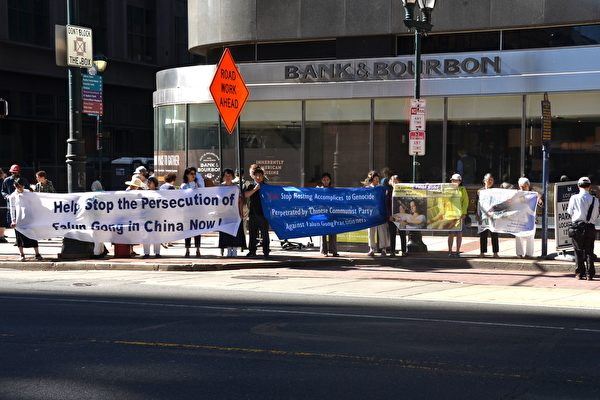
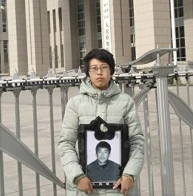
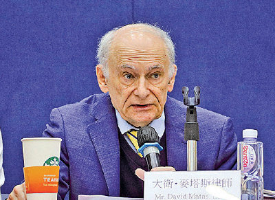
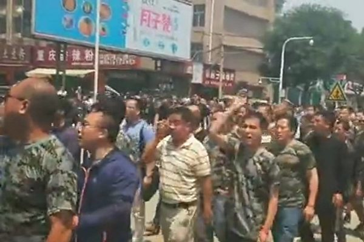
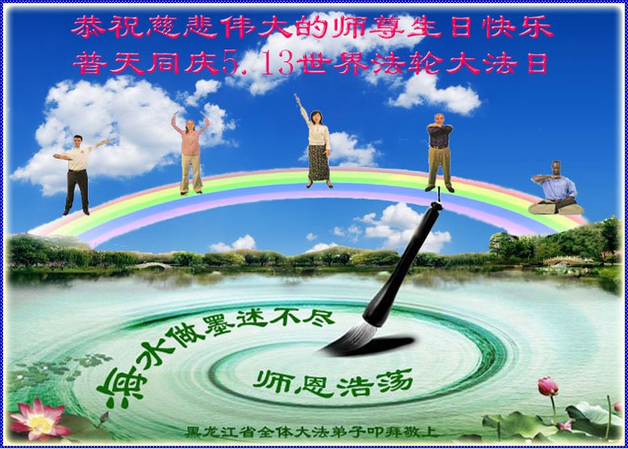
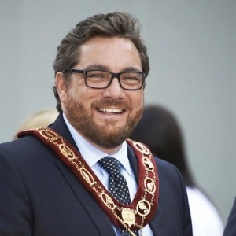

<h1 align="center"></h1>
<h1 align="center"><a href="https://github.com/3fmd/gm/blob/master/epub.md">免费下载epub电子书</a></h1>
<h2 align="center"> (推荐)Reasily - EPUB 阅读器，可以观看视频、音频(Reasily1802h.apk) 。 <a href="https://git.io/1802">点击直接下载</a></h2>

<h1 align="center"><b>“道士律师”遇到真正的修炼
</b></h1>
<h2 align="center"><b>大韩法律救助公团水源支部李惇荣律师的故事
</b></h2>

李惇荣在读法轮大法书籍。（全景林/大纪元）

【大纪元2018年07月12日讯】（大纪元记者赵润德韩国首尔采访报导）当今社会，在很多人的眼中，名誉、金钱和和睦的家庭就是幸福的全部了。然而，有时这些并不是幸福的最高尺度。韩国大韩法律救助公团水源支部的支部长李惇荣（54岁）律师说，他拥有了所有的这一切，但内心一直总是觉得很空虚。

“生活中的一切都很安稳，但是我一直在寻找精神上的突破口。经常喝酒、抽烟，不停地寻找刺激，但是精神上却无比空虚。不是恐惧，也不是兴奋，非常奇怪。我有时就想，宇宙如此广阔，而我存在的意义究竟是什么呢？如果我死后会完全消失，那是多么可怕的一件事情啊。”

李惇荣说，有时睡着睡着会自己惊醒，为了填补精神上的空虚，他读了很多书，同时接触了很多有关修炼的方法。同事也因此叫他“道士律师”但是，所有的这一切都没有为他带来改变，内心反而越来越空虚。

<b>X缘接法轮大法</b> 

2004年左右，李惇荣在大韩法律救助公团大田支部任职，有一天一位朋友对他说：“我发现了一个你会喜欢的东西。”他说，他在法院附近看到有人在炼功，是一种叫做“法轮功”的修炼方法。又有一天，一位同事递给他一本小册子，这次还是法轮功。接二连三的偶然也让他觉得这是一种必然，于是他立刻找到了法轮功的网站明慧网，并开始阅读指导修炼的主要书籍《转法轮》。

李惇荣回想说，“在读《转法轮》的那一瞬间，我就被深深地吸引了，目不转睛地读了起来，甚至觉得睡觉都是在浪费时间。书上写的都是我平时最想探索的，对于人生的一些问题，我以前不得其解，而阅读《转法轮》之后如醍醐灌顶。我感觉之前那颗无比空虚的心，渐渐丰盈起来了。”

之前，李惇荣总想找一位明师，希望他能为自己解惑答疑，然而，他一直都没有找到那位可以治愈自己心灵的明师，人生无比徬徨。现今，他说，从阅读《转法轮》的那一天起，终于遇到了自己一直寻寻觅觅的那位明师。

<b>成功戒烟、戒酒</b> 

修炼之前，李惇荣的烟瘾很大，是一个非烈烟不欢的“大烟鬼”，而且每次都要把整根烟吸完，完全吸到烟蒂处。他一天要吸一盒烟，因为他吸烟的特点，像吸了两三盒一样，浑身浓浓的烟味。另外，他还是个“大酒鬼”，几乎每天下班后都会去喝酒。烟和酒成为他生活中的不可或缺的重要部分。

可是他开始修炼后，没费力气就把上瘾的烟酒戒掉了，他感觉太神奇了。 “开始修炼一个月之后，有一次朋友劝酒，我就喝了一小口。但就在那一瞬间，我的头就像裂开一样火辣辣地疼。之前喝再多的酒都没有这样过，我吓了一跳。从那以后，一闻到酒味就觉得很难受。”

李惇荣说，“从那以后，自己没怎么费心，那么大的酒瘾就这么轻易地戒掉了。就这样自然而然地就不喜欢酒味，酒就成功戒掉了。

“和酒相比，我对烟的执著好像更强烈一些。虽然也不喜欢烟味，但是一开始戒烟也并非易事。不过有一天，我只吸了一口，内心深处不知为什么就觉得非常后悔。从那天开始，我就自然地不吸烟了。”

<b>记忆力增强</b> 

李惇荣说，戒烟、戒酒之后，记忆力恢复了很多。而且，修炼之后自己变得更有忍耐力了，处理一些比较棘手的案件时也不会觉得很难。虽然做的工作是一样的，但是由于自己的心境不同了，所以精神压力减轻了，疲劳感也减轻了。

李惇荣修炼之后，内心不再空虚，脸上一直挂着温和的笑容。孩子也说，爸爸变慈祥了，变得更平易近人。他说，“修炼之后，对人生的苦恼消失了，身体也越来越健康，生活充实而愉快。”

<b>传递法轮大法的美好</b> 

对李惇荣来说，法轮功就像穿透黑暗的一缕阳光，为他的生活带来了光明和充实。为了与别人分享这一份喜悦，他每周都到韩国的青溪山炼功。伴随着潺潺的流水声和悠扬的炼功音乐，李惇荣静静地展示著炼功动作，而这一份宁静与平和吸引了很多前来登山的人，他们也纷纷走入修炼。

李惇荣在炼法轮功第五套功法。（全景林／大纪元） 

李惇荣是隶属法律救助公团的律师，有很多人来找他咨询法律问题，他会找机会给这些人讲述真相。告诉他们，法轮功由于其显著的功效迅速获得中国公民的喜爱，而独裁者却容不下一个教人向善的修炼功法，制造谎言并横加迫害二十年。对被谎言舆论欺瞒、不知实情的中国人，李惇荣会告诉他们真相，并劝他们退出共产党的相关组织。

李惇荣说，“我现在觉得修炼是我存在的理由，虽然修炼已有14年之久，但是不足之处甚多。作为修炼人，应该时时处处为他人着想，先他后我，但是为他之心还远远不够，我应该更加精进。不过，得益于大法修炼，我内心一直是幸福和安详的，因为我找到了方向，不再徬徨。”

<h1 align="center"><b>易蓉：中共因迫害法轮功 走向崩溃与解体
</b></h1>

<h2 align="center"><b>2018年7月16日在纽约反迫害19周年集会上的发言
</b></h2>

全球退出中共服务中心主席易蓉发言表示，希望更多的华人抓住千载难逢的历史机缘，尽快公开退出中共党、团、队，在历史的关键时刻，选择正义、选择光明。（戴兵／大纪元）

【大纪元2018年07月19日讯】今天我们在纽约中领馆前举行集会及烛光夜悼，强烈谴责中共邪党集团对信仰“真、善、忍”的亿万法轮功学员长达19年的严酷迫害；悼念为坚守真理正信付出生命的千千万万法轮功学员。呼吁全民退党，彻底解体中共，结束迫害。

19年来，中共疯狂镇压法轮功，这场迫害集历史一切邪恶之大全，是对人性、人类普世价值及中华文明的肆意践踏与摧残，是要毁灭人类的一场空前浩劫。

面对疯狂的镇压，法轮功团体始终坚守对“真、善、忍”的信仰，讲真相劝三退，帮助三亿多中国人退出了中共党、团、队，使他们重获新生；同时法轮功迅速跨越国界、种族，洪传至全球五大洲，并赢得了世人的普遍敬仰与欢迎，法轮功在反迫害中创造了无数人间奇迹！

今日中国尽管有着世界上最严厉的全方位控制，退出中共党、团、队仍然像星火燎原一样燃烧着中国大地。退党大潮无疑已成为中国历史上最大的和平精神觉醒浪潮。
退党不仅发生在中国大陆，它遍布世界各地的所有旅游景点和唐人街，包括美洲、欧洲、港台、东南亚等，只要有华人的地方就有我们的退党义工。

每天成千上万的退党志愿者从中国大陆以及海外真相点、电话、网路将真相传给亿万民众，并帮助收集、整理登记退党、团、队名单并发送到大纪元退党网站。

退党大潮唤醒了沉睡于党文化洗脑与毒害的国人，清洗了中国人被党文化污染了的道德与良心，并帮助重建被中共摧毁了的传统道德和价值观，将人们从中共的精神控制中解放出来使之成为自由人。

3亿1000万的中国人已经为自己选择了光明的未来。它不仅仅正在改变中国，为中国社会和平转型过渡到一个美好的没有共产党的新中国奠定了良好基础，也必将为世界和平做出巨大贡献。中国人有权利渴望和得到自由，有权利选择一个没有共产党的美好未来。

让我们勇敢地携手，共同摆脱所有中共政权强加在我们身上的恐惧和伤痛。请全力拥抱与支持退党大潮，抓住历史机遇，唾弃中共、拥抱光明。

中共因迫害法轮功正走向全面崩溃与解体。我们相信人类对“真、善、忍”的尊崇，将复兴神传文化道德，同时也将重新引领人类对良知与正信的回归。发动迫害法轮功的元凶江泽民即将面临大审判，红墙正在倒塌，历史即将翻开崭新的一页。

我呼吁更多的华人抓住这千载难逢的历史机缘，尽快公开退出中共党、团、队，在历史的关键时刻选择正义、选择光明；我们深信历经磨难的中华大地，必将迎来美好的新纪元。谢谢大家！

<h1 align="center"><b>一個女孩被關押期間的奇遇</b></h1>  

囹圄里洗净污秽 修大法走向光明

【希望之声2018年7月12日】（本台记者慧光综合报导）
我是出生并生活在中国大陆的青年女子，因上班的公司不景气被迫下岗，下岗之后没有急于找工作，因我妈妈做生意需要帮手，就帮她打理公司，协助她搞管理。

我妈妈是从开发商那里承包了两栋房子做“三产”，就是第三产业。因为我们生意做得好，开发商觉得利益上吃亏了，就不断的向我们找茬儿，并企图毁约。当时我年轻气盛，非常生气，心想我们效益好那是辛辛苦苦干出来的，怎么能这么不讲信用呢？可通过正常途径去解决吧，又知道他的势力大，我们肯定搞不过他。怎么办呢？最后下决心，只有通过非正常的手段教训教训他，要不就不能出这口气。于是我找了几个社会上的小混混把那个开发商暴揍一顿，可没想到把他打伤了。虽然我出了口恶气，可派出所很快找到了我，将我拘留了一个月。

在拘留所的这段日子，那完全可以用暗无天日、生不如死来形容。长这么大从来没吃过这种苦，每天面对的都是非人的待遇，我接受不了，整天以泪洗面，痛苦不堪。

跟我关在一起的有一个因卖淫被拘留的女孩，为了打发时间，我每天就跟她打牌、聊天，实在没事儿干了我就看书。我喜欢看书，但拘留所里能看的书太少了，除了几本洗脑的书，没有别的。

前面的十多天我就是这样在百无聊赖中度过的，每一分、每一秒都感觉像度日如年。挨到第十三天的晚上，我的房间里又关进来一位大姐，我一看竟然是我家对面的邻居，我们认识。来了一位熟人本来是一件高兴的事儿，可是我高兴不起来，因为我知道她是炼法轮功的。受中共电视上的宣传，我对法轮功印象不好，所以看到她时我的心又凉了，觉得我跟她不可能有共同语言。

这位大姐看到我倒是挺高兴的，热情的跟我讲法轮功真相。可是我受中共的洗脑宣传，就是听不进去，还对她说了一些难听的话。她对我的爱答不理好像一点儿也不生气，还是耐心的跟我说这说那。看我实在不接受，就自己一个人安静的坐在那里，嘴里还默念着什么（后来知道是背法），不再管我了。我则继续与那位卖淫女打牌、聊天。

两天后，那个女孩拘留期满释放，监房里只剩下我和这位大姐。大姐仍然不失时机的对我说真相，可我满脑子都是央视对法轮功的污蔑和诽谤留下的印象，被这些错误的观念牢牢控制着，她一提法轮功，我就不爱听，很固执。而她对我的抵触只是微微一笑，然后照样背法、炼功。我则低头看书，大家相安无事。

就这样又过了两天，那天晚上监房里的灯突然不亮了，因为晚上没人修，我就看不成书了，只能眼睁睁地躺着看天花板。大姐倒无所谓，不是背法，就是炼功，看得出她过的很充实。

我虽然喜欢看书，可那时看书只是为了分散注意力，书也不是我喜欢看的书。不能看书了，我的悲伤情绪就上来了，越想越难过，不由得伤心的哭了起来。大姐赶快安慰我，因我们是邻居，比较熟悉，只是平时很少有机会交流。我们就开始聊各自的家庭、生活和工作情况，这一晚就算过去了。

第二天白天有人来修灯，检查线路没发现问题，可换灯泡时换一个瞎一个，连瞎了三个灯泡，问题还是没解决。没办法，晚上还是看不成书，只能聊天。慢慢地，我和大姐越聊越近，越聊越投机，大姐再说法轮功真相我就愿意听了。

第三天晚上，由于灯还没修好，我们聊了一会儿后，大姐就开始打坐。我看着她双盘的样子很好看，很舒服，就问她是不是腿很疼，她说炼了几年了不疼了。处于好奇，我也把双腿盘着坐在床上，只不过是单盘。大姐对我说双盘效果好，我年轻可以直接炼双盘，叫我试试。我就叫她帮我一下，用力一搬就成了双盘。当时没觉着疼，她就教我用手结印，眼睛闭上，进入打坐的状态。

就在那一瞬间，我突然感到脑子里一片空白，啊——，太舒服了，太美妙了，十几天的痛苦好像一扫而光，顿时心生愉悦，仿佛一切痛苦都解脱了。潜意识中有一种感觉，就像一直在黑暗中行走的人突然发现前方有了光明，那种喜悦、兴奋的心情真是无以言表。我当时就发出一念：我要修炼法轮功，这个功太好了！

第四天早上，维修人员又来修灯，当他把灯泡一换上去，电灯马上就亮了。没有做任何检查和维修就突然好了，当时我有点疑惑，没想明白是为什么。后来与大姐交流才明白，是师父为了救度我故意安排了这样的机会。明白后我的眼泪“哗”的就流下来了，多么用心良苦的安排！我对自己说，对于我这样的愚钝之人师父都不放弃，我还有什么理由不走入修炼呢！

在监房里后来又呆了十多天，我天天跟大姐请教修炼的事情，跟大姐一起背法、学炼功法，大姐还给我背《转法轮》，让我受益匪浅。在那之前我每天都觉得时间漫长，可那几天不知为什么，时间过的非常快，转眼就是一天，没干什么天就黑了。

很快我的拘留期满，可是我已经舍不得离开大姐了。

回家后，我开始自己学法、炼功，走入了修炼法轮功的行列，同时我也开始给亲朋好友讲真相，在我带动下有好几位亲戚也走入修炼。

每当回想起在拘留所的日子，我非常欣慰。这虽然是个冤狱，可我坐的值得，它使我迷途知返，终于醒悟。我永远都感谢这位大姐，她的善良和慈悲、耐心和真诚也永远留在了我的心底。

	
	

<h1 align="center"><b>天安门自焚伪案 美记者当年有何惊人发现
</b></h1>

【大纪元2018年07月20日讯】2001年1月23日，天安门广场发生“自焚”事件，中共借此抹黑法轮功。事发后，在当局封锁资讯的情况下，一些西方媒体人发表了第三方调查和评议，佐证了法轮功学员提出的“自焚”乃中共构陷的说法。

2001年2月4日，《华盛顿邮报》头版新闻引起震动——记者菲利普‧潘自河南开封发出报导，题为《自焚的火焰点燃了中国迷团——自焚的动机加强对法轮功的斗争》。

当时中共限制外媒采访，菲利普‧潘转道开封，走访“自焚者”刘春玲的家乡，披露“从来没有人看过她（刘春玲）炼法轮功”，而且呈现了法轮功深受欢迎以及中共镇压法轮功的实录。以下引号里的部分是翻译节选。

<b>镇压</b> 

“执政的中共利用此事，开足马力来证明它对法轮功的指控，并试图扭转中国及海外公众的印象，使之反对这个在18个月前被定为非法、当局运用残酷的策略企图消灭的团体。”

“每天早晚，政府控制的媒体发布最新的对法轮功的攻击。中小学校被命令要‘教育’学生们（了解此事）。在工厂、办公室和大学，有关此话题的讨论会不断举行。远在西藏的宗教领袖也发表了事先写好的批判声明。在开封，邮局发行了一款反法轮功的明信片……”

“中共政权利用此事向香港施压，试图迫使港方也禁止法轮功……”

<b>民意</b> 

“法轮功方面坚持表明，刘等人不可能是他们团体的成员。他们说，法轮功明确禁止暴力和自杀，并认为这可能是当局的构陷。”

“即使在开封，也有迹象显示，政府的宣传攻势已经失去了一些效力。几位居民表示，对法轮功的轰炸令他们感到疲劳。”

“‘我不是说，我不相信政府，不过我也没有说，我相信它。’39岁的刘小宇（音译）正在开封的一家夜市做饺子。她说，‘政府控制了新闻，现在我们都知道这个情况。’”

“出租车司机王超辉（音译）认为，法轮功是一种宗教。他说，因为5个人的行为而责怪拥有数百万修炼人的团体，是不公平的。无论在何种情况下，镇压法轮功都会产生反效果。‘中国现在不同了。他们不能把相信某种东西的人都抓起来，那只会让事情更糟。’”

王司机说，中国（政府）必须面对的真正问题是：为何有这样多的人相信法轮功。“人们对社会不满，”他说，“这才是问题。”

“和中国其它地区一样，在开封市，各种宗教开始复兴，因为共产主义意识形态已经失去了号召力。在过去十年里，大批居民转向基督教、佛教、道教和法轮功。在法轮功被禁止前，有数以百计的人在公园里炼功。”

“法轮功吸引了各阶层的中国人——党员，高级军官，官僚，教师以及数百万社会边缘的民众。在开封，一些工厂倒闭，经济下滑，许多人都在寻求信仰。”

<b>蹊跷</b> 

“官方媒体几乎未提，那五个往自己身上点火的人为何加入法轮功。北京方面拒绝了对因严重烧伤而入院治疗的刘思影和其他三名幸存者的采访请求。一名开封市官员说，只有中央电视台和新华社才被准许同他们的亲属或同事对话。记者来到刘春玲在开封的家，开门的男子说，有问题就去问政府。”

“刘春玲的邻居，51岁的刘敏（音译）说，‘她（刘春玲）有些不对劲，她殴打她的母亲，她的妈妈哭喊。她也打她的女儿。’”

“从来没有人看过她炼法轮功。”

<b>第三方报导的意义</b> 

“从来没有人看过她炼法轮功。”这一句话，足以说明一切。中共妄想一手遮天，但不料有西方记者另辟蹊径，找到了关键的缺口，从而撕开了自焚的黑幕。

在中共迫害法轮功的19年中，迫害集团操控了所有的媒体，对内封锁真相、疯狂镇压，对外掩人耳目、输出谎言。一些西方记者在非常有限的空间里，秉持客观公正的精神，在调查采访的基础上、撰写了数篇极具价值的新闻稿件。

不过，近些年来，不少西方媒体因为利益驱使，采取了自我审查的“过滤”策略。它们在报导中国人权状况时，极少涉及法轮功受迫害这一重大事件，极少记述法轮功学员在大陆承受的苦难和海内外修炼者要求伸张正义的呼声。此种态度和做法，背离了媒体应有的社会责任感和道义使命，令人遗憾。

17年前，这一篇外媒文章提到了中国人民对信仰的追求。今天，这种追求仍然在继续著，在照亮黑暗的长夜

	
	
	

<h1 align="center"><b>她遭遇车祸之后……</b></h1>

大难不惊平安过 高风亮节传佳音

【希望之声2018年7月11日】（本台记者慧光综合报导）老杜是一位普通的北京女性，家住北京城北的小月河附近。2000年那会儿她才四十五岁，虽然正值壮年，正是干活的年纪，然而单位不景气，当时搞什么“优化组合”让她下岗了。这以后每月的生活费就没有着落了，可孩子还在上大学，本来不宽裕的家庭一下子压力更大了，完全靠丈夫不高的收入维持。为了分担家庭的压力，六月份她刚刚找到一份临时工作，可干了没几天就出车祸了。

她家的住宅楼就在马路边，一出门就上马路。6月23日晚7点左右，她像往常一样骑自行车出门办事儿，刚要过马路时，一辆白色小轿车急驶过来，她本来想停下让轿车先过去，就在一刹那间，容不得她反应，小轿车带着急刹车的尖叫声就撞上了她，她顿时失去了知觉，什么也不知道了。

据现场的目击者反映，当时她的自行车前轮被撞飞了，其它部分扭曲变形，人被撞出去二十多米远，在地上翻了几个跟头，然后趴在地上一动不动了。头部、衣服上及地上都是血，路边的人看到这一幕都惊呆了，心想这么大的动静儿，人肯定死了。住宅楼里的人也听到了巨大的撞击声，纷纷从窗户里伸头往外看，目睹车祸现场的人都把心提到了嗓子眼，大家也都认为人肯定是不行了。

司机见状也吓坏了，半晌儿不敢下车。心想“这下完了，人被撞成这个样还有救吗？”听到路边的人议论说“人肯定被撞死了”，他就更害怕了。稍作镇定后，他还是下了车，吃力地抱起不省人事的老杜想送往医院抢救。他既紧张又慌张，因为害怕全身都软了，车门开了几次都没打开，无奈只好把老杜放到地上，再去开车门，然后才把老杜放到车上。当他再次把老杜抱起来时，又发现地上流了一滩血。

老杜的丈夫姓韩，平常大家都称他“老韩”，听到楼下的急刹车声和碰撞声，也赶紧到晾台上看，一开始没看清，当看到抱上车的人穿着米黄色的裤子他就知道不好了，急得他上衣没顾上穿、电视没关就往楼下跑。刚到马路边就有人对他说：“你爱人被车撞了，撞得挺厉害的，赶快去医院吧。”

他急忙拦了一辆车就去追赶，先是到附近的一家部队医院，一看急诊室没有，又慌里慌张的找到人民医院、北医三院，也没有。因这辆车另有急事，老韩又换上出租车赶到积水潭医院，还是没有。原来肇事司机走错路了，还是把老杜送到了部队医院。等老韩赶到的时候，他们的儿子也赶到了。

儿子对老韩说：“爸，你别着急，我妈没事。”

老韩心想，有事没事，我得看看人再说。

这时候正好老杜刚做完C T检查，老韩忙迎上去问医生怎么样，医生说：“没什么大问题，颅内没有出血，也没有骨折。”听到这话，他一直悬着的心才稍稍放下一些。

老杜做完CT后被转送到病床上，之后才渐渐苏醒过来。她意识到出事了，不过她首先想到的是“我是法轮功学员，不会有问题”，可此时她头上包扎的纱布仍在向外渗透着血，上半身的衬衣已被血浸透，但是她发现身上没有疼痛的感觉，全身哪儿都不感到痛，也不难受，这时她心里就踏实了。

大家看她醒了，就开始担心的问这问那，比如“你叫什么名字？多大岁数？今天星期几？家中电话号码是多少？”她都清楚的做了回答。看大家为她着急的样子，她就说“别担心，没有事儿”。当时她要求出院回家休息，可大家不放心，硬要她在医院住一宿观察一下，她拗不过只好住了一夜。

后半夜，她还在病床上双盘腿打坐了一阵儿，感觉更踏实了。

第二天早晨，她对丈夫老韩说：“没啥事，咱们回家吧。”于是老韩向单位要了一辆车回家了。

到家后来了不少人看望她。有的说：“看你被撞成那样，都认为你不行了，很可能要卧床不起了。可看到你现在跟好人一样，真是不可思议，太神了”；有的说：“我孩子看你被撞了以后，当时就哭了，说阿姨真没福气，年纪轻轻的就被撞坏了”；有的说：“幸亏你炼了法轮功了，不然小命肯定不保了”；还有的说：“你炼的这个功太好了，等你好利索了，我一定要跟你学”。老杜听了这些话后心想，“我的福气大着呢！这是师父给我安排的修炼之路，不管遇到什么磨难，没有过不去的”。

到最后解决问题的时候，司机怀着忐忑不安的心情对老杜说：“你看这事儿咋办吧，责任都在我，怎么赔偿你给个话，我尽最大努力。”

老杜微笑着对司机说：“我不会要你的一分钱，你放心吧。”

司机执意要给她买辆新自行车，老杜说：“自行车只要能修你就替我修好，我就非常感谢你了。”

这次事故就这样解决了。司机连声说：“这次真是遇上好人了。”

要说这司机也真够幸运的，要搁一般人遇上这事儿，不说乘机讹他一下，就说撞得这么重，正常的赔偿也是少不了的。如果在医院住上一年半载的，那得多少钱啊！况且老杜才十四五岁，又下岗了，没有了正常收入，正赶上手头儿缺钱，就算要点儿赔偿费也是合情合理的。可是法轮功学员修炼的境界就是要达到无私无我、先他后我，处处为别人着想，出了事情才会有这样的结果。

周围的邻居知道这事儿后都说：“这社会上要是人人都像法轮功学员一样重德该有多好啊！”

<h1 align="center"><b>学者：中国处爆发临界点 中共在末路上狂奔
</b></h1>

2018年3月23日，已有三亿人在大纪元退党网站退出中共的党、团、队，中共正在被和平解体中。（明慧网）

【大纪元2018年06月30日讯】（大纪元记者张顿综合报导）7月1日是中共建党97周年。有学者对媒体表示，中共是表面上光鲜，内部危机四伏，中国已处在大变的前夜，中共正在末路上狂奔。

中共自建党以来，就一直遭到世界各国的围剿，截至目前，中共鼓吹的“丛林规则”、无神论、斗争哲学等仍然受到西方自由世界国家的唾弃与抵制。中共官媒新华社6月28日刊发也承认，中共曾经面临“被开除球籍”的危险。

<b>中共统治阻止了中国经济的发展</b>
自由亚洲电台6月29日刊文说，不愿透露全名的中国网络作家李先生接受采访时说，中国近年来的经济高速发展，并不是中共执政的功劳。

他举例说：“比如现在有人研究晚清、晚明的历史，发现那时中国的GDP占世界的比重，比美国现在GDP占世界的比重还大。如果说经济发展好不好和执政党有关的话，显然不成立的。”

李先生说，同样是中共执政，文革时期，它把中国的经济带到了崩溃的边缘。“文革的时候，你不能说那是国民党执政，或者是什么民主党派执政吧？它也是共产党执政。”

时政评论员石实对大纪元记者说，中国经济过去几十年的高速发展，是勤劳的中国人民的功劳，而中共不但不赚钱，挥霍纳税人的钱财，而且还是阻止经济发展的障碍。当年的“农村的包干到户”也是农民的创造。

1978年11月24日，小岗村18名农民冒着极大的风险在“大包干”协议上按下了手印，决定实行包产到户，均分小队下辖的土地与劳动工具，展开自负盈亏的农业生产。

小岗村当年创造了惊人的农业收入，随后小岗村的发展才得到中共的推广，废除了以往的“人民公社”，在农村推行“家庭联产承包责任制”。

石实说，中共也是现在中国经济发展的障碍，现在都是市场经济，而中共还一直强调“党领导一切”，阻止了企业的创业精神、自主发展和竞争意识。

<b>没人信中共 中共正在末路上狂奔</b>

对于中共看似有拥有很多党员的问题，中共党史研究学者高文谦对自由亚洲电台说，中共主要靠两手，软硬两手。硬的一手就是高压管制、政治恐惧；软的一手就是利益收买。

高文谦说：“说句实在话，现在的党员还信共产主义，这完全是个笑话。都是为了给自己寻找机会加入中共的。”

中共一党垄断权力是中国所有问题的根源，高文谦说，从邓小平时代起，中共靠“韬光养晦”、发展经济，来掩盖很多问题，维持政权的稳定。现在又鼓吹所谓“大国崛起”，但国际政治气候发生了很大变化，中美贸易战可能令中国经济下滑，社会矛盾全面爆发。

他说，中共表面上光鲜，实际上内部危机四伏，最近发生的卡车司机罢工，退伍老兵维权，还有上海世外小学外面报复社会残忍凶杀案，所有这些东西都表明：中国社会现在各种矛盾已经到达爆发的临界点了。

高文谦表示，中共想用共产党当年的那一套，来面对现在中国发展中出现的各种各样尖锐的问题，这条路实际上是走不通的。“中国社会已经处在大变的前夜，中共正在末路上狂奔。”

至于说中共鼓吹它是“第一大政党”的问题，时政评论员石实说，中共党员的实际数量还远低于中共统计的数量。

他说，自2004年《九评共产党》发表以来，共产党的邪恶本质已普遍被国人熟知，包括中共高官在内的3亿849万人在大纪元退党网站上退出中共的党、团、队组织，中共正在被和平解体中。

石实说，现在中共高层四分五裂、派系林立（包括军队）、内斗进入白热化程度，中共中央与地方政府间的矛盾、官员普遍消极怠工；官民矛盾日益激化，维权事件此起彼伏；在外部，中共面临美国的经济制裁外，与周边的日本、韩国、菲律宾、越南、台湾的关系日益恶化。

石实认为，现在国内可谓是个“高压锅”，只欠缺一个导火线，一旦爆发，中共随时面临苏联解体式的命运。

	
	
	

<h1 align="center"><b>幸遇大法消痼疾 八年牢狱磨难不改初心
</b></h1>

陈四桂（前左）每天到蒙特利尔唐人街炼功，这已成为她日常生活的一部分。（Nathalie Dieul／大纪元）

【大纪元2018年07月15日讯】（大纪元记者谭雅加拿大蒙特利尔报导）在蒙特利尔唐人街中山公园，有一个法轮功学员的炼功和真相点。今年62岁的陈四桂每天准时来到这里，面对着街头各种肤色的游客或路人，静静地炼功打坐，这已经成为她在加拿大日常生活的一部分。

如果把时间推回到20年前，那时的陈四桂从未曾想到，自己有一天会远离故土来到海外。如果没有1999年开始的中共迫害法轮功（法轮大法）的旷世冤案，她应该还在中国广东的一个小镇上过着简单宁静的生活。

<b>幸遇法轮功</b> 

1996年秋天，广东肇庆，陈四桂的邻居介绍她炼法轮功，借给她一本《中国法轮功》，她看了很喜欢书里的话，跟着一起去炼功，几个月后，困扰她半辈子的气管扩张的老毛病竟然好了。

“我从小时就得了这个病（气管扩张），严重时会大口大口地吐血，吐很多血。到处去治，广州、中山大医院都去了，看不好。有人就介绍我炼法轮功，结果炼几个月就好了！”

陈四桂觉得很神奇，“法轮功太好了，我很珍惜”，她让儿子、女儿都来炼。女儿阿华一口气看完《中国法轮功》，连续发了三天的烧，之前眼睛看东西有重影的毛病也消失了。

陈四桂又把书给自己的老母亲看，老人家觉得看书费事，不愿看。隔了几年后，老人家自己拿起《转法轮》一书，一看就放不下了，她告诉四桂：“不得了，书里都是金光闪闪的，而且还在转。”从此，老人家每天早上起来学两讲《转法轮》。

就这样，陈四桂是家里第一个得法的，之后陆陆续续地女儿、小儿子、老母亲、外孙、孙女也先后走进了修炼。

得法后不久，陈四桂举家搬迁到广东中山的一个镇上，每天清晨，她骑着自行车来回十几公里赶去炼功点炼功，回想起那段时光，她觉得非常幸福。

<b>横遭八年冤狱</b>

法国预言家诺查丹玛斯在《诸世纪》里说：“1999年7月，恐怖大王从天而降”。

1999年7月，中共宣布教人修“真、善、忍”的法轮功“非法”，开始对法轮功残酷镇压。恐怖的阴云笼罩在每个法轮功修炼人的头上，生活在中山小镇上的陈四桂也未能幸免。

陈四桂没有受过多少教育，但她懂得“滴水之恩，当涌泉相报”的道理，懂得人不能说违心话，“我觉得法轮功那么好，我想让多一点人知道，多一点人知道。”

然而，中共竟容不得一句“法轮大法好”。为了说句公道话，陈四桂多次身陷囹圄，在2013年逃往泰国之前，陈四桂4次被中共非法抓捕，前前后后在牢狱中被关押了8年。

1999年12月份，因去北京上访，她被当地派出所关押15天；4个月后，她再度进京上访，被判2年劳教，关押在佛山三水劳教所；2004年，因为张贴“法轮大法好”的标语，她又被关进同一个劳教所，又是3年；2009年，她在街上和人讲法轮功的真相，被判3年刑，关押在广东女子监狱。

陈四桂说，那时街上有很多监控摄像头，她不懂这些，是警察把她贴真相的录像放给她看后才知道，不过她还是要出去讲真相。她说：“修炼前，我胆子小，很怕。修了大法了，就不怕了，大法那么好，我（告诉别人法轮大法好）又不是做坏事，我不是做坏事。”

在她的印象中，三水劳教所里有干不完的活，“每天做16个小时，电子产品、插花、毛衣，很多种活，都是出口的产品，天天干不完的。那些人（管教）恨不得我们不睡觉地做，就是那样也做不完。”

而在广东女子监狱时，对法轮功学员的精神折磨，超出了她的想像，从没见过这么“邪恶”的地方，地狱小鬼的黑窝一般。

“要你做诽谤大法的作业，不这么做，不给睡觉，不给上厕所。”曾经有3天3夜，陈四桂不被允许上厕所和睡觉，大小便只能在地上，同房普通犯人受不了脏臭，就上来打骂她。

录制造假录像也是常用的伎俩 ，“（中共）逼迫法轮功学员读编好的稿子，说自己的病不是炼功炼好了，而是看医生看好的。而且读的时候，还必须面带微笑，心甘情愿的样子才可以过关。”陈四桂回忆说。

有人精神承受不住，崩溃了，有人被送进精神病院，也有的人在狱中失去了生命。“那个时候，他们逼人写（放弃修炼法轮功）‘三书’，我就想宁愿撞墙死，也不能抹黑大法。可是又一想，这样（自杀）又给大法抹黑了。该怎么办呢，很难很难……”

“但不管这么样，这么好的大法我都得了，我坚持（学大法）的心是不会变的，也不会动的，我就一直在心里背法。”

陈四桂被关押的那些年里，家里也发生了很多变故。

八旬老母承受了很大打击，2007年在陈四桂从劳教所回家之前几个月，带着遗憾去世了。女儿阿华也被中共警察抄家，被公司辞退，为了安全，阿华不得不带着刚满2个月的儿子避走外地。陈四桂十二三岁的小儿子在学校读书，警察隔三差五就到学校去骚扰他……

2012年，陈四桂从广东女子监狱被释放。这一年9月，中共国保警察再一次找到阿华，威逼她写放弃修炼的保证书。最终，阿华和刚出狱的母亲商量，决定一家人离开中国，前往泰国避难。

<b>辗转海外 修炼如初</b>

历经辗转颠簸，陈四桂和女儿阿华分批逃到了泰国，之后阿华的儿子也来到这里和她们会合。祖孙三人向联合国难民署递交了难民申请保护。经过5年的等待后，陈四桂终于获得加拿大的难民保护身份，2018年2月来到蒙特利尔。

刚来的时候，蒙特利尔还是寒冬，从小在炎热地区长大的陈四桂没有见识过这么冷的天气，在唐人街上炼功时，手指头“冻得疼”，她非常想念泰国和广东。但想到中国大陆还有那么多修炼人在受迫害，她对自己说，“没有什么不能承受的”。

8年的牢狱折磨，似乎没有在陈四桂身上留下过多的烙印。她说自己是个乐观的人，凡事不会看得太重，“过去的事情，怎么艰难，我不都去想它，不值得想，过去没做好的，现在就做好。我每天都在想怎么向更多的人讲法轮功的真相。”

到了夏季，在蒙特利尔的户外讲真相活动多了起来，陈四桂说很喜欢参加讲真相的游行活动，举著“法轮大法好”的横幅，觉得很幸福，仿佛重新回到了1999年以前快乐地洪法的日子。

<h1 align="center"><b>近40摄氏度炎夏 法轮功游行感动日本民众
</b></h1>

来自全国各地的部分法轮功学员于7月15日在京都的闹市区举行反迫害游行。（卢勇／大纪元）

【大纪元2018年07月17日讯】（大纪元日本关西记者站报导）今年7月14日至16日日本连续三天休日，在气温38.8摄氏度的烈日下，来自日本各地的部分法轮功学员于14日、15日接连在日本关西的大阪和京都举行了反迫害游行。

19年前的7月20日，大陆时任中共总书记江泽民出于个人的妒忌，开始对广受民众欢迎的法轮功进行打压，对法轮功学员进行残酷的迫害，并且一直持续至今。世界各地的法轮功学员每当在7·20这一期间，都会举行集会、游行，呼吁世人共同谴责和阻止中共的暴行。

关西地带的豪雨及接踵而来的炎热，并没阻碍民众三天连休假期外出的兴致，而大阪与京都一向是外国游客的观光购物胜地，壮观的游行队伍穿过大阪著名的日本桥和心斋桥等游客聚集中心，吸引著众多民众的注目。

承载着中国传统文化的古城京都，是外国游客向往的观光热点，7月中旬正是日本三大祭日之一的京都祇园祭的最高潮，街头巷尾几乎被游客所淹没，同时可随处听到华人兴奋的谈话声。

游行队伍领头的天国乐团演奏的雄壮音乐让民众远远就翘首期盼，他们不放过每一个角度，纷纷用手机拍摄著游行队伍，中国游客更是惊叹于这个由法轮功学员组成的游行队伍，在京都主要大道上昂首阔步。

来自全国各地的部分法轮功学员于7月15日在京都的闹市区举行反迫害游行。（卢勇／大纪元） 

<b>“真的很棒，支持你们！”　</b> 

沿途观看游行的日本居民青木先生说：“我很关注这件事儿。我声援你们。请进一步推进这种反迫害讲真相的活动。我想这种方式最好。我与中国人一起工作，也知道法轮功受迫害。这么大气凛然壮观的游行队伍非常有意义，我与你们有相同的感受。”

听见游行队伍的雄壮鼓声，跑到大街来观看游行的公司职员松本先生和山本先生表示，“请无论如何要把这样的迫害真相传达出去。我们也要好好了解真相。”

接过迫害真相资料的铃木先生听闻气势磅礴的天国乐团演奏雄壮的乐曲，赞叹天国乐团的出色表演，“真棒啊！”

这两天正是今年破纪录炎热的两天，顶着烈日，修炼者真诚传递真相的热情感动着关西民众。

来自全国各地的部分法轮功学员于7月15日在京都的闹市区举行反迫害游行。（卢勇／大纪元）
 

来自全国各地的部分法轮功学员于7月15日在京都的闹市区举行反迫害游行。（卢勇／大纪元） 

  

<b>日本修炼者：再热也值得</b>

在游行队伍中有不少修炼法轮功的日本人学员，在38.8度炎热天气下，积极参与反迫害活动。来自东京的须藤表示，自己是在书店里接触到《转法轮》一书的，读了之后，感觉非常好，就想要学法轮功，之后在互联网上阅读法轮功的著作，并开始到炼功点学功。

他说自己就是觉得法轮功好，而且学法轮功很自由，没有什么宗教的规矩和束缚，自己想学就学，关键在于自己想不想提高自己的问题，参加活动也是自己想来就来了。

来自日本南部福冈县的寺崎太说，自己是在大纪元上看到法轮功被迫害的消息之后，就在思考为什么法轮功会遭到迫害，所以开始了解法轮功到底是怎么一回事。平时在实际工作中经常和同事发生冲突，以及带有对上司不满的思想，精神上正陷入苦恼。在读法轮功著作《转法轮》之后，他深受感动。

他说从中学、高中到出了社会，他一直都在思考人生的意义是什么，这些一直没有人能给出的答案，结果都在《转法轮》中找到了答案，所以，就想按著书上说的去做，就这样便开始修炼法轮功。

寺崎太表示，“今天参加游行，主要是想让更多的日本人了解法轮功，在炎热的天气下游行，的确是很辛苦，但能让更多的日本人知道法轮功，辛苦也值得。”

寺崎太表示，能让更多的日本人知道法轮功，辛苦也值得。（卢勇／大纪元） 

<b>“得益于法轮功 希望更多人了解”
</b> 

来自广岛的森原说，一开始是妻子因患各种病，晚上怎么也睡不着，药也越吃越多，后来朋友推荐法轮功，在只炼一段时间的动作后，困扰她多年的失眠症，持续两三周难以入眠的症状消失了，可以正常入睡了，真的让人不可思议。他妻子的健康很快得到恢复，还恢复了工作，也能做家务了。看到妻子如此的变化，他也开始修炼法轮功，现在在家里，夫妇俩每天早晚都会炼功，然后是读书。修炼之后，夫妇俩的关系变得谐和，不像以前那种强硬的态度处事了。

森原颇为感慨地说，“我自己因法轮功受益，所以想让更多的人了解法轮功的真实情况，所以同大家一起来参加游行。”#

森原说，“我自己因法轮功受益，所以想让更多的人了解法轮功的真实情况。”（卢勇／大纪元）

	
	

<h1 align="center"><b>“人体展”再遭质疑 澳权威医学机构吁关闭
</b></h1>

新州卫生厅日前被指责批准具有争议的塑化人体标本展览违反了其自身的道德和程序规则。澳洲皇家医师学院（RACP）进一步呼吁当局关闭展览。（网页截图）

【大纪元2018年07月11日讯】（大纪元记者燕楠澳洲悉尼编译报导）澳洲新州卫生厅日前遭到了澳洲皇家医师学院的指责，该学院认为卫生厅批准具有争议的塑化人体标本展览违反了其自身的道德和程序规则，并进一步呼吁当局关闭展览。

据《悉尼晨锋报》报导，四月在悉尼展出的“真实人体展”（Real Bodies: The Exhibition）也曾遭到律师、学者和人权活动人士指责。他们指称展出的尸体可能来源于被处决的中国政治犯。

现在，代表着2.45万名医生的澳洲皇家医师学院（RACP）也加入了反对行列，他们敦促州议员和联邦议员关闭人体展，因为该展览不符合道德标准，也对死者不尊重。

更糟糕的是，澳洲皇家医师学院在给部长/厅长们的信中说，这些来自中国的尸体缺少身份证明和同意捐献证明书，而这违反了新州卫生局自身的规范准则。信中说：“（新州卫生局）声明，这些来自于国际机构的人体和组织必须满足《1977年新州解剖法》及《新州解剖检查和解剖执照准则》有关获取同意和其它方面的规定，包括公开展示捐献者同意书的证明。”

按照“解剖检查”的相关程序规则的文件，新州卫生厅在人体捐献计划和公共展出方面的说法是，“解剖法的基本原则是要求用于特定目的人体捐献、储存和使用要征得同意。”

但新州卫生厅的一名发言人称皇家医师学院是错的，并称《解剖法》不适用于展览，因为《解剖法》是关于“人尸体的解剖学检查”。

<b>主办方雇用强大游说团体</b>

费尔法克斯媒体披露，很难从相关的州和联邦政府部门那里得到他们回应外界担忧的答案——是谁批准的展览？而展览主办方必须符合哪些要求才能在全澳展出尸体？

但费尔法克斯媒体却发现，“真实人体展”的主办公司Imagine Exhibitions在澳洲首都堪培拉有着很大的影响力，因为他们聘请了游说公司Barton Deakin来代表他们的利益。该公司在堪培拉由10名注册说客带领，其中8人是前政府雇员。该公司并未回应费尔法克斯媒体的置评要求。

<b>展览获得了哪方许可？</b>

主办公司Imagine Exhibitions总裁札勒（Tom Zaller）向费尔法克斯媒体表示，其公司在三月份的时候已经向新州和联邦卫生部门就展览中涉及的（捐献）同意和法律问题作了简要报告。

他还表示联邦的卫生部当局随后就在同一个月批准了展览的生物安全许可，并称新州卫生厅并未向他提出任何问题或提出其它要求，比如捐献同意书。

皇家医师学院的道德委员会主席克里奇（Ian Kerridge）教授表示，新州卫生厅不屑一顾的反应令人不安，政府的做法“自相矛盾”。他说：“针对细胞、组织、人体部件和人体进入（澳洲）境内的情况，有法律、法规和政策可循。” “ 无论如何，令人不安的不仅仅是围绕此类活动的法律，而是这种做法的道德规范，而我们的州和联邦政府都对此沉默。”

<b>法律漏洞</b> 

莫纳什大学的医学历史学家帕西蒂（Eugenia Pacitti）表示，所有关于人类遗骸的法律的基础都是知情情况下的同意，因此新州卫生厅不应接纳不符合自己标准的尸体和身体部件（入境）。

“人体（捐献）同意书的法律必须一视同仁，无论这些尸体是用于解剖检查，解剖课程还是公共展览。”她说， “新州卫生厅需要重新考虑其做法。”

她认为在人体展这件事情上，联邦和州相互推诿，互不通气，联邦允许尸体入境，是因为没有生物安全风险，余下的则有赖于新州卫生厅解释是否符合《解剖法》，在没有同意书的情况下展览尸体。

帕西蒂建议，“联邦政府和州政府合作，或者至少在什么是法律和道德允许的内容上有着强烈的共识。”

“《解剖法》自1881年首次立法以来，完全修订只有两次，因此难怪非传统用途的人体可以有一些漏洞可钻，如塑化尸体展览，得以继续进行。”

人体展在世界多地被禁止，包括以色列，法国，美国的夏威夷和西雅图。

<b>尸体来源疑云</b>

“真实人体展”共展出20具完整尸体和200件器官组织解剖标本。札勒曾经承认展览中所用尸体“毫无疑问来自中国”，但无法提供文件证明死者身份。中共的人权记录是外界担忧展览尸体来源的重要原因。英国《太阳报》报导，展示的人体标本从中国大连的塑化工厂获得。

2012年11月13日，追查迫害法轮功国际组织发布了《关于塑化人体标本尸体来源的调查报告》，报告揭露隋鸿锦创办了“大连鸿峰生物科技公司”。“大连鸿峰”是在薄熙来任辽宁省委副书记、省长时成立的，是一家完全用中国人的尸体制作“人体塑化标本”的公司。隋鸿锦曾称，部分“尸体”来自中共公安部门，使其设在辽宁的尸体加工厂能成为“世界上最大的塑化人体产业基地”。

自1999年中共打压法轮功以来，已有大量法轮功学员下落不明。根据追查国际的报告，薄熙来当上辽宁代省长后，新建、扩建了沈阳马三家劳教所、龙山教养院、沈新劳教所等，专门接纳全中国各地因为不报姓名而无法遣返的法轮功学员。

	
	

<h1 align="center"><b>浪子迷途遇大法 脱胎换骨成新人
</b></h1>

法轮大法将原本迷途的满心恶念的浪子，脱胎换骨转变成一个纯真善良、无私无我的好人。（明慧网）

【大纪元2018年06月29日讯】今年五十岁的大法弟子新德（化名），是江西省的山区农民，一九九六年在外地打工时有幸开始修炼法轮大法，从此好勇斗狠、满心恶念的他脱胎换骨转变成一个祥和慈善、一心为他人的好人。

<b>绝路迷途生恶念</b> 

新德兄妹八人，可以说都是在父亲的家庭暴力中长大的。他成年后，便跟着社会上一些不三不四的人鬼混，渐渐的，变成了善恶不明、好坏不分的浪子，挣了点钱就上饭馆狂吃、请伙伴们看黄色录影，有时为了哥们义气打群架，经常到处惹是生非。

一九九三年在做木材生意时，他被本地的黑老大黑吃黑，不仅被骗去钱款，还被逼支付他拖欠的贷款，新德当时内心又恨又怕，但不敢找他理论，只能吃哑巴亏。

一九九五年，村子里整顿偷伐树木森林的不良风气，村长将新德当典型上报，造成他被县森林公安局刑事拘留，本地广播站还诬陷他破坏了三百亩森林树木……

那时的他虽年轻力壮，但生活的艰辛、人世间的种种不平真的是无法用语言表达，经常晚上被噩梦吓醒，整个人在迷茫中沉沦，心中充满了怨恨和恶念。

<b>大法净化浪子魂</b> 

一九九六年八月十二日，是新德永生难忘的日子。就在这一天，他有幸遇到了法轮大法。当时他被村长报复，被逼去外地打工。在居住地附近，他偶然看到了路边悬挂的法轮大法的介绍简章，晚上机缘巧合，他观看了大法师父的讲法录影。

当场大法的神奇就在他身上体现了出来。当时，他边看录影边抽烟，旁边的一个学员提醒他不要抽烟，他二话没说立马灭掉了烟头，而且从此就戒掉了多年养成的严重烟瘾。

当时，新德在外打工，生活很艰辛，没钱，没工作，没住所，只能和同乡挤在一间很小很破的老房子里。但每天打工之余，他都会骑自行车到二十里外的城里去参加法轮功学员的读书学法活动。刚开始炼第五套静功时，虽两腿因盘坐疼痛难忍，但他还是感觉到了很强的能量场，身体有离地往起拔的感觉。

有一次干活时，他拉了一板车二千多斤重的水泥预制板，走到一个长途汽车站时，一辆中巴车加速想超过他的板车进站，结果与他的板车相撞，中巴车的大灯被撞烂，他整个人也被撞倒在车头上。可当时他一点都不觉的害怕，而且人和板车均安然无恙。事后想想板车上那么重的水泥预制板，按照惯性的常理，不可能一点事都没有。这件事让他亲身体会到了法轮大法的超常与神奇。

二十多年的修炼，法轮大法真善忍的法理不断净化著新德的心灵，使他从一个满口脏话、酗酒、赌博、斗殴、寻衅滋事，充满仇视心理的浪子脱胎换骨转变成一个真诚善良、宽容忍让，先他后我的好人。他事事都用法轮大法真善忍的标准要求自己的一言一行，遇到矛盾时总是向内找自己，从不与他人发生争斗。

<b>走村穿巷讲真相</b> 

一九九九年“七‧二零”中共开始迫害法轮功后，他为了坚定真善忍的信仰，为了告诉民众被迫害的真相，先后遭受了十年的牢狱折磨，经历过悬空吊铐、飞机铐、老虎凳、毒打、烟火熏烧、熬鹰等酷刑摧残。在漫长的超越人类承受极限的身心折磨中，他时刻都能感受到大法师父的慈悲与保护。一次，他被非法判刑关押在省监狱，一个暴戾的刑事犯人连续狠搧他几十个耳光，可他的脸既不疼痛、也不红肿。还有一次，他被关禁闭室，脚上还戴着几十斤重的脚镣，可他盘腿炼功时，却感觉如坐云端、祥和宁静。

尽管屡遭迫害，但为了救度被中共谎言蒙蔽的民众，新德多年来坚持结合自己的亲身经历，走村穿巷将法轮大法的美好告诉给每一位有缘的乡亲，向他们赠送册子、光碟等真相资料，清除他们头脑中被中共灌输的谎言和流毒，唤醒他们心中的善念和良知。村人明白真相后，也都得到了善报和福寿。

一位老年邻居因家庭矛盾一时想不开喝农药自杀，却什么事也没有。事后他流着泪告诉新德说：“我这条老命还活在世上，多亏了你送我的大法‘护身符’。我当时喝了农药，只是感觉脑袋昏沉，挨着护身符（放在内衣口袋里）的腹部却凉滋滋的，一点也不绞痛，谢谢大法师父！”

亲朋好友们亲眼目睹新德修炼前后天翻地覆的变化，渐渐对大法有了正面的认识。他的一个哥哥由以前撕大法书、把大法真相资料交给公安，到当着公安警察的面称赞大法好，讲他学大法后人变的善良了，讲其他的法轮功学员在他被非法判刑关押监狱时，经常不辞辛苦，前往乡下的家中探望他的老母，送钱、送米、送油等生活用品。

村子里的村长由以前打击报复他、将他逼往外地打工，到当着地区政法委头目的面讲述他在村子里做的一桩桩、一件件好事。有次他在外地打工，村长亲自跟他打电话，告诉他近段时间不要回家乡，说当地的公安正在四处搜寻他。

经历了近十年冤狱酷刑折磨的新德，虽然如今五十岁了还孑然一身，但他每天都乐呵呵的，感觉自己是世上最幸福的人。用他自己的话讲：“俗话说的好，江山易移本性难改，但法轮大法却将我这个原本迷途的满心恶念的浪子，脱胎换骨转变成一个纯真善良、无私无我的好人。我要衷心的感谢师恩，更要发自内心地道一句：法轮大法是利国利民的高德大法！”

<h1 align="center"><b>反迫害十九周年 费城法轮功学员集会</b></h1>	
	
	

7月15日，费城法轮功学员在美国民主自由的发祥地、费城自由钟广场前举行反迫害十九周年集会。（良克霖/大纪元）

	

【大纪元2018年07月17日讯】（大纪元记者良克霖费城报导）今年七月二十日是法轮功反迫害十九周年纪念日。七月十五日，费城部分法轮功学员数十人，在美国民主自由的发祥地、费城自由钟广场前举行了反迫害集会，让来自世界各地的游客，包括中国大陆的游客，了解法轮大法的美好、中共迫害法轮功的真相，以及十九年来法轮功反迫害的壮举。

当天早晨，在优美、舒缓的炼功音乐声中，法轮功学员们以展示法轮功功法拉开了活动的序幕。同时，法轮功学员还利用真相展板、演说、征集签名、发放真相资料等方式，向游人介绍法轮功能够祛病健身、提升道德品质，还有中共迫害法轮功、活摘法轮功学员器官的真相，并帮助来自中国大陆的游人退出中共党、团、队组织。

<b>纳粹大屠杀幸存者后裔：活摘器官堪比纳粹种族灭绝</b>

法轮功学员Alex介绍说，今天的集会是为了纪念法轮功反迫害十九周年。因为法轮功根植于传统中国文化，并遵循“真、善、忍”的普世价值，因此深受中国民众喜爱，在中国大陆曾经有上亿人修炼法轮功。但以“假、恶、斗”为本的中共却认为，这威胁到了其统治。

Alex说，一九九九年七月二十日，以江泽民为首的中共开始大规模迫害法轮功。成千上万的法轮功学员被关进监狱、劳教所，被逼迫放弃信仰。坚持信仰的学员受到残酷迫害，甚至被活摘器官。

Alex的爷爷是纳粹大屠杀的幸存者。他说：“我还记得爷爷告诉我大屠杀的暴行，包括用犹太人做医学试验，把成千的人赶进毒气室杀害，然后焚尸。我爷爷幸运逃出纳粹臭名昭著的奥斯维辛集中营，却又在共产党统治下的前苏联遭到克格勃的迫害。现在法轮功学员受到中共的迫害，被大规模地活摘器官，这堪比纳粹种族灭绝犹太人的滔天罪恶。我与其他法轮功学员今天在这里，是要让世人了解中共迫害法轮功的真相，共同阻止这场对无辜修炼人的迫害。”

“国际反强摘器官医生组织”代表Jessica Russo医生在集会上发言，揭露中共“按需杀人”、活摘法轮功学员器官的暴行。（良克霖/大纪元）

“国际反强摘器官医生组织”代表JessicaRusso医生在发言中说，在中国，法轮功学员成为中共“按需杀人”器官移植产业链的器官主要来源。

她说，在中国进行器官移植，病人只需要等待几周、几天，在特殊情况下甚至只要24小时。相比之下，在美国等有正常器官捐献体系的国家，病人等待器官的时间通常要一年以上。根据国际专家最新的调查结果，在中共迫害法轮功开始后不久，中国的器官移植数量开始大幅飙升，远高于中共公布的数字。在过去18年里，估计有150万例器官移植，其中大部分是活摘法轮功学员的器官。

<b>游客：面对中共强大政权，法轮功学员非常勇敢</b>

法轮功学员讲真相、反迫害的活动，赢得了许多游客的热情支持。当天有18位中国游客现场退出了中共党、团、队组织。

来自马里兰州的游客Mike Harper（左一）称赞法轮功学员非常勇敢地面对强大的中共政权。右一是法轮功学员Alex，他的爷爷是纳粹大屠杀的幸存者。（良克霖/大纪元）

来自马里兰州的游客Mike Harper是一家电池公司的工程师。他说，在过去的十几年里，我在华盛顿DC看到过法轮功学员讲真相，但我从没有停下来去了解。今天我才第一次了解到真相，知道在中国有活摘器官的暴行。

在“反强摘器官”征签表上签完字后，Mike说他非常赞赏法轮功学员和平理性地讲真相。“知道中共活摘器官的罪行，让我非常震惊。法轮功学员所做的事情非常了不起。面对统治中国70年的强大中共政权，法轮功学员非常勇敢。国际社会应该直面中共，揭露中共的谎言。”

中国大陆游客在了解中共迫害法轮功的真相。（良克霖/大纪元）

	

集会期间下起了大雨，但中国大陆游客仍冒雨浏览揭露中共迫害法轮功的真相展板。（良克霖/大纪元）

当天有很多中国大陆游客乘坐一辆辆旅游巴士来参观自由钟。看到气势宏大的法轮功活动场面，许多人都倍感好奇，争相阅读介绍法轮功和反迫害的真相展板，索要真相资料，并拍照录像。

西方游客在了解中共迫害法轮功的真相。（良克霖/大纪元）

几名法轮功学员讲述了她们向中国大陆游客讲真相的故事：

有中国大陆游客一家5人，听完法轮功学员讲真相后都退出了共青团。其中一位男士说，现在中共高官都有外国护照，把贪污的钱都存在国外，而普通民众却民不聊生。他说，我们在国内都看过“天安门自焚“事件录像，现在才知道这是中共导演的假戏，是为了栽赃法轮功。

一对年轻的中国游客主动找到法轮功学员，询问法轮功真相，并索取资料。他们说中共是最大的邪教，并表示支持法轮功的反迫害。

法轮功学员说，虽然现在很多大陆游客还是有怕心，不敢拿真相资料，但像以前对法轮功学员说脏话、动粗的人几乎没有了。而敢于了解真相的人却越来越多，他们主动与学员交谈，表达他们的支持。

<h1 align="center"><b>公安大学副教授赴美出丑 再曝中共自焚骗局</b></h1>

【大纪元2018年07月13日讯】（大纪元记者叶枫综合报导）中国人民公安大学等“科研人员”近日赴美，参加一个所谓研究邪教的组织ICSA在费城举行的会议，推销中共炮制的“天安门自焚”伪案等诽谤宣传，引发国际社会关注。

大纪元费城记者站报导，中国公安大学从事马克思主义中国化研究的副教授洪帆，在现场的录音采访中承认：“我们是被控制的，作为个人是改变不了（中共国家机器对法轮功的诋毁）的。”

与会的费城的精神科医生、法轮功学员杨景端博士问他：“中国公安大学是属于谁的？”

洪帆答：公安部。

杨博士又问：公安部属于谁领导？

洪帆答：全世界都知道，由共产党领导。

与会的法轮功发言人张而平表示，在这个会议（ICSA）上居然出现了中共编造的所谓“自焚”的展板。此展板由洪帆制作。该展板再次引发外界对天安门自焚案的关注。

天安门自焚案指的是2001年1月23日，天安门广场上发生的5人“自焚”。此案漏洞百出，仅举证其中数处漏洞如下：

<b>1. 自焚者是法轮功学员吗？</b>

法轮功是上乘佛家修炼大法，明确禁止杀生和自杀。真正的法轮功学员不会自焚。

法轮功主要著作《转法轮》〈第七讲〉中专门有“杀生问题”一节，其中写道：“杀生这个问题很敏感，对炼功人来说，我们要求也比较严格，炼功人不能杀生。”

1996年法轮功创始人李洪志先生在《悉尼法会讲法》时，弟子问，“杀生是一种很大的罪业，一个人他自杀算不算罪呢？”

李洪志先生回答：“算罪……所以自杀是有罪的。”

<b>2. 前后“王进东”是同一个人吗？</b>

2003年3月12日，追查国际委托台湾大学中国语语音实验室，对三集中共中央电视台的《焦点访谈》节目中连续出现的人物──王进东做语音检验鉴定。

鉴定结果显示，在天安门广场喊话的自焚主要成员“王进东”的声音，与最后在劳教所接受记者采访的“王进东”的声音，不是同一个人。也就是说王进东至少是由两个人扮演的。

<b>3. 刘春玲是自杀还是他杀？</b>

新华社说刘春玲自焚死亡。但是央视录像表明，刘春玲在自焚现场被人用物体重击脑部致死，绝非被火烧死。

如果把镜头放慢，可以看见当刘春玲正在火焰中挣扎时，有人用物体猛击她的头部，刘春玲随即倒地，一条状物快速弹起，从死者脑后飞出数米远，又以极快的速度从空中落下。那么谁是凶手呢？如果把那一时刻镜头止住，可以看见挥动的手臂接近刘春玲的头部，穿着军衣的武警正走向镜头前面，在他身后，一名身穿军大衣的男子正好站在出手打击的方位，仍然保持着一秒钟前用力的姿势。

<b>4.自焚者喝了汽油？</b> 

自称是自焚者之一的刘葆荣说，其喝了半瓶汽油，但据医学百科记载，人体口服汽油7.5克/每公斤体重，就能导致死亡。

<b>5.采访刘思影不穿隔离衣？</b> 

新华社报导说：“12岁的小姑娘刘思影全身烧伤面积达40%，头、面部四度烧伤，双眼睑外翻，呼吸困难，颜面、双手基本毁损。郝惠君、王进东等人也都有吸入性损伤和严重的烧伤……”

但根据医学常识，大面积烧伤病人，伤口需暴露处理，而非包裹处理；并且，为防止细菌感染而危及生命，严重烧伤病人要住隔离病房，探视者需穿戴隔离衣帽、手套、鞋套。而中央电视台官方记者穿便服，不穿隔离衣、不戴口罩，近距离采访刘思影。这是为什么？

<b>中共内部官员透露的“自焚”内幕</b> 

在“自焚”事件发生前，中共内部就已有消息走漏出来。

中国民主党国内负责人之一林春水曾经向海外透露，公安部一高级官员1月28日向他提供的消息指出：王进东23日自焚，贾春旺22日就知道消息。

他还表示，在中央政法委的会议上，罗干曾经说（大意）：“根据掌握的情况，即使我们王进东不自焚，也会有张进东、李进东等跳出来表演。”

明慧网2010年10月13日发表一篇文章，大陆一位知情者披露，2001年过年前，他所在单位领导告诉他，大年三十期间天安门广场要发生自焚，并告诉他说，这个消息是上级通知的，北京方面下来的，一级一级通知各地基层单位，有人要在天安门广场搞自焚。 在所谓的“自焚”发生之前，他们就知道了。

2015年12月19日，明慧网刊登一篇大陆法轮功学员投稿文章讲述，一位曾在北京当兵的高干子弟坦承，2001年发生在北京天安门广场的自焚案是军队干的。

“法轮功啊！自焚那事我比你了解，那年自焚事件，我就在跟前。”这位高干子弟向法轮功学员表示，“那事之前广场就戒严了，我是高干子弟，在北京当兵，那是我们部队干的，别说群众，连一个炼法轮功的也没有。不过话说回来，法轮功影响太大了，有那么强的凝聚力，连我们部队都比不了，这样一个民间团体，它们能容得下吗？”

2018年6月2日，海外明慧网一篇中国投稿文章透露， 天安门“自焚”案的前几天，大陆县以上的公安局长都被召集进京开会，并在“自焚”案发生的当天，收到紧急通知前往天安门；他们亲眼目睹了“自焚”这场戏。

<b>国际社会的声音</b>

1999年7月20日，前中共党魁江泽民以法轮功修炼人数多于共产党员人数等为理由，下令镇压。按中共官方的统计数据，至1999年，修炼者人数至少达到7,000万人。

法轮功，又称法轮大法，是以“真、善、忍”为原则的身心修炼功法，包括五套功法动作，祛病健身效果神奇。按中共官方的统计数据，至1999年，修炼者人数至少达到7,000万人。

在迫害法轮功政策难以为继之际，江泽民等人2001年特别策划了“天安门自焚”伪案，以煽动亿万中国民众的仇恨 。

十多年来，国际社会一直谴责中共炮制“天安门自焚案”，认为这是中共栽赃嫁祸法轮功的骗局。

<b>“国际教育发展组织”：中共“国家恐怖主义行径”
</b> 

2001年8月14日，“国际教育发展组织”在联合国会议上，就“天安门自焚事件”发表强烈谴责，认为这是中共当局栽赃法轮功的“国家恐怖主义行径”。

<b>《华盛顿邮报》：没人看到过刘春玲炼法轮功</b>

美国《华盛顿邮报》的记者菲力普‧潘在事发两周来到刘春玲和刘思影的家乡河南省开封市，并采访她的街坊邻居，得到的结果是，刘春玲在夜总会上班，曾殴打她的母亲和女儿，从没看过她炼法轮功。根据加拿大蒙特利尔大学历史学家、同时也是法轮功相关议题研究者大卫‧欧比（David Ownby）的说法，菲力普‧潘对刘春玲的描述，与典型的法轮功学员相当不同。

<b> CNN制片人：未看到自焚者中的儿童</b>

天安门广场上自焚者的身份也遭到美国有线电视新闻网（CNN）一名制片的质疑，她当时就在现场，对于中共政府称12岁的刘思影在母亲的催促下进行自焚。她表示当时在现场并未看到自焚者中有儿童。国外的一些观察家指出，中共不准外国媒体采访在医院治疗的自焚者，记者也不能与其家属接触。

《华盛顿邮报》记者菲力普‧潘在其报导中写道：“北京市政府拒绝了对刘思影与其他3名在院治疗者的采访申请；一位开封市的官员表示，只有央视和新华社能和他们的亲戚和同事接触；到刘春玲家进行采访时，一名男子隔着门表示，‘一切交给政府发言’。”

<b>美独立制片人：新华社迅速给外媒供稿不寻常
</b> 

中共官方媒体对所有在院治疗者做了采访，包括12岁的刘思影；但据官媒稍早报导，在采访前不久，刘思影才刚做完气切手术。美国独立制片人丹尼‧谢克特（Danny Schechter）质疑，一个孩子在接受完手术不久，声音却相当清晰，且刘思影在受访中还演唱了歌曲。

他并质疑新华社在事发后数小时内即把报导提供给外媒转载，相当不寻常，因为中共官方媒体对于敏感事件几乎不会有即时报导，通常必须经过层层审查。

<b>澳洲《时代报》：从未看过天安门广场的公安带着消防设备巡逻</b>

澳洲《时代报》（The Age）在其报导中也提出质疑，警方若事先不知情，却携带消防设备，且最近的建筑物离该处有数分钟路程，但警方却在90秒内，携带大量消防设备出现在画面中；该报导引述一位欧洲记者的话，他说：“我从未看过天安门广场的公安带着消防设备巡逻，为何那天不同？且事件发生地距离其最近的建筑物──人民大会堂往返需要20分钟以上的时间，若他们先返回取消防设备再赶去，恐为时已晚。”

<h1 align="center"><b>越南经济学女博士走入法轮功修炼</b></h1>

越南经济学女博士黎翠灵（Le Thi Thuy Linh）

【希望之声2018年7月4日】（本台记者慧光综合报导）

黎翠灵（Le Thi Thuy Linh）是一位聪明、漂亮的越南姑娘，她出生在一个有文化背景的家庭，从小就养成了喜欢学习的习惯，所以她从小时候起就一直梦想着成为越南最年轻的博士，成为父母的骄傲。

说来也奇怪，她们家只有姊妹两个孩子，当父母还想生第三个孩子——盼望能有一个儿子时，她竭力的进行阻止，坚持认为父母不需要生第三个孩子，她要比儿子做的更好。

2011年她获得越南青年联盟颁发的河内外贸大学毕业文凭，并且获得奖学金，得到去法国巴黎经济学院学习的机会。当取得这样的成就时她非常高兴，她已经证实了自己。

黎翠灵于2011年毕业于河内外贸大学时留影

2011年8月11日的晚上，她搭乘越南航空公司的航班离开了越南。当巨型客机在夜间冲进了烟雾弥漫的空中，看着地面上的光影逐渐消失时，她感慨万千，她默默的说：再见了，越南。她知道，在她的人生中这是一个很重要的转折点，她将开启在法国的学习旅程。

法国给她的第一印象是美丽的，和平的，也是浪漫的，就像她在小说中读过的一样。这里的山水，天空中的白云，以及地上的蒲公英和绿草地，都让她感到非常亲切。

她读书的地方是一座美丽的法式风格大厦，每天都能在这样优越的环境里学习，她感到很幸运。这里拥有自助餐厅、图书馆、游泳池和剧院等，她的学生生活非常丰富。她时常感到陶醉，因为对她来说，终于梦想成真了。

在法国的第一年是读取硕士学位（M1），学习任务还是挺重的，而且学校的要求也比较高。所有科目的第一门课程对她来说都有难度，没办法，她只好抓紧时间，经常在夜间学习到很晚。说实话，她很担心自己跟不上，害怕留级，尤其在异国他乡，有时候感觉自己很孤独，学习压力很大。到最后她真的陷入了困境，她的身体开始感到虚弱，有一阶段背部疼得很厉害，甚至无法正常站立行走，走一步都要咳嗽半天……

然而，越是困难的时候不幸的事情越多。因为压力太大，课程总是跟不上，失望、失败的挫伤感也越来越严重。有一次，老师在课堂上批评了她，她的自尊心和虚荣心受到伤害，从而产生了抵触情绪，脾气变得暴躁。在同学的眼里，她变成了一个傲慢、自私的人。她总想证明自己，可越这样结果就越糟糕。其实她自己也意识到了问题的存在，她也想改变自己，寻找一种解脱的出路，可是没有人能告诉她该怎么做。

在十分艰难的情况下，她终于坚持到取得硕士学位。她想继续追求在经济领域发展的职业生涯，很幸运，她又获得了读取博士学位的机会。

在继续的学习和研究中，她接触到了更多的现实社会，她很惊讶，人类有那么多的痛苦无法解决，比如贫穷、疾病等，索马里的弃婴，印度的贫民窟，以及世界各地的穷人所遭受到的歧视与悲惨生活无不在困扰着她。不仅如此，她发现即使上流社会的富人也同样面临着许多社会问题。她想帮助更多的人，可是她自己都不知道如何找到快乐，人生的意义究竟是什么？——她迷茫了。

为了寻找出路，她开始屡次光顾寺庙和修道院，像众人一样，祈祷、烧香，祈求佛陀赐予健康和快乐。有一天，在观音菩萨像前她默默的倾诉了自己的心声：“我想知道，我做了很多努力，为什么还不快乐？请帮帮我，让我去爱所有的人！”

蹊跷的是，几天后，有两位老同学向她介绍《转法轮》，并说这是法轮功的主要指导书，书中详细解释了人类的命运、生命的意义以及宇宙的所有奥秘，希望她尽快阅读。

她接受了同学的建议，认真阅读了《转法轮》，她说：“这本书真的打开了我的思想。‘真、善、忍’的法理消除了我对生活的所有疑虑。我意识到，我所有的疲劳、苦难和失望都源于不正确的追求，因为我已经偏离了‘真、善、忍’的宇宙法则。不是因为别人对我不好，而是因为我不知道如何做一个好人。因此，我决心按照‘真、善、忍’的原则指导自己的行为。”

2015年7月，她正式开始修炼法轮功。

黎翠灵在炼法轮功第五套功法——静功

开始修炼后，她变得身轻气爽，所有负面的情绪不知不觉间消失了，她说：“现在遇到问题或困难，我不再让自己陷入矛盾之中，而是冷静地向内找自己的不足，如果是我的问题，我就真诚的向对方道歉。我发现越温和越有智慧，我看到了完全按照大法去做就有无法估量的内在力量。我找到了真正的快乐！”

她说：“在修炼之后所从事的工作中，我没有了私心，而是抱着一个为了社会为了大众的美好愿望，当我的心平静下来时，好的事情就会自然而然地发生。我成功的完成了我的博士论文，在生下第一个孩子的前三天，我的论文评为优秀。后来，越南科学和全球专业人员协会（AVSE-G）委托我管理一个重要项目。”

2017年10月在法国巴黎法轮功学员游行期间黎翠灵（右）和朋友在一起向民众散发吉祥物 

她还深有体会的说：“我发现，无论我做什么事情，只要做到无私无我，就没有痛苦和烦恼的感觉了。事实证明，这是从一切烦恼、僵持和绝望中解脱出来的唯一正确方式。”“我意识到，不仅是我自己，任何人、任何社会，只要认真践行‘真、善、忍’的原则，什么都会变好。确实，当人们真诚面对生活时，一切都会变得美好。”

<h1 align="center"><b>长命百岁不是梦
</b></h1>

【明慧网二零一八年七月十二日】小时候看《西游记》，妖怪们都知道唐僧是金蝉子转世，吃唐僧肉可以长生不老。懵懂的年纪，知道了长生不老是件好事情。

后来知道，佛教始祖释迦牟尼早年虽贵为太子，仍为人生的老、病、死、苦而忧闷，甘愿放弃王位，寻求解脱之道；中华人文始祖黄帝向广成子求道，在一百二十岁时乘龙白日升天；统一六国的秦始皇到处寻找使人长生不老的灵丹妙药而不可得；重振大汉雄风的汉武帝爱好成仙之术，最大的愿望就是长生不老……

千百年过去，现代的社会科技医学发达，仍无法破解生老病死的难题。“千年树难遇，百岁人难寻”，长命百岁似乎是个遥不可及的梦。

不过，仍然有一些年逾百岁的寿星，他们无分贫富贵贱，都有一些共同的特点。

<b>八十八岁时全身病痛，年逾百岁却全身轻松</b>

马济宇先生在炼法轮功

马济宇先生一九一二年出生于广东梅县，南京中央大学医学院毕业后，任职军医；一九四八年随国军到台湾，任陆军内科主任等职。

退休后，马先生携老伴赴美与儿女同住，享受晚年的快乐。但世事难料，晚年的马先生百病丛生，老伴也隔三差五地打针吃药。马先生说：“那时才惊觉，虽拥有绿卡，住在高级、幽雅的环境，却没有健康的身体来享受人生的幸福美满。”

一九九一年，老伴先他而去，马先生一年里有三分之二的时间在医院里度过。他深感生不如死，数度萌生自杀的念头，但子女的一片孝心让马先生保住一点活下去的勇气。即使如此，他感觉自己未来的人生也只剩下无奈地承受病苦了。

马先生在八十八岁、生命将到尽头时，开始修炼法轮功。几个月后，严重的心脏病、前列腺肥大等病全没了。儿女们看到无病一身轻的父亲，都深感欣慰。

一次，他参加洪法活动，从阶梯上摔下来，“那时我还差三阶就到顶了，从那么高跌了下来，我却马上就爬起来了，头上流了一些血，我就用手按住，继续当地的活动，活动结束，血干了，我什么事也没有，冥冥之中好象有神保护我。”
	
马先生回忆，学法轮功之前，有一次他坐在不到一尺高的小板凳上看报，伸手想拿手边的报纸，一不小心摔下来，就住院了。

<b>百岁老人长新牙，白发变黑，老年斑不见了</b>

明慧网二零一七年十一月十八日文章《百岁老人长新牙》讲述了一位山东老年女法轮功学员的故事。老人一百零六岁，身体健康，还长出了几颗新牙。

可是，这位老人在二十二年前几乎常年卧床不起，有肺气肿、痛风、妇科病等多种疾病。一九九五年，老人开始修炼法轮功。不久，所有疾病不翼而飞，能下床干家务活了，烧火做饭，照顾重孙女。更神奇的是，过去让她闹心的一脸老年斑也不见了！

老人虽然不识字，但这些年持之以恒听师父讲法，平时严格要求自己，按照师父的要求做一个好人。过去她在家里说一不二，全家人都必须听她的安排。修炼后，不管遇到什么事，她都用大法衡量，还经常教育孩子按真善忍的标准做人。

老人虽然百岁高龄，但身体健康，头脑清晰，白发变黑，皮肤细腻，还长出了几颗新牙。人们在老人身上见证了大法的美好和超常。

<b>法轮大法延长了她的寿命</b>

明慧网二零一八年四月五日文章《百岁老人：法轮大法延长了我的寿命》，讲述了一位一百零六岁老人的故事。二零零四年，老人得了绝症，已到晚期，医院治不好，家人把后事都准备好了。

老人的女儿是法轮大法弟子，看妈妈很痛苦，就教她念“法轮大法好，真善忍好”，还问她学不学法轮大法。老人一口答应：“学！”于是，女儿带来大法师父的讲法录音带。老人一遍遍听师父讲法，当天下午就可以喝稀饭了；第二天就可以站起来，能干家务活了。至今，十四年过去了，老人一直听法，炼功，身体也很健康，没得过病，没吃过药，身体好的很！

下面是这位老人的照片

<b>母亲深明大义，得福报</b> 

明慧网二零一八年五月九日刊登了一篇文章：《106岁的母亲深明大义　三得福报》。作者是一名河北法轮大法弟子。她的母亲一百零六岁，身体健康，耳不聋眼不花。九十岁那年到医院体检，医生说她是“四十岁的心脏”，血压正常。

母亲没有修炼大法，但她相信大法好，支持女儿修炼。在中共迫害法轮功最疯狂的那几年，母亲省吃俭用，把儿女给的钱攒下来，给制作法轮功真相资料用。

二零零九年，作者被中共绑架到劳教所迫害一年多。母亲去看她，当着两个警察的面对她说：“闺女，娘知道你是个好孩子，咱走到哪儿都不丢人！就是现在的世道变了！”

因为母亲相信大法好，支持大法和大法弟子，并常念“法轮大法好”，在以后遇到危险时，多次得福报。母亲百岁时，一次去厕所滑倒了，髋骨摔裂，不能走路。之后找人按摩，不仅没好转，疼痛还加剧了。后来到大医院诊治，医生说骨头裂了，经按摩又错了位。当场做了对接治疗，对位后裂痕还是很大。医生说，骨头裂开了，没有力量了，何况百岁老人，回家躺着养着去吧，起不来了。

回家后，作者与母亲，还有大嫂（也是大法弟子）三人一起坚持念“法轮大法好，真善忍好”。不到三个月，母亲就能下地走路了！后来一切都恢复正常，还经常小跑着穿行马路。

<b>百岁的老人，二十岁的心脏</b>

明慧网二零一五年八月十九日文章《百岁的老人　二十岁的心脏》讲述了一个神奇的故事。

作者的姥姥在九十五岁那年，突然耳聋，什么都听不见。作者对着姥姥的耳朵用正常的声音说：“姥，您听好：记住真善忍好，法轮大法好。”作者一字一字重复着。母亲在一旁说：“我们跟她喊，她都听不见，就你这声音，她能听见啥呀？”姥姥微笑着。作者说：“您要听的见，就跟着我说啊！”姥姥真的跟着一字一字念起来：“真善忍好，法轮大法好！”

父母都惊呆了说：“怎么回事，真听见了？”他们简直不敢相信发生的一切，高兴的说：“真神了，太神了！”

从那以后，作者告诉姥姥每天念“真善忍好，法轮大法好”。姥姥很听话，每当作者去看望她时，她便像个天真的孩子乐呵呵地说：“我天天念呢，我没忘记念。”

姥姥九十九岁那年，由于发烧住進医院。医生发现姥姥的心脏和血压出奇的好，都说太不可思议了！怎么一百岁的老人却有二十岁的血压和二十岁的心脏呢？消息传开，院长和许多医生、护士都来看她。

姥姥在一百零四岁那年安详地离开人世。后来，姥姥两次托梦给母亲，说她在皇宫生活，非常享福，让母亲放心。

<b>结语</b>

本文列举的百岁老人都有一个共同的特点，就是相信法轮大法真、善、忍。明慧网还有许多这样的案例。他们有的原本疾病缠身、生命将尽，修炼后身体康复、生命延长；有的是大法弟子家属，明真相，得福报，延年益寿。因为大法师父讲：“一人炼功，别人要受益的。”[1]特别是在邪党残酷迫害的环境下，家人能够深明大义，支持大法，是非常难能可贵的，定会得到神佛护佑，遇到险境也能遇难呈祥。

在当今的中国大陆，“看病难，看病贵”，成为压在人们身上的一座大山。普通百姓不敢生病，也生不起病，一场大病就可以把全家掏空，更不用说长命百岁，颐养天年。

法轮大法以祛病健身奇效和巨大的道德感召力，吸引亿万民众走入修炼，福益四方，众多延年益寿的百岁老人即是例证。

长命百岁、长生不老，象是神话，却并非神话，这就是法轮大法创造的人间奇迹！

注：

[1] 李洪志师父著作：《转法轮》

<h1 align="center"><b>共产党迫害法轮功 应受全世界谴责
</b></h1>

前赵紫阳政治秘书、前中共中央委员鲍彤

【大纪元2018年06月22日讯】（大纪元记者骆亚采访报导）6月20日开始，来自世界各地的近万名法轮功学员聚集美国首府华盛顿，举行为期三天的集会游行系列活动。中共前总书记赵紫阳的政治秘书鲍彤接受大纪元专访时表示，法轮功在中共党魁江泽民的打压下，反而越发壮大。共产党迫害法轮功犯下反人类罪，应该受到全世界谴责。

<b>“4.25”万人和平大上访 鲍彤初闻法轮功</b> 

今年85岁高龄的鲍彤这次听闻法轮功在DC举行盛大活动时感慨地表示，法轮功在江泽民的打压下越来越发展壮大。他介绍自己1996年5月“从秦城监狱出狱以后，因为讯息闭塞，孤陋寡闻，还不知道有法轮功，也不知道法轮功是怎么一回事”。鲍彤刑满释放后，也一直生活在软禁中。

据法轮大法明慧网的资料，法轮功由李洪志大师于1992年5月13日开传，当时在吉林省长春市开办首期法轮功学习班。因为法轮功功效显著，通过口耳相传，修炼法轮功的人越来越多。到1999年7月中共江氏集团对法轮功进行镇压时，大陆修炼人数已经达到1亿人。

鲍彤说，自己是1999年4月25日万名法轮功学员和平上访时听说法轮功的，“法轮功在中南海的西门集合，好像是有1万人。那一年我听说，有许许多多人在中南海那里请愿。因为请愿的事儿挺多的，中国的冤假错案多，上访上诉的人多。前所未有的各方面的事情都有，所以就不觉得奇怪。”

<b>朱镕基出面接待解决问题 江泽民大怒</b> 

他接着介绍说，当时的中共喉舌《人民日报》尽管封锁新闻或者歪曲新闻，但它有些事情还是要报的。“我记得是第二天或者第三天，我看到《人民日报》报了这件事情，说是法轮功要求政府给他们修炼的自由，不要取缔、不要迫害，也看到了当时的国务院总理朱镕基出来了，好像回答了三条吧！第一条就是说党和政府没有迫害法轮功的意思。第二条呢，希望法轮功呢不要怀疑党和政府的意思，大家能够相安无事嘛，大概就好了。”

根据明慧网资料，1999年4月25日，法轮功万人和平大上访，前往中南海府右街的信访办反映问题，并提出三点要求：“第一，要求公安机关立即放人（释放被抓捕的45名天津法轮功学员）；第二，给法轮功提供宽松的修炼环境；第三，允许出版有关法轮功的书籍。”

鲍彤表示，当时看了中共党媒的报导，“我觉得老百姓有要求、法轮功有要求，就向党中央、向中南海提出，静坐、示威、谈判，我觉得这是很正常的。国务院总理知道老百姓有这个要求，提出来澄清一下事情，把事情平息下去，大家相安无事，那也是挺好的。”

“过一段时间以后，突然说江泽民大怒，好像接着人大常委这个橡皮图章就起作用了，就量身订做通过一个法令，然后接着就是镇压。”

<b>法轮功修炼身心、增进健康</b> 

鲍彤强调：“镇压的手段不仅非常卑鄙，而且极端残酷！极端残酷！修炼法轮功有什么罪？修炼法轮功是要取得身心的平衡和健康。法轮功是凭著增进公民身心健康的实际成绩来取得信任、来逐渐扩大的。”

鲍彤表示，当时社会上3千万的下岗工人，这些下岗的工人跟农村里边的农民大部分人都是缺医少药，挂不起号、买不起药、住不起院这样的人，他们要不要生病？不是他们愿意生病，而是他们不得不生病的时候，他们怎么办？光是这样一个现实的问题，就迫使人们要追求一种修身养性的功法，通过锻炼身体、增进健康抵抗疾病。

他强调，就这么一个朴素的愿望就把千千万万的人就吸引过来了。如果法轮功没有作用，人们能信吗？

他引用美国总统林肯的话：“你可以骗几个人，你不能骗千千万万的人；你可能骗一时，你不可能永远骗下去。”

“法轮功之所以有吸引力，是因为法轮功在修炼身心、增进健康、抵抗疾病、促进人民的幸福方面是有他现实的看得见的作用的。能治病这样一件好事情，你要取缔，而且是因为你一个人取缔。我可以这样说，至少朱镕基是不同意的。”

他进一步批中共党魁江泽民说：“因为你江泽民一个人在那儿咬牙切齿，不仅是反对，而且是运用法律手段来反对，这个是很卑鄙的。哪一个国家元首可以为了自己不高兴，自己下命令要立法机构专门为这个事情量身订做来立这个法。”

中共每次对法轮功的打压都是对法轮功的弘扬，法轮功在反迫害十九年中以平和的方式向各界传播真相，在全世界广泛弘扬，深受各国人民的尊敬和爱戴，至今已洪传世界一百多个国家和地区，法轮功书籍被译成四十种语言出版发行，并可在互联网上免费下载。李洪志先生和法轮大法获得各国政府的各类褒奖、支持决议案和信函超过3,000项。

<b>中共才是最大的邪教</b> 

鲍彤表示，“后来事情就多了，说是法轮功有人要自杀，所以法轮功是‘邪教’，后来揭露出来是他们（中共）制造（法轮功）自杀的假新闻。”

1999年7月20日中共江泽民集团利用中共庞大国家机器对法轮功开足马力进行疯狂打压，江泽民并叫嚣“三个月内消灭法轮功”，但未能得逞。眼看这场对法轮功的镇压很难继续下去， 中共炮制了天安门自焚伪案，于2001年1月23日（大年三十）上演。此案一直被国际社会认为是中共制造的一场世纪骗局。新唐人电视台2002年1月制作的分析天安门自焚伪案的影片《伪火》，获第51届哥伦布国际电影电视节荣誉奖。

就自杀这种现象来说，鲍彤强调这是一种社会悲剧，在任何一个社会里边都会产生的。“如果说自杀人数越多就越是邪教的话，我说第一个邪教就是共产党。共产党高层从政治局委员高岗开始，一直到下面，有多少人自杀？！AB团的时候、红军打土豪分田地的时候就有人自杀，直到文化大革命多少人自杀？！成批地自杀，我说共产党你就是最大的邪教，它本身就应该清理自己。”

鲍彤还痛批中共说：“根本就是岂有此理嘛！哪有这样的道理。欺骗、威胁、迫害，只要是法轮功就抓，抓起来就关起来，关起来就经历各种刑罚、酷刑，一直到活摘器官，那简直是暗无天日啊！都到了这个程度。”

鲍彤强调：“所以我觉得共产党迫害法轮功这是一个反人类罪，法轮功反对共产党的迫害这是正义的；共产党反人类罪应该受到全世界的谴责，法轮功反对共产党的迫害应该受到全人类的支持。”

<b>凡是活摘器官的人、党、政府都应接受审判</b> 

2015年5月以来，中国大陆法轮功学员发起了控告江泽民的大潮，各地法轮功修炼者和家人纷纷把控告元凶江泽民的刑事控告状邮寄给中共最高检察院，要求最高检察院向最高法院对江泽民提出公诉，把这个反人类的首恶绳之以法。同年的年底，明慧网就已收到逾20万法轮功学员及家属递交给中共最高检察院、法院的实名诉讼状副本。
鲍彤此前曾在人权日时表示，大陆的法院要有担当、敢受理诉江案，这个事情应该重视、应该进入法律程序，并希望这些事情最后有一个结果。
中共活摘器官罪行令鲍彤极其震惊，他曾表示这是天地不容的，并说：“凡是活摘器官的人、活摘器官的党、活摘器官的政府都应该受到人类的谴责，都应该站到历史的审判台上成为被告，接受审判。

<h1 align="center"><b>喜得法轮大法 草本庄园园主翻转人生
</b></h1>   

台湾法轮功学员简素燕，煮茶品茗，展现茶艺文化。（曾记茶行提供）

【大纪元2018年07月08日讯】（大纪元记者李芳如台湾云林报导）台湾草本庄园园主简素燕，从小就能感受到另外空间的生命。她家住嘉义梅山乡太兴山上，到处都是茶园，爷爷又喜种植药草，使得她从小就认识很多草本植物，一看就几乎知道了它们的属性，就像多年认识的好友一般。

“从小就常常梦到一些事物或仿佛看到一些画面，有些不好事情总是在现实中发生，心里很害怕、惶恐，但又不知如何摆脱。”体质敏感的简素燕，总能感受到或者看到一些事物， “有时候一闭眼睛，眼前就像万花筒一样，各式各样的东西，里边有立体世界。”

“有时会看到天上的楼台亭阁、琼楼玉宇、山水楼阁。有时会常做同一个梦，梦见天上有一个吊篮下到人间，里面有一本金光闪闪的书。”她说。

由于体质敏感加上身体一直不好，简素燕想尽各种办法祛病健身，看各类佛经甚至游走各个法门，皈依、练气功等等。

1996年接触某一法门练习静坐，简素燕突然觉得自己身体起了变化，感觉好像有另外的灵体进入自己的身体，会讲莫名其妙的话（后来才知道是宇宙语），而且还会看病，知道别人有什么病，晚上也睡不着，觉得身体不只是元神，还有另外的东西，身体被控制着，那时她很困扰，到处寻求摆脱的方法。

在茫然不知所措之际，简素燕有一天无意中走到一家书局，里面有一个架子上面发亮，“为什么会闪闪发光？”心中的疑惑驱使她走进去一探究竟，“一走进去就看到三个字《转法轮》。”

“奇怪！怎么会闪闪发光？一翻开书刚好就讲到宇宙语，什么是副元神，讲到我最困扰和迷惑的问题，我心中的困惑迎刃而解。”简素燕说。这也让她想起了之前梦中的那闪闪发光的书。

“其中有一句话打动了我，修炼的过程就是不断的去人执着心的过程。”她觉得这句话讲得很高，真的是要修自己。

自己照书中讲解的动作炼功，竟然发现这些动作似曾相识，好像以前就炼过了一样。“炼了之后整个人感觉就不一样，身体变好了，全身的病痛通通都没有了，连最困扰的那个东西（附体）也没了，身体完全好了。”

“法轮功太神奇了，太神速了！”简素燕说。

<b>珍惜机缘  再续前缘</b>

1997年炼了大约半年时间，简素燕的身体好了，她开始过平常的生活。为了赚钱，她陆续投资了一些钱做电台节目、参加商展、购置一些录音设备等等。由于忙碌，她忽略了法轮功。后来因为投资失败，经济陷入危机，积欠将近500万元债务。

简素燕说，“1998年之后，身体又出现状况，经济也陷入危机，夫妻俩人为了金钱常常吵得都要离婚了，吃不下饭睡不着觉，非常非常的痛苦，再加上另外空间的干扰，感觉自己生命好像走到尽头了，要结束了。”

偶然间走进一处书店，是佛教文物出版社的老板，对方见到简素燕后，感觉她特别不一般，竟然把密宗最高的心法传给她，并且告诉她，她背后有一尊非常大非常大的大佛。

回去后还是觉得自己很空虚，仰望星空，竟然不自觉地说，“师父啊！我该怎么办？”

已经完全忘记法轮功的她，竟然感觉到有一股飘手劲，“结果我的手好像被提上来，自动的炼第三套功法，冲灌冲灌的，突然间就想起法轮功来了。”

一周后有朋友来访，你炼什么功啊？气色好好喔！她说，“我炼法轮功。”接着朋友也跟着一起炼功，慢慢地将近有几十人炼功。

由于孩子上国中适应不良，简素燕为了陪伴孩子举家迁移到斗六，她在斗六开了一家茶叶行和录音室，也让她谋得另一份出路。

在人生地不熟的地方，冥冥之中好像有人安排似的，云林县一些政要名流纷纷找上门来录音。也因此这些人透过这样的方式认识法轮大法，了解法轮功真相，甚至也来学炼法轮功。

简素燕也因声音甜美，反应又快，打电话到大陆讲法轮功真相时，许多人都很爱听，甚至连公安单位、政法委等办公室，她都打过电话去讲真相。“有些没听过真相的人，很震惊。有的明白了也退出党团队了。”

“草本传奇”雷阵雨过后放晴的天空，出现彩虹的概率相当高，一边云雾缭绕，另一边阳光普照，而且时常出现双道彩虹美景。（草本传奇提供） 

由于修炼法轮功，按照真、善、忍的原则对待每位客户，生意蒸蒸日上。

在偶然的一个机缘下，阿里山国家风景管理处（简称，阿管处）推展特色旅游点，他们选中了简素燕的家乡，那里的房子坐拥群山旷谷景观，千变万化的山岚云海，翠绿茶园环绕，大自然的氛围宛如置身仙境。

喜爱植物，深耕草本及研发草本系列产品的简素燕，在众多亲友的鼓励下，与先生下定决心回山上逐梦，于是草本庄园“草本传奇”诞生了，成了阿管处力荐的新兴人文景点。

更妙的是，仿佛有一股力量推着他们往前走，甚至连往南迁徙过冬的黄头鹭都要经过他们家的点，成千上万的黄头鹭在空中盘旋飞舞，群鹭在山谷遨翔的百变队形与飞翔姿态，蔚为奇观，这种现象当地人称为“万鹭朝凤”，也是全台唯一特殊的生态景象，吸引了相当多人潮，甚至连电视台都来取景报导，“草本传奇”意外成了热门景点。

黄头鹭迁徙，群鹭在山谷遨翔的百变队形与飞翔姿态，壮观又美丽，值得一游。（草本传奇提供） 

山上的事业及斗六的店都经营得有声有色，简素燕每天忙得不亦乐乎。她说：“修炼法轮大法使我的身心起到很大的变化，无病一身轻，在事业上冥冥之中有一股力量牵引著，按照‘真、善、忍’的标准待人，心存善念，仿佛一切好事都来了。”

“不经一番寒彻骨，哪得梅花扑鼻香。”对此她深有体会。“虽然投资失败，吃了很多苦，但却因祸得福，得到全世界最宝贵的法轮大法。生命重新翻转，经济转亏为盈。”

刚得法时什么都不懂，也不知珍惜，她说，“还好大法师父没有放弃我，在我最困难、最糟糕、人生最绝望时，是大法师父唤醒我，帮我渡过难关，呵护着我，我一定加倍珍惜机缘，一修到底。”

<h1 align="center"><b>瑞典政治周　法轮功学员向民众传播真相
</b></h1>

【明慧网二零一八年七月六日】（明慧记者李晓瑞典报道）二零一八年七月一日至八日，是瑞典政治周五十周年庆典，在瑞典旅游胜地哥德兰岛，瑞典各党派组织都集中到这里，宣讲他们的政治主张，以获得民众的支持。瑞典的部份法轮功学员也来到此地，利用集会向民众讲清法轮功在中国受迫害的真相。法轮功学员做了真相展板介绍法轮功真相，又以真人演示揭露中共在中国大陆贩卖法轮功学员器官的滔天罪行。

图1：在瑞典政治周期间，法轮功学员来到哥德兰岛设立真相点，以真人演示揭露中共在中国大陆贩卖法轮功学员器官的滔天罪行。许多民众驻足观看了解真相。

在活动中，支持中国人权组织主席佩特拉·林德伯格（Petra Lindberg）针对中共活摘器官的罪恶发表讲演，她的演讲内容《瑞典应对不道德的器官交易立法》在瑞典报纸Samhallet全文刊登。文章中特别强调指出：“大家知道的是，中共政府多年来都在死囚犯身上盗取器官，但大家都不知道的是，在活着的人身上也发生着同样的事情，这绝大部份都是法轮功学员的器官！”

图2：支持中国人权组织主席佩特拉·林德伯格（Petra Lindberg）在演讲中

图3：瑞典报纸Samhallet刊登了林德伯格女士演讲的全文。

中共的人权劣迹及对法轮功学员的犯下的“反人类罪行”在世界政坛早已提出，而且很多国家针对活体摘取法轮功学员的器官这个问题已有立法，并且谴责中共恶行。但是瑞典的大众并不知道这个问题的严重性。面对善良的瑞典人民，法轮功学员采取了面对面的方式让更多的民众知道真相。

另外，有多位法轮功学员在活动中跟民众分享了自己的故事：

瑞典法轮功学员碧伊尤（Pirijo）是一九九五年开始修炼法轮大法的，她是瑞典皇家医学院的一名护士。在修炼之前，她患有严重失眠、腰痛、全身乏力、由于工作压力过大而病休。后来她参加了瑞典法轮大法学习班，幸遇李洪志大师亲授，在学习班的当天她的腰痛就消失了。之后的六个月，她身体上的所有病证全部消失。法轮功神奇的祛病健身效果让她震撼，大法所揭示的法理也让她精神受益无穷，从此她坚定地走在大法修炼行列。到今天，她已修炼整整二十三年，大法带给她的美好一言难尽。无论走到哪儿她都会传颂大法，希望大法赐福于世界人民。

刘女士，她原是工程师，一九九七年八月开始修炼法轮功。修炼之前她患有多种疾病，内分泌失调、神经性头痛、妇科病、肠胃炎等等，修炼后不但身体痊愈了，精神也得到了升华，她无不感恩大法让她获得新生。一九九九年七月中共发起镇压法轮功运动后，中国法轮功学员遭遇灭顶之灾，抓捕、洗脑、劳教、酷刑折磨，刘女士也未幸免。她被非法劳教两年，在狱中遭到酷刑，残酷的折磨，她还被强制进行了四、五次体检，其中包括抽血化验，心、肺、肝、肾等等。一次次检查她不明白为什么？也得不到答案。以后她才得知有“追查迫害法轮功国际组织”，追查国际对中国大陆一百六十九家具有器官移植资质的医院和部份公民器官捐献机构进行了电话调查，报告了中共持续大量活摘法轮功学员器官的严重状况。联想到她在狱中的一次次体检，这不正是手术前的准备工作吗？

法轮功学员当天的反迫害活动，吸引了多家媒体过来拍摄、采访。许多民众也用自己的相机、手机拍摄。许多民众第一次听到法轮功真相，对中共所犯下的反人类罪恶感到非常震惊。

<h1 align="center"><b>中共停军队有偿服务 隐匿军方活摘器官暴行
</b></h1>

中共宣称截至6月底军队已全面停止有偿服务工作。但受全球关注和谴责的中共军方涉及活摘器官移植牟利一项仍被隐匿。（大纪元制图）

【大纪元2018年07月07日讯】（大纪元记者梁欣采访报导）中共官方宣称，截至6月底军队已全面停止有偿服务工作。但官方又称，少量暂维持运行的复杂敏感项目仍未处置。多方迹象显示，受全球关注和谴责的中共军方涉及活摘器官移植牟利一项仍被隐匿。

<b>官方：剩余少量复杂敏感项目 尚研究善后工作</b>

中共新华社消息，根据中共中央、中央军委部署，2016年军队全面停止有偿服务开展以来，截至今年6月30日，全军10.6万个有偿服务项目中，应停的10万个已全部按期停止。

官方称，此为领导小组办公室和15个行业部门；由26个部委和军委机关9个部门组成联席会议；31个省区市建立当地驻军参与的军地协调领导小组所推动。据称，目前剩余少量暂维持运行的复杂敏感项目，仍在制定分类处置方案等部署善后工作。

事实上，涉及军队有偿服务的改革，关系着中共十八大现政权上台后的一系列反腐行动；2017年，习近平执政稍微站稳脚步，更开始加大清洗军队中中共前党魁江泽民在位及垂帘听政的20余年间，在军队系统建立的势力。

那么，此次当局所谓的“复杂敏感项目仍未处置”的项目中，是否包含长期被外界指责、要求追究中共军医院亦全面参与活摘法轮功器官牟利的罪行呢？

<b>多方调查：中共活摘法轮功器官罪行仍持续</b>

近年来，中共不断向外界否认活摘器官牟利罪行。但不断有新证据显示，发生在中国的活摘器官罪行仍在进行，只不过是做得更加隐密。

美国白宫网站曾于2015年1月表示，“中共领导人曾宣布将停止从死刑犯身上摘取器官用于移植的做法，但是我们了解不断有报告指这类行为还在继续。”

2017年12月，韩国电视台“TV朝鲜”播放《调查报告7》，以“杀了才能活”为题，探讨韩国病患因等待肾移植平均需5年；到中国只需2到7天、最长等待2个月。因此需作“器官移植”的病患涌向中国的问题。调查团实际深入中国医院进行调查、拍摄。

其报告中说，在3年内约有3000人前往中国T医院接受器官移植手术。报告引用2016年《血腥的器官摘取/大屠杀：更新版》一书中的估算，包括韩国病患较多的其它7家医院，在10年间，可能有2万多韩国人去中国这8家医院做器官移植。

独立政经评论人士秦鹏向大纪元表示，中共称所谓的剩余少量暂维持运行的复杂敏感项目，不一定包括活摘器官产业链；只要中共不解体，不可能主动公布。因为这是中共现行最大、最隐秘的罪行。

“因为是中共最高当局、中共前党魁江泽民直接下令，中央军委直接指挥，军队总后勤部主导，中共政法委、卫生部、中央到地方各级公检法司、中国技术上最好的一批医院和科研机构全力参与。”秦鹏说，从关押、运输、到病人资讯获取、器官摘取和买卖，整体已经形成了一个庞大产业链。此外，中共外交部也参与了海外器官买卖。

“也就是说，这是一个中共政权全力参与的反人类罪行，无法如中共历次政治运动那样把责任推卸给个别人；一旦公开，就会促成包括中国人在内的全人类对中共的唾弃，中共必将解体。”

<b>中共军医院参与活摘法轮功器官牟利</b>

2006年，多名证人于国际间首次曝光中共活摘法轮功学员器官牟利的罪恶。之后调查证实，军医院系为参与中共活摘法轮功学员、维吾尔族等良心犯器官牟利的主要国家机构之一。在《活摘－十年调查》一书中，更曝光中共军医器官活摘一条龙作业黑幕。

总部在美国的追查迫害法轮功国际组织（下称追查国际）曾表示，他们通过长时间的调查取证，证实中共军队医院和武警医院及其总后勤部是执行江泽民屠杀命令，活体摘取法轮功学员器官做移植的核心机构。2014年并连续曝光、公布100家涉嫌活摘法轮功学员器官的中共军方医院，2108名医务人员的追查名单。

在追查国际的电话调查中，前中共军队总后勤部卫生部长白书忠回答调查员：“当时是江主席啊。110有个批示，就是说开展这些事情，就是器官移植。……开展肾移植的不单是军队一方。……当时江主席批示以后，反法轮功大家都做了很多工作。江当时在位的时候，很重视这个问题 ，都是有批示的。”

中共前国防部长梁光烈向调查员表示，听说过“部队负责看管一些器官移植供体”这个事；“军委开会时”讨论过这个事。前中共军委副主席徐才厚被指生前在位时参与幕后指挥策划。

2015年3月份，曾于90年代在沈阳陆军总院实习的某军医学校医生向大纪元揭露其亲历活摘器官的过程。当时他说，“这一切都是真的，而且在中共的军队系统早已存在。只不过，镇压法轮功让他们找到一个更大的器官供应源。”

2006年，加拿大资深律师大卫．麦塔斯与前加拿大亚太司司长大卫．乔高，受“法轮功真相联合调查团”（CIPFG）的委托，自费、独立调查这项指控；结论认为，指控真实存在，并以“这星球上前所未有的邪恶”形容此事。两人的著作《血腥的活摘器官》一书中指出，中共军方“企业化”；许多军医院，器官移植存在暴利。

<b>吁公布江泽民罪行</b>

中共以“国家行为”活摘法轮功学员器官的罪行，越趋受到国际社会的重视。

2012年，美国国会人权报告引述世界卫生组织专家的话说，在中国，非常有可能是军人在控制监狱系统、劳改营和大部分医院的器官移植操作。对中共“强摘器官”的指控，连续3年被列入美国国务院年度人权报告。

2016年6月份，美国国会众议院表决一致通过343号决议案，要求中共立即停止针对法轮功学员等良心犯的“活摘器官”行为；释放所有法轮功修炼者和其他良心犯。

一些前高官均指责江泽民的罪行。中共前总书记胡耀邦的智囊阮铭此前曾告诉记者：“镇压法轮功是江泽民一个人决定的，温家宝他们不会赞成的。我看除了江泽民这种没有人性的人，谁会赞成他这种做法。”

中共前总书记赵紫阳秘书鲍彤曾向记者表示，面对这些罪行，“现在的政权，如果他要不想跟过去绑在一起，他应该提供真相。提供不提供真相就是区别他是不是跟过去的领导人所犯的错误捆在一起的一个标志。”

他还表示，对法轮功的迫害问题都是公然践踏人权、伤天害理的、反人类的。“凡是活摘器官的人、活摘器官的党、活摘器官的政府都应该受到人类的谴责，都应该站到历史的审判台上成为被告，接受审判。”

	
	

<h1 align="center"><b>青年警察修炼　找到行善真谛
</b></h1>

【明慧网二零一八年七月七日】（明慧记者黄宇生台湾采访报道）根据维基百科记载，美国及欧洲的流行用语中的所谓的“Z世代”（英语：Generation Z），是指一九九零年代中叶至二零零零年后出生的人，又被称为M世代（多工世代，multitasking）、C世代（连结世代，Connected Generation）、网路世代（Net Generation），或是网际网路世代（the Internet Generation）。

Z世代的青年受到网际网路、智能手机、平板电脑等科技产物影响很大。他们从幼年起就在虚拟荧幕之间游走，较少与人直接接触，也因此，愿意卷起袖子走入人群，用热诚与温暖关怀周遭事物的年轻人更显弥足珍贵，少钧即是这样一位热心公益的青年。

图：少钧参加二零一八年世界法轮大法日活动。

<b>领悟吃苦真义　挥别多愁善感</b> 

刚届满二十五岁的少钧，从小嫉恶如仇，正义感很强，从学校毕业后毅然投入警察行列。从小单亲家庭的他，由祖母抚养长大，曾疑惑为什么人要来世间？也曾因自己的身世而萌生被上天抛弃的感受，优柔寡断、多愁善感的性格，直到有缘从法轮功学员手上接到真相资料，走入修炼，才知生生世世轮回的因由，也开启这位青年警察的阳光人生。

修炼前的少钧乐于付出，喜欢做常人各式各样志工，觉得助人为乐，举凡食物银行、贫困家庭、帮原住民盖房子等的志工行列，他都经历过。二零一五年，他接过一张法轮功资料之后，主动上网找到炼功点，自此走入修炼行列。

少钧的成长历程，知道人生是来吃苦的，从小会主动分担家务，和同学相处愿意成为承担的一员。但是因为修炼，对吃苦的定义不同，他更加领悟吃苦和生命经历的联系，对人生的意义更加明了。明白吃苦才能提升，也放下了优柔寡断、多愁善感的秉性，对了就去做，没有太多举足不前，变得更勇敢且能择善固执。

<b>从暴躁变平和　证实法轮大法好</b> 

法轮功学员在日常生活中，用“真善忍”的标准要求自己的言行，学习先他后我，为他人着想，很短的时间内，可以透过实修而看到身心的转变。少钧的家人便是见证者，家人发现少钧修炼后改变很多，很不一样，感觉更阳光开朗。

以前的少钧，急躁暴躁，对人对事有点极端绝对，只要和自己的想法不对头，情绪就容易失控：暴跳如雷，没有缓冲余地，所以容易和家人产生冲突，兄弟之间也常因为强加于人的习惯，造成相处不和睦。修炼后的他，性格发生很大的改变。家人表示，他更懂事、更平和、祥和，不会动不动皱眉头。因为，他知道真善忍的“善”，是不会让人有压力和压迫感。所以，家人虽尚未修炼，但是都知道法轮大法好，更支持少钧修炼。

<b>工作伙伴间的定心丸</b> 

平时，少钧在工作岗位上也会要求自己做到“先他后我”，以落实修炼人风范，表现出责任感，可以说是大家心中的定心丸。少钧担任警察，工作上讲究训练与团队合作，四人一组的团队，业务量较重时，少钧会主动承担很多事情，同事知道少钧很乐意帮忙，并且会在大家分身乏术时主动相助。所以，有同事说：“有少钧在，一切不用担心。”话语间可以看出，少钧是一位被信任、令人放心，且会为人着想的好伙伴。

<b>助人不设限　真心为他好</b> 

工作之余，他也会利用方便条件向身边有缘人讲真相，他将真相资料放在办公桌明显的地方，并且在社交媒体上堂堂正正贴出真相讯息。修炼大法也提升了少钧对于助人的体会，修炼人的善是没有界线，不分团体、族群的，这和他以往志工助人的基点大相径庭。

他表示，修炼前，喜欢加入志工行列，但是助人的想法是漫无目的，有一搭没一搭的付出。修炼后，发现生命与宇宙之间的对应连接，明白人来世上是要返本归真的，明白修炼的真谛在于内在升华，以“真善忍”为原则，让自己变成更好的人。这样心性前提下的付出是更明确、更好的助人方法。因为知道法轮大法的美好，有机会得法，找到认识生命意义的钥匙，就能见证修炼转变人生的可能。

所以，现在的少钧，以修炼人的身份把善心扩大，只要是有缘人，他都会珍惜机会，把法轮大法的美好介绍给对方，不再是局限少数弱势或特定的对象。因为“给人鱼吃，不如教人家怎么钓鱼”，不论达官贵人或平民百姓，都会遇到生命中的难题，都值得用一致的善念去对待，因为修炼人的善是没有分别心的、没有界线的，是真正站在为他人好的基点为对方着想。于是，他行善早已经跳脱出一般志工的框架。
<b>想要帮助更多人明真相</b> 

少钧认为，告诉人什么是正确观念，让他能自我判断孰善孰恶，从此走上正确道路，才是真正帮助他。而人都有知道真相的权利，大法弟子有告知真相的义务，他自身及家人都是受益者，当大法遭受中共诬蔑却没有站出来是不真、自私的表现。所以，他开始加入讲真相的行列，因为明白真相的生命，将是崭新的开始，那样的付出是具有更深邃的意义。

所以，除了通过网络等向大陆讲真相外，假日的少钧，只要有时间就会到景点举展板、或去香港参加游行。因为是年轻人，给大陆游客带来不一样的展示和破除造假宣传。

他回忆一次在香港景点拿展板，听到一位深圳来的陆客说：“怎么会有年轻人？这么年轻在搞国家分裂！”少钧便善意回应对方：“父辈教导我做人要以德为本，善恶有报是天理，我们只是在告诉善良人真相，希望大家能看清中共的邪恶本质……”对方止住了嘴，静静听着。

而面对被中共收买的恶人的挑衅、叫嚣及辱骂时，少钧会平和稳定心性不受影响，因为他知道，有知识水平的人，当下就能分清楚孰善孰恶。法轮功学员符合“真善忍”的表现就是真相，就是证实大法，就是破除谎言。

结语：青年是国家的栋梁，如果有更多的年轻生命从虚拟世界走出来，用真诚、善良与坚忍来善待自己与拥抱他人，这世界一定将更有活力、朝气与希望。

	
	
	

<h1 align="center"><b>中共抹黑失败 法轮功学员成国际论坛主讲人
</b></h1>  

中共的“御用学者”想要在美国费城召开的一个国际论坛上抹黑、诬蔑法轮功。7月7日，费城法轮功学员来到会场外表达抗议，同时要求会议组织者不要帮助中共迫害法轮功，呼吁他们了解真相。（良克霖／大纪元）

【大纪元2018年07月08日讯】（大纪元记者潘美玲、良克霖美国费城报导）周六（7月7日），中共的“御用学者”想在美国费城一个国际论坛上诬蔑法轮功。在当地法轮功学员和美国律师的支持下，这些“学者”的面具和谎言被揭穿，现场发生戏剧性转变，大会组织者邀请法轮功学员成为主讲人，让各国学者了解真相。

这个国际组织是一个专门研究膜拜团体的ICSA，有近十名来自中国的“学者”参加了该组织的年会，并计划以学术名义散布诬蔑法轮功之辞，在国际社会混淆视听。这些人来自中国科学院大学、中国人民公安大学、北京联合大学。

<b>会议组织者被中共学者蒙蔽 现场做出纠正
</b>

当天，按照会议安排，这批中共的“御用学者”将在小组演讲和展示海报，内容涉及诬蔑、攻击法轮功。费城的法轮功学员在会场外表达抗议，同时要求会议组织者不要帮助中共迫害法轮功，呼吁他们了解真相。

与此同时，应法轮功学员的要求，人权律师特丽‧马什（Terri Marsh）电告会议组织者，这些“学者”的演讲和海报中有诬蔑攻击法轮功的内容，而法轮功在美国被认证是一种宗教，与其它宗教一样享受美国法律的保护。对法轮功的诬陷违反了美国对宗教保护的法律，当事人的行为会有法律问题。

在了解情况后，会议组织者立即要求中国大陆“学者”拆下他们有诬蔑法轮功内容的海报。上午本来有三个中国大陆“学者”的演讲也改成了自由发言的座谈会。

会议组织者在接受采访时表示，中共“学者”的报告也让他们觉得比较奇怪，但是这些“学者”都自称是独立学者，所以才让其做学术报告。

会议组织者同意让法轮功学员进入会场来讲解事情的真相，并展示法轮功的海报。

<b>中共学者称只代表个人 又称“我们是被控制的”
</b>

在会议现场，费城的精神科医生、法轮功学员杨景端博士与所谓的大陆“学者”进行了现场对证。

有中国大陆“学者”说，他们只是学者，做学术研究，只代表个人，不代表中共政府。对此，杨博士问了他们三个问题：

“第一，你是不是中共党员？”一个“学者”当场承认自己是中共党员。
“第二，你的研究经费是谁给的？”

“第三，你这次来美国的差旅费是谁给的？”

在场的中国“学者”说差旅费是自己所在单位给的。杨博士又问：“你们所属的单位是谁领导的？大家都知道中共操控了国家的一切，在这个环境下做出的研究能是独立的吗？代表你个人吗？”
其中一个“学者”，叫洪帆，是中国人民公安大学副教授，他在现场录音采访中承认：“我们是被控制的，作为个人是改变不了（中共国家机器对法轮功的诋毁）的。”

费城法轮功学员、美国精神科医生和专家杨景端先生接受记者采访。（新唐人电视台）

杨博士在接受本报记者采访时说：“在过去十多年里，中国大陆在科研机构、高等院校里的所谓研究“邪教”的人员，借参加ICSA组织的会议，以国际学术交流之名在海外会议上重复中共当局对法轮功的诬蔑攻击，混淆视听，毒害国际社会。”

“这些人是研究马列主义的，而不是精神科方面的专家。他们以‘反邪教专家’的身份出现在国际会议上，不是为了学术交流，而是为了达到中共政府把诬蔑攻击法轮功延伸到海外的政治目的。中共再把它拿回中国做宣传，打着所谓‘国际反邪教组织’的名义，把它作为欺骗中国老百姓的工具，为中共的罪恶寻找‘合法性’。”

杨博士表示，同情中国大陆的这些“学者”，因为他们为了生存，在中国不得不违心地做一些事情、说一些话。

“你不一定选择反对或反抗，但你可以选择沉默或不配合。”杨博士说。“你们这样反反复复、积极地配合中共迫害法轮功，已经证明你们做了非常错误的选择，你们必须立即停止。如果继续这样下去，你们将与历史上最邪恶的中共政权和最邪恶的迫害联系在一起。”

总部位于美国的“追查国际”已经对这些参加会议的中国大陆“学者”发出了追查通告。通告说：“追查国际一如既往，彻底追查迫害法轮功的一切罪行以及相关的犯罪机构、组织和个人。”

<b>610被解散，有人被拒签，中共学者求饶：不要公布我名字
</b>
在费城执业36年的Ann Corson医生说，“当我听说几位从中国大陆来的人到国际组织ICSA主办的论坛上演讲，我非常关注。”

在费城执业36年的Ann Corson医生。（视频截图） 

 
“我们告诉主办方为什么不要让大陆人这么做的原因，美国人需要知道这群人来参加本次会议的动机。”Corson医生说，“我们解释，这群人在做坏事。法轮功是世界公认的信仰及传统的身心修炼方法，只有在中国才被诬蔑，而允许来自中国大陆的所谓‘学者’来诽谤和谎言宣传，将会让他们面临被追究种族灭绝罪的风险。”

“我们也希望跟这些大陆来的演讲人进行交谈。我们非常努力地让他们更好地理解他们是如何被中共操纵和利用的。”Corson医生说。

费城心理学家Jessica Russo说，“从心理学角度，我发现中共是最大的邪教。而这群人直接为中共工作，这是很危险的。”

 “作为一名心理学家，我了解这类宣传所产生的影响。这类宣传正是邪教的一大组成部分。 在中国，中共控制所有媒体，人们听不到自由的声音，得不到想要了解的事实，不知道法轮功是什么。人们不知道真相，这是有害的。结果是人们走错了方向。中共让人们丧失道德，不要做好事，而是去做坏事，不能相信自己之所想。这是可怕的洗脑。”Russo医生说。

Russo医生还说，这是人们所不能接受的。“我们需要保护美国人、法轮功学员，以及所有的中国民众。”

杨景端博士说：“在美国有一个法律，如果在美国土地上代表外国政府作宣传，而且是虚假的宣传，就违反了美国法律。”“如果在中国参与了对法轮功的迫害，无论是直接还是间接，是违反人权的。美国有针对这些人的法律，是不允许他们入境的。”

在这些大陆“学者”中有人公开承认自己是中共党员。杨博士告诉他，按照美国法律，中共党员是不被允许入境的。在进入美国海关时隐瞒中共党员身份，是违反美国法律的。

法轮功学员讲真相，极大地震慑了这些中国大陆的“学者”。

他们中的一人在采访中承认，现在当局对法轮功的态度跟以前很不一样了，“610（中共专职迫害法轮功的非法机构）都被解散了”，他说，“我们也知道中共政府里面很多高官其实都在炼法轮功。”他表示对自己的前途感到担心，“像我们这样的学者现在签证来美国越来越难，我们好几个人都被美国政府拒签了。我这次来美国不容易，以后不知道还有没有机会再来了。”

这位接受采访的人希望记者不要公布他的名字，不想让全世界都知道他是“学术恶棍”和人权迫害者。

此前海外时政评论员夏小强表示，在中共官媒的报导中，用了“610办公室被裁撤”的说法，但这并不意味着中共对法轮功的迫害的停止。

据明慧网报导，目前在中国大陆，对法轮功的迫害还在继续，今年上半年已有至少19位法轮功学员被迫害致死，5月份一个月至少有608位法轮功学员被中共非法绑架。另据国际多方调查显示，中共活摘法轮功学员器官的罪行仍在持续。

<b>法轮功发言人：中共政府派出的这些人要受到美国法律制裁</b>

法轮功发言人张而平先生接受记者采访。（新唐人电视台） 

 
法轮功发言人张而平当天在接受记者采访时表示，今天在这里要求会议主办方拒绝中共派出的所谓专家和学者来参加这个学术会议，“是因为这些人根本不是思想独立自由的学者，他们是中共的喉舌，来这里散布诬蔑法轮功的造谣宣传的。”

“这里不是中共肆意诬蔑法轮功的地方，西方自由社会不应该给中共提供迫害法轮功的平台。国际社会都知道，法轮功在中国受到中共残酷的迫害，美国国务院的人权报告都有记录，美国国会、欧洲议会也通过了决议案，谴责中共对法轮功的镇压和迫害。”

“在美国，法轮功是被当作宗教信仰一样受美国法律保护的，中共政府派出的这些人到美国来诬蔑法轮功，是要受到美国法律制裁的。”张而平说。

费城是美国自由的发源地，美国的独立宣言就是在费城签署。“中共的代言人来这里诬蔑法轮功就像邀请纳粹分子来诬蔑犹太人一样。”

张而平表示，在中国，法轮功学员没有任何发声的地方，所有的宣传机构都被操控在中共的手里，中共是这个地球上最大的邪教。主办单位是研究邪教的，应该研究研究中共这个最大的邪教是如何控制人的思想的。

在中共的统治下，中国人没有信息自由、新闻自由，所有的信息资源都是被操控的，连司法机构都是服务于中共，如果有律师为法轮功或其它受害群体发声，连律师都要被迫害。

“我们呼吁美国政府司法机构、执法机构和媒体都来关注这个事情，调查中共是怎样把迫害人权、迫害法轮功的造谣宣传带到美国国土上来的。”张而平说：“美国国会议员已经提出一条立法，让充当外国政府代言人的机构必须注册为其代理，否则将受到美国法律的约束。”

<b>中共“学者”退场 法轮功学员成主讲</b>

会议主办机构取消了中共代表星期六的发言，邀请法轮功学员给来宾和中共派的“学者”讲真相。（良克霖／大纪元） 

 
在大会的安排计划中，下午的一场小组会由两名大陆“学者”演讲。但过了开会时间，两位演讲者却未出现。会议主持人于是宣布取消发言。应现场与会者的要求，两名法轮功学员讲诉了她们在中国被迫害的亲身经历，包括法轮功学员死里逃生、险遭活摘器官的经历。她们讲述的悲惨故事打动了许多听众。

来自英国的社会学家Ellen Barker女士说，她相信法轮功学员今天讲的都是真实的，“我不认为法轮功是邪教。” （良克霖／大纪元） 

 
参加会议的Ellen Barker女士是英国的一位社会学家。曾去过中国十几次，主要是到大学等机构做演讲、研究、参观。

她告诉记者自己在中国听到的官方对法轮功的说法都是负面的，如反党、反政府、损害身体等。今天能够听到法轮功学员讲述被中共迫害的亲身经历是一件好事。

“我相信法轮功学员今天讲的都是真实的，我以前就听说过法轮功学员在中国被活摘器官的事，”Barker女士说，“我不认为法轮功是邪教。法轮功学员只是因为他们的信仰就被中共迫害，这是不对的。”Ellen Barker说。

Barker经常参加ICSA的国际会议，她注意到近几年中共派出了更多的“代表”参加这些会议。

来自丹麦的精神科专家Arthur Buchman说，活摘法轮功学员器官的罪行应该让更多的人知道。（良克霖／大纪元） 

 
来自丹麦的精神科专家Arthur Buchman以前就知道中共迫害法轮功，但听完法轮功学员讲述被迫害的亲身经历还是很震惊。
他说：“活摘法轮功学员器官这些事情对我来说不是新的，ICSA的董事会肯定也知道。这些罪行应该让更多的人知道，让ICSA以外的人知道，在媒体上曝光，让记者写深入报导。”
<b>会议主办方：明年将对中共学者的报告严加审核
</b>

会议主办机构执行主任Langone先生对记者说，“从明年开始，他们对来自中共政府官方学者的学术报告要严加审核，避免出现今天这样的局面（被邀请来的所谓的专家和学者都是中共政治宣传的代言人，他们带来的不是真正独立的学术报告）。”

Langone先生表示，今天听了法轮功学员讲真相，让他对中共是如何控制中国人的精神和思想的现象感到很好奇，他希望法轮功学员能参加明年在英国的学术报告会，谈一谈中共如何对中国民众进行洗脑和精神控制。

	
	

<h1 align="center">牢狱里的故事</b></h1>

【明慧网二零一八年六月十六日】在一九九九年七二零中共迫害法轮功后，我因为坚持修炼真、善、忍大法，多次被邪恶抄家、绑架、关押、劳教、判刑，失去自由十多年。我在看守所、劳教所、监狱、对被关押的人洪法、讲真相时，我发现很多人缘份都很好，很喜欢听法轮功的真相。听了真相后，有些人天目都开了；有的人看到了龙和凤凰；还有的人看到天兵天将等许多另外空间的景象。很多人念“法轮大法好，真善忍好”后都出现了奇迹。

	

<b>一、“脑溢血合并脑水肿、脑疝重度昏迷”患者苏醒了</b>

我被非法关押在监狱时，一个包夹名叫褚武（化名），是回教徒，这位包夹对法轮功学员都很好，平时他也不管我的事，我也经常跟他讲法轮功被迫害的真相，告诉他念“法轮大法好，真善忍好”可以保平安、得福报，他也相信。二零零七年，“六一零”到监狱搞所谓转化时，由于我表示坚持信仰，一个六一零成员就把他叫去安排他对我施压，必要时对我动武。但都被他拒绝了，他对六一零的人说：“监狱有监狱的规矩，我只能听监狱警察的，你这种要求，我不能做。”

二零零八年的一天，褚武在劳动时突然跌倒在地，抬到医院时已不省人事，完全处于昏迷状态，生命处于危险之中。经检查诊断为“脑溢血合并脑水肿、脑疝重度昏迷”，监狱已通知家属，病情很危重。这种情况就是在医疗条件比较好的医院，病人的死亡率都非常高，何况监狱医院。

我很关心他的安危，趁他的亲戚给他送东西时，我对他的亲戚说：你对着他的耳朵念：“法轮大法好！真善忍好！”他就能有救。同时我也面对着监狱医院默默的背诵了几遍师父的《论语》，心里对他说：褚武，能不能闯过鬼门关，就看你的造化了，我相信你善待法轮功一定会有福报的。

第二天奇迹出现了，他的亲戚从医院回来后跑来对我说：褚武昨天晚上突然苏醒过来了，医生都说是奇迹。我太相信你讲的了。后来褚武以“保外就医”被家人接走了，听说回去后恢复的很好。

<b>二、严重的“神经衰弱”能睡好觉了</b>

有一天，一个“监督岗”（警察安排专门监督服刑人员的）和我聊天时对我说：他因为“走私毒品”被判了死刑，后来虽然改判了“死缓”，但是，在等待上诉的两年时间里，由于精神紧张，随时都在想着不知哪天“上路”，所以从那开始晚上就睡不好觉，经常做恶梦，每天晚上只能睡三、四个小时，搞得精神不振，饮食也不好，消瘦，医生说是患了“神经衰弱”，到现在已经有六、七年了，吃了不少药，开始吃安眠药还有点效果，后来吃多少都没有用了，身体一天不如一天，不知哪一天就去了，你看有没有好一点的办法。

我对他说：你什么都别想，你就念“法轮大法好，真善忍好”一定管用。他说：行不行？我说：只要你诚心念，保证你睡到明天早上。

第二天，我正和一些服刑人员、警察聊天时，这个“监督岗”过来对我说：老H，你昨天告诉我的灵丹妙药太灵了，我今天早上差点起不来床了，真是太神了。在座的人都好奇的追问我：什么药？什么药？我说：这是“验方”，现在不能公开传，只能单传，以后我会告诉你们的。后来，我一个一个讲给了有缘人，包括警察。

<b>三、“血癌”消失了</b>

二零一二年，我再次被绑架关押在看守所，在“过度所”的（刚進来的人都必须先在“过度所”学会所谓的监规）一天早上，我在放风池给大家讲法轮功的真相，并告诉大家诚念“法轮大法好，真善忍好”能保平安、得福报。有一个前一天的晚上刚被关進来的人蹲在一旁也静静的听，当时我也没注意。吃完早点，刚来的这个人就被叫出去了，说是到医院检查。

大概过了一个多月，这人返回了监所，回来后他告诉我：他在外面时医院就诊断他患有“白血病”，所以進看守所后，看守所又送他去住院检查，住院检查一个多月，各种检查都做了，什么CT、B超、各种抽血化验都做了，结果都正常，后来因为便血，怀疑直肠有问题，又做了直肠镜检查，结果都没有发现问题。现在什么病都没有了，人还长胖了。

他问我：会不会跟念“法轮大法，真善忍好”有关系，这是那天我刚進来时听到你在给他们讲，但是，我只听到念“法轮大法，真善忍”，没有听到念“法轮大法好，真善忍好”也就只念“法轮大法，真善忍”不知管不管用？我说，在你身上不是展现了吗？虽然你没念全“法轮大法好，真善忍好”，但是，由于你心诚，佛看到的是人心，所以佛就管你了。你以后就念“法轮大法好，真、善、忍好”。

他高兴的说：感谢法轮功！感谢法轮功师父！回去后我一定让全家人都来念“法轮大法好，真善忍好”。没几天，这人办理了“取保候审”，最后判了个缓刑。

<b>四、“糖尿病”放心的吃起了月饼</b> 

在看守所，我经常给大家讲真相。可能都是落难者，他们都十分仇恨中共，连黑社会進来的人都说：我们还讲个道义，中共连黑社会都不如，它连道义都不讲。所以讲真相时很容易，特别是作“三退”，一说就退。

监所里有一个因为合同纠纷被关進来的矿老板。他患有严重的“糖尿病”，每天吃饭前都必须打“胰岛素”才敢吃饭，就这样血糖都还不稳定。他喜欢和我聊天，有空我就给他介绍《转法轮》中的内容，告诉他做好人、不要与人争斗的道理，让他常念：“法轮大法好，真善忍好”。

这人平时好与别人争斗，别人都不和他交往，警察也烦他。自从听我给他介绍《转法轮》的内容后，他就像变了一个人，再也不和别人争吵了，遇到矛盾会找自己的问题，遇事也能做到忍，和同监所的人也能和睦相处了。

因他有严重的“糖尿病”，以前不但不能吃糖，长期以来吃饭前都要打“胰岛素”。后来慢慢的不打“胰岛素”，他也敢吃饭了。那年中秋节，每人发了五个月饼，他想吃月饼，他就问我说：“能不能吃？”我回答说：“你自己看着办！你自己认为能吃就吃，不能吃就不吃。一切取决于你的心。”最后他还是吃了，结果没事。

从此以后，他什么都敢吃了，包括“大白兔奶糖”，我离开看守所时他的血糖都很稳定。

<h1 align="center"><b>患有自闭症的美国儿童神奇康复</b></h1>

布拉迪（Brady）在炼法轮功第五套功法——静功

【希望之声2018年7月1日】（本台记者慧光综合报导）戴安娜是美国亚利桑那州的农民，她有3.5英亩果园，她一直用心经营着，收入还不错，她对自己的事业满怀信心。她的丈夫经营一家餐馆，她们有五个孩子，一家人其乐融融，幸福快乐。唯一让她伤心的是，她的大儿子布拉迪（Brady）在六岁时就被检查确诊为患有自闭症谱系障碍（ASD）。当听到这个消息的时候，她的心都要碎了。

布拉迪（Brady）的母亲戴安娜

据专家解释，自闭症又称孤独症，是广泛性发育障碍的代表性疾病。患者以孤独、缺乏情感反应、语言发育障碍、刻板重复动作等反应为特征。引发自闭症的主要原因是神经系统失调影响大脑功能造成的。自闭症谱系障碍中的“谱系”是说每个患者的表现都是独特的，都不一样。自闭症的发病率不高，但最可怕的是这种病目前没有有效的治疗方法，很可能会影响人的一生。

戴安娜伤心的回忆说：“布拉迪表现有很多怪癖，他不是一个快乐的孩子。但是我能感觉到他在成长过程中自己也在痛苦中挣扎，其实他也想让自己正常起来。”

2013年，戴安娜开始修炼法轮功，她说：“法轮功除了有具体的五套功法需要经常练习之外，更重要的是用‘真、善、忍’的原则指导修炼，这是个很了不起的核心价值观，给了我很好的指引，并改变了我的生活。”

修炼法轮功以后，戴安娜改变了很多，不仅身体素质提高，而且人也变得平和。亲身体验到了法轮功的神奇之后，她决定让五个孩子都练习法轮功，包括布拉迪，此时布拉迪已经八岁了。她开始时以为布拉迪会是最后一个能学会的孩子，她说：“我认为像修炼人‘要处处为他人着想，把他人放在第一位’这样的想法布拉迪可能理解不了，而且五套功法他也不会有耐心去做。”然而事实证明她的想法错了。

戴安娜首先教六岁的女儿学习动功功法，令她感到惊讶的是布拉迪在边上观看时不由自主的也跟着学了起来。布拉迪不仅能跟着炼功，还对法轮功的主要指导书《转法轮》产生了兴趣，他自己会主动从桌子上拿起《转法轮》书翻看，戴安娜回忆说：“他的这些举动完全打动了我，我意识到我必须改变我的想法。”

布拉迪（中）完全恢复正常，十分高兴的与弟弟、妹妹在一起玩耍

戴安娜说：“我一直在观察布拉迪，很显然作为孩子的母亲，我对这个孩子的思想缺乏足够的了解，他能做什么？不能做什么？什么会阻止他？什么东西能限制他？他究竟具有哪些能力？我之前的印象很多都是错误的。”

她说：“我很快就观察到，布拉迪喜欢法轮功，孩子本身不会解释为什么，我也不知道是为什么，但孩子的变化说明了这一点。”

经过几个月的实践之后，布拉迪出现了惊人的变化，完全变成了一个不同的人。之前戴安娜很少将布拉迪带往公共场所，她担心他会受到刺激而使病情更加严重，因为布拉迪对外部环境很敏感，任何不明原因的刺激都会让他患病，从而导致强烈的动作反应。

而练习法轮功之后，他变得安静、平和，对外界的反应也没有那么敏感了。他渐渐的恢复了正常，以前的病态反应奇迹般地消失了。他的变化让所有人都感到吃惊。

布拉迪（前）与弟弟、妹妹一起炼功

此前，布拉迪的病情也给他的学习造成了很大困难，因为他在学校里不能够与人正常交往，他不具备正常孩子那样的行为能力。但是在练习法轮功之后，布拉迪能够在课堂上注意听讲，能够与老师和其他同学正常沟通了。老师也说：“我对布拉迪的表现很满意，他已经像正常孩子一样，与同学在一起很开心，很快乐，他的行为完全正常。”老师甚至鼓励他坚持下去，提醒他继续修炼。

戴安娜说：“我很开心，他终于被‘解锁’了，从自闭症中走出来，在‘真、善、忍’的指导下，他学会了宽容和理解，能够为他人着想。他现在的性格是开放的，不再是封闭的。他很愿意与人交往，与小朋友在一起时，他愿意表现自己，也能够与不同表现的孩子相处。他的开心和快乐也会感染周围的人。”

布拉迪在不长的时间里就出现了显著的变化让戴安娜既惊讶又甚感欣慰。戴安娜说：“看到布拉迪成为一个健康快乐的孩子，我和家人都非常高兴，也感到非常幸运，我们都从心里感谢法轮大法，感谢法轮功师父带给我们的快乐和幸福。”

现在，布拉迪已经十二岁了，练习法轮功以后，他就不再接受任何治疗，也不需要吃药，他像其他孩子一样享受生活，并且一直在坚持练习法轮功。戴安娜说：“我与孩子一起成长，在这个过程中也加深了我对大法的理解，以及对生命、对人生及目地的认识。修炼后我变得更加有同情心和懂得宽容，也变得更加真实。”

“孩子能完全从自闭症中恢复吗？”在当今社会现代医学也没有人能做出肯定回答，所以戴安娜在听到孩子的诊断后非常悲观。然而，布拉迪经历的变化如此不可思议，让她对法轮功的神奇力量不得不发出由衷的赞叹。这位幸福的妈妈经常会向其他家长推荐法轮功，并强调说“父母最好和孩子一起做，只要坚持就一定会有神奇的结果出现”。

<h1 align="center"><b>中国奥运泳坛明星经历的人生巨变</b></h1> 	

2017年5月13日，前奥运游泳名将黄晓敏表示怀着一颗感恩的心来参加庆祝“世界法轮大法”的欢庆活动。（明慧网）

【大纪元2018年07月05日讯】（大纪元记者罗琼综合报导）“特别是退出体坛后，我的身体每况愈下，但医学无法解释，经常早上起来脖子动不了，就那样耷拉着。妈妈为此抱着我哭，‘孩子你才二十几岁，就像五六十岁的人，未来的人生该怎么过啊，你如果有个三长两短，我也不活了。’我和妈妈在痛苦中煎熬著。”2017年5月13日，在韩国汝矣岛汉江公园里，黄晓敏对媒体说。

黄晓敏曾是位叱咤风云的世界泳坛明星，1986年，年仅17岁时就在汉城亚运会上荣获女子100米蛙泳金牌，遂为亚洲女子蛙泳第一人；1988年，夺得一枚奥运会蛙泳银牌；1986至1990年夺得三枚亚运会蛙泳金牌，先后共摘11枚世界杯游泳系列赛金牌。享有中国游泳界“五朵金花”中的大姐大以及“女蛙王”的美称。1994年，退役；次年，去韩国留学。

2017年5月13日，韩国汝矣岛汉江公园里春光旖旎，韩国法轮功学员在那里欢庆第18届“世界法轮大法日”及法轮大法洪传25周年。

“513是‘世界法轮大法日’，我怀着一颗感恩的心来参加这个盛会。很多人看到的是我在世界游坛上辉煌的成绩，却不知我身体也彻底垮下来。”黄晓敏低沉地说。

“我真的感谢我的师父给了我第二次生命，师父不仅告诉我‘真、善、忍’法轮大法的法理，还帮我清理了生不如死的疾患，才令我今天能这么充实幸福地生活着。那种感恩，真的用任何语言也难以表达。”她激动地哽咽著说。

2017年5月13日，黄晓敏参加欢庆活动。（明慧网）

	
法轮功，也称法轮大法，1992年5月13日，第一次由李洪志大师在中国长春传出后，成千上万的人修炼法轮功后，顽疾不治而愈，道德提升，身心受益。法轮功教导人们遵循“真、善、忍”原则做人行事。

自2000年，每年的5月13日被誉为“世界法轮大法日”，法轮功学员在世界各地欢庆这个神圣的日子。

<b>痛苦经历</b>

2008年7月，德国ARD电视公司拍摄了一部《中国高潮》（High in Middle Kingdom）的纪录片，其中揭示了中国国家游泳队施用禁药的历史。制片人采访了当时正在韩国担任教练的黄晓敏，她证实了中国国家队在1980年代有系统地使用药品。

“我们被有规律间隔地给药”，她告诉短片制作人。“通常都是在我们宿舍的一个房间内执行。我没有办法每天服用，因为副作用太强。”她说，施禁药后她的健康出现了很多问题。

黄晓敏于1970年4月出生在一个东北鹤城的工人家庭里。10岁那年，她在上体育课时被教练选中了去学游泳；12岁时，被选入国家集训队。

之后，她每天要泡在水里游泳7、8个小时，完成15,000米或更多的游泳训练。年复一年，每天超负荷量的机械式的训练成了她生活的全部。

“那种苦是常人想像不到的”，在拿到奖牌前的8年时间里，她都是这样过来的。	

前奥运名将黄晓敏档案照。

然而，辉煌的事业背后带给她的是不尽的心酸和苦难。

训练中经常出现关节及肌肉的拉伤、肌肉劳损及关节错位；她是游蛙泳的，随之带来的是严重的腰椎盘突出症状；由于身体的过度疲劳，难以及时恢复，她的心脏也出现了问题，时常心慌异常。如果正巧面临大赛的话，她就得靠药物强制治疗，以便参赛。

更可怕的是中共为了在国际上捞取金牌、为脸上帖光，逼迫运动员“为国争光”服用违禁药品，这无疑严重摧残了运动员的身心。

“我也用过那种药物，服用了那些药物后，我的肌肉反应非常强烈，使我没办法正常训练。”“服药不只是在比赛前用，而是在训练过程中就有一系列的安排。”

一位前中国体操队医生曾向澳大利亚媒体披露，80年代和90年代，中国运动员使用违禁药物是中共的政策，官方冠之为“科学训练”。特别是在80年代几乎无一个运动员能幸免，违者会遭来批评，甚至处分。

1994年，黄晓敏的心脏和腰部状况已经不允许她再进行训练。23岁的她被迫提前退役，之后也一直被病魔缠身。

每次腰痛病发作时，要躺在床上半个月左右；仰卧时间长了、累了，却无力翻身侧躺，得父母搬头搬脚地帮忙；经常是6、7点起床后，到8、9点钟脖子还直不起来，那是全身瘫痪的预兆；长期低烧，心脏偷停，心慌使她无法入睡。

她四处奔波，求医问药，却查不出病因。腰部、心脏功能检查后，显示一切正常，现代医学对她一筹莫展。

妈妈日日绝望地抱着女儿哭泣，那时女儿已无异于一个活死人。黄晓敏绝望至极，想到过死。
人生转折

1999年的一天，邻居阿姨看到黄晓敏的身体状况一直不好，就对她说：“晓敏，你赶紧炼法轮功吧，只有法轮功能救了你！”

那时黄晓敏早已感到生不如死，听了阿姨的话，就像找到了一把救命的锁，毫不犹豫地答应了。

黄晓敏曾是国家队的，知道法轮功当时归国家体委领导，他们的体委主任伍绍祖曾给过法轮功肯定的评价，当时法轮功在中国家喻户晓，获得好些褒奖。

之后，黄晓敏就跟着邻居阿姨学炼法轮功的动作。炼到第七天时，当做到功法中的腹前抱轮动作时，她感到手上呼呼地往外冒凉气。炼完后，她感觉身体相当轻松、舒服。

后来黄晓敏明白了，曾一年365天，天天泡在水里，常年如此，体内充满了寒气、湿气。手上冒凉气是在把这些气排出体外，使身体正常。

那以后，黄晓敏每天炼功，看法轮功的主要著作《转法轮》。修炼不到半年，让她备受折磨的顽疾竟然全部消失了。

“我如果不修炼法轮功，已经不在这个世上了。”黄晓敏热泪盈眶地说。

“法轮功给了我第二次生命，让我亲身见证了法轮大法的神奇，就是用尽了人类所有的语言也无法表达我对大法师父的感恩！”

法轮功创始人李洪志先生的著作《转法轮》这本书让黄晓敏解开了自己心中多年的疑惑，即人为什么而活的问题。特别是，按照法轮功要求的“真、善、忍”做人后，她表示，原来自私自利的她变成了一个更多能为他人着想的人。“能得到法轮大法真是太幸运了！”她说。

黄晓敏在韩国定居后，在几所大学里当专任讲师，教授游泳知识，还教一些孩子们学游泳。她用“真、善、忍”来教育孩子们，学生们的成绩非常好，每次参加比赛都会拿到前三名，还经常拿到冠军。

<b>退出中共</b>

“这么好的功法却在中国遭受迫害，那些法轮功学员都是在修心做好人，都是和我一样善良的人啊”，中共1999年迫害法轮功后，黄晓敏不解中共为何要迫害好人。

1988年，在她实现了中国游泳队在奥运突破零纪录之后，18岁的她被“党组织”要求“火线入党”。

黄晓敏当时只知道训练和比赛，不知道也不关心共产党到底是什么，也不想入什么党。

“当时组织上让我火线入党的目的也许是为了搞宣传吧，因为我出了成绩，为国家争得了荣誉，在他们看来，我的这些成绩应该归功于共产党，应该是共产党培养的结果。因此，我就这样不明不白地‘火线入党’了。成了一名中共预备党员。”

1989年，黄晓敏正在法国附近的一个地方参加国际比赛时，在那儿看到了“六四”学生请愿的镜头，看到那些紧张、混乱、可怕的场面，当时她真的产生了不敢回国的念头。

比赛结束回国后，看到学生请愿的地方，残存着部分被烧焦的痕迹，“听到的是共产党讲的‘平息爆乱’、‘没死一个学生’等宣传。针对‘六·四’事件，当时也搞不明白到底是海外宣传的是真的，还是共产党宣传的是真的。也就在那时，我稀里糊涂地正式加入了共产党。”

虽然入了党，但黄晓敏对共产党并没有一个清醒的认识。

直到2001年，她看了中央电视台报导的“天安门自焚事件”后，感到非常震惊。海外各大媒体纷纷报导了此事件。没多久，联合国教育发展组织发表了一份声明：天安门自焚事件是中国政府一手导演的。

“当我详细看了自焚事件的全部慢镜头播放后才明白，原来共产党竟然用这种杀人害命的方式迫害法轮功，欺骗老百姓，它还有什么坏事做不出来呢！”

2001年1月23日，天安门广场上五人自焚，中共谎称是法轮功学员所为，在全世界煽动对法轮功的仇恨。海外媒体和机构揭示央视刻意播放的录像露出许多破绽，所谓的“自焚”事件原来是构陷和抹黑法轮功的阴谋。

<h1 align="center"><b>南京马振宇的妻子在美获川普总统支持信</b></h1> 

今年5月，川普总统给张玉华博士的亲笔签名回信照片（图片：当事人提供，SOH合成）

	
【希望之声2018年7月3日】（本台记者杨晓采访报导）

本台记者7月3日获悉，南京法轮功学员马振宇因为被怀疑给国家领导人写信而于6月28日被中共当局判刑3年和罚款3万元人民币，而马振宇现居美国的妻子张玉华博士在给美国总统川普写信之后，获得了川普总统的亲笔签名回信和鼓励。

张玉华博士对他们夫妻二人天壤之别的经历感慨万分，同时对丈夫马振宇在被中共监禁期间的安危感到担心和揪心。

张博士对本台记者讲述了这两个“天壤之别”的经历。

<b>马振宇在中国被威胁“死在里边”</b>

去年6月，南京市玄武区的一个快递店向警方举报说有人在该店给6位国家领导人分别寄了6封信，于是警方怀疑是马振宇寄的，并对马振宇进行跟踪盯梢，然后于9月19日将马振宇绑架到玄武区锁金村派出所。南京国保警察高洪华还对马振宇拳打脚踢。	
	

南京法轮功学员马振宇2017年在看守所隔着铁栏杆会见律师时的照片。（张玉华博士提供）

南京市玄武区法院今年6月28日对马振宇的判决书中称，马振宇给中共国家领导人写了7封“为法轮功鸣冤叫屈”的信。

马振宇是原中国信息产业部南京第14研究所雷达总体组设计师，因为坚持修炼法轮功而被中共当局长期迫害，已经多次被中共当局绑架、监禁和遭受酷刑折磨，累计坐牢7年多。

这种遭遇也让马振宇无法找到工作，用人单位即使欣赏他的才华和人品，但是迫于中共当局的压力也不敢雇用他，以至于马振宇生活拮据。远在美国的妻子张玉华博士经常托亲朋好友给丈夫送去一些生活费。

当听到法院不仅对他的丈夫判刑还罚款时，张玉华愤怒地说：“这是抢劫，明抢豪夺！”

更让张玉华揪心的是，她得知南京市公安在2017年10月到南京市看守所给马振宇送批捕通知书时，一个穿便服的人对马振宇说：“这次就让你死在里边啦！”

<b>张玉华获川普总统回信支持和鼓励</b>

在去年9月得知丈夫马振宇被中共当局劫持的消息后，旅居美国的张玉华就开始四处奔走，呼吁国际社会关注和帮助营救马振宇。

张玉华会见过美国国际宗教自由委员会政策高级专员和美国国务院官员，也多次致信美国总统川普请求帮助。

川普总统办公室多次给张玉华回信，并且还打电话向张玉华询问马振宇的情况。

今年5月底，张玉华收到了带有川普总统亲笔签名的回信，信的日期是5月18日，从华盛顿DC发出。

川普总统在信中写到：“亲爱的张博士，感谢您花费时间写信……我们将继续捍卫美国的价值观，鼓励那些为人类尊严而奋斗的人们……”

今年5月，川普总统给张玉华博士的亲笔签名回信照片。（张玉华博士提供）

张玉华也是来自南京的法轮功学员，和丈夫一样，因为坚持法轮功“真善忍”的信仰而被中共当局多次绑架、关押，她在大陆时累积坐牢7年7个月。她回忆说，在狱中时她被长期剥夺睡眠、罚站、灌食、在夏日的酷暑中暴晒等等，经常被抽血……，那些酷刑想起来总是让人不寒而栗。

对于丈夫又一次深陷囹圄，张玉华博士更加担心丈夫的安危，她强调说，南京国保明目张胆地说要让马振宇“死在里边”，这说明中共当局从绑架马振宇时就决定了要对他迫害到底。

张玉华表示，如果马振宇出现不测，那一定是被中共当局和南京国保有计划、有预谋迫害的，而她在海外自由的环境里必须抓紧时间、加倍努力呼吁国际社会的帮助，早日把丈夫马振宇营救出来，脱离中共的牢笼。

<h1 align="center"><b>不信大法神不管　真信大法神迹显</b></h1>

存心有天知 好坏一念间

【希望之声2018年6月25日】（本台记者陈克江综合报导）我是一位修炼法轮大法21年的老弟子了，万分感谢师父的救度之恩。为了早日回到自己真正的天国家园，我一定按照师父的要求，珍惜万古机缘，精进，精进，再精进。大法是慈悲与威严同在的。下面就把我家亲人执迷不悟的两件痛心事讲出来，以警醒仍然心存善念的世人。

我女儿、女婿都是医生，一个是肿瘤医院医生，一个是妇产科医生。他们是在中共打压法轮功后长大、结婚的，张口闭口就是科学、科学，他们被邪党无神论的毒素灌的太饱。我修炼法轮功之后，脾气变好了，身体变好了，这是他们能看得见的。我给他们讲大法真相，可他们怎么也不相信，说我迷信，还反对我修大法。

他们结婚两年后，第一胎怀了一个男孩，4个月去医院检查，说胎儿的肠子上有个黑块，女婿女儿整天提心吊胆。只怀了7个月，孩子就早产了，虽然是活着的，但去一检查，婴儿肠子上的黑块还在。我叫他们俩真正相信法轮大法，诚心诚意对孩子念“法轮大法好”，孩子就没有问题！他们说我太迷信。女儿说：“你说一人炼功，全家受益，怎么这个孩子会这样？”把怨气撒到我身上。我说：“你们信都不信大法，还反对我修炼，我师父怎么会管你们？”他们把孩子抱到这里去打针，那里去输液，结果两个多月，孩子就夭折了。他们小俩口哭得很伤心，我为他们不信大法耽误了孩子的生命心里也不好受。

第二年，女儿又怀上了一个孩子，三、四个月去检查 ，是个女孩，肠子上也长了一个黑块，女儿和女婿回家痛哭了一个通宵，孩子刚怀7个月，又早产了。这一次，我叫他们把孩子给我带，孩子不会有什么事。他们无可奈何，别无选择，只好把孩子给我带。

我每天把孩子抱在怀里，求师父救救这个小生命，我常常对着孩子诚心敬念：“法轮大法好，真善忍好。”孩子长得很好，也没什么病，3个月后，长的胖乎乎的。

4个月后，他们带着紧张的心情，去医院给孩子做体检：X光一照，孩子肠子上的黑块没有了，其它部位也很正常！他们高兴的不得了，说：法轮功太神奇了！这是医学上没法解释的！他们都相信大法了。

以前我叫他们退出中共党、团、队组织，女婿不好得罪我，只是敷衍我，女儿则对我大吼大叫。这一次，他们主动的发自内心的“三退”了。两年后，女儿又怀上第3胎，也是7个月就生了，还是个女孩，可是一切都正常。现在大女儿5岁多了，小女儿3岁多了，都是我在带，都长的健康可爱。

我女儿、女婿现在还没有正式修大法，可是女儿以自己的亲身经历经常给来妇产科治病的人讲法轮功真相、法轮大法的神奇事迹，还叫病人也要诚心念：“法轮大法好，真善忍好”。

我于1997年喜得大法，修炼两个月后，身上的一切病痛全都没有了，心里有说不出的高兴和踏实。因为自己身心受益了，我劝母亲也修炼，我母亲当时65岁，满身疾病。母亲没读过书，也不认识多少字，当时集体学法，慢慢的，《转法轮》这本书也会读了，母亲的身体也变好了，什么病都没有了。

可是，母亲还没有戒掉打麻将的执着，只要别人喊她说：“三缺一！”马上就去了。

母亲和我不住在同一个村，她和小弟一家住在一起，小弟一家人不修炼，因此没有人提醒她，有时也带修不修的。

1999年“7.20”中共邪党开始迫害法轮功，电视、广播整天谎言不断，诽谤大法，诽谤师父，挑起不明真相的世人仇恨大法弟子，我娘家人都被吓懵了，不准母亲炼法轮功了。我回家劝母亲要修下去，小弟骂我，不让我回娘家。他对母亲说：“你老了，没事干，每天吃了饭就到处耍，去打麻将！我给你提供钱。”本来母亲就执著打麻将，小弟的话正合她意，每天打麻将。

2009年的一天，母亲象得了重感冒的症状一样，浑身发冷、发烧，突然昏过去了，四肢僵硬，家人马上把她送到本地医院，医生一量体温，测血压，再一翻眼皮，说：没救了，瞳孔都散了。本地医院直接给上一级医院打电话，转到某大医院，救护车载着母亲向大医院开，我也在车里陪着母亲。我抱着母亲的头，不断的求师父救救母亲，不断的念：“法轮大法好，真善忍好”，也叫母亲心里快念。

到了大医院，母亲睁开眼睛问：“咋在这里？”我给她讲了她昏迷的情况，母亲说：“你叫我念‘法轮大法好’，我听见了，就是张不开嘴，说不出来。你在这边叫我念‘法轮大法好’；那边也有很多人叫我念‘毛主席好’，我想不对！念‘法轮大法好’才对。我心里就念‘法轮大法好’了。”师父又救了母亲，母亲又活过来了。在大医院，医生说观察两天，没事，回家了。

在生死之间，母亲明白的一面选择了大法，说回家一定要好好修炼，我和她一起修炼了一段时间，状态很好。

我回到自己的家以后，时间稍长一点，母亲好了伤疤忘了痛，架不住常人生活的诱惑，架不住弟弟的强迫，架不住牌友的教唆，又去打麻将了。我知道后很着急，对母亲说：“你的生命是师父给你延续来的，是叫你真正修炼的，你这样很危险啊！炼法轮功的人不能打麻将！”母亲也知道，她说管不住自己。

2013年，母亲81岁，有一天，从麻将桌下来往家走，腿一软，就站不起来了，右边瘫了，半年后去世。我为母亲得到了大法却不知道珍惜，感到万份痛心。

<h1 align="center"><b>王永航律师：七年冤狱中的十三个昼夜
</b></h1>

大连律师王永航（大纪元）

【大纪元2018年07月04日讯】仅因几篇文章，且都是依据现行法律谨慎论证中国刑法三百条强加给法轮功学员的荒谬，我被以周永康为首的政法系统邪恶势力诬判七年。

七年冤狱期间（注：2009年至2016年），饱受苦楚，身心重创，野蛮殴打、关小号、长期剥夺购物权、被围殴后连续半个月押严管只给喝粥等等，种种手段，不堪回首。其中，尤以2012年沈阳第一监狱对我实施的连续十三个昼夜的“熬鹰”最为恶毒。

2012年，正值体制内高层权斗呈图穷匕见之势，沈阳第一监狱开始了“在监狱内彻底消灭法轮功”的邪恶行动。当时我在该监狱第一监区二管区，为防止我和其他犯人过多接触，监区把我单独囚禁于食堂，由负责打饭的犯人张伟辉监视。食堂除了一日三餐外，其余时间上锁。（张伟辉，铁岭籍盗窃惯犯，自称努力表现、减刑的目的是为了早点出去“马不停蹄地继续干”，但终未如愿，2015年10月死于心梗）

2月下旬，即有犯人朋友私下告诉我：某某监区对你们进行强制转化，手段特别残忍，你当心点。二月末的一天早上，一监区一管区的一位即将刑满释放的管事犯人（监狱内被警察授权日常管理囚徒的犯人，小组长、大组长之类。管一个分队的称小组长，管一个监区的称大组长）找我，正式告诉我，他所在的一管区正在搞强制转化，“这次转化运动来势凶猛，是要在监狱内消灭法轮功，你们只有两条路，要么死，要么转化。一管区的法轮功基本都签字了，就剩下一个，也快了。”我回答说：“你转告他们，我会用生命捍卫我的信仰。”

其后，不断听到各个监区对法轮功学员“熬鹰”的消息。

2012年5月8日午饭后，迅速就食的囚徒刚刚散尽，听到有人喊我，寻声望见食堂一米多高的栅栏门外站着五个着装严整的年轻警察，分别是一监区二管区共五个分队的队长。近三个月的传闻应验了。

食堂的门打开，其中一个警察说：“刘大（刘爽大队长）在号里（囚徒监舍）等着你，要和你谈话。”

在回去的路上，我一直跟他们讲这种转化的非法、无理和无聊。他们也很少说话。我一再告诫他们：“做什么是你的职责，怎么做就看你的良心。”

我当时在四分队，分队长是韩东，鞍山人，研究生学历。大概三月份的一天，他蹓跶到食堂和我闲聊。我问起在其它监区搞强制转化的事情，他说：“听说好像在搞，你先不用管它。”我说：“别说我们这些人没有犯罪，即使真罪犯，已经判刑投入监狱服刑了，作为刑法的刑罚目的也就达到了，有什么必要非要追着、打着、逼着要求人在心理上再如何如何呢？决定这件事情的最高权力者是不是精神不正常啊！”韩东当时说了一句：“我也是这么想的。”

“我也是这么想的”，这是韩东作为一个正常人基于人性的判断，但是，一旦运动来了，组织上要求把强制转化作为“重要的、严肃的”政治任务来完成的时候，党性的一面要求他必须不折不扣地去执行组织的决定。

回到号里，刘爽已经等在警察办公室。他看到我，没多说话，带我走出办公室，往“警察谈话室”走，刚走两步，他回头看了我一眼，然后轻轻叹了口气。

警察谈话室平时是囚徒给家人打电话的地方，门上已经遮上厚厚的帘子。屋子里虽然有两只大功率的灯泡，和屋外午后的光线比还是很暗。

我被勒令坐到监狱自制的铁椅子上。适应了一下光线，发现十几平米的屋里晃动着十多个人影。离我最近的是教育处副处长阎天翔，他向我宣布：“根据省局和监狱的统一安排，现在对你进行强制思想教育转化，你有什么可说的？”

我说：“我们没有犯罪，被投入监狱已经够冤枉的了，你们有什么必要继续这样折磨我们？有什么意义？”

中共迫害法轮功学员的刑具：铁椅子（明慧网）

阎没有回应我的质问，命令犯人把我手脚固定在俗称“老虎凳”的铁椅子上。铁椅子是该监狱第十八监区自制的。沉重而且牢固。前面有个挡板打开，人进去落座后，挡板扣死，双脚脚踝即被铁圈圈住，双手被铐住。没有外人帮助，被固定的人自己无法挣脱。

屋里留下两个本监区杂役犯人、两个内看守杂役（直属狱政处管理，能够行使诸多特权的犯人，多是残暴狡诈之辈），还有两三个警察。

电视开始播放光碟。对于看过法轮大法书籍的人来说，光碟内容不具有任何迷惑性。我是2006年底开始走入大法修炼的，光碟内容几乎都是2003年前的，在我修炼之前就反复比对、求证过，全是鬼话。

企图证明“天安门自焚”是他们的重头戏。且不论事实如何，单是用老虎凳的方式逼迫人认可“天安门自焚”不是伪案，这无异于把人眼睛弄瞎以证明世间不存在阳光。

有张光碟是有个叫王渝生的宣讲他如何在国外展示所谓“百万群众大签名”条幅，重达几吨的条幅被专机运到美国、条幅展开有多少公里。

我知道，那个条幅的重量和长度，是靠强奸民意堆积成的。因为我就是参与者之一。

2001年春天，“自焚”伪案发生后不长时间的一个下午，我被单位要求去开会，会后看电影。会场气氛诡异，他们读完动员令后，逼着会场一千余人按座位排次整齐列队，逐个到台上签字反对法轮功。三台摄像机从多个角度威慑性地对着列队的人群，面对这种重大政治表态，没人有勇气退场，我也是。会后的电影是宣扬无神论的《宇宙与科学》，一部粗制滥造的应景片。

适应室内光线后，我看到窗台上摆满了长短不一的电棍，不少于二十根。

诬蔑法轮功的光碟，连警察看了都感觉没有说服力。后来他们决定，只播放一张和法轮功无关的、列举西方十大邪教的光碟。

西方十大邪教，都没有邪恶到用“熬鹰”方式改变别人信仰的程度。（编注：法轮功教人向善，中共是最大的邪教）

被熬鹰的当天晚上，刘爽也一夜没睡。我不知道他这么做的本意，但我相信应该不是，或者说不仅仅是为了感化我。

始终有一个犯人被要求坐在我右前方，面对我，面部距离不超过半米，只要我的眼睛闭上超过三秒钟，他会采取行动把我弄醒。其中有个叫郑杰的河南籍毒犯下手最重：用拳头或者五个手指聚成锥状，直击我的右肋。

被熬鹰的头三天，他们没有给我饭吃。好在饥饿不是最大的痛苦，最大的痛苦是干渴和瞌睡。两只高功率的灯泡是专门用来加速干渴的，犯人的拳脚是用来阻止瞌睡的。有一天，内看守杂役趁其他人不在屋的时候，用拳头猛击我的腰部和两肋，巨大的疼痛使我很快疼晕过去。等我有意识后，向刘爽诉说了内看守杂役的残暴。又过了大概一天，内看守杂役退出了房间。

头三天，他们押我出房间去了两趟厕所大便。后来，这上厕所透透气的福利也被取消了，小便每二十四小时允许一次，在凳子上解决。之后的十天，吃得实在太少，竟然一次大便也没有。

门窗被厚帘子堵得严严实实，在屋子里根本无法判断白天黑夜。头三天我还可以通过囚徒们早晨出工和晚上收工的脚步声判断大致时间，后来就没有这个判断能力了。

每天被允许喝半瓶水，大概250毫升。水瓶放在眼前的桌子上，我的眼睛往往不自觉地被吸引。

头两天，警察还经常在屋子里和我聊天，提问题，和我辩论。后来屋里的空气太差，他们就很少过来。一天，副监区长陈东安排人在我脸的正前方约一尺远支起一个摄像头，另一端连到警察办公室的电视上。这样，警察在办公室即可以监控我的睡意，据说整个电视屏幕上只有我一张脸。而杂役犯人依然在我身边端坐，他捅向我肋部的拳头，摄像头是永远照不到的。

犯人的恶很容易被激发和利用。我被押进黑屋子时，穿了双质量不太好的毛线袜子，每次洗要掉很多绒毛。熬鹰几天后，袜子味道太冲，被他们扔到墙角。在我被折磨到痛苦至极而喊“法轮大法好”时，其他犯人往往拿相对干净的抹布堵我的嘴。那个河南籍毒犯郑杰，每次都要专门找那双臭气熏天的袜子用。本来袜子就臭，长期禁食、限制饮水使我嘴里的味道比袜子强不了多少，再加上循环使用、袜子绒毛不断往嘴里掉，口腔干燥导致吐都吐不掉，给我增加不少苦恼。也是这个郑杰，有一天当着我的面向刘爽建议到别的监区借专门播放诬蔑法轮功的耳机给我戴上，这个建议未获刘爽采纳。

世上没有人真正喜欢坏人、恶人。我从黑屋子出来不长时间，郑杰的杂役美差即被剥夺。

当然也有因参与“熬鹰”折磨我而立功的。三分队的队长，叫张超，在五个小队长中是最卖力的。后来果然被升迁到监狱教育处。

熬鹰持续大约六天之后，我眼前不断出现幻觉，开始还能分清哪是幻觉、哪是现实，后来就分不清了。一天，我的大脑出现了真正的空白，我非常努力去思考、回忆，但是什么也想不起来，甚至连自己是谁、是否曾经来到这个世界上都想不起来，一种巨大的恐惧使我精神立即崩溃。据后来犯人描述，当时我大喊大叫着站起来，手铐挣脱开。他们用事先准备好的布条把我捆绑在老虎凳上，嘴里塞上布团。

这时，我知道他们是用这种熬鹰的方式把我折磨疯。我不怕死，但我怕疯。疯了，他们会造谣，嫁祸于我的信仰。

这次崩溃之后，我写下不炼功的保证，并表示我内心不会真正转化的。他们答应，只要我签字就行，真转化假转化无所谓。

但是，他们并没有放过我。据说因为我又喊了“法轮大法好”，又据说因为我斥责经常来打探消息的阎天翔，总之，我被继续铐在老虎凳上进行下一步的“真转化”。真转化的标准和标志，是要配合他们冲着摄像机认罪伏法。

我拒绝录像，不是因为我好面子，而是怕他们拿出去骗人、造谣，蛊惑他人。

“真转化”期间，对我的折磨进一步升级，每天好像连半瓶水都不能保证，此前他们还顾忌我的右脚脚伤，没有套进铁环，现在右脚也被固定住。有个辽阳犯人周红伟，也是心狠手辣之辈。他明知我右脚有伤，每当我合眼的时候，他总是猛踹我的伤处。一次我实在忍无可忍，盯着他的双眼斥责他的残忍。他还是有些羞耻之心，自那之后不再碰我右脚。（周红伟后来因为抗拒改造多次被关押高戒备，吃苦也不少。）

直到有一天，我再也无力支撑下去，再次屈辱地答应了他们的邪恶要求：面对摄像机表示认罪伏法，真正“转化”。

我被架出黑屋的时候，特意看了一眼走廊里的电子打卡器，这一天是5月21日。

熬鹰结束的当天晚上，我发烧至40.4度，呼吸困难。次日，陈东带我去监狱卫生所透视，发现胸膜炎症状、两侧胸腔积液至第二根肋骨。

熬鹰结束后两周内，我的脉搏每分钟超过一百次。此前，我的心脏很正常。

熬鹰结束后一个月内，无法正常睡眠，始终处于半睡半醒的昏迷状态。

长期端坐老虎凳导致脚踝以下浮肿，发黑。从黑屋子出来后褪掉一层厚厚的死皮。

2015年7月，部分“709”律师（当年7月9日起被抓捕的律师）在电视上被公开认罪的时候，我看到他们脸上的倦容，看到他们背后阴暗的光线，想到他们可能遭受的熬鹰折磨。我也想起高智晟律师在《黑夜、黑头套、黑帮绑架》中记载特务残酷折磨他时说的一句话：“对法轮功酷刑折磨，不错，一点都不假，我们对付你的这十二套就从法轮功那儿练过来的”。

很长时间，我总在想：“709”律师对电视镜头认罪、他们遭受的折磨，与我屈辱的妥协之间，会不会有某种因果关系？

<h1 align="center"><b>修法轮大法让我能够抵挡诱惑、做一个清官
</b></h1>

【明慧网二零一八年七月一日】我原来在政府一个经济部门任副职，这是一个实权职位。修炼法轮大法后，我按大法真、善、忍原则要求自己，不贪不占，说实话，办实事，遇事为别人着想。

可是，当我这样做之后，发现很难施展自己的能力，当官不会弄虚作假，不会说官场话，不会含蓄和欺上瞒下，不会吃吃喝喝，别人看着我不对劲，感到官场难混。

记得有一年，我分管主抓“招商引资”项目，我是十月份接管这个工作的，按惯例，十二月份得上报一年业绩，手下人很快把统计报告做了出来。我一看，业绩是一亿元，我心里惊讶，我一年里的招商引资业绩还不到一百万元，怎么一下子上升到上亿呢？

我问统计人员：“这个数字从哪来的？”统计人员说：“去年是八千万，今年总得上升呀？每年都这样报呀？”看我不高兴，他又说：“去年八千万，今年一百万，这涉及到政府政绩问题，你刚来，可能不清楚，不能按实数报。”

跟下面我不能说什么，我知道这是上面的意图。于是，在政府召开的经济会议上，我公开提出我的反对意见：“要实事求是，不能弄虚作假，这个数字差的太大了……”

当时参加会议的都是上级政府领导，我说完后，在场的人谁也不作声，他们心里明白。尽管我说的话没错，但也看出我是个不识时务者，因为大家心里清楚，业绩是领导的脸面，按我说的报等于领导没干工作，领导等着数字提拔呢，一下子成绩让我给弄丢了，他们能干吗？最后，还是按政府领导的意见：按一亿元层层上报。

此事之后，大家都觉的我不合群，做事古板，不会当官，好多人对我不理解，有人跟我说：“共产党的官是很容易当的呀？做事要顺着，别拧着，主要领导的意图要摸清，不然的话，你这个副职能干长吗？”虽然大家也都认为我人好，实在，不奸猾，不会欺上瞒下，但都觉的我这样下去会吃不开的，会被冷落和架空。

我也清楚，如果不修大法，官场上那套圆滑的套路我也会，共产党的干部，统计数字和汇报工作是每个人的特长，能讲能写能糊弄才能坐稳，一帮糊弄一帮，一直糊弄到中央。可我修大法了，不能糊弄，不能说谎，得按大法要求自己，我也不能脚踩两只船，一边修着大法，一边做两面人，那叫什么大法弟子？

按说，不管在哪个单位，副职这个位置是最好干的，大事一把手说了算，小事你愿张罗就张罗，不愿张罗没人敢说你，咋干都行，有好处落不下，里外风光，又不得罪人。可我不是，什么事情你不找我便罢，找我参加研究了，我就得说实话，修炼人的真诚和正派不管在哪里都不能打折扣，都要给人一个正派的影响。有好几次，单位开会时，我提了不少反对意见，一提反对意见就得罪人，机关人说话都是含蓄的，有意见也不直接端到桌面上来，我是有啥说啥，不拐弯，有些意见甚至跟一把手的意图是对立的。

私下里跟我好的人就说：“你得会当官，别抗上，好处该拿就拿。”其实我不糊涂，这些都懂，如果是常人，我的位置是很肥的，捞钱捞物随时都有机会。单位里有个女孩，人挺厚实漂亮，几次接触后，我就感觉她不一样了，而且后来这“不一样”越来越明显。于是我坦诚的跟她说：“我和你父亲是一辈人，我把你当侄女看待，你要自重，不能这样。”打那以后，她再见到我时，那个“不一样”就没了。

大法告诉我：遇事要为别人着想，要无私无我，不是自己的东西丝毫不沾。做事上要有原则，不能同流合污。一次，下属有个企业，把产品低于收购价卖给了外地一个客商，我知道后很生气，这不是败家吗？这样的企业还不搞黄了吗？哪有赔钱做生意的？于是我找那个厂长谈，提出我的意见，可是厂长对我很不满意，拍桌子跟我理论，说：“这批货要压下来卖不掉谁负责？”意思是他赔钱卖是对的。后来有人告诉我：“这个厂长跟区长、市长都打得火热，称兄道弟的常在一起吃吃喝喝，上头领导都清楚这件事，谁都不说，就你冒失。”我后来想了想，嗨，这何苦呢？这里肯定有猫腻，从上到下涉及到很多人呢，只是，我对这种出格的损公肥私的事情看不惯，不说心里难受，说了又得罪一大片人。

其实，人都在尘世的迷中，只看眼前好处，没命的捞钱，捞完又后怕，再有机会还是捞，直到有一天鸡飞蛋打才罢休。我要是不修大法，也是一样的。修炼前我也不干净，比如有一次，下属一个企业一把手要退休了，预选的人要我们通过考核才能上任，当时我是考核小组负责人。通过考核，我觉的预选人能力业绩都不错，就通过了。事后，这个人以为我从中帮他运作了，给了我二万元感谢费，我当时心安理得的收下了，觉的大家都这样，这钱得了也没啥错，大家都这样。可是，这件事在我修大法后，越想越觉的不对劲，想来想去，觉的这钱我不能要，这是心不正，这种贪念修炼人不应该有，于是我找机会把二万元钱又送了回去，他知道我学大法，也没说啥留下了。

在官场里混，我觉的很累，特别是官场上那套虚假的作风，看上去就是在做戏，就像那个一亿元假报表一样，都知道是假的，还要认真讨论一番，跟真的一样。如果上面对这个数字要复查的话，下面早备好了应对的台词，漏不了的。

我作为大法弟子，只能正一切不正的，而不能随波逐流，正因为这样，我处处吃亏和碰壁，在单位不被重用，还受排挤。后来，我被调到了一个下属的局任副职。按常规，像我这样的上面副职调到下面去，一般都任一把手，我等于是降职使用，我不在乎，修炼人是淡泊名利的，自己正直坦荡，心里无私，做事问心无愧就行。

到了新单位后，我没有情绪，对一把手工作很支持，尽量去配合对方，说话平和，遇事能和善处理。好几次，一把手对我评价说：“你这个人呐，过去不了解你，其实你很有能力呀。”言外之意，有能力，就是太死板了，太直了。后来，单位又换了个局长，对我也是这种评价。我觉的，在红尘中把握好自己很不容易，正的副的我不计较，只是，我会遇到许多方方面面的诱惑，在做贪官还是做修炼人之间时常发生较量。

有一次，单位下属的一个企业需要一批设备，价值一百多万元，一把手让我去厂家看货，临走时告诉我：“如果这批货你看好了，就定下来。”话是这么说，但我从内部人知道，这批货一把手暗中早定妥了，好处都拿了，我去只是应个景，顶个名，意思这货是我進的。

到了那家厂子后，接待很是热情丰盛，生怕我不满意出岔子，想方设法拢住我这个财神爷。晚上，厂子接待人员让我去跳舞，不去不行。当时我们是两个人，去了后，舞厅灯光昏暗朦胧，厂家接待人员给我们找了两个漂亮小姐，一人一个，并跟小姐交代说：“今晚就看你的了，最好让他在宾馆过夜。”目地是让我对采购的这批货别亮红灯，给客人要小姐，就像餐桌点菜一样，很随便，领导出门吃喝嫖赌哪有不报销的？何况又是对方招待。

这种场所对修炼人来说，很不适应，真是心性考验和境界提升的一大关，我当时警告自己：不能被污染，尽管陪我的那个小姐甜言蜜意，柔情万种，甚至作出各种举动来，可我就是不动心，我淡定的跟她说：“我是一个正直的人，不能给自己抹黑。”跳了一会儿舞，我觉的没意思，推说不舒服，就走了。我一走，和我一起去的人也得走。后来他对我挺不满意，说跟我出门啥也得不到。

回来后我也后悔：为什么不堂堂正正的告诉那两个小姐：我是修大法的？让她记住“法轮大法好，真善忍好，”遇灾难能化解，能得大福报呢？

我当副职那些年，走过了许多这样的诱惑，如果不修大法，会很自然的陷在其中；修大法了，自己有目标和方向了，不迷了，能从名利情和吃喝嫖赌中解脱出来，心也轻松。

一次，单位一把手跟我说：“咱单位盖了一栋楼，你留一套吧，三室一厅，九十五平米的。”我说：“我有楼呀。”一把手说：“你孩子以后结婚不得有房子吗？”我说：“我没钱呀。”一把手说：“咳，啥钱不钱的？你先拿上钥匙，钱以后再说。”我知道，这是变相的给，但我不能要。如果要了，失去多少德不说，这不是给大法抹黑吗？后来，一把手又催我几次，我都没要。

虽然房子没要，这诱惑对我触动还是很大的，好几个晚上我没睡好觉，孩子成家需要房子，这是机会，再说，哪个领导没有几套房子？从大法中我知道，当官的不管贪多少？都是贪自己的，都是用德换来的，德消耗没了，灾祸就来了。

每到年节时，下属单位都给领导送钱送东西什么的，有大米、白面、肉、鱼……我都一概拒绝，我觉的，修炼人不把这些蝇头小利看重，和常人一样那就是常人。渐渐的，单位领导再分什么东西时就不叫我了，甚至背着我，特别是单位解散时，小金库的钱呀、物呀什么的，都无声无息的没了，我一分也没有见到。

回想那些年官场生涯，我坦荡无私的走了过来，不管在哪个单位，人们都认为我人好、善良，不计名利，无怨无恨。其实不是我好，是大法好，如果不修大法，我也可能随波逐流，是大法使我变的高尚，改变了我的一切，懂得怎样去做人做事了。

我还体会到，虽然我不会当共产党的贪官，但我退休后，认识我的人对我评价比那些官还高，而且那些官病的病，过世的过世的，我身体很健康，精神非常好，这是大法的威德，是师父的威德。

<h1 align="center"><b>瘫痪十二年的越南女性奇迹般康复
</b></h1>

年轻时越南女性阮女士（Nguyễn Thi Lanh）

【希望之声2018年6月27日】（本台记者慧光综合报导）阮女士（Nguyễn Thi Lanh）是一名普通的越南女性，原是一位农业领域的工程师，居住在越南的胡志明市。从外表上看她文静贤淑，温和平顺，属于贤妻良母型，然而在看似柔弱的外表下却经历了长达十几年的悲苦人生。

年轻时的她秀外慧中，婚姻幸福，丈夫对她关爱有加，一切都让人羡慕，唯一的缺憾就是多次流产让她们夫妻很失望，不过最后还是天随人愿，十六年前她终于生了一对双胞胎，而且还是龙凤胎，这让她激动不已，全家都感到非常高兴。

阮女士的双胞胎子女小时候的照片

在孩子出生后的最初几年，尽管由于生产给她的身体造成了一定的伤害，但是做母亲的喜悦鼓舞着她，她一心一意的抚养孩子，家里的财务状态也很稳定，那几年是在甜蜜的幸福中度过的。然而，正所谓“人生无常”，这种幸福很短暂，在孩子四岁时她的健康状况开始恶化，她的身体变得越来越虚弱。在孩子刚刚上一年级时，她就完全瘫痪，不能走路了。

从那以后，丈夫不得不全力以赴带着她四处求医。为了能治愈她的病，丈夫几乎是竭尽所能付出了最大的努力。他们找了著名的医生，然而不同的医生给出了不同的治疗方案，让她无所适从。有一位德国骨科医生说她是身体素质不行导致的，给她开了许多补品；而另一位医生则建议她接受手术，可是他们都不能确定真正的病因是什么，这让她很疑惑，不知道该相信谁？那段时间她感觉就像生活在笼子里一样，非常无奈和无助。

曾经有一位著名的医生承诺能治好她的病，于是她接受了他的治疗方案。最初的一个月感觉是好一些，但到了第二个月就还是老样子。她也曾希望从东方医学中寻找出路，但没有找到有效的方法。为了能治好病，她几乎尝试了所有的可能，服用的药物自己都数不清了有多少种了，然而一切似乎都是徒劳的，疾病没有得到任何缓解。

为了照顾她，丈夫不得不放弃之前的好工作，成为一名保安。两个孩子从五岁起不仅得不到母亲的照顾，相反开始照顾母亲。他们从很小的时候就开始分担家务，还经常互相提醒着照顾好妈妈，让她既感动又非常内疚。

生病之前她们本来有足够的积蓄，但为了看病，维持了四年之后她们变成了穷人。哥哥看到她的窘境想帮忙带孩子，让孩子到他家去住，但丈夫不忍心这么做。在那段时间里，丈夫和孩子都能一直陪伴在她身边，也让她感到很欣慰。为了生活，孩子必须申请减贫证书也让她心里很痛苦。

这种恶劣的状况一直拖了十二年，在这个过程中病情也在一直恶化，让她很绝望，家人不得已也开始为她准备后事。长期以来，她成为家庭的重大负担，也让她失去了活下去的勇气，可一想到丈夫是那么爱她，如果她不在了，孩子从小就失去母爱，又让她不忍心离开，这种痛苦让她不得不经受身体和精神上的双重折磨。为了减轻丈夫的负担，她甚至向丈夫提出离婚，让丈夫离开她，但被丈夫拒绝了。

她回忆说，有一次在丈夫带她去看病的路上，她从车窗里清楚的看到了大海，海很漂亮，让她很留念，让她觉得人间还有美好，使她不愿意就这么离开。看到孩子的成长需要母亲，可是他们不得不在很小的时候就经受着痛苦，也让她不忍心离去。

俗话说“天无绝人之路”，就在她最绝望的时候生命中出现了转机。

有一天，她的表弟给她打了一个电话，说有一个气功有很好的祛病效果，问她是否愿意尝试一下，她不假思索的答应了。几天后，表弟给她送来了一本书——《转法轮》。因为当时她不方便自己阅读，就让女儿读给她听。就在读书的过程中，非常出乎意外的奇迹发生了。

阮女士在阅读法轮功的主要指导书——《转法轮》

第一天，	她突然发现自己的脚有感觉了，而在此之前两条腿到脚都是没有任何感觉的，就像没有了一样，这让她非常兴奋。于是她开始克服困难自己阅读,没想到奇迹就在不知不觉间接踵而来：她的脚慢慢的能动了，她开始从轮椅上站起来、并且扶着轮椅慢慢挪动了，然后她能自己上厕所了，渐渐的她开始做一些简单的家务，比如帮孩子熨烫衣服什么的，只要力所能及的，她都满怀着激动的心情努力去做。
第二天，	
一个完全让她意想不到的奇迹就这样静悄悄的发生了：瘫痪了十二年的她，在阅读《转法轮》三天之后，她再次站起来行走，重新找回了正常人的感觉。就像重生一样，那几天她欣喜异常。在朋友的指引下，她又找到了法轮功的九天免费教功班，在那里观看和聆听了法轮功师父的讲法录像。期间还发生了一件有趣的事情。

由于十多年瘫痪在床，她也没有买过新衣服。可参加教功班也不能穿着太随意了，没办法，就向朋友借了一套西服。第一天的时候，大家都说这套西服正合适，还说了一些称赞的话。可第二天她就发现衣服有点儿紧，之后越来越紧，三天以后这套衣服她就穿不了了，原来是因为她的体重在以不可思议的速度增加，身边的人看到她的显著变化都不由自主的发出了笑声。

能够像普通人一样走路，能够走到室外感受明媚的阳光和清新的空气，她感到非常幸运。她说：“在我人生的最困难时期，我很感谢我的丈夫，他的爱给了我生存的勇气；我也感谢我的孩子，是他们给了我鼓励和希望。然而最重要的是我遇到了法轮大法，是法轮大法挽救了我，彻底改变了我的命运，使我从苦难人生中走出来，得以解脱。”

修炼以后，她每天都要阅读《转法轮》，并按照“真、善、忍”的法理要求自己，她说：“修炼以后我的脾气改了很多，有了同情心，也学会了宽容，不再像以前那样常常出现情绪激动和生气了。”

如今她的孩子已经长大了，也走入了法轮功修炼。这是他们在阅读《转法轮》

如今她的整个家庭都修炼法轮功，一家人和和睦睦，其乐融融。她说：“在经历了黑暗和悲惨的苦难日子之后，我们都非常珍惜这来之不易的幸福。是法轮大法给我们带来了光明，我们一定要坚定的走下去。”

	
	

<h1 align="center"><b>德国绿嫩市政治家们体验法轮功功法
</b></h1>

【明慧网二零一八年七月二日】二零一八年六月三十日，德国西部北莱茵-威斯特法伦州的绿嫩市迎来了第三十五届多元文化城市节，法轮功学员在舞台上的功法展示深受当地民众欢迎，德国政治家们还和法轮功学员一起学炼功法。

图1：法轮功学员在舞台上展示五套功法

图2：法轮功学员在舞台上展示五套功法时，吸引许多民众观看。

德国绿嫩市位于德国西部，美丽蜿蜒的丽波河穿城而过，城市到处都是绿色。六月份的最后一个周六，天气格外晴朗，艳阳高照，万里无云，四面八方的民众都来到绿嫩市政厅前的威廉布兰德广场（Willy-Brandt-Platz）参加第三十五届文化节。今年两个节日一起庆祝，一个是文化节，一个是合唱团节日。（Tag der “！SING - Day of Song”）

<b>德国政治家：我们和你们一起炼功</b>

法轮功学员也有一个展位，他们多年来一直参加文化节，向这里的民众介绍法轮大法的美好和法轮功在中国受到迫害的真相。下午一点多左右，当地的政治家一行六人来到法轮功学员的展位。他们问候法轮功学员并提出来，想一起体验一下法轮功。他们是德国社民党联邦国会议员泰士先生，北威州国土资源部部长基民党的莎任巴哈女士，（Frau Ina Scharrenbach），绿嫩市综合委员会阿德米亚女士，绿嫩市残疾咨询委员会主席班那威兹先生等。

图3：德国的六名政治家和法轮功学员一起炼第二套功法法轮桩法。

六名政治家和法轮功一起炼了法轮功的第二套功法：法轮桩法，法轮桩法属于静功，由四个抱轮动作组成。常炼法轮桩法可使修炼者全身全部贯通，生慧增力。六名政治家动作整齐，面带微笑，知道了什么叫“合十”和“结印”，随后他们获得了法轮功学员赠送的纸莲花，莲花书签上写着：“法轮大法好”，“真善忍好”。

绿嫩市的民众对法轮功对并不陌生，每年的城市文化节都会看到法轮功学员。二零一六年法轮功团体还获得了最受欢迎的展位的二等奖。法轮功学员持续多年在文化节以及媒体上讲真相，让民众和政治家都了解了法轮功的真相。去年六月在绿嫩市的丽波公园还建立了法轮功的炼功小组，每个周末，他们都会在大自然里打坐炼功。

<b>十三年前第一次把法轮功介绍给绿嫩市民</b>

刘女士上周刚从美国华盛顿回到德国，在那里参加了万名法轮功集体炼功的活动。她住在绿嫩市五十公里外的城市，头一天她上下班加上路上时间大约十一个小时，很辛苦，听说绿嫩举办城市节，就来了。刘女士说：“我对这个城市很熟悉，很亲切，这里绿化的很好，十三年前（二零零五年），我和其他法轮功学员第一次把法轮功介绍给了这里的民众，我们还跳舞了，那也是文化节。”

刘女士是于二零零三年开始学炼法轮功的，那时候中共迫害法轮功还很严重，但是刘女士感受到了法轮功的神奇，“我以前胳膊受伤没知觉，无法工作，炼法轮功一天胳膊就举起来了，我感受到了法轮功的美好，也希望把这美好让更多人知道。”

<b>民众了解迫害真相</b> 

下午两点，法轮功学员在舞台上展示五套功法，佛家东方的炼功音乐响彻市政厅前的广场，好多民众都沉浸在这祥和的气氛中。

在法轮功的展位上，来了好多民众，有的问在哪里可以炼功，有的说我们在前阵子的报纸上看到你们了，在这里看到你们真高兴。一个德国老人走过法轮功的展位，一名西人法轮功学员主动走上去讲中共活体摘取法轮功学员器官的真相。这名老人回到法轮功的展位，在制止活摘法轮功学员器官的征签表上签了字。这名德国老人六十二岁，两年前做了肝脏移植手术，捐献者是一名两年前去世的七十二岁的一名荷兰人。他听了中共活摘法轮功学员的真相后说：“这样不可以，绝对不可以，上帝在的话绝不会允许这样的事情发生。你们做的事情非常有意义，你们不管贫富贵贱，都对生活那么满意，这非常好。”

当天还有好多孩子大人和法轮功一起叠莲花，一名德国残疾女孩在法轮功展位停下来，将轮椅推到叠莲花的桌子前，她专注的样子似乎从宁静中获得了希望和宁静，她叠莲花的样子很专注，这些孩子和大人感受到了东方文化，同时也了解了法轮功真相。

<h1 align="center"><b>我为什么会成为一个法轮大法修炼者
</b></h1>

文: 欧洲克罗地亚法轮大法弟子

【明慧网二零一八年七月一日】2002年的秋天的时候，我在书店里买到了李洪志师父的《法轮功》一书，是翻译成克罗地亚文的。

那时候，我已经练习太极拳有四年了，一开始我对练习太极拳的成果感到满意，但是逐渐的我感受到光锻练身体是不够的。如果一个人的意识想要达到更高层次，我觉的有必要在思想上做些努力。可是不幸的是，包括太极在内的许多东方修炼方法，只被西方人作为体育锻练而已。这些方法被视为改善健康的工具，而具体的方式是静心和放松。我试着从太极拳达到精神的提升，但是我很快就发现了，如果没有一个精神导师的教导，我的层次也很难再進一步提升。

我在网络上找到了法轮大法的网站，立刻吸引了我。网站设计的很不错，法轮的图形闪亮而美丽。所有内容都可以免费下载，其中包括书籍，音乐和视频。我非常喜欢这样一种作风 ，这对我来说是很重要的，因为现在由于人类道德的败坏，灵修是一个热门话题，有许多假的灵修老师出售些没有用的东西，来骗取别人的钱。

在练习太极拳的同时，我也在学习其它的气功，太极拳的老师也鼓励我们这么做。他们认为混合各种气功练习是可以的。只有在法轮大法修炼之后，我才真正的意识到不二法门是多么的重要。否则，一个人的身心就会搞得一团糟，也没有办法在境界上提升了。

当我看到修炼人会受到魔的干扰和需要师父保护的时候，我有些害怕。这就是为什么我没有立即开始修法轮大法的原因。不过，我仍然不断的造访大法网站，并开始学习五套功法。当我阅读《法轮功》越多次，我越对大法的意义有了更深入的了解，并印象深刻。我一遍又一遍地读这本书，感觉它与其它灵修的书相比，容易了解多了，特别是关于“清净心”的部份特别令我振奋。因为那正是我一直在寻找的东西：一颗清晰洁净的心灵。当我读完那章后，我做了一个重大的决定，决定开始修炼法轮大法了。

就在大概同一个时刻，奥地利法轮大法的学员要来我们的太极俱乐部办周末介绍班，于2002年12月开始。当我得知这个消息时非常高兴。我学会了五套功法，然后就混合着法轮大法和太极拳一起练了几个月，可是我逐渐的接受了不二法门的说法，完全停止了太极拳的练习，专一修炼法轮大法。

我决定把我多年来积累下来的各种气功书都丢掉。但是家人告诉我，丢书是很可惜的，最好是卖给别人或捐出去。我告诉他们，在法轮大法书中有提到，那些是有害的书，到谁手中就可能会伤害谁，所以我宁愿把他们扔進垃圾桶里。从那一刻起，每当要送礼时，一定是送法轮大法的书。我还扔掉了过去几十年来搜集的东方神像。从那以后，在我的房间里，只有李洪志老师的和法轮的照片，在书柜里只有法轮大法的书。

一开始，我只着重在练习这五套功法，没花什么时间在学法上。因此我在层次提升上進展缓慢。在此， 我要感谢一些老学员为我深入的解释，让我意识到自己的问题在哪里。我了解到，除了定期练习动作外，学法和提高心性是最重要的，因为心灵和身体是一个整体。师父说，“你光去炼那些动作，心性提高不上来，没有强大的能量加持一切，谈不上修炼，我们也不能把你当作法轮大法的弟子。”[1]

就这样，我走上了修炼法轮大法之路。随着时间的流逝，我真真实实的感受到法轮大法的殊胜，伟大和万能，但动作却是如此简单的。它的特别之处在同时修炼心灵和身体，特别强调心性的提高和同化宇宙的最高特性：真善忍。师父说，“不修这颗心，谁都上不去。”[1]

我们克罗地亚的学员把《转法轮》翻译成了克罗地亚文。努力学习《转法轮》使我快速理解了法轮大法的真义。在这本美丽的书中，师父用这样清晰而简单的语言，解释了修炼的原则和宇宙的特性，阐述了人生的真实目地。在今天的社会中，人与人之间越来越不真诚，越来越缺少同情和宽容，一切都以名利来衡量，这是十分令人伤心和非常危险的状态。

通过修炼法轮大法的教导，我了解到每一个法轮大法的学员， 都肩负着助师正法， 救度众生的崇高使命。我们唯有努力的做好三件事， 才能不负师尊的慈悲苦度。

注：
[1] 李洪志师父著作：《转法轮》

	
	

<h1 align="center"><b>人生中最幸福最美好的时光</b></h1>

远离红尘万般苦，喜蹬法船到彼岸

【希望之声2018年6月25日】（本台记者陈克江综合报导）我是1997年开始修炼法轮功的。当时我身体很不好，浑身乏力，每天一到下午就发低烧，肚子发胀。平时我和丈夫生活在一个陌生的城市，每天除了拖着疲惫的身体去上班以外，就是上医院看病，上班挣的钱还不够看病的。

记得有一次我回娘家，妈妈承包了我们所住的那栋楼的卫生，清晨妈妈在楼下清扫卫生的时候，我想好不容易回趟家，应该帮妈妈干点活，可是我拿起大笤帚还没扫两下就累的不行，妈妈笑着接过我手里的大笤帚非常轻松的扫起来。当时我心里一阵心酸，眼泪都要下来了：我才二十几岁啊，就这样了，那以后漫漫人生该怎么办？

因此，我对前途感到茫然和恐惧，可是内心深处一直有一个声音告诉我：天地间有一种能使生命保持永恒的东西，我要用生命去追逐他。

我努力活着。为了让身体好起来，我什么都学：按摩、推拿、刮痧、气功，甚至还借钱请假到外地找能治病的气功师，也没找到。

1997年夏天，一个偶然的机会听我们车间主任的妻子说，她最近炼的法轮功健身效果挺好，炼功的时候还能感到能量在身体里流动。第二天，丈夫就找到学法点，并买了一本《转法轮》回家，当下他看了就觉得很好，还劝我快看。可我由于被那些乱七八糟的气功骗得疲沓了，就是不想看，觉得都差不多。

直到20几天后的一个晚上，大约7点多钟，洗完澡我随手拿起书架上的《转法轮》看，看着看着，我心里的结一个个被打开了：我明白了特异功能是怎么回事，宇宙语是不好的东西，为什么以前见到的那些练功人说打坐和盘着腿睡觉没什么区别等等等等，尤其是看到“玄关设位”那一节时，师父说：“大家想一想，不炼功的人写气功书，现在气功书就是你抄他，他抄你。”我一下子被镇住了：啊！师父说的太对了。当时我心里真有那个狂妄的念头：气功书，我也会写。此时我深深地为自己的无知而羞愧，也为自己心生那样的邪念而后怕。

我沉浸在大法博大的法理中，忘记了周围的一切。突然有人急促地敲门，我吓了一跳，开门一看是婆婆：“有什么事吗？半夜两点多了，还没睡。”“啊！这么晚了？我以为还不到10点呢！”当时我惊讶的不得了。

短短几个小时，世界在我面前就变了模样，变得无穷的大，无限的美好。啊！我终于找到了，找到了心中追逐的那个永恒的东西，心里充满了无限的希望和喜悦。耳边一直回响着“有许多人想要往高层次上修炼，这个东西给你摆在面前了，你可能还反应不过来，你到处拜师，花多少钱，你找不到。今天给你送到门上来了，你可能还认识不到呢！这就是悟不悟的问题，也就是可度不可度的问题了。”

我和丈夫翻出以前学的那些乱七八糟的气功书，有好几箱子呢，都把它销毁了。从此以后，我和丈夫一心一意在大法中“比学比修”。那段时间是我人生最幸福最美好的时光。

修炼后，我浑身一点病也没有了，近视眼镜也摘掉了，上班自然不用再常常考虑请假休息的事了。而且心里装着“真、善、忍”，工作中有耐心、有成绩、有威信，不久，我就被从三班倒的工作中调出来，干车间统计的活了。当时小区的人们还羡慕地问我婆婆，你家在厂里有什么关系呀？她干上了那么好的工种。婆婆笑逐颜开地说：“有什么关系呀？她具体干啥，俺都不知道。”车间统计主管车间的账目、计件和工资核算以及物资进出等，同时也是车间主任和工人之间的联系人以及车间主任与厂长之间跑腿的人，工作中无论和谁打交道，我都按照修炼人的标准严格要求自己，处世中和、公正、与人为善。

刚开始，车间主任还每周核查一下我的账目登记表，后来，有一次他发现现金比登记表上的多，我就和他解释，我炼法轮功捡了钱找不到失主，自己又不能要，就把它放车间经费里了。从那以后，车间主任再没查过我的账，对我完全信任，有事也愿与我商量。当然，账目上我也从来没出过错，即使是总厂派人下来突击查账，我们车间的账物也是一一对应，分毫不差，这也使总厂里的领导觉得我学炼法轮功是个值得信任的人。

还有一次，我出差给车间采购机器配件，那时增值税发票刚刚实行，没人和我说，我不知道，所以就开了普通发票，后来厂里又有人上那个城市出差，财务就让他把发票捎过去换，等那人回来后财务才知道，我开的物件单价都是厂家批发价，一点水分都没有，而且报销的费用也是最低的，财务主管就觉得这么好的人品真是太难得了，再也不怀疑我一副娃娃模样能不能干好工作了，甚至还把我往财务要，车间里不放人，也就作罢。

后来，我被调到别的车间担任车间主任，不到半年，原来那个车间就出现混乱，车间主任甚至还因工资发放不公受到暴力恐吓，厂里就把那个车间主任换了。新上任的主任对一些事务不懂就问我，我都和他说了。他感叹地说：“以前你在车间时，在工资上好和你攀比，现在我才明白，你其实是很值那些工资的，甚至应该更多些，你在哪儿都象一块镇石一样，让人觉得稳妥。”我就跟他说：“因为我炼法轮功啊，对整个社会的都是好的。”他说：“是这样的，我感受到了。”

在家里，我也谨遵师父的教诲，时时处处用法对照自己的言行，同化法。记得有一次，我在阳台上坐着缝衣服，心里翻起婆婆的不是来，突然一个空晾衣架掉下来正好打在我头上，我一下子不好意思地笑了，心里对师父说：“噢！师父，我错了，我不该想那些坏事，那都是修炼人该修去的东西。”

我怀孕后，双方老人都很高兴，尤其是婆婆和公公，以前看我整天病病怏怏的样子，嘴上不说，可心里一直担心我没有生育能力。幸运的是，我学大法后不但正常怀孕了，而且一点孕期反应都没有，不挑食，不懒惰，身体轻便。后来我们有了一个活泼可爱、聪明伶俐的女儿，在她两岁多的时候，有一次还问我们：“精进是什么？”我和她爸爸一时语塞，就觉得她那幺小，怎样才能和她解释清楚呢？没想到她见我俩都不说话，就仰起头一脸纯真地对我们说：“让我来给你们说说吧，修炼不是一个层次一个层次的往上上吗？精进就是不断的往上上！”“对！对！对！就是这样的。”我们夫妻俩惊讶之余也感到无比惭愧，这是我们不精进，师父借孩子的嘴来点化我们呢！

1999年7月江泽民妒火中烧，利用整个国家机器掀起了一场史无前例的疯狂迫害，报纸、电台、电视，到处是对法轮功的抹黑和污蔑。面对世人的不解、嘲笑，面对邪恶的绑架，非法抄家，非法劳教，我们依然坚信大法，尽力向被欺骗的世人讲述真相。

2003年的一天，办公室通知我，说派出所的人到总厂办找我，让我过去一趟，我心里明白，他们是想挟持我去洗脑班，同时心里也坚定一点：师父告诉我们不应该去那地方。到了总厂办，坐了一屋子人，屋里光线昏暗，我一进去一个抽着烟的中年男子就开口说要我去什么学习班，我一听就急了，然后就守着厂里的领导大声对他们说：“我炼法轮功强身健体，按师父教给的‘真、善、忍’做好人，在单位好好的工作，我又没去做坏事，你们要把我送什么‘学习班’。我不上班，给单位造成的损失谁担责任，而且我婆婆有焦虑症，万一因我这事精神受刺激家庭闹离婚怎么办？你们是政府理应为老百姓办事，这些是不是你们都得给解决？”我说完这些话后，他们都沉默了，一些人只是一个劲地抽烟。厂领导一看，赶紧打圆场：“你别激动！有话慢慢说。”我说：“我不是激动，我说的都是实话。”最后，那个领导模样的人说：“既然这样，那你就回去吧。”

2004年中共“两会”期间，我们夫妻又一次被挟持到洗脑班。十几天后，我又被秘密转移到派出所迫害。我被锁在一个钢管焊成的铁椅子上，戴着脚镣，只有上厕所时才被放下来。那时只想着要坚修大法不动摇，所以心里并没有太多的痛苦，只是对下一刻将会发生什么有点茫然。我平和地跟他们讲法轮功是教人按“真、善、忍”做好人的，讲我在大法中的受益及我学炼法轮功后对周围产生的好的影响。有一个小女警听后问我：“炼法轮功能减肥吗？”我说：“能呀，年轻人一般都喜欢节食减肥，但那样对身体损伤很大，而且会反弹。其实肥胖一般都是内分泌失调导致的，而修炼法轮功能整体调整身体，身体各方面协调了，自然会不胖不瘦。”她惊喜地说：“真的！那我也要学法轮功。”我被困铁椅子上24小时的时候，他们把我放下来，但不让我走动，只能坐在沙发上，当时我屁股被铁管子硌得即使坐沙发也很疼。但我心里没有想自己而只是为他们难过。因为对修炼者犯罪，那罪过太大了，将来怎么还啊？也许这纯净的心态就是慈悲的表现吧，我想到了第五套功法的第一句口诀“身神合一”，瞬间，就感觉从天上下来一个白色的光柱一下子罩住我，顿时浑身轻松，屁股也不疼了。第二天早饭后，他们让我给家里打电话把我接回了家。

修炼21年了，在人世中，虽然我从没亲眼见过师父，但实修中却实实在在感受到师父时时都在弟子身边，看护着弟子。危险的时候，能感受到师父的警示；消沉的时候，能感受到师父的鼓励；自满的时候，能感受到师父的严厉；精进的时候，能感受到师父的微笑；危难中师父会显现大法的威严。

在中共19年的疯狂迫害中，几多冤屈，几多坚韧，几多艰辛，几多幸福，我们都无暇回味；每一次跌倒后，都会在师父慈悲的召唤中爬起来，从而对师父更加虔诚，更加尊敬，对大法更加坚信。

	

<h1 align="center"><b>布兰诺市民：共产主义终将失败</b></h1>

【明慧网二零一八年六月二十六日】二零一八年六月二十四日，美国德克萨斯州布兰诺“生活与健康大全”活动在该市会议中心（Plano Convention Ceter）举行。达拉斯地区法轮功学员参加了此次活动，他们在展位前演示功法，同时也向人们曝光了中共对法轮功学员的残酷迫害。许多善良人对发生在中国大陆的迫害表示震惊，他们签名要求美国政府对此关注，促使中共停止迫害法轮功。

本次“生活与健康大全”有上百个团体参展，现场大舞台上有各式音乐和歌舞表演。法轮功学员的展位位于大舞台附近。学员们在高分贝的现场音乐声中，耐心地对前来参观的各界民众介绍法轮功。

图1：达拉斯法轮功学员在布兰诺“生活与健康大全”活动上向人们介绍法轮功

查理（Charlie）是一位西人老先生，他一边仔细听取学员的介绍，一边点头表示明白，并表示感谢。他说，“我听说过法轮功，我完全支持你们。任何时候需要我的帮助，我都没有问题。”

罗斯（Rose）女士远远看见法轮功学员的展位后，就径直走​​了过来。她主动俯身浏览展板并拿取了展桌上的一些资料，她对身边的学员说：“我知道法轮功，你们做的很好，很好！”她主动拿起了桌上的反迫害征签表，写上了自己的姓名地址等信息并签名。

图2：布兰诺“生活与健康大全”上，人们了解真相后，签名谴责中共迫害法轮功。

	
中年人大卫（David）身穿柔道服，微笑着和法轮功学员们打招呼，并且操着不太熟练的汉语说：“我的太太是中国人。”他在听取学员的介绍时，频频点头表示认同，接受了学员们递送的资料，并欣然在征签表上签名反迫害。

西人女士黛比（Debi）在听学员介绍时表示，她对法轮功以及有关迫害真相还不了解。在得知中共活摘法轮功学员器官的暴行时，她难过得几乎哭出声来。“这太令人悲伤了。我感到难过，我希望情况能够尽快变好。”她毫不犹豫地在征签表上签了名。

雪莉（Sherri）女士表示，自己对法轮功已有一定程度的了解。她说，“共产主义终将失败。就象前苏联一样，中共也迟早会走上同一条路。”她希望学员们多保重，并感谢学员们向她介绍法轮功。	

<h1 align="center"><b>大法弟子办的补课班
</b></h1>

【大纪元2018年06月22日讯】在大陆，有位大法弟子被非法关押迫害了将近九年，出狱时几乎一无所有，房子也因为供孩子上大学卖掉了。为了生存，她办了个补课班。

开始只有一个学生，她认真给他备课、上课，一个月之后，他由原来的82分上升到112。家长给了大法弟子六百元补课费，她体谅到他家也不富裕，送回去一半，后来他妈妈实在过意不去，硬给她买了件羊毛衫作为新年礼物。

年后，大法弟子的补课班由原来的一个学生变成了一个班。后来她昔日的学生们知道她回来了，陆续把他们的孩子送来，就这样她的补课班逐渐由一个增加到四个。在教学中，她处处为人师表，按大法的要求规范自己的言行，在教学中严谨、认真。为了能上好每一节课，她经常备课至深夜。为了提高教学品质，她还把现行教材的每一个单元都打成了切实可行的课件和配套习题。在她的不断努力下，补课班的教学品质稳步提高，连续三年中考成绩斐然，令家长和学生称道。

另一个令人称道的地方是，八、九年级的学费从开始到现在从未涨过。而且，这个补课班每次授课后都会及时统计学生出、缺席的情况，下次收费时一定会把没上的课时费返给家长。资料费也是一样，能自己列印的，只收成本费，买练习题就按商家提供的优惠价格，怎么买的就怎么卖给学生。

一次，	大法弟子给一个家长返回补课费时，她当着全班同学的面说：“老师，我孩子从上幼稚园就开始补课，一直到现在，有时候也耽误课，不论耽误多少节课，没有任何一个补课班给返还过补课费，你是第一个！”大家都心照不宣，只因为她是修炼法轮功的！

还有一次，来了一位家长，进屋就哭着说：“老师，我可找到你了！我找你找的好辛苦，找了你半年了，你的学生谁都不告诉我你在哪里。”然后非得让大法弟子给她女儿补课不可，因当时离中考时间只有两个月。可她女儿又是一个不爱学习的孩子，再三推也推不掉，只好接过来给她上小课。大法弟子安排助教与自己配合，先后给这个孩子上了二十多节课，结果中考取得了108.5的好成绩！她母亲在补课期间先后两次送来四千元补课费。中考结束后，大法弟子给她退回一千五百元。她说啥也不要，说在别的地方补课，这些钱根本就不够。

在大法弟子给她女儿补课期间曾发生了一件事情，也令这位家长感动不已。一次，大法弟子新租的房子电表失灵了，用电不走字儿。这要在修炼之前，那可是求之不得的事情。现在就不一样了，一个以真善忍为做人准则的修炼人，怎么能沾这种便宜呢。于是，大法弟子找到电业局，告诉他们自己家电表不走字儿，让他们给维修一下，好让它走字儿。可找了两次，没奏效，于是她就求在电业局工作的学生找熟人把电表修好了。我打电话时无意中让这位家长听见了，她非常感慨的说：“现在没有你们这样的好人！”

一次，	大法弟子去这位家长工作的商场买东西又遇见了她，寒暄了几句后，她就跟周围的同事说：“某某老师人可好了！”举几个例子，又说到了电表的事儿，并告诉她的同事：“你们有孩子都送她那儿去，保证给你教出来。”现在经她介绍来大法弟子补课班的就有七、八个。

其实在法轮大法弟子中这样的事情屡见不鲜！可以说谁都有过，这都是按照法轮大法“真、善、忍”修炼的结果。大法弟子就是浊世中的清莲！

	

<h1 align="center"><b>一名电视台记者修炼法轮功的故事</b></h1>

缘归大法身心健 超凡脱俗法无边

【希望之声2018年6月20日】（本台记者陈克江综合报导）我是从2004年二月初二开始修炼法轮功。那一天，下了一场大雪，整个城市被白雪笼罩着，满天满眼都是银白色，雪有一尺半厚。电视报道说，这是当地有历史记载以来最大的一场雪。就在那天晚上，我和另外两个朋友一起开始学法炼功，我的人生由此翻开了崭新的一页。

修炼法轮功之前，我是当地电视台的一名记者，在新闻界工作了20年。刚分配到电视台工作时，我踌躇满志，认为自己是无冕之王，要铁肩担道义，为百姓说真话，做一个有良心的记者。可是在现实中，这一切都化为乌有。在工作岗位时间长了，见惯了谎言，见惯了阿谀奉承，见惯了上访者的投诉无门，自己也练就了一身的“麻木不仁”。

当记者经常到政府各部门去做采访报道，目地是让上级和百姓知道他们都在努力为人民服务，实际上是为人民币服务。我们报道的情况，如农业部门增产了多少，农民增收了多少，水利部门建了水库多少，蓄水多少，获益多少；林业部门退耕还林了多少，种树多少，等等等等，对着摄像头冠冕堂皇的说了一通，采访完吃饭喝酒时，记者要例行公事奉承几句：你们今年为百姓做了不少好事呀。因为彼此太熟悉了，他们会说那是为你们新闻报道提供的数字，现编的，彼此哈哈一笑：那就按你说的报道。后来得知，公、检、法、司以及其他政府部门无一例外，每项工作都要按上级指示办。上级是谁？就是党委。工作中想表达个自我、为百姓鸣个不平、讨个公道，那你就是和共产党作对，和自己过不去。所以，学乖了的机关干部，不知道、也不关心、也不管这个社会、这个国家、这个民族的未来，所以，黄赌毒泛滥成灾，假货充斥中国大地。贪官们在台上喊着反腐败，台下照样大把大把的捞钱。没有信仰的各级官员攀高结贵、追名逐利。

2001年，我有机会在特殊的环境下接触到法轮功学员。那时，公安局让电视台配合诬蔑法轮功，这是我第一次直接面对面接触关押中的法轮功学员。在看守所里，我按警察的要求录完了画面，但没有马上离开，正巧陪同我的警察有事离开一会儿。我站在监室外，一个20岁左右的男孩，用流利的语言快速的向我介绍法轮功的真实情况，说“天安门自焚”是假的。我说：怎么可能？那可是中央电视台报道的啊！他又说：自焚者头发没烧着，两腿间的汽油瓶都没烧变形，灭火毯在后边等着扑火，如果真想自焚是一瞬间的事，天安门那么大，消防队怎么那么快就赶到了？我仍然没动心。

他诚恳地说：“姐，你是当记者的，你想想，你说过多少次真话！”这一句话可像炸雷，我的大脑被炸开一样，一幕幕展现在眼前：我采访时被各级、各部门领导欺骗，我再用电视把欺骗的谎言报道出去，又去欺骗百姓。周而复始，年复一年，就这么骗着，骗自己、骗上级、骗百姓。撒谎比说真话还顺溜，因为撒谎是政治需要，不影响奖金和各种人际关系。而说真话则不同，弄不好不但饭碗丢了，还要坐牢的。我还想到自己曾经常为了需要，改动过录制的画面，移花接木。还有我们每年都要参加全国、全省优秀新闻稿件评比，我和我的同事写的并评上全国一等奖的稿件，内容大部份都是捏造的。

我信了这个男孩的话。可我是记者，报道是我的工作，法轮功是教人向善的，而我的报道和事实相悖，怎么办？不报道就是严重的政治事故，而且关于法轮功的文字报道都是公安局政治处写好的稿件，我只是拍一些画面而已，这样的稿件电视台领导都不能给改动的，何况我？越想越泄气，就这样，我又一次撒了谎，这次是最严重的，那是谤佛谤法啊！可我当时并没有认识到，只是觉的良心上过不去。除了小时候批判过孔圣人，这是我在共产党的胁迫下做的第二件大蠢事。后来我有机会调离了记者这个撒谎的职业。

2004年，我因各种疾病的原因走进大法修炼。短短一个月，我那时腿还盘不上，奇迹就在我身上出现了。我身上多处血管瘤消失了，又过了几个月，戴600度眼镜的近视眼也好了。我是快50岁的人了，修炼后，个子又长出一厘米。骨骼也发生变化，向外支出的两胯收拢回来了，肋骨也比以前圆了。身边的女同事都称奇。还有心脏病、乳腺炎、附件炎等等都好了。师父说：“我们好多人走出这个礼堂之后，你会觉的象另外一个人一样，保证你的世界观都发生转变了，你知道你将来怎么样去做人了，不能那样稀里糊涂了，保证是这样的，所以我们的心性已经跟上来了。”真的，我像换了个人似的。师父教我做好人，首先在家里我就应该是个好女儿、好妻子、好母亲。对老人，我不再想改变他们，而是既孝敬又顺从他们的心意；对丈夫，我不再指手画脚，而是温柔善良；对孩子，不再呵斥强迫，而是用自己理解的真、善、忍的内涵引导他。家中一片祥和，昔日的“河东狮吼”变成今日“贤惠秀美”的修炼人了。

我以前性格懦弱，撒谎成了自己的保护伞。加上干了20年撒谎的记者职业。撒谎都习惯成自然了。有时说完谎话就打自己的嘴，可还是很难改。后来修炼大法知道修心了，知道不敢说真话的背后有很多的人心和执着。比如：怕得罪人的心，怕伤害别人的心，怕别人伤害自己的心，爱面子的心，攀比心，显示心等，一层层的修心，渐渐的，能管住自己的嘴了。

我开始按照师父的教诲在提高自己的道德品质上下功夫。生活中、工作上，我注重自己的言行，关心同事和亲人。我在大法中受益，在任何情况下，我都要用善心告诉身边人法轮功真相，挽救那些被用谎言欺骗了的世人：法轮功是教人向善的，真善忍能拯救当今道德下滑的人类，不要再相信邪党害人的谎言，中共这个“西来幽灵”，坑害了我们中华儿女几代人，退出邪党的党团队组织，废除对它曾经发出的毒誓，才能得到神佛的保佑。当我说出这些真话时，心里特别舒坦。感谢师父给我勇气，教我说真话。

有一天，全家人一起吃饭，突然嫂子说了一大堆怨我的话，说我家老人对她有意见，是我在中间挑拨是非造成的，还说父母把钱给我了，等等。我当时就愣了。这时，师父的法打入我脑中：“我们作为一个炼功人，矛盾会突然产生。怎么办？你平时总是保持一颗慈悲的心，一个祥和的心态，遇到问题就会做好，因为它有缓冲余地。你老是慈悲的，与人为善的，做什么事情总是考虑别人，每遇到问题时首先想，这件事情对别人能不能承受的了，对别人有没有伤害，这就不会出现问题。所以你炼功要按高标准、更高标准来要求自己。”我没吱声，我想到的是，哥嫂都下岗，给人打工勉强维持生活，压力实在太大了，抱怨两句，在所难免。后来，父母把家里的门市房、两套住宅都变更成哥嫂的名字，我没插过言。我以前是个好管闲事的人，修炼后，师父教我遇到问题“向内找”，我变的善解人意了，会化解矛盾了，和同事、亲人的关系更溶洽了，生活的既轻松又简单，我天天快乐的走路都要蹦几下。儿子说：妈，你一天天的，怎么那么高兴。我说我按照真、善、忍做好人，同化宇宙特性，这叫顺天意而行，做啥都心安理得，能不高兴吗？

师父讲过，一人炼功，全家受益。父亲因被邪党迫害过不敢炼功，但认同大法，说法轮功师父太了不起了，将来中国一定会有更多的人修大法，我支持你们。就这么一念，他常年的高血压、便秘、全身没劲等症状都消失了，近90高龄的老人大冬天都出去溜达。母亲常念“法轮大法好、真善忍好”，背部的瘙痒症、灰指甲、心脏病都好了。2005年年底母亲也走入大法修炼中来了，在她身上奇迹更多。母亲常说：人人都能看到《转法轮》这本书就好了，这么多人被邪党宣传蒙蔽，不敢接触法轮功，太可惜了。

2016年过年，侄儿从南方回来，看到爷爷奶奶这么健康，又听说奶奶修炼了法轮功，他举双手赞成，因为他也是受益者。有一年刚入冬，公路上结了一层薄冰，加上下了一场小雪，前方公路上已有三辆车相撞，他开车看此情景赶紧刹车，可是车轱辘打滑刹不住，一刹就跑偏，眼看就要掉到深沟里了，汽车的前轱辘一半悬在半空，这时他和坐在车里的大爷一起喊：“法轮大法好！大法师父救命！”车竟然奇迹般停住了。当时在场的人都说，太神奇了！

在大法中已经修炼14年了，我感触最深的就是幸运，幸运我能在严酷的迫害环境中明白真相，幸运如今的我身心健康，幸运我是全世界亿万法轮功学员中的一员，他们不畏强权、暴力，追求真理、信仰，令我无比敬佩。在此感谢曾冒着生命危险向我传播真相的大法弟子。无限感激恩师的教诲和呵护，是伟大的师父教我做个好人，更好的人。

我多么希望更多的人能像我一样，做一个踏踏实实、堂堂正正、身心健康的中国人啊，我用修炼人的良知和正信，呼唤更多的世人从邪党的谎言中走出来。愿所有善良的人都明白“法轮大法好，真善忍好”。

	
	

<h1 align="center"><b>瑞士民众：不能让“活摘”继续发生下去
</b></h1>

【明慧网二零一八年六月二十六日】 “（中共）活摘器官是灭绝人性的（罪行），完全不应该发生，这是反人性，侵犯基本人权，太可怕了。”德语老师玛丽亚（Maria）在二零一八年六月十六日法轮功学员举办的讲真相活动中告诉学员，她希望通过自己的签名：“至少能让很多人知道，不能让（活摘）继续发生下去，能够制止，尽快停止（这一罪行）。” 

六月十六日，法轮功学员再次来到沙夫豪森市（Schaffhausen）老城区的弗龙瓦格广场（Fronwagplatz）向路人展现法轮功的美好，并为制止中共迫害法轮功，甚至活摘法轮功学员器官罪行征签。展出的法轮功在世界各地弘传的照片以及征签的展板让很多路人驻足观看，有的向学员了解更多讯息并询问哪里可以学炼，有的主动签名表示自己对法轮功学员的支持。

图：二零一八年六月十六日，法轮功学员再次来到沙夫豪森市

（Schaffhausen）老城区的弗龙瓦格广场（Fronwagplatz）设立真相点，路人纷纷签名要求制止中共迫害法轮功甚至活摘法轮功学员器官的罪行。

一位带着两个十来岁孩子的妈妈被法轮功学员在世界各地集体炼功的照片吸引，她向学员询问，什么地方可以学炼法轮功。她很高兴在附近多个城市都可以免费学炼功法，相关的书籍和教功录像也可以在网上阅读观看。但当她得知法轮功学员在中国却没法自由的坚持自己的信仰，并因此被非法关押，甚至被活摘器官时，她非常惊讶，并连连感叹为什么现在才得知这一切，她和孩子们立即签名支持法轮功学员。

<b>“法轮大法好”</b>

已经退休的艾玛（Emma）看到法轮功学员的摊位后，径直前来询问除了德语、有没有西班牙语的真相资料。她告诉学员：“我曾炼过法轮功，能够感受到能量在身体中的流动，感觉非常好，那是在西班牙的海滩上，我和朋友们看到有个西班牙人在炼法轮功，于是我们就一起学炼了，我感到法轮大法非常好。”

在几年前她曾听说过中共活摘器官的罪行，她以为早就被制止了。她谈到：“活摘非常可怕。但是这也正说明法轮大法好，否则（中共）他们不会如此迫害。我想能通过签名帮助一起制止中共活摘器官的罪行，让它不再发生。”

最后离开时她带上了多份德语和西班牙文的真相资料，要和朋友分享。

<b>“活摘是（中共）政权组织的群体灭绝罪”</b>

小伙子桑迪（Sandy）也曾听说过法轮功，在他的印象中：“法轮功打坐，非常平和。法轮功怎么会被迫害，很奇怪，无法理解。”

他和女伴米莲姆（Mirjam）在和法轮功学员长时间交谈后签名表示自己对法轮功学员的支持。米莲姆谈到：“对我而言，（中共）政权所做的，无论是活摘器官或者其它侵犯人权的罪行都是绝不能容忍的，所以我支持一切可以制止这些罪行的活动。”

谈到中共活摘器官的罪行桑迪认为：“国家政权是（活摘的）罪魁祸首，已经非常糟糕了，他们还针对特别的人群（法轮功学员），这就更严重了，这是由（中共）政权组织的灭绝人类罪，太残忍了。”

他很高兴能够有机会签名支持法轮功学员，他认为：“对（中共活摘器官）漠视，听之任之是一件丑闻，这是我第一次可以签名来制止这一罪行，我第一次看到有人为制止这一切而付出，我觉得这非常好，我真想告诉所有人都来这里签名，这可是一件大事！”

他希望通过自己的签名能够：“让人们来关注这一主题。这实际上还是太少了，联合国早就该对此采取行动了。但是至少这样可以让更多人来正视，关注，交流这一主题，让媒体，民众能够知道有这样的事情发生。”

米莲姆感叹自己在中共迫害法轮功，活摘器官的罪行持续发生了近二十年的今天才了解到这样的信息：“这么长时间这样的罪行都被隐瞒，忽略，不能曝光于天下，我们今天才知道有这样的事情发生，不能再这样继续下去了。一个签名的力量或许微薄，但是如果很多人都来签名，或许我们就能让联合国采取行动，来制止这一切。”

<b>“希望立即、马上制止活摘罪行”</b>

贝亚（Bea）是一位康复治疗师，当她看到征签的讯息后，她立即来到展台前，要求签名制止中共活摘器官。她说：“我反对一切侵犯人权，暴力对待民众的罪行，不论是什么形式在哪个国家。”

中共活摘器官的罪行让她想到了当年纳粹极权统治：“（活摘器官）是独裁者的又一桩残忍的罪行。我无法用语言来表达，主犯居然是一个国家政权……如果国家政权对此听之任之，这已经让我感到非常悲哀了。但是（中共）政权居然自己在主导这样的罪行，我真是不知说什么好了……”

她希望通过签名能够：“立即、马上停止这样的罪行！或许一个签名的力量没有那么大，但会有很多人都来签名，也可以广为传播。这样的罪行不能被容忍，应该从更高的平面，比如从联合国那一层采取行动。”

贝亚还谈到虽然自己非常关注媒体上的消息，但今天是第一次听说法轮功以及正在中国发生的迫害和活摘，因此她认为：“能有这样的信息摊位非常好，（法轮功学员）有胆识。”她也打算告诉更多的亲朋好友相关的讯息，会建议他们在网上签名表示支持。

	
	

<h1 align="center"><b>中使馆前集会 美法轮功学员吁法办江泽民
</b></h1>

6月20日下午，部分法轮功学员在华盛顿DC中共驻美大使馆前炼功，呼吁中共停止迫害法轮功。（陈虎/大纪元）

【大纪元2018年06月26日讯】（大纪元记者尹婉、林南美国华盛顿DC报导）来自美国中部和美东南地区的部分法轮功学员在上周三（6月20日）下午，来到华盛顿DC中共驻美大使馆前，要求中共当权者停止对法轮功的迫害，法办元凶江泽民。

当天，法轮功学员尽管衣服已被雨淋湿，然而他们仍在雨中演示功法，并打出“法轮大法”、“法办江泽民”以及“停止迫害法轮功”等横幅来表达诉求。

6月20日下午，部分法轮功学员在华盛顿DC中共驻美大使馆前炼功，要求中共停止迫害法轮功。（陈虎／大纪元）

6月20日下午，部分法轮功学员在华盛顿DC中共驻美大使馆前炼功，要求中共停止迫害法轮功。（陈虎／大纪元）

<b>西人法轮功学员谏言：为了你们自己的未来 赶快停止邪恶的迫害</b>

在集体炼功的学员中有一位西人女学员，名叫Patricia Falcon-Celli，来自美国俄亥俄州的哥伦布市。

Patricia修炼法轮功3年了，她表示这次克服重重困难参加华盛顿DC集会、游行和炼功活动，觉得非常有意义，也很值得。

Patricia在接受采访时说：“我已经70岁了，出远门不方便，一天中马不停蹄参加一个接一个的活动，对我来说确实不容易。作为一名法轮功学员，我认为我有义务这么做，我想告诉全世界的人‘法轮大法好’，告诉他们法轮功真相，告诉他们‘真、善、忍’对于每个人都很重要。”

她还说：“中共的迫害是错的，是邪恶的，是反神的，不人道的。他们（参与迫害的人）必须停止迫害法轮功，如果他们继续迫害法轮功和其他民众，他们得为自己的行为承担责任，我很关心他们，所以我想要站出来制止恶行。”

在中共大使馆前，Patricia通过媒体向那些仍参与迫害法轮功的人谏言说：“赶快停止邪恶的迫害吧，为了你们自己有个美好的未来。”

Patricia曾练了20年的太极拳和瑜伽，但总觉得差点什么，她一直在寻找一门有更深内涵的功法。2015年1月3日，她从一个社区活动目录中，看到了法轮功学习班，由此结上缘分。从此以后，她每天读法轮功的书籍，炼功。

法轮功书籍解答了她多年来感到迷惑的问题。比如，为什么她总是受苦受难？在修炼法轮功之前，她总是怨天尤人，现在她遇到麻烦总是向内找自己，有错就改，没错就容忍、宽容别人。

修炼法轮功后她也经历了一些神奇的事情，如她的天目打开了，可以看到肉眼看不到的景象，还看见了10个月前过世的母亲。母亲告诉她要相信人的灵魂不死，有轮回转生。母亲跟她说完话后，就消失在美丽的白色光环之中。她感到母亲一定去了一个美好的地方。

<b>“法办江泽民”</b> 

Eika Cao在雨中打坐，裤子被雨水浸湿了。她说，中共对法轮功的迫害已经持续了19个年头，“迫害必须马上停止。法办江泽民！”

Eika来美国前在中国大陆曾被中共非法拘押，被中共警察抄家，并被非法关押在洗脑班2个月。中共警察甚至到她的公司去翻找电脑，公司在压力之下把她解雇了，当她从洗脑班被释放后，还遭到小区居委会的监视。她说，法轮功学员在国内所处的环境十分险恶，就因为他们坚持信仰，中共剥夺了他们所有的权利。

她说，她的叔叔婶婶也因为坚持信仰而被抓捕过，自1999年以来他们一直遭受中共的骚扰。她的一位朋友的母亲，因为坚持修炼法轮功，在监狱里被活活打死。另一位朋友的母亲被关在监狱里长达8年，被注射了一种破坏中枢神经的药物。

“尽管中共一直在掩盖真相，但中共迫害法轮功是真实存在的，而且是邪恶的，有大量第三方调查的事实表明，中共活摘法轮功学员的器官！”

Eika还说，当天上午她参加集会游行活动，有30多位美国国会议员来函支持或现场声援，这让她非常感动。她体会到，“邪不压正，尽管邪恶一时被掩盖，谎言一时欺骗了人们，但不会持续长久。今天多位国会议员和正义人士发言，选择站在正义一边，让人备受鼓舞。”“还有，全球3.08亿人退出中共党、团、队等组织，说明人们认清了中共的邪恶。”

Eika说，“我每年都会来DC参加反迫害活动，”“但结束迫害的那一天不远了。”

<b>“回归传统 人类才有出路”</b> 

来自亚特兰大的Roland Ree也来到中共驻美国大使馆前参加活动，他表示，自己之所以来到这里，是想让更多民众知道法轮功遭受中共迫害的事实。“这场迫害的规模是史无前例的。”“有些民众还是不大了解，所以我们还需要努力。”

Roland说，中共所推行的共产主义正在毁灭人类。共产主义不仅在中国猖獗，还以不为人知的手段向西方社会渗透，输出共产主义意识形态，几乎到了失控的地步。

他认为，回归传统，人类才有出路。他说：“传统价值，并不是要被抛弃的旧观念，正好相反，遵循正统价值观，是人类获得更好未来的出路。”

	
	

<h1 align="center"><b>风雨中带给世界“真善忍”的人们</b></h1>   

【明慧网二零一八年六月二十三日】（明慧记者英梓、德祥、容法华盛顿DC报道）二零一八年六月二十二日，来自世界各地数千名法轮功学员在美国首都华盛顿纪念碑广场上集体炼功。当天上午，华府是阴雨天气，并一度暴雨滂沱，但是，参加集体活动的学员并没有为天气所动，在风雨中，平和、安静地炼功。身着不同颜色服装的学员队伍排出的法轮图形光彩照人、殊胜无比，他们用纯净的内心和巨大的善意，告诉人们“世界需要真善忍”。今天的场景，正是他们二十年来所走过修炼道路的写照，即使自己经历风雨，也要将“真善忍”的美好带给人间。

图1：来自世界各地数千名法轮功学员于二零一八年六月二十二日在华盛顿纪念碑广场上集体炼功。

<b>残酷迫害无法动摇的坚定正念</b>

队伍中有来自不同国家和地区的法轮功学员。林慎立来自上海，现在在加拿大多伦多生活。迫害发生后，因坚持信仰，林慎立被中共非法监禁，经历了肉体和精神的残酷迫害，但林先生从未动摇过对大法的坚定正念。他表示，之所以能在如此艰难的环境中走过来，得益于实修和对真善忍的坚定信念。

<b>从沉迷于炒股票到融入修炼的台湾老板</b> 
来自台北的黄中鹏先生二零零零年开始修炼法轮功。修炼前，他曾沉迷于炒股票，并有过严重经济损失。修炼后，明白了法理的他立刻摆脱了对股票的沉迷，知道了人生真正的意义。许多朋友也看到了黄先生的巨大变化。一人修炼，全家受益，不久后，黄先生的夫人和母亲也得法了。黄先生的家庭也变得非常和睦了，积怨多年的婆媳关系不再困扰这个修炼家庭。九十一岁的母亲目前身体非常健康。一家人每天一起学法，沐浴在佛光普照之中。

<b>为中国法轮功学员发声的德国人

</b>跟其他法轮功学员一起排坐在雨水中的德国法轮功学员迪米特利·粟辛（Dimitli Suchin）正在等待着大家一起完成排法轮图形的活动。

图2：德国法轮功学员迪米特利·粟辛（Dimitli Suchin）正在大雨中等待着大家一起完成排法轮图形的活动。（德祥／明慧）

“我来到华盛顿DC是因为要参加法轮大法心得交流会，这是一次全球最大的会议，我很愿意来参加。同时，这里还举办一系列的大型活动，我也很想参加。周三，举行了盛大的游行。此刻的这项活动，是为了展示法轮大法的美好，另一方面也揭露中共迫害法轮功的罪行，唤起人们的关注。”

作为一名西方人士，会为揭露中共迫害中国法轮功学员的事情投入这么大的精力，粟辛说：“对我来说很重要，因为这也跟我有很大的关联，我自己也修炼法轮大法。我从中受益匪浅，无论是从健康因素方面还是从生活的其它方面来说，让我找到了非常多重要的东西。”

“这是一种很平和的修炼方法。尽管在德国、在全球都可以平和地修炼法轮功，我还是要为中国的法轮功学员发声，他们除了修炼以外，并没有做任何损害社会的事情，只是由于他们的信仰，按照真、善、忍的原则生活，就遭受中共的迫害。”

二零零六年，粟辛开始修炼法轮功。他是通过父亲的介绍得知法轮功的，“那时我正参加一个培训班，非常紧张，经常不能很好的入睡，父亲告诉我说如果修炼法轮功，会对我有帮助，使我能够安静下来。于是我就开始了修炼。正如他所说的那样，法轮功真的对我很有帮助。”他笑着说。

他表示通过修炼法轮功，给他带来了身心变化，“我感到身体有了很多的能量， 人变得安静了，不容易生病。在精神方面，通过修炼真、善、忍，当矛盾产生的时候，能看得很淡很轻，比过去平静多了。”

“真、善、忍对我来说意义深远，在生活的方方面面都涉及到了，都很有帮助。我尝试着真诚，这很重要，遇事为别人着想，不能总是先考虑自己，而是要更多的为对方着想。另外对我来说，忍也是一项重要的原则，当矛盾产生的时候，尽管发生了一些什么让我不高兴的事情，我还是会平静的对待，试着原谅对方的错误。当然，这只是从很浅的方面来谈。”

大雨一直下个不停，粟辛冷得身子微微颤抖，他表示下大雨还要坐在这里是有一些困难，“另一方面，这么大型的活动，能跟来自全世界的几千名法轮功学员一起坐在这里，让我感到并不很艰难，相对受到中共迫害的中国法轮功学员来说，这点苦真的算不了什么。”

在中国还有很多民众对法轮功是什么、中共对法轮功的迫害真相还不够了解，对此，粟辛表示希望那些中国民众如果有机会的话能够多了解法轮功，“作为一名西方的法轮功学员，我无法具体知道中共对法轮功都造了些什么谣言，中共通过控制舆论来诽谤法轮功。所以希望中国的民众不要光听中共的一面之词，要想办法多得到一些其它来源的关于法轮功资料，由此来了解法轮大法。”

<b>亲身实践中感受到法轮大法的奇妙</b>

图3：来自以色列的法轮功学员迈克（Micheal，右二）与妻子（右一）和其他以色列学员冒雨参加了二零一八年六月二十二日在美国华盛顿的大型排字活动。（容法／明慧）

参与排法轮图的迈克自我介绍说：“我是来自以色列的法轮功学员。二零零五年在一次聚会上有人给了我一份法轮大法传单，就这样我开始了法轮大法的修炼。真、善、忍帮助我和周围的人们有一个融洽的相互关系，所有这些变化来自师父对我的看护（因为我是师父的弟子）。自我修炼法轮大法后，生活发生了巨大的变化，我停止了四十年吸烟喝酒的坏习惯，而且仅仅在读师父《转法轮》过程中，不知不觉中、没有一点困难地，我就不再想吸烟或喝酒了，就象一件很自然的事情发生一样。法轮大法的奇妙只有你亲身实践中才能够感受到。”

“今天我来和大家一起参加集体炼功和排字活动，天虽然下着雨，我却很享受着众多法轮大法弟子在一起的活动，天下雨没有关系，我很高兴今天我能够在这里。”

他说这是他和妻子第一次一起参加这样盛大的活动。谈及昨天法会上他见到法轮功创始人李洪志先生的感受时，他一下子声音哽咽地说：“昨天师父在法会上为我们讲法，我的眼泪止不住地流淌（说到这里他忍不住抬手抹去涌出眼眶的泪水），我流了很多泪水。”

“昨天同修们的交流，使得我看到自身的很多执著，我要改正它们，同修们的交流使我受益匪浅，我知道了怎样去面对我的那些执著心并且修去它们，怎样坚定自己的修炼道路，找到了怎样实修自己。”

<h1 align="center"><b>一个委内瑞拉年轻人修炼法轮功的神奇故事</b></h1>

委内瑞拉大法弟子感谢李洪志师父

【希望之声2018年6月14日】（本台记者陈克江综合报导）我是一名来自委内瑞拉的大法弟子，我修炼法轮功已经16年多了。当我还是一个14岁的少年时，我就有幸接触到了大法。那时我有一位来自英国的网友，就是他在聊天时发给我法轮大法明慧网的网站链接，让我走进了修炼的大门。他告诉我学功是免费的。我打开了网站，立刻开始学习炼功动作，并且感受到一种非常美妙的感觉。

随后，我用了几天的时间读完了《法轮功》一书。那时正好是暑假期间，所以我可以花整天的时间来阅读。紧接着，我又开始阅读《转法轮》，几天之内我就读完了整本书。我能从心底最深处感受到这就是我想要的真正的修炼，在我炼功时能感觉到难以言表的祥和。整个的修炼当中，我经历了太多太多神奇的，让人难以置信的事！

我的家人对气功一无所知，因为这些和委内瑞拉的文化毫无关系。在很长一段时间，每次我炼功时，他们都会抱怨并且阻止我，但我还是偷偷的炼。慢慢的，他们了解到修炼大法对我有很大的好处，之后，再也不担心我了。

修炼大法前，我的家人给我起的外号叫“老虎”，那时的我经常因为一些小事而争斗，经常在言语上伤害别人。我总在学校里给哥哥惹麻烦，因为我总喜欢招惹别的同学，甚至跟哥哥的朋友和年纪比我大的人打架。但是，开始修炼大法之后，我不再和别人打架了，我母亲都说她不能理解我究竟是怎么做到在遇到明显不公待遇时能忍住不和哥哥打架，母亲都觉得她应该出面维护我。正因为我表现出来的平和和容忍态度，母亲又给我起了一个外号叫“甘地”。

在委内瑞拉，青春期的孩子在学校就开始喝酒，抽烟，与异性交往。与家人朋友把酒言欢是我们国家的一大习俗。以前，我经常被迫在朋友和家庭聚会中喝酒。修炼后，人们照样不厌其烦的劝我喝酒，我却始终坚定不移的滴酒不沾。这幺小的年纪，我就下定决心不再喝酒了，因为法轮功教导我喝酒会使人乱性，让人失去理智。另外，我也厌烦酒精的气味，将喝酒视为一种恶习。当我陪同朋友聚会时，我能看到酒精给人带来的危害。我的朋友会比赛看谁喝得更多，他们会喝醉，最后变成一件很危险的事。

不幸的是，因为我是独自修炼，随着大学入学考试的临近，我更加忙于学业，希望能够学有所成，取得好成绩。大学期间，我因过于追求学业上的成功而停止了修炼。由于我过分执着于学习成绩而与大法渐行渐远，我开始患上了焦虑症。接着，我的学业表现也随之退步。我变得异常焦虑，有时甚至不能打开我的课本，不能走进课堂。当家人察觉到我的异常，他们请求我继续修炼法轮功，因为他们相信大法能够让我摆脱焦虑，从新找回曾经那个充满祥和的我。

那时，我几乎所有的同学都会为了取得好成绩而在学校作弊，修炼后，我觉得这样做是错的。我决定无论成绩如何不好，我都不会像他们那样作弊。因为这样做有违法轮功要求我们做好人、修真、诚实、与人为善的法理。

大学的最后一年，我有机会到一家欧洲公司做一个特别的研究项目，我的项目得到了教授的最高分，我的研究成果得到公司的褒奖，我还获得了公司负责人嘉许的推荐信。他在信中说我对工作充满热情和奉献，对每项任务都付出了很多努力。我知道这一切都是因为我修炼了法轮功，大法教会我要诚实，努力工作，早来晚走，做事竭尽全力。

随后，我遇到了我现在的妻子，她来自于一个有着更加严格、保守的文化背景和传统价值观念的国家。她告诉我说，虽然我不是出生在和她一样文化背景的国家中，但是，她对我却非常敬佩。因为她想像不到像我这样出生在如此自由文化中的人怎么可能会有这么严格的道德观和自我要求。即使和周围人有着不同的观点，我依然可以抵抗烟酒、考试作弊、与异性发生不正当关系等诸多诱惑。我告诉她，这一切都要感谢法轮功，因为修炼大法，我才能控制自己的行为，提高自己的价值观，才能坚持走正路而不被不良习惯和行为影响。

大学毕业后，我在一家美国公司任职。因为我优秀的履历，老板很高兴我能加入公司。工作不久，我发现同一团队里有多年工作经验的一位同事与我有些隔阂。我有疑问时，他都不回答或者直接无视我。作为刚来的新人，我只能全身心投入其中，靠自己的能力尽力将工作做到最好。当有实习生加入我们的团队时，我都会被派去和他们一起工作。每次我和实习生的观点不同时，那位同事都会让我按照实习生的建议去做，甚至有时候会有损我们的项目成果。

那年底，我的年度工作表现被老板打了一个很低的分数，说我作为一名工程师，却依赖实习生工作。我尝试向老板解释，说是因为比我级别更高的同事一直叫我按照实习生的计划去做，而我必须要听从他的吩咐。然而，老板并不想听我的解释，因为那位同事已经为公司效力多年而我仅仅是位新人，所以他的话比我更有分量。那段时间，我感到极度冤枉和挫败，因为我深知这样的情况严重损害了我的声誉。不过，作为大法弟子，我明白我必须放下这些怨恨，并且按照大法的要求，做到打不还手，骂不还口。因此，我放下了，并决定要继续尽全力把工作做到最好。我没有跟我的同事争斗，也没有去给他制造麻烦。

过了一段时间，我被调到另外一个团队。这时，我才发现美国的工作环境是那么充满竞争。很多和我年纪相仿的人会服用非法药物提高工作效率，从而更快的得到升职和加薪。我的新同事也建议我服用这种药物。刚开始，我觉得这样很不公平，我看到我的同事吃了这种药才变得比我更出色，让我在老板面前显得很差劲。不过我决定不管我的表现如何，我也会尽我所能努力工作而不是依靠药物，法轮功教我要诚实，要有正念，不能想着欺骗，要顺其自然。

这种药有一个副作用就是让人变得焦虑。我有一个同事就变得很焦躁，每次跟他讲话，他都会向我发脾气。他经常对我很坏，还常在同事和主管面前羞辱我。不过，大法教我不能与人争斗，我心里会原谅他，不与他争斗。不管他怎么对待我，我都要忍，要像师父在《转法轮》中提到的韩信一样，在大街上被人大肆羞辱，他都能忍辱负重而不是拔剑相斗。

很快的，我有机会加入到公司的一个新的团队。刚开始不久，我的同事们就认可了我的优秀表现，对我的贡献感到惊喜。想不到为什么我这么敬业的员工却得不到升职，他们都要我向新的老板要求升职，因为我值得更高的职位。但是，我觉得我不应该这样做，我应该顺其自然，就像师父在《转法轮》中讲的。我要尽职尽责，为别人着想，能者多劳，我要确保我的团队能够成功，我的同事不需要担心项目的前景。

我的同事们对我的工作的评价都很正面，他们都很惊讶我能够解决一些别的经验丰富的工程师都认为很难而且不愿意去面对的问题。当我听到这样的评价时，我明白，这是师父在考验我能否去掉显示心、自以为是的心，我需要注意这些，保持一个谦虚的态度。因为我知道，是法轮功赋予我智慧来解决这些难题，每天照样踏实、认真的工作。

有一次，我需要带妻子到城里看医生，路上需要开车3个小时。不幸的是，我们可能会迟到。我们得知，如果迟到超过15分钟，就将错过与医生的预约。随着时间的流逝，我们有点紧张起来，最终迷路了，找不到医院，我妻子终于忍不住发火了。她开始冲我大喊大叫，甚至辱骂我。她还用尽全力打我。我保持冷静，并安慰她不要担心，因为我知道我一定有办法按时到达。整个过程中，我都保持着镇定，我一点都没有生气，我只是专注在尽快找到去医院的路。最终我们顺利抵达，医生也接待了我们。那天晚上，我妻子哭着来找我，说她从来没见过有谁能如此平静，她觉得太不可思议了。在她那样的表现下，我当时竟然都没有提高音量，没有说刻薄的话，连表情上都没有显露出一丝的不悦。她向我道歉，我说没关系，这一切应该要感谢法轮功，是修炼大法才让我能够那样去做，完全的平静，没有一点负面的思绪。如果没有大法，我是做不到这样的。

这些年我一直是独自修炼，没有集体修炼的环境。正因这样，我的修炼十分缓慢。虽然我生活在一个没有大法弟子的城市，但我还是决定要想办法创造一个集体修炼的环境。我联系了一些和我情况类似的朋友，每天通过网络集体学法炼功。我们一起互相勉励，共同提高，还相互分享修炼体会。

自从我有了这样的修炼环境后，我发现我的修炼状态明显提高。我的行为越来越同化于大法，我的层次也慢慢的提升。我不再浪费时间上网，我一直充满正能量，感觉身体一身轻，心情祥和平静。随着我的精力越加旺盛，除了做好我的本职工作，学法，炼功，发正念，学习提高我的专业技能外，我还可以帮助妻子做家务，帮助她学习。

法轮功彻底改变了我，带给我无尽的祝福。感谢大法，把我从一个脾气暴躁的问题少年，一个追名逐利的人，改变成一个平静、友善、充满正能量，为别人着想的诚实的人。我无法用言语来表达我对师父的感谢，谢谢师父将法轮大法洪传全世界。谢谢师父的祝福和无比慈悲！

<h2 align="center"><b>不负青春 坚守修炼人的使命</b></h2>
<h1 align="center"><b>青年法轮功弟子聚华府 分享反迫害故事</b></h1>  

法轮功学员张鸿玉。（大纪元）

【大纪元2018年06月21日讯】（大纪元记者叶蓁美国华盛顿DC报导）6月20日，来自世界各地、身着黄色T恤的部分法轮功学员，相聚于美国首都，再次将华府街道妆点得金光闪闪、圣洁明媚。

这群面带祥和、眼神坚毅的修炼人，无惧炎炎烈日，来到美国国会前的大广场，参加以“解体中共，停止迫害法轮功”为主题的集会。其中有许多年轻而美好的身影，她们因为中共的迫害，经历过同龄人难以想像的苦难。她们有的被非法劳教，有的承受着亲人被迫害的痛苦，甚至和他们天人永隔。

几年来，她们虽然背井离乡，却在海外的自由社会参与反迫害的活动。为揭露中共恶行，她们勇敢地讲出自己的故事，希望破除中共的欺世谎言，唤醒善良人士的良知。

<b> Annita Bao：多年的迫害，让我更加坚强</b>
一头短发、眉清目秀的Annita Bao是一位80后设计师，目前已经在海外独自生活将近6年了。在这期间，她从没见过父母，就算是电话联系，也只是草草聊几句，不敢过多地谈近况。“从99年‘7.20’到现在，我们就不得安生。”Bao解释道，她们一家三口因坚持修炼法轮功，长期被中共警察骚扰甚至非法绑架。“每年警察以各种名目骚扰我们，一下要写保证、一下要签名、一下要‘敲门’。”

80后设计师Annita Bao。（叶蓁／大纪元）

2007年的一天，国安非法绑架了Bao的妈妈，抄了她们的家。妈妈在拘留15天后，被转送当地洗脑班。后来，父母为Bao的安全着想，把她送到国外读书。但就在今年4月23日，悲剧再次上演，Bao的爸爸也同时遭到绑架。Bao本来和妈妈约好26号通电话，但是几次都拨不通，她就开始怀疑了。后来联系上亲戚，亲戚委婉地提醒她：“记不记得零七年的事？”

根据亲戚的描述，Bao的父母先是以“维稳”为由，在看守所被非法拘留15天，之后都被送至洗脑班。亲戚想尽各种方法要人，却只得到警察蛮横的回答：“（洗脑班）叫天不应，叫地不灵，没有任何见到人的机会，不管谁要人都见不着！”Bao担心地说：“我们不知道爸妈关在哪，过得怎么样，完全一无所知。”

Bao正在为营救父母而奔走。她表示，这些年的经历像是成长中的历练，让她面对迫害更加理性、坚强。今天，她坚定地参加这场集会，并说：“这是大法的盛会，对我个人来说，也是有纪念意义的。”Bao感受到，无论走到哪里，都处在正邪交战的战场。她认为，每次大法活动，背后代表着反迫害的“新的进程”。

<b>陈颖洁：希望早日结束反人类、反信仰的迫害</b>
拥有靓丽的形象和殷实的家境，26岁的陈颖洁从事演艺事业，又经营公司，曾在大陆过着优越的生活。但就在2016年11月，她们家被非法抄家，妈妈也被绑架。2016年底，陈颖洁辗转来到美国和12岁的弟弟相聚。

从事演艺事业的陈颖洁。（陈颖洁提供）

她表示，妈妈自修炼以来，鼻炎、风湿、乳腺增生等疾病都奇迹般地痊愈，而且为人更加温和、无私。她说：“家人看到了她的变化，都认为我妈妈修炼法轮功是对的。”但是这样一个对家庭、社会都有益的好人，先后四次被非法关押，遭到残酷迫害。陈颖洁难过地表示：“不仅我妈妈受到巨大伤害，也给我和弟弟的心灵带来难以愈合的创伤。”

刚到美国时，陈颖洁也感到迷茫和焦虑，但是在自由的国度，能够自由地学法、炼功，这让她感到无比震撼。她立刻展开呼吁营救的工作。比如，接受国际媒体的采访，曝光中共对她们的迫害；在旅游景点讲法轮功真相；向“追查国际”寻求帮助等。

2017年3月，她的母亲平安到家，但仍被严密地监视。陈颖洁说：“直到今天，我和弟弟被迫流离海外，不能和家人团聚。”因此，她今天毅然参与法轮功学员举办的集会，继续为制止中共迫害而努力。她说：“在海外也有很多大法弟子，跟我一样有家不能回，不能与家人团聚。希望更多的中国人能够了解真相，反对迫害。”

陈颖洁更坚定地表示：“无论在怎样艰难的迫害下，我都不会放弃大法修炼，我会一直把法轮大法的美好传递给世人。”

<b>姚远鹰：两年多来积极奔走，营救父母</b>

姚远鹰是一家华人电视台节目制作部的主管。她表示，自从出国以来，每次大法的活动都不愿落下。“一是表达对师尊的感恩和大法洪传的感动，二是想让更多世人了解法轮功真相，能够和我们共同制止这场迫害。”今天她站在这里，还有一个重要的目的，就是声援在大陆被非法判刑的父母。

一家华人电视台节目制作部的主管姚远鹰。（叶蓁／大纪元）

2015年12月，姚远鹰的父母在家集体学法时，突然遭警察破门绑架。整个过程非常惨烈，其中一位学员不幸坠楼身亡。4天后，姚远鹰就在旧金山中领馆前公开演讲，要求中共当局立即停止迫害，释放包括她父母在内的所有法轮功学员。

姚远鹰在大陆读博士期间，被非法劳教达20个月之久。这段经历让她非常清楚，父母可能会面临什么样的迫害，因此她竭尽所能，展开紧张的营救工作。包括向中共当局“610”系统、公检法部门讲真相，在市议会、集会等公开场合曝光父母的遭遇等。2017年，她还和“希望之声”电台合作，录制纪录片《远鹰的故事》（https://www.youtube.com/watch?v=KnwWfKQKxHU），让更多人了解法轮功修炼者遭受的非法迫害。

目前，姚远鹰的父母分别被关押在新密市的郑州监狱和新乡市的河南省女子监狱，亲戚们只能偶尔探望。姚远鹰说，两年多来，她都不能和父母通话、通信，只能通过亲戚间接知道他们的消息。

独居海外，父母遭受牢狱之冤，这些磨难没有打垮姚远鹰。“我的同事、朋友，听了我家人的故事都说，很佩服你，怎么这么坚强？”她认为都是因为有大法的力量在。从1996年修炼以来，姚远鹰说“我也算个‘老’弟子了”，无论遇到任何事都会用修炼人的标准要求自己，把磨难当作对自己的锻炼，用豁达、宽广的胸怀看待不公正的事情。

最后，她还想对父母说：“希望他们能够坚持自己内心深处的信念，也希望我们一家人能早日团聚。”

<b>张鸿玉：我的家庭悲剧只是冰山一角</b>

平面设计师张鸿玉来自辽宁丹东，她和她修炼大法的家人不仅多次遭到中共的迫害，她的母亲、姥爷、姥姥更在这场史无前例的迫害中相继去世。张鸿玉说：“出国四年了，过去的事情每次回想起来，还是历历在目！”

2013年9月，张鸿玉的妈妈因为讲真相被绑架到派出所，很快警察通过监控、跟踪等方式找到了张鸿玉和她的爸爸，将他们一起绑架了。期间，警察对她的妈妈严刑逼供，妈妈出现病危状态。张鸿玉说：“妈妈以前就被多次绑架、劳教，身体已经被迫害得很不好了。”这一次，她的妈妈没有挺过来，于2013年11月含恨离世。

由于中共不断的骚扰，张鸿玉和爸爸被迫辞掉工作。张鸿玉越发强烈地感觉到，自己不能只为名利而活。“人生应该有更重要的意义，应该为真理做出一些事情。”她希望把妈妈的经历曝光到国际社会，因此毅然远赴海外。

来到美国，张鸿玉能够自由地参加集体学法、炼功，这对她来说都是久违了的事情。更让她备受鼓舞的是，法轮功学员可以在很多正式的场合如国会、白宫等，堂堂正正地讲真相、揭露迫害。“对比之下，真的是天壤之别！”她说。
在和越来越多的学员接触后，张鸿玉也了解到，她的家庭悲剧只是“冰山的一角”。“很难想像其他更小年龄的孩子，他们的家人所承受的折磨和煎熬。”她因此呼吁，“这么大的一个群体被迫害，无论从任何一个角度来讲，都非常值得国际社会关注。希望能够早日结束这场迫害！”而她也坚信，法轮功的真相已经大白于天下，人们都在认清共产党的本质，而中共对“真、善、忍”正信的迫害，是违背天理的，必然受到惩治。

<b>结语</b>

参加集会的这些青年法轮功学员，在中共刚刚迫害的时候，还只是10岁左右的孩子，如今她们已经成长为社会新的力量。在参与反迫害的同时，她们也在一同成长，见证法正人间的奇迹。就像张鸿玉说的：“希望大家不负光阴，不负这段历程，能够在共同的心愿和使命中，坚定地继续走下去，坚持到最后！”

<h1 align="center"><b>惠虎宇：法轮功学员反迫害游行释重要信息</b></h1>

6月20日上午，来自世界各地的部分法轮功学员聚集在国会山前，举行集会活动。图为前西安科技大学哲学教师惠虎宇。（惠虎宇提供）

	
【大纪元2018年06月21日讯】（大纪元记者林南美国华盛顿DC报导）6月20日至22日，近万名来自全球的部分法轮功学员在美国首都华盛顿DC举行集会、游行和烛光夜悼等活动，呼吁各界一起结束中共对法轮功长达19年的迫害。

在20日的盛大游行中，几条醒目的横幅显示出“共产主义的终极目的是毁灭人类”、“共产主义魔鬼正在统治我们的世界”、“回归传统，人类才有出路”、“道德回升，人类才有出路”等信息。

本报记者采访了前西安科技大学哲学教师惠虎宇。他表示，法轮功学员所传递的是重要的信号，在当前共产邪灵统治世界的现实下，人们需要及时觉醒。

<b>记者：如何理解“共产主义的终极目的是毁灭人类”？</b>

<b>惠虎宇</b>：撒旦是《圣经》所记载的恶魔，而人世间的撒旦教，则是以恶魔为崇拜对象，以神为敌人，以破坏神的教诲、毁灭人性和人类为目的的一个邪教组织。

2010年，海外多家中文媒体发布了有关马克思真实历史的大量史料，揭露马克思在大学期间曾经加入了撒旦教。马克思撰写的《共产党宣言》是共产主义的创立宣言，而这本书正是马克思受撒旦教蛊惑、为欺骗人类而撰写的。据史料记载，马克思自己称《共产党宣言》是“粪和污秽之书”。

从这里可以看出，共产主义从创立之初，就是要毁灭人类，这就是共产主义的根本目的。马克思在加入撒旦教后，写了很多污蔑神和诅咒人类的诗歌，在这些诗歌中，马克思诅咒全人类都下地狱。	
	

6月20日，全球部分法轮功学员聚集在美国首府华盛顿DC，举行反迫害集会游行，各界正义人士将到场声援。（李莎／大纪元）

<b>记者：那么你认为共产主义是通过怎样的方式来毁灭人类的？</b>

<b>惠虎宇：</b>我认为，共产主义主要通过毁灭人类的传统文化来达成这一目的。

因为人类所有古老的传统文化都是神传文化，是神留给人类的文明形式。人类所有古老民族都有一个有关自己民族起源的共同传说，那就是神创造了自己的祖先，并给自己的祖先传授了文化。东西方传统的信仰、道德、伦理、哲学、文学、艺术等都来源于神传文化，所有传统的价值观都深深根植于神传文化。这些传统价值观可以让人类保持人之为人应有的道德规范和行为标准，使人类有机缘可以得到神的拯救，而回归天国。

而共产主义要执行撒旦教毁灭人类的使命，首先就要毁灭人类的这种神传文化系统，切断人与神的联系，让人类的行为失去神传文化奠定的价值标准，使人类价值观变异，最后使人类道德堕落到连神都无法救度的程度，那么这样的人类就只能下地狱了。

为了毁灭神传文化，共产主义首先创造出无神论这种假理论，编造出一套假哲学，就是所谓的历史唯物主义，用来解释人类的历史和自然现象。

而共产主义的组织共产党在窃取一个国家的政权后，它所做的最重要的是一件事情就是控制人们的思想，强制灌输无神论和唯物主义，并打击一切非唯物主义的思想，其目的就是为了毁灭人类的神传文化。

所以，共产党的暴政与历史上其它暴政都不一样，其它暴政仅仅只是为了维护政权，而共产党的暴政却是要借助暴力征服一个人的灵魂，它的暴政是为摧毁文化而服务的，像中国发生的文化大革命，就是共产党摧毁神传文化的一个显著的例子。

2018年6月20日，全球部分法轮功学员美国首都华盛顿举行反迫害大游行。（李莎／大纪元）

	
<b>记者：您怎样理解“共产主义魔鬼正在统治着我们的世界”？</b>

<b>惠虎宇：</b>共产主义表现分两种形态，其一是“共产主义意识形态”，其二是“共产主义实体”，后者包括共产政权以及附属机构和组织。在共产主义意识型态和共产政权之间，人们往往注重了后者，而容易忽视前者的存在。在东欧和苏联的共产党政权相继瓦解后，在共产主义的实体这个层面上，目前只剩下中共、朝鲜、古巴等少数国家，人们往往以为共产主义已经在全球失败了，共产主义的影响正在减弱。其实，这是一种误解。

首先，东欧和苏联共产党政权虽然解体，但是中共却利用世贸组织的漏洞，利用对中国人民的残酷剥削，成为全球第2大经济体，中共利用庞大的经济资源不断渗透世界各国的政府、媒体、社区，输出共产主义意识形态，影响各国的舆论和政策，在美国、澳大利亚、台湾等国家和地区已经构成了巨大的威胁。

其次，美国人正在发现，共产主义的意识形态本身也已经在美国形成了气候，控制了美国的主流媒体、学校教育、影视业、出版等文化和艺术行业，严重扭曲了当代美国人的价值观。

美国作家W‧克里昂‧斯考森（W. Cleon Skousen）于1958年出版的《裸体的共产党人》一书，揭示了共产主义颠覆美国的45个目标，主要通过文化渗透和文化控制来摧毁美国的传统文化，包括渗透教会、诋毁圣经；渗透学校、宣传共产主义和社会主义思想、控制教师工会；渗透媒体、控制媒体的重要岗位，宣传反传统观念，将同性恋、性乱、堕落宣传为正常、自然、健康；渗透艺术领域、占领博物馆、把持影视创作、扭曲文艺理论，宣传低级、丑陋、不伦不类的事物，败坏美国文化，颠覆美国传统的道德观念等。

60年后，今天的美国学者发现，以上这些目标中的绝大部分目前已经基本在美国实现。以上共产主义意识形态下的各种思想表现，已经成为占据美国主流媒体的价值观，被贴上“政治正确”的标签。

当今美国政治派别中的左派和自由派，都已经被共产主义意识形态所控制，成为共产主义邪灵的囊中之物。而根植于神传文化的美国传统价值观则被贴上政治不正确的标签，到处受到所谓主流媒体和舆论的打压。

如果从共产主义意识形态这个层面来讲，当今全球第一和第二大经济体，都已经成为共产邪灵控制的国家，其实欧洲的情况和美国也大同小异。再加上共产主义在澳大利亚、中南美洲、东南亚等地区的渗透，可以说，共产主义邪灵的确正在统治这个世界，这对人类来讲，实在是一个可怕的现实。

2018年6月20日，全球部分法轮功学员美国首都华盛顿举行反迫害大游行。（Mark Zou／大纪元）

	
<b>记者：您如何看法轮功学员今天在美国华盛顿DC的游行？</b>

<b>惠虎宇：</b>我认为这是在共产主义邪灵统治世界的现实下，当代人类正在觉醒的一个重要信号。

在当代受共产主义影响最深的两个国家──中国和美国，都开始了觉醒的历程，在中国以法轮功学员为代表，在美国则以川普政府为代表。

在当今最大的共产国家，中共政权的统治下，出现了法轮功，这是一个非常了不起的现象。我认为，法轮功是一种根植于五千年中国传统文化的一种佛家修炼体系，他为当代的中国人重建了天人关系，为中国社会恢复了遭到中共毁坏的神传文化体系，使中华儿女们找到了自己的文化根源。

同时，法轮功学员也是当代中国对共产主义本质认识最深刻的一个群体，法轮功学员发布的《九评共产党》、《共产主义终极目的》以及《魔鬼在统治着我们的世界》等系列文章，既揭露共产政权，也揭露共产主义意识形态，推动了当代中国民众认识中共的文化启蒙进程，促进了中华民族整体觉醒的程度，引发了退出中共组织的历史浪潮，也让世界看到了中国人民抛弃中共的巨大民意基础，这使和平解体中共成为一种可能。

另一方面，在美国出现了回归传统的新政府──川普政府，以基督教信仰为核心价值观的美国保守派人士开始主导美国的政治、经济与军事等政策。

川普政府在美国内部对抗所谓政治正确的共产主义变异价值观，开始引导美国社会艰难的回归美国传统文化。在外交政策上，川普政府全面对抗共产主义，将共产主义政权列为美国的战略敌人，近期川普政府正在解除朝鲜的核武装，并对中共的不公平贸易发起反击，使中共的统治受到剧烈的冲击，正在使世界格局出现重大的变化。

今天，法轮功学员在美国首都举行以揭露共产主义邪灵为主题的游行和集会，我觉得是当代历史重要关头的风云际会，这将会促成更多世人的觉醒，同时这次活动的这个主题也会直接传递给川普政府，使川普政府在未来的行动中，可以更坚定的清除共产主义在美国的存在，以及在全球完成帮助共产国家的人民解体共产政权的历史使命。	

2018年6月20日，全球部分法轮功学员美国首都华盛顿举行反迫害大游行。（李莎／大纪元）

<h1 align="center"><b>过去苦难笼罩每一分钟 如今法轮功让我身轻如燕</b></h1>

法轮功洪传于世26年创造了无数的生命奇迹

	
【希望之声2018年6月6日】（本台记者陈克江综合报导）我是内蒙古法轮功弟子，今年64岁，曾经病魔緾身19年，感觉死了比活着强。就在我痛不欲生之际，幸遇法轮功，虽然只修炼了一年多，我的身心却发生翻天覆地的变化。用尽人世间最美好的语言，都无法表达我对李洪志师父的感恩。

我在本地一家著名医院工作，退休前任主任药剂师，算是最高职称了，几乎年年被评为“先进工作者”。从当知青下乡时起，我就被人称为“女强人”，做什么事都是出类拔萃的。

然而，天有不测风云，人有旦夕祸福。一场突如其来的病魔，打碎了我的一切美梦，苦难笼罩着我生命中的每一分钟，让我痛不欲生。

1997年夏天，我去北京购买器材，天特别热，我出了满身的汗，当时突然下起大雨，我被雨浇的浑身发冷。当天就不行了，喘不上来气，当晚整夜睡不了觉，躺不下，在宾馆坐了一夜。

回来后，在医院一查，得了哮喘病。不停的喘，一个月在床边坐着睡觉，不能躺着，就觉的喉咙口只有头发丝那么细的能通气的地方，怎么也上不来气。从此，这病魔象缠上我一样，不能治愈。每次发作都是要命一样，喘不上来气，都得抢救。在医院里，去一次七、八步远的厕所，中间都得歇几歇，就感觉象十万八千里一样遥远，行动太艰难了。每次抢救都是30多天，输液不停，打针都找不到可扎的地方了。

就在这么艰难的情况下，我又得了菌群失调症、播撒性疱疹肿瘤晚期（蛇盘疮）、血尿三个加号、鼻窦炎。

用激素类药，身上疼的不能碰，汗流不止，一个月一个月的坐着。疼的手把床单都拧成碎末，恨不得拧出水。痛得不知道流了多少眼泪。疼的实在不行时，为转移注意力，就忍着看小说。因得了鼻窦炎，鼻子里象有蛆虫爬来爬去一样难受。

整天的吃药，没好受的时候。冷的时候，就觉的象在冰里，冻的不行，都5月份了，还得穿羽绒服。谁走路，不能在我身边走，得绕着走，还得慢慢过去，带起一点点风，我就感冒了，然后就是哮喘发作，喘气憋的不行。自己头发在脸上，得用手指捏着，慢慢的送到后边去，快一点带起风，就感冒了。

外出时，得倒着往外走，下到楼下，就赶紧进到汽车里。坐汽车到收费站时，开车窗交钱，我得事先手举毯子，把自己的头与身子都蒙住包上，关了车窗后，再慢慢拿下来。回家时，得先到洗澡间，开开浴霸，再喝上一杯开开的水，再从里边出来。

每个月都得输液，手都扎不下去了。犯病时，分分秒秒都疼的不行，用药后，还难受得不行，用上激素类药，人就象躺在“铁板烧”上一样。冷时就冻的要死，病发时，就别提有多难活了。

老伴买一次药就买10盒，我就想：怎么不买20盒？几天就吃没了。就这样，我被持续折磨了19年，其中有5年不能出屋。天下的医院、天下的药，没有能解决我的痛苦的了。

2016年8月15日，我喜得宝书《转法轮》，这是我生命中最值得庆贺的一天。拿到大法书，我一口气读了三遍。我就在屋里，除了吃饭出屋，所有时间就是看书，就觉的咋那么好啊！9个月的时间，手不离书，就像海绵一样，吸收着大法法理。看书看到晚上天黑了，右侧眼边就出现一个小灯，照着书，一点也不黑，还能继续读。

师父讲：“宇宙空间本来就是善良的，就是具有真、善、忍这种特性的，人生出来和宇宙是同性的。但是生命体产生多了，也就发生了一种群体的社会关系。从中有些人，可能增加了私心，慢慢的就降低了他们的层次，就不能在这一层次中呆了，他们就得往下掉。”“最后就掉到人类这一层次中来了。”“因为人在以前做过坏事而产生的业力才造成有病或者魔难。遭罪就是在还业债”。“要想好病、祛难、消业，这些人必须得修炼，返本归真，这是在各种修炼中都是这样看的。人要返本归真，这才是做人的真正目地”。

大法告诉了我人的苦与乐都是自己造成的，生命要想没有痛苦，就得符合宇宙的特性：“真、善、忍”。

我知道了我的一切苦难都因为自己生生世世做的坏事造的业而来的，要想没有痛苦，就得按真、善、忍宇宙特性要求自己，做好人，才能改变命运。

我开始炼功，第一次炼功，炼第二套功法抱轮时，累的大汗淋漓，觉的心脏在一根线上拴着，怦怦的跳。汗流到眼里，一摇头，汗滴就甩掉了，再苦也没病魔造的苦大。

学法后不久，我就发高烧，三十八、九度，烧了两个多月，我相信这是师父在给我消业呢，就坚持学法炼功，不把它当回事，该干什么干什么，不知不觉中，就什么病都没有了！

我原来吃药吃的身上都是药味，包饺子时，腰疼的直哭。血尿三个加号，得法后，血尿变成了浑浊的紫红色，20多天一直没用药，然后这些症状就没了，都变的正常了。

年轻时我神经衰弱，缺1个小时的觉都不行，可现在我只睡1个小时就行了，干什么都正常。

2017年新年，我能够干活了。但浑身发抖，过年的活，做菜做饭，就我一个人忙。我能干活了，就谁都不帮我了，包饺子也我一个人包。我心里不平衡了，就对丈夫抱怨，说着说着，我的嘴就肿起来了，我一下悟到了，师父不让我抱怨，要守心性，要做到“真、善、忍”。我赶紧对师父说：“师父，我错了，不说了。”

过去，婆婆与我的关系一直不是很好。现在，我用修炼人的标准要求自己，善待她。渐渐的，婆媳关系发生了根本变化。婆婆经常夸我是最好的媳妇，也从心底认同大法了。

一天炼功，一弯腰，看见自己身上全是亮的。又过了几个月，我竟然来例假了，当时都63岁的人了，真是返老还童啊！师父在讲法中谈到炼静功时说：“感觉自己好象坐在鸡蛋壳里一样美妙，非常舒服的感觉”。一次炼功，我真的出现这个状态，感觉手没了，胳膊也没了，觉的自己没了，什么都感觉不到了，真象坐在鸡蛋壳里一样美妙。

有时候，我自己都不敢相信，刚炼功就全好了？！真是脱胎换骨。我在炼功中曾看见师父帮我净化身体，看见气管里就象烟筒里的油渍一样的瘤子，看见师父把我的烂肺拿起，就扔了，看见师父拿两块骨头，一下就接上了。

有时，我突然有些难受，感觉全身衰竭，就把师父的讲法录音赶紧放在耳边听，一会儿就好了。我知道这是师父帮我消业、净化身体呢。

一次炼功，我的天目看见一条路，往上走就是金色的台阶，铮亮，看到上边一个佛坐在那里，还有一个空位，说那个就是我的。还有一次炼功，我看见师父穿着一身白色的炼功服，拽着我的手往天上跑，还看见过师父教我炼冲灌（第三套功法）。一次炼功时，天目看见天上下来一个梯子，棕色的软梯，两边是绳，中间是一块一块的板，我一下就上去了，踩在梯子上，一只手抓着，一只手抱着另一侧的绳，“悠——”一下，就把我带上去了。

有一天，我在汽车上炼功，天目看见自己腾云而起，两只脚踩在五岳山上站立着，身体巨大。还有一次，我看见大穹从新组合，天体的位置从新调换。一次看见华盛顿、罗马古城，层层高楼，人都穿着古时的装束。华盛顿我听说过，我从不知有一个地名叫罗马古城，就问丈夫，他在网上查到了，对我说国外古代有这么个城市。现在我炼功还经常看到莲花，那花好看的无法形容。我知道这是师父在鼓励我呢。

如果到了炼功时间，我懒得起床，师父就让我醒来，让我不炼功就咳嗽。我就知道了，不许不炼功。

有一天，天很凉，我穿一件短袖衣服去儿子家，儿媳以为我把外套脱了，赶紧问我外面穿什么来的，我说就穿的这件短袖。以前夏天我都得穿毛衫。我身体好了后，儿媳说：“现在我妈是最强大的，全家人都感冒了，就妈没事。”还说：“如果不是我亲眼所见，你说死我，都不信法轮功有这么好！”我对孩子们说：“你们都得感谢大法，没有大法，我能帮你们干活吗？”

一次孙子发烧，嘴都出白沫了，我就念“法轮大法好”，一会儿，孩子就退烧了。小孙子一来我家，就双手合十，对着师父的法像说：“师父好！我永远爱师父！”“师父，我最爱您！”他睡不着觉，就对我说：“睡不着就默念‘法轮大法好’。”我就念，他又说：“不用出声，在心里默念就行了。”

我儿子说：“我妈这些年大小医院都去过了，我每天到班上，先给我妈打电话，如果没人接，或说话不对劲，我放下电话就赶紧往家跑。现在我知道我妈的这个师父认对了。”

为报答师父救我不容易，我也去讲真相，破除中共对大法的诬蔑，让更多的人了解大法的美好，都在大法中受益。

不仅我家人都感激大法，看见我的变化，亲戚、朋友都知道了大法的神奇，现在已有4个朋友开始炼功了。我还外出讲真相，让人明白江泽民流氓集团的罪恶狠毒，迫害、诬蔑法轮功已经19年了，数百万人被抓进监狱，甚至活体摘取法轮功学员器官贩卖，简直是魔鬼行为。我也经常劝善良的中国人“三退”（退出邪恶的中共党、团、队组织）。

说起师父，我的眼泪哗哗的。我在心里对师父说：“师父啊，是您再造了我的生命，我一定好好修炼，跟师父回到天上的那个家！”

	

<h1 align="center"><b>四口之家遭迫害 两姐妹坚持修炼讲真相</b></h1>

2018年6月20日，法轮功学员天心姐妹，第一次参加在华府举办的法轮功活动，她们的父母在中国因坚持修炼法轮功而遭受迫害。（大纪元）

【大纪元2018年06月20日讯】（大纪元记者叶蓁美国华盛顿DC报导）一个温柔沉静，一个活泼开朗，性格完全不同的天瑞、天心姐妹，于6月20日来到华府，走进制止中共迫害法轮功的游行队伍。

这对年轻的姐妹来自修炼法轮大法的家庭，今天是她们出国近一年以来，第一次参加在华府举办的法轮功活动。因为家庭的遭遇，这次活动对她们来说意义更为重大。她们在读书期间，被迫和父母分开近四年之久，并处在无时无刻的监控和骚扰中。只因为她们一家，都是坚定的法轮大法修炼者。

今天她们正是希望通过游行活动，声援父母以及所有处在危险之中的大法弟子，共同为制止中共迫害做出自己的努力。

<b>初得大法 小姐妹成了同门小弟子</b>

从1996年起，7岁的天瑞和4岁的天心跟着爸爸、妈妈相继开始修炼法轮功。在她们的记忆中，刚得法时年龄很小，但是她们已经懂得按照“真、善、忍”的修炼标准要求自己，成了名副其实的“大法小弟子”。

一般来说，多子女家庭免不了孩子们的打闹、争吵，让父母不胜烦脑。修炼前的天瑞、天心也不例外。天心说：“我们俩是怎么厉害怎么来，我打不过姐姐，还和妈妈告状！”但是修炼后，她们不但不打闹了，如果爸妈要“收拾”谁，另一个还会站出来维护：“你们应该好好学法，不要动气哦。”

这样一来，姐妹俩因为修大法，关系变得更亲近。当然，她们在修炼上也不放松。天瑞说，如果表现不好或者学法、炼功不太精进了，她们会互相提醒、督促。做为姐姐，天瑞感到对妹妹多了一份责任。她说：“长姐如母嘛，我会对妹妹的生活、修炼方面更关心一些。”

虽然在懵懂的年纪，跟着父母修炼法轮功，姐妹俩却都感受到精神境界的提升。天瑞表示，她以前上学很淘气，经常和同学起冲突，但是修炼后性格越来越好，也能够把主要精力放在学业上。天心也感到受益良多，每天和父母、姐姐过得非常充实、开心。因为她逐渐了解到生活的目的和修炼的意义，那就是返本归真，逐渐放弃各种不好的思想。

姐妹俩表示，在1999年中共迫害法轮功之前，她们一家四口都在大法的呵护下精进实修，磨炼自己的身心，在各方面做一个好人。因此，一家人过着和和美美的日子。

<b>爸爸被抓 一家人噩梦的开始</b>

1999年“7·20”之后，天瑞、天心的爸爸、妈妈冒着生命危险，加入大陆法轮功学员自发讲真相、反迫害的行动。一家人因而不断受到中共警察的骚扰和迫害，姐妹俩幼小的心灵留下难以磨灭的创伤。

迫害最严重的是爸爸，在1999年底因为上访，被非法关押55天，并受到各种毒打、折磨，之后被勒索3000元才能回家。天心回忆说：“当时爸爸蹒跚走出来，灰头土脸、眼含泪光，妈妈早已经泣不成声，我只能抱着爸爸的大腿不停地哭喊。”她和姐姐以为，这种痛苦到此结束，谁想到，这只是噩梦的开始。

2002年夏天，姐妹俩的爸爸又被抓捕，在没有出示任何证件的情况下，家里被警察被抄个底朝天。天瑞、天心不知道怎么回事，吓得缩在妈妈身后一直哭。从那之后，她们家就处于监控之中，妈妈时不时被叫去问话，姐妹俩无人照料，不能正常上学。

后来爸爸逃亡在外，警察像疯了一样全城通缉。天瑞说：“我们很紧张，街上电线杆、墙上几乎都贴著爸爸的照片，上学路上老感觉后面有脚步声。”她提到，当时家里还有6、7个警察轮班住在家里，给母女三人带来巨大的压力。“那时候特别害怕脚步声，都成了阴影。”天心也说，“当时我们晚上不敢开灯，写作业也是偷偷点蜡烛，就怕警察来骚扰。”

不但如此，姐妹俩还成了学校的“新闻”，几乎所有同学都来看热闹：“你爸爸怎么被通缉啊？”那时候，她们受到严重的歧视，特别讨厌上学，更害怕面对老师和同学的盘问。

她们再次得到爸爸的消息时，却是在当地的电视新闻上。警察闯进爸爸藏身之处，野蛮地将他带走。“3、4个警察把爸爸从床上扒下来，撕扯他的头发，拳打脚踢。”天心说，看到这残忍的一幕，她和姐姐、妈妈只能抱在一起，哭了很久很久⋯⋯

<b>妈妈被抓 独自挑起生活重担</b>

到了2003年，她们的爸爸被非法判刑14年半，在2009年，妈妈也在抄家后被警察强行拖走，冤判3年，留下即将面临中考和高考的女儿们。这个本就风雨飘摇的家庭，更加支离破碎。天瑞和天心顶着学业的压力和对未来的恐惧，依靠爷爷的一点养老金，艰难地撑著整个家。

天心说，后来姐姐到外地上大学，亲戚们害怕受到牵连都不敢来帮忙，家里等于只剩下她一个。“几乎每天吃泡面，或者吃白粥配咸菜，吃了好长一段时间。”到现在，泡面已经成了她非常抗拒的食物。在学习上，天心的作业永远没有家长的签字，开家长会也只能她硬著头皮自己出席。就是在这样的情况下，她还要面对学校和警察的监控。

天瑞的情况并不比妹妹好多少。报名考大学时需要填表格，由于爸爸身份证已经过期，父母信息那一栏只能空着，让天瑞差点不能报名。读书时因为第一次去外省，只有一个伯父送她。“四年来都挺孤单的，一个人学法、炼功也很不方便。”在宿舍，天瑞就在床铺外挂上帘子，等到晚上室友们都休息了，她才能在这独立的小空间里继续修炼。

她们甚至在常用的书本里发现了窃听器，却不敢扔掉。“如果警察发现，还会再次抄家！”天心难过地说。这样一来，哪怕是在家，她们也只能小声说话，更不敢提到“大法”“修炼”等词语，而是换成其他“暗号”。比如问对方最近的表现或者有没有学法，她们会说：“今天你‘乖’吗？‘学习’了吗？”

这几年来，姐妹俩只见过爸妈一两次，每次都要花一整天才能进行短暂的会面。天心说：“我们每次都坐很久的车，到很远的地方去看爸妈。”天瑞说：“大早上6点就在监狱外面等，见到人时已经下午3、4点了，还只能见5分钟。”

天心形容当时会面的场景，爸爸或妈妈身后跟着“包夹”，她们身后有很多警察，中间隔着玻璃窗和两层密实的铁栅栏网，根本看不清爸妈的脸。说话的时候他们也很小心，一旦提到警察认为敏感的字眼，会见就被强行终止。

<b>高压之下 她们依然捍卫大法</b>

在艰难的处境中，姐妹俩不仅没有放弃自己的修炼，还做起了揭露迫害、讲真相的工作。自从爸爸被抓后，妈妈带着姐妹俩建立真相资料点。天心说，妈妈定期会印制真相资料，她们三人就一起，把资料包装得很精美，外出散步时送给遇到的人们。天瑞也说：“比如护身符啊、给公安局高官写信啊，课余时间我们都会帮妈妈一起做。”

后来妈妈也出事了，天瑞和天心没有资料来源，就凭著自己对大法的理解，见缝插针地跟老师、同学讲法轮功真相。天心还说，如果上课时听到老师在讲污蔑大法的话，下课后她就马上跟老师讲真相。幸运的是，老师们最后都表示理解，也对大法有了正面的态度。

爸爸妈妈被迫害的事就发生在眼前，姐妹俩讲真相就不为自己担心吗？“我没有想很多，这是我应该做的。我爸妈都是因为修炼被抓的，我不能默许警察这样迫害我们全家。”天瑞也很感谢师父，因为是大法的力量，支撑她们姐妹坚定地一路走来。

天心补充说，因为她们从小跟父母修炼，并没有认真想过自己为什么要修炼。“但现在，我们就会考虑，要不要坚持修炼，为什么？”天心认为，修大法没有错，爸妈只是坚持他们的信仰，但是在大陆有那么多人和他们一样遭受迫害。她说：“我就有一股冲动，告诉那些被谎言蒙骗的人，把善的、对的真相告诉更多人。”

毕业后，天瑞从事UI设计，天心则成为一名电视台主持人，但在大陆的迫害环境中，她们在职场仍然阻力重重。天瑞的老板被警察威胁，非常害怕，为了不给公司添麻烦，天瑞索性辞职。而天心，不愿在镜头前违心地歌颂中共、报导虚假信息，在和导演发生几次冲突后也选择了离开。

2012年和2015年，她们的妈妈和爸爸分别回到家中，姐妹俩发现，监狱的生活让他们瘦弱不堪，身上伤痕无数。但是警察仍然骚扰不断，父母双双离开家门，被迫流离失所。出于对女儿们的保护，他们决定让两姐妹一起出国，希望那些迫害，彻底远离她们。

<b>在自由世界 她们坚持传递真相</b>

目前她们在美国纽约定居，虽然在新环境中有许多需要学习、适应的地方，但是生活发生极大的转变。最大的变化，是她们可以公开修炼了，而且能够自由地参加大法活动，堂堂正正地做弘法工作或揭露共产党的迫害。

天瑞表示，虽然大陆在迫害前也有集体炼功，但她们的年纪太小了，都没有印象。当她们堂堂正正地在外面炼功时，天瑞感到“很新奇、难得，真是做梦都想不到！”天心说自己有“莫名的兴奋感，呼吸都很轻松”，打坐时更是想哭。“因为在大陆从来没有这种感受，路边人可以看着你炼功！”

同时，她们也感受到肩负更重的使命。天心说：“每当听到有大陆学员被抓，就像听到自己亲人被抓一样难受。”因此，姐妹俩希望尽可能地多参加讲真相的活动，帮助在大陆遭受难的同修。“能参加的都会去参加，还想做更多的事。”天瑞说，“不是为了个人，而是让更多的人关注中共对大陆的信仰迫害。”

于是，她们成为“退党义工”，在纽约景点附近的“真相点”为大陆游客讲述法轮功真相，帮他们做“三退”。另外，她们参加了每次法轮功学员举办的游行、集会等大型活动。今年6月，她们又来到华盛顿DC，继续她们的正法之路。

几年前，妈妈曾告诉姐妹俩：“以后你们就是最亲的人。”到了海外，天瑞和天心又过上了父母不在身边的日子，但是对妈妈的话却有了更深刻的理解。姐姐说她们的关系，已经超越了一般的亲情。妹妹也认为，她和姐姐这么多年来真的是“相依为命”。相信这对姊妹，会在自由社会开始全新的修炼生活，等待全家团聚的那一天。

<h1 align="center"><b>为法轮功辩护被吊照 律师这些话让中共恐惧 </b></h1>

建三江法轮功学员被非法庭审，代理律师要求会见遭到拒绝，律师举牌抗议，并前往当地相关机构进行投诉控告。（大纪元资料室）

【大纪元2018年06月19日讯】（大纪元记者骆亚采访报导）近半年多的时间，中国大陆十多位维权律师被调查和被处罚或受到各种刁难以致无法执业，其中不少是冒着风险为法轮功学员做无罪辩护的律师。面对中共的打压，他们表示，这是法律人的天职将继续义无反顾前行，作恶者早晚要还。

<b>余文生：政治迫害运动空绝千古</b>

2018年1月中旬，为法轮功学员辩护的余文生律师被注销执照。2018年1月20日，余文生律师被北京市石景山警方以涉嫌“妨碍公务罪”刑拘后，关押至今，不让任何人探望。

余文生曾代理多起法轮功案。他在法庭上为法轮功学员作无罪辩护时说：“（对法轮功的迫害是）自1999年至今类似于十年浩劫的‘文化大革命’一样的、可以不顾法律事实的政治迫害运动，源于前党魁（江泽民）欲加之罪的非法意志，一人之令，”“其错误之明显、严重，为祸之烈，范围之广，持续时间之长，牵涉善良无辜之多，恐怕是空绝千古！”

<b>程海：公检法的人才是徇私枉法 将被追究</b>

2月11日，程海律师所在的北京悟天律师事务所被强制注销，之前他提出复议被驳回，起诉法院也不受理。程海律师从2007年开始为法轮功学员辩护，他在大连代理法轮功的“安锅案”时就曾遭警察多次殴打，一次在看守所，两次在法院。

程海律师向大纪元记者表示，对遭遇一切并不感到后悔，还将继续为信仰团体和弱势群体等辩护。他认为律师的天职是“维护社会公平正义、法律正义实施。因此更多的律师了解情况以后会为法轮功学员做无罪辩护”。

他还表示：“对法轮功以刑法300条进行处罚是没有依据的，反而是对法轮功进行处罚的公检法的人才是徇私枉法，包括一般警察、决定逮捕和起诉的检察官、审判犯罪的法官。这是明显的冤假错案，案件终身追究的制度最终会追究他们。”

<b>李和平：有良心的律师都希望尽快结束对法轮功的迫害</b>

5月17日下午北京市司法行政机关召开听证会，处理吊销李和平律师律师证。李和平16日发表声明，重申是被诬告颠覆国家政权罪，在羁押22个月期间，更受酷刑被迫认罪，拒绝出席听证会。他在去年因“颠覆国家政权罪”被判处有期徒刑3年、缓刑4年。

李和平曾就代理法轮功案表示：“如果一个律师还有一定的良心，还有一点做人的想法，或者说，还觉得人活着应该有一定的尊严，那么他们心里面都会有刺痛的感觉， 都希望尽快结束对法轮功的这种不公正对待，尽快结束这种大规模的违法行为。”

<b>谢燕益：法轮功冤案不平，国难未已</b>

5月16日上午，维权律师谢燕益出席被控代理法轮功学员冤案“违规”的听证会，当天北京警察殴打香港记者及谢燕益律师，随后将他们夫妇带走，他们被扣留至少6小时后获释。

此前一天，谢燕益和维权律师谢阳为加拿大华裔富商、法轮功学员孙茜案，提供无罪的法律意见书及致加拿大国会议员的公开信。

两位代理律师认为：“法轮功冤案不平，国难未已！” 因为“近二十年来对于法轮功的迫害与反迫害已经越来越具有了某种普遍性和全球意义，它已不单单是个别人、个别群体（法轮功）的事情了，它关乎每个公民的生命与尊严，关乎每个公民的抉择与立场乃至全人类的共同尊严与未来！这是一场和平与暴力、文明与野蛮、自由与奴役、正义与邪恶的较量，谁都无法置身事外。”

<b>文东海：法轮功是很善良的群体</b>

5月26日，湖南人权律师文东海被吊销律师执照。他因在云南、广东两起法轮功案中当庭据理力争，法院投诉他“扰乱法庭秩序”，其被处罚并接受调查。文东海律师认为，“法轮功是很善良的群体，‘真、善、忍’也是符合普世价值的，社会要多元化必须要民主，要有不同信仰的群体存在，对法轮功学员的迫害我觉得应该要结束了，迫害不能再继续下去。”

<b>中共对人权律师打压越来越严</b>

5月19日，广西南宁市司法局宣布强制解散拥有20名人权律师的百举鸣律师事务所，连律所的名称、地点都被禁止使用。这也是中共当局继关闭北京锋锐律师事务后的一大动作。该律师事务所曾代理过不少法轮功学员的案子。

另外湖南人权律师胡林政为法轮功学员作无罪辩护，正面临着被处罚。

曾被中共司法部选为“十佳律师”，调查中共对法轮功良心犯酷刑，向当局发出多封公开信呼吁停止迫害，还关注中共活摘器官。他也因此多次被中共施加酷刑。高智晟律师至今已“被失踪”300多天。

人权律师隋牧青的执照于今年2月被广东省司法厅正式吊销，借口是隋牧青在办理丁家喜案和陈云飞案时，不服从法庭指挥等。隋牧青律师曾表示，被吊照的律师没有一个是因为职业道德不好而被吊照的，就是因为这些律师职业道德好，维护当事人的合法权益，从而触犯公权力被吊照。而忠于当事人是律师的职业伦理所要求的。

纽约大学访问学者、中国著名人权律师滕彪向大纪元表示，中共虽然对人权律师的打压越来越严，迫害还在继续，但人权律师很多人在风险明显加大的情况下，还在代理法轮功、西藏、新疆这些敏感的案件，只要当局不断侵犯人权和法制，就会不断有人站出来去捍卫法治，他们会比之前付出更大代价和更多的风险，需要国际社会关注和支持。

<b>“709”案针对为法轮功学员辩护的律师</b> 

有知情者表示，有证据表明“709”案是针对为法轮功学员辩护律师的。据悉在“709”案发生的同年12月25日，当时政法委书记孟建柱在中央防范办（中央610）全体干部会议上讲话中称防范打击工作取得了新成效，其中将法轮功诉江案污蔑为“诬告滥诉活动”，并称人权律师重点人“插手炒作”涉邪教案件。

自2015年5月份以来，很多法轮功学员和家属、朋友开始控告前中共党魁、迫害法轮功的元凶江泽民，并要求清算其长达16年来所犯下的各种罪行。而“709”案中第一个被抓的王宇律师曾接受大纪元专访表示，“这是中共执政以来首次大规模民告中共领导人的现象，推动大家了解真相的进程。如果律师介入，会更有帮助和影响力。”

曾代理大量法轮功案的王全璋律师自从2015年“709”案大抓捕事件被抓后，一直没有任何音讯，成为“709案最后一人”。官方也拒绝外界任何形式的探望，与世隔绝1000天以上，期间曾传出他遭到电击等酷刑。

另外代理大量法轮功案件的江天勇律师，于2016年11月中旬到长沙市第二看守所要求会见当事人谢阳律师遭拒绝，11月21日晚间他回京上车前失联。

<b>律师：停止迫害是唯一的出路</b>

信仰“真、善、忍”的法轮功团体反迫害已有19个年头，为法轮功学员做无罪辩护、坚守法律良知与正义的律师一批又一批地被中共当局吊销律师执业证，甚至失去自由。

据明慧网不完全统计，目前至少有四百多位大陆律师顶着各种压力维护法轮功学员的人权。例如，张赞宁、余文生等律师当庭指证中共党魁江泽民在破坏法律实施，要求清算江犯下酷刑罪、反人类罪等众多罪行。

谢燕益和谢阳表示，“对于当权者来说，只有停止迫害才是其唯一的出路。中国全社会需要开启人权至上、和平民主、法治中国的崭新前景，担负人道使命。”

	

	
<h1 align="center"><b>近万法轮功美首都盛大活动 众政要现场声援</b></h1>

6月20日，全球部分法轮功学员聚集在美国首都华盛顿DC，举行反迫害集会游行，各界正义人士将到场声援，制止中共迫害，呼吁人们认清共产主义对人类的危害。（戴兵/大纪元）

	
【大纪元2018年06月21日讯】（大纪元美国华盛顿DC记者站报导）6月20日至22日，近万名来自世界各地的部分法轮功学员在美国首都华盛顿DC举行集会、游行和烛光夜悼等活动，呼吁国际社会关注，制止中共迫害。 6月20日上午，十多位美国国会议员和非政府组织代表参加了在国会山前举办的盛大集会，声援法轮功学员和平反迫害，呼吁关注共产主义对全人类的危害。

<b>佛州国会议员：共产主义毁灭人类</b>

多年来连续参加这一集会的佛罗里达州国会众议员Illeana Ros-Lehtinen在上台发言前，认真阅读了法轮功学员打出的横幅，并合影留念。她说：“和法轮功在一起，我感到很激动、很荣幸、非常欣慰。我喜欢这里所有的横幅，尤其是揭露共产主义邪恶本质的内容。”	

佛州国会议员Illeana Ros-Lehtinen表示，她很喜欢集会现场的条幅，尤其是有关揭露共产主义本质的内容。 （李莎/大纪元）

	
出生在古巴的Ros-Lehtinen议员对于共产主义的危害性深有体会，她说：“共产主义摧毁人权，践踏出版自由等一切人的自由。你们所说的‘共产主义邪灵正在统治我们的世界’”和‘共产主义的终极目的是毁灭人类’，我完全同意。”

连任十五届议员的Ros-Lehtinen曾主导推动多项国会议案制止中共迫害，她说：“我们不能容忍中共对法轮功学员的恶劣行径继续下去，所以我们今天在这里呼吁关注法轮功学员的境况，我们将努力制止中共的野蛮虐待，并将持续努力，直到你们最终可以自由地坚持自己的信仰。”

<b>加州国会议员：法轮功学员是全人类最伟大的英雄</b>

本月8日，国会议员Dana Rohrabacher刚刚发起第932号决议案，声援中国的退党大潮，要求中共立即停止迫害法轮功。Rohrabache在集会上表示，该决议案会正式让美国政府与美国国会和法轮功学员站在一起，“和法轮功学员坚守的理念站在一起，讲的是你们为全人类所坚守的重要理念。”	

加州国会议员Dana Rohrabacher发起932号决议案，声援中国退党大潮。他表示，法轮功学员是全人类最伟大的英雄。 （李莎/大纪元）

	
“退党大潮是当今世界上推动和平的最伟大力量之一，退党大潮的成功，会让我自己的孩子也生活在一个更安全的世界。你们站在这人类历史大潮的前线，神会因此保佑你们。”他表示在了解退党运动后非常高兴，“因为这不是向中共追随者用拳头对抗，而是与法轮功理念相符的，你们是在向他们张开双臂。告诉他们来加入我们，让这个世界变得更好。远离那些暴徒，你们也可以像我们一样，成为更好的人。”

Rohrabache希望中共独裁者也能看到法轮功学员的集会，“他们会明白自己已经时日无多了，中国人一定会获得自由，是你们在带给他们希望。”

看到集会现场有被迫害致死的法轮功学员的遗像，他说：“集会现场有那些牺牲生命的人们的照片。为了让我们的世界变得更美好，历史上很多人都为此牺牲了自己的生命，而那些被抓捕的法轮功学员是这些人中最高尚的，是为了全人类的美好事物而坚守。他们是全人类最伟大的英雄！”

“我很骄傲能和你们站在一起，多年来我一直觉得骄傲。我们会有和平，我们会获得幸福，我们的生活中会充满爱，因为这就是我们在为全世界所做的。”

“法轮功学员、善良的人们，还有中国民众终会成功，并战胜这些正在控制我们社会的邪恶。”Rohrabache说。

<b>德州国会议员：中共是最邪恶的政权</b>

德克萨斯州国会众议员Ted Poe表示，法轮功学员是一群和平的民众，而中共却剥夺了他们自由信仰的权利。 “我们不能允许这一切继续下去。一个政权把自己的民众投入监狱，并贩卖他们的器官谋利，这是应当受到谴责的。这是全世界最邪恶的政权。”	

德州国会议员Ted Poe说，中共迫害中国民众、贩卖器官谋利，是最邪恶的政权。 （爱德华/大纪元）

	
Poe议员说，这一切马上就会结束。他说：“你们不能沉默，不应被任何政府或强权噤声，因为真理在你们手中，神和你们在一起，美国也站在你们的一边，所以不要沉默，要发声、要大声地呼吁、要勇敢、要大胆，我们和你们在一起。”

<b>新泽西州国会议员：迫害应当立即停止</b>

“尽管中共十九年来一直试图消灭法轮功，中国仍有许许多多的人坚持他们的信仰。”新泽西州国会众议员Donald Payne说，法轮功是佛家修炼法门，无数人通过修炼获得了积极正向的心态、升华了道德水平——但中共政权却对他们进行残酷镇压。

新泽西州国会议员Donald Payne表示，中共针对和平的法轮功修炼者进行残酷迫害，这种暴行应当立即停止。 （Mark Zou/大纪元）

	
“这种针对平和人群的镇压和折磨必须停止，现在就停止。”Payne议员对于这种违反基本人权的残酷迫害感到极其愤怒，他表示将继续为中国及全世界民众的基本人权而努力。

<b>宾州国会议员：不应因信仰受迫害</b>

宾夕法尼亚州国会议员Keith Rothfus表示，中共迫害平和的法轮功修炼者带来了灾难性的后果。他说：“镇压法轮功修炼者并不能带来社会稳定，反而给那些想要好好生活的人们带来了泯灭人性的、毁灭性打击。”

宾夕法尼亚州国会议员Keith Rothfus说，在任何地方，都不应该有人因为坚持信仰而受到迫害。 （李莎/大纪元）

Rothfus议员说，虽然美国国会已经通过相关议案谴责中共对法轮功的迫害，但他们还需要做更多，包括保护从中国逃离的法轮功修炼者，不断努力、最终制止迫害。

“在任何地方，都不应该有人因为坚持自己的信仰而受到惩罚、监禁、迫害和杀戮。不要让他们打垮你。真相和爱，最终会战胜一切。”

<b>二十三位国会议员致信声援</b>

在集会前，二十三位国会议员发表书面声明，声援法轮功学员十九年间坚持和平反迫害，谴责中共的暴力镇压，要求立即停止对法轮功的迫害。

前共和党总统参选人、参议员Ted Cruz在信中写道：“你们让人们关注在中共统治下中国人受到的暴力和镇压，你们的努力值得称赞。”

参议员Tammy Baldwin对法轮功学员的坚持和努力表示敬意，他写道：“你们对人权的和平承诺是其他人的榜样。”

国会众议院民主党领袖、众议员Nancy Pelosi写道：“我支持来参加集会的你们，支持坚信‘真、善、忍’的你们。通过不断的沟通和努力，我们可以更大程度地改善世界的人权状况。”

民主党副党鞭、众议员Stephen Lynch则表示，中共迫害中国民众的行为令人无法接受——“中共政府持续在由于族裔的不同、宗教信仰的或政治理念的不同而非人地、邪恶地对待其自己的公民，这是一种耻辱。”

美国国会23位参、众议员致信声援法轮功学员。（大纪元合成）

<b>人权律师：永不放弃 直到中共停止迫害</b>

在集会现场，“法轮功之友”总裁Alan Adler为加拿大前亚太政务司司长David Kilgour和人权律师David Matas颁发“法轮功之友人权奖”，Kilgour表示，“我们今天也是代表全世界的法轮功学员在这里领奖。”

Kilgour表示，经多方努力，现在包括西班牙、以色列、挪威、智利、意大利和台湾等地区已经出台法律禁止去中国进行器官移植旅行。

Kilgour说：“我们今天在这里的人永远不会放弃，直到中共停止迫害。 感谢李老师、法轮功的支持者们，还有所有为此共同努力的人们。”

David Matas感谢获奖的机会，但他说，自己宁愿不获得这个奖 “因为我不愿意看到成千上万的法轮功学员被活摘器官杀害。我宁愿我和David Kilgour一起做的这个调查不是真的。”

Matas接着说：“我和Kilgour之所以得出结论，认为大量法轮功学员被摘除器官杀害，是因为很多用来阻止暴行的预警防范措施都没有到位。”

“中共从医疗系统中拿钱作为政府资金，而这整个系统都需要大量资金注入。所以他们开始贩卖大量良心犯的器官给拉进行器官移植的游客。我们开始调查以来去了全世界很多地方，看到该器官移植系统赚取大量金钱，但却没有措施来阻止这一切发生。”

“你们和我们一起同心在改变着一切。我希望未来和你们一起继续这伟大的努力。”

<b>USCIRF副主席：没有政权能切断人与神的联系</b>

美国宗教自由委员会（USCIRF）副主席Gayle Manchin在发言中说：“19年来， 中共对法轮功学员持续地、大规模地酷刑迫害，使其成为全球最大的宗教自由和人权侵犯国。”

“中共制度性地、持续地而且极其严重地、令人震惊地侵犯宗教自由， 而美国国务院每年也都将中国定为特别关注国， 这是美国国务院做出的正确决定。”

Manchin说：“没有任何一个政府的个人、团体， 哪怕是中共，有权迫使人们违背其良知行动或禁止他们回应神的呼唤。”“中共的野蛮行径不仅仅违反了无数的国际人权准则和更广泛的、基于规则的国际秩序， 也一点一点消除了人类的根基。”

<b>法轮功学员无私无畏 影响中国</b>

人权组织“自由之家”（F​​reedom House）副主席Robert Herman在发言中，表达了对法轮功学员的敬佩。 “我们和无畏的法轮功学员们骄傲地站在一起。我们被他们激励著。他们拒绝屈从于中共对这样一个充满活力与平和的社会与文化群体的残酷迫害与无情镇压。而中共必须要对此负责。”

Herman强调：“我要表达对于中国法轮功学员无畏的勇气和坚守的力量,表示深深的敬佩。“他们决心要生活在一个可以自由思考、表达和信仰的社会。“ 他说：“毫无疑问，法轮功学员将会改变，也确实在改变中国。”

兰托斯基金会（Lantos Foundation）代表Atticus Swett表示，很荣幸和法轮功学员在一起，法轮功学员为世界树立了道德楷模。他说：“这一高尚、平和的功法的修炼者们有着令人钦羡的品质——友好、善良和高标准的道德水平。法轮功修炼者们体现了最美好的人性，表现了宽容、体谅和忠实于真相的美德。”

国防论坛基金会（Defense Forum Foundation）总裁Suzanne Scholte表示，中共对法轮功的残酷迫害仍然在继续，而法轮功学员坚忍的精神和勇气令人感动。她说：“你们一直在最前方，不屈于这场镇压和违反人权的罪恶。你们做的一切不仅是为了法轮功，更是为了所有在中共集权体制下受迫害的人们。”

<b>中共输出暴政 危害全球</b>

共产主义受害者纪念基金会（Victims of Communism Memorial Foundation）政府关系部主任Kristina Olney表示，中共对自己的人民发动战争，还向其它国家输出暴政。她说：“这场迫害的规模虽然惊人，但是我们西方人几乎对此一无所知，这是因为中国（中共）正在竭力出口极权主义，并遏制压制其对本国人民罪行的真相。”

Olney说：“美国必须反对中共的谎言和虐待行为。我们决不允许中共将邪恶暴政输出国外，使我们在自己的国家沉默。”

“法轮功是当今世界受迫害最严重的宗教信仰者之一。”哈德森研究所（Hudson Institute）宗教自由中心主任Nina Shea说，“川普政府已将信仰自由列入国家安全战略报告，也就是说，保护信仰团体已经成为了国家安全战略。原因显而易见。正在发生的这一切展现了中共政权的极端残忍暴虐。这一切必须停止，我们要将这一问题不断呈报给国会、美国政府和全世界。”

<h1 align="center"><b>美國務院為何嗆聲中共亂貼「邪教」標籤
</b></h1>

图为美国国务院。（林威／大纪元）

【大纪元2018年06月19日讯】（大纪元记者李辰综合报导）美国国务院近日发布的2017年度《国际宗教自由报告》，批评中共将法轮功、基督教等团体贴上“邪教”标签。

这份报告说，“中共继续禁止法轮功；同时，视几家基督教团体为‘邪教’。” “2017年，当局以‘利用邪教破坏执法’为名义，逮捕、起诉至少50名（法轮功学员）。”

“（中共）刑法将被禁的团体定义为‘邪教组织’，其成员可能被判终身监禁。”但是，“如何根据这一定义进行判断，中共也没有明文规定，也没有审查过程。”

报告表示，中共采用非法手段迫害法轮功，“中共（CCP）维持一个法外、由共产党操控的安全机构来铲除法轮功运动和其它类似组织。”

美国国务院为何如此呛声中共？中共为何给法轮功贴上“邪教”标签？美国华盛顿DC著名非政府机构“自由之家”对此作出了解释。

“<b>自由之家”： 中共为何给法轮功贴标签</b>

“自由之家”2017年8月发布中文版中国宗教自由报告，名为“中国灵魂争夺战”（The Battle for China’s Spirit）。

报告表示，法轮功没有邪教特征，“官方媒体和官员对法轮功遭受镇压提出了自己的解释，他们寻求把对法轮功描述为对社会有害的‘邪教’。但是这样的声称与中共内部的档案内容不符合，在法轮功传播的其它国家，没有发生任何有害的事情。国际学者反复得出的结论是，法轮功没有邪教的特征。”

报告表示，中共镇压在前，贴标签在后，“即使在中国，‘邪教’这个标签直到镇压发生几个月后的1999年10月才出现在党的话语中，而宣传机器则对中文‘邪教’这个词的英语翻译进行了操纵。这表明暴力镇压在前，邪教标签在后，中共是在镇压法轮功遭到国际社会和中国国内批评后才这样做的。”

报告引用学者的观点表示，中共给法轮功贴标签是为了误导舆论，报告说，“研究中国宗教的著名学者David Ownby指出：

‘给法轮功贴上所谓邪教的标签从一开始就是为了误导，中共当局由此很狡猾地利用了这个说辞抹去法轮功的吸引力以及这个群体在中国之外的活动效力。’”

“邪教”，这只是中共所使用的标签之一。中共在迫害法轮功之初，动用电视、报纸、电台反复播出事先编造的造假节目，不遗余力栽赃、抹黑、陷害法轮功。

<b>谎言宣传推动对法轮功的迫害</b> 

中共对法轮功的迫害是从谎言登场的。最著名的抹黑例子之一，是把法轮功创始人李洪志先生在一次公开场合表示“所谓地球爆炸的事情是不存在的”中的“不”字剪掉，并以此诬蔑法轮功宣传“世界末日”。

另一个著名的造假例子有关李洪志先生的生日。1999年7月28日，新华社记者徐家军以“潘玉芳老人指证李洪志伪造出生日期”为题，制造谎言对李洪志先生人格进行诽谤。

文中称：“现年80岁高龄的潘玉芳老人对往事记忆犹新。据老人回忆，1952年夏天，时年33岁的潘玉芳被请至吉林省怀德县公主岭镇为卢淑珍接生。卢淑珍分娩时难产，疼得难以忍受，潘玉芳不得已为其注射催产素。当婴儿生下来时，已经全身发紫。这个婴儿便是李洪志。”

然而，根据《哥伦比亚百科全书》（哥伦比亚大学出版，第五版，版权1993），科学家们于1953年才发现了催产素的分子结构，同年，科学家们才在实验室合成了催产素，而催产素应用于临床，是1953年以后的事。

1999年江泽民正式发动对法轮功的迫害后，各地法轮功学员为了说句心里话，不断到北京上访。而中共党内对镇压法轮功，也早已出现分歧。据《江泽民其人》一书披露，中共十五大五中全会于2000年10月9日至11日在北京召开。当天就有数名中央委员对镇压法轮功提出质疑，要求作出交待。

面对内部压力以及法轮功学员持续进京上访事件，江泽民和心腹密谋勾结公安制造轰动效应、栽赃嫁祸法轮功，图谋在全国继续推动这场迫害。震惊中外的“天安门自焚”伪案便是在这一背景下制造出来的。

2001年1月23日，天安门广场上五人自焚，中共谎称是法轮功学员所为，在全世界煽动对法轮功的仇恨。

在2001年8月14日的联合国会议上，“国际教育发展组织”曾就“天安门自焚事件”强烈谴责中共当局的“国家恐怖主义行径”：所谓“天安门自焚事件”是对法轮功的构陷、阴谋。声明说：从录影分析表明，整个事件是“政府一手导演的”。该声明已被联合国备案。

<h1 align="center"><b>加州佛利蒙教功班　民众踊跃学炼法轮功
</b></h1>   

【明慧网二零一八年六月十七日】﹙明慧记者王英美国加州佛利蒙采访报道﹚二零一八年六月十六日上午，旧金山湾区佛利蒙市（Fremont）的法轮功学员在中央图书馆再次举办免费教功班。当天，有二十多位新学员参加了教功班，都非常认真的学功。他们表示，法轮功非常好，第二天就准备去炼功点参加集体炼功。

图1：新学员在学法轮功第一套功法

图2：新学员在学第二套功法

图3：新学员在学第三套功法

图4：学员在介绍法轮功

法轮功学员首先跟来宾们介绍了什么是法轮功，并用自己修炼后亲身受益的情况与来宾们分享炼功体会。法轮功学员还揭露了发生在中国大陆的中共迫害法轮功的真相。随后播放了法轮功创始人李洪志大师的教功录像，教新学员逐步学习五套功法。

<b>新学员：感到很强的正的能量</b>
 “这是个令人惊喜的教功班，带给我们无比的宁静。”学炼了法轮功后，瑞尼•蕾（Rene Re）女士高兴的说。

图5：瑞尼•蕾（右二）和她的女儿坦妮亚•纳瓦妮（右一）非常喜欢炼法轮功

瑞尼•蕾和她的女儿坦妮亚•纳瓦妮（Tanya Navani）一起来参加法轮功教功班。她们俩人学得非常认真，在学第五套功法神通加持法时，一上来就可以双盘，她们对此感到自豪。

瑞尼•蕾表示，她要感谢女儿带她来学法轮功。她说：每个人都应该炼法轮功，因为炼法轮功可以改善身心健康。学功时我感到很强的正的能量，让我的心静下来。这个教功班好的无法用语言形容，我非常喜欢，非常陶醉。感谢你们的付出！”

女儿坦妮亚•纳瓦妮说：“非常好，令人震撼。我感觉非常舒服。这个功法非常好，适合每天炼。今天的教功讲解的非常详细，这样初学者也可以学，而且还可以教别人。”

<b>炼了法轮功精力充沛</b> 

当天，图书馆开门前，就有许多人在门口等着了。第一次学法轮功的哈希妮（Harshini）表示，平时她的注意力不能集中，她希望学功后，能够改善注意力集中问题。她说：“学炼了法轮功，我感觉非常好。我现在感觉非常宁静、祥和，而且精力充沛。我喜欢‘真、善、忍’的原则。”

她表示，是和她同来的哥哥阿布舍克（Abhishek）告诉她今天有法轮功教功班的。阿布舍克说：“法轮功非常棒，我感觉，炼的越多，好处越多，得到的也越多。所以从现在开始，我要经常炼功。我们计划每个周末，到佛利蒙炼功点，明天星期天就参加集体炼功。”

图6：格尼尼•迪普表示，炼法轮功感觉很美妙

<b>向所有年龄层的人推荐法轮功</b> 

格尼尼•迪普（Gnene Deep）到图书馆后，看到有法轮功免费教功班，马上就加入进来。他虽然来的比较晚，但很快就进入状态，并且马上就可以双盘打坐。谈到学功体会，他说：“法轮功非常好，我现在身心都平静下来了。我会向所有年龄层的人推荐法轮功。我现在感觉很美妙。”

马尼什•帕（Manish Par）也很喜欢炼法轮功，他说，“炼法轮功可以帮助我们获得正的能量，让我们身体强健。如果我们经常炼，可能会获得更多益处。我会回去读法轮功的书籍《转法轮》。”

当天，有不少学炼法轮功的新学员都表示，这么好的功法，要经常炼。他们决定第二天去佛利蒙的炼功点伊丽莎白湖参加集体炼功。

	
	

<h1 align="center"><b>从气功师到大法弟子</b></h1>   

法轮大法是千年不遇万年不遇的正道大法

【希望之声2018年6月10日】（本台记者陈克江综合报导）1984年冬天，我被厂子派去学气功（说学会后健身）。早6点到7点，学练1个小时，还得按时上班工作，很是不情愿。学练几天后，身体有数不清的异样的反映，不知何故，教功的老师说是得气了，我无法理解。

1985年春天，因身体不佳，也到公园去练功，因人员、环境不熟，找了一个人少的地方自己练，十几天我就被人弄的浑身无力、发抖，走路都困难。当时就有人直言：“是他（指旁边的一个人）给你弄的。他把小动物信息甩你身上了，是那个人偷了你的气。”当时我想，怎么会这样呢？这是我根本不相信的事，却实实在在发生在我的身上了，我是搞技术工作的，遇事就想追个究竟，于是着手深入学习和探讨。此后见气功书就买、就看，有气功报告就听，有教功的就学，先后学练了十几种气功，自以为很理智：实行以一种功法为主，兼练其他。就这样闹闹哄哄的过去了3年多。有人背地指着我说：“这个人真厉害，他最少练了5门功法，门门都得。”这些话传到我这，自以为是好事，心中好生欢喜，却不知自己已在岔路上走得很远很远了。

在这不知危险的高兴之际，又有人说：“你能治病。”我说：“我不会。”这人说：“治病本身就是练功，还能积功德，是好事，谁不想德大？你治治看。”就这样，在别人的劝说下，我进行了第一次尝试。有一个人说：“这个人功力真大，我离这么远都有感觉。”病人也说好了，心中很欢喜，美滋滋的。

后来，有不少人找我治病，我也昏了头。我还通过考试，气功师的名也有了，证也有了。名声更大了，头更昏了。我就这样带着一颗追求做功德的执着心，被一些人哄着，抬着，高高兴兴的走在了一条更危险的路上。治的病人越多，我的身体越难受，我自觉身体越来越疲劳，面容一天比一天憔悴，熊猫眼越来越严重，身体周围的场发凉，光发暗，一练功就闹心，练不下去了，终日惶惶不安。这时，有人对我说，你不该练功了，应该修佛了。我就在他的帮助下皈依佛教了，佛堂仙堂都供上了，可还是不行，更闹心了。我练功的房间，阴森森的，我都不敢进了，有一种莫名其妙的恐惧感。

1994年岁末，就在心中茫然、举足无措之际，有两位以前练气功的朋友，向我介绍了法轮功，把法轮功的指导书《转法轮》借给我看，从此，我走上了正道，修了正法，进入了新天地。

当天晚上，家里人都睡了，我开始了我人生第一次真正的学法。《转法轮》第一讲第一页写道：“在国内外，真正往高层次上传功，目前只有我一个人在做。”“因为它牵扯到要动许多功派的东西。特别是我们有许多练功人，他今天学这个功，明天学那个功，把自己的身体搞的乱七八糟，他注定就修不上去了。人家一条大道往上修，他都是些岔道，他修这个，那个干扰；修那个，这个干扰，都在干扰他，他已经修不了了。”

我读到这一段，先是一惊，继而猛醒，师父这不是在说我吗？一下子就把我从困扰了几年的岔路上拎了回来。欢喜至极，我终于有缘得到了大法，发自内心的喜，发自内心的笑，无法控制，笑的前俯后仰。

爱人被我的笑声惊醒，急问怎么了，我边笑边对她说：“我得到一本天书，我终于得到法了。”我泪水涟涟，笑声难止，幸福至极，难以言表。

师父在《转法轮》中，多处讲到“病”和“治病”的问题，可见这个问题的严重性。我深深的感受到师父的用心良苦。师父在书中说：“法轮大法的真修弟子谁也不能给人治病”，“因为人在以前做过坏事而产生的业力才造成有病或者魔难。遭罪就是在还业债，所以，谁也不能够随便改动它，改动了就等于欠债可以不还；也不能够随便任意去做，否则，就等于在做坏事。”“而且你在给他治病时，你和病人形成一个场，病人身上的病气全都跑到你身上来了”，“给别人看完病自己回家难受去”。当年听到别人叫我一声气功师的美劲不翼而飞，剩下的是自嘲和后怕。师父把我从极其危险的境地拉回来了，我获得新生。

我感觉《转法轮》就是给我写的，书的每个章节都在说我，都说到我心里去了。每当看书的时候，感觉师父就在我面前，在一件一件说我的事，给我讲法，倍感幸福。发自内心的喜悦，控制不住的笑声，激动的泪水，伴随我通读全书。

读完书的第4天，我去借我书的同修家交流，同修急急忙忙跑出来，第一句话就问我：“你猜猜我女儿说你什么？”她见我惊愕的表情，接着说，“她说：‘妈，你看谁来了，外面这么亮？’你的变化太大了：熊猫眼没了，你身体周围的场干净了，亮了。”他们全家都为我的变化高兴。

是啊，短短的4天是我人生的转折点，我摒弃了以前练的所有气功，乱七八糟的牌位，我都烧了、扔了。师父不仅给我理顺了身体，也清理了我家的环境。我以前那种恐惧感没有了，一股股热流充满全身，精力充沛了，对师尊的感激之情难以言表。

是师父把我从危险的境地中捞上来了，给我讲法，看护我修炼，使我获得了新生。此后神奇的事屡屡发生，让我对师父，对大法充满了敬畏之心。能够修炼法轮大法是我人生最大的幸福！

	
	
	
	

<h1 align="center"><b>三位中国父亲的故事
</b></h1>

(Photos.com)

【大纪元2018年06月17日讯】“小小白花 蓝天之下 因何而歌 不见爸爸 风呀云呀 我信爸爸 身在天涯 想着我呀”——这是一位狱中法轮功学员的诗作《女儿歌》，天津女孩滑雪觉得，这首诗正是她自己内心的真实写照。

（明慧网）

2017年7月11日，天津市的杨光威接到通知：父亲命危。她赶到武清中医院，见到半年未见的父亲：身体僵硬，脚都凉了…… 医院的“抢救”只是在做样子。

2010年8月12日，内蒙古赤峰监狱。马清海的女儿和母亲前去探望父亲。隔着玻璃，她握著话筒一字一句地说：“爸爸，我有句话想对你说。”“爸爸，我永远爱你！”

马清海强忍泪水说：“好闺女，爸爸也永远爱你，也永远爱你大哥。”说完，女儿含着眼泪走向一边去了。

6月17日父亲节之际，一起关注三位中国父亲：滑连有、杨玉永和马清海的故事。

<b>不能“为人子为人父” 遭酷刑“火烧十指”</b>

马清海，内蒙古居民。马清海儿子年幼得了肺炎、肺门结核，每天吃抗结核药、消炎药、抗感冒药等。有时每顿吃药达二十几粒。看着儿子长期被病痛折磨，马清海无能为力，身心绝望。

1997年，马清海喜获法轮功的主要著作《转法轮》一书，从此全家走入修炼。他说，这本书“解答了我人生中所有的困惑，我如获至宝，知道了怎样做人”。

“我从此按‘真、善、忍’标准做人，遇事向内找，看自己哪里做得不对，在不知不觉中我们全家人所有病症竟不翼而飞。 儿子的病好了，我的心情也轻松了起来。幸运中，我感到这大法太好、太神奇了！”法轮功是以“真、善、忍”为原则的性命双修功法，祛病健身效果神奇。

1999年，江泽民以莫须有的罪名下令镇压。2003年，马清海因讲法轮功真相被举报，为躲避中共迫害，被迫流离失所3年。他在近三年的时间搬家16次，无法和一对儿女过正常生活。

2005年10月，马清海被绑架，后被劫持到内蒙古赤峰监狱，刑期9年。期间他被迫失去“为人子、人夫、人父的权利”。

马清海说，“记得迫害后的第一次会见，是在一个走廊里。70多岁的老父亲几经交涉，终于见到了自己的儿子，我也终于见到 了朝思暮想的老父亲。也许我的形象变化太大，那时我全身浮肿，也许父亲见我还活着，我们父子久久不能说话，只以四目相对。”

一次，马清海17岁的儿子带着五岁的妹妹去监狱看望父亲，“ 警察张树军竟当着我儿子和还不懂事的女儿面打我、用脚踹我，吓得女儿哇哇大哭。”

冤狱期间，马清海遭到老虎凳、双电棍电击以及吊拷等多种酷刑。

马清海在自述中说，“（他们）将两个胳膊反绑在铁棍上，而双脚吊在暖气管上，身体悬空，再用人踩吊绳，此酷刑可以使人残废，我双臂神经因此被拉坏，抬不起胳膊，现在双手已出现萎缩（症状）。”

“他们还让五六个犯人将我按在桌子上，用蜡火烧十指，或将棉花烧着夹在手指上（因胳膊神经拉坏，手指不会动）手指上烧的全是大泡，然后用钉子把大泡全挑破了，后来到监狱的医院里所有见到的警察和犯人都震惊了。”

<b>杨玉永被天津武清区看守所迫害致死</b> 

杨玉永女儿杨光威拿着父亲的遗像。（明慧网）

2016年12月7日，杨光威的父亲杨玉永、母亲孟宪珍被绑架，非法关押在天津武清区看守所。2017年7月11日，杨玉永在看守所被酷刑迫害致死。孟宪珍被非法关押至今。杨光威的父母都是法轮功学员。

接通知后赶到武清中医院的杨光威，看到现场有很多警察。她看到了父亲的遗体，“父亲的脖子、身体多个部位都有大面积青紫，乳头瘀黑，用手一摸乳头快掉了，就连着一点儿，乳头下面扣著痂，两耳后面都有很大的伤口，脚趾有竹签或钉子插入的痕迹。”

第二天凌晨3点左右，武清公安出动14辆警车，其中一辆都是黑衣特警，将中医院急救大厅包围，强行将遗体转移到医院旁边的殡仪馆。

当天下午，杨玉永的妻子孟宪珍被从看守所带到殡仪馆见丈夫最后一面，孟宪珍把遗体翻过来看，发现丈夫后背多处伤痕，撩起裤衩往里看，臀部、裤裆、大腿根都是血。

武清公安局、看守所没有向杨玉永家人交代其死因。家属拿出手机要照相，被警察阻挡。

6月28日，律师文东海会见了杨玉永，看到他精神正常。杨玉永告诉律师，他曾被戴两个大铁球的重镣，警察还把手铐和脚镣连在一起，他只能弯著腰；长时间被罚坐小板凳；被狱警刘兆刚殴打，刘兆刚指使看守所13个犯人把他殴打致昏迷，同时被进行性虐待和侮辱，被捏生殖器、吸乳头。

<b>滑连有屡遭关押</b>

滑连有，原天津市显像管厂的会计师、法轮功学员，为人热情、开朗、善良、乐于助人；他喜欢打球，也擅长工艺毛衣的设计，曾经营服装店。

滑连有（明慧网）

滑连有1997年修炼法轮功。修炼前，他患严重腰间盘突出，瘫痪在床；修炼后，奇迹康复。

因坚持信仰“真、善、忍”，滑连有被冤判入狱2次，累计刑期12年。2001年，被绑架，非法判刑5年，被迫害致神智不清；2012年4月24日，再次被绑架，冤判7年，在绝食反迫害617天后，于2014年1月28日，被滨海监狱狱警用担架抬回家。获释前，八千位善良民众联名，呼吁释放滑连有。

但是，2016年4月14日，滑连有被再次劫持至滨海监狱。

2016年7月6日，滑雪和母亲去看望父亲，他愈加虚弱了，仍然被捆在床上灌食迫害。滑雪看到父亲的惨状，心如刀绞。她：“我顿时怒火中烧……回过神来，看到父亲的脸上仍是那样的祥和、善良，我突然想起了父亲常说的话，对人要保持自己的善良，忍辱济世啊！那一刻我的火气消了，我不再怨恨那些警察，我甚至为了他们感到悲哀。是善的力量使我改变了心态。”

“我感到（父亲）那瘦弱的身躯拥有如此强大的内心世界。”

<b>XX文字XX</b>正义的声音

天津的滑连有被非法关押至今。女儿滑雪依然一次次地在为营救父亲而奔波努力。

父亲死后，杨光威前往各级部门申诉，遭到当地公安局副局长孙广兴、法制科警察顾亮的恐吓。聘请的律师均遭所属地司法机关施压，不允许接杨玉永的案子。2018年4月4日，杨玉永的遗体被天津警方强行火化。当天天津天降冰雪、冰雹，天津武清区下了一夜的雪。老百姓说：“冤不冤，看看天。”2018年5月29日，美国国务院发布《国际宗教自由报告》，关注杨玉永一案。

2015年8月20日，内蒙古的马清海将迫害法轮功的元凶江泽民，告上最高检察院和最高法院。#

	
	

<h1 align="center"><b>魔都上海高调宣传着魔肝移植医生背后</b></h1>  

中共器官移植医院都涉嫌活摘器官。（大纪元资料室）

【大纪元2018年06月18日讯】上海，人称“魔都”，该称谓最初来自于20世纪初旅居上海的日本名作家村松梢风的小说《魔都》，小说中描绘了上海错综迷离的世像。2015年11月，中共官媒新华网曾发表“上海为什么叫‘魔都’？”一文，称上海“魔都”由来的三种说法，除了村松梢风首次将上海称为“魔都”外，还称旧上海的十里洋场是“魔都”的最好体现；此外，在动漫中，“魔都”已成为动漫迷对于上海的正式代称，而且影响已经传到海外。

不过，坊间还有一种说法，近几年“魔都”之谓与发迹于上海后成为中共魔教的大魔头江泽民存在关联。上海是江泽民的政治老巢，是江氏家族的最后堡垒。江的儿子江绵恒、江绵康以及侄子吴志明经营上海数十年，全面渗透上海政商圈。在江派马仔几十年的掌控下，光怪陆离的上海不仅充满了魔性，还兼备妖性。近日发生的一件事就很说明问题。

据上海媒体报道，6月14日下午，由上海市委宣传部、市教卫党委、市卫生计生委共同主办的夏强“先进事迹报告会”在上海展览中心友谊会堂举行。市委常委、宣传部部长周慧琳，市政府副市长翁铁慧会见了报告团成员。

夏强何许人也？其现任上海交通大学医学院附属仁济医院副院长、肝脏外科主任。根据报道，他带领团队历经14年，实现肝移植手术从零起步到刷新世界纪录的飞跃，连续七年肝移植手术量居全国首位，连续七年儿童肝移植手术量居世界首位。

另据此前大陆媒体披露，12月29日，在2017年倒数第三天，仁济医院宣布，2017年肝移植手术量突破800例，这意味着夏强团队创造了全世界单中心完成全年肝移植数量的最高纪录。而在2017年8月23日，夏强团队还宣布了另外一个数据——仁济医院肝移植中心儿童肝移植手术完成1000例，占全国儿童肝移植总量的一半。

对于夏强取得的成绩，周慧琳在报告会上号召全市各级党组织要结合即将开展的“不忘初心，牢记使命”主题教育，广泛开展向他学习的活动，学习他“不忘初心、砥砺奋进”等所谓的精神。

无疑，这两年由最高层提出的“不忘初心，牢记使命”，俨然成为了中共各级政府官员最为常用的说辞。什么是中共的“初心”？官方御用文人的解释是，“初心”就是“中共党人自建党之初就树立的奋斗精神和对人民的赤子之心”，“不忘初心，就是不要忘记中共的理想、信念、宗旨”。而真实的历史是：当年中共欺骗老百姓的“初心”是要建立一个独立、自由、民主的国家。

不过，无论是从1949年前中共“保卫苏联”的中东路事件中，从中共在抗日战争、国共内战中的残忍、卑鄙行径中，还是1949年后中共发起一次次运动，残害至少八千万中国人看，中共的“初心”是个彻头彻尾的谎言，不过是为了夺取政权来欺骗国人的。

回过来再看被上海市政府高调宣传的夏强有着怎样的“初心”。身为医者，救死扶伤是天职，然而，夏强究竟是妙手仁心的医者还是披着医者身份的魔鬼呢？

海内外大量的证据显示，与世界发达国家等待器官移植需要较长时间不同，中共移植器官等候的时间相当短，有多家中国医院网站保证1～2周内就能为病人找到器官供体。而据海外“追查迫害法轮功国际组织”的统计，中国人体器官捐献率极低，仅约0.6/100万人。2013年11月，有中资背景的香港《凤凰周刊》发表长篇报导《中国人体器官买卖的黑幕》。文章写到，“过去十年，赴中国‘器官移植旅游’盛行一时，高效得不可思议的移植手术屡见报端。”“换肾跟买猪腰子一样容易。”

同样有大量证据表明，1999年起被中共残酷迫害的法轮功学员是诸多医院器官的供体，而且全国各地存在着多处庞大的器官库。“追查迫害法轮功国际组织”的调查录音也证实，不少医院都承认使用的是法轮功学员的器官。《凤凰周刊》的文章也明确指出：“在中国无法获得法律保护的法轮功学员、中国女劳教所囚犯、社会流民、被拐卖的的妇女儿童都可能是……盗卖器官的目标。”而这背后的黑幕在未来的某一天被揭开时，一定触目惊心。

迫于国际社会压力，中共卫生部前副部长黄洁夫2005年首度承认器官来源“95%来自死刑犯”。2010年器官移植大会，黄又称“中国1997年到2008年间的超过10万例移植器官，90%来源于死刑犯。”其目的就是为了掩盖当局有系统地屠杀法轮功学员的真相，因为证据同样表明，健康状况并不佳的死刑犯是撑不起器官移植的市场的。

没有人敢公开否认，2006年开始从事肝移植的夏强没有使用过来历不明、甚至是法轮功学员的器官。夏强曾如此说过：“对肝移植我是著了魔的。我现在简直像上瘾一样，每周至少做二至五台肝移植，失败了也不怕，认真总结分析，第二天就会继续做。”

是什么让他失败了也不怕？或许就因为在其他国家难得的器官，对其而言是轻而易举就可得到。换言之，他在救人的同时，也在有意无意成为害死无辜者的帮凶。从这个角度上说，着了魔的夏强与真正的仁心仁术相距甚远，不过是披着医者身份的魔医。至于其初心，也不过是骗人的谎言罢了。

身为魔都的上海，宣传着了魔的魔医，且号召上海上上下下向其学习，其最终目的大概是将越来越多的上海人魔变，进而将更多的人拉入地狱，而这正是大纪元推出的《共产主义的终极目的》所揭示的：共产主义不是一种学说、一种社会制度，它是一个邪灵，其目的是通过毁灭文化、败坏道德来毁灭全人类。

<h1 align="center"><b>我亲身体验的神奇经历</b></h1>  

法轮旋转金龙舞 神奇景观现眼前

【希望之声2018年6月5日】（本台记者慧光综合报导）
我是中国大陆法轮功女弟子，是职业会计师，1996年走入法轮功修炼。

说起来也是机缘巧合，1996年9月中旬的一天，一位老同事跟我介绍了法轮功，并说了些法轮功祛病健身的神奇事例，由于我的身体状况不好，所以没加思索就说要看看书，她就将她正在看的《转法轮》一书借给了我。

当我翻开《转法轮》时，首先看到了法轮功师父的照片，当时就有一种似曾相识的亲切感，不知道为什么。接着我用了大约五天时间读了一遍《转法轮》，受到了很大启发，明白了人生中很多疑惑的问题。尤其是知道了人的生命其真正意义就是要返本归真，回到自己真正的家园——天国世界，这让我非常震惊，以前我从来不知道还有这个概念。当时我就发出一念——要好好修炼，跟师父回家。

开始炼功后不久，大法的神奇就在我身上展现出来了。

我从小身体不好，每天早上醒来都要先哭一阵儿，因为感觉难受，为此经常遭到母亲的责骂。长大后随着学习、工作压力的增加，这种难受的感觉愈加明显，尤其是生孩子后又落下了风湿病，还有鼻炎、气管炎等慢性病也一直伴随着，感觉人生很苦！可炼功没几天，师父就为我净化了身体，我身上所有病症都消失了，这个过程快的不可思议，让我难以想象，可它就是这样发生了。从此后我走起路来一身轻，干起工作精力旺盛，心情愉悦。

刚刚走入修炼就体会到了大法的美好与神奇，给了我极大的信心，我决心坚定的沿着修炼的道路走下去，很快大法又为我展现了更多的神奇。

炼法轮功之前，因为身体不好曾经练过当时流行的一种气功，练了有两、三年，练功时能闻到香味。炼法轮功后的一天，晚上打坐结印时，感觉周围阴森森的，有一种莫名其妙的恐惧感，还看到床对面的墙上有那个气功师的影子，有些毛骨悚然。当时我的心念很坚定——就炼法轮功，其它的我都不要。不一会儿，就听见外面电闪雷鸣，接着下起了倾盆大雨，一阵风刮过之后，对面墙上那个气功师的阴影不见了。我知道是法轮功师父帮我把那个不好的东西清理了，心里非常感动，从此后那种恐惧感就消失了，再也没有出现过。

炼功两个月后，有一天早上四点钟左右，本来要起床炼功，可看了一眼还不到四点，心想再睡一会儿吧，就在似睡非睡、似醒非醒的状态，突然看到天空中雷声大作，电光闪闪，瓢泼大雨倾泄而下，随着一声轰鸣，天空中出现一条金龙，好大好大，金光闪闪，欢快的上下跳跃，整个天空立刻被它照得通亮，我愣愣的看着，心情无比激动。这时还从远处不断的一个接一个飞来大大的、透明的圆形物体，五光十色，不断的落在龙身上，非常漂亮！这景象是那样的清晰，我惊呼一声“是法轮！”随着声音落下我就醒了，可刚才的一幕仍然那么清晰，历历在目，直到多年以后仍然清晰可见。那天早晨炼功时的激动心情真是无以言表。

1999年“7.20”中共对法轮功迫害开始后，有一次居委会主任到我家了解情况，因为她是我的一位退休老同事，我就善意的跟她讲了法轮功真相，劝她不要参与监督、迫害法轮功弟子，谁知很快她就向派出所汇报了，我突然被抄家了，因为我没动心，既不感到害怕，也没有怨恨，警察什么也没发现，折腾一阵儿就走了。

2001年6月的一天，我在睡梦中清楚的看到有几个警察闯进家来翻箱倒柜，把屋里翻得乱七八糟，想寻找法轮功书籍和资料，可最后啥也没找着，灰溜溜的走了。到了第二天晚上，事情果真就发生了，和梦中出现的情况一模一样。我很吃惊，因为知道了结果，我的心情很平静，就看着他们翻，可《转法轮》书就在床上的枕头底下，他们翻了一下，愣是没发现。由此我理解了，人类所发生的事情，在另外特定的对应空间早就发生了，是师父让我提前看到了那个景象，也许这就是宿命通功能吧。

后来因为迫害越来越严重，我家里存放了不少大法书和资料，我就想转移到一个更安全的地方，于是就想到了一个不修炼的同事。虽然她对我比较认可，可是在那种形势下这样做是要冒很大风险的，我对她心里没底。当我拎着两个大兜子去找她的时候，心情是忐忑不安的，就在我犹豫不决时，她突然出现在我面前，并且主动跟我打招呼，很爽快的答应了我的要求。我立刻明白了，其实这些都已经安排好了，你只要照着去做就行了。

以上是自己刚开始修炼时的几件事，一直记忆犹新，而且印象深刻，对我以后的坚定修炼起到了非常重要的作用。它让我知道师父讲的法理每一句都是真实不虚的，其实还有很多体验无一不是在验证着大法的神奇。这些神奇一直伴随着我的修炼过程，使我一直牢记师父的教诲，踏踏实实的按照“真、善、忍”的标准做人，严格的修好自己。
修炼以后，我在思想境界方面的升华自己也是清清楚楚的。在单位里，我不再和同事、领导为个人利益去争了，科里一些没人干的杂事我都会主动去做，也不再嫉恨曾经伤害过我的同事。在家里也不再跟丈夫因为一些小事吵架了，而且家务活大多数都包在我身上。而这一切如果没有大法的指引，没有师父的关照和慈悲呵护我是不可能做到的。

	
	
	

<h1 align="center"><b>唐武宗的教训：佛、道、神绝不会保佑迫害正信之人
</b></h1>

【明慧网二零一八年六月十二日】唐武宗李炎（西元814―846年），西元840年登基成为大唐王朝的皇帝，是历史上迫害佛教的皇帝之一。他登基后，对佛教就不友好，开始抑制打压，下达了一系列例如禁止供养佛舍利的荒谬旨意，后来更是于西元845（会昌五年）年下令拆毁佛寺，从限制打压发展到了大规模的迫害，经数月倒行逆施，全国拆毁佛教大小寺院庙宇共四万余所，二十六万多僧尼被强制还俗，剥夺了出家修炼的环境，大量寺院的土地、建筑、财物被抢掠。

可是很多人还不知道：唐武宗李炎虽然敌视佛教，对道教却极为敬仰。唐武宗还未登基时，就喜好道教，即位后更是如此，他将道教祖师老子的生日（阴历二月二十五日）定为降圣节，全国休假一天；又在宫中设道场。

据古籍《杜阳杂编》记载，唐武宗为了敬道，下令在大明宫修筑望仙台，又在望仙台上修建隆真室，将百宝（可能是各种宝石）舂成碎屑用来抹地面，用瑶玉做柱子，用金子做拱门，用银子做门槛，用玉砌墙。荧光闪烁，百看不厌。隆真室里装有用玳瑁做的帐子，用“火齐”做床，焚烧的是“龙光香”，饮用的是“无忧酒”。这些东西都是外国贡献来的（具体是什么材质，今天已很难知道，但肯定很珍贵）。唐武宗经常斋戒沐浴后，登上望仙台在隆真室中学道。渤海国进贡了一个玛瑙柜，这柜三尺正方，颜色像茜红色，做工之精巧无与伦比。唐武宗用这柜装道教经书，以示尊敬道家。

然而唐武宗的结局如何呢？无论他怎样敬拜道家神灵，都不灵验，他本人在下令拆毁佛寺大规模迫害佛教的第二年，就身患重病，在巨大的痛苦中死去。为什么？就是因为他自登基以来，一直逆天压制直至最终迫害佛教。佛、道二教都是正信、正教，佛与道在天上都是互相尊敬的。佛、道、神绝不会保佑迫害正信之人。所以只要唐武宗对佛教的压制、迫害不停，无论他怎样敬道都是不起作用的。

当前统治中国的中共，虽然鼓吹无神论，然而其官员和普通党员中，私下里进寺庙、道观、教堂敬拜佛道神的非常多，至于看风水、算命，各种祈福、辟邪的就更是数不胜数。可是我在这里却要告诉这些人：你们做的很可能都象唐武宗一样，徒劳无益。为什么？因为中共残酷迫害法轮功。法轮功又名法轮大法，虽然表面上是以气功形式传出的，没有宗教形式，然而实质上却是真正的佛法修炼，是真正的佛家大法，是伟大的佛法，是了不起的正信。中共在迫害法轮功的过程中，手段歹毒，不仅编造了大量的谎言迷惑群众，在暗地里还把许多法轮功学员用活摘器官的方式害死了，并焚尸灭迹。中共犯下了滔天大罪，它的罪恶令一切佛道神都震怒无比，已被上天判了死刑，天灭中共已是历史定局。任何佛、道、神都绝不会保佑参与迫害法轮功的罪人，也绝不会保佑中共邪党及其政权的。

中共已经是罪恶的渊薮，只要还是中共党、团、队组织的一员，你就是中共的一个粒子，一个细胞。操控中共的魔鬼邪灵也知道这一点，所以你看新党员加入中共时，往往被比喻为党组织的新鲜血液。一个人在宣誓成为中共组织的一员时，就真的是被中共吸收了，成为其机体的一部份了。那么这个人也就是在参与中共的罪恶，就像杀人犯杀人，法官不会区分左手杀的，还是右手杀的，只要杀了人就要还命，不分左右手。只有那个人明确的声明（用化名一样有效），退出中共党、团、队组织，才能拥有未来，才有可能得到神佛的庇佑。对于所有曾加入中共党、团、队的人而言，唯有宣布退出，才是唯一的出路。

	

<h1 align="center"><b>法轮功归正人心</b></h1>

【明慧网二零一八年六月十七日】中共自夺得政权以来，用外来马列邪恶主义变异中国人的思想，提倡進化论，推行无神论，灌输斗争哲学，斗乱了人的思想，斗乱了国家，斗乱了社会，摧毁了五千年中华神传文化，使人们道德水准在大滑坡，吸毒、贩毒、杀人害命、用钱买命，造假横行，许多人因此走上了犯罪道路。但当他们一旦听到大法福音，他们善良的本性就会被唤起，回归到做人的道路上来。

我被非法关押在看守所、监狱的过程中遇到许多这样的人，下面举几个例子（均用化名）。

<b>一、让警察头疼的混混学好了</b>

王山，二十多岁，社会上的混混，因为参与黑老大为女人争风吃醋而与人斗殴 ，以故意伤害罪被羁押。王山患有“癔症”，羁押期间经常和人打架斗殴，多次被关禁闭、戴脚鐐，他在多个监所呆过，看守所的医生、警察都对他感到头疼。因为他经常违规，被多次返回过渡所重新学习监规。

我刚進到看守所不久，他已经是第三次回到过渡所。他到过渡所的当天还乱了一晚。第二天，狱警把我叫去办公室对我说：法轮功（看守所的人都这样叫我，以下相同）你有没有什么办法叫王山不要再乱了，我们真对他头疼了，哪怕你教他炼法轮功也行。我说：有你这句话一定行。狱警说：那我跟监所值班员打声招呼，如果你们炼功时，巡查警察看见干预，就说我同意的。

回到监所，我把王山叫来，我问他：狱警同意我教你炼法轮功，你炼不炼？他爽快的说：炼！

由于羁押的人很多，炼不了动功，坐板时我就教他打坐，先让他背诵师父的诗词：“大法不离身　心存真善忍　世间大罗汉　神鬼惧十分”[1]，给他讲法轮功教人做好人的道理，教他念：“法轮大法好！真善忍好！”

从那天晚上开始他就没有再闹过了。以后他表现越来越好，也不和别人争斗了，遇事也能忍让，还主动帮人做好事。大家都说他完全变样了。警察对他的变化也很惊奇，很佩服大法的神威。他被判刑离开看守所做笔录时，警察问他：你炼不炼法轮功？他说：“炼！加我刑我也要炼。”

<b>二、杀人犯的悔过</b>

晓波，三十多岁的年轻人，因流窜盗窃、强奸、故意杀人等罪被判死刑。晓波与狱警警察在历史上不知有什么恩怨，在等待复核期间，他一直有要用暴力伤害狱警的企图，他经常对人说：“我要拍死他，杀了一个是死，再杀一个也是死。”听说晓波还做了行凶的准备，从哪里悄悄拿了一把起子藏起来，后被及时发现，未酿成大祸。所以狱警总是防着他，不敢挨近他。

他在监所里也很霸道，凡是新進来的人，有钱的都要给他买一包“大白兔奶糖”；他把多余的被褥都霸占了，天冷有人要时，你得用钱向他买，一床50—100元不等，而且动不动就打人，谁都怕他，也不敢管他，他就是监所里的“太上皇”。

管他的警察特意把我调到他的监所，让我管好晓波，不要出什么事。到监所后，可能是缘吧，晓波和我谈的很投机，我经常给他讲按真、善、忍做好人的道理，讲“善有善报、恶有恶报”的宇宙法则，讲念“法轮大法好！真善忍好！”得福报的故事，讲佛、道、神的故事他都相信。

后来晓波告诉我：他是独生子，家里条件很好，在学校开始学习成绩也不错，还是“优秀生”，慢慢的受社会上灯红酒绿的影响，名利心驱使他过早進入社会。开始在一个车检所工作，收入也不菲。但是因为满足不了自己过高的消费就开始了盗窃生涯，还产生了报复社会的念头：好人做不来，就做坏人出名。

有一天晓波对我说：自从听你给我讲了法轮功后，觉得很好，但是感到现在一切都晚了，回不来了。我说：别丧气，不晚，你已经听到了佛法，知道了真、善、忍宇宙特性，又念了“法轮大法好，真善忍好”，又退出了你加入过的邪党的附属组织，神一定会管你的，无论你的结果如何，你将来的生命会很好。

之后，他天天早、中、晚三次都在监所里大声喊：“法轮大法好！真善忍好！”听说我将开庭时，他让我给法官递交了一封信，在信中说：“我干了坏事，受到法律制裁是罪有应得，但是某某修炼法轮功，按真、善、忍做好人，怎么会有罪？如果我能早一点遇到法轮功，我就不会走上今天的犯罪道路了。”

<b>三、欺人为乐的他做到乐“打不还手”</b>

汪一博，三十多岁，因为抢劫杀人被判死缓刑。汪一博原本是个好学生，参军入伍表现也不错，复员回到地方也有个好工作。但是在人人都向钱看的今天，有人开着豪车，住着别墅，花天酒地，看着心里就十分不平。汪一博就开始走发财捷径，走上了一条不归路：领着一帮人抢劫，打架斗殴，抢劫杀人，什么坏事都干。在看守所当牢头时更是肆无忌惮，把欺负别人当成了乐事，就是到了监狱集训队，他还跟人打架，完全是一个为“气”而活着的人。

汪一博和我在一个监区，他经常和我聊天，有一天他跟我讲：他小时候做过一个梦，梦到他去到了一个天国世界，看到了人间看不到的景象，有龙、凤凰等，非常漂亮殊胜，到现在都记忆犹新。

我告诉他：其实现在的人多来自天上，也许那就是你的天国世界吧。又一天，他对我说：法轮功，我不想做坏人了，我想做个好人，做个修炼人，你教教我。于是，我开始反复给他介绍我记忆中《转法轮》中的内容，给他讲我修大法后身心变化的体会；讲修炼人遇到矛盾怨不怨都要向内找自己，要做到打不还手，骂不还口。

从此他以真、善、忍为标准，处处严格要求自己，真做到了打不还手，骂不还口，世界观都发生了很大变化，就象他自己说的：我找到了人生的真谛，明白了做人的道理。

<b>四、他学会了忍</b>

尤键，五十多岁，他是以“故意伤害罪”被判无期徒刑的。尤键脾气非常暴躁，好打抱不平，对人动不动就是拳脚相加，经常顶撞警察，为此他被关禁闭达五、六次，多次被严管、戴脚镣、戴手铐、穿紧束衣那是经常事。

尤键告诉我：他以前当过兵，得过奖，在地方工作时还是劳动模范。但是在商品经济大潮中，单位经济不景气，他下了岗。因为看到社会不公，坏人当道，好人受气，造假横行，心里不平，慢慢心理就扭曲了，想替天行道，所以做了不少坏事，还杀了人。

我和他聊的时间长了，特别是给他介绍了什么是法轮功和记忆中《转法轮》的内容后，他的思想有了很大的转变。他对我说：以前我就认为中共说不好的一定是好的，现在听你讲后我明白了法轮功就是教人做好人。以前还认为我杀人是除暴安良，为民除害，现在才知道我是造了大业了。等我出去后也要炼法轮功。我说：现在炼不了动作，也可以修心啊，按真、善、忍要求自己，也能做个好人，做个修炼人。

从此后尤键就按大法真、善、忍标准要求自己，不再与人争斗了，遇到矛盾也能向内找自己的问题，遇事也能忍了，做事也会为别人考虑了，做到了打不还手，骂不还口，他真的变了一个人。

<H1 align="center"><b>三生有幸遇大法 明慧不惑返本真</b></H1>

漫天法轮旋 神佛唤众归

【希望之声2018年6月4日】（本台记者陈克江综合报导）我是中国大陆的一名外科男医生，今年42岁，1996年开始修炼法轮功。修炼前，我就对气功很感兴趣，也练过一阵子，出现了很多神奇的现象。但我百思不得其解，有困惑，有迷茫，甚至害怕。修炼法轮功之后，所有问题迎刃而解，哦，原来是这么回事呀！

小时候，我很爱看书，看了很多课外书，知道这个世界上有许多未解之谜，如古埃及金字塔的建造及其众多的超自然现象；恐龙这种庞大古生物的生存和灭绝之谜；世界上发现了众多古老的文明遗迹，其科技水平却远远超过现代科学；很多的人体特异功能现象；神秘的飞碟和外星人；浩瀚的宇宙的起源和渺小的人类中存在着无限的未知领域等等等等。

我真的好希望能解开这些宇宙的奥秘，于是，立志将来成为一个大科学家，研究出时空穿越机等，解开这些未解之谜。

夜深人静的时候，我常常会想到：我究竟是谁？我为什么会来到这个世界上？人为什么活着？我的生前是个什么状态，死后又是什么状态？难道我从生到死的这段过程只是宇宙的一个偶然现象吗？

上初中的时候，正值上个世纪80年代出现气功热。听说很多人练气功，还有人出了特异功能。我也看过一些人用现代科学对气功所做的研究的书籍，我很感兴趣，也想练练。但没有地方可以学，于是就根据听说的一些只言片语练了起来——坐在床边，双手结印，舌顶上腭，双眼闭上，什么也不想。

当时，功中出现一些现象，感到既美妙又好奇却不知是怎么回事。后来修大法才恍然大悟。

练了一段时间，练功时没有杂念，能静下来，感觉非常美妙，非常舒服。一天，练功时看到前额有一个黑黑的圆东西，但是不规则。随着不断练功，它由黑变白，越来越亮，感觉到有些刺眼。直到有一天，前额出现一只大眼睛，是立着的。刚开始没看清，就探头仔细瞅。发现这只眼睛也在看我，我们对视了一会儿，它就消失了。当时真是觉的新奇有趣。

之后，我的天目开了，能看到一些奇异的现象，当时不明白是怎么回事，只是觉的奇妙。

由于不得法，不知道怎么修炼，功中出现的一些状态，遇到的有些事情使我很恐惧。由于不知是怎么回事，有些害怕，听到有人练功出偏，就担心自己是不是也练功出偏了？

毕竟自己没有正式学过什么功，所以特别想找一位明师，拜在他的门下，好好学一学。期间，也看过一些气功书，走了很大的弯路，也没找到真正的气功，还差点被不好的东西附体。

之后，我又转向寻找宗教的书，买了一些道家的经典。看后也没有解决我的疑问，书中说出的一些现象，我看了之后更害怕。

后来，什么功都不敢练了，甚至连闭眼睡觉都担心，会不会出现那些不明的功中现象。但是，功中的那些美好的现象、状态，我又不想放弃，想要弄明白。于是更渴望找到一位明师，得到他的指点，得到师父的保护。

真是“山重水复疑无路　柳暗花明又一村”。上大学了，一天看到校门口有一个书摊，其中有一本《法轮功》和一本《转法轮》。一看《转法轮》书这么厚，肯定讲的细、讲的明白。当时兜里没钱，第二天赶紧去把书买了回来。第三天这个书摊就不见了。

翻开《转法轮》，看到师父的照片，师父慈悲的看着我，我就觉的很安心、很踏实，有种似曾相识的感觉。

当我看完《转法轮》，一切全明白了——那些世界之谜有了答案，明白了人为什么活着，以前练功中出现的那些美妙的现象，碰到的那些害怕的事情，都明白是怎么回事了。真是豁然开朗。知道有师父的法身保护，以前的那些惊恐、担心、焦虑，都没了。哎呀，这就是我要找的功法、我要找的师父啊！于是，我下定决心，一修到底，把以前的那些气功书以及有关的书烧的烧，扔的扔，全都处理了。

一天晚上睡觉时，我的身体轻飘飘的飘了起来，连盖的被子也被带了起来。以前身上那些不舒服的状态都没了，浑身轻松。上高中时被功课累的神经衰弱，晚上半宿睡不着觉，现在沾枕头就着，睡的很香。整个人的身心发生了一个大的转变，真象脱胎换骨一样。

修炼法轮功之后，跟以前比是大不一样了。晚上，我的元神离体的时候是飞出来的，真是自由自在。有一次，我的元神到了海底宫殿，看到了传说中的美人鱼；另一次，我去了一个大沙漠，看见了一支驼队。早晨醒来的时候还能感到一个强大、慈悲的场包围着我。还有一次，我的元神去了大学老师的办公室，正值清晨，没到上班时间，办公室和走廊里都没人。

有一天晚上，我的元神离体，一层一层的往下飞。当时，心中真是感慨万千：修炼法轮功之前，我是一层一层往下掉，现在是一层一层往下飞。真是：去日凡骨凡胎重，今朝身轻体亦轻。

最后，我来到一个灰蒙蒙的世界，阴暗的天空。我在空中飞着，看到那个世界很脏，到处都是灰尘。这时旁边飞过一群鸟，我顺手抓过一只一看，那只鸟也是满身的灰尘。我又飞过一片树林，树木都干枯死掉了。我在一处山头落了下来，往崖底下一看，是一层一层的铁牢笼，深不见底。每一层牢笼内都关押了很多人。那些人都抬头绝望的看着我。这时对面山头出现一个人，对我说：无某。我醒来后回想自己昨晚的经历，“一层一层的往下飞”、“一层一层的铁牢笼”，那不就是地狱吗？对面山顶上的人说的：无某。“某”，正是我的名字啊！那不就是告诉我地狱里没有我的名字了吗？那不就是地狱里除名了吗？心中真是感激师父。

在以后的修炼中，我还看到了师父讲法中提到的一些功能形式和某些层次的状态表现。比如，当我的遥视功能出来时，我的前额有一面快速翻转的小镜子；当我的宿命通功能出来时，我的前额部位有一个象电视机的小荧光屏，象电视没信号时闪着雪花。

一次炼第三套功法——“贯通两极法”时，双手在小腹部位推转法轮，我的右手中指摸到了在两掌之间有一位法轮。说起来很玄妙，虽然只有一个手指碰到，却能感到整个法轮里面的四位太极和五个万字符的旋转。

一天，	我从公园往外走，忽然看到另外空间自己头上有三朵花，每一朵花上还有一根光柱直通天顶。与此同时，在我前面走路的几个人都不约而同的回头瞅我。我想这可能是师父讲的“三花聚顶”。

通过学大法，我知道了，修炼不光要炼动作，更重要的是要提高自己的道德水平，也就是要提高心性。我在日常生活中要求自己按照真、善、忍做好人。

修大法之前，我的家庭关系很紧张，我同弟弟经常吵架，矛盾很尖锐。一次吵到生气处，弟弟甚至拿起菜刀要砍我。父亲也因我和弟弟的紧张关系时常大发雷霆。一次气的抓起凉水瓶摔到地上摔碎了。修炼后，我对弟弟忍让、和善，我们再也没有吵过架，整个家庭关系也就和睦了。

大学的寝室，一屋住8个人。我们都按照年龄排序，我排第五。寝室的哥几个相处时间久了都知道我炼法轮功，说真话、不撒谎。他们之间要是遇到什么问题了，互相不信任时，就会说：“走，去问老五，老五不撒谎。”让我做公证。

我们上课的地方是一间大教室，能坐一百多人。一年冬天教室的大门坏了，关不上。冷风呼呼往屋里吹，本来屋里暖气就不热，坐在门口的人冻的不行。可是好长时间了，也没人管这事。于是，我就自己花钱买了两个弹簧弓子和门合页，找了把螺丝刀去修大门。同寝的哥几个一看我在做好事，也都一同上来合力把门修好了。这样坐在门口的人再也不受冻了。

大学毕业后，同学各奔东西。没过多长时间，寝室老七给我打电话，说他弟弟得了阑尾炎要做手术，想向我借500元钱，说一定会还我。我知道他家非常困难。他父亲一个月才挣50元钱，母亲瘫痪，三个姐姐有精神问题，他们兄弟俩都上大学，也是一笔不小的开支。老七平时生活真是极尽节省。碰到这事儿，一定是很为难了。我想了想，借给了他1000元，并说不着急还，等十年、二十年，你真正有能力了再还。其实当时我一个月的工资才500元。事后，寝室二哥和我谈及此事，说当时老七给寝室的哥几个都打了电话，只有你借给了他钱。

1999年大学毕业，我在一家厂矿医院当了一名外科医生。我按照“真、善、忍”的标准要求自己，工作上兢兢业业，领导分配的活也不挑，积极学习，钻研业务，虚心向各位老前辈请教，关心、善待患者，多为患者着想。院里有什么脏活、累活我都抢着干，受到大家的一致好评。

大概是2002年年底评选劳模，全院职工都把票投给了我。当时院长拿着评选结果对大家说：“不能选某某，他炼法轮功，就是把他报上去，上边也不会批的。”于是大家只好另选了别人。这件事情说明：大法弟子是公认的好人，人们内心对大法教人向善，教人做好人是认可的。

1999年“7.20”以来，我因为在法轮功问题上讲真话多次被迫害。但是，所有迫害都改变不了我的正信。2001年1月23日所谓的“天安门自焚”发生后，中央电视台的谎言毒害了众多世人。我经常从外科医生的专业角度揭露中共的谎言。

一次，我向我院的一位退休老院长讲真相，他是当地有名的外科医生。我刚说到，您知道“天安门自焚”……那位老院长连连摆手说：“假的，假的，那是骗人的！”

至今我修炼法轮功已经22年了。我的亲身实践充分证明：李洪志师父在《转法轮》中讲的每一句话都是真真切切的。吴承恩在《西游记》中讲：“夫人身难得，中土难生，正法难遇，全此三者，幸莫大焉！”人身难得，我们得到了人身；中土难生，我们生在了中国；正法难遇，我们遇到了正法。这难道不是三生有幸吗？

	

<h1 align="center"><b>港研讨会揭强摘器官 各界促制止中共迫害
</b></h1>

<h2 align="center"><b>麦塔斯：中共对法轮功等信仰团体采灭绝政策
</b></h2>

6月10日，香港举办了“中国有宗教自由吗？──聚焦对法轮功的迫害”研讨会，获访港的加拿大著名国际人权律师、诺贝尔和平奖提名人大卫‧麦塔斯（David Matas）及多位香港名人、政要参与。（大纪元合成图）

【大纪元2018年06月12日讯】（大纪元记者林怡香港报导）6月10日，香港举办了“中国有宗教自由吗？──聚焦对法轮功的迫害”研讨会，获访港的加拿大著名国际人权律师、诺贝尔和平奖提名人大卫‧麦塔斯（David Matas）及多位香港名人、政要参与。麦塔斯谈到中共对法轮功等宗教信仰团体采取包括强摘器官的灭绝迫害，源于共产主义政权的本质及其政权需要。多位知名讲者谈到全球目前掀起反制中共渗透的“去共化”潮流，呼吁各国立法制裁和追究人权迫害者的罪责。

今年5月29日，美国国务院同日发布2017年度《国际宗教自由报告》及中文版《中国2017年人权报告》，当中谈到法轮功等信仰团体受中共迫害的情况，被外媒广泛报导，再次引起国际社会对中共人权迫害的关注。

大卫‧麦塔斯从中共政权的本质上剖析其对法轮功的迫害。（李逸／大纪元）

香港法轮佛学会6月10日（星期日）上午11时举行“中国有宗教自由吗？──聚焦对法轮功的迫害”研讨会。19年前的6月10日，中共时任党魁江泽民为了镇压法轮功专门成立法外授权的“610”办公室，是一个类似中共中央文革小组和纳粹德国盖世太保的组织，选择在这一天举行研讨会反迫害别具意义。

加拿大著名国际人权律师大卫‧麦塔斯（David Matas）首先发言，他表示，中国有很多受打压的人群，但唯独信仰团体遭受到以摘取器官为形式的屠杀，包括西藏人、维吾尔人、地下教会基督徒，而当中最严重的是法轮功修炼者，成为中共“肉体上消灭”政策的受害者。“法轮功人群被关押的人数尤其巨大，成为了几乎耗之不尽的器官供应。他们占国内遭任意关押的人口数字大约一半。”麦塔斯过去十多年来持续独立调查中共强摘法轮功学员器官作移植用途，2010年与加拿大前亚太司长大卫乔‧高（David Kilgour）同获诺贝尔和平奖提名。

<b>贩卖器官 成中共医疗系统毒瘾</b>

在2016年，麦塔斯、乔高和调查记者伊森‧葛特曼（Ethan Gutmann）发表最新调查结果，显示中共每年进行超过十万宗移植手术，“如此大量的器官供应，除了来自法轮功为主的良心犯，别无其它解释。”麦塔斯指，目前中共医疗系统的资金主要来自贩卖人体器官，“贩卖人体器官已成为了医疗体系染上的毒瘾。”

但到底为何法轮功会成为强摘器官的目标？麦塔斯说，要回答此一问题，我们不能从受害者身上寻找特征，而应该从犯罪者的本质上寻因。“对于中国共产党而言，迫害的理由正源自它本身的政治需要。”

<b>迫害信仰源于中共政治需要
</b>
麦塔斯形容，共产主义是一套用以夺取政权和维持政权的机器，而随着改革开放，资本主义从“敌人”变成了“朋友”，民族主义成为维系其统治最方便的一张牌。而中共选择的新“阶级敌人”就是人数众多且没有任何组织架构可让中共操控的法轮功。

麦塔斯指，中共前党魁江泽民在发动迫害法轮功前夕写信给政治局常委，试图暗示法轮功背后“与西方有联系”，作为打压的借口。其实事实刚好相反，“共产主义意识形态对中国而言是西方引入，来自马克思、恩格斯和列宁；法轮功才是根植于中国的信仰和修炼传统。”迫害开始后，中共再发动极端的抹黑宣传，为法轮功学员扣上各种最坏的名声，“这些妖魔化是没有证据的造谣，没有事实根据的宣传。”实际上，迫害法轮功在中共党内都引起了激烈的争论，但当局向大众隐瞒了这一点。

<b>医生：大陆移植不透明 成暴利产业</b>

黄士维医师

台大医院云林分院泌尿部主任、台湾国际器官移植关怀协会副理事长黄士维医师指，中共至今并未建立符合国际标准的器官捐赠系统。他以浙江大学附设医院移植中心主任郑树森为例说明。郑树森去年初因无法提供563宗肝脏移植的器官来源符合道德伦理DCD（心脏死后器官捐赠）的证明，被国际权威学术期刊《国际肝杂志》撤销发表，并终身禁止发表论文。诡异的是，郑树森另一个头衔正是“浙江省反X教协会副会长”（610办公室属下组织）。

但是随后前中共卫生部副部长、中共器官移植发展基金会理事长黄洁夫称该篇论文造假，因为浙大医院这段时间只有116个DCD：“从这个案例来看，到底是黄洁夫给的国家数字造假，还是浙大附设医院造假？⋯⋯（大陆）捐献、分配及器官来源为何，国际社会并不清楚。”

黄士维表示，器官移植产业是中国医院主要的创收来源，以北京309医院为例，该院对外称其器官移植中心是最赚钱的收入来源，从2006年的3,000万元人民币收入增长到2010年的2.3亿元人民币，跳升了8倍：“为什么这些医院有如此丰沛的器官来源呢？至今并未有任何国际组织进行专业调查。”他又指，中共对是否涉及活摘死囚的说词存在前后矛盾，并多次透过黄洁夫在国际会议及媒体撒谎及隐瞒真相。

<b>吁去共化 护普世价值</b>
台湾法轮功人权律师团发言人朱婉琪则透过录音发言，她指中共在全球范围内利用经济实力输出暴力和仇恨，侵害民众的信仰自由和表达自由。她呼吁各国非政府组织（NGO）及海内外华人进行迫害真相的调查搜集证据、传播中共侵害人权的真相、汇集广大的民意，要求各国国会进行立法围剿。

她建议各国可响应美国川普（特朗普）政府推动全球马格尼茨基人权问责法（The Global Magnitsky Human Rights Accountability Act）的全球化，对企图入境的人权侵犯者实施具体制裁，包括禁止入境、冻结财产，禁止财产交易等等；对内，立法防止民众成为中共反人类罪的帮凶，例如禁止民众到海外器官移植旅游以及使用非法摘取的器官。

她并呼吁全球去共化，响应日前美国两党众议员提出的《反制中共政府及共产党政治影响力运作法案》，制止中共对自由世界的危害。“我们深信，反对共产党及其变种套路的各领域将成为主流。而共产主义及其分子和亲共人士将成为世界逆流。让我们一起拨乱反正、恢复传统道德文化、捍卫普世价值。”

<b>迫害延伸香港 政界强调挺身而出</b>

何俊仁

梁国雄

多位本地政界人士则谈到中共对法轮功的迫害延伸至香港。香港民主党前主席、支联会主席何俊仁指，国际人权组织公认法轮功是目前在中国大陆被迫害最严重的信仰团体，他忆述2001年时任特首董建华曾在立法会内发表诬蔑法轮功的言论，他即场驳斥说：“特首你是不可以这样攻击一个群体，你没有根据，你乱说，你是在用立法会的特权来保护你，如果你在外面讲一定会被人告，我都会代表告你。”

身为律师的他，也代表过多宗法轮功案件，这些案件都对香港社会息息相关。如法轮功学员在中联办静坐抗议被控阻街案，最终获胜诉，但其后中联办前却加建巨型花槽阻碍民间团体示威抗议活动。之后美国神韵艺术团部分成员被拒入境，主办方最后也赢得官司。其后又发生港台最大宗的遣返法轮功学员案，虽然官司输了，但法官严厉批评入境处销毁相关入境名单，“现在销毁得很快，快到未打官司时那些名单都没有了，它用这样的方法。还有很多说是国家安全的东西，他们不提供给你。”至近年，中共则纵容青关会等中共外围组织滋扰法轮功学员。

何俊仁强调，仍将继续代表香港法轮功团体争取合法权益，绝不放弃，亦呼吁广大民众团结一致，结束中共专政对人权自由的迫害。

前立法会议员梁国雄则表示，当年法轮功被迫害时，有不少人认为跟自己无关，现在看到中共全面威权管治香港。“当一个人或是一个团体被迫害时，通常迫害者都是这么讲，因为他有问题，其他人没问题我就不迫害他。现在差不多经过20年，你看到共产党在香港对所有人的威权，这是非常重要的教训，就是压迫一个人将来一定压迫全部人。”

支联会副主席蔡耀昌提出对抗共产党的方法，一是继续团结各界人士，越来越多人质疑共产党的管治；二是团结有信仰的人；三是有共同的普世价值，如人权、自由等。

他又说，今年11月联合国审议中国人权，支联会将会提交相关意见书，也建议各团体响应，迫使中共必须面对国际社会的批评。

另外，立法会议员、民主党主席胡志伟及城大政治学退休教授郑宇硕透过录音发言。

胡志伟认为，目前中共统治下的中国，没有普世价值所指的宗教自由，“不管是天主教、基督教、佛教或不同宗教，都要听命于在共产党下面的宗教部。”他指中共害怕人民有信仰的原因，一是害怕人民有信仰自由对中共政权造成威胁；二是宗教信仰往往有很强大的内聚和凝聚能力，中共必须加以防范，如法轮功从一开始受到当局的大力推广变成被迫害的对象，“我想这就是共产党的本质。”

中共迫害法轮功最残暴的罪行以强摘法轮功学员的器官最为邪恶，远超人类可以接受的水平，他说：“这是一个邪恶的极权，它泯灭良知之下会做的邪恶行为。”他强调必须将这些元凶绳之以法。“包括江泽民，一定要对事件负上责任。要令到这种完全不文明的活摘器官行为，不可能出现在中华民族人民的身上⋯⋯这一点中共领导必须要负上全部责任。”

郑宇硕指中共是无神论者，对宗教的容忍度很低，“如果这些宗教组织或者宗教精神牵涉到讲究人权、法治、民主，就无可避免地都遭遇到扼杀。对国民的基本宗教信仰自由的践踏，跟它在宪法上讲的宗教信仰自由完全相反。”

他并称赞法轮功学员面对中共打压，仍秉持坚毅的精神，值得大家的敬仰，“法轮功的的确确对对抗中共暴政方面形成一股制衡的力量。在海外很多的唐人街，事实上法轮功的媒体是唯一真正对中共政权作出批判的媒体，这一点贡献是很值得我们重视的。”

	

<h1 align="center"><b>中共“610”高官的今日与往昔
</b></h1>

中共各级“610”人员频遭恶运。（大纪元资料室）

【大纪元2018年06月10日讯】（大纪元记者叶枫综合报导）中共610系统的4个高官周永康、刘京、李东生、张越，如今均遭恶运。这4个高官都有一个共同点，即不遗余力迫害法轮功。

1999年6月7日，江泽民宣布成立“中共中央处理法轮功问题领导小组”，下设“中央处理法轮功问题领导小组办公室”，该办公室又因成立时间是6月10日，而叫做“610办公室”。这一机构，凌驾于一切法律之上。

2018年3月，610办公室被裁并到中共政法委下，凸显江泽民集团失势。不过，610办公室并没有消失，而是继续19年来的秘密迫害。

<b>周永康</b> 

（周永康受审视频截图）

	
周永康，1999年到2002年任四川省委书记，批文鼓励四川文字打手进行反法轮功诽谤与仇恨宣传，使四川成为全国迫害法轮功最严重的省份之一。因受江泽民赏识，2002年，直接调任公安部部长，兼任中央政法委副书记。2007年至2012年，周永康接替罗干任中央政法委书记、中共中央“防范和处理X教问题”领导小组（“610”）组长。

在周永康等610官员1999年全面执行江的迫害法轮功政策以来，超过4000名法轮功学员被迫害致死。这个数字只是冰山一角。以下仅举明慧网报导的数例案例：

张付珍，女，原山东省平度市现河公园职工、法轮功学员，2000年11月进京为法轮功请愿，被平度市610警察强行扒光衣服、剃光头发、成“大”字形绑在床上。警察强行给她打了一种毒针。尔后，张付珍痛苦得就像疯了一样，在床上挣扎著死去。整个过程中共专职迫害法轮功的非法机构610办公室的大小官员都在场观看。

刘丽梅，女，原东北农业大学副教授、硕士生导师、法轮功学员。2003年1月31日，被国保大队非法绑架，劫持到哈尔滨七处第二看守所。期间，曾被警察将身体两头扣一头，吊在空中来回折腾。同年8月12日，被迫害致死，年仅41岁。

盖春林，男，辽宁省抚顺市清原县南口前镇居民、法轮功学员，2005年4月17日被绑架，19天后即被迫害致死。家人看到盖春林遗体脸上有烫伤，扭曲变形；右胸有烫伤。验尸结果显示：食管都烫熟了，用手一撸都掉皮，心尖变白色。法医鉴定，盖春林是被开水烫死的。

于宙，男，北京大学毕业的高材生、知名音乐人、法轮功学员，2008年1月26日，被北京“奥运维稳”警察绑架。2月6日，家属接到通知赶往医院，看到42岁的于宙已去世，尸体被用白单覆盖，腿部冰凉。

周永康还参与活摘法轮功学员器官。2013年9月11日，“追查国际”公布了题为“追查国际关于中共活体摘取法轮功学员器官证据专辑”。《专辑》公布了20个调查电话录音，其中一个录音显示，中共前政治局常委李长春亲口说，周永康具体管（活摘法轮功学员器官）这个事。

<b>刘京</b> 

刘京，部级高官，迫害法轮功的“四大元凶”之一（四大元凶：江泽民、罗干、周永康、刘京），如今癌症缠身，成了活死人。

（大纪元合成图）

刘京，原海关总署副署长，中央610办公室成立时即被任命为副主任，分管公安政法，为此而后被任命为公安部副部长，以便调动公安力量。2001年9月至2009年10月，刘京任610主任8年，是江泽民集团迫害法轮功的最主要策划和执行者。

刘京多次亲到恶名昭著的马三家教养院指挥迫害，并指挥修建造价1千万元的“马三家思想教育转化基地”。仅至2004年底，至少3名法轮功学员死亡、7名精神失常、4名身体致残、2名被迫害成了植物人。

2000年10月，马三家发生震惊世界的性侵害事件：18名女法轮功学员被剥光衣服投入男牢房惨遭蹂躏，之后这一疯狂恶行被其它劳教所及监狱效仿。

2002年中国大年前，刘京在长春南湖宾馆召开部署镇压法轮功会议，批评吉林省“工作不力”，他口头传达江泽民的密令：“对法轮功‘彻底铲除’，‘可以开枪、杀无赦’。”
2002年3月5日，法轮功学员在长春市有线电视网8个频道成功插播《法轮大法洪传世界》、《是自焚还是骗局》等真相电视片，令江泽民恼羞成怒。
刘京携带江泽民密令亲赴长春蹲点，指挥长春地区出动6千余名警察，绑架5千余名法轮功学员。其中，8人被打死，另有15人被非法判4至20年徒刑。

李东生，部级高官，2016年1月12日被判刑15年。

<b>李东生</b>

左为李东生，右为江泽民。（大纪元合成图片）

1999年6月，李东生以央视副台长身份担任中央“610”办公室副主任，负责反法轮功宣传。随后升任广电总局副局长、中宣部副部长。2009年取代刘京任“610”办公室主任。为便于指挥政法部门迫害法轮功，周永康将没有任何公安背景的李东生，破例从中宣部调升为公安部副部长。

1999年7月20日，江泽民开始全面迫害法轮功，实施了血腥、残酷的灭绝政策。李东生自任央视副台长起到担任“610”办公室主任及宣传部副部长时期，跟随江泽民、周永康等卖力迫害法轮功，他也是中共镇压法轮功的主要实施人之一。

据不完全统计，从1999年7月21日到2005年为止的6年半中，李东生主导的《焦点访谈》共播出102集诋毁法轮功的节目。其中从1999年7月20日开始到年底的5个多月就占了39集。

而此时中共喉舌《新闻联播》也开始了铺天盖地的反法轮功宣传，每天延长至45分钟播出各种事先制作的节目，煽动中国民众对法轮功的仇恨。

2001年1月23日，由江泽民、罗干、李东生等策划的“天安门自焚”伪案，煽动仇恨，毒害了亿万中国民众。

10多年来，国际社会一直谴责“天安门自焚案”是中共栽赃嫁祸法轮功的骗局。“国际教育发展组织”于2001年8月14日在联合国会议上，就“天安门自焚事件”，强烈谴责中共当局的“国家恐怖主义行径”。CNN一位制片人表示，她当时就在现场，但未看到自焚者中的儿童。英国《金融时报》指：“没有任何证据表明自焚者是法轮功的人。”
2018年6月2日，海外明慧网一篇中国投稿文章透露，2001年天安门“自焚”案的前几天，大陆县以上的公安局长都被召集进京开会，并在“自焚”案发生的当天，收到紧急通知前往天安门；他们亲眼目睹了“自焚”这场戏。
<b>张越</b> 
张越，河北省委常委、政法委书记，前公安部610办公室负责人，2016年4月18日落马。

在张越的经历中，有一个特别的身份，即在2003年11月至2007年12月期间转任公安部“二十六局”（反×教局）局长。这个部门即公安部的“610”办公室，是为迫害法轮功而专门成立的。周永康2002年出任公安部部长、政法委副书记后，张越2003年被调任公安部“二十六局”（反X教局）局长，该局是中共公安部的“610”办公室，张越成为了江泽民、周永康团伙利用公安系统残酷迫害法轮功学员的直接执行者。

在担任多年政法工作，尤其是4年公安部“二十六局”局长之后的张越，双手沾满法轮功学员的鲜血。

张越落马前大概一年时间里，该省至少1000多位控告江泽民（简称：诉江）的法轮功学员遭到政法系统迫害，其中3人死亡、4人被批捕。

除了以上4个610系统头目，中共迫害法轮功19年来，中共各级“610”人员频遭离奇恶运，他们或落马免职，或遭遇车祸，或癌症死亡……

<h1 align="center"><b>受化学毒剂侵害 越战老兵绝望中见证奇迹
</b></h1>

Nguyen Van Bai是一名越战老兵，在战争期间受到了化学毒害，日后患上多种疾病。绝望之际，奇迹降临。（新唐人电视台）

【大纪元2018年06月11日讯】（大纪元记者田云编译报导）Nguyen Van Bai是一名越战老兵，居住在越南的安沛省（Yen Bai）。战争期间，他受到了化学毒剂的侵害，日后患上多种疾病。绝望之际，奇迹降临。以下是他的自述。

我参加过越战。这场战争给我留下满身伤痛和疤痕，深深地影响到我今后的生活。历经疾病与不幸，走过多年的苦难，我终于获得了健康和幸福。

<b>橙剂——除草剂作战方案</b>

1973年，18岁的我加入了步兵。随后的三年里，我参加了许多战役。有一次，我被射伤。疟疾和毒蚁也时常威胁着我们。

在几年内，大约2千万加仑的各类化学药物和除草剂被喷洒在越南各地，这是除草作战方案的一部分。在这些药剂当中，最致命的是“橙剂”（Agent Orange）——它含有剧毒的二恶英——暴露于橙剂之下的人们，健康会严重受损。大批士兵和平民深受此害，我也是其中一个。

在Truong Son西部的一次战斗中，我所在的野战排穿过一片被除草剂毁坏的森林。当时天气闷热，我们口渴难耐，喝下了被橙剂污染了的水。

这次接触毒剂，对我日后的生活造成了严重的影响。退役后，化学药物的毒害困扰我多年，疾病一个接着一个，让我陷入慢性疼痛和绝望。

越战期间，美军直升机向越南农地喷洒橙剂（Agent Orange，即落叶剂）。（公有领域）

	
<b>退役后的艰难</b> 

在战场上拼杀了五年后，我戴着勋章回到家乡。那一年我才23岁，却感觉不到青春的活力。战争重创了这片土地和民众。虽然我在炮火中幸存，但是，残酷战事的后遗症依然冲击着我和其他所有人。

此时，我渴望重归平民的生活，期待成家立业，过上正常的日子。

我重返学校，学习机械制造。我被提名为班长，有机会参加电气考试。我决心努力打拼，可是，就在这时，我的健康出了问题，未来也蒙上了阴影。

当时，食物紧缺、配给不足。很长一段时间，我和同学们只能靠植物的种子来补充营养。由于吃不饱饭，我患上了结肠炎、大肠激躁症、便秘、痔疮。病痛让我难以坐下，不论吃饭或学习，我都只能站着。

后来我又被诊断出汗腺瘤。这是橙剂引发的一种皮肤病，让人非常难受。

祸不单行。出人意料的事发生了，尽管我表现优秀，我的毕业论文竟然被拒。后来我发现，我成了两名教师政治角斗的牺牲品。我因此未能毕业。沮丧又茫然，我离开学校，找到一份工作。

1984年，我结了婚。我的几个孩子都没有出现橙剂并发症，这样的好运实在少有。做了20年卑微的工作后，我退休了。我们依靠可怜的积蓄勉强度日。一年后，政府发布新政策，退休员工也可享有每月津贴，可是，我却与此无缘。形势所迫，我又当起了机械工程师。

为了补贴家用，我开始制作和加工红茶，打算出口。这本是个成功率很高的商机，我为之投入了大笔资金。然而，中东战争的爆发，使得向海外出口茶叶的机会变得渺茫。我的梦想破灭，生意惨淡。

退休后，Nguyen Van Bai重返工作岗位。（新唐人电视台）

<b>情况更糟了
</b>
	
尽管健康状况不佳，我总算能够在社会上立足，生活相对稳定。可是，就在这当口儿，关节炎和神经痛又缠住了我。我的关节疼痛肿胀，我只好辞职。我甚至不能抬手或转头，从床上起身也相当吃力，全身像散了架子。我不知道还有哪些新的症状会冒出来，橙剂的伤害似乎一直不停。

医生为我开了止痛药，这引起了严重的胃痛。其它药物让我恶心。因为呼吸道感染，我整夜咳嗽。不仅如此，结膜炎导致我的视力模糊，皮炎也来作怪。从此，更糟的事情接连发生。

有一次在干活时，一根大铁管子砸到我的头上，我当即抽搐发作。此后，我时常抽搐，口吐白沫。我又感染了乙型肝炎，必须服用昂贵的药品。过了一段时间，我发现药物不起作用，便停止服用。

这时，我的肝部长了一个小肿瘤。我还患上严重的银屑病，皮肤病变遍布全身，又痒又痛，无药可治。唯一的办法就是用激光烧掉病变的部分。

绝望之下，我转而尝试中药。虽然它有一些疗效，但不能完全让我恢复健康。家里的药罐子每天都煎熬中草药，治疗费力且漫漫无期。

眼看一种又一种治疗方法失败，我从心怀希望到绝望，再到彻底无助。看起来，没有哪个医生或什么药可以把我治好。我身上有太多的病，似乎没有救了。于是，我放弃了拥有健康的念头。经过了这么多年的挣扎和痛苦，还是看不到解脱的希望。我觉得，活着失去了意义。

<b>奇迹出现</b>

闲暇时，我每天都去附近的公园，看到一位老人在那里炼气功。我就模仿他的动作练习，心想这可能会对健康有好处。

有一天，我注意到，这位老人炼功的动作很不同。他在地上静坐，双腿盘起。我上前询问，他告诉我，这套功法的效力最强大，是中国古老的精神修炼法——法轮大法的一部分。他说，如果我学炼，肯定会受益的。

Nguyen Van Bai是一名越战老兵，在战争期间受到了化学毒害，日后患上多种疾病。绝望之际，奇迹降临。（新唐人电视台）

  

除了功法动作以外，法轮大法还强调修炼人的心性，主要书籍《转法轮》要求炼功人同化“真、善、忍”。我看书后，以大法的原则来指导自己的言行。我逐渐放弃了许多执着心，努力做一个好人，按照大法的教导修炼心性。

我就这样坚持着。六个月内，许多疾病慢慢地消失了。起初，我简真不敢相信，因为我曾认为，我永远都找不到解药，这些病会伴我终生。

当我回想这一切，感激的泪水止不住地流。癫痫、结肠炎、呼吸道感染和关节炎都无影无踪了。现在我想吃什么、想喝什么都行。肝脏上的肿瘤缩成一个小点，医生几乎找不到它了。

最大的奇迹是：银屑病和皮肤感染几乎全部不见了。我可以脱下衬衫、露出上半身，而这在以前是不敢想像的。

记得新年前，我打扫房屋时，看到了药柜。那里面堆满了西药和草药，药品上覆盖着一层灰尘。我把所有的药都丢掉了，我再也不需要它们了。那真是神奇的一刻啊。

修炼法轮大法后，Nguyen Van Bai的银屑病和皮肤感染都消失了。（新唐人电视台）

<b>感恩重生</b>

我这一生过得并不容易。现在，我找到了心灵的宁静，这比任何事物都更珍贵。我靠修理电器多挣些钱，我还和受伤的士兵们一起工作。我的三餐简单，身体却很强壮。

我加入了老兵文艺协会，是一名键盘手，经常表演。过去我体弱多病，根本无法参与这类活动。当我弹奏由法轮大法学员创作的歌曲时，感激的热泪夺眶而出。

大法把我从疾病、痛苦、不幸中拯救出来，赐予我第二次机会。遇到如此美好机会的人并不太多。这种强有力的功法，在我身上展现了许多奇迹，我亲身体验，仍觉难以置信。

我有一个真诚的愿望：与正在受苦的人们分享法轮大法的深奥和奇妙。

Nguyen Van Bai是一名键盘手，经常参与文艺表演。（新唐人电视台）

<h1 align="center"><b>誓言与兑现 
</b></h1>   

人在入党、团、队时面对血旗向天发了毒誓。说〝把一生、把生命都献给中共〞。誓言可不是儿戏，人忘了天不会忘的。只有采取公开的方式，退出自己加入过的中共一切组织，才能除掉这么大的毒誓。（pixabay.com）

【新唐人北京时间2018年06月11日讯】我的婆婆因幼年丧母，自小寄居在姑妈家。订亲后，因为公公是残疾人，需要有人照顾，婆婆十几岁就和公公结婚了。

当时我的婆婆嫁的可谓是大户人家。哥五个，公公排行老三，下面还有两个小叔子，三个出嫁的小姑都住在附近。我的婆婆因家境贫寒，在这个二、三十口人的家中，是干活儿最多，受气也是最多的。

一九四五年八月，当时尚未成家的、最小的小叔在北京上学。暑假期间，老祖母吩咐我婆婆，给上学的小叔做一双棉鞋，准备冬天穿。一日恰逢婆婆的三小姑回娘家小住，便问道是谁给弟弟做的棉鞋？祖母说是你三嫂给做的，因为你三嫂针线活最好。

婆婆和三小姑的年龄不相上下，三小姑以往也时常欺负婆婆。她偷偷的在棉鞋里插了一根纳鞋底的大针，然后跟老祖母告状说：〝三嫂子在棉鞋里插了一根大针，暗害老弟。〞祖母闻听查看了，情况属实。便连骂带打我婆婆。三小姑也藉机打骂我婆婆。婆婆辩解说是三小姑使坏栽赃。姑嫂争吵不休，吵急眼了，三小姑在地上堆了一小堆土，并插上三根柴禾棍，算是烧香吧，跪在地上对着老天爷发誓说：如果是她陷害嫂子，日后叫她断子绝孙，家破人亡。又磕头又作揖的。

待三小姑子发完誓，婆婆也要发誓，刚一开口，被她的大嫂堵上嘴，硬把她拉到屋里去了。

当时正值日本鬼子投降之际，大雨绵绵，大河发水，又发生了霍乱（瘟疫），到处是死人，还有鸡瘟、猪瘟。三小姑婆家的二个小姑子和一双儿女都摊上了，八口之家死了一半。又过了一年多，三姑爷和俩位老人也相继去世，只剩下三小姑一人，真的应验了〝家破人亡，断子绝孙〞的誓言。

这之后，三小姑又改嫁两户人家，老祖母去世之前，曾来老家一趟看望自己的妈妈。后来听说，又嫁到黑龙江的鸡西去了。如果要活着，想来也是近百岁的人了，这是发生在我婆家的真实故事。

在中华传统文化中，誓言应验故事层出不穷，人对誓言都是极其重视的。如今中共窃国六十年，在中共的统治下，百姓被〝无神论〞洗脑。以为发誓只是一个形式，没有什么用，使成千上万的中国人发下了极其可怕的毒誓而不自知，其实人在入党、团、队时面对血旗向天发了毒誓。说〝把一生、把生命都献给中共〞。誓言可不是儿戏，人忘了天不会忘的。只有采取公开的方式，退出自己加入过的中共一切组织，才能除掉这么大的毒誓。才能在天灭中共时保平安，才能给自己的未来等于买了一个平安的保险。

──转自《正见网》

	

<h1 align="center"><b>一名年轻的印度职业女性在大法修炼中找到真实的自我</b></h1>  

梅特雷•罗伊（Maitreyi Roy）在阅读英文版《转法轮》

【希望之声2018年6月2日】（本台记者慧光综合报导）梅特雷·罗伊（Maitreyi Roy）出生于印度西部古吉拉特邦的苏拉特市，是一名富有青春活力的年轻女性。她的职业是计算机程序设计，2010年取得信息技术专业硕士学位后，在一家公司担任程序员。尽管单调、枯燥的程序设计与她热情奔放的性格完全不符，但她兢兢业业的完成自己的工作，坚守着职业道德，受到公司领导和同事的好评。由于出色的表现，两年后她被提升为项目经理。

梅特雷•罗伊（Maitreyi Roy）在办公室

2013年6月，她与一位软件专业的同行结婚，搬到印度南部卡纳塔克邦的班加罗尔市。来到新的城市，她并没有急于找工作，而是给自己安排了几个月的调整时间，她要在这段时间内让自己兴奋的职业状态安静下来，努力扮演了一个称职的妻子，做一个好媳妇。

梅特雷说：“尽管这种宽松、自由的家庭生活非常难得，也非常舒适和安逸，但是过了一段时间后就觉得很不自在了。我是外向型性格，做事雷厉风行，过于安静的环境反而让我受不了。丈夫出去工作时，我独自一人在家感到很不习惯，我相信这不是我希望的生活。于是我开始寻找可以做的事情，并且渴望开始工作。”

受环境的制约，梅特雷决定为周围邻近的人提供巧克力制作和手工艺课程。她说“虽然这是一个可以恢复工作的过渡性解决方案，但每周只有两次，我还是希望能有机会走出家门，所以每当丈夫出差前往不同城市时我就陪着他。”

2013年10月，她与丈夫一起来到拉贾斯坦邦的Abu镇，帮助这里举办了一场由130名成员组成的天国乐团进行的表演活动。在这次活动中，天国乐团的表演受到当地民众的热烈欢迎，有的观众甚至痴迷不已，也让她的心受到震撼。尤其是天国乐团的成员都是法轮功修炼者，她们来自不同的民族和阶层，大家都是用自己的内心来表演，传递的信息带有强大的能量，她感受到了，也引起了她的好奇。那些成员所表现出的纯洁无私的行为深深的吸引了她，她当即决定也要修炼法轮功。

在那之前她被诊断患有甲状腺功能减退症，钙和维生素D、C等多种元素都偏低，导致内分泌功能失调，每天睡眠时间超过八小时，却仍然昏昏欲睡。修炼法轮功以后这种状况很快就改变了。

梅特雷•罗伊（Maitreyi Roy）在炼法轮功第二套功法

梅特雷说：“当我第一次练习法轮功的五套功法后，当天就感到精神状态不一样了，那天我只睡了四、五个小时，仍然感到精力充沛。这一下就让我有了信心，我找到了能够让我精力充沛的源泉，我非常高兴。当即我就决定放弃所有药物，因为我不再需要它们了。”

修炼之后她很快就意识到，法轮功修炼的好处不仅仅表现在健康的改变上，她说：“第一次读《转法轮》，其博大的内涵就让我惊讶，人生中很多疑惑和不得其解的问题不知不觉中得到了答案。我很快发现这本书能引导我生命中的每一天，这是以前从未有过的感觉。‘真、善、忍’的宇宙法则让我知道了人生的意义是什么，我找到了人生中目标和方向，我突然觉得面对这个复杂的世界不再有压力了，我感到轻松了，我找到了内心的平静，这个源泉就是《转法轮》。”

梅特雷说：“1999年7月20日，中共政权的前领导人江泽民在中国发动了非法的全国性的迫害活动。当我第一次听说时，我简直不敢相信。世界上发生了这样一场如此残酷的大事。当我了解到真相后，我意识到作为法轮功弟子，我必须为此做点什么。”

此后，她利用一切机会前往全国各地，如古吉拉特邦的第一大城市艾哈迈达巴德，卡纳塔克邦的港口城市芒格洛尔，以及苏拉特和德里等城市，还有阿萨姆邦、泰米尔纳德邦等地，甚至到邻近的国家尼泊尔，向那里的民众讲述法轮功真相，提醒人们对中国发动并正在进行的这场迫害的认识。她说：“听到真相后，很多人都感到震惊，有人甚至质疑、也不敢相信有这样多的好人正在遭受迫害。”

梅特雷•罗伊（Maitreyi Roy）在炼法轮功第五套功法

梅特雷认为，修炼以后她的精神世界出现了前所未有的变化，这是连她自己都不敢相信的奇迹。她说：“我发现了一个新的自我，这个‘我’内心安宁，不再有压力和痛苦，不再有忧愁和顾虑，每天都生活的简单、快乐。面对这个喧嚣、混乱的世界，我重新找到了似曾丢失的真实自我，我非常幸运，也给我今后的生活增添了勇气，我相信我会坚定的走下去。”

	
<h1 align="center"><b>四位中国军医的人生奇遇</b></h1>

2010年11月27日，台湾部分法轮功学员五千多人在台北自由广场，排出立体莲花图形，映衬宝蓝的“真善忍”三个大字。（宋碧龙/大纪元）

	
【大纪元2018年06月07日讯】（大纪元记者叶枫综合报导）他们原是中国军队医院拥有上校等军衔的主任医生，却治不了自己的一身疾病；曾经深陷绝望，却又柳暗花明。是什么奇遇给他们带来人生的转机？

	
<b>“渐冻人”的生命奇迹</b>

汪志远，男，毕业于中国第四军医大学，曾任中国全军科学技术委员会委员、《航空军医》杂志编委。他同时是主任医师，行医几十年，救治了无数病患。

汪志远（大纪元）

	
1983年，汪志远患了“进行性脊肌萎缩症”，亦称渐冻人症，这是一种不治之症。

汪志远说，“得病后不到三个月，体重就降了32斤，上楼走几步就头昏乏力，记忆力严重减退，经常想不起自己住哪儿。”

他寻访了包括军队三零一总医院、三医大、四医大以及华西医大等当时中国最有名的医院专科和专家，也尝试了各种中医、偏方和气功，但所有这些努力都毫无结果，只能眼见着自己肌肉逐渐萎缩。

随着病情的发展，汪志远的身体越来越差，先后患了十二指肠溃疡、肠炎、尿路结石等。尤其是1994年那次消化道大出血，他当时休克，血色素只有6克，不到正常标准的一半。

1995年，汪志远到了美国，在哈佛大学的一个心血管研究中心工作，他希望哈佛医学院–这个世界一流的高等学府能够医治渐冻人症。但令他极其失望的是，这里也没有办法。

1998年2月的一天，一个朋友告诉汪志远法轮功很好。抱着试试看的心理，汪志远参加了在麻省理工学院法轮功学员办的九天学习班。

结果，法轮功的神奇让他大吃一惊。

汪志远说，第一天参加学习班，往那儿一坐，他就感到滚滚热流从头热到脚，能感受到一种非常强大的能量场，非常舒服的一种暖流。而且坐在那里，无缘无故的眼泪直流。当天回去的时候，已经到了半夜11、12点，但浑身感到轻松，很有力量。这个感觉他已经有十多年没有了。

汪志远在炼法轮功第五套功法。（大纪元）

	
炼功近3个月，汪志远不仅病症消失了、体重恢复了，比患病前还增加了，精力、记忆力各方面都恢复了，肌肉跳动、肌肉萎缩、肌肉无力全都没有了，血色素也从6克恢复到正常。从医学角度讲，血色素的红细胞120天为一周期，可他炼功90天就恢复正常。

自从修炼法轮功后，汪志远精力充沛，身体越来越好。他说：“我现在每天只睡4、5个小时，工作时间超过10个小时。走路、爬山都不输年轻人。”

<b>副师级上校军医的奇遇</b>

王卫真，女，原辽宁沈阳军区大连医学高等专科学校教员，上校军衔， 副师级待遇，技术七级。她毕业于第四军医大学，在调入大连医专之前，她是部队医院心血管内科的主治医师。

1996年，才40多岁的王卫真就浑身是病：急性风湿性心脏病、慢性乙肝、早期肝硬化、腰椎间盘突出、严重贫血、妇科病、鼻窦炎、足背骨关节错位等。经常住院，有时一年要住半年。

虽然医技精湛，但她无力使自己摆脱疾病的折磨，陷入无望。

就在这时，她有幸接触到了一本书——《转法轮》(法轮功主要书籍)。书中“真、善、忍”的道理和通俗易懂的阐述述， 令她深深折服。她知道自己找到了一生寻寻觅觅、可遇而不可求的生命真谛–按照“真、善、忍”的标准做一个好人，返本归真。

神奇的是，通过学法和炼功，她所有的疾病在很短时间消失。作为一名医生，她深知这是医学上无法解释的奇迹。

修炼法轮大法后，王卫真变了，她从一个整日焦虑、脾气暴躁、郁郁寡欢的人，变成了一个乐天宽厚、善良无私、充满健康活力的人。

单位分房子，分到手的房子就差拿钥匙了，有人来争，王卫真就让给别人，自己住了一套靠山墙的冷房。单位里评级调职， 竞争激烈，她也把机会让给了别人。

工作上，王卫真更加兢兢业业，任劳任怨，成为全医院公认的业务精湛、责任心强、服务态度好的全面型医务能手。

王卫真的行为也感动了身边的同事，好几人开始跟她一起炼法轮功了。

<b>少校军医祛病健身的故事</b>

胡桂荣，原河南省信阳市济南军区54676部队医生，少校军衔。

虽说是医生，胡桂荣自己身体也不好：贫血、腰背腿痛、胃病、心慌、心律不齐、晕厥等。身体不好，心情也不好，加上看不惯社会上的不良现象，她感到活得很苦、很累。

1997年6月的一天，心情苦闷的胡桂荣找朋友诉苦，朋友向她介绍了法轮功，并告诉她：学了法轮功心情就舒畅、身体就好了。

第二天清早，胡桂荣到公园去，很容易就找到了炼法轮功的人群。她们热情地向胡桂荣介绍说，法轮功是强身健体、修身养性的佛家功法；教人做事为别人着想，遇到矛盾找自己；炼功不收费等等。在世风日下、人人向钱看的现实社会里，居然还有这样一个为别人付出不求名、不求利、与众不同的群体，这让胡桂荣很感兴趣。

跟着炼了几天后，胡桂荣感到这个群体的人很坦诚、很善良。后来看了《转法轮》，她明白了做人不应该争强，而应该为他人着想，保持乐观；人生也不是漫无目地的，而是有归宿的。不知不觉中，她的身体全好了，心情也舒畅了。

修炼后的胡桂荣严格按法轮大法的标准要求自己，不仅工作认真负责，家庭也和睦了。1998年湖北发大洪水，她捐赠了3千元，这在当时可不是一笔小数目，若不是修炼了法轮大法，她是不可能做到的。

<b>军校高材毕业生贾国杰的经历</b>

贾国杰，广州第一军医大学高材生，毕业分配到新疆马兰军事基地医院工作。

贾国杰一生下来体弱多病，几个月大就得了一场很重的肝病差点夭折。年纪轻轻，却一身病：偏头痛、肚子痛、风湿性关节炎、风湿性心脏病，并且，常年伤风感冒不断。

90年代初，贾国杰考上了广州第一军医大学。当时学校内有很多教师都在炼法轮功，他听说法轮功祛病健身有奇效。于是，1995年7月，他在学校开始学炼法轮大法。

修炼不久，贾国杰身体发生了很大变化：多年的肚子痛，原本在学校附属南方医院做结肠镜也没查出原因，治来治去还是好一阵坏一阵，炼功半年后就痊愈了；风湿性心脏病不治而愈；“少白头”也全变黑了。

除了身体健康，他的心灵也净化了，变得更善良、宽容、真诚。

毕业前，许多学生都忙着拉关系，走后门，都想留在条件好的大城市，不愿被分到条件差的边疆或山区，甚至有的很要好的同学为了争去某地的名额而反目。

贾国杰意识到，不能为了个人的利益去伤害别的同学。他抱着顺其自然的心态，后来被分配到荒凉的戈壁滩，新疆的解放军五四六医院。

贾国杰当时所在的学生队有一条不成文的规定：被分配到边疆、艰苦地区的同学，会分得一笔钱。那年，和贾国杰几个一起要去边疆的同学每人分得800元。

贾国杰不想拿这笔钱，心想：给退回去吧，会影响几个已经拿到钱的同学。所以，他一直保存着这800元钱。直到后来他在解放军五四六医院，看到一个维族的大男人，因老婆生孩子凑不够住院费在楼道里哭泣，就给了他600元，剩下的200元在一次给灾区捐款时捐了出去。

<b>原第一军医大学军医见证大法奇效</b>

现旅居新西兰的周医生目睹法轮功祛病健身的神奇功效。（明慧网）

修炼法轮功多年的周先生，曾是中国第一军医大学的医生，他的工作环境使他有机会亲眼见证了法轮功的神奇功效。

“有白血病患者医治不了却炼法轮功后好了的；有患糖尿病患者炼功后痊愈的；有军队高干患中风后遗症炼功后恢复正常的；还有肾炎尿毒症等绝症患者通过炼功好了……”周先生表示，他所见到这样的例子不胜枚举。

“1999年7月以前，（中国第一军医）大学的操场每天有几十人，周末有上百人学炼法轮功，很多人是大学的教授或主治医师。”

大陆官方曾多次对法轮功进行调查，调查结果证实法轮功祛病健身效果神奇。

1998年，国家体育总局组织北京、武汉、大连及广东省的医学专家，对近35,000名法轮功学员做了五次医学调查，证明了法轮功祛病健身有效率高于98%。同时，以乔石为首的老干部也做了详尽调查，得出“法轮功于国于民有百利而无一害”的结论。

1998年9月1日，第一军医大学病理教研室教授胡明钦等七人发布《广东省部分地区法轮功学员身心状况调查报告》。对收回的12,533名法轮功学员填写的调查表统计分析：疾病痊愈和基本康复率高达97%。

<b>法轮功洪传世界</b>

1992年，法轮功在大陆长春传出。至1999年，修炼人数达1亿人。学员来自中国社会各阶层，包括政府官员、军人、知识份子、艺术家，也包括工人农民等。

法轮功，以宇宙特性“真、善、忍”为原则，性命双修，包含五套简单易学的功法动作。

据《江泽民其人》一书介绍，当时中共中央各大部委的部长、省长乃至中央级别的高官，还有政治局七个常委的夫人，他们都在学法轮功。从公安部长、副总理到人大委员长、政协主席到国家主席，几乎人人都看过《转法轮》。

至今，法轮功至少洪传世界120多个国家和地区，受到各族裔民众的喜爱。其主要书籍《转法轮》被译成40种文字在全世界发行。

（资料来源：明慧网、大纪元）	

<h1 align="center"><b>命运</b></h1>

	
【明慧网二零一八年六月八日】我出生在上个世纪六十年代，自小接受共产邪党文化灌输，曾是一个彻底的无神论者。近年来不知是怎么回事，本来还算顺利的生活却连续遭受挫折，但又都很幸运一一化解，冥冥之中好似有神佛护佑。直到二零一五年我走入法轮大法修炼，才彻底抛弃无神论。五十多年起起伏伏的生活让我对“命运”有了三次质的认识。

岳父问我：你信命吗？

记得三十六岁那年回去看岳父、岳母，我和岳父在客厅喝水聊天，岳父问我：“你信命吗？”我说：“不信。如果信命，那么个人还用奋斗吗？你看那些发财的、当官的不都是个人奋斗得来的吗？”岳父说：“等你上了年纪就信了，反正我是信了，不但信了，还觉的分毫不差。”岳父研究过《周易》，出于礼貌，我没有再反驳他。

我出生于农村，自小父母就告诉我：在家要听父母话，在学校要听老师话。工作后又告诉我：在单位要听领导的话，亲近领导不吃亏。所以在家我是好孩子，在校我是好学生，在单位里我是好职工。工作努力认真，成绩出色，成为我市第二批教学能手，很早成为中层教师，年纪轻轻晋升高级职称。我认为这一切都是我努力的结果，如果我不比别人多付出，就不会获得荣誉，没有荣誉就不可能脱颖而出上升到中层，更不可能先于许许多多老教师早早评上高级职称。“无神论”的根已置身于我的生命深处。

对于佛道神我有敬畏之心。因为自小听过很多的佛道神的故事，他们都是正义的化身，是除暴安良、法力无边的大英雄。但我从骨子里不相信这是真实的，这只是故事，更与我扯不上任何关系。我始终认为这只是古代帝王教化子民的愚民政策。你看现在有这么多的法律,再也不讲什么善恶有报了，一切都用法律衡量。现在的法律和古代编出的神佛故事都是为统治阶级教化子民服务的，我认为我看的很明白。

我对岳父说：“我信命了。”

二零一四年我的命运发生了改变。在一次打篮球快结束时，我发现我传球失去了准头，一连几次都如此。到医院检查说是脑中风，一周后出院，很快康复了（出院后在家里看过《转法轮》，不知什么时候又放下了）。朋友们都说，亏你发现的及时，没有耽误治疗，才没有留下后遗症。我奇怪的是：我没有人们说的“三高”，只是同型半胱氨酸高了一点点，怎么会出现脑中风呢？以前我的身体很棒，没有一点点不舒服。现在又听医生说以后可能出现反复，出院时又叮咛以后生活要注意什么什么。

厄运并未就此止住。二零一五年我遭受了更大的打击：在一次体检时，医生做B超发现我肝上有一接近两厘米的阴影，建议我到更大的医院做CT。经过层层医院诊断，最后诊断为小肝癌。看到白纸黑字的诊断书，无疑是医院给我判的死刑判决书，顿时浑身大汗淋漓，头脑一片空白。直觉告诉我，我的人生就要走到尽头。我万念俱灰。

修炼法轮功的妻子劝我说：“你跟我学法轮功吧，只有我师父能救了你。”我说：“你闭嘴！你整天唠叨说一人炼功全家受益，我受益在哪里？”我把所有的情绪都发泄到了妻子身上。最终我还是做了一个微创手术，出院时开了两个月的药，医生说：“从此后你和医院割不断关系了，每隔两个月要检查一次。”就这样带着肉体和精神上的双重创伤我回到了久别的家。

我感到人生失去了盼头，生活不再多彩，整个人蔫了，整天不再多说一句话，我孤独、恐慌，成了另一类人。学校的领导看望我，尽说安慰的话，同事、朋友要来看望我，都被我婉言拒绝。妻子的几个同修来看望我，对我的病轻描淡写，举了很多绝症患者因修炼法轮功康复的例子。一位大法弟子给我送来了《细语人生》光盘集锦。

一例例绝症神奇痊愈的事例又燃起了我生命的希望，就这样我真正走入了法轮大法修炼。三个月后我把剩下的药全部扔了，成为一名真修弟子。今天我又恢复了往日的欢笑。只不过是比原来变的更加真诚，不愿再说谎；更加平和，说话不愿再压人三分；遇到矛盾忍让，不愿再与人争个高低、对错，妹妹说我变的有韧性了，女儿说我变的不再暴躁了，同事说我变的没有谎言了。

我自己也感觉我变了：赌博戒了，酒戒了，骂人戒了，不愿再看电视，不愿浏览常人网站了。

回想这接连的生死劫，我想：莫不是我真的与李洪志师父签过什么约，才使我逢凶化吉，遇难呈祥？罹难是不幸的，但我又都幸运一一化解，这背后一定有神佛保佑，这神佛一定就是李洪志师父，因为许多同修都对我说：“在正法最后时刻你能走入大法，你很幸运。”

我能走入大法修炼，还有一件神奇的事，这事让我不得不相信神佛的存在：

就在我决定跟妻子炼功的第二天早晨三点半左右，我正在睡梦中，就感觉有根手指头从床垫下向上戳我，我醒后不久妻子就叫我起床学功，过后我跟妻子交流这件事，妻子说：“你与大法与师父有很大的缘份。”我也这样想。

修炼后不久，我和妻子回家探望岳父母，和岳父坐下喝水时，岳父问我：“最近挺好的？”我说：“还行，早先您问我信命吗？我说不信。现在我信了，近两年遇上的大大小小、一桩桩一件件事，事前没有一丝丝征兆，事发突然，真的就好像事先安排好了似的，真的是人各有命啊！这可能就是我的命运吧。”

师父告诉我：修炼人可以改变人生道路

师父说：“作为一个修炼的人，可以给你改变人生道路，也唯有修炼才能改变的。”[1] 怎么改变呢？师父说：“一个人在你的生命中本没有修炼，现在你想修炼了，那么就要从新给你安排以后的路，就可以给你调整身体。”[1]读着师父的法，我从绝望中看到了生命的一丝希望之光。

当远离了朋友们的吃吃喝喝、打牌斗嘴的喧嚣；当远离了常人间追名逐利、人前人后各一套的两面生活；当远离了电视、电影、互联网带来的情色暴力干扰，我才静下心来思考：人真的有灵魂吗？人生真的有轮回吗？修炼真的能成佛、道、神吗？以前认为这是多么幼稚的问题，现在成为了疑问。我不断的问自己：地球只不过是宇宙中的一粒尘埃，难道只有地球上有生命吗？基督教被迫害了三百多年，为什么现在还有人坚信呢？

法轮功在中国大陆被迫害十八年了，他们被“名誉上搞臭，经济上截断，肉体上消灭”，即使这样为什么还有成千上万的人不断走入这个群体呢？他们是为了什么呢？难道他们都是傻子吗？修炼法轮功真的能使绝症痊愈吗？为什么除了中国大陆其他地区和国家都允许修炼法轮功呢？近几年中国大陆为什么有不少律师敢为被绑架的法轮功学员做无罪辩护呢？难道他们不懂大陆法律吗？焦点访谈上反复播放的“天安门自焚”、报纸媒体登载的“1400例”真的是共产党在造假吗？这么大的一个执政党敢造欺世大谎吗？活摘良心犯器官也是真的吗……诸多的疑问浮现在我的脑中。共产党和法轮功哪一个在说谎呢？我知道法轮功学员是讲真、善、忍的，我所认识的法轮功学员都不撒谎，难道他（她）们的师父会撒谎吗？这样一想答案自明了。

中共撒谎吗？他们的教科书上说他们是抗日的中流砥柱，学生时代我信了，现在我知道了真相，因为抗日国民党军队削弱了，因为抗日中共的军队壮大了；“大跃進”时他们说“粮食亩产万斤”，现在看都是笑话；八九年“六·四”事件，今天电视还说学生静坐反腐败，明天就成了“政治风波”，一夜之间性质就变了；焦点访谈播放的“天安门自焚”开始我信以为真了，明白真相后知道是弥天大谎，是为了進一步血腥镇压造舆论。

想到这，我想：我现在的人生道路改变了吗？

修炼前我努力工作，不是为了名利吗？当名利达到了我心中的目标，再也上不去的时候，我不是也开始吃喝玩乐、不思進取了吗？大病来袭时就上医院寻求救命办法，可是有些病医院是治不了的，照此推理下去，那么我今天又在哪里呢？

为了救命我最终走入了修炼，得到了这万古不遇的机缘，与医院决裂，抛弃医生给我开的药，全身心的投入到法轮功的修炼中，身体得到了净化，世界观发生了一百八十度转变。已有两年多没有打过一次针吃过一片药，每天坚持学法、炼功、发正念，尽力做好证实法讲真相的事。在师父的保护下现在能吃、能喝、能睡。我把自己当作修炼人，正常上班，工作量一点不比别人少，我严格要求自己，恪尽职守，不与同事计较得失、对错。走在助师正法的路上，向世人证实法轮大法不但祛病健身有奇效，而且能叫人按真、善、忍做好人。

仔细想想我的人生道路这不改变了吗？！以前经历的两次病业实际上就是师父为使我得法而将计就计铺就的路：第一次师父看我不悟，第二次才明显地点化我，最终使我与大法结缘。我现在理解到：可能这就是“一人炼功全家受益”[2]在我家的具体体现吧！

师父慈悲，谢谢师父！合十

<h1 align="center"><b>〝国脸〞罗京仍在受刑？有功能者见其地狱惨况 </b></h1>

网络上流传的这篇有功能的修炼人写的文章透露了罗京死后的触目惊心的惨况。（视频截图） 

	
【新唐人北京时间2018年06月06日讯】9年前的6月5日，正值事业与生活颠峰的中共央视主播罗京死亡，年仅48岁。而中共对其真正死因一直讳莫如深。据悉，罗并非官方所称患淋巴癌致死，而是死于艾滋病。网络流传一篇有功能的修炼人写的文章，说看到罗京在地狱受刑的惨况。

广告

网络上流传的这篇有功能的修炼人写的文章透露了罗京死后的触目惊心的惨况。

文章写到：〝在地狱中我还见到一个熟悉的面孔，这个人生前是央视主持新闻节目的男主播。他在死去的这些年，已经承受了地狱所有的1800种酷刑3遍之多，此时正被两个牛头马面的鬼使押往无生之门。他的眼中充满了恐惧，身上每个细胞都在颤抖，为他未来永无止尽的痛苦命运而哀愁。〞很显然，这个人就是罗京。

如今地狱中与之匹配的酷刑种类也增加了数倍，竟有1800种之多，这些酷刑平均分配到18层地狱各层空间中。

文章说，许多酷刑更是闻所未闻，如有生前诽谤佛法打骂虐杀大法弟子的恶人，这样的阴鬼罪灵受到的惩罚是被地狱的鬼使带至陡峭的山峰，山上密密麻麻布满了锐利无比的尖刀，罪灵被鬼使从峰顶推下山谷。

躯体在坠落翻滚的过程中会被地上的尖刀利刃不断反覆刺穿，躯体瞬间血肉模糊，痛彻及骨。这样的酷刑折磨每时每刻都在重复。日复一日的继续，没有尽头。

〝还有一种酷刑是生前残酷肉体虐待大法弟子的恶人，死后堕入地狱被猪头人身的鬼使扒皮抽筋，然后再把血肉模糊的躯体架到地狱烈火上炽烤，直到每一寸肌肉都被烤焦，罪灵受刑时意识清醒，被扒皮抽筋的痛感却是人中疼痛的十倍不止，罪灵在受刑的过程中不会昏厥死亡，剧烈的疼痛会一直持续下去。〞

文章形容，那种撕心裂肺的哀嚎，响彻地狱幽暗的空间。罪灵身体被烤糊烧焦了之后，鬼使再用利刃把躯体上残余的烂肉刮掉，刮至见骨方才停手，每一轮的酷刑结束之后，鬼卒再用法术咒诀使被浸泡在粘稠药水中阴鬼罪灵残破的躯体慢慢恢复正常。

而恢复的过程也是极其痛苦的，待罪灵躯体完全复原后再重复施刑，循环往复，日夜不停。然而这只是它们应受无数地狱酷刑中的一种而已。想来罗京呆的是无间地狱。

2013年12月，海外明慧网曾刊登了另一位有功能的修行人看到的地狱情形，文内提到了无间地狱。

文章称，地狱中最痛苦的是无间地狱，因为无间地狱时时刻刻都在折磨犯人，永无休止。文章还特意举了那些在人间作恶、将大法弟子迫害致死的警察在地狱中的惨状。

例如，跟随中共作恶参的警察给大法学员的任何痛苦，都会无数倍的反加在该警察自己的身上，其所有各个层次的生命的每个细胞，都在同时受着被扒皮、用刀把骨头砍成无数段、然后放在大锅里煮的痛苦……

更令人惊心的是，上述痛苦死亡9年的罗京却已经遭受了3遍之多，按照文章的说法，罗京持续遭受这种痛苦却是无限期、无止境的，其已被送入无生之门。无生之门，顾名思义，就是永不得再生了。其痛苦和恐惧，早已非人间语言可以言表。

罗京为什么会受到如此触目惊心地狱之苦？根据文章中的说法，当然与他迫害走在神路上的人，罪恶之大无法言诉有关。

<b>〝国脸〞罗京死于艾滋病</b>

罗京原是中共中央电视台主持人、新闻编辑部副科长，2009年6月5日，罗京正值事业与生活最颠峰的时候死亡。据官方报导说其死于淋巴癌，不过他的真正死因另有说法。据悉，罗京真正死于艾滋病，他的真正死因一直是中共的高度机密。

罗京死后，时任中共中央政治局常委的李长春向央视发出唁电，称罗京〝政治坚定〞。

罗京的所谓〝政治坚定〞具体体现在在重大问题上与当局保持高度一致，即使违背自己的道德良心也要做。

比如在1989年〝六四〞学生运动时，他瞬间变脸，明确表态支持中共〝六四〞屠杀，并播发了一系列〝六四〞事件的假新闻，声称天安门没死一个人，〝六四〞运动是暴乱等。

自此之后，罗京成为江泽民时代央视的〝红人〞，被认定为中共宣传机器的主要传声筒。

1999年7月，江泽民和中共发动针对法轮功的迫害后，罗京播报了大量中共炮制的诬衊法轮功的假新闻，为这场空前的浩劫推波助澜，成为中共利用央视诬陷、迫害法轮功的最主要喉舌之一。

罗京由此更加得到江派李长春的重视，先是当上了播音组副组长，后被提拔为中央电视台新闻编辑部副科长，并获得了中共的一系列奖励。

然而春风得意的罗京没想到的是，自己为〝政治坚定〞付出了巨大代价。

2008年奥运会前夕，罗京在央视内部体检时被查出身患淋巴癌，同年8月份因〝弥漫大B细胞淋巴瘤〞住进北京肿瘤医院，秘密接受化疗。

奥运会后的8月31日，罗京现身央视，最后一次出现在主播台上。

2009年2月，罗京因为癌细胞扩散，再次入院进行移植手术。手术成功后，罗京憧憬着再次回到央视为中共效力。不料，4月下旬，罗京的病情复发并且发展迅速，6月5日在痛苦中死亡。

据悉，他死前非常痛苦。护士邢桂芝透露：罗京〝喝一口水，疼得把眉毛都纠结在一起，我们就给他配了麻药，漱完口之后再吃药、吃饭。〞

罗京不遗余力地追随中共参与迫害法轮功，结果早早断送了自己年轻的生命，这才是其遭遇噩运的真正原因。

明慧网记述的类似案例在迫害法轮功修炼者的恶人身上数不胜数，许多追随江泽民集团迫害、污蔑法轮功的人噩运随身，这或是善恶有报天理的展现。

〝善恶有报〞是东西方传统文化与价值观的重要内容。类似的古训有〝多行不义必自毙〞、〝种善因得善果〞、〝善恶之报，如影随形〞等等。中国古籍中记载了大量因果报应的内容。几千年来，中国人相信〝善有善报，恶有恶报〞。

此外，据有功能的修炼人文章透露，现今阎王的判案标准：除了根据其今生所为、与他人的缘分、产生的业力和德、是否相信佛道等外，还看其对法轮大法的态度。对大法认可者下世有大富贵，可消去大罪业；对大法不信且不敬者，在阎王那儿，会直接进监牢用刑罚折磨。 	

<h1 align="center"><b>一位西方富家子弟修炼法轮功的故事</b></h1>  

法轮大法不仅传遍了东方世界，也传遍了西方世界

【希望之声2018年6月1日】（本台记者陈克江综合报导）我生长在一个富有的家庭。我的父亲是一个白手起家、实力雄厚的地产大亨。我的两个哥哥和我从小就懂得金钱的价值。妈妈每个星期天都带我们去教堂，但那只是因为当地人都去而已。当时，我并没有宗教信仰或精神方面的追求。我在高中时人气很高，当过摔跤冠军，跟谁都是朋友。

大学毕业后，我开始参与家族的投资业务。但我很快意识到，与家人一起工作总是有压力，因为那不是单纯的业务关系，总是牵扯到人际关系。我与父亲之间关系变得很紧张，经常争吵。他是那种从不放弃控制权的人，他与我之间的冲突越来越频繁。

在接下来的十年里，我努力工作并赚了很多钱。我无限度地追求昂贵的服装和汽车，穿“雨果博斯”品牌的西服和500美元一件的“范思哲”牌衬衫……我记得自己在不同时期曾拥有过18辆汽车，也拥有同样多的女朋友，还有更多其它的奢侈。

在我30岁出头的时候，我开始对自己的生活和财富感到不满足。我无法摆脱内心的空虚，就好像我在努力填补一个我自己都感到茫然的空洞。金钱、美女、派对，所有这些都无法解除我那种缺失的感觉。

由于我的不满情绪，我与家人的关系越发紧张。我动不动就跟兄弟们争吵，跟我父亲的争吵，更是一触即发。我不顾家人的反对，决定休假一年，去外地旅行，同时找回真正的“自我”。

我去了埃及、以色列，最后到了印度。在印度，我骑着摩托车从南到北行走了8个月，寻找“精神”的真正意义。其实，我也不知道自己在找什么。沿途我见到了数百种不同的精神方面的门派及其追随者，会见了一个又一个门派的领袖，参观了一座又一座的寺庙。最后，我觉得好像只要我有钱，每个人似乎都会给我答案。8个月后，我意识到，就像童话电影《绿野仙踪》中演的那样，如果我想寻找到答案，答案其实就在自家的后院，而不是离家数千英里的他乡，所以，我回家了。

回到家后，我对自己拥有的东西有了新的认识，并心存感激。我爱我的房子、我的汽车、我的自由，以及那些我以前不当回事的丰富的奢侈品。这种心态持续了大约3个月，然后一切又恢复到以前的老样子。我继续工作，我的不满心理又开始冒头，而且越来越强烈。

差不多一年以后，我妈妈接触到了法轮功。多年来，我总爱跟妈妈开玩笑，说她每月研究一个不同的精神流派。这次修炼法轮功，我以为她也只是三分钟热情。然而，随着时间的推移，她一直没有转入别的功法修炼，而是一直坚持修炼法轮功。而且我开始看到，修炼法轮功之后，她的生活发生巨大变化，除了身心健康，精神头十足，她似乎变得更快乐，更满足。

我开始关注法轮功，首先触动我的就是法轮功不收费。在印度寻求精神解脱的经历使我对一点感受颇深，那就是：真正纯正的教导一定是免费的。法轮功的这一原则使我对法轮功产生了敬意和关注。随后，我开始跟我妈妈一起炼功。

法轮功的功法很简单，能量却非常强大。过去，我的生活完全陷在压力和紧张中，我无法关闭自己的思维，它什么都想；我时刻都在着急，今天该做什么，明天得做什么……

炼完法轮功之后，我惊喜地发现，我终于能控制我的大脑了，而不是被自己的各种乱七八糟的想法和情绪所控制。那天晚上，我睡得像婴儿一样安宁。

在接下来的几个月中，我体会到什么是真正的慈悲和怜悯。我开始反思：自己从小怎么种下了自恋的种子，凡事总是“我”字当头，想的总是我能得到什么。我把他人视为自己欲望的对象，根本不懂什么是首先为他人着想。

有一天，我什么也没想，却不再感到紧张，我感到了平静和满足。我不再追名逐利，我的职业道德也有了改善，我甚至能在父亲去世之前愈合我与他之间的裂痕。我还在法轮功炼功点遇到了我未来的妻子。

法轮功帮助我明白了做好人的真正意义是什么，并解答了我所有关于生命和宇宙意味着什么的问题。法轮功给了我很多很多，却从来没有向我索取过回报。

1999年7月20日，中共开始迫害法轮功。当时我感到很困惑：这么好的功法为什么在中国会受到打压？一天下午，我遇到一位波兰法轮功学员。她说：“你不是在共产党当政的国家长大的，但我是。这就是共产党独裁者的所作所为。”

对中共了解得越多，我越明白她说的是对的。共产党政权宣扬无神论，在中国大陆，所有的精神信仰都被中共政权控制或被打压。法轮功就是他们打击的目标。

死亡和可怕的酷刑案例日复一日地发生着。数万人被残害，器官被活摘，这些罪行被一个个独立调查报告所证实；中共还动用了巨额资金在全球进行诬蔑抹黑法轮功的宣传。

我是在大都市郊区长大的白人男性。我从来不知道歧视是什么，迫害是什么，宣传是什么。然而，现在我却成了一名人权倡导者。

一天早上，我接到父亲的电话，说中共副总领事在当地报纸上诽谤我，因为我写了一篇文章，呼吁人们关注中共对法轮功的迫害。一个月后，我对他的诽谤提起诉讼。这是一个困难的案例，没有人认为我会胜诉，因为它牵扯到外交豁免权。

第二年，我坐在法庭上等待判决结果。法官宣读了调查结果，然后裁定我胜诉了。我当时禁不住抽泣起来，那是我一生中感觉最强大的时刻之一。这场诉讼为世界各地大法弟子开创了先例。

中共迫害法轮功已经19年了，我们仍在街头散发传单，仍在提醒人们对中共暴行的关注，我们的人力和物力也仍然有限。然而19年后的今天，世界上最强大的侵犯人权者也仍然无法使数百万心中拥有良善和普世正义价值的人们沉默。

我今年50岁了，我明白真正的答案来自于内心。法轮功帮助我获得了我想象中最深奥的内在的祥和。

当然，我仍然喜欢开名车、穿好衣服及洽谈生意，但我生活中最优先的事项已经明显改变了。我的安宁不再取决于外部事物，而是取决于我能以多少“真、善、忍”来对待他人，对待自己。 我仍在努力提高自己，但是，我现在终于能够愉快地享受这个过程。

	
	
	
	

<h1 align="center"><b>中共当前最害怕的五件事
 </b></h1>

台湾法轮大法学会4月22日举办全球声援三亿人退出中共党、团、队暨纪念“4.25”中国法轮功学员和平上访19周年活动。图为法轮功学员在台北游行。（陈柏州／大纪元）

【大纪元2018年06月05日讯】（大纪元记者古清儿综合报导）中共的执政合法性一直备受质疑。其建政以来，不断搞运动，镇压和迫害中国民众，欠下累累血债。反过来中共越来越像惊弓之鸟，敏感日越来越多，草木皆兵。本文列举了中共当前最害怕的五件事情，其实上百件还不止呢。

<b>中共最怕法轮功学员讲真相劝三退
</b>

1999年7月20日以来，中共前党魁江泽民操控整个国家机器，在罗干、周永康、王茂林、刘京、李东生等人直接指使下，发动了对信仰真、善、忍的法轮功修炼群体灭绝人性的残酷迫害。

江泽民下令对法轮功学员实行“名誉上搞臭、经济上截断、肉体上消灭”，“打死白打死、打死算自杀”、“不查身源、直接火化”的灭绝政策。

19年来，有无数法轮功学员被非法绑架，被关进精神病院、洗脑班、劳教所和监狱，甚至被迫害致死、致残、致疯，甚至活摘法轮功学员的器官牟利。无数家庭家破人亡、妻离子散。

19年来，有无数法轮功学员被非法绑架，被关进精神病院、洗脑班、劳教所和监狱，甚至被迫害致死、致残、致疯，甚至活摘法轮功学员的器官牟利。（戴兵/大纪元）

面对空前残酷的迫害，大陆的法轮功学员承受着痛苦，冒着生命危险走村串巷，散发传单、贴标语，用电视插播法轮功真相，讲述着法轮功的美好，同时向世人讲述法轮功被迫害的真相，用心灵召唤、启迪着人们的善念和良知。

为了维持迫害法轮功，江泽民集团动用及投入大量人力、财力，在迫害法轮功的高峰期，动用相当于四分之三国民生产总值的资源。在迫害刚开始不久，中共官员就毫不讳言，镇压的费用超过了一场战争。

迄今江泽民、罗干、周永康、薄熙来、曾庆红等人已被30多个国家的法轮功学员以“群体灭绝罪”、“酷刑罪”、“反人类罪”告上国际法庭。

据明慧网统计，2015年至今，已有超过20万的大陆法轮功学员及其家属实名向两高控告江泽民迫害法轮功。

据明慧网统计，2015年至今，已有超过20万的大陆法轮功学员及其家属实名向两高控告江泽民迫害法轮功。图为今年4月22日，纽约法轮功学员举行盛大游行集会纪念425法轮功和平上访十九周年。（戴兵/大纪元）

据大纪元记者统计，截至2017年11月27日，至少有138名中共副省部级及副军级以上官员，因积极追随江泽民集团迫害法轮功的高官落马，表面上他们因为贪腐落马，但中国几千年来都相信“善恶有报”。
今年3月，多个江泽民掌权时期成立，并参与迫害法轮功的机构：中共综治办、维稳办及“610”办公室被裁并。
当年，江泽民曾叫嚣“三个月消灭法轮功”。然后，19年过去了，法轮功并没有被消灭，而法轮功的真相却传遍世界各个角落。
到目前，法轮功传播到世界100多个国家和地区。法轮功创始人李洪志先生和法轮功在国际社会获得众多褒奖。李洪志先生四次被提名诺贝尔和平奖。
作者署名为“汇文”的文章表示，面对打不还手、骂不还口的法轮功学员，中共却如临大敌一般，它在怕什么？文章说，中共在怕自己犯下的滔天罪行被清算；中共在怕法轮功学员讲真相；中共在怕国民觉醒，抛弃中共。
自2004年底大纪元《九评共产党》问世触发大陆退党巨潮以来，到今年6月4日，有306,312,476人在海外大纪元网站上公开发表声明退出中共的党、团、队。法轮功学员仍在不断的劝“三退”。
“汇文”的文章说，随着法轮功学员讲真相的不断深入，将会有更多的中国人从中共制造的谎言中走出来。全民觉醒之日，就是中共垮台之时。
<b>中共害怕六四屠城的真相
</b>
今年是八九“六四”29周年。如同往年一样，大陆各地异议人士、维权人士都受到中共当局严厉监控或被旅游。

“六四”前夕，现年85岁的中共前总书记赵紫阳政治秘书鲍彤被禁止外出与接受媒体采访，否则，他就必须出去“被旅游”。

从5月下旬起，“天安门母亲”所有成员已被当局监控，“如影随形”的跟踪。每年6月4日“天安门母亲”成员及支持者都会前往公墓奠祭亲人，不过今年，部分成员已被带走。

此外，学者高瑜、查建国、何德普、“六四”伤者齐志勇等人，或已被带走旅游或被软禁在家。北京知名异议人士胡佳，每年六四前夕都会“被旅游”，目前传出他今年将被带去秦皇岛。

6月4日当天，中共社交网络加强了审查制度：微博平台的微信上，中共禁止用户为89.64或64.89元兑换货币，这个金额暗指1989年6月4日。

29年来， “六四”天安门事件一直是中共避谈的话题，也一直掩盖着这段历史的真相。然而，“六四”受害者群体在中共重压下，不断揭示屠杀真相。年复一年全球各处都有人纪念“六四”死难者。

今年6月4日，香港各界人士在维多利亚公园举行悼念活动，纪念“六四”29周年。据支联会估算，当天到场人数达到11.5万人。

29年来，“六四”天安门事件一直是中共避谈的话题，也一直掩盖着这段历史的真相。图为6月4日，有11.5万香港各界人士悼念六四受害者。（李逸／大纪元）

会上播放“六四”遇难者王鸿启母亲狄孟奇的录像讲话，她说，“这是国家犯罪行为，我们要求公布六四惨案真相，对我们遇难者亲属给予国家赔偿，对当年责任者就屠城惨案在法律上问责！还我们做人的尊严！还我们公道与正义！”

来自湖南衡阳的丁先生第一次到香港参加“六四”晚会，他批评中共镇压学生很残暴，“这个肯定是残暴的，也是不对的，肯定（需要平反）。（结束一党专政）是应该的。（残害人民的政权还应否存在）这个大家心里都有数。”

在29年前的1989年6月3日晚间至6月4日凌晨，中共调集20多万的戒严部队进行血腥镇压，在坦克和装甲车的掩护下，开枪屠杀手无寸铁的学生和北京市民，用坦克车辗压民众。此事件被外界称为“天安门大屠杀”。

在29年前的1989年6月3日晚间至6月4日凌晨，中共调集20多万的戒严部队进行血腥镇压，在坦克和装甲车的掩护下，开枪屠杀手无寸铁的学生和北京市民。（网络图片）

那“六四”大屠杀到底死了多少人？至今仍是迷。
去年12月，英国国家档案馆解封的外交档案，披露了当年中共27军执行清场任务的详情。文件指，中共国务院的内部人士估计最少有逾万平民死亡。
江泽民被指是中共“六四”镇压最大的受益者，其是踏着“六四”学生的鲜血上台的。江泽民上台后，一直处于恐惧之中，最怕有人给“六四”和法轮功翻案。

中共害怕退役军人维权抗议
今年“六四”前夕，河南漯河军嫂翟洪莲到北京退役军人事务部上访时被当地截访人员遣返回原籍，后又被警方非法拘留7天。5月29日，70余名漯河退役老兵到市政府讨说法，要求释放军嫂，结果他们全部被抓。

军嫂及数十名退役军人被抓的消息在老兵当中传开，来自四川、浙江、山东、安徽、河北、内蒙古、广西、江苏等20余省数千名老兵前往漯河声援，现场不停地喊著“还我自由”、“打击腐败”等口号，声势浩大。

一名不愿透露姓名的老兵介绍，老兵的大规模维权引起当地政府的恐慌，派出上千名警力进行围追堵截，并阻止市民以及其他老兵送水、送粮等支援，但是所有老兵们齐心协力，冲破重重阻力，进入漯河，露宿街头，坚持维权数日。

今年“六四”前夕，来自全国各地数千名退役老兵聚集河南漯河市，声讨被抓的军嫂翟洪莲以及数十名退役军人。（网络图片）

直至6月3日，中共官方被迫妥协，无条件释放所有被抓人员，并且给予声援的老兵每人补偿1500元，维权成功。

此次事件是中共设立退役军人事务部以来老兵们的首次大规模群体抗议事件。
今年“两会”通过了中共国务院机构改革方案。此次机构改革，新设了“退役军人事务部”，官方的解释是，“将为军人的转业及退休提供协助”。

据海外媒体的报导，新设“退役军人事务部”的主要原因，就是近年来，中共退伍老兵上访抗议事件屡见不鲜，已经威胁到了中共政权的稳定。

如2016年底和2017年初，有数万名各地退伍老兵多次包围了中共军委“八一大楼”；2017年2月，上万名各地的退伍老兵聚集在中纪委大楼前请愿。

这些老兵的诉求就是要求解决他们的安置问题，此事件成为多年来最大规模的老兵维权事件，引起中共当局紧张。

<b>中共害怕工人维权</b>
今年“五一”前后，大陆近20个省份40多个城市的塔吊司机（指挥工、起重机械的电梯司机、司索信号工等）因不满工资低、待遇差，纷纷拉出横幅、喊出加薪口号。

据统计，湖南、湖北、河南、河北、江苏、江西、海南、福建、甘肃、青海、四川、贵州、等18个省份40多个城市的塔吊司机，于4月26日或27日、28日、29日间，在各地打出要求涨薪的横幅。估计人数达上万人。

文字XXX

关注大陆劳工权益的香港职工盟专职干事林祖明向《苹果日报》表示，相信今次示威行动是工人透过QQ等网络群组自发组织的，估计今次工人示威行动相信由工头发动。他形容此次工潮极为罕见。
据《纽约日报》4月3日报导，中国的劳工动荡风起云涌。仅在今年的头十周里，就已经发生了400多起有过公开报导的罢工，是去年同期的两倍之多。
总部设在香港的“中国劳工通讯”(China Labour Bulletin)跟踪有报导的罢工次数，从2011年的200次，增加到2017年的12,256次。罢工工人要求的只是得到应得的工资，但换来的结果多数是被逮捕、遭殴打。

《纽约时报》的评论文章说，现在中共正在抛弃工人。

而中共在窃取政权时，一直把工人阶级捧为先进阶级, 声称中共的国家性质是以工人阶级领导的、以工农联盟为基础的人民民主专政的社会主义国家。
时政评论员李林一表示，中共专制政权最害怕工人的罢工和“串联行动”。因为工人罢工的影响力很大，而罢工的蔓延让中共非常害怕，恐惧工人的怒火转向中共政权。

<b>中共害怕打贸易战
</b>
今年3月23日美国总统川普（特朗普）签署了“301条款”备忘录，宣布对中共第一轮惩罚性关税，也揭开了美中贸易战的序幕。
4月16 日美国宣布制裁中兴，美国商务部激活了拒绝令，禁止美国公司在未来7年内向中兴销售元器件。美国的一声禁令让中兴进入“休克状态”。

今年3月23日美国总统川普（特朗普）签署了“301条款”备忘录，宣布对中共第一轮惩罚性关税，也揭开了美中贸易战的序幕。图为停靠在青岛一港口的货柜轮在卸货。（大纪元合成图）

随后，美中贸易战越演越烈。美国白宫5月29日发表声明，将在6月15日前发布针对中国500亿美元产品加征25%关税的最终产品清单。中共官员对美方这一表态感到“措手不及”。

6月3日，美中有关贸易的第三轮谈判在北京结束，双方没有达成协议。美国之音以题为“美中第三轮贸易谈判以无结果告终”报导。

现在有不少舆论把当前的中美贸易争端，看成是一种纯粹的贸易问题或者是赤字问题，中国进出口银行前董事长、行长李若谷认为这是个严重的误解。他表示，美国对中共的看法已发生根本性的变化。

大陆资深传媒人吕月5月31日在港媒撰文表示，刘鹤认为，贸易战中共不能打，要打必输，会引发中国经济总崩溃。从道义上讲，中共长期不遵守世贸协定，更不用说知识产权更多见不得人的问题，不打中共已经输了。

《苹果日报》6月4日的评论文章表示， 因为中共的根基与合法性非常脆弱，遇上真挑战时分分钟会亡党。几十年过去了，中共走回头路，结果是草木皆兵，害怕的人与事越来越多。如最近川普使狠招打击中国的贸易与高科技领域，中共天天喊“奉陪到底”。其实，外强中干的中共对很多事情都怕得要死。

	
	

<h1 align="center"><b>艾菲尔铁塔下的正义呼声</b></h1>

二零一八年六月三日星期日下午，法轮功学员在巴黎艾菲尔铁塔下的人权广场举办活动，介绍法轮功，并征集反迫害签名。

来自世界各地的游客和法国民众有机会了解法轮功及法轮功在中国无辜遭受迫害的真相。人们被祥和的功法演示吸引，被中共的残酷迫害所震惊，他们纷纷表达自己希望迫害早日停止的心声，不少人在征签表上签字，有的人表示要学炼法轮功。

图1：法轮功学员演示功法

	

图2：游人观看展板，了解法轮功真相

	

图3：克莱芒（Clement）先生说：“我全力支持反迫害，要让中共停止暴行。”

克莱芒（Clement）先生在法国邮政局工作。他表示：“法轮功修炼在中国被禁止，修炼人遭到迫害，我真的反对这种做法，我要支持他们（法轮功学员）。他们是和平的，通过修炼达到身心健康。而对他们的各种迫害方式，甚至强行摘取他们的器官，这是非常骇人听闻的。国际社会应该出来干预此事。我全力支持反迫害，要让中共停止暴行。”

谢瑞夫（Kardhoum Cherif）女士是人权活动人士，这天她同女儿贝尔瓦珐（Dhekra Belwafa）一同散步来到人权广场。了解到法轮功学员在中国遭受迫害时，她马上在反迫害征签表上签字。她说：“我坚决反对所有的对人的犯罪行为。任何情况下，我们的身体是属于我们自己的，而不是属于某个政治邪教集团的，我对那些受害者表示深深的同情，我谴责中共对人民所犯下的罪行。”

图4：谢瑞夫（Kardhoum Cherif）女士（左）同女儿贝尔瓦珐（Dhekra Belwafa）支持法轮功反迫害。

	
贝尔瓦珐女士是经济学和政治学教师。了解法轮功真相后，她表示：“我认为这个中共政党很危险，真诚地说，它应该消失。人需要活着，需要真、善、忍，需要与别人交流，需要和平，需要思考、学习。任何国家都不可对自己的人民做出这样的事（活摘器官）。”

“所有的独裁者都没有好下场，他们都会遭报的。我今天出来散步，又发现了在中国发生的活摘器官的事。中国是一个经济强大的国家，我们今天购买的便宜产品，是来自中国的劳改营、监狱，那里的劳动是强制的。我为中国这样一个大国感到悲伤，那里有很多资源，有许多人类可以学习的东西。我了解的中国是一个有精神修炼的国度，今天我又发现了法轮功，这肯定是最为美好的，是有力量的，能使人民立身处世，所以中共会害怕。”

“我深深悼念那些牺牲者，他们去世了，但是他们的精神并没有消亡，所以我们今天在这里。我祝愿你们（法轮功学员）鼓起勇气，继续发出你们的声音，真的声音。我希望中国人鼓起勇气来，那些今天不能自由说话的人，我们期待着你们。”
	

<h1 align="center"><b>高位截瘫的女艺人恢复正常了</b></h1>

旦夕祸福孰能料 柳暗花明幸福来

【希望之声2018年5月27日】（本台记者慧光综合报导）
在上个世纪九十年代，她还是中国大陆的一名年轻女性，人很好强，一直在演艺圈发展，由于本人的勤奋和努力，事业发展顺利，自己也对未来充满信心。

然而天有不测风云，就在工作逐渐得到认可，眼看就要成功的时候，突如其来的一场大病将她击倒，看似充满阳光的人生转眼间坠入无底深渊。

那天，她在外景地完成一项拍摄任务。白天一切正常，夜晚入睡中好像进入了梦境，感觉自己轻飘飘的像要飞起来，恰在这时看到有一位大夫向她走来，她感觉不妙就醒了。醒来后发现全身失去知觉，胸部以下没有任何反应，只有大脑是清晰的，她突然意识到自己要面临一个残酷的事实——她瘫痪了，一场大难就这样在没有任何征兆的情况下降落到她身上。

随即她被送往一家最好的医院，在重症监护室，通过各种仪器检查，医院的专家、教授迅速将她的病情确诊：她患有急性脊髓炎，导致高位截瘫，医生通过各种手段确定她胸部以下没有任何知觉，并且通知家人她随时都有生命危险。

人的生命就是如此脆弱，福祸之间就是零距离。面对年轻却不能自主的身躯，她悲痛、伤心、绝望，埋怨命运不公，可又不得不面对残酷的现实。在医院的病床上她躺了半年之久，每天都是以泪洗面，可让她没有想到的是，医生最后竟然告诉她“没有治疗价值了”，无奈她只好出院回家。

俗话说“屋漏又逢连夜雨”，在她生病住院的日子里，丈夫有了外遇，她出院回家以后很快就发现了。如果瘫痪仅仅是身体上的打击，她其实还抱有一线希望，毕竟有个温馨的家还是她心灵上的港湾。然而丈夫出轨让她彻底崩溃，仅有的一线生存希望也破灭了，于是她想到了死，觉得活下去没有任何意义了。

就在她琢磨着以何种方式了结生命的时候，没想到生命中出现了重大转机。

有一天，一位朋友的姐姐听说了她的情况，出于同情吧，想劝劝她，就把她接过去了。去的时候，看到她家的门上贴有“法轮”图形，她随口说了一句“我见过这个！”那位姐姐说“你可能和法轮功有缘吧”，于是向她介绍了一些有关法轮功的情况，同时推荐她阅读法轮功的主要指导书——《转法轮》，她欣然同意了。

她为什么说见过“法轮”呢？原来在这之前她曾经做过一个梦，在梦中她想起了自己的悲苦人生，觉得人活着太没意思了，人间太苦了，于是她仰望天空，从心底发出了无望的呐喊：“天上最高的神啊，请你救救我吧！”就在半睡半醒之间，突然看见天上真的出现了一尊大佛，慢慢的由小到大向她飘来，同时大佛左右两边各有一个法轮也是由远至近旋转着伴随而来，只听大佛在广袤的宇宙空间中用立体声音说“我要转动法轮拯救全宇宙！”她被这声音的震动惊醒了。回想着刚才的一幕，她虽然不明白为什么，但隐隐约约的有一种预感——她有希望了！

看过《转法轮》之后，她出现了抑制不住的激动，好像听到了发自内心深处的声音：“太好了！我终于找到了！”是啊，人生中的多少迷茫，多少不解，书中全都给出了答案。她说：“人为什么活着？生命的意义是什么？书中全都讲的清清楚楚，真是无所不包啊！”

看过书之后她又想起了那个神奇的梦，她突然明白——“原来师父一直在看着我！”

从此她毫不犹豫的走入法轮功修炼，大法的法理让她的心胸变得豁然开朗，她说：“活了几十年好像刚刚醒来，以前自己所追求的那些现实的东西太渺小了，人只有懂得了生命的意义和价值，才知道如何做人，才不枉一生。”

一个月后，她惊奇的发现好像身体有感觉了，一种温温的感觉缓慢的在身体里蔓延。以前即使在三伏天里她也是什么感觉都没有，只觉得全身冰凉，好像不属于她。吃了多少药，做过各种康复治疗都无济于事，而她仅仅看了一个月《转法轮》就有了这么明显的变化！她激动的哭了，她说“我太幸运了！”

法轮功的神奇让她有了信心，她决心开始炼功。刚开始做不了动作，她就躺着心里想着动作要领，双手比划着炼。并且坚持每天早上炼功，白天看《转法轮》。

随着她的坚持，渐渐的她能坐起来了，接着就能下地了，尔后她就能扶着墙走路了！这个过程虽然很辛苦，但每天都能感受到变化，每天都在进步，每天的心情都非常愉悦。当她看到自己的希望和期待一步一步成为现实展现在眼前的时候，激动的泪水常常不由自主的流落下来。她说“是师父给了我新的生命，千言万语不知道该如何表达，感恩的心常常让自己难以释怀”。

有一次，她试着自己走出去，在小区里缓慢的走了一小圈路，带着激动和兴奋心情走回了家。从那以后，她的身体变化就更大了，渐渐的生活能自理了，能自己做饭了。发病后因为每天痛哭，把眼睛也哭坏了，还经常感觉头痛，慢慢的这些症状都好了。后来到医院做B超检查，发现以前患有的妇科囊肿也没了。真是太神奇了！这些变化完全超乎她的意料，大法对身体的改变完全超出了她的想象。

看到她的巨大变化，亲属和朋友都发自内心的说“太神奇了，法轮功太了不起了，太伟大了。”

随着身体的康复，她也非常重视心性的修炼，思想境界也在不断升华。

有一天她突然想“前夫也是与我有缘的人，也是迷在人中了，我应该放下个人的恩怨去救他”。于是她开始主动跟对方联系，给他讲法轮功真相。第一次这样做的时候，前夫用一种蔑视的眼神看着她，完全不相信她的诚意。但她不去计较，就是抱着一颗诚心坚持去做，只要有机会就跟他讲、反复的讲。苍天不负有心人，就这样她坚持了七年。七年之后的一天，对方终于被感动了，非常愿意接受她传递的法轮功真相资料。有一年，她将神韵光盘送给他，他看过之后非常激动，连声对她说：“神韵演出太好了！太棒了！”看完之后还主动传给别人看，每到年末还主动向她索要新的演出光盘。

看到前夫终于明白了真相，她也非常激动，因为她清楚的知道，明真相的人就会得救，明真相就会得到大法弘传之福。

她常常不由自主的泪流满面，因为她心中清楚，是师父将她从绝望中救出来，不仅给了她健康的身体，还赐给她一个充满无限光明的未来。

<h1 align="center"><b>“脱帽节，我向法轮功脱帽致敬”</b></h1>

【明慧网二零一八年六月四日】（明慧记者张然温哥华报道）“这是我是第一次看到法轮功，我最喜欢法轮功的游行队伍，所以我拿了资料准备多了解法轮功。今天是脱帽节，我向法轮功脱帽致敬。”约翰尼（Johnny）先生在观看本拿比脱帽节游行时高兴地说。

图1～7：温哥华法轮功学员参加了本拿比市（Burnaby）脱帽节（Hats off）游行，受到观众热烈欢迎。

二零一八年六月二日，温哥华法轮功学员参加了本拿比市（Burnaby）脱帽节（Hats off）游行，温哥华法轮功学员的游行团体包括天国乐团，真善忍花车，腰鼓队，法轮功功法演示队，受到观众热烈欢迎，很多的观众表示，看游行遇到法轮功很高兴，并纷纷拿了法轮功真相资料表示要多了解法轮功的真相。上面那一幕是当约翰尼（Johnny）先生看到法轮功学员的队伍时所说。

玛丽·勒平（Mary Lepine）女士是本拿比市府的职员，她在现场推广紧急救护的信息，她表示，我多次看到法轮功的团体，但一直没有机会了解法轮功的具体信息，今天在游行中又看到法轮功的团队，觉得很好，色彩明亮，服饰很有中国传统特点，花车装饰的很美，特别是莲花很体现中国传统文化的特点，我觉得很好，所以我拿了法轮功资料要多了解些法轮功的信息。

皇家骑警查克·麦当劳（Chuck McDonald）先生是游行皇家骑警的领队，他表示，游行是社区团聚的好机会，每个不同的社团都有机会表现自己的文化，感谢法轮功参加游行带来中国传统文化。

	
	
	

<h1 align="center"><b>阿根廷青年：在工作中遵循法轮大法的教导</b></h1>

【明慧网二零一八年五月三十一日】我今年二十三岁，住在阿根廷，修炼法轮大法已经有一年半的时间了。目前在一家餐厅工作，餐厅里所有员工都是大法弟子。餐厅是我们修炼的场所，我们每天非常努力准备健康和质量好的食物给客人，并且在餐厅中给每一个客人讲述法轮大法在中国遭受迫害的真相。

	
我大部份时间都待在这里，有时候我甚至会做两班，或者熬夜把所有东西都清理干净，以便第二天清晨时，同事们可以拥有一个干净的厨房。在过去，我会因多工作一分钟，就要老板多付一分钱，但现在我再也没有做这样的要求，因为我遵从了师父的教导：“这些职工学了你们法轮大法之后，早来晚走，兢兢业业的干活，领导分派什么活儿从来不挑，在利益上也不去争了。”[1]

今年，我们在一个很好的地区又开了一家分店，可以藉由餐厅的地利向主流社会介绍神韵。可是，要想实现这一目标则是一项非常艰难的工作，因为我们只有五名厨师，三名上白天班，两名上夜间班，但现在有两家餐厅了。我们连续三个月每天都上两班。

在新餐厅两个月之后，主厨回去旧餐厅了，因为旧餐厅需要她，所以我就成了新餐厅的主厨。起初的时候，我感到害怕和焦虑，对自己没有信心，但是我知道师父会帮助我，所以我请求师父帮助我做好工作，使餐厅的食物能够保持良好的水平。

有些时候，客人们会在厨房里没有任何帮手的时间出现，所以我会发现自己在厨房里跑来跑去，然后不同的菜肴就会同时出现了，真是很难的时候，我会不断的请求师父的帮助，大法的力量总会在这时显露出来，突然间勺子就会出现在我手边，或者煮饭时间会比平时短得多，好像厨房里的东西都跟着我的想法在移动。我想这是因为我在用心为他人做一件好事，以便他们能尽早填饱肚子。此外，人们经由餐厅中的一切都可以了解法轮大法的美好和善良，所以做好我的工作是非常重要的一个环节。

比方说，有个从另外国家来的家庭一天来餐厅里吃饭。他们告诉我们，他们的儿子肚子疼了好几个星期，但是在他们吃完饭后已经好多了。所以，他们连续一个星期每天都来吃午餐和晚餐。他们看到我们整天都在努力的工作，听了我们讲述大法如何让我们的身体健康，和提升我们的道德水平之后，决定带一本《转法轮》回家，我们真心的希望他们今后能够开始学习法轮大法。

在第三个月底，美国神韵艺术团抵达阿根廷，我们要为大概八十位团员准备餐饮。在他们到来之前，我想我可以休息一下，但是没想到我被叫去发传单，这占去了我几乎整个上午的时间，结束了之后直接去工作。工作从早上开始，直到深夜。当时天气非常热，我整天都是汗流浃背的。我们有两个厨房、一个餐厅，还有一个厨房为楼上的公司做饭，我整天在地下室和二楼之间跑来跑去，以保证我们的服务让人满意。

可是有个想法一直在我脑中徘徊，想要放弃和休息一下，我觉得我的压力太大了，三个月没有休息一天，我的身体实在太疲惫了，并且一旦我们为了什么公司做了外卖，那个公司的员工就会变成餐厅的顾客，我请师父给我力量，让我不要放弃这份工作，我知道如果我离开了，同事就要分担更多。我知道我不能放弃，而且如果我设法克服苦难，我的忍耐力会更加提升，那将是我修炼的成果。

我想，在这么大的压力下，还能够考虑别人，而不是只考虑自己，这都是因为大法的教导，使我变成一个无私的人，让我愿意在自己困难的时期还为别人付出额外的心力。

我在此要感谢同修们，因为没有他们的支持，努力和牺牲，我不可能独立完成所有这些事，同时由于协调得当，我们也形成了更大的整体。

注：

[1] 李洪志师父著作：《转法轮》

<h1 align="center"><b>出生印度的美国软件工程师走入法轮功修炼</b></h1>  

桑托斯在炼功点上

【希望之声2018年5月29日】（本台记者慧光综合报导）桑托斯（Santhosh）在印度出生长大，是典型的印度人，现生活在美国费城。他是一位软件工程师，目前在一家公司做管理工作。他有一个幸福美满的家庭，妻子聪明贤惠，体贴能干，还有两位活泼可爱的女儿，家庭生活中充满着幸福与欢笑，他的人生可谓是一帆风顺。他自己也说：“我对自己的这一切很满意。再加上我很注重饮食与健身，所以身体十分健康，没有什么要担心的。” 

然而，几年前他的免疫系统出了问题，一场疾病让他痛苦不堪，几乎让他的人生陷入绝境。这场疾病造成他的体力迅速下降，手腕和膝盖经常感到疼痛，甚至抬胳膊这种简单的举动都很困难，过去习以为常的健身活动也变得异常艰难，无法进行。视力也开始下降，医生说最终会彻底失明。他去了多家医院，可医生反复检查就是查不出病因，没办法只能用类固醇止痛药止痛。

桑托斯说：“这一切对我来说就像是晴天霹雳，残酷的现实就像一场恶梦，让我对人生失去了信心。”他不是那种轻言放弃的人，于是上网多方查询，结果发现，患有这种疾病的人有上百万，是不治之症，只能过一天算一天。

无奈之下，他开始思考今后的人生之路该怎么走。他从小在印度教家庭长大，知道信仰也许能改变人生，于是他期望从网上寻求答案。然而经过多次尝试之后，他说：“我发现自己比先前更加糊涂了，真不知道路在哪里。”

2015年夏天，桑托斯与一位同事谈起自己的苦恼，同事建议他尝试炼法轮功。那是他第一次听说法轮功，好奇心让他对法轮功产生了兴趣，他急切的想知道法轮功的有关信息。可是同事也是刚开始炼，具体的也说不出多少，只向他推荐了法轮大法网站（falundafa.org），说那里有免费的书和炼功动作介绍。

就这样桑托斯从网站上下载了《法轮功》和《转法轮》两本指导书。桑托斯回忆说：“当我一开始阅读时，就发现这两本书不同寻常，因为里面讲述了许多道理是从别的书中看不到的，并且把人生中的很多事情都解释得非常清楚，我心中的疑惑都给解答了。”

书中用简单的话语阐述了深刻的道理，让桑托斯越看越爱看，不知不觉的几天过去了，竟然发生了让他意想不到的奇迹——疾病造成的疼痛越来越轻，最后竟然消失得无影无踪，就好像从来没有发生过一样。桑托斯说：“这让我很惊奇，因为这些实实在在地发生在自己身上，让你不得不相信。”简短的几天阅读就让他的痛苦生活在不经意间结束了，他就像发现了新大陆一样，为自己找到了光明的人生之路而感到兴奋，于是他毫不犹豫的决定修炼法轮功。

桑托斯向过往民众讲述法轮功真相

他开始按照法轮功的要求炼功，并坚持学法。没多久，他发现自己的心态改变了，整个人生观都被改变了，无论是在工作环境中，还是在家庭环境的日常生活中都能反映出来。他说：“让我感触最深的就是‘真、善、忍’的法理作为修炼的核心，这个太重要了，以‘真、善、忍’作为自己的行为准则，很纯正的要求自己，会觉得精神上很充实。”

桑托斯说：“这与我过去了解到的理论和学说都不同，即使是别人对你发火或侮辱你的时候，你都要做到真、做到善，我想这是世界上最美好的境界了，因此我的内心被深深地打动了。”

在以后的日子里，桑托斯渐渐地发现自己不像过去那样容易发怒了，情绪不再容易起波动了。他说：“我过去脾气不好，对许多小事很敏感。修炼法轮功让我更多地去考虑别人，与人为善。”当时他与父母生活在一起，他们很快就注意到了桑托斯的变化，他的父亲感慨地说他变得更加善良了。

在过去，桑托斯常为一些小事与妻子发生争执。修炼之后，他发现自己心中的埋怨消失了，他说：“我不再想妻子应该如何如何做。我只是想，自己能帮得上的，就默默地去做。”这些变化当然也逃不过妻子的眼睛。她看到修炼法轮功后，丈夫不仅比以往主动了，也不像过去那样埋怨了。她也好奇地开始了解法轮功，也开始看法轮功书籍。

两位女儿也发现父亲不像有病时动不动就发脾气或大吼大叫了。他的大女儿有一天对他说：“我那个凶巴巴的爸爸变好了。”就这样，他们的家庭变得更加和睦了。

作为一名公司管理人员，桑托斯以前对自己的工作比较满意，不认为自己工作中存在问题。“可是在开始修炼之后，我发现自己在工作方法上存在着自私心理，有时对员工的态度比较强硬。”他在反思过去时说。

认识到问题以后，他开始变得宽容。比如在讨论项目进展时，他不会因为有的员工没有达到预期的目标去指责，而是询问具体情形和征求意见，看大家怎样能够一起把工作做好。面对桑托斯的冷静和积极的态度，员工们也能够敞开心扉与他讨论问题。

桑托斯说：“由于我体谅员工，他们对我的态度也变好了，整个小组的凝聚力变强了。有一名员工告诉我，说我在领导方式和项目管理上都比过去好了很多。有时在督促员工之前，大家就已经把一些事情做完了，甚至会超额完成任务。”

这些正面的反馈也陆续传到了上级主管那里。他们很欣赏桑托斯的处事方式，对他和员工间的配合很满意，对他的工作方方面面都感到满意。他说：“当我按照‘真、善、忍’的标准去做时，不只是我个人会受益，整个公司都会得到福报。”。

修炼法轮功以后，桑托斯得知了在中国发生的对法轮功的迫害，一开始他很不理解：一个教人做好人、善待他人的团体怎么会遭到打压呢？后来，他终于明白了这不仅是一种人权迫害，而且是人世间善与恶、正与邪的较量。他说：“我感到在这场迫害中，真正的受害者是那些因为轻信中共造假宣传、从而误解法轮功的人。他们变得是非不分，因此会失去很多。所以我希望这场迫害能够尽快结束，让每一位中国人都有机会客观地、全面地了解法轮大法。”

回顾三年来的修炼之路，桑托斯很庆幸自己能走进法轮功。他说：“我生活在一个有传统理念的家庭里，也曾经涉猎过一些精神领域的修行方法。在我一生的经历中，法轮大法是最正的，而且又是最深入浅出的方法。他不仅能够让一个人提高思想境界，而且能够全方位地让人身心升华。不管是在家庭、工作、社会里，甚至是在陌生人面前，体现出来的都是善，都是正面的因素。我想，这么纯正的路也是我们这个社会最需要的。”

他发自内心地感激李洪志先生将法轮大法传向世界，让人明白生命的意义，并拥有美好的未来。他说：“在茫茫尘世中，这种真正的善深深地触及了我的心灵，而这种善的源头——法轮大法，是我生命中最值得珍惜的。”

	
	

	

<h1 align="center"><b>美驻华使馆发布中国2017人权报告 网民热议</b></h1>	

美国驻华大使馆和领事馆官网29日发布了《中国 2017年人权报告》，美国驻华大使馆微博也进行了转发。（网页截图）

	
【大纪元2018年05月29日讯】（大纪元记者凌云综合报导）美国驻华大使馆和领事馆官方网站发布了《中国（含西藏、香港和澳门） 2017年人权报告》，美国驻华大使馆微博也进行了转发。至今链接地址并未被屏蔽，引发网民议论。但绝大多数评论无法正常显示。

这份报告是《2017人权国别报告》的一部分，最初是美国国务院于4月20日发布英文版 。该人权报告记录了过去一年来全世界近200个国家和地区的人权和劳工状况。

美国驻华大使馆和领事馆5月29日发布的这份中国2017年人权报告中文版，长达7万多字，通过大量事例详细记录了过去一年中中共当局对基本人权的全面压制，包括数起由政府或其代理人操控的“肆意剥夺人命、非法杀人”事件；多起非法拘禁、强迫失踪事件；人权捍卫者、少数族裔遭受的残酷、非人道待遇和惩罚。	
	

美国驻华大使馆和领事馆官网29日发布了7万多页的《中国 2017年人权报告》。（网页截图）

<b>失踪 酷刑</b>

报告指出，多起报导称当局拘押了一些人并将他们长期关押在不明地点。包括：自从去年8月人权律师高智晟下落不明；中国民主党创始人秦永敏的妻子赵素利自从2015年1月被拘押至今下落不明，家人担心赵已经死亡；律师王全璋依旧下落不明。

报告还指出， 不计其数的前囚犯或被拘押者报告说，他们遭到殴打、电击、强制数小时坐板凳边、绑手腕吊起、强奸、剥夺睡眠、强制灌食、违背本人意愿强迫服药以及其它形式的身心虐待。相对于普通人，当局对政治与宗教异议人士实施更恶劣的虐待。

报告举例，在“709”大抓捕中被拘押的律师、法律助理和活动人士遭受到不同形式的酷刑、虐待或有辱人格的对待。被羁押的博主吴淦的律师说，当局对吴实施严厉的酷刑，因为他拒绝合作。在当局1月释放了律师李春富后，他出现了精神失常，被诊断为精神分裂症，而他以前从未出现过这个问题。

人权律师谢阳在其1月被释放后发布的一系列声明中说，他在长沙长期被羁押期间曾反复被捆绑、殴打和酷刑折磨。江天勇律师的家人也说，江在网上直播的审判中与当局的合作是他自己在羁押中遭受酷刑的结果。此外，被镇压的法轮功的学员比其它群体更为经常地报告系统化的酷刑。

当局还违背当事人意愿把他们送入精神病院，包括不少活动人士和上访人员。

<b>拒绝给予公正、公开的审判</b>

报告还说，许多在“709”大抓捕中被拘留的人士遭到超过一年时间的审前拘押，无法接触他们的家人或律师。当局并拒绝给予公正、公开的审判。中共公安部门通过电视播放律师、国外和国内博客作者、记者和企业高管认罪的镜头，以便在刑事审理开始前将其定罪，或者将此当作解除拘留的筹码。

此外，在许多政治敏感案件的审判中，法院在诉讼程序结束后便会立即下达有罪判决，几乎没有时间进行审议。法院对拒绝认罪的被告的判决往往比对认罪者的判决更为严厉。上诉程序极少能够推翻判决，也没有提供充分的复议途径。权利受到侵害的被告无法获得合理的赔偿。

对于刑事案件的审判，尤其是对被认为是政治上“敏感”案件的审判，法庭更多的是通过官方微博账号播放审判的部分内容。本年度中江天勇和谢阳案的审判是这样处理的，以前还有周世峰、翟岩民和胡石根案也是如此。这些人都是因颠覆罪被审判。

报告也指出，政府暂停或吊销那些接受敏感案件律师的营业或律师执照。敏感案件的当事人包括民主异议人士、家庭教会活动人士、法轮功学员或批评政府者。当局利用全国律师协会的年度执照审查程序来拒绝或延迟给专业律师颁发执照。

<b>大规模监控侵犯</b>

当局还监控私人之间的电话、短信、传真、电子邮件、即时通讯和其它数码通信。他们还拆开并审查国内和国际邮件。安全部门经常监视并进入民宅和办公室搜查电脑、电话和传真机。而公安部在全国设置了数以千万计的摄像头来监控普通民众。

报告还指中共严控互联网， 包括去年9月，政府发布新规，将责任归于聊天应用上聊天组群的组织者，以保证群聊里不会分享不被允许的内容。按照这些新规定，比如说，微信组的创办人如果没有报告组里有人分享了不允许的内容，就会被追责。

该报告发布后，罕见未被屏蔽，目前仍可以打开，引发网民议论。但绝大多数评论无法正常显示，目前后面的留言以中共五毛发布的反美帖为主导。记者随便搜索一名连续转发多条攻击美国信息的网名“Gackt-y”，其微博账户只曾转发过一条某地公安的新闻帖，再无其它。

截止发稿可以看到微博网民“潇湘夜雨孤舟眠”的留言：“不敢点赞，怕被‘国宝’抓到小黑屋，殴打、电击、强制数小时坐板凳边、绑手腕吊起、强奸、剥夺睡眠、水刑，哪一样都能把我吓尿！！”

另据中国数字时代保留的评论，网民“默默点中国”发帖感谢美国总统：“感谢特朗普（川普），人过中年的我第一次看到这个报告！”

微博网民“科幻世纪”称赞：“这篇文章就很厉害了，读起来像一挂鞭炮。”

<h1 align="center"><b>修炼法轮功的中共军官们控告江泽民</b></h1>

自2015年5月1日有20多万法轮功学员及其家属向中共最高法院控告了迫害法轮功的元凶江泽民。（明慧网）

	
【大纪元2018年05月05日讯】通过修炼法轮功身心深受益的中国大陆军队的军官们，在中共江泽民集团对法轮功发动迫害后，遭受种种迫害，但仍坚持不放弃信仰，并向中共最高法院起诉迫害法轮功的元凶江泽民。

法轮功自1992年在中国大陆传出后，在短短的七年内，据中共官方报导，有上亿人修炼。这其中不乏军队里的军职人员。修炼后，他们身体健康，道德回升，造福于社会。

1999年7月，以江泽民集团为首的中共对信仰“真、善、忍”的法轮功学员发动了灭绝性的迫害。这些军人们也未能幸免，他们或被免职、开除公职或被迫转业，被骚扰、绑架、拘禁、判刑，遭受各种酷刑折磨。

2015年5月1日，中共最高法院宣布“有案必立，有诉必理”后，有20多万法轮功学员及其家属向中共最高法院控告了迫害法轮功的元凶江泽民。这些军官们也纷纷加入了诉江大潮，然而他们中有的却因诉江又遭绑架、判刑。

下面是三位原大陆军官不平凡的人生经历。
原沈阳军区军官迁善改过、身心健康

崔德军，原沈阳军区39军343团后勤处运输股上尉助理员。1986年底入伍，1991年毕业于中国人民解放军蚌埠汽车管理学院。
迁善改过

崔德军从军校毕业到部队任职的时候，社会上的腐败习气使在管理上相对封闭的部队也受影响，甚至更盛。在一切向钱看的大背景下，崔德军所从事的车辆与油料管理工作无疑是个肥差。那时的他真可谓“春风得意，名利双收”。

有了钱，崔德军的胆子大了，脾气也大了，为了个人利益、义气与人争斗是经常的事。当时他并没意识到这有什么不对，反而认为自己是在“替天行道”，因为整个社会，包括军队的衡量标准已经发生了变化。

在他最轻狂的时候，连他的妻子都劝不了他。无奈之下，妻子把法轮功的主要著作《转法轮》给了崔德军，说：“你看看这本书吧，如果这本书也劝不了你，我也就无能为力，认命了。”崔德军满口答应，心想：“不就是一本书吗？谁也别想改变我！”

然而，这本《转法轮》还没有看完，崔德军就意识到自己以前错了。书中揭示了人体、生命、宇宙的一切奥秘。他明白了原来人所有的不幸与苦难都是自己造成的。他也看清了为什么自己年纪轻轻、表面上光鲜照人，可实质上身体却一团糟的原因。

过去，他一直认为能搞到钱是一个人的本事，有钱才是硬道理。学《转法轮》后他明白了：德行才是一个人的立身之本，德行坏了，人的苦难也就开始了。

法轮功让他重新审视自己的人生观。过去“人不为己，天诛地灭”都快成为他的座右铭了，什么修德，什么做好人，这名词听起来都会觉得可笑的。这也是多年来中共无神论洗脑的结果，凡事只看当前的利益，哪管什么今生和来世的因果。修炼法轮功后，他彻底摈弃了这些不正确的观念。
疾病康复

修炼前，崔德军虽然年纪轻轻，却是多病缠身：骨髓痛、胃溃疡、胃窦炎、失眠等等。就说骨髓痛吧，犯病时真是从骨髓里往外疼，折磨得他多次想过自杀，觉得人活着好无趣，死才是真正的解脱。

胃病严重的时候到部队医院治疗，做胃镜时他看了一眼，胃里面可真是千疮百孔。而医生的话更让他绝望，医生说，人的胃粘膜一旦破坏，终生不能再生。那时他曾经发誓，谁要是能治好他的哪怕是一种病，他都情愿用自己的全部财产和官位去交换。

初学法轮功的时候，崔德军还没敢想法轮功能把他的病治好，只是觉得法轮功讲的有道理，教人做好人、提升人的思想境界，所以他就学了。

可是短短的几个月后，不知不觉中，他所有的病都不翼而飞，而且彻底去了病根。对他来说，这真是神迹，是用无神论根本解释不了的现象。

中共迫害法轮功后，他有一个亲人曾经笑话他傻，说还是挣钱最实惠了，有了钱身体不好时可以买好药啊。他听了真的哭笑不得，再好的药也不能杜绝生病时肉体和精神上的痛苦啊！而自己十多年来健康，一片药都不曾吃过，这怎么能比呢？

然而，自1999年江氏集团疯狂迫害法轮功以来，崔德军曾先后被非法判刑5年并被劳教3年（劳教两年加期1年），妻子也被非法判刑3年并被劳教2年。

2000年8月底，崔德军不得不离开部队，当时部队领导让他无论如何不承认自己是修炼法轮功的，他拒绝，便主动提出转业。

2000年10月，他被非法关押在沈阳大北监狱。他以绝食来抗议迫害，监狱就给他野蛮灌食，灌的是用大粒盐熬成的浓盐水，没有食物。他那时已绝食、绝水半个月，这对他的身体伤害极大。

2007年，他被绑架到臭名昭著的沈阳马三家教养院，遭受了“铐地环”等等酷刑折磨。

中共酷刑演示：铐地环。（明慧网）

中共酷刑演示：铐地环。（明慧网）

2015年8月，崔德军向中共最高法院控告了迫害元凶江泽民。他写道：“为早日结束这场罪恶的迫害，伸张正义、还法轮功以清白，重建我们民族的道德良知，请予尽快立案侦查，查明犯罪事实，将首恶江泽民及其犯罪集团的主犯抓捕归案，绳之以法，追究其必须承担的全部法律责任。”
原空军少校修炼受益的故事

张凯杰，空军试训中心试飞站（空军直属单位）结果评定室副主任少校军衔、技术十级、工程师。

1998年初，在空军部队服役的张凯杰回老家过年时，听说左邻右舍很多人炼法轮功，并且普遍反映健身效果奇佳，就找来法轮功的书籍阅读。读后他感到内容非常好，特别是书中讲做人就是要按“真、善、忍”的标准做一个好人，修炼返本归真才是做人的唯一目的。张凯杰大有相见恨晚的感觉，从此他走人了修炼法轮功。

修炼后的张凯杰身心都获益匪浅。炼功前他有头疼、消化不好、腿关节炎等病，炼功时间不长这些疾病都消失了，身体感到从未有过的轻松、健康。

他对人更加真诚、善良、宽容，遇事能替别人着想，时时要求自己做个好人。部队多发了工资，他主动退还给部队；日常买东西，对方多找了钱，他也会退还回去。

1999年中共迫害法轮功之前，法轮功在张凯杰所在的部队传播广泛，深受欢迎，职工、家属、干部、战士等修炼的有几十人。在部队外训楼还有一个大房间，供法轮功学员早上炼功、晚上读法轮功书籍使用，当时常去的就有十几人。有时兄弟部队过来改装培训时，也有军人临时加入他们的炼功队伍。由此也可见当年法轮功在大陆洪传的盛况。

1999年5月18日，空军北京直属部队要求炼法轮功人员登记，张凯杰填表上报，成为“黑名单”中的一员。从1999年9月至2000年6月，他多次被限制人身自由、受审。

2001年2月，张凯杰被非法劳教1年6个月，被关进空军监狱。他刚一进监狱就遭监区长杨保华等五六个战士团团围住，拳打脚踢、棍棒齐下，被打翻在地，当时一颗门牙被打断，满嘴流血；被脱光衣服“安检”后，戴上手铐关入禁闭室，面墙每天罚站到深夜12点；期间被提审、打耳光、踹翻在地、用胶棒打。七天后，他从禁闭室出来时，前胸后背、胳膊、大腿全被打成黑紫色，手脚、前臂、小腿全都浮肿。

张凯杰于2015年9月控告江泽民，要求依法追究被控告人的刑事责任，维护社会公平正义，还法轮功清白。
少校军医祛病健身的故事

胡桂荣，原河南省信阳市济南军区54676部队医生，少校军衔。

虽说是医生，胡桂荣以前的身体也不好：贫血，腰、背、腿都痛，胃病、心慌、心律不齐、晕厥等。身体不好，心情也不好，加上看不惯社会上的不良现象，使她活得很苦很累。

1997年6月的一天，心情苦闷的胡桂荣找朋友诉苦，朋友向她介绍了法轮功，并告诉她说，学了法轮功心情就舒畅、身体就会好。

第二天清早，胡桂荣到公园去，很容易就找到了炼法轮功的人群。她们热情地向胡桂荣介绍说，法轮功是强身健体、修身养性的佛家功法；教人做事为别人着想，遇到矛盾找自己；炼功不收费等等。在世风日下、人人向钱看的现实社会里，居然还有这样一个为别人付出不求名、不求利、与众不同的群体，这让胡桂荣很感兴趣。

跟着炼了几天后，胡桂荣感到这个群体的人很坦诚、很善良。后来看了《转法轮》，她明白了做人不是争强，而是应该为他人着想；人生也不是漫无目的的，而是有归宿的。不知不觉中，她的身体全好了，心情也舒畅了。

修炼后的胡桂荣严格按法轮功的标准要求自己，不仅工作认真负责，家庭也变得和睦了。1998年湖北发大洪水，她捐赠了3,000元人民币，这在当时可不是一笔小数目。若不是修炼了法轮功，她无论如何也不会这样做的。

在中共迫害法轮功以后，胡桂荣被强制转业，多次被绑架、非法抄家，家庭破碎。

2005年5月24日，胡桂荣在驻马店市医保处上班时，被确山县国保大队、驻马店市公安局国保大队的人绑架、抄家，先后非法关在遂平县看守所、驻马店市看守所、确山县看守所。在“610”的操控下（专门迫害法轮功的非法机构），确山县法院非法判她1年，又被超期关押近5个月。她丈夫被迫与她离婚，2007年12月，她被单位开除。

后来胡桂荣又遭多次绑架、抄家。

2015年8月1日，胡桂荣控告元凶江泽民。

2015年12月，她因诉江而遭河南省驻马店市驿城区国保绑架、拘留，后被转入驻马店市刘阁看守所关押，身体被迫害得出现严重病情。2016年6月13日，她遭驿城区法院非法庭审、非法判刑。

	
<h1 align="center"><b>奇妙景象真真切切 神在人间机缘难得</b></h1>

奇妙景象真切切 神来人间意深深

	
【希望之声2018年5月24日】（本台记者慧光综合报导）

我生活在中国大陆山东省冠县，自幼接受中共的无神论教育，一直以为“盘古开天”、“女娲造人”等神话故事只不过是一种传说，并非真的存在。

从少年起我就有读书的习惯，在上个世纪的气功高潮中，我转而喜欢阅读气功书。我不相信有神灵，但在气功高潮中我亲眼目睹了很多神奇现象，觉得无法解释，这引起了我的好奇心。可是当我有幸拜读了《中国法轮功》这本书以后，一切都改变了。因为在看书的时候，无意间天目被打开了，真真切切的看到了许许多多的奇妙景象，让我惊讶，让我震撼，开始时也有疑惑，但一桩桩、一件件之前认为不可能的事情反反复复展现在眼前的时候，那些顽固的观念就荡然无存了。

我在读《中国法轮功》的时候，不知不觉间看到有一串串透明的圆圆的旋转着的物体不断从书里往外冒，当时不知道这是法轮，也没有在意，因为当时的注意力只关注书的内容了。薄薄的一本书里没有一句华丽的词藻，没有刻意渲染的话语，通俗的语言中说的都是深刻的道理，让我耳目一新，这是我有生以来从未有过的感觉。

后来我又急切的找到法轮功师父的讲法录音，在听的过程中，师父讲到天目问题时说“在讲法的同时就会打出法轮来”，话音一落，一股能量从录音机里飞出来罩住了我的头部，我当即感到头上像戴个“气帽子”。这股能量还从两眉间往后脑勺一下、一下的顶，力量大的使我开始摇晃，脑袋里还感觉有点儿干痛，但却很舒服。这让我感到惊奇，因为师父说的话当时就能应验，这太奇妙了。

从此后总觉得两眉间有一个东西在旋转，照镜子一看，发现眉间有一个像漩涡一样的圆圆的小坑。从那以后，我随时都能看到法轮。屋里屋外到处都是法轮，清清楚楚的，旋转着飘来飘去，多的数不清。身体里面也有很多法轮转来转去。有一次走在街上，也许是动了善念吧，突然感到小腹处的法轮急速的旋转起来，身体里面像刮起了一阵龙卷风一样，若不使劲用脚抓住地，感觉就要飞起来。

有一次，我躺在床上看到满屋子飘着大大小小的法轮，我就静静的欣赏，心里充满喜悦。看着看着，法轮不见了，看到有一尊佛像向我飘来，那尊佛像表面上看跟庙里的佛像差不多，可是能感觉是活的，是有血有肉的。第一次看到如此超常的景象，我“呼”的一下从床上坐起来，头发当时都竖起来了，心里“扑通、扑通”的跳，好长时间难以平静。

刚开始修炼就遇到这么多奇妙的景象，气功的博大精深让我感到既神秘又向往。那段时间，只要看到气功书就想翻，见到庙就想进去拜，也做了很多蠢事。有一次，我在一个道观里给神像叩头，当时也没觉得有什么，可刚走出道观的门时，感到有一股疾电从空中飞来直穿进我的身体，我的身子猛地一摇晃几乎要摔倒，同行的人急忙扶住了我。当时我很疑惑，不知道是怎么回事儿，后来听了师父讲法才知道，现在庙里已经没有神管了，神像上面多有附体，人去跪拜时就会招来附体，那次就是师父的法身帮我击掉了那个坏东西。

后来我参加了师父亲自办的传法班。师父在讲法的过程中，让我们伸出手来感受一下法轮的旋转，我立刻感到一股能量从师父那里飞过来，手掌上像有个小风扇似的东西在飞速的旋转，同时感到手心冰凉冰凉的，师父说那是消去业力的反应。师父在教第二套功法“法轮桩法”时，我突然感到后背有一个黑黑的像磨盘一样的东西牢牢吸在上面，当师父一挥手的时候，它就很不情愿的滚下去了。我知道这是师父又给我消掉了很大一块业力。我没有什么大病，但感冒发烧、头疼脑热的症状时常有，可从那以后再没出现过。

传法班结束后，我和几个学员一起成立了集体炼功点，约定每天早上五点钟大家一起集体炼功。从第一天起，每当早晨我睡意正酣时，总能听到一个亲切的声音呼唤我的名字，睁开眼睛一看正好四点半。我当即头脑清醒，赶紧起来。走到炼功场和大家一起炼功时感觉格外不一样，能量场非常强，全身很舒服。有一次天目看到炼功场上空有一个穿西服、戴礼帽的人，目光祥和，看着大家炼功。他的身体非常高大，就像一座山一样。

有一次，炼第一套功法“佛展千手法”时，我手掌间突然呈现出一道彩虹；双手做“金刚排山”动作时，前方出现一团金黄色的光向前延伸很远很远，而其中出现了一排童年形象的我，整整齐齐的一眼望不到边，都笑嘻嘻的看着我；炼第四套“法轮周天法”时，脚下的地球不见了，我好像站在高空中，地球就像一个乒乓球那么大；炼第五套“神通加持法”时，那时我还盘不上腿，就坐在那里打了几个手印，忽然感到两个手掌变的无边无际的大，两个掌心变成了两个大山洞，里面还往外冒着青烟；炼第三套“贯通两极法”时，我的头变成了一个小茶壶，头顶就是“壶盖”，“壶盖”随着手的冲灌一起一落，能感觉到有人往“茶壶”里倒进去牛奶一样的东西，还是温乎的，身体的每个细胞都像喝足了营养，全身通透爽快。后来知道那是师父在给我灌顶。

一天夜里炼静功时，我怎么也盘不上腿，就咬着牙往上搬，好不容易盘上了，“砰”的一下从前额部位射出来一束五颜六色的光，非常鲜艳的光，“刷”的照亮了整个房间。从那以后，我就能双盘炼静功了。尽管腿很痛，特别是夏天，疼痛让我汗流浃背，实在难以坚持的时候，就有一股凉风袭来，顿觉全身凉爽，舒服极了。

以上仅仅是修炼初期的所见，在以后的修炼过程中，神奇的事情太多太多了，因为太多也就习以为常，不足为奇了。我之所以把这一段经历写出来，是因为无神论还在毒害世人，很多人还被它牢牢控制着走不出来，就像我以前一样。可是当我真真切切的看到了那些所谓的迷信实实在在的展现在眼前了，还能闭着眼睛反对吗？！无数铁的事实，击垮了我固守的无神论堡垒，我相信了神佛真实存在。多年的修炼也让我体会到，只要真修就会离神佛越来越近，其实他们就在眼前，人只要有善念，就能感应到他们的存在。愿更多的人能像我一样，真正认识法轮大法，珍惜这万古不遇的机缘，否则机缘一过后悔晚也。

<h1 align="center"><b>美发布年度国际宗教自由报告 关注法轮功</b></h1>
<h2 align="center"><b>美将首次举行外交部长会议 推动宗教自由</b></h2>

美国国务卿蓬佩奥（Mike Pompeo）在新闻发布会上。（美国国务院视频截图）

【大纪元2018年05月29日讯】（大纪元记者李辰报导）5月29日，美国国务院发布2017年度《国际宗教自由报告》，中国再次被列为“特别关注国”。报告关注法轮功、基督教等信仰团体受迫害情况。

	
美国国务卿蓬佩奥（Mike Pompeo）在国务院新闻发布会上说，“宗教自由流淌在美国人的血液中。正如前总统詹姆斯‧麦迪逊（James Madison）所写的‘良心是所有财产中最为神圣的’。”

今年7月25日、26日，美国国务院将首次举行外交部长级会议以推进宗教自由。蓬佩奥表示，促进宗教自由，是川普政府的优先事项。 “美国国务院将在今年晚些时候庆祝《国际宗教自由法案》20周年，今年也是联合国宣布《世界人权宣言》70周年。”

美国国际宗教自由无任所大使布朗巴克（Sam Brownback）也在发布报告的新闻会上发言，他说，“我们的目的是保护所有人的良心自由，这意味着保护中国的穆斯林信徒、佛教徒、法轮功学员和基督教徒，保护他们祈祷和实践信仰的权利。”
中共将法轮功、基督教等团体贴上邪教标签

这份年度报告表示，中共将法轮功、基督教等团体贴上邪教标签，“（中共）刑法将被禁的团体定义为‘邪教组织’，其成员可能被判终身监禁”。

“中共继续禁止法轮功（等信仰团体）。同时，视几家基督教团体为‘邪教’。”

“中共（CCP）维持一个法外、由共产党操控的安全机构来铲除法轮功运动和其它类似组织。”

“中国政府（中共）1999年取缔法轮功之前，官方估计有7千万法轮功学员。法轮功团体估计，数千万法轮功学员继续私下修炼。‘自由之家’估计，中国有720万法轮功学员。”

“9月份，警方逮捕了维权律师高智晟。高智晟为宗教团体辩护，包括基督教和法轮功学员。”
关注杨玉勇等数十名法轮功学员被迫害致死

报告关注，大陆法轮功学员被中共迫害致死，“法轮功团体报告，数十名法轮功学员在被关押期间被迫害致死。”

“明慧网报导，2017年，42人在被关押期间死亡或者因监禁期间（被折磨）致伤、出狱后死亡。”

报告特别关注杨玉勇和韩红霞受酷刑案例，“明慧网还报导，法轮功学员杨玉勇 7月份在警方拘留期间死亡。”

“天津当局在2016年12月逮捕了杨玉勇。据报告，他在押期间遭严重虐待，包括性虐待，13名犯人捏他的生殖器，并咬他的乳头。当被送医时，杨的器官完全衰竭。他的家人报告说，他的遗体浑身淤青，脚指甲下有竹签的痕迹。”

“杨的太太孟宪珍和他一起被抓，至2017年年底依然在押。”

“明慧网报导，韩红霞3月份在警方羁押期间死亡。吉林省大安市当地安全办公室的官员在2016年10月将其逮捕。据报告，白城市看守所的警卫因其不放弃对法轮功的信仰而对其施行酷刑。”
关注香港法轮功

在香港章节，报告多次提及香港法轮功学员举行的活动，包括“6月习近平访港期间，法轮功学员展示横幅和展板，要求停止迫害法轮功、法办江泽民”。

报告提及中共红色资金可能渗透香港，“香港法轮大法学会表示，他们怀疑中共资助私人团体，让其在法轮功公众活动中骚扰、围攻法轮功学员，并对他们大声吆喝。”

“香港法轮大法学会还报告说，向政府和私营机构租用用于举行会议和文化活动的场地依然困难重重。”

“大纪元报导说，2017年7月，香港移民局禁止43位台湾法轮功学员进入香港国际机场。移民局不经解释，下令他们返台。”
	
	

<h1 align="center"><b>她们这样做 破解了婆媳间千古难题</b></h1>

破解婆媳关系千古难题有秘方。（网上共享图片）

【大纪元2018年05月23日讯】（大纪元记者李洁思综合报导）人称婆媳关系是个亘古未解的难题，有“千古难题”之说。文中的主人公们在经历了身心的痛苦、长期的冷战、无尽的绝望后，终于幸运地找到了秘方，从而融化冰山、化解危机。从此，她们的生活充满了活力、温馨和幸福。让我们看看她们的故事⋯⋯

	
<b>解冻二十年冷漠</b>

台湾的詹秀琴和婆婆之间的不愉快已有二十年的历史了。她想，大概和婆婆太不投缘了吧。无论她做什么事，婆婆从来不认可。婆婆爱用自己的想法揣摩她，加上两人不习惯沟通，积累的误解越来越深。同住一个屋檐下，一天说不上一句话。

婆婆得了糖尿病后，要打胰岛素，丈夫在外地工作，婆婆的其他子女不在身边，家里的事、照顾婆婆的事就落到詹秀琴身上。丈夫对她很好，出于感恩，她没推卸照顾婆婆的任务。这样几年下来，她早晚给婆婆打针。

直到有一天，从邻居那儿詹秀琴听到婆婆抱怨她，从她一嫁过来就开始抱怨。她的心翻江倒海、满腹委屈，就对丈夫说，等婆婆年龄大了，送养老院去，自己才不照顾她呢。

2008年夏天，儿子介绍詹秀琴修炼法轮功。她当时饱受骨刺的病痛，就开始修炼。没想到，法轮功祛病健身这么神奇，折磨她的骨刺和其它顽疾都好了。

进而，她开始学会从修炼人的角度看问题。她从李洪志师父的教导中认识到，人跟人之间都是因缘关系促成的。婆婆对她的冷淡或许是因为自己前辈子欠她的，那时自己或许对她更不好。

从此，不管婆婆对詹秀琴怎样，她都不计较，也不再感到委屈。

2010年，婆婆不能自理，大小便失禁，需要人照顾。丈夫的哥哥主张送婆婆到养老院去，但詹秀琴想到《转法轮》里的一段话：“我们在常人社会中修炼，孝敬父母、管教孩子都是应该的，在各种环境中都得对别人好，与人为善，何况你的亲人。对谁也一样，对父母、对儿女都好，处处考虑别人，这个心就不是自私的了，都是慈善之心，是慈悲。”她辞去了工作，全职在家照顾婆婆。

开始时，婆婆不领情，给詹秀琴脸色看，还不配合。她既然下决心照顾婆婆，就要面对所有的问题。在这样的心态下，她处理好一个又一个的难题。

一天，孩子对她说：“妈，你看！奶奶在对你笑耶！”是的，在不知不觉中，婆婆在变，对她从冰冷到微笑。

为了使婆婆受益，詹秀琴让婆婆也听李洪志师父的讲法。三年后，那时已80岁的婆婆竟然长出了黑头发，视力变好了，糖尿病也不用服药了，整个人朝年轻方向转化。

当婆婆跟着她一字一字地念“法轮大法好”时，詹秀琴流出了泪水，是大法善解了她和婆婆间的恩怨。

詹秀琴（右前）和先生、儿女合影。（明慧网）

<b>打开心结</b>

在曼云嫁给高福强前，妹妹和父母都极力反对，说福强家是寡母独子，难得相处。

福强的父亲曾是个公务员，让儿子上昂贵的知名私立学校。上高二时，父亲得脑溢血骤然离世。母亲含辛茹苦地拉扯大儿子，培养他上大学。福强大学毕业后考进台湾自来水公司工作。母子俩相依为命。

曼云还是嫁给了福强。然而，正如家人所担心的那样，曼云和婆婆很难相处。

婆婆想让媳妇按照自己的经验持家，不管是非对错，只要看不惯的地方就唠叨个没完。满腹委屈的曼云变得满腹牢骚，进而顶嘴，后来演变成冲突。婆媳间的心结越来越大。

最让曼云生气的是，丈夫还不站在她这一边。曼云三天两头跑回娘家，福强开始还不以为然，进而数落妻子：“我们家有老有小，你一个家庭主妇，丢掉这个家不管，跑回去，这怎么行？”两口子少不了斗嘴，曼云跑回家的次数有增无减。

随着家庭的纷争，福强变得暴躁，管教孩子易怒，还会拿棍子揍人。

后来，一个自来水公司的台中分处的同事上桃园出差，带来一本法轮功的书《转法轮》，放到办公室里供大家传阅。几个月后，书传到福强手里。他看完一遍后就爱不释手，又看第二遍、第三遍。他明白了，这书中阐明的道理正是他寻觅好多年要找的答案。

他如饥似渴地看了李洪志师父更多的著作，同时按“真、善、忍”的原则行事。孩子们说：“爸爸学了法轮功之后，真的很不一样，脾气变好很多。”当时上小学二年级的儿子也跟着福强学炼法轮功。

高福强（明慧网）

福强对曼云也体贴了，她想回家的话，就劝她回去，有时还陪她回去看岳父岳母。两人不再吵架了。一年后，曼云也开始修炼法轮功。

曼云对婆家的向心力越来越大，把家持得很好。她变得很能为婆婆着想了，且能体贴婆婆的心思。以往她受不了婆婆的唠叨，如今换个角度想问题，认为那是婆婆对晚辈的关心。

有时遇到误会，意见不一致时，曼云守住心性，温和地向婆婆解释。婆媳间没有了冲突、没有了心结，摩擦也越来越少。

随着曼云和福强关系的转变，婆婆也在变。她不再像以前那样不分青红皂白地发难了，有时说错了话，还感到不好意思，不像以前那样强词夺理。全家气氛变得融洽、和睦。

<b>冰山融化了</b>

凤华要把婆婆接过来住，因公公死后，她的七个儿女没人管她。

“以前的事你都忘了？你差点儿死在她手里，你怎么能接她呢？”丈夫极力反对。过了三个月，丈夫终于答应了她。

婆婆过来后千恩万谢地说：“凤华呀，我做梦都不敢想你能接我回家，我终于有归宿了。”

想当初，嫁到这个家后，凤华就和这家人拼上了命。婆婆公公对她丈夫不好，却对其他儿女百般照顾。她生大女儿时，婆婆不管不问，还找她家要养老费，从100元涨到200元。

“就是不管你！要钱找你，爱受不受！”婆婆说完，凤华的心口喷出火来：“你这个吃人不吐骨的恶狼⋯⋯”婆婆见势不妙，撒腿就跑。凤华一把拎住婆婆的脖领子，谁来帮就跟谁打。

怨越积越深，丈夫和哥哥们的仇越来越大。

有一年，过年前哥嫂们跑到凤华家来要钱，说给公公做寿衣。凤华骂上了，还不出气。后带上篮子，那天正是初二，老少一大家子在公婆家吃饭。凤华跑到桌前，哗啦、哗啦把一大桌子的菜收到篮子里，回家喂小鸡去。

后来婆婆过生日，丈夫去了，没让进。哥哥和小弟把他好好打了一顿。丈夫把他们家的玻璃都砸碎了，满手是血，回家后得了肺炎。婆婆把他俩吿到法院了，扬言要搞散两口子。

凤华要离开丈夫，丈夫哭了，不让她走。两人死了心就合计要报仇，还商量好了后事。好在婆婆及时撤诉，才免了一场灾难。

公公去世后，婆婆像叫化子一样四处流浪，没人要。凤华可出气了。她呕了那么多气，闹了一身病。

一天，村里一个妇联干部介绍凤华炼法轮功。她信得过这个人，也开始看法轮功的书，只看了几页，就睡着了，多年神经衰弱的她睡得可香了。她接着看书、炼功，不久病一个接一个地都消失了。

法轮功的师父在书中写着：“但是人们有了矛盾不去忍，不知道是在还以前欠下的业债，你对我不好，我对你更凶，业没还又造下新的业力，使社会世风日下，人人为近敌，也有很多人想不通，现在的人怎么了？现在的社会怎么了？人类这样下去危险至极呀！”（《精进要旨》〈病业〉）

凤华想，这不是在说自己吗？和婆婆家的矛盾都是生生世世的恩怨。她发自内心要做个好人，便主动提出要把婆婆接到家里住。

当婆婆一个劲地说些感谢话时，凤华说：“感谢我的师父吧。”婆婆对着师父的像说：“大师啊，我也跟您学大法！”

村里人看到她们婆媳的关系彻底变好了，由衷地赞叹法轮功的威力。很多村民在家里都贴上了“法轮大法好”的年画。

村民都贴上“法轮大法好”的年画。（明慧网/凤华提供）

<b>化解与婆婆、儿媳的恩怨</b>

惠茹来自内蒙古，25岁时嫁入了一个哥五个、姐四个的大家庭。婆婆不喜欢她，因为她嘴笨，不会说话，只干活儿。妯娌都排挤她，丈夫只听婆婆的。

丈夫抽烟喝酒和女人鬼混。惠茹还说不得，一说丈夫就打她、掀桌子。惠茹心里苦不堪言，这还不如出家当尼姑去算了。

1997年，惠茹开始修炼法轮功，曾经患有的风湿病、心脏病、皮肤病等都好了。她懂得了要按照“真、善、忍”去做，不计前嫌，对婆婆好。

丈夫家的四个儿子轮流赡养婆婆，轮到惠茹家时，惠茹就让婆婆住上半年多，悉心照顾她，给她洗头、洗脚、洗身子。天长日久，婆婆跟村里人、自己的女儿说，惠茹对她比亲生女儿伺候得还好。

和婆婆的关过去了，可儿媳妇进门后，不知为啥对惠茹横眉冷眼，做好了饭菜，喊她吃饭，她从不回应。如果惠茹晚上回家敲门，儿媳打开门一看是惠茹，瞪她一眼就回自己的房间，对她不闻不问。

有一次，惠茹给花喷水，把儿媳妇放在盆下面的鞋给打湿了。儿媳妇发现后说她是故意的。她越解释，儿媳妇越恨，狠狠地踹倒花盆，还踹花几脚，嘴里不依不饶。

惠茹心里真难受，这小字辈怎么对自己这样？她想晚上向孝顺的儿子告状，可又一想：不对啊，自己是个修炼人。儿媳妇不敬长辈是她的罪，自己怎么能挑起家庭矛盾呢？

不想，到后期儿媳妇对惠茹变本加厉，不让她进自己的房间，找东西也不行，还藉训孙女的机会对她指桑骂槐。

渐渐地惠茹对儿媳妇产生了恐惧心，媳妇不上桌吃饭，她不敢去动筷子。她想租房子搬出去住，儿子却不同意。

惠茹仔细想了想，自己是个修炼人，怎么能和媳妇一般见识？离开家，那不是逃避矛盾吗？她发现自己对媳妇表面上顺从，可心里对她的怨恨藏得很深。

惠茹找到了自己的问题后，开始改变自己。她发现儿媳妇对她的态度也开始改变，没再骂她、瞪她了。

一次，儿媳妇和儿子大闹一场，儿子坚决要和媳妇离婚。儿媳妇找娘家去说情，不管用，又让孙女来找婆婆去说情。惠茹劝导儿子帮他们和好后，儿媳妇对她的态度又改变了，开始给她买衣服。

还有一次，大家烧烤时，儿媳妇问惠茹想吃什么，这可是从未有过的事。惠茹知道，自己按照师父教导的向内找，归正了自己，才有了婆媳关系的改善。

法轮功于1992年第一次在中国大陆传出，创始人李洪志先生的主要著作《转法轮》改变了上亿人的生活。修炼者遵循法轮功的原则“真、善、忍”修心向善，净化心灵。至今，法轮功已洪传世界，在国际社会广泛受到人们的欢迎和赞赏。

<h1 align="center"><b>记一位纯净廉洁的新闻记者</b></h1>

纯净廉洁为典范 精进实修做真人

【希望之声2018年5月22日】（本台记者慧光综合报导）他是中国大陆某省会城市新华日报社的记者，是专门从事经济新闻报道的，平时主要跟工商界事业及企业部门打交道。

上个世纪九十年代，那时候他刚从大学毕业走入新闻单位，有一次去一家企业采访，采访结束后，这家企业派车送他回单位。临别时，企业的宣传科长紧紧握住他的手表示感谢，他当时就感觉那人的手中夹着什么东西。等那人走后，他才把自己的手掌伸开看，原来是两张百元大钞。这是他第一次收红包，当时觉得心里很别扭，感觉不对劲儿。但以后这样的事情多了，也就习以为常了。尤其是同行都喜欢这个，还经常跟他谈论其中的“道道”，就是怎样能多拿到钱。甚至有同事还经常跟他抱怨某个单位给少了，心里不平衡。慢慢的他的心态也起了变化，从一开始收钱时心里不安，到变得心安理得，最后也跟上“潮流”了，如果参加一个什么活动，对方没给红包或礼品，会埋怨对方小气，甚至还会发泄不满情绪。

后来他走入法轮功修炼，通过学法修心他明白了一个修炼大法的人，应该时时处处用“真、善、忍”的标准要求自己，要去掉各种执着心，才能让自己的境界升华，才能提高上去。法轮功尤其注重心性的提高，这是真修与假修的分界线，这一点他非常认可，也决心做一名真正的修炼者。

对他来说，修炼中遇到的第一关就是如何去掉对利益的执著。他很快就意识到，红包也好，礼品也好，都不是自己应有的劳动所得，属于不正常的灰色收入，作为一个修炼者是不应该要的，修炼者必须放下贪心、利益之心。可是道理虽然明白了，要想修去这个执着心又谈何容易。

在中国大陆呆过的人都知道，在上个世纪九十年代，整个社会风气已经败坏的非常严重，国内新闻界的突出表现就是有偿新闻泛滥。很多企事业单位为了利用媒体宣传自己，主动给记者送礼送钱，想方设法拉关系，其目的就是想让记者在宣传报道中多说好听的话，甚至不惜用重金贿赂，让记者用“拔高”的方式夸张的写，以此换来经济效益。对记者来说，写稿权、发稿权则成为手中牟利的工具。对于送上门来的红包礼品，鲜有不心安理得笑纳的，甚至主动索要者也大有人在。新闻界同行聚在一起时，最热门的话题就是干什么“油水”多。本人曾经多次与新闻界打交道，深知在这种社会风气下，想一个人保持不被污染，很难！

这位记者也知道这一点，所以他开始给自己定下的原则是，不主动去索要，但别人给时还是照常收下，要不同事会觉得自己另类，就这样坚持了一段时间。随着心性标准的提高，他渐渐觉得仅仅这样做，贪利之心其实还是没有真正放下，这个心性关等于没过。于是他改变了以往的做法，对能够拒收的红包当面拒收，比如没有第三者知情时；实在不便于当面拒收的红包，收下后就交到“希望工程”。

后来他觉得这样做其实还是没有达到修炼的标准，他想“有些礼品也不该收呀。许多时候，被采访单位送礼都是当着许多人的面一起送，你是修炼人不要，可别人没有这个规矩啊。你当着同行的面拒收，别人就觉得很尴尬；可收下吧，礼品又不是钱，没法交到“希望工程”去。怎么办呢？”有一个阶段让他好生为难。于是他决定，方便拒收的就当面拒收，不便于当面拒收的，先收下后再将它折算成相等的钱交到“希望工程”。

这位记者说，有一次，一家名牌西服厂请他们老总吃饭，也叫了他和另外几个同事。饭后，这家西服厂的老板叫本厂的裁缝师傅给每个人量了身材，说要给每人做一套西服。考虑到当时的特殊情况，他当场没吱声。两个月后的一天，这家西服厂的一个副经理叫他去一趟，去了之后才知道，是西服做好了，要当面试穿并交给他。当时只有他们两个人在，于是他就跟这位副经理解释说，他是学法轮功的，不能收礼。可不管他怎么解释，那位副经理就是不听，非要他收下这套西服不可，说他要不收下自己会受到老板责怪的。没办法，考虑到衣服已经做好，别人穿了也不一定合身，最后只好答应收下。但表示一定要付钱，而且要按原价付，那位副经理当时也答应了。可谁知不久后，当这位副经理把西服的发票交给他时，却只有一百元，只是个象征性的款数。无论他怎么说要把衣价补齐，对方都不肯答应。回到家，他干脆自己掏出五百元，交到了“希望工程”。

几年下来，他共交给“希望工程”的钱款达数万元，因此被评为“XX省希望工程先进个人”。

就是这样一个处处严格要求自己的好人，在1999年“7.20”之后，因为为法轮功鸣冤被非法劳教。同事和朋友们都为他抱不平，大家都说：“法轮功让他从一个贪图利益的人变成了一个非常纯净的好人，政府却不让他做好人，他能不鸣冤吗？！”

	
	
	

	
	
<h1 align="center"><b>北加州联合市教功班 民众学炼法轮功</b></h1>

【明慧网二零一八年五月二十七日】二零一八年五月二十五日，美国旧金山湾区法轮功学员在联合市（Union City）市政府的议会厅举办义务教功班。有多位新学员参加了教功班，学炼五套功法后纷纷表示获益良多。

	

	
	

图1～3：民众在联合市议会大厅学功

法轮功学员先用简短的录像跟来宾们介绍了什么是法轮功，以及修炼法轮功对身心的益处。之后播放法轮功创始人李洪志大师的教功录像，让新学员逐步学习五套功法。

在亲身体验了五套功法的美妙后，新学员有相当多的体会。

佳米拉（Gamela）女士表示，炼功后感觉到能量流动，她甚至担心会不会睡觉时能量太强睡不着。法轮功学员告诉她，炼完后会睡得更好。

台湾移民乔治（George）指着额头的汗珠，很开心地说，他平时不出汗的，但几套动功下来，他觉得汗毛孔好像都打开了，流了不少汗，感觉身心相当舒畅。

另一名也是台湾来的移民爱伦（Ellen）表示，炼功后感觉非常平静、非常舒服。她说：“现在因为还在学得睁开眼睛，如果可以炼熟后把眼睛闭起来，相信效果一定会更好。”

印度裔的拉科塔女士（Lakota）说，她对打坐一直很有兴趣，今天很高兴能有机会学习第五套功法练习打坐。

年长的伊莲娜（Eleanor）表示，她因为照顾身体差的孩子，心理压力很大，想寻找减少压力的方法，因此来此了解法轮功。她说来之前身体哪里都痛，现在明显感觉疼痛缓解，感觉这个功法很有效果。另外，法轮功学员告诉她炼法轮功应该也会对她的孩子有所帮助，她说会再上网查询资讯。

这批新学员许多都是相当年长者，但是都很认真专注的学炼。二个小时下来都没有休息，五套功法一次学全。大家都感觉到强大的能量场，越炼越起劲。

教功的学员强调，炼功只是刚开始的入门，之后需要再看《转法轮》这本书深入了解真善忍的法理。同时把相关的网站与炼功点的资讯提供给这些新学员。

法轮功学员表示，为了让更多的人感受法轮功的美好，他们将继续举办教功班，让更多的人亲身体验及身心受益。

	

<h1 align="center"><b>海外“风景点”中共国安国保610警察三退</b></h1>

大陆游客在世界各地的著名旅游景点可以听闻法轮功真相。图为法国埃菲尔铁塔（大纪元）

	
【大纪元2018年05月24日讯】（大纪元记者罗琼综合报导）“一个幽灵，共产主义的幽灵，在欧洲游荡。” 这是《共产党宣言》的开场白。在东西方传统文化中幽灵代表着魔鬼与邪恶，它来到中国后，中共实施暴政60多年，夺走了八千万中国同胞的生命。

2004年11月19日，大纪元发表了系列社论《九评共产党》，这本书第一次全面、系统的揭示了中共的真实历史，使其邪恶、谎言、残暴得以全面曝光。并引发了中国民众退出中共党、团、队组织的“三退”大潮。

迄今为止，在大纪元退党网站声明三退的人数已超过三亿。

在“三退”的人群中有原中共驻悉尼总领事馆一等秘书陈用林，有被称为“中国良心”的著名律师高智晟，有前中国人民日报主编邱明伟，他是第一位用真名退出中共宣传部附属组织的在职官员。还有前中共国家安全部官员李凤智，他是第一位公开脱离中共的谍报系统成员等等。

三退还获得国际社会的关注和支持。

2011年9月23日，赛迪斯‧麦考特(Thaddeus G. McCotter)等八位美国国会众议员联名提交众议院第416号决议案。决议在谴责中共歧视、骚扰、监禁、酷刑折磨、处决良心犯的同时，声援大纪元时报《九评共产党》社论引发的一亿中国民众的三退大潮。

十多年来，作为修炼人的法轮功学员深知善恶有报，天灭中共的天理，为帮助中国人在大难来临时保平安， 他们成为三退义工的主力，坚持在海外旅游景点帮助中国人三退。他们的信息台、展板、横幅形成一道道独特的“风景点”，吸引了成千上万的大陆游客。明真相的人们纷纷退出中共党、团、队。

大陆游客在世界各地的著名旅游景点可以听闻法轮功真相。左上：美国费城自由钟独立宫广场，右上：华盛顿DC宇航馆对街，左下：台北“国父纪念馆”景点，右下：澳门景点。（大纪元合成图）

<b>一包“退党材料”</b>

中国城是每位到访澳洲布里斯本的中国游客必参观的景点，每天都能见到一辆辆满载中国人的游览车到来。

一天，法轮功学员们一如既往地在中国城向游客派发法轮功真相资料，一位刚下车的中国游客主动向法轮功学员走来，同时偷偷地塞给了法轮功学员一个小布包。

这名男性中国游客是第一个从车上下来，直接朝一法轮功女学员走去。她和平时一样，将法轮功的真相资料递给了他，那名男子偷偷塞给了她一个小布包，只说了四个字：“退党材料。”然后，他就继续往前走了。

那位法轮功学员打开布包一看，里面放着一张纸，上面工整地写着来自中国多省共43个人的退党名单。原来那位男子是带着来自北京、天津、湖南、新疆、山西、甘肃和广州的43位中国人的重托和希望来到布里斯本。

法轮功学员给来到澳洲布里斯本旅游的大陆人展示法轮功真相展板。（明慧网）

来到里斯本的中国游客看到并拍照法轮功学员的真相横幅。（明慧网）

<b>一副部级、八个局级官员退党</b>

2015年在欧洲的一个旅游景点上一名三退义工遇到了一群“老干部”模样的大陆游客，就问他们是否是老干部，有人调侃说他们都是农民。义工不相信，后来得知他们都是局级干部，其中有一位是副部级。

他们每人都要了份法轮功真相报，坐在石凳子上看。义工看到他们都在看头版“周永康刺杀胡锦涛、习近平内幕”，就问他们周永康为什么要刺杀胡习，没人吭声。义工告诉他们：“是江泽民对他俩不放心，换上薄熙来、周永康、徐才厚这些亲信，好继续迫害法轮功，保证自己不被清算。”

义工又问他们是否知道胡习和薄周之间在博弈什么，仍然没人回答。义工说：“分歧就在法轮功问题上，江泽民残酷迫害法轮功，活摘法轮功学员器官犯下反人类罪。”她接着说，习近平不糊涂，他不给江泽民背黑锅，所以习江斗才你死我活的 ⋯⋯

义工讲了习近平夫妇2014年出访新西兰，碰到法轮功修炼学员手举“法轮大法好”的标语时，他们微笑着从车里挥手致意的事。听到这里，看报的人摘下花镜开始议论，和义工互动起来。

义工说：“你们都是老干部，比我了解共产党的底细，法轮功被迫害的真相。中共正走向解体。现在谁不骂江泽民，谁不骂中共？都在诅咒它们！中共解体还有悬念吗？”这帮老人都摇头。

义工说：“那好，驱除马列邪灵，求神佛保祐。我给你们各位起个化名，在大纪元网站登记退党，躲劫难，保平安，过个好的晚年，选个好的未来？”

沉默片刻后，有一个说“我退”，接下来，除一人说自己太老了，无所谓以外，其余都明确表明要退党。

中国游客在瑞士卢赛恩著名景点狮子像（Lion Monument）的法轮功信息摊位上了解真相，并拍照。（明慧网）

每天有大量的大陆游客在法兰克福市内柏林大道的景点可以看到法轮功信息台上的真相横幅、展板。（明慧网）

<b>国安人员遭报应 郑重声明退党</b>

袁平是美国纽约的三退义工，六年来一直在中领馆前与旅游景点上向大陆人讲真相、劝三退。她认识一个从中国大陆来的国安人员四年之久。这位国安人员经常到景点给义工们拍照，还辱骂他们，语言污秽、难听。让他三退就更谈不上了。

但义工们还是善待他，坚持给他讲法轮功真相，取得了他的信任。后来，他向义工们亮出了自己的身份，他是天津人，是中共派过来的一名国安，专门在景点给讲真相的义工们拍照。

前不久，他遇到了车祸，胸部骨折，他跑来找袁平急切地要三退，说：“我遭报应了，快给我退党”。他还说，他想起了义工们告诉他的常念“法轮大法好”。

他举起拳头说，要退出共产党组织。袁平给他起了一个化名做了三退声明。

纽约景点上的法轮功真相摊位。（明慧网）

<b>国保大队长退党</b>

2016年初，泰国景点来了一个男游客，三四十岁，很精明的样子，法轮功学员陈先生上去先给他发资料。他强硬地说：“你知道我是干什么的吗，你胆子这么大，我是××省国保大队的，专门管你们法轮功。”旁边的人赶紧说，他是国保大队的头，是“610”的（江泽民成立的专门迫害法轮功的非法组织）。

陈先生心想，那就更要跟他讲真相了，于是跟他讲法轮功是什么、法轮功洪传世界、中共迫害法轮功等等真相，最后讲到周永康被抓起来了，他真正的罪行其实是迫害法轮功，他活摘法轮功学员器官，天理难容。

“修炼法轮功的都是好人，修‘真、善、忍’，他们没有违法。迫害法轮功是要遭报应的，现在暂时没事，不等于以后没报应。”

陈先生告诉他，周永康遭恶报了，三退就是不要成为周永康之流，不要成为中共的替罪羊，赶紧退出来保平安。

国保大队长渐渐听明白了，一改之前的蛮横，变得很诚恳，同意退党。

陈先生再三叮嘱他：“回去千万不能再迫害法轮功了，要遭报应的”、“你要帮助法轮功”，他连声说好。

大陆游客在泰国景点阅读法轮功真相展板。（明慧网）

<b>“610”人员同意三退</b>

巴黎拉菲耶商场（Galeries Lafayette）是百年老字号商场，每天都有大批的中国游客。法轮功学员陈女士曾碰到一位年逾花甲的男游客，走上前去个他真相报纸。

男游客说：“报纸我看了，不瞒您说，我是公安局、‘610’的，就是管你们法轮功的。我现在退休了，我可从没有迫害法轮功。炼法轮功的人都很好，唯一一点我接受不了，就是参与政治。”

陈女士给他解释：“讲真相不是参与政治，我们没有任何政治目的。如果江泽民一伙不迫害我们，不抓我们，不把我们弄得家破人亡，妻离子散，甚至活摘器官，我们用得着出来说吗？这叫参与政治吗？总不能说杀人犯可以为所欲为，被杀者说一下就叫参与政治吧？”

男游客想了想同意她的观点。陈女士就劝他三退，他明确表示同意。

在埃菲尔铁塔前大陆游客看法轮功真相展板。（明慧网）

巴黎埃菲尔铁塔每天都吸引著世界各地的游客，三退义工们每天都在这里为中国游客讲法轮功真相劝三退。（明慧网）

<b>明白真相的警察</b>

在瑞士的景点上，三退义工潘女士遇到一位从大陆家乡来的40多岁的男士，得知他是个警察，就给他讲真相，从吉林的大洪水到甘肃的山体滑坡，从天灭中共谈到退党，并劝他退党。

那位警察很犹豫，担心他要退了就没饭碗了，一家人没吃的。潘女士说：“没关系，你今天的片警是你的工作，退党是个人的选择，不需要上报领导，不影响你的工作，我现在就可以帮你退。”

潘女士还说，他的工作条件可以保护法轮功学员，如果他这么做，那就是做大好事，会得福报。反之，他也可以听恶党的，无理抓捕法轮功学员，做恶事，那一定会遭恶报。

他连连点头，潘女士就给他起了个化名‘乡缘’三退，他欣然接受。

当他得知潘女士是修炼法轮功的，就害怕随他出来旅游的那群人知道了。潘女士说：“别怕，你做好事，神佛会保祐你的。”后来他招手叫来一位女士，是他太太，他让潘女士也帮他太太退党。

然后，男士向一群人走去，潘女士紧跟着过去。男士劝那些人要抓住机会，潘女士马上接过话题，告诉他们如何能在天灾人祸前保平安，劝他们三退，结果七八个人全都做了三退。

在瑞士景点大陆游客呼朋唤友成群三退。（明慧网）

<b>监狱“包夹”纽约的邂逅</b>

去年，纽约另一位三退义工、法轮功学员王慧娟在纽约帝国大厦前讲真相时，遇到了以前在大陆被关押时看管她的包夹（或“帮控”、“帮教”，专门管控法轮功学员），对方看到王慧娟后非常惊喜。王慧娟给她讲了真相，她欣然接受，而且与她的儿子一起做了三退。

自中共1999年7月迫害法轮功以来， 中国大陆监狱、看守所、拘留所、劳教所、洗脑班等大量非法关押法轮功学员，他们常常遭受“包夹”的监控、迫害。有些“包夹”通过和法轮功学员接触后，亲眼了解到法轮功学员是好人，就改变了对这些学员的敌对态度，甚至暗中帮助他们。

大陆游客从这里去纽约自由岛观光自由女神像。（明慧网）

<b>老干部流泪鞠躬感谢</b>

来自河南许昌的退休老干部孙先生和妻子、儿子、儿媳妇及女儿一家五口，来到了多伦多皇后公园，遇上了法轮功学员张女士，在听真相的过程中经过了一番风波。

刚开始时张女士跟他讲中共几十年来给中国人民带来的灾难和痛苦，他一听就愤怒了，气冲冲地握著拳头要打张女士。

张女士就平静地对他说：“老先生，请您不要动气，这对身体不好。其实我为什么要跟您说这些呢，很简单就是为了您的平安。您看现在世界上哪里还有人像法轮功学员这样挨着打受着骂，还要为别人的平安天天苦口婆心地让您明白怎么样才能平安呢？我不要你一分钱，只想给你个平安，请您就静下心来听听我讲的。”

老先生的态度有些缓和了，他要张女士举个能说服他的例子。

张女士给他讲了一个故事。她的一个女邻居因听信中共谎言欺骗，不让张女士跟她联系。前几年她患了癌症，只有三个月活的命，医生劝她儿子带她到处游玩一下。她儿子想起了法轮功，就带她到海外找法轮功。她开始炼法轮功，结果一个月后她的癌症治愈了。

老先生认真听着，沉思了一下问：“你们不是在天安门都把自己烧了吗？”

张女士告诉他，那是中共炮制的伪案，是为了抹黑法轮功，让人误以为修炼法轮功会使人作出极端的举动⋯⋯最后，那位退休干部流着泪说：“怎么能做出这么伤天害理的事啊？！”

最后一家五口都做了三退，老先生流泪抱拳，鞠躬90度说：“谢谢！非常感谢！”

<b>基督徒三退</b> 

一天，一辆面包车来到芬兰西贝柳斯景点，从里面走出来五六个中国游客，法轮功学员迎了上去。一位男士说，他在香港就看到有法轮功的摊位，但是因为忙没过去看，不知道是咋回事。义工在给他们几个人讲完真相后，又赠送光盘和资料。他们做了三退。

有一个人是基督徒，说自己有神管，学员说：“信得虔诚，不能一只脚踏两只船（信神还是信宣传无神论的党），你不退出邪党，神无法管你。”这个基督徒明白后做了三退。

设在芬兰西贝柳斯公园的法轮功真相展板吸引了大陆游客。（明慧网）

<b>中科院一群年轻人退党</b>

2015年在欧洲的旅游景点上一位三退义工遇到中科院的一群年轻人，他们结伴出来过年。说到春晚，义工问今年的节目怎么样？有人告诉她春晚没意思。义工就从春晚讲到央视怎么成了中共高层的后宫，李东生、周永康、徐才厚和央视的关系，天安门“自焚”伪案是怎么在央视出炉的，江泽民流氓集团是怎么构陷法轮功、煽动仇恨的。

这些年轻人没发表评论，但是都静静地听着，没打断义工的话。

义工说：“看得出来，你们对中共不感兴趣。但是，不能麻木不仁，要有知识分子的良心，分清善恶。现在有近二亿中国人三退，难道这些人都糊涂、都傻、都愚昧？三退保平安，你自己的平安你不要吗？”

义工接着问：“入过党吗？”一群人几乎异口同声地说：“我们都是党员。”义工说：“我给你们每人起个化名退党？”个个答应得很干脆，都说：“谢谢阿姨！	
	
	

<h1 align="center"><b>越南英语老师“兰”如何走出苦难人生</b></h1>

越南河内一所著名小学的英语老师兰在阅读英文版《转法轮》

【希望之声2018年5月20日】（本台记者慧光综合报导）兰（VõThu Lan）是越南人，在河内一所著名小学担任英语老师已经二十年了。她的教学任务比较特殊，主要是向“尖子班”学生教授英语，因为这些孩子会在每年代表学校参加在各个地区的比赛。因为她的教学成绩突出，学生在历次比赛中都有很好的表现。她的努力得到了学校的肯定，学校任命她为英语系主任。学生和家长也对她赞扬有加，许多孩子和家长都与她建立了良好的感情。

兰在课堂教学中 

	
很长一段时间，她只对赚钱感兴趣，让自己承受了巨大的压力，并且越来越沉重，于是她开始抱怨，负面情绪日渐增多，健康也渐渐开始恶化。经检查发现她患有脊椎溶解症和腰椎间盘突出症，还有低血压，经常会引起头晕和头痛。除此之外，她的右腿和后背因为创伤留下后遗症，经常产生剧烈疼痛，严重时行走都感到困难。

为了缓解疼痛，她经常需要注射止痛药。她也曾尝试过针灸和其它辅助疗法，还曾经练习过瑜伽和气功，但效果都不太好。有时症状会减轻一些，时间不长仍然是老样子。

由于能力和水平加之个人努力，她的职业生涯是顺利的，事业对她来说是成功的。然而因为健康的原因却让她的个人生活很糟糕，疼痛总是使她想发脾气，所以回家以后经常对丈夫和孩子发火，可发泄之后又会感到后悔，因为这个原因把家庭环境搞得非常紧张。为此她自己也感到很沮丧，很希望解决这个问题，可是一直找不到出路在哪里。

五年前，她的丈夫被诊断出患有癌症，这个消息让她更加失望，因为家庭负担完全落在她一个人肩上，压力让她几乎无法正常入睡，经常失眠，所以她会不由自主的暗自哭泣。她感到非常疲惫，不知道以后该怎么办，生活中似乎一片黑暗，不知道光明在哪里。

就在她极度绝望的时候，有一天她遇到了一位曾经相识的女士，这位女士过去七年中一直在轮椅上度过，生活的非常痛苦，可那天见面时却发现该女士很高兴，与过去的印象判若两人。她很奇怪，一个有那么多苦难的人怎么会这么开心呢？让她无法理解。于是她好奇的向对方询问，想知道她背后的秘密。那位女士很爽快的告诉她，因为炼了法轮功，才让她走出痛苦，迈向光明。那位女士向她推荐了法轮功，并借给她一本法轮功的主要指导书——《转法轮》。

修炼以后兰的家庭变得和睦 

	
带着巨大的疑惑和向往，回去后她立即开始阅读。翻开书之后，书的内容就不断的让她感到惊讶，她的心被触动了。第一次阅读就让她明白了生命的意义和做人的原则，从此她知道了一个真理，那就是用“真、善、忍”能够培养人具有善良和宽容的高尚品质。

随后她去公园的炼功点学习了法轮功的五套功法，在那里，她发现练习法轮功的人都非常善良，富有同情心，那是一个平静祥和的环境，让她感觉非常舒服。她说：“多年来我第一次发现，人都为自己的私利去争去斗，那才是痛苦的根源。真正的幸福是给予而不是获取。”

有了这个新的视角，她为自己的人生找到了光明而感到高兴，也明白了自己以后应当如何生活。就在开始炼功两周后，她患有的脊椎溶解症和腰椎间盘突出症就消失了。遗憾的是，不久她的丈夫就去世了，家庭生活的重担还是压在了她一个人身上。可是这一次她没有惊慌，因为修炼法轮功给了她勇气，她知道自己完全有能力面对这一挑战。

她经常在上课的时候问学生：“生命中最重要的课题是什么？”不同的学生有不同的回答，但几乎都是说“数学、历史、地理等课程”这些非常现实的答案，这让她感到失望。修炼法轮功以后她才知道，其实在学校教育中最根本最重要的问题是道德品质培养问题。

作为一名负责任的老师，她开始在课堂教学中加入道德培养方面的内容，用讲故事的方式将同情、宽容的良好理念慢慢灌输进学生的心灵。她说：“我坚信，这些年轻人的心智可以从年轻的时候就朝着正确的方向发展，这对他们的成长是非常重要的。”

她的学生也感受到了她的转变，常常感到非常惊讶，有的也询问她为什么？并想知道其背后的秘密。她坦然的告诉学生，甚至包括家长，她说：“这一切都归功于法轮功，是法轮功让我有了全新的思想，有了更高的境界。”她也经常向学生和家长推荐法轮功，希望她们阅读《转法轮》。

学生都愿意与兰在一起 

 
	
她说：“作为有二十年教龄的任课老师和英语系主任，我坚信，如果学校将法轮大法的实践纳入到教学课程中，让学生从小就学会按照“真、善、忍”标准去做人做事，学会同情和宽容的原则，这将会产生积极的影响并最终推动社会的健康发展。”
最后她说：“在我的一生中，虽然身心曾经遭受过巨大的痛苦，但也因此发现了人生的真理，走入法轮功修炼，由此我获得了真正的幸福，我很幸运。”

<h1 align="center"><b>魔鬼真面目 毁灭人类</b></h1>

魔鬼真面目 毁灭人类

【希望之声2018年5月27日】（本台记者田溪采访报导）

     
继《共产主义的终极目的》之后，《九评》编辑部又推出新书《魔鬼在统治着我们的世界——共产党的幽灵并没有随著东欧共产党的解体而消失》，再次给读者带来震撼。新书揭露共产主义仍然以人类意想不到的方式诱惑、恐吓和毁灭着人。

 
本台记者采访了旅澳原北京首都师范大学副教授、中国历史学专家李元华先生，李元华指出，《共产主义的终极目的》给我们讲清了一个问题，就是共产主义不是一个邪说，是一个邪灵，而且它是由恨和宇宙中的败物构成的。它的终极目的就是毁灭人类。《魔鬼在统治着我们的世界》这个新作是在这基础上更明确的阐述了这个问题。

“这个中共邪灵实际上就是魔鬼。它跟正神是相反的，共产邪灵就是让你背弃神！或者让你什么都不信！让你在神给你警示的时候，或者给你昭示一些天机的时候，因为你不信神，所以你就可以错过神的忠告。”

新书提到，共产主义渗透后，各种社会主义学说混淆人的价值观与道德，传统与虔诚的信神，成了愚昧与不科学，仅仅十几年，人类社会的变化如此之大。

李元华表示，在今天这个世界上流行的、所谓新潮的、近几十年来流行的一些观点、学说，其实很多其背后的因素就是共产邪灵。

“它只不过是一种变种。比如，象环保主义、进步主义、女权运动、包括以政治正确提出一些所谓主张，包括一些很诱人的所谓构想。其实你仔细看也很容易辨别，这些学说只要让你不尊重传统、以反传统的面目出现的，让你不信神、让你背弃传统道德。这些东西，包括在艺术领域摇滚乐之类的，都是让你的魔性尽情的发挥；一些过去非主流的那种艺术形式都变成主流了。其实你仔细看都是反传统、反神的！或者任由你的魔性去发挥、让你由着性子来。所以它的目地你很容易辨别，沿着这个线索去重新审视我们周围的所谓新潮、所谓的时尚、所谓各种学说等等就能看清，如果人不信神、背离传统道德是很危险的。”

新书说，魔鬼把歪理邪说伪装成〝科学公理〞，把强盗逻辑诡辩为〝社会公正〞，把思想箝制宣称为〝政治正确〞，把容忍罪恶美化为〝价值中立〞。

李元华指出，这部书直接告诫人应该回到信神的传统思维上来。

“才能在你生命攸关的时候、在你选择的时候，才能有一个明确的选择，不会错过一个神挽救人类生命的机缘。”

新书目录包括：一.共产主义是魔鬼，其目的是毁灭人类。二.魔鬼毁灭人类的主要方式。三. 共产主义思想是魔鬼的意识形态。四.作为一种超自然力量的魔鬼的特点。五.魔鬼的多个面目。六.社会主义是共产主义的初级阶段。七.对共产主义的向往是一种〝罗曼蒂克〞的幻想。八.魔鬼造成文化的毁灭和道德的崩溃。九.回归神，恢复传统，走出魔鬼的安排。

<h1 align="center"><b>组图：印尼巴淡岛高中七百多师生学法轮功</b></h1>

七百多名印尼国立巴淡岛高中学生及教师集体学炼法轮功。（明慧网）

	
【大纪元2017年11月14日讯】2017年11月11日（周六），印度尼西亚的部分法轮功学员来到印尼巴淡岛高中，向七百多名学生及老师介绍以“真、善、忍”为原则的性命双修功法——法轮功。

印度尼西亚是位于亚洲东南部，太平洋和印度洋之间的千岛之国，有两亿多人口，位居世界第四大人口国。早在1996年，法轮功就传播到印度尼西亚，目前在雅加达、巴淡岛、丹戎槟榔、北干巴鲁以及占碑等城市都有法轮功修炼者。

1999年以江泽民为首的中共发动了对法轮功的残酷迫害。从那时开始，世界各地的法轮功学员开始了和平反迫害的历程。印尼法轮功学员也经常举办各种活动，或前往高中、大学等校园义务为学生、老师教功，希望人们了解，并受益于法轮功“真、善、忍”的美好。

明慧网报导，星期六早晨，法轮功学员来到国立巴淡岛高中，向学生、教师及员工们介绍法轮功。国立巴淡岛高中大约有一千名学生。但由于学校场地有限，只有720名学生和教师能集合在一起，有幸学炼法轮功。

大约一个小时的时间里，法轮功学员示范了第一至第四套功法，教学生及教师们功法动作，并介绍功法特点。

七百多名印尼国立巴淡岛高中学生及教师集体学炼法轮功。（明慧网）

	

七百多名印尼国立巴淡岛高中学生及教师集体学炼法轮功。（明慧网）

	

七百多名印尼国立巴淡岛高中学生及教师集体学炼法轮功。（明慧网）

	

七百多名印尼国立巴淡岛高中学生及教师集体学炼法轮功。（明慧网）

	

由李洪志先生在1992年传出的法轮功属于佛家上乘修炼大法，目前在亚洲、欧洲、美洲和澳洲等一百多个国家和地区洪传。该功法强调修炼者要按照“真、善、忍”的标准在各种生活环境中努力使自己变得更加诚实、善良、宽容，从而逐渐开启智慧，洞悉人生和宇宙奥秘。

法轮功还包括五套炼功动作：“佛展千手法”“法轮桩法” “贯通两极法”“法轮周天法” 和“神通加持法”，可使人身体有效达到祛病健身，养生长生的状态。

部分学生学完功法后，分享了尝试功法的心得，人们表示法轮功动作容易理解、平和，还能锻炼自己的忍耐力，身体感觉非常放松舒服，炼功音乐也能帮助集中自己的注意力，身心都变得格外平静祥和。#

七百多名印尼国立巴淡岛高中学生及教师集体学炼法轮功。（明慧网）

七百多名印尼国立巴淡岛高中学生及教师集体学炼法轮功。（明慧网）

<h1 align="center"><b>不识机缘的她 终于醒悟获重生</b></h1>

沉迷人间数十载 身在缘中不识缘

【希望之声2018年5月6日】（本台记者慧光综合报导）
我是中国大陆的法轮功学员，但是我走入法轮功修炼的机缘也许和别人不同，每次想起来都觉得心中惭愧。

母亲以前的身体非常不好，通过炼法轮功变好了。看着母亲的变化，我知道法轮功好，但那时只想着挣钱，就没过自己也需要走这条路。 

2005年的一天，母亲病了，我让她去医院看病，可她说这是“病业”反应，不用去医院。不仅不去医院，还拒绝用药。我当时一听就生气了，认为她这是迷信，不可思议。母亲当时忍受着痛苦，坚持听法轮功师父的讲法录音带。我一看她对我说的话无动于衷，气急败坏，走过去把录音带取出来用手撕、用脚踩给整坏了，然后以胜利者的姿态出门上班去了。

当我走到街上过人行横道时，就在走到马路当间儿的那一刹那间，突然感到心脏、后腰和整个脊椎部位疼痛难忍，腿也不听使唤了，仿佛只要迈一下腿就会死掉一样，身不由己。当时很难受，也很尴尬，车辆来来往往从我身边经过，很多人都对我投来不解的眼光。就这样我在马路中间站了约有七、八分钟，一位路人看出了我的异样，就过来搀扶着我走到马路边，然后我倚靠在电线杆子上就不想动了。身体很难受，脑子里却开始翻江倒海。

当时我很诧异，心想“怎么回事儿？为什么会突然出现这个状况？以前没遇到过这种情况啊，难道是我做错了什么事吗？”突然想到自己刚才的所为，“会不会是因为我破坏了大法师父的录音带而受到惩罚呢？”想到这里我知道自己犯错了：母亲以前有很多病，是因为修炼法轮功病才好了，即使常人治好了母亲的病，都应该懂得感恩，何况法轮功师父没要一分钱就治好了母亲的病，我怎么能用这种态度对待大法呢？

想到这儿时悔恨的泪水夺眶而出，我在心里说：“大法师父，我错了！您能原谅我吗？”就在这一念刚过的瞬间，突然感到一只热乎乎的大手捂在我的腰上，像热水袋一样温暖，舒服极了，同时还有一只手在颈椎部位又掰又捏，似乎还能听到“嘎、嘎”的响声，大约二十秒钟后，突然感觉全身哪儿都不疼了，异常轻松。当时我就明白了，是大法师父原谅我了，我抱着电线杆子哭了好半天。我在心里一遍一遍的重复着说：“谢谢大法师父！谢谢大法师父！”

更为神奇的是，这只热乎乎的“大手”捂着我的腰足足有一个星期，腰部始终有一片温热的感觉，非常舒服，难以用语言形容，那期间整个人都觉得身轻气爽，非常精神。我从内心里感到震撼，“怪不得这么多人坚定的炼法轮功，原来他们说的都是真的啊！”

从那时起，我的腰椎间盘和颈椎病再没犯过。通过这件事情使我真真切切的感受到神佛真的存在，大法师父就在我们身边！

2006年末，我觉得腹部疼痛，经检查发现在子宫和卵巢连接的韧带上长出一个肿瘤。那时天天下午低烧，如果坐上五分钟，腹部就会出现剧烈疼痛，就得躺二十分钟才能再坐起来。当时的感觉就像骨盆被打碎了再拼上一样，牵动的五脏六腑都感觉痛，是那种一跳一跳的疼。那时候每天都生活在痛苦之中，真是上天无路，入地无门，很绝望。

到医院检查多次，各项检查费用加起来近五万元，最后医生诊断说是恶性肿瘤，需要做手术，费用要二十八万元，还不能保证手术成功。我当时做生意投资了不少钱，一时半会儿也收不回来，拿不出那么多钱做手术，既着急又很无奈。实在没辙了，就想“算了吧，活到哪天算哪天，如其这么痛苦的活着，不如死了算了”。

当时的悟性就这么差，都这样了也没想到要炼法轮功。

2007年年初，修炼法轮功的大姐知道我的情况后，给我送来一本《转法轮》书，当打开第一页看到《论语》时，我就被震惊了，那天从晚上六点到第二天早上八点，我一口气把书看完。开始是躺着看的，看着看着我就坐起来了。看完《转法轮》后我就感觉饿了，于是吃了一大碗面条。而在此之前的两个月中，我每天只能喝一点水，吃一点点东西，体重由一百三十八斤降到不足一百一十斤。

大姐后来又给我送来一摞子大法书。此后我拒绝来人打扰，专心看书，连续看了四、五天，几乎每天晚上只睡两、三个小时，五天以后把一摞书都看完了。当时就发现这五天腹部怎么一点儿都没疼呢？我很吃惊，“看书也有这么大的作用啊！这哪是一般的书啊！”我想我再也不能犹豫了，当即下定决心，一定要炼法轮功！

当我正式走入修炼时，第一次炼第二套功法的“抱轮”动作时，师父就开始给我清理身体。记得当时汗水就像头上有自来水一样，顺着脸、身上往下流，地上都湿了一大片。五天后开始拉肚子，每天拉七、八次，拉了有一个星期。因为我之前有二十多年的便秘史，十多天便一次，常年要吃泻药。

除了以上的疾病以外，我还患有心脏病、过敏性鼻炎、胃炎、风湿病等，平常吃“猫食儿”，就是每顿饭只能吃一点点，还不敢吃凉的辣的，酸的也不行。而修炼法轮功以后很快就全好了。

修炼半个月后我就上班了，同事一见面就说：“哎呀！我们都以为你不在了，你没死啊？咋还这么精神呢？”我说：“你知道我是怎么好的吗？我炼了法轮功，太神奇了！电视上宣传的全是假的，大法师父太伟大了！真佛降人间！我受益太多了！”

<h1 align="center"><b>从江天勇失忆看中共不能见光的药物迫害</b></h1>

（大纪元）

	
【大纪元2018年05月23日讯】（大纪元记者叶枫综合报导）大陆“709”案律师江天勇的家人5月18日前往河南第二监狱探视，发现江天勇记忆力严重衰退，怀疑他被强迫喂药。

此案再次引发外界关注，中共对健康法轮功学员施行毒针、毒药以及精神病治疗等迫害手段，导致他们失去记忆、瘫痪，甚至死亡。

5月22日，记者用“失去记忆”和“药”同时为关键词在明慧网上搜索，获得超过300条相关迫害信息。2016年，美国国会发布报告引用英文明慧网的报导说，法轮功学员张秀丽被迫害得大脑失去记忆、胳膊被打断。

以下是明慧网报导的因药物迫害而导致失忆的部分法轮功学员的案例：

<b>原北大高材生、国企处长被注射破坏神经药物</b>

李文栋，男，北京大学法律系毕业生，原北京国企处长、北京中外运律师。

因坚持修炼法轮功，2001年8月，李被非法抓捕，关押在北京海淀分局。迫害期间，他遭注射破坏神经系统的药物，后失去记忆，不会说话，不认识人，不会走路，身体骨瘦如柴，全身瘫痪。

<b>吉林美丽女教师被灌食不明药物</b>

宋艳群迫害前后照片对比。（明慧网）

宋艳群，女，吉林省滨大德日语学校英语教师 ，1996年8月，开始修炼法轮功，身心健康。两次考公务员成绩第一。

法轮功是以“真、善、忍”为原则的身心修炼功法，自1992年在大陆长春传出，至1999年，修炼人数约1亿人。因法轮功太受民众欢迎，1999年7月江泽民下令迫害，难以计数的法轮功学员被绑架入狱，遭受酷刑等折磨。

中共打压后，宋坚持信仰，2012年，被监狱酷刑迫害致命危，送公安医院，再遭迫害：被强行灌食、灌不明药物、绑死人床。后四肢麻木，记忆几乎丧失。

女子监狱看人不行了，才放宋回家。回家时，宋体重48斤，内脏衰竭，极度虚弱。

<b>黑龙江女律师被迫害致失忆、脑梗</b>

刘忠杰，女，原黑龙江省天成律师事务所律师、法轮功学员。

中共发动迫害法轮功后，刘被非法抄家、绑架、关押、劳教，被迫流离失所。2012年9月10日，刘忠杰再次身陷囹圄遭迫害。四个月后的2013年1月中旬，刘突陷昏迷，送医抢救，诊断为脑出血。

2013年3月5日（保外就医期间），刘忠杰被非法判刑一年半，缓刑二年执行。

回家后，刘忠杰吃饭、喝水、上厕所均不能自理，成天昏睡，失去记忆，体重下降数十斤。

<b>原合肥梅山饭店副总经理生前被施毒</b>

朱维英，女，原安徽合肥市梅山饭店副总经理、法轮功学员，多次被评为安徽省先进劳动模范。

朱因坚持修炼法轮功，1999年底至2000年被绑架到合肥市精神病医院进行迫害。期间，遭大钢针穿入双侧太阳穴、电击、捆绑、吐痰、强行注射破坏中枢神经的药物。他们一直把她迫害到大脑失去记忆、目光呆滞、不认识人，才放她回家。

酷刑演示：打毒针（绘画）（明慧网）

回家后，朱维英像完全变成了另外一个人，整个人都痴呆了，像傻子一样。后通过修炼法轮功，恢复健康。

2011年6月，朱维英再次被绑架，后被秘密判刑八年，送安徽宿州女子监狱关押。

期间，遭电击、关禁闭、被毒打致颈椎重伤。后不能抬头，头不能后仰，不能坐、不能走路；双目失明。监狱长期把不明药物碾成粉末拌在饭里，给朱维英吃。流氓狱警还强行把朱衣服扒光，一丝不挂一个多月，录像，放给她家人看。

2017年6月，朱刑满出狱；同年7月，凄惨离世。

<b>广东卢秀清被打毒针致残</b>

卢秀清，女，广东省法轮功学员。2003年，茂名市洗脑班强行对卢秀清打毒针，致其昏迷不醒。输氧抢救了四天，醒来后完全失去记忆，全身不能动弹，只剩下一副皮包骨。

同年7月，洗脑班叫家属领人。家人看到卢秀清已神志不清、四肢无力，身体极其虚弱。回家后，卢生活不能自理，双腿不能动弹，要靠双手在地上爬行。

<b>中共百种酷刑虐杀法轮功学员</b>

至今，至少4213名法轮功学员被中共迫害致死，这个数字只是冰山一角。为了让法轮功学员放弃对“真、善、忍”的信仰，中共施用了百种酷刑，包括毒打、电击、约束衣、“死人床”、“老虎凳”、性虐待、有毒药物等等。

明慧网2013年12月7日发表了《中共酷刑虐杀法轮功学员调查报告》，报告从明慧网数据库汇总统计了3,653位法轮功学员被中共迫害致死的案例。

这份调查显示，在65%被关押迫害的致死案例中，21%被毒打直接致死，11%被灌食直接致死，10%被强迫或暗中注射／服用精神药物或毒药直接致死，3%被超负荷劳役直接致死，2%被上刑具直接致死，2%被电击直接致死，2%被虐待直接致死，1%被体罚直接致死，1%被牢中牢（关禁闭／转关押／延期释放）直接致死，26%则在中共多种酷刑手段的共同摧残下致死。

<b>参与迫害法轮功的官员频遭厄运</b>

十九年来，参与迫害法轮功的中共官员频遭厄运，以下仅举数例：

周镇宏，男，原广东省茂名市委书记，曾多次在会议上煽动仇恨，指使迫害法轮功。法轮功学员卢秀清在茂名洗脑班被打毒针致残，他负有领导责任。2012年1月16日，周镇宏被调查；2014年2月28日，因贪污腐败，被判死缓 。

倪俊雄，男，原广东省社会治安综治办公室（610办公室，专门迫害法轮功的非法组织）副主任、茂名市委常委、政法委书记、茂名市公安局长、党委书记，疯狂迫害法轮功。610办公室设立的“茂名市法制教育学校”，对法轮功学员施用酷刑、不明药物，致使多人致残或致死，包括卢秀清。2012年6月27日，倪俊雄因受贿，被判刑15年。

李学海，男，历任原山东青岛市城阳区委副书记、区委书记、党校校长、青岛出口加工区工委书记、中共青岛市市南区委书记、党校校长、青岛市政协副主席等职。1997年12月至2008年3月任青岛市城阳区政法委主要负责人；2007年，曾在电视中抹黑法轮功创始人和攻击法轮功 。当地的鑫源旅馆就是李学海率领的城阳政法委打造的专门迫害法轮功学员的基地之一，该基地对法轮功学员施用有毒药物。2016年5月7日，李学海在开会时被带走，后被双开。

唐国栋，男，历任原湖南省公安厅政治部副主任、湖南省公安厅监所管理处处长、郴州市公安局党委书记、局长、郴州市副市长等职，是郴州地区迫害法轮功的主要责任人之。其任郴州市公安局局长、副市长期间，至少有8名法轮功学员被酷刑、药物迫害致死 。2017年4月1日，据湖南省纪委消息，唐国栋涉嫌严重违纪，接受审查	
	
	
	
	
	

<h1 align="center"><b>警察迫害好人　等待你的将是什么？
</b></h1>

	

【明慧网二零一八年五月二十二日】（明慧网通讯员河北报道）在过去人们的心目中，警察的职责就是打击坏人，维护善良、维护社会公平正义为根本。然而从九九年七·二零江泽民发动对法轮功的迫害后，警察的职责开始偏离正轨，渐渐沦为江泽民这场迫害的家丁和打手，不再是维护公平、维护正义、维护善良的真正警察的形象，特别是国保警察更是如此。
	

在道德不值钱的当下的中国社会、盗窃、抢劫、杀人、绑架孩童等各种恶性事件时有发生，案件不能及时告破，百姓每天生活在恐惧之中，在每天上学放学的学校门口等待的家长拥挤不堪，就说明社会治安有多糟糕。然而那些吃国家俸禄的警察们不打击坏人，而打击迫害好人，打击有道德品行的人。社会还能太平吗？

现实是不是这样呢？我们来看看刚刚发生的又一起国保警察迫害好人的恶性事件。

二零一八年五月六日，河北省雄县国保警察从黑龙江再一次绑架了法轮功学员李成武，那么这到底是怎么回事呢？

李成武，出生在黑龙江省偏僻的林区，从小体弱多病。长大后又染上酗酒的恶习，得了肠胃炎、肋前神经痛，就医、吃药也治不好。一九九七年初，他幸遇法轮大法，改变了他的人生。法轮大法教人按“真、善、忍”做好人，修心向善，提升道德水准，祛病健身有奇效。他修炼法轮大法后，马上戒掉了酗酒等一切不良恶习，很快就达到了无病一身轻的状态。妻子看到他的变化，也开始修炼法轮大法。半年后，他母亲也走入修炼。很快扔掉了多年的药盒子，变得无病一身轻。那时他母亲已是七十岁的人了，生活的非常快乐。李成武的家庭虽不富裕，可平安幸福，其乐融融。

一九九九年七月二十日，祸国殃民的江泽民出于妒嫉，对法轮功丧失理智的疯狂打压。从此李成武幸福、快乐的家庭环境被破坏掉。二零零零年五月，李成武去北京上访，要求还大法师父和大法清白，还大法弟子一个合法公正的修炼环境，然而，他的诉求不但得不到合理解决，反而被非法劳教一年。从劳教所出来后，又被强迫下岗、勒索罚款五千元，长期被监视骚扰，家庭生活极其困难。

二零零七年，为了供孩子上学，生活所迫，来到河北雄县靠打工谋生至今。十一年来他们夫妻二人无论是开小吃店还是打工，都按照大法师父教的真、善、忍的标准做好人。开小吃店得到顾客的一致好评，有顾客说他们是三个第一，卫生第一，服务态度第一，食品安全第一。后来在雄县观湖小区做保洁工，工作兢兢业业，也得到小区物业和小区业主的一致好评和赞赏。都说现在我们找不到象你们这样的好人，找你们这样的人实在太难找了。然而，就是这样的好人却接连遭到雄县公安国保绑架、关押和酷刑迫害。

二零一六年八月二十九日早晨七点半左右，李成武在集市给世人讲法轮功真相，被雄县国保大队两个人（一胖一瘦），在没有出示任何证件的情况下，绑架到公安局国保大队，铐在宿舍的铁床上，进行刑讯，殴打，将他的头往铁床上撞，逼迫他说出家庭住址。之后他们国保队的三个人，用车把李成武拉出公安局找他家，路上李成武拒绝带他们去，他们就在车上打他，撅他的手指头，逼他找到他家。当时家里没有人，这些人抢了李成武的钥匙却没打开门，就在邻居家找来大铁钳子。砸坏门锁，强行入室非法搜查，抢走李洪志师父的法像三张、法轮图形四张、全部大法书籍两套多、笔记本电脑一台、打印机一台，还有李成武房东的旧打印机一台、人民币二千四百元左右（当天返给家属一千元）、四个小播放器、一部老年手机，还有真相小册子等所有和大法内容有关的字画等私人物品。这样的行为与今天发生在我县的入室抢劫案又有什么两样呢？所不同的是雄县国保是明目张胆的公开抢劫罢了。

不仅如此，他们还于当天下午四、五点钟，把李成武送进雄县看守所，非法关押迫害。

雄县国保队和看守所联合起来，操控小号内在押人员，对李成武加重迫害。晚上睡觉让小号内值班人员看着他，不管他睡没睡着，三、五分钟就扒拉他的脑袋，不让他睡觉。没办法，李成武就起来炼功。表面上叫他炼功，却只能坐在水泥地上炼，有时还往地上泼水，坐在有水的地方。白天就更不叫合眼，合眼就用手指弹眼球，或打头和其它部位。连续折磨他四天四夜后，凌晨四点多才叫他睡了两个小时。中午别人都午睡时，李成武坐着休克了两次。下午国保大队张宝忠和国会民，又来到看守所，让他承认犯罪，在逮捕通知书上签字，罪名是“对涉嫌组织、利用会道门、邪教组织、利用迷信破坏法律实施罪”。李成武指出这是对法轮功的污蔑，强加给他的罪名，他拒绝签字，国保队的人就走了。晚上李成武听小号内在押人员议论说：“国保队真狠啊！”

有一天晚上，看守所刘所长从小号观察窗口卷着递给小号里的“号长”一张纸，小声的交代着什么，吓的不可一世的“号长”脸色都变了，回头看了一眼坐在地上的骨瘦如柴的李成武，没接这张纸。刘所长走了以后，“号长”和两个手下的人窃窃私语，不时的看看李成武，李成武感到他们又要加重迫害自己了。之后的迫害中，“号长”把握着尺度，害怕骨瘦如柴的李成武死在他们手上。没几天这个“号长”就突然被送往监狱服刑了。李成武认为可能是他没有完全配合他们的迫害有关。

有一天上午九点多钟，刚到室外活动的时候，值班的刘所长和一名警察拿着厚厚的一沓资料递给铁栏内的在押人员，让李成武在上面签字，他不签警察就让在押人员打他，他们说这是看守所的规定，必须得签字。李成武一看第一张是看守所的，第二张以下全都是国保队曾经让他签字他没签的构陷他的资料。李成武大声的揭露他们的阴谋，事情败露后，刘所长走过来说：“不签就不签吧”，带着警察拿着资料走了。晚上，小号内在押人员议论说：“咱们把他按在床上，把住他手按上手印，不签字，就在他睡觉的时候，把笔放在他手上，替他签上就完事了。”有人说：“不行，笔迹变不了，只有自己亲自写才是真的。”

在看守所非法关押一个月后的一天，检察院来了一男一女两个人，拿着国保大队构陷李成武的厚厚一沓材料，让他承认构陷的内容，并让他在批捕证上签名。对他非法批捕的罪名是国保大队构陷的，罪名是“对涉嫌组织、利用会道门、邪教组织 利用迷信破坏法律实施罪”。李成武拒绝回答问题、拒绝签字。并指出他不知道什么是“会道门”这跟法轮功没关系，是对法轮功的污蔑，是对他的强加迫害。他们就走了。

九月末的一天，刘所长值班，气急败坏地骂小号内的人，表面原因是因为李成武前几天在室外活动时喊“法轮大法好，真善忍好”，三个小号内的在押人员跟着叫好，有的也跟着喊“法轮大法好，真善忍好”。刘所长告诉“号长”再喊就打他。果然李成武刚一喊，“号长”就和其他人把他拖到监控看不见的地方，一顿暴打。看李成武依然不屈服，刘所长走过来说：“他愿意喊就喊吧，别打了”。两天后又是刘所长值班，两个管事的告诉李成武：“今天刘所长值班，你千万别喊，喊我们就得打你，不打你所长就得收拾我们”。本来那几天活挺多的，可这天室外活动却不干活了，也不下棋，打扑克了，显然是布置好了。果然李成武刚一喊“法轮大法好”，他们就迅速把他围起来一顿暴打。拳打脚踢，鞋底蘸水劈头盖脸的一顿猛抽，直到把他的头部打出血，他们才停止。李成武每天都在被轻重程度不同的殴打、谩骂中度过。他的身体一天不如一天，出气恶臭，在押人员说他形如骷髅，随时都有生命危险。

十月四日，万般无奈之下，李成武绝食反迫害，到七天七夜后，就是十月十一日上午，他被调到五号监室，这里的一个身体健壮的杀人犯对他殴打，威胁，用打火机烧他的手，让他放弃绝食。遭到拒绝后，看守所的所长、副所长、警察和值班大夫决定给李成武灌食。一张专用的大铁床放到五号屋内，把李成武的四肢铐在铁床上。从外面找来一男（约四十岁）一女（约三十岁），二人穿着便装给他灌食。在押人员脚踩、手按不让他动。女的动手灌，其他人员在旁边看着。插了四、五次管子到胃里，可食物灌不进去。他一次次呼吸被窒息，最后一次他几乎停止呼吸，发出极度痛苦的叫声。这个女的才把管子拔出来说：“不行，灌不进去，不能灌了”，又用管子量了几次说：“下到胃里了，灌不进去，不能灌了，”他们才停手。接着这个女的强行给李成武输液，一天一夜也不知道输了多少瓶，也不知道输的是什么药。看守所的值班医生让在押人员给他换药瓶。杀人犯用袜子堵在他嘴里，用打火机烧他手，打他，和号长们一起让他放弃绝食，让他自己提出换屋，因为此时他身体发出的恶臭味，让他们难以忍受。

十二日下午四、五点钟，所长、警察、值班大夫和给李成武灌食的一男一女进来停止输液。打开手铐、脚镣，让他出小号。这时的李成武目光呆滞，视力模糊。到了前面的办公室，国保队的人已在那里。看守所的人让他在两张纸上签字，他模糊看到是看守所释放通知书。他们威胁说不签字就不放你出去。他仍然不签字，他们就说不签不签吧。

家人已打听到李成武在里面绝食，担心有生命危险。十二日下午四点多赶到看守所要人，经过一番交涉国保队赶来才同意放人。但条件是让家属在取保候审通知书上签字。遭到拒绝后，国保队的国会民威胁说，不签字里边不放人。家属担心他的生命安全，情急之下被迫签字，这样李成武才得以释放。

李成武当时人已瘦的脱了相，脸上颧骨肿的老高，保留着被殴打的痕迹。而且思维反应迟钝，一些记忆模糊不清、混乱。经过十来天记忆才慢慢的恢复，在看守所遭受严重迫害的过程才慢慢的逐渐清晰。而且经医院检查身体左侧的两根肋骨已被打断。

李成武自二零一六年八月二十九日在雄县集市被绑架，在雄县看守所被非法关押四十四天，遭受到非人的酷刑，生命垂危之际被家人接回家。

一年以后，二零一八年三月九日，两会期间，雄县国保队队长郭军学又以莫须有的罪名把李成武构陷到雄县检察院。

李成武无奈之下向雄县法院递交了诉状，并向两高邮寄了诉状，然而诉状却被郭军学派人非法从邮局截取。当李成武辗转返回家乡时，郭军学却在公安网上发了通缉，家乡派出所派三人（两男一女）去李成武岳父家非法砸门，吓的有病的岳母昏迷了好几天。

五月一日，李成武去当地派出所讲明情况，却被当地派出所扣留。

五月六日，雄县国保人员将李成武从老家派出所，劫持回雄县看守所非法关押迫害，他目前的处境，可想而知。希望雄县父老乡亲们关注雄县国保警察的违法行径，关注好人李成武被雄县公安国保的酷刑迫害。

在正常社会里，好人是人们崇尚和尊敬的对象，做好人只能受到社会公众的支持褒奖，警察对好人会更加的爱护与保护。而今天发生的雄县国保警察迫害好人的恶性事件，严重背离了自己惩恶扬善的职责，于情于法于理是行不通的。这样的恶行不仅害了好人，打压了社会正气，其结果会导致社会道德风气的严重败坏。最终也毁了自己。

中共江泽民集团迫害法轮大法，给当今中国社会带来的国家法制混乱、善恶观念的颠倒、社会道德严重缺失。

善恶有报是宇宙亘古永恒不变的规律，无论何时何地，任何人做任何事其后果都得自己来偿还。不要以为报应没到你跟前就认为没有报应，没有天理。岂不知上天还没有报应你，那是上天在给你改过的机会，一旦报应降临，你就永远失去了机会，随之而来的将是痛苦永远和你相伴。希望雄县公检法的官员们好自为之吧！

<h1 align="center"><b>在印度有一位修炼法轮功十七年的女性</b></h1>

印度法轮功老学员奇特拉（Chitra Devnani）在集体炼功中

【希望之声2018年5月8日】（本台记者慧光综合报导）奇特拉（Chitra Devnani）今年五十九岁，是印度的一位普通家庭主妇，她出生在印度西部城市浦那，长大后与出生于信德家族的丈夫结婚，生活在印度南部城市班加罗尔。她也是一位法轮功老学员，已经修炼十七年了。

奇特拉二十四岁结婚，她回忆说：“结婚一年后，我有了儿子，但是因为妊娠并发症导致产后出现了严重背痛，这个病痛一直持续了十五年。在这期间我又生下了女儿。我的家庭是幸福的，然而疾病却一直伴随着我。”

在十几年的时间里，奇特拉每天都要忍受背痛的折磨。她曾尝试过各种治疗方法，比如针灸、穴位按摩和sujok（一种自行按摩手脚穴位的辅助疗法），长期的治疗让她积累了丰富的经验，她自己都可以当按摩师了，然而无论采用什么方法在自己身上都收效甚微，只能缓解一下症状，不能从根本上解除痛苦。

2001年，有一天她在班加罗尔的Sujok治疗班上，遇到了一位来自新加坡的女士，这位女士向大家介绍了法轮功。那时她本来还想去学习一种健身舞蹈，可是当她看到法轮功平静、祥和的动作时，她有了不一样的感觉，当时就知道了自己的选择。

她说：“当我按照法轮功的动作要求练习时，我体验到了一种难以形容的轻松和愉悦。法轮功的动作很简单，可是有很深的内涵，炼功后不久我所有的病痛都消失了。开始修炼的那一天虽然很平常，但对我来说是一个新的开始，我会永远记住那一天，那是一个十分幸运的日子，因为从那时起我就从痛苦中解脱出来了，这是过去十几年中我一直在期盼的事情。”

奇特拉（Chitra Devnani）参加集体炼功（前排正中）

法轮功修炼中身体的改变还仅仅是表面的，更深层的改变是心态、心境的变化，因为法轮功更重要的是要求修炼者心性的提高和思想境界的升华，在这方面奇特拉的体会也很多。她说：“修炼以后我慢慢的明白了，其实我的痛苦是有原因的，那都是我自己的‘业力’造成的，这个‘业力’就是我曾经犯下的错误。以前我的生活糊里糊涂，很多事情被莫名其妙的牵动着，修炼以后知道人为什么活着，明白以后对人生的意义有了新的理解，一切心理上的包袱都放下了，这种改变让我自己也感到惊叹！”因为长期的病痛折磨使她的脾气不好，总有埋怨情绪，而修炼以后心胸变得开阔和包容，人也变得安静、平和。

她说：“健康状况得到改善，让我的内心深处充满了快乐和平静感。”

从修炼中获得巨大收益之后，她一直渴望与更多人分享。

她说：“每一个活着的人都应该成为一个好人，甚至更好更好的人，‘真、善、忍’的价值观教会了我做一个这样的好人，今天的世界需要更多的人都按照‘真、善、忍’的标准做人，只有这样我们的世界才会变得更加美好，因此我将传播法轮大法作为自己的使命。”

奇特拉在卡纳塔克邦的一所学校教学生炼法轮功

走入法轮功修炼以后，奇特拉一直坚持到全国各地旅行，借机到学校，到各类组织机构以及交易会免费向人们介绍法轮功。她说：“当我从一所学校到另一所学校去传播法轮功的时候，我能感受到孩子们的变化，我感到非常高兴。”

奇特拉向民众传递法轮功真相资料 

如今她修炼法轮功已经十七年了，两个孩子也都长大成人，但她仍然日复一日的坚持学法、炼功，也坚守着自己的使命。

奇特拉在班加罗尔库邦公园的大树下炼功 

在班加罗尔的库邦公园有一颗巨型大树，在大树下面，每天早上六点三十分，人们都能听到平静祥和的炼功音乐，看到一位女士宁静、舒缓的做着炼功动作，非常引人注目。经常有经过的人停下来，人们静静的观看并享受她的平静、祥和，也有人等待她停下来以后想倾听她的故事。

<h1 align="center"><b>大陆法轮功学员感恩李洪志大师</b></h1>

（明慧网）

【大纪元2018年05月21日讯】（大纪元记者叶枫综合报导）一张张贺卡、一封封贺信、一篇篇【庆祝513】世界法轮大法日的经历文章……这些数以万计的恭贺来自五洲四海，展现了最深挚的感恩与喜悦。他们感恩李洪志大师洪传法轮功，向世人指明生命的方向，为人类带来光明和希望。

1992年5月13日，李洪志大师在中国长春将法轮大法洪传于世。26年来，120多个国家的上亿民众修炼法轮功，各族裔学员亲身体验了大法净化身心、提升道德的神奇效果。

以下是明慧网报导的部分大陆法轮功学员的【庆祝513】修炼故事以及贺卡、贺词：

 

 
<b>“金凤凰”的得而复失和失而复得</b> 

“前半生苦苦奋斗追求的，得而复失；修炼大法，美好的一切失而复得。师父给我的太多太多！” 北京一位女法轮功学员如是说。

她本是山沟里飞出的金凤凰，寒门学子跻身北京主流社会。她年轻漂亮，前程似锦，还嫁给了一个保证永远对她好的人。然而世事难料，不到30岁，她得了不治之症，丈夫绝情离去；单位精简整编，她又在被减之列……万念俱灰之际，她仰望苍天，问路在何方。

绝望之际，1995年3月的一天，给她经常打针的医院护士向她介绍了法轮功。当天晚上，她去了炼功点。

法轮功，又称“法轮大法”，以“真、善、忍”为原则，包括五套简单易学的功法动作。

“炼功点正在播放李洪志师父的济南讲法录音。真是很神奇，听着听着，多年来压在我心头的那种绝望情绪消失了，心中很舒畅。从大法中我第一次知道了，做人的真正目的是返本归真。”

炼功时，她感到前所未有的美妙与轻松，“感觉暖暖的能量包围着全身，有病的地方在往外冒凉气。”

两天后，她看了《转法轮》（法轮功主要书籍）一书，“我流着眼泪一口气看完了，真好！这就是我要找的，我要修炼！”

修炼大法后，她身体奇迹般地康复，久违的笑容又回到脸上，她恢复了上班，同事们也都看到了她修炼大法前后的神奇变化，好多人找她学炼法轮功。

<b>女神探生命奄奄一息 “以德报怨”出奇迹</b> 

“好奇心使我翻开了这本《法轮功》，一口气看完。我如梦初醒，人生意义如何，书中用最浅白的语言做了最哲理的剖析，我在名利场中奔波忙碌、积怨争斗结下的一把把的锁打开了。（这是）宇宙的真理，人生的真谛，生命的意义，‘真、善、忍’──我找到了人生的目标，我要从新开始。”大陆一位女刑警如是写道。

她是一个县城里的 “女神探”，经其手的刑事案件，无一差错。但是中共迫害后，由于坚持修炼法轮功，她2000年元月遭被绑架到省城的精神病医院，强迫打毒针。

毒针、毒药以及精神病治疗，是中共系统迫害法轮功学员的手段之一，目的是让身心健康的法轮功学员放弃信仰。明慧网2013年12月发布的一份报告显示，至少234位被迫害致死的法轮功学员，生前被施加了精神病药物或有毒药物。

因被持续注射毒针，她整个身体处于脑瘫状态，极痛苦，难以忍受。“在这种非人的精神与肉体的折磨过程中，我心中默念‘真、善、忍’，没有仇恨任何参与迫害我的人； 在忍受身体巨大疼痛折磨中，向医生讲述着法轮大法的美好。”

医生流着眼泪对她说，“我真叫你把我感动了，我想办法救你出去。” 她被停打毒针，放出精神病医院。

2007年，她再次深陷囹圄，2011年秋，结束4年冤狱回家，当时她身体极度衰弱，生命奄奄一息，再一次面临死亡的考验。

她坚持学法和炼法轮大法的五套功法，一个星期后，身体恢复往日的健康，不但承担所有的家务活，还承担了照顾年迈父母的全部责任。法轮大法的美好再一次在她身上展现出了奇迹。

<b>不争利的销售员业绩第一</b> 

“不知用什么语言才能表达内心对师父的感恩……感恩师父把我从那样一个脾气暴躁、出口伤人、极端自私的人，变成一个遇事为别人着想、宽容忍让、平和善良的人。”河北省一位法轮功学员如此写道。

她是一家家俱商场的销售员，工资和销售业绩挂钩。修炼法轮功后，她从不与同事争抢顾客，但每个月她业绩最好，工资最高。

“去广州、深圳订货时，不管多累，我都要跑到厂家去实地考察生产过程、木材选料、进货渠道等等，每一道都了解得一清二楚。严把进货关。”在销售工作中，她诚心对待每一个顾客， “时时按照‘真、善、忍’的标准要求自己。”

有一年，她看好深圳一个厂家的产品，用材、加工质量都非常好，规模大，供货足。她跟商场老板推荐这个厂家的产品。

老板说，这个产品确实挺好，就是太贵了。

一个店长也说，太贵了，不好卖。

她说：不好卖，我卖，拿回来试试吧。

老板看她坚持，就同意了。

果然，东西拿回来往摊位上一摆，反应特别好，产品畅销，业绩超过了其它店。

结果，一开始说贵、说不好卖的店长看她卖得好，多次找老板要求把产品让给自己。

她想：我是一个修大法的人，师父让我们做一个看淡名利、遇事先为别人着想的人。于是，她跟老板说愿意让出。

老板听了非常高兴，说：“你们炼法轮功的人太好了。从你身上看到一个字，就是‘正’！”

我说：“法轮大法是正法！”

老板听后笑了。

她接手那位店长的产品后，用心重新调整展位，擦得干干净净。

结果没多长时间，她就定了一个大单，而且一个月比一个月卖得好。

<b>师恩浩荡 无以回报</b> 

来自社会各个阶层、年龄以及不同职业背景的大法弟子，在贺卡、贺信、贺词中表达了因为修炼大法、明白人生真谛，而对李洪志大师的无限感恩。他们表示，师尊的谆谆教诲，理白言明，如乱世中的指路明灯，拨开心灵的迷雾，指引生命的归航。

 

	

北京一位大法弟子说：“我们在师尊洪恩浩荡中开启的新纪元中一天天成长，一点点洗净生命中被邪恶党文化污染的部分，在大法中一点点归正。在我们回归的路上，倾注了师尊的多少心血，那是用我们生命的全部都无法回报的。”

“弟子唯有学会用更多的善心和耐心，用更多的包容和忍让帮助众生了解真相，完成师尊的嘱托，不辜负了众生的期盼！”

辽宁辽阳一位大法弟子说：“师父您好，在这普天同庆的日子，我想对师父说我的心里话。在我很小的时候，我就常常觉得这里不是我的家，我来到这里，是要寻找什么。可是一直不知道自己要寻找的到底是什么。直到有一天，我看到了这本天书——《转法轮》，我在内心深处反复地呼喊：我找到了！我找到了！我终于明白我这一生是来干什么来了！”

湖北青年大法弟子说：“遵循大法‘真、善、忍’的标准，让我在十恶毒世中洁身自好；在唯物论、拜金论和无神论盛行的乱世中，不忘大法弟子的风范，坦然坚守道德良善。在不断提升精神境界的同时，身心愈加康健轻盈。”

“师尊教导弟子凡事先考虑他人，逐渐成为一个‘无私无我，先他后我’的生命，在实践中，我变得越来越能理解他人，也渐渐明白不带有自己目的和因素而是完全为了众生的纯善是巨大的力量！心里时刻想着别人，做任何事的出发点都是为着他人，看似舍弃其实是另一种方式的得到，是心胸的豁达与舒畅，是面对世间一切的淡然和坚韧，由此而收获的才是真正的喜悦与美好，是生命最珍贵的财富。”

<b>新学员不断涌入</b> 

中共对法轮大法造谣构陷和残酷迫害持续近19年了，然而，新学员不断走进大法修炼中。

一位新走进法轮功修炼的学员表示，因为他的妈妈、姐姐先后在1996、1997年得法。中共迫害开始后，他的家人天各一方。前不久，他的妻子和儿子得了病，去了多个医院治疗也没有根本好转。情急之下想到了法轮功，辗转找到了妈妈和姐姐。在她们的安排下听了李洪志师父的九天讲法班的讲法录音，学会五套功法。

这一家人学法炼功只有十几天的时间，妻子和儿子的病好了。他们无不感谢法轮功师父对他和家人的慈悲救度！家人也开始修炼法轮功。

一位1995年出生的年轻人表示，他在2016年1月有幸观看了美国神韵艺术团演出的光碟后，感受到真正中国传统文化内涵，决心修炼法轮功。“因为我发现了回归传统才是当今世风日下、寻求救赎的唯一出路。大法正是指导了我们如何返本归真、如何回归传统的真法真道。”

<b>世人明真相</b> 

不少明白了真相的世人和大法弟子的家属们，也藉大法洪传26周年之际，向李洪志大师献上崇高的敬意。

鞍山大法弟子说：“在迫害最严酷的时期，周围的亲戚都不理解，极力反对我们修炼，甚至反目成仇，经过这些年的讲真相，他们都改变了对大法的态度，都支持我们修炼，也相信法轮大法好，很多人都受益于大法，身体健康了，家庭和睦了，有的只是念‘法轮大法好’，很重的病就好了。谢谢师父！”

北京一位明真相的市民表示：“我的邻居是个炼法轮功的。太谢谢您让您的弟子给我讲法轮功真相，使我明白，修炼法轮功的人都是好人。他们按您教的去做，他们的善良、朴实、热心感动了我。我相信他们讲的法轮功真相都是真的。我支持法轮功！再次祝李大师生日快乐！盼著您早点回中国。”

北京的一位法轮功学员的家属说：“法轮功学员冒着生命危险，不怕被抓，不怕坐牢，风雨无阻地给人们讲法轮功真相，使人们明白了法轮功的美好，了解了中共的邪恶，做了“三退”（退出中共的党、团、队）保平安。”

他说，代表爸爸、妈妈、大姐、女儿祝师父生日快乐。“我会一如既往地承担家中的生活家务，支持妻子修炼、多救人，做她应该做的。谢谢您保护我们全家人。我们在大陆恭迎您早日回来的那一天。”

<h1 align="center"><b>台湾未来外交官：修炼让我开智开慧</b></h1>

钟贤玉目前在英国牛津大学攻读英国暨欧洲研究学程。（大纪元）

【大纪元2018年05月18日讯】（大纪元记者舒雅英国伦敦报导）第一次见到贤玉，是在2017年驻英国台北代表处在伦敦举办的“双十”国庆酒会上。一身黑色礼服，稳重得体的举止，清秀文雅的外貌，让这位年轻的未来外交官显得格外出众。

贤玉这名字初听之下，仿佛画中美人，“巧笑倩兮，美目盼兮”。后来得知，因为贤玉母亲早年对道家八卦颇感兴趣，这名字是在他出生前请算命先生取的，其中含义和缘由，贤玉自己也没有过问过，他只是打趣道：“很多人都觉得这是个女子名。”

朋友也介绍说，贤玉人如其名，为人谦和有礼，思维缜密清晰，带人为善，学业有成，是年轻人中的翘楚。

<b>霸道哥哥”转变 家庭和睦融洽</b>“

贤玉透露自己曾是弟弟妹妹心中的“霸道哥哥”，“之前比较爱发脾气，基本上都用命令的方式，用喊来和弟弟妹妹沟通。”这倒让人有点不敢相信。现在的贤玉人如其名，贤达聪颖，儒雅温润。

他道明了其中因由：“我在读台大政治系研究所的时候，从明居正教授那边喜获一本书，我花了两个下午读完，如获至宝，如获至宝。”他饶有兴致地继续说：“读完之后，让我印象最为深刻的是‘心性’两个字。”之后，贤玉就按照书中所写在生活中实践，努力改变自己的脾气，提高自己的“心性”：“与人为善，如果别人讲话让你不舒服，也要忍耐。”

仔细询问，原来这本“宝书”就是《转法轮》，介绍贤玉阅读这本书的明居正教授，是一名法轮大法修炼者。在阅读《转法轮》之后，贤玉就开始修炼法轮大法了，那时是2013年11月。

修炼之后，贤玉按照“真、善、忍”的原则，渐渐成为影响其他家庭成员的正面因素。“我开始懂得如何与家人沟通，更多地理解父母，弟弟妹妹也知道自己有了一个更好的哥哥。”贤玉说，“现在家庭环境更加和睦，其乐融融。”

<b>修炼开智开慧 充实生活</b>

贤玉有着让同龄人羡慕的学习和工作履历。从台湾最高学府台湾大学政治系研究所毕业之后，贤玉参加中华民国外交领事人员特种考试，并在500名参考人员中脱颖而出，考取榜首。他还获得外交部全额奖学金赴英国牛津大学，接受语言培训，毕业之后将会留任外交部工作。

贤玉欣喜地阐述修炼给自己学习生活带来的变化：课堂上的专注力提高，对于知识的理解力增强，更容易找到问题的症结所在，学习效率提高；思维逻辑更清晰，帮助他在课堂辩论、口头报告和撰写论文等方面表现突出 。

贤玉说：“修炼让我的观察力和思考变得更活跃、灵敏，也就是变得聪明，在外交特考中获得榜首就是最好的例证。”

贤玉除了学习努力、成绩优异之外，和大多数的年轻人一样，也会兼顾个人的兴趣爱好，像是音乐、美术、慢跑等等。炼功、学法也成为了他生活中的一部分。“炼功很开心，早上五六点的时候我会炼功一小时，睡觉前读大法书籍，炼功也不会影响我的娱乐生活。”

<b>冲破迷茫 传递正面能量</b>

贤玉一直以来都是班上的好学生：听老师话，认真读书，成绩也不错。但到了大学之后，他开始质疑为何要做一个“好人”。“感觉当一个好人很笨，别人对我坏，他们也并没有什么不好的后果。”那时候贤玉很迷茫。

读了《转法轮》这本书之后，贤玉懂得了，原来“之前所谓的好是自私的好，就是不要惹到我就好”，而将书中“真、善、忍”的标准做为处事的原则，“大家都会受益，正的能量就会传递下去，才是真正的好。”贤玉对于人生不再疑惑。

在英国的学习生活中，面对老师的偏见和误解，贤玉回以真诚和善意回应。“虽然那时我心里有点苦，但老师对我态度的改观，是我做一个‘好人’的最大收获。”贤玉说，“而且相信对方也会尝试去改变别人，把正面的能量传递下去，这是最好的结果。”

<b>寻获人生意义 感受心灵宁静祥和</b>

随着成长，贤玉看到世界的变化，感受到周遭年轻人的躁动和随波逐流，而自己心中却总是有一份对于宁静的渴望以及对于人生意义的追寻。

贤玉在修炼法轮大法之前，也曾对一些宗教感兴趣，他说，“不过他们拉人又收钱，更不能解答我心中的疑问。”

走入法轮大法修炼之后，贤玉感到“大法非常不可思议”，“ 师父把所有的理和法都写成书了”。他说：“有些人只敢在背地里讲，还要收门票，搞特权和阶级。但法轮大法不一样，《转法轮》这本书可以免费在网络上下载，还有其他的相关书籍，都可以免费下载，完全就是毫不保留地给人们看 。”

<b>世界法轮大法日 贤玉感谢师尊</b>

今年5月13日“世界法轮大法日”暨李洪志大师华诞之际，贤玉由衷地表示，祝师尊513大法日好，感谢师尊对所有弟子的提勉。希望中共能停止对大法的打压，让中国大陆人民能自由修炼。

贤玉说：“弟子感谢师父，感谢这一路上对我的指导与看护。我想深深地对您说：师父您辛苦了。这份恩情，我再怎么样也无法答谢完。我绝对会坚持修炼下去，正念正行，勇猛精进。”

贤玉也希望更多的年轻人可以尝试修炼法轮大法，寻找属于每个人内心的宁静与祥和，“在这么躁动的年代，你需要的是一份宁静和不随波逐流的勇气，如果你是这样想法的人，你可以来试试看法轮大法。”

<b>钟贤玉简历：</b>

现在中华民国外交部工作，目前在英国牛津大学攻读英国暨欧洲研究学程，台湾大学政治学系研究所、政治大学外交学系本科毕业

<b>法轮大法简介：</b> 
法轮修炼大法是由法轮佛法大师李洪志先生创编的佛家上乘修炼大法，“是同化宇宙最高特性‘真、善、忍’为根本，以宇宙最高特性为指导，按照宇宙演化原理而修炼，所以我们修的是大法大道。”（来源：法轮大法官方网站：falundafa.org）

<h1 align="center"><b>坚定信念 见证奇迹</b></h1>

临危不惧有正念 勇闯难关忘我行

【希望之声2018年4月30日】（本台记者慧光综合报导）我是中国大陆重庆市的法轮功学员，1994年走入法轮功修炼。

修炼前我是一个多病缠身的人，修炼后不久，折磨我的多种疾病在不知不觉中就消失了，我从一个未老先衰、弯腰弓背的中年妇女变成了身轻气爽、充满活力的阳光女性。

修炼的二十多年中经历了风风雨雨，也亲身见证了诸多神奇，其中最惊险的是1997年发生在我工作中的一次事故。

那时我在一家国有大型化工企业工作，是开氨冷冻机的操作工。具体工作就是使用液氨来冷冻氯气，使氯气液化成液氯。液氨和氯气均是对人体有毒的危险化学品。我的工作是仪表操作，操作室与设备间只有一层玻璃墙隔着。设备间内有五台工作的氨冷机和一台待修机，这台待修机因有些问题需要维修但一直没修。

那一天在我当班时，待修机突然压力升高发生爆炸，一声巨响，瞬间就浓烟滚滚，浓烟立即弥漫了整个机房。当时我没有思考的余地，基于职业本能，我来不及多想，深吸一口气然后屏住呼吸跑进设备间，及时关闭了正在运行的氨冷机总阀门，这样就避免了一场恶性重大事故的发生。因为机房侧面是厂氢气分配站，如果一处发生爆炸就可能产生连环爆炸。

当我从机房跑出来有七、八十米处时，突然发现双眼看不见了。只感到眼睛剧烈疼痛，咳嗽不止，呼吸也很困难。有工友及时赶来，给我丈夫打了电话，因我丈夫与我在同厂工作。

丈夫来后马上将我送到厂医院，医生快速用蒸馏水为我冲洗眼睛，另一个医生说要马上照X光。X光检查后医生说还好，肺烧伤不严重。可是双眼烧伤严重，右眼的黑眼球都看不见了，整个是白蒙蒙的一层。左眼好一点，偶尔能见一点光，但又特怕光。

医生要给我眼睛上药，我说不用上药。那时医疗改革后职工看病需自付部份药费，所以医生还特意跟我说“工伤开药不要钱”，我说“不要钱也不能用药”。医生又说“你可把药开回家给家人用”，我说“更使不得”。医生是我邻居，平常也比较熟悉，说到这里有些急了，说“这不要、那不行，工伤假条我也不给你开了，后果自负。”

我心想不开就不开，这月我还有两天调休假也够了，我要用事实证实给你们看，然后跟丈夫说咱们回家。丈夫很担心的说“眼睛坏了怎办？”我说“我有师父管，不用怕。”

回家后丈夫给我化了一杯猪油白糖水喝，以前遇到一些小病小灾我都习惯于用这种土方法，能润肺止咳。不过那天好像这个土方也不管用了，我的眼睛仍然很痛，又咳又喘，眼泪鼻涕流个不停，但是我没管它，自己该干什么干什么。眼睛看不见书就多炼功，心里牢记着自己是一个大法修炼者，一定要做到正念正行。我能感觉到症状一点儿一点儿的减轻了，两天调休假过后，我的眼睛就好了，一切恢复正常。

第三天我就去上班了。

我首先去了厂医院，跟医生说我好了。经医生检查是好了，她们感到很惊奇。医生上下左右的打量我好半天，嘴里还不停的说：“太神奇了，不可思议。”

上班时间到了，我高高兴兴的去了车间。同事们都不相信我会好得这么快，因为她们都知道冷烧伤比烫伤更难治，何况我连药都没用。虽然有疑惑，但我完好无损的站在她们面前，这是事实，又不得不承认，只好说“真是不可思议”。不过同事都知道我炼法轮功，她们最终不得不佩服法轮功的超常神力。

我用事实向他们证实了大法的威力、大法的超常和大法的玄妙，但其实我心里知道，这是师父替弟子化解了这一难。这次事故也许就是来取命的，是在师父的精心呵护下，我才闯过了这次生死关。

	
<h1 align="center"><b>【法轮功真相系列】大法开传 福泽众生</b></h1>

一九九五年四月在哥德堡讲法班期间，李洪志师父亲自教功。（明慧网）

	
【大纪元2016年05月10日讯】1999年1月初，22岁的托马斯．多布森带着一本《转法轮》从法国来到了中国吉林省长春市。在零下二十多度的低温中，每天清早，托马斯在吉林大学炼法轮功。在法轮功的学法小组里，他是唯一的西方人，和中国同修一起通读《转法轮》。托马斯觉得自己很幸运，因为在这里，他找到了追寻已久的一切。

回忆起那段时光，托马斯神采飞扬：“几乎每家至少有一个法轮功学员，不是祖母、母亲，就是爷爷或父亲。无论你在哪里，差不多步行每十分钟就会走到一个炼功点。在离我那儿最近的一个炼功点，大约有二百人在清晨五点左右开始炼功，之后又有七点钟的晚起组，也是二百多人在一起炼。然后在各地区都有学法组。那情形简直令人难以置信——整个城市都在按‘真、善、忍’做，在向内找自己的不足。当时的这一切对我个人的修炼和提高，起著非常强烈的促进作用。长时间来，我一直寻找的这一切，在这里，就在这个城市里，有这么多的人正在这样实践著！那真是相当惊人的！”

托马斯所亲历的，是上个世纪末中国大陆一道奇特的社会景观：无论城市乡村、酷暑严寒，在公园里、绿地上，都会响起同样的音乐声，悠扬悦耳。一群炼功人，少则十几个，多则几十、上百、上千，他们或坐或站，祥和宁静。这便是当年的盛况：老少皆炼法轮功。

李洪志师父当年在哥德堡办学习班时的会场（明慧网）

<b>神州传福音</b>

1992年5月13日，在吉林省长春市第五中学的阶梯教室里，李洪志先生举办了首期法轮功学习班，向社会公开传授上乘佛家修炼大法——法轮大法（也称法轮功）。在当时气功热的社会背景下，起初这种功法并未引人注意，但是，非常迅速地，修炼者在实践中体验了法轮功的神奇功效：祛病健身、提升道德、指点迷津。人们惊喜地发现：法轮功不同于一般的气功门派，阐述了修炼的根本，是正法正道！于是，人传人，心传心，法轮功传向大江南北，修者日众。

吉林大学第一个炼功点——科技楼炼功点，由李洪志先生亲自选定并给清场。（明慧网）

法轮大法以宇宙特性“真、善、忍”为原则，性命双修，包含五套缓慢、优美的功法动作。“真、善、忍”是宇宙中最根本的特性，也是衡量宇宙中好与坏的标准。法轮大法讲究修在先，炼在后。修炼者只要反复静心通读《转法轮》，努力按照书中阐述的“真、善、忍”标准要求个人心性的提高并辅以炼功，短时期内就能达到意想不到的高层次，返本归真。

从1992年5月到1994年12月，李洪志先生应各地官方气功科学研究会邀请，先后在中国大陆举办学习班共56次，每期为七至十天，共有近七万人有幸聆听李洪志先生讲法。李洪志先生所到之处，都受到学功者的热烈欢迎和大力支持。

为了支持国家举办的大型气功活动，李洪志先生带领弟子参加了1992、1993年在京举办的东方健康博览会，博览会总顾问姜学贵教授评价说：“李洪志先生可以说是92年东方健康博览会上的一颗明星。我看到李老师为这次博览会创造了很多奇迹：看到那些拄著拐棍、乘着轮椅和各种行动不便的病人，经李老师的调治，就能奇迹般地站立行走了。我作为博览会总顾问，负责地向大家推荐法轮功，我认为这个功法的确会给人们带来健康的身体和新的精神风貌。” 1993年，李洪志先生获得博览会最高奖“边缘科学进步奖”和大会“特别金奖”及“受群众欢迎气功师”称号，是荣获奖励最多的气功师。

1993年8月31日，公安部所属中华见义勇为基金会致信中国气功科学研究会，感谢李洪志先生为全国第三届见义勇为先进分子表彰大会代表免费提供康复治疗。9月21日，公安部主办的《人民公安报》刊登《法轮功为见义勇为先进分子提供康复治疗》报导，公安部见义勇为先进分子“经调治后普遍收到了非常好的效果”。1993年12月27日，李洪志先生获公安部所属中华见义勇为基金会荣誉证书。

1994年12月，李洪志先生所著的《转法轮》由中国广播电视出版社出版，这是指导学员修炼的主要著作。1995年1月4日，在北京公安大学礼堂举行的《转法轮》首发式上，李洪志先生说：“我把这个东西传出来，高层次上可以指导人修炼；那么低层次上可以指导人如何去做人。”

1998年，中国大陆体育总局派出调研组到长春和哈尔滨对法轮功进行调研，认为法轮功的功法功效很好，对于社会的稳定和精神文明建设效果显著。1998年9月，一个由医学专家组成的小组，对广东12,553名法轮功学员进行了表格抽样调查，结果表明：法轮功的祛病健身总有效率为97.9%。中国人大常委的调查结论是：法轮功对任何社会任何团体都是“有百利而无一害”。

官方的褒奖、肯定和民众的口耳相传推动了法轮功在大陆的洪传。据中国官方调查，1999年初，大陆修炼法轮功的人数约为一亿。学员来自中国社会各界，包括主流阶层的干部、科学家、知识分子、军人、医生、文学艺术家，也有目不识丁的文盲；既有七八十岁的老人，也有青壮年和儿童。据《江泽民其人》一书介绍，当时中央各大部委的部长、省长乃至中央级别的高官，还有政治局七个常委的夫人，他们都在学。从公安部长、副总理到人大委员长、政协主席到国家主席，几乎人人都看过《转法轮》。

二十四年后，法轮大法已经洪传至全球一百多个国家和地区，深受各族裔人民的赞誉和敬重，并且得到了各级政府组织、团体的肯定和表彰。迄今为止，法轮功创始人李洪志先生及法轮大法共获得社会各界褒奖、支持信函等共三千余项。“真、善、忍”的普世真理之光超越种族、文化、语言和国界。

<b>这就是我要找的”</b>“

十七年前，为了读懂李洪志师父的经文，法国青年托马斯前往东方取经。他的动力、坚定和喜悦，是千千万万东西方法轮功学员共同的感受。他们都表示，法轮大法“这就是我一生所追寻的，这就是我要找的。”

托马斯．多布森（Thomas Dobson）说：“我会永远珍惜我在长春修炼和生活的那些日子。”（明慧网）

1993年7月25日，张琪坐在北京公安大学的礼堂里，聆听李洪志先生在北京第十一期法轮功传授班上讲法。第一堂课下来，张琪听得津津有味，觉得好透气，很兴奋。几天过去，她静心问自己：“我为什么这么被打动？”渐渐地，张琪感到：“老师的为人和老师所讲的一切，都和我内心的很深很深的地方有一种呼应，或是共鸣，或是感应。有一天我终于明白了，就是那个‘真’。今日遇老师，我默默地体会，他真的是那样的高洁、那样的坚不可摧。我的心在震颤。”

1994年12月21日，李洪志先生在广州举办了第五期学习班。听说这是大陆的最后一期，人们从全国各地奔赴广州。求道，是生命中最大的事。据说那一次去了五千多人。开课的第一天，体育馆前的广场就已人山人海。当时北京的一些学员把票让给了新学员，交票时，双方眼里都含着热泪。开课了，没有票的学员就守在体育馆门口的广场上，不愿离去。他们的锲而不舍感动了体育馆的工作人员，他们破例打开了旁边的一个馆，接上了一个同步录像的电视机，让余下的学员进去听课。有一天，听课的学员很早就到了，便站在体育馆大门通往大厅的沿途两边，里三层外三层，站得满满的，中间让开一条通道。人们就这样静静地站着，等著李老师到来。李洪志老师出现了，大家簇拥著老师、向老师表达敬意。上千人发自内心的崇敬让体育馆的工作人员目瞪口呆，他们问学员：“你们老师是什么人物？因为他们从未见过这么多的人，如此虔诚地对待一个人。”

此后，法轮功在中国的传播进入高潮，而且声名远播海外。因为修炼法轮功身心受益的例子在海内外比比皆是，每一个故事都生动感人。当年中国官方的报纸、电台和电视台都进行过相关报导。例如，1998年8月28日，《中国青年报》以《生命的节日》为题介绍了刘菊仙、王效盐等法轮功学员因修炼而身体康复的奇迹。1998年11月10日《羊城晚报》登载一则摄影报导，题为《老少皆练法轮功》，配发了11月8日早上93岁老人和2岁小孩晨炼时的照片，并介绍了其中一位炼功者“原患高位瘫痪，全身70%部位麻木失灵，大小便失禁”，现见她“红光满面，炼功的动作灵活自如”。文章还说，目前广东有近25万人修炼法轮功，法轮功强调传功不收费，义务教功。

中国著名男高音歌唱家关贵敏曾经患肝硬化，尝试了北京的大医院、老中医还有民间秘方都不能根治。1996年，关贵敏开始修炼法轮功，恢复了健康。关贵敏说：“我看了《转法轮》，我相信这是一个很高层次的修炼方法，里面讲很多我们以前不知道的理。人要重德、积德行善，如果我们生病了，老人们就会说：这是哪辈子造的业呀，当时我不懂这意思，看了《转法轮》后，我都明白了。”

前中国国家队游泳选手及奥运奖牌得主黄晓敏女士（明慧网）

前中国奥运游泳名将黄晓敏也是一名法轮功学员。修炼前，她饱受职业病的困扰，心脏经常偷停，内心慌乱，身体和精神上都很痛苦，多方治疗无效。后来偶然经邻居介绍，黄晓敏接触了法轮功，仅炼了一周后，病症就出现好转，从此身体逐渐恢复了正常。黄晓敏说，《转法轮》这本书解开了自己心中多年的疑惑，即人为什么而活的问题。特别重要的是，黄晓敏按照法轮功要求的“真、善、忍”为人处事，原来自私自利的她能够更多地为他人着想。黄晓敏由衷地感慨：能得到法轮大法真是太幸运了。

1995年4月14日至20日，法轮大法学习班在瑞典哥德堡的Nordgården举办。在那个黄色的古老建筑里，一百二十多人成为首批得法的瑞典学员。学习班的第一天。女护士琵丽尤．斯文森早早选了一个靠近讲台的位置，这样能听得更真切。琵丽尤回忆说：“我一看到师父就很高兴，就感觉到了一种希望，我也解释不清是怎么回事。师父就是非常非常的和蔼，让人能感觉到他的慈悲。他给我的感觉非常的温暖祥和。他本身就散射着他教导的‘真、善、忍’。无论我们提了多少问题，他都非常有耐心地给我们一一解答，尽管许多问题重复提出多次，他也会很耐心地解答。后来李老师讲到修炼、修炼的意义、气功等等，我完全被吸引了。虽然当时我还没有理解太深，但也懂得这些道理很珍贵，我知道自己找到了一条很棒的路。”

师父在哥德堡讲法学习班上耐心地给学员讲解（明慧网）

下课了，学员们围着师父不停地提问。师父看着大家说：“我想展示一下法轮大法的威力。”大家的眼睛都紧紧盯着师父，同声翻译复述著师父的指令。“师父让我们所有人都想一件事，身体哪块痛，他要用手做些动作，让我们看着他的手，想着自己身体痛的地方。然后，他用手做了一些特殊的动作。我就想我的脊柱。我看到师父的手做了一些动作，突然间背后感觉一阵风，‘飕’地一下，在我的整个腰部吹过，一种能量直穿过我的脊柱，腰椎被压的感觉瞬间没有了，腰部顿时轻松⋯⋯”

一九九五年四月在哥德堡讲法班期间，李洪志师父亲自教功（明慧网）

同时参加哥德堡学习班的斯万说：“那次传法班给我留下了深刻的印象，那真是大师，我看到了大师的风采。他讲述深奥的法理深入浅出，使人感觉像流水一样顺畅。师父所讲的深深触动了我，我当时坐在那里听课时感觉非常非常的好，体验到了从前没有过的，只是坐着听别人讲话就能让我感觉到身体里有能量在流动。那些高深的法理对我启悟颇深。当听到师父谈到法轮的时候，我感觉到自己身体里有能量在旋转。那时候还不懂什么是法轮，但是我感受到了自己小腹部位旋转的能量。我自己也尝试练过不同的气功，但和法轮功比起来，简直无法相比。法轮功讲的是从这里一直到整个宇宙的理。”

斯特林．坎贝尔在1999年成为摇滚巨星大卫．鲍伊的专职鼓手。他曾经告诉记者，法轮功是一份非常好的礼物。在1998年，斯特林的生活陷入低谷，那时他一天抽两包烟，吸毒、酗酒，漫无目标，意志消沉。有一天，他路过公园，看到一群人在练习一种柔和的功法。他被吸引了，于是就加入进去。这就是法轮功。修炼后，斯特林很快就戒了烟，不再吸毒酗酒，身体变得非常健康。法轮功不仅带给他身体上的健康，更重要的是精神上的改变。斯特林表示：“我现在是一个更快乐的人。我非常认同‘真、善、忍’。”在斯特林演出的鼓上，赫然印着“真、善、忍”三个中文字，他希望观众们都能看到。

马汀斯．鲁本尼斯是拉脱维亚的名人，在2006年都灵冬奥会上获得男子单人无舵雪橇铜牌。2005年，马汀斯开始修炼法轮功。几个星期后，运动造成的疾病和伤痛都不翼而飞了！马汀斯激动地说：“我不再需要药物，这些年来，我甚至没再做过按摩理疗！法轮功的柔和功法和打坐绝对是健身、保持身体巅峰状态的最佳方式！”修炼后，马汀斯的内心和周围的一切都发生了奇妙的变化。马汀斯变得开放、友善，结交了更多朋友。他因为找到“真、善、忍”的原则而感到震撼、欣喜。他说：“我相信无论做什么事，只要遵循大法的‘真、善、忍’原则，自己就能变得越来越好，以至成为一个更好的人。这时在雪橇上的我，已没有了以前与其他运动员竞争的心理，竞赛成为一个战胜自我的美好旅程。”

韩国退休法官和律师赵连浩于2010年11月开始修炼法轮功。他初次阅读《转法轮》后非常激动：“那天我熬了一整夜读完了。那种激动的心情无以言表。过去三十年间，我当法官和律师，在心中常问自己，‘法’究竟是什么啊？这‘法’当然不是我们人类现实生活中的法，而是真理。这真理都在《转法轮》那本书中。”赵连浩说：“每天学法炼功时，四周都有法轮一直转一直转的。身体被调整清理，一个礼拜后我就出去洪法了。”赵先生感到法轮大法真是太大了、太好了。他说：“我信过各种不同的宗教，并且也练过二十种以上的气功。然而我仍觉得这些都不是我所要寻找的法。”修炼后的赵连浩不仅身体变好，思想及人生价值观也都改变了。目睹他翻天覆地的变化，赵太太和两个美国名牌大学毕业的儿女也走入了修炼。

来自西班牙的奥尔加女士是在伦敦接触到法轮功的。她叙述了观看李洪志先生的讲法教功录像时的感受：“突然我看到录像里发出了金色的光芒，并包围了我全身，就像在光芒中沐浴一般，感觉好极了。我想，这可不同寻常哦。那是一种很好的感觉，让我非常安心。我继续看，李先生说的一切都非常有道理，我觉得我可以相信他，我从未有这样的感觉，但是我感到他值得信任。我决定我要继续修炼。”奥尔加说：“当我找到法轮功后，我真的觉得这是我的家、我的归属。他让我就像一棵树一样，有了根，扎根在宇宙中，不需随风飘荡，真的是找到根了。”

法轮功究竟是什么？一位西班牙籍民众感慨地说：“在世风日下的今天，来源于东方神州的法轮功，就好比浊世清流，他让‘真、善、忍’的阳光照耀全球，把福音传递给地球上每个人，让大家都有机会找回真正的幸福。”

乱世降甘霖，指路现明灯。法轮大法，为世间生命破解所有的谜题，拂去心灵的蒙尘。那是明天的希望，经过了漫长的等待，来到你我的面前。	
	
	
	
	
	
	

<h1 align="center"><b>笨孩子入皇家海军军乐队 澳夫妇感恩李大师</b></h1>

Sam夫妇的儿子Eddy。（Sam夫妇提供）

	
【大纪元2018年05月18日讯】（大纪元记者宋芷清墨尔本采访报导）Sam夫妇在墨尔本华人圈里小有名气。多年来投资房产的成功、教育孩子出现的奇迹，加上乐于助人的开朗性格，都使他们成为朋友们效仿的对象。

Sam和太太Annie虽然都快60岁了，但看起来非常年轻，充满活力。夫妻俩都在北京出生，青梅竹马，一起在军队大院长大。一口京腔，外加北京人特有的幽默，让人感觉非常亲切。

“我是1995年来澳洲和Sam团聚的，他1990年就来了。”开朗健谈的Annie手捧一杯热茶，在幽幽的茶香中，将他们的故事婉婉道来。

Sam夫妇合照。（Sam夫妇提供）

“我在国内就对气功之类的特别感兴趣，那时候各种名目的气功讲座特别多，军队家属很多人都练。我妈妈也喜欢，到处去听，然后就把我当她的学生，无论听到什么，回来就第一手教我。”Annie笑着说。从小她就对修炼的书特别有感觉，一直在找寻生命的真谛，找寻能引领自己返本归真的正法正觉。也就是在这样的环境下，她耳濡目染地练过几种气功和密宗等其它法门。

1998年Sam的一位朋友借给了他们一本《转法轮》，Annie一看就特别喜欢，夫妻俩还抢著看，连在一起去打工的路上，趁Sam开车时，Annie都在看。“我就觉得这本书太好看了！”Annie笑着说，“师父讲的气功中的一些现象，例如‘戴气功帽’那些的，我都有过这种感觉。我妈妈就是，一练到一个瓶颈就上不去了，那时候没有心法嘛，就感觉像戴了一个大气帽子一样，然后等不练了之后，慢慢这气就化掉了。”就这样，Annie只用两三天的时间就将《转法轮》全看完了。

李洪志先生在《转法轮》中明确指出“不二法门”的问题，Annie当时在其它宗教中修行，所以她面临到底要选择哪一门。“在犹豫了几天之后，我想先把法轮功都了解透了再决定，就把师父当时所有出的书都看了。”Annie说。

“当时师父的讲法有几句特别打动我的心，师父讲，修炼就是修这颗心，还有就是‘修炼’这两个字，什么叫‘修’、什么叫‘炼’，不是我们以前理解的‘修炼’就是一个名词。所以当时我就明白了‘修’与‘炼’的关系，一下子就打到我的心里，我觉得这个功法就是，你不在师父的身边，但你只要修心，师父就管你，所以我就放弃了其它宗教。”Annie坚定地选择了法轮功，Sam也和她一起成为了大法弟子。

<b>得法受益 奔波各地论公道</b>

2004年，Annie带女儿在曼哈顿街头讲真相。（Sam夫妇提供）

修炼法轮功不久，Annie的咽喉炎、小叶增生、腰部骨质增生都不知不觉地好了，胸部肿块也消失了。Sam因遗传了家族性鼻炎，以前一直困扰他的流鼻血，在炼功后也消失了。

正当Sam一家人每天美滋滋地习炼法轮功时，江泽民因为一己之私，于1999年在中国大陆发动了对法轮功学员的残酷镇压。由于信息封锁，外界无法了解实情，海外的法轮功学员为了制止迫害，开始自发地组织了很多讲真相的活动，让人们了解法轮功的真实情况。

身在墨尔本的Sam夫妇也与众多法轮功学员一起参加了很多讲真相的活动，例如在中领馆前静坐、参加“SOS”步行活动等。2004年，墨尔本成立了腰鼓队，这个后来在很多大型游行中备受欢迎的具有浓厚中国特色的队伍，使用的就是Sam夫妇出资订购的三十支腰鼓，并一直沿用到今天。

在Annie记忆中，那时一年到头就是奔波于澳洲各大城市，甚至世界各地。“2004年在美国曼哈顿讲真相，我们带着孩子在美国一住就是一个月；2004年全世界律师年会在新西兰召开，从美国回来，印象中没在家里待多长时间就又去了新西兰……”虽然旅途奔波，但他们并不觉辛苦：“这更多的是出于一种使命感，我们就觉得应该让更多的人了解法轮功被迫害的真相，应该这样做。”

<b>笨孩子”入职澳洲皇家海军军乐队</b>“

Sam夫妇的儿子Eddy。（Sam夫妇提供）

由于Sam夫妇修炼法轮功，一双儿女也在他们的引导下按照“真、善、忍”的法理来规范自己的品行。特别是儿子Eddy，大法让他强身健体、开智开慧，奇迹不断。

说起抚养儿子的经历，Annie感慨万千：“Eddy小时候身体特别不好，从五个月开始就一个月病一次、一个月病一次，非常难带。到澳洲来之后也是，我的同学看见我儿子之后都说这孩子和难民一样，太瘦了。”为了儿子的健康，Annie给儿子吃了很多营养品，但身体依然不好，直到他们开始修炼法轮功，带着他开始炼功后，Eddy的身体才彻底地好了起来。

曾经在国内担任教师的Annie，非常了解儿子的资质：“他真的不聪明，只能说是一般般的孩子。大法给他开智开慧，不知不觉中，他变聪明了。”

当年Eddy小时候的一件事至今让Annie印象深刻：“我姐家的小孩非常聪明。有一次我去我姐家，我姐夫就教我儿子念诗，我儿子念了一天也没念会，我姐夫就对我说：‘你就把他当个残疾儿养著就算了！没见过这么笨的孩子，教了一天也没学会！’我估计我姐家的小孩肯定是教一两遍就过目不忘了。”

然而，谁也没有想到，当年这个别人嘴里的“笨孩子”在学炼法轮功后，竟然发生了翻天覆地的变化。

父母都喜欢教孩子背诗词，Annie也不例外。但她教的不是“床前明月光”，而是带着小Eddy背诵李洪志先生所著《洪吟》里面的诗。Annie回忆道：“我记得背的第一篇就是《苦其心志》，就这一篇，我就教了他整整一个星期才背下来。”

虽然刚开始的时候很慢，Annie从不灰心，一直带着儿子一遍一遍地背，每次学新诗之前先把旧的温习一遍，正所谓“温故而知新”，Eddy就这样将《洪吟》和《洪吟二》两本著作熟记于心，神奇的事情也在这时发生了。

“大法真的是太超常了！我们就感觉孩子在一点一点地开窍了。开窍体现在什么地方呢？儿子初中毕业时竟然考上了墨尔本市立精英公校。当时我周围朋友的孩子都考上了Melbourne High School，儿子说他也要考Melbourne High School，我们都没想到他竟然考上了！”

其实，在Annie这个做妈妈的心里，根本没指望儿子考上这个尖子生云集的精英中学。儿子能顺利考取，让Annie意识到Eddy在大法中不知不觉地变聪明了。

澳洲学校通常鼓励学生学一门体育或音乐，所以Eddy开始学吹萨克斯风。等到萨克斯考过八级之后，从高二开始，他又开始学吹双簧管，并且仅仅用了一年半的时间就考过了五级。虽然正值高中的紧张时期，但Eddy将学习和学音乐的时间平衡得很好，毕业时顺利考入了很多学子梦想进入的莫纳什大学经济系。学习了两年后，因为对双簧管的热爱，Eddy又再次奇迹般地考入了世界排名前50、全澳排名第一的大学——墨尔本大学深造双簧管。由于成绩优异，他每年都拿到奖学金。

出身于军队家庭的Sam和Annie一直都有军队情结，没想到儿子大学一毕业就实现了他们的梦想，考入了毕业生挤破头都难以进入的澳洲皇家海军军乐队（Royal Australian Navy Band）。虽然获得了这么好的工作，Eddy也没有安于现状，他还有更高的追求，正在攻读双簧管的硕士学位。

说起对儿子的教育过程，Annie发自内心地感谢法轮功创始人：“看到Eddy顺利地走在人生路上，真的是师父给他开智开慧！”

<b>坐拥数套房产 明明白白吃亏</b>

Sam夫妇合照。（Sam夫妇提供）

由于善于投资，Sam夫妇名下拥有多套房产。遇到令人头痛的租客时，夫妻二人一直遵照李洪志师父教导的“真、善、忍”原则来对待。

“遇上不付房租的人，地产中介也没有办法。那我们怎么办？那就是不跟人家计较，能给别人方便就给别人方便。我们基本上就是按照吃亏的原则过来的。”Annie寥寥几句话，道出了Sam夫妇作为修炼人看淡名利后的豁达与境界。

当遇到同样是中国人的租客时，他们会像对待自家朋友一样，尤其遇到中国留学生，他们对孩子们非常照顾。Annie说：“我们会给他们留下东西啊，教他们怎样生活啊。因为都是小孩，而且现在都是独生子女，不会照顾自己，我们就会自己买东西送给他们。”

“其实说实话，因为我们的房子都是通过中介去出租，所以这些事情本不需要我们去做，但是如果他们有什么需要帮助的，我们真的是把他们当作自己的孩子去对待的。”Annie说。

在当今这样一个利欲充斥、金钱至上的时代，真的能将“吃亏是福”做到如此的人并不多见，但是在法轮功修炼者这一群体里却比比皆是。正如《礼记．大道之行也》中所讲：故人不独亲其亲，不独子其子，使老有所终，壮有所用，幼有所长，矜、寡、孤、独、废疾者皆有所养的大同社会。

<b>一人修炼，全家受益</b>

Sam夫妇与女儿合照。（Sam夫妇提供）

李洪志先生在《转法轮》中说：“一人修炼，全家受益”，千千万万的法轮功修炼者都有过亲身体会。

Sam的母亲今年92岁高龄，她曾是一名英语教授。作为一名无神论者，她虽然并不修炼法轮功，但很尊重儿子和儿媳修炼，而且在他们身上也看到法轮大法的美好。在大法的沐浴下，出现了许多神奇的事情。

有一次，Sam的母亲来澳洲探亲，“由于那几天我们有事，我姐姐和我婆婆关系很好，所以我就让我姐姐过来陪我婆婆待几天。”Annie回忆道：“有一天我姐姐用步行器推着我婆婆去附近的购物中心，过红绿灯的时候，不小心一下子把我婆婆从步行器上摔了下来，我姐姐自己也摔了一跤，摔到地上都起不来。”

“我姐姐说当时不知道有多懊恼，她说：‘我这过来帮忙照顾老人，万一把老人摔个三长两短，我再摔个三长两短怎么办？’当时周围热心的西人把她们扶起来，结果，老人什么事都没有！我姐姐说这简直让人难以置信。要知道，我婆婆有严重的骨质疏松症，从那么高的步行器上摔下来，什么事都没有！”

当今社会普遍存在着婆媳难相处的问题，而Annie却和婆婆相处得非常融洽。她说：“中国的传统文化中，家庭观念很强，孝敬赡养老人都是应该的。我们也想通过这种言传身教的方式，让孩子学习到这种品德。我会教育孩子，例如家里地上滴了水，一定要马上擦掉，要不万一奶奶滑倒了呢？”就在这一点一滴中，Sam夫妇用“真、善、忍”的准则指导自己的一言一行，孝敬老人、抚养孩子，也令全家受益。

Sam（前右）、太太Annie（前左）一家幸福合照。（Sam夫妇提供）

5·13世界法轮大法日到了，众多法轮功学员都会在这一天庆祝李洪志师父的生日，同时感恩师父将高德大法带给人们，使人们拥有强健的体魄、道德提升、境界升华。Sam夫妇对李洪志师父的感恩无以言表：“真的谢谢师父！无论是身体、境界、生意、教育、家庭，方方面面都受益于大法。如果没有大法，没有健康的身体，就没有今天的我们。”	

<h1 align="center"><b>一门东方功法如何改变这些西方精英人生</b></h1>

右上为奥运奖牌得主马汀斯‧鲁本尼斯（Martins Rubenis）, 右下为定居纽约的印度裔超模普贾‧莫尔（Pooja Mor）；左下为为专业音乐人米卡.黑尔（Mika Hale），左上为加拿大地产大亨富二代乔‧契布卡（Joel Chipkar）。（Getty Images/大纪元）

	
【大纪元2018年05月16日讯】（大纪元记者叶枫综合报导）5月10日，美国纽约曼哈顿联合广场。一位西方女歌手站在广场舞台中央演唱一支中文歌曲，歌声饱含深情，明亮而动人。她一身蓝底印花的长裙，一头齐腰秀发，明眸皓齿，美丽的面庞上带着温暖的微笑。 一曲唱罢，她向观众鞠躬致谢，台下爆发出一阵喝采欢呼声。

她是美国专业音乐人米卡‧黑尔（Mika Hale），演唱的歌曲名为《生生为此生》。谁能想到10年前，她的人生竟充满了无望，“我的人际关系一片混乱，尤其是和家人之间的关系非常紧张。2007年，我对人生充满绝望，我甚至每天在窗外祈祷——祈祷自己被杀死，（以获得解脱）。”	

专业音乐人米卡‧黑尔（Mika Hale） (Bowen Xiao/The Epoch Times)

	
“这一切在我修炼法轮功后发生了改变。我能和家人交心谈话了，和母亲、妹妹，还有孩子之间的关系也变得出奇的好。”

作为一名法轮功修炼者，米卡‧黑尔参加了纽约为期4天的恭贺法轮功创始人李洪志先生华诞暨世界法轮大法日19周年的庆祝活动。她的歌表达了自己的心声，也代表了亿万法轮功学员感恩的心。正如一位法轮功修者所说：“假如一位医生治好了我的绝症，我会感激他一辈子；假如一位老师教给了我人生的真谛，我会永远尊敬他；假如一个人把我从毁灭的边缘救回来，我会永生永世不忘他的恩德，而您就是这样的恩人！”

法轮功以“真、善、忍”为原则，包括五套功法动作，最初由李洪志先生在1992年5月13日在中国长春公开传出。此后，人传人，心传心，修炼人数迅速增长。1995年3月，李洪志先生受邀远赴法国巴黎，向海外传授功法。至今，法轮功已洪传世界120多个国家和地区，令各族裔民众身心受益。《转法轮》一书被翻译成40种语言在全球发行。李洪志先生本人四次获诺贝尔和平奖提名。

以下是部分西方法轮功学员的修炼故事：

<b>加拿大地产大亨富二代的经历</b>

加拿大地产大亨富二代乔‧契布卡（Joel Chipkar）（右一）（大纪元）

他的父亲是一位白手起家、实力雄厚的加拿大地产大亨。他子承父业，努力工作并赚了很多钱。他曾无限度地追求昂贵的服装和汽车，穿“雨果博斯”品牌的西服和五百美元一件的“范思哲”牌衬，他在不同时期曾拥有过18辆汽车，也拥有同样多的女朋友，还有其它更多的奢侈挥霍……

但是，在30岁出头的时候，他开始对自己的生活和财富感到不满足，虽然脑子总想着不由自主地要做什么工作，但是，无论做什么，他都无法摆脱一种空虚；无论做什么，就好像在努力填补一个自己都感到茫然的空洞。

为了寻求精神的解脱，他休假一年，去了埃及、以色列和印度，会见了一个又一个宗教门派领袖，参观了一座又一座寺庙。最后，他觉得好像只要他有钱，每个人似乎都会给他一个答案。但是，这些都解决不了他心中的疑惑。

从印度回来一年多后，他妈妈接触到了一门古老的东方功法——法轮功。首先令他关注的是：法轮功不收费。 法轮功的这一原则使他产生敬意，他开始跟妈妈一起炼功。

法轮功的功法很简单，能量却非常强大。炼完功后，他惊喜地发现终于能控制自己的大脑了。“那天晚上，我睡得像婴儿一样安宁。”

“在接下来的几个月中，我体会到什么是真正的慈悲和怜悯。我感到了平静和满足，职业道德也有了改善，我甚至在父亲去世之前，愈合了我与他之间的裂痕。”

以上是加拿大一位地产大亨富二代乔‧契布卡，为庆祝2018年世界法轮大法日，向明慧网投稿介绍自己走入法轮功修炼的经历。

和中国大陆一样，海外法轮功学员遍布社会的各行各业，也不乏各领域的精英人士。

<b>冬奥会铜牌获得者体验的奇迹</b>

马汀斯‧鲁本尼斯（Martins Rubenis）是拉脱维亚的著名运动员，但病痛缠身。“我当时只有20多岁，感觉却像是45岁，背痛、肌肉也痛，这让我无法达到最佳竞技状态。”

2005年，马汀斯开始修炼法轮功。几个星期后，运动造成的疾病和伤痛都不翼而飞了！2006年都灵冬奥会上，他重登运动生涯的顶峰获得男子单人无舵雪橇铜牌。

马汀斯激动地说：“我不再需要药物，这些年来，我甚至没再做过按摩理疗！法轮功的柔和功法和打坐绝对是健身、保持身体巅峰状态的最佳方式！” “这时在雪橇上的我，已没有了以前与其他运动员竞争的心理，竞赛成为一个战胜自我的美好旅程。”

2014年索契冬奥会，鲁本尼斯再度出征，与队友获得了团体接力比赛的铜牌。

2014年2月14日，索契冬奥会马汀斯．鲁本尼斯（左二）和队友获得雪橇铜牌。（Getty Images）

	

索契冬奥会雪橇铜牌得主马汀斯‧鲁本尼斯（Martins Rubenis），2014年5月13日在纽约联合广场参加世界法轮大法日庆祝活动，图为集体炼功。（戴兵／大纪元）

鲁本尼斯表示，过去的他相当自私。比如，他总是把亲自设计和制作精良的雪橇藏起来，不让对手看到。修炼大法后，他不再这样做了，比赛前他就让雪橇亮相，谁都可以过来看，没有秘密。

他说：“我意识到，我应该更加无私。你必须放弃才能得到。当我和他人分享时，就会得到新知识，新的想法也会冒出来。情况真的就是这样。”

退役后，鲁本尼斯担任了拉脱维亚国家体育队的教练，同时还负责设计一种新式雪橇。他说：“我感觉，我变得更加谦虚、无私，这不只是为自己而做，而是帮助他人达到目标。虽然我在幕后，但是我的职责比以前更重要。”

“运动只是我人生的一部分，法轮功真的改变了我的整个人生。”他说，修炼法轮功的美好就在于“每一个人有意愿、有勇气来改变自己”。

<b>比利时吸毒青年重归正道</b>

在比利时，贝纳斯父子三人共同修炼法轮大法。最先得法的小儿子约翰曾经误入歧途，他接触毒品、喝酒、放纵自己，令家人失望。在十八九岁时，他甚至想结束生命。约翰说：“那时我经常用另外一双眼睛看我自己，看到的是一个失败并且没有希望的生命。”

后来经同事介绍，约翰开始阅读《转法轮》（法轮功主要书籍）。他写道：“我清楚地记得我第一次读《转法轮》时，刚读了50页，我就清楚地意识到这就是我长久等待的事情；那些深奥的法理能够如此简单地表述出来，非常简单明了。”

约翰立刻按照法理的要求改变自己。“我剪去我的长发，我一次性地停止了吸烟、吸毒以及喝酒。我的外表、思想、行为，所有的一切都在短时间中改变着。”

约翰的变化令家人震惊，逐渐地，“他们意识到这对我以及我周围的每个人都是具有真正意义的事情。” 他的父亲和哥哥同年也走入大法修炼。

<b>纽约超模莫尔：修炼让我在喧哗世界中沉静</b>

定居纽约的印度超模普贾‧莫尔（Pooja Mor），是近年来欧美时尚界炙手可热的东方面孔之一。她曾代言诸多知名品牌，包括Calvin Klein、Alexander McQueen、Tory Burch等等，也是《时尚精英》（Elite）杂志的签约模特，并登上了美国时尚杂志《VOGUE》封面。她还入评国际知名时尚杂志《Grazia》“时尚界百名最有影响力人物”。

普贾•莫尔摄于中央公园。(Samira Bouaou/Epoch Times)

	

（Instagram&Facebook: Pooja Mor／大纪元合成）

	

普贾•莫尔2016年春登《时尚芭莎》杂志封面。(Pooja Mor/Facebook)

在骄人的职业生涯之外，莫尔拥有十分独特的人生故事，贯穿其间的是修炼、坚忍，以及听从内心直觉的召唤。

身处压力巨大的时尚业，莫尔能够处之泰然，她将其归功于总是保持积极正面的态度。

三年前，一位友人向这位超模新秀介绍了法轮大法——以“真、善、忍”原则为根本指导的佛家修炼法。早上留出时间炼法轮功，这就是莫尔踏实沉着、处变不惊的心法秘密。

莫尔说，每次她炼法轮功时，都有一种回归本真自我的感觉。

莫尔说，修炼法轮大法使她成了一个更好的人，是她的灵感源泉。以前，面对困境，她总会挑他人的毛病，如果出状况就归咎于他人。而现在，她会先看到自己的不对，并反思如何改善与提升自己，让局面得到真正的改观。

<b>挪威富商：这是我一生的追寻！</b>

“挣了不少钱，但那又如何呢？ 我还是不知道自己究竟为何而活。当有人问我感觉如何，我的回答是‘一无所获’，那就是当时的我。”这是挪威富商彼得‧吉特森（Peder Giertsen）1999年前对自己心灵的诠释。

1990年，彼得创建一家管理咨询公司 。10年间，彼得挣了不少钱，可他并不感觉快乐。一次他与朋友外出午餐时，席间朋友谈到人生意义与法轮功，使他的人生发生了改变。

在看完法轮功创始人李洪志先生的教功录像后，他欣喜地决定买下这录像带。“付钱时，我发现那录像带出人意料地便宜，而我以前买的此类资料都非常昂贵。我意识到，学法轮功仅仅收取极低的材料成本费，其实就是免费授功啊，因为只有最珍贵的东西才不能用钱来衡量价值。”

彼得立即开始学炼法轮功，他认定“法轮功就是我一生追寻的东西，是唯一应该坚持修炼下去的功法”。

“当我读完第一遍《转法轮》的时候，对师父讲到的‘返本归真’印象特别深，人依照‘真、善、忍’的原则升华自己，最终回归生命的本源——这就是我以前一直在追寻但没找到的生命的意义。”

随着大法修炼，彼得的生活态度发生了巨变。“以前，我总要表现出自己比别人聪明，经常为难别人。在为别人提供咨询时，我常不经意地表现出挑剔和嘲弄的态度；修炼后，我努力理解别人，站在他们的角度去思考问题，并施以真诚帮助……周围的人开始乐于与我交流，愿意和我相处了。”

“比如交通拥挤的时候，路上每个人都想抢先。可大法修炼让我能更多地想到他人，我会选择放慢自己，让别人先走。”他说。

彼得‧吉特森先生为制止中共活体摘取法轮功学员器官而呼吁。（大纪元）

<b>听从内心呼唤 选择站出来</b>

挪威的彼得刚走入法轮功没几个月时，中共对法轮功的迫害就开始了。尽管修炼时间不长，但基于对法轮功的亲身实践，彼得认定是中共错了。“一开始，我对是否参加游行和一些公众活动来制止迫害，还持保留态度。我属于中产阶级，从未游行过；另外，我当时还没想清楚，上街游行是不是涉及了政治。”

经过慎重思考，彼得认识到，告诉世人大法的美好、揭穿中共的谎言，这不是搞政治，而是维护正义。他终于走出来，加入了在挪威奥斯陆市中心举行的首次反迫害法轮功游行。

19年来，彼得、米卡、莫尔、鲁本尼斯……更多千千万万的海外法轮功学员都汇入这一反迫害的洪流之中。

2003年，加拿大的乔-契布卡，起诉中共驻多伦多副总领事潘新春在海外报纸上诽谤迫害法轮功；2004年，加拿大安大略省高等法院判潘新春诽谤案指控成立，判处潘新春有罪。

冬奥会奖牌获得者马汀斯．鲁本尼斯也站了出来。 鲁本尼斯曾在中领馆前绝食72小时，抗议中共对法轮功的残酷迫害。“我们到了一个人类历史的最重要时刻，我们每一个人所说的每一句话、所采取的每一个行动，都将留下永恒的印记。”

“今生有机缘得法，我非常感恩。‘真、善、忍’，这是宇宙的真理，这是整个世界千万年、亿万年所等待的。” 他说。

<h1 align="center"><b>不得不信的神迹——“甲亢”被瞬间抓走</b></h1>

世道堪忧神犹在 心诚则灵奇迹出

【希望之声2018年5月2日】（本台记者慧光综合报导）
她生活在中国东北的哈尔滨市，已经五十多岁了，可看上去比实际年龄年轻很多。因为展现在面前的她脸色红润，皮肤细嫩光洁，没有一丝皱纹，双目炯炯有神，给人的感觉也就四十来岁。她在一个大市场做生意。

她说：“我以前的身体很差。由于多年来一直在生意场上拼搏、操劳，不知不觉患上了多种疾病。不到四十岁的时候，就满脸皱纹，一脸沧桑，一米六六的个子，体重不到一百斤。后来有一天，突然感到眼睛看东西模糊，眼球向外突出，脖子像有根绳子向后勒，憋气、浑身乏力，好多人都劝我去看病，说我的症状像甲状腺机能亢进。”

在亲人的劝说下，她去了哈尔滨医科大学医院做检查，结果不出所料，医生说她得的是“甲亢”，并且说病得很重，建议她马上办理住院手续，要立即手术。

突如其来的消息当时就把她击倒了。她说：“长这么大，没得过什么大病，也没住过医院，更甭说手术了。听说这是一次大手术，手术时要把脖子揭开，吓得我当时腿肚子抽筋，心中非常恐惧。”

回到家她就把这不幸的消息告诉了丈夫，丈夫也觉得像天塌了一样，两口子从此心神不宁。思来想去，不知道该如何是好。一想到手术要把脖子揭开，就觉得心惊肉跳，而且手术费、药费和住院费怎么也得几万元，还得耽误生意，怎么盘算都没有好结果。那期间肉体上的痛苦和精神上的压力，使她们度日如年。最后心想拖一天算一天吧！先糊里糊涂的过一阵儿再说。

有一天，一个似曾相识的顾客听说了她的病情后，再次向她介绍法轮功。因为以前对方就跟她讲过法轮功真相，介绍过法轮功的情况，那时她成天忙于生意，就没往心里去。而且接受了多年的无神论教育，她从思想上也不相信。

这次对方又跟她说：每天默念“法轮大法好”、“真、善、忍好”，只要心诚就能起作用。她当时虽然怀疑，但重病缠身，也没有别的选择。况且默念这两句话也不需要任何成本，万一有用，能节省高额的医疗费，还不耽误生意，何乐而不为呢！生意人嘛，任何思维都离不开利益也是无可厚非的。

就这样她有意无意、没事儿就念“法轮大法好！真善忍好！”

那位顾客还为她送来了《转法轮》书，对她说只要能看效果更好。那时她的双眼视力模糊，看东西不能聚焦，她就用手捂着一只眼睛，用另一只眼睛看书，虽然看的很慢，但她一直坚持看。

大约过了几天之后，有一天在似睡非睡中，像做梦一样，感觉有一只大手从她的脖子里面瞬间抓住了一个看不清楚的什么东西，给拽出去了，她立即被惊醒。醒来后发现自己呼吸通畅，不再感到憋气，“甲亢”病的一切症状都没有了！

此后她就逐渐恢复了健康状态，精力充沛，心情舒畅，体重也逐渐增加到一百三十斤。亲身体验到的奇迹让她非常震惊，无神论的思想彻底瓦解，她激动的说：“头上三尺有神灵，这回我是彻底相信了！”丈夫亲眼目睹了她的变化，从此后逢人便讲：“这回我可真的见到法轮功的神奇了，真的明白真相了，神奇的大法不但使我爱人身心健康，还节省了几万元的手术费，生意也没耽误。”

她用自己的亲身经历向人们讲述法轮功真相，朋友们听后都惊叹不已。说也奇怪，从那以后她的生意也特别好，让相邻的业主都很羡慕。

她们夫妇知道，这都是相信法轮功带给她们的好处，就自觉的维护法轮功。她丈夫几次看见有人从墙上往下揭法轮功的真相贴，就主动跟人说：“这也不碍你啥事，你揭他干什么？”“你要再往下揭，我可不客气了！”有时看到贴的不结实，他还会再给粘结实了。

有一年，她听说老家的舅舅患了肺癌，为了给老人治病，原本很富裕的家境，已经负债累累。她立即回到老家，把她的神奇经历讲给舅舅听。可舅舅是中共的老党员，不相信她说的，说这是唯心，讲的太神了，太高了。还理直气壮的对她说“一个病人不吃药，不住院，病就好了？不可信”。

她就跟舅舅说：“我的事儿您可以先不相信，但是你想想你已经病入膏肓，还举家负债，这条路既不用花钱，又不费什么力，只要你心诚就行，你为何不试一试呢？”几经劝说，舅舅同意试试看。没过几天，奇迹真就出现了，舅舅的一切病症都消失了！一个危在旦夕的人起死回生了，生命得救了！舅舅不得不转变观念，心服口服了。这事儿在老家还引起了不小的轰动呢。

修炼以后，她听到过许多法轮功学员修炼的神奇事。对于他们为什么不顾中共打压，冒着被抓、被判刑的危险，甚至以自己宝贵的生命为代价向世人讲真相，以前她不理解，修炼以后她理解了。她说：“法轮功学员不计名，不计报，不讲条件，都在按‘真、善、忍’的要求做好人，事事处处都为别人着想，这种善良和慈悲太伟大了！”

她常常对亲朋好友说：“谁说世界没有奇迹？谁说世界上没有神佛？就看你信不信了！我自己亲身经历的神迹就是证明，如果没有超越自然的神奇力量，我那么严重的病怎么能说好就好呢！还有什么可怀疑的呢？我相信神佛就在我们身边！”

<h1 align="center"><b>纽约街头耀眼的黄色传递的信息</b></h1>

2018年5月11日，纽约部分法轮功学员曼哈顿中城42街举行盛大游行庆祝世界法轮大法日，并庆祝3亿人退出中共。（张学慧／大纪元）

【大纪元2018年05月13日讯】5月11日中午，纽约曼哈顿中城42街，一队队或穿着黄色或蓝色服装的法轮功学员，吸引了人们的注意力。这是法轮功学员为庆祝即将到来的“世界法轮大法日”与法轮大法洪传世界26周年纪念日，也是在法轮功创始人李洪志先生华诞到来之际表达感恩之情，而举行的盛大游行。

这样的游行业已持续了十几年，在美国、在欧洲都可以见到，尤以美国纽约的游行最为盛大。法轮功阵容壮观的“天国乐团”，巨型书模、送福小花船队、功法展示队、彩旗队、横幅队、腰鼓队，以及面带微笑、身穿纯净的或黄色或蓝色衣服的法轮功学员，无不向世人传递着重要的资讯。

在中国古人看来，黄色是中心色，是居中位的颜色，被认为是最美的、超凡脱俗的颜色，也是佛家崇尚的颜色。蓝色则是黄色在另外空间的对应色。因此，信奉真、善、忍法轮佛法的法轮功学员经常穿这两种颜色的衣服就不足为奇了。

让很多人没想到的是，这两种颜色却是中共前党魁江泽民和中共最为恐惧的颜色。自从江在1999年7月掀起镇压法轮功的狂涛后，在中国国内不可一世的江，却在每次出国访问时，一看到身穿黄色或蓝色衣服的人，就抱头鼠窜。比如，2002年，江出访德国时，整天疑神疑鬼，不仅给德国总统下通牒，要求德国警察将穿着黄衣服或蓝衣服的法轮功学员隔绝在其视线之外，而且还不敢走正门，并频繁改动时间表和行车路线，甚至让警察把其车队沿途的下水道井盖儿焊死。江的可笑之举也成为了国际笑话。

让江和中共胆战心惊的是，镇压后的十九年走过，爱穿纯净的黄色、蓝色衣服的法轮功学员，如今是遍布世界各地。从美国到欧洲，从亚洲到大洋洲，从南美洲到非洲，全球一百多个国家的许多个角落，都有着法轮功学员的身影。而这意味着什么呢？

曾经看过这样一个流传在河南省安阳市一带近五十多年的故事。1960年大饥荒的时候，一位一生虔敬信佛的老奶奶被活活饿死。当她被打成“右派”的二儿子回到乡下的哥哥家中为母亲送别时，他的母亲突然死而复生，并讲述了死后的经历。

她在天上看到地上正在经历大劫难，人们都在忙着插红旗，之后忙分地。再之后又来了一个穿金黄色衣服的人在地上插金色的黄旗，开始是他一个人插，后来有2个、4个，插金色黄旗的人越来越多。而原先插红旗的人忽然围着插金色黄旗的人就杀，好多人围着一个人杀，可就是杀不死，杀1个变2个，杀2个变4个、杀4个变8个，最后越变越多越变越多，天上地上到处都是穿金黄色衣服、插金色黄旗的人。

原来这些穿金黄色衣服、插金色黄旗的人都是神仙，所以落地生根，杀不死。最先那个穿金黄色衣服、插金色黄旗的人是个大神仙，专门给人送福来的。最后当天上人间都插满了金色黄旗时，插红旗的人一个都没有了，红旗也不见了。此时天下太平了，地上的人都有福了。

死而复活的老奶奶向人们反复讲着她在天上看到的事，故事越传越远。一个多月后，她最终还是被饿死了，这次是真的死了，再也没有复活。而人们发现，老奶奶的预言一个个在相继实现：三面红旗、人民公社、文革（到处插红旗）、邓小平经济体制改革（分地）、法轮功洪传。

无疑，当今的天象已然在显示，崇尚红色、嗜血且以红旗为旗帜的中共正在走向终结，而法轮功学员所告诉世人的一切也正在兑现中。因此，脱离中共，支持法轮功，才会走入历史的新纪元。

<h1 align="center"><b>印度公立学校校长修炼法轮功</b></h1>

印度公立学校校长普拉迪普（Pradeep Kumar CN）在看英文版《转法轮》

【希望之声2018年5月3日】（本台记者慧光综合报导）普拉迪普（Pradeep Kumar CN）目前在印度南部卡纳塔克邦库格（Coorg）地区的一所公立学校担任校长。他从1992年取得硕士学位后，就在教育界工作，开始是担任高中教师，后来专门从事教师培训，主要侧重于职业素质和职业道德方面培训。在印度教育界他已经工作了二十五年。

他说：“在工作中我曾经负责教师培训，可是我要首先解决学生的思想道德品质教育问题。在多年的教学生涯中，对这个问题一直感到很困惑。要在几个小时内教会学生如何做人，如何懂得行为规范，如何把握社会的道德标准，其实很难。因为我一直在思考人生的意义究竟是什么？生命的价值在哪里？这些是根本问题，可是我自己也没有答案。”

2005年9月，普拉迪普到位于印度南部的一个小镇上的Byraveshwara学校，为五十五名来自不同学校的教师进行培训。去到之后，该校校长向他介绍了法轮功，因为该校的老师、学生很多都在修炼法轮功，尤其是学生修炼之后获益很大，不仅更专注于学习，学习成绩也有显著提高，而且自律性好了，容易管理了。普拉迪普听后很感兴趣，他说“那次与校长的谈话给我留下了深刻的印象，我觉得这种功法很特别，于是我请求校长向正在接受培训的老师介绍法轮功”。

普拉迪普组织培训老师学炼法轮功 

接着他和接受培训的老师一起学习了法轮功的五套功法，他回忆说：“那些温柔、优雅的动作触动了我的心。同时法轮功的法理对我的触动更大，我知道这就是我一直在寻找的东西，尤其是有关心性方面的修炼提升让我印象深刻，这对我来说是最好的礼物，我终于得到了。”

普拉迪普在炼法轮功第五套功法——静功

 
培训结束后，他回到家就迫不及待的与家人分享了他的新发现。他是一个有责任心的丈夫，也是一个有爱心的父亲，最终妻子和孩子都学会了法轮功的五套功法，全家一起走入了修炼。经过一段实践后，他们都有很多收获，每个人都变得心态平和、内心平静了，全家人的修炼让他们都体验到了和谐、和睦的幸福。

普拉迪普找到了自己的理想之路，而且确实从中获得了巨大好处。他说：“作为一名校长，我通常面临着很大的精神压力。但修炼让我很平静，定期炼功使我能够保持精力充沛，思维也很活跃，不再感到疲劳。”

普拉迪普说：“这套功法的好处不仅仅停留在身体层面。看了法轮功的主要著作《转法轮》后，让我很惊讶，书中的内容简单而深刻，回答了我一生中不解的许多问题。法轮功的核心原则是‘真、善、忍’，这也说到我心里去了，唤醒了我心中内在的力量。不仅为我自己，也为更好的履行我的职责，为家人，为我的学生和工作人员找到了一个很好的方向。”

普拉迪普组织学生学炼法轮功 

 
当普拉迪普听到这么好的功法在中国被镇压，他非常不理解。他说：“当我第一次听到迫害时，我非常震惊。这么好的功法，能够教会每个人真诚的做人，让大家都保持宽容、平静的心态做好人，这有什么不对呢？中共奉行无神论，没有道德意识，发动了全国性的对千千万万好人的迫害，让那么多无辜的人不得不面对严重的追杀、抓捕、酷刑甚至死亡，真让人无法理解。”

他还说：“法轮功是植根于古老传统文化体系的具有珍贵普世价值的修炼方法，我要将法轮功的美好传播给我熟悉的每一个人，因此，我决定向邻近城镇的各学校推荐法轮功。”

普拉迪普在办公室

	
对他来说，每一个新的一天，都是生命中新的一页。普拉迪普都会用“真、善、忍”的精神处理日常工作和所有事务。

最后，他谦虚的带着笑容冷静的说：“到目前为止，我从修炼中得到的最好礼物就是思想得到了净化，在处理每一个问题时，我都要求自己做一个正直和高尚的人。这是我一生中最珍贵的礼物，我将永远珍惜，并继续与我的所有学生分享。”

	
	
	

<h1 align="center"><b>【庆祝5.13特稿】 北京一位老弟子回忆1999年前大法弘传和炼功盛况</b></h1>	

1996年10月30日北京国际法会期间学员在戒台寺集体炼功

【希望之声2018年5月12日】（本台记者慧光采访报导）李洪志大师在1992年和1993年，先后在北京举办了十三期传法教功面授班，参加人数达到一万三千余人次；还带领部分弟子参加了1992年和1993年北京东方健康博览会；举行过多次报告会。当时北京的炼功点从城市到乡村如雨后春笋般建立起来，学员与日俱增。由法轮功研究会安排，还在北京进行了三次大型国际心得交流会。

	

1996年11月2日李洪志先生在地坛公园方泽轩为学员讲法

随着法轮功人传人，心传心，1995年后北京炼功人数迅速增多。记得1998年曾有个统计，北京地区大大小小的炼功点（含室外和室内的）有近千个，小的点十余人，大的点（如海洋局前）周日达上千人，当然还有许多老学员不到炼功点去炼功。当时的北京辅导站安排了一些较大型的集体炼功洪法活动，如戒台寺、地坛、天坛、长安街海洋局前广场、首都体育馆前广场、圆明园前广场，和南郊的一足球场等地。人数从几百到三、四千人不等。

1999年“7.20”前北京大炼功场面

<b>一．师父亲临炼功现场指导炼功</b>

在1993年6月的一个周日上午约9点，阳光灿烂，北京地坛公园炼功点二百多人正在炼功，身材魁梧的师父穿着金色的炼功服亲临炼功现场。有的学员看见了，轻声的说：“师父来了，师父来了！”很快大家都知道了，有的学员停下来，师父挥手叫大家继续炼。看到师父亲临现场，大家非常激动。师父看到有的学员动作不准确，就亲自给纠正。

不久，师父又亲临天坛公园指导炼功，还带着他的女儿美歌，都穿着金色的炼功服。记得小美歌当时仅11岁，也和大家一起炼。师父亲临现场后，天上地上到处都有五彩缤纷的大大小小的法轮在旋转。

1992年和1993年师父多次到北京的几个大炼功点，如地坛、天坛、龙潭湖等处。师父穿着金色的炼功服，耐心地指导和纠正动作，极大地鼓舞和促进了广大学员实修，带动了更多的有缘之士走入修炼行列。小美歌到现场和大家一起炼功，也带动了许多大法小弟子参加到修炼行列。师父亲临现场纠正动作，也有效地激励着各炼功点的辅导员，严格要求大家炼功动作要准确、规范、整齐。

当时北京辅导站专门组建了一个功法组，由七、八个动作比较标准的学员组成，到几个较大的公园炼功点检查并纠正动作。不久师父的教功录像带出来了，各区、县分站把各炼功点的辅导员集中起来，认真观看、学习，一个一个的纠正动作，都达到标准了，才回到炼功点。第一次教新学员动作，一定要尽可能准确。人有一个先入为主的习惯，开始的动作不准确，以后纠正就难了。当时北京各炼功点都很认真按照师父的要求炼功，大家的炼功动作都比较规范。

1998年法轮大法国际交流会中、外小学员在北京文化宫集体炼功场面

<b>二．炼功时队列整齐，动作准确</b>

随着修炼的深入，学法修心，精进实修，整个炼功场面宏大庄严，整齐划一。有几个特点：（1）场正场强，不仅炼功的学员直接感受到，据现场观看的人反映，看你们炼功感到壮观，感到舒服，不少人因此走入修炼行列。（2）人虽多，但很整齐，动作都比较准确。（3）安静，现场只会听到师父洪亮的炼功口令和音乐。（4）干净，炼功结束后，现场干干净净。

记得在1997年的秋天，一次在圆明园南门前举行约三千余人参加的集体炼功活动。辅导总站通知的是附近的炼功点在周日上午9点开始集体炼功，大家在9点前都到场了。

炼功音乐一响，学员们马上安静了，自动左右看齐，前后对齐，不一会儿，一个几千人的炼功场面整整齐齐的出现了。所有的学员都跟随着师父洪亮的口令和音乐炼功。不快不慢，每一个动作都注意了与师父的口令同步，不超前，不滞后，每个动作都听师父的口令，所以上千人的炼功队列，整体看来，非常整齐。

炼功结束后，不少人主动捡拾地上的果皮、烟头和纸片，散场后现场干干净净。原来环卫工人担心，这么多人炼功后，现场不知会脏乱到什么程度，但一看比原来还干净，感到十分惊奇，感慨地说“这些人都是好人！”他们中有不少人因此走入了修炼。

当时，曾有国外媒体如英国BBC、美国和韩国记者现场采访我们，他们提出一个共同的问题，就是“这么多人炼功，如此整齐划一，你们训练了多长时间？”我们回答他们很简单：“我们没有专门地训练。所有的学员都严格地按照师父的口令，做好每一个炼功动作，自然就达到了整齐划一。”他们很惊奇，说：“你们的师父能有这么大的号召力，了不起！”

北京一次2000多法轮功学员参加的集体练功场面

举行大型的集体炼功活动，需要有几个辅导员在场外值班，因为有些人现场表示要学炼法轮功，辅导员即带领他们到人群旁边或后面的小树林里去，那里有专门的辅导员教功，还有些初学者集中在那里炼。每次大型炼功活动的同时，少则十几人，多则几十人走入修炼。

<b>三．组织修炼心得体会交流</b>

除了经常组织大型集体炼功活动外，北京辅导站以及各区辅导站还经常组织修炼心得体会交流活动，每次交流会上都会有许多感人的故事。交流会结束后辅导站还会将这些感人的故事印刷成资料或打印出来，供人们阅读了解。

记得有一次在东城区的交流会上，有一个女学员发言，她原来同婆婆闹矛盾二十多年，发展到互相对骂，家庭不得安宁。正当婆婆得了半身不遂的时候，她学炼了法轮功，完全变成了另外一个人，每天起早摸黑地照顾婆婆，给她洗衣洗澡，倒屎倒尿。婆婆感动的含着眼泪说：“你比我亲生闺女还好，我过去对不住你啊……”这个学员说：“妈，过去是我的不对，学了法轮功，我才知道该怎么做人。”婆媳紧紧抱在一起泣不成声，从此家庭和睦了。

还有一个学员在银行买了9000元的国库券，发现竟给了他90000元！这学员首先想到的是那办事员准是因笔误多给他写了个0，他们发现出了这么大的差错该有多着急啊。第二天一早他就去了银行，经理问他何事，他说要退钱，看到两个办事员正在流泪，她们查账查了一夜，也没查出来。经理和办事员知道他的来意后都感激不尽，并要回报他。他说：“我学了法轮功，师父教导我们要做个好人，替他人着想，我这样做是应该的，不要任何回报。”

记得在海淀区有一个七、八十人的炼功点，学历高的人较多，教授、研究员、高级工程师、大学生等，他们中有许多人以前得过多种疑难病，甚至是绝症，参加了师父办的面授班或看《转法轮》书、听师父讲法录音、录像后，很短时间内这些“不治之症”都烟消云散了；还有的被汽车撞了却安然无恙等等。有些人看了这些心得后半信半疑，就到炼功点询问，现场的学员包括专家、教授就现身说法，谈自己的亲身经历。有个人听了后说“神功啊！”有的人当场就表示“我现在就要学炼法轮功！”

法轮功当年就是这样人传人，心传心，修炼人群迅速扩大，《转法轮》书也供不应求。许多人（包括我自己）开始是为治病学炼法轮功的，但是读了《转法轮》，又参加集体学法炼功，明白了人生的真谛，懂得了师父真正往高层次带人的良苦用心，很快就成了大法实修弟子。

在公园里，有练别的功法开了天目的人，看到法轮功的炼功场有红光罩着，有的还看到佛像、大法轮等美妙景象。他们说：“这才是真正的神功啊！我们上下求索，找了多少年都没找到，原来近在眼前。”

<b>四．夏炼三伏，冬炼三九</b>

当年北京地区的大多数炼功点，一年四季无论是炎热的夏天或是寒冷的冬天，学员们都能坚持在室外晨炼，周末会在公园或较大场地组织更多人集体炼功。

记得在1998年夏天的一个周日，在北京南郊选择了一个较宽敞的水泥地组织集体炼功，那天去了一百多位学员，当天气温达36摄氏度，烈日下的水泥地气温会高达41、42摄氏度。一小时动功，一小时静功，大家都坚持下来了。炼完功后，不少学员衣服都湿透了。有些学员说，打坐时不仅入静了，有的还入定了。

南郊还有个农村炼功点，夏天草地上有虫子。一次炼静功时，一个新学员炼的腿疼，睁眼看到旁边一个老学员脖子上有一个大蚂蚁叮在那里，那老学员一动不动，一直到炼功结束。新学员就问 “那么大个蚂蚁叮在你脖子上，不疼吗？你怎么不把它弄走？”那老学员说：“怎么不疼啊，可它是在帮我消业。再说，你一动手，也会把气机弄乱了。”

1997年一个隆冬的周日上午，天气预报最低温度为零下14、15摄氏度，刮着四级西北风，五、六十个弟子在一块雪地上炼静功，大家都不戴手套，绝大多数是双盘，打坐一小时。路边有几个穿着很厚棉衣的人观看，他们议论说：“炼法轮功的人真能吃苦。”“多冷的天气啊，坐这么长时间，一动不动。”炼完功后，一个老太太关切地走到几个女学员跟前问：“姑娘们，你们不感到冷吗？”学员回答说：“我们不怕冷啊。”其中一个伸出手来说：“大娘，您摸摸我的手。”老太太摸着她的手惊奇地说：“哎呀，怎么还是热乎乎的哟！”旁边一个男士不相信，也去摸一下：“神啦！我还以为你的手冻成了冰棍啦。”老太太问：“姑娘，你结婚了吗？”她回答：“我孩子都上中学了，我都41岁啦！”其他几个女学员也说：“我们都过40啦。”老太太惊奇地看着她们：“看着真年轻啊，红红的脸蛋。”一个男士感慨地说：“雪中梅啊！”

听一个辅导员说，在一个炼功点上有一个男学员，四十来岁，一年四季炼静功就凭一张报纸双盘打坐，雪天就是一块塑料布。这样的例子有许许多多。师父传法当初那几年，大法弟子真能吃苦，大多数人都是在精进实修。

记得在1998年，一个由大法弟子录制的炼功录像，近一百人的炼功场，空中有一个金色的大法轮，而打坐的炼功人大多数只能看到不太清晰的头部，肢体好象都是水晶体，只有几个人能看清全身（可能是新学员）。大家说，大多数都达到师父在《转法轮》说的“晶白体”状态，开始进入佛体修炼了。

回顾当年在师父的直接指导下，北京大法弟子坚持学法和集体炼功的场面还历历在目。当时通过人传人，心传心，仅仅七年，全国就达到有一亿人修炼法轮功。

法轮功是佛家修炼大法，炼功人只要按照师父的教诲，严格按“真、善、忍”标准修炼心性，本体会很快达到无病状态，坚持精进实修，不久就会升华到更高层次，当时全国上亿的大法弟子都有深深的感受。
	
	

	

<h1 align="center"><b>法轮功带给世界的四大思考</b></h1>
 

2018年5月11日，纽约部分法轮功学员聚集在联合国公园向李洪志师尊祝寿暨庆祝法轮大法日。（戴兵／大纪元）

	
又是一个5月13日。对于全世界修炼法轮功的学员来说，这是一个非常特别的日子，26年前的这一天，李洪志师父开始传法；这一天也是法轮功创始人李洪志先生的生日。19年前，这一天被定为“世界法轮大法日”。从那时起，每年的这个时间，各族裔大法修炼者都会齐聚在一起，通过举行声势浩大的游行等活动，来庆祝这个特别、特殊的日子。今年也不例外。

5月11日上午，约两千名身着黄、蓝色服装的各族裔法轮功学员聚集在联合国公园门前，开始了一年一度的大游行，浩浩荡荡的队伍，吸引了大批民众驻足观看和拍照。

游行队伍中有身着蓝衣白裤的天国乐团，法鼓声声，响彻云霄；有黄衣白裤的法轮功方阵，展示美好的功法；有揭露中共邪恶、停止迫害法轮功、法办江泽民等高官的方阵；有“声援三亿人三退”的方阵……一个个方阵走过，一个个真相展示，一份份美好传递，一声声呼唤发出，这资讯不仅在传递给北京高层，传递给所有中国人，也是在传递给全世界，带给世人深度的思考。

<b>第一个思考是为何法轮功超越种族洪传全世界？</b>

曾经，中国大陆遍地都是身着黄色衣衫的法轮功学员，尽管目前因为中共的迫害，人们目之所至看不到他们，但他们所传递的真相资料却让人们每时每刻感受到他们的存在。而在海外，从香港、台湾到新加坡、马来西亚、印度，从日本、韩国到俄罗斯，从北欧到中欧、西欧、东欧和南欧，从英国到美国、加拿大，从澳大利亚、新西兰到巴西、秘鲁……随着法轮大法的洪传，身着黄色和蓝色衣服的法轮功学员正遍布世界每一个角落。

是什么让法轮功超越了种族、地域、民族、信仰、背景和不同的人生境遇，弘传世界？即使在遭受严重迫害的艰困时期，法轮大法真善忍的美好依然在世界110多个国家传播，让上亿的世人身心受益？为什么修炼者涵盖了从幼儿、少年、青年、中年到老年各个年龄段、不同职业的世人？为什么世界许多国家、政府、组织给予法轮功那么多的褒奖？这不正说明法轮大法是一部非凡的高德大法吗？！而这样的高德大法，却惟有在中国被镇压，这说明了什么？谁在世界面前一再出丑？谁在世界面前背负着人权恶劣的罪名？

无疑，法轮功所传递的真、善、忍的资讯，正是当今纷纷嚷嚷的世界所缺失的。而对于法轮功修炼者来说，修炼让他们从内心深处认识到了宇宙的真理，认识到了生命的价值和意义，从而身心都得到升华。

独立网路作家、芬兰华人唐夫曾表示：“由李洪志先生身体力行而引申出来的、以划时代的意义、以真、善、忍的三字真经、以一种神奇的力量使人获得健康而产生的信仰，在普遍道德沉沦的当今社会，无论四海八荒，无论天南地北，或九霄云空，都为之震撼，令人不由自主的投入献身，热衷于传播扩散。无论怎么说，这对芸芸众生，对人类，对蒙昧大众都是一种开导，是未来的路标，对历史的奉献。”

历史正在开启新的一页，对于这样的法轮功，每个与之相遇的世人千万不要擦肩而过。

<b>第二个思考是中共为何依旧在迫害法轮功？</b>

自1999年7月，江泽民与中共掀起镇压法轮功的狂涛后，迫害已持续了19年之久，迄今有名有姓被迫害致死的善良百姓就有四千多人，数十万人被非法关押在看守所、劳教所和监狱中，至少六万人被强摘器官。这场旷日持久、史无前例的迫害，令国人震惊，令世界震惊，亦给中华民族带来了前所未有的灾难。

中共新一届领导人上台后，并不愿为迫害背黑锅，是以在反腐的名义下拿下了众多参与迫害法轮功的江派高官，并采取了若干措施，如提出“依法治国”、废除劳教制度、要求两高“有案必立”，清洗政法系统等，但出于保党需要，至今仍旧没有清算迫害的始作俑者江泽民、曾庆红等，更没有公开停止迫害，导致迫害仍在某些地区持续，江派余孽仍可以伺机兴风作浪。

加之近期中共高调招魂马克思，更加深了外界对中共宁愿一条道走到黑的印象，印证了高举马克思主义的中共是个不折不扣的邪教。《九评共产党》指出，共产党如此邪恶的原因在于，《共产党宣言》为新生的共产党注入了一个反天理、灭人性、狂妄自大、极端自私、而又为所欲为的邪灵，其承担了用暴力公开挑战现实人类社会，要砸烂旧世界，“消灭私有制”，“消灭资产者的个性、独立性和自由”，消灭剥削，“消灭家庭”，让无产者统治世界的使命，而迫害法轮功、否定有神论也是其邪恶的具体表现之一。

换言之，只要中共不解体，其邪恶本质就会使其不会停止迫害。而中共领导人其实选择有限，要么破门出教，堂堂正正宣布停止迫害，像戈巴契夫那样名垂青史；要么像中共其他总书记那样被党吞噬。

<b>第三个思考是世人可以做些什么？</b>

对于中国人而言，了解真相、抛弃中共是第一要务。因为人心向背就在推动历史的变局，而“三退”大潮亦是给中国人表达抛弃中共的真实意愿提供了一个契机。

至于世界各国政府和民众，也都面临着是否支持正义的表态。有居住在纽约的作家Erla表示：“这种事情的发生我真的觉得不可思议，所以各个国家的政要都应该出面制止这个迫害，联合国更要做多点来帮助制止这种灭绝人性的迫害。”目前，美国政府在川普上任后，已几次公开对法轮功问题表示了关切。据悉，未来川普政府还将会采取行动，在宗教问题上发声。此外，多国民众已签名支持法轮功，反对迫害。

当了解真相的世人越来越多，当越来越多的政府选择站出来，对中共迫害法轮功说“不”，中共迫害还能维持多久？

<b>第四个思考是法轮功的出现对世界到底意味着什么？</b>

法轮功的出现对当今世界意味着什么？在历史的长河中，无数人上下求索，不断地在找寻着人生的真谛和灵魂真正的家园。然而，当历史走到今天，人们发现曾经的信仰已无法让人们信服，世人在诸多的诱惑下，道德飞快地下滑著。当大面积的人群在物欲横流中，在眼前利益面前，失去心法约束的时候，人类在将整体的生存环境推向绝境。这也是当今世界灾祸连连的根本原因。

不少有识之士发现，法轮大法提出的基于人类古老的价值体系的“真善忍”原则，会让许多这样的社会问题迎刃而解。而主要由法轮功学员组成的风靡世界的神韵演出团，在全世界通过美轮美奂的演出传递“真善忍”价值的同时，也在启迪世人的神性，让世人体悟到：创世主业已下世救人，一个新的纪元正在开启。

比如4月28日下午，田岛TEKUNIKA株式会社董事长田岛淳次在日本兵库县立艺术文化中心观赏神韵国际艺术团的演出后表示，感佩创世主率众神下世救人“极有冲撀力！”

比如珠宝公司R&W创始人长泽广青表示：“歌词内涵第一次接触，感觉气度洪大，预示一个新纪元即将到来。”

比如玩具公司老板Charles Sammut先生在5月6日观赏完神韵纽约艺术团的表演后，称赞道：“演出充满神性，而且这种神性是普世的。”“我相信创世主。总有一个人在我们之上，在那里保护着我们。虽然不时会有邪恶侵扰，但总有一扇门向我们打开，最终使我们摆脱这种不幸。” “当最后的大审判到来的时候，真的将会有神降临。”

而曾经是歌唱演员的Sainovich于5月10日在本尼德表演艺术中心观看完神韵演出后，不仅被神韵歌唱家完美的演唱技巧征服，也被富有人生哲理和深刻意涵的歌词打动，他说：“我真的很喜欢这首歌，歌词非常好，我完全领悟了其中内涵，我知道上帝回来了，创世主已经回来了。”

还有Doug White牧师在檀香山观赏完神韵国际艺术团的演出后，赞叹神韵演出内容非常广博，他还表示神韵传递的资讯意义深远，“演出告诉了观众避免未来的灾难陷阱。”

…… ……

显然，世人的领悟就在解答“法轮功的出现对当今世界意味着什么”这个问题，那就是世人都在等待着被救度，等待着新纪元的开启。
 
 
 

<h1 align="center"><b>大陆各地法轮功学员恭贺李洪志师父华诞</b></h1>

5月13日世界法轮大法日来临之际，大陆各地法轮功学员向李洪志大师恭贺生日快乐，表达心中的感恩。（明慧网）

【大纪元2018年05月12日讯】（大纪元记者叶枫综合报导）“五月花开香满天，普天同贺师华诞。”在5月13日世界法轮大法日来临之际，大陆各地法轮功学员通过明慧网发来贺信、贺词、贺卡，恭贺李洪志大师生日快乐，表达心中的感恩。

北京怀柔大法弟子全家人表示：“18年前，我的三口之家就要破裂之际，我喜得大法。在师父的教导下，我和家人从中共迫害中走过来，如今我的丈夫也走进大法修炼。”

河北省一位大法弟子说：“用尽人类的语言都无法表达对师父的感恩。谢谢师父使弟子明白了做人的真正目的。我每天都生活在轻松、快乐、幸福之中，常人的那种身体的病痛、疲惫不堪、心灵的伤痛、无奈、怨恨、不平……都一去不复返了。”

甘肃省平凉市泾川县老年大法弟子写道：“我虽然是个农民，不识字，（但）师父打开了我的智慧，我能读完46本书，还学会了打印资料，谢谢师父，我要精进再精进。”

山西省军工系统大法弟子写道：“感恩师尊慈悲苦度！感恩法轮大法的恩泽，为全家带来祥和与幸福平安！”

法轮功是由李洪志先生于1992年5月13日传出的佛家上乘修炼大法，以宇宙最高特性“真、善、忍”为根本指导，按照宇宙演化原理而修炼，对祛病健身、提升道德修养有神奇效果。

	

	

<b>祛病健身显奇迹</b>

山东烟台招远农村法轮功学员在贺信中说：“我今年55岁，2012年因乳腺癌双乳切除，化疗多次致使头发全部掉光，病情比我轻和我做同样手术的同村老乡，不到一年就去世了，使我心灰意冷，痛苦绝望。”

“2013年我幸运得到了法轮大法。师父给我净化了身体，成了比以前都健康的人，满头黑发，红光满面，步履轻盈。到今天再也（不用）去医院，医生都称奇。家人和亲朋好友都见证了大法的超常神奇，都支持我修炼，再也不听中共的欺世谎言。”

上海南汇大法弟子恭祝道：“我心怀深深的感恩，觉得自己是宇宙中最幸福的生命，因为我有宇宙中最伟大的师父！”“当我在修炼中遇到危险时，是师父时时保护着弟子。曾有两次被重物撞昏迷过去，醒来后第一念想到师父，想到自己是大法弟子，结果安然无恙。”

山东烟台招远金岭镇一对农民夫妻说：“我俩一九九六年开始修炼大法，师父把多病的我们净化成无病一身轻的健康人。在大法法理的指导下，我们心胸宽广，做事能为他人着想。我们大家庭人员较多，矛盾也经常发生，但我们不计较自己的得失，不看他人的不足，善待每个家庭成员，赢得了全家人的认可和尊重。”

辽宁沈阳市大法弟子说：“感恩慈悲伟大师尊给我第二次生命！把我从业力满身的死亡线上救度。”“书（法轮功主要书籍《转法轮》）中每个字金光闪闪，另外空间金碧辉煌，佛像慈悲庄严！看书后就一身疾病全无，并且，思想得到净化，以前的烦恼无影无踪，每天开心快乐！我明白了这是宇宙中最高的法理，主掌一切的根源！”

<b>感恩找寻到人生真谛</b>

法轮功学员纷纷感恩李洪志先生帮助他们走过人生的暗礁险滩，找到人生的真正目的。

黑龙江省大法弟子赋诗：
法轮大法日
我们感恩师尊的谆谆嘱托
法轮大法日
我们感恩师尊使我们找到了生命长河中的真我
法轮大法日
我们感恩师尊使我们知道了人生的意义是什么
师尊啊
是您时时慈悲地将我们保护
日夜不离掌舵扬帆引领我们闯过惊涛骇浪
师尊啊
是您把我们人生航行的灯塔点亮
用谆谆教诲指引着我们前进的方向
师尊啊
是您使我们在浊世中保持善良
教导我们时时事事用真善忍特性去衡量
师尊啊
我们用尽全世界的语言也诉不尽您的洪恩浩荡
二十六载是您日日夜夜一直在为救度众生而忙
使法轮大法在一百多个国家和地区洪扬
使法轮大法在五湖四海得到各国各界的支持和赞扬
使法轮大法在五湖四海纷纷得到褒奖
师尊啊
我们唯有紧随师尊救度众生兑现誓约
才能不辜负师尊的谆谆嘱托与厚望
才能不辜负众生久等的期望
才能圆满随师返回天乡

天津市宁河区大法弟子在贺词中说：

师父啊，谢谢您
生生世世的轮回中，我早已千疮百孔。
无尽的岁月里，苦涩、恐惧盈绕我心。
绝望中，心底仍存期许：
也许光明就在眼前，
也许终有一天，我能超然解脱。
一缕阳光破窗而入，
迎著阳光的脸颊渐露笑容，
心中种下了希望的种子，
终有一天开花结果。
您温暖的大手抚平我皱起的眉头，
您宽厚的大手一扫我眼中的绝望，
您坚强的大手替我板正了脊梁，
您慈悲的大手融化了我的心。
从此我的心中充满温暖，
从此我找到了回家的路，
这就是“真、善、忍”的力量，
这就是师父您的浩荡洪恩，
幸福就这样悄然来到了我的身旁。
从弟子心中静静地淌出一首诗，
从弟子口中轻轻地吟出一句话，
那就是“师父啊，谢谢您！”

湖北青年大法弟子说：“遵循大法‘真、善、忍’的标准，让我在十恶毒世中洁身自好；在唯物论、拜金论和无神论盛行的乱世中，不忘大法弟子的风范，坦然坚守道德良善。在不断提升精神境界的同时，身心愈加康健轻盈。”

“师尊教导弟子凡事先考虑他人，逐渐成为一个‘无私无我，先他后我’的生命，在实践中，我变得越来越能理解他人，也渐渐明白不带有自己目的和因素而是完全为了众生的纯善是巨大的力量！心里时刻想着别人，做任何事的出发点都是为着他人，看似舍弃其实是另一种方式的得到，是心胸的豁达与舒畅，是面对世间一切的淡然和坚韧，由此而收获的才是真正的喜悦与美好，是生命最珍贵的财富。”

<b>难中救人志不退</b>

19年前，中共前党魁江泽民认为法轮功“真、善、忍”修炼原则与中共的意识形态不同，下令迫害。19年来，大陆法轮功学员遵照李洪志先生的教导，在坚定修炼的同时，尽一切努力讲清真相，救度众生。

黑龙江省伊春市全家大法弟子以诗明志：

五月十三鼓声激昂
普天同颂洪恩浩荡
祝愿师尊遥寄远洋
感恩师尊慈悲无量
一十九载惊涛骇浪
师尊扬帆日夜导航
师尊给予身体健康
浊世之中保持善良
无私无我为他着想
谨遵师教心里亮堂
随师救众广传真相
兑现誓约返回天乡

湖北咸宁温泉大法弟子说：“去年儿子在外地打工被迫害期间，师父点化我要善待公、检、法人员，并以亲属辩护人的名义以法律的形式向公、检、法人员讲大法的真相，使他们明白真相从而得救。弟子无以言表师尊的救度之恩，唯有在今后的正法修炼路上精进、再精进。弟子叩谢师尊！”

广东省大法弟子赋诗：

真善忍好

大法开传五一三，
神功唤醒千家万。
真善忍好道德升，
性命双修创辉煌。
功名利禄情仇淡，
与世无争解怨缘；
开智开慧奇迹现，
识盲学法书声朗；
拾金不昧归失主，
红包拒收尘不染；
迷途今朝得大法，
去邪归正事业旺；
残疾人士修大法，
悲苦逝去乐无边；
病危绝症信大法，
重获新生焕容颜。
耳闻目睹万家晓，
修者日众亿万万。
中原处处颂大法，
新篇新章憾宇寰。
晴天霹雳倾盆雨，
修者意志铸金刚。
二十六年如一日，
风云雨雾一瞬间。
天蓝日丽回归时，
众神同贺仙乐响。
得救众生载歌舞，
师笑徒随天堂返。

<b>被非法关押的法轮功学员恭贺法轮大法日</b>

被非法关押在牢狱中的大法弟子表示，即使身陷囹圄，但他们心中充满光明。他们通过家人向明慧网转达对法轮功创始人和世界法轮大法日的恭贺。

被非法关押在黑龙江省呼兰监狱一监区的大法弟子在贺词中说：“恭祝师尊生日快乐！普天同庆世界法轮大法日！”“弟子虽然身陷囹圄，决不辜负师尊的慈悲救度，一定坚信师父！坚信大法！”

被非法关押在浙江女子监狱的大法弟子说：“不论环境多么艰难险恶，我们始终秉持坚如磐石的正信，始终牢记自己的责任和使命。漫漫长夜即将过去……有师在，有法在，有大法弟子在，这个世界就有希望！”

<b>新学员不断涌入</b>

中共对法轮大法造谣构陷和残酷迫害持续近十九年了，然而，走进大法修炼的新学员源源不断。

河北赤城县东卯镇一老年大法弟子表示，法轮功令其白血病痊愈，“两年前，我得了白血病，跑了好几家大医院也不见好。是师父给了我第二次生命。”

一位“九零”后青年大法新学员在贺信中说：“2016年1月，我有幸观看神韵艺术晚会后，决心修炼大法。因为我发现了回归传统才是当今世风日下、寻求救赎的唯一出路。大法正是指导了我们如何返本归真，如何回归传统的真法真道。”

“在此，由衷地表达我对师父、对大法、对大法弟子的感恩之心，师恩难以言尽啊。”

河北廊坊管道局一位大法弟子在贺词中说：“大法弟子证实法反迫害历经十九年，我在最艰难最危险时期走进大法，感受到大法强身健体的美好，也对中共铺天盖地的打压深恶痛绝。”

“当时我作为一名新弟子，看到同修（法轮功学员）在打压中还能坚信师父、坚信法，看到同修在最危险时刻冒着生命危险穿越大街小巷发放真相资料，那种为了大法、为了救度众生挺身而出的精神让我为之震撼；看到同修被非法抓捕、关押、判刑，受尽非人折磨连死都不怕，仍不放弃修炼，我为之感动；看到同修们年复一年，日复一日，整体配合、面对面向世人讲真相、救度众生，我深受触动。为此我决心要做一名合格的大法弟子。”

	

<h1 align="center"><b>从痴迷气功和周易到走进法轮功</b></h1>    

从痴迷气功和周易到走进法轮功

	
我是中国大陆江苏省人，居住在江苏的一个小县城附近。

上了高中后，因为喜欢看书，所以最喜欢去的地方就是书店。那个时候还是气功热的时期，书店里有很多气功书，渐渐的引起了我的兴趣，就不停的买，不停的看，还入了迷。

看的多了，就开始按图索骥，练了几种功法。有一种是道家功法，是练小周天的，当我练到气上头顶之后，气却下不来了。因为没人指导，不知道如何提高，所以气在头顶盘旋了几年一直下不来，头上像戴了很重的“气帽子”一样，很难受。这期间我还学了禅密功和九宫八卦掌等别的功法，还出现了自发功现象。

在学练气功的过程中，我又接触到了周易。当时有的老师说周易是封建迷信，可我想周易在我国流传了几千年，肯定有它的道理，我要亲身研究一下才能知道真假。

那个阶段我把业余时间基本上都用在了看书、背书、抄书、推算上，还参加了一些周易培训班。我还收集了一些人的生辰八字，用“四柱”和“八卦”推算他们的经历进行验证。经过四年的精心研究，我总结出了一些算法，也研制了一些预测用的工具，准备去申请国家专利，还准备去考周易预测方面的研究生。那时候我预测的准确率已经达到了百分之七、八十，但我没有用这方面的能力去挣钱，纯粹就是研究。

后来我认识了一位民间高人，他是得到师传的，用的是和奇门遁甲齐名的一种高级预测方法，据他说是从春秋战国时代的孙膑传下来的，可以不用对方开口就能测出对方的很多信息。经过验证，我对他很佩服。我提出要拜他为师，后来正式举行了拜师仪式，那时我也准备在这一门里深入研究下去。

1995年我认识了两个人，一个是修佛家金刚禅的，一个是修道家睡功的，一次偶然的机会，我听到他们谈论有关观音菩萨和释迦牟尼的情况，当时我受到了巨大的震撼，我知道他们绝不可能联合起来骗我，当时惊悟到“啊！原来佛道神是真的存在啊！”此念一出，顿时泪如雨下，一瞬间天目就被打开了，一下子看到观音菩萨真切的出现在我面前，我自己是一个光头和尚跪在观音菩萨面前，观音菩萨把她手中的宝瓶递给我，我将瓶中的甘露一饮而尽，一股热流一下子从头灌到脚，我被淹没在醍醐灌顶的感觉中了，眼泪止不住的流个不停。从此后，我的无神论观念被彻底破除了。

1995年，我在一本气功杂志上看到了武汉广播电台对法轮功李洪志老师的一次专访，李老师谈到在修炼界有一种认识，认为“德”是一种白色物质，“业”是一种黑色物质，人做好事得到白色物质——“德”，做坏事得到黑色物质——“业”，人的肉眼虽然看不到，可在人的身体所在的空间场中存在着，有功能的人都看得见。当时我非常震惊，我确信李老师说的是真的。

几天后，我看到了《中国法轮功》这本书，看完后我受到了更大的震撼。我知道这是一部可以让人修成佛、道、神的正法大道，比周易八卦不知高了多少，所以我把周易八卦完全放下来了。我发誓修炼法轮功，而且要坚修到底。

开始修炼以后，因为我身体没有大毛病，针对心性上的磨练和考验就特别多，靠着扎实的学法和对师父的坚信，一关一关的都闯过来了。

为了提高自己的忍耐力，我不断延长打坐时间，最初只能双盘几分钟，我就一分钟一分钟的延长，无论怎么痛苦，无论怎么疼的汗如雨下，不到预订的时间绝不把腿拿下来，最后盘腿时间延长到了两个半小时。

修炼后来自家庭的干扰和阻力也很大，不管父母、妻子怎么打骂羞辱，我都不为所动。最后他们看到了我的变化，都认同了大法，有的也走入大法修炼了。

1999年“7.20”中共开始迫害法轮功之后，我认识到我有讲真相和弘法的责任，就准备了很多资料散发给有缘人。

有一次被中共抓进了洗脑班，有个恶警造谣说李老师剽窃了禅密功和九宫八卦掌的动作，我立刻对他们说：“你们不要再造谣了，这两种功法我都练过，法轮功的动作和这两种功法没有任何关系。”恶警没想到会遇到有亲身经历的人，立刻惊得哑口无言，好长时间说不出话来。

回顾二十多年的修炼经历，亲身体验到了很多神奇和不可思议的事情，这些经历是我一生中的宝贵财富，鼓励我在大法修炼中坚定的走到现在，也鼓励我以后坚定的走下去。

<h1 align="center"><b>【庆祝513】一个法轮功修炼者家属的自述</b></h1>

	
【明慧网二零一八年五月十二日】我的妻子是一个虔诚的法轮功修炼者。在妻子被迫害时我也曾经不理解她。在妻子的耐心帮助下，我终于明白了真相，相信法轮大法好。我和全家人都在大法中受益。下面谈谈我家被迫害的辛酸经历和在大法中受益的情况。

<b>幸福的家庭变得支离破碎</b>

我妻子是一名小学教师，今年五十七岁。她性格内向，一九九六年在同事的引导下修炼了法轮大法。从那之后，她心态平和，性格变的开朗豁达，工作勤勤恳恳、任劳任怨，她带的班级教学成绩一直是年级的优秀班。连续三年她被评为局级优秀教师和教学骨干。教学论文先后在省里评为一等奖和三等奖，是大家公认的好班主任、好老师。

在家里她也把家务都承担起来，侍奉老人带好孩子，洗衣服做饭和打扫卫生，我不愿做这些家务，她也不和我计较，是个贤妻良母。所以我们的家很和睦，很温馨，也很幸福。

然而一九九九年“七·二零”后，江泽民发动了对法轮功铺天盖地的打压和诽谤，大气候一下反过来了，各方面的压力一下子压了下来。从此我家的生活发生了翻天覆地的变化，从一个被众人羡慕的家庭变成了一个支离破碎的家。

开始时，学校想“转化”妻子，校长带着她丈夫（局长），亲自登门来我家劝说我妻子放弃大法修炼，两位领导都是能说会道的人，从各个方面来劝说。妻子就讲法轮功的美好和她悟到的法理，三个小时过去了，他们没能说服她，失望的走了，但也知道了法轮功是好的。

二零零零年的第一天，妻子独自去北京上访，在北京天安门被绑架，由我们当地的公安警察劫持回来继续关押。因她去北京上访，株连到局领导、教育部门领导、学校的领导、公安局主管迫害法轮功的领导，不少领导被罚款、写检查，他们都非常生气。公安局副局长带着四个警察打骂她。我听说后，对她又恨又担心。我找人托关系，使尽了招数让她出来，两个月后她才回家。

我是个胆小怕事懦弱的人，但又极爱面子，利益心很重，还很固执。现在的家一下翻过来了，由和睦温馨变成了埋怨争吵。局领导让单位停止了我的工作，让我时时看着妻子。外界的压力大，同事有的讥讽，亲属们也埋怨我，我受不了了，怨气全发泄到妻子身上，家庭矛盾不断。我用离婚威胁，也曾绝食三天让她放弃修炼，她都不妥协。后来我发展到酗酒，借酒消愁，有时发酒疯，诽谤大法和李老师，摔东西辱骂她，有时失控还打她、毁坏大法书、李老师法像等。

学校扣罚妻子一个月工资，还降职到后勤扫厕所。我更是怨恨她的固执。那时我和众人一样不解，她为什么好日子不过，非顶着社会的压力、单位的压力、家庭的压力放弃名利，坚持信仰去遭受各方面的欺辱和冷落？为什么非得遭这个罪？而且还牵连到了我及家庭。

二零零零年一年内她被关押两次，一次是上北京上访，一次是因片警问她：“还去北京吗？”她回答：“去！”于是就被关押，那是在放暑假前半个月。那年的寒假和暑假她都是在看守所过的。那时我被搞的焦头烂额，老人和孩子没人管，我还不会做饭，单位的工作也很辛苦，还得听一些冷言碎语，我被搞的身心疲惫，真是苦不堪言。

特别是在二零零八年北京奥运会前，中共为了搞“平安奥运”，大批非法抓捕无辜的法轮功学员。七月末的一天晚上，半夜近十二点，我在睡梦中被惊醒，家中突然闯进一群警察，把我和妻子都控制住，不让动。在极度恐惧中看着他们抄家，把家抄了个底朝天之后，我又眼睁睁的看着妻子被警察抓走。警察抄走电脑等不少物品，至今没还。这突然降临的灾难，象天塌下来一样，我承受不住病倒了。

紧接着，我老父亲听说此事后，血压升高去世。在这双重打击下，我病了两个多月。在姊妹的窜纵下，刚过完年，元宵节还没过，我带着法院的人去看守所与妻子办理了离婚手续。

她说，为了弥补给我带来的痛苦，离婚她不怨我，还说她什么都不要。看着她满眼含泪消瘦的脸，我心里很痛，也很愧疚。我知道她没有错，她很善良，也很贤惠。在魔难中我不能为她遮风挡雨，却又重重的推了她一把。她被判刑五年，被迫离婚，被开除教职，被关进了大牢。我很担心她柔弱的个性和身体，能不能活着出来。

可是在魔难中，她想到的不是自己，想到这场迫害给我和家庭带来的痛苦，她感到内疚，她劝我找一个给我做饭的，不要太难过。孩子去监狱看她时，她劝孩子不要怨恨爸爸：只要你爸爸过的好，咱娘俩都放心。

二零一零年夏天，我去监狱看望她，监狱不让见，我是哭着走出监狱的。这场迫害给本人、老人和孩子及千千万万个家庭带来多大的伤害和痛苦，是我用文字无法表达的。我自己的体会是，那真是心力交瘁，痛苦不堪，那时我都不想活了，真是往事不堪回首。

妻子想做一个好人，坚持真、善、忍的信仰，江泽民这个恶首却不让，发动了一场史无前例的迫害。把我的一个本来幸福的家，迫害的支离破碎。这场迫害使多少家庭妻离子散、家破人亡，他们的孩子辍学流落街头，老人无人照顾，生活在痛苦之中？

和她同时被非法判刑的就有三个人，都被迫害死了！

<b>健康的她被迫害的全身是病</b>

她从监狱出来后，无家可归，无处可去，又没经济来源。“六一零”的不让她去外地，只能回本地。我就把她接回了家，之后复了婚。

妻子原本身体很健康，在监狱里身心被迫害的伤痕累累，一身病，得了子宫肌瘤、右乳房增生、深度淋巴结核、牙龈炎等等。最严重的是淋巴结核，脖子上、肩上长出个大瘤子，脖子也歪了，常常咳嗽得喘不上气了。亲属们凑钱在监狱里给她做了切割手术，不到一年在没愈合好的刀疤旁边又长出来一个又大又深的淋巴瘤。严重的牙周炎，牙齿掉了八、九颗，常常牙痛，吃饭都困难。更让人难过的是，左眼跳的厉害，带动半边脸跟着抽搐，嘴也歪了，眼也斜了，口水不由自主的往下流自己都不知道，视力模糊，而且眼跳的眼眶疼，有时牙疼得睁不开眼睛，整个脑袋也疼。

那时的她怕见人，怕别人看到她被践踏的残像。她说在监狱里没鞋穿，就在垃圾袋里捡旧鞋，得了脚气，脚底板和脚趾上长小泡，很痒，右脚踝旁长了一小片象黑树皮一样的东西，又痒又痛，真是苦不堪言。

身体的痛苦能忍受，精神的痛苦更是剜心透骨。我都害怕了，有个什么风吹草动，派出所、“六一零”、社区、片警就会上门骚扰，还监听电话。她回来后我天天阴沉着脸，一开口就是挖苦讽刺，或嘲笑，每天象看贼一样的看着她，炼功的人来看她，我就脸不是脸，鼻子不是鼻子的，等她们走后就大吵大嚷，翻东西，她的同修给她送来书和MP3都被我拿走藏了起来。她渴望学法炼功，我都不让，她感觉从大监狱出来又进了小监狱，每天在无奈中痛苦的度日。她为了自由，不受限制，不得不远走他乡，流离失所，过着漂泊的日子。

现在想起来我感到深深的愧疚，我当了坏人的帮凶！在我和孩子多方面的努力下，她又回家了。我发现她并没有被迫害吓倒，反而更坚强了，也更理智了，对自己的信仰更坚定了。

<b>认同大法，精神面貌焕然一新</b>

回来后，我怕她再走，对她的态度有所改变，说话不再那么难听了。她学法炼功我也不管了。环境宽松了许多，家庭气氛也温馨了。妻子静心学法炼功，她的身体变化很快，一天一个样，没花一分钱，没去医院打针吃药，身体完全恢复正常。

这对我触动很大。但妻子再给我讲真相，一开始我还是不接受，不让她说。她还把一些文章复制下来叫我看。我一开始不敢看，很抵触，她就给我读，慢慢的她看我敢看了，就教我上网。能上网了，我就很少看电视，而是主动翻墙看明慧网上的文章。有时间我们还一起看视频《九评共产党》、《风雨天地行》、《我们告诉未来》、《江泽民其人》等，我也都能接受了。渐渐的，我的思想发生了变化，观念开始改变。

知道了共产党的邪恶，我非常憎恨江泽民迫害法轮功，也理解了妻子为什么坚持信仰，有时我也听师父的讲法。朋友来了，妻子放真相视频，讲真相我也帮着说。为了法轮功弟子控告江泽民的事，当地的国保大队和片警来家骚扰时，我也能应对了。

二零一五年诉江大潮中，我也在网络上真名实姓举报了江泽民这个恶魔，控告他迫害善良无辜的法轮功弟子，制造天安门假自焚陷害法轮功，残酷的活摘法轮功弟子的器官搞移植获利，让人神共愤！江还出卖大片我们的国土给俄国……罪大恶极。

不久，我发现自己身体的疾病，如腰椎间盘突出、肾结石、胃病、静脉血栓、失眠、高血压等毛病在不知不觉中都好了。现在我每天都看新唐人电视节目，这已经是我生活中不可缺少的一部分了，也让我大开眼界，使我从迷茫、困惑中清醒，我进一步认清了共产党的邪恶。我的思想、观念、生活都发生了翻天覆地的变化。

我把我听到、看到的讲给我的同事及朋友。我多么希望中国的老百姓都能看上《新唐人电视》，看看《九评共产党》、《共产主义的终极目的》，走出恶党的谎言。

现在我知道大法好，邪党恶，身体也健康了，工作也顺心了。现在我也常念“法轮大法好”，也是福报连连。前年考专业资格证顺利通过，并涨了工资。今年还换了一个满意的工作。妻子炼功，不知给我带来了多少福报。

<b>三次车祸 有惊无险</b>

我骑摩托车出过三次车祸，都在李老师的保护下，平安躲过了。第一次是在二零零七年的夏天，上午干完活和同事们聚餐。下午骑摩托车去我姐家。妻子一再叮嘱我不要喝酒，第二天考汽车驾照。在同事的劝说下，我还是忍不住喝了酒。吃完饭两点多钟，独自骑车上路。我姐家在县城，骑车到她家大概要三个多小时。那时路还没修，不太好走。走到半路上，酒劲上来了，大脑迷糊两眼睁不开，感觉自己骑着车睡着了，车速还很快。到了一个拐弯的地方，那是个事故多发区，迷迷糊糊也不知道换挡减速再拐弯，就听到“嘭”的一声，猛撞到石桩子上了，石桩子当时就断裂了，一股反弹力把摩托车反弹回来，我重重的摔在水泥道上，头先着地，摩托车压在腿上。

这突如其来的事故把自己惊醒了，酒劲也没了。一个新安全帽摔得粉碎，头顶划破一个大口子往出流血，额头、脸颊、手、胳膊也都擦破了，沾着沙粒往出渗血。当时只是有些害怕，也没感觉痛。我用力把车掀起，把腿抽出来，慢慢站了起来，活动了一下胳膊和腿，感觉没大事。看看车，车闸等地方摔坏了，油箱不知怎的凹下去个大坑。车摔坏了骑不了了，头上还在流血。等我缓过神来，看看前后左右，前不着村后不着店。也没有车路过，太阳快下山了，我有点害怕，赶紧给我姐打电话，又给妻子打了电话。她们都很担心我。外甥准备打车来接我。等了一会，过来一辆大车停在我跟前，下来一个人正好还是个熟人，问我怎么了，我说车摔坏了骑不了了。他说也要去县城，让我坐他的车走吧。他把我送到我姐家。

奇怪的是，第二天竟然顺利的考取了驾车执照。事后想起这事都后怕，只是觉得自己很幸运，身体没有造成重伤，只是伤点皮，全身的筋骨都好好的。回来后我和妻子说起此事，她说是她师父保护了我。那时我还不相信。现在想想当时的情景，还真是李大师保护了我，要不我不知道会摔成个什么样呢！

那时我还很抵触大法，也诽谤过李大师，慈悲的李大师不计我的过错和无知，还保护了我。安全帽被摔的粉碎，我的头只是破点皮，摩托车摔坏了，我的身体却好好的。感恩李大师！感谢李大师！

第二次是在二零一三年的五月份，我和同事在外工作，当时天黑了，还下着小雨，我坐着同事的摩托车往家赶，地面有些湿有点滑，天有些暗。我不知怎么的从车上被颠了下来，车座挂住了我的衣襟，同事还不知道后面的事，还往前骑，我被摩托车拖在水泥地上五、六米远，车子和同事都倒在地上。同事的脸戗破了，我当时感觉腰有些疼，手和手腕多处磨破出血。回家一看，吓一跳，上衣的右侧衣襟处磨破了一个手掌大的窟窿，右裤腿膝盖处也磨破了手掌大的窟窿。当时穿的衣服很厚。衣服都破了，人却好好的。妻子说：“师父又保护了你。”我还说不信，但事实又无法解释。当时的我好愚钝啊。

第三次是二零一七年夏天的一个早晨，我早起来骑摩托车去大坝看网鱼的。山路窄不好走，半路上有个拐弯处，我捏错了闸，人一下射了出去，车又重重的戗在沙泥地上，人差一点窜到小河沟里去。夏天穿的薄，脸上、手掌和胳膊多处破皮出血，右脸颊有一点擦伤。右眼上方一条大血口子，里面和外边沾着沙粒在隐隐出血。到医院清洗了伤口，缝了几针，也没吃药，几天就恢复好了，也没留下疤痕。

回到家，妻子还是说是她师父保护了我，这次我信了。因为我一个同事骑摩托车在拐弯时，出了车祸，差一点丢了性命，花了十多万元，现在还没完全恢复。感谢李大师的救命之恩！

<b>女儿在大法中受益</b>

我再说一说我女儿。二零零七年六月份，她在上高中。高中在外地。高考的前两天，她和同学去市里买考试用的东西，她在前面走着，后面一辆疾驰的摩托车撞在她的身上，把她撞飞到电线杆上。女儿从电线杆上又反弹回来，一下就昏死过去了，什么也不知道了。当她醒来时，已躺在医院的床上。她起身下地，说自己没事，就走出了医院，也没讹肇事者。

女儿从小跟妻子一起听师父讲法，事事按真、善、忍的法理去做，随身带着“法轮大法好”护身符，相信师父，所以什么事也没有，正常参加高考。高考完后才打电话告诉她妈妈此事。

她考上了自己满意的学校，毕业前在学校直接被招工的单位挑中，有了让人羡慕的工作，因为她相信法轮大法好，所以事事顺利，现在她已结婚成家，生活的很幸福。

我托李大师的福，现在心态平和、乐观、身体健康、工作顺利、家庭和睦，我发自内心的高呼：“法轮大法好！真善忍好！”

在第十九届世界法轮大法日来临之际，我们全家叩谢大法师父的慈悲救度！恭祝师父生日快乐！

（明慧网二零一八年“庆祝世界法轮大法日”征文）	

<h1 align="center"><b>从自杀和抑郁中走出来的女博士</b></h1>

历经人间千般苦 只为得法修炼时

【希望之声2018年4月29日】（本台记者慧光综合报导）她出生在中国湖南省的一个贫穷家庭，依靠自己的奋斗上了大学，并担任了十年大学老师。1999年与家人一起移居加拿大，攻读并取得博士学位。在别人眼里，她是一位受过高等教育的成功女性，有令人羡慕的高学历和幸福的家庭。然而，她却有长达数年的痛苦经历，令她不堪回首。

她说：“在我过去的生活中曾经无数次产生过自杀念头，当我盯着铁路轨道，听着火车的轰鸣声并感受它的振动时，脑海中就会回想起一种声音，‘再向前一步，痛苦和麻烦将永远消失’。”那种声音在她的大脑中留下了深刻的记忆。

是什么样的痛苦让她如此绝望？使她刻骨铭心呢？这还要从她的童年说起。

小时候，由于父母无法照顾她，就把她送到了居住在贫困农村的祖父母家里。那里的生活条件很差，使她的身体很虚弱，总是生病。因为缺医少药，五岁时差点儿死于白喉病。

到了上小学的时候，她回到了县城中的父母家。父亲是一个有暴力倾向且沉迷于酗酒和吸烟的男人，被打被骂就成为她生活中最经常的一部分。而母亲则是一个善良、胆小的女人，不仅要忍受着丈夫的虐待，甚至还经常被邻居欺负。

最终母亲因为一个非常荒诞的原因自杀了。那时中国有一个政策，子女只能在母亲户口所在地上学。如果母亲没有城市户口，那就只能在她死后子女才能到父亲的户口所在地上学。而她母亲没有当地城市户口，为了孩子上学她选择结束自己的生命。母亲死后留下了四个孩子，分别只有两岁、三岁、八岁和十三岁，她是老大。她永远都不会忘记母亲自尽时在房梁上的样子，她说：“妈妈的去世在我心中留下深沉的阴影和永远无法消除的痛。”

母亲去世后，作为长女，她不得不承担所有的家务，还要帮助父亲养猪来赚取收入。随着年龄的增长，她开始与父亲的暴力作斗争。当父亲用皮带残酷地抽打她时，无论多么疼痛，甚至流血，她都从不说一句话求饶的话。

从那时起，她就产生了自杀的念头，她想跟随母亲而去，从可怕的生活环境中解脱出来。

然而生活的艰难也促成了她勤奋学习的动力，她的学习成绩始终在学校遥遥领先，十六岁就被省会城市——长沙的一所大学录取，她是她们高中唯一被录取的学生。本来这是她改变命运的机会，然而当夜幕降临时，妈妈的阴影却挥之不去。

虽然那时她很年轻，但却患上了类风湿性关节炎，畸形的关节疼痛时经常在深夜里唤醒她，身体上的痛苦和心灵的折磨仍然使她感到沮丧和绝望。

大学毕业后，她找到工作，并结婚生子，可自身的疾病却越来越严重，躺下或坐起来都要借助外力才能完成。类风湿性关节炎被医生称为不可治愈的病症，西医几乎无能为力。为治病她寻找过多种治疗方法，从西医到中医，从偏方到气功。然而所有的药物让她体质越来越差，脸色蜡黄，外形消瘦，二十几岁的人看起来像中年妇女。除此之外，弟弟、妹妹的上学费用仍然需要她来负担，经济上的压力也同样让她喘不过气来。

残酷的现实使她充满了怨恨，总认为命运对自己不公。她经常躺在床上，在痛苦中祈祷死亡。绝望中她曾试图采用“跳河”或“卧轨”的方式结束生命。有一次，当她试图跳入水中时，一位善良的农民阻止了她。她曾数次走到铁路旁，但最终想到了小儿子无人照顾，又失去了自杀的勇气，因为母亲的自杀带给子女的伤痛是外人永远体会不到的。

她永远不会忘记，1996年元旦的那一天，她迎来了生命中最重要的转机。

那一天，她得到了一本叫《转法轮》的书，这本书的内容深深地吸引了她。她在一天之内读完了这本书，读完之后第一次感受到暗淡的生命中出现了阳光。

她练过气功，修炼对她来说不是一个陌生的名词，加之对佛教、道教和儒学等传统文化的了解使她很容易的接受了书中的内容。她找到炼法轮功的朋友，开始学炼功法动作。她说，第一次学功时，就感受到了手掌出现了温热的能量流，还有一股温暖的气机从胃底部升起，她一下子明白了这不是普通的气功，也许这里有一个崭新的世界，等待她去探索。

从此她开始不懈的炼功、学法，不知不觉中身体上的痛苦逐渐消失，随之而来的是身体素质有了显著提高，以前身体素质差的时候非常怕冷，而炼功后很快就被一种温暖的感觉所取代。

她开始充满活力，健康的身体也让她开始珍惜生命，她说：“我感觉这才是真实的自我，我又回归到真实的生命之中，这感觉就好像找到了生命的根一样。很遗憾我没有尽早的获得这本书，不然我也不会吃那么多的苦了。”

如今，在大法修炼这条路上她已经走过了二十多年，回首往事，她说：“法轮大法给了我新的生命，我感觉自己和以前相比完全是不同的人。修炼以后的我健康、乐观，平和、冷静，遇事总是先想到别人，没有了疾病和伤痛，就没有了糟糕的坏脾气，也不会与外界发生冲突，这种做人的感觉是之前无法想象的。”

	
	
	

	
<h1 align="center"><b>“全县唯一的好干部”</b></h1>

我是一九九六年五月喜得法轮大法，得法前我曾在组织部、农业局、乡镇等单位工作过。一九九七年我被调入一科局做常务局长工作。由于自己按照“真善忍”严格要求自己，受到群众的一致好评和领导的高度信任。

一九九八年初，我单位建综合楼，主要领导让我任建房领导小组组长。主要负责建房各项合同的签订和资金的支配等。我单位的一把手在全体职工大会上公开宣布：“建房领导小组由某某某担任组长，因为他炼法轮功，道德品质高尚，一心为大家着想，这是大家公认的。我对某某某的信任超过对我自己的信任，单位的事情交给某某某我放心。”

<b>经销塑钢窗的小张说：“炼法轮功的，真不收一分钱的礼呀！”</b>

有一天负责我们建筑施工塑钢窗的小张，向我单位小詹询问我家的住处，小詹说：“你要送礼呀，你别去了，去了也没用，人家不收礼。”小张说：“我就是到他家看看，串个门，把这么大的工程给我了，我得当面谢谢人家。”小詹说：“人家是炼法轮功的，谁送的礼都不收。”小张说：“这不可能，我走南闯北这么多年，从来没见过不收礼的。”小詹说：“你不信？那我把你送到他家门口。”于是小詹把小张送到了我家门口。

小张進门之后，从兜里拿出一个鼓鼓的大黄牛皮纸信封，看上去里面足有上万元人民币。小张毕恭毕敬的说：“我代表我们厂长来看看你，你把这活包给了我们，我们非常感谢您。”说着把这钱放在桌子上，随口说我还有急事，站起来就往外走。我一把抓住他的胳膊，把装着钱的信封塞到他兜里，抓住他衣兜不撒手，让他坐下。我说：“我是修炼法轮大法的，我师父要我们按真善忍做好人，遇事为他人着想，我不收任何人的礼。你们挣点钱也不容易，你快把钱拿回去吧。”

小张说：“你不收下这钱，我跟厂长没法交差。”我说：“那你就把这笔钱用在提高工程质量上吧。”他既敬佩又感叹说：“炼法轮功的真是不收礼呀！我还没见过像你这样的好人呢！”

后来他又找我妻子（同修），当然也被妻子拒绝了。最后他跟我说，那我请你们吃一顿饭行不？我答应了他，吃完饭后他去结账，服务员说，账已经结完了。就是在我们三个人吃饭的中途，以出去解手为托辞，我就先把钱付了。

<b>办公室主任说：“炼法轮功的，不占公家一分钱的便宜。”</b>

我主管单位的财务工作，吃喝拉杂的费用都有我签字报销。这在我亲朋好友、工作过的单位领导、同事看来，请他们吃一顿饭是轻而易举的事。所以有事没事到我单位来坐坐，等我请他们下饭店，他们都觉得有权不用，过期作废。吃完了签字报销是理所当然的。

一天快到中午了，我曾经工作过的那个乡镇的一个村书记领着几个人来到我办公室，進门就说：“中午不走了，我们来了，还不请我们吃一顿。”我说行，我让办公室主任安排一下。吃完饭我从自己兜里掏出现金结账，结完账没要收据。那村书记问办公室主任，怎么不要收据呢，办公室主任说：“要那没用，我们局长家里来客人请吃饭都是自己花钱，从来不占公家一分钱。”

单位的综合楼竣工后，建筑商把单位几个主要领导的住宅的地面都铺上了地砖。我知道后，根据房间的面积和地砖的质量外加水泥和人工合计两千八百元左右。我便让我的一个同事也是建筑商的一个同学，把钱转给了建筑商，一共三千元。没过几天，建筑商来到我办公室，很无奈又非常敬重的对我说：“我只是想表达一下我对你的感谢，这点儿你也不接受，你炼法轮功，送礼不收，请吃饭跳舞也不去，变相给你点好处也不要，把钱退给我，还多给我二百元，真是拿你没办法！这当领导的要都象你这样那国家就好了。”

我所在的单位，每年招待费，至少都在十几万，甚至更多。这样饭店老板为了和我们拉近关系，结账时在原饭费基础上多开二三百拿回去报票子，从中得到好处是很容易的事。如饭费五百元，那单据上可能写八百元，或更多。这样在报销时，我就只好在饭费收据上签上：“实际花销五百元”，按实际费用报销。

逢年过节，或有时需要我关照的职工，给我送钱送礼我都一一谢绝和送回。因为我知道我是大法弟子，我就得按照我师父的要求去做。

<b>知道的人说：“一般人做不到”</b>

我所在单位，大大小小的官以检查工作为名来要吃要喝的不少，省级的、市级的、县级的，不仅要吃好喝好，更主要的是玩好，“玩好”就是要那种特殊的服务。

有一次市纪委一个处长来了，他是我参加市培训时的一个同学。领导为他安排的规格比较高，他们也把我叫过去一起招待。吃完饭后，汽车把大家送到了一个地方， 下车后，進了一个大厅，我才知道这里是一个个包房。我转身走出大厅，到车里坐着。不一会儿，负责招待的领导从大厅出来找我，非得让我進去不可。我说：“我不会去做那种事的，我决不会去的。”他就从车里往外拽我，我手拽着车把手，脚蹬着，他没拽动我。他气呼呼的说：“是不是因为你炼法轮功？”我说：“是啊，炼法轮功的哪有做这种事的！”坐在车里的司机说：“领导不去，我替领导去行不行？”那位领导说：“和你有啥关系，这是领导才有的待遇。”

在道德观念扭曲了的今天，不把这事看作是耻辱，而认为这是“领导”的殊荣，认为我这样的是个傻子。此事在当地传开，知道的人都说：“炼法轮功的真了不起，不嫖不赌的，一般人做不到。”

类如此事，我都能守住这一道德底线，按照大法的要求做一个真正的修炼人。

<b>政保科科长说：“你才是一个真正的大好人。”</b>

那是在二零零零年的六月，我因为坚持信仰，被非法关押在县第一看守所。

有一天公安局政保科长把我从看守所带到他的办公室，非常严肃地对我说：“老弟呀，听大哥一句话吧，说一个‘不炼’回家吧。县委书记、‘六一零’、公安局等有关部门领导开会决定，要对你进行调查，调查你在工作过的地方是否有违法乱纪行为，一旦发现有问题，要从严从重处理你。你赶快说不炼了，查出来一点事你就完了，公职、孩子、老婆都要受牵连的。”我说：“我真的没事，没做过一件违法乱纪的事。”他摇摇头无奈地把我送回看守所。

过了几天，县纪检委干部到看守所核实一个有我签字的三千元钱的借条，问我是怎么回事。我说这是我所在原单位清欠款时，当时县委决定由公检法三部门配合我们做这项工作。那条子的三千元钱是给法院的，是对法院配合我们单位清欠工作的一点酬谢。于是纪检工作人员到法院找到了原法院院长核实此事。

过了几天，原法院院长把电话打到了看守所，对我说：“老弟呀，当时那三千块钱我入账了，纪检委干部已经核实完了，没事了。你要是别的事我都能帮你，把你弄出来，你炼法轮功我帮不上你忙啊，你自己多保重吧！”

大约过了半个月，公安局政保科张科长又把我从看守所带到他的办公室，这次他让我坐下，还给我倒了一杯水，非常敬佩的对我说：“老弟呀，不查不知道，一查才知道你走过这么多单位，没有一点违法乱纪行为，吃喝嫖赌不沾一点边。嗨，只有学法轮大法的人能做到这一点，你才是真正的大好人啊！”

<b>局长说：“看能不能买到《转法轮》这本书，给每人一本”</b>

在单位，除了做好工作之外，我只要有时间就看《转法轮》这本书，每天沐浴在大法中。我也给大家创造一个宽松、清静、良好的工作环境，这是我这个做常务工作的职责，替领导分担责任，帮群众排忧解难是我的本职工作。

有一天早晨，我刚到单位，从外面就传来大吵大骂声，我到楼下一看，原来是专职书记在骂。是因为他想把他姑爷调到我单位来工作，一把手没有答应他，为此他就闹开了。我想这样让他闹下去，对他、对单位影响都不好。我下楼过去劝他说：“上办公室有事好好说，别这样。”他跟我上了二楼，闯進局长办公室，冲着局长越骂越凶。于是我便把他拽到我的办公室，还是耐心地劝他。没想到他反过来把气都撒在了我身上来了，不但骂我，还把我办公桌上的书和报纸都砸到我头上，把水桶和门都踹碎了，我仍面带微笑地劝他。一个副局长过来说：“也就是人家炼法轮功的不和你一般见识，做到忍，人家能忍住。”最后，围过来不少人把他推走了。

下午，他过来向我道歉，说他知道错了，这事和你没有关系，不应该向你发火。他说：我不明白，我骂你，你不但不生气你还笑，你是不是瞧不起我。再有我骂你向你发火，你怎么不骂我打我呢？你是不是打不过我，怕我打你？我说：要是比力气我不比你差。他不信，非要与我比试高低，于是便与我掰手腕、摔跤，结果他都不是我的对手。

后来他非常服气的说：“你是学法轮大法的，你能做到打不还手，骂不还口，不和我一般见识，你真了不起！”从此以后，他非常敬重我，和我成为好同事，处处维护我的工作。

局长既感激又过意不去，说：“谢谢你，老弟，为了我你受这么大的委屈，是你为我排忧解难了。”过一段时间，局长对我说：“看能不能买到《转法轮》这本书，给单位每个人发一本。”后来他本人得法修炼了。

单位有些职工也主动上我这儿来要《转法轮》这本书。前后大约送出去六、七本《转法轮》。

还有一次年终开职工大会，刚宣布开始开会，有两个中层领导争吵起来，像小孩吵架似的，吵得挺厉害。主管局长和一把手都沉默不语，这时我跟局长低语，我想说两句，局长宣布：“大家都静下来听某某某局长的。”我站起来面对两位吵架的中层领导说：“你们别吵了，有什么问题开完会再说……你们两个的表现，一是不尊重局领导班子的成员，目无领导；二是没有把全体职工放在眼里，无视群众。既然如此，还要你们这样的中层领导干什么？如果你们再吵，我就提议免去你俩的行政领导职务。”

话音一落，会场鸦雀无声，两个吵架的人悄悄地找个座位坐下来了，职工大会才得以继续开。会后有人问他们，你们俩怎么不吵了？他们两个说：“某某某是炼法轮功的，人家走的正，行的正，什么毛病也没有，他要真提议给我们免了，我俩告状都没地方告去。”

<b>驻看守所的督导员说：“全县唯一的好干部被关起来了，我不干了！”</b>

一九九九年十月，县委书记、党群书记、组织部长、纪检委书记等找我谈话，让我放弃修炼法轮功。我跟他们讲，我按“真善忍”做好人没有错，坚持自己的信仰是宪法赋予我的权利。

于是他们免去我的正科级级别和行政领导职务，并非法把我关押到县第一看守所。我被非法关押进看守所的第二天，早上八点钟上班时，检察院驻看守所督导员来到关我的监室窗前，打开窗户问我：“谁把你关进来的？因为什么把你关进来的？”我说：“因为我炼法轮功，是县委书记下令把我关进来的。”他说：“你听大哥的话，就说不炼了，骗他们，回家偷着炼，别那么死心眼。”我说：“那可不行，我炼法轮功，怎么能说假话呢？”

他一看劝不动我，就开始骂起县委书记来，越骂声越大：“某某某不贪不占、不嫖不赌，到哪个单位解决不了的问题人家能解决，别人干不了的事情，人家能干得了，是县里唯一的一个好干部，把这样的好干部关起来？！”骂县委书记不是人，大声骂着：“我不干了，我找他算账去！”说完就走了。

下午上班他又到关我的监舍窗前对我说：我去县委找他们去了，说县委书记没在家，去省里开会去了。县委办公室主任问他骂骂咧咧的找书记干啥？他说，你不知道他把某某某关起来了？县办公室主任等人也感到很惊讶。

他这一吵吵，狱警都出来看。他手指着他们大声说：“谁也不许欺负某某某，炼法轮功的是好人，谁欺负某某某我跟他没完！”我在县第一看守所被非法关押九个月，在这期间，不遵守监狱里的一切规章制度，每天学法炼功。狱警向所长反应我不遵守监区制度，所长说，“某某某归县委管，咱们管不了。”

在这二十多年的修炼路上，有做的好的时候，有做的不好的时候，一路坎坷走到今天，是师父给予了弟子多次新生！弟子无法用语言表达对师父的感恩，弟子叩谢师恩！弟子知道，只有在今后的修炼路上勇猛精進，做好三件事，才不负师尊重望。
	
	

<h1 align="center"><b>一封給獄中妻子的信</b></h1>

	
她四十多岁，她和未修炼法轮功的丈夫都是大学学历，也都是事业有成的人。夫妻相敬如宾，孝敬老人，她深得家人的信赖和尊敬。在单位，她踏踏实实、任劳任怨，深受领导信任，企业大幅裁员时，她是被留职者。平日里，她默默无闻的做了很多好事，她曾经救过在公滨路桥头中暑晕倒的老人；她曾经拾金不昧还给失主；她曾为白血病孩子捐款……她之所以能够这样，主要是因为她信仰真、善、忍。

二零一八年二月六日下午两点左右，她与丈夫出行探望远方亲人，在火车站安检查身份证时，她遭到警察绑架，当天即被抄家，警察抢走家中的大法书籍、电脑、打印机、手机等私人物品。更荒唐的是，二月七日，铁东派出所、香坊国保大队等警察又把抢劫的东西悉数拿回她家，然后摆拍、录像后再次劫走。

她就是哈尔滨法轮功学员蔡伟华。最为痛苦的是，她在看守所里被要求放弃信仰、承认自己有罪。她还被要求背监规，不背警察就用连坐阴招惩罚同室的人，让其他人虐待她。

当蔡伟华的丈夫得知妻子承受着精神和肉体酷刑时，感同身受的写下了催人泪下的善劝和鼓励的文字。那些还在随着那个西来恶党邪灵干着泯灭人性、迫害善良的事情的人，是否静下心来思忖一下，在历史的巨变中，你们究竟还有多少使自己赖以存活下去的人性与良知？

<b>下面是蔡伟华未修炼的丈夫写给被非法关押在看守所的她的信：</b>

伟华：

得知你在看守所里的境况，我心情十分难受，恶劣的关押条件，你糟糕的精神状态，都很让我担心。我希望你振作起来，恶劣的条件也是对你的一种考验，请你坚定自己的信念，就如同“凤凰涅槃，浴火重生”一样，只有经历了生死和经受住各种磨难的考验，方能脱胎换骨，使得圆满。

信仰没有错，我不会因此责怪你，无论事态发展到如何程度，都不会影响你我之间的感情，一日夫妻百日恩，我们之间的感情是一种牢不可破的亲情，有关你我之间的婚姻问题，你尽可放心，我会不离不弃。我会一直等到你回家的那一天。

你本无罪，何必去承认那些欲加之罪呢？打印机、电脑、切纸机等物品是现代家庭工作、居家必备之物，是家庭财物，怎能变为你自己的犯罪证据？有关信仰的书籍，是用来净化自身灵魂的，就如同圣经一样，怎可被定为犯罪物证？以思想定罪，简直荒唐。网上下载、阅读一些文章何罪之有？电话是通讯工具，一个人拥有几部手机，打多少电话都不违法。本身你所信仰的就不是邪教，何必听他们说啥就是啥呢？坚信你自己无罪，你所做的是正确的、不违法的，树立起这个信念，我想你会变得坚强。检察官会去核对证据，你可坦然面对，去和他讲明真相，和他反映看守所的艰苦条件，讲那些所谓荒唐的证据，我们花钱买的凭啥就没收了，变为犯罪“证据”了。本来在家放的好好的，凭啥被查抄？菜刀拿出去砍人，那是凶器，放在家，那就是厨具。所有物件皆可成为犯罪的“物证”，但是那必须是在实施行为发生时，而不是放在家里。

正义一定会战胜邪恶，乌云是遮不住太阳的。我们一定会努力想办法使你早日脱离苦海，你不要失去信心，也不要任人摆布，记住信仰无罪，即使你因为信仰问题而含冤入狱，也没人会歧视你，看不起你。即使有牢狱之灾，只要坚守信念，我想你会泰然面对一切。

妈那里我已经安排好了，她会慢慢的接受现实，她身体现在没啥问题，你也无须担心，外面有我，我会处理好这些问题的，孩子已经回学校读书，我会照看好他的，家里所有人都没有埋怨你什么，他们都在等待你回家。

李勃威
2018年3月12日	
	

<h1 align="center"><b>一件震动十里八乡的神奇事</b></h1>

法轮常转浩宇新 起死回生神亦奇

【希望之声2018年4月28日】（本台记者陈克江综合报导）她叫宋珍，是中国大陆的一名法轮功学员，1996年开始修炼法轮功。她有一位本家哥哥，儿子结婚几年了，跟前已有一个女儿，可是在农村很讲究男人挺立门户，如果家里只有女孩儿，这家人几辈子都抬不起头来。2000年春天，宋珍的侄媳妇又怀孕了，到年底还真生了一个大胖小子，全家人都高兴不得了！

可是，没过多久，不幸也随之敲响了大门。孩子10个月大的时候，开始不愿吃东西，全身浮肿，腹部鼓鼓的还很亮，送到县医院去检查，医生说：“孩子已不能医治，带回家里慢慢养著，什么时候死什么时候算吧。”

爷爷奶奶，爸爸妈妈捶胸顿足，不认可，不死心，带着孩子到北京各大医院看病，最后托人转到了北京301医院。这是北京乃至于全国最好的医院之一，是中共军队的总医院。这里的医生确诊：孩子患的是先天性肝病，情况太复杂，已不能医治。没办法，他们只好把孩子带回家里等死。

宋珍听说此事后，乘长途汽车回到娘家，顾不上休息，随身带上法轮功音乐《普度》、《济世》，来看望孩子。孩子可怜巴巴躺在炕上，全身黑黄黑黄的，没有一点儿精气神，奄奄一息，跟一个死孩子没什么区别。

宋珍跟孩子的妈妈说：“请你把这盘音乐给孩子放放吧，或许孩子能有救。”孩子妈妈接过去，像得到了大救星一样，马上搬来录音机，放好录音带，调好音量，打开机器，随着清心悦耳的音乐响起，孩子动了一下，慢慢睁开了眼睛，好像很懂事似的静静的听着。等到音乐结束、机器关闭时，孩子竟然发出了声音，啊、啊、啊的，示意妈妈再放一遍音乐。

没有亲身经历，很难体会到当时孩子妈妈的心情。孩子的妈妈非常激动，惊奇得不得了，立即打开录音机，跟孩子一起一遍接一遍的听。这音乐亲切、平和、慈悲，好象一位慈祥的长者在跟他们倾心交谈，每一个音符，都打到他们的心坎上，让他们感到浑身舒坦，好似一阵阵春风拂面，又好似一股股清泉润心。母子俩全都沉浸在美妙的音乐中。渐渐地，孩子的脸色缓过来了，有起色了。孩子的妈妈很久没有笑过了，现在，终于喜极而泣，感动得泪流满面。

之后，在《普度》、《济世》的音乐中，孩子一天天好起来了，期间，全家人一起又听了李洪志大师的《济南讲法》录音。当听到第二讲的时候，李洪志师父的法身开始给孩子净化身体。孩子开始吐血、拉血，从里到外全身都被清理，整整两天两夜过后，小孩开始彻底好转，小脸开始变得红扑扑的了，也能吃，也能喝了，鼓胀的肚子也平复了，曾经被全国最好的医院判了死刑的孩子的病在极短时间内神奇般的全好了，孩子又成了一个活泼可爱的小宝宝。当时这件事对许多人的心灵产生巨大冲击，震动了十里八乡，由此，有很多人走入法轮功修炼。

孩子的爷爷是这个村的一把手，在中共残酷迫害法轮功这十几年里，不管上边压下来迫害法轮功的什么指标、政策，他一概顶回去。公安局、派出所指名要迫害一名法轮功学员，他挺身而出，使这位法轮功学员免遭绑架。因为他的亲孙子就是法轮大法的受益者，因为他们全家都是法轮大法的受益者，因为李洪志师父就是他们家的救命恩人！

古人讲：滴水之恩，当涌泉相报。对于李洪志师父的救命之恩，他们无以为报，唯有秉持善念，多做善事，种善因，结善果，让大法的传奇代代相传。

	
	
	

	
	
<h1 align="center"><b>【庆祝5.13】咱们屯里的法轮功</b></h1>	

实实在在发生在屯里的事实，让屯里的百姓看到了“法轮大法好”。

【大纪元2018年05月08日讯】（编者按）1992年5月13日，李洪志先生将法轮功第一次在中国大陆传出，在短短的七年里上亿人走入修炼，身心受益。1999年7月，中共江泽民集团对法轮功发起了延续至今的灭绝性的迫害。

2000年，也就是在中共迫害法轮功后的第一年，世界各地法轮功学员共同决定把每年的5月13日作为“世界法轮大法日”。在每年的这一天，全世界的法轮功学员在各地以丰富多彩的形式庆祝“世界法轮大法日”。

明慧网5月8日发表的题为“咱们屯里的法轮功”一文是该网2018年“庆祝世界法轮大法日”的征文。文中讲述了屯里的老百姓对法轮功学员的佩服和对法轮功的赞赏，以及乡民们帮助和解救被关押的法轮功学员的故事。

<b>全文如下：</b>

我们屯是一个七八百人口的小屯，法轮功于1992年从长春传出后，我们屯最多时七八十人修炼法轮功，常年坚持修炼的就有四五十人。1999年中共江氏集团迫害法轮功后，这个屯也是被中共迫害最重的地方之一，从老人到小孩，几乎无一幸免地曾被绑架到看守所或被恐吓，70多岁的就有好几位。

然而，实实在在发生在屯里的事实，让屯里的百姓看到了“法轮大法好”。

<b>村书记：等我们有钱了，给法轮功盖个大炼功场房</b>

一天，一个村民去派出所办事，警察一看证件就说：“你那屯炼法轮功的多吧？”村民笑着说：“是啊。”接着，这个村民就告诉警察说：“法轮功，你不服气不行，这回你们再去屯里抓法轮功，全屯百姓都不让。”警察瞅瞅他问：“为什么？”这个村民娓娓道来：

“那一年冬天，雪下一米来深，大雪封道，送粮车出不了屯，还有两天送粮期限就到了，送不出去，政府就罚款。学生上不了学。我们村某某赶牛车送粮，车陷在雪里拉不出来，他使劲赶牛，差点把牛打死。

“村书记在大喇叭里喊：‘共产党员、共青团员都出来清理道路积雪。’可是，无论怎么喊，没有一个党、团员出来清雪。你看人家炼法轮功的，连老带小，年岁大的70多岁，小的10几岁，都出来了，硬把道路清理出来了。

“当各家送粮的车开在路上时，大家喜笑颜开，对还在清理积雪的法轮功学员竖起了大拇指。你说：哪个村民不感谢人家法轮功啊？

“是啊，当时村书记非常感动，还特意手指著这条路留下了一张纪念照，并说：‘等我们有钱了，给法轮功盖个大炼功场房。’

“今年春天，村西边的桥年久失修，塌了，在桥西的村民不能种地了，眼看着春天播种的黄金季节就要过去了，是法轮功（学员）自己出人、出钱、出车，拉土和沙石，把桥修好了，咱村人播上了种子。

“大家都在背后说：‘你不服气不行，还是人家法轮功，心眼好，还都那么齐心，共产党员能做到吗？’

“警察看着在屋子里办事的村民，笑了笑没有言语。”

<b>村民签字要求释放好人</b>

屯里有一个法轮功学员，是位医生，他学法轮功后，不但给村民看病热情周到，而且有钱无钱都给治病，全屯村民都知道法轮功学员热心肠。法轮功被迫害，这位法轮功学员被绑架到市看守所。全屯90%以上的村民都签名、摁手印，证明他学法轮功做好人，没有错，并要求无条件释放他。

此事震惊了县“610”（专门迫害法轮功的非法机构），特派出一伙人到这个屯来找村民核实，做工作，可是无论他们怎么连哄带吓，没有一个村民信他们的。老实的村民说：“我们打心眼里说实话，签名都是自个儿愿意的，是心里话。”这伙人一看没有吓唬住，就都走了。

一次，一个法轮功学员被绑架，一个村民主动从派出所找到县“610”，要求放法轮功学员回家。村民把他从新唐人电视上看到的法轮功在世界洪传的真相，和屯子法轮功的真相故事一个个讲给他听。

县“610”主任听他滔滔不绝地讲，突然吼道：“你是不是也是炼法轮功的？”村民说：“法轮功好，谁不想炼？我可没炼，因为我不配，法轮功要求做好人嘛，打不还手，骂不还口，我做不到，就连抽烟喝酒我都放不下。但是，我就说真话，好就是好。”

“610”主任气得站起身，跑出了办公室。

<b>村长亲自出面要回法轮功学员</b>

四位姥姥早晨起来，沿着公路挂法轮功真相条幅，越挂越起劲，一直沿着路挂到了乡政府，她们还在挂。那天正是周一早晨8点多，被新来的乡党委书记上班看到了，通知派出所来抓人。

四位姥姥就开始给他们讲真相，聚集的人越来越多，几乎把道路堵塞了。最后，警察说：“大娘、大婶，你看都讲累了，咱们都听明白了，人多影响交通了，咱们到派出所去讲吧？”几位姥姥一商量，一位姥姥说：“正好派出所所长是新来的，还没给他讲呢，去就去。”

他们到了派出所，就又开始讲，最后让几位姥姥摁手印，几位姥姥不配合，他们就硬拉着手摁手印。几位姥姥告诉他们：“你们这样做就是在犯罪，我们都是好人。”结果奇迹出现了，手印就是摁不上，一个警察说：“这法轮功的手怎么这么奇怪，按不上手印呢？！”

就在这时，村长赶来了，不知道村长都和所长说了些什么，只听所长说：“他们被乡书记看到了。”村长说：“这帮老太太都是好人，你放了也没啥事，你要是把她们抓起来，我们屯的法轮功（学员）都去北京上访，咋办？我可管不了。”

后来，派出所真的无条件地把几位姥姥放回家了。

<b>90%以上的村民退出中共邪党</b>

海外大纪元网站发表《九评共产党》后，一场风起云涌的退出邪党的大潮逐渐席卷大陆。屯里也掀起了退党热。

很多村民公开说：“我们相信法轮功说的都是真话，共产党迫害法轮功，电视上说的都是给法轮功造的谣！我们亲眼看到了这些人炼功后身体好了，做啥事都为别人着想。”“我们屯没有人杀人和自杀的。”

一个说退，大多数人都说退。有的村民主动到法轮功学员家里去要求“三退”。有的把自己的外地的朋友领到家里找学员给讲真相，做“三退”。在这种形势下，连村书记也三退了。那个称自己是“铁杆党员”的姥爷也说：“看来共产党是完了，我也退出来吧！”

目前，屯里90%以上的村民都退出了中共的党、团、队。村民外出打工都忘不了带上有“法轮大法好”字样的护身符。

村民们在大法中受益的事层出不穷。一次，几个村民坐四轮车去城里早市卖菜，在回来的路上车翻到沟里了，几个人都平安无事。

还有一个村民在中共迫害刚开始后搜查法轮功书籍的时候，他把法轮功学员的书保护下来了。一天在建筑工地打工时，他不慎从七楼掉下来，昏迷半个月后神奇地康复了。

<b>派出所警察说：“法轮功，得平反”</b>

每当全乡镇赶大集时，是聚集各村屯村民最多的时候，也是法轮功学员讲真相的机会，两三个人一伙地就去集市上发资料、劝三退。

有一天，一个不明真相的人慌慌张张地跑到乡镇派出所，进门就对值班的警察说，“你们怎么不管呢，这法轮功（学员）就在集市上发资料。”

这个值班的警察看看他笑了，说：“管啥管，我看等不到来年五月，法轮功就得平反。”这一幕正好被一个去派出所办事的法轮功学员的家属看到了。

是啊，那些警察也天天看法轮功真相的传单和小册子，可知道自己该怎么做了，谁还想替江泽民当替罪羊呢？

<b>法轮功悠扬的音乐又在村里回荡</b>

法轮功被迫害之前，每天早上，几乎小半个村屯都能听到法轮功学员炼功的音乐声，江泽民集团迫害法轮功后，人们不得不回到自己的家里炼功了。

四年前，屯里的法轮功学员又在户外炼功了。特别是夏天，大家围在一起，在院子里学法，已经是村里独特的一道风景线，路过的村民都会好奇地瞧上几眼。	

	

<h1 align="center"><b>纽约州参议院恭贺第十九届世界法轮大法日</b></h1>

【明慧网二零一八年五月八日】（明慧记者采菊纽约报道）二零一八年四月中旬至五月初，纽约联邦，州府和市镇各级政府官员一百多位纷纷发出褒奖贺信恭贺法轮大法（又称法轮功）弘传世间二十六周年，庆贺普天同庆的伟大时刻——“第十九届世界法轮大法日”。

二零一八年四月十七日，美国纽约州参议院全体通过4488号决议案，恭贺“二零一八年五月十三日，第十九届世界法轮大法日的庆典”。这是纽约州参议院连续第八年通过决议案，表彰“世界法轮大法日”。决议案由纽约州第四十二选区参议员约翰·博纳西奇（John J. Bonacic）发起，二十二个参议员共同签署赞成。 参议员博纳西奇在参议院全体会议上宣读并通过。

图1～2：纽约州参议院恭贺第十九届世界法轮大法日

图3：决议案由纽约州第四十二选区参议员约翰·博纳西奇（John J. Bonacic）发起，二十二个参议员共同签署赞成。上图从左到右，从上至下：约翰·博纳西奇（John J. Bonacic），参议员艾米多额（Amedore），艾维拉（ Avella），贝利（Bailey），博伊尔（ Boyle），布雷斯林（Breslin），布鲁克斯（Brooks），卡努西西（Carlucci），科姆（Comrie），迪福兰四斯克（DeFrancisco），高登（Golden），格瑞佛（Griffo），汉密尔顿（Hamilton），雅各布斯（Jacobs），兰扎（Lanza），拉金（ Larkin），拉瓦尔（Lavalle），马尔切利诺（Marcellino），奥托（Ortt），佩尔绍德（Persaud），阮仁浩福（Ranzenhofer），萨维诺（Savino）和泰迪斯蔻（Tedisco）。

决议案译文如下：

决议案由纽约州第四十二选区参议员约翰·博纳西奇（John J. Bonacic）发起，二十二个参议员共同提议， 他们是：参议员艾米多额（Amedore），艾维拉（ Avella），贝利（Bailey），博伊尔（ Boyle），布雷斯林（Breslin），布鲁克斯（Brooks），卡努西西（Carlucci），科姆（Comrie），迪福兰四斯克（DeFrancisco），高登（Golden），格瑞佛（Griffo），汉密尔顿（Hamilton），雅各布斯（Jacobs），兰扎（Lanza），拉金（ Larkin），拉瓦尔（Lavalle），马尔切利诺（Marcellino），奥托（Ortt），佩尔绍德（Persaud），阮仁浩福（Ranzenhofer），萨维诺（Savino）和泰迪斯蔻（Tedisco）。

恭贺二零一八年五月十三日第十九届世界法轮大法日的庆典

鉴于，本立法机构很荣幸的祝贺二零一八年五月十三日第十九届世界法轮大法日的庆典活动；并且

鉴于，法轮大法，又称法轮功，是根植于中国古老文化的自我提升方法，通过炼功、打坐净化身体与思想；并且

鉴于，法轮大法修炼者在日常生活中遵循“真、善、忍”的原则，提升道德水准，相应的，身体健康受益；并且

鉴于，法轮大法修炼者的追求超越祛病健身，目的是达到开智开慧、生命层次的升华；并且

鉴于，法轮大法使人心灵净化、心态平和、身体充满活力，健康与快乐自然相随；并且，使个人能够摆脱不良的瘾好和习惯；使家庭和睦；使社区崇尚道德，正面向上；并且

鉴于，法轮大法在改善健康方面的奇效性， 以及她建立的原則，已被证明在世界各地受到广泛欢迎；并且

鉴于，法轮大法为全世界百万人带来健康与内心的平静；并且

鉴于，今天，法轮大法在全世界广受欢迎，被七十多个国家数以百万计的人们学习和珍惜；并且其书籍被翻译成四十一种语言；收获超过三千多份的褒奖；并且

鉴于，五月十三日，是个特别的日子，一九九二年的这一天法轮大法由创始人李洪志先生在中国长春向公众传出；之后李先生到处奔波不辞辛苦的传法；并且

鉴于，李洪志先生讲法在社会上产生了轰动深远的影响，法轮大法经口耳相传，迅速传播，到一九九九年，在中国估计有一亿人修炼法轮大法；并且

鉴于，法轮大法是在中国遭受迫害的大法修炼者的力量源泉，尽管在她的起源地遭受迫害，法轮大法修炼者冒着被关甚至更残酷的危险，持之以恒地追求精神信仰；并且

鉴于，法轮大法自一九九六年传入纽约，数以百计的修炼者在大纽约地区的老人中心、公司、健身房、私人住家和警察局等地方举办过多个免费的法轮大法介绍班；并且

鉴于，在世界法轮大法日缤纷多样的庆祝活动每年都在纽约州和世界各地举行， 以感恩法轮大法给修炼人带来的益处，并借此向更多的人介绍法轮大法， 同时把法轮大法修炼者在中国受到的迫害向社会各界揭露；现在，因此，

决定，本立法机构通过审议祝贺“二零一八年五月十三日第十九届世界法轮大法日的庆典”；并且

决定，此决议案的复本敬呈纽约州法轮大法修炼者。

二零一八年四月十七日参议院通过

根据参议院的命令

弗兰西斯·佩申斯（Francis W. Patience），秘书

<h1 align="center"><b>一本奇书将植物人唤醒</b></h1>

天降人间有奇书 救苦救难济苍生

【希望之声2018年4月27日】（本台记者慧光综合报导）她叫孙艳华，丈夫叫何兴华，都是中国大陆河北省三河市的普通工人。

1998年12月2日，何兴华突发脑溢血，据医生说颅脑内出血量达一百毫升，致使原本欢蹦乱跳的人，一下子失去意识，人事不省。大小便失禁，昼夜需人护理；吞咽功能失常，只能吃流食，还得靠插管或用小勺一点儿一点儿的喂。每天只能靠打针吃药维持一口气，医院确诊其为植物人。

突如其来的事故给了孙艳华沉重的打击。她本身也有严重的胃病，还有全身浮肿，遇上这事儿又让她着急上火，经常吃不进东西，也休息不好。丈夫发病突然，让她手足无措，她感到无力应付，几乎快支撑不住了。

她们夫妇俩都是工人，那时每月工资加起来还不到七百元。不上班，就没有工资。可药费很快就花了一万多元，而单位只给报销百分之三十。还有两个孩子上学费用也很高，真是入不敷出，各种压力都让她感到很绝望。

她回忆说：“那段日子我真是活不起也死不起，我要一撒手这个家就全完了。”

一位好心的邻居大姐看她实在太难了，就对她说：“我也真替你发愁，谁也救不了你，谁也没有能力救你们。只有一条路，炼法轮功吧，法轮功能改变你的命运。你丈夫那样，你身体又浮肿成这样，真要检查去，肯定都是有原因的。你俩都不行了，两个孩子怎么办？你就念《转法轮》这本书，大声念，让兴华听到，你俩就有救了！”听她这么一说，孙艳华心里突然升起一种希望，她隐约的觉得前方见亮了。

孙艳华说：“1999年9月，我花了十二元钱，请一本《转法轮》宝书。为救丈夫，我就大声的在他身边念书，一有时间就念。奇迹真的出现了，一动不动的他，渐渐的会流眼泪了，手指会动了，胳膊会动了，腿会动了。有一天我去洗衣服，就叫我女儿念。女儿念了不大会儿就惊喜的说‘爸的嘴会动了’。”

“就这样，只有二十多天，丈夫就开始清醒了，然后慢慢能说话了，能扶着坐起来了，会迈步走路了，两个孩子一看奇迹出现了，非常高兴，就大声的念《转法轮》，一家人也都有笑脸了。我想这可真是宝书啊！比医院可灵多了。”

丈夫眼瞅着一天比一天见好，她和孩子们念书就更有劲儿了，也更认真了，而何兴华也听的更专注更有神儿了。

那位邻居大姐来看望她们时，她兴奋的对她说：“兴华好了，谢谢大姐告诉我们福音，我们家有希望了！”

那位大姐问道：“你身上的浮肿和胃病呢？”

她这才回过神儿来说：“大姐，你不提我倒忘了。我也好了，我都忘了我的病好了。谢谢师父，谢谢大姐。”

从那时起，她不仅病没有了，而且比以前更健康了，无病一身轻，走路生风。更重要的是她没有压力了，每天都生活在快乐与幸福之中。她经常说“是没见过面的师父给了我们夫妻俩第二次生命，这份大恩大德真是无以为报呀！”

有一天，她看到电视上在攻击法轮功，她就对丈夫说：“法轮功救了我们俩的命，也救了我们全家，我要到北京去，为法轮功说句公道话。”何兴华那时说话还不利索，就用手推推她，意思是“他同意，应该去！”

临走前她叮嘱女儿：“我这次进京如果被抓了，你们别难过，照顾好你爸。就是他们枪毙了我，咱家也不可耻。做人得有良心，大法救了我们全家人，我得去向政府反映我们家的真实情况。”

1999年12月12日，她登上了去北京的列车。然而刚开了没几站，就遭到了警察的截访。她知道去不了天安门了，一下车就使劲高喊“法轮大法好！还我师父清白！法轮大法是正法！”“我丈夫何兴华脑出血一百毫升，瘫在床上几个月，谁也没关心过。如今人好了，是法轮功师父给治好的。电视台污蔑我师父，我是受益者，我最有权利说法轮大法好！”

她不停地喊，一点儿也不感到害怕。

她还对抓她的警察说：“我花一万多元给丈夫治病，丈夫不但没治好病，还变成了植物人。我花了十二元买了一本《转法轮》书念给丈夫听，他就一天天好起来，如今能走路，能说话，自己会拿勺吃饭了，这不神奇吗？人不得有良心吗？我去天安门不应该吗？你们凭什么不叫我去？我没犯法！”

她还说：“我丈夫何兴华工资只有三百六十元，一盒药就一百二十五元，只够吃四天，一个月工资能买几盒药？我家四口人吃饭，孩子还得上学，这点钱怎么够花？我师父一分钱也不要，病就不翼而飞了，单位也不用报销那百分之三十的药费了，这不是好事吗？”

一位警察强行给她戴上手铐，她仍然高喊，被警察打了两个大耳光。一位女警察还过来拧她的胳膊，踩她的脚。其中有一个警察骂师父，她一下子火就上来了，厉声的说：“你骂我啥都行，你骂我师父，我就骂你，我豁出去了。”（那时她刚刚开始学法，还不懂得按照“真、善、忍”的标准要求自己）她一开始骂，警察倒被吓住了，没词了，灰溜溜的走了。后来她也知道了，修炼人是要做到打不还手，骂不还口的，但那时她就是那个悟性，她说“我当时也顾不上那些了”。

她在看守所被非法关押一百零九天，每天吃窝头，面都是变质的，过年才给吃个馒头，还要让她交伙食费。她对警察说“我不是自愿来的，是你们绑架我来的，我也没犯法，凭什么要给你们交钱？”后来家人还是交了二千零一十八元钱才放她回家。

回家后才知道，丈夫曾经领着两个孩子去公安局要人，何兴华对公安局的领导说：“我曾经是植物人，现在会说话、会走路了，还能走到公安局来要人，这不是神话故事，这是发生在我身上的活生生的现实，是师父让我起死回生的，你说我能忘了师父吗？能忘了大法的救命之恩吗？”

从看守所出来后，派出所警察还要继续监视她，她对警察说：“你不要监视我，我是好人，我是受宪法保护的，是你们在犯罪。我丈夫脑溢血一百毫升，我念《转法轮》书给他听他就好了，我丈夫的情况有目共睹的，人得讲良心的，谁是好人谁是坏人不是很清楚吗？你就不怕遭恶报吗？”

后来那位警察真的遭恶报了，再没敢到她家来。她工作的单位与派出所仅隔一条马路，可他以后再没找过她的麻烦。

	

<h1 align="center"><b>十年冤狱 女子遭吉林监狱“五马分尸”酷刑</b></h1>

中共酷刑示意图：死人床（五马分尸）。（明慧网）

	
【大纪元2018年05月03日讯】屋里放了两张床，李知秀被按在一张床上。犯人们把她的手拉到头上方，绑到暖气管上。手和管子之间没有一点空隙，绑得死死的。她的脚被绑到另一张床上。床是两米长的军用床，她只有一米六的身高。她的手、身子、脚呈大字形绑上，被抻得直直的。

看李知秀不妥协，犯人们就找来四个人把两张床拉开二三十公分的距离，然后塞进一块板子，松手后床之间的距离不变小。那个距离就是她的整个身体被五马分尸一样抻出来的。那帮人说“死不了”，关上门就出去了。

这是长春市法轮功学员李知秀在吉林省女子监狱里遭受五马分尸（也叫“死人床”）摧残的一幕。

明慧网报导，1999年7月中共江泽民集团对法轮功迫害后，李知秀因不放弃修炼，遭受了长达十年之久的牢狱迫害，九死一生。

2000年2月，李知秀到北京上访，在天安门广场被非法抓捕后，被拘留了十五天，并于同年12月被迫流离失所；2001年7月，在深圳被深圳莲塘分局绑架；2003年被冤判12年，被送到吉林省女子监狱。

下面是她遭受迫害的主要经历。

<b>深圳看守所野蛮灌食</b>

李知秀于1998年开始修炼法轮功，获得身体健康，在家庭和社会中按照“真、善、忍”的标准做人。中共迫害法轮功后，她却遭受不尽的苦难。

2001年7月12日中午，一群人冲进了李知秀的家，在没有出示任何证件的情况下，不由分说地用衣服缠住她的头，连鞋子都不让穿就把她往外拖，强行塞进车里。

在车上，她扯下缠在她头上的衣服，看见把他们拉到的地方是深圳莲塘分局。

到分局后，一个警察把李知秀推坐在地上，用手铐把她铐到门把手上，就置之不理了，直到凌晨一两点钟才把她送到了深圳看守所。

李知秀以不报姓名和绝食来抵制对她的迫害。在她绝食一周左右的一天，警察把她叫到管教室，找来六个男死刑犯，把她放倒在地上。有按头的，有按脚的，有按手的，还有用膝盖用力顶住她的腹部的。然后，他们找来一个牛角，把尖砍掉，做成一个漏斗给她灌食。

砍掉尖的部分都是硬毛茬，把李知秀的嘴扎破了。她不往下喝，他们又找来锤子把漏斗往她的嗓子处砸，直到她憋得要窒息，才把她送回去。她嘴里被扎破了，好几天都是肿的。

李知秀一直绝食，在深圳看守所待了20天，被长春市局接回长春非法关押到铁北看守所，一个多月后又转到第三看守所。

<b>长春第三看守所砸脚镣子</b>

在第三看守所的时候，市局一处的李鑫涛和王姓的警察提审李知秀，她不配合回答他们的问题，他们就把本夹子和笔都甩到她脸上，并扬言让她等著把牢底坐穿。

李知秀吃不饱，睡不了觉，再加上疥疮的痛苦，不到一个月的时间，她整个人就瘦脱相了。市局的人再来提审她的时候吓一跳，不敢认她了。

在一个周六有人喊李知秀提审，监室里的人都吓坏了，说周六、周日提审不是提外审就是挨打，她们都让她多穿点。她穿着一套运动服就出去了。

来的人据说叫张争震和高鹏，一见到她就说了句：“听说你还拒绝签字？”然后就狂搧她耳光子，不知打了多少下，她的脸已被打木。一个打累了，另一个过来，一个飞脚踹到她的小腹上，她被踹出很远，坐在了地上。小腹剧烈疼痛。

李知秀在看守所不穿黄马甲号服，有一天不知是哪里来人参观检查，让她应付一下穿上，她不穿。检查的人走了之后，狱警就把她和其他不穿号服的法轮功学员拉出去砸脚镣子。

酷刑演示：戴手铐脚镣。（明慧网）

她们好几个人被砸上了很重的脚镣子，再戴上手铐，用手铐和脚镣拉在一起，拉上之后坐不直、躺不下，就两头扣一头的佝偻著。他们给她们砸完了脚镣子和手铐拉在一起就像拎个东西一样的扔回号里。

手铐把手脖子的皮都卡破了，脚镣子硌着脚脖子，脚被铁吸得冰凉、疼痛。这种酷刑叫“拉大镣子”，拉上之后没法上厕所。不吃饭，就灌食；吃饭，上厕所又受侮辱。

这样的酷刑持续了一周。

<b>吉林省女子监狱“五马分尸”
</b>
2003年，李知秀被冤判12年，送到吉林省女子监狱。

刚入监的监区叫入监队。入监队的两个警察用两个杀人犯张立岩和姜桂芝看管法轮功学员。法轮功学员不背监规，两个杀人犯就不让她们休息，别人上床休息，却让她们在地下坐小板凳。谁不带犯人标志的，就不让家人接见、不让上饭堂吃饭。法轮功学员就绝食抵制迫害。

2005年4月27日，在老残监区，在没有任何征兆的情况下，狱政科长利剑领着一些人和老残监区的付淑萍突然闯进屋里，胳膊上缠着胶带，是准备封李知秀嘴用的。她们二话不说拖着她就走，把她拖到一个秘密转化法轮功学员的黑屋里。

她被折腾得心跳加快，手脚抽搐，她们找来大夫给她吸上氧气。

四月份的黑屋阴冷潮湿，付淑萍带着几个犹大（曾修炼过法轮功而被转化，放弃修炼的人）来转化李知秀。她不听也不睁眼睛，付淑萍就抠她的眼睛。

过了两天，看李知秀不听她们说诬蔑法轮功的内容，第三天，两人把她按在床上，骑到她身上，把她绑在“死人床”上，开始是把她的四肢绑到床上，她还是不看不听那些诬蔑法轮功的内容。

她们就穷凶极恶地对李知秀迫害升级，用两张床把她五马分尸般地绑上并抻开致极限。

因为人是悬空的，她们就在李知秀的臀部下面塞一个盆，大小便用。正好赶上她来例假，这样一抻就造成她流血不止，她一直就处于迷糊状态。

有一个犹大有点害怕了，就把绳子解开了，领着李知秀上厕所，说活动一下，可她已经没有精神和力气了。犹大把她扶到厕所，她往那一蹲，血就像尿水一样流。

犹大见状害怕了，把她扶回床上，但还是把她的脚绑上，手没绑，晚上睡觉时把手松一点绑上。

李知秀一直流血，人昏昏的，在这种情况下她们把事先准备好的“五书”（放弃修炼法轮功的内容）拿出来让她按手印，这样他们就达到了目的。

此后，李知秀在小黑屋里又被残酷迫害了十三天，致使她气若游丝，脸色惨白。

<b>邪恶的教育监区</b>

2007年1月，李知秀又被送到了迫害法轮功最邪恶的监区──教育监区，最邪恶的狱警曹洪和那些犹大继续对她迫害。

当时李知秀的身体状况已经不能再经受肉体酷刑迫害了，犹大就开始采用精神迫害，开始孤立她。谁要和她说话或看她一眼，就说谁没转化，就要重新对谁实行新一轮的迫害，所以几乎所有的人都远离她，甚至恨她。

有个犹大就直接对着众人说：“谁都不能搭理她，就当臭狗屎臭着她。”李知秀每天都要承受巨大的精神压力和人格侮辱的苦痛折磨。

有一次，监区长张淑玲找李知秀谈话。她站的时间长了，血就顺着她的腿往下淌，棉裤都透了，也走不了了。张看她身体真的不行了，就同意给她减刑。

李知秀于2012年2月1日结束了长达十年半的被迫害回到家中。

<b>十余年迫害 家破人亡</b>

江氏集团发动的这场惨绝人寰的迫害，给李知秀和她的亲人造成了深重的灾难。

2000年，李知秀被迫流离失所，有家不能回。2001年，绑架她的时候，她的家人根本不知道。流离失所期间，她用她丈夫的身份证租的房子，被绑架之后，从房子里搜出来很多法轮功资料等。警察凭著丈夫的身份证找到了他，把他抓了起来，让他配合警察并诬蔑法轮功。他只说了这是个人信仰问题，警察就说，依据搜出来的东西足够判他七年刑。

当时李知秀丈夫的单位也不愿出面保他。后经朋友协调，领导把他保出来。

在这期间，警察多次去家里非法抄家，她丈夫一直处于恐惧担忧之中，患上了严重的神经衰弱，后又患上了严重的肝病；在单位也经常遭到冷言冷语，承受到极限了，最终被迫在法院起诉与她离婚。后来他的身体状况更是每况愈下，最终辞去了国家公职。

李知秀的父亲也修炼法轮功，警察经常半夜去家里抓人。她母亲长期处于惊吓恐惧之中，再加上心里一直惦记女儿的生命安危，每天处于魂不守舍的状态。一天，她在上厕所时昏倒，卧床两年后离开人世。	
	

<h1 align="center"><b>「中心之國」來歷不凡 躲過4千年前大洪水有原因 </b></h1>

中国曾创造出万邦来朝的辉煌盛世，被尊为〝天朝上国〞，其文化深刻影响了整个东亚，形成了大中华文化圈。(Quinn Rooney/Getty Images) 

	
【新唐人北京时间2018年05月05日讯】五千年历史长河潮起潮落，曾经辉煌的几大文明都灰飞烟灭，唯独中华文明承传不息。中国曾创造出万邦来朝的辉煌盛世，被尊为〝天朝上国〞，其文化深刻影响了整个东亚，形成了大中华文化圈。

广告

《九评》编辑部发表《共产主义的终极目的》第一章中讲述，被视为〝中心之国〞的中国来历不凡，以及躲过4千年前大洪水的原因。下面为节选内容。

中心之国

四千多年前全球性的滔天洪水，使本次人类几乎处于完全毁灭状态。各民族关于这场大洪水的记忆中，几乎都只有极少数人幸存下来，作为人种重新繁衍。

在中国历史上，当时正是尧帝在位。在这场同样淹没许多高山的滔天洪水中，中华民族却整体上幸存下来，同时保存了上古的辉煌文明，包括现代人至今难以理解的太极、河图、洛书、周易、八卦等等。

据记载，神在尧帝祭天之时，显神迹并教诲尧帝：〝水方至为害，命子救之〞（大洪水危害人间，你要拯救百姓。见《古今乐录》），由此开始了大禹治水的神迹。尧、舜、禹时代，是中华民族从毁灭性的洪水中复苏的开始。大禹治理河山，为中华民族开创新的生存环境，以迄今日。

这是神给予中华民族的特殊眷顾。没有神的护佑，中华民族同世上其它民族一样，也逃不脱这场世界范围的灭顶之灾。神在众多民族中特意选择了中华民族，授之以神传文化，也称半神文化，这当然也一定是为日后更大的安排做准备。

不同朝代的中国有不同的疆域。就其实质而言，〝中国〞不是地理位置概念，而是〝中心之国〞的意思，这源于神对中华文化这种得天独厚的地位、特点、结构和构成因素的安排。

中华大地独一无二，是神所选定的中心之国，末世拯救世人的法将在这里传出。因此中国的一切，从表面上的自然环境、人口分布，到深层次的历史发展过程、文化的奠定，以及对各种宗教和修炼法门的认识等等，都来自神系统有序的安排。

在中华历史长河中，创世主转生为圣王、文人、僧人、道士、武林宗师、谋臣、良将，带领来历不凡的生命，为神州子民开创生存环境，规范道德标准，丰富思想内涵，奠定正统文化，建立法度体制。遂有中国一朝天子、一朝民众、一朝文化、一朝服饰、一朝风土人情、一朝内涵特点，纷至沓来，灿若星河，远播四海，威震八方，终成五千年神传文化恢宏全局。

英雄人物，风流千古。秦皇、汉武、魏武、诸葛武侯、唐太宗、成吉思汗、忽必烈、明成祖、康熙大帝等圣皇名臣，开疆拓土，与周边国家、民族结缘，将中华传统文化远播异域。

秦汉之时，统一六国、开拓西域、北征乌桓、义服南蛮。两晋南北朝，衣冠南渡，五胡入主中原。隋唐五代之际，周边民族或称藩、纳贡，或战争、和亲，或留学、通商，以各种形式与中原发生联系。两宋时，契丹、女真崛起，辽宋、金宋之争继之。成吉思汗统一大漠，远征欧陆；明成祖派人跨海远洋航行。种种壮举，惊天地，泣鬼神；看似无序，实则有序；看似偶然，实则必然。

神没有落下世上任何众生，有序地安排了中华传统文化辐射世界，以奠基全球世人应有之普世价值。

神州大舞台上，你方演罢我登场，演戏人演得浑然忘我，看戏人看得如痴如醉。这千秋大戏剧情及背后的深邃内涵，不知不觉中已经深深融入神州子民的血脉中，并通过五千年不间断的信史记载，留给后世，把道德保持在相对不坏的水平。

历劫不灭

中华传统文化在神佑护下，历经几千年不衰，一直传承至19世纪中叶。西洋文明挟工业革命造成的技术优势，武力叩关，遂有〝数千年未有之变局〞。此后，中华大地，变乱相乘，西来幽灵，藉机入侵。中华文化横遭摧残，花果飘零，命悬一线。

经共产党多年苦心经营、各种政治运动以及文化大革命十年浩劫，各种暴力镇压、败坏宗教、废除信仰，加上党文化、无神论的灌输教育，年轻一代早已经没有了佛道神信仰，老一代人噤若寒蝉，被屠杀、镇压吓破了胆；传统建筑、古迹、寺庙、器物、文物等等被毁，神、人关系被进一步切断。

但毁坏了儒释道等各宗教门派，不等于世人无法被神唤醒。神为人类奠基的中华传统文化的底蕴及其顽强的生命力在此时充分显示出来。

文革以后，中国人几乎信仰全无，精神空虚，文化生活极其贫乏。可当世人听到《杨家将》、《岳飞传》、《三国》、《水浒》等名著广播时，却是一时间街道冷清，家家聚精会神，生怕落下一集，连警察都不用执勤。正是几千年神传文化的积淀，重新唤起了世人心中的正念和久远的记忆。

人们为什么如此敬佩三国所演之〝义〞？

世人凡提及〝义〞字，马上想起三国时代所演之〝义〞。刘备、关羽、张飞三姓英雄结拜之义，让无数后人仰慕、效仿，其重义轻利、舍生存义之品行、事迹脍炙人口。诸葛亮辅佐刘备，〝鞠躬尽瘁，死而后已〞，成为后世忠臣楷模，堪称千古第一贤相。魏武大帝曹操昼讲武策，夜论经传，运筹决胜，统一北方；青梅煮酒识得刘备为英雄，却不乘人之危；言必有信，释放关羽；以君臣之义赢得四海归心。三国百年所演之〝义〞为整个华夏五千年传统文化规范世人之道德、品行写下浓重的一笔。

人们为什么如此感动于杨六郎、岳飞的忠？

北宋六郎威震三关，杨门女将杀敌报国荡气回肠。南宋岳飞身经百战，从无败绩。惜乎欲直捣黄龙恢复江山之时，被奸臣秦桧所害，惨死风波亭。六郎、岳飞事迹千古传唱，即使不识字的百姓，读不了史书，也能通过听书看戏，识得奸邪，敬佩忠臣，口耳相传，教育后人。

中华五千年兴衰荣辱演绎中，一幕幕惊心动魄的大戏， 一个个动人心弦的剧情，不仅使世人能识善恶、明是非、辨真伪、论忠奸，保持中华自古浩然正气，也在世人思想中、精神上、意识内、血脉里留下无法磨灭的烙印，无论中共政权如何打压、欺骗，也不能扼杀人们心中一阳来复的生机。

结语

世上七十亿众生，并非人人都信宗教，并非人人都信神。创世主不想落下一个人，但世人却需要有起码的道德底线，才配做人。这也正是世界上很多宗教的神为什么一再告诫人，要守住道德底线，等待神的归来。

人的道德下滑至崩溃边缘之日，即是灭顶之灾来临之时。而此时，只有神才能伸出其主宰天地的巨手，扭转乾坤，拯救好人出离最后的危难。

神为人奠定的文化底蕴和道德基础，就是在为人铺就这重生之路，是世人在最危险的时刻，能够听懂神所开示的天机，从而得救的唯一方法。而破坏这条救人之路，就是在毁灭人类。

共产党在不间断的政治运动中，处心积虑地灭绝中华传统文化，就是要使人在道德崩溃的危难关头，阻绝所有的出路。当世人失去了这样的文化，以及在这样的文化熏陶、教化下而具有的道德品行，那么人将无法理解救人的神和神传的法，也将失去最后得救的机缘。

中华传统文化就是创世主为了最后救度众生，而在中国亲自奠定的文化。这就是中华传统文化的特殊安排和目的。	

<h1 align="center"><b>不贪占1分钱 大生意找上门</b></h1>  

一朵净莲法中开，清风明月上瑶台

【希望之声2018年4月25日】（本台记者陈克江综合报导）我是中国大陆大法弟子，是个生意人，1995年底有幸开始修炼法轮功。当我得到《转法轮》这本书时，我连续读了三遍。第一遍没读完时，师父就给我净化身体，跟《转法轮》上面讲得一样一样的。当我要读第二遍时，正赶上出差做一笔粮食生意。我就带着《转法轮》出差了。因为我急于看书，到了宾馆后，就埋头看书，再就是炼功，连续7天没出宾馆。等我第7天出来做生意时，粮食连续涨了7天价，我很轻松的把粮食卖掉了，而且卖的价格是我意想不到的。

当我第三遍读《转法轮》时，我在法理上更明白了，我怎样做才能做一个好人，一个更好的人，一个真正的修炼人。其实，修炼最重要的就是“修心性”，对照“真、善、忍”的标准，把贪名、贪钱、贪物、贪色等不好的心都修去，修去的越多，升华的越高。不失不得，小失小得，大失大得。舍得舍得，能舍才能得嘛。在后来的实修中，我深深体会到了，当我真正按照“真、善、忍”去做的时候，我发现大法能给我和我的亲朋好友带来大福份。

2001年，我给一家大公司打工，做采购部经理。我给公司签了购买6万吨玉米的两份合同，没有想到的是，不到一个星期，玉米每吨一下涨了120元钱。这时很多人都知道我手里有两份合同。一个朋友来找我说，你去和老板说，玉米涨价了，原来的合同不能执行了。你给我一万吨合同，我就给你100万。我说不行。因为合同我是给老板签的。他说这价涨这么高了，不执行老板也没办法。我说我是修炼法轮功的，不能说假话。再说这钱也不是我应该得的。当时，那个朋友很生气的说，真没看到过你这样死性的人。但这件事过后，他和很多人说，大姐真是修“真、善、忍”的，值得信赖。后来我们成了很好的朋友。

这之后，一个粮库的主任找到我说，他们粮库有几车玉米卖不出去，很着急。我就找了一个朋友说，你帮他卖了吧，我会感谢你。朋友帮忙很快就卖掉了这几车粮食。因为卖的价格很好，所以粮库主任很高兴。在银行结算时，主任就给了我一些钱。我当时就把这些钱汇给了帮忙的朋友。粮库主任不解的问我，你为什么要这样做？我说当时就和朋友这样说的。主任说，也不能给他那么多呀，少给一点，他也不知道。我说，我是修“真、善、忍”的。他当时很生气，认为我很傻。后来他对别人说，世界上最可信赖的人，就是这位大姐了。

我所在的公司在外地组建了一个粮库，项目由我负责。从征地到修铁路专用线，一直到建成使用，花了近2000万元。当时，很多人都想从中得到点好处，都来找我。我都是按规定做的，没有收任何人的贿赂钱。在现实社会中，这样的事，一般的人是很难理解的。这个粮库组建后，我的名气在当地更响了。我知道，是因为我修炼了法轮功，做正了，所以我得到了世人很难得到的信誉。有个高官就说，修炼法轮功的人太好了，他称我为好大姐。我在这个公司打工5年，从我手里花出去有15个亿，我没有贪占1分钱。类似这样的事还有很多，在我们这个生意圈中，大家都知道我修炼法轮功，是个信誉最好的人。有一个粮库主任说，大姐太正了，正得让人生畏。

2004年，我离开这家公司，回家自己做粮食生意。开始建公司需要大量的资金。可是我没有那么多钱。这时很多人听到我要办公司，就来找我，给我投资。其中有位日本人，听别人说我的信誉非常好，就找到我。他对我说：在中国像你这样的人很难找到，我给你投资100万，你建厂吧。这样，我就把公司建起来了。可收粮资金也没有。就在这时，又来了一个省粮食集团的副总，他经常听别人说，我是炼法轮功的，信誉非常好，说我的名字就是品牌。他找到我说，今年你的收粮资金我给你出了。就这样，原本不认识，只是听到我这个人的名字，凭我个人的信誉，就来帮我的客户年年都有，直到现在。有一个集团公司，从2006年开始，一直跟我们合作到现在，他说要和我们一直合作下去，因为像我们这样的客户很难遇到。所以我的公司越做越大，越做越好。

一个公司的老板和我签订了一份合同。合同结束时，他的业务人员给我传过来一份结算书，因为彼此信誉好，我就签字回传了。第二天我拿起结算书细看时，发现他多给了我公司3万元。这时我为难了。对方的老板已经签完字了，把钱直接退回去，业务人员会受处分。不退吧，又有我师父的法在。我想了好几天，最后还是和业务人员说了这件事。业务人员说，就这样吧。我说，那不行啊，我是炼法轮功的，咋能要这钱呢。他说，那咋办呢。我说你想办法吧，他说，那就在下次结算时，再悄悄扣回来吧。这样我把3万元钱给退回去了。

在生意场上，我按照大法的标准证实着法。在交朋友上，我也努力做好，对朋友负责。我遇到过这样的事。我曾认识一个女老板，她丈夫是省“610”办公室的。610办公室是专门迫害法轮功的。他受中共毒害很深，非常敌视法轮功，写了很多诋毁法轮功的东西。他知道我炼法轮功，对我很不友好。有一天，女老板跟我说，有一个高官很追求她，她想搞婚外恋。我跟她说了很多做人的道理和法轮功是怎样讲的。最后她说，我得好好谢谢大姐，不然我迈出这一步真是太危险了。后来她跟她丈夫说了这件事。她丈夫找到我说，大姐太谢谢你了，你救了我这个人，也救了我这个家。法轮功太好了，太了不起了，我服了。现在人的道德都太可怕了，只有法轮功的人道德才是高尚的。我再也不做对不起法轮功的事了。他随后真的调离了“610”这个邪恶的岗位。后来，他们一家人都明白了法轮功真相，退出了中共的党、团、队组织。

李洪志师父说：“修炼本身并不苦，关键是放不下常人的执著。”当你真正放下常人的执著，按照“真、善、忍”去做而不求结果时，结果往往是“柳暗花明又一村”，“无求而自得”。我在修炼路上经常是这样。

	
<h1 align="center"><b>九成美国人信神与神之启示</b></h1>

2018年2月8日上午，川普出席在华府希尔顿酒店举行的第66届国家祈祷早餐会上发表演说时表示，美国是一个“信仰者的国家”，因“祈祷的力量”而更强大。(Mike Theiler-Pool/Getty Images)

	
【大纪元2018年04月28日讯】根据2017年12月，美国皮尤研究中心对4,700多名美国成年人进行的一项调查发现，三分之一的美国人表示他们不相信上帝“如圣经所述”，但他们相信宇宙中还存在有其他一些更高的力量或灵性力量。略超半数的美国人（56％）表示他们相信上帝“如圣经所述”。而十分之一的人不相信有任何更高的力量或灵性力量。

此外，大约一半的美国人（48％）表示上帝或更高的力量直接决定了他们生活中的一切或大部分时间会发生什么。另有18％的人表示，上帝或其他一些更高的力量决定了他们“有时”会发生什么事。

而且几乎八成的美国成年人认为上帝或更高的力量保护了他们，三分之二的人表示他们已经得到了神的奖励。少数一些认为上帝是审判性和惩罚性的。六成美国人认为，上帝或更高力量会对所有人的行为做出判断，四分之一的人认为他们已经受到上帝或是宇宙中灵性力量的惩罚。

调查的结果让笔者不禁想起了曾经看过的大纪元和其它媒体的一些报导，倒是可以加以佐证。

4月19日，住在纽约上州哈德逊河河畔的一位名叫 Charlene Gibb的退休女教师在帕切斯学院表演艺术中心第二次观看了享誉世界的神韵晚会。她激动地表示：“神告诉我再看一遍这演出（神韵）。神说，每个人都应该看这演出。”于是，她顺从了神的旨意，甚至一下子买了6张票，邀请亲朋好友一起观赏。“我得到信息了，这信息是如此清晰，在告诉人们这个世界有希望，这个世界会被拯救。”

提到今年1月第一次看神韵的经历，Gibb亦称是受到了神的启示。当时是在演出前一个星期，她受糖尿病和忧郁症的折磨，精神沮丧到了极点，躺在床上的她甚至“不想活了”。这时，一个声音告诉她：“你得去林肯中心看神韵，每个人都应该看这演出。”当时她并不知道“神韵”是什么，不过，她知道纽约林肯中心在哪里。她愿意听从这“旨意”，但随后一直处于犹豫之中，因为纽约林肯中心离她家比较远，她的身体状况也不好。

过了几天，这个声音又再次提醒Gibb。于是，她出门搭上火车，花了两个小时抵达曼哈顿，又花了半个小时搭乘地铁来到林肯中心，在大卫寇克剧院的售票窗口排队买票。当她把票拿到手后，她获知，这是当天最后一张零散票，而她的座位号码正是她名字的第一个字母，加上她出生日的最后两个数字。她说：“神安排了这一切，神给我留了一个座位。”

有着类似经历的绝不止Gibb一人。在美国大华府地区生活了五十多年，但从没去过肯尼迪中心看演出从事信息科技工作的Ariel Kim，也在2016年2月演出前得到了神示。她说：“观音来到我耳边，轻轻地说：请去看这场演出，了解一下并且跟他们一起努力，帮助改善中国的状况。此时此刻这件事情非常重要。”

于是，Kim来到了剧院。在观看演出中，她感受到了巨大的能量，彷佛在神游仙境世界。“我感觉自己是在精神之中，而不在肉体中。演出把我带到了精神世界。特别是关于神性的内容，我感受很强烈。我觉得自己不是坐在剧院的椅子上，不是的，我觉得自己也在与神共舞。”她也因此感到自己有了新的使命：为那些需要帮助的国家和没有自由的人们祈祷。

而关于川普当选美国总统，一个叫泰勒的美国退休消防员亦得到了神的启示。那是在2011年4月的某一天，泰勒正在家里看新闻，当时还是地产大亨的川普出现在电视荧屏上讲述自己对美国未来的想法。“突然之间，我听到主的声音，告诉我说：‘你正在听总统的声音！’”泰勒如此回忆道。

泰勒遂疾步走进书房，拿出纸和笔，开始记录下他所听到的神的预言。“我已经选择了这个人，唐纳德·川普。我要用这个人给美国重新带来荣誉、尊敬和复兴。美国将被重新尊为地球上最强大繁荣的国家。美元将前所未有的强大，再一次变成其它货币的判断标准。”

“逆天的势力会为此震惊发抖，惧怕这个我选中的人。他们甚至在他宣布参选的时候就震惊发抖。那将如同给整个堕落世界带来震惊。逆天的势力会问：我们现在该怎么办？这个人知道我们的花招和诡计。我们已经掠夺美国几十年了。我们如何阻止这件事？”

“上帝说：哈！没有人能阻止我启动的事。这个人（指川普）的话就是炸弹，全世界和美国人都知道，敌人会惧怕，因为这个人无所畏惧……神的敌人会花费数十亿美元想保住他们想要的总统，这些钱被邪恶利用，但是这将如同把钱扔进马桶。让他们浪费去吧，但是下一次选举对我选定的人来说将是一个干净的选举。他们会对这个人说各种话，但是不会影响他……我会保护他（川普）。”

不久后，泰勒莫名其妙的患上了一种让他昏昏欲睡的“疾病”，著名医生也是虔诚的基督教徒唐·科尔伯特为他治疗。泰勒将写有神预言的那张纸复印了一份，带去与医生和他的妻子玛丽分享。万分惊诧的玛丽遂开始向全国各地的主要教会的牧师、长老转述这个预言，在教会、在认识的人中，以及那些在教会有影响力的人中转达。

2016年神的预言终于兑现，而坚定地站在川普身旁的彭斯等也都是虔诚的基督徒。很难想像，他们没有听说过泰勒记载的神的预言。

这个世界上到底有没有神，很多人都在探寻，而诸多美国人感知到的神的力量一再被报导，焉知不是神的慈悲？如果世上神佛果然存在，我们惟有遵循神的旨意行事，这也意味着，所有逆天之举、包括迫害走在神路上的人，都将给自身、乃至国家带来深重灾难。

<h1 align="center"><b>亚洲泌尿年会　逾百位医师联署反中共活摘</b></h1>

【明慧网二零一八年五月二日】“夺取器官做移植是不人道的，我反对。作为人应守的道德是必须遵守的。无论是哪个国家，为了自己的生存而使得别人不幸，不可以做这种事情。”日本高野会医院的泌尿科主任高野信一医师，在听闻中共活摘法轮功学员器官之后如是说。

图1：日本泌尿科医师高野信一面对媒体严词谴责中共活摘器官

第16届亚洲泌尿医学大会2018年4月18日至22日在日本京都举行，数千名泌尿科医师及学者与会。来自台湾的器官移植关怀协会分享防治非法移植的经验获得瞩目，并与跨国合作的日本移植旅游考虑会一同表示，将推动日本国会的法案修订，避免日本人前往中国获取不道德的器官，四天内获得逾百位医师联署支持。

图2：比利时天主教鲁汶大学的泌尿科教授Hein Van Poppel接受媒体采访

肾脏移植是泌尿科领域的一环，为此许多泌尿科医师对违反伦理的移植旅游特别关心。癌症权威、来自比利时天主教鲁汶大学的泌尿科教授Hein Van Poppel接受媒体采访时指出，器官移植旅游是不应存在的，“我们在欧洲确实听过亚洲存在这些问题，我希望当局官员对此能妥善管理。”

由于台湾85%的境外肾脏移植手术都是在中国大陆进行，为此台湾国际器官移植关怀协会特别聚焦中国的情况。该协会秘书长黄千峰医师指出，国际调查显示，在缺乏公开透明移植捐献系统的中国大陆，良心犯已经成为了器官来源，这是违反移植伦理的重大犯罪，“联合国酷刑报告指出，最大宗受迫害良心犯正是法轮功学员。”

图3：日本医疗器材公司执行董事海平和男（左）和台湾国际器官移植关怀协会秘书长黄千峰（右）合影表达支持

此次亚洲泌尿医学大会上，该协会也以论文研究数据呈现出中共非法摘取器官的真实性，引起与会人士的关注。日本的医疗器材公司的执行董事海平和男在读完资料后表示：“我深切感觉，患者如果一头栽进中国，接受那种异常快速又便宜的手术，真是非常危险。”

台湾国际器官移植关怀协会国际部主任吴育璘表示，现场151位医师及专家联署关注中共强摘法轮功学员器官，这些联署书将送到联合国，为坚持医学伦理及解救生命尽一份心力。

吴主任说，一位尼泊尔医师的反应让他很受触动，“作为一个人在面对这样的暴行的时候，他怎么去判断、怎么去看待他跟这个事件之间的关系。从他很清澈的眼神，我可以感觉他真的是发自内心希望再多尽一份力。”

图4：Dr. Noor Ashani Bin Yusoff的脸书截图，左边照片为Dr. Yusoff （左一） 和台湾国际器官移植关怀协会国际部主任吴育璘合影。

吴主任表示，服务于马来西亚吉隆坡医院的Dr. Noor Ashani Bin Yusoff明确反对中共活摘器官，他不但给予工作人员热忱的鼓励，也在联署后，将合照上传个人脸书，表态声援反活摘。

日本移植旅游考虑会的志工接受采访时说，一位在北海道从事肾移植的医师表示，他很早就知道在中国有这种非法移植，他接触过很多从中国做完移植回来拿药的患者，从身体检查中他发现这些患者身上移植而来的肾都很年轻、健康。这位医师表示日本移植界的医师大部份都知情。他认为这种事不应该存在，也很无奈必须为这样的患者做术后治疗，真心希望这样的暴行能早日停止。

志工表示，来自关西一所医疗中心的院长，在经过展位看到有推动修订日本《脏器移植法》及呼吁停止去中国移植旅游的征签时，毫不犹豫地签名，并与工作人员谈他所知道的中国非法移植的情况。他认为活摘器官对于人权的践踏非常不应该，也带走了展位上陈列的所有详细资料，希望更深入了解真相。

图5：日本移植旅游考虑会理事井田敏美指出未来目标是向国会、地方议会进行陈情，希望他们提交意见书给厚生省或者是国会，目前已有六个地方议会提交了意见书。

日本移植旅游考虑会理事井田敏美表示，她在会议期间接触到的许多泌尿医师都亲口证实知道中国境内持续发生非法的器官移植。而从医师们的反应，井田深刻感受到日本医学界对于修法制止活摘暴行的呼吁，越来越正面看待，也因此明显比往年有更多医师站出来联署支持。

日本政府于1997年通过《脏器移植法》，2010年再通过新版《脏器移植法》放宽器官捐赠限制；虽然提及器官买卖触法，但是对于境外器官移植旅游还没有明确禁止。为此，台湾国际器官移植关怀协会遂以2015年成功推动台湾《人体器官移植条例》修法的经验，与日本“移植旅游考虑会”合作，共同敦促日本政府修法。

跨国合作、制止中共活摘，日本移植旅游考虑会表示，将带着医师及专业团体的支持声音，避免日本人前往中国获取不道德的器官。

<h1 align="center"><b>印度“空姐”摆脱病痛重返蓝天</b></h1>

印度某航空公司空中乘务员普拉贾塔（Prajakta）

【希望之声2018年4月26日】（本台记者慧光综合报导）
普拉贾塔（Prajakta）是一位漂亮、充满活力的印度“空姐”，她出生在印度的大城市孟买，今年三十二岁了。然而难以想象的是，在她年轻美丽的外表后面，却经历了长达六年的病痛折磨。

普拉贾塔（Prajakta）在机场休息时 

二十五岁时她得了一种奇怪的病，经常感到腹部疼痛，而且病情越来越重，医院诊断为“痛经”，但是医院却不能提供任何有效的治疗方法，以至于让她不得不长时间忍受着疼痛，严重时感觉精神都要崩溃了。她说：“疼痛到来时会发散到身体的整个上部，感觉身体的很多部位都像被刀割一样难受，而持续的疼痛会连续几天，几乎是无休止的，甚至呼吸都感到困难。而那个时候会感到很无助，因为没有有效的方法阻止疼痛。”

普拉贾塔回忆说，每一次的剧烈疼痛都会让她心有余悸，在心理上要承受着巨大的打击。2014年年底她接受了一次腹部手术，发现内脏有出血现象，但医生仍然没有找到病的根源是什么。

她说：“有一天，疼痛开始于胸部，恰好在心脏位置，我被带到当地医院的急诊室。但过了一会儿疼痛就消失了，令人惊讶的是，心电图显示没有任何异常，我在两个小时后就出院了，这很奇怪。”

“然而，这种情况只是偶然的。一年后的2015年12月，我开始发高烧，日复一日，发烧至40摄氏度不退，最后不得不住院治疗。CT检查报告显示腹部有积液，我接受了另一次手术。2016年1月，我颈部淋巴结开始肿胀，由于无法忍受的疼痛，我不得不接受活检并将其取出。”

在一年半的时间里接受了三次大手术，年纪轻轻的她每当回想起这段时光就感觉好像经历了一场真实的噩梦。长期的病痛折磨让她很沮丧，使年纪轻轻的她看不到任何希望。

她说：“渐渐的我开始埋怨命运的不公，我的大学同学和朋友们都过着正常的生活，毕业后工作也都安定下来，为什么这种苦难要落在我身上？为什么我要经受这种痛苦？我经常哭泣，因为我不知道出路在哪里？以后还会不会继续恶化。我每天都期待着这种痛苦会成为过去，强烈的盼望着能过上健康的生活。”

2016年3月，也就是在最后一次手术后仅三个月，一次偶然的机遇彻底改变了她的生活，她说这是一次难以置信的改变，让她本以为永远不可能的事成为现实。

那一天，她和妈妈在Nagpur的一个公园里遇到了法轮功学员在那里炼功。妈妈鼓励她去尝试一下，至少能改变她抑郁的心态。普拉贾塔回忆说：“这是我生命中最好的决定，我开始学习法轮功的五套平和的功法，那种平静、祥和的感觉简直是无法形容的美妙。只有两天时间，我就感到身体内有了明显的变化，出现了与往常不同的积极反应。我知道这就是我等待的。”

“之后当我开始阅读法轮功的主要著作《转法轮》时，我感到非常亲切。‘真、善、忍’的法理简单却深刻，引起了我深深的共鸣。我在《转法轮》中得到了所有人生中不解的问题答案，最重要的是我找到了人生的方向。我的思想不再消极、悲观，我的抑郁症很快就消失了。”

从此，普拉贾塔每天都坚持学法、炼功。

普拉贾塔（Prajakta）在炼法轮功第五套功法

她说：“我感觉非常好。我的身心状况都在改变，这对我来说是一个奇迹，它给了我生活的希望。最终，我在两个月内完全康复，从那以后，我从来没有去看过医生，我认为我没有必要这样做了。随着健康的恢复，我能够认真投入工作。现在我工作得很好，独立而富有成效。法轮功给了我健康的身体，而且不花一分钱，全部免费。而我在过去的治疗过程中花费了大量资金，这是我想要避免而不可能做到的事情，在修炼法轮大法后实现了我的愿望。”

今天，普拉贾塔经常飞行在商业航班中，她说：“我经常工作在万米高空，要在失重的环境中保持良好、稳定的状态，因为修炼了法轮功，使我能够很轻松的完成这项工作。自从开始修炼以后，我没有请过一次病假。经历过无情痛苦之后，我无法描述我现在体验到的快乐，那真是用语言难以形容，我要把这种美好的修炼方法作为我生活的一部分坚持下去。”

她说：“今天我完全恢复健康，这确实是一个奇迹。法轮功目前在全世界一百多个国家有超过一亿人在修炼，毫无疑问，他们每个人都因为从中受益了，而我只是其中一个很平常很普通的例子。”

最后她说：“法轮功不仅给了我新的生命，还教会了我真诚、宽容的生活态度，‘真、善、忍’的美德已扎根于我的心中，我每天都记着要按照‘真、善、忍’的标准对照自己，并努力改变自己。法轮大法也在不断的开启我的智慧，我的个人素质和专业技能也在不断提高。我所有的改变和感悟都归功于法轮大法，我要发自内心的告诉所有人：法轮大法好！”

是啊，法轮大法是扎根宇宙的高德大法，修炼的人不分人种、地域、年龄、职业等，只要有缘人选择了他，他就会带给你健康、和谐和美好。普拉贾塔是一个聪明的女孩，她选择了法轮功，使她从无情的痛苦折磨中解脱出来，开启了原本属于她的幸福人生，也使她再次展开了理想的翅膀，能够飞得更高、更高。

<h1 align="center"><b>称赞提升道德 加国多市市长贺法轮大法日</b></h1>

2018年5月13日是法轮大法传世26周年的日子。加拿大多个城市向法轮大法学会发出贺信和褒奖。（大纪元合成图）

	
【大纪元2018年05月01日讯】（大纪元记者滕冬育多伦多报道）2018年5月13日是法轮大法传世26周年的日子。加拿大多个城市向法轮大法学会发出贺信和褒奖，赞扬法轮大法提升社会道德；“真、善、忍”理念是所有社会的指路灯，并启迪着人心；法轮大法修炼者对“真、善、忍”的坚守为世界树立榜样。

贺信中祝贺法轮大法传世26周年，并祝修炼者对法轮大法的坚信带来心灵提升，同时，呼吁全民敞开胸怀一同庆祝“大法月”，呼吁全体民众和机构给予这个庆典最大的帮助。

<b>Peterborough市长：“真、善、忍”理念是所有社会的指路灯！</b>

安省彼得堡(Peterborough) 市市长Daryl Bennett发出贺信称：“谨代表彼得堡市，我要向在2018年5月13日庆祝法轮大法传世26周年的法轮大法修炼者和支持者们表达我最衷心的问候，他们一直在不停地与他人分享法轮大法的美德与益处。”

贺信中写道，我们一直在人生中追寻精神、信仰、道德和身体健康，“法轮大法的‘真、善、忍’理念是所有社会的指路灯，无论我们的经济、文化和种族背景如何。”

贺信中称，我们在加拿大拥有信仰和言论自由，但是我们不能把这些权利和自由视为想当然，“法轮大法为我们社会的多样化和福祉作出了贡献”。

<b>Bradford市长：修炼者对“真、善、忍”的坚守为世界树立榜样</b>

安省布兰特福德(Bradford)市市长Chris Friel在给加拿大法轮大法学会的贺信中称：“作为布兰特福德市市长，我谨代表市议会的同仁们，在庆祝（法轮大法传世）26周年之际，向法轮大法学会致以最热情的问候。”

贺信中写道：“你们对‘真、善、忍’准则的坚守，对良心和宗教自由的坚守，为加拿大民众和全世界民众树立了榜样。”

贺信中称，法轮大法提升了修炼者的精神和身体健康，“我可以承诺，在你们为世界的努力与奉献中，布兰特福德市会非常高兴地给予你们不断的支持。”

<b>St. Catharine市长赞法轮大法提升社会道德</b>

	

安省圣凯瑟琳市（St. Catharine）市长沃尔特·森慈克（Walter Sendzik）发来贺信庆祝法轮大法传世26周年。

贺信中称：“（法轮大法）由李洪志先生创立于1992年，推广弘扬平和、忍让及慈悲，鼓励社会所有成员提升道德，进而变得更加有责任心。”

“今天，数以百万计的修炼者庆祝（法轮大法传世），（法轮大法）因为对社会民众的道德提升和健康改善而获得诸多褒奖。”

贺信中称，法轮大法传世周年纪念正是庆贺法轮大法的好时机，“感谢法轮大法学会，感谢他们在过去的26年里坚韧不拔而且慈悲分享着法轮大法的理念。”

“恭祝26周年庆，我们期望在未来，法轮大法修炼者能一直庆贺这个节日，继续弘扬相互尊重及谅解（的理念）。”

<b>Burlington市长：“真、善、忍”启迪人心</b>

安省伯灵顿（Burlington）市长瑞克•古德瑞（Rick Goldring）已连续多年为法轮大法日发出贺信。

他在今年的贺信中写道：“谨代表伯灵顿市议会和市民们，我要向加拿大法轮大法学会表达我对法轮大法传世26周年的诚挚祝贺。”

“你们通过实践‘真、善、忍’的理念，实现自我的精神升华与谐和，这对所有国家的人而言都是一种启迪。”

<b>Vaughan市长赞扬法轮大法为民众精神和身体健康做出的贡献</b>

大多伦多地区旺市（Vaughan）市长Maurizio Bevilacqua发出贺信称：“谨代表旺市，我非常高兴能在法轮大法洪传26周年之际，向加拿大法轮大法学会的成员们和支持者表达我的问候。”

“自1992年传世以来，全世界的多个国家都支持这个平和的功法。源自古老的中国传统，法轮大法通过修炼提倡平和、健康以及自我提升，并遵循‘真、善、忍’的准则。我欢迎你们在我们的社区致力于提倡精神和身体健康而做出的奉献。”

“向本月法轮大法庆典活动送上最真挚的祝福。”

<b>Oshawa市长：法轮大法让社会平和、民众健康</b>

安省奥沙华（Oshawa）市长约翰亨利（John Henry）先生在贺信中称：“谨代表奥沙华市议员及奥沙华的居民们，我非常荣幸能有机会恭贺法轮大法洪传26周年。”

“我很高兴生活在一个能够接受并庆祝多元种族与文化的社区。法轮大法通过中国传统的修炼方法，使社会平和，有助于民众的身体健康。通过气功锻炼和‘真、善、忍’的原则，法轮大法修炼使人们提高自身的精神、思想、道德与肌体的健康。”

“我们希望法轮大法能提升你们的身心健康，也希望庆祝活动能帮助你们在社区中建立积极的友谊。”

<b>Barrie市长：祝修炼者对法轮大法的坚信带来心灵提升</b>

	
安省Barrie市长Jeff Lehman曾多次为法轮大法日发出贺信。

在今年的贺信中，他写道：“谨代表Barrie市，我要向庆祝法轮大法月的所有人表示祝贺。”

“祝愿你们对法轮大法的坚信和精诚矢志，将给你们带来更高层面的精神健康、身体健康以及心灵提升。”

“请接受我的祝福，恭祝你们的庆祝活动欢乐多多。”

<b>Belleville市长：祝贺法轮大法传世26周年</b>

安省南部城市Belleville市长Taso.A Christopher为法轮大法日发出贺信称：“作为Belleville市长，我非常荣幸能在2018年5月13日，法轮大法（又称法轮功）传世26周年之际表达我的祝贺。”

贺信中称，在全世界80多个国家，包括加拿大，庆祝法轮大法洪传是一个令人欣喜的里程碑，“通过修炼功法以及‘真、善、忍’准则，法轮大法帮助人们提高了精神、心理、道德及身体健康。”

贺信最后祝贺加拿大法轮大法学会26年以来的成功，并预祝庆祝活动成功。

<b>加拿大多个城市褒奖法轮大法宣布法轮大法日</b>

5月13日是“世界法轮大法日”。每年，加拿大多个城市都会褒奖法轮大法，并宣布法轮大法日。

<b>安省米尔顿（Milton）市长克兰茨（Gordon Krantz）宣布2018年5月13日为米尔顿法轮大法日，并褒奖法轮大法。</b>

褒奖全文如下：

鉴于，

米尔顿获悉2018年5月13日为法轮大法日，加拿大全国都将庆祝法轮大法传世26周年；

法轮大法修炼者将在5月份参加各种庆祝活动，纪念这美好的时光；

法轮大法（法轮功）已经在全世界获得认可。通过中国传统的修炼方式，指导人们获得身、心健康、道德提升，同时达到社区协和，法轮大法已获得数以千计的褒奖；

鉴此，我，米尔顿市长克兰茨，特此宣布2018年5月13日为米尔顿法轮大法日。

<b>安省奥克维尔（Oakville）市长宣布2018年5月13日为法轮大法日：</b>

褒奖文如下：

鉴于，

法轮大法修炼者奉行“真、善、忍”理念，并将这一理念贯穿于他们的日常生活中，努力在各种环境下成为更好的人；

法轮大法提倡身、心、精神的修炼，自从1992年传世以来，通过柔和的炼功动作，启迪著千百万人改善了道德标准。

在2018年5月13日，全世界的法轮大法修炼者将愉快地庆祝法轮大法传世26周年；

法轮大法欢迎所有年龄、宗教及不同社会阶层的人修炼，超越了文化和种族的界限；

法轮大法修炼者在最严厉的环境中坚守以和平的方式解决冲突，他们在全世界弘扬健康、协和与和平的生活方式，感动了所有善良人们的心灵。

我，伯顿（Rob Burton），奥克维尔市长，特此宣布2018年5月13日为奥克维尔法轮大法日。

<b>安省北湾（North Bay）市长Al McDonald宣布2018年5月13日为法轮大法日。</b>

褒奖全文如下：

鉴于：

法轮大法是上乘的性命双修功法，以“真、善、忍”作为指导原则；

法轮大法于1992年由李洪志先生传出，来自社会各阶层的修炼者，都获得了身心健康的提升；

法轮大法对身心健康的改善显著，使其得以传播至114个国家（和地区），上亿人修炼；

法轮大法修炼者所展现的巨大的善与忍，感动了全世界善良的人们；

我，Al McDonal，北湾（North Bay）市长，特此宣布2018年5月13日为法轮大法日。

<b>安省Amherstburg镇褒奖 镇长吁民众敞开胸怀庆祝法轮大法月</b>

安省阿默斯特堡镇（Town of Amherstburg）镇长Aldo DiCarlo近日颁发了褒奖令，宣布2018年5月为法轮大法月。

褒奖文如下：

鉴于，法轮大法也称法轮功是一个祥和的自我完善的修炼体系，他根植于古老的中华文化，以宇宙的特性“真、善、忍”为原则，包括五套缓慢的有冥想的功法炼习，并且

鉴于，法轮大法于1992年由李洪志先生首次传出，使所有遵循大法原则的人们，身心健康，为社会各界人士带来福祉，并且

鉴于，法轮大法超越文化和种族的界限，在超过114个国家和地区已有一亿多人为之触动，有越来越多的加拿大人，不论男女，正在炼习这个功法。由此，他们的心灵得到了净化，身体充满了活力，正在努力创造著更多的和平社区，并且

鉴于，法轮大法弟子所遵循的伟大的“真、善、忍”原则，使在全世界范围内善良人们的心灵受到了感动，并且

鉴于，加拿大全国各社区的法轮大法弟子每年都在5月13日庆祝法轮大法日，而今年是你们的26周年纪念；

由此，宣布5月为Amherstburg镇“法轮大法月”。

我要进一步敦促所有民众敞开胸怀庆祝法轮大法月；所有公民，社会机构和公司给予这个庆典最大的支持。

镇长：Aldo DiCarlo	
	

	
	
	

<h2 align="center"><b>在中国秘密拍摄的记录片</b></h2>
<h1 align="center"><b>死亡vs求救 一封来自中国劳教所的亲笔“信”</b></h1>
<h3 align="center"><b>“我会再坚持一秒钟。一次再坚持一秒，这就是我活下来的原因。”</b></h3>

孙毅的自画像，描述了他在向外面世界求救时感到的绝望。这封信导致马三家劳教所的关闭。（剧组提供）

【大纪元2018年05月02日讯】（大纪元记者王兰多伦多编译报导）“人们放弃了，因为他们认为别无选择，我问自己这个问题，我死了吗？答案是没有。那么我会再坚持一秒钟。一次再坚持一秒，这就是我活下来的原因。”

美国俄勒冈州（Oregon）的一位母亲凯斯（Julie Keith）2012年的一天，整理她的万圣节装饰品时在一个塑料墓碑包装中发现了一封手写的信。

据《温哥华信报》报导，这封一页的信件是用英文写成的，这封信来自中国马山家劳教所的一名匿名囚犯，万圣节墓碑装饰是在马三家组装的。这封信作者描述了中国劳教所中的酷刑和侵犯人权行为，并要求看到这封信的人让世界知道马三家里的人们正在遭受苦难。

凯斯带着这封信去了当地媒体，随后，全球的新闻社报导了这封信的内容，这导致中共在压力了下关闭了所有的劳教所，在2014年释放了超过16万名被关押在劳教所的囚犯。

但是谁写了那封信呢？马山家劳教所的生活是怎样的？这些没有答案的问题让温哥华电影制片人李云翔着手拍摄了记录片《求救信》（Letter from Masanjia），该记录片将于2018年5月5日在加拿大DOXA国际纪录片电影节上放映，之前已经在北美最大的纪录片影展Hot Docs举行全球首映。

 

《求救信》导演李云翔。（剧组提供）

李云翔不是第一次拍摄影片揭露中共侵犯人权，他之前拍摄的记录片《活摘》分别在2014年获得皮博迪奖（Peabody Award），在2017年获得利奥奖（Leo Awards）中记录片类别的奖项，这部记录片探索了中共政府批准摘取法轮功学员器官贩卖和迫害法轮功学员。

这些电影为李云翔提供了一个宝贵的起点。“由于我以前拍摄的电影，我在中国发展了一个记者和异议人士的地下网路，我要求他们帮忙找出这封信的作者是谁，并且能联系到他，”李云翔最近接受电话采访时说。

这封信的作者是孙毅，一位说话柔声细语的工程师，因为是法轮功学员而被关押在马三家（法轮功是一种现代中国的修炼方法，把冥想和气功练习与以真善忍为中心的道德哲学结合起来；这种做法被中共禁止）。

孙毅手拿他塞到万圣节装饰包装盒中的求救信。这封信导致中国劳教所的关闭。（剧组提供）

孙毅在与李云翔导演取得了联系时已经出了劳教所，但他一直担心中共政府的报复行为。尽管如此，当李云翔导演建议他合作拍摄纪录片时，他毫不犹豫。“他明白的一点就是，因为他写的信被发现以及它如何为废除中国的劳教所做出了贡献，如果他站出来并讲述他的全部故事，会带来更大的影响，”李回忆说。

记录片的拍摄从一开始就有挑战，首先是李导演觉得无法到中国拍摄这部电影。“我知道如果我回中国，我可能无法再出国，”他说。

所以李云翔向孙毅提供了购买拍摄记录片的相机设备清单，然后通过加密的Skype对他进行培训。最终，孙毅“拍摄影片并压缩文件，以安全的方式发送给我，我会看这些录像，给出第二天拍摄的反馈和计划，”李说。

孙毅站在马三家劳教所外面，在那里他每天都做大量的劳动。（剧组提供）

为了说明劳教所日常生活的恐怖，并展示孙毅如何冒着生命危险写下他的SOS求救信件，并将信件放入了送往美国的装饰品的盒子里-李和他的团队基于孙毅自己画的草图创作了动画。

“当我们开始这个项目的时候，他给我发了一些他画的草图，我被震撼了，”李说。“他从马三家出来后，想记住那里发生的情景，于是他开始画所有的这些草图。”

孙毅在马三家多年遭受折磨。在马三家被关押的其他人经常选择自杀作为逃避痛苦的手段。李问孙毅如何能够坚持着活下来时，他说：“人们放弃了，因为他们认为别无选择，我问自己这个问题，我死了吗？答案是没有。那么我会再坚持一秒钟。一次再坚持一秒，这就是我活下来的原因。”

“我真的被他的话所感动，”李说。

<h1 align="center"><b>神奇的得法经历</b></h1>

鸟语花香芳草地 天地人合万归一

【希望之声2018年4月22日】（本台记者陈克江综合报导）我是中国大陆一家私营企业的售货员，1997年9月开始修炼法轮功。当时，我虽然有各种病，比如百日咳后遗症，慢性脑炎，风湿性关节痛等，但我不是为治病走入修炼的。非常奇妙的是，在李洪志师父正式传法之前，在一次梦中，李洪志师父救过我一命。下面就跟大家说说我和师父的奇缘。

1991年，师父传法的前一年黄历四月初八，佛诞节，我和嫂子一起去逛庙会，从小到大，这是我第一次逛庙会。那天，逛庙会的人特别多，我们从里到外逛了个遍。临近中午了，我对嫂子说：“回去吧，没意思。”就从大殿出来，大殿外面墙上有一尊佛像，佛像上面写着“面然大师”四个字。我转身刚要走，衣服的后底边被佛像拽住了，我怎么使劲也挣不脱。当时只想别把衣服刮坏了，我就喊嫂子快帮我拽衣服，这时围观的人特别多，嫂子在佛像上左摸右摸，什么也没有，可衣服就是被拽著。大家都说：“你和佛有缘，面然大师不让你走。”嫂子让我赶紧给佛像上炷香，我说那也得把我放开呀，就这么一想，佛像真把我的衣服撒开了。我上完香，赶紧回到嫂子家。

到家后，我的头像裂开似的疼，午饭也没吃，嫂子让我先躺一会儿。刚躺下不到5分钟，似睡非睡间，我做了一个梦，梦见我是从庙里逃出来的，我在前面跑，方丈带领一帮和尚在后边追。正在万分危急的时刻，突然出现一个人，“唰 ”的一声，挡在方丈前面，并让我快点跑。我说：“谢谢，那您贵姓？”那人不说，我扑通就跪下了：“您不说，我就不走。”情急之下，这个人只告诉我他姓李。当时在我思想中认为是姓李的和尚救了我，我起身就跑，腿一动我就醒了。这个梦特别真实、清晰。我回家和丈夫讲了这件事，丈夫让我以后别去庙了。

到了1997年，我丈夫开始修炼法轮功，他劝我学，我说什么也不学，因为当时家里供着各种东西。有一天，丈夫在学法小组正学着法，忽然想起我讲过的梦。学完法后，他就和大伙说了这件事。有人说：“和尚都叫法号，哪有说姓的，姓李的不就是师父吗！看来你妻子根基挺好，让她也来学大法吧。”丈夫怕我不去，回来后没提这事。

有一天，我出门不在家，他把我家里供的那些东西都给烧了。我回来就和他发脾气，怕烧出事。他说：“放心吧，什么事儿都没有。”接着问我：“你说做梦谁救了你？”我又说是姓李的和尚，他让我赶紧收拾收拾，去学法小组，还说救我的人来了，我很惊讶的说：“真的？”他说：“你去就知道了。”这回我倒挺痛快，到了学法小组，一屋子的人，我谁都不认识，也没看到和尚，心里挺不高兴。大家主动跟我打招呼，显得特别客气。那天是放李洪志师父的讲法录像，当屏幕上出现师父的镜头时，我一下傻眼了，姓李的不是和尚？原来是李洪志师父啊！看到师父，我的眼泪怎么也止不住，吧哒吧哒往下掉。师父讲的什么，我根本就没听进去。看完录像，丈夫让我自己坐车回家。下车距离家还有50米，这50米我都不知怎么走回去的，头重脚轻，腿发软，跟头把式的进了院子。大门是关上了，房门都没来得及关，我就一头栽倒在炕上了。地、炕、房子全都在转，把我转的人事不省两个多小时。

丈夫回来后，看我开着房门睡觉，屋里冰冷冰冷的，叫我，推我，好不容易把我叫醒了。当时，我不知道我身体难受是师父在帮我净化身体。一醒过神来，我就跟他急眼了：“就是你偏让去的，我都差点死了！”我很生气，他却笑了。我恨恨地说：“我都这样了，你还幸灾乐祸的？”他说：“你不脑袋有病吗？师父管你了，在给你调整大脑呢，如果不让你进入麻醉状态，你会头疼的受不了的！”

刚听了一次师父的讲法录像，师父真的是从根上给我祛病。我当时又拉又吐，排出的气都是我喝的中药味，整整折腾了一个晚上。第二天早上起床后，我的身体就有了明显变化：蜡黄的脸变得清透了，大脑也变得清醒了，身体也变得清清爽爽了。我兴奋的说：“师父真厉害，还没等我学呢，就帮我净化身体了，真是太谢谢师父了！”我就是这样走进大法修炼的。

<h1 align="center"><b>华盛顿邮报做出历史证言：自焚的火焰照亮了中国的黑幕</b></h1>

	
【明慧网编注：2001年1月23日（农历除夕）天安门自焚事件发生之后，中共新华社一反层层请示、迟迟不报的常态，在有关公安部门值班人员尚不知晓的情况下，以惊人速度报道了自焚事件，并一口咬定此事乃法轮功所为。随即，法轮功纽约信息中心于美东时间1月23日上午通过本网站发表了题为“中共制造自焚惨案，新华社造谣陷害法轮功”的声明，稍后又通过国际媒体向中共和世界发出呼吁，呼吁尽快进行第三方独立调查。一周之后，中共掌控的中央电视台抛出自焚死亡女子刘春玲之女、12岁的小学生刘思影被焚烧后的悲惨画面，在加紧开展强征签名、大面积逮捕等一系列迫害行动的同时，公开煽动公众对法轮功的仇恨，挑动群众斗群众。

2001年2月4日，华盛顿邮报在头版发表题为“自焚的火焰照亮了中国的黑幕——当众自焚的动机乃为加强对法轮功的斗争”的惊世调查文章，向世界提供了包括以下几点在内的事实：

◆刘春玲不是开封本地人，生前在夜总会靠陪吃陪舞谋生；
◆刘春玲曾不时殴打老母和幼女；
◆从来没人见到刘春玲练过法轮功。

下面是上述华盛顿邮报调查文章的中译稿：】
<h3 align="center"><b>华盛顿邮报：自焚的火焰照亮了中国的黑幕</b></h3>
<h3 align="center"><b>——当众自焚的动机乃为加强对法轮功的斗争</b></h3>

图片说明：五名据新华社称是法轮功的成员于1月23日在天安门广场自焚；1月30日的中国国家电视中播放了该镜头。(路透社)

2001年2月4日星期日，华盛顿邮报海外报道，A01页：

中国开封消息：在这个曾经繁华的城市的东边有一个地方叫做苹果园，但这里已经没有了苹果树，而只有单调的混凝土建筑和成群失业的人在泥泞的街上闲逛。刘春玲(音译)和她12岁女儿，刘思影(音译)就住在这儿，六号楼四层的一个公寓里。

母亲是一个平静而内向的女人；女儿是一个活泼的五年级学生，从不忘记微笑并和别人打招呼。邻居们回忆了刘春玲奇怪而悲伤的遭遇：她有时打孩子，她曾把她年迈的母亲赶走，她在一家夜总会工作，靠陪伴男人挣钱。

但是没有人认为36岁的刘春玲可能会加入被禁精神运动法轮功。并且，没有人注意到她和她的女儿是何时失踪的。

接下来，他们上了国家的电视，她们的身体在天安门广场上被桔红色的火焰吞没。刘思影躺在担架上出现在镜头中，她的脸和唇呈焦黑色，呜咽着：“妈妈！妈妈！”而她的妈妈，据新闻报道说，已经死了。

开封市位于河南省中部，在北京以南350公里之外。是什么原因促使刘氏母女以及另外三个来自开封的人在1月23日，即中国的除夕，向他们自己的身体浇上汽油而点火自焚呢？一场进行中的激烈斗争正在回答这个问题。五名被选派者轮流上镜，作为邪教牺牲品，或者反对政府镇压的正直的抗议者，或者生活在快速变化的社会的边缘而被绝望地疏远了的人们。

执政的共产党发起了一场倾尽全力的运动，利用该事件来证明他们将法轮功宣布为危险的X教的正确，以将中国和海外公众的意见扭转为反对这个18个月前遭到中共取缔的团体。中共一直不遗余力地镇压这个团体，并不时对其使用暴力战术。

每天从早到晚，国家掌控的媒体都要对法轮功及其在美国的创始人李洪志发动新的攻击。学校被命令对学生进行有关该教派的“教育”；工厂、办公室和大学组织里要组织讨论和会议；远在西藏的宗教领导人也发表按演讲稿准备的谴责声明。在开封，邮电局发行了反法轮功的首日封……

中国还利用该事件向香港施加压力以取缔法轮功，这是对这个前英国殖民地对本地事务有自治权的“一国两制”的一个检验。法轮功在香港合法存在，但是保安局局长在星期四警告说警察准备密切监视该团体的活动。法轮功领导人坚持说刘氏母女以及她们的同伙应该不是法轮功学员。法轮功是一种综合了佛家，道家思想和中国传统气功的功法。他们说，法轮功明确禁止暴力和自杀，并暗示说中国政府导演了这一事件。

另一些人权活动家说这五名自焚者是为了抗议政府对法轮功的镇压，因为该镇压导致了数千人被捕，以及105人被残杀在拘留所。

在中国有出于政治动机而自杀的传统。中国上一个王朝开始的时候，是1640年，数百人宁可自杀也不生活在满洲人的统治下。大约250多年前，数名学生自杀以抗议清朝拒绝建立共和宪政。不久之前，有无数中国人放弃生命以逃避毛泽东在文化大革命中对人权的肆意践踏。

但是当众自焚却是史无前例的。在开封，这个拥有70万人口的前帝王首都，一个千年之交的世界上人口最密集的城市，大多数居民对刘和其他人的行为认识模糊。

“他们使开封蒙羞，他们是中国在世界面前蒙羞。太过分了！”汤绍华（音译），这个在刘家附近卖蔬菜的60岁的人说。

“我不是说我不相信政府，但是我也不是说我相信它，”刘晓宇（音译），39岁，她一边在开封夜市包饺子一边说。“政府控制了新闻。我们现在都知道这一点。”

出租车司机王朝辉（音译）说他认为法轮功象其他的宗教，并说谴责这个拥有数百万修炼者的团体中的5个人的行为是不公平的。无论如何，他说，对法轮功的镇压肯定要平反。

“中国现在不一样了，他们不能把所有有这种信仰的人都抓起来，”他说，“这只会把事情搞糟。”

王说中国必须面对的真正问题是为什么如此多的人信仰法轮功。“人们对社会不满，”他说。“这才是问题所在。”

象中国的其他地区一样，开封在共产主义意识形态失去吸引力后经历了各种宗教的回潮。在过去10年，大量的居民皈依基督教，佛教，道教，以及法轮功。在该团体被禁以前，有数百人在城市的公园里打坐炼功。法轮功吸引了中国各个领域的人，－－共产党员，高级军官，政府官员，教师，以及数百万生活在社会边缘的人。在开封，这个一些工厂关闭，经济衰退的城市，许多人寻求精神信仰。国家媒体对这五个自焚者为什么加入法轮功只字未提。刘思影和另外三名幸存者都因严重烧伤而住院，北京则拒绝所有对他们的探视请求。一个开封官员说，只有中国中央电视台以及官方的新华社可以与他们的亲人及同事交谈。刘家的一个来开门的男子将一切提问都推给政府。

但刘春玲在苹果园的邻居将她描述为一个生活波折并遭受心理问题折磨的女人。国家媒体说78岁的郝秀珍（音译）是她的养母。邻居说在刘去年将郝秀珍赶出家门前，她们母女经常吵架。

“她有毛病，”邻居刘敏（音译），51岁，说。“她打她母亲，她母亲就又哭又喊。她也打她女儿。”

对于刘如何养活自己，以及女儿父亲的去向也有许多问题。邻居说，刘不是开封本地人，南方广东省的一个男人为她付房租。另一些人，包括22岁的邻居魏剑（音译），说刘在当地的一个夜总会工作，她靠陪吃陪舞赚取报酬。

从来没有人见她练过法轮功。	
	
	
	
	

<h1 align="center"><b> 欧美观众感恩神韵带来美好体验 </b></h1>

【明慧网二零一八年四月二十六日】（明慧记者兰玲综合报道）本着让失落的文明重返人间的愿望，神韵艺术团二零零七年首次在全球巡演。十二年来，神韵从一个演出团发展到目前五个演出团同时在世界各地演出。即便如此还是不能满足所到之处观众希望观看神韵的愿望。在华盛顿DC，肯尼迪剧院从二零一八年四月十日至十五日的八场演出，包括其中一场加演的票场场售罄、甚至出售站票以满足观众热切的心情。

	

	
	

	

	
图1：二零一八年四月十五日晚，神韵巡回艺术团在华府肯尼迪艺术中心的最后一场演出落幕。一周以来演出票场场售罄。剧院加售站票以满足观众观看神韵的热切心情。约一万六千多名华府主流社会民众观看了神韵演出

	

	
	

	
	

	

	
图2：二零一八年四月十四和十五日，连续两天，神韵世界艺术团在洛杉矶市、能容纳五千多人的微软剧院上演的四场演出，倾倒现场一万六千多观众。图为十五日演出的现场盛况。	

	

	
		
所到城市的观众无不被神韵演出的恢弘、精美和演绎出的中国五千年文化所打动。人们赞美神韵演出再现了人类仁义、善良、正直等核心价值，感恩神韵为他们带来美好的体验。观众中有王室贵族，影视名流，科技人士，政界要人和殷商巨贾等各界精英。

<b>意大利公主：演出唤醒对神的记忆</b>

意大利前王室公主维多利亚·科隆纳·迪·斯蒂利亚诺（Vittoria Colonna di Stigliano），观看了四月十九日美国神韵纽约艺术团在佛罗伦萨威尔第剧院的演出。这位学习过绘画，歌剧表演，集作家，导演和制片人于一身，多才多艺的公主走出剧院时有许多感受。她在接受采访时眼睛闪亮，脸上露出喜悦的神情。

	
	

	

	
图3：意大利前王室公主维多利亚·科隆纳·迪·斯蒂利亚诺（Vittoria Colonna di Stigliano），观看了四月十九日美国神韵纽约艺术团在佛罗伦萨威尔第剧院的演出
她激动地说：“神韵演出是精彩绝伦的艺术盛典，不仅给观众们带来无与伦比的视听享受，也带来心灵的触动与震撼，很多观众表示不仅从演出中学习了中国的历史与文化，也获得心灵上的净化与提升。”	

	

	

从天幕到服装，从舞蹈到音乐，从人物故事到内涵科隆纳公主都“太喜欢了”。她接受采访时说：“我感觉很好，又感动又被触动，也感到了平静，虽然我现在真的很激动，但演出的纯美、精美，特别是女舞蹈演员们很有品味，太美了，她们的轻柔最打动我。”

科隆纳公主认为神韵艺术家们能让观众内心觉醒，唤醒对神的记忆：“演出提醒我们所有人，我们每个人都有内在的美，艺术家们帮助我们释放了它。对于我来说，艺术家们就是一艘很高的船，高水平的。她们通过艺术带来灵感，帮助我们理悟人生之路。”

<b>德国十字勋章获得者：看神韵给人带来极好的心情</b>

口耳相传，神韵被越来越多的人所了解，许多人慕名观赏神韵。德国企业家，联邦十字勋章获得者弗里德里希·P·瓦克勒（Friedrich P. Wackler）先生和太太唐娜·瓦克勒（Donna Wackler）女士就是其中的两位。他们经由瓦克勒女士的妹妹的介绍，从一百多公里外的慕尼黑来到奥地利的萨尔斯堡观看神韵在大节庆剧院的演出。观看演出后瓦克勒先生说：“精湛的舞蹈，我们心满意足！”瓦克勒夫人也有同感：“绚丽的色彩，美妙的音乐，顶级的舞蹈家。”

	
	

	

	
图4：慕尼黑企业家、德国联邦十字勋章获得者弗里德里希·P·瓦克勒（Friedrich P. Wackler）和太太唐娜·瓦克勒（Donna Wackler）观看了美国神韵纽约艺术团于四月十六日在奥地利萨尔兹堡大节庆剧院（Großes Festspielhaus）的演出。

	

	

瓦克勒先生是已经营百年的家族企业瓦克勒集团（Wackler Group）的慕尼黑的监事会主席，这家拥有约六千名员工的企业是德国领先的建筑设备管理企业之一。

瓦克勒夫妇从演出中都感到神韵艺术家全身心投入演出，瓦克勒女士谈到：“（舞蹈）是如此的优雅和不可思议的美。美！真的是太美妙了。”神韵演出让她感到：“非常暖心”，她说还看到了“忠诚，还有爱和传统”。与妻子相同，瓦克勒先生感到：“演员们都极富表现力，给人带来极好的心情。”

夫妇一致认为神韵演出传递的中国传统价值非常重要，瓦克勒说：“演出中有非常多的传统（价值）。我们非常喜欢。”对此瓦克勒女士解释说：“我们来自巴伐利亚，来自慕尼黑，传统是非常重要的。”

<b>美国总统加州竞选团队运营总监：我认为神韵在做一件伟大的事情</b>

	
	

	

	
图5：马尔科姆 ·麦高（Malcolm McGough）先生观看了四月十五日神韵在洛杉矶的演出。	

	

	

马尔科姆 ·麦高（Malcolm McGough）先生曾是美国总统川普在加州竞选团队的运营总监和加州“选举廉正计划”（Election Integrity Project）总裁，他观看了四月十五日，神韵在洛杉矶市中心的微软剧院的演出。这是麦高先生第二年观赏神韵。

今年的神韵节目中有一个讲述在当今中国正在发生的故事——《前所未有的罪恶》。舞蹈表现了年轻的法轮功学员新婚燕尔却被中共迫害拆散的故事。他对中共仅仅因为信仰就将人投入监狱感到心酸。麦高说：“我是虔诚的基督徒。”“那个年轻人被从新婚妻子身边夺走的情节，真的让我哽咽起来，我不得不去擦拭眼中的泪水。”

麦高先生认为神韵在帮助中国恢复信仰自由，帮助中国民众找回失落的传统文化是一项令人感动的伟大事业：“我认为神韵在做一件伟大的事情，那就是把传统文化带回给中国民众，因为那里的人们还不一定知道有这样的文化仍然存在。”

马尔科姆指出中共是导致传统文化失传的根源：“中国共产党试图毁灭中国人的灵魂，让他们没有自己的灵魂，没有自己的感受。而神韵唤醒了人们内心的灵魂。我也感激于神韵做到了这些。”

<b>互联网之父：能够欣赏这场演出　我心情非常非常激动</b>

被誉为“互联网之父”的文頓·瑟夫（Vint Cerf）和妻子辛格利德 ·瑟夫（Singrid Cerf）一同观看了四月十四日，神韵在华府的演出。瑟夫先生是互联网基础协议和架构的联合设计者之一，在上个世纪七十年代曾参与互联网的早期开发和建设，因此获得过“图灵奖”及“总统自由勋章”等荣誉。

	
	

	

	
图6：互联网之父文頓·瑟夫（Vint Cerf）先生携妻子辛格利德 ·瑟夫（Singrid Cerf）女士四月十四日下午，在肯尼迪艺术中心观看了神韵在华府的第五场演出。

	

	

观看演出后瑟夫先生有感于演出的高水平准，尤其喜欢神韵将天幕融于舞台的创意。他说：“今天看到这场演出，我感到非常、非常高兴。舞蹈演员的水平很高，交响乐团结合中国传统乐器的演奏也十分出色。我最喜欢动态视频和表演的结合，这要求时间点必须完美精准，演员得从舞台上定好的准确位置下场，再回到完全一样的位置。很了不起的结合，既有天赋，又极富创意。”

瑟夫女士与丈夫深有同感，除此之外她还有自己的喜爱：“还有幽默，音乐……我们被带入了一个完全不同的境界。”说此话时，瑟夫女士看上去依然沉浸在神韵带给她的境界之中。

瑟夫先生感到演出非常具有感染力，他体会到神韵的精神内涵，感受到舞台上散发出愉悦和兴奋之情。同时瑟夫先生也关注到演出中有关法轮功受迫害的节目，他认为演出能够很好地引起更多人的关注。

<b>华人观众：向神韵的艺术总监致贺</b>

在过去的十年中，看神韵演出已经是李建珉女士每年必做的事，因为她觉得“世界上没有其它演出能够与她比拟，这是最好的演出”，“是我们这一代人的幸福，而神韵是给世人的最好的礼物，也就是从天堂到人间，给世人的一个礼物。”她称神韵的艺术家是最优秀的舞蹈演员和音乐家。

	
	

	

	
图7：华人神韵粉丝李建珉连续十年观看神韵演出	

	

	

四月十四日，她再次在美国华府观看了神韵演出。她觉得：作为中国人，神韵在美国受到欢迎感到自豪，“神韵给西方人展示了一个了不起的中国。”

神韵艺术家是遵循“真、善、忍”原则的法轮功修炼者，在舞台上展示了他们纯净的内在之美，对此李女士有她自己的见解：“如果他们没有内心平和的力量，他们跳不出来这个舞蹈水平。他们一定要从理念上有了那种感觉，才能镇定下来，才能够跳出来，难就难在这些地方，其他人学不会。”

最后她向神韵的艺术总监致贺：“恭喜啊，可喜可贺，这场演出真的太好了！”

<h1 align="center"><b>危难之际她二度寻找法轮功</b></h1>

佛恩浩荡深似海 只看人心度有缘

【希望之声2018年4月19日】（本台记者慧光综合报导）我是中国大陆四川人，在上个世纪九十年代末得了一场大病，专家诊断除了肺结核以外，还有肠结核、腹膜结核，几乎是全身性结核病，另外还有乙肝和胃下垂八公分等病症。发病时找的是本地医院，包括著名的四川大学华西医院，面对如此复杂严重的病症都表示无能为力。后来托关系去了北京的协和医院，在那里请了中国一流的专家，但他们照样是束手无策，跟家人说已经没有治疗的必要了。

在长达三年的病痛折磨期间，我几乎是病入膏肓，那真是叫天天不应，呼地地无声，在绝望中一天一天的苦挨着度日。我丈夫也直接说我成了废人，无药可救了。

1999年2月，有人对我说法轮功祛病有奇效，很多患有绝症的人都通过炼法轮功炼好了，我心中燃起了希望。当时我想“只要能找到法轮功，我的病也一定能治好“。就抱着这一念，我每天在北京的大街小巷转悠，漫无目标到处寻找。因儿子在北京打工，我那时跟儿子住一起。

没过几天，我就在一天早晨看到有一群人在公园边上炼功，一打听原来这就是法轮功炼功点，我很高兴，当即就走过去表示想学炼功法。那里的法轮功学员很热情，第一次我与她们一起炼静功时，我就能用双盘腿姿势静坐四十分钟，辅导员也感到很惊讶！之后她们给我请了一本《转法轮》书，看到我穿的衣服破了，还送给我新衣服，就这样我走入了大法修炼。炼功不到一个月，我的身体眼见着一天比一天好，所有的疾病几乎在很短的时间内就消失了，从此我变成了一个健康的人。

那段时间我很高兴，每天都觉得很幸福，每天都活的很充实。然而不到半年，即遇上了“7.20”事件，中共开始迫害法轮功。由于当时炼功才几个月，学法不深，对法理认识很肤浅，怕心很重，在中共的强大压力面前我不得已放弃了修炼。之后，身体又一天天垮了下来，各种疾病全都死灰复燃。我又回到了之前的痛苦生活，每天吃药、打针，但根本无济于事，再次处于生不如死、度日如年的病痛折磨之中。

拖到2003年，丈夫怕我拖累儿子，也不想让我死在外地，就把我带回老家。他完全丧失了信心，也不带我去看病了，我又进入了等死的状态。

到了2004年，有一天，儿子恳求我说：“妈妈，你以前的病不是炼法轮功炼好了吗？只有法轮功才能救你，你还是去找法轮功吧！”

当时儿子没炼法轮功，他怎么会这么对我说呢？我开始醒悟了，是啊，法轮功已经救过我一次了，如果不是因为炼法轮功，也许我活不到今天，我有什么理由放弃呢？当初怎么就放弃了呢？我深深的感到后悔。

清醒之后，我下决心继续炼法轮功。可是我已经放弃好多年了，动作也忘记了，也没有书，怎么炼啊！于是我又开始到处寻找法轮功，而这一次就没有那么容易了。

由于中共的迫害，法轮功学员不能够公开炼功，只能在家里炼。当初学炼的时候我是在北京，老家的法轮功学员一位也不认识。现在让我在千家万户中寻找，一点儿线索都没有，真的很难啊！但是我知道，这是我唯一的希望了，我必须找到，我也相信自己一定能找到。

那段时间，我几乎天天出去寻找，不管是走路，还是坐车，见人就问“你认识炼法轮功的吗？”为此遭遇了很多人的白眼，还有人以为我精神有毛病。是啊，别人谁能理解呢？可这是支撑我活下去的唯一希望了。就这样，找了两年也没找到。

到了2006年，有一天我遇上一位老大爷，他说他知道有个人以前是炼法轮功的，不知道现在还炼不炼。此话一出，我就紧紧抓住不放了。我恳求他一定要帮忙，需要打车、吃饭等费用我全包。这回跟着这位老大爷寻找了一个多月，终于找到了一位法轮功学员。当时我的激动啊，就像漂泊的孤儿终于找到亲人一样。在这位学员的帮助下，我开始重新走入法轮功修炼。

重新走回来以后，在心性方面遇到的考验特别多，尤其在身体方面出现的“病业”特别严重。一次发高烧四十度，但我坚持学法、炼功，很快高烧就退了；紧接着是拉肚子，拉的是血和血水，虽然难受但我心里很平静，没有任何怕心，很快也就好了；再后来在左脸上长了一个约有五、六公分的大疮，整个脸部完全扭曲变形了，而且拖的时间比较长。丈夫让我看医生，我坚决不去，就是坚信大法，法理中讲明了这都是有因缘关系的，不是无缘无故的，也许是我以前做了不该做的事，现在我要承受偿还。后来感觉有些扛不住了，我就在心里对师父说“如果弟子是因为欠了债而导致的，请师父帮助弟子善解”，没想到第二天早上起床后吐了几口鲜血，左脸上的大疮就眼看着消去了。儿子看到后说：妈，你脸上的大疮怎么一个晚上就好了呢？这太神奇了。

从此后，我所有的病症又没有了，我又回到了无病一身轻的状态。第二次成为一个健康的人，我感到无比的欣喜，也更加珍惜这一次的缘分。认识我的干部、医护人员和亲戚朋友包括领导，看到我健健康康的出现在他们面前，无不惊叹说我完全变成了另外一个人。

在一次宴席上，一位多年不见的老同学以为我已经死了多年了，没想到见我还活着，而且身体还这么健康，用她的话说是返老还童了，感到十分惊讶，要我给她介绍一下是用什么灵丹妙药治好了我的病。同学比我年纪小，可面容比我还苍老。我当即给她讲了法轮功真相，讲了我的故事，她听了之后很受感动。

是慈悲伟大的师父给了我第二次生命。我明白这延长的生命是用来修炼大法的，是用来证实大法的。我只有精进实修，才能对得起师父的救度之恩。

<h1 align="center"><b>一位大法弟子与小偷的故事</b></h1>

		
		

		

【大纪元2018年04月24日讯】有位大法弟子，在一家小店当营业员。他把小店当成了讲真相救人的修炼场所，在这个环境中坚持不断的讲真相。

有一天，店里来了一个老太太买东西，他看她面善，就给她讲法轮功的真相。没想到，老太太竟是因炼法轮功被迫害流离失所的同修。

同修相见自然分外亲热。老太太租住的房子就在附近，她的电表开关坏了，请他帮忙换个新的。于是，他买了开关，拿上工具后，随老太太一块去她住所帮忙换开关。

走到租屋门前，发现门锁已被撬坏，但房门倒锁，屋内有慌乱的脚步声。当时他第一反应就是，屋里进了小偷。

他向屋里喊话说：“屋里的听着，我知道你是干什么的，打开门咱们有话好说，我不会难为你的。”

屋里没有了动静，他又说：“你想想清楚，如果我报警，后果你是知道的，抓走你，判上几年刑，你一辈子就毁了。你好好想想。”

屋里还是没有动静，他又说：“你可权衡好，是开门出来呢？还是逼我报警抓你坐牢呢？我给你三分钟时间，三分钟一到我马上报警。”

二分钟过去了，还是没有动静。他又说，自动把门打开，我绝不为难你，要三分钟一到我马上报警。这时他也有些紧张，怕小偷冲出门来狗急跳墙行凶。他让老太太站在自己身后，手里拿着修理工具紧张的盯着大门，随时准备应对突发情况。他又喊：“三分钟到了，我要报警了。”

就在这时，房门徐徐的打开了，一个小伙子出现在他面前。进屋后，小偷恐慌的站在一旁。他个头大，五大三粗的手上还拿着工具，小偷就更加害怕了。

他说：“你别害怕，我是修炼法轮功的，我师父教我们修炼真善忍，做好人。你可放心，我绝不为难你，说话绝对算数。”

因家里翻的乱七儿八糟，老太太在查看具体丢失了什么东西没有。

他对小偷说：“你年纪轻轻的什么不能干，怎么干这害人害己的事情呢？这老太太这么穷，你偷了人家的钱，人家怎么活呢？”

这时，老太太说：“我的钱不见了！”

他对小偷说：“你要拿了，赶快交出来。”小偷慌忙说：“我没拿，我真的没拿。”说着把自己所有口袋都翻个底朝天，叫他看。突然老太太又大声说：“找到了，找到了。”

小偷：“你看我没拿，不是么？”

他说：“我们师父教我们，做任何事情，首先要替对方着想，看看对方有没有受到伤害。现如今的人都活的不容易，我不想因为此事在我这里毁了你。但是你做的事，叫人可恨。你不想一想，如果对方的钱是借来住院救命的，你这不是杀人害命吗？你入室偷盗，我要不炼法轮功我非报警不可。”

小偷羞愧地说：“大哥，我，我，我……我错了。”

他说：“今天你遇到我们俩个修炼法轮大法的，也是你运气好。佛家讲缘分，也可能你有这个缘分。你看现在社会多乱，贪官遍地都是，人们没有道德，不敬畏神佛，迫害善良，为了钱，什么坏事都敢干，善恶有报是天理。就像你，干什么不好，专干伤天害理偷盗的营生，德损多了会遭报应的。今天，你听我劝，金盆洗手，以后再不要去偷盗了。”

小偷忙说：“大哥，我，我记住了。”

“我给你十元钱，买一把鞋刷，一盒鞋油，到街上去擦皮鞋都能维持生活，再不要干偷窃的事了。”

小偷惊说：“钱我有，不要你的，你的话我听明白了。”

他说：“我们师父叫我们讲真相救人，你若入过党、团、队，赶紧退出来，对你有好处。因为，对神佛犯了罪的人不久都会受到天惩的，共产党是反神佛的，跟着共产党迫害修佛的人，都在天惩之列，只有你退出它才能保平安，才会有个美好的未来。不退出邪党，你就是它的一份子，加入它时，它叫你发毒誓把命献给它，到老天爷灭它的时候，不退出的人，就必然要给它陪葬。你是团员吗？”

小偷说自己只入过少先队。

他说：“那我给你起个名，叫改正，把队退了。对你好。”

小偷说：“行，我退，改正好，改正好。大哥你真是个好人。”

“你要记住：真心常念‘法轮大法好，真善忍好’可保平安。”

小偷二话没说，嘴里开始不停的念起“法轮大法好！真善忍好！法轮大法好！真善忍好！”

“你把门锁弄坏了，下楼买几个螺钉送上来，送不送就在你了。”

小偷下楼后，他协助老太太收拾收拾房子。不一会，小偷送来了螺丝钉，叫道：“大哥，螺丝钉买来了。”

“记着我说的话：法轮大法好！真善忍好！”

“我一定记着，法轮大法好！真善忍好！”

“小伙子，你可以走了。”

“大哥，你真是个好人。谢谢大哥！”

“你不要谢我，要谢，就感谢我们大法师父吧。”

“感谢法轮功师父。感谢法轮大法师父。”

小伙下楼远去了……

<h1 align="center"><b>拨开迷雾 “四·二五”万人上访真相答疑</b></h1>

“四·二五”上访现场。

【大纪元2018年04月16日讯】1999年4月18～24日，部分天津法轮功学员针对中共媒体对法轮功的不实报导，前往天津教育学院及相关机构反映和澄清事实。23日和24日，天津市公安局动用防暴警察殴打和非法抓捕法轮功学员，造成流血事件，40多人被抓。

4月25日，全国各地上万名法轮功学员自发来到北京国务院信访办和平上访。整个过程秩序井然，没有口号，没有标语。这一在中共统治下大规模的民众上访被视为为中国上访史上的奇迹。

然而中共前党魁江泽民出于极端妒嫉之心，与中共集团互相勾结，肆意造谣、诬蔑法轮功，为其迫害法轮功造势，致使部分大陆民众至今仍受谎言的欺骗，不明真相。

本文意在揭穿中共谎言，帮助受毒害者走出误区。

<b>一、围攻中南海吗？</b>

“围攻中南海”一说与事实不符，从当时的央视新闻显示的画面和现场照片来看，上访群众的身后不是中南海的红色围墙，和人群隔街相望的才是中南海的红色围墙及中南海的西门。聚集的人群根本没有站在红色围墙的一侧。

从央视播出的现场录像中，看不到示威人群中常有的群情激昂的画面，没有标语，没有口号。上访群众没有“围”中南海，更谈不上“攻击”。中共官方所谓的“围攻中南海”的谎言不攻自破。
在“四﹒二五”上访现场，上访的人群静静地等候或读着法轮功书籍。（明慧网）
人群所在的街道对面（画面的右侧）是中南海的红色围墙。（明慧网）
法轮功学员和平上访的地点平面图：橙色区域为法轮功学员所站立的位置。他们并没有站在中南海红色围墙的一侧。（明慧网）

<b>二、上访是“搞政治”吗？</b>

法轮功学员的“四·二五”上访是为了维护自己的信仰，按“真、善、忍”做好人，强身健体，以及争取合法修炼环境。这是他们该享有的基本权利。

这样的上访与中共定义的“夺取”政权和搞“政治斗争”没有任何关系。修炼人看淡世间名利，对政权根本不感兴趣。

在西方社会里，“大家所关心的公众事务”被称之为政治，除宗教、商业外的社会活动都可视为政治活动。“政治”一词是个很平和的词语。

而中共却把“政治”等同于“政治斗争”，附加“动乱”、“危险”之意，并用“搞政治”一词给异己贴上标签，对之进行打击和镇压。

因而中共对“四·二五”万人上访如临大敌，冠之为“搞政治”就不足为奇。

面对中共的造谣诽谤和灭绝性迫害，法轮功学员始终坚持对“真、善、忍”的正信，和平地向世人澄清事实真相。如果非要把这理性、和平的行为说成是“搞政治”的话，那么这种方式的“搞政治”是值得肯定和赞赏的。

<b>三、上访挑起中共镇压法轮功？</b>

早在1996年，中宣部指使《光明日报》刊登诋毁法轮功的文章，并令其它报纸转载。随后，由中宣部控制的新闻出版署向各省市新闻出版局下发内部文件，禁止出版、发行法轮功书籍。

时任中共政法委书记的罗干命令公安系统在全国“秘密调查”，企图寻机取缔法轮功的借口，然而调查结果均为“未发现有问题”。

然而，以罗干的连襟何祚庥为首的一帮人开始不断发表诽谤法轮功的文章。1999年4月11日，何祚庥在天津教育学院《青少年科技博览》杂志发表文章，继续捏造事实，攻击、诬蔑法轮功。

23日和24日，天津市公安局动用防暴警察殴打和非法抓捕前去天津市教育学院及相关机关澄清法轮功事实真相的法轮功学员。

天津市政府表示，打压是北京的命令。法轮功学员被告知：公安部介入了这个事件，你们去北京才能解决问题。

4月25日，一万人到北京上访。法轮功学员的初衷是往国务院信访办公室的方向去，许多上访者却被北京警察指挥、安排，在中南海对面沿街站着。他们毫无意识地陷入了中共的圈套。

“四·二五”事件发生时，《失去新中国》一书的作者、美国经济名人伊森·葛特曼(Ethan Gutmann)先生，当时正在北京，他说：“实际上我们曾经和一位中层领导谈过话，他当时跟中共非常地步调一致。他声称这场迫害，对打压的决定远远早于公开的打压。所以由此看来‘四·二五’只是一个借口。”

他认为，法轮功学员轻易地走进了一个陷阱，只是“当时人们并不知道那是一个陷阱。”

中共不仅预谋取缔法轮功，而且对法轮功发动了长达至今19年的骇人听闻的迫害。

<b>四、上访是违法的吗？</b>

中共《宪法》第36条：公民有宗教信仰自由。任何国家机关、社会团体和个人不得强制公民信仰宗教或者不信仰宗教，不得歧视信仰宗教的公民和不信仰宗教的公民。

中国《宪法》第35条规定，公民有言论、出版、集会、结社、游行、示威的自由。

1999年4月23日至24日，天津法轮功学员为澄清媒体诬蔑攻击法轮功的文章而被殴打、抓捕，40多人被拘禁。面对这种不公平的对待，全国上万名法轮功学员自发去北京和平上访，这是在维护宪法赋予他们的权利。

而中共对法轮功的诬蔑、诋毁，以及抓捕、打压法轮功学员，是从根本上违反了中国《宪法》。

同时，中共迫害法轮功，还违反了1948年12月联合国大会通过的《世界人权宣言》，违反了1981年11月联合国大会通过的《消除基于宗教或信仰原因的一切形式的不容忍和歧视宣言》等。

<b>五、上访造成负面影响吗？</b>

1999年4月25日那天，时任总理朱镕基接见了三位法轮功学员代表。代表们提出了三点诉求：第一、释放在天津被非法抓捕的所有学员；第二、为广大法轮功群众提供一个合法、合理的修炼环境；第三、允许出版法轮功的有关的书籍。

朱镕基很快下令天津公安局释放被抓捕的法轮功学员，重申了国家不会干涉群众练功的政策。

在法轮功代表被接见会谈之际，上万名法轮功学员一直在外静静地等候。到当天晚上8点多会谈完毕，得知在天津被捕的法轮功学员已获释后，上访的人群平静地散去。走前他们把地上清理得干干净净，没有留下一片碎纸，还捡走警察扔下的烟头。

上访得以和平解决，震动了世界。许多国际媒体给予肯定，称之为“中国上访史上最理性平和、最圆满的上访”。

而中共对“四·二五”的造谣诽谤，才是带来负面影响的罪魁祸首。

<b>六、上访是勾结西方“反华势力”吗？</b>

长期以来，受中共洗脑宣传和“爱国”煽情的影响，一些大陆人误以为国际上有一个“反华势力”。其实，没有什么西方反华势力，中华民族的传统文化是受到西方人的喜爱和推崇的。

不过，西方民主自由世界是反对共产主义的暴力专制的，因为它与西方人的民主自由的理念背道而驰。

中共却混淆视听，把“爱国”和“爱党”等同，愚弄炎黄子孙。西方社会反对中共的暴行、专制，并非反对中华民族和中国人。

事实上“四·二五”事件是中共设置的一个陷阱，妄图给世人造成一个错觉，以为法轮功学员在围攻中南海。中共好借此来镇压法轮功。

面对最理性平和的万人上访，江泽民集团的阴谋彻底破产，所谓的“勾结反华势力”只不过是其蛊惑人心的伎俩而已。

<b>七、“四．二五”上访人数多吗?</b>

法轮功在1992年5月在中国大陆传出，成千上万的人受益，连中共的媒体对之也有很多正面报导。

上海电视台 1998 年11月24日报导，在上海体育中心，该市近万名爱好法轮功修炼者汇集一处进行功法表演，还称法轮功传出后的6年里，传遍欧、美、澳、亚四大洲，全世界约有一亿人在学法轮功。

按照当时新华社报导的数据，中国法轮功修炼者达七千万人。

天津警察无理打压、抓捕法轮功学员违反了中共宪法，任何一个公民都有维护宪法赋予的权利。

如此看来，“四·二五”一万人上访，人数还是非常少的。事实上，据大陆法轮功学员回忆，当时有许多从东北坐车进京上访的法轮功学员没让下火车，当天火车直接把他们又载回去了。如果不是这样，上访的人该会更多。

自1989年“六·四”中共在北京用机枪、坦克屠杀请愿学生的恐怖事件发生后，到北京请愿成了禁区。一万人上访需要极大的勇气，“四·二五”万人上访是中国历史上的里程碑。

<b>八、“四·二五”上访与你我无关吗？</b>

有人说，“四·二五”是法轮功的事，跟自己无关，甚至有人至今对中共迫害法轮功仍无动于衷。其实，“四·二五”跟每个中国人息息相关。

在当今世风日下、物欲横行、道德沦丧的社会里，法轮功修炼者遵循“真、善、忍”做好人，脱颖而出，给中华民族带来希望。

江泽民集团却视追求“真、善、忍”的人们为眼中钉、肉中刺，早已策划打压他们。面对不公和危险，法轮功学员挺身而出，为维护基本人权，和平请愿。

中共对这些有崇高的精神追求、维护道义和良知、做好人的人进行镇压和迫害，这无疑是对广大中国人民的迫害，给中华民族带来灾难。

当今中国社会乱像丛生：农民失地、暴力拆迁、环境污染、贪污腐败、强取豪夺、诈骗成风、诚信危机、信仰危机、打击善良、漠视生命⋯⋯

没有道德的回升，中国就不可能走出危机。

所以“四·二五”上访被世人称为是一座永恒的道德丰碑。

<h1 align="center"><b>修炼法轮功　希腊女子体验身心变化</b></h1>

【明慧网二零一八年四月十九日】（明慧记者夏纯清墨尔本采访报导）三十岁的希腊女子索菲亚（Sofia），六年前和丈夫从雅典来到澳洲墨尔本定居。二零一二年的时候，经同事介绍开始修炼法轮功（又称法轮大法）。

几年间，她经历了脱胎换骨的变化：戒掉了成瘾八年的网路游戏；从自私暴躁变得平和柔顺、处处考虑他人。也恢复了和家人几近断绝的亲情，让他们都感受了法轮大法的美好和创始人李洪志师父的伟大。

回想六年来修炼的历程，索菲亚内心充满感恩。“对人生的疑问一直都在困扰着我，个性暴躁、自私等等也让我和父母的关系无法维持，直到有幸在澳洲阅读《转法轮》。法轮功师父博大精深的法理和祥和的五套功法改变了我的身心，现在我所有的家人都认为法轮功师父了不起，法轮功实在太美好了。” 

索菲亚参加墨尔本法轮功学员的集体晨炼。

索菲亚参加墨尔本当地的法轮功学员反迫害活动。

找到人生的答案

“从小，我的兴趣广泛，舞台表演、民族舞、田径运动等等，但每次我尝试了某种新的东西，我总有种感觉，这不是我要的，不是我在寻找的。”索菲亚说，她的日子就在这样庸庸碌碌中一天天度过。“很多问题长期在内心深处困扰着我，无论我怎么努力寻找答案，都无法回答这些疑问。”

内心没有着落的日子终于在她开始修炼法轮功后结束了。一位西人女法轮功学员，在和索菲亚共事两个月后，推荐她修炼法轮功，教她炼五套功法，并给了她电子版的英文《转法轮》。“这本书从第一页开始就让我感到震撼，真是说到我心里去了。而且，我感到和李洪志师父有很深的缘份。因为当我第一次看到师父的照片，我就确信我曾经见过师父，但无法解释如何见过以及什么时候见过。这真是非常珍贵的感觉。”

索菲亚接着回想，“当时仅仅炼功几天，我就感觉身体的能量像火箭一样增长，所有困扰我多年的问题，也在几天之内都找到了答案。”不断阅读的过程中，她感到非常温暖。“我将每一天的精力越来越多地专注在阅读《转法轮》上，因为我发现，当我在读的时候，内心感受到自然而然产生的温暖的感觉，让我从心底里向往，也暗暗下决心要在接下来的余生中要按照真、善、忍的原则指导自己的言行。”她说。 

<b>戒除长达八年的网路游戏瘾好 </b> 

修炼后不久，索菲亚的健康状况改善了，她的个性和整个精神状况也发生了神奇的改变，令家人都觉得不可思议。而长达八年沉迷于电脑视频游戏的瘾好突然消失，堪称神奇。“过去，我曾经尝试过无数次，要放弃这个瘾好，但一来我没有这么强烈的愿望，二来我也没有足够的自制力，从这个自我毁灭的爱好中自拔。”

索菲亚说：“我从二零零四年开始接触视频游戏后上瘾，沉迷在电脑前的时间越来越长，甚至到每天玩十六个小时游戏，还觉得不过瘾。”“视频游戏成瘾，完全破坏了我的生活。我越迷越深，几乎放弃了运动训练和其它有益的事情，如果不是因为没有钱继续这个爱好，以及意识到需要严肃地和丈夫准备澳洲的新生活，否则我停不下来。”

澳洲之行，彻底改变了索菲亚的命运。“我和丈夫来到澳洲后，虽然不久开始修炼法轮功，但重新玩游戏的念头一直挥之不去。在二零一三年初有一次，我又启动了游戏。但这一次，我发现我不再如从前那样有如此强烈的瘾好了。慢慢的，我发现这些网路游戏平台非常怪异，甚至无法在电脑游戏前坐稳半个钟头。”索菲亚接着说：“因为任何时候只要一开始玩，我的眼睛会有刺伤般地痛，而且身体被一种非常恶心的感觉包围住。最后，我决定退出网路游戏，从此，我感到非常开心。”她把这个感受和网上游戏圈里的朋友们分享。当索菲亚的朋友们看到她退出了，几个月后他们也决定退出了。她说：“现在，我已经对这些东西一点没有兴趣了，害怕再陷入游戏里的恐惧都彻底清除了。我的朋友们也各自过着开心的生活，而且我们的关系比以前更密切了。”

<b>希腊的家人的转变</b> 

修炼路上，最令索菲亚欣慰的是在希腊的家人都成为法轮功的支持者。

“多年来我和家人的关系非常紧张，之前，我觉得这种状态非常难以扭转或者改善。”她说。“来澳前，我和母亲共同经营家族生意，我负责日常管理。每天，我要睡足了才起床，想什么时候去店里就什么时候去，就工作几个小时，真的很不负责任，对妈妈也很不尊重。那时，稍有不顺心，就抱怨不停，我和妈妈的关系因此很紧张，互相指责对方。所以，母亲总是把我想的很负面。”她接着说：“父母离异后，我和父亲的关系，也差到极点。”

“因为和父母的关系都很僵，我觉得家庭是我幸福的障碍，我觉得他们都妒嫉我，都试图破坏我的生活，现在明白了显然不是那么回事。”索菲亚说，“当时和丈夫来澳洲有一种逃避的意味，但我觉得自己能因此开始修炼法轮功，真是太幸运了。能成为大法弟子，这是多么殊胜，多么神圣的事情。我默默地对自己说，不要再伤害其他人或者总是挑别人的错，要对自己和周围的每个人更负责任。”

“和母亲修复关系，在家人中是最困难的，因为和母亲保持着联络，所以我一开始就告诉了她，我找到了一个非常美妙的、提升自己的打坐修炼功法，”索菲亚说，“虽然母亲不直接反驳我，但我能明显感觉到她在内心反对我修炼，因为她一直在试图找来自邪党的有关法轮功的负面消息。”
“有一段时间，我放下了急于说服她的急切心情，决定暂时不和她再谈论法轮功的话题。我只是改变自己，提升自己，按照师父的要求去做。不再如从前那样，总带着自己的观念去评判母亲、处处和母亲攀比。渐渐的，她改变了。听我讲述我在墨尔本参加的一些洪法和反迫害活动的进展等，她不再有障碍，也从内心感受到了大法的美好，还告诉我想看神韵。”

索菲亚和父亲这一方和好如初，颇有戏剧性。“我曾经有三年和父亲没有说过一句话，即使开始修炼，也不想和他联络，内心没有办法原谅他。”但二零一五年五月的一天，她在阅读李洪志师父的讲法时，突然意识到，无论父亲做了什么，她都应该把大法的美好告诉他。

“就这样，我立即拿起了电话，因为当时时间是希腊的凌晨，电话没人接听，我就发了一个简讯。当天，我又到邮局给父亲寄出了印制精美的真相资料。父亲收到包裹后，立即给我发了简讯，感谢我给他的资料，并希望视频对话。所以事情进展很顺利，我们恢复了正常的父女关系。因为我已经把过去痛苦的记忆抹去了，我不再仇视任何人。”

索菲亚完全变成了另一个人，她的母亲和父亲在同一年改变了观念，非常支持她修炼法轮大法。
二零一六年她和丈夫回希腊探亲。“我的姑母曾哭着对我说，现在家人都认为你的师父很伟大，法轮大法实在太好了。”她说，“如果不是因为李洪志师父的教导，我和家人是不可能复合的。在这个过程中，我感受到师父的法理能为我扭转困难的局面，让我提升。”

<b>“和丈夫都不知道什么是吵架了”</b> 

索菲亚的丈夫，一开始对她修炼不是很理解。
“他已经习惯了一个平日里活力四射、一说就暴、有些攻击性又比较强势的我，当我突然变得安静、有耐心，他还真有些不习惯。”她说，“我不得不比较深入地和他交流我的修炼体会。他见证了我个性的转变，也见证了我们日常生活的改变：起初因为我总是制造麻烦从而争吵不断，到因为我的内心成为一个真正的女人后两人从此和睦恩爱。”
“他现在非常欣赏我所做的一切，甚至和他周围的人讲述法轮功反迫害的真相。”索菲亚说，“而且，我们不再因为意见不一致而向对方喊叫，我们俩甚至不知道什么是吵架了。”
索菲亚在采访的最后表示：“法轮功让我成为现在的我，远离对个人利益、金钱、名誉的执著，内心变得更加明澈、坚强和正直。我们生活变得更轻松，我们思想充满慈悲、智慧和希望。遵从真、善、忍的原则修炼，是最辉煌、神圣和安全的一条返本归真的路，我内心对师尊充满了感激，他让我成为了一个全新的我，脱胎换骨，给予我所有。”

<h1 align="center"><b>俞晓薇： “四二五”向世界展示了什么</b></h1>

2018年4月15日，法轮功学员在香港举行游行，纪念“四.二五”和平上访19周年。（李逸／大纪元）

	
【大纪元2018年04月24日讯】19年前，4月25日，在中国北京，一次史无前例的和平上访，震惊中外。在中南海国务院信访局附近，府右街、文津街旁，一万多名群众排起了长长的队列，秩序井然、安静祥和。他们来自北京、天津、河北、东北等地，此行的目的，是要求当局释放被抓捕的45名天津法轮功学员，要求合法的修炼权利。

这是“六四”以后最大规模的群众聚集，出现在中共的最高权力中心。法轮功学员表现出的理性、平和、自律、文明、坦荡磊落，随着媒体的播报传遍全球。许多人为之振奋，眼前一亮，心头一热，因为他们看到了希望，中国的希望。

世界，听见了“法轮功”，看到了法轮功。这一次万人上访活动，成为很多海外人士走上修炼之路的契机。
机缘一线牵

1999年4月25日，台湾中正大学企管系教授艾昌瑞，在电视里看到中南海附近的现场镜头，他称赞说：“这群人太勇敢了。”媒体报导中提到，上访群众离开时，街道干干净净，一片纸屑都没有。艾昌瑞觉得，这是一个很优秀的团体。

隔天，艾教授在车上听到电台有关法轮功的专题报导，里面提到《转法轮》这本书，他便绕道先去书局买书。阅读《转法轮》后，艾教授表示：“很震撼，我找到自己的老师了，我要开始修炼法轮功。”

陈师众是加州大学圣地亚哥分校的分子生物学博士，他说，如果没有4‧25，他不会知道法轮功。他对当年请愿的学员永远心存感激。

1999年5月1日，陈师众在超市看到，所有华语报纸都刊登了法轮功的故事，商场门口还贴着法轮功的介绍。陈师众感到很好奇，他之前就听说了4‧25一事，但并未在意。这一天，他把这些报纸全部买回家。看过报导后，他十分震惊。他说：“4‧25请愿从早上8、9点钟就开始了，这些法轮功学员没有统一的交通工具，就为了讲一句真话，不远万里聚在一起，真是不可思议。”

陈师众上网查询后，有了更惊奇的发现：原来法轮功已经洪传多个国家，在他居住的圣地亚哥也有炼功点。他当即做出决定：“我要炼这个，这是我要找的。”

1999年4月的一天，住在美国首都的基斯．威尔（Keith Ware）从国家公共广播电台里听到，在北京，一大批法轮功学员进行了一次令人难以置信的非暴力抗议请愿。威尔说： “当时我不知道法轮功是什么，但是这个故事感动了我，我被那些法轮功学员展现的非凡勇气所感动。好几个月过去了，但是这一印象从未在我的脑海中消失。”

2000年1月1日，威尔在国家广场大草坪上看见了一群人在炼法轮功，于是他和太太上前跟着学炼……他从此走上了修炼之路。
“四.二五”真相

“四.二五”万人上访，开创了中国民众和平地向政府表达诉求、争取人权和信仰自由的典范，赢得了国际社会的一致赞誉。一名荷兰记者在当天的采访中写道：这是一支品德高尚的队伍，他们有神的纪律。

然而，中共江泽民、罗干一伙却把这次事件歪曲成“围攻中南海”。三个月后，中共发动了对法轮功的镇压，残酷的迫害持续至今。无论邪恶如何处心积虑，谎言和构陷都无法掩盖真相。今天，法轮功洪传一百多个国家，在反迫害中发展壮大。中共的反人类罪行及其邪灵本质被层层曝光，受到各界正义民众的谴责，其罪行终将被清算。

对于中共的“围攻”之辞，清华大学博士生黄奎说：“‘425’我本人全天都在现场，看到的都是学员们和平理性的行为表现。我们手无寸铁，拿什么攻击中南海啊，这是一方面；另外一方面，学员们只是被警察引导站在中南海西面的府右街和北面的文津街，而中南海的南面、东面并无学员，也就是说，我们并没有把中南海围起来。既没有‘围’，也没有‘攻’，何来‘围攻’？！这是中共邪党宣传一上来就血口喷人的直接体现。”

一位“四.二五”的亲历者回忆说： “我们都很守秩序，没有阻塞交通，而且连盲道都给让出来。有些场面很感人，比如我身边就有一个七十多岁的老太太，她怕上厕所，早晨起来只吃了两个煮鸡蛋，这一天也没喝水，不坐下，坚持在那站着。她说法轮大法太好了，修炼以前我身体不好，你看我炼的时间不长，我这身体就这么好了，人家就表示对大法的坚定的心。还有一个孕妇，一看就快生产了，当时她先生陪着她，她也坐不下，就溜溜在那站着。还有的抱着刚出生几个月的孩子。而且我们的队伍没有标语、没有口号，连嘈杂的声音都没有。”

1999年4月25日，一万多名法轮功学员到国务院信访局上访，要求合法的修炼权利。（明慧网）

“当时有很多驻足观望的人都说：没想到啊，中国还有这么好的人，中国有希望。有的说：看到这样的场面，这辈子真是没白活。有的也表示要学《转法轮》。而且有的警察说：你们是真正的好人。有一个女民警激动的大声喊：你们都过来，过来看看，你们知道什么是德吗？这就是真正的德。……后来到十点钟左右，代表都出来了，我们就离开了。离开之前我们把路上的垃圾、警察的饭盒烟头都捡的很干净。”

“四.二五”上访者李彬女士认为，这次群体活动超出了政治的范畴。她说：“作为公民要有说话的权利，你去维护这种权利，制止邪恶，维护世间的正义，而且是把个人的安危置之度外的，其实这已经远远超过了政治所能涵盖的内容，任何一个社会文明基本的道德底线，你要不要去维护。你如果不去维护，那这个社会就崩溃了。从这个角度讲，法轮功学员‘四.二五’的上访恰恰是给这个社会带来了希望。”

著名法学家袁红冰是当天请愿的目击者。他说：“正好看到，有很多人啊，很平静地就站在中南海马路对面的人行道上，在那静静地站着，很多人在问他们在做什么。他们说：我们希望得到修炼法轮功、不受干扰的权利。当时很多人都觉得很振奋，因为六四之后有一段很长时间低迷时期。法轮功学员的这次和平的请愿，第一次、大规模地拉开了中国普通民众为了维护自己的精神信仰自由这样一个历史时代的序幕，也成为整个人类维护自己基本人权的历史过程一个不可磨灭的一页。”

旅居德国的著名学者仲维光先生对法轮功的关注，即始于此。他说：“经历了那么多运动，尤其八九年的血腥镇压再次以恐怖刷新中国人的记忆，在十年后，上万民众竟然出现在中南海，我难以置信。……还有他们和平，秩序井然，连结束后的环境卫生都保持得非常好，对此，我也不敢相信。……另一个让我吃惊的就是，这个诉求坚持之久，当时没有被镇压下去，而且一直延续至今，还在不断发展深化。”
今日回眸

当文明的辉煌，在红潮的侵袭下，日渐黯淡，一种神奇的功法，于东土开传，滋润生命，令万象更新。

当世风日下，人心不古，真诚、善良、坚忍的光芒，重现神州，温润清澈。

当狂澜骤起，阴云密布，信念没有消失，追寻并未止步。希望与奇迹之路，从心灵出发，延伸、延伸，相交五洲四海。

19年来，大陆和海外的法轮功学员以良善对抗暴力，以真相破除谎言，以生命捍卫“真、善、忍”。他们坚持不懈地传播真相，分享法轮大法的美好，揭露中共迫害罪行；他们推动三退大潮，帮助同胞摆脱邪恶的枷锁；他们复兴中华传统文化，展示回归的启迪。

放下生死、坚守正信、不畏强权。法轮功的勇气，点燃了物欲横流、恐怖黑暗中的自由火种，复苏了千千万万沉睡的心灵。法轮功学员的理性和美德，让人见证中国“传统精神的复活”。这种精神，蕴含着生命的尊严、不屈的意志，鼓舞善良，汇聚正义。

仲维光先生这样赞扬“四.二五”：“他带来的是一种精神、一种文化、一种对于人类社会最有意义的东西。”

回望——在那个温暖的春日，一群平凡而伟大的人，铸就了永恒。信仰的里程碑，穿越风雨，巍然矗立。

<h1 align="center"><b>英议会大厦反中共强摘器官会议 各界声援</b></h1>

2018年4月17日，英国议会大厦内举行反中共强摘器官简报会议，由两名英国国会议员发起。（舒雅／大纪元）

【大纪元2018年04月24日讯】（大纪元英国记者站伦敦报导）4月17日，北爱民主统一党国会议员吉姆·香农（Jim Shannon）和保守党人权委员会主席、国会议员菲奥纳·布鲁斯（Fiona Bruce）在英国议会大厦召开揭露中共强摘良心犯器官罪行的圆桌简报会议。 众多领域专家参与举证，并得到各界专业人士声援。

图为两名会议发起者北爱民主统一党国会议员吉姆·香农（Jim Shannon）（左）和保守党人权委员会主席菲奥纳·布鲁斯（Fiona Bruce）（右）。（舒雅／大纪元）

<b>跨党派 多领域 谴责中共暴行</b>

加拿大前亚太政务司司长大卫·乔高（David Kilgour）、中国问题专家兼资深记者伊森‧葛特曼（Ethan Gutmann）和英国保守党人权委员会副主席本尼迪克特·罗杰斯（Bennedict Rogers）等9名跨党派人士和各领域专家共同出席举证，揭露并谴责中共活摘器官暴行。

图为加拿大前亚太政务司司长大卫·乔高（David Kilgour）（中）。（舒雅／大纪元）

图为中国问题专家兼资深记者伊森‧葛特曼（Ethan Gutmann）（左）和英国保守党人权委员会副主席本尼迪克特·罗杰斯（Bennedict Rogers）。（舒雅／大纪元）

<b>中共政府强摘器官 仍在持续</b>

专家在会议上揭示，强制性的器官摘取在中国仍然持续，中共政府声称从2015年1月1日开始就已经停止使用死囚犯器官并不属实。罗杰斯表示：“如果中共声称已经停止使用死囚犯器官，那他们应该开放所有医院，让真正的独立国际检查得以进行。”反强摘器官医生组织（DAFOH）英国代表阿德南·谢里夫（Adnan Sharif）医师表示，如果中共政府没有一个完全开放的完善器官捐献系统，就无法让人相信活摘器官的现实得到改变。

加拿大前亚太政务司司长大卫·乔高在会议上出示的证据显示，截至2016年上半年，每年在中国至少6万-10万例器官移植手术，远远超过中共官方声称的1万例。从2000年以来，中国大陆共有150万例器官移植手术。而大部分器官来自法轮功学员、基督教徒等良心犯。（数据来源：大卫·乔高与加拿大人权律师大卫·麦塔斯（David Matas）、伊森‧葛特曼在2016年出版的《血腥的活摘器官/大屠杀：更新版》最新调查报告。）

图为DAFOH（医生反对强摘器官组织）英国代表Adnan Sharif。（肖悯／大纪元）
医生：中国大陆肾脏移植等待时间过短

DAFOH（医生反对强摘器官组织）的英国代表Adnan Sharif医生认为，移植器官等待时间短这样一个因素足以说明一切：像英国这样的地方，肾脏的平均等待时间是2.5年，而在中国大陆则短很多。

2016年时，中国医院官方网站普遍保证1到2周内可找到肾源。随着国际反对中共活摘器官的声音越来越大，中国医院纷纷将网站上有关肾源等待时间的内容删除，只是模糊写道“尽快安排手术时间”，但当时的网页仍可在“国际互联网档案中心”的备份中查询到。

Sharif表示：“作为医生，就是要坚持道德，这是我们原则的一部分，必须遵守道德规范。我们会一直持续下去，直到我们有完整的证据证明这种情况已经停止，并且对已经发生的事情有一定的问责。”

图为美国政治系教授大卫·柯克姆（David Kirkham）博士。（肖悯／大纪元）

<b>各方专业人士声援 谴责中共活摘器官</b>

圆桌简报会议吸引了众多关注强摘器官问题的各界人士。美国政治系教授大卫·柯克姆（David Kirkham）博士，两次参与英国议会的圆桌简报会议。

他表示：“与会者有广泛的关注点，来自不同领域，为这次会议增添了很强的可信度。”柯克姆认为活摘器官罪行是“人们可以想像的对于人权最严重的侵犯”。

英国肾脏关爱组织政策主任菲奥纳·劳德（Fiona Loud）参加圆桌简报会议后表示：“（器官买卖）是一个为人类制造苦难的交易”，“是非常可怕、非常可怕的交易”。她认为接受来源不明器官移植的人是“罪恶的代理人”。

英国议会大厦内将不定期由议员举办反中共活摘的圆桌简报会，下次会议将在今年十月举行。

<h1 align="center"><b>从不信法轮功到坚信法轮功</b></h1>

法轮天地旋 佛法度有缘

【希望之声2018年4月18日】（本台记者陈克江综合报导）

1995年，林华30出头，风华正茂，预备好好开个公司，干一番大事业。但是，就在那一年，她遭遇了一场车祸。当时，在她还没来得及思考和反应时，迎面撞上一辆重型大卡车。林华回忆说：“前后如果差一秒的话，我可能就没命了。可是，就在反弹的一瞬间，有人在中间帮挡了一下，让我没受到伤害。我当时就想，啊，真的有神佛的存在啊，我当时就是这感觉。”

车祸过后，林华开始改变看待人生的态度，开始相信观音菩萨，追寻精神信仰，并去各个庙宇烧香拜佛。她很想知道：这世上到底有没有高德大法？然而，寻寻觅觅中，什么也没找到，时间一晃过去了两年。

1997年，林华要去意大利参加婚礼，顺道经过美国时，她的朋友问她：“我明天要去上一个气功课，是介绍法轮功的，你要不要去听？”林华听闻，心中一惊：“法轮功？这不是两年前妈妈告诉过我的吗？之前在国内听到过，法轮功怎么跑到国外来了？”

隔天，林华便和朋友一起参加了曾经的武术大师、现在的法轮功弟子李有甫先生举办的一个介绍法轮功的讲座。讲座中，林华不改质疑、挑剔的本性，以她固有的观念，理直气壮的质问李先生。但是，当她回到家，盘腿坐在地上时，却突然听到一个声音对她说：“这个功法你一定要去学！”

第二天，林华便学习了法轮功的五套功法，并联络上纽约的法轮功学员，预览订了相关的录音带录像带。林华说：“当时我留了电话和在日本的地址后就没想那么多。没想到我从欧洲回到日本，师父的广州讲法磁带已经到了。我当时觉得这年头怎么还有这样的好人，钱也没有交，磁带就真帮我寄来了！”

当林华看李洪志师父的讲法录像第二讲时，感到肚子转了起来。她说：“虽然看不到，但却感觉法轮进到我身体里了。我就想，啊，这是真的！法轮在肚子里就跟怀孕胎动的感觉一样，天天在那里动，动得很厉害。在那之后的一个星期，我觉得满屋子都在转，就好象给扔在天上，或者扔到洗衣机甩干似的，速度特别快。但我并不觉得害怕，我开始觉得这个功法挺神奇的。”

1999年3月，林华在《日本留学生日报》上看到法轮功义务教功的小广告，赶紧照上面的电话打过去，联系上日本的同修。林华说：“当时，我还有一个想法，有一种不见师面、不得真传的那种心。同修告诉我在美国有法会，我马上说我要去，我在法会上真的见到师父了。”

林华从小就不相信任何人，尤其是几次生意失利之后，她觉得这个社会上没有一个人是可信的，但当她见到李洪志师父后，林华说：“很少有人能让我佩服得五体投地，但师父真的让我佩服得五体投地！师父当时在法会上说了一些话，让我觉得师父真的是把人看得透透的。从那时起，我真正开始认真修炼了。”

修炼路上，林华体悟到自己最根本的执着就是强烈地执着自我，容不得别人半个不字！林华的先生谈到：“我一直观察她有什么变化，看她修炼前后有什么不同。还真的变化很大。以前她一不高兴就发火，不仅跟我发火，跟孩子也发火，现在，变平和了。”

林华说，她过去很强势，别人稍微伤她一点自尊，她是绝对不能容忍的，一般人都说不过她，可能你还没开始说她，就被她堵回去了。但是，修炼后，倒过来了，经常是她的儿子跟她发火。

透过和儿子之间的相处，她感到那个强大的自我被深深触及了。林华说：“我开始静下心来想想师父说的话，想想自己的一言一行。每当我抱怨儿子对我怎么样时，我就会想到我以前怎么也对人家那样？我一点一点的归正自己，有时吵架后，我学习主动道歉，学习用开玩笑的语气和儿子相处。”随着林华由内而外的改变，家中的欢声笑语越来越多，气氛也越来越和谐了。

修炼最难的就是面对心性的冲击、感情的撞击时，仍能在剜心透骨的割舍中，想到自己是个修炼人。尤其在2005年发生的一场严重车祸中，林华更加认识到什么是什么是信师信法，什么是正念正行。

2005年3月的一天，在开车回家的路上，林华因为疲劳而昏昏欲睡，本来她想停下来睡一会儿，但是，一想到只要5分钟就到家了，便硬撑着疲倦的身子，继续开车，就在一闭眼的刹那间，林华撞上了马路，并反弹过来撞上了对面的车。

电光石火间，林华只觉得自己的颈椎到腰椎，好象在拆衣服般，刷地给挑开了，从上到下一阵剧痛。林华说：“那时，我的安全带拴着，我就将它打开，可是一打开，我的骨头好象地震摇晃静止之后房子突然垮下的感觉。当时我就觉得完了。但刚想完，我就知道自己不能这样想。那时我觉的有一个人在旁边拽着我的衣服，想把我往死路上拉。我发出一念：也许我有做的不好的地方，但是，我有我的师父，我不归你管。此念一出，那个拽衣服的动作就没有了。在等待救护车来的时候，我虽然疼得不行，但也一直在发正念，告诉自己不会有事。”

救护车来了之后，5个人用铲车把林华拖出来，并将她绑在床上，用氧气罩罩在她脸上。林华说：“我当时脑子非常清醒，就觉得有一种力量好象要透过人的手段把我闷死，当氧气罩一罩的时候，我就觉得整个人喘不过气，赶紧把氧气罩拿掉。”

后来送到医院拍片子后，医生说，什么事也没有，但还要再观察两天。林华回忆说：“如果医生说没事，那剩下的就是我怎么对待的问题了。当天晚上是真疼，什么叫五脏六腑疼，什么叫生不如死，我全体会到了。当时迷迷糊糊中有一个声音对我说：“到点了，该走了！”那时我一下子惊醒了，我说：“我就是该走，我也不会跟你走！”说完，这个声音就没有了。

“后来又有一个声音说，你别看你拍片子什么也没有，你的五脏六腑都烂了，我说，我就是烂了也不归你管。这两个声音一来，我真的清醒了。当时，我想，反正躺着也疼，不如起来炼功。但我没法起来，就慢慢把床旋起来，坐起来的一瞬间，真的是哪里都疼。我的手抬不起来，但我依然用手指比划着，就在我刚要打手印的时候，师父的两句诗突然在我脑子里冒出来：‘弟子正念足　师有回天力’。我的泪水“唰”的一下子流出来，我知道这是师父在鼓励我。这两句诗打出来后，我的手好象有人帮我撑起来，想抬多高就抬多高。虽然那一个小时的过程很痛苦，但我觉得师父一直在帮我，我一定要坚持下来。”

第二天，林华开始尝试炼动功，1小时的动功，林华做了两个半小时。医生看到林华恢复神速，十分惊讶。两天后，林华回到家，一进家门，便直冲厕所，排出的全是绿的、黑的，身体上那些不好的物质全排出去了。一个月后，林华完全恢复了往日的健康。

经历了这次生死大关之后，林华对师对法的信念更加坚定了。她表示，一定严格按照师父的要求修好自己，正念正行，勇猛精进。

<h1 align="center"><b>【“4.25”特稿】 一位信访部门女干部亲历“4.25”之后……</b></h1>

正义通天何所惧 风雨过后见彩虹

	
【希望之声2018年4月21日】（本台记者慧光综合报导）她是中国大陆河北省人，曾经是中共培养的青年干部，在共青团地方机构工作十几年。由于工作出色，后来走上了领导岗位，每次人代会无记名投票选举，她都是满票当选，被上级列入“女干部”重点培养对象。1999年初调入当地政府信访机关工作。

1996年，一次偶然的机会她得到了法轮功的主要指导书——《转法轮》，一口气看完了，感觉相见恨晚，看了还想看，于是就利用一切时间，白天看，晚上看；出差的路上，乘车等候时都会捧着书看。

她说：“我爱好广泛，看过很多书，也练过别的气功，当我捧起这本时，才明白人生的意义是什么，才明白人活着的目的是返本归真，才知道什么是真正的修炼。”

也许是因为她先天的根基好吧，炼功不久天目就被打开了，还出现了特异功能。打坐时会往起飘，有时躺在床上会连被子一起飘起来。有一年冬天她在零下十六度的室外参加集体炼功，不用戴手套却不觉得冷，炼完功手还是热的，让功友们羡慕不已。

1999年4月25日，那时她刚调到信访部门工作没多久，但是作为法轮功学员，她觉得维护法轮功修炼环境是自己义不容辞的责任，有必要向政府反映自己的诉求，于是她毫不犹豫的去了北京，去了府右街的国务院信访办。与来自全国各地的法轮功学员一起站在府右街一侧时，她心里还在想：“也许站在这里的只有我一个是信访部门的干部吧。” 那一天她一直站到最后，直到从中南海传出答复意见、满足了大家的要求才回家。

经历过文化大革命的人都特别敏感，曾有人不止一次提醒她，别因此影响了“政治前途”，她只是淡然一笑。然而，从“4.25”第二天开始，她真的被审查了，人生旅程出现了惊人的逆转。

从北京的“4.25”现场回去后，单位领导多次找她谈话，让她端正思想认识。然而从“7.20”中共在全国范围内大规模镇压开始后，迫害就升级了，此后她多次被行政拘留、刑事拘留,被取保候审后又被拘留,甚至被“610”官员、警察敲诈钱财、酷刑折磨多年。

2000年，她拿着上访信第三次去北京上访，并到天安门广场打坐炼功，被非法判刑五年。在看守所和监狱，她被长期“背铐”、电击、关禁闭室。2002年春，她因遭受酷刑身体受到了严重伤害：记忆力严重受损，反应痴呆，双手端不起空脸盆；夏天穿着棉袄、棉裤还冷得发抖，站立、走路都很困难。母亲去探监，看到好端端的女儿变成了这般模样，精神受到巨大打击，回家一个多月后就撒手人寰。

2003年春，同是公务员的丈夫也因为修炼法轮功被非法判刑十五年，十一岁的女儿成了“孤儿”，不得已只好到农村跟姥姥、姥爷生活。

在狱中，她被逼迫出苦役，由于行走困难，雨天被犯人推到雨水坑中浸泡多时无人管。

她曾经被拉到监狱外的省医院莫名的体检，后来才知道可能是要活摘器官，但在关键时她没有配合才让对方没有得逞。

2003年7月，她连续九次绝食绝水却不觉得渴，也不觉得饿。狱警用胶皮管子在她鼻子里插来插去的灌了三个多月，连“包夹”的犯人都看不下去了。她对给她鼻饲灌食的狱警说：“我不吃我不饿，你们为什么要灌我？”，狱警们无言以对。她说，“那时我的身体出现了意想不到的明显变化，真的是摆脱了冷、热、渴、饿、困的束缚，轻飘飘的像只燕子在天空中飞”。

后来，监狱强行将她关禁闭室，并对外谎称她有“精神病”。

禁闭室四面无窗，冬天没暖气，隔壁是厕所，阴冷潮湿，只有一个通向楼道的木门。每天负责“包夹”的犯人用手铐把她铐在床的铁架子上，打来的饭吃了就闹肚子，瞳孔发散，头发大把脱落，她知道这是被下过毒药的饭。

2005年8月刑期满，她才在禁闭室被摘下手铐，换上了自己的衣服回家。到家后婆婆竟然认不出她了。

回家后，没有了任何经济来源，她只好从亲友那里借钱买来种子，开始以种地为生计的生活，因为没钱买化肥和农药，除了人工除草外，一切随其自然。

第一年，没有种地经验的她，种的粮食却获大丰收。此后连续七、八年她都不用化肥和农药，庄稼却出奇的好，村里人人都羡慕。有的村民说：“人家炼法轮功的，不上化肥，不打农药，只用清水浇黄土就愣长（注：方言，即生长势头良好）！以后我们也要炼法轮功了。”

第一年秋天收玉米时，她看到玉米叶子上有九朵优昙婆罗花，这是她第一次看到此花，反复确认无误后，她欣喜不已，她知道这是师父在鼓励她。（注：优昙婆罗花是佛经上记载的佛花，当优昙婆罗花开放时，就是转轮圣王下世度人的时候。）

<h1 align="center"><b>神韵东京4场一票难求 科技权威：伟大文化</b></h1>

4月19日神韵国际艺术团结束了在东京的3天4场的演出，演出场场爆满。日本精英盛赞“神韵给予了返回到善良时代的参照”。（余钢／大纪元）

【大纪元2018年04月20日讯】（大纪元日本东京记者站报导）神韵国际艺术团从4月17日～19日，在东京3天4场的演出场场爆满，一票难求，吸引了众多日本科技、文化界的精英以及中国游客。中国游客激动地表示：“这才是神传文化的精髓！”日本精英连呼中国古典舞“看不够”，神韵内涵可贵。

<b>科技界权威：非常伟大的文化</b>

中国古典舞丰富的表现力让科技界权威矢部孝（Takashi Yabe）赞叹不已，从汉宫女子的舒广长袖，大清格格的温婉端庄，再到蒙古草原男儿的刚劲豪迈，神韵舞蹈家的高超技艺让矢部连声赞道：“看不够，还想看更多更多……”

矢部涉足世界尖端科技的多个领域，是激光研究的第一人，同时也担任日本计算力学连合会长，开发了新能源镁电池，是日本科技界的重量级人物，也是东京工业大学的名誉教授。

矢部4月19日观看神韵国际艺术团在东京的最后一场演出后，对“世界第一秀”神韵赞不绝口，同时也对神韵演出中展现的中国传统文化表示钦佩。他说：“（中国传统文化）真是非常伟大的文化，日本从中受益良多。”

“日本人知道真正的中国文化的宝贵。”他说：“让世界也知道这宝贵之处非常重要。”

“（神韵）巡演正在把其弘扬到全球。”他表示，十分钦佩神韵复兴中国传统文化的宗旨。

尖端科技重量级人物矢部孝（Takashi Yabe）观赏神韵演出后表示：“世界知道真正的中国文化的宝贵非常重要。”（余钢／大纪元）

	
<b>资深媒体人：神韵给予了返回到善良时代的参照</b>

元朝日电视台青森分台的董事川村昭义（Akiyoshi Kawamura）观看了4月19日神韵国际艺术团在东京的最后一场演出后表示：“神韵给予了我们返回到以前善良时代的一个参照。”

川村对中国的文化历史非常了解，是个“中国通”。他说，中国古时是朴实、善良的时代，“那时只需3个法律就能治理社会”。现在社会不管是中国还是日本，法律条文多得算不过来，也无济于事。

他感叹道，神韵通过历史故事、舞蹈、音乐等艺术形式“简单明了地告诉了我们什么是好？什么是坏？”“演出唤起我对过去素朴善良时代的憧憬。”
中国观众：这才是神传文化的精髓！

“这才是神传文化的精髓！”一位不便透露姓名的大陆游客王先生观看神韵在东京的演出后难平激动之情地说，“发自内心的东西，一看就能感受到正能量，同时洗涤心灵。”

到日本来旅游的王先生观看了神韵艺术团4月18日的演出后表示，感受到传统文化的“感染力”，他说，演员们发至内心在演出，“感受到强大的能量，震撼心灵。”

王先生感受到神韵演出仿佛在召唤世人回家。他形容演出就像漫漫草原中响起的清亮铃声，在召唤迷失的羔羊，“时机到了，该回家了。”

王先生还对神韵展现的传统价值与当今中国的现状有感而发。他自言在官场见得很多，“都是交易”，看完神韵后很庆幸当年不入党，真的是“阿弥陀佛（保佑）”。

观看同一场的演出还有另一位中国游客梁先生，他深有感触地表示：“中国五千年文明值得珍惜，应该让世界了解真正的中国。”他对神韵弘扬中国传统文化的宗旨表示敬佩，他赞叹道：“（演出）非常震撼！”

梁先生介绍说，和几位朋友来日本旅游，才知道神韵演出，非常庆幸能观赏到今晚的演出。他连连赞叹：“非常棒！”

“中国有上下五千年的文明历史，这个不能丢的！”非常遵从神传文化的梁先生赞叹：“神韵（复兴传统文化）的宗旨符合全人类的（普世价值），所以也受到西方人的欢迎。”

有关法轮功反迫害故事的节目给梁先生留下深刻印象，他说：“‘真善忍’这个好啊，人不就是要有个慈悲心吗？”

神韵从4月21日将移师日本关东地区的宇都宫进行2场演出，之后将南下工业重镇名古屋、西宫和千年古都京都进行巡演。

<h1 align="center"><b>【传奇人生】癌末比丘尼的奇迹</b></h1>

【希望之声2018年4月2日】（我非常感激慈悲的神佛听到了我的祈求，示我以真正的修炼大法）

<h4>听众朋友，欢迎您收听《传奇人生》节目，我是雪莉。今天要和大家分享的故事是《癌末比丘尼经历的奇迹》。故事的主人公阮黄鸳出生在越南，她还没从越南一所大学的法律系毕业，就选择了剃度出家，成了一名比丘尼。一年后， 她被查出患有胃癌晚期。在她四处求医无效、开始准备后事时，一个看似偶然的机缘，让她的人生柳暗花明。让我们一起来听听她的故事。</h4>

============

26岁时，我决定出家当比丘尼（即佛教尼姑）。这是我在当尼姑的祖母过世后做出的决定。

祖母六十多岁时出家，78岁时死于癌症。她对这种致命疾病的态度让我很敬佩：面对癌症的痛苦，她并未抱怨。直到人生最后一刻，她还在诵经礼佛。

祖母去世三天后，家人为她举行了盛大的葬礼，许多著名僧人出席，我希望父母去世时也可以有同样的厚仪。葬礼花费不赀，超出了我家的承受力，所需费用都是其他佛教徒捐出的。

祖母的葬礼后，我找到一座寺院的比丘尼住持请求出家。我剃度时，还是大学法律系四年级的学生，尽管家人反对，但我还是辞别了法学院和家庭，成了一名尼姑，开始了我的新生活。

越南有句谚语：“鞋子哪里夹脚，只有穿者知道。”

寺院里的生活并不像我想的那么容易。我看到一些尼姑和僧人像常人一样沉溺于情欲、怨怼和妄念。在这样的环境下我们怎么能开悟呢？ 我觉得陷入了一种困境，却不知道如何解脱。我所能做的一切就是对着佛菩萨像昼夜礼拜。

我一直在求佛让我找到一位能引领我开悟的明师，而在寺院里的修行停滞不前，让我感到孤独。

在寺院里，我每天要参与给250名尼姑和僧人做饭，同时昼夜祈求佛菩萨让我遇到一位明师。就这样，我在无望的状态中等待着。

正式成为尼姑一年后，我被确诊患有胃癌，而且癌细胞已经扩散到肠道和子宫，一个站起来的动作也会让我痛苦不堪。尽管如此，我仍然竭尽全力完成我的日课和职责。很快，我的身体变得非常虚弱，不得不回家治疗。

我按照一个朋友的建议接受了各种对癌症的治疗。她对我非常好，定期给我送药品，也陪我做治疗。抱着最后的希望，我们四处寻医问药，遍访了以治疗癌症闻名的所有医生和气功师，但全都无功而返。我的病越来越重。我并不惧怕死亡，只是担心父母，如果我这么年轻就死去，他们会有多么痛苦啊。

正当我放弃了希望，准备后事的时候，一位朋友推荐了一种包括打坐的自修方法，叫做“法轮大法”。她让我去公园找其他修炼者学炼。

起初我很不情愿，但她对我很好，坚持说我应该尽力寻找能让我活命的修炼道路。她向我介绍法轮大法，以及修炼者在实践中身心受益的情况。她诚挚的话语让我感动，我决定试一试。令我惊讶的是，在公园里和大家一起炼了一个月后，我的疼痛减轻了，感受到了康复的愉悦。

身体好转后，我回到了寺院，晚上读法轮大法的主要著作《转法轮》，但是我不想让别人知道我已经走上了一条新路。这样过了一个月后，我决定离开寺院，开始一种新的生活——一个在常人社会中修炼的生活。法轮大法属于佛家修炼大法的一种，但鼓励修炼者不离世俗修炼，在复杂的环境中提高境界，同时保持正常的工作和家庭生活。

当我做出这个选择时，不得不面对许多批评，但我去意已决。比丘尼住持问了我很多问题，最后同意我离开。可我的家人却对我的决定感到不安，他们希望我以后能像我姨妈一样——她在平阳省一座寺院任住持，并且能去印度精研佛法。在他们眼中我非常有“晋升”的前途，他们把这看得比心灵升华更重要。

我心意已决，没有人能阻止我。不仅是因为修炼法轮功让我康复，也因为我知道，这就是我一直在寻找的真正的修炼道路。读《转法轮》时，我感到豁然开朗，因为这是一本真正修炼的书。我不明白的关于生活、业力、修炼的一切，书里都有清晰简明的解释，引起我非常深刻的共鸣。

当我第一次炼法轮功时，我感到一股温暖的能量通贯全身，非常舒服。这种感觉之美妙，难以用言语形容。我目睹了自己身心的巨大变化，在开始修炼法轮大法半年后，我所有的病都好了。

目前，我完全恢复了健康，以教英语维生。每堂课后，学生们都和我坐在一起读《转法轮》。听说我通过炼法轮功，癌症都好了，我学生的父母都想让孩子修炼法轮大法。
最终，我的父母开始支持我修炼法轮大法。看到我健康、平和、 自由而真诚地生活着，他们很开心。我还记得离开寺院那一天，我不得不面对很多困难：我没有钱，没有工作，也没有地方住。现在，我周边都是暖心、真诚而纯净的法轮功学员，让我很高兴自己做出了正确的选择。无论遇到多大的困难和挑战，我的身心状态都安稳平定。我相信我可以克服困难，因为我走在一条正路上。

我出家30年的姨妈想让我回寺院，但我以前的比丘尼住持告诉她：“别找她了，她现在走在正路上。”她是最了解我的人，她也深知佛法修炼的关键在于修心，在于内心的改变。也因为如此，在世间修行是最难的，也是提高最快、最有效的途径。

我非常感激慈悲的神佛听到了我的祈求，示我以真正的修炼大法。或许只有体验过末期疾病的死亡危机和痛苦的人，才能明白我是多么的幸福，以及对于找到通往健康和觉悟的真正道路是多么的感恩。我相信一切的发生都有原因，而且是命中注定。如果你碰巧读到了我的故事，我希望它能让你获得裨益与启迪。

听众朋友，阮黄鸳的故事讲完了，一个比丘尼能转入修炼法轮大法，这是怎样的感召和力量啊。在她的讲述中我们看到，在大法中修炼，她不仅仅因为身体得到了康复，更因为她找到了能让她生命真正升华的修炼道路。她的故事对朋友们一定很有启示。好，听众朋友，今天的《传奇人生》节目就到这里，感谢您的收听，我们下次再见。

<h1 align="center"><b>历史不堪回首 波兰老翁又见共产主义新罪恶</b></h1>

	
	

	

	
旬老翁Jażnicki怒斥共产主义，表示要为法轮功祈祷（明慧网）	

	

	

“我已经快八十岁了，我见证了波兰的战争年代，见到过希特勒的法西斯行为，最后总算盼到战争结束了，幻想着过上安静的日子，没想到黑色的法西斯走了，又来了红色的法西斯，就是那个俄国的布尔什维克，那个共产主义。”

在华沙古城广场，Jażnicki老先生和太太，看到法轮功学员在给过路的游人讲法轮功受迫害真相，就站在那里认真的听起来。听着听着，历史的往事不由一幕一幕出现在Jażnicki的脑海中。

他接着说： “共产主义是什么？就是魔鬼主义，希特勒只能消灭我们的肉体，而共产主义消灭的是我们的灵魂，共产主义可以把人都变成魔鬼，它比法西斯还邪恶，在我的生活经历中是实实在在看到听到接触到的事实太多了。我庆幸波兰共产政权倒台了。今天又见识了共产主义的新罪恶 ：活摘器官。”

明慧网报导， 2018年3月下旬至4月初，波兰气候转暖，华沙景点游人大增，市民们走出家门踏春赏花。波兰法轮功学员也带着中、波、英三种文字展板在华沙古城广场或哥白尼塑像等地介绍法轮功，征签反对中共对法轮功的迫害，受到市民和游人们的真诚欢迎和支持。Jażnicki老先生就是其中一位。

他说：“虽然我不怎么了解法轮功，但是魔鬼镇压的一定是天使，一定是好人。我为你们祈祷，希望中国人有一天也能生活在没有共产主义的社会里，希望这世界上永远没有这万恶的共产主义！”

Jażnicki和太太走到征签台前，工工整整的在反对活摘器官的征签表上写下他们的名字。

	
	

	

	
波兰市民和游客纷纷参加反对中共迫害法轮功的征签活动（明慧网）	

	

	
	
4月15日， Maszewski先生路过华沙古城，看到长长的法轮功真相展板，不由驻足观看，他越看越感到震惊，随即和法轮功学员做了长时间的交谈，了解到包括活摘器官等中共迫害法轮功的残酷事实。

Maszewski说：“你们办这样的活动太重要，太必要，也太需要了，你们应该让所有的人都知道这个事实，特别是波兰主管器官移植的各个部门，应该阻止这样的器官进入波兰，也应该阻止波兰人去中国做器官移植，最重要的是要让所有的人都知道中共的罪行。”

“我从来不参加任何形式的征签，但今天破例，我要写下我的名字，有良知的人都要支持你们，支持你们就是支持正义。”

2006年，中共活摘人体器官黑幕首次在国际社会曝光，十几年来，大量调查报告指证中共这一罪行。

近年来，美国、欧洲议会、澳洲、意大利、加拿大、爱尔兰等多国政府部门、机构都相继通过决议案，制止中共强摘法轮功学员等良心犯器官。其中，以色列、西班牙和台湾还通过立法，遏阻本国公民到中国做器官移植。

	
	

	

	
波兰法轮功学员在古城中心广场景点展示法轮功功法（明慧网）

	

	
	

	
	

	

	
波兰法轮功学员在古城中心广场景点展示法轮功功法（明慧网）

	

	
<b>“支持你们的正义活动”</b>

四月初，一名来自印度的男士，第一次看到法轮功功法，就感到十分亲切，在了解到中共残酷迫害法轮功真相后，心情难以平静，他一边在反对中共强摘法轮功学员器官的征签簿上签下自己的名字，一边告诉法轮功学员说：“我住在Hilton旅馆，我今天回去就上网让我的朋友都来签名，这个世界需要正义，需要道德良知，需要真善忍，不容中共这种迫害人权，灭绝人性的活摘罪行横行世上。”	

	
	

	

	
位中年乌克兰游人（左）含泪签名，表示支持法轮功（明慧网）	

	

		

位中年的乌克兰游人在听到法轮功真相后说：“在乌克兰，曾有数以百万计的乌克兰人死于共产主义”，他含着眼泪在反对中共迫害法轮功的征签表上，签下了自己的名字。

	
	

	

	
Latoszek全家支持法轮功反迫害活动（明慧网）	

	

	

Latoszek先生带着太太和两个孩子来古城散步，看过法轮功真相展板后，又来索要法轮功传单，全家人站在那里观看法轮功学员展示的法轮功功法，最后夫妇二人都在征签簿上签名反对中共活摘法轮功学员器官的罪行。

他和太太都说：“没有想到给人带来益处的法轮功，在中国会受到这么严重的迫害，没有人能接受这种事实，太残酷了，我们都签名支持法轮功，支持你们，（迫害法轮功的）罪行一定会被审判的，法轮大法的能量一定会照亮全世界。”

一位来自南韩的先生，看过法轮功真相展板后，来到征签台用中文说：“中国共产党太坏了，我签名支持你们，支持法轮功！”

	
	

	

	
市民和游客驻足观看法轮功真相展板（明慧网）

	

	
	

	

	
游客（右）学炼法轮功的第五套功法（明慧网）

	

	

	
	

	

	
法轮功学员给游客讲法轮功受迫害真相（明慧网）

	

	

	
	

	

	
法轮功学员给游客讲法轮功受迫害真相（明慧网）

	

	

	
	

	

	
法轮功学员（右）给游客讲法轮功受迫害真相（明慧网）

	

	

<b>中国人主动听真相</b>

来自中国的一位张姓男士，站在法轮功展板前一直观看，也向法轮功学员提出很多问题，一边听真相一边沉思，他说：“很多事实都知道，但是就是觉得中国的现状还不错，不知怎样认识这个问题？误在哪里？”

法轮功学员告诉张先生 ，“去看看中国人目前的道德状况：中国的水土污染，中国的伪劣产品，中国的有毒食品，无不来源于人的道德品质，一个没有道德的民族，分不清是非，会有未来吗？表面上的高楼大厦有可能站得长久吗？

中国共产党最大的罪恶就是斩断了中国人对神的信仰，从对法轮功的迫害上就能看出共产党对信仰的惧怕，可是在一个没有信仰只知向钱看的国家里生活，你有安全感吗？不觉得危险吗？”

张姓男士一直点头表示赞同，他说：“看来还是要多了解真相才能清醒，很多是非标准现在都搞不清了，真需要好好想想了。”他表示要上网，系统地看看事实真相以及中国人“三退”（退出中共党、团、队）的内容。

2004年大纪元发表了系列社论《九评共产党》，通过大量史料全面、深刻地剖析了共产党的邪恶本性给中华民族及中国人带来的灾难，从而引发了中国人“三退”，至今人数已突破三亿。

<h1 align="center"><b>纪念四二五 香港法轮功吁制止迫害解体中共</b></h1>
<h2 align="center"><b>港政界赞真善忍精神 唤全球华人精神觉醒</b></h2>

港法轮功425十九周年大游行令大陆客惊呼：不可思议的幸运

【大纪元2018年04月16日讯】（大纪元记者林怡香港报导）4月15日，香港及亚洲地区部分法轮功学员在九龙区举行盛大游行和集会，纪念万名法轮功学员中南海和平上访19周年，活动获中港台等地政要名人声援。他们赞扬法轮功面对残酷迫害，仍秉持“真、善、忍”和平理性地反迫害，唤起全球华人精神觉醒，认清中共真面目。法轮功学员呼吁全球各界制止中共迫害，促成法办元凶，解体中共。

19年前的4月25日，万名法轮功学员到北京中南海附近的国务院信访办上访，要求当局给予一个自由合法的修炼环境。他们的勇气震惊了世界，他们的和平理性成为时代的典范。

<b>和平理性反迫害成典范</b>

15日，香港法轮功学员在九龙长沙湾游乐场举行“四二五”和平上访19周年反迫害集会，虽然下着大雨仍无阻活动进行。香港法轮佛学会发言人简鸿章表示，19年前一万多名法轮功修炼者怀着善心向北京政府讲述法轮大法的美好，被誉为“最理性平和、最圆满的上访”，岂料中共江泽民将这场和平上访诬蔑为“包围中南海”，同年7月20日对法轮功发动全面镇压。在法轮功学员不懈讲真相反迫害的努力下，19年后发展成超过三亿人参与的精神觉醒运动──三退（退出中共党、团、队）大潮。

他指中共迫害法轮功的恶行仍持续：“数以十万计的法轮功修炼者被非法关押不知所踪，很可能已被中共活摘器官。香港的人权法治在一国两制的面纱下继续受到沉重的冲击，青关会乱港团伙继续肆虐张狂。而迫害的元凶江泽民却仍然逍遥法外，2015年以来二十多万针对恶首的起诉书，以及超过270万人的举报，却仍然被搁置。”

他呼吁各国政府及民众共同制止这场迫害：“促成法办迫害元凶要犯、和平解体中共及其邪恶党文化、复兴中华传统文化及道德正气，这样才能真正结束共产邪教对全人类的迫害，达致天下太平。”

全球退出中共服务中心主席易蓉发表书面讲话，她呼吁解体中共，彻底结束迫害。同时也庆贺三亿多同胞退出中共党团队，摆脱中共邪恶枷锁，重获心灵自由与新生。

中港台等地政要名人在长沙湾游乐场举行的反迫害集会上发言声援。（李逸／大纪元） 

<b> 朱婉琪吁中国人解体中共</b>

台湾法轮功人权律师团发言人朱婉琪表示自《九评共产党》问世，到今年3月已有超过三亿中国人退出党团队，据不完全统计，从2005年9月10日到2018年1月31日，台湾退党义工在景点以及利用简讯、电话、传真、网络方式协助了3,190,676名中国民众退出中共。她又说，今年九评编辑部推出钜作《共产主义的终极目的》，清楚揭示中共毁灭人类的终极目的，引起各界震撼。

朱婉琪强调解体中共是当前中国人的历史使命，关乎自己的存亡以及中国的兴衰；并呼吁中共领导人在当前的历史时刻，应胸怀大志，成为新中国的推手：“即刻法办迫害法轮功的元凶江泽民，结束中共政权。世上所有的人都知道如果迫害法轮功的政策继续、反人类罪的活摘器官继续，让数不清的血债继续累积，那当权者将成为中共邪党的替罪羊，与迫害法轮功的元凶江泽民同归于尽。”她强调，中共迟早是要解体灭亡的，提醒当权者选择的机会不多了。

<b>胡志伟：法轮功勇敢坚持真理</b> 

多位香港政界人士透过录像及录音发言。民主党主席、立法会议员胡志伟称赞法轮功学员在这19年来以“真、善、忍”的精神面对中共的迫害：“在面对专权、强权的镇压、逼迫之下，人民最大的武器就是我们对真理的坚持，我们对‘真、善、忍’的坚持和信任，会令我们有一份勇气，去承担各种逼迫和苦难。”

胡志伟表示，法轮功学员的坚持和勇气，此精神唤醒全球华人觉醒，认清中共的真面目，“在此我是衷心的敬佩，也希望所有人来爱惜我们国家的未来发展，而这个发展是建基于真正能走向尊重人权、尊重人性的国度，大家都要给更多的鼓励和支持法轮功学员。”

他又说必须彻底改变中共极权才能令中国人生活在免于恐惧之中，“过去十九年活摘器官的这种现象来自的就是一个制度上专制不受监管的一个政权，这个邪恶政权是必须要有一日向人民负责的。所以我希望大家仍然坚持下去，能够促成中国制度上的改变，令我们真正做到主权在民、还政于民的一个工作。”

法轮功学员展示1999年4.25万人到北京信访办和平上访的历史照片。（李逸／大纪元） 

<b>三亿人退出中共成巨大警号</b> 

他又说，有三亿中国人退出党团队证明对中共政权的不满，“我觉得这对于共产党的管治是一个很大很大的警号，这个警号也意味着只要通过人民的觉醒，我们是可以用柔性的方法、柔性的手段去迫使中共这个管治集团必须要面对人民的觉醒，必须面对社会所追求的普世价值。”

民主党立法会议员林卓廷呼吁中共停止对法轮功的迫害，“我认为中国内地政府必须要尊重宗教的自由，每个人有他信仰的自由，希望中央政府遵守宪法，停止打压法轮功的所有学员，亦都停止所有迫害异见人士、维权人士的活动，真正做到尊重人权，维护人权。”他也建议国际社会应主动调查中共活摘器官的罪行。

<b>何俊仁：法轮功受迫害最严</b>

支联会主席何俊仁表示中共过去近20年对法轮功的迫害极其残暴，是整个中共暴政下被迫害最惨的群体之一，“有很多人受尽打压、受尽虐待，还有证据相信有人被非法活摘器官，这个造成很多冤狱，很多惨案。”

他呼吁国际社会一起谴责及制止中共的残暴行径：“呼吁大家能够支持他们，这整个政权是一个暴政，历史上很多暴政，跟斯大林、列宁的时候，甚至希特勒的时候对不同宗教人士、种族的清洗，现在所做的事也一样。这是一个新时代的暴政，所以我们一定要齐声谴责，对他们采取我们最勇敢的反抗。”

<b>盛大游行震撼大陆客  破中共造假宣传</b> 

集会结束后，下午天气转好雨也停，约一时半，数百人的游行队伍在天国乐团的领头下从长沙湾游乐场出发，游行分六大方阵，包括“解体中共 复兴中华”、“法轮大法洪传世界”、“和平理性反迫害”、“天灭中共 三退是福”等，各式大型幡旗气势浩荡，并有功法展示队、退党队、花车、花船队、腰鼓队、旗鼓队沿途表演。

队伍沿着弥敦道，途经旺角、佐敦，进入尖沙咀广东道，皆是大陆游客购物热点，吸引许多人驻足观看，他们很多拿着手机拍摄，纷纷与身边亲友讨论。不少大陆青年第一次看到游行都感觉很震撼。

来自深圳的孔小姐说：“我觉得就很庞大的一支队伍。我觉得（香港）很开放，可以允许集会。”和孔小姐一起来港购物的周小姐也是第一次看到法轮功游行，“感觉他们很有秩序，很平和。”她表示大陆宣传法轮功自焚，原来是造假的，并认同每个人都应有信仰自由。

也是从深圳来的朱先生第一次看到游行，惊叹规模“非常庞大”，令他非常震撼。他指在中国大陆，法轮功一直被打压，在香港却有警察护航游行，凸显香港的自由。他还认为“真、善、忍”肯定是好的。

陈小姐与丈夫一起从深圳来港，第一次看到游行觉得不可思议，她拍下照片准备回去告诉亲友，“香港这边法轮功是合法的，还可以游行！”

从广州来的黄小姐拿着手机一直拍游行队伍，“感觉很震撼，很有秩序。”

<b>港政界谴责活摘罪行 促缉拿元凶</b> 

保卫香港自由联盟发言人韩连山和前区议员林咏然周日（4月15日）出席九龙长沙湾游乐场举行的“四二五”和平上访19周年集会。（李逸／大纪元） 

周日（4月15日）集会上，政界讲者纷纷谴责中共对法轮功的迫害凸显其政权邪恶本质，尤其是活摘器官贩卖牟利的惊天罪行，必须受到海内外社会的谴责与追责。
保卫香港自由联盟发言人韩连山和前区议员林咏然到集会现场声援。韩连山斥责中共执政以来已害死八千多万中国同胞，是全世界独一无二的邪恶国家，令人愤怒的是至今仍步步进逼，妖言惑众。他强调会坚持以“真、善、忍”的精神反迫害，指出中国共产党是全世界最邪恶的政党。他深信假以时日，共产党最终会倒台，全世界的中国人会得到自由幸福，“我再次在这勉励大家，大家的坚持、大家的勇敢、大家的勇气，必须继续持续下去。”

林咏然赞扬法轮功学员秉持“真、善、忍”的精神，19年来坚持不懈地讲真相，这些年唤醒许多中国人，而中共正是害怕这种精神力量。“我们深信很快有一天共产党就会倒台⋯⋯只要时间一到共产党就会灭亡。”

追查迫害法轮功国际组织发言人汪志远博士透过录音发言指，中共迫害法轮功是江泽民指挥下的中共国家群体灭绝犯罪，特别是活摘器官的罪恶，是人类有史以来从未有过的邪恶犯罪。“其性质是反人类，反宇宙的，将被人类彻底消灭。中共绝不可能逃脱历史的审判！”

<b>议员：活摘罪行受世界谴责</b>

民主党主席胡志伟斥责中共邪恶政权活摘法轮功学员器官的罪行，“这绝对是一个暴力的政权、一个邪恶的政权才会做得出的行为。我相信很多明白事理的中国人民和大陆的官员，都希望能有朝一日将这个邪恶集团的主脑绳之于法。”

街工梁耀忠议员谴责中共19年来对法轮功的残酷迫害，“包括无理拘捕，拘捕了之后在狱中用一些很残忍的手段折磨他们，还有活摘器官，还有对那些学员无理监控等等，这些行为在过去的19年里屡见不鲜，亦都因这些恶行受到世界性的谴责。”

他又说，中共这些年来也不断将迫害法轮功的行径延伸至香港，如利用青关会对法轮功肆意滋扰生事，“很可惜特区政府对这些情况视而不见，不理会还作出了一些偏袒，对于法轮功这种打压其实也是很严厉的。”他认为中共对法轮功的迫害也让国际社会看清中共的恶行，呼吁“打倒这个独裁专政的政权，让人民可以得到一个幸福和权利，特别是人权方面的保障”。

支联会副主席蔡耀昌强调，法轮功学员的信仰自由、人身安全应受到人权公约保障，在中国大陆却遭到剥夺，“法轮功学员更持续遭到迫害”。甚至在香港中共也透过其外围组织青关会不停对法轮功进行滋扰，“包括特区政府有时候也会利用法律和行政措施去作一些刁难，近年我们看到一些所谓中共外围的组织，它们名义上好像一个民间组织，但是就是不断透过各种方法去阻挠与挑衅法轮功学员。”他说这种情况也波及其它的民间组织，“包括支联会，其实我们的活动有时也会遭到这些红色组织的迫害。”因此大家应齐心团结民间力量抗衡中共及在港的打手，“我们很相信公义是会得到伸张。”

他表示支联会强烈谴责中共对法轮功的迫害，“我们希望对法轮功的打压立即停止，必须全面追究过去打压法轮功有关的人士，甚至已经下台的人士，亦都必须追究。”

<h1 align="center"><b>“神童”的觉醒</b></h1>

超人智慧源天外 不系红尘竞风流

【希望之声2018年4月15日】（本台记者慧光综合报导）我出生在中国华北地区的农村，小时候比较顽皮，在大人和老师的眼里属于调皮捣蛋的孩子。可是我很聪明，尽管课下贪玩，课上不认真听讲还喜欢捣乱，但每次期末考试，我的总分都在全校遥遥领先，第二名与我总有几十分的差距。

中考时，我轻松的考入县一中，那是一所全省闻名的重点高中。

在那里，我不但更加贪玩，还学会了逃课。但是每次考试，成绩依然在全校名列前茅。时间长了任课老师也对我另眼相待，教数学的老师公开宣布全班只有我可以不交作业；有一次上英语课时我和其他同学一起迟到，教英语的老师让我回到座位，然后对其他同学一顿很批，说：“他不上课能考九十多分，你们能行吗？”

就这样，我在当地方圆百里被传为“神童”，当年的故事被老师和同学们口耳相传，至今还时常有人提起。

高中还没到毕业的时候，我就因为成绩优异被国内一所重点大学特招录取。在高考前所有考生都废寝忘食备考的日子里，我却在家里悠闲的度假。大学本科毕业时我顺利的被保送进入本校研究生。毕业时以一篇优秀的硕士论文毕业，因受到导师青睐而自然的留校任教。

对于一般人来说，有了这超常的智力和不同寻常的际遇，或许要大展宏图、成就一番事业吧，然而我好像对这些都无所谓，因为在内心里学习和工作从来都不是我的人生目标，只不过是我不得不去完成的一项额外的事情。从懂事开始，我内心深处就一直萦绕着一种思考：人到底为什么活着？生命到底从何处来，又向何处去？人生百年，难道只是为了那最终的寂灭？

带着这种思考，我曾经做过很多探索。我通读过不同朝代的历史，还仔细研读过佛家的《金刚经》和道家的《南华经》，然而没有找到任何答案。

我也练过多种气功，曾经有过多种神奇的感受，但似乎社会上流传的都只是气功的皮毛，更深的内涵总是遥不可及。

大学期间，有一天我偶然在同学的床上发现一本书，书外面包了白色的书皮，上面用钢笔工整的写着三个字——《转法轮》。冥冥之中好像有一种强烈的愿望告诉我——这本书我一定要看。我把书拿下来，翻开了之后就再也没有放下。整整三天，我带着莫名的激动，如饥似渴的把书通读了一遍。

终于，我明白了生命的意义；明白了人生百年，还可以有别的追求；明白了人为什么活着；明白了人应该往哪里去；明白了此生的目的——那就是返本归真，回到真正的家园！从此，在我人生的旅途中亮起了一盏指路明灯！

我永远都会记得第一次读完《转法轮》之后的欣喜、感动、兴奋和幸福，那种强烈的感受使我一连几夜都没有睡好觉。每次想起来，眼泪都会情不自禁的往外涌。

几天之后，我开始到炼功点学功。

然而，大法修炼最重要的就是要净化心灵，提高心性，同化“真、善、忍”宇宙真理，扫除几十年沾染的恶习，这又谈何容易？在切身利益的冲突中，在各种痛苦中，要做到无怨无恨，以德报怨……，这一切做起来似乎很苦很难，但真做到了又会感到无比的幸福。

1999年7月20日，中共对法轮功的疯狂迫害开始了。一时间乌云压城，污蔑法轮功的谣言铺天盖地。

开始的时候，我也有过困惑，有过迷茫。后来我终于明白了：原来中共这个政权是如此的邪恶和无耻，几十年来一直靠着“假、恶、斗”维持统治，自然容不下践行“真、善、忍”的大法弟子。

为了维护大法，我去过天安门向政府讲真相，印发过真相资料、光盘等。为此我失去了优越的工作，数次被非法劳教、关押，在残酷的迫害中，身上留下过一道道伤痕，骨头几次被折断，也曾经被折磨得奄奄一息，但是我无怨无悔。

有一次去天安门打横幅，被非法关进派出所，后来转到看守所，我都在里面坚持炼功，有个年轻的警察偷偷对我说：“其实我真的很佩服你们。不过我就是干这个的，没办法。”

在劳教所里，我绝食反迫害，给劳教所写了一篇申诉书，说明法轮功的清白。狱警用几根高压电棍电击我的全身，我没有向他们屈服。有个犯人问我：“你吃这个苦干什么？胳膊能扭过大腿吗？”我告诉他：“你可以把我的身体撕成碎片，但是永远无法动摇我的信仰！”满室的犯人听到后没有人再说话，从那以后，犯人对我一直很尊敬。我在监室里炼功，他们会站在门口给我放哨。

无论迫害如何残酷，前面的路多么艰难，我坚信：邪不胜正是亘古不变的天理。我能有幸走入了法轮大法，生在了这个正邪交战的时代，扫除邪恶、维护正信就是我不可推卸的责任，也是我的荣耀和使命。

最后想对有缘看到本文的朋友说几句真心话：每个心灵都在等待着回归，每个生命都在等待着被救度，而法轮大法就给人铺就了这样一条返本归真的金光大道，不要被世俗中的利益冲昏了理智，更不要被谎言迷住了良知，珍惜这稍纵即逝的机缘吧。法轮大法是万古不遇的高德大法，失去这万古机缘将会痛苦一辈子。
	

<h1 align="center"><b>巴黎艾菲爾鐵塔 大陸遊客集體退出中共 </b></h1>

巴黎景点上，游客观看法轮功真相展板。（明慧网）

【大纪元2018年04月12日讯】超过三亿中国人声明退出中共党团队的消息，震撼了中国大陆游客。在巴黎艾菲尔铁塔景点义务协助华人三退（退出中共党团队）的义工们感到，明白真相后觉醒的大陆游客越来越多，而且是年轻人居多。

“一个幽灵，共产主义的幽灵，在欧洲上空游荡。” 这是《共产党宣言》的开场白。在东西方传统文化中幽灵代表着魔鬼与邪恶，它来到中国后，用“假、恶、斗”欺骗、毒害、杀害民众，带给中华民族不尽的灾难。

明白真相的人们清楚退出中共党团队组织，就是在选择正义、良知，才会得到神的呵护，拥有平安美好的未来。

艾菲尔铁塔下，每天都有法轮功学员在那里给大陆游客讲真相、劝三退，这里成了一道独特的风景点。（明慧网）

大陆游客在巴黎艾菲尔铁塔真相点观看揭露中共迫害法轮功的展板。（大纪元） 

 
<b>三十多位年轻游客集体三退</b>

明慧网报导，一个周六的中午，巴黎铁塔景点的法轮功学员孙女士给一队年轻游客讲法轮功真相，一连回答了几个问题。其中有两位大学生主动索要大纪元系列社论《九评共产党》等两套真相资料，还说：“阿姨你讲得太好了，在国内我根本听不到真相，现在我知道了马克思是撒旦魔教，我不可能为这个外来邪灵奋斗。”

随着这两位大学生登记退出中共团队，旁边的人也纷纷登记三退。这时他们要孙女士帮他们集体照相，孙女士提议说：“你们中大多登记了三退，一起喊‘法轮大法好’，‘真善忍好’。”大家齐声喊“法轮大法好，真善忍好”，孙女士一连帮他们拍了几张照片。

没退的几位游客也主动登记了三退，最后三十多位年轻人都为自己选择了美好的未来。孙女士对导游说：大家都退了，你导游也积了大德了。导游笑着说：“我就要德。”

大陆游客在巴黎艾菲尔铁塔真相点观看揭露中共迫害法轮功的展板。（大纪元） 

<b>八位年轻游客主动要求三退</b> 

80岁的法轮功学员邢女士给路过的游客发法轮功真相报，义务帮人们三退。一个小伙子拿了真相报，去饭店吃完饭后又返回来，说：“阿姨，报纸我看过了。”邢阿姨对他说：“知道真相了，三退保平安吧。”“好，好，我退。”小伙子说。然后他高兴地跑回去又带来几个人，主动说：“也给我们这几个人起个名退了吧。”这样，八位年轻游客主动抛弃了中共，远离邪恶，愿做一个干干净净的中国人。

大陆游客在巴黎艾菲尔铁塔真相点观看揭露中共迫害法轮功的展板。（大纪元） 

<b>年轻游客渴望了解真相</b>

一天中午，法轮功学员冯女士解答了三位年轻游客一连提出的多个问题：“天安门自焚”是怎么回事，4.25是怎么回事，活摘器官是真的吗，等等。
当他们了解了真相后都很惊讶，然后你一句我一句地说：“原来是这样啊，共产党太邪恶了，我们是被共产党洗脑的，从小就认为共产党比父母还好，原来禽兽不如啊，活摘器官还卖钱太邪恶了。我们远离邪恶，都登记退团。”

2001年1月23日，天安门广场上五人自焚，中共谎称是法轮功学员所为，在全世界煽动对法轮功的仇恨。央视刻意播放的录像却露出许多破绽，所谓的“自焚”事件原来是构陷和抹黑法轮功的阴谋。

<h1 align="center"><b>澳洲人体展 遗体被爆来自中国良心犯</b></h1>
<h2 align="center"><b>医生组织指遇害者来自中共迫害法轮功 薄熙来谷开来大连尸体工厂黑幕再聚焦</b></h2>

澳洲news.com.au、英国《太阳报》、《每日邮报》等都报导了饱受争议
“真实人体”标本展涉嫌使用良心犯遗体。（网页截图）

【大纪元2018年04月12日讯】（大纪元记者黄捷瑄、何佳慧编译报导）一个名为“真实人体”（Real Bodies）的著名人体标本展预计本周在澳洲悉尼展出，但展出的标本来源引起“极度关切”。外媒引述医生组织表示，展览中使用的多数尸体是来自在中国大陆受到酷刑及被谋杀的政治犯，这些罹难者最有可能是法轮功学员。

澳洲传媒news.com.au报导，“真实人体展”标榜展出以塑化技术保存的逾20具尸体，以及超过200件解剖标本，预计周六（14日）于悉尼摩尔公园的拜伦．甘迺迪大厅（Byron Kennedy Hall）展出。展览据称可让买票入场的观众“探索和与展品互动”，以更深入了解人体的运作。

但报导引述反强摘器官医生组织（DAFOH）发言人布里斯金（Sophia Bryskine）的话表示：“这些人体不是自由、自愿捐赠的，对此表示极度关切”。

“这些人体的来源已经受到质疑，而且据信来自中国，可能是死囚，或者是独立调查人员怀疑的、遭受酷刑的良心犯。”

她表示：“法轮功学员被指是最可能的受害者。”

英国《太阳报》也关注报导今次事件，提及法轮功是一种佛家修炼功法，1990年代末期以来，数以千万计的法轮功学员被关押在中国一些最严酷的监狱及劳教所，“那些拒绝放弃信仰的人，便成为残酷折磨、虐待和杀戮的目标。”

报导中说，展示中的人体由大连医科大学生物工厂（Dalian Medical University Biology Plantation）提供。展览的筹办机构Imagine Exhibitions总裁札勒（Tom Zaller）说，对于“展出的人体来自死在狱中的中国政治良心犯”一说，“没有根据而且冒犯”，但是札勒无法提供任何关于人体来源的证据。

札勒只说这些人体“毫无疑问来自中国”，但是“没有文件”可以证明他们的身份，或显示他们生前同意在死后捐赠尸体。

<b>调查：贩运人类尸体变生意</b>

另外，提供遗体的大连医科大学解剖学教授隋鸿锦声明，这些标本“最初由城市的太平间收集来，然后转给中国的医科大学，最后合法地捐赠给鸿峰生物科技有限公司进行保存、解剖及展览”。

对此，前检察官、加拿大前亚太司司长乔高（David Kilgour）对news.com.au说，他和2016年《血腥的活摘器官》（Bloody Harvest）报告的另外两名作者──人权律师麦塔斯（David Matas）及美国调查记者葛特曼（Ethan Gutmann）一直“都很担心这个展览宣称的没有一样是正确的”。

他说：“这个展览只是企图从天真的消费者那儿获得入场费。”

在该份报告最新更新关于大连塑化人体工厂的章节中，调查人员强调提供给科学的尸体数量与中国人体捐赠数量的差异。报告指出，隋鸿锦的“主要收入来源是出售尸体”。

新版的报告说：“贩运人类尸体已变成生意，塑化标本被公开定价及交易”，中共“对这些交易招标”。

报导又引述明慧网刊登一封来自中国东北省大学生的投稿，对那些宣称来自捐赠的遗体来源表示质疑。“我所在的长春一家小型业余医学院，所拥有的人体和器官标本竟然比东京早稻田大学还要多。”

“我问老师这些遗体是否捐赠而来，但老师叫我不要问”，该学生写道。“其后我发现在长春和近郊有一所尸体处理厂⋯⋯到底今天的中国，愿意捐赠遗体的人真的多到需要工厂来处理吗？”

报导指，中共前党魁江泽民1999年下令禁止法轮功以来，诸多国际组织如联合国禁止酷刑委员会、人权监察组织、美国国会等多次发表报告指法轮功学员在中国遭受囚禁和酷刑虐待。DAFOH发言人布里斯金说，法轮功学员遭迫害的情况仍然严峻，中共正在国家层面犯下惊人的人权罪行，澳洲和其它国家需要马上采取行动谴责。

中共迫害法轮功持续19年，所犯下的反人类罪行目前在全球范围广泛曝光。上月15日，美国国会及行政当局中国委员会（CECC）公布了2017年年度报告执行摘要的中文版译文，引述报导指中国大陆许多器官移植手术都使用了被拘留囚犯的器官，包括法轮功修炼者在内。

<b>薄熙来谷开来的惊天案中案</b>

2012年2月，原重庆公安局长王立军出逃美国领事馆后，揭开了薄熙来与周永康联手政变的黑幕，包括薄熙来与妻子谷开来在配合中共前党魁江泽民迫害法轮功学员的政策下，活摘法轮功学员器官牟取暴利的罪行。

江泽民于1999年7月起在全中国实施迫害镇压法轮功政策。薄熙来为仕途高升竭力配合，在担任大连市长和辽宁省长期间，大连最先发生活摘法轮功学员器官、盗卖被残害的法轮功学员尸体的罪恶。

据悉，薄熙来当上辽宁代省长后，新建扩建了沈阳马三家劳教所、龙山教养院、沈新劳教所等，专门接纳全中国各地因为不报姓名而无法遣返的法轮功学员，为活摘器官及尸体加工厂提供大量的人体来源。

大纪元曾报导，薄熙来之妻谷开来具体参与贩卖尸体以及人体器官的罪恶，其中包括与英国商人海伍德（Neil Heywood）在英国开了家合资公司，专门负责把人体器官和尸体卖到海外。

海伍德最终与薄家反目，遭谷开来杀害。同样参与活摘器官罪行的王立军，为保命出逃到美国领事馆。2012年8月20日，谷开来以“故意杀人案”被判处死缓。薄熙来也最终在2013年10月25日被判无期徒刑。

<b>尸体工厂“大连鸿峰” 薄熙来主政期间成立</b>

来源不明的塑化人体标本展，过去在全世界都引起争议。2016年9月，瑞典在哥德堡及布罗斯两个城市的人体展因为存在伦理争议而被取消。2017年7月，捷克首都布拉格一个名为“Body-the Exhibition”的人体展览引起当地民众和市长的抗议和批评，鸿峰生物科技有限公司同样出现在展览的鸣谢单位之中。翻查资料，该公司及其总裁隋鸿锦发迹于大连，与曾主政当地的前重庆市委书记薄熙来有千丝万缕的关系。
<b>全球最大人体标本产地
</b>
2012年11月13日，追查迫害法轮功国际组织发布了《关于塑化人体标本尸体来源的调查报告》。报告揭示，在当代中国，利用人类尸体塑化成标本牟取暴利这一罪恶行业，是世界上唯一由政府部门主导“孵化”出来的产业。该产业兴起于2000年以后，正是中共对不放弃信仰“真、善、忍”的法轮功学员大规模迫害与虐杀的高峰期。

“大连鸿峰”是薄熙来任辽宁省委副书记、省长时成立的，是一家完全用中国人的尸体制作“人体塑化标本”的公司。“大连鸿峰”董事长、大连医科大学解剖教研室主任隋鸿锦曾称，部分“尸体”来自中共公安部门，其设在辽宁的尸体加工厂能成为“世界上最大的塑化人体产业基地”，全靠“国家各级领导”的“关怀和支持”。

<b>陆媒曾质疑 输出尸体检疫问题</b>

已被判处无期徒刑的薄熙来，是迫害法轮功的主犯之一。他涉及向中国的器官移植医院和生物标本塑化加工厂提供遇害的法轮功学员的尸体。资料显示，1993年，薄熙来担任辽宁省大连市长和市委书记时大量吸引外资。1999年8月，即中共开始镇压法轮功后一个月，冯‧哈根斯生物塑化（大连）有限公司成立，成为是全球最大的人体标本加工厂。

而隋鸿锦即德国人冯‧哈根斯的学生，并担任哈根斯公司首席运营官。2002年，隋鸿锦创办了自己的人体加工厂“大连医大生物塑化公司”，主营生物塑化标本制作和展览，自任董事长。从2004年开始，隋鸿锦开始在国内外举办“人体世界”展览。2005年11月，隋鸿锦又打入美国市场，合作方为美国第一展览公司（Premier Exhibitions），并与各医学院签订尸体或器官标本销售合同。如2005年9月，隋鸿锦所在公司与北京自然博物馆签订了数千万元的供货合同，产品从人体全身塑型（全尸）至各器官组织达300多个品种。

大陆《瞭望东方周刊》早在2003年披露，中国大陆在2003年就成为人体标本的最大输出国，“哈根斯生物塑化公司”是全球最大的人体标本生产基地。“令人震惊的是，这些公司为何能在中国海关和进出口检疫部门如履平地，它们又是依据哪一条规则办理通关和检疫手续的？”

<h1 align="center"><b>加拿大约克警察：我们保护法轮功</b></h1>
【明慧网二零一八年四月十一日】加拿大多伦多法轮功学员应邀参加了二零一八年四月九日由约克区警察局举办的“国际消除种族歧视日”活动（International day for the elimination of racial discrimination 2018）。许多前来参加活动的民众来到展位希望更深入地了解法轮功，有的还现场学功。法轮功学员多年来积极参与社区活动，赢得了约克区警方的称赞。

	

图1～2：法轮功学员在加拿大多伦多约克区警察局举办的社区活动中介绍功法

	
约克区警方表示，这个活动已经成为该辖区的传统，今年是第十六届，他们希望通过这项活动增进社区各个族裔的沟通和了解，吸引了众多社团参加。	

图3：约克区警察总长艾里克·乔里夫（Eric Jolliffe，左二）与法轮功学员合影

	
活动当天，约克区警察总长艾里克·乔里夫（Eric Jolliffe）以及各级政府官员都前来支持。警长来到法轮功的展位，同每个学员握手问候：“欢迎你们！谢谢你们！”	

图4：约克区警察局的督察瑞奇·维若潘（Ricky Veerappan，中）表示，法轮功在加拿大理应获得保护。

约克区警察局的督察瑞奇·维若潘（Ricky Veerappan）先生看到法轮功的展位后高兴地向学员们打招呼：“法轮大法，谢谢你们来参加这个活动，你们对这个位置满意吗？有什么要求告诉我，我去帮助你们安排。”瑞奇先生还和法轮功学员分享了他了解法轮功的过程以及同法轮功学员多年来的沟通与合作。他谴责了中共对法轮功的迫害：“那种迫害在加拿大是不允许的，我们的职责是保护我们的社区、保护你们的权利、保护你们的信仰。法轮功在加拿大理应获得保护。”

约克区警方的很多警员都来参加活动，一位周姓华裔警员一早来到会场经过法轮功展位时，特意和学员打招呼：“你们每年都来参加，欢迎你们，谢谢你们！”

图5：阿伦斯警官（Ahrenas，左二）表示，法轮功学员多年来积极参与社区活动给她留下了很深的印象。

	
阿伦斯（Ahrenas）警官和学员的交流中表示，法轮功学员多年来积极参与社区活动给她留下了很深的印象，这种积极参与能够促进社区的联系，对加拿大多元文化的传统很有意义。

当天的活动中法轮功学员不仅向民众介绍法轮功，还在现场展示功法。他们炼功时的宁静祥和吸引了很多民众驻足。来自万锦市致力于社区服务的诺沙德·赫吉先生（Naushad Hirji）和学员交流中表示，很震撼于法轮功学员炼功时强大的能量场。他留下自己的联系方式并表示：“我希望给你们提供一个场地，专门教授社区的人们来炼法轮功。”

图6：珍妮特（Jeannette，左）学炼法轮功第三套功法

珍妮特（Jeannette）对功法感兴趣，学员向她介绍：法轮功是佛家上乘修炼大法，包含五套缓慢优美的功法动作，从一九九二年公开传出后已有上亿人受益。珍妮特高兴地学炼了第三套功法，并留下了联系方式希望参加法轮功的教功班。

在加拿大留学的刘先生看到法轮功的展位后走上前来拿取介绍法轮功的资料，他告诉学员自己曾在海外旅游的时候见到过法轮功学员向游客讲真相，在海外看到的法轮功和在大陆媒体宣传中的完全不一样，今天希望更进一步了解。学员告诉他，法轮功修炼真、善、忍，让人去做个更好的人。在中国大陆没有迫害前，法轮功曾多次获得官方表彰，在海外也已获得各个国家政府的褒奖超过三千多项。离开展位前，刘先生表示他很高兴了解到这样多的讯息，还向学员表示感谢。

<h1 align="center"><b>我亲眼目睹了“法炼人”的景象</b></h1>

天地人和万象新 精气神足春常驻

【希望之声2018年4月13日】（本台记者陈克江综合报导）2001年8月2日，是我生命中最重要的转折点。这一天我有幸加入法轮大法的修炼行列，从此获得新生，黯淡的人生离我远去。17年来，我脱胎换骨，从百病缠身到无病一身轻，这一切都是大法赐予我的，心中对师父的感恩，用尽人类最美好的语言都难以形容。

	
我是台湾宜兰县的法轮功学员，今年快70岁。我曾经患有多种疾病：长达15年的肾脏出血、两公分的子宫肌瘤、头痛不能吹风、膝盖骨质疏松、坐骨神经痛、扁桃腺发炎，等等，让我苦不堪言。每天都必须吃消炎药，一停药就发烧；每两天必须打一次针，每三个月要打一次类固醇。早年不幸的婚姻加上多病的身体，把我变成一只“笼中鸟”，整天关在一个狭小的圈子里，自怨自艾，得过且过，不敢想未来。没想到，我的生命竟会枯木逢春！

记得得法的前一天，和姐姐一起外出，我走路很慢，落后她很远，姐姐问我为什么走那么慢，我说下腹部有下垂感，肚子像怀了双胞胎那么重，走路很困难。当时已修炼的姐姐告诉我，炼法轮功能净化身体，并鼓励我修炼。

我考虑了一整天，心想，学功要看书，而我识字不多，那怎么办？但我还是抱着试一试的心理，决定学学看。为了克服学法的困难，我开始学写字，不认识的字先注音，有空时再回头查字典，第一天，我写18行生字，3天共写了54行，我打电话和姐姐交流，姐姐不断鼓励我，并告诉我：“加油！”

就这样，坚持了一个月，我学会了500个字，两个月后，我读了三遍《转法轮》，这对于当时已经53岁的我来说，真是神奇，我知道是师父打开了我的智慧。在学师父的《洪吟》时，我每晚坚持听两首诗，遇到不认识的字，先注上音，慢慢学会了读《洪吟》。现在，我每天除了干活外，就是认真学法，有时一天可读半本书。

学炼法轮功的前5年，我每天清晨4点，骑15分钟的机车前往员山公园炼功，无论刮风下雨，从不缺席，也不迟到早退。后来，我在宜兰县龙潭湖附近建了一个炼功点，希望能让更多人知道法轮大法的祥和美好与庄严殊胜。因为我的天目是开着的，只要我准时到达炼功点，我就能看到师父的法身在那里等我，若迟到，师父的法身就消失了。工作之余，学法、炼功成为我生活的重心，我也事事按照“真、善、忍”标准待人处事，高标准要求自己。心性提高后，身体也像蜕了一层壳，完全脱胎换骨了。

炼功前，我经常发烧，只能靠药物退烧，炼功第一天，没有吃药，也没有发烧，炼功头3天就开始净化身体，很强的能量流通透全身，连续3天，原本手抬不起来的职业病去掉了，可以抬高了。半年后，有一次连续高烧3天，我知道那是净化身体，坚持不吃药，结果真的全好了。

学炼两个月后，我的水肿消了5公斤；4个月后，困扰我15年的血尿全好了，长达27年的“月内风”、偏头痛怕吹风的痼疾也不见了，并摆脱了3个月需打一次类固醇的恶梦；20个月后，长年的子宫肌瘤自动脱落。我记得那天是2003年6月16日，当时身体没有任何不适，也没有出血。

曾经有一次，我被轿车从身边撞了，整个人在半空旋转几圈，当时我没有害怕，感觉像法轮快转，因摔下后左手先着地，结果手掌的两块骨头突出来，右脚瘀青，我心想没事，也没找医生，第3天与朋友去听歌，遇到要鼓掌时我照样拍手，3个小时下来，手掌突出的地方，奇迹般的平坦了，看不出异状来，到了第8天，右脚血块也自然消退了。

除了病痛不翼而飞，我的外表也逐渐改变。从前我因为内脏下垂、膝盖骨质疏松，导致走路困难。学炼法轮功后，皮肤变得光亮红润、白头发减少，健步如飞。几年前，我和朋友出国观光，在木屋里行走，只觉得身体轻飘飘的，脚步轻盈，不同于其他人沉重的步伐。有时家里电话响，我从楼上飞奔而下，连小狗都惊讶的注视着我，仿佛怀疑我不是以前那位需双手扶墙、缓步爬楼梯的主人。

十几年前，我向邻居借了块地，尝试着自己种菜，当我拿起锄头垦地的那一刹那，内心激动不已。好久以来无法拿重物的我，现在拿着锄头竟是如此轻松。这十多年来，我真是变了一个人了，出外洪法时，认识我的朋友都说我不一样了，他们说，以前的我是嘴唇黑黑的，脸上有水肿，但现在气色红润，看起来很健康，我就向他们洪法，告诉他们说是炼法轮功炼好的。

修炼过程中，我经历过许多神奇的事。师父给了我很多东西，每天我都能看到“法炼人”的景象，像很多钻石在身上跑来跑去，24小时转个不停。有一次在发正念时，我眼睛没闭，看到师父的法身，还有法轮像火迸发出来，15分钟后，我把电灯关掉时，整面墙壁都发光，旋转了一个小时。

学炼法轮功后，我不再是一只自怨自艾的笼中鸟，法轮大法开启了我的智慧，使我的生命从此迎向朝阳。我要大声的告诉全世界：法轮大法好！

<h1 align="center"><b>瑞典最大健康博览会 人们赞赏法轮功</b></h1>

展会期间，法轮功学员在展览大厅的舞台上演示法轮功的五套功法。（明慧网）

	
【大纪元2018年04月12日讯】2018年4月7日、8日，瑞典最大的春季“内在和谐与健康博览会”（Harmoni Expo）在斯德哥尔摩市北部的索尔纳（Solna）举行。法轮功学员被主办方邀请参加展会。

明慧网报导，有300个以健康产品和服务为特色的商家、团体参展了这次展会，为了便于法轮功学员在展位前演示五套功法，向人们介绍法轮功，今年法轮功学员的展位仍被主办方安排在展览大厅离舞台最近的位置。

展会期间，法轮功学员在展览大厅的舞台上演示法轮功的五套功法。(明慧网)

展会期间，每天从上午10点开始到下午6点，都有法轮功学员在展位前演示法轮功的五套功法。还有学员向人们介绍什么是法轮功、同时揭示中共造谣、诬陷法轮功，残酷迫害法轮功学员的事实真相。

轮功学员在健康博览会上向人们介绍法轮功、讲述法轮功真相。（明慧网）

	

法轮功学员在健康博览会上向人们介绍法轮功、讲述法轮功真相。（明慧网）

	
中午，主办方还安排了由法轮功学员介绍法轮功的专场演讲，连续两天来参加者坐无虚席。热爱生活、不断寻找精神境界的瑞典人一听到“真、善、忍”就觉得好，很多人对法轮功很感兴趣，纷纷接过法轮功免费教功的信息单。

下午参会者聚集在展览大厅的舞台前，专注地观看法轮功学员们在舞台上演示法轮功的五套功法。悠扬、悦耳的炼功音乐，舒缓祥和的炼功场面深深地打动着现场的每一位观众，有不少人当场就模仿著台上展示功法的学员，学炼功动作，有的还拿出手机拍照、录像。

悠扬、悦耳的炼功音乐，舒缓祥和的炼功场面吸引了不少人当场学炼功动作。（明慧网）

	
一对中年夫妻站在后面认真地跟着台上的学员抱轮（法轮功第二套功法），觉得这个功法很神奇，有很强的能量场，浑身发热，表示一定要学这个功（法轮功）。

两位瑞典中年男士，静静地坐在观众席的中间，目不转睛地注重着法轮功学员演示的每一个动作，并时不时轻声地交谈著……当第五套功法演示结束后，两人脸上露出了微笑、不约而同地热烈掌声，还赞美道：“太美妙啦、非常好！”

西人法轮功学员温纳（Werner）耐心地告诉他们，法轮功不是只炼动作，还要在日常生活中遵照“真、善、忍”的原则规范自己的言行，遇到矛盾时向内找自己，为别人着想。

当得知法轮功是义务教功，书籍在网上都是免费下载时，其中一位年长的先生说：“我练过很多的气功，看到你们在炼功的时候是那么的宁静、祥和，真是与众不同。我今天终于找到了无法用金钱来衡量的一个无价之宝。”俩人都很兴奋，表示一定要学法轮功，这的确是高层次的功法。

负责法轮功展位的西人法轮功学员马斯（Mars）介绍说，现在从各个渠道了解法轮功真相的人越来越多了，了解了真相的人们更加认清了中共邪恶的本质。一位男士听了中共活摘器官的事实真相后非常地气愤，他表示用如此残暴的手段对付这些善良无辜的人，那它（中共）一定是邪恶的。

他还说，有不少人是第一次听说法轮功，看到这么宁静祥和的功法马上就要学，好像来这里的目的就是来找法轮功的。当他们得知法轮功炼功点已遍布在瑞典各地，自己所居住的城市里就有炼功点时都非常地高兴，表示回去后会尽快联系当地的炼功点去学功。

<h1 align="center"><b>神奇的十天——从此改变生命轨迹</b></h1>

走入大法修炼 迎来生命曙光

<b>【希望之声2018年4月6日】（本台记者慧光综合报导）</b>

我是出生在中国大陆云南省的普通女子，今天我要说的是在我生命中最重要的一段日子，虽然只有十天，但却彻底改变了我的命运，让我从绝望中走上了一条光明大道。

2001年，我只有二十四岁，却患有子宫肌瘤、卵巢囊肿、输卵管堵塞、子宫重度化脓等妇科病，还有严重的心脏病、低血压以及胃丧失消化功能后造成的重度营养不良等一系列疾病。子宫化脓导致腹部经常剧烈疼痛，平常走路都很困难；但是严重的心脏病又让我坐久了也不行，坐的时间长了就感到呼吸困难；而严重的低血压又让我不敢见阳光。更要命的是我的胃丧失了消化功能，每顿饭只能吃一小点儿，吃任何东西都要赶紧接着吃十五颗消食片，不然就会干呕、晕倒。当时我瘦的皮包骨，弱不禁风，陌生人看见我的样子都会害怕。

记得去医院检查的时候，医生的态度很悲观。她问我“年纪轻轻怎么会得这么多病？”还对我说如果住院需要一大笔钱，还不能保证有多大效果。我只知道我身体很差，但没想到会这么严重。我对医生说，我们家里没那么多钱，就是住院押金都交不起，医生尽管表示很同情，但也很无奈。我当时很绝望，我才二十四岁啊，可是前面一片黑暗，看不到任何光明。我天天哭，不知道该怎么面对，我甚至埋怨苍天——为什么要我来到这个世界上？如果有一天我真的死了，我的父母怎么能承受这种打击呢？父母为我着急的头发都白了。

也许是我命不该绝吧，一个看似偶然的机会，我遇到了一个叫阿秀的人，尽管是萍水相逢，但她还是很认真的倾听了我的情况，然后平和的对我说：“你炼法轮功吧！法轮功不收一分钱，不用吃药、打针，病就会好。”当时中央电视台刚刚播放了天安门自焚事件，所以我对她的话将信将疑，但是生命中求生的本能还是让我接受了，因为这对我来说，就像抓住了一根救命稻草，我实在没有别的选择。

阿秀借给我一本书叫《转法轮》，只看了十几页，就感觉非常舒服，比吃药还舒服。因为我平时吃的药比吃的饭还多，吃下去症状会有所缓解，但管不了多长时间。当时就想，这看书真管用，以后我只看书就行了，不用吃药了。就这么想着，也就忘记了吃药。平时只要不按时吃药病就会马上发作，可那天忘记了吃药却一直很舒服，这让我很吃惊，没想到看这本书竟然比吃药的效果还好，太不可思议了。我意识到这不是一本普通的书，而是一本奇书。

第二天，我叫阿秀教我炼功，五套功法我很快就学会了。开始炼功以后，我的身体一天比一天好，人也渐渐的有力气了，更重要的是我看到了生命的希望，我觉得我有救了。亲身经历了大法的超常与美好，我经常喜极而泣，常常是不由自主的泪流满面。

到了第十天的早上九点钟左右，突然感到身体又开始难受起来，我跟阿秀说：“为什么今天感觉病好像又回来了呢？”

阿秀说：“师父在帮你净化身体呢，你不要害怕。师父会把你以前得过的病打出来，然后消下去，这样你就彻底好啦！你有多疼，就说明你的病有多重。哪怕再重，都不会有生命危险，你要相信师父，相信大法的神奇！如果你把这个净化身体的过程当作是病，又去吃药，那可能真的就会导致是病了！”

当时我想：反正药也吃那么多了，身体还是一天比一天差，不吃药也没什么。我听了阿秀的话，没有吃药，也不害怕。因为胃没有了消化功能，平常哪怕只吃一点儿饭或偶尔吃点零食，就要赶紧吃十五粒消食片，不然病就会发作。发作的时候，头是晕的，所有的食物都堵在胸口上，而肚子奇饿，还想呕吐，慢慢的眼睛也会看不见东西。如果吃了东西不吃消食片的话，分分钟都会发作。

我坚持不吃药，就这么扛着。这个难受的症状一直持续到下午一点钟左右，进而开始感到全身发抖，冒虚汗，双脚酸软无法站立，同时也感到眼花，恶心，呼吸困难。

到了晚上十点钟，老公看见我的样子惊叫起来：“你整个脸都是绿的，快去休息吧！”我颤颤巍巍的爬到床上，能感觉到身体的每个细胞都在剧烈疼痛，全身都僵硬了，当时感到除了眼睛会动以外，其它的似乎都不会动了。

老公过来拉我的手，当他碰到我的时候，感觉就像冬天人冻僵后被用针扎一样难受，我拼尽所有的力气对他说：“你不要碰我！”他大声嚷道：“脸色这么可怕，真的吓死人，不上医院怎么行！”我用微弱的声音跟他说：“没事的，我睡一觉就好了，你看电视去吧，不要有声音，也不要再对我讲话。”他听后就打开电视静静地坐在一旁，也不敢睡。

我在心里一遍接一遍地念“法轮大法好！真、善、忍好！”心里一点也不害怕，身体的剧痛一阵胜过一阵，但我拼命忍着。当时我想：比起长期被病痛折磨得死去活来，这种痛也不算什么。

就这样迷迷糊糊的睡着了，醒来的时候，我转动眼珠看了一眼挂钟，已经是凌晨三点十五分，突然感觉小腹部位有一个东西在转，然后有温暖的气流在全身流动，僵硬的身体突然变软了。我舒展一下双脚，感觉整个身体有了前所未有的轻松，我一骨碌坐起来，跟老公说要吃东西。

老公被我的举动吓呆了，凝视着我一动也不敢动，直到确定我真的正常了，才小心的问道：“到底是怎么回事？怎么说好就好了？”

我兴奋的告诉他：“以后我的身体会一直好下去，是我炼法轮功把身体炼好了！”

他疑惑的说：“你真的就好了？不过看你现在气色真的很好，跟刚才简直判若两人，你吓死我了！我就像做梦一样。”

困扰我多年的顽疾就这样不翼而飞了。当我健健康康、能吃能喝地站在家人面前时，他们都觉得不可思议。都问我是怎么回事？我告诉他们：“我是炼法轮功炼好的！”

学炼法轮功仅有十天，我就从绝望中走了出来，迎来了我生命中的春天。

身体好了以后，很快我就怀上了孩子。原来嗜赌如命的老公竟然也变好了，做起了生意，我们原本困苦不堪的生活慢慢有了好转，后来买了地基，建了房子，结束了颠沛流离的生活，拥有了从未敢奢望的一切。

每当回想这一切，尽管历历在目，但总好像在做梦一样，我知道是师父给了我新的生命，给了我这美好的一切。我常常问自己，“你就是一名普通女子，有何德何能，此生能幸遇这么好的师父和大法呀”。

修炼以后我知道，在上亿的法轮功修炼人群体中，类似我这样的神奇经历数不胜数，像我这样从绝望走向美好的人大有人在，所以我愿意将自己亲身经历的事实写出来，希望大家都来了解法轮功真相，都能拥有美好的未来。

<h1 align="center"><b>法轮功禁止杀生和自杀 </b></h1>

	
【明慧网二零一四年一月七日】（明慧评论员文章）法轮功是上乘佛家修炼大法，明文禁止杀生和自杀。任何以自杀、杀生行为诬陷、诋毁法轮功的人，都不敢让人系统地、不带任何观念地、静心地阅读法轮功原著，特别是《转法轮》一书，也不敢让人亲身体验法轮功的功法，因为坏人也知道：很多人都是有良知的，看见真相就不愿再相信谎言。
为了各位的前程，希望大家都来看《是自焚还是骗局》这个十三分钟的录像短片，即便是在百忙之中，很值得看，不看以后可能会非常遗憾！如果能静心通读《转法轮》一书，就更好。

中共就是中共，本性绝不会改变，就如同狼绝不会变成狗或者羊。十三年前的“天安门自焚”骗局虽然早已被揭穿，但命令烧书、禁书的那些中共罪人，总是在寻找欺骗更多人的机会，想多拉一些人陪绑，其中包括海外出于各种目的想和中共走近的人，并借此延缓中共被治罪的那一天的到来。

历史上对正信的迫害从来就没有成功过，现在中共对法轮功“真善忍”真理的迫害更是从一开始就注定了失败。从1999年7月至2014年1月，这场对法轮功的政治迫害已持续十五年了，法轮功学员在中国大陆和平、理性的反迫害言行，通过海外明慧网对迫害黑幕的揭露，也持续十五年了，迫害行为赖以藏身的主要场所——劳教所已经解体，迫害走入末路之末。在这种情况下，又有人到海外拿自焚骗局作招牌，象开假面舞会似的演戏，这一次，目的是骗谁呢？

自焚真相是本世纪重大信息。知道才能心明眼亮，明白才有未来、有光明、有希望。

<b>相关历史概要：</b>

1）法轮功是佛家上乘修炼大法，以《转法轮》一书教人按“真善忍”做好人、提高道德境界，并辅以五套动作优美缓慢的功法。从1992年5月公开传出，至1999年7月，短短七年间，学炼法轮功的人数已高达一亿；因祛病健身、回升社会道德的显著功效，法轮功在中国的声誉家喻户晓。

2）1999年6月，中共专门为迫害法轮功而成立了权力凌驾于公检法之上的“610办公室”。

3）1999年7月，中共首恶江泽民、罗干出于妒嫉和个人利益，发动了对法轮功的全面迫害。但当时，中国大陆有太多的人都经历过“文化大革命”，也都知道法轮功的功效，所以对这场政治迫害不以为然，对政府发动的“百万签名声讨法轮功”等活动消极对待。同时，大批法轮功学员自发地走向北京信访办、天安门广场，为法轮功说公道话。

4）江泽民发布的密令中，最臭名昭著的是对法轮功“名誉上搞臭，经济上截断，肉体上消灭”、“往死里打，打死算自杀”、“打死不查身源，直接火化”。

5）为维持和广泛推动这场迫害法轮功运动，2001年1月23日，江泽民、罗干之流，在天安门广场推出了一场自导自演的自焚事件，并动用全中国的媒体，用这场伤天害理、残害生命的黑戏，嫁祸法轮功。

6）“天安门自焚”骗局推出一周后，人们疑问重重。于是中共操控中央电视台，推出了一个以自焚为题的“焦点访谈”节目，攻击法轮功。然而通过对“焦点访谈”的录像进行慢镜头播放和分析，人们却发现了更多的漏洞。比如，在这场事件中当场失去性命的刘春玲，不象被焚烧致死，而是被突然来自脑后的重物击打致死，而神秘的击打者是军警模样。中央电视台的自焚画面中还有王进东的现场大特写，一名警察站在他的身边，拿着灭火毯，悠闲地等着王进东喊口号，然后机械地把灭火毯盖在王的头上。“王进东”浑身衣服被烧得七零八落，可是他两腿中间装汽油的绿色塑料雪碧瓶却完好无损。

7）法轮功是佛法修炼，禁止杀生和自杀。1995年出版的法轮功主要著作《转法轮》〈第七讲〉中专门有“杀生问题”一节，其中写道：“杀生这个问题很敏感，对炼功人来说，我们要求也比较严格，炼功人不能杀生。”1996年法轮功创始人李洪志先生在《悉尼法会讲法》时，当有弟子问，“杀生是一种很大的罪业，一个人他自杀算不算罪呢？”李先生回答：“算罪。……所以自杀是有罪的。”

8）尽管江罗监制的自焚事件漏洞百出，但想在政治上捞票的人，常年将此伪案和骗人用的“标准答案”塞入中国大陆中小学校的教科书、考试题、招工表格，从儿童、青少年学生做起，制造对法轮功的恐惧和仇恨。

<h1 align="center"><b>丹麦议会就中共迫害法轮功举行专题答辩会</b></h1>

【明慧网二零一八年四月十日】（明慧记者林彤丹麦哥本哈根报导）二零一八年四月五日，丹麦议会九个党派针对正在中国发生的迫害法轮功，及仍然继续的活摘法轮功学员及其他良心犯器官一事，进行了一次专题答辩会。会议一致谴责中共迫害人权，以及灭绝人性的大规模活摘器官的罪行。会议还一致同意，在今后与中共的双边贸易合作中，必须把人权问题摆在重要位置上。

	

丹麦人民党向外交大臣提出质询的六位议员代表克劳斯·维斯特·汉森（Claus Kvist Hansen）（右）在议会大会议厅主席台上发言。

今年二月初，由第二大党派，丹麦人民党（DF）六位议员，向外交大臣提出质询：“政府对中共迫害法轮功学员一事，抱怎样的态度？对于中共当局活摘法轮功学员和其他政治和宗教迫害囚犯的器官这一指控，（丹麦）政府持何种态度？”

丹麦人民党曾经对中共政权残酷迫害民众，侵犯人权的劣迹，向政府内阁成员有过多次质询和提问。但国会议员专门针对法轮功学员遭受中共长达十九年的残酷迫害提出质询，这是首次。

四月五日下午，丹麦议会九个党派的外事与政治发言人，齐聚丹麦国会大会议厅，对中国长期以来严重侵犯人权的现状，进行各自表达党派立场的辩论。

<b>议员代表：无法用语言表达发生在中国的罪恶</b>

丹麦人民党议员克劳斯·维斯特·汉森在议会大会议厅主席台上发言。

	
首先，丹麦人民党向外交大臣提出质询的六位议员代表克劳斯·维斯特·汉森（Claus Kvist Hansen）发言。他说：“我们在议会里，经常针对不同题目进行辩论。但是那都是在正常情况人们所关注的题目。可是在世界的其它角落里，我们看到许多让人无法接受的事情，这些事情往往发生在独裁体制的国家里。这些专制独裁者对自己的公民进行任意监禁、酷刑和杀戮，我想提出的发生在中国的对法轮功学员的迫害，就是这样一个非常令人沉重的题目。”

克劳斯·维斯特·汉森说：“关于法轮功，我曾经做过很多的信息搜索和探究，但是我实在没有发现他们有任何可疑的、破坏社会的行为。昨天，我与两位法轮功学员的代表会面。他们告诉我，法轮功学员一般都比较健康，因为他们既不抽烟也不喝酒。设想一下，正是因为他们的健康，却被独裁政权放到了任意屠宰的砧板上，成了器官非法贩运罪行的货源！面对这样的事情，我无法用语言来表达我的心情！作为一个民主国家，敢于揭露这样的反人类罪行是非常重要的。因此我把此议题作为我们议会辩论的一个案例提出来，期待着这一沉重但非常重要的辩论。”

<b>执政党议员：中共干扰神韵在皇家剧院演出太可耻</b>

丹麦执政党——自由党议员，外事发言人迈克尔·阿斯特鲁普·詹森在答辩会中，提出了中共把手伸进丹麦内政，干扰神韵演出的事。

	
丹麦执政党—自由党议员，外事发言人迈克尔·阿斯特鲁普·詹森（Michael Aastrup Jensen）提出了他最近注意到中共插手丹麦内政的一件事：丹麦皇家剧院迫于中共使馆的压力，多年以来拒绝全球闻名的神韵艺术团在该剧院的演出，仅仅因为神韵艺术团与法轮功有关系。

他说：“作为丹麦自由党来说，我们认为这是很可耻的事情，这事非常严重！作为自由民主国家，自由表达权是我们价值理念的核心内容之一。因此我们必须对这样的问题明确表态。这是在我们国家境内我们自己的事情。”

<b>红绿联盟党议员：必须对中共明确发声　停止迫害！</b>

丹麦红绿联盟党议员（EL）尼古拉·韦勒姆森（Nikolaj Villumsen）在答辩会上发言

丹麦红绿联盟党议员（EL）尼古拉·韦勒姆森 （Nikolaj Villumsen）说：“我们从政府那里听到，他们在和中共进行关起门的批评性对话，用另一种说法就是，没人知道这种批评性对话有没有进行过。其实你可以从外交大臣的言谈中明白，当他们双方关门会谈时，是丹麦外交大臣在听中共：每年都说，它们在改善。事实上发生在中国的情况是非常令人担忧的。这些年以来，香港的民主自由在逐渐被缩小。还有活摘器官的问题，还有其他政治活动家、工会会员、少数民族和宗教群体——当然还有法轮功、西藏人、基督徒、维吾尔人，这些人都在被粗暴地压制与迫害。因此，丹麦必须清楚地呼吁中共政府尊重基本人权，停止迫害。”

<b>人民党议员：我们面对的是种族灭绝罪行</b>

丹麦人民党议员肯尼斯·克里斯坦森·泊斯（Kenneth Kristensen Berth）指出中共就是红色法西斯！

丹麦人民党议员，也是六位提案人之一的肯尼斯·克里斯坦森·泊斯（Kenneth Kristensen Berth）指出：“当我们在议会进行辩论时，我们谈论的是关于种族灭绝罪行！是的，这就是我们正在谈论的：人们因为渴望采用自己的信仰方式，却被谋杀。”

他说：“现在我们辩论的问题是，当一个政权让人们死去，盗窃他们的器官，跟这样的政权谈什么平等对话，那是极其困难的！因此，我建议我们再次对这样的政权，判断它们的道德良知，看看我们和它们有没有同样的理念基础，再谈平等对话。中国共产政权所体现的价值观，和我们民主国家的价值观，怎么能够平等对话？！”

肯尼斯·克里斯坦森·泊斯说：“我爱中国，我爱中国文化，这个国家的文化令人惊叹！但这个国家不幸被中共政权摧毁了！我不知道是否应该叫其共产党，还是更应该称之为红色法西斯！”

<b>自选党议员：继续谴责中共罪行</b>

丹麦自选党（ALT）发言人拉斯慕斯·诺德科威斯特（Rasmus Nordqvist）在答辩会上发言

丹麦自选党（ALT）发言人拉斯慕斯·诺德科威斯特（Rasmus Nordqvist）说：“我愿意加入今天在答辩会上对迫害法轮功学员，活摘他们器官罪行的谴责行列。不幸的是，我们听到活摘器官的罪行仍然还在继续着……虽然中共政权讲的是另一套。在上一次政府大选时，我们已经讨论过这一问题了。现在重新提出这一问题的原因是它的重要性。感谢丹麦人民党提出这一问题，让我们再次聚在这里讨论这个紧急议题。”

<b>外交大臣：中共在继续迫害法轮功</b>

丹麦外交大臣安德斯·萨缪尔森（Anders Samuelsen）在答辩会上答复议员质询

丹麦外交大臣安德斯·萨缪尔森（Anders Samuelsen）在答辩会上对议员质询作出答复。首先，他感谢丹麦人民党的六位议员提出法轮功学员遭受残酷迫害的质询。他说：“据人权组织称，（中共）对法轮功学员个人仍然继续进行监控、任意拘留、逮捕和判决，使他们受到身心伤害。”

外交大臣表示：“我想强调的是，政府直截了当地反对对法轮功学员任意逮捕并遭受虐待的罪行。丹麦政府反对一切强制性的器官移植和器官销售。中国与欧盟之间永久性的人权对话预计将于今年夏天举行。丹麦高度重视这一对话，并积极推动议程并将派出观察员。丹麦政府将保持与其它国家一起继续，就宗教和少数群体的人权问题，与中国进行对话，这也适用于法轮功学员的基本权利。”

<b>三党派决议草案：丹中交往必须把人权问题列首位</b>

克劳斯·维斯特·汉森代表丹麦人民党、红绿联盟党和另选党宣读了他们共同起草的决议草案，在决议中，他们提出：“议会呼吁中国（政府）尊重人民的基本人权，停止对民主活动家、工会成员、少数民族和宗教群体，其中包括法轮功、西藏人、基督徒和维吾尔人的跟踪和打压。议会呼吁政府向中国当局提出这些要求，在与（中国政府会谈的）所有议程中都将人权议题列入其中。

“同时，议会注意到，对中国活摘器官这样侵犯人权的行为提出的批评，并要求中国立即停止使用非居民的、没有登记为器官捐献者的器官。议会呼吁，停止丹中之间在卫生领域的合作，直到中国实施透明可信的器官移植运作为止。”	

<h1 align="center"><b>在奥克兰国际文化节上介绍法轮功</b></h1>

【明慧网二零一八年四月九日】二零一八年四月八日，新西兰奥克兰国际文化节在Mt Roskill的战争纪念馆公园举行。晴朗的天气，轻抚的微风，阵阵飘香的各国美食，风格迥异的民族歌舞表演，吸引了许多人全家一起出动，老的少的，脸上都笑盈盈的。

图1～3：法轮功学员们应邀参加奥克兰国际文化节

法轮功学员们应邀参加了这个一年一度的文化节，在文化节的舞台上表演了腰鼓，还展示了五套功法。腰鼓表演赢得了阵阵掌声，优美祥和的功法展示，让人们不禁在台下学炼。法轮功学员介绍中国文化的展位上，更是人来人往，有学折莲花的，有学剪纸的，有咨询中医中药的，还有不少人了解真相后，要学法轮功的。

	
	

露易丝（左）向法轮功学员咨询

露易丝（Louise Mahoney）是一位年轻姑娘，练过十年的各种气功，她觉得自己经常没有什么精神和气力，浑身冰冷。当她听闻法轮功后，非常欣喜，得知教功录像及大法书籍可以从网上免费下载，更是非常感动。她说她一定要学，还要介绍给她的妈妈。

塔妮（右）和她的朋友支持法轮功学员反迫害

	
塔妮（Tani Witter）说，她喜欢中国人，新西兰的历史也有中国人的贡献，中国人在十八世纪就来新西兰淘金采矿，参加铁路建设，努力工作，她欣赏中国文化，中国的美食让人难以忘怀。但是，她不喜欢中国当今的独裁统治者（中共），排除异己，和北韩一样，她实在不理解中共为何迫害法轮功。中共活摘法轮功学员的器官牟利的罪恶更让她匪夷所思。

赛米和卡茹喜欢法轮功学员的腰鼓队

赛米（Sammy）和卡茹（Cara）是文化节的工作人员，她们说，法轮功学员的腰鼓队，服装很好看，很醒目，金黄的颜色走到哪里，就象耀眼的阳光照到哪里。她们了解法轮功，因为法轮功学员经常会参加社区活动。

	
	

<h1 align="center"><b>记一个从阎王殿走回来的人</b></h1>

	
	

	

	
法轮大法是往高层次带人的宇宙大法	

	

	
<b>【希望之声2018年3月29日】（本台记者慧光综合报导）</b>
王香莲出生在中国大陆一个偏僻的农村，本来是一个不爱说话且胆子很小的女人，但是出嫁之后却完全变成了另外一种性格。

婆家很穷，用当地人的话来形容，就是“土炕上的席子都是半截的”。婆婆是个罗锅，公爹老实一辈子，丈夫有点儿窝囊，谁都敢欺负他，家里什么事都不管，这个家只有靠她“顶门”过日子。如果她要不站出来，这个家的日子就没法过。

无奈之下，也是为生活所迫，使她的性格变得日渐强硬，以致于天不怕地不怕。她曾经因为救济款发放不公而几次大闹乡政府；曾经因为园子里的倭瓜被偷摘而把铝锅盖挂在门前的大树上敲一夜，还边敲边骂，闹的四邻鸡犬不宁；无论是乡里还是村里干部到她家收“提留款”（注），从来收不到，就是有钱她也不给；谁要是欺负了她的家人，她会堵在谁家的大门口骂街……

她本是一个贤良、温和的人，为社会所迫，变成了一个性情暴躁、开口就骂、举手就打的“女汉子”。然而她的强硬换来的不是尊重，而是乡亲们的避而远之，村长、村干部都拿她没办法。

三十五岁那年，她生下了第二个女儿，在怀孕坐月子期间，几乎是靠苞米面糊糊度日，由于生活困难，身体出现多种病症。她开始抱怨命运不公，气愤和委屈交织在一起，导致有病的身体越来越差，甚至经常出现昏迷状况。

有一天，她又昏过去了。朦朦胧胧中，感到自己好像是从一个很黑的地方沿着台阶往下走，很快就到了一个大殿堂中。刚站定，只见一人双手举着条幅，边跑边拉着长音喊道：“报……，王香莲到！”然后就跪在一个长条桌案前。

她抬头观看，只见长条桌案后面端坐着一位身穿红袍的人，那人头上戴着类似皇帝的帽子，帽子前边搭着许多串珠，晃来晃去的看不清脸。身后有两名丫鬟站立在两旁，她们手举着大羽毛扇交叉着立在后面，案桌侧面站着一位师爷模样的人。

她马上意识到这就是传说中的阎王殿了。此时阎王正在翻看生死簿，上边写满了人名。她大着胆子凑上前去，小声问道：“大爷，您看我还能活多久？”旁边的那位师爷协助阎王在“古”姓（她丈夫姓古）下方找到了她的名字，但是名字上被打了个×，旁边又粘了一个纸条，于是她不解的问：“我的名字上面为啥要打个×？还要粘一块纸呢？”师爷回答说：“打×的，就是这个人要死了。用纸盖上了，就是这个人不归地狱管了。”说完用手指着她说：“你已经不归地狱管了。”接着就猛的推了她一掌。

这一掌推来她就醒了，但是刚刚经历的那一幕仍然清晰的展现在眼前，可是她却不明白其中是什么意思，她心思“为什么地狱不管我了呢？”

1996年，法轮功传到了她的家乡。村长、包括乡政府的干部曾放出话来说：“谁要是让王香莲炼了法轮功，那就是大功一件。”于是就有人动员她炼法轮功，因为那时她的身体已经很糟糕了，没有别的选择，她心想“能治好病为啥不炼啊？”于是就找到一位法轮功学员家中，学会了五套功法。

1997年6月28日，对她来说是一个非常重要的日子，她从那一天开始修炼法轮功，并得到了宝书《转法轮》。

之后，她如饥似渴的读《转法轮》，不认识的字就问孩子。大法的法理启迪了她的良知和善念，使她第一次明白了人生的真正意义，知道了人有病、遭罪、没钱都是因为业力所致，只有修炼大法才能改变今后的人生道路。从此压在她心头多年的积怨化开了，心里像敞开了一扇门一样，感到生活有了奔头。回想自己从前浑浑噩噩的过日子，争啊、斗啊，活的简直太累了。在看书的时候，她经常激动的泪流满面，为自己糊涂的过去而深深的痛悔，也为找到人生的归宿而激动万分。

修炼之后，她的性格也变的开朗热情了。她改掉了争强好胜、打架骂人的恶习，说话礼貌客气，待人和气，遇事能忍让了，吃了亏也不去计较。与邻里能够和睦相处，谁家有困难或者是有大事小情都愿意找她帮忙。她时时处处按照“真、善、忍”的标准做人做事，修炼不到半年身体的病就没有了，人也年轻了许多。

修炼的第二年，乡干部和村干部一行四、五个人到她家收“提留款”，当时她手头上确实没有钱，为了不给干部们出难题，她就把家里的苞米粒灌了一袋子给了村长，然后说：“麻烦你们把这提到镇上卖了，钱足够交‘提留款’的了。”几位干部本来是准备碰一鼻子灰的，可是没有想到她会如此痛快，让他们很惊讶，村长说：“我们这都收了一圈的钱了，谁家也没交，今年就你交了。你真变了，变的让我们刮目相看了，你说说你为什么一下子变得这么通情达理了。”

王香莲说：“因为我修炼了法轮功了，是大法改变了我，我师父让我们做一个处处为别人着想的好人。”几位干部听了之后都竖起大拇指说：“真佩服你们师父，佩服法轮功，你们师父真了不起。”村里的乡亲们看到了她修炼以后的变化，都说“王香莲可真是脱胎换骨了，简直换了一个人，法轮功真是了不起。”

2012年，她家盖上了新房。上房梁那天，村里的乡亲们都来帮忙了，做饭的、挑水的、扛木料的，好不热闹。一向老实憨厚的丈
