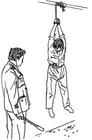
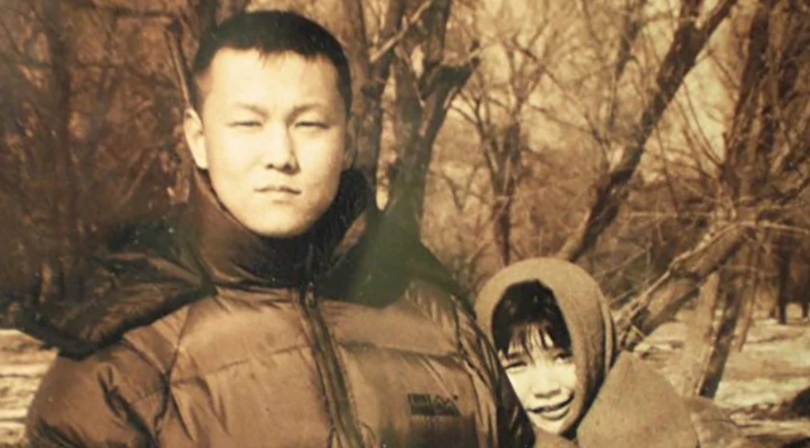
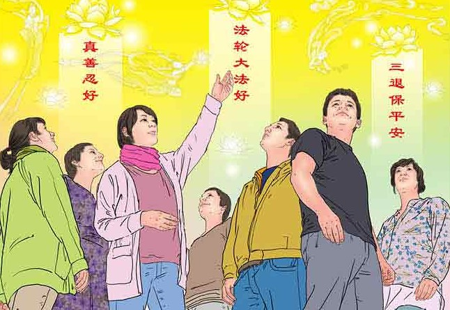

<a name=top>

<a target="_blank" href="https://git.io/bb99bbss">

 

 
 

<a href="https://github.com/gofun72/telove/blob/master/soft.md"><b>免费突破封锁翻墙软件</b></a>
 

<b>请收藏本网址，连上免翻视频 https://bit.ly/2RQM1hX</b>

 

<a target="_blank" href="https://bit.ly/3ezRQKo">

 
 

<b> 看更多真相   https://bit.ly/3ezRQKo  </b>

<a href="https://github.com/candysn/nini/blob/master/wnn-1.md"><b>小之每日真相(一)</a></b>

<a href="https://github.com/candysn/nini/blob/master/wnn-2.md"><b>小之每日真相(二)</a></b>

<a href="https://github.com/candysn/nini/blob/master/wnn-3.md"><b>小之每日真相(三)</a></b>

<a href="https://github.com/candysn/nini/blob/master/wnn-4.md"><b>小之每日真相(四)</a></b>

<a href =#32>32.一本改变命运的宝书</a> 
<a href =#31>31.当警察不再为独裁者效力</a> 
<a href =#30>30.從文盲“藥簍子”到脫胎換骨活得開心</a> 
<a href =#29>29.国家评论：中共按需取器官　更多证据浮现</a> 
<a href =#28>28.新学员：没想到改变的这么快</a> 
<a href =#27>27.打错算盘的是中共</a> 
<a href =#26>26.古稀老人遭酷刑 凸显中共魔性</a> 
<a href =#25>25.让善注入我们的生命</a> 
<a href =#24>24.一位中国大陆警察的自述</a> 
<a href =#23>23.公安副局长被查出癌细胞后 如梦方醒</a> 
<a href =#22>22.内科医师：感受生命真正的美好</a> 
<a href =#21>21.农民北京打工无法适应：“刷脸”</a> 
<a href =#20>20.鬼畏正神</a> 
<a href =#19>19.深受很多大陆人喜欢的歌手 才华横溢善良夫妻的悲惨遭遇</a> 
<a href =#18>18.记一位年轻的女科长</a> 
<a href =#17>17.车站奇遇：一个正在寻找《转法轮》的人</a> 
<a href =#16>16.“法轮功，了不起！”</a> 
<a href =#15>15.西方人回忆李洪志先生在瑞典传功讲法</a> 
<a href =#14>14.绝症女子奇愈记</a> 
<a href =#13>13.真心念真言　真言有真效</a> 
<a href =#12>12.要想让瘟神从你家逾越也有办法</a> 
<a href =#11>11.疫情第一线中不一样的医生</a> 
<a href =#10>10.制止中共器官交易罪恶 奥地利国会通过提案</a> 
<a href =#9>9.退休医生：从抵触到赞叹</a> 
<a href =#8>8.老姐，你是在帮我解除魔咒吧，谢谢你！</a> 
<a href =#7>7.我儿患武汉肺炎命危 亲属相助神奇康复</a> 
<a href =#6>6.大苦大难中的幸福转折</a> 
<a href =#5>5.藏在心里二十年的天安门广场见闻</a> 
<a href =#4>4.生命尽头看选择 起死回生一念间</a> 
<a href =#3>3.退出团队那一刻　她能看清我长什么样了</a> 
<a href =#2>2.北京教师：小时候知道的很多事都是假的】</a> 
<a href =#1>1.一位司机的肺腑之言</a> 

<a name=32> 
<h2 align="center"><b>一本改变命运的宝书</b></h2>

 
【明慧网二零二零年八月十八日】当一个人面临危难时，如果提前得到指引，转危为安，人生从此前程光明，那该是多么幸运，而我就是这样一个极其幸运的人。

我是一个普通工人，喜欢武术、气功和传统文化，只是初中没读完的我，读不懂古文，也曾买过一些解释佛经的书，也读不懂。我的同事知道我喜欢气功，当时正练着一种气功，向我推荐法轮功，说还有一本书可好啦，等以后给我看。

1995年11月18日，这一天是我永生难忘的幸运降临的日子，同事把那本好书借给了我，这本书的书名是《转法轮》，当时是上午9点多。我拿起书看起来，越看越喜欢看，从前许多不明白的事和问题，书中都讲到了，讲的明明白白，尤其是讲要按宇宙特性真、善、忍做个好人，心想我也要这样做人，做个最好的人。

除了吃饭，我一直看到晚上8点多，家里来电话说有事需回家处理，我在外地工作，和单位领导请好假，接着看起书来，心想今天一定看完，刚借的书不能拿回家，可别给人弄坏了，就这样一直到深夜，把书完整的读了一遍，心想这书太好了。

第二天回到家，一个晴天霹雳般的坏消息，打的我晕头转向，家人发现我妻子有了外遇，我是个个性冲动，做事不计后果的人，曾因被人殴打而怀揣铁斧去报仇，幸亏没找到那人，才没有酿成大祸。如今刚结婚一年的我，面对这一切，痛苦异常，心里却清清楚楚的记着《转法轮》中讲的“难忍能忍，难行能行”，心里没有报仇的念头，只是想妻子的家人都在外地，身边没有亲人，如果离婚了，她该怎么办？

晚上妻子下班回家后，我告诉她，先不离婚，明天早晨早早去我家附近的公园，那里有法轮功炼功点，请一本《转法轮》，在书里有最好的解决问题的方法。

天亮后，我和妻子早早来到公园，找到了法轮功的炼功点，向那里的炼功人询问，想请本《转法轮》，那时书很缺，得先预订才行，我们赶紧预订好了，我告诉妻子，书来了好好看。转天我就回外地上班了。我非常清楚，如果不是在这之前读了一遍《转法轮》，我不会这样做，个性冲动的我真不知会怎样，但是就在危难来临之前，我何其幸运的读了一遍《转法轮》，彻底的转变了我的命运，没有去报仇伤人，而是平和的处理，并希望妻子也和我一样改变厄运，走向光明。而这一切真实的发生了，令人难以置信，但真真切切的存在着，从那时开始我和妻子先后走上了修炼法轮大法的光明大道。

自从修炼法轮大法后，随着不断的学习师父的著作《转法轮》，心性也在提高。我随公司在外地工作，公司在当地旅馆租了一个单独的小院住，在小院的北墙角有个水龙头，我们工人们都在这里洗漱，大家把剩下的饭菜、垃圾都倒在那里，还有人在那小便，几个月后，成了一大堆，气味难闻，旅馆也不管，公司也没派人打扫，要是不炼功前，我也会视而不见，可现在修炼法轮大法了，师父让我们按真、善、忍做个好人，我应该管，心里又想大家会不会不理解、笑话我，在中国大陆这个环境就是这样，但是既然修炼了就按师父讲的做个好人，公司还有一个大法弟子，我和他一说，他也愿意干，于是我们和旅馆借来垃圾车，把墙角打扫干净，又用水管把那里彻底冲洗干净，又找来几个铁桶，告诉工友们，不能吃的剩饭菜倒在桶里，有养猪的人要。

我们每天早晨炼功回来后，都把小院打扫干净，有人再乱扔垃圾，别人就会说，人家打扫这么干净，不能再扔了。

我在公司工作十多年了，没修炼大法前，公司里的东西，家里能用的就会拿回家，修炼后我决定把拿公司的这些东西折成钱还给公司，但心里也有些七上八下的，我这么做公司领导会怎么看，思前想后，我决心还是把钱送还公司，既然修炼了，就要按师父讲的做。当我向领导说明来意，现在修炼法轮大法了，知道以前做错了，我决心改正，以后做好，把钱交给了领导，领导说知错改正就好了，钱不能要，在我一再坚持下，收下了，因为我是发自内心的，是真诚的。

从修炼开始直到现在，身体健康，从没有打针吃药，真的是身心健康，道德升华，我曾几次遇到生命危险，但在师父和大法的护佑下，都是有惊无险。现在，孩子也修炼大法了，并找到了理想的工作。

写出这段亲身经历，就是想告诉人们，法轮大法是真正的高德大法，是真正佛法修炼，切勿相信中共邪党的谎言，分清善恶，退出邪党的党、团、队组织，为自己和家人选择美好未来。

谢谢慈悲伟大的师父！ 

原文https://www.minghui.org/mh/articles/2020/8/18/-410588.html

<a href=#top><h6 align="right">回上方</h6></a>

<a name=31> 
<h2 align="center"><b>当警察不再为独裁者效力</b></h2>

【明慧网二零二零年八月十九日】8月16日，至少有20万白俄罗斯人上街参加“自由大游行”，抗议卢卡申科通过舞弊当选连任总统，相比之下，支持卢卡申科的游行者只有数千。

现年65岁的卢卡申科当了26年白俄罗斯总统，在白俄罗斯推行计划经济及独裁统治。今年8月10日他第六次高票当选，但白俄罗斯人已经忍无可忍，质疑选票造假，要求重新计票。

<b>当警察丢掉警服</b>

警察筑起一道道人墙拦截示威者，并用催泪弹等驱散市民，已有人被打死，6000市民被逮捕。但是，在对峙升级的时刻，一些白俄罗斯警察和军人开始拒绝执行卢卡申科的残暴命令，丢掉制服回家，甚至加入市民的示威队伍。

在网上广为传播的一段视频中，一名警察脱掉制服和帽子，转身扔向垃圾桶，他说：“我向我的国家宣誓过，但是看到明斯克发生的事，我不能再穿这套制服了。”

一位白俄罗斯军人把军服扔到了垃圾桶（网络截图）

“我们是为人民效力，不是为总统效力”，白俄罗斯的军人和警察开始觉醒，毕竟反对卢卡申卡的老百姓占大多数。失去武装力量就相当于猛兽没了爪牙，这是独裁者最为害怕的。示威期间，白俄罗斯开始封锁网络，并在市外设立检查站，防止更多的民众进入首都明斯克，但是面对全国最大规模的、要求他下台的抗议活动，卢卡申科被迫表示，愿意在全民公投之后移交权力，并且释放所有被捕民众。

一些士兵放下武器，静静地站在那里，市民上去和他们拥抱。网友评论，军队是人民的纳税钱养的，应该听人民的。

独裁者的下场往往是悲惨的，统治伊拉克24年的萨达姆被押上绞刑架，统治利比亚42年的卡扎菲被枪毙，他们在位时都被人民崇拜和拥护，但那只是高压统治下的虚假拥护，当他们被人民摒弃的时候，很快就成为“人民公敌”。

下令对人民开枪的罗马尼亚总统齐奥赛斯库在人民的呼声中逃跑，几乎所有的罗马尼亚广播里都响起了这样的声音：“各位市民请注意，人民公敌齐奥赛斯库和埃列娜正劫持一辆紫色达契亚轿车逃跑，请予以缉拿”。齐奥赛斯库和妻子被逮捕后，三天后被送上断头台。

齐奥赛斯库在位时，罗马尼亚经济在短暂崛起后走向衰落，对言论控制极其严格，家中有打印机都要申报，人们只能用政治笑话来讽刺政府，可见不得人心到了何种程度。

独裁者死了，国家还在，人民还在，军队还是那个军队，警察还是那个警察，这说明军队、警察都不是总统私人的，他们是属于人民的；打死独裁者也不会亡国，人民只会生活得更好。

<b>共军围困长春　曾对逃跑的饥民开枪</b>

白俄罗斯警察和军人的表现不是个例，我们看到东欧及苏联解体的过程中，只有罗马尼亚发生流血事件，其他国家的军队都没有与人民发生冲突，军队是保护人民的，人心向背看得很清楚，军队就应该站在人民一边，而不是站在独裁者一边。

但共产党统治下的军队，已被训练得唯命是从，共产党让杀谁杀谁。1948年，共产党围困长春的时候，共军甚至将枪口对准了饥饿逃生的人民。

共产党拿下长春，不是打下来的，而是生生地把国民党军队和老百姓困死在城内，不让饥民出城，为消耗长春城内的粮食供应，让老百姓和国军争粮食拖垮国军，饿死十余万人，当时的政策就是“要使长春成为死城”。

《沈阳军区历史资料选编》记载，中共命令士兵屠杀出城求生的饥民：“不让饥民出城，已经出来者要堵回去，这对饥民、对部队战士都是很费解释的。饥民们会对我表示不满，说‘八路见死不救’。他们成群跪在我们的哨兵面前央求放行，有的将婴儿小孩丢了就跑，有的持绳在我岗哨前上吊。战士见此惨状心肠顿软，有陪同饥民跪下一道哭的，说是‘上级命令我也无法’。更有将难民偷放过去的。经纠正后，又发现了另一偏向，即打骂捆绑以致开枪射击难民，致引起死亡。”

当时国军军官回忆：“城门以外，共军阵地以前，老百姓的尸体带状分布，好像给两军画出中线，这是因为垂死的老百姓出城以后，既无法通过共军的封镇，又不准再回到城内，多次往返奔波，再也无力支持。气息奄奄的婴儿睁大眼睛看他，在路上看他，也在梦中看他。”

王鼎钧的《关山夺路》则记述了一段国民党士兵的回忆：连长说，共军士兵看见饥民跪拜痛哭，也流下眼泪，但是他们坚决执行命令，饥民不听话，照样开枪打，他也看见带伤流血的尸体。他说共产党真厉害，怎么能把兵训练成那个样子，“人民的军队爱人民”，多年的训练可以一夕翻转，执行任务时可以违反原则，违背良心。他说国军官兵无论如何办不到，伤阴德，我们不干，他会偷偷地放过饥民，或者自己偷偷跑掉。他说黄泛区会战的时候，共军用“人海战术”进攻，死伤太多，国军打到手软，射手把机枪往地上一丢‘我不打了！’连长掏出手枪，指着射手的太阳穴，射手扑通跪下，‘连长你枪毙我吧！’射手哭了，连长也哭了……”

<b>派出所所长的智慧</b>

在中共暴政下，军队和警察成为它镇压人民而非保护人民的国家机器，中共每年也给他们下发大量的维稳经费及奖金来刺激他们的积极性。1999年江泽民集团开始镇压法轮功以来，抓捕了大量法轮功学员，不过，随着海内外各种真相的传播，有的警察、国保“翻墙”之后，明白了真相，有的为修炼人的善良与坚韧所打动。很多警察的良知开始复苏，正在从中共的谎言中觉醒，不愿意做中共的替罪羊。

一天，两个警察到一位法轮功学员的店里去搜查，发现仓库里有很多要做真相资料的空光盘盒，准备拿走。这位法轮功学员说：“德国柏林墙被推倒之前，东德士兵奉命开枪打死了一个翻墙逃往西德的青年，柏林墙推倒后，开枪打死青年的士兵被判刑。打准打不准可是自己说了算，叫开枪是上边的事，打不准是自己的事。国保大队让你们来看看，也没说叫你们非得把东西拿走啊？！”警察还是把光盘盒抬走了。不久，这位学员发现那些光盘盒又出现在他的仓库，原来是警察趁他出门时又悄悄给他送回来了。

还有一次，派出所所长打电话说办公室的门坏了，叫这位学员帮忙修理一下。他去了以后，发现办公室没人，检查门也没有问题，却发现靠门放着一袋子大法书，有20多本。他明白了：所长是让他来拿大法书的，他高兴地提着袋子放到了车里。

中国古人有句老话，明白人不办糊涂事儿，跟随中共的警察们也应该想想白俄罗斯警察为何放弃独裁者。

面对举世关注的白俄罗斯抗议事件，中共央视在新闻里只说数千白俄罗斯人上街支持总统选举，却对20万人民抗议声音只字不提，如此低级的骗术能瞒住谁呢？还不是担心自己也有这么一天吗？

原文https://www.minghui.org/mh/articles/2020/8/19/-410692.html

<a href=#top><h6 align="right">回上方</h6></a>

<a name=30> 
<h2 align="center"><b>从文盲“药篓子”到脱胎换骨活得开心</b></h2>

法轮功学员正在炼法轮功第二套功法 （图片来源：明慧网）

 
【希望之声2020年8月16日】（本台记者詹妮采访报道）张老太是河北人，今年84岁了。别看她岁数大，可精神头十足，身子骨硬朗着呢，想出门说走就走，腿脚灵便得象个年轻人。

以前的张老太可不是这样的，她是当地远近闻名的“药篓子”。

张老太年轻的时候身体就不太好，随着年龄的增长，各种疾病都上来了，全身几乎没有好的地方。神经性头疼病经常折磨得她死去活来；膀胱炎使她便血便脓，小便便出的脓都能用小棍挑起来。药一把一把的吃，不见好，反而更重了。

张老太还有严重的腰椎滑脱，去医院检查时，医生告诉她需要做手术，否则将来可能会造成半身不遂，下身没有知觉，直不起腰。于是她只好接受手术。但手术做得不成功，术后的痛苦和病情的加重，搞得她心力交瘁，度日如年，对生活完全失去了信心。

听人说北京的协和医院技术好，于是她抱着最后的一丝希望，在女儿的陪同下去了北京。检查的结果是，上一次手术没做到位，还需要再做一次。

张老太回想第一次做手术的痛苦滋味太不好受了，不想再受二遍苦，决定不做手术。医生说，如果不做，后果不堪设想。张老太犹豫了：不做手术吧，可能会瘫痪，生活不能自理，还得子女照顾，给子女添麻烦；做手术吧，太痛苦了，实在不是一般人能忍受得了的。怎么办？最后她决定回去好好考虑考虑再说。

从北京回来后，张老太就住在女儿家里。那时候，女儿家附近有个法轮功炼功点，很多人在那里炼功，有人知道张老太的情况后就建议她说，法轮功祛病健身效果非常好，不妨去炼炼。正苦于不知该怎么办的张老太动了心，于是就去炼功点跟着炼起功来。

炼功一段时间，身体的病痛开始减弱；一个月后，她感觉身体越来越好，于是她不想再连累女儿，就回到自己家，联系上当地的法轮功学员，和他们一起天天坚持学法炼功。不知不觉中，在没吃一粒药的情况下，张老太全身的病都好了，浑身有使不完的劲儿。那一年是1998年。

张老太身上发生的奇迹使她非常感谢法轮功、感谢大法师父。直到今天，她修炼法轮功已经22年了，不仅没有了病痛的折磨，整个人一身轻；道德也得到了升华，她知道怎么样去做好人了，凡事都听师父的话，遇事向内找自己的不足，所以邻里之间、婆媳之间、儿女之间的关系她都处理得非常好，她的心情也越来越舒畅，对未来充满了希望。每当跟别人谈到自己的变化，她都会激动地说：“是师父给了我第二次生命！如果不是修炼法轮功，恐怕我也活不到这么大岁数，我也不会活得这么开心！”

张老太没读过书，大字不识一个，自己无法看大法书，只能是别人读给她听。有时候看到别人读书，她很羡慕，心想，如果自己能读书那该多好啊！于是她就手捧着书听同修们读，一个字一个字的对照着看……就这样读了不长时间，忽然有一天，整本《转法轮》在不需要别人的帮助下自己竟能通读下来了。她不由得惊叹道：这个大法简直太神奇了！到现在，师父的其他讲法书也能通读了，不再需要别人的帮助了。

在中共迫害法轮功的这21年时间里，张老太逢人就讲法轮功如何好，法轮功如何使人袪病健身，如何教人做好人、守德向善。她以自己的亲身经历告诉人们：不要被中共的谎言宣传欺骗，只有记住“法轮大法好”、“真善忍好”，未来才会真的有希望。 

原文https://www.soundofhope.org/post/411880

<a href=#top><h6 align="right">回上方</h6></a>

<a name=29> 
<h2 align="center"><b>国家评论：中共按需取器官　更多证据浮现</b></h2>

繪畫：中共活摘法輪功學員器官的罪惡。（明慧網）

 
 【明慧网二零二零年八月十六日】（明慧记者王英编译报道）十天之内，中国武汉协和医院的医生先后为二十四岁的孙玲玲准备了四颗匹配的心脏。此前的九个月，孙玲玲以体外心脏设备维持生命。

美国《国家评论》杂志（National Review）八月十三日刊登作者韦斯利·史密斯（Wesley J. Smith）的文章说，不断有可靠的指控说，中共从法轮功学员和其他政治犯身上摘取器官，为富有的外国人移植器官，以结束他人的生命为代价用钱购买生命。这是一种邪恶的交易，国际社会应该拒绝中共的邪恶交易。

文章说，现在，我们有更多证据表明中共有能力按需获取器官。一名居住在日本的中国妇女乘飞机到中国进行心脏移植，并在十天之内，中方就准备了四颗可以移植的匹配心脏。

史密斯引用大纪元的文章说，医生反对强摘器官组织（DAFOH）的执行主任泰瑞（Torsten Trey）博士说：“问题在于，这四颗心脏来自哪里？”

泰瑞表示，根据美国政府二零一八年的最新数据，病人通常需等待六点九个月才能获得匹配的心脏。按照这个比例，为同一病患寻找到四个匹配的心脏——这意味着有四人在重症监护病房或其它致命事故中死后捐献他们的器官——这大概需要等待二年的时间。

一位专家认为，为患者找到四个匹配心脏的速度表明中国可以按需获得器官。

孙玲玲的经历“是可能的，但非常不同寻常，即使是在任何自愿器官捐献系统健全的国家”。以色列特拉维夫大学外科和心脏移植学系主任拉维（Jacob Lavee）说。但是，他表示，在中国，“数天之内，发生这样一连串的器官捐献事件，引起对器官捐献性质的高度怀疑。”

泰瑞认为，这遵循的是“按需系统”模式，他表示，孙的经历“无法解释”。

无法解释，就是说因为中国没有合乎伦理道德的器官捐献制度。

文章说，专制主义的领导人用强迫劳动和奴役来经营其工业制造业，并迫害信仰群体，他们根本不在乎道德和基本的人类礼仪。

他们（中共）就那样干了。而我们呢？我们没有因此对他们追责。

韦斯利·史密斯是美国发现学会的作家和高级研究员。

原文https://www.minghui.org/mh/articles/2020/8/16/-410541.html

<a href=#top><h6 align="right">回上方</h6></a>
 

<a name=28> 
<h1 align="center"><b>新学员：没想到改变的这么快</b></h1>
<h2 align="center"><b>——记台湾云林“九天学法炼功班”</b></h2>

新学员上九天班，专注观看李洪志老师讲法录像。（Anthony Kwan/Getty Images）

【明慧网二零二零年八月十五日】（眀慧记者李维安台湾云林报道）台湾云林三区每两个月会定期举办“法轮功九天学法教功班”。自二零二零年八月三日至十一日的这次九天班，参加的新学员多数是高级知识分子，有科技大学教师、植物医师、老师、公务员、学生、商店老板等十几位，参加九天班之后，每个人都有焕然一新，不一样的感受。

 
慈伦任职云林某科技大学视传系老师，这次带了几位朋友来参加九天班的机缘很特别。她说，一天早晨有一位青年学子经过炼功点，看见“法轮大法”四个字，就脱口而出：“法轮圣王是全宇宙最高的神！”正在炼功的学员听了，吃了一惊，这孩子能说出这样的话，说明他很奇特，太有缘份了，立刻与之介绍大法，建议他参加这次九天班。

这位青年学子回家跟母亲谈及想炼法轮功，隔天早上母子俩到炼功点学功。慈伦才发现，这个学子的妈妈正是她常去买饮料的一家商店里早就认识的朋友——刘妈妈。她为儿子的躁郁症所困扰，已经四年了，担心又束手无策，因缘际会下，母子双双来参加九天班。

刘妈妈喜滋滋地表示，孩子在通读《转法轮》时，年轻气盛的浮躁没有了，整个人来了一个大变化，“这几天上九天班，没想到改变的这么快，孩子变得很乖、很懂事，会主动帮忙照顾生意，照顾失智的奶奶。”这是她意想不到的，太令她惊喜了。在听法的时候，母子俩非常专注，她说，“孩子如此专注听法，这么大的改变，真的很意外也很高兴。”她放下了心中的一块大石头。

另一位是慈伦的同事，在科技大学教书的孙先生，因好奇而参加九天班。慈伦说，孙先生来参加的动机很奇特，其一，一位地产业的王董事长邀请孙老师去观赏神韵演出，并且讲了他的一些神奇经历，引发孙老师相当大的好奇心，王董不是法轮功学员，却自掏腰包买了很多张神韵晚会的票，邀请好友观赏神韵演出。孙先生决定要好好了解法轮功，是什么原因，让这位董事长如此大方热心？

其二，慈伦曾送他一本《法轮大法大圆满法》，孙老师看了之后，发现是一本金光闪闪的宝书，更引发他下决心上九天班。九天过程中孙老师一天不落的全程专心观看李老师讲法录像带，对于法轮功上乘的五套功法他特别有兴趣。

还有一位青年王先生，小时候曾随父母学炼法轮大法，因父母希望他多参加社交活动，他选择上九天班，重温小时候的梦想。上完九天班，他神清气爽地说，听李老师讲法，了解了很多做人的理，心也特别纯净，这几天心里很祥和，烦心事一扫而空，自然快乐许多，九天课下来，觉得没有白来，太棒了。

弗兰克（FRANK）是一位年轻的植物医生，也是小时候和父母一起修炼，求学期间因课业学习繁重，中止一大段时间，但还是能感受到师父仿佛一直都在身边。上完九天班之后，他心中豁然开朗，悟到很多事其实很简单，就是放下。

陪同先生来参加九天班的李小姐表示，每天进场聆听李老师讲法，整个人身心非常舒畅，感觉能量场很强，原本相当疲惫的身体，来到这里好象在充电一样，疲惫感完全消失，回家时精神奕奕，能量满满，感谢李老师。

她说，“还有一个奇特现象，当我非常专注观看的时候，整个周围变的金光闪闪的，李老师身上散发金色光芒，当我刻意去看的时候又消失了，真是太神奇了。”

慈伦表示，当初因中共恶意宣传，以及污蔑法轮功，她一度以为法轮功就象中共宣传的那样，不敢接触法轮功，后来偶然间在电视《放光明》节目上看到台大知名教授张清溪也学炼法轮功，打破她的迷思，进而有机会走入大法修炼。

她表示，修炼法轮大法后改变了她的宇宙观、人生观，大法不仅令人身心受益，更是让人心性提升，在艺术创作上都有不一样的启发与创作。 

原文https://www.minghui.org/mh/articles/2020/8/15/-410511.html

<a href=#top><h6 align="right">回上方</h6></a>

<a name=27> 
<h2 align="center"><b>打错算盘的是中共</b></h2>

香港壹传媒创办人黎智英今天（12日）中午回到《苹果日报》大楼上班，受到员工热烈的欢迎。图为黎智英获保释走出警署。（Anthony Kwan/Getty Images）

 
 中共于今年七月一日紧急实施《香港国安法》，遭到全球一致谴责。在世界的目光中，中共不得不放软姿态，大言不惭地继续说谎：《香港国安法》是为了更好的保护一国两制，落实港人人权自由。然而，熟悉中共历史与邪恶本性的人都知道，这是它迫于世界强大压力而狡辩，等待时机进行秋后算账。

<b>惧真相传播 打压良心媒体</b>

在这次香港反送中运动中，《苹果日报》被认为是极少数敢揭露中共的独立媒体之一，中共视其为眼中钉。八月十日，香港警方在中共的操控下以“勾结国外势力”，违反《国安法》及串谋欺诈等罪，拘捕《苹果日报》、壹传媒创办人黎智英及其两个儿子与四名高管等约九人。

警方出动了近两百名武装到牙齿的警员冲到将军澳壹传媒大楼，中共驻港的国家安全处带着破门工具闯进大楼翻查文件和物品。搜查令上明确写着搜查范围不包括新闻材料，但是所谓执法的警察还是在记者的工作台上到处乱翻。人们感叹香港的警察越来越像中共大陆的警察，说一套做一套，执法犯法而不知廉耻。

香港记协主席杨健兴对警方的粗暴行为相当震惊，他表示只有在第三世界地方出现过类似情况，他在香港工作过几十年，从未见过传媒机构被政府这样对待过。

在国际社会眼里，壹传媒创办人黎智英是香港的良心，新闻自由的一面旗帜。但中共却视其为威胁，足见中共对讲真话传真相的恐惧。港警从办公大楼里搜走二十五箱所谓的“证据”。

<b>重复暴力 制造寒蝉效应</b>

壹传媒工会表发言人林伟聪认为中共出动数百名警察对付一个七十多岁的老人，其实另有用意。一方面是报复黎智英，秋后算账意味浓厚，另一方面是想制造寒蝉效应，吓怕一些独立媒体的消息来源。

前苏联作家索尔仁尼琴曾经这样说过：（一个独裁国家）出现一个讲真话的作家，就等于出现了第二个政府。共产极权国家对敢言媒体与具有独立思考精神人士的打压是超乎正常人类想像的。索尔仁尼琴本人因讲真话就被投入到臭名昭著的古拉格群岛大监狱。

苏联作家鲍里斯·帕斯捷尔纳克也同样曾被视为党的敌人而遭到苏共封杀，不敢出国领受诺贝尔文学奖，最后孤独地死去，但同为诺奖得主的苏共御用文人消洛霍夫却被苏共捧为文学泰斗，而消洛霍夫所谓歌颂苏联红军的名著《静静的顿河》被指是抄袭了别人的作品，而他的一生中除了这部作品以外，其他作品写作水平实在称不上是一位作家。这个故事和中共军旅作家高玉宝及其《半夜鸡叫》有着异曲同工之妙，《半夜鸡叫》被指是他人作品，高玉宝在政治站位上迎合了中共军队文宣树立典型的需要，因而一举成名，贻害中国几代人。

上述的案例说明，共产党谎言机制对人性的碾压是一种常态。让中共看见你说真话，就意味着厄运和遭受迫害；而和共产党一起撒谎，就能飞黄腾达，人生风景别样。这样的例子还很多，延安整风时代，知识分子王实味只是表达了自己的一点个人观点，就被中共认为与党性严重不符，最后被批斗后用斧头砍死，而昧著良心专司“假大空”写作的郭沫若却被捧成了“文豪”。

《九评共产党》中说：“重复使用暴力，是共产党政权维持统治的重要手段。暴力的目的，是制造恐惧。每一次斗争运动，都是共产党的一次恐惧训练，让人民内心颤抖著屈服，以至成为恐惧的奴隶。”

毛泽东也曾表示，文革要七八年来一次。中共抛出港版国安法，打造的第一件要案就是高调抓捕独立媒体人士，显然欲在香港新闻界掀起一场文革运动，制造寒蝉效应。为日后在香港推行中共的文宣体制铺路。

<b>打错算盘的是中共</b>

近日，美国根据《香港自治法案》对香港特首林郑等十一人实施制裁，中共外交部战狼发言人回应美国是“打错了算盘”。其实真正打错了算盘、误判了形势的恰恰是中共。

黎智英曾经说过：“我两手空空来到香港，所得一切都归功于香港之自由，如今感恩得以生命回报自由。”

八月十日，香港市民及世界人民针对中共对香港良心打压的回应让中共始料不及。

中共抓捕黎智英的消息刚一传出时，壹传媒的股价在短暂下跌后，突然急速暴涨，最高涨幅一度超过300%，突显了港人不屈的民意。很多港人表示，“全香港今日做一件事。买下街上每一份《苹果日报》，它越打压，我越要买。明天，即使香港《苹果日报》只出版一叠白纸，也要买下街上所有苹果白纸。生在香港，没有人是孤岛。”

《苹果日报》当晚发表声明，对事件表示极度愤怒，并予以最强烈谴责。声明直斥港警公然违规滥权，面对此等不合法、不合理的横蛮行径，《苹果日报》同仁定必以无畏无惧的态度，继续在打压中，以真相说亮话。

《苹果日报》平时每天只印七万份，八月十一日加印了五十五万份，各报摊半小时便销售一空。港民说多买送朋友，就是要给港警匪帮看，香港人不输。

中共的倒行逆施，真的让人神共愤了。美国国会两党对中共表示严厉的谴责。美国副总统彭斯在黎智英被捕不足二十四小时内表示，香港政府此举侮辱了全球热爱自由的人民。他还在推文上附加“释放黎智英（#FreeJimmyLai）”的主题标签。白宫国家安全顾问奥布莱恩也发表声明，对黎智英等人被逮捕“深感不安”，并呼吁北京立即撤销香港国家安全法，恢复香港法治。

与中共隔岸的中华民国总统府发言人张惇涵表示，香港警方的举动严重损害香港的新闻自由、人权法治与民主自由。美国参议员乔什·霍利发推道“这是中国（中共）想强加于世界的‘言论自由’。”

针对中共的打压，欧盟委员会外交事务发言人彼得·斯塔诺（Peter Stano）强调，“尊重人权和基本自由是《基本法》和‘一国两制’原则的核心内容”。 英国总理鲍里斯·约翰逊（Boris Johnson）的发言人向中共发出谴责：“这进一步证明《国安法》正成为（中共）压制反对派的一个借口。香港当局必须维护其人民的权利和自由。”。

而更多的观点认为，中共此举是在全世界面前彻底撕下了画皮，必将招致世界的反击，全球去共化将会来的更猛。

<b>天灭中共大势下，没有中立</b>

在大是大非面前，没有中立与中间立场。天灭中共之际，无人奢谈中立。

在天灭中共紧锣密鼓敲响之际，又有爆炸性新闻传来：欧洲与中共第二个建立外交关系的瑞士近日针对中共发起了全民公投的公告。八月七日，瑞士外长在记者发布会上表示，瑞士不应成为专制犯罪的帮凶，假如人民不同意，那么我们就必须公开冻结那些独裁国家的贪污犯罪所得和资金财产。八月八日，瑞士正式发布题为“你是否支持瑞士银行与企业和侵犯人权的国家做生意”的全民公投公告，全民公投计划在十一月举行。

曾有爆料称中共高官在瑞士银行大约有五千个账户约二十万亿资金，其中三分之二是中央级官员，从国务院副总理到银行行长、部长及中央委员，几乎人人都有一个账户。另有消息称，在瑞士银行的存款上，约一百名中国人拥有七点八万亿元资金。如果公投通过，这些资金将被冻结。

很多网民表示，这对中共高官来说是灾难性的制裁，是核弹级的。

天要灭中共，谁能挡得住！那些还在为中共站台的人，或是自认为保持中立的人，快快清醒吧，留给中共的时间不多了！

原文http://big5.minghui.org/mh/articles/2020/8/12/-410362.html

<a href=#top><h6 align="right">回上方</h6></a>

<a name=26> 
<h2 align="center"><b>古稀老人遭酷刑 凸显中共魔性</b></h2>

花（全景林／大纪元）

 
明慧网近日报导，2017年6月12日，75岁的南昌市法轮功学员王凤英遭国保警察绑架，被法院非法判刑3年。王凤英在江西省女子监狱被酷刑、药物迫害后，今年6月12日回到家中，她的退休工资至今仍被南昌市社保局扣押。

王凤英是南昌市果品食杂公司的退休职工，中共与江泽民集团迫害法轮功后，王凤英多次被警察绑架拘留；被强制关入洗脑班；遭野蛮灌食，被长时间奴役；遭受四天四夜的刑讯逼供；遭受多种酷刑，包括老虎凳、逼穿“束缚衣”（一种刑具）、吊铐在铁架上，精神和肉体上受到极大的创伤，年近九旬的老伴也在她被迫害中忧郁去世。

中共酷刑：吊挂。(明慧网)

中共警察给古稀之年的王凤英施加酷刑，令人发指。“束缚衣”是用特制衣服将人体紧紧捆绑起来，使身体固定不动，疼痛难忍，甚至痛死或残废。王凤英首次被逼穿六天，第二次穿了九天。警察还逼王凤英在40℃的高温下晒太阳、走队列；逼她罚站，一站就是几个小时，经常站到深夜12点。包夹逼王凤英写“四书”（所谓放弃修炼的“悔过书”、“揭批书”、“保证书”等）。几个人一拥而上，把她打倒在地，然后抬她的头，搬她的脚，拽她的手，把她倒著拖，像五马分尸似的折磨她。

王凤英出狱回家后，才知道她在江西省女子监狱被迫吃的药，和被迫害致死的法轮功学员罗春荣所吃的药相同，都是破坏中枢神经的特效慢性毒药。回顾王凤英过往三年的悲惨遭遇，见证了中共迫害法轮功的严峻情况。

对于身处自由世界的人们而言，警察野蛮灌食、酷刑逼供与药物迫害，都是泯灭人性的罪恶。警察应当惩奸除恶、济弱扶倾，但中共警察反而加害善良民众，罔顾基本人权，人们看到了中共警察背后的邪党魔性。

1999年7月，中共与江氏集团针对上亿名法轮功学员开始了残酷迫害，采取“名誉上搞臭，经济上截断，肉体上消灭”等三原则。专事迫害法轮功的非法组织“六一零办公室”执行“打死白打死”、“打死算自杀”、“不查身源、直接火化”的灭绝政策，指挥全国公检法各级人员实施迫害，迄今至少四千五百多名能核实的法轮功学员死于劳教所和监狱的残酷迫害。

历经漫漫21年，中共迫害未曾停歇。2020年上半年，中共警察在全国28个省、自治区、直辖市的238个城市，至少抓捕、骚扰法轮功学员5313人，逾623名65岁以上的法轮功学员遭受迫害，有39名法轮功学员被迫害去世。因中共信息封锁，实际数字远高于此。

像王凤英悲惨遭遇的案例只是冰山一角，在中共的蓄意封锁与造假宣传下，不知还有多少罪恶仍被掩盖和隐藏着。中共编造的那些谎言与构陷，只能迷惑人于一时；随着法轮功学员锲而不舍的讲清真相，中国民众已经逐渐走出迷雾，看清了中共的邪恶本质。在正常的社会里，警察职司抓捕作奸犯科的坏人；而中共的公安，却残酷迫害修炼“真、善、忍”的善良老人。黑白反转，正义荡然，红魔的末日已经不远。

敬老尊贤是中国文化的优良传统，体恤长者、赡养终老更是社会的责任。中共警察迫害走在神路上修炼人，酷刑凌虐折磨在先，剥夺退休工资在后，彼等最终都逃不过法律制裁与天理的惩治。善恶终有报，只论早与迟。曾经参与迫害的中共相关人员应速幡然悔悟、赶紧悬崖勒马。若再追随恶党，那无疑是自掘坟墓，自断未来。 

本文只代表作者的观点和陈述。

原文https://www.ntdtv.com/gb/2020/08/07/a102912822.html
 
<a href=#top><h6 align="right">回上方</h6></a>

<a name=25> 
<h2 align="center"><b>让善注入我们的生命</b></h2>

网络照片

 
【明慧网二零二零年七月二十七日】有一次，我去镇上卫生院给孩子买创可贴，镇卫生院和镇政府同在一条街上且相邻，派出所就在镇政府的里面。

我买了创可贴，从卫生院出来时，见我自行车那里围了一群人和几个警察，我拨开人群，径直走过去，推我的自行车。其中一个警察问：“这是你的自行车？”“是啊，”我回答着，就边推车走。

警察说：“你这个自行车还没有上牌呢，交罚款十元钱。”

当时镇上有规定，自行车一律上牌，牌上有个号，上一个牌十元钱。我出来时急着买创可贴，身上没带余钱。这会儿，又急着想回家给孩子用，就四处找有没有认识的人，好先借钱，过后再还。

这时一个二十多岁的年轻警察说：“我先替你交十块钱，你先回家吧。”边说话边从上衣口袋掏出十元钱递过来。

围观的人很惊讶，我也努力想，这人我好像不熟悉呀。这时，人群中一人说：“你替她垫钱，咋不替我把钱垫了？”因为有警察，所以围观的人就越多，有买菜的、买水果的，连平时摆长摊的人都围过来，大家的目光都聚集在这个年轻警察身上。

就听警察大声说：“我告诉你们我为什么给她垫钱，因为她是学法轮功的，她学的是真、善、忍，我相信她，我保证她会把钱给我送回来。”

我谢过警察，警察对我说：“你快回家吧，我记得你，我去过你家，炼法轮功的人给我的印象很好，你们的名声很好。”

我想起大法师父的话：“大法弟子你只要自己做的正，你就会改变周围的环境，你就会改变人。你用不着去讲太多，”[1]

后来，这个明白大法好的真相的警察再没有来过我家。

回到家里，我马上把创可贴给孩子贴好，就跟公公说了警察给我垫钱这事，公公说：“先把院子扫干净再去（公公正在院子里收玉米粒），再说也该做晚饭了。”

我没有犹豫的说：“您先收着，我回来再做饭。”就把孩子放在屋里，心中想着这是大法弟子的声誉，大法弟子做的好与不好关系到大法的声誉。我拿着十元钱，骑车就往镇上去。

有人大老远看我骑着自行车赶来，就喊：“那个炼法轮功的真来了，她真来还钱了！在等着呢。”原来他们不相信我会把钱送来，这些人没走，在等着看我来不来还钱呢。

就听那警察扭头对大伙说：“这会儿大伙看见了？知道我为啥敢把钱借给炼法轮功的了吧？因为炼法轮功的人道德高尚，人都善良，不占便宜，我绝对保证她会把钱给我送来。”

警察话音刚落，就有几个人抢着说：“炼法轮功的人不是电视里宣传的那样，那是骗人的。”另一个接着说：“咱们镇这样的好事还挺多呢，以前往公粮里掺土，还得书记领着镇上的人去各家收公粮，后来学大法的人多了，公粮里头不但不掺土，还主动的交。我就相信炼法轮功的。”

我把十元钱递给警察，向警察道谢，就对人群说：我的师父教我学的是真、善、忍，我的师父是李洪志先生。

一晃，我搬進城里已十多年了，派出所的几个警察找到我，问我炼不炼时，我就给这些警察讲我亲身经历的例子。临走，我对警察说：以后在面临危难中千万记住“法轮大法好，真善忍好”！回去把这九字真言告诉你的家人和朋友，我们修大法的人都希望你和你的亲人能够平安。

警察们都听的入神也很感动，在他们的笑脸上，我看到善已溶進这些年轻警察的心里。

原文https://www.minghui.org/mh/articles/2020/7/27/-409609.html

<a href=#top><h6 align="right">回上方</h6></a>

<a name=24> 
<h2 align="center"><b>一位中国大陆警察的自述</b></h2>

期盼（网络照片）

 
【希望之声2020年6月24日】（本台记者慧光综合报导）我是中国大陆湖南人，曾经是当地派出所的一名警察。1999年“7.20”之后，我多次参与对当地法轮功学员的抓捕行动。那时我完全听信了电视、广播、报纸等媒体对法轮功的宣传，几乎是不加思考的认为法轮功是迷信，凡是相信法轮功的人我都斥之为愚昧。

但是在这个过程中，有一个问题一直让我百思不得其解：全国有那么多高级知识份子、高官和事业成功人士炼法轮功，而且大都很坚定，这是为什么？

2004年，在与一位法轮功学员接触中，我带着疑惑跟他交流，想找到问题的答案。这位学员跟我是同乡，年纪比我大，从外表一看就知道他是一个诚实、善良的人。他跟我谈了他的一段亲身经历，使我受到震撼。

他说：“我以前不相信神佛，更不相信人能修成神佛。但我妻子炼法轮功以后，不仅身体有了很大变化，人的精神状态也变了，变得开朗活泼，她劝我也炼，我一直没动心。有一天，她拿着一本书到我身边非要读给我听，当时正闲着没事，心想听就听吧，不想扫她的兴。可听着听着，突然眼前出现了一个快速旋转的圆点，当时就吃了一惊：难道这就是书中所说的法轮？犹豫间我在心里说：如果你真是法轮，就请变大一点让我看清楚。没想到就在这个想法刚过的一瞬间，转动的圆点一下就变得像电风扇一样大，一会儿正转，一会儿反转，看得清清楚楚，——确实就是法轮！图案跟书中一模一样，这让我非常震惊！啥都不用说了，对书中的内容我从此不再有任何怀疑。”

听了他的叙述，我是将信将疑，心想这也太神奇了吧！但理智告诉我：他绝不是在编故事。带着这份强烈的好奇心，我决定认真研究一下。

因为在对法轮功学员的抄家中没收了很多法轮功书籍，我就一本一本的看，也从网上下载了李洪志先生的新经文认真阅读。阅读后发现，无论哪一本书中，讲述的内容和知识都别开生面，真是闻所未闻，令我大开眼界，茅塞顿开。慢慢的我对法轮功感兴趣了，这个过程持续有两年多。

书中的内容有两点我感受最深。一是人除了肉身外还有元神存在，元神是从高层空间下来的，他不会随着肉身的死亡而消失，而是一直在“六道”中轮回转生。这在科学上也是可以解释的，科学认为人的大脑有九成没有开发出来，其实是被“锁”住了，但通过修炼可以使生命升华到更高境界，在这个过程中，人的特异功能就可以打开。我看到有“濒临死亡试验”或催眠术，受试者在肉身死亡或催眠后能记起前世的事情，都能说明人是有元神存在的，不然没法解释。

二是宇宙中有一个永恒的法则，就是“真、善、忍”宇宙特性，违背了就必然受到制约。反映到人间就是人们常说的“善有善报，恶有恶报”，中医也有“怒伤肝、喜伤心、思伤脾、忧伤肺、恐伤肾”的理论，道理都是一样的。很多人以为这是自然状态，其实根本原因就是宇宙特性决定的。

除此之外，我还知道了人为什么有痛苦，有欢乐，我在人生中很多解不开的疑问都找到了答案。从此我明白了法轮功不是迷信，《转法轮》真是一本指导人们往高层次上修炼的书，是博大精深的超越人类知识的科学，更是破解天地、人生、引领人返本归真的一把金钥匙。

明白了这些道理，我掩卷唏嘘赞叹！难怪古人有“朝闻道、夕可死”领悟；难怪历史上很多皇帝宁愿放弃皇位也要去修行；难怪世界上有些获得巨大成就的大科学家也虔诚地信仰神佛；难怪全世界有信仰的人如此之多；原来人的生命本质是如此高贵、玄妙和复杂，原来人生竟然还有如此美妙殊胜的一条大道！

明白了这些之后，我从内心深处对修炼充满着无比的热忱和向往。2007年，我终于下定决心走入法轮功修炼。

一段时间后，我的身体出现了很大变化。以前患有风湿病和神经衰弱症，虽然不是什么绝症，但膝关节经常疼痛，关节处特别怕冷。炼功二十多天后，有一天突然感觉膝关节里面发烧，又热又胀，持续了几天，但从此后风湿病就好了；以前只要加晚班就会失眠，要是和打呼噜的人同居一室，更是彻夜难眠，而炼功后睡眠很好，这些症状都消失了。

以前对法轮功的有些说法我也不理解：不用打针吃药，只要修炼病就能好，那还要医院干什么？修炼后才知道，用科学道理也是可以解释通的。人生病了，或身体出现状况，吃药打针或用其它治疗方法，都是为了杀死病菌和增强身体抵御能力，而炼功人炼出来的“功”就是高能量物质，能自动杀死病菌，层次越高，这种能量越强，这就是为什么法轮功学员中有许多医院治不好的疑难绝症通过炼功就能治好的原因。我在炼功时，经常能清晰地听到“滋、滋”的细小的声音，就是对这种能量的感受。

修炼后，我努力按照“真、善、忍”要求自己，思想境界提升很快，神奇的事情也源源不断的涌现。首先是做梦多了，都与修炼有关，有对自己的点悟，有生生世世的一些轮回片断，还有一些是修炼中层次境界提升的过程。

没多久我的天目开了，还出现了宿命通功能，知道了许多与自己有关的前世今生的情况，以及与身边人的因缘关系，也能看到另外空间的美好、壮观、殊胜的情景，非常真实。

炼功打坐对我来说是第一个难关。按炼功音乐要求双盘腿要一个小时，开始我怎么努力也做不到，只能盘半个小时，哪怕增加一分钟都感觉非常困难。后来我下决心突破，就忍着巨大疼痛，一分钟一分钟的增加，再疼也不拿下来。就在这剧痛中，有一次我突然看到自己坐在一个巨大的功柱上，快速的往上升，真真实实的看到、体验到了，那天我坚持了三十八分钟。不到半年时间，我就能双盘一小时了。

还有一次在打坐中，我看到满天的神佛层层叠叠，真是密密麻麻，布满了整个虚空，有穿红袈裟的，有穿白袈裟的，还有其它服饰的。古人讲“三尺头上有神灵”，这确实是真实的。

因为我是在中共残酷迫害的背景下开始修炼的，所以我也经历了许多魔难。两次被绑架到洗脑班，多次遭到警察非法绑架，但凭着正信和正念，我都坚定的闯了过来。

有一年，我和八位法轮功学员同时遭到绑架，关在当地派出所大厅，有二十多个警察严密看守，门窗全被封闭。可就在众多警察的眼皮底下，我堂堂正正、大大方方的走出了派出所，竟然没有一个人阻拦。

这件事惊动了当地政法系统的领导，他们百思不得其解，有人怀疑是被内部人员放走的；有人怀疑是从楼上跳下去逃走的，但始终不能自圆其说。因为当时是关在一间封闭的房间内，且有二十多双警察的眼睛盯着，竟然没有一个人察觉我离开了。他们怎么也想不通，我是怎么做到无声无息离开的。据说上面非常重视这个“事件”，派出多人进行了很长时间调查，非要将此中原由弄清楚，但最后也只能不了了之。大法修炼就是这么神奇、玄妙，仅从表面的逻辑推理和分析是根本是无法解开的。

2015年，最高法院推出了“有案必立，有诉必理”的新规定，引发了全国二十多万法轮功学员实名控告迫害元凶江泽民的“诉江”大潮，我也将控告状邮寄到了“两高”。之后我利用这个机会对党政机关的人员讲真相，给省、市、县和政法委、公安局的领导人写公开信，把我修炼前后经历的身心变化、所遭受的迫害和受到的不公正对待，以及江泽民犯下的罪行和给国家、人民造成的灾难性后果等等做了认真陈述，同时从法律角度进行分析，有理有据。之后我打印、复印了许多封，将这些信交给单位领导、同事和县公安局、政法委以及“610”领导。

刚开始，那些领导非常紧张、害怕，分别找我谈话，我就堂堂正正给他们讲真相。

当时我确实将个人安危、荣辱置之度外，是发自内心的想让他们明白真相。最后上面也只是核实了一下，并没有对我进行处理。

以上都是我亲身经历的事实。我之所以讲出来，真心盼望每个中国人都能理智清醒，赶快脱离中共自救，尤其是公、检、法、司和政府部门的人，千万不要再反对法轮大法，更不能参与迫害，否则只能在恶报中迎来悲惨的结果。 

原文https://www.soundofhope.org/post/393751

<a href=#top><h6 align="right">回上方</h6></a>

<a name=23> 
<h2 align="center"><b>公安副局长被查出癌细胞后 如梦方醒</b></h2>

明白真相后如梦方醒。

 
【大纪元2020年08月06日讯】一位曾积极参与迫害法轮功的某公安局副局长被检查出体内带有癌细胞，在逐渐地了解了法轮功真相后，他知道自己以前对法轮功所干的事都是违法的，并退出了中共党组织，还暗中帮助法轮功学员。

这位副局长是怎么发生转变的呢？

在此转述大陆法轮功学员在明慧网8月4日发表的有关报导。

建明（化名）五十多岁，是某公安局副局长，其主要工作是所谓“维稳”。自中共迫害法轮功后，他也身不由己地干了许多助纣为虐的恶事。

一开始，建明对法轮功不了解，只要上面一布置迫害法轮功的任务，他都带头参与。当地法轮功学员多次给他讲真相，他不听，于是就把他的恶行在明慧网上曝了光。

海外的法轮功学员远隔万里地给他打来了劝善电话，奉劝他改过从善，这对他起到了一定的震慑作用。

一天，建明参加他表姐孩子的婚礼。在婚礼上，他遇到了表姐村里的一位女法轮功学员。她真诚地劝他不要再参与迫害法轮功学员了，法轮功学员都是这个世界上最好的好人，并且告诉他法轮功是佛法修炼，迫害修佛的人对他不好，还劝他退出中共的党组织。

他说：“我还要工作，党可不能退。”

这次，他虽然没退党，但还是听进去了一些真相。这些年来，他和许多法轮功学员打过交道，觉得他们都很善良。

有一次，他带人去绑架当地的一个女法轮功学员。当时女学员不在家，她十来岁的女儿跑出去给妈妈送信。他看见了，也没有阻拦。最后这位女学员躲过了这次的绑架。

之后，他还是身不由己地参与着迫害，只是不那么主动了。

2018年，建明旁听了当地法院对一名法轮功学员的非法庭审。当听完律师为该法轮功学员所做的有理有据的无罪辩护后，他才如梦方醒：原来依据中国的法律，法轮功在中国根本就不违法。原来这么多年，自己真的都是在违法，在迫害。这对他又是一个很大的触动。

但他又反过来一想：“共产党是一党专政，我违法又能怎样？你没罪，又能怎样？法院不还是照样判了你吗？！”

然而就在这时，他的身体出了问题。经医院检查，在他的体内发现了癌细胞，虽然不至于马上致命，但这对他着实是一个很大的打击。

近年来，他手下有好几个人，有公安局的同僚、有派出所的所长、还有普通的警察，都以不同的形式死了。他忧心忡忡地想：“怎么都是死年轻的呢？”

渐渐地，恐惧向他袭来，他想起了法轮功学员说的“人不治天治”的话。

虽然病了，但他不敢声张，害怕别人说他遭了报应，于是忍着坚持去上班。这期间，他朋友的妻子（法轮功学员）再次劝他退党，他就答应了。之后，他开始在变。

一次，国保警察绑架了一个贴法轮功真相条幅的老年女法轮功学员，要把她送到拘留所去。建明正好碰上，一看，这不是他表姐村里的那位劝他退党的女法轮功学员吗？

他沉着脸对国保队长说：“走走程序算了。”

国保队长明白了他的意思：“局长这是不让迫害法轮功学员呀！”

多年来，国保警察们也多少明白了些真相，不想再做坏事了，但迫于上面的压力，不得不干。现在局长发话了，正好送个顺水人情。他们拉着那位老年法轮功学员在拘留所里办了个手续，就让她的儿子把她接回家去了。

这位老年学员当时还劝说国保队长退出了中共党组织。

2019年秋天，建明外出办事，他的手下给他打来电话说，上面吩咐下来了，让他们去骚扰法轮功学员，并向他请示：“法轮功学员若不配合签字，是否就抓人？”

他一听，就说：“怎么，干这个事儿你们上瘾哪？都什么时候了，还这么闹劲？”他的手下马上明白了，到法轮功学员家连门都没敲，在门外转了一圈，就回去交差了。

如今，他除了开会，平时也不怎么上班了。特别是中共病毒（武汉肺炎）造成了这场大瘟疫后，他更相信法轮功学员说的都是真的。 

原文https://www.epochtimes.com/gb/20/8/6/n12311467.htm

<a href=#top><h6 align="right">回上方</h6></a>

<a name=22> 
<h2 align="center"><b>内科医师：感受生命真正的美好</b></h2>

郑元瑜医师表示《转法轮》是他生命中最重要的一本书。

【明慧网二零二零年八月一日】（明慧记者沈容采访报导）从小郑元瑜在父母师长的期待中长大，安稳顺利的求学、考试、毕业，认真负责、品学兼优，最终完成艰辛的训练，成为一名优秀的医师。

 
<b>行医路上的困惑与思考</b>

行医路上，郑元瑜曾任台北荣民总医院感染科主治医师、署立金门医院感染科主治医师，经历过各种医疗现场，也看尽各式生离死别，他清楚知道肉体的死亡，任谁都难以避免。然而，生与死的交界，却是只有“神”才知道的一条界线，即便身为救死扶伤的白袍医师，也无法掌握每个人的命运。

他表示：“在医院的时候，我看过社会上许许多多不同阶层的人，有的人久病缠身，身上插满管子，身体和精神上都承受着极大的痛苦。看着他们时，我会去思考，如果世上是有神的，为什么他们会这样？我常愤恨不平地不解为何上天如此安排？为什么他们会这么凄惨？就算我自己的日子过得好好的，看到这些不幸也不会开心，我心中的愤怒远大于慈悲。”

切身感受病人的苦痛，郑元瑜清楚知道医学是有局限性的，有些时候，手术无法使他们恶疾痊愈，医疗难以让他们恢复正常，不管再怎么努力，甚至只能延续几个月的性命。“所以那时候对于死亡，我带着一种疑惧的心态，好像一个人如果命不好，是可以被命运折磨得很凄惨，这种恐惧和疑惑让我的内心和生活隐隐蒙上一层阴影，无法获得真正的平静。”

是的，人终将一死，每一个人都不例外，那么接近生命终点，坦然面对一切时，究竟什么才是最重要的？

二零一零年，郑元瑜被分派到金门医院服务，优渥的薪资、清幽的环境、唾手可得的人间幸福，却让他开始思索人来一世的意义。“以前我的生活也很好，来到金门之后可以说是更好。孩子出生很好，薪水成倍很好，养两条狗很好，每天慢跑很好，欣赏名车很好，这一切都很好，但我心里却萌生一种‘这个不对’的想法。不是说我不要赚这个钱，不要有这些社会地位、家庭生活，而是我知道如果当自己走到最后的时候，这绝对不是生命里最终的追求。”

自小，郑元瑜便熟知释迦牟尼的故事：悉达多太子曾溜出宫墙体验人生，第一次看到一个病人、一位老人，以及一具尸体，他深感疾病、衰老、死亡之苦，瞬间明白世俗生活是没有意义的，太子最终逃离皇宫，走向修行之路，多年后在菩提树下正悟成道。在有所领悟之后，郑元瑜开始阅读心灵与宗教典籍，并在此时听闻了法轮大法。

<b>见证姐姐的奇迹</b>

郑元瑜第一次听说法轮大法，是因为姐姐的关系。二零零九年十一月二十三日，姐姐因盲肠炎发作送去医院开刀，醒来后却成为近似瘫痪的状态，眼睛睁不开，嘴巴动不了，只剩下听觉在起作用。据医师诊断，姐姐罹患脑下垂体萎缩，无法自行分泌甲状腺素和肾上腺素，仅能靠服用类固醇和甲状腺药物控制。

二零一二年七月，姐姐感染严重的蜂窝性组织炎，但郑元瑜却发现了许多奇异之处，他表示：“我本身就是感染专科，处理这类疾病已有很多经验，但从专业角度来看，姐姐整个病发到病好的过程，却有很多和一般病患的不同之处。包括在没有特殊原因之下，双脚同时发病，在最疼痛的状态下，几个小时内又突然大幅减轻。而且在这次病好之后，原本因类固醇引发的水肿和月亮脸消失了，体力和精神甚至比之前任何时期都还要好。”

在郑元瑜感到不解时，姐姐透露自己在七月初修炼了法轮功，已有一个半月停用治疗脑下垂体萎缩和蜂窝性组织炎的药物了。“身为医生的我，完全不能用过去的医学常识来解释姐姐的状况，因为她的确更健康更有精神了。”

在中山大学管理学院杨硕英教授的推荐下，郑元瑜开始对法轮功有了进一步的了解。原来，“祛病健身”只不过是法轮功修炼者达到更高境界之前所需具备的基础状态，那么再往更高层次上的提升与突破，不正是他上下求索的生命目标吗？

“就在初学功法当天傍晚，我开始有了发烧的症状，烧了一天一夜，这和《转法轮》书上所写的身体被清理净化的状况一样，和姐姐开始修炼时所发生的状况也是一样的。小时候我身体就不好，很了解生病后会有多难受，但那一天我却觉得很舒服、头脑很清醒，多年的关节疼痛也消失了！当下，我觉得大法非常神奇，我是医生，我知道不可能说人体在发烧，自己却神清气爽，这确实是一个神迹的展现。”

郑元瑜儿时便体弱多病，常因气喘和重感冒请假，大学时更出现奇怪的关节肿痛。“当时只要身心压力大到一定程度，或者睡眠不足，就会在手指、手腕、膝、脚趾等处发作，痛倒在床上无法移动，大大小小发作也有上百次。后来去医院抽血，诊断为‘复发性风湿症’（Palindromic rheumatism）。这是一种自身的免疫系统破坏自己的关节所造成的现象，没有治愈的方法。”

为让身体强健起来，郑元瑜开始尝试慢跑，越跑越有心得，越跑越有乐趣，原本他以为自己会一直跑到年老为止，却没想到法轮功颠覆了他在西方医学领域中所建构的观念，也带给他完全不一样的崭新体验。

“我意识到原来超常现象是存在的，从修炼之初身体净化的情况，到打坐炼功时体会到的殊胜感受，都是我用其他方法达不到的状态。那些目前在科学上无法探索到的领域，却在我修炼法轮功后得到直接的验证，这过程讲起来好像有点戏剧化，却真真切切的在物质层面产生了改变。我感受到身体能量的净化与提升，内心也找到了归属与平静，身心蜕变层次之高，远超过我先前接触的各种促进健康与提升心灵的方法。这些快速的转变，令我把原本用于运动的时间，全拿来修炼法轮功了！”

<b>生命本质的改变</b>

郑元瑜的思想境界提升了，性格也更为乐观、真诚和宽容。“以前我们安慰一个人说吃亏就是占便宜，但真正遇到时还是非常生气。那种你付出善意，却得到病人指责埋怨的委屈，在我行医多年来，累积了很多负面的情绪，心里是很难平衡的。但现在看了《转法轮》后，我发现书中所讲的法理，让我在遇到原本会悲伤愤怒的矛盾时，有了不一样的心性反应。”

他说：“从客观角度上看，我的心跳和呼吸是平稳的，我受到的伤害并没有让我不服气，这不是说在强忍，往肚子里吞，而是实实在在这个人就是不会生气，我发现自己的容量确实在扩大，不管面对什么样的病人或发生什么样的事情，都可以用正面平静、为他人好的心态去面对，原来，我真的被大法改变了，被《转法轮》这本书的法理改变了。”

如果不是因为修炼法轮大法，郑元瑜表示不知道原来自己可以这么活。“像我这样一个精于算计得失，不断在追求利益和心安理得之间取得平衡的人，内心真的很感谢师父不断透过各种人事物唤醒我的使命和责任，让我走上最有价值的修炼之路，感受生命真正的美好！”

郑元瑜非常希望能将这样的美好带给身边的人，他说：“我真心推荐大家看一看《转法轮》这本书，法轮大法是非常高超、高明的高德大法，任何人都可以因为各种原因进来修炼，也许你身体不好、日子艰苦、面临许多困难，但不管你先前抱着什么目地进来，只要你真正按照大法的要求，走上返本归真的道路，你所获得的远远超过生活中的好处，那会是你这一生都料想不到的境界！”

郑元瑜一家人感受到修炼大法的美好，也希望将这样的美好带给身边的人。

 
郑元瑜非常希望能将这样的美好带给身边的人，他说：“我真心推荐大家看一看《转法轮》这本书，法轮大法是非常高超、高明的高德大法，任何人都可以因为各种原因进来修炼，也许你身体不好、日子艰苦、面临许多困难，但不管你先前抱着什么目地进来，只要你真正按照大法的要求，走上返本归真的道路，你所获得的远远超过生活中的好处，那会是你这一生都料想不到的境界！” 

原文https://www.minghui.org/mh/articles/2020/8/1/-409842.html

<a href=#top><h6 align="right">回上方</h6></a>

<a name=21> 
<h2 align="center"><b>农民北京打工无法适应：“刷脸” </b></h2>

网络照片

 
 
【明慧网二零二零年八月三日】为了活命，俺得去北京打工，老家没有土地了，俺得吃饭填肚子；俺还得养活年迈的父母，这是老祖宗留下的传统。
俺是“腰缠麻绳”来到北京的，感觉在北京实在太难了，俺穷的就剩一张皮糙肉厚的黄脸了，可俺的脸是真实的，不是假的。

下了车，想投靠俺村在北京当快递小哥的金锁子兄弟。可小区保安不让俺进，说是要健康码，健康码是啥玩意？有健康码就不得瘟疫了？保安说：“健康码就是证明你来过这里，与健康无关。”

保安斜眼瞅了一眼俺手中的“诺基亚”，拿出他自己的手机给俺刷了一次脸，证明俺是绿色的“无公害物质”。但是照片不给俺，这不侵犯了俺的“脸权”了？俺长的不好看，可好歹也是这世上独一无二的人脸，肖像版权属于自己吧？可就这样被巧取豪夺了。

居委会的大妈让俺去办出入证，也要刷脸。门禁都是电子的，进出都刷脸。俺不明白，俺是有人脸的，为啥到哪都得证明是人脸而不是别的什么东西？居委会大妈说：“刷脸证明你来过，与别人无关。”

北京的超市也要刷脸测体温，买东西不仅要交钱，还得把脸留下。

北京的餐馆也刷脸，俺还以为长的不好看就不让吃饭呐，脸是爹妈给的，吃饭干嘛要留下脸哪？俺给钱了，真真儿的是自己的血汗钱。

北京的公共厕所也刷脸，仪器在墙壁上的电匣子里。一进去，就被电子匣子把脸框上了。那是俺的脸，凭啥没经过俺同意，就把俺的脸装进去了？在北京拉屎撒尿也要留下脸，最不可思议的是，擦屁股也要刷脸，不刷脸，您就没有手纸，臭着、腻歪着。

直到有一天，中山公园的巡逻警察以查身份证为名，肩膀上扛着一个小电子匣子，也在偷偷刷俺的脸，俺问：“为啥给俺的脸录像？”警察说：“我们正在办案，留个证据。”俺又没犯法，留啥证据？

后来俺终于明白了：共产党是把中国老百姓都当成了“不法份子”，监控每一个普通百姓的一举一动。难怪人民币上有“天灭中共、退党保命”的字样，原来这共产党真不是个好东西。自己是窃国大盗，害怕百姓造反，把百姓当动物监控。这个中共是不认祖宗的马列子孙，它是个幽灵，它本来就没有脸，它自己不要脸也就罢了，可它也不让百姓要脸。给老百姓刷个幽灵的脸附上，那不成了鬼脸了？

夜晚，满大街的监控器恨不得与人脸一般高。俺生的伟大，却活的憋屈。走在长安街上俺虽然穿着衣服，却总感觉是光腚裸奔。

那天碰到一位戴眼镜的漂亮妮子问俺：“先生，您好！您听说过三退保平安吗？”我回答：“还用刷脸吗？俺是炎黄子孙。”

妮子笑着给俺讲了电视上播放的那个在天安门自焚，其实是中共为镇压法轮功编造的假案，法轮功禁止修炼人自杀、杀人。法轮大法是正法，是教人向善的高德大法，如今法轮大法洪传世界。

俺告诉北京妮子：“俺来北京前刚看了俺村村长免费发给俺的电影碟子《永恒的五十分钟》，这才知道了是共产党栽赃陷害法轮大法，打压修真善忍的善良群体。自焚的人都是假脸、被烧的没人样儿了，还在那里喊什么口号，说的也不是人话啊！俺村炼法轮功的都是守本份的人，被共产党整的可惨了。这回好，把瘟神都招来了，瘟神是啥？瘟神是天神。这法轮功的靠山是老天爷，人家是修佛的，所以叫‘天灭中共’对吧？”

妮子说：“您如果入过党团队，就是共产党的一员，天灭中共时您是它的一份子，瘟神有眼啊。”

俺对妮子说：“俺入过共产邪教的团、队组织，都给俺退了它！这俺就是名副其实的炎黄子孙了。 

原文https://www.minghui.org/mh/articles/2020/8/3/“刷脸”-409800.html

<a href=#top><h6 align="right">回上方</h6></a>

<a name=20> 
<h2 align="center"><b>鬼畏正神</b></h2>

诚念“法轮大法好、真善忍好”，在疫灾中逢凶化吉。（明慧网）

【大纪元2020年07月26日讯】现在新冠肺炎肆虐全世界。在瘟疫面前，人类除了被动的防控、医治之外，还能主动地做些什么，阻隔病毒的蔓延，守护我们的健康呢？

有这样一个故事：明朝有位名叫景清的读书人，他为人正直忠烈。他参加会试经过淳化的时候，借宿在当地的一户人家家里。这户人家的女儿，晚上常被妖怪折磨。而景清借宿的当晚，妖怪却没有来。景清离开后，妖怪就又来了。妖怪说是因为回避景秀才，所以才没来。女儿告诉了父亲，父亲追到景清处。景清书写了“景清在此”四字，让他们贴在门上。然后妖怪就不再骚扰了。

这个故事说明：正邪不两立。比如：太阳升起，黑夜渐去。春暖花开，冰雪消融。邪不压正，正能驱邪，妖魔鬼怪是惧怕正人君子的。正人君子名号所在之处，魔鬼根本不敢兴妖作怪。同样，妖魔鬼怪在正法正神面前，更是望而生畏、避之不及的，因为正神是远远高于君子的。神能降妖除魔，道符能镇邪灭乱，真言能驱鬼祛病，在古代是人所共知的。

现在越来越多的人，都知道了“真善忍好，法轮大法好”九字真言，可以驱邪扶正，能够化险为夷。很多人通过诚念九字真言，有的疫鬼根本不敢靠近，有的在瘟病中不治而愈，有的在濒死时转危为安。他们的亲身经历，令人不可思议，给人信心希望。

《念九字真言“法轮大法好、真善忍好”—对武汉肺炎临床疗效的研究报告》，分析36名案例的总体结局是：26例症状痊愈，10例症状好转。3例病毒核酸检测由之前的阳性转为阴性。11例重症患者中有10例痊愈，1例好转。重症且住院的6例中有5例完全康复，1例好转。3例重症且住ICU，经医生诊断，2例完全康复，1例好转。

其中一位居住在美国纽约长岛的珠宝商盖德（Osnot Gad），女，73岁，犹太籍美国人，报告者本人，报告日期2020年5月20日。报告如下：

“今年三月份，弟弟一家从曼哈顿来到长岛度周末。弟弟家离开一周以后，她发现自己嘴里除金属味之外，其它什么都尝不到。再一周后全身疼痛起不来床。医生诊断为武汉肺炎。盖德遵医嘱在家隔离，逐渐出现呼吸困难，无法呼吸，感到死亡的恐惧。四月下旬的一天，她的一个叫安娜的法轮功学员朋友来电话，得知她的情况之后，告诉她念“法轮大法好，真善忍好”九字真言。她发现，当她一个字一个字地念这句话的时候，“我的肺被打开了，让空气进入我的肺中，我能够把气吸得更长更深”，她说，“不管谁创造了这个口诀，这真的是让人正确呼吸的方法。”在慢慢地一声一声地重复九字真言的过程中，她喘过气来了，在接下来的三天中，盖德终于像正常人一样呼吸顺畅了。“我不知道这背后的原因是什么，这就是我的经历。”盖德说，她现在天天念诵“法轮大法好，真善忍好”。“不管是睡前，还是醒来的时候，还是在我走路的时候，还是我有不好的想法，或者抑郁的时候，我都念这个口诀。”

盖德发现，念九字真言不仅让她从武汉病毒中走了过来，而且她过去的心脏病以及其它病状都消失不见了。她一年前做过血管造影手术，她原来的心跳是每分钟44到46下，现在是50到54下。“我想说，这个口诀不是治了我一个病的问题，我有很多病，可这一切不好的症状都消失了。这个口诀对那些有呼吸问题的人，对血管有问题的人……对所有人，我敢说他对任何人都是有好处的，不只是对这个病毒患者，对任何人都好。”“我以前不相信神迹，但是我念九字真言确实全面改变了我的能量水平。”

九字真言，虽然只有九个字，但是汇集的是法轮佛法的正能量。所以念动真言之时，正神即刻就到，瘟鬼撒腿就跑。这就是念九字真言能治好新冠肺炎的根本原因。

在中国传统文化中，神佛利用神通、法术降妖除魔的故事比比皆是，《封神榜》、《搜神记》、《西游记》、《阅微草堂笔记》等书籍中均有记载。鬼畏正神，神能驱鬼，道符有法力，真言有神威，曾是古代中国人普遍信服与依靠的。

对于当前的新冠肺炎瘟疫，念动九字真言，瘟病不治而愈的案例越来越多。越来越多的人开始真心诚念九字真言，他们相信：九字真言胜于神丹妙药，没病可以预防，有病可以自愈，何乐而不为之呢？

“天有眼，地有眼，人人都有一双眼。”（《刘伯温碑记》）当你的眼睛看见九字真言时，这就是上天给你保命的机会，这就是神佛救人于瘟疫的妙药。你一定要铭记在心，真诚念动。机不可失失不再来，劫难就在眼前，希望在真言。

疫鬼畏正神，真言救世人，请念诵“法轮大法好，真善忍好”保护自己，请传诵“法轮大法好，真善忍好”救度苍生。

转自明慧网

原文https://www.epochtimes.com/gb/20/7/26/n12284372.htm

<a href=#top><h6 align="right">回上方</h6></a>

<a name=19> 
<h2 align="center"><b>深受很多大陆人喜欢的歌手 才华横溢善良夫妻的悲惨遭遇</b></h2>

善良年轻的夫妻于宙和许那因修炼法轮大法被中共残酷迫害（图片来源：明慧网）

【希望之声2020年7月27日】（本台记者紫静综合报导）北京人都记得一对富有才华的年轻夫妇于宙和许那，因为修炼法轮大法，走上了返本归真之路遭到中共残酷迫害，丈夫于宙2008年被迫害致死，妻子许那多次被关押迫害，于今年7月19日再遭中共国保绑架。

7月20日，警察再次登门，非法抄家，抄走所有电子产品和摄像机。

据北京律师梁小军证实，至7月22日，北京画家、法轮功学员许那许在北京东城看守所已绝食四天，抗议当局迫害。

北京时间7月24日，律师梁小军表示，他获知的多个消息来源显示，7月19日被绑架当天，许那在家中和其他法轮功学员正在一起学习法轮功书籍，当时一共十四五人被抓；许那目前被关押在北京东城看守所。

此次许那被绑架，家中只剩下年迈的父亲。

<b>一、艺术家夫妻走上返本归真之路</b>

丈夫于宙毕业于北京大学法语系，通晓多种语言，多才多艺，是深受很多大陆人喜欢的歌手。

妻子许那1968年出生在吉林长春，毕业于北京广播学院（现在的中国传媒大学），写的一手好诗，画的一手好画，在工艺美术圈里小有名气。父亲是文联画家，母亲生前为吉林美院教师。

一九九五年，醉心于艺术的许那和丈夫于宙，有幸得遇法轮大法。从此，夫妻二人走上了修心向善、返本归真的路。

在对法轮大法真、善、忍原则的实践中，他们不但为人更真诚、善良，对艺术的领悟也有了实质的飞跃。身为中国传媒大学文艺编导专业毕业的许那，在家庭的艺术氛围的熏陶下，早已成为小有成就的画家。修炼法轮大法后，她笔下的静物、风景更呈现出超凡和灵动的韵味，深得美术界行家和收藏家的赞赏。

而多才多艺的于宙与其他音乐家一起创建民谣乐队，被业界评为二零零七年中国民谣组合中的第一名，原创作品被著名国际性音乐频道Channel V向亚洲各国推广。

<b>二、高墙内外的痛楚</b>

一九九九年七月，中共和江泽民出于其邪恶的本质，发动了对法轮功的迫害。于宙、许那夫妇曾经平稳的生活也被打断。

一九九九年八月，只因在北京房山与其他法轮功学员见面，许那和于宙双双被中共公安非法扣留十五天。

二零零一年七月，许那因收留了外地的一些法轮功学员，被中共公安、610（江泽民一伙为迫害法轮功而专门成立的非法组织）绑架并非法判刑五年。

在北京女子监狱，许那被严管隔离、关小号，并受到长期捆绑、剥夺睡眠等各种酷刑的折磨，她始终坚定信仰。

牢狱外面的于宙，承受着五年的离别和担忧：高墙内的妻子，每天都在面临残酷折磨，面对生死。

二零零六年底，许那走出监牢，夫妻二人终得团聚。但是，中共对法轮功学员的迫害没有结束，这对善良的夫妻，面临了更大的魔难。

<b>三、永远的诀别</b>

二零零八年中共有个北京奥运，中共邪党以此为借口，在全国范围大肆绑架迫害法轮功学员，尤为严重的是北京市。从二零零七年中旬开始，公安、国安、610就对北京的法轮功学员大批的绑架、劳教、判刑。

二零零八年一月二十六日晚十点左右，于宙与妻子许那下班开车回家，行驶到北京市通州区北苑的杨庄路段被警察拦截，进行“奥运搜查”。当中共警察发现于宙和许那是法轮功学员，立即将他们绑架到通州区看守所。

仅十一天后，二零零八年二月六日大年三十，年仅四十二岁的音乐人于宙即被迫害致死。

二零零八年十一月二十五日，北京市崇文区法院在法庭用了十几分钟的时间，即对许那非法判刑三年。

许那在与丈夫一同遭绑架的那一刻，就成为她与丈夫诀别的时刻。高墙内的许那，在得知丈夫被迫害致死的噩耗时，被监狱警察和包夹严管着，他们对许那察言观色，想利用许那失去亲人的痛苦，以此要挟她放弃信仰。许那凭着按真、善、忍做好人没有错的坚定信念，强忍悲痛，坚定的走了过来。

<b>四、为遭受迫害的法轮功学员呼吁</b>

二零一一年，独自熬过漫长痛苦三年的许那，走出监狱大门。这次，没有丈夫于宙前来迎接，没有了丈夫宽厚的臂膀让被迫害的憔悴的她偎依。只有家中等待她安抚的年迈双亲，和为给丈夫讨公道将面临的中共的威胁。

出狱后的许那，除清瘦外神色也没有了原来女孩子般的灿烂。黑黑的眼牟中，是深不见底的痛和更悲悯于人的深沉。

许那用淡淡的语气讲过一个小故事：北京人行桥地下通道里，她偶遇一位独自弹吉他的北漂，默默的走过去，轻轻放在钱盒子里一些钱，默默的走开。

听的人明白，她是想起于宙了、做音乐人的丈夫。抬头看许那的眼睛，黑黑的眼牟中，闪闪着泪光。

对法轮功学员二十一年的迫害，是必须结束的时候了。许那再遭绑架 处境堪忧！为中国大陆还在遭迫害的所有法轮功学员呼吁！

法轮大法信息中心执行主任布劳迪（Levi Browde）近日向大纪元表示，21年来中共对法轮功的迫害没有减轻，“任何人修炼法轮功或者支持法轮功，肯定会面临被监禁或被判入狱的风险。对于法轮功学员来说，这种风险21年来没有任何减轻。”

与大陆残酷迫害法轮功形成鲜明对比的是，国际社会要求中共必须停止迫害和声援法轮功的呼声高涨。

7月20日，美国国务卿蓬佩奥（Mike Pompeo）在这一天发表官方声明表示，中共必须立即停止对法轮功学员的虐待，对法轮功学员二十一年的迫害已经太长太久，必须停止。当天，美国国务院高级官员在国务院会见了五名法轮功学员代表。而美国国务院国际宗教自由大使布朗巴克（Sam Brownback）也在这一天发表官方推特，赞扬法轮功学员坚守正信、坚忍不屈。

此外，来自30个国家的606名跨党派议员共同签署了一份联合声明，要求中共立即停止对法轮功修炼团体的迫害。

原文https://www.soundofhope.org/post/405064

<a href=#top><h6 align="right">回上方</h6></a>

<a name=18> 
<h2 align="center"><b>记一位年轻的女科长</b></h2>

法轮功学员在打坐炼功（网络照片）

【希望之声2020年5月18日】（本台记者慧光综合报导）她在中国大陆一家大型企业工作，因为聪明能干，办事利索，敢于担当，二十多岁就担任科长。她不仅业务能力强，而且为人厚道，品德高尚，深受领导器重和同事们爱戴。年纪轻轻就走上领导岗位，很让人羡慕。就是这样一位优秀女子，却做出了一个让大家意想不到的举动——竟然敢顶着政府压力、铤而走险修炼法轮功。

修炼法轮功以后，她严格按照“真、善、忍”标准要求自己，其所作所为令她的直接领导——部门主任既欣赏又无法理解。

因为她负责的科室团结一致，业务出色，主任对她非常满意，一直想对她有所表示，其实就是想给她一些额外的“好处”，比如送给她一些礼物或现金等，这在当今的中国社会是很平常的事，可没想到被她谢绝了；后又提出她可以将私家车加油的小票拿来报销，她也未领情；有一阵儿工作特别忙，大家都很辛苦，而她经常加班加点，主任又动了恻隐之心，提出要将“小金库”的钱分给她几千作为补助，可她还是没要，这让主任心里很是过意不去。

几经周折之后，主任想出了一个“好主意”，私自买了一部高档时尚手机送给她。这一下让她为难了：手机已经买回来了，如果再不要好像有点不近人情，同事也都说她应该拿，而她却犹豫了，一时不知道该如何处理，只好先收下了。使用后才发现：新手机确实好用。

尽管好用，可她心里还是不踏实，总觉得这个手机不该拿，因为修炼人不能贪不义之财，再说用单位“小金库”的钱给个人买东西，那不也是占便宜么？可是手机已经开包使用了，退回去人家也不好处理，于是她决定按原价把钱给主任送去。可找到主任说这事儿时，主任说什么也不收。

就这样拖了半年时间，她利用机会向主任坦承自己炼法轮功，并将法轮功受迫害的真相讲给对方听，并告诉主任自己为什么要这样做。之后她感觉主任能理解了，就把钱给了主任。看得出主任当时没再说什么，可眼神儿中透着震撼和敬佩。

这位主任经常跟上级汇报，说她如何如何好，如何如何有能力，对单位如何如何重要，是难得人才等。每次公司换了新领导，他都要专门将她炼法轮功的事单独进行汇报，并强调前任领导一直在暗中保护她。

有一年，科里分配一个从武警部队退役的复员兵来实习。第一天来报到，同事都感觉此人油头滑脑，好像社会上的小混混。据说此人已经在公司的其它部门实习过，前面几个部门都不敢要，因为经常有脸上带刀疤的哥们儿去单位找他，他也经常出去帮人打架，偷、骗的事也干过，上班时间想休息就休息，谁也不敢管。

单位来了这么一个人，挺让人讨嫌的，而她反而觉得对方挺可怜，因为年轻人本质都不坏，是这个社会变坏了，是环境影响的结果。正好她与此人的家离的不远，就总让他搭自己的车上下班，在车上就对他讲法轮功被迫害真相，同时播放一些中国传统文化故事以及真相光盘等。时间长了，有同事对他开玩笑说：“你真够牛的，科长都成你的专职司机了。”但正因为有了这样慢慢的熏陶，对方有了明显转变。

有一天他对她说：“我已经让家人找关系留在这里不走了。我哥们儿都说我变化很大，有一天从一个窗户下经过，恰好里边的人往外吐了口痰，正吐在我头上，这把我腻歪的，这要是搁以前我肯定会不依不饶，而听您那么多的教诲，我知道该怎么做人了，就算了。我跟哥们儿说这事，他们都不理解，我就说‘做好人总没错吧’，这都是在您的影响下我才会这么做的。”

这个“顺风车”他一搭就是三年多，直到他自己买了车。

2015年，法轮功学员开始实名起诉人权恶棍江泽民，她也递交了自己的起诉书，为此遭到“610”、国保警察以及派出所和社区人员的多次骚扰，公司老总就让人力资源部总监找她谈话。因她所在单位与总公司不在一个地方办公，人力资源部总监专程来找她，对她说：“以前你炼功单位就当不知道，现在知道了，你说声不炼了也就罢了。可你非要说还炼，那你就辞职、退党。”

她略微想一下，然后义正词严的说：“我没有违纪违法，也不存在业务不胜任问题，我没有理由辞职，所以我不会辞职。我只是按照一个高标准要求自己做好人，没听说做好人就一定得辞职。但退党可以，我现在就申请退了。”这次谈话还专门安排了两个人在边上做记录。这位总监当时感到很难堪，以后见面时她主动跟他打招呼，但对方都是鼻子哼一声作回应，不拿正眼看她。

一段时间后，公司有一个新项目要她负责，在近一个月的时间里，她的工作量等于平时的三、四倍。因为是第一次做这样的项目，在推进过程中，她对每一个细节都从多方面考量，员工不会的，她带领员工一起学、一起做；领导不知道该怎样决策的，她就翻查大量的资料给领导提供决策依据。白天上班要处理大量事情，下班也不能按时回家，每天晚上回到家就九点多了，然后还要梳理当天项目进展情况，准备第二天工作的指导意见。

连续长时间工作，让她感到很疲劳，也想过糊弄糊弄算了，反正是新项目，做成啥样也没个标准，领导也不会说什么。但她一想到自己是个修炼人，师父要求修炼人在哪个行业都要做个好人，就咬牙坚持着。在每次项目推进会上，她汇报的材料和分析都得到了大家认可，项目取得了不错的进展和成绩。

在一次上级检查项目情况时，由人力资源部总监陪同。总监在跟上级领导介绍时说：“我们这个项目进展顺利，肯定不会造假。因为这个项目是XX负责的，她是不可能造假的。”

有一次“610”的人又来了，人力资源部总监给她打电话，让她到他那儿去一趟。等她去到时，“610”的人已经走了，只有两个科员在办公室。看到她来了，就对她说：“他们又来找你麻烦了。”此时恰逢总监进来，笑着对她说：“没事了，为你服务是我的荣幸。”

去年从外单位调来一位新同事，有一天她俩下班一起往外走，分手时对方突然说：“科长，你是不是有可硬可硬的后台呀？”她感到有些意外，疑惑的看着对方，不知道她为什么这样问。对方接着说：“法轮功在全国被迫害的这么厉害，而你在咱们国企这些年居然没受什么影响……”

她明白了对方的意思，微笑着回答说：“我有师父。我师父不仅教我如何做个好人、做个对社会有益的人，也指导着我在工作岗位上如何做好工作，还一直在暗中保护着我，只有这样我才能在这个世风日下的大洪流中安然无恙。”

原文https://www.soundofhope.org/post/379837

<a href=#top><h6 align="right">回上方</h6></a>

<a name=17> 
<h2 align="center"><b>车站奇遇：一个正在寻找《转法轮》的人</b></h2>

《转法轮》

 
【明慧网二零二零年七月十二日】二零一八年春天的一天，外甥女打电话来说她不小心把孩子的奶瓶掉地上打碎了，叫我赶紧去买一个奶瓶请公交车司机给捎去，她去车站等着。

我买了奶瓶上车站找到去外甥女那里的那趟车，请司机给捎去。司机不给捎，我说孩子急着用，我多给钱行吗？多给钱也不行，就是不给捎。没办法我就在车站等着，看看下一班车的司机能不能给捎过去。

我往西边走走，对面过来一个六十多岁的大哥，问我新华书店怎样走？我告诉了他，就问了一句：“大哥，你去新华书店干啥？”他说买书。我说：“这么大岁数还喜欢看书，那我给你本书看看吧。”

他问什么书？我说：“有关法轮功真相的。”他说：“好呀！”接过书去就说：“大妹呀，你能不能给我找本《转法轮》？”我问他：“你怎么知道有《转法轮》这本书呢？”

他有些激动的说：“大妹呀，你不知道啊！我今年六十四岁了，可我从十六岁就得了失眠症，四十八年了，我想尽所有办法到处找人治疗，没人能帮我。前些天的一天早上我一开门，看到门口有一本法轮功的小册子，上面说念‘法轮大法好，真善忍好’能祛病健身，逢凶化吉。我就想既然这么好那我也念念吧。我就开始念：‘法轮大法好，真善忍好’，没事就念。没想到就几天的工夫我的失眠症好了！太神奇了！我就知道这法轮功不一般。我得看看小册子上说的《转法轮》这本书，上面到底写了什么，怎么这么神奇！我找书店就是去看看有没有《转法轮》这本书。”

我一听，就说：“大哥，你不要去书店里找了，现在你去哪里也买不到。一九九九年以前书店里有过。自从共产党迫害法轮功，它把能收集到的这本书全毁了！它能让书店卖吗？国外有的书店里有，因为人家信仰自由，现在全世界一百多个国家和地区都有人修炼法轮功。”

我接着说：“你在这等着，我回去给你找书。”并立即骑上车回家去了。

回来后看到他正在路口朝我这边的路上望着呢。我把《转法轮》递给他，说：“大哥，你回去看书时一定要洗手，这不是一般的书，这是一本天书，大法弟子都特别敬重这本书。你看完后想学你就留着，不想学了，在街上遇到给人讲真相的大法弟子时你就交给他们。”没想到他马上把右手举起来说：“我发誓我一定珍惜，我谁都不给！”。

大哥高兴的拿着《转法轮》上车了，他还把我给外甥女买的奶瓶捎走了，他乘的那辆车正好就是我要请司机给外甥女捎奶瓶的那一趟车。 
 
 原文https://www.minghui.org/mh/articles/2020/7/12/-408899.html
 
 <a href=#top><h6 align="right">回上方</h6></a>

<a name=16> 
<h2 align="center"><b>“法轮功，了不起！”</b></h2>

2020年7月19日，华盛顿DC百名法轮功学员举行纪念活动，强烈要求停止迫害法轮功。

 
【希望之声2020年7月24日】（本台记者慧光综合报导）1999年7月20日，中共在国内掀起了一场铺天盖地的镇压运动，将上亿法轮功学员推向对立面。如今二十一年过去了，历史清楚的证明这是一场没有任何正当理由、没有任何法律依据的大规模迫害。绝大多数法轮功学员在承受被抓、被关押、被酷刑折磨乃至失去工作、失去人身自由的同时，始终坚持向民众讲述被迫害真相。

他们之所以冒着巨大风险这样做，并不是为了自己，而是民众在了解真相后能够不再遭受中共欺骗，选择一条正确的人生道路，从而走向光明的未来。这种无私的大善之举，尽管十分艰辛，但确实唤醒了很多民众，使他们了解了真相，从而作出了人生中最重要的选择。

本文介绍的就是身在中国大陆河北省的一位法轮功学员亲身经历的几个小故事。
                                                                 一

她是一位中年女性，修炼法轮功多年，多次受到迫害，但她无惧打压，无论怎样艰险，都将讲真相作为自己的使命。只要有时间，就在公园里、车站旁或医院门口向路人发放真相资料，讲述法轮功的美好，揭露中共迫害。

有一天在公园里，看到对面走过来一位中年男士，她像往常一样热情的迎上去说：“您好，送您一份资料看看吧。”

这位男士手中接过资料，但却目不转睛的看着她，突然惊讶的喊道：“哎呀！我终于找到你了，我们见过面，我必须给你鞠三个躬。”说着就真的以立正姿势，认真的向她鞠躬三次。

她当时是丈二和尚摸不着头脑，赶紧伸手制止，说“这可使不得”。

鞠躬完毕，对方才解释说：“我是警察，到你家抄过家，抄家时我顺手偷偷的将一本小册子装进兜里，想拿回家给老娘看。我老娘常年生病，且半身不遂，她就天天拿着小册子看，说看这个小书感觉很舒服。后来她的腿渐渐的有感觉了，慢慢的能下地走路了。继续看下去，不到半年时间，半身不遂就基本痊愈了。老娘开始必须戴眼镜才能看清楚，后来眼镜也不戴了，身体一天比一天好，渐渐的能买菜做饭收拾家务了——这法轮功小册子太神奇了！老娘嘱咐我：见到你一定要好好感谢法轮功！没想到，今天真在这碰上你了。感谢李大师！”说罢双手合十，泪流满面，泣不成声。
                                                                二

有一天，她在医院门口给一群人讲真相、发资料，就听旁边有个人小声喊道——警察来了！

她一看警察果真是冲她来的，本能的想跑，却听到警察说：“别跑，——给我两本。”

她一听，心想这个人是找真相来了，就止住脚步，把剩下的两本真相台历送给了他。接着她问对方是否入过中共党、团、队组织，警察说：“都入过，请你帮我都退了。”

她说：“好，祝你平安！记住诚念‘法轮大法好、真、善、忍好’就一定能得福报。”

那位警察连忙说“谢谢。”

旁边的人一看警察都来要法轮功资料，就都围上来要。看见这么多人想了解真相，她的心情非常激动。资料发完了，就帮助围观的人“三退”，并大声告诉人们：一定要诚心敬念“法轮大法好，真、善、忍好”，就能幸福平安。
                                                               三

一位熟悉的老太太生病了，她过去看望。看到老人已经处于昏迷状态，就赶紧叫来老人的女儿，然后一同将老人送去医院抢救。医生检查时，看到老人的瞳孔已扩散，没有希望了，就想放弃。医生对她们摆摆手说：不行了，去准备后事吧。护士也把抢救仪器卸掉推走了。

她跟老人的女儿商量后，决定留在医院观察几天再说。她让老太太的女儿先回家休息，由她留在病房陪着。她把围着老人病床的布帘拉上，开始在老人的耳旁默念“法轮大法好，真、善、忍好。”她就这么专心致志的一直念，有时甚至感觉自己的身体都没了，一切都变空了，仿佛周围的一切都不存在了。就这样昼夜不停的念了一周。

当时病房里有八张病床，都是危重病人，院长和主管医生要每天查房。前一两天，还到老人这儿看一看、听一听。两天后再来查房时连看都不看，也不再问了。

一周后的晚上两点多钟，她感觉老人的手微微的动了一下，就赶紧叫来护士。护士一看说病人脸色发红了，又叫来了医生。医生用听诊器一听，说：“有锣音，活了！”

到上午八点钟左右，院长和主治医生来查房，看到老人的眼睛睁开了。院长吃惊的说：“嗯…，看来是真好了，眼睛能睁开了。”就对她说：“还是亲闺女好哇。”

她连忙说：“不是，我不是她亲闺女。”

院长惊讶的张大了嘴巴，诧异的说：“什么——？你不是她亲闺女？”

她说：“我是炼法轮功的，我在劳教所认识了这位阿姨的女儿，才主动来照顾的。”

院长听后紧紧的握住了她的手，激动的说：“哇，你真行，真让我感动！真让我佩服！”

所有在场的医务人员和病人及其家属，都感到震惊，纷纷议论说：“这法轮功太了不起了，真的没想到。她天天把床围得严严实实的，不知道在里面念什么呢。原来是这样，太了不起了，愣是把死人给念活了！”

院长还兴奋的对她说：“这位老人的医药费减半。全院有三百多名职工，你随便给他们讲法轮功，以后医院的设备你可以随便用。”

之后院长还特意给安排了一间屋子，里面有一台电脑，一台打印机，护士还给买了一箱打印纸，让她在医院打印法轮功真相资料。

院长还说：“如果不是因为政府镇压法轮功，我就给你们上电视，请记者宣传法轮功，宣传李洪志大师教的好弟子。”

随着她长期不断的讲真相，医院的医护人员全都“三退”了。

有一次，一位病人家属悄悄的问她：“她家给了你多少钱？”

她说：“我们是法轮功弟子，不要钱。”听到这里，有的病人家属就说：“我一月给你五千，去我家伺候老人吧。”有人说：“我给你一万……，”

她连忙说：“我不要钱，如果你们相信我，就把真相资料拿回家，让家人看看，把这个故事讲给他们听，并让家人诚心敬念‘法轮大法好，真、善、忍好’，一定能得福报！” 
 
原文https://www.soundofhope.org/post/404107

<a href=#top><h6 align="right">回上方</h6></a>

<a name=15> 
<h2 align="center"><b>西方人回忆李洪志先生在瑞典传功讲法</b></h2>

瑞典哥德堡医院资深注册护士琵尔优（Pirjo）（明慧网）

 
 【大纪元2020年05月11日讯】1995年4月7日至14日，这是瑞典法轮功学员最最难忘的日子，因为那是法轮功创始人李洪志先生到海外传法教功的第二站。当时，李洪志先生在结束了法国的传法教功后，来到瑞典第二大城市哥德堡。

明慧网报导，李洪志先生用和蔼的语气给学员讲述了生命的意义以及返本归真的道理；讲述了修炼的原理以及生命必需遵守的准则。回忆当时的情景，有幸参加当年七天学习班的学员至今依然感到震撼。

当年有一百多人有幸参加了李洪志师父的七天传法教功班，他们大多数是西方人。琵尔优（Pirjo）是其中之一，她是瑞典哥德堡医院的资深注册护士。

师父在哥德堡传法介绍班上，有很多人参加。她回忆道：“当时师父让我们大家可以想一下自己身体有病、疼痛或有问题的地方。我自己的后背已经疼痛两年多，夜间难以入睡。我正想到这里，突然间感到一阵风穿过后背进入身体，身体当时就感到一身轻，多年的疼痛瞬间消失。我明白了大法的超常，亲身感受到大法的力量。”

“当时，李洪志师父为了能让大家听得更明白，在讲宇宙的结构时一边讲，一边在展板上画……”

一九九五年四月，李洪志大师在瑞典第二大城市——歌德堡（Gothenburg）举办了七天的传功讲法班。（明慧网）

琵尔优清楚地记得：李洪志师父告诉我们关于宇宙以及人一生中一直上下求索的很多事情，师父讲解了关于人生、生命的起源以及生命的意义、返本归真和生活中要做的事情。

“师父告诉我们找回真、善、忍、找回我们灵魂最根本、最纯洁、最善良的本性。这就是生活的全部意义。”

她接着回忆：师父还告诉我们会经历各种考验，不断地修正自己、不断地升华，从而可以回到我们生命最初的来源。

此外，琵尔优表示：李洪志师父还叮嘱弟子“不要害怕困难，要心怀慈悲和忍去面对困境，要处处与人为善、设身处地的为他人着想，这点真的非常重要。”

琵尔优还表示，当我们走进课堂，大家都深深体会到师父对我们的关心。知道我们都是西方人，所以对我们提出的问题，甚至是一些很愚蠢的问题，师父都会不厌其烦的耐心解答。

琵尔优记得李洪志师父当时讲了善恶有报的法理。

“我问师父：我们所有的人、在人生中都曾经做过不好的事，大法能帮我吗？师父严肃的看着我，说的大意是：‘可以，大法可以帮你，甚至包括无明中你不知道你所做过的。’我意识到师父是指我的往事前生的所为。”

在这为期七天的讲法班上，琵尔优和其他法轮功学员一起炼功，“人人都感受到很强的能量，大家都精力充沛，一直是欢声笑语陪伴。”

当时，琵尔优有头疼感冒等不同症状出现，“但很快症状就会消失，然后是身体一身轻、充满活力。我已经很久没有如此这般轻快的感觉了。这真是太神奇了，心里充满感恩激动，多么的幸运啊，我永远不会忘记那段美好时光。” 她说。

琵尔优修炼法轮功已经25年了。她感到，修炼中会慢慢对别人更有同情心，这几乎是自然而然发生的，只要读大法书，炼功打坐，就能在困难中升华自己。

她体会，修炼人和其他人一样也会遇到困难。但是，不同的是，“在困难中，我们会慈悲对待，并宽恕他人，我们不会报复别人，反而用宽容对待， 我们积极看待事物。当遇到困难时，我们正面看待把它变成好事。大法教我永远要尽量这样做。”

每当琵尔优想起这25年的修炼历程，她总会禁不住泪水盈眶。

“师父一直在我们身边默默地保护着我们、帮助我们。每当我失去信心、彷徨停滞不前时，师尊会借同修的互相帮助、交流与经验分享，重新点燃我心中的希望之光、鼓励我重启征程。”

琵尔优说：“非常感激师尊无比的耐心 、从不放弃我这个不争气的弟子，在我最艰难的时刻，师父总是以无尽的慈悲默默地帮助着我们前行。我永远不会忘记师尊的慈悲。”

原文https://www.epochtimes.com/gb/20/5/11/n12099607.htm

<a href=#top><h6 align="right">回上方</h6></a>

<a name=14> 
<h2 align="center"><b>绝症女子奇愈记</b></h2>

法轮功学员在打坐炼功（网络照片）

【希望之声2020年7月18日】（本台记者慧光综合报导）她生活在中国大陆北方的一座城市，是在银行工作的职业女性。她眉清目秀，身材匀称，个子高高的，人也活泼可爱，家人和同事都很喜欢她。2008年，她只有26岁，没想到年纪轻轻却得了一场大病，几乎让她的美丽人生夭折。

那时她经常出现头痛，开始以为是工作压力太大造成的，就没当回事。几个月后又停经了，想当然的以为是内分泌失调紊乱，也没重视起来。

2009年，她跟妈妈说了自己的身体状况，妈妈一听就急了，马上带她去妇产医院做检查。医生觉得像“多囊卵巢综合症”，开了些“达英-35”药，当时她也没弄明白这是种什么药，就按照医嘱每天吃一片。服了药例假就来，不吃就不来，就这样拖了两年时间。

接下来让她惊恐的事情发生了，她发现自己的脸变宽了，鼻子变大了，皮肤粗糙了，相貌变丑了；接着又发现腰变粗了，肚子大了，体重从原来的60公斤增加到80公斤。奇怪的是双脚也长长了，从39码长到了42码。肥胖的身体不堪重负，每走一步脚底和脚背都感到疼，头部也常常出现剧痛。

到了2011年底，正是银行工作最忙的时候，她实在坚持不住了，不得不请假由妈妈陪着再次去了医院。

在核磁共振检查室，当妈妈拿到检查结果时，突然泪流满面。看到妈妈的样子，她当时就懵了：难道真是肿瘤、脑瘤？她想不通，也不愿接受这个事实，心想“我还这么年轻，怎么可能患脑瘤呢！”但心里却一阵阵发慌，眼泪也忍不住的掉落下来。

医生最后的诊断是她患有“生长激素型脑垂体瘤”。医生说，因为她的生长激素超高，如不加控制，会导致骨骼快速生长，脏器会加快衰竭，寿命会缩短；脑中肿瘤虽然是良性的，但生长的很快，已经占满了蝶鞍部位，大到侵袭、包绕了海绵窦和颈内动脉，离视神经只有几毫米。

这种复杂状况也让医生感到困难。因肿瘤位于头部正中间，不适合做开颅手术，只能通过鼻腔做显微外科手术。过程中不能伤及颈动脉，否则会导致大出血危及生命；同时又要避开视神经，因为一旦碰到视神经，右眼视力就会受到严重影响。

医生说：不能把肿瘤完全切除，会有残留；残留的肿瘤还会再次复发，之后还得做伽玛刀手术。脑垂体控制着人体的各种激素分泌，非常复杂；垂体瘤手术后内分泌紊乱的状况可能还会持续，并发症也很多，必须终身服药控制。

由于她的病情复杂，第二天就住进了当地最权威医院的神经外科病房，入院第三天医生就为她做了显微外科手术。在这家医院治疗一段时间后就出院了，一个多月后，她又在另一家医院接受了伽玛刀手术。

伽玛刀手术后要接受放疗，放疗后她的白细胞水平很低，有一次因喝水不小心，把口腔上颚烫破了一小点，整个上颚立刻就出现溃疡变成白色，疼得她说不出话来，也不敢吃饭了。

两次手术不仅没有解决问题，反而使病情更严重了：她的头痛症状没有丝毫缓解，反而更加剧烈。头痛的时候，她会忍不住拿拳头捶自己的脑袋，或把头部紧紧的顶住床、桌子或柜子，通过压迫缓解疼痛。她本以为手术没有碰到视神经，右眼视力能保住了，糟糕的是视力很快就变差了，右眼视力从1.2下降到0.8，后来还出现重影。

更让她意想不到的是，厄运还在继续，她的症状还在进一步恶化。不久她发现自己的眼睛斜了，右眼时常不受控制的斜向右侧眼角；身体总是出虚汗，爬一层楼梯就会出一身虚汗；持续停经，小腹部经常疼痛；手脚肿胀，鞋号又大了三个码，女鞋买不到合适的，只能穿男鞋。

2012年到2014年，家人带她跑遍了当地和北京的多家著名医院。有一次在北京一家中医院看病时，医生说要根据病情随时调整药方，她就每两周请假去一次北京。中药一买就是两大提包，喝的都想吐。大夫还一再对她说，只能走一步看一步，不能保证能治好。不管是中医，还是西医的神经外科、神经内科、内分泌科，医生都说患了这个病能恢复健康是不可能的，手术后要终身服药控制。

后来医生还推荐她使用一种从瑞士进口的缓释针剂，每月打一针，一支将近一万块钱（人民币）。她遵照医嘱每月注射一次，可注射三次后身体就出现强烈反应，腰疼的直不起来，再也不敢注射了。

2014年，她专门请假去了香港，找到最权威的神经外科专家，得到的答复是：需要做质子刀手术。这是目前世界上最先进的质子射线放疗手术，一个疗程二十天，每天治疗一次，一次的费用是二十万元（人民币）。整个疗程下来，手术费需要四百万，还不包括住院费和药费。即使这样，医生明确表示术后不能保证肿瘤不复发。

她当时就惊呆了：四百万哪！就是把房子卖了都不一定凑得齐呀，还不能保证治好病。她犹豫了，心想这是要我倾家荡产，人财两空吗？没办法，只能放弃了。

回到家，剧烈的头痛还是让她难以忍受。头痛时，头顶、太阳穴、额头、眉骨、眼眶、颧骨、鼻腔和耳道等部位都会痛，有时一起疼，有时轮换着疼；天气冷了疼，阴天下雨疼；疲劳的时候疼，肚子饿了也疼，疼得她一筹莫展，想死的心都有。有一天半夜，她被痛醒了，再也睡不着。想长叹一口气，又怕吵醒了睡在一旁的妈妈；心酸的要流泪，又觉得欲哭无泪。

看着黑黢黢的窗外，她想：我怎么能得这么个病呢？现代医学不是挺发达、仪器挺精良的吗，怎么就治不好呢？难道要这样疼一辈子吗？什么时候是个头啊！谁能救救我啊？

就在心灰意冷、十分绝望的时候，她突然想起有一个炼法轮功的亲戚曾对她说过，法轮大法是佛法，以“真、善、忍”原则指导人修炼，只要心中充满正念，就能得到神佛的护佑。非常神奇的是，此时眼前出现了“法轮大法好，真、善、忍好”九个字，于是她不由自主的跟着默念两遍，心中仿佛有了希望。她接着一遍又一遍、诚心诚意的念“法轮大法好，真、善、忍好”，不知不觉中头痛减轻了，不一会儿就睡着了。

一觉醒来，她感觉自己很久、很久都没睡过这么安稳的觉了。慢慢回想起昨夜的情景，突然发现原来亲戚说的“九字真言”真有用啊！然而也让她觉得不可思议！她想：现代医学专家都无法解决的病症，为什么念几个字就能立刻缓解？这与我之前学到的科学知识以及认识问题的思路完全不一样啊，这是什么原理呢？看来法轮功不是普通的气功，也不是现代科学所能解释的，我一定要弄明白！

她找到那位亲戚，得到了包括《转法轮》在内的法轮功多本书籍，并学炼了五套简单、舒缓的炼功动作。

读书之后，她突然感到心中豁然开朗，原来在人生中的很多困惑一扫而光。她明白了人为什么会得病，得病的根源是什么，为什么修炼能祛病健身有奇效。同时她明白了大法修炼直指人心的道理，就是用“真、善、忍”要求自己的一言一行，落实到生活中的每一件小事——原来修炼并不神秘！从此她要求自己不说假话，真诚待人；工作中遇到矛盾时要冷静理智对待，尽量宽容、理解别人；要兢兢业业的工作，不计较利益得失；生活中要孝顺、体谅父母，不偷懒，多分担家务等。

不知不觉中，她与家人、亲友和同事相处的越来越和睦，心胸变得越来越开阔，很少再为日常不如意的事生气、怨恨而愤愤不平了，她由衷的感到：原来修炼法轮大法真好！

道德品质提升了，身体也发生了明显的改变。

因为脑部手术是经过鼻腔做的，造成左侧鼻腔长期有炎症、堵塞。有一次炼第五套功法时，她感觉鼻腔里有股能量向上通，不到一分钟，整个鼻腔到额头就全部通透了，以后再没有堵塞过。

2019年过年期间，她妈妈接到了手术医生的回访电话，询问她这几年病情怎样。妈妈激动的告诉医生：四处求医都没能让我女儿的病好起来，是法轮大法救了我女儿。医生听说她没有使用任何药物，也没出现糖尿病、高血压等并发症，各种症状都没了，感到非常不可思议！

她从2014年修炼后，再没吃过一片药，没打过一次针，在学法炼功的第二个月就来了例假。后来视力也逐渐恢复，眼睛没有重影了，右眼不再斜视；身体轻快了，不出虚汗了；体重也恢复正常。最让她开心的是头不疼了！

最后她说：“回想这几年走过的路真是让我感慨万分，四百万都不能治好的病，在法轮大法修炼中没花一分钱就痊愈了。不但如此，我的思想境界大大提升，真正成为一个对家庭、对单位、对社会有益的人，是法轮大法和李洪志师父救了我，让我获得新生。我希望所有的人都能知道法轮大法好！法轮大法是救人的佛法！”

原文https://www.soundofhope.org/post/401965

<a href=#top><h6 align="right">回上方</h6></a>

<a name=13> 
<h2 align="center"><b>真心念真言　真言有真效</b></h2>

（网络图片）

 
 【明慧网二零二零年七月十七日】中共病毒（武汉肺炎）瘟疫爆发已有半年多，已经遍布世界各地，瘟病已经夺去了几十万人的生命。

现在越来越多的人相信诚念“法轮大法好，真善忍好”。有的人念一天，就症状消失，也有的人却效果不明显。我在内心思量这是为什么呢？

其实，我们都知道，在一间教室里的几十个学生，同是一个老师授课，但是成绩参差不齐。因为每个学生的基础水平、接受能力、用功程度各不相同，所以即使师出同门，结果也是大相径庭的。殊途同归，表面上同样是念真言，但是病人自身病业的轻重，对大法信念的强弱，各不相同，所以效果也就不一样。

而古人讲：心诚则灵。下面这个小故事，非常形象生动地说明了，诵经时动了一个杂念，效果就大打折扣。

明朝抗倭名将戚继光，字元敬，号南塘居士。嘉靖三十四年，戚继光调浙江充参军，招募金华、义乌兵三千，以镇守三江（即太湖下游的吴淞江、东江、娄江），教以战法，数败倭寇，当时人称为“戚家军”。

戚继光出身将门，世袭受职，但信奉佛法，平时常持诵《金刚经》，即使在军中也不忘持诵。正因为他持诵不辍，在镇守三江时，发生一件不可思议的事。

一天晚上，有一位阵亡士卒给戚继光托梦说：“明天我会让妻子到您的军营，恳请戚大人为我诵《金刚经》一卷，以资冥道。”

到第二天，果然有一位妇人悲泣着求见戚继光，诉说夫君托梦之事。两人所梦之事相合，戚继光就答应了这件事，开始为这位阵亡的士卒诵《金刚经》。

这天晚上，阵亡士卒又前来致谢说：“承蒙戚大人的大恩，卑职非常感谢；不过这次，我只获得半卷经文，原因是大人诵经时多出‘不用’二字。”

梦醒之后，戚继光觉的很诧异，仔细思量，想起夫人在他诵经时，曾送来茶与饼，他在远处看见，挥手示意“不用”。

戚继光想到这一点，才恍然大悟。次日清晨，再次闭门诵《金刚经》。当天晚上，阵亡士卒再次前来致谢：“承蒙大恩，大人诵完整部《金刚经》后，我已获得超度。”

俗话说，念念不忘，必有回响。当我们念“法轮大法好，真善忍好”，心越清净，心越笃定，念的时间越长，念的效果越好。

还有，如果以前曾经被中共谎言欺骗，参与过迫害法轮功的，首先要承认错误、诚心忏悔，得到上苍的宽恕与原谅，然后再念真言，得到佛法的护持。

请珍惜法轮佛法真理、真相、真言，这是瘟疫中的拯救秘旨。真心念真言，真言有真效。

原文https://www.minghui.org/mh/articles/2020/7/17/-408168.html

<a href=#top><h6 align="right">回上方</h6></a>

<a name=12> 
<h2 align="center"><b>要想让瘟神从你家逾越也有办法</b></h2>

明代画瘟神（局部）（公用领域）

 
【希望之声2020年7月10日】（本台记者李静兰采访报导）武汉肺炎瘟疫（中共病毒）从武汉发起，又席卷全球，法轮功学员深晓庚子年天灾人祸不断的因果，也知道解救的方法，所以传真相、劝“三退”（退党、退团、退队），希望世人平安。法轮功学员媛女士在劝世人“三退”的同时，也很惦记自己的亲友，媛女士的堂妹以前很难劝说，后来终于“三退”了，媛女士很高兴，把这个经历分享了出来，媛女士说劝自己的亲人“三退”并不容易，但是也有水到渠成的时候，下面是她的叙述：

我的堂妹小红是个性格开朗的人，工作勤奋，在国外注册了公司，把2个孩子都弄到国外上了学，自己国内国外两头跑，她的客户什么人都有，所以她人情世故也很精通。

去年秋天我在英国见到小红，劝她“三退”，她说自己什么也没入过。她也知道共产党不好，还知道很多黑幕，但是还得靠着共产党吃饭，没有共产党就赚不到这些钱，也出不了国。说自己什么也不信，也不想管别的事，就把自己的“一亩三分地”搞好就行了，让孩子们过好日子。

我告诉小红，凭她的勤奋，走正道，正常的发展，如果没有共产党，可能比现在还要挣得多，也可能早出国了，而且活得踏实。但她当时听不进去我的话，我就留给她一本真相材料，希望她有时间能看看。

今年新年武汉爆发瘟疫后，小红正在国内过年，她想办法改签了机票，提前从所在城市飞出国。后来英国的瘟疫也日渐严重了，有一天她给我打电话说：我心里很慌，为孩子们担心，不知什么时候难就来了，不知等待我们的会是什么，姐姐你说怎么办？

我说：历史上的很多事都给我们启示，我记得《出埃及记》的故事，埃及人奴役虐待以色列人，摩西要带领以色列人离开埃及，埃及法老不允许，神显了十次神迹后，法老才让以色列人离开，最后一次神迹是杀死埃及的头胎生物，包括埃及人的长子，摩西告诉以色列人在门上涂上羊血，执行灭命的使者就从以色列人的家逾越过去，以色列人不受此难，这也是犹太人过的“逾越节”（Passover）的由来。

目前这个瘟疫是老天在淘汰坏人，淘汰的是共产党。共产党不是咱中国本土的，是欧洲幽灵来害中国人的。咱家祖上都是信佛行善的，共产党来了，咱家就受迫害，咱的爷爷辈有被“打土豪分田地”害死的、父亲辈有被红卫兵抄家害死的、咱这一辈有因为“六.四”事件和信仰“真、善、忍”遭迫害的，咱们都被迫害惯了不敢吱声，它给点儿好处，还要咱感谢它。共产党历次运动害死8千万中国人，老天爷开始清算它了。现在要想让瘟神从你们家逾越过去，也有办法，就要和共产党做切割，脱离共产党，做“三退”，不是它的一员了，你们就平安了。

妹妹你知道吧，罗马迫害基督徒，招来四次大瘟疫，中国过去“三五一宗灭佛”，都有恶报，迫害正信的罪业极大，共产党迫害法轮功也不会例外。该谁遭报，瘟神手里是有名单的，入党、团、队宣誓的时候，头上就有“镰刀斧头”的授记了，瘟神要追杀这样的人，还有支持它的人。佛教中有“共业”的说法，简单说就是“共同造业”的意思，支持共产党的人造了“共业”也是有罪的。和共产党划清界限，就不会造“共业”而被惩罚了，肯定会被瘟神放过的。

小红说：姐姐那你就帮我退了吧，我带过红领巾。我说：好，那妹夫和孩子呢？她说：也退，他带过红领巾，孩子也带过，我们全家都退。我说：那你要告诉他们，他们同意才行。她说：我说了算，我跟他们说，他们会同意的。我说：好的，就用你们的小名、化名：红红、清清、健健、美妹这四个名字声明退少先队吧，解除毒誓，平安度日。

小红说：好的姐姐，这样我心里也觉得踏实了，可以安安心心过日子了，谢谢姐姐，姐姐也多保重，期待我们还能相见！

原文https://www.soundofhope.org/post/399406

<a href=#top><h6 align="right">回上方</h6></a>

<a name=11> 
<h2 align="center"><b>疫情第一线中不一样的医生</b></h2>

工作在疫情第一线的女医生（网络照片）

 
【希望之声2020年7月15日】（本台记者慧光综合报导）她是中国大陆北方一家市级医院的医生，今年快五十岁了。

2020年中国新年期间，武汉肺炎（中共病毒）疫情突然从武汉爆发，并迅速蔓延至全中国。她所在医院是本市定点医院，疫情爆发后，医院很快就住满了确诊患者。这种突发情况以往从未遇到过，一时间院领导非常紧张，医生、护士显然不够用了，不得不紧急动员全体员工齐心合力参与抗疫，开始超负荷工作。

在权衡全科室情况之后，她第一个报名进入污染区病房工作。

开始是去疑似病例病房，没想到面临的困难超乎想象：防护物资不足、管理混乱、病人数量每天都在快速增长；由于人手不足，每天要穿着密不透风的防护服在病房工作，一干就是十几个小时；问病史、写记录、采集标本，工作十分繁忙；长时间身着防护服，导致面部、耳朵、鼻梁和下巴勒的很疼；严重缺氧，根本睡不了觉。然而看着孤零零、不允许有陪护的患者，她心中又升起悲悯之情，不仅为他们的疾病操心，更为他们生命担忧。

作为一个修炼法轮功二十多年的老弟子，她深知这场瘟疫是淘汰中共及受其毒害且不知觉醒的人，现代科学对病毒无能为力，只有与中共划清界线，常念“法轮大法好，真、善、忍好”才能摆脱疫情威胁，即使感染病毒也能从危险中走出来。

为此，她特意在污染病区直接接触病人，利用问病史、采集标本以及送饭等机会和患者交流、攀谈，向对方讲述真相。她从不畏惧与患者接触，主动搀扶老年病人上卫生间，为行动不便的患者把椅式座便器拿到床边，甚至有时连扶带抬的帮助其上下床，她的真诚和善心很快得到患者信任。

隔离病房不允许有陪护，一患一间，病人普遍情绪低落、恐惧，她就主动与患者聊天，开导、安慰他们。她向患者讲述是中共宣扬无神论才导致人心、道德败坏，这是瘟疫爆发的根本原因，尤其是迫害法轮功，打压“真、善、忍”修炼者，违背天理，才导致天灾人祸频频发生，很多患者都逐渐明了真相，相信她说的话是真的。

工作中有需要沟通和协调的事情她就主动积极出面，也逐渐得到了领导和同事们的信任与赞许。

武汉及全国疫情在快速发展，而官方却刻意隐瞒数字。这些数字要经过多次筛查，符合官员意图的才能上报，实际数字却远不止这些。看着很多医务人员包括自己的同事失去生命，她经常忍不住泪流满面。她在心中多次发出感叹：这些人就这么稀里糊涂的跟随中共丢掉了性命，真是太可惜可怜了！

后来她又被调到重症监护室工作。这里更辛苦，全部时间都要集中精力，不敢有丝毫马虎，防护也更加严格。她虽然不怕感染病毒，但也和大家一样处处按规范操作。她还主动承担额外工作，如帮助外援专家写记录，帮助护士给病人翻身等，只要是目力所及，她都会毫无怨言的主动去做。

有一个老太太，恰好是她在疑似病房收治过的。当时她经常搀扶老人上下床，所以对她印象深刻。再次相见，老人非常高兴的对她说“咱俩真有缘。”每次见面，她都主动陪老人聊天，告诉她常念“九字真言”就会好得快，后来这个老人果然恢复的很好。可是这位老人的姐姐在她入院之前就因为感染病毒去世了，当时她姐夫也上呼吸机了，最终也不幸去世。老人去世那天，正赶上她当班，经过两个半小时的心脏按压和抢救，还是没能挽回他的生命。她和两个护士对尸体进行处理之后，装进专用尸体袋，连同随身衣物一同送走烧掉了。

有一个患者是她弟弟的同学，她曾与此人有过一面之缘。这位患者有一定地位，入院后积极配合疾控人员调查，详细回忆自己近三周的活动轨迹，当时疾控人员还签了字，写了书面材料，保证不泄露个人信息，但过后却出尔反尔，将他的个人信息泄漏出去，在网上传的沸沸扬扬，给他造成很大压力，也导致他全家人精神压力很大，怕以后没脸见人，怕单位工作受影响。弟弟也打来电话，委托她对此人给予关照。

为此她特意利用下班时间到这位患者的病房，穿着隔离服去看望他。当时正赶上患者因信息泄露而情绪激愤，拒绝配合治疗，要求与市长交涉。当班医生也很无奈，希望她多加安抚，以免出意外。

她结合当前形势，从中共多年来有意通过运动整人、害人，一直采用欺骗人民、卸磨杀驴的做法欺压百姓，从来就没有过诚信等诸多事实，耐心细致的讲道理，说的这位患者口服心服。他激动的说：“这个时候别人都避之唯恐不及，你还费这么大劲儿来看我，就凭这一点我就相信你。”后来他真把她当作最信任的人，经常跟她通电话、发微信，询问病情，咨询治疗方案。在接受治疗方案需要签字前还专门征求她的意见。这位患者及家人后来都平安无事。

随着疫情越来越严重，有很多医护人员被感染，她也被安排到宾馆隔离。隔离期间，她仍然用电话给同事、朋友讲真相。因为当地政府瞒报了医院的确诊及死亡数字，她所在科室的党支部书记在微信群里多次发通知，三令五申的强调保守秘密，怕当地官员和上级问责。她鼓足勇气给书记打电话，讲述病毒的真正起因，以及平安度过劫难的唯一途径。在她苦口婆心的规劝下，书记真的听进去了，并同意做了“三退”（退出中共党、团、队组织）。

她说：“在疫情最严重的时候，中共还搞什么‘火线入党’，真的很搞笑。上前线的年轻医护人员很多都是聘用制，平时工资就两千多元（人民币），低的可怜。党组织不去解决他们的工资待遇等实际问题，却在这个时候忽悠他们写入党申请书，这有什么用呢？只能害人。疫情期间的医疗补助，考勤表不知上报了多少次，群里也确认了不知多少遍，最后居然还要我们提供照片作证据，真是匪夷所思。”

在污染区工作的医生有的愤怒表示：“当初我们冒着生命危险来工作，不是为了钱，也不是为了来拍照作秀，这是对我们医务人员的羞辱。在那么危险的环境中工作，谁还有心思去拍照。没有照片补助金就不给了，那就不要了，放弃了。”当初为了鼓动更多人参与抗疫，对那些外围工作人员和卫生员承诺给很多待遇，后来也都不了了之，没了下文。

最后她说：“希望民众能够早日觉醒，不要被中共伟、光、正的造假宣传所欺骗，不要被他们惯用的煽动仇恨、转移视线的手段所蒙蔽，认清中共的邪恶本质，远离它，才能进入美好未来。” 

原文https://www.soundofhope.org/post/401074

<a href=#top><h6 align="right">回上方</h6></a>

<a name=10> 
<h2 align="center"><b>制止中共器官交易罪恶 奥地利国会通过提案</b></h2>

奥地利议员伊娃·恩斯特-德齐奇（Ewa Ernst-Dziedzic）在7月9日的国民议会上展示了一张“器官价目图表”，表明在中国换取器官各需要多少钱。（视频截图）

 
【大纪元2020年07月11日讯】（大纪元记者余平德国报导）奥地利人权事务委员会有关中国非法器官移植的提案，日前在奥地利国民议会全体会议上获得一致通过。根据此提案，奥地利政府将加强与国际组织的合作，继续致力于保护中国非法器官交易受害者的权利。议员们在发言中明确指出，中国法轮功修炼者的器官被摘取，用来做交易。

这项公民倡议名为“我们奥地利人不要来自中国的器官，不要无辜者被杀”，该倡议得到了奥地利人民党（ÖVP）、社民党、绿党以及新奥地利和自由党论坛（NEOS）等党派的支持。

在7月9日的国民议会（Nationalrat）上，多位议员发言，强烈谴责在中国发生的灭绝人性的强摘及贩售人体器官的罪行，并明确指出，这些器官多来自少数民族以及不同政见人士，例如维族、藏族以及法轮功修炼者，包括基督徒。

鉴于中共在香港推行的《国安法》，议员们强调，现在香港的人权状况堪忧，奥地利政府必须表明立场并且紧急与国际组织合作，例如位于维也纳的联合国毒品和犯罪问题办公室（UNODC）、欧洲委员会等，停止罪恶，保护器官交易受害者的人权。

<b>非法器官交易规模超乎想像</b>

奥地利议员们急切呼呼公众舆论对发生在中国的强摘器官罪行引起重视，社民党籍（SPÖ）议员佩特拉·拜耳（Petra Bayr）表示，人体器官也像物品一样可以购买，规模惊人。“目前中国的器官交易规模已经可以与武器交易、毒品交易、人口贩卖相提并论。”

她建议奥地利向以色列学习，在以色列，每一例境外器官移植手术都必须向国家申报，审批。

绿党籍议员伊娃·恩斯特-德齐奇（Ewa Ernst-Dziedzic）在发言中说，器官交易竟然在中国被当作一项经济产业来推行，她在会上展示了一张“器官价目图表”，并告诉与会者花多少钱就可以买到眼角膜、肾脏、肝脏等器官。她指出，中国的器官交易规模之所以如此大，是因为它在西方有市场，例如西方大医药公司为了研制药物从中国购买人体器官。

她在发言中表示，中国拥有“世界上规模最大的器官移植系统”。中方（中共）官方说，“在中国医院里每年的器官移植案例为1万例，但实际至少是10万例，而这个数字也只是冰山一角。”

人民党籍（ÖVP）议员基拉·古伦堡（Kira Grünberg）痛斥，强摘人体器官进行交易是人性与伦理绝对不能接受的罪行。

<b>法轮功修炼者处境危急</b>

绿党籍议员伊娃·恩斯特-德齐奇表示，法轮功修炼者的器官被非法摘取，这个罪行2006年就曝光了，并且还在发生。现在法轮功修炼者的处境更加危急。“因为很多法轮功修炼者最近找到我们，他们很多人生活在香港。现在香港施行了《国安法》，他们现在担心自己的安全。”

恩斯特-德齐奇呼吁，奥地利政府必须明确表态，而且要与不同的组织，包括一些联合国以及欧盟的各种组织，在各个层面上采取各种不同的措施，对抗这个世上最大的非法器官移植系统。 
 
原文 https://www.epochtimes.com/gb/20/7/11/n12249060.htm

<a href=#top><h6 align="right">回上方</h6></a>

<a name=9> 
<h2 align="center"><b>退休医生：从抵触到赞叹</b></h2>

【明慧网二零二零年七月四日】我是一名退休医生，有几位远房亲戚修炼法轮大法。每次节日聚会，他们都会跟我讲大法真相：法轮功祛病健身效果好，很多医院治不好的疑难杂症通过修炼法轮功恢复健康。那时我根本就不相信：如果是这样，那还要我们医院干什么？！

十多年来，由于受中共把持的舆论工具的宣传欺骗和灌输，我反驳他们的理由一套又一套，在我的眼中，炼炼动作就能把病治好，简直就是一群没文化的农村老头、老太太搞的迷信活动。

后来亲戚也走入修炼，我很生气，一提这事我就发火。不同的是，以前我们每次发生矛盾，都会陷入冷战，彼此关系冷若冰霜，形成一种难以逾越的隔阂。但是，自从亲戚修炼大法以后，每次发生冲突，无论我有多激烈，发多大的火，过后她都笑脸以待，象没发生过这事一样，对我，不再象从前那样满腔仇恨，形同陌路。慢慢的，我不再对她修炼大法横眉冷对。

有一次，她放神韵节目给我看，舞台上那纯善纯美的歌舞，令人耳目一新。更令我惊讶的是，还有著名歌唱家关贵敏的节目。亲戚告诉我：“台上的演员都是大法修炼人，而且国外的大法弟子都是从国内出去的华人精英，名校毕业的博士、医生、科学家比比皆是。”我信服了，能创造出这么高水平的歌舞艺术，一定不简单。

后来亲戚给我一本《法轮功》，诚恳的对我说：“中共今天打压这个，明天打压那个，后来又搞平反、拨乱反正，老百姓都知道共产党的政策时时在变。大法书籍已经被翻译成四十种语言文字，有那么多不同文化背景、不同族裔、不同肤色的人在修炼大法。西方欧美发达国家的人民，生活和医疗条件比我们要好的多，难道外国人都是傻子？你为什么不自己亲自了解一下，看看书中说的都是什么？”

这次我没吱声。我花了大约一个星期的时间看完了这本书。看完后，我觉的书中用科学道理解释了很多超自然的现象，更多的是叫人如何做好人的道理，以及为什么要做好人，还有做好人对生命的好处。解开了长期郁结在我心头的块垒。

我一直是众人眼中的好人，说话不会拐弯抹角，对领导不会阿谀奉承，为人正直，工作中不贪不占。这样一个人，反被从领导岗位撸了下来。老实人成了被人欺负和看不起的人，一度让我怀疑做好人、善良人的人生信条是不是错了？

长期家庭的不和，事业不顺，导致身心疲惫，我患了糖尿病、退行性关节炎等毛病，加上睡眠紊乱，晚上睡不着，白天打瞌睡，没精神，就这样我也没敢吃安眠药，因为我知道这种西药副作用大，而且只能促進浅睡眠，还容易产生依赖。我自己通过加强体育锻炼，严格控制饮食，血糖没有得到控制，只好通过口服降糖药二甲双胍，把血糖降下来。可是二甲双胍的副作用很大，容易出现低血糖和腹泻。我口袋里经常要放块糖，以防万一。可是腹泻就不好控制了，有几次在外面散步，还没来得及找到厕所，就控制不住的拉稀了，量虽不多，也是相当尴尬。

在看完《法轮功》的当晚，我睡了个好觉，经历了久违的深睡眠，第二天感到精力充沛，至今记忆犹新。作为医生的我知道，这是药物都达不到的效果，就觉的大法师父非常伟大，一般人，即使再有学问也讲不出这种道理。

以前每次半夜醒来，就再也无法入睡。因为怕吵醒家人，就拿着手电筒楼上、楼下，一趟一趟的走，漫无目地的等天亮。看完《法轮功》以后，每当半夜醒来，我就试着学打坐，因为关节僵硬，腿翘的老高，压腿半个小时后，勉强能散盘。坐定后，心里开始一遍一遍真心实意的念“大法好、李洪志老师真伟大！”直到腿酸，坚持不下去了，再躺下，很快又進入梦乡，就这样坚持了一段时间。

亲戚了解了我的情况，给我送来炼功音乐、师父的教功录像光盘，耐心的教我炼功动作。还给我请来一本《转法轮》，就这样，我开始慢慢的炼五套功法了。说起来惭愧，这么多年我还是散盘，只是盘腿前不用压腿很长时间了。

大概又过了一个月，我的血糖降下来了。由于悟性差，我一直还吃着降糖药。到晚上睡觉前才想起来一整天忘了吃药，心中不免一惊：怎么把这么重要的事忘了，赶快补救。转念又一想：这一天也过去了，身体也没有什么不适呀，没有血糖异常的现象。是不是好了？我想还是先别管它，明天去测一下血糖再说。

第二天，测了一下，空腹血糖5.2，象年轻人一样正常。我明白现在的医疗手段是根本无法治愈糖尿病的，而且随着时间的推移，治疗手段只能升级。以前经常听到亲戚讲患有绝症的人通过修炼法轮大法身体得到康复，我都认为是瞎扯，不可能的事情，现在却真实的发生在我身上了。

我心里的高兴无以言表！紧接着，我把降糖药停了。过一段时间，我又去复检，还是正常值，接连几次检查都正常。就这样我把降糖药彻底扔了。现在十多年过去了，每年体检我的血糖都正常。

我右膝盖退行性关节炎造成的活动受限，严重时下楼梯得一步一步的挪。炼功以后，也慢慢恢复，现在基本上没啥不适感，跟年轻时一样的爬山、登楼梯。

我这个人性格倔强，又爱面子，不能被人说，一说就炸，很难控制自己的脾气，搞的家庭不和，硝烟四起，两败俱伤，家庭关系日益紧张。我也想改变，就是控制不住。我失望的想，我就是这样了，俗话说：江山易改，本性难移嘛。

看了《转法轮》之后，书中的法理提升了我的眼界，扩宽了我的胸怀，看到自己性格中的偏激、固执和狭隘，意识到自己的自私，特别是学了关于遇到问题向内找的法理后，当别人触及到我，脾气上来就要爆发的时候，“真、善、忍”这三个字就会在我的脑中显现，这时，就象抓住了一匹烈马的缰绳，我开始学习控制自己的脾气。

虽然有很多时候还是做的不好，可是冷静下来，拿起《转法轮》这本书，里面每句话都好象针对我说的一样，就象是有一个非常了解我的人在我跟前，用一种超越父母、师长的慈爱指出我的不足，让我心悦诚服。我开始对照师父在《转法轮》中讲的法理反思自己，慢慢的学会了退一步，人际关系从此得到缓和，身心也跟着轻松了。

妻子说：“一辈子跟你争斗、干仗，也没有让你这个倔驴低头，没想到一本书改变了你。”在我对做好人感到怀疑时，是法轮大法让我明白了按照“真、善、忍”做好人的道理，使生命、思想、灵魂得到了净化。

能在步入晚年时幸遇大法，是我人生中的万幸。这二十年中，前十年，我对大法从反感、抵触，到了解、赞叹大法，后十年，通过接触了解并走入大法修炼，我受益无穷。

在这里，我只想真心的告诉世人：法轮大法是正法，赶快了解真相，莫被中共谎言迷惑，错过这万古难遇的正法正道。

原文https://www.minghui.org/mh/articles/2020/7/4/-408545.html

<a href=#top><h6 align="right">回上方</h6></a>

<a name=8> 
<h2 align="center"><b>老姐，你是在帮我解除魔咒吧，谢谢你！</b></h2>

大法弟子书法（明慧网）(fotolia)

 
【希望之声2020年7月4日】（本台记者李静兰采访报导）法轮功学员王女士6月29日偶遇一位有缘人苏珊，第二天又相约见面，帮她做了“三退”。王女士说，大劫当前，生命可贵，机缘真是难得，这样的机缘如果由于双方的一念之差错过了，后悔也来不及了。下面是王女士讲述的经过。

我居住的这个欧洲小城市很少见到中国人，那天坐车上班，车上遇到一位带口罩的中国女士，我和她打招呼，听口音是老乡，她说自己出国几年了，住在别的城市，到这里是来找朋友玩的。我说：看过电影《大明劫》吗？现在就象明朝末年一样，瘟疫是长眼的，对着当政者中共而来，可能该改朝换代了，我马上到站该下车了，你有机会多了解了解真相吧。

她说：我叫苏珊，你有微信吗？加我，可以聊聊。我说：我不用微信。她说：我还有WhatsApp，告诉你电话号码。我找纸笔准备记，可是车到站了，我没记下来，但必须下车了。没想到她跟着我下了车，我们互留了电话。我说你得等下一辆车吧，她说：不用，往前走走就到了，说着就跟我一起往前走。

苏珊问我工作怎样，报酬如何？我回答后，她问我为什么在这里，我告诉她是因为炼法轮功被中共迫害才离开了大陆。她又问：那你炼到什么层次了？能看见什么吗？我说：功能是小术，主要是修心性，按照“真、善、忍”做好人。这时我到公司了，就和她道别，说有缘再见。

苏珊很主动，和我以前遇到的中国人不太一样，尤其听到我是炼法轮功的，也没有想回避的意思。而且她要去的地方离我下车的地方还很远，并不是“走走就到了”。我有些怀疑：她是不是中共的特务呢？转念又一想，特务也需要了解真相啊，今天时间太短，找机会要给她讲真相，不能让她错过机缘。

第二天，我给苏珊发了短信：祝你在这里玩的开心。她回信说：你今天如果有时间，我们可以见面聊聊。我就约她等我下班后见，陪她逛逛老城，聊一聊。

刚一进老城，苏珊看到一家店，就拉我进去，说这店她来过，告诉我这里有卖什么什么的，如何如何好，老板也上前热情的介绍商品。我抽空儿赶紧说：我们有时间再来，今天还有重要事要办。于是我拉着她出了店，告诉她：我带你去几个你可能没去过的地方，我还有重要的事对你讲。

于是我们边走边聊，苏珊问我：你怎么不戴口罩呢？你不怕吗？我说：我按照要求，该戴的时候戴，其实戴了也不真正管用，我慢慢和你讲。我又说：妹妹，我俩有缘，今年是大灾之年，天灾人祸这么多，我有保平安的好办法要告诉你。首先有一个誓约要解除。你知道共产党的祖师爷马克思，他一生信的是撒旦魔教，死了埋在英国的高门墓地，那是撒旦的魔教园。马克思想把人带进地狱，他写的诗里面毫不隐讳。共产党宣言第一句话就是：一个幽灵，共产主义的幽灵，在欧洲上空游荡。

我问苏珊：你入过党、团、队吗？入了要退出来（三退）才能平安。她说：我入过团，过了年龄自动退了。

我说：入团的时候举着拳头宣过誓，要为共产主义奋斗终生，这个毒誓可了不得，要应验就坏了。有功能的人能看见，这脑门上有个镰刀斧头的兽记。

这时我们来到了一个有名的教堂外面，我认真的为苏珊拍了照，她很开心，还和旁边的一个外国女士合了影，我顺便给了那个外国女士一份法轮功真相小册子。

苏珊说：姐姐你接着说。我问她：你有信仰吗？她说：我信佛，相信有神灵。我说：共产党是无神论，你退出它，你信的神佛才能保佑你。

苏珊脸圆圆的，看上去是福相，很富态的样子。我就说：姐帮你起个好名字，叫“苏珊福”，你就用这个名字退团吧，其实声明退出就是解除那个誓约，很简单的，用化名、笔名、小名都行，神佛看人心，你说“退”，老天爷看得见，就把你脑门上的兽记抹掉了，有什么天灾人祸瘟疫的，与你无关了，那是针对共产党的。

苏珊说：好好好，那就退吧。老姐，你是在帮我解除魔咒吧，谢谢你老姐，咱俩真有缘，我是有福之人。

我说：你的悟性真好，我真为你高兴，中共确实是“红魔”，祝贺你“解除魔咒”，远离中共魔鬼，瘟疫来了你也不用怕了，善良的人不怕，我回去再替你上退党网站声明一下。

我又说：你知道刘伯温吗？明朝宰相，修道的，刘伯温碑记中讲到“十愁难过猪鼠年”......，都应验了，只有行善之人能保全，碑文上有三个字谜，有人破解为三个字：“真、善、忍”，正是法轮功遵循的修炼原则。法轮功是佛家修炼大法，有“九字真言”，常念念很好的。

苏珊说：我以前也练过气功，我平时念阿弥陀佛，挺好的。我说：好啊，这个“九字真言”，你信不信都先记下，有些人开始不信，危难时想起来念了，结果转危为安。法轮功是正法修炼，九字真言就是“法轮大法好、真善忍好”，念了能和宇宙正能量沟通。我又举了几个实例，如纽约女珠宝商念“九字真言”出奇迹的故事，告诉她有时间上网看看。

又路过了几个很美的地方，我为苏珊拍了照。之后来到火车站对面的一家大咖啡厅（室外设座的）点了饮料和点心。聊了一会儿，她又问：姐你还有什么重要的事要告诉我？我说：重要的都说了，你“三退”了就平安了。她问起我被中共迫害的经历，之后说：老姐你真是吃了不少苦。

苏珊好像又想起了什么说：我妈嘱咐我，出国做什么都行，就是别和共产党对着干，别参与政治。我说：咱们退出党、团、队不是和谁对着干，正好是退出政治了。其实参与政治也是人的权力，也没什么错。我给她讲了唐僧师徒去西天取经，路过乌鸡国，看到国王是妖怪，帮助百姓除妖，不是想当国王，不是参与政治。还讲了“红眼石狮”的故事，说我们就像这个故事里的老婆婆，只是想做好事，告诉人平安躲劫难的方法。

我又说：你有机会也告诉你的家人“三退”吧，用你的话说，就是“解除魔咒”，那样才能平安啊，她说：好。苏珊又问我：你说的“九字真言”是这么念吧：“法轮大法好、真善忍好”......

时间不早了，我们互相祝福和道了别。今天相见的这份缘也许并不是偶然的，大劫当前，生命可贵，机缘真是难得，这样的机缘如果由于双方的一念之差错过了，后悔也来不及了。 

原文https://www.soundofhope.org/post/397174

<a href=#top><h6 align="right">回上方</h6></a>

<a name=7> 
<h2 align="center"><b>我儿患武汉肺炎命危 亲属相助神奇康复</b></h2>

染上中共病毒瘟疫（武汉肺炎），命危中，他的生命出现转机，家人感恩法轮功。(fotolia)

【大纪元2020年07月11日讯】这是中国大陆一位八十七岁老人的来信。老人远在美国的小儿子感染了中共病毒（武汉肺炎），持续高烧，呼吸困难，昏迷，肾功能衰竭，红血球、白血球都低到几乎为零。期间小儿子的妻子和孩子也出现感染症状。经历两个月的危难之后，小儿子神奇康复了。得知情况，老人写了这封信，由家中亲属传给明慧网。

以下是老人在信中讲述的这段全家的经历：

我现年八十七岁，原在一所大学任教，后来调入市教育工会，在教育工会一直工作到退休。我一家多人，均在大陆生活，唯有小儿子李阳一家四口在美国生活工作。李阳从小就刚强、聪慧，考学、读研、留美、工作一切顺理成章，现在一家银行上班。

今年，李阳感染了中共病毒，儿女考虑我和老伴俩已年迈，小儿子染疫的事隐瞒着我们。大女儿后来才告诉我们，事情经过是这样的：

李阳感染中共病毒后，高烧持续在39℃～40℃。开始去医院时，经检测，三项指标未达到住院要求，所以就回家等待。回到家继续高烧，总计约四五天时间，身体出现四肢无力且呼吸困难，于是入院治疗。

我大女儿说：本以为住院后弟弟的病情能得到控制或出现好转，可是住院后一直处于昏迷状态，高烧不退，靠氧气维持。一天、两天、三天过去了，病情没有一丝的好转，也不能探视，所以一家人焦虑不安而又束手无策。与此同时，李阳的妻子、儿子都出现了不同程度的疫情反应。

咋办？危难中家人想到了一位亲属。

这位亲属修炼法轮功二十余年，之前身体的各种疾病，其中包括一些不治之症，全部都消失了，至今无病一身轻。这位亲属身体的改变、心灵境界的提升，令我们家人赞叹，所以我们全家人都知道法轮大法好。

我和老伴虽然未修炼，但对法轮大法信得很虔诚，老伴几乎每天都听、看大师的讲法录音录像，我还经常看大法的有关著作。现在我和老伴虽然八十七岁高龄，但身体健康状况良好，这是托大法的福，我们发自内心的感恩李大师。为此，我碰到老同事谈起话来，经常为大法鸣不平，与他们讲法轮大法是被冤枉的，做真善忍的好人没有错等。

危难中，我大女儿和她大弟媳共生一念：求法轮大法师父相助！可是，如何求助呢？于是，她立即拨通电话，找到上述那位修炼法轮大法的远方亲属，说明小弟的病情及治疗情况。亲属告诉她们，叫全家人都念“真善忍好，法轮大法好”。亲属自己则立即给师父敬香，求师尊救李阳，李阳是个善良人，都知道大法好。

说来真神，就在这之后，李阳的妻子再去医院时，护士对她说：“李阳高烧退了，但还没清醒，已在向好的方面转。”他妻子对我大女儿说：姐，家人快给我们念，求神保佑，我嗓子也有不良症状，大孩子咳嗽、发冷。

我的大女儿知道病毒已波及到李阳全家，问题很严重，于是再次拨通电话与修炼法轮功的亲属沟通。亲属嘱咐叫李阳的妻子和孩子都念“真善忍好，法轮大法好”。

真是灵丹妙药，李阳的家人一念就好了，再未出现反复。这时医院也传来信息，说李阳清醒了，但护士说：肾可能烧坏了，需要做透析治疗。接着又做了近三个星期的透析治疗，可病情没有任何好转。那位远方亲属知道后，又给我大女儿传递信息，叫李阳本人也诚念“真善忍好，法轮大法好”，持续不停地念。

大法太神奇！随后医院就传来喜讯佳音：红血球增多了，可以回家做定期透析，紧接着就出院了。就这样，李阳的身体渐渐地好了起来。

我小女儿说：我职业是医生，我知道弟弟病的险情，可也束手无策……。当听到弟弟醒来时我惊喜万分，但又听说肾烧坏了须做透析治疗，我又为弟弟的命运担忧。果真透析三个星期没有效果，红血球、白血球都低到几乎没有。弟弟生命维护得太艰难，我背着父母抹泪。作为医生，我知道此病能治愈的太少，只能维持延续生命，最后走换肾的路。而在当时的疫情中，在弟弟身体微弱的状态下，走换肾的路几乎不可能，没有任何希望。就在这无路可走的情况下，弟弟身体突然出现奇迹，红血球增多了，时日不久减少了透析次数，紧接着出院了，现在越来越好。这让我们做医生的几乎不理解：难道真有神佛吗？是弟弟虔诚的念“真善忍好 法轮大法好”感动了神佛吗？是的，否则没有奇迹！我终于对世界有了新的认识。

我大女儿说：在我弟弟危难的时刻，在我家人百感交集束手无策的紧要关头，是法轮大法给了我们希望，是亲人求助大法师父为我们排忧解难。诚心地念“真善忍好 法轮大法好”，一遍接一遍不停地念……，每一次真诚的信念都迎来神奇般的效应，每一次真诚的信念都使弟弟的病情出现奇迹般的变化、好转，以致弟弟一家四口人恢复安康。谢谢大法师尊！谢谢修法轮大法的亲人及协同她的其他大法弟子！谢谢。

老人说，究竟是谁救了他？令所有的人反思，无论人看得见、看不见、认可与否，这都是事实，确实是有一种无形伟大的生命在做，这是人类望尘莫及的事。

以下是李阳本人的叙述：

我从昏迷到清醒、恢复健康，共经历两个月的时间。这两个月在我生命的深处埋下了深深的记忆。我经历了中共病毒的折磨，生命进入昏死垂危状态。然而，我却是超常的幸运、幸福——我醒了、复活了。

初醒时，我不能言语，不能自理，无法与大陆家人沟通。身体稍恢复后，仍无法与亲人视频，因为可怕的面容犹如死人一般，真怕老人为此担忧、伤感过度。那时自己也有一丝忧虑：身体能否恢复？

家里姐姐不断地给我发信息鼓励我，要我顽强有生的勇气，要我上明慧网找到《转法轮》，告诉我那是一本佛法真经。我无力回复，只能手势ok。姐姐仍牵挂我，催问找到没有？我含泪对姐姐说：姐，我动不了。

姐姐叫我继续念九字真言（“真善忍好 法轮大法好”）。我按姐姐说的不停地念，就这样神奇就在我这出现了：本来肾透析治疗三个星期没有疗效，可此时身体却突然出现好转，紧接着就出院了。又不足两个星期，身体基本恢复如初，且脸面红光。……。

我确实是疫情中大难不死的幸存者。还不止我一人，还有我一家四口人以及我的父母，我们会用生命报答感恩上天。伟大的神、伟大的师尊，我们的生命永远属于您。

原文https://www.epochtimes.com/gb/20/7/10/n12247576.htm

<a href=#top><h6 align="right">回上方</h6></a>

<a name=6> 
<h2 align="center"><b>大苦大难中的幸福转折</b></h2>

法轮功学员在打坐炼功（网络照片）

 
【希望之声2020年6月28日】（本台记者慧光综合报导）她生活在中国大陆北方的一座城市，是一位中学老师，聪明美丽，健康活泼，不仅教书教得好，活动能力也很强。为了改善自己的生活环境和条件，她多方奔走，用尽心思拉关系走后门，终于将丈夫调入了一个好单位，她也准备从教育口调入市电业局。这次努力为她的人生带来一次重要转变，等于为自己开启了一扇幸福之门。

除了与丈夫恩爱有加，她还有一个活泼可爱的儿子，有一处稳定的住房，满意的生活令同事和朋友们羡慕不已。

古人云：天有不测风云，人有旦夕祸福。就在幸福美好频频向她招手的时候，没想到家里发生一件大事将她彻底打入深渊。

就在生活基本就绪之后没多久，二十九岁的丈夫在北京协和医院被查出患恶性肿瘤。在看到诊断结果的那一刻，仿佛像天塌了一样，她的精神几乎崩溃。实在控制不住，她背着丈夫在医院的走廊里失声痛哭，哭够了才回到丈夫病房。丈夫躺在病床上，还不知道自己患有什么病，看着她红肿的眼睛，关切的问：“你怎么了？是感冒了？还是想孩子了？怎么像哭过的样子？”她装出很轻松的模样，笑着回答说：“噢，是有点感冒。”

紧接着医院为丈夫安排了手术，手术过程还算顺利。为了不给丈夫造成心理负担，她只能继续隐瞒病情。双方老人年纪大了，怕他们承受不住打击，也不得不隐瞒着。想着年幼的孩子很快会没有爸爸，自己将失去丈夫，她经常会毫无目的的走在北京街头，躲在人烟稀少的地方哭泣，她实在想不通自己的命运为什么会这么苦。

丈夫在北京协和医院住了五个月。有一段时间，她经常在大清早起来，去雍和宫烧香磕头。每次她都是第一个赶到，耐心的等着开门的和尚出现。每次都要等很长的时间，进庙后先给佛像磕头，然后给那些念经的和尚磕头，自己也数不清每天会磕头多少次。

丈夫出院回家了，眼看着丈夫的身体状况一天不如一天，她非常失望和痛苦。儿子不满四岁，以前从不敢让儿子独自去外边玩，现在也顾不上了，任由孩子独行了。她一边为丈夫继续求医问药，还一边四处找人占卜算卦。然而无论她多么虔诚的努力，都无法阻挡丈夫的病情发展。

治病需要大笔的钱，家里仅有的储蓄很快就用完了，不得已只好到处去借。借来的钱往往是去北京复查一次就花光了，回到家还是两手空空，无助时恨不得给人下跪祈求同情。后来亲朋好友也会掂量她的偿还能力，不敢再借钱给她，她只好到银行抵押住房贷款。

丈夫的病情越来越严重，经济上的压力也越来越大，希望日渐渺茫，出路仿佛没有了，而丈夫死亡的威胁却越来越近，越来越真实。家人和亲友都劝慰她：不要再借钱了，接受现实吧，为了儿子也要坚强的活下去呀，否则把自己搞垮了，孩子怎么办啊……

可她依旧抱着一线希望四处奔波，不想放弃，心里也一直在祈祷上苍为自己降临转机……

也许是她的祈求感动了神灵吧，她终于迎来了难得的机缘。

有一天，一位学生家长对她说：“就你丈夫的那个病啊，在法轮功面前什么都算不上，法轮功祛病健身出现的奇迹太多了，你不妨去试一试。”可回家跟丈夫一说，丈夫马上露出了不屑的表情说：“哪有那么神奇？连大医院名家都治不了，炼功就能治好？”

她说：“我也有点儿怀疑，可那位学生家长说的很肯定，我相信他是真诚的，他没有必要骗我们，要不你就试试看吧。”

抱着试试看的心情，她首先看书。只看了几页《转法轮》，她的心就被深深的吸引住了。书中的内容通俗易懂，而内涵却博大精深，最重要的是她明白了人为什么有病有灾、有苦有难有是非，知道了人应该怎样活着，知道了人活着的真正目地和意义。读书时她忘却了苦恼，周围的一切仿佛都不存在了。

接着她开始学炼功法，没几天就感觉有法轮在头部、手掌心和腹部快速旋转，正转九次，反转九次；夜晚走路，看到绚丽的法轮在身旁飞旋；听到了另外时空美妙的音乐……。亲身体验到了法轮功的神奇，她从心里完全信服，决定劝丈夫炼法轮功。

有天晚上，满面愁容的丈夫坐在床上，看着专心玩游戏的孩子，脸上流下了眼泪，哽咽的对她说：“今后你要照顾好自己的身体，这样才能照顾好孩子……。以后呢你再成个家，就是这孩子太小了，我死以后他太可怜了。”说着就抽泣起来，不断的抹着眼泪。孩子太小，还是懵懵懂懂的，家里发生了什么变化，面临着什么，他全然不知道，仍旧无忧快乐。

她也流着泪对丈夫说：“既然你放不下孩子，那就为了孩子炼法轮功吧。”丈夫答应了。

大法修炼就是那么神奇！半个月后，丈夫去医院复查，医生带着不解的表情说“肿瘤消失了”，当时她和丈夫喜出望外，激动的心情难以抑制，甚至都不敢相信这个结果是真的。

她说：“在惊喜之余，更多的是震撼。因为翻遍全人类的书籍，也找不到比这更神奇、奥妙的事情了。我感叹自己咋这么有福气，能够与法轮功结缘。后来发生了更多的神奇事，让我越加感受到了修炼法轮功的无比荣耀与幸福，我对大法修炼的决心也就越来越强烈。”

丈夫的身体就这样在很短的时间里出人意料的康复了。之后他的身体状况有了天翻地覆的变化，能吃能喝了，不久就恢复上班了，从此悲痛、绝望的折磨离去了，即将破碎的家庭又有了生机。那时她们全家沉浸在无比喜悦中，快乐轻松的心情无法用语言描述。

丈夫因为修炼法轮功而起死回生的奇迹，迅速在她和丈夫的单位流传，家人朋友都在传颂着丈夫绝处逢生的神奇故事。有不少人听说后一开始都不相信，好多人就到她家里来看望她们，其实就是实地考察来了。每天接待着一波一波的客人，她们一点儿都不感到厌烦，而是每天都沉浸在欢声笑语中。

然而好景不长，因为炼法轮功她很快被单位无理开除了，还被非法关入监牢。儿子每天都处在惊恐之中，承受着幼童不该承受、也承受不起的苦难和辛酸。有两次儿子还和她一起被绑架到派出所。

有一次，孩子亲眼看到警察殴打妈妈，吓得哇哇大哭，哭喊着说：“警察叔叔，你们别打我妈妈呀……”警察不但没有对孩子产生任何恻隐之心，还冲过去对他进行恐吓……

在孩子五岁生日那天，她约了几个亲属在家里给孩子庆生，突然闯进来几个警察，二话不说就把她绑架带走。孩子失控似的追赶警车，拼命的哭喊，一直追了很远……

尽管她们遭受到中共的残酷迫害，但苦难中她始终没有放弃自己的信仰，在风雨中逐渐锤炼成一名成熟的法轮功弟子。

她深情的说：“弟子一家虽然经历了风雨，走过了磨难，但我们已经见到了雨后美丽的彩虹和灿烂的阳光。弟子不知该用什么样的语言感恩慈悲的师父，但我们深信，我们是世界上最幸福的家庭，因为我们全家人都修炼。有师父、有大法指导，我们一定能坚定的走在返本归真的路上。” 

原文https://www.soundofhope.org/post/394921?lang=b5

<a href=#top><h6 align="right">回上方</h6></a>

<a name=5> 
<h2 align="center"><b>藏在心里二十年的天安门广场见闻</b></h2>

法轮功学员在天安门广场展开横幅

 
【明慧网二零二零年六月二十九日】今年六月四日，我让姐夫翻墙看真相，他看到“六四”真相照片后，对我说出了埋藏在心里二十年的天安门广场见闻。

一九九七年，我开始修炼法轮大法，不知不觉中，多种疾病都好了，人也精力充沛，乐观开朗了。

一九九九年七月中共江泽民流氓集团发动了对法轮功的迫害，迫害信仰真、善、忍的善良民众，二零零零年十二月二十二日，我去北京上访，为法轮功说句公道话，下了公交车，在马路上走着，被两个穿军大衣的警察绑架。 

我的前夫和我的姐夫，就在十二月二十二日下午赶到北京天安门广场去找我。姐夫看到一家三口人，离旗杆大约十米处喊“法轮大法好！”警察一棒子打在男性法轮功学员的后脑上，他倒地不动了，不到两分钟的时间，开来两辆依维柯车，四个警察将打倒的男学员扔進了一辆依维柯车，拉走了。五、六岁的小男孩和妈妈被另一辆依维柯车拉走。

姐夫一米七八的个头，年轻时，就爱动手打仗，因此姐姐没少和姐夫吵架。姐夫说，他看到警察一棒子就将那人打倒，可能打死了，他都吓得腿直哆嗦，一天没吃饭，没喝水，一宿没睡着觉，可见中共警察对敢讲真话的善良民众下手之狠。

也有人来问他，法轮大法好不好？姐夫瞪着眼睛，反问他：“你说好不好？”那人就走开了。姐夫说，他和我前夫在天安门广场找了我七天，那时，他想，可能我也被警察打死了。他还看到其他法轮功学员打开横幅后，被警察踹倒，用车拉走。

我被劳教迫害回来后，前夫没有对我说起他在天安门的所见所闻，只是说那七天吃不下饭，睡不着觉，后来因承受不住中共对家庭的迫害，与我离婚。

离婚后，姐姐和姐夫一直关心我照顾我，怕我再被迫害。

在大陆生活的人没有点勇气是不敢讲真话的，随着天灭中共的开始，姐夫才敢把他亲眼看到的中共警察行凶的真相说出来。

原文http://www.minghui.org/mh/articles/2020/6/29/-407635.html

<a href=#top><h6 align="right">回上方</h6></a>

<a name=4> 
<h2 align="center"><b>生命尽头看选择 起死回生一念间</b></h2>

法轮功学员在打坐炼功（网络照片）

【希望之声2020年6月17日】（本台记者慧光综合报导）她叫丽华，是一位普通的农村女性，生活在中国大陆东北黑龙江省。丈夫去世早，家里只有一个正在读高中的女儿。她脾气暴躁，性格刚烈，在家里说一不二，不管遇到什么冲突，很难有低头的时候。然而两年前的一场病痛却将她逼到了生命尽头，使得她不得不向命运屈服。

那是2018年5月，她突然觉得腿痛难忍，躺在床上翻来滚去，痛的哇哇大声哭叫。去当地医院求诊，医生无法判断是什么病，所以怎么治都治不好。不得已去了哈尔滨医科大学附属第一医院，医生也确诊不了，只能给开一些止疼药止痛。后来又去了第二附属医院仍然如此，一连去了七家大医院都无法确诊。有的医院去的次数多了，医生都不耐烦了。

医生开的止疼药叫“肽乐宁”，是效果仅次于杜冷丁的止疼药。此药对五脏的刺激和伤害很大，所以医生只让她每天吃两粒，早晚各服一粒。可疼痛受不了的时候，她就顾不了那么多了，经常是十片、二十片的吃，心想只要能止住疼痛就行，吃死了拉倒。她说：“我真的承受不了这个病痛的折磨，从来没有经历过这样的疼痛，疼得最厉害时心想还不如死了算了。可我唯一放不下的就是女儿，一想到女儿我就心如刀割。”

由于长期无节制的服用止痛药，很快就发现胃和肾出现问题，医院诊断是肾病综合症，这又是一个要命的病。那时她吃啥吐啥，整个人瘦了三、四十斤，尿蛋白达到20克/24小时（一般不应超过0.5～1克/24小时），经常发生晕厥，当地哪个医院都不敢收治，说她随时有生命危险。

后来陪同的妹妹找了个外地医院住进去了，一住就是半年多，医药费花了九万多，病情仍不见好转。妹妹有一天抱着她大哭，说：“姐啊，医院说我们住的时间太长了，该回家呆几天了。”妹妹不敢说实话，其实是医院早就撵她们走了。到家时她自己不能走路，是由弟弟把她背上楼的。

到家后她问妹妹：“我这两条腿不红不肿的，就是痛，医院也不告诉是什么病。你跟我说实话，我是不是得癌症了？”妹妹一口咬定说不是癌症，医院诊断不出来什么病，就说是神经痛。

到此时她彻底绝望了，精神也崩溃了。每天只能靠打白蛋白维持，可病情依然越来越严重。她感觉自己也就是三、五天的事了，就叫妹妹去给买寿衣，说“我总不能死后连衣服都穿不上啊”，妹妹拗不过她，只好上街把寿衣买回来，她也都一一试穿了，倒是都挺合适的。试穿后姐妹俩抱头痛哭。

那几天，亲朋好友都知道了她的病情，都赶来见她最后一面，谁看见她的惨状都流泪。女儿哭着对她说：“妈妈，你千万不能死，你要坚强些，好好活着。你若死了，我可怎么办呢？我这书还念它干什么？我考大学给谁看呢？”

她听后更是肝肠寸断，哭着说：“傻孩子，妈妈也不想死，妈妈也舍不得你呀，可又有什么办法呢？谁能来救我呀？”

也许是她命不该绝吧，就在她最无望的时候却出现了转机。

亲友中有一个她叫三嫂的人是炼法轮功的，有一天三嫂对她说：“你的病医院治不了了，只有法轮功能救你，你就炼法轮功吧。这是佛法修炼，对祛病健身有奇效，有很多身患癌症、绝症的人炼功后都康复了。”她听后没吭声。中共的迫害那么严重，以前也曾经有人劝过她，可她给人家怼回去了，还说“炼功要能治病的话，还要医院干啥，医院不都黄了吗？”

看她有迟疑，三嫂又找来了一位曾经患股骨头坏死和乳腺癌的妇女，此人通过炼功所有病都好了，已经好了二十年了，现在跟正常人一样，什么活都能干。她们一起来劝她，看着她们苦口婆心的，她的心开始松动了。她心想：人家图啥呀，再说我也没别的路走了，那就死马当活马医吧。

因她不能看书，就听法轮功师父的讲法录音。听到第三天，她仿佛突然明白了什么，把所有的药全都停了。心想该死就死了，无所谓了。没想到这样想之后，马上就感到不疼了。

到第四、五天时，她的头、脸、手、腿和脚全都浮肿起来，她又害怕了。三嫂说这是好事，是师父在给她清理身体，是正常反应。到了晚上她就开始排尿，大量排尿，浮肿很快就消了。这样反反复复四、五天后，她的肾病就彻底好了。

半个月时，她就能下床走动了，妹妹笑着对她说：“我姐要不是炼法轮功，恐怕头七都烧过去了。”

一个月时，三哥过来看她，也笑着说：“这要是不炼功，恐怕三七都烧过去了。”

这期间三嫂和另外的法轮功学员几乎天天陪着她学法、炼功，无论白天黑夜，四个多月来从没间断过。

五个月后，她就感觉胃不疼了，能吃饭了。之后就能下楼买东西、逛商场了。

她的变化让一直在身边照顾她的妹妹百思不得其解，说“你吃了那么多药，都痛的死去活来的受不了，为什么炼法轮功后，一片药不吃反而不疼了呢？”她就讲了自己对法轮功的理解和领悟，在事实面前妹妹也就心服口服了。

有一天，妹妹重提她曾经说过的不相信法轮功的话，她听后苦笑着摇摇头说：“现在我才知道那时的想法有多幼稚、可笑。我真后悔没早学，要不然也不会遭这么多罪了。”

她知道大法修炼要注重心性提高，所以遇到矛盾时知道向内找，同时下决心改掉自己的坏脾气，多为别人着想，思想境界提升的很快。

有一个朋友在她生病前借了她两万块钱，都三年了却一直不肯还。这三年中，她看病花了很多钱，女儿上学也需要钱，经济压力很大，可找对方去要时人家就是不给。病情严重时她没力气去要，病好后她就想趁过年上对方家去吵闹，不然就和他们拼命。这时三嫂对她说：“如果不是修炼大法，你的命早就没了，要钱又有啥用？也许对方真的没有钱还，你要站在对方的角度去想。”一句话点醒了她，她想：是啊，身体好了还能挣钱，修炼提高是最重要的，就把这个心放下了。

因婆媳之间有矛盾，丈夫去世后她一直不跟婆婆来往，修炼后也肯去看婆婆了。婆婆没想到她还会去看她，当时就感动的哭了。

当她病好以后，街坊邻居看到她都很惊讶，都问她是怎么好的？她高声的说：“我是炼法轮功炼好的。”

有一天，她到邻居郭婶家串门，郭婶一见到她就哭了，说：“你的运气真好，虽然得了绝症，可炼法轮功炼好了。我女儿得了脑瘤，可她死了。你说咱以前咋就不知道法轮功这么好呢，都是因为相信电视里给法轮功造的谣了，不然我女儿也炼功，不就死不了了吗，她还那么年轻就死了……。”

女儿见她彻底好了，学习不再分心，对生活也充满了信心，数学考试在优生班中考了第一名，在全校排第八名。她幸福的依偎着妈妈说：“妈，这回您肯定死不了了，您要好好的活着，我一定要考个好大学，今后好好工作，让你将来享福。”

原文https://www.soundofhope.org/post/391192

<a href=#top><h6 align="right">回上方</h6></a>

<a name=3> 
<h2 align="center"><b>退出团队那一刻　她能看清我长什么样了</b></h2>

【明慧网二零二零年六月三十日】这是个真实故事，就发生在今年五月下旬。为了当事人的安全，使用的是化名。

蒋芳是一名杭州大学本科毕业生，家境还算不错。家里人中有几个当官的，有地区市一级的领导，还有一个是北京中央一级的大官。据我的朋友说，她的家人住医院时，当地市政府的很多领导每天都轮着去探病。

那天，蒋芳和另一位朋友专门来找我谈一个商业项目，希望我参与。几个月前曾与她有过一面之缘，这是我第一次与她面对面聊天。谈完业务后，我就与她从当下的瘟疫聊到邪党的丑事。没想到她说：“我相信有神啊！有一次我事先约好和朋友见面。坐地铁去见朋友，到站下车后却出不去站台，眼看一个多小时过去了，就是怎么都出不去，不知为什么。问身边的人没有一个人搭理我，电话也打不通。这不就是遇到‘鬼打墙’了！等见到我的朋友时，我一下就扑过去抱着朋友不放，生怕再也回不到这个世界了。”

我说：“既然你相信有神，那么我问你，你加入过中共的党、团、队组织吗？”她说，加入过共青团和少先队。我说，你加入了邪党的组织，就表示你是不相信神的人，就是中共的人了。因为你发过誓要为它奉献终生。那么，神会保佑一个不相信它的人吗？这不是自相矛盾吗？你以一个无神论者的身份，遇到灾难时去祈求神的护佑，神会护佑一个不相信他的人吗？可能吗？”

蒋芳有点着急的问：“那怎么办？”我说，有一个最好办法可以帮你。她问是什么办法？我说：“古时候的人是不随便对天发誓的，因老天爷是承认誓言的。你加入邪党时对它发誓，就相当于与它签订合同。你现在想要解除合同，就得重新宣誓来解除这份合同。现在你可以在内心宣誓退出曾加入过的共青团和少先队组织。我用你的名字，真名、化名、笔名、小名都可以，我给你上网声明你彻底退出曾经加入过的团、队组织。”她说：“好！”

刚说完，接着又说了一句：“我越来越能看清了！”

我当时并没有明白她这句话的意思，以为是说她的思路越来越清晰了，明白了。

接着我给她讲了中共对法轮功和大法修炼人的造谣、诬陷及残酷的打压，当年的所谓“天安门自焚”是假的。我告诉她以后无论遇到什么困难，都要记住“法轮大法好，真善忍好”这个九字真言。特别是在现在武汉肺炎造成的凶险的形势下，诚念“法轮大法好，真善忍好”能避免被感染。

我话音刚落，她马上高兴的对我说：“我看得见你了！”我有点懵，问：“你看不见我吗？”她说：“我有严重的近视和散光啊，面对面都看不清人的样子的。可我现在非常清晰的看到了你的样子。”我指着旁边的朋友说：“你认识他那么久，也一直没看清过他的样子吗？现在能看清楚了吗？”她回过头去面对我的朋友，非常高兴的说：“这么多年，我从没有真正看清过他长的什么样，现在终于看得清他长的什么样了！”

原文https://www.minghui.org/mh/articles/2020/6/30/-408385.html

<a href=#top><h6 align="right">回上方</h6></a>

<a name=2> 
<h2 align="center"><b>北京教师：小时候知道的很多事都是假的</b></h2>

图为2020年1月26日中国北京，中共公安在故宫博物院封闭的入口前行走。(Betsy Joles/Getty Images)

 
【大纪元2020年06月25日讯】（编者按：姚玲玲（化名），北京教师。她的爷爷是村支书，因此有点特权，但她长大后知道爷爷当上支书的秘密，开始了解到共产党不说真话，像是黑社会，从此接受更多的真相，她说：“有神存在，有鬼就不可怕。”这是她的口述整理。）

 
<b>因为我爷是村支书</b>

小时候我住城里，假期回老家，和小朋友一起玩，那些小孩对都我特别好，就连打架打得很厉害的孩子王都对我很好。后来我知道，那些孩子的爸妈会告诉他们，好好带她玩，不许欺负她！因为我爷是村支书记嘛。

那些小孩都穿着秋衣秋裤，特别破，浑身脏兮兮的，但是我穿的就是小公主裙。

我有特别多的衣服。那会儿别人家都不怎么照相，但我专门有个柜子，里面一本一本的相册，全是我的照片。有次，一个小哥哥到我们家玩，回头跟他爸妈说，怎么她家的零食那么多，我都没有吃过！是，我家里的零食，我都不爱吃，我觉得别人家也是这样呢。

我爷爷家也有个大柜子，我一去，爷爷就打开那个大柜子，你喜欢吃哪个，搬走！然后就成箱成箱搬我们家了，后来知道那都是别人送的。现在我都记得，每次一到选举村干部的时候，我爷他们就会挨家挨户送礼，烟啊，酒啊。

一次，我抱着一个两岁的小娃娃逗他玩，老远见我妈回来，一下我就把这小娃娃给扔了，然后就跑我妈那去了。结果那家人就说，没事没事！因为我爷是村支书记嘛。

印象很深的是我爷带我去聚会。很多当官的在一个大桌上喝酒，各种各样的酒瓶子，特别多，我就玩那些酒瓶子，吃菜的时候，那个菜全是白酒的味，后来想起那些当官的，就觉得都是白酒味儿。

我爷爷为什么能当书记？我姥跟我讲，我爷文化水平不是很高，但在文化大革命的时候做过一些事。为了表功，就给同村一个人安上反党的罪名，把那人吊到大梁上，底下生着火，然后问他承认不承认反党，他不承认，就把绳子砍断，让那人掉到火堆上，然后再吊起来，再这么掉下来……后来那人就疯了，每天蹲在合作社旁边，像狼一样“噢，噢，噢”地叫。我姥说，参与这事的人后来都挺惨的，有的被黑社会给打残了，有的得病了。

我爷就得了癌症，他不想告诉人自己得病，觉得丢人。我爷当书记时挣了很多钱嘛，但是得癌症时花了很多钱。我姥就说他之前做的不好的事情太多，我姥信报应的。

我小时身体特别不好，总发烧，哪都不舒服，住院也不好。有个人就对我说，你爷做坏事太多，殃及子孙。

我姥相信“迷信”，把我认给一个庙里的什么东西当干女儿，好像带点灵气的那种，我妈和我姥说这些事时，总是偷偷摸摸的。因为我家好多人是党员，我爷还是支书啊，怕人说“迷信”。

过节时，我姥和我妈说该给我认的那个东西烧点纸了。她俩就摆了一个案子，还送给它杀死的猪啊、鸡啊。烧烧烧，然后就让我去磕头。很奇怪，我身体从那时就好了一点。

我们家族的人找对象，首选都是体制内的党员。我表姨就嫁了个交警。

一次表姨夫穿着交警制服，领我去小卖部买奶喝，他让我随便挑，就挑了一个我喜欢的，我站那儿不走，表姨夫拉我走，小卖部老板说拿着走吧。我对表姨夫说，你还没有付钱呢。那老板就说：哎呀，你拿着喝吧！不要了不要了！

他的表情让我觉得很难受，我想起了电视剧里的黑社会，恶霸去街头抢人东西，或者让人交保护费啥的。我感觉很不好，老师教育我们拿别人东西是要给钱的。

以前，我就会跟别人说，我表姨夫是交警，很厉害的，这事之后，我对表姨夫不感到自豪了。其实表姨夫没什么职位，就是一个小小的交警。

<b>最大的黑社会在北京？</b>

我妈的国有单位要转成私有，员工们就出来维权。来了很多警察，我妈的同事阿姨录像，一个膀大腰圆的警察就过来了，跟那阿姨说，你干嘛呢！？你把你手机放下来！不放下来我就给你摔了。阿姨不放，警察抢过她的手机就给摔了，还上去打给了她一个大耳光。然后指着说，这个，这个，这个，把这几个人都给抓起来！一看这阵势，我妈就退下来，我妈是党员嘛。

那时我上高中，政治老师说公民有举报权，我就想我是不是可以上网举报这事啊？我就填举报网页，还没写事实，它就弹出一个小对话框，让我写真实姓名、家庭住址等，我一看，这比那个罪犯调查的还清楚呢，还是不举报了吧。

我们小区的物业与业主闹矛盾，物业就找社会上的小流氓打业主，楼下一个白头发的老奶奶给打了，我妈就报警了。警察来了，把我妈给抓进了派出所。警察训诫我妈，你为什么报警？警察和那个流氓当时在那儿称兄道弟的，我妈一看这样，就说那我就报错了，以后就不报了。警察这才把我妈放了。

我妈回来就给我打电话：共产党真的是太坏了，千万不要和共产党有任何关系，你不要加入他，你也不要反对它，你千万不要招惹它。

后来有一个新闻，好像是河北抓了一个黑社会组织，我们班有个男生说，哎呀！最大的黑社会不是在北京吗？大家听了都哈哈笑，我沉默了。第一次听这样的话，我就听懂了，黑社会指的就是共产党嘛，我觉得他说的挺对的。

<b>小时候知道的很多事都是假的</b>

我弟是我妈请假回家，偷偷摸摸生的。别人都跟我说：你千万不能让人知道你有弟弟！所以那时如果有人问我，你有弟弟吗？我马上回答：没有！我弟一岁多了还没有户口。

记得一次我带小弟去单位找我妈，突然听说领导来了，我抄起小弟弟就往家跑，那时候生二胎罚几万块钱。

因为有这个弟弟，我小时候有点自卑。老师常让独生子女举手，他们举手的就觉得很光荣，家里有好多孩子的，就觉得没有为中国做贡献。

老师说，世界上那么多人，环境污染呀，破坏呀，只有咱们中国只生一个孩子，外国还说咱们没有人权。我当时就想，对呀！我觉得我们中国很伟大啊！付出了这么多，最后还说我们，当时就那么想。

小学时学校组织我们看天安门自焚的视频，印象特别深的就是有一个小女孩叫刘思影，电影里说，她特别好，和同学玩的也特别好，她会把全班同学的名字编成一首歌，但是下面的镜头就是她被火烧伤，浑身被包扎着的场景，很可怕。有同学看完电影就回家做噩梦。后来我在我家楼道看到一本法轮功小册子，好奇地翻开了，里面说天安门自焚是假的，当时想往下看，但还是一下子合上了，怕看多了会变成刘思影那样啊。

<b>历史老师：我的话不是真话 但考试这样答</b>

有位中学历史老师上课，总是先说，“从现在开始，我说的话都不是真话，但是你们考试的时候要这么回答，好了，我现在开始讲了……”我当时就知道老师是什么意思。

大学时，老师给我们推荐一些电影，比如《蓝风筝》啊、林昭啊、还有一个女老师文革被打死的事，印象特别深，这些使我就对中国特别失望。后来朋友给我拷了一个自由门软件，我就翻墙了，看到国内新闻里没有的事，各种腐败，各种乱搞啊，跟我小时候看到的一样。

虽然知道党员会习惯性造假，但看到任长霞把女法轮功人扔到男监狱里，还是很震惊。因为小时候看任长霞的电视剧，特别崇拜她，那时新华书店把任长霞的书摆了一个展台，所有的学生都看！

我跟我的朋友说这些翻墙的事儿，他们不感兴趣，觉得离自己比较远，大家都不是很理解我。觉得你一个女孩你关注这些干嘛？学习成绩、电视剧啊、综艺，是她们关注的。

很多大学同学还积极入党，我觉得他们加入党都是有目的，为了利益吧。有人总是把共产党当母亲，但是共产党把你当儿子吗？你真入了党，它会怎么对你？他会把你当儿子吗？

所以，后来我在人民币上看到“三退保平安”“天灭中共”的字，我就觉得说的是对的，如果是这样就好了！

<b>我兴奋得跳着回了寝室</b>

大二时，当我知道了法轮功真相，当时兴奋得跳着就回寝室了。进屋我就登上上铺梯子，拉开帘子，告诉里面的密友：“知道吗？法轮功是好的！法轮功是被迫害的！天安门自焚是假的！”我密友很紧张，指着拉着帘子的下铺：“嘘，你小声一点，下铺有人！”

我当时一愣，那时不知道害怕嘛，就是那种看到最好的东西，一定要跟朋友说的心理。

后来我高兴地炼了法轮功。一点也不害怕，但知道迫害很严重之后，就知道不能随便跟人说了。一般我们几个同学早上在教室炼动功。有次突然教室的门开了，有人闯进来，我们“啪”就散开了，从那以后就很注意安全。

寝室里，我就在帘子里打坐。有次晚上正在打坐，和我对床的室友突然坐起来，她看着我，因为我俩之间没帘子嘛，我也很尴尬，但后来她也明白了真相。

学法时，我会去同学寝室，把门插上，几个人小声读出来，我们都是大学期间得法的新学员。

有次做梦我给关进监狱了，警察用鞭子沾着盐水打我，问我还炼不炼了，我说“炼！”，说完后，我就感觉自己能飞了，但飞一下就落下来，我跳了起来，然后再飞，就这样，我跑出监狱了。

<b>我家人的转变</b>

我妈知道我炼功后，认为我心理有问题：“你有啥想不开的，上了大学还信上这些了，你一个大学生啊，你怎么能信这些迷信呢？你干点啥不好？”

我妈还说，“你要再炼，就跟你断绝母女关系，这两个你选一个吧。”我就哭了，说：“我不能我不能！”我妈就再也没说什么，现在我妈也“三退”了。

我爸开始也让我放弃，现在不劝我了，就说要注意安全。其实他挺明白。一次，他跟我说，三年“自然灾害”时死了三千万人，三千万是什么概念？日本人杀中国人都没有这么多，还说我们河南这个地儿，整个村整个村的饿死。

疫情期间，我发现我妈在我家温度计下面，藏了一个护身符。有次回家我还看到姥姥床头放着一个法轮功真相台历，是她赶集时有人送她的。

<b>有神存在，有鬼就不可怕</b>

记得最早看到明慧网，一篇文章说有个老太太被马蜂蛰了，念九字真言就好了，我觉得这说的也太玄乎了吧。后来修炼后，经历了一些神奇的事，我明白明慧网里说的都是真实不虚的，因为我自己都有体验啊。

以前我痛经非常严重，有时会边哭边打滚，甚至都会疼昏过去，现在我一念九字真言，真的就不疼了。

小时候特别怕鬼，我妈说人死如灯灭，没有鬼。后来一害怕，我就对自己说人死如灯灭，但还是觉得有鬼，一闭眼就会觉得有东西看着我。现在我不怕了，我知道神真的存在，有鬼并不可怕，因为神会保护我。

姚玲玲（化名）口述，尚云天整理。 

原文https://www.epochtimes.com/gb/20/5/24/n12133812.htm

<a href=#top><h6 align="right">回上方</h6></a>

<a name=1> 
<h2 align="center"><b>一位司机的肺腑之言</b></h2>
 
【明慧网二零二零年六月二十七日】一位在一直辖市城建局专为领导开车的司机给我讲了一个故事。他说：

我为领导们开车几十年了，对我态度最好的是一位专管技术的高级工程师，是一位岩土土木学专家，又是一位城建局城市建筑专家，国务院指定专治三峡库区滑坡问题的专家。

他也是炼法轮功的，一直按“真善忍”的标准严格要求自己，工作勤勤恳恳认真负责，甚至废寝忘食，没日没夜的干着手中的活，真可以说是无私无我！他把自己所掌握的知识与经验手把手教给学生，带出了大批技术骨干，现分散在市里几大部门，技术都好，工资也高。

他对谁都好，连伙食团的、看门的都是他的好朋友。

在他那个单位，技术部门分奖金只有他才能摆平，因为他从不为自己，自己勤俭节约，都为大伙考虑，奖金就连我这个司机都有份，以前可是从来没有过的。

就这样一个处处事事为别人、为公家、为公司着想的好人，只因为修炼法轮功，警察们多次骚扰他、跟踪他。因为讲真话他被非法关押过。局里找不到能代替他的技术人员，局领导就去警方担保他，他才能正常工作。

国安的车经常跟踪我，因是我接送这位专家上下班，有几次警察骚扰他，被我骂回去了，有时想不通，这些国安的人，拿着公民的血汗钱却专门去迫害好人，真不是东西！有时我就故意开车乱跑，让国安的车追着我瞎转去吧！

这么好的一位老技术人才，在这十几年的无休止的骚扰、威胁中，在各方面的强大压力下，于二零一五年五月含冤离世！这世道不公啊！

最后司机说：这是我亲身经历的。你说我能不知道法轮大法的好，共产邪党的恶吗？！

听了这位司机的肺腑之言，我流泪了，默默祝福这位正义司机！ 

原文https://www.minghui.org/mh/articles/2020/6/27/-408251.html

<a href=#top><h6 align="right">回上方</h6></a>

