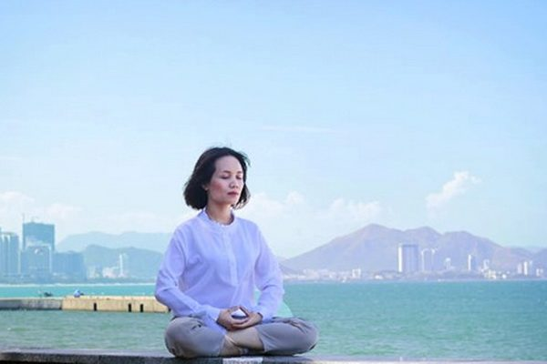

<a target="_blank" href="https://git.io/bb99bbss">

 

 
 

<a href="https://github.com/gofun72/telove/blob/master/soft.md"><b>免费突破封锁翻墙软件</b></a>
 

<a href="https://git.io/epubc"><b>手机上好看的电子书（ePub版）</b></a>
 

 

<a target="_blank" href="http://36.228.14.30">

 

<b>直连不必翻墙 🌼 必看精彩视频 http://36.228.14.30</b>

<a href="https://github.com/candysn/nini/blob/master/wnn-1.md"><b>小之每日真相(一)</a></b>

<a href="https://github.com/candysn/nini/blob/master/wnn-2.md"><b>小之每日真相(二)</a></b>

<a href="https://github.com/candysn/nini/blob/master/wnn-3.md"><b>小之每日真相(三)</a></b>

<h2 align="center"><b>疫情中请牢记法轮大法好 </b></h2>

法轮大法的九字吉言能保您平安。（明慧网）

 
【大纪元2020年01月26日讯】 目前，武汉肺炎疫情已在中国失控蔓延。最新的已有830宗人被感染，死亡25例。这还不是事实的全部，中共从疫情出现以来一直隐瞒真相，甚至瞒报死亡数字。

导致“不明肺炎”的病原体是一种新型冠状病毒，目前还没有针对性的药物和疫苗。我们比较熟悉的二零零三年的非典（SARS）、中东呼吸综合症（MERS）都是由冠状病毒引起的。因为中国官方报道的不透明、“舆论维稳”的需要，许多人都不知道这次疫情是否和当年SARS一样具有高致死率，而参与二零零三年非典等多次疫情应对的专家指出，“此次武汉肺炎疫情比二零零三年非典严重十倍”。

人们计划中的走亲访友、大聚会、度假游也受疫情影响，很多人选择闭门不出，专家也告诫人们要戴口罩、多喝水、勤洗手。不过，这只是让大家做好防护，维护公共卫生安全，而真正让您躲过灾难的却是法轮功学员告诉您的九字吉言：“法轮大法好，真善忍好”。

中国有句老话叫“心诚则灵”，法轮大法是上乘佛家大法，指导修炼人按照“真善忍”的宇宙特性去修炼，提高心性，不断升华自己，现已洪传一百多个国家，受到各国民众的欢迎。而中共灌输的是无神论、“假恶斗”，从三反、五反、文化大革命、六四屠杀大学生，再到迫害法轮功、活摘法轮功学员器官，中共迫害死大批中国人，引发人怨天怒。只有摆脱中共的束缚，退出中共党团队组织，诚心敬念这九字吉言，就能够躲过大灾难，为自己选择美好的未来。

<b>大地震中的奇迹</b>

法轮功从一九九二年洪传至今近二十年，许多法轮功学员身心受益，不治之症不翼而飞，他们把法轮大法的福音告诉家人、朋友及素不相识的人，使众多生命受益，甚至躲过劫难。

据明慧网报道，二零零八年五月十二日四川汶川大地震当天，十一名四川绵竹的法轮功学员在一起学法交流。大地震时往外跑已来不及了，大家齐喊“法轮大法好”，请师父救命，接着齐念发正念的口诀，大概近三分钟时间大客厅没震动、没摇晃了，但是听到对门邻居的房门和四周的房屋摇晃震动的声响仍像过火车一样的响个不停，等心平步稳时，他们从烟雾灰尘的楼上下来，看到周围空中烟雾浓浓，人们衣冠不整，哭的哭、喊的喊、有的头破血流，而这些法轮功学员安然无恙，家中财产也没有损失。

另一名北京的法轮功学员说，她丈夫的姐姐来京游玩，了解真相后选择了“三退”（退出中共党、团、队），回去后让丈夫、女儿及父母也选择了“三退”。

她姐姐家所在的四川省汉旺镇是地震的重灾区。地震时她正在小区的娱乐室里跳舞，舞场里大约有三十多人，地震来时，大家都惊慌失措地往门口跑，大嫂当时就感觉有一股力量在往外推她，她左脚迈出门槛后，右脚刚迈出门槛一点，房子就倒塌了，右脚脚后跟受了一点轻伤。她出来后还救了一位被埋在碎石堆里的姐妹，但由于伤势很重，后来得知也没有活过来，三十多人的舞场里死了十九人。

大嫂的父母在地震时躲到了厕所里，也没有受到伤害。而他们居住的四层小楼，被震得四层屋顶见了天，整座楼房往地下陷了下去，楼梯被震出大裂缝。

真是万幸啊！大姐后来对我说：“如果不是那股神奇的力量推我，我早已不在人世了，我的邻居、同学、同事差不多家里都有受重伤的，死亡的，有的家庭甚至只留下一人了。我真得感谢你啊！法轮功真能保平安啊！感谢你们的师父救命之恩啊！”

一位四川青川（地震中心）七十多岁的老婆婆在地震后，拿出身上的护身符，兴奋的对法轮功学员说：“这是好东西，能保命！管用管用。”地震那天中午，她和老伴还有一亲戚饭后正在午休，儿子突然打两个电话叫快起床，到幼儿园去接孙子。她觉的奇怪，平时都是四点半接，今天怎么这么早接？在儿子的催促下他们慢慢起床下楼。刚走到院子中间突然大地剧烈震动，房屋摇动倒塌，伴随震耳欲聋的噼啪声，尘土扑面而来，瞬间人失去知觉，什么都不知道了。不知过了多久，慢慢苏醒发现自己还活着，天昏昏的，周围一片废墟，自己楼房也倒塌了，赶紧找老伴和亲戚，把他们摇醒，发现三人都活着，没致命的伤。这时才想起孙子，三人搀扶着摸索著穿过废墟来到已倒塌的幼儿园，看到一位老师领着三个孩子，孙子大哭着扑上前，一家人抱头痛哭。老师心有余悸的告诉他们，孙子在午休时突然拉肚子就和这两小孩睡在进门处，她今天值班坐在门口才躲过劫难。

因为她姐姐十多年前患半身不遂，修炼法轮功后全好了，她家亲属在青川、汶川共有二十六人，全三退了，并且都非常相信法轮功，每人珍藏着真相护身符。大地震中所有亲属二十六人全活着，没有大碍。可街坊四邻死的死、伤的伤，甚至有全家遇难的。他们知道这是得到了法轮大法的保护。

<b>南亚大海啸中的二十分钟</b>

在明慧网第十届法会《人间小住　完成使命》一文，写出了一位法轮功学员的女儿，在二零零四年十二月二十六日南亚大海啸中的经历：“二零零四年圣诞节，女儿和朋友去泰国有名的普吉岛海滨度假，期间，震惊世界的印度洋海啸发生了！可就在那吞噬了几十万生命的巨浪来袭之前的二十多分钟，女儿乘船离开了普吉岛前往另一景点皮皮岛（也是重灾地）。

在去皮皮岛的航程中，女儿在船上享受着阳光美景，压根都没感到波涛汹涌的海啸正悄无声息的从船下潜过，袭向普吉岛。当女儿看到海水变的浑浊并得知真相后，立即对身边同伴说：快念“法轮大法好！”同伴疑惑道：管用吗？女儿坚定的回答：“管用！”

女儿太幸运了，如果她从普吉岛晚走二十多分钟，或者早到同样是重灾地的皮皮岛哪怕半小时，都绝无可能躲过这场灾难。数小时后，当她返回普吉岛时，素有人间天堂美称的海岛已变成人间地狱。她走进酒店，只见大堂里横七竖八全是尸体。回程前女儿把身上带的钱全部捐给了当地受灾民众。

凡是得知女儿这次经历的亲朋好友无不为她庆幸，更觉的神奇的不可思议！”

<b>张家口货车大爆炸前 小工“就想回家”</b>

还有一个例子。在明慧网的《善待大法弟子得福报　幸运躲过大爆炸》一文中，记述这样一件事情：“二零一八年十一月二十八日发生在张家口市的大货车大爆炸事件中，五十多辆车被毁，大货车里和周围的货车司机全部遇难，可一位大法弟子的儿子却因明白大法真相，诚念：“法轮大法好，真善忍好”而避开了灭顶之灾。

这位大法弟子的儿子叫小工（化名）。十一月二十八日那天夜里十一点左右，小工感到异常疲倦困乏，但就是不想在车上睡，于是就花了五、六十元钱，乘出租车回家睡觉去了。一个多小时后，小工到家刚洗完脚，就接到爆炸现场的排在很后边的司机朋友打来的电话问：“你在哪呢？快来看看，这里发生爆炸了，你的车……”

小工一听，很快赶到爆炸的现场，看到的竟然是数十辆五、六十吨的大卡车的残骸，自己的车也被烧毁，排在他的车的前后车的司机都不幸遇难。据说爆炸原因是化工厂氯乙烯泄露，导致一辆化工原料的大货车突然起火、爆炸。

小工明大法真相，始终保护修炼法轮功的家人，平时在自己的车上挂着法轮功的真相护身符，他在这次大爆炸中得到了福报，神奇的避开了这场灾难！他和全家人以及他的朋友都感恩大法师父救了小工的命！

中共讲战天斗地，但碰上天灾人祸却毫无办法，而法轮大法的九字吉言却能保您平安，此言真实不虚。如果遇到法轮功学员送给您护身符，请千万不要拒绝，也不要错过选择“三退”（退出中共党团队）的机会。

本文只代表作者的观点和陈述。
 
原文https://www.epochtimes.com/gb/20/1/25/n11821049.htm

<h2 align="center"><b>神奇中的领悟——一位中学教师讲述的故事 </b></h2>

法轮功学员在打坐炼功（网络照片）

 
 
【希望之声2020年1月19日】（本台记者慧光综合报导）我是中国大陆四川省某市的一名普通中学老师，在这个岗位上我已经辛苦耕耘二十多年。我喜欢教书育人的感觉，工作上一直兢兢业业，校领导对我很满意。因各方面表现优秀，曾多次受到表彰和奖励。我平时没有什么嗜好，唯一的消遣方式是打麻将，并且瘾很大，只要有人找我，我会随叫随到。

一个偶然的机会，一个学生向我推荐了一本书——《转法轮》，看过之后受到很大震撼。我从小就喜欢思考，对宇宙、生命、人生中的很多事情都想探索，看了很多书，包括很多古书，有《道德经》、《庄子》、《金刚经》、《心经》以及基督教的《圣经》等，还有儒家的四书五经都找来看过。这些书晦涩难懂，尽管读了很多，结果还是啥都没弄明白。可读过《转法轮》之后，我一下子明白了寻求多年而不得其解的问题，心中豁然开朗，有一种相见恨晚的感觉，从此走入法轮功修炼。说实话，我从没有见过师父，完全是按照书中的要求去做，可是在这个过程中有很多神奇体验，鼓舞着我一直坚定的走在大法修炼路上。

我以前有严重的妇科病，多次去市医院诊治，总是不能断根儿，并且一再复发，苦不堪言。开始炼功后很快就不药自愈，并且从未复发过。

大概是在炼功后的两个月左右，我在大便时总能拉出蛔虫，有时一条，有时两条。初时蛔虫有一根筷子大小，后来就越来越小小，多数都是死的。我跟家人说“我把蛔虫的祖宗三代都拉出来了”，虽然是一句笑话，可是肚子里怎么会有那么多蛔虫呢？我一直感到很困惑，细思起来可能是因为我有一个坏习惯，就是喜欢喝冷水、生水。这个现象持续了约有两个月，以后再没出现过。需要说明的是，我可从未吃过打虫药，以前也不知道有这个问题。

有一天我突然感觉肚子痛，非常疼，是从来没有过的那种感觉。在腰部左侧，疼的位置不固定，一会儿在前面，一会儿又到后面，是旋来旋去的，疼得我直冒冷汗。疼的时候站着不行，坐也不行，躺着趴着都照样疼，什么姿势都不能缓解。后来到厕所蹲了十几分钟，稍微好一些，接着就去上课了。当我走进教室时，疼痛顿时消失，让我觉得非常神奇。然而这仅仅是开始，以后曾不断出现，而且疼的时间越来越长，有时要持续三、四个小时，最长的一次持续二十多个小时，差一点儿晕过去，搞得我一晚上没睡觉，连饭都吃不了。

过了一段时间，我在家中批改学生试卷，突然感觉左侧腰部有股气儿上下来回窜，但不感到痛，接着尿道口出现涨堵感觉，我就去上厕所。解小便时觉得尿出了什么东西，一下就通畅了。我一看便池里有一块长条状黄褐色小石子，一头粗一头细，粗的一头直径如黄豆，细的一头直径如绿豆（这块石头我一直保存着）。

看到这块石头我才反应过来，原来疼痛是因为结石的原因，当时眼泪就夺眶而出。我哥哥和姐姐都得过肾结石，他们都是通过住院动手术解决的，既花钱又遭罪。而我没有采取任何治疗措施却自动尿出来了，这不是奇迹吗？由于内心的喜悦，那天我一边哼着歌一边做晚饭，那种心情真是难以用语言描述的。

身体上的魔难过去后，以后的考验大多是在睡梦中。

因为中共对法轮功的残酷迫害，我在内心深处一直有一点儿害怕。有一段时间我几乎天天做同样的梦：有时是往山上爬，用手抓住绳子往上攀，山体陡峭，非常危险，我都不敢往下看；有时是爬楼梯，可是爬着、爬着突然发现脚下的楼梯断了一块，半个身子就悬空了……。当时悟到这是师父在点化我，要我坚持住，千万别掉下去了。

有一段时间我还出现“元神离体”状态，通常是刚睡下不久，在似睡非睡中，清醒的感受到“自己”从躯体中飞出来了，在空中飞翔，速度还很快，能听到耳边的风“嗖嗖”的。起初很害怕，因为不知道是怎么回事儿。那种状态受意念控制，想怎么飞就能怎么飞，最后总是落在一根柱子顶上，可能那就是“功柱”吧。我知道这是师父在鼓励我。

修炼前我经常做恶梦，梦中被吓得惊叫大喊，都是家人呼唤后才能从梦中醒来。修炼后就很少做恶梦了。炼功初期曾经梦到有人来追我、杀我，一喊“师父”就醒了，也不感到害怕。

以前我打麻将的瘾很大。修炼后，有时同事们叫我，偶尔也会玩一玩。可过后就会梦见在悬崖边上打麻将，有时还会梦到在高速公路上打麻将，天上还不断打着炸雷。有一次是在大年初一，我本来不想打，可楼下邻居不断的喊，心想“过年了，耍一会儿也没关系”，就去了。可是走到楼梯最后一段时却摔了个大跟斗，膝盖和双手都摔伤了，非常痛。这一次不是做梦，我知道这是对我的惩罚。

为了揭露中共迫害，我一直利用在课堂上课的机会讲述法轮功被迫害的真相。在我任课的十几个班级，我利用一切机会讲，而且效果非常好。我是利用中国几千年历史中的修炼文化，以及天灾人祸和异常天象、中共历次政治运动产生的严重后果等做铺垫，然后讲人类对正法信仰的重要，学生就很容易理解、接受。即使是那些平时不喜欢听课的学生，只要讲法轮功的事都听得很认真。有时还出现一些令我吃惊的场面：有的学生双手合十，有的眼里含着泪花，有时还会爆发出热烈掌声，让我很感动。

有一年因学生家长举报，校领导找我谈话，说：“在全市的政法工作会议上，我校被点名，说有老师向学生讲述法轮功真相，要赶紧查清楚。‘610’办公室让学校先自查，向他们汇报，然后再决定要不要派人来查。”校长知道我炼法轮功，但没有向上级汇报。后来他对我爱人说，通过对我任课的班级向学生调查，学生都说我没讲过，此事以后就不了了之了。校长还向上级写了保证，证明我没有炼法轮功。

通过这件事使我进一步明白，只要我做得正，坚持对大法的正念，就会化险为夷，不会出现不好的结果。同时我也悟到：本来我们就没有错，做好人有错吗？不让做好人才是错的，为什么要向邪恶低头呢？！

在修炼路上，我还有很多做得不尽人意的地方，还有很多执着心未完全放下，但是今生能成为大法弟子，是我三生有幸。在今后的修炼路上，我会勇猛精进，继续做好自己该做的事，做一名合格的真正的大法弟子。 

原文 https://www.soundofhope.org/post/334096

<h2 align="center"><b>灵魂出窍方醒悟 大难临头有转机 </b></h2>

法轮功学员在打坐炼功（网络照片）

 
 
 【希望之声2020年1月21日】（本台记者慧光综合报导）她是生活在中国大陆的一位知识女性，人长得漂亮，有一份体面的工作，还有一个幸福家庭，有爱她的丈夫和一个可爱的儿子，日子过得幸福美满，她自己也很知足。然而在三十六岁那年，正当人生中风华正茂的年纪，她却在健康上出现了大问题。

那时她总感觉肚子痛，去医院检查，诊断结果是患有坐骨神经痛和结肠炎。坐骨神经痛除了疼痛外，尚不能危及生命，而医生说结肠炎却面临着很快转向结肠癌的危险。

对于结肠炎开始她也没当回事儿，因为不痛不痒，不影响吃喝。可没过多久，解大便时拉出很多鲜红色带脓的血，这时才感到害怕了。再去医院，医生告知肛门处往内约一寸左右已糜烂，需再做个“肠镜”确诊。当时她在外地工作，有诸多不便，就辞职回到了家乡城市，准备在当地市中心医院做一番全面细致的检查。

回到家后，临去医院检查前，婆婆告诉她：“现在的医院虽然能治病，但也有很多不该死的人被治死了，你不能完全相信他们。如果觉得不行了，就诚心诵念‘法轮大法好！真、善、忍好！’会有奇迹出现的。”她虽然嘴上答应了，但其实心里并不认同，是这个耳朵进，那个耳朵出，只是敷衍一下而已。

接着她又回到娘家，因为约好了由弟弟陪同一块去。可是在出门时，母亲说了与婆婆同样的话。她觉得奇怪——“为什么她们都这样说？”因为长期接受的无神论教育，她仍然没往心里去，只是出于礼貌嘴上答应了。她心里想：她们毕竟岁数大了，有点儿迷信可以理解，再说都是为我好，也不能责怪她们。

做“肠镜”检查是非常痛苦的，几个医生要将一根长长的大约有中指粗的圆管由肛门处插入，要穿过整个肠子，尤其是到肠子的转弯处，要用力才能让圆管通过。在医生用力的过程中，她疼得大汗淋漓，衣服都湿透了，不得不歇斯底里的大喊大叫。最后实在受不了了，只好用虚弱的声音对医生说：“我快不行了！能不能轻一点儿。”而医生却非常严厉的说：“死不了！你必须坚持！做肠镜检查之前，要把肠子里的东西全部排泻干净，这是必须的。”

在之后的两天一夜里她不能进食，只能安静的躺在病床上。或许是由于内心的恐惧吧，加上极度的痛苦折磨，不久她突然就昏迷了。就在那一刻，她发现自己轻飘飘的“飞”了起来，没有了一丝痛苦的感觉，可回头往下一看，自己的身体依然躺在病床上，穿的衣服和周围人的走动都看得清清楚楚。她心想“原来人死的时候是这样子的，真是解脱了，没有痛苦了”。

“飘”了一会儿，突然脑子里出现了一个想法：我不能死，还有儿子和丈夫需要我，我要活着，我舍不下他们。也就是在那一瞬间，她突然想起了婆婆与母亲的临别叮嘱，开始用微弱的意念不停的一遍遍的念“法轮大法好！真、善、忍好！”念了几遍后，“飘”起的灵魂就慢慢的回落到躺着的身体上——她又醒过来了！

醒来后，她忽然有了大彻大悟的感觉：原来人生就是一场梦，如果真的死了，那我为这个家辛苦操劳十几年，临死的时候却连他们的一个衣角都抓不住。如今我生病需要他们在身边的时候，却连一个人影都没有，各忙各的，丈夫是因为工作离不开，婆婆要照顾儿子上学。住院时也没觉得有什么，可经历了这场生死体验之后，才突然觉得内心是如此空虚，人世是如此凄凉。苦苦想抓住的、不忍舍弃的、在生死之际还舍不下的亲人，都是空的，就像梦幻一样。——沉睡了十几年，她似乎一下子清醒了，对人生有了新的认识与领悟。

坚持做完“肠镜”检查后，她捂着肚子、勾着腰、流着泪走出了检查室。见到一直在室外等候的弟弟时，她忍不住嚎啕大哭，似乎要将满腹的委屈与痛苦尽情的发泄出来。

回家后的那几天，她的心情非常沉重，心中总有一种莫名的恐惧，有一种无形的压力压得她喘不过气来。她常想：如果我就在那一瞬间死了又会怎么样？又能怎么样？为此她时常一个人暗自流泪，把自己关在屋里放声大哭。她甚至认为上天太不公平：表面上给我一个这么漂亮的面容，而身体却这么差，这样活着还有什么意义？

那段时间虽然不长，可对她来说却十分漫长，仿佛生命之根已经飘起，随时都有可能离开这个世界。她说：“想归想，但如果真让我离开疼爱的儿子，离开丈夫，离开那个家，不忍舍弃的心还是揪着我很难放下，让我彻夜难眠，那个煎熬无法用语言形容。这突如其来的变故对我的打击实在太大了。”

有一天，母亲将煲好的稀粥端放在床头柜上，她喝了一口，因肠子还没复位，稀粥顺着肠子往下走，所到之处她都能清楚的感受到，可是在这个过程中又让她疼的死去活来，不得不在床上翻滚。为了不让母亲难过，她拼命咬住嘴唇不让自己喊出声来。可无意间回头时，看到母亲正站在床边流泪。

她突然爬起来，跪在母亲面前，双手抓住母亲的衣服失声痛哭。她说：“妈，我现在是生不如死，如果世上能有一种方法让我解除痛苦，能让我病好，我就豁出去了，什么都不管了。”母亲平静的对她说：“你要想解除这种痛苦，没有病，那就只有炼法轮功。”这一次她没有犹豫就答应了。

母亲给她拿来了法轮功的主要指导书《转法轮》。以前也让她看过，可每次都看不进去。而这一次她有了不一样的感觉，仿佛在汪洋中漂浮挣扎的人终于抓到了一根救命绳索，书中的内容也深深的吸引了她。

她说：“看书过程中，我心中的疑惑一个个被打开，生命从哪里来？又将往哪里去？人为何活在这个世上？人活着为何这么痛苦？这些是我从记事儿起就一直在心中疑惑不解的问题，在《转法轮》里都找到了答案。这是一部叫人做好人的书，是一本真正能使人修炼的书，完全不是中共宣传的那样。我看完第一遍，又接着看第二遍，然后还是一遍接一遍的看。当看到书中的‘灌顶’内容时，明显的感觉到从头到脚有一股热流贯穿下来，非常舒服。此时我才理解婆婆和母亲为什么都那么说，这次我是真的相信了。可这一个简简单单的‘信’字，是通过生死验证的。”

“走入大法修炼以后，我没有再吃过一粒药，所有的病痛都在不知不觉间好了，没有病的感觉真美妙。如今我已经四十多岁了，面色白里透红，谁见我都说不像这个年龄的人，看上去比实际年龄年轻很多。”

“我把我的亲身经历说出来，向人们讲述一个人从不信到信、到重获新生的历程，就是想告诉那些还在听信中共谎言、被宣传毒害的人，请抽点时间静下心来多了解了解法轮功是什么？别像我当年一样被谎言迷惑、被谎言毒害，别给自己留下遗憾！能够健康的活着，无论对什么人，不都是一件最最重要、最值得珍惜的事情吗！”

原文https://www.soundofhope.org/post/334690

<h2 align="center"><b>【新闻看点】开年飞黑天鹅 武汉肺炎全球警报...如何预防保命？ </b></h2>

图为2020年1月21日的北京地铁站：武汉肺炎令人们忧心忡忡。(Kevin Frayer/Getty Images)

 
 
【大纪元2020年01月23日讯】大家好，欢迎大家关注新闻看点，我是李沐阳。

截止到中港台台时间今天（1月22日）晚8点，中国大陆确诊感染武汉肺炎（2019新型冠状病毒，2019-nCoV）的患者有473例，累计死亡17例。中共官方通报，疫情已经蔓延到了25个省区，有1394人被医学观察。

另外截止到中午12点，美国、台湾、香港、澳门、澳洲、日韩、泰国等也都发现确诊病例，全球共有481例确诊患者。如今全球拉响警报，各国机场加强防御措施。

疫情危急，更令人紧张的是，“病毒存在变异的可能”。中共国家卫健委副主任李斌今天表示，病毒传染源尚未找到，疫情传播途径也没有完全掌握。而海外专家指出，“仅靠戴口罩不能有效控制病毒扩散”，“没有明确接触史也会染病”。

刚进入2020年，武汉肺炎这只超大黑天鹅已经严重威胁着人们的生命健康。上周六我们最早说出疫情失控、当局可能压不住之后，留言区有人说我们“危言耸听”，“希望中国乱”。现在估计没人会这么说了，因为小粉红的命也是命。大家都在寻找保命的方法，今天就聊聊这方面的内容，告诉您中共不会说的真相。

“黑天鹅事件”指极其罕见、出乎人们意料的风险。 

<b>病毒可能变异</b>

在今天的新闻发布会上，李斌承认病毒传染源还没有找到，疫情传播途径也没有完全掌握。病毒“存在着变异的可能”，存在“进一步扩散”的风险。路透社报导，目前对这种新型病毒了解甚少。

有医学常识的人知道，流行病病毒变种的可能性最高，而且变种时间短。

网上有一张图，图说是世界卫生组织（WHO）认定的武汉肺炎新变种病毒谱图。不过我们没有查到世卫组织的说法。

大纪元采访到了武汉一位门诊医生魏先生，他表示“非典”（SARS）的说法早在当地医生内部流传了。去年11月、12月时，疫情趋势已经很明显了。“后来网上有说是冠状病毒，官方马上跟进，承认是冠状病毒。”

魏先生说，关于“非典”的说法，只能在内部与亲友间私下传。“你要是说，那就是⋯⋯你也懂的。所以没有办法。”

按照魏先生提供的时间来看，疫情至少有一个半月到2个月的时间了。

<b>武汉病毒与SARS同源</b>

大陆联合研究团队昨天在《中国科学：生命科学》英文版发表论文，声称研究发现，武汉肺炎与SARS病毒“来源相同”。都是寄生在果蝠（fruit bats）身上的病毒，但比SARS病毒弱一些，不过仍有“高度传染性”。

研究团队表示，“武汉冠状病毒的自然宿主可能是蝙蝠”，但传给人之前，可能“有未知的中间宿主”。

“天然宿主”指的是天生就携带病毒的动物。“中间宿主”指的是被病毒感染的另一种动物。

当年SARS爆发，也是这种情况。科学家认定，广东人养殖和食用了被感染了SARS病毒的果子狸，发生疫情。而SARS病毒的“天然宿主”是叫做“中华菊头蝠”的蝙蝠。

SARS功臣钟南山前天表示，虽然不清楚究竟传给人的是什么动物，但根据调查判断，竹鼠和獾一类的野生动物可能性比较大。

其实早在1月14日，柏林夏里特医学院病毒研究所所长德罗斯滕（Christian Drosten）就指出，新病毒与SARS病毒同种，只是形态不一。

<b>“毒王”出现，没有特效药</b>

目前北京当局把武汉肺炎纳入了“乙类传染病”，但预防、控制措施与甲类传染病一样。甲类传染病就是鼠疫和霍乱，都是强烈传染的疾病。

一位北京大学匿名专家向《文汇报》透露，有一名感染了多位医护人员的患者，已经足以被判定是“超级传播者”。符合体内病毒发生突变、适应人体的可能性，使病毒感染能力更强。

“超级传播者”，俗称“毒王”。2003年SARS的“毒王”，一个人传给了几百人，危害相当严重。

出现“超级传播者”，是钟南山最担心的。他表示武汉和广东的事实证明“病毒肯定人传人”，而且医务人员和病人之间也有互相传染。

据前凤凰卫视记者闾丘露薇表示，钟南山现在“已经封口”，不再接受采访。不知是他自己不想说，还是有外来的力量不让说。

昨天他还提到另一个忧心的事，“目前没有特效药”。

美国国家卫生研究院（NIH）属下的国立过敏与传染病研究所（NIAID）所长、免疫控制实验室主任安东尼·弗契（Anthony Fauci）对自由亚洲表示，“如果顺利，几个月后可以初步临床试验，但新疫苗面世最快也要一至两年”，他提醒人们，“要做好最坏的打算。”

<b>官方死亡病例 恐远远不止</b>

现在死亡病例更新也很快，今天（22日）早晨看还是9人，中午就变成了17人。NGO组织“自然之友”今天发消息，资深环境教育家徐大鹏因肺部感染，在汉口医院去世。他的妻子也因肺部感染，10天前在武汉第六医院离世。

徐大鹏的女儿徐馨蕾告诉《新京报》，徐氏夫妇虽然都表现出严重肺炎症状，但是直到去世，都没有接受“核酸检测”辨别是不是武汉肺炎。也就是说，徐大鹏夫妇没在官方统计的死亡病例当中。

令人不安的是，徐馨蕾是密切接触者，但并没有被隔离观察。徐大鹏生前朋友刘先生告诉自由亚洲，“当局根本就不管，医生不理她，就让她一个人去处理后事。也就是说，这么一个带病的嫌疑人都没有人管，这是个非常大的问题。”

另有知情人透露，亲友准备为徐大鹏水葬，联系武汉疾控部门，但对方告知，徐大鹏夫妇不在被统计的死亡名单，他们无法做什么。

大纪元采访到一位原住武汉的华裔女士，她的哥哥在当局宣布冠状病毒前就死了，被宣布是“不明肺炎”，没在“官方死亡名单”。

另外，她的妹妹现在也病危，侄女夫妇“现在路都走不动，但医院不收”，要求回家自行隔离。而她的姨妈、姨父也在等待检验结果。

<b>感染病人由姐姐照顾</b>

《北京青年报》微信账号“北青深一度”昨天发了个独家专访，受访者是15日从金银潭医院出院的化名王康的武汉肺炎患者。王康披露，由于被隔离病人相当多，医院人手不足，他的日常照护是姐姐包办。

王康12月22日感到不适，打点滴也没效果。27日开始高烧，并做了检查，但没住院。

30日的病例报告称肝功能有异常，被转到协和医院就诊。1月2日，他的血氧浓度低于60%，担心有生命危险，转到金银潭医院，进了加护病房。

王康介绍，10日转到重症病房前，被隔离“患者已经相当多”，医院人手不足。于是医院把王康的日常照护全部交给了健康的姐姐。

官媒报导这件事，证实了网友所说的“医院病患爆满”，也让外界管窥到一点疫情的严重。

昨天香港有线电视报导，中共医疗专家组专家、北大呼吸科主任医师王广发被确诊感染肺炎，正在被隔离治疗。

会诊专家的防护措施肯定很周全，也没抵挡住病毒，足见病毒的传播力。这也很打脸中共，因为王广发曾出面辟谣，声称“疫情可防可控”。

<b>专家：没有接触也传染，仅戴口罩不够</b>

昨天（21日）台湾也确诊了一例，是在武汉工作的台湾女性。中央社报导，这名女性没去过当地市场，也没接触过禽鸟或食用野味。

防疫专家何美乡表示，从这个病例可以得知，“没有明显接触史的人，也可能感染武汉肺炎”，“这是蛮大的警讯”。

面对疯狂汹涌的疫情，“出门戴口罩”是第一件事。大陆多个地区出现了疯抢口罩的现象，微博、微信也出现了“口罩热”。而有的商家则趁瘟疫之际，大发“黑心财”。

香港《经济日报》记者暗访发现，天猫平台网店“炒口罩”很普遍。25个装的N95口罩叫价909元，平均36元一个。价格虽然高，但是却有成交记录。以前，这样的口罩只卖70～100不等。

还有的网店更凶，一包5个装的3M牌N95口罩，叫价650元，平均130元一只。

戴口罩一定程度上可以防止飞沫传染，但美国专家指出，仅靠戴口罩，并不能有效控制病毒扩散。

美国国家卫生研究院过敏及传染病研究所戴仲东博士对美国之音表示，“这种冠状病毒类病毒，传染性很强。除了呼吸道传染外，也可以接触性传染，比如通过分泌物等等。”

戴仲东解释，冠状病毒患者的眼泪、鼻涕或者唾液等分泌物都有传染性。如果不小心接触到这些分泌物，然后再触碰自己的鼻子和嘴，都会传染。

戴仲东指出，戴口罩只能阻断空气、呼吸传播的飞沫传染，但是身体和分泌物的接触是预防不了的。所以只戴口罩“不能够解决问题”。

<b>又一场“人祸”，考验北京当局</b>

总观这场疫情，从18日到今天，短短5天，确诊病例从零星数字激增到数以百计，外界惊呼又是一场“人祸”。

709案律师谢燕益表示，起初官方讳莫如深，对消息严防死守。还强调“没有人传人，没有危害性”。中共的舆论维稳，消解了人们的警惕性，现在疫情压不住了。说明中共不仅没有吸取SARS的教训，而且“有过之而无不及”，

谢燕益指出，在专制体制下，中共官员不对老百姓负责，只对上级负责，所以屡屡出现“视人命如草芥”的情形。他们只要“站好队”，隐瞒信息，压制真相。因为上司决定他的命运和前途，“而老百姓没有选举权，没有监督权，没办法问责”。

谢燕益强调，这场席卷全国的疫情，还是中共体制造成的，“又是不折不扣的人祸”。

在倒逼之下，中共政法委昨天发文表示，武汉肺炎来势汹汹，“谁为一己之利，刻意迟报瞒报，将永远被钉在历史的耻辱柱上；谁将政客的面子看得比人民利益还重，就是党和人民的千古罪人”。

北京这番话，若在以往，不少小粉红又会高潮。但现在，已经没人信了。

62岁的武汉退休人员罗洁（音）今天去了机场，准备飞往北京。她告诉《纽约时报》，自己想“逃离”，疫情使她想起了非典。

罗洁说得很实在：希望当局“如实公布疫情，这就是给老百姓最好的安心丸”。

香港资深评论家凌锋撰文表示，由于“党领导一切”，所以当中国出现瘟疫时，不是专业来决定如何防疫，而是中宣部领导防疫。说有就有，说没有就没有。当年SARS是这样，武汉肺炎也是如此。

也有大V说，“天灾人祸的时候，你们首先想到的永远不是调查真相和原因、做好防范救治，你们永远最先做的都是抓人和控制舆论。能要点脸吗？”

<b>如何预防保命？</b>

说了不少，现在看看世卫组织给出的防护建议。他们建议尽量使用肥皂等勤洗手，远离有感冒症状的人。如果咳嗽或打喷嚏，要用纸巾等物品摀住鼻子和嘴。食用肉食和蛋类，一定要熟透，同时不要接触野生或者农场动物。

不过，我要告诉大家一个特别的消息。曾经有一位法轮功学员给我做三退（退党、退团、退少先队），她告诉我牢牢记住“九字吉言”，说遇到灾难的时候，诚心敬念这个“九字吉言”，可以化险为夷，遇难成祥。

据说不少人都有亲身体会，所以我也转告您。这九个字就是：“法轮大法好，真善忍好。”

有小粉红可能会反感。但我想，现在瘟疫威胁着人们的生命，已经到了紧要关头。这个时候保命最重要，中国人不是说“宁可信其有，不可信其无”嘛。

如果诚心敬念“法轮大法好、真善忍好”而躲过劫难，这是天大好事。

最后祝愿您和家人都能够躲过劫难，幸福平安。

好的，感谢您关注新闻看点，再会。

大纪元《新闻看点》制作组  

原文https://www.epochtimes.com/gb/20/1/22/n11813912.htm

<h2 align="center"><b>读《转法轮》澳洲西人找到生命意义</b></h2>

2018年11月24日，约5,400名法轮功学员在台北自由广场排出巨幅的英译本《转法轮》。（明慧网）

 

【大纪元2020年01月10日讯】1996年8月，法轮功创始人李洪志先生第一次来到澳洲悉尼讲法、解法，从此这部大法惠泽澳洲大陆。澳洲西人阅读《转法轮》后，找到了一生中在追寻的生命意义，身心得以净化，生活发生了巨变。

法轮大法（也称法轮功）于1992年5月由李洪志大师公开传出。25年前，指导法轮功学员修炼的主要著作《转法轮》出版发行，迄今已经被翻译成46种语言，被全世界一亿多人拜读。

<b>“《转法轮》创造了一个全新的我”</b>

在一家语言学校担任英文教师的坎森·古德林（Cansin Goldring）女士，从18年前开始阅读《转法轮》，她说：“这本书给我和我的儿子带来的变化无法尽述。我们非常感谢师尊李洪志先生在这本书中教给我们的法理。”

在古德林的成长过程中，关于人生、宇宙和人类，她心里总是有很多解不开的疑问。她想知道人为什么会死，死后去了哪里。死后还有生命吗？为什么有人非常走运，而有些人却很倒楣？自从阅读了《转法轮》后，她得到了所有这些问题的答案。

她说她感到如此幸福，不再希望拥有过去非常看重的东西了，因为她知道，如果她能做到“真、善、忍”，那么这个宇宙会给她更重要的东西。

她在第一次阅读这本著作之时，就决定戒烟了。在那之前，即使她有心脏病，也从来没有想到过戒烟，因为她的烟瘾太大了。可是她只阅读了几遍《转法轮》之后，她就彻底戒了烟。

“十八年来，我没有一丝一毫想再拾起烟的念头。随着戒掉烟酒，我变得越来越健康，内心更平和，从此不再需要去看医生了。”

对她的儿子来说，最明显的变化是，她变成了一个完全不同的母亲。她不再因为细小的事情对他发火了，她也不再鼓励他：一旦别人打他，他应该还手，或者一旦受欺负，要立即告诉她什么时候发生的、什么人做的，她要去学校找他们评理，等等。

“随着不断阅读和理解师父在书中所讲述的内容，我变得很祥和。”

她说，在她儿子8岁的时候，她就经常给他念《转法轮》。在听她开始念《转法轮》之后，他就再也不让她念其它曾经读过的睡前故事了。他总是让她念《转法轮》。

“我儿子现在27岁了，他不知道酒精饮料是什么味道，从来没有抽过烟，一直在按照《转法轮》中所讲的‘真、善、忍’原则规范自己。这是全宇宙的指导原则。”

她说，她儿子从小到大，她从来没有见过他发脾气或者对任何事情表达不满，她认为这都缘于他从小领悟《转法轮》中师尊的教诲。现在，他是一个非常成功的商人，也是因为他的成长伴随着阅读这些指导修炼的法理。

古德林说：“谢谢师尊的指引。是师尊让我这个母亲当的如此轻松。”

仅仅阅读一本书怎么会有如此强大的力量？她说，但事实就是这么简单。每天晚上，当她开始阅读《转法轮》，她就开始检查自己的行为是好是坏。书中的法理在提醒她，应该心怀善念，应该做到真，也应该忍。可以想像，这不是随时都能轻松做到的。“有时候我没能按照这些原则去做，结果和主管或同事产生冲突。”

过后，“我打开书，开始阅读。立即，我感到安稳和喜悦，因为看到了自己的错误，我变成了一个更好的人。这就是为什么这本书具有如此强大的力量。因为他能创造一个全新的我，一个更真、更善、更忍的我。”

“这本书已经成为我最伟大的朋友，是引领我走向慈悲心怀的向导，是在这个充满不可预知磨难的复杂环境中给予我力量的源泉。这就是这本书能改变一个人的强大力量。你从此在遇到麻烦和危机时不会再颤抖和恐惧了，你会变得睿智、冷静和坚毅。”

“今生我会继续阅读《转法轮》。因为我不想变回到阅读这本书之前的那个我。”

<b>“真、善、忍”是生命的秘密</b>

戴斯蒙德·福特（Desmond Ford）先生在修炼法轮功前，和妻子共同经营一家自然疗法诊所，因此他们可以接触到各类不断出现的尝试帮人解除痛苦的健身方法或者修行的方法，比如经常收到介绍班等活动邀请和免费的书籍资料等。

他说，他和妻子都是在天主教家庭长大的，但他们都各自从青少年时期就开始探索各种各样能真正回归的途径。对他来说，内心总有一种很深的、对“某种事物”无法满足的渴望，换句话说，就是他知道每一个生命来到世上都有特别的目的，但他自己所经历的一切还无法回答这个问题，只是足以让他去不懈地探索。

“这就是驱使我‘修复我自己’的来自内心深处的潜在动力，因为我知道自己很不完美。”

多年的尝试和努力，他没有收获，却导致了很多的损失，他决定放弃了。在等待和渴望中过着无法满足的空虚生活。

1998年一个不同寻常的日子，一位顾客送给福特的妻子一个礼物——一本《转法轮》。她立即就开始阅读了。从此，福特夫妇成为法轮功修炼者。

福特说，对于此类书籍，他的阅读习惯是，快速地读其中的几页，一旦知道书里没有他想要的答案，就放弃了。“但我立即发现《转法轮》绝对与众不同。我和妻子都不愿把这本书放下，也就是说，我们俩在一天之内就从头到尾读完了一遍。”

他感到书中很多内容如醍醐灌顶、启迪心智，当然也有当时还不能理解的部分，“但是师尊的话鼓励着我，一遍又一遍地阅读。”

“20年来，我从没有一天错过阅读《转法轮》，有些部分甚至已经能背诵了。于是，我逐渐发现，导致自己所有的问题根本原因是自私——对自我的专注。”他说，“什么时候都首先是‘我！我！我！’这已经成为习惯性的无意识的念头，总是伴随着我，生活中随时随地控制着我。”

通过不断地阅读《转法轮》，他学会了向内心去找原因，能找到每一个问题的根源。现在，他明白了，根据师尊的教诲，“只要问自己这三个问题：我真吗？在考虑自己之前首先想到别人了吗？我做到忍了吗？‘真、善、忍’是生命的秘密”。

对大法师父李洪志先生，福特内心充满感激，他说：“谢谢您，李洪志大师。我的渴望实现了，我正在归正我自己，而且，我的人生充满意义。”

<b>“《转法轮》讲述的是终极的真理”</b>

波兰裔画家芭芭拉·舍费尔（Barbara Shafer），2003年11月11日在修复教堂壁画时，从7米高的架子上跌落，头朝下摔到水泥地上。当时她的生命陷入绝境，被西医判为毫无痊愈的希望。医生说，她的头骨裂成了三块，鼻子和鼻窦几乎被撞得粉碎，上颚有三处被摔裂，膝盖和手部都是粉碎性骨折，被摔断的手骨还露在皮肉外面。

手术之后，芭芭拉几乎全身上下都是缝针接口，脸上缝了七道。此时的她更像一个被摔坏了零件的“机器人”：她的体内被装上了许多螺丝和钢板作为支撑；整床牙都需要用金属线来固定；两只眼睛同时看着不同的方向；左耳失聪，左手失去知觉；脑中充满了奇怪的机械杂音。

当时，失忆开始困扰着她，难忍的疼痛如噩梦般挥之不去。两次手术之后，她的脊髓液还在从喉咙后侧往外渗。这时她感到走投无路，决定听从好友的建议，学炼法轮功。

阅读《转法轮》的第一天，她吃力地将目光放在书上，但是眼神无法集中，视力模糊。尽管如此，她依然坚持着。读书的第二天，她发现自己的视力提高了。她读完了第一讲，然后接着读第二讲。书中的内容深深吸引着她。

读书的第三天，不寻常的事情发生了。她感到一股强大的电流似的能量从手指往手臂上走：这（能量）带走了一切——疼痛、手术后的问题、脊髓液外渗的问题，甚至耳鸣，那些在她脑中无休止的像印刷厂机器发出的杂音，全都消失了，而且再也没有回来。

修炼法轮功仅4个月后，芭芭拉再次回到了高高的手脚架上，再次从事自己热爱的工作。那次摔伤事件不但没有给她留下任何心理阴影，而且，她摔伤之前患上的所有疾病都消失了，包括严重的消化系统疾病、偏头痛、过敏、焦虑和抑郁。她的身心完全康复了。

舍费尔表示，修炼法轮功后，她所有方面都得到了提升，更富有同情心、更体贴别人、内心变得更加平和。

“我相信，《转法轮》讲述的是终极的真理，这是世人等待了很多很多年的真理。这是在我们这次人类文明道德下滑到如此地步之后，上天赐予人类的最后希望。师父李洪志先生以他洪大的慈悲教诲世人，大法能够改善社会，挽救人类文明。”

她最后说，她对师父的感恩无法用言语表达，只能通过做得更好来表达感激之情。她希望人们在中国可以像她一样自由地修炼法轮功。

“法轮功是美好、充满力量的修炼方式，让人们获得最大的自由、最高的智慧和启迪。希望有更多的世人能按照‘真善忍’修炼，每个人都能从中获益。”

文章来源：明慧网 

原文http://www.epochtimes.com/gb/20/1/10/n11782021.htm

<h2 align="center"><b>栽赃自焚案 中共害全国</b></h2>

2001年1月23日，在北京天安门广场，一个由中共自编自导“法轮功学员自焚求圆满”的事件，震惊世界。18年后，一部纪录片《欺世伪火》揭开了自焚伪案的黑幕和来龙去脉。（纪录片《欺世伪火》介绍篇视频截图）

 
 
一月十一日伊朗官方公开承认意外击落乌克兰客机，但当天中共官媒《人民日报》旗下的《环球时报》以头版通栏大标题发表报导，否认伊朗用导弹击落客机，闹出国际大笑话。《美国之音》报导说，中共近年来以所谓的“传播谣言或不实信息”为理由，大肆抓捕网民。但中共官方此次不但没有问罪《环球时报》，还紧急删除网民转发用来嘲笑《环球时报》头版的图片。有网民说：“《人民日报》与《环球时报》自从亩产万斤以来一直是中国人民的笑柄。”“上行下效，各省各市各镇等政府部门都是吹着浮夸风”。
 

这则国际笑话的背后，其实暴露了中共说谎成性的本质与一言堂的霸道性格。这就像车祸肇事之后，旁观者指证历历，肇事者已经认罪，却有好事者挺身替祸首开脱责任，还一味掩盖事实，企图箝制真实消息，自己造假却还阻止别人说真话，以致献丑海内外。

中共造假的同时，还禁止别人说真话，并非始自今日。一九九九年七月，中共与江氏集团动用整部国家机器，非法迫害上亿名修炼“真、善、忍”的法轮功学员，就是显著的例子。中共为了实行“肉体上消灭、经济上搞垮、名誉上搞臭”的灭绝政策，不断制造“假新闻”，编造一连串自焚、杀人与敛财等弥天谎言，企图激发民众对法轮功的仇恨。其中荼毒世人最严重者，莫过于二零零一年一月二十三日炮制的“天安门自焚事件”，意图诬蔑陷害法轮功，以所谓的五人“自焚”谎言欺骗民众。

如果把十九年前的中央电视台“天安门自焚事件”录像画面进行慢镜头分析，便会暴露出很多疑点，说明这场“自焚”事件完全是一场精心布局的预谋与骗局。

一、在“自焚”事件中被大面积烧伤的小女孩刘思影气管被切开后四天就能接受采访并能唱歌。

二、《焦点访谈》录影证实，刘春玲没被火烧死，却被警察用重物击打头部倒下。
http://big5.minghui.org/mh/article_images/2014-1-10-minghui-tiananmen-zifen.jpg

三、天安门巡逻的警察几分钟内从两辆警车里拿出二十多个灭火器和灭火毯“应付”该起“自焚”突发事件。

四、北京积水潭医院治疗“自焚”大面积烧伤者，不作任何防护。允许记者近距离采访，所有被严重烧伤的人都被紧紧的用纱布包裹，完全违反医学常识。
http://big5.minghui.org/mh/article_images/2011-8-23-minghui-wenzhou-zifen-03.jpg

五、“王进东”在自焚时衣服已被烧焦，但是最易燃烧的头发还在头上，他腿间的盛满汽油的雪碧瓶却完好无损。在他喊出那句似是而非的口号之前，警察手中的灭火毯却在他头上优闲的摇晃很久，没有丝毫灭火的急迫。
http://big5.minghui.org/mh/article_images/2013-6-5-zifen-1.jpg

六、在央视和新华社的“自焚”报导中，先后出现了三个不同的“王进东”。台湾大学语音识别实验室受“追查迫害法轮功国际组织”委托，对王进东的声音作了语音鉴定，得出明确结论：《焦点访谈》第一集中的王进东与后来的王进东不是同一人。“追查迫害法轮功国际组织”经可靠途径查获：参与“自焚”的“王进东”是由一名现役军人扮演。
http://big5.minghui.org/mh/article_images/2018-1-30-zifen-truth-01.jpg

不仅上述造假的凿痕太过明显，《华盛顿邮报》在二零零一年二月四日头版头条发表了调查报告《自焚的火焰照亮了中国的黑幕──当自焚的动机乃加强对法轮功的斗争》。邮报记者菲力蒲﹒潘亲自到自焚身亡的刘春玲的家乡开封实地调查，邻居们说从来没有人看见过刘春玲炼法轮功。

国际教育发展组织于该年八月十四日在联合国会议上，就天安门自焚事件，强烈谴责中共当局“国家恐怖主义”的行为，指控“天安门自焚事件”是对法轮功的构陷，涉及惊人的阴谋与谋杀。声明中说：从录影分析表明，整个事件是“政府一手导演的”。中国代表团面对确凿的证据，没有辩词。该声明已被联合国备案。

令中共极度难堪的是，二零零三年十一月八日由新唐人电视台制作、揭露“天安门自焚真相”的纪录片《伪火》，从各国参赛的六百多部影片中脱颖而出，获得第五十一届哥伦布国际电影电视节荣誉奖。该奖项在记录片领域享有盛誉，其历史仅次于 “奥斯卡”。《伪火》影片以触目惊心的画面和精辟严谨的分析，揭示了“自焚”案的诸多疑点，从而证实了整出事件是中共栽赃法轮功而炮制的伪案。《伪火》的视频可在《获奖影片：伪火（中文版）》下载观看。

“造假”是中共一贯手法，“造假”歪风引领人心沉沦；中共迫害“真、善、忍”，使“假、恶、斗”毒害全中国，伦理道德沦丧，人人为近敌；目前许多中国人唯物是尚，不信神佛，在党文化的薰染下，迷失纯真本性。中共习于“造假”，邪风弥漫中国社会，乱象频生，仅举两例。

二零一九年三月十六日，四川省成都市温江区七中实验学校惊传发霉食材、危及学生健康的丑闻，当地政府却调动大批警力封锁学校，秘密抓捕家长。三月十七日，当地政府在没有一名家长参加的情况下，自导自演了一场新闻发布会闹剧：将最初在现场拍摄照片、揭发发霉食材的三名家长称为“犯罪嫌疑人”，宣称他们闯入小学食堂，撕破食材包装，刻意摆拍成为照片视频传到网络。对此荒唐的新闻发布会，家长们不仅愤怒，更感慨政府蓄意颠倒黑白。

去年十月，重庆大学博物馆在该校九十周年校庆前夕展出大量文物，被质疑是赝品，有造假之嫌，引起舆论广泛关注。一名看过展览、身为收藏爱好者的作者发表文章，质疑馆内充斥数百件赝品，并对展品逐一点评。从秦始皇陵铜车马、唐三彩挂蓝到汉代彩绘俑，这些仿制品工艺粗糙，颠覆文物常识，不仅行家看了直摇头，连普通参观者也能发现破绽。

上述场景，西方文明社会感到不可思议，但对中国人而言，却不陌生。近年中国很多社会怪像，看似人的素质日益低下，实肇因被“假、恶、斗”的党文化耳濡目染所致。民间广传顺口溜，所谓“村骗乡，乡骗县，一直骗到国务院”，顽疾已久，根治也难。不仅地方造假，上梁不正下梁歪，基层政府需要政绩来升职，高层政府要保GDP增长速度。二零一六年十二月八日，李克强智囊、中共国家统计局局长宁吉喆在《人民日报》撰文表示，一些地方时有发生的统计造假、弄虚作假，违反法律法规。

在中国大陆，假食品、冒牌货与“山寨版”早已不是新闻。“中国制造”的造假，近年也引起西方国家关注：二零零八年，中国爆发“三聚氰胺毒奶粉事件”，震惊全球；许多新药临床试验数据凭空捏造，罔顾人命；毕业生论文抄袭，遍及中国各高等院校。从本科生、研究生到博士生，从学生到教授，从校长到中科院的院士，甚至爆出学术界跨国论文造假的丑闻。只要有利可图，就会有人造假。

学校用发霉食材，黑心是首因；高官学历造假，“假大空”已积习难返。中共炮制自焚伪案，却是出于栽赃构陷，妄图蒙蔽世人；自焚伪案十九年，“造假”贻害全中国。十几年来，幸有《伪火》在海内外广泛传播，无数民众通过了解“自焚真相”从而明了迫害法轮功的真实情况，人心日渐觉醒。“真、善、忍”是普世价值，恰是整饬歪风邪气的解药良方。衷心祝愿世人回归传统理念，实事求是，唾弃造假，则人心归正，国之幸甚。

本文只代表作者的观点和陈述。

原文https://www.ntdtv.com/gb/2020/01/19/a102756050.html

<h2 align="center"><b>走出绝境的白血病姑娘</b></h2>

法轮功学员在打坐炼功（网络照片）

 
 
【希望之声2020年1月16日】（本台记者慧光综合报导）她是生活在中国大陆石家庄市的一名年轻女性，热爱生活，聪明好学，有远大抱负，二十六岁就办理了自费赴美留学手续，美好的未来在向她招手，她也对自己的未来充满信心。然而命运却向她开了一个巨大玩笑，就在临行前她犯病了，住进了石家庄市铁路中心医院。

住院后，父母怕她接受不了残酷的现实，把病床上的病历卡撕掉了，跟她说医生诊断是严重贫血症，治疗一段时间就会好。全家人都在她面前强装笑脸，极力掩饰着内心的痛苦。

有一天晚上她到护士站接电话，无意间发现在床位信息的登记栏上，她的名字下面写着“白血病”三个字。她当时就愣住了，脑子里一片空白，呆傻地在那里站了很长时间，不知道过了多久才茫然的回到自己的病床上。

这个信息犹如晴天霹雳，给了她沉重一击，以往的所有美好憧憬顷刻间化为乌有。对于一个年轻姑娘来说，这无疑是致命打击。

接下来的治疗过程更是让她痛不欲生。每个月要进行七天放、化疗，导致她的抵抗力明显下降，稍不注意就感冒，一感冒就发高烧，而她又对抗菌素过敏，使用抗菌素后全身起皮疹，像穿了红色紧身衣，奇痒难忍。实在忍不住抓挠，又弄得满身流血。

由于长时间输液，手背上满是针眼，而且皮肤逐渐变硬，每次输液时护士都发愁。后来一看到吊瓶中的红色化疗液，她都会产生条件反射，恶心、呕吐。一头秀发因大剂量放、化疗掉光了，只有短短几天时间体重就减了二十六斤。

更加糟糕的是，同病房中的病友一个个相继去世，使她万念俱灰。在死亡阴影的笼罩下，她失去了活下去的勇气。而她还那么年轻，人生才刚刚开始就要结束了，她无论如何也想不通：为什么生命是如此脆弱？

她说：“在病痛的折磨下，我对人生也有了不一样的理解。在病魔面前，人竟然显得如此渺小与无助，那么人生奋斗的意义何在？纵然是拼得头破血流、争得了万贯家财、达到了权力的顶峰，又有何用？我不停的在心中呐喊：为什么我要在如此年轻的生命中承受这般痛苦？是谁在主宰我的命运，让我承受着这一切？”

一年后，家人带她去北京的大医院做了骨髓移植手术，哥哥为她捐献了骨髓，整个手术费用花了十几万元，全家为了挽救她几乎付出了所有。

然而手术后出现了一系列后遗症，让她更加痛苦。她出现了肾上腺皮质功能减退以及心脏间歇停跳等症状，由于输血出了问题又使她患上了丙型肝炎，这些病症中的任何一种都能很轻易地要了她的命。治疗肾上腺皮质功能减退症，只能靠每天口服五毫克激素维持生命；丙型肝炎只能任其恶化，辗转几家中、西医院治疗都没有效果，最后医院还是下了病危通知书。

为了给她治病，父母都快急疯了，而父亲有心脏病和高血压，母亲有糖尿病和哮喘病。母亲整天像影子一样陪着她，生怕她一时想不开寻短见，可母亲还不敢把自己的悲痛表露出来……

当时她的身体又黑又瘦，已经不成人样。看到父母、亲友为了给她治病做出了那么巨大的付出，她又不忍心轻生离去。她说：“看着父母日渐憔悴的面容和绝望的眼神，我就感到揪心和惭愧，我只能在心里说：女儿对不起您们二十多年的养育之恩，在你们应该安享晚年时还要拖累您们。可是我又该怎么办？我还能拿什么报答您们？我真希望能够活下去啊……”

然而人的命运有时又是那么奇妙，就在死神的脚步渐渐临近的时候，一个偶然的机会为她的生命带来了希望。一位炼法轮功的亲友对她说：炼法轮功吧，只有法轮功能救你！虽然是简简单单的一句话，却让她在绝望中看到了一线曙光。

开始学炼功法时，尽管法轮功的五套功法简单易学，但她还是坚持不下来。由于身体极度虚弱，她需要母亲扶着才能站稳，才能勉强走几步。不过在求生欲望的驱使下，她咬牙坚持着。然而就在坚持中，奇迹就出现了，她感觉越来越轻松，一个月过后，她就能将一个小时的动功坚持炼下来。在不知不觉中，她不需要母亲扶着了，自己能走了。以后越来越有精神，生活很快就能自理了。

在这一个月中，母亲观察到，她的表情也在不断变化，由开始的悲痛和愁容满面，变得有了笑容；一张黑瘦的脸逐渐泛起了红晕。原来生活不能自理，全由父母照顾，炼功后她能主动承担一些家务，做一些力所能及的事情。

她说：“那段时间变化得如此之快，我连做梦都能笑出声来。”大病三年之后，她竟然还能品尝到无病一身轻的滋味儿，她回忆说：“真是太神奇了！每天都像做梦一样。家里花了十几万元都没治好的病，炼法轮功后一分钱没花全好了，这能用现代科学解释吗？不正说明法轮佛法是真正超常的科学吗！”

如此严重的绝症，修炼仅仅两个月之后，她就重返工作单位上班了。

在以后的工作中，她严格按照修炼人的标准要求自己，不以权谋私，不收取货主的任何财、物，做事先考虑别人，遇到矛盾先检查自己，不争名利，脏活累活抢着干，评先进时主动退让，努力做到无私无我、先他后我，所有这一切表现让单位领导与同事由衷的发出了赞叹。

因为亲眼目睹了她的变化，她母亲也走入了大法修炼的行列，不久之后，哮喘病和糖尿病都不治自愈了，脾气也好了。以前做事斤斤计较，经常和家人发生矛盾，修炼后待人和善，整天乐呵呵的，家庭气氛从此变得和睦。

因为从法轮功修炼中获得了生命重生，在面对中共的残酷镇压时，她想到了用自己的亲身体验向政府讲真相，希望领导人能了解真相。她顶着巨大压力，冒着被抓被打的危险，到北京的有关部门向领导们讲述自己的亲身经历，然而得到的结果却是非法拘留、单位记过处分以及公安局的抓捕。在被逼无奈的情况下，她只能离家出走，过着流浪生活。

最后她说：“是法轮功师父把我从绝望中、从地狱中解救出来，我不仅获得了健康，还懂得了怎样做人，使我能够分清正邪、善恶、好坏，不再受邪恶谎言蒙蔽。我知道了人生的意义不是为了自己生活得如何自在，世上还有更珍贵更美好的东西！”

“我要用我的生命证实大法，唤醒人的良知，无论吃多大苦、付出多大都是应该的。我知道我现在得到的一切无比珍贵，我也理解了师父的良苦用心，就是要让更多的有缘人在大法中受益。我要用我的真诚告诉世上的所有人：法轮大法是正法！是真正超常的科学！” 

原文https://www.soundofhope.org/post/331192

<h2 align="center"><b>泛滥的酷刑迫害</b></h2>
 
【大纪元2020年01月13日讯】明慧网近日报导，法轮功学员陈淑英、周亚芳，目前在辽宁女子监狱遭受非人迫害。陈淑英的手脚被铐在床杆上，不给铺床垫，不给被盖，甚至大小便都不给解铐；周亚芳在寒冷的冬天就只能穿一件单衣、单裤，脚穿一双板鞋，没穿袜子，每天都被“包夹犯人”折磨的痛苦不堪。陈淑英、周亚芳的遭遇，印证了历经漫漫二十年，中共的迫害政策仍继续执行。

自一九九九年七月中共迫害法轮功以来，辽宁省女子监狱为了逼迫法轮功学员放弃信仰“真、善、忍”，迫害手段极其残忍，如：开水浇身、打毒针、电击、灌辣椒水、辣椒皮塞阴道、吊铐、扒光浇凉水、超强奴役等等。被辽宁女子监狱迫害致死的法轮功学员，已曝光的至少有三十六人。据不完全的统计显示，全中国至少有四千三百多名能核实的法轮功学员死于劳教所和监狱的残酷迫害。

中共迫害法轮功的严峻程度，远不止于此。吉林省公主岭新生监狱长期使用电刑加“约束带”，残忍迫害法轮功学员，逼迫法轮功学员转化，手段极其残忍，毫无人性可言。狱警先用电棍电刑，再上“约束带”：一寸宽的带子，将两腿双盘绑上，再将两只手反背身后，向头的方向拉至极限，将绑两手的带子从肩头拉过来把四肢和上身捆绑成一体，头扣在两腿前面朝地，一动不动，呼吸极其困难，昼夜不松绑。舒兰市法轮功学员徐洪玉即遭受这样的折磨，有些学员更受酷刑长达八、九个月。

公主岭监狱至少迫害致死法轮功学员梁振兴、马占芳、蔡福臣、王恩慧、张辉等；更多的法轮功学员被折磨致伤、致残。马占芳被劫持到公主岭市新生监狱仅短短几个月的时间，就被迫害致死。蔡福臣在公主岭监狱受尽残酷迫害，狱警经常将他“关小号”，多根电棍电击他的头部、生殖器等敏感部位。

中国各地酷刑泛滥，虐死不负刑责，早非新闻。黑龙江法轮功学员缪小露被关进哈尔滨女子监狱，历经狱警以酷刑折磨：毒打、电棍、“关小号”、二十四小时戴“地环背铐”、上“大挂”、“背剑”与冻刑。缪小露的腿被吊得不能站、不能蹲，一只手从肩上反背过来，另一只手从下面再反背过去铐在梯子上，手臂被铐子卡入肉里，鲜血直流，她一下就虚脱昏过去了，小便失禁。缪小露含冤离世时，年仅四十三岁。

这些毫无人性的肉体折磨，惨烈程度让人不胜骇异，对于身处自由世界的多数人而言，上述场景匪夷所思。其实，中共与江氏集团对法轮功学员的迫害是系统实施、广泛分布且长期持续的罪恶。一桩桩血泪交织的酷刑事件中，犯下恶行的警察固然罪无可赦，但在幕后操控、纵容、默许、包庇和奖励的中共才是这些罪行的最大根源。

中共的劳教所与监狱是臭名昭著的“法外之地”，有着法律管辖不到的特权与黑暗。这些灭绝人性的罪恶，不法警察的背后，都有中共撑腰与指使的身影，人们更看到了中共的邪恶本质，让惩奸除凶的执法人员，摇身变成嗜血的魔鬼。

在过去七千多个日子里，无数的中国大陆法轮功学员即使遭受各种酷刑的肉体折磨和精神摧残，仍秉持大善大忍的精神，以和平、理性、宽容的方式抵制这场毫无人性的迫害，唤醒世人的良知善念。

二零一七年十一月，《共产主义的终极目的》专书指明了，共产主义的本质是一个“邪灵”，它的最终目的就是想破坏人的道德从而毁灭人类。法轮功学员凭着对宇宙真理的正信，锲而不舍的讲清真相，以挽救被中共“邪灵”箝制的世人。可喜的是，越来越多的人们认清了中共的邪恶本质，迄今在退党网站公开表明“三退”（即退出中国共产党、共青团和少先队）的人数已逾三亿四千九百万，中共土崩瓦解已是大势所趋。

迫害虽未停歇，黎明已在眼前。那些曾经参与迫害法轮功的中共官员与警察，应速幡然悔悟、赶紧悬崖勒马，方是救赎自保之道。衷心祝愿更多的世人秉持良知，维护正义与善良，让这场迫害早日结束，使红魔与酷刑绝迹人间。

原文http://www.epochtimes.com/gb/20/1/13/n11789473.htm

<h2 align="center"><b>药学博士气喘缠身 读《转法轮》顽疾消</b></h2>

法轮功的主要著作《转法轮》

 
 
 【新唐人北京时间2020年01月08日讯】“见证《转法轮》的神奇”系列报导，今天要讲述的是药学博士林威宇的故事。他气喘缠身二十年，本以为一辈子都要在病痛中度过，但阅读了法轮功的主要著作《转法轮》之后，顽疾消失无踪。

台湾药学博士林威宇，从小患有严重气喘，自从有记忆以来，鼻子就没有畅通过，童年苦不堪言。

药学博士 林威宇：“我的童年大部分时间都是在医院渡过，那严重的时候其实就常常一进医院，就带氧气罩了，那也因为常常住院的关系，所以我小时候我父亲，每个月都有大概将近一半的薪水都让我花在看急诊上面。”

大学毕业后，因为这个严重气喘，他还被列“丁等体位”，免除了兵役。本以为这一生病痛将如影随形，没想到在高雄医学大学就读博士班时，出现了转机。

药学博士 林威宇：“就是说我在念博士班一年级的时候，学校有个社团叫国医社，那有一次他们就办了一个气功的活动，那他们是在介绍法轮功。”

好朋友邀请林威宇去参加这个连续九天看法轮功师父讲法录像的学习班，他嘴上答应，但是直到第九天，学习班还剩最后半小时的时候，他才去。

林威宇：“就是上完九天班之后的教功，那时候我也是跟着那个教功的老师（学员）稍微的比划一下，然后当天晚上回去，我超好睡觉就一觉到天亮，因为我整个鼻子是畅通的。这让我很震惊就是说，啊，法轮功居然有这么神奇的治病效果。”

林威宇第二天就去书店买了一本《转法轮》。

药学博士 林威宇：“那我用了两个晚上的时间就把那本《转法轮》看完了，那之后我又去看了其他各地讲法，那整个看完之后我发现其实，这个法轮功的创始人我觉得他很了不起。”

当时是2000年，正是中共动用整个国家的宣传机器，铺天盖地抹黑法轮功的时候。

林威宇：“我接触到法轮功是在我念博士班的时候，刚好也是我理性逻辑思考能力最强的时候，所以我会去搜集各式各样的资讯去做交叉比对，什么是对？什么是错？什么是真？什么是假？我一看就很清楚了，所以当时候铺天盖地的那些假新闻，对我来讲，不构成任何威胁。”

阅读《转法轮》之后，不仅伴随了他二十多年的严重气喘不药而愈，而且胸口闷痛的老毛病也消失无踪。而神奇的体验还远不止如此。

药学博士 林威宇：“那有一天早上我起来上厕所，然后卫生纸一擦，我看到那个卫生纸上，沾满了鲜血，那个鲜血多到什么程度呢，就很像那种，墨一罐红色的墨汁倒在卫生纸上那种概念，那个血还从卫生纸上面滴下来，结果我回头一看整个马桶上都是鲜血，但是因为我们家族有那个大肠癌的家族病史，我想说会不会是这个家族病史，但是我转念一想，不对，这个应该是转法轮里面讲的，净化身体，所以我擦完之后，我一样去上学，第二天我起床上大号，我一擦一滴血都没有，就这么神奇。”

林威宇博士毕业后，做了20多年的教师，但在7年前因家庭原因，又回头从零开始做药剂师，因为得益于修炼法轮功开启的智慧，短短时间就做到了药剂科部门主管，负责医院所有与药物相关的医事业务。

药学博士 林威宇：“（拜读《转法轮》）第一个让我智慧成长的速度非常快，当然第二个就是让我对于很多人事冲突的包容，能够非常的大，所以才能够一直在人生事业的道路上一直往上走这样子。”

林威宇曾经遇到过一位情绪管理不佳的主管，同事受不了主管的行事风格纷纷离职，但林威宇以《转法轮》教导的“真善忍”原则要求自己，平静面对不公，并默默承担起离职同事留下的工作。

林威宇说，法轮大法是真正的科学，他修炼后不仅无病一身轻，而且依循着大法的法理修炼，很多生活中的难题也都迎刃而解。他希望有缘接触到《转法轮》这本书的人，都能放下偏见和先入为主的观念，静下心来认真读一读，给自己一个机会，也许会为你开启人生的另一道门。

原文https://www.ntdtv.com/gb/2020/01/07/a102747468.html

<h2 align="center"><b>台北法轮功学员齐聚贺岁 向李洪志大师拜年</b></h2>

2020年1月12日，大台北地区部分法轮功学员约500人齐聚中正纪念堂自由广场，向法轮功创始人李洪志先生拜年。（陈柏州／大纪元）

 

【大纪元2020年01月12日讯】（大纪元记者钟元台北报导）台北地区部分法轮功学员约500人今天（1月12日）齐聚中正纪念堂自由广场，在2020年黄历新年来临之际，向法轮功创始人李洪志大师拜年。活动吸引游客驻足观看，感受新年将至的愉悦氛围。

他们双手合十高声齐颂：“恭祝师父新年好，法轮大法好，真善忍好！”主办方负责人蔡守仁表示，今天的照片会通过电视、报纸、网路等方式传播，希望中国大陆人民知道“法轮功学员们都很尊敬李洪志老师，要求中共立即停止非法迫害法轮功”。

<b>法轮功修炼“真善忍”是普世价值</b>

台湾高科技业副理简郅荣受访说，他是软体工程师，整天用电脑，坐久了有坐骨神经痛，修炼1、2个月后就好了，工作的心态也改变了。在产品的开发上，不是因为公司交代，有钱赚才去做，而是真心想让使用者有好的感受，去开发非常方便、好用的产品。他表示，“谢谢师父在这样复杂的环境下，传出这么好的大法，让我们可以让自己、社会更好”。

简郅荣表示，修炼后会善意理解对方的想法，比如台湾蓝绿问题严重，你可能不理解对方的想法，但你从人类普世价值去想，也就是从“真、善、忍”的角度去出发，人都有需要善良互相理解对方的部分，如果遇到矛盾可能还是能化解，让事情往更好的方向发展，在这部分自己受用蛮大的，因为你有找到根本问题，真的有抓到重点，就都能把问题处理好。

政大中文所硕士生李彦霖说，从小跟妈妈学法轮功，后来有中断，国中时非常叛逆，喜欢打电动、去玩、打篮球，自视有小聪明不爱念书，成绩愈来愈差。到国三在心情最难过时，重拾法轮功书籍《转法轮》开始读，明白自己要尽学生的本分，就开始认真学习不叛逆了，“修炼后知道不能安逸贪玩、要用功读书，课业就一直都不太需要操心。”

李彦霖表示，法轮功是佛法修炼，其实中华文化是修炼文化，古代很多诗人如李白本身就信奉道教，白居易也有佛教信仰，但现代教育知识体系，很大问题是以无神论为基底，对于修炼神佛的事情，也都是持保留态度，而且现代人比较会从政治的角度，去解释诗人的诗作。“但修炼大法后，了解修炼文化是古代社会根深蒂固的观念，知道李白写的很多诗，其实可能也是他的修炼体会。”

他也与大纪元读者分享，自己写的一首四言绝句《咏孔子兼抒怀》：“举世混沄周道穷，圣哉尼父化春风。轮回千载阴霾复，木铎洪鸣运大同！”

嫁到台湾来的大陆配偶张静表示，没修炼前会跟先生吵架，他没有按时间回家，“我就会乱想他在外面怎么样，疑心很重就会生气，有时会吵得很凶。”修炼后明白了很多法理，就会从法理上去想事情，即便是有了矛盾，也会用法理归正自己，就不会像以前去吵闹，先生虽然没有修炼，但他很认同大法。

张静表示，在大陆得法修炼“真、善、忍”，在日常生活中要求自己做好人中的好人，她希望借此机会向师父拜年，“祝师父新年好！弟子会听师父的话，修好自己救度众生。”她希望早日停止中共迫害法轮功，让明白真相的中国人愈来愈多。

张静说，中共的本质是无神论、唯物主义、阶级斗争，在大陆宣传八九六四那些学生是暴徒，她还信以为真，到台湾才知道事实，也遇到亲历六四的大陆人，也告诉她一些事实，知道共产党都在骗人。“我才发现中共是无耻的政权，在那样的环境下长大，怎么那么可怕，在共产党统治下，中国人道德持续下滑，他们很需要‘真、善、忍’，不然会被党文化继续毒害。”

<b>新年期待：中国法轮功学员在大陆自由的向师父拜年</b>

台湾法轮功人权律师团发言人朱婉琪表示，“向尊敬的大法师父恭贺新年，是法轮功学员向李洪志大师表达由衷感恩的重要活动之一。师父在乱世中把‘真、善、忍’的修炼原则无条件地传给世人，也要求我们不求名利、不求回报地义务传功给所有有缘人。”

朱婉琪说，台湾至少有几十万的法轮功学员，这些年来，包括她在内，不断与社会各界人士分享自己在修炼后身体健康及精神境界提高的感受，感念师父传法的恩泽。今年的拜年活动，恰好在台湾大选过后的头一天。台湾民众以八百多万的选票向世界展现了台湾人坚守民主、自由、人权普世价值的生活，不容中共破坏的决心。

她强调，国际社会非常清楚法轮功学员的人权在台湾民主法治制度下得到法律保护，与中共极权侵害学员信仰及言论自由形成强烈对比。“我们在新的一年不仅要更努力地向更多有缘人洪传高德大法，也希望更多善良人来协助我们制止迫害。期待中国的学员能很快恢复炼功的自由，在法轮大法传出的中国大陆土地上自由地向师父拜年。”

<b>法轮大法是高德大法，希望有缘人不要错过</b>

会计师王元秀分享，2000年在会计师事务所工作，其中一个老板跟她讲了法轮功。她一听到就想学但因工作忙拖到年底，在家里的信箱收到法轮功九天班的传单，很高兴觉得终于找到了法轮功，虽然当时怀孕快要生了，但也去参加。她自己都感觉很神奇的，第二天在床上躺着就很清楚看到法轮在转，“人家说我的根基好应该觉得很开心，自己却感慨怎么那么晚才修炼法轮功”。

王元秀说，那时候在家庭各方面有吃过一些苦，以前觉得自己是一个好人，每天也兢兢业业工作，或在各方面尽责任，就觉得每个角色要扮演好，可是不知道这一切，到底人活着为了什么？自己个性上会比较容易钻牛角尖，觉得还算脾气好的，不会跟人家争，但有时碰到一些事情，心里其实没有过去，就会一直纠结在一些事情上。

她表示，修炼后最大的改变，是知道了生命的意义，对师父感谢是任何语言都无法形容，“其实我今天一直在流泪，因为我觉得师父传了这么好的法给世界的众生，自己要好好把握，要更加精进。也希望世人能知道法轮大法，真的是高德大法，希望有缘人不要错过”。

申请硕士准备念研究所的陈祁莉表示，她妈妈修炼法轮功，开始不理解，因为自己看过中共对天安门自焚的造谣，本来是很反对，但后来看到妈妈修炼的变化，还有她的一个国中朋友也修炼，跟她讲真相与分享修炼后的提升，让她很感动，后来就改变想法，十七八岁时也决定要修炼法轮功。

“修炼后在人际关系上，待人处事上改变大。”陈祁莉说，以前跟人发生矛盾觉得委屈，认为都是别人不对，修炼后遇到矛盾冲击，当时自己也会很难受，但是会静下心来看自己是否有什么做得不好的地方，比较能够善意去理解别人。”她很想把感谢与祝福的心意传达给师父，“谢谢师父传给我们这么好的大法，让我们能够在其中获益良多。”

前东吴大学经济系教授曹慧玲表示，三十几岁时因为生活上一些家庭、事业的问题，还有老年人的问题让她筋疲力竭，在那种情况下就觉得表面都可以做得很好，可是心里对人家不善，人家会感受到，所以心里很痛苦为什么这样？她就在想有什么办法真的能够突破，去探索一些法门想要让自己进步，可是到一个瓶颈后，无论如何都没有办法，心里觉得非常绝望，没有什么可以走的路。

曹慧玲说，她花了20年，什么东西都去尝试过，后来台大经济系教授叶淑贞，知道她身体不好透过她先生送给她《转法轮》，读了书后明白自己练了假气功，还知道身上有附体，所以身体非常不好。

她说自己也很希望是做无私的人，可是到一定程度，没有办法去掉私，就一直卡在那里，碰到矛盾心里会过不去，“我就觉得很失望，没有找到一个真的好方法。大概20年的时间一直在追求真理，想要找到真的能让我安身立命的法门，修炼法轮功后就非常安心、身心安顿，对师父有无尽的感激。”

原文http://www.epochtimes.com/gb/20/1/12/n11788377.htm

<h2 align="center"><b>一位年轻母亲的告白</b></h2>

本文作者與女兒在一起

 

【希望之声2020年1月6日】（本台记者慧光综合编译）她叫丹潭（Dan Tam），是一位年轻的越南母亲，也是一位法轮功学员，以下是她在修炼后对管教孩子的体会和领悟。

 
我的家乡在江南河，到处都是水，河边最多最常见的是柳树。柳树很容易生长，成活率很高，春天里只要剪一只树枝，插入岸边的土里它就会存活下来。 夏天，河水会退落，此时古老的柳树会裸露出根部，像童话中的老人胡须一样。在我的童年记忆中，美丽的河岸和柳树给我留下了很深的印象。

小时候，父亲在另一个城市工作，一年四季很少回家，母亲承担了所有的家务，很辛苦。她没有太多时间和精力陪伴孩子，但她也知道教育的重要性，所以对我们要求很严格。她采取的管教方式就是“靠鞭子说话”。

因为我家附近柳树很多，妈妈经常就地取材，折断柳树枝抽打我们。我记得很清楚，“柳鞭”因为抽打而掉下了所有的叶子，直到此时母亲才肯罢手。母亲的想法是，“柳鞭”只会伤及到我们的皮肤，不会伤害我们心灵，能使我们记住教训，知道哪些事情能做，哪些事情不能做。

然而事实上并不是这样。记得有一次妈妈殴打我之后，我充满怨恨跑出家门，我在心中说：“现在我还小，等我长大后……”虽然只是一句赌气的话，但对天真的孩子来说，也反映了埋在心中的愤懑，只是无法表达而已。

渐渐长大后，我曾默默的做过一个决定：如果以后我有了孩子，我绝不会打他们，一定要让他们幸福成长。然而等我有了孩子才知道，这只是一个永远无法实现的美好愿望。

结婚后我有了一个女儿。女儿一岁时，正值夏天，我每天在浴盆里为她洗澡，那也是我最高兴的时刻。

我将浴盆装满水，然后在里面放满塑料小鸭子和一些儿童玩具，因为女儿洗澡时喜欢玩玩具，那个样子很可爱。洗完澡后，我在她身上擦上爽身粉，女儿很高兴。有这样一个活泼可爱的女儿相伴，我很满足。 

可是有一天，不知什么原因，她拒绝洗澡。我把她放到浴盆里，她自己就爬出来了；我再把她放到浴盆里，她又爬出来了。最后我用强迫的方式把她按到浴盆里，她仍然坚持不坐下来。起初我还有些耐心，柔声细语的哄他，但是都被她拒绝了。反复多次之后，我实在忍不住打了她的屁股。女儿含着委屈的泪水不得不乖乖的让我给她洗澡。

第二天早上，当我醒来时，发现女儿身体发热、很烫，她发烧了。我这才意识到她为什么昨天不想洗澡，可能是因为发烧了，感到身体不舒服，可是又不会表达。想到这里，我流下了惭愧的泪水，不是孩子不听话，而是我做母亲的出了问题。我突然想起师父在《转法轮》中说过的话：无论发生什么事情，都必须找自己的原因，以便下次能做得更好（不是原话）。作为母亲和一个修炼者，我知道我错了，就在心里默默的向师父承认错误，检讨自己的不对。 

事后我还专门问过女儿：“那天为什么不想洗澡，是因为身体不舒服了吗？”女儿点了点头。

然后我向女儿道歉，说：“对不起，是妈妈不对，以后不会这样了。”女儿开心的笑了。

这件事在我的脑海中留下了深刻印象，以后在教育孩子的过程中，每当遇到矛盾时我都会想起来，同时头脑中会想起师父说的话，就能理性的处理了。

孩子渐渐长大了。在孩子上小学二年级时，放学后每天都会跟小朋友一起玩，直到我下班回家才开始做作业。有一天我下班很晚，回到家检查她的作业时，发现她在敷衍，没有认真完成作业，我顿时火就上来了。我问她为什么要这样，她却不说话，无论我怎么发问，她就是不吭声，用沉默对抗。终于我的怒火爆发了，我找出一把尺子，然后握住她的手，准备用暴力教训她。而她却张开双手，目无表情的看着我，以无声的反抗迎接这样的惩罚。

就在我举起尺子的那一刻，她的表情突然让我想起了我的童年记忆，也想起了《转法轮》中师父说的话：“你要理智一些教育孩子，才能真正的把孩子教育好”（《转法轮》第九讲），立即放下了手中的尺子，轻轻的拍拍她的小手掌，以严肃但平和的方式对她说：“我想打你，但我不能，因为妈妈是一个修炼的人。但我要告诉你，如果你是因为贪玩而不做功课，你就错了。”

没想到女儿突然哭了起来，承认自己的不对，很快完成了作业。那天晚上，女儿在床上拥抱我，她抱着我的脖子，诉说了她的近况和真实想法。那一刻，我非常感动，我们的心非常贴近。我知道是因为我按照大法的要求去做了，才会有这样的结果。

后来我也用“真、善、忍”法理教育女儿，使女儿知道如何面对困难，并努力学习。后来她的学习成绩提高很快，一直保持班里的前几名，班主任老师也对此感到惊讶。 

在抚养孩子过程中，我越来越能理解有很多年轻父母无法找到有效的方式方法管教孩子的痛苦，而我也是因为修炼法轮功，才找到一条最好最有效的路。同时我也消除了以往对父母的不满，而这种不满情绪一直在我心中保留多年，积累的很深。

有一次，我的母亲被我的行为感动了，问我：“所有的法轮功修炼者都像你一样善良无私吗？”我回答说：“每个真正修炼法轮大法的人都是那样，而且很多人都比我做得更好。”

大法修炼不仅能够让我找到自己的不足，发现问题的根源，还能使我获得控制情绪的意志，赋予我解决问题的智慧，一步一步引领我走向光明的未来。

原文https://www.soundofhope.org/post/328417

<h2 align="center"><b>中共迫害无辜老人 丧尽天良</b></h2>

 
 
【大纪元2020年01月10日讯】【明慧网二零二零年一月九日】中共在迫害法轮功上没有任何法律依据和道德底线，特别是对老年法轮功学员的迫害更是如此，可谓灭绝人性、丧尽天良。

据明慧网信息统计，在二零一九年被非法判刑的789人，被非法庭审的851场中，有137名65岁以上老年法轮功学员被冤判，111人被非法庭审。

在此仅举几例：山东招远市城南区82岁的法轮功学员郭振香，二零一九年一月十一日在城区一公交车站点发资料、讲真相，遭梦芝派出所警察绑架。仅仅几个小时，郭振香在被非法关押期间被迫害致死。当家人接到消息，遗体已经被派出所警察私自送到招远殡仪馆。

湖北省荆州市监利县法轮功学员李大尧，男，于二零一九年十一月三十日被湖北省沙洋范家台监狱迫害致死，年67岁。二零一九年九月十二日中秋节前一天，家属去监狱没见到人，狱方说人已住院，全身瘫痪，躺在病床上起不来，不能说话。家属要求保外就医，监狱方面依然推说不够条件。这样，在湖北省监利县看守所、湖北省沙洋范家台监狱长期的非法关押、奴役劳工的迫害中，李大尧原本健康的身体每况愈下，最后奄奄一息，含冤离世。

黑龙江哈尔滨市79岁的法轮功学员孟红在黑龙江女子监狱被迫害致死。二零一二年五月二十二日，在黑龙江大学发放法轮功被迫害真相资料时，被黑龙江大学派出所警察非法抓捕，随后哈尔滨市保健路派出所警察到家中进行非法抄家，后被转送哈尔滨第二看守所。因年龄过大，被看守所拒收。不久，被南岗区法院非法判刑七年。由于年龄过大，被取保在家中。二零一三年三月二十七日，南岗区法院审判长文莉荣及南岗区分局警察突然非法闯入家中，将当时73岁的孟红劫持到黑龙江女子监狱非法关押。

孟红在被非法关进监狱前身体很好，面色红润。历经六年多非法关押，牢狱迫害，于二零一九年七月二十六日突然离世，终年79岁。孟红的女儿向中共当局质问：“为什么迫害死我的母亲？还我母亲！”

吉林榆树市76岁的退休女教师宋兆恒。二零一八年八月二十七日，宋兆恒和同是76岁的法轮功学员刘淑岩在大街讲真相时，被国保大队警察绑架。经过一番非法审讯，于晚上六点，两位老人被非法关押到榆树市看守所迫害。宋兆恒老人于二零一九年一月十四日，在看守所被迫害致死。

四川绵阳市王怀富，是一位正直、善良的老人，因为坚持正信法轮大法，被中共非法关押八次，被非法劳教一年，在嘉州监狱、广元监狱被迫害累计七年半，受尽酷刑折磨。在二零一七年至一八年的非法关押中，他被嘉州监狱注射大量不明药物，奄奄一息回到家。二零一九年七月十六日，王怀富含冤离世，终年71岁。

吉林省吉林市今年85岁的郭余年因为修炼法轮功，二零一九年七月十九日在家中被绑架、抄家抢劫、构陷。近日接到吉林市船营区法院的所谓“判决书”，非法判郭余年老人六年，罚金2000元，警察抢劫勒索5000-7000元。郭余年老人与家属不服判决，上诉吉林市中级法院。

还有几位八十多岁的老人被非法判刑：如四川省巴中市89岁法轮功学员张新伟被非法判刑3年，罚金4000元；吉林省长春市85岁法轮功学员徐景超被冤判2年6个月缓3年，罚金10000元。

一个个本应儿孙绕膝享受天伦之乐的老人却被中共以“莫须有”的罪名关进监狱，一个个本因信仰“真善忍”做好人的老人而遭受到如此残酷的悲惨遭遇；一个个被中共迫害得支离破碎、妻离子散、家破人亡的家庭，不禁让人痛心掉泪。这是一个什么样的社会啊，简直是魔鬼统治的国度！

中华民族曾经是历史上誉满全球的文明古国，尊老爱幼更是中华民族的传统美德。古人提出“老吾老，以及人之老；幼吾幼，以及人之幼”，“百善孝为先”，守孝悌，举孝廉，并把它作为治理社会的准则和做人的道德规范。据《共产主义的终极目的》一书中说：清朝康熙帝曾经两次在畅春园和乾清宫举行千叟宴，宴请65岁以上蒙、满、汉文武大臣以及致仕人员达千人以上。乾清宫的两次筵席上，康熙与赴席老人们飞觞饮宴，皇子、皇孙们侍立观礼，并为老人们斟酒。为纪念这两次盛会，康熙帝即席有赋《千叟宴》诗一首，并命大臣们“赋诗记事”。

而今的中共却在灭绝人性、丧尽天良的迫害老人，中华民族数千年的文明传统被毁灭殆尽。人心都是肉长的，谁家没有父老双亲？天下谁人没有老？试问那些死心塌地为中共卖命的恶奴们：假如这些无端的迫害降临在你们家人的身上，你们还能那样灭绝人性、丧尽天良的去迫害他们吗？

愿这个为祸人间、毁灭人类的中共恶魔早日解体灭亡，愿这些无辜遭受迫害的老人们早日恢复自由与儿女们合家团聚，愿天下的老人们都能够幸福安康！

转自《明慧网》 

原文http://www.epochtimes.com/gb/20/1/10/n11781626.htm

<h2 align="center"><b>内科医师：《转法轮》是我生命中最重要的书</b></h2>

台湾内科医师郑元瑜

 

【新唐人北京时间2020年01月06日讯】郑元瑜是一位内科医师，事业成功，家庭幸福，但却总觉得人生应该还有更重要的东西，求索中，有幸遇到法轮大法，拜读了《转法轮》之后，终于明白了人生的意义。“见证《转法轮》的神奇”系列报导的第三集, 我们来看郑元瑜的故事。

台湾内科医师郑元瑜，从小品学兼优，一直是师长心中的好学生，医学院毕业后不久，就在台湾著名的台北荣民总医院担任感染科主治医师，可谓年轻有为，事业成功。2010年，他被派到金门医院服务，薪资上涨一倍多，又逢长子出生，当地环境又适合他做喜爱的跑步运动，真是幸福满满。

但是在内心深处，他却总感到不安，时时问自己, 不断追求成功是否就是自己想要的人生？

台湾内科医师郑元瑜：“我那个时候是想象说在年纪很大的时候，应该这并不是我生命最后要寻找的东西，它会有一个更重要的，等着我去追求的答案。”

为了找寻生命的意义，郑元瑜开始阅读心灵与宗教典籍，一度还萌生了成为修行居士的念头。

第一次听说法轮大法，是因为姐姐。当时姐姐患脑下垂体萎缩，药物疗效有限，医生束手无策。痛苦煎熬中，一位大学教授推荐她看了法轮功的主要著作《转法轮》，很快，本来卧床不起的姐姐，就能够下床了，不久，就完全恢复了健康。

作为医生的郑元瑜又是惊讶又是疑惑。半年后，他找到附近的法轮功炼功点去学功，当天，他就发烧到39度，而且持续了一天一夜。

郑元瑜：“整个过程让我觉得说神清气爽的感觉，跟正常的生病发烧是很不一样的，那我那个时候就想起来说啊！原来《转法轮》有提到，我们炼法轮功会产生净化身体。”

郑元瑜从小有自体免疫性关节炎，手指不灵活，还不时肿痛，那天在发烧的过程中，他惊奇地发现手指能够正常活动了。随后，伴随他多年的关节痛，颈部、背部疼痛与痔疮，都一一消失。

郑元瑜：“这个很直接在物质层面就产生了改变，所以因为这一点我就觉得它特别的神奇，就是可以立即的产生了直接的验证。”

短时间内身心的巨变，让郑元瑜彻底服气，决定走入法轮大法修炼。用心拜读《转法轮》后，他发现，自己曾经苦苦求索的人生意义也有了明确的答案。

台湾内科医师郑元瑜：“原来我小时候就想做一个好人，这是对的而且我也应该持续这么做。”

现实中，郑元瑜的处事态度也发生了很大的变化。过去也会对病人好，但内心希望建立自己的名声或获得回报，因此在工作中遇到无理的病患时，要强忍怒气。特别是经历过一次医患纠纷诉讼后，对病人产生了很深的戒备。

台湾内科医师郑元瑜：“但是在学《转法轮》之后，感受到那是一个发自内心的就是说，我原来就是要对别人好，这样我用一个比较纯的不求回报那样一个善念，就很坦然的去面对我的病人去行医。”

一次一个病人因胸口不适的老毛病到诊所求医，他叮嘱病人要去医院检查，但病人离开诊所不远，突然倒地。他立即替病人做心肺复苏，还陪着去医院，但最终抢救无效。当时他平和的将实情告知家属，他的善意让事件得以和平解决，不仅化解了危机，也加深了病患家属对他的信任。

郑元瑜：“我发现自己容量提升了，就觉得原来我真的被大法改变了，被《转法轮》这本书的法理改变了。”

郑元瑜说，《转法轮》改变了他的人生，是他生命中最重要的一本书，他希望更多人能认识法轮大法，跟他一样得到身心的真正健康。 
 
原文https://www.ntdtv.com/gb/2020/01/05/a102745910.html

<h2 align="center"><b>“法轮功坚持到底的精神很了不起！”</b></h2>

法轮功学员在台北国父纪念馆园区内摆展板，讲真相。

 
 
【正见新闻网2020年01月07日】

二零二零年伊始，台湾台北天气回暖，碧空如洗、万里无云的好天气，民众们趁着周末，携家带眷走入国父纪念馆园区享受冬阳照耀；法轮功学员一如以往继续在园区内传播法轮功真相及炼功弘法。
 
<b>“法轮功坚持到底的精神很了不起！”</b>

有位妈妈带着小男孩经过法轮功真相点时，一边指向展板及电视、一边向小男孩说：“你看他们为了维护自己的信仰、表明自己的立场，以这么多方式……让我们知道，这种坚持到底的精神很了不起，你就是要学习这种坚持不放弃的精神。”离去前，妈妈向法轮功学员点头示意。

<b>导游自编歌曲表达对法轮功的支持</b>

下午有位导游带团进入参观后，又回到真相点旁坐下并与学员聊天。他说他现在都告诉团员：“在台湾旅游、没有法轮功（学员）的地方就表示那地方不热门，那我们就不去；所以我们去的地方都会碰到法轮功！”

当这团团员回到真相点旁集合时，导游将学员手中的麦克风接了过去，“让我帮你说！”他大声唱起了：“我爱我的法轮功，反共是一家；欢迎来到国父纪念馆，赶快退出共产党！……”导游唱开了这自编的歌，团员也逐渐笑开了脸，并大声鼓掌回应，整团在欢乐声中离去。

<b>导游：“法轮功，你们的任务艰巨！”</b>

接着来了另一团，导游、领队也停在真相点旁抽烟聊天。导游说：“法轮功做的工作（任务）很艰巨，因为这是‘思想改造’大工程，要中国人改变被中共洗了那么久的脑，很不容易。我很佩服你们！”

在一旁的领队以手指向展板接着说：“所以我从来不阻止团员看，我都说：什么都可以看，百无禁忌，没有什么不能看的！重要的是：看了就要记到脑子里（以手敲了几次脑袋），这才是最重要的！”

<b>“共产党真是中国人的大劫难！”</b>

一位来自南京、大约五六十岁的男士，独自脱队来到了真相点旁抽烟，全神贯注仔细地看完了“四二五和平正义上访”、“天安门自焚伪案”展板，准备离去时，法轮功学员上前询问情况。这位男士很沉稳地说了：“现在知道了，终于明白了！”原来此行他沿途接了几份报纸传单看，今天又看了这展板，才终于了解了事实，“不就是炼功吗？为什么要抓呢？！”他表示自己父母亲都是地主，地被共产党抢了、人被狠狠地批斗了，还被一脚踩在地上，让你永世不得翻身！他说：“共产党真是中国人的大劫难！”学员接了话，向他说明了三退的意义，并为他取了化名“李青天″退出少先队，这位男士心神一定，点头说：“好！”

<b>“法轮功是被冤枉的！”</b>

有对老年夫妻因为问路来到了真相点旁，原来他们远从德国来，先回上海探亲、顺道来看一看台湾，第一次来，样样不熟悉。回答问路之余，学员指了指“四二五和平正义上访”展板，问夫妻俩听过这事吗？老先生立即表明，他是中国时事通，虽身在国外，对（中国）国内情况都很清楚，“当时德国媒体报导了，法轮功是被共产党污蔑了，是被冤枉的……”，学员接着帮这位老先生以化名退出了少先队，再带领他们前往捷运站搭车。

<b>“不能让共产党渗透到台湾！”</b>

有位年迈的老先生骑着自行车来到了真相点旁、向学员竖起了大拇指说：“你们在这里坚持了这么多年，很不容易；孙中山先生创建了中华民国，也很不容易，所以不能让共产党渗透到台湾！你们揭露中共坏事丑事没错！！自由民主法治是普世价值，希望有一天，对岸的中国人也能跟我们一样享有这体制。”

原文https://www.zhengjian.org/node/256221
 

<h1 align="center"><b>读《转法轮》 台湾教授发现新天地 </b></h1>
<h2 align="center"><b>“见证《转法轮》的神奇”系列报导第一集</b></h2>

台湾国立中山大学教授张美濙

 

【新唐人北京时间2020年01月03日讯】今年1月4号，是法轮功主要著作《转法轮》首发25周年。这本奇书，自1995年问世后, 迅速在全世界广传, 使上亿人身心受益, 展现了无数的奇迹。下面就请随着我们的系列报导，一起来“见证《转法轮》的神奇”。首先我们来看第一集——台湾国立中山大学教授张美濙的故事。

台湾国立中山大学光电工程学系张美濙教授，从小就是一个对宇宙、生命有着很多问题的人。金字塔到底是怎么来的？黑洞、白洞的奥妙是什么？又为什么会有外星人存在？在她的人生旅程中，始终找不到答案。

台湾国立中山大学光电工程学系张美濙教授：“（大学）念化学的时候，我觉得更好奇了，那些周期表，周期表原来很多的元素，很多的东西是可以预测的。他先预测之后，然后隔了几年之后，却发现一模一样的东西，就让我觉得哇⋯⋯其实很多的东西，他是冥冥之中都存在着。奈米的系统里面竟然存在无限的空间。这让我觉得说到底是什么，这世界上一定会有一个像创世主（creator），他到底是谁？他到底在创造什么样的事情？”

为了解开心中的种种疑惑，她翻阅无数书籍，甚至选择到美国纽约大学坦登学院，化学博士班，虚心向导师请教，但都无法得到理想答案。

一个偶然的机会，张美濙打开了一本《转法轮》。

张美濙：“当下，我非常非常的⋯⋯那种感觉仿佛一切的天地，一切的分子，一切的宇宙，突然你那个思路是被打通的。那打通的时候，你发现说很多的困惑，竟然在这本书中都找到答案。”

到现在, 张美濙想到那一刻都还很激动。

张美濙: “我把书合下来之后，‘转法轮’三个字在我脑中一直转一直转。突然觉得说，在人生中得到博士应该算是人生最高的学位了。可是我学了这么几十年的书，竟然不及这一本书的万分之一，从那天之后，其实这本书我就再也没有放下了。”

从那时起，张美濙的世界观发生了巨大改变。她按照书中法理指导，修炼、做人，体悟跳脱名、利、情的那份大自在。而她也和团队一起，发明了超过十项专利。

张美濙：“我觉得就是那种智慧一开阔了之后，然后就会研发一些新的东西出来。那这几年来，我们团队也都得了一些产学绩优奖。那其实业界的老板都很放心的，把工作就是一些经费交给我们合作，那我们长期以来也都合作非常愉快，彼此都互信吧。这就是李洪志师父教我们的，真的要先他后我。”

《转法轮》中提到的微观世界，让张美濙很吃惊。因为自己从没有用这般思维想过。而书中谈到的种种问题，包括修炼和治病的关系问题，她也说，这些都是科学。她认定，法轮大法是更高的科学。

张美濙：“看《转法轮》之后，我觉得很多很多的空间是无限广阔的，所以科学上我们常常讲说，科学看不到的就是表示不存在，所以这样社会就不会有进步了，都把它当成是迷信的话。其实我们思维就应该要更开阔、更宽广，这样科学才会一直往前的进步。”

自拜读《转法轮》以来，张美濙每天醒来都觉得人生很美。由于每天都看，到现在她已经看了几百遍《转法轮》。每次看，都让她体悟到有不同的角度思维。

张美濙：“我真的非常感恩。我觉得说，自己何其有幸会接触到《转法轮》，会得法，这个在今生中是非常难得的机会，这个已经超越了我人世间所拥有的一切，所以我真的非常非常的珍惜。而且我最想说的就是感谢李洪志师父这么的慈悲，把这部大法传给这么多的人，让大家都有幸来接触！”

张美濙说，大陆经历了文化大革命，中共把很多中国传统文化破坏了，造成很多人对《转法轮》有误解，从而没有机会读到这么好的宝书。这真是太可惜。她希望身边所有的人，都能有幸接触、拜读这本《转法轮》，这是她今生最大的心愿。 
  
原文  https://www.ntdtv.com/gb/2020/01/02/a102743778.html
  

<h2 align="center"><b>盘算与算盘</b></h2>

 
【明慧网二零一九年十二月二十五日】司马迁说：“天下熙熙，皆为利来；天下攘攘，皆为利往。”利益牵动着人心，利益驱动着行为。人们盘算着如何加官進爵，如何日進斗金，这本无可厚非。可惜的是，当人财迷心窍时，往往会利令智昏。人的精打细算，如果没有道德良知，没有底线意识，可能就会见利忘义，见财起意。

自从中共一九九九年迫害法轮佛法以来，中共不但在媒体上连篇累牍地污蔑诽谤、抹黑诋毁，还利用职位升迁、金钱收买、利益诱惑等方式，煽动仇恨、鼓动世人参与迫害。

有的人被谎言毒害、被仇恨蒙蔽后，盘算着通过告发修炼者，从中共那里得到利益好处。他们鬼迷心窍地诬告之后，也真的得到了想要的钱财。后来，他们的生活怎么样呢？

二零零一年，山东省临朐县610办公室，鼓动世人告发修炼者：举报一个，奖励2000元。二零零一年三月一天，临朐县卧龙镇妇女张国芳，告发了三位法轮功学员，致使这三名法轮功学员和另外一对夫妇遭绑架、殴打、经济罚款等迫害。此后不久，张国芳患了病，在本地、外地医院检查，花了不少钱，也查不出原因，身体都脱了相。她的小孙女，也得了莫名其妙的病，也查不出病因，白白花了不少钱。后来，一家三口出门，出了严重车祸，张国芳的丈夫当场死亡，张国芳被撞成重伤。

辽宁省清原县红透山镇的佟福功，在二零零一年告发了两位法轮功学员，导致这两名法轮功学员遭绑架，后来一位学员被非法劳教一年，另一位学员被非法劳教两年。为此，佟福功得到了奖励500元。之后不到半年，他儿子佟大军得了骨癌突然死亡，留下一个女孩，女孩在两岁那年突然头痛，经检查是脑瘤，医治无效。不久之后，佟福功妻子的人中穴左右长了个包，三年后死于骨癌。佟福功后来也得了骨癌，于二零一八年八月去世。

张国芳、佟福功都是普通百姓。他们与修炼者无冤无仇，如果没有中共的谣言蛊惑与利益诱惑，他们不会恶意举报修炼者，就不会害人害己。如果他们明辨真伪，知晓利弊，相信他们不会因小失大，遗恨终生。也就是说，不听、不看、不明真相的后果是可怕的，也是可悲的。虽然修炼者由于他们的告发受到了严重伤害，但是修炼者并不怀恨在心，更不会幸灾乐祸。

法轮功修炼者一方面为他们的亲人逝去而惋惜，一方面也为他们的图财害人而唏嘘。今天把他们的故事公之于众，不是幸灾乐祸，而是警示世人：人有千算，天有一算。迫害佛法，利益一时，后悔一世。

佛法造就了苍穹天地，佛法哺育了众生万物。佛法是慈悲而威严的，是有天神森森护卫的，敬佛者天佑之，咒法者天惩之。历史上的三武一宗，虽贵为九五至尊，但都因为迫害佛法而国破家亡，英年早逝。迫害佛法者，是忤逆之罪；告发修炼者，是伤天害理。那些盘算着通过参与迫害，而升官发财的人，其实上天也在用算盘计算着他们的善恶。

据说有一座城隍庙，庙檐挂了一个大算盘，意指：苍天有眼，诸神记账，善恶有算，报应有限。庙里还有一个横匾，上面醒目的四个大字：你来了吗？两边柱子上的对联是：人恶人怕天不怕，人善人欺天不欺。也就是，人有如意盘算，天有善恶算盘。

张国芳、佟福功为了一点点小利，害人害己，走上不归路，已经无法挽回。其实，修炼者在自身遭受严重迫害下，依然坚持不懈地澄清事实，讲清真相，就是希望众生不被中共的谎言欺骗，不被中共的利益裹挟。希望世人以他们为戒，了解真相，明辨是非，慎重选择。不为蝇头小利而迫害佛法、陷害修炼人。

真相如阳光，所到之处，风和日丽。真相如利剑，所行之处，谎言自破，事实尽显。当真相来到你面前，要千万珍惜，需万千珍重，真相是得救的希望，真相是人生的航标，真相是幸福的源泉。人有千算，天有一算，得真相，明真相，是最大的胜算，是永远的福泽。 
 
原文 https://www.minghui.org/mh/articles/2019/12/25/-397499.html
 

<h2 align="center"><b>大学老师和儿子的生命传奇</b></h2>

修炼法轮功的母子在打坐炼功（网络照片）

 
【希望之声2019年12月27日】（本台记者慧光综合报导）我生活在中国大陆辽宁省沈阳市，在一所高校担任教师，是一名普通的知识女性，今年五十二岁了。

我是一个性情急躁、心胸不太开朗的人，遇事爱钻“牛角尖儿”，稍有不顺心的事儿就爱生气，所以身体非常不好。1999年，家里发生了一件很意外的事，使我的精神受到刺激，引发月经失调，导致例假出现紊乱，长时间大量流血，怎么治都止不住。而这期间我的心情愈加烦躁，更容易发脾气，就使身体更糟糕。最严重时经期持续半年流血不止，从而引发严重贫血，血色素只有4.5克（正常女性为11~15克），还经常出现眩晕症状，苍白的脸上满是痘痘和黄斑，虽然只有三十出头的年纪，表面看上去几乎都没人样了。

去市妇婴医院检查时，医生说是内分泌失调，引起子宫内膜增生变厚所致，需要做“刮宫”手术。没办法，只能听医生的，可手术后不仅未见好转，反而更严重了，下身依旧流血不止。本市的中、西医几乎都看遍了，中、西药该吃的也都吃了，没有什么效果。拖了大约两年，又查出有子宫肌瘤，而且是多发性的。后去了医科大学附属第二医院，挂了专家门诊，专家说“多发性子宫肌瘤手术切除后还会再长，建议摘除子宫”。我听后感到非常悲哀：我才三十多岁呀！怎么能没子宫呢？

那时医生还说如果长期拖下去会有生命危险，所以母亲就让我去做手术。我心想也是，先保住命再说吧，无奈之下只能选择手术了，于是决定在暑假期间做子宫摘除手术。可我实在是不想走这一步啊！没有子宫了，那还叫女人吗？

我有两位好朋友都是法轮功学员，我知道她们都是好人，遇到解不开的“疙瘩”总愿意找她们倾诉。一个好朋友听说我要做手术，就对我说：“病是业力所致，消去业力病才能好。”对于这番道理我听不懂，也根本就不想听，我说：“我管不了那么多了，我的血都快流干了，只能先保命了。”

另一个好朋友给我打来电话说：“你先别着急做手术，我明天借给你几盘录音带，你先听一听，听完后再决定做不做手术也不迟。” 第二天她就托人给我送来了一套李洪志师父在广州办传法班时的讲法录音带。

当时正是2003年6月，是中共迫害法轮功最严重时期，媒体中不断有攻击法轮功的报道，单位的保卫部门还经常追查谁炼法轮功。可这位朋友是我非常敬重的一位长辈，我很相信她，于是回到家就开始听。不知为什么，我连续听了十几个小时，过程中有一半时间在睡觉。

非常神奇的是，听完师父的讲法后，我的下身就不再流血了，到第二个月时例假就基本正常了。这让我非常惊讶！因为不用做子宫摘除手术了，压在我心上的一个巨大包袱去掉了。我抑制不住内心的激动，跟两位朋友报告了这个喜讯，她们说是师父给我净化了身体，师父已经管我了，这更让我震惊，因为我当时对修炼还没有概念，稀里糊涂的，根本就不懂。

不管怎么样，我的身体好了，这是不争的事实。我发自内心的感恩师父，感恩大法，可是当时的政治环境让我感到害怕，我还是不敢走入大法修炼，但我每天都默念“法轮大法好！真善忍好！”

我有一个儿子，性格内向，老实憨厚。在我生病的这几年里，由于疾病的折磨，我一直对孩子没耐心，总是训斥他，致使孩子的心理出现了严重问题。

上初中时，他在学校经常受欺负，有时东西被抢了、钱被抢了，有时还无故受到殴打，可回家又不敢说，便产生了很强的报复心，用偷对方的东西发泄私愤。起初是谁欺负他他就偷谁，后来成习惯了，谁的东西都偷，偷了之后并不用，而是扔到垃圾堆里或厕所里。在他书包里还藏有一把刀，有一次被我发现了，他就对我说：“反正我也不想活了，他们再打我，我就玩命儿，捅死一个保本，捅死两个赚一个。”看到孩子这样，我受到很大打击。先是劝说，一看不管用，就开始打、骂，能想到的方式都用过了，可还是不见改变。后来想到可能是孩子患有严重的心理疾病，于是带孩子去看心理医生，医生却说孩子没病，是环境因素造成的。我绝望了，心想“这孩子完了，以后怎么能正常成长呢，更别指望有什么前途了”。

有一次，同学的手机不见了，却在我儿子的书包中找到了（后来知道是偷手机的孩子故意放的），一群同学把我儿子打得很重，趴在地上都起不来了。老师把我叫到学校，看到趴在地上的孩子，我又心疼、又气愤，同时感觉无地自容，心想“这学校没法呆了，这学不能再上了”，只好把孩子领回家。回家后我又气又急，无处发泄，只好又找到叫我炼法轮功的那位朋友，在电话中向她哭诉。没想到对方心平气和的说，你们都到我家来吧，我有办法。

我和儿子来到她家，做了简单的交流后，她说“让我们一起听师父的讲法录音吧，听过再说”。就这样，我和儿子连续几天在她家将师父的讲法录音完整的听了一遍，师父讲的道理深深地打动了我们，我对儿子说：“法轮功太好了，我们一起学吧！”没想到儿子听后欣然同意，那一天是在2006年4月，我和儿子一起正式走入法轮功修炼，幸运的成为大法弟子。

之后的那段时间，我经常带着儿子到朋友家，与朋友一起学法、炼功，孩子的变化很大，感觉就像变了一个人似的。那时他临近中考，第一次模拟考试，总成绩就提高了一百五十分。这是我无论如何都不敢想象的，因为孩子在班里的成绩总是在后十名。最后的中考成绩为五百六十分，达到了省重点高中的录取分数线。高考时被省内一所很好的本科院校录取，并且上了自己喜欢的专业。

大学四年，儿子的学习态度认真严谨，踏实勤奋，成绩优良，被评为优秀学生，年年都能拿到奖学金。后成功申请出国到澳大利亚读研究生，在那里他一切都很好。

修炼法轮大法，使我身心健康，宽容善良，心灵净化了，道德提升了，与之前相比判若两人。同时因为修炼我儿子的人生也改变了，前途一片光明，我的家庭也和睦了。大法修炼让我们获益良多，真是修炼前后两重天！ 
 
原文 https://www.soundofhope.org/post/325345
 

<h2 align="center"><b>读书被关押的奇闻</b></h2>

中为法轮大法主要著作《转法轮》英文版，左右分别为法轮大法炼功音乐和教功光碟。（天梯书店）

 
明慧网近日报导，七月十日陕西省岐山县公安局调动三十多名警察，绑架了十多位高龄七十岁、在一起读法轮功书籍《转法轮》的老人，再非法抄家与抢劫私人财物。其中徐明侠、焦炳兰、亚兰一直被非法关押、构陷，曹录侠、会会、王瑞琴、李会琴、邵启虎五位老人被取保候审放回，目前也被构陷到检察院。

法轮功一九九二年在中国传出，至今洪传到世界一百多个国家和地区，获得各国褒奖3,600多项。法轮功的主要著作《转法轮》教导人们遵循“真、善、忍”做好人，现已被翻译成四十多种语言，在国际社会公开发行。一九九六年，《转法轮》多次登上北京市畅销书榜单。二零零四年，澳大利亚广播公司（ABC）网站投选超过五千种书籍，《转法轮》进入澳洲一百本最受欢迎书籍排行的第十四名，是在一百本最受欢迎书籍中唯一来自东方的气功修炼书籍。

《转法轮》不只受西方读者欢迎，事实上各族裔人士也通过阅读各语种的《转法轮》而身心受益，以下三位西人的心得仅是其中一隅。

维罗尼卡曾经是法国一座医疗院的院长，退休后担任名誉院长。二零零一年她的姐姐从纽约带了一本《转法轮》给她，从此她经常读这本书，爱不释手。二零零三年她找到了当地的法轮功学员，开始炼功。她谈到，修炼前出现了面瘫、坐骨神经痛，时常长纤维瘤。开始学法炼功大约一个月后，她身体的病症就消失了，“我找回了年轻时的节奏，身体强健有抵抗力”。

澳洲昆士兰的玛格丽﹒邓恩（Margery Dunn）是一名小学教师，她说：“看完《转法轮》后，我的身体被净化了。我不再需要医疗帮助，工作压力也减轻了，这种幸福感是我现在经常和初学者交流的话题之一。二十年来，我不断阅读法轮功书籍，并努力用书中的‘真、善、忍’原则做好人。从很多方面使我受益匪浅：我不再那么容易生气了，也不自私了。当我在公园里向人们展示功法时，他们经常表示这个炼功场是多么的安详和宁静”。

普莉希拉（Priscilla Kan）是澳洲悉尼麦考瑞大学学生，正在攻读工商管理学士学位。普莉希拉在《转法轮》中找到了人生的答案。她表示：“《转法轮》使我明白，生命的真正意义不在于赚钱，不在于过奢侈的生活，不在于拥有友情等，而在于更伟大的东西──那就是返本归真”。

《转法轮》让不同文化背景的西方人折服、拜读，这原本是全体中国人与修炼界的光荣，却遭到中共与江氏集团镇压与迫害，善良无辜的学员被非法关押在劳教所与监狱中，长期遭受酷刑折磨，迄今至少已有四千三百多人被迫害死亡。老人一起阅读修身养性的书籍，竟遭关押、构陷，这是二十一世纪的天方夜谭，却活生生在中国大陆上演着。

类似陕西省岐山县的例子，数不胜数。例一，河北省唐山市法轮功学员李秀华和邓德萍因为悬挂“真善忍”条幅，遭警察绑架抄家、非法关押。她们的行为完全不触犯中国的现行法律，所谓“组织或利用邪教组织破坏法律实施罪”的妄加罪名根本不成立，法院却枉判李秀华、邓德萍一年刑期。

例二，新年将届，北京市法轮功学员贾凤芝，免费发放真相台历给民众，被警察绑架、非法关押，她的住所和老家都被非法搜查并录像，因为检察院要补充（构陷）材料。法轮功学员制作的台历精美实用，普受民众喜爱欢迎。只因为内容有中共迫害修炼人的真相，包括法轮功洪传世界一百多国的盛况，中共唯恐它污蔑法轮功的弥天谎言被揭穿，竟然把说真话的好人绑架到看守所。

例三，湖南省湘潭市法轮功学员郭明清出于好心，对中学生说了几句话，劝他们退出共青团、少先队，就被警察非法抓捕、构陷，遭非法判刑一年半。

仅仅因为悬挂条幅、发放台历或劝人退党而无辜获罪，身陷囹圄，足证“真、善、忍”深深震慑中共。这出荒谬至极的人间悲剧，是中共颠倒是非善恶所一手造成的。见微知著，二十年来中共与江氏集团迫害法轮功的严峻情况，可想而知。

谎言只能迷惑一时，真相终究让人清醒。随着法轮功学员锲而不舍的讲清真相，中国人已经逐渐走出谎言的迷雾，看清了中共的邪恶本质，迄今在退党网站公开表明“三退”（即退出中国共产党、共青团和少先队）的人数已逾三亿四千八百万。这事实印证了：迫害无法撼动正信，烈火只会淬炼真金。

在正常的社会里，警察职司抓捕作奸犯科的坏人；而中共的公安，却绑架读书的老人。黑白反转，正义荡然，其党的末日已经不远。

朋友，如果您对人生的意义徬徨无著，或想探询宇宙与生命的真相，建议您尽快请购一本《转法轮》来阅读，您会发现这真是一本无价的宝书，您也可以与全球上亿人一样从中身心受益。

本文只代表作者的观点和陈述。

原文https://www.ntdtv.com/gb/2019/12/30/a102740827.html
 

<h2 align="center"><b>见证生命奇迹 感悟幸福荣耀</b></h2>

66岁的张瑞兰每日神采飞扬。她和小孙子在一起。（明慧网）

 
【大纪元2019年12月17日讯】66岁的张瑞兰每日神采飞扬、精力充沛，和过去弱不禁风的模样实有天壤之别！

从小，她就是大家族中最瘦弱多病的孩子，别说吃药了，连喝点肉汤都可以喝到送医。“我还记得小时候祖母看我身体那么瘦小，就给我喝了一碗肉汤，却没想到因此拉肚子拉到牙关紧闭、眼睛翻白，被家人紧急送到医院去。”

长大后，张瑞兰孱弱的身躯并没有因此好转，她自嘲连升旗都会昏倒，所以无论国中、高中，大家都知道校园里有位“重点学生”，一有状况每个人都要懂得呼叫救护车。“大专联考前我又再次因病住院，有好长一段只能躺在病床上，没办法像同学一样冲刺读书。”

结婚前，张瑞兰从楼梯上摔滚下来，本就不堪一击的身躯，更因严重伤到脊椎而雪上加霜，再加上多年治不好的胃痛、肝病、支气管炎、富贵手等，让她30岁的身体比60岁的老人还差，生活毫无幸福美好可言。

她回忆当时的痛苦说，做什么事情都得很慢很久，别人洗碗迅速利落，她只能洗一下休息一下，洗一下休息一下。三十秒的绿灯，还走不到马路对面，有时买个菜不知道为什么身体就僵住了，停在路边无法动弹，直到先生担心出门寻找，才能把她带回家。早上起床，她都需要三个儿女轮流帮她捶背至少半小时，才能在他们搀扶下慢慢下床。

谁没有经历过身体病弱？谁没有因此情绪低落？但如果可以，她比谁都不希望自己老是八病九痛，她比谁都不想看到亲人担忧难过。于是张瑞兰勇于尝试各种疗法，针灸、按摩、推拿她都去做，草药治病、另类疗法、各式气功、营养补品也从来没有少过。

张瑞兰表示：“那时很流行生机饮食，我就买了相关书籍，自己在阳台上种植小麦草。后来听闻尿疗法有奇效，就因此喝过一阵子。再听到哪里的气功对治病有帮助，我也拿出大笔金钱从初级班、中级班、高级班上起。但不管我做了什么，总是在一开始的时候有点效果，时间长了就又恢复原状了。”

<b>无病一身轻的美妙</b>

1997年，有位朋友寄了一本《转法轮》给张瑞兰，告诉她11月17日，法轮功师父要来台北市三星国小讲法。

当天，张瑞兰带着母亲前往演讲地点，并在校园一角遇见李洪志老师的座车。

回忆当天的情景，张瑞兰历历在目：“当时师父搭乘的座车刚好经过，我站立一旁，顿时就像触电般被定住了，身体无法动弹，感受到一股强烈的能量通遍全身，震撼着每个细胞，那时我心里不断惊叹这位师父的功好强哪！我在三楼礼堂听完师父讲法回到家后，连续三天猛拉肚子，一般这种情况，我势必会全身虚脱，躺在那儿起不来，可我却觉得身体神清气爽、轻松愉快，精神好的不得了！”

“这时我猛然悟到，哎哟，这是高德大法，我可得好好珍惜啊！”

就在张瑞兰心生修炼的一念后，接下来的几天，她的双脚总在清晨5点准时抽筋，她理解该克服惰性到公园炼功了。

张瑞兰说：“炼功没多久，我的孩子突然问我：‘你怎么早上都不用我们帮你捶背了？’这时我才回想自己总在闹钟响后翻身下地，赶着出门炼功，我也才惊觉困扰多年的脊椎病痛竟在不知不觉中不药而愈了！”

短短几个月的时间，张瑞兰已和过去判若两人，曾经她怨叹身体总一天一天老去，现在却感觉自己一天比一天年轻，“我真的是越来越有精神、越来越有活力了。以前我过个马路就像老太太一样步履蹒跚，现在一下子就跑过去；以前家人总是听我唉唉叫，喊着这边痛那边痛，现在我声如洪钟、笑口常开，每天都身心轻快没有负担。

“我终于体会到无病一身轻的感受是如此美妙！”

<b>有缘人相继而来</b>

法轮功从本质上彻底改善人们的身体健康和精神道德，有缘得法的人也在心传心之下奔走相告。

张瑞兰说，以前为了拥有一个健康的身体苦苦追求，直到遇见法轮大法，才真正领悟身而为人的幸福与荣耀，心想这么好的功法为什么不让更多人知道呢？

“刚开始我总是拉着自己的姊妹好友、侄子侄女十多人一起去法轮功九天班上课，但心底仍有份洪法的心愿，想让更多人了解法轮大法好。后来我想自己家里客厅宽敞，不正好具足开办九天班的条件吗？”

张瑞兰家的九天班，从1998年10月至今，每个月1日～9日播放李洪志师父的九讲讲法录像，并义务教授五套功法，二十多年来除新年期间没有一个月停过，共计超过一千六百多人参加。

法轮大法至简至易又博大精深的法理，为相继得法的同修不断开启人生的崭新扉页。

张瑞兰表示，这20年来的故事太多了：

有长期失眠的来上九天班第一天便一觉到天亮，第二天哭着来感谢师父。

有长期便秘的上九天班后恢复正常；还有抽烟戒了好几年戒不掉，到这边第7天便抽不下去了，奇迹戒除60年的烟瘾。

有一来上九天班便突然重感冒，产生发烧、头痛、咳嗽的症状，可是等第9天后，整个人就像脱了一层壳一样脱胎换骨。

有刚开始拄着拐杖、家人搀扶着来，等九天班后变得健步如飞，可以自己搭公车回去的。

还有满身病痛的医生上完九天班后表示，现代医学只能头痛医头、脚痛医脚，只有法轮大法才真正说清人有病的根本原因。

还有一学功便明显感受到肚子里法轮不断转动的。

“太多太多的真实故事说不完，他们都亲身体验到大法的神奇和师父的慈悲！”

<b>下体肿瘤神奇消失</b>

2008年夏季，张瑞兰下体突然长了一个不小的肿瘤。她回忆道，短短几天之内，从走路困难到几乎无法站立，只要勉强走动就痛得全身发抖。在那期间，无法到公园炼功、无法站着、无法双盘，突然好羡慕可以站着炼功、可以随意走动的人，“这时我深深懊悔自己长期来没有好好专心炼功，打坐时总是一堆杂念、思想溜号。”

张瑞兰意识到修炼的严肃性，她想起师父说：“真正修炼，就得向心去修，向内去修，向内去找，没有向外去找的。”“你的心性提高上来，你的身体就会发生一个大的变化；你的心性提高上来，你身体上的物质保证会出现变化。”[1]

她静下心来深刻地向内找，惊觉过去常用不善的态度指正他人，而那些指出的问题恰恰都反映出内心的执著，她并找到自己常因粗心草率，在无意中浪费许多珍贵的资源。

张瑞兰不断回想这些年的修炼历程，不断地向内找，一个执著一个执着地曝光，一个人心一个人心地修去，就在十多天后的一次发正念中，身体出现了意想不到的结果。

张瑞兰说，那天清晨，感觉到自己又高又大，似乎站在一个非常辽阔的空间中，也好像身处另一个星球，舒服、美好的感觉难以言喻。

“我走到洗手间，才发现一摊和着脓和血的肿瘤已经排出体外，惊愕中我跪在地上，泪流满面地颤抖着！然后我绕着圈子不停地走，发现身体竟已恢复正常，就像什么事情都没有发生一样，这是多么神奇、多么不可思议啊！”

连医生也无法解释原因，只能惊呼是个奇迹！而这样的奇迹不仅在张瑞兰身上体现，在她的家人身上，也实实在在体现着：

昔日急躁易怒的先生，在修炼后成为一个每天下厨做饭的新好男人；曾经内向孤僻、常因贫血而晕倒的女儿，也在炼功后不久恢复自信与健康。早产两个多月，从小发育迟缓的双胞胎儿子则开智开慧，双双考上国立大学，现在分别在职场上发挥专长、贡献己力。

张瑞兰语重心长地说：“回首过去，深深觉得人生唯一荣耀的是能得闻真相、修炼大法。尤其对我个人来说，又是何其有幸，不仅夫妻同修更是一家同修，包括女婿、媳妇都在修炼，我心中那份无尽的感激实在无法用言语所能形容，更真心希望能有更多人和我们一样，亲身体悟返本归真后生命幸福的滋味！”

文章来源：明慧网 

原文http://www.epochtimes.com/gb/19/12/16/n11726522.htm
 

<h2 align="center"><b>恶徒猖狂 苍天必惩</b></h2>

时事评论（明慧网）

 
随着中共长期灌输无神论的思想，现在许多中国人不相信神佛的存在，视“三尺头上有神灵”为迷信，甚至口出狂言“无惧报应”云云。在迫害法轮功学员的恶徒中，许多人甘为中共江氏集团的马前卒，自诩为“先进”，残害善良，终尝恶果。诸多报应昭彰不爽，正是上苍警示世人。以下有据可查的真实案例，发人深省，足堪警戒。辽宁省朝阳县柳城派出所所长潘石，多年来一直疯狂迫害法轮功学员，不听劝告，被朝阳市“六一零办公室”捧为“先进典型”，曾扬言：“我不怕报应，就打、就抓（法轮功学员），共产党我跟定了。”就在他狂嚣不到两个月，本来身体健壮的潘石在四十一岁生日那天突然暴死。

山东省青岛市公安局市北分局反恐大队副大队长傅杰，积极执行江泽民对法轮功“名誉上搞臭、经济上截断、肉体上消灭”的灭绝政策，竭力迫害法轮功学员，被中共多次褒奖，还被评为所谓的全省优秀治安管理中队长、市北区维护稳定“先进个人”、市北区信访工作“先进个人”称号。二零一九年四月十四日，傅杰突发心肌梗死，年五十一岁。

潘石与傅杰为求高官厚禄，丧失天理良知，助共为虐，导致法轮功学员被诬判、冤判，他们在壮年猝死，应验了中国古话“现世报应”，人不治天治。一心想追随中共做个“先进典型”的他们，却先做了苍天报应的典型。

也有恶人叫嚣在前，果报临头之际，心知肚明，此类歹徒还算天良未泯。吉林省女子监狱刑事犯徐艳辉，在包夹法轮功学员耿继峰时，辱骂大法师父，耿继峰劝她不要骂，徐艳辉不但不听，反而叫嚣不怕报应，结果她在吃饭时，刚一张嘴，两腮额骨“喀嚓”一声脱落下来，三天不能说话，后来徐艳辉对耿继峰承认自己是骂大法师父遭报应了。

古人云：“人间私语，天闻若雷；暗室亏心，神目如电”。最可悲的是，那些猖狂行恶、自夸不怕报应，仍不听善意劝告者。

广东省佛山市南海区里水镇和顺共同乡治安主任袁国峰，十几年来跟踪、监视和绑架当地法轮功学员。学员不断向他讲真相，劝善向他提醒：迫害佛法修炼的人迟早要遭恶报的。袁国峰闻言不但不听，还口出狂言：“我迫害法轮功十几年了，身体越来越好，法轮功怎奈我何？我根本不怕报应，我也不相信报应。”袁国峰拒绝了法轮功学员屡次忠告，当天就遭恶报暴毙死亡，年仅四十二岁。他执意成为中共的陪葬品，可怜又可悲。

古德有云：“报应如响，天无妄降之灾”，先贤圣哲莫不敬畏天地神明。《太上感应篇》有云：“祸福无门，唯人自招；善恶之报，如影随形”。近年因迫害法轮功而遭恶报者频频发生，明慧网上已公布了二万余实名案例，其中包括中共中央官员、省委官员、市委官员、公安科长、学校校长、办公室主任、“六一零”头目、派出所所长、居委会主任等，正所谓“多行不义必自毙”。

善恶有报是宇宙运行的法则，迫害正信，必受天罚。历史上记载了灭佛造成的灾难，最有名的就是三武一宗（即北魏太武帝、北周武帝、唐武宗与后周世宗），他们都在壮年暴毙，情节各异，但结局却惊人的雷同。“以史为鉴，可以知兴替”，历史总是重复警示后人：敬神者得善福、谤佛者遭恶报。

中共迫害法轮功二十年来，许多公检法人员昧于现实利益，宁可出卖良知，也要残害无辜的法轮功学员。近日明慧网报导，黑龙江省牡丹江市法轮功学员高一喜于二零一六年四月遭警察绑架，十日后家属被告知，年仅四十五岁、健康乐观的高一喜“猝死”。数十名特警、武警、公安、“六一零办公室”人员聚集火葬场，不顾家属的强烈反对、哭求，强行解剖，取走高一喜的所有器官，包括大脑。

更令人震惊的是，牡丹江市“六一零”科长朱家滨在“追查迫害法轮功国际组织”电话调查时，亲口说他活摘了高一喜的器官，将器官“卖了”、“来钱快”等等，朱家滨直呛，他不把高一喜当人看，把他屠戮了。朱家滨的一席冷血自白，不只蔑视人命如蝼蚁草芥，更显毫无愧疚的嚣张跋扈，让人齿冷心寒。

恻隐之心，人皆有之。“六一零”草菅人命，毫无人性中的悲悯与怜慈，几与禽兽无异。无怪乎凡智者皆称中共是嗜血狼性的邪灵，假披人皮，祸乱世间。

鉴古知今，所有迫害走在神路上修炼人的中共官员与其追随者，如朱家滨之流，其恶报已经不远。神佛无量慈悲，总是网开一面。真诚奉劝所有行恶之徒不要再助纣为虐，应当汲取前车之鉴，莫蹈前述袁国峰的后尘；赶紧悬崖勒马、忏悔救赎，及时将功补过，否则他日恶报加身之时，悔恨已晚。 
 
转自明慧网 

原文https://www.ntdtv.com/gb/2019/12/26/a102738121.html
  

<h2 align="center"><b>圣诞节 寻平安</b></h2>

三退大潮。（林乐予、李莎／大纪元）

 
【大纪元2019年12月19日讯】又值岁末时节，象征世间除旧布新之际。终年奔波忙碌的人们，反省今年得失，对来年抱持期待与祝愿。

西方国家一向重视圣诞节，近年逐渐转为一个全球性、跨越宗教种族的民俗节日。人们静思过往，策励未来，沉浸在诚心敬神的氛围中。圣诞节前夕，又称“平安夜”，让人升起赞颂神恩的慕道之心，裨益于灵性升华与世道回归。

相传耶稣诞生之夜，天使透过牧羊人把讯息传给世人。沿至今日，演变成喜报佳音的活动。全家人团聚，唱圣歌、咏圣诗，表达关爱，祈求幸福。在人心沉沦的年代，世人无不渴求平安。趋吉避凶是生命的本能，圣诞节来临之际，找到真正的幸福或心灵的归宿成为人人严肃面对的课题。

二十一世纪科学兴盛昌明，但许多人漠视传统价值，道德日益下滑。终日所思所想，尽是追逐感官刺激与现实利益，因而精神生活贫瘠，普遍心灵空虚。在世风日下、道德滑坡之际，蔑视“仁、义、礼、智、信”为封建思想，枯渴困顿中的世人找不到生命的出路。

中国素有神州之称。神留给中国人许多正统文化，包括修己仁人、安身立命、如何面对吉凶祸福等等，先贤圣哲曾经留下许多处世的良方宝典。可惜现今的中国，让人生超然致远的此等理念逐渐式微，取而代之的是霸道蛮横的斗争哲学，心中乏善念，人人为近敌。

《九评共产党》一书指明了中共是危害全人类的邪灵恶党，它独奉“无神论”，掀起的“文化大革命”让中华民族历经史无前例的浩劫。现在许多中国人唯物是尚，不信神佛。在党文化的薰染下，逐渐迷失善良本性，助恶为虐而不自知。最显着的实例就是二十年来，中共残酷迫害上亿名法轮功学员，它彻底破坏了人们心中的道德理念，颠倒善恶是非，导致“假、恶、斗”横行中华大地，世人受中共谎言蒙蔽因而推波助流，有以致之。

一九九二年五月从中国传出的法轮功，强调重德修善，“真、善、忍”的普世价值得到各族裔民众的珍视与敬仰。一九九九年七月，中共与江氏集团却动用整部国家机器迫害法轮功，编造弥天谎言，对法轮功学员非法关押、酷刑折磨，迄今至少有四千三百名法轮功学员被迫害致死，难以计数的无辜民众被迫害致伤残、失学、失业、家破人亡。大规模活体摘取法轮功学员器官、贩售牟利并焚尸灭迹，更是人神共愤、天理难容的恶行，被称为“这个星球上前所未有的罪恶”。

红魔乱世，浊浪滔滔，中原蒙难。多年来，幸有各地法轮功学员锲而不舍地揭露谎言、讲清真相，中国人逐渐走出迷障。在十二月十日“国际人权日”前夕，“全球声援中国民众控告江泽民迫害法轮功的刑事举报联署活动”公布了最新统计。从二零一五年七月到二零一九年十二月五日，全球37个国家超过350万民众联署刑事举报，向中共最高检、最高法院举报江泽民迫害法轮功的反人类罪行，要求法办元凶江泽民。形势丕变，对法轮功的迫害显然已是穷途末路了。

真相广传之际，世人真诚与善良的本性也逐渐苏醒。迄今在退党网站公开表明“三退”（即退出中国共产党、共青团和少先队）的人数已逾三亿四千八百万。十几年来，大量的中国民众将退党声明张贴在公共场所，“天灭中共”、“退党保平安”、“退党得福报”等标语随处可见，相信和传递的人越来越多，更多人因退出中共而受益。

在中共崩解覆亡之前，眼下正是行恶者弃暗投明的好机会，以免成为中共的陪葬品。从众多中国人迷途知返的果敢行动来看，良知觉醒的人性光辉终将带动风行草偃的效应，促使更多中共官员与党员勇于弃邪归正。那些还没有退出、尚被蒙在鼓里的人，甚至为虎作伥、助纣为虐的人应该马上清醒过来，选择与邪恶切割。

退出中共，是顺天应人的义举，邪党任何形式的封锁都挡不住这股趋势。持续不断的“三退”浪潮，开创了一条解体中共的康庄大道。

“天灭中共”是新时代的抉择，更是共产邪灵的催命符。西来幽灵已经连根拔起，如今尚有十亿人身陷危难中，保命要诀就在眼前，唯有尽速退党，抹去兽记，方保康泰平安。头上三尺有神灵，这是神佛给每个中国人选择将来的珍贵机会。

由此观之，在当今中国社会里，法轮功学员传递真相、澄清事实是真正的“报佳音”，“三退”是走向平安幸福的坦途。在充满平安喜乐的圣诞前夕，衷心祝愿世人了解真相，不要参与这场迫害，以保护自己和家人﹔请牢记“法轮大法好、真善忍好”，善待法轮功学员，尽快退出中共的党团队组织。只要坚守良知善念，顺应天意，神佛就会帮助世人清除红魔。坚定的走在神指向的道路上，必定会得到上天的护佑和福报。
 
原文 http://www.epochtimes.com/gb/19/12/19/n11732082.htm
 

<h2 align="center"><b>酷吏之母的告诫</b></h2>
 
【明慧网二零一九年十二月二十三日】严延年是汉朝有名的酷吏，东海郡人。他任河南郡太守期间，到了冬天行刑的时候，他命令下属各县把囚犯解送到郡上，集中统一处死，常常血流成河。河南郡人称他为“屠伯”（屠夫之意）。

严延年的母亲从东海郡来，准备和他一起行腊祭（腊祭：古时岁终祭祀）。到达洛阳时，正碰上处决囚犯。他母亲大惊，于是停在都亭（都亭：古时官府在城外设置的用于招待的亭舍），不肯进入郡府。严延年出城到都亭拜见母亲，其母闭门不见。严延年在门外脱帽叩头，过了很久，母亲才见他，并一再责备他：“你有幸当了一郡的太守，独立治理千里之地，没听说你以仁爱之心教育感化百姓，使百姓得到安定；反而依靠刑罚大量杀人，想以此树立你的威信。你身为百姓父母官，难道该这样行事吗！”严延年连忙认错，重重的磕头谢罪，并亲自为母亲驾车回到郡府。

腊月和正月的祭祀礼毕，母亲对严延年说：“天道悠悠，神明在上，杀人者必将为人所杀（《汉书﹒严延年传》原文语“天道神明，人不可独杀”）。想不到我在年老之时却将看到正当壮年的儿子遭受刑戮！我走啦，离开你东归故乡，为你准备墓地去了！”

严母回到东海郡后，见到严延年的兄弟和族人，又把上面的话说给他们听。一年多后，严延年果然被处死。东海郡的人都称赞他母亲的贤明与智慧。

严延年的死是他自己种下的因果。其悲剧对今天的中国人有很大的警示意义。

很多人跟随中共参与迫害法轮功，致使很多法轮大法弟子妻离子散，家破人亡，还有人活摘大法弟子器官。这些人的罪恶比严延年要大千万倍——严延年杀的人多数是罪犯，而且有的是罪大恶极的；而大法弟子都是修心向善的好人，是修佛的。

佛法是慈悲与威严同在的！善待佛法，必得神佛护佑；迫害佛法，罪大如天，必遭恶报！历史已有前车之鉴：古罗马暴君尼禄迫害基督徒，中国历史上“三武一宗”灭佛，最后都是身死国灭，报应极其惨烈。

奉劝那些迫害过大法的人，赶快住手，将功补过，神佛慈悲，将赎你之罪。也请国人劝阻家人，不要参与迫害大法，为自己和家人选择未来吧。 
 
原文 http://www.minghui.org/mh/articles/2019/12/23/-397394.html
 

<h2 align="center"><b>律师：为法轮功学员做无罪辩护无悔</b></h2>

 
【大纪元2019年12月20日讯】明慧网报导，近期有位律师在法庭上为法轮功学员做无罪辩护，被法官多次打断和阻止。律师反问：“哪条规定不可做无罪辩护？”法官说：“国务院。”律师依照《律师法》、《刑事诉讼法》的相关规定，驳斥了法官的无理要求。律师指出，当事人是因为信仰法轮功而被抓，没有触犯任何法律，所以我要做的是无罪辩护。法庭内鸦雀无声。

该名律师从容不迫地为法轮功学员做了有理有据的无罪辩护，法庭内都静静地听着，一直到庭审结束。事后，法官给市司法局发一公函，要求司法局律师协会成立调查组，查卷并责成该律师所在的律师事务所开会，律师表明他不后悔为法轮功学员做无罪辩护。

自一九九九年七月，中共与江氏集团动用整部国家机器，非法迫害上亿名修炼“真、善、忍”的法轮功学员。江氏集团成立专责迫害法轮功的黑机关，即“六一零办公室”，非法指挥全国公检法各级人员实施迫害。对于法轮功学员，可不经任何司法程序的抓捕、劳教、奴役，滥施酷刑“转化”，迄今至少已有四千三百多人被迫害死亡。

基于明哲保身或昧于现实利益，许多警察、检察官与法官成了流氓犯罪集团的傀儡，同流合污、助纣为虐，昧着良心迫害法轮功，所谓审判变成了对宪法和法律的肆意践踏和亵渎。在法庭上，公检法人员拼凑出假证据、假证人，罗织“莫须有”的罪名，强行指定所谓的援助律师做有罪辩护，恐吓被迫害中的法轮功学员的家属，制造冤假错案。

二十年来，中共违法弄权，滥用法律，构陷修炼“真、善、忍”的法轮功学员，非法庭审、恣意关押与判刑，恶行昭彰。在中共“一言堂”的专制统治下，律师们能发挥“法律人”的专业与正义感，执理力辩、直言不讳；面对威胁恫吓，犹能无悔所为，确属难能可贵。

在中国现行法律中，既无任何一条法律说法轮功是邪教，也没有任何一条法律说修炼法轮功违法。信仰自由、言论自由是中国《宪法》赋予公民的基本权利，《刑法》的原则是“法无明文不定罪”。法轮功学员没有违法任何法律，警察抓捕法轮功学员本身就是非法的，属于黑帮绑架行为。中共法院滥用法律，最常见的就是滥用“刑法三百条”和“两高”的司法解释给法轮功学员非法判刑、定罪。

所谓“两高”（最高法院和最高检察院）的司法解释，《宪法》六十七条和《立法法》四十二条明文规定，司法解释权在全国人大常委会，而不是最高法院和最高检察院。“两高”作为司法机构，没有立法权，它们的“司法解释”不具有法律效力，也违反了《宪法》和《立法法》而不能作为法律处理依据。

有些法官被正义律师、法轮功学员或家属问急了，就说有内部通知（内部文件）给法轮功学员判刑，但是叫法官把内部通知拿出来让人看时，又不敢拿出来。用内部通知作为法院判决的“法律依据”，更是司法界的笑话与耻辱。

在法轮功学员二十年如一日锲而不舍的讲真相中，大量中国民众已经觉醒，即使江氏集团余孽能在一定范围欺骗和胁迫公检法参与迫害，却已力不从心，最明显的就是目前各地众多的派出所、警察不受理或以各种理由，推脱对法轮功学员的举报并抵制迫害。依据不完全统计，二零一八年法轮功学员遭迫害中，有20个省、直辖市、自治区出现了117例被警察绑架构陷、检察院以证据不足而退卷的情况，退卷达156人次，另有八人被无罪释放。

据大陆消息披露，中共一些官员早已开始“留后路”并私下整理收集文件，以证明自己是被迫执行“六一零办公室”的迫害命令。许多党委、书记、公安、国保大队人员纷纷弃暗投明，私下帮助法轮功学员脱离迫害。不愿参与迫害的中共各级人员以各种形式与江氏集团切割，这些释放无辜法轮功学员的案例，是很多公检法人员在明白真相后的自保和救赎。

谎言只能迷惑一时，日久真相让人清醒。很多网民透过动态网、无界网、自由门等突破中共网络封锁的软件，得以看到外界的真实资讯，中国人逐渐走出谎言的迷雾，看清了中共的邪恶本质。迄今在退党网站公开表明“三退”（即退出中国共产党、共青团和少先队）的人数已逾三亿四千八百万，中共解体覆亡已是指日可待。

迫害无法撼动正信，烈火淬炼显出真金。法轮功学员走过了漫长的风雨岁月，“德不孤，必有邻”，已有越来越多的律师挺身而出，公允正直之声不绝。古语有云：“疾风知劲草，板荡识忠贞”。律师本职是匡扶正义，不只在诉讼过程中为人辩护，其论理有据、掷地有声的陈述，更显知识份子秉持良知的风骨。

寒冬将尽，春天不远，正义终将战胜邪恶。那些仍在参与迫害法轮功学员的公检法各级人员，应该在中共崩解离析之前，赶快停止作恶，及早为自己的未来预留后路，才能赎罪自救。

原文http://www.minghui.org/mh/articles/2019/12/19/-397223.html

<h2 align="center"><b>严重脑血栓病人神奇康复记</b></h2>

法轮功学员在打坐炼功（网络照片）

【希望之声2019年12月16日】（本台记者慧光综合报导）我是中国大陆广东省广州市人，是一名普通女性，修炼法轮功多年。 由于亲身体验到了法轮功的神奇效果，即使在中共迫害最严重的时候，我也没有动摇过，因为有一个最简单的道理，按照“真、善、忍”做好人没有错。

不过今天我想说的是发生在我丈夫身上的事。

2017年4月底的一天，丈夫突然感到右手不听使唤了，吃饭时拿不住筷子，不会用力；说话也不利索了，站起身走路时右腿也不好使了，一看就是脑血栓的症状。 这一下全家人都慌神儿了，一家人乱成一团。

我有两个儿子，大儿子另外住，但离我们不远，开车十分钟就到。 我们老两口与小儿子一起住，小儿子见状赶紧给大儿子打电话，大儿子马上开车过来将他爸爸送到市医院。

在医院里，医生给丈夫做了全面检查，测量血压时发现高压达180（毫米汞柱），血糖也很高，CT检查证实的确是脑血管硬化堵塞。 医生说如果送医院不及时，很快就会瘫痪。

丈夫在医院住了半个多月，经过每天打针吃药，高血压降下来了，糖尿病的症状也有所缓解，但医生表示脑血栓治不了。 医院表明态度后，要求我们马上转院，并且指定要我们去省医院。 大儿子听后没有犹豫，带着我们直接去了省医院。 因为大医院病人多，儿子只好找熟人帮忙挂号和联系住院事宜，所以当天就住进了医院。

第二天医生查房时，又让丈夫做了一次CT检查，没想到结果出来后，一下子来了好多个专家和教授，可能是病情超出了他们的预料吧，看着他们严肃的表情我就知道情况严重了。 最后主治医生对我说：“你丈夫的情况很复杂，不能做手术，因为手术结果很可能是直接送命，下不了手术台；即使手术成功也要变成植物人。没有办法了，只能回家慢慢调理，顺其自然吧。”他的意思我很清楚，就是只能回家等死了。

尽管如此，儿子们还是不甘心，还想继续争取一下，就没有马上出院。 拖了十几天后，医院不客气的要撵我们出院了，要求我们马上结账，医生也不给丈夫用药了。 家人看到这种情况无可奈何，只好结账回家。 那天出院时间是晚上七点多钟，回到家都已经十一点了。

当天我没有去医院陪丈夫，只有两个儿子陪着他。 到家后我看到他嘴歪的更厉害了，讲话时舌头伸不直，已经无法站立；行走要两个人架着，右腿只能在地上拖着，几乎没有知觉，比住院时更严重了。

因我一直坚持炼法轮功，儿子们都看到了我的身体变化，始终支持我修炼。 此时大儿子对我说：“妈，要不你教爸爸炼法轮功吧，没有别的出路了。”

我转身就去问丈夫，说：“你现在没有别的办法了，想不想跟我炼法轮功”。 此时他说话已听不清楚，但他点点头表示同意。 全家人看他想炼功，大家都默不作声，没有人表示反对，意思是默认了。

当天已经很晚，我就服侍他睡下。 第二天上午，亲朋好友知道丈夫回来了，都来看望他。 大家见到他病重的这个样子，都很担心，但都没说什么，都知道是没有希望了。 下午，亲戚们和大儿子走后，我就开始让丈夫听法轮功师父在广州的讲法录音，晚上七点钟教他炼功。

刚开始他站不住，身体还一直抖动。 说来也是神奇，丈夫一跟着比划动作就不抖了，还能站稳了。 因为2004年丈夫跟我一起炼过一段时间，所以他学起动作来比较快。 四套动功功法慢慢炼下来后，丈夫全身大汗，衣服都湿透了，站立的地上都湿了一大片。 接着我们炼第五套功法，他双盘不了，就单盘打坐。 因为他觉得腿痛的受不了，只勉强打坐了大约半个小时。

第五套功法炼完后，他想要站起来，就示意让我去扶他。 我没有动，鼓励他自己站起来。 他明白了我的意思，就自己扶着旁边的椅子，慢慢的、一点儿一点儿的站起来了，然后又自己慢慢的一点儿一点儿挪动着走到客厅里，一边走还一边指着自己身上的汗水说：“炼得很舒服，你看看我身上的汗。”话虽然说的还不是很清楚，但我听懂了。

小儿子和小儿媳当时都在场，看着他不用人扶着就能走了，都瞪大了眼睛，像是被惊呆了。 小儿媳妇“哇”的一声叫了起来，说：“只炼了一次就这么快好了，这太神奇了！”小儿子的脸上也露出了笑容，高兴得像放下了千斤重担一样，激动的说：“法轮大法好！谢谢法轮功师父！”

接下来我每天跟丈夫一起听师父的讲法录音，晚上照常炼功。 眼看着丈夫的身体一天比一天好转，慢慢的嘴不歪了，手、腿也恢复正常了，脸色每天都有变化，渐渐的变得红光满面。 到了第五天，他说不用我陪他炼功了，自己可以一个人炼。 以后他自己的事情慢慢就能自理了。

大儿子那时天天都过来看父亲，见他爸爸身体变化这么大，每次都竖起大拇指给我看，说：“法轮大法好！”、“大法太神奇了！人间科学比不了。”亲朋好友再来看望丈夫时，看到他的身体变化这么大，跟出院时的状态完全不一样了，都露出了惊讶的表情。 当得知是因为炼法轮功而改变的，大家都发自内心的赞叹：法轮大法好！

这是一个发生在我家里的真实故事，那么严重的病情，在短短的几天里就出现了翻天覆地的变化，说起来让人难以置信，可这的确是不争的事实。 亲朋好友通过这件事都知道了法轮大法好，中共污蔑法轮功的一切谎言也就不攻自破。

全家人都鼓励我将这个神奇故事写出来，以感谢李洪志师父的救命之恩！ 

原文https://translate.google.com/translate?hl=zh-TW&sl=zh-CN&tl=zh-CN&u=https%3A%2F%2Fm.soundofhope.org%2Fpost%2F322375%3Flang%3Db5&sandbox=1

 

<h2 align="center"><b>自由门使用小技巧</b></h2>

中共当局升级防火墙，收紧封堵海外互联网。但“自由门”或“无界浏览”等破网软件，正在中国大陆广泛流传，帮助民众突破中共网络封锁。图为法轮功学员研发的五大破网软件，其中代表“自由门”软件的图标为一只和平鸽。（大纪元图片）

 
【大纪元2019年12月13日讯】最近一段时间以来，由于经常上youtube看爆料革命，造成自由门和无界软件的链接十分困难，有时候一天都不能链接，很是苦恼。也是出于苦恼的原因，个人似乎找到了平稳使用自由门的小技巧，请各位试试看。方法如下：

1、 首先要保证电脑系统的干净，如果安装了很多国产软件的话，那就不好说了。最好是删除所有国产软件，并且要删的彻底。

2、 删除保存自由门软件文件夹内的所有其他类文件，只保留自由门软件。删除如：fg和dtwpc等。

3、 重点在这里。在打开自由门的时候，系统会在文件夹中同时产生两个文件，一个是：dtwpc，第二个是：fg。注意啊，在这两个文件产生的时候要很快地将其都删除！再出现就再删除。这个时候自由门就会链接和很稳定地处于链接状态，区别在于下载的速度。这个问题就不大了，只要有链接就好。个人这里的下载速度小的十几K，大到几百K。但是自由门的链接是很稳定的！在这个链接过程中会有一个问题，需要特别注意，就是这个fg文件由后台会不断地自动产生，就是说，等一会，这个fg就又出来了，还需要及时立即删除！这样也是很麻烦，老去看文件夹，不方便。简便方法一、你可以将自由门复制到桌面，在桌面上启动自由门。这个时候就方便了，只要看到fg，就把它拉到回收站就行了。简便方法二、在启动自由门的时候，产生的上述两个文件都删除，等到自由门链接成功了，这个时候会产生一个fg文件，这个文件内容只有两行字（不是两行文字的要删除），这个文件不删除，而是修改该文件的内容。此文件共两行文字，第一行不要动，在第二行的文字段内打入乱码，就是隔几个字母打入若干个字母，多打几处，然后保存。记住啊，保存后不要关闭此文件，就让这个文件存在在桌面上。（否则的话，如果把此文件关闭了，系统会自动修改复原，等于没有修改。这个文件在桌面是处于打开状态，系统后台就无法改写此文件的内容。）这样做的话，就不用老是删除这个文件了，也省了很多事。在此状态下，自由门始终出于链接状态，很稳定！

通过这件事情，个人认识到，原来封网不是在远端封网的，而是直接封到我们的家里来了，中共真是邪乎！

关于代理的设置，这个小问题也想说一下，在启动自由门的时候，这个软件会自动设置代理。可是由于不太清楚的原因（肯定是网警导的鬼），这个设置好的代理会消失。怎么办呢？打开浏览器的代理设置卡，设置好代理后，按确定后。就不要关闭了，让这个设置卡就停在设置页面上。这样的话，这个设置就不会被修改了。然后用谷歌浏览器就行了。如果用火狐浏览器的话，在代理设置好后，还是很稳定的，没发现被后台修改过。

（至于无界软件，现在还是处于不好用的状态，还没有找出稳定使用的方法。估计和上述方法差不到哪里去，只是还没有找到。）最后祝福大家！

在这里个人十分感谢自由门和无界浏览的发明者们，是您们让我们能够突破封锁，我对您们至上无限的敬意！谢谢您们！ 

自由门忠实使用者
2019-12-12
 
原文http://www.epochtimes.com/gb/19/12/13/n11720180.htm

<h2 align="center"><b>博士生的蜕变</b></h2>

法轮功学员在打坐炼功（网络照片）

 
【希望之声2019年12月13日】（本台记者慧光综合报导）他出生在中国大陆的偏远山村，父母都是老实巴交的农民，家庭贫困，从小就经常受人欺负。为了改变命运，他发奋读书，期望跳出“农门”，所以从小学就知道刻苦学习，一直保持着优异成绩。苍天不负有心人，他最终取得了博士研究生学位。他成功了！在家乡的方圆几十里内，如此高的学历学位这是首例，他成为父母和亲友的骄傲，用家人的话说他是“一步登天”了。

然而在成功的背后有多少辛酸和辛苦就只有他自己清楚了。

他说：“我从小就养成了要强的性格，处处都想争第一。就因为争强好胜，搞得我吃不好、睡不好。上初中时身体就开始出问题，在高中和大学阶段，多种疾病接踵而来。开始是患上了慢性气管炎，导致常年咳嗽。遇到天气变化，鼻炎和鼻窦炎也很严重，会出现鼻部流脓，脸部肿胀，甚至发烧等症状。曾经去做过鼻腔穿刺，抽出了一大瓶脓。大学时又患上慢性胃炎和十二指肠肠炎，使消化功能严重受损，经常感到没有食欲，更不能吃辛辣等刺激性食物。有一次不小心吃了带胡椒粉的千层糕，导致胃部出现剧烈疼痛，从中午一直挣扎到半夜才有所缓解。”

“因为有多种慢性疾病使我经常失眠，而长期的焦虑和精神紧张又让我患上严重的神经衰弱和偏头痛症，看书超过二十分钟就难以坚持，勉强坚持又会感到头昏脑胀，甚至神智不清，而且呈现出阴虚火旺体质，敏感到吃一颗炒花生就会上火，从而出现口鼻肿胀或头部长疖子的程度。”

“我的健康成了全家人最操心的事。母亲费尽心机找到穿山甲的胃并将其磨成粉，说是能治胃病，可我吃后没感到有任何效果。那时候除了经常打消炎针外，抽屉里面装满了各种中西成药，什么龟苓膏、地黄丸啊，什么天麻虎骨丸、三九胃泰、牛黄解毒片、穿心莲和银翘片、板蓝根等等，吃药成了我的‘家常便饭’。每次见到医生，刚说几分钟对方就流露出很无奈的表情，医生都不知道该开什么药了。”

“除了求医问药外，我也加强体育锻炼。有一个时期几乎每天早晨很早就起来跑步，参加过学校举办的五千米长跑比赛，还交钱参加过武术、散打培训班。然而这些锻炼依然是收效甚微，病魔仍旧纠缠着我。当一切努力过后，我困惑了：表面上我的体育成绩很好，看起来身强体壮的，可为什么病就是不好呢？”

“当西医和锻炼无效后，我又去学习中医和阴阳五行学说等，进而了解了经络穴位等知识，很自然的我也开始接触气功。我看过释迦牟尼佛和老子的故事，曾为这些圣人的境界所感动，开始向往着有朝一日能隐居修行。可是我翻遍了众多的佛道经典，却没有一部书明确告诉我该怎么做。”

“读硕士学位时，我的专业方向与微波生物医学、生物电磁学有关。在研究过程中，很多问题引起了我的思考，比如人体和那摸不着、看不见的电磁波有关系吗？人的疾病究竟是怎么回事？我看到人的一生中都要经受很多苦难，那么人生意义究竟是什么？难道就是为了吃苦吗？细思起来，这个世界上有太多的未解之谜了。有时候还时不时的会冒出一念：‘我是谁？为什么要来到这个世上？’”

虽然历经挫折，但身体是本钱，要完成学业就必须有好身体，于是他又开始钻研武术，还拜师学习了太极、形意和八卦等内家拳，练站桩每次能坚持一个多小时，挥汗如雨，很能吃苦。可有一位师父说他以前把肌肉练得太僵硬了，导致经络不通，要帮他“疏通经络”，每次还要收三百多元钱。几个月后，他不仅没有长进，反而变得骨瘦如柴，精力不济了，这让他迟疑了，不得不思考另外的选择。

一次偶然的机会，他突然想到：中共为什么要如此大规模的镇压法轮功呢？一个气功值得国家动用这么大力量去镇压吗？事出必有因，一定有不为人知的“秘密”。带着这个强大的疑问，他找到了法轮功的主要指导书《转法轮》，开始迫不急待的阅读。

没想到翻开书之后，他一下子就被书中的内容吸引住了。他说：“书中的语言表述虽然浅白，可说的都是千古不传之谜，都是宗教界、修行界不讲的天机。有关修炼方面我一直有很多疑惑和不解，这本书里全有了，真是直指人心、天机尽泄啊！我花了一个晚上和一个上午，顾不上歇息，一口气看完了，这下全明白了，这就是我要找的！也是我内心深处一直在渴求的。”

“当时真是太高兴了！看完书后头脑异常清醒。之后我就开始学习炼功动作，很快就感觉大周天打通了，真真切切的感受到能量在周身走动，带动着身体轻快得简直要飘起来。很快又体会到了‘清理身体’的过程，折磨我多年的、现代医学长期束手无策的一身顽疾，短短几天就消失不见了，真是太神奇了！人从此吃得香、睡得好，而且从此心情乐观，不再为凡人琐事所烦扰，做事更专心，效率也更高了。一位好久不见的老同学见到我时说：你的变化很大，真没想到！”

大法修炼要按照“真、善、忍”标准约束自己的一言一行，要放下个人名利和争斗之心，在哪里都要做一个好人。因为私心杂念少了，他的思想更加清静和专注，学习效率高了，学习成绩自然就更好了，硕士阶段一、二年级总平均成绩由当初考入时的最后几名跃升到第三名，修炼的当年他被评为该年度“三好研究生”，后申请并获准第三年直接攻读博士学位。

最后他说：“因为修炼法轮功，我从身体到灵魂都获得了新生。而给予我这一切的师父却没有要过我一分钱。我深深的体会到，法轮功的确是千载难遇、最适合现代社会各阶层人士修炼的佛家大法。我的亲身经历也使不少亲友开始了解法轮功，有的还通过修炼法轮功受益。”

“但愿有像我当初一样还在遭受病痛折磨的人，已经发现现代实证科学的局限性而又在苦寻人生真谛的人，以及还在寻找正法门修炼的人，包括那些被中共媒体谎言误导对法轮功存有偏见的人，不妨像我一样，抛开一切谎言的影响，放下成见，静下心来去通读一遍《转法轮》这本书，我相信，您从此会庆幸自己：生逢其时，不枉一生！” 
 
原文https://www.soundofhope.org/post/321520

<h2 align="center"><b>与众不同的大学老师</b></h2>

法轮功学员在打坐炼功（网络照片）

 
【希望之声2019年12月10日】（本台记者慧光综合报导）她是中国东北一所省城大学的老师，教自动化专业。在大学里她读的是电子学专业，为了适应教学需要，她不得不报考了自动化专业的硕士研究生，之后又取得了机械制造及自动化专业的博士生学位。在大学里，一般老师都是长期讲一门课程，这样可以有更多的时间去搞科研、出论文，以便为评职称打基础。而她在教学期间，几乎每三年就要换教一门新课，但她从不抱怨，因为对她来说学习不是一件难事，她喜欢有新的挑战。

在同事眼里，她性格温和，聪明稳重，开朗活泼，积极上进，经常能听到她爽朗的笑声，大家都愿意与她相处，似乎她身上有一种非同寻常的人格魅力。然而以前的她并不是这样子。

她说：“我年轻时性格内向，多愁善感。因家庭出现变故，内心受到压抑，心理压力很大，总感觉抑郁，浑身没有力气。记得刚到大学当老师的时候，上课时写几行板书胳膊就抬不起来了，觉得很累，一点儿精神头都没有，可上医院去又查不出有什么病。那时上课不多，每周只有一次课，外加周三系里开会，一周只去学校两次，但就这两次我也产生了心理障碍，因为上课是我不愿意面对的事，不是说我教不了，而是身体不胜任。”

她家离省图书馆很近，为了寻找自己的问题所在，她经常去图书馆翻阅各种与健康和心理学有关的书籍，可除了多知道一些相关知识外，什么问题都没解决，让她很失望。

一个偶然的机会，她接触到了法轮功的主要指导书《转法轮》，不经意间翻开书后，没想到书中的内容深深的吸引了她。她说：“读了这么多年书，头一次遇到这样的书，虽然文字通俗，可内容深刻，将我人生中的所有疑惑诠释得清清楚楚，我一下子明白了许多人生的道理，心头的乌云一下子驱散了。看完书后，心中的压力悄然散尽，满身轻松，我不由得发出了由衷的赞叹：能够有如此强大力量改变人心的书，绝不是一本普通的书！”从此她走入了大法修炼。

修炼以后，身体健康了，心情愉悦了，她不再为上班、上课感到苦恼，反而觉得上课成了一件轻松愉快的事情。在三尺讲台上，她有了越来越多的智慧，能够展现出自己独特的风采。

一般老师上课都习惯于用PPT课件，这样做可以减少很多板书，老师就轻松多了，相对来说也比较生动，即使在准备不足的情况下也能应对自如。而她在上《信号与系统》等专业课时，用PPT无法真切、清晰的表现严密的逻辑推理过程，学生面对PPT往往是一头雾水。看到这种情况，她就坚持写板书，重要的地方边写边讲，边用彩色粉笔标注。往往一堂课能写几黑板，但她从来不感到累，而且越讲越有激情。尽管有时会满头大汗，但她心里感觉很轻松，也与学生之间拉近了距离，很受学生欢迎。

作为一名大法修炼者，她时时不忘用“真、善、忍”标准要求自己。老师上实验课时，将实验用的工具或材料带回家是常有的事儿，而她从不拿学校的一根导线及别的物品，即使家里需要用螺丝刀、万用表之类的，也是自己到商店去买。她说：“这些虽然是小事儿，但修炼人不能占有不属于自己的东西，这是一个原则。拿了就会失德，会造业，而德是人一切福份来源的根本物质，做不好的事所产生的业力是一切疾病和灾难的根源，从这个意义上说就不是小事儿。”

在学校里，评职称是教师们最关心的事，因为它直接关系到名与利。她上的课是基础课，没有科研项目，有关系好的同事做项目时想带上她，但被她拒绝了。即使有同事把她的名字写在项目里了，她也从不把它作为评职称的筹码，因为她心里明白，作为修炼人不能为了评职称而弄虚作假。

在带学生进行毕业设计时，她会按照要求定期与学生见面，需要到现场指导时从不偷懒。学生毕业后为了向她表示感谢，会给她送水果花篮等礼品，而她则会问明价格后，直接把钱打到学生的卡里。她说：“如果我不修炼法轮功，我不会这样做的。我也会编论文、傍项目，学生送的礼物我也不会折成钱退给他们，大家都这样嘛。因为我学了法轮大法，是要放弃世间名利执著的，在这些事情上就不能马虎。”

她是单身母亲，修炼后整天乐呵呵的，能够用笑容面对一切困难和磨难，女儿在她的影响下也养成了开朗的性格，从没有单亲家庭的阴影。她也用“真、善、忍”法理教育孩子，用神传文化故事和传统家教影响孩子。孩子捡到钱不管多少从来都是交给老师；考试从来不作弊；在学习方面会毫无保留的帮助别人；自己不懂的也会虚心向别的同学请教。孩子的班主任每次见到她都说：你的孩子家教真好。

就是这样一位品格高尚的人，却因为不肯放弃修炼而被中共非法判刑入狱，最后被单位开除。

有一次她被警察绑架后，女儿就自己去了奶奶家。本来天天有妈妈陪伴的，突然发生这样的变故，那天她一夜没睡，饭也不想吃。那时她只有十几岁，转过天她就对自己说：“如果自己总是不吃不睡，那爷爷奶奶该怎么办呀？他们不是更着急吗？”于是女儿忍着心中的痛，坚持正常的学习生活，跟没事儿似的上学和复习。后来女儿长大后，以优异的成绩考上了一所重点大学，并且是自己喜欢的专业。

因为不配合中共的“洗脑”教育，她被关进监狱，在非法监禁期间，监狱使用了多种非人道的手段折磨她，使她出现了高血压、心脏病和类风湿等症状。当走出监狱后，她赶紧学法、炼功，很快这些所谓的病状就消失了。

她说：“我深深的体会到法轮大法是高德大法，是千古难遇的，任何人只要肯在实践‘真、善、忍’法理中熔炼自己，哪怕只能领悟到一点也会受益良多！”

原文https://www.soundofhope.org/post/320476

<h2 align="center"><b>法轮功反迫害建立了选择善恶的标准 </b></h2>

法轮功学员李祥春博士发言。（林乐予／大纪元）

 
   
【大纪元2019年12月12日讯】（大纪元华盛顿DC记者站报导）12月10日是国际人权日，“全球反迫害制止中共暴行、声援退党大潮”研讨会在美国国会举行。法轮功学员李祥春博士在研讨会上发言，题为“法轮功二十年的反迫害建立了选择善恶的标准”。

以下是他的发言全文：

在中国大陆，反对中共暴政的示威游行正像野火一样蔓延；反对中共暴政在香港的运动已经持续了六个多月；现在，在美国的领导下，全世界已经意识到并开始扼杀中共渗透和统治世界的努力。

香港民众高呼“天灭中共”、“光复香港”，反映了香港人拒绝中共暴政的决心。随着人们越来越清楚地认清中共毁灭人类的“超限战”，整个世界正在团结起来终结中共，而中共也正在我们的眼前崩溃。

法轮功学员的“二十多年来永不停息的和平反迫害”是关键因素之一。

中共的邪恶是很多人无法理解的。正如在《九评共产党》中指出的那样：“其（中共）所到之处永远伴随着谎言、战争、饥荒、独裁、屠杀和恐惧；传统的信仰和价值观被共产党强力破坏；原有的伦理观念和社会体系被强制解体；人与人之间的关爱与和谐被扭曲成斗争与仇恨；对天地自然的敬畏与珍惜变成妄自尊大的‘战天斗地’……”

尽管法轮功没有任何政治目的，并给社会带来了种种好处，但出于妒忌，中共认为只有消灭法轮功，它的政权才是安全的。

共产党在这场迫害中召集了整个国家机构和资源，迫害已成为历史上最残酷、最恶毒和最普遍的侵犯人权行为，它在各个方面都符合种族灭绝的定义。

中共不仅迫害了一亿法轮功学员，而且还影响到所有家庭成员和当地社区。

WOIPFG（国际追查迫害法轮功组织）的报告显示，用于资助迫害的资源数量等于补贴战争的手段，在高峰时期，中共花费了相当于GDP四分之一以上的资金逼迫法轮功。中共曾经向高智晟提出写文章批评法轮功的要求，并且让他自己提出1500万元以上任何价码。

（中共）最重要底线是在中共统治下，没有人可以炼习法轮功，没有人可以支持法轮功。在迫害法轮功学员的过程中，中共制度中任何做得“不好”的人都会受到严厉的惩处，而做得“好”的人将受到重奖。

对法轮功的迫害使中共的恶行达到了巅峰。根据明慧网站的不完全统计，到目前为止，已有8.6万多名法轮功学员被绑架，收集到的所有迫害案件已超过51.9万例。至少有4363名学员被迫害致死。然而绝大多数迫害案件尚未被报导。

中共的迫害是“对法轮功修炼者精神和肉体的虐杀”。它利用了历史上积累的所有邪恶手段，迫使法轮功学员放弃信仰。目前我们知道，迫害造成的死亡人数至少为4363人，但根据我们掌握的资料，中共活摘法轮功学员器官的规模远远超出了人们的想像。

然后，中共开始利用其对法轮功的迫害经验，迫害中国其他人群，例如新疆的集中营，对香港人民的暴政等。中国人民每天都受到中共的折磨和杀害。

尽管面对史无前例、最邪恶和最残酷的迫害，法轮功修炼者从未放弃对信仰的坚持。一开始，他们尽力告诉中共政权，包括各级政府官员，法轮功没有任何政治目的，他们唯一想做的就是成为好人等。但中共置若罔闻，继续以最邪恶的手段进行迫害。

人们已经意识到中共是万恶之源，只要中共仍在掌权，迫害就不会停止。

中共“伟大，光荣，正确”的假面具已经被摘除，《九评共产党》揭示了它的真实本性，中共本身就是一个邪教。

迫害的最终结果是中共将通过其恶行使自己垮台。

在这个反迫害的过程中，法轮功学员首当其冲，有着为了真理肝脑涂地的心理准备，经历了巨大的痛苦和牺牲，并为全世界带来了时间来认识中共的邪恶以及如何从中共的极端灾难和毁灭中拯救自己。

法轮功学员的和平抵抗包括以下几个方面：
1.拒绝放弃“真善忍”的原则。
2.拒绝接受中共的迫害。
3.揭示中共迫害法轮功的真相，包括强迫活摘器官。
4.揭露中国共产党的本性，传播“九评”，劝导人们退出共产主义组织。
5.恢复中国传统价值观和文化，包括推广神韵表演艺术。

法轮功学员长达20年的反迫害为人们提供了在“善与恶，真理与谎言，同情与仇恨，诚信与欺骗，天堂与地狱”之间选择的黄金标准。那就是要么选择支持具有“真、善、忍”原则的法轮功／法轮大法，要么选择与共产党作恶。

法轮功已经写下了历史！

原文http://www.epochtimes.com/gb/19/12/12/n11718771.htm

<h2 align="center"><b>台湾“卡拉OK店”老板娘的故事 </b></h2>

台湾法轮功学员紫云。（明慧网）

 
 
【大纪元2019年12月07日讯】听到紫云说要修炼法轮功，很多人直觉反应都说：“哪有可能？经营这种行业的人，在那么复杂的环境中迎来送往，过惯了浮华夜生活的人，怎么可能修炼？”

修炼法轮功之前，紫云曾当过“桌头”（灵媒的一种），就是站在乩童身边，充当解释乩童所说的话。当“桌头”的仪式前，紫云曾做过一个清晰的梦，梦到一尊蓝色卷发的很高大庄严、很神圣的神，梦中明白那是自己的师父、姓李。但那时，她并不明白这意味着什么。

在此之前，常帮她按摩的美容院师傅警告紫云说：“你的颈筋很紧，小心！你快要中风了。”那段时间里，紫云梦到自己往前拚命奔跑，一尊非常神圣威武的大佛驾着马车在后面追，追上紫云后，从她后脑勺下方的脖子拉出一根筋来扭断，挤出一些血之后再接上。

紫云充当“桌头”没多久就转业，开了一家“卡拉OK”店，每天将近傍晚时分开始营业，至凌晨三、四点才打烊，来客三教九流都有，很多客人除了唱歌之外还喝酒，因此“卖酒”也是很主要的营收财源。

紫云身为老板娘，招呼客人、聊天并且陪客人喝酒成了惯例。

<b>无酒难入眠 药不离身</b>

喝酒难不倒她，从小练过酒量的紫云既有酒胆也有酒量，只是每天这么喝着，喝上了酒瘾。打烊后，觉得还不过瘾，自己在店里独酌，不论红酒、白酒，烈酒、薄酒，好酒、劣酒或是补（药）酒，只要有酒精的东西都喝，满足了酒瘾之后才甘心。

紫云说：“那时我过的真不是人过的生活，不喝酒没办法睡觉，我曾经一整个星期没办法睡觉。”

一段时间她感觉颈部发紧，右半边手脚有点麻麻的，反正身体不舒服习惯了，她没怎么在意。

有天早上，紫云起床，右脚完全使不上力，没法儿走路，她艰难地一步蹭一步拖着下楼，“爸，我脚都不会动了！”

父亲见她颜面神经颤抖，右半边眼歪嘴斜，喝的水全从嘴角流出来，料知她可能中风了，紧急到隔壁巷子买草药回来炖给她喝了几帖之后，症状缓和了些，脚底麻麻的，但已经能穿上鞋子，开车上下班。

“过量饮酒真是穿肠毒药”，紫云说，“我浑身是病，一个月总有二、三十天挂病号看医生，店里员工和老客人都知道我药不离身，中药也吃，西药也吃，就是好不了。”

除了医药，紫云也努力寻找其它途径想让身体变好，“人家说念佛经可以使身体变好，可是我在佛教中一、二十年，念经结果身体还是没好转，健康情况很糟，身体已经快完蛋了。”

紫云说：“我那时真的很严重，也很危险，若不是幸运修炼法轮大法，我早就没命了。”

那么紫云又是什么机缘下开始修炼法轮功的呢？

<b>“这不是我梦到的师父吗！”</b>

2005年入秋的某个清晨五、六点，紫云下班开车回家途中，看到公车外观车体上有五个大字“法轮大法好”，引起她的好奇，当晚紫云向店里的员工提及此事，“喔，那是法轮功！阿东（顾客）有法轮功的资料，前阵子有人送阿东一本法轮功的书。”

紫云迫不及待打电话请阿东得空时把书带来，免费请阿东喝酒。打开《转法轮》一看书中的照片：“这不就是我梦到的师父吗！”

紫云说：“我看书的速度很慢，一本《转法轮》看了一个月还没看完，但还是持续地看，不间断。”她很想学炼法轮功，可是到哪里去学呢？她的心情越来越急切。

一日，紫云陪亲人坐计程车去医院看病，正巧司机陈女士是法轮功学员，送紫云一份法轮功简介。

紫云循着简介上面的资讯，打电话给住处附近的炼功点：“我要学法轮功，需要什么资格条件？要多少学费？”

电话那头传来法轮功学员黄女士的回答，让紫云既惊又喜：“一毛钱都不收，也不需要资格条件，只要你有心来学，我们就无条件义务教你。”

天底下哪有这么好的事！紫云当下就报名参加2005年10月1日的九天班（法轮大法九天学习班）。

<b>意志坚定 如愿上九天班</b>

第一天上课就遇到阻碍干扰，短短五分钟的直线路程，偏偏她就从巷头的派出所走到巷尾的公园，再从巷尾走回巷头，脚不停步来来回回走了十几趟，就是找不到。

“决不放弃，找不到九天班，我就不停下脚步！”紫云说，“我曾在佛教待过，知道这是‘业障’遮眼瞒目，不让我得法修炼，我绝不退却。”

不一会儿，黄女士来了电话问清原委之后，说：“没关系，我下楼来找你。”结果紫云一回头，马上就看到九天班炼功点了。

她高兴又感激地说：“师父看我想要修炼大法的意志坚定，帮我把遮眼的迷障给拿掉了。”

<b>酒瘾尽消 睡眠香甜</b>

紫云说：“说起来很神奇，看了《转法轮》之后慢慢发现我能睡觉了，上九天班不到一个星期就很好入睡，我终于知道睡眠又香又甜是什么滋味了。身体也越来越好，酒瘾很快就淡了，只是没有想到戒酒的问题。”

开始修炼三个月左右，一位体育老师来店光顾，紫云陪他喝了些酒，客人前脚离开店，紫云立刻上吐下泻被送医急诊，吃了一包药，打了一瓶点滴后回家。

紫云说：“我吃药心脏就很疼痛，我不要吃药了，从此把中药西药全都丢掉，我只要炼功身体就很轻松舒服。酒嘛再也喝不了，无论多薄的酒精沾唇，我就头痛欲裂，捧起酒杯看到酒就打从心里害怕，我对酒的执着心是彻底地放下了。”

<b>无病一身轻的感觉</b>

又过了两个多月，一日，紫云重感冒发高烧咳嗽很厉害，感到很难过，她打电话给法轮功炼功点辅导员郭女士，郭女士和她在法上交流之后，又体谅地说：“紫云，你要是撑不住的话，你要去看医生。”

紫云说：“我那时感觉快没气了，不想去医院也不想吃药，趴在柜台边休息，心里一直求师父救我，求着求着就睡着了，两个钟头醒来发现烧退了，身体也舒服了，师父照顾我安然度过这次病业关。”

得法将近两年之后，每日清晨店里打烊后，紫云就直奔炼功点参加集体晨炼之后才回家休息睡觉，无论刮风下雨从不间断，紫云说：“集体炼功感觉很好，什么观念都没有了，身心很轻松自在，全身轻飘飘的，有种无病一身轻的舒畅。”

修炼至今已近15年，紫云在“真善忍”法光的熏陶中，时时刻刻把自己当作修炼人对待，用“真善忍”的标准衡量自己的言行，归正自己的一思一念，人生观和处世态度也有翻天覆地的变化。

紫云说：“修炼之前，总认为自己是很不错的人，得法之后，反顾自己以前种种，才知我离真正的好人还是差得很远。”

<b>把真相带给有缘人</b>

修炼大法之前，紫云一身是病，每日出门，随身的皮包装的是中药、西药，药不离身。修炼大法不久，困扰她几十年的浑身病痛不药而愈，现在她偶尔陪先生出去爬山、应酬和参加一些社交活动，皮包里装的是“法轮大法好”、“真善忍好”的莲花挂饰，以及法轮功真相资料，找机会送给有缘人及讲真相。

紫云说：“大法弟子身处的环境都是修炼与讲法轮功真相的场所，就算来不及讲真相，匆匆一走一过之间也要把慈悲留给对方，诚愿世人不要错失了解真相的机会，选择与善良正义同在。”

原文http://www.epochtimes.com/gb/19/12/7/n11706782.htm

<h1 align="center"><b>一位大陆律师与司法局律协的对话 </b></h1>
<h2 align="center"><b>一位大陆律师与司法局律协的对话 </b></h2>
 
【大纪元2019年12月09日讯】《刑事诉讼法》第35条：律师的职责辩护人的责任是根据事实和法律，提出证明犯罪嫌疑人、被告人无罪、罪轻或者减轻、免除其刑事责任的材料和意见，维护犯罪嫌疑人、被告人的合法权益。

《律师法》第37条规定“律师在执业活动中的人身权利不受侵犯”“律师在法庭上发表的代理、辩护意见不受法律追究。

这两条法律规定在实际应用中存在严重违法问题，暨世界律师大会上予以纠正。

下面是一位大陆律师与司法局律协的对话

（法官信函至司法局：律师在法庭上有错误言论，说法轮功不是X教、法轮功无罪被约谈）

律协主持a：*律师你是不是法轮功人员？

律师：我不是，我没有炼过法轮功。

律协主持a：你怎么能说法轮功不是X教？

律师：你们都应该加强学习，这些法轮功人员无辜蒙冤，我们不为他们站出来，为他们伸张正义，我作为律师来讲不违反法律，我觉得他们确实没有罪，我觉得你们都应该统统应该好好学习学习，“又是取缔又是X教的”，到目前为止国家没有明文规定法轮功是X教、犯罪、取缔。1999年11月5日最高人民法院出台了《最高人民法院关于贯彻全国人大常委会〈关于取缔X教组织、防范和惩治X教活动的决定〉和“两高”司法解释的通知》提到的，江泽民提到的，江泽民作为国家元首法律规定没有这方面的权力，两高也没有这个权力，他们都不是立法机关，他们的决定都没有效力，你们都应该好好学一学，我没有错。

律协主持b：你们就让*律师说一说，过去我也不太了解，按照*律师的说也有一定的道理。

律协主持a：关键你们要查一查法轮功到底是不是X教，如果是X教，如果*律师在法庭上辩的不是X教……，主持a拿出《律师管理办法》2017司法解释，提出否定什么性质。

律师：我没有否定什么性质，因为没有法轮功是X教的规定，我说他不是X教，我没有否定《律师管理办法》，我没有错。上面司法厅也好,还是什么也好，不让我们给法轮功做无罪辩护，我说这也是违反法律规定，这是不允许，我们国家是法治国家，法治社会，依法治国，你们这么搞是不对的。

律协主持a：继续查一查法轮功到底是不是X教组织。

律师：你们可以查呀！14个X教组织没有法轮功，哪个是X教组织都有明细，都有名单，我这有详细的材料。你们回去也看，如果你们查出法轮功是X教，我还认为不是X教，我甘愿受罚。但是你们查不着文件那我就没有错。

律协主持a：*律师这么样吧，法轮功是不是咱们也不议论，我是惩戒委员会的，那让我们有个交待：

1、从今天开始不可以把法轮功人员领进来，你要是接待，在哪接待我们不管，在外面我们管不着。

2、从今天开始不可以受理法轮功案件，所里不给出任何函件和手续。
我们向局回报，局长随时找你谈话，你要有思想准备。

律师：谁找都是这套磕，法轮功不是X教，为法轮功辩护没有错，你们这样做是行政处理。

说实在的，司法厅有文件没？没有，司法部有文件没？没有。都是内传，电话呀！电报啊！口头啊！等等。上面让你们下面抓不着把柄，没有红头文件，
到头来都是底下的事。你们不担责也得担责。

律协主持a：不管怎么说，我们要跟党中央保持一致，政府保持一致，咱们司法局呀！咱们政府啊！不让给法轮功做无罪辩护。你得理解呀！听共产党的话，这就跟党中央保持一致呀！没有办法呀！尤其我是惩戒委员会的呀！至于你对也好，错也好，我们也不管了。现在就是一句话，是不是X教我们也说不过你。你有理由，俺们也不说了。就是你对，俺们也不能给你出手续，如你继续搞，那马上就要注册了，也不给你注了。

律师：不给注就不注，没有什么了不起的。找我到司法厅去也是这些理。你们现在是从行政方面强行命令。但是没有法律规定。你们这么搞绝对不行。

就是省厅处理，那咱们说道说道，听证呗！我没有错。

到现在还有好多案子，不能办，这些人确实是无辜的，很是遗憾！别的犯罪嫌疑人都可以获得律师的辩护，唯独法轮功人员不能得到律师的辩护，硬是剥夺了法轮功人员的辩护权，《刑诉法》《律师法》哪条说了？——但法轮功人员除外，没有这个规定啊！ 

原文http://www.epochtimes.com/gb/19/12/9/n11709675.htm

<h2 align="center"><b>共产党凭什么统治中国 </b></h2>

8月11日，美国白宫的“我们人民（We the People）”请愿网站上，有人发起连署活动，要求白宫把中国共产党正式列为“恐怖组织”。目前已超过10万人联署。（大纪元合成）

 

【大纪元2019年12月02日讯】中国共产党控制舆论、控制思想的方法之一就是混淆概念。不知不觉中，中国的人们已经习惯了认为国家就是共产党，共产党就是国家。

你不爱共产党，你就不爱国，不爱国你就不是中国人，你忘恩负义，你活该；你认为中国不好，你可以到美国去，可惜人家也不要你；你说中国政府有问题，你说得对，那美国就没有问题了吗；你说中国出问题了，你是不是中国人，那你是不是也出问题了，如果你也出问题了，那你凭什么说中国出问题了；国家利益，国家利益，国家拿你一点钱财怎么了，你上学你孩子上学那都是国家出的钱；……

那么党是不是国家，《中华人民共和国宪法》是怎么描述的呢？
“第一章　总纲 第一条 中华人民共和国是工人阶级领导的、以工农联盟为基础的人民民主专政的社会主义国家。 社会主义制度是中华人民共和国的根本制度。禁止任何组织或者个人破坏社会主义制度。

第二条 中华人民共和国的一切权力属于人民。人民行使国家权力的机关是全国人民代表大会和地方各级人民代表大会。人民依照法律规定，通过各种途径和形式，管理国家事务，管理经济和文化事业，管理社会事务。”

可以看到，中国的宪法压根就没有规定党和国家之间的关系，中国的权力是属于人民的，而不是中国共产党。而宪法正文通篇（除序言的故事外）就没有提到过中国共产党。也就是说，中国共产党执政并非宪法规定，也并非任何其他法律的规定；由此也就不受任何法律的约束，随心所欲，肆意妄为。

那么为什么共产党能执政呢？共产党的官方回答是，这是历史的选择，人民的选择。

难怪中国共产党如此丧心病狂的监控舆论、垄断信息，对一切有可能威胁自己统治地位的人和事斩草除根，斩不尽除不掉的，就用墙隔在中国外面。因为历史能选择共产党一次，就能在第二次选择别人；人民也一样。

既然党和国家不一样，为什么人们总觉得一样呢？

我们先看看宪法规定的最高国家权力机关，也就是全国人民代表大会。人民代表大会，就是人民代表们开会；人民代表嘛，自然是代表人民。据统计，第十三届全国人大代表大会成员中，71.1%的成员为共产党员。而全国共产党员有多少呢？截至2017年底，中国共产党员总数为8956.4万名，约占中国13.86亿总人口的6%。

这代表了什么概念呢，就是说只占总人口6%的共产党员却代表了71.1%的总人口。也就是说，共产党员本是极少数，却在最高权力机关代表了绝大多数。有人会说了，这说明共产党员都是精英，由精英做上层决定也没什么问题。有趣，如果说话的人不是共产党员，那他一定是觉得自己很平庸；如果是共产党员，则只得一笑置之。在中国什么人算是精英？我个人认为北京大学的学生是不是算精英了？而正巧，笔者曾在北京大学工作过，深知北大学生中党员比例也不高于10%，和全国人口比例是相当接近的。

又有人会说，那又怎么样，反正不都是你自己投票投出来的？我想，说这个话的人可能是没有经历过人大代表投票。你投票的时候，是随便投的呢，还是在提供几个选项中勾选的呢？你投票的时候，选项里那几个人你都认识吗？是，没错，你可以弃权，那请问你当时弃权了么？

所以说，中国共产党虽然不是宪法规定的政府机构，但却对中国有绝对的控制权；6%的少数人一边控制着整个国家，一边宣称权力都是人民的。在这种条件下，也难怪人们觉得党和政府是同一个概念。

再来纵观世界范围内，现存一党制国家包括：中国、越南、朝鲜、古巴、阿拉伯、厄立特里亚、老挝。有兴趣的读者可以自行研究一下其他几个国家都是如何建立起一党制的。如此看来，说中国共产党是全球范围内的最奇葩也不足为过。

那么如果中国共产党真的是一心一意为人民服务、为社会谋福利，就算它是奇葩、是专制，似乎也无伤大雅——不过是另一种政治体制罢了。然而，事情真的是这样么？

很简单，如果共产党真的问心无愧一心为民，为什么会有互联网墙呢？为什么要监视舆论、限制言论呢？为什么不愿讨论文革？为什么对六四事件加以封锁？为什么会有再教育营？为什么香港同胞会有五大诉求？为什么每年会有这么多的中国人到各个国家寻求庇护？

可叹麻木了的人们，还活在中国共产党营造的美好梦境里，不愿醒来。

醒来之后，怕还会骂一句，共产党凭什么统治中国。

原文https://www.soundofhope.org/post/316286?lang=b5

<h2 align="center"><b>神奇的事儿总也说不完【音频】 </b></h2>

 
 
希望之声2019年11月25日】（本台记者慧光综合报导）他是中国大陆山东人，毕业于天津南开大学物理系，后分配到学校教书，长期从事教育工作，直到退休。

他今年已经七十七岁了，可是看上去却像五十多岁，红光满面，精神抖擞。二十多年了，没吃过一片药，已经忘记了疾病是啥滋味，身体比年轻时还要好。可是在二十多年前，他完全不是这个样子。

1997年，他被诊断患有萎缩性胃炎，虽然当时住了二十多天医院，但医生说这个病无法治愈，只能靠药物维持。之后他在中、西医多个医院求治，还尝试过多种偏方、验方，但都没有效果。

有一天早晨，老伴陪着他在附近的小树林里遛弯儿，无意间看到一群人在炼功，老伴就走过去打听，原来是法轮功的炼功点。当时有一位辅导员对他们说：“炼法轮功吧，一个星期就能见到效果。”他心里说：“别说一个星期，一年能好也行啊！”从此就跟着炼法轮功。

虽然跟着炼功了，可心里还是半信半疑，就一边炼功一边吃药，心想这样会好的更快。可奇怪的事情发生了，以前吃过药会感觉好受一些，可炼功后吃药反而更难受了。经过与辅导员交流，知道不用吃药了，从此专心炼功。不久以后，萎缩性胃炎就在不知不觉中痊愈了。不仅如此，身体的改变非常大，红光满面，精力充沛，整天骑着电动车到处跑，一点儿不觉累。有一次遇到一位二十多年没见过面的同事，对方吃惊的说：“二十多年了，你怎么一点儿都没变？吃了啥灵丹妙药了？海参、燕窝还是啥？”他自豪的说：“我是因为炼法轮功啊！”在他的影响下，老伴也走入法轮功修炼。

他妹夫曾是老家的城建局长，退休后随着年龄增长，身体一年不如一年。有一年打电话对他说：“哥，我今年不能去看你了，我骑不动车了。”他当即爽快的说：“那我就去看你。”说罢就骑着自行车飞奔了十八里地，风风火火赶过去看他，其实那年他也七十多岁了。妹夫非常羡慕他的好身体，他自豪的跟妹夫说：“都是因为炼法轮功，你也炼法轮功吧！”

2013年，他和老伴路过石家庄，想顺道去看看外甥，就雇了一辆三轮车去外甥家。当时天下着大雨，行驶过程中，骑车人突然一个急刹车，车就翻了，将他和老伴扣在车底下。老伴在下面，他趴在老伴身上，当时俩人异口同声的喊：“法轮大法好！”在路人帮忙下，把车翻过来，他和老伴才站起来，发现老伴的一个胳膊不能动了，他的头上也起了一个大包。

司机不好意思的说：“对不起！刚才冲过来一辆电动车，来不及刹车就撞上了。”他对司机说：“我们老俩口是炼法轮功的，没关系。”司机问“要不要上医院？”他们说不用，司机千恩万谢的走了。到了外甥家，外甥听后很着急，非得让他们上医院去检查。他们都说没事，有师父管，以后就真的一点儿事都没有。

2016年又发生一件事，当他骑着电动车在路上行驶时，一辆停在路边的小轿车突然打开车门，一下子就撞上去了，他当即摔倒在地上。司机赶紧过来问“怎么样？要不要上医院？”他说：“我没事儿，我是炼法轮功的。”对方说：“原来法轮功这么好啊！”他说：“我今年都七十多了，如果不是因为炼法轮功能没事儿吗？可是真没事，你放心吧，这不是第一次了。”对方带着惊诧的神情走了。

因为中共的迫害，他和老伴流离失所，最后不得已回老家了。当地的乡中学知道他是名牌大学毕业的，就聘请他担任校长并兼教物理课，他当时提出两点要求，说：“我是炼法轮功的，第一你们必须尊重我的信仰，学校不能出现污蔑法轮功的标语、条幅和宣传品；第二要保证我的人身安全，不能在上课期间就被随意抓走。”学校都同意了，他就走马上任了。这一干就是四年，即使在迫害法轮功最疯狂的时候，学校也一直信守承诺，没有出现过一次诽谤、污蔑法轮功的行为。

平常上课时，他经常跟学生讲述法轮功被迫害真相，教学生常念“法轮大法好！”很多学生因为有这个真念而得到了神奇的结果。比如前任校长的孙子物理课不好，请他辅导三个月，此后每次考试都是九十分以上。后来考上了大学，只要跟物理相关的课程全得高分，连老师都称奇。一个女孩平时的物理考试成绩很差，只有四、五十分，听了他三个月辅导课就开窍了，高中三年物理考试全是九十多分。还有一个农村女孩，中考前的晚上因天气热蚊子咬一直没睡好，考试时晕晕乎乎的，考完后感觉肯定考砸了，结果发榜时物理、化学综合考了一百一十分，全县第一名，顺利考上重点高中。后来考上大学，毕业后又想考研究生，考了两年都没考上，来找他请教原因。他说了一句话：“什么时候都别忘了法轮大法好！”对方如梦初醒的说：“我还真忘了，这次一定记着。”结果第三次考研顺利考上了。

他在老家居住多年，事事都按照“真、善、忍”标准严格要求自己，用自己的言行证实法轮大法的美好。例如他的父母在世时明确将家里两套房产分给他们兄弟二人一人一套，老人过世后，考虑到弟弟生活不富裕，又有两个孩子，他就把自己这套房子无偿送给弟弟了。后来他因受到迫害回村里时没房子住，就自己买地基盖了一套房子。这件事在村里轰动很大，很多人都说：只有炼法轮功的才能有这样高的风格。

最后他说：“法轮大法的神奇事说不完，这些年的经历使我切身感受到：法轮功不是一般的功法，师父也不是一般的人。真心希望世上的人都能明白大法真相，摒弃无神论谎言，相信‘法轮大法好’，从而得到大法的福泽和护佑。” 

原文https://www.soundofhope.org/post/316286

<h2 align="center"><b>生命的感恩——一位将死的医生活过来了【音频】 </b></h2>

 

【希望之声2019年11月27日】（本台记者慧光综合报导）我是中国大陆一家正规医院的女医生，家住距离北京不远的一座城市，行医也有几十年了。俗话说医生治不了自己的病，对此我有深刻体会。

二十年前，我患有萎缩性胃炎，开始没太当回事儿，靠一些治胃病的药维持着，因为我心里清楚，对这种慢性病没有特效药，根本就无法治愈，无论你多有钱都没用。可是没想到病情发展得很快，让我始料不及。

2000年5月，我的病情开始加重，腹部总感觉像刀割一样疼痛，不管吃什么都受不了，只要吃一点儿东西就疼痛难忍。于是就去了北京协和医院住院治疗，经过一系列检查后，大夫对我说：“你的胃粘膜几乎全部萎缩，吃进去的食物不能被消化，这个问题现在还解决不了，你只能回家养着了。”作为医生我一听就明白了，其实就是说只能回家等死，没有办法了。

家人不甘心，出院后又带我去看中医，没想到中医大夫对家人说：“她的身体多个器官都衰竭了，还不仅仅是胃，无药可治了，没有治疗价值了。”

后来又辗转去了多家大医院，诊断结果基本相同。无奈之下，家人又带我去看“狐仙”，说“死马就当活马医”吧，其实我根本就不信这些，但在心底里还是抱有侥幸的一线希望，结果花了很多钱，还是没有任何效果。折腾了将近一年时间，能去的地方都去了，能看的医生也都找过了，都说不行，只好回家等死了。作为医生，经常与死亡病人接触，对死并不感到可怕，反而是痛苦的折磨感觉无法忍受。

2001年5月，我的病情更加严重，已经水米不进，体重不足六十斤，每天只能靠输液维持。腹部仍然像刀割一样痛，而且是一阵儿一阵儿的巨痛，大约十多分钟就来一阵儿，疼痛时满身大汗，只能蜷缩在床上。时间长了，双腿都伸不直了，本想强挺着起床上厕所，可是双腿已经不能走路了。那时我心里只求早点死去，对生命已经不抱任何希望了。

我在1998年曾经炼过法轮功，当时看到有很多人都炼，很多同事都说好，就跟着去了，但是对大法修炼没有深入认识，主要心思也不在这上面。1999年7月当中共开始迫害法轮功以后，受到各方面压力就放弃了。

就在我病入膏肓的时候，有天晚上胃部疼痛的特别厉害，根本就睡不着，不知怎么的，突然想看书，于是就把放在床头柜里的《转法轮》拿出来看。心里还想着，将死之人了，也不用怕人来抓了。就在我翻开书的扉页后，首先看到了师父的法像，不知为什么，心中感到特别恐惧，头发都竖起来了，有一股凉气顺着头发往外冒，头顶上有凉水往下泼的感觉，整个头部阴凉阴凉的，还有东西不断往外出。那一刻，我的心整个都是冰凉的，完全不明白是怎么回事儿，很茫然，不知所措，就像傻了一样。

大约半个小时后，这种感觉逐渐减轻了，后来完全没有了，身体一下子轻松了很多，上腹部也没那么痛了，我就读了《转法轮》第一讲。看过之后感觉有点累，就睡着了。之前几乎不能入睡，最多只能迷糊十来分钟，然后就会被疼醒。可这次醒来时发现睡了一个多小时，精神顿时清爽起来。那一刻我感觉异常高兴，很多年都没有这种感觉了，心中洋溢着喜悦，仿佛是这一生中最快乐的时光，因为从这一刻起，在我的心底燃起了对生的渴望，我看到生命的前方出现了阳光。

早上坐起来，我让家人给我递来一杯温开水，喝下去之后竟然没有吐出来，这也是很意外的。之后家人又为我熬了些稀粥，吃了也没有吐。我心里就明白了，说明师父又管我了，于是决定停服所有的药，也不再输液了。一开始家人不同意，说慢慢来吧。我说：“输液那么长时间了，药也吃了很多，哪有什么用？我只看了一讲《转法轮》就能吃饭了，这不是明显的对比吗？！今后我就一心一意修炼，把生命交给大法了。”

那时我还不能下地，炼不了动功，只能在床上打坐。神奇的是，只要我盘上双腿结印，马上就感觉身体发热，腰和腹部就不疼了，而且非常舒服。就这样我一直坚持着，身体就一天比一天好起来。二十多天后，我就能下地了。开始时站十分钟都很吃力，后来一个小时的动功也能炼下来了。很快体重就增加到七十多斤，可以走出去找法轮功学员一起学法炼功了。学员们看到我都很吃惊，我向她们介绍了我的经历，大家都为我感到高兴。

当年10月份，我就正常上班了。同事们看到我更是吃惊，觉得不可思议，他们以为我活不到现在，有的还以为我已经走了。我毫不迟疑的说：“是法轮功救了我的命，又让我活过来了。”他们都说“法轮功太神奇了！”

半年后，当地“610”办公室的副主任来我家找我，对我说：“你是公职人员，你不能炼法轮功。”

我说：“我是医院诊断要死的人，在死亡边缘挣扎了一年多，已经不抱希望了，是因为炼法轮功我才活过来。我快要死的时候，你们在哪里？你能让我起死回生吗？能保证我的身体健康吗？”

他说：“你要是觉得好，就在家炼吧，不要出去宣传，别人可不一定受益。”

我说：“大法修炼，谁学都受益，法轮功教人按照‘真、善、忍’标准做好人，这有什么错？难道非要大家去当坏人你们才满意吗？修炼后我明白了因果报应，过去一直跟婆婆的关系很紧张，而现在我不再委屈、抱怨，婆婆有病时，我经常为她输液、打针、照顾她，我们的关系融洽了，这不是好事吗？如果不修炼法轮功，我是不可能做到的，难道这不好吗？”那位副主任听后不言语了，以后再没找过我。

十几年来，我不仅身体健康了，家庭和睦了，按照‘真、善、忍’做好人，思想境界也得到了升华，每天都觉得很快乐、很充实。我感谢大法师父给了我第二次生命，使我有了一个完整的家。

我的亲身经历证实了法轮大法的神奇和伟大，说出来的目的就是希望那些还被谎言蒙蔽的人，能有一个清醒的认识，不要被错误观念阻挡了自己的未来。

原文https://m.soundofhope.org/post/316979

<h2 align="center"><b>台湾民众：法轮功了不起 </b></h2>

台湾国父纪念馆园区内，法轮功真相展板吸引游客阅读

二零一九年十一月下旬的台湾，虽是冬季却仍阳光灿烂、晴朗无云，吸引了各国旅客络绎不绝的走进了国父纪念馆园区，享受温煦的冬阳照耀；法轮功学员也一如既往在园区内传递法轮功真相及演示功法。

<b>找到了法轮功，就不会迷路！</b>

有位笑呵呵的胖导游在法轮功真相摊位前向团员宣布：“四十分钟后在这里集合。要记住：是法轮功这里喔！找到了法轮功，就不会迷路！”导游的这番话，让这团中国游客们的紧张情绪立即舒缓了，纷纷对法轮功学员微笑打招呼。

<b>台湾民众：“看到法轮功，我都会为你们鼓掌再鼓掌！”</b>

一位穿着西装、相当体面的老先生经过真相点时，主动向学员点头致意、并双手鼓掌：“看到法轮功，我都会为你们鼓掌再鼓掌，鼓励你们、也为你们加油！”

另一位中年知识份子在经过时，也向学员竖起了大拇指，“法轮功，了不起！我跟你们站在一起！你们对抗中共暴政这么多年了，真了不起！你们能长期坚持不屈服、更了不起！！”“最近香港情况我天天看，共产党这个无耻大流氓在全世界关注下还敢这样公然开枪扫射，实在是太坏了、太邪恶了，所以我在脸书上写文章一直骂。对于暴政就是不能屈服！”

<b>“共产党不让人信仰就是不对！”</b>

有位来自青海的老先生独自走到真相点旁抽烟，学员递给他真相材料，老先生很紧张不敢拿，只远远地看着展板。他说：“不只你们台湾有法轮功，我们那边也有，而且人还不少，但不能出来公开炼。”学员说：明明中国宪法保障了合法信仰的权利，为什么中共不让法轮功炼呢？老先生低头闭着眼想了会儿，开口大声说：“是，共产党不让人信仰就是不对！这就不对！！”

<b>“在一门中深刻用心修到底才是！”</b>

有位态度温和有礼的中年男士将车子停在真相点旁，主动向学员说：“辛苦了，你们辛苦了！”“我在全世界各个角落都碰到法轮功过学员，感觉特别亲切，就象看到亲人一样的亲，所以一定要特别跟你们问候。”一问之下，原来这位先生多年前透过朋友推荐曾学炼过法轮功，但因为工作相当忙碌就荒废了，但心中仍不时想起书架上《转法轮》经书以及修炼的念头，学员鼓励他：正法难寻、修炼机缘难再遇……这位先生若有所思点头说：“是啊，每个人都要回家，就在一门中深刻用心修到底才是！”他说回去后一定找时间再阅读《转法轮》！

<b>大陆年轻人第一次听闻真相</b>

三位来自广西的年轻人停留在揭露天安门自焚伪案的展板前仔细观看，学员为他们详细说明，其中有位说：“原来事实是这样，我们是第一次看到，心里感到很沉重。如果不出来看看，真的是不知道这些事！”

学员在说明时，有另外四位在台就读的大陆学生也停下来默默地听着，其中一位忽然笑逐颜开地说：“我来台湾就是想学习传统文化的，没想到还听到了这些，有收获！”这二群年轻人还继续看了展板、拍了些照片才离开。

<b>外国音乐家签名支持反迫害</b>

有位外国人因为问路来到了真相点前，学员向他讲述真相，他表示：第一次听到法轮功，以前未听过法轮功被迫害的资讯。他来自波兰，了解共产党控制钳制人的一切，包括精神层面等等……所以他深刻体会自由得来不易！他是音乐家，很珍惜心灵的自由。他主动向学员要了真相材料，并在反对活摘器官的表格上签名。

<b>大陆公安向台湾亲人讲述法轮功真相</b>

有位资深导游主动走到真相点跟学员说话，他提起：他在大陆的表弟是公安，曾告诉他当时在中国大陆炼法轮功的人数非常非常的多，超过一亿人在炼；可是共产党不让人有宗教信仰，所以利用喉舌媒体宣传“将法轮功妖魔化”，并让中国人从骨子里就害怕共产党……

学员向导游说：透过你的亲人、而且是任职公安的亲人说明了这些真相讯息，你就更加了解我们所讲述的是事实、可供检验的事实。导游说：“是，法轮功说的都是事实！”

原文https://www.zhengjian.org/node/255472

<h2 align="center"><b>法轮功再递交名单 人权迫害者当悬崖勒马 </b></h2>

中共落马百“虎”盘点：近半在迫害法轮功恶人榜上。（大纪元制图）

 
 
 【大纪元2019年11月30日讯】本星期，美国、加拿大、英国、澳大利亚及新西兰的法轮功学员将最新整理出的一批迫害法轮功的恶人名单递交给本国政府，要求依法对这些拒发签证、甚至冻结资产。这是继九月份递交名单之后，法轮功学员又一次的多国同步行动。美国政府表示，只要有受迫害事实就可提交恶人名单，即便恶人或家属已经入境美国，也可吊销签证、将恶人和家属递解出境，以防堵他们妄图通往“避罪天堂”的大门。

对于人权迫害者予以制裁，是民主国家的共同趋向。美国国务院官员曾透露，有28个国家已经制定或准备制定类似于美国的《全球马格尼茨基人权问责法》，对人权迫害者拒发签证、冻结资产。官员更明确告知，近年有多人因迫害人权被拒发签证，皆因参与迫害法轮功。今年夏天，加拿大和英国的相关官员专程到美国国务院，商讨如何加强合作、共同对人权迫害者予以制裁，并听取受迫害组织的反馈。

从二零一九年五月底明慧网《通告》发表以后，迄今“恶人榜”上已超过十万人。美国及其它西方国家“制裁恶人”的行动在中国引起很大反响，震慑很多迫害法轮功的恶人。有些参与迫害的部门将工作人员的照片从墙上摘下以免被举报；有些警察在释放法轮功学员时说：“我没有打你吧，不要举报我，我孩子以后还要出国。”甚至有的公安局长也开始有所顾忌：“为什么要举报我们？别人孩子出国，我们孩子也要出国啊”。

《通告》与“明慧网恶人榜”的作用，正如“生死簿”再现人间。俗话说举头三尺有神明，传统民间信仰的“生死簿”，是阴间鬼神对人类寿命的纪录，记载着每个人生前的一切所作所为，包括起心动念等。如果行恶者在人间无法偿还业债，就必须下地狱受苦。地狱之苦不仅严厉，刑期少则数百年至数万年，乃至“无间地狱”永无出期，可怕的无法想像。

古籍《太上感应篇》有云：“祸福无门，惟人自召；善恶之报，如影随形”。法轮功学员是信仰“真、善、忍”的佛法修炼人，近年因迫害法轮功而遭恶报者频频发生，明慧网已公布了二万余实名案例，其中包括中共中央与地方官员、公安科长、“六一零”头目、派出所所长与居委会主任等。这些斑斑可考的实例，如发聩警钟，正是上苍启示世人：神目如电，因果报应不爽。

为中共卖命，就如同为虎作伥者，一概没有好下场。迫害走入末路，其实有迹可循，江氏集团已濒临覆灭：以周永康、徐才厚、薄熙来、郭伯雄、李东生为首的一大批替江泽民疯狂迫害法轮功的刽子手被以贪腐的名义法办，或死或抓，纷纷遭恶报锒铛入狱。

“人在公门好修行”。身为公检法人员，如果上司命令你参与迫害，“枪口抬高一厘米”是人类面对恶政时的抵抗与良知的自救，也是明哲保身的智慧宝典。

今年十月十七日，德国汉堡法庭审理了一桩纳粹警卫的案子，93岁的老翁布鲁诺‧约翰内斯‧D.（Bruno Johannes D.）被指控在五千多起谋杀案中扮演了帮凶的角色。因为他18岁时在司徒特霍夫（Stutthof）纳粹集中营担任警卫，是“杀人机器上的小齿轮”。

一个年近百岁的老人，必须为他七十多年前所犯下的罪行锒铛入狱，并非罕例。二零一六年六月十七日，德国西部的德摩得法院将曾在纳粹德国党卫军（SS）麾下担任奥斯威辛集中营警卫的韩宁（Reinhold Hanning）判处有罪，刑期五年；二零一七年十二月二十九日德国联邦宪法法院裁决，前纳粹党武装亲卫队成员奥斯卡．格吕宁（Oskar Gröning），遭法庭以协助、伙同谋杀二战期间奥斯威辛集中营三十万犹太人的罪名判刑四年。

尊重生命与维护人权，是放诸四海而皆准的普世原则，“不道德的行为”不能以“奉命行事、执行公务”为借口而求得宽恕。柏林墙倒塌两年后的一九九二年二月，一名东德卫兵因为开枪杀死偷越柏林墙的青年接受审判。法官当庭指出：“作为士兵，不执行上级命令是有罪的，但是枪打不准是无罪的。作为一个心智健全的人，此时此刻，你有把枪口抬高一厘米的权利，这是你应主动承担的良心义务”。

《通告》与“明慧网恶人榜”将他们的个人信息和恶行等记录在案，目的在于制止迫害、维护善良、支持正义。所有榜上的恶人勿存侥幸心理，凡作恶者，或早或迟都将出现在这些民主国家的制裁名单上。中国大陆所有相关人员应引以为戒，对迫害政策不予配合、执行，不要堵死自己和家人日后赴西方国家定居、学习、旅游或经商之路。

随着真相广泛传播，迄今在退党网站公开表明“三退”（即退出中国共产党、共青团和少先队）的人数已逾三亿四千万，中共解体覆亡之期已近在眼前。俗云：“狡兔死，走狗烹”，被中共利用完了自己仍要承担苦果，曾追随迫害元凶的附和之徒应深思自己的未来。“往者已矣，来者可追；亡羊补牢，犹未晚也”。那些仍在参与迫害法轮功学员的公检法人员，应该悬崖勒马，赶快停止迫害，保护法轮功学员，收集其他人的犯罪证据，才能忏悔赎罪、将功补过。机缘稍纵即逝，切勿一再贻误。
 
原文 http://www.epochtimes.com/gb/19/11/30/n11691349.htm

<h1 align="center"><b>“真、善、忍”一定会传遍全世界 </b></h1>
<h2 align="center"><b>——一位越南机长的自述 </b></h2>

越南机长阮俊勇在飞行中

 
【希望之声2019年11月26日】（本台记者慧光综合编译）阮俊勇（Nguyễn Tấn Dũng ）是越南人，今年45岁。年轻时曾在西方国家受过良好的专业训练，成为法国当时最先进的空中客机A320飞行员，在民用航空领域他有25年飞行经验，飞行时间长达15000多小时，飞行距离超过一千万公里。除了能够熟练的运用越南语和英语，他还兼通俄语、法语和中文，并在中东地区担任过机长。（以下是他写的回忆文章）
 

我的家住在河内的在一座寺庙对面。小时候经常与小伙伴一起去庙里游玩，古老的庙宇带着庄严的气氛以及那里每天点燃的香气，成为我童年的美好记忆。

长大后，遵从家里的愿望，我通过了体育大学的入学考试。 1992年，当我上大学二年级时，得知越南国家航空公司在招募人员，我就提交申请，很幸运我被选为预备班学员。后来赶上澳大利亚政府赞助越南的基础飞行员培训项目，我再次幸运的被选中。他们认为我身体健康，知识面较广，有运动员一样的体魄，就把我送到澳大利亚学习航空理论和驾驶技术。在这里我仿佛进入到了知识的海洋，感觉自己就像一条小鱼每天在大海中畅游，这是我人生中最兴奋的一段时间。

在这里我于1995年底毕业，期间因学习成绩优异，获得了澳大利亚政府杯“卓越学生成就奖”，当地报纸还进行了采访报道，我的名字至今仍被保留在澳大利亚航空学院的重要位置，被标注为国际学生的典范。

从澳大利亚毕业后，因良好的学习成绩，我被派往法国图卢兹的A320训练班学习，在那里我的学习成绩仍然名列前茅。1996年我22岁，正式成为空中客车A320商用飞机飞行员。A320是当时最先进的民用飞机，应用了许多新技术和新材料，具有自动编程等许多最先进功能。之后我回到越南，在国家民航的A320客机飞行队工作，在这里我工作了十年。

后来越南有一个与英国牛津航空学院合作的培训项目，指定由我负责，所以我曾在这里当训练课程的讲师。2007年，我应聘到中东地区的一家五星级航空公司担任机长，薪水很高，休假也很多。两年后，大概在2009年底，应越南民用航空培训中心主任的邀请我回国从事教学。

那时候我对飞行充满热情，对工作有高度责任心，因此我很快就获得了事业上的成功。有了好的收入，同时也拥有了让人羡慕的名誉和地位，我对自己充满信心，想不断征服事业高峰。那时的我踌躇满志，感觉自己能够掌握天空，命运就在自己手里，对未来充满希望。

我虽然很有钱，但是我不喜欢吵闹和聚会，也不喜欢时尚，对品牌和昂贵的物品不感兴趣，我的爱好就是看书。可是让我没想到的是，我走的地方越多，看的书越多，生活中的疑问就越多。比如人人都会用一生的精力和时间进行拼搏，为金钱、权力、名誉和地位不惜一切手段，可是当他们闭上眼睛时，一生的努力都成泡影， 那么这一生的努力奋斗到底意味着什么？每个人都是“来时一身光，走时一身光”，那毕生的努力还有什么意义呢？每个人都会在一生中遇到许许多多的苦难，造成这些苦难的根源是什么？为什么每个人都摆脱不了痛苦？还有每天畅游在高空中，对宇宙和生命有越来越多的疑惑和不解，可强烈的求知欲又让我欲罢不能，总是试图寻找答案。

有一天，我的一个最好的朋友突然转向佛教，并开始素食，同时阅读了许多有关人体修炼方面的书籍，对生命科学有了不一样的理解。受其影响，我也不想成为总在图书馆的书呆子，于是我也开始转向。我发现打坐能够使我更快入睡，且睡眠质量有明显改善，从那以后，睡前打坐就成为我的生活习惯。

飞行员是一个要求苛刻且充满危险的职业，人体必须适应不断变化的环境，温度、大气压力和太阳辐射等在一次飞行中就会有频繁变化，而人却在一个狭小的空间里长时间工作，很容易产生疲劳，尤其是在恶劣天气下，一个小小的疏忽就可能导致很多人丧生。

 不了解我们职业特点的人会对蓝天很向往，认为那是一个充满诗情画意的环境，其实不然，强烈的光线照耀下，有时座舱会像在火焰中燃烧，人会产生焦灼感使情绪失常。长期在太阳照射下，会造成皮肤干燥，身体脱水，脸部出现皱纹，有时通宵飞行会使我的髋部疼痛，即使睡觉醒来仍然会感到疼痛，需要几天时间才能恢复。

作为机长，在飞行过程中对飞机上所有人的生命负有主要责任。遇到特殊情况时，机长的判断以及对紧急情况的处理是否正确，决定着很多人的性命安全，因此我对自己的要求非常严格，对工作更是一丝不苟。长期下来，我的个性也显得有些极端，我母亲说我说话像刀一样，很容易伤害别人。

如今我已经飞行二十五年了，飞行时间超过一万五千小时，我原以为我能够征服天空，可现实是随着年龄的增长，我不能跨越年老、疾病和死亡问题。突然有一天，在广袤的天空下，我感到自己非常渺小和孤独，我知道我终有老去的那一天，也许那一天并不遥远......

我母亲原是一名体育教师，或许是因为职业关系吧，她患有严重的关节炎，还有许多老年慢性病，每次给她打电话时听到她痛苦的声音，我很心疼，不能够经常在身边照顾她也让我感到内疚。

有一次母亲中风，我安排好工作后就回国照顾她。在医院里，看到有许多拥挤的病人，有的人还躺在地上，还有年轻人患有恶性肿瘤被宣判死亡，随时都可能离开人间。每当看到此情此景都使我的心情很沉重，悲悯的心会油然升起。

经过多次治疗后，母亲的病还是无法治好。后来母亲开始寻找气功，练了一年多，没有任何改变。有一天，母亲兴高采烈的打电话给我，说她找到了一门好功法，我当时并不以为然，就没多加理会。可过了一段时间回家时，我看到母亲脸色很好，身体大有改观，就知道母亲说的话是真的了——原来母亲炼的是法轮功。她还教会了我五套功法，并嘱咐我一定要看法轮功的主要指导书《转法轮》。

在返回中东上班的途中，我打开了越南文《转法轮》阅读，只读了一个小时，就发现书中的内容博大精深，都是我一直寻找的内容，心中非常激动。二十多年来心中所有的疑惑都有了答案，我抑制不住喜悦的心情，马上打电话对妈妈说：“妈妈，这本书很棒，我一定会好好阅读啊！”

阮俊勇利用工作之余阅读《转法轮》

 
 通过上网发现，有许多大法指导书还没有翻译成越南文，因我的英语很好，就从网上下载英文版阅读。后来我想，这么好的书，如果能阅读中文版该多好啊，于是我选择来到台湾工作，虽然薪资少了有一半，但可顺便学习中文。虽然工作很忙，我通过查字典帮助，几个月后就能读完中文版《转法轮》了。实践让我体会到，我从中得到的收益很多很多，相比之下薪资方面的损失太小了，不值一提。

如今我每天都要阅读《转法轮》，书中的内容深深的吸引了我，总会让我有莫名的感动。看书过程中身体也会有很多反应，有时感觉发热，有时甚至发烫，可内心却感到舒适温暖。这本书在我的眼前展现了一个完全不同的世界。

我下决心按照“真、善、忍”的标准要求自己做一个好人，要让自己成为越来越好的人。以前那种对名利的追逐和渴望我一下子看淡了，我学会了向内找，每当与同事发生冲突时，我学会了忍让、忍耐，说话不再那么尖酸刻薄，并能够认真倾听对方的意见。法轮大法让我的心越来越宽容，越来越充实。

每天学法、炼功，虽然改变了我的生活习惯，但是身体状况得到根本改善。长途飞行后我不再感到疲劳，因工作压力造成的失眠问题消失了，我的身心变得非常平静。就连飞行感觉也变了，每当我坐在驾驶舱中在广阔的空中飞行时，我知道在浮云的背后，有美丽而宁静的风景，那里没有嫉妒、痛苦和仇恨，只有快乐和幸福，那就是我所追求的，我要将我的身心都融入到大法中。

师父说：“人要返本归真，这才是做人的真正目地”（摘自《转法轮》），回归到生命的最原始纯净状态，这是一件多么美好的事情！我曾在世界各地旅行，目睹了很多繁华大都市背后的丑恶，看到了贫穷的人们在战争中的悲惨命运，以前我总是不理解，人类为何有如此多的不公正现象，只有在阅读《转法轮》时，这些心结才会被解开，因为我知道了世界的真相。亲身体验使我认识到，人类的所有不幸和苦难都可以通过大法修炼得到解决，“真、善、忍”是一切美好的源泉。

修炼以后，我会利用一切机会与大家分享修炼体会，传播“真、善、忍”的美好。我也会向人们讲述中国政府对法轮功学员的非人道迫害，要求中国政府立即停止压制信仰的行为，结束对法轮功学员的迫害和敌意。

我想大声疾呼：“真、善、忍”是能够让世界人民和平幸福生活的唯一重要保证！所有善良的人请与我一起喊出这个声音：“真、善、忍”一定会传遍全世界！

（本文根据DKNtv报道编译）

原文https://www.soundofhope.org/post/316622?lang=b5

<h2 align="center"><b>一朵“小莲花”带来了改变命运的机缘 </b></h2>

洪多恩（Doan Thi Hong）女士与小莲花

 
【希望之声2019年11月16日】（本台记者慧光综合编译）洪多恩（Doan Thi Hong）女士是越南人，是越南北部北江省北江广播电视台的播音员。

眼前的她看起来容光焕发，端庄稳重，有着成熟女性的气质和美丽，可是她却有一个不幸的童年。六岁那年父母就离婚了，因为父亲有了外遇，为了另一个女人经常殴打母亲，那一幕幕悲惨的情景在她幼小的心灵中留下了深刻印象。父母离婚后她与弟弟一起跟随母亲生活，可弟弟又因为发高烧没有得到及时治疗而瘫痪了。

不幸的童年和糟糕的家庭环境使她养成了怪癖的个性，她喜欢独往独来，蛮横自大，总觉得自己比别人强。尤其是大学毕业后，当她成为受瞩目的播音员时，更助长了其傲慢个性。 工作稳定后，她草率的选择一个追求她的男人结婚，但很快婚姻就破裂了，离婚时儿子只有十个月大，由她一人抚养。 2014年初，前夫死于一种罕见的癌症。不久以后，当她去体检时也发现患有子宫癌。听到这个消息，她当时就感觉天旋地转，仿佛天就要塌了。

从医院回到家，她情不自禁的抱着儿子放声大哭。她对儿子喊道：“孩子，妈妈病的很重，我要死了！”儿子也紧紧的抱着她恐惧的哭喊着：“妈妈！ 妈妈！你不能死！ 父亲已经死了，谁来养我？”听着儿子凄惨的哭喊声，她陷入了一种困难的选择：如果我死了，谁来照顾年迈的母亲？谁来抚养儿子？在极度痛苦之中，强烈的求生欲望让她不得不放弃求死的想法。她深吸了一口气对自己说：我不能死，为了母亲和儿子，我必须坚强的活下去。

在此后整整一年里，她常常拖着疲惫的身躯在河内的大医院中徘徊，她不得不接受放、化疗，可强烈的副作用导致她面色苍白，体重减轻，全身酸痛，并出现严重失眠症。最可怕的是她的消化系统严重受损：胃胆汁反流，胃肠道持续性出血，毫无食欲。病痛也导致她脾气更加暴躁，可是又无处发泄。后来她被转到中医院治疗，但医生仍然对她提出了忠告：她的余生会一直生活在放射性治疗的副作用之中。

病痛的折磨和精神上的巨大压力，促使她很多次想放弃治疗。她说：“当我躺在床上闭上眼睛时，很多次都有一个想法——希望自己不再醒来。可是当眼前出现母亲和儿子的身影时，我又不得不强行挣扎着不让自己倒下去。”

就在她痛苦、绝望、万般无奈的时候，发生了一件看似简单又非常偶然的事情。

她说：“2016年初，我母亲外出时得到了一个小小的人工制作的莲花，下面有精致的黄色穗子，中间有一块小小的标牌，上面写着‘真、善、忍’字样。当她带回来给我看时，我的感觉非常好，有一种平和宜人的气息。我看到上面有一个网址，就轻轻的输入手机打开一个网站——明慧网。这里的信息是我从未接触过的，看后让我震惊，也让我产生了强烈探寻的欲望。最后我将《转法轮》下载到手机上开始阅读。”

她说：“当读到第四讲内容时，仿佛心上有一个按钮被打开了，我找到了人生中所有不幸的答案。原来这一切都是有原因的，因为在生生世世的轮回中造下的业力才造成人生中的苦难，看到这里我心中所有的痛苦不满等负面情绪一下子都释然了，压在心上的一块沉重的大石头仿佛卸下了，我的心情非常激动。”

带着急切的心情，她又购买了印刷版的越南文《转法轮》，更加专注的投入阅读。这一次，她的感受更多了，她说：“读这本书时，我身上出现了很多异常现象，一会儿感觉全身发热，一会儿又感觉发冷；一会儿胃痛，一会儿又开始腹泻……，就像书中所描述的那样，我知道这是师父在给我清理身体，也是消除病业的方式，就不去管它。此后能明显感觉到体力在慢慢恢复，疲劳、失眠、疼痛以及由放、化疗导致的副作用都在逐渐减轻。很快我能够吃东西了，食欲越来越好；睡眠也得到了改善，睡得很香，这是多年来都没有出现过的。更重要的是，绝望和想死的念头消失了，我有了重生的感觉，喜悦的心情真是无以言表。”

她除了每天阅读《转法轮》外，又学会了法轮功五套功法，并开始严格按照“真、善、忍”法理要求自己的行为，而不再去考虑疾病问题。五个月后，她去医院做了复查，结果让她大感意外：各项血液生化指标正常稳定；胃部无痛感；消化系统正常；未见癌细胞；所有因放、化疗引起的后遗症全部消失。

她说：“这个结果让我很激动，也使我修炼的决心更强烈、更坚定。从此我不再担心自己的健康问题，一心一意的投入到学法、炼功中。到现在已经两年多了，我再没吃过一片药，不需要去看医生。饮食也变得简单，不需要在意什么营养，可是体重却增加了十公斤。现在的我面色红润，皮肤细嫩，气质有了显著变化，跟生病时判若两人，朋友、同事和邻居等所有见到我的人都发自内心的称赞我越来越年轻。”

由于亲眼看到发生在她身上的奇迹，母亲也走入修炼。没过多久，折磨她多年的风湿病、胃痛和结肠癌等慢性疾病也都消失了，甚至超过三十年的失眠症也不见了。以前她母亲对生活充满怨恨，而现在变得很乐观，不再抱怨，成了一个完全不同的人。

她说：“我跟母亲以前没有多少话说，现在可以整天窃窃私语。三十多年了，我对生父一直充满怨恨，修炼后我不再责怪他，第一次主动的去看望他，我跟他说：‘如果不是因为修炼法轮功，也许我一生都不想再见到你’。”

她还说：“对于法轮功修炼者来说，健康的奇迹只是初步表现，不断提高心性，使思想境界得到升华，才是更有价值的收获，也是最美妙的事情。当你对生命、对宇宙的认识越来越深刻的时候，慈悲心会油然而生，那种感觉十分美好。当你用‘真、善、忍’价值观指导自己的行为时，不会再为名利所左右，不会再嫉妒什么，对任何人都充满善意，心里会非常充实，这是不修炼的人无论如何也做不到的。”

可是这么好的功法，中国政府却对其进行残酷镇压和迫害，对此洪女士表示：“我很不理解，中国的领导者怎么能够容忍活摘法轮功学员器官这种违反人类基本道德的事情发生。作为同样的法轮功学员，我很遗憾的看到中国法轮功学员仍然在遭受政府的无理由迫害，这是人类的悲哀。我和越南法轮功学员每天都在努力将中国的这场迫害真相传播给越南社会和全世界。”

最后她说：“我从濒临死亡和绝望的悲惨世界中，得益于一朵承载着‘真、善、忍’信息的莲花，使我有机会走入法轮功修炼， 我的生命也因此在法轮大法的光辉照耀下得以重生，这是我的幸运。”

一朵小小的“莲花”，为她们母女带来了生命奇迹。
为了将法轮大法的美好传递给更多的人，她们母女也开始制做同样的“莲花”，每天都耐心的将它们送给邻居、同事、远近亲属以及素不相识的人。她们只有一个纯洁的愿望，就是让那些善良的人，尤其是那些陷入绝境的人能够像她一样幸运，找到改变自己命运的大道，从而获得真正的幸福。

（本文根据DKNtv报道编译）

原文https://www.soundofhope.org/post/314603

<h2 align="center"><b>中共鼓励警察作恶 抓法轮功有指标 多记奖 </b></h2>

是谁破坏了幸福的家庭（明慧网漫画）

 
【希望之声2019年11月23日】（本台记者李静兰综合报导）7至10月，中共以“70周年大庆”和维稳为借口，对法轮功学员上门骚扰，野蛮绑架。例如，吉林等地“610”布置统一行动非法抓捕法轮功学员，吉林省四平市公安局把它当作“政治任务”、“论功行赏”，参与绑架法轮功学员的警察被“奖励”记10分，而抓捕其他真正的犯罪嫌疑人只记1分，以此鼓动警察作恶，迫害修炼“真、善、忍”的好人。

<b>警察按规定指标绑架法轮功学员</b>

据明慧网报道， “十一”前，四川省政法委、“610”下达邪恶命令：要求四川省各地国安、国保、警察由公安局官员领头排查所在地法轮功学员情况，按照规定的比例指标绑架法轮功学员。

从“十一”前开始至今，四川省各地警察已经达到疯狂的程度，拿着各地所有挂了名的法轮功学员的大头照、姓名，每条街道、每个店面挨家询问：这个某教某某到你们店里来过没有？每天一队一队的警察扑向每个市场。

四川省资阳市“610”下达了在资阳市绑架几十个法轮功学员的指标！10月14日左右，资阳市雁江区滨河路派出所警察绑架了几个在雁江区发真相资料的简阳市法轮功学员，不知关在何处。

据明慧网报道，“第七届世界军人运动会” 10月在武汉举行。中共武汉当局借军运会前夕加剧迫害法轮功学员。9月23日，武汉市公安局统一部署，以武汉市东西湖区公安分局为主，在武汉市东西湖区舵落口大市场内，按监控录像照片，绑架了40名法轮功学员。

据明慧网信息统计，7至10月份中共绑架3212名法轮功学员，非法判刑207人，有23名法轮功学员在迫害中含冤离世。十月份，至少274名法轮功学员被绑架，4名法轮功学员被迫害致死。下面是其中的的2个案例。

<b>丈夫身陷囹圄  妻子再被绑架</b> 

2019年10月1日下午，黑龙江省同江市流离失所在富锦的法轮功学员刘延伟女士，在她租住房屋的楼下，为送一位同乡在找出租车的时候，突然上来两个身穿黑衣的人问她，你是姓刘吗？刘延伟答：是啊，你们有事吗？这两个身穿黑衣人不由分说，就连扯带拽地将她强行绑架到一辆轿车上。

刘延伟的这位同乡当时被这种突如其来的变故惊得目瞪口呆，还没等她回过神来，就见这辆车已经消失得无影无踪了。

刘延伟至今下落不明。她的家人至今也没有接到来自公安局等任何部门的任何说法，也不知道刘延伟被关押在哪里。刘延伟的丈夫张宝春8月1日被绑架，至今被非法关押同江市看守所。

刘延伟在外地上大学的儿子在“十一”7天假期，只在十月一日早上匆匆与妈妈见了一面，妈妈却让他先回同江宽慰年迈的爷爷奶奶，然后再回来富锦与妈妈团聚，然而等孩子从同江回来时，却不见了妈妈的踪影。

直到10月6日，整个假期刘延伟的儿子就一直焦虑不安地守候在妈妈的临时住处，盼望外出的妈妈能突然出现在他的面前，直到他所乘的返校车就要开车的前一刻，一位熟人给他送信，等来的却是妈妈又遭绑架的消息！爸爸已身陷囹圄，妈妈又被绑架，悲痛的孩子那一刻眼里现出悲愤的泪花。

这是同江市公安局警察继今年7月以来以“扫黑除恶”之名绑架、迫害6名法轮功学员后，再一次犯罪。继2019年7月17日以来，同江市警察以“扫黑除恶”之名，绑架了法轮功学员周桂珍和程桂林；8月1日凌晨四点多钟开始，同江市公安局出动特警至少两辆车，约有十几个警察又非法闯入4位法轮功学员家中，把刘延常、牟天菊、刘淑英、刘延伟的丈夫张宝春分别绑架，并抄家抢劫。2次被绑架的6名法轮功学员全部被非法刑事拘留，非法关押在同江市看守所和佳木斯市看守所。

<b>被迫害眼睛失明  广州武扬珍老人仍遭持续骚扰</b>

广州市天河区现年75岁的法轮功学员武扬珍老人，是广东省计量科学研究院退休员工，家住广州市天河区名雅苑小区。她因为向两高控告江泽民迫害法轮功，2016年11月被广州市天河区林和街及华新社区居委会绑架劫持到洗脑班。当时72岁的武扬珍老人遭黄埔洗脑班人员徐少奇连续7小时的罚站和强制双盘腿捆绑酷刑，被迫害致右眼失明，左眼视力模糊。2019年10月，武扬珍老人仍遭居委和派出所警察持续骚扰，巨大的精神压力导致目前武扬珍双眼已经完全看不见。

<b>行善还是作恶自己可以选择</b>

今日（2019年11月23日），澳洲多家主流媒体报导了一个震撼性的消息，一位中共高级情报人员王立强出逃澳洲，弃暗投明公开与中共当局决裂，此事件顿时成为舆论焦点。

同样，中共制下的警官们也是有多种选择的，即使没有机会脱离中共体制，也可以“把枪口抬高一寸”，不再迫害修炼佛法的好人，给自己的未来留个出路。

原文https://www.soundofhope.org/post/316013

<h1 align="center"><b>浊世中的清流</b></h1>
<h2 align="center"><b>——记一位在金融界工作的八零后女性</b></h2>

长沙9岁男童被折磨打死，围观者无人施救。

 
【希望之声2019年11月24日】（本台记者慧光综合报导）她出生在中国大陆，是一位八零后女性。研究生毕业后进入金融系统的一家知名机构工作，主要负责信贷审批业务。在这个岗位上，她已经做了十几年，积累了丰富经验，已经成为业务骨干，很受领导器重。

如今的她虽然只有三十多岁，可身体健康，风华正茂，事业有成。然而在她不算长的生命里，却有着长达近十年的痛苦经历，也是不堪回首的一段心酸历程。

2002年，只有二十岁出头，她却患上了感觉神经障碍并伴有轻度肌肉萎缩症，这种病在世界范围内仍属于疑难杂症，无法治愈，后期会因为神经坏死而出现大面积肌肉萎缩、变黑，患病部位会严重变形，因此而导致痛苦一生。那时她还在上大学，只身在一个陌生城市，背井离乡，举目无亲，在紧张的学习之余，却还要独自一人四处求医，其中的艰难和辛酸可想而知。

她回忆说：“那时我左半边身体麻木，左腿如注铅般沉重，行走十分困难；脸部肿胀变形，因头疼而长期失眠；不敢受一点风，从不敢穿凉鞋、裙子和吃冷饮，连刷牙都必须用热水；还有胃炎、肠炎、骨质增生以及中耳炎。因脸部严重变形，我曾三年没回过家，大年三十都是在学校宿舍吃方便面度过。曾因外敷药味难闻而被赶出自习室，甚至被宿舍室友刁难；因治病需要头发被剃秃而被耻笑……，真是尝尽了人间的冷暖悲凉。”

其实病痛的折磨还不是最难忍受的，因求医问药经常受骗上当，再加上不断受人歧视才是她最感受伤的。她说：“我从小到大连句骂人的话都不会说，从来不做伤害人的事，一直都是被人欺负，为什么年纪轻轻就要遭受如此多的苦难？我一直想不通。”那时她对人生充满了悲伤与怨愤。

研究生毕业后，她进入一家商业银行工作，把全副精力都投入到工作上，想在事业上有所成就。可残酷的现实又让她困惑了：金融系统一切都以利益为先，处处充满了勾心斗角，这样的环境让她感到身心疲惫。她说：“在这里大家都是你争我夺，每个人都在拼命挣钱，做好人就要被欺负，难道这就是人生应该追求的吗？这样的人生有什么意义呢？”紧张的工作加上焦虑不安的情绪使她患上了轻度抑郁症，觉得人生好累啊！最后不得不选择离职。

那段时间她看不到任何希望，不知道自己今后的出路在哪里。她想逃脱，可是却找不到一处安静且干净的地方。她去过很多寺庙，却发现那里也是一个小社会，和尚的七情六欲一个都不少，根本就没有经书中所说的善言善行。无奈中她也曾多次在网络中寻找，可始终没有找到答案。

2010年，有一次她通过翻墙软件看到了中国政府“活摘器官”的报道，心中大为吃惊，精神受到严重刺激，整整一夜未眠。她回忆说：“这种魔鬼行径完全背离了人类良知与道德底线，然而被迫害者在如此残酷的环境下，却仍然坚定的坚持自己的信仰，这是怎样的一群人？是什么让他们如此坚定？在这个物欲横流的社会，能让人放弃一切也不背弃的信仰必定是真理！”

带着强烈的好奇心，她从明慧网下载了法轮大法书籍，鼓起勇气想看看《转法轮》里到底写的是什么，为什么这样一本书受到全世界那么多人欢迎？她说：“我感觉有一股莫名的强大吸引力让我打开这本书，说也奇怪，从开始阅读《转法轮》时我就停不下了。书中的内容句句在理，我看的字字入心。未及看完，我就在心中惊呼道：苦苦追寻多年的人生意义都在书中有了答案，我终于找到了！这就是真正的佛法！”

大法的法理一下子打开了她的心扉，如同迷路的人见到了阳光。她说：“我明白了人中的一切都是有因缘关系的，人生自有定数，痛苦也许就是自己欠下的业债要还，不应该埋怨任何人。我终于放下了积郁心中多年的怨恨，一切伤心往事都能释然了。既然人生的意义就是要返本归真，那还有什么放不下的呢？！”

因看书太专注，她忘记了每天都要定时服用的药。一周过去后，却发现身上的病痛感消失了，取而代之的是通身舒服，精神状态焕然一新，睡眠也很好。当时已进入初冬，没有暖气，原来怕冷、怕风的她却感觉手脚发热，晚上热的被子都盖不住。真切体验到了如此多的超常反应，她决定停止服药，开始学炼法轮功。

之后几天，身体上的变化更让她大感意外。有时身体开始发冷、冒凉气，脸上起了许多大红痘痘，还不断拉肚子、呕吐，不过她心里明白，这是师父在给她清理身体，不管有多难受都坚持着。不到一个月，情况就发生了截然不同的变化：蜡黄的脸色变的粉白；神经麻木和面部肿胀的感觉没有了；吃凉东西也不感到难受了；尤其是左腿的沉重感消失了，反而感觉走路生风，身体轻飘飘的。

她说：“我的脸不再肿胀麻木，神经萎缩的部位逐渐复原，面容越来越好看，恢复到小时候可爱、清秀的模样，尤其是清澈明亮的大眼睛，不认识的人都把我当成二十岁出头的九零后小姑娘，说气质真好！其实我都三十多岁了。谁能想到我曾经历八年的病痛折磨，是有过严重神经障碍的老病号呢！对于长期被病魔折磨的我来说，眼前发生的这一切简直就像天方夜谭，以前想都不敢想，而且没花一分钱，我太激动了！是法轮大法让我重获新生，这绝对是人间神话！”

她的工作是负责信贷审批，一般的放款原则是：只要能把钱收回来就行，至于企业如何经营无所谓，对于收回贷款后企业的死活更是漠不关心。经济形势好时就大胆放款；经济下滑时就迅速收回贷款，尤其是当企业出现经营风险时更是如此，很多企业因银行抽贷而导致破产，造成银、企关系紧张。

她说：“作为一个信贷审批人，一定要保证贷款资金安全，这是对我的工作要求，在这个前提下，要想处理好银、企关系是很难的，因为银行有主动权，通常是采用打压、强制手段解决问题。而我是一名法轮功修炼者，不能采用斗争模式，一定要站在他人角度上思考和处理问题。”为此她主动与企业多交流、沟通，结合走访与调查，主动帮助企业盘活资产，并为其资金的使用提出合理、有效建议。尤其是对于一些民营企业，她先去了解他们真正的难处和困境，然后再提出一些科学合理的分析和解决难题的措施。

她说：“金融系统是服务于实体企业的，与企业是‘鱼与水’的关系，但在当今中共的变异理念中，一切以钱为先，宁要损人到底，也要夺利一分。不具备持续经营能力的企业却能获得大量融资，而有潜力的企业却被逼死，最后导致金融机构爆发大笔坏账，破坏了和谐的银、企生态环境。其实大家都是在无知中既伤害别人又伤害自己。我站在公正的立场上从大局出发，发现金融服务也能与企业和谐共处。”因为她的真诚和务实，使有些企业管理者很受感动。

她说：“我在金融领域工作了十几年，对这个‘多金、多利’行业看的非常清楚，金钱与欲望如猛兽般吞噬着人心，很多官商勾结金融业者诈骗牟利，有的人飞黄腾达、功成名就，有很多人沦为阶下囚、家破人亡，更多的人则被麻木推动着、参与着。我也曾在跌撞中前行，有过随波逐流，也有过痛悔，是法轮大法让我看透了这一切纸醉金迷的幻象，坚持在金融行业做一股清流。我的善良和宽容，让身边的人从不理解到敬佩，让这个物欲横流的社会看到道德复苏的希望。是法轮大法净化了我的心灵，让我在浊世洪流中找到了人生归途。” 

原文https://www.soundofhope.org/post/316070

<h2 align="center"><b>从百人围观九岁儿童被打死说起</b></h2>

长沙9岁男童被折磨打死，围观者无人施救。

 
【大纪元2019年11月12日讯】十一月六日，湖南省长沙市一名九岁男童在小区内被人活活打死，凶手施虐持续二十分钟，然而围观的百多名群众却无一人上前阻止，其中不乏认识小男孩的邻居和小区的保安。现场围观者的反应，成为舆论批评的焦点。

这个社会怎么了？问题出在哪里？

曾经有人问政于孔子，社会如何治理，孔子回答说：“政者，正也。子帅以正，孰敢不正。”社会的治理，在于正直、善意的引导，如果为政者能做出这样的表率，还有谁不去遵守呢？

到了另一位圣贤孟子遇到同样的问题时，是这样说的：“君仁莫不仁，君义莫不义，君正莫不正。”

君，也就是国家的王者，用现在的话就是执政者，整个社会的行为典范，如果执政者提倡的是仁爱，那么民众一定仁爱，如果执政者讲究道义，那么民众一定讲究道义，如果执政者行为正直，那么民众的行为一定正直。

这个道理不是讲很透彻了吗？为什么我们社会却失去了仁爱，失去了道义，失去了正直呢？

二零一八年十二月底，在福州打工的黑龙江年轻人赵宇，及时救助了住在楼下、正被李某施暴的女子。然而，三天后，警方以涉嫌故意伤害罪，将正在医院陪护临产妻子的赵宇刑拘，理由是他之前踹伤了李某，导致其二级伤残。

这位年轻人见义勇为，有现场的物证、受害者的人证，以及周边邻居听到“救命”的呼喊，然而中共公安却对救人者予以拘押、控罪。这个事件在媒体公开后，引起轩然大波，给社会造成了又一次的“做好事反而被打官司”的负面冲击。

无独有偶。二零一七年一月十七日，广州市海珠区法轮功学员董丽娟女士，看到一男子独自倒在路边，她没有多想什么，便过去相救，把这位男子搀扶起来。

董丽娟告诉他，念“法轮大法好”，可以保平安，她想送对方一枚“法轮大法好”保平安的护身符，并问他是否需要，在征得对方同意后，董丽娟把保平安的护身符送给了他。

董丽娟曾患严重的抑郁症，在修炼法轮大法后，走出了抑郁阴霾，人也变得开朗起来，并乐于和别人分享自己走出病患的心得，希望大法的福泽让更多人知道。

在董丽娟送给摔倒男子护身符之后，这时现场的一名保安突然用力拉住董丽娟，强行搜查她的包，还把她劫持到昌岗派出所。

一月十七日下午，昌岗派出所两男一女三个警察对董丽娟的家进行了非法查抄，抄走了法轮大法书籍、电脑等物品。董丽娟被非法关押在海珠区看守所。

在明慧网还报导一件事情，二零一三年八月十六日，辽宁省抚顺市清原县南口前镇爆发大洪水灾难，中共救灾不及时，很多村民陷入困境。

曾在南口前镇居住过的法轮功学员黄玉萍见状，开始救助周围受灾的人。到清原县医院看到空运过来的伤员，被大洪水冲的村民几乎都是一丝不挂的，她回家找了一袋子衣服，很快送到受伤的灾民手中。

第二天，黄玉萍购买了一些饼干、香肠、咸菜、馒头、矿泉水等食品，背着食品，走很远一段路，才能到灾区，灾难刚刚过去，路段多处还有很深积水，淤泥也很多，路很难行走。但是，她从未退缩。灾后那几天，黄玉萍天天去灾区，能帮助村民做啥就做啥。

给灾民发完食物后，黄玉萍帮助村民支帐篷。就在这时，一个警察不知从哪窜出来，一把抓住黄玉萍的手臂，狠狠地往后背掰。黄玉萍对警察说：“我们都是好人，是给灾民送食品、衣物、药品来的。”其中一警察说：“不用你们送。”他们把几个人拉到县公安局关起来了。

不法警察抢走了她的手机、钥匙，很快地去黄玉萍家抢劫，抢走的物品有：法轮功书籍、电脑、音乐播发器、手机、相机、五百元现金。

当天夜里黄玉萍被送到抚顺市看守所。第二天，抚顺市国保大队于姓警察让她讲经过，然后问黄玉萍：“能有六百多张光碟吗？”黄玉萍这才知道清原不法警察在陷害她。第三天，让她签延拘一个月的单子，她拒绝了。看守所狱警说：签和不签一样有效。

黄玉萍被绑架后，丈夫、儿子心急如焚，亲属也都出面营救，一个月后，她回到家中。

黄玉萍说，“至今我也不明白，作为志愿救灾的一员，我们做的都是善事，为什么清原县不法警察要绑架我们？！仅仅因为我们是法轮功学员吗？法轮功学员按照‘真、善、忍’做好人，应该受到保护，警察应该去抓坏人、保护好人，这才是警察的职责。”

让好人得到尊重，让坏人得到惩治，这才是一个正常社会的道理，然而这个普普通通的道理，却被奉行假、恶、斗的中共彻底践踏了。从一九九九年至二零一九年，整整二十年过去了，然而在中国大陆，法轮大法以真、善、忍为原则，让人返本归真，道德回升，却遭到中共的疯狂打压，导致数百万人被骚扰、威胁、绑架，甚至判刑。

中共不信神，不信佛，“与天斗、与地斗、与人斗，其乐无穷”，败坏了传统道德，败坏了社会风气，好坏不分，是非不分，漠视生命，而这一切的祸根是“无法无天”的中共导致。

解体中共，恢复中华传统，华夏大地将迎来光明。没有共产党，才有新中国，没有共产党，进入新纪元！ 
 
原文http://www.epochtimes.com/gb/19/11/12/n11651030.htm

<h2 align="center"><b>从港警施暴说起</b></h2>

从港警施暴说起（网络照片）

 
【正见网2019年11月15日】
在香港“反送中”事件持续五个月之际，十一月十一日香港民众发起“三罢”（罢工、罢市、罢课）运动，以悼念在“反送中”活动中死亡的科技大学学生。不料，香港警察至少以三发实弹射向民众，至少有两名示威者受伤，其中一名腹部中枪倒地。事发后，逾百名街坊与上班民众闻讯到场围观，群众指责警方是“杀人犯”。此事引发国际关注，美国国务院表示，美国正以“严重关切”的态度关注着香港局势。

此外，近日一名香港少女在警署拘禁中遭警察轮奸致怀孕，在伊莉莎白医院接受堕胎手术，爆料者表示自己已被恐吓噤声。少女通过律师发表声明，强烈谴责警察泄露案件资料，意图抹黑她，并表示会允许法医从堕胎手术后的胎儿身上，取得DNA样本以辨别至少一名施暴者。

对于身处自由世界的多数人而言，上述场景让人匪夷所思，难以置信。而长期关注中国人权的读者，对于香港警察的荒谬作为应当不陌生。一位最近才从中国大陆逃出来的原大陆公安刑侦大队长尹辉（音译），他从观察港警擒拿抗议者时使用的技法后明确表示：“我可以百分之百的肯定说，香港所报导出来的这些恶警、黑警，应该都是大陆的武警、陆军和特警参与实施的行为”。近期香港出现许多抗争者离奇自杀事件，包括跳楼、在海中溺死等事件频传，如果尹辉所言为真，难怪民众质疑是警方刑求后的“弃尸”，即所谓“被自杀”。

警察应当是人民的保母、正义的化身，济弱扶倾，保护善民，怎么反而公然沦为杀人与性侵的罪犯呢？如果回顾二十年来中国大陆法轮功学员的遭遇，就不难理解了。

一九九九年七月，中共与江氏集团针对上亿名信仰“真、善、忍”的法轮功学员开始了残酷迫害。江泽民迫害法轮功，采取“名誉上搞臭，经济上截断，肉体上消灭。”等三原则，在其指令和授意下，专事迫害法轮功的非法组织“六一零办公室”执行“打死白打死”、“打死算自杀”、“不查身源、直接火化”的灭绝政策，非法指挥全国公检法各级人员实施迫害。据不完全的统计显示，至少四千三百多名能核实的法轮功学员死于劳教所和监狱的残酷迫害。

其结果是，中国各地酷刑泛滥，虐死不负刑责，阴招百出。这些毫无人性的肉体折磨，惨烈程度逾越“满清十大酷刑”，直逼描述地狱景象的古书“幽冥游记”所记载，令人不胜骇异。中共警察历来针对法轮功学员使用的暴力迫害，包括电棍、手铐、脚镣、背铐；地牢、水牢、大粪池、死人床、坐铁椅子、坐老虎凳；上绳、铁钉钉指甲缝、用钳子拔指甲；从鼻腔灌食、灌辣椒水、灌浓盐水、灌大粪汤；冬天浇凉水、脱衣服在外面冻，炎夏在太阳下曝晒；不让大小便；性虐待、把妇女关入男牢、强迫怀孕妇女流产、强奸；关入精神病院、注射破坏中枢神经药物、电针等，甚至活体摘取法轮功学员器官，贩售牟利并焚尸灭迹。

二零零一年八月十七日，牡丹江市三十六岁法轮功学员王小忠被牡丹江阳明分局警察绑架后，遭殴打与电棍电击，满身伤痕，再用水管浇凉水，被非法抓捕后第十二天即被迫害致死。警察利用“水刑”残忍过程使当事人面临极大的肉体痛苦，妄图达到摧毁修炼人意志的目的。但这不是单一个案，而是千千万万中国大陆法轮功学员受迫害的缩影。

中共与江氏集团对法轮功学员的迫害是系统实施、广泛分布而长期发生的罪恶。一桩桩血泪交织的酷刑事件中，犯下恶行的警察固然罪无可赦，但在幕后操控、纵容、默许、包庇和奖励的中共才是这些罪行的最大根源。这些灭绝人性的逆天大恶，不单单是所谓“警察素质”的问题，而是有中共在背后撑腰与指使。从警察施暴的恶行，人们更看到了其背后的邪党魔性。

二零零五年纽约《时代周刊》一篇报导曾评论中共的劳教所是真正的“法外之地”，有着法律管辖不到的特权与黑暗。正是中共指使警察对法轮功学员随意虐待凌辱、肆无忌惮的施用酷刑，导致许多惨不忍睹、怵目惊心的案例在中国各地频频发生：二零零四年五月，沈阳市法轮功学员高蓉蓉被龙山劳教院警察唐玉宝、姜兆华电击七小时，脸部严重毁容；二零零五年十一月底河北省警察何雪健强奸两名法轮功女学员。这些国际社会关注的事例，已广为人知，却只是迫害真相的冰山一角；更多见不得人的滔天罪行，迄今仍隐藏在幽暗的各劳教所、看守所与监狱中。

中共迫害法轮功二十年，恶贯满盈。《九评共产党》问世以来，迄今声明退出共产党、共青团与少先队者已逾三亿四千万人，世人越来越看清了中共的真面目，其党的解体覆亡已是指日可待。

古云善恶有报，无论罪魁祸首或帮凶恶徒都将罪责难逃。许多行恶之徒的“现世报”历历在目，多达一万余例，详载于明慧网的报导中。曾经参与迫害的中共官员与警察，应速幡然悔悟、诚心悔改才是正路。不要再追随恶党，迫害走在神路上的修炼人，那无疑是自掘坟墓，自断未来；尽早声明退党、不再助纣为虐，方是救赎自保之道。

原文https://www.zhengjian.org/node/255224

<h2 align="center"><b>她体验到了真实不虚的因果报应</b></h2>

法轮功学员在打坐炼功（网络照片）

【希望之声2019年11月11日】（本台记者慧光综合报导）我是中国大陆西北人，居住在西北地区的一个小城市，靠做些小生意维持生活。妻子在一家公司上班，我们有两个孩子，日子虽然过的平平淡淡，但我们都是普通百姓，很知足。

我因为身体不好，有多种慢性病，吃药看病成了常态，可病还是越来越重，感觉人生很苦。后来在朋友的推荐下我走入法轮功修炼，没多久各种病都好了。亲身的体验让我感到法轮功很神奇，修炼的决心越来越大。我妻子是个很固执的人，爱认死理儿，而且是无神论的忠实信徒，从来不相信神啊佛啊，认为那都是迷信。但是面对我身上发生的变化，她又无法否认，所以开始时对我炼法轮功既不反对也不支持。而当我劝她也炼法轮功时，她却不以为然的说：“人应该潇洒的过一生，我可不想受这个约束。”

在中共打压法轮功的严酷形势下，她越来越害怕，既害怕我会受到迫害，也怕自己受到连累，就开始反对我修炼。从言语规劝，到不停的找茬儿吵架，阻止我炼功，还把与大法修炼有关的书籍都藏起来，撕毁了我手抄的与修炼有关的文字材料。更严重的是她还威胁我，说：“你要再炼功我就一头撞死在墙上。”有一回我也急眼了，对她说：“你不要做傻事，会有报应的。”

而她不知收敛，反而理直气壮的说：“世上本就没有神佛，我不怕报应，有报应就来吧。”听她这样说我更担心，可又不知道该怎样阻止她。

过了一段时间，妻子看没什么事儿，就更加肆无忌惮，总说不怕报应，还说我太迷信。

此事大约过了两年，也算相安无事，可是到了第三年就不一样了，那一年可以说是诸事不顺。

平常我们出门办事都是骑摩托车，那一段时间车子总坏，一个多月就大修了四、五次。有一回正赶上过年，可在一次外出时摩托车的前后轮胎一起爆，这是从来没遇到过的。

那段时间她还总做噩梦，早上醒来总说“昨晚又做恶梦了，很不好”。记得有一次她还说：“昨晚梦见从树上掉下来的杏砸到了后背上，这不是要‘背兴’（当地方言的意思是要走霉运）吗？”

后来有一天下午，妻子骑摩托车出去办事儿，一出门就和大卡车撞上了。当时她满脸是血，浑身发抖，我赶紧叫了救护车送她去医院。路上我对她说：“以后可不要再说‘报应’了，快念‘法轮大法好’，师父就能管你。”妻子当时不知是害怕还是没辙了，就听了我的话，连着念了三遍“法轮大法好”。到医院检查，发现她的胳膊断了，额头缝了几针，可是在这个过程中她没有感到疼痛，即使到了晚上麻药劲儿过去了，仍没有感到疼痛。我对她说：“你说这不是奇迹吗？这么严重的伤哪有不痛的，你不得好好想一想吗？”她“嗯”了一声，然后感慨的说：“你说这世界上真有神佛吗？”

我对她说：“现在有许多人什么坏事都做，报应来了也不明白怎么回事儿，死了都不知道咋死的。如果没有神佛，这个世界上谁都不愿受约束，那不就乱套了吗？你出了这么大车祸，只是脸上多了道疤，也没缺胳膊少腿的，老天真是对你不薄，就是因为你相信‘法轮大法好’。如果你今后坚信这一点，必有后福。”

从那以后，妻子再也不说“不怕报应”了。但时间一长，好像是“好了伤疤忘了疼”，又开始反对我修炼，并且脾气越来越大。有一次因为我与其他法轮功学员出去办事回来晚了，她一怒之下，把我的《转法轮》书烧了。第二天她就感到心口不舒服，到医院一查是得了心脏病。之后就一把一把的吃药，嘴里还念叨：“现在医学这么发达，我豁出去吃它一年药，你看能好不？”

转过年来，她的心脏病越来越严重，工作不能做了，在家里什么活儿都不想做。每次去医院都要求医生给开特效药，以为这样的药吃了就能好。每月的药费从开始的几十元渐渐的涨到三、四百元，可仍然看不到有任何效果。有一段时间吃了药胃受不了，可不吃药心脏又受不了，那真是苦不堪言。她还总说“这空气咋就不够用了呢？老觉得喘不上气来”，说“感觉自己像是快要死了”，我能感觉到她其实是害怕了。

看她这个样子，亲戚、朋友来看她时都劝她炼法轮功，还举了好多例子。有一天她对我说：“看来是没有其它出路了，我就听你的，开始炼功。不过有一句话说在前头，即使炼功我也得吃药。”

我说：“师父可没说不让你吃药，你炼过就知道该怎么做了。”

开始她只炼第一、三、四套功法。三天过后，她就说心口好受了，心跳也正常了。我就说：“那就说明你受益了，光炼功不行，还要看书学法。”

她说：“我先炼着功，看书的事以后再说吧。”我知道她其实是怕书中的法理约束她，而她特别不想被约束。

有一回，一个客户欠我们一千元钱，妻子打电话要钱时对方说只能给五百，还说了一些难听的话。妻子当时就气红了眼，我知道心脏病怕惊吓，更怕生气，一生气药量就要加大，当时我的心里七上八下的，非常担心。没想到第二天早上醒来后，她兴奋的对我说：“我昨晚梦到佛了，金光闪闪的，非常清晰。”我说：“看来你还是与佛有缘，这是好事，那你现在的心脏感觉怎么样了？”她说：“好了，没感觉了。”

可是突然有一天，妻子对我说：“我的病不是炼好的，是我总吃好药，药效上来就好了。”我听后真是无语了。大约一个月后，妻子的心脏病又严重了。

有天晚上我们一起炼第二套功法时，炼完后妻子激动的说：“这回我可真信了，在我难受的坚持不住时，我就想了一下‘死也得炼’，突然就感到一下子轻松了，很美妙，从来没遇到过这么美妙的事！”

第二天，妻子开始看《转法轮》，前七十页她还说看不懂，可以后的内容句句入心。她连着看了三遍，一边看还一边说：“这书怎么写的这么好？你怎么不早点让我看？”我听后太诧异了，感觉就像在做梦一样，我知道她开始上路了。

从那时起，没过多长时间，妻子的病就全好了。至今已经六年过去了，没有再吃过一片药。她的脾气也变了，以前两个孩子都不愿理她，现在都愿意跟她聊天了。以前我们进货时，她总是抱怨人家这样那样，时不时的还跟人家吵一架。而现在不再挑挑拣拣，怎么都说好。

通过妻子的前后变化，使我对法轮大法的神奇有了更多的认识。现在的人受无神论的蛊惑，很多人敢骂天骂地骂神佛，对这样的事儿以前我只是感到震惊，明知不好却不知该怎么说，而现在我就会说：你怎么和我妻子以前一样！然后将妻子的故事讲给对方听。许多听过故事的人都没有那种天不怕地不怕的恶念了。

原文http://www.soundofhope.org/gb/2019/11/11/n3327978.html

<h2 align="center"><b>中共为什么敢肆无忌惮蹂躏血溅香港</b></h2>

警察于2019年11月11日在香港西湾河区发射催泪瓦斯。一名警察向一名蒙面抗议者开枪，这是自五个多月前抗暴运动爆发以来，香港发生的最激烈的冲突之一。（DALE DE LA REY/AFP via Getty Images）

世界瞩目经贸大都市——香港，众目睽睽光天化日，中共特种军人化装港警明目张胆肆无忌惮、狂施残忍邪恶流氓手段，视香港同胞如仇敌，香港同胞简直战俘不如。这就是从起家伊始一路高歌吟唱“为人民服务”、“复兴中华”，又什么“三代表”、“三自信”的中共邪党。

中国人上学起就被中共不绝于耳的高强度灌输：“万恶旧社会”、“资本家如何残酷剥削压榨人民”、“资本主义国家如何残暴杀戮人民”、“资本主义发家史就是工人的血泪史”、“不忘阶级苦，牢记血泪仇”、“要解放全世界三分之二受苦的人”、“砸烂旧世界”、“英特纳雄耐尔就一定要实现”。这些歪曲、批判、攻击正常人类社会的所有恶毒言辞都在中共打压香港社会集中体现，全世界见证了中共在香港的魔鬼行径。

其实早在九九年迫害“真善忍”的法轮功起，中共就完整的向世界呈现了自己集古今中外邪恶大全行径，并造下了毫无人性的这个星球从未有过的罪恶——活摘法轮功学员器官牟利。也因此在新疆、香港中共施展的更娴熟、更模式化、更程式化，若实现“区块链”就更坚固化。

中共为什么敢在很敏感的国际大都市光天化日下，明目张胆、肆无忌惮的残忍蹂躏、血溅香港人民？其流氓邪恶底气来自哪里？就来自于对全中国和全世界正义力量的蔑视。所以蔑视，其中主要原因有以下几方面。

<b>一、 迫害法轮功这群好人形成的惯性</b>

法轮功按“真善忍”理念做人和修炼，福益任何社会，二十多年来全世界予以见证。唯“假恶暴”邪恶中共不容，毫无人性迫害二十年至今，极嚣张万恶的竟然“活摘法轮功学员器官”牟利。世界各国政府面对如此惨绝人寰的群体灭绝、反人类罪恶谴责声微弱、发声面积很小，更无制裁。而且迫害好人运动中还如愿进入WTO，在有关国家享有“最惠国待遇”并升为“战略伙伴关系”，并以此成功破坏了世界政治经济秩序养肥了自己。极大增加了中共自信，使其魔鬼本性越来越膨胀。打击迫害做“真善忍”的好人不受惩罚，中共认为全中国和全世界正义力量奈何不了它，基于这种思维和判断，中共打击好人压制正义自然而然，习惯性用于世界任何触及之处，香港算什么？国际都市又怎样？统统不在话下。

中共认为世界无非停留在“动嘴说说”，世界是猫，给鱼就摆平，最坏结果无非“割钱求和”，党和党的利益还在。

<b>二、全世界轻视小觑了苏联解体后的中共</b>

中共各种政治运动迫害死八千多万中国人，比两次世界大战总和还多；“六四”出动军队开着坦克装甲车大举屠杀手无寸铁的学生；九九年公然毫无人性残酷迫害按“真善忍”理念修炼的法轮功、并“活摘法轮功学员器官”牟利，所有这一切中共都没有受到应有痛击、制裁和清算，世界正常对待中共，依然没有认清中共是魔鬼；进入WTO破坏了世界政治经济秩序照样无人抗衡，无疑等于惯坏了中共，所以中共没有把世界人民放在眼里，更没把中国人民放在眼里。

<b>三、对共产党和马列毛主义的邪恶和罪恶及意识形态清理警惕不够</b>

除《九评共产党》、《共产主义的终极目的》、《魔鬼在统治我们的世界》等文献予以系统理性分析、揭露邪恶魔鬼本质外，全世界没有像对待纳粹那样认真清理和警惕二战后共产党这颗毒瘤，让中共钻了空子，马列毛及社会主义毒素蔓延世界。而信奉马列者宗旨就是消灭资本主义和资产阶级，将世界财富据为己有，奴役共产集团之外一切人，也因此共产党对外扩张乃必然。特别是意识形态没有认真严肃清理，连同中共打交道多年的国民党都没有很好认清中共本质，以至于现在被多方面渗透影响。

面对世界伸出的橄榄枝，并企图用经济发展改良中共时，魔鬼中共暗自窃笑。其实中共一刻都没忘记“初心”，从没忘记要“砸烂旧世界”、“消灭资产阶级”，不停的高唱“英特纳雄耐尔就一定要实现”。世界被中共玩成了中国寓言《农夫与蛇》的农夫；它们盘算著世界会在什么时间跪在它面前颤抖。刘强东说“十年之内会实现共产主义”，他难道不是看到了中共在世界上的巨大潜在邪恶力量吗？只是这种邪恶力量正被觉醒的世界正义力量围剿。

现在中共正细致入微大搞“不忘初心，牢记使命”运动。美其名曰“为民谋福利，为国谋复兴”。十足狡诈欺骗。共产党的初心和使命是：“没有祖国”、“世界大同”、“无产阶级专政”。这运动提醒著世界：中共没忘消灭资本主义和资本家，没忘消灭世界上任何一个不想被奴役之人，历史已经无数次见证，现实香港再一次见证了这点。不过，狂妄的中共忘记了“多行不义必自毙”，善恶必报是天理，“天要使其亡必先使其狂”，天灭中共一定是历史的必然。

注：（三自信为：理论、道路、文化自信）

——转自《大纪元》本文只代表作者的观点和陈述。

原文https://www.ntdtv.com/gb/2019/11/11/a102704817.html

<h2 align="center"><b>一位中国军官的肺腑之言【音频】</b></h2>
  

敢于独立思考和说真话的军官（网络照片）

   
【希望之声2019年11月13日】（本台记者慧光综合报导）上个世纪末，他是一名在中国沈阳军区某部服役的军官。

在中国军队里，虽然升迁有明文规定，但如果不会喝酒，不会溜须拍马，不给上级主官送礼送钱，提升是没有希望的。为了与上级搞好关系，他不得不学会“酒桌文化”，经常陪领导喝酒。因为喝酒过量，他的身体出现过许多不适症状，比如呕吐、关节痛、头痛等。痛苦时他也曾多次提醒自己不能再喝了，但一到酒桌上就身不由己，根本控制不住。因为在这种场合不能装怂，那样不但被人瞧不起，也不会有升迁希望。为此妻子经常跟他吵架，而他却振振有词的说：“你不懂，不喝酒怎么能在官场上混？”

后来他又爱上赌博，那点儿工资根本就不够用，为此家里生活日渐拮据，妻子不得不提出离婚，可他还是要赌。他说：“夫人哪里知道，领导叫你去打牌，其实就是赌，你敢不去吗？”

其实他从小身体就不好，有慢性胃病，时常会出现胃痛，说不定啥时候突然就痛起来，像痉挛一样，疼痛难忍。而且一痛就会呕吐，严重影响工作。有一次仅因为喝了一口凉茶，就造成胃痛半个月，吃很多药都不见好转。

也许是因为性格内向的原因吧，他从小喜欢幻想，没事儿时会浮想联翩。如果遇上点儿想不开的事，或者是生气的事，大脑里是翻江倒海，没完没了，想停都停不住，经常搞得头昏脑胀。尤其是到了晚上，人虽然躺在床上，但大脑却不闲着，根本睡不着觉，失眠是常事儿。时间长了就患上了神经衰弱症，而且年龄越大越严重。尽管经常服用一些调节神经和健脑的药，可只能暂时缓解一下，根本治不好。

1998年他幸遇法轮功，从此走入了大法修炼。没过多久，胃病好了，此后再没有痛过。神经衰弱症状也没有了，失眠症消失了，睡觉香甜了。以前看到那种躺下就能睡着的人，他很羡慕，修炼后他无意间也达到了这种状态，他说：“我真正体验到了倒下就能睡着的感觉，这种感觉真幸福。”更重要的是，只几个月时间，他把酒戒了，赌也戒了，从此妻子脸上有了笑容，再不跟他吵闹了，家庭从此变得和睦。

开始修炼没多久，就赶上部队整编，各个岗位要大调整，多余人员要退役，这一下几乎所有人员都慌神儿了。想留下来要托关系，想借机分配一个好职位更要花钱送礼，上上下下都忙个不停。他的直接领导还对他说：该花钱花钱，该找人找人，不能干等着。还说花的钱可以给他报销，他想到自己是个修炼人，不能做这种事，就回绝了领导的好意。

修炼一年多，他的身心发生了巨大变化，觉得人生有了目标，生活有了意义，每天的生活紧张而又充实。可是在1999年7月，江泽民集团发动了对法轮功的全面镇压和迫害，一开始他有点儿懵了，不知道该如何面对。他心想：这么好的功法，怎么突然间就成了迫害对象呢？一定是中央搞错了，我作为军队的大法弟子，要向上级反映真实情况。于是他踏上了去北京的列车，要为法轮功说句公道话。

那是1999年12月下旬，天气已经变冷，他独自一人乘上了去北京的火车。当列车经过秦皇岛的时候，大约是半夜一、二点钟。当列车员开始查票时，他看到有一个五十多岁的人被查到无票，还说自己没钱，列车员说没票就在下站下车。到下一站时，没想到列车员真来撵他下车了。他想这大冷天的，又是三更半夜，一个五十多岁身无分文的人被撵下车，该怎么办啊？于是主动替那人补了车票。

到了北京，他也不知道该找谁反映情况，于是直接去了天安门广场，就在广场上炼功，很快就被带上了一辆停在广场边的警车。

上车后，一个警察从他身上搜出了军官证。尽管知道了他的身份，另一个警察还是对他实施了暴力。

其中一个警察问他：“为什么炼法轮功？”他诉说了自己修炼后的经历。另一名警察看他在说法轮功的好话，就过来阻止他继续说，但他仍然坚持诉说自己修炼后的改变以及心性提高的过程。

他说：“修炼以前，部队的东西只要家里能用得上，都往家里拿；用不上的只要觉得好也往家里拿，但是修炼以后我不再这样做了。在与地方或与友军交往中，以及上下级之间联络感情时，难免会涉足一些娱乐场所，其中有大家心照不宣的特殊服务，但自己绝对不会做出格的事。所有真心修炼法轮功的人都是在按照‘真、善、忍’标准做好人，做比好人还要好的人，这有错吗？”

不一会儿又过来一个警察，还是问他“为什么要炼法轮功”。他说：“我修炼以后把酒戒了，把赌戒了，妻子本来要跟我离婚的，也不提了，家庭幸福了，这不好吗？！”就这样，他把自己修炼后出现的状况和发生的身心变化耐心的都讲给车上的警察听，到最后谁也不问了。在沉默一会儿后，一个警察把军官证归还给他，让他下了车。

当他回到部队后，在严酷的迫害形势下，亲朋好友原来赞成的，也开始反对了。妻子也劝他放弃修炼，甚至又提出离婚。他知道这些亲人及朋友之所以这样做，不是因为他做的不好，而是怕他受到伤害。可是他没有屈服，没有动摇，始终坚信“真、善、忍”没有错，做好人没有错。

他说：“我们曾经耻笑过那些在历史上因为恐惧而去附和指鹿为马的人，也曾耻笑过那些墙头草随风倒的人，在对待法轮功的态度上，很多人都是害怕权贵在高压下违心的表态，说违心的话，做违心的事，宁愿干那种与被历史耻笑过的人相同的行为。可是中国有句老话：人在做，天在看。一个在权力和金钱面前肯于折腰的人，有什么颜面立足于世？有什么颜面面对家人和朋友？当真相大白于天下的时候，有什么颜面面对自己过往的历史？我想说的是，人啦，千万莫要因为自己的一个错念，毁了自己生命的永远。”

原文http://www.soundofhope.org/gb/2019/11/13/n3333354.html

<h2 align="center"><b>生命的升华——记一位年轻的大学讲师</b></h2> 

越南岘港大学校门与该校讲师阮胡南（Nguyen Huu Nhan）

 
【希望之声2019年11月7日】（本台记者慧光综合编译）
阮胡南（Nguyen Huu Nhan）是越南岘港市岘港大学的一位年轻讲师，该学校是符合国际标准的综合性大学，是越南中南部规模最大的高等学府，同等规模的大学在越南只有四所。他拥有韩国物理学博士学位，虽然已经回国工作，仍保持着在韩国的博士后研究项目。他不仅事业成功，还有一个幸福的家庭。毫无疑问，他是同龄人中的佼佼者。 
 
他的成功不仅在于勤奋和努力，也与天赋有关。他说：“我从上小学起就很优秀，未经考试被直接招入中学。 初中时，我获得了区和省的优秀学生奖，这使我很容易就进入了省级中学。 在高年级学习期间，我取得了许多成就，获得过省和国家的最佳学生奖。正因如此，我无需参加高考就直接被大学录取。当同学们不得不加倍努力准备考试时，我却呆在家里很悠闲。最后我选择了在南方最负盛名的大学学习。大学毕业后，我获得了出国留学奖学金，去韩国攻读硕士和博士学位。我所取得的这些成绩让我的家人都感到非常自豪。”

也许有人会问，拥有如此骄人的成绩，可能与他的家庭背景有直接关系吧。他说：“我的家庭只是一个普通的家庭，与其他家庭没有太大区别，唯一不同的是我的整个家庭保持着传统的道德价值观，比如温良恭俭让等等。对我而言，道德和礼仪是基础，是成功的根源，而不仅仅是教育和知识。”

然而在他成功道路上却出现了一次重大转折，对他的人生产生了巨大影响。

那是在2015年，他还在韩国攻读博士学位，却患上急性结核病。由于事发突然，他入住医院时已经处于昏迷状态，医生对家属说“情况不容乐观，要做好最坏的心理准备”。在失去意识两天后他才醒过来，醒来时发现自己整个身体上有六、七根管线连接到身边的检查和监控仪器上。

他这次在医院被抢救十一天，医生对他说，今后要接受长期治疗，每两个月要进行复查，至少要服药一年。按照医生的说法，他这种结核病死亡率很高，即使抢救过来也会留下严重后遗症。他说：“这次生病让我发现，人的生命是如此脆弱和无常，出院后我不得不抽出时间为自己的健康寻求更好的解决方案。”

他首先选择了印度瑜伽，经过大约一个月练习后，发现它并不适合，因为要投入太多的时间和精力却看不到效果。此时，一位朋友向他推荐了法轮功，他很好奇，就上网查
寻，发现法轮功的练习方法竟然非常简单，就立即尝试按照教功视频学习。

阮博士在阅读越南文版《转法轮》

 
因为刚出院不久，他的身体还很虚弱，经常感到头痛。住院期间，他做了几次骨髓检查，对脊椎造成伤害，经常感到背痛。经过一段时间炼功后，他的第一反应是头痛减轻了，背部疼痛的症状也得到了有效缓解，身体状况有了明显改善。炼功三个月后，他停服了所有药物。

他说：“我能清楚的感觉到，修炼带来的改变比服药的效果好很多。六个月后我去复查，医生说我的身体恢复得比其他人都快，即使我已经停止服药超过两个月，结核病菌几乎消失了。 一年后，我再次做最后一次检查，医生说所有结核病菌都消失了。回顾这段时间，我真的很感激法轮功，否则就要持续服药一年，如果那样我不知道它会对我的身体造成多大伤害。”

因为亲身感觉到了法轮功的神奇，在炼功的同时，他开始阅读法轮功的主要指导书《转法轮》。作为学者，他非常喜欢探索和研究，他说：“我研究得越多，就越清楚业力和疾病之间的关系，对人生中很多不解之谜都找到了最合理解释，知道人应该多做善事，避免做坏事；我学习的越多，对我自己做出的选择就越自信，甚至感到自豪，感到这种机会的珍贵，因为我所学的是真正的佛法，是非常值得珍惜的。”

在工作中，他用“真、善、忍”标准指导自己做人做事，做事之前首先考虑别人。有一位同学曾这样评价他，说：“做项目时他总是站在学校的角度去思考，从不把个人放在前面，就像从来没有竞争对手一样，与其他同学完全不一样。而我们总是在考虑竞争对手会怎么样，怎样超过他们。”

阮胡南说：“我知道这种赞扬是对我修炼法轮功的肯定，其实这是作为大法修炼者应该有的状态。当然我也有做得不好的时候，但是我会变得越来越好，越来越好。以前我很自私，但自从修炼法轮功以后，我知道如何更多地去关心别人。”

在韩国读书期间，他远离家人，只有陪读的妻子跟他在一起。当孩子出生以后，家庭出现了很多问题，夫妻之间有很多冲突，有一段时间他竟然不知道该如何平衡好家庭关系。当他用修炼人的标准衡量时，才发现了自己的不对。他说：“我需要对妻子更友善，不能因为修炼而忽视了家人。作为修炼人要始终为他人着想，以同样态度对待每一个人。”从那以后，他能够站在妻子的角度思考问题，尽管只是做了一些琐碎的事情，但夫妻在一起很快乐，很少再有冲突。

他说：“我只需要改变自己，发现自己的错误并纠正错误，一切都会变得更好，而不是强迫他人怎么做。现在我太太也开始修炼法轮功，我和妻子经常一起学法、听法，我女儿也喜欢学习师父的诗词，并喜欢看书中师父的照片。现在我们全家人非常幸福，我对大法充满感激。”

作为一名科学家，在对客观世界的认知方面，他也有了很多新的认识。

他说：“当我还是一名物理专业的大三学生时，我本人是非常固执地不相信超自然现象，认为它们都是伪造的、虚假的，或使用技术制造的。但是读完《转法轮》后，我被师父用现代科学知识解释的客观现象所吸引，并发自内心的心悦诚服。比如说‘德’也是一种物质，当人在行善或受苦时能够积德，也可以在做坏事时被消耗，就像进行商品交易一样，这话说的通俗而又深刻。在这之前我是很模糊的，我知道很多人都是这样，这也成为人干坏事的原因和理由。还有关于‘第三只眼’、‘植物是有感觉的’等等，都解释的非常深刻。所以我认识到，法轮大法是真正的科学，只有佛法才可以解释宇宙中的万事万物。对科学家来说，这不也是最幸运的事情吗？！”

从韩国回到越南工作后，他与其他法轮功学员有了更多接触，对大法修炼也有了更为深刻的认识。面对中国政府对法轮功的迫害，他也有了越来越清晰的判断。他说：“现在我认识到，这种迫害不仅是人权和信仰问题，而是善与恶之间的斗争；这也是对世界上每个人的良心检验：我们是要维护‘真、善、忍’的价值观，还是选择沉默，这关系到每个人的未来，因为未来不就是由今天的决定所决定的吗？ 因此，我认为每个人都不应在邪恶面前保持沉默，也不应让这些谎言继续误导和阻碍个人的命运。在面对媒体宣传时，请先做好自己的独立判断，最好去亲身体验。”

现在，他也经常利用工作之余，向民众讲述法轮大法的美好，将代表“真、善、忍”美好信息的莲花传递给善良的人。

原文http://www.soundofhope.org/gb/2019/11/07/n3320304.html

<h2 align="center"><b>我和国人欠法轮功一个道歉</b></h2> 

法轮功在海内外受到民众欢迎，但却被中共迫害抹黑。图为1998年5月沈阳市法轮功学员集体炼功场景（大纪元资料库）

 
【大纪元2019年11月11日讯】历史的真相有时像一坛老酒，多年的尘封难掩饰它本有的芳香，有时又像古代女人的裹脚带，一旦松开又臭又长。中共执政70年来，它利用谎言、暴力治国，无数的历史真相被其掩盖；无数的邪恶行为被其装点成“伟光正”；无数的善良被其歪曲成“邪恶”。法轮功组织被中共构陷成“X教”就是一个最好的例证。

前几天，我看到一位香港女青年在接受媒体采访时说：“我欠法轮功学员和大纪元时报一个道歉！过去受中共官媒的影响，我始终把法轮功当成‘X教’，我还经常把个人对法轮功的偏见告诉同学和朋友，平时对法轮功的媒体很排斥。自从6月9日香港反送中运动开始以来，我们每次参加抗议活动时都会看到大纪元时报和新唐人记者冒着生命危险冲在第一线，更可敬的是，他们多次在采访中受伤，可他们还是继续坚守岗位，从不退缩。每次抗议活动他们都会在现场直播，每次都是在第一时间把香港发生的事及时传播到全世界，报导也相当客观真实。与其它媒体相比，法轮功媒体不仅及时准确，而且是多角度全方位，多语种传播，毫不夸张地说，法轮功旗下媒体是这次报导香港反送中运动、当之无愧的国际传播主力军。”

面对记者的镜头，她显得很激动。她不断的用手抹去眼中流下的泪水，她感慨地说：“如今，我每当参加抗议活动看到大纪元时报和新唐人记者时，都会感到一种从未有过的亲切感和安全感，也因此对自己过去的偏听偏信感到羞愧，今天我要借此机会向法轮功所有学员表示道歉，同时也要向他们致于最崇高的敬意和谢意！如果没有各大媒体的无私奉献，香港反送中运动不可能争持到今天。”

这位香港女青年朴实的话语，无意中道出了许多人对法轮功看法的改变。我也是其中一个。

我与许多国人一样，过去也一直把法轮功当成“X教组织”，对该团体旗下的媒体也很排斥，对该团体成员也是敬而远之。然而，通过这两年我在美国对法轮功团体及其媒体近距离观察，发现自己过去的判断存在严重失误。

首先我认为法轮功团体绝对不是中共所说的“X教”，如果真是“X教”，法轮功不可能深受100多个国家民众及政府的欢迎。到目前为止，也从来没有看到法轮功团体在任何一个国家出现过暴力事件，更没有听说法轮功团体凭借学员众多去参与哪个国家的政治。

另外，法轮功学员待人都很友善，修炼法轮功的学员个个都反映受益匪浅，他们认为修炼法轮功不仅能强身健体，还能提高心性，改善自身过去的行为缺点。这实属难得。这也是法轮功学员对他们的师父李洪志先生产生敬仰、感恩的缘故。

宗教不等于信仰，信仰不等于宗教。据我了解，法轮功并非是一个宗教组织，而是一个对外开放的信仰团体，其学员当中有各国政府官员、高校教师、科研人员、体育运动员、媒体从业者、公司职员、医务人员、律师、退休人员、普通市民，其成员几乎涵盖社会各个阶层、各种族。据美媒报导，法轮功学员人数已超过一亿。

法轮功组织在各国都很受欢迎。而且有些国家元首及政要也是法轮功学员。这可能会令许多国人费解，一个被自己国家视为“X教”的团体，却被世界各国高度认可。这究竟说明了什么呢？

正义往往总是迟到，但她从来不曾缺席。我很认同香港女青年的说法。我认为，不仅是她欠法轮功一个道歉，准确地说，我和国人都欠法轮功一个道歉。也许这个道歉来得太迟，法轮功学员饱受了20年的迫害、误解与苦难，但世人应该都能感受到，正义的天秤正在向法轮功快速倾斜。这种倾斜，又何止是一个道歉就能比拟的呢？ 

原文http://www.epochtimes.com/gb/19/11/10/n11646369.htm

<h2 align="center"><b>信不信由你</b></h2> 

法轮功学员在打坐炼功（网络照片）

 
【希望之声2019年11月5日】（本台记者慧光综合报导）我是生活在中国大陆西南地区的一位普通农村妇女，没有多少文化。年轻时身体还可以，自从坐月子不小心落下了风湿病，身体就越来越差，严重时手脚发麻，身上好像有很多虫子在爬。还有心脏病，吃药打针都不好使，一直被病痛折磨着。

有一年春节期间，在婆婆家看到有一本书叫《转法轮》，心想过年比较清闲，就拿过来看了。当时就感觉书里写的真好，越看越爱看，越看越想看。接着学会了五套功法，每天读书再加上炼功，身体的变化很大，走路轻飘飘的，干活也不觉得累。很快就发现手脚发麻的症状没有了，心脏病也好了，亲身的体验让我感觉到法轮功太神奇了。

自打修炼以后，可能是我的天目功能打开了，遇到的神奇事儿太多了。有些事儿不敢说，怕人不相信，就比如我老叔这件事儿吧。

我老叔得了肝癌，被医生判了死刑，只能在家等死。有一位法轮功学员对我老婶说：“给他读《转法轮》吧，如果他信，就还有希望。”反正是等死了，老婶就每天守在床前为老叔读《转法轮》，三天以后，老叔就能从床上坐起来了，然后就能自己看书了。因为效果很明显，老叔就坚持看书，不久病就好了。看着这活生生的事实，他们全家都信法轮功了。可是看到当地有很多法轮功学员被抓了，他的压力很大，不敢坚持，最后还是去世了。

半个月后，有一天我在地里干活，猛然间看见西南方向的天空中出现一个人，仔细一看是我老叔。老叔对我说：“请你告诉我家人，我虽然离开了，但没有遭罪，在地府呆了七天就出来了。”当时我点点头答应了。我心里明白，这是因为他相信法轮大法才有的福报，可是过后我也有点儿为难：该怎么跟他的家人说呢？

到了第三天，遇见了他的大儿媳妇，就对她说：“你公公没遭罪，已经去他该去的地方了。”然后我指着西北方向说：“老叔这三天一直在那呆着，但是有像雾一样的东西罩着，不过我能感觉到他是在那打坐。”

又过了几天，按照当地的习俗要“烧三七”，亲属们都到了他的墓地。不过我看到墓里什么都没有，老叔还在西北方向那里打坐，看着我们。老婶一边烧纸一边哭，我就用手指着老叔打坐的方向说：“您对着这个方向，想说什么就说什么吧，我老叔都能听到。”过一会儿老叔就不见了。

还有我自己家里遇到的神奇事儿，说起来怕有一箩筐。

我跟我母亲的感情很好，有一天她生病了，我心里总是放不下，搞得我心神不宁，寝食难安。也许是师父为了点化我吧，有一天在打坐时，我看到了母亲前世是个修炼人，我儿子的前世是一条白龙，所以她们都支持我炼法轮功。看到这里，我放下了对亲情的执着，知道每个人的人生道路其实都是安排好的。

有一次打坐时，我看到丈夫的前世是一位历史名人。因为他的根基好，《转法轮》只看了一半就不能吃肉了，还看到书上的每一个字都是佛。2014年过年期间，丈夫的脚后跟骨折，医生要给他做手术，说要给骨折处下钢板固定，丈夫不同意，于是找到附近的一家中医门诊，大夫看完X光片子说，不用手术，吃药养三、四个月就好了。后来吃了两个月中药，脚还是肿，又去拍了个片子，不但没有好转，还错位了。

我外甥女是学医的，建议我丈夫赶紧做手术，说如果发炎了后果不堪设想。我对丈夫说，现在你是相信法轮大法，还是去医院做手术，他说相信大法。第二天早起就开始看《转法轮》，看到第三天，他就把双拐扔了，然后高兴的走到我跟前，一副得意洋洋的样子。我诧异的问：“你怎么不拄拐了呢？”他说拿拐感到累，扔了反而轻松了。这不是奇迹吗！？

我女儿上初中时就是团员，在我的引导下她退了团。上高中时全班都是团员，老师让她重新入团，她就是不入。上大学时，老师让她入党，女儿对老师说“我不是团员”，自然就不能入党了。女儿大学毕业后被招聘到铁路系统工作，成了一名在编的正式职工，有了一份稳定的工作。这是很多人梦寐以求的，是需要花钱才能办到的，可我们没花一分钱就得到了，这不也是福报吗！？

因丈夫外出打工，女儿有了工作，我也不能在家里闲着，于是就到城里当保姆。我护理的是一位九十九岁的老阿姨，她的腿摔坏了，坐在轮椅上，大小便不能自理。她有三个女儿，但只有我和老人住在一起。我的工作就是做饭、洗衣服，其它的不用管。但我除了约定的事情外，只要她有需求，我就尽量满足她。她有满口假牙，每顿饭后都要刷，我每次都用温水将其刷干净，晚上我还用热水给她洗脚。

有一天，老阿姨对我说：“你是不是有功能呀，你看我的脚本来是肿的，现在已经消肿了，你刷完的牙我带上可舒服了。”我说：“阿姨，那不是我的功劳，那是你常念‘法轮大法好，真善忍好’得福报了，你要谢谢我们师父。”她还说：“你没来的时候，我总能看见有一个老太太龇着牙和一个穿旗袍的女人，每天都在我跟前扭来扭去的，可吓人了。自从你来了，她们就看不见了。”我没敢跟她说什么，但我知道因为我是修大法的，有师父的法身看着，一切不好的阴性的东西在我身边都呆不住。

后来保姆不做了，我就到菜市场去卖菜。有一天，相邻摊位的大姐说她牙疼，饭都吃不了。我就对她说：“我姐夫是党员、大队干部、退伍军人，一提法轮功他就摇头。有一次，姐夫牙疼了半个多月，怎么治都不好，有人让他念‘法轮大法好，真善忍好’，他当面还是说不信。到牙疼的实在没办法了，就在心里默念‘法轮大法好’。念了两个多小时，不那么疼了。继续念，真的就好了。一直到现在，牙就再也没疼过。”

大姐听了高兴地说：“怎么念？你也教教我。”我就一字一句的教她。到了下午三点多钟时，大姐告诉我，她的牙不疼了。她向我道谢，说我是个好人。我说：“别谢我，谢我师父吧，是我师父教我这样做的。”

法轮大法是佛法修炼，是最高科学，有千千万万的法轮功修炼者在精进实修中体验到了数不清的神迹，这些神迹都是现代科学解释不了，但科学解释不了的不代表就不存在，更不能说是迷信。 

原文http://www.soundofhope.org/gb/2019/11/05/n3314130.html

<h2 align="center"><b>香港响彻“天灭中共” 谁替天行道？</b></h2> 

2019年11月2日，香港民众打出“天灭中共”的标语牌，在维园举行“112求援国际 坚守自治”大集会，向国际发出求援讯息。（文瀚林／大纪元）

【大纪元2019年11月04日讯】何谓天灭中共？在十几年前出现这个标语的时候，许多人会不屑一顾，以为把希望寄托于天不太现实，今天的香港人似乎读懂了，其标语和口号时常出现在香港街头和每一次运动中。简单理解或顾名思义就是指，邪恶的中共注定被上天灭亡。然而只有顺天意的人们，才能替上天在人间行使正道，伸张正义。

香港的这场运动，很快就让世界人民和国际社会分辨出谁正谁邪，香港民众在反送中的抗争中，也很快就找到了祸乱香港的邪恶根源，不是特区政府，更不是海外某种势力，而是中共！在这四个多月的抗争中，从反送中很快就上升为抗共反极权的时代革命，人们践踏和焚烧中共血旗等标志物来表达对中共的不满，“驱逐共党光复香港”、“打倒共匪”、“天灭中共”等标语和口号随处可见。

从中共窃取政权以来，还未遭遇过如此庞大的反共浪潮，在中共关起国门搞斗争的文革时期，“反共”成为最敏感的词汇，人们一旦触及就是反革命或者阶级敌人，必将被打倒或消灭；“六四”前的学生运动虽然席卷了全国，但是，当跪着的人们刚刚站起来的时候就遭到血腥的暴力，当反共声音刚刚出口的时候，就已经被扼杀在摇篮里；在中共搞经济这些年头，大陆到处出现此起彼伏的群体维权运动，虽然偶尔出现“打倒共产党”等声音，但是，这种建立在经济利益之上的维权，很难形成规模性的反共抗争。

法轮功群体面对中共强大的暴力机器，反对邪恶共产极权对“真、善、忍”的迫害，用《九评共产党》、《魔鬼在统治着我们的世界》等系列文章，揭开中共的面纱，将邪恶的魔鬼嘴脸暴露于天下。大陆学员不畏强暴常常冒着被关押的危险，甚至付出生命去传播真相，希望更多人了解真相，退出邪恶的中共，拯救日益下滑的道德等，同时引发了大规模退党潮，“天灭中共”之说也不迳而走。

以和平、理性和非暴力抗争的香港民众，如何对抗暴力成性的、毫无理性的粗暴邪恶政权？许多香港人开始反思，开始关注被镇压20年仍然挺立的法轮功学员，他们是中共第一次没有镇压成功的群体，香港的法轮功学员坚持了20年持续反中共暴政，被认为“虎口拔牙”，特别是大陆学员，他们面临前所未有的残酷迫害，甚至被杀戮或活摘器官，却仍然以打不还手骂不还口的态度去面对，虽然显得弱势，但来势汹汹的强权暴力却无法消亡这浩然之正气和崇高之精神理念，反倒有更多人加入到这个群体，更多了解真相的人们也毅然选择站在正义一方，脱离中共邪恶组织。法轮功学员坚持20年不屈不挠的抗争，早已受到国际社会的广泛支持，已让世界人民和国际社会刮目相看。

许多人就像不了解法轮功学员一样不了解香港人，港人拥有富足的物质和精神生活，却没有安图享乐，为抵制共产邪恶的侵蚀，不惜流血流汗甚至付出生命，他们都知道，面对的是残杀“六四”学生的那群屠夫；是对法轮功犯下反人类罪的犯罪群体。港民虽然也害怕，但谁都不愿退缩，他们许多人写下了遗书，他们用和平理性的态度去面对全副武装的、野狼般的蒙面群警，用普世价值的文明精神去抗衡中共强权匪帮，正如法轮功学员用“真、善、忍”的理念去抗衡“假、恶、斗”一样，其实已经发生了惊天动地的正邪大战。

港民虽然失去了许多正常生活与工作时间；虽然流下了许多血与泪；虽然生活中充满了硝烟与疯狂的扰民，但是，在不经意间你会看到，强权的中共却在节节败退，港府已经撤回“送中条例”，林郑月娥将下台的消息也开始流传，中共在其它方面的损失更大，国际社会以及各种社会团体都普遍抨击中共，支持香港民众的抗争运动，港民掀起的反共势头正在延伸，世界各地人民普遍反击中共为港民发声，中共已经成为世界人民谴责的公敌。

英勇的香港人民面对世界上最恐怖的、最大的邪恶团体，从银发族到孩子纷纷地走出来了，当中大多数是风华正茂的年轻人，他们唱响了时代革命的最强音符，他们给世界人民和这段香港历史写下了许多可歌可泣的动人故事。

香港人民是中华民族的一部分，他们没有被党文化薰染，拥有良好的价值观和思想境界，具备崇高素质，无论文明素质还是文化素质都令世界人民为之惊叹和赞许，透过香港人就可以理解到中华民族的崇高伟大！而大陆人一旦洗净党文化污垢，照样可以焕发出真正的民族精神。

当中共邪恶还没有表露在香港的时候，港民都没有认识到中共究竟有多邪恶，今天中共在香港已经赤裸裸地展现出来，甚至在世界各大媒体的众目睽睽面前，连遮羞布也不要了，这一切邪恶就是中共要展示给世界和香港人民的，中共不断上演恐怖，绑架、抛尸、强奸、黑社会手段，还常常对没有任何妨害的示威者，发射大量催泪弹，常常在根本没有任何暴徒的香港之夜，大量警察也要上街丑陋地炫耀一番其邪恶力量，而观众只是记者和过路街坊，警方也就把他们当成示威者去攻击，却扰乱香港的正常社会秩序，给香港居民制造了无数的红色恐怖。其目的似乎在告诉港民：中共就是邪恶的，你又能咋样！赶快移民逃离吧！让中共更多地入住香港，实现大换血。

一个庞然怪魔已经来到香港，让港民和世界人民都看得到摸得着，许多人这才认识到新唐人大纪元媒体集团的《九评共产党》、《魔鬼在统治着我们的世界》等系列文章和节目，对中共挖根究底的描述真实不虚。

近几个月，越来越多香港市民在社交媒体上留言，因中共的误导，对法轮功曾经的许多误解表达歉意！正在与魔鬼抗争的香港人民，也自然而然的就喊出了“天灭中共！”不过，无神论的中共不相信天会灭掉它，早就喊出“与天斗、与地斗、与人斗其乐无穷”。但中共无论与哪个群体斗，甚至与美国斗、与国际社会斗，都将中共自己斗成了败局，越斗越输，真是其愁无穷了。

天灭中共是上天注定的，天理不容作恶多端的邪恶在世间横行，不容许道德沦丧的中共污染世界，绝不让无度违背世间善恶法理而反人类的中共存活于人类社会，与神对立的魔鬼就必然被天谴和消灭，而人们需要做出选择，是与魔鬼为伍还是顺天意而替天行道！

法轮功学员掀起的三退大潮，人数已经超过三亿人，也许这就是“天灭中共”的一个重要标志；香港民众持续的时代革命，不断取得进展，也许这就是“天灭中共”的一个重要过程，三退大潮和时代革命以及各种反共声音，无疑都是在替天行道！

世界上一场正邪大战已经拉开，共产主义邪恶势力企图不断侵蚀世界，与世界正义力量发生冲闯和较量，却是邪不胜正，邪恶势力明显遭到世界正义力量的制衡，美中贸易战已经削弱中共经济，美国政要的演讲，已经击中中共在意识形态方面的要害。

退党大潮正在拔掉中共的根；香港正在前沿阵地与邪恶专制发生较量；正义的世界人民和国际社会正在将中共置于孤寡境地，成为一头困兽。

看到了吗？白色的紫荆花正在盛开；听到了吗？“天灭中共”的吼声已经响彻在黎明的夜空。

原文http://www.epochtimes.com/gb/19/11/3/n11630770.htm

<h2 align="center"><b>被称为“大哥”的年轻女孩</b></h2> 

越南年轻的健身教练阮玉艳（Nguyen Thi Ngoc Diem）（Pooja Mor）

【希望之声2019年10月23日】（本台记者慧光综合编译）阮玉艳（Nguyen Thi Ngoc Diem）是一位越南姑娘，性格刚强，在她身上有种宁折不弯的劲儿，就因为仗义、勇敢，她被朋友们称为“大哥”。之所以有这样的个性，与她的成长经历是分不开的。

她父亲曾经是一位士兵，从小对她要求很严，总是教育她要学会有尊严的生活。虽然是女孩，她却喜欢和爸爸一起看拳击比赛或武打动作片。正是在这样的环境熏陶中，她形成了坚强的个性，而且她非常喜爱武术，梦想着长大后能成为勇敢的女骑士。

然而她的成长道路并不是一帆风顺的。

从小学起她就很要强，在老师眼里她是一个好学生，可是她有一个明显缺点，就是骄傲自大，看不起人，总认为别人不如自己，为此常常受到父亲的训斥和殴打。每当她不服气时，父亲甚至会用鞭子抽打她。

上中学时，因为仗义她经常受到欺侮和攻击，于是她发誓反击，并开始喝酒、打架。对嘲笑她的男生，她会挥舞自己的拳头教训对方。慢慢的她喜欢与男孩子打架，每当打赢了她就很高兴，直到后来无所畏惧，人也变得越来越专横。从那时起，她就被同学们称为“大哥”。

报考大学时，本来她想选择建筑专业，可是却因为一些阴差阳错的原因，最后还是不得不选择武术和体育。开始她以为武术就是要学习一些搏击技巧，可上课的时候，老师却侃侃而谈“道德”。后来她才慢慢认识到，真正的武术家不仅需要高超的技击能力，更重要的是要培养顽强的意志和武德。

大学毕业后，她应聘为一家大型外企（健身和瑜伽中心）当健身教练。虽然赚了不少钱，也赢得了一定的尊重，可是她却渐渐的失去了人生方向，她发现在课堂上老师教的道德知识，到社会上完全不适用，慢慢的就被她置于脑后。为了追求时尚，她把头发染成各种颜色，穿着奇装异服，喜欢去豪华的地方。她说：“因为有了较好的经济基础，我可以做自己想做的任何事情，似乎没有谁能阻止我。可是当我把一切都尝试过之后，却发现这样的生活并不是我所期望的。有时候坐在大街旁看着眼前过往的人群，反而有一种自卑和失落感油然而生，在这样的社会，除了随波逐流，我还能做什么？”

有一天，一位客户给她带来了一本书——《转法轮》，并对她说：“这本书可以改变人，希望你认真阅读。”她虽然没有理解对方的话，出于礼貌，还是把书带回家阅读了。第一次阅读，她并没有完全看懂，但却在朦胧中看到了人生的希望。

后来这位客户还带她去了一处炼功场所，在那里她学会了法轮功的五套功法。刚去的时候，她的头发被染成了红色，手背上纹有图案。她本以为这些会受到鄙视或嘲笑，可是没有，她发现那里的人都很善良，而且对她很热情。就这样，她自然而然的走入法轮功修炼。

她说：“过去我也曾想过到寺庙里去修行，可是去了寺庙就不能为父母尽孝，这是我的主要顾虑。而法轮功不需要离开自己的生活，就是立足于常人社会修炼，这一点甚合我意。而且遵照‘真、善、忍’法理做人，这是整个社会都需要的，也是现在的社会最缺乏的。”

修炼以后，她的生活出现了显著的变化，她放弃了长期养成的不良习惯，改掉了以往的骄横和霸气，内心变得越来越平静，女性柔美气质也回到了她身上。

她说：“我首先体验到的一个十分重要的奇迹是身体上的变化。我做了五年专业健身教练，初进入时进行过高强度器械训练，导致身体出现了消化系统疾病，有低血压、脑部微循环障碍和胃痛，还有关节痛等病症，每年需要三次定期到医院复查和治疗。做我们这行的都知道，这些属于职业病，虽然算不上什么大病，可都是很难治愈的。开始炼功没多久，这些症状就没有了，痊愈了，这些感觉让我很惊讶，也很震撼！看到我的这些变化，我母亲和姐姐也都开始修炼了。母亲患有十年的失眠症，姐姐患有严重的中耳炎，不久也都康复了。尤其是母亲原来脾气不好，爱生气，后来也明显减轻了。现在我每次回家，都能感受到家庭的温暖和关爱，感受到了从未有过的家庭幸福。”

“按照‘真、善、忍’的原则要求自己，我的性格越来越平和，工作也越来越顺利，而且有越来越多的客户给予我信任和支持。每当我跟客户说我在修炼法轮功时，她们都感到惊讶。很多人认为健美运动和气功是互相排斥的，其实不然。亲身体验告诉我，健美运动和大法修炼能帮助我和谐的保持平衡。为了保持健美的身体，我每天也做些轻量级运动。即使进行了剧烈训练之后，只要我坚持炼五套功法，就能很快恢复体力，并能保持身体的柔韧性。”

阮玉艳（Nguyen Thi Ngoc Diem）在旅游景点炼功（Pooja Mor）

 
原文http://www.soundofhope.org/gb/2019/10/23/n3280938.html

<h2 align="center"><b>锲而不舍揭露中共 法轮功值得感谢</b></h2> 

2019年7月21，香港，法轮功学员举行反迫害20年大游行。图为“复兴文明善良 回归中华传统”的竖幅。（宋碧龙／大纪元）（Pooja Mor）

 
【大纪元2019年11月01日讯】香港前立法会议员梁国雄今年7月在法轮功反迫害20周年集会上表示：“我觉得很唏嘘，20年前很少人支持法轮功，或者同情法轮功，现在香港人在‘送中条例’的时候看到了中共的本质，越来越多人对于反对中共的专制，觉得应该支持并且自己参与。我觉得法轮功在这个过程里用他们活生生的经验告诉其他人。”

近期，同样的感触是来自不少香港市民在社交媒体上表示，法轮功十多年不懈的呼吁，现在终于明白了，为自己以前对法轮功的误解致歉。这些留言的缘起是，美国福克斯新闻（Fox News）10月26日刊登了一则题为“幸存者和受害者披露令人震惊的中共活摘器官行为”的深度报导指出，中共强摘器官是从1990年代开始的，最初是小规模的，是从死囚犯身上强行摘取器官，但在2000年左右规模开始激增，关键原因是法轮功被镇压，直到今天也没有停止。

香港人应该对2013年“林慧思事件”记忆犹新，香港女教师林慧思路见打压法轮功学员讲真相的青关会（中共610系统外围组织），以及现场不作为的港警，因而怒斥：“如果共产党做得对的话，干嘛做这种缺德事，邪恶得不得了，你别以为我们不出声，共产党做什么你心知肚明，交换器官日日都有，共产党杀人贩卖器官全世界都知道，你们警方还在维护这种共匪。”

中共“按需杀人”活摘器官全世界都知道，是因包括香港在内的全球法轮功学员长年锲而不舍揭露真相。尤其在香港这个地方，对一般人而言只是中国大陆的南大门，但对法轮功学员犹如“虎口”，险恶不在话下。

外媒《路透社》在“From 1997 to 2017: Hong Kong in pictures”专辑中，为每一年的香港选出了一张代表照片，2001年是法轮功，图说：“数名法轮功的成员正在炼功。法轮功自从在1999年被中共政府打压后，就持续待在香港抗议。”在《路透社》2014年题为〈为香港的灵魂而战〉（Special Report: The battle for Hong Kong’s soul）的特别报导中，开篇首先访问法轮功学员Lau Wai-hing，并从她长期在铜锣湾商业区向行人讲述法轮功真相的开始说起。

这20年来，法轮功学员在香港市区真相点上的横幅标语“天灭中共、天佑中国”，以及法轮功学员主办的香港《大纪元时报》真相报导，可以说都让中共又恨又怕。

香港大纪元成立于2001年，香港新闻大事件从萨斯（SARS）爆发、反23条立法，到雨伞运动，香港《大纪元时报》无役不与，乃至时下的“反送中”抗议现场也没有缺席，但报纸却于活动正盛的8月中旬遭到中共黑手打压从一超商下架。

深度参与香港反送中运动的年轻人David Ng获悉香港《大纪元时报》被下架后表示：《大纪元时报》是香港极少数拒绝中共收买、渗透、恐吓的良心媒体。从反送中运动开始，香港《大纪元时报》坚持在最前线报导香港实况，记者戴着头盔冲在新闻第一线实况报导，最近还被亲共背景的人袭击，专业精神毋庸置疑。David Ng说：香港大纪元通过第一手采访报导，加上独家稿件和相片，给全世界带来香港的真实新闻，对抗中共党媒的泼污。

香港大纪元暨新唐人采访主任梁珍说：“香港人民并不独行，因你我都在现场。”从“反送中”开始迄今5个多月的时间，香港大纪元总是将香港民众努力争取自由、对抗警察暴力的第一线报导即时传送给国际社会。

7年前，香港《独立媒体》网2012年9月8日刊文《法轮功对香港很重要》，作者jackso开头就写道：“我认为法轮功对香港十分重要，但我必先声明，我不是法轮功人，法轮功在香港一直宣布中国共产党及官员的罪行，经年的坚持令小弟感动。”

今年，香港前立法会议员梁国雄表示，很多香港人在“反送中”修例的过程中，才清楚看清中共的本质。对于香港法轮功学员20年来，不间断的揭露中共邪恶本质、真相及反共的意志，梁国雄表示感谢。相信不仅香港，还有世界其他国家地区应该都无异议，在揭露中共方面，法轮功确实值得感谢。 
 
原文http://www.epochtimes.com/gb/19/11/1/n11627189.htm

<h2 align="center"><b>“超模”的控诉——“我要为无声者发声”</b></h2> 

旅居纽约的印度裔“超模”普贾穆尔（Pooja Mor）

 
【希望之声2019年11月1日】（本台记者慧光综合报导）据旧金山『美丽日报』记者李莘10月29日报道，现旅居纽约的印度裔“超模”普贾穆尔（Pooja Mor），于2019年10月19日荣获印度著名《时尚》（Vogue）杂志颁发的“年度青年最佳成就奖”。 

 

2019年10月19日，普贾穆尔在印度孟买获颁《时尚》（Vogue）杂志“年度青年最佳成就奖”（照片取自『美丽日报』）

 
 
 普贾穆尔今年二十七岁，出生于印度西北地区古吉拉特邦的第一大城市——艾哈迈达巴德市，拥有计算机工程学学位。从2012年参加当地选美活动时她就开启了模特生涯，先后与Elie Saab、Alexander McQueen、Tory Burch、Dolce＆Gabbana、Calvin Klein等著名时尚品牌合作，取得了骄人成绩。2016年她亮相美国加州棕榈泉市举办的路易威登游轮秀，并于当年荣获《时尚》杂志颁发的年度最佳模特奖——“《时尚》美人奖”，从此活跃在国际时尚舞台。2018年，她获得英国时尚委员会颁发的“新浪潮—创意奖”（NEW WAVE: Creatives），成为时尚界偶像。

10月19日，普贾穆尔前往印度孟买领奖，参加此次颁奖活动的还有宝莱坞影视界一众名人。她在发表获奖感言时说：“最近我才意识到，怎样才是真正的实现人生目标，那是当你不仅为自己，也为他人工作、为无声者发声、为需要世界关注的更大理由挺身而出的时候。”“我不能坐视数百万计无辜民众受到无理迫害，未经同意、不打麻药就被摘取器官。我必须为此挺身而出，这是我的目标——就是为无声者发声。”“为他人发声，让我意识到实现人生目标的真正意义。”

普贾穆尔在发言中直指目前仍然在中国大陆持续进行的对法轮功学员“活摘”器官的非人道迫害，她说：“最初听说中共按需杀人的时候，感到难以置信。政府本来应该保护民众，我无法相信这样的事情会发生，特别是发生在遵循‘真、善、忍’做人做事的法轮功学员身上。”

当听到中共“活摘”器官的罪行仍然在持续进行时，她开始自己寻找真相，观看有关纪录片和资料，最终不得不相信这的确是每天都发生在中国大陆的事实，此后她开始撰文，借助媒体和各种场合、同时也向身边人亲自讲述法轮功被迫害真相。过去几年中，她一直致力让更多人了解法轮功在中国大陆遭受迫害的状况。
 

普贾穆尔在炼法轮功第五套功法神通加持法

普贾穆尔于五年前开始修炼法轮功，她对媒体说：“我感到这种修炼是那么美好，那么平静，总让我获得积极的正能量。”

身穿印有「法轮大法好」字样T恤的普贾穆尔（照片取自『美丽日报』）

 
 
她在获奖感言的最后说：“当写完获奖辞的那一刻，一种幸福的满足感贯通全身，我变成了一个更好的人。”颁奖典礼结束后，不少观众积极与她互动，观众的反应也让她感动，她说：“大家都想进一步了解真相。” 

原文http://www.soundofhope.org/gb/2019/11/01/n3304824.html

<h2 align="center"><b>通告如天网　恶徒岂能逃</b></h2> 

（网络照片）

 
【明慧网二零一九年十一月一日】多年参与迫害法轮功学员的辽宁省“610办公室”头目姜庆明，近期被民众举报。明慧网二零一九年五月三十一日发表《通告》，美国政府将严格审核赴美签证，对人权及宗教迫害者、迫害法轮功者，拒发签证，拒绝入境。国际社会已从对中共停止迫害法轮功的呼吁，走向实质性的具体拒签行动。

姜庆明曾任职中共辽宁省委政法委员会、“610办公室”、营口市委常委、市委政法委书记等，亲自操控对辽宁省法轮功学员的绑架、抄家、关押、判刑、洗脑等系统性迫害，积极推行迫害政策。仅二零一六年至二零一七年期间，在其“610”的操控下，辽宁省有35名法轮功学员被迫害离世；400名法轮功学员被非法判刑；117名法轮功学员被非法庭审；47名法轮功学员被非法起诉；180名法轮功学员被非法批捕；49名法轮功学员被取保候审；656名法轮功学员被非法抓捕、强制洗脑及超期关押；705名法轮功学员被非法行政拘留及刑事拘留；1890人次的法轮功学员被骚扰及绑架未遂。被迫害的4080人次法轮功学员中，至少有622人被非法抄家，被抢劫财物、被勒索的现金金额至少为511.2万元；二零一六年遭迫害的法轮功学员为1460人次；二零一七年为2620人次。

导致如此众多的法轮功学员或丧失生命，或遭抄家、关押与判刑，以至家破人亡与巨大财产损失，身为“610办公室”头目的姜庆明负有不可推卸的直接责任。

美国国务院官员曾透露，有28个国家已经制定或准备制定类似于美国的《全球马格尼茨基人权问责法》，对人权迫害者拒发签证、冻结资产。官员更明确告知，近年有多人因迫害人权被拒发签证，皆因参与迫害法轮功。近一个月内，美国、加拿大、英国与澳大利亚等四国的法轮功学员将又一批迫害法轮功的恶人名单递交给本国政府，要求依法对这些恶人拒发签证、乃至冻结资产。

姜庆明之流者应认清，为中共卖命，就如同为虎作伥者，一概没有好下场。迫害走入末路，其实有迹可循，江氏集团已濒临覆灭：以周永康、徐才厚、薄熙来、郭伯雄、李东生为首的一大批替江泽民疯狂迫害法轮功的刽子手被以贪腐的名义法办，或死或抓，纷纷遭恶报锒铛入狱。善恶有报是天理，因果铁律彰显了报应不爽。以下三则真实案例，发人省思。

山东省青岛市公安局市北分局副大队长傅杰，积极执行中共与江泽民集团对法轮功“名誉上搞臭、经济上截断、肉体上消灭”的灭绝政策，导致法轮功学员被诬判、冤判，今年四月傅杰突发心肌梗死，年仅五十一岁；内蒙古莫力达瓦旗尼尔基第一中学语文教师于力明，举报炼法轮功的同事，其后于力明遭恶报，车祸死亡，死状凄惨；陕西省宝鸡市共党书记田存科，经常诽谤法轮功，积极配合“610办公室”及国保人员迫害法轮功学员，后罹患胃癌，死时仅五十五岁。傅杰、于力明与田存科横遭惨祸，都是他们昔日迫害法轮功的“现世报应”，正所谓“人不治天治”。

古籍《太上感应篇》有云：“祸福无门，唯人自招；善恶之报，如影随形”。法轮功学员是信仰“真、善、忍”的佛法修炼人，近年因迫害法轮功而遭恶报者频频发生，明慧网已公布了二万余实名案例，其中包括中共中央与地方官员、公安科长、“610”头目、派出所所长与居委会主任等。这些斑斑可考的实例，如振聩警钟，正是上苍启示世人。神目如电，报应不爽，应验了“多行不义必自毙”的古训。

天网恢恢，疏而不漏。邪恶可能逞凶一时，但终究不能长久。法轮功学员将不断收集、整理迫害者的名单，要求西方国家对其拒发签证、冻结资产。同时，对已经来到海外的恶人，也会向移民局举报、要求将其驱逐出境，让迫害者更难以替自己和家人及其财产找到藏匿之处。那些仍在参与迫害法轮功学员的恶徒，应该赶快停止迫害，保护法轮功学员，收集其他人的犯罪证据，为自己的未来预留后路，才能忏悔赎罪、将功补过。

原文http://www.minghui.org/mh/articles/2019/11/1/-395290.html

<h2 align="center"><b>在家暴中成长、事业有成的年轻人为什么做出了新的人生选择</b></h2> 

（网络照片）

【希望之声2019年10月20日】（本台记者慧光综合报导）他是上海人，可以说是一位事业有成的年轻人。在上海他经营网络赌球及百家乐博彩生意，有非常稳定的下线代理和赌徒会员，也拥有专门为他算账、收账、放高利贷平账的团队，每月收入有几十万。

然而他的成长道路并不是一帆风顺的，尤其是有一个悲惨的童年让他不忍回顾。

他说：“我出生在一个非常糟糕的家庭，从记事儿起就看到父母之间总是争吵不断，他们相互算计、互相埋怨，而且无休无止，家中几乎没有片刻安宁。我经常看到母亲被父亲殴打辱骂，在我刚会说话时，父亲就教我用脏话骂母亲。而我因为不听他的话，常常被父亲打的遍体鳞伤，淤青淤血随处可见。有时我被打的跪地求饶，哭肿了眼睛，喊哑了嗓子，他也不肯放过我。家暴使我内心充满了恐惧和怨恨，我从未感受过家庭的温暖。那时唯一支撑我活下去的人是我外婆，她是唯一关心和疼爱我的人，我也格外珍惜和外婆在一起的时光。”

上小学时，本来他是想好好读书的，可是在父亲蛮不讲理的体罚和虐待下，他变得厌学。因为学习成绩下滑，老师经常叫家长到学校，当面对他父亲进行训斥，而父亲则会当着全班同学的面抽他耳光。只要他稍有反抗，父亲就会将他打倒在地，进而拳脚相加，甚至拿椅子砸他，他也因此经常遭到同学的排挤、嘲讽、歧视和侮辱。

他说：“所有的委屈和不公，让我备受煎熬，心灵极度扭曲，对人生充满困惑和无奈，对家庭和学校则充满了仇恨和抱怨，我看不到生活的希望和未来。”

他曾回忆说：“在我七、八岁时，我曾问过母亲‘我从哪里来，将来会到哪里去？’母亲回答说‘你是从我肚子里来，将来老了就会死，死后化成灰，什么都没有了’。听了这话，我的内心充满了绝望和失落。既然是这样，母亲为何要生我出来承受这般痛苦呢？”

渐渐长大后，在无神论的教育下，他接受了“人死如灯灭”的说法，他认为这是一个弱肉强食的世界，适者生存，要想不受欺负，就必须让自己强大起来，狠过别人。为此，他从中学起就开始结交社会上比他年长的混混儿做朋友。在这样的氛围中，他学会了抽烟、喝酒、逃夜，并开始拉帮结派打群架。

他说：“在大人眼里，我成了问题少年，而我却觉得很开心，因为我不会再像以前那样被人欺负了，相反那些曾经欺负、伤害我的人开始变的害怕和敬畏我，我第一次感到自己在这世上终于有站脚的地方了。到了初二下半学期，我就被送进了工读学校。而在这里，同学们交流的话题充斥着暴力、色情和黑社会等，我的思想被污染的更严重了。”

初中毕业后他就辍学，在“人生苦短，及时行乐”的思想指导下走入社会。他曾在多个服务行业打工，交过形形色色的朋友，而这些人的价值观几乎都跟他一样，除了赚钱、赚更多的钱，就是吃喝嫖赌，通过满足更多、更大的欲望来填充精神世界。

他从十八岁起就开始嗑药吸毒。那时的上海，在许多夜场吸毒是公开的，他也从不认为这有什么不对，反倒觉得这是一种时尚和享受。

2010年的一天，偶然间他收到朋友发来的一条短信，其实就是一个互联网链接，点开之后看到是《九评共产党》的文章。带着强烈的好奇心他开始阅读，没想到很快就被其内容所吸引，内心也不断受到震撼。当时他产生一个疑问：为什么在一个信息高度发达的国家，从来没听到、看到过类似的报道呢？了解真相后他才知道，原来在中共统治下的中国，所有的新闻媒体发布的信息竟然都是被层层审核、过滤过的，至此他才如梦初醒。

后来他学会了使用翻墙软件浏览国外的真实信息，也开始将了解到的真相分享给别人。

2012年下半年，在一次“翻墙”时，他发现了法轮功的主要指导书——《转法轮》，无意间打开阅读时，竟然出现了让他意想不到的现象：整个读书过程中，他的眼泪总是止不住的往下流，仿佛其中的每一句话都能触动他的心灵。看完第一讲他就动了想要修炼的念头；看第三讲时，明显感到腹部有个圆形物体在转动，他知道这是师父给他下法轮了；看第四讲的“灌顶”章节时，突然感到有一股热流从头顶到脚底通透全身，他知道是师父给他灌顶了。强烈的感觉让他对此书爱不释手，再也放不下了。

他说：“我用了三天时间才看完了《转法轮》全书，看过之后我的整个世界观都转变了，第一次感到生命充满了希望与美好，心胸变得敞亮了。随后我赶紧从网上下载了师父的教功录像，开始自学五套功法，还下载了炼功音乐开始炼功。那时我每天都感到心情无比喜悦，内心感到充实和快乐！”

然而大法修炼的道路并不是一帆风顺的，当面对各种社会诱惑时，在名、利、情的欲望驱使下，他也出现过犹豫和彷徨，甚至脱离了修炼。可即使在商业利益得到满足之后，他仍然无法摆脱内心的空虚和寂寞，痛定思痛之后，最终他还是选择了修炼，此时已经到了2016年。

真正的修炼之人要修去各种执着心，才能提升思想境界，这是每个法轮功修炼者都要走的路，在这方面他也付出了实际行动。

有一次，一个急需用钱的客户用房产做抵押，向他借了一百万元人民币，说好一个月归还，三分利息。可这笔债拖了两年多，最终是以出售其房产偿还，他连本带息加违约金得到一百八十万。如果没有修炼，他会心安理得的收下这份钱，可修炼了，拿到这笔钱后却感觉心里不踏实，于是他主动联系对方退还五十万，让对方非常感动。

有一年外婆的房子要拆迁，外婆执意要把房子和钱留给他。他想到自己是修炼人，如果接受了可能会引起姨妈的反感，便坦然谢绝了外婆的赠予。

他说：“每当我做对的时候，就会感到头部、手臂和身体多处都有无数的法轮在旋转。每当做的不对时，一打开《转法轮》就会伤心的流泪，此时我就会在心里说‘师父啊师父，您把这么好的大法传给我，而我却这么不争气，这样执迷不悟，实在是愧对师父’。”

“如今我已经坚定的修炼三年了，大法让我彻底摆脱了毒品、烟酒和所有不良嗜好，告别了过去那种灯红酒绿、纸醉金迷的生活。我发现自己的心变的宽敞了，我越来越能找到自身的不足和缺点，并努力修去这些执著，提升自己，也越来越知道修炼大法的珍贵。”

“修炼让我认识到，我虽然经营网络赌球及百家乐博彩生意赚了钱，可这个钱却是建立在占有别人利益的基础上，对输钱的人是一种伤害，是一种不正当的挣钱手段，同时输掉了自己的人性与良知，于是我决定放弃了这个缺德的生意，同时对所有欠下的债务都不再追讨索要。在这样一个无比现实的社会里，只有在大法的指引下，我才能这么做。感谢法轮大法！感谢师父的呵护和教诲！”

原文http://www.soundofhope.org/gb/2019/10/20/n3271074.html

<h2 align="center"><b>莫待报应悔恨迟</b></h2> 

（网络照片）

【明慧网二零一九年九月二十六日】近日明慧网刊登了数则因为迫害法轮功而遭恶报的真实案例，发人省思。

辽宁省锦州市公安局警察张海泉，单位体检时发现舌头异常，赴北京就医当晚即死亡，终年五十八岁；内蒙古莫力达瓦旗尼尔基第一中学语文教师于力明，举报炼法轮功的同事，其后于力明遭了恶报，车祸死亡，死状凄惨；陕西省宝鸡市共党书记田存科，经常在村委会议上诽谤法轮功，多次积极配合“六一零办公室”及国保人员迫害法轮功学员，田存科身体不适，就医检查发现已患胃癌晚期无法治疗，死时仅五十五岁。

《太上感应篇》有云：“祸福无门，唯人自招；善恶之报，如影随形”。法轮功学员是信仰“真、善、忍”的佛法修炼人，近年因迫害法轮功而遭恶报者频频发生，明慧网已公布了二万余实名案例，其中包括中共中央与地方官员、公安科长、“六一零”头目、派出所所长与居委会主任等。这些斑斑可考的实例，果报昭彰，如震耳发聩的警钟，正是上苍启示世人。神目如电，报应不爽，应验了“多行不义必自毙”的古训。

历史上记载了灭佛造成的灾难，最有名的就是三武一宗（即北魏太武帝、北周武帝、唐武宗与后周世宗），他们都在壮年暴毙，情节各异，但结局却惊人的雷同。“以史为鉴，可以知兴替”，历史总是重复警示后人：敬神者得善福、谤佛者遭恶报。

殷鉴不远。文革期间，中国各地红卫兵和民众受中共蛊惑而到处“破四旧”，肆意摧毁寺院、道观、教堂等宗教场所，毫无顾忌地砸烂佛像，焚毁佛经，批斗僧人，甚至逼得僧人舍身自焚。有件现世报应，流传乡里迄今。

在山东省临清市与河北省交界处，有座数百年历史的舍利塔，塔身八层，每层八面八角，曾经每个角都有一尊阿弥陀佛像，每层每面都有“南无阿弥陀佛”几个字。当年，在临清县城工作、三十多岁的王德忠受中共“无神论”荼毒，不信因果报应。一次，王德忠拿起锤子朝着“南无阿弥陀佛”砸了过去。刚砸了几下，他即倒栽葱一头朝地，当场毙命。此后，再无人敢侵犯佛像和舍利塔。

随着中共长期灌输“无神论”的邪恶思想，现在许多中国人不相信神佛的存在，鄙视“三尺头上有神灵”为迷信，甚至口出狂言，无惧报应云云。以下实例，足堪警戒。

辽宁省朝阳县柳城派出所所长潘石，多年来一直疯狂迫害法轮功学员，不听劝告，被朝阳市“六一零办公室”捧为“先进典型”，曾扬言：“我不怕报应，就打、就抓（法轮功学员），共产党我跟定了。”就在他狂嚣不到两个月时，本来身体健壮的潘石在四十一岁生日那天突然暴死。

明慧网经常刊载许多因迫害法轮功、遭到报应的事例，非出自幸灾乐祸，而是真诚的为这些生命受到中共的谎言欺骗、成为助纣为虐的帮凶而深感惋惜。前述现世恶报的鲜明事例，值得人们深思。

在法轮功学员二十年如一日的讲真相中，广大民众已经逐渐觉醒，各地释放法轮功学员的案例已越来越多，仅从二零一六年上半年至今，中国大陆已有二十一个省、直辖市出现不予起诉、释放法轮功学员或退卷的案例。不愿参与迫害的中共各级人员以各种形式与江氏集团切割，这些释放无辜法轮功学员的案例，是很多公检法人员在明白真相后的自保和赎罪。

天网恢恢，疏而不漏。邪恶可能逞凶一时，但终究不能长久。“善有善报，恶有恶报，不是不报，时辰未到”，迫害法轮功的江氏集团已呈土崩瓦解之势，迫害正信的恶徒已到了穷途末路。鉴古知今，真诚奉劝所有行恶之徒不要再助纣为虐，赶紧悬崖勒马、忏悔救赎，及时将功补过，以免它日恶报加身，悔恨已晚。

原文https://www.minghui.org/mh/articles/2019/9/26/-393625.html

<h2 align="center"><b>一名高中女教师的快乐人生【音频】</b></h2> 

法轮功学员在打坐炼功（网络照片）

希望之声2019年10月21日】（本台记者慧光综合报导）我是中国大陆东北人，开始在当地一家矿办中学担任高中教师，后来应聘到北京的一家封闭式贵族学校上班。我本是一个在偏僻地区工作的普通教师，为什么能够到北京大都市的高级贵族学校上班呢？每当回想起来都有很多的感慨和激动。

在矿办中学担任老师时，有一天单位里一位炼法轮功的同事借给我一本书，说很值得一看，我接过来看到书名是《转法轮》。那时我对法轮功了解不多，但莫名的觉得法轮功很神奇，就开始认真阅读。说实话，身为高中教师的我，平时只关心与自己业务相关的事情，对修炼这个概念很少听说，也不关心，我一直认为修炼与老百姓的生活相当遥远，与自己没啥关系。当我看第一遍《转法轮》时，一直是懵懵懂懂的，不明白书中说的是什么，有一种说不清、道不明的感觉，就是觉得很奇特，是好奇心驱使我将书完整的看了一遍。

记得在看书后的第三天午休时，似睡非睡之间突然听到耳边有一个声音说：“你正与你丈夫生气呢吧？”朦胧中我一个激灵就醒了，可环顾四周一个人也没有。我心想：“这室内也没别人啊？可声音是从哪儿来的呢？”但回头一想，这句话说的是真实的。这几天我正在跟丈夫闹矛盾，心中一直憋着一股无名火，满是郁闷和怨气。

我将这事儿与那位炼法轮功的同事诉说了，没想到对方说：“这是法轮功师父管你了，是要化解你心中的积怨和怒气，同时让你悟道。”我一听就觉得这事儿太神奇了，可心里还是有一点儿疑惑，我这还没弄明白法轮功是怎么回事呢，师父就管我了？既然法轮功这么奇妙、超常，我为什么不继续往前走走看呢？从那以后我就开始炼法轮功。

通过每天学法、炼功，更神奇的事儿出现了。我有心脏病，曾得过“脑梗”，后被抢救过来，但身体状况一直很差，炼功没多久，就感觉走路轻飘飘的，总觉得身上有使不完的劲儿。病的症状消失了，再也不用吃药、打针了，丈夫和女儿都亲眼目睹了这个奇迹，也都跟我一起修炼了。

作为修炼人，要放下各种执着心，才能提高思想境界。当我用“真、善、忍”法理要求自己时，我收获的不仅仅是心性上的提高，我的生活也出现了意料不到的变化。

那年暑假结束后，开学的第一天就得到通知说高中部要砍掉，这就意味着在高中部工作的都要被辞退。在我们这样的偏远地区，有一份稳定的工作非常不容易，辞退就得失业，人人都感到恐慌。回家后我对丈夫说：“学校要裁人了，你得有个思想准备呀！”丈夫对我说：“你干的这么好，如果裁了你，还能留下谁呢？”

第二天刚到学校，校长就找我谈话，我立马儿就答应了，没有任何犹豫。可能我的态度出乎校长的预料，校长惊讶的说：“我可是认真的呀！”他以为我在开玩笑呢。

我说：“我也是认真的。我知道您的工作不好做，谁也不愿意下来，但我可以配合您工作。我是炼法轮功的，师父教我们要做好人、做更好的人，您就放心吧，我不会给您出难题的。”

没想到回去后我刚坐下，又接到校长通知，叫我和另两位女老师去校长办公室。校长说：“人事变动很大，现在我说说你们仨的分工。你（指我）教初三……”我对校长说：“唉—！刚才你可不是这么说的呀？”

校长不跟我解释，反而果断的说：“就这么定了！”

前后就这么几分钟的时间，我却经历了下岗失业又重新工作的重大变动。

后来有同事告诉我，她听校长说：“这炼法轮功的可真了不得，某某（指我）让她下岗二话没说，马上就答应了。可我跟另外的老师谈话，哪个都谈不通。”

那一学期我担任初三的班主任，一直忙于指导初三学生的总复习，工作很忙很累，但我端正心态，直到来年的六月将最后一批毕业生送出了校门。我心里知道，那是个动荡时期，新学期开学后的人事安排仍然是个未知数。

在那段时间，我的很多同事都下岗了，就在我还未来得及思考下一步工作时，却收到了北京某学校的“招聘培训通知书”，并要求七月九日报到，十日正式开始培训，时间还很急。

在北京期间，我接受了两周的军训和教学培训，结束时对教学基本知识、技能以及教学经验和才艺以及身体素质等方面都进行了考评。在总结大会上，我获得了学校颁发的《聘任书》，从那一刻起，我这个从未见过大世面的基层教师，正式成为北京城里的一名中学教师了，这在我们当地矿区也是一份了不起的荣耀，很多人都为我感到高兴。

这所学校是封闭式贵族学校，学生二十四小时受监护，教职人员满负荷工作，教学质量和管理要求极高、极严。新的环境、新的节奏、新的管理方式和新的教学体制，使我一时难以适应，进退两难。但我坚持学法、炼功，从未间断过。有时因此而错过了开饭时间，错过了就不吃，不吃也不感到饿。

我担任高一（九）班班主任，在第一次教务会议上，学校肯定了我的教学方案为优秀教案，在同年级十二个班的评比中，我们班获得了“优胜班”奖旗。

来年我又教高二。班里有一个在全校出了名的顽劣学生，经常跟同学干仗，还顶撞老师，听说之前还曾破口大骂班主任，让老师很难堪、下不来台。我用交朋友的方式找他谈话，不是批评、指责他的缺点，而是肯定他的优点、激发他善良的一面，动之以情，晓之以理。他感受到了我的真诚和师爱，后来的变化非常大。不但爱学习了，也知道关心和尊重老师了。

一次开家长会时，他母亲非常感慨的对我说：“我这个儿子呀，从小认死理，他认为不对的就不服、就顶嘴，说过多少次他也改不了。从上小学起他就没说过几个老师的好话，可这学期变了，他说遇到好老师了，总说老师脾气好，教学有水平，他服了！我就在心里想，能使我儿子学好，有这么大的转变，这老师真了不起，我得当面谢谢这位老师！”

从那以后，这位母亲经常主动与我联系。为了感谢我，还曾几次送给我礼品，都被我婉言谢绝了。其实我不仅对这个学生这样，对所有学生都如此，因为这是我师父教我这样做的。

过去一到工作忙碌时，我就感到身心疲惫。上一天课后，总会感到浑身瘫软、无力，甚至连伸懒腰的力气都没有。可修炼法轮功后，每天都很忙，除了工作，还要晨炼、学法，时间非常紧，但我炼功后马上就会感到心清气爽，浑身是劲，身体充满了正能量。我知道师父就在我身边，师父一直在呵护着弟子。师父的洪大慈悲弟子永远铭记在心，鼓舞我坚定的走在修炼路上。

原文http://www.soundofhope.org/gb/2019/10/21/n3274695.html

<h2 align="center"><b>从博物馆赝品谈自焚伪案</b></h2> 

2001年1月23日，在北京天安门广场，一个由中共自编自导“法轮功学员自焚求圆满”的事件，震惊世界。18年后，一部纪录片《欺世伪火》揭开了自焚伪案的黑幕和来龙去脉。（纪录片《欺世伪火》介绍篇视频截图）

 
 【大纪元2019年10月22日讯】近日媒体披露，重庆大学博物馆在该校九十周年校庆前夕展出大量文物，被质疑是赝品，有造假之嫌，引起舆论广泛关注。一名看过展览、身为收藏爱好者的作者发表文章，质疑馆内充斥数百件赝品，并对展品逐一点评。从秦始皇陵铜车马、唐三彩挂蓝到汉代彩绘俑，这些仿制品工艺粗糙，颠覆文物常识，不仅行家看了直摇头，连普通参观者也能发现破绽。

报导引述一名曾供职于中国知名博物馆的权威文物专家的话称，可以用“荒唐”二字评价此事，大学是学术机构，收藏并展示大量赝品，表示对赝品背书，让赝品摇身变成“真古董”。此已无涉争议，而是假得离谱。这是明显的学术腐败，与利益输送。

西方文明社会或许认为此个案是市场机制所致，但对中国人而言，却不陌生。“造假”是中共一贯手法，其歪风引领人心沉沦，“温、良、恭、俭、让”等传统品格被鄙视成迂腐幼稚的思想。近年中国很多社会怪像，看似人的素质日益低下，实肇因被“假、恶、斗”的党文化耳濡目染所致。

当年号称亩产万斤粮，却饿死中国人四千万；中共统计本质是造假，信用早已破产。民间广传顺口溜，所谓“村骗乡，乡骗县，一直骗到国务院”，顽疾已久，根治也难。不仅地方造假，上梁不正下梁歪，基层政府需要政绩来升职，高层政府要保GDP增长速度。二零一六年十二月八日，中共国家统计局局长宁吉喆在《人民日报》撰文表示，一些地方时有发生的统计造假、弄虚作假，违反法律法规。

现今中国，道德下滑极严重，为谋私利不择手段，假食品、冒牌货与“山寨版”早已不是新闻。世风日下，人心不古，以地沟油冒充食用油，从黑心棉被到硕博士文凭，只要有利可图，就会造假、诈欺。

“造假”更是中共党媒的常用伎俩。曾在《人民日报》麾下《人民论坛》担任副主编的邱明伟揭示一桩事实：记者、编辑常常被迫造假，编造假新闻、假报导，在中共媒体工作的人，大多深谙其道。二零一二年十二月，《人民日报》海外版一篇名为《经济数据造假成统计领域最大腐败 获利大处罚轻》的报导，该报即承认中国的经济数据造假。

二零零八年，中国爆发“三聚氰胺毒奶粉事件”，震惊全球。“中国制造”的造假，日渐引起西方国家关注。近期美国与中国贸易大战，也与此难脱干系。不止百工百业，实际上中国大陆假货遍地，只要有利可图，就会有人造假。

流风所及，“造假”泛滥，“假新闻”更席卷中国，其中荼毒世人最严重者，莫过于二零零一年一月二十三日炮制的“天安门自焚事件”，意图诬蔑陷害法轮功，以所谓的五人“自焚”谎言欺骗海内外民众。

一九九九年七月二十日中共与江氏集团动用整部国家机器迫害法轮功，为了实行“肉体上消灭、经济上搞垮、名誉上搞臭”的灭绝政策，不断制造“假新闻”，编造一连串自焚、杀人与敛财等弥天谎言，企图激发民众对法轮功的仇恨。

如果把十八年前的中央电视台“天安门自焚事件”录像画面进行慢镜头分析，便会暴露出很多疑点，说明这场“自焚”事件完全是一场精心布局的预谋与骗局。

一‧在“自焚”事件中被大面积烧伤的小女孩刘思影气管被切开后四天就能接受采访并能唱歌。

二‧《焦点访谈》录影证实，刘春玲没被火烧死，却被警察用重物击打头部倒下。

http://big5.minghui.org/mh/article_images/2014-1-10-minghui-tiananmen-zifen.jpg

三‧天安门巡逻的警察几分钟内从两辆警车里拿出二十多个灭火器和灭火毯“应付”该起“自焚”突发事件。

四‧北京积水潭医院治疗“自焚”大面积烧伤者，不作任何防护。允许记者近距离采访，所有被严重烧伤的人都被紧紧的用纱布包裹，完全违反医学常识。

http://big5.minghui.org/mh/article_images/2011-8-23-minghui-wenzhou-zifen-03.jpg

五‧“王进东”在自焚时衣服已被烧焦，但是最易燃烧的头发还在头上，他腿间的盛满汽油的雪碧瓶却完好无损。在他喊出那句似是而非的口号之前，警察手中的灭火毯却在他头上优闲的摇晃很久，没有丝毫灭火的急迫。

http://big5.minghui.org/mh/article_images/2013-6-5-zifen-1.jpg

六‧在央视和新华社的“自焚”报导中，先后出现了三个不同的“王进东”。台湾大学语音识别实验室受“追查迫害法轮功国际组织”委托，对王进东的声音作了语音鉴定，得出明确结论：《焦点访谈》第一集中的王进东与后来的王进东不是同一人。“追查迫害法轮功国际组织”经可靠途径查获：参与“自焚”的“王进东”是由一名现役军人扮演。

原文http://www.epochtimes.com/gb/19/10/22/n11603777.htm

<h2 align="center"><b>二十载游戏狂人脱瘾记【音频】</b></h2> 

觉醒（图片取自网络）

 
 【希望之声2019年10月11日】（本台记者慧光综合报导）

我出生在中国大陆南方的一座大城市，是一名八零后男生。不知是幸福还是悲哀，从我记事儿起，就赶上电视里每天大量播放动画片，我被它深深的吸引了，每天都要看很长时间，那时候就已经上瘾了。

上小学后，在我家不远处有一家游戏厅，我总是偷偷的去那里玩，那是我最喜欢去的地方。上初中后又发现到网吧里玩电脑游戏更有意思，就每天早早离开家，对爸妈谎称去学校，其实是去游戏厅、网吧玩游戏，为此迟到、旷课是常事儿。因我家离学校较远，班主任总以为我是因家远而迟到，直到临毕业的最后一天，他也没发现这个“秘密”。

上高中后我选择了住校，一到晚上就跑到网吧去通宵打游戏。由于把主要精力放在了玩游戏上，学习成绩很差，正常参加高考肯定考不上，父母也知道我的情况，不得不花钱走后门把我送进大学。当时有三个专业让我选择，为了能让家人给我购置一台顶级电脑，我选择了计算机专业，这样我就可以光明正大的玩游戏了。大学三年里，我因为沉迷于游戏，课都很少去上了。

大学毕业后，在父母的安排下我去了一家国企工作。因为经济独立了，时间能自己把控，更是在网络游戏中越陷越深。其中有一个游戏我就投入了几万元，工资不够用就透支信用卡，工作了七、八年我一直是“月光族”。

那时我每天都沉迷在游戏中，在单位里玩、在家里玩、节假日还叫上朋友去网吧玩。只要一去一般都是玩一天。有时在家里家人喊我吃饭，我总是说“马上，马上”，但身体却不动，直到筋疲力尽才肯罢休。我还经常与一起玩游戏的外地朋友聊游戏，花了多少长途电话费都说不清。我的生活和时间完全被游戏占用了，游戏就像鸦片一样控制、麻醉着我，让我无力自拔。

父亲看到我的状况很愤怒，但已没有办法。后来我有了孩子，可是我依然我行我素，对孩子根本就不管不顾，妻子见状十分痛苦，整个人越来越憔悴，可无论他们采用什么办法都拉不回我的心。

因长期痴迷在游戏中，身体也出现了严重问题。原本健康的身体，出现了不同程度的病症：头发脱落，眼睛近视；游戏中长期憋尿不上厕所，导致膀胱出现炎症，前列腺也出现问题；久坐不动又出现了痔疮，天天流血；腰、颈椎和头部经常疼痛，第三、四节颈椎上还长了个包，整个人含胸驼背，完全是一副未老先衰的形象。2016年10月，我突然感到两腿无力，行走困难，腿上出现了严重的静脉曲张。那时我常常因为疼痛躺在沙发上苦苦哀嚎。

每当被病痛折磨的无法承受时，“死”这个字常常莫名其妙的出现在脑海中，有时真想走到单位的楼顶上一跃而下，结束生命。即使这样了，还幻想着死后的灵魂依旧能到游戏中继续畅游，以实现内心虚幻的欲念。说实话，那时我对未来的人生看不到一点希望，活着就如同一具行尸走肉，不明白人活着的意义是什么。

我母亲修炼法轮功，经常用大法的法理开导我，可是我根本听不进去。有一天，她看到了我痛苦的样子，连说带拖的把我弄去了“法轮功九天学法班”。记得那天我走两步就要歇一会儿，旁边还需要人搀扶着，是步履艰难的走去的。

在中国大陆残酷镇压的环境下，这个九天班是在一个很隐蔽的地方。当我走进去时，看到已经有很多年轻人坐在地板上，于是我就勉强的坐在角落里。那天是看法轮功师父在广州的讲法录像。

这是我第一次系统的、完整的聆听师父讲法。开始时还有点儿心不在焉，但渐渐的就听进去了。师父讲的法理通俗易懂，很多时候就感觉像重锤一样敲在我的心上。我明白了这是度人的佛法，头脑中的无神论以及旧观念、坏思想不断的崩塌，身体感到越来越轻松。

每天听师父讲法后，大家还在一起炼五套功法。盘腿对我来说是一大难关，就是单盘也盘不了，但在其他学员的鼓励下，我一直坚持着。没想到三、四天过后，感觉自己完全变了。后来的几天我每天都盼着去那里听法、炼功，本来走路是需要人搀扶的，三天过后我就能独自步行去了，上楼时母亲已追不上我。七天过后，我发现腿上的静脉曲张（即那个一坨一坨的筋包）竟然消失了！

在那里每个人都会真诚的解答我的问题，我心中的结被一个一个解开，仿佛像捆绑在身上的一条一条绳索被解开了。那里没有社会上的尔虞我诈和利益争夺，只有祥和与宁静。我终于清醒了，我下决心与玩了近二十年的游戏彻底决裂。

非常奇妙的是，那期间我只要碰到游戏手柄手就发麻，试了几次都这样，我悟到不能玩了，玩游戏的瘾就这样消除了。因为玩游戏与家人发生过无数次冲突，没想到这么快就戒掉了，连我自己都感到震撼。

不玩游戏了，玩了多年的游戏账号还是挺值钱的，于是就想把它卖掉。当我与一位炼法轮功的叔叔交流时，他对我说：“孩子，打个比方说，你吸毒了，把毒瘾戒了，可是却要把毒品卖给别人吸，那不是在害别人吗？”听到这话我一下子被镇住了。是啊，我是修炼人了，不能去害别人，我就决定把游戏账号删除，奇怪的是开始怎么都删不掉。经过一次次尝试，最后终于彻底的将游戏账号删除了，其间也经历了多次考验，只要一接触心就痒痒。从删除那天起，那些曾经天天占据我大脑的游戏再也没有出现过，玩游戏的瘾被彻底戒掉了，真的戒掉了！

以前曾有朋友对我说：“你要能把游戏戒掉，我就戒饭！”有多少人都不敢相信的事，因为修炼大法我做到了！不玩游戏了，我也有时间陪伴家人和孩子了。全家人看到我的变化，都感到由衷的高兴。

现在的国营企业，没有几个人是积极主动的工作，而我修炼后时时刻刻都用“真、善、忍”的标准要求自己，不争名夺利，全身心的投入到工作中，遇到什么事都包容、谦让别人，大家都觉得我变了。我还默默的用自己的专业技术知识为单位改进、优化设备，这是在前五年的工作中从来没有过的。

在这个道德下滑的社会里，有太多的八零后、九零后、零零后，甚至更小的孩子，像原来的我一样迷失在虚拟的网络世界中，过着迷茫的日子。如今的我看到他们，从内心里感到他们很可怜。我将自己的亲身经历写出来，就是想唤醒那些还在痴迷游戏的年轻人，赶紧悬崖勒马，抓紧这最后的时间醒悟，愿世人都能在法轮大法中受益。

原文http://www.soundofhope.org/gb/2019/10/11/n3248790.html

<h2 align="center"><b>迫害未停歇 世人快退党</b></h2> 

2019年1月至9月法轮功学员遭中共非法判刑人数按刑期分布示意图。（明慧网）

 
 【大纪元2019年10月20日讯】据明慧网统计，二零一九年一至九月份中共非法判刑528名法轮功学员，非法庭审558场，更有68名法轮功学员被迫害离世。在中共迫害法轮功长达二十年之后的今天，它仍不遗余力地对无辜民众加剧迫害，制造出许许多多的妻离子散、家破人亡的冤案。

中共一贯以集权统治，法律不过是箝制与镇压民众的工具、愚弄舆论的幌子。1999年江泽民集团成立专责迫害法轮功的黑机关，即“六一零办公室”执行迫害政策，非法指挥全国公检法各级人员实施迫害。警察、检察官与法官成了流氓犯罪集团的傀儡，昧着良心迫害法轮功，所谓审判其实是对宪法和法律的肆意践踏和亵渎。

中共为制造冤假错案，对挺身为法轮功学员做无罪辩护的律师进行疯狂打压。明慧网二零一九年九月十八日报导，甘肃金昌市司法局逼迫全市十一家律师事务所的一百零三名律师及二百四十三名工作人员必须签署“自愿书”，禁止律师为法轮功学员无罪辩护，只有让遭迫害的法轮功学员放弃修炼，才允许律师给当事人辩护。

律师的正义辩护每每令中共司法人员难堪与嫉恨。在非法庭审中，公检法人员起初只是强词夺理，最后都被律师辩驳得语无伦次，尴尬无奈，律师经常问公检法“法轮功学员到底破坏了那一条法律，造成了什么社会危害？”相关人员无法回答，成了法盲。来时气汹汹，走时灰溜溜。

在中国现行法律中，没有任何一条法律认定修炼法轮功违法。信仰自由、言论自由是中国《宪法》赋予公民的基本权利，《刑法》的原则是“法无明文不定罪”。法轮功学员没有违反任何法律，警察抓捕法轮功学员本身就是非法的，属于黑帮绑架行为。中共法院滥用法律，最常见的就是滥用“刑法三百条”和“两高”的司法解释给法轮功学员非法判刑、定罪。

所谓“两高”（最高法院和最高检察院）的司法解释，《宪法》六十七条和《立法法》四十二条明文规定，司法解释权在全国人大常委会，而不是最高法院和最高检察院。“两高”作为司法机构，没有立法权，它们的“司法解释”不具有法律效力，也违反了《宪法》和《立法法》而不能作为法律处理依据。

辽宁抚顺市望花区法院对张德艳等五位法轮功学员非法庭审前，主审的法官对律师说：“不要跟我讲法律。”律师诧异，反问：“不讲法律讲笑话吗？”四川省西昌市政法委副书记刘某公然对律师称：“不要跟我讲法律，我们不讲法律。”江苏省苏州市中级法院庭长顾迎庆更说：“你跟我讲法律干什么，我跟你讲政治。”难怪在中国有句话：你跟他讲道德，他跟你讲法律；你跟他讲法律，他跟你讲政治；你跟他讲政治，他跟你耍流氓。

河北省迁安市法院审判长冯小林面对法轮功学员家属的质疑不得不坦言：“法轮功的案子不按照法律”。吉林省农安县六一零办公室马主任说：“在这我们说了算，我们讲政治不讲法律，你们愿上哪告就去上哪告。”法院是个讲法律的地方，在法院不让讲法律，还有比这更荒唐的吗？这不是赤裸裸的政治迫害吗？

其实有些公检法人员明知法轮功学员都是好人，却昧于良知，恣意迫害。个中原因除了利益诱惑，就是不信因果报应。随着中共长期灌输“无神论”的邪恶思想，现在许多中国人不相信神佛的存在，鄙视“三尺头上有神灵”为迷信，甚至口出狂言，无惧报应云云。在迫害法轮功学员的恶徒中，不乏有据可查的实例，果报昭彰，正是上苍警示世人。

辽宁省朝阳县柳城派出所所长潘石，多年来一直疯狂迫害法轮功学员，不听劝告，被朝阳市“六一零办公室”捧为“先进典型”，在朝阳县城乡演讲二十场，他扬言：“我不怕报应，就打、就抓（法轮功学员），共产党我跟定了。”就在他狂嚣不到两个月，本来身体健壮的潘石在四十一岁生日那天突然暴死。

江西省都昌县原国保大队长张世新，在任期间竭力迫害法轮功学员。二零零七年七月二十六日张世新绑架法轮功学员柳秋生时，叫嚣说：“有报应就让我遭报应吧，我不怕。”二零一二年新年期间，张世新突发脑血栓不省人事，治疗数月仍半身不遂，只能在家疗养。

自古善恶有报是天理，无论罪魁祸首或帮凶恶徒都将罪责难逃。据不完全统计，迄今已逾两万人因为迫害法轮功学员而遭受恶报，许多“现世报”历历在目，详载于明慧网的报导中。《九评共产党》问世以来，迄今声明退出共产党、共青团与少先队者已逾三亿四千万人，中共解体覆亡已是迫在眉睫。曾经参与迫害的中共官员与警察，幡然悔悟、诚心悔改才是正路，尽早声明退党、与邪党划清界线，方为自保自救之途。真诚奉劝这些行恶者不要再助纣为虐，快快悬崖勒马，为自己和家人救赎未来。

原文http://www.epochtimes.com/gb/19/10/19/n11599540.htm

<h2 align="center"><b>从优秀军官到一再被挽留的国企高管【音频】</b></h2> 

法轮功学员在湖边打坐炼功（网络照片） 

【希望之声2019年10月12日】（本台记者慧光综合报导）他曾经是中共军队某部机关的一名中级指挥军官，在要害部门工作，因工作努力，尽职尽责，多次受到师、团机关以及军队院校、大军区和总参谋部等颁发的嘉奖和表彰，是所在部队的先进人物，在部队服役近三十年。

由于长期加班加点工作，尤其是有重大任务时会连续数日加班到深夜，甚至通宵达旦，给他的身体造成了极大伤害。年纪轻轻的他就患上了多种疾病，主要有胃病、肾炎和肝炎，还有关节炎、偏头痛、痔疮等多种慢性病，有时多种病会同时发作，使得他痛不欲生，成了单位有名的“药罐子”。后来在朋友的推荐下他走入法轮功修炼，才使身体得到彻底康复。他经常对同事说：“如果不修炼法轮功，我的命早就没有了，不是病死，也会是累死。”

可是在中共残酷迫害法轮功的环境下，不管有任何理由，也是不会允许他修炼的。最后领导向他摊牌：要仕途还是要修炼只能选择其一。他果断的选择了修炼，被强制复员。

从一名受人尊敬的军官，转瞬间变成一个无职无权、无依无靠、一切从零开始自谋生路的人，这种落差太大了，曾一度让他难以适应，但他并未因此而动摇。他说：“刚开始是有些失落感，但我内心从未失望过。因为修炼法轮大法是千古难求的机缘，我为能在大法中修炼感到无比自豪，无比荣耀！”

复员后，他应聘到一家大型国企下属的物业公司工作。刚到企业时，面对名誉、地位和待遇上的极大落差，他感受到了从未有过的压力，但他用修炼人的标准严格要求自己，淡泊名利，放下架子，不耻下问，尽快熟悉行业规则和业务流程，很快就拿到了人事、招投标和国家统考的物管员、项目经理、物管师等多个职业证书，他的工作能力也很快得到认可。他在公司曾经担任过人事、安保、市场拓展、质量管理等不同项目的经理、总监等，成为此行业的专家和公司核心管理人员。

因为有平和的心态和超强的能力，遇到问题时能一眼就看出症结所在，并能从容自如的处理，公司遇到突发事件和棘手问题基本都让他参与解决。在公司的重大问题上，董事长和总经理往往在第一时间先听取他的意见和建议。

2007年，他被“610”的人盯上，被警察绑架关入看守所，因为拒绝“转化”又被关进劳教所。董事长听说后着急了，亲自去“610”要人，后来又带着副总经理驱车几百里到劳教所去看望他。在看望时，董事长对他遭受的迫害感到非常气愤，直接跟他说“‘610’是在耍流氓”。董事长还给他留下了生活费，并且告诉他公司会为他保留职位，直到他出狱。

当他从劳教所出来回公司上班时，董事长高兴的说：“你可回来了。你不在的这段时间里，我的日子过的好苦、好累，公司遇到大事、难事，没有人给我想办法、出主意，也找不到人商量。这下子好了，我的好帮手终于回来了！”

虽然走出了“魔窟”，但“610”并没有放过他，要求公司对他严加看管。可董事长根本不予理会，还发给他全额补偿金。即使在他被关押期间，公司也一直持续的为他交纳社保金，甚至应当由个人缴纳的部份都由公司补交了。因为他经常给董事长讲述法轮功真相，董事长能正面认识法轮功，也从不反对他修炼。

他说：“董事长对我的态度，使我能在公司大大方方的上班，也能够堂堂正正的给同事们讲真相。因为我知道，他对我的肯定不仅是针对我个人，更多的是对法轮大法修炼人的肯定和褒奖。”

2017年3月，他到了退休年龄，想尽快退休。可从董事长、总经理以及整个公司领导层都出面挽留他。最后虽然给他办理了退休手续，却要求他不能离开工作岗位，说是“特聘”继续工作，这在公司的历史上从来没有过。公司领导明确对他说：公司需要你，不要考虑退休方面的规定，你现在所从事的岗位、薪资待遇完全保留不变。他被领导的诚意所感动，只好表示服从。

不久公司参加了几个重要项目的投标，并且交给他负责。后来投标任务顺利完成，他又提出了离岗的想法，并且有十几天没去公司上班。可领导们仍然不同意，发动了各级管理人员对他进行游说，有的同事还对他说：“现在不是有一种说法叫‘退休再干、赛过高干’吗，这是一般人梦寐以求的事情，这真真切切的实惠你都不要，你不是傻吗？”

后面发生的事情更让他始料不及了。公司中标的是一个大型国企项目，甲方提出了一个条件：乙方的物业管理负责人非他莫属。接下来公司为了挽留他，几乎是想尽了办法。

有一天上午，董事长亲自驱车来到他住的小区。他当时在午睡，手机被静音，董事长给他打电话、发短信他都不知道。当他午睡醒后看到短信时，马上问“董事长在哪里？”董事长说“我就在你家门口”。听到这话时让他难以置信，因为这位董事长性格刚强，平常是“不求人”的人。当他走到门口一看，董事长和司机果然在门口等着，并且已经等了一个多小时，让他非常感动。

董事长对他说：“在这个节骨眼上，这个忙你必须得帮。项目是你投标、中标的，招标方只认同你，直接点名要你负责，叫你尽快去改变物业管理脏、乱、差的状况，否则公司就会非常被动，甚至接管不下去。”董事长还说：“你只要接手，上下班时间由你自己确定，不去公司办公也可以，这些已经征得了甲方同意。”

盛情难却之下，他只好答应了，并明确表示不会搞特殊，更不会无功受禄，同时希望公司抓紧时间物色更合适人选，因为毕竟退休了，继续工作有诸多不便，更不可能太久。董事长听了他的表态，高兴的拍着他的肩膀，开心的笑了！

他到岗后，面对的是一家大型物流配送中心，国家一级防火单位。该物流配送中心占地三百余亩，有十几个出入口，进出人员多、车流量大，日进出货物多达三十余万件，年配送能力达一百多亿，要全天候运营。这样的企业要求提供高标准、高质量、高效率的专业化服务，经营管理的难度很大，对项目负责人的要求也很高。他运用多年的行业经验，依照项目特点、重点和难点理清思路，确立目标，制定措施和计划，工作局面很快打开，日常工作规范运行，突发事件应对自如，重大任务和重大活动也都完成的很好。他的工作得到了多方面认可，无论是甲方、乙方，还是合作单位和内部员工都对他给予了充分肯定和赞誉。

尽管如此辛苦的工作，他却在利益上不争不占。财务人员在上报奖金报表时，他都在审批过程中把自己的名字划掉；公司给员工发的高温补助费和节、假日加班费他也从来不领，甚至公司发给全体员工的慰问品，他也会转赠给其他人。

在他负责管理期间，没有发生过一起利用工作之便搞交易、拿东西、要好处和乱办事等方面的投诉，一些老员工说：过去的项目领导架子大、空话多，管理差劲，将主要心思用在吃喝、拉关系上，有时甚至有意挑起事端，在矛盾冲突中自己捞好处，前后对比真是天壤之别。了解他的员工真诚的说：“还是炼法轮功的人做事让人佩服。”

如今的他，虽说已经六十多岁了，可看上去只有四十几岁，而且越活越年轻。

2018年底，他物色了一名接替人，各方面基本符合招标时对项目经理的要求，甲方对此人的印象也不错，于是他又向董事长提出要在2019年1月离岗。董事长恳切的对他说：“公司同仁都舍不得你离开公司，但你执意提出退休离岗，大家只好尊重你的意愿，同时也请你答应我一个请求：聘你为公司顾问，每周或十天、半个月去项目看一看、指导指导；公司有难题时，还要请你帮忙。” 他爽快的答应了，同时明确表示“只当不拿工资的顾问”。

最后他说：“同事们对我的敬重和赞誉是对大法弟子的肯定。若没有大法的熔炼，没有师父的慈悲呵护，就没有我的今天。弟子一定要走好、走正最后的路，直到圆满。”

原文http://www.soundofhope.org/gb/2019/10/12/n3251859.html

<h2 align="center"><b>迫害优秀大学生 再证中共邪恶</b></h2> 

2017年7月，部分法轮功学员在华盛顿DC烛光悼念在中国大陆被迫害致死的法轮功学员。（石青云／大纪元）

 
【大纪元2019年10月11日讯】日前明慧网报道了南京邮电大学二十岁女生宛春晓，只因在宿舍炼法轮功而遭到学校非法开除的事例，人们除了对这个女生感到惋惜之外，又一次看到了中共集团的极端和变态。

宛春晓是黑龙江省哈尔滨人，二零一六年开始修炼法轮功，按照“真、善、忍”修心做好人，二零一八年以优异的成绩考入南京邮电大学电子与光学工程学院、微电子学院。二零一九年五月一日，她在宿舍炼法轮功，被同学发现举报给辅导员，辅导员上报到学校保卫处。五月十二日，学校治安科保卫处四人对宛春晓进行调查和恐吓，并抢走了她的法轮大法书和资料，交到了南京仙林派出所。五月十三日，宛春晓被迫违心地写了所谓不修炼的“保证书”。五月二十八日，南京邮电大学对宛春晓做出“留校察看”一年的处分。

六月初，在自责的痛苦之中，宛春晓决定否定之前写的所谓“保证书”，再次开始在宿舍炼功，随即又被同学举报。保卫处再次找她谈话，宛春晓坚持认为自己炼功没有错，宪法规定信仰自由，何况是修心向善，声明所谓的“保证书”作废。七月一日，学校学生处和保卫处找到宛春晓和她的两个辅导员，学生处处长劝她自己退学，否则将被学校开除，宛春晓拒绝退学，结果三天后，七月四日，宛春晓被南京邮电大学非法开除学籍。

法轮功是以“真、善、忍”为原则的佛家修炼大法，普遍使学炼者身体健康、道德提高、明白人生的意义，修者日众，却在一九九九年遭到中共江泽民集团的迫害和栽赃污蔑。多年来，宪法法律、人权、信仰自由、言论自由被中共任意践踏，大批中国主流民众、优秀人才横遭摧残。

据不完全统计，在修炼法轮功的学员中，仅清华大学就有近百名教授、教师、研究生、大学生被强制休学、退学、停职、非法关押、劳教、判刑和洗脑，多人被迫流离失所。曾保送清华的山东省才女柳志梅，二零零二年被非法判刑十二年，期间头部被打变形，遭受酷刑，出狱前被打毒针而精神失常、失去记忆，已含冤离世。重庆大学硕士研究生魏星艳，二零零三年在沙坪坝区白鹤林看守所被狱警当众强奸，曝光此事的黎坚被中共绑架，诬判十三年。

中共迫害、抹黑法轮功的这二十年，也是法轮功学员和平理性反迫害、向世界讲清真相的二十年。法轮功学员顶着巨大压力向世界讲述真相，就是为了唤醒世人的良知和善良本性。

有人说：共产党比城墙还硬，这样做能有什么用呢？中共打压了你们，不还是有更多的精英在为它服务吗？况且军队还是在它的手里，共产党会因此就垮了吗？

善恶到头终有报。中共罪恶累累，其统治的唯一合法性—经济发展，靠的是外来投资，全球化和发展中国家的优惠待遇。当年西方允许中共加入WTO的初衷是，使中国经济发展之后，逐渐过渡为民主自由、开放法治的社会。近二十年过去了，现实证明中共之独裁狂妄深入骨髓，本质并没有丝毫改变，还在不断犯下新的罪恶，甚至活摘法轮功学员器官，震惊了世界。

今天，世界已经看清了中共，没有人再相信中共的任何话。如同毒药就是毒的，幻想让它自动变好、或换个美丽的包装就变得不毒了是不可能的，这一点已经成为共识。

物极必反。放眼国际，正气在回升，世界格局在迅速转变。随着中共的恶行被进一步揭示出来，世界将联合起来对抗中共，所有国家都不会接受这个反人类的邪党。因此，崩溃解体是中共必然的结局，是它作恶的报应；而跟中共跑的也将一起被淘汰，承担其历史上犯下的一切罪恶。奉劝南京邮电大学的领导看清形势，立即悔过自新，不要充当拔橛子的人，落得可悲下场。

转自明慧网 
 
原文 http://www.epochtimes.com/gb/19/10/10/n11580629.htm

<h2 align="center"><b>好莱坞大奖获得者 一位北京青年的音乐路</b></h2> 

获好莱坞音乐大奖的北京青年陈东（右）

【大纪元2019年10月11日讯】他曾在2013年和2014年两度获得好莱坞传媒音乐大奖，他也曾荣获第三届印度“班加罗尔短片电影节”（Bangalore shorts Film Festival）的最佳音乐奖，他还曾经被成功列入第86届奥斯卡奖最佳原创音乐，和最佳原创歌曲奖的官方竞争者。

故事的主人陈东是一位来自北京的年轻音乐人，目前陈东列为葛莱美奖投票评审专家。

2002年上高中时，陈东一位老师给了他一本小册子，里面讲述了栽赃、陷害法轮功的天安门自焚假案的真相。他这才知道原来老师也是一位法轮大法学员。

一开始陈东只是帮助修炼法轮功的母亲和老师打印法轮功创始人李洪志先生在海外各地的讲法，在打印过程，他也开始阅读这些内容。渐渐地，他发现法轮大法不只是祛病健身的气功，还讲了很多深奥、有科学根据的道理。

2003年，高中毕业之后，独自前往英国哈德斯菲尔德大学的陈东，仍然记得母亲临行前的叮咛，希望他有机会在海外修炼法轮功。

陈东到了英国后，开始寻找法轮功，他在书店里买到了《转法轮》和李洪志先生的其他著作。

2004年1月1日，伦敦新年大游行，住在哈德斯菲尔德小镇的陈东抱着“去看看”的心情前往，当他遇到法轮大法游行队伍的时候，很自然地就加入了其中，他说：“我感到很自豪，我可以在自由社会中为法轮大法发声。”

陈东5岁开始学习钢琴，16岁自学电脑作曲，他在音乐方面一直有特殊的造诣，但是到了英国学习音乐方面的课程之后，他一直没有找到方向。

在修炼法轮大法之前，陈东很容易沉溺于复杂的情绪之中，难以自拔。

陈东说，很多音乐家都有在情绪上的困扰，在这个音乐圈子里，习以为常，并不是什么新鲜事，曾经也有抑郁倾向的陈东，庆幸自己修炼了法轮大法。

他说：“不管做音乐也好，做其它事情也好，人的道德是非常重要的。法轮功大法要求我们炼功要重德，我们做出来产品或音乐，自然就会在其中体现出道德提升的状态，我认为这对整个社会都是非常有好处的。”

至今为止，陈东已经创作出四张专辑，50多首佳作，如此高产，在音乐界并不多见。

谈及此事，陈东表示，任何一个音乐人，都不愿意重复自己，但是超越自己实在是一个难以逾越的鸿沟。他深入研究以后，发现了一种规律。

“优秀作品的旋律，似乎与中华文化的阴阳平衡，相生相克，有种自然而又奇妙的对应，是一种天然的呼应。你符合了它，这个音乐就有说不出来的魅力，你不符合他，怎么听都听不出感觉来。”

陈东说：“当有了这种对规律的掌握，好像就不存在没有灵感的问题了。”

借着这把“钥匙”，陈东可以在短时间内谱写满意的旋律，他把掌握这种规律视为修炼的提升，视为“是在法轮大法修炼中获得的可贵领悟”。

2010年至2011年间，陈东参与了纪录片《自由中国》的全片配乐以及主题歌的创作。该纪录片是有一群爱好和平的志愿者筹资拍摄，是为了维护人权和正义，反映远在中国大陆遭受残酷迫害的法轮功学员的现状，让国际社会有直观而深刻的认知。

对陈东来说，这是一次令人无比震撼的心灵历程，修炼者对于信仰的坚韧，那是“惊天地泣鬼神”的气魄，只有真正的正法，才有在世俗中脱颖而出的力量。

陈东感受到了这种力量。他说：“音乐不但是给整个社会带来正向文化的作用，同时在具体的事情当中，音乐可以拯救一个人的生命。这也是很重要的使命之一。”

当纪录片《自由中国》打动了屏幕下一拨又一拨的观众时，陈东感觉到一种神圣的力量在支撑着他。“那是一种温暖，而有说不出来的强大感。”

2013年，陈东凭借为纪录片《自由中国》所做的主题曲《有勇气相信》获得好莱坞传媒大奖中的独立纪录片最佳主题曲奖。

过去，听众反馈说陈东东音乐很美，现在渐渐有人称赞他的音乐纯正，气势磅礡。

洞开音乐之门的陈东已经走在平和中展现辉煌的正途上。

原文http://www.epochtimes.com/gb/19/10/10/n11580971.htm

<h2 align="center"><b>她为何执着的还一笔“良心债”</b></h2> 

法轮功学员在打坐炼功（网络照片）(Alex Wong/Getty Images)

 
【希望之声2019年10月4日】（本台记者慧光综合报导）我是中国大陆湖北省人，是一位普通女性，曾在当地一家国企工作，负责车间管理，算是一个中层干部吧。

由于长期在大型企业的一线工作，很辛苦，导致我的身体很差，曾患有多种疾病，主要有腰椎骨质增生、颈椎骨质增生、胃溃疡以及血管痉挛等，还有鼻窦炎等多种慢性病，经常出现头晕、耳鸣、心悸等症状，虽然不是什么要命的病，但这些病怎么治都除不了根儿，所以经常被折磨的很痛苦，真是没有三天好日子过。

在一次偶然机会，我走进了法轮功修炼，没想到大法师父很快就给我净化身体，没多久我身上的疾病就感觉不到了，各种痛苦的症状消失了，为此我非常激动，下决心好好修炼。十几年来我的身体一直很健康，也深深的体会到大法修炼的难得和不易。

当我严格按照大法的要求不断提高心性时，我的思想境界也发生了很大的变化。我不会再为生活中的琐事而烦恼，也不会再为利益的得失而动心，在家庭和工作中矛盾冲突也越来越少。

有一天，我突然想起十几年前的一件事，那时我还没有走入修炼，所以也没觉得什么，但是用修炼人的标准来衡量时，显然就不对了。

当时工厂要更新设备，而正在使用的设备大都还能正常工作，因此领导决定将现有设备转卖，我们车间的大型机床设备转卖就交给我办理。因这些设备操作复杂，我还要为购买设备的工厂培养他们所需要的技术骨干。前来购买设备的工厂有三家，我选择了一位出价最高的重型机床厂厂长，将设备卖给他。为了感谢我，该厂长塞给我几千元现金后就急匆匆的离开了。对于这个“天上掉下来的馅饼”我没有拒绝，心安理得的接受了。在当今的中国社会这是很正常的事情，也没什么值得大惊小怪的，时间一长也早就把这件事忘到九霄云外去了。

修炼以后，我知道作为大法修炼者要去除利益之心，不该得的东西一定不能要，因为“有所得必有所失”，师父在《转法轮》中对“得与失”的法理讲的十分清楚，于是我决定还清那笔“债”，了结这一笔良心帐。可是这件事已经过去很多年了，我与这位厂长之间没再有任何联系。后来经多方打听，总算找到了他女儿的电话，知道了他女儿也在这个厂工作。

当我拨通他女儿的电话时，没想到对方不接，可能因为是陌生电话吧，于是我一连换了三个不同的号码打过去，最后她总算接了。我诚心的向她说明情况，我说：“我在十几年前欠了你爸爸几千元钱，现在要还给他，请帮忙给转达一下。”她却说：“我爸不在家，到外地开会去了，等他回来再说吧。”

由于我的老母亲住院了，打完电话后我就回老家照料了十多天，回来后又给她打电话，她却说：“我爸说他不记得了。”

我说：“我是在某国营企业工作的一位婆婆，你就跟你爸说，当年我们厂卖给他一个大型机床设备，这样他就能想起来了。”

他女儿说：“你当时怎么不说呢？要是他不要就算了呗！”

我说：“我想跟你爸见一面，有些情况当面才能说清楚。”她迟疑了，说要跟她爸商量一下。

过了几天，我又给她去了电话。她回答说：“我爸说不记得有这个事儿，如果有就算我爸送给你的吧，不用还了。”

我赶紧说：“那怎么行！这件事情后来有了变化，我一定要还给他。”

2011年11月中旬的一天，大约是上午十一点半钟，我拎着香蕉，兜里装着几千元现金，信心满满的来到这家重型机床厂的大门前。我对门卫说：“我是你们厂长的朋友，我是来还债的。”可是门卫说厂长不在，无论我怎么说，他就是不让我进去，搞得我无计可施。没办法，这一次就无功而返了。

过了几天我又来了，到厂门口我用肯定的语气说：“今天你们厂长在吧！”

门卫说：“今天在，那你先打电话给他吧！”可是我只有他女儿的电话，于是就叫门卫用他的电话帮忙打，门卫打了电话以后马上改口说：“厂长不在，他女儿也外出采购去了，要很晚才回来。”

我说：“那我就等他们回来！”此时我也有点儿着急了，没想到送钱还会这么难。

等了一会儿，不得已我只好再给他女儿打电话，她说：“我正忙工作呢，你先回家吧，晚上我再给你去电话。”

我一听就知道这明显是推拖的意思，于是有些不满的对她说：“当初我也是帮了你爸的忙，怎么现在连面都不肯见，是不是瞧不起人呀？”

听我这么说，她只好派了一个人出来接待我，并说这是值得信任的人，有什么事儿完全可以跟他说。可这个人听我解释了半天，就是不肯收钱，我都有点儿气馁了，钱还是没送出去。

在回家的路上，我开始反思自己：为什么还不了这笔债，是我的心不诚吗？还是我有些事情没有考虑周全？我突然想到，这件事我只想到了自己，完全是站在自己的角度上去想问题，想了结自己的心理负担，而没有站在对方的角度去想。尽管送钱是件好事，可在对方来看这也不是一件光彩的事儿，可能也不想让这事曝光吧。我一下子恍然大悟了。

可是该怎么办呢？这钱送不出去，我又不能留着自己用。最后我悟到，如果我不修炼，就不可能出现还钱的事儿，是因为我修炼了，才会这样做，那我为何不把它用到一个合适的地方，让它发挥一些该有的作用呢！于是我用这笔钱资助了当地法轮功学员的资料点，让他们用在揭露中共对法轮功的迫害、弘扬大法等有益的事情上。

这件事情虽然不大，在普通人看来也许不算什么，甚至会有人说我小题大做，但是作为大法修炼者，我绝不能做任何不符合大法要求的事情，只有这样才能使自己的境界得到升华。当我这样做之后，我也的确如释重负，感到全身心轻松，我知道我做对了。 

原文http://www.soundofhope.org/gb/2019/10/04/n3233774.html

<h2 align="center"><b>一名数学女教师的好人好运</b></h2> 

法轮功学员在打坐炼功（网络照片）(Alex Wong/Getty Images)

【希望之声2019年10月9日】（本台记者慧光综合报导）我是中国大陆北方某市教育局下属的一名乡镇学校女教师，长期从事数学教学工作。因工作辛苦，我的身体比较差，每逢期中考试后都要大病一场，按当地医院的医疗习惯，一般要连续输液五、六天才会好。

在我们学校有两位炼法轮功的同事，相处过程中，我发现他们人品好，不抽烟不喝酒，不打牌不赌博，平时也不说脏话，工作上很容易配合。遇到有矛盾冲突时，他们不摆架子，不势利，不刁难人，不在背后议论人，总是诚恳待人，热情助人，让我很感动。在他们的影响下，我也走进了法轮功修炼。

在中国大陆，中共对法轮功迫害很严重，而且对炼法轮功的人实行株连政策，如果我不放弃修炼，我的领导要受到处分，我的家人也会受到连累，为此我有过压力，家人也有过恐惧，但在走入修炼之前我经过了认真、慎重的思考：“真、善、忍”法理没有错，我做好人也没有错，因此我决定不做犬儒，认定正确的事情就要坚持。在以后的修炼中，尽管承受着巨大的压力，但我坚定的走了过来。而我也确实在修炼中受益良多，我的身体状况有了很大变化，不管工作量有多大，任务有多重，再也没发生过生病的事情。不仅如此，我的家人和我的学生也都得到了福报。

修炼以后，我能明显的感觉到思维灵活了，教学艺术和水平有一个质的飞跃。我制作的教具和课件，能使抽象的知识形象化，不再像之前那么枯燥。对于教学中的难点，我能找准突破口，然后深入浅出，化难为易，引导学生找到规律。教学中遇到什么问题，总能恰到好处的找到解决问题的方法。我带的班学生的数学成绩远远高出平行班的成绩。

学校每学期都要组织老师上公开课，我的讲课一般都被作为示范课。有一次上级教育机关派人来我校查课，听完其他老师（包括校长）的课后，都不满意，可听了我的课后，在讲评时他说“听这位老师讲课是一种享受”。在全校教师大会上，他说我们学校只有一个半老师合格，他所说的一个老师是指我，另外半个老师是指一个男老师，连校长都称不上老师。

市教育局很重视全国小学生数学的奥林匹克竞赛活动，并且把获奖名次作为市直学校及各乡镇学校数学教学组的一项考核依据。市直小学和几个重点乡镇小学都是从三年级学生中选苗子，四年级开始组成“奥数班”，与教材同步搞“奥数专题训练”。到六年级学生参赛时，学生就具备了扎实基础，在知识、能力与方法上养成了良好习惯，出成绩也是理所当然的事情了。

我校领导开始没太重视这项工作，后来在形势的推动下重视起来了，要我负责“奥数班”的教学，这对我来说难度比较大。别的学校都是从四年级组班，而我校起步太晚，只能在六年级组班。我之前没有辅导“奥赛”的经验，学校也没有足够的辅导资料。我本想推辞，但直到最后也没能推辞掉，只能服从领导安排。

接受任务后，我很自然的用“真、善、忍”理念要求自己、指导学生。学生懒惰时，偶尔会抄袭答案，我告诉他们：好学生就要求“真”务实，不能偷懒、不能弄虚作假；学生之间如果发生矛盾了，我要求他们要做到“善和忍”，要善待同学，互相体谅；考前紧张、有压力了，我跟他们说：一个好学生只管把份内的作业做好，其余的一切顺其自然，不要虚荣、不要考虑名次……

孩子们本性善良，知道老师是为他们好，就真心按照我的要求做，课堂上全神贯注听讲，课间休息时帮老师擦黑板、整理讲台和教具。学习退步时，也能向内找自己的不足。

“奥赛”考试的前一天晚自习，我让同学们放下功课，听我读《转法轮》。三十名学生心里装着“真、善、忍好”，参加了全国小学生数学奥林匹克竞赛考试，考试结果是：两人得满分，荣获全国小学生数学奥林匹克竞赛特等奖；十人获全国小学生奥林匹克竞赛一等奖；十人获二等奖；五人获三等奖。两名获特等奖的学生又赴北京参加了全国小学生数学奥林匹克夏令营活动。这样的成绩在我校是首创，也超过了市属的那些名校，我也赢得了很多赞扬。

对于这样的结果只有我自己知道，是因为我修炼了法轮功，才具备了足够的智慧和体力，才能够在独自承担选题、讲课、制卷、阅卷、辅导、学生管理等一系列方面应付自如，同学们也因为认同法轮大法好而开智开慧，才考出了如此超常的成绩。

不寻常的事情也同样体现在我家中。我儿子的中考成绩是513分，比老师预测的高中录取分数线低。我跟儿子说：5月13日是世界法轮大法日，你相信法轮大法好，刚好考了513分，这不是偶然的，不要担心，顺其自然。结果当年的录取分数线出来后，儿子的分数还高出了9分。

进高一时，儿子的成绩在七十多人的班级里位居中等。后来放松了学习，成绩就排到班级的末尾了。高三下学期，儿子知道往前赶，进步很大，成绩一次比一次提高，名次一次比一次往前移。可老师在考前还是对我说：考“一本”有点难，能保住“二本”就不错了。儿子在参加高考时带着“法轮大法好，真善忍好”的护身符进考场，结果其成绩超过了“一本”录取线，以全班第十一名的成绩考入了理想的大学。

如今儿子在一家大型外企工作，工资高、前景好，还有到国外工作和学习交流的机会。

我丈夫因我不放弃修炼而承受了巨大压力，但他看到我因为修炼不仅身体好了，脾气、性格也变好了，还能包容他的缺点，渐渐的他也认同大法，支持我修炼，并得到了福报。

有一次他喝醉酒后骑摩托车，稀里糊涂的摔进了沟里，检查发现肋骨断了几根，肺部出血严重，经手术抽出来的胸腔积液就有两大桶，估计有十公斤左右。有同事去到他摔倒的地方看过，发现沟里有几块大石头，要是撞到石头上就彻底完了。丈夫后来完全恢复了，没有留下任何后遗症，看见的人无不称奇。后来他调换了工作，新的岗位工作轻松，待遇也好，而且是他喜欢的工作。为了好运长久，他在办公室里挂上了法轮大法的护身符。

法轮大法是佛法，作为大法弟子我深感幸运，十分感恩师父对我们全家人的呵护！也请善良的人们认同“法轮大法好，真善忍好”，和我们一样，好人必有好运，同时也会拥有美好的未来。

原文http://www.soundofhope.org/gb/2019/10/09/n3245896.html

<h2 align="center"><b>全球掀反共潮 台立委吁中国人把握机会三退</b></h2> 

台湾立委王定宇，资料照。（陈柏州／大纪元）(Alex Wong/Getty Images)

【大纪元2019年10月09日讯】（大纪元记者钟元、特约记者张东旭报导）截至十一国殇日之际，海内外有3亿4千多万中国人，勇敢退出共产党、共青团、少先队组织（三退）。对此，台湾立委王定宇呼吁，中国人把握机会三退，加入全球反共大潮。

王定宇表示，中共在人权方面从残酷迫害法轮功，到近年对新疆、西藏、香港人的迫害，“我们看到其实在中共眼中，人命并不值钱”，它还用控制手段，对待所管辖下的人民。但人的天性是渴望自由、尊重生命价值的，所以当中共用伤害生命、强摘器官，去迫害不同想法的人，暴露出的是这政权的邪恶本质；而邪恶违反天性，中共是违反天性的东西，存在不会长久。

“退出中共运动，代表对人权的重视，对极权的反抗。”王定宇表示，中共是独裁政权，最重要事情就是要控制人的思想，绝对不容许有人“脱离”共产党，但目前在大陆有超过3.4亿人响应三退运动，代表这个独裁政体的失控。“我们可预料退党运动会越来越大，自由民主国家不能为了跟中国做生意假装没看到，我觉得世界不能忽略这浪潮的时代已经到了。”

他分析，全球去共化浪潮，从东欧就看到一波很强力量，一夕之间波兰、罗马尼亚、捷克等共产党国家的剧变，到苏联在戈巴契夫、叶尔钦手上瓦解掉。中共警觉到了，从邓小平的“改革开放”试图减缓，但中共独裁本质没变，还是为了维系政权控制人民。他表示，苏联解体的经验告诉人们：当你违反人性压迫人权，但人对自由、信仰的渴慕，是高墙、船坚炮利挡不住，秘密警察迫害也挡不下来的。

王定宇说，法轮功面对中共独裁的压迫，彰显人类莫大的勇气跟追求信仰的努力，全世界都在看，“我们跟法轮功站在一起，让我们把正义人权自由的价值，高举在这片土地之上。法轮功加油！”

“法轮功在世界各地提出自己的勇气”，学员们去告诉各国当政者中共迫害法轮功，甚至于在西班牙也提起对迫害元凶江泽民的刑事诉讼。他认为，这些行动一时间好像没什么用，可是当一块、一块砖堆叠累积起来时，法轮功成就了一个人类伟大的事业。“3亿4千多万中国人勇敢三退，这是第二波的去共化。”

他表示，在美国洛杉矶机场，看到法轮功学员排队发传单讲真相。为什么海外有这么多法轮功的信众，这是一个渴望基本人性、追求宗教信仰自由、人权尊重的风潮。他说，美国总统川普（特朗普）高举起宗教自由的大旗，在华府举办宗教自由会议，邀请台湾跟宗教自由的国家来参加；这显示中共拚命压迫宗教自由，禁绝一切信仰的反作用力，导致正义的力量集结，去共化的力量会更高。

香港反送中运动持续延烧，曾有3次超过百万人大型集会游行，并创下香港史无前例近200万人上街，掀起香港反共大潮。有些港人将中共称为“赤纳粹”，像纳粹般残害人民。对掌握权力的香港警察，王定宇指出，“你们在执行的不是林郑月娥的政策，而是在执行北京独裁的政策；在中国，不管是公安武警、或共军执行的也是中共的政策。”

王定宇呼吁，“你们还是有人性的人，不是工具、机器人，当你们静下来看到，面对的是手无寸铁的人民，要想清楚这样做对或错、值不值得？希望你们在执行命令时，多放一些人性进去，也希望你们可以匿名退党，不与共产党为伍；当关键时刻来临时，要站起来背向人民，保护自己的人民。”

最后，他并呼吁，“对中国人来讲，你可以不再跟中共站在一起，这是你的机会，利用机会匿名退党。而在香港有很多中共地下党员，也要利用机会匿名退党，改邪归正是一个机会，否则像当年纳粹到现在还被追诉、还要被审判。那你们迫害法轮功、或在图博（西藏）、新疆、香港的罪行，有朝一日也会被审判。”

原文 http://www.epochtimes.com/gb/19/10/9/n11579029.htm

<h2 align="center"><b>从仇恨中走出来的私企女老板</b></h2> 

法轮功学员在打坐炼功（网络照片）(Alex Wong/Getty Images)

 
【希望之声2019年10月2日】（本台记者慧光综合报导）她是中国大陆北方人，曾经是一位年轻漂亮的私企女老板，三十来岁时就有了自己的工厂，产品销往广东、深圳等发达地区，后来为扩大经营，还在上海建了一个门市销售产品。她很聪明，很要强，也能吃苦，所以开始时在生意场上走得很顺利。

然而正应着中国的那句老话——人有旦夕祸福，就在她的生意刚刚有了起色，想打开更大的销售市场时，却发生了一件让她无论如何也想象不到的事情，她的业务经理在经手托运三火车皮货物时，把货款私吞了，然后卷走近四十万元钱跑路了。

这个打击对她来说实在是太大了，导致她的资金链断裂，她被推上了绝境，就像天塌下来一样！一下子亏空这么多钱，而工厂要继续生产，工人要开工资，原材料还得进，靠什么维持呢？只好靠借债维持了。没多久她就债台高筑，每天都感到头上像有一座大山压着，压得她喘不过气来，整天像丢了魂儿似的打不起精神，既睡不着觉，也吃不下饭，只要一想起来就哭，整天以泪洗面，眼睛都哭肿了。这种精神打击对人的摧残实在是太大了，只几天功夫，她的身体就明显不行了，走路打晃，脑子里整天都是乱糟糟的，理不出一点儿头绪，不知道下一步该怎么办。

她回忆说：“我真真切切的感受到了什么是绝望，毕竟我只有三十多岁，哪能承受那么大压力呢？”

面对这场灾难，所有的亲戚朋友都来劝她，也生怕她走绝路。可是谁劝都不管用，她想既然活不下去了，死之前也要把这口恶气出出来。为此她想到了一个复仇计划：花钱雇人去寻找那个业务经理，一定要把他整死，要不就不能出这口气儿。

看到她的这种状况，两个姐姐忧心忡忡，其实最担心的还是她母亲。老太太没什么文化，每天都寸步不离的跟着她，嘴里反反复复的只有一句话：“三儿（乳名），想开些，想开些。” 望着母亲那饱经沧桑的脸庞和渴望的眼神，她感到很心酸，经常是情不自禁的流眼泪。她无奈的对母亲说：“妈，是女儿无能，生意赔了，被骗的好惨，以后的日子咋过呢？”

母亲抚摸着她的脸，眼泪也下来了，说：“三儿，想开些，他缺德，他会得报应，你得想开些。”因为邻家的一个老板就是开厂子赔钱而得了精神病，整天疯疯癫癫的，谁看了都揪心。母亲怕她也跟那人一样，所以整天跟着她、劝她。但她心里明白，这事儿谁也帮不了她。

好在她母亲那时已经开始炼法轮功，经常听法轮功师父的讲法录音。有一天母亲拿着小录音机对她说：“三儿，你听听这个吧，也许对你有帮助。”她说：“妈，我不想听这个，心里烦。”但母亲已经将录音机打开递到她手上，她也只好接了过来。可是她心里太乱，根本就听不进去，她想“我失去了这么多钱，谁能给我呢？这钱怎么样才能找回来呢？”一想到钱她就心烦意乱，恨上心头。于是只好把录音机还给母亲，她觉得“炼功是老年人的事，我还年轻，修炼的事离我太远。”

有一天，上海的门市有急事需要她过去，在上海办完事回北京的火车上，她遇到了一件很意外的事情，使她的心受到震撼，也彻底改变了她的想法。

那天她乘坐的是卧铺车厢下铺，对面下铺是一个学者模样的人，通过聊天知道他是一位教授。旁边还坐着几位年轻人，好像是他的学生。当时教授正全神贯注的看一本书，很入神，乘对方休息时，她随口问了一句：“您在看什么书呢？”对方把书合上，将封面对向她，说：“是《转法轮》。”她一看突然一惊，心想“怎么有文化的人也看这个呢？”因为母亲也经常看这本书，她以为只有没文化的老年人才会对气功感兴趣。

教授看到她疑惑不解的表情，微笑着对她说：“看这本书的人很多，因为这本书的内容博大精深呀！”

她说：“我母亲也在学，可是她没啥文化。您是有文化的人，怎么也看这本书呢？”

教授放下书，和蔼的对她说：“全世界的人都在研究这本书，因为他不只是祛病健身这么简单，这是一本佛家上乘修炼大法，你读多少书，都看不到这上面的内容，深奥啊……”说的时候他指着旁边几个年轻人说：“这几个是我的学生，我们都是搞科研的，刚从国外回来，他们也在看、也在学。”

她看着那几个年轻人问教授：“他们也信这个吗？”教授笑着说：“人都是有脑子的，我在学，他们能不想知道是怎么回事儿吗？你看了也会信的。”

受这件事的启发，回家后她的第一件事就是朝母亲要《转法轮》，她急切的想研究一下这到底是一本什么样的书？

她回忆说：“就在我翻开《转法轮》的那一瞬间，突然觉得头顶上有个东西在急速旋转，这种感觉很舒服，这让我非常惊讶。于是我把书合上，心想这是不是错觉呢？可在我合上书后，头顶上旋转的东西马上就没了。我以为这是偶然的，又把书翻开，头顶上立刻又有东西急速旋转。我很疑惑，心想翻书跟头顶上旋转的东西是什么关系呢？于是，我又把书合上然后再第三次把书翻开，这种感觉又重复出现了。我这才感到震撼，原来这真的不是普通的书。”

“在看《转法轮》的过程中我有很多疑惑：为什么这样？为什么那样？可是，这些疑惑就像师父说的，在看第二遍时一个个疑惑都解开了；然后又有新的疑惑，在看第三遍时又解开了……，我终于搞明白了，原来这真是一本天书，从此后我走进了大法修炼。”

“简单的说，修炼后我受益无穷，一身病好了，心胸开阔了，遇上不顺心的事能想开了。对于骗我钱的那个人，书中说的很明白‘不失不得’，得到不该得的东西，就要用德交换，人要是德没了，灾祸必来，这是天理。”

“后来也知道了，那个业务经理当时带着钱跑了，自己的老婆、孩子不要了，到南方又找了一个小媳妇，成了个家。可没过几年，小媳妇把他的钱折腾光了，就把他踹了，他只好又回来找原配。后来他的两腿生了恶疮，一直往上烂，烂到大腿就被截肢了，没多久就死了。”

“法理让我明白了更深层的因缘关系，我就不恨他了，反而觉得他很可怜。他是用德来换‘业力’，他不知道这个后果有多可怕。人在迷中就知道钱好，却不知道背后的深层道理。”

为了还债，她后来把工厂兑出去了，一下子变的很轻松，之后又转行做别的生意。现在她的家庭和事业都很顺利，什么也没丢，反而得到了更多，她知道这是大法修炼带来的福分。后来她开始背诵《转法轮》，因为她明白了能遇到这么好的大法，这辈子没有白活。 

原文http://www.soundofhope.org/gb/2019/10/02/n3228351.html

<h2 align="center"><b>麦康奈尔：共产党是十几亿中国人悲剧根源</b></h2> 

为参议院共和党领袖麦康奈尔（中）召开记者会。 (Alex Wong/Getty Images)

 
【大纪元2019年10月02日讯】（大纪元记者林燕编译报导）美国参议院多数党领袖米奇·麦康奈尔（Mitch McConnell）周二（10月1日）发表对中共篡政70周年的声明，指中共的行为不仅是十几亿中国人的悲剧根源，也在对周围的国家构成威胁。

“在中国（中共）成立（篡政）70周年之际，我们应该停下来认识到在中国共产党统治下有数百万人失去生命。”麦康奈尔在声明中说。

“谴责（中共）在香港对民主人士持续使用暴力”
他批评中共对当代中国的监控就像回到毛泽东时代。“从监禁新疆维吾尔人的现代古拉格，到控制信息流动的高科技防火墙和审查制度，再到国家层面的广泛技术监视，以及共产党使用的其它社会和政治控制工具，习近平治下的中国看起来令人不安，像是毛时代中国的现代版。”声明中写道。

麦康奈尔是资深共和党议员，是1992年推动国会通过《香港政策法》的元老，他非常关注持续17周的香港民主抗议活动，近期已多次公开警告中共，不要在香港事务上玩火。

在周二的声明中，麦康奈尔再次表示，“我特别谴责（中共）在香港对民主人士持续使用暴力。”

他指出，在中共建政70周年之际，其代理人本应当减少对香港抗议人士施用武力，因为抗议人士只是在寻求基本人身自由，但中共的代理人却反其道行之。“中共一向用武力压制异议。”麦康奈尔的声明中写道。

“中国共产党的作为不仅是十（几）亿中国人的悲剧，他们本应受到北京领导人的更多尊重，并享有更多的自由。”声明说，“中国人的遭遇也是中国（中共）对邻国构成威胁的明证。如果这就是（中共）一个大国对待自己公民的方式，那么需想一下，它将如何对待外国人——那些落后于中国（中共）日益增长经济和军事影响之下的外国人。”

周二香港警察首次对抗议民众真枪实弹，并导致一名18岁高中生胸部中弹送医，令北京竭力打造的“欢庆”蒙上阴影。美国国会多位议员发声谴责港府使用暴力，升级紧张局势。

多名美国议员谴责中共 支持港人追求自由
共和党参议员米特·罗姆尼（Mitt Romney）同日发表声明说，在执政（篡政）70年后，中国共产党继续猛烈的残酷镇压和审查制度。

“独裁中国（中共）许是世上对自由的最大威胁。”他在声明中写道。

罗姆尼指出，中国（中共）严重侵犯人权，特别是对香港抗议者使用暴力以及拘禁维吾尔人，这凸显美国迫切需要与盟友并肩合作、制定一项综合战略，以应对日益严重的中国（中共）威胁。

共和党参议员瑞克·斯科特（Rick Scott）也推文说，当中国（中共）庆祝成立70周年之际，香港人仍每天都在为争取自由和人的尊严而奋斗。

“他们的声音被（外界）听到，总有一天他们将重获自由。”他还附上“跟香港站在一起”的标签。

在另一条推文中，斯科特更指出，“亲北京的警力在继续升级香港局势”。他表示，民主抗议者在争取他们的自主权以及人权，“中国（中共）本可以在某个时候结束这种混乱局面，但相反它们却进行严厉镇压”。

到截稿时，有超过十位国会议员，包括民主党以及共和党的参议员、众议员发声明或推文关注香港局势，亦有议员称，10月1日不是中国的国庆日。

原文http://www.epochtimes.com/gb/19/10/1/n11561228.htm

<h2 align="center"><b>生命尽头的阳光——记一位设计师的沧桑历程【音频】</b></h2> 

法轮功学员同步递交又一批迫害者名单给美加英澳政府

 
【希望之声2019年9月21日】（本台记者慧光综合报导）他生活在中国大陆湖北省，是大陆改革开放以后第一批经过认证的建筑行业设计师。在以后的工作中，他通过自己的辛苦努力，很快就取得了一定成就，有了一个幸福的家庭，也拥有一家自己的公司，这样顺利的日子过了十多年。

1997年，为了扩大经营规模，那年他新购了办公室，并在附近买了一套住宅。由于资金透支，装修未完就住了进去。有一天早上起床后，莫名的跌倒了，爬起来后又跌倒了，无法控制，一连几天都是如此。去医院检查，医生说是颈椎有问题，后来才知道是因为甲醛中毒造成的。

有一年他在装修时由于用力过猛闪了腰，当时没太在意，接着就出现了颈椎和胸椎疼痛，疼到无法睡觉。有时候浑身抽筋，发抖发冷，要过好久才能缓过劲儿来。大热天的，别人穿短袖，他却要穿厚毛衣。

有一次他去东南亚旅行，在一座寺庙求了一个挂件，并让僧人进行了所谓的“开光”，从此后头痛得不行，加上颈椎和胸椎疼痛，搞得他痛苦不堪。有一次在召开一个项目会议时，他突然感到心脏狂跳不止，无法忍受，被送去医院抢救，最后通过CT检查，医生却诊断说他是脑萎缩。

那时他一边拼命工作，一边吃药，还一边研究易经和风水。有一次做按摩理疗时，医生对他说：你都按了好几年了也没效果，我怀疑是患了骨结核，于是他赶紧去结核病院检查，结果真是骨结核。于是又进行了一连几个月的治疗，可是看不见任何效果，最后医生无奈的对他说了实话：各种药物都试过了，都没有效果，看来你只能回家等死了。

听了这话，他感到气愤，也非常绝望，甚至还有点儿气急败坏。心想：整整八年，为治病花了这么多钱，吃了这么多药，到头来还是死路一条，还把自己搞得死去活来，这样的人生还有什么意义？

就在他心灰意冷之时，一位炼法轮功的好朋友来看他，并送给他一本宝书《转法轮》。当时他就迫不及待的看了一遍，但因为被很多事情缠绕，并没有往心里去。每当病痛出现时，他也会拿起《转法轮》看，他说：“看书的时候，身体会舒服很多，能感觉到师父已经在帮我清理身体了，但还是执迷的认为那就是病，还是要去医院进行检查和治疗。”

2005年5月1日早上，他浑身发抖并出现虚脱，家人马上把他送进了医院。经X光拍片检查发现，他因骨结核有四节颈椎出现穿孔，盆骨上也有很多烂洞。第二天转送到省里一家著名医院，经检查各项指标都有问题，而且明确说对骨结核没有有效的治疗措施。那时的他已经不能进食，还不能躺下，一躺下就天旋地转的吐个不停，所以也睡不了觉，真是生不如死。

妻子见状后抱头痛哭，悲伤的说：“我们辛苦了这么多年，才刚刚过了些好日子，可我马上就要带着两个孩子守寡了，我为什么这么命苦啊！”

一天早上，当他坐着轮椅去做检查的时候，看到窗外熙熙攘攘的人群，很多人都带着满脸的纠结与执着，似乎都在为蝇头小利而争吵和忙碌着，那一刻他突然觉得人是多么可怜，这样的世界还有什么值得留恋的呢？于是他决定放弃治疗，等待死亡。

当天晚上，他想要干干净净的离开这个世界，于是就扶着墙去到卫生间，他要为自己洗个澡。洗完澡之后，突然感到心情坦然，就下意识的炼了几个法轮功的动作，没想到马上就感觉身体轻松了。当夜深人静的时候，他实在睡不着，又来到病房的走廊上开始炼功，没想到身体感觉非常舒服，此时他仿佛看到生命中出现了一束阳光，照亮了他的心田。

天刚亮他就迫不及待的给妻子打电话，坚决要求出院。妻子没有办法，只好为他办理了出院手续。离开医院之前，他把所有的药物打包扔进了垃圾桶。他说：“这一天是我新生命的开始，我会永远记住这个日子——2005年5月18日。”

回家之后，除了休息就是炼功。开始只能炼一小会儿，但很快就能坚持到半小时。随之出现的现象让他吃惊，他每天都要拉肚子，还不断的出汗，而且出的汗非常臭，整个屋子都臭得不行。可是七天后他就能正常行走了，十三天后完全恢复正常，又回公司上班了。

有一天在建筑工地上，他看到有一块约两百斤重的石头摆在门口碍事儿，就想把它移到旁边去，可是身边一时找不到工人，于是他蹲下身子，双手抱着石头，猛然发力，石头就被挪到了一边。当他站起身时才突然想起来：十几天前我不是还坐在轮椅上吗？——法轮大法真是太神奇了！他由衷的从内心深处发出了赞叹。

说起来他的妻子也不简单。据妻子回忆说，她十七岁就开了天目，因为不知道是怎么回事儿，就感到害怕，后来就看不见了。可是在他正式走入修炼后不久，她又能看见了。妻子说在他炼功的时候，看到他头上有层层叠叠的罗汉，有很多层。

有一天他炼功时，妻子在一旁目瞪口呆的看着他。于是他就问：“你又看到什么啦？”妻子说：“当炼功音乐响起来时，从音乐中飞出了一群仙女在散花，然后出来一群天兵天将把你围住了，他们围成一圈在保护你炼功。”他听后也呆住了。

七岁的小女儿后来也开了天目，当他炼功时，女儿看到空中出现了佛和菩萨，她自己还能追着空中的法轮玩耍。

他说：“虽然我的天目什么也看不见，但我的亲身经历以及妻子和女儿的见证，都让我体悟到法轮大法的神奇和伟大，也更加增强了我修炼的决心和信心。我非常感激师父的慈悲救度！我真实不虚的感受到了佛恩浩荡！但愿佛光普照的天下众生，切莫辜负这万古机缘。”

原文http://www.soundofhope.org/gb/2019/09/21/n3200844.html
