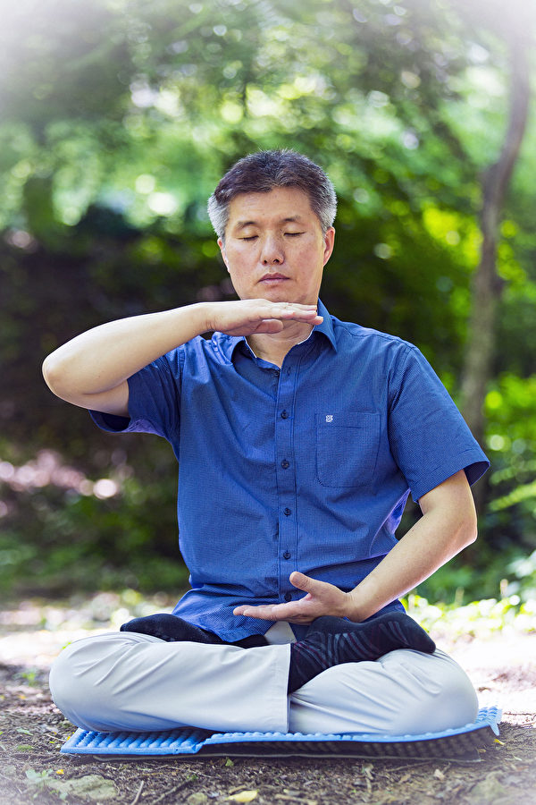

<h1 align="center"></h1>
<h1 align="center"><a href="https://github.com/3fmd/gm/blob/master/epub.md">免费下载epub电子书</a></h1>
<h2 align="center"> (推荐)Reasily - EPUB 阅读器，可以观看视频、音频(Reasily1802h.apk) 。 <a href="https://git.io/1802">点击直接下载</a></h2>

<h1 align="center"><a href="https://github.com/candysn/nini/blob/master/wnn-1.md"><b>5月~7月看更多</a></b></h1>
  
  
  

  

  
<h1 align="center"><b>中共對付老百姓的犯罪手段——監視 扣工資</b></h1>

  

中共采取多种犯罪手段如扣除工资、勒索、抢劫钱物对法轮功学员进行经济迫害。（明慧网）

  
【大纪元2018年07月31日讯】华北科技学院退休教师史瑞香，2017年年底因给该校领导送去介绍法轮功真相的台历后，被单位扣除工资至今，且24小时全天被人监视。
  

在中共《刑事诉讼法》中监视是对犯罪嫌疑人采取的一种强制措施。法轮功学员是合法公民，不是犯罪嫌疑人。没有法律授予警察或街道社区指派社会闲散人员监视、跟踪法轮功学员的权力。

中共《劳动法》第50条规定：“不得克扣或者无故拖欠劳动者工资。”

而中共自1999年对法轮功学员实行“名誉上搞臭、肉体上消灭、经济上截断”的政策以来，肆无忌惮地使用监视和扣除工资等多种犯罪手段，限制法轮功学员的自由和对他们实施经济迫害。

史瑞香，78岁，河北省廊坊市三河市燕郊镇人，2017年11月7日，为了给华北科技学院的领导们送新年祝福，让他们了解法轮功真相，史瑞香在院长、书记等几位主要院领导的办公室门口挂了几本洪扬“真善忍好”的台历。

没想到，当天史瑞香就被西城派出所警察绑架、抄家。

派出所的人对她说：“你年纪大了，也没造成什么影响，就不处理你了，让你儿子做你的‘监护人’。如果你再出事的话，就把你儿子抓起来。”当天下午史瑞香被儿子接回家。

11月底，华北科技学院保卫处的处长荆树栋、保卫处副处长、退休办书记潘德祥等五六个人到史瑞香家，告诉她：这个事北京老干部局（也叫北京安检局）都知道了。“要处理，决定扣发你半年的退休金，每月只发1,000元钱（史瑞香每月退休金5,000多）。半年内如果不出事，再补给你；如果出事，连你老伴的退休金也没了（老伴也是华北科技学院退休职工）。”

来者还告诉史瑞香别出门、别上北京去。接下来，史瑞香有四五天没出家门。保卫处的人又来告诉说：“可以出门，但只能在燕郊转，别的地方不许去。”

从那天开始，只要史瑞香一出小区的大门，后面就跟着两个人，无论去哪都跟着，哪怕她只是出门买个馒头，也要在后面跟着。这些人都是华北科技学院派来跟踪、监视史瑞香的。他们一共是六个人，两个人一班，上午一班，下午一班，晚上一班，一天24小时全天跟踪、监视。

一次，史瑞香去北京儿子家，去前她让一个人告诉跟踪她的人此事，结果那个人忘告诉了。单位保卫处的人发现史瑞香不见了，整个像炸了窝似的，到处打电话、到处找她。

至今已半年多过去了，史瑞香每月被扣掉的4,000元退休金，没有补还给她。

这期间，史瑞香一直被非法跟踪、监视；而且连她老伴也不放过，她老伴每天几点几分出去，几点几分回来，小区门口的保安都给记上，天天像看犯人一样看着两位近80岁的老人。

史瑞香的遭遇不是个案。

<b>更多老人未能幸免</b>

2015年5月1日，最高法院宣布“有案必立，有诉必理”后，重庆市合川区78岁的退休教师郑开源，2015年7月21日、11月14日，向最高人民检察院和最高法院投递《检举信》反映妻子被迫害致死的情况，要求严惩祸首江泽民。

2016年6月12日下午3点钟，合川区“610”出动五部警车，以头目肖长印队长为首的20多个警察把郑开源绑架到洗脑班，给他注射药物后，使他神经错乱，昼夜难眠。心虚的警察把他送回家，从此他就被非法监视、骚扰、抄家。在“610”的指使下，区教委停发郑开元的退休金，改发生活费，他退休的教师工资被扣除了十几万元。

大庆老年法轮功学员王花荣（女，70岁）在海南省琼海市讲法轮功真相、发资料等时，被构陷。2016年1月22日下午1点多，由海南省公安厅“610”头目及琼海市公安局“610”头目、国保大队、刑警大队、当地派出所警察，闯入王花荣的住处，把住宅楼围得水泄不通，来了20多辆警车。他们砸了门，同时断水断电，又抄走了私人用品。

从1月22日起，派警察（每个班两人）24小时换班，围住住宅，监视老太太，直到3月27日才撤走。老太太被围困了67天。

<b>监视</b>

往往各地区派出所、居委会派人监视当地的法轮功学员。

2018年3月2日开始至今，北京朝阳区法轮功学员马秀云、唐平顺夫妇，被“610”、居委会、派出所的人全天24小时监控。他们外出买东西时有人跟踪，人身自由、正常生活受到严重干扰。2月28日，片警曾来家里骚扰时说，“两会”期间别出去。

2017年9月22日，广东省佛山市法轮功学员余瑞贤在家楼下被佛山市“610”头目曾强带人蹲坑监视、绑架，被非法关押在张槎医院旧楼一个小房间里4晚3天后，流离失所20多天。

10月14日晚上，余瑞贤回家。因中共要开“十九大”，余瑞贤被监视居住，限制自由，家门口被设岗，出门就有居委会人员贴身跟踪，一直到10月底。

2015年，甘肃庄浪县乡镇干部杨文渊控告了江泽民，他写道：“这十多年中，有关部门或单位都安排人暗中监视、监控我，还在我家周围安监控摄像头，限制我的人身自由，我时时都处于一种无形的压力之中。严重地侵犯了我应该享有的信仰自由、人身自由权利。”

他还控诉，不但他长期生活在恐慌和忧虑之中，他的亲朋好友的心灵也遭到摧残 ，还给他妻子、儿子都造成了巨大的伤害和压力。

<b>扣除工资</b>

曾是西南石油学院地质系副教授的李延钧，曾为学校承担了多个项目，项目科研经费累计达一千多万元人民币，公开发表论文近40篇；培养了19名硕士，协助指导了4名博士。

自1999年7月20日中共疯狂迫害法轮功以后，李延钧多次被非法劳教、关押并被判刑。

2001年底，学校对他非法降工资三级、减一年工龄。

自1999年7月至2002年，他的经济损失不少于10万元人民币。2015年10月，西南石油大学联合省教育厅非法开除李延钧的公职并冻结其社保。

西南石油学院机电工程学院教授伍开松，多次被非法拘留。2000年12月，他被南充市政法委游街迫害，学校派车拉教师前往观看，被关押在绵阳市新华劳教所，之后，被非法停职停薪20个月后工资降三级，共扣除数万元。

不仅是工作单位，而且“610”、政法委等机构也直接扣除法轮功学员的工资或退休金。

2014年，西藏日喀则地区政法委、“610”人员，非法扣除法轮功学员周进霸半个月工资5,000多元。此前周进霸已被西藏自治区人力资源厅非法扣除工资8,000元。

2007年，陈世昌被西藏林芝地区政法委、“610”扣发退休金。
更多经济迫害手段

扣除工资只是中共对法轮功学员进行经济截断的众多手段中的一种，除此之外常用的犯罪还有抢劫钱物、勒索、非法罚款。
抢劫钱物

2018年4月30日，吉林省吉林市蛟河市法轮功学员李德宽被绑架到看守所。警察在他住处抢走人民币10万元。

2018年3月29日，牡丹区国保大队队长带着六七个人到山东菏泽60岁法轮功学员李振环家非法抄家，都穿着便衣，把私人物品电脑、法轮功书籍等洗劫一空。

其中一人又跑到李振环老伴屋里拉开抽屉，硬把1万元现金抢走。当老伴说这是他自己的钱，与妻子无关。那人竟说要“集资”。

山东省滨州市法轮功学员刘兰春在讲法轮功真相时遭人构陷。2018年5月23日上午，滨州市开发区公安分局治安大队警察闯入其家中录像、蒐查，下午绑架了刘兰春。

5月25日，警察又非法抄家，抢走电脑、打印机等私人用品，还将家里的现金近19万元劫走。
勒索

2018年4月12日上午9时多，吉林省长春市九台区法轮功学员于美花、王丽被九台九郊派出所警察绑架，被勒索2万元后于当晚回家。

2010年10月29日，山东德州市张秀琴讲法轮功真相时被德城区剪子股派出所二警察绑架，当日下午被关进德州市看守所。期间，警察到看守所提审，威胁张秀琴说，她若不说，就会被判刑等。

他们还抄了她的家，抢走了2,100元钱。张秀琴被关了一个月，她女婿被勒索了1万元钱后，她才被放回家。

2000年7月24日，牡丹江市林业广播电视大学原图书员陈金凤，在发放法轮功真相资料时，被警察跟踪、绑架，随后被非法抄家，搜走个人物品。她被非法关押在牡丹江看守所一个半月，被强迫交250元伙食费，勒索3,000元钱后才被放回家。
非法罚款

2018年上半年，据不完全统计，中共法庭、警察通过非法庭审、入室抄家抢劫、敲诈勒索法轮功学员现金1,914,302元，其中法庭非法罚金984,000元。

1至6月，沈阳市地区有7名法轮功学员被非法判刑，刑期最长的达6年，被勒索罚金共达57,000元人民币。

其中，梁志宏被沈阳市沈北新区法院非法判刑1年、罚金5,000元；郭旭红、王天娲被沈阳市法库县法院非法判刑1年、罚金20,000元；孙正玉被沈阳市皇姑区法院非法判刑3年6个月、罚金10,000元。

不仅仅是法院，而且派出所、公安局也对法轮功学员非法罚款。

2001年年后，辽宁铁岭市孙丽娟被杨木乡派出所所长张宏伟带四五个警察非法抄家，非法拘留15天。在清河看守所，她被天天被逼写悔过书。她拒绝，警察连打带骂并威胁，后来警察替她写悔过书。为阻止她炼功，进京上访，15天后，清河公安局又对她罚款500元（给了收据），丈夫为交罚款到处借钱。当时承诺一年后返还，到了一年却找借口不给。

2002年11月，孙丽娟再度被非法绑架，当天被释放后，流离失所。一个月后，又被杨木乡派出所所长张宏伟罚款800元，不给收据。  
  

		
<h1 align="center"><b>加拿大青年：我的梦想成真</b></h1>	
【明慧网二零一八年八月三日】我来自加拿大东部纽宾士域（New Brunswick）省的一个叫作汉普顿（Hampton）的小镇。一九九八年高中毕业后，我在纽宾士域大学学习计算机科学专业。大学二年级时，我渐渐的不能专心于学习，课程成绩也下降了。我花了很多时间跟朋友聚会，花在学习上的时间不够。我觉的我的人生中缺少一点什么，但我在学校上的课并不能给我答案。

有一天晚上，我躺在床上想我到底应该怎么样生活。我问我自己什么是我真正喜欢做的事？我觉的是找到一种办法帮助我成为更好的人。如果我能学会如何提高自己、使自己变的越来越好，那么无论我学什么做什么，我都能够在这个世界上畅行无阻。我十六岁开始练习武术，所以我觉的中国古老的传统武术中应该有一些东西可以指导我。就在那一刻，我决定跟着自己的心走，去实现这个愿望。

几个月后，我们大学组织了一次去北京中加学校的夏令营交流之旅。我觉的这有可能帮助我实现我的愿望，所以我报名参加了这个为期三周的夏令营。

在夏令营期间，我一直向那些中国老师询问怎么才能学习气功，因为这是我此行的目地。通常老师会提到武术和太极，但会说他们不知道到哪去学。夏令营的最后一天我们坐在教室里做书法课的作业。一位中国老师走过来坐在我旁边。她非常低声的对我说，她知道我在寻找一种功法，这种功法确实是存在的，只不过被政府禁止了。我的第一个反应是这种功法一定是一个非常好的功法。但这个从古老而神秘的文明中流传下来的功法怎么会被禁止呢？为什么这位老师会这么小声的在我耳边说话呢？我问她这种功法叫什么？她慢慢地低声回答法轮功。我又问了一遍，确保我能记住这个名字。在她重复三遍以后，我感觉这个名字已经深深的印入到我的脑海里了。然后书法课结束了，大家走出教室去拍照庆祝夏令营的结束。

当我一回到加拿大，我就上网去查法轮功。我找到了法轮大法的网站（www.falundafa.org） 并开始阅读法轮功的书。我很快意识到我的思想发生了变化。有一天，我坐在地下室里的沙发上看电视。妹妹从我身边走过时无缘无故地在我肩膀上打了一拳。这本来也不是一件什么大不了的事，恰好我的肩膀在运动时刚刚脱臼受伤，所以很疼。我很生气的回击了她一下。这时我从书中读过的一段话闪过我的脑海：“古代有句话叫：‘匹夫见辱，拔剑而起’。一个常人当他受到侮辱时，他会拔剑而起，他会张口骂人，出拳打人。”[1]我立刻意识到我做错了。我马上向妹妹道歉。我感受到老师的教诲已经在我脑海中产生影响了。

一年过去了，我读了几遍《法轮功》，但没有开始炼功。我不想自己炼，因为我的动作可能不标准。但是在我家附近没有炼功点。我在网站上找到了最近的两个炼功点。最近的一个在哈利法克斯（Halifax）。我的许多高中朋友都在那里上大学。我要去那，这么多朋友可能会让我分心，使我不能专注于学法炼功并从根本上改变以前的生活方式。

另一个炼功点在蒙特利尔（Montreal），离我家约十小时的车程。我的一个好朋友当时住在那，正在为成为奥运选手做训练。在我看来去蒙特利尔是我最好的选择，这位朋友有着非常严格的训练计划，和他在一起，我会更容易过上一种积极健康的生活。

我朋友同意和我分享他在蒙特利尔的奥林匹克体育场附近的一个地下室公寓。我安顿下来之后，马上按大法网站上的电话联系了炼功点的负责人，确认了星期六上午的炼功时间。我仔细研究了地图，又听了我朋友的建议，确定了怎样去炼功点。

星期六上午，当我下了地铁，马上就要到炼功开始的时间了。我就一路跑了过去，正好及时赶到。这次大家炼静功。我气喘吁吁，心跳加快。坐下来以后，我深呼吸了几下，专心听辅导员的指导。

师父在第五套功法的炼功要点中说到“心生慈悲”[2]。那一刻，我内心充满了对世上所有受苦受难的人的怜悯。打手印后是加持球状神通。当我的双手放到那个位置上时，一种令人难以置信的欢乐充满了我的全身。我内心传出了一个声音：“你终于开始做了，你终于开始做了。”

我的腿疼得非常厉害，但我记着师父在书中讲过在打坐中黑色物质在向腿上攻：“在很痛的时候，从炼功人身体内外有很大一块黑东西在往下消。打坐的痛是阵痛而且很钻心，有的人有悟性，就是不把腿拿下来”[1]。

在和大家一起学法炼功的几个星期后，我开始在唐人街发传单。起初，我只是听其他的学员怎么说或是照着读传单上的内容。渐渐的我开始能够与人们進行一些基本的对话并回答他们的问题了。

在蒙特利尔呆了六个月之后，我回到了老家。在离开蒙特利尔之前，我把大法的传单和真相资料装了满满的一个行李袋，好让我家乡的人们也知道有这么好的大法。

回到家乡不久，我开始上班。我在晚上利用业余时间在公园炼功并向路人发传单、介绍大法。之后不久的一个晚上我做了一个梦，在梦中我在宇宙中飞升。我觉的这是点化我的层次提升了。我坚持在公园炼功、发传单，让更多的人知道法轮大法是什么以及大法在中国是如何被迫害的。有时候，当我和路人谈论法轮大法时，我能感到头顶有很强的能量。我常做在宇宙中飞升的梦，每次都看到我飞得越来越高。我备受鼓舞：只要我坚持炼功并按照师父所说的去做，我的层次就会越来越高。
  

<h1 align="center"><b>一位上海大妈的回忆：我的十九年反迫害之路</b></h1>

尼的法轮功学员7月20日在马丁广场讲真相。

【希望之声2018年7月23日】（本台记者慧光综合报导）悉尼市中心的马丁广场于7月20日举办了纪念“7.20”反迫害19周年的活动。个子不高、性情谦和、脸上总带着微笑的汪淑茹阿姨又来了，回想起19年前中共开始迫害法轮功的日子，她讲诉了自己的亲身经历和走过的反迫害之路。

汪阿姨说她是提前病休的，因为她当时大病没有，小病不断。她走入法轮功修炼完全是因为法轮功治病的神奇功效。

她说：“我的身体不好，有很多病，例如萎缩性胃炎、颈椎骨质增生、心脏早搏等，睡眠也不好，经常头晕、头痛，中药西药每天吃。当时工资很低，只有四、五百元（人民币），而医药费的收据已经攒了两千多元了，单位根本就报销不了。”

“1995年9月份的一天，我在公园里发现了一个新的练功点，就去看介绍。旁边的人看我看得很认真，就让我试着练练看，说‘这个功是免费教功，也不花钱，效果很好’。我就决定去试试。”

“学静功的时候，我心想打坐的功法可能层次会很高，因此我也随着他们坐在那里想体验一下，这时看到旁边的人身边放着一本“中国法轮功（修订本）”，我就偷偷的翻了一翻。那个人炼完功后答应将书借给我一周。”

“就在当天晚上，虽然我仅仅是学了几下动作，可回家就睡了一个好觉，这是我没想到的。以前我的胃不好，很多东西如辣椒、冰棍、西瓜等食物都需要忌口，但是炼功之后，我很快就可以吃这些东西了，我确实是受益了。”

“看了书之后，我觉得这本书讲得有道理，就开始炼功了。”

1999年“7.20”中共宣布禁止修炼法轮功后，汪淑茹当天上午就去了位于人民广场的上海市信访办。

她说：“当时我的思想很简单，就是想给政府反映一些真实情况，修炼法轮功的人都是在按照‘真、善、忍’修炼，没做什么错事，政府不让炼，可能是误解，希望政府能了解实际情况，告诉他们我们是因为身体有病才炼法轮功，而炼功之后我们身体确实都健康了。我去了信访办，当天去了很多人。去到之后听说有代表进去了，人民广场上大概有上千人，都在静静地等待结果。但到下午时，突然出现了一群武警，他们要求我们离开广场。我们拒绝离开，因为上访还没有结果。他们就两个人架一个人把我们强行拖到广场旁边停的大巴车中，拉到原来的人民公园那里，并让我们登记姓名、家庭地址等信息，甚至禁止我们上厕所。等到下午四、五点钟才允许我们离开。随后我们又被居委会找去，继续做笔录，一直搞到晚上十二点。”

“第二天早晨，我按照原来的时间，再去我们位于乍浦路小公园的炼功点时，我发现那里已经空无一人。于是我又去了当地比较大的外滩公园，快到时当地的户籍警看到了我，就在后面边追我，叫我停下，我没有停。当我赶到外滩炼功点时，发现那个不大的炼功点已经被二十多名武警把守住了。周围停着警车，平常在外滩公园是很少会看到警车的。我没有犹豫，还是冲进了炼功点，坐在那里我就哭了。我说‘我们只是每天练练功，怎么就这么难？’我很快被架起来塞入了一辆警车，被送往郊区的一所学校，在那里又有人让我登记……”

“我对他们说：我们只是在公园炼功，对社会也没有任何不良影响，我炼功病都好了。为什么不让炼呢？”

1999年12月27日，当时国内的法轮功学员都在为大法蒙冤上访。汪阿姨她们炼功点上的学员也在讨论是不是去上访，但当时她们觉得去北京人生地不熟，在上海也可以对公众讲法轮功真相。所以学员们决定当天仍然去炼功点公开炼功。

27日早晨，大约有二十多个人参加了早晨的炼功。炼完功以后，上班的人先走了，就在她们这些退休的人正在炼功点打扫环境、捡烟头和碎纸屑的时候，警察来了，把他们都抓走了，警察说是因为有人举报。随后她被拘留一个月，获释后又被警方敲诈了三千多元钱。

没想到放出来二十天后，警察说要将收的钱还给她，把她骗到了派出所。去到之后却说她“扰乱社会秩序”，以此为由又将她拘留一个月，并随后投入劳教所关了一年。

汪阿姨说：“当时他们要求我在‘劳教拘留书’上签名，遭到了我的拒绝。我说‘我没做什么坏事。我哪里扰乱社会秩序了？我在公园里炼功，既没有在大马路上阻塞交通，也没有在政府门口影响政府上班，你们的指控根本就不成立的。”

“在劳教所里，365天我一天都没有休息过，给劳教所当奴工，做出口的‘三枪牌’棉毛衫和玩具。当时劳教所还没有太多的法轮功学员，我属于第一批，最初让我们剪线头。一天干十几个小时，吃不饱，伙食也不好，一天到晚生活在饥饿中。在那段时间，我牙周炎犯了，牙床肿，干活时间长了，脚也肿了，脚上的鞋子变得紧紧的。”

随后的一年多时间，汪阿姨为了躲避迫害一直在外东藏西躲，她曾想去看看在北京的姑姑，但姑姑对她说：“你千万不要来。你一离开家，派出所和居委会的人就去找了我，他们还让我家的邻居监控我们家，你一到就会被捕。”

汪阿姨于2002年回到上海，立刻就成了中共洗脑班的“常客”。

汪阿姨说，虽然在上海时，中共胁迫她的左邻右舍监控她，但是中共的这个政策并不受欢迎。

她说：“我在上海期间，居委会让一位已经下岗的邻居和我们当地的保安监视我。这位邻居对我说：‘汪阿姨，居委会已经问了好几次了，让我告诉他们你都在跟谁联系，保安进进出出也在盯着你。这个保安和我一起上山下乡过，我们很熟，我就跟他说，你也睁一只眼闭一只眼，人家都是好人，将来法轮功平反了，还不知道是怎么回事呢。所以你不要去害人家。’”

居委会还让汪淑茹隔壁一位70多岁的老人监视她，那位老人对居委会的人说：“我跟汪阿姨做了十几年的邻居了，人家这么好的人，也没干什么坏事，你叫我去盯人家，害人家干什么？到时候人家平反了，我这老脸往哪儿放呢？”

汪淑茹于2003年春节期间逃到了澳洲，来到了这个自由的国度，但是她在国内的亲人还会时不时受到骚扰。那些警察甚至恐吓她“回国会有好看的”，但是自从她来到澳洲以后，她每年的“7.20”都会参加悉尼法轮功学员发起的反迫害活动。她说：“我希望人们知道法轮功的美好，也希望制止中共的这场迫害，因为这场迫害是无道理的，是中共在下狠手迫害法轮功学员。” 

<h1 align="center"><b>“1400例”是骗局 这些数字告诉你</b></h1>

【大纪元2018年07月27日讯】（大纪元记者罗琼综合报导）中共江泽民集团在1999年7月20日镇压法轮功后，立即开足马力舆论上大肆造势，炮制了诸多谎言诋毁法轮功、欺骗民众。其中所谓“1400例”死亡案件就是其中一个弥天大谎。十九年来，法轮功学员不断揭露、曝光中共制造的多个骗局，帮助民众认清真相。
	

1999年6月10日，在江泽民的命令下，成立了一个凌驾于法律之上，操控国家机器专门迫害法轮功的机构“610”办公室。在“610”的指使下，全国居委会和公安系统到处收集和罗织自杀、杀人（包括精神病者杀人或自杀）以及住院濒死者等案例，再通过媒体的炒作和司法系统的伪造，编造出所谓练法轮功致死1400例的谎言，企图以此妖魔化法轮功，毒害民众，进一步升级迫害。

本文以“1400”这个数字为线索，通过第三者的质疑、对比、分析及媒体的调查，揭露中共“1400例”的骗局。

<b> 1. 不可信的数字</b> 

1999年10月25日，时任中共党魁江泽民访问法国前夕，接受了法国《费加罗报》社论委员会主席佩雷菲特的书面采访。江说：“据不完全统计，因练‘法轮功’致死的达一千四百多人。”第二天，这番话被中共党媒《人民日报》转载，之后，中共所有的媒体开始炒作这个数字。

中共拥有2000多种报纸、杂志、广播和电视等宣传机构，仅中央电视台就有十多个电视频道，覆盖全国。

大陆著名律师、东南大学法学院教授张赞宁认为，“1400”的数字是“不可信的”。他表示，中共掌握了国家信息，就可使这个数字具体落实到个位数，“不应该是笼统的1400多例，就算当时还不能到个位数，后来也应当补充完善”。

张赞宁还阐明一个观点，按中共的说法，假如法轮功真的有那么大的危害，那麽1400这个数字应该会不断增大。可是，随着时间的推移，十八年过去了，法轮功仍然存在，而这个数字却没有变化。这说明了什么呢？

张赞宁说，“那说明江泽民这个数字是杜撰的，没有事实依据的。”

《北京之春》主编胡平也认为1400例是个“可疑”的数字。

<b>2. 只被官媒使用的数字</b> 

对于江泽民咬定的“1400例”的数字，在中国大陆没有任何一个官媒做过考证，没有任何一个部门、机构做过调查。在中共的强权专制下，更不可能有独立调查机构实地调查，来查证这个数字的真伪，做出第三方判断。

至今，1400这个数字也只是被中共媒体使用。

<b>3. 另一组官方统计数字</b> 

中国《医药保健报》于1997年12月24日刊登了标题为“祛病健身首选法轮功”的文章。

1998年，由前人大委员长为首的中央老干部在详细调查后，得出了“法轮功于国于民有百利而无一害”的结论，并向中央做了汇报。

1998年，大陆医学界为配合国家体委对各气功功派的调查和申报工作，在北京市、武汉市、大连地区、广东省及其它地区（如南昌、广西、安徽等地）对当地炼功点上的法轮功学员进行了初步的医学调查。五次调查收回调查表格近35,000份。

调查的综合结果为：修炼前患有各种疾病者为31,030人，占总调查人数的90.3%，修炼法轮功的祛病健身总有效率为98%以上。

从调查结果发现，平均每位法轮功学员每年节约医药费2,600元以上，提高了国家经济效益，利国利民。

其中，武汉报告显示，99.5%的学员戒掉了吸烟、饮酒和赌博，而这是现代医学根本无法达到的疗效。

美国“世界新闻周刊”于1999年2月刊登了上述大陆国家体委官员对法轮功祛病健身效果及其带来的社会经济效益的高度评价。

<b> 4. “绝密文件”中的数字</b>

2012年5月15日，新唐人电视台播出了特别节目“解析‘1400例’- 诬蔑法轮功的‘1400例’真相”，其中曝光了一份来自中共高层的“绝密文件”，叫《案件线索情况工作表》。表格中提供了1404名死亡者的线索，但没有证据，更没有查证，而且“查证情况”一栏全是空白。

中共官方宣扬的所谓1400例，意味着“死不查证，死无查证”。

<b>5. 基于什么样的案例得出的数</b> 

由以下案例可以看出中共“1400例”是如何编造出来的。

例一，黑龙江省哈尔滨市阿城区新华乡崔家屯的农妇李淑贤，婚后住在阿城区大岭乡。1999年7月，她患胃溃疡住进哈尔滨第四医院，因家里穷缴不起住院费。医院院长告诉她，若是她称自己是炼法轮功的，就可免费。她照办了。
哈尔滨市《新晚报》的记者迅速赶来采访她，让她丈夫按编好的台词说话。事后李的病情加重，被医院强制出院，回家不久病故。

李淑贤的案例被编进1400例，在哈尔滨电视台、黑龙江电视台播出，然后又在中央电视台“走进千家万户”栏目中播出。

后来，阿城区办洗脑班，对被非法关押的法轮功学员播放此录像。法轮功学员说：“发生在我们身边的事，包括你们和大家都知道是谎言和欺骗，还拿出来给我们看？”当时，洗脑班马上收场，不敢放了。

例二，山东新泰市泰山机械厂工人王安收，因精神病发作用铁锨将其父亲打死。王患病杀父，这一点在当地法院的王与妻子尹彦菊离婚的判决书上写得非常清楚。

山东省新泰市人民法院（1999）新城民初字第245号民事判决书的部分内容为：“本院认为，被告（王安收）婚前患精神病并隐瞒，婚后精神病多次复发，且经久治不愈，曾因精神病发作杀害自己的父亲，原告（尹彦菊）坚决要求离婚，夫妻感情已完全破裂，原告离婚请求予以支持。”

可是王守安的案例却被收入“1400例”中，他因精神病行凶一事被用来栽赃法轮功。

例三，王喾是机关公务员，1984年得过乙型肝炎，1998年50岁时死于肝硬化，竟也被收入1400例。

王喾的妻子2001年投书给明慧网，写道：“1998年8月，不知记者采访的谁，在报上登出来了说白发人送黑发人，栽赃陷害法轮功。我丈夫纯属正常死亡，根本不是炼法轮功炼的，他本人从未炼过法轮功。”

她还提到，“50岁的他去世的原因是：1. 在工作中说真话受排挤；2. 工作中叫人骗了一把，自己拿钱给补上；3. 因为他哥哥在1995年8月25日去世，死于肝癌，时年50岁，弟弟在1997年5月9日死于肝病，时年46岁，因为他们兄弟都有肝病，所以对他压力很大。”

在中共所谓的1400例中，最多的案例是“因有病拒绝就医致死”，其中一例是北京市宣武区居民马锦绣。但是，马锦绣的小女儿金女士向国际社会揭露了中共的谎言。

马锦绣的女儿说，在她小时候，她妈妈已经身患重病。在她记忆中，妈妈每天要吃大量的药。“1997年的时候，她身体忽然又出现了一些不适的症状，亲戚赶紧把她送到医院，她在医院接受了半年多的治疗，各个方面的护理都做了，最后因为脑梗塞去世了。”

<b>6. 相比较的数字</b> 

《北京之春》主编胡平表示，即使假定中共造的“1400例”数字是真的，那么法轮功群体的死亡率也远远低于正常人的死亡率。

胡平做了以下比较：

在中共说的1400例中，有136例自杀案。从1992年至1999年，在230万（1999年中共迫害法轮功后声称法轮功学员的数字）法轮功学员中，年平均自杀率为0.84/10万，即十万个人中，不到一人自杀。

从《美国百科全书》（1998年版）提供的数字看，自杀率最低的国家爱尔兰，1968年自杀率为3.5/10万；美国，1967年自杀率为10.8/10万；法国，1968年自杀率为15.3/10万。

中国大陆有个数字说，中国每年有20万人自杀。《南方周末》出版的《真相》一书中提到，在农村，每年自杀人数超过30万人。

这样对比计算，这个自杀的比率是“1400例”的0.84/10万的20-30倍。更何况，法轮功学员的人数远远不只230万。中共内部在1999年统计，有至少七千万人炼法轮功，超过了共产党员的人数。胡平认为，那么那样的话，自杀率就更小。

此外，按照中共的说法，从1992年至1999年，在230万法轮功学员中有1404个死亡案例，那么年平均死亡率为0.87/万、8.7/10万，即每年一万个人中不到一人死亡，每年每十万人中死亡近9人。

根据中国国家统计局的数字，从1992年至1999年，中国年平均死亡率为0.65%、65/万，即一万个人中有65人死亡，高于1400例的76倍。

以上两组数字的比较表明，“1400例”的死亡率极其小、极其小，这也反证了法轮功强身健体的效果。

<b>7. 遭报应的数字</b> 

杨永亮是山西省运城市盐湖区安邑镇东街人，1999年中共迫害法轮功刚开始时，他患有精神病的妻子李玉亮正在住院。山西省运城市公安局政保科和运城市电视台合谋，要给杨的妻子录像，杨得按编好的台词对镜头说，妻子是炼法轮功炼成精神病的。交换条件是其妻的治疗费减半。

杨永亮昧著良心照办了，运城市电视台将编造的录像在黄金时间播放了几个月。

当地的法轮功学员找到杨永亮夫妻俩，告诉他们谤佛要遭报的，劝他们向民众澄清事实。他们说，事情已过去，不说了。

十六年过去了，2015年7月21日晚上，杨永亮与朋友喝完酒后开车回家，却鬼使神差地开到了地里，连人带车掉入一口大井中。第二天，一个放羊的人发现他时，杨已丧命，年仅44岁。

原中共公安部副部长、“610办公室”主任李东生，自2000年起升任广电总局副局长、中宣部副部长，他在“7.20”后竭力罗织“1400例”，利用舆论工具，诬陷诋毁法轮功。他也是“天安门自焚”伪案的导演之一。

十六年后，2016年1月12日，李东生被判有期徒刑15年。

2000年至2008年，担任新华社社长的田聪明，追随江泽民迫害集团，大肆刊登诽谤法轮功的文章，仅在2000年1月至2003年10月间，新华网对法轮功的诋毁文章达522篇之多。他也是炮制“自焚伪案”的责任当事人之一。

十七年后，2017年12月26日，田聪明患急性流感而死，媒体称其死得很恐怖。

其实，以上几例只是因迫害法轮功遭到报应者中的冰山一角，更多事例不胜枚举。

明慧网报导了大量参与迫害法轮功者而遭遇厄运的有名有姓的实例。他们中有专门迫害法轮功的非法机构“610”的人员，也有政法委的，公检法司的，从高官到平民，从中央到地区，囊括社会各个阶层，各个领域，从事文宣工作者首当其冲。明慧网统计，至少有100名参与诽谤法轮功的文宣官员遭报，包括李东生、田聪明。

谤佛遭报者自古有之。以史为鉴：后周世宗柴荣亲自用大斧子砍毁菩萨像，胸生恶疮而死，年仅39岁。

俗话说：“善恶有报是天理，只争来早与来迟”。

资料来源：新唐人、明慧网
 

<h1 align="center"><b>欧阳非：有感于“给党打针假疫苗”</b></h1>

【大纪元2018年07月27日讯】近日的假疫苗事件持续发酵，不但一众明星纷纷喊打，连中共领导人也不得不开炮，大叫 “触目惊心”，“突破人的道德底线”。 
	

假疫苗的盖子是因内部人举报而揭开，后来随着一篇自媒体文章《疫苗之王》对假疫苗背后的庞大利益链曝光，而引发了网络海啸。中国第二大疫苗制造商长春长生生物公司生产的十几万支狂犬病疫苗涉嫌肆意造假，包括编造生产记录和产品检验记录，随意变更工艺参数和设备。说白了，就是在做假药，根本起不到疫苗的疗效，也就是在变相杀人。狂犬病的致死率几乎百分之百，中国是全球第二大狂犬病发病国，过去十几年中，平均每年报告死亡病例2000多人。

真正让人们震惊的还不只是狂犬病疫苗。家长们开始翻看自己孩子的疫苗接种本，发现 “百白破疫苗”（百日咳，白喉，破伤风三合一）好多也是这个长生生物公司的，百白破疫苗需接种4次，分别于3、4、5月龄和18月龄各接种1次，对象是货真价实的小宝宝。人们网上一搜又抖搂出去年的新闻，原来长生生物公司的 “百白破疫苗”在去年11月就被查出是不合格疫苗而被迫停产，于是家长们着急了，愤怒了。旧账接着翻，假疫苗、毒疫苗媒体早就报导过多次。比如山东的“2016年中国疫苗事件”，涉及十八个省市，长达六年时间内大量供应无效或过期的疫苗；还有山西“2010年毒疫苗事件”，山西近百名儿童注射疫苗后或死或残。

这让人想起了2008年的三聚氰胺毒奶粉。奶粉、疫苗的对象主要是儿童。一次又一次地对儿童下毒手，这真正是在考验这个时代的良心。

每一次人们都感慨“突破了人的道德底线”。为什么这个底线总能不断地被突破呢？其实，不是在突破底线，而是压根儿就没有底线，这才是目前中国大陆的道德囧状。没有底线，当然就能一次又一次重复地发生著让人瞠目结舌的没有道德底线的悲剧来。

2011年10月在广东佛山发生的小悦悦事件，每当提起就让人深感沉重。两岁女童小悦悦被一辆客货车撞倒，司机不仅没有施救，还继续开车碾压离去，又遭后面的车辆继续碾压，监控录像显示前后有18名路人经过现场没有一人伸出援手。女童终因未及时施救而死亡。国际媒体惊呼 “中国失去了灵魂吗？”

小悦悦，毒奶粉，假疫苗……如果人们对儿童的生命都已经习惯性漠视的话，那这个社会还能珍视谁的生命呢？在中国大陆发生的活摘法轮功学员器官牟取暴利的事情，又有什么不可能的呢？

事实上，从1999年年7月20日江泽民迫害法轮功的“真、善、忍”信仰的那一刻起，中国就失去了道德底线。“真、善、忍”三个字成为了网络敏感词，“真、善、忍”横幅成为了天安门广场防范的重中之重，“真、善、忍”信仰者成为被非法抓捕、非法审判、非法监禁的对象。中国社会坠入道德的深渊，与迫害法轮功、打压“真、善、忍”同步，并不是偶然，而是必然的结果。“真、善、忍”成了国家的敌人，哪里还有道德底线呢？

道德没有了，人的眼睛就会失去分辨好坏的能力。在道德的深渊里，看见的不是地狱的烈火，而是“人民币”，这个社会还有未来吗？

2008年毒奶粉事件之后，笔者写过一篇文章，“冲袋奶粉给党喝”。十年过去了，悲剧依然一再发生，套句类似的话，“给党打针假疫苗”。党啊，这个共产邪灵，存在一天，就是民族的苦难。只有解体中共，停止迫害“真、善、忍”，道德回归，中华民族才能有出路。
 

<h1 align="center"><b>陌生人一句话帮他闯过巨难</b></h1>

汪洋（手拿传单的男士）在渥太华闹市区讲真相。（李剑/大纪元）

【大纪元2018年07月26日讯】（大纪元记者梁耀报导）“第一天被非法关押在郑州白庙劳教所时，我谁也不认识。当我从第一个牢房走到最后一个牢房取被子时，有一人对面走来，轻声说，‘千万不要转化（指放弃信仰）！’当时这句话对我触动非常大，多鼓励的话呀，我才知道那里面有很多同修，同修的鼓励也让我的信念更坚定了。” 

汪洋是加拿大首都渥太华一家驰名世界的软件公司的高级工程师，年纪轻轻就事业有成。他做过项目经理，是单位技术骨干。然而，十九年前，他在中国和千千万万的法轮大法修炼人一样经历了惊涛骇浪，很难想像的是，帮他走过多年磨难、让他念念不忘是上述那位陌生人的一句话。

<b>得法之初</b> 

在还是一个大学生的时候，汪洋身体特别不好，在尝试了各种各样的气功后，于1998年5月走入法轮大法的修炼。

一年多后，汪洋的身心发生了天翻地覆的变化，不但摆脱了疾病，在精神层面的变化如醍醐灌顶一般。自小对传统文化感兴趣的他以前也曾学过佛家、道家、儒家的经典，“但是都觉得没有法轮功讲的这么清楚、这么真切，法轮功的著作通过浅显易懂的文字解答了我人生中许多困惑的问题，让我心服口服，”他说。

<b>亲身经历的七二零</b>

一九九九年七月，江氏集团发动了对法轮功的大规模迫害，当年的情景对汪洋来说，至今还历历在目。

七月二十一日一早，他就骑车去了国务院信访办上访，要求停止迫害。去之前，他没和父母说，怕他们担心，只是给女朋友打了一个电话，“因为她也知道自己炼功，我打电话说：‘如果我回不去，知道我怎么回事就好。’
”
看到许多法轮功学员都已经站在了信访办前的马路边上，挤得满满的，但排得很整齐，岁数大的学员，坐在里面，年轻一点的站在外面。

他描述说：“大概十点多，开来了许多的公共汽车，下来了许多军人，开始把法轮功学员往车上扔，而且越来越野蛮。法轮功学员开始就是手挽着手，尽量不被拉出去，那些军人就强行将我们扔上车，有的拽头发，有的就一个人抬手一个人抬脚，甚至几个人扔一个人。全部都上车后，车就开动起来了。”

在车上，很多法轮功学员给军人讲真相，这些军人虽然不说话，但也挺感动的。后来他们被拉到丰台体育场，所有人都被关起来。因为天气炎热，大家就坐在那学法、交流。

直到下午四、五点钟，大门开了，好多人就从那里面出来了，汪洋也从里面出来了，然后就坐车回到了国务院信访办门前，看到那里已经清场了，他找到自己的自行车，离开了，当时，夜幕已经开始降临。

当天，北京的法轮功学员基本都被放了，但是，许多外地法轮功学员被当地驻京办的人带走了。第二天广播、电视等媒体就开始滚动播出诬陷法轮功的宣传。

<b>“同修的一句话让我更坚定”</b> 

七二零之后，面对铺天盖地的打压和家人的反对，让汪洋也经历了一段很严肃的思考，他说：“思考自己到底走的对不对，大概挣扎了一、二十天，最后就坚定了，认为我走的路对，就一直走下去。”

后来，汪洋即将毕业去外地工作，“在大学毕业和工作交接那段时间，大学里的人都知道我炼功，但是单位的人都不知道。在外地工作的时候，我就想办法让周围同事，让他们都了解法轮功到底是怎么回事。因为自己是知道真相的，而很多人是不了解真相的，就是听电视上宣传，所以当时通过各种各样的方式讲真相。”

在他工作的河南省，因为在家里上网讲真相，当地警察通过各种各样的渠道查到家里的网址，2001年6月的一天，警察把汪洋从公司带到宿舍，并抄家。

“因为我当时电脑里有很多法轮功相关的资源，在网上发了很多真相材料，因为这个，他们把我送到看守所，后来又转到劳教所。”

汪洋被非法关押的劳教所是郑州白庙劳教所，“第一天被非法关押在郑州白庙劳教所，谁也不认识。我从第一个牢房走到最后一个牢房，取被子时，有一个人对面走来，轻声对我说，‘千万不要转化（指放弃信仰）！’当时那句话对我触动非常大，多鼓励的话呀，我才知道那里面有很多同修，同修的的鼓励也让我的信念更坚定了。”

<b>堂堂正正走出劳教所</b> 

在那里，汪洋认识了许多大法弟子。那里和其它劳教所一样，对法轮功学员进行所谓“强制转化”，就是强迫法轮功学员放弃信仰。“每天把你关到一个很小的屋子里，坐小板凳，很矮的一个小板凳，一坐就一天，还给你看诋毁法轮功的洗脑宣传片。”

劳教所还强迫每个法轮功学员写体会，诋毁法轮功。汪洋就利用这个机会，写了好多法轮功真相，说明为何自己要坚持修炼法轮功，然后给警察、狱警看。

“我对他们讲，让我放弃信仰，首先你得说服我，不管你是劳教所所长还是谁，我都跟他们挨个说，他们无法说服我，我却可以说服他们，所以当时在那个环境里他们还是比较佩服我的。另外，法轮功学员之间也很团结，互相鼓励。”

汪洋说，“当时在我进来几个月以后，进来一个老人，岁数很大，进来的时候很健康，过了一段时间之后，他身体就出现异状，脚就开始起大包。因为炼功，他可以练好，但是因为它（劳教所）不让炼功，之后很快就不行了，然后就去世了。”

当时也有大法弟子抵制迫害，包括不穿号服，绝食等，他们受到电棍电击等折磨。

汪洋说：“但是其实那些警察还是挺佩服大法的，大法弟子一般来说能力也都挺强的，当时我们那个环境，邪不压正。”

最后他没被所谓的转化，“他们也无计可施，我就堂堂正正的出来了。”

<b>信仰的力量让我们风雨同舟走过磨难</b>

汪洋说：“法轮功学员是一体，在劳教所那么严酷的迫害下，大家互相鼓励，那真是非常令人感动，后来我出来才听说，其实我刚出来，国外就报道了。我以前同学也说，知道我这个事儿是从明慧网上看到的报导。”

“国内国外也是一个整体，包括在监狱里、在劳教所里被迫害的同修，有海外大法弟子的支持，其实，这种力量我觉得给他们的鼓励还是挺大的。所以是信仰的力量吧。”

汪洋后来和女友结婚，并有了一个聪明可爱的儿子。妻子也得法修炼了。一家人移民至加拿大。出国后，汪洋和家人修炼更加精进。十几年如一日，通过各种方式向人们讲清法轮功真相。

“因为我自己也被迫害过，国内目前还有那么多大法弟子被迫害，自己不能坐视不管，还得尽自己最大的努力去帮助他们。”

通过长期讲真相，汪洋看到了身边的变化，以家人为例，因为受共产党的洗脑教育和无神论宣传，父母从一开始的反对，甚至认为他不太正常。后来汪洋的父母也出来探亲，看到海外的真实情况，跟国内想像的完全不一样，所以他们慢慢的明白真相了，也都做三退了，甚至回去也跟其他人讲。他说：“人心的变化非常大。”

<h1 align="center"><b>【唐浩】法轮功音乐飘进白宫 说明什么？</b></h1>

1999年7月20日，中共前党魁江泽民对法轮功发起铺天盖地的迫害镇压，遭非法抓捕、关押、迫害致死者，难以计数。

19年后，北京街头虽仍看不见法轮功学员的炼功身影，但法轮功音乐却已在美国白宫缭绕飘扬。

美东时间2018年7月19日[注1]，美国总统川普在白宫接受财经频道CNBC独家专访，专访地点选在椭圆形办公室外的屋檐下，天气晴朗，鸟语花香。

访谈中，川普针对美国经济、美中贸易战、双普会、美联储加息等热门议题做出重要说明，川普这场访谈也被世界各大媒体广为引述。

川普侃侃而谈时，远方传来阵阵悠扬的祥和音乐，在白宫庭院里飘荡。

仔细听，原来是法轮功第五套功法“神通加持法”的音乐。

当时，来自美东地区的部分法轮功学员正在邻近白宫的华盛顿纪念碑集体炼功，向华府民众展现“真、善、忍”的美好，并讲述法轮功遭受中共迫害的真相。

法轮功的炼功音乐，也因而在川普耳边绕梁回荡。

对待法轮功 美中态度大不同

对于法轮功，川普并不陌生。

日前，旅居美国的法轮功学员张玉华博士，为了营救在中国遭到监禁的丈夫马振宇，写信向川普请求援助。川普总统办公室多次向张玉华表达关切，5月底，张玉华还意外收到川普的签名回信。

信中写道：“亲爱的张玉华博士，感谢您花费时间写信……我们将继续扞卫美国的价值观，鼓励那些为人类尊严而奋斗的人们。”

事实上，教人遵循“真、善、忍”普世价值以待人处事的法轮功，正是比对美国与中国社会差异的关键指标：

在中国，前中共党魁江泽民血腥迫害法轮功；在美国，总统川普写信关切法轮功。

在中国，天安门广场上非法抓捕法轮功；在美国，白宫外面人们自由炼法轮功。

在中国，许多高官、书记指挥迫害法轮功；在美国，许多州长、市长颁奖褒扬法轮功。

在中国，警察迫害法轮功；在美国，警察保护法轮功。

在中国，法轮功学员遭迫害流离失所；在美国，法轮功学员可以办身份，安居乐业。

在中国，政府绑架人民批评法轮功；在美国，人民主动支持法轮功。

在中国，共产党员可以作威作福；在美国，共产党员连绿卡都不让办。

在中国，政府践踏人民言论自由与信仰自由；在美国，政府扞卫人民言论自由与信仰自由。

在中国，共产党宣扬“无神论”，灌输人们“假、恶、暴”及“假、大、空”等变异价值；在美国，总统教人要信仰神，恢复传统普世价值。

诸如此类的差异，还可以不断列举下去。

真善忍普世价值 映照国家政府的善与恶

归根结蒂地说，美中双方对法轮功的态度差异，适足反映出美国与中国在价值体系上的差异、立国精神与立党精神的差异、民主体制与极权体制的差异、人性与党性的差异，以及政府对人民态度的差异。

美国《独立宣言》开宗明义指出：“我们认为下面这些真理是不言而喻的：人人生而平等，造物主赋予他们若干不可剥夺的权利，其中包括生命权、自由权和追求幸福的权利。”

“为了保障这些权利，人类才在他们之间建立政府，而政府之正当权力，是经被治理者的同意而产生的。当任何形式的政府对这些目标具破坏作用时，人民便有权利改变或废除它，以建立一个新的政府。”

由此观之，《独立宣言》清楚说明了：美国开国之父们认为，人是神创造的，并被赋予生命、自由、幸福等权利；并强调政府的存在与权力的正当性，是来自人民的同意才获得授权的。一旦政府损害人民的权利，失去人民的认可，人民将有权改变或废除政府。

因此，显而易见，美国的立国精神当中，蕴含了信仰自由以及人人平等的“机会平等”，而政府应该保障每个人民的信仰自由与生命，并确保人民有平等的机会去追求幸福——这些正是美国世代相传的传统价值，是川普极力恢复与守护的对象。这些价值不但是中共统治下付之阙如的，也是众多中国人渴望移民美国的主因。

川普恢复传统 誓言守护信仰自由

从小笃信神的川普，自出任总统以来，一直积极恢复美国社会对神的信仰。

“美国国父们撰写《独立宣言》时，四度提及创世主（造物主），因为在美国，我们不崇敬政府，我们崇敬神。”这句宣言，成为川普的招牌名言，他多次强调，将带领美国坚定守护信仰自由，反对任何信仰迫害。

2017年5月4日，川普签署行政命令保障信仰自由，“（我们要）扞卫所有美国人民的权利，尊崇我们伟大的宪法，保护我们神圣的自由——这不是任何世上力量赋予我们的，而是天上创世主的恩赐。”

反观中国，尽管中共宪法里号称人民拥有信仰自由、言论自由，但目前仍有众多的宗教团体、信仰群体遭受严酷迫害，中国人民百姓的言论自由、信仰自由也遭受严密管控，形同虚设。

不过，此际，美国国务院正在华府召开全球首次“部长级促进宗教自由大会”（Ministerial to Advance Religious Freedom），为期三天的议程中，将论及世界各地的信仰迫害问题，包括中共在中国大陆迫害法轮功、迫害人民信仰自由的议题。美方希望透过建立这样的跨国机制，促进全球信仰自由，因为这是上天赐与人类的基本人权。

而全球一亿多名法轮功学员也殷殷期盼，缭绕在白宫庭园的炼功音乐，有朝一日，能再度飘回天安门广场上，悠扬回荡。

[注1] 中共于1999年7月19日夜间，开始大规模非法抓捕法轮功学员，7月20日官方正式宣布镇压法轮功。

<h1 align="center"><b>拒放弃信仰 女经理遭中共用邪术咒语攻击</b></h1>

法轮功学员何志维。（何志维提供）

【大纪元2018年06月22日讯】（大纪元记者易如美国华盛顿DC报导）走在法轮功游行队列里的何志维，健康快乐，让人很难想到她曾遭受过中共多种酷刑的折磨，导致颈椎间盘突出。

何志维今年57岁，广东南海人。1983年从中南林学院毕业后由国家分配到广东省珠海市经济特区发展公司担任秘书，1999年，她受聘到珠海市报关公司担任业务部副经理。

“那时，由于业务精通，我曾自己承包报关行，攒下一些钱，事业可谓顺利。丈夫是在海关工作的一位领导，有一个可爱的女儿，生活应该是令很多人羡慕的。”何志维说。

不过，自从生下女儿后，何志维就经常头痛，每次头痛时，头好像要裂开似的难受。为了医好病，一家人到处托关系、找名医，西医、中医、各种偏方，甚至练气功，什么方法都试过了，可是病依旧没有见好。“那时很绝望，头疼时好想撞墙一死了之，脾气也变得很坏。”何志维说。

1997年底，何志维经朋友介绍开始修炼法轮功。“我在海关大院找到了法轮功的炼功点，炼功没几天，头痛没了，脸色红润，人很精神，整个换了个人，多年的顽疾不治而愈。”

何志维说，更重要的是，经过看法轮功的书，明白了做人的真正意义，人也变得开朗，“待人慈善、多考虑别人、做事也不再急躁了，十多年来，‘真、善、忍’成为指导我做人的根本信念。”

何志维修炼后身心的变化，使她的妈妈、姐姐和弟弟都先后走入法轮功的修炼，“弟弟因此去掉了多年的抽烟恶习。”

1999年7月20日，中共前党魁江泽民发起全面镇压法轮功。媒体也随之铺天盖地地造谣诬陷。7月21日，何志维和女儿一起从珠海去了广东省政府上访。

“当时我心中只有一念，我必须站出来为法轮功说几句公道话：法轮功是好的，要为师父讨回公道。”

在广州经历了“禁止上访”和“武警抓人”后，她回到珠海，被单位逼写思想报告。

2000年5月、6月，何志维因向本单位同事讲述自己修炼法轮功受益的事实，并教同事炼功，被珠海市报关公司、公安局及“610”非法送看守所拘留，期间被逼做长达十几个小时的奴工，完不成任务时被罚蹲厕所。

2000年底至2001年，由于“610”不断骚扰，何志维被逼与丈夫离婚，由于拒绝放弃修炼，被开除公职。为了坚持信仰，她两次被迫离开珠海，家里留下年近八旬的母亲和13岁的女儿。

在何志维离家期间，家中被多次抄家抢掠，警察不但抄走了大法的书籍、物件和一部电脑，连何志维妈妈的一本清宣统年间的古董书《声律启蒙》都抢走了。

2002年4月初，何志维在外地被公安非法抓捕，随身的巨额现金及财物也被抢掠一空。之后她被非法劳教一年，关在广东三水妇女劳教所。

在劳教期间，由于坚持“真、善、忍”的信念，遭到高压洗脑，八天七夜通宵不准睡觉、不给大小便。

“妇教所对法轮功学员采用的手段是极其邪恶和令人发指的，他们逼我看污蔑法轮功的录像，甚至将法轮功师父的照片塞进我的内裤里，以达到摧毁我的意志。为防止我睡觉，狱警和他们指使的多名吸毒女子还把我按在地上蹲著，用扯下的头发刺插耳朵和鼻孔。”何志维说。

何志维曾在劳教所的一封信里写道：“我会无怨无悔地坚定地走下去。在劳教所，我也看到了众生的觉醒，那些曾做尽坏事的吸毒女子，当她们了解到我们是好人，都不想参与迫害，觉悟了的人都能善待我们，她们说不愿做伤天害理的事，有的因拒绝参与伤害我，甚至被恶警加期、被用电棍电打，还有些人冒着被严惩的危险帮助我。从这一切可以看到，迫害都是强加的。我会问心无愧地走出这个地方（妇教所）。”

2004年4月，在被非法劳教一年期满后，由于何志维不肯放弃信仰，又被押回珠海洗脑班。10月，洗脑班威胁她说不写悔过书等，永远出不了这门。何志维以绝食抗议拒写悔过书。12月，她又被送往广东省洗脑班加强迫害。

在何志维被非法关押后，警察利用她女儿想念母亲，造谣说炼法轮功的人不要家庭。“恰恰是迫害者把法轮功学员非法关押造成骨肉分离，然后利用人情强迫学员放弃修炼，当学员不肯放弃修炼时，便造谣说学员不要家庭，这是个流氓政权。”何志维说。

2005年6月10日，何志维在持续绝食抗议后走出了洗脑班。由于一直拒绝放弃信仰，她被珠海列为重点迫害对象，对她的迫害并没有放松。她的电话被监听，“610”也经常去她家里骚扰，为避免被迫害，她再一次离开了珠海，流离失所。

2009年4月，何志维再次被珠海“610”绑架，先后被劫持到三水法制学校、湛江法制学校、广州法制学校迫害。在湛江洗脑班里她遭恶徒施酷刑迫害。

“我被扣上手铐，单独关押在一个四壁不透风的屋子里，地上爬著虫子，不给坐，连站着都不准挨墙，用高音喇叭24小时大声放着充斥恐怖声音的音乐，昼夜不准睡觉。接着，又把我弄到一间用鬼神像布置得阴森森的房子，并强迫我对着那个鬼神像，双膝跪在大法经书上。当恶徒迫害时，强制让我站立，8个恶人将我围住，口里念著邪恶的咒语，并用手使阴力，掌推、让我不停的转动，拳击、猛打我的身体和头部，特别是头部，他们用大法书猛击我的头部，最后导致我颈椎间盘突出，造成头部剧痛、头晕，几近精神崩溃。”

据悉，这种迫害方式是海南省的“610”发明的，目的是施用邪术、用邪恶的咒语达到攻心，同时用阴力推击，让受害者处于不停的转动和击打中，特别是头部的猛击，长时间这样折磨以摧毁人的意志，是一种杀人不见血的酷刑。

而受此酷刑的人大脑会迅速充血、缺氧，出现头晕眼花、天旋地转，四肢无力，但仍被击打着，轻者即刻反胃呕吐，头部剧烈疼痛，不能进食；重者昏迷或成植物人，甚至脑充血死亡。

10月，何志维被从湛江转到广州洗脑班，在广州洗脑班里恶徒以何志维炼功、喊口号为借口，对她又实施各种残酷折磨。

“警察把我捆绑住手脚固定在一张椅子上，连续捆绑五天，始终不给松绑，吃饭也不松绑，令夹控人员喂食，大、小便被三个人抬到马桶上，不准洗澡，还遭到打骂羞辱。由于身体及屋内散发出恶臭，五天后，停止了这一轮迫害。”

何志维对这次迫害写下申诉书揭露恶徒暴行。“在得知我写了申诉书后，他们又对我实施新一轮迫害。”何志维说。

“大热天长时间不让洗澡和换洗衣服、剥夺睡眠，除了肉体折磨，他们还实施精神摧残：找来八九个人实施批斗会式的夹攻；一张攻击法轮功的光碟，长期不断重复大声播放甚至夜晚也不放过；用宗教洗脑，一张‘地藏经’连续播放一星期，这种车轮式的狂轰滥炸持续了两个多月。”

在这种恶劣的环境下，何志维一直坚定对大法的信念，一方面拒绝接受邪恶的洗脑，一方面仍坚持炼功。

由于何志维一直坚持炼功，恶徒又把她捆绑在束缚椅（一种专门对付精神病人的椅子，吃喝拉睡都在椅子上）上，不给饭吃、五天不给一滴水喝，恶警们为逼她妥协，甚至向她喷辣椒水，罚坐二十一天直至臀部溃烂，才停止了这一轮虐待。

为逼使何志维屈服妥协、不喊口号，恶徒不给她喝水、吃饭，在仅有的一点点饭里还放药，致使她几乎说不出话。最后，在何志维的强烈抗议下，才制止了又一轮的迫害。2010年12月，她走出了洗脑班。

2012年7月初，何志维在上班途中又被珠海市“610”等违法人员绑架至三水法制洗脑班。恶徒为让她放弃信仰，期间两度对她施以剥夺睡眠的酷刑。

“一次五天五夜，另一次九天九夜，导致我颈椎间盘三节突出。他们还甚至扬言要把我女儿抓进来一起洗脑。期间我亲人多次到三水探视，被他们拒绝。”

2013年2月4日，何志维又一次拒绝放弃信仰走出洗脑班。为了避免中共无休止的迫害，四个月后，她带着女儿逃离中国，辗转来到加拿大。

何志维说，她到加拿大后参加了腰鼓队，“我觉得这鼓声能敲醒中国人，唤醒他们的善念与良知，因为在我身边，那些曾做尽坏事的人，当她们明白了真相后，都不想再参与迫害了，都知道了法轮大法好、中共是邪恶。”

<h1 align="center"><b>“道士律师”遇到真正的修炼</b></h1>
<h2 align="center"><b>大韩法律救助公团水源支部李惇荣律师的故事</b></h2>

李惇荣在读法轮大法书籍。（全景林/大纪元）

【大纪元2018年07月12日讯】（大纪元记者赵润德韩国首尔采访报导）当今社会，在很多人的眼中，名誉、金钱和和睦的家庭就是幸福的全部了。然而，有时这些并不是幸福的最高尺度。韩国大韩法律救助公团水源支部的支部长李惇荣（54岁）律师说，他拥有了所有的这一切，但内心一直总是觉得很空虚。

“生活中的一切都很安稳，但是我一直在寻找精神上的突破口。经常喝酒、抽烟，不停地寻找刺激，但是精神上却无比空虚。不是恐惧，也不是兴奋，非常奇怪。我有时就想，宇宙如此广阔，而我存在的意义究竟是什么呢？如果我死后会完全消失，那是多么可怕的一件事情啊。”

李惇荣说，有时睡着睡着会自己惊醒，为了填补精神上的空虚，他读了很多书，同时接触了很多有关修炼的方法。同事也因此叫他“道士律师”但是，所有的这一切都没有为他带来改变，内心反而越来越空虚。

<b>X缘接法轮大法</b> 

2004年左右，李惇荣在大韩法律救助公团大田支部任职，有一天一位朋友对他说：“我发现了一个你会喜欢的东西。”他说，他在法院附近看到有人在炼功，是一种叫做“法轮功”的修炼方法。又有一天，一位同事递给他一本小册子，这次还是法轮功。接二连三的偶然也让他觉得这是一种必然，于是他立刻找到了法轮功的网站明慧网，并开始阅读指导修炼的主要书籍《转法轮》。

李惇荣回想说，“在读《转法轮》的那一瞬间，我就被深深地吸引了，目不转睛地读了起来，甚至觉得睡觉都是在浪费时间。书上写的都是我平时最想探索的，对于人生的一些问题，我以前不得其解，而阅读《转法轮》之后如醍醐灌顶。我感觉之前那颗无比空虚的心，渐渐丰盈起来了。”

之前，李惇荣总想找一位明师，希望他能为自己解惑答疑，然而，他一直都没有找到那位可以治愈自己心灵的明师，人生无比徬徨。现今，他说，从阅读《转法轮》的那一天起，终于遇到了自己一直寻寻觅觅的那位明师。

<b>成功戒烟、戒酒</b> 

修炼之前，李惇荣的烟瘾很大，是一个非烈烟不欢的“大烟鬼”，而且每次都要把整根烟吸完，完全吸到烟蒂处。他一天要吸一盒烟，因为他吸烟的特点，像吸了两三盒一样，浑身浓浓的烟味。另外，他还是个“大酒鬼”，几乎每天下班后都会去喝酒。烟和酒成为他生活中的不可或缺的重要部分。

可是他开始修炼后，没费力气就把上瘾的烟酒戒掉了，他感觉太神奇了。 “开始修炼一个月之后，有一次朋友劝酒，我就喝了一小口。但就在那一瞬间，我的头就像裂开一样火辣辣地疼。之前喝再多的酒都没有这样过，我吓了一跳。从那以后，一闻到酒味就觉得很难受。”

李惇荣说，“从那以后，自己没怎么费心，那么大的酒瘾就这么轻易地戒掉了。就这样自然而然地就不喜欢酒味，酒就成功戒掉了。

“和酒相比，我对烟的执著好像更强烈一些。虽然也不喜欢烟味，但是一开始戒烟也并非易事。不过有一天，我只吸了一口，内心深处不知为什么就觉得非常后悔。从那天开始，我就自然地不吸烟了。”

<b>记忆力增强</b> 

李惇荣说，戒烟、戒酒之后，记忆力恢复了很多。而且，修炼之后自己变得更有忍耐力了，处理一些比较棘手的案件时也不会觉得很难。虽然做的工作是一样的，但是由于自己的心境不同了，所以精神压力减轻了，疲劳感也减轻了。

李惇荣修炼之后，内心不再空虚，脸上一直挂着温和的笑容。孩子也说，爸爸变慈祥了，变得更平易近人。他说，“修炼之后，对人生的苦恼消失了，身体也越来越健康，生活充实而愉快。”

<b>传递法轮大法的美好</b> 

对李惇荣来说，法轮功就像穿透黑暗的一缕阳光，为他的生活带来了光明和充实。为了与别人分享这一份喜悦，他每周都到韩国的青溪山炼功。伴随着潺潺的流水声和悠扬的炼功音乐，李惇荣静静地展示著炼功动作，而这一份宁静与平和吸引了很多前来登山的人，他们也纷纷走入修炼。

李惇荣在炼法轮功第五套功法。（全景林／大纪元） 

李惇荣是隶属法律救助公团的律师，有很多人来找他咨询法律问题，他会找机会给这些人讲述真相。告诉他们，法轮功由于其显著的功效迅速获得中国公民的喜爱，而独裁者却容不下一个教人向善的修炼功法，制造谎言并横加迫害二十年。对被谎言舆论欺瞒、不知实情的中国人，李惇荣会告诉他们真相，并劝他们退出共产党的相关组织。

李惇荣说，“我现在觉得修炼是我存在的理由，虽然修炼已有14年之久，但是不足之处甚多。作为修炼人，应该时时处处为他人着想，先他后我，但是为他之心还远远不够，我应该更加精进。不过，得益于大法修炼，我内心一直是幸福和安详的，因为我找到了方向，不再徬徨。”
