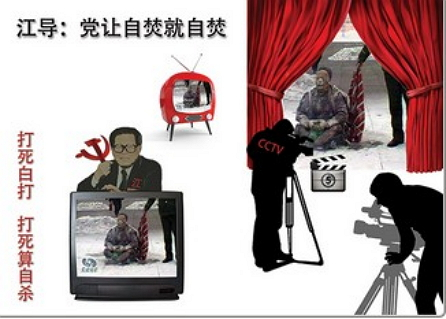
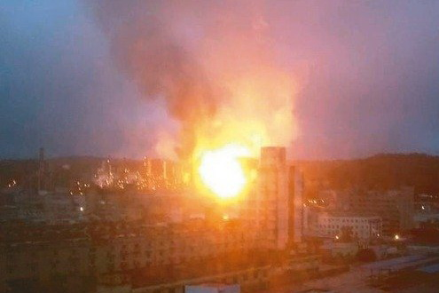
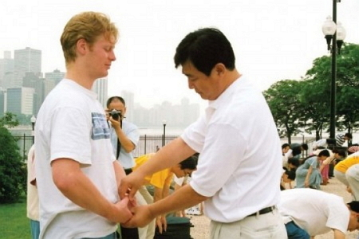
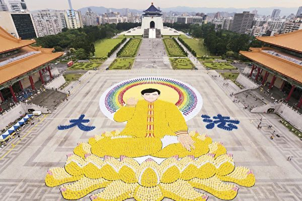

<h1 align="center"><a href="https://github.com/candysn/nini/blob/master/epub.md">免费下载epub电子书</a></h1>
<h1 align="center"></h1>

<h1 align="center"><b>我亲眼目睹了“法炼人”的景象</b></h1>

天地人和万象新 精气神足春常驻

【希望之声2018年4月13日】（本台记者陈克江综合报导）2001年8月2日，是我生命中最重要的转折点。这一天我有幸加入法轮大法的修炼行列，从此获得新生，黯淡的人生离我远去。17年来，我脱胎换骨，从百病缠身到无病一身轻，这一切都是大法赐予我的，心中对师父的感恩，用尽人类最美好的语言都难以形容。

	
我是台湾宜兰县的法轮功学员，今年快70岁。我曾经患有多种疾病：长达15年的肾脏出血、两公分的子宫肌瘤、头痛不能吹风、膝盖骨质疏松、坐骨神经痛、扁桃腺发炎，等等，让我苦不堪言。每天都必须吃消炎药，一停药就发烧；每两天必须打一次针，每三个月要打一次类固醇。早年不幸的婚姻加上多病的身体，把我变成一只“笼中鸟”，整天关在一个狭小的圈子里，自怨自艾，得过且过，不敢想未来。没想到，我的生命竟会枯木逢春！

记得得法的前一天，和姐姐一起外出，我走路很慢，落后她很远，姐姐问我为什么走那么慢，我说下腹部有下垂感，肚子像怀了双胞胎那么重，走路很困难。当时已修炼的姐姐告诉我，炼法轮功能净化身体，并鼓励我修炼。

我考虑了一整天，心想，学功要看书，而我识字不多，那怎么办？但我还是抱着试一试的心理，决定学学看。为了克服学法的困难，我开始学写字，不认识的字先注音，有空时再回头查字典，第一天，我写18行生字，3天共写了54行，我打电话和姐姐交流，姐姐不断鼓励我，并告诉我：“加油！”

就这样，坚持了一个月，我学会了500个字，两个月后，我读了三遍《转法轮》，这对于当时已经53岁的我来说，真是神奇，我知道是师父打开了我的智慧。在学师父的《洪吟》时，我每晚坚持听两首诗，遇到不认识的字，先注上音，慢慢学会了读《洪吟》。现在，我每天除了干活外，就是认真学法，有时一天可读半本书。

学炼法轮功的前5年，我每天清晨4点，骑15分钟的机车前往员山公园炼功，无论刮风下雨，从不缺席，也不迟到早退。后来，我在宜兰县龙潭湖附近建了一个炼功点，希望能让更多人知道法轮大法的祥和美好与庄严殊胜。因为我的天目是开着的，只要我准时到达炼功点，我就能看到师父的法身在那里等我，若迟到，师父的法身就消失了。工作之余，学法、炼功成为我生活的重心，我也事事按照“真、善、忍”标准待人处事，高标准要求自己。心性提高后，身体也像蜕了一层壳，完全脱胎换骨了。

炼功前，我经常发烧，只能靠药物退烧，炼功第一天，没有吃药，也没有发烧，炼功头3天就开始净化身体，很强的能量流通透全身，连续3天，原本手抬不起来的职业病去掉了，可以抬高了。半年后，有一次连续高烧3天，我知道那是净化身体，坚持不吃药，结果真的全好了。

学炼两个月后，我的水肿消了5公斤；4个月后，困扰我15年的血尿全好了，长达27年的“月内风”、偏头痛怕吹风的痼疾也不见了，并摆脱了3个月需打一次类固醇的恶梦；20个月后，长年的子宫肌瘤自动脱落。我记得那天是2003年6月16日，当时身体没有任何不适，也没有出血。

曾经有一次，我被轿车从身边撞了，整个人在半空旋转几圈，当时我没有害怕，感觉像法轮快转，因摔下后左手先着地，结果手掌的两块骨头突出来，右脚瘀青，我心想没事，也没找医生，第3天与朋友去听歌，遇到要鼓掌时我照样拍手，3个小时下来，手掌突出的地方，奇迹般的平坦了，看不出异状来，到了第8天，右脚血块也自然消退了。

除了病痛不翼而飞，我的外表也逐渐改变。从前我因为内脏下垂、膝盖骨质疏松，导致走路困难。学炼法轮功后，皮肤变得光亮红润、白头发减少，健步如飞。几年前，我和朋友出国观光，在木屋里行走，只觉得身体轻飘飘的，脚步轻盈，不同于其他人沉重的步伐。有时家里电话响，我从楼上飞奔而下，连小狗都惊讶的注视着我，仿佛怀疑我不是以前那位需双手扶墙、缓步爬楼梯的主人。

十几年前，我向邻居借了块地，尝试着自己种菜，当我拿起锄头垦地的那一刹那，内心激动不已。好久以来无法拿重物的我，现在拿着锄头竟是如此轻松。这十多年来，我真是变了一个人了，出外洪法时，认识我的朋友都说我不一样了，他们说，以前的我是嘴唇黑黑的，脸上有水肿，但现在气色红润，看起来很健康，我就向他们洪法，告诉他们说是炼法轮功炼好的。

修炼过程中，我经历过许多神奇的事。师父给了我很多东西，每天我都能看到“法炼人”的景象，像很多钻石在身上跑来跑去，24小时转个不停。有一次在发正念时，我眼睛没闭，看到师父的法身，还有法轮像火迸发出来，15分钟后，我把电灯关掉时，整面墙壁都发光，旋转了一个小时。

学炼法轮功后，我不再是一只自怨自艾的笼中鸟，法轮大法开启了我的智慧，使我的生命从此迎向朝阳。我要大声的告诉全世界：法轮大法好！

<h1 align="center"><b>瑞典最大健康博览会 人们赞赏法轮功</b></h1>

展会期间，法轮功学员在展览大厅的舞台上演示法轮功的五套功法。（明慧网）

	
【大纪元2018年04月12日讯】2018年4月7日、8日，瑞典最大的春季“内在和谐与健康博览会”（Harmoni Expo）在斯德哥尔摩市北部的索尔纳（Solna）举行。法轮功学员被主办方邀请参加展会。

明慧网报导，有300个以健康产品和服务为特色的商家、团体参展了这次展会，为了便于法轮功学员在展位前演示五套功法，向人们介绍法轮功，今年法轮功学员的展位仍被主办方安排在展览大厅离舞台最近的位置。

展会期间，法轮功学员在展览大厅的舞台上演示法轮功的五套功法。(明慧网)

展会期间，每天从上午10点开始到下午6点，都有法轮功学员在展位前演示法轮功的五套功法。还有学员向人们介绍什么是法轮功、同时揭示中共造谣、诬陷法轮功，残酷迫害法轮功学员的事实真相。

轮功学员在健康博览会上向人们介绍法轮功、讲述法轮功真相。（明慧网）

	

法轮功学员在健康博览会上向人们介绍法轮功、讲述法轮功真相。（明慧网）

	
中午，主办方还安排了由法轮功学员介绍法轮功的专场演讲，连续两天来参加者坐无虚席。热爱生活、不断寻找精神境界的瑞典人一听到“真、善、忍”就觉得好，很多人对法轮功很感兴趣，纷纷接过法轮功免费教功的信息单。

下午参会者聚集在展览大厅的舞台前，专注地观看法轮功学员们在舞台上演示法轮功的五套功法。悠扬、悦耳的炼功音乐，舒缓祥和的炼功场面深深地打动着现场的每一位观众，有不少人当场就模仿著台上展示功法的学员，学炼功动作，有的还拿出手机拍照、录像。

悠扬、悦耳的炼功音乐，舒缓祥和的炼功场面吸引了不少人当场学炼功动作。（明慧网）

	
一对中年夫妻站在后面认真地跟着台上的学员抱轮（法轮功第二套功法），觉得这个功法很神奇，有很强的能量场，浑身发热，表示一定要学这个功（法轮功）。

两位瑞典中年男士，静静地坐在观众席的中间，目不转睛地注重着法轮功学员演示的每一个动作，并时不时轻声地交谈著……当第五套功法演示结束后，两人脸上露出了微笑、不约而同地热烈掌声，还赞美道：“太美妙啦、非常好！”

西人法轮功学员温纳（Werner）耐心地告诉他们，法轮功不是只炼动作，还要在日常生活中遵照“真、善、忍”的原则规范自己的言行，遇到矛盾时向内找自己，为别人着想。

当得知法轮功是义务教功，书籍在网上都是免费下载时，其中一位年长的先生说：“我练过很多的气功，看到你们在炼功的时候是那么的宁静、祥和，真是与众不同。我今天终于找到了无法用金钱来衡量的一个无价之宝。”俩人都很兴奋，表示一定要学法轮功，这的确是高层次的功法。

负责法轮功展位的西人法轮功学员马斯（Mars）介绍说，现在从各个渠道了解法轮功真相的人越来越多了，了解了真相的人们更加认清了中共邪恶的本质。一位男士听了中共活摘器官的事实真相后非常地气愤，他表示用如此残暴的手段对付这些善良无辜的人，那它（中共）一定是邪恶的。

他还说，有不少人是第一次听说法轮功，看到这么宁静祥和的功法马上就要学，好像来这里的目的就是来找法轮功的。当他们得知法轮功炼功点已遍布在瑞典各地，自己所居住的城市里就有炼功点时都非常地高兴，表示回去后会尽快联系当地的炼功点去学功。

<h1 align="center"><b>神奇的十天——从此改变生命轨迹</b></h1>

走入大法修炼 迎来生命曙光

<b>【希望之声2018年4月6日】（本台记者慧光综合报导）</b>

我是出生在中国大陆云南省的普通女子，今天我要说的是在我生命中最重要的一段日子，虽然只有十天，但却彻底改变了我的命运，让我从绝望中走上了一条光明大道。

2001年，我只有二十四岁，却患有子宫肌瘤、卵巢囊肿、输卵管堵塞、子宫重度化脓等妇科病，还有严重的心脏病、低血压以及胃丧失消化功能后造成的重度营养不良等一系列疾病。子宫化脓导致腹部经常剧烈疼痛，平常走路都很困难；但是严重的心脏病又让我坐久了也不行，坐的时间长了就感到呼吸困难；而严重的低血压又让我不敢见阳光。更要命的是我的胃丧失了消化功能，每顿饭只能吃一小点儿，吃任何东西都要赶紧接着吃十五颗消食片，不然就会干呕、晕倒。当时我瘦的皮包骨，弱不禁风，陌生人看见我的样子都会害怕。

记得去医院检查的时候，医生的态度很悲观。她问我“年纪轻轻怎么会得这么多病？”还对我说如果住院需要一大笔钱，还不能保证有多大效果。我只知道我身体很差，但没想到会这么严重。我对医生说，我们家里没那么多钱，就是住院押金都交不起，医生尽管表示很同情，但也很无奈。我当时很绝望，我才二十四岁啊，可是前面一片黑暗，看不到任何光明。我天天哭，不知道该怎么面对，我甚至埋怨苍天——为什么要我来到这个世界上？如果有一天我真的死了，我的父母怎么能承受这种打击呢？父母为我着急的头发都白了。

也许是我命不该绝吧，一个看似偶然的机会，我遇到了一个叫阿秀的人，尽管是萍水相逢，但她还是很认真的倾听了我的情况，然后平和的对我说：“你炼法轮功吧！法轮功不收一分钱，不用吃药、打针，病就会好。”当时中央电视台刚刚播放了天安门自焚事件，所以我对她的话将信将疑，但是生命中求生的本能还是让我接受了，因为这对我来说，就像抓住了一根救命稻草，我实在没有别的选择。

阿秀借给我一本书叫《转法轮》，只看了十几页，就感觉非常舒服，比吃药还舒服。因为我平时吃的药比吃的饭还多，吃下去症状会有所缓解，但管不了多长时间。当时就想，这看书真管用，以后我只看书就行了，不用吃药了。就这么想着，也就忘记了吃药。平时只要不按时吃药病就会马上发作，可那天忘记了吃药却一直很舒服，这让我很吃惊，没想到看这本书竟然比吃药的效果还好，太不可思议了。我意识到这不是一本普通的书，而是一本奇书。

第二天，我叫阿秀教我炼功，五套功法我很快就学会了。开始炼功以后，我的身体一天比一天好，人也渐渐的有力气了，更重要的是我看到了生命的希望，我觉得我有救了。亲身经历了大法的超常与美好，我经常喜极而泣，常常是不由自主的泪流满面。

到了第十天的早上九点钟左右，突然感到身体又开始难受起来，我跟阿秀说：“为什么今天感觉病好像又回来了呢？”

阿秀说：“师父在帮你净化身体呢，你不要害怕。师父会把你以前得过的病打出来，然后消下去，这样你就彻底好啦！你有多疼，就说明你的病有多重。哪怕再重，都不会有生命危险，你要相信师父，相信大法的神奇！如果你把这个净化身体的过程当作是病，又去吃药，那可能真的就会导致是病了！”

当时我想：反正药也吃那么多了，身体还是一天比一天差，不吃药也没什么。我听了阿秀的话，没有吃药，也不害怕。因为胃没有了消化功能，平常哪怕只吃一点儿饭或偶尔吃点零食，就要赶紧吃十五粒消食片，不然病就会发作。发作的时候，头是晕的，所有的食物都堵在胸口上，而肚子奇饿，还想呕吐，慢慢的眼睛也会看不见东西。如果吃了东西不吃消食片的话，分分钟都会发作。

我坚持不吃药，就这么扛着。这个难受的症状一直持续到下午一点钟左右，进而开始感到全身发抖，冒虚汗，双脚酸软无法站立，同时也感到眼花，恶心，呼吸困难。

到了晚上十点钟，老公看见我的样子惊叫起来：“你整个脸都是绿的，快去休息吧！”我颤颤巍巍的爬到床上，能感觉到身体的每个细胞都在剧烈疼痛，全身都僵硬了，当时感到除了眼睛会动以外，其它的似乎都不会动了。

老公过来拉我的手，当他碰到我的时候，感觉就像冬天人冻僵后被用针扎一样难受，我拼尽所有的力气对他说：“你不要碰我！”他大声嚷道：“脸色这么可怕，真的吓死人，不上医院怎么行！”我用微弱的声音跟他说：“没事的，我睡一觉就好了，你看电视去吧，不要有声音，也不要再对我讲话。”他听后就打开电视静静地坐在一旁，也不敢睡。

我在心里一遍接一遍地念“法轮大法好！真、善、忍好！”心里一点也不害怕，身体的剧痛一阵胜过一阵，但我拼命忍着。当时我想：比起长期被病痛折磨得死去活来，这种痛也不算什么。

就这样迷迷糊糊的睡着了，醒来的时候，我转动眼珠看了一眼挂钟，已经是凌晨三点十五分，突然感觉小腹部位有一个东西在转，然后有温暖的气流在全身流动，僵硬的身体突然变软了。我舒展一下双脚，感觉整个身体有了前所未有的轻松，我一骨碌坐起来，跟老公说要吃东西。

老公被我的举动吓呆了，凝视着我一动也不敢动，直到确定我真的正常了，才小心的问道：“到底是怎么回事？怎么说好就好了？”

我兴奋的告诉他：“以后我的身体会一直好下去，是我炼法轮功把身体炼好了！”

他疑惑的说：“你真的就好了？不过看你现在气色真的很好，跟刚才简直判若两人，你吓死我了！我就像做梦一样。”

困扰我多年的顽疾就这样不翼而飞了。当我健健康康、能吃能喝地站在家人面前时，他们都觉得不可思议。都问我是怎么回事？我告诉他们：“我是炼法轮功炼好的！”

学炼法轮功仅有十天，我就从绝望中走了出来，迎来了我生命中的春天。

身体好了以后，很快我就怀上了孩子。原来嗜赌如命的老公竟然也变好了，做起了生意，我们原本困苦不堪的生活慢慢有了好转，后来买了地基，建了房子，结束了颠沛流离的生活，拥有了从未敢奢望的一切。

每当回想这一切，尽管历历在目，但总好像在做梦一样，我知道是师父给了我新的生命，给了我这美好的一切。我常常问自己，“你就是一名普通女子，有何德何能，此生能幸遇这么好的师父和大法呀”。

修炼以后我知道，在上亿的法轮功修炼人群体中，类似我这样的神奇经历数不胜数，像我这样从绝望走向美好的人大有人在，所以我愿意将自己亲身经历的事实写出来，希望大家都来了解法轮功真相，都能拥有美好的未来。

<h1 align="center"><b>法轮功禁止杀生和自杀 </b></h1>

	
【明慧网二零一四年一月七日】（明慧评论员文章）法轮功是上乘佛家修炼大法，明文禁止杀生和自杀。任何以自杀、杀生行为诬陷、诋毁法轮功的人，都不敢让人系统地、不带任何观念地、静心地阅读法轮功原著，特别是《转法轮》一书，也不敢让人亲身体验法轮功的功法，因为坏人也知道：很多人都是有良知的，看见真相就不愿再相信谎言。
为了各位的前程，希望大家都来看《是自焚还是骗局》这个十三分钟的录像短片，即便是在百忙之中，很值得看，不看以后可能会非常遗憾！如果能静心通读《转法轮》一书，就更好。

中共就是中共，本性绝不会改变，就如同狼绝不会变成狗或者羊。十三年前的“天安门自焚”骗局虽然早已被揭穿，但命令烧书、禁书的那些中共罪人，总是在寻找欺骗更多人的机会，想多拉一些人陪绑，其中包括海外出于各种目的想和中共走近的人，并借此延缓中共被治罪的那一天的到来。

历史上对正信的迫害从来就没有成功过，现在中共对法轮功“真善忍”真理的迫害更是从一开始就注定了失败。从1999年7月至2014年1月，这场对法轮功的政治迫害已持续十五年了，法轮功学员在中国大陆和平、理性的反迫害言行，通过海外明慧网对迫害黑幕的揭露，也持续十五年了，迫害行为赖以藏身的主要场所——劳教所已经解体，迫害走入末路之末。在这种情况下，又有人到海外拿自焚骗局作招牌，象开假面舞会似的演戏，这一次，目的是骗谁呢？

自焚真相是本世纪重大信息。知道才能心明眼亮，明白才有未来、有光明、有希望。

<b>相关历史概要：</b>

1）法轮功是佛家上乘修炼大法，以《转法轮》一书教人按“真善忍”做好人、提高道德境界，并辅以五套动作优美缓慢的功法。从1992年5月公开传出，至1999年7月，短短七年间，学炼法轮功的人数已高达一亿；因祛病健身、回升社会道德的显著功效，法轮功在中国的声誉家喻户晓。

2）1999年6月，中共专门为迫害法轮功而成立了权力凌驾于公检法之上的“610办公室”。

3）1999年7月，中共首恶江泽民、罗干出于妒嫉和个人利益，发动了对法轮功的全面迫害。但当时，中国大陆有太多的人都经历过“文化大革命”，也都知道法轮功的功效，所以对这场政治迫害不以为然，对政府发动的“百万签名声讨法轮功”等活动消极对待。同时，大批法轮功学员自发地走向北京信访办、天安门广场，为法轮功说公道话。

4）江泽民发布的密令中，最臭名昭著的是对法轮功“名誉上搞臭，经济上截断，肉体上消灭”、“往死里打，打死算自杀”、“打死不查身源，直接火化”。

5）为维持和广泛推动这场迫害法轮功运动，2001年1月23日，江泽民、罗干之流，在天安门广场推出了一场自导自演的自焚事件，并动用全中国的媒体，用这场伤天害理、残害生命的黑戏，嫁祸法轮功。

6）“天安门自焚”骗局推出一周后，人们疑问重重。于是中共操控中央电视台，推出了一个以自焚为题的“焦点访谈”节目，攻击法轮功。然而通过对“焦点访谈”的录像进行慢镜头播放和分析，人们却发现了更多的漏洞。比如，在这场事件中当场失去性命的刘春玲，不象被焚烧致死，而是被突然来自脑后的重物击打致死，而神秘的击打者是军警模样。中央电视台的自焚画面中还有王进东的现场大特写，一名警察站在他的身边，拿着灭火毯，悠闲地等着王进东喊口号，然后机械地把灭火毯盖在王的头上。“王进东”浑身衣服被烧得七零八落，可是他两腿中间装汽油的绿色塑料雪碧瓶却完好无损。

7）法轮功是佛法修炼，禁止杀生和自杀。1995年出版的法轮功主要著作《转法轮》〈第七讲〉中专门有“杀生问题”一节，其中写道：“杀生这个问题很敏感，对炼功人来说，我们要求也比较严格，炼功人不能杀生。”1996年法轮功创始人李洪志先生在《悉尼法会讲法》时，当有弟子问，“杀生是一种很大的罪业，一个人他自杀算不算罪呢？”李先生回答：“算罪。……所以自杀是有罪的。”

8）尽管江罗监制的自焚事件漏洞百出，但想在政治上捞票的人，常年将此伪案和骗人用的“标准答案”塞入中国大陆中小学校的教科书、考试题、招工表格，从儿童、青少年学生做起，制造对法轮功的恐惧和仇恨。

<h1 align="center"><b>丹麦议会就中共迫害法轮功举行专题答辩会</b></h1>

【明慧网二零一八年四月十日】（明慧记者林彤丹麦哥本哈根报导）二零一八年四月五日，丹麦议会九个党派针对正在中国发生的迫害法轮功，及仍然继续的活摘法轮功学员及其他良心犯器官一事，进行了一次专题答辩会。会议一致谴责中共迫害人权，以及灭绝人性的大规模活摘器官的罪行。会议还一致同意，在今后与中共的双边贸易合作中，必须把人权问题摆在重要位置上。

	

丹麦人民党向外交大臣提出质询的六位议员代表克劳斯·维斯特·汉森（Claus Kvist Hansen）（右）在议会大会议厅主席台上发言。

今年二月初，由第二大党派，丹麦人民党（DF）六位议员，向外交大臣提出质询：“政府对中共迫害法轮功学员一事，抱怎样的态度？对于中共当局活摘法轮功学员和其他政治和宗教迫害囚犯的器官这一指控，（丹麦）政府持何种态度？”

丹麦人民党曾经对中共政权残酷迫害民众，侵犯人权的劣迹，向政府内阁成员有过多次质询和提问。但国会议员专门针对法轮功学员遭受中共长达十九年的残酷迫害提出质询，这是首次。

四月五日下午，丹麦议会九个党派的外事与政治发言人，齐聚丹麦国会大会议厅，对中国长期以来严重侵犯人权的现状，进行各自表达党派立场的辩论。

<b>议员代表：无法用语言表达发生在中国的罪恶</b>

丹麦人民党议员克劳斯·维斯特·汉森在议会大会议厅主席台上发言。

	
首先，丹麦人民党向外交大臣提出质询的六位议员代表克劳斯·维斯特·汉森（Claus Kvist Hansen）发言。他说：“我们在议会里，经常针对不同题目进行辩论。但是那都是在正常情况人们所关注的题目。可是在世界的其它角落里，我们看到许多让人无法接受的事情，这些事情往往发生在独裁体制的国家里。这些专制独裁者对自己的公民进行任意监禁、酷刑和杀戮，我想提出的发生在中国的对法轮功学员的迫害，就是这样一个非常令人沉重的题目。”

克劳斯·维斯特·汉森说：“关于法轮功，我曾经做过很多的信息搜索和探究，但是我实在没有发现他们有任何可疑的、破坏社会的行为。昨天，我与两位法轮功学员的代表会面。他们告诉我，法轮功学员一般都比较健康，因为他们既不抽烟也不喝酒。设想一下，正是因为他们的健康，却被独裁政权放到了任意屠宰的砧板上，成了器官非法贩运罪行的货源！面对这样的事情，我无法用语言来表达我的心情！作为一个民主国家，敢于揭露这样的反人类罪行是非常重要的。因此我把此议题作为我们议会辩论的一个案例提出来，期待着这一沉重但非常重要的辩论。”

<b>执政党议员：中共干扰神韵在皇家剧院演出太可耻</b>

丹麦执政党——自由党议员，外事发言人迈克尔·阿斯特鲁普·詹森在答辩会中，提出了中共把手伸进丹麦内政，干扰神韵演出的事。

	
丹麦执政党—自由党议员，外事发言人迈克尔·阿斯特鲁普·詹森（Michael Aastrup Jensen）提出了他最近注意到中共插手丹麦内政的一件事：丹麦皇家剧院迫于中共使馆的压力，多年以来拒绝全球闻名的神韵艺术团在该剧院的演出，仅仅因为神韵艺术团与法轮功有关系。

他说：“作为丹麦自由党来说，我们认为这是很可耻的事情，这事非常严重！作为自由民主国家，自由表达权是我们价值理念的核心内容之一。因此我们必须对这样的问题明确表态。这是在我们国家境内我们自己的事情。”

<b>红绿联盟党议员：必须对中共明确发声　停止迫害！</b>

丹麦红绿联盟党议员（EL）尼古拉·韦勒姆森（Nikolaj Villumsen）在答辩会上发言

丹麦红绿联盟党议员（EL）尼古拉·韦勒姆森 （Nikolaj Villumsen）说：“我们从政府那里听到，他们在和中共进行关起门的批评性对话，用另一种说法就是，没人知道这种批评性对话有没有进行过。其实你可以从外交大臣的言谈中明白，当他们双方关门会谈时，是丹麦外交大臣在听中共：每年都说，它们在改善。事实上发生在中国的情况是非常令人担忧的。这些年以来，香港的民主自由在逐渐被缩小。还有活摘器官的问题，还有其他政治活动家、工会会员、少数民族和宗教群体——当然还有法轮功、西藏人、基督徒、维吾尔人，这些人都在被粗暴地压制与迫害。因此，丹麦必须清楚地呼吁中共政府尊重基本人权，停止迫害。”

<b>人民党议员：我们面对的是种族灭绝罪行</b>

丹麦人民党议员肯尼斯·克里斯坦森·泊斯（Kenneth Kristensen Berth）指出中共就是红色法西斯！

丹麦人民党议员，也是六位提案人之一的肯尼斯·克里斯坦森·泊斯（Kenneth Kristensen Berth）指出：“当我们在议会进行辩论时，我们谈论的是关于种族灭绝罪行！是的，这就是我们正在谈论的：人们因为渴望采用自己的信仰方式，却被谋杀。”

他说：“现在我们辩论的问题是，当一个政权让人们死去，盗窃他们的器官，跟这样的政权谈什么平等对话，那是极其困难的！因此，我建议我们再次对这样的政权，判断它们的道德良知，看看我们和它们有没有同样的理念基础，再谈平等对话。中国共产政权所体现的价值观，和我们民主国家的价值观，怎么能够平等对话？！”

肯尼斯·克里斯坦森·泊斯说：“我爱中国，我爱中国文化，这个国家的文化令人惊叹！但这个国家不幸被中共政权摧毁了！我不知道是否应该叫其共产党，还是更应该称之为红色法西斯！”

<b>自选党议员：继续谴责中共罪行</b>

丹麦自选党（ALT）发言人拉斯慕斯·诺德科威斯特（Rasmus Nordqvist）在答辩会上发言

丹麦自选党（ALT）发言人拉斯慕斯·诺德科威斯特（Rasmus Nordqvist）说：“我愿意加入今天在答辩会上对迫害法轮功学员，活摘他们器官罪行的谴责行列。不幸的是，我们听到活摘器官的罪行仍然还在继续着……虽然中共政权讲的是另一套。在上一次政府大选时，我们已经讨论过这一问题了。现在重新提出这一问题的原因是它的重要性。感谢丹麦人民党提出这一问题，让我们再次聚在这里讨论这个紧急议题。”

<b>外交大臣：中共在继续迫害法轮功</b>

丹麦外交大臣安德斯·萨缪尔森（Anders Samuelsen）在答辩会上答复议员质询

丹麦外交大臣安德斯·萨缪尔森（Anders Samuelsen）在答辩会上对议员质询作出答复。首先，他感谢丹麦人民党的六位议员提出法轮功学员遭受残酷迫害的质询。他说：“据人权组织称，（中共）对法轮功学员个人仍然继续进行监控、任意拘留、逮捕和判决，使他们受到身心伤害。”

外交大臣表示：“我想强调的是，政府直截了当地反对对法轮功学员任意逮捕并遭受虐待的罪行。丹麦政府反对一切强制性的器官移植和器官销售。中国与欧盟之间永久性的人权对话预计将于今年夏天举行。丹麦高度重视这一对话，并积极推动议程并将派出观察员。丹麦政府将保持与其它国家一起继续，就宗教和少数群体的人权问题，与中国进行对话，这也适用于法轮功学员的基本权利。”

<b>三党派决议草案：丹中交往必须把人权问题列首位</b>

克劳斯·维斯特·汉森代表丹麦人民党、红绿联盟党和另选党宣读了他们共同起草的决议草案，在决议中，他们提出：“议会呼吁中国（政府）尊重人民的基本人权，停止对民主活动家、工会成员、少数民族和宗教群体，其中包括法轮功、西藏人、基督徒和维吾尔人的跟踪和打压。议会呼吁政府向中国当局提出这些要求，在与（中国政府会谈的）所有议程中都将人权议题列入其中。

“同时，议会注意到，对中国活摘器官这样侵犯人权的行为提出的批评，并要求中国立即停止使用非居民的、没有登记为器官捐献者的器官。议会呼吁，停止丹中之间在卫生领域的合作，直到中国实施透明可信的器官移植运作为止。”	

<h1 align="center"><b>在奥克兰国际文化节上介绍法轮功</b></h1>

【明慧网二零一八年四月九日】二零一八年四月八日，新西兰奥克兰国际文化节在Mt Roskill的战争纪念馆公园举行。晴朗的天气，轻抚的微风，阵阵飘香的各国美食，风格迥异的民族歌舞表演，吸引了许多人全家一起出动，老的少的，脸上都笑盈盈的。

图1～3：法轮功学员们应邀参加奥克兰国际文化节

法轮功学员们应邀参加了这个一年一度的文化节，在文化节的舞台上表演了腰鼓，还展示了五套功法。腰鼓表演赢得了阵阵掌声，优美祥和的功法展示，让人们不禁在台下学炼。法轮功学员介绍中国文化的展位上，更是人来人往，有学折莲花的，有学剪纸的，有咨询中医中药的，还有不少人了解真相后，要学法轮功的。

	
	

露易丝（左）向法轮功学员咨询

露易丝（Louise Mahoney）是一位年轻姑娘，练过十年的各种气功，她觉得自己经常没有什么精神和气力，浑身冰冷。当她听闻法轮功后，非常欣喜，得知教功录像及大法书籍可以从网上免费下载，更是非常感动。她说她一定要学，还要介绍给她的妈妈。

塔妮（右）和她的朋友支持法轮功学员反迫害

	
塔妮（Tani Witter）说，她喜欢中国人，新西兰的历史也有中国人的贡献，中国人在十八世纪就来新西兰淘金采矿，参加铁路建设，努力工作，她欣赏中国文化，中国的美食让人难以忘怀。但是，她不喜欢中国当今的独裁统治者（中共），排除异己，和北韩一样，她实在不理解中共为何迫害法轮功。中共活摘法轮功学员的器官牟利的罪恶更让她匪夷所思。

赛米和卡茹喜欢法轮功学员的腰鼓队

赛米（Sammy）和卡茹（Cara）是文化节的工作人员，她们说，法轮功学员的腰鼓队，服装很好看，很醒目，金黄的颜色走到哪里，就象耀眼的阳光照到哪里。她们了解法轮功，因为法轮功学员经常会参加社区活动。

	
	

<h1 align="center"><b>记一个从阎王殿走回来的人</b></h1>

	
	

	

	
法轮大法是往高层次带人的宇宙大法	

	

	
<b>【希望之声2018年3月29日】（本台记者慧光综合报导）</b>
王香莲出生在中国大陆一个偏僻的农村，本来是一个不爱说话且胆子很小的女人，但是出嫁之后却完全变成了另外一种性格。

婆家很穷，用当地人的话来形容，就是“土炕上的席子都是半截的”。婆婆是个罗锅，公爹老实一辈子，丈夫有点儿窝囊，谁都敢欺负他，家里什么事都不管，这个家只有靠她“顶门”过日子。如果她要不站出来，这个家的日子就没法过。

无奈之下，也是为生活所迫，使她的性格变得日渐强硬，以致于天不怕地不怕。她曾经因为救济款发放不公而几次大闹乡政府；曾经因为园子里的倭瓜被偷摘而把铝锅盖挂在门前的大树上敲一夜，还边敲边骂，闹的四邻鸡犬不宁；无论是乡里还是村里干部到她家收“提留款”（注），从来收不到，就是有钱她也不给；谁要是欺负了她的家人，她会堵在谁家的大门口骂街……

她本是一个贤良、温和的人，为社会所迫，变成了一个性情暴躁、开口就骂、举手就打的“女汉子”。然而她的强硬换来的不是尊重，而是乡亲们的避而远之，村长、村干部都拿她没办法。

三十五岁那年，她生下了第二个女儿，在怀孕坐月子期间，几乎是靠苞米面糊糊度日，由于生活困难，身体出现多种病症。她开始抱怨命运不公，气愤和委屈交织在一起，导致有病的身体越来越差，甚至经常出现昏迷状况。

有一天，她又昏过去了。朦朦胧胧中，感到自己好像是从一个很黑的地方沿着台阶往下走，很快就到了一个大殿堂中。刚站定，只见一人双手举着条幅，边跑边拉着长音喊道：“报……，王香莲到！”然后就跪在一个长条桌案前。

她抬头观看，只见长条桌案后面端坐着一位身穿红袍的人，那人头上戴着类似皇帝的帽子，帽子前边搭着许多串珠，晃来晃去的看不清脸。身后有两名丫鬟站立在两旁，她们手举着大羽毛扇交叉着立在后面，案桌侧面站着一位师爷模样的人。

她马上意识到这就是传说中的阎王殿了。此时阎王正在翻看生死簿，上边写满了人名。她大着胆子凑上前去，小声问道：“大爷，您看我还能活多久？”旁边的那位师爷协助阎王在“古”姓（她丈夫姓古）下方找到了她的名字，但是名字上被打了个×，旁边又粘了一个纸条，于是她不解的问：“我的名字上面为啥要打个×？还要粘一块纸呢？”师爷回答说：“打×的，就是这个人要死了。用纸盖上了，就是这个人不归地狱管了。”说完用手指着她说：“你已经不归地狱管了。”接着就猛的推了她一掌。

这一掌推来她就醒了，但是刚刚经历的那一幕仍然清晰的展现在眼前，可是她却不明白其中是什么意思，她心思“为什么地狱不管我了呢？”

1996年，法轮功传到了她的家乡。村长、包括乡政府的干部曾放出话来说：“谁要是让王香莲炼了法轮功，那就是大功一件。”于是就有人动员她炼法轮功，因为那时她的身体已经很糟糕了，没有别的选择，她心想“能治好病为啥不炼啊？”于是就找到一位法轮功学员家中，学会了五套功法。

1997年6月28日，对她来说是一个非常重要的日子，她从那一天开始修炼法轮功，并得到了宝书《转法轮》。

之后，她如饥似渴的读《转法轮》，不认识的字就问孩子。大法的法理启迪了她的良知和善念，使她第一次明白了人生的真正意义，知道了人有病、遭罪、没钱都是因为业力所致，只有修炼大法才能改变今后的人生道路。从此压在她心头多年的积怨化开了，心里像敞开了一扇门一样，感到生活有了奔头。回想自己从前浑浑噩噩的过日子，争啊、斗啊，活的简直太累了。在看书的时候，她经常激动的泪流满面，为自己糊涂的过去而深深的痛悔，也为找到人生的归宿而激动万分。

修炼之后，她的性格也变的开朗热情了。她改掉了争强好胜、打架骂人的恶习，说话礼貌客气，待人和气，遇事能忍让了，吃了亏也不去计较。与邻里能够和睦相处，谁家有困难或者是有大事小情都愿意找她帮忙。她时时处处按照“真、善、忍”的标准做人做事，修炼不到半年身体的病就没有了，人也年轻了许多。

修炼的第二年，乡干部和村干部一行四、五个人到她家收“提留款”，当时她手头上确实没有钱，为了不给干部们出难题，她就把家里的苞米粒灌了一袋子给了村长，然后说：“麻烦你们把这提到镇上卖了，钱足够交‘提留款’的了。”几位干部本来是准备碰一鼻子灰的，可是没有想到她会如此痛快，让他们很惊讶，村长说：“我们这都收了一圈的钱了，谁家也没交，今年就你交了。你真变了，变的让我们刮目相看了，你说说你为什么一下子变得这么通情达理了。”

王香莲说：“因为我修炼了法轮功了，是大法改变了我，我师父让我们做一个处处为别人着想的好人。”几位干部听了之后都竖起大拇指说：“真佩服你们师父，佩服法轮功，你们师父真了不起。”村里的乡亲们看到了她修炼以后的变化，都说“王香莲可真是脱胎换骨了，简直换了一个人，法轮功真是了不起。”

2012年，她家盖上了新房。上房梁那天，村里的乡亲们都来帮忙了，做饭的、挑水的、扛木料的，好不热闹。一向老实憨厚的丈夫平生以来第一次笑的合不拢嘴。过去乡亲们见了她都躲着，如今她盖房子全村人都来帮忙，这是对法轮功的认可，也说明她得到了乡亲们的尊重。

1999年“7.20”中共开始迫害法轮功之后，村里每次开群众大会，开始之前她都先站起来给乡亲们讲真相，讲法轮功的美好，揭露共产党是怎样坑害老百姓的。村委会或村里党员开会，她也去给他们每人送一本《九评共产党》或大法真相资料，提醒他们千万不要参与迫害法轮功。

她每周都要往镇上跑几趟，到乡政府所在机关、厂矿、企事业单位以及乡派出所等单位讲真相，因为他们都熟悉她，知道她修炼法轮功前后的变化。去派出所讲真相，警察都乐呵呵的接待她，也愿意听她讲。

环境宽松了，在市场或农贸大集上，她都公开发资料，有精美的汽车挂件、护身符、漂亮的项链等，都会被赶集的乡亲们一抢而光。没得到的还很遗憾，跟她说等下个集要多拿一些。

周边有几个村子相距很远，她经常是一个人头天晚上背着真相资料去，挨家挨户发放，第二天早晨四、五点钟回家，炼功、学法啥都不耽误。有时候炼第二套功法——“法轮桩法”时，她经常看见自己站在彩云间，还看到许多另外空间神奇的景观，她知道这是师父在鼓励她，也知道了当年在阎王殿里百思不得其解的答案。

 

注：农村“提留款”是上个世纪中国大陆的村民委员会从农民生产收入中提取的用于村里开支的费用，包括公积金、公益金和管理费。实际上是因为村长和村干部的工资不是由财政供给，只好从农民身上摊派。2002年已取消。

<h1 align="center"><b>“天安门自焚”真相</b></h1>

	
2001年1月23日（除夕）下午，天安门广场“突发”5 人自焚事件。 事发仅 2 小时，新华社以超乎寻常的速度向全世界发出英语新闻，声称“自焚者是五名法轮功学员”。但是，美国之音记者打电话向北京公安局和公安部查证，答复竟然是不知道有这回事。喉舌的宣传口径竟然抢到了公安调查的前面！

如此迫不及待，已经暴露了这并非突发事件，而是一场准备充分的阴谋——假如真是突发事件，是根本来不及准备的。

当局的准备不仅仅是这些，央视紧跟着推出了攻击法轮功的“自焚新闻”、“焦点访谈”，而且强制全国各界、各企事业单位观看，反复“学习”。然而事与愿违的是， 反复播放的录像却暴露了越来越多的破绽，显出这是一场骗局。

	
<b>国际教育发展组织：该事件是由政府一手导演的</b>

	
2001年8月14日，在联合国倡导和保护人权附属委员会第53届会议上，天安门自焚案被当场揭穿。国际教育发展组织（IED）发言说：“我们的调查表明，真正残害生命的恰恰是中共当局……我们得到了一份该事件（天安门自焚案）的录像片，并从中得出结论，该事件是由这个政府一手导演的。”面对确凿证据，中共代表团哑口无言，没有辩辞。该声明已被联合国备案。 

	
<b>联合国会议大厅里，正义的声音再次响起</b>

【明慧网2001年8月18日】继八月三日发言谴责中共当局对法轮功的迫害及人权侵犯之后(见明慧八月十四日报导)，国际教育发展组织(International Educational Development, IED)八月十四日在联合国倡导和保护人权附属委员会(The United Nations Sub-Commission on the Promotion and Protection of Human Rights)第53届会议第六项议程中再次发言，强烈谴责中共当局的“国家恐怖主义行为”。

IED八月十四日的声明中说：“政府对人民施行的国家恐怖行为所导致的严重人权迫害远远超过任何其他形式的恐怖主义行动。当一个政权施行国家恐怖行为时，国际社会就将面临大量人权侵犯案例和难民而不知所措的困境。中国对法轮功修炼者的残暴迫害就是这样的例子。”

“我们在八月三日的发言中描述了我们对法轮功的观察了解。中国政府代表在随后的答复中企图以诬陷法轮功残害生命破坏家庭来为其国家恐怖行为辩护。我们的调查表明，真正残害生命的恰恰是中共当局。是中共当局对法轮功修炼者的虐杀而导致家庭破裂。伤害生命的不是法轮功，而是极端残暴的酷刑、精神病院里的摧残、劳改营的奴役、以及其他类似的迫害。正如‘国际先驱导报’八月六日报导，连中国政府都承认施行酷刑折磨以消灭法轮功的政策。中共当局并企图以今年一月二十三日天安门广场上的自焚事件为证据来诬陷法轮功。然而，我们得到一份自焚事件的录像分析却表明，整个事件是由政府一手导演的。我们现有该录像的拷贝，有兴趣者可来领取。”

“联合国‘关于酷刑折磨’的特派专员在他最新的年度报告中指证了中共当局对成千上万法轮功修炼者的拘捕和折磨。联合国‘关于非法、任意或集体屠杀’的特派专员，‘关于对妇女暴力’的特派专员也做出了类似的指证。我们正在整理的证据表明至少有五万名法轮功修炼者被关押在监狱、劳改营、或精神病院里，至少数千人遭受殴打并有很多人被折磨致死。几十万上百万人的安全受到严重的威胁。联合国的人权机制明显已经无法处理如此大量的人权侵犯案例，国际社会也将很难容纳如此多的难民。因此，联合国‘保护人权附属委员会’以及整个国际社会应当紧急干预中共当局的国家恐怖主义行为”

IED的发言再次引起轰动， 许多人前来索取声明的文本和自焚真相的录像。IED的这个声明也再次进入联合国官方的记录。

中国代表团在八月三日曾对IED的指控加以面对抵赖。这一次，面对凛然的正义之声和确凿的证据，中国代表团噤声不得，连抵赖的机会都放弃了。

与此同时，与会的欧洲美洲法轮功学员奔走在联合国人权高级委员会威尔逊宫，向联合国各种人权机构递送大陆法轮功学员传递出来的各种迫害案件，引起了十几个特派专员办公室的重视。这方面的情况我们将陆续加以报导。

国际教育发展组织八月十四日的声明的原文见：
http://www.clearwisdom.net/emh/articles/2001/9/9/13711.html

<h1 align="center"><b>几千万元打水漂了 ——如此灾难何以解脱？</b></h1>

人间万事有机缘 奈何迷中几人识

	
<b>【希望之声2018年4月2日】（本台记者慧光综合报导）</b>她生活在中国大陆，事业有成，家庭幸福。不仅自己有一份满意的工作，收入颇丰，而且一双儿女乖巧懂事，丈夫帅气体贴，所有这一切都让人羡慕不已。她也是一个说到做到、言而有信的人，所以在亲朋好友之间颇有威望，得到了大家的信任。然而，天有不测风云，一场飞来横祸几乎将她彻底击倒。

当今中国社会，几乎人人都在为钱忙活着，所以挣钱成了人们生活的头等大事。2012年，她联络了一些朋友，将几千万元钱存放在一个亲戚的公司里挣利息，本以为这是一个既稳妥且没有风险的赚钱之路，未曾想到在2013年1月的一天早上，一个朋友在电话里跟她说“公司老板跑了！”听到这个消息，犹如五雷轰顶，她当时就傻了。她心想“这是老天要灭我吗？我还有活路吗？”

接下来的日子可想而知，她和家人都承受着巨大的压力。有一位朋友甚至找了十多名貌似黑社会的人，到单位围攻她两天一夜，领导无奈之下只好让她办了离职手续。就这样，在短短的时间里，她几乎是从人间天堂一下子坠入地狱。

那段日子她可真是跌入了人生的最低谷，她说：“我一生争强好胜，从小做事就不想让人说不是，可半生忙碌，到头来不但一身空，还背债、遭怨恨，这以后可怎么活啊？”

好在丈夫修炼法轮功多年，心态平和，一直安慰她。有一天，丈夫对她说：“要不你修炼法轮功吧，这次我也不知道该怎么帮你了。”她当时不理解丈夫是啥意思，不过她想，反正工作也没了，忙了半辈子啥都没了，修炼法轮功能够转移一些压力，也未尝不可。

就这样她开始读《转法轮》（法轮功的主要指导书），没有任何想法，就是每天静静的看。读完了《转法轮》，她又开始看其他的大法书，读了十几本之后，就不自觉的开始用“真、善、忍”的法理来对照自己，同时也开始每天炼功。大约几个月过去了，有一天她突然发现，身上原来因为颈椎、腰椎变形而带来的病痛不知什么时候就没了，再也没有病痛的感觉了。亲身体验到了大法的超常与神奇，她非常高兴，也有了从未有过的快乐。

当她把法轮功的四十多本书都看过之后，她彻底清醒了，她说：“太感谢师父了，大法让我知道了我从哪里来？我是谁？我来在世上为什么？最后我要去哪里？师父说的句句是天机。”同时她按照大法的要求做人做事，时时怀着一颗慈悲善良的心，遇事向内找，放下执着心，慢慢的觉得生活越来越简单，但每一天都过的快乐和充实。通过学法也让她知道了自己所经受的磨难其实都是因为业力所至，该承受偿还的躲也躲不掉，是师父把她杂乱的生活归正有序了。

有一天她对丈夫说：“我再也不反对你修炼了，原来我错了，我要赶紧让家人也来学大法。”

在她的劝说下，婆婆开始修炼了，每天都认真学法、炼功。修炼不久，身体的变化很大，脸变的白白的，并且皱纹也很少了。

儿子小时候很听话，长得也帅，可随着年龄的增长，以及社会大染缸的污染，变得越来越不听话，还经常跟父母顶嘴，甚至仗着自己力气大和他们动手，为此她很苦恼，束手无策。修炼后，她用大法的法理教育他，让他知道这世上有比钱更珍贵的东西——那就是德，善恶有报是永远不变的天理！儿子知道了有神在掌管着人类的一切，慢慢的开始转变，懂事了，学习成绩也有了明显进步。

女儿比较乖，虽有时也有小脾气，但开始学《转法轮》后，经常念“法轮大法好！真、善、忍好！”并且按师父的教诲注意修心性，遇事向内找，也亲身体验到了大法的神奇和超常。

她说：“我现在一有时间就学法，《转法轮》是一部天书，是最高的佛法，里面有我学不尽的真理，他是打开一切谜的金钥匙。大法让我学会了如何做人、如何教育子女、如何更好的孝敬老人，还让我学到了许多世人无法学到的知识。通过学法和修心，让我拥有了一颗更加善良纯净的心，无论我再面对什么人、什么事，我都会用师父赋予我的智慧去做，不再有任何的烦恼和忧愁。”

<h1 align="center"><b>幸遇法轮大法 一双儿女来报到</b></h1>

	
	

	

	
幸遇法轮功 福报连连来

	

	
<b>【希望之声2018年4月5日】（本台记者陈克江综合报导）</b>我叫MAY CHEN，是法轮功修炼者，修炼已经快21年了。我今天简单给大家介绍一下我为什么修炼法轮功，以及法轮功在祛病健身方面的好处。

从很小的时候，我的身体就不是很好，而身体好的时候又往往是在大病一场之后。三天两头小病不断，吃药就像吃饭一样。曾经以为加强锻炼就可以强身健体，不再生病。小学参加过运动队、中学参加过足球队、高中参加过排球队、篮球队等，但身体还是时好时坏，中学后每次来例假都要痛苦4-5天，严重的痛经造成有时连课都没有办法上，要在家里躺着休息。吃了很多中药，也只是好过一阵子。到我参加工作后，有次例行体检，发现了严重的卵巢囊肿。

在当时的条件下，开始是药物治疗，吃抑制雌性激素的药物，在没有明显改善的情况下，只好采取手术的办法，请了当时很有名的医生做手术，把囊肿的部位尽量去除干净。医生讲，这种病不可能去根，可能复发，最好是尽快怀孕，生了孩子就能够调整内分泌失调的问题，但是，因为囊肿是造成卵子环境不健康的因素，因此也不容易怀孕。对当时还年轻的我听来，意味着可能这辈子就不会有孩子了，打击程度可想而知。那是1995年的事。

1996年8月，我来到美国，先生当时还是德克萨斯大学的留学生。我们的生活很清苦，我开始为申请上学而努力学英语，准备考TOFEL和GRE。就在1997年夏天，我感觉身体又有些失调，痛经再度频繁发作，去做了一次体检，发现囊肿再度降临，两侧都已经有鸡蛋大小，美国医生建议再次手术，并说只是一个小手术。可是我知道，手术不能解决根本问题，当时真是心灰意冷，同时对自己的身体也是万般无奈，甚至赌气跟先生讲，干脆把卵巢动手术全拿掉算了，省得一再遭罪。我因为了解手术的过程，一直没有胆量去做手术，直到我遇到了法轮大法。

在1997年感恩节期间，我幸运地了解到法轮功在休斯顿中国城办九天班，先放李洪志老师的讲法录像，然后免费教功。在我参加了九天班的第三天，我就意识到这个功法不一般，不仅买了书，还借了录像带回家看。当时并没有意识到能有多大的作用，只是觉得好，想学。当时还不懂得什么是修炼，就是觉得好。就在我开始学法轮功后，也就是1、2个月的时间，痛经完全好了，身体感觉非常舒畅。

后来我在《转法轮》一书中看到李老师讲：“历来很多人都把气功混同于一般的体育锻练，其实差别太大了，根本就不是一回事。单单在最低层次练气的时候，讲究祛病健身，达到一个健康的身体，最低层次的目地和体育锻练有了共性。但是到高层次上，根本就不是那么一回事。气功的净化身体也是有目地的，并且要用超常的理来要求炼功人，不能用常人的理来要求的。而体育锻练只是常人中的事。”还说：“因为我们往正路上带你，在世间法的修炼过程当中一直在给你净化身体，净化身体，净化身体，直到被高能量物质完全转化。”

我体会到了身体被净化后没有病的状态，第一次感觉到得遇法轮大法，真是这世界上最幸运的事情了。随之而来的，更好的事情也来了，在修炼了一年后，1998年10月，我怀孕了。在怀孕期间，有一次例行产检做X光检查的时候，我还特意问了医生，他说囊肿已经消失了。1999年7月，我生了一个健康的女儿，2008年9月，我又生了一个健康的儿子。

这些年修炼法轮功的过程中，我身心受益。在拥有健康的身体后，我以充沛的精力完成了硕士学位，毕业后找到了满意的工作，在美国这个自由的土地上正以自己所学的知识奉献于社会。

谢谢大家能够来了解法轮功，法轮功在祛病健身方面的例子很多，我只是其中受益的一个。而法轮功带给修炼者的，不仅仅是身体方面，在心灵和人生方向上的益处更是突出。走进法轮大法修炼的门，我的人生才真正驶入了正道，每天都活得很充实，很有意义。希望有缘人都能从法轮大法中受益。

<h1 align="center"><b>在德州大学阿灵顿分校介绍法轮功</b></h1>

【明慧网二零一八年四月四日】（明慧记者曾洪美国达拉斯报道）二零一八年三月二十九日晚，美国德州大学阿灵顿分校（University of Texas at Arlington）的法轮功学生社团，在校园内活动中心（Maverick Activities Center）的礼堂内举办了放映纪录片《自由中国》和问答活动，向大学生及教师介绍法轮功及发生在中国大陆对法轮功的迫害。

	
	

	

	
图：活动现场，大学生们签名要求停止迫害

	

	
法轮功学生社团（Students for Falun Gong）是由在这所大学里修炼法轮功的学生们近期成立的一个俱乐部性社团，这是他们组织的第一个活动。社团里青年法轮功学员们说在宣传这次活动中就是一个讲法轮功真相的过程。此期间，他们走访了不同的课堂向教授与学生介绍这个活动，也拜访了校园内的其它十几个学生组织，还在校园内设立许多活动广告牌。

前来观看影片的机械工程系教师Ben表示，他本人也是通过社团的学生才知道了法轮大法和正在中国大陆发生的迫害。他对学生的努力非常赞赏和支持，兴奋地表示他也会尝试与他们一起炼法轮功的功法。

Gregory是另一学生社团的主席，他表示自己对法轮功的情况还不了解，今天他看到了法轮功展现出来的平和的后面有巨大力量，他希望邀请法轮功学员到他们的社团去介绍和交流。

放映后，法轮功学员还与观影者进行互动。公晓燕女士向人们讲述了自己一家人因修炼法轮功在中国大陆被迫害的情况，至今父亲公丕启仍在被非法关押中。听众们震惊的同时，也感谢吕女士与他们分享自己的故事，让他们对迫害有更深切的感受。大学生Huy向人们介绍了修炼法轮功后自己性格上的改变，父母看到他变得懂事能体谅、考虑别人后，感于大法的威力，现在也开始看《转法轮》了。

一位被所谓的“天安门自焚”等谎言欺骗的来自大陆的女留学生，在活动后对一位朋友说：“原来法轮功是被迫害的！”

Nhi氏兄弟俩都是在读大学生，他们觉得在这个活动中了解到了一些非常重要的信息，他们一家都是越南华侨，父母都是讲中文，他们表示会鼓励父母来学炼法轮功。	
	
	

<h1 align="center"><b>追查国际调查报告 揭中共监狱奴役法轮功学员</b></h1>

	
	

	

	
总部位于美国的追查国际（追查迫害法轮功国际组织，WOIPFG）3月26日发表对中共监狱、劳教所强迫法轮功学员生产奴工产品的调查报告。

	

	
【大纪元2018年04月04日讯】（大纪元记者㑩琼报导）2012年年底，美国俄勒冈居民朱丽叶‧凯斯在购买的万圣节用品中发现了来自中国马三家劳教所的一封求救信。随之媒体将之公诸于众，震惊世界。

信中写道：“先生：如果你偶然间购买了这个产品，请帮忙转送这封信给世界人权组织。这里处在中共政府迫害之下的数千人将永远感谢并记住您。”信上还写，他们中的许多人都是法轮功学员，他们常常遭到更严厉的惩罚。

事后，美国加强打击海外监狱的奴工问题，并寻找中国监狱奴工的目击证人。

2018年3月26日，追查迫害法轮功国际组织（追查国际）公布“追查国际对中共监狱、劳教所强迫法轮功学员生产奴工产品的调查报告”显示，至今中共的监狱、劳教所、看守所里仍存在严重的奴役迫害。

被奴役者包括法轮功学员、维权人士、正义律师等，年龄从16岁至70岁，奴工时间为12~19小时，若加班加点，则长达几天几夜。

被曝光的奴工产品多达上百种，涵盖人们的吃、穿、住、行、休闲娱乐、化妆美容、婚宴、祭祀、节庆等各个领域，其中不乏名牌与时尚产品。这类产品远销很多国家地区，包括美国、澳洲、印度、英国、日本、韩国、俄罗斯、德国、非洲、土耳其、意大利、阿拉伯、马来西亚、加拿大、港澳、台湾等。

成立于2003年1月20日，以追查中共迫害法轮功的罪恶为使命的追查国际，发表此调查报告的目的，在于揭露中共对在押犯人的奴役迫害，提请国际社会对中共奴工问题，尤其是对法轮功学员迫害问题的关注与遏制，同时指出奴工产品直接关系到许多国家自身的经济利益，因而呼吁国际社会承担起应有的道义责任。

<b>生产奴工产品的形式</b>

中国大陆监狱、劳教所、看守所生产奴工产品的主要形式为两种，一种是以公司名义直接生产经营，另一种是以廉价的劳动力吸引国内外公司委托加工。

大陆许多监狱、劳教所等对外称公司，实际上出售的是在押犯人的奴工产品，如山东省兴业发展有限公司（山东省女子监狱）生产的知名品牌：

吉林省浩宇工贸有限公司（归属于梅河口监狱）生产的部分奴工产品：

羊毛毯

皇宫毯

另外，国内外委托公司和大陆的监狱、劳教所、看守所等地直接挂勾，委托加工产品。如杭州中赛实业有限公司长期给大陆38所监狱批料，加工外贸出口服装。

该公司有3500名工人，委托38所监狱加工产品，奴工人员约4万余人，企业厂房总面积为100,000平方米；加工地点为：杭州、金华、衢州、湖州、宁波、苏州、南京、南通、株洲、岳阳等地监狱系统的服装加工厂；年产量 为500万件，产值达5,000万元人民币；产品中外销产品占90%，产品主要销往非洲、亚洲（除中国外）、中南美、东欧与独联体、中东、北美、大洋洲和西欧等地区。

杭州中赛贸易有限公司产品加工场所举例：

		
		

		

		
		

		

这样的委托公司在中国大陆名目繁多，如新疆天山毛纺织股份有限公司在新疆乌拉泊劳教所、新疆女子劳教所、新疆昌吉劳教所、新疆第三监狱、新疆第五监狱都建有新疆天山毛纺的毛衣车间。

<b>奴工产品的危害性</b>

联合国国际劳工组织发表的数据表明，目前全球奴工产品的黑色利润已高达1,500多亿美元。而根据美国联邦劳工部2014年公布的奴工和童工产品名单显示，其中至少有12种产品来自中国。

这些超低成本、竞争力强大的奴工产品的大量生产和流通，给国内外劳工市场和经济市场带来巨大冲击，致使企业倒闭，工人失业，打乱了市场经济的正常秩序。

另外，在奴工产品巨额利润的刺激下，中共进一步加深对在押人员的迫害，特别是对法轮功学员的迫害。

明慧网针对中国大陆36家奴工场所发表的《中共监狱奴工劳动调查报告》显示，中国大陆的在押人员每天被强制工作的时间为10~19小时不等，甚至连续几天几夜不得睡眠。拒绝出工或完不成任务者常遭受殴打、电击等酷刑迫害。

另据明慧网2013年发布的《中共酷刑虐杀法轮功学员调查报告（1）》显示，在调查的3,653个被关押迫害致死案例中，有3%即110个案例是因超负荷劳役直接致死的。

再则，奴工产品严重影响消费者的身体健康。中共奴工生产场所环境恶劣，生产事故频发，服刑人员身患传染病，致使产品不卫生、不达标，如卫生筷随便倒在地上，包装箱上却印有“严格包装、高温消毒、操作卫生、使用方便”的字样。

<h1 align="center"><b>他从惊心动魄的爆炸现场走出来....</b></h1>

	
	

	

	
惊心动魄一刹那 坚定信念大不同	

	

	
<b>【希望之声2018年3月27日】（本台记者慧光综合报导）</b>	
我曾经是中国大陆某军事科研单位的高级工程师。
 
在部队工作几十年，由于工作压力大，把身体搞得一团糟。首先是患有神经衰弱、高血压病多年，发作起来就头疼得不行，再加上严重地萎缩性胃炎，折磨得整天吃不好，睡不好。药是一把一把的吃，可就是不见好，搞得痛苦不堪。

1996 年 1 月，我开始修炼法轮功，三种顽症不知不觉地很快都好了。以后就没再吃过一片药，无病一身轻，走路生风，感觉有使不完的劲儿，简直像换了一个人。更重要的是通过看书学法明白了很多道理，知道了人活着的目的是什么。

1997年5月的一天，我带领军工厂的工人在车间里装配一种特种炮弹，因任务太急，把本不该放在一起的引信和炸药都放在一个室内，导致有一位工人在拔引信的保险销时，引信意外击发引起炮弹爆炸。不足二十平方米的屋里顿时充满了橙红色的火焰和烟雾。

当时室内共有四人，有一人站在开着的门边位置，爆炸声一响他马上就跑出去了，剩下我和另外二个人。屋内东西太多，大部分是爆炸品，平时都是绕着走，现在什么也看不见了。其中一人顺墙摸到另一扇门跑出去了，我和另一个人听到门响，也向门的方向摸，撞倒了不少东西。我出来了，后面的人随后也出来了。当时没感到害怕，在回忆中好像都没听到爆炸声。

比我先出去的那个人，把又厚又密的头发烧去了一层，没烧到头皮，可上身穿的化纤衬衣被烧光。我是秃顶，火直接烧到头皮，而且落了不少磷块都烧到皮下了，头像戴顶火帽子，烧得头和眼睛发胀；手和脸火辣辣的痛，头上冒着烟，脸和手黑黑的。在我后面出来的人身上多处冒烟，左手流血不止。情急之中我捡起一团棉纱想为他止血，当我用手撕扯棉纱时一用力把左手指的皮拉脱下来了，就像橡皮套一样脱下来了，里边露出白白的肉，我没犹豫又把脱下来的皮推回去，此时我意识到手指的皮已经烧熟了。

爆炸声引来了不少人，我告诉他们快叫消防车救火。但是屋里的炸药和其它化工品连连爆炸，火焰像礼花一样从窗口往外喷，人无法靠近。我把受伤的两位工人送到院门诊部，然后急忙往回赶，想回到爆炸现场协助救火。我小跑着，心想得快点把火灭了，室内还有不少器材呢。在这时我感到我的头、脸、手一点都不痛了，就好像没事儿一样，忘记了自己烧伤的事了。

到现场后，在场的领导看到我的头还在冒烟，浑身散发着刺鼻的焦糊味，脸和手被烧得变了色，叫我马上去医院。都知道磷是有毒的，被磷烧伤不及时处理后果是严重的。我想我是一个修炼人，就对领导说“没事儿，我是炼功人！不会有任何问题，还有很多工作等着我呢！”

在领导的一再要求下，我回到了宿舍。刚静下心来，突然来情况了。本来被烧的地方一直是紧崩崩的，没肿也没起泡，可是转眼之间，被烧的地方大量往外流黄水，手也开始流黄水，我身边站着两个人用纱布块轮换着蘸，若不然顺着脸和脖子往下流，地上只得放一个拖把用以接身上流的黄水。就这样没过多一会儿，我突然像触电一样感到有一股电流从头顶一下子通到脚底，我不由自主地“腾”的一下站了起来，把身旁的人吓了一跳，可我身上顿时轻松了许多。我知道这是师父在为我清理身体。

黄水一直往下流，直到第二天早上六点多。我整整坐了一宿，可是没觉得怎么累。下午工厂的领导来看我，我又向他们提出了下一步工作的意见。

在家里休息的这一段时间，脸开始肿，两边轮着肿。开始是右边的脸和眼睛周围肿起很高，眼睛只剩下一条缝，但左眼不肿；两天后右眼好了，左眼又肿起来了，就这样轮换着一个星期就全好了。大约到第十天肿就全消了，头上全结痂了，耳朵外面一圈硬硬的一层痂，鼻子和嘴唇脱过几次皮后，有点模样了，只是手背脱皮的地方还流水。我当时一时糊涂，把死皮剪掉用盐水擦了一下，这一擦可把我痛坏了，真疼的受不了，烧伤的当时都没这么疼过，疼的在屋里屋外来回走。记得刚回家时因头上粘了很多纱布的线头，紧崩崩地很难受，叫儿子用棉球沾水擦擦脑门，谁知一擦就掉下一块皮来，儿子说都烧熟了不能擦了，我说太难受了，儿子说难受不就是消业吗，我马上反应过来了。师父说：“修炼中要消业，消业就痛苦，哪有舒舒服服地长功的！”（《转法轮》第187页）想着师父的话，烧伤的这点痛苦也就不算什么了。

在这期间，有一天突然感到右手背疼得很利害，一看是一小块磷从肉里鼓出来了，我用棉球擦去后就没事了。我知道，磷烧伤都是从落到的部位往肉里烧，而我这是从里往外冒，这不是很神奇吗！十天后，头上、手上结了厚厚地痂，慢慢地痂又开始脱落，待痂全部脱落后，头和脸没留下任何痕迹，除了手指用盐水擦的部位有点白之外，一切都恢复了正常。5 月 6日受伤，7 月 24 日恢复上班，前后两个半月烧伤完全康复。

再说一下另外两位受伤住院的同事。他们住院九个多月，做了多次手术，排磷，多次植皮整形，受了很多罪，在无菌室就住了很长时间，直到 1998年2 月春节前才出院。住院治疗花销十几万，可还是留下不少疤痕，而且脸上、手上、腿上取皮的部位也留下了疤痕。比我先出去的那位，两手的小手指僵硬成弓形，不能伸，不能曲。而我只消耗点纱布块和生理盐水，没吃药，没打针就全好了。我拿着烧伤后的照片向一位烧伤科医生介绍了我的情况，他看到我恢复的这么好，就说：“这真是了不起的奇迹！烧的这么重，没做任何处理，没感染，真是不可思议！恢复的这么快，又没落下疤痕，关节也完全恢复了，真是太神奇了！”

这件事在我们单位引起了轰动。

事情过去多年了，还有人问我：“你那个时候怎么敢不上医院呢？”

我告诉他们：道理很简单，因为我信法轮大法！从得法修炼的那一天起，我就决心在今后的生命进程中，不管遇到什么难，豁上性命也要修下去，一定要按大法的要求做一名真修弟子。

<h1 align="center"><b>原38军军长司机 来美国一周真名退党</b></h1>
<h2 align="center"><b>抗命军长徐勤先的司机：没有共产党中国会更好 军官家属：国人等著共产党倒台</b></h2>

		
		

		

		
图为2018年2月17日，纽约黄历新年大游行。 (戴兵/大纪元)	

	

	
【大纪元2018年03月31日讯】（大纪元记者林丹纽约报导）中国大陆民众及海外华人目前正以加速度退出曾经加入的中共党、团、队，全球“三退”人数本月突破三亿。

根据全球退党服务中心的统计，从2004年11月第一份退党声明开始到“三退”人数达到一亿人，经历了七年；“三退”从一亿人到两亿人，不到四年；“三退”从两亿人到三亿人，只用了不到三年。中国人抛弃中共的速度越来越快，其中包括很多原来是中共体制内的人。

这些曾在狼穴、虎口中的人，对中共的了解和认识，有着与普通老百姓不同的层面和深度。
抗命军长徐勤先的司机：中共治下当好人当不了

北京市民政局属下单位的办公室主任刘建国就是其中一位，在“官比老百姓多”的北京，他是一个普通的公务员，但他却曾经有着一个极为敏感的身份——他曾是“六四”时抗命不参与镇压学生的第38军军长徐勤先的司机，这个身份并没有因为那场政治风波过去29年而被人忘却。

原大陆第38军军长徐勤先的司机刘建国，在抵美一周后退党。（韩瑞/大纪元）

徐勤先1989年6月3日抗命后当天就被软禁，后被撤职、逮捕，判刑五年。作为徐勤先贴身“勤务员”的刘建国，也受到牵连。刘建国接受采访表示，最严重的一次，他被吊起来七天，大小便都失禁了，“就是在精神上摧垮你，让你没有尊严，生不如死。”他的手掌从此落下伤残。

2017年10月27日刘建国全家成功抵达美国，一周后的11月4日，他偶尔遇到了法轮功学员，在鼓励下，他正式以真名退出加入了32年的中共组织，当时法轮功学员怕他有顾虑，给他起了“老刘”的化名，但他说：“用真名，北京市民政局刘建国。”

刘建国接受本报采访时说，自己目睹了几次大的历史事件——1989年的6月3日晚，他目睹了中共屠城前，北京市民自发联合起来阻扰部队进城镇压学生；十年后的1999年4月25日，他目睹了万名法轮功学员和平上访，“那天我刚好驱车经过中南海附近，我开着车，慢慢地开，就感到这些人怎么这么整齐，安安静静地，地面也干净，但却没有看见有谁在组织或维持秩序，到了晚上才知道是法轮功（学员）上访，这么多人，但这么有秩序，令我特别佩服。”

后来他开始注意法轮功，“在过去十年，我手机上接到了不下十次的法轮功真相电话，每次我都不吱声，静静地听完。”

他表示，现在大陆已没有几个人是真心入党，只是为了生存，为了仕途，不过，真正正直的人在那样的环境中是很难混的，是受到排挤的。比如单位发文要求他监督某人，但他真履行职责时，反而有人向被监督人通风报信，他受到打击报复，而相反，有权有势的人互相勾结，沆瀣一气。

刘建国说：“在中共统治下的中国，当好人当不了，最后都只能逃命……要没有共产党，中国会更好。这些年经济发展的成果，都被贪官污吏给抵消掉了。”
大陆公务员：很多党员不交党费

刘建国的女儿刘洋原在北京市民政局军休办工作，她抵美后，也以实名退出了共青团。她在原单位是负责收党费的，她说，现在很多党员都不交党费，“党费经常收不上来，催来催去，很多老党员都不交党费，不参加‘组织生活’。”

为了交差，她只得亲自去到这些人家中收党费，自己还贴上打出租车的钱，“我自己掏的打车的钱，比他们缴的党费还多。”她还表示，中共为此层层下发文要求补缴、催缴。
大陆军官家属：世上最大的恐怖组织就是中共

上海移民白节敏，太太是大陆空军涉密部门的一名军官，他自己在大陆原有红火的生意、美满的家庭，但因为他比妻子年龄大不少、又是二婚，且经常出国做生意，他被怀疑是通过婚姻来窃取军事情报的间谍。

大陆空军军属白节敏在全球退党服务中心举办的新年晚会上。（林丹/大纪元）

白节敏说，中共为了拿到子虚乌有的证据及破坏他的婚姻，不择手段——跟踪、监控、电话窃听，甚至投毒、偷他的公文包、动用黑社会……人权没完没了地受到侵犯，他被逼得走投无路，只得抛妻离子，家有老母也难以尽孝，远走他乡。

白节敏说，自己从一个体制内的人被逼到成了“维稳对像”，这些年与公安、国安打交道中，更看清了中共的狠毒、狡诈，“它迫害了你，还要你说它好，它自己是贼，却到处喊抓贼，其实世界上最大的恐怖组织就是中共，世界上顶级的恐怖分子就在中共组织里面。”

白节敏说，他在这些年的维权中认识了一些法轮功学员，看到了他们所受的迫害。上海法轮功学员蔡玉芳被三次劳教，被限制出境不发护照，甚至她去苏州扫墓，在坐长途公交时，都被拦截，连基本的人权都没有，“中共把善良的法轮功学员视为异己，在高压的打压中试图把他们边缘化，让他们的亲人、同事、邻居远离他们，把他们孤立起来，所以，活摘法轮功学员器官的事情是绝对存在的，因为中共用国家恐怖主义恐吓人民不敢为这个群体发声，那么中共就什么事情都做得出来。”

白节敏说，物极必反，中共在迫害人民中把自己打倒了，现在中国人心思变，就等著共产党倒台那天。当共产党倒台时，中国人民都会觉得那是必然的、应该的，都会拍手称快，流亡海外的华人也可以回到自己的祖国。从“三退”三亿的数字可以看到，越来越多的中国人觉醒，觉醒得越来越迅猛。

<h1 align="center"><b>千回百转　我终于找到了法轮大法
</b></h1>

千回百转苦求索 缘归大法获新生

	
<b>【希望之声2018年4月1日】（本台记者陈克江综合报导）</b>我是2016年9月底正式走入大法修炼的新弟子。

学法炼功不到10天，我的皮肤变的非常白净，光滑；爱来不来的月经变的准时规律；长达十几年的便秘，在修炼几天后，开始排出墨绿色小圆石一样的东西，持续了4个多月，好了；生孩子落下的一身病痛，怕冷畏寒，在南方高温40多度的天气，不但不能开空调，还要捂着好几个热水袋，这些病痛，在走入修炼的几天后全都悄然不见了。

七、八年来的有气无力、忧郁、晚上睡觉总是惊醒、严重时甚至想轻生的状态，在一两天的时间里就发生改变——我变的光明祥和，说话底气十足、洪亮有力，阴郁虚弱的状态一扫而光，整个人如同获得新生般的欢快和喜庆。

神奇不可思议的事太多太多，无法一一列举。

修炼法轮大法之前，傲慢、清高、遇事得理不饶人，特别是以自我为中心的小姐脾气，在修炼不到半个月的时间内，简直像是换了个人：遇事学会包容忍让，知道为别人考虑，变的比较温和，礼让，忍耐；过去吃的、穿的、用的都要最好的，最漂亮的，现在可以吃便宜的快餐，穿不怎么流行、更谈不上什么好看的衣服了。

要问我怎么走入大法的？请听听我的这段奇缘。

我20多岁结婚生子。对方是个重男轻女的家庭，也因为我任性，遇事不懂宽容忍让，结婚7年便离婚了，被迫离开了心爱的孩子，又回到了一个人的世界。

离婚后，我决心成就一番事业。内心还强烈升起一种想法：我要是可以离开中国，离开这个庸俗的世界，该有多好！

由于从小家庭条件比较好，结婚后也几乎没上过班，没怎么跟社会接触过。现在，一个弱女子，要独闯世界，谈何容易？美丽的梦想，经过几番辛勤的尝试，都以失败和无奈而告终。梦想终究是梦想，抵不过现实中的现实。剩下的时光多是内心深深的无助与茫然。

离婚半年后，了解到有一个弘扬佛道文化的公司，我可以去那里工作。惊喜之余，简单的收拾了一下行李，剪去满头长发，一张机票将我从千里之外带到了心中理想的圣地。

几个月后，发现这里与我想象的圣洁无尘的佛道世界相差太远。尤其是，我发现我的老板，这个在互联网上拥有海内外几十万信佛受众、常发心要救度众生于苦难、深受信众崇敬的老师，私底下与很多女居士有纠缠不清的感情纠纷。正在此时，恰逢老家有事，我就名正言顺的告假回到了老家。回家的那段时间，心中非常困惑纠结，天下之大，何处是我的归途？

这段时间里，一个居士朋友建议我不妨去道家中找找看。抱着些许希望，我又辗转来到了位于武当山脚下的道教学院，见到了朋友向我推荐的86岁的老道人，一个慈眉善目的老道爷爷。老人神态安详，性情简单如同孩子般纯真无邪。

老道爷爷高兴时，我感觉颇有点象《射雕英雄传》里的老顽童。他一辈子的时间都在钻研习练丹道、易经等道医之术，能和太阳、花草、石头等大自然对话，时不时在外出练功的路上歪着头听天上的师父说些什么。

也许有些道缘吧，老人家在外出练功时答应收我为徒，问我想学点什么，我一脸茫然。生命的意义到底是什么？我也不知道，到底该干什么，学什么，去哪里，没认真想过，来到这里，只是想找个纯善安全的地方，收留我罢了，什么佛道神，什么修炼，我都不懂。

几天后的一个上午，在老人家的道长学院的院子里，坐在老道爷爷屋门口的我，意外的看到了让我震惊的一幕：院子对面的另一位年过七旬的老道长的俗家女儿，和老道长的徒弟大打出手，女徒弟头上的道士帽因自己过于凶悍，飞落在地，老道长前去拉架，竟被徒弟抓的满脸是血！我惊呆了……

这位老道爷爷虽说慈悲，可身边照顾他的阿姨，似乎总是觉的我像要拐走老人家似的，对我很抵触、防范，总是莫名其妙的摔摔打打，或对我无理的训斥。

无奈之下，我又一次告别了这个不属于我的世界，踏上了回家的路，回到现实中去。

在我这段迷茫的人生路口上，戏剧般的情节接踵而至。

不久，我遇到一位言谈举止温文尔雅，且美丽大方的阿姨。因为她的祥和，知书达理，我被深深吸引。萍水相逢，她对我却非常关爱。听我诉说我的遭遇，她安静的像一个朋友一样倾听，也跟我讲她年轻时的书生意气，说人生多歧路……她跟别人太不一样了，说的话跟俗世的人说的太不一样。后来还让我去她家，给我做饭吃，让我感受到久违的家的温暖，还给我买裙子，让我感到她跟这世界上我所遇到所有的人都非常不一样，在她一再的关心关爱下，最后我像是流落街头的孩子，最终被她带回了家，走进了大法。

走进来之后才发现，原来这里的人，这里的每一个人，即每一个大法弟子，都是那么纯善、无私。

曲曲折折，前后一年的徘徊，迷茫，千回百转，最后我终于找到了我要找的地方——走进了大法修炼。

修炼不到半年的时间里，随着对心性的提高，精进踏实的实修，我愈发坚定的认为，如同其他很多法轮功学员说的一样，慈悲伟大的师父每时每刻都在弟子的身边，像看护着自己的孩子一般时时刻刻看护着他的弟子，每一分每一秒。我以我的人格来保证我说的是真的。师父真的就在我们身边，分分秒秒，无限慈悲的看护着我们，从未离开过。

修炼中的奇迹每天都会出现。只是你是否感受到和悟到而已。随着修炼的精进和时间的推移，我的感受强烈而真实。这里简单举几例。

过年期间，回到老家。一天约同学出来给她讲了真相，在回家过马路时候，路上的泥雪被飞驰而来的汽车溅起，溅到了我新买的羽绒服和羊毛外裤上。奔跑了一天，实在累了，尽管心疼自己的衣服，到家后还是想早点睡，明天起来再处理吧。第二天，当我拿起那件羽绒服和羊毛裤要去清洗的时候，却发现这两件衣服上什么泥巴的痕迹都没有，连点水印都没有！

前几天，在家吃午饭的时候，坐在阳台上，手里的陶瓷碗折射出一圈环状的金色光圈，将我环绕其中。

一天早上，我坐在客厅的沙发上炼静功。沙发对面是电视机。打坐结束后，我的胸前突然闪现一束银白色的强光，折射在我对面关着的电视机的荧光屏上，光强的如同手电筒般明亮，怎能不让人震撼！

晚上关灯准备睡觉，只留下一盏台灯。准备把书放好后入睡，手里拿着的《转法轮（卷二）》封面上的粉色法轮图形的金色光芒竟然影射在我的被子上……

沐浴在佛光中，我感到无比幸福。谢谢师父，我会珍惜生命中的每一天，勇猛精进，直至圆满！	
	

<h1 align="center"><b>儿子问：人家有豪车豪房 你给我什么了？他用人生回答</b></h1>

北京画家秦尉是一名法轮功学员，他坚持信仰却被非法抓捕。（大纪元）

	
他是职业画家，艺术造诣深厚。然而，他却被单位开除，成了“五无”人员，即：无医保，无工龄，无退休金，无住房基金，无工资。为了维持生计，他教授绘画，耐心无私地指导学生，坚持最低收费，感动了家长们。

秦尉，北京人，56岁，自中央工艺美术学院装饰绘画系毕业，曾任教于海淀区八一中学。过去，他醉心现代艺术，发狂地创作，笔下堆满阴暗颓废。他一度在世俗的洪流里挣扎，浮起来又沉下去。

1996年，秦尉第一次读到了《转法轮》。当天，他捧着书整整看了一夜，直到天亮。看完书后，他赶紧找到法轮功学员：快点教我动作！他说：我知道，是大法救了我，师父救了我。	

秦尉每天勤奋地炼功，并且按照法理的要求提升道德。他意识到，自己以前的许多作品都充斥着变异的因素，是败坏的。他毫不犹豫，把一百多张大幅油画全都销毁了。他说：“我一下子就看清了很多东西，我能够归正了。过去每周我都酗酒喝醉一次，学法后，我戒烟戒酒，在单位从来不争，职称、房子我都不争，我开始知道人生的意义了。”

安宁祥和的日子，只有三年。1999年7月以后，法轮功受到打压，秦尉因为坚持炼功，先后两次被劳教、判刑，多次被绑架，累计被拘禁了十年多。他经历过这些恐怖：人被绑在床上，被六根高压电棍同时电击；整整三十天不让睡觉；被关在黑屋里、罚坐小板凳，在烈日下做奴工，每天只能喝一杯水……

在北京劳教所，警察劝他认罪、转化，放弃炼功就不用受苦了，还可以早点出去和家人见面。当时，秦尉一边听，一边看着外面的夕阳，他的心头一震：“这宇宙很宽，夕阳和树那么美，我知道我的生命和这些美好的景物是一体的，和宇宙是一体的，回到现实中，我确实就是痛苦的承受……但我要决定我怎么活着……”

在监狱里，他为妻子绘制贺卡，上面画着一对喜鹊，还有一朵玉兰花。他写道：“春天，玉兰花开，让你我的心洁净。”

北京画家秦尉在狱中给妻子画的贺卡。（大纪元）

	
秦尉的儿子问过他：爸爸，你们同学都有豪车豪房给儿子，你给我什么了？

他回答说：人间有个天平，天平上最有份量的是什么？是堂堂正正的品行，我在那个天平上是有份量的！我从小就教育你，为人要善良，不说假话，不占便宜，这比豪车豪宅重得多。

2016年5月18日，秦尉把一本《九评共产党》送给路人，为此他又被抓捕，被判刑两年半。秦尉的律师说：他是一个简单纯净的人，是一位阻挡社会道德沦丧的螳臂挡车者。

戊戌新年，秦尉将在铁窗内度过，家中84岁的母亲病卧在床，日夜盼儿归。

秦尉在狱中给妻子画的结婚二十周年贺卡。（大纪元）

	

<h1 align="center"><b>蒙特利尔声援三亿人三退　民众支持</b></h1>
【明慧网二零一八年四月三日】二零一八年三月三十一日星期六，加拿大魁北克省法轮功学员和民众在蒙特利尔举行集会和游行，声援三亿人在大纪元退党网站上声明退出中共的党、团、队组织（简称“三退”），并呼吁更多的中国民众觉醒，加入三退大潮，活动受到在场民众的热烈响应和支持。

	

	
	

图1-3：蒙特利尔声援三亿人三退集会现场

图2-4：蒙特利尔声援三亿人三退的游行队伍经过唐人街

	
三月三十一日，蒙特利尔风和日丽，法轮功学员在唐人街中山公园打出了“声援三亿同胞推出党团队组织”、“全民觉醒 解体中共”等横幅，在阳光的照耀下，壮观醒目。中午十二点，集会在法轮大法天国乐团演奏的乐曲声中开始，唐人街上熙熙攘攘的行人被雄壮的乐声吸引，纷纷聚集到集会现场观看。演奏曲毕，人群中响起热烈掌声，接着集会组织者和法轮功学员分别用普通话、粤语、法语和英语进行发言，周围的中西民众静静聆听。

蒙特利尔退党服务中心发言人杨女士在发言中表示，从二零零四年《九评共产党》问世开始，到二零一八年三月二十二日，在大纪元退党网站上声明“三退”的人数突破了三亿，这说明，无论从中共的基层到高层，真正信仰中共的已经寥寥无几。

“有一次我去一个在唐人街的商家，他告诉我，现在大家在社交媒体都是公开地骂中共，揭露中共。如果说谁是‘党员’，就成了一句很难听的骂人话，是对人格的侮辱。”

她从自己多年来向民众劝“三退”的经历中感受到，“三退”能真正地为中国人带来福分和平安。

集会期间，蒙特利尔法轮功学员张女士在现场为六、七位华人做了三退。她说：“上天对中共邪党的行为看得清清楚楚，所以天要灭中共。法轮功修的是真善忍，就一定要救中国人，中国人可贵呀。”

张女士一直坚持在唐人街向中国人讲法轮功真相、劝三退，在过去十个月里，她总共为3356人做三退。随着法轮功学员在唐人街上日复一日地坚持，张女士感觉到了唐人街上人们的变化，“过去有赶我走的，现在这些现象看不到了，讲真相的作用是很大的。”

<b>明真相华人：“早就三退了”</b>

在现场观看的好几位华人都表示早就做了三退了。大陆移民黄先生表示大力支持法轮功学员促三退，他说：“中共几十年来杀地主，杀资本家，杀知识分子，六四杀学生，唯一消灭不了的就是法轮功。就这一点，法轮功了不起！法轮功是中国的唯一希望！这就是我的观点。”

他很认同退党集会呼吁的“全民觉醒，解体中共”，他说：“共产党做的事坏透了，无所不用其极：杀呀、关呀、抓呀、整人啦。关键是让老百姓都知道，共产党控制太厉害了，控制网络，控制媒体。要把中共做的事情讲出来，用事实说话，老百姓会明白的。”

黄先生还表示，他读了在《大纪元时报》连载刊登的《共产主义的终极目的》一书，他说：“要往国内大量地传啊，关键是让国内的人们知道，要用光盘、书啊，大量地传。”

新近问世的《共产主义的终极目的》一书，继《九评共产党》之后，又一次深刻揭示中共的最终目的是毁灭人类，中共的本质就是一个邪灵，在中共表面的经济繁荣假相之下，被中共困绑的中国同胞面临生死危机。此书已在华人社会引起巨大反响。

现场另一位不愿透露姓名的华人表示他早已三退，而且刚刚看过大纪元《共产主义的终极目的》一书，他非常感动，想要捐点钱，真相点的法轮功学员婉拒了捐款，并感谢他的支持。他感慨地看着法轮功学员的集会队伍说：“这个场面真壮观，这在中国国内是不可想象的。”

<b感受法轮功美好 民众支持反迫害</b>

当天集会期间，不少西人民众表达了对法轮功学员的支持。一位西人女士称赞当天的集会活动非常好。她表示，多年来她一直看到法轮功学员在这里炼功讲真相，每次她都感受到很强的能量，让她内心感到平和与美好，而发生在中国的迫害应该受到谴责。“我支持他们（法轮功学员）！”她还表示，加拿大政府应该发声，不能让中共迫害法轮功这样的事继续下去。

集会之后，法轮功学员举行了游行，由法轮大法天国乐团和退党真相横幅方阵组成的游行队伍从唐人街出发，经过蒙特利尔著名的旅游区老港，沿途吸引了众多游客驻足观看。

游行结束后，法轮功学员在唐人街进行了大炼功。祥和的炼功场吸引了很多民众的兴趣，魁北克人Néhon一家六口当场就开始向法轮功学员学功。

魁省青年学生Sinchez-Correr在现场听了中共活摘法轮功学员器官真相后，表示回到学校后要组织反活摘的征签活动，要让更多人知道共产党在做这样骇人听闻的事。他说：“我之前从Youtube的视频里知道了（发生在中国的）活摘器官的事情，可是我不知道我能为此做些什么。现在我想，我可以在学校里做活动，我是学生会的，我可以找负责人做反活摘的征签，在学校门口做，请大家来签字。”

<h1 align="center"><b>美国乔治亚州参议院通过决议案</b></h1>
<h2 align="center"><b>谴责中共活摘器官</b></h2>

	
	

	

	
美国乔治亚州议会大楼

	

	
【明慧网二零一八年三月三十一日】2018年3月27日，美国乔治亚州参议院通过了第629号决议案（Senate Resolution 629），要求中共立即停止从所有被关押的人身上强摘器官，特别包括法轮功学员、宗教信仰者及少数民族人士。

这是继一周前乔治亚州众议院通过944号决议案后，参议院又通过提案关注发生在中国的这一人权灾难。

629号决议案由参议院规则委员会主席、共和党资深参议员杰夫·穆利斯（Jeff Mullis）、民主党参议员哈罗德?琼斯（Harold Jones）等14位参议员共同发起，得到了参议院跨党派的支持。该决议案于今年2月14日在参议院规则委员会一致通过后，于3月27日在参议院通过。	
 
			
			

			

	

	
2018年2月14日，美国乔治亚州参议院规则委员会举行关注中共强摘器官的听证会。图为629号决议案发起人、参议院规则委员会主席穆利斯先生。		

	
在听证会上，参议院规则委员会主席杰夫·穆利斯（Jeff Mullis）说：“我们很幸运生活在自由的国度。然而，法轮功修炼者在中国大陆却因为坚持信仰而大量被迫害和被强摘器官，我感到我们有义务谴责、帮助制止这种侵犯信仰自由和滥杀的行径，通过这个决议案，我们可以向中共传达一个明确信息：对法轮功群体的迫害和虐杀必须停止。”

参议院健康委员会主席、共和党资深参议员蕾妮·安特曼（Renee Unterman）对发起人穆利斯参议员说：“我曾在一家医院的肾移植部门工作，十分了解病人等待移植器官的迫切愿望。正在中国发生的群体灭绝暴行（genocide）会影响到我们每一个人。为此，我谨代表全体乔州民众，非常、非常感谢你推动这个议案！”

629号决议案包括了最近两年国际独立调查报告的数据、美国国会众议院通过谴责中共活摘器官的343决议案等内容；要求中共立即停止活摘器官的暴行：同时，采取措施，禁止参加非法摘取人体组织器官的人员入境，而且在乔治亚州境内找到并起诉这类人员。

	
	

	

	
乔州参议院通过的629号决议案原文	

	 
 

	 
以下为乔州参议院通过的629号决议案全文译文：

	
<b>第629号决议案</b>

建议对中华人民共和国针对法轮功学员和其他少数群体的迫害及活摘器官暴行采取某些措施。

鉴于，广泛而可信的报告显示，中华人民共和国大规模杀害良心犯，主要是法轮功修炼者，还有其他宗教和少数民族团体，以获得移植器官；

鉴于，中国的器官移植系统不符合世界卫生组织“器官采购途径的可追溯性和透明度指导原则”，中共政府已经抵制了对该制度的独立审查；

鉴于，传统的中国习俗要求身体在死后完好无损地保存。然而，即使自愿器官捐赠非常罕见，中国移植行业还是自2000年以来大幅增长；

鉴于，《2011年中国国家人权状况报告》指出，“海外和国内媒体和宣传团体继续举报活摘器官的发生，特别是针对法轮功学员和维吾尔族人”；

鉴于， 2016年6月发布的新的调查报告是由人权律师大卫·麦塔斯（David Matas），加拿大前亚太司司长大卫·乔高，和记者伊森·葛特曼（Ethan Gutmann）所进行的。此报告估计中国每年的移植量为6万到10万次。这是“通过国家政策和资金控制的”工业规模的国家指导性器官移植系统，并涉及军民卫生制度；

鉴于，中国的肝移植登记系统表明，超过25%的病例是紧急移植手术，在几天甚至几个小时内发现器官匹配。非紧急肝移植的等待时间通常在几周内。其它国家的大多数患者都要等待多年才能进行移植手术；

鉴于，中国政府声称90%的中国器官移植源来自死刑犯。但是，自2002年以来，处决次数已经每年下降了10%，远低于移植人数。政府从来没有承认从良心犯中获取器官；

鉴于，法轮功是以气功冥想为中心的精神实践，以真、善、忍的价值为中心，在九十年代在中国受到极大的欢迎，多方估计，修炼人数达7000多万人；

鉴于，1999年7月，中国共产党在全国范围内进行了严重的迫害，旨在消除法轮功的精神实践，包括身体和精神上的折磨，反映了中共长期以来对大型独立民间社会团体的不宽容；

鉴于，自1999年以来，成千上万的法轮功学员在中国劳教所、拘留中心和监狱中被拘留，对法轮功学员进行酷刑、虐待和不合理的体检和血液检查常规；

鉴于，“自由之家”2015年报道，中国法轮功学员占中国良知犯人的最大部份，面临死亡或被羁押的危险；

鉴于，联合国反酷刑委员会和酷刑问题特别报告员已经表达过对法轮功学员被强摘器官的指控的关注，并呼吁中共提高器官移植系统的问责和透明度，惩罚那些滥用职权者；

鉴于，2016年6月，美国众议院一致通过了第343号决议，谴责（中共）对法轮功和其他良心犯的系统性、国家授权的器官摘取；

鉴于，为了出售其移植器官而杀害宗教或政治犯是对基本生活权的严重和不可容忍的侵犯；

鉴于，对中国的器官旅游不应被医疗保密屏蔽，而应接受公开监督，任何一个国家都不应该允许其公民去中国获取器官，直到中国允许对过去和现在的良心犯的器官摘取进行全面调查。

现在，

鉴此，乔治亚州参议院决定并提议：

（1）本州及美国政府官员呼吁中华人民共和国政府立即停止对所有囚犯和良心犯的强摘器官行为，特别是对法轮功和其他宗教少数民族团体成员；

（2）本州及美国政府议员呼吁中华人民共和国政府立即停止对法轮功的迫害，并立即释放所有法轮功学员及其他良心犯；

（3）本州及美国政府议员呼吁美国总统和美国国务院对中华人民共和国器官移植手术进行全面、透明的调查，并要求起诉那些发现从事这种不道德行为的人；

（4）采取措施，对所有出国接受旅游器官移植的乔治亚州居民启动注册登记；

（5）采取措施，禁止参加非法摘取人体组织器官的人员入境，而且这些个人会在乔治亚州境内被起诉。

另外还决定，乔治亚州参议院秘书将准备这份决议案的副本，并将其转交给美国总统和副总统、美国参议院议长和秘书、美国众议院议长和秘书、参议院外交委员会主席、众议院外交关系委员会主席和乔治亚国会议员和参议员。

629号决议案链接：
http://www.legis.ga.gov/legislation/en-US/Display/20172018/SR/629

<h1 align="center"><b>【法轮功真相系列】永恒的感恩</b></h1>

2016年5月7日旧金山法轮功学员庆祝世界法轮大法日。（大纪元）

 
 【大纪元2017年10月25日讯】1992年5月13日，法轮大法在世间开传，而5月13日，正是法轮功创始人李洪志先生的生日。每年的这一天，世界各国的法轮功学员都怀着深切的喜悦与感激，载歌载舞，热烈庆祝这一殊胜的节日。

金色的日子，感恩的时刻。数以万计的贺卡、诗词、闪画从世界各地飞来，如潮水般涌现，恭祝法轮功创始人李洪志先生华诞，感谢师尊慈悲救度。今年513之际，表达感恩和思念的大陆法轮功学员来自国防、教育、法律、新闻、交通、石油系统等各个部门和行业，其中包括遭中共非法关押的法轮功学员，还有明白真相的不修炼法轮功的民众也寄来生日贺词，表达对李洪志先生的问候与感恩。此时，目睹各地庆祝盛况的民众都不禁问：这是哪一位名人，拥有如此之众的追随者，受到超国界的爱戴和敬仰？

法轮功创始人李洪志先生。（明慧网）

<b>“我这一生就是来传这部大法的。”</b>

1951年5月13日，李洪志先生出生于吉林省长春市一个普通干部家庭。1992年5月13日，在41岁生日之际，李洪志先生向社会公开传授其创编的佛家上乘修炼大法：法轮大法(法轮功)。法轮功以宇宙最高特性“真善忍”为根本指导，按照宇宙演化原理而修炼，性命双修。

从1992年5月至1994年12月，李洪志先生应中国各地官方气功科学研究会的邀请，在大陆多个省市地区讲法传功，总计办班56次，每期学习班7至10天。共有近七万群众聆听了李洪志先生的讲法。

法轮功祛病健身、提升道德，功效神奇。“人传人，心传心”，在大陆社会迅速传播，继而传向海外。据中国官方调查，至1999年初，全中国已有近一亿人修炼法轮功，修者遍布社会各阶层。人们通过习炼五套柔和缓慢的功法以及阅读指导著作《转法轮》，用“真、善、忍”原则指导自己的日常行为，带动整个社会风气开始好转。

大陆律师熊代英盛赞李洪志先生：“李洪志大师从90年代初在大陆传法的近10年时间，为千千万万人找到了自己的心灵归宿，让许多中国人重新建立起生活的信心，让许许多多濒临破碎的家庭和和美美，给中国社会带来有益改变。”

今天，法轮功洪传世界一百多个国家和地区，《转法轮》被翻译成40种文字。法轮功净化人心、强身健体、福国利民，深受各族裔人民的喜爱，也得到了海外各级政府和组织团体的肯定和表彰。在法轮大法网站，李洪志先生的著作、讲法音像资料和炼功音乐全部可以免费下载。洪大的慈悲，只为救助更多的有缘人。李洪志先生曾说：“我这一生就是来传这部大法的。”

1993年，李洪志先生在北京93年东方健康博览会作气功学术报告。(明慧网)

<b>感恩师父 赐予新生</b>

大法，威力无边。师父，风采无限。能够参加当年李洪志先生的讲法班，是值得庆幸万分的美妙缘分！在明慧网上，可以看到许多学员撰写的相关回忆文章。早年得法的学员这样说：“我们见证了大法在世间为人袪病健身、教人向善，使人类社会道德迅速回升创建文明风尚等奇效，也见证了大法救度众生，开创宇宙新纪元等威严、神奇、玄妙和伟大。”

在不到三年的时间里，李洪志先生将功法从中国的北方传到南方，又从南方传到北方，其中的劳顿和艰辛是难以想像的。李先生和弟子第一次到达北京时，在拥挤的北京火车站度过了最初的几个夜晚。他们在车站里吃东西、夜宿在长凳上。奔波传法期间，李洪志先生经常连续以速食面果腹，不浪费一粒粮食。他不讲排场，不摆架子，平易近人，举止优雅，从容祥和。伟大的觉者，就在茫茫人海中，不辞劳苦，把宇宙大法的福音传遍神州、传向全球。

“我感到师父是那样的亲切，好像曾在哪儿见过。师父身上散发出来的气质是那样的圣洁、慈悲、祥和。”

每当李洪志先生出现在讲台上，全场掌声响起，经久不息。人们注视、倾听，夹道欢迎，热烈簇拥，恋恋不舍。久旱逢甘霖的喜悦，跃动在每一个听众的心头。

一位参加大连第一期传法班的学员说：“师父讲法深入浅出，博大精深。其它功法从来没有把人和人生讲的这样明白，更没有把生命和宇宙讲的如此深刻，师父讲的话句句使我心灵震撼，打入我的心灵深处。真是神奇的功法呀！”

一位参加了1993年8月贵阳第三期学习班的学员说，“听了第一堂课，师父所强调和阐述的炼功不长功两个原因，使我内心无比震撼。过去从来不懂何为修炼，更没听别的气功师讲过修炼是直指人心，向内去找，扎扎实实修炼这颗心。明白了以上心法，生命如梦方醒，学会做事首先想别人，学会善待周围的一切人和物。这样一个踏实的内心世界的更新过程，给我打开了一个全新美好的境界。”

一个重庆法轮功学员说，“慈悲的李洪志师父将伟大的法轮佛法传给了我们，使我茅塞顿开，明白了我为什么这么多苦和难，明白了做人的真谛，做人的道理、做人的目地，是伟大的佛法解开了我封尘已久的迷雾，化解了我心中的痼疾。是伟大的师父将我从地狱捞起、洗净……给了我崭新美好的人生，我从此再没有悲和苦、怨和恨。”

21年前，瑞典女护士琵丽尤•斯文森曾经仰望讲台上的李洪志先生。她看到，师父的目光温暖慈祥，仿佛穿透了宇宙空间，洞察她生命的永远。琵丽尤说：“我永远不会忘记师父传给我们大法时的那份仁慈和耐心。从那时起大法的教诲指引着我人生的路。我的内心感到欣喜，只因找到了作为人的生命的真意。从那时起大法挽救了、也更新了我的生命。”

在每次讲法班上，李洪志先生总是提前来到课堂，准时上课，不耽误学员一分钟。李先生从来不用讲稿，出口成章、由浅入深、娓娓道来。在课间休息、课后答疑、专场咨询时，李先生都非常耐心认真的回答学员的各种问题，百问不倒、百问不厌。李洪志先生还常常挤出自己的休息时间，加班、加课、办班、办讲座。当大家学习功法动作时，李先生从不休息，而是全场走一遍，认真的纠正学员的动作，还经常摸一下小弟子的前额，给他们调理。

一位台湾学员谈到她在1993年东方健康博览会上目睹的奇迹。“师父几乎是挥手之间就让一位70多岁、瘫痪了近二十年、腿上的肌肉都萎缩了的老太太站了起来。当她从新迈出了渴望多年的那一步，她的儿女们都给师父跪下了，老奶奶也哭倒在师父的脚下。这一幕让我震惊了，站在医学角度上，这是不可思议的事情！我真的不敢相信自己的眼睛，可是它却真真实实展现在眼前。我感到这位李洪志师父是一位超人，这个功法是一个超常的功法。自那以后，我走上了修炼之路，也改变了我的人生。”

李洪志先生在一九九九年芝加哥法会期间为学员纠正炼功动作 (明慧网)

<b>觉者风范  言传身教</b>

李洪志先生教导他的弟子做一个符合“真善忍”标准的好人，他自己的一言一行就是这个标准的生动体现。

“我记得师父对他所遇到的每一个人，都展现出极大的包容及谦逊。每当回忆起和师父相处的时光，就像一家人一样。沐浴在师父洪大的慈悲中，一切的愁苦都烟消云散，感到非常幸运、幸福！”

“我就觉得这位老师怎么这么正，正的让人不可思议，没有人间任何表面的东西掩盖，一切都是那么真实，没有造作，没有夸张，没有牵强，没有掩饰。”

李洪志先生传功不求名不求利。当时法轮功学习班的收费在全国是最低的，老学员还给减半。因为收费太低，与其他气功师办班的收费标准反差很大，很多气功师对此都有意见。为此，中国气功科学研究会曾多次要求李洪志先生提高学费，但李先生考虑到学员的经济能力始终没有答应。

一位长春法轮功学员说：“师父初期传法时很艰难。《中国法轮功》出版前，师父借了八千元钱买书的版权号，首批书发行后，师父看见有缘人没钱买就免费赠送，结果书卖完了，但借版权号的钱都没收回来。”“师父在讲课时还不止一次的讲了，个人的钱和中小企业的钱一律不收，而且辅导站不许存钱，这已成为一条铁规矩了。”

李先生淡泊名利，生活简朴，但是对弘扬正义非常慷慨，曾经多次将气功科学报告会的收入捐赠给中华见义勇为基金会，还捐出过1,000本专著《转法轮》，由基金会代赠给各地图书馆。

一位学员回忆参加1994年3月天津第二期学习班的情况：“给我印象最深的是那天师父正步入礼堂，忽然从人群里冲出来一个人，他一下子扑倒在师父的脚边连连磕头，眼泪顺着他的脸流淌。后来才知道他是一个癌症患者，因为在广播里听到师父宣传大法的节目，就试着跟师父通话，在短短几分钟的谈话中，他的病痛减轻了很多，激动之余竟找到讲课的地方，跪地叩头来表达自己对师父的感激之情。面对这样的场面，师父始终目光平视，淡淡微笑。对那个下跪的人，师父上前把他轻轻扶起，继续往里走去，始终保持着平静祥和，好像这里的欢腾跟他毫无关系。这在我的心中引起极大的震撼。什么样的人才能始终保持着平静祥和、荣辱皆无、淡泊从容？这不经意的小事中表现出的却是与众不同的风范。”

一九九九年六月二十五日李洪志先生在接受美国伊利诺州州长、州财政部长和芝加哥市长嘉奖的颁奖仪式上讲话。（明慧网）

<b>造福人类 四海讴歌</b>

法轮大法来自东方神州，又在海外洪传。今天，在亚洲、欧洲、美洲、大洋洲和非洲，有上亿名各族裔民众坚定地追随李洪志先生，同修一部大法。无论顺流、逆境，他们坚定不移，信师信法。修炼者的国籍、种族、语言、文化、职业和年龄各异，其中有学者精英，科技人才，也有工人、农民、商人、官员、教师、学生、职员、干部。有耄耋老者、中青壮年，也有孩童少儿。尽管人生背景不同，弟子们全都为大法的法理所深深吸引，为李洪志师父的博大胸怀和高尚情操所折服。他们明白：李洪志先生所阐述的是千载难逢的天机，搭建的是通向未来的天梯。

由于法轮功为人类社会带来巨大贡献，李洪志先生因此受到全球修炼者的爱戴、敬仰和社会各界的尊重。自2000年起，李洪志先生连续四年获得诺贝尔和平奖的提名。至今，世界各国政府机构、议员、团体组织等对法轮大法和创始人颁发褒奖（包括奖状、奖杯、奖牌、奖旗等）及感谢支持信函超过三千多项。

1996年10月12日，李洪志先生首次到休斯顿演讲，市长宣布这一天为“休士顿李洪志大师日”。市长说：“法轮大法超越了文化和种族的界限，让宇宙真理响彻地球的每一个角落，并在东西方差异间架起桥梁。李洪志不知疲倦地将法轮大法从中国洪传至世界各地。沿着这条道路，他影响了许多国家难以计数的人的生活，赢得了崇高的国际声誉。”

1999年6月25日，李洪志先生首次到美国芝加哥演讲，芝加哥市长将当天定为“芝加哥李洪志大师日”；同日，伊利诺州州长、州财政部长授予李洪志大师杰出服务奖。

李洪志先生1999年在芝加哥领奖时说：“修炼的人早就把世间的名利看得很淡了”，得奖对于他个人并没有太特殊的意义，但对于法轮大法来说，得奖的意义却很深远，因为这代表着世人和社会对法轮大法的见证和认识。“希望更多的善良人投入修炼法轮功的行列”。

当法轮大法和李洪志先生受到诬陷时，有数以百万计的法轮功学员冒死进京请愿，呼吁还师父清白。一位大陆官员评说：“法轮功学员敢于为真理献身的精神让人佩服，而李先生能把这么多普通人变成勇士，更让人佩服。”

面对邪恶的疯狂打压，法轮大法修炼者坚守正信，在史无前例的迫害和危难中坚定不移，展现出前所未有的信仰的力量。伟大的师父，造就了坚忍不屈的弟子，改变了人类的历史，创造了人间的光辉奇迹。

在历史的关键时期，李洪志先生和法轮大法，为人类揭示了亘古的宇宙真理，为13亿人重建信仰和价值体系，重塑5,000年文明的辉煌。在红尘的迷雾中，法轮大法为亿万心灵指引归途，让生命永不迷航。

2016年5月13日，是李洪志先生65岁华诞，法轮大法传世24周年纪念日。天南海北，回响着一个共同的声音：恭祝师父65岁生日快乐！感谢师父慈悲苦度，弟子叩谢师恩！

五月的阳光，见证非凡的人间大事，倾听最深沉美丽的赞歌。

<h1 align="center"><b>澳洲企业家马克.哈奇森修炼法轮功的故事</b></h1>

马克．哈奇森的公司获得全澳年度最佳展厅奖

 
<b>【希望之声2018年3月12日】（本台记者陈克江综合报导）</b>
 这位百万富翁的故事，十分特别。马克.哈奇森居住在澳大利亚西部的珀斯市，他白手起家，精彩创业，是引人瞩目的商界之星。不少国内外企业家专程组团访问，向他请教经营之道。马克总是乐于分享“秘诀”：理性、平和、随其自然，从追名逐利转向提高生命的境界。

<b>一、我名利双收，难道还缺少什么？</b>

马克成长于单亲家庭，14岁起就到建筑工地打工，帮助母亲养家。他做过不同行业的零工，在少年时，便尝试自己开公司，试验过各种点子。2002年，马克成立了竹地板公司Bamboozle，专门经营高端竹地板。

经历了创业之初的艰苦，马克的公司迅速发展。至2006年，公司已积累一千家高端客户，马克因此荣获西澳40岁以下商界领袖奖。短短几年，马克已坐拥数百万澳元的资产，企业年利润超过百万澳元。他在富人区购置了体面的住宅，春风得意。

正当马克风光无限、为家人打造更高品质的生活时，他的两个兄弟的选择令他非常诧异。大哥肖恩是一名专业摄影师，几年前修炼法轮功。他除了摄影之外，每年要花很多时间到各地参加法轮功的活动，有时还去外州教人学炼法轮功。肖恩回到家乡，经常走街串巷，向人发送法轮功真相传单。眼见大哥安于清贫，马克十分不解，却也不以为然。

再说小弟李。在公司刚起步时，马克就费心培训弟弟，期望他能够掌握当企业家的本领。可是，李跟随肖恩学习法轮功，对马克的有意栽培不感兴趣。他还送给马克一本《转法轮》。

很显然，肖恩和李并不羡慕马克的“完美”光环，他们甚至流露出为他遗憾的眼神。马克纳闷：我的生活里难道缺了什么？

<b>二、走上修炼路 事业更上一层楼</b>

谁都不会想到，一次胃病的困扰，给马克带来了巨大的变化。有一个时期，马克天天胃痛，西医的解决方案和各种健康书籍都无济于事，他还聘请了私人健康及运动教练，也都不能缓解病情。

一天，马克向肖恩和李提起了这烦人的胃病，兄弟俩建议，他不妨试一试法轮功。他们还告诉他，在他家附近的公园，有一个法轮功炼功点，义务教功，分文不取。

免费？有这等好事？马克立即找到炼功点学功。教他炼的法轮功学员对他说，如果想真心想学炼，就一定要通读法轮功的经典著作《转法轮》，明白书里讲的“真、善、忍”法理，并且遵照这个原则处事待人。

《转法轮》就摆在马克的书架上呢！弟弟送给他后，他还从来没有读过呢。回到家，马克找到那本《转法轮》，翻开了书页。刚开始的时候，每读一页，马克都会打瞌睡、眼睛痛，脑子里还翻出各种各样的念头，但是，他坚持读下去。他把全书通读完毕，觉得很好，决定再试炼法轮功三个月。

接下来，马克继续阅读《转法轮》，一遍又一遍。当他读完第四遍后，他对自己说：“我知道了，我的生命中缺少理性与平和，而修炼法轮功是真正拥有理性与平和生活的唯一途径。”马克不再抱着“试一试”的想法，决定真正修炼法轮功。

马克对照法轮功的功理功法，衡量从前的奋斗历程。他意识到，那是一条追求名利的路，名气越来越大，利润越来越多，身体的毛病也越来越多，内心的苦恼和波澜起伏越来越多，欠缺“真、善、忍”。他需要按照大法的要求去做。

意识到这一点之后，马克由内而外全变了。家人、员工和客户都感受到了他的变化。随着修炼的深入，马克逐渐转变旧的观念，从一门心思“谋利”中抽离出来。他随其自然，做而不求，以平和的心态应对各类事务。他的生命上升到了新的境界，走入新的天地。

当马克把按照“真、善、忍”修心性放在第一位，把追逐更多的利润放到一边时，他惊奇地发现，公司并没有因此失去客户，而是更加良性地蓬勃发展。

2008年，公司的业务比2006年翻了一番，并且在珀斯南部成立分部。2009年，公司获得了澳大利亚年度企业奖。2010年，公司业务再增长50%，且入围澳洲年度家族企业奖、Telstra年度企业奖，马克入围全澳年度企业家奖。2012年，公司业务比2010年再翻一番。2014年，马克新成立的Lifewood公司获颁全澳年度最佳展厅奖。

<b>三、你为何如此与众不同？</b>

马克的公司业绩一路攀升，让许多人刮目相看。人们都想知道，马克因为什么在激烈的市场竞争中脱颖而出？每当有企业家来访时，马克总会敞开心扉，道出自己修炼法轮功的故事。

有一次，马克的合作伙伴、一位马来西亚的顶尖企业家特意带着公司的销售总裁和另一名副总裁前来，在马克的公司观察体验了一个星期。他们问马克：“你这么年轻，怎么能做到如此沉着、平和？你的员工为什么这样真诚地关心你？我希望我的员工也能这样对待我。”

马克坦言，是“真、善、忍”令他悟到做人的道理，也启发了他的经营理念。那位销售总裁返回马来西亚的第二天，给马克发了一条短信：“马克您好！我现在正在我家附近的公园学炼法轮功！”

<b>四、走上街头发传单</b>

在业余时间，百万富翁、著名的青年企业家马克常常站在街头分发法轮功传单，或是深入社区向民众介绍法轮功。他的朋友看到后，觉得不可思议。身为社会精英，马克起初也有些不好意思，毕竟长期以来，他习惯了以自我为中心，习惯了被他人仰视。经过思考，马克迈出了这一步，因为他认为，让人们了解法轮功的真相，包括在中国大陆迫害事实，是非常重要的。

马克说：“‘真、善、忍’的神奇之处在于他能改变社会所有阶层的人，包括比我更具社会地位的人、我这样的商业人士、各行各业的专业人员，也包括只字不识的中国乡村妇女。”

马克深知，如果没有学炼法轮大法，他将会陷入纸醉金迷，在寻欢作乐中沉沦。每当看到街上行色匆匆的人群，马克便心生渴望：他希望更多的人都能明白：“真、善、忍”对每一个生命都非常重要，那是人类未来生存和发展的基础。

<h1 align="center"><b>郝凤军：良知指引下的救赎 </b></h1>
<h2 align="center"><b>——从前610警察到帮助退党者的故事 </b></h2>
 

 

  
 【新唐人2018年03月29日讯】下面来关注一下退党大潮的相关报导。天津市前610办公室警察郝凤军，在2005年正式公开宣布退党。早年，他曾怀抱着除暴安良的理想加入了中共的警察队伍，但为何他最终却唾弃了中共呢？下面我们一起来听听他的故事。

郝凤军：〝我叫郝凤军，来自天津市。〞 
现年45岁的郝凤军，1991年考入南开大学法学系，毕业后进入天津市公安局任治安刑警。曾侦破多起毒品和抢劫案，获个人三等功。1998年，他竞聘为一级警司。

郝凤军：〝从一个普通的民警，到下基层，再到机关，（发展）还挺好。〞

1999年江泽民为镇压法轮功，成立了法外机构〝610〞系统。2000年，天津市公安局开始组建〝610办公室〞，但公开招聘只有1人报名，最后只能随机抽调。郝凤军被抽中。

郝凤军透露，610每年都有任务指标。其中天津被分派，每年要打压当地10%的法轮功学员。他负责指挥协调天津市塘沽、汉沽及大港3个公安分局的610办公室，完成打压任务等。日复一日打压手无寸铁的无辜百姓，让他备感压抑。

郝凤军：〝我要是还是一名刑警的话，我会为老百姓服务，保护他们的平安。但是我在‘610’这种工作环境让我感觉到很压抑，做了许多不愿意做的事情。〞

2000年10月3日，郝凤军在天津市公安局南开分局，目睹610办公室二队队长穆瑞利，用螺纹钢棍毒打女法轮功学员孙媞，进一步激起他对这个岗位正当性的怀疑。

郝凤军：〝我们去后，女民警看到她的后背都是黑紫色，还有两道20多厘米长的裂口。通过这件事对我的人生是一个重大转变。我认为一个民警只能去抓真正的坏人，地痞流氓，而不是这些手无寸铁的人。并且孙堤还有一个孩子14岁，致使孩子无家可归，流离失所。〞

无法承受内心煎熬，郝凤军申请调离迫害法轮功的610一大队，调往四大队当司机。

但2003年，他又亲眼目睹，天津610抓捕一名法轮功学员、副厅级官员景占义后，央视《焦点访谈》威胁景占义按官方口径污衊法轮功。郝凤军脱口而出〝这不是造假吗？〞，因此被关禁闭20多天，在北方寒冷的2月天，手耳都被冻坏。这使他下定决心，逃离中共控制。

2005年2月，他辗转到达澳洲。6月8日，他公开宣布退党。

郝凤军：〝在澳洲之前，我已经接触过《九评共产党》，并且来到澳洲之后，看到更多对共产党的一些，正确的事实的评价。让我更加认识到共产党的本质。〞

三退人数，今年3月突破三亿。郝凤军说，体制内很多人早已与中共离心离德。

郝凤军：〝包括我在澳大利亚以后，一些体制内的我的同事，让我帮他们在我们（澳洲）的一些三退的点上，帮他们退党、退团、退少先队。〞

走过生活的艰辛，熬过中共株连家人的心理煎熬，13年过去了，现在，郝凤军在澳洲过着平淡生活。

而他原先的顶头上司，原中央610小组组长周永康，中央610办公室主任李东生，公安部610主任张越等人，虽然曾权倾一时，但如今都因各种原因成为阶下囚。

郝凤军：〝澳洲这边的朋友问我，有没有后悔，有没有压力。我说，我做的事情，我认为是对的，我就不会后悔，我也会一直这样走下去。〞 
 
 

<h1 align="center"><b>纽约新移民谈“三退”：解体中共复兴中华</b></h1>
<h2 align="center"><b>亲见中共活摘器官 从大陆司法人变国际维权律师 国内网上声明退党</b></h2>

		
		

		

		
自2004年《大纪元时报》发表社论“九评共产党”开始，全球掀起了三退大潮，至今三退人数已经超过三亿，世界各地举行庆祝活动，迎接新纪元的到来。

 

 
【大纪元2018年03月28日讯】（大纪元记者施萍纽约报导）今年3月23日凌晨4点，全球华人退出中共的党、团、队组织的人数突破了三亿大关。近年先后退出中共组织的几名纽约新移民，畅谈了三退后心灵觉醒的感受。

自2004年11月大纪元发表系列社论《九评共产党》之后，全世界的华人社会，特别在大陆的中国人中出现了一场从来没有过的“三退”大潮。退党的人如果愿意，都可以在退党服务中心处获得一个退党号码或者退党证书，作为自己与中共恶党划清界限的证明。那每一个数字的背后都是一个生命的觉醒，而每一个生命的觉醒背后都有一段寻找真相、分辨是非的心路历程。

在三退人数突破三亿之际，记者在纽约当地挑选了几个退党号码，采访了这些号码代表的退出中共组织的新移民，请他们谈谈自己心灵的转变过程。
亲见活摘器官 从大陆司法人变维权律师

太平来美国才只有几个月，在大陆，他一直在法院和检查机关工作，26年党龄，2007年退党，退党号：0712213041900421。

“年轻时，我认为共产党代表先进意识形态，而且周围人都把入党作为一种进步和向上的表现。”太平说，所以他年纪轻轻就入了党。可是，30年在中共司法机关中的所见所闻让他逐渐地对共产党从疑惑到失望，从失望到绝望。“我耳闻目睹的东西不仅令人发指，简直是骇人听闻。”

那是在2001年前后，他参加了一个十几个死刑犯的公开处决活动，亲眼看见共产党摘除死刑犯器官的过程。

“枪声响过之后，人们把犯人的脸翻过来，名牌放在他们胸前，医护人员抬着担架冲刺跑过来，各自抬走他们要的犯人，然后就拉着警笛朝城里飞奔。”太平回忆说，“我们的车跟在他们后面，就看见前面从车窗里一盆一盆的血水往外倒……取走器官之后，人和车就分开了。这是我亲眼目睹的。中共摘取人的器官是非常普遍的做法。”

这种事情让他心理上难以接受，然而最让他震惊的还是中共对法轮功学员的长期迫害。因为他在工作中经常接触被中共冤枉、非法迫害的法轮功学员，他发现这些人其实都是非常善良的百姓。

“法轮功都与人为善，先他后我，是这个世界上最好的人。”可是，这么善良的中国老百姓却一直遭到中共的群体灭绝残害，这让太平彻底认识到了中共的残暴本性。“这是压倒我的最后一个稻草，让我真正地反省了自己，我决定脱离中共、脱离那个体制。”

2007年底太平在网上声明退党，后来他成了一名人权律师，为三十多位法轮功学员做无罪辩护。

“我脱离中共并为法轮功辩护的从业过程，也是一个心灵升华的过程，我为此感到荣耀和自豪，我对我的行为从没有后悔过，因为这是我的职责所在、义之所归，我正大光明，我人生无憾。”
原大陆教师 翻墙找真相、读《九评》

曾经任广州高中教师的余春光来美四年了，10年党龄，2014年退党，退党号：1411202714214301。他说，他和在大陆出生和成长的所有人一样，是从小听着“没有共产党就没有新中国”长大的，对“中国”和“中共”都“傻傻分不清”。在大学就成了中共的预备党员。

2013年一个偶然的机会让他得到了网络破网软件“自由门”，他得以翻墙看到外面的世界。

“对我影响最大的是真相影片《伪火》和《九评共产党》一书。”余春光说，“我彻底认识了共产党的邪恶本质，认识到了他们宣传的一切都是为了蒙蔽民众的。”

2014年11月，在《九评》发表10周年的时候，他在退党网站上退出了中共。

“在我的退党宣言发布的那一刻，我最深刻的感受就是，自己好像重新活了一次。”他积极参加揭露中共的活动，抨击共产党的暴政，并讲述自己的亲身经历，希望更多的人也和他一样，“觉醒获新生”。

在三退人数突破三亿之际，他想再一次感谢法轮功学员。“我对法轮功群体一直怀着深深的敬意和谢意。正因为他们不畏强权，坚持传播真相，才有我们这些被救赎的迷途羔羊。”他说，“也正是他们的‘真、善、忍’，反衬出共产党的‘假恶斗’，让人辨别真假、分清善恶。”

他祝愿“法轮功团体能继续站在抵抗邪恶中共的最前沿，带领中华民族走向真正美好的明天”。

<h1 align="center"><b>酒徒的转变——一位电视台记者的自述</b></h1>

酒里乾坤催人醉 不悔人生告别时

 
<b>【希望之声2018年3月15日】（本台记者慧光综合报导）</b> 

 我曾是中国大陆某电视台的记者，是从部队转业到地方电视台工作的。

 
酒，是我生活中的重要组成部分，记得还是在上小学的时候我就开始喝60度的白酒了，慢慢的越喝越能喝，喜欢拿喝水的杯子“一口干”，参加工作后经常是不喝够、不喝醉不罢休。

在部队的时候就经常以酒为伴，喝多了是家常便饭。有一次喝完酒后骑自行车回营区，在经过一段下坡路时摔倒在路旁，醒来后发现一颗牙齿不知去向，而当时竟浑然不觉，怎么摔的都想不起来。

转业到地方电视台后，环境、地位变了，应酬也多了，喝的经常是不花钱的酒，几乎是天天喝，一天“两喝”、“三喝”是常有的事。通过在酒桌上展示我的“豪爽”，让我交了很多朋友。我的领导经常跟人介绍，说我喝酒时是“战士”，而一位女主播对他说：“他哪儿是‘战士’啊，应该叫‘将军’！”

有一次为了拍摄一部纪录片，一大早上就与当地受访的几位女局长干了几杯白酒，然后赶往另一座城市，到达之后市委宣传部又设宴招待我们。也许是一路上颠簸的原因吧，我在喝完一杯后，顿时感到胸闷、气短，一种死亡的恐惧随即笼罩心头，很快就不省人事，被送到当地医院抢救。

喝酒让我交了很多朋友，同时也付出了惨痛的代价。每次酒后就如同大病一场，苦不堪言。每次酒醉后清醒时都发誓不再喝酒，但都坚持不了两天，真是到了嗜酒如命的程度。喝酒也造成了家庭不睦，甚至到了分裂的边缘。有一次喝的烂醉，在家里耍酒疯，妻子在半夜里愤然将住在同一楼里的领导从梦中叫起来并拽到我家，厉声质问他：“看你们把他喝成什么样啦？这日子还能不能过了？！”

我外出工作时，经常是编导、摄像一人独挑，随身携带着二十多万元摄像机，每次大醉而归后，清醒时都感到后怕，做的片子质量就没法说了。有一次随台长出国访问，我兼翻译和摄像师，在同当地电视台的台长喝完酒后，自觉酒意未尽，自己又上街买酒接着喝。第二天酒醒后才发现摄像机忘记了充电，险些影响拍摄任务。

在家庭矛盾日益激化、身心俱伤又万般无奈的时候，有朋友向我推荐说炼法轮功能戒酒，我便找来法轮功的著作《转法轮》看。书中那博大精深的法理渐渐启悟我的心灵，让我知道了人生的意义，同时书中也清楚的指明了烟酒的害处和戒除烟酒的法理，让我如梦初醒，我决定戒酒了。

这话说起来容易，做起来太难了，因为酒已成了我生活中的重要一部份，不喝了怎么与人相处？怎么面对工作中的酒友？我苦恼了好多天，说实话，那时我面临着人生的一次重要抉择。

真的决定戒酒后，考验也随即就来了。一次就餐时领导用两只手分别拿着白酒和啤酒问我喝哪个，所有同事的目光都看着我，我当时心里明白了这就是考验，于是把心一横说“哪个也不喝！”领导很尴尬的举着酒杯半天才放下。这一关过去了，以后劝我喝酒的就少多了。

为了追求事业的发展，我自选了一个自认为能获奖的题材——湿地保护，在拍摄四季素材时拍到秋季，当地宣传部一位五十多岁的女部长为我接风，当她敬酒时，我说我戒酒了，她却说“我身体有病还喝哪，你必须得喝”，没办法我又端起了酒杯，虽没多喝，也是破戒了。过后我很痛苦，思来想去，我不得不很痛心的放弃这部极有可能获奖的片子，这样就用不着去接触酒场了。经过三个多月的反复煎熬，我终于彻底告别了喝酒的瘾好。

每天以酒为伴、以酒为乐的“我”就这样彻底离我而去了。

后来有人问我，现在看到酒是什么感觉？我说“恍如隔世”。

通过不断的学法、炼功，我渐渐的懂得了修炼的真正内涵，戒酒对我来说仅仅是走过了一个修炼的“门槛”，而修炼的目标就是要返本归真，严格按照“真、善、忍”的标准要求自己，从心性上得到真正的提高。

真正开始修炼之后，我的身体和精神面貌也发生了巨大的变化，原来拿二十斤重的东西都费劲，后来我可以将五十斤重的米袋一气儿扛上七楼；原来晚上不睡七、八个小时第二天就没精神，后来只睡四、五个小时，白天照样精力充沛。

在工作中我也是兢兢业业，任劳任怨，经常是一个人干几个人的活儿不求回报。一次出差，我用自己的手机联系业务，回来后领导给了我二百元电话费，我只要了五十元，领导感到很诧异，说“从来没见过给钱还往回退的”。我心里明白，修炼人不能贪占不该得的东西。在电视台工作似乎有一个潜规则，记者出去采访时直接向对方要钱要物已经是司空见惯的事了，而我出去采访时再没有向对方伸手要过钱物。

师父讲法时说：“因为大家都是在修真、善、忍，在哪里都要做一个好人。”修炼后我对家庭也有了责任感，渐渐的夫妻关系溶洽了，家庭也和睦了。妻子看到了我的变化，也走入了大法修炼。她原有一身的病，经医院确诊的就有偏头疼、心脏病、消化不良、妇科病等，炼功后没多久身体就恢复了健康。她也能喝酒，曾经是我的酒友，但是脾气暴躁，心胸狭隘，容易生气，且生气后会骂人、摔东西，修炼后也判若两人。

我的家人和亲属都看到了我们夫妻的变化，有好几个人相继走入法轮功修炼。

一次吃饭时一家电视台的摄像师对我说：“采访一下你，法轮功究竟好在哪儿？”我说：“要知好在哪里，请看《转法轮》。”

那一年我三十八岁，年富力强，正处于事业的黄金时期，正当我准备大展宏图，在事业上好好发展时，1999年7月20日，江泽民这个人间恶魔公然发动了对法轮功的镇压，真是“风云突变天欲坠，排山捣海翻恶浪”。乌云压顶，我被迫失去了工作，离开了我钟爱的事业，在以后向世人讲清迫害法轮功真相中，我经历过牢狱的迫害，但是无论前面有多少恶浪险阻，我都无怨无悔，我要坚定的做一名法轮大法修炼者。 

<h1 align="center"><b>这法轮功真这么神奇吗？</b></h1>

佛光祥瑞人心诚 返本归真最殊胜

 
<b>【希望之声2018年3月18日】（本台记者陈克江综合报导） </b>
我性格急躁，脾气不好，婚后发现丈夫脾气也不好，好吃喝玩乐，不讲理，这样，俩人在一起，经常是生气吵架，没三天好日子过。有了孩子后，需要他帮忙时，他扔下一句：“不管。”照样出去玩。孩子生病时，全靠我一人张罗，忍不住时，我就连损带骂，家里象战场一样，充满了火药味。丈夫看我这样，更来劲儿了，经常下班不回家，泡在娱乐场和麻将馆里，甚至夜不归宿。我很委屈，带着孩子支撑这个家。心想，这日子哪年是个头呢？

 
实在承受不住时，我就找婆婆抱怨，想得到一点安慰，可婆婆向着儿子，反倒训斥我。我一看，丈夫一家老小不拿我“当盘菜”，我也不是好惹的呀？就对婆婆一顿臭话。在我心里，他们都是敌人，婆婆家每个人都是我出气报复的对像，我气他们张口就来。

37岁那年，也就是1998年。我找一个算卦先生算了一卦，我告诉他我想离婚，请他算算什么时候最合适。算卦先生掐指一算，对我说：“这事清明节前后就差不多了，顶多五月底出头。”我暗喜，心想，这苦日子总算熬出头了！

可是，就在5月份，我喜得法轮大法了。看完李洪志师父的九讲讲法录像，我人生中无数不解的疑惑终于有了答案。原来，家里亲人对我不好，是我生生世世的恶缘所致，是我该还债。我明白了佛法的博大精深，明白了世人为什么有穷有富？明白了今后怎样做人和生活？随着不断学法炼功和境界的提高，我对丈夫和婆婆的态度渐渐变了，他们对我不好时，我能克制自己，尽量不生气，并找自己的原因。同时，我的身体也发生了翻天覆地的变化：常年冰凉的手脚热乎了，头疼、胃疼、腰椎间盘突出、附件炎等一身毛病全好了。在师父给我净化身体的那些天里，我明显感到法轮在手、头和小腹处旋转，无病一身轻，心情也快乐，天天沐浴在佛恩浩荡的快乐中。

对丈夫和婆婆，我不咬牙切齿的恨了，离婚的事也不提了，每天就是高兴，干活也有劲了。丈夫和婆婆看我这么大的变化，开始还不解：“这法轮功真这么神奇吗？人怎么一下子变好了呢？过去脾气那么火爆，怎么说改就改了呢？”他们理解不了佛法的伟大和修炼人得法后的那种心情，对我一次次的忍让和宽容有些不解。

有一次，我和同修出去送经文，回家晚了，丈夫见我没做饭，破口大骂。以往，你骂我？我还不做了呢，谁服谁呀？这一次，我没生气，修大法了，我师父告诉我：“打不还手，骂不还口。”修炼人不跟常人一般见识，得高姿态。我笑呵呵的对丈夫说：“马上就好，马上就好。”他一看我这态度，脾气一下没了。

每过一关一难时，我都体会到心性升华的喜悦，每当突破一个个心性高度时，我都体会到柳暗花明后的开心，不失不得，大法的法理，使我明白的越来越多。

我的变化，对丈夫影响最大，他在迷惑的同时，瞅我不在家时，背着我偷偷看《转法轮》。看来看去，他也变了，没多久，他30多年的烟瘾戒掉了。我婆婆因我的变化，也走进了大法修炼，我们全家人实实在在感受到大法的神奇与美好。

可是，好景不长。1999年“720”后，对法轮功的铺天盖地的打压席卷全国，我丈夫看到警察今天抓人，明天抓人，吓得不敢学了。我虽然坚持学法炼功，但看着每天电视广播攻击大法的造假宣传，心里也害怕，一些不明真相人对我们产生抵触和攻击，各种眼神、讽刺、挖苦的话一起向我袭来。有人见面就问我：“你还炼吗？你们参与政治，围攻中南海。”我说：“你们知道的都是电视中的一面之词，大家都熟悉，你们说，我是越变越好，还是越变越坏了呢？共产党造假话你们也信？长脑袋了吗？”不少人说：“你说的对。”

在邪恶打压最猖狂的日子里，我没有倒下，一次次给单位人讲大法真相，给亲朋好友讲真相。他们都理解我，支持我，有人还关心我说：“小心点，共产党恶呀，别被勾进去。”

在2000年10月，我和另外两名同修去北京为大法说句公道话，被关进看守所，年底被非法劳教。在邪恶的黑窝里，真是让人窒息啊。那段血腥的日子，想起来不寒而栗。

从劳教所回来，当地恶人并没有放过我，让我转化成为反面典型。一天，专门迫害法轮功的610办公室和派出所警察找我，美其名曰：“欢迎你们回家”。两天后，把我和几个同修弄到一个大会议室里，台上摆上鲜花，有人提着摄像机，让大家发言表态。临到我发言时，我没有紧张，我扫视一下会场，平静的说：“在座的都是家乡人，也都是亲人，我得说真话对不对？”610头子点点头。 我说：“我今年还不到40岁，年龄还真不大，几年前身体病可不少，头疼、胃疼、腰疼，天天身心疲惫，可学了法轮功之后，这一身毛病全好了，真的好了。”我的话很平静，但对在场每个人都是不小的震撼。

我接着说：“这奇迹般的身体变化，使我对大法真的放不下，我回来后的这几天，见到了以前几个同修，大家说呢， 现在回来了，要对人真诚，善待一切，包容别人的缺点，做一个实实在在的好人。就这些吧！”这就是我回答警察和610的态度。

当时下面一片掌声，拿摄像的人不知什么时候放下了摄像机，他们想“转化”我的阴谋也破灭了。

之后的那些年，邪恶迫害一波接一波，不是派出所警察骚扰，就是610办洗脑班，把我看成是重点对像。是大法和师父挽救了我这个苦命人，再难，我也要修下去。

有一天，我刚到单位，领导就发牢骚，说我给他们出难题了，因不转化，把我的人事关系转走了。开始时，我还客气，后来见领导越说越来劲，我想：师父说了“一正压百邪”，修大法做好人，不能这样叫他们捏来捏去。我说：“去年警察到班上骚扰，你当领导连屋都不敢出，他们把我弄到什么地方，对我想做什么，你不管。如果我死在他们手里，是在单位失踪的，你对我家人怎样交代？我是单位职工，你对我负什么责了？如果你站出来告诉警察：我工作认真，是单位的好职工，他们敢目空一切乱来吗？‘当官不为民做主，不如回家卖红薯’。你不敢伸张正义，还把我的人事关系给转走了，想剥夺我生存权利？谁也不配。”我的正义和大实话，对领导很有震慑力。他立即小声说：“在找呢，在找呢。”这时书记也出来打圆场，说：“别着急，别着急，一定给你找，回家听信儿。”还把我送到门外。

我想：不行，我不能这样就被开除了，学大法究竟有什么罪？于是，我直接去了单位大院，找上级分管领导，给他们讲大法真相，每到一个地方我都讲，我做好人怕什么？我有什么丢人的？找来找去，月底我就上班了。

这些年，我走的坎坎坷坷，但不管怎么艰难，我都不忘在学法修心中提高，对大法越来越坚定。同时，我的家庭环境也越来越好，丈夫脾气改多了，由害怕到支持，丈夫还告诉亲戚朋友修大法，有时还帮我做大法事，同修在一起交流时，他也跟着听。孩子也非常支持我学大法，有时跟我一起洪扬大法。学大法，我的家幸福祥和，我的心灵境界天天在提高。

虽然这些年多次被迫害，但我一点也不后悔，能够今生今世遇到法轮大法和慈悲伟大的师父，吃多大的苦，我都认为值，我的深刻体会是：“法轮大法谁信谁受益！谁学谁得福报！谁一修到底，谁一定得正果！”

<h1 align="center"><b>墨尔本集会声援三亿人退出中共党团队</b></h1>

【明慧网二零一八年三月二十七日】（明慧墨尔本记者站报道）二零一八年三月二十五日星期天，澳洲墨尔本退党服务中心在市中心州立图书馆（State Library）前举办集会，声援三亿中国勇士退出中共党、团、队组织（简称“三退”）。

 

图1：墨尔本法轮功学员在市中心州立图书馆前举办集会，庆祝三亿中国人三退

引发全球性三退大潮的，是大纪元系列社论《九评共产党》（简称《九评》）。《九评》发表之后，人们利用网路、电话、张贴，或者通过退党义工，把一份份退党声明以及自己的名字和心愿传送到大纪元退党网站。

二零一八年三月二十三日美国东部时间凌晨四点，位于纽约的“全球退党服务中心”大屏幕上显示的“三退”人数超过了三亿人。

在当天的集会上，澳洲联邦议员、非政府组织负责人、华人社区的代表等到场发言，声援并庆祝三亿中国人摆脱共产邪灵的枷锁和烙印，重获新生。

图2～3：三退集会和真相展板吸引了很多路人驻足了解详情及拿取资料

图4：民众纷纷在呼吁停止迫害法轮功的征签表上签名。

<b>联邦参议员：对中共沉默意味着成为帮凶</b>

图5：澳洲联邦参议员珍妮特·莱斯（Janet Rice）在声援三退的集会上发言。

澳洲联邦参议员珍妮特·莱斯（Janet Rice）表示，“我们不说话就等于默许中共的迫害和折磨。声援三亿人‘三退’是对人权、社会正义和公平的声援。‘三退’取得的成绩是令人瞩目的。”

她表示，澳洲应该坚持的基本要求是让国际调查员进入中国调查对法轮功的迫害。她说：“不能只要贸易，就允许中共胡作非为，我们要采取更多行动，施加更大压力，要求中共履行人权义务。”

莱斯议员多次在声援三退的集会上发声。她说，“我会继续发声，为支持人权而呐喊，无论是为中国人还是澳洲人，归根结底这些都是关于社会的正义和公平。”

<b>非政府组织前负责人：抗议中共而非中国</b>

图6：澳洲前公民委员会主席韦斯特摩（Peter Westmore）对三退勇士表示敬意。

澳洲前公民委员会主席韦斯特摩（Peter Westmore）也对三退勇士表示敬意，他说，数以亿计的中共党、团、队成员正以抛弃中共的实际行动，来抗议中共的迫害政策。

“我今天来这里是要传达一个清楚的信息：我们不是来抗议中国这个国家，而是中共政权。我们要和那些受到迫害的中国人站在一起，共同反对迫害，支持你们应该享有的人权。”

韦斯特摩说，中共对民众的迫害不是强大的表现，恰好是虚弱的表现，一个真正强大和文明的政府是尊重和听从民意的。

他希望，中国能真正成为国际社会的一员，奉行国际准则，包括给予本国民众自由和人权。

<b>《天安门时报》主编：三退与澳洲华人息息相关</b>

图7：墨尔本《天安门时报》主编阮杰表示，三退不仅关乎中国大陆百姓，与海外华人也息息相关。

墨尔本《天安门时报》主编阮杰在集会上表示，中共对澳洲实施的渗透正在威胁澳洲华人的自由和人权，所以，他认为，三退不仅关乎中国大陆百姓，与海外华人也息息相关。

阮杰说，中国共产党是一个与中华传统文化背道而驰的外来邪灵。

“它的灵魂来自于德国的马克思主义和苏俄的列宁主义。这个邪恶的文化势力和外来的政治势力，是让我们中华大地进入黑暗统治到今天的根本原因，实质与我们中华民族的文化没有关系。”

他还表示：“中共的存在不仅是对中国人民的巨大威胁，也是对世界各国民主自由的巨大威胁和破坏。我呼吁，不仅要鼓励和支持所有的中共党员退出中共，在海外也要支持本地的政府和正义力量对中共影响力进行抵制和阻击，绝不为中共做事，鼓起勇气，向中共说不！”

<b>西人游客：三亿民众三退令人振奋</b>

图8：来自伦敦的游客布里奇沃特（Lucy Bridgewater）在呼吁制止迫害的征签表上签名。

州立图书馆前游人如织，三退集会吸引了很多市民和游客驻足聆听，拿取资料。一位从伦敦来的游客布里奇沃特（Lucy Bridgewater）在真相摊位上停留了很久，并在制止迫害法轮功的请愿书上签名。这是她第一次了解到法轮功和中国的三退大潮，她说三亿人退出中共的组织，令人振奋。

“了解到法轮功学员遭受的迫害，真的很难过，但同时，也有幸得知在中国，民众不畏强权站起来反抗迫害，希望这会带来改变。今天也看到很多人都对这一切感兴趣。”

“公开声明退出的人数已经超过三亿，真是太棒了，令人振奋。我相信人数会继续增长，这样和平的唾弃中共的方式，启发人们，面对强权，我们可以不必用暴力的手段，也能达成改变。而和平的抗议，可能更有影响力。”

她最后表示，今天晚上和朋友共进晚餐的时候，就会把了解的一切和他们分享，她说：“我以前不知道共产党在中国杀害了这么多人，八千万，可能更多，今天所看到的这一切，好像是让我惊醒了。”

图9：家住墨尔本里士满（Richmond）的多诺霍（Paul Donohoe）支持法轮功反迫害

家住墨尔本里士满（Richmond）的多诺霍（Paul Donohoe）以前就听说过法轮功受到的残酷迫害。他说：“我的价值观非常符合法轮功学员信仰的‘真、善、忍’。我今天特别来这里支持法轮功，支持他们为停止监禁、停止迫害、停止可怕的活体摘取器官付出努力。”

多诺霍认为澳大利亚人和政府都应该帮助制止迫害。他说：“向政治家施加压力是唯一途径，并且向议会请愿。这事关正义，人们都应该站出来。”

他最后表示今天的集会非常重要：“在这样显眼的地方举行集会，人们看到了，多年后都会记得。集会有助于制止迫害。”

<h1 align="center"><b>优昙婆罗花绽放在我家</b></h1>

三千年一遇的优昙婆罗花开放在木制窗框上（网络照片）

<b>【希望之声2018年3月11日】（本台记者慧光综合报导）</b>

我生活在中国大陆，对中共这些年对法轮功进行的迫害一直持旁观态度。我不相信媒体的宣传，尤其是对“天安门自焚”等事件的报道，知道是假的，邮箱中也收到过法轮功的真相邮件，认可其中的内容，但感觉这些事跟我没有关系。

2013年3月的一天，一次偶然的机会，在网上我得到了一本电子版《法轮功》，出于好奇，用两天时间就看完了。看书的过程中，就已经被书中的内容所震撼，明白了人生的意义和做人的真正目的。全部看完后，想要修炼的念头已经非常强烈，难以抑制。书中的内容让我产生了一种发自内心的共鸣，心灵深处好像有什么东西被唤醒一样，“这正是我一直要寻找的东西啊！”那几天，我常常暗自流泪。

就这样，我终于得法了。在同事的介绍下，我学会了突破网络封锁，能够上明慧网下载更多的大法经书，同时我也下载了法轮功的教功录像，并用一个通宵的时间，对照着录像和书本，把五套功法全部自学一遍。从此，我走上了大法修炼之路。

2013年5月13日，这一天是世界法轮大法日，我已经得法两个多月了。这天我很意外的发现，家里防盗窗的铁杆上有几簇雪白的细细的花，仔细观瞧：花茎细如丝，花苞洁白无瑕，整个花雪白圣洁，边缘散发着淡淡的光晕。花的体态淡定从容，超凡脱俗，没有任何一种世间的花能够与之相媲美，“难道这就是优昙婆罗花吗？”我只是朦胧中有个感觉，但是不能确定，就赶紧上网查了有关资料。

我看到有资料上说，释迦牟尼佛在开示未来佛转轮圣王下世传法时，普天之下会出现一种异象，就是有一种名叫“优昙婆罗花”的花会在世界各地开放，提示人们转轮圣王已经下世传法度人了。

1997年，据韩国媒体报道，在韩国清溪寺的佛像面部出现了优昙婆罗花（网络图片）

释迦牟尼佛还进一步解释说：此花不是人间的花，他如同转轮圣王的一种瑞相，为的是提示世人转轮圣王要来传法，度化众生。此花的茎细若银丝，花开的很小，只在夜间开放，有淡淡的清香。虽然看似柔弱，但是他可以开在根本不可能开的地方。这种花在人间三千年开放一回，所以遇到转轮圣王是非常非常殊胜的事情。

在400倍电子显微镜下的优昙婆罗花近景（网络照片）

我终于确信那就是三千年才能开一次的佛花，想到这样圣洁、神圣的花能绽放在我家，我的心无比的兴奋与激动，我知道这是师父在鼓励我！激动的泪水再也止不住了，我跪在师父的法像前哭的像个泪人。

法轮大法的美好，也恩泽了我的家庭。我有三个孩子，大点的是两个男孩，最小的是女孩，只有四岁。我经常教他们念“法轮大法好！真善忍好！”并用大法的法理来教育孩子，让他们保持一颗善良的心。他们的年龄都在十岁以下，按常规是属于容易染病的年龄，但自从我修炼后，他们没有上过一次医院，没有吃过一片药。

孩子们都相信大法的美好，大法的神奇也多次在他们身上显现。

有一次，最小的女儿与大儿子争夺玩具，大儿子抢过玩具后就“呯”的一声把房门重重地关上了，把女儿的一只小手指夹在了门缝里，女儿痛得“哇哇”大哭，过了好一会儿才被我发现。

当我听见后赶过来时，看到的那一幕真是惨不忍睹：女儿的整个小指前半截都变形扭曲了，指甲位置都被扭转到相反方向了，而且被压得扁扁的，颜色呈深褐色。当时我的心很痛，心想这手指肯定报废了，就算治好也是残废了。因时间紧迫，我犹豫着要不要上医院抢救，但我还是选择坚信法轮大法。我把女儿抱在怀里，叫她跟着我一起念“法轮大法好！真善忍好！”

她满脸泪水哽咽着跟着我不停地念、不停地念，我紧紧地盯着她的小手指，只见她的小手指在短短的五分钟内，慢慢的由扁平、扭曲、变形的状态恢复了正常的形状，由深褐色也随之恢复到正常的肤色，而且恢复后小手指的关节活动自如，没半点骨折现象。如果不是亲眼目睹了这一神奇的变化，我怎么也不会相信。要知道那扇夹住手指的门是如此的严密，没半点空隙，连一张纸都塞不进去的，然而眼前的事实是，女儿的小手指不仅没有发生骨折和损伤，而且还这么神速的恢复了，简直是不可思议啊！我知道这是师父运用他无边的法力在帮助我，感激的泪水不由自主的涌流下来。

法轮大法带给我的神奇事例很多，以上只是说出一点点。我想是因为我对大法的坚信，神迹才会一次次地展现给我。在此我非常感谢慈悲伟大的师父对我们全家的救度，用尽人类的语言都无法表达对师父的感恩。

<h1 align="center"><b>三退人数过三亿 纽约退党中心门庭若市</b></h1>
<h2 align="center"><b>大陆官员专程飞纽约退党 今年游行一次数百人“三退”</b></h2>

图为香港法轮功学员举办的游行活动。（潘在殊／大纪元）

 
【大纪元2018年03月24日讯】（大纪元记者施萍纽约报导）截止到2018年3月23日美东时间凌晨4点时，位于纽约的“全球退党服务中心”大屏幕上显示的“三退”人数超过了三亿人大关。该中心负责人易蓉说，从退党人数增长的速度和人们的态度来看，中国人的人心已经发生了巨大的变化。

“《九评》刚发表的时候，毕竟需要一个传播的过程，加上中共的网络封锁，很多人也在了解和观望之中，所以第一亿到达的时候用了七年的时间。”易蓉说，“等到突破两亿的时候，花了不到四年的时间；到了今天的第三亿，只用了不到三年的时间。所以从时间上看，尽管中共的封锁没有见松动，国内的打压也仍然十分严酷，但是‘三退’的人数增长是越来越快了。”

2004年，一本奇书横空出世。《九评共产党》像一声炸响的春雷，在古老的中华大地上引起隆隆回声。不管什么原因参加过中共少先队、共青团、党的中国人，纷纷宣布脱离中国共产党的任何组织。人们利用网络、电话、张贴或者通过法轮功学员，把一份份退党声明以及自己的名字和心愿传送到全球退党网站。

<b>大陆官员专程飞纽约退党</b>

在这13年的时间里，中国人对退党的理解和态度发生了天翻地覆的变化。纽约法拉盛的“退党服务中心”办公室建立之初，还经常碰到被中共洗脑、对退党不理解甚至仇视的中国人；2008年5月中共煽动特务暴徒在法拉盛图书馆附近殴打法轮功退党义工，被告上法庭。

而现在，退党中心门庭若市，经常接待上门拜访的中国人。其中很多人是来退党的，也有很多人就是怀着敬意和感激之情，来问候一下工作人员。不久前，一个中国大陆的政府官员专程从大陆飞过来退党。

“他说他是在网络上得知真相的，已经退过党了，但是不放心，一定要过来领取他的退党证书。”易蓉介绍说，而且这个官员坚持要写上他的真名，“他说他怕共产党马上倒台，他要尽快与邪党划清界线，领了证书心里才踏实。拿到证书后他就飞回大陆了，他就是专门来退党的”。

还有来自美国各州的中国人打来电话，要求退党并出具证书，因为民众相信，美国移民局会承认这个“非共产党员”的证明。

每一次法轮功学员举行的大型活动，都有很多当地的中国移民宣布退党。比如今年的法拉盛新年游行时，现场就有近270人退党、团、队；3月初的布碌崙游行，有近470位中国人“三退”。

“这说明很多人心里都是想退出共产党的，一碰到这样的场合或者机遇，他们就毫不犹豫地声明了。”易蓉说。
三亿人数是退党义工常年讲真相的结果

如果说《九评共产党》是第一次彻底揭露出中共的本质，像一泉清水洗去了蒙住中国人双眼的迷雾，把中国人从中共的魔爪中拯救出来的话，那么遍布在中国大陆以及全球各地的退党义工、法轮功学员们就是送去这剂醒药的救人使者。

“我们有大量的退党义工，十几年如一日地坚守在退党点上讲真相、劝‘三退’。”易蓉说，“为了让中国人明白退党的意义，为了让他们有个美好的未来，法轮功学员们牺牲自己的时间，冒着被迫害，甚至在大陆自己的生命都受到威胁的情况下，做着这个事情，这是完全为他人着想的无私无我的大善之举。”

无论是在北京、上海，还是偏远的小村庄；无论是各国的景点、出名的商场或者大学校园；不管是网络上、传真上、电话上，还是媒体上，只要是有中国人的地方，“三退”的消息都有法轮功学员们传递到那里。

“大陆来的人都说，他们的邮箱里、车筐里、家门口或者马路边上，或者从电子邮件里、电话上，或者翻墙，都能看到真相资料或者接触到法轮功学员。”易蓉说，“现在不知道《九评》和‘三退’的中国人很少了，上天的警示不会落下一个人的。”

而且，法轮功学员的退党义工都是长期坚持，一年四季如一日，十几年如一日，不管风吹日晒、雪雨风霜，365天天天坚持。比如纽约的各个退党点，即使在下暴雪、刮飓风的时候，他们都在坚守着。

“所以这三亿人数是在法轮功学员们长期的坚持和努力下才达到的。”易蓉说，“当然也有很多了解了中共本质的良知人士在一起推动退党大潮，所以‘三退’实际上已经成了一个全民参与的事情。”

虽然三亿已经是个巨大的数字了，比很多国家的人数都多，但是中国还有好几亿人没有退出共产党。

“我们感到任重而道远。因为，每时每刻、随时随地，中共都可能土崩瓦解、灰飞烟灭，它已经恶贯满盈，必将遭到天谴，那时还没有退出来的人就要跟着遭殃。”易蓉呼吁还没退出的中国人赶快做“三退”，“所有的善良的中国人，要尽快和它划清界线，逃离中共这条罪恶之船，登岸得救，这无论对自己还是对中华民族的未来，都是一个正确的选择”。 
 

 

《转法轮》是净化心灵的宝书

 
<b>【希望之声2018年3月20日】（本台记者慧光综合报导）</b>我是中国大陆的法轮功学员，修炼法轮功有二十几年了，师父说“一人炼功，全家受益”，对此我深有体会，因为在我女儿身上就有许多超常反映，让我深信不疑。

我女儿在读初中二年级时，有一天我的一位朋友把借去的《转法轮》书还给我，正巧赶上女儿放学回家看见了，她连书包都没放下，就对我说：“妈妈，我也要学《转法轮》。”我当然很高兴了，就对她说：“好啊！这可是宝书啊，你只要认真看就会有很多收获的。”

就这样，女儿开始看书。只要她一有时间，我就跟她通读《转法轮》。开始的时候我读一页，就让她读三页，她很高兴，也很愿意读。除《转法轮》外，有时也学其他的大法书，也有的时候我们一起听师父的讲法录音。

学法以后，我是眼看着女儿发生了许多变化。

在中国大陆的教育环境中，学生从小学开始就压力很大，老师布置的作业很多，每天晚上都要到很晚才能完成作业，女儿几乎每天晚上都要学到十二点钟才能上床睡觉，而早上六点多钟就要起床去学校。老师总是用考试排名为标准划分学生的好和差，不仅让学生很紧张，连家长都跟着紧张。我女儿在全年级六、七百人中学习平平，成绩排在五百名左右，在班里排在四十几名，为此老师经常请家长到学校开会，让家长给学生施加压力，即使这样成绩也还是上不去，每当考试前我都跟着着急。

可就在女儿开始学《转法轮》之后，第一次测验，全年级排名就比原来上升了六十名；第二次测验上升了九十名；第三次测验上升了二百名，学期末进入年级前九十名，班级进入前八名。到初三时就进入前四名，最后以优异成绩考进重点高中。

在高中时，女儿的学习成绩也一直是名列前茅，最后在高考时考入全国重点大学——西南政法大学。

在学校就读期间，她仍然坚持学法，尤其在节假日，更是不忘学法、炼功。有一天中午，她炼完功后，仍然能听到房间里有优美、舒展的炼功音乐声，这个声音不仅在房间里、甚至穿透了房间扩展到了屋外的空间，在很大范围的空间场中飘扬，她高兴的喊起来：“妈妈！妈妈！你快来听呀！到处都有炼功声音！”我静心一听，也真真切切的听到了，声音还很大。好像是女儿走到哪儿，哪儿就有炼功音乐声，持续了很长时间。我俩都很高兴，我知道是师父在鼓励她，叫她好好学法、炼功。

大学期间，因为中共对法轮功的残酷镇压，不能公开学法，女儿就用MP3听师父的讲法录音，只要有空就听。

大学毕业后，找工作成了应届毕业生普遍的难题，为此家长要托关系、走后门，即使这样，也还不一定就能够找到一份满意的工作。可我们没花一分钱，也没找任何人托关系，女儿就通过正常的途径，根据招聘信息顺利考进了一家银行工作。

在单位上班时，女儿按照“真、善、忍”的标准做事做人，天没亮就上班去了，下班时到很晚了才回家。我有一次问她，为什么每天下班都那么晚呀？原来在别人下班后，她才方便去打扫办公室或清洁卫生间，而这并不是她份内的工作。

在工作中，无论领导分配干什么，她都是认认真真的去做。有时候替同事加班，有时候帮助领导完成考核业务，就因为她比较听话，该干的、不该干的领导都习惯找她。为此她也有不理解、不愿意接受的时候，心里难受了，矛盾来了或累了，回到家就捧起大法书静心的学，很快就会把那些不愉快的事情抛之脑后，此时人就会变得精神，因为心里明亮了。

女儿知道，这一切都是修炼法轮功而得到的福份，所以她第一次拿到工资后，就资助同修一千元钱让同修印发真相资料。以后同修有困难了，她经常给予资助。

如今她已经被领导提升为业务经理了。 

<h1 align="center"><b>三退得福报故事几则</b></h1>

 
 【大纪元2016年09月03日讯】

<b>一、三退后升官</b>

我和几个同事到一个已经宣布撤销的下属公司去处理善后事宜，分公司经理情绪显得很低落，因为他下一步的工作安排和去向还没有着落。

我利用闲暇时间和他讲了法轮功的真相（法轮功教人向善，中共江泽民集团诽谤法轮功，残害法轮功学员），说了三退（退党、退团、退队）的事，令我没有想到的是，他一下子站起身非常激动的握住我的手：太感谢你了，家人和我说三次我都没信，这次听你这一讲我才明白了，你可把我救了！

更令我没想到的是，后来不长时间他居然高升了，当了一个规模较大的区域公司的正职。可能他自己也没预料到吧。

<b>没想到这辈子能当这么大的官</b>

我们公司员工近二十万，业务覆盖全省，能在我们这个省一级的公司总部当上一个科部长级干部就是挺了不得的了。可在前两年还都只是科长、副科长或者只是基层单位中层干部的四个人在了解法轮功真相并退党之后，陆陆续续的都当上了财务处的副处长，其中一人是看了我给他的法轮功真相资料后三退的，一人是我在办公楼走廊里劝退的，一人是我去他家串门劝退的，另外一个是在我和他讲真相之前就退的。

用他们其中一个人的话说：没想到这辈子能当这么大的官。

<b>官职不请自来</b>

我身边还有很多同事，了解法轮功真相并选择三退之后，仕途莫名其妙的顺利，有的陆续当了领导，有的工作环境、工资待遇大大改善。

我的一个小同事，当我和他说完法轮功真相和三退的事之后，当天晚上自己就到网吧发电子邮件把党退了。不久，他就被人举荐到另外一个处室当了财务科长。有很多人纳闷：这小子太嫩了，社会经验还很缺乏，工作阅历也不丰富，也没什么后台，这么好的事怎么落到他的头上了？

还有一个小同事，虽然头脑还算聪明，但性格木讷，不愿与人交际，在很多人眼里就是一辈子干活的命，根本无法想像他能有什么出息。其实，当时我也是这样看的。有一天，我给他讲了三退的事，并给了他几个U盘（里面有翻墙软件和真相资料），告诉他一个自己留下，另外的让他转交给其他人（后来他告诉我按我说的做了）。不久，北京的上级公司来我们单位招聘，就他一个人考核合格，不仅进了北京工作，而且工资是原来的四倍。单位同事说：你们都说人家没啥大出息，这回可好，回来检查咱们的时候，处长也得跟人家汇报了。

还有一个同事，我们一起出去检查工作时，我听到他自言自语的说：真逗，某某某在浴池里跟我说什么退党……我看他还没明白，就很认真的一字一板的跟他说：那个事儿是真的！并把三退的方法告诉了他。后来我听说，他当天晚上回家就上网退了。说到这里，也许都知道我要说啥了吧，确实很神奇，没过几个月他就高升了。

<b>三退后升副局长</b>

我有一个同事，由于不方便透露真实姓名就叫他小S吧，他是卫生防疫站的副站长，副科级。《九评》刚发表时，我去给他送《九评》，顺便劝三退。他很客气很热情，寒暄过后我就说明来意，讲了邪党如何邪恶，历次运动迫害死中国人八千万，迫害法轮大法，制造天安门自焚伪案，天要灭它。入过党、团、队的人都打上了印记，必须退出邪党才能保平安才能有未来。

谁知他听我这一说，神情有些异常，不太高兴，并说：“您曾当过书记，怎么还宣传这个。”我很严肃的对他说：“因为咱俩的关系不错，我才给你讲这些真东西，让你有未来。我这里有一张光盘你先看看，看后再作决定。”他很不情愿又无奈的说：“那就先放这吧。”等我走的时候，他都没送到楼下，和刚见面时态度截然两样。

过了大概一年，我在县城碰到了小S，他很高兴的喊：“刘老兄，您好，快跟我吃饭去吧！”我就问怎么回事。他说：“我看了您给我的《九评》光盘得福报了，看完后我很相信，我就按照光盘上的要求给发出去了，也按照上面的要求，在一个硬纸板上写了退党声明，挂在树枝上了。真得福报了，县里缺一个副局长，全县二十五个医院院长，就把我选上了。今晚在大公园饭庄为我升副局请客，您也一块去吧！”

这样的事还有很多……

<b>二、三退后保命</b>

我未修炼法轮功，但我很相信法轮功，也相信法轮功学员说的话都是真话，为什么呢？因为我有亲身的经历。下面和大家讲一讲。

二零零八年，有一位法轮功学员给我做了三退（退出中共的党、团、队），并告诉我三退后能保平安、得福报。当时我半信半疑，我把她给的资料也看了看。

二零零九年一天，我到自家平房上拿东西，刚到房顶，不料一脚踏空，连人带梯子从三米多高的房顶上掉了下来，仰面朝天。八十多斤重的铁梯子压在我身上，当时我也没有害怕。爬起来后我先摸了一下后头也没有出血，再活动一下手脚、腰等地方，当确定没有受伤的地方时，我才恍然大悟，原来法轮功学员说的话是真话啊！三退后真有福报，是法轮大法师父保护了我。我当时心里挺激动，在心里默默想：谢谢大法师父！

二零一一年的秋天，我骑摩托车下班，在回家的路上一拐弯处，与一辆轿车相撞，摩托车被撞到了马路的中间，都被撞坏了，我被撞的飞起很高，然后落下站在了轿车的平台上又被用力弹到了地上。把司机可吓坏了，赶快过来问我有没有事，我慢慢的站起来还有些不好意思的告诉他：我身上哪里也不痛，不会有事情吧？只是腿擦破了点皮不碍事，司机听后松了一口气。当时在场的人都说我和司机两家人都真有福，不然撞个腿断骨折的太可能了。我知道这是我退出中共的党、团、队后又一次得的福报，是大法师父又一次保护了我，我真心谢谢伟大的大法师父！

<b>三、明真相退邪党　哑巴当场说话</b>

一天下午，我和老伴到环水公园散步，迎面走来一对老年夫妇，老太太很热情的给我打招呼：“也出来走走呀！”我也热情的回答：“没什么事，也出来蹓跶蹓跶，大姐呀。你和大哥身体可好呀？”
“好什么好？你看他连话都不会说啦！让儿媳气成了哑巴，花了不少钱也没治好。”老太太很伤感的说。

我善意的问她：“大姐呀，听说过法轮功吗？那可是最好的功法呀，都是叫人做好人的，祛病健身很有成效，我老伴去年得了一场大病，在医院花了不少钱，也没治好，出院时路都走不好，回家后我就让他常念‘法轮大法好’，你看现在恢复的还挺不错。”

老太太一听，急忙问：“哪几个字？”“法轮大法好，真善忍好。”
我回答，并给她讲了三退（退出中共党、团、队）保平安的事。老太太听后急忙说把老头曾加入的党和我曾加入的团都退了。

我分别给他们起了化名退了后，说：大哥呀，回去后一定记住“法轮大法好，真、善、忍好”。这时老头突然问：“心里念行不行？”我说当然行呀。又问他多大年纪了，他立即说：“六十六岁了。”

在一旁的老太太惊奇的瞪大眼睛看着老伴，“你这不是会说话了吗？你这不是会说话了吗？你怎么会说话了呢？”一连问了好几句，高兴和激动的样子像个孩子似的不知所措。

老头也涨红了脸，呆呆的并微笑的看着老太太。我这才想起老汉之前不会说话，我也挺高兴的告诉老太太：您这是得了福报啦！大法是超常的，无所不能！”

老太太明白了怎么回事后，问我家住哪里，并一个劲的说要感谢我。我说：“大姐呀，要谢就谢我的师父吧，是我慈悲的师父救了你们。”老太太急忙说：“好，好，好，就谢大法师父，就谢大法师父！”看那个感恩的心情真是无法言表。

<b>四、三退后寻得幸福姻缘</b>

我大儿子也看真相资料了，还从网上下载了师父的讲法。一天他打电话说用什么名给他退出党团队。他原来工作不顺心，婚姻也成了老大难。。他大学毕业工作好几年了，就算降低标准也没人跟他。亲朋好友都为他操心。

让人称奇的是，大儿子三退后，他时来运转了，没花一分钱找了全市最好的单位之一，婚姻方面他经人介绍找了个研究生毕业的在编教师。在老家仅订婚就要花三十万左右，我儿子订婚几乎没有花钱。

人们常说，冥冥之中有天意，善有善报、恶有恶报，其实这些确实真实不虚。法轮功是佛法修炼，在这历史的关键时刻，如果一个人做出了正确的选择，那不就是顺应了天意吗？中共江泽民犯罪集团迫害教人向善的法轮大法。那些知道法轮大法好、并主动三退的人不就是选择了正义吗？自然就会得到上天的眷顾、神佛的佑护！

如今，加入三退大潮的人已经有将近2亿5千万人！他们当中绝大多数人都得到了福报，有的自己知道，有的自己没意识到。而那些中共的“死忠”呢？不但自己作恶，最后还把自己的前途和人生都葬送了，不是被党内斗争扼杀，就是被投入监牢；不是被跳楼，就是被卧轨；贪得的那些不义之财，令自己寝食难安，惶惶不可终日，简直就是活在人间地狱！

 

<h1 align="center"><b>一位出家道士走入正法修炼之后……</b></h1>

人生之路千万条 正法大道是真途

 <b>【希望之声2018年3月13日】（本台记者慧光综合报导）</b> 我出生在中国大陆的中原——河南省，母亲生我之前已经疯了多年，前面生了六胎都没有活下来，我是第七胎。在我七岁时，母亲就去世了，所以我能活下来也算是一个奇迹，

虽然是活下来了，可我身体一直不好。长期患有心脑血管硬化、支气管炎等病症，导致浑身浮肿，身体虚弱，因经常发生休克而提前办理病退。之后便发现体力和脑力都越来越差，时常还出现神志不清的现象，对人生悲观失望，对活下去没有兴趣了。

到五十岁的时候，对人间的世态炎凉已经看透了，也看不到任何出路，就想到了脱离世俗或许还能找到希望。那时候非常渴望能找到真正的师父和志同道合的朋友，为此我曾经手书一条幅——“寻师访友”挂在屋内，表明了我的心情。为了实现寻师访友的愿望，我开始四处游访，首先就去了道教圣地武当山，但是一无所获。

历经寻师无望之后，我终于决定出家，到一所道观里当了出家道士。那时身体稍微有所改观，可照样离不开打针吃药，照样摆脱不了病痛的折磨。除了原有的疾患之外，又增加了一种新病，就是右腿一直莫名其妙的疼痛，并逐渐呈僵硬趋势，道长也说不清是怎么回事儿。无奈之下只好用伤湿止痛膏应付，整条腿从上到下要贴一排，根本没法练功，更不可能盘腿打坐。

那时候虽然有病痛折磨，其实还可以忍受，更大的痛苦莫过于内心的痛苦，因为身在道观，但感觉跟社会没有太多两样，似乎也看不到有什么出路。我在这所道观一直呆了三年。

1996年5月12日，这是我一生最重要的日子。那天我去看望一位居家的道友，见面后第一句话他就说：“我修炼法轮功啦，你怎么办？”因为对他比较信任，我不假思索的回答：“你要修就说明这个功法好，那我也修。”就这样，我当天住在道友家，连夜读了《转法轮》，第二天就开始学炼功法。

让我没有想到的是，在学第五套功法（静功）的动作时，奇迹就出现了。炼静功要打坐，学的时候我是心存顾虑的，因为我的腿一直很僵硬，可没想到第一次炼静功腿就突然变软了。这一下既让我大感意外，也感到非常惊喜，这种体验是我修道几年都未曾有过的。亲身感受到了这样神奇的变化，也让我悟到了法轮功绝非是普通的气功，我当即就把身上所有的止痛膏撕下来扔了。回去后将各类药物收拾了约半编织袋送去了卫生所，从此停止一切药物治疗。那年我已经六十四岁了。

如今我已经八十多岁了，通过在大法中修炼，我身体上的变化太多了。除了原来患有的多种疾病无影无踪之外，原本老花眼，需要戴六百度眼镜才能看清东西，之后没多久就完全恢复了正常；牙齿停止脱落，进而变的坚硬如玉；头脑由痴呆变敏锐了；心烦焦躁变的心态平和；萎顿乏力变的精力充沛；原本心胸狭隘的我也变的宽广包容；外表虽然是老者模样，而心态却变得越来越年轻。

我今天之所以肯于将自己的故事说出来，是因为慈悲伟大的师父要广度世人，在此末法末劫之时让有缘人都能得到救度，所以我要按着师父指引的路走，要通过自身的亲身体验证实法轮大法是真实不虚的。

我说的完全是发生在自己身上的事实，是人能直接看到的变化，而不是神话故事，当然，能够口传的也仅是一小部分，还有一些是无法用语言表达的。但我也知道，我个人体验到的这一点儿变化，在法轮大法的修炼群体中是微不足道的，更多的美好和神奇，在不同的真修层次中展现出来的数不胜数。

<h1 align="center"><b>“法轮大法好”的呼声令中共如此惶恐不安</b></h1>

【明慧网二零一八年三月十三日】二零一八年三月三日，安徽法轮功学员孙方熙在北京天安门西侧入口安检候检区外侧准备进入天安门广场时，被安检人员拦截，他高喊“法轮大法好”，被警察绑架带走，至今下落不明。

由此引发了中共公安部所谓的“高度重视”，在副部长黄明的指使下，公安部国保局十四处在三月六日以机密文件的形式，发布了第1261号《情况与线索通报》。该文件被层层下发后，中共公安部辅以各种方式催办要求大陆各省（市）公安厅（局）督察落实。

但凡看过公安部国保局十四处下发的所谓第1261号机密文件内容的人，不免会产生这样的疑问：一句“法轮大法好”的呼声，为何令中共如此惶恐不安？笔者在此解读一二。

<b>一、“法轮大法好”是了解真相的民众的心声和共鸣</b>

“法轮大法好”，不仅仅是一句简单的口号，此乃亿万法轮大法真修者和了解真相的觉醒民众发自肺腑的心声。每个人无论最初因何走入法轮大法中修炼，只要能按照“真、善、忍”的理念归正自己，终会在实修中身心获益。其中有身患绝症的濒危死亡者通过真修法轮大法，奇迹般得以康复；也有家庭几近崩溃的反目夫妻通过得法实修，言归于好破镜重圆……法轮大法无论对修炼者个人，还是对家庭、对社会都是有百利而无一害。

自一九九九年七月至今，十九年来，江泽民集团利用中共对法轮大法开足马力，步步升级的打压，但是法轮功学员长期和平理性的反迫害，不仅使江泽民当初叫嚣“三个月内消灭法轮功”的邪恶计划彻底破产，相反，法轮大法在全世界广泛弘扬，深受各国人民的尊敬和爱戴，至今已洪传世界一百多个国家和地区，法轮功书籍被译成四十种语言出版发行，并可在互联网上免费下载。李洪志先生和法轮大法获得各国政府各类褒奖、支持决议案和信函超过三千项。许多国家的学校邀请法轮功学员介绍功法，引导孩子们从小就要按“真、善、忍”的标准做个好人。

以谎言与暴力作为统治工具的中共对法轮功的持续迫害，对“真、善、忍”的全面打压，导致中国财政空虚、法律系统和社会道德全面崩溃，将国家和民族拖入深渊，逐渐让人认清中共是真正祸害中华民族和危害世界的邪教组织。中共当然害怕越来越多的国人和世界各国民众亲身感受到“法轮大法好”，那样中共邪教的末日就在日益逼近。

<b>二、中共惧怕“法轮佛法”是中共邪灵本性所致</b>

法轮大法，是古往今来令很多修炼者渴求而求不到的一部高德大法，法轮功创始人李洪志先生在主要著作《转法轮》中透露了许多天机。法轮大法教人按照真善忍做人，启迪人们的善良本性，加上祛病健身有奇效，在短短的几年时间内，就有一亿人炼法轮功。这让汉奸出身、踏着六四血迹而上台的中共独裁者江泽民非常妒嫉和仇视法轮功，利用中共邪教在迫害法轮功之初，先行舆论抹黑，接着是焚毁法轮大法书籍、肆意抓人。

法轮大法真善忍像一面照妖镜，好与坏、善与恶、正与邪，用他一衡量就会一目了然。而中共是个邪灵，“假恶斗”是其邪教纲领，而马克思是撒旦邪教的信徒。为此，中共邪灵必然害怕“法轮佛法”。

<b>三、中共惧怕迫害法轮功的真相被揭开</b>

中共自迫害法轮功以来，无论是当初媒体鼓噪，对法轮功铺天盖地的妖魔化宣传，还是后续悄然转入地下的不公开迫害，始终都是将迫害法轮功当作“头等大事”。从江泽民喊出“三个月内消灭法轮功”，对法轮功学员“经济上截断，名誉上搞臭，肉体上消灭”、“打死算自杀”，及陆续揭露出的活摘法轮大法弟子器官牟利等，恨不能将法轮功修炼者赶尽杀绝。可令其意想不到的是，知道了人生真谛、宇宙真理的大法修炼者，面对强权不畏生死。而中共惧怕于对法轮功长时间的高调打压会引起国际社会的关注，更害怕造假宣传不得人心，于是将迫害由公开转为地下，这样一来，一方面掩盖了自身的罪恶，另一方面也可对外宣称中共迫害法轮功已取得了“阶段性胜利”。

中共江泽民政治流氓集团不仅欺下，也在瞒上。如果有越来越多的法轮功修炼者站出来喊“法轮大法好”，中共的这种阴谋就破产了。所以，中共每次布控迫害指令时，都会有重新普查这一说，而且要将迫害法轮功的所谓成果与中共官员的政绩挂钩，胁迫各级官员层层造假，上报的都是虚假数字。中共下级人员对此都心知肚明，所谓的摸底调查过程，就是减少或消灭“上报数字”的过程。可是如果在中共“两会”召开的敏感时段，在北京邪恶老巢、“两会”召开处传出众多法轮功学员高喊“法轮大法好”的呼声，中共通过欺下瞒上掩盖的真相就会彻底曝光。所以，“法轮大法好”的呼声令中共惶恐至极。

历史上迫害正信的从来没有成功过，谎言和假相终将会一一被揭穿。然而中国传统文化，被共产主义破坏了。共产主义篡夺了神的位置，来装正神，然而共产主义是幽灵、是魔鬼，中国人对它再好，它都会加害于人，因为魔鬼就是来毁灭生命的。自中共窃政以来，中国人的非正常死亡人数达到八千万之多，历次政治运动的一幕幕悲剧，就是共产邪灵干出来的，中国人在这样的环境中不断被中共洗脑和封锁信息，很难看明其真相。中国人要想好好生存下去，重振中华民族，让子孙后代幸福，我们就要在精神上、思想上唾弃共产主义，找回我们自己的根——传统文化。同时中国人要重拾信仰，民族才会强大。要想了解更多详细内容，请参见“大纪元”网站出版的《九评共产党》、《解体党文化》、《共产主义的终极目的》等系列著作。

在此也奉劝那些仍被中共邪灵利用的警察或官员，无论你过去曾否参与过对法轮大法弟子的迫害，只要诚心改过，不再被利用，中共上级的每一次督导迫害，也都是你善待大法、选择光明的机会。千万不要再为中共邪灵卖命了，否则，你们不仅葬送了自己的未来，也将给家庭和子孙带来巨大的灾难。

<h1 align="center"><b></b>法轮大法是万年难遇的高德大法</h1>

亿万法轮功学员无限感恩李洪志师父

 
<b>【希望之声2018年3月9日】（本台记者陈克江综合报导）</b>刘梅莲女士从中国大陆到加拿大多伦多探亲时，讲述了她在中国大陆修炼法轮功之前经历的一个非常神奇故事。这个故事说明：神佛真的存在，或许就在你的身边，只要虔诚的敬神信神，就一定能得到神佛的救度。以下是刘女士亲口讲述的这段非常往事。

我生长在中国南方一个靠海的地方，家乡的人历来都很相信佛、道、神。我受父母的教育，从小就有向往神的概念。在共产党极力宣扬无神论的年代，我心目中对佛、道、神的信仰从来没有动摇过。我在早些年就想，并对家人和亲朋好友都讲过，我退休后要皈依佛门，去修佛。

我在1984年生了重病，主要症状是整个人特别怕冷，造成全身分泌系统受到极大阻碍，形成全身冷痛，肌肉痛，人坐立不安，十分痛苦。我到处求医，西医、中医、青草堂等都看过了，还看了几个专家医生，也都不见疗效。我病到快死的地步了。

1992年下半年，有一天晚上，我做了一个梦，梦中我在海边码头海水涨潮前的烂泥滩里摔了一跤，怎么也站不起来。面对着正在升起的海水，我心里焦急万分。就在这万分危急的时刻，周围有人对我说：“叫师父帮你牵一下手。”我问：“师父在哪里？”

不一会儿，周围有人在喊：“师父来了，师父来了。”师父来到我的右侧，我心里又惊又喜地问道：“你是谁呀？”师父回答说：“我是谁你还不知道呀？”师父的声音洪亮有力，一边说着，一边伸出手来牵我的手。当师父牵着我的手时，他对我说：“我救你，我一定救你。”随后就把我从烂泥滩上牵起来，带我走上码头的台阶，到平路上走了一段，转进一个巷子。巷子的正对面是一间房子，进门后看到一尊巨大佛像，很高大。师父祥和地用右手示意说：“我在这里。”这时，我心里高兴的想：“我病好了一定到这儿来叩谢您。”

我正想说时，师父突然不见了。这时我吃了一惊，也就醒来了，才知道自己是在做梦。这时，我感觉到全身轻松、舒服了很多。我把这个梦讲给我的家人和亲友们听，他们都说这是个好梦，可能真的有大佛来救你了。过了两天，我全身真的开始出现巨大变化。

本来我每天夜里都要出现几次“发大冷”状态，现在夜间开始发热，热得出汗，全身皮肤开始排出一种象沙子一样黄色的锋利硬物。这些硬物不断地破皮而出，觉得发痒，却不觉得痛。同时排出的还有象碳粒那样的黑色硬物及象锯末般的黄色异物，共计有10多市斤。皮肤上的伤口不发炎，很快便自愈，还不留疤痕。之后，我的身体就像一种脱胎换骨后的感觉，达到一种轻松自然的无病状态。

当时我还没有开始修炼，但在梦中很清楚地见过师父，并能记住师父的形像。后来我身体好了，就赶快到庙里去找师父，连着找了几个有关的庙，把每个佛像都认认真真地看过，没有一个和我记得的师父形像一样。我失望而归，但我心中天天都在念著师父，在寻找这位救命恩人。

事有凑巧，有一天，我的大儿子来信叫我去找他在福州炼法轮功的朋友。我很快通过电话和她联系上了。但由于我不认识这位朋友，她说在某大门口捧著一本《转法轮》等我。我按时去了，当我离她所站的大门口还有一米多远时，一眼就看到她手里的《转法轮》闪了两次金光。我快步走到她跟前，接过这本宝书，翻开一看，就看见我到处苦苦寻找了很久的师父，这就是那天在梦中救我的师父啊！我兴奋不已，眼泪止不住的往下流。这一天是1998年7月9日，是我开始修炼法轮大法的日子。

我在修炼过程中，听到和看到师父的讲法录音、录影，和在梦中见到的形像，听到的声音一模一样。正式走上修炼路之后，我的心别提有多踏实了，再也不为身体的疾病烦恼了，遇到任何矛盾，首先找自己的不足，所有矛盾很快就能化解了。我的心胸变得更加宽广，时时处处与人为善，不断提高心性。过关时有苦，但过了之后，非常的快乐。真是像师父讲的：“寻师几多年  一朝亲得见  得法往回修  圆满随师还”。

我从得法后自己亲身修炼的实践中，深深体会到，法轮大法的博大精深和超常神奇的功效，是现代实证科学无法解释的。师父的功法就是玄妙、神奇。这本宝书《转法轮》是指导我们修炼的万年难遇的高德大法。

师父教我们以“真、善、忍”为标准，从做好人开始，不断去掉对个人名、利、情的执著。执著放下越多，身心净化越快。师恩难报，弟子唯有精进实修，尽最大努力把法轮佛法的美好传递给更多有缘人。

<h1 align="center"><b>一本“天书”让我体验到的神奇经历</b></h1>

被很多人誉为“天书”的《转法轮》已经翻译成40种文字在世界流传

<b>【希望之声2018年3月8日】（本台记者慧光综合报导）</b>我出生在中国大陆，曾经是一个多病缠身的人。经医院确诊的疾病就有慢性肾炎以及由肾炎引起的肾源性心脏病，还有神经官能症、慢性支气管炎、咳嗽哮喘等，每天都要吃药，一天不吃都会导致症状加重。除此之外，我还有十几年的失眠症，严重时一晚上要吃八片“安定”（药名），还不一定管用。经常因为休息不好而头昏脑胀，耳朵轰鸣，干什么都没有精神。

这些病伴随我二十多年，看过多少医生、吃过多少药都记不清了，从来没敢奢望过这些病能够根除，只希望能通过药物维持着、不再往前发展就心满意足了。然而做梦也没想到的是，因为看了一本书这些病都消失了。

1996年5月的一天下午，我习惯性的去了街边的一家小书店，突然看到书架上有一本书名是《转法轮》的书，我好奇的抽出来翻开，第一眼看到的是作者的画像，就在那一瞬间感觉头部出现一阵儿眩晕，只好靠在书架上闭上眼，想镇静一会儿，利用这个时间我也在思考是怎么回事儿，以前好像还没有出现过这种现象。

定了定神儿之后再看，知道这是法轮功师父的法像，但是感觉好面熟，似曾在哪里见过，可是又回忆不起来。随即翻看书中的目录，一下子被书中的内容所吸引，这都是我经常思考、而且是百思不得其解的内容，当时就毫不犹豫的买了下来。

拿回家正赶上吃晚饭，放下饭碗后就迫不及待的看了起来。这一看啊就再也不想放手了，看的过程中是一会儿激动，一会儿喜悦，一会儿兴奋，一口气看到凌晨三点多才粗略的看完，之后就一点儿睡意也没有了。当时就觉得这绝非是一本普通的书啊，我就像得到了宝贝一样爱不释手。看过一遍之后，我接着又从头到尾挑捡那些不太懂的题目再看一遍，就这样一宿没合眼。

第二天，我又在自己的书房里，翻来覆去的看了一整天，竟然一点儿也不觉得困，就是那种难以抑制的兴奋，自己也说不清楚的发自内心的喜悦。到了晚上才觉得困了，上了床沾上枕头就睡着了，这一觉一直睡了十多个小时，醒来后觉得头脑非常清醒，十多年了从来没有睡过这样的好觉，想都不敢想啊！同时也意识到，失眠症再也不会有了。

我反复端详师父的法像，心中想到，“这位师父的能量场太强大了，就才看了一遍书，就把十几年的失眠症改变了，真是不可思议啊！”

更为神奇的是，在以后的一个多月时间里，我只是每天翻看一下这本书，严格的说还不是系统的看，因为内容太多了，我只是挑选自己感兴趣的内容看，可就在不知不觉间经常忘记了吃药，而伴随多年的那些病症似乎不但没有加重，反而慢慢减轻了，不像以前那么难受了，甚至有种感觉，“忘了吃药也挺好的”。

让我惊奇的是，那时我还没有打算修炼，只是感觉师父说的好，“真、善、忍”好，从潜意识中有了一念，“我要按‘真、善、忍’的标准去做，要做一个好人”。

就这样到了9月份，有一天，我拿着书走在路上，一个不认识的人看到我说：“哎，你也炼法轮功啦？”

我随口说：“没炼，还不知道在哪儿学呢！”

他说：“没炼你就已经看上《转法轮》了？”

我说：“不炼就不能看书吗？”

他说：“光看书不行，还得炼功！你想不想学功啊？”

我说：“想啊！到哪去学？”

他说：“正好，我也正在学，晚饭后咱们一块去吧！”

没想到事情竟然这么凑巧，就像有人安排似的。

那天晚上是看师父的《济南讲法》录像，是最后一讲的后半部份。大约一个小时后，就播放师父的教功录像，开始学习功法动作。这一晚上，我几乎是不停的在流泪，情不自禁的流泪，无法抑制，那心情就像多年找不到父母的孩子现在找到了一样，激动的心情没法形容。心里一直有一个声音：“我可找到师父了！”在这之前为了治病我也学过几种气功，但没多久就感觉不行扔下了。

从那天起我正式得法修炼。在之后的一个月时间里，每天炼静功时，就忍不住的流泪，想见师父想的抓心，一个月以后才慢慢抑制住不哭了。

不到三个月，原来一把一把的吃药也没见好的各种病症都完全好了，那种无病一身轻的感受，真是太幸福啦！那期间梦里都想见到师父，心想这种大恩大德给师父磕多少头都无法表达，对师父无限感恩的心情真是无以言表。

如今我已经七十多岁了，也修炼了二十多年，大法修炼使我变成了一个身心健康、乐观向上的人，二十几年来再没吃过一粒药。

1999年“七.二零”以后，中共开始了对法轮功的残酷迫害，在师父的呵护下，在大法的指引下，我经受了各种魔难的考验，虽然磕磕绊绊，但还是比较稳定的走过来了，闯过来了。我庆幸自己能够成为一名法轮功弟子，我一定要坚定的跟师父走到底。

<h1 align="center"><b>从索要子弹费到贩卖人体器官</b></h1>

 

【明慧网二零一四年十二月三十日】张志新在文革时死得非常痛苦和凄惨。张志新被枪决后，还有一个让人痛心的情节：她的家人还为此掏出了一角钱的子弹费。
枪决人还要子弹费？这在古今中外的历史上恐怕只有中共才有这样的邪恶规定吧。人，不管他有多大的罪恶，多么的死有余辜，哪有向他的家属索取子弹费之类费用的？杀了人，却让家人为此买单！这该有多荒唐！其实，明白中共邪恶的人都知道，这哪里是政府缺钱？这分明是在羞辱他的家人，是在借羞辱他的家人达到恐吓民众的目的！

几十年过去了，中共的子弹费仍然存在。二零零四年的四川汉源发生警民冲突，十八岁的陈滔因涉嫌打死武警被捕，二零零六年十一月二十八日被秘密处决。警方通知陈滔的父亲，让他拿五十元子弹费去领儿子的骨灰。

杀了人，再让其家属来买单，真可称得上是中共的一大创举。而对于有些不用子弹枪决，而改用手术刀进行加害的人，中共还怎么收取子弹费？中共是没有借口收取子弹费了，可是中共为此获得的报酬，却是子弹费的无数倍。

十多年来，中国在人体器官移植的数量方面一直处于世界领先地位。哪来那么多的器官供病人移植？原来是中共建设了许多供人体器官移植的法轮功学员人体器官库。

一位曾经在“中国中医血栓病医疗中心”（位于辽宁省沈阳市苏家屯区雪松路49号）工作过的人员在海外公开揭露，这个医院，从二零零一年开始，约六千名法轮功学员当中的四分之三的人已经被挖空心脏、肾脏、眼角膜、皮肤后死去，并被毁灭尸体。

同年，沈阳军区后勤部下属的一名老军医对外披露：中共中央同意将法轮功作为阶级敌人进行任何符合经济发展的需要来处理，无须上报！也就是说，在中共看来，法轮功学员不再是人，而是产品原料，是商品。

海外追查迫害法轮功国际组织的工作人员，通过调查取证，从多个角度证实了这种罪恶的大面积存在。二零一四年九月，原中共解放军总后勤部卫生部长白书忠向追查国际调查员承认：“当时是江主席啊……有一个批示，说开展这些事情，就是器官移植……批示以后，反法轮功大家都做了很多工作……应该说，就是开展肾移植的不单是军队一方……”

那么器官移植的价钱是多少呢？一个肝脏移植包括医疗费用售价十万美元，肾脏每个六万五千美元，心脏十五万美元。仅天津东方器官移植中心，肝移植一年的收入就是一亿人民币。

被总后卫生部命名为“全军器官移植中心”的第三零九医院器官移植中心的医疗毛收入，由二零零六年的三千万元增长至二零一零年的二亿三千万元，五年增长近八倍；第三军医大学附属大坪医院九十年代末开始器官移植，医疗年收入从三千六百万增至二零零九年的九亿多元，增长近二十五倍。

因为是见不得人的秘密交易，同时也因为被摘取器官的法轮功学员大都没有姓名，或被刻意隐藏了身份，中共是不可能因此再向法轮功学员的家人收取杀人的费用的。

是不是不向家属索取杀人费，就说明中共杀人进步了呢？当然不是。要知道，这些人，没有一个是有罪之身，相当一部份人连所谓的法律程序都没有走，就那样被秘密绑架后，然后由医生动手摘取了器官。中共不是不想羞辱他们的家人，并借此恐吓民众，而是变换了手法，一方面营造出不怎么迫害法轮功的假相，一方面在这种表面平静的掩盖下进行着更加血腥和卑鄙的杀人。中共由此获得的费用远超子弹费千万倍。

从索要子弹费时的狰狞，到贩卖器官满足私欲的贪婪，中共的阴毒步步加深。

<h1 align="center"><b>一位八零后女孩的蜕变</b></h1>

迷茫中随波逐流 蜕变后华丽转身

【希望之声2018年3月6日】（本台记者慧光综合报导）我是个八零后女孩，出生在中国大陆山东。都说山东人耿直、脾气暴躁，此话一点儿不假，我从小就是在这样的环境中长大的。

打小在我的印象里，就是爷爷倔犟，奶奶糊涂，爸爸嗜酒如命，姐姐打起架来不要命。他们会为一句话、一点儿小事打起来，互不相让，闹得家里鸡犬不宁。一天放学进门，看到家里一片狼藉，我很害怕，后来知道是爸爸和姐姐又打架了，他们一个手拿菜刀，一个拎着板凳，互不相让。家里的锅碗勺盆经常是摔了又买、买了又摔，电视机就被爸爸摔坏了几台，老实、可怜的妈妈只知道抹眼泪。我从小就是生活在这样一个吵吵闹闹、打斗不休的家庭。

说句实话，我是在恐惧和不安中长大的，因为在家里得不到温暖和安慰，也让我的性情变得暴躁和消极，对人生充满着迷茫和厌恶。我厌恶人生，也厌恶这个世界。有一天爸爸当着我的面又要摔电视机时，我绝望的拿起一瓶农药想喝下去，我真的不想活了，虽然被家人发现夺了下来，但这个家让我感到绝望，一分钟都不想在家里呆。

十六岁那年，我终于可以离开家，到青岛去打工了。心灵的束缚一下子解脱了，我终于自由了，可以主宰自己的生活了。

在青岛，除了打工干活之外，吃、喝、玩、乐成了我业余生活的全部，还以为自己活得时尚、潇洒，可不知不觉中沾染上了很多恶习。为了找刺激，我每天喝酒、“K歌”，后来发展到“溜冰”（注：吸食冰毒的一种方法）、赌博，几乎是随心所欲，没有任何顾忌。

清醒时，我也知道人生不该这样走下去，很后悔堕落到这一步，可想回头又看不到任何希望，只有这么醉生梦死的混着。

渐渐的到了婚嫁年龄，经同学介绍我认识了现在的丈夫。交往中，知道他的父母都修炼法轮功。那时候受中共宣传的毒害，心里对法轮功很抵触，但我想结婚后一定要改变他们，不能让他们再炼。

为了保住这个婚姻，以前的恶习表面上是收敛了，但想完全改掉，根本做不到，稍不注意就会旧病复发，毒瘾还时常侵袭着我。我在很短时间就把娘家陪嫁的几万元钱挥霍一空。

为了不让我爸妈知道公婆炼法轮功，结婚一年多了我也不让他们进婆家门。然而，和公婆一起生活的时间长了，才发现他们完全不像电视、报纸宣传的那样，他们勤劳、善良，善待与其接触的每一个人，我和他们生活在一起感到很温暖。

由于婆家经济上不宽裕，婆婆穿的衣服总是补了又补，可在我怀孕的时候，她千方百计的给我买好吃的，甚至买来海参给我补养身体。但不管他们对我怎么好，我满脑子装的都是中共对法轮功妖魔化的画面，他们对我讲法轮功真相我也不相信。

在我生孩子的时候，正值甲型流感泛滥，住院时看到一位患甲型流感的产妇，生完孩子就死了，给我的心上蒙上一层阴影。我的孩子出生后，我高烧不退，双肺发炎，眼看着一天天过去不见好转，我觉的我就要死了，奄奄一息的吸着氧气，看着刚出生的孩子，心里好害怕……

这时，婆婆教我敬念“法轮大法好，真善忍好”，说能得到神佛的护佑，我摇摇头。恰好遇到一位眉清目秀的年轻护士走过来，面带微笑的对我说：“敬念‘法轮大法好，真善忍好’，对你恢复健康真的有帮助。”我很吃惊的看着她，心想“她怎么也这么说呢？难道婆婆说的是真的？”

求生的欲望让我决定听一次护士的话，诚心诚意的念念那九个字试试看。于是我就一遍接一遍的默念“法轮大法好！真善忍好！” “法轮大法好！真善忍好……”从下午念到晚上，念着念着我就睡着了。

神奇的是，一觉醒来，我居然全身不难受了，喘气也顺畅了，难受的症状全消失了！我的身体很快康复了。我的内心受到很大的震撼，很激动，“原来婆婆说的都是真的啊！”可我还是感到困惑，“法轮功为什么会这么神奇呢？” 我迫切想了解法轮功，就焦急的出院回家了。

回家后，我立即捧起了《转法轮》。

我一句一字的看了起来。书中那些博大、精深的内涵我第一次接触到，感觉太好了！很快我就感到身体里有东西在转，而且越来越强烈。我对婆婆说了，婆婆高兴的说“是师父给你下法轮了。”

这太让我惊讶了！我情不自禁的哭了……

多少年来无神论的教育以及中共对法轮功抹黑的宣传，在事实面前不攻自破。从那天起，我真正的走入了大法修炼，按照师父教导的“真、善、忍”标准做人，戒掉了以前种种不良习惯。因为我懂得了人生的意义，对生活充满了希望，心里感到从未有过的踏实和幸福。每次回娘家，我都会对我爸妈讲述大法的美好，他们看到我的变化，也由衷的感到高兴。

然而，修炼的道路也不是一帆风顺的。就在孩子两岁多的时候，我的婚姻亮起了红灯——丈夫有了外遇。是婆婆先知道的，因为我是修炼人，她就没有瞒我。

在百忙之中，我放下水果店的生意，鼓起勇气，约了丈夫和那个女孩一起吃饭。我对他们讲善恶有报的道理，劝他们改邪归正，做个好人。谁知那个女孩说：“我愿意和他一起下地狱。”

从那天之后，丈夫每天仍然和那个女孩鬼混着，而我依然用“真、善、忍”的法理约束自己，起正念，不为他们的不轨行为动心。有一天，我买了四十多元一斤的红枣去看望那个女孩，再一次真诚的和她畅谈。她终于被感动了，对我丈夫说：“你找了个好媳妇，你应该珍惜她！”然后毅然决然的离开了我丈夫，并劝他回家好好过日子，她不愿再担当那种不光彩的角色。

因为我走得正，我们这个五口之家又回归到正常的生活。这一切都离不开大法法理的指引，也是师父的慈悲救度。我万分感谢慈悲伟大的师父将我从地狱中捞起，为了救度那些曾经像我一样仍被谎言毒害的世人，我也加入了讲真相的行列。我无法表达对师父的感恩之心，唯有精进实修，做一名合格的大法弟子。

<h1 align="center"><b>大陆交警感叹“炼法轮功的真了不起”</b></h1>

老农发自内心地说：“在事实面前，我由衷地相信法轮大法好！法轮大法神奇！

【大纪元2018年03月01日讯】这是一个发生在辽宁某地城郊的真实故事，一次不寻常的车祸结案。

当地有位七十来岁的老农，与三十几岁的儿子相依为命。老农的儿子从小就患有癫痫性精神病，一直没有治好，三十多岁了还不能下地干活。因为他经常摔倒犯病，做母亲的总得看着他，走哪把他带到哪。为了谋生，老农给儿子买了一辆小凉快（电动车），拉人挣点钱。出车时老农得经常跟着儿子，怕他犯病出事！

谁料，二零一五年十月二日，因老农有事儿子独自出车，果然就发生了一场意外事故。原来，早晨八点多，儿子开车将另一个小三轮摩托车给撞翻了。当老农闻讯打车赶到现场时，立马惊呆了——被撞的是两位八十多岁的老人，已经不省人事，昏死过去。

老农心想，儿子这回可是摊事了。报警后在围观者的帮助下，两位老人被立刻送往医抢救，到市中心医院抢救室时已是十点多了，诊断结果一位是粉碎性骨折，一位是脑后出血。那位粉碎性骨折的伤者还没醒过来，他八十岁的妻子和另一妇女赶到，这两家人都是炼法轮功的，她们一到就齐声对着伤者喊：“法轮大法好！真善忍好！”喊了两次，老人就醒过来了！他老伴进屋先安慰老农，让他不要着急，说：“我们有师父救他，我带钱来了，不用你负责费用。”老农心想：哪有这样的老太太，不责怪我还自己带钱来。只见她们对着老人喊了两声“法轮大法好！真善忍好！”伤者就醒过来了！

老人醒后第一句话就是要求回家，不住院。护士说：“这么长时间救不醒你，赶快办住院手续，全面检查，就现在照相来看，很多骨头已碎，有不少已折断，得用仪器一个星期给你骨头对接上，再一个星期用药等等给你治，能不能全接上恢复原样还难说，何况你脑袋和别处是否有问题，为什么那么长时间救你醒不过来？医院不同意你回家。”老人提出：“我得回家，因你们救不了我。”护士回医疗室，又回来问他多大岁数了？他说：八十四岁。护士一声儿没吱，又回去问医生。回来就说：你可以回家了。她把要给老人用的东西全拿走了。其实他们是因他年龄大，又伤的重，没把握救他了，同意他回家了。另一位老人第二天也出院了！

老农心想：不住院怎么办？这么大岁数了，老人是不是被撞傻了？就和儿子跟着去了他家。老人对他们说：“我是炼法轮功的，你们不用担心。你们入过党、团、队没有？入过都退了吧。”他们老俩口都告诉老农和他儿子记住“法轮大法好、真善忍好”九个字，经常念，退出邪党组织可以保平安。老人说：“我们的事你们不用管了，回家去吧！今后一定要多注意。我们不找你们麻烦，你们也不用来了。”

第二天，老农母子俩和小叔子一起又去看望老人，问他有什么要求没有？交通队处理完了就不好办了。他们夫妻一致说：“你们不要再来了，我们绝不找你们的麻烦，一切由我们自己负担，交通队处理结案时，我们会负责任的，不用你们担心。”老农流着眼泪说：“炼法轮功这么好，不然这老人要住院治疗我可怎么办哪！这个车还是为了儿子的生活出路借钱买的。”

交通队十月十三日处理这件事时，老农和儿子去了，心想不知怎么处理，心里没底，这种事情也没听说过，别人说：不住院更不好办，要多少钱都要现金，不给不答应。怎么办？万没想到，俩家伤者的儿子都表示：对方不是有意撞车，不要处理司机，说是父亲嘱咐了，我们是炼法轮功的，一切费用自己负担，不给对方增加负担、麻烦。

交通队的人也愣住了，说：“我们从来没有这样处理过交通事故，都是责任者请求减轻处理少花钱，这个被撞者年龄这么大，伤又这么重，却要求不处理司机，一分钱不要，一切自己负担，一次会议就结案，还没碰到过！炼法轮功的真了不起。”

车祸发生后，老农的亲属、邻居都说：这回可够你们娘俩呛！家属不答应可怎么办？你们娘俩能受得了吗？这俩老人住起医院不出来怎么办？不住院狠要钱怎么办？后来交通队是按照俩老人的要求：没有惩处司机、一切费用都由伤者自负而结案的。亲朋们听了连连说：现在还有这样的事？不可思议！不可思议！

两位老人在没住院、没打针、没吃药、没有任何医疗的情况下，都康复了！

老农发自内心地说：“在事实面前，我由衷地相信法轮大法好！法轮大法神奇！通过这件事情，我的小叔子退了党，我退了团，亲属和邻居也都三退了，现在我们一大家子人都在念‘法轮大法好！真善忍好！’我儿子天天默念这九字吉言，癫痫病至今半年多一次也没犯过！他好几次对我说：咱们也炼法轮功吧！” 

<h1 align="center"><b>“最美油菜花节”掩盖下的罪恶</b></h1>

油菜花开。（全宇/大纪元）

【大纪元2018年03月05日讯】三月的汉中，山清水秀，金色的油菜花海全国闻名。每年一度的“最美油菜花节”即将开始。然而，在“美”的外表下却深藏着罪恶。长期以来，邪党利用各种所谓“敏感日”、什么“节”、什么“会”迫害法轮功修炼者成了惯例。

二零一八年一月十二日，汉中市勉县刑警大队副大队长苟新武带人非法闯入法轮功学员肖荣家中，把她绑架，当时警察没有出示任何合法手续；十三日非法拘禁于汉中市汉台区看守所。一月二十五日，勉县检察院三人去非法询问肖荣；二月八日勉县武侯派出所出面非法逮捕肖荣。迫害的借口，说是勉县天荡山景区出现讲“法轮大法好”、“天灭中共”的小树挂，害怕在今年勉县举办“汉中市油菜花节”时再大量出现真相信息，所以当局成立专案组，专门迫害法轮功修炼者，还扬言迫害一批法轮功修炼者。

明慧网二零一八年二月十四日报道：肖荣女士，一九五八年九月二十五日出生，一九九九年七月二十日迫害发生以前修炼法轮大法，身体和心性得到根本性提高。二零零八年从商业系统退休。肖荣坚持按真、善、忍标准做好人修炼，二零零零年被非法拘留十五天，二零一六年被警察蹲坑绑架，非法拘留三十四天，后被勒索一万元后取保候审。

示意图：手脚铐在一起

二零一六年，肖荣曾被非法关押在汉中市看守所残酷折磨四十天，手脚被铐在一起，家人被敲诈一万多元，回家后其母看到两个手腕有被手铐损伤的血痂，因被恐吓，回来后一直没有给大家说。

肖荣二零一八年一月十二日被劫持的第一天就被关在刑警大队铁笼子里，在汉中市看守所有人看到她手在后背被铐著。

酷刑演示：背铐

当天警察同时绑架了法轮功修炼者薛丽君，勉县刑警大队的苟新武在没有穿警服、没有《搜查证》的前提下，非法搜查公民住宅，抢走大法书籍、电子产品等个人物品。然后将薛丽君绑架到刑警大队，关押近三十小时，于第二天晚上七点多放回。

自一九九九年七月二十日中共江泽民团伙疯狂迫害法轮功以后，明慧网二零一七年统计，在汉中市被绑架的法轮功学员至少有157人。汉中市汉台区法轮功学员张汉云，修炼前五年因闭经始终未怀孕，修炼不到半年，月经正常，怀上了孩子，全家人莫不感激法轮大法。二零零一年三月，汉中市汉台区公安分局政保科科长马平安、汉中市610等恶人欲强行将张汉云送往洗脑班，没抓到人，就将她父亲和弟弟的建筑工地查封，将她丈夫铐在略阳县嘉陵江桥头示众侮辱。最后绑架了住在亲戚家即将临产的张汉云。恶人将她拉到三十公里外的职工医院强行堕胎，因胎儿过大难产，他们竟将已届临盆的婴儿肢解取出！

中共本性假、恶、斗。自篡权以来，杀戮不断，通过周期性的各种政治运动，迫害了中国一半以上的家庭，害死了八千万无辜的中国民众。这个死亡数字，超过了两次世界大战死亡人数的总和。特别是对法轮功的迫害，更是时间长（自一九九九年七月开始至今，十八年）、迫害面广（迫害了上亿的法轮功修炼者）、迫害手段下流惨烈（强奸、性侮辱、电棍电、刑具打、地牢、死人床、打毒针等等，无所不用其极），甚至活摘法轮功学员的器官牟利。这场迫害使无数的法轮功学员被迫害致死、致残、致疯；数以千万计的法轮功学员被非法关押于监狱、劳教所、拘留所、洗脑班等黑窝中惨遭肉体和精神的双重折磨；使数百万法轮功学员失踪至今……

一个有良知的律师二零一六年在为法轮功学员辩护词里写道：“法轮功从传播以来，尤其是从被非法打压后，真实的坚守着真善忍的理念，展现著超越守法之上的道德标准，十七年来虽然面对侮辱嘲笑冤狱酷刑，他们坚持怀抱善意，承受着漫长而巨大的苦难，按照真，他们揭示讲述著真相，按照善，他们惨遭迫害而无怨无恨，希望唤醒世人的良知，拥有美好的未来，按照忍，他们忍受着苦难，割舍个人的所求所得，坚守着和平，理性，他们忍的坚强不屈，无所畏惧。他们相信正义真理必胜，十七年来从来没有以暴易暴、以怨报怨，全国没有发生过一起法轮功学员因遭受迫害与不公而采用暴力或非法手段鸣冤雪耻的事件，这是一种怎样的舍身救世精神，这是一种怎样的大慈大悲情怀？所展现出的境界甚至已被看作中华复兴，道德回升的希望。定罪这样的好人，打压真善忍信仰，就是无视自己的良知，在摧毁人类的普世价值，毁我道德，毁我美好，毁我希望！”

然而，善有善报，恶有恶报。陕西《华商报》二零一五年五月七日，刊登了一篇《好警嫂马建慧每天给瘫痪丈夫按摩全身》的报道。该报道说：马建慧的丈夫“来中”是汉中市南郑县公安局民警，现年五十五岁。二零一二年一月的一天中午，来中突发脑溢血晕倒在地。经医院救治和马建慧悉心照料，来中奇迹般地苏醒过来。但天不遂人愿，二零一四年九月，来中再度突发脑溢血，脑神经损伤严重，并导致失语、全瘫、进食功能完全丧失，只能在体内插入导管靠灌输流质食物和水维持身体需要。

该报道未说来中从事的具体工作及他为何走到如今生不如死的地步。一九九九年七月中共开始迫害法轮功，南郑县“610办公室”（中共专门迫害法轮功的非法组织）当时设在县公安局国保科，由科长来中具体负责。来中与时任南郑县公安局政委的齐建文等人，盲目的执行中共迫害法轮功的命令，不遗余力地参与迫害修心向善的好人。来中于二零零七年五月被提拔为南郑县公安局副局长；齐建文于二零零一年六月由南郑县公安局政委升为南郑县公安局局长，二零零八年一月再次提拔为汉中市公安局纪委书记。也正因为他们善恶不分，积极参与迫害善良的法轮佛法修炼者，将自己送上了不归路。

来中遭恶报还连累家人，其独女出嫁时间不长，就被丈夫抛弃，被打断肋骨住院。二零一零年九月，齐建文感到心脏不适，到医院检查，查出心脏病。回家收拾东西准备第二天住院，当晚就暴死在家中。

中共邪党这种背道而驰的“维稳”，以迫害老百姓来保什么“节”、什么“会”的做法会有什么后果呢？二零一八年“除夕复仇案”使汉中全球关注，不到一个月又出杀人案。试问：油菜花的“美”能掩盖这些“丑”吗？这样的“维稳”能“稳”吗？这样的恶果不正是那些迫害善良的人和机构所种下的吗！

法轮功学员修炼真、善、忍，他们的心地都非常的善良，他们坚信善恶有报是天理，他们希望每个人好，每个家庭好，每个国家好，希望整个人类都有美好的未来。不管他们自己遭受怎样的磨难，都希望能唤醒每个人，唤醒那些还在参与迫害的人，弃恶从善。希望各级政府不再以什么“节”、什么“会”迫害善良人，立即停止对真善忍的迫害，人心才能回归善良，社会才会回归善良！

<h1 align="center"><b>德国妇女游历55国 终于找到法轮大法</b></h1>

克里丝正在佛教圣地——鹿野苑炼法轮功的第五套功法

【希望之声2018年3月5日】（本台记者陈克江综合报导）在今天印度北方邦贝拿勒斯西北约7公里处，有一处非常著名的佛教圣地——鹿野苑。2500多年前，释迦牟尼在菩提伽耶得道成佛后，第一次宣讲佛法的地方就是这里，因此，这里，又被称为释迦牟尼佛“初转法轮处”。

在鹿野苑大佛塔的后面，在绿树鲜花丛中，有一个红砖砌成的小旅馆，这家旅馆的老板娘名叫克里丝蒂安•伊丽莎白•泰希（Christians Elisabeth Teich），来自德国，家人都称她“克里丝”。克里丝每天重要的功课就是阅读法轮功创始人李洪志先生的著作《转法轮》，炼法轮功的五套功法，按照法轮功的核心理念——真、善、忍修心性，并将法轮佛法的福音传递给每一个有缘人。

克里丝正在自己家门口读《转法轮》

克里丝她从小喜爱大自然，长大后热衷旅行，希望借此领略异国的文化风情。几十年来，她背包走天涯，游历过55个国家。青年时期，克里丝研读了各类宗教哲学书籍，然后便踏上旅途。“二十岁出头时，我渴望去看世界。可是我没有钱，我就靠搭便车，跑了很多国家，比如法国、西班牙、意大利、荷兰、英格兰、苏格兰、爱尔兰和北非。有时我甚至露宿在农场和森林里。”

克里丝曾经作为社会工作者，在非洲帮助设立学校和儿童之家。1985年，埃塞俄比亚大饥荒期间，她在那里当义工，协助救济，目睹了人们的苦难和死亡。

在非洲工作7年后，克里丝又到南美工作了6年，服务当地社区。在那里，她见证更严酷的现实。这些经历震动着她的心，她渴望了解，人存在的真正意义是什么，造成种种不幸的根源又是什么？

浪迹天涯的日子里，克里丝的疑问一直没有解开。在巴西时，她看到了一张介绍拉达克地区的传单，拉达克是世界上最崎岖、最荒芜的山地之一，海拔在3000-7000米之间，大部分是人烟稀少的高地，位于克什米尔的东南部，现由印度控制。越是艰险的地方，克里丝越想去。这张传单促使她重返印度。

几年后，她遇到了现在的丈夫，终于安家落户。由于鹿野苑炎热潮湿，所以，每一年，克里丝都要去拉达克高原住上几个月。有一次，在妇女节的活动上，她看到一位美国华人女子打坐炼功。她立刻被吸引了，上前询问得知，那是法轮大法的静坐功法。

在青藏高原西部边缘的拉达克地区的法轮功真相点

此前，克里丝见识过各式各样的生命灵修的学说和实践，但是，都没有让她真正动心和投入进去。这次巧遇法轮大法，她便潜心研究。经过一段时间冷静的思考后，她认定这才是自己一生苦苦追寻的正道大法。于是，她决心修炼法轮大法。

一晃15年过去了。克里丝说：“这种功法完全改变了我。以前我经常病怏怏的，身体有很多毛病，炼功后大大好转。而且对于日常生活里的大小问题，我现在都能脚踏实地、平和地去应对。”

修炼法轮大法后，克里丝身体健康、心境平和，她想把这个好消息与更多的人分享。于是，她再次上路，在印度各地介绍法轮大法。至今，她已经拜访了60多所学校，足迹踏遍拉达克、印度东北部、乌塔普拉德什邦、北阿坎德邦、喜马偕尔邦和卡纳塔克邦等地。无论她走到哪里，就要把“法轮大法好，真善忍好”的真相传播到哪里。

克斯丝在印度一所学校教学生炼法轮功第五套功法

当克里丝与当地师生一起炼功时，她也谈到了令人悲伤的事情：这种平和的静坐修炼功法在其发源地——中国大陆，受到残酷的镇压。克里丝说：“中共宣扬无神论，从1999年开始迫害和杀害无辜的法轮功学员。我向印度师生介绍法轮大法的奇效时，我也告诉他们，中共是如何迫害这些好人的。而另一方面，全世界都已认同并欢迎这一精神修炼法门。”

克里丝在拉达克地区的一所学校里教授法轮大法的第五套功法

克里丝的脸上，挂着岁月的风霜，透著平静和欢愉。与她交谈时，可以感到她发自内心的快乐。那种快乐，有着动人的感染力，仿佛能够融化人生的苦涩。回顾昔日的风雨追寻，克里丝说：“周游世界，我得到了很多的爱和温暖——不过，最好的收获是‘心灵之道’……世间的苦难并未终结，而我找到了与众人分享‘真、善、忍’的大道。这条准则可以让人们重拾希望，开启更加美好的人生。”

克里丝在拉达克地区向当地民众讲真相

鹿野苑是佛教徒的精神圣地，但它现在更多的是一处旅游胜地。鹿野苑后面的这个砖砌的小旅馆里，克里丝每天都沐浴在法轮佛法的佛光中，净化着自己的身心。无论朝阳升起，还是夕阳西下，金色的阳光洒在宁静的院落，一片祥和。大门外侧，挂着一张贴纸，上面写着：“法轮大法好”。

<h1 align="center"><b>从“古惑仔”到修炼者 ——一位年轻人的修炼故事</b></h1>

无明步入歧途 得法走向光明

【希望之声2018年2月26日】（本台记者慧光综合报导）我出生在中国黑龙江省东部的一个小镇。记得还是在上小学的时候，我就觉得人活的没意思，总想去打架，谁要惹着我、欺负我，我会跟他没完。上初中后，男同学中分成几派，互相之间经常找茬儿打架斗殴。到初三的时候，我的胆子越来越大，不知道害怕是什么感觉，就知道只要我发狠、犯横就会让人高看一眼，对方只要服输服软我就会得到心理上的满足。

到高二的时候，一名同学告诉我，说有的学校有人向同学收保护费，只要每人每月交二十块钱，就可以得到“保护”。那一段时间，电视里正好上演香港《古惑仔》的连续剧，对我影响很大，我也经常幻想自己能够成为黑帮老大，那种生活对我非常有吸引力。当我听到可以“向同学收保护费”这件事，正中我下怀，这既可以抬高自己的地位，还能有钱花，何乐而不为呢？于是我也开始在学校里向同学收保护费。

一般胆小的同学知道我喜欢打架，都会乖乖交钱。但是也碰到一个硬茬儿，有一个同学不想交保护费，还让其家人在社会上找了几个大人来打我们。那一天中午，突然来了四个人，其中三个是成年人，到学校来找我，我们也是四个人，就和他们打到了一起。结果另外三个同学被打跑了，他们就集中对付我一个。我没想到会有人敢来打我，所以没带刀，就顺手找到一把铁锹，抡起来和他们打。他们受了伤，我的头上也被他们打开了一道一寸长的口子，嘴角被打豁，缝了几针，这疤痕一直还留着。

其实，我从儿时能记事的时候开始，就发自内心的相信有神，心中十分渴望着神来救度我。可是在中国大陆，中国古老的传统文化与信仰已经被破坏殆尽，无神论充斥着各个领域，毁坏着人们的道德。特别是走入商品经济大潮以后，人们信仰缺失、金钱至上、唯利是图，让我无从追寻神的足迹，也使我觉得活着没有意思，内心里经常被无望和空虚的情绪包围着。

1998年2月，一次偶然的机会，有一位亲属向我介绍了法轮功，并让我听到了法轮功师父的讲法录音，当时就感觉很震撼，从心里觉得这个法太好了！那时由于我很愚钝，只是从利益的角度去分析，觉得大法师父说（大意）“只要学功，大法就会给你调整身体，还下法轮，教你做人的道理，无偿的给予你一切，却什么都不要你的”，这不可能是假的。另一方面，我那位亲戚有较高的学历，是学理工科的，他能够相信法轮功，一定有他的道理。

那之后的一个月，我除了看《转法轮》，还炼了一个月的功法，感觉身体从里往外变年轻了，脸上的疙瘩没有了，发黑的脸有了红色，照镜子时越看自己越好看，骑自行车都好像有人推着一样。

1999年，中共开始镇压法轮功，包括他们制造了“天安门自焚伪案”，我都没有动摇过，心中一直觉着法轮功好。听到有人污蔑法轮功，还和他们争的脸红脖子粗，虽然我嘴笨说不出太多的理由，就是告诉他们“法轮功好”。可惜我没有坚持修下去，离开了大法。

2001年，我搬到了新买的还没装修的楼房里，没有电视，也没有网络。晚上没事，就从新开始读起《转法轮》来，第一讲、第二讲、第三讲，书中的每一个字，每一句话，都让我感到十分的真实，十分踏实。记得那是9月14日，看到书中有这么一段话：“这么好的功法，我们今天给你拿出来了，我已经捧给你了，送到你家门口来了。这就看你能不能修，能不能行。你要能行呢，你就修下去；你要不能行，你要修不了，那从此以后你再别想修炼了。除了魔骗你之外没有人再教你，以后你就别修了。我要度不了你，谁也度不了你。”（《转法轮》第278页）

当看到这里时，我一下子惊醒了，很后悔，“这么好的大法，我怎么就离开了呢！？”于是我拧碎、扔掉了刚买的才抽了一根的一盒烟，下决心开始修炼。我如饥似渴的看大法书，每天都看，每天都有脱胎换骨的感觉。

此后不久，我失眠的毛病就没有了。要知道失眠是非常痛苦的一件事，天天晚上瞪着眼睛睡不着觉，等到后半夜刚能睡着的时候，不一会儿又要起床上班了，白天困的不行，坐着都能睡着。

此次重新开始修炼，我是发自内心的，为了挽回中间的损失，就总想做好事帮助别人。有一次，以前一起打架的同学来找我，让我帮他打架，我告诉他我炼法轮功了，“戒打了”，他当时就哈哈大笑，说“只听说有戒烟戒酒的，还没听说过戒打架的！”后来还遇到过几件事，一次是老板的弟弟无故骂我，还有两次是我被无故殴打，我都按照炼功人的要求既没还口，也没还手，同时也做到了无怨无恨，我知道这些事都是有因缘关系的，可这事儿要在以前我是不可能这样做的。

还有一次，我从单位下班回家，看见有一个人躺在马路上，好像昏过去了，自行车扔在一边，车筐里的鱼和肉都散了一地。我从旁边经过，本来已经走过去了，可又想，我是修“真、善、忍”的，不能见死不救啊，于是就转回来，蹲下扒拉那个人，喊他醒醒。扒拉半天那人才醒过来，我问他家是哪儿的？有没有电话？他摇头什么也不回答。我把我的手机递给他，说你用我的手机给家里打个电话吧，那人慢慢的清醒了，先摸自己兜里的钱，一看没丢，就一再谢我，说啥要给我二十块钱，还说“现在像你这么好的人太少了！”我当然不要他的钱，就当着周围围观的人说“你也不用谢，我是炼法轮功的！”

在单位工作也是这样，不用别人看着、管着，我都会尽心尽力，把自己的活儿完成好。同事们都说，炼法轮功的人就是好啊，诚实可靠、人品好，可不像电视里说的那样。

通过亲身体验我想说，修炼法轮功真的能使人的道德提升，让人变得善良与宽容，我就是一个最真实的例子。

<h1 align="center"><b>坚守真理 黑龙江女律师的九死一生之路</b></h1>

中共酷刑演示：打毒针（绘画）（明慧网）

【大纪元2018年03月04日讯】“我经历了腥风血雨的一次次被迫害。这一次次的迫害，记录了迫害者的邪恶与残暴，记录了迫害者的一次次违法犯罪。”

“几年来，是‘真、善、忍’的光芒，照亮了我通往真理的路，一路走来，一路呼唤，呼唤维护人权，呼唤维护法律的尊严，呼唤良知重返中华大地，呼唤正义常驻人间……”

明慧网报导，这是黑龙江省绥化市庆安县法轮功学员刘忠杰、原黑龙江省天成律师事务所律师说的话。修炼法轮功后，刘忠杰按照法轮功的标准“真、善、忍”要求自己，案件代理费都是按照较低标准收取。她还把过去修炼前多收的好处费退给了当事人。法轮功使她变得道德高尚、心胸坦荡、乐观豁达。但1999年中共镇压法轮功之后，她曾多次被中共非法抄家、绑架、关押、劳教，被迫流离失所将近十年。

2012年9月10日，在外漂泊了十年的刘忠杰被绥化“610”（中共专职迫害法轮功的非法机构）及庆安县国保大队汪兴运等监控、跟踪，绑架到绥化看守所遭受四个多月的迫害。

2013年1月中旬，她被迫害致昏迷不醒，身体抽搐，出现严重脑梗塞病状，送医院抢救，经诊断为脑出血。

同年的3月5日，“610”人员威胁刘忠杰的家属把她带到法院，本来说是“核实情况”，却草草开庭，前后二十多分钟，非法判她一年半。在家属的强烈要求下，以及刘忠杰的哥哥与妹妹用工作来担保的情况下，才对她实行所谓的“缓期二年执行”。

在孩子上初中时，刘忠杰就被迫与丈夫离婚，无家可归，好多年在她姐姐家住，因不能咀嚼，连吃饭都是姐姐一口一口地喂。姐姐原来是一名教师，由于这场迫害也失去了工作。

父母看着女儿被迫害成这个样子，长年处于悲愤、煎熬之中。她母亲于2018年1月含冤离世。

被注射不明液体 生命垂危
1999年10月29日，刘忠杰因去北京为法轮功上访鸣冤，被当地人员中途截回后关押迫害两个半月。因为她的律师身份，她成了中共当地政府的重点迫害对象。

为了不许刘忠杰再次进京上访，律师所主任朱千春积极配合中共迫害机构，几次对刘忠杰进行构陷。2000年4月19日，刘忠杰被绑架关进拘留所，遭受迫害八个月。

为抗议迫害，刘忠杰曾绝食、绝水，遭到野蛮灌食，还被强行注射不明液体，致使她的经血呈绿色，身体剧烈抽搐，直至生命垂危，她才被允许家人接回。

遭酷刑迫害 绝食绝水抗议
刘忠杰从拘留所回家后，单位不许她上班，还派人轮流对她监控、恐吓，甚至晚上住到她家里去。

2001年1月17日，刘忠杰向民众发真相资料时被发展乡派出所绑架。1月22日，在没有任何法律手续的情况下，她被劫持到齐齐哈尔双合劳教所非法劳教一年。

在劳教所里，刘忠杰拒绝写诽谤法轮功的“保证书”。她被摁在铁椅子里，两个警察用一副带齿的手铐将她双手反背铐在椅背上。一动手铐锯齿就刻进肉中，疼痛钻心。接着，他们又将刘忠杰两脚塞在铁椅子下面的固定的两个孔中，脚进去就抽不出来，更无法活动。

中共酷刑迫害示意图：铁椅子（明慧网）

遭受了六天五夜的连续上刑，刘忠杰全身失去知觉，奄奄一息。警察怕她死在铁椅子上，才停止用刑。

2002年1月份，劳教所欲对已接近迫害期满的刘忠杰非法加期，刘忠杰绝食、绝水17天进行抗议，恶警把她绑在床上，这边狱医手拿胶皮管子，往刘忠杰鼻子里插，鼻子被插破出血，撕心裂肺的疼痛使她几欲昏厥。那边，大队长王岩摁著刘忠杰的手，哼著小曲，得意洋洋！

派出所警察：非整死你不可
2002年1月17日，当刘忠杰终于结束了劳教所地狱般的迫害回到家中时，律师所主任朱千春等人在第二天就到她家宣布：将她开除出律师行业，因她坚持炼法轮功。

“几经看守所、拘留所的精神折磨，又经劳教所的酷刑摧残，再经剥夺工作的沉重打击，我已心力交瘁、伤痕累累。但好在我有个幸福的家，几年的磨难，亲人为我承受了太多、太多。我本想好好弥补弥补对丈夫与女儿的亏欠，平平安安地过日子……”刘忠杰说。

但是，当地派出所在“610”办公室的指使下，三天两头上她家骚扰、监控、抄家，还三番五次地威胁她的丈夫，搅得她家人不得安宁，加上中共媒体不断对法轮功的诬蔑、造谣、制造恐怖和仇恨煽动，使年幼的孩子心里产生阴影，渐渐地对妈妈的处境感到无奈和恐惧。

2003年4月13日上午，跃进派出所警察又到刘忠杰家，说要给法轮功学员建档案，遭到她拒绝后，派出所所长派四个便衣来抓她，把她绑架到派出所。刘忠杰以绝食、绝水抗议，五天后，她才被放回家。警察还勒索了她丈夫200元钱。派出所一警察还当众扬言：“如果你再落在我手里，我非整死你不可！”

2003年7月25日，为了揭露中共对法轮功的迫害，刘忠杰与其他法轮功学员突破层层封锁到当地欢胜乡发法轮功真相资料时，被欢胜乡派出所绑架。当晚刘忠杰戴着手铐越墙走脱，被迫长期流落他乡……

<h1 align="center"><b>古稀之人双腿断成三截不治而愈</b></h1>

【明慧网二零一八年三月二日】我是一名退休教师，今年七十二岁，一九九七年六月为治病开始修炼法轮功。十几年来，法轮功虽然遭到中共残酷迫害，但现在洪传到世界一百多个国家和地区，有上亿人在修。大法弟子中人才济济，有一大批高级知识分子、世界一流科学家、文学家、艺术家，还有很多的国家高级官员，在大法中实修的弟子，个个受益匪浅。大法的神迹在每个弟子身上都有不同的体现。

我们村生癌病的人特多，手术后只有弟弟一个活着，已经十四年了。下面仅举几个在我家和亲人身上的发生的事例，说说大法显现的神奇。

<b>一、大法给我一个很健康的身体</b>

修炼前，我多病缠身，左口咽有一个小鸡蛋大小的良性瘤，上海几个大医院的专家都说这个位置神经集中，做手术很可能留下后遗症，故一直未动手术，但吃饭受阻、很难受；严重的肛裂，经常发作、出血量大，八五年做过一次手术，但不能根治，两年后又恢复原状；严重的鼻窦炎，经常出血，还有胃病、肩周炎、眩晕症、腰肌劳损，牙常疼，苦不堪言。这些无法医治的病，炼法轮功在不知不觉中都不翼而飞。

可我修炼法轮功刚刚两年时间，江泽民邪恶集团就开始镇压、残酷迫害法轮功和法轮功修炼人，因我当时没有从根本上认识到修法轮大法的严肃性，在江泽民集团铺天盖地的谎言欺骗下、在血雨腥风的残酷迫害面前，在怕心的驱使下，从二零零零年开始就不修了。到二零零二年我身体状况又跟之前一样了。

二零零二年六月，弟弟患胃癌做手术，我怀疑是父亲的基因遗传（父亲就是患胃病去世的）。我的胃本来就会经常发炎，到二零零三年的三月份，我胃的感觉跟弟弟手术前状态一样，吃药二个月无效，体重减少十几斤，人瘦得变了样，我怀疑得了跟弟弟一样的病，又不敢去深查。

现在世界上没有任何办法使一个人没病的，只有走修炼的路。于是我决定从新回到大法中修炼。慈悲的师父没有嫌弃我这个不争气的弟子，我从此认真学法、炼功、修心性，身上所有的疾病又很快消失。

一直到现在十几年了，我身体健康，未去过医院，也没吃过一粒药，更没打过针，整天精神抖擞。

大概是二零零七年初冬，我身上出现“带状疱疹”，我们地方上就叫“蛇蛋疮”，这种东西在常人身上不容易治，又特别疼，很痛苦。可是修炼法轮大法的我就不一样，我没看医生，没用任何药，就是坚持学法炼功发正念，第四天就不痛了，十来天就彻底好了。

<b>二、近古稀之年，双腿各断成三截不治而愈</b>

二零一二年六月，我在讲真相时，因恶人举报后，被绑架到派出所。他们不给我吃饭，又不放我走。为了不被继续关押迫害影响救人，乘他们不备，我从两米多的高围墙跳下准备走脱，结果摔在地上，一点动不了。送到医院一查，两个脚踝都摔断了，右脚踝还是粉碎性骨折，两脚象拨浪鼓似的，两个小腿也各有一处断了，左膝盖骨裂，头上摔个大血包，腰部有轻伤。

我当时一点没害怕，我想我是修炼人，和一般人不一样，我有威力无比的大法保护，只要坚信大法、坚信师父，一定会康复，而且比治疗好得快。于是我跟医生讲：我不吃药，更不手术，医生听了很惊讶，不理解。他对我说：不治你肯定残废，以后你会后悔的。我知道对不修炼的人来说，他说的是真话，不治疗结局就是这样。

之前我家附近一个和我一样年龄的老太太，腿只摔断一处，做手术时里边放的钢板第二年到医院取钢板时，钢板一拿腿又断了，她只断一根骨头及时治疗还这样，何况我这么大面积的重伤呢！

家人和亲戚看我伤这么严重，无论怎么劝说，我都坚持不治疗，把他们吓坏了，四、五天后，儿子、女儿把医院刚查的片子拿给市一级医院骨科专家看，专家说：我右腿已缩短了，必须立即牵引，不治肯定残废。

孩子们愁得吃不下饭、睡不着觉，老伴瘦了近十斤，弟弟急得流泪，所有知道这事的亲戚都为我担心，坚持不让我出院。而我听到这些一点不动心，我百分之百的相信师父。

大概第四天出奇迹了，头上拳头大的血包里的血从小便排出体外，血包自然消失了，第八天上午我就出院了。

更神奇的是，我这么重的伤，不用药，没有疼痛感，也不发烧，在床上动也不疼，吃饭、睡觉一切正常。护理的两个人说：这么重的伤不治还不疼，人家一处轻伤治疗，还疼得一两夜睡不着觉呢！觉的太神了！她们做护理工几年了，从未见过这种情况。我知道这是师父给我承受了。和我住在一起的人也都有感到神奇，我讲真相，他们都接受了。

回家后我认真学法，不能下地就在床上做炼功动作。不到三十天，我就站在地上炼功，第一天坚持十分钟，炼第一套功法；第二天咬牙坚持炼二十分钟，炼第一、三套功法。就这样每天增加一点，到第六天我就能站在地上炼一小时的动功了，然后我就能扶着凳子上卫生间了。这时，老伴才发现我炼功，他既担心又生气，特别是发现我在床上腿单盘炼第五套功法时，他就更害怕了，气得大骂，并说：“你不躺着让它长好还盘起来，刚刚长好的地方，这样一盘肯定又断了，这样下去肯定好不了，将来就是个瘫子。”我告诉他，法轮功是超常的，炼功比躺在床上好的快，不信你看结果。因为我知道有很多被恶人打伤打残的大法弟子都是没用药，靠信师信法，通过学法炼功好了的事例。

结果真的恢复很快，不到五十天，我在家不扶东西就能走了，而且很正常。老伴睡得晚、起床迟，五十几天我就能做早饭了，四个多月基本康复了。

现在一切正常，我们全家和亲朋好友都见证了法轮功的神奇，超常！都从内心相信法轮功，特别是女儿的小姑子，以前多次讲真相她不信，现在彻底相信了。

<b>三、我一人修炼，全家得福</b>

我修炼后，家人和亲人都得福报。

老伴相信大法，看过《转法轮》，他以前常失眠，经常牙痛、肚脐这地方经常疼，而且常泻肚子，这些久治不愈的病都好了，现在身体很好，红光满面，看上去很年轻。

儿子、女儿的生意兴隆，每年两家收入都有四、五十万，儿媳三十五岁就被提升为副处级。小孙女五岁时患中耳炎，第一次吃药无效，疼得大哭大闹，我让她听大法炼功音乐，几分钟就不闹了，第二天又服一次药就彻底好了，到现在未复发过（中耳炎会复发）。现在身体很好，学习成绩也好！

女儿不但生意兴隆，而且得到了大福报，女儿扁桃体经常发炎，一发作就发烧，扁桃体上还会生很多小白点，很疼，几十年未治好，而且越来越严重，很痛苦，准备手术切除。结果读《转法轮》，师父给她彻底清理好了。

妹妹身体多病，炼法轮功二十几天，就觉的无病一身轻，骑自行车象从高桥上往下冲一样。江泽民残酷迫害时，她吓得不炼了，后来身体不行了，又开始听师父讲法（她不识字），现在身体很好。

弟弟二零零二年六月癌症手术，他患的是活动性强的腺型癌，容易复发，三年后胃又有感觉，他也不识多少字，我叫他听师父讲法，现在身体也正常，什么农活都能干。我们村生癌病的人特多，手术后只有弟弟一个活着，已经十四年了。

这一切都是大法和师父恩赐的，我们全家人都非常感谢伟大的师父。

我写出这些真实的故事，旨在唤醒可贵的中国人，特别是那些到现在还不明真相的人，不要再被江泽民邪恶集团散布的弥天大谎迷惑，赶快了解真相，退出曾经加入的党团队组织，为自己和家人选择美好未来！

<h1 align="center"><b>甜蜜生活有配方 美国印裔糕点大厨的成功心得</b></h1>

拉凯什·纳亚克 （Rakesh Nayak）是“共同的纽带”餐厅的西饼部厨师长。

【大纪元2018年03月01日讯】（大纪元特约记者Daksha Devnani采访报导，田云编译）在美国德州休斯顿，有一个出名的咖啡糕点屋：“共同的纽带”（Common Bond Cafe & Bakery）。这里从早到晚生意兴隆，很多人慕名而来，专为品尝特色糕点——面包、饼干、甜点，花样繁多，创意独特，口感一流。据说，最令人难忘的是巧克力粒核桃饼干、杏仁牛角面包、开心果牛角面包……食客赞：“松软！香脆！酥皮层层叠叠，太好吃了！”

拉凯什·纳亚克（Rakesh Nayak）是餐厅糕点部的厨师长。他在幕后，每天像变戏法儿一样，端出一盘盘精美的糕点。他专注又自在，总能游刃有余。

从印度到美国，漂洋过海，梦想成真之路，没有捷径。拉凯什对记者敞开了心扉。

“我从小就喜欢烹调，总是和妈妈一起做饭做菜。我的祖父在南部城市乌度比开了一家餐馆。妈妈说，我遗传了祖父的烹饪基因。”

拉凯什的家庭比较保守，孩子们不能自由地编织未来。初级学院毕业后，拉凯什本想攻读酒店管理专业，可是家里的经济条件不允许，他只好放弃大学梦，转去学习烹饪和糕点制作。

拉凯什在厨房工作。(Courtesy of Rakesh Nayak)

一年的课程结束后，拉凯什在孟买的希尔顿酒店当了半年的服务员，在这期间，他发现，制作糕点才是他的兴趣所在。几经转折，他登上了皇家加勒比游轮，开始在海上工作。

两年的航行充满了新奇。在这艘船上，他遇到了今生的伴侣：来自中国的苏茜。后来，苏茜去美国工作，拉凯什回到印度，两人暂时分离。

拉凯什与妻子苏茜。(Rakesh Nayak/Facebook)

2011年8月中旬，拉凯什收到了苏茜寄来的礼物：一本叫做“转法轮”的书。苏茜告诉他，这是法轮大法的主要著作。法轮大法源于中国，是古老的东方修炼功法。

拉凯什说：“这本书彻头彻尾地改变了我的生活，带来积极的变化。我第一次读书时，就感觉里面的话贴近我的心。我找到了在孟买的法轮大法学员，和他们一起炼功。我一开始炼功，就感觉太棒了，我的身体和头脑都充满了能量，一整天都非常高兴。”

修炼大法还有更多益处。拉凯什说，在日常生活中，他遵照大法的“真、善、忍”法理去待人处事，“我的脾气好多了，在厨房工作时更平和了。我的朋友和家人注意到，我变了。我妈妈说，这种功法肯定很神奇”。亲眼目睹了他的转变，他的妈妈和妹妹也一起修炼大法。

拉凯什在炼习法轮大法第五套功法。 (Courtesy of Rakesh Nayak)

当拉凯什听说，中共从1999年7月起镇压法轮功，很多大陆的学员被迫害致死，他惊呆了。“我不能相信，这样可怕的事情发生在21世纪。我得知，我的岳母（苏茜的母亲）也曾受到迫害。我立刻想到，我们要把这事告诉别人，让大家都来关注。”

后来，拉凯什到达纽约，和苏茜团聚。他马上开始向周围的人讲述法轮功受迫害的情况。“现在，我经常去中领馆前发传单，让人们了解在中国发生的事件。过往行人都很认真地听我讲，他们也都很难想像，如此野蛮的暴行还在继续。”

西饼房的工作相当紧张，拉凯什如何缓解高压？他说，“保持宽容和耐心很重要。作为糕点部的负责人，我会尽力照顾团队成员的不同需求，多考虑别人。现在我可以长时间地连续工作而不觉得疲劳，这多亏了神奇的五套功法。”

拉凯什·纳亚克烘烤的薄荷巧克力牛角面包。(rakesh_nyk/Instagram)

拉凯什和苏莤有一个三岁的女儿，他不娇纵他的“小天使”，而是让她从小就体验“真、善、忍”，做好孩子。他愉快地表示，“修炼法轮大法，我的家庭生活更加谐和，夫妻关系更加稳固。”

这就是印度大厨的故事。他倾注真心，打造出甜蜜的杰作，收获了成功。白色餐盘中的精致和完美，源于心灵的祥和与宁静。

烘焙师拉凯什。 (Courtesy of Rakesh Nayak)

拉凯什有一个可爱的女儿。 (Courtesy of Rakesh Nayak)

<h1 align="center"><b>濒临死亡的妹妹从“鬼门关”走回来了</b></h1>

人生灾难行无路 起死回生转瞬间

【希望之声2018年2月27日】（本台记者慧光综合报导）1996年，我妹妹只有十八岁，她健康活泼，聪明漂亮，全家人都很喜欢她。可是在过年期间，她突然发病，全身乏力，低烧不退，且不停的干咳，到本地医院检查，医生诊断为肺炎。天天打针消炎，可病情依然越来越严重。后来换了一家大医院，确诊为突发结核性气胸，右侧肺叶已经全部化脓，原来前面那家医院给误诊了。当时我妹妹危在旦夕，险些失去了治疗机会。

医院为我妹妹做了腋下打洞放脓手术，腋下每天都有脓水流出，需要天天换药清理。本来活泼健康的大姑娘，在短短的两、三个月时间内，突然间变成了佝偻驼背的残疾人，生活几乎不能自理。更为严重的是，后来发现肺部的脓液感染了胸腔，医生说需要再次手术，要把胸腔里的器官全部清洗一遍，还不能保证手术能否成功。如果手术不成功，也许今后会成为植物人。而这次手术的费用需要五万元。

五万元，这对当时我们一个普通的农村家庭来说就是天文数字，全家人几乎都被这个突然的情况压垮了。爸爸一夜之间头发就全白了，因为家里即使砸锅卖铁也凑不出五万元，更何况医生说手术不一定成功，妹妹也可能会成为植物人。就是说即使能凑出五万元钱来，也换不回以前那个健康、懂事的妹妹了。

当时的情况对我们全家来说是最黑暗的日子，医院在告知手术通知的当天就不给妹妹用药了。如果不手术，妹妹回家就只有等死。当时正处于三伏天，天气很热，大家心里都明白，妹妹回家也就只能维持几天的生命了。妈妈说如果妹妹走了，她也不想活了。全家人一筹莫展，眼看着白发人要送黑发人，眼看就要家破人亡，就感觉好像到了世界末日，看不到任何希望。因为我结婚后在城里居住，爸爸就把妹妹从医院送到我家，然后回家去给妹妹准备寿衣去了。

也许是妹妹命不该绝吧。

就在爸爸回去的那天，有一个人告诉我，说公园里有一种叫法轮功的功法能治病，我抱着试试看的想法去了。当时正好赶上有人在那儿站着“抱轮”（法轮功第二套功法的动作），我当时一看手举到头顶要那么长时间不动，好人都不一定能坚持，妹妹怎么能行呢？踌躇间边上有一位辅导员说明天是星期天，在一个学校播放法轮功师父的讲法录像，你可以去看看，并且有免费义务教功。

我当时很犹豫，不过最后我想，反正是没有希望了，就让妹妹试试看吧。

第二天我用自行车推着妹妹去看讲法录像，结果一堂课下来妹妹竟自己走着回家了，而且一点儿不感到累。下午又自己骑自行车去听课了，每一次听完课回来都诉说着身体的变化。妹妹说她在听师父讲法的时候，感觉非常舒服，全身都被能量包围着，身上不停的有“东西”在转，后来知道那就是法轮在给她清理身体。九堂课听下来妹妹就完全恢复了健康，能吃饭也能干活了。

生死之间在几天之内竟然出现了这么大的变化，我们全家就像遇到了天大的喜事一样，每天都高兴的不知道说什么好。妹妹活过来了，妈妈的心情也好了，每天都带着发自内心的喜悦。

说实话，我当时还不懂得什么是佛法，也不知道佛法是什么，但是我和我全家都亲眼见证了佛法无边的威力，起死回生只在转瞬之间，这不是人力所能为的，也不是钱财能解决的事情。我妹妹从死亡线上走回来没花一分钱，我不知道妹妹与法轮大法是什么缘分，但是我亲眼目睹了伟大的佛法创造的奇迹，我从此也走入了法轮功修炼。事实证明，是慈悲伟大的师父给予了我们全家重生的机会。

不仅仅是我，全家人以及很多亲朋好友都通过这件事得法修炼了。走入修炼以后，那真是家庭和睦，买卖兴隆，老老少少健康幸福，无数事实证明，法轮佛法对国家对社会真是有百利而无一害。

然而，1999年中共发动了一场对法轮功的残酷迫害，这么好的大法被诬蔑，还不让人说话，我想只要是个有良知的人，都会站出来为大法说句公道话的。我因为讲述大法真相多次被中国政府绑架关押，并导致家庭破裂，衣食无着落……，即使这样，我也从来没有动摇过。因为无论中共编造多少谎言，也抹不去大法救人于危难的事实。

如今二十多年过去了，是慈悲伟大的师父一路的呵护与安排，使我走过了血雨腥风般的魔难，今后我也一定会坚定的走在大法修炼的路上，直至功成圆满。

<h1 align="center"><b>全球移植医生都知道中共活摘法轮功学员器官</b></h1>

中共活体摘取法轮功学员器官的罪行，近日在土耳其国际移植大会上被曝光。(Christopher Furlong/Getty Images）

【大纪元2014年09月13日讯】（大纪元记者章洪报导）为期四天的第十四届中东器官移植大会，9月10日上午在土耳其伊斯坦布尔市WOW大酒店的会展中心开幕，会上中共活摘器官的罪恶再被聚焦。在2008年的伊斯坦布尔会议上，国际器官移植学会正式提出了伊斯坦布尔宣言（Declaration of Istanbul），成为国际医学界对于器官移植与器官捐赠的伦理指引方针。

<b>中共罪行在土耳其国际移植大会上曝光</b>

据明慧网报导，第十四届中东器官移植大会由中东器官移植学会（MESOT）举办，主题为“器官捐赠并在伦理框架中应用”，有上百位来自土耳其、伊朗、沙特阿拉伯、卡塔尔、约旦、埃及、日本、南韩、香港、美国和德国等十多个国家的世界知名器官移植专家和学者前来参加。
　　
会议就中东地区的器官移植现状、非法器官买卖的预防、器官移植伦理道德、敦促各国器官移植方面有关法律的实施和制裁措施的实施，以及在世界各地建立器官移植监控机制等课题进行深度讨论。
　　
加拿大国家奖章获得者、著名人权大律师大卫．麦塔斯（David Matas）应邀在会上发言，他列举了一些中共活摘器官的证据，其中包括中国大陆的“天津市第一中心医院”在网络上公开大肆招揽器官移植生意的例子，向与会者证实中国大陆存在大量非自愿、非法从活人身上采集器官的现象，而这种可怕的现象主要针对法轮功学员。
　　
麦塔斯说：“很多法轮功学员都证实，他们在中国被非法关押期间，经常被迫验血或检查器官，而其他在押人员却无此经历。验血和器官检查并不是为了被关押中的法轮功学员的健康，因为他们一直被酷刑折磨，其实是为器官移植所做的必要检查。”
　　
“在中国进行的大量器官移植手术，异常短的等待时间是另一个确凿的证据。”麦塔斯补充说：“在世界上任何其它地方，等待的时间都在数月，甚至数年。而如此短暂的等待时间，则意味着有人为‘捐献器官’而被杀害。除了被关押的法轮功学员以外，没有任何解释可以说明器官移植数量的来源。”
　　
他说：“乔高和我的调查结果显示，法轮功学员中有很多人因为被活摘器官而死去。”

<b>国际器官移植学会通过伊斯坦布尔宣言 制定器官移植准则</b>

同样在土耳其伊斯坦布尔市，2008年4月30日到5月2日，在来自英国、美国、法国、印度等78个国家的150多位专家参加的移植大会上通过了“关于器官交易和移植旅行的伊斯坦布尔宣言”。宣言提出了一系列旨在提高器官捐献和打击器官贩卖、器官移植旅游业和器官移植的商品化的措施。
　　
伊斯坦布尔宣言成为国际医学界对于器官移植与器官捐赠的伦理指引方针，也是器官移植领域的一项世界性重要法规。世界卫生组织已经把这个纲要作为世界器官移植方面的官方意见（态度），并正式成文。
　　
《伊斯坦布尔宣言》提供了确保器官捐赠应遵循严格的程序和道德准则，宣言中明确提出：一个基本原则是﹕捐助者必须同意。另一个是，被判死刑的囚犯不能成为捐助者。此外，医学期刊扩展了这些原则，医学期刊不会发表那些使用死刑犯的器官做移植研究的文章。
　　
在这个宣言通过之后，世界上有超过100个国家强化了他们对于器官捐赠的国内法律，反对商业化器官移植与器官移植旅游。
　　
2006年，中共活摘法轮功学员器官的罪恶在国际社会首次曝光，随后愈来愈多的证据曝光。中国器官移植数量在2003年突然大幅度成倍增长。2003到2006年间在国际上掀起到中国器官移植的旅游热潮。中国一些医院的器官平均等待时间短到不可思议的1～2周。在美国，肝的平均等待时间是2年，肾的平均等待时间是3年。

<b>中共开空头支票</b>

来自中美洲危地马拉的世界器官移植协会（The Transplant Society）成员鲁道夫（Rudolf Garcia－Gallont）医生在2008年波士顿移植大会时表示，自从2006年在波士顿移植大会期间，法轮功将（中共活体摘取法轮功学员器官的）问题提出来之后，世界器官移植协会就开始采取行动。我想我们对这（指控）是没有任何疑义的。当时在那里（波士顿）的每位医生都知道这件事正在发生著，而且都对此有着明确的看法，这是毫无疑义的。
　
他说，那时世界器官移植协会为解决这个问题，采取了不同的行动，特别行动之一是学会主席尼铁尔尼先生（Nicholas Tilney）和世界器官移植协会国际事务主任德莫尼克医生（Francis L. Delmonico）（他也是世界器官移植协会在世界卫生组织的代表）到中国做了几次访问。他们坐下来和中共的卫生部官员谈。
　　
但是结果令国际移植协会失望，中共开了很多空头支票。今年2月，国际移植协会通过国际移植协会和《伊斯坦堡宣言》监护团体公开谴责中共默许的器官移植业，并向中共最高层发出公开信，随后国际移植协会再没有与中共方面的公开接触。无意与国际合作的中共也取消原定于今年6月在中国举行的国际移植学术会议。

<b>中国是世界上唯一仍然系统地从死刑犯身上进行器官移植的国家</b>

国际器官移植学会不久前在其网站上发表了致中南海的关于中国器官移植的公开信。

信中表示，中国是世界上唯一仍然系统地从死刑犯身上进行器官移植的国家。国际器官移植学会（TTS）已经强烈反对这种做法，并禁止从事这种行为的中国医生参加国际会议、在医学杂志发表文章、加入TTS等。
　　
公开信中强调：器官移植应始终是不受强迫的捐献，这是2008年5月《伊斯坦布尔宣言》的原则，也是25年来世界卫生组织（WHO）确认的原则。在第63届世界卫生大会上，包括中国在内的所有会员国通过的决议也重申了这一点。
　　
信中提到中共官员有关死刑犯同意的辩解，公开信表示：从我们的中国同事和一些调查的第一手报告显示，从中国囚犯获得器官的做法是移植外科医生和当地的司法和刑法官员之间臭名昭著的交易。天津网站（www.cntransplant.com）继续招募正在寻求器官移植的国际病人。

曾被评为科技界最有影响力的十大人物之一的国际知名专家、美国宾夕法利亚大学生物伦理学（Bioethics）中心主任卡普兰（Arthur Caplan）教授，于2011年提议在《柳叶刀》杂志（英国医学杂志The Lancet是世界上最悠久、最受重视的同行评审性质之医学期刊）抵制来自中国或其它任何按需杀人的国家的文章。目前，其它医学杂志也纷纷加入抵制行动，包括《美国器官移植杂志》（American Journal of Transplant）、《美国生物伦理学杂志》（American Journal of Bioethics）、《移植进展》（Transplantation Proceedings）、《临床研究》（Journal of Clinical Investigation）等著名杂志。

<b>医生都知道中共活摘法轮功学员器官</b>

DAFOH发言人特雷．陲伊医师（Dr. Torsten Trey）表示，世界各地医师越来越关注中国国内的器官移植手术。

英国器官移植学会伦理委员会（Ethics Committee of the British Transplantation Society）主席史蒂芬．威格摩尔（Stephen Wigmore）教授谴责中国的器官移植是一项“无法接受”的侵犯人权行为，并呼吁联合国及世界卫生组织展开调查。

2012年3月13日，卡普兰教授在美国费城医学院（The College of Physicians of Philadelphia）发表《使用囚犯遗体做器官来源的道德伦理问题》的学术演讲，并重点谈到中国境内“为需求而杀人”的活摘器官的惊人罪行的普遍性。

他说，如果你只是干等有人在监狱里死去，不可能在3周内就等到一个肝，而且这个肝还要配得上你的血型和体质。你只能去找到合适的供体，然后在器官移植游客还在时把他们杀掉。这就是根据需求来杀人。
　　
他说：“很容易就把这两件事联系起来。如果他们用囚徒的器官，他们需要相对健康、年轻的人。不需要多大的想像力，就可以断定，那其中有一些法轮功学员，是为了要器官才把他们杀害的，这是非常合乎逻辑的推断，你不能用老年人做器官供体，也不能用有病的，而法轮功学员相对更年轻，也更健康，因为他们有更健康的生活方式。所以他们一定会用法轮功学员的器官。”

著名心脏外科医生勒维（Jacob Lavee）教授是以色列Levier心脏移植主任、前以色列器官移植协会主席。当一名病人于2005年告诉他中国能在2周内提供心脏后，Lavee医生以专业经验判断，这个心脏来源有问题。这事让他开始调查，最后发现中国有大量来源不明的器官供应，最终了解这些器官来自于法轮功学员。并且这些器官已用于来自世界各地、所有能支付得起在中国进行器官移植的病人。
　　
自1999年迫害法轮功之后，中国器官移植数量急剧上升，仅官方公布的数据，从1999年的5,000例增长为2006年的2万例。
　　
在此期间，中国并没有发生技术上的巨大革新，唯一的重大变化是对近亿法轮功学员的镇压，以及数百万计的法轮功学员非法绑架、抓捕、拘留、关押与判刑。数以万计的法轮功学员在非法关押中，被强迫当作器官移植的供体，被当局按需谋杀、强摘器官致死。

从2006年8月开始，联合国酷刑问题特别报告员曼弗雷德．诺瓦克（Manfred Nowak）和联合国宗教信仰自由特派专员阿斯玛．加罕戈尔（Asma Jahangir）多次向反酷刑委员会提出法轮功学员被活摘器官的指证，也要求中共提供器官移植来源资料。
　　
诺瓦克说：“中共当局有义务对这方面提出解释与相关资料，但我们却从未获得任何回应，他们只会一味逃避拒绝，宣称指控有误，但对剧增的器官移植数量以及来源，却不提供任何符合科学或其它方面的解释。”

<h1 align="center"><b>认清中共　“三退”保平安</b></h1>

【明慧网二零一六年七月三十日】西来“幽灵”共产党（其实是一个魔教、邪灵）在中国篡夺政权以后，为了让人们听它的话、跟它走，就儿童时开始，它就迫使和诱惑人们加入它的少先队、继而加入它的共青团和共产党组织。它胡说什么只有加入共产党的组织，才说明自己“政治觉悟高”、“要求进步”，再加上只有加入共产党的这些组织，才能做官当干部、才能找到好的工作，许多人因此加入了共产党的这些组织。

共产邪灵要求人们在加入党、团、队组织时，都必须发誓：把自己的一生献给共产党，为共产主义事业奋斗终生。很多人都认为这个誓言没有什么，不过是用嘴说说，走走形式而已。其实，这是一个要命的毒誓。这些话一出口，就意味着您自愿地把生命交给中共了，承认是中共的一分子了。有功能的人看到，随着毒誓的发出，在人的右手和额头上就被印上了一个魔鬼的印记，你就成为归这个邪灵管的生命了。

把共产邪灵从西方引到中国，实际上是引狼入室。中共篡权以后，一方面竭力摧毁中华民族的传统文化，摧毁人的道德和行为规范；另一方面，接连不断地发动血雨腥风的政治运动：土改、镇反、肃反、三反五反、大跃进、反右倾、文化大革命、八九“六四”屠杀市民学生，一九九九年开始迫害修炼“真、善、忍”的广大法轮功民众，造成了八千多万中国同胞丧生，甚至在法轮功学员活着的时候摘取他们的身体器官贩卖牟取暴利，干出了这个地球上从未有过的罪恶，令人神共愤。再看当今的中国社会，道德沦丧，世风日下，礼崩乐坏，信义无存，黄赌毒假泛滥成灾，工人失业，农民失地，贪官横行，民不聊生。中共祸国殃民已经到了如此地步，天理难容！

二零零二年六月，在贵州省平塘县掌布乡风景区发现了一块“藏字石”，这块奇石长七米，高三米，五百年前崩裂的断面内惊现六个一尺见方排列整齐的大字“中国共产党亡”。年龄大的人都知道，这是上天在向世人传达“天灭中共”的天意！

中共的党、团、队是由所有加入过的人所组成的，所有向它发过毒誓、身上被它打上印记的人，都是中共的一分子，在天灭中共时，就会成为中共的陪葬品。大家知道，大多数入党的人是被中共的谎言所迷惑，没有看清共产党的邪恶本质，发的毒誓也不是发自内心。上天慈悲于人，现在网开一面，给所有加入过中共党、团、队的人一次机会：现在只要声明退出，有行为的表示，就能废除发过的毒誓、抹掉身上的印记，这样，天灭中共就与你无关了，再加上认同“法轮大法好，真善忍好”，就能在各种天灾人祸中保命保平安。

二零零四年十一月以来，中国出现了一个波澜壮阔的退党大潮，人们通过让亲戚帮助退，自己上网退、出国旅游退等多种方式进行“三退”，载自目前为止已有二亿八千多万人退出。

可是，直到今天，还有许多人犹豫不决，未作“三退”，其思想障碍主要有以下几个方面：

一是认为“三退”是搞政治。由于中共的长期洗脑和误导，对共产党不能说坏，只能说好。谁只要一说共产党不好，就会被扣上“搞政治”的大帽子而受到共产党的残酷迫害。什么是搞政治？搞政治的基本要点是，必须有政治主张，例如想要什么样的社会制度、政治体系，想要自己当政，还是要谁当政；还要有行动纲领以实现相应的政治目的。法轮功修炼者劝说别人“三退”没有任何对社会制度、权力的诉求，他们只是讲人心向善、远离邪恶的道理和躲避灾难、自我保护的方法。每个人选择什么是由每个人自己决定的。法轮功学员劝说别人“三退”是在救人，他们就像贵州省那个“藏字石”一样，没有任何政治目的。

二是认为自己是好人不用退。有人说，我虽然是老党员，可是没有做过伤天害理的事情，是个好人，不用退。你个人可能真的没有做过什么坏事，可是中共是由一个一个党员组成的，你是中共的一分子，中共的滔天罪恶，你就必须承担一份，因此，你就在天惩之列。现在你只有退出中共，与中共划清界限，中共做的任何坏事才都与你无关。古语说：“顺天者昌，逆天者亡”。好人也必须顺天意而行，顺天而行的人才是真正的好人。

三是对现在这种“三退”方法有怀疑。有人说现在这种“三退”方法没有通过组织，也不办任何手续，到底管用不管用，算不算弄虚作假？现在这种“三退”方法，是上天给需要“三退”的人提供的最简单最方便最安全的方法，是管用的，关键是你要真心退。神只看人心，“人心生一念，天地尽皆知”，只要你真心退，神会知道的。对于所有“三退”名单，是非常严肃对待的，大纪元退党网站都要进行认真登记和存档的。

四是有人认为退党是“叛变”行为。其实，绝大多数人入党是被共产党的谎言所迷惑，或者是想在中共体制内得到一些好处，而不是真正相信什么共产主义。实践证明，共产党吹嘘的共产主义“天堂”，就是要把人间变成地狱。共产党带给党员的是人性丧失，良知泯灭，善恶颠倒，最后成为它的陪葬品；带给人类的是人权的被剥夺，生产资料的丧失，以及杀戮、战争、饥荒和各种各样的灾难。对于有良知的人来说，身处中共这样一个无恶不作的组织中，是一种耻辱与罪恶。现在认清了它的真实面目和邪恶本质，退出它，不再与邪恶为伍，是人性的回归，良知的复苏，是脱离魔鬼，弃暗投明，会受到世人的尊敬，得到神佛的佑护。

五是认为共产党近期不可能灭亡，不用急着退。有人说什么中国现在经济发展很快，国力强盛，人民生活水平有很大提高，中共再有十年二十年也灭亡不了。无数事实告诉我们：大自然的变化，神的事情，那可不是用人的思维能够想象得了的。唐山大地震，几分钟就把一个城市变成了废墟，使二十四万人丧生，十六万人伤残；南亚大海啸，几分钟就使近三十万人丧生。苏联、罗马尼亚等东欧国家的共产党，都是在很短时间内垮台的。据有功能的人预测，天灭中共就在眼前！机不可失，时不再来，希望您能抓紧“三退”，不要因为一念之差，而失去自己生命的永远，给自己造成无法弥补的遗憾！

<h1 align="center"><b>送你一朵纸莲花 每一片花瓣都有故事</b></h1>

和平的花瓣”活动宣导理解和宽容，旨在促进世界和平。（大纪元合成）

【大纪元2018年02月26日讯】（大纪元记者田云综合报导）九张彩纸，一条丝线，折成一朵精美的花，送出一片真心祝福。朋友，您见过这种纸莲花吗？14年来，成千上万朵五彩莲花，盛开在世界各地。您可知道，在缤纷的花瓣里，折叠了怎样的故事？

2003年10月2日，在澳大利亚墨尔本发起了一项国际性活动，叫做“和平的花瓣”。它的创意灵感来自一个名叫“法度”的小女孩，她和母亲戴志珍（Jane Dai）为了和平而奔走，足迹踏遍了40多个国家。

戴志珍是旅澳华人，1997年回中国时读到了《转法轮》，开始修炼法轮大法。1999年7月，中共发动了对法轮功的镇压，一夜之间，这种功法被禁止，许多修炼者被抓捕。戴志珍的丈夫陈承勇也是法轮功学员。他认为政府一定是搞错了，他要说句公道话。他写了一封简短的信：“法轮功非常好，法轮功使我和我的家人受益无穷。”

莲花出淤泥而不染，象征高洁的品质。(Jane Dai/Petals of Peace)

陈承勇去北京上访，却被抓捕，释放回家后又遭到绑架和酷刑折磨。2001年7月，戴志珍得到了丈夫去世的消息，当时，他们的女儿法度才一岁多。戴志珍说，听到噩耗后，“我心都碎了，整天把自己关在房间里，谁也不想见。第二天早上，我的头发全白了”。

和平的花瓣”的创意来源于法度的故事。(Jane Dai/Petals of Peace)

在中国大陆，还有许多儿童和法度遭遇了同样的悲剧——他们的父亲或母亲因为坚持信仰而被关押、流离失所，甚至被迫害致死。这些孩子承受了与家人分离的痛苦，被剥夺了快乐和幸福。

多年来，戴志珍带着法度一道，向各界讲述自己的亲身经历，呼吁人们关注对法轮功的迫害，帮助无辜的法轮功学员。她们教小孩子制作纸莲花，传递“真善忍”的美好，倡导理解、宽容，促进世界和平。这就是“和平花瓣”的宗旨。

戴志珍曾对媒体表示：“莲花，它象征着和平。唯有真的想要做一个好人的时候，你才会有内在的宁静和平。”

戴志珍和女儿法度在一起。(Jane Dai/Petals of Peace)

“和平的花瓣”首先在澳洲的学校和社区的年轻人中推广开来，很快在世界各地获得热烈响应。在制作莲花时，又增添了新的创意：人们把一枚写有“法轮大法好”、“真、善、忍”的书签缀在花朵下面。

制作纸莲花需要细致的手工：裁纸、折叠、系线、伸展花瓣、连接书签或卡片等。美国麻州的一位志愿者说：“我们从来不觉得做莲花很难或是费时间。这是个愉快的过程。这些美丽的花朵能触动人们心底的善念，让他们感受并支持‘真、善、忍’。

孩子们都喜欢纸莲花。(Jane Dai/Petals of Peace)

在印度庞地切里市，美术老师塔尼娅·维诺格拉多沃是折莲花的能手。她从一位德国女士那里学到了这种技巧。每一次，当她分发莲花时，接受礼物的人都发出惊叹，向她致谢。有些人把纸莲花挂在车里或手袋上，有些人则放在家中，时时欣赏。

孩子们都喜欢纸莲花。(Veeresh M. Honnihal/NTD.tv)

在中华文化中，莲花出淤泥而不染，象征高洁的品质。法轮功学员制作的纸莲花，包含了更深的内涵。每一片闪亮的花瓣，展示出坚定的信念、真诚的诉说和美好的期望。朵朵“希望之莲”散发着特殊的光采，如清风掠过，拂动心灵。

>五彩莲花创意缤纷。(Petals of Peace/Facebook)

<h1 align="center"><b>千百度：修炼大法后她自觉成了最幸福的人</b></h1>

修炼法轮大法那种生命深处的喜悦和充实感，是无以言表的。（明慧网）

【大纪元2018年02月27日讯】这是一个贵州法轮功学员的现身说法，讲述了她修炼法轮大法后所经历的巨大变化。

 
<b>从吃不了到吃得了</b>

修炼前，她虽没得过什么不治之症，但从记事起，风湿性关节炎、神经衰弱、冻疮、肠炎、胃炎、腰椎间盘突出、妇科病等小病就没间断过，几乎从小就不知道没病的滋味是什么。一遇到天气变化，她就关节发冷发疼、热水袋要用到夏天；秋天还过就手、脚、耳朵长满了冻疮，用什么方法也治不好，不仅晚上奇痒难忍，还因此被同学耻笑；多坐一会儿腰就疼，还得拿垫子垫著。因为天生的肠胃疾病，她吃东西不消化，长期便秘，吃完就肚子疼，睡觉又会胃疼，每天清晨都会被胃疼醒，然后用床脚抵住胃止疼。

尽管她中药西药吃了不少，偏方也试过，都不见好，最终只能看着好吃的不能吃，吃下去的东西又变成负担排不出来，经常四、五天不会上厕所，肚子里总像有块石头硬硬的。吃东西对别人来说是一种享受，对她来说就是续命而已。好多的美食于她都只能是看看，就连最清淡最普通的食物吃下去都成了负担。最痛苦的是排便，肚子胀得难受，可就是不能排便，吃什么水果药物也没用，每次上厕所都要蹲半小时以上，脚都麻了还是排不出来。有时候她就想：我是不是中毒了？导致肚子里面有什么怪物，才让我要遭这种罪。因为最基本的新陈代谢都不能完成，所以她每天都不开心，脾气也不好。

有幸的是，她走入了法轮大法的修炼，虽然修炼的动机并不是为了治病，但大法和师尊还是为她调理了身体。也是因为修炼了，她才知道了原来人的身体没有病是那么的舒服。现在她身体上那些原有的毛病都没有了，就连最顽固的肠胃炎都完全好了，不再每天被胃疼醒、不再看到好吃的不敢吃了、不再吃了东西不消化了、不再因便秘而苦恼、不再每天抱着个肚子无精打采了。现在的她是想吃什么吃什么，不用忌口也不用限量，消化系统也恢复了正常，每天清晨准时排便，既不费时也不费劲。而且，现在她吃东西时能体味到食物的美好，不像之前是简直就是被迫进食。

大法和师尊不仅赐给了她一个无病一身轻的健康体魄，还让她真正感受到了“吃得了”的幸福。
 
<b>从睡不着到睡得着</b>

修炼之前，还有一件事让她也很痛苦，那就是神经衰弱导致的失眠。每天都是睡着之后就开始做梦，没法进入深睡眠状态。也不能被吵，有点声响就会醒，醒来就无法入睡了。严重时，上床之后怎么都睡不着，翻来覆去直至天亮，尽管身体疲劳到极点了，动也动不了，但意识却十分清醒，甚至是亢奋，一点睡意没有，越想睡越紧张越睡不着。最痛苦的一次，这种状态持续了一个月，天天晚上都失眠，吃了安眠药都没用，折磨得她精神几近崩溃。

都说睡眠不好的人易怒、暴躁，她就是那种典型。年纪轻轻的就被失眠折磨得没有一点朝气，甚至还有了厌世的心态。不理解的人以为她有什么心事，其实并没有，就是单纯的睡不着。想着睡觉本是人的最基本的权利，而她却没有，越发觉得自己可怜与不幸了。

同样令人称奇和值得欣喜的是，虽然伴随她多年的失眠“顽疾”用喝牛奶、听轻音乐、制造芳香感、用睡眠枕头、吃安眠药等诸多办法都没治好，但修炼后，不知不觉中她却发觉自己能睡着了，而且还睡得很好，不爱做梦也不怕吵了。以前她是比较“认床”的，一换床换环境就必定失眠，现在是坐在沙发上都能睡着。

对于一个正常睡眠都被剥夺了几十年的人来说，安睡之后精神饱满的起来看日出，真是一种说不出的幸福。

<b>从想不开到想得开</b>

与大多数同龄人一样，她从小娇生惯养，养成了以自我为中心的性格。在家时有父母宠著，可到社会中就不会被人时时迁就了，况且人生不如意之事十之八九。就是因为这种过于自我的性格，让她遇到挫折了想不开，心特别窄。

修炼后，她不仅找到了人生的真正目标，不再为情所困，而且自觉对照真、善、忍的要求，努力改变原来的个性，从小气变得大器，从遇到点不平就想不开，到学会为别人着想，受到不公正待遇时还会找自己的问题。

丈夫是个不修炼的人，脾气不好，思维方式跟原来的她差不多，遇到矛盾时就爱拿她出气，稍不如他的心意就对她又打又骂，要是原来，那个“想不开”的她哪能受这门子气呀，早就和他干起来了，还指不定是谁欺负谁呢。但是她现在是修炼人了，师尊说了修炼人要有“大忍之心”，得做到“打不还手，骂不还口”[1]，所以她不但不和他一般见识，而且还努力在矛盾中向内找自己有什么不足，有哪些执着心没放下。通常是当她找到了自己的问题、归正了自我之后，丈夫的态度就变了，矛盾也缓和了，最后是大事化小、小事化了。

对于名利得失，修炼后她也能做到想得开、不计较了。以前的她，在做事认真负责的同时，也十分看重别人的认可，当看到比自己不负责的人被评为“优秀”时，心里总是愤愤不平的。现在的她，主动承担工作，到评先选优时还主动让给别人。有一次，领导一定要推荐她，说是为表示对她工作的认可，谁知报上去之后却又被否定了。领导怕她想不开还专门安慰她一番。她说没事，我能理解决策者的苦衷，在领导的位置也有他的顾虑，我是修炼人要为人着想，是不会有怨气的。最后领导给她的评价是“大器”。

现在的她一点都不羡慕那些功成名就的人，因为她清楚功名是带不走的身外之物，而且在追求这些的过程中或许还会失去健康、情谊、纯真等宝贵的东西；她也不奢求富贵，因为再富贵的生活也敌不过开心快乐的活着，而因修炼获得的健康与快乐是千金都买不来的。

回顾修炼前后的巨大变化，她发自内心的感慨：“师尊不仅将我的身心都给以净化，吃得了，睡得着，想得开，还让我知道为什么活着和该怎么活着了。那种生命深处的喜悦和充实感，是无以言表的。”

<h1 align="center"><b>一位中国大陆女作家的真实体验</b></h1>

《转法轮》被翻译成40种文字在114个国家流传

【希望之声2018年2月25日】（本台记者慧光综合报导）我曾经是一个纯粹的无神论者，从来没有想过自己的人生会有如此大的变化，1999年5月下旬，确切的说是5月22日傍晚开始，我很快完成了由一个彻底的无神论者向法轮大法修炼者的转变。

记得那天上午，单位正筹办一个书画展，我原来的一位同事将他的作品送来参展，闲谈间向我讲述了他久难治愈的慢性肝炎，因为修炼法轮功而很快痊愈的事。他知道我身体不好，也希望我走入法轮功修炼。而我对此很不以为然，心想“我是受过高等教育的人，怎会信这等迷信之说”。但是碍于面子，就答应他先看一看他所说的大法书，约好下午下班后去他家取书。

那时我身患心肌炎，去过好多医院，找过不少名医，但却难以治愈，只能维持和保养，为此我十分苦恼。我才三十多岁，是发展事业的最佳阶段，却要每天面对身体的痛苦和昂贵的医药费，而且看不到任何治愈的希望，不知道这样的日子何时才是尽头。我家住六楼，每次上楼，都要歇三、四次才能进家门。到家后必须先在沙发上躺半个多小时，然后才能起身做饭。而做饭，其实是丈夫将一切准备好，我只是炒一下菜而已。丈夫忙里忙外，我知道苦了他，但是没有办法，我常常暗自流泪。

1999年5月22日下午下班后，我去了原来的那位同事家，借回了《转法轮》一书。我记得很清楚，第二天是星期六。因为每个周末的两天，我都是习惯性的躺在床上，以此调养身体。早饭后，我就躺在床上开始看书。

这本书表面上看起来很普通，文字直白、简洁，但是却深深的吸引了我，使我一口气儿读了下去。因为职业的习惯，我看的书也不算少了，可这本看似普通的书却给了我完全不一样的感觉，看别的书从来没有过这样的感觉。他告诉我，要做一个好人，做一个真诚、善良和宽容的人。从中我明白了，一个人的心地怎样，与他的身体状况是息息相关的。这本书让我懂得了人要净化自己的心灵，从而才能使身体得到净化……。

由于从小接受的是无神论教育，对修炼我没有概念，但是书中说的一些修炼的事，让我觉得自己的心中有一种隐隐的渴望与向往，好像有一种久远的记忆和等待被唤醒。

第二天，丈夫对我说，你不要总躺着了，也要活动活动身体，我陪你出去转转吧。于是，我与丈夫各自骑上自行车，在街上漫无目的骑行。走了没多远，我忽然发觉自己的心脏与往常大不一样，身体左侧的心脏部位，感觉是那么轻松，那么舒畅，像被掏空了一样，这种久违了的轻松让我很不习惯。我不由惊奇的告诉丈夫，问他这是怎么回事，丈夫说，是不是看那本书看的啊？我说，不可能，看书还能治病啊？

后来，当我读完了《转法轮》才知道，书上确实说了：“给病人念一念此书，如病人能接受，可治病，但对业力大小不同的人效果也不同。”（《转法轮》第255页）——原来如此！

我的身体确实发生了奇迹般的变化，这是不容辩驳的事实。可当事实摆在了我的面前，尽管让我感到惊奇和惊喜，从心理上还是让我觉得不可思议。由此我也意识到，这绝非一本普通的书，其内涵深不可测。于是我又去了那位同事家，很急切的跟他说：“这本书我要了，不管多少钱我都给你。”

从此，《转法轮》在我面前展现了一个我从未涉及过的崭新的世界，原来，在那看似简单、明了的语言文字背后，却有那样深厚的内涵。我一遍又一遍的看，越看越感到惊奇，常常不由自主的发出赞叹，而心灵却越来越宁静、安然。看书过程中，也越看越觉得自己的渺小与可笑，我发现自己原来是那么浅薄，那么自以为是、妄自尊大。在浩瀚的宇宙中，我们只是一粒尘埃，有什么资格妄自尊大、人云亦云呢？

随着不断的看书，我的思想在飞快的起着变化，在不断地净化，境界在不知不觉中升华，就像换了一个人一样。而身体也越来越好，不仅心脏部位再没有不适的感觉，我的偏头痛、家族遗传的高血压以及胃寒等病症也不知不觉的消失了，真正尝到了无病一身轻的滋味。

后来我曾经和一位朋友讲过我修炼法轮功的故事，他说，听你讲这些，我觉得我们是两个世界。我很理解这位朋友的感觉，想当初我的那位同事与我讲时，我也是这样的感觉，感觉那个世界与我无关，与我相隔遥远。

可是，当我不抱有任何偏见与观念，当我不偏听偏信，用真正的自己的思想去了解和思索以后，当我真正的接触到那些信仰“真、善、忍”的真修实修者，我总是被深深地感动和震撼着。

在我接触过的人中，他们有教授、专家、学者和官员，有职员、工人、小贩和农民，无论什么职业，不管文化高低，他们都崇尚“真、善、忍”的人生准则，他们注重的不是物欲和权势，而是心灵的纯净和高洁，他们真诚善良的与人们相处，他们不畏威胁打压，不怕谎言诬陷下人们的误解和冷漠，坚修大法，坚守着正义和良知……

这里真的是一片净土。

在这片净土中，没有勾心斗角，没有尔虞我诈，没有吃喝嫖赌，没有坑蒙拐骗，没有贪污受贿，没有丑恶肮脏，因为这些恶行都是被善良的法轮功修炼者所唾弃和远离的。在这里，即使有的人没有多少文化，甚至生活贫困，地位卑微，但是，因为崇尚“真、善、忍”，他们拥有着脱离世俗的高贵品质，不能不让人打心底里敬佩。

<h1 align="center"><b>石铭：请关注持续恶化的法轮功人权！
——中共对法轮功学员惨绝人寰的迫害与屠杀仍在继续！</b></h1>

法轮功学员遭受中共残酷迫害。图为纽约法轮功学员在中国大使馆前烛光悼念被中共迫害致死的法轮功学员，抗议中共残酷迫害。 （摄影: 戴兵 / 大纪元）

【大纪元2018年02月25日讯】据对明慧网大陆消息局部搜索统计，2017年中共对法轮功的迫害中，导致133名法轮功学员被迫害致死，其中64人被迫害致死于看守所、洗脑班、派出所、地方骚扰；69人经监狱迫害致死。（包括2016年被迫害致死、2017年才曝光出来的法轮功学员。2017年曝光出来的2016年前被迫害致死的很多人未统计在内。家属被骚扰悲愤而去世的未统计在内。）

其中：辽宁省监狱2017年迫害致死的法轮功学员高达12名，成了全国迫害法轮功学员最严重的地方；其次是四川省监狱，虐杀11名法轮功学员，其中有六名法轮功学员被突然直接虐杀在监狱里。

在此仅举几个案例：明慧网二零一七年八月二十九日报道，天津蓟县白涧乡刘吉素村44岁的法轮功学员陈瑞芹，于2017年正月（详细日期不详）被天津女子监狱迫害致死。

陈瑞芹于二零一五年被非法判刑四年半，劫持到天津女子监狱。陈瑞芹因不放弃信仰，在天津女子监狱长期遭受凌虐，在五监区受到残酷迫害，被长时间罚站、不允许大小便，她的双脚脚趾曾被踩得鲜血淋漓，身体被殴打得伤痕累累，包夹在引水机上接来热水往她脸上泼，更下作地掐乳头、猥亵下身，甚至让她吃屎喝尿。包夹随手抓起尿桶、凳子等物件就打，还说：“杜大队当班可以随便打”。狱警徐莉颖鼓励包夹暴力殴打说：“打吧，打破了我亲自给她缝去。”

陈瑞芹死后不知多长时间才通知家人到监狱。狱警包围遗体不准亲人近前观看，陈瑞芹遗体的舌头都枯了，一切罪恶在罩布的掩盖之下，是否被活摘器官不得而知。

家人惧怕迫害，屈服于邪党淫威，不敢曝光、不敢申冤，至今仍处在悲伤与恐惧之中，对此事讳莫如深，对任何人不敢提及此事。

严红梅女士是四川省成都市天回第二实验小学校美术教师，于二零一七年十二月二十八日上午十点四十五分在成都女子监狱突然被残酷迫害致死，家人接到通知到金堂殡仪馆，看到严红梅遗体时，严红梅头上缠着纱布，身上盖着布。监狱方直接火化后，把骨灰让家属拿回了家。

崇州市羊马镇法轮功学员胡霞，于二零一七年十二月十九日早晨五点被成都女子监狱迫害致死，遗体被火化。二零一六年五月左右，胡霞被劫持到四川龙泉女子监狱，不为高压、恐吓所动，拒绝在“四书”上签字“转化”。杀人犯、牢头姜利（音）在恶警指使下，在监室里将胡霞闷水。姜利命几个被监管的刑事犯抓住胡霞的头发、胳膊，把她往盛满水的大塑料桶里闷。然后又推倒在厕所里暴力殴打。

毕云萍，哈尔滨人，死前是因十月下旬拒穿囚服，绝食抗议非法关押，被恶徒强制给她戴支口钳子，再缠满胶带，使其发出撕心裂肺的惨叫声，曾受尽各种折磨。灌食期间打过一针粉红色的点滴药水，心脏病突发莫名死亡。

辽宁法轮功学员王彦秋二零一四年一月被锦州古塔法院非法判刑四年。王彦秋在辽宁女子监狱马三家监区经常遭到警囚毒打被迫害致昏迷，在出狱前的一个月，一直是“植物人”状态。经历五个月的痛苦挣扎后，这位饱受摧残的善良妇女，于二零一七年十二月二十九日七点半悄然离世，终年五十六岁。

辽宁大连甘井子区六十一岁的法轮功学员耿仁娥女士，因诉江被骚扰、绑架，被非法判刑四年，在辽宁女子监狱被残酷迫害致生命垂危，“保外就医”仅八十七天，于二零一七年十月二十二日早上五点含冤离世。

宋玉杰，女，五十多岁是加格达奇人。非法关押黑龙江省女子监狱九监区，她曾亲口说过在监狱给她吃过破坏中枢神经的药，打过毒针，现已精神失常，流落街头，被家人遗弃。

保定法轮功学员戴丽丽，二十八岁，被非法判刑八年。因监狱恶警和包夹给其造成巨大的身心迫害，使她精神失常，总是大喊大叫，为了所谓的不影响其他人，让她睡在走廊里。

据明慧网二零一七年八月二十八日报道，仅黑龙江哈尔滨女子监狱现非法关押着法轮功学员大约270名左右，超过60岁以上的占百分之五十以上，年龄最大的77岁。在十一监区被关押迫害生活不能自理的至少有三人，她们依然被非法关押著不放。有一人被迫害致精神失常。

法轮功学员被关进小黑屋里的酷刑折磨惨绝人寰，明慧网《2017年中共监狱害死数十法轮功学员》文中写到：“对于绑架到小黑屋里迫害的法轮功学员，已经是全力迫害的对象了。所以监区选出全监狱最邪恶、凶残、流氓的坏人和最强势残忍的狱警，罪犯六个人分两班轮换，一班三人。进入小黑屋里，大法弟子坐中间的小矮凳。三个罪犯居高临下，左右一边一个伸出一只脚顶住大法弟子的膝盖不准移动，专门紧盯大法弟子的双腿双手，手里拿一支笔尖尖利的笔，不断猛戳向大法弟子疲倦后不经意不断松开的手指和拱起的手背，用硬盒猛敲大法弟子双膝盖骨。一个罪犯坐后面随时出手猛扯头发、猛锤头部，一边大骂看视频不专注。膝盖蹩向后坐，不多久，膝盖受伤经络的剧痛就会超过臀部、腰部的疼痛，超过罪犯的毒打猛掐。大法弟子不顾一切的伸一下腿，三个罪犯就会趁机把大法弟子猛摔下地猛打猛掐。”

“在恐怖邪恶的黑屋小间，从早到深夜时时出现著这些疯狂的镜头：阴毒而疯狂的笔尖不断直刺手背、铁盒猛力敲打已经受伤剧痛的双膝盖、猛扯头发、猛锤头部、猛抠猛掐颈部、乳房、两肋、大腿全身各处、猛摔猛打，日复一日、时时凶残折磨，每天的衣服都是斑斑血迹。如果法轮功学员忍受不了喊出声、或者善意劝告，马上一块擦厕所的湿抹布就被几个人擒著塞进口里。并且根本不为小黑屋之外的外界所知，即使受重伤也不许到医务室就诊，怕外界知道；绝对禁止大法弟子有向相关部门反映情况的举动。”

惨绝人寰的的迫害与屠杀仍在肆无忌惮的进行着继续著！这就是一贯标榜自己“伟大光荣正确”极力否定自己人权恶化的中共极权统治下的中国，这就是宣称自己“依法治国”却肆意践踏法律尊严的中共邪恶极权。人们可能看到反腐打虎拍蝇中成千上万的老虎苍蝇落入法网的反腐战绩，孰不知其背后仍在掩藏着惨绝人寰的屠杀！其中还有多少活摘器官的屠杀不为人知！

通过上述案例我们可以想像到法轮功学员被迫害的惨烈程度，中国人权状况恶化到什么程度！日前国际特赦组织22日发布的《2017/18年中国人权报告》显示，2017年中国人权状况进一步恶化。“法轮功学员继续遭受迫害、任意羁押、不公审判、酷刑和其它虐待。”

在现政权决意要推行“依法治国”的决策，惩治腐败日益推进的形势下，中共迫害法轮功的人权状况怎么会如此恶化呢？从法轮功学员被迫害的惨烈程度，说明中共江氏余孽在迫害法轮功上并没有收手，利用迫害法轮功搅局，把习近平当局捆绑进迫害法轮功的血债帮，从而达到逃避清算的目的，仍然在进行着。如果不是当局有意或默认迫害的持续进行，说明在某种意义上并没有真正的掌控大局，被江派掌控的中央政法委、六一零、公检法等部门，及仍然被这些部门占据的某些省市，就是制造这种人权状况恶化的推行者或实施者。

愿人类和国际社会关注中共发起的这场惨绝人寰的血腥迫害，关注世界上最大的人权案——法轮功人权！早日解体灭亡中共——这个杀人恶魔，拯救所有被其残酷迫害的善良好人，还人类应有的自由、平安与幸福！

<h1 align="center"><b>台北国父纪念馆前的真相点（图）</b></h1>

【明慧网二零一八年二月二十六日】时间飞逝，进入了土狗戊戌年，中国新年前的几波寒流，随着除夕而逐渐回暖了。有些中国大陆游客虽因花莲地震而有所迟疑，但仍有为数不少的大陆游客随团或自由行来到台湾度过新年假期。法轮功学员如同三百六十五天的每一天，继续坚持在台北国父纪念馆真相点守候并迎接游客到来，传递法轮功真相与澄清事实，不因假期、气候变化而更改，二零一八年已是第十年了。
 
 

 

 

图1～2：台北国父纪念馆前，大陆游客认真阅读法轮功真相展板

因为是中国新年假期，景点附近的居民、往来的导游看到法轮功学员还出现在真相点上，竖起了大拇指表示赞许：“过年了，你们还在这里啊？”“法轮功真的了不起！”“辛苦了！”“法轮功就是能坚持！”

台湾保有传统过年气息，吸引了不少外国人来到台湾，一位来自加拿大的西方人经过景点时，看到使用广播器传播真相的学员在引导现场大陆游客们观看展板，非常好奇而停下来主动询问。他在加拿大看到过反活摘行动剧及活动诉求，也曾在香港举办退党游行时目睹青关会干扰的粗鄙恶劣行径，这次在景点看到法轮功学员对大陆游客平和善意的讲真相，他很好奇，上前了解详情。经学员解释，他很讶异地了解到：法轮功是佛家高层修炼大法，源自于中华民族五千年敬天敬神的神传文化。他本人就是因为喜爱中华文化因此而选择到台湾体验年节气氛的。

随着交谈，他更深入了解到法轮大法是什么，这场对修炼人的迫害为何发生。他提到：他住在青年旅馆，旅馆中有二位大约二十出头的大陆年轻人到台湾是“求道之旅”，他们一到了就寻找国家图书馆，想埋首于古籍中寻访传统信仰相关资讯，因为在对岸那里是严格禁止信仰自由的。今天有机缘接触到法轮功学员，等回到旅馆中，他会向这两位年轻人提起：法轮功是值得去了解的，也问问他们愿不愿意来到这景点走走看看。

当天不久又来了位俄罗斯年轻人，一看到真相展板上有中西方学员打坐的画面就激动不已，询问学员：今天在哪里可以找到这么多人集体炼功的场所？除了要拍照，他也想询问有关打坐的细节，兴奋之情溢于言表。学员告知：等他回到俄罗斯可以联系到当地学员，这样就能学功，体会第五套功法之玄妙……最后他极其珍惜地将大法简介收好后才依依不舍地离开。

当天还有一家自天津来的中国游客，虽然赶行程，但很友善地与学员打招呼，他们隔天就要离开台湾了，这趟台湾行更清楚了法轮功的确与政治无关。当初“天津事件”（四二五上访的起因）的真实缘由他们知道了，邪党栽赃诬陷法轮功的各种骗局也看到了……学员进一步解说：法轮功学员在和平时期修炼，在被残酷迫害时期还是修炼，这么多年就是实践了正信真理的追寻，就是坚持修炼。他们立即点头表示赞同。接着学员帮父女退出了中共相关组织，他们说回去会跟亲人分享这些所见所闻的。

过了中午时分，二位住在国父纪念馆周边上流社区的居民，因散步闲逛而听到了传播大法真相的广播声，他们是第一次听闻，也认真仔细聆听了完整内容，主动向学员说：“说的真好。”接着他们进一步询问：大陆游客听了你们广播后的反应是什么？学员回答：“在邪党统治下生活的人民刚来到台湾，防卫心理还很强，有的面无表情、故作充耳不闻，但有的就是会因此转头专注观看展板，也有相当多年轻人二话不说就拿起手机、相机将展板内容拍下来，中老年纪的偷偷竖起大拇指向学员点头致意……”听了后，这位高层人士对法轮功学员深表赞许。两位在详细了解更多细节后，相约要来学炼法轮功，深入体会这性命双修的高德大法不凡之处。

人们因着不同机缘而来到了国父纪念馆的真相景点，虽然只是短暂的停留，可能因此有了生命永恒的美好；期待他们都能记住：“法轮大法好！”

<h1 align="center"><b>新疆流亡医生揭活摘器官：中共如恶魔</b></h1>

不想成为中共刽子手，安华托帝放弃医师身份，选择流亡海外成为一名公车司机，并致力传达真实的中国人权现况。2日，安华受邀在高雄台权会演讲。 （李怡欣/大纪元）

 
【大纪元2017年11月15日讯】（大纪元记者李怡欣台湾高雄报导）流亡海外的新疆医师安华托帝·博格达，日前应邀在台权会高雄办公室演讲，针对中共器官活摘及新疆人权议题指出，中共活摘人体器官至今还在发生，“我想告诉台湾同胞，去中国不要单独活动，一定随时让家人知道行踪，‘要是生病了，只要一口气在，就算爬也要爬回台湾’”。
安华：任何人都可能遭中共活摘

很多人以为中共国家暴力只针对特定族群，如法轮功、维吾尔族人。安华托帝表示，这是对共产党缺乏清楚认识，“中共在混乱中滋生、在独裁中壮大，在和平中死亡”，为了不死，中共会不惜一切维持混乱，即使是和平、非战争时期。中共无一时刻不在制造“国家敌人”。

“在中国所有人、你只要把自己排除在共产主义分子之外的人，就是潜在被摘器官的目标”，因此，不只法轮功，被摘取器官的有维族、家庭教会等，如果能在中国追踪失踪人口，会发现涉及器官摘取是很普遍现象。

又为何是法轮功？安华表示，“因为这群人不抽烟、不喝酒、器官品质好，因此，成为主要受难群体”。这也说明了，为何自从1999年中共前党魁江泽民发动对法轮功信仰团体迫害、非法关押开始，中国器官移植出现惊人的爆炸性成长。
利益蒙蔽 医师变杀人犯？

安华引述一份中国医疗杂志“两例心肺移植术”论文其中一段话：“供体入室后，按常规予以麻醉及插管”。摘死人器官何需插管？身为外科医生的经验告诉他：“供体肯定是个活人！”这种耸人听闻的医学案例张狂地写在权威期刊上“实在太恐怖了！”说明活摘医师操刀无数，早已麻痹到忘记把“杀人证据”掩盖。

活摘器官已超越纳粹罪刑，驱动万恶的唯一答案是“利益”。安华说，医生为竞争病源，在网站招揽“生意”，宣传：“买一送一、保证质量、换坏重换”，一家医院网站标榜一年进行4千例器官移殖，中国有1百多家移植院所，“哪来这么多器官？”这已超出人类思维极限。

中共以体检、DNA测试等名义，对维吾尔族人大量采血，而过去，有被关押的法轮功学员也证实，在被监禁时自己曾被抽血。无法合理解释该行径，唯一可能就是为了建立“活体器官数据库”。

一张新疆某机场照片上，标示一条“特殊旅客、人体器官运输通道”，这令他感到不寒而栗，“那得需要多大的交通量，才会让一个机场，专门给你设一个特殊通道、快速通道？”这照片如果是真的，“特殊旅客就是器官的主人，通道就是他的黄泉路”。
“如果我不说，我也是罪犯帮凶”

令人难以置信的是“涉入的医疗人员知情，但认为理所当然、就像例行公事。”安华解释，民主社会的人无法理解中共，“中国人从小浸泡在共产党洗脑世界中，这些人甚至觉得消灭国家敌人是光荣的，没有丝毫罪恶感，除非，他离开中国，或接触外界文明、自由、民主价值，就会醒悟并感到罪恶”。

22年前，安华托帝任新疆地区外科医师，奉命前往刑场，等死囚伏法而未断气瞬间，动刀将热呼呼的器官割下带走，至此，他受大很大冲击，无法接受“医师从救人天职变成杀人刽子手”，他放弃在中国的美好前程，选择流亡海外，成为一名公车司机，并在海外致力传达真实的中国人权现况。

有人问他，“如果时间倒流，你后悔吗？”安华说，放弃医职当然后悔，不过，如再一次，他仍会义无反顾选择站在正义的一方，因为揭开这件事，是每一个人的道德责任。

“中共就是恶魔、甚至比魔鬼还坏，我们不应该让恶魔存在，这是人类的悲剧，也是人类最大的失误”，安华托帝提醒所有人，不要对中共抱有任何幻想，活摘器官将是引爆中共垮台的关键事件。 

<tr>

<h1 align="center"><b>“三退”才能上“方舟”</b></h1>

【明慧网二零一七年三月九日讯】

 <b>“诺亚方舟”《圣经》有记载</b>

大家可能听说过“诺亚方舟”，然而您知道吗？它不只是一个传说，而是被《圣经》记载下来的历史。《圣经》作为基督教的经典，其作者身份包括先知、使徒、祭司，也有君王和专职史官等，而且据信所有作者都是得到“上帝默示”的。

著名的英国民族学家弗雷责·本杰明考察发现，世界上任何一个有足够时间跨度的民族历史传说中，都有着“大洪水”传说。而且传说中对大洪水的描述惊人的相似。

时空跨度可能淡化人类记忆，却无法抹去历史的真实。是的，从今天上溯大约五千年，地球人类确实经历过一场“大洪水”劫难。在中国，诞生了“大禹治水”三过家门而不入的佳话。禹王治的什么水？治的是大洪水退去后剩下的那些水。在西方，则出现了诺亚方舟的凄美故事。

<b>诺亚方舟的故事</b>

创造西方世界万物的上帝耶和华，眼看其子民道德日益下滑，超越了神当初规定的做人标准的底线，充满败坏、强暴和不法的邪恶行为，于是计划用大洪水降灾于人。同时他发现，子民之中有一位叫诺亚的好人。耶和华向诺亚发出神谕，让他建造一艘方舟，带着他的妻子、儿子与媳妇；同时将种籽、牲畜与鸟类等动物带上方舟，且必须包括雌性与雄性。

当方舟建成，诺亚与家人，以及动物们进入方舟，大洪水也来了。《圣经》记载道：“二月十七日那一天，大渊的泉源都裂开了，天上的窗户也敞开了。四十昼夜降大雨在地上”。洪水淹没了最高的山，只有诺亚一家人与方舟中的生命得以存活。

220天之后，方舟在阿勒山附近停下来，等洪水消退了，诺亚一家人与各种动物便走出方舟，开始了新一轮的生息繁衍。今天整个西方人种和文化，都是以诺亚方舟为原点发展起来的。

解读《圣经》记载的诺亚方舟的故事，我们会得到如下重要启示：神是真实的存在；人是神的子民，神创造了人，同时给人规定了做人的道德标准；人类会因为堕落而受到上天的惩罚；神佛会在人类危难时拯救人类，只有那些对神信仰，达到神给人定的标准的人才会成为神拯救的对象。

<b>考古工作者找到了诺亚方舟遗骸</b>

现代人类有一门独立学科，叫做“考古”。考古界有一条铁律：越古越值钱。也就是说，文物的价值，取决于年代，与大小材质基本无关。为什么呢？这是因为考古学的真正目的，在于追溯人类起源的历史踪迹，回归人类的精神家园——对神的信仰。因此，《圣经》中对诺亚方舟的记载，便成为人类考古的热点。《圣经》的相关描述，也再次成为寻找诺亚方舟的指南。

二零一零年四月二十八日，一支由香港人和土耳其人组成的探索队在北京宣布，他们日前在土耳其东部的亚拉腊山（《圣经》记载的阿勒山）海拔超过4000米处发现了诺亚方舟遗迹，并成功进入巨型木结构的方舟内，探索队员还在方舟内发现了陶器、绳索以及类似种籽的物体。

遗骸为巨型木结构，木样本经分析，证实有4800年以上的历史。方舟共有7个空间，最大的空间高5米、长10米。方舟共分上中下三层，里面还有数个隔间，其中一间带有木杆围栏和一些绳索，与《圣经》记载的诺亚方舟完全一致。

<b>“藏字石”——神佛救命的呼喊</b>

历史会有惊人的相似，但却不会是一模一样的重复。五千年前，耶和华决定惩罚败坏的人类，告诉诺亚造方舟躲过劫难。五千后的今天，当人类进入十恶毒世，神再次决定给人以惩罚的时候，在神州大地的西南方，出现了一块神奇的“藏字石”，“中国共产党亡”六个大字振聋发聩，石破天惊！神佛用这种特殊的方式，向人们发出了救命的呼喊。

二零零二年六月，贵州省平塘县发现一块“藏字石”，引起轰动，中共新华网、央视等100多家媒体，都对此事作了报道。包括中国科学院院士在内的三批科学家对“藏字石”科学鉴定的一致结论是：未发现任何人工痕迹，纯粹天然。巨石形成于2.7亿年前，大约五百年前一分为二，断面凸显“中国共产党亡”六个大字。

   
那么，这个“藏字石”应该怎样解读呢？如果说冥冥之中自有天意的话，说白了，它是上天下达的《中共死刑判决书》。为什么中共会被判死刑？因为中共早已恶贯满盈，十恶不赦——

中共以撒旦教徒马克思为祖宗，宣扬“共产主义暴力革命”，为祸中华近百年，五千年中华神传文化被毁坏殆尽，代之以邪恶的“无神论”，强行灌输反天、反地、反人的“党文化”；战争年代杀人如麻，骗窃政权后运动不断，血雨腥风，历次政治运动害死八千万中国人；它集邪教、独裁、暴政、卖国、灭祖、贪腐、匪痞、流氓、黑帮、欺骗、淫乱于一身。特别是一九九九年七月开始的对信仰“真、善、忍”的法轮功学员的残酷迫害，无辜加害，酷刑百种，群体灭绝，活摘器官，如此恶魔行径，招致天怒人怨，必受天惩。《中共死刑判决书》，彰显的是神佛意志，兑现的是“善恶必报”的天理。
<tr>

<b>“三退”才能上“方舟”</b>

倾巢之下，焉有完卵。当中共作为一个整体被上天严惩的时候，它的所有成员都在劫难逃！

漫画：三退方能上方舟

天网恢恢，疏而不漏；神佛慈悲，网开一面。十八年来，法轮功学员发放的真相资料，铺平了填满海，码起来连着天。这些真相资料，可能是一份真相传单，可能是一张真相光盘，可能是一条真相横幅，可能是一个真相电话，也可能是一次面对面的聊天。接过来，看一看；停下来，听一听。看清楚了，听明白了，才能真正知道为什么要“三退”——那是神佛给人定下的得救的标准，那是大难来前登上当代“诺亚方舟”的船票。

目前蔚为壮观的“三退大潮”，就是法轮大法为曾经加入过中共邪党组织的人们开创的“三退保命”、值得您万分珍惜的宝贵机缘。中国老百姓有句话说“过了这个村，可没有这个店儿”。早退早平安，晚退晚平安，谁退谁平安，不退很危险！截止到二零一七年三月，在大纪元退党网站声明“三退”的人数，已超过二亿六千万人。命悬一线，生死一念。真心盼望您早一天明白真相，早一天登上当代诺亚方舟，躲过日益逼近的生死劫难。

<h1 align="center"><b>秘密撒旦崇拜和共产主义思想来源简介（图）</b></h1>

【明慧网二零一八年一月二十七日】在人类历史上，世界上的一些地区存在着广泛的土星崇拜。出乎现代人意料的是，古人对土星这个行星相当地了解，例如，古人已经知道土星有个大环（见下图）。他们认为既然崇拜土星，就要听土星的话，于是人们在结婚的时候就要戴结婚戒指；女人要听土星的话，就要戴耳环；国王要听土星的话，就要戴上王冠……这些都是表示对土星的崇拜，一直流传到现在。土星也叫指环王，前些年好莱坞拍的电影《指环王》也是这个意思。

土星环（NASA）

在古代中东的一些地区，例如《旧约》中说的迦南一带（大致对应于现代的黎巴嫩、叙利亚、约旦和以色列），是个多神论的地区。虽然人们信很多神，但是他们崇拜的一个主要的“神”，就是土星。土星在不同的地区和文化，有不同的名字，例如，El，Saturn，Baal，Bel，Cronus，Moloch……

当时迦南人在祭拜土星的时候，还祭活婴，就是把婴儿活活烧死，祭给他们的“神”——土星（Moloch），以求得谷物丰收与好运，以及其它的好处——财富、权力等等。祭活婴的过程大致如下：土星偶像的身体里面是空的，肚子里面烧上火，把婴儿放在偶像的手上，通过一种机制偶像的手可以运动，把婴儿放到张开的大嘴里，代表土星把婴儿吃了，婴儿就掉到偶像肚子里的大火中。婴儿就这样被活活地烧死了（见下图）。

（土星）活祭婴儿（网络图片）

为了掩过婴儿在被烧死过程中的哭叫声，在祭活婴的过程中伴有震耳欲聋的喇叭声、鼓声、笛子或其它的音乐等。同时在祭祀土星的过程中，常常伴有吸毒和性狂欢，就是公开的大规模的性乱等等堕落行为。

当时的迦南是个非常堕落、淫乱的地区，《旧约》也提到过迦南人的堕落。其实这些人信的根本就不是正神了，而是魔鬼了。在古代的西方、中东等地的民间信仰中，土星总是代表黑暗、无序、毁灭、死亡、堕落等等负面的因素，总是站在神的对立面，因此土星成为神的对立面的代表，即土星是魔鬼撒旦的代表，所以在这些民间信仰中，土星和撒旦是同义词，即用崇拜土星作为外表，来掩盖崇拜魔鬼撒旦的本质。这个土星（魔鬼）的崇拜扩散很广，也流传到欧洲。后来西方的一些秘密组织或秘密教派就用土星崇拜作为幌子，来掩盖他们对魔鬼撒旦的崇拜。在古希腊和古罗马的传说中，土星吃自己的孩子，这也是暗示祭活婴。

撒旦自然喜欢迦南人的这种堕落与败坏，因此在魔鬼撒旦的眼里，这种堕落的时代就是其“黄金时代”。这大概是土星（魔鬼）统治下的“黄金时代”的来源。

在古希腊的神话传说中，最初，土星的父亲统治天界，土星用镰刀阉割了其父，推翻了其父的统治，代替了其父成为天界的统治者。神话传说还说，在土星统治时期，出现了一个“黄金时代”。“黄金时代”的本身应该就是一个大谎言，因为它其实是个非常堕落的时代。后来土星的一个儿子木星（也就是宙斯），推翻了土星的统治，从而宙斯（木星）成了天界的统治者。

在古巴比伦、古埃及、古希腊时代，精英阶层很相信占星术。占星术有十二个星座，每隔两千多年太阳就要换一个星座。在《旧约》的出埃及中，摩西对以色列人崇拜金牛很生气。熟悉西方占星术的人们一看就明白，“金牛”其实是说“金牛座”，而在距今三千多年前的摩西时代，已经进入了白羊座，但是以色列人还在拜已经过时的“金牛座”，从而引起摩西的不满。到两千年前耶稣的时候，白羊座已经过去了，太阳进入了双鱼座。紧接着双鱼座的后面就是宝瓶座。至于宝瓶座什么时候到来，人们意见不太一致，有人认为人类（太阳系）已经进入宝瓶座一段时间了，有人认为在2012年玛雅历法结束的时候进入宝瓶座，也有人认为宝瓶座还没有到来。

问题就出在这个宝瓶座上。按照西方的占星术，每一个星座还对应一个统治者，这个统治者来自于太阳系中太阳、月亮和金木水火土五大行星。例如，狮子座的统治者是太阳，巨蟹座的统治者是月亮，白羊座的统治者是火星，双鱼座的统治者是木星，宝瓶座和摩羯座的统治者都是土星，等等。一年的十二个月也对应十二个星座，其中摩羯座和宝瓶座对应冬至后的两个月时间，在地球的北半球，这两个月时间不仅白天短、夜里长，而且寒冷，万物凋零，这正好和土星代表黑暗与死亡一致。这意味着，当星象进入宝瓶座的时候，就是神话传说中所谓的土星统治天界，这时人类将进入非常黑暗的时期，这个黑暗的时期就对应神话传说中土星统治下的“黄金时代”。所以，在欧洲和中东等地，在对土星崇拜的精英中（秘密社团和秘密教派），代代相传一个巨大的秘密（准确地说是谎言），就是要在未来土星统治天界的时候（对应于宝瓶座），在全世界重新建立一个非常黑暗的新“黄金时代”，而这个所谓的新“黄金时代”就是共产主义乌托邦社会——人间天堂（其实是人间地狱）。这样通过神话传说中土星和“黄金时代”的关系，加上占星术，从古至今欺骗了一批批社会精英秘密地策划在宝瓶座的时候（所谓的土星统治天界）重建黄金时代——邪恶、堕落的共产主义乌托邦。撒旦颠倒黑白，把这个黑暗的共产主义称为人间天堂。共产主义乌托邦其实是裹了一层糖霜的砒霜，它的本质是邪恶的，它摧毁道德，摧毁对神的信仰，其最终目的是败坏人类，从而毁灭人类。人们不要对其抱任何幻想。

公元前六世纪古希腊哲学家毕达哥拉斯（Pythagoras）周游古埃及和巴比伦，并且加入了古埃及和巴比伦的秘密教派，获得了古埃及与巴比伦秘密教派的秘密和占星术的知识。他回到希腊后，创立了一个秘密教派（秘密社团），秘密地传授这些知识。这个秘密教派的核心成员不能拥有私人财产，实行共产生活。从此古埃及和巴比伦的秘密知识就在希腊精英中流传……从此，巴比伦和中东地区的秘密土星（撒旦）崇拜和占星术，渐渐地流传到古希腊、古罗马，直到欧洲。共产主义思想在土星崇拜的秘密社团（教派）中，经过长时间的不断发展和完善，直到1776年德国秘密组织光照帮的成立，系统的共产主义理论成熟了。

在1847年，秘密社团在法国召开了一个秘密会议，决定公开发动革命实现共产主义，由秘密组织“正义者同盟”（不久改为“共产主义者同盟”）雇佣马克思，对光照帮的共产主义理论进行更新，于1848年出版了《共产党宣言》，作为世界共产主义革命运动的纲领文件。马克思在大学时代加入了魔教组织，他并不是共产主义的真正创始人。在这一年（1848年），欧洲的许多国家都爆发了共产革命，但都以失败而告终。

了解了共产主义思想的来源之后，大家就明白了，共产主义没有任何神圣之处，它确实来自秘密的魔鬼崇拜，它背后是共产邪灵，当人们加入共产党宣誓的时候，要发毒誓为共产主义奋斗终身，实际上就是把生命献给了魔鬼撒旦，这能有什么好结果吗？那么怎么办？办法有一个，就是不再与魔鬼为伍，退出中共的一切组织。

<h1 align="center"><b>诚念法轮大法好　福报连连</b></h1>

 

二零一七年三月十九日中午，我去参加喜宴。我这一桌八个人，有两位老师，一位医院科主任，一位居委会主任，一位校长太太，一位家庭主妇。我们都相识多年，她们全都明白大法真相，并已三退。吃饭间我们谈论善恶有报，大家都非常认同，争先恐后地列举生活中自己遇到的事例。

我指着校长太太对大家说：“嫂子诚念‘法轮大法好、真善忍好’十几年了，咱来听听她的故事。”近七十岁的某校长太太很健谈，她绘声绘色地讲起她自己的经历：

“十几年前，我知道诚念‘法轮大法好、真善忍好’会得福报，就天天念，常常念出声来。八年前，我腿疼，当医生的二儿子给我做CT检查，发现左大腿骨头内长瘤子了。赶紧打电话给在青岛当处长的大儿子，大儿子急忙联系大医院做手术，大医院的专家看后说：‘在这个部位长瘤子99%以上是恶性的，但你的瘤子是良性的，做完手术后，最好的结果是有病的腿要短些，走起路来一瘸一瘸的，手术后三个月才能扔拐杖。’没办法只好做了手术。手术中从我大腿骨中取出一个小鸡蛋大小的带蒂瘤子，化验是良性的。手术后三个月扔掉拐杖后，我的腿竟一样长，一点儿也不瘸。这不，现在天天出去遛狗，经常被狗拉着跑，一点儿问题没有，这是不是福报？”大家都认真的听着，不时的发出感叹。

嫂子又接着告诉大家：“我有两个儿子，生的都是孙女儿，丈夫的亲兄弟和我们关系不好，在村里到处说我们家没有孙子，断根儿了。前年可以生二胎了，不久二媳妇怀孕了。我整天念法轮大法好，求上天给我个孙子。两个月前，我们真的抱上了孙子。这不又是福报吗？”

大家都为嫂子的连连福报而高兴，我说：“法轮大法是佛法，今天做最大的好事莫过于传播大法真相，做最大的坏事莫过于迫害大法弟子。一个人，他不迫害大法，不一定好，但迫害大法，迫害大法弟子一定不好。”我再一次叮嘱大家，诚念“法轮大法好，真善忍好”，大难来临保平安。大家拿着我赠送的《天赐洪福》如获至宝。看着这些有缘人，我为她们的明智选择高兴。

<h1 align="center"><b>因坚持正信 在迫害中离世的老年法轮功学员</b></h1>

和平鸽带去亲人们对离世老人们深沉的悼念。（明慧网图片）

 当得知儿子高一喜遇害的消息后，姜自香老人嚎啕大哭，自那以后一天吃不上一顿饭，身体日渐消瘦。她整天担惊受怕，怕家里再有亲人出事，天天以泪洗面，精神恍惚。2017年12月18日晚6点，老人离开了人世，享年88岁。

在经受了多次的恐吓后，80岁的龙玉海状态变得更糟，生活上完全不能自理，人瘦成了皮包骨。那时他被诬判了三年，将遭受“监视居住”。他和老伴不得不再次拖着伤残的身体流离失所。三个多月后，2017年12月6日早上7点，老人在漂泊中离世。

根据明慧网从2017年1月至2018年2月21日报导的消息，据不完全统计，全国19个省、自治区、直辖市有61名法轮功学员在2017年被迫害致死，其中60岁以上离世的老人有27位，占离世者总人数的43%以上，其中逾80岁的老人有2位、逾70岁的有8位、逾60岁的有17位。他们是：

姜自香，88岁，牡丹江市人；龙玉海，80岁，成都人。

董永慧，79岁，山东滨州市人；祁庆元，74岁，辽宁省辽阳市小祁家镇小祁家村居民；霍润芝，73岁，吉林省农安县人；李秀红，73岁，北京人；孙玉发，72岁，吉林省白山市江源区人；王其家，71岁，吉林省长春市人；李明祥，71岁，安徽省阜阳市临泉县土坡乡李集行政村营子自然村人；黄海林，70岁，湖北黄石大冶市还地桥乡人。

陈凌梅，67岁，河北省涿州市人；杜景琴， 67岁，辽宁抚顺市人；冯娟，67岁，福建省佛山市居民；何先珍，67岁，四川西昌市市民；耿仁娥，66岁，辽宁大连甘井子区居民；田玉梅，66岁，吉林省洮南市人；唐净梅，66岁，江苏南京市居民；邢西美，66岁，山东省临沂市沂南县人；黄国栋，66岁，黑龙江省牡丹江市民；于桂香，65岁，吉林长春市人；李福琴，65岁，山东省潍坊市人；朱维英，65岁，安徽合肥市人；路远峰，63岁，辽宁沈阳市于洪区朝鲜族乡人；万铭芬，63岁，甘肃省白银市居民；吕瑞珍，62岁，广西陆川人；柴玉兰，62岁，河南省孟州市赵和镇苏庄村人；郭道友，约60岁，河北省秦皇岛市。

被迫害致死的法轮功学员（左起）：路远峰（63岁）、黄国栋（66岁）、杜景琴（67岁）。（明慧网图片）

 

在这些老年法轮功学员中，有的是在监狱遭受酷刑折磨致死的；有的是在被非法关押期间被迫害得奄奄一息后，送回家不久后离世的；有的是因为亲人被迫害致死，身心受到摧残含冤离世的；有的是为躲避迫害，在被迫流离失所期间离世的；有的是遭受当地公安局、“610”人员不断地骚扰、恐吓，在忧虑和担心中离世的，等等。

法轮功是修心重德的上乘佛家修炼法门，由李洪志先生于1992年5月在中国大陆公开传出，至今已洪传至世界一百多个国家和地区，其主要著作《转法轮》已被翻译成40多种语言在全世界公开发行。

李洪志先生教导人们按照“真、善、忍”的原则做好人，法轮功自问世之后，使成千上万的中国人民和世界人民身心受益。鉴于李洪志先生为人类做出的卓越贡献，法轮功获得了世界褒奖三千多项。

然而，1999年7月中共江泽民集团对法轮功发动了群体灭绝性的迫害，它操控了国家机器，对法轮功学员实施了长达至今持续十九年的“名誉上搞臭、经济上截断、肉体上消灭”的迫害政策，夺走了不计其数的法轮功修炼者的生命，仍非法关押成千上万的法轮功学员，使他们的家庭支离破碎。这场迫害给中华民族带来了深重的灾难。

<b>她曾有个幸福的家</b>

享年88岁的姜自香生前住在牡丹江市穆棱市穆棱镇河北村，她曾患胃病、败血症、舌癌，全家人为此愁容满面。自从一家人修炼法轮功后，姜自香全身的病神奇般痊愈，大女儿高秀荣的胃癌也好了，小儿子高一喜患有导致他几近失明的青光眼病也康复了，一家人幸福美满。

然而，自江泽民集团疯狂迫害法轮功以来，大女儿因坚持信仰被公安非法关押、游街、劳教。警察三番五次来抄家，丈夫高吉瑞受惊吓心碎而死。2016年4月19日晚，牡丹江国保撬门抄家，45岁的小儿子高一喜被绑架。10天后他离奇身亡，遗体遭强行解剖。

2016年4月19日晚上10点，牡丹江国保支长等人撬门闯入高一喜的家，抄家翻钱，将高一喜和其媳妇孙凤霞绑架。

在两次审讯中，高一喜对指控他的所谓罪名否认并拒绝回答提问，他说出只有“法轮大法好”这几个字被警察记录在询问笔录中。

姜自香得知消息后，4月21日至25日，几次领着16岁的小孙女高美心从穆棱赶到牡丹江，几经周折才找到了立新警务室副队长吕洪峰。老人家一把拽住吕洪峰哭着说：“我要我儿子、儿媳，他们犯什么罪了？凭什么抓他们？你快把他们放了吧！”

吕洪峰使劲一甩，把老人甩在旁边的椅子上，差点倒在地上。之后，他扬长而去。

4月29日中午，祖孙俩来到牡丹江第二看守所，意外得知高一喜被送到牡丹江公安医院。姜自香又赶紧领着孙女边打听边赶往公安医院。

从下午1点到晚上9点，祖孙俩在公安医院病房门外哭诉著，苦苦哀求着，警察就是不让她们见高一喜。看守的警察蛮横地驱赶、恐吓她们：不离开就报110抓人，并威胁要家属拿出5,000元医药费。

多日来担惊受怕、时刻惦念小儿子安危的老人终于支撑不住瘫倒在地，警察却无动于衷。有好心人看着她们可怜，给拿来一些吃的。

4月30日上午，即在祖孙二人被一群人驱赶回家后的第二天早上，牡丹江公安医院宣布高一喜“猝死”。

自小儿子被抓走后，姜自香每天都在痛哭，牵挂着小儿子、小儿媳的安危，家人不敢把这个噩耗告诉她。

最后，老人还是知道了儿子遇害的消息。不久后，老人悲怆离世。

图为姜自香老人（中），左边为二女儿、二儿子，右边为小孙女、二女婿。（明慧网）

<b>他被迫多次流离失所</b>

2014年11月30日，成都两位老年法轮功学员龙玉海与郭淑云在仁寿县清水镇公路旁，将台历和关于法轮功真相的资料送给乡亲们。当时他们遭人举报，清水镇派出所出动警车，动用武力绑架了他们。

2015年1月下旬，龙玉海与郭淑云被仁寿检察院构陷，被起诉到仁寿法院。法院准备年后对他们开庭。

在身心受到严重的摧残下，龙玉海的神志已出现了恍惚状态，郭淑云的视力几近失明而且耳聋。在过年前三天他俩被迫离家出走，近半年后才回到家。仁寿清水派出所还在网上通缉他俩。

2016年6月左右，仁寿县清水派出所的所长和指导员来到龙玉海夫妇家将他们两人抓走，把他们带到仁寿医院做了几项检查。因为他们的血压都高，不被看守所接收。

两个月后，成都仁寿法院准备对他们开庭，龙玉海受到惊吓后神志又出现了不正常状态，郭淑云的视力模糊，已看不清东西了。他俩只好再次离家出走三个月。

2017年6月28日早上10点，从仁寿法院来了八个人到他们家，要对他们进行所谓的“开庭”。他们对龙玉海和郭淑云的家人说：“这只是走走形式。”当时两位老人基本上生活不能自理了。

一个多月后，所谓的“判决书”下来了。郭淑云被诬判四年，龙玉海被诬判三年，两人被非法罚款四千元人民币。

法院让他们到医院开证明，然后再研究他们够不够条件监外执行“监视居住”（在家被监视、不得自由外出）。

两位老人在巨大的精神压力下再度流离失所。在外漂泊了三个月后，2017年12月6日早上7点，龙玉海凄然离世，享年80岁。

<b>善恶有报是天理</b>

亲友们在对姜自香老人的悼词中说道：

“您在世间走过了88个春秋，经历了无数的风霜雨雪，依旧坚守‘真、善、忍’的普世价值，善心助人、诚实守信、勤劳节俭、宽容忍让。您的美德也影响着儿孙们，使他们也都成为真诚朴实而又亲切善良的好人。

“我们知道，您心里最惦念的是您的小儿子、您最疼爱的老幺高一喜冤死快两年了未得昭雪。他仅仅因为坚持按照‘真、善、忍’原则做好人，讲真话，帮助人们看穿中共谎言，了解法轮功被迫害真相就被警察非法抓走，10天后离奇死亡。

⋯⋯

“但请您相信，善恶有报是不变的天理。现在迫害法轮功的高官薄熙来、周永康、王立军等首犯已在天理报应中被查办入狱，其他继续行恶者也都面临天理与法律的清算。您儿子的冤屈在不久的将来一定会昭雪，人们将会看到正气善良得以伸张，一切都将真相大白！

“而您所做的一切不只是在帮助自己儿子讨还公道，您也是在为社会驱邪扶正，弘扬正气，为更多人争取一个做好人的权利。……您经历的苦难将化作无限的福德，您将享受未来的永恒美好与光明！”
