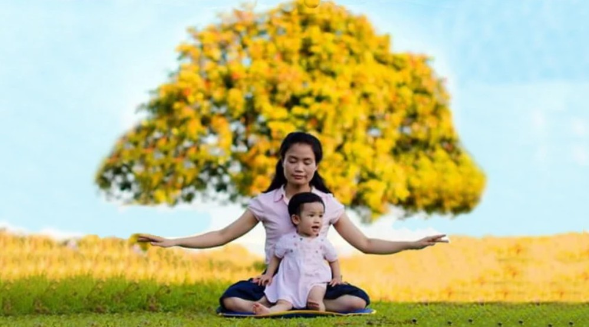

<a name=top>

<a target="_blank" href="https://git.io/bb99bbss">

 

 
 

<a href="https://github.com/gofun72/telove/blob/master/soft.md"><b>免费突破封锁翻墙软件</b></a>
 

<b>请收藏本网址，连上免翻视频 https://bit.ly/2RQM1hX</b>

 

<a target="_blank" href="https://bit.ly/3ezRQKo">

 
 

<b> 看更多真相   https://bit.ly/3ezRQKo  </b>

<a href="https://github.com/candysn/nini/blob/master/wnn-1.md"><b>小之每日真相(一)</a></b>

<a href="https://github.com/candysn/nini/blob/master/wnn-2.md"><b>小之每日真相(二)</a></b>

<a href="https://github.com/candysn/nini/blob/master/wnn-3.md"><b>小之每日真相(三)</a></b>

<a href="https://github.com/candysn/nini/blob/master/wnn-4.md"><b>小之每日真相(四)</a></b>

<a href =#68>68.一个贵族后代的蜕变</a> 
<a href =#67>67.我身边的有识之士　福报相伴？</a> 
<a href =#66>66.我家的救命良方 家人都见证了大法的神奇</a> 
<a href =#65>65.枉法判決何時休？</a> 
<a href =#64>64.两种“奇遇” 一种选择</a> 
<a href =#63>63.公安头头说坚决不再参与迫害法轮功了</a> 
<a href =#62>62.“大法的神奇力量使我身心获益”</a> 
<a href =#61>61.美禁共产党员移民 中共公检法人员急听真相</a> 
<a href =#60>60.一对母子八年形同陌路 非常经历蜕变人生</a> 
<a href =#59>59.退党：人心归正的起点　再造中国的希望</a> 
<a href =#58>58.美禁党员移民 加州华人：会问朋友“退党了吗”</a> 
<a href =#57>57.能活下来全是因为得到了这个法宝</a> 
<a href =#56>56.她的选择让怪病“搭背疮”远离了她</a> 
<a href =#55>55.大陆法官警察感谢法轮功打越洋电话传真相</a> 
<a href =#54>54.一艘永远顺风的船 真相电波在大海上回荡 </a> 
<a href =#53>53.美或禁中共党员入境 北京老先生急退党</a> 
<a href =#52>52.世上有这样一群善待他人的好人 </a> 
<a href =#51>51.果园飘着“法轮大法好”的歌声</a> 
<a href =#50>50.医者的修炼之道：完全相信大法 </a> 
<a href =#49>49.天灭中共大潮猛　早办“三退”早平安</a> 
<a href =#48>48.国际模特人才公司总监成功之路 </a> 
<a href =#47>47.接两通电话 大陆外科主任医生选择退党</a> 
<a href =#46>46.幸遇“真善忍” 悍妇变淑女 </a> 
<a href =#45>45.全家人福报连连 只因诚心敬念“法轮大法好”</a> 
<a href =#44>44.董事长夫人的真挚省思 </a> 
<a href =#43>43.律师节与律师劫</a> 
<a href =#42>42.翻看大法书　脑膜炎后遗症神奇痊愈 </a> 
<a href =#41>41.远离邪党　福相随</a> 
<a href =#40>40.一位肺癌患者自述: 庆幸在人生关键时刻选对了 </a> 
<a href =#39>39.中共活摘器官　世界不能旁观</a> 
<a href =#38>38.一位药剂师从无神论者到走入修炼的经历 </a> 
<a href =#37>37.疫情中听闻避难信息 纽约女子感动而泣</a> 
<a href =#36>36.小欧母女书法班里获得书法之外的收益</a> 
<a href =#35>35.隐晦的迫害　阴毒的手段</a> 
<a href =#34>34.金庸们的故事寓意何在？</a> 
<a href =#33>33.她们的处境 为何天地悬殊</a> 
<a href =#32>32.一本改变命运的宝书</a> 
<a href =#31>31.当警察不再为独裁者效力</a> 
<a href =#30>30.從文盲“藥簍子”到脫胎換骨活得開心</a> 
<a href =#29>29.国家评论：中共按需取器官　更多证据浮现</a> 
<a href =#28>28.新学员：没想到改变的这么快</a> 
<a href =#27>27.打错算盘的是中共</a> 
<a href =#26>26.古稀老人遭酷刑 凸显中共魔性</a> 
<a href =#25>25.让善注入我们的生命</a> 
<a href =#24>24.一位中国大陆警察的自述</a> 
<a href =#23>23.公安副局长被查出癌细胞后 如梦方醒</a> 
<a href =#22>22.内科医师：感受生命真正的美好</a> 
<a href =#21>21.农民北京打工无法适应：“刷脸”</a> 
<a href =#20>20.鬼畏正神</a> 
<a href =#19>19.深受很多大陆人喜欢的歌手 才华横溢善良夫妻的悲惨遭遇</a> 
<a href =#18>18.记一位年轻的女科长</a> 
<a href =#17>17.车站奇遇：一个正在寻找《转法轮》的人</a> 
<a href =#16>16.“法轮功，了不起！”</a> 
<a href =#15>15.西方人回忆李洪志先生在瑞典传功讲法</a> 
<a href =#14>14.绝症女子奇愈记</a> 
<a href =#13>13.真心念真言　真言有真效</a> 
<a href =#12>12.要想让瘟神从你家逾越也有办法</a> 
<a href =#11>11.疫情第一线中不一样的医生</a> 
<a href =#10>10.制止中共器官交易罪恶 奥地利国会通过提案</a> 
<a href =#9>9.退休医生：从抵触到赞叹</a> 
<a href =#8>8.老姐，你是在帮我解除魔咒吧，谢谢你！</a> 
<a href =#7>7.我儿患武汉肺炎命危 亲属相助神奇康复</a> 
<a href =#6>6.大苦大难中的幸福转折</a> 
<a href =#5>5.藏在心里二十年的天安门广场见闻</a> 
<a href =#4>4.生命尽头看选择 起死回生一念间</a> 
<a href =#3>3.退出团队那一刻　她能看清我长什么样了</a> 
<a href =#2>2.北京教师：小时候知道的很多事都是假的】</a> 
<a href =#1>1.一位司机的肺腑之言</a> 

<a name=67> 
<h2 align="center"><b>我身边的有识之士　福报相伴</b></h2>

【明慧网二零二零年十月二十二日】在中共邪党疯狂迫害法轮大法的日子里，不乏有正义感、抵制迫害、保护大法弟子的有识之士，最终得到了人生的大福报，现仅举发生在身边的几个例子。
 

（一）

我曾在一所金融中专学校任教，在中共迫害法轮功之前，我们学校操场设有一个炼功点。直到在中共迫害形势比较紧张的日子里，A校长都一直给我们提供炼功场地。

因为学校家属楼离炼功点很近，炼功后，录音机经常由我拿回家保管。邪党迫害大法后，自然，我就上了它们的黑名单，警察、社区人员时常来家或电话骚扰，并欲加進一步的迫害。

A校长利用与派出所、社区、街道等部门的工作关系，在邪恶迫害大法最疯狂的日子里，不被谎言迷惑，理智智慧的保护大法弟子。这些单位的相关人员过后曾多次对我说过：“你们校长给你说了老多好话了！”这对邪恶的迫害起到了一定的抑制作用。A很早就退出了邪党组织，为自己选择了美好的未来。

这位校长也因为自己的善行得到了大福报！他自己已退休，享受不菲的退休金，儿子年薪一百余万，有两个聪明可爱的孙子；家庭成员个个健康，家住面积几百平米的小楼，自己和儿子都有高档汽车。

（二）

后来，我从学校转入银行。B的口才很好，团职转业干部，是一位有能力、有担当、又有正义感的人。只是被邪党绑架担任邪党书记。我单位一位同修因去北京上访，被河北警察残酷迫害后，在行走困难的情况下，被劫持到当地拘留所。这位书记亲自买食品，带着办公室主任、人事科长去拘留所探望，并对其進京上访和拒绝“转化”的勇气十分赞赏。

在那个迫害最邪恶的日子里，其它单位把诽谤大法的宣传图片都张贴或悬挂出去，毒害了很多人，可B却没有这样做。这些图片后被我们拿走烧掉了，单位也没人追究。B千方百计的保护我们这些大法弟子。B退休后，自己带儿子做生意，买卖兴隆，家庭和睦，全家身体安康。

（三）

一位学中文的画家C，我同一办公室的同事是他的学生，由此，他知道了我是修大法的。之前，他就对邪党没什么好感，给他看过《九评共产党》一书后，第二天，他又来找我，问是不是还有后续，觉的意犹未尽。他主动让自己的孩子们退出邪党组织。

C的一个同学在公安局工作，一天，通过这位同学，他了解到，邪党又要对全市大法弟子大抓捕。当时六十多岁的他身体状况并不是很好，骑自行车五、六里路，来到我单位，只为要给我保管大法书籍。C的善举得到了回报，他身体越来越健康，带领他的学生们经常搞画展，其乐融融。

法轮大法是教人按真、善、忍做好人的佛家高德大法，在大法遭受邪党残酷迫害的艰难岁月，谁能够不畏强权，秉持正义良知，维护佛法，保护大法弟子，神佛一定会赐予其福份和荣耀！相反那些在邪党淫威下昧着良心推波逐流，反对或迫害佛法的势利小人，也一定会得到应有的惩罚！大到国家，小到个人，无一例外。

在正与邪、善与恶的较量中，人人都在摆放自己的位置，选择自己的未来！衷心祝愿所有的有缘人珍惜法轮大法，退出中共党团队，远离中共，从而得到神佛的护佑，得到法轮佛法的救赎！

原文https://www.minghui.org/mh/articles/2020/10/22/-414090.html

<a href=#top><h6 align="right">回上方</h6></a>

<a name=66> 
<h2 align="center"><b>我家的救命良方 家人都见证了大法的神奇</b></h2>

法轮大法是我们一家人的救命良方。（pixabay）

 

新唐人北京时间2020年10月06日讯】一位老家在武汉但已在陕西生活多年的大法弟子，今年过年期间，中共病毒（武汉肺炎）全面爆发，她的女儿女婿一家从武汉回家后就开始发烧咳嗽，又不能去医院，到底该怎么办？来看看她家分享的救命良方。
 

二零二零年一月十七日，我女儿和女婿带着两个孩子回武汉看望父母，过年后打算初六回来。腊月二十九日早晨，听说武汉疫情严重，要封城。他们当天晚上连夜开车返回陕西家里。回来后，才知道武汉肺炎已迅速传播开了，现在人人自危，气氛紧张。几日前，他们一家还在新闻中所说的病毒发源地海鲜市场吃了两顿饭，这怎能不让人担心、恐惧？

老伴儿非常懊悔，要是早知道武汉肺炎这么严重，就不让他们回去了。中共就是不说实话，什么都隐瞒、掩盖，遭殃的是老百姓。

我对孩子说，你们不会有事的，你们都做过三退（退出中共邪党的党、团、队组织），只要相信师父、相信大法都没问题。

大年初二，女儿说有点咳嗽，还有点发烧；女婿也有一点不舒服、气喘。他们说把两个孩子放在我家隔离。老伴儿说要不要去医院确诊一下？我说不能去，一去就会被隔离，现在全国的确诊病例也没有特效药，你们就诚心敬念“法轮大法好，真善忍好”保证没事的。外孙女又问她的父母听清楚没有？一定要记住姥姥的话。只要念九字真言，一定会好的。

女儿、女婿很认同，觉的不能去医院，就在家里念“法轮大法好”。过了四天，也就是初六下午，他们回来了，说全都好了，要把孩子接回去。他俩说他们天天念“法轮大法好”，请师父保护。难受时也不躺在床上，就去没有人的广场转转，现在没事了。他们说无法表达对师父的感恩！

儿子也是和他们一起回来的。他因在武汉呆的时间长一些，被大数据信息跟踪，社区不断打电话询问情况，儿子说在家里自动隔离，什么事都没有。儿子和我们住在一起，好好的，没有出现发烧，只是有点头痛，睡了一晚上，就好了，测了一下温度，不烧，没问题。儿子很相信大法，一点都不担心。大概半个月后，社区不再打电话了。

法轮大法是我们一家人的救命良方。

我修炼法轮大法已经二十多年了，今年七十岁了。以前我身体不太好，经常头晕，血压、血脂高；又有神经性胃炎，喝水都吐；还患上了更年期综合症，真是想什么病来什么病。儿子结婚时我头昏目眩，连钱都数不清。单位同事让我炼法轮功，说祛病健身有奇效。我觉的不可思议，医院都治不好，炼功就能炼好了，我不相信。后来周围又有人给我说，让我看看《转法轮》，我拿回书，晚上一口气看了五讲，觉的书中的话讲的真好。

就在我看第二遍《转法轮》的时候，出现了奇迹，书中原话说：“过去你供过的那个狐、黄的牌位，你赶快扔了它，都给你清理了，都不存在了。”我想我也有供的，我去把它扔了。我打开红布一看，我都不相信自己的眼睛，黑字不见了，变成了一个个白圈，都抹掉了，像水洗了一样，真的像师父讲的不存在了，真神呀！看完第二遍《转法轮》后，师父就给我净化了身体，各种病症都消失了，当时还没有炼功。

从我的身体变化上，家人都见证了大法的神奇。修炼至今，我无病一身轻，没有吃过药、打过针、进过医院，老伴儿、儿女们都支持我修炼。

外孙女上高中时，成绩不好，班上五十个同学，她排名四十多位了，全家都很着急。我告诉外孙女好好念九字真言，师父会给你开智开慧，外孙女很相信，并诚心敬念。高考时，她竟然考了620分，全班第一。这让外孙女更坚信大法了。真是一人炼功，全家受益。

法轮功是佛家上乘大法，能使修炼者身心健康。使社会道德回升，人心向善。然而却遭到中国政府长达二十余年的迫害。中国民众的信仰自由和知情权被剥夺。中共建政以来，运动不断，迫害死八千万中国人民，毁坏传统文化，灌输无神论斗争思想，又对法轮功学员犯罪。善恶有报是天理，天要灭中共，不退出中共组织就会成为它的替罪羊。法轮功学员讲真相是为了劝善，退出中共组织，就能躲过灾难，有一个美好的未来！

目前法轮功已洪传世界一百多个国家和地区，法轮功的书籍翻译成四十种语言出版发行。请大家珍惜佛法洪传的珍贵机缘，这可是救命良方呀！

资料来源：明慧网

原文https://www.ntdtv.com/gb/2020/10/06/a102957146.html

<a href=#top><h6 align="right">回上方</h6></a>

<a name=65> 
<h2 align="center"><b>枉法判決何時休？</b></h2>

在中國，越來越多代理法輪功案的律師們從無罪辯護到主動控告 （大紀元）

 
  
【大纪元2020年10月16日讯】据明慧网近日报道：河北省围场满族蒙古族自治县十三名法轮功学员刘志峰、王永兴等被非法关押一年多，九月二十八日被滦平县法院非法开庭。两位维权律师从法律和道义角度做无罪辩护。
 

据报道刘志峰、王永兴等十三位法轮功学员都被戴着手铐脚镣，身穿防护服，戴护目镜带入现场。在两位律师的强烈抗议下，镣铐被去掉。因为公示期不合规范，律师首先要求合议庭人员回避。法官没有回应，继续开庭。

两位维权律师一直占据主动，从法律和道义角度做无罪辩护。与会人员和旁听家属都静静听着，能感受到所有人都非常认可律师所讲，有的庭审法官不住的点头。期间，刘志峰夫妇和王永兴都讲到自己修炼法轮功没有触犯任何法律，按照真善忍的理念，修心做好人，没有罪错。

起诉前，公诉人鲍振贤曾经对跟他会面的律师说：“你不要再讲了，没有用，法轮功的真相材料我看的太多了，我承认他们都是好人，等开庭时你到法庭上愿意咋讲就咋讲。其实你们律师在法庭上怎么样辩护，要说些啥我都知道，到时候你辩护你的，我们依照两高的司法解释判我们的。”

开庭前，审判长赵亚军对律师说：“我知道这些炼法轮功的都是善良人，这几天白天黑夜不断接到海外的电话。”

公诉人和审判长表态都知道法轮功是好人，但是仍然要“依照两高的司法解释判我们的。”这不能说是中共公检法人员的一大悲哀，也揭示了中共目前司法状态的现状。其实自中共江泽民集团发起迫害法轮功以来，对法轮功案件的所有判决都是枉法判决，没有一件是按照宪法及法律作出的依法判决。

公诉人鲍振贤只是说出了实话，或者是为了保住自己的一官半职（个人利益）而不得不这样做。从法律和道义角度做无罪辩护的维权律师是值得敬佩的，在中共极权的淫威下还能够伸张正义确实了不起，比起那些作枉法判决的公检法人员，他们才是维护宪法和法律尊严的英雄！目前这样的律师成百上千，高智晟、王全璋、余文生、李和平、谢燕益、张赞宁等维权律师就是其中的佼佼者，他们是中国的希望所在！

大陆知名律师、东南大学法学教授张赞宁说：“宪法规定，公民有宗教信仰自由，思想、言论、信仰，著作、出版都不受刑法、宪法追究的。”“刑法300条本身制订是有问题的，因为它是破坏法律实施罪，全世界都没有这个罪名，法律应当是具体的、明确的，如果说破坏法律实施，公诉人应当取证证明他破坏了哪一部法律，这部法律叫什么名称，具体破坏了哪一条，如果没有这个证明，是不成立的。”

李和平、滕彪、黎雄兵等六位律师为法轮功学员联合署名的辩护词中说：“任何初通刑法的人士都会知道，在刑法领域，无论英美法系，还是大陆法系，刑法只惩罚行为，思想（信仰）本身不构成犯罪，这是刑事司法的铁律。宗教信仰是属于思想层面的，它不应受刑法处罚，更不能因为公民坚持某个宗教信仰而遭受不公正对待。信仰本身或者信仰者的身份不是犯罪的处罚对象，不受刑法惩治。”

余文生律师在他的辩护中有这样一段话：“中国律师为法轮功的无罪辩护已经十多年了，这场人权灾难依然存在，这场错误的迫害运动中，司法人员也许自始至终都把双方的是非，善恶与正邪，合法与犯罪的关系颠倒了。而本应惩恶扬善，维护公平正义的司法人员却在麻木的或为眼前利益执行着非法意志，十七年来，还在重复着这样一场场非法的庭审，还在无休止的制造着冤案，无法遵从良知，反而助纣为虐。为法轮功的无罪辩护已经十年，今天站在这里，我们感到巨大的耻辱与悲哀！”

是谁在践踏宪法和法律的尊严？是谁在破坏法律的实施？是谁在枉法判决制造冤假错案？枉法判决何时休？将来自己会承担什么样的后果？在中共极权中的公、检、法人员应该好好想一想了。 
 
原文https://www.epochtimes.com/gb/20/10/15/n12479147.htm

<a href=#top><h6 align="right">回上方</h6></a>

<a name=64> 
<h2 align="center"><b>两种“奇遇” 一种选择</b></h2>

在真假难辨、信息扭曲的社会里，能辨明是非、选择善良，是难能可贵的。（图片：网络图片）

 
 
【希望之声2020年10月9日】（本台记者詹妮综合报导）两位老人分别“奇遇”了什么？(诸多原因，本文隐去了他们的详细地址。)
 

<b>独特的“奇遇”</b>

2019年临近年关的时候，河北省石家庄市某城区传出一个惊人的消息：七十五岁的聂老汉到阎王殿走了一遭又回来了！

人们纷纷询问是怎么回事？事情是这样的：

2019年腊月的一天，聂老汉不小心摔了一跤晕了过去。儿女们赶紧将他送到医院检查，没查出什么病，可就是人一直昏迷着。20多天过去了，医生实在没办法，就劝儿女说：“没什么病就出院吧。”女儿不答应：“我父亲这个样子，回家要是有个好歹，我们怎么办？还是在医院再住几天，看看再说吧。”

过后的一天，聂老汉突然自己醒过来了，茫然地看着周围不解地问：“我现在在什么地方？”女儿回答他：“您在医院住了20多天，昏迷不醒，可把我们吓坏了。”

聂老汉随后张嘴的一句话把家人都惊呆了：“我去了阎王殿，见到了阎王爷。”

家人以为他在说胡话，可此时聂老汉神智很清醒，虽然昏迷了20多天，身体的各项指标都正常。

聂老汉接着说：“阎王爷说：你是个好人，我们不敢收你，你回家享福去吧。我就回来了。”

医生没法解释，只好说：“既然人醒了，没事就出院吧。”就这样，家人把老汉接回了家。

话说这聂老汉可不是个糊涂人，他知道法轮功的事还真不少，因为他常听法轮功学员讲法轮功是什么、为什么中共迫害法轮功等等，所以他什么都明白。他对法轮功学员说：“我知道大法弟子都是好人，你们的师父是来救人的。”他还主动退出了中共少先队。

只要在街上碰到法轮功学员讲真相，老汉都会主动上前索要真相资料去看。他对法轮功学员说：“你们给的资料，我看后都存起来了，这东西都是无价之宝，我知道你们师父不是一般的人。”后来他还索要了法轮功的书籍，说：“我也要学学。” 他的身体也越来越好。

聂老汉见阎王爷的“奇遇”惊动了十里八乡，村民们七嘴八舌议论纷纷。不管谁怎么说，聂老汉心里清楚，他知道是因为他明白了法轮功是怎么回事，得福报了。

最近聂老汉又索要了《九评共产党》一书，还将法轮功师父的法像请回家，他对法轮功学员说：“我要把你们的师父供起来。”

<b>雪后“奇遇”</b>  

在中国北方的某个小城，一场大雪过后，广袤的田野盖上了厚厚的“棉被”，行驶的车辆在公路上辗压出一条青色的飘带弯弯曲曲伸向远方。

黄昏，路上行人很少，一位老人正在路上悠闲地蹓跶着，一个骑电动车的人前来问路。经老人指点后，骑车人跨上车子刚走不远，又折回来，推着车子边走边跟老人攀谈起来。言谈中得知老人就是附近的搬迁户，骑车人问他：“您知道法轮功吗？”

老人点点头：“知道啊。”

骑车人接着详细向老人讲述法轮功是什么，中共为什么迫害法轮功，“天安门自焚”是中共一手炮制的伪案，以及眼下最紧要的事情是“三退”保平安……

老人边听边不住点头，最后爽快地做了“三退”（退出党团队组织）声明。

临别时，老人鼓励骑车人说：“你们法轮功要坚持啊！20年、30年都要坚持，你们才是为国为民的。”最后，老人作了个恰当的比喻：“现在老百姓都知道岳飞好，秦桧不好。”

听了老人的话，骑车人在老人的目送下，向着远方的目的地奔去。

【编者】这两位老人是明白人，也是幸运的人。在繁杂混乱的现实中，在真假难辨的环境中，在信息扭曲的社会里，他们能辨明是非、选择善良，难能可贵。 
 
 原文https://www.soundofhope.org/post/429679
 
 <a href=#top><h6 align="right">回上方</h6></a>

<a name=63> 
<h2 align="center"><b>公安头头说坚决不再参与迫害法轮功了</b></h2>

诚念法轮大法好，大难来时命可保；心中牢记真善忍，瘟疫不找善良人。（明慧网）

 
 
【明慧网二零二零年十月十三日】我是一个私人诊所的医生。到我诊所来看病买药的除了一些普通百姓外，也有不少公检法司、军方人士和政府工作人员，他们既有本地的，也有外省的，也有来自北京的。
 

按理说，这些人都有很好的医疗条件，有的甚至到北京大医院看病自己都不用掏一分钱的。那他们为什么不去享受免费医疗，非要跑到我这个条件简陋的小诊所来找我看病呢？

那是因为这些年来，很多在大医院治不好的疑难杂症，甚至绝症患者被我给治好了，这样一来，就传开了，找我看病的人就越来越多。

我这里没有任何医疗设备，我连测体温的温度计都不用，我没有什么灵丹妙药，也没有祖传秘方，更没有進口的特效药，都是药业公司订购的很普通的中药材，然而这些年来我治好的癌症、各种疑难病症、不孕不育及其它病症的病人已经有很多了，有的是走遍全国各大医院治不好的病在我这里治好了；有的是花了十多万都没有治好的，在我这里只花几十块钱就好了。

我靠什么方法取得这么好的疗效？原因只有一个，全靠法轮大法。

我是法轮功学员，我明白法轮大法有使病人绝处逢生、枯木逢春的威力。我看病的原则是先给病人讲法轮大法真相，再看病抓药。病人来了之后，我先问他：有没有入过中共的党团队？如果说入过，我就请他先退出这些邪党组织，再请他记住、并要常念诚念“法轮大法好，真善忍好”。如果是政府人员，特别是公检法人员，我就特别强调不能再参与迫害法轮功。

我明白，我开的药只起辅助作用，真正起作用的是法轮大法的法力。每当有痊愈病人向我表示感谢时，我就说：“不要感谢我，要感谢大法师父和法轮大法。这不是谦虚和客套，而是我的肺腑之言。”并告诉他是大法师父给他们把病拿掉了。

有个患不育症、长期担任某中共高干的助手，在我帮她做了“三退”（退出党团队）之后，已经五十岁出头的她生了双胞胎；有好几个年过半百患不育症的公安局长，在承诺不再迫害法轮功并声明退出中共的党团队后，一两个月之内妻子就怀孕了。

还有一些得癌症的警察和政法系统人员，也是在声明三退和答应不再参与迫害法轮功之后很快康复。

中共肺炎爆发以来，到我这里来退党的人越来越多，其他同修交来的退党名单也越来越长，到我诊所退党的各级警察和政府工作人员也比以前增加了很多。

前不久，媒体报道了香港发现了全球首例中共病毒二次感染事件，引起了很多政府人员的恐慌。一个厅级公安部门的头头找到我，说：“听说你什么病都能治，新冠病毒二次感染的病毒传染性增强了十倍，这种病你有办法吗？”我说：“当然有办法，我有师父和大法。大法无所不能，不管什么病，只要诚心敬念‘法轮大法好，真善忍好’，就一定能好。你如果感染了病毒，你到我这里来，咱俩一起喊‘法轮大法好、真善忍好’，你看看能不能好。”

他又问：“美国疫情这么严重，感染人数全球第一，中国把疫情控制得这么好，那说明中国政府还是领导有方，共产党还是有能力的。”我说：“为什么美国疫情那么严重？美国被中共渗透侵蚀三十多年，美国的很多金融机构和大公司为中共输血，中共利用美国的民主制度，使用各种手段，在意识形态上腐蚀美国民众，欺骗了美国人民，造成很多人信奉了中共的社会主义、共产主义那一套，很多媒体，那些大电视台以及一些世界一流著名大学及研究机构，被中共金钱利诱，长期为中共站台说话，极大的影响了美国民众，特别是青少年。瘟疫本来就是来淘汰邪党分子和为邪党站台的人的。那些执迷不悟、一味为中共站台、与邪恶为伍的人能不被淘汰吗？目前中国疫情为什么这么轻，这可不是邪党的功劳。大法在这里洪传，那么多大法弟子在讲真相救人，目前中国已经有三亿多人声明退出共产党的党团队，是大法把明真相的人救了。同时这也是给世人醒悟的时间，如果还不醒悟、还不三退，那更大的瘟疫和灾难就会到来，那时可就晚了。”

这个厅级公安部门的头头听明白了真相，做了三退，说：“我今后坚决不迫害法轮功了，反过来我还要为法轮功说好话。”我说：“你如果为大法做了好事，师父看得到。瘟疫和灾难会远离你，你也会有一个美好的未来。”

他来找我，可能他们当中看到了一种现象：感染中共病毒而死的人中共产党员所占的比例非常高，而且他们知道疫苗也解决不了根本问题，否则他们也不会来找我了，因为像他这个级别的人获得疫苗是轻而易举的。

他又说他那个地区现在很少抓法轮功（学员）了，因为书记在会上讲了：“对法轮功还是要讲证据。”这个书记在公开场合这样说，一方面说明他知道邪党迫害法轮功是不讲证据、不讲法律的，另一方面，也表明他对法轮功学员遭受的残酷迫害是同情的。

邪党管政法的头子曾经到我们地区来开过会，妄图再次掀起一轮对法轮功的迫害高潮，结果反响平平，没有起什么作用。这几年我们地区基本没有发生大面积的迫害。这也再次印证了人心渐明，邪恶大势已去，邪党人心尽失，灭亡在即。 
 
原文 http://www.minghui.org/mh/articles/2020/10/13/-413735.html

<a href=#top><h6 align="right">回上方</h6></a>
 

<a name=62> 
<h2 align="center"><b>“大法的神奇力量使我身心获益”</b></h2>

【明慧网二零二零年十月十二日】（明慧澳洲昆士兰记者站报道）一位出生在泰国、毕业于泰国顶尖学府朱拉隆功大学（Chulalongkorn University）的台裔女子小真，大学时期因学习美术应用艺术，加上自身优雅的气质，使她逐渐成为一个典型的完美主义者。以往她在每一次遇到挫折时都会选择逃避，甚至轻视自己的生命而不为周围人考虑；修炼法轮大法（法轮功）后，她感慨的表示：“法轮大法的神奇力量使我身心获益并成为了一个为他的生命！”

泰国台裔法轮功学员小真感恩法轮大法修炼使她身心受益。

“我从出生后身体就一直不好，因为我妈妈生我的时候难产，三天两夜才把我生出来，生出来后我一声都没哭，就在准备把我丢到垃圾桶的时候我才微弱的哭了一声。”

“从小到大，我的心脏都跳的很快。上学的时候只要是户外的活动，我都无法参加，体质很差，根本就跑不了步，走路的话走走停停还可以。小学二年级我就开始有胃病，到初中的时候已经发展为胃溃疡。高中的时候更严重，只要人稍微一紧张，胃就开始产生胃酸。大学的时候又患有偏头痛，一直吃偏头痛的药吃到结婚怀孕。”

小真很相信缘份，她说：“我一直感觉有一种无形的力量在安排着我的生命，小时候，爸爸妈妈都在忙着做生意，我跟弟弟又相差十二岁，我一个人感到很孤独。所以从小到大，我都会在我的枕头前合十祷告说：每一个帮助我的神，我希望我一定会当一个好人。我一直在用这种方式跟神沟通，那时我也认为我是一个好人。”

谈到是什么机缘让小真走入大法修炼的，她坦率的交流到：“其实结婚前，我在澳洲的台裔未婚夫（现在是我的先生）就跟我介绍过法轮功，他说这个大法很好，还读过法轮功著作《转法轮》中的一些讲法给我听，在准备结婚前我们还相互承诺等以后老了要一起学。二零零零年，在等待澳洲配偶签证前的一个月，我在泰国还专门在网上查了当地的一个炼功点，并在那里买了一本泰文的《转法轮》。因为我本身读书很慢，所以读到二十页左右后就把书保存起来了，后来也没有再继续读。”

来到澳洲后，小真和先生组织了家庭并很快有了大儿子。二零一零年小真怀了第三胎，可是胎儿快二十周的时候发现漏羊水，医生也找不出任何原因，尽管从知道怀孕后她就一直卧床休息（因为第二胎意外流产），她对这一胎就格外的小心保护，可是羊水在两天之内几乎漏的快没有了。这过程中，医生告诉她继续妊娠可能胎儿将来会残疾，但小真仍然坚持要把这个生命留下来，最终孩子还是没能保住，小真自己的身心也承受了很大的痛苦。

“我的眼睛都哭肿了，当时我整个人的精神全是崩溃的，没有超过半小时是不哭的状态。我每天都非常抑郁，那段时间，我脑子里全是那个离开我的小生命，我甚至想过结束自己的生命去陪伴他。家人都很担心我，他们想办法让我振作起来，甚至用一个星期的时间把我房间里的家具全部都换新的了，可是我的眼泪每天还是不由自主的流。那个时候我先生也不敢面对我，原本他就比较内向，因为这次变故，先生也变的比较压抑，身体也开始变得不太好。”

“直到有一天，先生突然问我要不要读《转法轮》，就这样，十年后的我再次捧起了《转法轮》来读。我记得读到师父讲清理身体的这部份法时，我的喉咙就开始咳黑黑的带脓的东西，还拉肚子；读到第二讲师父讲天目的问题时，我就感到头痛，尤其是在师父讲的天目的那个位置。五、六天的时间我读完了第一遍《转法轮》，合上这本书后，对于我刚失去的那个孩子，我终于明白他去了哪里，我们之间的缘份是什么样的，这本书帮助我打开了我的心结。除此之外这本书还解答了我过去心中很多的疑惑。我开始想要修炼了！出了月子后，我就带着大儿子陪先生去炼功点，在我学炼第五套功法时，我的头部、肩膀、手指等多处都能感到有小法轮在转动（师父在帮我清理身体）。自此，过去从小到大一直困扰我的胃病、大学时期的偏头痛等疾病都在修炼法轮功后彻底消失了。长年需药物减轻痛苦的我在修炼后第一次感受到无病一身轻的感觉。”

修炼后的小真体会到：心理原来跟身体是连着的，心结打开后身体也会变轻，修炼大法后，师父讲的法理就在帮助自己打开过去的心结。现在对于很多事情小真都看开了，不再像过去一样觉得困扰了，现在的小真身心都是轻松舒坦的。

提到过去和现在的巨大变化，小真忍不住感慨法轮大法的神奇力量。她说：“过去我总希望自己能有一儿一女，希望自己的先生帅气，希望自己比别的太太漂亮，生活的幸福。也很在意儿子上什么学校，老公在哪里上班，总是不由自主的想要过的比别人好。”

修炼后她对儿子的教育则变成了鼓励的方式，她说：“我经常告诉儿子要努力加油，尽力做到你的最好就行，不会轻易恐吓孩子，也不会因为孩子没做好就觉得身为父母会丢脸等等。”现在的小真不会再去争名争利，当别人好了她都会发自内心的替别人感到高兴，因为她明白这其中的一切都是有因缘关系的。

“过去我是典型的完美主义者，每一次遇到挫折时我都会选择逃避，包括跟先生生气的时候我就去飙车，甚至割腕。因为我是完美主义，当人家对我不好时，我就觉得不可以这样，我的人生不可以这样不完美，与其不完美还不如结束掉。修炼法轮大法后我回头再看，才发现这些都是自私的表现，我过去之所以那样做其实都是为了自己，当很多事情使自己不顺心的时候，就想结束掉，而我却忘记了考虑别人的感受。”

小真表示：“修炼后我才明白原来一切都不是偶然的。冥冥之中一切都是有安排的，通过发生在我身上这么多的事情让我明白生命是如此的珍贵！修炼后我明白人的生命原来是神给的，那为什么神要给你生命呢？因为你的生命是为他的，不是为了自己的。过去在我身上发生的一切都是让我珍惜生命，而且要我去面对他们，面对所有的安排和与我有缘份的任何生命。”

小真希望在中国被迫害的法轮功学员都能和自己的家人幸福团聚。她说：“其实现在在中国大陆发生了很多天灾人祸，中国人真的应该都思考思考，一年中同时发生这么多灾难，而且很多都是同时发生，为什么它们会同时发生？而且这些灾难都解决不了？真的应该多想想，这真的是上天的警示。”

最后她希望中国大陆的迫害早日被制止，更多的人能有机缘从法轮大法修炼中获益。

原文http://www.minghui.org/mh/articles/2020/10/12/-413704p.html

<a href=#top><h6 align="right">回上方</h6></a>

<a name=61> 
<h2 align="center"><b>美禁共产党员移民 中共公检法人员急听真相</b></h2>

10月2日，美国移民局发布重磅政策公吿，禁共产党员移民。洛杉矶退党服务中心的义工们透露，自从中共病毒（COVID-19）爆发后，中共公检法机关人员也比以往更加渴望听到海外的真相。图为2018年11月，洛杉矶部分法轮功学员在蒙特利公园市庆贺3亿中国人退出中共一切组织。（姜琳达／大纪元） 

 
【大纪元2020年10月06日讯】（大纪元记者姜琳达洛杉矶报导）美国移民局10月2日发布重磅政策公吿，禁止共产党员和与共产党组织有关联的人申请美国绿卡等移民身份。洛杉矶退党服务中心的义工们表示，该政策无疑加速中国大陆人退出中共一切组织的速度。义工们也发现，自从中共病毒（COVID-19）爆发后，中共公检法机关人员也比以往更加渴望听到海外的真相。

在该政策公告中，移民局指出，“美国停止共产党或其它极权政党的成员、或附属组织成员的移民身份调整。”除非另有豁免，否则曾加入过共产党或任何极权政党的党员们，不管国内或国外，在美国是不可接纳的。

另外，根据美国现有的移民法律，如果申请入籍者隐瞒自己是共产党员，用欺诈的方式入境或入籍，一经举报，可能会被吊销绿卡后遣返。

洛杉矶退党服务中心负责人李海伦表示：“从很早的时候，我们就在劝大陆人退出中共的一切组织，是因为加入过中共的人，都曾发毒誓说要把自己的生命都献给中共这样一个邪恶组织，这是非常可怕的。如今，已经到了天灭中共的最后时刻，全世界都认清了中共的邪恶，尤其此次中共病毒导致大量无辜人的死亡。希望中国人都赶快退出中共，保平安。”

从2004年至今，通过大纪元退党网站声明退出中共党、团、队组织的中国民众人数，已经超过3.6亿人，这一数字还在快速增加。

<b>中共公安、地检、法院党员急听真相</b>

洛杉矶电话劝三退的快速退党服务中心（RTC）的义工小霞表示，她是专门针对中共公检法的高层机构打真相电话的。早期时，经常会遇到挂断电话不听真相或口出恶语的人，但如今的形势完全变了，很多中共高官都是想方设法躲避中共监控，耐心听真相。

她说，尤其是在过去的几个月中，这一情况尤为明显。“现在打电话会遇到几类人，一种是已经听过多次真相，电话打过去后，对方就会想要做三退；第二种人是急迫想听真相，但不说话，只是静静地听我们讲。毕竟在中共的监控下，又是大陆公检法系统的人，电话和一举一动都是被监听、监控的。不过，听完真相后，对方会跟我们连连道谢，这一类人特别多。”

小霞说，通常一通真相电话的时间，约为半个小时至四十多分钟左右，如果对方想要听更多真相，她有时会讲到1个小时。“还有些公检法系统的人，尤其是那些带‘长’字辈的高官，很愿意听，但又害怕中共监控，所以就会想方设法留下真相，例如设置留言。”

“还有一次，我给公安部的人打电话，对方直接要翻墙网址，表示想要了解更多海内外真实的消息和动态，这一类人也不少。”她说。

受中共谎言欺骗特别深、至今完全不明白真相的人，小霞说还是有，但为数已经是非常少了。她说：“作为中国人，不管高官、平民、商人，都是被中共恶魔绑架的。中共作恶多端，尤其在过去21年中残酷迫害法轮功学员，不光会得到人间的法律制裁，更会受到天谴。我们讲真相，是抱着最大的善念，唤起中国人的良知和善念，希望所有同胞都能摆脱控制，走向未来。 

原文https://www.epochtimes.com/gb/20/10/6/n12456086.htm

<a href=#top><h6 align="right">回上方</h6></a>

<a name=60> 
<h2 align="center"><b>一对母子八年形同陌路 非常经历蜕变人生</b></h2>

受中共欺骗，母子八年很少说话；癌病折磨，最终听进真相，奇迹发生（网络图片） 

【希望之声2020年10月4日】（本台记者紫静综合报导）

因中共媒体的欺骗宣传和洗脑，竟让一对母子八年都说不上一句完整的话。因癌症恶化，痛苦绝望的母亲在最后的求生欲望下，勉强听进了儿子讲的真相，奇迹就此这样发生了……

<b>为什么母子形同陌路八年之久</b>

我母亲是个重现实、很顽固又很好面子的女强人，她脾气暴躁，但却善于经营人事、拉关系之类的。记得一次我和她单位的一位财务科长闲聊，他告诉我：“你母亲啊，能干、彪悍，我看见她也是惧她三分的。”

我一九九六年开始修炼法轮大法时十五岁，上初二，真、善、忍的高德大法洗涤了我的身心。一九九八年，我第一次和母亲谈起了大法修炼，并希望她也好好看一看《转法轮》书，既对身体有益，又可以改变一下她易怒的暴脾气。坚信无神论的母亲听完介绍后，对我的修炼不屑一顾，甚至是反对的。

可是由于我修炼后自身变化很大，街坊邻居、学校老师和同学们都对我的人品赞不绝口，所以她也就没来干涉我。

一九九九年七月，中共对法轮功的迫害开始了。我知道大法是被冤枉的，二零零零年我独自去北京上访，后被遣送回家。当时“610办公室”伙同公安给母亲单位打电话，让母亲单位的领导一起陪同到家里抄家。母亲觉得这简直就是奇耻大辱！本来对我走入修炼她就不满意，如今政府和单位领导都出面了，她心中充满了愤怒，觉得我丢尽了她的脸面。

在我被拘留十五天回家后，她终于爆发了，并表示如果我继续修炼，她就要与我断绝母子关系。她当时的状态几乎是歇斯底里的。在她面前，关于法轮大法的任何资讯我一个字都不能提及，否则她就会对我吼叫。就这样，我们母子之间有了一道深深的隔阂，不能有任何交流，因为她在心中已经认定，我是“中毒太深”了。

母亲开始和“610办”以及街道合作，亲自出面，骗我去中共在劳教所办的洗脑班；又听信中共的谎言，配合着在报纸上信口开河，说她的儿子炼功后如何变痴变傻。

我很难过！她是我的亲人，可是因为她听信了中共邪恶的谎言，我们之间没有信任、安慰和鼓励，只有不断施加的压力，我不知道该如何对母亲说清真相！因为只要我一开口，她就出口成脏、立即打断我，连说话的机会都不给，并以死或者断绝母子关系为要挟……

由于母亲认为我丢尽了她的脸面，她从内心看不起我这个儿子，认为我是被中共定义的“愚昧”人员。我们母子之间的沟通几乎为零，这种状态一直持续了八年。

<b>癌症煎熬，母子长谈，神迹初显</b>

二零零八年四月的一天晚上，母亲肚子部位痛得难受，去医院检查，当时医生只是开了一点止痛药。等到九月初的时候，母亲觉的症状加重了，在医院做了全面检查后，被确诊得了葡萄胎。在连续三个疗程的化疗无效后，癌细胞已经扩散到了肺部以及身体其它的一些部位。当医生把结果告诉我们的时候，我见到强势的母亲躲在厕所偷偷流泪。

化疗的痛苦既难以描述又漫长而无望：母亲的头发一把一把地掉；虚弱的身体本来就需补充大量的营养，可是任何饭汤只要一接近，她就呕吐不止，于是吃饭也就变成了一场持久战，一顿饭总要喂上几个小时；她坐不了，也走不了，每次化疗完后回家，由于没有电梯，我得背她上七楼，还必须非常小心，因为她的骨头也痛……

在痛苦和绝望中，医生给的希望是使用一种还在临床试验阶段、化疗反应超强的一种药物试试。医生当时的意思是，如果这种药物没有效果的话，他们也就没办法了；同时由于这种药物比之前用的化疗药物反应会更强，而且还在试验阶段，所以要使用的话，需要我们家属和病人同意，并签字自己承担一切后果。

我问母亲要不要做？她没有说话，只是轻轻点了点头。我知道，这是求生的欲望，其实她已经承受不了那样的痛苦了。看着她如此难受，我很痛心，而我最大的痛心之处是——我明明知道法轮大法可以救她，可即便如此，她都不许我谈论法轮功，我当时真的觉得她就是一块顽石！

签完字后，母亲还有一周的休息时间，我们坐车回家。一路上，我都在思考如何告诉她大法的真相，因为化疗的结果是无法预料的，更何况她现在的身体已经不堪负荷了。而在我身边，就有很多绝症病人在大法修炼中治愈的例子。过去和母亲沟通的难点在于没有一个合理的契机，而如今，医生的论断强烈刺激了母亲的求生欲。我心中不断地向师父祈求，祈求师父能给予母亲平心静气的心态。

我把母亲背到沙发上，她斜躺在那里。一天都没吃饭，我去煮了十个饺子，她吃了一个半就吃不下了。过了一会儿想吐，我扶她到厕所，吐完又斜躺在沙发上。

我坐在她旁边，和她说：“老娘，我想和你好好聊一聊。”她立刻回道：“聊什么？你不就那点东西吗？我不想听，越听越难受。”

我发自内心地说：“我是你儿子，我看见你那么难受，我心里也很痛苦！我希望你好起来，这一点，难道你也感受不到吗？刚才医生的论断你也听到了，我看到你哭了，因为你觉得看不到希望。现在，你的亲儿子打算告诉你重拾希望的办法，你为什么就不想试一试呢？到了这个阶段，我们母子之间连聊聊心里话都不行吗？”

这一个多月她是看着我的，我们虽然很少说话，但是从早到晚的陪护她是看在眼里的。哎，中共的洗脑，让一对母子居然八年都说不上一句完整的话！她有点动容了，于是说：“那你说吧。”

我第一次和母亲如此地促膝长谈：从我亲眼看到的法轮大法治愈各种绝症的事例，到“天安门自焚”伪案的真相，以及海外法轮功洪传的盛况，包括法轮大法能治愈疾病的法理……我们聊了一个多小时。聊的过程中，我细细观察，感觉她开始能听得进了，开始能接受大法了，而且在这个过程中，我发现她的状态一点点开始精神起来了。

然后我给她看了二零零八年神韵演出的光盘。看完后，真的就是一瞬间，她说肚子饿了，然后我把八个半饺子热了一下，她一口气吃完，接着她就去床上睡觉了。这一个半月来，我第一次看她睡得那么香。晚上，姨妈来给她做饭，她吃完了一小碗饭，没有任何呕吐的反应，她说：“这倒是有点神奇了！”

<b>师恩浩荡，静听大法，痛苦瞬消</b>

我坚信只有法轮大法可以救她，我想劝母亲修大法。虽然她的状态是好一点了，可是人的观念哪是那么轻易就会改变的呢？何况她之前是那么反对，还做了很多不好的事。母亲是从来不信神佛的，所以她一直不肯在炼功上表态。

又到了要去化疗的日子。我给母亲录了个MP3，里面是李洪志师父在广州的讲法。我把MP3给母亲，我说：“你下午要化疗，难受的时候，就听一听吧。”她收下了，但是我不知道她会不会听。

早上我去公司上班，心里却想着母亲下午的化疗，不知道会怎样难受。一下班，我就从公司赶到医院，已经是下午五点了，她的化疗应该刚结束。我一进入病房，就看到她坐在床上，听着MP3。母亲看到我来了，显得有点激动，摘下耳机，她连连对我说：“太神了！太神了！这次回去，我一定和你一起炼功！”我也很惊讶！母亲到底经历了什么？让她迅速改变了自己的观念。

她说：“化疗大概十五分钟左右，全身连骨头都开始痛，实在忍不住了，想起来你早上给我的MP3，于是拿起来听，听着听着，那种痛苦一瞬间居然就消失了，我越听越觉的有道理，而且身上一点难受的感觉都没有了！这真是太不可思议了！太神奇了！”

我当时也感动得眼眶湿润，要知道母亲是从来不相信无利益的事的，她之所以站在中共的立场看待大法，除了面子和压力，就是对强权利益的崇拜。师父用洪大的慈悲对待每一个还可救的生命，就象我的母亲，当她转变了一点观念，师父就把母亲所有的痛苦都去掉了。要知道，这可是比之前化疗的药物更厉害的毒药啊！

接下来连续五天的化疗，母亲和之前完全不一样了，甚至已经不象是个病人了。其实从听师父讲法这一天开始，她就胃口大开。化疗结束后五点，家里的亲人就会送饭过来，然后她就盘着腿，一个人坐在病床上大口大口的吃饭，而她同室的两个化疗病友就躲到门外去了。她自己也感觉浑身有劲，就不麻烦亲人送饭了，而是一到饭点，就和我散步去医院的住院部下面，在饭馆点菜吃饭，一扫之前连路都走不动的病态。

化疗一共有四个疗程，每一疗程的中间有两周的休息时间，母亲就开始和我回家学法炼功。母亲的身体越来越健康，看她光着头坐在我的对面，一刹那，我觉的这才是母亲本来慈祥的真实面目。

<b>癌症消逝，母亲“三退”，身心剧变</b>

母亲连续做完了三个疗程，在这个过程当中，虽然一直在化疗，但是她一点痛苦的感觉都没有。我都觉的奇怪，这些挂进去的毒素去哪里了呢？有一天，她的主治医生来查房时，再次看到她一个人坐在病床上大口吃着饭，主治医生连连惊叹道：“你可真是个奇迹啊！我治了这么多病人，没有见过一个象你这样的！而且你连白细胞都不补，这哪里象个病人啊！”

医生的话提醒了母亲，于是她决定第四个疗程不做了，她终于开始坚信大法了。随着学法炼功，后来再去医院检查，所有指标一切正常，葡萄胎也消失了。

母亲的神奇经历，也改变了家里很多亲人的观念，他们都见证了母亲身上发生的神迹。母亲自己也经常在思考：每天三个小时有毒的化疗药物进了身体，为什么一听法，就一点难受的感觉都没有了？真是比灵丹妙药还神。我跟母亲说，因为法轮大法是佛法修炼，这个世界上真的是有佛道神的。

母亲所经历的故事，现在已经过去十二年了，就象母亲后来所说，如果不是亲身经历这次的神迹，她也不会相信法轮大法是如此的超常。后来她还经历了四次惊心动魄的灾难，由于做了“三退”，认清了中共，她的身体恢复的都很快。现在母亲不仅身体好了，脾气也改了，遇到矛盾时也总会看看是自己哪里没做好……

我把母亲的故事写出来，希望人们在疫情病毒面前，在面临困境时，也能像我母亲一样，转变一下观念，法轮大法的神迹也会在你的身上体现。

原文https://www.soundofhope.org/post/428536

<a href=#top><h6 align="right">回上方</h6></a>

<a name=59> 
<h2 align="center"><b>退党：人心归正的起点　再造中国的希望</b></h2>
 
【明慧网二零二零年十月九日】二零二零年十月二日，美国公民及移民服务局（USCIS）公布最新措施，禁止中国共产党及其附属组织的成员移民美国。曾经因听到法轮功学员讲真相而退出了中共组织的许多华人民众深感庆幸，更对法轮功表示感谢和敬佩。

移民局的这项新令，禁止中共从属或关联团体的成员申请美国绿卡和移民，将波及中共党国官商、官二代、商二代、小粉红与共青团成员等，也代表了严格执行联邦移民法的要求：中共党员如欲申请移民美国将遭拒绝入境，即使人已在美国，可能无法通过绿卡申请。

中共声称有9200万党员，预计受此新政策影响的中国人高达2.7亿。如何退出中共、避免被美国制裁与连累家人，成为很多中国人切身的课题与抉择。已经退党的人们说，多亏了法轮功学员让他们知道真相，劝他们尽早退党，才使他们现在没有了这方面的顾虑与负担。

纽约居民余春光是经由法轮功学员提供破网软件，和从媒体了解真相，而于二零一四年在大纪元网退党网站上声明，抹掉中共党员的印记，他今天对此感到庆幸。他说，《九评共产党》，与其一系列揭露共产主义的著作，“是走在世界的最前列”、“认识的也最深刻”。余春光说，“很多人，包括我，都是通过法轮功学员的指引，才认识了中共的本质，所以我很感恩，很感激”。

余春光赞佩说，法轮功遭受中共二十多年的迫害，是从炼狱里艰苦走出来的，达到了浴火凤凰、如涅槃般的境界，他说法轮功“有神的指引”，启迪着人们的良知善念。“自古正邪不两立，正与邪之间没有中间的模糊地带。如今，美国已经立法制裁共产党，意味着离共产党灭亡的日子越来越近了。所以我要谢谢法轮功的师父和所有大法弟子，谢谢，多保重”。

法拉盛居民刘珏帆是在二零一一年，通过“自由门”软件翻墙而退出中共的共青团。“我当时就想，虽然我只当了几个月的团员，我也得退出来”。她回忆当时退团的时候，网上“三退”（即退出中国共产党、共青团和少先队）的人数是七千多万，如今已经有3.6亿中国人退出中共。

刘珏帆说，“因为共产党就是马列邪教、撒旦邪教，你参加了邪教组织，你就不是正义的、纯洁的；你如果认清了这组织，你就要退出来。如果共产党的利益你也要，美国自由社会的利益也要，这是不可以的。你当初做的选择，和你今天的结果是有关系的”。

民运人士张林表示，当他在二零零四年看到《九评共产党》这本书时，就给予极高的赞誉，一直很理解“劝三退”活动。“我早就知道共产党的成员将来会面临厄运，因为他们都是在帮助犯罪组织，早晚都要成为牺牲品”。他说，那些曾经在共产党里面待过的人都要退出来，“无论如何，你不能和共产党沆瀣一气，这个组织是害人的，你只要加入，就是有罪的。”

王彦小时候连共产党的少先队红领巾都没有戴过，但当他在中国大陆从信箱中得到一份《九评共产党》光盘的时候，内心很震动。“我是用计算机看的《九评》，当时眼睛一亮，从那时起就非常敬佩李洪志师父和法轮功学员”。后来他到美国，在纽约法拉盛看到了“退党服务中心”和退党点。

王彦强调，“法轮功学员劝你退党，退党的事他们多少年前就说了，不是今天才说的，他们一直在说‘三退保平安’。他们是在被中共打压这么厉害的情况下，还一直在劝你退党。现在不是应验来了嘛，说明法轮功说的有道理，也是神在安排这件事情”。王彦希望国内与全世界各地的华人，快快到大纪元网站上去申请退党，“和邪党一刀两断是最干净的”。

所有的中共党员都曾经高举拳头宣誓效忠，要将生命献给共产党。《九评共产党》一书明指共产党是邪教、是反宇宙的力量，中共是危害全人类的邪灵，它的根本目的是毁灭人类；只要坚守良知善念，顺应天意，神佛就会帮助世人清除红魔。

由总部在美国的“全球退出中共服务中心”所颁发的《退党（团、队）证书》，作为办理身份的法律支持文件，已经得到美国和许多民主国家的认可。二零二零年八月十八日，“全球退出中共服务中心”推出了“在线办理退党证书”的服务，满足越来越多的华人民众退党的需求，可在“天灭中共”、清算其党徒时，作为自身清白、免受牵连的见证。

今年七月二十三日，美国国务卿蓬佩奥（Michael Pompeo）呼吁全世界联合抗共，并揭穿了中共声称它代表14亿人民这一谎言。他承诺，美国不会再任由中共政权绑架中国人民；美国将带领自由世界，坚定的与中国人民站在一起，共同击溃中共的独裁暴政。值得中国留学生与华人社团注意的是，这次美方的禁令措施仍然沿用“中共不等于中国”框架，严格区别“中共”及“中国人民”。

迄今，至少有28个国家已经制定或准备制定类似于美国的《全球马格尼茨基人权问责法》，对迫害人权者拒发签证、冻结资产。值此国际自由体系联盟，正全面抗击中共之际，预期美国针对中共的各项措施，还会逐步收紧，眼下正是弃暗投明的好机会，退党确保日后平安，避免成为中共的陪葬品。

前述法拉盛居民与民运人士的亲身经历，是所有华人朋友的最佳指南；他们退出中共组织的勇敢果决，换来了脱离红魔桎梏的轻松自在；他们退党的肺腑之言，道出了得救的由衷喜悦；他们感谢法轮功学员的“劝三退”义举，见证了法轮功铸就的道德丰碑。这是人心归正的起点，也是再造新中国的希望所在。 

原文http://www.minghui.org/mh/articles/2020/10/9/-413500.html

<a href=#top><h6 align="right">回上方</h6></a>

<a name=58> 
<h2 align="center"><b>美禁党员移民 加州华人：会问朋友“退党了吗”</b></h2>

美国公民及移民服务局（USCIS）周五（10月2日）发布政策通告，明文强调凡共产党员或其它极权主义政党的党员或其附属组织的成员申请移民身份调整，都不会获得受理。图为2018年1月22日在新泽西的移民服务机构准备入美国籍的移民。(John Moore/Getty Images) 

 
【大纪元2020年10月05日讯】（大纪元记者徐绣惠洛杉矶报导）美国公民及移民服务局（USCIS）10月2日（周五）发布政策通告，明令将不受理共产党员或其它极权主义政党党员或其附属组织成员申请移民身份调整。

事实上，美国移民法对共产党员及其它极权主义政党移民禁止早已明令规范，洛杉矶法律工作者郑存柱表示，9月17日时就有一位美国公民的父亲因是中共党员移民申请遭拒，入境美国时被当场遣返，其十年签证也被取消。

8月中旬持十年签证，从福建入境美国的潘先生也表示，过往入境时几乎不会被询问、盘查，但这次来美国却被询问特别久，排在他身后的华裔女士还被直接请进了“小黑屋”。潘先生表示自己并未入党，但上学时曾加入过少先队、共青团，但皆早已在大纪元网站上声明退出。

潘先生打趣地说：“现在我和朋友们见面，问候语都会说你退党了吗？”他表示美中关系日益恶化，许多中国人想要脱离中共，但无奈经济、家人亲友等多种原因，只能继续留在大陆做困兽之斗。潘先生长年往返中美，他表示这次赴美后就不打算回中国了，决定要移民美国，站出来与中共抗争到底。

2日出台的最新政策通告（禁止极权党成员入境，Inadmissibility Based on Membership in a Totalitarian Party）属于《移民与国籍法》之《政策手册》第三章内容的更新，目的就是将严格执法，明确阻止共产党员及相关人员等在美国获得永久居民身份或归化为美国公民。此政策适用于所有寻求移民身份的外国人，所以不论是中国的官二代、商二代、小粉红或共青团成员，在申请绿卡和入籍时皆可能受影响。

郑存柱认为美国将严格执行禁止中共党员入境的政策，中共党员不管是移民，还是探亲、旅游，都可能面临在机场被遣返的风险。事实上，美国移民政策中一直都有拒绝共产党员移民申请的条例，只是过去采取比较宽松的审核。

郑存柱表示，在移民签证申请表（DS-260）和身份调整申请表（I-485）中都有询问申请者是否为共产党员身份的题目。若曾是共产党员或附属组织成员的申请者，需记录自己是否有豁免资格或适用于特例情况；此外，入籍表（I-400）中问：“你是否曾是共产党的一员，或以任何方式（直接或间接）与共产党有联系？还有其它极权主义政党？恐怖组织？”

郑存柱说：“很明显，现在移民局将会严格执法，针对最新通告。美国对华政策已有巨大调整，对共产党有关的或者亲共的个人与组织，都会采取严厉措施。”

近日一名网友爆料，自己在绿卡面试阶段遭驳回，移民局不接受他“被动”退党的说明信，要他提出“主动”退党的证明。郑存柱表示，如果是以没缴党费多年被动退党，那很可能不被移民局承认，他建议这名网友透过相关机构办理退党手续，或通过登报方式证明已退出共产党。他说：“近来很多留美的中国移民和留学生，都纷纷走出来退出共产党，大家都知道共产党员的身份不符合美国移民政策。”

郑存柱鼓励向往美国自由民主社会的中国人站出来退党，他说：“中共不等于中国，无论是为了个人申请移民，或是在良知道德观念上，我都呼吁中共党员快点脱离中共，拒绝成为邪恶的帮凶。”

原文https://www.epochtimes.com/gb/20/10/4/n12452708.htm

<a href=#top><h6 align="right">回上方</h6></a>

<a name=57> 
<h2 align="center"><b>能活下来全是因为得到了这个法宝</b></h2>

世界100多个国家和地区都有法轮功修炼人，唯有在中国遭受了21年的迫害。（图片：明慧网）

 
【希望之声2020年10月2日】（本台记者詹妮综合报导）我是一个普普通通的黑龙江老太太，今年已经70多岁了。我能活到今天，真是一个神奇，也全是因为我得到了法轮大法这个法宝。

<b>从死亡线上挣脱出来</b> 

我从小就体弱多病，十七岁的时候已经病得很严重了，父母怕我死了，急忙帮我找了个婆家。我们家乡有个说法叫冲喜。丈夫比我大九岁，父母说找个年纪大一些的能知道照顾我。

就这样在病痛的折磨中我艰难地度过了将近二十年，每天除了硬挺着给孩子做口饭吃，煎药、喝药就是我的日常生活。常年面对我这个要死不活的人，搞得丈夫心情不好，经常发火，我心里也难过，常常想，不如死了算了，一了百了。可是看着没有长大的孩子，还是不忍心扔下他们。有话说，没妈的孩子可怜。不管生活好坏，我活着，总是有个妈在，孩子也能吃上口热饭。

我到四十几岁的时候就更不行了，夏天在院子里煎药，支撑不住都得躺地上。我估计自己也活不了几天了，觉得活得太苦太累了！

也许是命不该绝！有一天，邻居告诉我她在外地学了一种功法，叫法轮功。说这功法很好，能祛病健身，让我学。我随她去了她家，她给我播放法轮功师父的讲法录音。我边听边想：这师父讲的怎么这么好呀，讲的都是我人生中的问题和答案。

邻居给了我一本《转法轮》书，因为我不识字，没办法学法，于是就叫丈夫念给我听。丈夫念了书之后说：“这书真好！”就这样我俩都修炼了法轮功。

修炼后，我的身体发生了翻天覆地的变化：能走路了，能干活了，药罐子也扔了，每天有使不完的劲，心里总是充满着喜悦。

20多年过去了，如今我还健健康康活在世上，老伴逢人就说：“大法好啊！要是没有修大法，我家那个早就死了，哪还能活到70多？”

我深深知道，如果没有大法，我不可能还活着，我对师父充满了感激！师父从没向我要过一分钱，我也从没见过师父本人，只是学法、炼功，身体就健康了，师父给了我第二次生命，今生今世难忘这救命之恩。

<b>处理好婆媳之间的关系</b>

修炼以后，我什么活都能干，小儿子一家和我们一起住，每天做三顿饭，孙女们都是我带，家里大大小小的事也都是我来打理，每天从早忙到晚，从不觉得累。

但有时我心里也有抱怨，觉得儿媳的娘家人啥也不管，啥都丢给我做，心里开始不平衡起来。但是一想到自己是个修炼人，要按照“真、善、忍”的要求做好，于是我就不和儿媳计较了，我想我要做个更好的人，让人家看到法轮大法的美好和修炼人的风范。

儿媳不做饭我就做，孩子们的衣服她不洗我就洗，她不干家务活我就干，从不计较，也从不说儿媳有啥不足之处，也不挑亲家的理儿了。儿媳看到我做得好，也由衷敬仰大法、敬仰师父。她从不干涉我修炼，对我们非常支持，有时老伴一时懒惰不炼功，她还充当监督员，督促老伴炼功。

孩子们对师父都充满尊敬，他们也都知道是法轮功师父救了我的命。

<b>选择善良才能躲过劫难</b>

法轮大法遭到中共诬陷后，无论邪党喉舌怎么造谣、诬陷大法和师父，诽谤大法修炼人，我从来都没动摇过，我知道那都是假的，是造谣。我自己就是一个最好的见证，没有大法，没有师父，我早就没了。所以，我要尽我最大的能力，向世人展示大法的美好，揭露共产党的邪恶，让人们知道，在这个天灾人祸不断的年代，只有选择善良，尊敬法轮大法，才能有好的未来。我要向所有可贵的中国人说，当前在中共病毒（武汉肺炎）肆虐全国、全世界的时候，谁能真心敬念“法轮大法好，真善忍好”，退出党团队组织，谁就能躲过劫难，拥有美好的未来！

原文https://www.soundofhope.org/post/427792

<a href=#top><h6 align="right">回上方</h6></a>

<a name=56> 
<h2 align="center"><b>她的选择让怪病“搭背疮”远离了她</b></h2>

难以治愈的怪病“搭背疮”修大法后痊愈了，法轮功修炼祛病健身有神奇功效。（明慧网）

 
【希望之声2020年9月22日】（本台记者紫静综合报导）有一位北京人，得了一种让人吃惊的很难治愈的怪病：搭背，也叫“搭背疮”。同事知道后都大惊失色。面对亲人和许多人的各种劝告，经过十天的痛苦思考，她横下一条心：人终究会死的，我就信了法轮功了。她就这样走了过来……

“搭背疮”或称“手够疮”，是民间对后背痈疽疮的俗称，意为患者本人反手后背能够着的地方出现的疮疖。搭背疮因生在背部肌肉及脊椎神经较密集的地方，部位深，所以破坏性较大。初起会出现红肿热痛，后逐渐化脓突起直至溃破。不易治疗及痊愈。

下面是这位北京人的亲述经历：

一九九八年初我去单位公共浴室洗澡，同事发现我的左后背处有个小小的鼓包，提醒我去医院看看、排除隐患。过年前我去了医院，医生检查后说：没事，是粉瘤，做掉就好了。可我回来和另一同事说起此事，她却大惊失色：“不能！不能做！我爸爸的一个朋友就是做了这么一个瘤去世了。”听了她的话，我五味杂陈，整个一个年都没有过好。

上班后一个修炼法轮大法已经几年的大姐看出我的情绪不对，我把我的担心和害怕讲给了她。她说：你炼法轮功吧。我怀着试一试和无可奈何的心情，于一九九八年二月八日走进了大法修炼。

最初的我根本不知道什么是修炼, 以为单纯的炼功就是修炼了。那时孩子小，每天晚上陪孩子睡觉，有时匆匆比划一遍第一套功法就上床睡觉了。我于一九九三年开始接触佛教，所以一时还放不下佛教中的东西，有时边炼法轮功边念经，心中根本没有“不二法门”的概念。即便这样，五个月以后师父还是管我了。

我后背的小包开始变红变大，只要稍稍一碰，便钻心地疼。慢慢带着左半边身体都疼，夜里睡觉都翻不了身。我十分不解：“法轮功不是能祛病健身吗？”怀着深深的疑惑，我去问当初把我引领进大法修炼的大姐。她说：“多好啊！师父管你了！在消掉你不好的东西。”经过后来的学法我才明白，法轮功祛病时，从根上把它拿掉；我也知道了，法轮功是超出常人层面的修炼。而生老病死是常人中的事情，所以修炼一开始，师父就要把你的病拿掉。那时的我极少读《转法轮》，根本认识不到这个层面上。面对亲人们让我去医院的劝告，经过十天的痛苦思考，我横下一条心：人终究会死的，我就信了法轮功了。

我这一念可真重要，虽然我的悟性这么低，但师父不离不弃地在管我。随着后背上的红包不断变大，居然在脓包上出了三个眼，之后便顺着这三个眼开始流脓。当时正值盛夏，每天只穿着一件薄薄的衬衣，脓水不停往外流，并散发出一股股的恶臭。我总是远远的躲开人，用一张纸在垫着，弄湿了就换一下。这种情形持续了两个月，直到九月份彻底消下去，只留下一个小眼，无痛无痒。

若干年后我在与别人讲真相时，提到了我是如何走进大法修炼的，他大吃一惊：“您这叫‘搭背（疮）’啊！您就这么好了？没吃药？没抹药？没忌口？就靠炼法轮功好了？”我说：“对啊！就是炼功学法好的。”他不住地摇头，并给我讲了什么是搭背。他还告诉我，明朝开国军事统帅徐达就是得搭背死的。他不住地感叹，说他听到得过搭背的人从没有被治愈过；即使一时好转也会再犯，不可能去根，日常还要多多注意饮食。而这些，都由于我修炼了法轮大法而不复存在。他还告诉我，很早以前他的舅舅就给他介绍过法轮功，但是他不信。听了我的故事，他说他要好好了解了解法轮功了。

二十二年来，我在法轮大法的沐浴下，身心各方面都发生了巨大的变化：原来的各种妇科疾病都不翼而飞了，对人对事变得越来越大度，越来越豁达。不管发生什么，都觉得自己有师父呵护，是天底下最幸福的人。 感谢师尊传给了我们这千万年不遇的大法，我要紧紧追随师尊，好好修炼下去。 
 
原文https://www.soundofhope.org/post/424228

<a href=#top><h6 align="right">回上方</h6></a>

<a name=55> 
<h2 align="center"><b>大陆法官警察感谢法轮功打越洋电话传真相</b></h2>

截至到2020年9月29日，超过3.64亿中国人声明退出中共党、团、队组织。（大纪元）

【大纪元2020年09月29日讯】（大纪元记者文清扬悉尼报导）近几个月来，中共政法委在全国范围内对法轮功学员实施所谓“清零行动”。据明慧网报导，各地政法委、派出所为执行这一指令，以各种名目威胁、逼迫法轮功学员放弃修炼。

面对中共超越一切道德和法律底线的残酷迫害，21年来海外法轮功学员坚持给大陆公、检、法官员打电话，劝他们了解法轮功真相、抛弃中共，从而在中共解体之际，不会成为殉葬品。

悉尼法轮功学员燕先生在近期向大陆公、检、法官员打电话过程中，发现明白真相的公检法官员都表示不愿再参与迫害，并感谢法轮功打越洋电话传真相。

<b>法官：今后不会参与法轮功的案子了</b>

一天下午，燕先生拨通了湖北孝感市某法院一位法官的电话。

在电话里，他告诉这位法官，中共为了维护独裁统治、隐瞒疫情真相、打压透露病毒真相的李文亮等八位医生、根本不管老百姓的死活，置世界陷入灾难的恶行。

他说，“有媒体披露武汉两个殡仪馆一天烧341具尸体；武汉市有六个殡仪馆，一天烧多少死者？烧了多少天？总共烧了多少具尸体？到底死了多少人？……你们看到的、听到的中共公布的各种数字是多少？真实吗？您想想，中共隐瞒疫情的恶行多么可怕？”

法官没有挂断电话，继续默默地听着。燕先生接着说，“所谓全国应对疫情领导小组里有管文宣的政治局常委王沪宁、有政法委书记郭声琨、有公安部长赵克志、竟然没有国家卫建委的领导，更没有医学防疫专家，你想想这正常吗？这完全就是一个管控舆论镇压百姓的维稳机构呀！”

接着，燕先生告诉他中共迫害法轮功的真相、如天安门自焚伪案、中共活摘法轮功学员器官的罪行；并告诉他全球围剿中共、劝说他不要参与迫害、不当替罪羊。

这位法官在听了10分25秒的真相电话后表示“今后不会参与法轮功的案子了”，并连声对燕先生说：“谢谢你！谢谢你！”

<b>所长感谢法轮功打真相电话 祝法轮功平安</b>

一天上午，燕先生拨通了湖北黄冈市某派出所所长的电话。燕先生引古喻今告诉他说，古罗马帝国迫害基督徒导致四次大瘟疫而衰落灭亡，如今中共迫害法轮功长达二十多年，其惨烈程度历史空前。

燕先生真诚地说：“兄弟，善恶有报是天理，谁都逃不过！您一定要明白迫害法轮功是一场政治迫害运动，运动过后你怎么办？中国哪一场运动过后不找替罪羊？现在中国还有几个人相信共产党？”

所长一直静静地听，燕先生接着讲到“迫害法轮功是一场对人性与良知的迫害，灭掉了中国人道德中的最后一点良知。一个政权怎么能剥夺人的思想自由呢？迫害法轮功有多少人遭到酷刑折磨？多少人被非法判刑？多少人流离失所？多少人倾家荡产、家破人亡？多少人被活摘器官，焚尸灭迹？被间接迫害的又有多少人？……庞大的数据无法统计，而且这一切还在持续发生着！中共和江泽民知道迫害是不合法的，所以一直就不敢把法轮功的名字写入正式文件中，为什么？这不就是把迫害的责任要推到你们执行者身上，让你们去当替罪羊吗？”

接着，燕先生善意地劝说所长不要再参与迫害法轮功。他说：“清算迫害法轮功的罪行时，即使你们说这是执行上级命令，也不能为自己开脱罪责，因为你们执行的不是法律，而是非法的命令”，“希望您抓住这最后的机会，善待法轮功学员，给自己留条退路”。

说到这里时，燕先生问到：“所长，我说这么多您听明白了吗？”对方爽快地回答说：“听明白了。”

最后，所长在听了11分39秒的真相电话后说：“谢谢你们法轮功这样关心我们，谢谢你给我电话。祝你平安！”

原文 https://www.epochtimes.com/gb/20/9/29/n12438682.htm

<a href=#top><h6 align="right">回上方</h6></a>

<a name=54> 
<h2 align="center"><b>美或禁中共党员入境 北京老先生急退党</b></h2>

原大连远洋船长孙录操近照（新唐人图片） 

 
【希望之声2020年9月27日】（本台记者紫静综合报导）

<b>孙船长的故事从这里开始</b>

2000年冬季的一个凌晨，从天津到日本的渤海海面上，静静地行驶着一条集装箱货轮。突然，在船只间通讯用的甚高频无线电台（VHF）的16频道上，响起了一个清澈、坚定的男声。这声音与其说是呼叫，不如说是播报。他让方圆120海里内的所有船只驾驶台上的值班人员都竖起了耳朵，抬起了头。

此时天还黑着，但能见度很好。不时有亮着灯的船只靠近，又远离。周围只有海浪声和机器的嗡嗡声。只听那电台中传出：“法轮大法好！”“真、善、忍好！”“各报纸、电台、电视台停止污蔑法轮功！”“还法轮大法清白！”“还我师父清白！”……在这样的一串字句后，一切又归于寂静。

“怎么回事？”“什么情况？”“哪个船喊的？”“是法轮功？”船员们像炸开了锅似地互相询问。但是，那个声音没有回答他们。

另一头，集装箱货轮上的实习船长孙录操，关掉了无线电麦克风。刚才的法轮功真相，就是他喊出的。此时，中共政府对法轮功的迫害已经进行了一年零四个月了。孙录操本人和他认识的所有法轮功学员都是受益者，他觉得，恢复大法名誉是他必须做的事情。

“过一会再打开麦克风广播真相！”孙录操盯着面前的雷达显示屏坚定重复着他的广播。

自1999年7月中共前党魁江泽民发起对法轮功学员的残酷迫害后，因为所有反映情况的渠道都被堵死，法轮功学员被抓、被打、被跟踪迫害，没有了说话的地方。船长孙录操就在船上利用甚高频各频道开始了广播真相。

<b>因不明眼疾而得法</b>

孙录操是大连人，1987年从大连海事学院中专部毕业。干了几年水手之后就当上了三副。三副的职责除了船上的消防、救生和设备的保养，还需要值航行班。但他发现值班时他看不了雷达屏幕，一看眼睛就疼。那一次，他上船三天就下了船，实在没法干活儿。

大连的医院、上海的医院、俄罗斯专家、西医、中医，能看的大夫都看了，就是查不出毛病。每个医生都对他说“你的眼睛没有毛病”。

那个时候他快把利眼的动物肝脏都吃遍了，甚至一看到羊肝、鸡肝就想吐。可是双眼仍是不能看东西，最后连声音也听不了了。

在96年初要考大副的时候，他的妻子特地在考场外给他搭了一张床。因为他已经虚弱到考前最后一刻才能从床上起来进考场，答完卷出来后，必须马上躺回床上休息。

8月底的时候，他的妻子拿回来一本书，问他：“你看不看这本书？法轮功的，对身体好。”当时他想都不想地说：“不看，我对气功不感兴趣。”

“那我可要炼了？”妻子说。孙录操看着妻子，不置可否。他想，她这个人忒实在，别让别人骗了吧？于是，他就在妻子白天上班的时候偷偷看起了《转法轮》，目的是给妻子把关。

两天之后，他看完了书。总觉得哪里不一样了，仔细一想才猛然发现：“我的眼睛怎么没有疼啊？”隔天，他就拉着妻子到附近沙河口刘家桥的老人活动房学起了法轮功。

随着双眼得康复，孙录操又能看雷达、上船干活了。当时他就在心里说：“这个大法太好了！”便下定决心一修到底。

当孙录操看到《转法轮》书上写着，人们修炼之后道德回升，有的针织厂的工人都把以前拿的毛巾头送回工厂时，他想起了家里的一大包工具。那是有一次去欧洲接船的时候，他顺手从船上拿回来的欧洲货。他决定把工具送回去。

“对不起，”他跟机务经理说明，“这是我当二副的时候，从船上拿回家的好工具。现在我学法轮大法，用‘真善忍’要求自己，知道这是不应该的，我就送回来了。”

当时，机务经理和一旁的人事经理愣愣地看着孙录操，脸微微泛红，不知说什么好。他们知道，这船上的工具人人都拿，哪有往回拿的？哪有承认偷工具的？经理都觉得，这炼法轮功的人也太老实了。

修炼后，孙录操白天领着水手们在甲板上干活，晚上还主动值班。遇到矛盾也变得心平气和，就是在别人因为误会指着鼻子骂他的时候也不吭声。一次，他的船长跟公司总经理介绍了他的情况。公司总经理说了一句：“要都像孙大副这样，公司就好了！”

孙录操休息的时候就看书，没有风浪或者船抛锚的时候他就炼功。船上开始有人跟他学炼法轮功。

一位船上的厨师刚一炼功天目就开了，有一天他悄悄告诉孙大副：“我看见海面上尽是佛、菩萨，一眼望不到边。”到青岛的时候，厨师的妻子上船，也学了法轮功。看书看到第五讲的时候，她的天目看到一个菩萨端来一盆清水，她于是想到：“这本书就像清水一样，能洗掉我头脑中不好的东西，教我怎么做好人。”

孙录操也在船上成立了学法小组。他的小组很特殊，这些一起学法的人大多只有一个航程的缘分，到港了就各奔东西。就这样，他介绍了不少人入道得法。

1999年4月25日那天，孙录操正在从日本回大连的路上。他向船长请假要下船，上北京为法轮功上访去。船长问他：“为什么突然请假？”

他跟船长解释，法轮功教人做好人，可媒体却黑白颠倒，“那让好人怎么做？我要去中南海跟他们评理去。”船长一听吓坏了，更不给他假了：“你太年轻，那中南海是随便去的？共产党杀起人来可不认识你是谁！”

<b>大海上的甚高频电波</b>

因为所有反映情况的渠道都被堵死了，孙录操就开始在船上利用甚高频各频道讲真相。

他每隔三个小时就播一次，用公用频道、港口调度频道、引航员频道、港务监督频道……他从渤海播到黄海，又从黄海播到南海。

2001年新年，中共中央电视台上演了“天安门自焚”伪案。孙录操打开麦克风，告诉海上的人们：“自焚是假的！我们师父在书中明确指出：自杀是有罪的。”他还把从日本和香港华语广播中听到的自焚案疑点、分析都及时地播报给大家。

有一次，他广播完之后没有关机。就听见一个人用质问的口吻说：“你为什么在公用频道说这些话影响大家工作？！”

孙录操回答：“中央电视台能向全国人民造谣，我为什么不能在公用频道上辟谣？”

他话音刚落，电台中就传来叫好声：“说得好！”

就这样，在这条船上当实习船长的三个多月里，孙录操天天用甚高频广播法轮功真相。

<b>惊涛骇浪中孙船长的船依然顺风</b>

中共对法轮功学员的迫害，孙录操也不能幸免，前后被抓了三次。每次回到船上后，他都会继续他的甚高频真相广播。

孙录操第一次被抓是1999年7月22日，他像以往一样到公园里炼功，被沙河口区锦绣派出所非法抓捕，逼他写“不进京”保证。可他在警察的纸上写道：“法轮大法好！我要永远跟李老师走下去！”因为这个，他被沙河口公安局非法拘留。

后来，他不仅多次去北京上访，还帮助接待各地修炼人，把他们送到天安门去抗议。后来他再一次遭绑架。

10月25日，他第二次来到大连市姚家看守所。有一天，一名法轮功学员遭毒打，他和其他学员一起绝食抗议。

绝食第三天，一位警察科长带着人，拿着警棍、电棍等，把法轮功学员集中起来。这时，孙录操走出来大声问那位科长：“我敢说我们是正的，你敢说你们是正的吗？”那位科长开始还有点哆嗦地说：“我、我敢说……我们是……是……是正的……”

孙录操又大声问：“我敢说我们是正的，你敢说你们是正的吗？”这时警察们的腿突然一齐哆嗦起来，掉头就走。

监室里的犯人们看到这一幕，惊讶地张大了嘴。孙录操却一点不觉吃惊，因为他想起了师父的话：“在邪恶面前、在迫害面前，你能说出正念坚定的话，就会使邪恶掉头就走，使迫害烟飞云散。”两天后，他被放回家。

临走时，那个老科长把他找到跟前说：“孩子，你不该在这里。”这次出来后，孙录操就上船，开始用甚高频广播真相去了。

2001年10月22日，孙录操被大连中山区刑警绑架。市“610办公室”的人当夜把他送进大连看守所刑事拘留。孙录操绝食抗议。

四天后“610办”警察提审孙录操，见面就揪住他的头发把他往地上按，同时猛击他的背部，踢他的腿，让他跪下。

孙录操心想：“你们也太不像话了。”想着就把带手铐的双手往上一用劲。他感觉自己没用多大劲儿，可几个警察一下子却像子弹一样射到了四个墙角，惊恐万状地看着他，然后连滚带爬地跑了出去。

一分钟后，一位姓高的警察带着七、八个犯人走进来，可啥也没干，就对孙录操说：“我们不提审了。”说完就把他送回去了。当孙录操沿着看守所里长长的走廊走到尽头时，回头看了后面一眼。只见那几个警察手扒着铁栏杆，目瞪口呆地看着他。他心想：“人们所说的吓没魂了就是这个样子吧。”那一刻他又体验到了神的保护。

2002年5月，孙录操被转到大连市监狱。他拒绝在衣服上写“犯”字；拒绝在床头上贴“罪名”；拒绝走队列。2002年底监狱用暴力“转化”法轮功学员时，他在纸上写下了一首诗：

初来乍到不知情，君慰异地处处平，岂知早埋不利根，莫感温情怨言生；

引来事事皆一念，多谢贵人助吾行，心有美言难面诉，幸有纯弟传真情；

仁子乱世本英豪，茫茫人海几人知，智者相挤本为己，苦苦相告却为何；

光芒万丈映大地，寒意逝去即是春，贵人本是缘中人，广积善德笑开颜。

监区警察不明白，上交给大队长；大队长也不明白，上交给监狱长。监狱长看了看，对底下人说：“不用转化他了。”

警察好奇，过来问他：“你这写的是什么啊？ ”孙录操就给他们讲解第三段。他说：“耶稣称自己为‘仁子’，我这里指的是广大的大法弟子。他们都是这乱世中的英雄豪杰，可是有谁知道呢？”

他告诉警察，“智者”是真正有智慧的人，那些帮助大法弟子的人其实就是帮助自己。“大法弟子冒着生命危险苦苦讲真相，为了什么？就是为了你们不要被欺骗。如果世人也跟着诽谤宇宙真理‘真善忍’，就会被宇宙淘汰。”警察听完他一席话，说：“我要做智者。”

最后，孙录操在大连监狱闯出了一个不干活、不被包夹、还能学法炼功的宽松环境。

2004年10月，三年的冤狱期满，孙录操回家。他马上换好了出国证件，上船做船长，又开始了他用甚高频讲真相的旅程。

<b>为啥孙船长的船总是顺风？</b>

2008年11月，孙录操收到了法国达菲船公司的邀请，这是中国船长的荣誉。同时也收到了韩国P&F Marine船公司的（免试）聘请。最后，他决定上韩国Mishima船。

在船上，人们发现一个怪事：孙船长的船不管朝哪个方向开都是顺风。

这个轮船固定的航线是日本-中东-印度-日本。在冬季，由于季风的影响，过了马六甲海峡北上去日本的时候，轮船十有八九遇北风。但是，他们的船碰到的却是南风。几个月下来都是这样。

“我们船长怎么这么神啊？”船员们感叹着。后来，他们就发现了秘密所在。

那是在第三个航次中，船舶刚刚驶出马六甲海峡进入印度洋。早上8点，轮机长跑到孙船长房间说：“船长，梅丹不行了！”

梅丹是船上的铜匠，头一天晚上突然出现肾结石症状，尿不出尿来，憋得在地板上滚来滚去。

孙船长把情况发电子邮件（海事卫星C站）给韩国管理公司，一边准备叫直升机。同时拟定报文给船旗国、船舶管理公司、上一港国、沿岸国和下一港国。

然后，他来到梅丹面前，问他：“你敢不敢跟我喊几句话？”梅丹说：“敢啊，喊什么都敢。”

“好！”孙船长说：“那你跟着我喊‘法轮大法好！’、‘真善忍好！’”

梅丹真地跟着喊了这几句话。然后他强忍疼痛，苦着脸对孙录操说：“船长，这、这也没有什么用啊？”

孙录操说：“要喊就真心实意地喊。”说着让人把梅丹抬回他的房间去了。

只过了五分钟，梅丹竟然自己走着进入孙录操的房间，旁边跟着轮机长。一进门他就大声喊：“船长，你看，我好了！”

“真的？”孙录操高兴地说。然后让两人签字确认身体健康，轮船又继续航行了。

梅丹念“法轮大法好”后肾结石消失了的消息立刻传遍整条船。梅丹第一个找到孙录操说：“船长，我要炼法轮功！”

梅丹刚走，轮机长也进来说：“船长，我也要炼。”第二天晚上，水手长和水手们都来到孙船长的房间。他们说：“我们都想学法轮功！”

大家休息的时候，不再像往日那样打游戏机消磨时间了，而是都在那儿看大法的电子书。

从此以后，大家养成了一个习惯：每次开安全会议结束时， 齐声喊一句“法轮大法好！真善忍好！”这时，孙船长总是笑着接上一句：“散会！”

后来，孙录操被紧急派到香港籍的MAPLE LEAF 25集装箱轮上工作。在那条船上，又发生过一起类似的事情。

那回，一位二副从6、7米高的船尾旗杆摔了下来。在生命垂危之际，孙录操给他讲了梅丹的故事，并劝他退出共产党组织。然后鼓励二副默念：“法轮大法好”、“真善忍好”。几个小时后，二副自己就能爬着上房间厕所了。一天后船靠上海港，二副拄拐下船。当他回到家乡大连后， 医生竟然说他“你哪都没坏，不用拄拐了。”

二副的事情发生后，MAPLE LEAF 25船上的所有水手在干活前都要念“法轮大法好！真善忍好！”这句话。

每个航次都有船员更替，新上船的船员很多都是从部队转业来的，其中大部分都是党员。孙录操的水手们会在舷梯上就问新上船的人：“你是党员吗？赶快退了吧！”

“为啥？”对方问。

大家就七嘴八舌的把船上发生的事讲给新来的船员听。于是，大伙都同意退出共产党。

人们问孙录操，为什么你的船总顺风？为什么退党、喊“法轮大法好”就保命？孙录操就跟他们讲神、讲龙王、讲各国的传说和寓言。他说，共产党不信神，还教人战天斗地，所以神是不会保佑中共党徒的。

“我确信李洪志师父传的法轮大法是宇宙正法，”他向众人说，“而正神是维护宇宙真理的，所以危难时你要正理，正神就能帮助你。”

2010年2月，孙船长离开MAPLE LEAF 25轮；8月，他随孩子留学离开中国。现在，他不再用甚高频讲真相了，而他当年播放的大法真相以及“法轮大法好”的福音，已经永远留在了远洋轮船上，留在了海员们的心中。 

原文https://www.soundofhope.org/post/426184

<a href=#top><h6 align="right">回上方</h6></a>

<a name=53> 
<h2 align="center"><b>美或禁中共党员入境 北京老先生急退党</b></h2>

至今，超过3.6亿中国人声明退出中共党、团、队组织。（大纪元） 

 
【新唐人北京时间2020年09月24日讯】马来西亚法轮功学员、退党义工夏女士向大纪元记者透露，一位北京老先生近日主动要求退党和办理退党证书，他表示，国际局势和天象变化正在推动中国民众退出中共。

美媒近日披露，川普（特朗普）政府正在起草一份行政令，将可能全面禁止中共党员及其家属赴美旅行，此外也将限制中共军方人员和国营企业主管入境。

夏女士9月20日受访表示，她感到大陆民众现在“对于天象变化的关注程度比以前更高了 ”。她举了9月18日她给北京一位老先生拨打电话劝他退党的例子。

一接起电话， 老先生说：“你是法轮功吧？”

夏女士：“对呀。”

“哎呀， 我就要找你们呢！”

“好呀。”

“我文化大革命入过的党，怎么退呀？”

“就是给你做一个申请哪，表明你跟那个组织没有关系了。”

“我现在就是要找你们帮我办啊， 那你可不可以给我那个证书？”

“办了后，就有证书啊。”

“我儿子在美国，我要是以后去美国探亲，是不是得要一个证书？”

“先生， 你拿那个证书入境美国可能是一个凭证，表明你和共产党没有关系了，可能会给你带来些便利⋯⋯”

“那你就帮我办吧。”

夏女士当场给他起了化名“尚德”退党，“愿你做一个高尚的、有道德的人，众神会保佑你。”

“好，好，好。”

第二天，老先生又主动联系她，表示希望尽快获得退党证书；第三天，老先生获得证书，如愿以偿。

夏女士介绍，这位北京老先生主动要求办理退党证书，是因为他知道了美国可能计划禁止共产党员入境的消息。

<b>一名中共党员持旅游签证入境美国被拒</b>

美国洛杉矶法律工作者郑存柱爆料，一名中共党员持旅游签证于9月17日入境美国时，在底特律机场海关被拒绝入境、被吊销签证并被遣返，而且他移民美国的申请也因为其共产党员的身份被移民局拒绝。他在广州美领馆面签时，被问到是否是共产党员的问题。

<b>如何退党</b>

9月18日，全球退党服务中心主席易蓉表示，众多事实表明美国正全面地加大力度清理共产党因素，该案例显示美国根据《移民与国籍法》在禁止共产党员移民美国上动真格的，这对共产党员是一声很响的警钟。

她说，美国移民法把共产党视为极权组织、恐怖组织对待，事实上，共产党就是魔教、国家恐怖主义集团，共产党垮台在即，审判和清算很快就要到来，曾经加入过的人应赶紧退出，与其划清界线，没有时间可以再浪费，机会不要再错失；全球退党中心颁发的《退党证书》可作为一个权威的证明。

今年8月18日起，“全球退党服务中心”开始提供在线退党服务。办理者在大纪元退党网站（或退党中心网站）声明三退后，便可获得退党电子证书。每份证书带有独特的编号，作为官方识别之用。

<b>退党的方式有：</b>

1. 退党义工帮助退党。

2.上网：请登录“全球退党中心网站”（tuidang.org）或大纪元退党网站（tuidang.epochtimes.com）。

3. 拨打热线：全球退党服务中心电话：001-718-888-9552；热线电话：001-702-873-1734。

4. 发送电子邮件：tuidang@epochtimes.com

5. 在线办理《退党（团队）证书》网站：https://www.tuidang.org。

详情请浏览：tuidang.org，“退党中心教你如何退党”影片：https://youtu.be/zhreJzRoNCM。 

原文https://www.ntdtv.com/gb/2020/09/24/a102948024.html

<a href=#top><h6 align="right">回上方</h6></a>

<a name=52> 
<h2 align="center"><b>世上有这样一群善待他人的好人</b></h2>

法轮功学员遵循“真、善、忍”原则修炼、做人，是世上一群善待他人的好人。（图源：网络图片）

 
【希望之声2020年9月19日】（本台记者金宇综合报道）我今年七十四岁了。年轻时患严重的肩周炎，还患有白内障、附件囊肿，胃也不好，修炼法轮大法使我的生命有了光明，身体不好的因素得到了净化。二十二年来我身心健康，家庭和睦，所以这些年我总希望更多人能了解法轮大法的真相，脱离苦海。修炼人应该是为他人好的，是善良的，我一直在努力做这样的人。

八月的一天，我给一个六十多岁的男子讲法轮功是让人做好人的，他听后说：“现在哪有什么好人，你还讲法轮功？”我笑着说：“这些年来我听师父的话，只要我遇到有困难的人，就尽力帮助。可不是我一个人这样做呀，每个炼法轮功的人都会这样做的，在社会上，在工作中他们都是按照真、善、忍三个字做人做事呀。”

<b>善待跳水寻短见女子</b>

有一次我和朋友去广场玩，下午五点，我们正要回家，忽然看见一女子跳进河里；被好心人救上来后，她坐在树荫下冷得发抖、嘴皮发紫。观望的人很多，我怕她会冻坏身体，让她和我们一起走走，晒晒太阳。慢慢地她身上的水干些了，面色也好些了，我们边询问情况，边开导她：“你这么年轻，生活再苦，也不能自寻短见，没有过不去的坎，要坚强、忍让，挺过这段时间就好了。”又给她讲，要记住“法轮大法好，真善忍好”，会逢凶化吉；还帮助她做了“三退”（退出中共党团队组织）。我给她钱，她没有要，她说：“姨，你真好！谢谢你的关心！你放心，我听你的话，不会再做傻事了。”我们把她送到了家里。

<b>救助倒地的男孩</b>

十年前的一个晚上，九点多钟，我一人往家走，看见一个十三、四岁的男孩睡在人行道上，身子在人行道内，头在车道上。过往的行人和卖小吃的人都好像没看见一样，无人过问。我是修炼人，我可不能不管，天这么晚了，要是被车压着可怎么办！这时来了一个老头，我说，你和我一起去叫叫那个孩子吧。他一看，说自己有事就走了；过了一会儿又来了个老人，我说我们去看看那个孩子，他说没空，也走了。我想靠别人是不行了，我就自己过去叫孩子，看看是死是活……但是他一点反应都没有，我又叫又摇他，发现还有体温，我就有信心了。我一边叫，一边给他念“法轮大法好，真善忍好”九字真言。几分钟过去了，孩子还是没有反应，我就求师父救救孩子。五六分钟后，孩子终于睁开眼睛看我。我见他醒了，就去拉他，他顺着劲儿坐起来了；过了一会儿我拉他站起来，问他家住哪儿？家长电话是什么？他还是不说话。我递给他一张护身符，他推上自行车就走了。

看着他走了100多米没有问题，我在心里说：孩子平安了！

<b>退还银行多给的钱</b>

有一次去银行取钱，营业员把五千元的存单错打成五万元，我发现后让她改过来了。还有一次银行工作人员多给了我八十元钱，我就退还给了他。旁边看到的人问，你为啥不要？我说，我是修炼“真善忍”的，师父让我们处处为别人考虑，不是自己的不能要。那人说：修炼法轮功的人了不起。
帮助倒地昏迷的老人

有一次我去买东西，看见一位六十多岁的老头倒在街道上，围观的人很多。我问打120了没有？有人说“打了，车一会儿就来。” 过了一会儿120也没来，我急了，就过去叫他、问他…… 但人没有反应；我持续叫了四、五分钟，老人醒了，我就拉他坐起来，我把鞋给他捡过来，他才发现自己坐在水里。我拉他起来，问他家住哪儿？他说在前面不远。“您能走吗？”“能。”我一直目送他过了汽车道。有一个围观的人说：“你真行！”我说，我是修炼“真善忍”的，我听师父的话，做个好人！

今年中共病毒（武汉肺炎），大灾难，我遇到有缘人就告诉他们救命良方“法轮大法好，真善忍好”。有信的，也有不相信的，我就给他们讲讲大法弟子是如何做好人的，不要听信电视里对法轮功栽赃的谎言。 

原文https://www.soundofhope.org/post/423307

<a href=#top><h6 align="right">回上方</h6></a>

<a name=51> 
<h2 align="center"><b>果园飘着“法轮大法好”的歌声</b></h2>
 
【明慧网二零二零年九月十五日】我的同事燕燕，在我们交往的几十年中，渐渐地明白了法轮大法真相，认可法轮大法好，还经常帮我在同事、朋友中讲真相。

真相护身符她一直不离身，无论走路还是坐车，她都在心里默念“法轮大法好，真善忍好”，这些年来，她从来没有生过病，经常感叹自己是在大法中受益了。

去年末，她包了一片果园，今年开春后，就开始精心侍弄。

其他果农都是在果子生长的这五、六个月里，不断地撒化肥、上农药、喷灭菌剂、抹膨大剂，结出来果子又大又光鲜。

但她坚持要生产无公害水果，虽然这样会使果子产量降低，经济受损，但她宁可自己吃亏，也要让人吃到纯绿色放心的果子。只要在果园里干活，她都会念诵“法轮大法好，真善忍好”。从春天到夏天，别人家的果园都打了四、五遍农药了，她只在果树开花时，喷了一遍农药。

有一天，她见到我，跟我说，她家隔壁果园天天放佛教的音乐，她问我：“你们大法不是也有音乐吗？你给我录一个呗。”我就想办法，帮她买了两个能插卡的太阳能播放器，拷贝上《法轮大法好》歌曲，送给她了。

她把太阳能播放器插到果园的地上，从此，果园里24小时飘出“法轮大法好”的歌声……

前些天，刮台风、下暴雨，把她家果园边上种的玉米都刮倒了。她心想，等天晴了，得去把玉米秆都扶起来……

过了几天，等她到果园一看，倒伏的玉米又都站了起来，而且都站得直直的，就像从来没倒过一样。那天，她给我讲这件事，旁边还有一个朋友插话说，倒了的庄稼慢慢都会站起来的。她说：“那可不是，别人家的咋没站起来呢？”

过后，她跟我说：“她哪知道，我是因为放了法轮大法好的歌，才得到这样好的福报，是大法保护了我家的玉米。”

上个月，她邀我去她家果园看看，她领着我，在果园里边走边介绍：“你看隔壁果园，打了无数遍农药，他家最大的果跟我家最小的果一般大；本来我还以为这不打农药，果子会遭虫子的！现在看来，虫子少之又少，几乎没有。好像虫子只吃果叶，不吃果子。真是太神奇了！”说着，她还扒开果树的叶子给我看——真的，树叶上偶尔看到虫子的痕迹，而仔细检查果子，却一个虫子眼儿都没有。

看着满园的硕果，看着幸福满满的燕燕，我为她明大法真相得福报而高兴。

原文https://www.minghui.org/mh/articles/2020/9/15/-411821.html

<a href=#top><h6 align="right">回上方</h6></a>

<a name=50> 
<h2 align="center"><b>医者的修炼之道：完全相信大法</b></h2>

胡乃文在不断实修中体悟到修命与修心、道德和健康的直接关系，他表示整个看病的过程就是我修炼的过程。

 
【明慧网二零二零年九月十九日】（明慧记者沈容采访报导）银白的发丝、从容的姿态，鹤发童颜，笑容可掬，他是已过古稀之年的胡乃文医师，心安理和全写在脸上。胡医师视病人如亲人、医术精湛，许多病人四处寻医后，才在他的诊断下找出真正的病因。多年来，慕名求诊、远道而来的病患纷至沓来，但胡医师却表示他在法轮大法面前，只是个幼儿园的学生，完完全全相信大法，听师父的话。 

胡乃文的人生之路在念高中之前仍很模糊，他从没想过未来的有一天会步入杏林。“以前还不知道自己要走哪条路，读高中时分甲乙丙组，我连自己要读哪一组都不清楚，只是随着要好的同学来选择，你读丙组那我就读丙组，慢慢的，也就越读越有兴趣了。”

大学时，胡乃文研读生物学，研究所主修神经科学及内分泌，毕业之后则投入药理学，并被单位派去美国史丹佛研究院（SRI international）从事生命科学领域的研究。他回忆道：“我在美国的研究院里那段时间，常在图书馆里查询当季最新的研究资讯、科学文献，发现中国医学提到了一种治疗方法叫针灸，我是学西方神经科学的，心想神经和针灸一定有所关联。”

回到台湾后，胡乃文开始钻研针灸，并进一步深研中医，从针刺之术到黄帝内经，望闻问切，经络气血，仿佛踏进一个崭新的天地，收获五千年神传文化的奥秘。当他考上中医执照时，胡乃文已届不惑之年。

“其实我自小身体就不好，即便是青壮年最有活力的阶段，也总是脸色蜡黄、空虚乏力，常因心情紧张以致肠胃不好而苦恼。学西方医学时，曾摄取很多营养药剂、健康食品，常常吃也没啥用处。当上中医后，也开始服用中药调理，表面上好像维持得还不错，但我很清楚自己的身体状况是非常差的。”

在中西医皆感无效之下，胡乃文转而接触各门各派的气功，希望借此自我锻炼、提高身体素质。“我就到处去转，四处去看，终于在接近五十岁的时候，听到当时一个气功班上的同学提到了‘法轮功’这个名词。当时人们几乎不知道有法轮功在传，我不断地打听询问，终于在一九九六年时，找到一位学过法轮功的老先生。”

<b>从一个好人做起</b>

一九九七年初，胡乃文上完法轮大法九天学法教功班，十一月，他第一次亲眼见到了李洪志师父。“那一年，师父来台湾三兴国小讲法，我看到师父在那么忙碌嘈杂的环境当中，一直不愠不恼、平静祥和。师父叮嘱我们不管在生活当中、工作当中，都要按照‘真、善、忍’的标准做一个好人，要从好人做起、按照高层次的法修才能修成。”李洪志师父慈悲宽厚、浩然正气的风范一直烙印在胡乃文的心中，自此之后，他便时时刻刻要求自己做一个好人，一个实践“真、善、忍”的修炼人。

渐渐的，他发现自己过去时常犯的毛病不见了，因紧张烦恼、发怒焦虑导致的肠胃宿疾也消失无踪，不仅精神越来越好，智慧更仿佛涌泉般源源不绝，对许多艰涩的医学古籍也有了更深的理解和领悟。

“一直到学了大法之后，我才明白不管是针灸也好，中医也好，都是中华古老文明的智慧结晶，完全领先最尖端的西方医学。而法轮大法则远远超越这一切，不是气功，不是宗教，而是‘修炼’。”“修炼”是人类文明中一个渊源久远、奥妙无穷的领域，法轮大法明白揭示人体、生命及宇宙的深奥法理，更使胡乃文在不断实修中体悟到修命与修心、道德和健康的直接关系。

<b>病由心造　境随心转</b>

胡乃文表示：“在我刚得法没多久，就遇见一位老太太来找我看病，她是一位基督徒，每天都要祷告，我问她祷告忏悔时都说些什么？她说我和上帝讲今天和谁发脾气了，明天又和谁不好了。当时我立刻想到师父讲的一段话：‘有人说：这个忍很难做到，我脾气不好。脾气不好就改嘛，炼功人必须得忍。’[1]”

要想治病，得先治心，抒开心结，再谈病情。“于是，我和那位老太太说，我们讲的忏悔啊，您是不是每天忏了却没有悔呢？忏而不悔，悔而没改，就等于零。没想到老太太把我的话听进去了，流下许多眼泪；下次回来看诊时，包了一个好大的红包，告诉我她回家后改了乱发脾气的坏习惯，竟然让她的病完全好了。这个真实案例让我证实，所有的病如果都能用大法法理来实践衡量，那么人所称之为的‘病’，其实什么也不是了。”

病虽由心造，境也随心转，若能在苦中修去人心、升起正念，也就能从病痛中破茧而出。胡乃文说道：“有一些病情，包括闻之色变的癌症，从中医理论来讲，可能是情绪过度喜、过度怒、过度惊、过度恐造成的，这些喜怒忧思悲恐惊的波动，也都是因为人的名利情放不下，进而牵引万病丛生。所以当和病人谈及病情时，在低层次上我会告诉他们是生活习惯不当、养身方式不对所导致，但若能在高层次上让他们放下内心的欲望和执著，病人的‘病’反而就好了。”

病痛的本身不是问题，面对病痛的心境才是关键，胡乃文也提到自己经历过的“病业关”。他说：“有一天我睡觉醒来时，发现一只手一只脚不能动了，又麻又没有力量。若照医学常识判断，这当然是很不好的状态了。刚开始，我的确很害怕，但我努力清除这些感受，大喊师父救我、师父救我！一阵子过后，这样的状况便消失了。之后再发生同样情况时，我体会到不能让师父操心，就想到师父在法中说：‘欠债要还，所以在修炼的路上可能要发生一些危险的事情。但是出现这类事情的时候，你不会害怕，也不会让你真正的出现危险。’[1]于是便想着没事、没事！这个状况也平安过去了。”

<b>相信大法　就找自己</b>

胡乃文悟到，在严峻的过关中，考验的是修炼人的正信，那些担忧和恐惧是属于常人的却不是修炼人应该有的，无论表面上遇见再不好的情况，第一念一定要想到师父、想到法，而不是想找什么人如医师或爸妈的帮助；提高心性、正念对待，修炼路上信与不信，不得有半点虚假。

“修炼之初，有位年轻人每个星期都要来看我一两次，有一天我严肃的和他说，你身体的状况我用药已没法治了，你最好去学法轮大法。原先，那个年轻人怕冷怕到什么程度呢？怕到连家中的窗户都要用胶带紧紧封起来，但他才上了九天班第二天，竟然会流汗了！之后他的身体完全康复，没有再来诊所看过我。”

“还有一位红斑狼疮的患者，每周一定坐飞机从台南来台北找我，有一次我问他要不要在台北住几天，顺便来上法轮功九天学法教功班，他很快就说好，上完九天班过后，这位病患再也没来找过我了。可是，我也遇过一些病人，放不下固有的宗教及观念，不愿试着相信大法，二十多年来仍在病痛中载浮载沉。”

不同人心反映出不同的状态，不同人心也造成不同的后果，胡乃文表示：“我一直记得师父告诉我们：‘如果第三者看见了他们俩个人之间有矛盾，我说那个第三者都不是偶然让你看见的，连你都要想一想：为什么叫我看见了他们的矛盾？’[2]所以我在看病当中，也是这样来思考的。对方为什么会得这样的病？他有什么放不下的心？我是否也有同样的执著？每天我都这样找自己，一天看五个病人，五个病人心里放不下的东西，都在我脑袋里转过一遍，五十个病人就向内找五十遍，一百个病人就向内找一百遍，我知道这一切都是让我来检讨自己的，整个看病的过程就是我修炼的过程。”

尽管人生过去了大半辈子，但对胡乃文来说，自己仍是单纯相信师父的幼儿园学生，无论遭遇什么都在修炼的路上，不管发生什么都有师父在身边。“我现在的想法很简单，对修炼人来说，每一件事情都是有原因的，遇到了我就把事情做好，遇到了我就把自己修好。”

行医济世三十五载，胡医师除问病看诊之外，也录影直播，写文出书，他以七十五岁的高龄四处巡讲活动，唯一的心愿只有一个。“年轻时接触人群，目的是希望得名求利，但修炼之后那种执著已经没有了，我现在不为名利而来，为众生而来。我所做的任何一件事情，都是希望看到我的人能和大法牵上那根线、结好那份缘，进一步了解‘法轮大法好’！”

原文https://www.minghui.org/mh/articles/2020/9/19/-411790.html

<a href=#top><h6 align="right">回上方</h6></a>

<a name=50> 
<h2 align="center"><b>天灭中共大潮猛　早办“三退”早平安</b></h2>
 
【明慧网二零二零年九月二十日】正值海外退党网站呈现出每天六、七万三退人数、三退总人数已达3.64亿时，9月17日当地时间，美国洛杉矶传来消息：一名美国公民的父亲因中共党员身份在旅游签证入境美国时被拒，当场遣返。当事人求助洛杉矶法律人士，法律人士建议：“赶紧退党”。

<b>中共解体不可逆转</b>

2020年中共内政外交出现前所未有的危局。自去年年底因中共掩盖而造成的蔓延世界的中共病毒（新冠病毒），已导致全球3000多万人确诊感染，超94万人死亡。中共却罔顾事实，改写疫情叙事，打造全球战役领袖形象，向世界推销共产封城战役模式。同时，中共在国内颁国安法打压香港人权，抓捕敢言人士，禁蒙语，持续进行“这个星球上从未有过的邪恶”——活摘器官牟取暴利，却无视疫情、洪灾给百姓带来的重大伤亡，大搞公私混制合营，重走闭关锁国、全面奴役民众的共产邪路。

中共的恶行遭到了全球的声讨与追责。上半年，美国白宫请愿网站出现认定“中共是邪教”、“消灭共产主义”等全球民众请愿活动，6月17日，英国独立人民法庭终审裁决“中共犯下反人类罪行”。美国开始禁止抖音、微信等社交软件，抵制中共红色渗透。美国国务卿彭佩奥等政要多次公开呼吁划分中共与中国人民。世界对中共邪恶本质的清醒认知无疑打中了中共的七寸，中共喧嚣“五个绝不答应”，同时宣称中共已有9191.4万党员，具有讽刺意味的是，中共统计公布的这一数字的汉语谐音恰是：“就要就要死”，网友从中纷纷读出了中共解体的不可逆转的天意。

<b>美或现首例党员入境遭遣返，退党证书可解忧</b>

7月，美国《纽约时报》报道美国政府正在考虑全面取消中共党员及其家属入境美国签证，引发世界震动，一时间，“退党”一词成为网络热搜。 

《纽时》报道美国政府考虑取消中共党员及其家属入境签证

时隔两月，9月17日，洛杉矶法律人士郑存柱在其推特账号上发布一条消息称：“刚刚接到一个咨询电话，（美国）公民父亲因为是党员移民被拒绝，今天旅游签证入境，在机场当场被遣返。”

郑存柱在接受媒体采访时详述：“当地时间17日下午五六点左右，他接到电话咨询和收到相关的资料，一个美国公民早前申请自己的父亲移民，并去过广州领事馆进行面谈，但之后一直没有结果。老人手中持有十年的旅游签证，今天乘飞机来美国看女儿，在美国机场被拦截，并被取消签证，并且还要原机遣返回中国。”

当事人咨询郑存柱，郑存柱给予的答复是“赶紧退党”。这名父亲因担心国内退休待遇受到影响，没有办理退党手续。郑存柱表示，有舆论说美国准备拒绝所有的共产党员，不管是不是做恶的，或者是不是普通党员，还是当官的，可能将来都有可能会被取消签证。因为本身是党员在机场被遣返，今天可以说是第一起。

郑存柱还表示，美国两党对打击中共基本达成共识。将来在美国已经拿到公民身份的人，如果还保留党员身份，仍会有被遣返的风险。“所以很多人要移民的话，我们一般就是劝他们退出共产党。”郑存柱强调，“我们之前已经遇到过好几个客人，他们办理了退党手续以后的话呢就成功的进入了美国，并且取得了绿卡，最后也入籍了，基本上不受影响。”

当事人与法律专家交流截图

 
8月18日，全球退党服务中心开通了“在线办理退党证书”的服务。美国办理移民的法律人士表示：如果你已经意识到中共和共产主义是一个谎言的话，希望你们早日退出这个组织。这样的话你无论是来美国还是将来移民美国就不会受到影响。

<b>三退自救运动的深远意义</b>

继2004年《九评共产党》问世之后掀起的退出中共党团队运动，在形式上与苏共解体前的退党潮有相似之处，亦有表达民意、解体共产极权的功效，但其在精神境界与人类道德层面产生的巨大而深远的意义不是一般退党运动所能达到的。三退运动是人类首创的将个体生命的精神与灵魂及道德深层的，被中共邪灵绑架、污染、蒙骗的那一部份彻底解脱出来，是使人类回归传统、回归神的有效方式之一，也是上天慈悲拯救人类的具体途径。美国及世界上正义国家对中共党员的限制入境制裁本身并不是目的，目的是将中国人和中共剥离开来，党员发自内心声明退党获得退党证书后，仍可入境，凸显了正义者的威严与宽容，也必将加速中共邪恶的解体。 

原文http://www.minghui.org/mh/articles/2020/9/20/-412037.html

<a href=#top><h6 align="right">回上方</h6></a>

<a name=48> 
<h2 align="center"><b>国际模特人才公司总监成功之路</b></h2>

左为马克·卢伯瑞克（Mark Luburic）（本人提供／EET）

 
【希望之声2020年9月13日】（本台记者紫静综合报导）马克·卢伯瑞克（Mark Luburic）是一位澳大利亚模特。目前，他是一家人才管理公司的合伙人和总监，为五十多位模特提供代理，公司的一些模特在纽约、巴黎、伦敦和米兰的时尚T台上绽放光彩。马克非常谦卑、友好，对他的成功马克表示，这归功于法轮功的原则“真、善、忍”。

马克·卢伯瑞克出生于澳大利亚悉尼，父母是克罗地亚人，上世纪60年代末从克罗地亚移民到澳洲。当时，克罗地亚处于南斯拉夫共产主义统治之下，所以，他们一家选择搬到一个可以更好享有自由和生活的国家。马克5岁那年，家人又搬到澳洲的布里斯本，他在那里长大。

马克曾经梦想着当一位职业足球运动员，但后来成为一位职业模特，前往欧洲、亚洲、中东——一路碰到了很多成功人士。 

马克·卢伯瑞克职业模特照片。（本人提供/EET）

 
2006年，是他生活发生转折的一年。他和妻子斯托贝（Gunita Stobe）以模特的身份来到印度。他们很快意识到印度和国际市场存在巨大的差距，成立一家以国际标准来运作的模特机构，在这里变得很有必要。

马克说，“印度对美的看法和世界上其它地方非常不同。这里的标杆是宝莱坞。海外客户则寻求更加多样化的美。所以，我们成立了（模特）人才管理公司Anima Creative Management。”

13年前他为印度超模Pooja Mor在国际舞台上崭露头角铺平了道路，获得光鲜亮丽的成功。

马克的模特公司开始为印度各地的模特代理，横跨印度南部到东北部。公司在印度和海外取得了巨大的成功，为模特进入国际社会施展才能搭建起桥梁。

马克表示，成功来之不易，幕后有大量工作和付出。“从模特人才管理，到摄影师、发型师、化妆师，再到所有一切整合在一起，进行推广，这绝非易事。有时需要全天候工作、参加活动，并与各界建立联系。”

2012年，马克感到每周工作7天所带来的压力和紧紧地压迫着他的疲惫。

“我感到要喝几杯才能应酬，才能将晚上的时间打发过去”，他说，“甚至是在没有活动的日子里，我回到家需要喝点酒，开瓶啤酒，或者抽根水斗烟，来放松自己。但是过一会，身体又开始感觉不太舒服。”

马克后来尝试了瑜伽、踢足球，同一年，别人向他介绍了法轮功。没有一点犹豫，他决定要尝试一下。

尝试之后，“我没有惊天动地的感觉，但感到一种独特的平静。这让我有意愿继续参加接下来的学习班。3周之后，突然间，我没有任何要喝酒和吸烟的想法。这种感觉令人惊叹。” 

法轮功是以“真、善、忍”为原则的佛家性命双修功法，包括五套功法动作，祛病健身效果神奇。图为马克·卢伯瑞克在炼法轮功第五套功法。（本人提供／EET）

 
朋友建议他读读法轮功的《转法轮》那本书，“一开始阅读，我就迷上了，无法把书放下来，我知道我发现了非常特别的东西。”

得知中国大陆法轮功学员遭到中共严重迫害，马克吃了一惊。

法轮大法信息中心提供的数据显示，自1999年以来，“数百万法轮功学员被非法监禁、洗脑和酷刑，并有数千人死亡。”

“我无法理解中共迫害法轮功，这种功法令我受益匪浅，也令百万人、千万人受益。法轮功教导了如此平和的原则，但却受到中共的残酷迫害。”

他对此感到非常难过，希望提高人们对迫害的关注。因此，他开始将法轮功传单放在车里，以便他在街头向人们散发，让更多人了解发生在中国的迫害。

当问及如何在工作和生活之间找到良好的平衡，马克表示，这归功于法轮功的原则“真、善、忍”。

“现在，无论是在家里还是在工作中，我都能在高压下做出更加理性和冷静的决定。”

修炼法轮功后，马克改变了自己和同事共事的方式，“我更能为与我一起工作的人着想，尝试站在他们的角度考虑问题，并找到解决问题的方法。”

“模特的职业可能极具挑战性，因此我们会尽力让每个人达到他们的期望目标，并专注于模特所要做好的事情，即日常美容、身体健康（保持良好的体态）、守时、礼貌、在任何时候保持谦虚、专业。只要做好所有这些事情，他们就会给自己带来最大的成功机会。”

“我学到的最重要的教训以及我们向模特提供的教导是：每个人都有自己的路，永远不要和其他任何模特作比较；努力工作，遵循自然规则很重要，一切会水到渠成。”

马克说，他发现印度的时尚产业与纽约或巴黎相比有很大的不同，因为这些大城市多年来一直是时尚行业的主要枢纽，而印度向海外人士敞开大门才约13年。

“令人兴奋的是，印度这里充满了新鲜感。在这里，你只要微笑，就可以与社会任何阶层的陌生人交流或联系。” 
 
原文https://www.soundofhope.org/post/421111

<a href=#top><h6 align="right">回上方</h6></a>

<a name=47> 
<h2 align="center"><b>接两通电话 大陆外科主任医生选择退党</b></h2>

海外法轮功学员声援退出中共党、团、队组织的“三退”大潮。（大纪元）

 
【大纪元2020年09月16日讯】（大纪元记者罗琼报导）近日，德国“三退”义工张女士给一位大陆的外科主任医生打了两通电话，给他讲法轮功真相。该医生由开始的反感到后来欣然接受真相退党。

2004年11月19日，大纪元发表系列社论《九评共产党》，第一次全面系统地揭示了中共的真实历史及其邪恶本性；2015年1月12日，发表郑重声明，其中写道：“所有参加过共产党与共产党其它组织的（被邪恶打上兽的印记的）人，赶快退出，抹去邪恶的印记。”（全文见附录一）

自此，中国人退出中共党、团、队组织的“三退”运动波澜壮阔。迄今为止，在大纪元退党网站上声明“三退”的人数已逾3亿6千万。

为了让更多中国人明白真相、脱离中共、选择美好的未来，海外的法轮功学员自愿当“三退”义工，长期坚持不懈地利用各种方式如打电话、发传真、景点讲真相，帮助中国人“三退”。

接到张女士电话的这位医生是大陆一所医院脊柱外科项目的负责人，一听说张女士从德国打来的，想告诉他法轮功真相，就说自己到过德国，在那儿到处见过法轮功的活动，并说在国内他对法轮功不了解，出国后觉得法轮功是一个反共的团体，对此很反感。

张女士告诉他自己也是学医的，在德国生活了很多年。听说她也是同行，医生就没有挂电话。

张女士说：“在国内法轮功学员没有任何机会说话，而在海外那么多人炼，说明法轮功是很受欢迎的。而且他们有表达言论的自由，他们的活动是在呼吁人们制止中共的迫害，受到国际社会广大民众的支持。”

“法轮功在中国被残酷迫害，人们没有信仰的自由，其实在方方面面中国人都没有自由。比如在医学上，医院的发展、学术的研究都受控于中共医院的党组织，因为这是个独裁体制的国家，不是以法治国，而是以党治国。生活在其中的人们长期受到洗脑，也接受了这个统治。但当我们在海外时，就可以看到中国距离西方所崇尚的普世价值非常远。”

医生：“你说的也对，不过，中国在一步步地走，经济搞活了。这么大一个国家走到这一步也不容易啊，方方面面还在改善嘛。”

张女士：“中国的经济增长实际上是中共在加入世贸后，不择手段地偷、抢他国的技术，走了很多捷径，再加上中国的廉价劳动力，这是全世界都看得到的。共产党让中国人追求物质利益的同时，也使得人们的道德在沦丧。现在这种经济的发展也已经走到了头，西方开始一个个地对中国关上了大门。”

“中国经济的发展实际上是换汤不换药，因为它不会改变它的独裁体制，反而更严厉。中国人认为有了钱，共产党就好。而人们却越来越丧失了自由，社交媒体被管控，人们的言论受到箝制。”

张女士还告诉他，自己从中国到海外后，明显感到中国和海外的差异，随着自己融入西方社会后，才更认清了中共给中国人民带来的种种灾难。

医生在静静地听，张女士感到他抵触的东西越来越少了。

至此，张女士给他讲了19分钟，正准备再回到法轮功的话题上时。他那边电话铃响起来。

他说：“我有个电话，你要是觉得还想讲什么的话，你可以再给我打来电话。”

等了一阵子，张女士又给他打了电话。他一听是张女士打来的就笑了，说：“你还挺执著的。”

张女士：“我还有一个重要的部分还没跟你讲啊。”

接着，张女士开始给他讲法轮功。法轮功是佛家的修炼方法，教人修炼“真、善、忍”，还有五套功法。刚开始人们还以为法轮功只是一门普通的气功，其实他对修心向善要求很严格，是一门提高心性的法门。

“法轮功出现的时候，正是人们在信仰上出现真空的时候。法轮功‘真、善、忍’的法理打开人们生命中的慧根，因为中华民族有5,000年的文化，是神传文化，人们相信神佛。中国人的骨子里带有这个文化的积淀，所以很多人就走进了修炼。”

她还讲了自己的经历。她开始也不相信法轮功，但得了一种罕见的免疫系统的疾病，当时医生说她只能活十年。后来她修炼了法轮功，体会到法轮功的神奇功效，身体受益极大。现在已十五年过去了。

“而江泽民对这种大规模的群众自发性的修炼非常恐惧，所以对法轮功污名化、抹黑打压，在全国，乃至全世界对法轮功发动迫害。”

“近几年，在国际上出现了很多报导，表明中国的器官移植数量迅猛增长，这个现象是在中共迫害法轮功后出现的。国际社会上的多个组织进行了调查，证明中共把法轮功学员拘禁起来，然后把他们作为器官移植的供体来源。”

医生：“你说的，我不能相信。”

张女士：“国内一个星期内能找到合适的肝脏做器官移植，你能相信吗？”

医生：“国内这么多人口，不奇怪。”

张女士：“可是，你也知道，中国人是不愿意捐献器官的，至今也没有几个人捐血器官。那麽哪来的那么多器官呢？”

“天津市第一中心医院有亚洲第一大器官移植中心。有数据证实，1999年后该医院年度移植量爆涨几百至上千倍。哪来的那么多器官？”

医生表示他知道那个医院，但还是不太相信。

张女士表示，其实很多事情我们都不相信，因为没有发生在眼前，我们会选择不相信。但是这种事情不会是空穴来风的。多年来，国际社会不断指控中共活摘法轮功学员器官，有历时十多年的调查，有足够的证据，还有上千个给大陆医院打电话的调查录音等等（录音举例见附录二），足以证明活摘器官的存在。在中国的这个体制下，人性全无、道德下滑，可以想像人没有做不出的事情。

“当然你在国内，可能有更多信息的来源。我们站在不同角度来解读这个问题。我说的供你参考，可能对你在国内来说也会是一种保护吧。”

最后，张女士说：“我打这个电话，就是想让你认清中共的邪恶，了解法轮功学员是个什么样的群体，在心理上和中共做个分割，做个选择，退出中共的组织。”

张女士告诉他，至今已有3亿6千万中国人做了“三退”，目的是保住自己的平安。

“我希望你有个美好的未来。你不需要花一分钱，也不需要到组织上做任何事情，神佛看的是你的这颗心、这个念。你如果做出正确的选择，将来在各种灾难面前就会逢凶化吉。这是每个生命渴望的。你看现在天灾人祸这么多，我们不能不为自己考虑，为自己的后代考虑啊。”

医生：“好，好，你说得挺好的。”他选择退出了中共党组织。
附录一：大纪元郑重声明：

“广大的中国民众：共产党的末日就要到了。但是这个邪恶的党（魔教）在历史上却对众生、对神佛犯下了滔天大罪，神一定要清算这个恶魔。

“如果有一天，神指使人类的谁对共产党清算时，也一定不会放过那些所谓坚定的邪恶党徒。我们郑重声明：所有参加过共产党与共产党其它组织的（被邪恶打上兽的印记的）人，赶快退出，抹去邪恶的印记。一旦谁对这个魔教清算时，大纪元储存的记录可以为声明退出共产党和共产党其它组织的人作证。

“天网恢恢，善恶分明；苦海有边，生死一念。曾被历史上最邪恶的魔教所欺骗的人，曾被邪恶打上兽的印记的人，请抓住这稍纵即逝的良机！”

原文https://www.epochtimes.com/gb/20/9/16/n12407645.htm

<a href=#top><h6 align="right">回上方</h6></a>

<a name=46> 
<h2 align="center"><b>幸遇“真善忍” 悍妇变淑女”</b></h2>

1998年8月20日亚洲体育节在沈阳开幕。图为法轮功学员的方队步入会场。（图源：明慧网）

【希望之声2020年9月10日】（本台记者玉洁综合报道）“说她是个泼妇都高抬她了！”过去人们是这样评价亚芳的。

亚芳生活在中国东北地区的一个小县城，她看似一个平凡女子，但强悍的狠劲竟令黑道上的人胆寒。这种蹊跷原来是有原因的，她的丈夫都知道她身上有个附体，那种邪恶的超自然力量，虽然给亚丽带来了一点强势的好处，但也把她的身体折磨得奄奄一息…… 是什么力量能让她摆脱附体、改变了非正常的这一切？

今天的亚芳讲述了她之前的故事：

说起来，人们可能不信，但真实地发生在我的生活中……

<b>浑噩做人 耍凶斗狠 道德尽失</b>

我丈夫是一个打起架来不要命的人，在我们当地，他跺个脚，别人就得乖乖的。就是这么一个人，在我面前，却不敢耍威风。他对他的朋友说：“我对我老婆的那种怕是说不出来的。”

丈夫出门，我给他定什么时间回来，他都得按时回来，要是错过了时间，我是一点脸面不给的，连陪着他回来的人都一起骂，有时还动手打。因此，这些黑道上的人见到我，也都是服服贴贴的，站那任我打骂。我和人打架用“拼命”都形容不了我的那种狠劲。

结婚后，除了我丈夫，婆家的人我一个也看不上，并毫不掩饰对他们的鄙视。对婆婆，我也是什么脏话都能骂出口，我要一生气，全家人都得噤声。

我丈夫做生意几乎没有赚过钱，做什么赔什么。可是我一参与，他做什么生意都赚钱。我对生意有一种很准的直觉，一看这生意心里就知道能不能做，我说能做，就赚钱；我说不能做，一做准赔。由于我的这种本事，家里生意很好，我们买商铺，买店面，买别墅，在省城也买了房子，资产有上百万。

我们卖的货，越贵的东西假的越多，象那些高档酒，很多都是假的。我没有道德底线，啥都不在乎，只要能弄钱，什么我都敢做。再说，我做生意谁敢来找事？我不找他事就不错了。

<b>醉生梦死 附体缠身 不知自己是谁</b>

生意越做越大，我的贪欲也越来越大。赌博多大的我都敢赌，跟谁我都敢赌，一坐就是几天几夜不散场；回家一睡，也是几天几夜不起床，整天都是醉生梦死。

可是我的身体却越来越不行了。我一生气，胸前就象压了块砖似的，闷得难受；还有胃下垂、偏头疼、肝炎、失眠等等。什么大医院都看了，到哪看都看不好。

婆婆就带我到庙里去，可这一去，我更不好了，从此以后，我最怕打雷，雷一打，我蒙上被子全身发抖，莫名其妙地害怕；而且全身开始浮肿，医生说这是肾的毛病，可却检查不出来是什么病。

到了2005年，丈夫带我到上海去看病，做个肾穿刺就花了将近1万元，那个痛苦就甭提了，也没确诊出结果。我一照镜子，脸瘦得都快成刀片了，而且我怎么看自己的脸都象是个蛇头的形状。

我想，我这一生就这么完了吗？我才30多岁啊！这上百万的家产我还没有享受呢。我不甘心，可是又无可奈何。

丈夫知道我身上有了不好的东西（附体），只要能打听到的巫婆神汉也请了不少，可这些人没有一个能治得了它，都说我身上的附体他们动不了。

我心灰意冷，有时被附体折腾的真不知道自己是谁，瞪着两眼问丈夫：“我是谁啊？”

<b>幸遇“真善忍”  明理知因果 变化翻天覆地</b>

就在我奄奄一息时，我的一个妯娌嫂子来看我。不知为啥，她一来，我就知道我有救了。她对我说：“你炼法轮功吧，现在只有法轮功能救你。”我想都没想，回答说：“我炼，我把一切都交给师父。”嫂子有点吃惊，说：“我还没跟你讲呢，你怎么就知道你有师父，而且还要把自己交给师父？”我说：“我就是知道，我有师父了。”嫂子说：“你还真是个有缘人啊！”

嫂子一走，我就开始哆嗦，婆婆看我抖个不停，就赶紧给我嫂子打电话。这回她给我带来了法轮功指导修炼的书籍《转法轮》和法轮功师父的讲法光盘。我一看光盘，眼泪就止不住地往下流，人也不哆嗦了；第二天，我全身就不肿了。

我接着不停地看师父的讲法录像，没几天，我所有的病症全都消失了。我知道是法轮功师父给我清除了附体。从此，我的变化真是翻天覆地啊！

看了法轮功师父讲法，我明白了，我以前所做的一切都是违背天理的，我落到今天这一步，是自作自受，是因果报应，我用作恶的方式发财，最后还是报应到自己身上。我的大脑好象一下被打开了，我彻底明白了“真、善、忍”才是做人的标准，是修炼的最高准则。

<b>回归道德 真诚做人 生活更精彩</b>

我开始一刻不停地归正自己，把所有假货全部下架，只卖真货。有些好喝酒的人反倒说我卖的是假货，说这酒和以前的味道不一样，以前的那才是真货，现在的是假酒。我不管人们怎么说，就是坚持卖真货。过了一段时间，大家谁也不说了，也都知道我卖的都是真货，生意比以前更好了。

有一次，一个顾客来退货，我让店长给她退了。不知什么原因，她就开始骂人。我劝了两句，她不听，火还大起来了，骂得更狠了，还专门站到店门口骂。看着她我想：“这和我以前多相似啊，我以前就是这样凶啊！”我没有回嘴，是“真、善、忍”让我的内心非常平静。她骂了足足有半个小时，看没有人理她，就无趣地走了。

这十多年来，我拾到的钱得有个四、五十次，从几百到上万的都有，我都找到失主归还给他们；有时进货也遇到钱给多了的情况，一发现，我就马上退回去。

以前开车闯红灯是家常便饭，可现在不一样了，即使是走路，到了十字路口，我也不随大流闯红灯，而是等绿灯亮起再走。真是很难想象，我从一个泼妇变成了一个有教养的人。

现在，我对婆家人发自内心地好，我诚心给婆婆道歉：“我以前混，惹您生了不少气。我现在修法轮大法了，知道怎么样去做人了。”婆婆生病的时候，我细心伺候，所有的费用我全包；回到家，给老人把洗脚水端到跟前…… 婆婆很感动，全家人都说我修炼法轮功以后人彻底变好了。

是法轮功教会了我实实在在地做人，愿意为别人付出。我常想，要是有更多的人修炼法轮功，我们这个社会会是什么样呢？

【编者注】亚芳所经历的附体现象，在中国民间并不罕见，世界各地也有。西方《圣经》多次提到灵体附身事件。在西方的神传文化中，就有耶稣清除邪灵附体人身的记载。在中国，最广为人知的附体，就是二千多年前，附体妲己肉身并取而代之、祸乱朝廷的九尾狐狸精。

其实，共产党就是一种邪灵，《共产党宣言》开篇就说，“一个幽灵，共产主义的幽灵在欧洲徘徊……”。《九评共产党》一书，第一次向人类揭示了一个警世真相：“共产党也是一种生命，但其反自然、反天、反地、反人，是一种反宇宙的邪恶生灵。”“这个党组织，就象一个巨大的邪灵附体，如影随形般附着在中国社会的每一个单元细胞上，以它细致入微的吸血管道，深入社会的每一条毛细血管和每一个单元细胞，控制和操纵着社会。”

所以，人退出中共党、团、少先队组织，是摆脱中共邪灵控制、保自身平安的好办法。

原文https://www.soundofhope.org/post/419896

<a href=#top><h6 align="right">回上方</h6></a>

<a name=45> 
<h2 align="center"><b>全家人福报连连 只因诚心敬念“法轮大法好”</b></h2>

法轮大法好 （图片：Mingjian）

【希望之声2020年9月12日】（本台记者金宇综合报道）我家住黑龙江佳木斯，全家人目前只有我一人修炼法轮功。庆幸的是，当家人遇到危难的时候，包括八、九十岁的老人出现生命危险时，我都会告诉他们心诚敬念“法轮大法好”，他们都因此受益了，全家人都看到了法轮大法的神奇和法轮功师父的慈悲。

 
<b>九十二岁岳母从躁动不安变成稳当的老人</b>

我的岳母今年九十二岁，她人善良，可她喝酒、抽烟，非常任性。每到晚上，她说害怕，必须得有人陪；酒喝得多点控制不了自己，就开始闹，躺地上；有时用手抓沙发，把沙发都抓坏了。她从来不能在一个地方稳当地呆一会，说闹心。妻子说，她妈从年轻时就这样，很磨人，全家人都深感无奈。

岳母去敬老院以后，我只要去看望她，就让她念“法轮大法好”，我告诉她：只要念“法轮大法好”，你就不害怕、不闹心了。她就念，我也和她一起念。她不能坚持念，不念就还是闹，摔了不知有多少次，腰椎骨都摔坏了，还是要起来，起来又走不了、坐不下，就再躺下，然后再起来…… 保姆休息日，我有机会去陪她，我就让她念“法轮大法好”，她很愿意念，一会儿一念，一会儿一念，慢慢地她就不喝酒也不抽烟了，腰也不那么痛了；再后来她能下地走了，也不磨人了，变成了一个稳稳当当的老人。法轮功就这么神奇！

有一次，岳母一口气上不来，说话不清楚了，全家六、七个人都去看她，我一看，就说：“妈，咱俩快念‘法轮大法好，真善忍好’。”看得出来，她在跟我念，念了两遍后，马上就能说话了，人正常了。现在老人还能自己去厕所。她的满头白发有很多已经变黑了。

<b>八十九岁母亲躲过肺癌一劫</b>

我母亲今年八十九岁，没上过学，没有文化，可她认老理，人很善良，相信有神有佛、善有善报。我炼功后，她也炼过几天。一九九九年七月二十日，中共发动了对法轮功的疯狂迫害后，我让母亲看法轮功师父的讲法录像，她愿意看，还学会了用影碟机。她很喜欢看师父讲法，跟我说：“你看，李老师说的怎么那么好、怎么那么对呢！”我说：“对呀！这是佛家修炼高德大法啊！”她不但看师父的讲法录像，还给师父法像上香，很敬佩师父。

有一次，一个邻居说楼道里贴了一些什么卖假药乱七八糟的传单，是法轮功贴的。我妈当即反驳说：“咋啥都赖法轮功呢！”

母亲原来一身的病，身体不好人也没精神头儿。她除了看师父的讲法录像，也经常默念“法轮大法好”，有时半夜醒来也要念上几句。渐渐地人精神起来了，没有什么大毛病，原来一头白发，现在也有很多变黑了。曾经一起干活的老姐妹见到她都说：“你咋还是那样啊，咋不老呢？”

我妈一辈子干净利索，现在白发开始变黑，人不糊涂了，猫着的腰直起来了，自己还能洗洗自己的小件衣物。

二零一八年过大年，她说胸痛。做了CT检查，大夫说怀疑是肺癌。我问大夫多大概率？大夫说百分之八十吧，做准备吧！我们没有告诉母亲，只告诉她住几天就好了，别忘了念“法轮大法好”，要每天念。她说：“我知道。”过了几天，化验报告出来了，不支持肺癌的结论。全家都高兴了。

现在我每次去母亲那里就告诉她：一定坚持念“法轮大法好”。她总是说：“我念，念，我知道。”我的弟弟、妹妹们也都知道我妈相信大法，一直在默念“法轮大法好”，也在看大法师父的讲法录像，他们都支持她。母亲把烟戒了，在大法中受益良多。

<b>八十一岁岳父化解了噎住急症</b>

我的岳父八十一岁那年因糖尿病综合症住医院，吃东西噎住了，说不了话，上不来气。二十多位家人几乎都到齐了。我到那一看，满屋子人，还有同病房的其他患者。大夫护士正忙着准备抢救。我一看岳父憋得很是难受，很吓人，就说：“爸，快念‘法轮大法好，真善忍好’！”没想到，他竟然喊出来了：“法轮大法好！真善忍好！”很大声音地喊了好几遍，马上哇哇地吐，吐出一小盆深色的汤水，人也转好了。护士把抢救的设备推走了。所有人都看到大法的超常和神奇！

我家还有其他人因为念“法轮大法好”而深深受益，三个弟弟也全戒烟了。我叩谢大法师父给我和家人的呵护！

原文https://www.soundofhope.org/post/420775

<a href=#top><h6 align="right">回上方</h6></a>

<a name=44> 
<h2 align="center"><b>董事长夫人的真挚省思</b></h2>

天厨菜馆集团”的董事长夫人秦之敏（川村玉枝）

 
【明慧网二零二零年九月十日】武汉肺炎（即中共病毒，又名COVID-19）疫情重创了全球经济，餐饮业界首当其冲。日本餐饮界巨商“寿乐·天厨菜馆集团”的董事长夫人秦之敏（川村玉枝）近日向海外媒体披露了她在疫情下的省思与心境。

秦之敏曾是台湾明星，退出影视圈后，嫁到日本，除了协助丈夫管理餐厅，她还在台湾、中国大陆与夏威夷经营房地产。她直言不讳地说：“比起经营，没有什么比生命和健康更重要了。我在这场灾难中清醒了，彻底了解了中共的邪恶。”她强调：“被中共迫害的，已经是全世界的人，真的不仅仅是法轮功了。”

秦之敏愧疚地表示：“我觉得我们都欠法轮功一个道歉。虽然在台湾‘101’等不少地方，看过法轮功学员呼吁大家了解中共残酷迫害和虐杀的真相。但听到的迫害事实，太令人难以接受了，与我们的生活相差太远，超出正常人的思维，我无法相信那些是真的。因此，很多人应该像我一样，对迫害表现出置若罔闻的漠视，没有谴责中共的罪恶，今天我们同样受到它的残害。这个教训太大了，因此我要向法轮功道歉，当年没有给予应有的同情与人道支持。”

她说，也因为香港人的抗争，她为此更加体会中共的恶毒，更加同情和理解法轮功学员，更加敬佩他们和平传达真相的勇气和坚韧的意志。她最后表示，只希望全世界的媒体和政府都能从教训中赶紧清醒，敢于对抗中共，找回良知，抵制邪恶。“希望未来，我们的社会，包括中国，都能不再受到中共的威胁，恢复平和的、没有恐惧的自由生活。”

秦之敏真挚的省思让人动容。随着真相广传，不乏类似的例子。

去年香港民众“反送中”运动时，警方不断公布被民众称为“被自杀”的案例，一具具身体刚坠楼就散架的尸体，让香港人回想起十多年前在铜锣湾看到“中共活摘法轮功学员器官”的模拟酷刑展。因此不少香港市民在社交媒体上留言，为自己曾经误解了法轮功而致歉。

在Facebook、Twitter等社群媒体，很多人转载了二零一九年十月二十六日美国福克斯新闻台（Fox News）发表的“幸存者和受害者关于骇人听闻的由国家政府批准的中国器官活摘”（Survivors and victims on shocking state-sanctioned organ harvesting in China）。该报导介绍了由国际人权机构ETAC发起的“中国强制摘取良心犯器官问题独立法庭”（China Tribunal）的终审裁决。法庭宣布：“活摘人体器官已在中国各地大规模发生多年，法轮功学员是其中主要的人体器官来源，中共对法轮功学员的反人类罪行已无可置疑地得到确认”。报导指出，“骇人听闻的器官活摘，这是一场噩梦，被掩藏在公众视线以外，被销声匿迹近二十年”。

著名媒体的报导，与法轮功学员每年数次在香港的大游行、每天在各景点的讲真相，加上由“六一零办公室”操控香港青关会的暴力干扰，早已让全香港都知道中共活摘器官的事，但不少香港人因不了解中共的邪恶本质，多年来拒绝相信法轮功的相关指控。

有网民留言说，过去二十年香港人没有理会法轮功的指证，当恶法一个个到来，才知道所有不合理的事，只要和共产党扯上关系，就会变得合理。香港居民陈小姐表示，这次“反送中”抗争令香港人在亲身经历后看清了中共，回头再一看法轮功十多年不懈的呼吁，现在终于明白了，“法轮功学员讲的全是真的”。

一九九九年七月，中共与江氏集团动用整部国家机器，残酷迫害修炼“真、善、忍”的法轮功学员，无数善良的学员被非法关押在劳教所与监狱中，长期遭受酷刑折磨，迄今至少已有四千五百多人经核实被迫害死亡。为了激发民众对法轮功的仇恨，中共举全国之力，动用党、政、军、特务与媒体不断炮制“假新闻”，编造一连串自焚、杀人、敛财等弥天谎言，在中共铺天盖地的造假污蔑下，许多民众被欺骗与迷惑，在迫害初期沉默噤声。

许多华人对法轮功的误解，大多因为偏信了中共喉舌的造假宣传。香港市民的迟来歉意与秦之敏的及时悔悟，反映了中共长年污蔑与构陷法轮功，荼毒了无数世人。所幸二十一年来，法轮功学员锲而不舍的揭露迫害真相，许多人被法轮功学员真诚、慈悲与坚定的信仰所感动。形势丕变，现今已与迫害初期迥然不同。

随着真相的广泛传播，多年来国际社会包括美国、加拿大、欧洲、澳洲与台湾议会已经数十次提案，持续针对中共迫害法轮功发出正义呼声。各国议会的提案，是人心归向与良知的抉择。制止迫害，传达了全球主流民意的真实心声。

谎言终不能长久，真相改变了环境。越来越多的世人认清了中共的魔鬼本质，迄今在网站公开发表声明退出中共（党、团、队组织）的人数，已逾三亿六千多万人。对比香港民众与秦之敏明白真相后的肺腑之言，迄今还有许多中国人明知中共邪恶，却不愿面对“中共残酷迫害法轮功”如此铁铮铮的事实。

在过去七千多个日子里，海内外法轮功学员之所以不畏艰难、不厌其烦的向人们讲真相，只希望在大劫巨难来临时，众人能幸免于难。这纯然是利他的珍贵情操与悲悯的无私胸怀。时间已经证明，法轮功学员苦口婆心的讲清真相、揭露谎言是大善大忍的义行，舍身忘我、不求回报，“只愿众生平安”树立了可敬的道德丰碑。 

原文https://www.minghui.org/mh/articles/2020/9/10/-411629.html

<a href=#top><h6 align="right">回上方</h6></a>

<a name=43> 
<h2 align="center"><b>律师节与律师劫</b></h2>

【明慧网二零二零年九月十日】每年的九月九日，是台湾的“律师节”。律师秉持“法律人”的职责，维护当事人在诉讼程序中的合法权益，是现代文明社会维系公理正义不可或缺的一环，因此律师一向是颇受世人敬重的职业。

台湾法轮功学员遍及士农工商各行各业，涵盖医生、律师与教授等专业人士，他们修心重德，实践“真、善、忍”，在工作岗位上贡献心力，蔚为社会中的安定力量。例如台湾大学法律学士、中正大学法律学研究所硕士陈惠如，与台湾大学法律硕士洪士渊，都是学炼法轮功的执业律师。

而在海峡对岸，法轮功呈现了迥然不同的景象。一九九九年七月，江泽民出于妒嫉炼功人数众多，中共编造了一连串自焚、杀人、敛财等弥天谎言，对法轮功学员非法关押、洗脑、毒打、电刑、强迫注射破坏中枢神经药物，乃至活摘器官等残酷迫害，迄今至少有四千五百多名法轮功学员经核实被凌虐致死，难以计数的无辜百姓被绑架进看守所、劳教所、监狱、洗脑班、精神病院，遭迫害致伤残、失学、失业、流离失所与家破人亡。

山东省济南市法轮功学员刘如平，是舜天律师事务所律师、原济南长清区中共党校教授法律和经济管理的高级教师、法律教研室主任，曾遭受中共劳教，两次被劫持到洗脑班迫害。二零一零年刘如平被非法判刑七年，在山东省第一监狱遭严重迫害致重伤，监狱一直剥夺家属的探视权。

更可叹的是，在中国大陆，不只修炼法轮功者遭受中共残酷迫害，即使挺身为法轮功学员仗义执言的律师，也难逃中共毒手。

二零零七年起，辽宁省大连市干均律师事务所律师王永航，多次为法轮功学员提供法律援助。二零零九年七月，王永航被中共警察绑架、非法判刑七年，关押在沈阳第一监狱迫害。二零一二年五月，在监狱二号楼的四楼黑屋子里，教育处副处长阎天翔指使犯人把王永航手脚固定在“老虎凳”的铁椅子上，连续“熬鹰”（不让睡觉）13昼夜。王永航受尽了非人的折磨，出现肺结核、胸腹水病症，腰部以下全部麻木，呈现瘫痪症状。王永航律师的妻子多次要求与王律师本人见面，都遭到监狱无理拒绝，中共的迫害致使他们夫妻俩三年见不到一面。

与中国大陆血脉一源、同文同种且承传中华文化的台湾，则呈现了鲜明而强烈的对比。法轮功有益于身心健康、福国利民，得到台湾社会各界人士的广泛支持。二零零三年十月二十五日，台湾最大的律师公会——拥有四千名以上会员的“中华民国律师公会全国联合会”发表了一份联合声明，呼吁中共立即停止迫害法轮功、支持法轮功学员对迫害元凶江泽民提出的国际人权诉讼，这是全球第一个表态支持法轮功“诉江案”的律师界团体。

该声明书全文为：“本会鉴于人权为普世价值，无分国界，对法轮功学员坚持真善忍的人生信仰，为维护言论自由之基本人权，反对对人身自由的侵害，对于中国镇压者提出国际人权诉讼的用心表示充份理解，并呼吁中国遵守其所签署之《公民及政治权利国际公约》，资为对法轮功团体及其学员的处理依据。尤应尽速释放被拘留的台湾同胞，以免伤害两岸人民感情”。

台湾有“律师节”，中国大陆却有“律师劫”。两岸一水之隔，境遇天差地别。相同的是，所有华夏子民都衷心期盼这场迫害早日结束，大陆民众重获信仰与修炼的自由。

原文https://www.minghui.org/mh/articles/2020/9/10/-411628.html

<a href=#top><h6 align="right">回上方</h6></a>

<a name=42> 
<h2 align="center"><b>翻看大法书　脑膜炎后遗症神奇痊愈</b></h2>

 
【明慧网二零二零年八月十九日】我九岁时得了脑膜炎，治愈后留下了后遗症，发作时头疼、恶心，那滋味真不好受啊，发作时疼得我直想撞墙。

一九九九年正月十六日，为生活所迫，一家三口背井离乡到荣成去混碗饭吃。当时儿子上学得要学费，我还得打针吃药花钱，丈夫微薄的工资难以支撑我们的生活。来自生活的压力，又加上水土不服，黄历二月份，我的脑膜炎后遗症又发作了。

丈夫只得向老板请假照顾我和孩子。老板娘听后对我丈夫说：“叫你媳妇炼法轮功吧，这功很神奇，一学就祛病，还使人脾气变好。”丈夫一听不花钱能好病，赶紧请了一本《转法轮》。丈夫回到家后对我说：“你快看看这本书。听老板娘说看这本书就能好病，还不用打针、吃药。”

因受中共无神论的宣传，我根本不相信，就对丈夫说：“你别胡说了，有病不打针吃药就能好？我不看。”挂吊瓶到第四天，仍然头疼、恶心，活得太痛苦了；又鼓了针，血都渗出来了。医生重新扎针后，血管鼓得很疼，就想起丈夫说的看看书就能好病，心想要不就看看吧。

一打开书，师父的照片映入眼帘：觉着面熟，好象在哪里见过，就象自己的亲人一样，我的泪一下涌了出来。我就开始翻看目录，目录上写着：“真正往高层次上带人”[1]、“真、善、忍是衡量好坏人的唯一标准”[1]……心想：这哪是迷信啊，这是真正超常的科学！就翻看起来。

看着看着，突然感到脑子清醒了，也不呕吐了，心里舒服极了。我知道自己病好了，就对丈夫说：“我不用打针、吃药了，把药送给卫生所吧。”丈夫不舍得，说：“花钱买的，你得吃完它。”我对丈夫说：“我病已经好了，用不着吃药了，我得学大法了。”

法轮大法神奇的祛病健身效果，让人修心向善的法理吸引着饱受病痛折磨、渴望道德回升的芸芸众生。

一开始，大法学员在大队村院里炼功，短短不到两个月时间，炼功学员迅速增加， 大队村院里站不开，炼功点就挪到学校的体育场。

注：
[1] 李洪志师父著作：《转法轮》 

原文https://www.minghui.org/mh/articles/2020/8/19/-410589.html

<a href=#top><h6 align="right">回上方</h6></a>

<a name=41> 
<h2 align="center"><b>远离邪党　福相随</b></h2>

 
【明慧网二零二零年九月二日】人只有顺天意，才能得福报平安！我身边发生的这两件事再一次印证了这一点。

（一）

A从小就生活在法轮功修炼环境中，所以他明白很多法轮功真相，知道法轮大法是教人向善的高德大法，中共是害人的恶魔，早早就退出了邪党的一切组织。

A在某重点大学上学，一次老师告诉他，部里要推荐他为优秀组织员。A听后挺高兴，虽然自己平时只是默默地做好老师交给的每一件事，并没有刻意地表现自己，但是他的努力和工作能力大家还是认可的。

接着老师又告诉他要向学校上交个人的审核材料。A一听还要交团员关系，他立刻答道：“可我不是团员呀！”老师随口答道：“补一个不就得了！”“不，那太麻烦了！您还是换个人选吧。”A不容置疑的回绝了。

老师一看他态度很坚决也没勉强，只是说：“我们一般只有本学习部的奖，而这个奖励是一个校级的，一般人很难拿到，奖品要比一般好，加学分也多，另外将来走上社会也有用，这么轻易就放弃了岂不可惜！”

A感谢老师的信任并抱歉地笑了笑，过后就把这事给忘了。

接下来，A全力投入基部举办的一个国际合作模拟项目比赛中。过程中，大部份同学都愿意挑一个台词多，表现机会多的角色，而A还是本着一贯的作风，只是在大家挑剩的两个角色中选了一个比较适合自己的，因为台词少，不需要那么多时间去背，所以A就主动承担了播放ppt的差事。

播放ppt看起来不起眼，只不过是简单地移动鼠标而已，但是实际操作起来还是有许多细节需要考虑的。首先他要知道每一份ppt的大概内容，然后还要了解每份ppt在演说者说到哪个地方开始播放，才能保证图声并茂地同步播放，也就是说A需要和小组内的每个人都要做好配合。

比赛那天，A所在的小组抽签是第一个出场。为了保证万无一失，A早早来到教室，向老师申请提前试用一下现场的电脑设备：一方面保证设备完好，可以使用；另一方面自己先了解设备的性能，保证使用时能灵活操作，应用自如。事后A说：“幸亏提前去试了一下，那个ppt的按键只有向一边偏一点使劲才能一次成功，其他小组基本都在这一点上受到影响了：比如，一张ppt已经放过去了，演说者才开始介绍，或者是演说者都说一半了，ppt才开始姗姗而来。”

最后总评时，A是“最佳个人表现奖”，而且A所在的小组也获得了小组第一名的好成绩！

（二）

B大学毕业，在一家私人小公司上班，工作忙碌薪水却很寒碜，而他的大学同学大部份都混得比他好，为此B感到非常郁闷。

B明白法轮功真相后，退出了他曾加入的一切邪党组织，并深深后悔自己半途废弃大学学业、追随其亲戚开大型洗浴中心（因政法部门出事现已被迫关闭）赚钱的选择。

今年疫情期间，单位不开门，打工的更赚不到钱了，但是B却神奇地遇到了好事。B平时周末给一个孩子做家教，这个孩子的父母是做买卖的，很有钱。疫情期间学校不上课，孩子的父母又没有耐心辅导孩子，于是就问B能不能全天陪着孩子，薪水可观，B一口就应承了。就这样，B没做什么，好事竟找上门来了。 
 
 原文https://www.minghui.org/mh/articles/2020/9/2/-411259.html
 
 <a href=#top><h6 align="right">回上方</h6></a>

<a name=40> 
<h2 align="center"><b>一位肺癌患者自述: 庆幸在人生关键时刻选对了</b></h2>

1999年7月20日之前，中国东北地区到处都有法轮功炼功场面，风寒酷暑无阻。（图片：明慧网）

【希望之声2020年9月2日】（本台记者玉洁综合报道）10年的病痛让秀珍看上去比实际年龄老了20岁；一心向佛，诚心念经，但却不知所云，悟不透真机。性命危浅时，她抓住了一线生机，幸运地改变了命运。

秀珍给我们讲述了她的故事：

我出生在辽宁东北的一个小县城，今年59岁，丈夫早逝，有一个女儿已成年。我信佛教，诚心念经，已经念了20来年了，非常虔诚。

10年前，我在医院被确诊得了肺癌。这些年来一直全身疼痛，白天晚上睡不着觉，浑身无力。2017年，右肋下开始疼痛，我的直觉是癌症转移了。我是一个退休人员，只靠一点微薄的退休金生活，去医院即使检查出来是什么问题也没钱医治，我也不愿意连累女儿，只能这么忍受着，活一天算一天吧。遭的罪就甭提了，简直就象活在地狱里一样。

到去年（2019年），我已经苍老得像个七、八十岁的老太太，弯腰驼背，一动就气喘，走路只能一步一步地挪，好像随时都能摔倒。

一天，我家邻居把我找去了，说：“你信佛教信了20多年了，身体还这样，要不学法轮大法试一试？这个大法可是真正的正法大道，是真正往高层次上带人的”。我一听能往高层次上修，我说：“我一心想要修佛，就是想往高层次上修，可不知道怎么修，佛经会念但不懂。你说的法轮大法这么好啊！那快把书借给我看看。”

我用3天时间看了一遍《转法轮》，原来这是法轮大法指导修炼的主要书籍。看完后心情那个好啊，好像一点愁事也没有了！过去不明白的理，这一下就都通了、明白了、理顺了。以前腰象有绳子捆着似的直不起来，读了《转法轮》后腰直起来了，一摸右肋下面不疼了，敢碰了，也能睡着觉了，尿频尿急的毛病也没有了，这大法真是神奇，是性命双修的佛家上乘大法，身体改善真大，我跟自己说：一定要学到底。

其实10年前我就知道有《转法轮》这本书，因为修佛教，加上中共迫害法轮功，也就没当回事。现在可后悔了！

我迫不及待地想要学炼功，可邻居知道我过去身体太虚弱，不敢教我，说怕我晕倒或出现其它危险。我再三向她保证：无论出现什么后果都由我自己负责，就算是死了，我的家人也不会讹你，不会赖大法，这功我是学定了，你就放心教吧。

我一再要求，她看我是真心想学，才肯教我炼功动作。

那天女儿回来了，坐在窗台上和我说话。我说：“告诉你一个事，我学法轮功了。”她吓得从窗台上跳下来：“啊！那可是反党的！你还敢学？”她坚决反对。我说：我不管那些事，反正这个功法好，修“真善忍”没有错；我一心想修佛，今天终于找到真佛了，我一定要学，我只是告诉你一声。她看我如此坚定，拗不过我，也就不吱声了。

大概两个多月后，女儿又回来了，一看见我吃了一惊：这咋像变了个人似的！人明显长胖了，我的体重从90多斤长到105斤；腰直了，脸上皱纹明显减少；走路有劲儿且不喘了，特别是我还马上张罗着给她做饭，以前每次她回来可都是她给我做饭。

女儿这个高兴啊！我告诉她这都是修炼法轮大法的结果。我让她真心诚念“法轮大法好！真善忍好！”她说：“法轮大法这么好，能不念吗！”

女儿亲眼见证了我身体的变化，张罗着怎么谢谢邻居。邻居告诉她：要谢就谢大法师父的慈悲救度吧。现在女儿也明白了，并不是法轮功反党，是中共的“假恶斗”本性容不得“真善忍”，非要迫害好人不可。反对“真善忍”的一定就是邪的。

我很幸运自己在有生之年听闻高德大法——法轮佛法，在人生的关键时刻选对了。我现在身体健康，还有了“真善忍”这个佛法修炼原则做对照，明明白白地修炼，其中的喜悦、那种获新生的感觉，只有亲身实践了才知道。

愿所有认同“真善忍”的好人都能身体健康、平安幸福！在这里我谢谢师父的救度之恩！

其实，秀珍绝处逢生的事例在法轮功修炼者人群中不是个案。早在1998年10月，为配合中国国家体育总局对气功的调查，由中国协和医科大学、北京医科大学、武警总医院、中国中医研究院西苑医院、解放军304医院等七个单位的11名医学专家，对北京市西城区、崇文区、东城区、宣武区及朝阳区五个城区、共200多个法轮功炼功点进行统计学调查，有效调查人数为12,731例。结果显示：法轮功祛病总有效率为99.1%，完全康复58.5%；体质增强80.3%；精神状况得到改善96.5%。

原文https://www.soundofhope.org/post/417559

<a href=#top><h6 align="right">回上方</h6></a>

<a name=39> 
<h2 align="center"><b>中共活摘器官　世界不能旁观 </b></h2>

【明慧网二零二零年九月四日】美国国际宗教自由事务大使布朗巴克（Sam Brownback）近日受访表示，中共正发动“信仰战争”，将镇压模式输出到海外，危害全球范围的自由。他说，共产主义是一种无神论系统，与“信念”水火不容，经常迫害信仰，“但威权主义最终都不能击败信仰”。他强调，中共活体摘取法轮功学员的器官证据确凿，世界再不能袖手旁观。

布朗巴克最近发表文章《在宗教自由之战中 人道将胜出》（Humanity Will Win The Battle For Religious Freedom）表示，信仰自由是人类的尊严选择，没有政府有权力干预。美国认为如果能够争取到基本的人权如宗教自由，那么其它人权如言论自由、结社自由也将得以彰显。他提到一年半前即曾断言，中共在与信仰打仗，并指“这是一场他们不会胜利的仗”。

布朗巴克说，“多年来世界无视于法轮功指控的活摘器官。但是，你可以看到那是大量的证据，环境证据都有。在中国以外，已经有两个具公信力的机构指出，活摘与贩卖器官正在发生着，世界不可以袖手旁观，我们要采取行动（制止）”。他提到最近有报导指出活摘器官已经到了种族灭绝的程度，中国法庭（China Tribunal）已调查强摘器官并确认此事可信。

一九九九年七月，中共发动迫害法轮功，江氏集团以洗脑、酷刑、虐杀等手段，逼迫法轮功学员放弃信仰“真、善、忍”。中共强摘法轮功学员器官的罪恶，在二零零六年首度曝光。十余年来，国际社会多个机构发布独立调查报告，证实中共强摘法轮功学员等良心犯的器官，向器官移植市场售卖图利，且数量惊人。

其中，追查迫害法轮功国际组织（简称“追查国际”，英文缩写WOIPFG）持续针对中国大陆31个省市的八百多家器官移植医院，调查强摘器官的情况。根据调查记录显示，患者支付庞大的费用便可买到“法轮功学员器官”，甚至有医生明确表示，最快“当天就可以进行移植手术”等。

随着中共活摘器官多项证据在全世界大量曝光，已有越来越多国家的国会议员们表示愤慨与谴责。活摘器官，是严重违反国际人权公约的罪行，多年来受到联合国、美国国会、欧洲议会高度关切，欧美议会相继提出了谴责中共活摘器官的决议案。

今年四月三十日，美国联邦政府机构、美国国际宗教自由委员会（USCIRF）发布的最新年度宗教自由报告写道：“人权倡导者和科学家提供的证据显示，强制摘除囚犯器官仍在中国大规模进行，据信其中很多受害人是法轮功学员”。

五月二十七日，美国“应对中共当前危险委员会”（Committee on the Present Danger ：China，简称CPDC）向总统川普和美国国会提出十多项建议，其中包括：要求川普总统带领全美、终结中共强摘人体器官的种族灭绝（organ genocide）恶行。CPDC副主席弗兰克‧盖夫尼（Frank Gaffney）表示，中共强摘法轮功学员器官的行径，构成大规模的反人类罪；美国急需发挥领导力，采取行动制止。

活摘器官是人神共愤的滔天罪恶，逾越人类道德和伦理底线。加拿大著名人权律师戴维·麦塔斯形容，中共强摘器官的残酷暴行是“这个星球上从未有过的邪恶”。制止中共活摘罪行，是国际社会的共同心愿，已颁布相关立法的国家，包括以色列、西班牙、意大利、挪威和台湾等，在阻止其公民从中国非法获得器官方面，达成了显著成效。

对于迫害人权者予以制裁，更是民主国家的共同趋向。至少已有28个国家已经制定或准备制定类似于美国的《全球马格尼茨基人权问责法》（The Global Magnitsky Human Rights Accountability Act），将制裁这些侵犯人权者，禁止其入境和冻结资产。所有参与活摘器官、协同迫害人权者，将会面临追诉。无论是拟定政策的首恶之徒，或执行命令的从犯帮凶，最后必将在跨国法律的审判与严惩中偿还其罪恶。

中共活摘无辜法轮功学员的器官，是惨绝人寰的罪行，延宕至今更是人类的耻辱。这批泯灭人性、丧心病狂的加害者，最终都得面临人间法律的追诉与审判，更难逃“善恶有报”的天理惩治。企盼更多的世人秉于良知，挺身挞伐这种前所未有的“反人类罪”暴行。祝愿早日终止迫害法轮功，从此禁绝活摘器官的人间惨事。

原文https://www.minghui.org/mh/articles/2020/9/4/-411358.html

<a href=#top><h6 align="right">回上方</h6></a>

<a name=38> 
<h2 align="center"><b>一位药剂师从无神论者到走入修炼的经历 </b></h2>

修炼法轮大法，无神论者得到了神的救度。（新纪元周刊）

 
【希望之声2020年8月30日】（本台记者紫静综合报导）孙红原本是一个无神论者，由于疾病缠身，在病痛中绝望挣扎的她，看到姐姐修炼法轮功的变化，给了她一线希望，她心动了，决定也要试一下。

年近8旬的孙红在纪念法轮大法洪传世界28周年之际，回顾了26年前参加李洪志师父办的讲法学习班，幸运得法走入修炼的历程，见证了法轮大法的神奇和美好。

药剂师孙红来自湖北麻城，1994年6月开始修炼法轮功，那年她52岁，已经退休2年了。

孙红的前半生过得很辛苦。她出生时只有3斤重，从小体弱多病。22岁时医生说她活不到40岁，还让人告诉她不能结婚，结果那人没敢说。她结了婚，还生了两个孩子，但身体却越来越遭。疾病缠身的她患有肺气肿、桶胸、肺心病、支气管扩张等重症，还患有慢性肝炎、肠炎、关节炎、膀胱炎、失眠、便祕等多种疾病。咳脓痰、头痛、头晕、吃不进、睡不着是常态。疾病害得她成天晕头晕脑、有气无力，还常常需要住医院治疗，打针吃药是家常便饭。最后医生也没办法了。当药剂师的她怕上班发错药害死人，50多岁就因病退休了。满身疾病，身体疲累心情也不好，她总想与丈夫离婚，甚至不想活了。

1994年6月，孙红丈夫的两位姐姐去麻城看望他们。两位姐姐和姐夫这时己经修炼法轮功一个月了，两对夫妇身上所有的病痛（关节炎、腰椎骨质增生等）全都好了，她们建议孙红也炼。亲眼目睹了他们的变化，孙红心动了，开始读《中国法轮功》这本书。她看完书感觉这书写得太好了！书中讲述的炼功后袪病的例子，让在病痛中绝望挣扎的她看到一点希望，她决定炼功了。

一炼功，生病的症状就减轻很多，不用吃药、打针了。炼功后第10天，她去参加了法轮功师父在郑州举办的讲法传功班。在1994年6月11日至6月18日的法轮功郑州讲法传功班上，孙红看到并体验到了一些神奇、令人震撼的现象，加强了她修炼的信心。

修炼一个月左右，孙红的身体就发生了很大的变化，体重从70斤达到80斤，从一个说话都累、瘦得皮包骨头的人，变得红光满面、精神奕奕。医院里的同事对她说，“你变了一个人呀！你知道原来我们在背后怎么说你吗？我们都叫你‘半条命’，认为你随时随地都能倒下去。”

不知不觉中，孙红身上所有的毛病都好转了，左边乳房一黄豆大的硬块也不知道什么时候就消失了。一年多以后，她的肺气肿、支气管扩张等症状也彻底好了。她由一个随时随地都能倒下去的“半条命”，变成了一个不怕严寒酷暑、艰难困苦，什么都能承受的健康人。

修炼后，在获得健康身体的同时，孙红的心性、道德品质也得到了极大的提高，与修炼之前判若两人。她明白了做人的意义，愿意好好地活下去了；她懂得了恶者并非强者，善者有失亦有得；她知道了衡量好坏人的唯一标准是宇宙特性「真、善、忍」。

她对照法轮大法「真、善、忍」的原则努力找自己的不足，修去自己身上不好的东西。她学会了事事先为他人着想，遇到矛盾找自己的问题，做好事不求回报。随着她的心胸越来越开阔，夫妻和睦了，母子、婆媳关系比以前更和谐，她也越来越能与人平和相处、互相帮助，有的朋友因为看到她的变化也走入了法轮功修炼。

孙红自幼深受曾参加过中共地下党的母亲的无神论影响，又加上在中共的学校读书长大，曾经是一个坚定的无神论者。法轮大法使她重生，给了她一个健康的身体和高尚的道德品质，她由一个无神论者变成了坚定信仰伟大佛法——法轮大法的修炼者。 

原文https://www.soundofhope.org/post/416509

<a href=#top><h6 align="right">回上方</h6></a>

<a name=37> 
<h2 align="center"><b>疫情中听闻避难信息 纽约女子感动而泣</b></h2>

2020年8月22日在纽约康尼岛（Coney Island）海滩，白人女子（中）在EndCCP征签表上签名，接过“法轮大法好”的小莲花吊坠，义工对她和她的亲人说“你们在大难中得救了”，她感动得掩面放声大哭。（退党中心提供）

 
【大纪元2020年08月27日讯】（大纪元记者林丹纽约报导）在中共病毒（武汉肺炎）瘟疫肆虐全球之际，全球退党服务中心发起“终结共产党”（EndCCP）倡议书，告诉世人中国共产党乃这场世纪瘟疫的罪魁祸首，拒绝中共可远离瘟疫。近日，多名义工分赴纽约市各区征集各族裔民众的签名，不少民众明白了这是人类面临劫难时让他们得救的真相之后，有的人感动得放声哭泣，有的人主动领着义工找人征签，有的人代义工用英文向他人讲解，有的人与义工拥抱，有的人双手合十表示感谢，有的人给义工送水……出现了一幕幕感人的故事。

在8月22日（周六），纽约布碌崙康尼岛（Coney Island）海滩发生了特别感人的一幕。一名白人女子在“EndCCP”的倡议书上签名后，接过“法轮大法好”的小莲花吊坠，义工告诉她：“你们在大难中得救了”，听到这句话后，这名白人女子感动得掩面放声哭泣，不能自已。

中共病毒（武汉肺炎）瘟疫由于中共的撒谎、隐瞒和掩盖，肆虐全球，世界深受重创，截至8月26日，全球染疫人数2,390万人，死亡82万人。全球退党服务中心6月份发起“终结共产党”（EndCCP）倡议书，呼吁世人认清中共的邪恶、流氓本质，共同来终结中国共产党。 

8月22日烈日当空，骄阳似火，十多名义工来到纽约布碌崙最南端的康尼岛海滩征签。康尼岛是纽约最大的免费海滨浴场之一，这里有全美第一个游乐园、世界上第一座过山车，它是纽约市民夏日休闲度假的去处。

随着纽约疫情的减缓，周末康尼岛海滩上游人如织，有白人、西语裔、非洲裔、亚裔等各族裔。他们三五成群，在沙滩上晒太阳、吹海风、观海、聊天、阅读、嬉戏，享受着放松、休闲的夏日。义工们拿着征签表和“EndCCP”的宣传单张，向游人征签。

征签表格和传单以英文和西班牙文印制，上面写着中共是这场世纪瘟疫的罪魁祸首，它在历史上迫害、屠杀了无数中国人，如今其恐怖活动已蔓延全球，影响到所有人，令世界受到重创，希望世界上不同族裔的民族，无论种族、肤色、社会背景，都来认清这个病毒实为中共病毒，不要相信中共的谎言，不再与它为伍，拒绝中共就是拒绝病毒，远离中共就能远离瘟疫。

在海滩上，很多不同族裔的民众看到征签表上的英文后，毫不犹豫地签名，有的签完后还把征签表递给亲朋好友，一个接一个轮着签。签完以后，有的人竖起大拇指表示赞许。

六十多岁的义工孙桂芝向几名白人征签，她不太会说英文，为了做好征签，她的手机上安装了翻译软件，翻译软件让她突破了语言障碍，大大方便了她与西人之间的交流。当一名白人女子和她的同伴签完名后，孙桂芝送给她“EndCCP”的传单和“法轮大法好”的小莲花吊坠。孙桂芝回忆说，“然后我就在手机的翻译软件上输入‘你们在大难中得救了’几个中文字，用翻译软件放英文语音给她听，她听完后，好像有什么东西被触动了，非常激动，弯下腰，捂着脸大声哭了起来，不能自已，哭了很长时间，她旁边的亲人抱着她，让她尽量平静下来。”

“她很激动，我看到她这么激动，我也很激动；我觉得她是明白了，真的感受到有人来救她。”孙桂芝说。

孙桂芝说，这样感人的故事在征签中经常发生。比如有一天她在皇后区杰克逊高地（Jackson Heights）征签，一名推流动车卖饮料的西语裔男子签名后，她把“法轮大法好”的小莲花吊坠挂到他的推车上，“他很感动，要送水给我们喝。后来我们去那个地方征签再见到他，他主动提出帮我们发传单。”

“7月份的一天，我在法拉盛缅街征签时，一名白人女子明白真相后，紧紧地搂着我，要和我合照。”孙桂芝说，经常有人接过小莲花后，马上就挂在了自己的手上、车上，很高兴，很珍惜。

义工杨贵敏表示，8月1日她在康尼岛征签，一对西语裔夫妇签完后，她给了他们传单和“法轮大法好”的小莲花，他们仔细阅读传单，她便离开了。没想到这名男士追了上来，硬往她的手上塞钱，她不要，但他非要她收下，还向她双手合十，“他是看到传单和‘法轮大法好’的小莲花后，明白了，很感动，要感谢我们，我好不容易把钱又塞回给他。”

还有的民众明白征签的意义后，主动领着义工去征签。义工王淑华表示，8月23日她到康尼岛征签，一名西人女子听明白后，主动领着她在沙滩上找人签名，“她领着我，用英语代我跟其他人解释说明，签完一堆人又签一堆人，前前后后一共三十多人签了，差不多两页纸！”

义工孙冬梅说，她在康尼岛征签时，起初一名华裔年轻人以不屑的眼光看着她，还暗示与他一起的好几个西人朋友不要签。但她耐心地跟他讲中共病毒危祸全球，告诉他拒绝中共这件事情的重要性和严肃性。这名年轻人听完后，神情变得严肃起来，主动要求签名，还把签名表递给身边的朋友签，“他的朋友都在笑——刚才你不是要我们不签吗？他又用英文向朋友解释，后来他们6个人全都签了！”

原文https://www.epochtimes.com/gb/20/8/27/n12360549.htm

<a href=#top><h6 align="right">回上方</h6></a>

<a name=36> 
<h2 align="center"><b>小欧母女书法班里获得书法之外的收益</b></h2>

中国东北小姑娘小欧被妈妈送去学书法，却意外获得了书法以外的收益。（示意图：网络图片）

【希望之声2020年8月27日】（本台记者玉洁综合报道）中国东北一个普通的居民楼里，年过半百的王老师刚送走了一个补课的学生，电话响了：“喂，您好！您是书法班王老师吧？”王老师回答：“您好！我是。”

对方是位女士，她说：“我女儿小欧小学四年级了，字写得一点也不好，以前学过硬笔书法也没学成，白花钱了，还越大越不听话了。她班级老师也总是说：班级学习好的，各科都在外面花钱补课，找个书法班练练吧，不然考试都成问题了。唉！这上着学，还得花钱补课，行不行还不知道呢……”

王老师听出了她的心思，于是说：“您有时间带孩子来免费听一节课，看看老师教得行不行，孩子学到多少，能不能适合。”小欧妈说：“好，周日下午我们去看看！”

周日下午一点，小欧母女来到书法班。小欧妈疑惑地环视了一下四周，说：“学生不多啊？！”

王老师热情地招呼她们：“走了几拨了。我是一对一或一对二的教学，为了质量，学生都分时间段上课，一个小时的课紧张又愉快！我是忙了点，可学生都能得到有针对性的辅导，学生家长满意啊！学费不贵，而且你们可以学一节交一节费，最短时间教会，尽快提高孩子的写字质量，多年的教学经验我是有信心的，欢迎家长旁听。”
 
王老师还补充说：“我这个班不留人，快快学成就走，您还少花钱；学校作业见成效，是真正学成。”小欧妈听了，心一下放下来了，说：“那太好了！”暗自庆幸自己听从了朋友的推荐，找到这里。

这时，小欧坐下来开始写字了，她看看自己的坐姿和握笔的手，又回头看看妈妈，很不好意思。小欧妈说：“刚刚上学的时候，老师和我们都纠正过，班级三、四十个学生，时间长了老师也就不管你了。我们家长都忙着挣钱，也不会辅导。”王老师看着小欧歪歪扭扭的字和坐姿，眼神抹过一丝沉重，但还是鼓励地冲小欧笑笑。

王老师说：“还是古人说的对：养不教父之过，教不严师之惰。”小欧妈打开了话匣子：“是啊！我高中毕业，学的东西一点也没有用，不知道怎么教育孩子，忙挣钱，也没时间管啊。房子要钱，孩子上学，双方老人，有病更要钱。”“西方很多国家孩子上学都不花钱！电视说美国不好，当官的孩子都往那儿去了。咱们这儿供到大学毕业，还找不到工作……”王老师看着小欧妈，心情沉重：“是啊，这都是现实。”

第一天试课，小欧从握笔、坐姿、基本笔画练习，都得到了纠正，小欧竟然很听话。小欧妈看出，王老师诚心实意地为孩子好，虽然试讲，一点保留都没有，孩子练得高高兴兴的。 
 
三天后，基本笔画从质量到速度，再由速度到质量，小欧练得很开心。为了孩子更扎实地掌握，王老师把笔画有关联的字一起练习，如田、由、甲、申、电等等，哪儿没写好立即指出、纠正。同时，王老师拿出她教导孩子的绝招：学写字，也要学做人。王老师给小欧讲中华传统故事，启发小欧做人要正直、要有意志力，不能随心所欲，待人要真诚、善良、宽容。配合着练字，王老师也给小欧留其它作业，如打扫房间，礼让他人，面带微笑，尊敬师长等等。

几天过去后，家长反馈说孩子懂事了，知道关心人了，还能帮妈妈做家务了。一天，小欧妈问：“古代大书法家的字怎么能写得那么好？”王老师答说：“见字如见人，修德字体，修德身心。”小欧妈似懂非懂地看着王老师，王老师接着说：“这个话题，往深了说，还真是个敏感话题。”

王老师慢慢讲起来：外国考古学家非常羡慕中国的一个事，就是尽管在国外发现了许多中古世纪或更早的出土文献，但很大一部分文字内容，至今没人能够翻译原意。但是，中国人竟然可以很容易看懂自己祖先二、三千年前所留下的文字。他们认为这真是太神奇了！

中华历史记载，仓颉造字，就是神传文化。一字一义，每一个字都伴有传统小故事，让人看见这个字，就能想起相关的文化，约束自己的道德。中共用简化字把传统文化剪断了，传统文化的氛围被破坏了，区分是非、善恶的标准被混淆了。人们变得迷茫，家长也无法正确引导孩子。 
 

传统的中华文字承载着传统文化的内涵。（图片：明慧网）

  
比如说繁体字的“爱”，是由“心”而爱，简体字的“爱”则是无心去爱，形成了人心相隔，即使爱也不真诚的文化氛围；繁体字的“亲”，是亲情相“见”的，简体字的“亲”则无“见”，亲人不相见，传统文化讲究百善孝为先，注重家庭亲情，而共产党文化中，鼓励亲人间揭发、决裂，更营造了“人不为己，天诛地灭”、为了钱六亲不认的文化环境。其实，共产党不是中国的东西，马列主义是西方的，它的原则之一就是消灭家庭。

王老师缓缓道来，小欧妈不住地点头。王老师慈爱地摸摸小欧的头说：“小欧，咱们一定要做个真正的中华儿女啊。”小欧明白地点点头。

方法的得当，加之传统文化的熏陶，让小欧有了新的体验和感受，她进步很快。王老师和小欧母女一起看了以往学生们练的字，其中一个是大男孩可可，他妈说：“我们家可可字体不成个儿，班级老师经常撕本子。在这儿学了一个暑假后，开学了，可可得了提高最大奖！这是孩子头一次被老师表扬；孩子还懂事了。”

很快，十几节课下来，小欧的字也写好了，自信心也增强了。小欧妈高兴地说：“十几节课我们就学成了，孩子也懂事了，我也学会了教育孩子的很多方法。”

原来，王老师是位修炼人，多年修炼基于中国古老传统修炼文化的性命双修的佛家上乘大法——法轮大法，除了炼功法外，还要按照“真善忍”原则约束自己，提高道德。多年的修炼，使王老师明白中国传统文化博大精深，其实是一种神传文化。共产党几十年里以各种运动方式破坏了这种文化，代之以“假恶斗”共产党文化，造成了整个社会的道德灾难。 
 
原文 https://www.soundofhope.org/post/415486

<a href=#top><h6 align="right">回上方</h6></a>

<a name=35> 
<h2 align="center"><b>隐晦的迫害　阴毒的手段</b></h2>

【明慧网二零二零年八月二十九日】中共一贯以种种酷刑，对非法关押的法轮功学员进行所谓“转化”，配合精神迫害，妄图让法轮功学员放弃修炼，写下放弃信仰、出卖灵魂的所谓“三书”（保证书、决裂书、揭批书）。为了达到此目的，无所不用其极。

中共历来针对法轮功学员使用的暴力迫害，手段狠毒，泯灭人性，包括电棍、电针、地牢、水牢；背铐、死人床、坐铁椅子、坐老虎凳；铁钉钉指甲缝、用钳子拔指甲；从鼻腔灌食、灌辣椒水；不让大小便；性虐待、强迫怀孕妇女流产、强奸，甚至活体摘取法轮功学员器官，贩卖牟利并焚尸灭迹等上百种酷刑。

这些暴力迫害与酷刑摧残，已经广为人知，多年来引来国际上无计其数的谴责与决议案，要求中共停止迫害法轮功。其实，曝光出来的案例只是冰山一角。在中共的蓄意封锁与造假宣传下，迄今仍有无数罪恶被掩盖和隐藏着。
 

酷刑演示：罚坐小板凳

 
在群体灭绝的各种迫害中，有一种极其恶毒又非常隐讳的手段，就是“坐小板凳”。明慧网近日报导，吉林省女子监狱自二零一八年三月开始，强迫“不转化”的法轮功学员长时间罚坐在不到十厘米高的小板凳上，双腿并拢，两手放在膝盖上，从早上四点起床开始，坐到晚上十点。十八个小时中，只允许上四次厕所，不允许洗漱，不允许洗衣服，不允许换衣服，不允许打电话和接见家人。

吉林市法轮功学员雷秀香，自修炼法轮功后，全身病痛都不药痊愈，也一改争强好胜的个性，处处与人为善。雷秀香只因坚持信仰“真、善、忍”，遭受中共警察的非人折磨，她曾去北京上访被非法拘留、被非法劳教三次，遭灌食、灌药、打毒针、上抻床、被毒打、电棍电等酷刑迫害。二零一六年，雷秀香被非法判刑五年，至今仍在吉林省女子监狱遭受迫害。

二零一九年七八月期间，该监狱对坚定“不转化”的法轮功学员施加酷刑，变本加厉。雷秀香被强迫坐小板凳，犯人称之为“蛤蟆凳”（大约7×9英寸，6英寸高），双腿并拢，腿与身体成直角，两膝盖之间夹一张纸，纸要掉了，“包夹”就对雷秀香连掐带怼。

法轮功学员若被酷刑“坐小板凳”折磨，长时间不能动，一动旁边的警察就指使流氓“包夹”出手一顿毒打，长期这样坐的结果是臀部和腰都剧痛。加拿大蒙特利尔学员林慎立当年被非法关押在中国大陆的劳教所时，每天被迫坐在一张长约一尺，宽约六寸，高约一尺的小凳子上，被罪犯看管着，不许说话，从早坐到晚，时间长了，屁股上长泡，溃烂，极其痛苦难受，即使这样每天还得坐，整整两年都是在这张小凳子上煎熬忍受过来的。

二零一七年十月，江苏省法轮功学员王霜穆被警察劫持并非法抄家，遭非法判刑一年半，在洪泽湖监狱十一监区（严管监区）遭受严酷的迫害。王霜穆多次被喷辣椒水，两次被捆“束缚衣”长达一个月，还被包夹张正峰、戚伟（均是暴力犯）用钉子和圆珠笔尖戳大腿，每次都被戳得血淋淋的，还逼迫他每天坐小凳子，只允许用尾椎骨坐在凳子上，其它部位不能靠，否则就会挨包夹打。王霜穆被折磨的双腿骨头发凉、发麻，经常没有知觉，出狱时虽已近五月份，他仍畏冷不堪，须穿着棉鞋、棉裤。

雷秀香、林慎立与王霜穆的遭遇，并非特例，而是中国大陆千千万万法轮功学员在劳教所与监狱里遭受各种酷刑折磨与精神摧残的缩影。中共与江氏集团对法轮功学员的迫害是系统实施、广泛分布而长期发生的罪恶。一桩桩血泪交织的酷刑事件中，犯下恶行的警察固然罪无可赦，但在幕后操控、纵容、默许、包庇和奖励的中共才是这些罪行的最大根源。

对于身处自由世界的多数人而言，上述场景匪夷所思。在正常的社会里，警察职司抓捕作奸犯科的坏人，应当是人民的卫士；而中共的公安，却残酷迫害修炼佛法的善良好人。如此逆天恶行与恣意违法，凸显了共产党在末日逼近时的极度恐慌与毫无理智。

“坐小板凳”与“蛤蟆凳”存在于二十一世纪的中国大陆，印证了中共迫害法轮功的残酷严峻，尽显其灭绝人性的凶残本质。这些丧心病狂的加害者，最终都得面临人间法律的追诉与审判，更难逃“善恶有报”的天理惩治。至盼更多的人能秉持良知，凝聚正义力量，制止邪恶残害善良，共同让这场迫害早日结束。 
 
原文 https://www.minghui.org/mh/articles/2020/8/29/-411094.html

<a href=#top><h6 align="right">回上方</h6></a>
 

<a name=34> 
<h2 align="center"><b>金庸们的故事寓意何在？</b></h2>

 【明慧网二零二零年八月二十四日】很多人迷恋金庸的武侠小说，但你是否知道小说中关于现代政治的寓言？金庸本人称，《鹿鼎记》中的神龙教指的就是共产党，他后来几部作品的确有文化大革命部份事件的寓意。

《鹿鼎记》中的神龙教，为明末清初江湖一个邪教，目的在于一统江湖，神龙教将称雄天下。金庸动笔撰写《鹿鼎记》时是1969年，正值文化大革命席卷神州大地。

神龙教教主洪安通为人心狠手辣，喜欢听教徒谄媚奉承。他搞的文字狱、语录、歌功颂德等等，被认为与文化大革命时期的毛泽东所为十分相似。洪安通在其妻的操纵下大力发展少年教众，迫害老一辈教众，也被认为是影射红卫兵批斗老革命。而洪安通的妻子与少年教众，被认为从头到脚都闪烁着江青和红卫兵们的影子。

<b>金庸：用武侠小说影射中共 </b>

被誉为“武侠小说泰斗”的金庸，1924年出生在浙江海宁袁花镇，1948年移居香港。自1950年代起，以笔名“金庸”创作多部脍炙人口的武侠小说。

而他的父亲查枢卿在1950年被中共杀害。查枢卿毕业于震旦大学，受过西式教育，在中共的“镇反”运动中被定为“黑五类之首的地主与恶豪阶级”。1950年，查枢卿遭批斗后在家人面前被处决，家人还被要求补偿中共政府枪毙他的子弹费：1角人民币。金庸曾说，父亲被杀是难以想象及接受的悲剧。

查枢卿死后，家产被强抢，只剩下两间老屋。金庸的继母顾秀英无力抚养几个子女，无奈之下，想要卖掉老屋维持生计，但却被中共干部诬为“地主婆要反攻倒算”而被公审和斗争，遭遇三天三夜毒打，身心受摧残，痛苦一生。

金庸对中共恶行有着切身的感受，他一直用笔来反击中共。1957年，金庸不满《大公报》不愿发表反对中共的“大跃进”的文章而辞职，两年后创办了《明报》。

1963年，时任中共外交部长陈毅称“当了裤子也要造核子”，金庸随即发表了《宁要裤子，不要核弹》的社评，批评中共把“军事力量放在第一位，将人民的生活放在第二位，老实说，那绝不是好政府”。文章质疑中共造几枚袖珍原子弹有何用处，呼吁中共“还是多做几条裤子让人民穿吧”！

中共长期以来用暴力和谎言来维持其高压统治

 
金庸的武侠小说脍炙人口，但很多人没有注意到背后的寓意。《射雕英雄传》中叙述的古代北方游牧民族侵略中原的故事，也是影射共产党占领大陆带来的创伤。故事的主角面临和金庸世代相同的挑战：决定加入新兴的北方政权，还是逃往南方成为爱国遗民？事实证明，被中共蛊惑而留在大陆的人，大多遭受中共迫害。

原文https://www.minghui.org/mh/articles/2020/8/24/-410880.html

<a href=#top><h6 align="right">回上方</h6></a>

<a name=33> 
<h2 align="center"><b>她们的处境 为何天地悬殊</b></h2>

马里兰州居民法轮功学员王春荣女士。（约克／大纪元）

 
【大纪元2020年08月22日讯】近日，居住在美国的法轮功学员王春荣女士收到了来自马里兰州蒙哥马利郡（Montgomery County）议会的褒奖，感谢她八年来为蒙郡华人社区的积极贡献，尤其是武汉肺炎（中共病毒）疫情期间，给蒙郡生活不便的老年居民提供关心和帮助：义务理发，载没有车的邻居与九十多岁的老人购物，每周四天去华盛顿DC的景点向中国游客讲述法轮功真相，帮助一百多人退出共产党相关组织等。

七十四岁的王春荣曾是辽宁省大连市信诚会计师事务所董事长。一九九八年她修炼法轮功后，曾患有的风湿性心脏病和双膝滑膜炎积水等多种疾病迅速康复。王春荣以“真、善、忍”的原则管理公司，不做假账、不收受礼品，深受客户赞誉，公司业务蒸蒸日上，她却无辜被中共关押三年四个月。无奈之下，王春荣只能移居异国，寻求信仰的自由。

身在中国大陆的法轮功学员，则呈现与王春荣截然不同的强烈对比，处境有如云泥之别。二零二零年二月十六日，吉林市法轮功学员张俊英为了帮助世人，粘贴写有“躲瘟疫有良方 诚念九字真言”的不干胶，却被警察绑架，非法关押在北京路派出所，警察勒索家属一千元钱后放她回家。四月份中共企图加重迫害，张俊英被迫流离失所至今。

一九九九年七月二十日，中共与江氏集团以洗脑、酷刑、虐杀等手段，逼迫法轮功学员放弃信仰“真、善、忍”。在江氏指挥“六一零办公室”系统性的对法轮功学员实施“名誉上搞臭、经济上截断、肉体上消灭”、“打死白打、打死算自杀”与“不查身源、直接火化”的灭绝政策下，迄今至少有四千五百多名法轮功学员被迫害致死。

随着海内外的法轮功学员锲而不舍的广传真相，多年来国际社会包括美国、加拿大、欧洲、澳洲与台湾议会已经数十次提案，要求中共停止迫害法轮功。二零二零年七月二十九日，美国弗吉尼亚州四十八位州议员联署致信美国国务卿蓬佩奥，要求国务院帮助制止中共迫害法轮功，关注中共强摘法轮功学员器官的罪行。这封公开信获得了弗州两党十四位州参议员和三十四位州众议员的联署支持。

德不孤，必有邻。如同二零一六年美国国会众议院343号决议案，与二零一九年参议院274号决议案，都曾以鲜明的措辞，表达与弗州议员公开信一致的立场。正如蓬佩奥说过，信仰自由是本届政府的首要任务，“当人们因为信仰而遭受迫害、歧视和侮辱时，美国不会对侵犯自由的人视而不见”。

就在上个月，来自三十个国家的606名跨党派议员共同签署了一份联合声明，表达了对中国大陆法轮功学员持续遭受迫害的深切关注，赞扬法轮功学员二十一年来坚持和平理性、反抗中共暴政的精神，谴责中共侵犯人权，敦促中共当局尊重其签署的国际规范及《联合国公民权利和政治权利国际公约》，立即停止迫害法轮功，并无条件释放所有被关押的法轮功学员。

如同王春荣所说，身为法轮功学员，不管在哪儿，都要实践“真、善、忍”，做一个好人。她经常与美国的华人朋友分享自己的经历，希望他们由此看清中共的邪恶，退出中共及其相关组织。即使偶遇不明真相的人冷眼讥讽，她仍然送上真诚的关怀。

同样修炼法轮功，一样在疫情期间，王春荣与张俊英两人却有天地悬殊的境遇，发人深省。王春荣说，“我因修炼法轮功，在中国遭受迫害，在美国却受到了保护。”她很高兴能为美国社会贡献一己之力，更希望中国也能早日摆脱共产党，同胞们都能拥有自由与安全的生活。 

原文https://www.epochtimes.com/gb/20/8/22/n12349327.htm

<a href=#top><h6 align="right">回上方</h6></a>

<a name=32> 
<h2 align="center"><b>一本改变命运的宝书</b></h2>

 
【明慧网二零二零年八月十八日】当一个人面临危难时，如果提前得到指引，转危为安，人生从此前程光明，那该是多么幸运，而我就是这样一个极其幸运的人。

我是一个普通工人，喜欢武术、气功和传统文化，只是初中没读完的我，读不懂古文，也曾买过一些解释佛经的书，也读不懂。我的同事知道我喜欢气功，当时正练着一种气功，向我推荐法轮功，说还有一本书可好啦，等以后给我看。

1995年11月18日，这一天是我永生难忘的幸运降临的日子，同事把那本好书借给了我，这本书的书名是《转法轮》，当时是上午9点多。我拿起书看起来，越看越喜欢看，从前许多不明白的事和问题，书中都讲到了，讲的明明白白，尤其是讲要按宇宙特性真、善、忍做个好人，心想我也要这样做人，做个最好的人。

除了吃饭，我一直看到晚上8点多，家里来电话说有事需回家处理，我在外地工作，和单位领导请好假，接着看起书来，心想今天一定看完，刚借的书不能拿回家，可别给人弄坏了，就这样一直到深夜，把书完整的读了一遍，心想这书太好了。

第二天回到家，一个晴天霹雳般的坏消息，打的我晕头转向，家人发现我妻子有了外遇，我是个个性冲动，做事不计后果的人，曾因被人殴打而怀揣铁斧去报仇，幸亏没找到那人，才没有酿成大祸。如今刚结婚一年的我，面对这一切，痛苦异常，心里却清清楚楚的记着《转法轮》中讲的“难忍能忍，难行能行”，心里没有报仇的念头，只是想妻子的家人都在外地，身边没有亲人，如果离婚了，她该怎么办？

晚上妻子下班回家后，我告诉她，先不离婚，明天早晨早早去我家附近的公园，那里有法轮功炼功点，请一本《转法轮》，在书里有最好的解决问题的方法。

天亮后，我和妻子早早来到公园，找到了法轮功的炼功点，向那里的炼功人询问，想请本《转法轮》，那时书很缺，得先预订才行，我们赶紧预订好了，我告诉妻子，书来了好好看。转天我就回外地上班了。我非常清楚，如果不是在这之前读了一遍《转法轮》，我不会这样做，个性冲动的我真不知会怎样，但是就在危难来临之前，我何其幸运的读了一遍《转法轮》，彻底的转变了我的命运，没有去报仇伤人，而是平和的处理，并希望妻子也和我一样改变厄运，走向光明。而这一切真实的发生了，令人难以置信，但真真切切的存在着，从那时开始我和妻子先后走上了修炼法轮大法的光明大道。

自从修炼法轮大法后，随着不断的学习师父的著作《转法轮》，心性也在提高。我随公司在外地工作，公司在当地旅馆租了一个单独的小院住，在小院的北墙角有个水龙头，我们工人们都在这里洗漱，大家把剩下的饭菜、垃圾都倒在那里，还有人在那小便，几个月后，成了一大堆，气味难闻，旅馆也不管，公司也没派人打扫，要是不炼功前，我也会视而不见，可现在修炼法轮大法了，师父让我们按真、善、忍做个好人，我应该管，心里又想大家会不会不理解、笑话我，在中国大陆这个环境就是这样，但是既然修炼了就按师父讲的做个好人，公司还有一个大法弟子，我和他一说，他也愿意干，于是我们和旅馆借来垃圾车，把墙角打扫干净，又用水管把那里彻底冲洗干净，又找来几个铁桶，告诉工友们，不能吃的剩饭菜倒在桶里，有养猪的人要。

我们每天早晨炼功回来后，都把小院打扫干净，有人再乱扔垃圾，别人就会说，人家打扫这么干净，不能再扔了。

我在公司工作十多年了，没修炼大法前，公司里的东西，家里能用的就会拿回家，修炼后我决定把拿公司的这些东西折成钱还给公司，但心里也有些七上八下的，我这么做公司领导会怎么看，思前想后，我决心还是把钱送还公司，既然修炼了，就要按师父讲的做。当我向领导说明来意，现在修炼法轮大法了，知道以前做错了，我决心改正，以后做好，把钱交给了领导，领导说知错改正就好了，钱不能要，在我一再坚持下，收下了，因为我是发自内心的，是真诚的。

从修炼开始直到现在，身体健康，从没有打针吃药，真的是身心健康，道德升华，我曾几次遇到生命危险，但在师父和大法的护佑下，都是有惊无险。现在，孩子也修炼大法了，并找到了理想的工作。

写出这段亲身经历，就是想告诉人们，法轮大法是真正的高德大法，是真正佛法修炼，切勿相信中共邪党的谎言，分清善恶，退出邪党的党、团、队组织，为自己和家人选择美好未来。

谢谢慈悲伟大的师父！ 

原文https://www.minghui.org/mh/articles/2020/8/18/-410588.html

<a href=#top><h6 align="right">回上方</h6></a>

<a name=31> 
<h2 align="center"><b>当警察不再为独裁者效力</b></h2>

【明慧网二零二零年八月十九日】8月16日，至少有20万白俄罗斯人上街参加“自由大游行”，抗议卢卡申科通过舞弊当选连任总统，相比之下，支持卢卡申科的游行者只有数千。

现年65岁的卢卡申科当了26年白俄罗斯总统，在白俄罗斯推行计划经济及独裁统治。今年8月10日他第六次高票当选，但白俄罗斯人已经忍无可忍，质疑选票造假，要求重新计票。

<b>当警察丢掉警服</b>

警察筑起一道道人墙拦截示威者，并用催泪弹等驱散市民，已有人被打死，6000市民被逮捕。但是，在对峙升级的时刻，一些白俄罗斯警察和军人开始拒绝执行卢卡申科的残暴命令，丢掉制服回家，甚至加入市民的示威队伍。

在网上广为传播的一段视频中，一名警察脱掉制服和帽子，转身扔向垃圾桶，他说：“我向我的国家宣誓过，但是看到明斯克发生的事，我不能再穿这套制服了。”

一位白俄罗斯军人把军服扔到了垃圾桶（网络截图）

“我们是为人民效力，不是为总统效力”，白俄罗斯的军人和警察开始觉醒，毕竟反对卢卡申卡的老百姓占大多数。失去武装力量就相当于猛兽没了爪牙，这是独裁者最为害怕的。示威期间，白俄罗斯开始封锁网络，并在市外设立检查站，防止更多的民众进入首都明斯克，但是面对全国最大规模的、要求他下台的抗议活动，卢卡申科被迫表示，愿意在全民公投之后移交权力，并且释放所有被捕民众。

一些士兵放下武器，静静地站在那里，市民上去和他们拥抱。网友评论，军队是人民的纳税钱养的，应该听人民的。

独裁者的下场往往是悲惨的，统治伊拉克24年的萨达姆被押上绞刑架，统治利比亚42年的卡扎菲被枪毙，他们在位时都被人民崇拜和拥护，但那只是高压统治下的虚假拥护，当他们被人民摒弃的时候，很快就成为“人民公敌”。

下令对人民开枪的罗马尼亚总统齐奥赛斯库在人民的呼声中逃跑，几乎所有的罗马尼亚广播里都响起了这样的声音：“各位市民请注意，人民公敌齐奥赛斯库和埃列娜正劫持一辆紫色达契亚轿车逃跑，请予以缉拿”。齐奥赛斯库和妻子被逮捕后，三天后被送上断头台。

齐奥赛斯库在位时，罗马尼亚经济在短暂崛起后走向衰落，对言论控制极其严格，家中有打印机都要申报，人们只能用政治笑话来讽刺政府，可见不得人心到了何种程度。

独裁者死了，国家还在，人民还在，军队还是那个军队，警察还是那个警察，这说明军队、警察都不是总统私人的，他们是属于人民的；打死独裁者也不会亡国，人民只会生活得更好。

<b>共军围困长春　曾对逃跑的饥民开枪</b>

白俄罗斯警察和军人的表现不是个例，我们看到东欧及苏联解体的过程中，只有罗马尼亚发生流血事件，其他国家的军队都没有与人民发生冲突，军队是保护人民的，人心向背看得很清楚，军队就应该站在人民一边，而不是站在独裁者一边。

但共产党统治下的军队，已被训练得唯命是从，共产党让杀谁杀谁。1948年，共产党围困长春的时候，共军甚至将枪口对准了饥饿逃生的人民。

共产党拿下长春，不是打下来的，而是生生地把国民党军队和老百姓困死在城内，不让饥民出城，为消耗长春城内的粮食供应，让老百姓和国军争粮食拖垮国军，饿死十余万人，当时的政策就是“要使长春成为死城”。

《沈阳军区历史资料选编》记载，中共命令士兵屠杀出城求生的饥民：“不让饥民出城，已经出来者要堵回去，这对饥民、对部队战士都是很费解释的。饥民们会对我表示不满，说‘八路见死不救’。他们成群跪在我们的哨兵面前央求放行，有的将婴儿小孩丢了就跑，有的持绳在我岗哨前上吊。战士见此惨状心肠顿软，有陪同饥民跪下一道哭的，说是‘上级命令我也无法’。更有将难民偷放过去的。经纠正后，又发现了另一偏向，即打骂捆绑以致开枪射击难民，致引起死亡。”

当时国军军官回忆：“城门以外，共军阵地以前，老百姓的尸体带状分布，好像给两军画出中线，这是因为垂死的老百姓出城以后，既无法通过共军的封镇，又不准再回到城内，多次往返奔波，再也无力支持。气息奄奄的婴儿睁大眼睛看他，在路上看他，也在梦中看他。”

王鼎钧的《关山夺路》则记述了一段国民党士兵的回忆：连长说，共军士兵看见饥民跪拜痛哭，也流下眼泪，但是他们坚决执行命令，饥民不听话，照样开枪打，他也看见带伤流血的尸体。他说共产党真厉害，怎么能把兵训练成那个样子，“人民的军队爱人民”，多年的训练可以一夕翻转，执行任务时可以违反原则，违背良心。他说国军官兵无论如何办不到，伤阴德，我们不干，他会偷偷地放过饥民，或者自己偷偷跑掉。他说黄泛区会战的时候，共军用“人海战术”进攻，死伤太多，国军打到手软，射手把机枪往地上一丢‘我不打了！’连长掏出手枪，指着射手的太阳穴，射手扑通跪下，‘连长你枪毙我吧！’射手哭了，连长也哭了……”

<b>派出所所长的智慧</b>

在中共暴政下，军队和警察成为它镇压人民而非保护人民的国家机器，中共每年也给他们下发大量的维稳经费及奖金来刺激他们的积极性。1999年江泽民集团开始镇压法轮功以来，抓捕了大量法轮功学员，不过，随着海内外各种真相的传播，有的警察、国保“翻墙”之后，明白了真相，有的为修炼人的善良与坚韧所打动。很多警察的良知开始复苏，正在从中共的谎言中觉醒，不愿意做中共的替罪羊。

一天，两个警察到一位法轮功学员的店里去搜查，发现仓库里有很多要做真相资料的空光盘盒，准备拿走。这位法轮功学员说：“德国柏林墙被推倒之前，东德士兵奉命开枪打死了一个翻墙逃往西德的青年，柏林墙推倒后，开枪打死青年的士兵被判刑。打准打不准可是自己说了算，叫开枪是上边的事，打不准是自己的事。国保大队让你们来看看，也没说叫你们非得把东西拿走啊？！”警察还是把光盘盒抬走了。不久，这位学员发现那些光盘盒又出现在他的仓库，原来是警察趁他出门时又悄悄给他送回来了。

还有一次，派出所所长打电话说办公室的门坏了，叫这位学员帮忙修理一下。他去了以后，发现办公室没人，检查门也没有问题，却发现靠门放着一袋子大法书，有20多本。他明白了：所长是让他来拿大法书的，他高兴地提着袋子放到了车里。

中国古人有句老话，明白人不办糊涂事儿，跟随中共的警察们也应该想想白俄罗斯警察为何放弃独裁者。

面对举世关注的白俄罗斯抗议事件，中共央视在新闻里只说数千白俄罗斯人上街支持总统选举，却对20万人民抗议声音只字不提，如此低级的骗术能瞒住谁呢？还不是担心自己也有这么一天吗？

原文https://www.minghui.org/mh/articles/2020/8/19/-410692.html

<a href=#top><h6 align="right">回上方</h6></a>

<a name=30> 
<h2 align="center"><b>从文盲“药篓子”到脱胎换骨活得开心</b></h2>

法轮功学员正在炼法轮功第二套功法 （图片来源：明慧网）

 
【希望之声2020年8月16日】（本台记者詹妮采访报道）张老太是河北人，今年84岁了。别看她岁数大，可精神头十足，身子骨硬朗着呢，想出门说走就走，腿脚灵便得象个年轻人。

以前的张老太可不是这样的，她是当地远近闻名的“药篓子”。

张老太年轻的时候身体就不太好，随着年龄的增长，各种疾病都上来了，全身几乎没有好的地方。神经性头疼病经常折磨得她死去活来；膀胱炎使她便血便脓，小便便出的脓都能用小棍挑起来。药一把一把的吃，不见好，反而更重了。

张老太还有严重的腰椎滑脱，去医院检查时，医生告诉她需要做手术，否则将来可能会造成半身不遂，下身没有知觉，直不起腰。于是她只好接受手术。但手术做得不成功，术后的痛苦和病情的加重，搞得她心力交瘁，度日如年，对生活完全失去了信心。

听人说北京的协和医院技术好，于是她抱着最后的一丝希望，在女儿的陪同下去了北京。检查的结果是，上一次手术没做到位，还需要再做一次。

张老太回想第一次做手术的痛苦滋味太不好受了，不想再受二遍苦，决定不做手术。医生说，如果不做，后果不堪设想。张老太犹豫了：不做手术吧，可能会瘫痪，生活不能自理，还得子女照顾，给子女添麻烦；做手术吧，太痛苦了，实在不是一般人能忍受得了的。怎么办？最后她决定回去好好考虑考虑再说。

从北京回来后，张老太就住在女儿家里。那时候，女儿家附近有个法轮功炼功点，很多人在那里炼功，有人知道张老太的情况后就建议她说，法轮功祛病健身效果非常好，不妨去炼炼。正苦于不知该怎么办的张老太动了心，于是就去炼功点跟着炼起功来。

炼功一段时间，身体的病痛开始减弱；一个月后，她感觉身体越来越好，于是她不想再连累女儿，就回到自己家，联系上当地的法轮功学员，和他们一起天天坚持学法炼功。不知不觉中，在没吃一粒药的情况下，张老太全身的病都好了，浑身有使不完的劲儿。那一年是1998年。

张老太身上发生的奇迹使她非常感谢法轮功、感谢大法师父。直到今天，她修炼法轮功已经22年了，不仅没有了病痛的折磨，整个人一身轻；道德也得到了升华，她知道怎么样去做好人了，凡事都听师父的话，遇事向内找自己的不足，所以邻里之间、婆媳之间、儿女之间的关系她都处理得非常好，她的心情也越来越舒畅，对未来充满了希望。每当跟别人谈到自己的变化，她都会激动地说：“是师父给了我第二次生命！如果不是修炼法轮功，恐怕我也活不到这么大岁数，我也不会活得这么开心！”

张老太没读过书，大字不识一个，自己无法看大法书，只能是别人读给她听。有时候看到别人读书，她很羡慕，心想，如果自己能读书那该多好啊！于是她就手捧着书听同修们读，一个字一个字的对照着看……就这样读了不长时间，忽然有一天，整本《转法轮》在不需要别人的帮助下自己竟能通读下来了。她不由得惊叹道：这个大法简直太神奇了！到现在，师父的其他讲法书也能通读了，不再需要别人的帮助了。

在中共迫害法轮功的这21年时间里，张老太逢人就讲法轮功如何好，法轮功如何使人袪病健身，如何教人做好人、守德向善。她以自己的亲身经历告诉人们：不要被中共的谎言宣传欺骗，只有记住“法轮大法好”、“真善忍好”，未来才会真的有希望。 

原文https://www.soundofhope.org/post/411880

<a href=#top><h6 align="right">回上方</h6></a>

<a name=29> 
<h2 align="center"><b>国家评论：中共按需取器官　更多证据浮现</b></h2>

繪畫：中共活摘法輪功學員器官的罪惡。（明慧網）

 
 【明慧网二零二零年八月十六日】（明慧记者王英编译报道）十天之内，中国武汉协和医院的医生先后为二十四岁的孙玲玲准备了四颗匹配的心脏。此前的九个月，孙玲玲以体外心脏设备维持生命。

美国《国家评论》杂志（National Review）八月十三日刊登作者韦斯利·史密斯（Wesley J. Smith）的文章说，不断有可靠的指控说，中共从法轮功学员和其他政治犯身上摘取器官，为富有的外国人移植器官，以结束他人的生命为代价用钱购买生命。这是一种邪恶的交易，国际社会应该拒绝中共的邪恶交易。

文章说，现在，我们有更多证据表明中共有能力按需获取器官。一名居住在日本的中国妇女乘飞机到中国进行心脏移植，并在十天之内，中方就准备了四颗可以移植的匹配心脏。

史密斯引用大纪元的文章说，医生反对强摘器官组织（DAFOH）的执行主任泰瑞（Torsten Trey）博士说：“问题在于，这四颗心脏来自哪里？”

泰瑞表示，根据美国政府二零一八年的最新数据，病人通常需等待六点九个月才能获得匹配的心脏。按照这个比例，为同一病患寻找到四个匹配的心脏——这意味着有四人在重症监护病房或其它致命事故中死后捐献他们的器官——这大概需要等待二年的时间。

一位专家认为，为患者找到四个匹配心脏的速度表明中国可以按需获得器官。

孙玲玲的经历“是可能的，但非常不同寻常，即使是在任何自愿器官捐献系统健全的国家”。以色列特拉维夫大学外科和心脏移植学系主任拉维（Jacob Lavee）说。但是，他表示，在中国，“数天之内，发生这样一连串的器官捐献事件，引起对器官捐献性质的高度怀疑。”

泰瑞认为，这遵循的是“按需系统”模式，他表示，孙的经历“无法解释”。

无法解释，就是说因为中国没有合乎伦理道德的器官捐献制度。

文章说，专制主义的领导人用强迫劳动和奴役来经营其工业制造业，并迫害信仰群体，他们根本不在乎道德和基本的人类礼仪。

他们（中共）就那样干了。而我们呢？我们没有因此对他们追责。

韦斯利·史密斯是美国发现学会的作家和高级研究员。

原文https://www.minghui.org/mh/articles/2020/8/16/-410541.html

<a href=#top><h6 align="right">回上方</h6></a>
 

<a name=28> 
<h1 align="center"><b>新学员：没想到改变的这么快</b></h1>
<h2 align="center"><b>——记台湾云林“九天学法炼功班”</b></h2>

新学员上九天班，专注观看李洪志老师讲法录像。（Anthony Kwan/Getty Images）

【明慧网二零二零年八月十五日】（眀慧记者李维安台湾云林报道）台湾云林三区每两个月会定期举办“法轮功九天学法教功班”。自二零二零年八月三日至十一日的这次九天班，参加的新学员多数是高级知识分子，有科技大学教师、植物医师、老师、公务员、学生、商店老板等十几位，参加九天班之后，每个人都有焕然一新，不一样的感受。

 
慈伦任职云林某科技大学视传系老师，这次带了几位朋友来参加九天班的机缘很特别。她说，一天早晨有一位青年学子经过炼功点，看见“法轮大法”四个字，就脱口而出：“法轮圣王是全宇宙最高的神！”正在炼功的学员听了，吃了一惊，这孩子能说出这样的话，说明他很奇特，太有缘份了，立刻与之介绍大法，建议他参加这次九天班。

这位青年学子回家跟母亲谈及想炼法轮功，隔天早上母子俩到炼功点学功。慈伦才发现，这个学子的妈妈正是她常去买饮料的一家商店里早就认识的朋友——刘妈妈。她为儿子的躁郁症所困扰，已经四年了，担心又束手无策，因缘际会下，母子双双来参加九天班。

刘妈妈喜滋滋地表示，孩子在通读《转法轮》时，年轻气盛的浮躁没有了，整个人来了一个大变化，“这几天上九天班，没想到改变的这么快，孩子变得很乖、很懂事，会主动帮忙照顾生意，照顾失智的奶奶。”这是她意想不到的，太令她惊喜了。在听法的时候，母子俩非常专注，她说，“孩子如此专注听法，这么大的改变，真的很意外也很高兴。”她放下了心中的一块大石头。

另一位是慈伦的同事，在科技大学教书的孙先生，因好奇而参加九天班。慈伦说，孙先生来参加的动机很奇特，其一，一位地产业的王董事长邀请孙老师去观赏神韵演出，并且讲了他的一些神奇经历，引发孙老师相当大的好奇心，王董不是法轮功学员，却自掏腰包买了很多张神韵晚会的票，邀请好友观赏神韵演出。孙先生决定要好好了解法轮功，是什么原因，让这位董事长如此大方热心？

其二，慈伦曾送他一本《法轮大法大圆满法》，孙老师看了之后，发现是一本金光闪闪的宝书，更引发他下决心上九天班。九天过程中孙老师一天不落的全程专心观看李老师讲法录像带，对于法轮功上乘的五套功法他特别有兴趣。

还有一位青年王先生，小时候曾随父母学炼法轮大法，因父母希望他多参加社交活动，他选择上九天班，重温小时候的梦想。上完九天班，他神清气爽地说，听李老师讲法，了解了很多做人的理，心也特别纯净，这几天心里很祥和，烦心事一扫而空，自然快乐许多，九天课下来，觉得没有白来，太棒了。

弗兰克（FRANK）是一位年轻的植物医生，也是小时候和父母一起修炼，求学期间因课业学习繁重，中止一大段时间，但还是能感受到师父仿佛一直都在身边。上完九天班之后，他心中豁然开朗，悟到很多事其实很简单，就是放下。

陪同先生来参加九天班的李小姐表示，每天进场聆听李老师讲法，整个人身心非常舒畅，感觉能量场很强，原本相当疲惫的身体，来到这里好象在充电一样，疲惫感完全消失，回家时精神奕奕，能量满满，感谢李老师。

她说，“还有一个奇特现象，当我非常专注观看的时候，整个周围变的金光闪闪的，李老师身上散发金色光芒，当我刻意去看的时候又消失了，真是太神奇了。”

慈伦表示，当初因中共恶意宣传，以及污蔑法轮功，她一度以为法轮功就象中共宣传的那样，不敢接触法轮功，后来偶然间在电视《放光明》节目上看到台大知名教授张清溪也学炼法轮功，打破她的迷思，进而有机会走入大法修炼。

她表示，修炼法轮大法后改变了她的宇宙观、人生观，大法不仅令人身心受益，更是让人心性提升，在艺术创作上都有不一样的启发与创作。 

原文https://www.minghui.org/mh/articles/2020/8/15/-410511.html

<a href=#top><h6 align="right">回上方</h6></a>

<a name=27> 
<h2 align="center"><b>打错算盘的是中共</b></h2>

香港壹传媒创办人黎智英今天（12日）中午回到《苹果日报》大楼上班，受到员工热烈的欢迎。图为黎智英获保释走出警署。（Anthony Kwan/Getty Images）

 
 中共于今年七月一日紧急实施《香港国安法》，遭到全球一致谴责。在世界的目光中，中共不得不放软姿态，大言不惭地继续说谎：《香港国安法》是为了更好的保护一国两制，落实港人人权自由。然而，熟悉中共历史与邪恶本性的人都知道，这是它迫于世界强大压力而狡辩，等待时机进行秋后算账。

<b>惧真相传播 打压良心媒体</b>

在这次香港反送中运动中，《苹果日报》被认为是极少数敢揭露中共的独立媒体之一，中共视其为眼中钉。八月十日，香港警方在中共的操控下以“勾结国外势力”，违反《国安法》及串谋欺诈等罪，拘捕《苹果日报》、壹传媒创办人黎智英及其两个儿子与四名高管等约九人。

警方出动了近两百名武装到牙齿的警员冲到将军澳壹传媒大楼，中共驻港的国家安全处带着破门工具闯进大楼翻查文件和物品。搜查令上明确写着搜查范围不包括新闻材料，但是所谓执法的警察还是在记者的工作台上到处乱翻。人们感叹香港的警察越来越像中共大陆的警察，说一套做一套，执法犯法而不知廉耻。

香港记协主席杨健兴对警方的粗暴行为相当震惊，他表示只有在第三世界地方出现过类似情况，他在香港工作过几十年，从未见过传媒机构被政府这样对待过。

在国际社会眼里，壹传媒创办人黎智英是香港的良心，新闻自由的一面旗帜。但中共却视其为威胁，足见中共对讲真话传真相的恐惧。港警从办公大楼里搜走二十五箱所谓的“证据”。

<b>重复暴力 制造寒蝉效应</b>

壹传媒工会表发言人林伟聪认为中共出动数百名警察对付一个七十多岁的老人，其实另有用意。一方面是报复黎智英，秋后算账意味浓厚，另一方面是想制造寒蝉效应，吓怕一些独立媒体的消息来源。

前苏联作家索尔仁尼琴曾经这样说过：（一个独裁国家）出现一个讲真话的作家，就等于出现了第二个政府。共产极权国家对敢言媒体与具有独立思考精神人士的打压是超乎正常人类想像的。索尔仁尼琴本人因讲真话就被投入到臭名昭著的古拉格群岛大监狱。

苏联作家鲍里斯·帕斯捷尔纳克也同样曾被视为党的敌人而遭到苏共封杀，不敢出国领受诺贝尔文学奖，最后孤独地死去，但同为诺奖得主的苏共御用文人消洛霍夫却被苏共捧为文学泰斗，而消洛霍夫所谓歌颂苏联红军的名著《静静的顿河》被指是抄袭了别人的作品，而他的一生中除了这部作品以外，其他作品写作水平实在称不上是一位作家。这个故事和中共军旅作家高玉宝及其《半夜鸡叫》有着异曲同工之妙，《半夜鸡叫》被指是他人作品，高玉宝在政治站位上迎合了中共军队文宣树立典型的需要，因而一举成名，贻害中国几代人。

上述的案例说明，共产党谎言机制对人性的碾压是一种常态。让中共看见你说真话，就意味着厄运和遭受迫害；而和共产党一起撒谎，就能飞黄腾达，人生风景别样。这样的例子还很多，延安整风时代，知识分子王实味只是表达了自己的一点个人观点，就被中共认为与党性严重不符，最后被批斗后用斧头砍死，而昧著良心专司“假大空”写作的郭沫若却被捧成了“文豪”。

《九评共产党》中说：“重复使用暴力，是共产党政权维持统治的重要手段。暴力的目的，是制造恐惧。每一次斗争运动，都是共产党的一次恐惧训练，让人民内心颤抖著屈服，以至成为恐惧的奴隶。”

毛泽东也曾表示，文革要七八年来一次。中共抛出港版国安法，打造的第一件要案就是高调抓捕独立媒体人士，显然欲在香港新闻界掀起一场文革运动，制造寒蝉效应。为日后在香港推行中共的文宣体制铺路。

<b>打错算盘的是中共</b>

近日，美国根据《香港自治法案》对香港特首林郑等十一人实施制裁，中共外交部战狼发言人回应美国是“打错了算盘”。其实真正打错了算盘、误判了形势的恰恰是中共。

黎智英曾经说过：“我两手空空来到香港，所得一切都归功于香港之自由，如今感恩得以生命回报自由。”

八月十日，香港市民及世界人民针对中共对香港良心打压的回应让中共始料不及。

中共抓捕黎智英的消息刚一传出时，壹传媒的股价在短暂下跌后，突然急速暴涨，最高涨幅一度超过300%，突显了港人不屈的民意。很多港人表示，“全香港今日做一件事。买下街上每一份《苹果日报》，它越打压，我越要买。明天，即使香港《苹果日报》只出版一叠白纸，也要买下街上所有苹果白纸。生在香港，没有人是孤岛。”

《苹果日报》当晚发表声明，对事件表示极度愤怒，并予以最强烈谴责。声明直斥港警公然违规滥权，面对此等不合法、不合理的横蛮行径，《苹果日报》同仁定必以无畏无惧的态度，继续在打压中，以真相说亮话。

《苹果日报》平时每天只印七万份，八月十一日加印了五十五万份，各报摊半小时便销售一空。港民说多买送朋友，就是要给港警匪帮看，香港人不输。

中共的倒行逆施，真的让人神共愤了。美国国会两党对中共表示严厉的谴责。美国副总统彭斯在黎智英被捕不足二十四小时内表示，香港政府此举侮辱了全球热爱自由的人民。他还在推文上附加“释放黎智英（#FreeJimmyLai）”的主题标签。白宫国家安全顾问奥布莱恩也发表声明，对黎智英等人被逮捕“深感不安”，并呼吁北京立即撤销香港国家安全法，恢复香港法治。

与中共隔岸的中华民国总统府发言人张惇涵表示，香港警方的举动严重损害香港的新闻自由、人权法治与民主自由。美国参议员乔什·霍利发推道“这是中国（中共）想强加于世界的‘言论自由’。”

针对中共的打压，欧盟委员会外交事务发言人彼得·斯塔诺（Peter Stano）强调，“尊重人权和基本自由是《基本法》和‘一国两制’原则的核心内容”。 英国总理鲍里斯·约翰逊（Boris Johnson）的发言人向中共发出谴责：“这进一步证明《国安法》正成为（中共）压制反对派的一个借口。香港当局必须维护其人民的权利和自由。”。

而更多的观点认为，中共此举是在全世界面前彻底撕下了画皮，必将招致世界的反击，全球去共化将会来的更猛。

<b>天灭中共大势下，没有中立</b>

在大是大非面前，没有中立与中间立场。天灭中共之际，无人奢谈中立。

在天灭中共紧锣密鼓敲响之际，又有爆炸性新闻传来：欧洲与中共第二个建立外交关系的瑞士近日针对中共发起了全民公投的公告。八月七日，瑞士外长在记者发布会上表示，瑞士不应成为专制犯罪的帮凶，假如人民不同意，那么我们就必须公开冻结那些独裁国家的贪污犯罪所得和资金财产。八月八日，瑞士正式发布题为“你是否支持瑞士银行与企业和侵犯人权的国家做生意”的全民公投公告，全民公投计划在十一月举行。

曾有爆料称中共高官在瑞士银行大约有五千个账户约二十万亿资金，其中三分之二是中央级官员，从国务院副总理到银行行长、部长及中央委员，几乎人人都有一个账户。另有消息称，在瑞士银行的存款上，约一百名中国人拥有七点八万亿元资金。如果公投通过，这些资金将被冻结。

很多网民表示，这对中共高官来说是灾难性的制裁，是核弹级的。

天要灭中共，谁能挡得住！那些还在为中共站台的人，或是自认为保持中立的人，快快清醒吧，留给中共的时间不多了！

原文http://big5.minghui.org/mh/articles/2020/8/12/-410362.html

<a href=#top><h6 align="right">回上方</h6></a>

<a name=26> 
<h2 align="center"><b>古稀老人遭酷刑 凸显中共魔性</b></h2>

花（全景林／大纪元）

 
明慧网近日报导，2017年6月12日，75岁的南昌市法轮功学员王凤英遭国保警察绑架，被法院非法判刑3年。王凤英在江西省女子监狱被酷刑、药物迫害后，今年6月12日回到家中，她的退休工资至今仍被南昌市社保局扣押。

王凤英是南昌市果品食杂公司的退休职工，中共与江泽民集团迫害法轮功后，王凤英多次被警察绑架拘留；被强制关入洗脑班；遭野蛮灌食，被长时间奴役；遭受四天四夜的刑讯逼供；遭受多种酷刑，包括老虎凳、逼穿“束缚衣”（一种刑具）、吊铐在铁架上，精神和肉体上受到极大的创伤，年近九旬的老伴也在她被迫害中忧郁去世。

中共酷刑：吊挂。(明慧网)

中共警察给古稀之年的王凤英施加酷刑，令人发指。“束缚衣”是用特制衣服将人体紧紧捆绑起来，使身体固定不动，疼痛难忍，甚至痛死或残废。王凤英首次被逼穿六天，第二次穿了九天。警察还逼王凤英在40℃的高温下晒太阳、走队列；逼她罚站，一站就是几个小时，经常站到深夜12点。包夹逼王凤英写“四书”（所谓放弃修炼的“悔过书”、“揭批书”、“保证书”等）。几个人一拥而上，把她打倒在地，然后抬她的头，搬她的脚，拽她的手，把她倒著拖，像五马分尸似的折磨她。

王凤英出狱回家后，才知道她在江西省女子监狱被迫吃的药，和被迫害致死的法轮功学员罗春荣所吃的药相同，都是破坏中枢神经的特效慢性毒药。回顾王凤英过往三年的悲惨遭遇，见证了中共迫害法轮功的严峻情况。

对于身处自由世界的人们而言，警察野蛮灌食、酷刑逼供与药物迫害，都是泯灭人性的罪恶。警察应当惩奸除恶、济弱扶倾，但中共警察反而加害善良民众，罔顾基本人权，人们看到了中共警察背后的邪党魔性。

1999年7月，中共与江氏集团针对上亿名法轮功学员开始了残酷迫害，采取“名誉上搞臭，经济上截断，肉体上消灭”等三原则。专事迫害法轮功的非法组织“六一零办公室”执行“打死白打死”、“打死算自杀”、“不查身源、直接火化”的灭绝政策，指挥全国公检法各级人员实施迫害，迄今至少四千五百多名能核实的法轮功学员死于劳教所和监狱的残酷迫害。

历经漫漫21年，中共迫害未曾停歇。2020年上半年，中共警察在全国28个省、自治区、直辖市的238个城市，至少抓捕、骚扰法轮功学员5313人，逾623名65岁以上的法轮功学员遭受迫害，有39名法轮功学员被迫害去世。因中共信息封锁，实际数字远高于此。

像王凤英悲惨遭遇的案例只是冰山一角，在中共的蓄意封锁与造假宣传下，不知还有多少罪恶仍被掩盖和隐藏着。中共编造的那些谎言与构陷，只能迷惑人于一时；随着法轮功学员锲而不舍的讲清真相，中国民众已经逐渐走出迷雾，看清了中共的邪恶本质。在正常的社会里，警察职司抓捕作奸犯科的坏人；而中共的公安，却残酷迫害修炼“真、善、忍”的善良老人。黑白反转，正义荡然，红魔的末日已经不远。

敬老尊贤是中国文化的优良传统，体恤长者、赡养终老更是社会的责任。中共警察迫害走在神路上修炼人，酷刑凌虐折磨在先，剥夺退休工资在后，彼等最终都逃不过法律制裁与天理的惩治。善恶终有报，只论早与迟。曾经参与迫害的中共相关人员应速幡然悔悟、赶紧悬崖勒马。若再追随恶党，那无疑是自掘坟墓，自断未来。 

本文只代表作者的观点和陈述。

原文https://www.ntdtv.com/gb/2020/08/07/a102912822.html
 
<a href=#top><h6 align="right">回上方</h6></a>

<a name=25> 
<h2 align="center"><b>让善注入我们的生命</b></h2>

网络照片

 
【明慧网二零二零年七月二十七日】有一次，我去镇上卫生院给孩子买创可贴，镇卫生院和镇政府同在一条街上且相邻，派出所就在镇政府的里面。

我买了创可贴，从卫生院出来时，见我自行车那里围了一群人和几个警察，我拨开人群，径直走过去，推我的自行车。其中一个警察问：“这是你的自行车？”“是啊，”我回答着，就边推车走。

警察说：“你这个自行车还没有上牌呢，交罚款十元钱。”

当时镇上有规定，自行车一律上牌，牌上有个号，上一个牌十元钱。我出来时急着买创可贴，身上没带余钱。这会儿，又急着想回家给孩子用，就四处找有没有认识的人，好先借钱，过后再还。

这时一个二十多岁的年轻警察说：“我先替你交十块钱，你先回家吧。”边说话边从上衣口袋掏出十元钱递过来。

围观的人很惊讶，我也努力想，这人我好像不熟悉呀。这时，人群中一人说：“你替她垫钱，咋不替我把钱垫了？”因为有警察，所以围观的人就越多，有买菜的、买水果的，连平时摆长摊的人都围过来，大家的目光都聚集在这个年轻警察身上。

就听警察大声说：“我告诉你们我为什么给她垫钱，因为她是学法轮功的，她学的是真、善、忍，我相信她，我保证她会把钱给我送回来。”

我谢过警察，警察对我说：“你快回家吧，我记得你，我去过你家，炼法轮功的人给我的印象很好，你们的名声很好。”

我想起大法师父的话：“大法弟子你只要自己做的正，你就会改变周围的环境，你就会改变人。你用不着去讲太多，”[1]

后来，这个明白大法好的真相的警察再没有来过我家。

回到家里，我马上把创可贴给孩子贴好，就跟公公说了警察给我垫钱这事，公公说：“先把院子扫干净再去（公公正在院子里收玉米粒），再说也该做晚饭了。”

我没有犹豫的说：“您先收着，我回来再做饭。”就把孩子放在屋里，心中想着这是大法弟子的声誉，大法弟子做的好与不好关系到大法的声誉。我拿着十元钱，骑车就往镇上去。

有人大老远看我骑着自行车赶来，就喊：“那个炼法轮功的真来了，她真来还钱了！在等着呢。”原来他们不相信我会把钱送来，这些人没走，在等着看我来不来还钱呢。

就听那警察扭头对大伙说：“这会儿大伙看见了？知道我为啥敢把钱借给炼法轮功的了吧？因为炼法轮功的人道德高尚，人都善良，不占便宜，我绝对保证她会把钱给我送来。”

警察话音刚落，就有几个人抢着说：“炼法轮功的人不是电视里宣传的那样，那是骗人的。”另一个接着说：“咱们镇这样的好事还挺多呢，以前往公粮里掺土，还得书记领着镇上的人去各家收公粮，后来学大法的人多了，公粮里头不但不掺土，还主动的交。我就相信炼法轮功的。”

我把十元钱递给警察，向警察道谢，就对人群说：我的师父教我学的是真、善、忍，我的师父是李洪志先生。

一晃，我搬進城里已十多年了，派出所的几个警察找到我，问我炼不炼时，我就给这些警察讲我亲身经历的例子。临走，我对警察说：以后在面临危难中千万记住“法轮大法好，真善忍好”！回去把这九字真言告诉你的家人和朋友，我们修大法的人都希望你和你的亲人能够平安。

警察们都听的入神也很感动，在他们的笑脸上，我看到善已溶進这些年轻警察的心里。

原文https://www.minghui.org/mh/articles/2020/7/27/-409609.html

<a href=#top><h6 align="right">回上方</h6></a>

<a name=24> 
<h2 align="center"><b>一位中国大陆警察的自述</b></h2>

期盼（网络照片）

 
【希望之声2020年6月24日】（本台记者慧光综合报导）我是中国大陆湖南人，曾经是当地派出所的一名警察。1999年“7.20”之后，我多次参与对当地法轮功学员的抓捕行动。那时我完全听信了电视、广播、报纸等媒体对法轮功的宣传，几乎是不加思考的认为法轮功是迷信，凡是相信法轮功的人我都斥之为愚昧。

但是在这个过程中，有一个问题一直让我百思不得其解：全国有那么多高级知识份子、高官和事业成功人士炼法轮功，而且大都很坚定，这是为什么？

2004年，在与一位法轮功学员接触中，我带着疑惑跟他交流，想找到问题的答案。这位学员跟我是同乡，年纪比我大，从外表一看就知道他是一个诚实、善良的人。他跟我谈了他的一段亲身经历，使我受到震撼。

他说：“我以前不相信神佛，更不相信人能修成神佛。但我妻子炼法轮功以后，不仅身体有了很大变化，人的精神状态也变了，变得开朗活泼，她劝我也炼，我一直没动心。有一天，她拿着一本书到我身边非要读给我听，当时正闲着没事，心想听就听吧，不想扫她的兴。可听着听着，突然眼前出现了一个快速旋转的圆点，当时就吃了一惊：难道这就是书中所说的法轮？犹豫间我在心里说：如果你真是法轮，就请变大一点让我看清楚。没想到就在这个想法刚过的一瞬间，转动的圆点一下就变得像电风扇一样大，一会儿正转，一会儿反转，看得清清楚楚，——确实就是法轮！图案跟书中一模一样，这让我非常震惊！啥都不用说了，对书中的内容我从此不再有任何怀疑。”

听了他的叙述，我是将信将疑，心想这也太神奇了吧！但理智告诉我：他绝不是在编故事。带着这份强烈的好奇心，我决定认真研究一下。

因为在对法轮功学员的抄家中没收了很多法轮功书籍，我就一本一本的看，也从网上下载了李洪志先生的新经文认真阅读。阅读后发现，无论哪一本书中，讲述的内容和知识都别开生面，真是闻所未闻，令我大开眼界，茅塞顿开。慢慢的我对法轮功感兴趣了，这个过程持续有两年多。

书中的内容有两点我感受最深。一是人除了肉身外还有元神存在，元神是从高层空间下来的，他不会随着肉身的死亡而消失，而是一直在“六道”中轮回转生。这在科学上也是可以解释的，科学认为人的大脑有九成没有开发出来，其实是被“锁”住了，但通过修炼可以使生命升华到更高境界，在这个过程中，人的特异功能就可以打开。我看到有“濒临死亡试验”或催眠术，受试者在肉身死亡或催眠后能记起前世的事情，都能说明人是有元神存在的，不然没法解释。

二是宇宙中有一个永恒的法则，就是“真、善、忍”宇宙特性，违背了就必然受到制约。反映到人间就是人们常说的“善有善报，恶有恶报”，中医也有“怒伤肝、喜伤心、思伤脾、忧伤肺、恐伤肾”的理论，道理都是一样的。很多人以为这是自然状态，其实根本原因就是宇宙特性决定的。

除此之外，我还知道了人为什么有痛苦，有欢乐，我在人生中很多解不开的疑问都找到了答案。从此我明白了法轮功不是迷信，《转法轮》真是一本指导人们往高层次上修炼的书，是博大精深的超越人类知识的科学，更是破解天地、人生、引领人返本归真的一把金钥匙。

明白了这些道理，我掩卷唏嘘赞叹！难怪古人有“朝闻道、夕可死”领悟；难怪历史上很多皇帝宁愿放弃皇位也要去修行；难怪世界上有些获得巨大成就的大科学家也虔诚地信仰神佛；难怪全世界有信仰的人如此之多；原来人的生命本质是如此高贵、玄妙和复杂，原来人生竟然还有如此美妙殊胜的一条大道！

明白了这些之后，我从内心深处对修炼充满着无比的热忱和向往。2007年，我终于下定决心走入法轮功修炼。

一段时间后，我的身体出现了很大变化。以前患有风湿病和神经衰弱症，虽然不是什么绝症，但膝关节经常疼痛，关节处特别怕冷。炼功二十多天后，有一天突然感觉膝关节里面发烧，又热又胀，持续了几天，但从此后风湿病就好了；以前只要加晚班就会失眠，要是和打呼噜的人同居一室，更是彻夜难眠，而炼功后睡眠很好，这些症状都消失了。

以前对法轮功的有些说法我也不理解：不用打针吃药，只要修炼病就能好，那还要医院干什么？修炼后才知道，用科学道理也是可以解释通的。人生病了，或身体出现状况，吃药打针或用其它治疗方法，都是为了杀死病菌和增强身体抵御能力，而炼功人炼出来的“功”就是高能量物质，能自动杀死病菌，层次越高，这种能量越强，这就是为什么法轮功学员中有许多医院治不好的疑难绝症通过炼功就能治好的原因。我在炼功时，经常能清晰地听到“滋、滋”的细小的声音，就是对这种能量的感受。

修炼后，我努力按照“真、善、忍”要求自己，思想境界提升很快，神奇的事情也源源不断的涌现。首先是做梦多了，都与修炼有关，有对自己的点悟，有生生世世的一些轮回片断，还有一些是修炼中层次境界提升的过程。

没多久我的天目开了，还出现了宿命通功能，知道了许多与自己有关的前世今生的情况，以及与身边人的因缘关系，也能看到另外空间的美好、壮观、殊胜的情景，非常真实。

炼功打坐对我来说是第一个难关。按炼功音乐要求双盘腿要一个小时，开始我怎么努力也做不到，只能盘半个小时，哪怕增加一分钟都感觉非常困难。后来我下决心突破，就忍着巨大疼痛，一分钟一分钟的增加，再疼也不拿下来。就在这剧痛中，有一次我突然看到自己坐在一个巨大的功柱上，快速的往上升，真真实实的看到、体验到了，那天我坚持了三十八分钟。不到半年时间，我就能双盘一小时了。

还有一次在打坐中，我看到满天的神佛层层叠叠，真是密密麻麻，布满了整个虚空，有穿红袈裟的，有穿白袈裟的，还有其它服饰的。古人讲“三尺头上有神灵”，这确实是真实的。

因为我是在中共残酷迫害的背景下开始修炼的，所以我也经历了许多魔难。两次被绑架到洗脑班，多次遭到警察非法绑架，但凭着正信和正念，我都坚定的闯了过来。

有一年，我和八位法轮功学员同时遭到绑架，关在当地派出所大厅，有二十多个警察严密看守，门窗全被封闭。可就在众多警察的眼皮底下，我堂堂正正、大大方方的走出了派出所，竟然没有一个人阻拦。

这件事惊动了当地政法系统的领导，他们百思不得其解，有人怀疑是被内部人员放走的；有人怀疑是从楼上跳下去逃走的，但始终不能自圆其说。因为当时是关在一间封闭的房间内，且有二十多双警察的眼睛盯着，竟然没有一个人察觉我离开了。他们怎么也想不通，我是怎么做到无声无息离开的。据说上面非常重视这个“事件”，派出多人进行了很长时间调查，非要将此中原由弄清楚，但最后也只能不了了之。大法修炼就是这么神奇、玄妙，仅从表面的逻辑推理和分析是根本是无法解开的。

2015年，最高法院推出了“有案必立，有诉必理”的新规定，引发了全国二十多万法轮功学员实名控告迫害元凶江泽民的“诉江”大潮，我也将控告状邮寄到了“两高”。之后我利用这个机会对党政机关的人员讲真相，给省、市、县和政法委、公安局的领导人写公开信，把我修炼前后经历的身心变化、所遭受的迫害和受到的不公正对待，以及江泽民犯下的罪行和给国家、人民造成的灾难性后果等等做了认真陈述，同时从法律角度进行分析，有理有据。之后我打印、复印了许多封，将这些信交给单位领导、同事和县公安局、政法委以及“610”领导。

刚开始，那些领导非常紧张、害怕，分别找我谈话，我就堂堂正正给他们讲真相。

当时我确实将个人安危、荣辱置之度外，是发自内心的想让他们明白真相。最后上面也只是核实了一下，并没有对我进行处理。

以上都是我亲身经历的事实。我之所以讲出来，真心盼望每个中国人都能理智清醒，赶快脱离中共自救，尤其是公、检、法、司和政府部门的人，千万不要再反对法轮大法，更不能参与迫害，否则只能在恶报中迎来悲惨的结果。 

原文https://www.soundofhope.org/post/393751

<a href=#top><h6 align="right">回上方</h6></a>

<a name=23> 
<h2 align="center"><b>公安副局长被查出癌细胞后 如梦方醒</b></h2>

明白真相后如梦方醒。

 
【大纪元2020年08月06日讯】一位曾积极参与迫害法轮功的某公安局副局长被检查出体内带有癌细胞，在逐渐地了解了法轮功真相后，他知道自己以前对法轮功所干的事都是违法的，并退出了中共党组织，还暗中帮助法轮功学员。

这位副局长是怎么发生转变的呢？

在此转述大陆法轮功学员在明慧网8月4日发表的有关报导。

建明（化名）五十多岁，是某公安局副局长，其主要工作是所谓“维稳”。自中共迫害法轮功后，他也身不由己地干了许多助纣为虐的恶事。

一开始，建明对法轮功不了解，只要上面一布置迫害法轮功的任务，他都带头参与。当地法轮功学员多次给他讲真相，他不听，于是就把他的恶行在明慧网上曝了光。

海外的法轮功学员远隔万里地给他打来了劝善电话，奉劝他改过从善，这对他起到了一定的震慑作用。

一天，建明参加他表姐孩子的婚礼。在婚礼上，他遇到了表姐村里的一位女法轮功学员。她真诚地劝他不要再参与迫害法轮功学员了，法轮功学员都是这个世界上最好的好人，并且告诉他法轮功是佛法修炼，迫害修佛的人对他不好，还劝他退出中共的党组织。

他说：“我还要工作，党可不能退。”

这次，他虽然没退党，但还是听进去了一些真相。这些年来，他和许多法轮功学员打过交道，觉得他们都很善良。

有一次，他带人去绑架当地的一个女法轮功学员。当时女学员不在家，她十来岁的女儿跑出去给妈妈送信。他看见了，也没有阻拦。最后这位女学员躲过了这次的绑架。

之后，他还是身不由己地参与着迫害，只是不那么主动了。

2018年，建明旁听了当地法院对一名法轮功学员的非法庭审。当听完律师为该法轮功学员所做的有理有据的无罪辩护后，他才如梦方醒：原来依据中国的法律，法轮功在中国根本就不违法。原来这么多年，自己真的都是在违法，在迫害。这对他又是一个很大的触动。

但他又反过来一想：“共产党是一党专政，我违法又能怎样？你没罪，又能怎样？法院不还是照样判了你吗？！”

然而就在这时，他的身体出了问题。经医院检查，在他的体内发现了癌细胞，虽然不至于马上致命，但这对他着实是一个很大的打击。

近年来，他手下有好几个人，有公安局的同僚、有派出所的所长、还有普通的警察，都以不同的形式死了。他忧心忡忡地想：“怎么都是死年轻的呢？”

渐渐地，恐惧向他袭来，他想起了法轮功学员说的“人不治天治”的话。

虽然病了，但他不敢声张，害怕别人说他遭了报应，于是忍着坚持去上班。这期间，他朋友的妻子（法轮功学员）再次劝他退党，他就答应了。之后，他开始在变。

一次，国保警察绑架了一个贴法轮功真相条幅的老年女法轮功学员，要把她送到拘留所去。建明正好碰上，一看，这不是他表姐村里的那位劝他退党的女法轮功学员吗？

他沉着脸对国保队长说：“走走程序算了。”

国保队长明白了他的意思：“局长这是不让迫害法轮功学员呀！”

多年来，国保警察们也多少明白了些真相，不想再做坏事了，但迫于上面的压力，不得不干。现在局长发话了，正好送个顺水人情。他们拉着那位老年法轮功学员在拘留所里办了个手续，就让她的儿子把她接回家去了。

这位老年学员当时还劝说国保队长退出了中共党组织。

2019年秋天，建明外出办事，他的手下给他打来电话说，上面吩咐下来了，让他们去骚扰法轮功学员，并向他请示：“法轮功学员若不配合签字，是否就抓人？”

他一听，就说：“怎么，干这个事儿你们上瘾哪？都什么时候了，还这么闹劲？”他的手下马上明白了，到法轮功学员家连门都没敲，在门外转了一圈，就回去交差了。

如今，他除了开会，平时也不怎么上班了。特别是中共病毒（武汉肺炎）造成了这场大瘟疫后，他更相信法轮功学员说的都是真的。 

原文https://www.epochtimes.com/gb/20/8/6/n12311467.htm

<a href=#top><h6 align="right">回上方</h6></a>

<a name=22> 
<h2 align="center"><b>内科医师：感受生命真正的美好</b></h2>

郑元瑜医师表示《转法轮》是他生命中最重要的一本书。

【明慧网二零二零年八月一日】（明慧记者沈容采访报导）从小郑元瑜在父母师长的期待中长大，安稳顺利的求学、考试、毕业，认真负责、品学兼优，最终完成艰辛的训练，成为一名优秀的医师。

 
<b>行医路上的困惑与思考</b>

行医路上，郑元瑜曾任台北荣民总医院感染科主治医师、署立金门医院感染科主治医师，经历过各种医疗现场，也看尽各式生离死别，他清楚知道肉体的死亡，任谁都难以避免。然而，生与死的交界，却是只有“神”才知道的一条界线，即便身为救死扶伤的白袍医师，也无法掌握每个人的命运。

他表示：“在医院的时候，我看过社会上许许多多不同阶层的人，有的人久病缠身，身上插满管子，身体和精神上都承受着极大的痛苦。看着他们时，我会去思考，如果世上是有神的，为什么他们会这样？我常愤恨不平地不解为何上天如此安排？为什么他们会这么凄惨？就算我自己的日子过得好好的，看到这些不幸也不会开心，我心中的愤怒远大于慈悲。”

切身感受病人的苦痛，郑元瑜清楚知道医学是有局限性的，有些时候，手术无法使他们恶疾痊愈，医疗难以让他们恢复正常，不管再怎么努力，甚至只能延续几个月的性命。“所以那时候对于死亡，我带着一种疑惧的心态，好像一个人如果命不好，是可以被命运折磨得很凄惨，这种恐惧和疑惑让我的内心和生活隐隐蒙上一层阴影，无法获得真正的平静。”

是的，人终将一死，每一个人都不例外，那么接近生命终点，坦然面对一切时，究竟什么才是最重要的？

二零一零年，郑元瑜被分派到金门医院服务，优渥的薪资、清幽的环境、唾手可得的人间幸福，却让他开始思索人来一世的意义。“以前我的生活也很好，来到金门之后可以说是更好。孩子出生很好，薪水成倍很好，养两条狗很好，每天慢跑很好，欣赏名车很好，这一切都很好，但我心里却萌生一种‘这个不对’的想法。不是说我不要赚这个钱，不要有这些社会地位、家庭生活，而是我知道如果当自己走到最后的时候，这绝对不是生命里最终的追求。”

自小，郑元瑜便熟知释迦牟尼的故事：悉达多太子曾溜出宫墙体验人生，第一次看到一个病人、一位老人，以及一具尸体，他深感疾病、衰老、死亡之苦，瞬间明白世俗生活是没有意义的，太子最终逃离皇宫，走向修行之路，多年后在菩提树下正悟成道。在有所领悟之后，郑元瑜开始阅读心灵与宗教典籍，并在此时听闻了法轮大法。

<b>见证姐姐的奇迹</b>

郑元瑜第一次听说法轮大法，是因为姐姐的关系。二零零九年十一月二十三日，姐姐因盲肠炎发作送去医院开刀，醒来后却成为近似瘫痪的状态，眼睛睁不开，嘴巴动不了，只剩下听觉在起作用。据医师诊断，姐姐罹患脑下垂体萎缩，无法自行分泌甲状腺素和肾上腺素，仅能靠服用类固醇和甲状腺药物控制。

二零一二年七月，姐姐感染严重的蜂窝性组织炎，但郑元瑜却发现了许多奇异之处，他表示：“我本身就是感染专科，处理这类疾病已有很多经验，但从专业角度来看，姐姐整个病发到病好的过程，却有很多和一般病患的不同之处。包括在没有特殊原因之下，双脚同时发病，在最疼痛的状态下，几个小时内又突然大幅减轻。而且在这次病好之后，原本因类固醇引发的水肿和月亮脸消失了，体力和精神甚至比之前任何时期都还要好。”

在郑元瑜感到不解时，姐姐透露自己在七月初修炼了法轮功，已有一个半月停用治疗脑下垂体萎缩和蜂窝性组织炎的药物了。“身为医生的我，完全不能用过去的医学常识来解释姐姐的状况，因为她的确更健康更有精神了。”

在中山大学管理学院杨硕英教授的推荐下，郑元瑜开始对法轮功有了进一步的了解。原来，“祛病健身”只不过是法轮功修炼者达到更高境界之前所需具备的基础状态，那么再往更高层次上的提升与突破，不正是他上下求索的生命目标吗？

“就在初学功法当天傍晚，我开始有了发烧的症状，烧了一天一夜，这和《转法轮》书上所写的身体被清理净化的状况一样，和姐姐开始修炼时所发生的状况也是一样的。小时候我身体就不好，很了解生病后会有多难受，但那一天我却觉得很舒服、头脑很清醒，多年的关节疼痛也消失了！当下，我觉得大法非常神奇，我是医生，我知道不可能说人体在发烧，自己却神清气爽，这确实是一个神迹的展现。”

郑元瑜儿时便体弱多病，常因气喘和重感冒请假，大学时更出现奇怪的关节肿痛。“当时只要身心压力大到一定程度，或者睡眠不足，就会在手指、手腕、膝、脚趾等处发作，痛倒在床上无法移动，大大小小发作也有上百次。后来去医院抽血，诊断为‘复发性风湿症’（Palindromic rheumatism）。这是一种自身的免疫系统破坏自己的关节所造成的现象，没有治愈的方法。”

为让身体强健起来，郑元瑜开始尝试慢跑，越跑越有心得，越跑越有乐趣，原本他以为自己会一直跑到年老为止，却没想到法轮功颠覆了他在西方医学领域中所建构的观念，也带给他完全不一样的崭新体验。

“我意识到原来超常现象是存在的，从修炼之初身体净化的情况，到打坐炼功时体会到的殊胜感受，都是我用其他方法达不到的状态。那些目前在科学上无法探索到的领域，却在我修炼法轮功后得到直接的验证，这过程讲起来好像有点戏剧化，却真真切切的在物质层面产生了改变。我感受到身体能量的净化与提升，内心也找到了归属与平静，身心蜕变层次之高，远超过我先前接触的各种促进健康与提升心灵的方法。这些快速的转变，令我把原本用于运动的时间，全拿来修炼法轮功了！”

<b>生命本质的改变</b>

郑元瑜的思想境界提升了，性格也更为乐观、真诚和宽容。“以前我们安慰一个人说吃亏就是占便宜，但真正遇到时还是非常生气。那种你付出善意，却得到病人指责埋怨的委屈，在我行医多年来，累积了很多负面的情绪，心里是很难平衡的。但现在看了《转法轮》后，我发现书中所讲的法理，让我在遇到原本会悲伤愤怒的矛盾时，有了不一样的心性反应。”

他说：“从客观角度上看，我的心跳和呼吸是平稳的，我受到的伤害并没有让我不服气，这不是说在强忍，往肚子里吞，而是实实在在这个人就是不会生气，我发现自己的容量确实在扩大，不管面对什么样的病人或发生什么样的事情，都可以用正面平静、为他人好的心态去面对，原来，我真的被大法改变了，被《转法轮》这本书的法理改变了。”

如果不是因为修炼法轮大法，郑元瑜表示不知道原来自己可以这么活。“像我这样一个精于算计得失，不断在追求利益和心安理得之间取得平衡的人，内心真的很感谢师父不断透过各种人事物唤醒我的使命和责任，让我走上最有价值的修炼之路，感受生命真正的美好！”

郑元瑜非常希望能将这样的美好带给身边的人，他说：“我真心推荐大家看一看《转法轮》这本书，法轮大法是非常高超、高明的高德大法，任何人都可以因为各种原因进来修炼，也许你身体不好、日子艰苦、面临许多困难，但不管你先前抱着什么目地进来，只要你真正按照大法的要求，走上返本归真的道路，你所获得的远远超过生活中的好处，那会是你这一生都料想不到的境界！”

郑元瑜一家人感受到修炼大法的美好，也希望将这样的美好带给身边的人。

 
郑元瑜非常希望能将这样的美好带给身边的人，他说：“我真心推荐大家看一看《转法轮》这本书，法轮大法是非常高超、高明的高德大法，任何人都可以因为各种原因进来修炼，也许你身体不好、日子艰苦、面临许多困难，但不管你先前抱着什么目地进来，只要你真正按照大法的要求，走上返本归真的道路，你所获得的远远超过生活中的好处，那会是你这一生都料想不到的境界！” 

原文https://www.minghui.org/mh/articles/2020/8/1/-409842.html

<a href=#top><h6 align="right">回上方</h6></a>

<a name=21> 
<h2 align="center"><b>农民北京打工无法适应：“刷脸” </b></h2>

网络照片

 
 
【明慧网二零二零年八月三日】为了活命，俺得去北京打工，老家没有土地了，俺得吃饭填肚子；俺还得养活年迈的父母，这是老祖宗留下的传统。
俺是“腰缠麻绳”来到北京的，感觉在北京实在太难了，俺穷的就剩一张皮糙肉厚的黄脸了，可俺的脸是真实的，不是假的。

下了车，想投靠俺村在北京当快递小哥的金锁子兄弟。可小区保安不让俺进，说是要健康码，健康码是啥玩意？有健康码就不得瘟疫了？保安说：“健康码就是证明你来过这里，与健康无关。”

保安斜眼瞅了一眼俺手中的“诺基亚”，拿出他自己的手机给俺刷了一次脸，证明俺是绿色的“无公害物质”。但是照片不给俺，这不侵犯了俺的“脸权”了？俺长的不好看，可好歹也是这世上独一无二的人脸，肖像版权属于自己吧？可就这样被巧取豪夺了。

居委会的大妈让俺去办出入证，也要刷脸。门禁都是电子的，进出都刷脸。俺不明白，俺是有人脸的，为啥到哪都得证明是人脸而不是别的什么东西？居委会大妈说：“刷脸证明你来过，与别人无关。”

北京的超市也要刷脸测体温，买东西不仅要交钱，还得把脸留下。

北京的餐馆也刷脸，俺还以为长的不好看就不让吃饭呐，脸是爹妈给的，吃饭干嘛要留下脸哪？俺给钱了，真真儿的是自己的血汗钱。

北京的公共厕所也刷脸，仪器在墙壁上的电匣子里。一进去，就被电子匣子把脸框上了。那是俺的脸，凭啥没经过俺同意，就把俺的脸装进去了？在北京拉屎撒尿也要留下脸，最不可思议的是，擦屁股也要刷脸，不刷脸，您就没有手纸，臭着、腻歪着。

直到有一天，中山公园的巡逻警察以查身份证为名，肩膀上扛着一个小电子匣子，也在偷偷刷俺的脸，俺问：“为啥给俺的脸录像？”警察说：“我们正在办案，留个证据。”俺又没犯法，留啥证据？

后来俺终于明白了：共产党是把中国老百姓都当成了“不法份子”，监控每一个普通百姓的一举一动。难怪人民币上有“天灭中共、退党保命”的字样，原来这共产党真不是个好东西。自己是窃国大盗，害怕百姓造反，把百姓当动物监控。这个中共是不认祖宗的马列子孙，它是个幽灵，它本来就没有脸，它自己不要脸也就罢了，可它也不让百姓要脸。给老百姓刷个幽灵的脸附上，那不成了鬼脸了？

夜晚，满大街的监控器恨不得与人脸一般高。俺生的伟大，却活的憋屈。走在长安街上俺虽然穿着衣服，却总感觉是光腚裸奔。

那天碰到一位戴眼镜的漂亮妮子问俺：“先生，您好！您听说过三退保平安吗？”我回答：“还用刷脸吗？俺是炎黄子孙。”

妮子笑着给俺讲了电视上播放的那个在天安门自焚，其实是中共为镇压法轮功编造的假案，法轮功禁止修炼人自杀、杀人。法轮大法是正法，是教人向善的高德大法，如今法轮大法洪传世界。

俺告诉北京妮子：“俺来北京前刚看了俺村村长免费发给俺的电影碟子《永恒的五十分钟》，这才知道了是共产党栽赃陷害法轮大法，打压修真善忍的善良群体。自焚的人都是假脸、被烧的没人样儿了，还在那里喊什么口号，说的也不是人话啊！俺村炼法轮功的都是守本份的人，被共产党整的可惨了。这回好，把瘟神都招来了，瘟神是啥？瘟神是天神。这法轮功的靠山是老天爷，人家是修佛的，所以叫‘天灭中共’对吧？”

妮子说：“您如果入过党团队，就是共产党的一员，天灭中共时您是它的一份子，瘟神有眼啊。”

俺对妮子说：“俺入过共产邪教的团、队组织，都给俺退了它！这俺就是名副其实的炎黄子孙了。 

原文https://www.minghui.org/mh/articles/2020/8/3/“刷脸”-409800.html

<a href=#top><h6 align="right">回上方</h6></a>

<a name=20> 
<h2 align="center"><b>鬼畏正神</b></h2>

诚念“法轮大法好、真善忍好”，在疫灾中逢凶化吉。（明慧网）

【大纪元2020年07月26日讯】现在新冠肺炎肆虐全世界。在瘟疫面前，人类除了被动的防控、医治之外，还能主动地做些什么，阻隔病毒的蔓延，守护我们的健康呢？

有这样一个故事：明朝有位名叫景清的读书人，他为人正直忠烈。他参加会试经过淳化的时候，借宿在当地的一户人家家里。这户人家的女儿，晚上常被妖怪折磨。而景清借宿的当晚，妖怪却没有来。景清离开后，妖怪就又来了。妖怪说是因为回避景秀才，所以才没来。女儿告诉了父亲，父亲追到景清处。景清书写了“景清在此”四字，让他们贴在门上。然后妖怪就不再骚扰了。

这个故事说明：正邪不两立。比如：太阳升起，黑夜渐去。春暖花开，冰雪消融。邪不压正，正能驱邪，妖魔鬼怪是惧怕正人君子的。正人君子名号所在之处，魔鬼根本不敢兴妖作怪。同样，妖魔鬼怪在正法正神面前，更是望而生畏、避之不及的，因为正神是远远高于君子的。神能降妖除魔，道符能镇邪灭乱，真言能驱鬼祛病，在古代是人所共知的。

现在越来越多的人，都知道了“真善忍好，法轮大法好”九字真言，可以驱邪扶正，能够化险为夷。很多人通过诚念九字真言，有的疫鬼根本不敢靠近，有的在瘟病中不治而愈，有的在濒死时转危为安。他们的亲身经历，令人不可思议，给人信心希望。

《念九字真言“法轮大法好、真善忍好”—对武汉肺炎临床疗效的研究报告》，分析36名案例的总体结局是：26例症状痊愈，10例症状好转。3例病毒核酸检测由之前的阳性转为阴性。11例重症患者中有10例痊愈，1例好转。重症且住院的6例中有5例完全康复，1例好转。3例重症且住ICU，经医生诊断，2例完全康复，1例好转。

其中一位居住在美国纽约长岛的珠宝商盖德（Osnot Gad），女，73岁，犹太籍美国人，报告者本人，报告日期2020年5月20日。报告如下：

“今年三月份，弟弟一家从曼哈顿来到长岛度周末。弟弟家离开一周以后，她发现自己嘴里除金属味之外，其它什么都尝不到。再一周后全身疼痛起不来床。医生诊断为武汉肺炎。盖德遵医嘱在家隔离，逐渐出现呼吸困难，无法呼吸，感到死亡的恐惧。四月下旬的一天，她的一个叫安娜的法轮功学员朋友来电话，得知她的情况之后，告诉她念“法轮大法好，真善忍好”九字真言。她发现，当她一个字一个字地念这句话的时候，“我的肺被打开了，让空气进入我的肺中，我能够把气吸得更长更深”，她说，“不管谁创造了这个口诀，这真的是让人正确呼吸的方法。”在慢慢地一声一声地重复九字真言的过程中，她喘过气来了，在接下来的三天中，盖德终于像正常人一样呼吸顺畅了。“我不知道这背后的原因是什么，这就是我的经历。”盖德说，她现在天天念诵“法轮大法好，真善忍好”。“不管是睡前，还是醒来的时候，还是在我走路的时候，还是我有不好的想法，或者抑郁的时候，我都念这个口诀。”

盖德发现，念九字真言不仅让她从武汉病毒中走了过来，而且她过去的心脏病以及其它病状都消失不见了。她一年前做过血管造影手术，她原来的心跳是每分钟44到46下，现在是50到54下。“我想说，这个口诀不是治了我一个病的问题，我有很多病，可这一切不好的症状都消失了。这个口诀对那些有呼吸问题的人，对血管有问题的人……对所有人，我敢说他对任何人都是有好处的，不只是对这个病毒患者，对任何人都好。”“我以前不相信神迹，但是我念九字真言确实全面改变了我的能量水平。”

九字真言，虽然只有九个字，但是汇集的是法轮佛法的正能量。所以念动真言之时，正神即刻就到，瘟鬼撒腿就跑。这就是念九字真言能治好新冠肺炎的根本原因。

在中国传统文化中，神佛利用神通、法术降妖除魔的故事比比皆是，《封神榜》、《搜神记》、《西游记》、《阅微草堂笔记》等书籍中均有记载。鬼畏正神，神能驱鬼，道符有法力，真言有神威，曾是古代中国人普遍信服与依靠的。

对于当前的新冠肺炎瘟疫，念动九字真言，瘟病不治而愈的案例越来越多。越来越多的人开始真心诚念九字真言，他们相信：九字真言胜于神丹妙药，没病可以预防，有病可以自愈，何乐而不为之呢？

“天有眼，地有眼，人人都有一双眼。”（《刘伯温碑记》）当你的眼睛看见九字真言时，这就是上天给你保命的机会，这就是神佛救人于瘟疫的妙药。你一定要铭记在心，真诚念动。机不可失失不再来，劫难就在眼前，希望在真言。

疫鬼畏正神，真言救世人，请念诵“法轮大法好，真善忍好”保护自己，请传诵“法轮大法好，真善忍好”救度苍生。

转自明慧网

原文https://www.epochtimes.com/gb/20/7/26/n12284372.htm

<a href=#top><h6 align="right">回上方</h6></a>

<a name=19> 
<h2 align="center"><b>深受很多大陆人喜欢的歌手 才华横溢善良夫妻的悲惨遭遇</b></h2>

善良年轻的夫妻于宙和许那因修炼法轮大法被中共残酷迫害（图片来源：明慧网）

【希望之声2020年7月27日】（本台记者紫静综合报导）北京人都记得一对富有才华的年轻夫妇于宙和许那，因为修炼法轮大法，走上了返本归真之路遭到中共残酷迫害，丈夫于宙2008年被迫害致死，妻子许那多次被关押迫害，于今年7月19日再遭中共国保绑架。

7月20日，警察再次登门，非法抄家，抄走所有电子产品和摄像机。

据北京律师梁小军证实，至7月22日，北京画家、法轮功学员许那许在北京东城看守所已绝食四天，抗议当局迫害。

北京时间7月24日，律师梁小军表示，他获知的多个消息来源显示，7月19日被绑架当天，许那在家中和其他法轮功学员正在一起学习法轮功书籍，当时一共十四五人被抓；许那目前被关押在北京东城看守所。

此次许那被绑架，家中只剩下年迈的父亲。

<b>一、艺术家夫妻走上返本归真之路</b>

丈夫于宙毕业于北京大学法语系，通晓多种语言，多才多艺，是深受很多大陆人喜欢的歌手。

妻子许那1968年出生在吉林长春，毕业于北京广播学院（现在的中国传媒大学），写的一手好诗，画的一手好画，在工艺美术圈里小有名气。父亲是文联画家，母亲生前为吉林美院教师。

一九九五年，醉心于艺术的许那和丈夫于宙，有幸得遇法轮大法。从此，夫妻二人走上了修心向善、返本归真的路。

在对法轮大法真、善、忍原则的实践中，他们不但为人更真诚、善良，对艺术的领悟也有了实质的飞跃。身为中国传媒大学文艺编导专业毕业的许那，在家庭的艺术氛围的熏陶下，早已成为小有成就的画家。修炼法轮大法后，她笔下的静物、风景更呈现出超凡和灵动的韵味，深得美术界行家和收藏家的赞赏。

而多才多艺的于宙与其他音乐家一起创建民谣乐队，被业界评为二零零七年中国民谣组合中的第一名，原创作品被著名国际性音乐频道Channel V向亚洲各国推广。

<b>二、高墙内外的痛楚</b>

一九九九年七月，中共和江泽民出于其邪恶的本质，发动了对法轮功的迫害。于宙、许那夫妇曾经平稳的生活也被打断。

一九九九年八月，只因在北京房山与其他法轮功学员见面，许那和于宙双双被中共公安非法扣留十五天。

二零零一年七月，许那因收留了外地的一些法轮功学员，被中共公安、610（江泽民一伙为迫害法轮功而专门成立的非法组织）绑架并非法判刑五年。

在北京女子监狱，许那被严管隔离、关小号，并受到长期捆绑、剥夺睡眠等各种酷刑的折磨，她始终坚定信仰。

牢狱外面的于宙，承受着五年的离别和担忧：高墙内的妻子，每天都在面临残酷折磨，面对生死。

二零零六年底，许那走出监牢，夫妻二人终得团聚。但是，中共对法轮功学员的迫害没有结束，这对善良的夫妻，面临了更大的魔难。

<b>三、永远的诀别</b>

二零零八年中共有个北京奥运，中共邪党以此为借口，在全国范围大肆绑架迫害法轮功学员，尤为严重的是北京市。从二零零七年中旬开始，公安、国安、610就对北京的法轮功学员大批的绑架、劳教、判刑。

二零零八年一月二十六日晚十点左右，于宙与妻子许那下班开车回家，行驶到北京市通州区北苑的杨庄路段被警察拦截，进行“奥运搜查”。当中共警察发现于宙和许那是法轮功学员，立即将他们绑架到通州区看守所。

仅十一天后，二零零八年二月六日大年三十，年仅四十二岁的音乐人于宙即被迫害致死。

二零零八年十一月二十五日，北京市崇文区法院在法庭用了十几分钟的时间，即对许那非法判刑三年。

许那在与丈夫一同遭绑架的那一刻，就成为她与丈夫诀别的时刻。高墙内的许那，在得知丈夫被迫害致死的噩耗时，被监狱警察和包夹严管着，他们对许那察言观色，想利用许那失去亲人的痛苦，以此要挟她放弃信仰。许那凭着按真、善、忍做好人没有错的坚定信念，强忍悲痛，坚定的走了过来。

<b>四、为遭受迫害的法轮功学员呼吁</b>

二零一一年，独自熬过漫长痛苦三年的许那，走出监狱大门。这次，没有丈夫于宙前来迎接，没有了丈夫宽厚的臂膀让被迫害的憔悴的她偎依。只有家中等待她安抚的年迈双亲，和为给丈夫讨公道将面临的中共的威胁。

出狱后的许那，除清瘦外神色也没有了原来女孩子般的灿烂。黑黑的眼牟中，是深不见底的痛和更悲悯于人的深沉。

许那用淡淡的语气讲过一个小故事：北京人行桥地下通道里，她偶遇一位独自弹吉他的北漂，默默的走过去，轻轻放在钱盒子里一些钱，默默的走开。

听的人明白，她是想起于宙了、做音乐人的丈夫。抬头看许那的眼睛，黑黑的眼牟中，闪闪着泪光。

对法轮功学员二十一年的迫害，是必须结束的时候了。许那再遭绑架 处境堪忧！为中国大陆还在遭迫害的所有法轮功学员呼吁！

法轮大法信息中心执行主任布劳迪（Levi Browde）近日向大纪元表示，21年来中共对法轮功的迫害没有减轻，“任何人修炼法轮功或者支持法轮功，肯定会面临被监禁或被判入狱的风险。对于法轮功学员来说，这种风险21年来没有任何减轻。”

与大陆残酷迫害法轮功形成鲜明对比的是，国际社会要求中共必须停止迫害和声援法轮功的呼声高涨。

7月20日，美国国务卿蓬佩奥（Mike Pompeo）在这一天发表官方声明表示，中共必须立即停止对法轮功学员的虐待，对法轮功学员二十一年的迫害已经太长太久，必须停止。当天，美国国务院高级官员在国务院会见了五名法轮功学员代表。而美国国务院国际宗教自由大使布朗巴克（Sam Brownback）也在这一天发表官方推特，赞扬法轮功学员坚守正信、坚忍不屈。

此外，来自30个国家的606名跨党派议员共同签署了一份联合声明，要求中共立即停止对法轮功修炼团体的迫害。

原文https://www.soundofhope.org/post/405064

<a href=#top><h6 align="right">回上方</h6></a>

<a name=18> 
<h2 align="center"><b>记一位年轻的女科长</b></h2>

法轮功学员在打坐炼功（网络照片）

【希望之声2020年5月18日】（本台记者慧光综合报导）她在中国大陆一家大型企业工作，因为聪明能干，办事利索，敢于担当，二十多岁就担任科长。她不仅业务能力强，而且为人厚道，品德高尚，深受领导器重和同事们爱戴。年纪轻轻就走上领导岗位，很让人羡慕。就是这样一位优秀女子，却做出了一个让大家意想不到的举动——竟然敢顶着政府压力、铤而走险修炼法轮功。

修炼法轮功以后，她严格按照“真、善、忍”标准要求自己，其所作所为令她的直接领导——部门主任既欣赏又无法理解。

因为她负责的科室团结一致，业务出色，主任对她非常满意，一直想对她有所表示，其实就是想给她一些额外的“好处”，比如送给她一些礼物或现金等，这在当今的中国社会是很平常的事，可没想到被她谢绝了；后又提出她可以将私家车加油的小票拿来报销，她也未领情；有一阵儿工作特别忙，大家都很辛苦，而她经常加班加点，主任又动了恻隐之心，提出要将“小金库”的钱分给她几千作为补助，可她还是没要，这让主任心里很是过意不去。

几经周折之后，主任想出了一个“好主意”，私自买了一部高档时尚手机送给她。这一下让她为难了：手机已经买回来了，如果再不要好像有点不近人情，同事也都说她应该拿，而她却犹豫了，一时不知道该如何处理，只好先收下了。使用后才发现：新手机确实好用。

尽管好用，可她心里还是不踏实，总觉得这个手机不该拿，因为修炼人不能贪不义之财，再说用单位“小金库”的钱给个人买东西，那不也是占便宜么？可是手机已经开包使用了，退回去人家也不好处理，于是她决定按原价把钱给主任送去。可找到主任说这事儿时，主任说什么也不收。

就这样拖了半年时间，她利用机会向主任坦承自己炼法轮功，并将法轮功受迫害的真相讲给对方听，并告诉主任自己为什么要这样做。之后她感觉主任能理解了，就把钱给了主任。看得出主任当时没再说什么，可眼神儿中透着震撼和敬佩。

这位主任经常跟上级汇报，说她如何如何好，如何如何有能力，对单位如何如何重要，是难得人才等。每次公司换了新领导，他都要专门将她炼法轮功的事单独进行汇报，并强调前任领导一直在暗中保护她。

有一年，科里分配一个从武警部队退役的复员兵来实习。第一天来报到，同事都感觉此人油头滑脑，好像社会上的小混混。据说此人已经在公司的其它部门实习过，前面几个部门都不敢要，因为经常有脸上带刀疤的哥们儿去单位找他，他也经常出去帮人打架，偷、骗的事也干过，上班时间想休息就休息，谁也不敢管。

单位来了这么一个人，挺让人讨嫌的，而她反而觉得对方挺可怜，因为年轻人本质都不坏，是这个社会变坏了，是环境影响的结果。正好她与此人的家离的不远，就总让他搭自己的车上下班，在车上就对他讲法轮功被迫害真相，同时播放一些中国传统文化故事以及真相光盘等。时间长了，有同事对他开玩笑说：“你真够牛的，科长都成你的专职司机了。”但正因为有了这样慢慢的熏陶，对方有了明显转变。

有一天他对她说：“我已经让家人找关系留在这里不走了。我哥们儿都说我变化很大，有一天从一个窗户下经过，恰好里边的人往外吐了口痰，正吐在我头上，这把我腻歪的，这要是搁以前我肯定会不依不饶，而听您那么多的教诲，我知道该怎么做人了，就算了。我跟哥们儿说这事，他们都不理解，我就说‘做好人总没错吧’，这都是在您的影响下我才会这么做的。”

这个“顺风车”他一搭就是三年多，直到他自己买了车。

2015年，法轮功学员开始实名起诉人权恶棍江泽民，她也递交了自己的起诉书，为此遭到“610”、国保警察以及派出所和社区人员的多次骚扰，公司老总就让人力资源部总监找她谈话。因她所在单位与总公司不在一个地方办公，人力资源部总监专程来找她，对她说：“以前你炼功单位就当不知道，现在知道了，你说声不炼了也就罢了。可你非要说还炼，那你就辞职、退党。”

她略微想一下，然后义正词严的说：“我没有违纪违法，也不存在业务不胜任问题，我没有理由辞职，所以我不会辞职。我只是按照一个高标准要求自己做好人，没听说做好人就一定得辞职。但退党可以，我现在就申请退了。”这次谈话还专门安排了两个人在边上做记录。这位总监当时感到很难堪，以后见面时她主动跟他打招呼，但对方都是鼻子哼一声作回应，不拿正眼看她。

一段时间后，公司有一个新项目要她负责，在近一个月的时间里，她的工作量等于平时的三、四倍。因为是第一次做这样的项目，在推进过程中，她对每一个细节都从多方面考量，员工不会的，她带领员工一起学、一起做；领导不知道该怎样决策的，她就翻查大量的资料给领导提供决策依据。白天上班要处理大量事情，下班也不能按时回家，每天晚上回到家就九点多了，然后还要梳理当天项目进展情况，准备第二天工作的指导意见。

连续长时间工作，让她感到很疲劳，也想过糊弄糊弄算了，反正是新项目，做成啥样也没个标准，领导也不会说什么。但她一想到自己是个修炼人，师父要求修炼人在哪个行业都要做个好人，就咬牙坚持着。在每次项目推进会上，她汇报的材料和分析都得到了大家认可，项目取得了不错的进展和成绩。

在一次上级检查项目情况时，由人力资源部总监陪同。总监在跟上级领导介绍时说：“我们这个项目进展顺利，肯定不会造假。因为这个项目是XX负责的，她是不可能造假的。”

有一次“610”的人又来了，人力资源部总监给她打电话，让她到他那儿去一趟。等她去到时，“610”的人已经走了，只有两个科员在办公室。看到她来了，就对她说：“他们又来找你麻烦了。”此时恰逢总监进来，笑着对她说：“没事了，为你服务是我的荣幸。”

去年从外单位调来一位新同事，有一天她俩下班一起往外走，分手时对方突然说：“科长，你是不是有可硬可硬的后台呀？”她感到有些意外，疑惑的看着对方，不知道她为什么这样问。对方接着说：“法轮功在全国被迫害的这么厉害，而你在咱们国企这些年居然没受什么影响……”

她明白了对方的意思，微笑着回答说：“我有师父。我师父不仅教我如何做个好人、做个对社会有益的人，也指导着我在工作岗位上如何做好工作，还一直在暗中保护着我，只有这样我才能在这个世风日下的大洪流中安然无恙。”

原文https://www.soundofhope.org/post/379837

<a href=#top><h6 align="right">回上方</h6></a>

<a name=17> 
<h2 align="center"><b>车站奇遇：一个正在寻找《转法轮》的人</b></h2>

《转法轮》

 
【明慧网二零二零年七月十二日】二零一八年春天的一天，外甥女打电话来说她不小心把孩子的奶瓶掉地上打碎了，叫我赶紧去买一个奶瓶请公交车司机给捎去，她去车站等着。

我买了奶瓶上车站找到去外甥女那里的那趟车，请司机给捎去。司机不给捎，我说孩子急着用，我多给钱行吗？多给钱也不行，就是不给捎。没办法我就在车站等着，看看下一班车的司机能不能给捎过去。

我往西边走走，对面过来一个六十多岁的大哥，问我新华书店怎样走？我告诉了他，就问了一句：“大哥，你去新华书店干啥？”他说买书。我说：“这么大岁数还喜欢看书，那我给你本书看看吧。”

他问什么书？我说：“有关法轮功真相的。”他说：“好呀！”接过书去就说：“大妹呀，你能不能给我找本《转法轮》？”我问他：“你怎么知道有《转法轮》这本书呢？”

他有些激动的说：“大妹呀，你不知道啊！我今年六十四岁了，可我从十六岁就得了失眠症，四十八年了，我想尽所有办法到处找人治疗，没人能帮我。前些天的一天早上我一开门，看到门口有一本法轮功的小册子，上面说念‘法轮大法好，真善忍好’能祛病健身，逢凶化吉。我就想既然这么好那我也念念吧。我就开始念：‘法轮大法好，真善忍好’，没事就念。没想到就几天的工夫我的失眠症好了！太神奇了！我就知道这法轮功不一般。我得看看小册子上说的《转法轮》这本书，上面到底写了什么，怎么这么神奇！我找书店就是去看看有没有《转法轮》这本书。”

我一听，就说：“大哥，你不要去书店里找了，现在你去哪里也买不到。一九九九年以前书店里有过。自从共产党迫害法轮功，它把能收集到的这本书全毁了！它能让书店卖吗？国外有的书店里有，因为人家信仰自由，现在全世界一百多个国家和地区都有人修炼法轮功。”

我接着说：“你在这等着，我回去给你找书。”并立即骑上车回家去了。

回来后看到他正在路口朝我这边的路上望着呢。我把《转法轮》递给他，说：“大哥，你回去看书时一定要洗手，这不是一般的书，这是一本天书，大法弟子都特别敬重这本书。你看完后想学你就留着，不想学了，在街上遇到给人讲真相的大法弟子时你就交给他们。”没想到他马上把右手举起来说：“我发誓我一定珍惜，我谁都不给！”。

大哥高兴的拿着《转法轮》上车了，他还把我给外甥女买的奶瓶捎走了，他乘的那辆车正好就是我要请司机给外甥女捎奶瓶的那一趟车。 
 
 原文https://www.minghui.org/mh/articles/2020/7/12/-408899.html
 
 <a href=#top><h6 align="right">回上方</h6></a>

<a name=16> 
<h2 align="center"><b>“法轮功，了不起！”</b></h2>

2020年7月19日，华盛顿DC百名法轮功学员举行纪念活动，强烈要求停止迫害法轮功。

 
【希望之声2020年7月24日】（本台记者慧光综合报导）1999年7月20日，中共在国内掀起了一场铺天盖地的镇压运动，将上亿法轮功学员推向对立面。如今二十一年过去了，历史清楚的证明这是一场没有任何正当理由、没有任何法律依据的大规模迫害。绝大多数法轮功学员在承受被抓、被关押、被酷刑折磨乃至失去工作、失去人身自由的同时，始终坚持向民众讲述被迫害真相。

他们之所以冒着巨大风险这样做，并不是为了自己，而是民众在了解真相后能够不再遭受中共欺骗，选择一条正确的人生道路，从而走向光明的未来。这种无私的大善之举，尽管十分艰辛，但确实唤醒了很多民众，使他们了解了真相，从而作出了人生中最重要的选择。

本文介绍的就是身在中国大陆河北省的一位法轮功学员亲身经历的几个小故事。
                                                                 一

她是一位中年女性，修炼法轮功多年，多次受到迫害，但她无惧打压，无论怎样艰险，都将讲真相作为自己的使命。只要有时间，就在公园里、车站旁或医院门口向路人发放真相资料，讲述法轮功的美好，揭露中共迫害。

有一天在公园里，看到对面走过来一位中年男士，她像往常一样热情的迎上去说：“您好，送您一份资料看看吧。”

这位男士手中接过资料，但却目不转睛的看着她，突然惊讶的喊道：“哎呀！我终于找到你了，我们见过面，我必须给你鞠三个躬。”说着就真的以立正姿势，认真的向她鞠躬三次。

她当时是丈二和尚摸不着头脑，赶紧伸手制止，说“这可使不得”。

鞠躬完毕，对方才解释说：“我是警察，到你家抄过家，抄家时我顺手偷偷的将一本小册子装进兜里，想拿回家给老娘看。我老娘常年生病，且半身不遂，她就天天拿着小册子看，说看这个小书感觉很舒服。后来她的腿渐渐的有感觉了，慢慢的能下地走路了。继续看下去，不到半年时间，半身不遂就基本痊愈了。老娘开始必须戴眼镜才能看清楚，后来眼镜也不戴了，身体一天比一天好，渐渐的能买菜做饭收拾家务了——这法轮功小册子太神奇了！老娘嘱咐我：见到你一定要好好感谢法轮功！没想到，今天真在这碰上你了。感谢李大师！”说罢双手合十，泪流满面，泣不成声。
                                                                二

有一天，她在医院门口给一群人讲真相、发资料，就听旁边有个人小声喊道——警察来了！

她一看警察果真是冲她来的，本能的想跑，却听到警察说：“别跑，——给我两本。”

她一听，心想这个人是找真相来了，就止住脚步，把剩下的两本真相台历送给了他。接着她问对方是否入过中共党、团、队组织，警察说：“都入过，请你帮我都退了。”

她说：“好，祝你平安！记住诚念‘法轮大法好、真、善、忍好’就一定能得福报。”

那位警察连忙说“谢谢。”

旁边的人一看警察都来要法轮功资料，就都围上来要。看见这么多人想了解真相，她的心情非常激动。资料发完了，就帮助围观的人“三退”，并大声告诉人们：一定要诚心敬念“法轮大法好，真、善、忍好”，就能幸福平安。
                                                               三

一位熟悉的老太太生病了，她过去看望。看到老人已经处于昏迷状态，就赶紧叫来老人的女儿，然后一同将老人送去医院抢救。医生检查时，看到老人的瞳孔已扩散，没有希望了，就想放弃。医生对她们摆摆手说：不行了，去准备后事吧。护士也把抢救仪器卸掉推走了。

她跟老人的女儿商量后，决定留在医院观察几天再说。她让老太太的女儿先回家休息，由她留在病房陪着。她把围着老人病床的布帘拉上，开始在老人的耳旁默念“法轮大法好，真、善、忍好。”她就这么专心致志的一直念，有时甚至感觉自己的身体都没了，一切都变空了，仿佛周围的一切都不存在了。就这样昼夜不停的念了一周。

当时病房里有八张病床，都是危重病人，院长和主管医生要每天查房。前一两天，还到老人这儿看一看、听一听。两天后再来查房时连看都不看，也不再问了。

一周后的晚上两点多钟，她感觉老人的手微微的动了一下，就赶紧叫来护士。护士一看说病人脸色发红了，又叫来了医生。医生用听诊器一听，说：“有锣音，活了！”

到上午八点钟左右，院长和主治医生来查房，看到老人的眼睛睁开了。院长吃惊的说：“嗯…，看来是真好了，眼睛能睁开了。”就对她说：“还是亲闺女好哇。”

她连忙说：“不是，我不是她亲闺女。”

院长惊讶的张大了嘴巴，诧异的说：“什么——？你不是她亲闺女？”

她说：“我是炼法轮功的，我在劳教所认识了这位阿姨的女儿，才主动来照顾的。”

院长听后紧紧的握住了她的手，激动的说：“哇，你真行，真让我感动！真让我佩服！”

所有在场的医务人员和病人及其家属，都感到震惊，纷纷议论说：“这法轮功太了不起了，真的没想到。她天天把床围得严严实实的，不知道在里面念什么呢。原来是这样，太了不起了，愣是把死人给念活了！”

院长还兴奋的对她说：“这位老人的医药费减半。全院有三百多名职工，你随便给他们讲法轮功，以后医院的设备你可以随便用。”

之后院长还特意给安排了一间屋子，里面有一台电脑，一台打印机，护士还给买了一箱打印纸，让她在医院打印法轮功真相资料。

院长还说：“如果不是因为政府镇压法轮功，我就给你们上电视，请记者宣传法轮功，宣传李洪志大师教的好弟子。”

随着她长期不断的讲真相，医院的医护人员全都“三退”了。

有一次，一位病人家属悄悄的问她：“她家给了你多少钱？”

她说：“我们是法轮功弟子，不要钱。”听到这里，有的病人家属就说：“我一月给你五千，去我家伺候老人吧。”有人说：“我给你一万……，”

她连忙说：“我不要钱，如果你们相信我，就把真相资料拿回家，让家人看看，把这个故事讲给他们听，并让家人诚心敬念‘法轮大法好，真、善、忍好’，一定能得福报！” 
 
原文https://www.soundofhope.org/post/404107

<a href=#top><h6 align="right">回上方</h6></a>

<a name=15> 
<h2 align="center"><b>西方人回忆李洪志先生在瑞典传功讲法</b></h2>

瑞典哥德堡医院资深注册护士琵尔优（Pirjo）（明慧网）

 
 【大纪元2020年05月11日讯】1995年4月7日至14日，这是瑞典法轮功学员最最难忘的日子，因为那是法轮功创始人李洪志先生到海外传法教功的第二站。当时，李洪志先生在结束了法国的传法教功后，来到瑞典第二大城市哥德堡。

明慧网报导，李洪志先生用和蔼的语气给学员讲述了生命的意义以及返本归真的道理；讲述了修炼的原理以及生命必需遵守的准则。回忆当时的情景，有幸参加当年七天学习班的学员至今依然感到震撼。

当年有一百多人有幸参加了李洪志师父的七天传法教功班，他们大多数是西方人。琵尔优（Pirjo）是其中之一，她是瑞典哥德堡医院的资深注册护士。

师父在哥德堡传法介绍班上，有很多人参加。她回忆道：“当时师父让我们大家可以想一下自己身体有病、疼痛或有问题的地方。我自己的后背已经疼痛两年多，夜间难以入睡。我正想到这里，突然间感到一阵风穿过后背进入身体，身体当时就感到一身轻，多年的疼痛瞬间消失。我明白了大法的超常，亲身感受到大法的力量。”

“当时，李洪志师父为了能让大家听得更明白，在讲宇宙的结构时一边讲，一边在展板上画……”

一九九五年四月，李洪志大师在瑞典第二大城市——歌德堡（Gothenburg）举办了七天的传功讲法班。（明慧网）

琵尔优清楚地记得：李洪志师父告诉我们关于宇宙以及人一生中一直上下求索的很多事情，师父讲解了关于人生、生命的起源以及生命的意义、返本归真和生活中要做的事情。

“师父告诉我们找回真、善、忍、找回我们灵魂最根本、最纯洁、最善良的本性。这就是生活的全部意义。”

她接着回忆：师父还告诉我们会经历各种考验，不断地修正自己、不断地升华，从而可以回到我们生命最初的来源。

此外，琵尔优表示：李洪志师父还叮嘱弟子“不要害怕困难，要心怀慈悲和忍去面对困境，要处处与人为善、设身处地的为他人着想，这点真的非常重要。”

琵尔优还表示，当我们走进课堂，大家都深深体会到师父对我们的关心。知道我们都是西方人，所以对我们提出的问题，甚至是一些很愚蠢的问题，师父都会不厌其烦的耐心解答。

琵尔优记得李洪志师父当时讲了善恶有报的法理。

“我问师父：我们所有的人、在人生中都曾经做过不好的事，大法能帮我吗？师父严肃的看着我，说的大意是：‘可以，大法可以帮你，甚至包括无明中你不知道你所做过的。’我意识到师父是指我的往事前生的所为。”

在这为期七天的讲法班上，琵尔优和其他法轮功学员一起炼功，“人人都感受到很强的能量，大家都精力充沛，一直是欢声笑语陪伴。”

当时，琵尔优有头疼感冒等不同症状出现，“但很快症状就会消失，然后是身体一身轻、充满活力。我已经很久没有如此这般轻快的感觉了。这真是太神奇了，心里充满感恩激动，多么的幸运啊，我永远不会忘记那段美好时光。” 她说。

琵尔优修炼法轮功已经25年了。她感到，修炼中会慢慢对别人更有同情心，这几乎是自然而然发生的，只要读大法书，炼功打坐，就能在困难中升华自己。

她体会，修炼人和其他人一样也会遇到困难。但是，不同的是，“在困难中，我们会慈悲对待，并宽恕他人，我们不会报复别人，反而用宽容对待， 我们积极看待事物。当遇到困难时，我们正面看待把它变成好事。大法教我永远要尽量这样做。”

每当琵尔优想起这25年的修炼历程，她总会禁不住泪水盈眶。

“师父一直在我们身边默默地保护着我们、帮助我们。每当我失去信心、彷徨停滞不前时，师尊会借同修的互相帮助、交流与经验分享，重新点燃我心中的希望之光、鼓励我重启征程。”

琵尔优说：“非常感激师尊无比的耐心 、从不放弃我这个不争气的弟子，在我最艰难的时刻，师父总是以无尽的慈悲默默地帮助着我们前行。我永远不会忘记师尊的慈悲。”

原文https://www.epochtimes.com/gb/20/5/11/n12099607.htm

<a href=#top><h6 align="right">回上方</h6></a>

<a name=14> 
<h2 align="center"><b>绝症女子奇愈记</b></h2>

法轮功学员在打坐炼功（网络照片）

【希望之声2020年7月18日】（本台记者慧光综合报导）她生活在中国大陆北方的一座城市，是在银行工作的职业女性。她眉清目秀，身材匀称，个子高高的，人也活泼可爱，家人和同事都很喜欢她。2008年，她只有26岁，没想到年纪轻轻却得了一场大病，几乎让她的美丽人生夭折。

那时她经常出现头痛，开始以为是工作压力太大造成的，就没当回事。几个月后又停经了，想当然的以为是内分泌失调紊乱，也没重视起来。

2009年，她跟妈妈说了自己的身体状况，妈妈一听就急了，马上带她去妇产医院做检查。医生觉得像“多囊卵巢综合症”，开了些“达英-35”药，当时她也没弄明白这是种什么药，就按照医嘱每天吃一片。服了药例假就来，不吃就不来，就这样拖了两年时间。

接下来让她惊恐的事情发生了，她发现自己的脸变宽了，鼻子变大了，皮肤粗糙了，相貌变丑了；接着又发现腰变粗了，肚子大了，体重从原来的60公斤增加到80公斤。奇怪的是双脚也长长了，从39码长到了42码。肥胖的身体不堪重负，每走一步脚底和脚背都感到疼，头部也常常出现剧痛。

到了2011年底，正是银行工作最忙的时候，她实在坚持不住了，不得不请假由妈妈陪着再次去了医院。

在核磁共振检查室，当妈妈拿到检查结果时，突然泪流满面。看到妈妈的样子，她当时就懵了：难道真是肿瘤、脑瘤？她想不通，也不愿接受这个事实，心想“我还这么年轻，怎么可能患脑瘤呢！”但心里却一阵阵发慌，眼泪也忍不住的掉落下来。

医生最后的诊断是她患有“生长激素型脑垂体瘤”。医生说，因为她的生长激素超高，如不加控制，会导致骨骼快速生长，脏器会加快衰竭，寿命会缩短；脑中肿瘤虽然是良性的，但生长的很快，已经占满了蝶鞍部位，大到侵袭、包绕了海绵窦和颈内动脉，离视神经只有几毫米。

这种复杂状况也让医生感到困难。因肿瘤位于头部正中间，不适合做开颅手术，只能通过鼻腔做显微外科手术。过程中不能伤及颈动脉，否则会导致大出血危及生命；同时又要避开视神经，因为一旦碰到视神经，右眼视力就会受到严重影响。

医生说：不能把肿瘤完全切除，会有残留；残留的肿瘤还会再次复发，之后还得做伽玛刀手术。脑垂体控制着人体的各种激素分泌，非常复杂；垂体瘤手术后内分泌紊乱的状况可能还会持续，并发症也很多，必须终身服药控制。

由于她的病情复杂，第二天就住进了当地最权威医院的神经外科病房，入院第三天医生就为她做了显微外科手术。在这家医院治疗一段时间后就出院了，一个多月后，她又在另一家医院接受了伽玛刀手术。

伽玛刀手术后要接受放疗，放疗后她的白细胞水平很低，有一次因喝水不小心，把口腔上颚烫破了一小点，整个上颚立刻就出现溃疡变成白色，疼得她说不出话来，也不敢吃饭了。

两次手术不仅没有解决问题，反而使病情更严重了：她的头痛症状没有丝毫缓解，反而更加剧烈。头痛的时候，她会忍不住拿拳头捶自己的脑袋，或把头部紧紧的顶住床、桌子或柜子，通过压迫缓解疼痛。她本以为手术没有碰到视神经，右眼视力能保住了，糟糕的是视力很快就变差了，右眼视力从1.2下降到0.8，后来还出现重影。

更让她意想不到的是，厄运还在继续，她的症状还在进一步恶化。不久她发现自己的眼睛斜了，右眼时常不受控制的斜向右侧眼角；身体总是出虚汗，爬一层楼梯就会出一身虚汗；持续停经，小腹部经常疼痛；手脚肿胀，鞋号又大了三个码，女鞋买不到合适的，只能穿男鞋。

2012年到2014年，家人带她跑遍了当地和北京的多家著名医院。有一次在北京一家中医院看病时，医生说要根据病情随时调整药方，她就每两周请假去一次北京。中药一买就是两大提包，喝的都想吐。大夫还一再对她说，只能走一步看一步，不能保证能治好。不管是中医，还是西医的神经外科、神经内科、内分泌科，医生都说患了这个病能恢复健康是不可能的，手术后要终身服药控制。

后来医生还推荐她使用一种从瑞士进口的缓释针剂，每月打一针，一支将近一万块钱（人民币）。她遵照医嘱每月注射一次，可注射三次后身体就出现强烈反应，腰疼的直不起来，再也不敢注射了。

2014年，她专门请假去了香港，找到最权威的神经外科专家，得到的答复是：需要做质子刀手术。这是目前世界上最先进的质子射线放疗手术，一个疗程二十天，每天治疗一次，一次的费用是二十万元（人民币）。整个疗程下来，手术费需要四百万，还不包括住院费和药费。即使这样，医生明确表示术后不能保证肿瘤不复发。

她当时就惊呆了：四百万哪！就是把房子卖了都不一定凑得齐呀，还不能保证治好病。她犹豫了，心想这是要我倾家荡产，人财两空吗？没办法，只能放弃了。

回到家，剧烈的头痛还是让她难以忍受。头痛时，头顶、太阳穴、额头、眉骨、眼眶、颧骨、鼻腔和耳道等部位都会痛，有时一起疼，有时轮换着疼；天气冷了疼，阴天下雨疼；疲劳的时候疼，肚子饿了也疼，疼得她一筹莫展，想死的心都有。有一天半夜，她被痛醒了，再也睡不着。想长叹一口气，又怕吵醒了睡在一旁的妈妈；心酸的要流泪，又觉得欲哭无泪。

看着黑黢黢的窗外，她想：我怎么能得这么个病呢？现代医学不是挺发达、仪器挺精良的吗，怎么就治不好呢？难道要这样疼一辈子吗？什么时候是个头啊！谁能救救我啊？

就在心灰意冷、十分绝望的时候，她突然想起有一个炼法轮功的亲戚曾对她说过，法轮大法是佛法，以“真、善、忍”原则指导人修炼，只要心中充满正念，就能得到神佛的护佑。非常神奇的是，此时眼前出现了“法轮大法好，真、善、忍好”九个字，于是她不由自主的跟着默念两遍，心中仿佛有了希望。她接着一遍又一遍、诚心诚意的念“法轮大法好，真、善、忍好”，不知不觉中头痛减轻了，不一会儿就睡着了。

一觉醒来，她感觉自己很久、很久都没睡过这么安稳的觉了。慢慢回想起昨夜的情景，突然发现原来亲戚说的“九字真言”真有用啊！然而也让她觉得不可思议！她想：现代医学专家都无法解决的病症，为什么念几个字就能立刻缓解？这与我之前学到的科学知识以及认识问题的思路完全不一样啊，这是什么原理呢？看来法轮功不是普通的气功，也不是现代科学所能解释的，我一定要弄明白！

她找到那位亲戚，得到了包括《转法轮》在内的法轮功多本书籍，并学炼了五套简单、舒缓的炼功动作。

读书之后，她突然感到心中豁然开朗，原来在人生中的很多困惑一扫而光。她明白了人为什么会得病，得病的根源是什么，为什么修炼能祛病健身有奇效。同时她明白了大法修炼直指人心的道理，就是用“真、善、忍”要求自己的一言一行，落实到生活中的每一件小事——原来修炼并不神秘！从此她要求自己不说假话，真诚待人；工作中遇到矛盾时要冷静理智对待，尽量宽容、理解别人；要兢兢业业的工作，不计较利益得失；生活中要孝顺、体谅父母，不偷懒，多分担家务等。

不知不觉中，她与家人、亲友和同事相处的越来越和睦，心胸变得越来越开阔，很少再为日常不如意的事生气、怨恨而愤愤不平了，她由衷的感到：原来修炼法轮大法真好！

道德品质提升了，身体也发生了明显的改变。

因为脑部手术是经过鼻腔做的，造成左侧鼻腔长期有炎症、堵塞。有一次炼第五套功法时，她感觉鼻腔里有股能量向上通，不到一分钟，整个鼻腔到额头就全部通透了，以后再没有堵塞过。

2019年过年期间，她妈妈接到了手术医生的回访电话，询问她这几年病情怎样。妈妈激动的告诉医生：四处求医都没能让我女儿的病好起来，是法轮大法救了我女儿。医生听说她没有使用任何药物，也没出现糖尿病、高血压等并发症，各种症状都没了，感到非常不可思议！

她从2014年修炼后，再没吃过一片药，没打过一次针，在学法炼功的第二个月就来了例假。后来视力也逐渐恢复，眼睛没有重影了，右眼不再斜视；身体轻快了，不出虚汗了；体重也恢复正常。最让她开心的是头不疼了！

最后她说：“回想这几年走过的路真是让我感慨万分，四百万都不能治好的病，在法轮大法修炼中没花一分钱就痊愈了。不但如此，我的思想境界大大提升，真正成为一个对家庭、对单位、对社会有益的人，是法轮大法和李洪志师父救了我，让我获得新生。我希望所有的人都能知道法轮大法好！法轮大法是救人的佛法！”

原文https://www.soundofhope.org/post/401965

<a href=#top><h6 align="right">回上方</h6></a>

<a name=13> 
<h2 align="center"><b>真心念真言　真言有真效</b></h2>

（网络图片）

 
 【明慧网二零二零年七月十七日】中共病毒（武汉肺炎）瘟疫爆发已有半年多，已经遍布世界各地，瘟病已经夺去了几十万人的生命。

现在越来越多的人相信诚念“法轮大法好，真善忍好”。有的人念一天，就症状消失，也有的人却效果不明显。我在内心思量这是为什么呢？

其实，我们都知道，在一间教室里的几十个学生，同是一个老师授课，但是成绩参差不齐。因为每个学生的基础水平、接受能力、用功程度各不相同，所以即使师出同门，结果也是大相径庭的。殊途同归，表面上同样是念真言，但是病人自身病业的轻重，对大法信念的强弱，各不相同，所以效果也就不一样。

而古人讲：心诚则灵。下面这个小故事，非常形象生动地说明了，诵经时动了一个杂念，效果就大打折扣。

明朝抗倭名将戚继光，字元敬，号南塘居士。嘉靖三十四年，戚继光调浙江充参军，招募金华、义乌兵三千，以镇守三江（即太湖下游的吴淞江、东江、娄江），教以战法，数败倭寇，当时人称为“戚家军”。

戚继光出身将门，世袭受职，但信奉佛法，平时常持诵《金刚经》，即使在军中也不忘持诵。正因为他持诵不辍，在镇守三江时，发生一件不可思议的事。

一天晚上，有一位阵亡士卒给戚继光托梦说：“明天我会让妻子到您的军营，恳请戚大人为我诵《金刚经》一卷，以资冥道。”

到第二天，果然有一位妇人悲泣着求见戚继光，诉说夫君托梦之事。两人所梦之事相合，戚继光就答应了这件事，开始为这位阵亡的士卒诵《金刚经》。

这天晚上，阵亡士卒又前来致谢说：“承蒙戚大人的大恩，卑职非常感谢；不过这次，我只获得半卷经文，原因是大人诵经时多出‘不用’二字。”

梦醒之后，戚继光觉的很诧异，仔细思量，想起夫人在他诵经时，曾送来茶与饼，他在远处看见，挥手示意“不用”。

戚继光想到这一点，才恍然大悟。次日清晨，再次闭门诵《金刚经》。当天晚上，阵亡士卒再次前来致谢：“承蒙大恩，大人诵完整部《金刚经》后，我已获得超度。”

俗话说，念念不忘，必有回响。当我们念“法轮大法好，真善忍好”，心越清净，心越笃定，念的时间越长，念的效果越好。

还有，如果以前曾经被中共谎言欺骗，参与过迫害法轮功的，首先要承认错误、诚心忏悔，得到上苍的宽恕与原谅，然后再念真言，得到佛法的护持。

请珍惜法轮佛法真理、真相、真言，这是瘟疫中的拯救秘旨。真心念真言，真言有真效。

原文https://www.minghui.org/mh/articles/2020/7/17/-408168.html

<a href=#top><h6 align="right">回上方</h6></a>

<a name=12> 
<h2 align="center"><b>要想让瘟神从你家逾越也有办法</b></h2>

明代画瘟神（局部）（公用领域）

 
【希望之声2020年7月10日】（本台记者李静兰采访报导）武汉肺炎瘟疫（中共病毒）从武汉发起，又席卷全球，法轮功学员深晓庚子年天灾人祸不断的因果，也知道解救的方法，所以传真相、劝“三退”（退党、退团、退队），希望世人平安。法轮功学员媛女士在劝世人“三退”的同时，也很惦记自己的亲友，媛女士的堂妹以前很难劝说，后来终于“三退”了，媛女士很高兴，把这个经历分享了出来，媛女士说劝自己的亲人“三退”并不容易，但是也有水到渠成的时候，下面是她的叙述：

我的堂妹小红是个性格开朗的人，工作勤奋，在国外注册了公司，把2个孩子都弄到国外上了学，自己国内国外两头跑，她的客户什么人都有，所以她人情世故也很精通。

去年秋天我在英国见到小红，劝她“三退”，她说自己什么也没入过。她也知道共产党不好，还知道很多黑幕，但是还得靠着共产党吃饭，没有共产党就赚不到这些钱，也出不了国。说自己什么也不信，也不想管别的事，就把自己的“一亩三分地”搞好就行了，让孩子们过好日子。

我告诉小红，凭她的勤奋，走正道，正常的发展，如果没有共产党，可能比现在还要挣得多，也可能早出国了，而且活得踏实。但她当时听不进去我的话，我就留给她一本真相材料，希望她有时间能看看。

今年新年武汉爆发瘟疫后，小红正在国内过年，她想办法改签了机票，提前从所在城市飞出国。后来英国的瘟疫也日渐严重了，有一天她给我打电话说：我心里很慌，为孩子们担心，不知什么时候难就来了，不知等待我们的会是什么，姐姐你说怎么办？

我说：历史上的很多事都给我们启示，我记得《出埃及记》的故事，埃及人奴役虐待以色列人，摩西要带领以色列人离开埃及，埃及法老不允许，神显了十次神迹后，法老才让以色列人离开，最后一次神迹是杀死埃及的头胎生物，包括埃及人的长子，摩西告诉以色列人在门上涂上羊血，执行灭命的使者就从以色列人的家逾越过去，以色列人不受此难，这也是犹太人过的“逾越节”（Passover）的由来。

目前这个瘟疫是老天在淘汰坏人，淘汰的是共产党。共产党不是咱中国本土的，是欧洲幽灵来害中国人的。咱家祖上都是信佛行善的，共产党来了，咱家就受迫害，咱的爷爷辈有被“打土豪分田地”害死的、父亲辈有被红卫兵抄家害死的、咱这一辈有因为“六.四”事件和信仰“真、善、忍”遭迫害的，咱们都被迫害惯了不敢吱声，它给点儿好处，还要咱感谢它。共产党历次运动害死8千万中国人，老天爷开始清算它了。现在要想让瘟神从你们家逾越过去，也有办法，就要和共产党做切割，脱离共产党，做“三退”，不是它的一员了，你们就平安了。

妹妹你知道吧，罗马迫害基督徒，招来四次大瘟疫，中国过去“三五一宗灭佛”，都有恶报，迫害正信的罪业极大，共产党迫害法轮功也不会例外。该谁遭报，瘟神手里是有名单的，入党、团、队宣誓的时候，头上就有“镰刀斧头”的授记了，瘟神要追杀这样的人，还有支持它的人。佛教中有“共业”的说法，简单说就是“共同造业”的意思，支持共产党的人造了“共业”也是有罪的。和共产党划清界限，就不会造“共业”而被惩罚了，肯定会被瘟神放过的。

小红说：姐姐那你就帮我退了吧，我带过红领巾。我说：好，那妹夫和孩子呢？她说：也退，他带过红领巾，孩子也带过，我们全家都退。我说：那你要告诉他们，他们同意才行。她说：我说了算，我跟他们说，他们会同意的。我说：好的，就用你们的小名、化名：红红、清清、健健、美妹这四个名字声明退少先队吧，解除毒誓，平安度日。

小红说：好的姐姐，这样我心里也觉得踏实了，可以安安心心过日子了，谢谢姐姐，姐姐也多保重，期待我们还能相见！

原文https://www.soundofhope.org/post/399406

<a href=#top><h6 align="right">回上方</h6></a>

<a name=11> 
<h2 align="center"><b>疫情第一线中不一样的医生</b></h2>

工作在疫情第一线的女医生（网络照片）

 
【希望之声2020年7月15日】（本台记者慧光综合报导）她是中国大陆北方一家市级医院的医生，今年快五十岁了。

2020年中国新年期间，武汉肺炎（中共病毒）疫情突然从武汉爆发，并迅速蔓延至全中国。她所在医院是本市定点医院，疫情爆发后，医院很快就住满了确诊患者。这种突发情况以往从未遇到过，一时间院领导非常紧张，医生、护士显然不够用了，不得不紧急动员全体员工齐心合力参与抗疫，开始超负荷工作。

在权衡全科室情况之后，她第一个报名进入污染区病房工作。

开始是去疑似病例病房，没想到面临的困难超乎想象：防护物资不足、管理混乱、病人数量每天都在快速增长；由于人手不足，每天要穿着密不透风的防护服在病房工作，一干就是十几个小时；问病史、写记录、采集标本，工作十分繁忙；长时间身着防护服，导致面部、耳朵、鼻梁和下巴勒的很疼；严重缺氧，根本睡不了觉。然而看着孤零零、不允许有陪护的患者，她心中又升起悲悯之情，不仅为他们的疾病操心，更为他们生命担忧。

作为一个修炼法轮功二十多年的老弟子，她深知这场瘟疫是淘汰中共及受其毒害且不知觉醒的人，现代科学对病毒无能为力，只有与中共划清界线，常念“法轮大法好，真、善、忍好”才能摆脱疫情威胁，即使感染病毒也能从危险中走出来。

为此，她特意在污染病区直接接触病人，利用问病史、采集标本以及送饭等机会和患者交流、攀谈，向对方讲述真相。她从不畏惧与患者接触，主动搀扶老年病人上卫生间，为行动不便的患者把椅式座便器拿到床边，甚至有时连扶带抬的帮助其上下床，她的真诚和善心很快得到患者信任。

隔离病房不允许有陪护，一患一间，病人普遍情绪低落、恐惧，她就主动与患者聊天，开导、安慰他们。她向患者讲述是中共宣扬无神论才导致人心、道德败坏，这是瘟疫爆发的根本原因，尤其是迫害法轮功，打压“真、善、忍”修炼者，违背天理，才导致天灾人祸频频发生，很多患者都逐渐明了真相，相信她说的话是真的。

工作中有需要沟通和协调的事情她就主动积极出面，也逐渐得到了领导和同事们的信任与赞许。

武汉及全国疫情在快速发展，而官方却刻意隐瞒数字。这些数字要经过多次筛查，符合官员意图的才能上报，实际数字却远不止这些。看着很多医务人员包括自己的同事失去生命，她经常忍不住泪流满面。她在心中多次发出感叹：这些人就这么稀里糊涂的跟随中共丢掉了性命，真是太可惜可怜了！

后来她又被调到重症监护室工作。这里更辛苦，全部时间都要集中精力，不敢有丝毫马虎，防护也更加严格。她虽然不怕感染病毒，但也和大家一样处处按规范操作。她还主动承担额外工作，如帮助外援专家写记录，帮助护士给病人翻身等，只要是目力所及，她都会毫无怨言的主动去做。

有一个老太太，恰好是她在疑似病房收治过的。当时她经常搀扶老人上下床，所以对她印象深刻。再次相见，老人非常高兴的对她说“咱俩真有缘。”每次见面，她都主动陪老人聊天，告诉她常念“九字真言”就会好得快，后来这个老人果然恢复的很好。可是这位老人的姐姐在她入院之前就因为感染病毒去世了，当时她姐夫也上呼吸机了，最终也不幸去世。老人去世那天，正赶上她当班，经过两个半小时的心脏按压和抢救，还是没能挽回他的生命。她和两个护士对尸体进行处理之后，装进专用尸体袋，连同随身衣物一同送走烧掉了。

有一个患者是她弟弟的同学，她曾与此人有过一面之缘。这位患者有一定地位，入院后积极配合疾控人员调查，详细回忆自己近三周的活动轨迹，当时疾控人员还签了字，写了书面材料，保证不泄露个人信息，但过后却出尔反尔，将他的个人信息泄漏出去，在网上传的沸沸扬扬，给他造成很大压力，也导致他全家人精神压力很大，怕以后没脸见人，怕单位工作受影响。弟弟也打来电话，委托她对此人给予关照。

为此她特意利用下班时间到这位患者的病房，穿着隔离服去看望他。当时正赶上患者因信息泄露而情绪激愤，拒绝配合治疗，要求与市长交涉。当班医生也很无奈，希望她多加安抚，以免出意外。

她结合当前形势，从中共多年来有意通过运动整人、害人，一直采用欺骗人民、卸磨杀驴的做法欺压百姓，从来就没有过诚信等诸多事实，耐心细致的讲道理，说的这位患者口服心服。他激动的说：“这个时候别人都避之唯恐不及，你还费这么大劲儿来看我，就凭这一点我就相信你。”后来他真把她当作最信任的人，经常跟她通电话、发微信，询问病情，咨询治疗方案。在接受治疗方案需要签字前还专门征求她的意见。这位患者及家人后来都平安无事。

随着疫情越来越严重，有很多医护人员被感染，她也被安排到宾馆隔离。隔离期间，她仍然用电话给同事、朋友讲真相。因为当地政府瞒报了医院的确诊及死亡数字，她所在科室的党支部书记在微信群里多次发通知，三令五申的强调保守秘密，怕当地官员和上级问责。她鼓足勇气给书记打电话，讲述病毒的真正起因，以及平安度过劫难的唯一途径。在她苦口婆心的规劝下，书记真的听进去了，并同意做了“三退”（退出中共党、团、队组织）。

她说：“在疫情最严重的时候，中共还搞什么‘火线入党’，真的很搞笑。上前线的年轻医护人员很多都是聘用制，平时工资就两千多元（人民币），低的可怜。党组织不去解决他们的工资待遇等实际问题，却在这个时候忽悠他们写入党申请书，这有什么用呢？只能害人。疫情期间的医疗补助，考勤表不知上报了多少次，群里也确认了不知多少遍，最后居然还要我们提供照片作证据，真是匪夷所思。”

在污染区工作的医生有的愤怒表示：“当初我们冒着生命危险来工作，不是为了钱，也不是为了来拍照作秀，这是对我们医务人员的羞辱。在那么危险的环境中工作，谁还有心思去拍照。没有照片补助金就不给了，那就不要了，放弃了。”当初为了鼓动更多人参与抗疫，对那些外围工作人员和卫生员承诺给很多待遇，后来也都不了了之，没了下文。

最后她说：“希望民众能够早日觉醒，不要被中共伟、光、正的造假宣传所欺骗，不要被他们惯用的煽动仇恨、转移视线的手段所蒙蔽，认清中共的邪恶本质，远离它，才能进入美好未来。” 

原文https://www.soundofhope.org/post/401074

<a href=#top><h6 align="right">回上方</h6></a>

<a name=10> 
<h2 align="center"><b>制止中共器官交易罪恶 奥地利国会通过提案</b></h2>

奥地利议员伊娃·恩斯特-德齐奇（Ewa Ernst-Dziedzic）在7月9日的国民议会上展示了一张“器官价目图表”，表明在中国换取器官各需要多少钱。（视频截图）

 
【大纪元2020年07月11日讯】（大纪元记者余平德国报导）奥地利人权事务委员会有关中国非法器官移植的提案，日前在奥地利国民议会全体会议上获得一致通过。根据此提案，奥地利政府将加强与国际组织的合作，继续致力于保护中国非法器官交易受害者的权利。议员们在发言中明确指出，中国法轮功修炼者的器官被摘取，用来做交易。

这项公民倡议名为“我们奥地利人不要来自中国的器官，不要无辜者被杀”，该倡议得到了奥地利人民党（ÖVP）、社民党、绿党以及新奥地利和自由党论坛（NEOS）等党派的支持。

在7月9日的国民议会（Nationalrat）上，多位议员发言，强烈谴责在中国发生的灭绝人性的强摘及贩售人体器官的罪行，并明确指出，这些器官多来自少数民族以及不同政见人士，例如维族、藏族以及法轮功修炼者，包括基督徒。

鉴于中共在香港推行的《国安法》，议员们强调，现在香港的人权状况堪忧，奥地利政府必须表明立场并且紧急与国际组织合作，例如位于维也纳的联合国毒品和犯罪问题办公室（UNODC）、欧洲委员会等，停止罪恶，保护器官交易受害者的人权。

<b>非法器官交易规模超乎想像</b>

奥地利议员们急切呼呼公众舆论对发生在中国的强摘器官罪行引起重视，社民党籍（SPÖ）议员佩特拉·拜耳（Petra Bayr）表示，人体器官也像物品一样可以购买，规模惊人。“目前中国的器官交易规模已经可以与武器交易、毒品交易、人口贩卖相提并论。”

她建议奥地利向以色列学习，在以色列，每一例境外器官移植手术都必须向国家申报，审批。

绿党籍议员伊娃·恩斯特-德齐奇（Ewa Ernst-Dziedzic）在发言中说，器官交易竟然在中国被当作一项经济产业来推行，她在会上展示了一张“器官价目图表”，并告诉与会者花多少钱就可以买到眼角膜、肾脏、肝脏等器官。她指出，中国的器官交易规模之所以如此大，是因为它在西方有市场，例如西方大医药公司为了研制药物从中国购买人体器官。

她在发言中表示，中国拥有“世界上规模最大的器官移植系统”。中方（中共）官方说，“在中国医院里每年的器官移植案例为1万例，但实际至少是10万例，而这个数字也只是冰山一角。”

人民党籍（ÖVP）议员基拉·古伦堡（Kira Grünberg）痛斥，强摘人体器官进行交易是人性与伦理绝对不能接受的罪行。

<b>法轮功修炼者处境危急</b>

绿党籍议员伊娃·恩斯特-德齐奇表示，法轮功修炼者的器官被非法摘取，这个罪行2006年就曝光了，并且还在发生。现在法轮功修炼者的处境更加危急。“因为很多法轮功修炼者最近找到我们，他们很多人生活在香港。现在香港施行了《国安法》，他们现在担心自己的安全。”

恩斯特-德齐奇呼吁，奥地利政府必须明确表态，而且要与不同的组织，包括一些联合国以及欧盟的各种组织，在各个层面上采取各种不同的措施，对抗这个世上最大的非法器官移植系统。 
 
原文 https://www.epochtimes.com/gb/20/7/11/n12249060.htm

<a href=#top><h6 align="right">回上方</h6></a>

<a name=9> 
<h2 align="center"><b>退休医生：从抵触到赞叹</b></h2>

【明慧网二零二零年七月四日】我是一名退休医生，有几位远房亲戚修炼法轮大法。每次节日聚会，他们都会跟我讲大法真相：法轮功祛病健身效果好，很多医院治不好的疑难杂症通过修炼法轮功恢复健康。那时我根本就不相信：如果是这样，那还要我们医院干什么？！

十多年来，由于受中共把持的舆论工具的宣传欺骗和灌输，我反驳他们的理由一套又一套，在我的眼中，炼炼动作就能把病治好，简直就是一群没文化的农村老头、老太太搞的迷信活动。

后来亲戚也走入修炼，我很生气，一提这事我就发火。不同的是，以前我们每次发生矛盾，都会陷入冷战，彼此关系冷若冰霜，形成一种难以逾越的隔阂。但是，自从亲戚修炼大法以后，每次发生冲突，无论我有多激烈，发多大的火，过后她都笑脸以待，象没发生过这事一样，对我，不再象从前那样满腔仇恨，形同陌路。慢慢的，我不再对她修炼大法横眉冷对。

有一次，她放神韵节目给我看，舞台上那纯善纯美的歌舞，令人耳目一新。更令我惊讶的是，还有著名歌唱家关贵敏的节目。亲戚告诉我：“台上的演员都是大法修炼人，而且国外的大法弟子都是从国内出去的华人精英，名校毕业的博士、医生、科学家比比皆是。”我信服了，能创造出这么高水平的歌舞艺术，一定不简单。

后来亲戚给我一本《法轮功》，诚恳的对我说：“中共今天打压这个，明天打压那个，后来又搞平反、拨乱反正，老百姓都知道共产党的政策时时在变。大法书籍已经被翻译成四十种语言文字，有那么多不同文化背景、不同族裔、不同肤色的人在修炼大法。西方欧美发达国家的人民，生活和医疗条件比我们要好的多，难道外国人都是傻子？你为什么不自己亲自了解一下，看看书中说的都是什么？”

这次我没吱声。我花了大约一个星期的时间看完了这本书。看完后，我觉的书中用科学道理解释了很多超自然的现象，更多的是叫人如何做好人的道理，以及为什么要做好人，还有做好人对生命的好处。解开了长期郁结在我心头的块垒。

我一直是众人眼中的好人，说话不会拐弯抹角，对领导不会阿谀奉承，为人正直，工作中不贪不占。这样一个人，反被从领导岗位撸了下来。老实人成了被人欺负和看不起的人，一度让我怀疑做好人、善良人的人生信条是不是错了？

长期家庭的不和，事业不顺，导致身心疲惫，我患了糖尿病、退行性关节炎等毛病，加上睡眠紊乱，晚上睡不着，白天打瞌睡，没精神，就这样我也没敢吃安眠药，因为我知道这种西药副作用大，而且只能促進浅睡眠，还容易产生依赖。我自己通过加强体育锻炼，严格控制饮食，血糖没有得到控制，只好通过口服降糖药二甲双胍，把血糖降下来。可是二甲双胍的副作用很大，容易出现低血糖和腹泻。我口袋里经常要放块糖，以防万一。可是腹泻就不好控制了，有几次在外面散步，还没来得及找到厕所，就控制不住的拉稀了，量虽不多，也是相当尴尬。

在看完《法轮功》的当晚，我睡了个好觉，经历了久违的深睡眠，第二天感到精力充沛，至今记忆犹新。作为医生的我知道，这是药物都达不到的效果，就觉的大法师父非常伟大，一般人，即使再有学问也讲不出这种道理。

以前每次半夜醒来，就再也无法入睡。因为怕吵醒家人，就拿着手电筒楼上、楼下，一趟一趟的走，漫无目地的等天亮。看完《法轮功》以后，每当半夜醒来，我就试着学打坐，因为关节僵硬，腿翘的老高，压腿半个小时后，勉强能散盘。坐定后，心里开始一遍一遍真心实意的念“大法好、李洪志老师真伟大！”直到腿酸，坚持不下去了，再躺下，很快又進入梦乡，就这样坚持了一段时间。

亲戚了解了我的情况，给我送来炼功音乐、师父的教功录像光盘，耐心的教我炼功动作。还给我请来一本《转法轮》，就这样，我开始慢慢的炼五套功法了。说起来惭愧，这么多年我还是散盘，只是盘腿前不用压腿很长时间了。

大概又过了一个月，我的血糖降下来了。由于悟性差，我一直还吃着降糖药。到晚上睡觉前才想起来一整天忘了吃药，心中不免一惊：怎么把这么重要的事忘了，赶快补救。转念又一想：这一天也过去了，身体也没有什么不适呀，没有血糖异常的现象。是不是好了？我想还是先别管它，明天去测一下血糖再说。

第二天，测了一下，空腹血糖5.2，象年轻人一样正常。我明白现在的医疗手段是根本无法治愈糖尿病的，而且随着时间的推移，治疗手段只能升级。以前经常听到亲戚讲患有绝症的人通过修炼法轮大法身体得到康复，我都认为是瞎扯，不可能的事情，现在却真实的发生在我身上了。

我心里的高兴无以言表！紧接着，我把降糖药停了。过一段时间，我又去复检，还是正常值，接连几次检查都正常。就这样我把降糖药彻底扔了。现在十多年过去了，每年体检我的血糖都正常。

我右膝盖退行性关节炎造成的活动受限，严重时下楼梯得一步一步的挪。炼功以后，也慢慢恢复，现在基本上没啥不适感，跟年轻时一样的爬山、登楼梯。

我这个人性格倔强，又爱面子，不能被人说，一说就炸，很难控制自己的脾气，搞的家庭不和，硝烟四起，两败俱伤，家庭关系日益紧张。我也想改变，就是控制不住。我失望的想，我就是这样了，俗话说：江山易改，本性难移嘛。

看了《转法轮》之后，书中的法理提升了我的眼界，扩宽了我的胸怀，看到自己性格中的偏激、固执和狭隘，意识到自己的自私，特别是学了关于遇到问题向内找的法理后，当别人触及到我，脾气上来就要爆发的时候，“真、善、忍”这三个字就会在我的脑中显现，这时，就象抓住了一匹烈马的缰绳，我开始学习控制自己的脾气。

虽然有很多时候还是做的不好，可是冷静下来，拿起《转法轮》这本书，里面每句话都好象针对我说的一样，就象是有一个非常了解我的人在我跟前，用一种超越父母、师长的慈爱指出我的不足，让我心悦诚服。我开始对照师父在《转法轮》中讲的法理反思自己，慢慢的学会了退一步，人际关系从此得到缓和，身心也跟着轻松了。

妻子说：“一辈子跟你争斗、干仗，也没有让你这个倔驴低头，没想到一本书改变了你。”在我对做好人感到怀疑时，是法轮大法让我明白了按照“真、善、忍”做好人的道理，使生命、思想、灵魂得到了净化。

能在步入晚年时幸遇大法，是我人生中的万幸。这二十年中，前十年，我对大法从反感、抵触，到了解、赞叹大法，后十年，通过接触了解并走入大法修炼，我受益无穷。

在这里，我只想真心的告诉世人：法轮大法是正法，赶快了解真相，莫被中共谎言迷惑，错过这万古难遇的正法正道。

原文https://www.minghui.org/mh/articles/2020/7/4/-408545.html

<a href=#top><h6 align="right">回上方</h6></a>

<a name=8> 
<h2 align="center"><b>老姐，你是在帮我解除魔咒吧，谢谢你！</b></h2>

大法弟子书法（明慧网）(fotolia)

 
【希望之声2020年7月4日】（本台记者李静兰采访报导）法轮功学员王女士6月29日偶遇一位有缘人苏珊，第二天又相约见面，帮她做了“三退”。王女士说，大劫当前，生命可贵，机缘真是难得，这样的机缘如果由于双方的一念之差错过了，后悔也来不及了。下面是王女士讲述的经过。

我居住的这个欧洲小城市很少见到中国人，那天坐车上班，车上遇到一位带口罩的中国女士，我和她打招呼，听口音是老乡，她说自己出国几年了，住在别的城市，到这里是来找朋友玩的。我说：看过电影《大明劫》吗？现在就象明朝末年一样，瘟疫是长眼的，对着当政者中共而来，可能该改朝换代了，我马上到站该下车了，你有机会多了解了解真相吧。

她说：我叫苏珊，你有微信吗？加我，可以聊聊。我说：我不用微信。她说：我还有WhatsApp，告诉你电话号码。我找纸笔准备记，可是车到站了，我没记下来，但必须下车了。没想到她跟着我下了车，我们互留了电话。我说你得等下一辆车吧，她说：不用，往前走走就到了，说着就跟我一起往前走。

苏珊问我工作怎样，报酬如何？我回答后，她问我为什么在这里，我告诉她是因为炼法轮功被中共迫害才离开了大陆。她又问：那你炼到什么层次了？能看见什么吗？我说：功能是小术，主要是修心性，按照“真、善、忍”做好人。这时我到公司了，就和她道别，说有缘再见。

苏珊很主动，和我以前遇到的中国人不太一样，尤其听到我是炼法轮功的，也没有想回避的意思。而且她要去的地方离我下车的地方还很远，并不是“走走就到了”。我有些怀疑：她是不是中共的特务呢？转念又一想，特务也需要了解真相啊，今天时间太短，找机会要给她讲真相，不能让她错过机缘。

第二天，我给苏珊发了短信：祝你在这里玩的开心。她回信说：你今天如果有时间，我们可以见面聊聊。我就约她等我下班后见，陪她逛逛老城，聊一聊。

刚一进老城，苏珊看到一家店，就拉我进去，说这店她来过，告诉我这里有卖什么什么的，如何如何好，老板也上前热情的介绍商品。我抽空儿赶紧说：我们有时间再来，今天还有重要事要办。于是我拉着她出了店，告诉她：我带你去几个你可能没去过的地方，我还有重要的事对你讲。

于是我们边走边聊，苏珊问我：你怎么不戴口罩呢？你不怕吗？我说：我按照要求，该戴的时候戴，其实戴了也不真正管用，我慢慢和你讲。我又说：妹妹，我俩有缘，今年是大灾之年，天灾人祸这么多，我有保平安的好办法要告诉你。首先有一个誓约要解除。你知道共产党的祖师爷马克思，他一生信的是撒旦魔教，死了埋在英国的高门墓地，那是撒旦的魔教园。马克思想把人带进地狱，他写的诗里面毫不隐讳。共产党宣言第一句话就是：一个幽灵，共产主义的幽灵，在欧洲上空游荡。

我问苏珊：你入过党、团、队吗？入了要退出来（三退）才能平安。她说：我入过团，过了年龄自动退了。

我说：入团的时候举着拳头宣过誓，要为共产主义奋斗终生，这个毒誓可了不得，要应验就坏了。有功能的人能看见，这脑门上有个镰刀斧头的兽记。

这时我们来到了一个有名的教堂外面，我认真的为苏珊拍了照，她很开心，还和旁边的一个外国女士合了影，我顺便给了那个外国女士一份法轮功真相小册子。

苏珊说：姐姐你接着说。我问她：你有信仰吗？她说：我信佛，相信有神灵。我说：共产党是无神论，你退出它，你信的神佛才能保佑你。

苏珊脸圆圆的，看上去是福相，很富态的样子。我就说：姐帮你起个好名字，叫“苏珊福”，你就用这个名字退团吧，其实声明退出就是解除那个誓约，很简单的，用化名、笔名、小名都行，神佛看人心，你说“退”，老天爷看得见，就把你脑门上的兽记抹掉了，有什么天灾人祸瘟疫的，与你无关了，那是针对共产党的。

苏珊说：好好好，那就退吧。老姐，你是在帮我解除魔咒吧，谢谢你老姐，咱俩真有缘，我是有福之人。

我说：你的悟性真好，我真为你高兴，中共确实是“红魔”，祝贺你“解除魔咒”，远离中共魔鬼，瘟疫来了你也不用怕了，善良的人不怕，我回去再替你上退党网站声明一下。

我又说：你知道刘伯温吗？明朝宰相，修道的，刘伯温碑记中讲到“十愁难过猪鼠年”......，都应验了，只有行善之人能保全，碑文上有三个字谜，有人破解为三个字：“真、善、忍”，正是法轮功遵循的修炼原则。法轮功是佛家修炼大法，有“九字真言”，常念念很好的。

苏珊说：我以前也练过气功，我平时念阿弥陀佛，挺好的。我说：好啊，这个“九字真言”，你信不信都先记下，有些人开始不信，危难时想起来念了，结果转危为安。法轮功是正法修炼，九字真言就是“法轮大法好、真善忍好”，念了能和宇宙正能量沟通。我又举了几个实例，如纽约女珠宝商念“九字真言”出奇迹的故事，告诉她有时间上网看看。

又路过了几个很美的地方，我为苏珊拍了照。之后来到火车站对面的一家大咖啡厅（室外设座的）点了饮料和点心。聊了一会儿，她又问：姐你还有什么重要的事要告诉我？我说：重要的都说了，你“三退”了就平安了。她问起我被中共迫害的经历，之后说：老姐你真是吃了不少苦。

苏珊好像又想起了什么说：我妈嘱咐我，出国做什么都行，就是别和共产党对着干，别参与政治。我说：咱们退出党、团、队不是和谁对着干，正好是退出政治了。其实参与政治也是人的权力，也没什么错。我给她讲了唐僧师徒去西天取经，路过乌鸡国，看到国王是妖怪，帮助百姓除妖，不是想当国王，不是参与政治。还讲了“红眼石狮”的故事，说我们就像这个故事里的老婆婆，只是想做好事，告诉人平安躲劫难的方法。

我又说：你有机会也告诉你的家人“三退”吧，用你的话说，就是“解除魔咒”，那样才能平安啊，她说：好。苏珊又问我：你说的“九字真言”是这么念吧：“法轮大法好、真善忍好”......

时间不早了，我们互相祝福和道了别。今天相见的这份缘也许并不是偶然的，大劫当前，生命可贵，机缘真是难得，这样的机缘如果由于双方的一念之差错过了，后悔也来不及了。 

原文https://www.soundofhope.org/post/397174

<a href=#top><h6 align="right">回上方</h6></a>

<a name=7> 
<h2 align="center"><b>我儿患武汉肺炎命危 亲属相助神奇康复</b></h2>

染上中共病毒瘟疫（武汉肺炎），命危中，他的生命出现转机，家人感恩法轮功。(fotolia)

【大纪元2020年07月11日讯】这是中国大陆一位八十七岁老人的来信。老人远在美国的小儿子感染了中共病毒（武汉肺炎），持续高烧，呼吸困难，昏迷，肾功能衰竭，红血球、白血球都低到几乎为零。期间小儿子的妻子和孩子也出现感染症状。经历两个月的危难之后，小儿子神奇康复了。得知情况，老人写了这封信，由家中亲属传给明慧网。

以下是老人在信中讲述的这段全家的经历：

我现年八十七岁，原在一所大学任教，后来调入市教育工会，在教育工会一直工作到退休。我一家多人，均在大陆生活，唯有小儿子李阳一家四口在美国生活工作。李阳从小就刚强、聪慧，考学、读研、留美、工作一切顺理成章，现在一家银行上班。

今年，李阳感染了中共病毒，儿女考虑我和老伴俩已年迈，小儿子染疫的事隐瞒着我们。大女儿后来才告诉我们，事情经过是这样的：

李阳感染中共病毒后，高烧持续在39℃～40℃。开始去医院时，经检测，三项指标未达到住院要求，所以就回家等待。回到家继续高烧，总计约四五天时间，身体出现四肢无力且呼吸困难，于是入院治疗。

我大女儿说：本以为住院后弟弟的病情能得到控制或出现好转，可是住院后一直处于昏迷状态，高烧不退，靠氧气维持。一天、两天、三天过去了，病情没有一丝的好转，也不能探视，所以一家人焦虑不安而又束手无策。与此同时，李阳的妻子、儿子都出现了不同程度的疫情反应。

咋办？危难中家人想到了一位亲属。

这位亲属修炼法轮功二十余年，之前身体的各种疾病，其中包括一些不治之症，全部都消失了，至今无病一身轻。这位亲属身体的改变、心灵境界的提升，令我们家人赞叹，所以我们全家人都知道法轮大法好。

我和老伴虽然未修炼，但对法轮大法信得很虔诚，老伴几乎每天都听、看大师的讲法录音录像，我还经常看大法的有关著作。现在我和老伴虽然八十七岁高龄，但身体健康状况良好，这是托大法的福，我们发自内心的感恩李大师。为此，我碰到老同事谈起话来，经常为大法鸣不平，与他们讲法轮大法是被冤枉的，做真善忍的好人没有错等。

危难中，我大女儿和她大弟媳共生一念：求法轮大法师父相助！可是，如何求助呢？于是，她立即拨通电话，找到上述那位修炼法轮大法的远方亲属，说明小弟的病情及治疗情况。亲属告诉她们，叫全家人都念“真善忍好，法轮大法好”。亲属自己则立即给师父敬香，求师尊救李阳，李阳是个善良人，都知道大法好。

说来真神，就在这之后，李阳的妻子再去医院时，护士对她说：“李阳高烧退了，但还没清醒，已在向好的方面转。”他妻子对我大女儿说：姐，家人快给我们念，求神保佑，我嗓子也有不良症状，大孩子咳嗽、发冷。

我的大女儿知道病毒已波及到李阳全家，问题很严重，于是再次拨通电话与修炼法轮功的亲属沟通。亲属嘱咐叫李阳的妻子和孩子都念“真善忍好，法轮大法好”。

真是灵丹妙药，李阳的家人一念就好了，再未出现反复。这时医院也传来信息，说李阳清醒了，但护士说：肾可能烧坏了，需要做透析治疗。接着又做了近三个星期的透析治疗，可病情没有任何好转。那位远方亲属知道后，又给我大女儿传递信息，叫李阳本人也诚念“真善忍好，法轮大法好”，持续不停地念。

大法太神奇！随后医院就传来喜讯佳音：红血球增多了，可以回家做定期透析，紧接着就出院了。就这样，李阳的身体渐渐地好了起来。

我小女儿说：我职业是医生，我知道弟弟病的险情，可也束手无策……。当听到弟弟醒来时我惊喜万分，但又听说肾烧坏了须做透析治疗，我又为弟弟的命运担忧。果真透析三个星期没有效果，红血球、白血球都低到几乎没有。弟弟生命维护得太艰难，我背着父母抹泪。作为医生，我知道此病能治愈的太少，只能维持延续生命，最后走换肾的路。而在当时的疫情中，在弟弟身体微弱的状态下，走换肾的路几乎不可能，没有任何希望。就在这无路可走的情况下，弟弟身体突然出现奇迹，红血球增多了，时日不久减少了透析次数，紧接着出院了，现在越来越好。这让我们做医生的几乎不理解：难道真有神佛吗？是弟弟虔诚的念“真善忍好 法轮大法好”感动了神佛吗？是的，否则没有奇迹！我终于对世界有了新的认识。

我大女儿说：在我弟弟危难的时刻，在我家人百感交集束手无策的紧要关头，是法轮大法给了我们希望，是亲人求助大法师父为我们排忧解难。诚心地念“真善忍好 法轮大法好”，一遍接一遍不停地念……，每一次真诚的信念都迎来神奇般的效应，每一次真诚的信念都使弟弟的病情出现奇迹般的变化、好转，以致弟弟一家四口人恢复安康。谢谢大法师尊！谢谢修法轮大法的亲人及协同她的其他大法弟子！谢谢。

老人说，究竟是谁救了他？令所有的人反思，无论人看得见、看不见、认可与否，这都是事实，确实是有一种无形伟大的生命在做，这是人类望尘莫及的事。

以下是李阳本人的叙述：

我从昏迷到清醒、恢复健康，共经历两个月的时间。这两个月在我生命的深处埋下了深深的记忆。我经历了中共病毒的折磨，生命进入昏死垂危状态。然而，我却是超常的幸运、幸福——我醒了、复活了。

初醒时，我不能言语，不能自理，无法与大陆家人沟通。身体稍恢复后，仍无法与亲人视频，因为可怕的面容犹如死人一般，真怕老人为此担忧、伤感过度。那时自己也有一丝忧虑：身体能否恢复？

家里姐姐不断地给我发信息鼓励我，要我顽强有生的勇气，要我上明慧网找到《转法轮》，告诉我那是一本佛法真经。我无力回复，只能手势ok。姐姐仍牵挂我，催问找到没有？我含泪对姐姐说：姐，我动不了。

姐姐叫我继续念九字真言（“真善忍好 法轮大法好”）。我按姐姐说的不停地念，就这样神奇就在我这出现了：本来肾透析治疗三个星期没有疗效，可此时身体却突然出现好转，紧接着就出院了。又不足两个星期，身体基本恢复如初，且脸面红光。……。

我确实是疫情中大难不死的幸存者。还不止我一人，还有我一家四口人以及我的父母，我们会用生命报答感恩上天。伟大的神、伟大的师尊，我们的生命永远属于您。

原文https://www.epochtimes.com/gb/20/7/10/n12247576.htm

<a href=#top><h6 align="right">回上方</h6></a>

<a name=6> 
<h2 align="center"><b>大苦大难中的幸福转折</b></h2>

法轮功学员在打坐炼功（网络照片）

 
【希望之声2020年6月28日】（本台记者慧光综合报导）她生活在中国大陆北方的一座城市，是一位中学老师，聪明美丽，健康活泼，不仅教书教得好，活动能力也很强。为了改善自己的生活环境和条件，她多方奔走，用尽心思拉关系走后门，终于将丈夫调入了一个好单位，她也准备从教育口调入市电业局。这次努力为她的人生带来一次重要转变，等于为自己开启了一扇幸福之门。

除了与丈夫恩爱有加，她还有一个活泼可爱的儿子，有一处稳定的住房，满意的生活令同事和朋友们羡慕不已。

古人云：天有不测风云，人有旦夕祸福。就在幸福美好频频向她招手的时候，没想到家里发生一件大事将她彻底打入深渊。

就在生活基本就绪之后没多久，二十九岁的丈夫在北京协和医院被查出患恶性肿瘤。在看到诊断结果的那一刻，仿佛像天塌了一样，她的精神几乎崩溃。实在控制不住，她背着丈夫在医院的走廊里失声痛哭，哭够了才回到丈夫病房。丈夫躺在病床上，还不知道自己患有什么病，看着她红肿的眼睛，关切的问：“你怎么了？是感冒了？还是想孩子了？怎么像哭过的样子？”她装出很轻松的模样，笑着回答说：“噢，是有点感冒。”

紧接着医院为丈夫安排了手术，手术过程还算顺利。为了不给丈夫造成心理负担，她只能继续隐瞒病情。双方老人年纪大了，怕他们承受不住打击，也不得不隐瞒着。想着年幼的孩子很快会没有爸爸，自己将失去丈夫，她经常会毫无目的的走在北京街头，躲在人烟稀少的地方哭泣，她实在想不通自己的命运为什么会这么苦。

丈夫在北京协和医院住了五个月。有一段时间，她经常在大清早起来，去雍和宫烧香磕头。每次她都是第一个赶到，耐心的等着开门的和尚出现。每次都要等很长的时间，进庙后先给佛像磕头，然后给那些念经的和尚磕头，自己也数不清每天会磕头多少次。

丈夫出院回家了，眼看着丈夫的身体状况一天不如一天，她非常失望和痛苦。儿子不满四岁，以前从不敢让儿子独自去外边玩，现在也顾不上了，任由孩子独行了。她一边为丈夫继续求医问药，还一边四处找人占卜算卦。然而无论她多么虔诚的努力，都无法阻挡丈夫的病情发展。

治病需要大笔的钱，家里仅有的储蓄很快就用完了，不得已只好到处去借。借来的钱往往是去北京复查一次就花光了，回到家还是两手空空，无助时恨不得给人下跪祈求同情。后来亲朋好友也会掂量她的偿还能力，不敢再借钱给她，她只好到银行抵押住房贷款。

丈夫的病情越来越严重，经济上的压力也越来越大，希望日渐渺茫，出路仿佛没有了，而丈夫死亡的威胁却越来越近，越来越真实。家人和亲友都劝慰她：不要再借钱了，接受现实吧，为了儿子也要坚强的活下去呀，否则把自己搞垮了，孩子怎么办啊……

可她依旧抱着一线希望四处奔波，不想放弃，心里也一直在祈祷上苍为自己降临转机……

也许是她的祈求感动了神灵吧，她终于迎来了难得的机缘。

有一天，一位学生家长对她说：“就你丈夫的那个病啊，在法轮功面前什么都算不上，法轮功祛病健身出现的奇迹太多了，你不妨去试一试。”可回家跟丈夫一说，丈夫马上露出了不屑的表情说：“哪有那么神奇？连大医院名家都治不了，炼功就能治好？”

她说：“我也有点儿怀疑，可那位学生家长说的很肯定，我相信他是真诚的，他没有必要骗我们，要不你就试试看吧。”

抱着试试看的心情，她首先看书。只看了几页《转法轮》，她的心就被深深的吸引住了。书中的内容通俗易懂，而内涵却博大精深，最重要的是她明白了人为什么有病有灾、有苦有难有是非，知道了人应该怎样活着，知道了人活着的真正目地和意义。读书时她忘却了苦恼，周围的一切仿佛都不存在了。

接着她开始学炼功法，没几天就感觉有法轮在头部、手掌心和腹部快速旋转，正转九次，反转九次；夜晚走路，看到绚丽的法轮在身旁飞旋；听到了另外时空美妙的音乐……。亲身体验到了法轮功的神奇，她从心里完全信服，决定劝丈夫炼法轮功。

有天晚上，满面愁容的丈夫坐在床上，看着专心玩游戏的孩子，脸上流下了眼泪，哽咽的对她说：“今后你要照顾好自己的身体，这样才能照顾好孩子……。以后呢你再成个家，就是这孩子太小了，我死以后他太可怜了。”说着就抽泣起来，不断的抹着眼泪。孩子太小，还是懵懵懂懂的，家里发生了什么变化，面临着什么，他全然不知道，仍旧无忧快乐。

她也流着泪对丈夫说：“既然你放不下孩子，那就为了孩子炼法轮功吧。”丈夫答应了。

大法修炼就是那么神奇！半个月后，丈夫去医院复查，医生带着不解的表情说“肿瘤消失了”，当时她和丈夫喜出望外，激动的心情难以抑制，甚至都不敢相信这个结果是真的。

她说：“在惊喜之余，更多的是震撼。因为翻遍全人类的书籍，也找不到比这更神奇、奥妙的事情了。我感叹自己咋这么有福气，能够与法轮功结缘。后来发生了更多的神奇事，让我越加感受到了修炼法轮功的无比荣耀与幸福，我对大法修炼的决心也就越来越强烈。”

丈夫的身体就这样在很短的时间里出人意料的康复了。之后他的身体状况有了天翻地覆的变化，能吃能喝了，不久就恢复上班了，从此悲痛、绝望的折磨离去了，即将破碎的家庭又有了生机。那时她们全家沉浸在无比喜悦中，快乐轻松的心情无法用语言描述。

丈夫因为修炼法轮功而起死回生的奇迹，迅速在她和丈夫的单位流传，家人朋友都在传颂着丈夫绝处逢生的神奇故事。有不少人听说后一开始都不相信，好多人就到她家里来看望她们，其实就是实地考察来了。每天接待着一波一波的客人，她们一点儿都不感到厌烦，而是每天都沉浸在欢声笑语中。

然而好景不长，因为炼法轮功她很快被单位无理开除了，还被非法关入监牢。儿子每天都处在惊恐之中，承受着幼童不该承受、也承受不起的苦难和辛酸。有两次儿子还和她一起被绑架到派出所。

有一次，孩子亲眼看到警察殴打妈妈，吓得哇哇大哭，哭喊着说：“警察叔叔，你们别打我妈妈呀……”警察不但没有对孩子产生任何恻隐之心，还冲过去对他进行恐吓……

在孩子五岁生日那天，她约了几个亲属在家里给孩子庆生，突然闯进来几个警察，二话不说就把她绑架带走。孩子失控似的追赶警车，拼命的哭喊，一直追了很远……

尽管她们遭受到中共的残酷迫害，但苦难中她始终没有放弃自己的信仰，在风雨中逐渐锤炼成一名成熟的法轮功弟子。

她深情的说：“弟子一家虽然经历了风雨，走过了磨难，但我们已经见到了雨后美丽的彩虹和灿烂的阳光。弟子不知该用什么样的语言感恩慈悲的师父，但我们深信，我们是世界上最幸福的家庭，因为我们全家人都修炼。有师父、有大法指导，我们一定能坚定的走在返本归真的路上。” 

原文https://www.soundofhope.org/post/394921?lang=b5

<a href=#top><h6 align="right">回上方</h6></a>

<a name=5> 
<h2 align="center"><b>藏在心里二十年的天安门广场见闻</b></h2>

法轮功学员在天安门广场展开横幅

 
【明慧网二零二零年六月二十九日】今年六月四日，我让姐夫翻墙看真相，他看到“六四”真相照片后，对我说出了埋藏在心里二十年的天安门广场见闻。

一九九七年，我开始修炼法轮大法，不知不觉中，多种疾病都好了，人也精力充沛，乐观开朗了。

一九九九年七月中共江泽民流氓集团发动了对法轮功的迫害，迫害信仰真、善、忍的善良民众，二零零零年十二月二十二日，我去北京上访，为法轮功说句公道话，下了公交车，在马路上走着，被两个穿军大衣的警察绑架。 

我的前夫和我的姐夫，就在十二月二十二日下午赶到北京天安门广场去找我。姐夫看到一家三口人，离旗杆大约十米处喊“法轮大法好！”警察一棒子打在男性法轮功学员的后脑上，他倒地不动了，不到两分钟的时间，开来两辆依维柯车，四个警察将打倒的男学员扔進了一辆依维柯车，拉走了。五、六岁的小男孩和妈妈被另一辆依维柯车拉走。

姐夫一米七八的个头，年轻时，就爱动手打仗，因此姐姐没少和姐夫吵架。姐夫说，他看到警察一棒子就将那人打倒，可能打死了，他都吓得腿直哆嗦，一天没吃饭，没喝水，一宿没睡着觉，可见中共警察对敢讲真话的善良民众下手之狠。

也有人来问他，法轮大法好不好？姐夫瞪着眼睛，反问他：“你说好不好？”那人就走开了。姐夫说，他和我前夫在天安门广场找了我七天，那时，他想，可能我也被警察打死了。他还看到其他法轮功学员打开横幅后，被警察踹倒，用车拉走。

我被劳教迫害回来后，前夫没有对我说起他在天安门的所见所闻，只是说那七天吃不下饭，睡不着觉，后来因承受不住中共对家庭的迫害，与我离婚。

离婚后，姐姐和姐夫一直关心我照顾我，怕我再被迫害。

在大陆生活的人没有点勇气是不敢讲真话的，随着天灭中共的开始，姐夫才敢把他亲眼看到的中共警察行凶的真相说出来。

原文http://www.minghui.org/mh/articles/2020/6/29/-407635.html

<a href=#top><h6 align="right">回上方</h6></a>

<a name=4> 
<h2 align="center"><b>生命尽头看选择 起死回生一念间</b></h2>

法轮功学员在打坐炼功（网络照片）

【希望之声2020年6月17日】（本台记者慧光综合报导）她叫丽华，是一位普通的农村女性，生活在中国大陆东北黑龙江省。丈夫去世早，家里只有一个正在读高中的女儿。她脾气暴躁，性格刚烈，在家里说一不二，不管遇到什么冲突，很难有低头的时候。然而两年前的一场病痛却将她逼到了生命尽头，使得她不得不向命运屈服。

那是2018年5月，她突然觉得腿痛难忍，躺在床上翻来滚去，痛的哇哇大声哭叫。去当地医院求诊，医生无法判断是什么病，所以怎么治都治不好。不得已去了哈尔滨医科大学附属第一医院，医生也确诊不了，只能给开一些止疼药止痛。后来又去了第二附属医院仍然如此，一连去了七家大医院都无法确诊。有的医院去的次数多了，医生都不耐烦了。

医生开的止疼药叫“肽乐宁”，是效果仅次于杜冷丁的止疼药。此药对五脏的刺激和伤害很大，所以医生只让她每天吃两粒，早晚各服一粒。可疼痛受不了的时候，她就顾不了那么多了，经常是十片、二十片的吃，心想只要能止住疼痛就行，吃死了拉倒。她说：“我真的承受不了这个病痛的折磨，从来没有经历过这样的疼痛，疼得最厉害时心想还不如死了算了。可我唯一放不下的就是女儿，一想到女儿我就心如刀割。”

由于长期无节制的服用止痛药，很快就发现胃和肾出现问题，医院诊断是肾病综合症，这又是一个要命的病。那时她吃啥吐啥，整个人瘦了三、四十斤，尿蛋白达到20克/24小时（一般不应超过0.5～1克/24小时），经常发生晕厥，当地哪个医院都不敢收治，说她随时有生命危险。

后来陪同的妹妹找了个外地医院住进去了，一住就是半年多，医药费花了九万多，病情仍不见好转。妹妹有一天抱着她大哭，说：“姐啊，医院说我们住的时间太长了，该回家呆几天了。”妹妹不敢说实话，其实是医院早就撵她们走了。到家时她自己不能走路，是由弟弟把她背上楼的。

到家后她问妹妹：“我这两条腿不红不肿的，就是痛，医院也不告诉是什么病。你跟我说实话，我是不是得癌症了？”妹妹一口咬定说不是癌症，医院诊断不出来什么病，就说是神经痛。

到此时她彻底绝望了，精神也崩溃了。每天只能靠打白蛋白维持，可病情依然越来越严重。她感觉自己也就是三、五天的事了，就叫妹妹去给买寿衣，说“我总不能死后连衣服都穿不上啊”，妹妹拗不过她，只好上街把寿衣买回来，她也都一一试穿了，倒是都挺合适的。试穿后姐妹俩抱头痛哭。

那几天，亲朋好友都知道了她的病情，都赶来见她最后一面，谁看见她的惨状都流泪。女儿哭着对她说：“妈妈，你千万不能死，你要坚强些，好好活着。你若死了，我可怎么办呢？我这书还念它干什么？我考大学给谁看呢？”

她听后更是肝肠寸断，哭着说：“傻孩子，妈妈也不想死，妈妈也舍不得你呀，可又有什么办法呢？谁能来救我呀？”

也许是她命不该绝吧，就在她最无望的时候却出现了转机。

亲友中有一个她叫三嫂的人是炼法轮功的，有一天三嫂对她说：“你的病医院治不了了，只有法轮功能救你，你就炼法轮功吧。这是佛法修炼，对祛病健身有奇效，有很多身患癌症、绝症的人炼功后都康复了。”她听后没吭声。中共的迫害那么严重，以前也曾经有人劝过她，可她给人家怼回去了，还说“炼功要能治病的话，还要医院干啥，医院不都黄了吗？”

看她有迟疑，三嫂又找来了一位曾经患股骨头坏死和乳腺癌的妇女，此人通过炼功所有病都好了，已经好了二十年了，现在跟正常人一样，什么活都能干。她们一起来劝她，看着她们苦口婆心的，她的心开始松动了。她心想：人家图啥呀，再说我也没别的路走了，那就死马当活马医吧。

因她不能看书，就听法轮功师父的讲法录音。听到第三天，她仿佛突然明白了什么，把所有的药全都停了。心想该死就死了，无所谓了。没想到这样想之后，马上就感到不疼了。

到第四、五天时，她的头、脸、手、腿和脚全都浮肿起来，她又害怕了。三嫂说这是好事，是师父在给她清理身体，是正常反应。到了晚上她就开始排尿，大量排尿，浮肿很快就消了。这样反反复复四、五天后，她的肾病就彻底好了。

半个月时，她就能下床走动了，妹妹笑着对她说：“我姐要不是炼法轮功，恐怕头七都烧过去了。”

一个月时，三哥过来看她，也笑着说：“这要是不炼功，恐怕三七都烧过去了。”

这期间三嫂和另外的法轮功学员几乎天天陪着她学法、炼功，无论白天黑夜，四个多月来从没间断过。

五个月后，她就感觉胃不疼了，能吃饭了。之后就能下楼买东西、逛商场了。

她的变化让一直在身边照顾她的妹妹百思不得其解，说“你吃了那么多药，都痛的死去活来的受不了，为什么炼法轮功后，一片药不吃反而不疼了呢？”她就讲了自己对法轮功的理解和领悟，在事实面前妹妹也就心服口服了。

有一天，妹妹重提她曾经说过的不相信法轮功的话，她听后苦笑着摇摇头说：“现在我才知道那时的想法有多幼稚、可笑。我真后悔没早学，要不然也不会遭这么多罪了。”

她知道大法修炼要注重心性提高，所以遇到矛盾时知道向内找，同时下决心改掉自己的坏脾气，多为别人着想，思想境界提升的很快。

有一个朋友在她生病前借了她两万块钱，都三年了却一直不肯还。这三年中，她看病花了很多钱，女儿上学也需要钱，经济压力很大，可找对方去要时人家就是不给。病情严重时她没力气去要，病好后她就想趁过年上对方家去吵闹，不然就和他们拼命。这时三嫂对她说：“如果不是修炼大法，你的命早就没了，要钱又有啥用？也许对方真的没有钱还，你要站在对方的角度去想。”一句话点醒了她，她想：是啊，身体好了还能挣钱，修炼提高是最重要的，就把这个心放下了。

因婆媳之间有矛盾，丈夫去世后她一直不跟婆婆来往，修炼后也肯去看婆婆了。婆婆没想到她还会去看她，当时就感动的哭了。

当她病好以后，街坊邻居看到她都很惊讶，都问她是怎么好的？她高声的说：“我是炼法轮功炼好的。”

有一天，她到邻居郭婶家串门，郭婶一见到她就哭了，说：“你的运气真好，虽然得了绝症，可炼法轮功炼好了。我女儿得了脑瘤，可她死了。你说咱以前咋就不知道法轮功这么好呢，都是因为相信电视里给法轮功造的谣了，不然我女儿也炼功，不就死不了了吗，她还那么年轻就死了……。”

女儿见她彻底好了，学习不再分心，对生活也充满了信心，数学考试在优生班中考了第一名，在全校排第八名。她幸福的依偎着妈妈说：“妈，这回您肯定死不了了，您要好好的活着，我一定要考个好大学，今后好好工作，让你将来享福。”

原文https://www.soundofhope.org/post/391192

<a href=#top><h6 align="right">回上方</h6></a>

<a name=3> 
<h2 align="center"><b>退出团队那一刻　她能看清我长什么样了</b></h2>

【明慧网二零二零年六月三十日】这是个真实故事，就发生在今年五月下旬。为了当事人的安全，使用的是化名。

蒋芳是一名杭州大学本科毕业生，家境还算不错。家里人中有几个当官的，有地区市一级的领导，还有一个是北京中央一级的大官。据我的朋友说，她的家人住医院时，当地市政府的很多领导每天都轮着去探病。

那天，蒋芳和另一位朋友专门来找我谈一个商业项目，希望我参与。几个月前曾与她有过一面之缘，这是我第一次与她面对面聊天。谈完业务后，我就与她从当下的瘟疫聊到邪党的丑事。没想到她说：“我相信有神啊！有一次我事先约好和朋友见面。坐地铁去见朋友，到站下车后却出不去站台，眼看一个多小时过去了，就是怎么都出不去，不知为什么。问身边的人没有一个人搭理我，电话也打不通。这不就是遇到‘鬼打墙’了！等见到我的朋友时，我一下就扑过去抱着朋友不放，生怕再也回不到这个世界了。”

我说：“既然你相信有神，那么我问你，你加入过中共的党、团、队组织吗？”她说，加入过共青团和少先队。我说，你加入了邪党的组织，就表示你是不相信神的人，就是中共的人了。因为你发过誓要为它奉献终生。那么，神会保佑一个不相信它的人吗？这不是自相矛盾吗？你以一个无神论者的身份，遇到灾难时去祈求神的护佑，神会护佑一个不相信他的人吗？可能吗？”

蒋芳有点着急的问：“那怎么办？”我说，有一个最好办法可以帮你。她问是什么办法？我说：“古时候的人是不随便对天发誓的，因老天爷是承认誓言的。你加入邪党时对它发誓，就相当于与它签订合同。你现在想要解除合同，就得重新宣誓来解除这份合同。现在你可以在内心宣誓退出曾加入过的共青团和少先队组织。我用你的名字，真名、化名、笔名、小名都可以，我给你上网声明你彻底退出曾经加入过的团、队组织。”她说：“好！”

刚说完，接着又说了一句：“我越来越能看清了！”

我当时并没有明白她这句话的意思，以为是说她的思路越来越清晰了，明白了。

接着我给她讲了中共对法轮功和大法修炼人的造谣、诬陷及残酷的打压，当年的所谓“天安门自焚”是假的。我告诉她以后无论遇到什么困难，都要记住“法轮大法好，真善忍好”这个九字真言。特别是在现在武汉肺炎造成的凶险的形势下，诚念“法轮大法好，真善忍好”能避免被感染。

我话音刚落，她马上高兴的对我说：“我看得见你了！”我有点懵，问：“你看不见我吗？”她说：“我有严重的近视和散光啊，面对面都看不清人的样子的。可我现在非常清晰的看到了你的样子。”我指着旁边的朋友说：“你认识他那么久，也一直没看清过他的样子吗？现在能看清楚了吗？”她回过头去面对我的朋友，非常高兴的说：“这么多年，我从没有真正看清过他长的什么样，现在终于看得清他长的什么样了！”

原文https://www.minghui.org/mh/articles/2020/6/30/-408385.html

<a href=#top><h6 align="right">回上方</h6></a>

<a name=2> 
<h2 align="center"><b>北京教师：小时候知道的很多事都是假的</b></h2>

图为2020年1月26日中国北京，中共公安在故宫博物院封闭的入口前行走。(Betsy Joles/Getty Images)

 
【大纪元2020年06月25日讯】（编者按：姚玲玲（化名），北京教师。她的爷爷是村支书，因此有点特权，但她长大后知道爷爷当上支书的秘密，开始了解到共产党不说真话，像是黑社会，从此接受更多的真相，她说：“有神存在，有鬼就不可怕。”这是她的口述整理。）

 
<b>因为我爷是村支书</b>

小时候我住城里，假期回老家，和小朋友一起玩，那些小孩对都我特别好，就连打架打得很厉害的孩子王都对我很好。后来我知道，那些孩子的爸妈会告诉他们，好好带她玩，不许欺负她！因为我爷是村支书记嘛。

那些小孩都穿着秋衣秋裤，特别破，浑身脏兮兮的，但是我穿的就是小公主裙。

我有特别多的衣服。那会儿别人家都不怎么照相，但我专门有个柜子，里面一本一本的相册，全是我的照片。有次，一个小哥哥到我们家玩，回头跟他爸妈说，怎么她家的零食那么多，我都没有吃过！是，我家里的零食，我都不爱吃，我觉得别人家也是这样呢。

我爷爷家也有个大柜子，我一去，爷爷就打开那个大柜子，你喜欢吃哪个，搬走！然后就成箱成箱搬我们家了，后来知道那都是别人送的。现在我都记得，每次一到选举村干部的时候，我爷他们就会挨家挨户送礼，烟啊，酒啊。

一次，我抱着一个两岁的小娃娃逗他玩，老远见我妈回来，一下我就把这小娃娃给扔了，然后就跑我妈那去了。结果那家人就说，没事没事！因为我爷是村支书记嘛。

印象很深的是我爷带我去聚会。很多当官的在一个大桌上喝酒，各种各样的酒瓶子，特别多，我就玩那些酒瓶子，吃菜的时候，那个菜全是白酒的味，后来想起那些当官的，就觉得都是白酒味儿。

我爷爷为什么能当书记？我姥跟我讲，我爷文化水平不是很高，但在文化大革命的时候做过一些事。为了表功，就给同村一个人安上反党的罪名，把那人吊到大梁上，底下生着火，然后问他承认不承认反党，他不承认，就把绳子砍断，让那人掉到火堆上，然后再吊起来，再这么掉下来……后来那人就疯了，每天蹲在合作社旁边，像狼一样“噢，噢，噢”地叫。我姥说，参与这事的人后来都挺惨的，有的被黑社会给打残了，有的得病了。

我爷就得了癌症，他不想告诉人自己得病，觉得丢人。我爷当书记时挣了很多钱嘛，但是得癌症时花了很多钱。我姥就说他之前做的不好的事情太多，我姥信报应的。

我小时身体特别不好，总发烧，哪都不舒服，住院也不好。有个人就对我说，你爷做坏事太多，殃及子孙。

我姥相信“迷信”，把我认给一个庙里的什么东西当干女儿，好像带点灵气的那种，我妈和我姥说这些事时，总是偷偷摸摸的。因为我家好多人是党员，我爷还是支书啊，怕人说“迷信”。

过节时，我姥和我妈说该给我认的那个东西烧点纸了。她俩就摆了一个案子，还送给它杀死的猪啊、鸡啊。烧烧烧，然后就让我去磕头。很奇怪，我身体从那时就好了一点。

我们家族的人找对象，首选都是体制内的党员。我表姨就嫁了个交警。

一次表姨夫穿着交警制服，领我去小卖部买奶喝，他让我随便挑，就挑了一个我喜欢的，我站那儿不走，表姨夫拉我走，小卖部老板说拿着走吧。我对表姨夫说，你还没有付钱呢。那老板就说：哎呀，你拿着喝吧！不要了不要了！

他的表情让我觉得很难受，我想起了电视剧里的黑社会，恶霸去街头抢人东西，或者让人交保护费啥的。我感觉很不好，老师教育我们拿别人东西是要给钱的。

以前，我就会跟别人说，我表姨夫是交警，很厉害的，这事之后，我对表姨夫不感到自豪了。其实表姨夫没什么职位，就是一个小小的交警。

<b>最大的黑社会在北京？</b>

我妈的国有单位要转成私有，员工们就出来维权。来了很多警察，我妈的同事阿姨录像，一个膀大腰圆的警察就过来了，跟那阿姨说，你干嘛呢！？你把你手机放下来！不放下来我就给你摔了。阿姨不放，警察抢过她的手机就给摔了，还上去打给了她一个大耳光。然后指着说，这个，这个，这个，把这几个人都给抓起来！一看这阵势，我妈就退下来，我妈是党员嘛。

那时我上高中，政治老师说公民有举报权，我就想我是不是可以上网举报这事啊？我就填举报网页，还没写事实，它就弹出一个小对话框，让我写真实姓名、家庭住址等，我一看，这比那个罪犯调查的还清楚呢，还是不举报了吧。

我们小区的物业与业主闹矛盾，物业就找社会上的小流氓打业主，楼下一个白头发的老奶奶给打了，我妈就报警了。警察来了，把我妈给抓进了派出所。警察训诫我妈，你为什么报警？警察和那个流氓当时在那儿称兄道弟的，我妈一看这样，就说那我就报错了，以后就不报了。警察这才把我妈放了。

我妈回来就给我打电话：共产党真的是太坏了，千万不要和共产党有任何关系，你不要加入他，你也不要反对它，你千万不要招惹它。

后来有一个新闻，好像是河北抓了一个黑社会组织，我们班有个男生说，哎呀！最大的黑社会不是在北京吗？大家听了都哈哈笑，我沉默了。第一次听这样的话，我就听懂了，黑社会指的就是共产党嘛，我觉得他说的挺对的。

<b>小时候知道的很多事都是假的</b>

我弟是我妈请假回家，偷偷摸摸生的。别人都跟我说：你千万不能让人知道你有弟弟！所以那时如果有人问我，你有弟弟吗？我马上回答：没有！我弟一岁多了还没有户口。

记得一次我带小弟去单位找我妈，突然听说领导来了，我抄起小弟弟就往家跑，那时候生二胎罚几万块钱。

因为有这个弟弟，我小时候有点自卑。老师常让独生子女举手，他们举手的就觉得很光荣，家里有好多孩子的，就觉得没有为中国做贡献。

老师说，世界上那么多人，环境污染呀，破坏呀，只有咱们中国只生一个孩子，外国还说咱们没有人权。我当时就想，对呀！我觉得我们中国很伟大啊！付出了这么多，最后还说我们，当时就那么想。

小学时学校组织我们看天安门自焚的视频，印象特别深的就是有一个小女孩叫刘思影，电影里说，她特别好，和同学玩的也特别好，她会把全班同学的名字编成一首歌，但是下面的镜头就是她被火烧伤，浑身被包扎着的场景，很可怕。有同学看完电影就回家做噩梦。后来我在我家楼道看到一本法轮功小册子，好奇地翻开了，里面说天安门自焚是假的，当时想往下看，但还是一下子合上了，怕看多了会变成刘思影那样啊。

<b>历史老师：我的话不是真话 但考试这样答</b>

有位中学历史老师上课，总是先说，“从现在开始，我说的话都不是真话，但是你们考试的时候要这么回答，好了，我现在开始讲了……”我当时就知道老师是什么意思。

大学时，老师给我们推荐一些电影，比如《蓝风筝》啊、林昭啊、还有一个女老师文革被打死的事，印象特别深，这些使我就对中国特别失望。后来朋友给我拷了一个自由门软件，我就翻墙了，看到国内新闻里没有的事，各种腐败，各种乱搞啊，跟我小时候看到的一样。

虽然知道党员会习惯性造假，但看到任长霞把女法轮功人扔到男监狱里，还是很震惊。因为小时候看任长霞的电视剧，特别崇拜她，那时新华书店把任长霞的书摆了一个展台，所有的学生都看！

我跟我的朋友说这些翻墙的事儿，他们不感兴趣，觉得离自己比较远，大家都不是很理解我。觉得你一个女孩你关注这些干嘛？学习成绩、电视剧啊、综艺，是她们关注的。

很多大学同学还积极入党，我觉得他们加入党都是有目的，为了利益吧。有人总是把共产党当母亲，但是共产党把你当儿子吗？你真入了党，它会怎么对你？他会把你当儿子吗？

所以，后来我在人民币上看到“三退保平安”“天灭中共”的字，我就觉得说的是对的，如果是这样就好了！

<b>我兴奋得跳着回了寝室</b>

大二时，当我知道了法轮功真相，当时兴奋得跳着就回寝室了。进屋我就登上上铺梯子，拉开帘子，告诉里面的密友：“知道吗？法轮功是好的！法轮功是被迫害的！天安门自焚是假的！”我密友很紧张，指着拉着帘子的下铺：“嘘，你小声一点，下铺有人！”

我当时一愣，那时不知道害怕嘛，就是那种看到最好的东西，一定要跟朋友说的心理。

后来我高兴地炼了法轮功。一点也不害怕，但知道迫害很严重之后，就知道不能随便跟人说了。一般我们几个同学早上在教室炼动功。有次突然教室的门开了，有人闯进来，我们“啪”就散开了，从那以后就很注意安全。

寝室里，我就在帘子里打坐。有次晚上正在打坐，和我对床的室友突然坐起来，她看着我，因为我俩之间没帘子嘛，我也很尴尬，但后来她也明白了真相。

学法时，我会去同学寝室，把门插上，几个人小声读出来，我们都是大学期间得法的新学员。

有次做梦我给关进监狱了，警察用鞭子沾着盐水打我，问我还炼不炼了，我说“炼！”，说完后，我就感觉自己能飞了，但飞一下就落下来，我跳了起来，然后再飞，就这样，我跑出监狱了。

<b>我家人的转变</b>

我妈知道我炼功后，认为我心理有问题：“你有啥想不开的，上了大学还信上这些了，你一个大学生啊，你怎么能信这些迷信呢？你干点啥不好？”

我妈还说，“你要再炼，就跟你断绝母女关系，这两个你选一个吧。”我就哭了，说：“我不能我不能！”我妈就再也没说什么，现在我妈也“三退”了。

我爸开始也让我放弃，现在不劝我了，就说要注意安全。其实他挺明白。一次，他跟我说，三年“自然灾害”时死了三千万人，三千万是什么概念？日本人杀中国人都没有这么多，还说我们河南这个地儿，整个村整个村的饿死。

疫情期间，我发现我妈在我家温度计下面，藏了一个护身符。有次回家我还看到姥姥床头放着一个法轮功真相台历，是她赶集时有人送她的。

<b>有神存在，有鬼就不可怕</b>

记得最早看到明慧网，一篇文章说有个老太太被马蜂蛰了，念九字真言就好了，我觉得这说的也太玄乎了吧。后来修炼后，经历了一些神奇的事，我明白明慧网里说的都是真实不虚的，因为我自己都有体验啊。

以前我痛经非常严重，有时会边哭边打滚，甚至都会疼昏过去，现在我一念九字真言，真的就不疼了。

小时候特别怕鬼，我妈说人死如灯灭，没有鬼。后来一害怕，我就对自己说人死如灯灭，但还是觉得有鬼，一闭眼就会觉得有东西看着我。现在我不怕了，我知道神真的存在，有鬼并不可怕，因为神会保护我。

姚玲玲（化名）口述，尚云天整理。 

原文https://www.epochtimes.com/gb/20/5/24/n12133812.htm

<a href=#top><h6 align="right">回上方</h6></a>

<a name=1> 
<h2 align="center"><b>一位司机的肺腑之言</b></h2>
 
【明慧网二零二零年六月二十七日】一位在一直辖市城建局专为领导开车的司机给我讲了一个故事。他说：

我为领导们开车几十年了，对我态度最好的是一位专管技术的高级工程师，是一位岩土土木学专家，又是一位城建局城市建筑专家，国务院指定专治三峡库区滑坡问题的专家。

他也是炼法轮功的，一直按“真善忍”的标准严格要求自己，工作勤勤恳恳认真负责，甚至废寝忘食，没日没夜的干着手中的活，真可以说是无私无我！他把自己所掌握的知识与经验手把手教给学生，带出了大批技术骨干，现分散在市里几大部门，技术都好，工资也高。

他对谁都好，连伙食团的、看门的都是他的好朋友。

在他那个单位，技术部门分奖金只有他才能摆平，因为他从不为自己，自己勤俭节约，都为大伙考虑，奖金就连我这个司机都有份，以前可是从来没有过的。

就这样一个处处事事为别人、为公家、为公司着想的好人，只因为修炼法轮功，警察们多次骚扰他、跟踪他。因为讲真话他被非法关押过。局里找不到能代替他的技术人员，局领导就去警方担保他，他才能正常工作。

国安的车经常跟踪我，因是我接送这位专家上下班，有几次警察骚扰他，被我骂回去了，有时想不通，这些国安的人，拿着公民的血汗钱却专门去迫害好人，真不是东西！有时我就故意开车乱跑，让国安的车追着我瞎转去吧！

这么好的一位老技术人才，在这十几年的无休止的骚扰、威胁中，在各方面的强大压力下，于二零一五年五月含冤离世！这世道不公啊！

最后司机说：这是我亲身经历的。你说我能不知道法轮大法的好，共产邪党的恶吗？！

听了这位司机的肺腑之言，我流泪了，默默祝福这位正义司机！ 

原文https://www.minghui.org/mh/articles/2020/6/27/-408251.html

<a href=#top><h6 align="right">回上方</h6></a>

