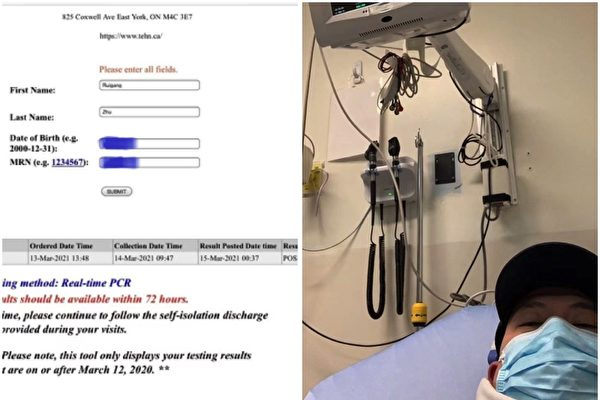

<a name=top>

<a target="_blank" href="https://git.io/bb99bbss">

 

 
 

<a href="https://github.com/gofun72/telove/blob/master/soft.md"><b>免费突破封锁翻墙软件</b></a>
 

<b>请收藏本网址，连上免翻视频 https://bit.ly/2RQM1hX</b>

 

<a target="_blank" href="https://bit.ly/3ezRQKo">

 
 

<b> 看更多真相   https://bit.ly/3ezRQKo  </b>

<a href="https://github.com/candysn/nini/blob/master/wnn-1.md"><b>小之每日真相(一)</a></b>

<a href="https://github.com/candysn/nini/blob/master/wnn-2.md"><b>小之每日真相(二)</a></b>

<a href="https://github.com/candysn/nini/blob/master/wnn-3.md"><b>小之每日真相(三)</a></b>

<a href="https://github.com/candysn/nini/blob/master/wnn-4.md"><b>小之每日真相(四)</a></b>

<a href="https://github.com/candysn/nini/blob/master/wnn-5.md"><b>小之每日真相(五)</a></b>

 

<a href =#55>55.多伦多华人全家染变种病毒 奇迹康复</a>  
<a href =#54>54.德州主流赞神韵完美无瑕 富有神性</a>  
<a href =#53>53.韩国广播节目制作人：拥有全新的人生</a>  
<a href =#52>52.人生无常 人类有办法躲开灾难吗？</a>  
<a href =#51>51.认清中共谎言后 中国留学生走入法轮功修炼</a>  
<a href =#50>50.从公安局副局长遭报应所想到的</a>  
<a href =#49>49.对法轮功的敬意中走入修炼</a>  
<a href =#48>48.德国议员：结束迫害法轮功必须是外交政策目标</a> 
<a href =#47>47.女军人的奇遇</a>  
<a href =#46>46.蓬佩奥：美应引领世界 促中共停止迫害法轮功</a> 
<a href =#45>45.【专访】突破枷锁 走向世界舞台的艺术家</a>  
<a href =#44>44.成功商人抛妻别子另寻新欢 神奇力量拉他峰回路转</a> 
<a href =#43>43.他从好奇到走入修炼</a>  
<a href =#42>42.留给女儿的最大精神财富</a> 
<a href =#41>41.警察说：“见了面相互提醒一下是对的”</a>  
<a href =#40>40.正直的老父亲是如何改变固执的</a> 
<a href =#39>39.潘晴：默念“法轮大法好”救了我的命</a> 
<a href =#38>38.一位私企老板的选择</a> 
<a href =#37>37.意大利蒂埃内市民学炼法轮功</a> 
<a href =#36>36.修大法瑞士浪子回头 破碎家庭重拾和睦</a> 
<a href =#35>35.特拉华州长宣布5.13为“州法轮大法日”</a> 
<a href =#34>34.西双版纳建筑商的感恩</a> 
<a href =#33>33.副国级官员贴身随从：“一定把我的党退了！”</a> 
<a href =#32>32.一场怪病的痊愈</a> 
<a href =#31>31.二姐夫：“这护身符真的灵验啊！”</a> 
<a href =#30>30.曾铮: “四·二五”—— 世界的参照、希望与光明</a> 
<a href =#29>29.曾慧燕：我曾在世貿大樓專訪李洪志先生</a> 
<a href =#28>28.澳学者：“4.25”事件引我开始了解法轮功</a> 
<a href =#27>27.为自己的党员身份而羞愧”</a> 
<a href =#26>26.戈壁东：中共迫害法轮功是史上最大人权灾难</a> 
<a href =#25>25.從《紅舞鞋》原型到「新冠」後遺症</a> 
<a href =#24>24.不朽的东方文明 令我难忘的气功师</a> 
<a href =#23>23.翻墙出去看真实世界 颠覆过往认知</a> 
<a href =#22>22.昏迷中经历神奇 加拿大人感染英变种病毒后奇迹康复</a> 
<a href =#21>21.美国明州议员提出决议案　要求中共停止强摘器官</a> 
<a href =#20>20.河南焦作老干部：我周围的人都退了</a> 
<a href =#19>19.92岁香港学员：终于找到人生的真谛</a> 
<a href =#18>18.德国小伙子摆脱电玩　走入真实人生</a> 
<a href =#17>17.电视人揭央视“自焚案”报导源自政法委</a> 
<a href =#16>16.无独有偶 这纸“心灵药单”救了她俩的命</a> 
<a href =#15>15.患家族遗传病 兄妹五人 就我还活着</a> 
<a href =#14>14.“天灭中共千真万确！”</a> 
<a href =#13>13.中共奴工史的变迁（1999-今）</a> 
<a href =#12>12.奇！旅日华裔严重花粉症不药而愈</a> 
<a href =#11>11.中共的洗脑术从何而来？</a> 
<a href =#10>10.这家美国小镇理发店为何名声在外？</a> 
<a href =#9>9.中国各地强制打疫苗 领导却不见接种</a> 
<a href =#8>8.婚姻家庭幸福有密码</a> 
<a href =#7>7.“老粉红”公开退党 呼吁抵制中共</a> 
<a href =#6>6.她因一个心念的转变而找到了幸福</a> 
<a href =#5>5.印度新学员：法轮功给了我新的生命</a> 
<a href =#4>4.一位九零后大学生的狱中奇遇</a> 
<a href =#3>3.念九字真言 美国一中共病毒患者神奇康复</a> 
<a href =#2>2.瑞典87岁老人的养生之道</a> 
<a href =#1>1.大陆民众“三退”后感谢法轮功</a> 

 
 
 
 

<a name=55> 
<h2 align="center"><b>多伦多华人全家染变种病毒 奇迹康复</b></h2> 

今年3月，朱瑞刚先生一家被检测出感染新冠病毒英国变种病毒，图为检测结果报告和朱先生本人在医院做检查。（大纪元合成图）

 
 
【大纪元2021年08月02日讯】今年3月15日，居住多伦多的朱瑞刚先生一家被检测出感染新冠病毒英国变种病毒（B.1.1.7），19日，他开始呼吸困难，但随后，在没有任何医疗和药物的帮助下，朱先生一家在短短一周内完全康复。是什么让这家人在如此短的时间内恢复健康呢？朱先生讲述了事情的经过。 

<b>全家感染英国变种病毒 </b>
 
朱瑞刚今年41岁，2017年9月全家从大陆来到多伦多。今年3月11日，他开始发烧。“11日我和儿子都有发烧的症状，13日预约了医院进行各项指标检查，15日医院检测结果呈阳性。15日之后，症状就一天比一天严重。期间医院还打电话说我们感染的是变种病毒。”朱瑞刚说。

“到了3月19日，我呼吸已经很费劲了，胸口就像压了一块石头一样。我再上医院检查，医生说我血氧饱和度是90，如果低于90就要进重症监护了。因为我的指标还没有到住院的地步，医院就用救护车把我和儿子送回了家。” 
 
<b>炼功 念九字真言 家人痊愈</b>

朱瑞刚说：“回家之后我觉得自己完了，已经没希望了。这时我突然想起了法轮大法，我在国内时就知道法轮功，还曾学炼过，但后来怕迫害，所以放弃了，于是当晚（3月19日）就开始炼法轮功的五套功法（打坐），并带着儿子一起念九字真言：法轮大法好，真善忍好。”

神奇的事情发生了。他说：“第二天早上起来烧已退了。大概在第四五天的时候，我觉得我的身体完全恢复了，呼吸不那么困难，身体已经完全是正常人的状态。27日，医院就给我开了复工证明，就是说我的症状已经完全好了。”

在这期间，3月20日左右，朱先生的妻子张女士也开始有发烧迹象，朱先生就对妻子说：“你也不用去医院了，就跟着我一起炼法轮功吧。”同样在一周之内，张女士的症状也完全消失。

法轮功，也称法轮大法，是以“真、善、忍”为指导的佛家上乘性命双修功法。对提升道德、祛病健身有神奇功效，至今洪传世界一百多个国家和地区，所获政府等各类褒奖四千多份。

朱先生说：“在完全没有任何药物帮助和治疗的情况下，全家都痊愈了，法轮大法救了我全家。” 
 
<b>在国内接触法轮功</b>

在中国，朱瑞刚曾有幸接触过法轮大法，他说：“第一次接触到法轮功是因为我父亲。2014年7月份，我的父亲被检查出患有肝癌晚期，我需要每天去医院做护理。”

当时，朱瑞刚是家里的独生子，妻子又需要照顾孩子，所以护理父亲时，对他身体和精神上的压力都很大。“我的身体状况非常不好，睡眠质量很差。”

“当时和我父亲同住一个病房的一位先生，他儿子是法轮功学员，他也在护理他的父亲，我看他的精神状态很好，就问他是怎么拥有这么良好的状态？他就和我介绍了法轮大法，这是我第一次接触法轮大法。”

“这位法轮功学员教我炼功和念九字真言，炼了大概半个月左右，我的身体和精神得到了极大的改善，睡眠质量变好，每天也很有精神了。”

朱先生的妻子张女士也觉得神奇，她说：“那时候，医院的人都说得了肝癌晚期的人两三个月就走了，但我公公被检查出晚期，又过了一年才去世的。我先生就说和法轮大法也有关系，他就特别相信（法轮大法）了。”
 
<b>中共打压 被迫出国</b>

朱瑞刚来自辽宁省的一个小城市，在一家国企内工作。他在国内虽然没有受到肉体上的迫害，但是在精神上的迫害让朱先生一家不得不选择出国。

朱瑞刚回忆：“那段时间一直是这位法轮功学员带着我一起炼功，但是我父亲去世不长时间后我就不再炼了。”

“因为那时候国内抓得很严，我们那个地方是个小城市，后来我炼功的消息就传到我们领导那里，我多次被叫到办公室，领导就开始所谓的‘教育’，但我依然坚信大法好，后来单位就给我停职了，之后我还被‘请’去派出所‘教育’、‘喝茶’好几次。”

当时，朱瑞刚的儿子9岁，上四年级。“孩子学校的老师都知道了，就对班里其他学生说这个孩子的爸爸是炼法轮功的，叫班里的小孩不和我的孩子玩，带着全班学生孤立他。”“我看这对孩子的成长影响太大了，于是2017年9月份就全家出国了。”

朱瑞刚和他的妻子都表示，虽然当时没有深入了解法轮功，但都清楚中共给法轮功捏造的罪名是莫须有的。

朱瑞刚在很早时就知道中共的邪恶。他说：“其实国内刚刚开始迫害法轮功的时候我就知道法轮功是被冤枉的。我和我的妻子看过新闻联播的所谓‘天安门自焚’，当时我们就看出破绽，明眼人都能看出来，气管切开了还能唱歌，人烧成那样，还能够保持姿势不动，装汽油的雪碧（塑料）瓶都没烧化。我觉得这些只要稍微有一点常识的人都能看明白。”

2001年1月23日，中国黄历新年除夕日，中共声称5名法轮功学员在天安门广场“自焚”。但此案漏洞百出，被国际社会证实，是中共嫁祸法轮功的世纪骗局。同年8月14日，“国际教育发展组织”在联合国会议上，就“自焚事件”发表强烈谴责，认为这是中共当局嫁祸法轮功的“国家恐怖主义行径”。
 
<b>坚持修炼 坚持反迫害</b>

这次，全家人能死里逃生，朱瑞刚对法轮功有了“全新的认识”他说：“以前没有那么深入，这一次我是真真切切感受到了法轮大法帮助了我，帮助我治愈了身体的疾病，这使我对大法坚信不疑。”

现在，朱瑞刚坚持每天炼功和阅读法轮功著作《转法轮》。

中共迫害法轮功已22年，法轮大法学员们和平反迫害也走过了22年。今年7月17日，朱瑞刚和妻子参加了多伦多法轮功学员举办的反中共迫害大游行。

他说：“我现在也算是个新学员了，我们一定会坚持修炼下去，坚持反迫害，感谢师父（李洪志先生）的救命之恩。”
 
原文 https://www.epochtimes.com/gb/21/8/2/n13132012.htm
 
<a href=#top><h6 align="right">回上方</h6></a>

<a name=54> 
<h2 align="center"><b>德州主流赞神韵完美无瑕 富有神性</b></h2> 

德州主流赞神韵完美无瑕 富有神性

 

【新唐人北京时间2021年08月08日讯】8月6日晚，德州圣安东尼奥的特宾表演艺术中心迎来了美国神韵世界艺术团在当地的第一场演出，全场爆满，气氛热烈，观众们为神韵尽善尽美的演出而陶醉。
 

记者 李欣：由于圣安东尼奥票房火爆，主办方在演出开始前3周临时增加了一场演出。经过一年多的漫长等待，再次看到神韵，观众们激动不已。

心理诊疗所老板 Maria Medina : “我很喜欢演出， 印象非常深刻。”

心理诊疗所老板 Maria Medina : “你可以看出舞蹈演员们是训练有素， 资历深厚的。我想挑错却挑不出任何错误。他们非常有天赋，非常专注，我可以看到他们对自己的事业充满热情。”

前会计公司老板 Linda Steele Richter ：“舞蹈完美协调，每一位舞蹈演员的动作都如此协调一致，没有丝毫差错，一切动作都优雅美丽。”

姐姐 Tammy Hartman：“绝对的视觉飨宴，感官盛宴，色彩绚丽生动、美妙动人。”

前会计公司老板 Linda Steele Richter ：“精彩绝伦，美丽动人。我从没有见过如此美妙的舞蹈。”

神韵歌唱家的演唱震惊了观众，富含深意的歌词也令人感动。

心理诊疗所老板 Maria Medina : “歌唱表演精彩绝妙。整个过程中，我在想"哦"我的天哪，她的肺活量真是巨大啊。”

心理诊疗所老板 Maria Medina : “(神韵歌词)在我看来，非常鼓舞人心。我很高兴看到其中的精神意涵。”

神韵以恢复中国五千年传统文化为使命，观众们为之感到欣喜。

前会计公司老板 Linda Steele Richter ：“我觉得（神韵这么做）真是太棒了。我们希望有一天，中国传统文化能在中国重现。她(中国传统文化)真美。她应该回到(中国)。历史应该被记住。”

心理诊疗所老板 Maria Medina : “我很高兴神韵艺术家带来并努力恢复传统中华文化。我认为传统中华文化是值得用心研究和恢复的。”

新唐人记者李欣、玛瑞娜美国德州圣安东尼奥报导
 
原文https://www.ntdtv.com/gb/2021/08/07/a103185171.html
 
<a href=#top><h6 align="right">回上方</h6></a>
 

<a name=53> 
<h2 align="center"><b>韩国广播节目制作人：拥有全新的人生</b></h2> 

电视编剧金炅一在人生的重大关头上，阅读了《转法轮》，拥有了全新的人生。

    
 
【明慧网二零二一年八月三日】有人说，人生就像过山车，有上升就有下降，而在无尽的坠落中又能重新回升。曾是韩国文化放送（MBC）的广播放送有名DJ、PD（节目制作人）、放送作家、64岁的编剧金炅一（Kim Gyeongil）的一生就是如此。他曾是“周六，愉快的周六”、“羣星闪耀的夜晚”、“裴哲秀的音乐营”等韩国家喻户晓的招牌节目的编剧，可谓前程似锦。

到了二零一一年，在他55岁那年离开工作了三十年的MBC广播电台之后，人生却开始急转直下。生意接连失败，荡尽了家财，还各种身心疾病缠身。他不仅患了糖尿病、心律不齐、高血压、忧郁症、恐慌症，还因心血管异常植入了人工起搏器。每次服用的药多达十二粒，但几年下来，病情不见好转，也几乎感受不到药效。他知道自己余生都要与药相伴了。

他回想道，“有一天我突然觉得，每天以药延命的日子没有继续过下去的意义，疾病日笃，我变得更加悲惨。有了自杀的想法之后，我开始积攒安眠药，在我攒了五十粒的时候，医生说我应该多走走，产生些生活的动力。”

<b>心灰意冷时再遇法轮功</b>

二零一九年的冬季，他求生的意志越来越薄弱，医生建议他多散散步。于是，他漫无目地的走在从惠化洞到光化门东亚日报大楼全程约四公里的路上，他觉得这样晚上才能睡着一会儿。

“边走边想各种事情，我因为做错了什么，才经受这样的痛苦呢？慢慢回想过去，我曾经偷过父亲口袋里的钱，对别人撒谎……我觉得，在死亡之前，应该好好反省一下自己走过的人生之路。就这样走着走着，偶遇了法轮功学员，很神奇。”

“法轮功，其实在二十年前就接触过，我以为就那样擦肩而过了，没想到又出现在我面前。二零零一年，一位前辈给我一盘法轮功光碟，并告诉我‘好不容易从中国买来的，非常珍贵’。由于那盘光碟没有韩语配音，看过一眼之后只能将其束之高阁。后来也曾在新闻中听到法轮功被迫害的消息，但繁忙的生活让我一次次将法轮功置之脑后。”

“重逢的喜悦让我走到了炼功的学员面前，告诉他，很久以前我就知道法轮功，错过了几次机会，今天又这样偶遇了，我想学法轮功，但不知道应该如何学。然后这位学员给了我一本书，那本书就是《转法轮》。”

回家之后，金炅一熬夜读完了四百七十二页的韩语版《转法轮》，他说：“读这本书的时候，我心潮澎湃，哭了好几次。我做了三十年的广播放送作家、广告音乐企划、电台主持，专门从事文章、音乐创作，但像《转法轮》这样的书我还是第一次见。” 
 
“《转法轮》不是一本单教知识的书，我感觉是我生命的指南，不仅让我参悟到世间的至理，还为我打开了未知的世界。”于是他立刻打开电脑，找到了法轮功的网站，开始跟着教功视频学习炼功动作。学第二套功法时感受到强大的能量，强大到令他吃惊。他就这样每天自学功法动作，阅读《转法轮》。

此后，在别人介绍下，金炅一参加了二零二一年四月份在天梯书店举办的九天班。

<b>六个月来检查结果首次正常</b>

“更令人吃惊的是，在参加九天班之前的三月份的健康检查结果，血压、血脂、糖尿，所有的数值都恢复了正常。知道我一直多病缠身的护士更是大吃一惊，问我这是怎么回事儿。其实修炼之后，我的身体状态达到了前所未有的最佳状态。三个月前，我觉得可以不吃药了，于是停止了药物的服用，我的身体反而充满活力。”

另外，金炅一身上七公斤的赘肉也消失了，身材恢复到二十几岁时的样子，精神也趋于安定。他原来因为恐慌症不能搭乘公共交通，但不久之前能坐巴士了。

“虽然通过修炼健康状况得到改善，但我知道不能抱着治病的想法修炼，于是我很坦然地放下了对健康的执著。也许是因为当时半个身体已经踏入了鬼门关，我的心变得纯净，我只想放下所有的欲望，好好地修炼。”

虽然没有另外做有氧运动和肌肉运动，上台阶时不再气喘吁吁，轻轻松松就爬上去了。他说，“我只是真正修炼了而已，却达到了超越运动的身体状态。虽然没有特别注意饮食或忌口，但肠胃很舒服。”
 
<b>“余生会全心全意地修炼法轮功”</b> 

金炅一还表示，“最重要的是我的性格和人生观发生了改变”，“以前上当之后，我开始回避人，还用自己的标准评价他人、无视他人，性格上爱冲动、直来直去。而现在我不再发火，变得柔和，心态积极，也变善良了。”

他说，“家人最先感受到了我的变化，都说我性格改善了许多。晚辈们还喜欢向我吐露心声，因为他们觉得跟我说话心里很舒服。我觉得我脱胎换骨了，全新的人生，我重生了。”

金炅一最近在收集材料，他想将自己的修炼故事制作成视频给周围的人看。他一边回想过去一边说，“在美国时，我通过合法手段吸食过毒品，我不信神，生活上随心所欲，这样的我竟然修炼了，这是一个奇迹！”“师父收我为弟子，我无比感谢、感激”，他表示，“余生我会全心全意地修炼。”
 
原文https://www.minghui.org/mh/articles/2021/8/3/-429080.html
 
<a href=#top><h6 align="right">回上方</h6></a>
 

<a name=52> 
<h2 align="center"><b>人生无常 人类有办法躲开灾难吗？</b></h2> 

海啸（pixabay）

   
 
【新唐人北京时间2021年07月31日讯】古语说：上天有好生之德。在大灾难发生前，上天往往会透过某些人、某些事物，向人提出警告，点化人们躲开灾难。历史上类似的故事一再发生，许多民族、许多地区都有流传，反复的向后人提出告诫。

<b>日本历史上的白保村</b>

这个广为流传的故事发生在曾遭受过海啸袭击的日本八重山群岛。

根据《日本民俗学译丛》记载，在八重山曾有个叫白保的村庄，村庄里的一位渔夫在出海时突然捕到了一个人鱼。此时人鱼竟向渔夫开口说话道：“我是为了告知你们，明天会有大海啸而来的。”

渔夫一听人鱼如此说，便立刻恭恭敬敬地把人鱼放归大海。渔夫接下来也顾不得再打鱼了，立刻调转船头返回白保村，通知众人海啸明天就要来了，赶快避难。可是没人相信他的话。

第二天，潮水一直退到了近海。所以，白保村的人都去海边捡鱼和贝壳，一直捡到提不动为止。能不断捡到鱼和贝壳，他们感到越来越有趣，竟然高兴得忘了时间。就在此时，突然从海面上袭来了巨浪。村民们面对这突如其来的灾难，惨叫着逃跑，希望能保住性命，可是为时已晚。最后据说去了海边的人无一幸免，都被海啸卷走了。

往日的白保村顿时荒无人烟，后来为了营造一个新的村落，只得向孤岛黑岛募集居民。这个新的村庄没有建在海岸边，而是建在了地势高的地方。那就是现在的白保村。

<b>南亚大海啸</b>

还有个类似日本白保村海啸的真实故事。

<b>还记得南亚大海啸吗？</b>

在大海啸来之前，在海滩边上，海水暂时退去了许多。很多西方人和孩童看到海水退去后，沙滩上现出不少美丽的贝壳，就跑过去捡；看到海天相连处云彩颜色变得很漂亮，就站在海滩上欣赏。

当时有一个当地的土著人，知道这个情况不妙，就喊“有危险，快跑！”当然，因为事情来得很突然，讲得也很突然，结果当时海滩上的人都不信他，还嫌他扫兴，硬把他赶走了。

那个土著人走了之后，大海啸一下就过来了，几分钟内几十万人丧生，生前的所有梦想、计划和所经营，都失去了意义。

人最宝贵的就是生命，请不要拒绝善意的劝告，不要给自己留下永远的深深遗憾。

<b>“实话石说” 贵州“藏字石”的警示</b>
 

贵州平塘县掌布风景区门票（图片来源：视频截图）

  
 
在中国贵州平塘县掌布风景区有一块2.7亿年前形成的巨石，大约500年前，这块石头从高崖上坠地后，一分为二。2002年6月被当地村民发现石头断裂面上有字，可以清晰地辨认出六个大字“中国共产党亡”，故名“藏字石”。

平塘县邀请多批地质学家、古生物专家对“藏字石”鉴定，结论是，这些字完全是天然形成的，没有任何人工痕迹，所以又被称为“天书”。文字图案上还有2亿年前的海绵、海百合茎、腕足类动物等古生物化石碎屑，人工无法伪造。

这是不是上苍在用“实话石说”的方式警示我们呢？

在上天的点化下，那么人的选择就极为关键，真的是生死攸关。在事件当中，人们或许还无法完全理解这其中的含义，但在生死存亡的重大问题上，是否应该抱着“宁可信其有”的态度呢？
 
原文https://www.ntdtv.com/gb/2021/07/31/a103178879.html

<a href=#top><h6 align="right">回上方</h6></a> 

<a name=51> 
<h2 align="center"><b>认清中共谎言后 中国留学生走入法轮功修炼</b></h2> 

中国留学生，法轮功学员穆川（明慧网）

  
 
 【大纪元2021年07月25日讯】从二十二年前江泽民叫嚣“三个月消灭法轮功”那时起，法轮功不但没被消灭，反而在全世界一百多个国家洪传，很多有缘人能破除谎言，走入修炼。在多伦多媒体集团从事美术创作工作的穆川，讲述了他当年如何在谎言满天飞的情况下，在加拿大留学期间走入法轮功修炼的故事。
 
 
 <b>留学期间退出中共组织</b>

毕业于中国中央美院的穆川，二零一一年在多伦多留学时，他的好朋友马同学给他讲退出中共党、团、少先队组织（“三退”）的意义。“我这位朋友跟我很有缘，我们在中国时是中学同学，考上中央美院又是同班同学，到了加拿大我们还是同事。”

“我在海外是学电脑动画的，学业结束后，有一次我的这位朋友劝我做“三退”。由于我之前在中国学习绘画的过程中了解到中共在当政后，文化大革命期间对中国传统文化在艺术各个方面的破坏，我对中共的印象很不好，所以做三退就变得很顺利。”

“但修炼法轮功，就没有那么顺利。”穆川从上小学就一直是个基督徒，经常跟着妈妈去教堂，做礼拜，内心里有根深蒂固的基督教的一神论的理念。

 <b>打开心结</b>

当时，朋友马先生常和穆川探讨修炼的话题，讲述从法轮功中悟到的理和对信仰的理解。“虽然我从小信基督教，但在我学习美术的成长经历中，也接触过不同的文化熏陶，尤其是佛教、道教的东西，再加上我的性格不是特别固执，在多次的交流中，我的心结慢慢地打开。”他说。

其实当时有一点最能触动穆川的是，马先生在修炼法轮功后把烟戒了，“因为我非常清楚他的烟瘾有多大，以前同学时期我们宿舍地面都是被烟头铺起来看不见瓷砖的，他是主要贡献者，修大法后他能一下子把烟戒了，我觉得真不可思议。所以我相信这个大法肯定有他神奇的一面。”

与此同时，穆川也会在网上寻找各种文章或帖子看看第三方的客观评价，因为在海外没有中共防火墙的封锁，他可以相对自由的看到不同的言论，通常找到的都是人们对法轮功的正面信息，尤其是一位基督徒写的内容触动到穆川的心灵。

“里面说劝基督徒多了解一下法轮功，不要固步自封。我当时想耶稣在世上医病传道的时候有很多人见到奇迹也不相信，在基督徒看来这些不信的人是愚昧的；而现在大法师父也是开始为人治病传法，如果我不能够相信的话，我不就成了那些愚昧无知的人吗？抱着这样一个想法，我愿意去接触法轮功。”他说。

 <b>“读《转法轮》后 没理由不选择修炼”</b>

后来穆川的朋友马先生需要他帮忙做一个项目，“二零一一年，我就进入了新唐人工作，一次下班后，他们用英语讨论安排学法时间，我没有听清，以为是开会，就说：我也要参加你们的会。我朋友既诧异又惊喜，就说好啊，你可以参加。”

“直到我坐下来‘参加会议’，才知道他们是要集体读《转法轮》，因为是我自己要求参加的，所以不好意思走开，就坐下来听。当时虽然还放不下基督徒的身份，没有跟着开口读，可我就这样默默地边听边看着书，里面的内容都进到了脑海里。”

“参加集体学法有了第一次，就有第二次。因为和周围的人熟了，他们准备学法时都会叫上我，还有人借给我书，虽然没有人强迫，碍于面子我也没有推脱。”他说。

但在一遍又一遍地学法后，穆川发现，“大法的法理太博大精深了，我当时就想一旦我开始修就不能放弃，感觉到我选择修炼或选择不修炼，通过法轮功的法理都可以解释出原因，整个人类社会都可以被大法诠释，而这层认识又是通过学法得到的，我有什么理由不选择修炼呢？”

就这样，二零一一年，穆川慢慢走入了法轮功修炼。

 <b>“神奇发生在我身上”</b>

穆川回忆自己刚开始修炼的情景，“我第一次打坐就是因为便血。我便血加腹泻两天，一般这种情况，就是要去医院检查，而在没有医疗保险和经济状况紧张（当时还没开始工作）的情况下，我选择了打坐。奇迹真的就发生在我的身上，晚上打坐后第二天，便血就停止了。”

还有一件事，一个冬天，在一个偏僻的路上，因为雪都堆在人行道上，没法走，而路上几乎没有车，穆川就走在机动车车道边上。

“走着走着我忽然回头一看，一辆大卡车冲我疾驰而来，我一下跳进人行道上的雪堆里，卡车呼啸而过，我抬头想确认司机有没有因看到我而减速，结果车速没减反而加速。我当时吓了一跳，自己怎么会有这么快的反应？感觉‘有人’拽了我似的，可是那是很偏僻的路，周围根本没有人。”

穆川说：“这时我就意识到是师父在保护我。《转法轮》中的故事真实地发生在我身上，更加坚定了我修炼的信心。”

<b>看《伪火》不再相信“自焚”谎言</b> 

中国大陆和海外有关法轮功的信息大相径庭，让穆川也开始认清中共的邪恶。

“在国内听到的邪恶宣传就是焦点访谈里播的‘自焚’伪案。当时那种宣传真的非常吓人，很多人都不知道那是中共的谎言，我当时也相信了。”穆川说。

“但有一点疑惑存在我心里，就是之前在铺天盖地的污蔑视频中我看到有一个镜头里有一面旗是写着‘真、善、忍’三个字的，我想这三个字不是很好的吗？为什么把他们说得那么不好呢？”

出国后，穆川明白了整个过程。“来到加拿大后我看了《伪火》，就不相信自焚的事了。也看透了中共的谎言。”二零零二年一月，北美中文电视台 “新唐人”制作了揭露二零零一年 “天安门自焚”真相的纪录片《伪火》（False Fire），该片于二零零三年十一月八日荣获第五十一届哥伦布国际电影电视节荣誉奖。

据明慧网报导，一九九九年七月二十日，江泽民发动对法轮功的血腥迫害，开始在中国各地大抓捕，同时通过全国的广播、电视、电台、报纸对法轮功进行铺天盖地的诽谤、造谣、打压。当时，中共内部很多人与百姓对迫害法轮功采取消极抵制，江泽民集团为了煽动对法轮功的仇恨，选择了在二零零一年一月的大年三十，这个最喜庆日子，一手导演了“天安门自焚”伪案，愚弄百姓、栽赃陷害法轮功，煽动仇恨，以达到继续迫害的邪恶目的。

“国际教育发展组织”于二零零一年八月十四日在联合国会议上，就“天安门自焚事件”，强烈谴责中共当局的 “国家恐怖主义行径”，声明说：录影分析表明，整个事件是“政府一手导演的”。中共代表团面对确凿的证据，没有辩词。该声明当时被联合国备案。

<b>从幕后到幕前</b> 

从开始认识法轮功就一直在多伦多新唐人电视台工作的穆川，因为有美术功底和电脑动画技能，学业结束后直接被推荐到新唐人实习，然后一直做到现在。

此后，一位被中共迫害致死的法轮功学员刘海波让穆川从幕后走到了幕前。

在中共制造自焚骗局的最黑暗日子里，二零零二年三月五日，长春有线电视网被切入插播了法轮功真相节目。揭露自焚真相的影片被插播者们通过大陆的有线电视网播出后，数百万民众看到了真相。然而另一边，江泽民暗中密令对法轮功学员“杀无赦”，并抓捕了五千多名长春法轮功学员。三月十一日～三月十五日期间，包括刘海波在内的至少六人被酷刑致死。

二零一九年，穆川参与了故事片《永恒的五十分钟》的拍摄并担当了这部片子的主角，该片根据当年震惊中外的天安门“自焚”案和长春电视插播两大真实事件编写，揭露中共谎言，还原历史真相。

穆川说：“我很自豪可以演一个大法弟子，我扮演的角色是以刘海波和刘伟明为原型。”

“我了解到我所表演的参与插播的学员被中共以极其残酷的手段迫害致死，而他们所做的又是为了让人们了解真相和还大法师父清白，这在历史上是从未有过的壮举，让我深深感觉到我演的是一位英雄。” 
 
穆川接着说：“我在捧着刘海波的遗照时沉重地想到，这些被中共迫害死的修炼者不能白白死，除了纪念他们，我们要把他们的事迹演绎出来让更多的人了解大法真相，了解在和平年代，这个共产极权是多么残暴地屠杀着自己的人民。”

他说：“参与这部影片的拍摄，是对这些为真理而牺牲的法轮功学员们的悼念，也是让更多人明白法轮功真相。而我有幸能和真正参与过插播的金学哲一起出演，更让我感受到这部影片的真实和分量感。”金学哲是从大陆逃亡韩国的法轮功学员，当年参与插播的幸存者，一位历史的见证者。

<b>结语</b> 

二零零八年，穆川来到加拿大开始了他的留学生涯。和所有的海外留学生一样，他努力学习，开阔眼界。同时也开始独立思考自己所听到的关于法轮功的真相，打开自己的心扉，体会到了大法的神奇，也看到了法轮功学员反迫害的经历。

穆川最后对所有海外留学的中国大陆学生说：“希望出国留学的学生们，都有机会了解法轮功真相，放下偏见和观念，客观地了解在中国看不到的信息。毕竟年轻人出国长见识，能有机会站在非中共宣传的角度，看一看法轮功是什么，多方面了解了解，对自己只有好处。” 
 
原文 https://www.epochtimes.com/gb/21/7/25/n13112948.htm
 
<a href=#top><h6 align="right">回上方</h6></a> 
 

<a name=50> 
<h2 align="center"><b>从公安局副局长遭报应所想到的</b></h2> 

时事评论（明慧网）

 
 
前几天，和一班朋友在一起吃饭，其中一个在公安局上班的朋友讲起了本地原公安局副局长、纪委书记M的近况。在邪党开展的政法队伍教育整顿活动中，M因为被一个老板举报贪污受贿、大发国难财、乱搞男女关系、违规经商等问题，省纪委介入调查。M被双规之后审查，初步交代涉案金额高达几千万，成了本地的热点新闻。朋友说M被双规审查期间，曾经试图跳楼自杀，被人发现未遂。现在一些曾与之关系密切的体制中人都惶恐不安，深怕受牵连，也落得个锒铛下狱的结局。
 

因为工作关系，我曾经和M一起开会，当时他一身警服，慷慨激昂大谈特谈邪党的不忘初心、践行使命、为民服务、反腐倡廉那一套，对比他现在的遭遇，其实是非常讽刺的。

在一个邪党体系内做官的人，人格都是变异的。嘴里说的是“伟光正”那一套，但做起来又是“假阴邪”一套。就说M这个人，在平时看起来是一个道貌岸然、党性很强、很有原则的一个人，遇到了什么下属违法乱纪之事，也会秉公查处，并以此作为自己的政绩。但私下他又是一个利益心很重的人。听说他让自己的亲属开了一家娱乐场所，每次公安局开展“扫黄行动”时，那个地方谁也不会去查。这次被人举报的罪状之一——大发国难财，则是因为给某些倒卖防疫期间的口罩、防护衣之类物资的公司提供方便后，索贿太多。

佛家讲因果报应。社会上有句俗语：出来混，总是要还的。其实对于M这样为邪党体系服务，信奉无神论、唯物论的生命来说，人生是一场彻头彻尾的闹剧、悲剧。在前半段的生命进程中，他们逢迎巴结、媚上踩下、升官发财、贪污受贿、眠花宿柳，看似风光无限。而在彼时，他们还以为是因为自己会投机钻营，把握机会，所以才能享有人前的风光、显耀。殊不知，所作的恶行早已是在消耗过去生累积的福报。及至福报耗尽，恶报来临已是悔之晚矣。到此时，曾经处心积虑所获取的官位、钱财、美色全部化为乌有，有的会以跳楼、服毒等非正常方式离开人世，也有的会在监狱中痛苦地度过余生。

在这个社会，像M这样出事的官员实在是太多。只是善于编造欺骗的话术，绞尽脑汁给民众洗脑，营造所谓盛世幻象的邪党宣传机构总会把他们这样的人说成是个案，是小部分，是党内的“苍蝇”。一个良好的体制，会督促坏人变成好人，而一个邪恶的体制，会把一个好人逼成坏人。在一个假、恶、斗的环境中，仍能坚守真、善、忍本性，坚持道德、良知的人，除非是有坚定信仰的人才能做到，绝大多数的人只能是同流合污，共毁同灭。这也是在这个体系中为什么那么多人堕落的缘由。

其实邪党还有一个隐秘的给自己脸上贴金的手段，就是会有意选择一些本性不错、在群众中口碑较好的人进行大力宣传，把他们树立为“优秀共产党员”，这样非常能够迷惑人，让人以为是他们的党性教育发挥了作用。其实根本不是。毕竟某些在体制之内的中国人本性不错，只是因为无知上了贼船，他们对邪党的很多做法也非常不满，但因为诸多原因只能顺应。在工作中，他们善待来办事的群众，其实是缘于流淌在血液中的善良基因，在内心中还没有忘却的“仁义礼智信”等传统文化教诲的作用，与邪党那些虚假的洗脑没有半点关系。我曾经与这样的朋友交流过，他们也认为邪党开展的一些教育完全是假大空，是对人性的压制，思想的强迫。虽然明知邪党在很多方面说谎，但迫于生存的压力，也只能装模作样的配合。

希望在这个体制之内所发生的诸多乱象，能够被更多的人看到、听到，并运用自己的头脑认真思索，辨别出真正的善恶正邪，从而做出远离邪党体系的智慧抉择。作恶多端之后，看似再厉害的人也会被惩治，在人间展现的也许就是M这样的下场。看似再强大的邪恶组织也终将被摧毁、解体。因为这是宇宙的规律，天道的法则。
  
原文 https://www.ntdtv.com/gb/2021/07/26/a103174867.html
 
<a href=#top><h6 align="right">回上方</h6></a> 
 

<a name=49> 
<h2 align="center"><b>对法轮功的敬意中走入修炼</b></h2> 
 
【明慧网二零二一年七月十九日】（明慧记者夏昀台湾台中采访报道）“那年是一九九九年，电视新闻频道全部都在播放共产党迫害法轮功的事件。法轮功学员被打、被勒住脖子、头被恶警用脚狠狠的踩在地上。但是这些人都没有反抗。我哭了。这是一个什么样的群体？世界上怎么会有这么善良、平和的示威者？”逸姗回忆着至今仍深深刻印在脑中的画面，她没有被这场景吓倒，而是“油然升起一股对法轮功的敬意”。

中共持续迫害法轮功至今已有二十二年，这二十二年里，法轮功学员没有退缩，以和平理性的方式讲述真相，反迫害。很多人敬佩法轮功，也有很多人不受中共造谣抹黑的影响，走入法轮功的修炼行列。家住台中的逸姗就是其中之一。

<b>不信中共宣传</b>

逸姗的父亲是退役军官，跟随国民政府来台定居在高雄。父亲告诉她共产党很坏，不是好人。一九九九年，接连几天不断的新闻报道，共产党的打压，让她对法轮功充满好奇，心想“如果台湾也有法轮功就好了”。隔年，逸姗从一位耳鼻喉科医师那儿得知法轮功的信息，心情激动不已，立即开始学炼。她通过亲身的学炼，体会到法轮功的美好，并在之后投入大量时间讲述法轮功的真相，反迫害。

<b>喜得大法解开心中谜 </b>
 

已届知天命之年的逸姗，神采奕奕。

 
逸姗自幼就有修炼的愿望，喜爱看描述天堂、地狱游记的故事。夜深人静时，总会遥望天际想着，“我是谁？我从哪里来？以后要去哪里？我来人间的目的是什么？”当她开始看法轮功的经书《转法轮》时，高兴的哭了，“我终于找到了，这就是我要的。”书中所阐述的道理，解开了她心中的谜团。“这是宝书”，她如获至宝的每天捧着书看。而书中所教导的修炼之理，也影响着她的做人处事。

逸姗介绍，当她读完整本《转法轮》之后，言行就开始改变了。因为从小深受家人疼爱，娇生惯养形成的娇气，是她的特质。但她“读了书中师父教导的法理，发现娇气是错的”，当下她就决定要改掉这娇气。家人看到她的改变吓一跳。

<b>遵循真、善、忍　做更好的人</b>
 
“逸姗学了法轮功以后，整个人大转变，变得很好呢！”职场上的同事也发现她的不同。同事眼中的逸姗是精明能干型的，工作能力强，利益算得很清楚，可不能吃亏。有人在背后说她坏话，她听说了一定去找对方理论。修炼后，知道要真心对别人好，与人为善，听到别人对她的议论，她反倒呵呵一笑，无所谓了。同事觉得她变和善了，跟她相处很舒服。她说，“这些都是看了《转法轮》之后知道的道理。”

法轮功的经书教导修炼人要做到真、善、忍，要做个更好的人。逸姗每天看书，这些道理就在指导她的言行。她描述，在修炼前，与人发生矛盾，会“以其人之道，还治其人之身”。修炼之后，“矛盾来了，就是考验来了，是要提高心性的时候了，不能再象以前一样对待。”

她举了个例子。一位同事想要她这个专柜销售组组长的位子，排挤她，私下抢走业绩、对顾客造谣抹黑她。当她知道状况时相当诧异，但很快想到要用修炼人的态度去对待，“处处考虑别人，从做好人做起”。那颗不平的心马上就平静下来，原谅了对方，象没事一样依旧对这位同事好。

公司和顾客很快的发现了真相。她说，“师父在《转法轮》中将失与得的关系讲得很清楚，所以我不会跟人家计较，而是要求自己真心对他人好。”她成为同事眼中平易近人的伙伴。

<b>走入反迫害行列</b>

时光荏苒，逸姗在家庭、工作中忙碌着，修炼也不放松，十年时间过去了。然而这十年，中共并未停止对法轮功的迫害，逸姗认识到应该将亲身经历的法轮功的美好和被中共迫害的真相，让受中共造谣毒害的人知道，破除中共的谎言。于是她利用工作之余，给中国同胞、给公安部门打电话讲述真实的法轮功，又用社交软件给大陆网友传递真相、让他们认清中共的邪恶本质，做三退（退出中共党团队）以自保。她还出国参加了美国、韩国、香港等当地学员所主办的游行、讲真相活动，希望让更多人能接触到法轮功，把真相传递得更广。

这几年逸姗投入更多时间，不间断地透过社交软件给大陆同胞传递真相。常常到了晚上手指头都僵硬了，但一想到还有很多人不知道这些讯息呢，揉了揉僵直的手指后，又继续发送起真相来。

这期间，为了更细致的将法轮功的真相说清楚，并将讯息铺得更广，她开始与其他学员合作，发挥整体运作的力量。他们组建社交群组、制作真相材料、发送资料，并一一劝三退。尽管经常遭到中共的干扰，变换花样封锁讯息管道，但逸姗说：“不管这条道路多么崎岖难行，风沙多么大，也阻止不了我坚定的正念——讲真相救人！” 
 
原文 https://www.minghui.org/mh/articles/2021/7/19/-428342.html
 
<a href=#top><h6 align="right">回上方</h6></a>
 
 

<a name=48> 
<h2 align="center"><b>德国议员：结束迫害法轮功必须是外交政策目标</b></h2> 

德国基民盟／基社盟国会议员蓓缇娜-玛格丽特‧魏斯曼（Bettina Margarethe Wiesmann，CDU/CSU）声援法轮功学员反迫害22年。（图片来源：德国联邦议院网站）

 
【大纪元2021年07月23日讯】法轮功反迫害22周年前夕，德国法轮功学员于7月17日在首都柏林举行了大型集会游行活动，并接到了八位来自不同党派议员声援法轮功反迫害的信函。

其中，基民盟国会议员蓓缇娜-玛格丽特‧魏斯曼（Bettina Margarethe Wiesmann）在信中表示，“中共迫害法轮功学员是件令人无法容忍的事情，结束迫害必须是德国外交政策的一个目标。”

她的信函译文如下：

尊敬的女士们、先生们，

亲爱的法轮功学员们，

亲爱的来宾们，

看到你们今天在柏林——德意志联邦共和国的首都集会，对能够在场的人来说，多么美妙啊！如果在中国也能出现这样的场景，那该多好啊。中共迫害法轮功学员令人无法容忍，结束这场迫害必须是德国外交政策的一个目标，我们决不能停止谴责侵犯人权的行为，并倡导结束这种状况。

我的（议员）同事——米歇尔‧布兰特（Michael Brand，德国国会议员）、马丁‧帕策尔特 （Martin Patzelt，德国国会议员）和米歇尔‧盖勒（Michael Gahler，欧洲议会德国议员）坚定地站在你们一边。米歇尔‧盖勒今年同样成为北京极权的（打击）目标，这绝非偶然。这并不能削减我同事们的承诺，我们基督教民主联盟支持全世界的信仰自由，反对迫害宗教少数团体。

你们在向世界传播美好的事物，你们选择了勃兰登堡门举办活动，令我十分喜悦，那里不仅位于欧洲中心，而且也具有历史核心意义。正是在这里，分裂了四十多年的德国以令人印象深刻的方式实现了统一，东德民众和平地从社会主义极权中解脱出来。

“真、善、忍”——在这种价值观下，你们今天相聚在柏林，我祝愿那些流亡海外的人，有一天能够返回中国，不必担心受迫害。我祝愿今天在场所有的人，都能度过成功与安宁的一天。非常感谢你们的努力！

致以最诚挚的问候

您的蓓缇娜-玛格丽特‧魏斯曼，德国联邦议员（Bettina M. Wiesmann MdB） 
 
原文https://www.epochtimes.com/gb/21/7/23/n13109600.htm
 
<a href=#top><h6 align="right">回上方</h6></a>

 

<a name=47> 
<h2 align="center"><b>女军人的奇遇</b></h2> 

拥抱阳光 向往光明（照片取自网络）

 
 
【希望之声2021年7月1日】（本台记者慧光综合报导）
 

她是一名北京女性，曾经在中国军队服役二十年。因为家庭条件优越，所以年轻时发展顺利，从入伍到提干，然后结婚、生子，几乎是一帆风顺，生活中的一切事情都通达顺畅。唯一感到遗憾和不足的是，在部队服役期间她的健康出现了问题——患有严重慢性肾炎。一个年轻姑娘，因为这个病而导致身体很差，整天病怏怏的，在军队那样的环境中，这是一件很难堪很苦恼的事情。

慢性肾炎医学上称为慢性肾小球肾炎，临床表现为蛋白尿、血尿、高血压和水肿等病症，初期症状轻微容易被忽视，但如果得不到重视或及时治疗，后果很严重，最终会导致肾衰竭而出现生命危险。客观的说，现代医学对这个病只能控制，很难治愈。

患病后她经常住院，中药、西药都吃遍了，没有什么效果；能想到的方法都用了，就是不见好转。那时她总觉得身上像灌了铅一样沉重、难受，走路时两条腿软绵绵的，一点儿劲都没有，干一点活儿就累的不行，整天精神沮丧、无精打采，活得一点儿乐趣都没有。这种情况持续了十几年。

无奈的时候她喜欢看星星，在寂静的夜晚，看着满天星斗，经常想“它们为什么会眨眼睛呢？它们是在看地上的人吗？地上的小草，秋天枯萎，春天发芽，一年一年生生不息，作为万物之灵的人，怎么就只能活一世、死了就没了呢……”每当想到这里，她就感到非常悲哀，觉得人生苦短，变化无常，不知道人生的意义在哪里。

在物质上她从不担心什么，衣食无忧，甚至不需要担心自己的事业啊、前途啊什么的，这些父母都会操心、安排。但不知为什么，每当安静的时候她总觉得内心深处空荡荡的，找不到寄托。每天似乎都在寻寻觅觅中，自己也不知道到底要寻找什么。各种书看了不少，佛教、道教、基督教的书都看过，总是不得要领。其实她的思想很简单，就是想知道人为什么活着？死了会去哪里？人活着究竟是为什么？她经常会觉得空虚无聊、生活没有情趣，加上病痛折磨，经常想“是不是死了就没这么多痛苦了”。

就这样日复一日，她在煎熬中挣扎，在渴望中等待，直到有一天终于等来了机会。

因为一些特殊机缘，她曾经在1993年北京东方健康博览会上见到了法轮功师父。后来她又费了好大劲儿，克服重重困难，参加了1994年12月在广州举办的法轮功第五期传法班，又在1995年1月参加了在北京公安大学礼堂举行的《转法轮》首发式。

她回忆说：“师父在讲法中阐述了博大精深的宇宙法理，师父用洪亮的声音和巨大的能量场让我的心受到很大震动，真的是让我如梦方醒，原来一切的一切竟然是这样。我一直在寻寻觅觅的生命之谜都在师父的讲法中得到解答，所有的答案都是那么清清楚楚、真真切切，我恨不得多长几个耳朵，多长几个脑袋，把师父讲的法一个字不落的记在脑袋里，印刻在心上。从那时起，法轮大法赋予我的生命以全新的意义，我在心中树立了一个全新的人生观、世界观，我知道该怎样活着了。从那时起，我就觉得自己是这个世界上最幸福的人，从里到外、每个细胞都洋溢着幸福和快乐，那是生命真正的快乐。”

接下来神奇的事情很快就发生了。十几年的顽疾，在不知不觉中就消失了，取而代之的是身体一天比一天强壮，走路时总感觉轻飘飘的。她说：“年轻没病时体会不到什么叫‘无病一身轻’，后来有病了，总希望没有病该多好。现在真的没病了，才知道‘无病一身轻’是什么滋味，那真是太舒服、太美妙了。”

她回忆说：“我自己的体会尽管神奇，但是在我们修炼的群体中一比较又不算什么了。在我接触的弟子中，几乎每个人身上都发生过翻天覆地的变化。有的是多年的疑难病好了，有癌症晚期的患者好了，坐轮椅的健步如飞了，弯着腰的罗锅直起来了。参加传法班以后，很多人都有切身体会，走路、骑自行车就像有人推着一样，祛病健身的奇效可以说比比皆是，随时都能听到、遇到。”

“在大法修炼中，道德的提升是每个真修弟子的必然，因为我们懂得，心性的提高才是长功的关键。在日常生活和工作中，我努力按照‘真、善、忍’标准严格要求自己。我这个人执著心很多，名利情很重，怎么办呢？修！一定把它们都修下去。所以修炼后名利上的事不去争了，买东西多找的钱还给人家了，遇到问题或不白之冤能够忍了。慢慢的脾气小了、忍让多了；索取少了、给予多了；计较少了、体谅多了。周围人都说我变了，变得越来越好了。”

有一天晚上，她骑车过马路时，被一辆疾驰而来的白色小轿车撞上了，“当”的一声，整个人呈抛物状，一下子摔在了马路牙子上，人被撞出去二十多米远。据目击者介绍，当时看到她骑的自行车大梁撞弯了，前轱辘没了影，人躺在那没了知觉，左边太阳穴上方撞了一个洞，鲜血直流，一会儿地上就流了一滩。周围有人惊呼道：“不得了了！撞死人了！”

司机吓坏了，赶紧下车，想抱起她往车上放，可心慌、紧张、手发抖，打不开车门，只好把她先放地下再去开车门。就这一会儿功夫，地上又是一滩血。人放好后，司机开上车就往附近医院赶去。

到了医院抢救室，她的头部和胸前已经被鲜血浸透。一大群医护人员紧急进入抢救状态，查CT、做B超等，结果出来了，虽然看起来很严重，但内脏竟然什么事都没有。检查完毕，她也苏醒了。看到周围围着她的人，她很快明白了是怎么回事儿，尤其是看到司机和妻子那惊慌的眼神，她轻轻的说：“我没事，我是炼法轮功的，不会有事的，你们放心吧。”

司机和妻子带着哭声说：“大姐呀，你真是个好人呀，现在世上哪还有你这样的好人呐。”

她微微一笑，说：“我们炼功人都是好人。”

撞得那么重，除了头部流了很多血外，其它地方都正常，哪儿都不感觉痛。只是头有点晕，其它没有任何不适。

她当时对医生说：“既然没事，那我就回家吧。”

医生说：“不行！这么严重，至少得观察一宿。”

睡到后半夜她醒了，心想这会不会耽误我炼功啊，于是起来盘腿打坐，嘿——还真没问题，她心里很高兴。第二天上午就自己回家了。

司机担心她会要很多赔偿，就托人找关系带话，想减小自己的责任。她跟司机说：“你谁都不用找，我不会找你要一分钱。你就帮我把自行车的轱辘安上就行，因为我还得天天骑着它上班呢。”司机听后千恩万谢的，很快找人把自行车修好了。

一星期后，她和同事们去爬山，她是第一个爬上山顶的。

她回想起五年前，也同样出了一次车祸，还没这次严重，可她非要人家赔了几千块钱，而且心里还不高兴，嫌人家给的少。那时她没有修炼，觉得这很正常，也没觉得自己哪儿做的不对。

从医院回到家后，楼下有个老太太也是练气功的，据说还有点儿小功能，对她说：“你太有福了，这么大的难，你师父要不保护你，你的小命早没了。”

1999年“7.20”以后，中共开始全面镇压法轮功。在那红色恐怖岁月里，她凭着对大法的正信，一次次去上访，在天安门广场高声呐喊“法轮大法好”，她被抓了，也被关过。虽然遭到过一次次迫害，但她从来没有屈服，更没有放弃。

她说：“这么多年，在师父的慈悲呵护下，风风雨雨的一路走过来，有过迷茫，也有过懈怠，但很庆幸，我仍然走在大法修炼的大道上，我发誓：一定要做最好的弟子，勇猛精进，直到功成圆满。” 
 
原文 https://www.soundofhope.org/post/521102
 
<a href=#top><h6 align="right">回上方</h6></a>
 

<a name=46> 
<h2 align="center"><b>蓬佩奥：美应引领世界 促中共停止迫害法轮功</b></h2> 

7月14日，国际宗教自由联盟（IRF）举行的年度国际宗教自由峰会上，前国务卿蓬佩奥出席发言。（李辰／大纪元）

 
 
【大纪元2021年07月21日讯】（大纪元记者林燕综合报导）在中共政府残酷迫害法轮功进入第22个年头之际，前美国国务卿蓬佩奥（Mike Pompeo）表示，美国应该帮助结束中共政权对法轮功的“骇人”迫害，让法轮功学员们能够行使信仰自由权。
 

蓬佩奥在纪念法轮功反迫害22周年前夕接受了大纪元的姐妹媒体新唐人电视台（NTD）的采访。

他表示，在中国没有宗教自由，中共对法轮功的迫害是“骇人的，悲惨的”。

“（迫害）已经持续了太长时间，美国需要领导世界，确保这些人（法轮功学员）有望以他们想要的方式践行他们的信仰。”蓬佩奥说。

去年7月20日，时任国务卿蓬佩奥首次就中共政府镇压法轮功21年发表公开声明，谴责中共对法轮功修炼者的“邪恶践踏和虐待”，并呼吁当局停止持续已久的镇压。

中共于1999年7月20日开始了一场针对法轮功学员的迫害。此后，数十万计法轮功学员遭受精神和肉体折磨、经济迫害、强迫劳动、监禁，甚至活摘器官。

一些幸存者讲述了他们遭受不明药物注射、高强度的强迫劳动、电击私处等酷刑，还有孕妇被威胁强行堕胎。

长达22年的镇压已经造成了难以计数的死亡案例。总部设在美国的明慧网作为披露迫害的信息交流中心，已经核实了数以千计的死亡案例细节，而这一数字因为从中国收集信息极为困难，可能只是冰山一角。
美国国会两党议员声援法轮功 要求中共停止迫害

在今年7月20日之前，至少有15名美国国会议员发表了支持法轮功的信函、褒奖或视频信息，来自20个国家的政治家的国际联盟也有表示公开支持。美国国务院19日还呼吁，中共“立即停止”长期以来对法轮功的镇压运动，并释放所有被监禁的法轮功学员。

密苏里州的联邦众议员维姬‧哈茨勒（Vicky Hartzler，共和党）在信中说：“在中国，（中共）对法轮功学员的监禁和对待是不合情理的，确实是对人权最高程度的侵犯。”

哈茨勒还提到中共活摘器官的罪行，她说，2016年众议院谴责活摘这一可怕罪行的决议案（H.Res.343）是“朝着正确方向迈出的一步”，但接下来还“必须做更多的工作”。

她是《2021年停止活摘器官法案》（H.R.1591）的17位支持者之一。

俄亥俄州联邦众议员史蒂夫‧查博特（Steve Chabot，共和党）在信中也谈到活摘器官。“这是难以想像的严重罪行”，他说，“这种难以言表的罪行令人发指，要求（我们）为在中共手中遭受痛苦的无数受害者伸张正义。”

据明慧网记录，即使在去年出现瘟疫大流行，中共对法轮功的迫害仍有增无减。在过去半年中，有近9,500名法轮功学员遭到中共警察的骚扰、逮捕或非法闯入。

还有多位议员强调了法轮功倡导的核心价值观。纽约州联邦众议员肖恩‧帕特里克‧马洛尼（Sean Patrick Maloney）在发给法轮大法的褒奖中说，法轮大法教导“搭建了文化、民族、种族、性别和年龄之间的沟通桥梁”，“有助于一个更健康、更和美的社会”。

明尼苏达州联邦众议员迪恩‧菲利普斯（Dean Phillips，民主党）说：“如果我们在日常生活中以（真、善、忍）这些价值观为中心，我们的世界肯定会更加和平。”

佛州联邦众议员戈斯‧比利拉基斯（Gus Bilirakis，共和党）曾就其选区内法轮功学员在中国大陆家人的困境致信给北京，他表示，计划提出另一项决议，专门谴责中共对法轮功系统性的迫害活动。

他在一个预先录制的讲话中说：“如果我们面对这些违法行径保持沉默，我们就忽视了这一道德要求，这样做会给公民社会带来危险。” 

原文https://www.epochtimes.com/gb/21/7/20/n13102781.htm
 
<a href=#top><h6 align="right">回上方</h6></a>
 

<a name=45> 
<h2 align="center"><b>【专访】突破枷锁 走向世界舞台的艺术家</b></h2> 

神韵艺术团小提琴手兼歌唱家黄鹏。（新唐人电视台）

 
 
 【大纪元2021年07月15日讯】（大纪元记者施萍、叶蓁报导）古书中描述过凤凰经过5百年在烈火中焚身，于死灰中重生的传说。黄鹏，一位优秀的小提琴手，在经历了火与水的严峻考验后，从中国大陆突破枷锁，在海外获得重生。

如今，他不仅得以重回舞台，还得到了意想不到的收获。

黄鹏是来自神韵艺术团的歌唱家兼小提琴演奏家。能够加入神韵艺术团，并且在世界舞台上不断追求艺术更高的境界，他形容这样的经历是一个“奇迹”。因为，他不仅在小提琴的技艺上更上层楼，更师从神韵艺术总监D.F.先生，学习人类历史上失传的正统美声唱法。然而谁能想到，在这传奇而璀璨的艺术生涯背后，黄鹏经历过一场可怕的政治迫害，却也由此深刻懂得了自由的宝贵，感悟自身肩负的艺术使命。

<b>跌宕起伏的舞台人生</b> 

在进入神韵艺术团之前，黄鹏就和他的父亲一样，同是专业的小提琴演奏家。正所谓“十年磨一剑”，黄鹏练的是童子功，8岁时就跟着爸爸练习琴艺。从中学开始，黄鹏主修音乐专业，大学毕业后，他就进入专业乐团工作。在厦门，他加入了知名的爱乐乐团，并且担任团里的独奏，曾经去日本参加访问演出。

黄鹏是艺术家，也是一位法轮大法的修炼者。在刻苦练琴的同时，他更注重以“真、善、忍”为准则修身养性，提升道德境界，生活过得单纯而充实。黄鹏以为，自己这辈子将在练琴、演出和修炼中度过。谁知在1999年以后，他的艺术生涯戛然而止。7月20日，以中共前党魁江泽民为首的中共集团，开始疯狂抹黑、造谣法轮功修炼团体，并对法轮功学员展开残酷的镇压和迫害。

从那以后，从中国大陆至海外全世界法轮功学员，开始了长年讲真相的反迫害活动。黄鹏也和众多大法弟子一样，想让周围的人了解法轮功的真相。灾难就这样从天而降。有一次，他给同事们讲述法轮功真相后，不理解的同事却把他“出卖”了，以至于当地派出所的警察直接找到黄鹏，对他逮捕、抄家、审讯。一个才华洋溢的音乐家，一瞬间从天堂跌入了地狱。

最让黄鹏不理解的是，抄家的时候，他的母亲恰好从家乡赶来看望他，只因为她修炼人的身份，竟然也被一起抓走。

被逮捕后，黄鹏先是遭到24小时拘留，“他们晚上不让我们睡觉。”那绝对是他人生中遭遇的第一个漫长的24小时。这还只是恶梦的开始，接下来，是更难以想像的两个月的“洗脑班转化”经历。

洗脑班，实际上是中共强迫法轮功学员放弃信仰的一个“黑监狱”。“吃饭、睡觉、上厕所，我一天24小时都在他们的监控之下。”黄鹏回忆，“上午他们强制我看污蔑法轮功的电视片，不时有所谓的转化人员来强迫我转化。”他认为，“这种精神上的迫害、摧残，胜过肉体上的痛苦。”

<b>流离失所中看到希望的曙光</b> 

因为坚持信仰，黄鹏最终被乐团开除，而他也不能回家了。由于中共对法轮功是全国性的迫害，无论黄鹏在哪里，都在中共的“黑名单”中，随时随地都有被抓捕、再次受迫害的危险。“我只能隐姓埋名。”那时候的他，经常从一个城市换到另一个城市，甚至要躲到乡村住一阵子，以躲避警察的抓捕。他只能靠打零工和当地同修的接济勉强维持生计。“饥一顿饱一段是常有的事情。”他说。

如此，登台演出自然已成奢望，只有偶尔教学生弹琴的时候，黄鹏才能回味一下明亮的舞台和热烈的掌声。这样的生活持续了五六年之久。五六年的黄金岁月，对于一个成熟的艺术家来说，是一个不可估量的损失。他表示在中国大陆，中共是不允许有法轮功信仰的人上台演奏的。他谈到，中共统治下的艺术表演只是政治的宣传工具，而不是真正的艺术。而对于一个艺术家来说，自由如同阳光一样宝贵。

在这最艰难的时期，黄鹏依然没有放弃信仰，不忘法轮功弟子讲真相的责任。他坚信法轮大法提倡的真、善、忍没有错，他想让中国人知道法轮大法是教人向善的正法正道。“我一直在不断地学习电脑、打印和刻录的技术。”他不遗余力地学习全新的电脑技术，为了做出更多的真相资料，更广泛地把它们送给还在受蒙骗的世人。

艰苦的生活、压抑的环境，以及常年的颠沛流离，并没有磨灭他心中的理想，只让他深刻地体验了“强权永远也战胜不了正信”的真理。只是，他不知道，还有没有那么一天，他能重新站在舞台上。

2008年，黄鹏从网上翻墙看到美国神韵艺术团在招生，他得知这是一个“弘扬中国五千年传统文化”的艺术团，在那里，他可以自由地表达他的信仰。他仿佛看到命运正在呼唤着他，他开始着手办理出国的手续，准备报考神韵。
 
<b>历尽艰辛夙愿以偿 感受奇迹在眼前</b> 

正是这一年，中共当时正准备举办奥运会，加大了对法轮功学员的监控力度，结果黄鹏的出国手续没办成。于是，他又回到了原来的生活中，继续过着在危险的环境中印资料、发资料的日子。但他一直渴望，能够在神韵艺术团追求他的音乐之梦。终于在六年之后的2014年，他成功地来到美国，并如愿以偿地考入了神韵艺术团。

黄鹏倍加珍惜这来之不易的机会，他说，“在中国和在美国做艺术家的区别，就如同黑夜与白昼。”不擅言词的他把能来到美国参加神韵，并能成为其中的一名演奏成员，称为一个“奇迹”。

然而，更大的奇迹还在后面，他有幸跟随神韵总监D.F.先生学习了传统的美声唱法。他不仅在全世界华人美声大赛上获铜奖，而且到目前为止，他已经跟随神韵艺术团在世界各地巡回，参与过几百场演出了。

<b>艺术生命重新绽放 传递真、善、忍的美好</b> 

从小就有着很高音乐天赋的黄鹏，终于找到了展现自己才华的大舞台。能够重新站在舞台上演奏和歌唱，黄鹏表示，他是在用心，通过艺术表达“真、善、忍”的美好，同时，他也找到了久违了的内心宁静。

“对于我来说，这是最幸运的事情。”他说，“我有幸跟随我们的艺术总监学习声乐演唱，他亲自教授我们已经失传了的美声唱法，这是让我最激动的；并且我用艺术总监教授的美声唱法和从小就学习的小提琴专业，在神韵舞台上证实大法的美好，这也是在实现我的梦想。”

黄鹏认为音乐本身就具有一种内在的凝聚力，而且，艺术的表达完全就是艺术家内心的体现。

“我们是具有真、善、忍信仰的人，我们用真、善、忍要求自己做一个好人，我们相信神佛的存在。那么有这样信仰的人，不管是演奏乐器，还是声乐，他的音乐中就会有神性，那么这样的音乐就会启迪人的善念，教化人心。”他说。
 
<b>2021年神韵重启巡回演出</b>

历经一年多来疫情劫难后，人们企盼神韵再次回归，黄鹏也为能够参演感到非常开心，他希望人们透过神韵的艺术，领略到中国正统神传文化的精髓。他表示，神韵的音乐能够打开观众的心锁，让他们心中充满光明，对未来充满希望。

对神韵音乐与舞蹈艺术倍加赞赏的贝尔，曾经这样表述过聆听神韵音乐的感受，他谈道：“内涵深远，非常具有穿透力，能直接冲击你的心灵深处；歌词非常感人，里面都在表述着重要的、重大的信息，极具启发性，也带来无限希望。那些好的、美的、善的信息都在里面。”

2021年6月底，神韵艺术团在美国康州斯坦福派雷斯剧院（The Palace Theatre）开启了新演季的首场演出。由于受到观众的热烈欢迎，剧院还将在7月24、25日加演3场。详情请登录神韵网站：https://zh-cn.shenyun.com/
 
原文 https://www.epochtimes.com/gb/21/7/14/n13089031.htm
 
<a href=#top><h6 align="right">回上方</h6></a> 
 

<a name=44> 
<h2 align="center"><b>成功商人抛妻别子另寻新欢 神奇力量拉他峰回路转</b></h2> 

一本书的神奇力量使破碎的家庭峰回路转。（图片来源：阿波罗网）

 
 
【希望之声2021年6月20日】（本台记者紫静综合报导）

90年代初期，30岁出头的商人陈中（化名）风华正茂，事业有成，在商场上做得风生水起的同时，除了把荷包赚得满满之外，也沾染了很多不良习惯。他每天要抽三包香烟、喝十瓶啤酒，看见漂亮女孩就目不转睛地盯着……
 
<b>败坏的社会道德使幸福家庭破碎</b>

在1995年，33岁的他对好友说：“我想要戒烟、戒酒、戒色、戒赌……”话声一落马上引得哄堂大笑，好友还嘲笑地说：“要是你能戒，我们就从19层楼上跳下去”。朋友都认为他在说胡话，不然就是吃错药、喝醉酒了，要不就是神经出了毛病。

陈中早些年原本有一个漂亮贤惠的妻子，当时他们的婚姻非常幸福美满。经商前他带着妻子一起从家乡来到海南做生意。在生意越来越兴旺，钱也越赚越多的同时，他自己也深陷在滚滚红尘中，烟、酒、色、赌一应俱全，越陷越深。在1992年初，他结识了一位刚从内地来到海南打工的年轻女孩，不久两人便悄悄同居了。

从此美满家庭破碎了，那段时间陈中把整个心思都耗在新欢的身上，不但无心工作，更无心照顾妻子儿女，甚至连妻子坐月子都不管不问，引起妻子极度不满并不断生气争吵。亲戚朋友也对他强力指责。他不但没有悔改之意，反而变本加利地要与妻子离婚，但是因为妻子坚持不肯而无法完成离婚手续。

陈中说：“我极少回家，完全冷落妻子，还稍不如意就动手打她，打得她坐骨神经受伤，经常股部疼痛。那段日子，不管妻子怎么哀求、如何伤心，我铁下心来把她们母子强行送回了老家。从此，我公开地与女孩同居了，1994年6月，她还为我生了个儿子。”

妻子的眼泪、孩子的呼喊也没能唤回变心的丈夫。虽然理智上明明知道“抛妻别子，另结新欢”是不对的，但陈中总是心照不宣地欺骗自己：“别人也都这样做啊，所以这符合见怪不怪的现代社会风气。”不过在毫无节制地酒色财气样样来，放纵自己的七情六欲的情况下，几年下来，他发现才三十出头的自己，身体状况已大不如前；而且每当夜深人静的时候，心里总有一些难以填补的空虚。

<b>神奇的力量缝补破碎家庭 峰回路转</b> 

1995年3月，一位朋友跟陈中介绍了一个非常好的修炼功法，朋友说自己也在炼，对袪病健身起到了很神奇的效果。他琢磨了两个月之后，在好友的强力推荐下，终于获得了《中国法轮功》、《转法轮》两本书。当他读完了《转法轮》后，他茅塞顿开地明白了一些道理。

陈中说：“原来我的所做所为都是违背法律、道德、伦理的，连做一个常人都显得过分，更不用说用宇宙特性‘真、善、忍’去衡量了。要想修炼、就得重心性，就得去掉自己身上各种不好的东西，就要处理好与两个女人的关系。我给妻子和内地女孩都造成了很大的痛苦，我决心要做一个法轮大法的真修弟子，就必须以法严格要求自己，事事对照大法去做。”

首先，他向妻子认错，并表示一定处理好与那位内地女孩的关系。“我先从做一个好丈夫开始，一改过去只动口不动手的大男人坏习气，主动关心妻子儿女，主动承担起部分家务。”“妻子认真地观察了3个多月，看到我从一个坏人变为一个正常的人，再逐渐走向超常的人。”

“修炼本身并不苦，关键是放不下常人的执著。当你们的名、利、情要放下时才感觉苦。”（引自《转法轮》）。陈中：“我觉得老师的话，就像直指着我说的，真是太恰当了、太对了。原来自己苦苦追求的东西，都是在造业！”

“我与内地女孩生活了一段时间，已经产生了感情，要一下子完全放弃确实相当难。但反过来又想：法轮大法修炼讲的是，处处事事都要符合‘真、善、忍’的法理；但实际上，我在她们（妻子和第三者）之间没有做过一件真事，没讲过一句真话，这边哄、那边骗，这哪有‘真’的存在？造成她们的极度痛苦，造了很大的业，是在做恶，哪有一点‘善’？在得到两性欢娱的同时却烦恼丛生，所以稍不顺心就大发雷霆、甚至动手打人，这又何来的‘忍’呢！”

陈中终于下定决心斩断这段不正当的关系，于是他找到内地女孩，开始跟她说自己修炼后的感想，以及世界观的改变，并坦诚地向她道歉，承认自己的过错，希望能得到她的谅解与支持。“她听了之后，还是觉得不可思议，无法理解；不过因为我执意分手，让她感到很难过。”

第二天，陈中送母子二人离开海口。要上车时，内地女孩转头对他说：“不管你那么多，我和孩子等你。”

“他们走后，我心一直很难平静。过了一段时间，她打来电话，说她已经有了男朋友，那人对她们母子俩都很好，叫我放心。”

本来抱着一颗愧疚的心，陈中这才放下了心中的大石头，果然就如好友所说的，只要修炼法轮大法，就有大好事了。同时，妻子看到他变成了一个好丈夫，非常激动地感谢李洪志老师教导人做好人，现在他们全家都一起走上了法轮大法的修炼之路。 
 
原文https://www.soundofhope.org/post/517502
 
<a href=#top><h6 align="right">回上方</h6></a> 
 

<a name=43> 
<h2 align="center"><b>他从好奇到走入修炼</b></h2> 

在政府工作的资深精算师林明亮先生

 

【明慧网二零二一年七月九日】（明慧记者徐菁采访报道）家住美国芝加哥郊区的林明亮先生，每天坐地铁進城上班，再从地铁口走到联邦政府办公大楼，作为一名政府部门的资深精算师，这曾经是林先生的固定路线。然而，每天看似平常的路线，却让林先生慢慢注意到一件事情，从而改变了他的人生。那么他看到了什么呢？命运又发生了什么改变？让我们一起听一听林先生的故事。
 

<b>上班路上的“奇怪”现象</b>

“从二零零一年开始，我每天下了地铁走到政府办公大楼，必经之地就是芝加哥的中领馆前的那条街，街道并不宽，每天都有很多上下班的人经过那里，我也是其中一个。但我却发现一个奇怪的现象，在我每天经过的芝加哥中领馆门前，一年四季，不管夏天多么炎热，也不管冬天多么寒风刺骨，总有一些中国人静静地坐在那里，我开始感到好奇。”

有一天，我实在忍不住上前问他们：“你们在干什么呢？”他们告诉我他们在炼法轮功，在反对中共迫害。我听后知道一些真相，也有些感慨和同情。

为什么这么说呢？林先生回忆道：“我大约是在二零零零年的时候就听说过法轮功，听说过中共对法轮功的打压，但是我并不关心。我非常不喜欢中共，我那时已经来美国十多年了，中国的事情离我很遥远了，我觉得我关心有什么用呢？中共今天打压这个，明天打压那个，我不喜欢但也没有办法。我没权没势的，就是无能为力的感觉。”

那些人也告诉林先生法轮功是一种气功，是可以强身健体，祛病的。林先生听了并没有接受， 他怀疑地想：“他们象木头一样坐着，没有肢体的运动，也不出汗，什么也没有做，就那样坐着怎么能治病呢？” 
 
<b>从同情到佩服</b>

林先生接着说：“但那次和几个学员询问了一些后，我还是每天经过中领馆，看着他们每天都在那里，我升出来一种敬佩。我虽然不了解法轮功，可是我知道中共的政治迫害是很残酷的，一旦中共迫害某个人，他的家人甚至都会与他划清界限的，抛弃他的。而这些美国的法轮功学员们，可以为了那些并不相识的受迫害的大陆法轮功学员们，一直来中共领馆前抗议，唤醒人们的关注，来帮助停止迫害。这真的让我很钦佩！ 我认为他们与一般的中国人太不一样了。”

后来又有一次林先生路过中领馆，那天是真正的冰天雪地，他看到坐在雪地里的法轮功学员们，他突然有了一个想法：“他们那么冷的天气坐在那里抗议，而那些人岁数都比我大多了，那时我四十岁不到，冬天咳嗽的厉害，我甚至更年轻的时候也根本不可能坐在那里的。我每天锻炼身体，举重，跑步，吃许多名牌药，可是这么冷的天一直坐在那里，对我来说是不可能的。”

那天他除了对法轮功的佩服之外，也对法轮功祛病健身的效果有了一些认识上的转变。

<b>走入法轮功修炼</b>

说到这里，林先生回忆那时他的生活，到了冬天特别容易感冒，过敏严重，鼻子都是堵住的，喉咙也痛，还有失眠，一直在疾病中挣扎着。

从和法轮功学员的几次交谈中，林先生知道了有一本叫做《转法轮》的书。不过，平时有许多事也没有时间去想去看这部书。二零零三年，正好赶上他去纽约看母亲，在纽约无聊的时候，他就想起了法轮功的书籍，特别是祛病健身的气功功法，加上自己以前的好奇和疑问，他想既然闲着没有什么事，就去买这本书来看一看吧，看看都说些什么，如何能够治病？ 为什么中共就那么害怕法轮功？

所以林先生就自己购买了几本法轮功的书籍。几天看下来，林先生说：“我好兴奋啊，我跟我妈妈讲，我一辈子读了那么多的书，这本书是最好的书，里面讲的真是太好了，我太高兴了！”

“我以前可能是有一点点忧郁症的，看天经常都是灰色的。我从纽约回来后，走在街上都轻飘飘的舒畅。一天与家人去公园里，我感觉天都变得美丽了，感觉周围一切都变的美好了。我那时还不知道炼功有音乐，还有录像，我就是跟着书籍上的动作炼，我的动作都不一定标准，但我炼第二套功法的时候，感觉法轮在手臂里转的飞快，呼呼作响，浑身发热出汗，炼功感觉特别好。我告诉太太，真的有法轮啊！”

还有就是林先生的失眠也随着炼功不翼而飞了。他说：“因为我失眠很厉害，基本上起床后都是昏昏沉沉的，每天觉得累。我记得第一次照着书本炼功后，那天我好像一下子就入睡了。第二天早上，我的大脑奇特的放松舒服，就是完全休息好的感觉，从来没有睡的这么好。我曾经去过加州的优胜美地公园度假，在山顶看到过极为美丽平静，好似仙境的蓝色湖面。那天早晨我一下子就想起了那个景色，我的大脑就像那个湖水一样舒畅平和，从来都没有过那种舒服的感觉， 我对法轮功的功法感到惊奇！”

<b>加入反迫害的队伍</b> 

对于林先生来讲，对于发生在遥远中国大陆的迫害，修炼前他感到是无能为力的。可是当他自己开始受益于法轮功之后，他没有一点犹豫，从每天路过中领馆，到走進法轮功学员的队伍里，也坐在了中领馆对面的街道上。

他说：“我这个人就是一直很有正义感，很有同情心。当初看到过中国大陆的法轮功学员高蓉蓉女士被电击毁容的受迫害照片，让我的心里受到特别大的冲击。看到酷刑的案例和图片，我的心都会特别痛。我开始走入法轮功后，我想，那些受迫害的都是无辜的好人，受到这么大的迫害，我既然知道了，我有能力和其他学员在一起，无论是去中领馆，游行，和洪法的活动，这些都是我力所能及能够做到的，我为什么不做呢？”

<b>呼吁同胞远离中共</b>

中共对法轮功的迫害，反而让更多的人开始了解法轮功，并开始思考。自一九九九年中共发动对法轮功的疯狂迫害，至今二十二年过去了，世界各地的中使馆、中领馆前都能看到法轮功学员反迫害的坚守，那里也是法轮功学员持之以恒传播真相的窗口。

从二零零一年到二零零三年，从同情到敬佩，到开始走入法轮功的修炼，这个身在海外多年的精英人士，完全改变了。林明亮先生真正开始修炼法轮功后，自然而然的就站出来加入到了反迫害中。

他说：“到今天，在中国大陆对法轮功的迫害依然严重，修炼并不容易，也感觉不到迫害什么时候结束，但自己的身体好了是真实的。我走入法轮功是一种理性的选择，我选择相信法轮功， 信仰真、善、忍是我生命的选择。法轮功给予我许多美好。大法的师父不要我什么，却给了我那么多美好的东西。”

最后，他希望对所有的中国人说：“我自己的亲身经历证明了法轮大法是好的。中共迫害善良的民众，剥夺了他们做好人的这个最基本的人权和民权，中共绝对是犯罪。希望我的大陆同胞不要助纣为虐，要认清中共的罪行，远离中共犯罪集团。”
 
原文 https://www.minghui.org/mh/articles/2021/7/9/-427806.html
 
<a href=#top><h6 align="right">回上方</h6></a> 
 

<a name=42> 
<h2 align="center"><b>留给女儿的最大精神财富</b></h2> 

二零一八年在多伦多，崔玲和女儿雨佳一起观看神韵。

 
【明慧网二零二一年七月十一日】（明慧记者章韵报道）现居住在加拿大的法轮功学员崔玲女士，曾因制作法轮功真相资料于二零零四年被中共非法判刑四年。在中共邪党迫害法轮功长达二十二年之际，崔玲回顾了自己遭受迫害的痛苦经历，并表示：“（我被关押时）当时四岁的女儿以为我在监狱里上班，她姥姥用这种方式保护她，使她免受心理创伤。然而中共的迫害给家人和孩子都带来了巨大的痛苦。作为母亲，我不能昧着良心说假话，不能向邪恶妥协，这是我留给女儿最大的精神财富。”

<b>迫害令家人承受的痛苦</b>

中共对崔玲的迫害，给她的家人和孩子都带来很大的痛苦，崔玲说：“母亲告诉我，孩子见不到我回家，每天都会问：妈妈为什么不回来？我要找妈妈！我想妈妈！”

母亲心如刀割，她老人家见识过中共多次杀人整人的运动，对中共随意迫害无辜良善的整人手段不寒而栗，时刻担心自己女儿的生命安危。

崔玲的母亲到监狱强烈要求会见女儿，看到女儿被打的脸庞乌青，身体极度虚弱，她忍不住当场失声恸哭。回家后彻夜难眠，以悲愤的心情给监狱长、监狱管理处写信，质问曾多次被评为省级“文明监狱”的山东女子监狱，为何却用“逼、供、信”的手段对待这些打不还手、骂不还口的修炼人？这是在公然违背《监狱法》！

面对邪恶，崔玲已将生死置之度外。山东女子监狱的警察指使犯人用打骂、不许睡觉等残酷的高压手段迫害她，“我只好绝食抗议。母亲看到我身体已极度虚弱，生命垂危，好强的她为了女儿的生命安危，一生中第一次下跪，向监狱长请求保外就医，但得到的回复是：不‘转化’，就是死在监狱里，也绝不能保外就医！”

绝望的母亲只好回家给幼小的外孙女雨佳说：“妈妈还在那个地方工作。”

明慧网《青岛国安、公安狼狈为奸迫害法轮功学员》报道中介绍： 
 
“崔玲，女，一九七三年出生，家住青岛市南区辛家庄小区，二零零五年被非法判刑四年，那时她的小女儿只有三、四岁，她在大山第二看守所被非法关押了四个多月的时间里一直绝食抗议，遭到看守所的野蛮灌食，恶警指使五、六个无任何鼻饲经验的刑事犯强行灌食，并且掺加激素类药物，四个月下来都看不出人有多么消瘦，因为长期野蛮灌食，崔玲的鼻子肿胀，每次抽出管子时都鲜血淋漓，最后被送到济南山东女子监狱继续遭受迫害。”

“在济南监狱集训队，崔玲受到更残酷的迫害，多次被野蛮灌食。每次去医院灌食都将其嘴捂上，在地上拖，腿、脚均被拖得伤痕累累。恶警薛彦勤将野蛮灌食的情景拍下来，放大打印出来传看（拽着头发在鼻子里插管子），其毫无人性变态心理，展现的淋漓尽致。有时崔玲每天被暴打三次，崔玲在见家人时，告知此事，却被薛说成是同室人员互相打架，欺骗法轮功学员的家人。在即将回家的前一个多月，崔玲又被从外监区调至集训队强迫转化，让一屋子的犯人殴打她，晚上不让她睡觉。” 
 
崔玲说：“丈夫看到我被迫害得惨不忍睹，默默流泪。当初结婚时，我体谅婆家在农村，家境不宽裕，主动提出不要任何彩礼和房子，宁愿我们夫妻二人多吃点苦建起自己的小家。所以丈夫知道大法弟子的善良与无私，知道大法是教人向善的，但那时的迫害经历，他默默的为我担心，却无能为力。”

<b>将留给孩子最大的精神财富</b>

当监狱警察使尽各种招数都没有“转化”崔玲时，就气愤的说：“你为了自己成神成佛，就不顾家庭不顾孩子吗？”

崔玲说：“我的家庭破碎，不能照顾孩子，不正是你们造成的吗？信仰佛法信仰自由，是宪法许可的，没有违法。如果一个社会连信仰真、善、忍都是有罪的，人们连真话都不敢说，这样的社会还有诚信、还有希望吗？生活在这样的社会里，我们的孩子会幸福，会身心健康的成长吗？正是为了我自己的孩子和千千万万个孩子能有个健康的成长环境，作为母亲，我不能昧着良心说假话，不能向邪恶妥协，坚持真理和正义，这将是我留给女儿最大的精神财富！当她在今后面对人生的艰难困苦时，也可以秉持巨大的勇气和道德的力量！” 
 
<b>千千万万的孩子需要帮助</b>

崔玲说：“或许我的女儿还算幸运，毕竟我的家庭最终能够团聚。在中共长达二十二年的对法轮功的谎言污蔑和迫害中，有多少中国人被邪恶的谎言蒙骗，正邪不分，又有多少大法弟子被迫害的妻离子散、家破人亡，年幼的孩子失去父母，身心遭受巨大伤害！”

崔玲说：“二零零零年十一月我刚刚生下女儿时，惊闻青岛大法弟子邹松涛被山东王村劳教所迫害致死，年仅二十八岁，他的女儿小法融才一岁多。同为大法弟子的妻子张云鹤也被警察抓捕，至今下落不明。小法融失去父母的呵护，只好被叔叔抚养。”

“在中共邪党迫害法轮功的这二十二年中，我的家庭和中国大陆其他千千万万个法轮功修炼者的家庭，每逢过年或邪党开大会，或有大的外事活动（如奥运会、上合峰会），都会受到警察的骚扰，打电话或要‘家访’，搞的气氛很紧张。因为在这个迫害信仰、不讲法律和人权的国家，法轮功学员没有人身安全保障，随时有被迫害的可能，连孩子也生活在恐惧和压抑中。”

<b>中共的谎言已被越来越多的中国人所识破</b>

崔玲在一九九七年读大学四年级时开始修炼法轮功，“看完第一遍《转法轮》，心灵被震撼的无以复加。我想要修炼了，想按照真、善、忍做好人，提升自己的道德，让心灵得到升华！没想到看第二遍《转法轮》时，大法就开始净化我的身体，原来的肠胃炎、关节炎、扁桃腺炎等都消失了。”

“最重要的是，大法的洪大法理让我知道了生命的真实意义，知道了宇宙的真理！我按法的要求在不断的提高心性，升华道德。而像我这样在大法中修炼达到身体健康、道德回升的大法弟子仅在中国就有上亿！”

她说：无论中共使用怎样的邪恶手段，都无法改变大法弟子对真、善、忍的信仰和传递真相的勇气。中共的谎言，已被越来越多的中国人所识破；中共的邪恶本质，也被越来越多的中国人所看清。女儿长大后明白了当年我的经历，我不是在“上班”，我是在被中共残酷的迫害着，我的经历让她明白了真相，也走入法轮功的修炼，成为一名青年大法弟子。我的母亲从经历了恐惧、绝望到理解和看到希望，只能说，中共的迫害完全是失败的。 
 
原文https://www.minghui.org/mmh/articles/2021/7/11/427998.html
 
<a href=#top><h6 align="right">回上方</h6></a>
 

<a name=41> 
<h2 align="center"><b>警察说：“见了面相互提醒一下是对的”</b></h2> 
 
【明慧网二零二一年七月十二日】二零二一年七月一日那天，我骑着摩托车，寻找有缘人讲真相。当骑到丁字路口时，路边一位穿短袖警服的中年警察大声喊我：“你的摩托车大灯还亮着。”

我说：“谢谢！”可没有下车，只是一只手握住车把，一只手关闭了大灯，继续在往前骑。心里想：我一路骑来，遇见了那么多的人，都没有人告诉我大灯还亮着。这个警察告诉了我，他一定是个好人，我应该告诉他“三退保平安”。于是，我掉转车头，来到好心的警察身边。

他正在打电话。我耐心的等待他打完电话后，说：“您是警察，我得告诉您一件事，不然我会后悔。”他瞪着疑惑的眼睛看着我。

我说：“我之前出过一次严重车祸，被后面的货车狠狠的给撞了，现场的人都说这个人必死无疑了。”这位警察担心的说：“那个地方有没有摄像头？你报警了没有？”我说：“有摄像头，你可以去查一查看看。我没有报警。我喊着：‘法轮大法好，真善忍好’，爬了出来，什么事都没有。”警察松了口气。

我说：“我希望你能和我一样，遇难吉祥，三退保平安！”

警察明白过来了，他笑了，笑得那么阳光。

我说：“共产党制造‘天安门自焚’假案，欺骗了全世界的人们，迫害死了成千上万的修真善忍的法轮功学员。科学家在贵州鉴定了一块由当地百姓发现的‘藏字石’，六个大字：‘中国共产党亡’。天要灭它！中共腐败、杀人没有底线。我希望你退党团队保平安！”

他依然笑着平静的说：“我知道这事。我已经三退了！”

我由衷的祝福警察：“好人一生平安！”他也祝福我说：“你也平安，我们都平安！”他上车后，又对我说了一句：“相互见了面提醒一下是对的。”

我问他：“你有手机翻墙卡吗？有护身符吗？”警察说：“没有。”我送给他一张真相护身符，一张手机翻墙卡，叮嘱他：“把这个手机翻墙卡上面的网址下载下来，自由门是全球最敢说真话、最大、最安全、内容最丰富、最受民众欢迎的平台。打开自由门，动态网上有一个：‘退党团队保平安’，一天好几万中国人在上面声明‘三退’。你回去后，把家里人包括丈母娘那边的人都给他们在上面退了，用什么名退都行，但必须他们都同意。告诉他们：共产党不仅是一个腐败党，主要是共产党制造谎言迫害法轮功，迫害的是佛法！是天大的罪过！人不治天治！它干的坏事有我们的份，所以必须得退出党团队。还得记住‘法轮大法好 真善忍好’，做个好人，天灭中共时，才能保平安。”

警察高兴的说：“好的。”他拿着我送给他的翻墙卡和真相护身符反复的看了又看，快乐的说：“我回去一定好好研究研究。” 
 
原文 https://www.minghui.org/mh/articles/2021/7/12/-428028.html
 
<a href=#top><h6 align="right">回上方</h6></a> 
 

<a name=40> 
<h2 align="center"><b>正直的老父亲是如何改变固执的</b></h2> 

真善忍 法轮大法好。（图片来源：明慧网）

【希望之声2021年6月2日】（本台记者詹妮综合报导）我的父亲今年八十八岁，他为人正直善良，在家族中，是很受信任和尊敬的长者。别看他已至耄耋之年，但脸色红润，腰板挺直，思维敏捷，看上去比实际年龄年轻很多，精神状态也不亚于三十年前。

中共迫害法轮大法这二十多年来，父亲的正义之举表现得尤为突出，他展现在大法中受益的真实体验，让很多亲朋好友都对大法有了正确的认识，为自己选择了美好的未来。

<b>帮人助己 父亲教母亲识字学法 自己也获益</b> 

1995年10月，我有幸修炼了法轮大法。修炼不到一个星期，折磨我多年的几种疾病不治而愈。我觉的这个大法太好了，要让更多的人受益。于是我先告诉了我的父母、弟妹等亲人，随后，又广传给亲朋好友、同事熟人。

我母亲是一个多病缠身的老病号，头痛病使她一年四季离不开帽子；贫血使她常年面容毫无血色，肠胃病搞得她走路都有气无力，成天到晚总是苦哀哀的表情。那时我父亲身体也不好，在中共政府部门担任领导工作几十年，官场的争争斗斗、尔虞我诈，使得父亲生气上火落下了心脏病、高血压、高血脂、胃肠病等多种疾病。

我修炼后身体变化巨大，所以希望父母也能修炼，祛病健身，晚年生活得幸福快乐。但当我让父母修炼大法时，母亲听了特别高兴，马上答应下来；可父亲却没吱声。在我的一再催促下，他说：“你们先修吧，我以后再说。”于是，1996年年初，母亲开始了修炼。

我母亲只上过一年学，大字不识几个，大法这么好，却不能好好读书学法（学法轮大法指导修炼的著作），这使她犯了愁。父亲看到母亲焦急的样子，就安慰她说：“不用急，我来教你识字。你只要有决心学，一定能行。”

从那天起，父亲多了一项神圣的任务——教我母亲认字、写字，学大法。过程中，有的字父亲要告诉母亲好几次她才能记住。有的字母亲照着书写的时候，笔划写错了，父亲就一笔一笔地教她写出正确的。当遇到他俩都不认识的字时，父亲就戴着老花镜查字典，弄明白了，再教给母亲。父亲认真地教，母亲认真地学，两人从没因此闹过脾气。

就这样，母亲在不长时间就能通读《转法轮》（法轮功知道修炼的主要著作）了。后来大法所有的书，母亲都能流利地通读下来。甚至连正体字也都认识了。

父亲还经常读法给母亲听，使母亲学法进步很快。母亲经常对我们姐弟说：“我这辈子能学法修炼，也有你父亲的功劳啊！他在帮我修炼。”

父亲不光教我母亲识字，还陪伴她去公园炼功。冬天的早晨天还没亮，父亲就送母亲到公园里的炼功点炼功，母亲去学法小组集体学法，父亲都会把她送过马路。

不知不觉中，多病的母亲变得健康了，常年离不开的帽子摘掉了，多年戴的老花镜也不用了，视力不亚于年轻人，脾气也变好了。修炼这二十多年来，母亲没有吃过一粒药，没打过一次针。

更不可思议的是，父亲并没有修炼，他只是在帮助母亲识字学法，但他身上的几种病也神奇般消失了。

 <b>正义反迫害 依法要求严惩打人警察</b>

中共开始迫害法轮大法不久，我被当地公安绑架，他们从我家搜去了大法的真相资料等物品。在派出所地下室，一个出了名的警察逼我说出其他同修，我不配合他，他就连扇了我好几个耳光。第二天天还没亮，我父亲来到派出所地下室，在离我三米多远的距离他就发现了我的异样，只听他大声问我：“你的脸怎么了？”我说：“是某某某打的。”父亲听后，表情很难看，一句话没说，转身就走了。

一天后，另一警察，把我从派出所地下室叫了出去，说：“我代表某某某向你道歉。领导对他也进行了严厉的批评，并责令他作深刻的检查。希望你能表个态，放他一马。他保证今后不会再打你了。”我正言道：“不光不能再打我，其他法轮功学员也不许再打。我们修‘真善忍’做好人，没有犯法，抓我们本来就是错的，警察还打人，这是知法犯法，罪加一等。希望你能转告他，不要参与迫害好人，给自己堵死后路，让他好自为之吧。”

过后，母亲告诉我，我被打的当天晚上，父亲翻来覆去睡不着，就感受我好像要发生什么事。翻腾了一夜，第二天天还没亮，父亲就急不可耐地直奔派出所。刚进地下室的门，老远就看到我红肿的脸，当得知是被打的，父亲气得二话没说，直接去了市公安局，态度坚决地要求局长必须处理打人的警察，决不允许违法犯罪的行为再发展下去。当时，局长是口头答应了。

父亲从公安局出来后，又去了市检察院，向相关人员做了详细咨询。当得知如果有明显的伤，要处打人者三年以下刑期。于是父亲又返回公安局，将咨询结果分别告诉了几个局长和政委，态度很坚定地要求处理打人凶手。在我父亲的正义坚持下，公安局领导们给我父亲说了一大堆好话，道了歉，同时答应责令打人的警察写书面检查。

那件事情后，那个警察收敛了不少。后来我被多次非法抓捕，发现他的嚣张气焰没了。有一次，我被抓到异地洗脑班，被非法关押了近二十天。期间，他去那里见到我时，态度都比较客气。洗脑班的头目跟我说：“你们市里怎么对你那么好？某某某（那个警察）嘱咐我们，千万不能动你一下。”

我想：如果大法弟子的家人们都能做到象我父亲那样正义，面对迫害的不公和无理都能挺身而出坚决抵制，形势会好一些，恶人也不敢那么明目张胆地迫害了。如果大家凝成一股巨大的力量，就能起到震慑恶人的作用。

<b>“原来世上真有神哪！只是人的眼睛看不到而已”</b> 

父亲很正直，却因长期受无神论灌输，养成了一个固执的观念：看见的就相信，看不见的就不相信。他知道法轮功确实是非常好的功法，对人身体健康、思想升华作用很大，也希望我们好好学炼，身心健康，做个好人。但对于神佛，他还是一概不相信。而彻底改变他固执观念的是这么两件奇事。

十年前，我小弟媳突然患重病，在本市医院手术后，医生告知最多只能活半年。全家人听了这个消息后，象天塌了似的。那时，侄女还没长大成人，万一没了妈多可怜啊。

我知道只有法轮大法能救弟媳的命，于是我跑去医院，告诉弟媳：“诚心敬念‘法轮大法好，真善忍好’九字真言，心诚则灵，慈悲的大法师父一定会救你的。”弟媳听后，就开始默默地念。没多久奇迹就出现了：弟媳身体恢复得非常快，医生和护士都感到不可思议，不到十天，弟媳就出院了。

回家后，我给弟媳请了《转法轮》，还教会了她五套炼功动作。不长时间她就完全恢复了健康。如今十多年过去了，弟媳的身体一直挺好。退休后，她还帮女儿照看小外孙女。

在弟媳住院时，我就劝父亲修大法，他说：“这次你弟媳病好了，我就开始修炼。”

还没等父亲开始修炼呢，和母亲很要好的一个邻居的女儿，刚刚40岁突然患了病。经医院确诊，是乳腺癌晚期，需要动手术。但医生告知家属，手术后也不能保证治愈。当时，她们家给儿子在北京刚买了婚房，借了不少外债，根本没钱治病。她女儿也放弃治疗了。出院时，她想见见我的父母，于是我就把她领到了我父母家。因我有事不能陪伴她，就拿出当年的神韵晚会光盘，让她和我父母在家看。

傍晚我办完事去接她时，发现她和在医院时的状态不一样了，眼睛有神了。她满面笑容地告诉我：“这光盘怎么这么好，我刚看了一会儿，就开始吐起来，越吐心里越清凉好受，身上感觉轻松多了。我中午还吃了不少饭，多少天也没有吃的这么多、这么香了。”

我高兴地对她说：“你真有缘份，大法师父给你清理身体了啊！”她听后激动地说：“法轮大法太好了！大法师父太好了！我不去医院做手术了，我也要修炼法轮大法。”

我把她带到我家，给了她大法书，她就迫不及待地看起来，早晨三点多钟我起床炼功时，看到她睡觉的房间里还亮着灯，过去一看，她正端正地坐在沙发上，双手捧着《转法轮》在认真地看。我来她都没有觉察到。

她回家后的第四天早晨给我来了电话，说她昨晚做了一个很清晰的梦：一位身穿白大褂的医生，带领着几位医生从她那个得病的乳房里抽出了大小不等的多个瘤子，并说：“这下子再也没有了。”她醒来后，感觉乳房不痛了，肿瘤也摸不到了。我说：“大法师父已经给你把病拿掉了，你没有病了。好好学法修炼吧，别辜负了师父对咱们的慈悲救度。”她激动地说：“我一定好好学法，修炼。”

她丈夫觉的这事太玄了，不太放心，就逼着她再去医院检查一下。化验结果出来后，她被医生训了几句：“你没有病，来凑什么热闹！没事找事。”她的故事让很多人都感到很惊奇，于是几个亲人也相继走入了法轮大法的修炼。

通过这两件事，我父亲彻底改变了，他感慨地说，原来世上真有神哪！只是人的眼睛看不到而已。从此，父亲坚定地走入了大法的修炼中。

<b>严己宽人 物归原主</b> 

自从修炼法轮大法后，随着不断学法、炼功，父亲的身体和精神状态越来越好。他也时时刻刻按照大法“真善忍”的要求做，处处为别人着想，对子女也一样，考虑到我们都有自己的工作和家庭，日常琐事多，所以老俩口没有特殊情况，不给子女找麻烦。虽然如今二老都已80多岁了，但买菜、做饭等都是自己做，家里的活也都尽量自己干，从不把自己当作老人对待。

父亲很节俭，从不随便浪费东西，也不舍得花钱，但对别人却很舍得。对亲朋好友岁数大的、家里条件不太好的人，他经常会给他们送点钱。去年，邻居家的儿子生病住院，父母马上送过去几千元钱，感动得人家直流眼泪。

几年前，父亲骑自行车外出办事，在路上拾到了一个智能手机，他不会用手机，就在马路边等了很长时间，也没见失主来找。回家后，父亲把手机给了妹妹，让她想办法赶快找到失主。妹妹通过手机上的信息，很快联系到了失主。失主感动得连声说：“真是遇上好人了！没想到手机丢失了，还能再找到。现在的人，偷还偷不到手，有几个人捡了东西主动归还的？”失主临走时，硬是留下水果以表谢意。

<b>讲真相 劝“三退” 从不敷衍</b> 

父亲修炼后，他知道了大法修炼不光为了个人解脱，还要按照师父要求的去讲真相救人。特别是看了《九评共产党》一书后，他的头脑更加清醒了，也真正明白了“三退”（退出中共的党、团、队组织）的意义，毫不犹豫地做了“三退”。

这些年，父亲都是根据自身的条件，向人们讲述真相。他跟我说：“师父叫大法弟子讲清法轮功真相，我不能敷衍了事，得把中共的邪恶本质揭露出来，要叫人家知道为什么‘三退’才能保平安，不退出这个组织有什么下场，这样才能真正救了人。不能图省事。”

父亲讲真相都是很认真的，不论给亲属、同事、街坊、邻居，都讲得很详细：讲法轮功是什么，讲给人带来的益处，讲在世界上洪传的情况，讲他所见、所闻修大法出现的神奇事例，讲天安门“自焚”伪案，讲中共的害人历史，讲中共多次运动给中国人民带来的灾难，讲退出中共组织的意义等等，讲得很透。有时候他还送人家《九评共产党》，让他们更深入了解中共的邪恶本质，明白真相。

我家有一个亲属对中共认识不清，觉得百姓是靠中共养活的。父亲就把自身所经历的、中共是如何起家的、多次运动害死了多少无辜的人、抢了多少勤劳致富人的财富、如何篡改历史愚弄百姓等等证据确凿的事实，讲给这位亲属听，最后，亲属听得心服口服，完全明白了中共到底是个什么东西了。

这几年，我们家族庆祝父母生日等大小宴会，都是我父亲讲真相的好时机，亲友们从父亲不厌其烦的讲真相中，从他修炼大法后的身体和精神状况，看到了法轮大法的神奇，他们基本也都明白了法轮功真相。

大法给人类带来福祉，也显示出他的神奇与殊胜。

（本文根据明慧网文章《【庆祝513】正直老父得法记》编辑整理）
 
 原文https://www.soundofhope.org/post/511361
 
<a href=#top><h6 align="right">回上方</h6></a>

 

<a name=39> 
<h2 align="center"><b>潘晴：默念“法轮大法好”救了我的命</b></h2> 

图：二零零七年十一月四日，澳洲昆士兰省的玛鲁奇市（Maroochy　Shire）市长纳特里（Joe Natoli）与潘晴（左）一起握着人权火炬来维护人权及揭露中共暴行

 
【明慧网二零二一年三月十一日】（明慧记者李正澳洲采访报道）“当我晚上睡觉的时候，我就觉得有一股非常寒的、冰冷的阴气，来自魔的力量，慢慢的包围了我的身体，然后从下往上……当压迫到胸口的时候，我呼吸已经不行了……你知道，我当时直接产生的反应是什么？脑子里一个念头出来，就是：‘法轮大法好！’五个字就出来了。连续的默念，我把自己所有的意识，把它收缩到这五个字上面来：‘法轮大法好！’‘法轮大法好！’慢慢地、大约持续了二十多分钟后，这股（魔的）力量就从我身上消退出去了！”

以上这番神奇体验的叙述者是澳洲资深人权活动家潘晴，他复述了千千万万得救者相似的生命真切体验——在遇难时真心念“法轮大法好”能救命！

<b>默念“法轮大法好”救了我的命</b>

潘先生出身于名门世家，母亲（范八维）是范仲淹嫡传34代裔孙女，外祖父范熙壬是中华民国非常国会主席。潘先生的父亲四十年代后期在上海主编报纸。深受传统文化熏陶的潘晴虽然不是法轮功学员，但他对法轮功创始人李洪志大师非常敬仰。

潘先生说：“我觉得，我个人就是一个‘法轮大法好，真善忍好’的得救者。我这样一讲有点玄了，但这是发生在我身上的事情。” 
 
 二零零七年，为防止奥运和中共活摘法轮功学员器官的反人类罪同时在中国进行，“法轮功受迫害真相联合调查团”（CIPFG）发起了人权圣火活动，于八月九日在奥林匹克发源地希腊雅典点燃火炬之后，跨全世界五大洲各地巡回传递了数月，呼吁人们关注和制止中共的暴行。作为调查团成员的潘先生全程参与了此活动。回到家后，奔波数月的他感觉精疲力尽，而一股邪魔势力此时乘虚对年过半百的他展开了极其凶恶的攻击……

潘先生回忆道：“在睡觉的时候，我就觉得有一股非常寒的、一股阴气，很冷很冷，冰冷、冰冷的一股阴气，慢慢的就包围了我的身体，然后从下往上，就开始逼上来，有股力量，我心里知道，这是来自魔的力量，这是一种邪灵，一种来自阴间的这样一种力量，非常寒，冰冷的包围着我，然后越来越往身体上面移动……，最后压迫到胸口，当压迫到胸口的时候，呼吸已经不行了，都不能呼吸了。它带来的那种痛苦，是非常、非常强烈的，你会直接了当的感觉到：这是要你命来的。”
 
潘先生表示，人在危难关头的本能反应是希望得到救助。然而人在那一刹那能想到或得到的“救星”却千差万别，以至得到迥然不同的效果。

他说：“你知道，在我当时，我直接产生的反应是什么？脑子里一个念头就出来，就是：‘法轮大法好！’五个字就出来了。然后，我因为那时候呼吸都不行了，被一个阴寒的、极冷的东西包围住了、捆住了……手也不能动，脚也不能动，胸口的气都透不过来，心脏都要快停止的时候，那时候我在心里默念：‘法轮大法好！’连续的默念，我把自己所有的意识，把它收缩到这五个字上面来：‘法轮大法好！’‘法轮大法好！’慢慢的、大约持续了有二十多分钟以后，这股力量就消退了，从我身上慢慢退出去了！”
 
<b>对法轮大法的敬仰来自生命的体验</b>

十四年前的神奇体验，今天潘先生仍觉得历历在目。他强调人在危难关头，一定要真念“法轮大法好！”可救命。他重申：“这是一种神秘体验，一般讲，人不相信，怎么可能？但是我负责任的讲，这是我真实的生命体验，我经历过，在我身上就出现过这样一种情况……从此以后，我就知道：‘法轮大法好！’这五个字，‘真善忍好！’即可救你一命，如果你内心真有这个信仰的话，你在人遇到危难的时候，你念这几个字，可以救你的。” 
 
潘先生内心对法轮功创始人李大师的敬仰和感恩油然而生。他感慨地说：“我主要念的是‘法轮大法好’这五个字，他是绝对在我的生命体验当中，是绝对呈现完全与众不同的价值。所以我从内心，你想想看我对法轮大法的那种内心的敬仰，那是完完全全是来自我生命体验的，你说能不真实吗？我从心里，当然是对法轮大法有这样一种敬仰。”
 
原文 https://www.minghui.org/mh/articles/2021/3/11/-421966.html
 
<a href=#top><h6 align="right">回上方</h6></a>

  

<a name=38> 
<h2 align="center"><b>一位私企老板的选择</b></h2> 

時事評論（明慧網）

 【明慧网二零二一年六月十日】一九九九年七月二十日邪党流氓集团疯狂迫害法轮功后，我不放弃对法轮大法的信仰，被工作单位下岗（失业）。为了生活，为了坚持修炼，我开始了四处打工的生涯。

 
当我听到附近有一个新建的工厂即将投入生产，招聘技术工人时，我就前去应聘。当我找到厂长时，原来他是我原工厂的一位车间主任，退休了被老板聘去当厂长，管理这个厂。我一看挺高兴，是熟人，便说明来意。没想到这位厂长却说了一句让我怎么也想不到的话，他说：“你来工作可以，但必须不炼法轮功了。”我说：“我来找工作和炼法轮功有什么关系？我炼功是为了做一个按真、善、忍为标准的好人，炼功祛病健身也是为了更好的工作，我错在哪里呢？……”

<b>老板：“留下留下，我就愿意要有信仰的人”</b>

就在我和厂长为此事交谈的时候，老板和他的朋友走了進来。听完厂长介绍我的情况后，老板的朋友对老板说：“留下吧，这个人的情况我听说过。”老板告诉厂长：“留下留下，我就愿意要有信仰的人。”在我前面，有一个大法弟子被招聘到老板的另一个工厂工作，那个同修的工作出色，给老板的印象非常深，他非常认可同修的工作。

由于老板表态了，厂长也无话可说，让我第二天就去上班了。

当时，我暗下决心，一定要做好、扭转厂长受邪党造谣污蔑对大法和大法弟子的看法。工作中我兢兢业业，一丝不苟，认真负责，各项指标基本上达到了指标要求。一有时间我就收拾卫生，擦机械，把我工作的岗位和附近的卫生都打扫的干干净净。

有一次，我倒班上夜班的时候，在清晨三点多钟，老板突然查岗。到我的岗位时，我正聚精会神的擦拭机械，老板说了一句话，我才抬头看到老板已站到我的面前，老板说：“姐姐谢谢你，辛苦了。”

<b>保护了大法弟子　不受村长威胁</b>

有一次，厂长告诉我，要我和老厂的同岗互换工作（因老厂建厂多年工作环境差一些）。我有些诧异，但还是二话没说，立即去了老厂。

过了一段时间，老板在老厂遇到我，对我说：“姐姐，你知道为什么把你调到这吗？”我说：“不知道。”他说有一个村民举报我，说我给讲法轮功的事了。村长找到老板威胁老板，让他把我开除，否则就叫派出所收拾我。老板告诉他这事他去办，不要找别人了，就这样把我调到了老厂，他又保护了大法弟子。

<b>“这是我能为你们做的”</b>

一次，我和另一个同修被家乡的派出所警察绑架关進了看守所，并被非法劳教一年，另一个同修被送進劳教所。我由于腰椎和颈椎被打坏了，劳教所拒收，回家了。老板叫厂长告诉我，别着急，好好养身体，养好了就回来上班。

我上班了以后，有一次看到老板，我对老板说：“谢谢你对我们的理解和帮助。”老板说：“这是我能为你们做的。”他告诉我：“姐姐，你们被抓走以后，当地‘六一零’的头目找到我了，让我安排‘六一零’头目的亲戚到工厂上班，被我一口回绝了。”

老板宁可把工作岗位找临时工顶岗，也把岗位给大法弟子留着，可见老板对大法、大法弟子的认可。由于我的辛勤付出，受到老板、厂长及全体职工的一致好评。由于我们的不间断的讲真相，使这个工厂的大多数的职工明白了真相，退出了邪党的组织。

<b>善恶有报</b>

这位老板在法轮大法和大法弟子遭到不公正对待时，能对大法和大法弟子有正面的认识，能认可和接受大法和大法弟子，并且保护大法弟子，拒绝邪恶，他也得到了福报。他投资建厂的近千万元资金不到一年便收回了。而且他的企业一直平衡的发展，稳定的生产。

还有一点需要补充的是，当初要求我必须放弃修炼才让我進厂工作的那个厂长，有一天突感身体不适，送去医院，在检查的过程中就去世了，都没来得及救治。这个厂长到死都没有接受“三退”。那个村长因经济问题不到半年便被罢免了。再说那个“六一零”头目因多次迫害大法弟子也患癌症得恶报去世了。
 
原文https://www.minghui.org/mh/articles/2021/6/10/-423741.html 
 
<a href=#top><h6 align="right">回上方</h6></a> 

<a name=37> 
<h2 align="center"><b>意大利蒂埃内市民学炼法轮功</b></h2>  
【明慧网二零二一年六月八日】二零二一年五月二十九日，意大利威尼托法轮功(又称法轮大法) 学员在维琴察省蒂埃内市举办活动，向当地市民介绍功法、教授炼功动作，同时讲述中共对法轮功长达二十多年的残酷迫害。这是因中共病毒疫情导致的限制关闭逐渐开放后，威尼托法轮功学员举行的首次集体活动。 

 
 

意大利蒂埃内市民学炼法轮功

 
 活动在室内举行，人们坐满了房间，仔细地聆听着学员介绍法轮大法的原理、历史和法轮功在中国遭受的残酷迫害。除了播放教功录像，还有两位学员缓慢地重复动作，让人们可以轻松地跟上。其他学员则在一旁给学炼者具体指导，同时纠正不准确的动作。对学员们进一步向他们展示功法并善意地帮助纠正动作，人们表示感激。

许多人喜爱带有介绍法轮大法信息的折纸荷花，一些人签署了致意大利政府的请愿书，呼吁制止中共对法轮功学员的迫害和活摘器官。

得知所有法轮功活动都是免费的，均由志愿者义务提供后，一位女士深表感谢。她觉得在参加活动中获益良多。她在请愿书上签了名，并购买了包括《转法轮》在内的两本法轮大法书籍。

在活动结束前，有的市民询问了集体炼功的时间和地点，表达了他们想要继续学炼五套功法的兴趣。

“虽然不是每个人都会马上开始修炼法轮大法，但我希望每个人都能从这一天中受益，因为真、善、忍的原则真的可以帮助人。”蒂埃内的活动在热烈的掌声中圆满的地结束了。

原文https://www.minghui.org/mh/articles/2021/6/8/-426717.html
  
<a href=#top><h6 align="right">回上方</h6></a>  
  

<a name=36> 
<h2 align="center"><b>修大法瑞士浪子回头 破碎家庭重拾和睦</b></h2> 

瑞士水暖系统技师罗伯特在湖畔打坐，修炼法轮大法为他开启了人生的新篇章。（本人提供）

【大纪元2021年05月10日讯】（大纪元记者舒华采访报导）一种功法能让无数人道德回升，一本书能让无数迷失的心灵找回生命的航向，这样的故事在法轮大法修炼中比比皆是，非常普遍。发生在瑞士青年罗伯特（Roberto Gretener）身上的故事就印证了法轮功的奇迹。

<b>接连遭受生活打击 陷入迷茫与挣扎</b>

今年30岁的罗伯特是一位水暖系统技师，他修炼法轮大法已有两年。罗伯特谈起话来很有条理，语气真诚。谈起修炼前，他说自己曾是一个在歧路上沉沦的浪子。

罗伯特的童年过得并不幸福。他小时候和其他孩子有些不同，性格非常安静。在罗伯特12岁的时候，父母离异了，他和姐姐留在母亲这边生活，哥哥和父亲一起生活。家庭的破碎给小罗伯特心里留下了很大的阴影，他从此怨恨父亲，不再与父亲联系。

罗伯特的父亲是瑞士人，母亲来自多米尼加，因为他的浅褐色肤色，小罗伯特在学校经常被其他小朋友编笑话、受排挤欺负。

在生活的各种不顺利中，小罗伯特的心情非常苦闷。他非常喜欢英雄的故事和神话传说，与其他小朋友一样，他为那些有着神奇力量的英雄着迷，在小小的心灵里他相信那些神话故事很多是真实的。

在他幼小的心灵里，升起了三个问题，我是谁？我来自哪里？我的使命是什么？这三个问题伴随着罗伯特的童年，没有人能回答他。

由于交友不慎，青少年的时候，罗伯特和一群自甘堕落的年轻人走得很近，虽然他没有跟着其他人一起吸烟、酗酒，但变得非常叛逆、放纵自己的欲望。在21岁的时候，罗伯特当时的女友为他生下了一个女儿。

就在他不知所措的时候，突然大病一场，他得了一种严重的慢性肠炎，医生告诉罗伯特，他从此再也不能工作了。

这无异于晴天霹雳，自己还这样年轻，就成了废人？罗伯特万分失望，陷入迷茫与挣扎，他非常不甘心，无法接受这个打击。“不，你说了不算，我要改变我的命运！”他开始四处寻找，希望能治好自己的病。

罗伯特尝试了各种各样的灵修办法，参加了各种各样的课程。他感到，大部分功法都在强调功能，但没有任何一个法门能回答他的问题，也没有任何功法让他恢复健康。

罗伯特渴求自己能有功能，以后能靠这个来谋生，但他一无所获。日子一天天过去，罗伯特勉强支撑着坚持上班，在焦虑中四处寻觅。

直到三年前的一天，一场邂逅为他带来了一本书，这本书为他的生命开启了新篇章。

<b>迷茫中喜得大法 家庭和睦同浴法光</b>

在参加有关俄罗斯文化的课程时，罗伯特结识了一位法轮功学员，他向罗伯特介绍法轮大法并分享了自己的修炼体会，还送给罗伯特一本书《转法轮》。虽然被观念所阻碍，罗伯特没有立刻开始修炼，但他记得那位学员讲亲身体会的时候，自己被深深触动。在那位学员的话里，罗伯特感受到纯净和善良，他被感动得流下了眼泪。

在之后的一年里，萦绕在他心里的那三个关于“我”的问题，仍然无法得到解答。而那位善良的法轮功学员向他介绍法轮大法的场景，时常浮现在他的眼前。

终于有一天，罗伯特第一次打开《转法轮》这本书。当他看到李洪志大师的照片时，心里不禁一动，就好像他从前认识师父一样，在心灵深处，罗伯特感到他曾经与师父有约定。

当读到《论语》的时候，罗伯特全身感到震撼，他从来没有在任何地方读到过这样的话，这样洪大的法理。他当时激动地喊到，“师父，我以前都做错了，我要修大法！”

当他继续读到“在国内外，真正往高层次上传功，目前只有我一个人在做。”这句话时，罗伯特心里又是一震，如此清晰的表达，没有人能像师父这么清晰地表述，而且句句都是直奔问题的主旨，从不兜圈子。

一口气读完《转法轮》，罗伯特所有的问题都得到了回答。他内心的激动无以言表，“我找到了人生的方向，找到了生命的意义！知道了什么是善、什么是恶，什么是正确、什么是错误。”

修炼大法以后，罗伯特整个人都变了。从前他根本不与父亲讲话，心里充满了对父亲的怨恨，修炼大法后他告诉自己，一切皆有因缘，他敞开心扉，原谅了父亲。他变得珍惜传统、珍惜家庭，他主动找父亲谈话，定期去拜访父亲。

罗伯特的父亲非常高兴，是法轮大法把儿子带回给他，他对大法充满感激，父子关系变得和睦、亲密，无话不谈，父亲把自己喜欢的一切与他分享，就连喜欢的电影都要告诉他。

罗伯特也能够跟姐姐改善了关系，从前姐弟之间心存芥蒂，互不往来，现在他经常与姐姐会面、谈天。

从罗伯特那里，全家人都感受到大法的美好。有一次罗伯特把在正见网上发表的一位学员创作的乐曲发给姐姐，几分钟后，姐姐立刻给他发了一张自拍照，是自己正在流泪的照片，姐姐留言说，“音乐太感人了，我无法停止哭泣。”

有一次，姐姐发信息给罗伯特，说自己6个月大的女儿总是哭、无法入睡，罗伯特立即发了几个YouTube的链接给姐姐，是神韵交响乐团官方账号的几只短曲。10分钟后，姐姐发信息过来并附了一张女儿熟睡的照片，说听了神韵的音乐后，女儿很快就睡着了。

罗伯特说，“这样祥和美好的音乐，能化解一切不和谐。人们听后没有了矛盾，没有了忧愁。”

家人中改观很大的还有罗伯特的女儿，她今年九岁，每周末会来到他这里住。女儿非常好动，在母亲那里非常不听话，有时还动手打母亲。但是一到罗伯特这里，女儿就像变了一个人，变得安静、乖巧。

罗伯特教她学法、炼功，还带着她一起去发法轮大法的资料。在发资料时，女儿非常快乐、活泼。有一次，发完资料回家后，女儿对他说，“爸爸，我太爱你了。爸爸，我们一起学法吧，好吗？”

罗伯特和女儿一起学习李洪志大师的诗集《洪吟》，还和女儿一起用中文学习《论语》，现在女儿已经能用中文通畅地朗读《论语》，中文发音比罗伯特还要好。

修炼法轮大法后，罗伯特严格要求自己的心性提高，工作和生活一切变得顺利。时值2021年“5‧13”法轮大法日，罗伯特想以自己的修炼故事，表达对李洪志大师无比感恩之心。

原文https://www.epochtimes.com/gb/21/5/9/n12935281.htm

<a href=#top><h6 align="right">回上方</h6></a>

<a name=35> 
<h2 align="center"><b>特拉华州长宣布5.13为“州法轮大法日”</b></h2> 

美国特拉华州长卡尼（John Carney）及副州长赫隆（Bethany Hall-Long）颁发了褒奖，宣布2021年5月13日为特拉华州法轮大法日。

【2021年05月09日讯】2021年5月13日是第22届世界法轮大法日，也是法轮大法（又称法轮功）洪传世界29周年。美国特拉华州长卡尼（John Carney）及副州长赫隆（Bethany Hall-Long）颁发了褒奖，宣布2021年5月13日为特拉华州法轮大法日。

褒奖中说：“法轮大法的核心是真、善、忍原则，他给修炼者在缓解压力和身心健康全面发展上产生了巨大的正面效果。”卡尼州长和赫隆副州长同时提醒人们关注法轮功在中国大陆仍遭到迫害，“世界法轮大法日不仅庆祝法轮大法弘传世界29周年，同时也让我们不要忘记在中国那片土地上无法自由追寻自己信仰的人们。”

以下是褒奖译文：

特拉华州州长办公室

法轮大法日褒奖

法轮大法，也称法轮功，是一种以真、善、忍为理念的促进自身修养的功法；

法轮大法是由李洪志先生于1992年5月13日在中国大陆传出的；

法轮大法的核心是真、善、忍原则，他给修炼者在缓解压力和身心健康全面发展上产生了巨大的正面效果；

这项功法深受人们喜爱，在短短几年里给七千万修炼者和100多个国家和地区的民众带来了健康与幸福；

世界法轮大法日不仅庆祝法轮大法传世29周年，同时也让我们不要忘记在中国那片土地上无法自由追寻自己信仰的人们。

因此，我们，德位华州长约翰﹒卡尼（John Carney）和副州长伯大尼﹒赫隆（Bethany Hall-Long），在此宣布2021年5月13日为特拉华州法轮大法日。我们也希望大家一起来支持法轮大法修炼者并了解这项功法在增进健康上的益处。

德位华州长约翰﹒卡尼（John Carney）

副州长伯大尼﹒赫隆（Bethany Hall-Long）

原文链接：特拉华州长宣布“州法轮大法日”

（转自明慧网/责任编辑：刘明湘）

原文https://www.ntdtv.com/gb/2021/05/08/a103113870.html

<a href=#top><h6 align="right">回上方</h6></a>

<a name=34> 
<h2 align="center"><b>西双版纳建筑商的感恩</b></h2> 

网络图片

【明慧网二零二一年五月六日】我十分感谢救我一命的李大师，谨借李大师七十岁华诞之际，向李大师致以最虔诚的感谢和恭祝！
我今年四十二岁，家住风景秀丽的云南西双版纳。前几年，我在内地承包楼房建筑工程期间，不幸患上了白血病。在生命垂危之际，因为看了法轮功学员送来的法轮功真相资料，诚念“法轮大法好，真善忍好”九字真言，使我遇难呈祥。

那是二零一八年的秋季，我正在内地某市承建楼房。有一段时间，我感觉身体不适，到医院一检查，确诊为白血病，并且已经是晚期。我当即住院治疗，并把妻子和妹妹从家乡叫来陪护。

我住了一个多月院，花了十几万元钱，病情非但没有好转，反而不断加重。身体极度虚弱，说话的声音就象蚊子叫。输液、输氧、输血，都没用。眼看中秋节将要到了，我心想，今年八月十五的月饼没有我的份了。我在异乡病床上，无时无刻不在承受着死神一步步逼近时的那种恐惧、痛苦、无助、悲伤和绝望。

巧合的是，在住院治病期间，我遇到了该院的一位女医生，她和我是老乡，也是版纳人。在万里之外，老乡见老乡，分外亲切。她同情我，关心我，还领着她姐姐来看我。她姐姐七十多岁（我喊她大姨），生长在版纳。成年后，随夫定居当地，是一位坚定的法轮功学员。

大姨第一次来医院时，带着水果和真相资料。她说话保留着浓浓的乡音，祥和、亲近、特别好听。大姨给我介绍了大法的神奇美好，和本地因相信大法而绝处逢生的实例。听着她的介绍，正命悬一线的我，如同久旱的禾苗遇上了甘霖。

大姨来时，我在床上卧躺着，连抬头的力气都没有。大姨的一番话，使我看到了生的希望。我按照大姨说的，迫不及待的开始念“法轮大法好，真善忍好”。初念时，声音微弱含混。念着念着，声音逐渐变的大了，而且有底气了，吐字也清楚了。

一个多小时后，我下意识的坐起来了。我鼻孔里插的氧气管，也不知什么时候滑脱了。我呼吸顺畅，就没把氧气管再往鼻孔里插。看到这光景，我妻子、妹妹、大姨三个人高兴的呵呵笑。

我和妻子、妹妹都当场声明，退出了中共的邪教组织。我的生命轨迹开始逆转，李大师把我从黄泉路上拉回来了！

自那天以后，大姨每天都到医院来。有几次，还带着食品或水果。大姨坐在我的床侧，与我一起听真相广播录音，如《绝处逢生》、《九评共产党》、《解体党文化》等等，一起念九字真言。我的病情天天都在好转，吃的香，睡的甜。主治医生既高兴，又惊奇，告诉我：“你可以出院了。”

我出院那天，正赶上传统的中秋节。大姨带着中秋月饼和自己亲手包的水饺，到医院为我饯行。我一边品尝着月饼，一边流泪。原想着自己没几天活头了，是李大师救了我，让我又吃上了今年的月饼。

今年这月饼，比哪年的都好吃。我向大姨表示感谢，大姨说：“咱们都应该感谢大法师父！是慈悲的大法师父赋予我神圣的使命，让我给你送的福音。再说，我修炼大法前也是个病秧子，我的这条命也是师父给的。大法师父是咱们共同的恩人、亲人。今天是中秋节，咱们双手合十，感谢远隔重洋的师父，恭祝师父中秋快乐吧！”

出院回到家乡，我的健康状况每天都有起色。大姨还在关心着我的情况，给我寄来了新的真相资料。两个月后，我到医院复查，各项指标完全正常。

李大师使一个眼看就要破碎的家庭完好如初。我们一家老小都深深的感激大法，感激李大师！同时，也感谢那位慈祥的大姨和她的妹妹。

值此李大师七十华诞，我代表全家人略表心意：恭贺李大师生日快乐！祝全世界的法轮功学员幸福平安，圆满功成！

原文https://www.minghui.org/mh/articles/2021/5/6/西双版纳建筑商的感恩-424158.html

<a href=#top><h6 align="right">回上方</h6></a>

<a name=33> 
<h2 align="center"><b>副国级官员贴身随从：“一定把我的党退了！”</b></h2> 

网络图片

【明慧网二零二一年五月六日】妹夫是前中共头目江泽民执政时期的一个副国级官员的贴身随从。该官员据说是副国级，其实职位权力很大。
妹夫在北京，自己随便调用几十辆警车都是轻而易举的事情，也经常有人去求他办事。有的电影电视里看到的演员和导演，也找过他办事。出了北京，到省里，无论私事还是公事，都有省政府人安排的高级轿车、高级宾馆。

第一次见到妹夫，因为知道他接触的都是邪党中央高层的人，知道高层内幕，所以就跳过了揭露共产党真面目这一步，直接问他是否“三退”。

我问他说：“你知道共产党做了很多坏事吗？”他听我这么说，表情严肃起来，回答说：“是的，知道。”

我说：“‘天安门自焚’事件是假的，你知道吗？”他说：“我知道。”

我又说：“那共产党做了那么多坏事，上天肯定要惩罚，消灭它的，党员都要受牵连，我给你退了吧。”他想了一下说：“行，那你给我退了吧，我入过党。”

第二天，大家一起吃完饭后，他到我面前，双手抓着我的手不撒开，严肃的说：“大哥，你给我的党退了吗？”我说：“退了。”他又说：“你一定把我的党退了，千万别忘了！”我说：“放心吧，已经退了。”他还是不放心，重复说：“大哥，你千万给我退了，千万别忘了！”我回答说：“退了，退了，放心吧。”他还要继续说。妹妹一看他抓着我手不放开，还重复同一句话，怕我烦他，就对他不高兴了：“你干什么呢？别烦大哥了！”他这才撒开手，不过还是有点不放心的样子。

他知道我炼法轮功，所以这些亲属里面，就和我说的话多一些，有些事情也只有和我能说到一起去。他说：“周永康被抓之前，我们就知道要抓他了。”

我俩聊了一些共产党干的坏事，我也用不着给他讲什么真相，他说的事情，很多我都知道，我说的事情，他基本也都知道。

后来，我嘱咐他说：“你知道，高层人的电话是更会被监听的，你的电话也是，所以有些事情当面说可以，不要在电话里说。”他点头说：“我知道，之前有段时间监听我的时候，我都知道。”

想起来，妹夫这种副国级领导人的贴身随从，高层的很多事情都亲身接触，一件事情实际是什么样，宣传到下面是什么样，他都知道。知道共产邪党做了那么多坏事，担心天灭中共时自己受牵连。

而很多中、下层的人，还喜欢生活在共产邪党的谎言里，还觉的自己了不起，觉的自己见识多，还拥护邪党，想起来，也是挺可怜、挺可笑的。

原文https://www.minghui.org/mh/articles/2021/5/6/副国级官员贴身随从-“一定把我的党退了-”-424145.html

<a href=#top><h6 align="right">回上方</h6></a>

<a name=32> 
<h2 align="center"><b>一场怪病的痊愈</b></h2> 

柳暗花明（照片取自网络） 

【希望之声2021年4月28日】（本台记者慧光综合报导）

据大纪元台湾记者黄玉燕报道，在台中市有一位叫唯伦的女士，有一天早上起床时发觉右肩连带着手臂莫名的疼痛，于是找到中医诊治，没想到医生检查后说：你右臂的韧带严重老化，像八十岁老人的筋，可能是因为受伤的原因，医学上称为“沾黏”，导致手臂的筋很脆弱，目前医学界对这种病没有什么好办法，吃药也不会有多大作用，只能通过热敷、照红外线或针灸等辅助治疗方式缓解。

唯伦听到这话很伤心，但心里还是怀疑，自己才四十岁，感觉也不是那种难以忍受的病痛，怎么会这么严重呢？后来在朋友的建议下又去找西医大夫诊治，大夫说：“你这已不是‘沾黏’的问题，需要开刀动手术换成人工筋。”

这下唯伦才意识到问题的严重，可她对手术感到恐惧，就拒绝了。没想到接下来病情发展很快，右臂连着肩膀越来越痛，甚至深夜里经常被疼醒，每天只能靠安眠药入眠。后来发展到右臂上举很吃力，穿衣服都感到困难，很多活动都受影响。

这样的日子一直持续了两年，她感到十分痛苦。其实还不单纯是疾病的原因，期间老公有了外遇，同住的公公也成了陌路人，悲伤和苦恼无处诉说。她感觉就像是黑夜中在大海上漂流的一叶小舟，自己一直在风口浪尖上起伏颠簸，随时都有翻船落水的危险，而且看不到任何希望。她回忆说那时经常会产生一个念头——“活着不如死去的好”。

唯伦在一家公司担任会计，她的业务主管王先生看到她总是痛苦失落的样子，就关切的询问情况，唯伦就向其诉说了自己的病情。王先生对她说：法轮功的祛病健身效果很好，在台湾有很多人都体验到了法轮功的神奇，你不妨去试一试啊。

其实这位主管一年前就向她推荐过法轮功，并提出让她看法轮功的主要指导书《转法轮》，说这是一本好书，很值得看。因为王先生为人正直，是她敬重的人，所以王先生说的话她很相信，马上接受了王先生的建议。可是看过书之后她却对王先生说：“书中说的很好，但我做不到。”在王先生的鼓励下，她也曾学着练习功法，但最后还是放弃了，她说“盘腿实在太痛了，受不了。”

这一次王先生再度向她提起法轮功，她有了不一样的感觉。她意识到也没有别的选择了，那就“死马当做活马医”吧，于是再次捧起《转法轮》看。也许是这一次比较用心吧，看完后心中敞亮了很多。她忽然明白了一个道理，原来自己的病痛以及生活中的磨难其实都是有原因的，是自己生生世世的业力造成的，要想好病只有消去业力，这是最实实在在的一条路。她终于醒悟了，决定全心全意修炼法轮功，无论多苦多难都要坚持。她说：“我告诉自己，这次真的要修炼了！”那一天是2012年7月12日，这是她永远不会忘记的日子。

炼功后很快就出现了一件让她感到非常惊讶的事。她说：“自从手臂的病痛开始后就停经了，医生诊断说是子宫退化了，进入了更年期。虽然当时只有四十岁，这是一件很悲哀的事，但相对来说胳膊的问题更现实，子宫的事就顾不上了。可炼功当月月经就恢复正常了，当时就觉得法轮功实在是太神奇了。后来看到师父在《转法轮》中说‘经血之气是用来修命的’，我一下子就理解了。”

大约半年后的一天清晨，在炼法轮功第二套功法——法轮桩法的“头顶抱轮”动作时，平常抬不起来的右臂在不知不觉中缓缓抬起，超过了头顶，伸向了天空，仿佛两壁间真的有一个大法轮在旋转，她顿时感到无比激动！她在心中呐喊：我这只八十岁老奶奶的手臂终于抬起来了！

法轮功不仅在祛病健身方面效果显著，更重要的是能净化心灵，所以对心性方面要求很高。每个大法修炼者都会遇到心性考验，有时会突然出现，让人措手不及。有一天唯伦的一位很要好的朋友突然无缘无故的骂她，说了很多刺耳的话，让她难以忍受。如果是修炼前她马上会以牙还牙，跟对方大吵起来。可一想到自己是修炼人，遇到矛盾要做到忍，就强压住怒火，渐渐的就平息了。没想到第二天那位朋友竟主动找她道歉，说自己当时也不知道是怎么回事儿，怎么会发那么大的脾气。这件事让她印象深刻，也体会到了修炼的微妙。唯伦说：矛盾过后，我能清楚的感觉到身体内外有许多小法轮在旋转，非常明显。

唯伦从小就有自卑感，儿时曾经偷过钱、打过架，是家中表现不好的孩子，她也总以为自己是个没出息的孩子。有一天在打坐时，小时候的这些不好的表现竟然一一想起，就包括在恋爱中突然提出与男朋友分手的事，都想起来了。她马上意识到这些事虽然过去了，但都是自己做的不好，应该主动去面对，欠下的债要还，于是她主动去找当年自己曾经伤害过的人，向对方道歉。没想到对方都原谅了她，还鼓励她不要再去计较。

唯伦说，过去因为房子与债务的事，与公公有很大隔阂，也曾对他说过不敬的话。修炼后她主动向公公道歉，并请求原谅。一向不爱说话的公公竟然态度改变了，脸上有了笑容，一天清晨出外炼功时，公公突然对她说“多穿点衣服”，这让她很惊喜，因为多年来公公从来不跟她说这样关心的话。

如今唯伦已经在法轮大法中修炼九年了。她庆幸的说：“因为有这些不断发生在身边的小事，印证了《转法轮》书中说的法理都是真的，也督促着自己不断修下去。看到人世间纷纷扰扰的事，能清楚的看见事物的本质，不再为其烦扰。若不是因为走进大法修炼，我可能每天都活在怨恨中；若非大法带我走出黑暗，如今不知会漂流到哪里去，或许已经离婚、带着小孩四处漂泊。我感谢法轮大法带我走向新的人生，感谢师父给了我新的生命。”

原文https://www.soundofhope.org/post/499487

<a href=#top><h6 align="right">回上方</h6></a>

<a name=31> 
<h2 align="center"><b>二姐夫：“这护身符真的灵验啊！”</b></h2> 

网路图片 

【明慧网二零二一年三月十六日】我修炼二十多年了，身边的亲人、朋友们很多人都有了真相护身符。在关键时刻，人们就会感受到护身符可是很有威力的。前一段时间，二姐到我家这边来办事。晚上睡觉前，她郑重其事的把我叫到她的房间，说了一件事情：

二姐夫是在铁矿上班的。矿场里有很多高大的设施，其中一个是引水的泵，我也没听太明白这个水泵的用途。

一天，二姐夫要操作水泵，把水引到某个指定的地方。可能是由于强度调的有问题，水突然之间喷涌而出，而且直接喷到了二姐夫的身上。那个水压当时应该是非常高的，喷出的水柱直接把二姐夫冲了出去，人飞出去有两间房子那么远，而且二姐夫落地的时候，头部撞到了一块铁上面。当时在场的人都吓懵了。

可是，二姐夫落地之后，自己站了起来，人一点事都没有。下班后，二姐夫正常的骑着自行车就回家了。

二姐夫到家后，说起这件事，他自己也觉的不可思议：水柱那么大的力量，直接冲击到自己身上，整个人都给冲飞了，那个力道可不小啊。而且二姐夫说自己的头撞到一块铁上，怎么也不疼？

二姐听到这里，后怕之余，突然想起来说：“你是不是戴着真相护身符？”这时，二姐夫也是恍然大悟，说：“可不是吗？！我天天戴着呢，这护身符真的灵验啊！”

二姐跟我说，她当时就想着，来我家时一定要告诉我这件神奇的事情。我听了也是啧啧称奇，这可是救命的护身符啊！二姐和二姐夫从十几年前就天天戴着护身符，特别是出远门什么的，那是必须把护身符戴在身上才安心。

二姐身体不太好，大概十多年前，做过一次手术，我那时候就告诉她念“法轮大法好，真善忍好”九字真言。从手术室出来的时候，二姐就告诉我说，在手术过程中，她一直默念九字真言，就感到身上有小风车一样的东西在旋转。而且同样的手术，她做的时间比别人短很多，还很成功。

二姐还带了大法真相护身符回娘家，让娘家人都戴上，而且娘家的全家人也都做了三退（退出中共的党、团、队组织）。

原文https://www.minghui.org/mh/articles/2021/3/16/二姐夫-“这护身符真的灵验啊-”-422142.html

<a href=#top><h6 align="right">回上方</h6></a>

<a name=30> 
<h2 align="center"><b>曾铮: “四·二五”—— 世界的参照、希望与光明</b></h2> 

曾铮：愿法轮功学员二十二年来一如既往的和平、坚定与清醒，能在自由世界与中共毁灭人类的疯狂企图之决战中，为世界带来参照、希望与光明。（图片来源：曾铮网站） 

希望之声2021年4月24日】二十二年前的四·二五那天，我与北京和其它地区万余名法轮功修炼者一起，静静地站在中共国务院信访办所在地——中南海外的府右街上。那天风和日丽，天气既不冷也不热。虽然人很多，但并没有感觉到人多。大家都静静地站着，我很多时候在低头看自己随身携带的《转法轮》。

那天我的心情很平静，也绝对没有想到这一天、这一次的集体请愿，对于中国社会的未来将意味着甚么。

我是在头一天从炼功点的功友那里听说，因为中共文化打手何祚庥发表了一篇诬蔑法轮功的文章，导致四十五名天津法轮功学员因请愿被捕后，决定去向国务院信访办表达我的心声的。我还专门到功友家认真读了何祚庥的文章。

作为一名因修炼法轮功而找回健康、找到人生真正意义的修炼者，我深知法轮功的洪传只能是利国利民；相反，像何祚庥那样诬蔑攻击法轮功而导致有人错过修炼机缘的话，则绝对是一种害人的行为，必须制止。

对于我，思考和决定的过程就这么简单。然而四·二五的早上，当我看到那么多的修炼人从我眼前一个个安静地走过、走上府右街街头时，我还是忍不住流下了眼泪。我不明白为甚么要流泪，只模糊地感到，我是被他们感动，我是为他们骄傲。

也或许，是我生命中更明白的一面，已经预知到了在接下来的若干年之中，所有的法轮功学员将要经受的惊心动魄的一切，和他们将要表现出的非凡勇气和壮举。

后来我知道当天参加请愿的人，有的是写了遗书才出来的。看似平静的一天，却蕴藏着无数人放下生死的勇气。

中国社会缺甚么？不就是缺少这种勇气、这种维护公义的道德勇气、这种不去算计、不去计较、甚至能够不加思考地付出的人吗？

有人说他们“搞政治”，有人说他们“傻”，也有人说“胳膊拧不过大腿”。伴随着种种不解和误解，二十二年过去了，当我们一次次回首二十二年前的那个“四·二五”时，也一次又一次更加深刻地理解到那一天的重要意义。

一群通过各种方式找寻到人生真谛、通过自身的修炼体悟到宇宙真理的、看似平常、看似简单，却实则获得了更大智慧和勇气的人们，就这样义无反顾地将维护人间正义、维护宇宙真理的重任担在肩上。

为此，他们有的失去了生命，有的被活摘了器官，有的失去了亲人、家庭，有的被施以酷刑、囚禁奴役，有的流离失所，有的流亡海外……他们被折磨、被诬陷、被嘲笑，他们很多时候不被人理解。

然而他们心中的信念赋予他们无穷的力量和智慧。二十二年后的今天，一方面，由于世界未能在中共镇压法轮功时即制止中共的邪恶，反而为它供血助它续命，使得中共的魔爪能够伸向全球；另一方面，由于中共威胁的临近，越来越多的人正在从对中共的幻想和惧怕中觉醒。

这觉醒的力量是否能战胜中共对自由世界的侵蚀与毒害？愿法轮功学员二十二年来一如既往的和平、坚定与清醒，能在自由世界与中共毁灭人类的疯狂企图之决战中，为世界带来参照、希望与光明。

2021年4月24日于北美

【编者注】曾铮，知名自媒体人士、时政分析评论家，YouTube频道“曾铮真言”的主持人。她致力于中英文双语写作和视频制作，在过年近二十几年中，一直致力于揭露中共的谎言和罪行，为在中国大陆受迫害的法轮功学员和其他团体奔走呼吁。她的文章曾多次获国际性征文比赛大奖，同时在国际知名刊物如《外交家》发表。

曾铮是北京大学理学硕士，原国务院发展研究中心研究人员，畅销书《静水流深》作者及获奖纪录片《自由中国 有勇气相信》女主角。她的书被《魔戒》原始出版者翻译为英文全球发行。

原文https://www.soundofhope.org/post/498395

<a href=#top><h6 align="right">回上方</h6></a>

<a name=29> 
<h1 align="center"><b>曾慧燕：我曾在世贸大楼专访李洪志先生</b></h1> 
<h2 align="center"><b>纪念法轮功4.25中南海上访事件22周年</b></h2> 

美国资深媒体人曾慧燕档案照。（作者提供） 

在我38年的采访生涯中，历史机缘凑巧，风云际会，有幸见尽“风流人物”。岁月流逝，有些人与事，随着时间的推移，印象不但不模糊，记忆反而越来越鲜明。

大约在1999年6、7月左右，我在曼哈顿世贸双子星大楼一号楼专访法轮功创始人李洪志先生。尽管双子楼在2001年9月11日发生恐怖袭击事件，轰然倒塌，但当时一幕迄今仍历历在目。

今年是1999年“四二五”法轮功中南海上访事件22年周年纪念。这是自1989年“六四事件”以后，规模最大的一次民众集体上访事件，引起北京当局极大关注和不安。

法轮功学员当时上访，是因为“媒体不公正报导法轮功、法轮功学员申诉时遭到警察使用暴力”，因此当时逾万名法轮功学员到北京市国家信访局（位于府右街和西安门大街）上访，希望政府合理对待，争取合法的炼功环境。当时的国务院总理朱镕基及其高级官员，会见五名法轮功学员代表，随后达成协议。获官方善意回应后，学员临散去时，破天荒地上连一片碎纸的垃圾都没留下。至此事件本应和平落幕。

可是，由于许多西方媒体报导此次学员上访，是自1989年“六四事件”十年以来，中国政府遭遇最大规模民间集体上访，也是中国有史以来最大规模的和平上访，当时的中共总书记江泽民对此非常震怒，要求对法轮功开展铁腕镇压，并指责朱镕基总理的处理措施太过软弱。

1999年6月6日，中共公安机关开始对一百多名在北京参加“四二五”上访的法轮功学员展开讯问。

在此背景下，作为最早关注法轮功现象的新闻记者，我在世界日报星期天出版的《世界周刊》，专题报导了“四二五”中南海上访事件。我敏锐发现，这次当局对法轮功的镇压，只是事件的开始，远非结束。所以，我希望专访法轮功创始人李洪志先生，因为得知他早于1998年初，已用“杰出人才”身份申请移民美国，且居纽约。我透过时为法轮功纽约地区联络人易蓉（现任“全球退党服务中心主席”），居中联络“李大师”接受专访。

易蓉毕业于哈佛大学，原职是中国对外经济贸易部和中国驻外大使馆商务外交官。

早期我认识的法轮功学员，毫不夸张的说，几乎个个都是学有专精的“俊男美女”，除易蓉外，法轮功发言人张而平，也毕业于哈佛大学肯尼迪政府学院，两人被外界视为李洪志先生的得力左右手。

在他们安排下，我终于在某天下午如愿专访李洪志先生，地点是曼哈顿世贸大楼双子星一号楼。

当时已盛传中共当局将全力镇压法轮功，但当天访问，李洪志先生似乎仍对北京当局有幻想，不断强调朱镕基如何支持法轮功，并说中共不少领导人和公安部官员炼了法轮功后，身体健康好转。所以他不大相信当局会镇压法轮功。

据中国公安部内部调查，从1992年5月至1999年7月，七年来大陆炼法轮功人数达7000万至1亿，人数超过中共党员。在法轮功学员中，有包括中共中央政治局委员、部长级及以上的中共高官、军队实力派人物，还有教授、名人、富商及社会各界人士。甚至当时七个中共政治局常委的家属，也都有人炼过法轮功。中国国内媒体发表过不少正面报导。1996年1月，《转法轮》被《北京青年报》列入北京市十大畅销书。

当天访问，我就当时传闻中共当局将引渡李洪志先生回国并将法轮功内定为“邪教”等问题，向李洪志先生查询，他表示不大相信，说，我是个修炼人，向来对政治权力不感兴趣，怎么会对他们造成威胁？我只是在教人修炼，让他们身体健康。

由于当时数码相机（Digital Camera）还未面世，我用传统相机拍了几幅李洪志先生受访的照片。回报社后，麻烦负责暗房胶卷冲洗的同事帮忙冲印照片。神奇的是，李洪志先生每张照片背后都出现一个类似法轮的图案。

说实话，我在专访李洪志先生时，尽管张而平和易蓉对“师父”毕恭毕敬，而在不同人眼里，对李大师有不同定义：法轮功学员奉他为“亲如父、敬若师”的师父；一些国际政要视他为“精神领袖”、“亲善大使”，得益修炼法轮功恢复健康的人，尊他为“伟人”和“救星”。我则没觉得他有什么与众不同。

但当拍摄他的照片冲印出来后，我对他身后和头上出现的法轮百思不得其解，曾和暗房员工讨论，他怀疑是否闪灯折射在墙上的反光？可是，我访问时是下午，阳光明媚，世贸大楼光线非常充足，拍摄时完全不需要用闪光灯，何来“反光”？

当时，易蓉曾送了《转法轮》等相关书籍，希望“感化”我，可惜我是“孺子不可教”，完全看不入脑。倒是那些出现在“李大师”身后的法轮，迄今二十多年，仍在我的脑海清晰浮现。

言归正传。中国驻纽约总领事馆发言人唐银龙，于1999年6月7日，郑重否认将法轮功内定为“邪教”的说法，“纯属捏造”！他并强调，“中国政府从未禁止任何健身活动”。

言犹在耳，三天后（1999年6月10日），江泽民成立610办公室，目的是“统一研究解决‘法轮功’问题的具体步骤、方法和措施”。

江泽民在当时中共政治局其他六个常委都反对的情况下，从1999年7月20日开始，对修炼“真、善、忍”、号称一亿人的法轮功群体进行残酷镇压。

同年8月13日，《人民日报》发表文章，指“一万多名法轮功学员围攻中南海，是企图搞乱全国的重大政治事件”。此后，法轮功与中共当局的关系，转化为“敌我矛盾”。

后来，李洪志先生在相当长一段时间内没有公开露面，更没有接受任何外界媒体访问。所以当法轮功学员听说我见过他们的“师父”，都非常羡慕。

顺便一提，我未必认同法轮功的全部观点，但我赞赏他们对“真、善、忍”的追求和身行力践。“法轮功”学员虽然遭受残酷迫害，甚至被活摘器官，中共种种暴行令人发指，但“法轮大法”因此从中国走向全世界，遍地开花。我去任何国家旅游，在当地观光景点，经常看到法轮功学员不亢不卑向往来游客派发宣传品，即使你不认同他们，至少对他们的坚忍执著、不屈不挠的精神肃然起敬。

当然，我觉得“忍”应有一定限度和底线。前几年，我曾在纽约法拉盛图书馆门前，看到一群亲共的“爱国华侨”，穷凶极恶地朝几位上了年纪的法轮功学员吐口水，还上前指手划脚戳脑袋，气得我又犯了老毛病，“路见不平，出口相助。”这个时候，还“忍”什么呀？岂不是姑息助长坏人的嚣张气焰！

我常对民运人士说，如果你们能做到法轮功学员的团结一致、齐心协力、坚韧不拔的十分之一，也许民运就成功了。

2021年4月21日 于纽约

注：曾慧燕，资深媒体人。1979年由中国广东移居香港，1980年任职记者，先后服务于港台和北美多家新闻机构，前后共38年，被誉为当今见过海峡两岸三地最多名流政要的华人记者。曾获香港报业公会主办的“最佳新闻从业员比赛”三个大奖，包括“当年最佳记者”、“最佳特写作者”、“最佳一般性新闻写作”，打破历届得奖纪录，并先后当选“香港十大杰出青年”和“世界十大杰出青年”（为首位香港新闻从业员得主）。另外，入选“2006年度全球百位华人公共知识分子”等。

（大纪元首发。本文只代表作者个人观点，不代表大纪元。）

原文https://www.epochtimes.com/gb/21/4/22/n12898729.htm

<a href=#top><h6 align="right">回上方</h6></a>

<a name=28> 
 <h2 align="center"><b>澳学者：“4.25”事件引我开始了解法轮功</b></h2> 

4月19日，澳洲中国问题学者、悉尼大学社会学博士秦晋表示，“4.25”上访事件对他震动很大，向他打开了解法轮功的一扇大门。（Adam Chiang/大纪元） 

【大纪元2021年04月21日讯】（大纪元记者李睿澳洲悉尼报导）22年前的4月25日这一天，人类历史上见证了法轮功学员为追求真理、和平理性上访请愿的伟大壮举。4月19日，中国问题学者、民主中国阵线主席、悉尼大学社会学博士秦晋在接受新唐人电视台采访时表示，“4.25”大规模群体上访让他看到了法轮功团体的高度自律，从那天起，他开始去了解法轮功。

1999年4月25日，来自全国上万名法轮功学员在北京中南海附近的国务院信访办上访，提出三项诉求：一是要求天津警方释放被抓的法轮功学员；二是给法轮功学员一个宽松的炼功环境；三是允许出版法轮功书籍。这次出现在中共统治下的民众大规模和平上访，震动了世界，史称“4.25”上访事件。

<b>法轮功“非常自律” “有修为”</b>

秦晋博士表示，法轮功“4.25”和平上访是自1989年天安门事件后最大的一个群体事件。在这么大规模的和平请愿中，他看到了法轮功团体“如此地自律”，对他震动很大。

秦晋博士表示，在“4.25”上访事件中，法轮功“没有留下任何纸屑和垃圾”，“这种情况在中国人群体当中很难出现的”，法轮功群体不仅仅表达他们的意愿，而且展现了他们有很好的修为，这种修为在中国已经是久违了，中国已经没有这样具有修为的团体。

“这么多人能够如此地整齐、如此地自律”，“能够有韧性地坚持了一整天”， “不是一般的普通社团能做得到的”，他说。

他表示，“4.25”上访事件让他知道了有这么一个修炼群体，并让他开始去了解法轮功。不久他意识到，法轮功将成为改变中国制度的一个不可忽视的社会力量。

<b>中共歪曲事实 妖魔化和平上访</b>

中共后来将22年前法轮功学员和平上访诬陷为所谓“万人围攻中南海”。对此，秦晋博士表示，这是中共惯用的宣传手段，把不属于共产党体制的任何社会力量都妖魔化，中共歪曲事实，因为它认为法轮功团体对它构成了巨大威胁。

秦晋博士表示，在1989年后中国信仰缺失的情况下，人们寻找新的信仰。法轮功功法不仅在中国洪传，而且传播到世界各地，西方国家有大量人修炼法轮功。

据中共官方当年调查的数据，法轮功自1992年传出后，到1998年，法轮功修炼者已达七千万到一亿人。

秦晋博士认为，这么大的一个社会团体自然引起中共的极大恐慌。他认为发起镇压法轮功的时任中共领导人的江泽民担心法轮功发展下去，“会吸引了全国民众的遵从”，“这不是共产党所能控制得了的”。

他还表示，共产党对法轮功的恐惧根本上是对法轮功信仰的恐惧。“法轮功学员不追求个人的荣华富贵”，“追求的是内心世界的升华，以及整个生命来和去的问题”。

“4.25”上访事件发生3个月后， 7月20日，江泽民集团动用国家机器，开始在全国范围内迫害法轮功。自此，全球的法轮功学员开启了反迫害，讲真相的旅程。

原文https://www.epochtimes.com/gb/21/4/21/n12894092.htm

<a href=#top><h6 align="right">回上方</h6></a>

<a name=27> 
<h1 align="center"><b>戈壁东：中共迫害法轮功是史上最大人权灾难</b></h1> 
<h2 align="center"><b>——被活生生的现实震惊后选择“三退”</b></h2> 

大游行 

 
明慧网二零二一年四月十二日】3月26日，担任大学辅导员以及心理健康教师的叶蕾在海外大纪元网站上发表“三退”（退出中共党、团、队组织）声明时说，小时听信了中共恶党的甜言蜜语，崇拜共产邪灵，不以为耻，反以为荣。工作期间，一位学生来找我谈话，说他家经济困­难，希望退学。我追问之下，他才说自己­的父亲因为批评中共被捕，为贿赂当局，家里花光了钱，而且“政审”不过，没有助学金，交不起学费住宿费。听完此事，我不由得为自己的党员身份羞愧难当。在此声明，退出中国共产党及其附属组织，洗清罪恶。
很多人和叶蕾一样，曾相信中共的“伟光正”，曾经为党员身份而自豪，而当他们亲眼看到、亲耳听到、亲身经历一些事情之后，才发现自己原来受骗了，纷纷选择“三退”，不再与邪恶为伍。下面是他们在大纪元网站发表“三退”声明时的心里话。

<b>“曝光这一灭绝人性的行为”</b>

2020年3月7日，来自四川新津的笑川在海外大纪元网站上发表“三退”声明时说，我是四川卫生局的处级干部笑川（化名），近日在工作时不慎听到了领导间的秘密谈话。中共高层官员为了能够长久统治，准备摘除一批人体器官以备给高层进行移植。事实上，新冠肺炎感染者在我省寥寥无几，相关“治疗”实则为中共借此机会收集健康器官。领导还强调四川省确诊人数需要达到1000例以上，以达到摘除200例器官的要求。

我本是中共官员，听闻此话后十分震惊，感受到了中共的邪恶。我的老母亲被确诊为新冠肺炎，现在被困于医院中“治疗”不让出来。我心里很难受，我希望退出中共组织，并借此曝光这一灭绝人性的行为。

<b>今天才敢讲出一点“六四”真相</b>

来自辽宁的胡舒悦曾目睹了1989年的“六四”屠杀，2020年1月8日他在“三退”时说，“六四”期间我曾在北京部队工作，目睹了中共军队屠杀学生的冰山一角：军队用坦克碾压了不肯离开天安门广场的示威学生后，广场地面上到处是学生尸体和学生的遗物，军人用帆布把那些遗物兜走，用直升机把学生遗体运走。然后几十辆消防车过来冲洗天安门广场，掩盖血腥，不准任何人讲出实情，否则军法严惩（让你消音、消失，什么都干的出来）。我现在退休退伍几十年了，今天才敢跟法轮大法学员讲出一点点真话。我相信法轮功学员的话，听她的劝告“三退”，作废我曾经宣过的毒誓，愿上天保佑我们生命平安，逢凶化吉，遇难呈祥。

<b>打开村委主席家门，被眼前景象吓倒！</b>

今年3月13日，来自广西的全小将说，近些年来，我一直认为中国共产党带领我们走向富强，让中国不再被洋人欺负，而中国终究会统治世界，于是便加入了共产党，期望能为中国的富强出一份力。

可是前不久的一天，我被村委主席叫到他家开村干部会议。我原本认为在共产党的领导下所有的共产党员也会廉洁奉公，可是当我打开村委主席家门时，我被眼前的景象吓倒了！满屋看去金碧辉煌，还有几个只身穿内衣的少女围在村委主席身边，她们说着露骨的话。当主席看见我进来时，更叫其中一名少女为我“服务”，不过我拒绝了。

在会议结束后，我就对村委主席感到非常失望。在经历过这件事后，我便向曾经加入过共产党的朋友说出这件事情，他们也纷纷说出相同的经历，在听过他们说的事情后，我对共产党失去了信心，并对共产党欺骗人民的行为感到羞耻。幸好，在与朋友对话后，我认识了许多共产党的黑暗历史，并在他们的带领下选择退党重回正轨。我希望我的经历能够带动更多身边的人认清中共邪恶的事实。

<b>“我不要替组织背黑锅”</b>

2020年3月9日“三退”的王天真说，我是一名医务工作者，毕业时入党完全是为了找工作方便，因为党员身份和家里的关系，找到了一个轻松的铁饭碗。但是进单位一年多就发现人事斗争异常惨烈，领导干部嘴上党性原则，都是想整死对方的宫斗黑话。我的两个同学在这个系统的上级单位工作，也是中共党员，她们的领导滥用职权、贪污受贿，出了事让她们去背锅，把她们都送进了监狱。我后来也了解到，组织让你背锅，日后也可能会再次重用，算是送进最艰苦的地方锻炼一下，就像替黑社会老大顶包的马仔一样。 

目睹多年中共这些龌龊的勾当，也看到了武汉抗疫归来受到表彰的但已变成骨灰盒的医务同行，我在此声明退出中国共产党，从此和这个流氓组织一刀两断。我不要变成牺牲品、骨灰盒，不要替组织背锅，不想进监狱锻炼，也不想为了生计整天说黑话暗语、勾心斗角，希望早日迎来没有共产党的新中国。

<b>好友被党干部逼迫学狗叫</b>

2020年10月16日，24岁的学生田所说，我曾听说足球队的好友因追撞了党干部的黑色高级车而被迫裸体学狗叫。我也知道有很多人正受到迫害，而我的家族也因无力对抗中共损失了191万元，故决定自今日起退出共产党。

<b>“他们就是流氓骗子”</b>

2020年12月17日“三退”的刘新说，我年轻时干过多年的村书记，为邪党工作一辈子，现在年纪大身体不好，没有本事干活。去年村、镇的干部都去找我，要我带个头扒房子，政府要搞危房改造，答应再给我盖。结果房子扒了也不给我盖，找谁谁不管，我连住的地方都没有。现在我是看透邪党了，他们就是流氓骗子，现在我要退出邪党，不与邪党为伍。

<b>底层劳动者的呐喊</b>

2020年12月19日来自安徽的肖恩说，从小在一个农村长大，村干部贪污低保，挪用公款，徇私枉法。从小我就对这个不公的世界感到不解，上小学时被迫加入了少先队员。老师多次劝导我入团，甚至以得不到三好学生的奖状来要挟我，对于中共的洗脑教育方式我并不认同，初中就辍学 。

走上社会由于学历低，干的都是体力活，有一个老板不发我工资，我找警察。打市长热线，找劳动局，结果没有人理我这个微不足道的底层劳动机器，我找老板要工资，他动用关系把我关进警察局拘留了一天。出来后我对社会的不公黑暗感到深深的不甘。这腐败的政府，这高昂的房价都是中共在吸干老百姓的每一滴血，中共的劳动法就是一纸空文！中国人该醒醒了！

<b>痛失孩子之后</b>

2020年3月，老乔给他和已经死去的孩子“三退”。他说，自小学就觉得政治课奇奇怪怪的，不正常；初中经历了“六四”，知道了中共那套完全是骗人的理论；高中和工作以后，对中共及其体制一直非常反感。

去年，我8岁的孩子乔伊在学校（公立）遭遇意外，老师、校医、学校管理干部，无一人施救，校医根本就是个无证行医，什么也不懂；校方集体漠视生命，推卸责任，最终我失去了我亲爱的孩子。别看他们穿着衬衣西装，短裙高跟鞋，看上去光鲜亮丽，象个人样，可是骨子里却是如假包换的野蛮人、伪君子、喝孩子血的吸血鬼！我要退出少先队、共青团，也要替我逝去的孩子，退出那个妄图洗脑荼毒他，罔顾他生命的邪恶少先队！

<b>“人民一监督就寻衅滋事了”</b>

今年3月20日，来自广东的Bang.Z.Yu说，我在大陆从小受到中共的洗脑教育，总感觉加入共青团、共产党是光荣的。大学时不会翻墙信息来源有限而入党，妄想往共产党里掺点清水。

毕业后，党籍调到我所在的村，看到中共真面目。所谓选举，根本就是自己内定。所谓差额选举，六个选五个，第六个一点介绍都没有。村里选村长不是多票的当选，选举只是选出被党任命的人而已。村里卖地，党书记大手一挥，村民每人几千元分红就可以不发了。

共产党大言不惭说接受人民监督，人民一监督就是寻衅滋事了。最近中共都要逼着我们表明态度，这“党员之家”的牌子都发到我家了。我声明“三退”，不是为了出国方便，是因为我爱中国。中共就是马列邪教寄生在中华大地的害虫。

<b>被秘密警察盯上之后</b>

2020年4月8日，来自天津的徐捷说，年轻时在中国某985大学研修物理时，因为帮助专业同胞发声控告党媒记者颠倒事实报道假新闻，被秘密警察盯上，无法考取教师资格证，只能无照给学生进行课外辅导赚取微薄的收入。2019年，因对社会风气不满，我为天安门事件的受难同胞纪念默哀，被共产党水军扣上了反动分子的帽子，在网上被污言秽语攻击。看到这几个月来武汉病毒在神州大地横行肆虐，让无数同胞陷入苦难，而共产党还在隐瞒信息欺骗民众，我决定站出来和这邪恶的共产党组织划清界限，退出党、团、队。

<b>“850元即可填党票！”</b>

2020年6月22日“三退”的吴大伟说，本人曾是一名军人，90年代在东北当兵时连队指导员曾私下表示850元即可填党票！记得自己当时颇为震惊，后来写信回家询问父亲，老父亲回信我们不入这个党！后来复员回家时莫名其妙“被入了团”！现本人郑重声明退出一切团、队及所有与邪共相关的组织！

<b>儿子翻墙被约谈之后</b>

2020年11月18日，来自四川成都的尧哥说，我是一名老党员，快到退休年龄了。我参加过所谓对越自卫反击战，在炮兵部队服役，现在在事业单位上班。今天我觉得再也不能拖了，必须退出共产党！

这个党越来越独裁，经济上也是国进民退，比以前还左。我儿子因为VPN翻墙被国安约谈，全家人被吓的好惨，幸好没有发表什么文字被他们抓住把柄。今天有朋友介绍自由门，说是很安全，明天就叫他拷给我。我和美国的外甥通电话，知道党员不能移民了，但我退党不为移民，就为未来不跟随邪党陪葬！

<b>担心染疫的机长退党</b>

2020年1月24日王勇说，我是一名二十多年的老党员，我入党就是为了升职快，能捞取更多好处。现在已经是飞机长了，这次武汉肺炎来势凶猛，死了很多人，我这个行业是高危职业，我们机组人员会接触很多旅客，容易被传染，我非常害怕。但在党委书记面前还要违心表态：“我是共产党员，领导安排我飞哪里都可以，我不会休假。”在这个体制内已经习惯了说假话，其实我现在非常害怕被传染。

我遇到个人告诉我“瘟疫是有眼睛的，退党废掉毒誓能保平安。”我非常愿意退出共产党，以前向党委书记提出过，他不同意。现在听说只要心里同意，明明白白地退出共产党，化名也可以，太好啦。

原文https://www.minghui.org/mh/articles/2021/4/12/“为自己的党员身份而羞愧”-423286.html

<a href=#top><h6 align="right">回上方</h6></a>

<a name=26> 
<h2 align="center"><b>戈壁东：中共迫害法轮功是史上最大人权灾难</b></h2> 

4月18日，纽约民众逾千人在法拉盛举行盛大游行和集会，纪念1999年4月25日法轮功学员和平上访事件22周年。独立专栏作家戈壁东在集会上发言。（戴兵/大纪元） 

 
【大纪元2021年04月19日讯】（大纪元纽约记者站报导）4月18日，纽约民众逾千人在法拉盛举行盛大集会和游行，纪念1999年4月25日法轮功学员中南海和平上访事件22周年。经济学者、独立专栏作家戈壁东从加州赶来声援这一活动。他表示，中共迫害法轮功是人类社会最邪恶政权所制造的史上最大的人权灾难。全世界所有正义人士应联手灭共，还人类社会正义和公道。

以下是戈壁东在纽约“4‧25”集会活动上的演讲全文。

我从遥远的加州开车来到美东，再从华盛顿赶到了纽约，就是为了站在这里，对今天的集会说一声支持和声援！

<b>迫害法轮功是中共制造的最大规模的人权灾难</b>

为什么全世界每年会有上亿人，像我们今天一样为一个在22年前的日子集会？因为这个日子记录了一个人类社会最邪恶政权所制造的一个有史以来最大的人权灾难！

在过去的22年里，全世界多少名法轮功学员无法回到自己出生的家园？有多少人，经历过与亲人天地永隔而连最后一面都无法见到的人道灾难？

被邪恶的中共政权迫害并逃亡到世界各地的，不是五月号上的几百人，而是差不多相当于三分之一的美国人和欧洲几个国家总人口的几千万人！这个数字现在已经发展到了上亿。

<b>法轮功修炼者只是一些最善良的普通中国人</b>

这几千万人在遭遇到最残酷的迫害以后、悲惨地流亡异国他乡，从此再也无法踏上回家的路，是因为做错了什么吗？没有！

他们没有伤害过任何人，他们只是一些最普通的中国民众。只是一群完全无辜的普通中国老百姓！

崇尚真善忍的法轮功学员也许是这个世界上最善良的一个群体。即使许多人被抓捕的时候，即使在当年的“4‧25”上访当天，也只是一些用静坐来表达意见的善良中国民众！

法轮功群体仅仅因为选择了一个有益身心，有益心灵的气功修炼，就像美国人选择了跑步健身和观看橄榄球赛，就遭遇到了最残酷的迫害。想像一下，一个政权突然宣布跑步和看橄榄球的人都是邪恶人群，然后抓捕、酷刑和杀害，直到你逃到世界各地，它还在追捕和迫害你，人类社会还有比这更邪恶的政权吗？

<b>法轮功遭遇了最残酷迫害</b>

在过去的二十多年中，属于法轮功群体的只有污蔑、歧视、牢狱、迫害、逃亡、家破人亡、妻离子散、天人永隔、永失家园！这种人类社会最悲惨的言辞，就是这个群体在过去几十年里的遭遇！

法轮功群体还遭遇了人类有史以来最残酷的刑罚，数十万人被活摘器官牟利！他们被当作猪羊一样宰割！最悲惨的就是，在被摘掉心、肺、肝、肾的时候，他们还活着！

这份残暴已经超越了人类全部底线！除了魔鬼，谁也做不出这样的滔天罪恶！

是谁在人类走到了现代文明的21世纪，制造了人类社会最残暴的人权灾难？

是人类社会有史以来最邪恶的中共政权！

因为惧怕邪恶政权被推翻，他们对任何民众聚集都恐怖到极点。它们把炼功群体污蔑为邪教，开动一切宣传机器污名化。动用了全部国家机器竭尽迫害！

<b>法轮功还在继续遭受迫害</b>

而这种对几千万人的迫害并没有人们已经逃亡异国他乡几十年而稍有减弱。就在这个场地上，法轮功群体就受到过中共在美国的邪恶势力的殴打和攻击。而这种攻击在世界各地一直在发生！

最近中共内部传来的消息是：中共要联合海外一切力量来对付法轮功，他们已经派了专人到了美国！那些亲共团体也因此蠢蠢欲动！

<b>继续容忍中共反人类罪恶是全人类的耻辱</b>

今天我从远方赶来，站在这里，就是要告诉全世界：遭遇到最残酷迫害的法轮功学员，其实只是一群无辜的普通中国人，一些只是想让自己选择一个更善良和健康生活的普通中国民众。他们遭遇了人类史上最大规模的人权灾难！

邪恶中共政权对上亿法轮功学员的迫害，其实是对全人类的基本生存权的迫害！是极端的反人类罪行！
这个邪恶政权至今还在世界各地肆虐，还在危害人类。继续容忍这样邪恶的政权存在，是整个人类社会的耻辱！

所以，今天我们在这里大声呼吁，全世界所有正义人士联合起来！消灭中共这个人类社会的祸根，还人类社会一个正义和公道！ 

原文https://www.epochtimes.com/gb/21/4/18/n12888833.htm

<a href=#top><h6 align="right">回上方</h6></a>

<a name=25> 
<h2 align="center"><b>從《紅舞鞋》原型到「新冠」後遺症</b></h2> 

他们诚念“法轮大法好、真善忍好”，在疫灾中逢凶化吉。（明慧网）(pixabay) 

【大纪元2021年04月19日讯】【明慧网二零二一年四月十九日】安徒生曾写过一篇《红舞鞋》。故事中，一个小女孩穿上红舞鞋后便日夜起舞，想停都停不下来，直到最后丢却了双脚，才脱去了红舞鞋。小女孩的遭遇离奇而神秘，然而这个故事却有着真实的历史原型。

<b>一、安徒生的《红舞鞋》原型</b>

1518年7月14日，神圣罗马帝国有个名叫特洛菲亚（Troffea）的女子，在所有邻居和丈夫惊愕的注视下，开始在斯特拉斯堡的大街上疯狂扭动，七天后又加进34个人和她一起疯狂“跳舞”。

这么奇怪的“传染病”，令人紧张而无措。于是，市议会首先关闭了赌坊和妓院，因为大家都知道，赌博和卖淫会激怒圣人，而圣人可能会派跳舞瘟疫来惩罚斯特拉斯堡。然后，市政府把所有的“这些违法者”都聚集了起来，逐出城外。

市政府还向大教堂捐赠了一支百磅重的蜡烛。但即使是这样高大的蜡烛也无法阻止跳舞瘟疫。一个月后加入跳舞的人数增加到几百人。他们就这样不停地跳舞，而且停不下来，最后有400人因不停地跳舞而死去。有的人跳得精疲力竭、心脏病发作或中风而死亡。

跳舞瘟疫突然出现，又神秘地消失，人们有这样或那样的猜测，科学并未给出答案。

在安徒生的《红舞鞋》中，“跳舞瘟疫”却写出了缘由，并让女孩最终得到了救赎：

小女孩瞒着家人，穿着红舞鞋到教堂祈祷，她感到所有的人，以及墙上的雕像，都在欣赏着她的红舞鞋。当牧师把手放在小女孩的头上，宣读与上帝的誓约时，小女孩心中却只想着自己的红舞鞋。当养母病危时，她却抛下老人，穿着红舞鞋去了广场。

小女孩的红舞鞋不停地跳动，停不下来。最终在生命即将被耗尽之时，她一念之间想到的是失去双脚，留下生命，这样才能有机会忏悔。小女孩在关键的一刻，选择站在神的一边，用真挚的心感动了造物主。“她的心被阳光、和平与欢乐所融化。她的灵魂被阳光照耀到上帝那里，在天堂里没有人问过这双红鞋。”

安徒生用了童话的方式，委婉的告诉人们：当人背叛了神，无度地放纵着欲望时，罪孽就会产生，并因此招来上天的惩罚。

人类历史上经历过多次大瘟疫。例如公元前430年的雅典大瘟疫、14世纪的黑死病、一战期间的西班牙大流感等。大瘟疫中，历史学家、医生等记录了染疫之后的种种惨烈现象，户绝、村绝，比比皆是。然而，类似“跳舞瘟疫”这种超出人们认知范围的病症，却并不多见。

<b>二、僧侣马丁·路德看欧洲“黑死病”</b>

16世纪发生的“跳舞瘟疫”数月之后消失了。而从14世纪至17世纪，欧洲却被“黑死病”笼罩，有2500万人在瘟疫中死去，是历史上最大的灾难之一。有人变卖所有家产捐给教会，以为这样就可以消灾避难。然而，正像在“跳舞瘟疫”中，捐给教堂一支百磅重的蜡烛一样，交换之心并不代表真正的忏悔，因此就不会得到造物主的惠顾。

有的人鞭打自己、血迹斑斑，以此作为赎罪，但是却没有什么作用。有的人因此失去了对于造物主的信仰，认为瘟疫说不定哪一天就要降临到自己头上，还不如在瘟疫中更加肆意挥霍财富。而有的人，却在危难中，证实了造物主慈悲地守护着世间的一切。正所谓“神看人心”。

僧侣马丁·路德认为，瘟疫是上帝之鞭，既是作为一种惩罚，也是对修道者的试炼。虽然身边很多人染疫而死，路德还是选择留在了疫区，继续为病患及垂死者服务。路德看到这样的事实，“经验表明，那些用德行、奉献和真诚来护理病人的人，通常会受到保护。虽然他们染毒，却没有遇害。”

十七世纪末，黑死病神秘地消失了。信仰造物主的人相信，当布撒“黑死病”的瘟神达到目的后，就神秘地撤离了人间。瘟疫从未被人类打败，所以每每卷土重来。

<b>三、新冠感染者的“嗅觉反转”</b>

二零一九年底悄悄来临的新萨斯——新冠瘟疫，是人类经历的最近一次全球瘟疫，迄今已有约两亿人感染（包括中国大陆），其中三百多万人死亡。目前感染和死亡人数仍在继续增加。疫情中，也出现了一些不可思议的“后遗症”。据BBC报道，许多新冠肺炎患者暂时失去了嗅觉。当他们病好后，嗅觉通常会恢复，但有些人会发现东西闻起来不一样了。本来应该闻起来不错的东西，如食物、肥皂和甜品，闻起来却让人反感。

这种被称为嗅觉反转（parosmia）的疾病患者数量在不断增长，但科学家们却无法解释，也难以治愈。

在脸书上，有一个名为“阿布森”（“AbScent”，取意“嗅觉异常”）的慈善机构成立了群组。群组有6000名成员，几乎所有人都是因为新冠病毒导致嗅觉丧失，最后都引发了嗅觉反转。“对原来美好的东西，闻起来往往是腐烂、粪便的气味。”“阿布森”创始人克里斯.凯利（Chrissi Kelly）说。

约65%的新冠病毒感染者失去了嗅觉和味觉。据估计，其中约10%可能会产生会发展为嗅觉反转，或更罕见的、被称为“幻嗅症”的状态。

在BBC报道中提到，如果数字正确，那么全球1亿新冠病毒感染者中，多达650万人现在可能正患有嗅觉反转。

全球化学感官研究协会英国负责人史密斯（Barry Smith）教授说，另一个惊人发现是，对于一些人来说，尿布的气味变得令人愉悦，“就如同，人类排泄物闻起来像食物，而食物现在闻起来像人类排泄物。”

史密斯教授说：“因为很少有人在新冠疫情之前患有嗅觉反转，对它的研究不多，大多数人都不知道它是什么，所以我们没有历史数据。”“我们没有针对新冠病毒的数据，因为这可能需要数年时间，”她说。

不仅是“嗅觉反转”，其他历史上鲜见的各类染疫后遗症，也纷纷见诸报端。根据NHK的报道，日本山梨县一位24岁的男子，感染病毒后出现高烧，醒来后，他发现自己近1、2年的记忆竟然都丢失了！韩国最新研究指出，该国确诊新冠肺炎的人中，高达9成康复者称曾出现1种以上的后遗症，包括出现疲劳、心理或精神上的后遗症，以及味觉或嗅觉的丧失。

面对层出不穷的变化，科学界、医学界也在努力应对，然而绝大多数情况下，对于这些闻所未闻的病症，并无有效的应对方法。嗅觉反转的奇异状态，令人想起同样奇异的《红舞鞋》原型，以及安徒生笔下的救赎。

<b>四、“上帝之鞭”的启示</b>

前文提到，面对黑死病，僧侣马丁·路德认为，瘟疫是上帝之鞭，既是作为一种惩罚，也是对修道者的试炼。也就是说，这位僧侣认为，面对具有大面积杀伤力的瘟疫，必须顺着上帝的视线，才能找到答案。这的确很有启发——当人能守住心中对造物主的敬畏时，造物主才能保护人、为人做一切慈善之举。

下面分享的这个恢复嗅觉的例子，也许能启发更多人的思考。这是一位高龄孕妇，近期向明慧网投稿。她是一位法轮功学员的妻子，自己并不修炼法轮功；在怀孕26周的时候，她不幸染上新冠肺炎。以下是她的自述：

我叫卡罗琳（Carolyn），今年37岁，我是一位高龄孕妇，与丈夫结婚五年才怀了这第一个宝宝。二零二一年一月初，当时我怀孕26周，在一月十二日核酸检测结果呈阳性。后来鼻子不通气了，嗅觉消失了。我的先生和婆婆修炼法轮大法很多年。以前先生和我说过法轮大法好，告诉过我法轮大法的神奇，我自己也试着炼过几个月，但是我始终没看到那些奇迹发生在我身上，就放弃了，这么多年都没有碰过。

这时，我想起一次我和朋友打电话聊天，我和她说上次产检畸形排查的时候，医生说我的孩子好像胎位前置，随时会大出血，还可能会早产。没想到朋友居然告诉我，她以前生两个孩子的时候都是胎位前置，但是两个孩子都是足月生下来的。生第一个孩子时没出血，生第二个时虽然有过三次出血，但都没大问题，生产很顺利。朋友告诉我，她的秘诀是常念“法轮大法好，真善忍好”。

朋友的故事让我受到了很大的鼓舞，为了腹中的胎儿，为了一个新的生命，我在内心中开始祈求法轮大法。从那时开始，有空我就念这几个字，是真正的用心、诚恳地颂念。我告诉先生和婆婆，我就念九字真言，我现在什么都不怕。

晚上睡觉，咳嗽的还是很厉害，我就心里面一直默默的念“法轮大法好”。又过了两天，奇迹般的呼吸道症状全部消失了，消失的无影无踪，只是嗅觉还没有恢复。

在我写出这个体会的时候，嗅觉已经恢复了不少。虽然气味怪怪的，但是每天都能闻出更多的更准确的气味，也就是说我的嗅觉逐渐恢复了分辨能力。我告诉自己身边的很多朋友，还有我的父母，自己在最困难的时候念九字真言，很有帮助。

写出此文，致世界上所有那些得了新冠肺炎长期不愈，或者陷入重症的那些人，在医学治疗已经无能为力、病人陷入绝望的时候。朋友们，请不妨试试法轮大法的九字真言。奇迹也许也会在您的身上出现。

谢谢卡罗琳的善良分享。的确，当瘟疫流行，每个人、每个家庭都不想束手无策。可喜的是，卡罗琳的经历并不孤单，在明慧网上可以看到一个又一个真实案例——有的医院已经放弃，有的家人准备放弃，有的患者本人已经到了绝望的边缘，却因为善良的机缘，听到了“九字真言”，绝处逢生，化险为夷。

当一个人内心生起对造物主的敬仰时，当一个人命在旦夕却能够选择为别人着想、相信神，这一念之间就是天壤之别。真、善、忍的力量能化腐朽为神奇，已经创造了众多生命的奇迹。

原文https://www.epochtimes.com/gb/21/4/19/n12890469.htm

<a href=#top><h6 align="right">回上方</h6></a>

<a name=24> 
<h2 align="center"><b>不朽的东方文明 令我难忘的气功师</b></h2> 

由于认真修炼心性，这么多年来，没有生过病，身体一直都很健康。(pixabay) 

【新唐人北京时间2021年04月10日讯】上世纪80年代“气功热”的时候，气功师要想出来传功，首先要经过中国气功科研会的鉴定、测试。测试合格后，才会由中国气功协会推荐到全国各省市气功协会。

李洪志大师经过多次测定。其中最让我难忘的是气功师能量测试、及改变分子结构的测试。能量测试是在气功师讲法传功时，在会场的中间、四周摆放仪器，记录气功师发放的能量强度。李洪志大师的功力是中国所有气功师中最强的。发出的伽玛射线和热中子放射量，是正常物质放射量的80到170倍。而且会场的每台仪器测试的能量值都是相同的，没有衰减。

改变分子结构测试是由测试人员，拿一块密封住的“铝片”交给李洪志大师。李洪志大师拿在手里晃了一下就交给了测试人员。检查后发现，这块铝片竟变成了金、银、铜、铁、铝等物质聚合在一起的金属。也就是说：分子的结构改变了，铝变成了金、银、铜、铁等物质。

测试的结果震惊了科技人员和科学家…

中国“两弹一星”的功臣，有“中国航天之父”美誉之称的科学家钱学森认为：“人体科学可能导致一场21世纪的新的科学革命，也许是比20世纪初的量子力学、相对论更大的科学革命”

钱学森上书中共高层，表明了对特异功能与气功修炼的支持。也因此影响了中共高层对气功现象的态度：“不宣传，不介绍，也不批评。”

1998年，国家体委经过对上万名“法轮功”学员的调查。结果表明：修炼“法轮功”的民众袪病健身有效率高达98％。全国有难以计数的群众，因修炼“法轮功”得到了健康的身心。同年底，中共前人大委员长乔石，向中共政治局提交的调查报告中称：“法轮功于国于民有百利而无一害…”

“法轮功”一九九二年在中国大陆正式传出。传功4年后，李洪志大师于1996年移居海外，继续向世人传法。至今“法轮功”己洪传世界一百多个国家和地区。

由于“法轮功”良好的袪病健身功效及对社会的特殊贡献，李洪志大师不仅在国内获得“受群众欢迎的气功师”，“边缘科学进步奖”等荣誉。在海外更获得世界各国3000多项褒奖、各种荣誉称号等。

<b>做一个好人</b>

自修炼“法轮功”以来，我深深的明白了，炼功人要重德修炼的真理。也明白了“真、善、忍”做好人的道理。

还没修炼“法轮功”以前，那时候工作都不是很认真，时不时迟到。有一段时间谈恋爱，每到上夜班时总是要很晚才到单位。大家都知道，年青人刚谈恋爱时，总是有说不完的废话。稍不注意就把时间丢脑后了。

晚上8点钟上班，有时要到11、12点才去单位。上班迟到当然不行啦，于是就厚著脸皮，买包好烟求老师傅放一马。都是一个单位的，老师傅也下不了脸，只好叫我以后不要这样啦，就这样一次又一次…

修炼“法轮功”以后，我为自己以往孟浪的行为，惭愧不己。从此认真的工作，早来晚走。领导安排什么我就干什么。和同事的交往中也真正的做到了“打不还手、骂不还口”。不知不觉中，领导和同事们对我的工作给予了肯定。

后来本单位承包了小食堂，就安排我到小食堂跟老师傅学厨、采购、打杂。因为领导的信任，老师傅退休后就让我负责采购。在那些年中，我没有因为做采购工作而多拿单位的一毛钱，也没有因为做采购，而要那些“回扣”。

此后连续数年，我被评为单位的“优秀团员”，“优秀会员”，“先进个人生产者”等。

其实就是身体健康了，心情愉悦了，工作方面就自然比以往做的好了。我认识的许多“法轮功”学员都是这样的。有普通工人，有大学生，有教师，也有国家干部。

其中做教师工作的几位老师给我的印象是最深刻的。虽然是在普通的学校任教，可是考取重点学校的升学率却是全省最高的。也因此被多次评为优秀教师…

那些年就是这样快乐的生活着。上班认真工作，下班去女朋友家帮帮忙，聊聊天。晚上回家打坐炼炼功。由于认真修炼心性，这么多年来，没有生过病，身体一直都很健康。

原文https://www.ntdtv.com/gb/2021/04/10/a103093259.html

<a href=#top><h6 align="right">回上方</h6></a>

<a name=23> 
<h2 align="center"><b>翻墙出去看真实世界 颠覆过往认知</b></h2> 

翻墙后的中国人，就像鸟儿在天空自由飞翔

一位年轻人在教朋友如何翻墙（突破中共网络信息封锁），他说：“教翻墙的视频，在油管上的点击量是最高的，还有人介绍经验自己怎么翻出来的，我发你一个链接就明白了。”

“墙国”内的“墙民”们翻墙看到不曾了解的事实真相，如迷雾驱散看到真实的世界。当60年代大饥荒、89年“六四”血案的场景一幅幅真实地展现在面前，人们内心的震撼不可言喻。

<b>“翻墙后就像飞出鸟笼”</b>

来自山东济南的尹帅在2019年6月4日这一天被震惊了。他以前翻墙只是为了学英语、看看新闻，但是那几天中共的网络封锁非常严重，翻墙很困难，后来听别人说是因为“六四”到了。他说：“我查了资料，才知道中共曾经对无辜群众血腥镇压的事实，而且我还了解到了中共假扮法轮功学员“自焚”并借机镇压法轮功的卑鄙勾当，我感到十分气愤。”

高凯在海外大纪元网站发表“三退”声明（退出中共党、团、队）时说：“翻墙出来，呼吸到新鲜空气，才发现，墙内的环境如此恶劣，思考原因，才知道谁是罪魁祸首，誓与之决断。”

很多人都有这样的感觉，在大陆被中共谎言洗脑灌输时间长了，连真假、善恶都分不清了；翻墙后就像飞出鸟笼，知道了很多以前不知道的事实真相，这么多年都被中共骗了。

今年3月23日来自湖南的唐福泰说：“通过破网翻墙，我亲眼目睹了贵州省平塘县藏字石上的‘中国共产党亡’六个大字，再看看现实中中共的所作所为，决定退出少先队，彻底跟邪党划清界限，不做陪葬品，做一个真正的堂堂正正的中国人。”

<b>偶然翻墙彻底颠覆以往认知</b>

2020年5月，来自无锡的蒋政伟说，大三上学期，因感觉共产党是代表学生中优秀的团体（班级排名前几等）才加入。疫情期间在家无法去上学，有了充足时间在家把以前学到的翻墙技术拿出来一用，“这一看不要紧，直接使我的世界观崩塌。”

“在这几个月的时间，我把各大中文媒体看了个遍，又重新学习了中国近代史和世界史，明白了中共原是苏联共产党的远东支部，但它却窃取了胜利果实，推翻了民国。可恼啊，我万万华夏子孙从此道德沦丧，成了在欧洲出现的共产主义之幽灵的奴隶，我此时的悲愤之情难以言表。3000万人被迫害致死实乃我中华民族万年未有之浩劫，中国人如行使一丝民主的权利就会遭到迫害，黑社会的丑恶嘴脸使我作呕，此等黑社会组织本人要彻底划清界限。”

2019年4月，来自陕西的卢Mary说，“前几天从网上下载了VPN，打算翻墙到Youtube看有关最近香港游行的新闻，没想到我无意中还看到了一些有关“六四”事件的视频，好奇心驱使之下我点进去看了。后来我又一口气看完了很多有关中共的纪录片，以及《九评共产党》的文章。看完之后，我从小到大所坚信的东西都被彻底颠覆了。今天，我终于下定决心，特此与中共划清界限，声明退出共青团！”

<b>真相让大学生感到无地自容、不甘与不安</b>

2018年6月1日声明“三退”的扬彬说，我是一名大学三年级在校学生，最初翻墙上网的动机是因为想玩的网络游戏在墙内被共党当局删减修改，完全失去了游戏本身的特点，所以想到去外国服务器玩，因此学会了翻墙；对我而言一切由此开始，我学会了使用Youtube与维基等应用。

一次偶然的机会，Youtube向我推送了一条关于香港占中运动的视频，当然，同样的新闻在党媒喉舌也看过。在共党的洗脑下，我想当然地认为这是一场暴乱，但这视频告诉我，这是香港人追求真普选与自由民主的勇敢抗击。那一刻，我感到强烈地无地自容、不甘、不安。无地自容，是因为我以前用一种小人的心态想象香港人、台湾人、法轮功；不甘，是因为感到自己受到了共党的洗脑欺骗毒害，自己竟然替其说话，胸中瞬间涌发出强烈的受背叛感与仇恨感，而此刻香港人仍在抗击，身处囚笼的我还什么也没做，难道就这么算了嘛；不安，是因为感到自己伤害了他人。

在这三种感觉的交错驱动下，我开始不断了解以前我不曾了解的真相。了解了共产主义是撒旦教，通过马克思伪装而成的魔鬼意识，其目的是使这个世界变为地狱，迎接撒旦降临。联想到过去、现在发生的一切，感觉不能继续麻木不仁，将来必定发生的一切，我感到自己必须要做些什么。在这里，我声明退出邪恶的少先队和共青团，并且向我伤害过的人道歉。这只是一个开始，今后我会在法轮大法的指引下忏悔、赎罪，以及用“真善忍”对待自己和这个世界。

原文https://www.aboluowang.com/2021/0411/1579844.html

<a href=#top><h6 align="right">回上方</h6></a>

<a name=22> 
<h2 align="center"><b>昏迷中经历神奇 加拿大人感染英变种病毒后奇迹康复</b></h2> 

多伦多居民感染新冠病毒英国变种（B.1.1.7）幸运康复。（图片来源：明慧网）

【希望之声2021年4月13日】（本台记者紫静综合报导）

45岁的刘先生是加拿大多伦多居民，今年1月底检测新冠病毒呈阳性，2月初突然出现严重症状，再检测，结果是感染了新冠病毒英国变种（B.1.1.7）。他在加护病房靠呼吸机维持生命长达十五天。昏迷中强烈的愿望在梦境中实现，最终他神奇的闯过死亡线，于3月16日康复出院。

<b>不幸染上变种病毒 在生死线上煎熬</b>

B.1.1.7这个新冠病毒变种最初是2020年9月在英国检测到的，有1600多个基因组，传染力比原来的新冠病毒（包括2020年6月发现的D614G）高出70%，于2020年12月首次在美国被确认，目前在50个国家传播。

刘先生回忆道：“今年1月底，我们的一位朋友首先感染了病毒，我们一家也要去检测，我就检测出来是阳性，感觉只是感冒症状。回家后有医生每天电话跟进，到了第四天（2月3日）的时候我就突然严重起来了，咳嗽厉害，发烧，呼吸困难，没有味觉。医生就要我马上去看急诊，我就到了万锦市史托维尔医院（Markham Stouffville Hospital），查出染上变种病毒——新冠病毒英国变种（B.1.1.7），是目前危险性最大的一种，它的死亡风险和传染风险都是最大的。”“然后我就进了ICU重症监护病房，马上给我插管，上呼吸机，我就一直迷糊过去了。”刘先生说。

刘先生的太太琳达（Linda）女士补充说道：“他迷糊过去的那十多天里，那个过程我真是每天都是提心吊胆地度过的。4日和5日的时候我还可以跟他视频对话，看得出他非常虚弱；6日就进了重症监护病房（ICU），医生说是得了变种病毒，已经是迷糊（昏迷）状态了。”

到了2月15、16、17日这三天，刘先生出现了更危险的状态。

琳达回忆道，“15日上午7点多我就接到医院的电话。我吓得发抖，因为平时医院都不会这么早打来电话的。医生说，他的情况有点危险，现在需要的辅助吸氧是70%的高流量氧（High Flow Oxygen），如果再不稳定的话，继续到100%的话，人就不行了。”

“每天通过视频看着插着管的他这么多天也不醒，心里就发慌，只能求助上天保佑他。我自己还要照顾7岁的儿子在家上网课。所以那些天非常地难熬。”

琳达继续说：“谢天谢地，到了18日医生就说稳定了，医生说要试一下拔氧了。试过后说还不行，到了20日说已经稳定了，才把氧气拔掉，21日就从ICU转到普通病房了。”

刘先生自述：“转到普通病房，我自己才有点清晰的意识，在这之前的什么事都记不清了。这个时候太太才可以进来见我，之前都是视频对话。太太就说我已经走过一大难了。躺了二十天，我瘦了二十多斤。

<b>与法轮功结缘 梦中记得九字真言</b>

在那二十多天煎熬的日子里，刘先生在冥冥之中记着九字真言和想要修炼。

他说：“在ICU昏迷的十多天里，我做了很多梦，（细节）都不怎么记得了，只记得法轮功学员教的九字真言和梦到去看了神韵。我非常明白是什么救了我的命。”

和法轮功学员结缘是在2019年底，刘先生在加拿大机场遇到一位向他介绍真相的法轮功学员，他因此知道了法轮功的真相，回到家后就上网查找炼功点。

“开始我要找炼功点是因为我有脚痛的毛病，医生也检查不出来是什么病，但我每个月都要痛两三天，都是痛得什么都做不了的那种状态，所以我就决定要炼法轮功。”

“当我找到太古广场有炼功点时，正好遇上有报名参加‘九天班’的，我就参加了2020年1月份的九天学法教功班。炼功后我的腿痛就真的慢慢好了。参加了‘九天班’后，才知道要学法和修心性。”

刘先生继续回忆住院过程中的经历：“有时会在迷糊中听到医生说，他怎么这么严重？我就在心里对师父说：师父啊，我才刚得法，我还想修炼啊，我一定要过了这个难啊，请救我！”

“有一次我在心里念九字真言（法轮大法好，真善忍好）时，我好像听到医生说，你今天拔完管就可以回家了。我当时就觉得是师父在告诉我就要回家了，后来又睡过去了。”

讲到这的时候，刘先生不禁哽咽着说道：“这次能醒过来，全靠师父的慈悲。” 刘先生说：“当时在医院转到普通病房后就不用呼吸机了。医生说如果自己觉得不舒服，就可以用插管来呼吸。我感觉全身无力，但我都没用插管来呼吸了，我就一心一意地念诵‘法轮大法好，真善忍好’这九字真言，所以我康复很快。医生也说：‘你恢复得真快，原来还准备要送你到另外一个科去做康复，现在看来不需要去了。你可以回家了。”

<b>昏迷中的神奇经历</b>

刘先生还讲述了一段神奇的经历。“在九天班上，当时我就做了‘三退’（即退出中共的党、团、少先队组织），还在学员的介绍下买了2020年3月27日的神韵演出票。后来听说由于疫情，多伦多的演出改到了2021年的3月份。所以我在心里一直盼着要看神韵演出。”

住院期间，刘先生在昏迷中做了一个非常清晰的梦、观看了神韵。他描述道：“梦中我还在医院里，太太来探访我，我就对她说：‘明天是神韵演出了，你来接我去剧场看演出。’然后我还跟医生请假说：‘明天有神韵演出，我要去看，我能请一天假吗？’医生说：‘这是个人信仰，我们都尊重宗教信仰，可以给你放一天假。’然后第二天我太太开车来接我，给我换了衣服，她还带着我到了太古广场去载了几个买了票的人一起去。”

“我坐着太太的车去剧场的路上，我兴奋地在车里站起来，头伸出车上面的天窗，两手高举，特别地激动。到了剧场后，我还想起我太太的票还没买（因为她是基督徒，我之前只订了我自己一张票），我就再去买了一张票。一起进去后，在里面看到每个观众都好激动，都在流眼泪。我非常清楚，日子是27日，哪个月份我不清楚。我还觉得我一下看了三、四场演出，出来后非常激动，看到很多观众在那照相、交谈。我也看到不少法轮功学员。就这个梦最清楚。”

刘先生说：“在我最危险的时候，感恩师父救我。我还跟朋友说：‘这次差点回不来了。幸亏梦中看了几场神韵，师父把我救回来了。2020年订了多伦多（3月份）的票，后来因为疫情来了，就推到今年（2021）的3月份，所以我就一直惦记着3月要看神韵。谁知2月我就进了医院。但我有强烈的愿望一定要看神韵，所以师父就在梦中让我看了神韵。”说到这里，他笑了。

3月16日，刘先生康复回家了。一回家，他就开始天天炼功，尽管手脚都还不太灵活。

<b>感激救命之恩</b>

经过这一场惊险和神奇，刘先生平安回家了。科学无法解释他的经历，但他自己心里明白，他说：“非常感恩师父，不知用什么语言来表达。这次师父帮我消去了很大的业，让我知道了法轮大法的珍贵，明白了自己的缘份，所以我一定要好好修炼。我现在每天都炼功、学法，好好修炼报答师父的救命之恩。”

（根据明慧网《感染B.1.1.7-多伦多居民幸运康复》改编）

原文https://www.soundofhope.org/post/494306

<a href=#top><h6 align="right">回上方</h6></a>

<a name=21> 
<h2 align="center"><b>美国明州议员提出决议案　要求中共停止强摘器官</b></h2> 
 
【明慧网二零二一年四月十一日】二零二一年三月四日，美国明尼苏达州参众两院议员提出决议案，要求中共停止对法轮功的群体灭绝和强摘器官行径。目前，该提案已获得明尼苏达州参众两院十八位议员的连署支持。
 

美国明尼苏达州州府

 
决议案全文如下：

鉴于，明尼苏达州医学会、美国医学协会、世界医学协会和世界卫生组织制定了移植的伦理准则；而医疗界有责任保护需要和寻求移植手术的病人的权益，也有责任保护那些可能被以不道德方式被摘取器官的人的权益；并且

鉴于，中国是世界上进行移植手术最多的国家， 因此必须在器官移植和器官采购方面以符合道德和透明的方式行事；并且

鉴于，系统性的、国家批准的器官摘取不仅来自被处决的犯人，尤其来自中国的良心犯，这是在中国政府知情的情况下发生的；而且有可信的调查报告显示，中国政府强行摘取中国法轮功学员的器官，并已导致议员采取行动；并且

鉴于，美国国会于二零一六年六月通过众议院三四三号决议，要求中国停止强行摘取法轮功良心犯的器官。欧洲议会也在二零一六年夏天通过了第四十八号宣言，呼吁停止强行摘取中国法轮功良心犯的器官并进行调查；并且

鉴于，在二零一六年和二零一七年获得诺贝尔和平奖提名的非政府医疗组织“医生反对强行摘取器官组织”（DAFOH），征集了超过三百万个致联合国人权事务高级专员的签名请愿书，从而引起公众对此事的广泛关注。“医生反对强行摘取器官组织”呼吁制止在中国的强摘 器官行径；并且

鉴于，联合国人权理事会的定期审议工作组于二零一八年十一月对中华人民共和国政府进行审议后，建议中国“停止因宗教信仰而迫害穆斯林、基督徒、藏传佛教徒和法轮功学员”；并且

鉴于，二零一九年九月二十四日，人民法庭法律顾问哈米德·萨比先生（Mr. Hamid Sabi）在联合国人权理事会上发言说，人民法庭得出的结论是：多年来，中国各地发生了大规模强行摘取数十万名良心犯器官的事件，并持续至今；并且

鉴于，最近的研究已经证实，中国的公共器官捐献项目是不合理的；并且

鉴于，中国的移植数量急剧增加，器官移植旅游已成为中国利润丰厚的收入来源，导致中国的移植基础设施在缺乏可信的器官捐献系统的情况下迅速扩张，中国已宣布海南岛为医疗旅游经济特区；并且

鉴于，中国强行摘取良心犯的器官，主要是摘取法轮功学员的器官，这是对法轮功进行群体灭绝的一部份；

因此决定：明尼苏达州参议院和明尼苏达州众议院认识到医疗行业道德标准在医疗界的重要性；

因此进一步决定，明尼苏达州参议院和明尼苏达州众议院要求明尼苏达州医学协会，提交一份关于中国的器官移植和器官采购以及作为可移植器官来源的良心犯的状况的报告；并且，

明尼苏达州立法机构还决定，敦促美国总统和国会要中国停止对法轮功学员的群体灭绝和强摘器官行径。

决议还指示明尼苏达州州务卿：将本记录的复印件转交给明尼苏达法轮大法学会、美国总统、美国参议院议长和秘书、美国众议院议长和书记官、参议院外交关系委员会主席、众议院外交事务委员会主席，以及明尼苏达州联邦参议员和国会众议员。 
 
原文https://www.minghui.org/mh/articles/2021/4/11/-423249.html

<a href=#top><h6 align="right">回上方</h6></a>

<a name=20> 
<h2 align="center"><b>河南焦作老干部：我周围的人都退了</b></h2> 

法轮大法好，真善忍好

【明慧网二零二一年四月三日】（明慧记者章韵报道）二零二一年，海外的法轮功学员坚持不懈地打越洋电话给中国大陆的民众，传播真相。不少接到电话的高干明白后表示愿意“三退”（退出中共的党、团、队组织）。有的表示早已看清中共本质、已经退了。

<b>河南焦作老干部：我周围的人都退了</b>

河南焦作一位老干部，他告诉打劝退电话的学员说：“我周围的人都是明白人，有好多比我觉悟还高的，人家都是老党员、中国的领导干部，都退了。包括一些既得利益者，他们也都开始清醒了。在我知道的范围之内，很多都退了。当然我也劝退了不少，我还是有一定的影响力的。”

他还说：“这个时候很多人都是为自己、为父母、为子女，除了这个，谁还会为了什么党而牺牲啊。所以不退才怪呢，更何况是这么一个不管人民死活的政党。不退了到时清算起来时真不知往哪逃。”

学员说：“您真是个明白人，您还帮了这么多人，真是功德无量。”

他说：“你们也要保重，每个人都保护好自己。要努力为民族、自由、法治、公正去努力，为了我们的后代，能享受一个公平、公正、民主法治的自由，每一个人都要不遗余力的努力。”

他还说：“一个能让老百姓自由的无忧无虑的靠自己劳动生存的社会，就是一个好的社会。谢谢你们一直的努力，我们一起努力，目的一定会达到的。”

<b>上海老干部：能唤醒一个算一个</b>

一位上海老干部很高兴接到学员的电话，他说：“我是很关心现在的形势的，告诉你，我是个斗士，我早认清了，也早退了，应该退了有十几年了。我也知道很多真相，老听海外台，大纪元经常看。遇到不测要默念九字真言都非常清楚。”

他说他经常把大纪元的新闻发到群组里，“但朋友圈子我不敢发过多了，因为会给我封号，什么喝茶呀等等。真希望天灭中共快点到啊。”

他还说：“你想国内14亿人，像咱们这种清醒的，还真不多。有时连亲戚朋友都会为这些吵架，闹得太凶时我也只好不搭理他们了。但我还是继续做我的传播真相，能唤醒一个算一个。我相信那些清醒的，有点良知的老天爷也都护佑着。所以我说任重道远，我们要一起共同努力。”

学员表扬他说：“你说得真好，咱们加油，黎明前的黑暗很快就会过去，因为会有更多的善良人清醒的。中共的日子不会长的。好，我们共同努力。”

谈到中共的邪恶，他说：“一些当官的多龌龊啊，可悲的是我身边还有很多被洗脑的，有的非常的难唤醒啊。我有时就想能唤醒多少就唤醒多少吧。我的儿子就没退，他的意思是在共产党手下吃饭，不想得罪，虽然他也讨厌共匪，看不惯很多事情，也说中共说一套做一套。但他还是没退。”

学员说：“您做了这么多好事去唤醒其他人，您身边的儿子也一定要让他醒，您儿子肯定听您的，就用阿宝这个化名退了保平安，您就跟他说，心里退了就行了，工作生活照样，如果不退的话太危险了，中共灭亡的时候都跟着它倒楣，不值得，君子不立危墙之下，对吧？”

他说：“好，我一定按你的说法劝劝他。下次我们再聊。谢谢，再会！”

<b>北京机关干部：“自焚”是策划出来的</b>

北京一位机关干部接到学员的劝退电话就说：“我不是党员，没有那‘荣幸’。中共的行为我一直都是不认可的，所以我是不可能入党的。至于团和队，我们家亲戚那边早帮我退了，都退10年了。”

他说：“中共对某些信仰的迫害我也持反对意见。包括当时说的‘天安门自焚’，从看到那天起我就持反对意见，因为很多迹象表明，那个事件完全是他们一手策划出来的，并不是电视所说的那样。所以对这群有信仰的人（法轮功学员）受到的迫害我表示很同情，在这种体制下真的很无奈，没有反抗的能力。因为它毕竟是一部机器，而且它所掌控的一切，跟当年德国（纳粹）的那一套是没有区别的，很残暴。”

学员说：“像您这么明白的人，那么一针见血就把它看透了的真了不起。希望这样明白人越多越好。”

他说：“其实这个功法很好的，为什么说好呢？因为他倡导人心向善，但是为什么现在有些人不愿意接受呢？是因为那个新闻都是在做反的宣传，他们的机器都由他们来掌握，对于老百姓来说也不知道听到的都是谎言。”

“我很讨厌中共，但是咱们能力是有限的，只是希望大家都能够觉醒之后，然后这片大地重见蓝天吧，只能是这样。将来历史会有公正的，真的假不了，好的就是好的。”

他接着说：“我家有个亲戚也是有这样的信仰。后来也是被迫害得挺惨的，判了刑出来没几年，连公职什么全丢了。但他很坚定，到现在他也没放弃自己的信仰，我挺佩服他们这种坚持和坚定的。也祝福您吧。”

学员说：“好吧，咱们互相祝福，咱们保护好自己。也请跟您亲戚问个好，告诉他他的同修希望他越来越好。天总会亮的，黎明前的黑暗就那么一点，就像您说的咱们总会迎来蓝天的。我们大家一起往前奔。最黑的时候过去了，光明就要到来了。”

他说：“好，一定转告，我们再联系，后会有期！”

原文https://www.minghui.org/mh/articles/2021/4/3/-422916.html

<a href=#top><h6 align="right">回上方</h6></a>

<a name=19> 
<h2 align="center"><b>92岁香港学员：终于找到人生的真谛</b></h2> 

【明慧网二零二一年三月二十三日】在香港新界的一个公园，92岁的刘叔，每天早上来公园参加集体晨炼及学法，已经有七年。他身体健康、满面红光、声音洪亮，外人绝想不到他已逾92岁高龄。随着越来越多的香港市民知道法轮功真相，更多人相继走入法轮大法修炼中。即使在疫情下，香港各大炼功点依旧有法轮功学员们的身影，一天也没有停过。

在香港新界的一个公园，92岁的刘叔，每天早上来公园参加集体晨炼

刘叔修炼前多病缠身，身心已到崩溃边缘。年轻时他全身病痛，因扁桃腺发炎曾做过两次手术，也患过肺病住院治疗。上了年纪后身体更差，长年感冒，家人称他做“感冒先生”。刘叔四处寻医不果。为求强身健体，他先后学过六种气功，练太极拳也有几十年，但始终解决不了身体的问题。

<b>从阅真相报纸到走入修炼</b>

就在他沮丧、极度无望之际，在缘份的引领下，他遇到了法轮大法。刘叔很喜欢看免费的《大纪元时报》及《明慧周报》，文章中提到炼法轮功可以强身健体，以真善忍指导向善做好人，他心里感到莫名的欢欣和希望。他深信法轮功可以帮他。

刘叔于是问派报的义工，请购了一本《转法轮》。读了后，知道这是一本好书，赶快去购请师父所有的书，“这就是我要的，我决定一修到底。”刘叔说。

刘叔还表示，自己修炼前，只是想强身健体，但看过师父的经书后，明白了做好人的道理、还有更深的内涵。人为什么有病？病是怎么一回事？为什么要修炼等等，法理解答了他的一切疑问。他想起师父说过：“要无所求而自得”[1]。

<b>全身病痛消失　教太太念九字真言</b>

从此他放下强身健体的想法，只一心坚持看书、炼功，无所求，神迹真就出现了。“真快！我身体的毛病就消失没有了，当时的血压高达二百多，自从修炼法轮功后，我的所有病都没有了。”

修炼法轮大法后，除了身心起着巨大变化外，人生观也在改变。“我以前性情急躁，脾气暴躁，修炼令自己更能够忍耐和宽容。”他不但照顾85岁行动不便的太太，买菜、做饭等也不会觉的累。又经常叮嘱太太念九字真言：“法轮大法好，真善忍好”，为没有修炼的太太带来福份。

刘叔每天五点起床到公园参加集体炼功学法，他很多时是最早到达公园。他一直坚持在街上派报纸向游客讲真相。多年前，他回大陆探亲时，与香港的太太通电话后，挂线不久，公安就来电警告他说：不要在大陆乱说话。刘叔说：“中共控制人民很厉害，一入大陆就被监控，在中共独裁的管治下，人民根本没有自由，随时有被抓捕的危机。”

<b>九十岁参加游行　大雨中走完全程</b>

香港法轮功公开活动，他一次也没有错过。他回忆起其中一次大游行，行程约四小时。队伍起步不久，突然下起滂沱大雨，大家都没有带雨具，如常的继续前进；但对于九十岁的老人，可是个大考验。“从头行到尾全身都湿透，是有点冷。心想一定要坚持，怎样艰苦也要挺到底。”他一忍到底完成整个行程到达终点。他能深刻领悟过程的“滋味”，感激师尊一路上的加持和看顾。

刘叔对师尊所给予的一切是无法用言语表达，唯有在修炼上更加精進，报答浩荡佛恩。最后，他说：“自己决心修炼到底，按真善忍的要求做，直至修炼圆满。”

原文https://www.minghui.org/mh/articles/2021/3/23/-422457.html

<a href=#top><h6 align="right">回上方</h6></a>

<a name=18> 
<h2 align="center"><b>德国小伙子摆脱电玩　走入真实人生</b></h2> 

【明慧网二零二一年四月五日】（明慧记者雪莉采访报道）“39， 40， 41… ”豆大的汗珠从诺亚（Noah）的额上渗出细密汗珠，顺脸颊滑下滴在地上。他喘着粗气继续俯卧撑，鼻尖离地面一近一远，他索性闭上眼睛，把所有注意力集中在酸痛的肢体上，一种满足感却从心底慢慢溢出。

诺亚是刚入伍不久的新兵。对刚入伍的新兵来说，最初的三个月是去芜存菁的过程，通过了三个月后的严格测试，他们才能在德国联邦国防军继续待下去。

顺利服完两年兵役是诺亚的唯一出路。如果他通不过测试而被淘汰出军营，他的人生也许就完了。诺亚为何入军营？那之后又发生了什么？

今年二十五岁的诺亚（Noah）帅气挺拔，给人温文尔雅的感觉，有谁能想到他曾经因为迷上电玩苦苦挣扎。

<b>迷上电玩　懂事礼貌的少年不见了</b>

诺亚出生在德国的格拉德贝克（Gladbeck），那是个离荷兰边境不远的小城。外公外婆和妈妈是虔诚的基督教徒，童年时，诺亚每周日都穿好西装，随大人去教堂做礼拜。他是个安静礼貌守规矩的孩子，喜欢有序和规范。他自己收拾房间，吸尘扫灰，看到样样东西都在自己的位置上让他感到笃定。

诺亚有一个一起长大的好朋友，两家离的很近，是世交。十五岁那年他从好朋友那儿第一次学会打电子游戏，没想到从此迷上电玩，越玩越多，人也懒散起来了。他内心知道玩游戏不好，但忍不了多久，好朋友一来叫就又玩开了。

妈妈叫他倒个垃圾或者拿个东西，他开始不耐烦：“不要来烦我，正打很重要的一轮呢。”那个懂事礼貌的少年诺亚不见了。

他在打和不打中纠结，结果是“打”的时间越来越多。“新常规流程”是：放学回家脱下鞋直冲自己的房间，拧门把顺势推开门，几大步直奔正前方书桌，经过电视机矮柜时右肩一抖，把书包背带从肩头撂下来，任书包“哧溜”滑到地上。按了下电脑开关，屏幕闪烁中，拿起遥控机，等待进入那个虚拟世界。

他回忆说：“我其实对自己的不自律很生气，和朋友打游戏虽然得到一时的快乐，但是过后我不快乐，我烦躁易怒，没心思读书，这不是我想要的生活样貌。”

妈妈看见他整天坐在屏幕前，眼睛红肿双颊塌陷，人变得浮躁，对什么都漠不关心，劝他不要再玩了。诺亚说：“我知道打游戏不好，可是我对自己无能为力。想好不打了，可是朋友一叫，我无法抗拒。”

<b>欲找回自我摆脱电玩　决定从军</b>

转眼快中学毕业了，接下来做什么呢？突然面临这个问题，诺亚一点主意都没有，他的心情很沉重。读大学预科呢，他的成绩实在太差，随便去找份工作呢，他不甘心。他想远离这个小城，躲开那些朋友，不再打游戏。

“我外公曾属联邦国防军的精锐部队，他们每天清晨跑十二公里热身，然后才开始一天的生活，我很佩服外公。还有我当时在部队服役的哥哥，他也不时的告诉我一些他们的生活。我憧憬那种自律严格，每天有明确目标的生活。我感到战士充满荣誉感和责任感，如果可以的话，做个职业军人也不错。”

他决定先去服两年兵役，再决定今后的方向。无论如何他得远离游戏机和那几个朋友，就这样刚满十八岁的他登上了开往军营的火车。

<b>军营里的意外收获</b>

军营生活即有规律又严格，对新兵来说“不倒下”就是每一天的目标。“我们每天五点起床，晚上十二点才能上床睡觉。白天在污泥沙石里摸爬滚打，学习射击、跳跃栏障，特别是第一个月非常的艰苦，有时候晚上回到宿舍之后，还要擦枪、整理衣物，甚至有时候还要打扫卫生。每天身体的承受力都好象到了极限。”

诺亚不是一个运动型的人，他咬牙坚持每一种训练，绝不中途放弃。军营中他要练很多的俯卧撑，每天早晨练俯卧撑，或者有谁做错事，那所有的人可能都会被罚练几十个俯卧撑。

军营生活枯燥单一，每天按部就班。可是这恰恰是诺亚想要的。整齐的床铺，清一色原木床栏和衣橱，每夜精疲力竭的倒进床上，诺亚心里有说不出的踏实。

一天下午，诺亚正和一个年轻士兵聊得高兴的时候，忽然那个士兵说：“我一会儿就要去打坐。”诺亚问：“什么打坐，打什么坐？”“我炼的叫法轮功，可好呢。”诺亚一听来劲了，他可是六岁开始学习空手道，八岁种盆栽，熟知中国功夫电影的亚洲文化迷啊。他问了那位士兵许多问题，了解到真、善、忍原则，法轮功是什么，他非常兴奋，这可是远远超出了他日常生活的所闻所见。那位士兵告诉他：“说白了法轮功其实就是尽可能做一个真诚善良的人，对周围的人要宽容。”

诺亚支楞着耳朵一字不漏，他顿时想到，“所有的正教其实不都是在教人做好人吗？这个功法听起来是统领了各大教派。如果人活着果真是有一个目地的话，那就是做一个好人了。”诺亚感到仿佛一丝阳光从门背后射进来，“这些道理完全占据了我的心，这个真善忍的价值观。他每天教我炼一点功，还把《转法轮》这本书借给了我，后来这本书我就没有再还他了。”

服兵役的每天都很艰苦。通过学炼大法，他感到身体充满了能量，承受力也增强了，他自己都非常吃惊。

<b>“真、善、忍”三个字赋予了我人生意义</b>

诺亚只要一有时间就捧着《转法轮》读，感到心里特别的平和安定。特别是“真、善、忍”这三个字完全折服了他的心。他说：“在日常生活当中、在整个生活历程当中把真、善、忍付诸实施，赋予了我人生意义。这三个字完全罩住了我。这个听起来真是太美好了，我边读边想知道更多。”

他挤出一切所有的时间，一遍遍的通读《转法轮》。吃饭，他也是匆匆几口完事就赶快去读书，坐在巴士上、站在街边等红绿灯，他都尽可能多读几行。有时候跑步也是边跑边读，他特意跑的慢一些，只要能抵达终点。

一天，他特地坐到月台末端等车，那里人少，看书不会被打扰。在月台的灯下，找了个地方坐下来，边等车边读书，心里充满喜悦。这时天开始飘雨，雨珠打在他头上。“我应该马上站起来，收拾好东西去躲雨，但是我停不下来。同时心里一个声音说，不要停，我还想读。”他回忆到，“我继续坐着读下去，天还在下雨。我能感觉到雨滴落在手上有点凉，雨珠打在头上，书也有点湿了，渗入纸张，可是我不想停下来。”直到火车来了，他才登上车，发现书完全是干爽的，潮湿的迹象都没有，就好象完全没有下过雨一样。

<b>死灰复燃　又迷上电玩</b>

对电脑游戏的执迷不时地折磨他。大量读书炼功了一阵子，每次玩过电玩他都会觉得心里不自在。他说：“玩游戏给我不能带来任何好处，那都算不上真正意义的休闲，也不是真正的生活。如果是跟朋友聚会，碰头在一起休闲，那至少是真实的生活的一部份。但是在电玩世界里，并行存在的世界。我越来越清楚地知道，这不是我需要的。”

两年兵役结束后，他搬去了杜塞尔多夫，在那里上职业高中。杜塞尔多夫离格拉德贝克才六十公里不到，虽然成年后自己的这第一个家不大，才十八平米，但是他又可以经常和家人和幼时玩伴在一起了，在旧友重逢的兴奋中，他买了一套簇新的高级设备，包括了电脑、控制板、软件、键盘，甚至包括一个运动式座椅来打电脑游戏，和好友“保持友情”，整整两米长的书桌黑森森，拥挤的房间更显狭小压抑。

很快诺亚“进入了状态”，恢复从前“常胜将军”的姿态。可是他明显感觉到自己是在争斗、抢出头，在伤害对方。“我是把自己的快乐成功建立在别人的痛苦上”，他回忆道，“打游戏后我变得有攻击性、易怒，这不是真正的我。”

<b>每天读《转法轮》提醒自己做好人　终于摆脱电玩</b>

那段时间他还是每天读书炼功，虽然不如兵役期间那样勤奋，但依然是他每天“必做的事”。

欲罢不能的痛苦撕扯着他的内心，每天读的《转法轮》在提醒他什么是做好人。一个多星期后他回家打开电脑，忽然觉得茫然，他两眼呆呆地瞪着屏幕，“我这是在干什么呢，我这是有多蠢，这不是在浪费自己的生命吗？”他一秒钟都没有迟疑，跳起身拔下所有的插头，在最短的时间内卖掉了全套设备。他说，“我感觉不到那种满足感和刺激兴奋了。就好像我刚接触法轮功时，忽然觉得烟不好抽了，没有味道了，就那种状态。”

<b>好象闻到了春天的气息</b>

戒掉电玩后，诺亚的生活回到正常轨迹。他天天炼两小时的功，并且花很多时间读《转法轮》，还开始了背书。他每天感到被能量包围着，好象被风推着走一样，而且过的很顺利。

他不再贪图安逸，又恢复少时的规矩礼貌有责任感。在学校里对功课比较上心了。他说：“李老师说过，大意是学生应该读好书，我觉得就是应该努力跟勤奋，完成所有的功课。这样考试就自然会得到好分数。”他明显感到自己脑袋里容量也大了，好象可以存放很多知识，头脑也很灵活。他轻松完成了职业高中，而且以优异的成绩毕业。

现在他从事房产中介，非常喜欢这份能接触到许多人的工作，因为他可以每天接触到不同的客户，在服务过程中也告诉他们法轮大法有多好。

二零二一年三月开始，诺亚开始每天早晨三点半起床，步行近半小时去公园炼功。走在寂静无人的街道上，他好象闻到了春天的气息。

原文https://www.minghui.org/mh/articles/2021/4/5/-422994.html

<a href=#top><h6 align="right">回上方</h6></a>

<a name=17> 
<h2 align="center"><b>电视人揭央视“自焚案”报导源自政法委</b></h2> 

新唐人电视台制作的分析天安门自焚伪案的影片《伪火》获第51届哥伦布国际电影电视节荣誉奖（2002年1月制作）。

二十年前的一月二十三日，北京天安门广场发生了一起震惊世界的所谓“自焚案”。事后，中共央视《焦点访谈》播放的节目宣称，五名“法轮功学员”在天安门广场“自焚”。这个节目很多人都看了，我也看了。因为太假，我一直都以为是《焦点访谈》制作的，直到前年看了“希望之声”的一篇报导，才知道这个自编自导的“电视剧”，原来出自中共政法委之手！

二零一九年一月二十三日，“希望之声”记者采访了《欺世伪火》制片人李军。二零零一年所谓“自焚案”发生前后，他在南京电视台工作，是这家电视台《社会大网角》栏目的制片人之一。他们拍的节目跟《焦点访谈》做的东西是一样的，就相当于地方版的《焦点访谈》。而且，他们跟《焦点访谈》是有合作的。

李军回忆说：

“大概在一九九七年、一九九八年的时候，我跟他们合作过七、八档片子，《焦点访谈》的记者和摄像跟我们都认识。后来我在私下也问过他们：我问：那个人怎么拍出来的？哪来的？
他说：那个人不是我们这儿的。
我问：那是哪儿的？
他说：是政法委的，人不在我们这儿，平时根本看不到这个人。他拿了个片子就在那儿播。他们怎么拍到的，实在话，咱们都是圈内人，还看不出来吗？
这个片子不是中央电视台《焦点访谈》节目组做的，是另一个专门组做的，这个组的人都不在《焦点访谈》节目组上班。”

作为专业的电视人，李军当年第一眼看到《焦点访谈》关于“自焚”的报导就知道是假的。

他说：“‘自焚’事件当时发生的时候，作为一位专业电视人，我看了之后，我就知道这个事件基本上是假的。因为我自己是电视制作人嘛，又是导演，我们当时一些专业同事都在一起你看看我，我看看你，就不说话了。为什么？因为一个最简单的原理：你给我一台摄像机，你告诉我天安门广场有自焚，我都拍不下来。

“天安门广场那么大，自焚的时间最多也就是一分钟到两分钟时间内，我到哪去拍啊？所以当时看到那些镜头，包括王进东的镜头，在地上喊，包括那个小女孩在喊妈妈，这种镜头从我们电视专业角度来讲，是不可能拍到的。所以这种镜头出现的时候，我们就知道这是在演戏。”

“这是我们经常在拍电视的时候，导演好的，我这儿准备好了，你就叫，而且机位又非常正，像王进东都是最正的机位。像这种情况下，当时看完这个事情之后，就知道这个事情，从电视专业角度来讲，为抹黑而抹黑吧，硬造出这么个事情来。”

本文只代表作者的观点和陈述。

原文https://www.ntdtv.com/gb/2021/04/02/a103087506.html

<a href=#top><h6 align="right">回上方</h6></a>

<a name=16> 
<h1 align="center"><b>无独有偶 这纸“心灵药单”救了她俩的命</b></h1> 
<h2 align="center"><b>一张传单的奇迹</b></h2> 

那注定的缘分在不经意间改写人生。（图片来源：明慧网）（pixabay）

【希望之声2021年3月25日】（本台记者玉洁综合报导）人生在世起起伏伏、沟沟坎坎，祸福难料。冥冥之中，那注定的缘分会在不经意间改写人生。但信与不信，如何选择那还要看每个人自己了。下面我们来看看两个东西方妇女因同一种传单改变命运的故事。

<b>西方女士芭芭拉：巧遇一张传单 红斑狼疮痊愈</b>

家住美国密苏里州的芭芭拉･盖伊（Barbara Gay）曾是一名全身性红斑狼疮病患，她在上大学的时候就发病了。有长达10年的时间，她都必须靠着药物一天一天的数着日子，看不到人生的希望。

红斑狼疮（SLE）是一种慢性的自体免疫系统疾病，发病原因不明，症状的严重程度因人而异，会导致免疫系统产生自身抗体，攻击自身细胞和组织，导致发炎和组织的损害，病情较严重时称为“发作”（Flares），较轻微时期则称“缓解”，令医生们束手无策。病患者可能在确诊后几天内离世，或终生依赖药物，无法痊愈。也由于这是一种自体免疫系统失调的病症，很容易造成多种并发症，随时面临生命危险，更容易陷入悲观忧郁的负面情绪中。

芭芭拉因为连续性发烧、全身虚弱无力和疼痛等症状，到20岁还无法正常外出工作，只好申请政府的残障救助以维生。一方面，由于长期使用类固醇控制病情，药效导致脉管炎，造成血管破裂，“活着”变成一种不得不面对的艰难任务。

由于芭芭拉的母亲有暴力倾向，幼年时期的她对人生心灰意冷，曾经几度尝试过自杀；到了少女时代，也因为多次家庭变故而经常陷于抑郁之中，孤单无助又饱受病痛折磨的她一次又一次在酒精和药物中寻求解脱……加上面临必须仰赖他人帮助才能活下去的残酷现况，让她更加沮丧，脑海中几度盘旋出轻生的念头。但想到自己轻生对女儿和丈夫的伤害，芭芭拉犹豫着，在生与死中挣扎。

芭芭拉告诉自己要坚强活着，不能自私地去轻生。图为芭芭拉与女儿1986年的合影。（图片来源：大纪元）

为了避免自己一时冲动而做傻事，她决定去看心理医生，试图从忧郁中努力走出来面对生活，勇敢地活下去。

不幸的是，芭芭拉接着又被诊断出风湿性关节炎。但这时，她却有了改变人生的想法，再也不想过这种暗无天日的颓废日子了。

2000年2月6日，芭芭拉走进社区图书馆想要去找她渴望知道的答案，她在书架走道徘徊着，搜寻各式各样的书，不经意看见最底层的书架里，有一张颜色醒目的传单被夹在里边。好奇心驱使她抽出来一看，原来是一张介绍东方静坐——“法轮功”的传单。

也许是冥冥之中的缘分，这张载有简单功法介绍的传单，让芭芭拉迎来了重获新生的契机。

“真、善、忍”三个中文字对芭芭拉来说，似乎有着高深的内涵，让她迫不及待地打电话找到当地联络人一探究竟。（图片来源：大纪元））

她看到大大的三个中文字“真、善、忍”和下面的英文注解，然后她立即联络了传单里注明的当地义务教功辅导员，很快就拿到了一本法轮功的主要书籍——英文版《转法轮》。她把书带回家仔细阅读之后，开始习炼这种动作简单，“缓、慢、圆”的中国气功——法轮功。

身处绝望之中的芭芭拉好像沉浮在汪洋大海中挣扎，突然间看到一座灯塔，炼功不久后她就惊讶地发现，折磨她十多年的狼疮不见了！就在她炼功3个月后，竟然完全恢复健康了，她觉得体力很好，身轻如燕，体验到“无病一身轻”的美妙滋味。

她说：“我当时没料到病会好，我也不知道病有可能会好，结果病真的好了，而且好得太快、近乎神奇。”

恢复健康以后，能做任何自己想做的事，也能够正常去上班了。同时，幼年时期的磨难留在心中的阴影，也不知不觉消散得无影无踪。

至今，芭芭拉已经炼功19年了，她每天精神奕奕，体力充沛。

原文https://www.soundofhope.org/post/487844

<a href=#top><h6 align="right">回上方</h6></a>

<a name=15> 
<h2 align="center"><b>患家族遗传病 兄妹五人 就我还活着</b></h2> 

由于患家族遗传病乙肝， 兄妹五人，就我还活着，这都是法轮大法的恩泽。图为荷花。（pixabay）

【新唐人北京时间2021年03月18日讯】主人公因为家族遗传病乙肝的缘故，她兄妹五人中的四个人都没活到55岁。她在52岁那年，也被确诊出了乙肝。四处求医，徒劳往返，奄奄一息的她等待着死神的到来。然而，二十多年过去了，她怎么样了呢？让我们来听听她的故事。

<b>兄妹五人 就我还活着</b>

就叫我李青吧，我今年76岁了，从小我在家里排行老四，我有两个哥哥，一个姐姐，一个妹妹。1997年在我52岁的时候，我妈妈的五个孩子里面就剩下我一个人还活着了，哥哥姐姐妹妹们都在此之前相继去世，他们死的时候才20多岁、30多岁、40多岁的，岁数最大的也就活了55岁，其中有三人都是患乙肝死的。有人就建议我也去医院检查一下肝，以防万一。于是我就在97年到市传染病医院做了乙肝六项检查，结果出来了，果然如人们意料，是乙肝小三阳。被确诊为小三阳的患者很大概率都会转为肝硬化，甚至肝癌。虽然当时我身上还没有任何症状，但是医生告诉我这种病是世界上六大难题之一，没有特效药能治好这个病。于是我踏上了漫长而艰难的求医问药的历程。

我除了在医院拿药之外，我还每天注意收听电台介绍治疗乙肝的药物，在众多的听起来疗效神奇的药物当中，我认为其中一种药比较可信，于是，我亲自到指定的省城某药店购买，并碰到了在电台搞讲座的那个人，我很高兴，觉得自己真是很幸运，这下身体康复有望了，结果却是白白被骗了几千元钱不说，还耽误了我治病的宝贵时间，病情一天比一天重。我实在是不甘心，只好把希望寄托在民间偏方上，周边五个县，只要能打听到的偏方或者口碑不错的医生，我都要去尝试。

可是不管花多少钱，病情却比以前更严重了，肚子发胀，吃不了东西。肚子的上部像箍了一条宽皮带，勒的难受，身体一天比一天消瘦，走路一天比一天艰难，最后躺在床上起不来了。躺到最后背很痛，实在痛的没办法就用两侧躺，两侧也躺痛了，就趴着，身上多处脱了皮，痛得没办法，只好在床上吃力的翻来覆去，每天就只能吃一点流质的东西维持着。孩子们来探望我，开始我还和他们说说话，后来话也不愿说了，眼也不愿睁了，因为太费劲了。我心里明白，如果喘气费劲了，那就是自己到了寿终正寝的时候了。人们常说，人在死前想什么能看到什么。这些我都体验到了，那时候不管白天黑夜，只要我一闭眼，就看见家里过世的人排著队过来，挥之不去，我很害怕，就让老伴用胳膊夹着我的头，遮上我的眼，躺在床上和我做伴。就这样躺着等著那一天的到来，真是万念俱灰了。

后来我就搬到村外的闲房去住，和在家里一样，下面铺着电褥子，上面盖了厚厚的几层被子，日夜在床上躺着，气息奄奄的我就等著死神的到来。

一九九八年深秋的一天，外甥拿着两本书来看我，要我炼气功。我问：“什么功？”他说：“是法轮功。”那是我第一次听说法轮功，但我知道气功是古老的健身方法，我就一口答应下来了。过了几天外甥又来了，得知我看不了书，就给我拿来了一个小单放机和法轮大法创始人李洪志师父在济南的讲法录音带，于是我就在床上躺着，闭着眼听李洪志师父的讲法录音。这一听使我吃惊不小，原来大法这么博大精深哪，许多千古之谜，比如人为什么来到世上等许许多多百思不得其解的问题，师父都在讲法中用浅白的语言讲明白了。我如饥似渴的听啊，听啊，不管白天黑夜，只要我醒著，就坚持听。听着听着，我的心里升起了一种光明和希望，我长长的呼出了一口气，心想，死就死吧，反正我没白来世上这一遭。觉得自己真幸运，在死之前还明白了这么多真谛，也算此生无憾了啊。

我每天就这么听着师父的讲法录音，也不知道听了多少遍。不知不觉中，慢慢的我能吃一点东西了，后来我能下地了，还能拿起书来看两眼了。其中有一本书里面还有师父教功的动作图，于是我就照著书上的动作，挑着简单的动作跟着做起来。

1999年正月初二晚上，老伴扶着我到一位法轮功学员家问了炼功点的具体位置和炼功时间。第二天早晨老伴陪着我去了炼功点，到了那我的腿再也站不住了，一下坐在小凳子上，一直看着人们炼完功，才在老伴的搀扶下慢慢走回家。到家后全身的骨头像散了一样，感觉太难受了，钻到被窝里一天也没出来。晚饭前我还担心晚上无法去跟大伙一起阅读法轮功的书，可是吃过饭后，觉的身上稍微好了点，我就咬咬牙，坚持去了读法点，就这样我开始正式修炼法轮功了。

炼功几天后，一天早晨我回到家躺在炕上，正在似睡非睡的时候，突然眼前一亮，紧接着又刺眼的亮了几下，我记得师父在讲法谈到过，这是开天目的现象啊，所以我也不去管它。从那以后，每天早晨炼功的时候，天目都要开，刺的眼难受，虽然没看到什么具体的景象，但我真真切切的体验到师父给开天目的状态。还有一次，在炼第三套功法时，在小腹部位应该推动四次，可我不小心多推了一次，结果小腹感到痛，真实的感受到了就像师父在讲法中说的那样，多推的话就会有感觉。

有一次更神奇的是，一天早晨炼功回来，我钻到被子里，炕很凉，因为老伴忘了烧炕，我想这么凉的炕今天上午这可咋办呢？就在我这么想的时候，觉的在小腹右侧出了一个小热点，慢慢往上走，形成一条热线，走到胸部以上，向左侧一拐，再向腹部一落，形成了一个热面，浑身都是热的一直到脚，被子里被烤的暖烘烘的，非常舒服的感觉。

随着修炼法轮大法的深入，炼功时间的延长，身体状况很快好转，大概在炼功半个月左右，身体就达到了无病一身轻的状态，和功友们一起从我家到炼功点来回的路上，我像个十几岁的孩子，蹦来蹦去，不知有多高兴。

我炼功不到两个月，由于自己在法轮大法中身心受益，就真心希望周边的乡亲们都能有机会得到这个大法，于是就和其他学员一起骑着自行车，每天到集上、庙上去炼功洪法，近的时候几里路，远的时候十几里，二十几里路。乡亲们看到我身体的巨大变化，许多人都纷纷开始修炼法轮功，于是，我家成了炼功点。来学法炼功的人有两百多，家里、院里都站满了，站不下的都站到了门口的路上。我们晚上放师父的讲法录音，白天教大家五套功法。

一晃，我修炼法轮大法已经有二十三年了，炼功以后我的身体一直都很好，白白胖胖的，一个多年不见的老同事见到我之后，惊讶的围着我转圈，一边看一边赞不绝口的说“你的身体真好啊！”我幸福的告诉他说：“这都是因为我修炼法轮大法的缘故啊。”

回想过去这二十多年，我的内心充满了幸福和感恩。如果不是遇到了法轮大法，或许我也会像哥哥姐姐和妹妹那样，50多岁就死于家族遗传病。我能一直健康幸福的活到今天，都是法轮大法的恩泽。我真心希望能更多的有缘人能从我的故事中感受到大法的美好。

原文https://www.ntdtv.com/gb/2021/03/18/a103076168.html

<a href=#top><h6 align="right">回上方</h6></a>

<a name=14> 
<h2 align="center"><b>“天灭中共千真万确！”</b></h2> 

天灭中共！清泉绝望中，他哭喊着：“法轮大法好！真善忍好！大法师父救救我吧……”不一会儿，风小了，大火翻到山那边去了。（pixabay）

【大纪元2021年03月30日讯】“天灭中共千真万确！”说这话的是河北省石家庄郊区一个县的一位乡镇干部，叫清泉（化名）。

几年前一场山上灭火的经历，清泉至今记忆犹新。

他在明慧网上撰文回忆说，那年的六月最后一天的中午，他们乡镇管辖的某村的山上着了火。这个季节，草木早已经绿了，防火期也结束了，不可能再着火了。几小时后，火情就控制住了。按上级指示，为了避免死灰复燃，乡长亲自带他们八个人在山上守了两天两夜，饿了吃火腿肠，渴了喝矿泉水，直到七月三日凌晨三点钟，乡长说：上级指示，今天再不着火，就可以下山了，让他们再去巡一遍山，准备撤兵。

夜里气温低，又潮湿，他们累得谁也不想动了，都想下山了。乡长就命令他和办公室主任去转一转。他俩就极不情愿的拿着手电，扛着打火鞭往山那边走，一边走，办公室主任一边发牢骚：“哼，咱们守了两天了也没着火，要是再着火，那可真是天灭中共了！”话音刚落，他俩前边一闪一闪的出现了火星，瞬间变成了明火。“你说神奇不神奇？我寻思：‘这也太立竿见影子吧！可见天灭中共千真万确！’”

还有一次山场灭火的经历更让清泉难忘。

那是一天中午，天气预报当天最高气温42℃。清泉和乡里几个灭火队员上山灭火，当时着火点与他们这个山梁隔着一个沟和一个山梁，他们计划绕上去灭火。他是带队的，冲锋在前，当他快到山顶时，突然起了大风，是他从来没见过的那种龙卷风，他站都站不住，只能趴在地上，睁不开眼，石头子都飞起来了，瞬间大风带着火势从沟里向山顶冲来，浓烟滚滚，遮住了太阳，天一下子黑了下来。那一刻他真被吓破了胆，心想：“完了，天塌下来了，莫非今天要死在这儿了？”

绝望中，他突然想起了法轮功学员告诉他的“九字真言”，他哭喊着：“法轮大法好！真善忍好！法轮大法好！真善忍好！大法师父救救我吧……”生平第一次这样出声地呼喊，平时都是在心里默念。不一会儿，风小了，大火翻到山那边去了。

一眼望去，四周都是烧焦的黑灰，可他还活着！“法轮大法师父救了我的命，谢谢师父！”

文末，清泉感慨道：“不管你是谁，不管你身处什么样的恶劣环境，只要你记住‘法轮大法好，真善忍好’，第一时间能想起来，念出来，就都会逢凶化吉，遇难呈祥！”

原文https://www.epochtimes.com/gb/21/3/30/n12845659.htm

<a href=#top><h6 align="right">回上方</h6></a>

<a name=13> 
<h2 align="center"><b>中共奴工史的变迁（1999-今）</b></h2> 

【明慧网二零二一年三月二十八日】中共以不人道的方式在新疆对维吾尔人“强迫劳动”、生产新疆棉，遭到H&M、Nike、Adidas、Burberry等诸多国际品牌的抵制。近日，中共发起报复性的抵制洋货运动，小粉红们表演烧剪国际品牌产品的爱国秀，不少品牌代言人慌不择路地宣布解约，以避免被中共的这场运动裹挟。

为了掩盖中共广泛采用奴工劳动、剥夺中国民众基本人权的行径，中共一次又一次拿起“抵制洋货”这块挡箭牌。然而，这挡箭牌的背后，隐藏着多少罪恶呢？

<b>“奴工”产品疯狂期</b>

从1999年至今，中共迫害法轮功期间，是中共司法监狱和劳教系统生产“奴工”产品最为疯狂时期。2013年，劳教制度解体前，全国约有300多家劳教所，其中95%以上关押的都是法轮功学员。全国七八百间监狱中也关押着十多万的法轮功修炼人。

中共强迫在押法轮功学员不分年龄的无偿出工劳动，这些“奴工”产品涉及面广泛，市面上很多涉及手工的生活用品如牙签、筷子、医用棉签、注射袋、食品袋、果汁盒、手机盒、足球、邮票册、糖果、月饼、汽车坐垫、羽绒服、十字绣、各种皮包、首饰配饰、民族工艺品等等都有“奴工”的影子。据明慧网报道，“奴工”劳动者从16岁到70岁不等，每天要工作12～19个小时，如果完不成监狱的任务，还要加班加点。

在武汉女子监狱，被非法关押的武汉法轮功学员刘佑清年过半百，在一个小板凳上从早到晚就在那里拆纱，半夜她拆不完，警察就让她“挖墙”（人离墙三步远，头顶墙壁）。整整拆了十八天的纱，狱警一天都没让她上床睡觉。

外界并不清楚，有些常见的食品类的东西也是“奴工”产品。在云南女子劳教所，一位被迫害的法轮功学员拒绝狱警布置的生产饼干任务，狱警问为什么，法轮功学员回答：“一袋袋面粉堆放在泥土地上，做饼干的机器上糊满了灰尘，搅拌那个夹心的东西的机器也是糊满了灰尘，这样生产出来的饼干能符合卫生标准吗？……你去看看那个厕所是什么样子？屎尿遍地，臭气熏天，插足的地方都没有，便后在自来水管上冲一下手，连块擦手的毛巾都没有，只能在自己系的围裙上抹两下子就去包饼干了，这样的饼干你会吃吗？我是炼法轮功修真善忍的，为的是做好人，我不能做伤天害理的事，所以这活我不能干，我于心不忍。”

中共的监狱系统是路人皆知的出口创汇单位，基本没有成本，免税免人工费，有些产品的原材料都是免费的，比如殡仪馆的垃圾布会被运到监狱里，让“奴工”们做成劳保手套卖钱。

<b>“奴工”劳动引发司法系统内的人口贩卖</b>

据明慧网报道，2008年北京奥运期间，劳教系统内部经常为了完成“奴工”任务而互相买卖在押法轮功人员，每位800元～1000元不等。中共为了奥运维稳，将北京籍贯的法轮功学员卖到内蒙、东北马三家、湖北劳教所等地。

北京法轮功学员王玉红，2008年7月9日被卖到湖北女子劳教所。被恶警和几个保安用很多根绳子捆绑在椅子上，把木塞塞进嘴里，然后用很粗的胶皮管子，从鼻孔插进去后，再拔出来，然后再插进去，再拔出来。强迫奴工，从早上七点出工，到晚上九点，中午只有十几分钟吃饭的时间，不给工资。不完成任务就罚站，打骂、不让买日用品，罚做厕所卫生。人们形容：“起的比鸡早，吃的比猪差”。

山东第二劳教所经常到公安局跑路，商量如何多抓人来干活。一些本不是法轮功学员的人被当地公安以“法轮功”名义抓捕，然后以800元的价格卖给山东第二劳教所充当劳工。

明慧网2013年发布的《中共酷刑虐杀法轮功学员调查报告》披露，调查的3653个被关押迫害致死案例中，就有110人是被超负荷劳役直接致死的，占比3%。监狱、劳教所是名副其实的血汗工厂。

<b>“奴工”劳动成为新的洗脑方式</b>

“奴工”劳动成为中共针对法轮功学员进行洗脑迫害的隐形方式。利用他们赚钱是一方面，另一方面中共610系统和政法委对司法系统有强迫法轮功学员进行洗脑和放弃信仰的硬性指标。监狱狱警往往白天拼命安排法轮功学员出工干活，深夜还要逼迫他们写悔过书，人在疲劳的状况下，精神处于涣散状态，很容易被中共利用来进行所谓的“转化”。

如果拒绝出奴工，就会被中共酷刑“伺候”。北京顺义区法轮功学员朱进中，2008年被押往内蒙古图牧吉劳教所。朱进忠抵制迫害不劳动，不妥协，遭受多种酷刑折磨。被警察用胶皮棒暴打、脚踢、撕扯头发，又上背铐，嘴贴上胶带，拖到太阳下曝晒，被折磨得惨不忍睹，原本健康有一百六十斤体重的她只剩一百斤左右，走路都很困难。

监狱和劳教所不给劳动工资，却搞出工计分，不达到分数的延期出狱，强迫在押人员不得不劳动，如果你拒绝劳动，那就意味着要把牢底坐穿。

<b>遮羞布里掉下来的砸脚石</b>

中共因为“新疆棉”事件，目前仍然在持续煽动民众抵制洋货。中共外交部释放党文化斗争哲学话语蛊惑民众：“吃中国饭、砸中国碗”“中国人不吃这一套”。有民众在网上贴出中共外交官员穿着一套洋外服打网球的真人照，嘲笑中共说一套做一套，穿洋装砸洋牌，中共就靠着吃这一套而存活。

有小粉红居然把中共的话当真，抵制洋货过火被中共警察带走，网民讽刺：“主角和配角都很正常，只是群众演员太入戏。”

更有学者分析，中共假戏真做，骑虎难下。如果中共持续在新疆用强迫的奴工劳动生产新疆棉，很可能影响外资购买新疆棉。根据中国海关总署的数据，中国在2020年的出口总额为17.93万亿人民币，有7.4%来自于纺织业。新疆农业大学学者于先生说：“如果外国抵制中国的棉花出口，对一个世界排名第二的棉花出口国来说，可能对中国每年造成上千亿美元的外汇损失。这还只是一部份，另外，对新疆地区的棉花加工、纺织品企业工人就业造成的间接损失，更是无法估量。因此，这些拍脑袋做出的决定，受损失最大的应该是本国企业和员工家庭，中国政府应该三思而行。”

而中共抵制名牌外企，最终也会搬起石头砸自己的脚，每个龙头外企背后的产业链上的每一环都与中共的企业有关联，中共做了件损人不利己的事。

原文https://www.minghui.org/mh/articles/2021/3/28/-422656.html

<a href=#top><h6 align="right">回上方</h6></a>

为迫害人权而倒空国库，为掩盖迫害而狂下赌注，中共的邪恶独一无二。

<a name=12> 
<h2 align="center"><b>奇！旅日华裔严重花粉症不药而愈</b></h2> 

严重花粉症不药而愈的奇迹（图片来源：shutterstock）

【希望之声2021年3月23日】（本台记者紫静综合报导）花粉症作为一种过敏性疾病，虽然与生死基本沾不上边，但对于很多严重的花粉症患者，每到这个季节就开始超级难受，可以说是让人“生不如死”。一位中国留学生在日本还没有实现她的梦想，却与花粉症接上了不解之缘。就在她极度痛苦，心里烦闷又消极时，一本书使她摆脱了痛苦，彻底与花粉症绝了缘。

<b>日本留学期间患致命怪病“花粉症”</b>

我于1998年来到日本留学，身边几个中国同学来到日本后都迅速得了花粉症，基本都是控制不住地打喷嚏流鼻涕，还有的人嗓子嘶哑，眼睛象兔子一样红并且奇痒无比。我庆幸自己没有事。

2002年2月初，我正在写论文找工作，觉的浑身倦怠，一侧的牙床疼痛，眼睛有些发干，一只眼睛偶尔会流泪。因为从小体弱多病，身上没有几天舒服的时候，因此对自己身体的变化也就不太在意，这种状况持续了一个月左右。印象中，得花粉症的人都是在3、4月份犯病，3、4月时街上有三分之一的人戴着口罩。所以在2月的时候，没有把身体的不适跟花粉症联想到一起。

到了转年，也就是2003年2月初的一个周末，我突然感到前所未有的猛烈头疼，与以往的偏头痛不一样。这里说明一下，我们家是遗传性的偏头痛，我妈妈和我们兄妹三人都有偏头痛，我爸爸没事。我记得从上小学开始就经常头疼，引发恶心呕吐。来到日本后，吃日本的头疼药不管用，要吃从国内带来的那种很便宜的“去痛片”才管用。但是这次，我加大剂量吃“去痛片”也不管用了。这次的头痛是整个脑袋全都在痛，我深刻体会到什么是头疼得象要炸开一样，并且伴随着强烈的恶心。这种恶心也是和以往偏头痛时的恶心不一样的，恶心的时候觉的食道嗓子都在颤抖。

整整两天时间，我食水未进，昏沉沉有气无力地瘫在床上，用睡觉来躲避头痛。偶尔醒了，恶心的感觉就立刻袭来，不得已拖着沉重的身体去厕所呕吐。回来后没有力气爬上床，就瘫在地板上，等过去好半天，攒了点力气才能爬上床去。呕吐呢，其实也吐不出什么东西来，但是我会用食指伸进喉咙深处，强迫自己反射性地干呕，这样才能稍微缓解一下恶心的感觉，毕竟干呕也比恶心的状态舒服一些。当时我住的房子，厨房厕所是公用的，所以即使再难受，也要强打精神找纸找抹布把厕所打扫干净。

那时我刚刚拿到硕士学位，在日本的公司才上了一年班，还有很多梦想没有实现，还想在日本好好奋斗一番。但是，现在得了这种致命难受的怪病，不知道原因。到了第三天，头痛稍微缓和了一点。我打电话跟公司请了假，骑自行车十几分钟到了当地一所著名大学的附属医院时，正好刚过12点。我到前台，痛苦地跟工作人员诉说了症状，可是他说，每天只有上午才挂号，现在时间已过，你明天再来吧。我不太懂日本医院看病的程序，又不甘心就这样回家，这时一个旁观者可能挺同情我的，悄悄指给我说可以看急诊。

就这样，我到了急诊那里，他们询问我的症状后将我带到脑神经外科。接待我的是个50岁左右和蔼的男医生，是个副教授。他询问了我的情况后说，我给你开一种特别有效的处方药，头痛的时候就吃，吃完了再来开；你的头痛我也不能确定是什么原因，可能是神经痛；虽然发生喷射状呕吐，但是不必担心，脑子里肯定没有长瘤子什么的，连片子也不用拍。要是有瘤子，不可能顺顺利利地活到现在，因此不必担心。

拿了处方到附近的药房去拿药，等了半个多小时才拿到，我如获至宝，马上服了一片，大概过了半个小时，果然头就不痛了。这个医生只给我开了四粒药。

回到家后，头已经不痛了，我立刻在电脑上用头痛做关键词搜索，有些网页上看到花粉症也有可能引起头痛。联系到当时的季节，再回想去年2月初的身体不适，我突然做出一个大胆推测：我剧烈头痛的原因可能就是花粉症！我当即去买来那种能严严实实贴在脸上的防花粉的口罩，从那天开始每天出门都戴着口罩，果然就再没有头痛过。

2004年，进入2月之后我就买了口罩天天戴。那时我的工作需要经常打电话，打电话时我会把口罩摘下，打完电话，有时就忘了再把口罩戴回去，这样，到了下午就会头痛。如果这一天口罩好好戴，晚上回家就什么事没有，口罩不认真戴，下午渐渐就会头痛，到了晚上甚至会呕吐。一天，我白天可能大意了，没有好好戴口罩，晚上头疼得不行，又发生了一次喷射状呕吐。

<b>读《转法轮》彻底与花粉症绝了缘</b>

转眼进入了2005年，那时我的生活、工作、情感都遇到难关，每天心里烦闷又消沉。这时我想起了《转法轮》这本书，这还是在1998年10月我留学来日本，临行前妈妈把《转法轮》、《转法轮卷二》、《法轮大法义解》一套（三本袖珍本装在一个套子里）和《大圆满法》给我带上，嘱咐我在日本自己学炼法轮功。

第一次知道《转法轮》这本书是1998年6月，当时我26岁，为了办留学日本的手续回老家住了几天，发现58岁的妈妈健康快乐，跟以前判若两人。她说，现在在炼一种叫法轮功的气功。妈妈每天早上很早就出去炼功，晚上还拿着个小布包出去学习（后来才知道是去参加集体学法），每天精力充沛，那个精神劲儿是打我记事以来都不曾见过的。

带着一点好奇，我翻开了《转法轮》。书里讲的东西，的确是我以前从来没有听说过的，让我感到很是新奇，不知不觉花了一天半的时间一口气看完了。书里非常清晰地讲了教人向善的道理。1998年10月我留学时妈妈就把《转法轮》等三本书给我装在袋子里带出来了。

于是我找出来《转法轮》又认真拜读了一遍。读毕，心情开朗了许多。突然有一天我发现，现在不是已经进入2月了吗，按照往年，我早就应该戴上口罩了啊，为什么到现在一直也没有头痛发作呢？我大胆地猜测，李洪志师父已经在管我了吧，给我清理身体了吧。

就这样，2005年的春天，我没有戴口罩度过来了。从那以后几年，我彻底与花粉症绝了缘。

但有趣的是，2010年2月，花粉症的苗头又出现了。当时我因工作调动，离开了原来所在的大城市，到了一个偏远的小城。跟同修们很久见不到面，集体学法炼功都很难参加了，自己一个人放松了修炼。那年春天，花粉症独有的那种头痛和恶心的感觉又出现了。我立刻警醒，知道是自己放松了修炼。我抓紧学法炼功，马上那种独特的头痛恶心就消失了。从那时到现在又是11年过去了，花粉症再也没有出现过。

今年又到了花粉纷飞的季节，我所在的日本，花粉症十分普遍。我讲出自己的亲身经历，如果能让日本民众和其他患有花粉症的人们看到我的经历，对他们可能也会起到一点作用吧。

原文：https://www.soundofhope.org/post/487037
（根据明慧网文章改编。原文：https://www.minghui.org/mh/articles/2021/3/21/）

<a href=#top><h6 align="right">回上方</h6></a>

<a name=11> 
<h2 align="center"><b>中共的洗脑术从何而来？</b></h2> 

时事评论（明慧网）

前苏联解体后，有一个广为流传的笑话：一位公民打电话到基辅电台问主持人：“共产主义到底是艺术还是科学？”主持人说：“我也不清楚，但我肯定不是科学。”公民问：“为什么？”主持人：“如果是科学的话，他们应该拿狗做实验。”中共的洗脑术从何而来？

“洗脑”一词是前苏联中央情报局根据前苏联生物学家巴浦洛夫条件反射实验而发明的。在实验中，实验者每次给狗吃东西的时候就要摇铃铛，几次实验之后，即使没有食物只有铃声，狗也会分泌唾液。后来让一个小男孩说出数字4或者只是心里想着数字4，就奖励他最喜欢的蛋糕，几次之后，再问他8除以2等于几时，答案还没说出来，男孩口水先流了出来。

条件反射实验说明，人的大脑经过反复的重复性刺激，就可以发生根本性的思想改变，从而成为无法自控的机器和实验者的傀儡。巴甫洛夫被苏共捧为一个伟大的科学家，他撰写的四百多页研究成果从来没有发表，全部给了苏共作为内部使用资料。巴浦洛夫条件反射实验被共产极权用于洗脑，其实就是将人变成动物。

五十年代，中共在北京专门召开了巴甫洛夫心理学国际研讨会，探讨如何将其学说应用到宣传上。在其后的历次政治运动中，中共借助暴力手段将条件反射式洗脑方式强行推给全民，“假恶斗”因此而成为全民习惯性的思维和行为方式。

除此之外，中共还精于另一种隐秘性的温和的洗脑方式，被洗脑者只会看到中共给其特别设定的取景框，听到预设的谎言，从而使被洗脑者产生背离事实真相的认知。暴力只是作为谎言被戳破时的报复手段，致使被洗脑者不敢揭露真相，甚至不敢接受真相。埃德加・斯诺夫妇就是被这样洗脑的。

<b>“告密者001”与文革小英雄</b>

三十年代，苏俄政府实施集体农场计划，没收人民的粮食，农民莫罗佐夫为不让一家人挨饿，偷偷地藏了几百斤粮食，却被自己12岁的儿子，少年团团员帕夫利克·莫罗佐夫告密了。父亲和其他藏匿粮食的农民都被抓了起来。几个月后，少年莫罗佐夫的尸体被发现扔在树林里，苏共于是将他的父母和邻居统统处死了，并为其举行公葬，并下令全国各村镇必须要以“莫罗佐夫街”命名一条街道。而后来，当孩子们入少先队时，都要在少年莫罗佐夫雕像前宣誓致敬。

将少儿洗脑成监控父母的告密者，将告密者塑造成英雄，这就是共产极权的洗脑术所造就出的神话。苏联异见作家尤里·德鲁日尼科夫采访当时事件目击证人后，写出了事实真相之作《告密者001：帕夫利克·莫洛佐夫的神话》。

一九七零年二月，安徽蚌埠固镇县方忠谋在家中批评毛泽东搞个人崇拜，被丈夫张月升和长子、16岁的少年张红兵举报。两个月后，方忠谋被以“现行反革命”枪决。16岁的张红兵在检举材料的最后赫然写着：“枪毙方忠谋！”文革后张红兵痛心地说：“那时我们从小到大受的教育就是，爹亲娘亲不如毛主席亲，谁要反对他，谁就是我们的敌人。我说，你再敢放毒，我砸烂你的狗头！”

文革中这样的闹剧和悲剧不胜枚举。一九六七年，江全县的18岁的孔繁路要闹革命，母亲劝他别去了，否则会丢掉性命，“根红苗正”的孔繁路哪里听的进去，母亲为阻止他就把他的鞋子扔进茅坑里，孔繁路情急之下用枪顶住了母亲的肚子，一颗革命的子弹穿透了母亲的身体。孔繁路因杀母自己又被判死缓，一直坐牢到一九九二年。

<b>洗脑从娃娃抓起</b>

近年来，随着中共的邪恶本质越来越被人们认清，中共企图用洗脑的方式续命。中共的洗脑开始从娃娃抓起。二零二零年中共党魁亲自下令“让红色基因代代相传”。二零二一年春季开学，中共打着建党100周年旗号，竟然将党课开到了幼儿园。

更令人发指的是，中共对少年儿童洗脑突出中共武装斗争环节，诱导娃娃们穿红军服，拿大刀“打土豪”、“分田地”。陕西青少年服务网报道，在原陕甘宁边区革命根据地纪念馆，学生们穿红军军衣，戴八角军帽，推独轮车运资占地，模拟投掷手榴弹的战斗场景。上海文汇报说，该市思政育人“金课”，借助中共一大会址等红色地标，重温“枪杆子里面出政权”的信条。

对此，北京高级教师杜老师表示：“就是从人性上直接把小孩都杀掉了，把下几代人都杀掉了。”浙江的魏先生说：“其实对我们民族的将来是非常有害的，这样的情况下去，未来我是不太看好。”贵州林女士更表示红色教育对孩子身心都是摧残：“原来我家儿子在上幼儿园的时候很活泼、很可爱，觉得他现在变得越来越丑了，好像没有那么活泼机灵了。”

自二零一七年九月起，中共在全国中小学教育部统编语文教材中收录了大量红色文化篇目，包括《吃水不忘挖井人》、《狼牙山五壮士》、《钢铁是怎样炼成的》、《纪念白求恩》等三四十篇红色经典文章。除此以外，中共的洗脑方式是全方位的拉网式的推进，比如借助升旗仪式、亲子活动、巡回电影、研修旅行、“大手拉小手”、征文演讲、“学习强国”等灌输洗脑。

<b>洗脑使大学生失去批判能力</b>

前中国青年报冰点杂志主编李大同对媒体表示：“幼儿园里在那里打土豪、分田地，身穿红军服，从小还用暴力灌输孩子们，这一套东西已经不可救药了，反人类，反智力，反文明的一整套东西。”

中共在教育系统的洗脑是从幼儿园到中小学到高校一整套的系统运作。二零二零年十月，中共发布《深化新时代教育评价改革总体方案》，强调到二零三五年基本形成彰显中国特色、体现世界水平的教育评价体系。清华大学今年二月出台清华版教改方案，“自强不息、厚德载物”，“独立之精神，自由之思想”的校训不见踪影，取而代之的是“服务党和国家”、“又红又专”赫然在列。

这样的教育体系究竟能培养出什么样的人才？二零二一年三月一日，《自然》杂志子刊《自然人类行为》发布一项针对俄罗斯、中国、印度和美国工科大学生学业表现的研究结果，发现中国学生在经过大学学习后，批判性思维能力和学术技能水平均出现下降。

这项研究由斯坦福大学（Stanford University）、莫斯科国立高等经济学院（HSE University Moscow）、教育考试服务中心（ETS）以及北京大学、清华大学和印度的合作大学共同发起，该调查显示，中国精英学校学生的批判思维能力入学时评分为1.612，普通大学学生评分为0.741，远高于印度和俄罗斯。四年后，中国精英院校学生评分下降为1.339，能力下降17%，普通大学学生评分下降为0.234，能力下降68%，被俄罗斯学生反超。而美国学生则在毕业时批判性思维能力有了飞升，领先于其他国家的学生。

<b>学者：末日拚死一搏</b>

中国人民大学退休教授周孝正表示，破了产的极权主义和拜金主义盛行下的社会创造、批判思维肯定不行。美国华盛顿信息与战略研究所学者李恒青对外媒谈及中共对少儿洗脑时表示，”中共过去没有今天感觉到这么急迫，因为它知道，留下来的时间不多了，所以它要最后拚死一搏。”“但历史的车轮是往前走的，所以最后倒行逆施的人，绝大多数都没有好下场。”

浙江家长魏先生说，现在翻墙的人越来越多，这些觉醒的人让中共恐惧。“表面说有4个自信，从本质上讲它根本没有自信，像思想接受或教育人都是要人家诚心诚意来接受，靠强烈的灌输，强迫人相信谎言，最终会是失败的。”

截至二零二一年三月，已有3.74亿人声明退出中共党团队组织。中共正在彻底走向解体与毁灭。

本文只代表作者的观点和陈述。

原文https://www.ntdtv.com/gb/2021/03/18/a103076455.html

<a href=#top><h6 align="right">回上方</h6></a>

<a name=10> 
<h2 align="center"><b>这家美国小镇理发店为何名声在外？</b></h2> 

在美国的小镇上她开了一家理发店。小小理发店里，每天都发生很多感人的故事。（示意图片）

【希望之声2021年3月14日】（本台记者金宇综合报导）我二零一三年来到美国。二零一六年，我决定去考美发师执照。第一次，我找到一个美发学校，第二天校长就把学费直接退还给了我，原因是认为我的英语水平不够。那年我已经48岁。我不甘心，又去了另外一家美发学校，可结果一样，校长也说凭我的英语水平一定考不过。我恳请校长收下我，我说不需要你负责任，我会努力学习。这样，她勉强收下了我这个英语口语水平只有幼儿园级别的大龄学生。

<b>考取美发师执照</b>

我经过一千六百个小时（一年）的学习，终于把那本厚厚的书，内容涉及美发、美容、美甲、整个人体及化学、电工等等学完了，并考取了美发师执照。

当时校长非常惊讶，她说她办校二十多年，从来没遇到过象我这样聪明、特别的学生；而且我的教学老师也曾经是考了七次才考到执照的；有很多白人学生也是考了很多次才能考过；更有多次考不过放弃的人。我明白地知道，是因为我修炼法轮大法而被给予了我智慧。当时校长执意要留我在她的学校做辅导学生工作，我婉言谢绝了。

很快，我找到了一家大型的美发连锁店，面试后，当经理得知我只是刚刚毕业的新手，她惊讶于我的美发手艺。她说：“如果你说有五年的工作经验，都没人怀疑。” 她马上录用了我。

后来我又换了几家美发店工作，目的是想多学习，积累一些经验。这样，我打了六个月的工。

<b>到百年小镇开美发店</b>

二零一七年，一位顾客无意中告诉我，有一个小镇的理发店空闲。那是一个依山傍水、有着古老历史的小镇，镇上住的大多都是美国白人，而且由于地理位置和自然环境优美，经过二十年的开发，镇里迁来的居民大都是这个州的高级白领，更有很多上层社会的精英。理发店是镇上唯一的私人理发店，已有一百一十年的历史了，由于店主三年前去世，一直没有稳定的人经营理发店。

几经周折，我终于见到了房主，是一对七十多岁的美国白人夫妇。他们说：“你来得太巧了，我们已经面谈了很多人，他们都想租这个店。你是最后一位面谈的人，回去等消息吧。” 我在心里想：我是一个修炼人，任何事都没有偶然的，我不去执著，随其自然。

一周后，我接到房主的电话：“你想租这个店，就是你的了。” 简直太不可思议了，在美国我只工作了六个月，没有任何做生意的经验，一切来得太突然。

<b>人生有缘，似曾相识</b>

开业以后，我知道了一切都是有序的安排，因为有很多顾客，当他们一进来，我瞬间就呆了：我仿佛在哪里见过他们，却又想不起来，我之前从未来过这个小镇，而他们的言谈举止、音容笑貌却是那样熟悉。我明白了，他们是与我很有缘份的人。

有一件神奇的事。之前我们一直想买一套房子，看了很多房子，由于种种原因都没买成。就在我的小店开业一个月后，丈夫在小镇上偶然看到一套房子出售，一打听才知道，原来房子的主人竟然是我这个小店的上一位理发师，他于六年前去世了，他太太想把房子卖掉。可是当她把房子放在市面上，有人看好准备付款的时候，她却反悔说不想卖了，就把房子收回去了。直到我开业的那个月，她又想卖房，恰巧被我丈夫看到了。

这个房子的位置和价格对我们都非常适合，这是我们之前连想都不敢想的。当房东太太得知我是现任理发店的主人之后，她拥抱着我哭着说：“原来我是在等你啊！这房子就卖给你！”

事后，很多人说我幸运。我明白，修炼人哪有偶然的事啊。

<b>“理发技术好，人更好！”小店名声在外</b>

我把店面装饰得别有一番风格，室内摆放着各种法轮大法书籍、真相资料和传单等等，滚动播放《普度》、《济世》音乐。开始，每天只有寥寥几位顾客，我仍然做好我该做的，用心服务每一位顾客。

很快，我得到了人们的认可，顾客一天天多起来了。不到三个月，我的房主对我说：“你知道吗？我们镇上已经炸开了，到处都在传，说你的理发技术好，人更好！”

随着时间的推移，我的小理发店已名声在外，每天客人络绎不绝。很多人慕名而来，有开车两、三个小时来的，还有坐渡轮过来的，甚至这个店原来的理发师也把她的顾客介绍给我。每到圣诞节，顾客们对我就象是一家人一样，送给我贺卡、礼物、全家福照片等等。

来理发店的顾客年龄不等，从一岁至九十岁。其中有普通人，也有大学教授、中小学校长、老师、商人、法官、律师、警察局长、消防局长，还有川普总统的同学，以及微软、波音、亚马逊等大公司的员工及高管等等。

我几乎能记住每一位顾客的特点，记住告诉过我关于他们的家庭、工作情况，甚至前次理发（每月理发一次）的谈话内容。他们惊讶于我的记忆还有我的口语交流。他们说我年轻，看上去我最多也就四十岁。我每天站立七～八个小时，而且嘴不停的与每位顾客聊天，给他们讲法轮功的真相。下班后，我上电话平台打语音电话给中国大陆的人们讲真相，还要照顾家庭琐事。可是我精力旺盛，这一切都是源于我修炼法轮大法、做好人，是修炼才让我有一个健康的身体，才有这么多的不可思议。

很多顾客在我的谷歌、脸书网页上写上各种好评，说从来没有遇到过象我这么好的理发师，人好、理发技术非常棒，服务态度热情等等，甚至说他们将会是我终身忠实的顾客。

每当有新的居民搬来，他们都要去本地脸书群咨询去哪里理发好。很快就有很多人回复咨询，指引他们来我的理发店。

<b>有缘人熙来攘往</b>

我所在的小镇是著名的旅游景点，许多来自世界及全美各地的游客，我都能接触到。

开业三年多来，我把法轮大法的美好带给客人们，还把神韵在世界各地演出的消息传递给他们，智慧地用不同的切入点，讲述正在中国大陆发生的对法轮大法的迫害、中共的邪恶本质，还有我及父母曾经被非法劳教等遭遇。每位顾客离开时，给他们带上各种资料。

目前，我主要向顾客讲述中共隐瞒中共病毒（武汉肺炎）造成危害全球的灾难，发放天灭中共（END CCP）的传单，征集支持反迫害签名……我利用一切有利的条件，让接触到我的善良的美国人明白更多的真相，而且他们每个人都是活传媒。

一位高中历史老师对我说，给学生上课的时候，多次讲过法轮大法在中国遭到的迫害；有一位法官每次理完发离开时，都带走一些大法资料回去给同事们看；另一个高中老师说：“别怕，如果中共真的来找你麻烦，我可以帮你躲藏起来。”并说：“这里是你的家，我们镇上的人都爱你！我们需要你！” 一个药剂师老顾客看了END CCP传单后，非常郑重地注视着我说：“你太值得我尊敬了！谢谢你做的这些！” 他主动要看大法书，我借给了他《法轮功》。

二零二零年十二月，有两位顾客来，一位是手指折断，另一位是刚做完换膝盖手术，拄着双拐。他们分别签名支持END CCP，接受大法真相。我送他们小莲花，并告诉他们诚心敬念“法轮大法好，真善忍好”九字真言，就会带来好运。一个多月后他们回来理发时，非常兴奋地告诉我：“真的太神奇了！默念时，明显感到有一种很强的能量，而且再没感到疼了，很快就康复了，”并说：“会一直坚持默念的。”

由于中共病毒（武汉肺炎）疫情的影响，目前很多同行的生意都不同程度受到影响，有的甚至永久停业。而我的小店，生意却比往年都好，每天都有新顾客。

<b>正能量让人们感受到美好</b>

目前我不得不雇用员工。而这位新员工，是我以前工作过的连锁店的经理，他在那家店已经做了十三年经理，他放弃了五千美元的挽留金来到了我的店里。他对我说：“店里有很好的能量。” 仅仅两个月，他就看出了我的与众不同，并说我是他这个美国人的偶像，不论从理发技术、理发速度、打理生意或与顾客交流，都是他没有想象到的；而且更让他不可思议的是，我一个人一天的营业额，却是他过去那家连锁店一天几个人的营业总额。

现在，他也在看大法书《法轮功》了。有一天，出于礼貌，我让他播放美国的一些轻音乐。可是，很多顾客一进来就问：“我的音乐呢？”（指《普度》、《济世》）。很多顾客说来这里，不仅是因为理发，还因为让人感觉这里美好。从修炼的角度看，来理发的客人通过我的服务，能感受到法轮大法的美好。

有一位做飞机零部件生意的老板告诉我，因为美国大选的结果使他非常伤心，他决定卖掉非常好的生意，搬去另外一个州了。临走时，一定要和我互留联系方式，他说：“我非常认可你的信仰——法轮大法。请记住，每当你祈祷（发正念）时，把我也带上，我就在你身边与你一起祈祷，为正义、为美国的未来！”我真的为明白真相后人们的选择而高兴。

有时小店偶尔也会遇到中国人，我就把《九评共产党》和《共产主义的终极目的》送给他们。这令他们感到非常惊讶，没有想到在美国这么偏远的小镇，也有修炼法轮大法的人，并且不象中共宣传的那样。有的人明白真相后，做了“三退”（退出中共党团队组织）。

我的小理发店里，每天都发生很多感人的故事，说也说不完。

（根据明慧网文章改编。原文作者：碧嘉）

原文https://www.soundofhope.org/post/483767

<a href=#top><h6 align="right">回上方</h6></a>

<a name=9> 
<h2 align="center"><b>中国各地强制打疫苗 领导却不见接种</b></h2> 

2021年1月15日，在北京朝阳区的一个大规模疫苗接种中心，一名医护人员正在给一男子注射中共病毒疫苗。（Kevin Frayer/Getty Images）

【新唐人北京时间2021年03月24日讯】中国国产中共病毒疫苗的安全性堪忧，许多民众不愿接种。但当局下达指标，“自愿”接种逐渐变成强制，各地政府采用各种手段逼迫民众接受。不过多地民众反映，接种现场均不见领导干部的身影。

自由亚洲电台（RFA）3月23日引述广东居民陈先生的话报导，中国老百姓普遍怀疑国产疫苗的安全性，但当地体制内或事业编制单位都已经强制接种国产中共病毒疫苗。

武汉居民高先生也透露，当地政府部门都在打疫苗，包括公交车系统和出租车系统，强制性比较明显。

北京大兴居民宋女士表示，为了完成指标，当地居委会一个月前就开始强迫居民打疫苗，一些单位不打就不让上班，但是各个单位的领导都不打疫苗。

浙江的王女士也说，当地政府下发指标，要求全民接种，企事业单位都在分配名额，但是大家都持怀疑态度。前两天当地一个二十几岁的男孩打了，已经嗜睡超过一个星期。

网传图片指，上海浦东居民大排长龙，准备接种疫苗，但当地人指责领导干部却集体“玩失踪”。

国产疫苗的安全性和有效性都备受质疑，中共体制内和医疗系统普遍不信任。

日前香港开始接种中国科兴疫苗，至今已传出7人接种后死亡，另有数十例出现了严重副作用。

陆媒披露，西安一名医生完成接种两剂国产疫苗后，依然确诊感染。另据外媒报导，智利接种科兴疫苗的比例接近30%，但当地疫情不降反升。秘鲁日前披露了中国国药疫苗在当地的三期临床试验结果，数据显示，国药集团中国生物武汉生物制品研究所研发的疫苗有效率仅33%，而国药集团中国生物北京生物制品研究所研发的疫苗有效率更只有11.5%。

目前欧美国家也在压缩开发流程，加紧推出各种中共病毒疫苗。但多国都报告了大量接种后死亡以及出现严重副作用的案例。

原文https://www.ntdtv.com/gb/2021/03/23/a103079879.html

<a href=#top><h6 align="right">回上方</h6></a>

<a name=8> 
<h2 align="center"><b>婚姻家庭幸福有密码</b></h2> 

婚姻家庭幸福有密码

文/清音　
　
有人说：男女组合一个家庭，好比两扇大门支撑一个门户，两扇门一条心才能贴得紧。两扇门开关时会发出吱吱嘎嘎的声音，两扇门经过日晒雨淋会变形，需要修理，使它重新吻合。夫妻俩人相处难免有磕磕碰碰的时候，这时候就要相互理解才能雨过天晴。遇到狂风暴雨，两扇门要同时关上，夫妻碰到艰难困苦的事情，两个人要一起努力。

那么，我们怎样做才能使这两扇门支撑的门户幸福快乐？从下面的故事中我们也许能够找到答案。

<b>西人青年夫妇的幸福生活</b>

迪马·苏金（Dima Suchin）和香·苏金（Huong Suchin）是居住在德国柏林的一对青年夫妇，他们因中国的一种修炼功法结缘。是什么让他们坚定不移地信守呢？

迪马是一位得理不饶人的急性子，工作上遇到问题好推责任。工作不久后患了严重的失眠、心律不齐。尝试了各种治疗方法，也没有什么效果。

2006年的一天晚上，迪马拿出了父亲送给他的法轮功教功录像，抱着试试看的心态，跟着学炼法轮功。没想到，当晚睡得特别香。从这以后，迪马每天睡觉前炼五套功法。他发现睡眠状况改善了，心律不齐的症状也消失了，精力充沛浑身有使不完的力气。让他惊讶的是，炼功时全身发热，有强大的能量在充实着自己。

迪马开始阅读《转法轮》，他按照书中讲的真、善、忍的原则为人处世。改变了以前的不好的习惯，遇到问题也不去争了，也不推责任了。而是看自己哪里没有做好，然后改变处理事情的方法。迪马修炼后精神境界提升了，身体也健康了，他庆幸自己找到了幸福的法宝。

迪马的妻子香是越南人，二十多岁的时候来到德国读博士。修炼前，香对自己的一切都有标准和规划。如果迪马没有按照香的想法去做，香就很抱怨。修炼后，香按照《转法轮》中讲的凡事都应随其自然，替别人着想，考虑对方的感受。当和别人有摩擦时，她首先想到的是，自己在这件事情上有哪些地方做的不好，调整自己的心态。香发现这样做的时候，人与人之间相处也变得轻松和快乐。

这对青年夫妻有幸得法修炼，他们希望把法轮功的美好带给所有的人，希望所有的人都知道法轮功的真相。 

原文http://www.xinsheng.net/xs/articles/gb/default.htm

<a href=#top><h6 align="right">回上方</h6></a>

<a name=7> 
<h2 align="center"><b>“老粉红”公开退党 呼吁抵制中共</b></h2> 

勇于公开声援退党，呼吁抵制中共渗透，可能很少有人想到，这样的丁海江也曾经非常相信中共。

【新唐人北京时间2021年03月17日讯】前不久，在新西兰奥克兰西区马场举行的“庆祝3亿7000万勇士退出中共党团队”集会上，来自中国大陆的丁海江公开呼吁抵制中共渗透。这是他经历切肤之痛后的认识，他也和我们讲了自己的故事。

勇于公开声援退党，呼吁抵制中共渗透，可能很少有人想到，这样的丁海江也曾经非常相信中共。

丁海江：“我这个岁数，现在不应该说我是小粉红了，我是老粉红。就是因为炒股赔钱了，所以我对共产党说话我有点不相信了，过去完全相信。台湾那必须得收复，08年中国不举行奥运会吗？那中国得金牌了，我鼓掌那手鼓得都疼，中国伟大了，什么的。”

丁海江原本在中国经营一家企业，2007年中国股市红火他开始炒股，初期挣钱了，但他记得下半年股市涨到6124点时就一直下跌。中共官方宣传说，中国经济没问题，是美国爆发次贷危机，影响了全球股市。后来又宣传是欧洲的希腊、葡萄牙、西班牙等五国的拖累了经济，而中国经济则是两位数成长。

但是丁海江发现，美国经济开始恢复以后，股市也慢慢恢复。欧洲股市也慢慢好转，唯有中国股市还是愁云密布。

丁海江：“我记得是2009年的年底好像，当时是温家宝在当总理，他就出来说了，要对中国经济有信心，中国经济没有问题。这个东西怎么讲呢？不能看广告得看疗效啊。光说中国经济没问题，这股市不涨啊。这个时候我就陪了多少钱呢？陪了将近30万了，这时候就彻彻底底的对共产党说话产生怀疑了。”

一个问号种在了丁海江心里，他开始研究美国，随后又研究英国、欧洲、希腊，打破沙锅问到底。

丁海江：“人只要问为什么，只要你有较真的精神，共产党就不好骗你。2010年我有一个朋友，他给了我一个插在电脑上的小东西，用今天的话说就是可以翻墙。我最开始看的就是新唐人电视台，（翻墙软件）那里边有希望之声，大纪元。这一看不得了，就把我过去从小的认知就等于完全颠覆了。一开始那种吃惊的感觉，后来越看，怎么讲呢，如饥似渴的看。这下可算挖到一个大宝藏了，挖到宝了。”

丁海江形容，这些报导真相的媒体给了他最早的启蒙。但由于在股市中损失惨重，他总希望能挽回损失，2014年，e租宝出现了。

丁海江：“又出现了e租宝，当时叫互联网金融，P2P。大肆的宣传，刚开始我也不相信，因为毕竟我都已经有点开窍了。但是我就是又有点赌徒的心理，就是什么呢？唉，在中国共产党暂时也倒不了，这个是共产党宣传的，共产党从国务院总理到什么新闻媒体，整个那全是官方的，应该说它不能自己打自己脸哪。”

成立一年多后，e租宝被揭露只是一场庞氏骗局，涉案金额500多亿，90几万受害投资人遍布中国各地。丁海江投入的50万血本无归，2016年1月2号，他和其他受害人去北京上访维权。一开始北京市公安局的干部出面安抚说，政府一定会保障民众利益。但是7号风云突变，警察开始抓人。

丁海江：“当这个（上访）人一到五、六十人的时候，警察呼一下子就来了，把这些人包围了，就都给拽到大车里面去了，完了往那个久敬庄拉。有的人就不上，那他们就打了。有个小伙，那是我亲眼看见的，有个年轻人就拽著，国家信访局不有栏杆吗？就拽著栏杆他就不松手，警察就用匕首割他的手。一割手，一出血他疼了，他不就松手了吗？谁反抗打谁。就从那儿，我就开始认清共产党了。”

如今丁海江一家已经移民到了新西兰，他不仅自己退出中共，还公开呼吁抵制中共渗透。他不希望自己的子孙再受中共迫害，他还建议国内还没退党的民众说，要多看多思考，多和法轮功学员接触，会得到真心的帮助。

原文https://www.ntdtv.com/gb/2021/03/17/a103075589.html

<a href=#top><h6 align="right">回上方</h6></a>

<a name=6> 
<h2 align="center"><b>她因一个心念的转变而找到了幸福</b></h2> 

法轮功学员正在炼第五套功法。（图片来源：明慧网）

【希望之声2021年3月9日】（本台记者金宇综合报导）决定步入婚姻时，惠雯就知道他是独子，却不知道随之而来的压力会有这么大。对女人来说，香火，虽是责任，也是压在心头的巨石。惠雯说：“公婆当然很希望我们能够传宗接代，”虽然先后生下三个孩子，但身体状况开始每况愈下。挺着不堪一击的身躯，再看看年幼的三个孩子，惠雯知道自己不能就这样倒下去。“生老二的时候，我已感到身心疲惫，食道很不舒服，医生说食道长了念珠菌，抵抗力非常弱。生三女儿时，这些症状又重新再来一遍。” 

<b>生命境遇转变，只在一念之间</b>

最脆弱的时候，惠雯忆起儿时对于修佛的憧憬。“虽然我本身是医疗人员，但其实我从小就一直想找寻心灵的依靠和寄托。”

惠雯的先生表示：“当时我的姐姐、姊夫都在学炼法轮功，我知道很好，也会介绍给我的朋友，但我的印象就觉得这是一门很高深的功法。所以惠雯生老二时问我要不要炼，我说这对你太难了，你应该先学比较简单的再炼；生老三时她又再次问我，这时我说炼吧，我知道法轮功对祛病健身有奇效。”

生命的境遇很多时候只在心中一念的转变。惠雯说：“很有趣的一个现象是，每当我经过书柜看到《转法轮》时，就会感到一股莫名强大的能量场，让我整个人都晕晕的，每次经过都是这样，当时就想我一定要去试。而这一试不得了了！”

当她静心读完《转法轮》这本书之后，内心震荡不已，这是一本天书啊！以浅白的语言讲明了真实的宇宙、复杂的空间与生命的本源，直指宇宙特性是由真、善、忍所构成，说清人来世上的真正目地与最终归宿。《转法轮》带给她的不只是观念的翻转、细胞的撼动，还有身心最直观的感受。

<b>见证神奇殊圣景象，感受生命奥妙</b>

人世间不管曾有多少渴求和向往，还有什么能比亲眼见证神奇殊圣的景象、亲身感受生命奥妙的升华，更来得真实和震撼呢？“我在女儿四个月时走进修炼，当时我一边照顾女儿，一边阅读《转法轮》。突然，我感觉到一种很强的气流在食道里面窜，仿佛一个气球一样将整个身体灌得通透了！我当时就惊叹，哇，法轮功怎么这么神奇！也就从那之后，食道炎完完全全好了，师父并让我看到了另外空间旋转的法轮。”

惠雯得法后，得知中共仍用尽残酷手段迫害国内成千上万的同修，一种人溺己溺的善念与慈悲，让她有了提笔写信的念头，想用书信文字让更多百姓明白法轮大法的真相与美好。

<b>孩子在大法中成长，三朵纯净小莲花</b>

一个女主人的重任有多少？要养育三个孩子，要照顾公婆、承担家务、料理三餐，若在过去，惠雯一定觉得心有千头结、肩有万斤担。但修炼后的内心却感到出乎意料地光明与平静，她甚至觉得自己走路生风、精神奕奕，仿佛一天就有一个转变和飞跃。

“当时我突然有个念头，我得法了，可师父会管这三个孩子吗？就在当天，我看到熟睡的三个孩子被三张细细密密的网罩住，然后我就明白了，师父让我看到这样的景象，是要告诉我大法师父已经在照顾这三个孩子了。我也下定决心，一定要好好带着他们学法炼功，一起走上返本归真的路。”

在和先生、孩子一起修炼的过程中，女儿也有不少神奇的经历。“师父在《转法轮》中说：‘不只是人、动物，还有植物都有生命，在另外空间里任何物质都会体现出生命来。当你的天目开到法眼通层次的时候，你发现石头、墙，什么东西都会跟你说话，打招呼。’ 有时候女儿会不小心透露椅子正在说话、墙在说话，走路的时候也会说地上有圆圆的法轮。女儿从小发育比较迟缓，但有一天她不知不觉把《洪吟》中的诗都背下来了，她告诉我是师父在睡梦中教她怎么背。”

先生过去严肃内向、说一不肯改二，对孩子的教养尤其严厉，一旦不达标准，随手拈来便是竹棍伺候。他坦言：“我从孩子幼稚园时就开始打了，有一次还因为儿子做的错事太让我生气，又打了他。事后我深深忏悔，知道我不该这样对待他们。也从那次以后，我就不再打他们了，就是用‘真善忍’的法理和他们沟通，一起思考遇到这样的事情可以怎么去做。”

真、善、忍的力量是巨大的，改变的不仅是先生的个性，三个孩子也在熔炼之中，成为邻居街坊、亲友师生眼中出淤泥而不染的小莲花。惠雯说：“现在的花花世界有很多物质和诱惑，可这三个孩子却出乎意料的乖巧贴心。老大和老二不仅个性好、品行好，功课也好，可以说大家一看到他们就知道炼法轮功真的很好。老三在学业上虽然不如两位哥哥优秀，但她没有复杂的人心和不正的观念，只要和她相处过的人，都能感觉到她的单纯与干净。”

<b>对公婆视如亲生父母，家庭和睦</b>

孩子的出众，公婆看在眼里，惠雯的孝心，公婆一样感同身受。“嫁过去时因为年轻，会倔强会叛逆，被婆婆指责也嘟着嘴不甘不愿，甚至会顶嘴。当时因为彼此不熟悉不了解，所以心里藏着害怕和抱怨，总觉得自己是局外人，和公婆之间，也在无形之中累积着间隔。”

但现在即便先生常出远门，惠雯也能一肩扛起照顾孩子和公婆的责任，用无私的双手，为家撑住一片天。“我公公是个非常聪明和敏锐的人，当他看到我从不同角度关心他们，煮饭菜给他们吃，要求孩子问候孝顺爷爷奶奶，陪伴他们上医院等等，他知道我是真心对他们好，我和公婆之间的互动也变得越来越亲密。当时有人看到我和婆婆的互动，会问她：‘那是你女儿吗？’当知道我是媳妇时，对方反应是吓一跳的。”

有一次婆婆得了糖尿病，身体伤口难以痊愈，惠雯亲力亲为，待婆婆如同亲生父母。惠雯说：“因为我本身是医疗人员，所以我知道伤口只要有溃烂，病毒产生的气味会很臭，但如果干净的话是不会有味道的。所以有一次我为婆婆包好伤口并拿到鼻子前嗅闻气味时，我公公整个人震了一下，他事后吃惊又感动地对我说，做一个媳妇能做到这样，他是很佩服的。”

想起惠雯这一路走来的陪伴与付出，先生有着衷心的感谢与骄傲。他开心而自豪地说：“妻子修炼之后精力充沛、气色红润，整个人变得非常年轻，大家都以为她三十多岁，但实际上她已五十岁了，尤其我和她站在一起的悬殊差异就更为明显，人家还以为我怎么娶一个这么年轻的老婆。”

惠雯说：“有一次因工作关系和一位董事长交谈，当他知道我的年纪和他同龄后，整个人讶异地说不出话来，他以为我才二、三十岁而已。为此，他帮我引荐更多的VIP，告诉他们我是修炼法轮功的。后来，我便借着这样的机会，告诉在座的许多高阶人士，法轮功是什么，对身心健康有什么帮助，中共又为什么迫害……在围绕法轮功上，人们有了进一步的认识与正面的评价。”

<b>结语</b>

为了拥有幸福，惠雯曾在追寻中不断碰壁与受挫。直到得闻天机、走进法轮大法修炼，她才领悟到原来幸福不是得到而是放弃，放弃那些自身不好的东西。她在真心为对方着想之际，甚至忘记了自身的利益，在实践“真善忍”的同时，体悟生命深处油然而生的幸福。惠雯说：“若没有修炼法轮大法，就没有今天的我。修炼让我明白了一切，知道了人生的真谛，我重获生命的那一刻起，我的世界观就全改变了，提高心性的美好更无法用言语来形容。所以我真心希望能有更多朋友像我一样，亲身体验法轮功的美好。”

（原文见明慧网，作者：沈容）

原文https://www.soundofhope.org/post/481778

<a href=#top><h6 align="right">回上方</h6></a>

<a name=5> 
<h2 align="center"><b>印度新学员：法轮功给了我新的生命</b></h2> 

法轮功学员在书展上设立展位，向前来观展的人士介绍法轮功及教功。（明慧网/新唐人合成）

【新唐人北京时间2021年03月10日讯】2021年2月28日至3月7日，印度法轮功学员应邀参加了在西孟加拉邦（West Bengal）加尔各答（Kolkata）举办的书展。修炼一年的新学员分享了他的修炼体会，他说法轮功给了他新的生命。

这个书展原本每年都举行，去年由于受中共病毒的影响而取消，今年重开，这是法轮功学员第四年受邀参加。学员们在展位里展示了醒目的真相图片和资料，还有孟加拉语和英语版的《转法轮》和《法轮功》书籍。不时有学员演示功法，并教有兴趣的人学功。一位学法修炼一年的新学员分享了他修炼后身心受益的体会。许多人被他的修炼故事所打动。

这位新学员是来自加尔各答新镇65岁的德先生（Mr.P.K De）。德先生于2020年3月开始修炼法轮功，他说法轮功给了他新的生命。

德先生退休后，那是在2015年，他的手掌突然出现剧烈的疼痛，而且疼痛蔓延到了胳膊肘。他说，他疼得无法做任何事，经常睡不着觉。加尔各答神经科学医院的一位知名外科医生诊断他患有腕管综合症。

“手术后，疼痛并没有减轻。”他说。不久，他的脊椎也发炎，膝盖无法弯曲，不能上下楼。他还被诊断出患有荨麻疹性血管炎的皮肤病，出现了过敏。他说，“身体上的疼痛让我痛不欲生。”

2020年1月，成为他生命中的转折点。那时，法轮功学员在他家附近举办功法介绍班，德先生当场学会了五套功法。之后因受中共病毒的影响，当地实施封城，期间，德先生每天炼两遍功法。

“4个月后出现了奇迹。”德先生兴奋地说，“我发现我可以舒适地用手写作和做其它工作了。几天后，我感到惊喜的是，过敏也逐渐消失了。好像我有了新生命。我可以坐下来洗衣服了，很容易地完成所有需要膝盖弯曲的工作。”

“真、善、忍给了我新的生命”，他说，“法轮大法使我摆脱了身体上的疾病，让我重新过上了健康的生活。我衷心感谢和敬佩李洪志大师。”

原文https://www.ntdtv.com/gb/2021/03/10/a103070708.html

<a href=#top><h6 align="right">回上方</h6></a>

<a name=4> 
<h2 align="center"><b>一位九零后大学生的狱中奇遇</b></h2> 

一位九零后的大学生，在金融互助平台大起大落，后被人欺骗，受到银行举报，进了牢房。牢房里的一段偶遇却让他脱胎换骨，明白了人活着的真正目地。(pixabay)

【新唐人北京时间2021年03月08日讯】您好！今天给您讲述的是一位九零后的大学生，在金融互助平台大起大落，后被人欺骗，受到银行举报，进了牢房。牢房里的一段偶遇却让他脱胎换骨，明白了人活着的真正目地。

我叫李缘（化名），出生在上个世纪90年代，是个典型的90后。大学毕业找到工作以后，我开始接触到虚拟货币和金融互助平台，好像发财的机会来了。初期因为我接触早，赚钱赚的很快，感觉自己只要有本钱，一年就能赚上千万。于是我开始疯狂借债，把父母的钱都搞了过来，又去借银行，信用卡，甚至借高利贷的钱，只要是能搞到钱的途径我都去尝试。现在想起来那段时间，我感觉自己当时真是入了魔了。

我把借来的本金全部投入进去，足足有将近八十万。开始的时候，的确是赚了好多钱。然而，到2015年的时候，金融互助平台暴雷了，我的钱被套进去百分之八十。其实这时候我如果能够冷静下来的话，就知道这个金融互助平台纯粹就是一场疯狂而虚幻的游戏，只能越陷越深。可我当时并不冷静，仍然把它当成是一个正当的投资渠道，还单纯的认为只是自己运气不好，我实在是不甘心，继续投资其它平台的“传销游戏”，结果我把借来的钱都赔光了，最后不仅身无分文，还负债几十万。无奈之下，我只好硬著头皮，开始跟亲戚借钱补漏洞，结果因为借钱这事，我跟不少亲戚闹的反目成仇，当时感觉真是有一种众叛亲离的滋味。

时间到了2016年下半年，我套用信用卡的十万又被人给骗了，为了把这笔钱追回，我选择了报警。但是，警察竟然漠视不管，只是简单做个笔录后应付了事。没办法，我只好自己采用各种手段追债，不幸的是，最后也没有把这笔钱要回来，反而自己被银行给举报了，最后我竟然被抓了。被抓时，我并不害怕，还天真认为我是在追回自己的钱，没有骗别人的钱，顶多做个笔录就回来了。然而事情并没有那么简单，我在当天半夜被转移到了看守所。看到看守所的大门，我开始害怕了，因为父母都不知道我被抓了。

一进牢房，里面二十多人睡在大铺上。睡在最外面的牢头喝问我怎么进来的，然后对我说：今天很晚了，先随便找个空地睡吧，明天再修理你。第二天起床后，我果真被牢头们用各种手段捉弄了一番。那个被称为“班长”的牢头，给我说了监狱的各种规矩，不能乱说话等等。我当时完全听不进去，心里抱怨著：我是被骗的人啊，怎么会进监狱呢？ 想着外面的事情还没有完呢，公司还不知道呢，父母也不知道呢，越想越愁。里面有个人安慰我说：来到这里了，外面就和你没有关系了，瞎操心也没有用，你飞不出去的。

他们中有个被尊称为“大师兄”的人，看着很面善，大概四十多岁，吃饭的时候他让我和他一起，问了我一些情况，然后问我：“会翻墙不？用过自由门软件没有？ ”我说用过，不过后来自己买了VPN。然后他给我讲动态网的新闻。被邪党洗脑的我当时就有点不高兴，因为我认为那个网站都是批评中共领导人的，党与国区分不开的我认为那是个反华网站。但是因为感觉他像个好人，也就没有反驳。他又给我讲了周永康、薄熙来等人的情况，我感觉挺有意思，以前没听说过。

后来了解到他是一名法轮大法弟子，被非法抓进来的。因为他进这个牢房比较早，所以基本上每关进来一个人，他都给他们讲法轮功被迫害的真相，监狱的狱警也都听过他讲真相，所以这个监室里的人对法轮大法的印象都不错。那个了解过真相的“班长”还说：“你们俩就多聊聊，就你们俩是大学生，话题多。”我在心里想：“哇，他竟然是二十年前的大学生，那比现在的大学生值钱多了！”心中增加了几分佩服。后来一有时间，这位大法弟子就给我介绍法轮大法是什么。尽管我以前对道教和佛教了解一些，可感觉他讲的很多也很新奇，在其它书籍中没有读到过。日子就这样一天一天的过着。

有一天，我也不知为什么，从脑子中发出一念想要修炼，就对这位大法弟子说：“我也想修炼。”他说：“我这有一些师父写的诗词，你看不？”我说“看”。他便从自己的袋中拿出厚厚一匝A4纸，原来都是他默写在纸上的，字写的很清秀。于是我就天天在被罚“坐板凳”时看这些诗词。我发现法轮功师父的诗词讲得特别有道理。其中有一篇对我触动很大，题目是《做人》：“为名者气恨终生 为利者六亲不识 为情者自寻烦恼 苦相斗造业一生 不求名悠悠自得 不重利仁义之士 不动情清心寡欲 善修身积德一世”。

我想起了自己的经历，爱情、亲情、金钱转眼都成了一场空，这正是自己目前处境的真实写照，我对法轮功师父，对大法产生了由衷的敬仰，如果自己早知道这些道理，今天就不会落到这样的下场。于是我便开始背诵这些诗词。那位大法弟子说，很多大法弟子都把法轮功的主要著作《转法轮》这本书背了下来。我让他也给我背诵，因为我认为《转法轮》肯定能解开我更多迷惑。他便给我背诵了《转法轮》的开篇《论语》这一篇和整本书的目录，说等我出去了再好好看看书。他对我说：“你知道吗，虽然你现在欠债很多，还遭遇牢狱之灾，但是可能这一切都是为了得法而来。”

当时我并不清楚自己已经在开始得法修炼了，只是感觉原来宇宙的道理这么大，并且我在背诵诗词的时候，对外面的担忧、对前途的忧虑也烟消云散了，内心里特别踏实。那位大法弟子经常被带出去非法提审，每次回来，我总是和他坐在一起，心想，他这么善良，坐在他身边有一种温暖的感觉，就经常让他解答我以前的一些疑惑，让他给我讲法轮功的事儿，和他自己炼功过程中的一些神奇事情。

当时所有的人都认为我犯的事不叫事，说我三天就能出去，七天能出去，十五天能出去，三十七天能出去，结果都没有出去。因为三十七天是一个坎，出不去就只能走法院了。这时有的人认为我出不去了，开始给我估算会判多长时间的刑期，只有这位大法弟子鼓励我说：“一定会出去的。”我当时就想，判就判吧，但是我一定要和这位大法弟子在一起，感觉他是让我的心情能够平静的唯一希望，和他在一起很舒服。因为已经过了三十七天，也不再抱希望能出去了，就每天炼法轮功的双盘腿的打坐动作和背诵师父的诗词。

后来想想，自己这些年来，时常接到海外大法弟子打来的劝“三退”的电话，苦口婆心劝我退出中共的党、团、队组织，并告诉我法轮大法的真相，但我从来没有认真对待过，如果不是遭此劫难被关押这么多天，遇到这位大法弟子，一心想要赚钱的我又怎么会轻易改变自己对法轮功的看法，并开始得法走入修炼呢？

到了七七第四十九天，突然一个狱警通知我，让我收拾行李准备走。我当时很激动，抱着这位大法弟子说：“真让你说对了，我就是为了得法而来的！”他也很高兴，嘱咐我出去赶快看书学法。

在入看守所以前，由于生活的压力，我长期不能从其中解脱出来，最后患上了抑郁症，一直没有好，也没有什么特效药，只是依靠药抑制，但是从来没有治好，而且这种药对我伤害很大，并且当时也没有钱再买药了。

这次从看守所里出来后，我决定不再服药了。母亲听到我不吃药了，也没有说什么，因为以前在家都是我说什么就是什么。开始停止吃药的时候，我开始犯呕和心里恶心，吃饭也只能吃一点点，晚上睡觉也很难入睡。每天都是十点多就躺下了，直到早上五点还没有睡着。我知道自己失眠了，但是白天却不困，只是脑子懵懵的。但是我就是不想再吃药了，冥冥之中，我觉得大法师父不会离开我，会照顾我。

从看守所出来后的第六天，我终于能翻墙上网了。我在一个网站留言希望有人给我发送法轮功的资料。第二天早上，我终于收到了电子版的《转法轮》和师父在广州的讲法视频。我开始看《转法轮》，从早上七点多看到晚上九点多，除了吃饭就是看书。看完书以后，感到这真是一本神书，人生的很多问题感觉都有了答案。回想起那四十九天，就是在狱中的四十九天，我得到了最珍贵的法轮大法，找到了人生的真正意义，我想，也许命运就是这样安排的吧，我体会到了什么叫因祸得福。

阅读《转法轮》这本书的当晚，我就能安然入睡了，一觉醒来，神清气爽。我高兴跟家人讲，我终于能睡着了，我的抑郁症彻底好了！ 自那以后，我就能好好睡觉了，饭量也正常了，我眼中的世界颜色都亮丽起来了。原来得法修炼的感觉是如此的美好啊！

（转自明慧网/责任编辑：王馨宇）

原文http://www.mhradio.org/showprogram/10995.html

<a href=#top><h6 align="right">回上方</h6></a>

<a name=3> 
<h2 align="center"><b>念九字真言 美国一中共病毒患者神奇康复</b></h2> 

越南裔美国人Do Minh Quan 。（图片由Do Minh Quan本人提供）

【大纪元2021年03月07日讯】（大纪元记者马颖慧报导）“我觉得自己非常幸运，上天慈悲地赐予我自救的九字真言，助我走过这一魔难。”越南裔美国人Do Minh Quan在战胜中共病毒（COVID-19）后感慨地说。

居住在田纳西州迪尔斯堡（Dyersburg）的Do Minh Quan先生今年64岁，是位优步车（Uber）司机。去年六月份，在美国疫情高峰期期间，他并未歇业，但在一次看似平常的载客出行后，他出现了连续干咳、发烧、身体疲倦、缺氧，甚至呼吸困难的症状。

<b>体悟到生命的可贵</b>

Quan先生介绍说，他被送入医院后，医生确诊他染上了中共病毒。当时他咳个不停、呼吸短促、全身乏力，无食欲。他被送入隔离病房。

Quan表示，在这段时间里，持续不断地咳嗽和时不时出现的呼吸困难，让他体会到了生命的珍贵。他说：“我知道，一旦那口气呼不上来，我可能就没命了。 ”

随后，他听说自己太太也染疫入院了。太太的身体状况本来就不大好，这次她甚至还失去了味觉。

<b>危急时刻念九字真言</b>

Quan表示，在困境中，他想起了朋友Hieu告诉他的九字真言。

Hieu先生是位法轮功学员，他经常提醒Quan，生活中在遇到危机或面临困难时，如果诚心念“法轮大法好、真善忍好”九字真言，神迹就会出现。

Quan说：“在我被送入加护病房的生命危急时刻，Hieu给我打来了电话，叮嘱我诚心地念九字真言，随后又发短信提醒我要念九字真言。”

Hieu还对Quan解释说：“因为法轮大法是宇宙的法，当人真诚地念这九字真言，并赞颂法轮大法时，就能够接收到宇宙中正的能量，这股能量将能够穿透那些诚心念此真言的人的身体，纠正身体的不正确状态。”

Quan说：“我相信他所说的，于是开始在心里默念九字真言。而在念的过程中，我的心情也变得越来越阳光、乐观。”

他每天除了休息时间之外，都在诚心默念这九字真言，并在心中祝福自己的夫人也能够尽快康复。医生告诉他，他夫人的心态非常悲观，已经出现了两次昏厥状态。

“当我诚心默念九字真言时，我觉得自己的头脑安静平和，这令我更坚信九字真言。”Quan说。

Quan迅速康复，提早出院了。

他在家中又隔离了7天后，到医院复诊，医生确认他身体健康好转。一个月后，他的身体完全恢复了正常。

“我非常感激九字真言。”Quan说。

他认为，像他这样曾经历过生死关的人，可能更容易坚信这九字真言。他说：“这需要真诚、诚实，我们不再感到害怕，身体也不再感到疲倦或喘不过气来。”

他的夫人则在三个月后康复。

Quan出院回家后，Hieu去探望他。Hieu告诉Quan，他夫人所工作的商店的店主一家人，在他夫人住院前经常与她一起吃午饭，而店主一家人与他夫人接触时也不戴口罩，但是他们一家五口人却都没有染疫，包括店主八十多岁的老父亲。

在得知店主一家人都修炼法轮大法时，Quan感叹道：“这就是法轮大法的神迹，而当你对他拥有充分的信心和信念时，你就会得到福报。”

他希望大家都能够和他一样记住“法轮大法好、真善忍好”这九字真言，他说：“请铭记这九字真言，这样当你遇到麻烦时，他们也可以帮你渡过难关，而在此过程中，你却没有任何损失。”

原文https://www.epochtimes.com/gb/21/3/6/n12794177.htm

<a href=#top><h6 align="right">回上方</h6></a>

<a name=2> 
<h2 align="center"><b>瑞典87岁老人的养生之道</b></h2> 

【明慧网二零二一年三月八日】（明慧记者何平瑞典采访报道）俗话说：“有钱难买老来瘦”。87岁的瑞典退休老人罗纳德（Ronald）原本体态臃肿，走路气喘吁吁。自从七年前修炼法轮功后，变得身体胖瘦适度、走路轻盈、精神矍铄，和以前相比简直判若两人。令他周围一向注重养生保健的人很是惊讶：“你找到什么最佳养生之道、怎么越活越年轻了？”

“我很幸运，二零一四年在刚满80岁的那年，得到了李洪志大师的法轮大法。原来肥胖、气喘，体重超标最高时达一百二十公斤，至今减掉了三十多公斤、体重恢复到正常、稳定的状态了。这个性命双修的功法、适合所有的人。”二零二一年新年之际，这是耄耋老人罗纳德发自内心的肺腑之言。

87岁的瑞典退休老人罗纳德修炼法轮功后身心健康、走路一身轻，精神矍铄，变得越来越年轻了。

<b>八十岁踏上修炼回归途</b>

居住在瑞典哥德堡的罗纳德，天资聪明、勤奋好学。富有语言天赋的他，不仅瑞典语、英语好，还精通法语和西班牙语。年轻时他做过语言教师、当过报社记者，退休前一直在瑞典国家广播电台工作近三十年。他对待工作严谨认真，把瑞典广播电台的一个教育频道办的有声有色，颇受人们的喜爱、好评。

虽然事业有成，但由于工作原因他长期奔波于欧洲及拉美国家，生活无规律，导致体重超重。节食、锻炼、药物治疗等各种减肥方法都体验过，最终都会反弹、体重有增无减。由于肥胖导致健康状况也出现了问题。

在讲述自己的人生经历时，他说：“我只想有个健康的身体，功成名就对我而言已不重要，减肥、控制体重成了我人生中的头等大事。我感觉自己如同被包装在一个精美的盒子里，不知要去何方？”“小时候我信仰基督教，对精神层面的追求是从48岁做心理、精神疗法时开始的。十五年前我去过印度，还在一个修道院呆了一年，但最终都没得到什么我寻找的东西。”

罗纳德回忆道：“在二零一四年八月的一天，我在公园散步时，得到了一位女士递过来的大法传单。她向我介绍了法轮功（法轮大法），还告诉我第二天附近有炼功，可以来学。当时我脑子里没有丝毫的疑问，只有一个念头：我要去那里学功。是大法师父指引着我找到了回家的路，那时我刚过完满80岁的生日。”

<b>炼功后减肥不反弹</b>

法轮功的五套功法马上吸引了他，每天五套功法一步到位，拜读《转法轮》成了罗纳德生命中必不可少的一部份。他说，“这本书我越学越体悟到他的珍贵。如果我想对我所学到的做深层的反省，那下次阅读时我将会得到更多的领悟与收获。这是无法用语言来形容我该如何感谢这份厚礼。”

此后，学法、炼功让他每天过得充实、快乐。渐渐地他发现自己总会忘记了吃药，后来他发觉自己根本就不需要再用药了。当他彻底停药后，身体反而变得越来越健康。“更令人开心的是，师父不断地帮我调理身体。我没采取任何减肥措施，很快体重就开始平稳的下降。这几年体重每年都在五、六公斤的往下降，现在我走路一身轻、也不气喘了。大法的神奇在我身上再一次得到了验证。”看得出他很开心、掩饰不住内心的喜悦。

他接着说，“以前由于肥胖、我还特别怕噪音，已经二十多年不出远门了，只想呆在家里安安静静地度过自己的晚年。没想到修炼后，每天精力充沛、心情愉悦，我不仅到处去参加修炼心得交流会，还每年出国去观看神韵演出。大法赐予了我生命的春天、充满了光明。还有，最最重要的是我明白了遇事要向内找，要遵循真、善、忍的原则去做人。”

<b>老朋友说：“这功法真不一般”</b>

现在罗纳德不仅身体变好了，连脾气性格也发生了很大的变化。“在日常生活中遇到矛盾，我时常提醒自己要向内找，学会慈悲的去体谅、包容别人，不去指责、评价别人。”

在谈到他和亲戚、朋友如何相处时，他笑着说：“以前几乎都是我在指导别人、教别人怎么怎么做，总是象个严厉的老师。现在我能静静地去倾听别人在说什么了，大家觉得我变得容易相处了，也愿意听我介绍法轮功、听真相了。”

明白了真相的亲戚、朋友看到罗纳德修炼大法后的身心变化，都对大法赞叹不已：“这功法真不一般、太神奇了！”他的老朋友塔葛尔（Tagel），也开始读《转法轮》了。

一天，塔葛尔看到罗纳德和当地法轮功学员在街上洪法、讲真相，就走上前和法轮功学员交谈，他还指着炼功人群中的罗纳德说：“那是我相识多年的好朋友，罗纳德这个人我太了解他了，他是不会轻易相信什么的，他说是好的、那一定是好的，这功法的确是不一般。真善忍的理念我很认同，大法的书就在我的包里，我很喜欢看。”

罗纳德不仅用自己亲身经历向身边的人讲述大法的美好，还用自己的语言特长参与讲真相救人的项目，他希望世人都能了解真相，别被谎言所欺骗。

<b>每天我都从内心深处感谢师父”</b>“

一九九五年四月，法轮大法创始人李洪志师父，曾亲临瑞典哥德堡举办法轮大法七天面授讲法、教功学习班。

如今，在法轮大法在瑞典洪传二十六周年即将来临之际，罗纳德回顾自己修炼七年走过的路，备感喜悦和感恩。“我亲身体验到了法轮大法的美好，师父用洪大的慈悲保护着我、帮我度过了一个个难关，给了我一个全新的生命、人生品味也提升到一个新的高度。每天我都从内心深处感恩师父。”罗纳德有些激动、眼中泛着泪光。

最后他说，“我在大法修炼中受益无穷，对师父的感恩无以言表。唯有更加精進、以报师父的再造之恩！我和所有瑞典弟子都期盼师父能来瑞典、再回到哥德堡看一看，我们非常想念师父。在此我向慈悲伟大的师父致以最诚挚的问候：师父您好！谢谢师父、谢谢大法！”

原文https://www.minghui.org/mh/articles/2021/3/8/-421792.html

<a href=#top><h6 align="right">回上方</h6></a>

<a name=1> 
<h2 align="center"><b>大陆民众“三退”后感谢法轮功</b></h2> 

海外法輪功學員聲援三退大潮。（大紀元）

【明慧网二零二一年二月五日】（明慧记者章韵报道）中共病毒（武汉肺炎）疫情二零一九年底从中国大陆开始，随后蔓延到全球，现已发展为变种病毒且变异加速，前途未卜令人们惶恐不安。法轮功学员在这危难时刻努力传播避疫良方：远离邪恶的中共，退出中共党团队组织，去除身体内加入党团队时邪灵所授印记，净化自身；同时，牢记“法轮大法好，真善忍好”九字真言，受到神灵的保护，度过这末世大疫之劫。

当大陆民众接到海外法轮功学员的真相电话，做了“三退”（退出中共党、团、队组织）后，他们发自内心喜悦地感谢法轮功学员的无私付出。

<b>维权律师：《九评》讲的太对了</b>

湖南维权律师黄先生（化名）接到了海外法轮功学员讲真相劝“三退”的电话，他说：“我早就三退过了。我曾经遇到过几位爱心人士，就是法轮功学员，他们非常善良，我是通过他们做了三退的，我发自内心的感谢他们。我相信他们所说的。”

黄先生说他很了解中共的邪恶，“《九评》里说的我都经历过，我是个律师，开始是想为自己维权，后来是为弱势群体维权。当发现中国在中共的统治下，根本没法律可言时，我就律师也不做了，在中国活着真的非常的失望。”

他回忆说：“八十年代的时候，那时我二十三岁，因为父亲被打成右派，一直不给他平反，我就写信为父亲申冤，一九八七年的时候中共就把我抓到监狱里，关了七十天才放我出来。”

他说：“我原来是学行政管理专业的，后来我就自学法律课程，考了个律师牌照。本想运用自己的一些知识和能力去为一些弱势群体维权，想服务于社会。但中共太邪恶了，根本就是无法无天。我记得《九评》里说的，他们是要在经济上剥夺你，肉体上消灭你。那个体制不是法制社会的话，怎么样去维权好象都没有什么意义了，所以我也只好放弃做律师了。”

他最后表示，在人们都认识到中共的邪恶后，它一定很快就完了。

<b>画家：我就是那个要退的人</b>

大陆一位在社交网络上接通语音电话的画家，听了学员给他讲“三退”保平安的意义后，他说：“你找对人了，我就是那个要退的人。”

刚接通电话时，学员问他是否听说过三退保平安，画家说：“三退指的是什么呢？你说一下。”

学员说：“我简单跟您说一下。其实现在已经有三亿七千万明白的中国人为了自己和家人平安，退出了中共党、团、队，简称三退。”随后又讲述了三退的意义。

画家认真听完后，说：“谢谢你，你算找对人了，我呢，就是要退的这个人。对，国跟党没关系，我爱国，但我不喜欢这个党。”

画家还说：“我对这个党是太反感了，这个党是个骗人的党，它不是一个政党，它不是全心全意为人民服务的一个党，它是一个失去民心的党。你知道吗？现在中国14亿人有7.1亿人是负债生存，中共说什么让老百姓过好日子，其实都是假的，不是真的，都是骗人的。”

学员说：“您真是明白人，太好了！天灭中共就在眼前，其实体制内很多善良的民众也都明白这一点。”

画家高兴的说：“我是60多岁的人了，我真想把我的作品送给海外的朋友，我把我的联系方式给你，我们保持联系。非常感谢你！”

<b>哥哥认清中共　帮弟弟三退</b>

中国南方某省份的一位先生在社交网络上接到海外的语音电话，当他听完“三退”保平安的意义后说：“我了解了，也非常明白你说的了。但我真的是什么都没入过。”

学员说：“那太好了，那是您自己修来的福份，老天爷保护您，不让您受污染，连红领巾都没戴过，真好。那您就记住九字真言，真、善、忍好！法轮大法好！”

这位先生说：“我记住了！谢谢你，你们真好。但我有个请求，因为我记得我弟弟戴过红领巾，我可以帮他退了吗？我希望他也平安。”

学员说：“他得同意才行，咱们谁也不能代替。”

哥哥说：“没问题，我弟弟非常听我的话，更何况我是为他好。他一定会同意的。”

学员说：“那我就给他一个‘文顺’的化名帮他退了，但你一定要跟他说清楚，他同意了才算数。还要告诉他九字真言，记住了吗？”

这位哥哥说：“我非常清楚，记住了。谢谢你！我也代我弟弟谢谢你！”

<b>基督徒：我都退了十年了</b>

大陆一位基督徒接到学员的语音电话，问他是否知道三退保平安的事，他说：“我知道，我都退了十年了，太感谢你们了！我是一名基督徒，我遇见过你们几位非常热心的法轮功朋友。中共的邪恶我们都有共识，都非常清楚。”

他说：“我的母亲也是基督徒，我们在国内都是属于被监控的对象，我们十几年来就一直冲在第一线，被拘留过很多次了。现在中共的邪恶全人类都知道了，所以它是不会长久的了。邪不压正，这是一定的！”

<b>东北维权人士：法轮功非常了不起</b>

东北一位维权人士接到学员的真相电话非常高兴，他说：“我因为维权被中共抓到监狱八年，在监狱跟你们法轮功在一起，他们真好，都给我退了，所以我非常明白，谢谢你们！”

他介绍说：“我自己的厂房被中共拆了，我上访维权，后来房子也被没收了，我就豁出去反抗了，就被抓进监狱蹲了好几年。中共的邪恶有目共睹。法轮功真的了不起，你看看他们做的护身符和莲花，还有对联，很好，真美。我发给你看看。”他马上就把国内法轮功学员做的护身符和莲花的图片发过来了。

<b>翻墙民众：法轮功做了很大的贡献</b>

由于中共的信息封锁和监控民众接海外的电话，现在很多的大陆民众都是通过社交媒体接到海外的真相电话。

一位先生做了“三退”声明后说：“我天天翻墙看新唐人和大纪元，我非常敬佩他们！我觉得法轮功确实给中国人办了一件大事，我以前总觉得他们坚持不下来，没想到有信仰和没信仰确实不一样，有信仰的人对待生命的关心跟没有信仰的人是天壤之别，所以我衷心的谢谢他们。”

他说：“人得有良心，我实话实说，我真的觉得法轮功做了很大的贡献，不管怎么说，他们做出了牺牲，做出了贡献，我尽管还不是他们的成员，但我通过了解，我觉得他们这些人真的了不起。

他最后还说：“我觉得人性里面有真爱是很重要的部份，真相也是每个人应该知道的。你说人如果稀里糊涂的活着有啥意思。我真是感谢在海外的你们这些朋友们。”

原文https://www.minghui.org/mh/articles/2021/2/5/-419526.html

<a href=#top><h6 align="right">回上方</h6></a>

