

<b>直连不必翻墙 必看视频</b> http://61.228.117.125

<h1 align="center"></h1>
<h1 align="center"><a href=https://github.com/3fmd/gm/blob/master/epub.md>免费下载好书 下载 epub 视频 音频 图文 电子书</a></h1>
<h2 align="center"><a href="https://github.com/3fmd/gm/blob/master/gm/download/Reasily1802h.apk?raw=true">手机必备Reasily - EPUB 阅读器apk 请下载安装 才能阅读影视epub</a></h2>

<h1 align="center"><a href="https://github.com/candysn/nini/blob/master/wnn-1.md"><b>5月~8月看更多</a></b></h1>
 

<h2 align="center"><b>神韵伯克利一票难求 学术精英盛赞非凡演出</b></h2>
 

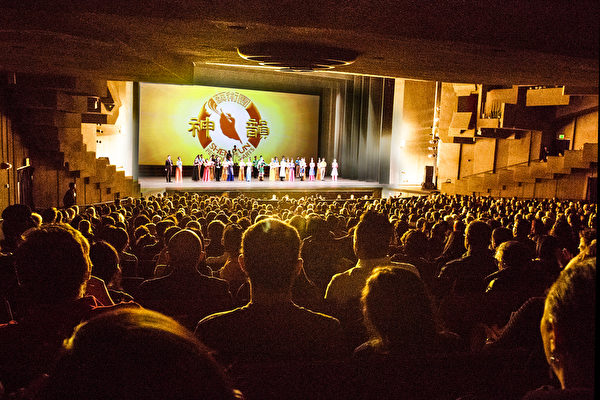

2月16日下午，神韵纽约艺术团在加州大学伯克利分校泽勒巴克馆（Berkeley Zellerbach Hall）进行了第六场演出。当天的观众爆满，一票难求。（周容／大纪元）

 

【大纪元2018年12月17日讯】（大纪元记者周容、麦蕾美国伯克利报导）12月16日下午，神韵纽约艺术团在美国加州大学伯克利分校泽勒巴克馆（Berkeley Zellerbach Hall）举行了今年在当地的最后一场演出。

神韵通过纯正的中国古典舞和东西方乐器合璧的音乐，将五千年正统的中华文化呈现在观众面前。舞蹈和音乐这种万能的语言令伯克利观众大开眼界。有的观众说一定要赶上今年伯克利的“末班车”，千万不能错过。

加州大学伯克利分校是世界顶尖的公立研究型大学，在学术界享有盛誉。其中物理、化学和自然科学一直处于世界领先水平，迄今该校共产生了107位诺贝尔奖得主。伯克利分校的研究生教育一直被认为是美国最顶尖的水平，为世界培养了很多国际人才，其影响遍及全球。伯克利的学术菁英观赏神韵后，深深倾倒。

<b>美国著名物理学家：被带入了古老的时间长河</b>

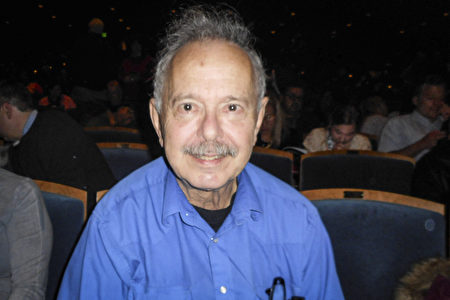

2018年12月16日下午，加州大学伯克利分校物理系教授Richard Muller与家人一起观赏了神韵今年在当地的最后一场演出。（周容／大纪元）

12月16日下午，加州大学伯克利分校物理系教授Richard Muller与家人观赏了神韵的最后一场演出。他赞叹道：“这是一个奇妙之旅，我从未见过这么美的演出。”

Richard的家人中有多位舞蹈演员，孙女还曾荣获过国际大奖，所以Richard看完神韵后，连声赞叹道，“来看神韵前，我就知道这将是我们见过最美妙的舞蹈。即使这样，神韵的美远超我们的预期。”“舞蹈家呈现的技巧非常高超。他们跳舞时是那么轻盈，似乎毫不费力，让我忘记了他们在跳舞。我完全陶醉其中。”

他说，“神韵的音乐是独特的，她结合了东西方音乐的精华。我觉得神韵将最精湛的艺术结合到一起，展现了一个伟大的作品。神韵创造了一种新的艺术形式，神韵艺术家创造力非凡。”“动态天幕太美了，我试图弄明白这是怎么回事，如何将天幕和舞蹈结合得这么精准，我从未见过这样的艺术。”

“我越来越沉醉在欣赏演出的愉悦中，我仿佛被带入了古老的时间长河，忘记了现实，似乎就生活在那个时代。这是一个非凡的文化之旅，是一个全新的体检。”“神韵让我对美、色彩、舞蹈和音乐有了全新的认识。更不可思议的是，神韵将如此多完美的艺术融合到一起，太精彩了。”

Richard表示，“我会告诉朋友们，如果你想看一场结合最完美的音乐、艺术、舞蹈和歌曲的演出，那么神韵就是我见过将所有最精湛艺术完美融合的演出。”

Richard Muller是美国著名物理家，加州大学伯克利分校物理系教授。他启动的实时超新星研究计划，发现宇宙正在加速膨胀，他的学生因此获得了物理学诺贝尔奖。除了从事科学研究，他还是穆勒咨询集团的总裁和首席科学家以及SoliDDD公司的首席科技官。

<b>美国著名生物学家：壮丽非凡的演出</b>

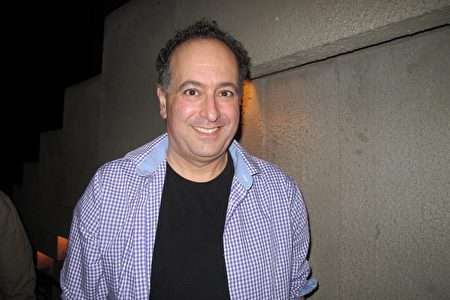

2018年12月16日下午，伯克利大学分子和细胞生物学教授Michael Eisen带着家人一起观赏了神韵纽约艺术团今年在当地的最后一场演出。（麦蕾／大纪元）

 
刚刚观赏过演出的Michael Eisen先生称赞：“我完全被神韵演员的才华所震撼，他们居然可以头顶着罐子起舞！太不可思议了！”他说自己完全能想像到神韵演员为此而付出的巨大艰苦努力。

神韵独创的动态天幕将传统舞台艺术与科技相结合，让身为科学家的Michael Eisen非常喜爱，不用任何航天技术，就可以身临其境般访问月亮，他说：“我喜欢那个有关月亮的故事，人可以到月宫中去遨游一番。我喜爱演员通过天幕的方式展现人类与天堂相连的神奇，他们（演员）上天入地的速度如此之快。”

在传统的中国文化中，天地人合一的理念贯穿在整个中国历史中。神韵用艺术的手法鲜活地将这个理念呈现在观众眼前，对Michael Eisen来说这是全新的理念，是“很美的概念”。

亲身体验过神韵的艺术飨宴后，Eisen表示，一定要推荐这个演出，因为“这是壮丽非凡的演出，演员才华横溢，真是美不胜收！”

Michael Eisen现任伯克利大学分子和细胞生物学教授，主攻生物基因学。他也是开放获取科学出版的主要倡议人，及美国公共科学图书馆联合会创始人。他在2002年获得美国生物信息本杰明‧富兰克林奖。

<h2 align="center"><b>您能平安与健康　是我最大的心愿</b></h2>
 
【明慧网二零一八年十二月十七日】二零一八年已经接近年尾。在这一年里中国发生的事情太多：假疫苗毒害自己及家人健康；P2P网路借贷造成血本无归；国民经济持续下滑，就业难；物价持续上涨……，脆弱不堪的心似乎再经不起一点折腾……

也许，希望就在您的眼前，就在您愿意看到真相并明白真相的那一刻。在二零一九年新的一年将要到来之际，给您送上我的祝愿：祝您平安与健康！这是我最大的心愿。

其实，健康与平安，是每一个人都希望得到的。我的一位朋友给我讲述了她的亲身经历之后，却让我对健康与平安的意义有了不一样的理解与感受。

她说，她三十八岁那年，正值人生得意时，却不幸患上医学界的疑难病──重症肌无力，这种病目前仍无特效药可治。全身无力，连说话、拿筷子都费劲，曾去过哈尔滨、北京、秦皇岛、大连、青岛和石家庄等地的大医院，但最后的结果均同样：没有办法彻底医治！

她的症状很严重，让她心灰意冷，每天卧床面对墙壁与天花板，不愿与人交谈，只能默默流泪。她养的那只小狗仿佛懂得主人内心的痛苦，难过地舔着落在主人手上的泪珠……

那时她唯一等待的就是死神的降临，早点结束这无望的痛苦。

一九九八年年初，有人给她介绍了法轮大法。令她想不到的是仅仅在病床上学法七天，就能下地站立、行走了。

全家人那个乐啊！她清楚的记得女儿当时高兴的蹦了起来，蹦得比床高，大声喊着：“妈妈有救了！妈妈有救了！”

不到一年的时间身体完全康复，几十公斤重的液化气罐，她自己就能很轻松拎上楼。她说，觉得自己是从万丈深渊中走了出来，从心底感激法轮大法，法轮大法就是好！

她为自己能走進大法修炼深感幸运无比！难道不是吗？要知道六年来她为治病花掉了近十万元钱的积蓄，而修炼法轮大法后，没花一分钱身体就康复了，再次拥有了健康和平安。真的迎来了生命的春天！

她告诉我，她已认识到修大法并不仅仅是为了治病。她说：“大法告诉我如何做一个好人，做一个高尚的人、甚至更高境界的人。大法的法理深深的打动了我。中国自古以来都有修炼文化。 作为炎黄子孙，这让我产生共鸣。我终于找到了让生命更有意义的大法，而且还是在深陷绝境的情况下。一想到这，我就会禁不住流泪。”

她还说：“以前我好妒嫉别人，个性非常强，经常因一点小事就会和别人发生争执。修大法后，我变得越来越能站在对方的角度考虑问题，有时自己受了委屈也不再怨恨别人，心里始终保持着一种平和的心态。”

她在大法中受益，努力做一个好人，可是万万让她想不到的是，她竟然因此而先后被中共当局抓去劳教三年，另一次被判刑十年，期间遭受各种酷刑折磨，那真是人间地狱啊！可是她经历这些痛苦之后却说：“我修炼了大法，真诚、善良、忍让的理念已根植内心，这让我非但没有记恨那些曾经迫害过我的人，相反，我对他们更同情，因为他们都是受谎言毒害的人，多可怜！”

她娓娓道来其中的一段经历：

“那是一九九九年十一月末，我被法院、市六·一零、政法委合谋非法劳教三年，关进哈尔滨万家劳教所。在那里，我长期受到刑事犯班长、于姓狱警等人打骂、摧残。一次，我想通过炼功恢复身体，被于姓狱警打耳光，嘴当时就被打歪了，一个耳朵被打聋，狱警还用两寸宽的竹板毒打我，直到把我打的昏死过去。

在此后三、四个月的时间，我只能长期卧床，生活难以自理，一度出现不能吃饭、呕吐。人瘦的只剩一把骨头。一姓孙的狱警将我拖去强行灌食，他们一边灌，我这边从里往外喷。当时我全身长满脓包疥疮，流着脓血，不但没有热水，有时连凉水也没有，想洗洗带着脓血的衣服，可没有水，一泡就是几天。

后来我想，再苦再难也得坚持炼功，因为只有大法能救我。令谁也想不到的是我完全好了。

这件事让于姓狱警觉得不可思议，很神奇，就叫来她的几名同事，对我说：‘给他们唱首歌，让他们也见识见识（法轮大法）！’

我从一个活死人，现在活脱脱地站在他们面前，还有底气唱歌，您说他们能不由衷佩服大法吗？从那以后，明白了事实真相的于姓狱警再没虐待过我，还多次正面宣传大法的美好，看到她能站在正义一边，我心里真为她高兴！”

这是一名法轮功学员的亲身经历，在亲历及见证这场罪恶的迫害后内心真实的表达，是一位修炼真、善、忍的学员一颗纯净的心，让人感动与震撼！

江泽民只是因为一个小人的妒嫉就利用手中的权力不顾一切后果的镇压法轮功，并扬言对大法弟子要“名誉上搞臭，经济上截断，肉体上消灭”。法轮功被中共媒体铺天盖地的谎言抹黑、妖魔化，在中共的监狱、劳教所、看守所、精神病院和洗脑班里，不愿放弃真、善、忍信仰的法轮功学员，遭到肆意绑架、关押，遭到了令人发指的精神摧残和酷刑折磨。

江泽民集团为煽动民众的仇恨，为其镇压合法化，炮制了一出震惊中外的欺世伪案──即所谓“天安门自焚”嫁祸法轮功。央视播出的录像疑点重重，破绽百出，仅举两例：

例一，央视录像画面中清楚地显示王进东的衣服被烧烂，面部严重烧坏，可最易着火的头发却是完整的，他两腿间那个据说是装用于自焚的汽油的塑料雪碧瓶在燃烧的火焰中依然翠绿完整；

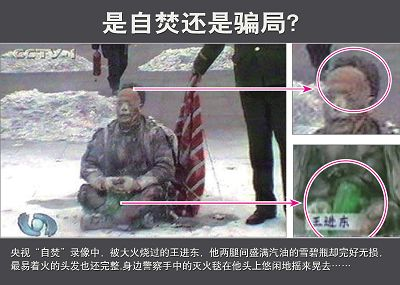

 
例二，根据医学常识，为防细菌感染，大面积烧伤病人要住隔离病房，探视者需穿戴隔离衣、帽、手套和鞋套。而官方记者李玉强却穿着便服、用自身携带的（无疑是带菌的）话筒近距离采访十二岁的刘思影。这是置孩子的生命于不顾，还是原本就是演戏？

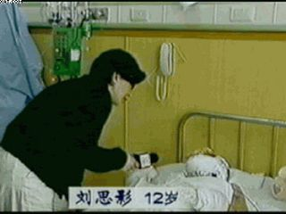

在“自焚”事件中被大面积烧伤的小女孩刘思影气管被切开后四天就能接受采访并能清晰的唱歌。北京积水潭医院治疗“自焚”大面积烧伤者，不作任何防护，允许记者近距离采访，违反医学常识。

二零零一年八月十四日，国际教育发展组织在联合国会议上，就天安门自焚事件强烈谴责中共当局的国家恐怖主义行径：在对中央台的所谓“天安门自焚事件”录像进行了仔细分析、研究后得出结论——这是对法轮功的构陷，涉及惊人的阴谋与谋杀。

人类历史上曾出现过大规模的迫害基督徒、佛教徒的灾难事件，但是基督教、佛教并没有因此而消失，反而得以继续发展几千年，成为当今世界两大主要的宗教。法轮大法遭受中共十九年的残酷血腥镇压，可是却日渐壮大——法轮大法已弘传全球一百多个国家和地区，受到各国人民的爱戴和尊敬。李洪志先生和法轮大法因对人类身心健康做出的杰出贡献，获各国各级政府及各界褒奖、支持议案和信函三千五百多项。《转法轮》已有四十种文字版本，可在法轮大法网站www.falundafa.org 免费下载。

发源于中国的修炼文化，如今弘扬世界，这是中国人的骄傲，也是整个中华民族的骄傲。

真诚、善良、忍让是普世价值，当人的内心及行为真的顺应了这个普世价值的时候，就会得到神的恩赐。不是吗？健康与平安是每一位世人心底的呼唤，得到它，其实并不难。

在新的一年到来之时，真心祝愿每一位同胞能珍惜您看到或听到的法轮功学员为您带来的每一份真相，从而明白真相而拥有健康与平安！ 

<h2 align="center"><b>说说我的“平凡”人生——一位“高工”的心里话</b></h2>

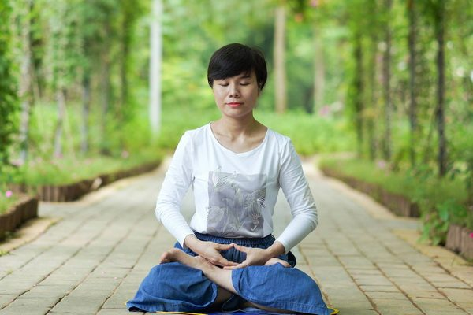

法轮功学员在炼静功（网络照片）

【希望之声2018年12月12日】（本台记者慧光综合报导）我是中国大陆山东人，是一名普通女性，受过高等教育，在一家大型集团公司的主要部门工作，有高级职称。因工作出色，我年年被评为集团公司的优秀工作者。公司下辖有上百家子公司，我所在的部门业务量很大，我的工作性质处在一个上下连结的枢纽上，所以工作很忙，管了一大摊子事儿，每天都需要处理很多事情，但是我都能够轻松应对，因为我有一个健康的身体和从容的心态。之所以拥有如此健康的身心状态，话还要从头说起。

我从小生活在一个大家庭里，家里有五个孩子，我是唯一的女孩。父亲脾气暴躁，家里几乎天天都充满了火药味。我平时总是低着头，不敢说话，但我总想离开这个家，到一个充满温馨和有说有笑的地方。

九岁时父亲去世，我更加沉默寡言。虽然还是个孩子，可内心满是沧桑，不知道活着有什么乐趣，封闭、孤单，没有朋友可以交心，从没有开心的笑过。十六岁去外地上学，即使学校放假也不想回家，家对我没有任何吸引力，有的只是怨和痛。

年轻时我非常期望自己将来能有个温暖的家，有个贴心的丈夫，一个可以让心放开的地方。然而现实总是那么残酷，结婚后才发现丈夫根本就不是我想象的样子，看他哪儿都不顺眼，说不上几句话火就往上蹿，从此后相互间只有冷言冷语，家里总是处在冷漠、压抑和怨恨的气氛中。无奈之下，我感觉这就是命运，看不到任何希望。那时候想得最多的事儿就是离婚，总想趁还没有孩子的时候离婚，以为离了就不会再受这种煎熬了。

就在我的生活最灰暗的时候，没想到突然出现了一个转机。

有一天，办公室的一位同事对我说：“有一本书很好，叫《转法轮》，你想不想看？”我想都没想就答应了。之后我一口气儿把《转法轮》看完了，觉得似懂非懂，又接着看了第二遍。这次好像有点儿明白，但感觉修炼离我的生活太遥远，不能解决我的任何问题。就在我犹豫不决的时候，突然感觉有一股热流从头顶灌入，渐渐的向身下缓缓流动，暖融融的非常舒服，很快就通透全身。这个过程中身体仿佛凝固了，不能动弹，但头脑却异常清醒。我马上想到书中讲过的，是老师在给我净化身体。当时我就被震撼了，没想到老师的话如此灵验。心灵中还响起一句话：佛法无边。我不再犹豫，当即决定走入修炼。

通过不断的看《转法轮》，我明白了自己以前吃的苦、遭的罪，其实都是生生世世的业力所致，人只有消去业力才会有幸福可言，于是我用心的学法、炼功，心性提高的很快。不久就体验到了身体上的奇妙变化，二十多年的心口疼（胃疼）不知不觉间消失了，严重的便秘好了，蜡黄脸色红润了，消瘦无力的身体也变的强壮了。从此走路一身轻，浑身有使不完的劲儿，真是身轻体健百病消。更重要的是性格也发生了很大变化，变得开朗、大方，爱说爱笑了，这是我自己也想不到的。

当然修炼的路也不会总是一帆风顺的。丈夫看到我学法炼功，气就不打一处来，在家里耍酒疯、摔东西，天天找茬儿闹事，还捏着我的鼻子灌酒，憋得我差点儿背过气儿去。这要是在以前我早就和他打起来了，家里得闹翻天了。可是修炼了我只能忍，没有和他争，也没有和他急，该做什么还做什么，做什么事儿都乐呵呵的，上班、带孩子、家务活儿全包，还从生活的方方面面关心他。他自己都说“真是太阳从西边出来了！”

后来有一天在朋友聚会时，他突然说他不喝酒了。我很震惊，朋友们也都不相信，因为丈夫的酒量在单位是出了名的，酒瘾很大，一天可以不吃饭，但不能不喝酒，而且有一个特点，家里不能存酒，不管有多少，当天非喝完不可，喝完他才心里踏实。所以一喝就多，一喝多就误事儿、闹事儿，我常常为此生气。单位领导曾对他发狠话说：“你要能把酒戒了，我就把饭戒了。”

那天吃完饭回家后，丈夫对我说他也要学法轮功了，我问他为什么？他说：“你上班的时候我就看书了。我要看看这本书为什么能让你发生那么大的变化？没想到一看才知道，原来真是本好书。”从那以后，他就把烟酒全戒了，就像从来没有抽过、喝过一样。此事曾在单位引起了轰动，影响了很多人。

2013年，婆婆突患脑血栓住院，出院后几个子女商量好轮流将老人接到家中伺候，在分析了其它几个子女的情况后，我就决定将婆婆接到我家里来住，不再麻烦其他人了。丈夫不在家，婆婆就和我睡一张床。我平时睡觉很轻，一个人习惯了，身边多一个人很别扭，但我想自己是修炼人，遇事得替他人着想。婆婆每天要吃一大堆药，自己又不认识字，吃的药都得我给她准备好，每天还得给她定点做早饭，这些我都能任劳任怨的去做，没有任何怨言。

在单位里，领导和同事都知道我炼法轮功，但都不为难我，遇到有“情况”时还善意的提醒我。因为修炼人思考问题的基点不同，我不争名利，没有任何私心，工作中尽管事情很多、很忙，但处理起来轻松、顺手，不需要怎么费劲儿就能做得很好。因为修炼能为自己带来福分，所以心性提高以后一切都会有最好的结果。

可是这么好的修炼功法，却遭到中共的血腥迫害，真是天理不容啊！真心的希望世人，碰到有人跟你讲法轮功真相的时候，不要一概拒绝，听一听、看一看又有何妨？你又不损失什么，人应该明明白白的活着，即使不修炼，也得为自己、为家人的未来着想啊！

<h2 align="center"><b>中共是导致人权恶化的罪魁祸首</b></h2>
 
【明慧网二零一八年十二月六日】1948年12月10日，联合国通过了《世界人权宣言》，并从1950年起将每年的12月10日定为世界人权日，今年是第68个世界人权日。在国际人权日到来之际，中国的人权纪录仍然在持续恶化。呼吁国际社会关注法轮功人权！

中共迫害法轮功十九年来，以人权恶棍江泽民为首的中共犯罪集团从迫害法轮功初期就提出了“名誉上搞臭、经济上截断、肉体上消灭”、“打死白打死，打死算自杀”和“不查身源，直接火化”的灭绝政策，近亿法轮功学员被污蔑、长期监控，数百万学员被绑架、关押、劳教、判刑及关洗脑班，甚至被酷刑致死或活摘器官致死，数百万家庭被迫害得支离破碎、妻离子散、家破人亡！

中共在面临内忧外患、山穷水尽、穷途末路的时刻，对善良民众的迫害不但没有停止，仍然在肆无忌惮地进行着。据明慧网显示，二零一八年一至十一月份法轮功学员被非法判刑837人；非法庭审805场。一至十月份被绑架人数为3944名；被骚扰人数为3783人。

十一月九日，黑龙江省哈尔滨市各区县、大庆市有119名法轮功学员被绑架，另有，十几位法轮功学员被骚扰，或绑架未遂。这次的绑架是黑龙江省公检法司部门蓄谋已久的阴谋，警察是拿着名单到法轮功学员家绑架的。

据最近在海外曝光的一份辽宁省“610办公室”文件内容显示，从十月开始，中共系统性地加大力度迫害法轮功。

在此仅举几例：据明慧网近日报导，天津法轮功学员周向阳（全国仅有的六十位造价工程师之一），二零零三年五月三十一日曾被非法判刑九年，在二零一五年三月二日又被绑架后，于二零一六年十二月又被冤判七年（周向阳的妻子李珊珊同时被冤判六年。）。周向阳在天津滨海监狱绝食抗议已近三年，现在的周向阳非常苍老、虚弱，每天由包夹人推着轮椅去监狱的医院给他灌食。

周向阳的母亲王绍平老人在一封呼吁信中说：“十七年里，我们一家很少平安在家。向阳被劳教两年加刑一年，九年监狱，只过了两个团圆年。二零零一年，我大儿子夫妇被迫害。大儿九年、儿媳三年。我们夫妇被迫害流离失所，四年后被迫害劳教，我一年半，向阳的父亲两年。”

如今七十多岁的周振才与老伴王绍平老人又被非法判刑。一家人被迫害得支离破碎、苦不堪言。

在中国大陆，十九年来被中共摧残迫害致支离破碎、妻离子散、家破人亡的惨案数不胜数。如辽宁省凌源市建平县的法轮功学员刘殿元，今年八十岁，从一九九九年九月到现在，经历了七年冤狱、四年半的流离失所，二零一五年十一月再次被绑架，在七十九岁的高龄时被辽宁省建平县法院非法判刑十一年半，目前在冤狱中遭受着迫害，还有十年多的监狱生活等待着这个历经沧桑的老人。老人的妻子刘玉芳，今年六十一岁，是一位普通的农村家庭妇女，曾经被非法劳教三年，又被非法判刑四年。

还有一家八口被迫害致五死一残的辽宁省清原县法轮功学员孙鸿昌一家；六口之家被迫害致仅剩一人的河北省怀来县法轮功学员陈运川一家；一家五口被迫害得仅剩下一人的山东省青州市神旺村法轮功学员王兴家一家；三位至亲被迫害致死的河北石家庄市高级工程师冯晓梅一家……

最近明慧网在《这些老人们为什么不能安度晚年？》一篇评论中列举了马桂兰、许玉盘、张鲁元、羊衍海、张新伟、陈再山、李光清、杨七星等中国大陆各地数位老年法轮功学员被中共迫害的悲惨遭遇，进一步揭示了中共邪灵的流氓本性和邪恶本质及祸乱人间、毁灭人类的终极目的。

中共长达近二十年对法轮功的残酷迫害，法轮功人权日益恶化的状况，引起了国内国际社会的广泛关注。据明慧网显示近二十一万法轮功学员及家人控告江泽民，二百八十八万国际社会正义人士连署举报江泽民，三亿二千多万民众抛弃中共退出中共邪恶组织，国际社会正在加速围剿共产邪恶主义的进程，中共政权面临着前所未有的压力，正在风雨飘摇中垂死挣扎，走向彻底崩溃。

从二零零二年开始，美国国会先后通过“188号”、“304号”、“605号”和“343号”决议案，要求中共停止对法轮功学员的迫害，停止针对法轮功学员和其他良心犯的“强摘器官”行径。二零一六年九月十二日，在欧洲议会全体会议上，欧洲议会主席舒尔茨宣布了48号书面声明，要求欧盟采取行动制止中共强摘器官。美洲、欧洲、亚洲、澳洲等许多东西方国家都强烈谴责中共迫害法轮功的恶行，要求中共停止迫害法轮功，制止中共活摘器官的反人类罪行。二零一八年五月二十九日，美国国务院发布二零一七年度《国际宗教自由报告》，中国再次被列为“特别关注国”。（从中共开始迫害法轮功到二零一八年，中国一直被美国国务院列为宗教自由“特别关注国”。）

人权是人类的普世价值，拥有人权，维护人权，保障人权是人类共同的责任。天赋人权神圣不可侵犯。《世界人权宣言》曾向全世界郑重宣示：世界上所有国家的男女不分种族区域，都享有各种基本权利和自由，其中包括生命、自由、人身安全、以及言论、结社、集会等自由。此后，世界上除少数国家外，都在努力践约着《世界人权宣言》。可是作为世界人权缔约国，中共却在肆无忌惮地践踏和破坏着《世界人权宣言》，成为世界上人权状况最恶化的国家之一。

从《九评共产党》、《共产主义的终极目的》和《魔鬼在统治着我们的世界》这三本书中我们得知，“共产主义的本质是一个‘邪灵’，它由‘恨’及低层宇宙中的败物所构成，它仇恨且想毁灭人类。”中共邪灵不但对信仰“真善忍”的法轮功学员灭绝性的摧残迫害，为法轮功学员主持公道并为他们作无罪辩护的维权律师也极力打压迫害。整个中国如同一个大监狱。地球是供人类居住的美好家园，怎么能容忍共产邪灵这样肆意糟蹋和破坏呢？

“茫茫宇宙中，任何生命都无法逃出神的掌握。神在关注着这一切，中共邪党和江魔头的所作所为，令天地和众神震怒！法网在收。”（《共产主义的终极目的》）中共是导致人权恶化的罪魁祸首，解体灭亡中共是解决人权恶化的根本途径。呼吁国际社会关注中国大陆持续恶化的人权状况，尽快结束这场惨无人道的血腥迫害，还人类应有的尊严！

<h2 align="center"><b>澳洲人：成为大法弟子多幸福！</b></h2>

【明慧网二零一八年十二月十日】（明慧记者李正澳洲悉尼采访报道）只要能看到澳洲人尼古拉斯（Nicholas Earle）脸上漫溢着灿烂笑容的人，都会被他的幸福感染！他总告诉别人：“我无法用语言来表达，我真的无法用语言来准确表达：我能成为法轮大法弟子有多么的幸福！因为修炼大法四年中我的身心发生了巨大的变化！”

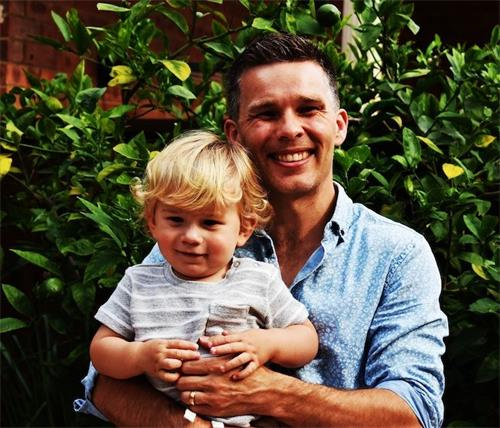

幸福的笑容漫溢在澳洲人尼古拉斯（Nicholas Earle）的脸上

<b>与法轮大法结缘</b>

尼古拉斯是如何走进法轮大法修炼的呢？“我不是在马路上得到一张法轮功的传单，也没有朋友介绍我法轮功，我走进法轮大法修炼完全是一个机缘！”对尼古拉斯来说，这是一个偶然又神秘的机缘！

那个机缘发生在二零一三年十一月底的某天晚上，对生命的起源和其在广阔宇宙中的处境深感好奇的尼古拉斯在网上查询有关“神话”和“古老文化”时，突然“法轮大法”官方网页呈现在他的眼前。在这之前，他从来没有听说过、也不知道什么是“法轮大法”。当他看完网站首页上“法轮大法”简介后，直觉使他立刻点进网站上“李洪志大师九天讲法班音像”。一看讲法录像他就被深深吸引住了，简直停不了了……

那晚他没有睡觉，一口气看了四讲录像，一直看到天亮，在必须去上班的时间到了才停下来。那天下班回到家，他又接着看……用了三天时间，他看了九天讲法班的全部录像。

问到为何看李大师的讲法录像看到不睡觉？尼古拉斯表示他自己还清晰的记着那一幕，他记忆犹新的回忆道：“我记得当我第一次看李大师（师父）讲课录像时的感觉，是一种来自我心灵深处的明白：哇，在我面前呈现的是宇宙的真相和奥秘！师父在清晰、直接地向我展示着我一生中思考问题的全部答案。”

“从此，我对生命的意义有了更深的理解。我开始明白：人真正要改善自己就是要不断的修去依附在人身上的那些不好的东西（执著心），用宇宙法理去归正自己思想中存留的不正确的观念，努力改善自己的道德品质，并且通过改善人的本性直接改变人的修养。而最需要注重改变的是人的心，这是思想的根源。如果没有这些根本性的改变，任何改善只会是肤浅的，短期的，必然会重新出现的。当人渐渐同化于宇宙真、善、忍法理时，人生才会开始变得顺利和幸福。”

因为尼古拉斯在修炼法轮大法前，经常思索生命的起源并在古老的传统文化中探索，看看古人们对此的理解，他发现古老的传统文化都有一个相信来世的共同点，但没有给予真正的答案。相反，修炼法轮大法后的他，却能更深刻的理解和明白以前他看过的其它修炼方法。

于是尼古拉斯发出坚定的一念：“这就是我梦寐以求的修炼方法，我要修炼法轮大法！”

尼古拉斯还清晰的记得，二零一四年四月二十五日那天，因为他的好朋友要离开悉尼去达尔文工作，当他俩在悉尼中国城附近的饭店吃告别饭时，尼古拉斯郑重而高兴的告诉他的好朋友说：“这是我最后一杯啤酒和最后一支香烟，从今后我开始正式修炼法轮大法！”

<b>修炼法轮大法后生活发生了巨大的变化</b>

尼古拉斯在修炼大法前患有严重的焦虑症和被车撞的后遗症，他试图用很多办法包括喝酒等帮助自己，可是收效甚微，那都只是一时一刻的短暂帮助。修炼大法后，使他很快转变了原来对生活的消极、脾气差及一些不好的观念，他的焦虑情绪也很快就消失了，再也没有发作过。这些变化使得他的整个生活和工作飞速的变好。

当尼古拉斯决定修炼法轮大法后不久，他非常幸运的被一家大公司录取，当时只有百分之一的申请人能被选中，这真是百里挑一的好机会，他却得到了。经济得到了很大的改观后，尼古拉斯买了房子，具有了筹办婚礼的资金和能力，并且还有多余的钱去度蜜月，不久儿子也降生了，他的人际关系也百分之百的变好了。

种种生活上突如其来的变化、那种美好和充实是他自己都无法想象的。尼古拉斯认为这一切的急速变化，都是因为修炼了法轮大法。所以他在有限的工作之余，会尽自己的所能在街上发法轮功真相传单，告诉人们法轮功是什么，传递真、善、忍的理念，同时他还把自己在大法修炼中受益的美好体验告诉给更多的人。

平时，他还以自己的言行使周围人感受到大法的美好。用他自己的话说：“在生活和工作中，我努力以大法原理指导自己的言行，无论当我是一名公司员工、丈夫、儿子或是父亲，我都希望使人们从我的言行上看到大法的美好。”

<b>以祥和、认真负责的心态对待工作</b>

刚开始一个新的工作，难免会面对一些考验，尼古拉斯用修炼人的标准去面对。他说：“因为我开始在大法中修炼了，每当我面对日常生活中的困难和挑战时，我知道我应该宽容，为别人着想，并且说真话。 刚开始那个新工作，为了积累工作经验，每三个月我都会在公司内部轮换一次工作岗位。有一次，我发现一个定期检查的安全问题并及时汇报上去。这引起了一位高级技术人员的不满，当时我平静而真挚地向他解释了我的观点。”

“可是几天后，这位高级技术人员在工作时把我逼迫到了一边，我只有普通身高，而他却有六英尺的身高，他当时对待我的语气和肢体语言带有相当大的攻击性，这对我来说是一个很大的考验，如果当时我不是在大法中修炼，那后果将不堪设想。然而在危急关头，我努力用大法的法理要求自己，尽量控制住自己的情绪，我冷静地向他解释了我对公共安全问题的关心，并且明确又平和地告诉他：如果不解决这个安全问题，将来有任何事故发生，毫无疑问我们都将会被调查、处置等。看到我没有被他吓得妥协，相反表现出沉稳而理性的谈吐举止，他生气地冲了出去。原本将发生的一场大冲突，就这样被平息了。”

事后尼古拉斯感叹道：“我注意到当自己在发生问题时首先为别人着想的时候，我的行为举止将有机会在社会上产生积极的影响，过程中也同时提高着我自己。还有，在大法修炼中要求我们在遇到矛盾冲突时首先要向内找自己的问题，先看看我是否有过错，这听起来很简单，但需要一个非偏见和诚实的自我审视态度，同时还要站到对方的立场上去考虑问题。”

<b>在装修住房时为邻居考虑是首选</b>

尼古拉斯还谈到作为修炼人，他如何和邻居相处，从而化解了在装修住房时所遇到的纠纷。

尼古拉斯说：“我家得到了当地市政厅装修住房的许可后，我提前写信通知了我们的邻居。使他们事先知道：我们装修住房时偶尔会制造噪音。同时我和妻子已经采取了一切措施，尽量避免在周末和过早或过晚时间做装修工作，以尽量减少噪音的发生。

即便如此，有一位邻居还是用不很友善的态度三次挑战我。在面对这些遭遇过程中，我始终保持冷静，并表示我打算尽全力配合他的日程安排。因为我在大法中修炼，所以在这段时间里，我总是努力把握好自己的心态，但是事发后我还是感受到其巨大的压力。”

尼古拉斯接着说：“师父已经告诉过我们，要我们遇事时应该保持一种祥和的心态，不要被事情带动。现在我可以看到，要实现这一目标的方法只能通过不断放下执著心来完成。当我渐渐能做到这些时，在与邻居的第四次互动中，邻居开始为他自己的行为向我道歉，我还用这些真诚的话语和他的妻子交谈后，他的妻子也向我道歉。”

又一件看似能使邻居之间互相闹矛盾的魔难，随着尼古拉斯的改变而消失了。

<b>西人学员的感恩</b>

在欢庆法轮大法日和师父华诞之际，尼古拉斯感慨的表示：“师父把法轮大法传给我们，我希望能用我全身心最最真诚的心声，来诉说对师父的感恩。但是我感觉语言其实根本就无法表达我对师父的无限感恩！修炼文化起源于古老时代而且非常庄严和神圣。尽管许多人在寻寻觅觅想修炼，但并不是每个人都能找到真正的修炼方式或学会如何真正去修炼。因此，我们应该珍惜这千载难逢的机缘，并付诸自己巨大的努力去保证修炼成功，以报师恩！ ”

<h2 align="center"><b>警察三问为什么炼法轮功</b></h2>
 
 【明慧网二零一八年十二月十二日】一九九九年七月，中共江泽民集团发动迫害法轮功的运动。那时我修炼大法才一年多，身心发生了巨大的变化，这么好的功法怎么突然间成了迫害的对象？作为军队中的大法弟子，我踏上了去北京的列车，去为法轮功鸣冤。

那是一九九九年十二月下旬，天气开始变冷，我乘坐的火车过了秦皇岛，大约半夜一二点钟吧，列车员开始验票，发现一个人无票，让他补票，那人说身上已经没有钱了，这个人离家还有几站地，看这人能有五十多岁，身上的穿着也不算太整洁，也许当时身上的钱已经花没了。列车员告诉他没票下站下车，然后就走了。我以为列车员说说就算了，谁都有难的时候，可是马上到下一站时，这个列车员真来了，真来撵他下车来了，看样他是必须下车了。看到这情景，我想这大冷天的，又是三更半夜，一个五十多岁的人被撵下车，身无分文，又到陌生的地方，他怎么办？于是我花几十元钱替他补了张车票，他才没有被撵下车。

到北京天安门广场后，我也不知怎么做，也不知找谁说，就在广场的台阶上坐着，坐着时间长了，一名武警战士来盘查我，我出示了军官证，他看我出示的证件后没有说什么就走了。

但总这样坐着也不行啊，我就问了一个武警战士，我问他：听说在广场炼法轮功你们抓。他问我：你是炼法轮功的？我说：是。就这样我被带上了一辆停在广场的警车上。

上车后，车上有几个警察，一个警察对我搜身，只搜出了我的军官证，就是这样，一个警察还对我实施了暴力，他在手上套一个东西击打我的头部。我在部队也搞过普法教育，感觉这个警察是法盲，是知法犯法。因为我是现役军人，按法律他们没权处罚我，而且我也没有犯法，他们最多把我送到部队。

<b>警察一问：为什么炼法轮功</b>

在警车上一个警察问我为什么炼法轮功。我就告诉他：我炼功后胃病好了，我从小就有胃痛的毛病，不定期的就痛一阵，而且还经常呕吐，有一次喝了一口凉茶，胃痛了半个月，吃了好几种药也没有好转。从我炼法轮功后一年多时间胃就没有痛过。我从小就愿意幻想，没有事时都天天浮想连篇，若遇到了点想不开的事，或生气的事那就更是翻江倒海的想个没完没了，尤其晚上睡觉的时候，虽然躺在床上，但至少得浮想两个小时以上才能睡，想的脑袋又热又胀，而且年龄越大越严重，晚上根本睡不好觉。那种别人看不出来、自己却非常难受的状态一直伴随着我。吃了一些调节神经和健脑的药也根本不起作用。修炼后晚上睡觉一要浮想时，脑中就想起大法师父的话：“静而不思　玄妙可见”[1]。然后就能做到不继续浮想了，睡觉也香甜了，以前看到躺下就睡着的人，真是羡慕他们，修炼后自己也能体验到困了就能睡着的幸福。

<b>警察二问：为什么炼法轮功</b>

这警察看我在说法轮功好，就制止我继续说。但过一会，他又问我为什么炼法轮功。我就继续告诉他：我来北京的路上，遇到没有钱买票的人，快被撵下车了，我帮他补了票，警察却说我被那人骗了。我跟警察说，一次看到地上有几十元线，我干脆不拣。警察说别人不炼法轮功也有这样的。我说我跟以前的自己比。

我告诉他：我修炼之前，也拣过钱，而且丢钱的人还领着他父亲找回来了，告诉他父亲就在我拣线的地方掏过口袋，看到这情景，我都没有把拣到的钱还给他。修炼后我觉的真对不起人家，总在这件事上自责自己，到现在我还在这件事上自责自己，有时讲起这件事自责的眼泪都流出来。有一次出差，我带了一万多的现金，而且只要想私吞，拿出几千元是很容易的事，连发票都不需要，但是我没有私动半分钱。

警察又说别人不修炼也有这样的。我同样说我得跟以前的自己比，我在修炼前，部队有的东西，只要家里能用得上，都往家里拿，用不上的觉的东西很好也往家里拿。那时娱乐场所已经多起来了，部队与地方交往，与友军交往及上下级之间的交往中，也难免会涉足这些场所，但自己绝对不做过格的事。

<b>警察三问：为什么炼法轮功</b>

警察看我又说法轮功好，又制止了我继续说。但过一会，这个警察还问我为什么炼法轮功。我就继续告诉他：我们部队遇到调整，所有被调整的人都找了上级的领导，我的直接领导让我也找找人，找找上级的领导，好分配一个好岗位，而且找人花的钱都帮助我报销，结果被我回绝了。这个警察说我傻。而且我修炼几个月就把赌给戒了，以前因为赌博跟家里人吵的都要离婚了也还是赌；那时不喝酒在官场上混也挺不容易，我喝酒后身体出现过许多不适，呕吐啊，关节痛啊，头痛啊，难受时决心以后不喝了，但一到酒桌上就控制不住了，还是喝。但我修炼几个月就把酒彻底戒了。就这样，我把修炼中出现的状态和发生的身心变化都讲给了这些车上的警察，全讲完了，他们也不问了。后来一个警察问其他警察怎么处理我，也许是我讲的事实触动了他们，也许是他们也有良心发现的时候，他们把军官证归还我后，让我下了车。

我修炼后所出现的这些变化，只要是一名想真修法轮功的人都能很快做到的，是一个非常非常普遍的现象。我们这些修炼法轮功的人就是想按照大法书中说的做一个好人，做一个好人中的好人。

在法轮功遭迫害后，自己的亲朋也开始反对我修炼，甚至妻子都提出跟我离婚，他们反对我修炼不是因为我人做的不好，而是怕我受到伤害。而那些世人反对我们，一个是不知道不了解我们，这些人需要我们去告诉他们真相；一个是了解我们却在权力和金钱面前折了腰的人，做违心的事，说违心的话。我们曾耻笑过历史上附和指鹿为马的那些人，也曾耻笑过那些墙头草随风倒的人，但在对待法轮功的态度上又有多少人宁愿做着那种我们在历史上曾经耻笑过的人呢。中国有句古语：人在做，天在看。莫要因为自己的一个错念，毁了自己生命的永远。

<h2 align="center"><b>一位白血病患者的奇愈历程</b></h2>
 

法轮功学员在炼第五套功法"神通加持法“（网络照片）

 
【希望之声2018年12月8日】（本台记者慧光综合报导）我出生在中国大陆北方的一座小城市，是一名普通的女性。2005年，我在一家外资企业工作，在车间里做主管。那时我才二十多岁，工作如意，家庭和睦，丈夫买了一辆小型货车干出租，儿子上幼儿园，我事事顺心，是个让别人羡慕的人。

然而，正应着中国的那句老话——人有旦夕祸福，那年底我被查出患有白血病。也许是因为工作环境的关系吧，我所在的企业当时已经查出有四个人患有此病，之后不长时间都相继死了。听到这个消息后我整个人都懵了，真是如五雷轰顶，太突然了。

我住进了医院，开始时生活还能自理，没过多久就水米不进了。有一次昏迷时，丈夫喊医生抢救，而医生听到后却无动于衷，还慢腾腾的说“你们准备后事吧，没有抢救的必要了”。丈夫情急之下，一把拽住医生的衣服领子，将其扯到我的病房里，医生这才给我输氧气。我醒来后看到丈夫还在跟医生吵。丈夫坚持让医院派救护车转院，医生开始不肯，后迫不得已，打“120”急救热线叫来了救护车。经过一番折腾，转到市内一家大医院时已经到深夜。医生进行必要的抢救后，跟我丈夫说：“情况很不乐观，血小板只剩一万多，对更坏的情况要有心理准备，建议住特护病房”。因为住院已经花了一大笔钱，我不同意，就没去。

医院每隔一天要给患者验一次血，主治医师对我丈夫说，我的身体已经没有造血迹象，每天都要输血。400CC的血就是二千四百元，要自己拿现金去血库提。主治医生还坚持说因为我身体没有免疫力，怕传染，建议我去住特护病房。我不去，他就说我不配合治疗，无奈的走了。

在我入院后的几天里，丈夫几乎每天都与医生吵架。因为每一次治疗都要家属签字，每一次签字时都要承受很大的思想压力，比如输血时要家属签字，说有可能传染甲肝、乙肝、艾滋病等；做骨穿、腰穿时要家属签字，说有可能瘫痪、成为植物人，并有可能死亡等……。丈夫提出质疑时，他们就说“这是院里的规定，家属签字我们就做，不签字我们就不做”。丈夫受不了，恨不得从我们住的十三层楼上跳下去。

有一次他在走廊里抽烟的时候，有一个人过来跟他聊天，说自己以前是个老药篓子，炼法轮功十四年了，再没有吃过一片药，他的邻居也是白血病患者，修炼法轮功后也好了，建议我们念“法轮大法好，真、善、忍好”，只要心诚就一定有效果。

以前我也遇到过有人跟我讲法轮功真相，可是因为受中共媒体的宣传，我对法轮功很排斥，不但不感谢人家，还把人家骂一顿。刚开始发病时，也有人告诉我们念“法轮大法好，真、善、忍好”，我们都不接受。丈夫还颇为不屑的对人家说“医学上都解决不了，念那几个字就能好吗？”

可这一次我们动心了，我心想“既然有那么多人都这么说，也许真的有用呢！”其实也没有别的选择了。

接下来的事情让我们彻底信服了。

就在我们诚心诵念“法轮大法好，真、善、忍好”的第二天验血时，我的血小板上升到八万。那天正赶上有一个老教授领着一帮医生查房，看到我的检查结果很吃惊，也很疑惑，说她“接触血液病患者四十多年，没有一例出现过这样的结果”，还问我是不是吃了什么高级补品。当时因为害怕，没敢说是念“九字真言”的原因。可是从那以后我们就有了信心，丈夫和我没事儿就念，的确是发自内心的念，因为我们已经知道，这比吃药打针管用多了。

从那天开始，我的身体恢复很快，当我能起床走路的时候，我就出院了。出院以后我们找到认识的法轮功学员教我们炼功，并开始阅读法轮功的主要指导书《转法轮》。

因为悟性不好，到了化疗时间我又去医院化疗去了。那天到医院碰到了一个打扫卫生的，是个信基督教的，住院期间她曾劝我信基督教，我没吱声。这次看见了又来劝我，我说我已经信法轮功了，她马上就翻脸了，冲我大声嚷嚷：“人家信法轮功的都不上医院，你来干什么？”我被她的话一下子给噎住了，心想“是呀，我来干什么？”我知道自己错了，就在心里发誓，以后再也不来医院了。

回去后，我把从医院拿的上千元的药加上检查单子什么的全给烧了，此后再没吃过一片药，也没跟丈夫说，直到又该去医院化疗了，我说不去了他才知道。他当时就哭了，打电话找我妈，说：“你姑娘不去化疗了，要在家炼法轮功，这可不是打麻将输了下次还能赢回来，这要是赌输了后果可不堪设想呀！”我妈说：“她的病靠医院我们也陪不起，比咱有钱的都陪不起。她要炼就炼吧，当真有那一天妈不怨你。”

从那以后，我每天坚持学法炼功，身体一天比一天好，如今十二年过去了，我再没去过医院，可身体却比二十多岁时还要好。我一米六六的个子过去体重没有超过百斤，如今一百四十多斤。认识我的人都说我变得漂亮了。

2010年10月，我在发真相资料时，被警察绑架了，把我送到千里之外的洗脑班，那是我第三次被绑架。我前后被绑架了四次。

丈夫把孩子寄养在朋友家，然后去公安局找人、要人。非常奇妙的是，每次他想要去哪，就有人打电话说要去那里送货；办完事刚要往回走，又有人打电话要他从那里往回捎货。他来回都不空跑。他也感到纳闷，“咋就这么巧合呢？”

丈夫在找我的过程中，有些有良知的警察听了我的经历也被感动了，就给我丈夫出主意，让他拿着病历直接到关押的地方要人。

进了洗脑班之后，丈夫大声对警察说：“从她口述中你应该知道她的情况吧？人不犯病怎么都好说，犯病时医院都治不了，你穿的是制服，代表的是国家，你给我签个字，证明人在你这里就行，等人有问题时咱们再另说。”对方不敢签，找来了队长，队长也不敢签字，最后只好说马上放人！

丈夫随后把我从楼上抱下来，说的第一句话就是：“我感应到了神确实存在！从今天开始我正式走进大法修炼。”

之后丈夫把烟、酒全戒掉了。他十三岁开始抽烟，十四岁喝酒，人的岁数不算大，可烟龄、酒龄却不小，年轻时经常喝的酩酊大醉，衣服经常不知扔到哪儿去了。修炼前身上肉都有点松弛了，可修炼后身上的肌肉像铁块似的。

每当回想起我们走过的路，激动的心情总是不知该怎么表达，千言万语汇成一句话：“感恩伟大的师父把我从地狱中拽了回来，又给了我健康的身体和一个全新的家！” 

<h2 align="center"><b>政法委610是迫害法轮功的罪魁祸首</b></h2>
 
【大纪元2018年11月21日讯】据明慧网、大纪元资料显示，1999年4月25日当夜，江还发信给中共中央政治局常委及其他有关领导。信中江泽民首次提出共产党要战胜法轮功。这封信被当作内部机密文件层层向下传达。其他六个政治局常委对此表示了不同意见，但最终屈服于江的淫威之下。

1999年6月7日，江在中共中央政治局会议上讲话，称“法轮功问题有很深的政治社会背景乃至复杂的国际背景”，“是1989年那场政治风波以来最严重的一次事件”。这些讲话内容于6月13日在中共内部秘密传达。

在那次会议上，江告知与会成员中央成立了专门处理法轮功问题的领导小组，李岚清任组长，丁关根、罗干任副组长。该领导小组下设一办公室处理日常事务。该办公室又叫“中央610办公室”，由其成立时间6月10日得名。首任办公室主任是王茂林，刘京和李东生为副主任。其任务为专门策划和驱动对法轮功的大规模镇压。镇压开始后，“610办公室”被定为正部级常设机构，并且超越法律之外。

1999年镇压之初，江泽民和主管公安部的中共中央政法委书记、中央处理法轮功问题领导小组副组长罗干进行过一次秘密谈话。据《江泽民其人》一书披露，江泽民在谈话中交代了打压法轮功的四个政策要点：

1.对法轮功狠点。往死里打。打死算自杀。不查身源，直接火化。

2.在这个问题上，只要能压制住，可以不择一切手段，不受任何（包括法律）约束，整死了人，不负责任。

3. 名誉上搞臭，经济上搞垮，肉体上消灭。

4.一般不发红头文件，只密码电传或口头传达，不署名，一概说是“中央批示”！

2000年初，罗干带着江泽民的命令开始口头到处传达。

2000年1月7日，罗干在全国公安厅局长的会议上发表打压法轮功讲话。

在罗干的命令和指使下，公安部很快成为迫害法轮功的急先锋，并在全国掀起了非法镇压的狂风巨浪。

公安部直辖范围包括公安局、派出所、看守所、拘留中心等，这些部门具体执行迫害法轮功的政策，包括骚扰、抓捕、绑架、抄家、洗脑和刑讯逼供等等。

据明慧网近日报道，中共政法委在迫害法轮功中罪恶累累，遭受的恶报也非常之多。中国大陆中共网站公开通报的就有六十几个中共政法委正、副书记相继落马，其中包括中央政治局常委级的、省部级的、厅局级的中共官员相继落马。

在此仅举几例：二零一五年六月十一日，天津市第一中级法院依法对十七届中共中央政治局常委、中央政法委书记周永康受贿、滥用职权、故意泄露国家秘密案进行了一审宣判。认定周永康犯受贿罪，判处无期徒刑，剥夺政治权利终身，并处没收个人财产；犯滥用职权罪，判处有期徒刑七年；犯故意泄露国家秘密罪，判处有期徒刑四年，三罪并罚，决定执行无期徒刑，剥夺政治权利终身，并处没收个人财产。

二零一六年一月十二日，公安部原副部长、中央政法委员会委员李东生涉嫌受贿罪一审被判十五年。

二零一七年二月十五日，周本顺，中央政法委员会委员，曾任河北省委书记、省人大常委会主任周本顺。因受贿罪被判处有期徒刑十五年，并处没收个人财产人民币二百万元。

二零一七年五月十九日，辽宁省中共政法委书记苏宏章以受贿罪被判处有期徒刑十二年，并处罚金人民币二百万元，以行贿罪判处有期徒刑五年，决定执行有期徒刑十四年，并处罚金人民币二百万元。

二零一七年五月二十七日，河南省郑州市中级人民法院公开宣判天津市中共政协原副主席、政法委书记、公安局原局长武长顺贪污、受贿、挪用公款、单位行贿、滥用职权、徇私枉法一案，对被告人武长顺以贪污罪判处死刑，缓期二年执行，剥夺政治权利终身，并处没收个人全部财产。

二零一七年八月二十八日，广东省广州市中级法院对深圳市原中共政法委书记蒋尊玉受贿一案进行公开宣判，以受贿罪判处蒋尊玉无期徒刑，剥夺政治权利终身，并处没收个人全部财产。

二零一八年七月十二日，曾任河北省委常委、政法委书记张越因受贿罪，一审被判处有期徒刑十五年。

二零一五年四月二十三日，河南省周口市中共政法委书记朱家臣因受贿罪、贪污罪判处有期徒刑十八年，剥夺政治权利五年，没收个人财产六十万元。

二零一七年八月四日，河南省政法委书记吴天君，被判十一年，没收一百万财产。

二零一七年十二月二十二日，广东省广州市原中共政法委书记吴沙。以受贿罪被判处有期徒刑十年，并处没收财产人民币一百万元；对吴沙受贿犯罪所得赃款予以追缴，上缴国库。

二零一七年四月内蒙古自治区赤峰市委原常委、政法委原书记孟繁有（副厅级）涉嫌贪污罪、受贿罪一案，由内蒙古自治区人民检察院反贪污贿赂局侦查终结后，移送通辽市检察院审查起诉。

二零一二年八月八日，山西省壶关县政法委书记牛安林因犯受贿罪、贪污罪、巨额财产来源不明罪，数罪并罚，被判处有期徒刑十八年。

中共迫害法轮功十九年来，以江泽民为首的中共江氏集团从迫害法轮功初期就提出了“名誉上搞臭、经济上截断、肉体上消灭”、“打死算白死，打死算自杀”和“不查身源，直接火化”的灭绝政策，近亿法轮功学员被污蔑、长期监控，数百万学员被绑架、关押、劳教、判刑及关洗脑班，甚至被酷刑致死或活摘器官致死，数百万家庭被迫害得支离破碎、妻离子散、家破人亡！

十九年来发生了许多遭受中共残酷迫害法轮功学员的惨案：如一家八口被迫害致五死一残的辽宁省清原县法轮功学员孙鸿昌一家；六口之家被迫害致仅剩一人的河北省怀来县法轮功学员陈运川一家；一家五口被迫害得仅剩下一人的山东省青州市神旺村法轮功学员王兴家一家；三位至亲被迫害致死的河北石家庄市高级工程师冯晓梅一家、夫妻双双屡遭冤判全家都遭受中共非法关押残酷迫害的河北法轮功学员周向阳一家……

十九年来发生了许多震惊中外的惨案：如镇压长春电视插播惨案、高蓉蓉被毁容灭口惨案、苏家屯数千法轮功学员被活摘器官惨案及“天安门自焚伪案”等，都是政法委、六一零一手制造的。从迫害元凶江泽民到历任中央政法委书记的罗干、周永康、孟建柱、郭声琨，他们都是中共的头号刽子手，双手沾满了法轮功学员的鲜血。

中共江泽民集团发起迫害法轮功十九年来，作为操控协调这场迫害的主要部门政法委、610是这场迫害的罪魁祸首。中央公安部、最高检、最高法、司法部、国安部等是主要帮凶。江泽民是发起这场迫害的元凶，曾庆红、罗干、周永康是推动、操控这场迫害的首犯。明慧网报道的六十多名各级政法委书记遭报案例只是其中的一小部分，这些死心塌地为中共卖命的中共官员的可耻可悲下场，除了兑现善恶有报的天理之外，不失为正在为中共忠实卖命的其他官员提供了前车之鉴。

在逾万因迫害法轮功而遭恶报的案例中，政法委、610不失为是一个死亡职位。奉劝那些仍在此职位的中共官员，认清形势，停止迫害，悔过自新，为自己及家人留一条后路。 

<h2 align="center"><b>我和老伴如此这般走入了法轮大法修炼</b></h2> 

 
 【明慧网二零一八年十二月九日】我和老伴是在中国大陆开始修炼法轮大法的。我们的得法经历有点神奇，这与我的老父亲直接相关。

一九九八年元月，我父亲眼看就八十八岁了，由于长期患三高（高血压、高血脂、高血糖），住院时病情突然加重，还下了病危通知。

在我陪伴父亲的这天，父亲对我说：“昨天某某叔叔来看我，劝我炼法轮功。”这是我第一次听说法轮功，当然也不知道法轮功是什么，我想无非是气功嘛。我就问父亲：“你在练气功吗？我怎么不知道？”父亲说：“我九六年就在炼了。”

其实，从七十年代开始，我的身体就不好，常年生病，听说气功能治病，在八十年代中期，我就开始练气功，而且练了不少气功，很多种气功刚开始都不错，但不长时间就不行了，照病不误，该住院还是住院，几年后我就放弃了所有的气功，而且也不相信气功了。

所以当时我就随意的问父亲：“好不好嘛？”没想到他却肯定的回答说：“好啊！”我很意外，也很奇怪，继续问：“既然好，那你为什么不炼了呢？”父亲叹口气说：“党内有通知：党员不准炼法轮功！”我那时脾气比较火爆，一听这话就说：“共产党管的也太宽了嘛，还管起练气功来了！你觉的好你就炼，管它什么准不准，身体是你自己的啊！”

父亲又叹了一口气说：“住在医院里老师不会管我。”我说：“啊，还是这样的，如果真是这样，那就出院，反正医院也治不好你的病，无非就是让你等着。我说句不好听的话，不如死马当成活马医，那也是一线希望啊，说不定真的好了呢！”我就这么随性的说着，没成想父亲马上说道：“对，就这样，你去给我办出院手续！”

父亲就这样出院了，那是三月的一天。

第二周轮到我们陪伴父亲。没想到来给我们开门的竟然是父亲自己！我吃惊不小！只见从来都一脸严肃的父亲满脸笑容，精神焕发的看着我们。我下意识的问道：“爸，你好了？”父亲笑着说：“你不是看见了嘛。”

我不禁纳闷：仅仅一周啊，就从病危变成了一个慈祥的健康老人，真是不可思议，但是我也没往深处去想，父亲病好了就放心了。

可是，没过多久，大约是四月二十八号，突然接到父亲的电话，让我赶快去给他办入院手续，先去把床位定了，再回去拿支票。我当时真是丈二和尚摸不着头脑，我问父亲是什么病，这么着急？父亲说是高血压，高压240多！我问他有什么感觉，他却说就是没什么感觉嘛，我老伴说那有什么必要住院？父亲说是医生叫住的！

当时，我对老伴说，我有个不祥的预感，如果父亲这次住院，可能就再也回不来了。但是我知道父亲的脾气，无论怎么我也得先去办住院这事，然后再回家看看是怎么回事。

到医院把床位定好后回到父亲家，看见父亲恹恹的半躺在沙发上，有气无力的看着我们，叙说着他的病情。我老伴说这么高的血压，现在有什么感觉？父亲还是那句话：“就是没什么感觉嘛。”

我问：你说住医院你的师父就不管你，那你怎么炼功？父亲说：我就是在想这个问题，不知道怎么办才好？我觉的机会来了，就试着与父亲讨论，我说：“爸，你看，今天是二十八号，马上就是五一长假（放假一周），你即使住進去，根据我的经验，医生不会马上管你，待过完假期才会慢慢的给你检查、治疗，你与其在医院等，不如在家里等，假期过后再去住院，好不好？”没想到父亲立即就同意了，而且还征得了母亲的认可。

令我更没想到的是，过了不到十分钟，父亲突然叫我把住院的支票交给保姆，让她马上去单位退了，他决定不住院了。这个决定把我吓了一大跳，心想，父亲不住院，万一有什么问题，这个责任在姊妹中我可承担不了，所以我立即阻止退支票，但是父亲很坚决，要我一定马上退掉支票。

大约下午五点多，与父母住在一起的小妹夫妻俩下班回来了。一看父亲还没住院，小妹夫大声责问：“是谁的主意不让爸爸住院？老人出了问题谁负责？”我一看情况不妙，就悄悄的对我的老伴说：吵架的来了，我们赶紧走。

出门后我十分担心父亲，老伴安慰我说，你已经尽力了，至于会怎么样，也不是我们能左右得了的。

晚上九点多钟，刺耳的电话铃响了起来。我们知道，一定是关于父亲的电话，都面面相觑，谁也不敢马上去接，后来还是我鼓足勇气拿起电话，电话那边传来父亲洪亮的声音：“我病好了！血压完全正常了！”我小心的问道：“你在医院里还是家里？”父亲呵呵的笑着说：“在家里啊！”我很疑惑，又问：“真的好了？你没哄我们吧？”听到父亲再次肯定的回答，我们放心了，但却百思不得其解，几个小时的惊人逆转，让人太难以相信！我们决定第二天回去看看。

第二天我们迫不及待一大早就回了家。见到精神矍铄的父亲，我除了高兴以外，也产生了一个疑问：法轮功到底是咋回事？我得要研究研究。

于是，我向父亲借《转法轮》这本书，说拿回去看看。出乎意外的是，一向对子女慷慨大方的父亲竟断然拒绝，说：你只能在这里看，不能拿走！我就说：我只借一个晚上，明天一早送回来。父亲还是说“不行！这本书不能离开我，因为我每天都要看。”我还是不死心的死磨硬缠。这时我的老伴说话了：别难为父亲了，书店有卖的，我们去书店买，这我才放心了。

过了几天，我们到书店去买书，可是走遍了书市的所有书店，都没有找到《转法轮》。我老伴感到奇怪，他说前几天还看见有的，怎么一下子全没有了？

一个书店老板看我们進進出出的，就问我们要买什么书？ 我们说买《转法轮》，那个老板立即把食指压在嘴唇上，意思是要我们闭嘴，小声对我们说：“这本书已经不准卖了。”我们失望的问为什么？她说不知道，是接到上面的通知不让卖。紧接着又悄悄的告诉我们她那里还藏有几本。

我们喜出望外，终于得到了这本书。晚上，我洗漱完毕，开始读《转法轮》。

一打开这本书，我就专心致志的读起来，一口气读到第二天早上五点多，读完掩卷还意犹未尽，心想：这本书内涵太大了，不是一下子能消化得了的，但又有一种豁然开朗的感觉，好象什么都明白了：啊！原来如此！

老伴惊异的问我：“读完了？一夜没睡？”我说：“是。”又问：“好吗？”我说：“很好！”“好在哪里？”我说：“就是太好了，我一下子也说不上来，你自己去看。”

当知道我已经决定要炼这个功，老伴调侃的说：“你这辈子做过多少次决定？”我知道，因为我练了太多种气功，他才这样说的，我认真的回答：“这应该是最后一次了。”

老伴看《转法轮》刚看到一半时就对我说：“这本书确实很好，好就好在他叫人修心性，这非常重要。但是，我可以肯定的说，共产党是绝对容不下这本书的，它是无神论，《转法轮》讲的是修佛。”我说：“管它容下容不下，反正我决定了。”

不久老伴告诉我《光明日报》上刊登了一篇攻击法轮功的文章，我说：“再好的东西都会有人说不好。我认为好就行了，什么也不能改变我的决定！”

就这样，在师父的苦心安排下，我俩走進了法轮大法修炼。

和所有真修的大法弟子一样，修炼后我们的身心发生了天翻地覆的变化。

二十个年头过去了，回想起当初得法的经历，犹如昨天。 

<h2 align="center"><b>澳洲议会报告敦促政府：制止非法器官交易</b></h2>
 

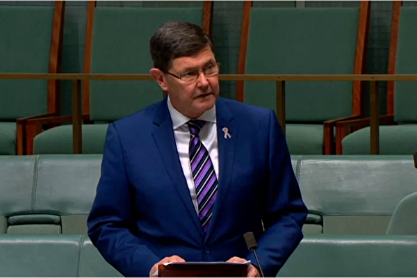

人权小组委员会主席安德鲁斯（Kevin Andrews）在澳洲联邦众议院呈交了有关器官贩卖和移植旅游的调查报告。（政府网站视频截图）

 
 
【大纪元2018年12月05日讯】（大纪元记者燕楠悉尼报导）周一（12月3日），一份题为“人体器官贩卖和器官移植旅游的调查报告”呈交给澳洲联邦众议院。提交报告的议员安德鲁斯（Kevin Andrews）表示，澳洲需要采取更多措施阻止人体器官的非法交易继续发生。

该报告是由议会外交、国防和贸易联合常设委员会的人权小组委员会撰写的，报告就如何禁止不道德和非法的器官贩卖，向澳洲政府提出了12条建议，包括对中国器官移植产业的担忧。

人权小组委员会主席安德鲁斯在议会上表示，“器官贩卖是对人类尊严和权利的侵犯。澳洲政府必须阻止澳洲人和我们的社区到海外去寻找器官。”

目前约有1400名澳洲人正在等待器官移植，另有1.1万人正在进行肾透析，委员会认为澳洲政府未能减少等待器官移植的人数与自愿捐赠的器官供应之间的差距，可能会促使器官黑市、移植旅游的发展。报告敦促澳洲政府尽快采取行动制止这种非法交易。

他还表示器官贩卖是一个国际性问题，报告中详细陈述的一个例子就是外界对中共强摘器官的指控。虽然安德鲁斯在议会发言中没有点名中共，但他描述说：指控是“非政府组织和一些个人长久以来针对在某一特定国家发生的涉嫌人体强摘和贩卖器官的情况做出的。”

<b>多机构对中共提出指控</b>

委员会在议会调查期间收到了来自不同机构、团体及个人提交的陈述，包括法轮大法协会、医生反强摘器官组织（DAFOH）、人权法基金会、为正义而战基金会、停止中国的掠夺器官国际联盟（ETAC）等。这些陈述均指控中国的移植用器官很大程度上来源于包括法外处决的良心犯在内的人，如法轮功学员、家庭教会成员、西藏人、维吾尔人和良心犯。

报告中还提到，器官是“按需”供应，很多团体都谈及中国器官移植等待时间短的问题。ETAC在陈述中说，器官供体需要提前确认身份以进行匹配，“提前预定（移植手术）意味着器官来自于按需被杀的犯人。”

人权法基金会则指控中国存在着“不寻常数量的‘紧急’移植手术，即患者在就诊时急性器官衰竭，然后找到死亡的捐献者，进行移植手术，这些都在24小时内进行。这证明有一大批‘按需供应’的被死亡捐献者。”

另外，委员会还收到了很多法轮功学员提交的自身经历陈述，他们指控遭到中共非法关押、酷刑和“不寻常的体检”。报告中引述了三名法轮功学员的部分陈述，他们指控中共对他们非法关押期间，对他们强制验血，有的甚至还做了X光、CT扫描、超声波检查等一系列细致的体检。这被认为是为建立器官数据库而做的。

对于中国是移植旅游目的地和中国的处决犯人是器官来源的问题，报告中也分别引用了不同渠道的陈述和做了讨论。

人权小组委员会认为，“澳洲政府有责任尽可能地动用全部能力调查这些指控”。虽然中共强烈否认这些指控，委员会以获得的资料和各方陈述为基础，“更倾向于”得出以下结论：器官贩卖在中国已经发生，并可能还在继续发生。

另外，委员会担心，“当下任何前往中国接受器官移植手术的人可能都是在参与不道德的（器官贩卖）操作。”

<b>案例：真实人体展</b>

报告撰写期间，“真实人体展”恰好于悉尼展出，因此报告最后一个章节用此展做案例研究。针对展览方参与人体组织和器官贩卖的指控，人权小组委员会咨询了相关的政府部门。

委员会认为，“人体的组织由其它国家进入澳洲境内，需要联邦考量道德问题。”“如果没有从捐赠者或他们亲属那里获得自愿签署的同意文件，以及有关证明，将人体组织（不论其来源）带到澳洲是不可取的。”

由于“真实人体展”主办方曾向新闻集团网承认尸体标本来源于中国，委员会的观点是，“在（展览方）获取人体组织的时间段，中国境内（人权）状况处于令人担忧的情况下，杀害良心犯的指控说明了提供这样的文件的重要性。对于诸如此类的公共商业展览，这一点尤其重要。”

然而，目前澳洲“各个州和领地的立法并不足以处理来自海外的人体组织存在的道德问题”。

委员会建议澳洲联邦政府和州政府合作，“确保任何个人、公司或法人团体以商业目的把人体组织引入澳洲，需提供可被证实的文件表明已获得捐献者或其亲属的同意，这可能需要联邦或州政府在适当的情况下进行法律修订。”

新州上议员胥布瑞杰（David Shoebridge）对本报表示，“我们必须紧急执行该报告中提出的建议，以确保任何进入澳洲进行展览的（真实）人体都得到了（死者或家属的）充分和自由的同意。”

“在新州，我们已有了文字上的（修订）草案，确保新州居民不能到海外参与器官贩运活动。这份报告为这项措施的实施提供了强有力的支持。”他还表示希望修订的法案能得到新州各党派的支持。

早在2016年11月22日，澳洲法轮大法协会就曾向由国会议员组成的人权小组委员会做了中共强摘良心犯器官的简报。2017年6月21日，由议会外交、国防和贸易联合常设委员会委任下属的人权小组委员会对器官贩卖和移植旅游开展一个议会调查，委员会已就此问题召开过五次议会公开听证会。至本周一，委员会向联邦众议院呈交了详细的最终调查报告。

报告前言的最后一句话表明了委员会在道德层面对器官贩卖的态度：“问题的关键是，用善心和同情（的态度对待器官贩卖问题），而不是商业上的交易。” 

<h2 align="center"><b>天空出现“真善忍” 西澳女子圆梦</b></h2>
 

2018年12月2日，这架飞机带着写有“BE TRUE. BE KIND. ENDURE-FALUN GONG”的横幅，沿着西澳海岸线从南飞到北，历时3小时。（Brian Collingridge提供）

【大纪元2018年12月04日讯】（大纪元记者周鑫澳洲珀斯报导）周日（12月2日）早9点45分，西澳珀斯的科斯特洛海滩（Cottesloe Beach），3岁的奥兰多（Orlando）在沙滩上姗姗而行，突然，他看到一架飞机，后面拖着一条长长的尾巴。“飞机！”他向爸爸妈妈喊道，手指向天空。

特拉维斯（Leigh Travers）先生和太太Sade Travers抬头，看见飞机后面拉着30多米长的横幅。仔细看看，上面有英文“BE TRUE. BE KIND. ENDURE-FALUN GONG”，翻译成中文就是“真、善、忍——法轮功”。

“哇！真是很好的信息。”特拉维斯先生说，“有人把它弄到天上让人看。”

租飞机拖着横幅在天上飞，是凯伦‧唐斯科姆（Karen Dunscombe）女士的安排。早晨8点她就来到科斯特洛海滩，因为飞行员告诉她，10点左右飞机会经过这里。

一个月前，唐斯科姆开始筹划这件事，但真正促成这件事的却是3年前的一连串神奇的梦。

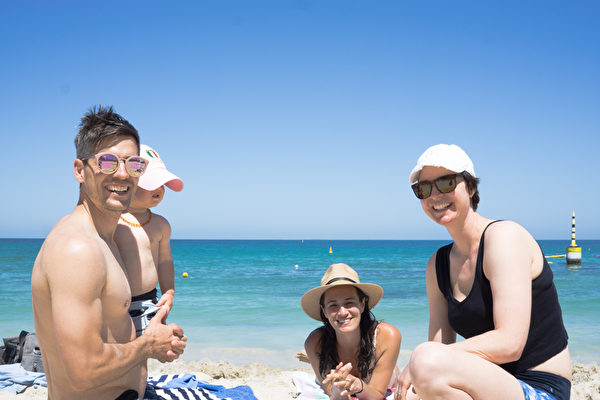

2018年12月2日，唐斯科姆（Karen Dunscombe，右一）租飞机拖着“BE TRUE. BE KIND. ENDURE-FALUN GONG”横幅，沿着西澳海岸线从南飞到北。特拉维斯（Travers）夫妇（左一、右二）认为唐斯科姆做了件好事。（周鑫／大纪元）

<b>一连串神奇的梦 终与现实交接</b>

最初她梦见自己在天上飞，地上有人，她围着人群在天上飞。同样的梦一连做了3次，她不明白是什么意思。过了差不多2个月，她又开始做类似的梦，但有些不一样。

“这回我在梦里想，下面有很多人，也许我应该让他们知道法轮大法。”唐斯科姆说，“于是，我一边飞，一边朝下面喊，‘法轮大法好，真善忍好’。人们朝上看，向我挥手。”就这样，唐斯科姆在梦里一边飞，一边喊“法轮大法好”。

这样的梦，唐斯科姆接连做了好几次，之后的2年多里，她就没再做类似的梦了。

但一个月前，梦与现实终于连接到一起。这天她在公园炼法轮功，打完坐，一架飞机正好从她眼前飞过，飞机后面拖着横幅，在宣传某项活动。

灵光一闪，唐斯科姆立刻明白了她要做什么事。她冲回家，上网搜索“航空广告”。搜索的报价是900澳元做个横幅，3000澳元飞行1小时。

“我非常激动，也许这就是那些梦告诉我要做的事情。”唐斯科姆说，“我不在乎花多少钱。”

“我决定睡一觉，明天起来再看看这是不是个正确的决定。”结果，唐斯科姆第二天一早睁眼后想到的就是横幅。于是，她确定“这就是我要做的。”

唐斯科姆决定租1小时的飞机，横幅上写“BE TRUE. BE KIND. ENDURE-FALUN GONG”。

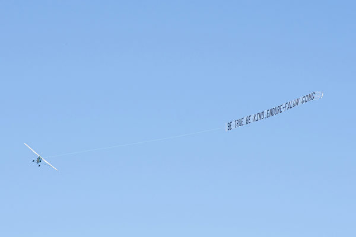

飞机在科斯特洛海滩（Cottesloe Beach）上空盘旋。（周鑫／大纪元）

<b>家人与广告商都支持她</b>

尽管花费不菲，唐斯科姆的丈夫和母亲都很支持她，因为他们都知道唐斯科姆修炼法轮大法，获益匪浅。“如果你真想这么做，就做吧。别管多少钱。”丈夫这样说，而妈妈则说，“奇妙的想法，我很想看到它。”

接着，唐斯科姆联系做航空广告的布赖恩‧科林瑞奇（Brian Collingridge），经过一番议价，以2小时1150澳元成交。但1小时后，科林瑞奇打电话告诉唐斯科姆，他和太太商量后，决定飞行时间延长至3小时，但价格不变。

科林瑞奇告诉唐斯科姆，他们也想参与这件事，因此，免费延长一小时。

科林瑞奇建议，理想的飞行时间是在第一个气温达到30摄氏度的周末，因为这是珀斯进入夏天的标志，届时很多人会到海滩去玩，会有较多的人看到横幅。

根据天气预报，科林瑞奇提前一周就选定了12月2日这一天。早上9点，飞机从珀斯南部的Jandakot机场出发，往西北飞行，经过Bibra Lake区的探险世界（Adventure World）主题公园和弗里曼特尔市（Fremantle）的E-Shed市场，然后折转向南，飞到Rockingham市。

从Rockingham开始，飞机沿海岸线一路向北，途径科斯特洛海滩时，科林瑞奇让飞机在此低空徘徊3圈，以便更多人看到横幅上的文字信息。

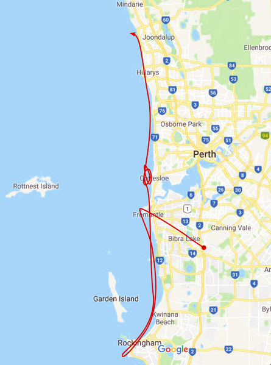

飞机飞行路线示意图。飞机从珀斯南部的 Jandakot机场出发，往西北飞行，经过Bibra Lake区的探险世界（Adventure World）主题公园和弗里曼特尔市（Fremantle）的E-Shed市场，然后折转向南，飞到Rockingham市。从Rockingham开始，飞机沿海岸线一路向北，途经科斯特洛海滩时，科林瑞奇让飞机在此低空徘徊3圈。（大纪元周鑫制作）

<b>回馈法轮功 带给人正面体验</b>

特拉维斯很喜欢横幅上的信息，因为“这不是兜售什么东西，只是努力提升人们的精神境界”。

“我只是想向珀斯人传递一条正面的信息”，唐斯科姆说，“即使只有一天，人们看到真、善、忍，心里也会感觉好，感觉这天很美好。”

当初唐斯科姆预订飞机时，科林瑞奇就感觉好奇，因为这不像他通常见到的那些有钱商人所作的事。当他明白缘由后，认为唐斯科姆做的事“很纯正”，就决意要帮她。

“我就是想回馈给法轮功”，唐斯科姆说，“是法轮功让我成为一个更好的人。”“我想把这种正面的感觉带给更多的人。”

特拉维斯和太太认为唐斯科姆做了一件好事。“这对我们一家来说，是一次很好的体验。”特拉维斯说。

<h2 align="center"><b>在养老院给一家三代人讲真相劝三退</b></h2>
 
【明慧网二零一八年十月二十日】在养老院看到一个老人身边围了三个人：一个是老人的女儿，一个是老人的儿子，一个是外孙。我问他们是否知道“三退保平安”？老人的女儿说：“我已经退了”。老人的儿子说：“你就不怕公安抓你？现在可是挺严的。”我说：“再严也得保命！更何况不是你说的那样。”

老人的儿子说：“我的党龄三十多年了，我哪能退。反正跟共产党这么多年了，也就这样了。”我说：“我公爹七十多年的党龄都退了，何况你三十几年。当初他快不行的人了，共产党的医院要了他那么多钱没治好，听大法录音后已经多活五年了。法轮功是佛法修炼，共产党用‘假恶暴’能把‘真善忍’镇压下去吗？”

老人的儿子说：“事是这么回事，都知道。你在我们跟前说行，要叫公安知道他要抓你的。”我说：“公安警察百分之九十以上是好人，只不过他们被中共谎言给毒害了。”他说：“要是公安来了，你也敢说？”我说：“咱这儿的公安局局长的家人都在学法轮功。你以为他们不明白？……他们也是为了吃碗饭，也是为了养家糊口。”

老人的外孙说：“你的口才真好。应该做营销。”我说：“小伙子，钱重要，命比钱更重要。我认识两个公安警察都是因为迫害法轮功，一个是家人遭了报应，一个是本人遭了报应，死的都很痛苦。知道此事的警察谁还敢再迫害好人？知道将来迫害法轮功都没有好下场，谁还干？”

老人儿子说：“现在谁能治了共产党？”我说：“你知道谁是大腿？谁是小胳膊吗？顺天理而行就是大腿，逆天理而行就是小胳膊。共产党逆天理而行，迫害修真善忍的好人，天理就要制裁它。贵州平塘县断裂的大石头上，老天刻了六个字：中国共产党亡！中共是一个腐败党、杀人党、卖国党。据悉在国外江泽民有几亿存款，中国的钱哪去了？都被共产党贪腐了；中共夺权后，历次运动迫害的都是中国的精英；八千万中国人死于中共之手，相当于当年侵华日军杀害的中国人的四倍。我们都是中华儿女，不是马列子孙，马克思列宁都是外国人怎么能是它的子孙？何况苏联早就解体了共产党。中共是一个腐败党、杀人党、卖国党。你要是想去国外定居，千万别说自己是共产党员，人家要知道你是共产党员，全世界很多国家不会给你办绿卡。中共杀地主、资本家、杀右派；文革杀臭老九、走资派、反革命、叛徒内奸；八九年屠杀爱国学生……中共在国际上已经臭名昭著。”

老人的儿子再也不提公安抓人的事了，也不再提他三十多年的党龄了。而是佩服我，建议我给那些还不明白的政府官员讲一讲。他和儿子都高高兴兴的退了党！

当我给他真相资料时，他说：“这是什么？”我说：“这是《藏字石揭秘》，里面有地质学家鉴定‘藏字石’的真实录像相片；这本是《世纪骗局》，是揭露中共导演天安门‘自焚’栽赃陷害法轮功的骗局。”

我又给了他一个翻墙软件，建议他回家把家人都三退了，但必须本人同意。翻墙软件上有“自由门”和“无界浏览”，就这两个软件能破共产党的网，能破共产党的谎言，上面都是真实新闻。

老人的外孙指着翻墙软件说：“这个是个好东西！”原来他一直在翻墙。他告诉父亲：“通过它能看到国外新闻。”老人的儿子把真相资料揣進怀里说：“这可是宝贝。” 

<h2 align="center"><b>中共即将在可耻中灭亡</b></h2>
 
【大纪元2018年12月03日讯】凝神注目道中看，末日红魔阵营乱；正邪鏖战神鬼泣，愚徒不知前途断。人神参战扫尘寰，群雄翘楚天地翻，大难一到善恶报，好人同进新纪元。>

众所周知，吸毒的人一旦成瘾后，要想让他们戒毒，简直太难了。以前笔者偶尔看到过关于吸毒者的一些文章。吸毒后，人在毒品的麻痹中会产生一种幻觉，并给人的感官虚拟一些“美好”的享受，令人如痴如醉。而这种因吸毒幻化的“享受”也不过十年时间，之后就是渐渐的身体衰竭，精神颓废。当人们看到那些骨瘦如柴，面目发黑，弱不禁风的吸毒者，常称他们为“大烟鬼”，就像徒具人形的鬼了。

一个吸毒者毒瘾发作时，根本控制不住自己，他们会不顾一切地去买毒品，甚至不管家人的死活，直至倾家荡产。为了吸毒，会使人变得没有廉耻，甚至丧失人性。

毒，在人世间有各种各样的体现，它会随着人们道德的下滑而蔓延。就像中国大陆今天的现状，有毒的东西到处都是：毒水、毒粮、毒空气、毒肉、毒酒、毒疫苗、毒米、毒油、毒蔬菜等等，无物不含毒。一谈到这些遍地的毒东西，人们就感到可怕，生存的环境处处危及着生命的健康和安全，很多人一发病就是绝症，四十来岁、五十来岁，身体壮壮的说没就没了。

如今的中国大陆为什么到了社会道德崩溃的地步？为什么人人相害，人人被害？归根结底就是被无神论、假恶斗、进化论、金钱至上、性开放等这些邪恶的东西所毒害。因为精神、灵魂被毒害了，人心也就变坏了，人心变坏了就是坏人，那么坏人什么坏事干不出来呢？不然中国大陆各种暴力、犯罪和毒、假、黄能发展到不可收拾的地步吗？

比如吸毒的人，让他戒毒容易吗？那些坏事干绝的人，让他们相信善恶有报，他敢相信吗？无神论和假恶斗符合了他的恶行，他就信无神论，他们就要跟着散布无神论的魔鬼走。

就像吸毒者，中毒越严重越离不开它。

仔细想想，这都是中共这一西来红魔几十年有意给人们灌输的精神鸦片，把中国人毒害到这种地步，黑白颠倒、正邪混淆，普遍坑人害人，见死不救，讹人赖人，谁还敢做好人呢？满世界充满罪恶、荒唐之事。中共灌输的精神鸦片把人麻痹到了极点，全国人民绝大多数都知道中共最坏，可众多人却不愿抛弃它，心甘情愿被它的谎言毒害著，在它营造的十恶俱全的场地里寻求着各种欲望，无恶不作，纵欲狂欢，日益堕落，人不人鬼不鬼。看看中共那些落马的高官有几人不是腐败荒淫，生活糜烂，情妇成群，放荡不羁？就连中共前党魁毛泽东、江泽民也是声色犬马、奸淫无度，撒谎从不脸红，害人从不手软。胡耀邦忧国爱民被赶下台，赵紫阳不愿杀害请愿学生遭打压，说穿了中共就是容不下好人。中共就是要把中国人统统变成坏人，破坏传统文化，摧毁人的道德，让人没有做人的底线，最后招致天降大难，毁灭中华民族。

有这么个人，文革时期是造反派头头，整了很多人，干了很多坏事，文革结束后蹲了十年监狱。当时他积极地回应党的号召，一心听党的话，跟毛XX走，心不慈手不软的打倒阶级敌人，打压那些被栽赃的所谓“坏人”，谁知文革过后他却成了中共的替罪羊，成了真正的坏人。上个世纪九十年代的后期，此人有幸学炼了一种佛家功法——法轮大法，也称法轮功。法轮大法主要告诉人们按照“真、善、忍”的标准修心向善，在社会上做好人，更好的人，最终会得到真正的福报。此人按照“真、善、忍”的标准衡量自己在文革时所干的坏事，痛悔不已，决心今后要按照佛法的要求做一个真正的好人，再不伤害别人、损害别人。他从佛法中懂得了人生的意义，知道了怎样去做人。不料一九九九年江泽民与中共勾结一起，悍然发动了对佛法的迫害，把上亿的法轮功学员推向对立面，并制造一个个谎言陷害法轮功。此人在法轮功中受益匪浅，后来为揭穿中共谎言，却被塞进监狱迫害了八、九年。

也有黑社会老大，危害社会，横霸一方，连当地公安都不敢惹，甚至还与其互相勾结，警匪一家。有人后来修炼了法轮功，洗心革面，成为打不还手，骂不还口，再不做坏事的好人。但是却因修炼法轮功做好人被绑架到劳教所或监狱迫害。这些法轮功学员理直气壮地问那些绑架他们的警察：我不修炼法轮功之前你们敢对我这样吗？我做坏人没谁敢管，我做好人反倒被迫害！

一桩桩的事实都在揭示著中共的罪行和它的魔鬼嘴脸。回顾中共窃政后的一次次运动，哪一次不是制造谎言、煽动仇恨，蒙骗、操控一些被它弄坏的人，打压被说成“坏人”的好人。可运动过后，那些中共的打手们都成了历史的罪人、坏人。无论人们听信了中共说的什么话或相信它做了什么好事，都如同吸食了剧毒鸦片，最终会害了自己。

有一个在中共政府部门工作的干部对法轮功学员说，公、检、法都是我们的管辖范围。他说，“其实大家都很清楚你们是被迫害的，在这样的高压下坚定不移的讲真相，你们才是最值得尊敬的。不像我们的政府，各级官员只要手中权力，有很多警察他们都是关系户进来的，有的只有小学文化，什么坏事都干，只要给钱、给官什么伤天害理的事都做。但是也有好的，看明白了共产党的本质，再大的官他也不做，辞掉工作去开公司去了，移民国外的多了。就是走不了的国安、国保、公安，有的也不再干坏事了。在条件允许的情况下还要保护你们，帮助你们。想往上爬的那些人还在抓你们。但是遭报应的也不少。听说有一个单位公安科全部遭报应。有一个人，孩子考上北大，第二天该去学校报到了，头天晚上出车祸死了！老婆受不了打击也死了，而他本人没多久也得喉舌癌死了。一个个的结局都很惨。听说一个派出所的副所长也是流氓，长期派人跟踪监视法轮功（学员），有一天上班时死在办公室里，才四十多岁。他老婆吸毒不知去向，儿子去偷盗，被抓到了派出所，说自己叫什么，父亲叫什么，其他人听后都心酸。”

善恶有报，这是永远不破的天理，而中共的无神论能改变天理吗？跟随中共迫害佛法和法轮功学员的人，如不悔改，弥补自己的罪过，哪一个也逃不脱恶报的结局。近二十年来，那些参与迫害法轮功和恶意举报法轮功学员，遭恶报的事例甚至不低于十万例、数十万例，只是有的突出，有的不突出。

今天中共在濒临死亡的回光返照中，还想再度掀起对法轮功的疯狂迫害和打击海外敢于说真话、揭露中共迫害中国民众的正义媒体大纪元、新唐人，都是异想天开。中共如今是上被苍天谴怒，下已失尽民心，内里腐败透顶、互相倾轧，还想操控一小撮流氓恶棍与佛法较量，只不过是在加速自己的灭亡。

二〇〇二年，贵州平塘县掌布乡桃坡村风景河谷，从高山上落下的巨石断面处惊现“中国共产党亡”六个大字，经中科院地质学家考察非人工所为，乃天然形成。这是上天在告诉人们，中共的灭亡是不可抗拒的天意，谁跟随中共、死保中共，在其灭亡时就是它的陪葬品。抛弃中共，自愿三退（退出曾经加入过的党、团、少先队），就能得到佛法的保佑，度过劫难，进入新的纪元。目前在海外《大纪元》网站声明三退的人数已近三亿二千万。中华儿女的觉醒正在解体著中共，削弱著中共，加之全世界正义力量对它的谴责和上天对它的讨伐，以及海内外法轮功学员日复一日，年复一年地在反迫害中，揭露着它的魔鬼本质和企图毁灭中华民族的险恶意图，使它的全部罪恶曝光于天下。现在中共已成了丧家之犬、瓮中之鳖，还能撑几时！天时已到，中共即将在可耻中走向灭亡！

<h2 align="center"><b>炼法轮功真好</b></h2>

【明慧网二零一八年十一月二十日】我从小体弱，为了强身，三十多岁时跟着潮流，今天跳这个、明天蹦那个，最后练了一种假气功。当时不知是假的，正当我很投入的练时，身体出现了状况，医院检查怀疑是心肌炎、风湿性心脏病，彩超检查是二尖瓣闭锁不严、返流，连续住院两个多月都不见好转。从此卧病在床，班上不了了，家务活干不了了，每天不是喝中药就是吃西药，成了名副其实的药罐子。随着时间的推移，我的精神也垮了，经常失眠。

在我痛不欲生的时候，有人向我介绍法轮功，由于当时悟性低，我对她说：我练气功花了那么多钱，就是为了强身，可还是有病了，你说一分钱不花就能治病，我不信，我现在什么也不信了。

家人劝我：人家好心好意的，就去试试吧。几年的病痛折磨，我何尝不想摆脱呢？就这样抱着试试的心理，我走入了大法修炼。

那时炼法轮功的动功共半小时，可我站不住，炼几个动作就坐地上歇一会儿，炼一会儿、歇一会儿，可炼完后没有象干完活那样的疲劳感。就这样坚持了几天，身上有劲了，能够完整的炼功了，能够自己骑车去炼功点了，不知不觉中气色好看了，身体不适的感觉没有了。再炼下去，无病一身轻了，原来严重的血管性头痛、严重的妇科病也都不翼而飞了，全好了！

法轮功太神奇了，我庆幸自己找到了真法。一九九五年底，我请到了宝书《转法轮》，那时各地书店都有卖。通过看大法书，我明白了做人的道理。书中的法理打开了我的心胸，我不再小心眼，不再看重名利了，能宽容他人，在工作和生活中努力实践真、善、忍。

因我是单位的老病号，有些需要院长签字才能开的药。我母亲也有病，我在单位给母亲办了家属医疗证，家属看病取药可减少一半费用。我修炼法轮功后身体好了，没再吃过一次药，给单位、国家节省了大量的医疗费，给母亲取药完全可以以我的名义取药，可我一次都没用过，给母亲开药需自费的那百分之五十也没对其他家人报账，总是我自己承担。如果我不炼法轮功，为了省钱，那时的我一定会用我的名义拿药的。可我是法轮功修炼者，做事要真，不管别人知道不知道，我自己心里有杆秤，有心法约束，不会为了自己的私利去占便宜的。

后来单位发了医保卡，我也没用过。后来换成全市通用的医保卡时，原卡里面的钱退给了个人，我是单位唯一一个退全款的。同事知道退了我三千元，都觉的不可思议，问我：“你平时就没有个头疼脑热、感冒的？”我说：“偶尔身体也有不适的时候，可我一炼功就好了，比吃药还快还管用呢！”我通过此事有力的证实了大法。

换成全市通用的医保卡后，有一次家人想用我的卡去看病买药，因为他卡上没钱了。我陪他一起去了医院，用现金给他结账，并给他讲了我作为修炼人不能这样做的道理。大法弟子在这么多年的残酷迫害中都不曾放弃对真、善、忍的信仰，我怎么能为了少花点钱做出不真的事呢？

我和公婆住隔壁，丈夫另外两个兄长住的也不远。公婆八十多岁时，为了照顾他们，我们合在一起过，一日三餐、来人待客等很是忙碌。二零零零年单位定员定岗，够条件的可自愿内退，正好家中老人生病，丈夫工作忙经常出门，要我照顾家中老人。我权衡了一下，单位有我不多、没我不少，而家中老人需要照顾，因此我选择了内退。我在申请书中写道：虽然我热爱本职工作，但面临定员定岗，还是把上岗机会留给年轻人吧。校长看过后让我再考虑，因为我是校长争取来这边工作的，她很认可我，但我还是递交了申请。

公公重病卧床几个月，我端屎端尿，住院期间说是大家排班照顾，但那两个妯娌一个说上班没时间，一个去过一两次就不去了，我一直跟着排班。那时孩子上高中，放学晚，我给孩子做好饭，不管多晚也赶着去医院，公公不吃不喝也不说话，只有我去喂时才张口喝一点，别人怎么说他也不张口，在家时，大部份时间也都是我喂饭。

公公离开后婆母对我们说：“我不是就一个儿子，不能总累着你们，你二哥那楼高不方便，我去你三哥那儿，你们两家我轮着住。”可住了几个月回来后，婆母说什么也不再去了。婆母年岁越来越大，小脑逐渐萎缩，有时出门就找不到家了，有时在家门口还打听家在哪儿。我们怕她一人出去走失，每天带婆母出去遛弯、晒太阳，丈夫不在家时，我就带着她出去，几次生病我都陪在她身边，提醒她念“法轮大法好”，每次都转危为安。

婆母九十多岁时，兄长把婆母接去了，几个月后兄长们提出要卖婆母之前住的房子。丈夫说这房子卖了，咱妈住哪儿？你们打算让妈长期住你们那儿吗？他们语塞了。到此丈夫才明白，兄长接走老妈是为了卖房分钱。

婆母托大法的福，一百零三岁寿终。在照顾老人的过程中，我能无怨、无悔、包容他人、不计得失，是因为大法开阔了我的心胸，净化了我的心灵，是法轮大法给了我健康的身体、祥和的心态。我由衷的说：法轮大法好！

<h2 align="center"><b>是什么让“女强人”发生巨变</b></h2>

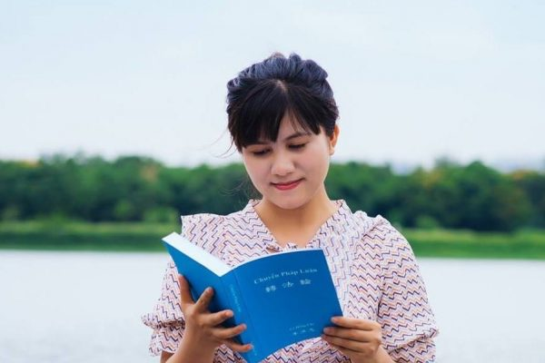

法轮功学员在阅读修炼指导书《转法轮》（网络照片）

 
【希望之声2018年11月28日】（本台记者慧光综合报导）她是中国大陆河北省人，工作在一座中等城市，人长得端庄漂亮，但性格泼辣，喜欢争强好胜，是一位典型的强势女人。

她参加工作时尚未结婚，在一家娱乐场所担任领班，因为只有她是企业正式员工，其它人都是临时聘用的，就养成了她高高在上、颐指气使的习惯。她喜欢阿谀奉承，喜欢人夸她能干、漂亮，听不得不同意见，只要发觉有谁不服从管理，或者看谁不顺眼，一定会不择手段进行打击报复，同事们对她都是敢怒不敢言。

虽说她当时还是一名未婚女性，由于没有道德观念约束，养成了很多陋习，嘴里经常叼个烟卷儿，满口脏话，以为这是时尚；没事儿的时候经常与员工赌博取乐，以为这是跟员工打成一片。

后来结婚了，无论是在家里或在婆家，她照样是盛气凌人，一切都要自己说了算。家人都知道她这个习惯，凡事都由着她。不管什么事，都等着她说了怎么办才去干，只要她不发话就没人干。开始她还以为这是好事，好像她有权威，别人是在尊敬她。时间长了才发觉内心很苦很累，可是又说不出什么来。尤其是生完孩子后她落下了腰疼病，一干活就疼的直不起腰，使得她总是心情烦躁，看什么都烦，似乎有满心的委屈无处诉说。

有时候她也感到疑惑：每天忙忙碌碌，钱也挣得不少，家里什么都不缺，丈夫有职有权，有很多人羡慕我，可是扪心自问我并不快乐，难道就这样过一辈子吗？这样的人生有什么意义呢？

由于内心的孤独迷茫，有许多问题得不到解答，她感到很郁闷。有一天，无意间向一位朋友说了自己的心里话，没想到这位朋友对她说：“我听说有一本书叫《转法轮》，这是一本奇书，很多人看过之后都会有很大转变，建议你不妨看一看。”她当时有些不相信，但又感到非常好奇，就说：“什么书会有这么大的作用啊？我一定要看一看。”那位朋友的家人有炼法轮功的，很快就把书找来了。

当她捧起书阅读的时候，真应了那位朋友说的话，书中的内容就像一盏明灯，照亮了她那颗浮躁不安的心，她说：“书中的话很多都好像是针对我讲的一样，我心中的很多疑惑老师都解答的清清楚楚。我明白了人生的意义就是要返本归真，返回自己先天的本性，这太重要了。以前自己总是糊里糊涂的，就是因为不懂得这些。其实反思一下，自己所有的不良行为恰恰是自己痛苦的根源，老师讲的太好了，我一定要修炼。”

还别说，她还真是那种说话算话的人。下了决心以后，她马上就戒掉了赌博和烟酒的习惯，再也不说脏话了。她知道作为修炼人要时时处处按照“真、善、忍”的要求约束自己的行为，工作中认真负责，学会了理解和包容；遇事知道向内找，在家里也温柔多了，心地变得越来越善良。她说：“法轮大法彻底改变了我，每天学法炼功，我很快乐也很充实，因为我知道了生命的真谛，不再迷茫了。”

大法修炼之所以有那么大的神奇威力，是因为有严格的心性要求，所以她在心性的提高方面遇到了多次考验。

首先遇到的一件事就使她剜心透骨，就是丈夫有了外遇。当发现了这件事以后，她的内心痛苦极了，几天时间就消瘦了很多。她实在想不通，“我对他那么好，他为什么这样对我？”在此后的整整五年，丈夫索性就不回家了，后来才知道丈夫这些年与好几个女人有染。他与那些女人在外面租房住，为她们买这买那，付出了全部感情和金钱，可慢慢的发现那些女人都是在骗他，都是看上了他的钱和职位，有的连名字都是假的，有的还要检举他。他受到了威胁，身心疲惫，有一天非常狼狈的回家了。

看着丈夫可怜的样子，她动了恻隐之心，满腔的怒火烟消云散，几年的怨恨顷刻间化为乌有，她选择了包容，并在生活中尽可能的给予关心和照顾。丈夫爱吃肉，就经常为他做可口的饭菜，即使没有时间做，也会给他买各种熟食。丈夫看到她的变化和辛苦，也开始关心她，默默的承揽了所有家务，并在人前人后常常夸她。

由于她工作努力，由领班升为区域经理，职位和薪水都不错，但为了照顾孩子和家，她辞去了这个工作，而选择了一个离家较近的家政公司做保洁。尽管是为家庭着想，可丈夫还是不理解，认为保洁是下等人干的工作，让他没面子。她对丈夫说：“我是靠自己的劳动挣钱，不偷不抢，不贪污不腐败，不干不道德的事情，心里踏踏实实的，是值得任何人尊敬的，这有什么不好？”

她坚持了自己的选择，同样在工作中按照“真、善、忍”的原则严格要求自己，处处为客户着想，无论是高端客户还是低端客户都一视同仁，很快就得到客户的认可，都争着替她宣传。在别的员工经常找不到活儿的情况下，她的业务总是满满的。由于她不怕吃苦，并努力提高自己的业务技能，在公司里收入和客户好评都排在前三名。

她说：“我从一个外强中干的‘女强人’，变成了一个真诚、善良、温柔又有耐心的漂亮女人；从一个自私自利、满身恶习的人，变成了一个淡泊名利、宽容大度的快乐女人；从一个怨妇变成了一个无病无痛、一身轻松的健康女人，是法轮大法改变了我，指引我走在返本归真的大道上。我的变化源于博大精深的法轮大法！我是在大法中获得了重生的新生命！” 

<h2 align="center"><b>生与死的抉择</b></h2>

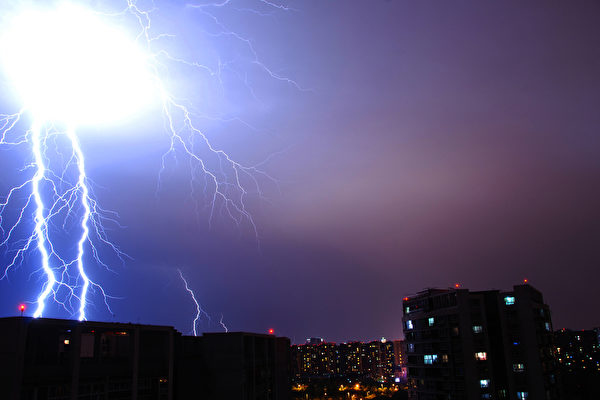

 
【大纪元2018年12月02日讯】<b>引言：</b>

1989年2月的一天傍晚，22岁的东德青年克里斯·格夫洛伊在企图偷越柏林墙时，被东德守卫士兵亨里奇开枪击毙。事后，亨里奇还受到上司的嘉奖，成为了英雄。仅过了几个月。1989年底，柏林墙被推翻，东西德终于回归统一。

1992年2月，柏林墙倒塌两年后，东德守墙卫兵亨里奇受到了审判。

亨里奇的辩护律师为他辩护说：“亨里奇作为军人，他仅仅是在执行命令而已，他别无选择，罪不在他。”然而法官西奥多· 赛德尔却不这么认为：“作为军人，不执行上级命令是有罪的，但打不准是无罪的。作为一个心智健全的人，此时此刻，你有把枪口抬高一厘米的主权，这是你应主动承担的良心义务。这个世界，在法律之外还有‘良知’。当法律和良知冲突之时，良知是最高的行为准则。尊重生命，是一个放之四海而皆准的原则。”

因此最后法官判处亨里奇入狱三年，而且不许假释。

下面我们来看看他们是如何对待生命的呢？

<b>一、她是一个普普通通的波兰护士，却从纳粹德军手中夺回了2500多个孩子的生命。</b>

1910年，艾琳娜·森德勒（Irena Sendler）出生在一个天主教家庭。

1939年德军入侵波兰后她利用“社会工作者”的身份进入犹太人区，连续18个月，每天冒着生命危险，来回集中营数次，每次掩护几个孩子离开，将2500多名犹太儿童藏在担架下、手提箱里、甚至棺材、尸体袋中，甚至后来她把有些孩子装成生了传染病的样子，用救护车运走，偷偷带出了犹太人区，送往天主教会。

1943年10月，她做的事情被盖世太保发现，在帕维亚克监狱，被打残了双腿。

2006年10月，时年96岁的艾琳娜·森德勒，获得了诺贝尔和平奖的提名，但艾琳娜从未将自己看成英雄，她说：“那些被救出来的犹太孩子，已经证明了我在世上的价值，但这并不是值得赞扬的理由。相反，我总是受到良心的谴责，我本来可以救更多的人。”

2008年5月12日，艾琳娜在波兰逝世，享年98岁。

<b>二、他是德国纳粹党，曾救下25万中国人，被称为“中国的辛德勒”。</b>

约翰·拉贝1882年11月23日出生于德国汉堡，1908年他接到西门子中国公司的招聘来到中国，开始在北京上海等地经商。在中国生活了30多年，每晚写日记是他最喜爱的消遣方式。

抗日战争爆发后，拉贝利用自己的纳粹身份，在自己的住宅收容了600多名中国难民，在他负责的不足4平方公里的安全区内，他和他领导的十多位外国人，与日军斗智斗勇，与日本领事馆反复交涉、抗议，阻止日军的恣意侵犯和屠杀，成功拯救了25万中国人的生命，当时被人们称为“活菩萨”。

后来世人们知道此事后，誉称他为“中国的辛德勒”。第二次世界大战之后，约翰·拉贝由于是纳粹党人而被苏联和英国逮捕，后证实他没有犯错并在当年拯救中国人的事迹而被释放。1950年，拉贝在西柏林逝世，1997年，他的墓碑从柏林搬到了南京。

<b>三、盖世太保枪口下的中国女人</b>

钱秀玲出生在江苏宜兴王婆桥钱居村一个“谈笑有鸿儒，往来无白丁”的名门望族。

求学期间，她结识了医学系一位名为德佩兰尼的校友，最终结为伉俪。婚后，她随丈夫来到距离首都布鲁塞尔170公里的偏远小村埃尔伯蒙，开了一家诊所。

1943年5月，德军侵占比利时。一位名为罗杰的反战青年炸毁了一条德军军列专用铁路。德军抓住罗杰，并张榜宣布要判处绞刑。全镇居民无计可施。

在这紧要关头，钱秀玲想起与堂兄钱卓伦在中国共过事、时任德军驻比利时军事行政最高长官的法肯豪森。

于是，钱秀玲带着当地的市长、罗杰父母及全村父老乡亲的联名求情信，冒着生命危险，奔赴170多公里外的布鲁塞尔，见到法肯豪森。几天后，不但罗杰的死刑被改成了苦役，而且，另一名同名的死刑犯也因此而获救了。事情很快传开，钱秀玲成了人们眼中的“英雄”。人们遇到难事，都恳求她帮忙。她废寝忘食，风雨无阻地奔波在埃尔伯蒙与布鲁塞尔之间，冒着随时被盖世太保逮捕的危险，扔下几个不大的孩子，竭尽全力营救著那些抵抗者。而钱秀玲一次次求助于法肯豪森，他几乎是有求必应。

1944年6月6日，盟军在法国诺曼底登陆。第三天，艾克兴市的抵抗组织击毙了三名盖世太保军官，盖世太保立刻包围了小镇，逮捕了96名青年男人，并宣布：36小时之内必须交出枪杀盖世太保官员的游击队员，否则每次枪毙15人，直到交出袭击者为止。

人们又想到了钱秀玲。当时，钱秀玲正怀有5个月的身孕，一听到这个消息，她连夜赶到布鲁塞尔，找到法肯豪森。

第三天，遭逮捕的96人获得减刑，改押到德国。大约半年后，他们全部陆续返回。

二战结束，法肯豪森被引渡到比利时，作为德国头号战犯接受审判。钱秀玲与她救助过的几十人一起出庭为他作证，使法肯豪森免于死罪。

为表彰钱秀玲，比利时政府向她颁发“国家银质感谢勋章”。艾克兴市为感念她的恩惠，特地把该市一条街道命名为“钱夫人街”。钱秀玲成了家喻户晓的人物，国王和王后将亲自签名的合影赠送给她，留作纪念。

<b>四、法治不应允许例外存在</b>

自纽伦堡审判70多年来，德国始终致力于将最后一批“二战罪犯”绳之以法。这些案件以能证明被告人曾在集中营工作为取证标准，即使没有被告人与被害人死亡直接相关的证据也可以立案，因此，被告人即使只负有轻微责任也会受到法律惩罚，哪怕他们已是风烛残年，无法服刑。

2018年11月06日德国明斯特地区法院开庭审理一名94岁的前纳粹党卫军警卫涉嫌谋杀案，指控其在二战期间参与了几百起谋杀事件。

起诉书说，1944年，100余名被囚禁在施图特霍夫集中营的波兰人被送入毒气室遭到杀害，之后至少77名受伤的前苏联战俘以同样方式被害。施图特霍夫集中营的纳粹党卫军还从1944年8月至年底屠杀了几百名犹太人。除此之外，由于该集中营环境过于恶劣，上百名俘虏死于伤寒等疾病。

起诉书还揭露了该集中营纳粹党卫军犯下的许多残暴罪行，例如有上百名因病无法工作的俘虏被以体检的名义聚集起来枪杀等。

被告于2017年被捕，从事前纳粹党卫军警卫时年龄为18岁至20岁，被告人承认曾就职于该集中营，但否认参与谋杀，坚称对集中营内屠杀恶行不知情。检方认为警卫是集中营运行体系关键部分，被告人作为纳粹党卫军警卫充当了谋杀帮凶，“对屠杀手段心知肚明”。

德国一家法院2011年作出里程碑式判决：法官认定曾在德军占领波兰时期所设索比布尔集中营充任警卫的约翰·德姆扬鲁克充当“纳粹杀人机器的齿轮”，成为纳粹屠杀犹太人的帮凶，判处他5年监禁。接受司法审理时，德姆扬鲁克91岁。他次年去世，上诉未决。

参照这一判决先例，德国法院对曾在奥斯维辛集中营充任会计的奥斯卡·格伦宁和充任警卫的赖因霍尔德·汉宁作出有罪判决，两人获罪时同为94岁，入狱服刑前去世。

坚持让垂垂老矣的前纳粹分子接受司法审理背后有一个“重要的人道主义和法律理由”：“假如我们放过这一案件，等于为放过其它案件提供一个新借口。法治不应允许例外存在。”

<b>五、历史是一面镜子，时时取来照照，可以得到许多启迪。</b>

文革已成历史，作为镜子，文革迫害狂的下场更是深具现实意义。现在权且列举数例如下：

1、刘传新

文革初期投靠林彪、江青，协同时任公安部长谢富治诬陷迫害大批知名人士，如：冯基平、邢相生等原北京市公安局的领导，吴晗和孙维世也死在他的手下。1977年1月27日，经北京市委批准，刘传新被免去市公安局长的职务，接受审查。同年5月18日，自杀身亡。

2、北京市公安局干部

1977年7月，北京市公安局更换领导。遂根据《关于在公安部和北京市公安局工作的军队干部调回部队的通知》，将北京公安局在“军管”时期留下的手上沾满鲜血的793名军队干部，全部撤离北京市公安局，被送往各自的部队以后，部队毫不留情地对他们进行内部审讯，有的被秘密枪决，枪决地点在偏僻的云南，对死者的家属宣布：因公殉职。

3、北京市公检法系统的看守员或审讯员

与追查北京市公安局长刘传新同一时间，北京当局又在公检法系统抓了17个典型，都是因迫害而手上沾满血迹的看守员或审讯员。对他们内部审讯并秘密枪决，高级官员赴刑场亲自监场。

这17个人被枪毙了，并没有经过公开的法律程序。只是“知法犯法、家法制裁”。枪毙的理由竟然是：曾经规定过不准以肉刑求供，不准在监狱中对犯人施以肉刑或变相体罚。

北京公安系统对被清理的这些人的家属宣布：因公殉职。可是劳改系统的警察们都知道是怎么回事，感到非常震动。

4、“迫害狂”曹轶欧

曹轶欧是康生的老婆，文革时任中央理论小组办公室主任，她为人奸邪和歹毒，在文革中，整人之法有断章取义、凭空捏造、歪曲事实、刑讯逼供等。许多人在她的手中吃尽苦头甚至丢了性命。

到了文革后，她终日生活在恐惧、忧虑、痛苦、紧张和不安中。她的心，一会儿也不得平静。她怕敲门，怕响声，更怕人，特别是怕受过她迫害的中老年人。一见到这样年纪的人，就像惊弓之鸟一样，几乎抱头鼠窜。

“你可不能见死不救啊！”一天傍晚，她孙女一进屋，她“扑通”一声跪在地上，冲着孙女哭喊：“现在有人要向我报仇，要谋害我，快搭救我吧，不然我活不成了！”

1991年，她在紧张、忧虑和恐惧中结束了自己的一生。

如今，北京当局继续惩治腐败。不论查处贪官人数之多，级别之高，行动密度之大，还是涉及领域之宽，挖掘问题之深，都是前所未有的。150多只“老虎”落马，如周永康、薄熙来、徐才厚、郭伯雄、令计划、苏荣、周本顺、白恩培、蒋洁敏、孙政才、王立军、何挺等纷纷落马，20多万只“苍蝇”被处分，超过800只“狐狸”归案。

×××

历史如转轮，周而复始。天日昭昭，善恶有报！愿君在如何对待法轮佛法这一重大抉择上，知进退，明得失，坚守良知，远离邪恶，善待佛法，就会福报连连。

文章来源：明慧网 

<h2 align="center"><b>中共败坏道德 老人被撞倒无人救</b></h2>

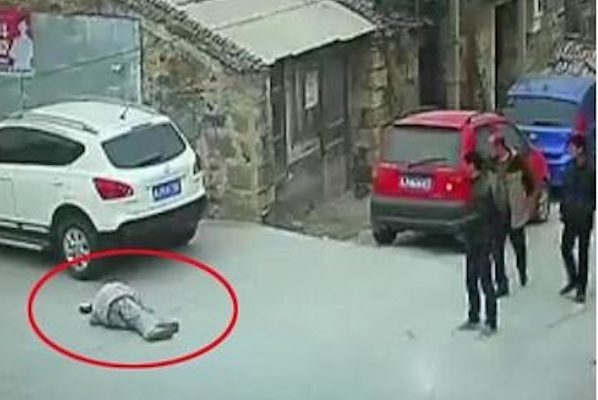

在公共场所突发急病却“无人会救”或“无人敢救”的现象屡屡发生。2016年，上海在全国先行推行“急救免责”，引起各界关注。（网络图片）

 
 
【大纪元2018年11月27日讯】11月15日，福建泉州发生见死不救事件，一晨练的老太太过马路时被一辆三轮摩托撞倒在马路中央，肇事司机逃逸。随后有12辆车经过老人身边，但没人下车伸出援手，第13辆车（货车）开过来，司机因天色昏暗没有看见老人，货车碾压头部当场死亡。

新闻被报导后，对于救不救人的问题，网民议论纷纷：“不是不想救，是不敢救……”“救了之后还说的清楚吗？除非现场有监控，否则会倾家荡产。”

大家还记得南京的“彭宇案”。2006年11月20日，彭宇在公共汽车站好心扶起一名跌倒在地的老人，并送其去医院检查。没想到，老人向南京鼓楼区法院起诉，要求彭宇赔偿各项损失13万多元。法院一审判决彭宇给付受害人损失的40%，共45，876.6元。彭宇提出上诉，二审期间双方达成和解。媒体没公布处理方案，据悉彭宇最后还是赔偿了一万元。

其中，“南京法官称：‘不是你撞的你为什么要救？！’”一说更成为舆论炮轰的焦点。

维基百科在“南京彭宇案”的词条中，发现列举了“彭宇案”后发生的60多起 “救助人被指肇事者”或“无人救助”的案例，其中15位民众因无人救助，而孤零零地死在了马路上。彭宇之后，没人再敢见义勇为了。

这个世界在法律之外，还有“良知”这个东西。当法律和良知冲突的时候，良知是最高的行为准则，不是法律。南京的中共法官就是告诉人们不要公共道德，不要社会良知。

爱因斯坦说：“制度要是得不到个人责任感的支持，从道义的意义上来说，它是无能为力的。”“我相信个人应该根据他的良心行事。”

老人摔倒不敢扶，只是一个折射点，其实这样事件的深处成因，是中共在意识形态中，早已把“道德”二字一笔勾销了！

文革十年，打砸文物、烧掉古书，把传承中华传统道德文化的精英灭绝殆尽。

但即便是这样，到了80年代，甚至是90的年代初期，人与人之间虽然没什么信任感了，但是起码那种基于人性的善意，还是存在的。

那个时候，如果有老人倒地，肯定会有人上来扶起，而不会有什么后果。人们虽然遭受了文革的摧残，但炎黄子孙所沉淀的那种良知，并没有完全泯灭。

而江泽民要人“闷声大发财”，鼓动人不顾道德，不顾良心，不顾廉耻地赚钱发财，那时候一句流行语是：“良心值多少钱一斤？”“道德值多少钱一斤？”

从1992年，法轮大法传出，以真善忍为准则，有五套舒缓优美的动作，是真正让道德回升的高德大法。文革后的信仰迷失，改革开放后的拜金主义泛滥，让许多心存善念的中国人，找到了内心寻找纯真良知的希望！在短短数年间，就有数千万人走入了修炼的行列。

我们试想一下，如果没有中共对于法轮功的无理镇压，没有人权恶棍江泽民不计一切后果的打压真善忍，人人都在内心要求自己，人人都自觉做一个好人，还会有老人摔倒不敢扶的事情存在吗？

然而，从1999年7月20日开始，中共江泽民集团对于法轮功开始了至今长达十九年的残酷镇压！恶首江泽民绑架中共的整个操作系统，成立了法外机构盖世太保“610”机构，凌驾于一切机构之上。恶首江泽民利用手中的权力对于积极迫害法轮功的人，大开绿灯，提拔任用，在官场里谁都知道这个原则：要想升得快，就得在法轮功这个事上卖力！

在没有任何法律依据的迫害法轮功学员过程中，被操纵的法官变得麻木，公检法司只知有党，不知有国。不需要什么合法依据，不需要什么正法的解释，“打死白打死，肉体灭绝，经济上截断。”道义、良知、公理、公正、公平等等，人类的一切正常的道理，在这场前所未有的浩劫中沉沦湮没。

从街道、村委会、县公安局、派出所、市610、省公检法司等、企事业单位，所有的部门机构全部参与到了这场打压真善忍的迫害之中，这样全社会性枉法坏法，怎么能不对社会风气造成巨大的绞杀？

从众所周知的小悦悦被辗压致死，今天又再现泉州老人无人敢救。这样的事，还要发生多少起，才能唤回国人的良知？有一点可以肯定的是，只有中共政权存在一天，就不会有道德、良知存在的可能。只有解体中共，结束西来幽灵对于中华大地的荼毒，让华夏传统文化真正苏醒，才能唤回人们的道德良知。#

转自明慧网

<h2 align="center"><b>奇妙的苦难人生</b></h2>

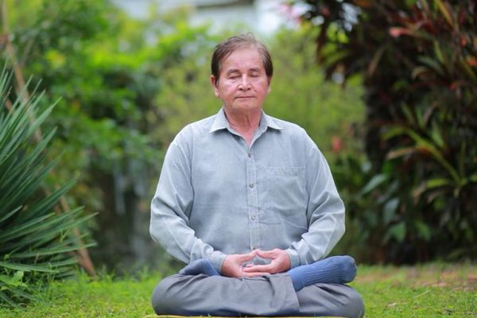

法轮功学员在炼静功（网络照片）

 
 
【希望之声2018年11月21日】（本台记者慧光综合报导）他出生在中国大陆南方的一个大城市，长大后却到了北方的一个属于航天系统的研究所工作。他的一生多灾多难，然而在苦难中却经历了很多奇妙的事，当时糊里糊涂、莫名其妙，直到多年以后才恍然大悟。
 

小的时候，因父母都在国营单位工作，每天加班加点，无暇顾及他，在他六、七岁的时候，有一天突然发高烧，父母赶紧将他送到医院，医生检查后说：“必须立即住院，否则会有生命危险。”原来他早就患上肾炎，此时身体已经出现浮肿，很严重了，只是因为父母的粗心被耽误了。

十九岁那年他参加工作，因为身体不好，经常病休在家。当时正赶上改革开放，单位要改革、要承包，多余人员要分流。他因为经常请病假，被分流到一家工厂当工人。厂领导唯利是图，只顾赚钱，让工人在工作流程中违规使用剧毒品，使他的身体受到更严重伤害，导致出现了中毒并发症，象心脏肥大、房颤、病毒性心肌炎以及肾炎等症状都爆发了。到医院进行抢救，医生使用了大量激素，又使他的胃黏膜糜烂，胃出血到了四个“＋”号。当时医院已经报“病危”了，可单位领导为了保住企业名声，吩咐要严守秘密，不让人说出去。

那期间他每天都躺在病床上，只能靠吸氧、打点滴维持生命。后来他回忆说：“身体上的病痛还只是一方面，心中对厂领导的愤恨更是到了无以复加的程度。我当时只有二十多岁 ，身体搞得这么差，今后还怎么活呀？活下去的信心都没有了。”

那期间他只能无望的躺在病床上，心中充满着悲伤。有一天在似醒非醒中，听到有一个声音对他说：“先熬着吧，过了四十岁就好了。”这个声音非常清晰，听到后他立刻就惊醒了，可睁眼一看，周围一个人也没有。他即惊恐又觉得费解，完全不知道这是什么意思，不过从此后就盼着四十岁这一天能早点儿到来。

有一位医生很理解他的痛苦，就劝他到庙里去祈求菩萨帮助，至少能得到一些心理上的安慰。无奈中他去了一座寺庙，找到一位老和尚，说明来意之后，老和尚对他说：“病不是医药能治好的，只有大慈大悲的观世音菩萨才能救你。”然后让他每天诵经、念佛，他就每天虔诚的按照老和尚的吩咐做了，梦想着能早日脱离苦海。

然而没有想到的是，在他四十岁那年，他遇到了一场更大的灾难。

就在那年的一天，他突然失去知觉，送去医院抢救时已濒临死亡，各种抢救措施都不起作用了，医生觉得没有希望了，让他躺在手术台上不管了，只等他咽下最后一口气。他整整躺了六天，肉身毫无知觉，可大脑的意识却异常清醒。他说：“我看到自己离开了肉身，飞上了天空，那是另外的空间，不是人类这样的空间，可是却非常美妙，那种美妙用人类的语言无法描述。没有了肉身的束缚，我能够自由飞翔。可是好景不长，有一天，我看见有个巨大的莲花盘从远处飞来，飞到头顶时我就什么都不知道了，然后肉身就醒了。”

醒后才发现，他的气管已经被切开，还连着管子，不能说话了。他的双手双脚都被固定在手术台上，全身连接了各种监测仪器，还连着几个输液的“吊瓶”。整整六天，他就是靠着这些“吊瓶”输送营养维持着。可是他的双腿肿得很厉害，脚背肿的都看不到脚趾头了。

医生看他醒了又急忙开始进行抢救。从医生的言语中，他听到了“空气针”三个字，后来才知道是因为在输液时没人看着，让“空气”进到了血液里，这是严重的医疗事故。如果“空气”到了心脏就会引起气体栓塞，必死无疑。医生为了掩盖真相，将他转到高干病房。

为了查看体内“空气”到了什么地方，他被送到B超室。他听医生说，如果“空气”还停留在腿部，就必须把腿锯掉，这样能保留一条性命。可是在B超检查时却突然停电了，做B超的医生说从来没有遇到过这种事，直到最后也没查出他的问题在哪里。

有一天，一个浑厚的声音对他说：“你该换师父了。”他听到后惊诧不已，可环顾四周仍然一个人也没有，他以为自己出现幻觉了，很害怕，可那声音又接着说：“你该换师父了，你师父是个男的。”这声音真真切切，他被惊呆了。这绝对不是幻觉，可是却让他百思不得其解。但经过抢救，他保住了性命，躲过了一劫。

出院后，有一天他毫无目的的出门溜达，信步来到一个公园，看到有人在那里炼功，一打听原来是法轮功。对方待人非常热情，不仅耐心的向他介绍情况，看他想学就教他炼功动作，还让他去一个地方看法轮功师父的讲法录像。第一天去的时候，一坐下就感到有东西在眼前转啊转啊，不一会儿他就睡着了。从那之后，他每天都去听，发现自己一天比一天有精神。

随着不断的炼功、学法，多年的疾病在不知不觉间消失了，他说：“修炼后我每天都能体会到身体在变化，整个人的身心如同再造。法轮大法博大精深的法理让我无限敬仰，内心的喜悦无法用语言形容。”

修炼后，他也彻底了悟了人生中的很多疑惑，他的确是从四十岁那年出现了转机，走入法轮功修炼，他说：“走过来才知道，其实人生中的很多事是早就安排好的，而人生中的磨难都是为了消除那生生世世积攒下的业力，因为‘欠债要还’这是天理。而生命的最大意义就是还本归真，这才是做人的真正目的。”

<h2 align="center"><b>感恩节随想</b></h2>

亲身沐浴过法轮佛法的慈悲伟大和大法师父的佛恩浩荡的法轮功学员们，深深体悟到“感恩”二字的特殊涵义。

 
 
【大纪元2018年11月22日讯】“感恩节”到来了，感恩节是美国人民独创的一个古老节日。

1620年，著名的“五月花”号船满载不堪忍受英国国内宗教迫害的清教徒102人到达美洲。心地善良的印第安人给移民送来了生活必需品，还特地派人教他们怎样狩猎、捕鱼和种植玉米、南瓜。在印第安人的帮助下，移民们终于获得了丰收，在欢庆丰收的日子，按照宗教传统习俗，移民规定了感谢上帝的日子，并决定为感谢印第安人的真诚帮助，邀请他们一同庆祝节日。

经历了近四百年后的今天，人们越来越知道了“感恩”二字的份量，也越来越倍加珍惜“感恩节”。作为亲身沐浴过法轮佛法的慈悲伟大和大法师父的佛恩浩荡的法轮功学员们，更深深体悟到“感恩”二字的特殊涵义。

感恩图报是人类社会的传统美德，只要是具备起码人性与良知的人们，都知道感恩图报。《共产主义的终极目的》一书中说：传统中国人认为：“厚德载物”，“德不配位”会给人带来灾祸。传统皇朝的先皇明主，如伏羲、黄帝、尧、舜、禹、汉武帝、唐太宗，明成祖、康熙等，他们的经世济国实践铸成了五千年王者之道。

“舜被尧派到历山，当地人原本为争地打斗，在舜的道德感召下，一年后历山人礼让成风。舜每到一地，民风大为醇厚，人都移居到他的身边。舜走到哪里，那里一年成为村落，两年成为城市，三年堪为都城。帝尧命舜推行教化，让世人遵循父义、母慈、兄友、弟恭、子孝五伦。民众自觉遵守，天下安宁、百姓和睦，“天下明德，皆自虞舜始”（《史记》）。”

“唐贞观六年（632年）12月末，太宗视察死刑犯监狱时，想到新年将至，这些犯人却身陷囹圄，不能和家人团圆，心生怜悯。于是下令把这些死囚释放回家，规定他们明年秋天自行返回长安就刑。要求死囚守信用，无异于天方夜谭！然而，第二年9月，390名死囚在无人监督、无人押送的情况下，“皆如期自诣朝堂，无一人亡匿者”（《资治通鉴》）。太宗以诚信教化、感召众生，即使死刑犯人亦奉守信誉，自愿返回受死。太宗对这些死刑犯人亦予减刑，传为千古美谈。”

死囚们“皆如期自诣朝堂，无一人亡匿者”，是他们懂得皇上的慈悲怜悯，知道感恩图报。太宗李世民能够心怀百姓福祉，以诚信教化、感召众生，是因为他深知“民可载舟，亦可覆舟”的理。

康熙皇帝施行仁政，体恤民情，“几乎年年都有减免赋税的措施。康熙在位六十二年间，蠲免天下钱粮共计545次，折合白银高达1.5亿两，相当于当时国家2,000万至3,000万两财政收入的5至7倍。”

自中共窃国以来，施行的是独裁暴政，百姓成了被它们任意横征暴敛、屠戮宰割的羔羊。正像“《共产主义的终极目的》中描述的：“二十世纪中叶，西来幽灵共产党篡取政权后，杀戮国民、摧残文化、破坏环境，使山河变色，生灵涂炭，曾经辉煌的文明黯然失色，几乎毁于一旦。”

八千万人死于非命。

正当人类道德飞速下滑，中华民族处于危难之际，一九九二年法轮大法创始人李洪志先生将宇宙中的高德大法——法轮大法洪传于世。在短短的七年时间内仅中国大陆就有近亿人入道得法，虔心大法修炼。亿万得法修炼的法轮功学员最知道法轮大法的珍贵，最信仰和崇敬的是苦心普度他们的李洪志师父。每到新年、元旦、中秋节、法轮大法日的时候，明慧网都会收到了成千上万来自海内外法轮功学员及明真相百姓恭祝李洪志师父好的精美贺卡及贺词，表达着芸芸众生对法轮大法创始人李洪志师父慈悲救度众生的无尽感恩。

“法轮功归正人心，法轮功学员修心向善、努力净化自己、重回对神佛的信仰，被邪灵视为眼中钉；另一方面也是因为法轮功的传播带动了整体社会上的信仰重建和道德升华，且“真、善、忍”的理念也包含了中国传统文化的精华。随着大法洪传，更多世人走进修炼，势必让人类走回正道，让江山重归清明。”（《共产主义的终极目的》）

法轮功信仰“真、善、忍”，使人心向善，道德回升，是地地道道的中国传统文化的价值观、普世价值。法轮大法的洪传给道德日益下滑的社会带来了生机，使人们看到了希望。这是中共邪灵及恶首江泽民最妒嫉和害怕的，迫不及待的发动了这场对法轮功的惨绝人寰的灭绝性迫害。自中共迫害法轮功十九年来，在中共江泽民流氓集团“名誉上搞臭、经济上截断、肉体上消灭”、“打死算白死，打死算自杀”和“不查身源，直接火化”的灭绝政策下，上亿法轮功学员被污蔑，数百万学员被非法绑架、关押、劳教、判刑，甚至被酷刑致死或活摘器官致死，数百万家庭被迫害得支离破碎、妻离子散、家破人亡！

人们可能无法理解，法轮功教人向善，道德回升，社会安定，既然对国家、社会、人民有百利而无一害，中共为何不知感恩图报将其弘扬光大，反而恩将仇报将其残酷镇压呢？“共产主义的本质是一个“邪灵”，它由“恨”及低层宇宙中的败物所构成，它仇恨且想毁灭人类。”（《共产主义的终极目的》）江泽民正是共产邪灵在人间的总代表，（或曰魔头）他曾经声嘶力竭的叫嚣：“我就不信共产党战胜不了法轮功”、“三个月内消灭法轮功！”二百多个月过去了，法轮功不但没有被消灭，反而洪传到世界一百多个国家。

“神不会容忍邪灵肆无忌惮地破坏神传的文化、神的子民和走在神路上的修炼人。”

“成千上万被‘真、善、忍’重新洗净并升华了道德境界的修炼者，就是走在神路上的人。这是江泽民和中共从来理解不了的，也是为什么法轮功修炼人无论如何也打不倒的原因。其实，这也是神的安排，为今天的世人留下一个见证，让人们看到，人只要凭著对神的坚贞信仰，就可以使看似猖獗的魔鬼都无法逞其阴谋。”“茫茫宇宙中，任何生命都无法逃出神的掌握。神在关注著这一切，中共邪党和江魔头的所作所为，令天地和众神震怒！法网在收。”（《共产主义的终极目的》）

据明慧网、大纪元显示近二十一万法轮功学员及家人控告江泽民，二百八十八万国际社会正义人士连署举报江泽民，三亿二千多万民众抛弃中共退出中共邪恶组织，国际社会正在加速围剿共产邪恶主义的进程，共产邪灵临近灭亡的日子不会太远了。
“解体中共，全面清除共产主义在人间的各种表现，回归传统，守住心底的善良，生命才有希望！”（《共产主义的终极目的》） 

<h2 align="center"><b>中国大陆一位银行女主管的故事</b></h2>

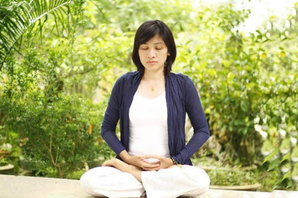

法轮功学员在炼静功（网络照片）

 
【希望之声2018年11月24日】（本台记者慧光综合报导）她是生活在中国大陆的一名中年女性，为人聪慧大方，做事干练，由于业务能力强，已经担任一家银行的主管多年，属于中层管理干部。

2007年，她从朋友那里得到一本法轮功的主要指导书《转法轮》，当时的心情很复杂，有几分激动，也有几分忐忑。因为她一直都有一种好奇心，就是中国政府动用了那么大力量镇压法轮功，可仍然有那么多人坚持修炼，无畏无惧，其中也包括她的朋友，使她即佩服又无法理解。但她也知道，中共的政法委、政府的“610”以及公安机关等机构和人员仍然对法轮功虎视眈眈，只要被他们盯上就可能大祸临头。

当时她拿到书之后小心翼翼，因为有担心和恐惧，匆匆看过一遍后就将《转法轮》妥善的收藏起来。尽管是粗略的看了一遍，她也知道了这本书不是一本普通的书，是教人做好人的书，尤其是“真、善、忍”的法理她非常认同，甚至有时也会不自觉的用“真、善、忍”的标准约束自己的行为。当同事、朋友谈论到法轮功话题时，她还会以旁观者的身份为法轮功辩护。可是在那样的恐怖环境下，她还是感到害怕，没有真正走入修炼。

光阴荏苒，说话间到了2011年，她已经四十来岁，随着年龄的增长身体也越来越差，多种慢性病缠身使她痛苦不堪，像颈椎病、肩周炎、失眠、脱发以及妇科病等几乎是形影相随，须臾不离。虽然都不是要命的病，可是总像“梦魇”一样纠缠着使她无法摆脱。就在那年的新年期间，她收到朋友发来的一条彩信，内容是有关法轮功的，她突然意识到，既然法轮功祛病健身有奇效，我为什么不走这条路呢？生命都得不到保障了，还有什么可怕的？！于是她就把藏起来的《转法轮》找出来，开始认真阅读。

这一次她真是用心看了，看的很投入，几乎忘记了周围的一切。她说：“书中的法理解开了我心中的所有疑惑，像甘泉一样滋润着我的心田，我越看越爱看，越看越不想放下。我的心仿佛一下子被打开了，心中的迷雾全部消散，敞亮了，看过之后觉得心情无比轻松。”同时她也理解了，为什么千千万万的法轮功学员在那么残酷的打压下依然不肯放弃，原来这真是一本宝书啊！

当她真正按照修炼人的标准要求自己时，奇迹就出现了。不到一个月的时间，她的身体神奇般康复，只觉得精神越来越清爽，人也越来越有劲儿，所有的病症不知不觉间都消失了。尤其出乎意料的是，她发觉自己的性格变了，原来因为病痛折磨总爱发脾气，可修炼以后竟然发现“脾气”没有了。

丈夫看到她的明显变化，也开始听法轮功师父的讲法录音。有一天在似睡非睡中，感觉有一只大手从他的颈椎第一个关节开始，一节一节的往下撸，一直撸到尾椎，非常舒服，全身都感到暖融融的。醒来后，颈椎病和先天性尾椎狭窄引起的腰痛就没感觉了。没过多久，高血压和鼻炎也完全好了。

女儿看到爸妈的变化，也走入修炼，从此一家三口经常在一起学法炼功，比学比修，有了令人羡慕的和谐。

法轮功修炼能够改变人的身心，其中最重要的是对心性有严格的要求，她深知这一点，所以在工作和生活中经历了一次又一次的考验。

她是银行的业务主管，也是项目负责人，手中有一定的权利，下属部门经常有人给她送钱送物，尤其现在行贿方式又多又方便，微信划一下钱就到账户上了，对有些人来说这已经习以为常了，大家都这样，修炼前她也没觉得这样有什么不好。可是修炼了，作为修炼人就要洁身自好，不能贪占不义之财物，所以再遇到这种事情她就一概拒收。开始时还心存顾虑，怕别人不理解。后来随着心性的提高，怕心也越来越少，直接就跟别人说“我是修炼法轮功的，师父让我们做好人，要做一个比好人还要好的人，所以不能收取任何财物”，慢慢的大家也都理解了。

有一次，她到行长的家人开的一家高档商店购物，行长的亲属非要送给她几样昂贵的物品，被她婉言谢绝了，对方很诧异，“这年头怎么还会有这样的人？”就向她提出了许多问题，她就耐心的向对方讲述了自己修炼前后的身心变化，对方听后十分感慨，表示理解。

她是项目主管，工作中任劳任怨，付出很多，取得的成绩也是大家有目共睹的，正常情况下，年末的奖金自然就是“一级”，每年都这样。可有一年，一位同事凭着私人关系，硬是把这个“一级”抢走了，她当时真有些想不通。对方也觉得挺不好意思，就通过微信向她婉转的表达了歉意。她立刻想到自己是修炼人，遇到矛盾要向内找，应当处处为他人着想。想到这儿，就给对方回复说：“没事的，姐真心的希望你啥都好。”这件事使对方很受感动。

她因父亲早逝，修炼前与两个哥哥在财产分配方面发生了很长时间的矛盾，关系搞得很僵。修炼后，她放下了利益心，也放下了对两位哥哥的怨恨心和争斗心，用修炼人的宽容对待，主动放弃财产继承权，与哥哥们和好如初。家人从她的言行中也感受到了法轮功的美好，有几个人相继的走入法轮功修炼。

她说：“如果不是因为修炼法轮功，我真的不知道我与母亲和哥哥们的关系会是什么样？也许会大打出手，也许老死不相往来，这是原来就预见到的结果，是法轮功修炼让我消除了长年结下的心结，再次拥有了家庭的和睦，我也因此放下了心中的包袱。”

最后她说：“感谢师父给了我一个健康的身体，一颗善良慈悲的心，一个幸福美满的家，我要修成一个全新的无私无我的的生命，做一个真修弟子，不辜负师父的慈悲救度。” 

<h2 align="center"><b>壮观！5400人台湾排字大炼功 英文《转法轮》绽放光芒</b></h2>
 

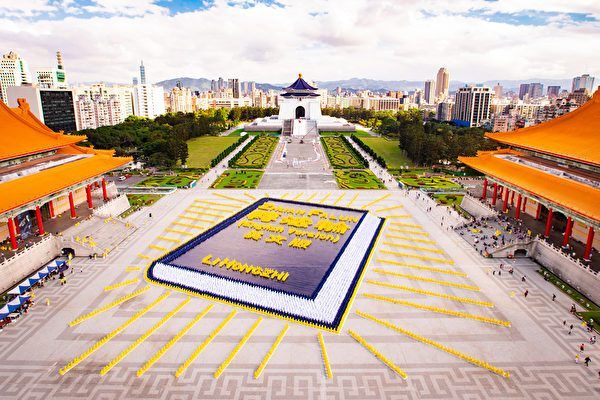

约5400名法轮功学员于11月24日在中正纪念堂广场排出英译本《转法轮》的图像

 
 
 【希望之声2018年11月24日】（本台记者宋月采访报导）2018年11月24日，约5,400名来自台湾及亚洲各地区的部分法轮功学员，聚集在中正纪念堂（自由广场）大炼功，并排出英译本《转法轮》的图像——深蓝色书封、中英文字ZHUAN FALUN及转法轮，还有42道绽放的金黄色光芒。场面壮观，与目前中共对法轮功的迫害可谓天上地下。
 
 

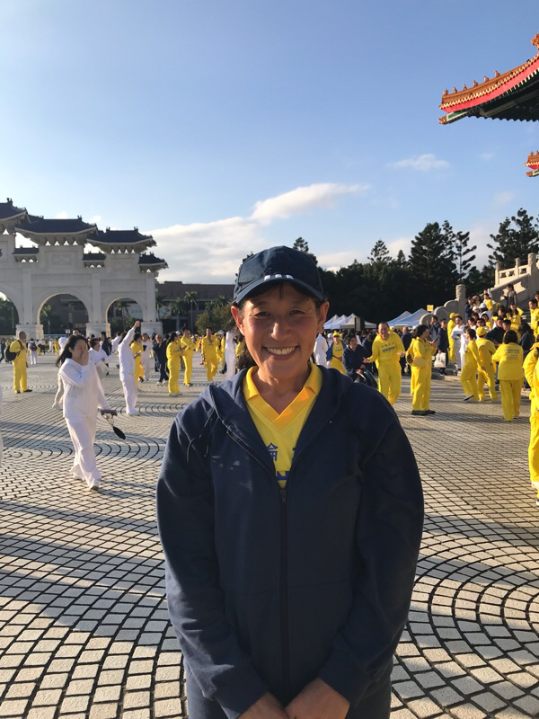

 嫁到台湾的大陆学员张静

 

本台记者采访到从大陆嫁来台湾的张静学员，她眼睛泛着泪光对本台表示：
                                              
“今天有幸参加这次排字，感到非常壮观、非常殊胜，刚才听到主持人说活动开始的那一刹那，差一点眼泪就要掉下来，很震撼！整个身心感觉特别通透特别棒，真是佛光普照的那种感觉！

我们真心希望透过这次活动，能够让全世界的民众了解法轮大法的真相，了解大法的美好，而且来这里的全世界各地游客都很多，特别是中国大陆的可贵中国人，真心他们来到这里能够看到这个真相，带回到家乡去，不要再被谎言蒙骗了！”

张静还表示，“作为一名修炼人，有幸得到了这个大法，那种幸福、感恩不是用人的语言可以形容的，也没有任何能够回报的，只能好好的修炼、精进，今后做得更好，做更好的人。”

法轮大法至今已在114个国家和地区流传，《转法轮》至少有40个语言译本发行，带给世人无限美好；而在信仰不自由的中国大陆，中共政府自1999年7月20日迫害法轮功至今已经持续了19年。

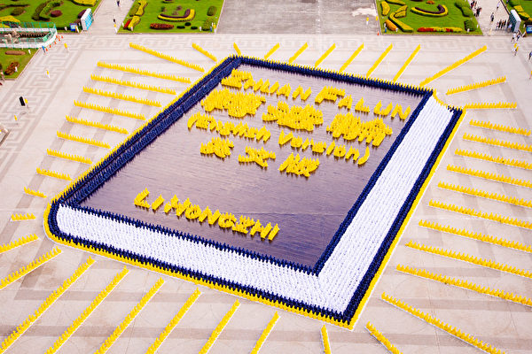

约5400名法轮功学员于11月24日在中正纪念堂广场排出英译本《转法轮》的图像——深蓝色封、中英文字ZHUAN FALUN及转法轮，还有42道绽放的金黄色光芒。

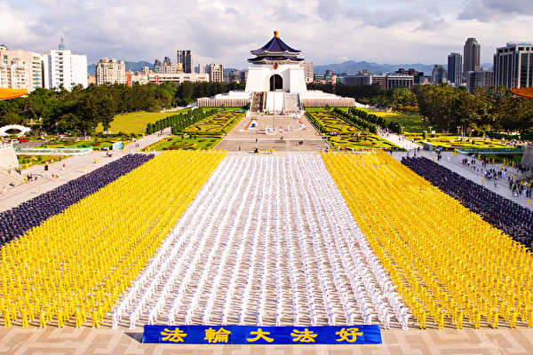

约5400名来自台湾及世界各地的部分法轮功学员，11月24日在中正纪念堂排字，向法轮功创始人李洪志先生拜早年，「恭祝师尊新年好！」

谢小姐是一名在台北市政府工作的公务员，她带着孩子来参加排字活动。

她的家庭非常典型，上有老下有小，每天工作、家事、教育小孩、还有老人需要照顾与关怀沟通。在修炼之前，沉重的压力令她不堪重负、失眠，修炼后身体精神方面得到很大改善。

她对记者说道：“以前在政府工作的时候工作压力很大，因为想把工作做好，更加重了这种压力，会睡不好，也会很容易抱怨长官怎么给这么多的工作。学了大法后，知道自己碰到的这一切都不是偶然的，都是有自己要提高的地方。例如说，扩大自己的心胸能够去做更多的工作，努力把它做得更好，因为这本来就是自己领薪水应该做好的。

有时候晚上加班，压力大、神经紧张睡不着时，就放下这些来静心打坐，然后就变得很轻松很好睡，再也没有睡不着的困扰了。”
                                            
谢小姐表示，现在是资讯时代，小学生也几乎人人都有手机，有时会交换资讯，互相之间讲一些不好的话、传一些不好的东西当成乐趣。不过她的孩子在大法弟子开办的明慧学校里通过学法炼功，慢慢可以分辨出什么是好的，什么是不好的，也通过阅读大纪元时报学习到传统文化价值，懂得什么应该做什么不应该做，这样不知不觉中，孩子越来越在进步中。

“我是双薪家庭，先生下班后通常自己待在书房里读书充实自己，这样教育孩子、处理家务的事情都落在我的身上，以前我会心理不平衡，因为我的工作压力比他的更大，而现在我是觉得碰到什么事情都是应该把它做好的，那么当太太能够多做就多做，也不会抱怨计较。当先生或者孩子讲话口气不好的时候，自己也会忍住，等到他们消气后，再跟他们理性交流，这样家里气氛逐渐在变好，孩子也发现妈妈脾气也在变好，体会到这种改变后，他们也会慢慢要求自己去改变、做好。

来这里也是想感谢师父教给我们法轮大法，让我们明白了人生目的，活的充实自在，遇到困难的时候能够乐观的去面对，所以每年排字我都会带孩子来，表达对师父的感谢。”

今年参加排字的除了台湾学员，还有来自日本、越南、韩国、马来西亚、印尼、新加坡、泰国、香港等海外学员。台湾法轮大法学会副理事长黄春梅介绍，事实上，近六百名来自海外的学员，除了来自亚洲邻近国家，还有来自加拿大、澳洲、瑞典、巴西、芬兰的法轮功学员。

<h2 align="center"><b>八旬老太的传奇经历</b></h2>
 

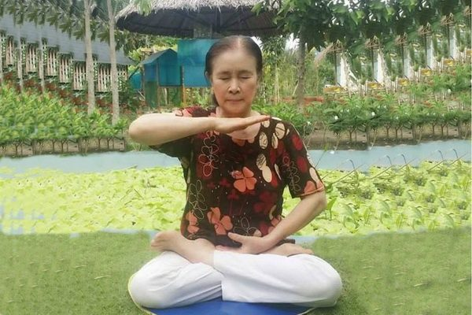

老年法轮功学员在炼第五套功法——神通加持法（网络照片）

 

【希望之声2018年11月19日】（本台记者慧光综合报导） 她出生在中国大陆山东省胶东地区的一个小山村里，今年八十岁了，按照中国传统说法，就是已进入耄耋之年，然而当我们走近她的时候，却发现她精神抖擞，走路生风，完全不像一般老年人老态龙钟的样子。一见面她就说：“我现在跟女儿住一起，女儿家住在十八层楼上，虽然有电梯，但我经常不乘电梯，而是一步一步走楼梯回家。楼梯一共有三百六十个台阶，我一边走一边数，轻轻松松就到家了。”是什么原因让她在晚年仍然保持了如此健康的身体呢？她向我们介绍了她看似普通却饱含传奇的经历：

她年轻时嫁给了一个军人，可是结婚后丈夫也不告诉她自己在哪里工作，说是为了保密，领导有要求。她只知道大概位置是在西北方向的甘肃省，因为是本乡本土的山东人，加之那时的军人威望很高，她也就没多问。丈夫每年只休假一次，每次最多住上十来天，所以婚后近二十年的时间里，她们在一起的日子加在一起也不到两年。

1974年，她生病了，不能下地干活，就想到部队去找丈夫，正好遇到了一位同行的人，在那人的带领下，她就领着孩子坐上火车出发了。到甘肃酒泉下车后，丈夫乘车来接她，开了好久才到了营地。到达的当天已经很晚了，看不清周围的情况。第二天才发现营地处在一个大沙漠中，植被很少，几乎是荒无人烟。后来才知道那里就是酒泉卫星发射基地，也是个导弹实验场。

有一天她在门口看风景，看见一个大卡车拉着一个巨大的导弹开过去了。丈夫看见了，大声呼喊着让她快进屋去。进屋没过多久就听见一声巨响，瞬间满天黄沙，天昏地暗，丈夫告诉她那是在进行导弹试验。

丈夫是处级干部，为人厚道，可只有四十七岁就因病去世了。那是在1978年，她才四十岁，之后只能靠自己一个人抚养四个孩子。

丈夫病故前曾经对她说过，营区因物资供应不足，人们就捕鸟为食，后来通过检测发现这些鸟都是受到放射性污染的，骨头都是黑的。丈夫住院后还对她说，医生检查后发现他的骨头都是酥的，就是严重的骨质疏松，那是他们的职业病。她听到后感到很悲哀，但在那样的环境背景下，她还不敢表现出来，只能将悲痛压在心底。丈夫去世后，部队领导希望她留在营区的家属工厂工作，被她拒绝了。她心想“丈夫是没办法，只能在这样的环境中工作，所以死得这么早，而我和孩子还想好好活着呢”。就这样，她带着孩子回到了山东老家。

丈夫的英年早逝，给她的生活带来了很大困难。一个女人拉扯四个孩子，其艰难可想而知。好在孩子们都很争气，相继考上了大学。可是因为多年的辛苦操劳，也使她的身体受到很大伤害。

六十岁那年，她感觉身体右侧麻木，并经常出现头晕头痛症状，到医院检查后，医生说她的脑中有瘤子，陪着去的女儿问医生“能不能做手术？”医生摇了摇头，说从肿瘤的位置看无法进行手术。女儿还想带她去更大的医院，被她拒绝了。她说：“不做手术，死就死了，怕什么？”

后来她还出现哮喘咳嗽，怎么治都不好使，而且越治越严重，拍X光片发现肺部有阴影，具体是什么病医生也没明说。每年她都在市里两个最有名的大医院来回跑，药费不知花了多少，但都没什么效果。

2013年下半年，她的右侧身体麻木症状越来越严重，右脚不能着地，一着地就像针刺般疼痛，吃多少药都不好使，后来发展到右腿一步也挪不动了。有一天女儿陪她到医院找专家看病时，一位女医生对她说：“这么严重的病，医院已经没什么好办法了，你为什么不炼法轮功呢？”她听后感到很吃惊，没想到医生还会这么说。她对医生说：“我妹妹炼法轮功有好几年了，一直劝我炼，可政府迫害法轮功这么厉害，孩子们不让炼。”话虽这么说，可这一次她的确动心了，她想“连医生都这么说，可见这事儿真的很重要了”。事后得知那位医生就是炼法轮功的。

回家后她就打电话让妹妹到家里来，说她要炼法轮功，妹妹就带着《转法轮》过来了。当她捧着《转法轮》看的时候，没想到书中的内容深深的吸引了她，她越看越爱看，如获至宝。尽管有些内容一时看不懂，可就是不愿放下。

紧接着她就让妹妹教她炼功，那段时间她什么都不想了，每天就是学法、炼功，不知不觉间，右腿能着地了，慢慢的能走了，渐渐的所有病症就消失了，身体越来越轻松，精神也越来越好。她说：“那个脑瘤的事儿我想都没去想，肯定是没有了。五年过去了，没有任何感觉了。要不是因为炼了法轮功，说不定早死了，哪有这些奇迹呀！”

大法修炼不仅给她带来了健康的身体，也解开了她的很多心结。多年来娘家婆家的很多事一直在她心里装着，让她耿耿于怀。尤其是丈夫早逝，没有给她留下任何财产，她一个人拉扯四个孩子，吃了很多苦，她有很多怨恨，修炼后她全都放下了。她说：“我如今得法修炼，有了健康的身体，这是千金不换的，相比之下那些恩恩怨怨都不算什么，人中的事情再没有什么放不下的了。”

修炼以后，她的身体迅速康复，出现了巨大变化，亲朋好友、远亲近邻都亲眼目睹了，大家都知道法轮大法好。她也不断用自己的亲身经历向人们讲述法轮功被迫害的真相，她说：“法轮大法不仅给了我健康，还使我的生命焕发了青春，我就要向世人证实大法的神奇和美好，这是发自我内心的想法和愿望。”

<h2 align="center"><b>揭中共活摘器官罪行 芬兰媒体大量报导</b></h2>

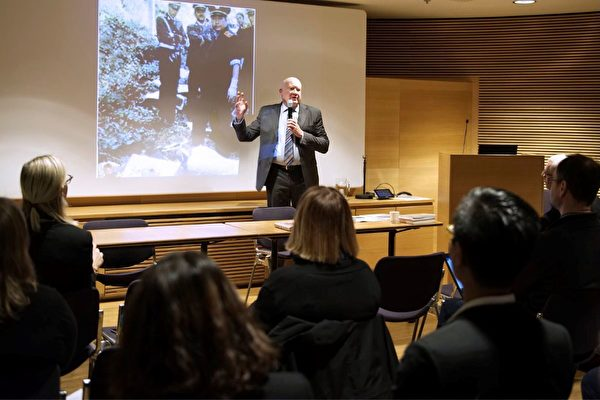

2018年11月13日，在芬兰举行的研讨会上，人权调查记者及作家伊森·葛特曼（Ethan Gutmann）发言，揭露中共活摘法轮功学员器官的罪行。（明慧网）

 

【大纪元2018年11月16日讯】11月13日，芬兰首都赫尔辛基议会厅与芬兰议会人权网络合作，举办了揭露中共活摘法轮功学员器官的研讨会。芬兰主流媒体对该研讨会进行了大量报导。
 

研讨会由议会人权网络对外发言人、国会议员伊娃·比亚德（Eva Biaudet）主持。

明慧网报导，应邀参加会议的有赫尔辛基大学医院首席移植和肝脏外科医生贺基·马基赛罗，健康保健医师、来自医生社会责任组织的玛哈·海讷棱-古泽赫薇哈尔（Marja Heinonen-Guzejevilta）医生，以及人权调查记者、作家伊森·葛特曼（Ethan Gutmann）。

到场的聼众中有议员、议员秘书及媒体记者等。与会者表示对中共活摘器官的震惊，同时也希望让更多的人知道中国大陆发生的这种惨绝人寰的迫害。

活动结束后，当天芬兰十一家网络媒体大量报导了研讨会，第二天在芬兰畅销全国具有最大影响力的报纸《赫尔辛基日报》（Helsingin Sanomat）、赫尔辛基的 《地铁报》（METRO）、覆盖坦佩雷地区的《早报》（Aamulehti）及 芬兰北部的《拉普人报》（Lapin Kansa）都刊登相关报导文章。

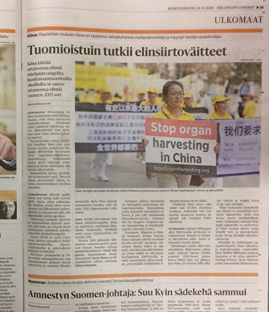

芬兰畅销全国的影响力最大的报纸《赫尔辛基日报》刊登研讨会报导。（明慧网）

 
 

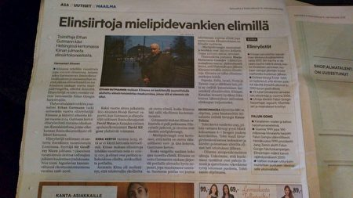

覆盖坦佩雷地区的《早报》刊登研讨会报导。（明慧网）

 

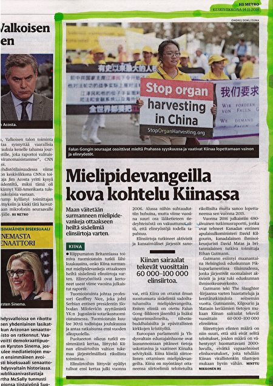

赫尔辛基的 《地铁报》刊登研讨会报导。（明慧网）

 

人权调查记者、作家葛特曼先生在近一个小时的演讲中，详细介绍了他与加拿大前亚太司司长大卫·乔高（David Kilgour）和加拿大人权律师大卫·麦塔斯（David Matas）通过共同的独立调查所收集到的法轮功学员被活摘器官的确凿证据，并讲述了在中共政权下早就有利用政治犯的活体器官为中共高官进行器官移植的做法。

葛特曼先生还在研讨会上介绍了他们的最新调查报告，指出中共的“活摘”规模大，是有系统性地按需杀人，并揭示中共不停地用谎言和欺骗来对付国际社会的舆论压力。

医师玛哈·海讷棱-古泽赫薇哈尔（Marja Heinonen-Guzejev ）在研讨会上介绍了《美国移植杂志》（The American Journal of Transplantation）2016年发表的一篇文章。该文指出，全世界所有记录的器官移植手术中的63%或2/3来自中国。

她提到：“各国可以通过立法来打击非法组织的（器官）贩卖活动，台湾、以色列、西班牙、意大利和挪威已提出立法，禁止公民前往中国进行器官移植手术。将来，可以使用医学法的DNA测试来收集更多证据。”

玛哈医师还告诉与会者，在“终止移植滥用国际联盟”（International Coalition to End Transplant Abuse）的倡议下成立的一个独立的法庭将调查中共的器官掠夺行为。该仲裁法庭将调查由中国政府或高级国家机构或其它组织实施的与器官掠夺相关的涉嫌犯罪活动。

上述仲裁法庭是于2018年10月16日在伦敦宣布成立的“独立人民法庭”（Independent people’s tribunal ）。该法庭由英国御用大律师、教授杰弗里·尼斯爵士（ Prof. Sir Geoffrey Nice， QC）领导，包含七名独立的成员。
 

<h2 align="center"><b>曾经的佛教徒读《转法轮》之后的变化</b></h2>
 
【明慧网二零一八年十一月十四日】〖大陆来稿〗第一次看到她时，她的脸色惨白，显得有气无力，似乎体内真气被抽空一样，整体精神状况特别不好。她带着十多岁的女儿，女儿牵着她的衣襟，面部表情紧紧的，好象对这个世界充满了仇恨，周围人都欠她似的。

看到母女俩，我的心顿时一惊，强烈的感觉到两人似在求救。通过交流，我知道她吃素，在佛教中多年，曾多次到五台山、西藏等地朝拜，几乎是三步一叩首，非常的虔诚。可是，信佛教多年，却无法解决她孱弱的身体状况，时时袭来的心灵空虚之感让她很是烦闷，难有开心和轻松的时候。多年来，她和丈夫希望再生养一个孩子，却因体质太差，一直未能如愿。

今年一月，又和她见面，我见时机已成熟，就直接和她谈法轮大法的修炼及大法的超常，并特别提醒她在佛教中修炼多年，连身体状况都无法改变，只能说明佛教已走到了末路，更不可能度人了。她也曾听一个朋友和她提及过法轮大法，但并未深入了解，心里有太多的困惑。

她回顾自己多年走过的路，泪水夺眶而出，自己付出了很多的人力、财力，却是一场空。于是，我把大法的相关资料拷贝给她，让她先认真读《转法轮》这本书。她点点头，眼里满含欣喜。

她开始读《转法轮》时，怕丈夫反对，趁丈夫上班时，自己在家读，躲躲闪闪的，也未间断。在读法的过程中，她的身体状况逐渐好转，人越来越精神。她丈夫觉得奇怪，既没看医生，也没吃药，怎么身体好转了呢？于是她直接告诉了丈夫原由。当时，她丈夫也没反对，只是保持沉默。

五月份，她的一个朋友看到她，相当吃惊，几乎不敢相认。她的脸色红润，很有光泽，整个人的精神面貌特别好，特别阳光，充满活力。朋友问及原由，她也直接告知是读了《转法轮》。

短短几个月的时间，她真切的感知了法轮大法的神奇，于是更加精進。

七月份，她发现例假突然停了，同时伴随反胃现象，于是到医院检查，医生告知她怀孕了。她当时真不敢相信，多年来一直渴望有个孩子，但糟糕的身体状况根本无法怀孕。瞬间她喜极而泣，大法真是太神奇了。

她丈夫也觉得太不可思议了，原本不相信的他这回彻底改变了，也断断续续的学法。惊讶之余，他还同意妻子跟随一个团队参加了二十多天的夏令营，他觉得有大法在，有师父的护佑，没有任何担忧。夏令营结束时，她和腹中的宝宝都安然无恙，也没任何不适反应。

丈夫看到她神奇的变化，真正的走入了法轮大法修炼，女儿也开始修炼。如今，在她的带动下，一家人都走入了大法修炼，女儿、丈夫的状况也越来越好，一家人的关系也更加和谐了！

她的一位上大学的侄子看到她巨大的变化，也走入了法轮大法修炼。在她的脸上，再也看不到丝毫忧愁，随时都是一张笑脸，她说：全家沐浴在法光中的感觉真好！修炼法轮大法真好！感恩师父！ 

<h2 align="center"><b>她从红尘情迷中觉醒••••••</b></h2>

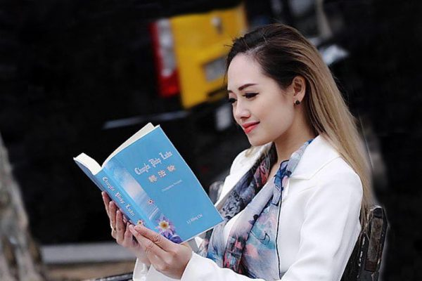

法轮功学员在阅读《转法轮》（网络照片）

 
【希望之声2018年11月16日】（本台记者慧光综合报导）她是中国大陆黑龙江省人，是一名白领，三十来岁，年轻漂亮，平时很在意外表，很注重保养。在当前浮躁的社会背景下，年轻漂亮的女性总会受到青睐，所以在梳妆打扮、粉饰捯饬方面很投入，花多少钱都在所不惜，她就是这样。

尽管外表光鲜亮丽，但她的身体却不怎么样。她有多种慢性病，不是这儿不舒服，就是那儿难受，总是病怏怏的打不起精神。

2012年，她母亲得了癌症，她不得不经常请假去照顾。既要工作，还要照顾妈妈和自己的小家，压力很大，为此她常常感到力不从心。可丈夫整天忙于工作，根本不理会她的处境，她感到很委屈，内心有很多苦楚无处诉说，恰在这时，一位已婚男士主动接近她，对她嘘寒问暖，使她心甘情愿的做了“第三者”。

尽管她也知道这样做不对，但还是为自己找了一堆理由，以为这就是追求自由，在情欲的控制下她一次又一次的犯错，最后终因“纸里包不住火”，朋友、同事都知道了，在背后指指点点，丈夫受不了，只得离婚了。

离婚后她也曾想摆脱出来，不再犯这样的错误，可是她管不住自己，其实她自己也很苦恼。她曾到庙里烧香拜佛，想祈求神佛帮助，还买了一串佛珠整天戴着，心想借此也许会有些约束作用，然而这些表面的东西哪能改变人心呢？她依然陷在情欲的泥潭中不能自拔。

她有一位同事是法轮功学员，她俩也是好朋友，这位学员经常跟她讲法轮功真相，可是由于名、利、情的牵绊，加之无神论观念的障碍，她一直没往心里去。

2012年初冬的一天，她的中耳炎毛病又犯了，疼的不行。那位学员看到她痛苦的样子，就说“我给你放点音乐吧，听听歌曲也许就好了”，接着就用手机给她播放了一首歌曲，歌名叫《去情迷》，她听着很入耳，很舒服，渐渐的耳朵就不那么疼了。这位学员对她说这是法轮功弟子写的歌曲，都是正能量，经常听一听比吃药管用。她笑笑没吱声。

就在那天，这位学员直言不讳的对她说：“只有法轮功能救你，别无它路，你要尽早醒悟，不能再犹豫了。”她当时的确动心了，但一想到自己的德行，感觉心中惭愧，法轮功的心性标准那么高，她对自己一点儿信心都没有，还是犹豫不决。

但接下来她遇到了很神奇的一件事，使她有了彻底改变。

那是2012年11月的一天下午，大约是五点多钟，天色将黑未黑，她要去学校给孩子送晚饭，路上要穿过附近的一个小区。此时小区的路灯已经亮了，只是有些昏暗。她正走着，突然感觉前方突然明亮起来，于是不由自主的抬头望去，一下子被眼前的景象惊呆了，她回忆说：“我看到有一尊金光灿灿的大佛闪烁着金色光芒由远而近向我飘来，形象跟寺庙中的如来佛像差不多，到了一定的距离就停住了，在半空中慈祥的看着我。当时我整个人都愣住了，我在想大佛是来看我的吗？是看我每天忙忙碌碌，活得又累又苦来关心我吗？我看到大佛那无量慈悲的眼神，仿佛能穿透我的心扉，这是我从来没有的感觉。我又想起那位学员说的话，难道是她师父看我来了吗？当想到这儿的时候，大佛一点一点的由近而远的慢慢消失了……。我环顾四周，天色已全黑，昏暗的路灯下一切都还是熟悉的老样子。”

突如其来的景象使她感到震惊，她说：“这一切来的是那么突然，仿佛是在做梦，可这显然不是梦，我站在原地久久不愿意挪动，仔细回想着刚刚发生的一切，那情景真真切切，我很吃惊：原来真的有佛啊！”

第二天到单位上班，她激动的对那位法轮功学员说：“我看见你师父了。”接着她讲述了昨天遇到的事。这位学员说：“看来你真是跟我师父有缘，师父是不想落下你。”当天就给她送来一本《转法轮》书，告诉她一定要认真看，要坚持完整的看一遍。

也就是从那天起，她开始认真看《转法轮》，并下决心走入法轮功修炼。

就在开始看书的当晚，她做了一个很奇怪的梦，她说：“我看到我和另一个人并排坐在电梯里面，是那种老的箱式电梯，里面有椅子可以坐着。电梯在急速的往上升，我坐在椅子上，腿还在悠荡着。我边上有一个玻璃窗户，我就贴着玻璃好奇的往外面看，没想到看到的场景是一个黑黑的无底深渊，周围什么都没有，我一紧张就被吓醒了，醒来后心里很恐惧。我想刚才这一幕就是要告诉我，如果不走入修炼，我的归宿就是那里了。”这一次她真的清醒了。

修炼后，她遇到的第一个现实问题就是怎样处理与前夫的关系。一想到自己过往的行为，她为自己的过错感到深深的忏悔，知道这样做对丈夫和孩子的伤害都很大，总想弥补，可几次提出复婚都被对方拒绝，使她感到既羞愧又很无奈。

那位法轮功学员看到她失魂落魄的样子，就对她说：“你要多学法，修去对情的执着心，当你有了正念之后，一切都会改变的。”这一次她听进去了，从此以后，她严格按照“真、善、忍”的法理要求自己，坚定的按照修炼人的标准做人做事，她在心里对师父说：“师父，我决心归正自己，改掉一切不正的行为，请师父放心。”

过了一段时间后，她找到前夫，诚恳的对他说：“以前我是做了错事，对不起你，那是因为我不懂得怎么做人，现在我走入法轮功修炼了，是一名法轮功弟子，我要从新做人，请你相信我，否则以后决不再打扰你。”这一次前夫没有马上表态，沉默了一会儿后对她说：“给我点儿时间让我再想一想吧。”

两天后，他就给她打来电话，明确表示为了孩子愿意复婚，他们当即就去办理了复婚手续。

每当回想起这些事她就很激动，她说：“我知道是因为我走正了，才会有改正错误的机会。我感恩师父的无量慈悲，是师父给了我一个完整的家。如果不是因为走入大法修炼，我还会在浊世的红尘中继续随波逐流。今后唯有踏踏实实的走好每一步，勇猛精进，才能不辜负师父的慈悲救度！”
 

<h2 align="center"><b>作恶者终难逃法网</b></h2>
 
【大纪元2018年11月20日讯】二零一八年十一月十六日联合国柬埔寨法院特别法庭判决，首次裁定红色高棉（Khmer Kraham，又译赤柬）两名前首领犯下种族灭绝罪，判处二人终身监禁，这是首宗判其种族灭绝罪的官方裁决。

九十二岁的农谢（Nuon Chea）是红色高棉政权领袖波尔布特（Pol Pot）的副手，他被控消灭穆斯林占族（Cham）人。八十七岁的乔森潘（Khieu Samphan）是当时的国家元首，他被指控对越南裔民众实施种族灭绝。有华人血统的农谢是当时中央副书记，被称为“二号大哥”，在红色高棉主管意识形态，是杀人“总设计师”。

乔森潘则先后做过总理及国家主席，受波尔布特操控，在赤柬政权中属第五号人物。在一九七五年至一九七九年统治期间，柬埔寨共产党以暴力手段“清洗”城市，实行强制农业集体化，并展开全国性的大屠杀。大约有二百万人被迫害致死，占当时柬国人口的四分之一。除了种族灭绝，农谢和乔森潘还被判犯有一长串罪行，包括强迫婚姻、强奸和宗教迫害等。二零一四年他们二人已经因危害人类罪而被判终身监禁，这次再被判处终身监禁。

红色高棉的罪行长期以来被称为“柬埔寨种族灭绝”，波尔布特在一九七五年攻占金边后，展开三年多的恐怖统治，他的“杀戮场”（the killing  ields）臭名昭著。波尔布特以毛泽东为导师，按照中共的指导方针进行大屠杀。红色高棉在夺权后即实现所谓纯粹的“共产主义”，获得了毛共在军事、政治、经济方面的全力支援。乔森潘本人曾多次访华，接受毛泽东和中共的指示。他在受审期间还揭露出中共支持赤柬的大量材料，柬共创造的酷刑手段如活取人脑机的制造，就是得到中共专家的指导。

赤柬头目犯行四十多年后，仍须受审判刑，并非罕例。二零一七年十二月二十九日德国联邦宪法法院做出裁决，前纳粹党武装亲卫队成员奥斯卡‧格吕宁（Oskar Groning），遭法庭以协助、伙同（aiding and abetting）谋杀二战期间奥斯威辛集中营（Auschwitz concentration camp）三十万犹太人的罪名判刑四年。高龄九十六岁的格吕宁以健康理由申请“暂缓监禁”，遭到宪法法院驳回，必须入狱服刑。法院强调，特别重视该二战期间“协同谋杀”犹太人的案件，是因为格吕宁犯下了严重罪行，必须落实国家司法究责。

格吕宁担任奥斯威辛集中营守卫，他的具体案由包括涉及一九四四年的“匈牙利行动”等，当大批匈牙利犹太人被送到奥斯威辛时，他的任务是看管行李等，虽然格吕宁辩称没有“亲身参与”杀害任何犹太人，但法院认为他在知情下，“自愿执行”看管任务，且穿着制服、佩带枪支而让被遣送者心生畏惧，因此实际上让犹太人被运往毒气室，遭屠杀的过程，得以“顺利、迅速”执行。

一个年近百岁的老人，必须为他七十多年前所犯下的罪行锒铛入狱。类似情节的另两件司法判决，其一为二零一六年五月十六日，瑞典斯德哥尔摩地方法院（Stockholm District Court）以曾参与一九九四年卢安达种族大屠杀为由，将原籍卢安达的六十一岁瑞典公民贝林金蒂（Claver Berinkindi）判处终生监禁，罪名包括种族灭绝，及在卢安达进行谋杀、谋杀未遂与绑架等国际法的严重罪行。这是瑞典第二度以这起大屠杀的罪行判刑，瑞典法院曾在二零一三年依涉及卢安达种族灭绝案，判处另一名男子终身监禁。

其二为二零一六年六月十七日，德国西部的德摩得法院将曾在纳粹德国党卫军（SS）麾下担任奥斯威辛集中营警卫的韩宁（Reinhold Hanning）判处有罪，刑期五年。检方指控九十四岁的韩宁当时负责看管，虽非正犯，仍系奥斯威辛集中营大屠杀的帮助犯。法院宣判时指出，“他（被告）知道奥斯威辛当时的大规模谋杀，毒气室里每天都有无辜的人遭杀害”。

上述四则陈年案例被国际媒体广泛报导的意义在于，贝林金蒂虽然隐瞒身份加入瑞典籍，瑞典和卢安达远隔万里又时隔二十二年，凶手还是逃不过正义的审判。德国的韩宁与格吕宁都是近百岁老翁，但两人曾以警卫身份“协同谋杀”犹太人的罪行，逾七十年依旧无法抹灭。赤柬两首领的判决清楚标明，他们是大规模谋杀的罪犯，是残忍杀人机器的一环，无论首谋或从犯，若没有他们的积极参与，卢安达与红色高棉的种族屠杀及奥斯威辛集中营惨案就不会成真。

尽管许多人权之士认为，这些判决太轻、太迟。但这四起看似不相关的独立事件，却给世人指引著同一结论：迫害法轮功，一辈子也逃不掉。江泽民与中共迫害法轮功的千古冤案，迫害之严酷惨烈，犹甚于卢安达与赤柬种族屠杀及奥斯威辛集中营案，更值得世人关注。

一九九九年七月起，江泽民与中共动用整部国家机器迫害法轮功，对一亿名遵循“真、善、忍”的法轮功学员进行了残暴的镇压。在江氏“名誉上搞臭，经济上截断，肉体上消灭”的灭绝政策下，数千万名善良无辜的法轮功学员被非法关押在劳教所与监狱中，长期遭受惨绝人寰的酷刑折磨与精神摧残，更令人发指的是活体摘取法轮功学员器官这种骇人听闻、天地不容的暴行。十九年来，至少有四千两百多人被迫害致死，数以百万的人至今失踪。

在海外，从二零零二年以来，江泽民及罗干、周永康、薄熙来、夏德仁、赵致真、黄华华等近六十名严重参与迫害法轮功的中共官员，在全球五大洲三十多个国家及地区遭到刑事控告其触犯“反人类罪”、“酷刑罪”、“群体灭绝罪”。在中国大陆，自二零一五年五月起，已有超过二十万人向最高法院、最高检察院递交刑事控告书，控告江泽民迫害法轮功，由于网络封锁和资讯传输的不便，实际数字不止于此。堂堂正正在中国国内“诉江”，三年多来已将这股惩恶除奸、匡扶正义的呼声，推向另一波高峰。

善恶有报是宇宙运行的法则，因果报应，如应斯响。那些积极参与迫害的党羽，恶报已然现前。迫害法轮功的急先锋，诸如薄熙来、周永康、苏荣、徐才厚、李东生、王立军、万庆良等中共高官锒铛入狱，也预告了首恶之徒的下场。从六年前的王立军、薄熙来事件，到中共劳教制度废除，再到李东生、周永康这些“六一零”头目的相继落马，“善恶终有报”的指向路径清晰而明确，迫害法轮功者必遭恶报的天理让歹徒惶恐不安，报应已直逼首恶元凶。

殷鉴不远。人类社会的正义，曾经将希特勒法西斯、南斯拉夫的独裁者、红色高棉的杀人魔王都押上国际法庭，也同样可以将江氏集团与中共官员押上审判台，这一时刻不日即到。近期的四则国际判决，应让曾追随迫害元凶的附和之徒深思自己的未来。这些判例足以让曾受中共蛊惑的人们警醒，为中共卖命就如同为虎作伥者，都没有好下场，古云：“狡兔死，走狗烹”，被中共利用完了自己仍要承担苦果，那些短视近利的取巧之辈，给自己留条退路方为正办。

目前在大纪元退党网站公开表明“三退”（即退出中国共产党、共青团和少先队）的人数直逼三亿两千万人，越来越多的民众渐渐觉醒、不再对中共心存幻想，天灭中共是时势所趋。面对真相日益广泛传播，中共即将解体覆亡已经指日可待。对可贵的中国民众而言，退党保平安才是明智之举。

天理昭昭，报应不爽，走过漫漫长夜，正义终将战胜邪恶。无论首恶或帮凶，都逃不过人间法律、道德法庭的终极审判。那些仍在参与迫害法轮功学员的各级人员，应该赶快停止迫害，保护法轮功学员，收集其他人的犯罪证据，将功补过，为自己的未来预留后路，才能弥补罪愆、赎罪自救。 

<h2 align="center"><b>一本书让我从死亡边缘走回来</b></h2>
 

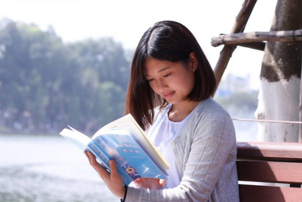

法轮功学员在看《转法轮》（网络照片）

 

希望之声2018年11月12日】（本台记者慧光综合报导）我是生活在中国大陆东北的一名普通女性，在上个世纪八十年代，那时我刚参加工作，孩子还小，工作上压力也大，导致身体状况越来越差。开始是被诊断有甲状腺肿瘤，接着又得了化脓性阑尾炎，后来又发现有心脏病，看病吃药成了我生活中的常态。1995年又被诊断出患有胆结石，不得已做了手术，将胆囊摘除了。1997年以前我几乎每年都要住院，医药费单位给报销一部分，自己也要负担一部分。自己负担的这部分相对于当时的收入来说也很大，给家庭生活造成了很重的负担。

1997年，也就是在胆囊摘除两年后，我又感到背部疼痛，有时疼的很厉害，就趴在办公桌上掉眼泪。有一次被领导看见了，问我“咋地了？”我说“背疼”，领导说“你的胆不是摘除了吗？怎么还疼啊？”我都不知道该怎么回答，因为老有病，请假都觉得不好意思了。这一次医生说可能是胆总管长结石了，于是我又住进了医院。在医院住了四十多天，吃了很多种药都无济于事，最后也没确诊是啥病。不仅疼痛难忍，而且吃饭很困难，吃一口饭都得疼好长时间，痛苦极了。

虽然没有确诊出是啥病，可是与我同病房住的都是癌症病人，而且都很严重，病房里几乎每个病人都被痛苦折磨的大呼小叫，即使到了夜里也一样，我也不例外。因为疼痛实在受不了，每天都要打止痛针，不然就睡不了觉。那时我脸色蜡黄，四肢无力，白细胞只有2400，才四十多岁头发全白了，走路得靠人搀扶着。

丈夫不得已找到上级医院的专家会诊，确诊是“胰腺占位性病变”，说白了就是胰腺癌。那个专家看到结果后几乎是冲我丈夫嚷起来：“她病得这么重，不能再耽搁了，得赶紧手术。我有个同学在哈医大，我给他打个电话，你赶紧带病人去，不用挂号，挂号可能都不赶趟了（东北方言，意思是来不及了）。”

我听到这个消息后几乎要晕过去，心想都这么严重了，手术还能有用吗？我身体这么弱，真要手术还能下手术台吗？丈夫好说歹说坚持让我去，说“死马当活马医”，不能眼看着我等死。平常打一针止痛针我就能睡觉，可那天打了两针都不好使，而且越疼越厉害。我意识到自己的人生快走到尽头，于是跪在床上绝望的嚎啕大哭：“我为什么这么苦啊？谁能救救我呀……”

值班护士听到我的哭喊声就走过来，我要求她再给我打一针止疼针，她说：“你已经打两针了，不能再打了，再打就中毒了。”丈夫也对她说：“总得想点儿招吧，你看她都疼的不行了。”这位护士看到这种情况也没着急，就耐心的跟我们聊起来。她说到了我的病情，也谈到了人为什么会得病，说的我心服口服的，不知不觉中我就不觉得疼了，而且感觉非常舒服。护士看我情绪稳定了就要走，我一把抓住她的衣服，说：“请你别走，不知咋的？你在这我就不疼了。我这有橘子、苹果，你慢慢吃着，我们再聊一会儿，请你先别走。”

那位护士听后愣了一下，沉思了一会儿，好像在想什么，末了说了一句话：“你把手松开，我给你拿样东西。”我无可奈何的松开手，担心她是哄骗我。

过了一会儿，护士真的回来了，手里还拿着一本书，她用双手捧着递给我，说：“这是法轮功的主要指导书《转法轮》，你认真看一看，如果有缘，也许你以后永远都不会疼了。”我当时想，这是什么书呀？比吃药打针还灵。于是我接过来开始看，可看了几页就困得不行，实在坚持不住我就抱着书睡着了。

后来我才明白，那位护士是炼法轮功的，因为她身上有功，在她的“场”的作用下我才不感到疼了。

从那天起我就开始看书，每天都看，不到两周时间，奇迹就出现了。疼痛感越来越轻，每天都能感觉到身体在变化，而且一天比一天有精神。后来渐渐的能吃饭了，走路也不累了。丈夫不相信，说病得这么重，怎么能说好就好呢？就带着我去找专家复查。可查来查去，发现肿瘤没有了，胰腺功能正常了。丈夫对我说：“咱别高兴得太早，再观察一段时间看看再说。”我不同意，自己做主出院回家了。过后他对我说，他怕我是“回光返照”。

回家以后，我如饥似渴的看《转法轮》，越看越想看，越看身体越舒服，我知道这绝不是一本普通的书，而是一本宝书、奇书，因为我不仅是病好了，心情也越来越好，每天都生活在愉悦、幸福的感觉中，心胸也越来越开阔。通过看书，我懂得了生命的真正意义是什么，知道了“真、善、忍”是宇宙的法理，我要按照“真、善、忍”的标准要求自己，做一个真正的好人。

以前我的争斗心很强，性情急躁，脾气暴躁，得理不饶人，不能忍耐，管孩子不是打就是吵，家中总是“火药味”十足，丈夫说我是病给魔的，也不跟我计较。修炼以后，这些毛病都改了，从此家里平和、安静，再也没有争吵、打仗的事出现了。

以前我四十多岁时，别人看我像六十多岁，如今二十年过去了，我已经六十多岁，可朋友看我却像四十多岁。不认识的人知道我的岁数后都会露出惊讶的表情，她们说：“你有什么秘诀呀？怎么保养的这么好。”我大声的说：“学法轮功吧，不用做美容人就永远年轻。”

我是从死亡边缘走回来的人，是法轮大法让我重获新生。大法不仅给了我新的生命，也使我的心灵更加纯净。二十年过去了，我没再吃过一片药，真正体验到了一个人没病是多么幸福。

在二十多年的风风雨雨中，我用生命见证了法轮大法的神奇，在此我衷心感谢师父的慈悲救度，我要做一个让师父放心的弟子。

 <h2 align="center"><b>遭非法庭审 法轮功学员无罪辩护感动听众</b></h2>
 

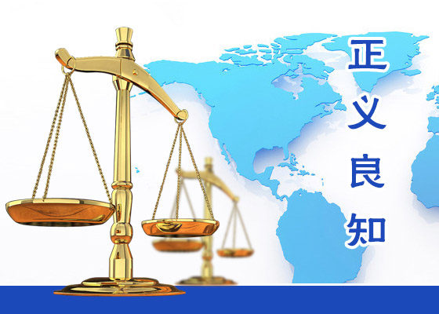

四川巴中市89岁老人在法庭上进行了铿锵有力的自我辩护。（明慧网）

 
【大纪元2018年11月16日讯】“除了手握国家权力的高官有本事可以废止或者破坏国家的法律，这些平民老人，七八十岁了，手无缚鸡之力，走路都要人搀扶，怎么可能破坏国家法律实施啊！律师们辩得对啊，指控人家杀了人要有被害人的尸体啊，指控人家破坏法律实施，要有哪一条法律被破坏了事实证据啊！”一个旁听者说。

“起诉书把人家实名控告江泽民作为一条罪名，这份起诉书就是检察院破坏法律实施的罪证啊。阻止公民行使宪法权利，不是破坏宪法的实施吗？”另一董姓旁听者说。

上面所指的庭审于2018年11月7日在四川省巴中市巴州区法院进行。十名法轮功学员在法院第十审判庭被非法庭审。律师与家属辩护人依法一一驳倒公诉人的所谓“指控”，要求无罪释放当事人。

令很多旁听者感动的是法轮功学员的自我辩护。

<b>89岁张新伟：法轮功是高德大法</b>

89岁高龄的法轮功学员张新伟白发苍苍，双手扶著拐杖，在家人的陪同下，走上法庭。他用自己的亲身经历讲述了法轮功教人向善、祛病健身有奇效的故事。

张新伟亲身参加过中共的一系列运动，由于过度劳累，患上了神经官能症、尿路感染、近视、肝炎、肺结核、肺气肿、高血压、骨质增生等多种疾病。多年来他经过了中医、西医和各种方法治疗均无疗效，60岁就办了病退。

“1998年我修炼法轮功，法轮功神奇地使我所有的疾病不翼而飞，而且戒掉了几十年的烟酒恶习，身体健康至今，没有吃过一粒药。近视眼也好了，二十年不戴眼镜也能读书看报。”

2000年，他右腿粉碎性骨折，后来在医院打上石膏就出院了。回家也没吃药打针，二十天后去医院检查，痊愈了。“俗话说伤筋动骨一百天，我70岁粉碎性骨折，二十天好了，这难道不是奇迹吗？”

2003年一天，两个年轻人骑着一辆豪华摩托车飞快冲到他跟前，把他撞飞十五米远摔在地上。两个小伙子吓坏了，要送他去医院。他说：“没事，你们走吧，我是修法轮功的，不会找你们麻烦的。”

两个年轻人流着眼泪连声说：“谢谢爷爷，谢谢爷爷。”他说，“法轮功学员按照‘真、善、忍’标准，处处事事为他人着想，这样处理社会纠纷难道不对吗？”

“法轮功创始人李洪志师父在他所有的著作里，一再教导弟子们要修心性、做好人，做事不能伤害他人。”

他说，这样一个教人向善、使人健康、福益于社会、受到世界人民欢迎的高德大法，却遭到江泽民的无理打压，这实在是令人匪夷所思。江泽民迫害法轮功违宪违法，迫害的一切“理由”都是谎言，都是为了抹黑法轮功而编造出来的。

“我们法轮功学员向世人讲述法轮功被迫害的真相，目的就是要澄清中共江泽民集团为打压法轮功而编造的谎言，使人们能从这些谎言中解脱出来，以免成为这些谎言的牺牲品。俗话说：兼听则明，偏听则暗。当你真正了解了法轮功，你自然就能从这场善与恶、是与非中得出自己的正确结论。”

<b>82岁张明朗：修炼法轮功合法</b>

从检察院退休下来的82岁法轮功学员张明朗，在法庭上认定修炼法轮功合法，信仰无罪。修炼法轮功没有给社会造成任何危害，并要求公诉人解释如何破坏法律实施的事实，哪一条法律被破坏了的证据。

张明朗在讲述自己修炼法轮功后的变化时说：“修炼法轮功前，我身患脑震荡、 神经官能症、肝炎、胃溃痬和严重风湿关节病，（被病痛）缠磨三十多年，生不如死。修炼法轮大法不久疾病全没有了， 真是无病一身轻，走路生风。”

检察院的家属都说“老张变年轻了”。他六月天不用穿棉祆了，还能力所能及地帮子女生意上做些事情。

老人最后告诫公检法司人员：“法轮大法是宇宙大法，迫害大法是要遭报应的，停止迫害法轮功学员就是珍惜自己的生命。”

<b>瘫痪的陈国琼修炼后站了起来 却遭两次绑架</b>

法轮功学员陈国琼文化程度不高，在法庭上理直气壮地讲述自己修炼的经历。她因家境贫寒，多年劳累过度，2007年患腰椎间盘突出加骨质增生，无钱治疗而导致瘫痪，生活不能自理，常年卧病在床。

一位法轮功学员路过她家给她讲了法轮功真相，教她念诵“法轮大法好、真善忍好”，告诫她“只要心诚，必有奇效”。

陈国琼按照这位法轮功学员的嘱咐，不知不觉有一天奇迹出现了，她站了起来。亲朋好友和邻居们都见证了法轮功的神奇。

从此，她开始在自己家里修炼法轮功，然而却被人告发，遭到绑架。

巴中市公安局一个官员叫朱小冬，他的亲戚跟陈国琼家发生房屋产权纠纷。2016年的一天，陈国琼家里没人在家，朱小冬的亲戚仗势欺人，破门而入，强占她家的房屋，发现陈国琼家里有法轮功书籍和资料，于是报了警。

派出所的警察到现场后不是拘押破门而入、私闯民宅的肇事者，而是把陈国琼叫回家给抓起来。这是陈国琼第一次被绑架。

2017年12月22日，四川省公安厅一位主管国保和“610”职能的副厅长，力图在巴中搞出一个所谓打击黑社会的大案要案邀功升官。他把巴州区公安分局的国保警察集中到广元市培训，并亲自坐镇巴中，组织几个县市的警察大规模绑架法轮功学员。

他在一次会上说：“对×教分子不能心慈手软，只要是炼过法轮功的，统统搜查驻地，（在他们）家里一定能找到‘证据’，每个对象的家庭都要仔细搜查。”还下达了先抓人再搜集所谓“证据”的命令。陈国琼和弟媳孙蓉就这样为凑人数被绑架了。

<b>陈国琼的女儿为母辩护</b>

陈国琼的女儿陈湘，二十多岁，挺身出庭为母亲做无罪辩护。面对在看守所被关了将近一年的母亲，陈湘强忍泪水，没有哭泣。

她讲了妈妈通过修炼法轮功身体恢复健康的经过。对母亲为何起诉迫害法轮功元凶江泽民，以及诉江的合法性等进行了辩护，其思维敏捷，口齿清晰，条理清楚，有理有据，情理交融，打动了在场听众。

她说，公诉人以“利用×教组织破坏法律实施罪”指控她妈妈陈国琼，“请问我妈妈破坏了哪条法律，也并没有哪条法律因为我妈妈陈国琼而不能实施了。”

“我妈妈陈国琼在社会上遵纪守法，为人善良友好，对亲属朋友真诚、热情、大方，对父母长辈孝顺有加，照顾周全，对邻里互帮团结友好，是按照法轮大法‘真、善、忍’的标准来严格要求自己的，所以说我妈妈陈国琼是一个好人，是无罪的。请审判长、各位人民陪审员查清事实，给予我妈妈陈国琼当庭宣判无罪释放。”
代万义：检察院的指控没有法律根据

法轮功学员代万义在庭上，讲述了自己修炼法轮功后所有的疾病不翼而飞的事实，并认为：“自己修炼法轮功是宪法赋予公民信仰自由的权利，巴州区检察院指控我破坏法律实施是没有事实根据和法律依据的。”

他质问公诉人：“我是怎么样用收藏的法轮功出版物和电脑、打印机、A4纸张去破坏法律实施的？又有哪一条法律、法规被我废止了、破坏了？”

<b>丈夫要求法庭无罪释放妻子孙容</b>

法轮功学员孙容的丈夫陈平，出庭为妻子做了无罪辩护，说：“孙容在没有修炼法轮功之前，身体经常生病，脾气暴躁，老是和我吵架；修炼后，现在身体十分健康，脾气也变得十分温柔了，对待老人十分孝顺。我妈妈是个几十年的精神病患者，生活不能自理，每天她给我妈妈梳洗、护理，家里的大大小小事一人承担，请问她有罪吗？”

孙容仅仅是因为炼法轮功，家中有自己看的法轮功书籍、光盘、护身符，被抄家抄出后遭非法抓捕。陈平要求法庭无罪释放孙容。

庭审于上午10点开始，晚上接近11点结束，审判长宣布择日宣判，还说要执行中国的法律。

明慧网评论：希望审判长与合议庭法官和陪审员们作出的判决是公正的，经得起终身负责的历史检验，经得起良心的评判。

 <h2 align="center"><b>一位越南空军上校的“强身梦”</b></h2>
 

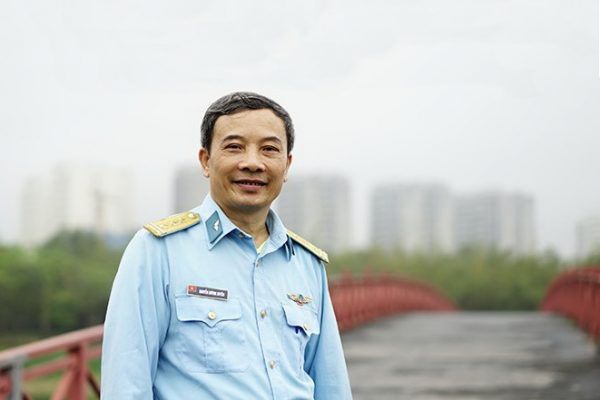

越南空军上校阮先生（Nguyen Quynh Xuyen）

 
【希望之声2018年11月9日】（本台记者慧光综合报导）

阮先生（Nguyen Quynh Xuyen）从小就喜欢武术，他认为武术不仅能够让自己变得强壮，实现自己的“强身梦”，还能摆脱疾病的困扰，从而延年益寿，所以这个目标几乎成为他一生的追求。经过多年的勤学苦练，他终于学有所成，从1986年起他就担任越南空军防空学院的武术教练。之后他在学校执教多年，获得过很多荣誉，包括在国家锦标赛中获奖。由于名声越来越大，他每年都会下部队教授武术。他也经常沉浸在已有的成绩中，认为自己是成功者。

的确，在同事和学生的眼中，他几乎是完美的。他也一直认为自己选择的人生道路是非常正确的，尤其是在健康方面，以他几十年的武术功底，不会出现任何问题。然而表面的风光却掩饰不住他内心的担忧，因为近年来左胸部经常出现隐隐的疼痛，使他有一种不详的预感。

2015年，在准备参加全国性的比赛之前，他做了一次健康检查，结果显示血压高达110-180 mmHg，还发现了心脏瓣膜病，赛事组织机构不得不取消了他的参赛资格，为此他备受打击。因为他将面临一个不可更改的事实，那就是多年来在人们心中有关他的“神话”破灭了。

作为一名高级军官，他住进了最好的医院。医生告诉他，情况不是很乐观，血压只能暂时降低，心脏瓣膜必须选择适当的时间手术。这样的结果意味着他的人生辉煌从此结束了，即使出院了，“心脏病患者”的标签也可能会伴随他的余生。命运的悲剧让他感到莫大的悲哀：就这样告别武术生涯吗？以后怎么跟学生见面呢？未来怎么办？一想到这里他就感到非常沮丧和困惑。尤其让他想不通的是，从小习练武术，几十年不敢有一日懈怠，如此勤劳辛苦，也算是一个功底深厚的武术家，为什么面对疾病却如此脆弱？

就在他的精神几近于崩溃的时候，他的夫人诚恳的给了他一个建议。夫人对他说：“修炼法轮功吧，很多绝症病人都在修炼法轮功后痊愈了。”听到这话后他陷于了沉思。

夫人是一位小学老师，以前患有多种疾病，有风湿性关节炎、胃病、高血压以及前庭功能紊乱等，几乎没有一个月不去医院，常常因为生病而不得不请假。每当下班回家的时候，看见夫人躺在床上，他就会感到内疚，似乎自己有再大的本事也爱莫能助。可是当夫人走入法轮功修炼后，所有疾病都奇迹般地消失了。为此夫人曾多次劝他阅读法轮功的主要指导书《转法轮》，多了解一些法轮功，可他却不以为然。那时他觉得自己武功高强，炼气功似乎用不着。可如今躺在病床上，面对夫人的善良规劝他却找不到拒绝的理由了。

他尝试着与夫人一起练习法轮功的五套功法，出乎意料的是，经过几天的练习之后，他就感觉左胸部的疼痛缓解了，不再像之前那样呼吸困难了，而且能察觉到身体内部在变化，疲惫感渐渐在消退。这个奇妙的感觉促使他决定要仔细研究《转法轮》一书。

他说：“在我过往的一生中，我是第一次从头到尾完整的阅读这么厚的一本书。我发现这是教人行善做好人的书，无可非议，因此我坚持反复阅读。不知不觉中我的身体被改变了，疾病的症状消失了，悲观的情绪不见了。更重要的是《转法轮》教会了我对人生的思考，我清醒的意识到，只有当心灵净化、境界升华时才能拥有真正的健康。”

他还说：“我发现自己很幸运。一个穷人可能不得不靠出售房子换钱来治病，一个得了重病的亿万富翁即使倾尽所有财富也换不回健康，而我仅仅是阅读了一本书和练习五套功法就恢复了，这绝对不是一件简单的事情。《转法轮》书中的很多论述，让我对人生的理解完全改变了，我看到了一个崭新的世界，从此我发誓要按照‘真、善、忍’的要求做一个好人、做一个更好的人。”

修炼以后，他不仅在身体方面有了巨大改变，心态也有了明显的变化，变得非常平静，非常冷静了。然而修炼的路也并非一帆风顺，因为中共对法轮功的镇压和迫害，也使很多越南人、尤其是官员相信了中共的宣传，对法轮功存有误解，包括他的同事和上司，有不少人不能理解他的行为，甚至一度使他的上下级关系变得紧张。

有一天他突然接到消息，他将被改换工作，甚至将被解雇，报告已经送到有关部门，学院的院长、政委也开始对他质疑。面对如此严重的压力，他依然保持了一个平和的心态，他对自己说：“我没有做任何违法的事情，只是想做一个好人，他们早晚会明白一切的。”那些对法轮功有误解的人，其中有一些是跟他很要好的朋友，他为此感到悲伤和焦虑，怎样才能解开对方的心结呢？这是他想的最多的事情。

他的坚持和善良终于有了结果，上级派来一个上校军官与他谈话，认真的听取了他的汇报，对他的行为给予理解，他被通知继续工作，紧张的日子就这样过去了。通过这件事也使他对修炼有了更深的理解，他说：“那期间我的思绪非常平静，让我体会到修炼人的善行的确能改变环境。”

最后他说：“我看到有很多人死于癌症等绝症，很多人死于吸毒、犯罪等恶行，而无论什么人，只要他肯接近、走入法轮功，他就能找到生命之光。在当前的社会中，邪恶有行恶的权利，而法轮功要拯救人出苦海，这么大的善行反而要受到镇压、受到阻碍，孰善孰恶不是一目了然吗？有些人一生都在追求健康，可是天大的机会来到他面前却不知道珍惜，这是多么悲哀的事情！我希望所有人都能够从对法轮功的误解中解脱出来，找到他们生活中真正期待和需要的东西！”

<h2 align="center"><b>律师依法为法轮功做无罪辩护 遭中共打压</b></h2>
 

胡林政律师为法轮功做无罪辩护，长沙司法局竟根据《律师执业管理办法》第二条对其进行停业处罚。多名律师表示，事实上是司法局违法。（胡林政律师微博）

 

【大纪元2018年11月12日讯】（大纪元记者骆亚、周慧心采访报导）中国大陆律师胡林政在一场无罪辩护后，最近遭司法局停止执业六个月的处罚。

处罚书中说他违反了《律师执业管理办法》第二条，“律师应当把拥护中国共产党领导、拥护社会主义法治作为从业的基本要求。”维权律师谢燕益表示，“拥护共产党”是个政治概念，跟律师的职责没有关系。

11月5日，长沙市司法局网站刊登了对胡林政律师的处罚决定书（以下简称：处罚书）。

处罚书中说，2017年12月1日，在云南省红河州开远市法院的法庭上，作为法轮功学员张某的律师，胡林政在法庭辩护中说，“没有证据证明法轮功是x教，张某信仰法轮功是宪法36条赋予的宗教自由，限制法轮功信仰是违法行为。”

处罚书说他的上述言论否定了国家认定法轮功是x教组织的性质，扰乱法庭秩序。

但据多名曾代理过法轮功案件的律师表示，在现行的中共法律文件中，没有一个明确提出法轮功是x教。而宪法第三十六条：“中华人民共和国公民有宗教信仰自由。任何国家机关、社会团体和个人不得强制公民信仰宗教或者不信仰宗教，不得歧视信仰宗教的公民和不信仰宗教的公民。”

维权律师谢燕益对大纪元记者表示，胡林政律师没有违法，“他是严格按照宪法和法律依法执业。‘拥护共产党’是个政治概念，跟律师的职责没有关系。”

<b>胡林政的辩护有法律依据</b>

大陆律师程海表示，胡林政律师是依法进行辩护。程海对大纪元记者解释说：“中国没有任何官方文件中讲法轮功是x教，也没有一个官方性文件公布取缔法轮功，所以他（胡林政律师）是依法辩护。那个行政处罚是没有事实依据、没有法律依据的，是一个滥用职权的行为。”

余文生律师也曾公开表示，在中国的现行法律当中，没有一条法律规定法轮功是x教，而江泽民当时是以国家主席的身份，接受外界采访的时候说“法轮功是x教”。

他说：“江泽民没有这个权力，他实际上是在造法、违法，而且错误盗用刑法300条，违反了《宪法》、违反了《人权宣言》。”

李建强律师曾在法庭上表示，他所查阅的所有关于法轮功的法律文件，除江泽民和《人民日报》特约评论员所发表的谈话与文字外，没有一个文件认定法轮功是x教组织。

包括全国人大《关于取缔邪教组织、防范和惩治邪教活动的决定》、《最高人民法院最高人民检察院关于办理组织和利用邪教组织犯罪案件具体应用法律若干问题的解释》中均未提及法轮功。

而出现“法轮功是×教”字样的所谓文件是“两高”各自下发的内部通知，但“内部通知”既不是“法律解释”，也不是“行政法规”，更不是“国家法律”，根本不能作为法律依据被使用。

迄今为止，中共中央办公厅、国务院办公厅、公安部认定和明确的“邪教组织”共有14种，其中并没有法轮功。

谢燕益律师表示，对胡林政律师的指控根本就是无稽之谈，“是法庭违反法律、破坏法律，胡律师是维护法律、维护当事人的权利，而且胡律师的辩护意见没有所谓‘危害国家安全，恶意诽谤他人’，恰恰他是在维护这个国家、维护人民、维护司法公正，这都是颠倒黑白、‘欲加之罪’。”

<b>为法轮功做无罪辩护是挑战中共？</b>

中国人权律师滕彪表示，中共对胡林政律师的处罚是没有任何依据的，是对律师权利的剥夺。“在2010年，唐吉田和刘巍两位律师在法庭辩护的时候，法官无理制止他们，干扰他们辩护，然后他们继续抗辩，（法官）也按扰乱法庭的罪名吊销了他们的律师证。”

滕彪对大纪元记者说：“这种作法一直都有，现在这些年情况更严重，很多律师被吊销律师证或注销律师证，甚至被安上罪名抓捕。这是严重干扰了律师正常的辩护权利。”

他解释说，针对法轮功的案件，律师会遇到很多障碍。“在审理当中，法官也没有办法正常地去办案。就是610、维稳办等等法院背后的力量，来操控法轮功案件。法轮功案件是中国敏感案件当中最敏感的案件，现在更多的是限制和剥夺律师的辩护权利。”

他说：“他们（中共）认为，律师对代理的敏感案件进行无罪辩护，是对当局权威的挑战，尤其是很多人权律师提出信仰自由、提出宪法进行抗辩，在当局看来，就是对现有体制的挑战。所以对律师合法权利的控制全面升级，包括对709律师的大抓捕。”

到目前为止，有几十位曾为法轮功学员辩护的律师遭到中共打压。

律师隋牧青曾表示，被吊照的律师没有一个是因为职业道德不好而被吊照的，就是因为这些律师职业道德好、维护当事人的合法权益，从而触犯公权力被吊照。

谢燕益律师也认为这些律师都是非常优秀的、非常有担当的，都是严格地、非常执着地依法辩护，捍卫法治权威。

他说：“湖南的司法部门非常不明智，他们不知道这种做法——这种公然践踏法治和剥夺律师职业权益的行为，最终会让他们自食其果。”

谢燕益解释说，因为没有法治，律师的职业权利不能获得保障，每个人，包括他们子孙的权利和尊严都会受到贬损伤害。“这已经是无数的周永康、薄熙来都在演绎的。始作俑者岂无祸福？这些人还会去演给大家看，他们一定要付出代价的，会有清算他们的时候。”

<h2 align="center"><b>从悲苦人生中走出来的白领</b></h2>
 

法轮功学员在炼第五套功法——神通加持法（网络照片）

 
 
 【希望之声2018年10月31日】（本台记者慧光综合报导）我是中国大陆湖北省的一名青年女性，目前在一家外企工作。我的老板曾对员工说，我是他遇到的最优秀的员工，高素质，是不可多得的一位好助手，以后不可能再碰到这样的员工了。

的确，我现在的工作、生活和家庭都很顺利，常使熟悉的朋友羡慕不已，甚至成为身边人的楷模，而这一切都是因为修炼法轮功带来的，是法轮大法给了我全新的生命。

我虽然三十多岁了，可我的身高只有一米四七，从小到大一直是一只孱弱多病的丑小鸭。尤其童年的我，命运悲苦，严重的自卑感一直伴随着我。

听妈妈说，在我一岁多时生了一场大病，一直处于昏迷状态，去了多家医院也未查出病因。醒来后表面上恢复正常，但从此体质变的非常差，弱不禁风，经常感冒，一感冒就引发哮喘，常年打针吃药。在我的印象中，童年几乎就是在医院里度过的。也许就是因为这个原因，导致我发育不良，个子矮小。在记忆中，我的童年很孤独，没人陪伴，没有快乐。

因为体质差，长大后我的病也特别多，从上中学起，我就有鼻炎、砂眼、颈椎病和牛皮癣等慢性病，还有皮肤过敏，扁桃体经常发炎，常年手脚冰凉。最糟糕的是，整个初中三年我只来过三次例假，每次又会持续一到两个月。除了月经不调，我还有严重的失眠症。

在我上初一时，我的父亲就离世了，家里的生活重担完全落在母亲一人身上。因为自卑，我知道努力学习，所以成绩很好，但是顾虑到身高和健康状况，为了便于找工作，升学时我选择了一家技校。

读书期间，因为身高问题我也经常被同学瞧不起，被同学嘲笑是司空见惯的事，遇到这种情况，我只能独自一人伤心落泪。时间长了，我也经常认为自己是多余的，身材矮小，外形一般，身体素质很差，我都找不出自己有什么优点，所以在人多的场合我从不敢说话。我身边没有一个真心朋友，经常是怨和恨交织在心中，我感到活得太累太苦了，甚至想到过轻生。

我姑妈是位教师，患有多种疾病，是单位有名的“药篓子”，因为美尼尔氏综合症经常晕倒在讲台，后来不得已离开了教学岗位，是处在死亡边缘的人，可是因为修炼法轮功，她的病全好了。整个家族的人都见证了发生在她身上的奇迹。

姑妈也曾耐心的向我介绍法轮功，由于“无神论”的观念影响了我，我没太当回事儿。但姑妈常常对我讲法轮功修炼故事，讲述修炼人因信仰“真、善、忍”而发生的感人事迹，让我深受感动，知道这里是一块人间少有的净土。不幸的是，由于中共掀起的大规模镇压和迫害，姑妈三次被关进监狱，身体和精神受到严重摧残，与之前判若两人，我的心因此被深深的刺伤。

2006年我结婚了，丈夫很希望马上有个孩子，可是我的月经依然毫无规律，对此一点儿信心都没有。我婆婆也是一位法轮功学员，要我跟她一起学法炼功，我没理由拒绝。因为每天都在婆婆的引导和监督下，我就这样走入了法轮功修炼。也是从这时候起，我才认真的用“真、善、忍”的法理要求自己，提高心性，做真正的修炼弟子。

没想到的是，修炼后我的身体很快就发生了不可思议的变化，所有的疾病都不知不觉的消失了。原来因为砂眼和颈椎病我无法使用电脑，可修炼后没有任何影响了。更重要的是随着心性的提高我变得自信，精力充沛，面色红润，同事总说我神采奕奕，都愿意跟我接触交流了。

婚后发生了一件非常神奇的事。结婚后十个月我一直没有来例假，丈夫就带我去看中医，想用中药给我调理一下，结果那位中医大夫一把脉就说我已怀孕四个多月了。我丈夫当时就激动的把我抱起来，非常惊喜。我是在闭经六个月的情况下怀孕的，算了算那时我才刚刚修炼一个月。怀孕期间我没有任何不适反应，经常跟丈夫一起运动，每天骑着自行车外出。后来我顺利的生下一男孩，孩子健康、聪明、乖巧。这件事情在我的亲人中都传遍了，很多人都被大法的超常和神奇感动了，也震撼了。

我不仅有了健康的身体和幸福的家庭，也有了平和的心态。我处处与人为善，豁达、宽容，在工作上也更加严谨，短短几年我就从蓝领做到白领。

在当前这个女性要靠颜值吃饭的社会里，应聘工作时很多用人单位都把外表看得很重要，可是我修炼后再没有因为一米四七的身高受到歧视，相反我几乎能通过大多数公司的面试。几次离职时，企业老总为了挽留我，让我随意提条件，说只要能留下就行；其中有一位老总为了留下我，专门召开了一次股东大会，让所有股东一起挽留我。

因为我时时处处按“真、善、忍”的法理要求自己，目前所处的外企公司，领导从不担心我会做假，同事从不对我防范。困难的事，辛苦的事，责任大的事我都主动去承担。同事和朋友们都说，我能给周围的人带去阳光般的温暖和积极的正能量。

每当回想起我的修炼过程，都会激起我对师父的无限感恩之心。如果没有修炼，我仍然会活在悲苦人生中不能自拔，我的身体会一直被病痛折磨着，灵魂迷茫着，找不到人生的目标，孤独无助，或许早已放弃了生命。

今天，我的亲身经历证实了法轮大法的超常和神奇，越来越多的事实证明，走入法轮功修炼是我人生中最正确、最明智的选择。
 

<h2 align="center"><b>强国与“墙国”</b></h2>

【明慧网二零一八年十一月十二日】如果有一个人家，被围墙包围了起来，没有任何一扇门，想进去或出来，就得“翻墙”，那一定没有人相信，怎么会有这样的人家？哪个院落没有大门？谁家的屋子没有窗户？

没有完全被大墙围起来的家庭，却有完全被大墙包围起来的国度。

这是一个事实：现在世界有二百多个国家，在其中百分之九十八的国家，你都可以通过书店、报纸、杂志、网络，或者人与人自由的交谈，了解世界其他国家的任何事情。但是在中国，中共的海关不允许携带任何不利于中共的任何书籍、报刊入境，境内的任何机构不能出版任何不利于中共的出版物、印刷品，而在互联网上，人们看不到任何中共不想让人看到的东西，在学校的课堂上，老师不能讲授、讨论关于中共的任何客观真相。

中共标榜自己为强国，实际上却是一个不折不扣的“墙国”。不能摆放在阳光之下的，一定是见不得人的，不能公开让人监督，一定隐藏了惊人的黑暗。

近日，一篇题为《北京高院宣布 中国人无权知道国土版图》的热帖在网络上流传，有民众向中共外交部递交申请，要求公开有关唐努乌梁海地区是否仍属于中国领土的政府信息。中共外交部以相关资讯涉密为由拒绝公开。为此，申请人又先后向北京中级和高级法院提起诉讼，却被裁定不予立案。舆论质疑：自己国家的国土版图竟然属于秘密，国民无权知晓，究竟谁在卖国？

这就好比，我想了解一下我家的家底有多少，但是却有人挡在我家门口，不让我进去？因为自己的家，被土匪占据了，人甚至连最基本的知情权都失去了。

从一九九二年，法轮大法在长春正式传出，以真善忍为基本原则，有五套动作柔美的功法，让人身心健康，道德回升。然而在一九九九年，江泽民出于嫉妒心，对法轮功大打出手，与无神论的邪恶产物中共互相利用，至现在残酷打压法轮功，已经过去十九年了。在网络上、各个单位、场所，中共都在极力封锁法轮功真相。

当二零零一年春节，中共在电视台用铺天盖地的画图播放“天安门自焚”的时候，当十数亿中国人被中共暴力机器辗压心灵，灌输谎言的时候，中共筑起的高墙，让民众看不到任何真相。

而在大洋的彼岸，二零零一年二月四日，华盛顿邮报在头版发表题为“自焚的火焰照亮了中国的黑幕——当众自焚的动机乃为加强对法轮功的斗争”的惊世调查文章，向世界提供了包括以下几点在内的事实：刘春玲不是开封本地人，生前在夜总会靠陪吃陪舞谋生；刘春玲曾不时殴打老母和幼女，邻居认为刘春玲有心理方面的问题；从来没人见到刘春玲练过法轮功。

可悲的是，直到现在，虽然法轮功学员十九年来，风霜雪雨中传送着真相，但仍有为数不少的人，在中共的淫威、恐吓之下，对于真相不愿听闻、不敢接受！

中共邪恶筑起高墙，不让民众接触自由的思想；中共邪党封锁消息，惧怕民众了解法轮功真相，是要蒙住可贵中国人的双眼，让他们跟随着邪恶的中共逆天而行，为所欲为。然而做尽坏事，能有好报吗？

“九评”编辑部出版的新书《共产主义终极目的》揭示了这一真相：“共产主义的本质是一个‘邪灵’，它由‘恨’及低层宇宙中的败物所构成，它仇恨且想毁灭人类。它并不以杀死人的肉身为满足，因为人肉身的死亡并非生命的真正死亡，元神（灵魂）还会轮回转生；但当一个人道德败坏到无可救药的地步，元神就会在无尽的痛苦中被彻底销毁，那才是最可怕的、生命真正的死亡。‘共产邪灵’就是要使全人类都跌入这样万劫不复的深渊中。”

上天并没有放弃善念尚存的世人，无边的佛法正在将邪恶清理尽净。

曾经被人权恶棍江泽民蒙骗的法国第一大报《费加罗报》，是第一个替江恶抹黑法轮功的；在十余年过去之后，《费加罗报》和其它很多世界媒体一样，渐渐了解了事实真相，从转述中共谣言，到沉默，再到谴责迫害，他们终于清醒。二零一六年七月二十五日，《费加罗报》登出一篇题为“在中国，九万例非法器官在所有医院移植”的文章，揭露中共活体摘取法轮功学员等良心犯器官，活摘数量之巨大令人触目惊心。文章一经发表，震惊该报读者。

二零一八年十一月七日，美国白宫在“全国共产主义受害者纪念日”这一天发表总统声明。“在‘全国共产主义受害者纪念日’这一天，我们铭记一亿多被共产主义极权政权杀害和迫害的人。”“共产主义把与生俱来的人权置于所谓的全体幸福之下，其结果是消灭宗教自由、私有财产、言论自由和过于经常发生的消灭生命。”“共产主义以及对共产主义的追求对人类精神和人类繁荣将永远具有破坏性。”

在法轮功学员无畏生死、昼夜不舍的努力下，世人逐渐清醒。即便曾经被中共裹挟的公、检、法、司，有相当多的人明白了真相，对于非法迫害法轮功，有的置之不理，有的尽力而为缓解案情。

然而，也有很多至今不明真相，还有为中共卖命的糊涂人，就是那种被中共卖了，还替中共数钱的人！

明慧网报道，在二零一七年一月份，一百三十七名法轮功学员遭中共非法判刑，非法判刑的法轮功学员，至少有十一名律师没有接到通知，法院进行秘密审判。

二零一七年二月份，七十二名法轮功学员被非法判刑，至少有五名律师没有接到通知。另外，一名律师被法院非法拒绝进入法庭。

直至今天，一些地区的法院，对于法轮功学员仍然是非法审判，或者不通知家属，或者来回踢皮球，故意拖延， 让法轮功学员的上诉期作废……

有句话，天网恢恢，疏而不漏。上天对于善恶的回报，不错过一分一毫。现在对于迫害“真善忍”的恶徒，恶报已经比比皆是，虽然是以反腐的名义，实际上，就是对迫害佛法的恶行的报应！

来自明慧网的报道，“迫害法轮功　六十多个政法委书记相继遭恶报”、“一百三十名中共公安局长遭恶报”，这是偶然的吗？这些以贪腐罪名落马的中共官员，都有一个鲜为人知的、中共不敢公开的罪恶，那就是迫害法轮功，谁迫害法轮功越卖力气，谁的官升的就越高。然而升得越高，跌得越重。

中共邪党的所谓“组织调查”、“依法判处”只不过是中共邪教的黑帮火拼、政治清洗而已，这些听党的话，跟党走的公安局长们，深陷险境仍然冥顽不觉，为一己之私，泯灭天理良心，追随江泽民流氓集团，对修炼“真善忍”做好人的群体大肆绑架、抄家、判刑、消音。其结果却是自作自受，被人间的监狱关押还只是个开始，地狱的无休止的惩罚早已在那等候着了。

<h1 align="center"><b>加州华裔少年 画作屡获大奖凭哪般？</b></h1> 
<h2 align="center"><b>从热爱打杀画面到金色光明的蜕变</b></h2>
 

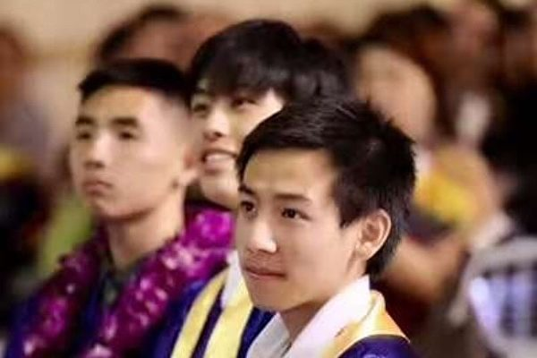

李鑫在“加州仙韵艺术学院”毕业时。（李鑫提供）

 
【大纪元2018年11月05日讯】（大纪元记者勤宜旧金山采访报导）加州华裔少年——李鑫，自幼喜爱美术，尤其他在修炼法轮大法前后判若两人，改善了弱不禁风的体质，并且他的画作屡屡得到“全美青少年美术作品大奖”。身心健康与艺术创作上的巨大提升令人惊讶！李鑫发自肺腑地感叹：“改变一个人很难，但是大法改变了我！” 

 

2013年全美青少年美术作品大奖，李鑫高中时期作品。（李鑫提供）

 
 
<b>加州华裔少年与法轮大法结缘</b>

6年前，13岁的李鑫转学到“加州仙韵艺术学院Xian Yun Academy of the Arts California”，与学校的同班同学Fred一见如故，尽管比Fred大一岁，但是他总是习惯跟随并支持Fred，总是一起玩耍，随后在李鑫和他母亲的不断请求之下，他更搬去和Fred家里同住。Fred妈妈也因此启动了“男生宿舍”。 Fred自小跟随家人修炼法轮大法，每天读法时很自然地也叫上李鑫，当时的他都听Fred的，只要是Fred说的他都跟随。就这样他与法轮大法结上了缘。

<b>黑暗世界中的懵懂少年</b>

走入修炼前的李鑫不仅爱画画，也酷爱电子游戏，画作的内容都是黑水笔勾画出来的打打杀杀，而且非常投入，画了一本又一本。那个时候的李鑫佝偻著背，一个人时常沉浸在刀光剑影的世界里厮杀，手里一边画，嘴里念念有词，冲冲杀杀，帮助笔下的人物呐喊助威。一坐就是很长时间，让原本孱弱的小身体更是弱不禁风，总是比其他小朋友多穿两三件衣服，经常感觉疲惫，而且稍不注意就感冒发烧，一发烧就得躺一周。

李鑫这情况愁死了妈妈，心疼之余，也难免迁就。为了玩游戏方便，李鑫要妈妈买台新的电脑，一向节俭的妈妈开始不同意，但禁不起孩子躺在地上打滚闹脾气，无奈，只好买了。

<b>走入金色光明的小艺术家</b>

随着每天和Fred家人一起读法，李鑫从开始的被动加入，到了后来的积极参与，逐步感觉到生活比以前容易了：“以前对很多事情不清楚，是好是坏也分不清，不知道该怎么做，其实挺烦的。现在学法感觉轻松容易了很多，因为师父讲得很清楚，就是按照真善忍的标准去衡量就知道了，什么是对，什么是错！所以就不累也不用纠结很多了！”之前体弱多病的情况也明显改善了，精神越来越好，衣服不再多穿，以前那个病恹恹的孩子活出了阳光少年的样子，让妈妈欣喜不已。

<b>传递正能量 屡屡获奖</b>

从前笔下打打杀杀的画风不见了，现在出来的画作充满金色光明的美好。李鑫的画作“金色的大海”首次参加全美青少年美术作品比赛CelebratingArt.com即脱颖而出，获得优秀奖。这幅画作在学校也被其他家长看中，愿意出价500美元买下。以后李鑫每年参赛都是屡屡获奖。不仅获奖，他的作品还被当成获奖作品集的封面。

而在学校，李鑫所在的美术科班里，有一位韩国的同学来自艺术世家，从小就有画家妈妈的专业训练，美术专业技巧方面的功底很强，但并没有像李鑫这样屡屡获奖。传递的能量不同吧！纯正的艺术作品传达美好与光明的正能量，让人感觉身心提升的愉悦，是一种超越自我的大格局。打动人心也是情理之中，因为人人都期待那样的光明与美好。这就是修炼法轮大法带给李鑫的改变。

<b>前后一年的转变 惊呆妈妈</b>

有次妈妈在电话上和李鑫交流一些家事，表达自己对家人的抱怨和不满的情绪。李鑫静静听完后说：“妈妈，其实你应该去理解一下他的情况和心情，可能他也有他的难处和无奈，尽量去理解体谅一下他吧！。”妈妈听了大惊，不仅赞同儿子的建议，更是非常意外这番话是一年前还会躺在地上打滚发脾气，吵着要买电脑的那个宝贝。

李鑫妈妈非常激动，把这件事和更多家人分享：“简直难以让人相信，这种话是一个14岁的孩子嘴里说出来的！”这件事情让李鑫的妈妈更加相信了法轮大法的力量。性格爽快而单纯的妈妈，还积极鼓励李鑫堂堂正正地和更多人分享大法的美好。

现在李鑫就读洛杉矶地区一所私立艺术大学——Art Center College of Design，这是李鑫一直梦想考上的学校，是业界很有名的一所艺术设计院校，很有口碑。里面的毕业生往往在学习期间就会被好莱坞的影视娱乐公司要走，这也是这个学校的特别之处，不太有“毕业”的概念，随时会因为喜欢的工作离开；另一个特点是考入这个学校的学生大部分都是业内人士，年纪都比较大的，像李鑫这样作为应届毕业生直接考进去的非常少，他可能是班上唯一的应届生，这也是他的画风纯净，屡屡“中奖”的另一个成果吧！#

本文刊载于旧金山10月20日教育版

<h2 align="center"><b>丈夫为妻子做无罪辩护 公诉人法官无言以对</b></h2> 
 
 

律师指出，公诉方的所有证据都是非法抄家得来的，所搜出的资料也是合法的，当事人应该当庭无罪释放。（明慧网）

【大纪元2018年11月06日讯】四川省德阳市旌阳区法院非法庭审法轮功学员张兴凤、蔡兴碧。蔡兴碧的丈夫当庭为妻子辩护。

四川省绵阳市法轮功学员孙仁智被绵阳市安州区法院诬判三年，提出上诉；孙仁智的侄儿、辩护人孙厚泽在中级法院为其做了无罪辩护。
丈夫为妻子辩护句句在理 公诉人法官无言以对

明慧网报导，张兴凤、蔡兴碧于2017年9月5日给跟踪她们的便衣发了个“翻墙”软件，希望他们了解法轮功真相，却被旌阳区治安队长文一飞等非法抓捕、抄家；2017年10月12日，被检察院非法批捕；2018年4月，被检察院构陷到法院；8月2日，被非法庭审。

在法庭上，公诉人李海按惯例列出所谓证据及在非法抄家过程中抢走的法轮功学员的私人物品，按刑法300条陷害法轮功学员……

北京律师做了无罪辩护。首先让公诉人拿出法轮功是××的法律依据，公诉人拿不出来。

律师还指出，公诉方的所有证据都是非法抄家得来的，而公安人员抄家时身着便装，既没有出示搜查证和立案决定书，也没有叫在场的法轮功学员的家人签字；所搜出的资料也是合法的，因而“我的当事人应该当庭无罪释放”。

8月2日，蔡兴碧的丈夫也当庭为妻子做了无罪辩护。

妻子蔡兴碧曾患乳腺癌、严重类风湿、骨骼变形，手不能握筷子，生活不能自理。医生说全世界的医院都医不好她的病。

丈夫是二重货车司机，长年在外跑车，心里提心吊胆，家里有80多岁的父亲和上小学的女儿都需要照管，妻子却不能自理。

就在这时，妻子遇上法轮功，修炼后，她的身体很快好了。

“她健康后，就帮助照看年迈的父亲和上学的女儿，帮我解决了很多后顾之忧。我父亲临终时说：‘你一定要对得起蔡兴碧这个孝顺的儿媳妇，我宁可不要你这个儿子，都要认这个儿媳妇。’

“法轮功使她身体变好了，又能这样孝顺老人，我能说法轮功是××吗？如果我也跟着说法轮功是××，我就是‘哈儿’傻子。”

听完辩护律师和家属的辩护，公诉人和法官无言以对，宣布休庭，叫家属在8月6日下午听结果。

 
<h2 align="center"><b>漠不关心与危在旦夕</b></h2>

 【明慧网二零一八年十一月六日】十月二十八日，重庆一辆公交车坠落长江，造成司机和乘客在内十五人死亡。事因是一位女乘客因为自己发现过站未下车，要求司机停车，但由于该处无公车站，司机拒绝停车，双方暴发激烈口角争执，并演变成双方互殴，导致车辆失控坠入江中。

从公布的调查结果来看，在乘客与司机发生冲突的五分钟当中，竟然没有一个人出面来干预和制止，对毁灭性的破坏举动视若无睹、漠不关心，充当看客。这五分钟里，但凡有一个人出来制止、劝说，都不会导致这样的恶果。

当整个车辆坠入七十米深的长江，当十五个鲜活的生命戛然而止，惊醒、反思才占有了一席之地。

古人说，无规矩，不成方圆。前行的车靠右，过往的车靠左，而人行横道就是让行人通过的，如果有人不按照规矩来，而是随意想怎么走就怎么走，那肯定是不行的，最终受害的是我们每个人。

然而，在中共无神论国度里，没有敬畏，没有天地，没有规矩。毒奶粉受害者、参与报导此事的记者、为其打官司的正义律师被停职、威胁，不准继续申诉，而制造毒奶粉的人逍遥法外。数年之后，一场更大的灾难发生了，从毒奶粉演变为毒疫苗，范围更广、毒性更烈，这一幕何尝不是公交车上，当有人破坏规矩时，旁观者无动于衷，最终导致车坠人亡的翻版呢？为毒奶粉伸张正义的律师，听到的是周围人的嘲笑，何必管自己改变不了的事情呢？只管闷头挣钱就好。最终在毒疫苗事件中，其中嘲笑者也成为毒疫苗的受害者。

在中共邪党的铁幕之下，在长达数十年的物质控制与精神改造中，已使社会堕入麻木不仁的地步，从一九五零年的三反、五反、反右、大跃进，又到一九六六年的文革，一九八九年动用坦克屠杀大学生，以及一九九九年开始的残酷打击法轮功修炼者，中共已经极尽黑白颠倒、善恶不分的所有手段，被恐惧笼罩的人们则形成了一种事不关己、高高挂起的社会心态。

然而，就是有那么一些人，心怀正义，永不言悔，勇敢地站出来，告诉世人中共邪恶的真面目——其毁灭性破坏导致腐败丛生、道德下滑，让人们心中明白正义是非，天理真相。

据明慧网资料统计，上半年中共绑架法轮功学员2392人次，上半年430人被非法判刑，非法庭审380场，至少87名修炼法轮功的社会精英人士被非法判刑、绑架、抄家、骚扰，其中有医生、工程师、警察、会计、大中小学教师、企业经理、报社记者、IT界精英、博士、局长等社会精英人士。

这样的事情，每天都在发生着，平均每天有13人被绑架，平均每天有2.3人被非法判刑，这是在没有任何法律依据（指在中共现体制下的法律条款）的情况下，每天都在发生的事情。

中共从一九九九年开始，肆无忌惮迫害以真善忍为宗旨的法轮功修炼者，真名实姓迫害致死的法轮功学员已超过四千人。

十九年过去了，法轮功学员仍然风雨无阻，冒着生命危险在传递真相，为的是什么？他们也有家庭，他们也有老人孩子，他们也有正常的工作，难道他们不想过一个正常的生活吗？就象本文开头公交车上发生的事情，面对毁灭性破坏者，总要有人站出来，难道要眼睁睁看着灾难一次一次发生吗？

“天道无亲，常与善人”，意思是说，天道对于任何人都没有偏爱，永远亲近和帮助有“德性”的人。因此，当法轮功学员把真相资料送到你的手中，当你的手机响起播放真相的声音，您一定要静下心听一听，什么是真相，什么是救度众生的大法！中共在破坏着一切，把世人往深渊里拖拽，而法轮功学员在奋力从邪恶手中抢救众生！

您在明白真相的瞬间，看清中共邪恶的时刻，就是明善恶，晓天理，退出中共党、团、队，您就清除了共产邪恶的毒素，等待您的就是一个光明美好的未来！

<h2 align="center"><b>大法弟子让浪子回头</b></h2>
 
【大纪元2018年10月31日讯】二零零一年，有位大法弟子被非法关押在所在地看守所时，遇到一位女孩，大约二十二岁，都称她“大学生”，因偷窃被判了六个月的刑。

中共宣传无神论，破坏传统文化 ，用斗争扼杀人性，这个女孩是典型的中共统治下的牺牲品。仁义礼智信，在她的思想中是一片空白，浑浑噩噩，人生的意义茫然不懂。

半年刑期到了，她回家了。重获自由多么可贵，可没几天她因为行窃又被抓进来了。虽然穿的很漂亮，但她的眼神里充满了无望和空虚，再度被抓到看守所后她，选择了自杀。警察强迫她把衣服脱光，面对便器撅著，她哭了，苦苦的哀求再也不敢了……

那阵子，她的家人朋友都不来看她，她没钱买日用品，都是被非法关押在同一个监室的大法弟子帮助她。

当时监室内少时十几人，多时三、四十人，大家同用一个便器，但谁都不愿去擦洗，只有大法弟子主动去擦洗，还帮助身边的人打饭洗餐具。刚关进来的人家里没人照顾，大法弟子就把衣服、用品送给她们；在她们情绪低沉感觉无望时，就用大法的法理引导开导他们，使她们对未来升起希望和信心。

大法弟子善良的言行感动着身边的每一个在押犯人。和她们相处过的犯人，无论是关押进监狱还是获释，都知道法轮大法好！大法弟子是按照真善忍标准做人的好人。也都知道了中共对法轮功的一切宣传都是造谣、抹黑。

有一次，那个人称“大学生”的女孩因为日用品没了，就偷拿了大法弟子的，结果被同室的犯人发现了，都骂她：不是人、不值得可怜。还告诉大法弟子不要再管她了，对她那么好有什么用？狼心狗肺的，面对发生在眼前的事，大法弟子想：师父要我们按照真善忍的标准做道德高尚的人，做事为别人着想，善待他人，珍惜生命，自己应该按照师父的要求，尽量的为她着想、善待她，便把“大学生”叫到一边，低声说：你想想你这么做对吗？大法弟子那么善良，只为坚持真善忍做好人，被非法抓捕，甚至判刑，承受的那么多，还能善待身边的每个人，甚至杀人犯我们都没有另眼看待，你的日用品都是大法弟子给的，你缺什么跟我们说啊，你却偷大法弟子的东西。善恶有报呀，对你能好吗？更何况在你最难的时候，是大法弟子在帮你，有句话说：受人滴水恩，应当涌泉报。当然大法弟子不会求你什么，只希望你好！你这么年轻，要珍惜自己，好好做人才对呀！

她被大法弟子善良和慈悲感动，哭了，道歉说：“我错了，不会再这样了。”

过了一段时间后她又获释了，出去后给大法弟子写了一封信，当时的一个警察，明真相，把信给了还被非法关押在看守所的大法弟子。信中写道：谢谢你们！判刑、关押、痛苦都没有使我改邪归正，是你们大法弟子，让我这个浪子回头，是你们让我有了希望，对生活充满信心，懂得生命的意义，鼓励我好好做人……

看完这封信，当时在场的犯人都非常感叹：是法轮大法救了她，要不然这孩子破罐子破摔，就毁了。

是呀，只要人还有善念，都会认同真善忍大法，都会被真善忍大法感召。而这么好的大法却被中共残酷的迫害，对中国人来说真是大不幸，也是大损失。人应该有道德、善良，而中共对法轮功的迫害，扼杀的就是这些，是在毁人！ 

<h2 align="center"><b>从经济犯到优秀财务主管</b></h2>
 

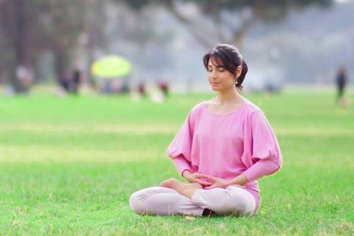

出污泥而不染 处乱世自清廉（网络照片）

 

【希望之声2018年11月5日】（本台记者慧光综合报导）我是中国大陆广东省的一名普通女性，因为学的是财会专业，参加工作后一直做财务工作。在中国大陆的社会环境下，做财务工作想洁身自好很难。在公司领导的授意下我违规操作后被人举报，最后我成了经济犯被抓。在看守所里，我的心情很复杂，对所犯罪行有口难辩，其实我并没有得到多少好处，只是成了领导之间进行权斗的牺牲品。不管怎样，这都是人生中洗刷不掉的污点，如果仅仅是我一个人的事倒还无所谓，一想到连累了丈夫和儿子就愧疚的难以自拔，感觉做人太难了，真是生不如死。
 

就在我悲观失望的时候，看守所里陆陆续续关进了不少法轮功学员，她们跟我们这些刑事犯完全不同，我们都是压力重重，消极懒惰，得过且过，而她们则是心态平和，善良乐观，只要有她们在，监仓里就有一种祥和的气氛。我被她们的行为感染了，开始主动跟她们接近。

在她们的推荐下，我看到了手抄本《转法轮》，刚开始是出于好奇，可看完之后，我被书中的内容感动了，也震撼了。我知道了法轮功完全是一个教人做好人的功法，中共的宣传都是假的，同时我也明白了人生中的很多事情都是有因缘关系的，人生的苦难都是业力造成的，看到这里时我的心一下子就释然了，所有的包袱都放下了。

通过跟她们一起学法炼功，我的心境不断得到净化。不仅是我，整个监仓的刑事犯都受到感染，邻仓有个死刑犯也主动找我们要手抄本《转法轮》看。大家都知道这不是一本普通的书，这本书能使人心向善，即使是大恶的人都能被改变，这不就是一本宝书、奇书吗？！后来大家互相掩护着开始抄写《转法轮》，考虑到案子宣判后我会被转到劳改农场，那里不会有这样的环境，我又开始背法，师父的《论语》与《洪吟》我都能背下来。

刚到劳改农场的时候，就我一个人修炼法轮功，被讥笑、辱骂和受欺负成了司空见惯的事儿，但我守住心性，不跟人计较，并理智的向身边的人讲述法轮功真相。

三年后出狱，我很快就找到了当地的法轮功学员，这个过程非常奇妙，就像有人安排好了一样。我还得到了法轮功师父的所有讲法书，开始如饥似渴的看书学法，感觉每一天都在飞速提高，每天都有收获。看书的时候，经常能进入一种忘我的境界，泪水常常止不住的流，我知道能在末世中修炼大法该是多么神圣、多么美好的事，能在这乱世中得法修炼又该是多么幸运！

很快我受聘于一家建筑公司做财务工作。工作中我努力按照“真、善、忍”的标准要求自己，不贪不占，不背后说人闲话，对不同的人一视同仁，处处与人为善。 有一次我盘点现金时多了一万元，找来找去找不到原因，对此我丝毫没动过据为己有的念头，如数上交。老板很惊讶，说要奖励我，我说我是炼法轮功的，法轮功教我不能有贪念。通过这件事，老板对我越来越信任，没多久就让我做了财务主管。老板还对我说，这个位置必须由我坐，其他人他谁都信不过。

我用修炼人的善念和智慧进行管理，首先是严格要求自己，对公司的财产物资不动一丝贪念。公司做的项目都很大，关系户也多，经常有客户为拉关系给我送东西，对这样的东西我全部上交，统一安排。财务室人员定期轮岗，这样就不至于因有人请假或辞职而影响公司的财务运作，事实证明这样的管理方法非常有效。同事都知道我是炼法轮功的，我也从不回避，有机会就向她们讲真相，整个部门始终处在祥和的氛围中，大家对我很尊重。

公司的工程项目使用材料较多，超过千种，我设计了一个小软件进行统计和核算。这个软件又快又准，减轻了很多工作负担。我没学过计算机，更不懂得软件开发，编制这个软件完全靠自学，尤其是我已经五十多岁了，在这个年纪做这样的事情，连自己都觉得不可思议，可我知道这都是因为大法修炼而开启的智慧。有同事跳槽后仍然使用这个软件，碰到我时对这个软件赞不绝口，可见这个软件是很实用的。

后来公司的生意越做越红火，短短几年时间就做了十多个大工程，其中有几个工程还是过亿的，有些工程还要发包给别的公司做。我负责所有项目资金的拨款计划，包括支付给发包商的工程款和支付给供应商的材料款，作为财务主管对这些款项的使用有一定的权力，这样一来分包商、材料供应商、甚至老板的朋友都千方百计拉拢我、收买我。给钱的，给物的，采用什么方式的都有，有的想收买我在工作中图利，有的还想挖我走。我时刻不忘自己是一个修炼人，守住心性，利益上一概不沾，也不为任何诱惑动心。现在这个社会，暗箱操作，潜规则行行都有，都成了约定俗成了，做好人都难，有时实在没办法，即使收了我也不入自己的口袋，而是专门做账，做到任何时候任何事情都有据可查，清清白白做人。

我曾经因为经济犯罪而锒铛入狱，成为一名罪人，但是很幸运我能够走入法轮功修炼。是法轮大法让我发生了脱胎换骨的变化，也是因为大法给了我力量，才使我能在肮脏的浊世中保持一份清醒、一份冷静，不被污染。任何时候回想起自己走过的路，都会因为师父的慈悲救度而泪水盈眶，今生唯有修好自己，做一名合格的法轮功弟子，才能不辜负师父的期望。修炼到今天深深体会到，红尘中真的没有什么是可值得留恋的，唯有还本归真才是最值得走的路。

<h1 align="center"><b>中共罪恶器官移植因何祸及世人？</b></h1>
<h2 align="center"><b>从“斯坦福监狱实验”得到的启示</b></h2>
 
【明慧网二零一八年十一月四日】2018年湖南省宁乡县公安局公开通报，10月30日放在宁乡县人民医院太平间的李某某遗体双眼被挖去，家属报案，警方接报后，抓捕了4名疑犯，其中既有医院工作人员，也有外面的人，初步判断有贩卖器官的嫌疑。

中国的器官移植到底有多猖獗？中国大陆的器官移植，最为反常的阶段在2003年至2006年。从2000年至2003年，每年约为6000例（中共官方提供数字），而2003至2006年，器官移植翻倍上升，官方公开数字在一万例以上。中共的解释是利用了死刑犯，可是以学术界对中国执行的死刑犯认定为6000人至8000人的数字来看，2003年之后翻倍上升的供体是从何而来呢？而且最快4个小时就能找到供体，如果不是有一个庞大的活体供给库，怎么可能这么快就找到供体？

从2006年中共活体摘取法轮功学员器官曝光，至现在12年过去了。近几年，中共不提死刑犯了，因为这个谎言实在圆不了，改口说是民众的捐赠。而当数万个移植案例，国际社会希望看到捐赠者的记录，是什么人，哪里的，联系方式，是否自愿，然而这些中共统统拿不出来。

在记录片《铁证如山》中，记录了追查国际调查员的取证过程。原政治局常委李长春、张高丽、国防部长梁光烈，对法轮功学员器官活体移植一事，不仅明显知情，而且认为这件事情是当时从上到下，不得不执行的由恶首江泽民签署的一项“命令”。

而当调查员电话打到具备器官移植资格或不具备资格的医院，来自医院负责器官移植的专业人员，基本上没有什么避讳，显然他们有着强大的系统支持，甚至对此已经不以为然了。

也就是说，外界认为器官移植是多么惨无人道，多么丧尽天良，多么不见天日，可是在中共治下的中国大陆，魔变的人心，唯利是图的动机，让失去道德底线的行恶者，已经麻木了……

有一个著名的心理学实验名为“斯坦福监狱实验”，是1971年由美国心理学家菲利普·津巴多于斯坦福大学心理学系大楼地下室的模拟监狱实验，对“从众心理”（或称羊群效应）展开实证演习，让一些人充当警察，一些人充当囚犯。囚犯和看守很快适应了自己的角色，三分之一的看守被评价为显示出“真正的”虐待狂倾向，而许多囚犯在情感上受到创伤，有两人不得不提前退出实验。

对于实验的结果，当菲利普·津巴多说好人变成了坏人时，那些“坏人”并不认为自己成了坏人，他们要么认为受害者罪有应得，要么认为自己只是采用了恶的手段来实现其正当的目的，用目地的合理性为自己采取的手段辩护。

从中共1999年开始残酷打压法轮功，至2006年中国大陆活体移植器官暴发式增长，在恶首江泽民赤裸裸的威逼、利诱之下，中国大大小小的医院，大面积的运作器官移植。从一开始不太敢做，不太适应，但后来麻木不仁，追查国际调查员通过打电话，获取大量的录音资料，医院人员几乎是毫不避讳地承认利用了法轮功学员的器官，这不就是“斯坦福实验”的真实版本吗？

当国际社会广泛曝光，邪恶的摘取法轮功学员器官开始变得隐蔽。但是从器官移植中牟取暴利，已经被中共“惯”坏了的无良从业者，根本停不下那颗从器官移植中赚取快钱的狂躁的心。在法轮功学员的器官不能大规模获取时，其邪变的黑手，必然伸向社会，伸向更多的普通人。这与“斯坦福监狱实验”中扮演看守警察的人，越来越具有“虐待狂倾向”，何其相似！

人性中阴暗的一面，在中共邪恶力量的加持下，更加不择手段、危害世人。

从2006年中共活体摘取人体器官曝光以来，虽然各种人权组织，以及很多国家的议会对此恶行予以谴责，然而国际社会的主流媒体却很少刊登文章，因为中共对于法轮功的迫害从1999年7月20日后的明目张胆，早已转为地下实施，秘密抓捕、秘密开庭，从表面上并不引人注目，迷惑了众多的世人。

然而，十余年来法轮功学员坚持不懈的努力，让“这个星球上从未有过的罪恶”活摘法轮功学员器官，越来越接近水落石出。中国有句古话，“路遥知马力，日久见人心。”正义与邪恶的较量，在时间面前，任何一个有思维、有理性的常人，都会有自己的分辨。

10月16日，美国商业杂志《福布斯》（Forbes）罕见刊登法学研究人员欧恰布（Ewelina U. Ochab）的文章，中共政权正在杀害包括法轮功学员在内的良心犯，摘取他们的器官，以供应器官移植产业。

一个可以预见且必然将在不远的将来发生的事情，就是以江泽民为首的邪恶集团活摘法轮功学员器官真相大白于天下。奉劝那些曾经参与摘取法轮功学员器官的医、警、司、法人员，远离中共邪恶，唤醒内心良知，以赎回自己在这场历史上罕见的“反人类罪行”中的不伦行为！

<h1 align="center"><b>原中纪委官员致国家主席习近平的一封信</b></h1>
 
作者：王友群 博士

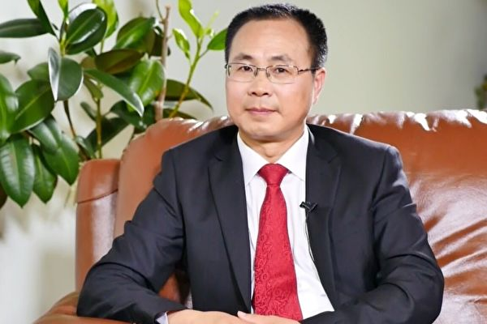

原中共中央政治局常委、中纪委书记尉健行的撰稿人王友群博士

 
【大纪元2018年10月29日讯】习近平主席：

您好！

在您的第一个任期内，您曾经说过：“头上三尺有神明”。正因为您有这一念，神助您打掉了440多只大老虎。这是以您个人的能力绝对做不到的。

在您的第二个任期开始后，您忘记了“头上三尺有神明”的古训，跑到上海中共一大遗址，举著拳头“宣誓”，为不信神不敬神的马克思宣扬的共产主义奋斗终身。结果，一步错，步步错，一直错到今天。

人类社会的历史，无论东方，还是西方，都是从神话开始的。到了21世纪的今天，无论东方，还是西方，人类社会又经历了许许多多震憾人心的神话故事，这些神话故事将整个人类的历史串起来，最后汇集成一句经典的话：“我们不崇拜政府，我们崇拜神。”

20世纪美国著名预言家Jeane Dixon（1904～1997），曾准确预言了甘迺迪总统遇刺、艾森豪总统连任、印巴分治、赫鲁雪夫下台等重大历史事件。她早就预言：“1999年，人类不会灭亡，拯救人类的希望在东方”。

1992年5月13日，是一个值得全世界纪念的伟大日子。这一天，在东方，在中国东北的长春市，法轮功，又称法轮大法，开始洪传于世。此后短短7年间，法轮功因其净化身体、净化心灵的奇效，迅速传遍全中国，传到全世界，学炼法轮功的人数达到上亿人，远远超过已有76年历史的中共党员的人数，引起当时的中共独裁者江泽民的极大恐慌与忌恨。

从1999年7月20日起，江泽民动用全部国家机器，以古今中外最邪恶的流氓手段，发动对法轮功的疯狂大迫害。如今19年过去了，法轮功不仅没有被迫害倒，相反，洪传到了全世界114个国家和地区。法轮功的经典著作《转法轮》已被翻译成40多种外文，在中国大陆以外公开出版发行，成为中华五千年文明史上被翻译成外文最多的中文经典。法轮功创始人李洪志先生，因为对人类身心健康的卓越贡献，受到超越党派、国界、种族、语言、文化背景的社会各阶层人士发自内心的敬仰与尊崇。在中国大陆以外，中共对法轮功的迫害已彻底失败，在中国大陆，离开高压和欺骗，这场迫害一天也维持不下去了！

全世界的法轮功学员经历了无数的神迹，许许多多法轮功修炼者的修炼故事，就是一个又一个感天动地的神话。全世界法轮功真修弟子用他们的修炼实践证明：第一，法轮大法于国于民有百利而无一害；第二，法轮大法是千年不遇、万年不遇的正道大法。

江泽民利用中共迫害法轮功19年多，一个最重要的结果是，把中共变成了全世界最腐败的党。中共的腐败已达到了人类有史以来登峰造极的地步。中共的腐败，如果用疾病来形容的话，已经是晚期癌症的晚期了，无药可治。一个苹果烂透了，作为人来说，肯定就把它扔掉了；一个政党烂透了，作为神来讲，肯定就把它销毁了。当年苏共是如此，东欧各国共产党是如此，今天的中共也是如此。“天灭中共”，不是一个口号，而是一幕我们都在亲历的历史大戏。

如果不是神慈悲救人，中共早就被销毁了。但中国人是可贵的，包括那些加入中共的人。李洪志师尊在《洪吟三 济世》中写道：“解开心锁 不信良知唤不回”。“不信良知唤不回”，这是我年复一年，一次又一次给您写信的真正动力所在。我写给您的信，讲的全是客观事实，您真得好好看一看，认真想一想了。

中国自古以来就叫“神州”，中国传统文化被称为“神传文化”，中国历史上有许许多多的神话故事，其实，很多都是真实发生过的事情。21世纪的今天，法轮大法洪传于世，创造了数不清的现代神话。现将我亲自编辑的《法轮大法创造的现代神话》附录于此，请您找人下载后给您仔细看一看。

中国大陆有许多受冤的访民，不断上访，要求中共平反。法轮功被迫害19年多，却从没要求中共平反。为什么？法轮功是博大精深的伟大的佛法，中共有什么资格为法轮功平反？法轮功洪传于世，是来救人的，包括您和您的家人在内。

请您静下心来，认真看一看《法轮大法创造的现代神话》，重新升起对神的信仰和敬畏，那么，您就有可能像美国总统川普那样，逢凶化吉，遇难呈祥。

忠言逆耳，只是为您好，为普天下炎黄子孙好！

王友群

2018年10月25日于美国纽约曼哈顿 

<h2 align="center"><b>最顶级的心脏病专家如何治好自己的心脏病</b></h2>

越南著名的心脏病专家黎博士（Le Thi Thanh Thai）在自己的办公室

【希望之声2018年10月29日】（本台记者慧光综合报导）

博士（Le Thi Thanh Thai）是越南胡志明市“大水镬医院”（英文名Cho Ray Hospital）的心脏病科主任（这所医院是越南最大、最老的综合性医院，创建于1900年），她今年已经七十多岁了，从医也有五十多年，直到2014年才办理退休。她创办了越南心脏病学会，也是亚太心脏病学会的成员。在她的职业生涯中，她培养了许多心脏病专家和优秀的心脏病专科医务人员，撰写了大量关于心脏病的学术文章。

她出身优越，受过良好教育。年轻时参加过越南战争，曾在枪林弹雨的战场上抢救伤员。因为她表现突出，被派往德国等发达国家进行学习和接受培训。

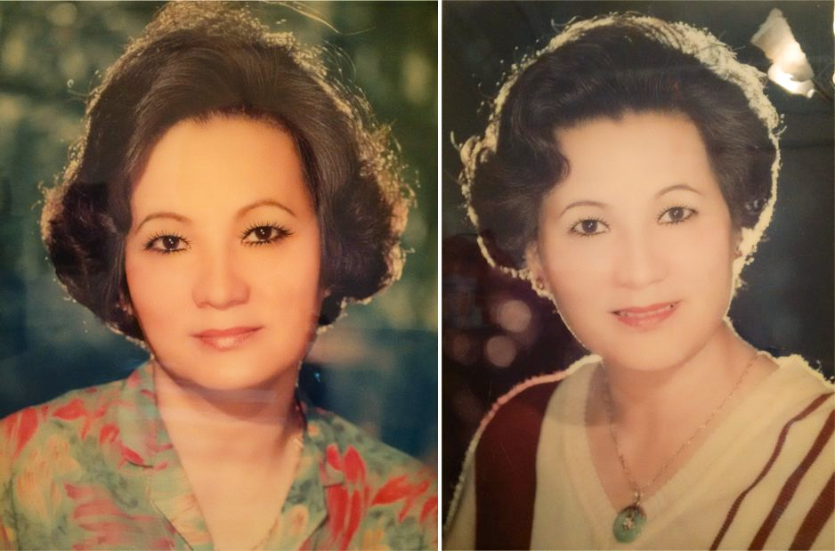

黎博士（Le Thi Thanh Thai）年轻时的照片

 
大水镬医院永远都充满着忙碌的医生和病人，黎博士在那里倾注了自己的主要精力，为医院的建设做出了杰出的贡献。可是由于现代医学的局限性，她的努力和成就也留下了一个很大的遗憾——她本身就是一个心脏病患者，而且长达数年都未能治愈。

她的心脏病史比她的从医历史还要长久，她在十三岁时就得知自己患有心脏病。因为深受该病的困扰，所以成年后她发愿要拯救那些与自己同病相怜的人，专攻心脏病学。苍天不负有心人，她的愿望实现了，她成为心脏病学的专家和权威，帮助很多病人减轻了痛苦。但非常可惜的是，尽管她在心脏病学方面有丰富的知识和经验，可面对自己的心脏病却无能为力，甚至一筹莫展。

随着岁月的流逝，她的心脏病也越来越严重，在无可奈何的情况下，她不得不接受手术。她为自己选择了一家国外先进的医院进行手术，不幸的是手术很糟糕，术后她一直发烧三个月，在她的心脏中植入的心脏瓣膜总是与她的身体发生排斥。当手术后看到编织在胸部的各种监控设备上的线缆凌乱的交错延伸时，作为专家的她，已经预感到可怕的后果——她只能面对死亡。

雪上加霜的是，陪伴她一生的非常爱她的丈夫（一位高级干部）在这段时间突然去世了，让她在已经非常痛苦的情况下又承受了更大的刺激和压力，精神几近于被彻底摧毁。那时她只能躺在床上，虽然也在努力克服着绝望和孤独，咬紧牙关克服着肉体和精神的双重折磨，但内心深处已经放弃希望，心想着也许不久就能够与丈夫在另一个世界相聚。

有一句传遍世界的老话，叫“好人会有好报”，就在她眼看着要走到生命尽头的时候，希望出现了。

黎博士有一位很好的同学和同事叫集（Thu）博士，也是一位拥有多年临床经验的高级专家，曾经负责柬埔寨王室和高级官员的医疗服务，来往于柬埔寨和越南之间工作了二十二年，在国家领导人的保健方面享有盛誉。她们曾有过多年的合作，也是多年的老朋友。有一天，集博士来看望她，向她介绍了一种源自中国的传统修炼方法——法轮功，并说这种修炼方法奇迹般的治好了自己的病。她知道，这位朋友患有神经系统疾病已经二十多年了，同时还患有类风湿性关节炎，膝盖经常出现疼痛，腿部弯曲受阻而且不能长时间站立。可是修炼法轮功以后，这些病患奇迹般的痊愈了。

集博士对她说：“你知道我的疾病折磨我二十年都没有治好，可修炼法轮功只有两个月就好了，这一点你可以通过观察我现在的身体状况来判断。以前我的腿不能弯曲，现在我练习法轮功的五套功法没有任何问题，包括静功打坐。我这次给你带来了法轮功的指导书《转法轮》，还有录音带等资料，如果你愿意学我现在就可以教你。”

说到这时，黎博士突然回忆起，大约是在十二年前，一位同事泰（Thoi Thu Tai）博士也曾向她介绍过法轮功，并说因为阅读《转法轮》而使自己身患多年的多种疾病不药而愈，同样建议她阅读这本书。可是由于顾虑到自己的身份和背景，认为法轮功不适合于她，她甚至没有认真的去了解一下，机会就错过去了。

鉴于之前的教训，黎博士没有让这个机会再次溜走，她当即接受了集博士的建议，决心修炼法轮功。在集博士的指导下，她学会了五套功法的动作要领，同时开始阅读《转法轮》，用“真、善、忍”的法理指导自己的行为。

没过多久，她开始康复，逐渐恢复了活力，精神状态越来越好，陪伴她几十年的心脏病竟然在不知不觉间消失了。在体内植入人工心脏瓣膜的情况下，她不需要服用任何药物，包括抗凝剂，这在现代医学上是无法解释的事情。从那以后，她可以自由行走，上三、四层楼很轻松。虽然七十多岁了，仍然可以坐飞机环游世界，这对一位曾经患有严重心脏病的人来说几乎是难以置信的。虽然退休了，可她并没有完全离开工作岗位，在需要的时候还可以熬夜。她的特殊经历被登在2016年7月15日的当地报纸上。

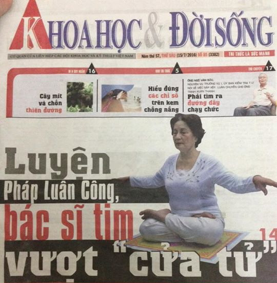

黎博士（Le Thi Thanh Thai）的特殊经历被当地报纸报道

她不仅恢复了健康的身体，也找到了人生的希望，佛法为她的生命中注入了新的力量，使她变得更加自信和开朗。

在满七十岁的那一年，在当地一次法轮功修炼心得交流会上她介绍了自己的修炼体会，与数百名法轮功修炼者分享了她的经历。她谈到了走入修炼后所经过的历程，在讲话结束时，她的声音开始哽咽，她说：“我衷心地感谢法轮大法创始人和老师李洪志先生，是他给了我第二次生命。”

她从新找回了自己，仍然是越南心血管行业的领先专家。她又开始充满活力，没有人从她的行为中能看出这是一位七十多岁的老太太。

 
<h1 align="center"><b>我懂得了什么是信仰</b></h1>

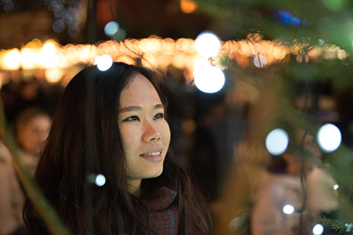

这一刻，我依稀懂得了什么是信仰。我也感到困惑，人与人的差异怎会如此悬殊？示意图，与内文无关。

 
 【大纪元2018年10月24日讯】一次与一位女外籍教师（外教）闲聊，外教问我：“我信基督，你信什么？”我愣了愣，大脑里闪过初中时的一个小片段：我和一群小伙伴说我想信佛，求佛保祐我。小伙伴们笑得前仰后合：“你老太婆啊，还搞迷信！”我很尴尬，我反问：“那你们信什么？”一人抢著说：“当然是信自己呗，不信自己还信谁啊？ ”

外教突然这么一问，我想起小伙伴的话，便说：“我信自己。”外教笑了：“自信是人的一种良好品质，但那不是信仰。”

信仰是什么？这番谈话引起我的思考。想想我的生活，主要忙于学习、工作，业余时间逛逛街、上上网等，自认为生活挺充实忙碌，也以为生活就是这样，从没细想过人生信仰的问题。

我翻阅资料，知道了信仰主要是解决“人从何处来？生命意义是什么？人又将往何处去？”这一系列终极课题。是啊，生老病死是人之常态。如果说人生终结一切将化为虚无，那现今的忙忙碌碌又有何意义呢？难道仅仅就是为了活着而活着吗？我感到迷茫，猛然间意识到人生旅途看似漫长，实则很短。当我醉心于功名利禄、恩怨情仇时，时间就这样一点点流逝，而我却一事无成。人生路究竟应该怎样走才是真有意义的呢？

某日我看到一篇报导，中国大陆一位活摘器官的现场目击者透露：2002年，一位女性法轮功学员惨遭严刑拷打、强暴、被强制灌食，伤痕累累。更不可思议的是，在她完全清醒的情况下，没有使用任何麻药，军医直接摘取了她的心脏、肾脏等器官。我不知道用什么词汇来形容这样的兽行，只能用义愤填膺、无法理喻来描述自己的心情。这些警察、医生，却变成迫害谋杀善良百姓的恶魔，真是叫人心寒。与此相反的是，这位法轮功学员在面临残杀时，依然能大喊一声：“法轮大法好！”并质问杀人的刽子手：“你能杀我一个人，你能杀了我们几亿人吗？！”

这一刻，我仿佛看见天堂与地狱之门同时开启，法轮功学员那圣洁高贵的灵魂已然飞向天堂，地狱无常的绳索也已捆绑住杀人者的脚踝。

这一刻，我依稀懂得了什么是信仰，那是在任何情况下都能够坚守真理、金刚不动的信念。我也感到困惑，人与人的差异怎会如此悬殊？

我急切地想了解法轮功是什么，可以让人为其舍命而不足惜。查阅资料，我知道了法轮功也称“法轮大法”，是由李洪志先生在1992年传出的佛家上乘性命双修的功法。法轮功以宇宙特性“真、善、忍”为指导原则，要求修炼者不断提高心性（道德水准），同时还要炼五套功法；法轮功是超常的科学，是一种史前文化。法轮功可以使人身体健康，道德升华，对稳定社会能起到不可估量的正面作用。

我也明白了，宇宙中是有真理存在的，“真、善、忍”是衡量人好坏的唯一标准；做人不是无原则的，做人的目的是同化宇宙“真、善、忍”特性，做一个符合真理标准的好人。

难以想像，这样一部高德大法却遭到史无前例的疯狂迫害，上面活摘的案例只是冰山一角。迫害已经持续十几年，难道还要继续下去吗？其实许多迫害者也是受害者，因为善恶有报是天理。例如“610”早已被公认为“死亡位置”，那么有多少“610”政法系统的公务员因为执行错误的命令“迫害法轮功”而死在位子上呢？这个有没有人做过统计？辽宁省司法厅高级官员曾经在辽宁省马三家劳教所的大会上承认：“对付法轮功的财政投入已超过了一场战争的经费。”究竟有多少老百姓的血汗钱被用来迫害老百姓，有没有过统计？从迫害法轮功开始，连年的天灾是上天对世人迫害的警示，洪水、SARS、地震等等，这些灾难造成的人员伤亡、经济损失有没有过统计？ ……我想，统计这些具体数据，一是要明确“迫害法轮功”给中国社会和人民带来的深重灾难；二是要把事实真相留给历史作为一个永久的教训，让悲剧永远不再上演。

我想真心感谢法轮功学员，用坚韧的意志，甚至是生命向世人展示什么是佛法正信，演绎著一曲曲壮歌。我也想感谢那些用善心与才智默默保护支持法轮功学员的人们，你们的良知就是未来的希望。#

——转自《明慧网》

<h1 align="center"><b>国保警察的觉醒：从参与迫害到修炼法轮功</b></h1>

【明慧网二零一八年十月三十日】一九九九年人权恶棍江泽民迫害法轮功一开始，我县公安一科（也就是原来的政保科，现在的国保大队）的警察按照中共邪党指令，对我县挂名的法轮功学员，实行分工包干负责制。

因我是国家干部身份，具体负责我的人是一科指导员。开始他听信了邪党的谎言宣传，来势汹汹，三天两头带一帮警察到我单位胁迫我单位领导对我施压迫害，搞跟踪监控，进行政治和经济惩罚，开批斗会，责令转化，还实行连坐。并组织六一零和政法委人员对我围攻谩骂，扬言要撤销我的职务和工职，并株连我的丈夫和儿女。他带人到我单位拍桌子、摔椅子，搞得乌烟瘴气，使我不能正常工作和生活。

无论他们态度怎样，我都不动心，慈悲的向他们讲述法轮大法的美好和祛病健身的神奇，法轮大法弟子做好人好事的实例，大法洪传全世界的情况，启发他们的善念良知。同时我也讲宪法三十六条规定公民有信仰自由。是江魔头出于个人妒嫉，在中央六个常委都不同意的情况下，一意孤行的实施镇压，迫害上亿做好人的修炼人。

接触时间一长，他能感受到大法弟子的善良。与此同时，我单位领导和同事全都跟他说我是好人，工作競競业业，年年被评为优秀公务员，原来身体很差，学法轮功后身体好了，人脾气也好了。在事实面前，他的思想也发生了转变，原来来了都是直呼我的名字，后来改口叫大姐了，还主动向我了解大法真相和炼功情况。我就在领导办公室炼五套功法给他看，他还跟着比划。

再后来，我送给他一本《九评共产党》，他拿回去后，当天吃饭也看，睡觉也看，用了一天一夜把书看完了。他老婆问他看什么书，这么认真，是不是要考研究生啊。看完后，他对我说：《九评共产党》写得真好，对我震动很大。

我不断的拿真相资料给他看，使他彻底转变了观念，觉醒了。他开始在自己职责范围内保护大法弟子。每次六一零布置迫害法轮功的行动时，他都想办法提前告诉大法弟子；如遇到有人举报时，他就说：法轮功都是好人，都是江泽民搞的鬼，别太认真，马虎点算了。有一次抓到一个发资料的法轮功学员，他让那个法轮功学员在办公室坐了两个小时就把人放了。还有一次六一零让他出警抓法轮功学员，他直接抵制说：没有人，我们的事都做不完，哪有时间管那些事呢？

他还主动传播真相资料，每次有新的资料、光盘和小册子我都给他送二十多本，他就把这些资料放在单位食堂的饭桌上，说是收来的，故意的让来吃饭的警察拿去看，掩饰的说看完了给我送来啊。其实没有人看完送过来的。他跟我说：现在公安内部有百分之九十的人都看过《九评》和真相资料了，都明白是怎么回事了。六一零和政法委的人来，他都把真相资料放在桌面上堆着，让他们一本接一本的看。有一任六一零主任明白真相后辞职不干了，去做生意去了。近几年，我县也没有出现迫害法轮功的文件了。

二零一一年，他让我给他请了一套大法书 ，开始修炼大法，至今已有七年了，通过他洪法走入修炼的公安同事已有六个人，也都做了三退声明。有一次，他下乡办案时，碰到一个老熟人，那人病得很重，很痛苦的样子，他说：我有一个好法子能解除你的痛苦，你就诚心念诵：“法轮大法好，真善忍好”，就有奇效。下星期他再去的时候，那个熟人高兴的对他说，你走后，我就不停的念，第二天就好了，确实有奇效。同时又说：这么好的法，你怎么不早告诉我呢？

他一到星期天，就到农村亲戚家到处走走，主要是讲真相救人。有人问他：你是公安干部，怎么也信法轮功呢？他回答说：在铁的事实面前，不得不信哪。谁信谁受益。

<h2 align="center"><b>中国大陆一位医学教授的自述</b></h2>
 

人生苦短一场空 珍惜机缘到来时

 
【希望之声2018年10月26日】（本台记者慧光综合报导）

我出生在中国大陆，自幼喜欢读书，长大后考上了医科大学，毕业后留校并在省级三甲医院工作，是一名内科大夫。工作四年后又考上了国家重点医学院的研究生，读完硕士接着读博士，毕业后还是留在学校任教。三十二岁时晋升为副教授，是当时学院最年轻的副教授，被称为最有才华的教师。今年五十多岁了，早已升为医学教授。我从事过临床医学的实践和研究（包括对癌症的研究），以及处于现代医学科研尖端的分子细胞学研究，后来转为研究传统中医学。

我的一生比较顺利，工作、事业、家庭等方面都是风风光光。业余爱好也很多，琴、棋、书、画、武术等样样都会点儿，虽然不精，足以自乐。但我最大的爱好还是博览群书，古今中外，正史野史，只要能接触到的我都会研究。

虽然我是医生，可是对《易经》却十分投入，甚至达到如痴如醉的程度，购买了很多与此有关的书，而且预测越来越准，在当地颇有名气。突然有一天我被一个问题惊醒：既然人的一生、人的行为都能预测出来，说明这一切都是安排好的，那是谁安排了这些事情呢？难道人的命运真是天注定吗？难道真有“高级生命”存在？神佛真的存在吗？我从小就接受无神论教育，从心理上对这一切都是否定的，可无数的客观现实我又不能否认。我开始迷惘，也开始寻找答案。

当时国内还处在“气功热”，我就从气功中寻找出路。习练了多种气功，走访了不少民间“高人”，见过不少“奇人”，可没有一位能解开我心中诸多的“为什么”。后来我又研读了古代的佛道经典书籍，知道真正的正法大道都在深山里，所以就在心中发了一愿：等我儿子上了大学，我就远离世俗，进山寻道。

1996年，我来到北京读博士，在读书与科研之余，也留心观察着与修炼有关的事情。

1997年7月初的一天早晨，我在散步时，突然听到了一种祥和的音乐，循声找去，发现有一群人在双盘打坐，我被深深吸引。一位辅导员热心走过来向我介绍说这是法轮功，并无偿送我一本《转法轮》书，嘱咐我一定要一口气儿读完。

回到宿舍后，我迫不及待的开始读《转法轮》，读了几页我就明白了，这就是我一直苦苦追寻、发誓进山寻觅的大道正法，我当时激动的泪流满面。我用了一天的时间，一边看一边流泪，第一遍就是哭着读完的。书中的内容解开了我心中的一个个疑团，越读心里越豁亮。其中有关大周天、卯酉周天、元婴、性命双修、玄关设位、天目层次以及佛与道等法理，都是我闻所未闻的。我知道这就是高层次的修炼秘法，这是一部天书，我没有丝毫犹豫，当时就下决心走入修炼。

看书后的第三天，在夜晚入睡前的朦朦胧胧中，我看到有一个人影来到我的床边，似乎是依依不舍的在向我祈求着什么，把我吓醒了。我马上意识到这就是过去招惹的不好的灵体，它曾经在《易经》预测上帮过我，现在它当然不肯轻易离去。第二天，我焚烧了家里所有的与《易经》有关的书和那些假气功书，并烧了我亲自撰写的三十万字的《易医与人体科学》书稿。当天晚上我就做了一个梦，梦境至今仍然历历在目：成群的虎狼蛇等动物追我，跑着跑着我就飞了起来，越飞越高，越飞越高……，下面的动物变的越来越小。在空中我心生一念，不能让这些东西祸害人间，于是伸手发出功来，瞬间就将它们化为灰烬。我知道我过去读过的乱七八糟的书太多了，学过的东西太杂了，身体带的各种信息太乱了，如果不是师父把这些东西都给清理了，我可能永世都不能修炼了。

通过学法，我明白了修炼的真正内涵，时时刻刻按照“真、善、忍”的标准要求自己，从做好人做起，处处与人为善，工作兢兢业业，身体越来越强健，精神境界也得到不断升华。

修炼以后，大法也为我打开了一个全新的世界，使我对人体、生命等科学有了更深入的认识。

我是医学领域的专家，对现代医学的研究已经很深入了，可是面对众多的疾病仍然束手无策，甚至连它们的发病机理都只能推测，经常是眼睁睁的看着病人无奈的离去。

1998年，我参与了国内一万多人修炼法轮功后的祛病健身调查。我们按照现代科学研究方法设计量表、统计数据，得出的结论令人振奋。有很多癌症患者修炼后痊愈了，很多高血压患者血压正常了，有的是冠心病好了，有的是脑血栓后遗症痊愈了。更令我惊奇的是，几乎所有过了更年期的女士重新来了例假，出现了返老还童的变化。总的祛病有效率达到了百分之九十以上，一切都太令人惊奇了！

做医生的都知道，普通的发热、感冒属于自限性疾病，不治也能好，服药治疗只是缩短病程；对于常见的高血压、肝硬化、冠心病、糖尿病等，只能靠长期服药控制病情；对于像痛风、系统硬化病、红斑狼疮等疑难病，现代医学没有有效的治疗方法。至于说各种癌症，治疗的结果多半是人财两空。这些只有在“神话”中才能治好的人类疾病，作为一名医学教授，我却亲眼目睹了他们因修炼法轮功而恢复了健康。尤其是只要诚心念“法轮大法好，真善忍好”，同样能逢凶化吉，这是多大慈悲、多大机缘啊！

像冠心病、脑血栓、癌症等都能经CT、核磁共振、B超、化验等设备检查证实，都是肉眼可观察到的有形病，可是修炼大法后，这些病消失了，这难道不是现实版的“神话故事”吗？！

在修炼中，我还见证了许多修炼者遇难呈祥、车祸中平安无恙的实例，其中我儿子（当时是大二学生）也曾经遭遇车祸，那是一场不死也残废的车祸，在公路上被快速行驶的汽车迎面撞出去很远，头部又重重的摔在柏油马路上，结果是化险为夷。

在人生的长河中，很多人一直在寻找一种能解开人生之迷的“钥匙”，为此经历着生老病死的折磨，经历无数的精神痛苦和无奈选择。当遇到真正的机缘时，请千万别匆匆走过，认真读一读《转法轮》，一切答案尽在其中。他会掸去你数次轮回的封尘，唤醒你来世间的夙愿。 
 
 

 <h1 align="center"><b>国父纪念馆前 台湾导游鼓励中国人三退</b></h1>
 

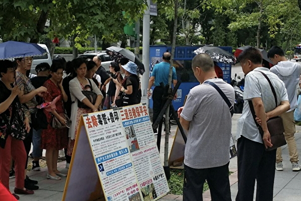

台北国父纪念馆前，大陆游客认真阅读法轮功真相展板。

 
 【明慧网二零一八年十月二十五日】二零一八年十月下旬的台北艳阳高照，但稍有凉意，秋高气爽好天气。一位导游在即将带大陆旅游团进入国父纪念馆时，精神抖擞地大声指向法轮功真相点说：“等下你们要退团退队的，就来这里找法轮功，现在先跟我进去看阅兵交接典礼。”接着他还跟学员打招呼，短短几句，让旅游团员对法轮功原有的戒备心态一下就放松许多、神色也轻松了。

 
 <b>“法轮功发的资料，可能就有你该知道的国际大事”</b>

有位资深导游主动关心学员：“你们法轮功，不管天气如何或放不放假都在这里，就为了给大陆游客资料讯息，真让人感到温暖！所以我都跟团员说：‘天下事，哪能不知道？法轮功发这些报纸资料，可能就有你该知道的国际大事，而且都是免费的，有什么不能看的呢？’”

另一位年轻导游指着展板向团员说：你们大家都是有头脑的，有自己思考能力的，那你们就看一看嘛，然后再想一想。

<b>“炼法轮功的思想就是不一样！”</b>

来自河南的退休老先生在经过法轮功真相点时，主动向学员要资料：“来台湾就是想看共产党不让看的。”学员提供了《九评共产党》及各种真相材料、并为他取了化名三退（退出中共党团队）。

大约两个小时后，这位老先生又回到了真相点，一开口就说：“现在大陆，道德真是不行了！还是炼法轮功的思想不一样。”“我是资深老党员了，很了解共产党的坏，那种坏到骨子里，不是你们能想象的，就是共产党把整个中国社会给搞惨了。有次单位要我跟另一位年轻的去监视炼法轮功的老大姐，这大姐也是我们单位的，我把年轻人支开单独跟大姐聊聊，老大姐就跟我说炼了功身体好啊、无病一身轻；还有炼了之后的好些事，我听着听着就感觉：这思想境界真是不一样，真、善、忍很好嘛，共产党管人的信仰实在没道理，所以就把大姐给放了。之后我只要看到法轮功（学员）发的小册子资料我都看，炼法轮功的思想就不一样。”

有位来自河北的老先生独自走到真相点旁抽烟看展板，感叹说：“当时在中国就有十来个亿在炼法轮功，尤其是北方。”学员提醒老先生当时是超过一亿人在炼，老先生很认真地说：“就说那么多人炼啊！我们整栋楼、隔壁邻居、整个村都在炼。可是却让政府定性为×教……”学员帮这位善良的老先生三退，他高兴地带走了真相资料。

<b>抓住机缘三退</b>

在国父纪念馆正门入口前有法轮功学员固定展示功法，三位福建的中年人边拍照边议论：“这法轮功啊，大太阳底炼了半小时还在炼啊，不怕晒、而且看起来不累。”正巧学员经过，向这三位大陆游客说明：当然不累啊，炼了功精神更好，而且是刮风下雨都风雨无阻的，当时在中国弘传时就是这样的……其中一位神色凝重说：共产党就是怕人多，人一多就担心危及到政权嘛；而且我们那边不允许信仰自由、或是思想自由的。

这时领队过来了，三位团员赶紧散开。但这团在离开时经过逸仙路真相点时，那位皱眉头说话的团员边抽烟边留到队伍最后方，学员跟上并帮他取化名三退，他马上点头说：好、好！

<b>台湾有自由，还有法轮功</b>

有位开着高级饭店旅游专车的司机在真相点旁等候旅客，跟学员聊天：“法轮功就象个大家庭，在很多景点都看得到，不是在发传单就是在炼功，同一家的做的事都一样。我还看过电视节目介绍，对你们印象还不错。”

学员进一步向他说明法轮功是什么、被中共迫害的详情。这位司机马上表示：信仰不可能是国家认定或管的，共产党就是专制独裁政权，连人的思想也要控制，没道理。“所以大陆游客出国时，你们用广播跟大陆游客宣传说明喔，那我在车上给他们讲，我开车他们就得听我的，我跟他们说：台湾有自由。”学员接着说：“还有法轮功。”司机笑开了脸，点头赞同。
  

 
<h1 align="center"><b>“三星”采购经理的故事</b></h1>

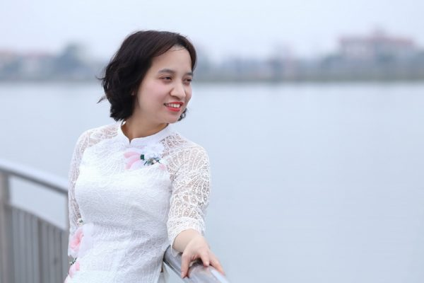

三星集团越南采购部经理

 
【希望之声2018年10月23日】（本台记者慧光综合报导）她是国际著名的“三星”集团越南采购部经理，也称得上是“女强人”。但她的成功与家庭背景无关，而是源于她顽强的意志和倔强的性格，因为她从小就有远大的志向，渴望像男人一样做事，做成功人士。

她酷爱学习，毕业于越南岘港大学，这是越南中南部地区最大的高等学校。凭着优异的成绩，毕业后她进入一家属于新加坡财团的外国公司工作。之后她又到中国广东省的一家公司工作了两年，担任质量监督检验工程师。

在积累了丰富的专业知识和管理经验之后，她如愿进入“三星”集团工作。当事业稳定之后，她于2009年结婚成家，结束了漂泊生活，将自己安顿下来。

2012年，她进入公司管理层，之后工作越来越多，压力也越来越大，各种矛盾带来诸多烦恼，导致她疲惫不堪，脾气也变得暴躁，时常对员工进行责骂。即使回到家中，也时常与丈夫发生口角。她也意识到大多数情况下都是自己不对，可是不由自主，无法控制，最后总以工作繁忙为借口作为开脱的理由。

就在这一年，她怀孕了。虽然一切都在预料之中，没想到后来的情况是那样的错综复杂。怀孕六个月时她被任命为经理，怀孕八个月时却被诊断出患有妊娠期糖尿病，这一点也不奇怪，她的祖母和父亲都是糖尿病患者。

妊娠期糖尿病患者一般有多食、多饮、多尿的症状，可是她经常呕吐，厌倦饮食，但为了胎儿的营养而又不得不多吃。体内葡萄糖不能被很好利用同时分解过快，体能就无法得到充分补充，她时常感到很疲倦。更大的压力是对孩子出生后的发育会造成不良影响，使她忧心忡忡。

为了避免悲剧发生，她不得不遵照医生的嘱咐，每天要去健身房锻炼，然而这样做的结果并没有使身体变好，而是更加疲惫和虚弱。那期间她就是在极度痛苦中度过的。繁忙的工作并没有因她的情况特殊给她提供喘息的机会，而孩子的压力和越来越糟糕的身体状况也让她喘不过气来。

有一天她突然意识到，如果身体不行了，成功与否还有什么意义？财富多少有什么意义？于是她茫然了，不知道该怎么办。当她知道自己无法拯救自己时，她终于体会到，没有健康什么都谈不上。可是健康的出路在哪里？经多方努力和尝试之后，她一次又一次的失望了。

后来有一天，一个偶然的机会姨妈与她住在了一起。姨妈每天都练习一种气功，动作轻柔舒缓，优雅流畅，后来知道这是法轮功，她开始以为这是老人的一种锻炼方式，并没有引起重视。时间长了才发现，姨妈尽管年事已高，可是心态平和，精力充沛，健康开朗，这让她感到很好奇。

图1 故事的主人公在阅读《转法轮》

在姨妈的推荐下，她开始阅读法轮功的主要指导书《转法轮》。她说：“读书过程中，自己有一种莫名其妙的感觉，就好像被淹没在波涛汹涌的大海中，突然遇到了救生圈一样。潜意识中告诉她，如果不抓住这个机会，就没有希望了。”这种奇妙的感觉促使她看了一遍又一遍。

非常神奇的是，一个月后，当她再去做健康检查时，被告知各项指标都正常了，糖尿病的症状消失了。这让她感到非常震惊，一直无法解决的痛苦和烦恼在不知不觉中就无影无踪了，一向善于思考的她被法轮功的强大内涵深深的吸引了。

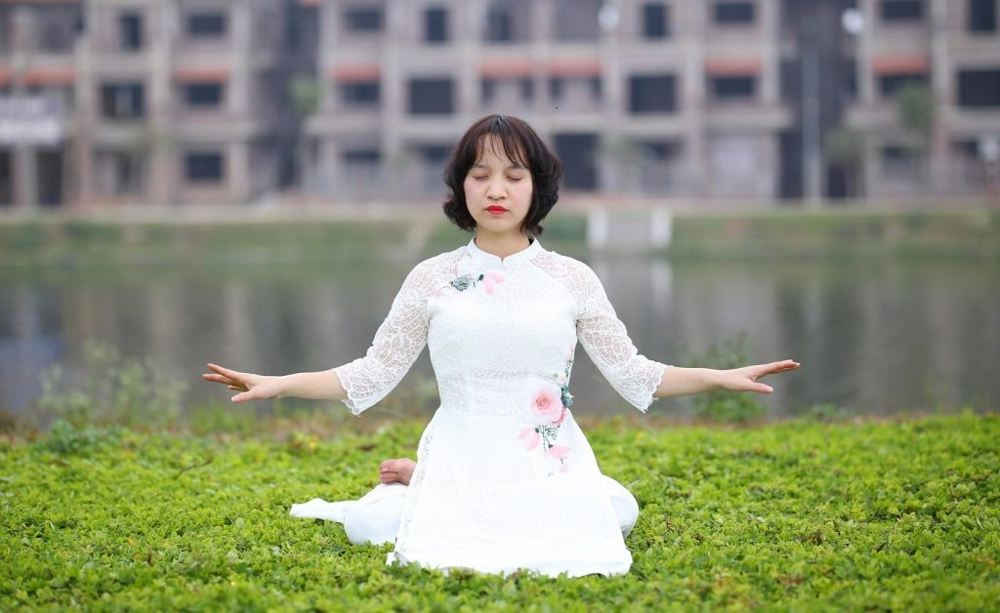

图2 故事主人公在练习法轮功第五套功法——静功

“修炼”对她来说本是一件陌生而又遥不可及的事情，而《转法轮》的神奇和“真、善、忍”的美好却让她看到了一个崭新的绚丽多彩的世界。当她用“真、善、忍”的原则指导自己的行为时，不仅仅是身体上出现了巨大变化，思想上的变化也出乎意料，而工作中也受益匪浅。

她说：“我的工作需要灵活的应急处理能力，从产品交付到空运、公路运输和海运，我必须确保采购和运输过程中的科学运筹管理都要做到最佳，而仅靠我一个人的力量是无法完成的，这需要一个强有力的团队。作为管理者，营造一个诚信的氛围和高效的工作环境就变得至关重要。”“多亏了大法给了我智慧，我感到我的思想是开放的，我可以忘我的工作而不感到疲倦，这在之前是做不到的。”

因为拥有健康的身体和旺盛的精力，后来她又生下了第二个孩子，同样是健康活泼，没有受到疾病的任何影响。

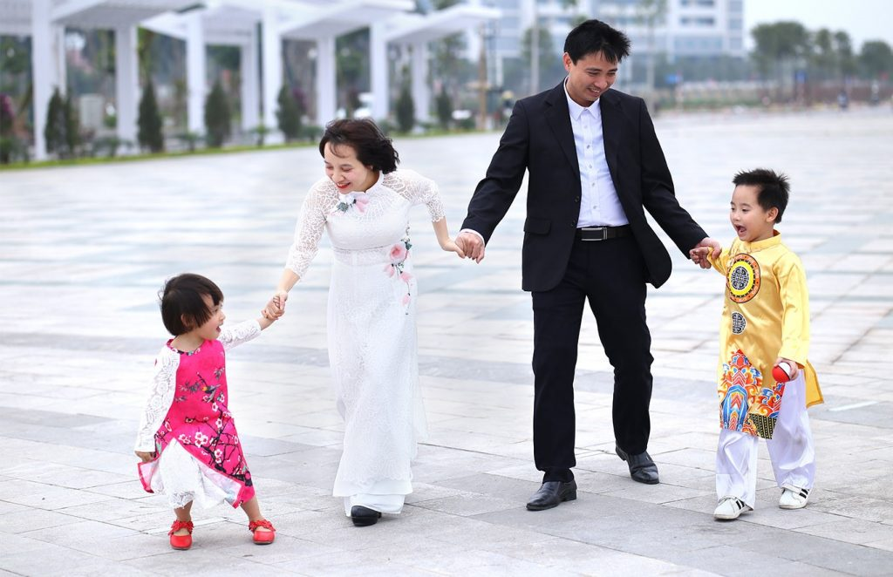

图3 故事主人公的全家福合影，一家人其乐融融

她说：“当我放弃自私和自我时，我才明白真正的幸福是什么。法轮功将我从疾病和痛苦中解脱出来，并引导我走上了一条光明的人生旅途，我为我的余生感到幸运。”

“完全超出想象的是，大法修炼为我的工作和生活提供了一条完美和谐的解决方案。每天学法炼功，让我心态平和，平静宽容。而在修炼的同时，我仍然可以做一个敬业的管理者和一个拥有幸福家庭的女人。”

“在此分享个人的美好经历，就是想让世界上的善良人都知道，《转法轮》是一部无比珍贵的奇书，他能帮助人创造这个世界上的任何奇迹。”

（本文根据DKN.TV报道翻译整理） 
 
 

<h1 align="center"><b>狱中的善良人</b></h1>

【明慧网二零一八年十月二十一日】在中共迫害政策下，无数法轮功学员因为坚持真、善、忍信仰，被关入监狱、看守所。他们在恶劣的环境中，不仅失去原本应有的自由和生存条件，被迫与家人妻离子散，还要面对狱警的酷刑折磨，强迫放弃信仰。但是很多法轮功学员不仅在巨大的苦难中没有屈服，坚持正信、修心向善，并且还在冒着生命危险给迫害他们的犯人和警察讲述法轮功真相及做人的道理。

法轮功学员的善良无私与高境界表现，感动了很多犯人与警察，使他们良知苏醒。下面是一位法轮功学员诉述自己在牢狱中亲历的几件事：

（一）

在某监狱集训队里有个犯人总管，非常残忍，是有名的黑打手。有一天，他恶狠狠的对我说：“你做好准备，我今天找你！”后来他把我带到一个专门迫害人的屋子里。这里非常封闭，打人的时候，别的屋子一点儿也听不到声音。他说：“别的事我不管，干部把‘转化’你的任务交给我了，完不成任务耽误我改造（减刑回家）那不行！不‘转化’，立着进来，横着出去！”

我不为所动，平静的把自己修炼大法后身体神奇康复的经历和自己是怎样按师父讲的修心做人的事讲给他听，并耐心帮他分析所谓“天安门自焚”的诸多疑点，给他讲了“指鹿为马”的故事等，给他讲做人应该怎么做，正直的人应该怎样选择等等。我给他讲了将近两个小时。

最后，我平和而坚定的说：“你现在就可以打死我，我不会怨你，但让我写转化不可能。”并且我问他：“如果换作是你，你炼功后身体都好了，又明白了做人的道理，按照师父要求的在做好人，你能回过头去骂你师父吗？”

在大法的慈悲呼唤下，他的正义感和良知被唤醒，经过慎重思考后，他庄重地一字一顿地说：“人-就-应-该-这-么-做！你的事我不管了，干部那里我跟他们说去！你回去吧。”

有一次，有个犯人头打我，被他看到了，他严肃地跟那人说：“打他们干啥？人多好！别祸害他们。”

后来，陆陆续续的有其他大法弟子被迫害关进来，最多时候七个大法弟子，当时环境并不宽松，但他从没有训斥过我们一次。不管“上边”交代他什么，他都对法轮功的事只字不提。

他因此得了大福报，本来被判无期徒刑的，第二年就变成了有期徒刑，很快就被释放回家了。

（二）

有个黑社会头目，也是犯人头，非常有势力，警察都让他三分。他听了大法弟子讲真相后，对大法非常尊敬，在招集犯人聚集的时候特意给法轮功学员让座。他很有正义感，对迫害法轮功学员的犯人特别瞧不起，经常骂他们。有一次，某犯人受警察指使，去迫害一位法轮功学员，他知道后很气愤，过来就把那个犯人踢了一脚，说：“以后别欺负炼法轮功的！”

还有一次，狱警迫害我的时候，他去找大队长求情，却被大队长骂了。但他始终坚持一点都没参与迫害。

一次，他在警察办公室，看到我妻子写给我的信，回来就告诉我了。我去要，警察却谎称没有。他为我打抱不平，没过几天，他竟然把信偷出来交给了我，让我很感动。我给家人写的信，都是由他辗转着给传出去的。

他也因为善待大法弟子得了福报，提前好几年被释放回家了。

（三）

在某看守所里，一个犯人头叫二老大，在里面非常有威信，犯人老大非常听他的。我被迫害进去之后，跟他讲大法好的真相，他非常爱听。

当时环境非常邪恶，大喇叭里整天高声污蔑大法，警察也让犯人整天监视我们法轮功学员。有一天，他不解地问我说，“你跟我说这个（法轮功真相），不怕受牵连吗？”我说：“只要你能明白真相得救，我怎么样，都值！”

二老大非常感动，出来以后真就请了一本法轮功的书。

（四）

有个牢头是因绑架而进来的惯犯。听了大法真相后，他对其他犯人说：“咱们这些坏人给抓进来了，也就罢了，结果把好人也抓进来了，这个炼法轮功的人多好！”

以后，他每天早上起来就喊大法弟子——“炼功去！”我就找个监控看不到的地方去炼功了。

（五）

有个死刑犯是农民，报纸上都登了，说他是“杀人魔王”，据说连续杀了七个人。他自己也说“最终结果就是必死无疑”。别人都不敢挨着他睡，只有我没有害怕，敢挨着他睡。他跟我开玩笑地说：“你不怕我晚上掐死你啊？”

他虽然是杀人犯，但本质并不恶。我每天给他讲法轮功真相，他听得津津有味。他对我非常好，还跟我一起背大法师父的诗词《洪吟》。

转眼上边发通知了，眼看就要执行枪决了，他满怀遗憾地说：“可惜啊，咱们认识晚了！我要是早学你们这个（法轮功），我不会有今天啊！”

（六）

在狱中还有个警察是教改科干事，以前练过其它气功。几次约谈法轮功学员后，他对法轮功和大法弟子的为人及自焚真相有了比较深入的了解，明白了真相，特别同情法轮功学员的遭遇。在二零零一至二零零二年中共迫害法轮功最残酷期间，他对法轮功学员却非常宽松。

一次，他要把我弄到教改科，这是犯人们都非常羡慕、人人挤破脑袋都想进去的地方，非常清闲，也不用做奴工。可是我谢绝了。我说：“我是为你负责，无论我到哪去，我都不会转化。我不想让你为难，还是不去了吧。”他却说：“我把调令都开出来了。”

后来我才知道，他为了调我进教改科，专门请领导吃的饭，这让我特别感动。

<h1 align="center"><b>“你们身上散发出很强的能量”</b></h1>

【明慧网二零一八年十月二十四日】（明慧网澳洲昆士兰记者站报道）十月的南半球春意正浓，也是澳洲蓝花楹盛开的季节。在昆士兰市区的新农场公园（New Farm Park），随处可见高大的蓝花楹树，紫色的花穗挂满枝头，在蓝天白云的映衬下，整个公园显得更加美好。

 

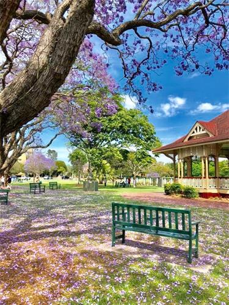

美丽的新农场公园

 
每个周日上午九时，在公园河岸对面的凉亭附近，都可以看到一群动作舒缓、面带祥和的法轮功学员在这里炼功。学员林小姐说：一大早来这里，看到紫色的花瓣落了满地，打坐时感觉好象坐在画里面，宁静祥和，两个小时的炼功时间过得好快啊！

美丽的新农场公园，也是当地居民户外休闲活动的好场所。不少人被悦耳祥和的炼功音乐和学员舒展的动作所吸引，有的驻足观看，有的拍照留影，在短暂的片刻感受着法轮功学员们带给他们的美好。

<b>“你们身上散发出很强的能量”</b>

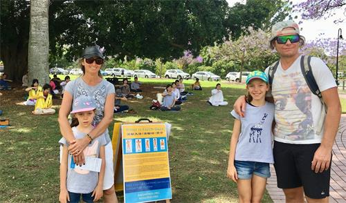

杰森一家感受到法轮功的美好

 
学员炼第五套功法时，一位名叫杰森（Jason）的年轻人在介绍法轮功的展板前站立了很长时间，他面带微笑，静静地站在那里观看。他的妻子弗南达（Fernanda）也被吸引过来，还鼓励他们的一对女儿跟着学炼法轮功。跟学员交谈时，杰森激动地说：“我站在这里，离你们还挺远的，都能感到你们身上散发出很强的能量，这种能量让我感到非常平和宁静，我很享受待在这里。”

学员告诉他们，法轮功学员因为坚持信仰真善忍，遭到中共的迫害，甚至被中共活摘器官，弗南达感到非常震惊：“这么平和的功法为什么被迫害？！”杰森说他之前听说过对法轮功的迫害，也了解一些法轮功的信息，这次亲身感受到法轮功学员炼功时发出的能量，令他很受益，感觉非常好。这对年轻夫妇询问了每周炼功的具体时间，带着两个女儿一起在炼功点观看了许久才离开。

<b>“参加集体炼功，感觉真好！”</b>

法轮功学员琳达（Linda）表示，她通常参加当地的小组炼功，所以很久没来这个炼功点了。今早来时，看到大家在草地上炼功，头顶有一棵参天大树，感觉好象被天地保护一样，参加集体炼功感觉真好！

琳达以前是位针灸师，修炼法轮功十五年了，许多往事，提起来仍记忆犹新。她说，刚开始炼法轮功时，她感觉身体很轻，修炼一个月后，更年期的不适症状就全消失了，十五年来，身体非常健康。她充满感恩地说：修炼后完全转变了我看待事物的观念，原本看似一件不好的事情，在我用真善忍的法理要求自己，尽力把这件事情做好后，坏事竟然变成了好事。我想每个真正修炼法轮大法的人都会有这种体会。

<b>“早上炼功，是我一天美好的开始”</b>

来自英国的玛丽安（MARYANN）修炼法轮功四年了，她是一名厨师，现在定居澳洲。她说：早上来这里参加集体炼功真好，让我感到很平静祥和，这是我一天美好的开始。她还表示，修炼法轮功后，她面对工作中的问题时不再感到有压力，也能很好地处理好家庭中的问题。她说：修炼后，我对待身边一切事物的心态，都变得更加正面和积极。

学员们都感到参加集体炼功受益匪浅。 
 

<h1 align="center"><b>坚守真善忍　十年无怨照顾病妻</b></h1>
五十年代初，我出生在一个林木葱翠、山清水秀的南方小镇。从小就目睹了邪党的各种政治运动和邪说，自己也随波逐流，做了损人利己的事，还错误的认为，这就是自己的才干与本事。

一九九七年，在朋友帮助下，有幸得到了李洪志师尊的《转法轮》，大法真、善、忍的法理洗涤了我的心灵，大法不断的使我归真，并拓宽着我的心胸，渐渐的懂得人来到世间的真正意义与目地。关心别人，处处为别人着想，为了别人可以舍弃自己的一切，哪怕是自己最保贵的生命。

我原本也有一个幸福的家庭，是一个幸福的三口之家。十年前，妻子得了多种病，特别是两度脑溢血，差点要了她的命，从此生活不能自理了。

我妻子是一个中文专业与经管专业双文凭的本科大学毕业生，曾是教高中、初中的中文教师。后来又调到企业，当过企业党委政工干部、政工师。我妻子是一个忠于职守，在工作中是一位勤勤恳恳、兢兢业业工作的好职工，年年都被评为先進工作者。

在江魔没迫害法轮功以前，她曾也是一名大法修炼人。虽然修的不太精進，但也是一个在大法中的受益者。以前当教师的时候，课时较重，在课堂上给学生授课时，由于粉笔的粉尘吸得太多，而落下了严重的咽炎、鼻炎和咳嗽等职业毛病。又加之有严重的脚气，真是苦不堪言。通过修炼法轮功后，这些毛病全都不翼而飞了，一身轻松。在我们读《转法轮》时，年幼的儿子也要跟着念念，炼功时孩子也常常跟着比划比划。那时儿子还在读小学，成绩总是名列前茅的。一家人有说不完的高兴与喜悦，天天都是笑口常开，其乐融融。

可一九九九年七月二十号，江魔发动了对法轮功的史无前例的疯狂迫害。我妻子因是邪党党员，政工干部，在这场邪恶迫害的高压下，加上迫害初期我也曾被邪恶绑架过，使她受到了惊吓。最终她放弃了大法修炼，同时她再也不让儿子读大法书了。时间一长，儿子渐渐迷上了网吧游戏，学习成绩急剧下滑，甚至有时逃学旷课，整天泡在网吧里。

儿子变了，在这世风日下的社会里，妻子也很快跟上了社会潮流，随波逐流了。在工作中，在社会上，她也开始争来斗去，最终把自己的身体斗垮了，什么毛病都上来了，甲亢、高血压、胆结石、由甲亢引起的甲心病（心脏病），两次严重脑溢血，每次都差点要了她的命。而每次生命垂危在医院抢救时，我都默默的求大法师父救她命，每次她都神奇般的活了过来。医生护士都说是奇迹，是大法师父救了她的命。

每次脑出血时，她都在医院里住很长的时间，而一直都是我精心的护理和无微不至的照顾着她。医生和护士们都看在眼里，时间长了，我们与医生和护士也都成了老熟人了。医生和护士以及周围的病人都很羡慕她，夸赞她有一个无微不至的好丈夫，都说她是几辈子修来的好福气。

我妻子两次脑出血后，身体的很多基本功能都丧失了，四肢都不活动了，吃东西吞咽都很困难，基本属于是一个瘫痪病人，吃、喝、拉撒、睡都要人伺候，大小便都是拉在床上和裤子里了，我每天都得面对这一大堆屎尿片与尿裤的清洗，还要喂水、喂饭，在日常中，好多时候大便都是用手从肛门里一点点的抠出来的，我每天的大部份时间都花在她身上了，的确是非常辛苦的。在苦难中，我能站在对方的立场上看问题，想事情，能处处为别人着想，以苦为乐，这都是大法教我做的，是法轮大法改变了我。我的苦难与不幸，是江××恶魔迫害法轮功，而给中国象我这样千千万万原本应幸福的家庭，带来了不幸与灾难。

面对这样的困难，十年来，我一如既往的无怨无悔的精心的照顾着她，街坊邻居，妻子工作单位的领导同事都说：当今这个社会，物欲横溢，道德低下，人际关系冷漠，人人都是相互利用，亲人父母弟兄之间为了钱财利益，反目成仇比比皆是，大难来时各自飞，谁管谁的死活呢？象某某（指我）这样的好人太难找了，还是人家法轮功好！都羡慕她有一个修法轮功的好丈夫，都说：法轮功真好！

去年八月，我妻子大学的同学，三十年同学聚会。他们从省内外聚到一起，一听说我妻子病了，不能前去参加同学聚会，他们来我们家里看望她。同学们三十年没见面了，见面时大家感慨万千，同学们关心她，请我给他们介绍我妻的情况，听后大家都非常感动。

一个在省城大学当教授的同学感动的说：“象你这样十年如一日，这样贴心的精心照顾病人，不离不弃，任劳任怨的把病人照顾得这么好。以前我只是从书中、艺术作品中见过和听说过，在现实生活中没有见过，如今却不知现实生活中还真有这样的人。这样的好人、好丈夫在现实社会中太稀有了！临走时他们纷纷拿出手机来要与我这样稀有的好人合影留念。

从另一面来讲，我又是这个世上幸福的人，是因为我喜得了大法，能在大法中修炼，能成为一个正法时期的大法弟子而骄傲！所以我是幸福的，我才是这个世上真正最幸福的人！

<h2 align="center"><b>突遇绝症疑无路 起死回生话感恩</b></h2>

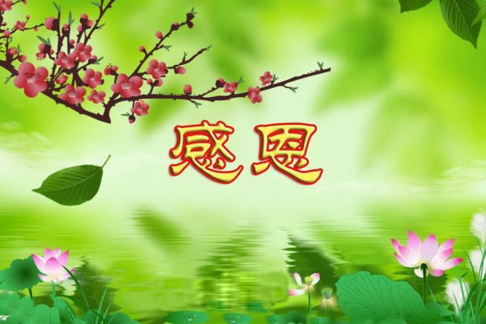

肺癌晚期病人起死回生后的感恩回忆

 
【希望之声2018年10月22日】（本台记者慧光综合报导）

她是中国大陆湖南省常德市的一名农村妇女，常年务农，健康状况与同龄人比较还是不错的，从小到大没得过什么大病，偶尔有点儿小毛病，扛一扛就能过去，实在扛不住了，吃几片药很快就能好，所以，五十多岁了还没有为健康问题着过急。然而，2009年遇到了一场大难，差点儿要了她的命。

那是2009年9月，正是当地农村栽种油菜的季节，她突然感觉身体出现不适，呼吸困难，咳嗽不止。开始以为是每天劳作、过于辛苦劳累造成的，就没太当回事儿。拖了几天仍不见好，又认为是受了风寒感冒，就买了点儿感冒药吃了，以为可以顶过去。可十几天过去了，不仅未见好转，还加重了，这才引起家人重视。

丈夫带她到当地医院去检查，医生说肺部有阴影，怀疑是肿瘤，感觉情况不妙，就督促他们到大医院去看，于是丈夫就火急火燎的带她去了省会城市的长沙肿瘤医院。经过两次切片检查，最后确诊是肺癌晚期，已经不能做手术了。这一消息犹如晴天霹雳，她们听到后如五雷轰顶，丈夫一下子瘫坐在地上，惊恐至极，当时吓得只知道哭，不知道该如何是好了。

她听后也彻底崩溃了，心想这是绝症，即使对有钱人来说也很难治愈，何况她们这样的穷人。她的家境很一般，儿子、女儿都已结婚成家，到外地打工去了。没病没灾的时候，日子还勉强过得去，可没成想一下子落下这么大的灾难，就好像到了世界末日。

那时她总觉得胸口像有一只“铁砣”堵在那里，压迫着胸部出不了气，所以咳嗽得很厉害，五脏六腑都好像随时要爆炸一样，咳嗽时要用双手将胸部死死地按住才稍微好受一点。长沙肿瘤医院确诊之后就让她住进了医院，在医院里她只能躺在床上，面如死灰，关键是不能进食，看到别人吃东西自己就想呕吐，几天时间身体就瘦了一大圈。头脑整日里昏昏沉沉，头皮痛得象刀割一样。住院二十多天就花了两万多元，期间做了一次化疗，病情不但没有减轻，反而还加重了。

在外地打工的儿女听说她得了这么重的病，都赶紧回来了。七十多岁的老母亲整天泣不成声，吃不下饭、睡不着觉，只能以泪洗面。兄弟姐妹都十分悲伤，见了她都说不出话来。亲朋好友看到她的样子，一个个也都吓得目瞪口呆，都知道她快不行了。也有亲友着急的为她凑钱，希望她能接着化疗。

看着每天的医药费像流水一样，她住不下去了，跟医生要求出院。医生交待十五天后需要继续化疗，她问医生：“化疗能不能治好我的病？”医生给了一个不置可否的回答：“很难说”。听了这话她心里也全凉了，其实就算医生不说，她心里也明镜儿似的。她后来回忆说：“活了这么大岁数，癌症也见了不少，没听说谁得了肺癌有治好的，我这就等于是被判了‘死刑’了。化疗只不过是拖延些时日，家里也没钱，我还不如回家等死。”

出院回家后，亲友看到她的这般惨状，就像是个活死人一样，都背着她流泪。有的悄悄的说“不会有多少日子了，赶紧准备后事儿吧”。然而，就在她极其痛苦、万分绝望的时刻，有一个法轮功学员来看她，向她讲述了法轮功学员修炼中出现的很多神奇故事，使她受到震撼，无望的心顿时燃起了希望，她立即表示要学法轮功。

因为她识字不多，那位学员就为她播放法轮功师父的讲法录音。可她的听力也很差，右耳基本听不见，只有左耳能听到一些声音，那位学员就专门为她买了一个带外放功能的MP3播放器。开始她只能躺在床上听，还要把MP3的外放声音调到最大，放到左耳边。很神奇的是，第二天她就感觉好多了，用手撑着能坐起来了，还能吃饭了。

几天后她就能下地了，那位学员又来教她炼功动作并和她一起炼功。那期间她每天都能感受到身体在变化，一天比一天有精神，她的信心也越来越足，变化也越来越大。

半个月后，在外地打工的儿媳妇打来电话说：“妈妈，我们给你筹到钱啦，你可以去接着化疗啦。”有侄儿和外甥也跟她说，“我们已经给您找到了江湖名医和祖传秘方，你的病有希望了，你要相信医学，我们一定要想办法治好你的病”。她毫不犹豫的对他们说：“我已经好了，你们就安心做你们自己的事吧，别再担心我了。”开始他们还不相信她说的话，后来听到她在电话里的声音底气很足，不像以前那个有气无力的样子了，他们也就相信了。

开始炼功到第十八天的时候，她的咳嗽就彻底停止了。再后来，堵在胸口的那个“铁砣”不见了，身体一下就变得轻松畅快；两只耳朵的听力也恢复正常；多年爱流泪的眼睛也清爽了；肩周炎等许多小毛病也都不翼而飞了。

走到大街上，街坊邻居看到她都露出了吃惊的表情，有的直接就问：“听说你得了恶病，怎么这么快就好了？如果不是亲眼看见真是不敢相信啦！”

她大声的说：“医院判了我‘死刑’，是法轮功救了我，是法轮大法让我起死回生！你们一定要记住‘法轮大法好！真、善、忍好！’会得福报的。电视里宣传的都是假的，都是造谣，不要相信共产党，江泽民太坏了。”

所有的亲朋好友和街坊邻居都亲眼目睹了她的神奇变化，都从内心里知道了真相。她丈夫因为常念“法轮大法好”，困扰多年的腰椎间盘突出症也好了。

她说：“今生能遇到法轮大法，我太幸福了。感谢师父，感谢大法给了我第二次生命。师父救了我，我就要把这铁的事实告诉世人，用亲身的体验证实大法的美好，感谢师父的救度之恩。”

<h1 align="center"><b>外企白领得法修炼经历</b></h1>

【明慧网二零一八年十月四日】我曾经是一家五百强外企的年轻白领，在寻觅多年之后，于二零一二年得法修炼。回首得法修炼时的兜兜转转的往事，觉的可以写出来与大家分享，让更多的人珍惜大法，明白这万古机缘。

大学毕业后，我先在一家科研单位工作，后又跳槽到外企，从事技术研发工作。与普通人相比，有着比较舒适的工作环境和较高的薪水。并在中国的一线城市能够购房买车，但是工作和生活压力很大。虽然努力工作，但是在中国大陆工作与付出并不成正比。好象收入还行，但是感觉生活在社会的底层，没有安定感。物质稍有富足之后，精神的空虚，社会中的种种乱象让人觉的整个社会没有什么希望。

<b>（一）上下求索</b>

我从小就不断涉猎各种知识，包括佛学、道家、儒家、阴阳，还有围棋、武术、气功等等，爱好很广。对于中国传统文化和历史，有一种先天的亲近感和认同感。工作以后，我每隔一段时期，我就花很多的时间去研读这些书籍和文章。在这方面的获得和认识的深入，让我感到一种充实。在这期间，也遇到过一些“高人”，给了我一定的帮助。这些东西看的越多，越能识破邪党在意识领域的弥天大谎，越加排斥邪党的邪恶理论和虚假宣传，也越能认识到有神论的正确。

尽管如此，可邪党对法轮大法的邪恶虚假宣传还是使我很多年一直无法走近大法。在现实生活中很难有机会了解大法真相，在网络上有几次机会，但是由于误解和害怕，还是在稍纵即逝的瞬间都一一错过。直到二零一二年，薄王事件出现后，对此事件的好奇使我不经意间通过邮件翻墙看到国外的真相网站，逐步看到了一个真实的中国。

翻墙后，自己印象中邪党诸多的美化宣传谎言都在真实的文字报道中解体。特别是大连尸体展中牵扯到活摘人体器官的内幕让人震惊与愤怒。对邪党残存的一点幻想（其实这是邪党把自己打造成伟大光荣正确的虚假欺骗）都消失殆尽。

有一天我看到“自由门”上有一个三退，说到邪党干了很多坏事，天要灭它，人要三退，人要选择。只需要点鼠标选择要退出的名字就可以三退。那时，还犹豫了一下，可是身体里突然有一种强大的能量，象要突破人的表面，有一个很强的念头，如此邪恶的党还不退出，连活摘器官这样邪恶的事情都干的出来，作为一个人，为了正义也得有所表示啊，退出还有什么好犹豫？！那种力量非常强大，直到现在我都记忆犹新。作为一个真正的人，为了正义，为了公理，必须这样做才行。我非常快的点击选择了要声明的名字，完成了三退。

<b>（二）修炼的愿望</b>

以前，由于邪党的诬陷造谣，我对大法相当的排斥。三退后，也许是邪灵的影响清除了，我慢慢的一点点的了解大法，一点点将对大法的种种不好的念头清除。起初，翻墙看到关于法轮功的信息都会跳过去，后来就慢慢的了解一些，看一下。

我在大学的时候身体不好，医院说是神经衰弱，经常困倦，疲乏无力。曾经辗转中西医各地医院治疗都达不到满意的效果。我后来悟到我这个病医院是没法治好的，就不再经常去医院，而是采取体育锻炼的方式，后又练太极，内家拳。虽有效果，但仍有隐忧，总觉的身体比别人要差一些。在高强度的工作，加班之后，就更为明显。

随着对法轮功的了解，特别是知道祛病健身的神奇效果后，就想要尝试一下。但这个念头出来之后，随之而来的是非常多的担心和忧虑，毕竟是在中国大陆这样的环境，还有邪党这么多年的虚假造谣对人的影响。

我还有一种想法就是要修炼的想法。对中国传统历史和文化的爱好，使我相信有神的存在，随之而来的一个很自然的想法就是人要修炼，因为我已经知道人生一世所有的俗世一切都是过眼烟云，唯有修炼才是人存在的真正意义。练习内家拳已经让人感觉到修炼的一些表面的东西。对各大宗教，我也有意识的去了解。剖开俗世人求财求平安求富贵的种种想法后，发现这些宗教的核心就是修炼，人的生命层次的升华。

可是要找到一种合适的修炼方法却又很难，道家典籍难求，网上偶得也很难看懂。佛教经典如汗牛充栋，沾手可得。基督教、伊斯兰教、印度教毕竟与中华传统相去甚远。所以我更多的阅读佛家的经典，多年以来，读了好多本佛经。虽然不是修炼，但是这也是在向修炼求索。对于如何修炼，我发现没有哪本书能够讲的很清楚，朦朦胧胧，感觉是围着一个东西在打转，但是这个东西却没有触及。不过我形成了一个概念，真正修炼必须修心，而且要实修，佛经知识知道再多，不修心也无用。末法时期，这些寺院中的乱象，原因很可能就是现在和尚不能实修了。

所以当我在网上看到法轮大法的时候，我发现有详尽的经书，功法介绍，我想这是我唯一能够找到的一条可行的修炼之路。当这个念头动起来的时候，我便从各方面开始考察，因为毕竟是在中国大陆，这样的环境和风险我是否能够承受。

<b>（三）修大法</b>

我发了消息给我知道的一个道家的“高人”，询问对于修炼法轮功的看法，可他迟迟没有回复。我想这种关键的问题可能是需要自己的抉择。那我首先要考虑的是邪党的宣传到底有没有一些是真的，还是全都是假的。我首先把“天安门自焚假案”、“一千四百例”等等的法轮功的真相节目都好好看了一遍。分析之后，脑袋逐步清醒，邪党的谣言毒素清除了，对法轮功妖魔化的印象也没了。然后将《转法轮》各个章节都看了看，没有任何极端的思想以致会产生邪党造谣所说的事情。而且里面所谈到的德与业力，生命的意义，也与我这么多年不断探索中所得相契合的，让我恍然大悟。

看到《转法轮》、《大圆满法》介绍法轮功是佛家上乘修炼大法，能在非常短的时间内让人达到相当高的境界，我也感到非常兴奋。接下来考虑的就是在这样的环境下我是否能够修炼。我特意去看了一些迫害案例，试问自己在这种情况下会不会害怕、后悔，能不能承受。如果修不出来那会怎样。我想，也许还不至于失去生命，但是坐牢还是能承受的，即使不能修成，也能成为一个道德高尚的人，这也是我一直追求的。

就这样我把经书看了好几本了，但还没有决定是否要炼，就没有炼动作。这时发生了一件事情，我上班开车的路上，将一个骑摩托车的人撞飞了。送到医院后，检查出他关节骨折，要住院治疗，我的车也被扣。为这个忙了一整天，回到家感到很疲惫，接下来几天还有好多相关事情要处理。平常这个时候我都会去看看法轮功书籍，此时我想到，后面几天都要忙这个事，如果这个时候再不炼功，后面恐怕忙忘了，就会耽搁下去。我又依稀想到《转法轮》里讲的，一个人要修炼必然有魔要债和阻挡的法。我想那就赶快炼吧，时不再来，看看到底怎么样。

我坐在椅子上，对着电脑里的《大圆满法》炼动作。将第一套的几个抻的动作学了一遍，坐在椅子上抻了几下。之后，我起身去洗脸，这时我发现自己身体非常轻盈。我有点不相信，怎么就会有反应了？晚上睡觉，发现自己脚底发热，平常不会这样的。我还发现周身的气血都在迅猛的运行，以往练内家拳，将一个动作练上几百遍，也能感觉到一点气血的运行，可是与此相比，那真的差的非常远。我只是将第一套动作在椅子上做了做而已。

第二天，我发现精力充沛，忙了一天也没有往日那种疲惫感。接下来一个星期，我把五套功法全部学下来，第五套只能单盘，虽然坐着不动，但是气血运行却是最厉害的。我沉浸在对功法琢磨，在身体上反映出来的奇特现象，感到很惊奇也很兴奋，全无任何的担忧和害怕。我发现人变的沉稳，处理一些棘手的事情更有韧性。

差不多在炼了一个星期左右，那个道家的“高人”回复了，“法轮功是正法，君一试便知。”此时，我已经开始修炼了，并在学功第一天起就没有再练内家拳和其它的了。

修炼之后，思想改变很大，想到的是如何去做个好人，心态也变的平和，遇事更加沉稳。但是我并不太懂如何修炼。我将《转法轮》看过几遍之后，师父的讲法看到《法解》和《义解》，后面的经文就不再看了。当时是觉的玄，不能真正理解，也有怕心的作用。对于讲真相不太了解，看明慧网上的大陆同修文章，惊讶于能讲真相做到那种成度，简直让人怀疑是不是在中国大陆，我十多年所处的环境从未见过。感觉相差太远，无法去效仿。也不知道发正念，每天就是炼功，经文看的很少。开头一、两个月，身体的奇妙反应慢慢变的平淡之后，我加长了炼功时间，每两天炼三遍，但是慢慢也变的平淡。心性有所提高，但是真正遇到矛盾的时候，自身的观念习性仍然很难克服。对于修炼的认识也没有放到很高的地位，仅仅从业余爱好和做人准则这个角度去认识，象以前练拳一样去炼功，但是比练拳要勤奋多了。

也许师父看到我虽然走進大法，但却不懂真正修炼，所以就启发我到海外去寻找同修。在大陆我很难找到同修，炼功快一年了，难以提高。我想也许我有一些不明白的地方，炼功动作是不是准确也是问题。也许到海外找到同修，得到一些指点，会有所帮助，同时也可以看看他们的状态。我到大陆以外一个华人聚居的城市，那里的同修热情的接待了我，虽然素昧平生，却非常亲切。我了解法轮功的心性要求，所以对此并不奇怪，但是触动很大，他们果然和明慧网上说的一样。他们有的年龄已经很大，但健步如飞，精力不逊于年轻人；有的人看上去比实际年龄要小上二十岁左右。每个人说话都很谦逊，对人很善良。

触动最大的是，到大法书店买书时，店主是一个在大陆被迫害坐过三年牢的大法弟子。我见面第一句好象说，“你好，你也是法轮功弟子吗？”她答道，“是啊，这一生就是为大法而来的。”我只在开始选择修炼的时候有过比较大的心理上的取舍，要说将一生乃至一切都归于大法，当时还不能做到。所以当有人将法轮功置于人生如此高的地位，我触动很大。现在想起，可能是师父点化我这一生也是为大法而来的。

在那里的几天，感受到同修们非常大的能量场，我象是被洗礼了一样，整个人的思想都被净化了。与他们一起炼功，炼功中的一些不正确的动作也得到纠正。我知道这部法真的非常大。我问了他们如何修炼，发现了自己的问题所在。我知道得多学法，法才能启悟人如何正确的去做。

回来之后，我真正走入了大法修炼，我反复通读《转法轮》，一篇不差将师父所有经文都看了一遍。开始讲真相和发正念，做三件事，也找到了大陆同修，溶入集体正法环境之中。大法也不断给我显现出神奇和引导我不断精進。如今我已汇入正法的洪流之中，成为堂堂正正的大法弟子了。在此期间，也历经风雨，被中共迫害，但我无怨无悔，对大法的坚信一直在心中。

回想往事，有时候感慨万千，似为偶然，却无不体现着师父的慈悲苦度，非常感谢师父！
 

<h1 align="center"><b>修炼法轮功的著名科学家吴伟标博士</b></h1>

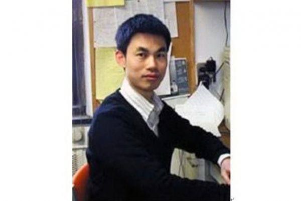

美国芝加哥大学终身教授吴伟标博士

 
【希望之声2017年10月13日】（本台记者陈克江综合报导）吴伟标博士，现年42岁，23岁到美国后开始修炼法轮功；29岁获得美国自然科学基金授予年轻科学家的职业奖，美国青年科学家总统奖；32岁时被芝加哥大学聘为终身教授；34岁获得由诺贝尔经济科学奖得主命名的普曼斯计量经济学奖，褒奖其学术论文是《计量经济理论》杂志过去3年来质量最好的。在概率年鉴(Annals of Probability)、统计年鉴(Annals of Statistics)、美国科学院院刊(Proceedings of the National Academy of Sciences, USA)、计量经济理论(Econometric Theory) 和英国皇家统计学会杂志(Journal of the Royal Statistical Society)等刊物上发表了大量学术论文。

1975年7月，吴伟标出生于浙江省宁波市大佳何镇吴家村，从小就有数学天分，读初中时，数学就很冒尖。就读宁海中学高一时，在老师的指导下，完成数学论文《CeVa定理欣赏》，在暑期荣获全国第五届青少年科技活动科学论文一等奖。高二、高三时参加全国高中数学联赛，分获二等奖和一等奖。

1992年，作为保送生，被中国大陆6所著名高校争相招录。最后，他选读了上海复旦大学数学系，仅用两年时间，就学完本科生四年的全部课程，三年后取得硕士学位，并夺得全国数学竞赛三个第一：研究生读书竞赛第一、建模应用竞赛第一、中科院华晨杯数学竞赛第一。1997年，免试进入天津南开大学博士班，将赴美国密歇根大学攻读博士学位时，受到原复旦大学校长、著名数学家苏步青教授的接见并亲自为其题写了“努力前程，预祝成功”八个字。

在博士班，来自6个国家的10个同学中，吴伟标年纪最轻，但每次考试成绩都遥遥领先。有次三门专业课考试，他竟得满分300分，比第二名足足高出122分，令他的洋同学们惊叹不已。1999年初完成学业，便在美国和加拿大讲学多次。获博士学位后，被芝加哥大学聘为助理教授，负责概率统计博士班五年级课程。

据吴伟标介绍，他23岁来美国后开始修炼法轮功，在高中和大学期间曾接触过气功，从中有些现象不容易得到解释。自从修炼法轮功之后，当然就能够理解这些事情了。他说：“我刚刚接触法轮功时，主要是觉得自己的学业很重，有个好身体特别重要，而刚刚开始炼的时候，我的睡眠就得到了特别大的改善。炼功后，我的精神状况好的不得了，我甚至可以在图书馆里或办公室里，能长达十多个小时精力集中做研究而一点不觉得疲惫。而且师父在《转法轮》书中讲述的能量的运动，甚至是很超常的大周天，我都亲身体会到了。”

除了对身体状况的改善有巨大帮助外，“我当时感觉法轮功特别不一样：这个功法非常注重人的心性的提升，要求去掉对名、利、情的执著，做任何事都要想一想是否会对别人造成影响甚至伤害。作为一名学者，做研究中，会经常出现对名的执著和由此产生的干扰。由于修炼法轮功的缘故，自己也在慢慢的看淡这些。在研究的过程中，要把课题踏实的做好，去掉浮躁的心理。举个例子说，以前自己的文章被拒绝后，收到退稿信时不免不高兴。现在逐渐的看淡这些，做研究时心态非常宁静和集中。”

对于法轮功中提到的和他自己感受到的超常现象，他说：“这与我们实证科学看问题的角度都不一样。李洪志师父不是讲物理，而是用最通俗的语言在讲道理。比如，有人曾用‘光年’是距离而不是时间来批判甚至嘲笑法轮功的不科学，其实，客观的讲，时间和距离是相对的概念，比如，我们都会说‘从家到学校走路10分钟’。这个话谁都明白是什么意思，但‘10分钟’是时间不是距离。法轮功中讲的一些修炼的事情确实不在实证科学的认识范畴之内。其它宗教中讲的许多事情也不在实证科学的认识之内。但不能因为这些而剥夺民众的信仰权利。”

“在一次学术会议中，我碰到一位来自大陆的著名统计学家。他跟我讲了很多他当年做的一些关于人体特异功能方面的研究，诸如透视功能等等。他们小组收集了上千个这方面的例子。没做实验之前，觉得这些功能都不可能存在。但是，在做了之后，在无可辩驳的事实面前，他们不得不承认这些功能的存在。他们也发现了一些规律，如‘小孩子越小时功能越明显，而大了之后就退化了’等等。但是，其背后的原因是什么，就不知道了。因为这些都超出了现代科学所能认识的范畴了。其实这些特异功能是跟修炼联系起来的。要研究这些现象，需要修炼的理论才行。将来人体科学成型时，可能会由修炼的理论作指导。”

“好像古代人做学问的状态与现在的状态是截然不同的。那时的人也要打坐，调息的。所以，他们可以用更直接的办法探索自然、人体以及宇宙。你比如说，祖冲之发现了圆周率pi的近似值为355/113，也就是把6个数字113355从中分开成为113和355二数就组成pi的非常好的一个近似值。这可是一项辉煌的成就。但现在的数学史学家却不知道祖冲之是如何发现圆周率近似值的。古代也没有电脑呀，更谈不上现代数值逼近的办法了。其实他们有他们那个时代做学问的方式。我们现在也理解不了。再举一个例子说。大家都知道‘扁鹊见桓侯’的故事。那时也没有现代的医疗设备，为何扁鹊一眼看去就知道桓侯病在那里了呢？现在看来这就是特异功能了。当时的人有他们的办法探索自然规律。这就与修炼有很大的联系了。其实这种直觉在现代做研究时也很重要，很多数学上的结果证明起来很复杂，但我们要真正理解它好像必须直觉的一眼能看到它，或者是一幅图像，或者是一个比喻。”

“像我们从事自然科学研究的，就喜欢用实证的办法去理解问题。但是这种办法就理解不了这些超常现象。我前面提到的那位统计学家在讲到他对人体特异功能方面的研究时说：‘事实就是事实。我们的常识就可能是错的。’随着修炼的深入，对这些现象也就越来越能理解了。这些现象的出现，人境界的升华的先决条件是道德标准的提高。”

谈到中共以“崇尚科学”的名义打压法轮功，吴伟标认为，这是把科学作为“棍子”乱打一气。他说：“科学最重要的就是自由的思考、自由的交流。我作为海外的法轮功修炼者，可以自由的获得任何资讯，可以自由的思考、自由的发表自己的言论。可是中共用大陆纳税人的钱建立互联网上的防火墙，不准大陆民众获得海外自由社会的信息，更不准大陆民众自由的发表自己的言论。同时中共把信仰法轮功的大陆民众抓进监狱、劳教所、洗脑班，以酷刑摧残强迫他们违心表态放弃自己的信仰。难道中共就是这样崇尚科学的吗？”

谈到如何对待学术研究和研究成果。吴伟标说：“芝加哥大学主要看文章的质量。我听说以前物理系有一个助理教授好几年没出文章，他的终身教职的评审都成问题了。但其后他在某一方面有所突破从而获得诺贝尔物理奖。好像就只一篇文章。”

“但是，现在总的学术氛围使大家拼命的做研究出文章。所以，不仅仅是中国大陆来的人，好像几乎所有的年轻学者都在追求出文章。既然现在学术界是这么一个风气，我想我们也应该做好自己的研究。我自己的方式是顺其自然：如有好的想法或问题时，便花点功夫把它做出来。我想这与想出大成果并不矛盾。如果想要做出很大的成果，那就得需要各种时机都得成熟，也就是‘天时，地利，人和’都得成熟吧。这些都是可遇而不可求的。不然的话，你看有那么多人都在做研究，都想出大成果，但并不见得有那么多的大成果被做出来。其实这个问题《转法轮》也阐述过，比如灵感是怎么回事，科学的发展是怎么回事等等。”

“其实把研究当作是一种工作，我们只要把这个工作的本身做好，而不要去太执著于结果，就会有一个轻松的心态，放下包袱，结果可能会更好。李洪志师父教导我们有一句话叫“无求而自得”，在我的研究中也有所体现。所以呢，不管想不想做出大的东西，浮躁的心总得放下。因为如果有浮躁、焦虑的心在时，自己很难做成事情。我自己就有很多经验和教训。《转法轮》中要求修炼者时时保持一个祥和的心态。当然了，这不仅仅局限在做研究这小小一方面上，在生活的方方面面都可体现出来。”

谈到信仰自由问题，他说：“就好比我读博士学位，我认为这是对的事情，是应该做的，那我就会坚持下来。炼法轮功也是一样，我自己的体会，特别是师父强调的是道德，高尚的道德素养是第一位的，这些都是正确的，这也是我坚持下来的原因。”

谈到中共剥夺他的中国国籍问题，吴伟标感到非常悲哀。他说：“2006年11月20日，我去芝加哥中领馆去申请护照延期，我把申请表和护照都按程序交上去了。按他们的规定，4个工作日后可以取护照。4天后，我把取证单交上，前台的工作人员找不到我的护照。后来，签证领事张楚云出来和我单独谈话，说不能参加法轮功活动，等等。他们的数据库中显示我是法轮功学员。张楚云说过几天后给我答复。大约10天后，他们决定不给我延期护照。这就意味着中共以这种方式剥夺了我的中国国籍。中领馆官员知道这样做会给我很大的麻烦，因为我要经常出国进行学术活动的，没有护照怎么出国？

<h1 align="center"><b>警察与律师的改变</b></h1>
【明慧网二零一八年十月十八日】

<b>一、警察得法</b>

她曾经是大陆中部某城市派出所的一名警察，在一九九九年江氏流氓集团对法轮大法开始疯狂打压的时候，她被安排看管被非法关押的法轮功学员。

那时他们是二十四小时轮流换班，各种电视、报纸轮番的上阵，就是采用各种方式逼迫被非法关押的大法学员所谓的“转化”，要他们离开大法放弃修炼，只要写了“转化书”，或者在他们事先设计好的“转化书”上签了字，就可以回家。

开始她没有多想，和大多数人的想法一样，她以为这项工作只是暂时的，因为写转化书和被非法关押相比较，谁都会选择前者，有谁会傻傻的愿意被关押呢？可是事实却出乎她的意料，没有人选择放弃修炼离开大法，他们可以放弃世间的一切甚至生命而选择修炼。

她开始思考，人世间除了金钱财富外，有什么东西能够这样让人不能放弃的呢？为了找到答案，最后，她选择了看《转法轮》这本书，看完《转法轮》后，她一切都明白了。

这位警察在国内公务员队伍里工作了几十年，从小受无神论灌输，根本不相信有神的存在，是把自己的名利、地位、感受看得比什么都重的人，用她的话说，就是除了眼前利益，什么都不相信！平时说话做事也从来不考虑别人的感受，只要自己过的好、丰衣足食就行。

但是看了《转法轮》后，彻底颠覆了她以前的世界观，她选择了修炼大法，选择了按照真、善、忍做一个好人，在工作中、生活中努力按着真善忍的标准为人处世。

他们单位最后一次分配买福利房，比市场价要便宜的多，她够条件，写了申请，同事说，就她最符合条件了，一定要找领导把这个房子搞到。她笑笑说，也许某人比我更需要呢！没去争，最后房子分给其他人了，她也没什么想法。

同事都认为她正直、善良，在业务上别人有不懂的，领导就说你去找某某（指她）；同事间为什么事情争论对错的时候，领导说某某（指她）说了算。

后来因为修炼大法的原因，她被上级部门无理辞退了，她的同事和亲朋好友非常的不解，有人也劝她放弃修炼，也有人对她的改变非常不解，她说她能有机缘沐浴在大法中，感到非常的庆幸！

<b>二、律师的改变</b>

有一位同修D因为修炼大法，被非法关押進了看守所，同修商量后，决定去找律师進行维权，因为中国现行的法律没有说修炼法轮功是违法的，相反《宪法》第三十五、三十六条规定信仰自由是每个公民应有的权利，所有的迫害依据都是江氏及其流氓集团杜撰并强加的。

同修找了很多律师事务所，咨询了很多律师，他们大部份都知道江氏迫害法轮功没有法律依据，但是他们说，在中国，法律只是用来粉饰太平的，是用来骗老百姓的，而且他们上级有规定，不允许他们接（迫害）法轮功的案子，不让他们为法轮功辩护，他们对法轮功的遭遇只能表示同情。

后来碰到这样一位从事律师工作三十多年的律师，他可以接D同修这个案子，但是他不知道、也不相信迫害法轮功没有法律依据，我们告诉他，二零一一年三月一日中国新闻出版署总署第五十号令的九十九条和一百条，已废除法轮功书籍出版禁令，他也不相信。

接案后，他认真的查阅了大量的法律条文，还咨询了从事法律条款研究的同行，有一天他象发现新大陆一样的跟我们说，公安部界定的十四种邪教里根本没有法轮功（注：中共是真正的邪教）。接着，他查阅了在检察院的案卷，所谓的证据是几本名字叫《洪福》、《希望》的小册子，看到给同修非法定的所谓罪名是刑法三百条的“利用邪教组织破坏法律实施罪”，而且他跟检察院沟通后，检察院说，只要D同修同意脱离法轮功就可以回家，他信心满满的就去会见被非法关押的D同修，他以为这个事很简单了。

从看守所出来后，律师感叹的说：真是太出乎我的预料了！第一、她一个被关押的人还在为我考虑，她说我如果劝说她放弃信仰背叛法轮功，对我律师不好，那样做就害了我了，所以她不会签这个字的。第二、一个没有文化的农村妇女居然能说会道的，她讲的话很有道理，我几乎都被她说服了。第三、她的家人在她被关押后几个月才知道她的消息，没有衣服、没有钱，她却能坚强的走到今天，她的精神状况完全不像一个被关押的人。第四、她那么善良，对她的师父那么敬仰，对她的信仰那么坚定，她在里面处处按真善忍做好自己，她还可以炼功，感觉像个牢头样的。第五、她只要签个字就可以回家的事，结果她就是不签，宁愿在这里受苦！我是真的很佩服她！

接着，律师从法律的角度跟检察院進行了沟通，要求检察院不予起诉。一段时间后，律师还告诉同修，他开始接这个案子是为了赚钱，没想到借此了解了法轮功并不是象电视上说的那样，接触的法轮功修炼人都很正常、很善良，而且素质很高，是值得他信任的人，他说现在社会上很难找到这样的人了。

后来，D同修的案子还是到了法院阶段，当再次找到这位律师的时候，他非常诚恳的说：只要你们再请我，我顶着压力也要为她做无罪辩护，你们只交律师事务所收的费用，我一分钱不赚你们的。

在一个午后，这位律师用真实姓名退出了党团队组织。

<h1 align="center"><b>“护身符”里乾坤大，“九字真言”有玄机</b></h1>

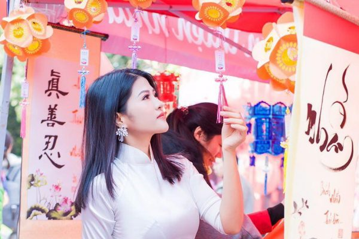

一位年轻女性正在观看法轮功的“护身符”

 
【希望之声2018年10月17日】（本台记者慧光综合报导）

我是中国大陆黑龙江省的一位普通女性，受家庭影响，从年轻时就皈依佛门，成为修净土法门的居士。

2007年年初我遇到了一次大难，大难不死也是我终身难忘的一次奇迹，并成为我人生中的转折点。在此讲述出来，是想为这次经历做个纪念吧，也想借此机会表达自己许久以来的一个心愿。

那年春天，记得是阴历二月初五那天，我一直肚子疼，开始以为是受凉了造成的。以前遇到这个事儿我都是用土办法，拿点碱面往鼻孔里抹上一点儿，过一会儿就好了。可这次却不好使，腹部长时间持续疼痛，始终没有缓解的迹象。时间一分一秒的过去，疼痛的感觉越来越严重，并且开始呕吐，最后吐的都是绿水。从镜子中看到，我脸色蜡黄，都快要虚脱了。当时丈夫上班不在家，家里就只有我一个人。实在挺不住了就给丈夫打电话，让他赶快回来。丈夫回来后赶紧将我送到医院，医生诊断为胰腺炎急性发作。

在急诊室里，医生的处理方式就是“打点滴”，可是我的疼痛得不到丝毫缓解，到了后半夜也未见好转。医生看我疼得厉害，又给我使用胃肠减压器，就是把一根管子从鼻腔插入到胃里，将胃里面的气体和液体吸出体外，以降低胃肠道压力缓解疼痛。这根管子有两米长，搞得我更加痛苦。到凌晨天快亮的时候，我开始颤栗，腿开始抽筋，我跟丈夫说“赶快转院吧，我快挺不住了”。

丈夫联系好车后就将我送到哈尔滨医科大学第二附属医院，经专家会诊，确定我除了胰腺炎外，还有胆结石，病情仍在发展，疼痛还在加剧，没有得到控制。当天晚上我就出现呼吸困难，进入半昏迷状态。朦胧中我感觉有一个类似骷髅头一样的东西，一直在我床边晃悠，让我心生恐惧。昏迷中我曾跟守护在床边的妹妹说“记住能救我的是一个男的”，而当时负责抢救的是一位女医生，所以妹妹也没听懂我说的是啥意思；我还说二月十五是一道“坎儿”，能挺过这两天我就会见好。当时已经不清醒了，为什么要这样说自己也不清楚。

入住哈医大二院的第二天，我从急诊室转到普外科，疼痛仍在继续，监控设备全用上了，鼻孔中有呼吸机的管子，口中有插进胃里的管子，还有血压仪、导尿管等，两组输液同时进行，还有另外一些监测仪器。这种状况持续了一周，我也一直处于昏迷中。偶尔会从昏迷中醒一会儿，醒来时看着家人都是似曾相识的感觉，对他们没有一丝牵挂。

大约到了第九天，我才渐渐清醒过来，突然想起有一位法轮功学员曾送给我一个“护身符”，并告诉我危难时刻要诵念“法轮大法好！真、善、忍好！”九字真言，我赶紧让丈夫将“护身符”放在我贴身的衣兜里，然后不停的默念，并在心里祈求法轮功师父救我。

说也奇怪，在这个过程中，我的眼前浮现了很多景象。我看到了满头白发的父亲，看到了为我照顾孩子的母亲，还有孩子和丈夫的往事都历历在目。我哭了，当时心生一念：我不能抛下他们就走，我还有未尽的责任。

非常神奇的是，从我诵念“法轮大法好！真、善、忍好！”开始，不一会儿疼痛就开始减轻，不久我就可以坐起来了，渐渐的胃管也用不着了，输液也减少一半。我看到了我的主治医生，果真是一位男的。

到了第十二天，主治医生告诉我，可以吃一点儿流质食物，并说以后只能吃流食，一生都要这样，我当时半信半疑。不过他说过之后我就可以吃粥了，一天要吃五、六次，不能吃饱、不能吃油腻的。

半个月后我出院了。有一位修净土的居士来看我，对我说“大难不死，必有后福”。我当时只是笑了笑，没有言语，我心里明白是法轮功师父救了我。此时我真正领悟到法轮功学员说的话是真的，“九字真言”真的很灵验！

回家后，丈夫给我买了不少药。非常奇怪的是，我一吃药就胃疼，不吃还不疼，我就不吃了。非常感谢有两位法轮功学员，他们不管有多忙都来看我，并给我送来了法轮功的主要指导书《转法轮》，在他们的鼓励下，我走入法轮功修炼。

开始炼功以后，在整整一个月里，几乎每天师父都给我净化身体，不是拉就是吐，反反复复，比较严重的有十几次，每次过后我都会用记笔记的方式记录下来，我想这些就是我亲身体验到的见证。

2007年6月28日，这一天是我永远难忘的日子。我和母亲、丈夫一起去了哈医大二院做复查，结果出来了：胰腺炎和胆结石都没有了。我不敢相信，反复向医生求证“会不会是看错了”。当确信无疑后，我激动的流下了泪水，情不自禁的大声对医生说：“是法轮功救了我的命，是法轮功师父救了我。”我们三个人都笑了，医生也笑了。

从那以后，我完全恢复健康，一日三餐什么都能吃，家务活啥都能干。到如今已经修炼十多年了，感觉身体比年轻时还要好。一直以来，不知道该怎样向师父表达自己的感恩之心，唯有借此机会向师父说一句话：“谢谢师父的慈悲救度！今后一定要按照‘真、善、忍’的标准严格要求自己，做一名真正合格的大法弟子，请师父放心！” 

<h1 align="center"><b>美媒披露中共强摘器官 吁国际社会调查</b></h1>

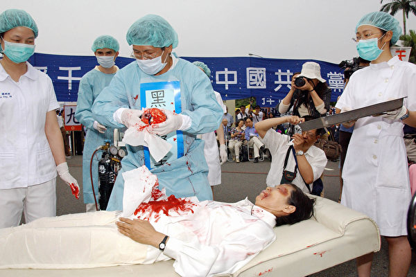

美国《富比士》网站刊文说明外界对中共强摘器官的指控，并呼吁就此议题进行独立调查。图为2006年4月23日，台湾法轮功学员在台北演示中共强摘中国法轮功学员器官的行动剧。

 
 【大纪元2018年10月17日讯】（大纪元记者陈俊村编译报导）针对调查中共强制摘取良心犯器官的“独立人民法庭”（Independent people’s tribunal）于10月16日在伦敦宣布成立，美国媒体刊文说明外界对中共强摘器官的指控，并呼吁国际社会就此议题进行独立调查。

美国《富比士》（Forbes，又译福布斯）网站于10月16日发表法学研究人员暨人权倡议人士欧恰布（Ewelina U. Ochab）的文章说，依据世界卫生组织制定的准则，在未经当事人（无论死活）同意的情况下强制摘取其器官，是非法行为。

外界指控中共政府杀害良心犯（尤其是法轮功学员、西藏佛教徒、维族穆斯林、地下基督教徒等少数宗教群体），并强摘其器官以供应器官移植产业。美国国会和欧洲议会都曾就此议题举行过听证会。

这项指控获得实质的证据支持，其中包括由加拿大人权律师麦塔斯（David Matas）、前加拿大外交部亚太司司长乔高（David Kilgour）和美国资深媒体人葛特曼（Ethan Gutmann）基于其调查报告在2016年所发表的《血腥的器官摘取/大屠杀：更新版》（Bloody Harvest/The Slaughter: An Update）一书。

此三人的研究揭示了有关中共强摘器官的两个重要议题。

第一，在中国发生的器官摘取数量远大于中共的官方统计资料。联合国酷刑问题特别报告员（Special Rapporteur on Torture）和宗教或信仰自由特别报告员（Special Rapporteur on Freedom of Religion or Belief）已就此差异对中共提出质疑。

第二，该调查报告主张，包括法轮功学员、维族人、藏族人和地下基督徒在内的良心犯，是中共强摘器官的特定目标族群。葛特曼曾在美国众议院外交事务委员会（Committee on Foreign Affairs）上作证说，强摘器官是中共迫害法轮功学员并维持人体器官供应的一个方法。

葛特曼在外交事务委员会上还表示，中共于1999年发动旨在消灭法轮功的镇压。在2001年之前，有超过100万名法轮功学员被关押在劳教所，被迫进行针对器官移植所做的体检，而中共军方和民间医院的移植设施也纷纷成立。

至于针对中共强摘器官的议题，人们可以采取何种行动？欧恰布在文章中说，进入中国进行独立调查是第一个和最重要的步骤。如此的独立调查或可作为考虑对参与器官移植或摘取的人提出诉讼的基础。

欧恰布写道，联合国禁止酷刑委员会（U.N. Committee Against Torture）和欧盟议会曾要求对中共强摘器官议题进行调查，而日前在终止中共移植滥用国际联盟（International Coalition to End Transplant Abuse in China）的倡议下所设立的“独立人民法庭”，则可以对这项指控进行调查。

欧恰布说，无论该法庭能否协助厘清有关中共强摘器官议题的许多问题，它无疑地是针对这个议题采取更多决定性行动的开端。

<h1 align="center"><b>邪魔附体无宁日　佛光照耀我的家</b></h1>

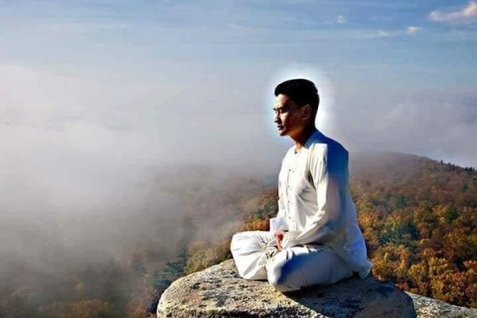

法轮功学员在炼功

 
【希望之声2018年10月14日】（本台记者慧光综合报导）

我是中国大陆内蒙古人，居住在一个边陲小镇。初中毕业后我就辍学经商，整天奔波在服装市场，讨价还价、处心积虑、唯利是图，把钱看的比命都重。渐渐的有了一些资金积累，便整天和朋友在一起喝酒取乐。酒是我们蒙族人每天都离不开的东西，一天少说“两喝”，多则“三喝”、“四喝”。跟朋友喝、跟亲戚喝，在家喝、出门还要喝，自以为这就是所谓的幸福。然而，在我妻子身上出现了一件十分罕见的怪事，将我的生活彻底打乱了。

记得那是十年前，我妻子在邻居的撺掇下，往家里请了一个“保家仙儿”，说是能保佑发财。整回家后又是上香又是摆贡品，忙的不亦乐乎。我不相信这些，但也想图个吉利，就没管她。

可没过多久，我突然发现妻子的神情有些不对劲儿，说话的声音变了，腔调跟平时都不一样了。一会儿哭，一会儿闹，一会儿又大笑不止。疯狂起来歇斯底里，安静下来又胡言乱语，声言厉色。她平时性格温柔体贴，现在完全变成了一个我不认识的人。与她在一起我感到毛骨悚然，吓坏了，不知所措。

我是一个蒙古族壮汉，没有怕过谁。可这时跟她在一起我害怕的不行，不敢单独和她在一个屋里呆着。特别是到了晚上，要找几个朋友来一起看着她，可是这几个朋友也都吓得不行。我让她睡在里屋，我们几个大男人睡在外屋，整宿守着，谁也不敢睡觉。

她经常是白天晚上不睡觉，也不让我睡觉。有一天半夜两点多钟从屋里走出来，表情冷冷的直呼着我的名字要跟我谈谈，我浑身的汗毛都竖起来了，全身无力的瘫软在沙发上，不知道该如何是好，平时的胆气儿都没了，简直是六神无主。

我们这个小镇也就四、五万人口，家里出了这档子事儿，满镇子的人都知道了，生意也没法做了，只好关张，全力以赴治她的“病”。

打听到本地有个远近闻名“刘大仙儿”，我就带着妻子去找她。她未及细看就说保证手到病除，但要求病人必须“出马”。在锣鼓声中，这位“大仙儿”手舞足蹈，一边唱着一边做着很古怪动作，口中振振有词请病人“出马”。我不懂“出马”是什么意思，也不便多问，只能随她折腾吧。折腾了一宿收了1200元钱。我以为妻子的病好了，没成想第二天仍然是又哭又闹，比以前更严重了。

我没有迟疑，带着妻子又去了“刘大仙儿”家，质问她怎么不管用？她又装模做样的折腾一番，让我回去敬香烧纸，将我打发走了。回去后完全按照她的交代做了，还是不管用，就这样来回折腾了几天还是不见效。

我茫然了。心想是不是“刘大仙儿”嫌我给的钱少了？于是我又带上几千块钱去了一趟。这一次“刘大仙儿”提出要对她们家供的“大仙儿”三叩九拜。为了妻子能解除痛苦，我没犹豫，跪在地上磕了三九二十七个头，站起身后我说：“长这么大我没跪过谁，就我这熊脾气更没求过谁，该花的钱我花了，你有什么本事都使出来行吗？”说完我气冲冲走了。过后她也曾单独来过我家两次，可就是不见效，以后我就再也没有找过她。

时间一天天过去了，我妻子还是整天折腾着、闹着，甚至越来越凶。我再也坚持不住了，没有办法，只好给我岳父岳母挂电话，让他们过来帮我。岳父母来到家中，看到这情况心里也非常难过，岳父说：“她不是什么实病，很可能就是被黄鼠狼给迷了，或有什么鬼魂等不好的东西上身了。”我听完当时就懵了，心想这可怎么办哪？

后来又找了一位有“道行”的高人，说“你妻子的这个本事还挺大，必须到外地请二位高人才行。”二位高人请到了，让我给准备些红纸、笔、红布、还有鸡蛋等，然后他们一边唱着一边跳着一边做着很古怪的动作，折腾了一夜。当天妻子在里屋睡的很香，脸色也好看了许多，我很高兴。等那些人刚走，再看我妻子，表情麻木，呆呆地，一举一动完全不是她本人，只是不哭不闹了。

后来又找过几个人，也都不见效果。我心中非常苦恼，实在想不到出路了。

有一天，我突然看到了放在桌子上从来也没有翻过的一本书——《转法轮》，那是一位做生意的朋友送给我的，因为我从小就不喜欢读书，所以也没把这事儿放在心上。还记得那位朋友临走时说：“这可是一本宝书。这本书能治病，能救人，我们在家不洗手是不摸书的…… ”如今当我将目光投向这本书的时候，耳边又响起那位朋友的话，我心中陡然一惊——“能治病，能救人”，那不就是我现在最需要的吗！

于是我静下心来，从头至尾认真拜读一遍。

读过之后，我将书轻轻合上，用双手举过头顶，默默的说：“师父，师父……，我什么都明白了。”说完后我的泪水夺眶而出，再也止不住了，就这么静静的，静静的，不知过了多久，才慢慢的回过神来。我擦干眼泪，定了一下神，把岳母和妻子叫到我的房间，我对她们说：“这有一本宝书，能够救咱们全家，现在我们就开始炼这个功。”因为那位朋友把法轮功教功录像带也留给了我，用了一晚上时间，我们就把五套功法全部学会了。

从那以后，我每天都早早起床，与岳母和妻子一起炼功，其它时间则抓紧学法，并不断的用“真、善、忍”的标准严格要求自己，心性提高的也非常快，烟也不抽了，酒也戒掉了。

非常神奇，从开始炼功的第二天起，我妻子的身体就正常了。我心里非常清楚，是师父把那个“坏东西”拿掉了。妻子清醒后也经常感动的落泪，她说：“多亏了大法，多亏了师父，要不是师父救我，我仍然是个疯子！”

妻子康复后，我的商场又重新恢复正常营业。

对我们这个偏僻小镇来说，商场开始营业是一件大喜事，人来人往，街坊邻居也都相继前来祝贺，大家都问：“你妻子的病好了，咋治的呀？”我大声的告诉他们说：“炼法轮功炼好的！”走在大街上，只要有朋友问我，我就大声说“是我师父给治好的”。

十几年了，每天早上我们都早早的起来晨炼。全家人在一起和睦相处，幸福的走在返本归真的路上。

<h1 align="center"><b>“失去”共产党，中国会怎样？</b></h1>
【大纪元2018年10月05日讯】进入2018年，中共统治中国社会六十多年所造成的种种社会问题和犯下的累累罪恶的后果，正在全社会出现，中共政权摇摇欲坠。中共的统治危机四伏，中共座下的火山随时面临爆发。中共内心的恐惧，可以从中共严密操控的媒体中透出。从2018年3月到现在，一篇题为“失去共产党，中国会怎样？”的文章在大陆微信圈传播。

这篇署名文章并没有发表在中共的官媒中，却以自媒体文章的方式在流传。这篇文章用所谓“沙盘推演”的方式，向中共民众描绘了一幅中国一旦没有了共产党之后，中国社会天下大乱的末日景象。虽然文章的推演漏洞百出，基本与中共党媒论调同出一辙，但是，文章使用的一个主要的观点就是：“没有了共产党，中国会大乱”，利用中国民众害怕社会动荡的心理，试图给中共政权打气续命。这其实也确实是很多民众最为担心以及认识的一个误区：没有了共产党，中国会大乱。

此篇文章描绘出的没有了共产党之后，中国社会的可怕景象是：全国出现成百上千的政党，无法组成联合政府，中国失去中央控制，各省之间争夺资源，城市居民断水断电，军队解散，民众之间混乱械斗，全国发生内战，造成几亿人死亡等等。最后的结论，为了避免发生这样的结果，只有坚持共产党的领导，拥护共产党才是唯一出路。

中国没有了共产党，真的会这样吗？没有了共产党，真会天下大乱吗？

<b>中共是动乱之源</b>

微信圈流传的这篇文章，忽略了一个最基本的前提：造成中国不稳定和动乱的源头正是中共，中共是动乱之源。

共产党的理论基础就是暴力夺权，因而必然制造暴乱。共产党武装叛乱推翻中华民国合法政府，屠杀近一亿中国民众。共产党认为国家机器是镇压人民的工具，因而共产党国家本身就是动乱之源。

中共占据中国的一切资源，造成民众穷困，大量廉价地出卖中国的资源和国土，体制性的腐败不断制造巨贪，造成社会贫富差距日益对立，社会矛盾空前激化，不断造成社会的动乱。

中共几十年来镇压宗教信仰、镇压和杀戮地主、资本家、爱国学生和市民、上访民众、法轮功修炼者、新疆和西藏人等，中共也杀它自己内部的人，中共几乎迫害和杀戮了中国全社会的人，造成社会巨大的动荡和恐怖，中共是动乱的制造者。

中共还向全世界输出革命，支持搞恐怖活动的国家及其组织。世界上最残暴的割据武装和残暴政权，也都和中国共产党有密切关系。除了红色高棉之外，印尼共产党，菲共、马共、越共、缅共、寮共、尼泊尔共产党等等，也都是中共一手支持建立，中共还提供核技术给朝鲜、提供技术给伊朗邪恶政权，中共不仅是中国动乱之源，还是世界动乱之源。

事实上，拥有几百万军队和武警的中共，才是中国真正的“动乱”之源。老百姓没有理由去“动乱”，更没有资格去“动乱”。只有逆潮流而动的中共，才会草木皆兵，把国家拖入动乱。“稳定压倒一切”，“把一切不稳定因素消灭在萌芽状态”，成为中共镇压人民的理论基础。

<b>没有共产党 中国不会乱</b>

如今说“没有了共产党，中国怎么办？”的话，就好像四十多年前，许多人在毛泽东的遗像前痛哭流涕地重复著一句话“没有了毛主席，中国怎么办？”一样，现在看起来是那样荒唐可笑。

中国从古代朝廷到近代中共统治前的政府，对于民间社会的控制，实际依赖的是士绅阶层和家族长老的自觉维持，传统的礼法家训和乡规民约在代代乡绅的传承下，形成中国人的伦理底线和生活秩序。古时朝廷委派官员只到县令一级，其下则进行乡绅自治，中国自有“县宁国安，县治国治，下乱，始于县”的说法。

仅翻阅近代1911年辛亥革命清朝灭亡时的史料，原来一直以为当时全国各地局势一定是一片混乱，后惊奇发现，面对改朝换代的巨变，中国各地包括大城市在内，除了局部地区的少数战斗与官方的改旗易帜之外，城乡民众的生活大都比较平静，没有大的社会动荡发生。

中共建政后，彻底改变了中国传统社会的二元式结构，为了稳固党的统治，中共严密地控制社会运作和中国人生活的方方面面。党的机构从中共中央一直建到穷乡僻壤，无处不在。

中共从中央到基层有一整套的并行于政府机构的班子——“中央军委”与“国家军委”，“党中央”与“国务院”，“省委”与“省政府”，“县委”与“县政府”，“乡党委”与“乡政府”——政府有“公检法”，党有“政法委”；政府有“广电部”，党有“中宣部”；政府有“人事部”，党有“组织部”；政府有“监察部”，党有“纪检委”。党是一把手，党委永远领导政府。正常社会里，各党派的党员、组织机构不能由纳税人供养。但是共产党却直接附体到了政府身上，各类专职、半职的党务机构强行由纳税人的血汗钱供养。

“这个党组织，就像一个巨大的邪灵附体，如影随形般附着在中国社会的每一个单元细胞上，以它细致入微的吸血管道，深入社会的每一条毛细血管和每一个单元细胞，控制和操纵着社会。所以，中国农民才会如此贫穷辛苦，因为他们不但要负担传统的国家官员，还要负担和行政官员同样人数甚至更多的附体官员。所以，中国的工人才会如此大规模下岗，因为那些无所不在的吸血管道，多年来就一直在吸取企业的资金。所以，中国知识分子才会发现自由是如此的困难，因为除了主管的行政机构外，还有那个无所不在却又无所事事而专门监视着他们的影子”。（《九评共产党》）

即使这样，我们也可以看到一些例子，在没有了共产党管理的时候，中国民众所表现出的秩序与高素质。1989年中共在六四屠杀前，北京全城居民声援绝食学生阻挡军队入城，当时中共暂时失去了对民众的控制，北京民众出现了前所未有的组织性，人们自发地组织了纠察队维持秩序，陌生人之间的关系变得和谐热情、甚至连小偷都停止了工作。

在那段时间里，一个当时亲历的人这样说：“作为市民和干部，那些天，我感受到一股正直的民族气概。罢工、罢课、百万大游行，声讨贪腐，要求民主……没有人再计较是非，5毛1块的积累著财富的小贩不再和学生算计钱，成车的水和干粮、盒饭免费运进广场，物价也没涨，经济也没瘫，警察也都不横了，连小偷都罢偷了。无政府的北京，秩序空前的好！哪个说百姓素质低？”

在2011年引起国际媒体广泛关注的广东汕尾乌坎村维权事件中，中共的党委被赶出了乌坎村，村民自发组织了村民委员会，向世界展示了在没有中共党组织下，中国农民所表现出的前所未有的高素质与民主能力。人们惊奇地发现，没有了共产党，原来生活可以这样轻松和美好。

事实说明，一旦摆脱了共产党的控制，在很短的时间内，中国人就会立刻发生根本改变。

<b>没有了共产党 中国会怎样</b>

中共统治下对新闻和言论的严密控制，没有了言论的自由，就没有思想的自由，经过中共几十年的宣传洗脑教育，今天的许多中国民众，不知道党同政府、国家和民族之间的关系，把这几个概念混为一谈。中共不等于中国。政党与国家、民族从来都不是一个概念。中国作为一个国家、一个民族存在了几千年，而中共的出现只有九十多年的历史，统治中国不过六十多年。中共的宣传使得民众对国家和民族的情结全都转到了对党的情结中，反党就是反政府，就是不爱国，就是反华，就是卖国，就是给中国人丢脸，给民族抹黑。党伪装成政府的权杖、国家的化身、民族的代表。

对于很多生活在中共思想控制下的中国人来讲，从来不敢想像，没有了共产党，中国会怎样。

没有了共产党，对于中国的政府官员来说，不是他们的末日，而是他们的真正解放。没有了共产党，他们才能真正施展才华，发挥才能。没有了共产党，就没有了这个庞大的官员系统，而这个庞大的官员系统是一群世界上最腐败的官员，没有了他们以后，中国老百姓的退休金要翻倍地成长。

共产党通过国家机器控制了全中国人的财富和资源，中国人生活的改善绝不是来源于共产党，而是来自自己的辛勤劳动。而且，没有共产党的剥削和压榨，中国人的生活肯定比现在更好。没有共产党的国家，有更多的人上学，有更好的工作，更大的住房和更多的退休金。

中华民族是一个伟大的民族，中国人曾经文明与高贵。没有了共产党的领导和控制，中国民众将能构得到新闻自由，可以接收到自由真实的信息，就能够摆脱中共的精神控制，完全融入和接受正常世界的普世观念与现代文明礼仪。

没有了共产党，中国人可以彻底唾弃与传统文化格格不入的党文化，恢复中华传统文化和神传文化。原本勤劳善良的中国人一定能够生活得更好，并且可以重新立威扬名于世界，再造中华民族的辉煌。

没有了共产党，中国就没有了成千上万的访民和维权民众，人们可以返回家园。

没有了共产党，就没有了毒奶粉、毒疫苗、毒食品对民众的毒害。

没有了共产党，就没有了P2P金融难民和倾家荡产股民的自杀和哀鸣哭号。

没有了共产党，就没有了红黄蓝幼儿园对孩子的伤害。

没有了共产党，就没有了对宗教信仰人士和法轮功的迫害、没有中国民众被失踪被强摘器官。

没有了共产党，就没有了成千上万的中国人成为难民流亡海外，一大批中华民族的精英将会回到祖国，为中华贡献力量。

……

共产党的存在，就是动乱。没有了共产党，中国才会安定，人民才会安居乐业，国家才会强大。

<h1 align="center"><b>实习医生惊爆：我参与了活摘器官</b></h1>

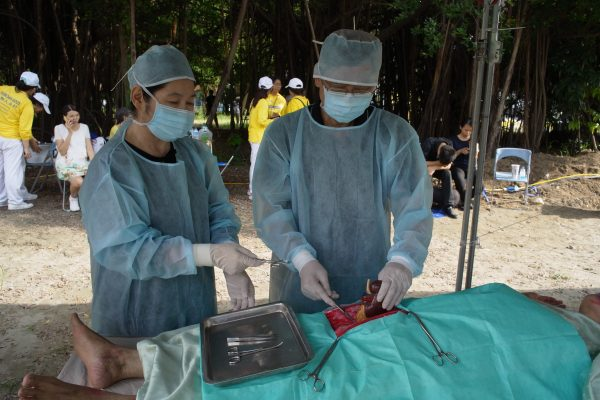

2018年7月14日，法轮功学员在台南市平实公园举行反迫害19周年活动，图为真人演示活摘器官。

 
【大纪元2018年10月14日讯】我是一名海外留学生。前段时间，我无意间从国内的一个老同学那里听说了一件骇人听闻的事。思忖再三，我决定将它分享出来，希望尽自己微薄之力，借助媒体的力量让更多的人知道此事，希望能对仍在发生的国家恐怖行径有所遏制。

从不敢相信，到不得不相信。从仿佛遥远的故事，到真真切切从朋友的口中说出来。老同学的每一句话，都震撼着我的心。

那天，我们正好聊到海外媒体报导的有关活摘器官的事情，他突然说：我参与过摘取一个死刑犯的肺。

我很惊讶，问：你参与的？

他继续说：取器官的环境是非常严的，半夜三更，地方选个偏僻的，警察封路，一群武警包围现场，操作的地方被安置在一个大帐篷里。现场由医院付给警方大量现金（10万人民币），清点现金后，法医当场用毒药麻醉死刑犯，然后医生上前取器官（人还活着）。

我：他是什么人？

他：基本都是没有亲戚的死刑犯，或者不和亲戚联系的，或者亲戚不会追查犯人死因的。你想想，全国那么多器官移植，哪来那么多供体？

我：问题是，怎么确定他是死刑犯呢？全国一年也就几千名死刑犯（据海外媒体公布），而政府公开的数据更少，可能也就一年不到一百人。器官配型概率也不高，哪来这么多死刑犯给你们做移植呢？有没有可能是拿被非法关押的法轮功学员冒充，骗你们医生说他是死刑犯？

他：我不想知道，知道又能怎样。你说的是否属实，我不知道。但是我相信以人性最阴暗的一面来看，倒也不是没可能的。人都是司法系统提供，我们医生就是取器官而已。

我继续劝他能不能去多搜集一些证据，调查一下究竟是不是死刑犯，而他却顾左右而言他，显然是不想面对这事。

这位老同学参与实习的地点是长三角地区的某一线城市。时间是在2010年之后。

从他的描述中可以了解，医院和公检法系统之间存在“死刑犯”器官买卖，公检法从中赚取的利润非常丰厚，1个肺移植就可赚取10万人民币。

而被“活摘器官”的对象真的是死刑犯吗？对于这个问题，我上网查阅了更多的资料，以下分享一些我搜集的信息和对此事的分析。

原中国卫生部副部长黄洁夫在2010年器官移植大会上称“中国1997年到2008年间的超过10万例移植器官，90%来源于死刑犯。”死刑犯真的可以撑起中国庞大的器官移植市场吗？

按照大赦国际所估计的中国死刑数据——每年约1,700人来算，假设所有死刑犯的器官都可以被用上，1997年到2008间死刑犯可以提供1万～2万例器官移植。如果按黄洁夫说的总共有超过10万例器官移植，那剩下的8万～9万例器官来自何处？

再说，死刑犯器官不可能被全部利用上，一般而言，每10位器官捐献者，只能找到一位与病人类型相符；若做10万例器官移植手术，则需要超过100万个器官供体，那么死刑犯的数量是远远不够的。

依据中国公开报导及中华医学会数据，中国全国的器官移植数量，从1999年以前6年的1.8万例，暴增到1999年以后6年的6万例。2005年高达2万例。

法轮功于1999年开始遭当局迫害。而迫害的最高峰期，2000～2005年，正是中国器官移植量暴增的时候。

遭关押法轮功学员健康状况普遍受当局忽略并遭到酷刑，但中国监狱、劳教所、拘留所却都普遍对在押法轮功学员“例行、系统的验血及器官检查”（亦包括超音波、验尿等），但其他犯人都没有，而验血是器官移植配型的必要步骤。

由加拿大前亚太国务卿大卫‧乔高和国际人权律师大卫‧麦塔斯所做的独立调查报告中以充分的证据得出结论，认为在1999年以后大量失踪、遭劳教及关押、酷刑的法轮功学员，是唯一能解释器官来源爆炸性增长的来源。这项结论获得联合国酷刑专员、首位进入中国进行酷刑调查的诺瓦克的认可支持。

对于每年死刑犯数量，中国政府一直讳莫如深，不愿公布。我认为其中一个重要原因就是，大量的“死刑犯”其实罪不当死，甚至是无罪的良心犯，只是因为中共选中了他们的器官，而蒙冤被杀害。

让我感到深深同情的，除了因“活摘器官”而死的无辜同胞，还有包括我的老同学在内的广大医护工作者，他们无法核实眼前手术台上的这个躯体，究竟是不是真正的死刑犯。也许他们也思考过这个问题，也许不敢思考，更不敢面对。一个个良知尚存的灵魂就是这样在暗夜中被撕裂，一桩桩恐怖行径，得以堂而皇之地延续著。一个个“白衣天使”，被迫干着魔鬼的勾当，犯下反人类的罪行。

其实，关于中共活体摘除法轮功学员器官一事，我无意中得到另外两个间接的口证，在此也将其曝光出来。

第一个，是我与一位大学同系同学聊天时聊到这个话题，她说：“我的亲戚就在军医系统工作，他和我说，中共活摘法轮功学员器官一事，是真的。”

第二个，是另一位大学同学，告诉我，他的朋友是一位在东南亚某国政府部门工作的年轻人，需要换肾，公司帮他联络了中国的肾源。他自己想办法向中国那边打听到了肾源究竟是什么人。他了解到，那是从健康的法轮功学员身上活摘的器官，他后来决定不去中国做移植。

为了保护文中证人的安全，我无法透露关于他们更具体的信息，希望读者们可以理解。我对于自己的亲身经历，没有任何捏造的必要。我也相信，有此经历的朋友还有很多。也希望你们可以鼓起勇气，拿起笔，将你们所了解的有关证据曝光。每一点努力，都在推动早日终结活摘器官罪恶，都会震慑邪恶，都可能挽救下一个将被谋杀在手术台上的无辜生命！ 

<h1 align="center"><b>瘫痪在床又重起 福泽一方唤新机</b></h1>

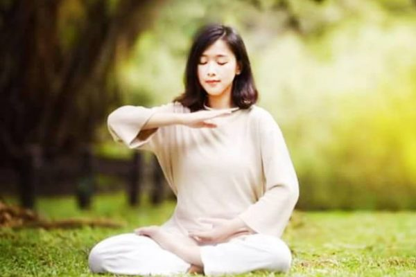

正在炼静功的法轮功学员

 
 【希望之声2018年10月10日】（本台记者慧光综合报导）

她是中国大陆河北省的一位普通女性，是当地一家工厂的职工。她一生命运坎坷，经历了很多苦难。

1993年，她刚生过孩子后就出现了贫血和失眠症，身体素质明显下降，总感到四肢无力，身体疲惫。

2003年，丈夫突然去世，使她受到了沉重打击。由于没有任何心理准备，她的精神一下子就崩溃了，整天不想吃东西，精神恍惚，导致病情愈加严重，每天只能用药维持着。后来不仅仅是贫血，下身还总是流血，医生还怀疑她有白血病。那期间她每天都在床上躺着，吃药也不管用。身体越来越消瘦，最后站都站不起来了。

2007年，父亲又去世了，使她的病情更加严重，这时家人带她去了北京协和医院。在做X光检查时，需要喝钡餐造影剂，这种东西她只要喝一点儿就吐，可是不喝又没法检查，医生不得已说“这个检查做不了，那就抽骨髓检查吧”。抽完骨髄后，不但没查出病来，反而使她彻底瘫痪了。回到家后，吃、喝、拉、撒都是婆婆伺候。

在那段生不如死的日子里，她失去了活下去的勇气，她想“我就这样活着还有什么意义呢？只能成为家庭的负担，还不如死了好。”可是一想到自己的孩子，她又犹豫了。孩子的爸爸已经不在了，如果她再走了，孩子从小就没爹没妈了，多可怜啊！每当想到这里，她的心就像被刀割一样难受，那时她真是欲活不能欲死不得，那种剜心的痛苦真是无法形容。

婆婆看她每天都在痛苦中煎熬着，总是想不开，就劝她说：“你要想开点，为了孩子你也要好好活着，不要叫孩子没爹又没妈，我们也一定想办法治好你的病。”之后家人又带她去了廊坊的血液病医院，并在那里给她雇了一个特护，婆婆隔几天就去看她一次。

同病房的经常有人对她说：“看你婆婆对你多好哇。”她随口说：“她是炼法轮功的。”她们就说：“那你为啥不跟你婆婆炼法轮功呢？”没想到这一句话点醒了她。

婆婆是法轮功老学员，即使在中共残酷镇压的情况下，婆婆也没有放弃修炼。婆婆家也经常有大法弟子在一起学法、炼功。其实婆婆早就让她跟大家一起修炼，但她就是听不进去，其实她就是受了无神论教育的影响，打心里就不接受这些，认为这是迷信。

听了同病房病友的话，她突然醒悟了，她想“这么些年，为治病钱没少花，罪没少受，可病却越来越严重。我为什么不炼功呢？看来只有法轮功能救我了。”就像在黑暗中看到了曙光，在无望中看到了希望，她也一下子来了精神。

第二天，她把婆婆叫来说要出院，婆婆一开始没有答应，后来看她态度很坚定就同意了。她回忆说：“出院时我的身体很不像样子，右腿上的肌肉萎缩的快没有了，只剩下皮包着骨头。两条腿一个粗一个细的，看着都感到害怕。”

回家后，她对婆婆说：“妈，我要炼法轮功，你教我炼功吧！”

婆婆对她说：“法轮功是修炼，如果你是带着看病的目的来的，炼功也没用。你首先要调整自己的思想，先学法吧。你要真正发自内心的修炼，并且按照大法的要求去做，师父才会管你的。”她听后毫不犹豫的答应了。

2008年的一天，她正式走入法轮功修炼。每天都跟婆婆一起听法轮功师父的讲法录音，跟大家一起学法、炼功。开始炼功时站不起来，就坐在床上炼。大约过了十几天吧，突然有一天她感觉有一股能量从头顶贯到全身，顿时有了力气，就扶着椅子站起来了。站起后她高兴的喊婆婆：“妈，你来看看呐，我能站起来了！”

婆婆走过来，递给她一个拐杖叫她拄着试试看能不能走，她就拄着拐慢慢的开始挪动双腿，一步、一步……，真的能走了！她激动的在屋里走了一圈又一圈。婆婆家一共有六间平房，她就高兴的沿着每间房走到头，然后折回来。刚走了一个来回，她就试着把拐杖扔掉了。那一刻，她真是高兴极了，走来走去就不想停下。一边走一边流眼泪，激动的泪水像断了线一样再也抑制不住了。婆婆在一旁也哭了。

她发自内心的大声说：“是大慈大悲的师父救了我，是法轮大法使我能重新站起来！谢谢师父的再造之恩！”说过之后泣不成声。

从那以后，她的身体渐渐的好起来，腿上的肉真是眼看着在长，几乎每天都有变化，没多久她就完全恢复正常。

恢复健康以后，她又去工厂上班了。当她把这几年的经历讲给厂长和同事们听时，大家都很感动，说：“原来法轮功真的这么好、这么神奇呀！”厂长当时就对大家说：“以后我们都念法轮大法好，要多念、常念。”有的同事还跟她要书看，也想学法轮功。

这次上班以后，她跟以前完全不同了。她按照“真、善、忍”的标准严格要求自己，领导分派的活从来不挑，兢兢业业，任劳任怨。厂长对大家说：“看看人家，什么活都不挑不捡，分给什么干什么，还得说人家炼法轮功的就是不一样。大家以后都向她学习，行吗？”大家也异口同声的说“行！”从那以后，厂子里争争吵吵的事越来越少了，同事们都能和陆相处，整个厂子的精神面貌都改变了。

这样的事儿要是在1999年之前也许不算什么，那时候法轮功学员各地都很多，大单位几乎都有成百上千的人在学、在炼，可在现在这样残酷镇压的环境下谁还敢这么做呀？厂长不仅支持大家炼法轮功，还让她把法轮功的真相资料发给大家看，每个车间都挂上了真相挂历。休息的时候，厂长经常说：“大家都停停，让她给大家念一念真相资料。”有一回念完后，厂长还说：“这共产党就是邪教，我太有体会了。”

那一年年终时，厂长对大家说：“今年厂子的效益很好，我这也是受益了。每年开工叫工人来上班都很难，不能按时开工。今年自打她来了之后，一招呼大家就都来了。还有人欠我十多年的账不给我，我想可能要不回来了，可今年人家主动还了。这都是相信法轮大法的福报。我永远支持法轮大法。”

每当回想起这些经历，她总是泪水盈眶，她说：“我师父不仅救了我的命，也救了我们全家。以后我要努力修好自己，不辜负师父的慈悲救度，做师父的合格弟子。”

<h1 align="center"><b>超越神奇的追求——一位副总工程师的自述</b></h1>

拥抱阳光走新路 机缘不再后悔迟

 
【希望之声2018年10月2日】（本台记者慧光综合报导）我是中国大陆某市局的副总工程师，回顾自己的一生，经常是感概万千。

上个世纪的八十年代，那时我还在上初中，可是当时的气功高潮对我产生了深刻影响。

由于经常听同学传说气功中的一些神奇事，引起了我的好奇心，我就从同学那里借来了一本气功书，好像是道家的一门属于太极门派的功法，看到书中有详细的练习方法，就按照书中的要领练起来。

记得有一天晚上，做完功课以后，我像往常一样打坐练功，很快入定，突然感觉有一股热流从小腹部位的丹田处冲上头顶，接着大脑就像被炸开了一样，元神从身体里冲了出去，飘到了天上，回头能看到自己的身体还在那里打坐。说实话，第一次元神离体的时候心里还是很害怕的，有喜悦、兴奋，也有担心、恐惧，心情很复杂。虽然有新鲜感，但不知道接下来还会发生什么，所以很快就回到身体上出定了。

从那以后，打坐时元神经常出来，也就习惯了。天目也开了，能看到许多另外空间的景象，比如曾看到过披头散发的鬼魂在游荡，看见大火球在天上慢慢的飘等。当我把这些说给同学听的时候，他们都不相信，说我走火入魔了。后来我就不说了，很多秘密和困惑随着年龄的增长就不愿再提了。

有一次元神离体后看到有人在练功，就去找人家比武，结果功力相当，棋逢对手，难分输赢，就一连四、五天都去。因为争斗心很强，打不赢也不愿走，出定后身体还在一动一动的，搞得很疲倦，学习成绩也从前几名掉到了十几名。因为没有师父教，有很多疑惑也没地儿去问，慢慢的就放弃了。

参加工作后我还一直在想，为什么别人遇不到的事情，偏偏在我身上发生了，而且是实实在在的，因为有许多次，这是确信无疑的。我曾想在佛经中寻找答案，就抄写和背诵《金刚经》，可是没有任何收获。

1998年，单位的一位老同事告诉我，说佛陀已经下世传法度人，我当时不相信，对他说“现在骗子太多了，你可骗不了我”。他笑了笑说“有一本书叫《转法轮》，建议你好好看一看，会对你有帮助”。怀着极大的好奇心我去了书店，一眼就看到了，随手一翻，就看到了我百思不得其解的内容，我心想“写的太好了，这就是我需要的”。回到家后只看了一部分，就赶紧又去到书店里，把《转法轮（卷二）》等另外几本相关的书也都买回来了。

认认真真的看完《转法轮》后，我情不自禁的哭了。古人云“男儿有泪不轻弹”，我长这么大还没有这么痛快的哭过，就像迷失多年突然遇到亲人一样。我在佛道两教中苦苦寻觅多年，没有得到过什么，而这本书把我的困惑全解开了。我当时就知道了这本书的份量，什么都明白了，“这是宝书！是千真万确的真经！”我当即就下定决心，一定要修炼法轮功。

为了学习功法要领，我四处打听炼功点。后来有人告诉我，说某个公园有很多人在炼法轮功，但那个公园与我家隔了一座大山，路比较远。记得去的那天早上我很早就起来了，出门一看，漫天大雪，但是我没有丝毫犹豫，决定步行翻山。当时天还没亮，当我深一脚、浅一脚的赶到时，炼功点上已经没人了。

第二天早上不到四点钟我就出发了，雪已下到齐膝深，到了炼功点我气喘吁吁，满身大汗。辅导员阿姨问我住哪里，听后她被惊呆了，因为当天没有月亮，没有路灯，踩着齐膝的大雪，如果没有坚定信念是做不到的。从此我走上了真正的修炼之路。

修炼后，在我身上发生了翻天覆地的变化。过去我爱耍小聪明，脾气火爆，听到不顺耳的话当时就会把别人顶的满脸通红。修炼后我处处与人为善，懂得尊重他人了，同事和妻子都说我像换了一个人。只有我自己心里明白，是心性升华让我的境界提升了。能赶上大法修炼，我太幸运了，那时候我经常会在睡梦中笑醒。

1999年“7·20”中共开始了对法轮功的镇压和迫害，我感受到了巨大的压力，心里苦的喘不过气来。修炼环境没有了，同修也联系不上，我渐渐迷失了方向。直到2009年9月，我得到了“自由门”翻墙软件，当打开明慧网后，我又大哭一场。看着师父的照片，我的眼泪“哗哗”往下流，怎么也控制不住。十年的“流浪”终于结束了，我找到“家”了！

当我把这期间师父发表的所有经文都读过之后，我开始按照师父的要求做“三件事”。我在家里购置了相关设备，成立了一个家庭资料点，同时我也开始了讲真相救人的历程。后来被国安盯上了，家被抄，他们还给单位施加压力，要把我辞了。我跟领导说：“我没有做任何违法违纪的事情，有本事你开除我。你只要敢开除我，我就让全世界都知道。”后来据说有一位职位很高的老领导发话了，说“这个人经常上明慧网，你把他开除了，明慧网肯定会宣传‘某某局的副总工因修炼法轮功被开除了，影响面会很大，不要去找那些麻烦’。”此事就不了了之。

如今我修炼已经二十年了，经历的事情太多了。深刻的体会告诉我，“法轮大法是佛法，博大精深，就像是一切宇宙奥秘的总纲。当你升华上去回头再看世间万物，一切了然于胸。我今生能遇到大法，能在大法中修炼升华，何其幸运，夫复何求。” 

<h1 align="center"><b>严冬里的春天</b></h1>
<h2 align="center"><b>校园修炼小故事</b></h2>

【明慧网二零一八年十月九日】

<b>迫害严重时期　法轮功学员被评为优秀教师</b>

自一九九九年七月后，中共对法轮功的残酷迫害笼罩中国大地。然而，在大陆东北的一所普通高校中，一位法轮功学员秉承真、善、忍的修炼原则，以高尚的师德和优秀的教学能力，获得大学优秀教师称号，“法轮功不准考研考博、评优、晋职”的迫害政策在那次失灵了。

一九九九年七月十八日，当地公安分局提前将辖区内法轮功辅导员骗到分局，让他们等着听新闻，说政府要取缔法轮功。

第二天，年仅二十六岁的张老师和未婚妻，还有学校的其他修炼法轮功的师生们一同進京上访，一周后被遣返。返校后他们受到学校长期监控，并被多次强迫参加学校洗脑班。

二零零零年十月，张老师夫妻的考研申请被校方以炼法轮功为由无理退回；同年十一月末，夫妻二人因喷绘“法轮大法好”被绑架到当地劳教所遭受迫害一年，妻子被开除（邪党）党籍，二人均被处以留校察看两年的处罚，并以文件形式向全校下发。不准考研考博、评优、晋职，不准带学生去长春实习，成了对他们的一种变相迫害。

二零零三年春季学期期末，学院向大学上报校级优秀教师，共六个名额，只有五位合格，最后学院教学院长找到教学科长，认为张老师无论教学能力和实践能力都是学院教学的骨干教师，却从不让参与评优，这次就得把他报上去。新学期伊始，张老师被通知去院办领取二零零二年至二零零三年度大学“优秀教师”证书。

学院珍惜人才，院领导多次提出让张老师夫妻二人申报考研。在二零零九年，他们参与考研网络报名通过，考取了本校正式研究生。

<b>重师德为人正派　拒绝学生贿赂</b>

在迫害法轮功最严重时期，正邪颠倒，黑白不分，乱象丛生。整体社会道德急速下滑，波及各个角落，连最干净的校园也没有躲过。

那几年，张老师夫妻二人遇到过几次学生为通过考试而用钱摆平、贿赂的事。记得一次一名学生拿着一个本，单独找到张老师，举止异常，话里话外指着本里夹着钱，愣要塞给他，张老师坚决不要，告诉学生拿钱去孝敬父母，让学生赶紧走，学生最后说了声：“谢谢张老师！”

还有一次，张老师妻子那门课正值考前学生入座时，他妻子突然接到二百元的话费存款发到她手机里，上面写着某某学生的名字，几班几号。张老师得知后，立即将那名学生从教室里叫出来，当面还给学生二百元钱，并告诉学生以后不要这么做。该学生回到教室后，回头大声告诉后面的几排学生说：“老师不要！”

<b>信谎言　遇法轮功老师明真相</b>

有一位女同学，入学后从小道消息得知本专业张老师是炼法轮功的。那学期正好有张老师的课，本来不想上课的她就想看看，到底这炼法轮功的正不正常。第一堂课她就去了，一看，没什么呀，讲的还挺好；第二堂课又去了，确实很正常，讲的不错；第三堂、第四堂……就这样一堂一堂的，她开始很认真的学习这门课了，大四最后学期报了张老师的毕业设计课题。临近毕业，张老师夫妇给她和其他设计组的同学讲了法轮功真相后，她敞开心扉的说：太戏剧性了，原来法轮功这么好！并很高兴的做了三退。

<b>开车送受伤学生去医院</b>

一次，学生因参加运动项目训练受伤，被同学搀扶着要上医院。张老师中午下班从学院往出走，在学院门口正好碰上。他见有学生急跑着要绕到很远的大门口打出租，就主动说：“我拉你们去医院吧，节省时间，上车吧！”在场的学生们都非常感动，他们说没见过还能这么为学生着想的老师，上市里医院要二十多分钟的路程呢，一再表示感谢。此事在那届学生中广传。

<b>两位老师获“神雕侠侣”的美名</b>

张老师为人热忱，谈吐幽默，实践知识丰富，上课风趣，深得学生喜爱，在一次学校征文中，多人写的题目是“我的老师张某某”。

张老师的妻子，文静善良，上课认真负责，责任感强，宽以待人，经常和学生交流做人的道理，也是口碑有佳。

在迫害之初的最高峰期，学生在校园网的网页上给不同的老师起不同的绰号，很有意思，其中给张老师夫妇二人的“绰号”是——“神雕侠侣”。
 

<h1 align="center"><b>走在光明大道上 —–专访法轮功学员汤志衡</b></h1>  

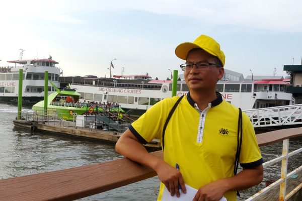

法轮功学员汤志衡 

【希望之声2018年9月30日】（本台记者金宇采访报导）在法轮功学员的炼功人群中，汤志衡显得普普通通。当你与他谈话，感觉到一种儒雅之风，就像你和众多法轮功学员接触时都能发现的，他们有一种出自内心的祥和心态。他善良单纯，两眼虎虎有神。小汤1999年毕业于广东肇庆西江大学，在大学读书时，他开始修炼法轮功。那时，他经常在美丽的校园炼功打坐。修炼法轮功为他的生活带来快乐幸福，当他在修炼中追求人生真理，不断向更高境界攀登的同时，他的身体也得到奇迹般的康复，曾经使他病痛烦恼多年的胃病和神精衰弱等症不翼而飞。他每天静心阅读转法轮时，能感受到生命沐浴在阳光中升华。

1999年对于小汤是人生重要的一年。这一年他大学毕业，而同年夏天，江泽民集团自7月20日始对法轮功实施迫害打压，当时中国大陆阴霾密布，谎言铺天盖地，从那时起，无数法轮功学员被酷刑迫害至死，流离失所，多少善良人家破人亡，汤志衡从此开始了一名法轮功学员坚持正信，艰难曲折的路程。这些年中，因为他坚持修炼法轮功并向世人讲清真相，被非法绑架多次，其中劳教两年，判刑四年半。历经魔难及多种酷刑折磨，曾四天四夜不给睡觉，多次经历毒打及野蛮灌食。但是这一切都阻挡不住汤志衡对真理的追求，作为一名大法修炼者他会永远坚定的走在修炼路上。以下是他的几个小故事。

<b>去为法轮功说句公道话</b>

小汤怎样也无法理解中国政府为什么突然的迫害法轮功？他单纯的以为是政府不了解情况，所以就想到了要去上访。1999年7月20日后，小汤和一些法轮功学员到达广东省省政府上访，告诉政府工作人员自己修炼法轮功的真实经历和法轮功为自己生活带来的益处。可是省政府对上访没有任何答复，只是把上访的法轮功学员集中在广州一家中学关押了半天。

经历了这些，使得小汤决定去北京为法轮功说句公道话。他只身来到北京。在天安门广场上，小汤第一次看到了人民警察是怎样对待老年妇女的。当他看到一名警察凶猛的打那位阿姨时，小汤忍不住上前去阻挡，说“不许打人！”那个警察飞起一脚朝小汤胸前踢过去，把他踢得整个人飞起来，重重摔倒在地，眼镜也飞了出去。这残暴的一脚，改变了小汤自小学到大学所接受的所有共产教育洗脑。当晚，警察把他关到清河派出所，用竹签插他手指，痛极了。小汤被关了15天。小汤做梦也没有想到，今后的路会如此艰难，他后来所经历的事远远超出了他年轻的心灵所能想像的。

<b>绝食15天</b>

小汤在那样普天盖地的打压法轮功的形势下坚持修炼。因为他坚信，相信“真、善、忍”做个好人没有错。2001年11月的一天，片警到汤志衡家骗他，说派出所所长找他谈话，去一趟10分钟就回来。结果小汤一到派出所立即被带上手铐押上警车。他妈妈当场哭晕倒在地，没有人性的警察却毫不理会。洗脑班设在花都挮面戒毒所，那里地处群山环抱的大山之中，四面环山的山坳，这里是连吸毒犯都闻之色变、杀人不眨眼的地方。警察对小汤说，在这里打死人就像踩死一个蚂蚁一样，挖个坑就把人埋了，没有人会知道。洗脑班整天播放诬陷法轮功的谎言，可是这对于一个真正修炼法轮功的人来说，是滑稽可笑的闹剧，谎言怎能改变真理呢？洗脑无法改变法轮功学员的信仰。

2004年12月31日年去公司上班途中，小汤被一帮穿便衣的警察绑架了，接着立即被抄家。然后被关进石井看守所。小汤认为，我修炼法轮功做好人没有罪，于是小汤开始绝食抗议。绝食过程中小汤拒绝野蛮粗暴的灌食。小汤开始真正的绝食绝水。狱头说，让他绝吧，到了他昏晕过去的时候再收拾他。警察派犯人看守他，可是狱头没想到小汤坚持绝食一天又一天，通常一个正常人绝食绝水三天就到了极限。小汤绝食绝水到了7天后，全看守所的犯人中都传开了，说：“法轮功学员了不起，他已经绝食7天了！”他们认为小汤意志非常坚强，可是普通的人不容易理解，大法修炼是非常超常殊胜的。

当时关押小汤的号房是很多犯人住在一起的。小汤每天打坐，发正念，还给同室犯人讲真相。他一发正念时，就看到无数美丽的法轮在他周围转。当时他绝食绝水的过程很神奇，整个人非常平静，没有饿的感觉。7天之后，狱警说，等到他昏过去了就送他去医院急救。安排了一些犯人守侯在他身边等候他昏过去。还送来一些水果给他吃，小汤一概不吃也不理。可是他们看到小汤每天依然如故的打坐，绝食绝水，感到很神奇。就这样，小汤绝食绝水到了10天，然后就绝食绝水到了第15天。看守所所有的人都感到震惊，惊叹于这样的事实发生在法轮功学员身上，一个人居然能够15天不吃不喝而身体一切正常！他们感到修炼法轮功使得身体健康殊胜超常，对法轮功佩服得五体投地。

最后警察答应小汤可以在看守所自由的学法炼功。

<b>任职总经理使得企业起死回生兴旺发展</b>

2008年年底，小汤从亲戚家里接手一家即将到闭的企业，任职总经理，在小汤的尽心努力经营下，三年后，这家企业排名全国电商行业前十名，年销售额达到两千万。周围的人们觉得不可思议，因为小汤专业不是学商的，为什么会做的这么成功？大家认为他可能在商业上有什么特殊天才。其实，人们不知道，当一个人做事符合宇宙的法理时，一切都会圆融畅通。

小汤说：“其实，这叫‘无所求而自得’。”怎么理解小汤这句话呢？在这个竞争的社会，通常人都把商场当做是战场，同行竞争好像理所当然。可是小汤在经商的基本原则上，却与世人有着极大的差异。

举个例子，小汤的同行们在经营上遇到困难时，小汤都会尽量去帮他们，把自己所知道的最便宜的货源介绍给他们，使他们生意成功。小汤是怎样看待与这些同行的关系的呢？小汤说:“大家能遇见是人世中的缘分，我是按照‘真、善、忍’做人做事，对人都是善的。”其实当今社会很多人都以为赚钱是靠投机取巧手段以及小聪明耍花样，却不知“三尺头上有神灵”，人算怎能算过天？你敦厚善良助人为善，就符合宇宙的法理，神若要谁富什么也挡不住。

小汤给人推销产品，重点不是放在说自己的产品怎么好，而是耐心的向客户了解情况，帮助他们设计他们所需的最佳产品，根据他们的需要去进货。做事的基点是为他的。——为他人着想，这就是一个法轮功学员做生意的诀窍。小汤一再说，他没有什么太多的成功经验可谈，就是按照“真、善、忍”的原则去做，就能把生意做好。

目前小汤已经来到了美国，在这个和平理性的公平社会里，等待他的又是什么样新的挑战和机遇呢？我们衷心希望他在人生路上取得更大的收获。

小汤说，修炼法轮功使他精神和思想达到了一个较高的境界，现在身体变健康了，生活与工作都得到极大收获。他将在修炼的路上勇猛精进，如果说有什么是他心中最期盼的？他说，生命能够同化“真、善、忍”是他最大的愿望。

 
<h1 align="center"><b>“打右脸伸左脸”与反迫害</b></h1>

【明慧网二零一八年九月二十八日】法轮功学员反迫害，有人不理解，还借用圣经里的一句话“有人打你的右脸，连左脸也转过来由他打”来说明基督徒多么讲“爱”，质疑法轮功干嘛不也这样，而要去反迫害呢？

很多人一厢情愿地用一个“爱”字来淡化早期基督徒走过的艰难历程。基督徒在古罗马经历了三百年的残酷迫害。如果没有早期基督徒的“不服从”、“对着干”、“坚持信仰”、“澄清真相”和“反迫害”，基督教说不定早就灰飞烟灭了。了解一下早期基督徒反迫害的故事，也许能帮助大家更好地理解和支持今天法轮功学员的反迫害。法轮功学员的反迫害与早期基督徒反迫害并没有什么不同。只是时代变了，面临的强权不同，反迫害的具体形式难免也会不一样而已。

罗马皇帝迫害基督徒的最大特点之一就是“公开性”。基督徒被投入竞技场喂狮子，或者被做成火把活活烧死，是罗马皇帝在百姓面前公开地让人集体围观的行为。这也是当时罗马律法处死犯人的常见方式，并非为基督徒而专门设置。而中共迫害法轮功，最大的特点之一就是“掩盖性”。明慧网上披露的大量来自中国大陆的第一手资料显示，被非法关押的法轮功学员，被强制洗脑，很多被酷刑虐待致残致疯致死，甚至大量学员被中共为了牟取暴利而遭活摘器官。这么大的事，可是社会上好象什么都不知道。说直白点，就是罗马皇帝的“竞技场”与中共的“劳教所”的区别，一个是公开让人围观的，一个就是专门用来在背地里阴毒整人的。

而信徒们遭到迫害的直接原因都是由于坚持信仰。“坚持”就是反迫害最有力的武器。早期基督徒也同样面临着类似法轮功学员被强制转化的严酷现实。不服从的基督徒就被认为对国家不忠，是“国家的敌人”，成为被迫害的对象。于是，早期基督徒就开始了与罗马皇帝所谓的“对着干”，这种对抗一直延续了三百年，直到君士坦丁大帝颁布“米兰赦令”才结束迫害。

基督教中有一个关于殉道士普柏度（Perpetua）和费利西蒂（Felicity）的典故。普柏度是一位二十二岁的来自北非的罗马贵妇，有一个正在哺乳的孩子，费利西蒂是她的奴隶，已怀孕八个月，她们都是基督徒，但是普柏度的父亲是信罗马教的。她把被抓捕一直到行刑前一晚上的遭遇记录了下来。普柏度写道，她的父亲用尽了亲情的压力来说服她改变决定。“女儿啊，可怜你的父亲吧，如果你还叫我父亲的话。”“可怜你父亲灰白的头发，可怜你幼小的儿子吧。”但是，普柏度不为所动，没有放弃自己的信仰。在公元二零三年，她与费利西蒂和其他几人，被塞维鲁皇帝（Septimius Severus）抛入斗兽场内遭野兽噬食。

中共在强制转化和洗脑上不也是这样吗？把“不管家庭”、“不顾亲情”、“连累他人”、“对着干”等等帽子都栽赃到法轮功学员头上。信仰与亲情本没有矛盾，罪在施暴者。只是慑于强权，人们习惯于去责备受害者罢了。

要迫害无辜善良，就得造谣抹黑。古罗马也是这样做的。他们从基督教的经书中断章取义，污蔑基督徒们在拜神时要杀死婴儿并喝其血、吃其肉；基督徒之间习惯上互称兄弟和姐妹，就被反对者描绘成他们乱伦；罗马的精英们还出来指控说基督教是“致命的迷信”、“不可理喻的信仰”；罗马皇帝尼禄把罗马城的一场持续五天的大火嫁祸基督徒，把基督徒描绘成纵火犯、一群作恶多端的人，以此来煽动仇恨，激起民愤，为大打出手制造借口。

这些谎言听起来与江泽民和中共诽谤法轮功何其相似乃尔。早期基督徒是不是就听之任之了？没有。如果不揭露谎言，民众就会更加仇恨基督徒，政府的迫害就会更加得逞，如此的话，基督教怎么可能存活下来呢？

面对各种诽谤，早期基督徒中一些学者勇敢地站出来揭露谎言，他们被称作“护教士”（Apologist）。贾斯汀（Justin）、特土良（Tertuliano）、雅典那哥拉（Athenagocas）、克雷芒（Clement）、伊格那丢（Igantius）、波里家（Polycap）等，开始著书立说，辨明那些反对基督教的人的话是虚谎且毫无根据的，指出反对基督教的知识份子是在故意捏造虚假的事来污蔑教会。用今天的话说，这些“护教士”的行为相当于上访陈情，或者“讲真相”。

这些“护教士”除了“澄清真相”，而且还敢于公开指出迫害者崇拜的神不是真正的神，而是魔鬼。克雷芒（Clement）认为许多罗马人在家里展示的崇拜神的东西实际上都是来自魔鬼的非自然激情（unnatural passions of the demons）。“他们在卧室里挂着（放荡的）装饰画，把放荡视为宗教……这些就是傲慢的神学，这就是你们的神的指示，让你一起干不道德的事”。贾斯汀（Justin）说，基督徒发现了一个可怕的秘密：背后那些支撑罗马地方法官权力的，特别是皇帝权力的东西，不是神而是恶魔，是一股活跃的旨在败坏和毁灭人类，让人看不到真相的邪恶势力。贾斯汀在写给皇帝的公开信中，直接挑战有关罗马神权的官方宣传，说他揭示了一个秘密身份——罗马神祇无非是堕落的天使（fallen angels）。

历史上对正信的迫害，从表面上看，是拥有权力的统治者出于维护专制和私利而对其公民信仰自由的践踏；其实，从深层实质看，人是不敢与神作对的，也没有这个胆量和本事；真正的原因，是由于另外空间的变异邪恶势力的因素，也就是邪魔，在起作用，在操纵人，在利用人间的坏人，才使得人敢于对正信发动迫害。

早期基督徒在反抗迫害的过程中，也正是认识到了这一点，才明确地向罗马帝国的宗教和神权挑战，把背后的恶魔给揭示了出来。

对法轮功的迫害，从表面上看，是始作俑者江泽民和中共相互利用迫害法轮功。究其实质，如同罗马皇帝敢于迫害早期基督徒，是源于背后支撑其权力的恶魔一样，中共敢于迫害信仰“真善忍”的法轮功，也是因为中共背后的共产邪灵和宇宙中的败坏势力使然，操纵人间的败类和人渣来迫害正信。《大纪元时报》2004年11月19日发表了《九评共产党》，系统地揭露了共产党一百多年来犯下的罪恶并指出了其背后的邪灵。“九评编辑部”在2017年11月19日发表了《共产主义的终极目的》，指明共产主义的本质是一个“邪灵”，它由“恨”及低层宇宙中的败物所构成，它的最终目的就是想破坏人的道德从而毁灭人类。

回头我们再说说“打右脸伸左脸”。是不是“打右脸伸左脸”就不对呢？也不是。老子讲“以德报怨”，佛教有“我不入地狱谁入地狱”，耶稣还说过“爱你的敌人”，中国人也有“打不还手，骂不还口”，法轮功的“真善忍”也有一个大大的“忍”。这些要求与“反迫害”矛盾吗？不矛盾。因为这些是针对个人的利益受到损害时如何对待的问题，是对个人修为和境界的要求。在日常社会中不计个人得失，为他人着想，这是修炼人道德高尚的体现。

当信仰和正义受到邪恶势力的打压时，这就超越了个人得失的范围。庙里的和尚是与世无争、念在方外之人，但是如果有人要砸他们的庙，他们也是会拿起棍子护教护庙的；孔子也说要“以直报怨”，就是要用正直的方式对待破坏规则的人，以匡扶社会之正气；耶稣被非法抓捕遭到审讯时，有一个差役用手掌打他，此时此景，针对的是耶稣传法的正当性，耶稣并不是“打右脸伸左脸”，而是告诫打人者：“我若说的不是，你可以指证那不是；我若说的是，你为什么打我呢？”法轮功的“忍”，同样不是懦弱和逆来顺受，不是没有原则的纵容邪恶生命行恶。“忍”指的是“忍”个人之荣辱得失，而不是“忍”下道义和良知。一旦一个人能将个人的荣辱得失置之度外，很自然就能做一个有担当、有勇气、有责任感的人，能起来维护正义和权利。也就是说，面对迫害，就会“反迫害”。

“反迫害”的过程，本身就是维护一个社会的道义和正气的过程。如果邪恶让你放弃就放弃，甚至还帮助邪恶去劝说别人放弃，那与邪恶本身有何不同呢？沉默与配合，说白了就是帮凶。法轮功学员的“反迫害”，是为了他们自己的信仰权利，但是，也为整个社会和人类带来了充满正气的希望。

 
<h1 align="center"><b>出污泥而不染 傲霜雪而不争</b></h1>

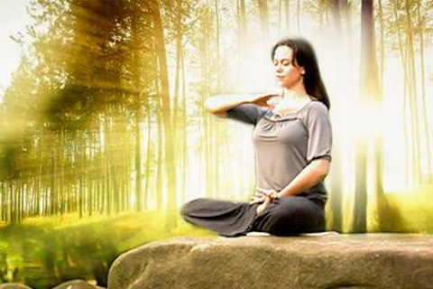

心如磐石感天地 气贯长虹慑鬼神

 
 【希望之声2018年10月4日】（本台记者慧光综合报导）我是中国大陆东北的一名普通女性，生活在辽宁省的一座小城市，曾经是一家医疗单位的质检员。

由于从小接受无神论教育，不相信这个世界上有神佛存在，认为那是迷信和唯心，尤其对信神的人，总认为其愚昧无知可笑，然而在后来的亲身经历中、在铁的事实面前，我彻底改变了这个认识。

我从小体弱多病，从四、五岁起各种疾病就不断出现，吃药、打针，看完西医看中医，从门诊到病房，这就是我生活中的常态。二十几岁就患有病毒性乙肝，肝区时常有胀痛感，让我对以后的人生道路产生恐惧。

由于身体状况不好，三十三岁时才结婚成家。婚后又添了许多新病：生孩子时不慎得了严重的风湿病；因为一场感冒引发副鼻窦炎久治不愈；工作时受到药物刺激造成肺部伤害，病休八个月；还有慢性闭角型青光眼、高血压、神经衰弱等。

最痛苦的是皮肤病，发作时奇痒无比。这是家族遗传病，我父亲和哥哥都有。父亲因为治疗时药量过大造成中毒差点儿丧命，哥哥因为治这个病多次住院，花了很多钱也没治好。我从小就染上了这个病，身上到处都是密密麻麻的小疙瘩，一抓一挠就成了一块块带血的疮面，长年使用外用药使皮肤失去了弹性，多处皮肤都是麻木的。

那时我还对阿司匹林药过敏，闻到此药味就咳嗽不止，可是在工作环境中又经常接触，不可能回避，除非换工作，而作为一个普通员工调换工作是一件很难的事情。

这么多年，为看病不知道花了多少钱，付出了多少精力、时间，然而收效甚微，多数情况下只能得到一点儿心理上的安慰，而病是越看越多、越看越严重。可以说从未成年时起我就百病缠身，是在病痛的折磨中无可奈何的打发时光过日子，生活没有信心，人生没有希望，总感到身心疲惫，有流不尽的泪水。

就在我走投无路的时候，有朋友向我介绍法轮功。开始时我没当回事儿，因为我从心里就不相信。可是说的人多了就想试一试，没想到就因为这个简单的想法却彻底改变了我的一生。

当我捧起法轮功的主要指导书《转法轮》看的时候，思想中还带有偏见，可是越往后看越感到震撼，书中的内容通俗易懂可是道理深刻，解答了我对人生的所有不解和疑惑，我知道了人有病的根本原因是什么，人生的真正目标是什么，真是相见恨晚。看过之后才知道什么佛法，什么是修炼，原来佛陀度化一个人这么难，相比之下，我之前的想法真是太幼稚可笑了。读完第一遍的时候，我就下定决心走入法轮功修炼。

开始炼功后，我的身体状况发生了不可思议的变化。打坐时我能感到身上密密麻麻的小疙瘩迅速减少。有几天打坐时，从肝区到腿、膝盖至脚腕处都连带着剧烈疼痛，可是坚持过去之后，感到身体非常轻松，体检时发现肝功能完全恢复正常。亲身体验到的神奇，让无神论彻底瓦解，也让我对佛法修炼有了全新的认识。

开始修炼以后，我的心态发生了根本的转变，人的表面也发生很大变化，我不再为小事计较，看淡了名利，心情就轻松愉快，与同事的关系变得融洽，大家都说我炼功后像变了一个人，就连领导也鼓励我好好炼功。

我在单位做质检工作，每天面对大量的药品，如果想拿点常用药是很方便的，同事也都习以为常，可是炼功后，我从未动过一片药，这事儿在单位传为佳话。我家生活不富裕，过去我常为家里的拮据状况发愁，修炼后我的心胸宽阔了，不再为生活琐事担忧。无病一身轻，思想上没有任何压力，内心充实，走路轻盈。家人和同事看到我的变化，无不露出羡慕的目光。

可是这么好的功法，中共却要残酷镇压。本着对社会负责的心态，我决定以我的亲身体验向民众和政府讲真相，为此我多次被抄家、罚款，三次被关押，最终导致家庭破裂。

在关押期间，我经受了十几种酷刑：警察用开口器长时间撬开我的嘴，把嘴撑至极限，每天持续六小时，牙齿被硬生生折断；当我心脏跳动渐缓、生命体征微弱的时候，他们一边使用抢救药，一边继续施用酷刑；吊、铐、体罚，灌芥末酱等是家常便饭。所有这一切不仅没有让我动摇坚信大法的正念，而且更加看清了中共的邪恶本质。在他们看来我是挺不过去的，所以迫害中有警察对我说“即使把你放回家你也得死”，因为经过他们如此残酷的迫害后有的放回家也活不了几日，可是凭着对佛法的正信和师父的护佑我走过来了。

记得有位女警察找我谈话，我告诉她：“如果不是因为修炼法轮功也许我活不到现在，是法轮大法给了我新的生命，我怎么可能放弃？！我修炼的心坚如磐石。”她听后没有再说话，因为她知道，无论她怎么做都是无法改变我的。我还告诉她：“我过去是无神论者，现在是大法修炼者，我的亲身实践证明神是存在的，法轮大法是超常的。”

由于中共的迫害，我在物质利益上失去很多，金钱、名誉、工作和家庭，甚至有不少朋友也远离了我，我承受了常人无法承受的痛苦，但是我的心灵得以净化，我的境界得到升华，我明白了人生的真正意义，返本归真是我唯一的选择。无论遇到多大的磨难，我修炼的心依然坚如磐石。

<h1 align="center"><b>高智晟似人间蒸发　近百律师吁中共放人 </b></h1>

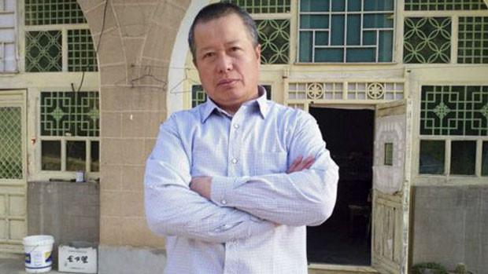

北京人权律师高智晟失踪逾一年多，各地公民先后发起多起寻找行动，但是至今高律师仍音讯全无。

 
【新唐人北京时间2018年10月05日讯】北京人权律师高智晟失踪逾一年多，各地公民先后发起多起寻找行动，但是至今高律师仍音讯全无，生死不明。近日，全国各地公民及上百名维权律师再次发起关注高智晟行动，要求当局立即释放高智晟。

参与联署的人士表示，直到现在全国各地公民，仍然在到各地法院、看守所、监狱等场所查问，希望能够打听到高智晟的下落。

参与联署的辽宁维权人士王素娥4日对自由亚洲表示，她与多名民众自从关注高智晟失踪后，一直都受到当局监控，电话也一直被干扰。

但她表示，不怕当局打压，会继续参与行动，她相信事件在愈来愈多人关注下，当局迟早会公开高智晟的情况，她强调绝对不会放弃寻找高智晟行动，直到高律师出现为止。

参与联署的覃永沛律师认为，即使有一万人联署关注高智晟的情况，估计作用也不会大，因为共产党都不会在乎的。但是他也强调，作为一个公民，应该要为被打压的人士发声，免得更多人再受害。

覃永沛律师认为，现时只有高智晟的妻子耿和可以帮到其丈夫，他希望耿和可以在美国循法律途径，控告中共侵犯人权，迫使中共交待高智晟的下落。

上述联署信是继9月20日，来自中国各地的众多维权人士发起〝寻找高智晟律师万里行〞之后，又一次进行的联署行动。

参与联署的中国维权律师包括：刘跃、汪丽、李发旺、邵重国、王素娥、王一、刁继军、崔斌、赵鹏飞、李勇生、张五洲等近百名律师。

维权律师们在联署信中表示，释放高智晟律师是人心所向，高智晟律师是正义的象征，他维护弱势苦难群体的合法利益，维护法律的正当实施。他的行动不但没有违法，而且于国有功。

因此，律师们强烈要求中共当局立即无罪释放高智晟、恢复他的自由，让高智晟律师与家人团聚。

高智晟的妻子耿和说，中共用恶毒的手段，对高智晟迫害和折腾了十多年了。高智晟已经完成了对他的判刑，也完成了缓刑，现在是不是应该让他回家了。但中共不但一直对高智晟加以迫害，把他强迫失踪。

耿和继续说，中共〝不但迫害高智晟，还殃及他和我的亲属们，我在新疆亲属们的身份证已被当局没收了，他们没法离开当地。他们每月还必须到公安局报到和签字，当局的理由是，我和孩子是通缉犯。为了不连累亲属们，我现在尽量不联系他们。〞

耿和表示，她很感激那勇敢的维权律师们发起行动和写联署信为高智晟说话，但同时她也担心，这些律师们因此会遭到中共的打压和迫害。

耿和希望国际社会、海外人权组织和媒体，也多多关注这些为高智晟说话的律师们的命运。

目前在美国纽约任律师的李进进说，没有任何法律支持中共把人强迫失踪的做法，就连中共自己的法律也没有这样的条文。中共不仅对异议人士，而且对它认为有问题的所有人，都进行这种强迫失踪的惩罚。这完全是违法的，更违反了国际人权法。

现年54岁的高智晟曾被中共司法部评为〝中国十佳律师〞。从2004年12月开始，他多次上书中共高层，要求停止对法轮功惨绝人寰的迫害。2006年8月，他被吊销律师执业证，随后被长期绑架，遭受骇人听闻的酷刑，最后，他被关进新疆偏远的沙雅监狱。

2014年8月7日，高智晟从沙雅监狱释放后，回到陕西省北部老家，3年多来，被大批国安一天24小时监控。

2017年8月7日，高智晟刑满出狱3周年，当天他在接受新唐人采访时表示，希望能改变中共邪恶的制度，让中国人回到正常的生活中去，回归正常的人类文明。

高律师说，尽管当局对他严密监控打压，但2015年至今，他陆陆续续在这样的恶劣的环境下做了一些事情，尤其是让他感到欣慰的是：他的著作《2017年，起来中国》，《2016年中国人权报告》和《2016年中华联邦共和国宪法》的出版。

他说，自己完全是出于个人对国家、对民主、对未来的责任和考量或者担负的心态下做成的，〝所以我认为这是公事，我希望更多的人去关注它、传播它。〞

为了摆脱中共国安24小时昼夜监控，2017年8月13日，高智晟在山西维权人士李发旺、邵重国等人帮助下，逃离到山西躲藏。但于6天后的19日，高智晟再次遭警方搜捕带走，至今生死不明。

2018年8月底，高智晟获得了人权机构〝第一步论坛〞授予的〝沙赫巴兹-巴蒂自由奖〞，该奖每年颁发给一人，以表彰获奖人在人权、自由、宗教方面的杰出贡献和重要影响。

<h1 align="center"><b>卅载创伤挥不去 一朝得法百痛消</b></h1>

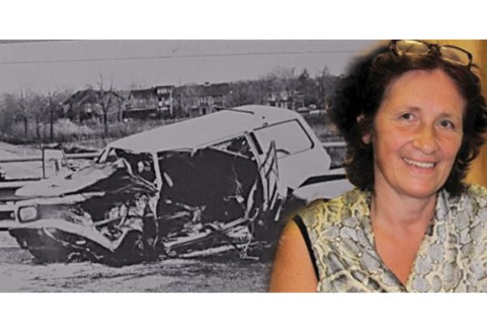

比利时女性安·图尔琳兹（Ann Teurlings）与当年车祸现场照片

【希望之声2018年10月1日】（本台记者慧光综合报导）安·图尔琳兹（Ann Teurlings）是比利时人，在比利时哈勒小城的一个传统家庭里出生并长大，从学校毕业后主修艺术和室内设计。像所有的年轻姑娘一样，她对自己的人生充满了希望，然而就在她最美好的青春岁月，却遭遇了一场严重车祸，使她经受了三十年的病痛折磨。

 

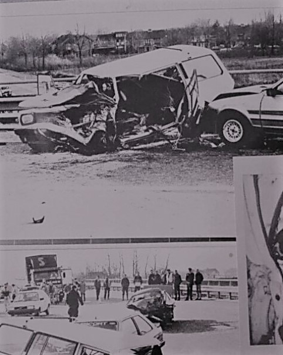

图1 安·图尔琳兹（Ann Teurlings）保存的三十多年前的车祸现场照片

那是在1986年，她只有二十四岁。在惨烈的车祸中她受到重伤，造成双腿粉碎性骨折。事故发生后她昏迷了一个星期，医生一开始认为需要截肢，后来有一位高明的医生用了极大的耐心和技巧将所有断骨拼合起来，才使她的腿完整保留。

在医院抢救期间，她几度徘徊于生死之间。她回忆说：“昏迷中我看到有一部梯子延伸到高处，我知道那里就是天堂，是人死后去的地方。”

她说：“当我从昏迷中苏醒时，感觉自己像一个七十岁的女人，疲惫不堪，筋疲力尽，全身到处是伤，疼痛无比。无论是躺下还是坐着，包括小心翼翼的站立、行走，疼痛无处不在。有时候忍不住我会大哭，因为即使上厕所这样简单的事情对我来说都非常困难。在整整一年的时间里我完全依靠拐杖，没有它我寸步难行。即使用拐杖行走，每一步也都非常艰难。”

“在昏迷中的经历和保住了双腿的事实，让我深信人体有一种自我保护机制。有了这个想法后，我就拒绝了任何形式的药物治疗，这让医生和周围的人都不能理解，认为我很奇怪。而这样做之后，我要承受更大的痛苦，尽管我强迫自己忍受，但巨大的痛苦还是经常让我对人生失去信心，我也因此而变得顽固、自卑和孤独。我不再相信任何人，长期活在封闭的世界里。”她补充说。

事故发生后的三十年，她都是在痛苦的折磨中度过的，虽然时好时坏，但痛苦从来没有离开过。她一边要承受着疼痛，一边还要努力抚养孩子，生活非常辛苦。她回忆说：“我的行动非常困难，我不能像正常的家长一样陪孩子玩耍，追逐、嬉闹，无法让孩子享受到正常家庭乐趣，这也是我心中的痛。”

几年前，她刚读书的小女儿伊莉（Elly）在学校遇到了一个名叫露西亚的女孩，两人成了好朋友。露西亚的母亲是一位法轮功修炼者，她听到了伊莉妈妈的遭遇后就打电话给她，向她介绍了法轮功的神奇，并想跟她见面做深入的交流，但是她拒绝了。之后露西亚的妈妈多次试图与她见面，都被她以各种理由搪塞过去，这种状况持续了三年。

两年前的一个下午，伊莉邀请妈妈去看神韵艺术团的演出。她观察到女儿对神韵非常着迷，看过演出后就对她说，她要学习中国古典舞，并决定去英国参加一个与此相关的“明慧夏令营”。一个月后，在女儿的邀请下她去夏令营参加了结业仪式。在汇报演出中，她看到女儿能够像中国同学一样跳中国古典舞，她感到很吃惊，女儿说接下来她还要学习中国画和中国艺术。为了更好的理解女儿的选择，她与夏令营的老师进行了交谈，老师向她推荐了法轮功的主要指导书《转法轮》，希望她阅读。

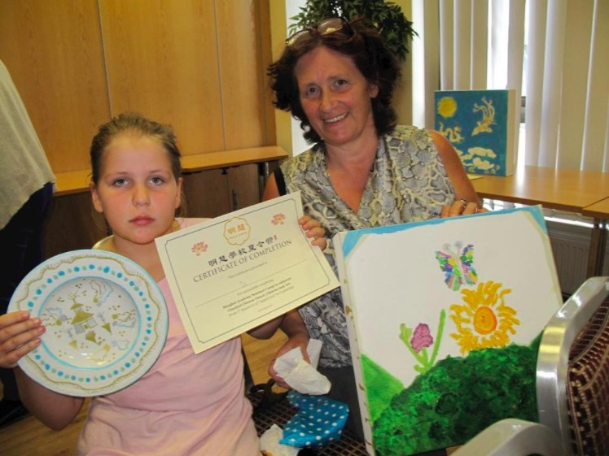

图2 安（Ann Teurlings）和女儿伊莉（Elly）在2017年英国明慧夏令营结业仪式上拍照留念

回去之后，她想到了露西亚的妈妈，就主动去了露西亚的家。在那里，对方送给她一本《转法轮》。那一天，距离当年的车祸已经过去三十年。

当她翻开《转法轮》阅读的时候，她马上意识到，这就是她梦寐以求的内容，她说：“我读啊读啊，书中的内容解开了我心中所有的疑惑，就像一扇关闭很久的窗户突然打开了，我的心一下子就敞亮了，我知道这就是我最需要的。当露西亚的妈妈提醒我要反复看的时候，我已经看过多遍了。非常神奇的是，四个月过后的一天，我突然发现全身的疼痛消失了。读书的时候我也没有去想它，消失的过程是不知不觉的，似乎都来不及体会。”

三十年的疼痛，在阅读《转法轮》四个月后就消失了，这让安女士异常兴奋，当年与死神擦肩而过也没有让她如此激动过，她因此而毫不犹豫的走入法轮功修炼。开始修炼后，她可以毫不费力的完成法轮功五套功法的动作练习，这也让她感到吃惊，她说“感觉就像我以前练过一样”。

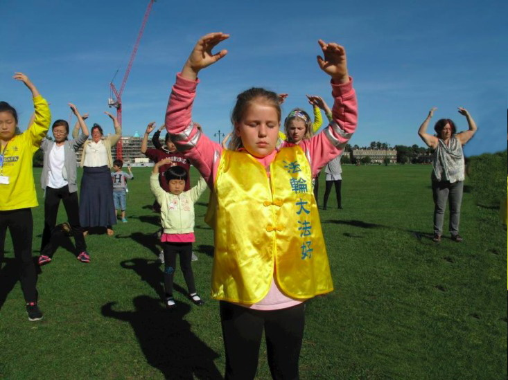

图3  伊莉（图中）和妈妈（图右）参加集体炼功

此后不久，她参加了法轮功学员在德国柏林的游行，当天她随着游行队伍兴致勃勃的走完了九公里全程。尽管有些吃力，过程中很辛苦，有几段路程几乎要跟不上了，但她没有气馁，鼓起勇气坚持到了最后。当走到终点的时候她对自己的表现感到非常震惊，因为三十年里她从来没有走过这么远的路，甚至都不敢想象这样的事情会发生。接着，她又参加了法轮功学员在慕尼黑的游行，这一次就感觉轻松多了。游行过后，她试着跑了起来，伊莉看见后惊叫起来：“我妈妈能跑了，我妈妈能跑了！”因为她长这么大还没有见过妈妈跑过。

安女士说：“不仅是伊莉没见过，就是我二十八岁的大女儿也从来没见到我跑过。当我告诉她我能跑了，她惊喜极了，问我是怎么回事，我就告诉她是因为我读了《转法轮》，修炼法轮功才做到的，女儿说这太神奇了。”

安女士还说：“看到我的变化，身边的朋友都开始学法轮功了，因为他们了解我的经历，亲眼看到了我的变化。每当回想起这奇妙的过程，我总是抑制不住内心的激动。能够遇到法轮大法，我太幸运了，我感恩师父给我的一切。”

每当回想起自己因为固执的观念而错失了三年的时间，她感到非常懊悔，她说：“因为自己的固执，拖了三年才答应跟露西亚的妈妈见面，否则早几年我就能摆脱病痛、开始修炼了。我知道有些人跟我过去一样，也是因为固执的观念在挡着，不能了解法轮功真相，我真心希望他们能吸取我的教训。无论什么人，只要肯放下观念，认真的读法轮功的书，就会有改变，就有希望。”

经历过这些事情以后，小女儿伊莉也走入修炼，也跟着妈妈一起读《转法轮》了。

有一次，伊莉一边读书一边兴奋地对妈妈说：“妈妈，我知道你为什么变得宽容了！我明白你在做什么了，我也知道我该怎么做了。”后来有一次伊莉还对她说：“现在如果有人对我不好，我会笑一笑，心里说谢谢你给了我德，但我不会对你不好。”看着女儿的变化，安女士也很欣慰，她说：“一个十岁的孩子在学校里能按照‘真、善、忍’的要求去做，不做坏事，做好人、做好事，这都是因为有法轮大法指导的结果。”

回顾自己的重生，看到女儿在“真、善、忍”的指导下快乐成长，安女士心里充满感恩。她在明慧夏令营的美术课上完成一个作品，上面用中文写着“法轮大法”，还有优昙婆罗花和一部金色天梯，以表达她的心愿。

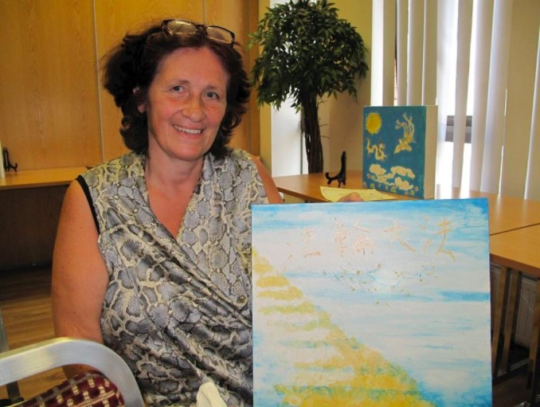

图4  安·图尔玲兹（Ann Teurlings）和她的美术作品

<h1 align="center"><b>中国人体器官来源背后黑幕深</b></h1>
【大纪元2018年09月27日讯】据媒体日前报导，所谓的“第三届中国国际器官捐献大会”9月20至21日在西安举行。

本次大会上照例晒出“器官捐献分配系统”最新的统计数字，而这套系统是中共器官移植医疗掌门人黄洁夫在卫生部副部长任上研发并推行的。

2013年年初开始执行这套系统，同年7月8日新京报调查报导《“人为干预”器官分配引发利益之惑》一文揭露：2/3器官未进入卫生部的这套系统分配，164家器官移植资质的医院中有超过半数未使用分配系统分配器官，但即便使用该系统的医院，也可能存在人为干预分配的情况。

2013年9月1日系统启用以来，黄洁夫多次公开受访时称，任何机构、组织和个人不得在器官分配系统外擅自分配捐献器官。

2016年2月，“医生捐器官”被广为宣传报导，如北京日报官网上刊登北京晚报原标题“靳大夫的心脏仍在有力跳动”一文，披露一段细节证实一件事，即这名因车祸死亡的36岁医生2月5日被宣布脑死亡，但前一天（4日）已被两位医生──黄洁（北京阜外医院心脏科主任医师）和朱学海（武汉同济医院）在半夜一通电话沟通后就决定了这颗心脏给谁。

2016年3月，新华社山东频道、山东广播电视总台、齐鲁网等地方官媒纷纷报导“女大学生捐献器官，向全社会寻求受助人”，3月6日死者家属才签下器捐同意书，且其器官尚未通过评估能否用于移植，但前一天（5日）山东乐陵市公安局官方微信已广发消息寻找器官受体。

2016年8月，美联社报导，一名加拿大病患前往中国换肾，竟只等待三天即获取配型器官进行手术。若按黄洁夫这套分配系统的设计，外籍人士的身份根本不可能登录分配系统参与器官分配。

自这套分配系统实施以来，类似的新闻包括但不限于上述，而从这些报导不难得知，中国捐献器官分配系统存在很大黑洞，还很可能存在另一个更庞大的“器官库”，就如美联社报导“三天换肾”，引发国际质疑“活摘死囚器官”的歪风在中国境内恐怕尚未根绝。

据联合国“酷刑问题”特派专员曼弗瑞德‧诺瓦克（Manfred Nowak）在2009年8月接受一家美国媒体采访时指出，“（中共）解释说器官移植的来源主要是死刑犯是无法令人信服的，如果那样的话，那么死刑犯的人数一定比认为的要高得多。”

2009年11月，《血腥的器官摘取》（Bloody Harvest，The killing of Falun Gong for their organs）一书问世，震撼国际各界。两位作者──加拿大著名人权律师大卫‧麦塔斯（David Matas）、加拿大前国会议员和前亚太司司长大卫‧乔高（David Kilgour）通过持续追踪深入调查，证明了中共摘取法轮功学员器官的指控是成立的，乃至今年最新报告还在继续著。

《血腥的器官摘取》缘起2006年3月苏家屯事件，自此随着“中共活摘法轮功学员器官”指控在国际社会上逐渐扩大，中共也从公开否认使用死囚器官，到高调承认，再到2014年由已无正式官职的黄洁夫在昆明一场地方研讨会上作出宣布2015年停摘死囚器官，甚至1984年发布的《关于利用死刑罪犯尸体或尸体器官的暂行规定》至今仍未被废止。

与此同时，台湾2015年翻修了“人体器官移植条例”，当初提布案立委之一田秋堇表示说，是黑龙江法轮功学员王斌（大庆油田勘探开发研究院工程师）内脏被摘除、遗体布满缝线的照片所触动。

自1999年遭到中共残酷迫害的法轮功，是有着上亿人修炼的庞大群体。2011年8月30日联合国第一个“强迫失踪受害者国际日”，国际人权组织代表就呼吁关注，无计其数的中国大陆的法轮功学员，是强迫失踪的最大受害人。

据《追查迫害法轮功国际组织》发言人汪志远表示，在中国大陆，最极端的“强制失踪”案例是那些被秘密逮捕、关押后，又被强行摘取器官并遭到杀害的法轮功学员。

今年9月，在旅美博士黄万青到悉尼“真实人体展”（Real Bodies：The Exhibition）寻找失踪15年的弟弟黄雄的事件报导后，引发了侨居美国的曲小杰女士投书希望协寻她的哥哥曲善铭（中国运载火箭技术研究院工程师）也是2003年在北京失踪后至今杳无音信。而黄万青的弟弟黄雄和曲小杰的哥哥曲善铭都是法轮功学员。

<h1 align="center"><b>让人生绽放不一样的光彩——印度时尚界年轻摄影师走入修炼</b></h1>

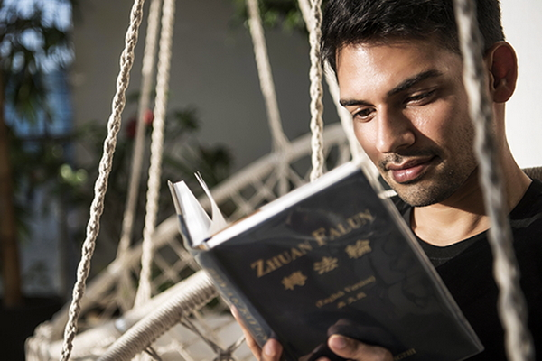

查克拉巴蒂（Adhiraj Chakrabarti）在阅读英文版《转法轮》

 
【希望之声2018年9月22日】（本台记者慧光综合报导）

查克拉巴蒂（Adhiraj Chakrabarti）是一位在印度时尚界小有名气的年轻人。他出生在印度东部大城市加尔各答，长大以后，由于有俊朗的外表，在母亲的推荐下，他参加了2007年的印度先生比赛，并成为决赛选手，之后与著名的Elite Model Management模特经纪公司签约。从Wills印度时装周首次亮相，到走向Christian Dior、UGG Australia、Rocawear等顶级设计师的展示平台，他的才华和魅力受到时尚界的认可。

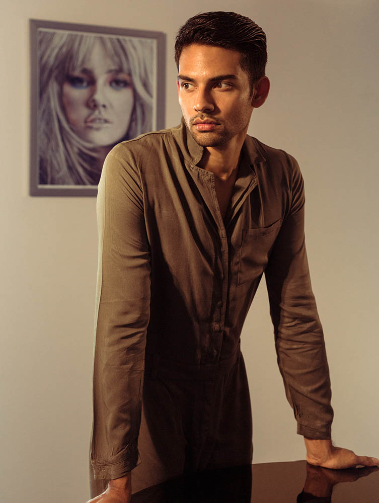

图1 印度年轻摄影师查克拉巴蒂（Adhiraj Chakrabarti）（图片：Porus Vimadalal）

2014年，他听从内心的呼唤，转行做了摄影师，专门从事肖像拍摄。因为他发现简单的镜头能够表达丰富的人生，敏锐的眼光和正确的构图会让他更准确的表达内心中对不同人生的理解，从而在艺术领域找到更加符合自己意愿的表达方式。

他说：“生活本身就是一幅肖像，可以是黑色，也可以是白色、灰色或多种颜色，重要的是肖像的整体要清晰、诚实和美丽。迷人的肖像融合了所有颜色和色调之间的完美和谐，其中对光线的把握是最重要的因素，但再好的技术也只有对生命有了正确理解，色调才会活跃起来，肖像才会完整，生命才会闪耀出真实的内涵和魅力。”

为了对现实世界有更多的了解，他开始喜欢上旅行，走过许多国家和地区。他说：“广泛的国内外旅行，让我有幸体验了许多事情。其中在中国的一次旅行中，我经历了一次严重的事故，让我对人生有了更多的思考。我意识到人的一生是短暂的，人生的意义不仅仅是工作、赚钱和生活，一定还有更高的目标，于是我开始寻找。”

2014年，他的合作伙伴向他介绍了法轮功，随后他认真阅读了法轮功的主要指导书《转法轮》，他说：“法轮大法的法理非常深刻，我在人生中所有的疑惑都在这本书里找到了答案。也有很多内容我不能理解，但‘真、善、忍’的原则我非常认同，这就是我应该追求的目标。我很高兴，因为当我按照‘真、善、忍’的法理去实践的时候，我感到内心很充实。同时他也给我勇气，我可以用灿烂的笑容面对生活中的所有困难。”

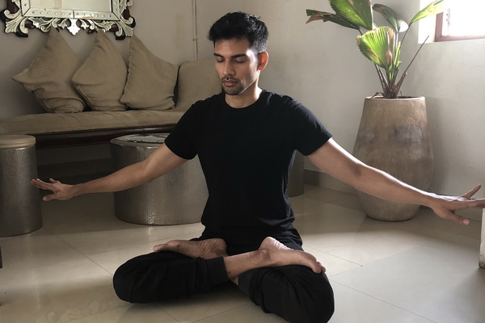

图2 查克拉巴蒂（Adhiraj Chakrabarti）在炼法轮功第五套功法 （图片：Gunita Stobe）

他是一个做事非常认真的人，开始修炼以后，坚持按照要求炼功，也让他亲身体验到了大法的美好和玄妙。

他说：“我过去经常生病，坚持炼法轮功五套功法后，疾病就完全消失了。不仅如此，我感觉比以前更加精力充沛。有一个阶段，我的左脚出现问题，脚趾头莫名的疼痛，一个多月了都无法正常行走。但只要我开始阅读《转法轮》，疼痛感就消失了。当我把这本书完整的读完一遍后，我的左脚就完全恢复正常。我没有使用其它任何治疗方式，那个时候我就体会到这是一个奇迹！”

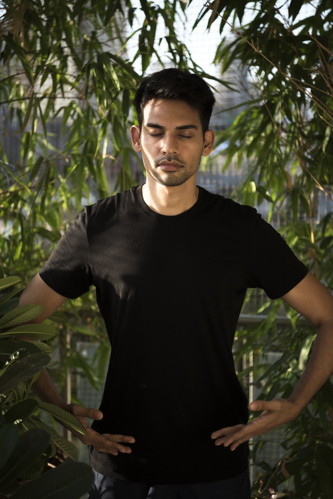

图3 查克拉巴蒂（Adhiraj Chakrabarti）在炼法轮功第二套功法（图片：Mark Luburic）

他补充说：“还有一个更大的改变，就是我过去脾气暴躁，稍微遇到一些矛盾或冲突就没有耐心，而现在遇到同样的问题时，我会首先想到‘真、善、忍’，我会用修炼人的标准要求自己，矛盾很快就会化解。在法轮大法的指引下，我会经常的检讨自己，让自己做得越来越好。”

然而，这样一个让世界各地千千万万人受益的修炼功法却在中国受到政府的镇压和迫害，让他非常不能理解。他说：“当我第一次听说中国政府对法轮功进行迫害时，我感到这是不可思议的，因为法轮功对国家、社会和人民没有任何不利的影响，这样的迫害一定是非正义的。”

为了揭露迫害，伸张正义，他尽可能的参加各类有关活动。他说：“我参加了一些书展，向人们介绍法轮功，并分享自己修炼的体会，同时我也向民众揭露中国对法轮功持续近二十年的迫害。即使在工作期间，只要有机会，我都会尝试与各种对象进行这样的对话。”

他说：“大法修炼也为我的工作带来了更多的智慧，我能够用‘真、善、忍’的原则指导自己的思想和行为，用修炼人纯净的心理来创作，同时也能发现更多的技巧。同样一幅肖像作品，我能够找到不同的视角，让思路更加清晰，让人物展现更真实的光彩。”

最后他说：“在这样一个充满浮躁和利益的世界，世上的人很容易迷失自我，从而被一些不好的东西带动，在不同的时期会面临着不同的挑战，很容易迷失方向。我很幸运，我遇到了法轮大法。”

（本文根据NTD India报道翻译整理） 

<h1 align="center"><b>中共灭亡时在拉哪些人陪葬</b></h1>

【大纪元2018年09月26日讯】当今中国有多少高学位的专家、学者，他们虽然获得了不少文化知识，却难以预知自己命运中的吉凶祸福。而在民间有些不轻易显露的高人，看上去没有什么学历，可他们却能看到自己或他人一生中的运律行程，还能提前知晓天象的变化，世事的兴亡。毛泽东独裁狂傲，却不能知道自己一生中福何至祸何来，而一个名不见经传的道人，在毛进北京之前，用“8341”四个数字便准确地道中了他的结局。即毛寿命83岁，执政41年。

在无神论的范畴中，无论人们读多少书，掌握多少知识，只是局限于人类这一层面的东西，而那些超常的智慧，永远也得不到。

古代，扁鹊见蔡桓公有病，要为其治病，桓公不信，怀疑扁鹊想利用自己出名。扁鹊几次见桓公，窥其病情越来越重，每次都劝其医治，可蔡桓公自感没病，就怀疑扁鹊不轨，拒绝就医。后来蔡桓公身体疼痛，找扁鹊，扁鹊已逃往它国。蔡桓公不久死去。扁鹊最后一次见到蔡桓公时，察其已病入膏肓，无药可救，就没再劝其医治，而是慌忙躲开了他。扁鹊知道当蔡桓公病发痛苦时，必定会找自己治病，若治不好，轻者自己名声扫地，重者则招来杀身之祸，所以马上去了外国。

看看今天的中共腐败透顶，失尽民心，病入膏肓，也到了无药可治的地步。物极必反，恶极必亡，这是维护人间正道的天理。那么谁能抗拒这威严的天理，挽救中共灭亡的命运呢？被称为神医的扁鹊，具有特异功能、超常的本事，却救不了病入膏肓的蔡桓公。那么饱受无神论毒害的唯物主义者，怎能救得了万恶不赦的中共呢？越来越多的人看到中共没救了，都纷纷逃离中国，去了海外谋求生路。

中共是个什么东西呢？其祖宗马克思在他的《共产党宣言》中，开篇就写到，一个共产主义的幽灵，在欧洲上空游荡。幽灵即是中国人所说的魔鬼。而魔鬼却是害人毁人的。中共夺取政权后，就叫嚣与天斗与地斗与人斗。人类及世间万物都依赖上天的庇护和大地的供给才能生存。中共与天斗与地斗不就是断绝人类的生存之本吗？与人斗，不就是与人为敌，想毁灭人类吗？半个多世纪以来，中共不择手段地一次次大搞运动，大开杀戮，迫害中华民族的精英，破坏中华五千年文化，让人放弃对神佛的信仰，放弃做人的标准，无法无天地干坏事，使社会道德日益下滑，给中华民族带来一次比一次更加深重的灾难。

从中共的所作所为来看，其不是魔鬼又是什么呢？

在历史巨变的最后关头，中共魔眼识妖邪，又把江泽民这个奸邪愚顽、凶残好色的人中败类作为其在人间的代理，以腐败治国，荒淫乱世，鼓吹向钱看，性开放等，把中华民族推向更加危险的边缘。

一九八九年中共杀害“六四”请愿学生时，江泽民摸清了中共嗜血的邪恶本质，便投其所好，首先站出来支持。中共看到了江阴险毒辣，心黑手狠的流氓本性，立即把最高权位交给了他。于是二者狼狈为奸，互相利用，把中华大地视为寻欢作恶的乐园，把中国人民视为任意宰割的羔羊。二者为了各自的利益和喜好，就像淫妇和色狼，成了败坏人伦、祸乱中华的一丘之貉。

江泽民上台后，就迫不及待地组建了一个以利益为核心的政治流氓集团，该集团的最高首领是江泽民和狗头军师曾庆红。江曾集团倚仗中共，整治异己，排斥贤能，扩大权势，大捞财富。在江泽民贪腐淫乱的带领下，上行下效，短短十几年整个中共体制内就腐败透顶，无可救药。江泽民治国无能，祸国有方，其在位期间还向俄罗斯出卖了一百多万平方公里的领土，成为中国历史上最大的卖国贼。

中共毁灭中华民族的意图蓄谋已久，近年来其魔鬼面目更是暴露无遗。在中共窃政半个多世纪以来，搞得中华大地满目疮痍，沙尘蔽天，雾霾遮日，水土遍毒，粮米含毒，人们的饮食和所有生活用品无毒不有，无假不有，犯罪爆发，淫黄泛滥，人们为了利益骨肉相残，人人相害，坏人兴风作浪，好人忍气吞声，社会道德全面败坏，令天地都为之震怒，使中华民族面临着天惩大难。

中共从来也没有停止过对中国人民的迫害，越是到了其该灭亡时越是疯狂，迫害异己、迫害维权人士、迫害拆迁户、迫害上访人士、迫害少数民族、迫害各种宗教信仰、以治理污染为名迫害民营企业和养殖户等等。一次次教训中，越来越多的中国人都认识到：中共只要想迫害谁就会迫害谁，上自党魁，下至平民。当今，在中共暴政治下的社会里，不管有钱人，没钱人，有权者，没权者生命财产都没有了安全保障。

一九九九年江泽民与中共勾结一起，为断绝中华民族的未来，用心险恶地掀起了一场迫害法轮功的运动，这场迫害至今近二十年，却仍在持续著。

法轮功也称法轮大法，是根植于中华传统文化的佛法修炼，教人按照真善忍去做好人，能使人类道德迅速回升，人类道德回升了，也就避免了天惩大难。这样的话，那么专门毁灭人类的魔鬼能干吗？所以迫害法轮功也正是中共的意图，中共是真正的幕后元凶。

从迫害法轮功的开始，就有高人预言到，这场对佛法的迫害，注定了中共和江氏集团的失败和灭亡。

江泽民贪腐淫乱，出卖领土，祸国殃民，民愤极大。那么现政几年的打虎，为什么不拿下对国家最有害的江、曾首虎呢？为什么不做这等顺天意，得民心，树立威望的壮举呢？

中共在与江泽民政治流氓集团互相利用中，对中华民族和佛法都犯下不可饶恕的滔天大罪，早已激怒了上天。“天灭中共”是不可抗拒的天意，已经被越来越多的世人所认知，所以目前已有三亿一千多万人在《大纪元》网站声明退出了中共的党、团、少先队。

此时的中共和江泽民自知末日将临，越发把命运紧紧地绑在了一起。中共历次运动都是关起门来迫害自己的民众，外界知道甚少，每当运动搞不下去了，就推出一些替罪羊为自己开脱，欺骗人们。可今天全世界都知道中共迫害人权，迫害信仰，一切正义的力量都在追剿中共。中共再也不能拿替罪羊为自己洗白，使出浑身解数也无法开脱自己的罪责。拿下江泽民，就会牵出中共，解体中共，也就触及到很多人的既得利益。虽然中国人现在没人相信中共了，但是又找不到出路，为了维护自身利益，还有不少人跟着魔鬼乱天下、坐着贼船混江湖。这也是江氏不能落网的原因吧。

中共为苟延残喘，拚命地撑著江曾集团之残余，并极力用权利裹挟著很多人为其站台。有人认为中共没了，自己的权力也就没了；有人认为中共灭亡了，自己的工资谁给呀？历史上哪个王朝最后灭亡了，剩下的人不都活过来了，甚至比之前活得更好。人们每当性命攸关时，蠢者都是舍命不舍财，智者却是舍财不舍命，留得青山在，还愁没柴烧？好人自有福报。

养虎为患，供魔招灾。中共和江曾集团多存在一天就会给中华民族多增加一天灾难。几年来，江曾集团的余孽在各地不断制造事端，骚扰民心，欺压百姓，杀人害命，总想天下大乱，乱中好浑水摸鱼，躲过被问罪的厄运；同时也在以权利捆绑着现政，想方设法让现政为其背黑锅。

中共就是处心积虑地拖着更多的人，等天时一到，大难降临时为自己垫背。那些还想挽救中共、利用中共、维护中共、把利益和中共捆在一起的人，到时都会被中共拉去做陪葬。

希望朋友们不要聪明一世糊涂一时，钱再多，官再大也没保命要紧，机会已经很有限了，只有顺从天意，认清善恶，尽快退出中共的党、团、少先队，抛弃中共，重拾传统道德，敬畏神佛，才能躲开大难，进入未来。

<h1 align="center"><b>生命因修炼而美丽</b></h1>

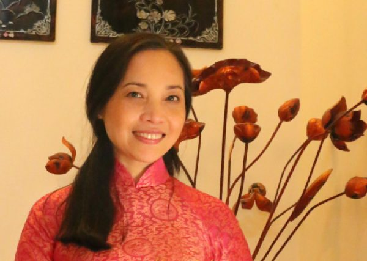

越南著名舞蹈演员李维（Le Vi）近照

 
【希望之声2018年9月26日】（本台记者慧光综合报导）李维（Le Vi）是越南舞蹈演员，在上个世纪七、八十年代，她在越南的艺术舞台上活跃了近十年，给人们留下了深刻的印象。那时候她热情奔放，内心充满着对艺术的追求，是一名卓有成就的舞者。然而在事业的巅峰时期，她却选择了急流勇退，离开了舞台，移居到法国。

当河内舞蹈学院的校友们庆祝毕业四十周年的时候，她回来了。让老同学们吃惊的是，已经五十多岁的她，仍然保持着年轻美丽的娇容，一头秀发保持着天然的漆黑光亮，眼睛熠熠生辉，笑容满面却又端庄含蓄，一举一动依然显露出东方淑女的矜持和魅力。老师和同学都羡慕的说她比几年前还要显得年轻。

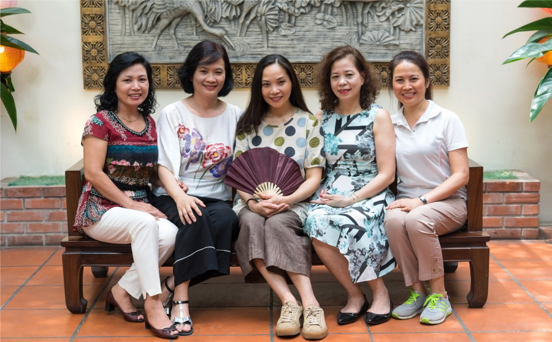

图1 李维（Le Vi，中）与当年的同学在一起

朋友们很好奇，是什么原因让她留驻青春？在河内老城区的一家传统的茶馆里，她与朋友们分享了自己的心得。

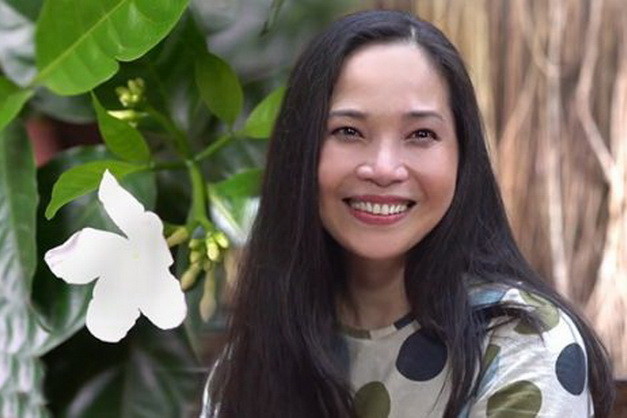

图2 李维（Le Vi）近照

她说：“离开舞台以后我去到法国，开始新的旅程。我们在巴黎南面大约二百公里的一座旅游城市买了一栋两层楼的房子，生活很安静。有一年夏天，巴黎的一位朋友来到我家，这位朋友每天都要练习一种功法，动作温柔、优雅，平静、祥和，给了我不一样的感觉，深深的吸引了我。朋友告诉我，这就是已经流传世界的法轮功。带着强烈的好奇心，我开始在互联网上查阅有关法轮功的资料。非常幸运的是，互联网上有多种语言资料，应有尽有，不同国家、不同民族、不同年龄的各阶层人士，都有在网上分享自己的修炼心得，我被感动了。全世界有那么多的人都在修炼法轮功，这一定是个好功法。”

于是她从朋友那里借来法轮功的主要指导书《转法轮》，开始认真阅读。也许是因为修炼与艺术相隔遥远，书中的法理她并不是一下子就读懂了，但“真、善、忍”让她领悟到了其深刻的内涵。她说：“如果每个人都能用‘真、善、忍’的原则指导自己的行为，这个世界就会拥有真正的和平，人们才能拥有更好的生活，生活也才会显得更有意义。尤其是真诚和忍耐是这个世界最需要的。”读过《转法轮》之后，她感觉自己的灵魂变得纯净、宁静了，她找到了人生中的目标和方向。

多次阅读《转法轮》之后，她决定按照修炼的标准要求自己，真正的走入修炼。她说：“‘真、善、忍’的法理看似简单，真要应用在日常生活中并不容易。尤其在遇到矛盾时、在逆境中能不能做到，会有很多考验。以前我与丈夫发生意见不合时，我会争辩，如果不能说服他，我会有挫败感，心中沮丧；当孩子不听话时我会生气。但修炼以后，遇到同样的情况，我会想起我是修炼人，要用‘真、善、忍’的标准约束自己，当我这样做的时候，负面的情绪就没有了，我能感觉到自己每天都在提高，从言语到行动，再到思想，一切都在改变。”

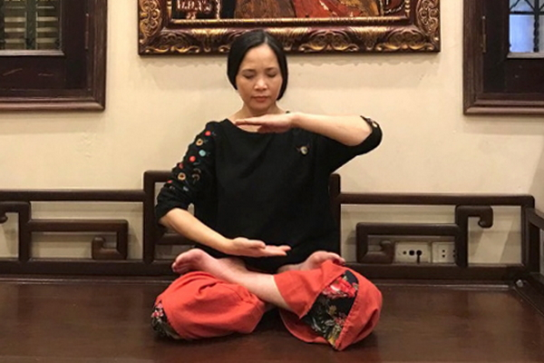

图3 李维（Le Vi）在炼法轮功第五套功法——静功

她每天都坚持阅读《转法轮》，因为她发现书中包含了太多的内涵，似乎每次阅读都有新的领悟，同时她也将自己的体悟与丈夫和孩子分享。她说：“当你将‘真、善、忍’应用于生活的时候，你就会善待周围的人，同时将真诚和善良传递给所有的人。如果每个人的心灵都变好，每个人都没有担心和焦虑，互相真诚的打交道，生活就简单了，精神就放松了，人们远离了压力和烦恼，健康和幸福就会随之到来。”

在越南，多数人修炼法轮功是因为疾病开始的，她说：“每个人的路都不一样，我之前很少生病，偶尔会有喉咙痛，但我并不是为了解决病痛问题，而是阅读《转法轮》之后，发现这就是我最需要的。当开始修炼以后，我就再也离不开法轮功了。”

“以前我会去寺庙烧香、拜佛，祈求佛、菩萨保佑自己幸福。修炼以后才知道，人的苦难都是自己的业力造成的。不仅是个人，对孩子来说也一样。人们在生活中的嫉妒、争吵、诽谤和贪婪都会造下业力，不消除业力就有痛苦，而修炼就能消除业力，不愉快的事情就会越来越少，生活自然就会变得平静、美好。当你用微笑面对世界，面对所有人，幸福自然就会伴随着你。你的思想超越了人，自然就会达到更高的境界，人中的一切就改变了。我感谢法轮大法，让我找到了生命的真相，并指引我走在一条光明大道上。”

如今，她每天都要练习法轮功五套功法，并持之以恒。修炼让她始终感到精力充沛，轻松自在。有朋友好奇的问她：“为什么看到你总是容光焕发？”她说：“是法轮大法改变了我，是‘真、善、忍’改变了我，让我变得宽容、宁静，让我远离了烦恼、焦虑和痛苦，我每天都生活在愉悦的气氛中，如果说驻颜有术的话，这就是我年轻的‘秘诀’。”

（本文根据DKN.TV报道翻译整理）

<h1 align="center"><b>前大陆法官：迫害法轮功违法 参与者必被追究</b></h1>

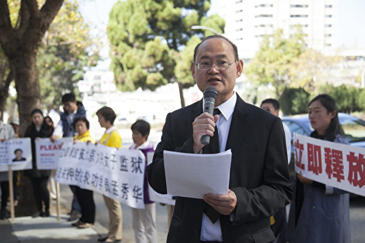

中国大陆前法官王崇明在中领馆前的集会上发言。

 
 【大纪元2018年09月28日讯】9月20日（上周四），旧金山湾区部分法轮功学员于中领馆前集会，要求无条件释放在中国大陆被中共非法关押的法轮功修炼者。目前旅居美国的前中国大陆法官王崇明说：“中共迫害法轮功信仰团体，完全触犯了《国际刑事法院罗马规约》中关于‘灭绝种族罪’的规定，凡参与人员，必将受到法律的追究。”以下是他的发言全文：

我们今天在这里集会，是要求中共当局，立即无条件释放在中国大陆被非法关押的法轮功修炼者。作为一名曾经在中国大陆法院工作过的前法官，我想从法律的角度，讲一下为什么迫害法轮功修炼者是违法的，为什么说参与迫害的工作人员，将来都必将受到法律的制裁？

<b>第一，我们首先从国际法的角度来看。</b>

全世界有224个国家和地区，法轮大法在短短的26年里弘传一百多个国家和地区。除了中国大陆，在其它国家和地区，包括香港、澳门，人们都是可以自由修炼、谈论法轮大法的。信仰自由，信仰的权利不受践踏，这是当今人类社会最基本的普世价值之一，是人权的核心内容。

1998年7月17日，联合国设立国际刑事法院全权代表外交会议通过《国际刑事法院罗马规约》，于2002年7月1日生效。该规约第六条关于灭绝种族罪规定：
“为了本规约的目的, ‘灭绝种族罪’是指蓄意全部或局部消灭某一民族、族裔、种族或宗教团体而实施的下列任何一种行为：
1. 杀害该团体的成员；
2. 致使该团体的成员在身体上或精神上遭受严重伤害；
3. 故意使该团体处于某种生活状况下，毁灭其全部或局部的生命；
4. 强制施行办法，意图防止该团体内的生育；
5. 强迫转移该团体的儿童至另一团体。”

《国际刑事法院罗马规约》属于普遍管辖权。国际刑事法庭对于拒绝参加的国家的被告，强制行使管辖权。

中共迫害法轮功信仰团体，完全符合《国际刑事法院罗马规约》中关于“灭绝种族罪”的规定，凡参与人员，必将受到法律的追究。

追查迫害法轮功国际组织自2003年1月20日成立。 2004年7月10日追查国际协调建立了“全球监视追踪系统”。在多个人权团体和正义人士的支持下，“全球监视追踪系统”现已发展为遍布全球的监视追踪网络系统，分布于110多个国家近500个城市，在有效地监视、追踪在中国大陆参与迫害法轮功学员的中共各级党政官员。

与此同时，“全球监视追踪系统”还负责追踪、搜集迫害法轮功的主要罪犯，及其在海外的资产和其家人逃匿的分布情况，以备用于将来经济赔偿和对其家人协同犯罪的全面清算，全方位追查。参与迫害法轮功修炼者的邪恶分子，必将无路可逃！

<b>第二，我们再从中国大陆的宪法角度来看。</b>

修炼法轮功是合法的。从法律角度看，法轮功从传出到今天，都是合法的。即使是从1999年7月22日之后，修炼法轮功也是完全合法的。迄今为止，在中国大陆没有任何一部法律、没有任何一条法律条款规定修炼法轮功违法，没有说法轮功是某教。

相反，中共《宪法》第36条规定公民有宗教信仰自由的权利。任何国家机关、社会团体和个人不得强制公民信仰宗教或者不信仰宗教，不得歧视信仰宗教的公民和不信仰宗教的公民。

中共《宪法》第35条规定，公民有言论、出版、集会、结社、游行、示威的自由。

公民有信仰自由的权利，同时也就有宣传信仰的权利。公民有言论自由的权利，就有对政府、国家机关的进行监督的权利，有还原事实真相、为自己进行辩护的权利。任何坚持法轮大法信仰的行为，任何宣传真善忍信仰的行为，任何揭露迫害、还原事实的行为，都是合法的，是应当受到法律保护的。对这些善良民众的疯狂迫害和打压，才是真正的犯罪。

<b>第三，我们从中国大陆具体法律条文来看。</b>

中国大陆刑法第三百条并不适用于法轮功修炼者。中共用《刑法》第三百条给法轮功学员定罪，而这则条款所提到的“利用邪教破坏法律实施”根本不适用于法轮功修炼者。公安部2005年认定的14种邪教里面没有法轮功。在最高法院于2017年2月1日专门出台的一个关于组织利用邪教的解释条款中，也根本没提法轮功。

2000年和2005年中国公安部先后发布《中华人民共和国公安部关于认定和取缔邪教组织若干问题的通知》（公通字[2000]39号）和《中华人民共和国公安部关于认定和取缔邪教组织若干问题的通知》（公通字[2005]39号）。通知中关于“现已认定的邪教组织情况 ”表明，到目前为止共认定和明确的邪教组织有14种。其中，中央办公厅、国务院办公厅文件明确的有7种，公安部认定和明确的有7种。这两个文件表明几点：一，邪教是需要专门机关通过专门的程序认定的。二，有权认定邪教的机关是行政机关。三，法轮功不是邪教。

由此我们可以看到，既然认定某教是专门机关通过专门的程序认定的，有着明确的界定，那么刑法第三百条“利用邪教破坏法律实施罪”，就只能限定于被明确认定的特定组织上。超出这个范围，将其利用于法轮功也好，基督教会也好，都是违法的，是法律条款的错用和滥用。

中国现行刑法的司法原则是罪刑法定原则，即法无明文规定不为罪， 法无明文规定不处罚。

另外，法制社会还有一个原则，对公民私权来说，法无禁止即可为，对公家机关公权力来说，法无授权即禁止。

作为一个公民，他不仅能够大胆地运用自己的权利，还可以勇敢地监督政府。

在公法领域，比如刑法、行政法，公权力部门的行为，却需要有法律上的依据，比如刑法中的罪刑法定，没有法律的授权，公权力部门便无从实施相应的行为，这便是“法无授权即禁止”。也就是说，在公法的领域内，公权力部门只能在法律划定的圈圈内活动，超出这个圈圈，就是违法。

江泽民作为一个前任中共国家主席，其当政时，在没有任何事实根据和法律根据的情况下，公开向法国《费加罗报》称法轮功是邪教组织，江泽民才是明显破坏国家法律的实施。

从江泽民当时担任的职务来看，无论是中共总书记也好，还是国家主席、军委主席也好，职权当中，都没有对某一信仰团体给予定性的权力，更没有剥夺民众信仰自由的权力。

江泽民作为一国的主席，他更应当知法懂法、更应当遵守宪法或法律。所以江泽民是明显的一个犯罪行为。中国只有江泽民是破坏国家法律实施，其他人可能没有这个权力，也没有这种影响力。

<b>第四，我们从犯罪构成要件上来看。</b>

犯罪构成要件，亦即犯罪成立要件。犯罪为定型的有责与违法之行为。所谓定型，即犯罪乃法律所规定之一定的类型。各种犯罪的类型，必须具备两项要件：其一为有责，属于犯罪之主观的要件，其二为违法，即违背刑事法律的规定，属于犯罪之客观的要件，规定于刑法分则之中。任何行为，如不具备犯罪之主观与客观要件，即不构成犯罪。

刚才我们已经分析过了，《刑法》第三百条根本不适用于法轮功修炼者。没有任何一条法律禁止公民修炼法轮功，修炼法轮功是合法的。

无论是从事实角度，还是从法律角度来看，法轮功都不是某教。民众修炼法轮功以后，身体更加健康，心地更加善良。一个教人强身健体、修心养性的功法，何邪之有？！

中国法律规定，刑事违法必须存在社会危害性，没有社会危害性就不存在刑事违法性。

所谓破坏法律实施，法律必须是明确的、具体的。目前并没有哪条法律认定法轮功非法；法轮功修炼者没有破坏哪条法律的实施，也没有哪条法律因为他们而不能实施；法轮功修炼者的行为也没有任何社会危害性。因此，任何试图给修炼法轮功定罪的行为，都是非法的。

中共对打压、迫害法轮功不断升级也好，法轮功修炼者通过各种形式讲真相也好，都是基于简单的一个原因，就是法轮功修炼者力图还原事实真相。受到不公正的待遇时，应该准许人说话，这也是一个普世原则。那么从这点上说，法轮功修炼者的行为就是应该受到法律保护的，就是应该受到世人尊敬和支持的。

<b>第五，司法机关工作人员会被追究错案责任。</b>

从刚才我们的论述，可以得知，对法轮功修炼者的非法抓捕、非法审判，肯定是错案。

作为一名中国法院工作过的前法官，我也知道，很多案件审判，法官并没有最终决定权。但是，承办案件的法官还是要承担错案的责任。很多发生的案例，已经证明了这一点。而且，中国大陆现在出台了一系列法律法规，追究错案责任。如：

2014年10月，“重大决策终身追究制”和“责任倒查机制”出台。

2015年9月，《冤假错案终身追究规定》出台。

2016年3月，修订的《公安机关人民警察执法过错责任追究规定》出台。

今天，中共威逼利诱这些人犯罪，为他们卖命；明天，中共再出卖这些人，拿他们的人头骗取民心、树立威信，巩固他们的政权。想一想，那些人多可悲！？

因此，我真心奉劝中国大陆司法机关工作人员，处理对待关于法轮功案件时，要么真正按照法律规定，堂堂正正地宣布无罪，立即释放。要么从自己生命真正前途考虑，妥善处理，找机会悄悄释放法轮功学员回家。

不能再被中共邪恶帮派所绑架了，迫害法轮功修炼者，害人害己。要勇敢地站出来，对邪恶中共说不，从而做出正确的选择，给自己留一个后路，选择一个光明的未来。

谢谢大家！

（此文发表于1205E期旧金山湾区新闻版）

<h1 align="center"><b>印度整形外科专家三十多年的疾病一扫光</b></h1>

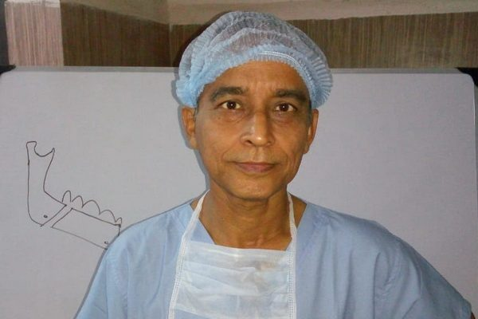

印度加尔各答市整形外科专家库玛尔（Utpal Kumar）

【希望之声2018年9月16日】（本台记者慧光综合报导）库玛尔（Utpal Kumar）是印度人，是一名医学博士，已经六十岁了，他工作在印度加尔各答市最大的医院，是该院整形外科的专家和负责人。在医学领域他已经辛苦工作三十三年，取得了很多成绩，有很多建树，收入也颇为丰厚，但是面对自己的健康问题却一筹莫展。能为别人治病却治不了自己的病，这大概是每一个医生都无法回避的现实问题。

他在介绍自己的健康状况时说：“我患有多种慢性病，例如慢性支气管哮喘病，已经持续了三十三年，严重时需要使用呼吸机。治疗哮喘病要频繁的使用抗生素和类固醇类药，其副作用又引发关节炎，导致双膝疼痛，上下楼梯都感到困难，发作时几乎不能正常工作。我还有高血压，已经十五年了。另外我还对多种东西过敏，如灰尘、花粉、棉花、刺激性食物、冷风等。由于过敏的原因，又经常引发咽喉炎，时常会感觉咽喉肿痛。还有一些小毛病，比如牙齿过敏、头皮屑和皮肤问题。这些问题虽然不影响生命，但总是让人烦恼。有时候也意识到人的一生其实真的很苦，甚至是无法忍受，但又无可奈何。”

三十多年来，由于长期的疾病折磨，使得库玛尔博士经常处在心情烦恼和难以忍受的痛苦中。为了治病，他尝试了多种治疗方法，有现代的也有古老的，有正统的也有民间的，包括所谓的“替代疗法”和瑜伽练习等，但都没有解决根本问题。多种疾病不仅影响了工作，也给家庭生活造成极大影响，表面的风光和内心的痛苦也使他的情感经常产生分裂，在发病的时候他觉得自己很可怜，很无助。

从2005年开始，他意识到在现代医学领域已经找不到出路了，印度有许多瑜伽师表现出的生命奇迹，让他知道了生命的更多内涵是人类科学所不能及的，于是他将目光转向了宗教和人体修炼，他想，在这个领域也许能发现生命的真正奥秘。2011年，有一位年轻的医生向他介绍了法轮功，他听到后没有任何障碍，完全接受了，之后毫不犹豫的走入了法轮功修炼。

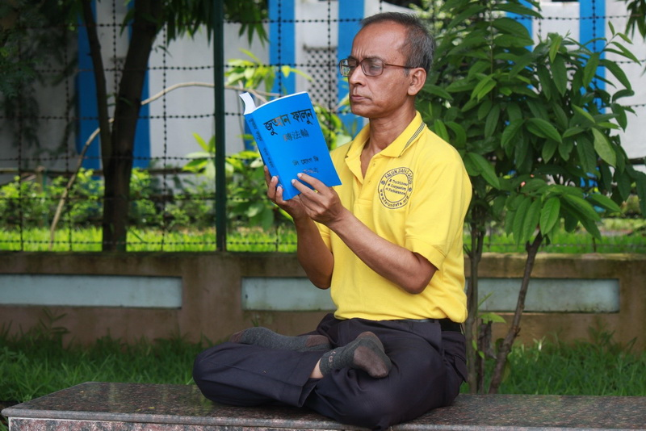

库玛尔（Utpal Kumar）博士在阅读孟加拉语《转法轮》

他说：“从我炼功的第一天起，我的哮喘病就毫无征兆的消失了，这真是一个奇迹！几乎没有体会到任何过程，就像从来没有发生过一样，这让我非常惊讶！我马上停用了呼吸机，我的过敏症状也有明显好转，我知道我的生命得救了。”在分享这段经历时，库玛尔博士露出了会心的微笑，似乎有掩饰不住的喜悦。

他还说：“我的同事对我的健康状况发生的显著变化也感到惊讶，但他们对人体修炼能够如此迅速地治愈现代医学不能治愈的沉疴顽疾还是有怀疑。但我告诉他们，休斯敦贝勒医学院于2005年开展了一系列研究，结果显示，法轮功修炼者的细胞其新陈代谢的频度表现出急剧减少，这是长寿的一个关键特征，而且还增强了抗菌功能。我希望他们可以去参考更多的研究数据。”

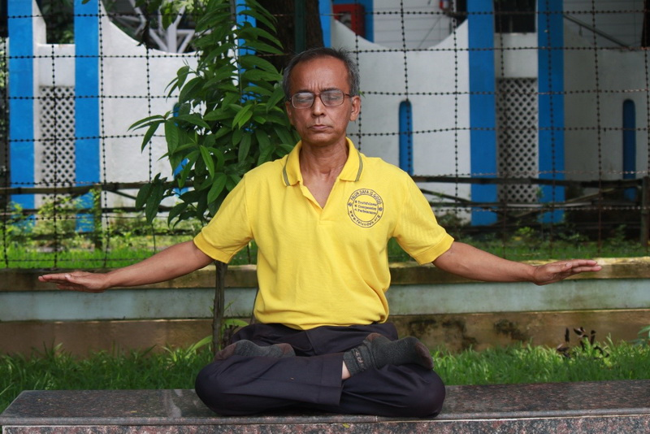

库玛尔（Utpal Kumar）博士在炼法轮功第五套功法静功

他说：“法轮大法的‘真、善、忍’价值观是这个社会最需要的，人们在追求物质生活的过程中，失去了很多精神层面的高尚内涵，我要让更多的人了解法轮功的真诚与善良，这其实也是健康的最重要因素。”

库玛尔说：“自从修炼法轮功以来，我的所有疾病都彻底消失，再没有服用过任何药物，可是我可以长时间走路而不会感到疲倦，我的光头上长了很多新发，我的体力和精力都是以往不曾有的。我已经六十岁了，但修炼让我觉得我只有四十岁。法轮大法对人体的改变真是太了不起了，我现在比以往任何时候都健康，我对法轮功师父的感恩之心不知道该如何表达。只有将自己修的更好，才能报答师父的慈悲救度。”

<h1 align="center"><b>曲善铭大陆失踪15年 妹妹：哥哥你在哪里</b></h1>

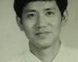

中国运载火箭技术研究院（中国航天科技集团公司第一研究院）工程师曲善铭

【大纪元2018年09月25日讯】编者按：中国运载火箭技术研究院（中国航天科技集团公司第一研究院）工程师曲善铭（Qu Shanming）2003年在北京失踪至今，一直杳无音信。曲善铭侨居美国的亲妹妹曲小杰看到留美博士黄万青到悉尼“真实人体展”（Real Bodies：The Exhibition）寻找失踪15年的弟弟的事件报导后，想要赶到澳洲与黄万青会面，了解当年的情况，因为他们的亲人是同一年失踪的。

曲善铭因为修炼法轮功于1999年12月被单位开除，2003年11月在北京被跟踪后失踪至今。曲善铭的妻子15年来仍一个人与女儿生活在曲善铭离开时住的那间一室一厅的小屋，等待着他。此前，因为恐惧遭到中共的进一步迫害，即使身在美国的曲小杰和父母都不敢说出心中的痛苦，更不敢公开四处寻找曲善铭的下落。如今看到黄万青不远万里寻亲，曲小杰鼓起勇气，决定冲破恐惧，站出来公开寻人。

现在又到了中国传统的中秋节，原本应是合家团圆的节日，曲小杰和家人们却心中更是苦涩，倍感思念。他们一直牵挂着15年前失踪的曲善铭，却至今不知他的生死、去向。以下是侨居美国的曲小杰写的回忆哥哥的文章，内容有删减。
想念我的哥哥曲善铭

每次提到我的哥哥，我的心就上下翻腾！期盼，痛苦，困惑，不甘心，说不清理还乱的愁绪，牵肠挂肚的滋味让人真真尝到了什么叫煎熬！难道我和我的父母，他的妻子女儿，还有所有爱他的亲戚朋友和同事，真的要牵挂他一辈子吗？他现在到底在哪里？他受了多少苦？他还在不在人世？我这辈子还能再见到他吗？我那年近90高龄的父母还能在离世之前再见一眼他们日夜牵挂的儿子吗？十五年了，难以想像在如今这所谓盛世和平的年月里我们家竟然发生了这样令人不可思议的家人失踪事件！

我的哥哥与我们失去联系转眼已经快整整十五年了！每每讲起他，事情就像发生在昨天。

我的哥哥曲善铭是一名法轮功学员，曾任在北京的航空航天部第一设计院的工程师。1999年底为了把自己的单位宿舍借给其他同修聚会使用，自己去北京城里嫂子家过年，在路上遭到抓捕关进了派出所。没有判罪书，没有解释，不许家人通话，不给家人探望，前后在派出所被关了两个来月。最后因为妻子在家待产，单位教研室主任亲自担保才将他放了出来。

然而不久后，新上任的领导来了，没见面就把人开除了。家人去单位讲理根本闭门不见。哥哥的户口被扣在单位，拿不到户口就不能找正规工作，他从此开始在街头流浪。曾经做过上门推销员，卖过清洁卫生用具、卫生纸等等。但期间哥哥仍然相信并修炼法轮功，每天在家里看书，听录音带，连刚出生的女儿床头都放着录音机，每天伴着女儿聆听法轮功的讲课和炼功音乐等。

听说在那段时间，不断有居委会，或什么地方来的人三番五次地来家里找他去什么地方汇报思想，承认错误，保证不再炼法轮功。不知这样的日子过了多久，想必是哥哥不愿意再过那样的日子了，后来听说他跑出了北京，到我父母在长沙的家里躲住了一段日子。

因为我为父母申办来美移民， 2003年11月初，哥哥陪父母回到了北京。他把父母送到北京机场，待父母登上赴美国航班十几个小时后，他给我打了一个问候电话，得知父母已平安到达就挂了电话。那一挂就是十五年！没曾想，这一回京之旅，竟让他至今杳无音讯！

听嫂子说，哥哥离开机场后，不敢回自己在北京的家住，因为怕有人跟踪他而搅扰牵连妻子女儿的生活。嫂子说，我哥不在家的日子的确是常有人上门询问我哥的去向，并要求家人及时汇报人员进出信息。因而哥哥执意要自己另找住处过夜，结果他在一家小旅店求宿时被要求必须出示身份证件。然后他即察觉到有人盯上了他，就给妻子打了一个电话，隐喻他被人跟踪，要嫂子做好一切不祥结果的准备。不巧因为嫂子的电话当时没电，话没说几句就断了，从此我的嫂子就再也没有收到他的任何音讯了。

他的同事好友和同修多年来都曾四处寻找他的去向，都毫无其踪迹。后来每每谈到此事，我的嫂子都是深深地悔和痛！当时不到四岁的女儿从此就再也没有见过深爱她的爸爸。嫂子多少年来一直以爸爸是在外地做保密工作回复女儿不解的疑问。不知后来多少个日日夜夜，嫂子是怎样带着他们的可心女儿真真一天天地度过的？

听说嫂子娘家曾因怕牵连多次劝嫂子与我哥离婚，嫂子从未答应！他们俩的感情太好了！嫂子了解我哥的为人，我听她多次说过，我哥炼法轮功，是为家人好，是为所有人好！至今我嫂子仍然一个人与女儿生活。转眼女儿高中就要毕业了，我劝过嫂子早点找个好人嫁了吧，嫂子不甘心，她还在等，她希望有一天我那善良的哥，她的丈夫，女儿的爸能站在她的面前。她很难相信这么活生生的一个好男人就这样一去不复返，连个信也不找人带一个回家？她宁愿相信他是遇到了难处，等法轮功学员什么时候被解除了禁令，他就可以安心回家了。嫂子为了他到时候能找到家，从未离开过我哥当年住过和离开时的那一室一厅的小屋。

哥哥1962年7月24日出生于中国第一所军事院校哈尔滨军事工程学院，在我出生后他被送到哈尔滨的姥姥姥爷家抚养，与姥姥和其他姨舅等亲戚们有着非常亲密的感情。

哥哥因当时社会重理轻文，上了工大读工程专业，但他很有文才，人长得帅，字写得漂亮，歌也唱得非常好，但不会在人前表现。由于他为人忠诚可靠，做事认真，学习好，他一转到新的学校就被老师同学选为班长。我常因他而感到自豪，也情不自禁地喜欢在自己的同学面前夸赞他。在家里，内向的哥哥会变得滔滔不绝，给我讲述各样他在姥姥家还有学校里发生的事情，他对我讲述姥姥的善良，宽厚和忍耐。他评价姥姥是一位最典型的东方善良宽厚的女人。这时的哥哥口才显得极好，还有极强的模仿力，听他讲各样事情是我每天最大的享受。

哥哥还自学吹笛子，打乒乓球，每天在家照著书不停地练吹和挥拍动作，到后来他吹的，打的都很有水平，没人能轻易赢他。他在学校深得老师和同学的赞赏。遗憾的是，我母亲与哥哥有一段时间关系不好，以致哥哥自离开家上大学，到毕业，到去北京工作，近十年没回过家。这事后来让我哥多年都感到深深的内疚，这成了他渴望洗涤心灵，追求“真善忍”的深层原因。

哥哥曾在多年后与我的深谈中，多次深刻反省这是他内心狭隘不肯原谅人而造的业。他讲述他大学期间曾因精神忧郁而苦苦寻求各种气功，期望早日摆脱心中之苦。他甚至一度想退学出家。

哥哥毕业后分配到北京航天部工作，期间大约在1998年到1999年间开始接触法轮功。他从此找到了自己的人生信仰和目标，开始孜孜不倦地潜心学习和改变自己的人生态度。他开始变得爱说话了，几乎见人就讲法轮大法好，讲真善忍，还到处给亲戚朋友邮寄各种印刷出版的有关法轮大法的书和传法课，包括在美国的我，他一样不頋昂贵邮寄费用寄到我美国的家。

每次通电话他都鼓励我多读读法轮大法的书，争取去听李洪志老师在美国的亲自授课。他的执著毫不掩饰，他的信仰真的成了他的生命。他因为修炼法轮功而对我母亲特别敞开心怀善待她，包容她。我的母亲也因此一想到他就忍不住夸他。他的失联让我的母亲曾多少日子睡卧不安，每当新认识的朋友一问到她的儿女，她就心里作痛，时常哽咽难语。

最让人感到社会扭曲和抑郁难平的是，丢了心爱的儿子，巴不得哪一天亲人相逢的奇迹发生在自己的身上，我的父母却不敢声张自己的痛苦，更不敢公开四处寻找他的踪影，或者哪怕是尸骨，也想知道个去处，这颗一直悬著的心也算可以明白地放下！哪怕是一声长叹，也总算有了一个句号！人间还有比不敢公开寻找自己牵肠挂肚的儿女更可悲的父母吗？而他又犯了什么不可饶恕的滔天大罪吗？他这样一位善良、苦求真善忍的好男人，正如爷爷为他取的名字一样把善良铭刻在心底，他若不是因为巨大的压力和在派出所、学习班（洗脑班）里经历过的恐惧，怎用得着、又怎舍得离开幼小的女儿和相惜相爱的妻子东躲西藏地活着？

如若有一天真的面对上帝的审判，这些穷追压迫虐待过他的人们会知道他们自己是做了一件怎样不可饶恕的事！他们强盗般剥夺了一个活生生的人对生命美好追求的权利！可悲啊，我为我的哥哥悲哀！如果他还活着，他怎会不想早日见到牵挂他的老父老母和亲人？为我的嫂子悲哀！等孩子离家走了，她还要等多久才最后甘心放弃，再找个人家度过她的后半生？为我的侄女儿悲哀！她就要上大学了，离开家的那一刻，她对母亲的留恋，她对父亲的不解，可以向谁倾述？为我的父母悲哀！有生之年还能不能再见到自己的骨肉儿子？离世前真的能安然瞑目么？我，还有望再听到哥哥那有声有色的人生感悟和分享吗？

想念你，我的哥哥！愿尽早有一天，每一个像你一样纯心追求美善的人，都能尽心尽意尽性地自由追求！倘若你在人间，我渴望有一天与你团聚！倘若你在天上，我相信将来一定会在美好的仙境与你和家人重逢！

思念爱戴你的妹妹

曲小杰

<h1 align="center"><b>法国女博士找到了人生中的新答案</b></h1>

越南籍的法国女博士贤

【希望之声2018年8月31日】（本台记者慧光综合报导）贤（Nguyen Hien）是一名非常聪明的越南年轻女性，从小就是一位“学霸”，她从河内理工大学毕业后，获得了韩国一家大学的奖学金。但在韩国学习七个月之后，她感觉这里的学习环境不是很理想，就决定去法国留学。

2014年，是她读博士课程的第二年，为了完成博士毕业论文，她需要做很多实验。长期的实验室工作，让她感到单调、乏味，尤其是需要阅读大量的法语文件，而她的法语水平不是很好，经常为理解不了的内容感到沮丧。她每天都要工作到凌晨三、四点钟，而且工作结束后也无法正常入睡。这种情况持续了一段时间后，她开始感到害怕，因为不改变这种状况她就无法完成毕业论文。 

巨大的压力、担心和害怕，还有难以恢复的疲劳总是让她感觉很累，最终导致她失眠了。为了改变自己的状况，她尝试喝酒、练瑜伽等多种方式，甚至要求医生为她使用毒品以便麻醉自己，然而这一切似乎都没有效果，努力的结果都让她失望。她回忆说：“那一刻我真的感到很无助，不知道该怎么办。”

有一位朋友知道了她的情况后向她推荐了法轮功，并希望她试试。在她的印象中，这是一种被中共政府禁止的功法，是不好的。可朋友跟她介绍的情况则完全相反，她决定要自己亲自体验一下。于是她从互联网上下载了法轮功的教功视频，然后进行了认真学习，让她没有想到的是，她的失眠症状很快就消失了，从此她的睡眠状况一直很好，这引起了兴趣和思考。

按照科研人员的思维方式，她开始对法轮功进行了系统的研究。她说：“按照科学研究人员面对一个新问题时的思维习惯，首先要了解法轮功是什么。初步了解的结果让我感到非常惊讶，因为法轮功已经在世界各地一百多个国家洪传，有的国家已经流行二十多年，然而如此富有强大生命力的功法，却被中国政府禁止和压制，这本身就是一件值得关注的事情。”

她还说：“从收集到的信息中我了解到，法轮功在中国受到了好评，受到中国各界人士的广泛称赞，因为他给中国人民带来了很多好处，比如降低了百姓的医疗保健成本，能够促进精神文明的普及和传播，从而有助于改善社会秩序和降低犯罪率等……”

通过对大量事实的研究，她的原有印象被颠覆了。她说：“法轮功既然能够在世界范围内得到广泛洪传，就说明他有非常强大和深刻的影响力，这一点已经被无数事实证明了，是不容置疑的。由此我得出结论，法轮功不是像中共宣传的那样，他是一种非常好的修炼方式，不违背任何法律，我可以安心的做出选择，而且我知道这种选择是绝对正确的。”

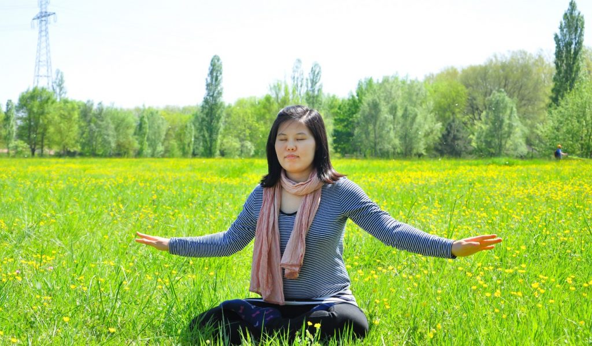

贤（Nguyen Hien）在炼法轮功第五套功法——静功

 
 
她说：“自从我开始修炼法轮功以后，我的失眠症状再也没有出现过。无论是早睡还是晚睡，或者是半夜醒来，甚至在我怀孕期间，我总能睡好觉。另外，在高中时期就患有的过敏性鼻炎也完全好了。非常明显的是我的体能和身体素质有显著提升。以前我工作大约两个小时就开始感到疲倦，需要休息。而现在我可以集中精力学习、做作业三个半小时而不感到累，而且能够集中精力，学习和工作效率也明显提高。由于修炼法轮功，我顺利完成了我的毕业论文，取得了意想不到的结果。”

“从阅读《转法轮》那一天起，我最大的收获还不是表面的，因为我知道心性的修炼更重要。以前我的名利心很强，很在意自己的名气、金钱和成就，而修炼以后都看淡了。这并不是说我不再需要它们，而是能用一种平和的心态去对待。以前我遇到不好的事情经常会出现情绪上的反应，比如遇到烦心的事情会焦躁不安，遇到不公平的事情是发泄愤怒，这些负面的情绪当我按照‘真、善、忍’的原则去做的时候都不会出现了。现在无论是工作还是生活，所有在我身边的人都觉得很开心，很舒服。”

“我觉得‘真、善、忍’的原则太伟大了，太重要了。每当发生冲突的时候，他会让我冷静，冷静下来我就能准确的判断对错，从而用平和的心态去处理。”

“在过去的很长时间里，我都强迫自己像一个机器人一样去工作、学习，一切都必须精确、细致，一切都追求最好的结果。而现在我对生活和工作的理解完全改变了，我会放松自己，用一种平和的态度，用‘真、善、忍’指导一切，结果仍然是最好的，可是‘人’却被解放了，不会感到那么累了。”

“走入法轮功修炼是我感到最高兴的一件事情，他使我的人生更有意义，也更有价值，我有了人生中最值得追求的目标，因此生命不会浪费在无意义的事情上。我希望有更多的年轻人能够理解‘真、善、忍’的伟大内涵，从而享受修炼带来的好处。”

<h1 align="center"><b>迫害好人路不通 中共作恶者务必赎罪
</b></h1>

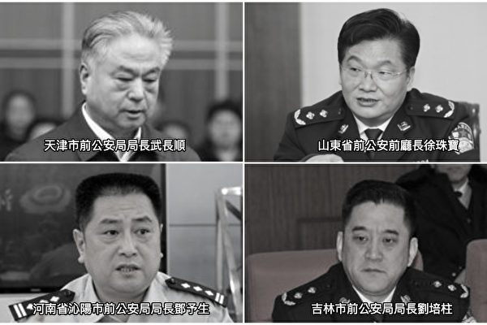

十八年来参与迫害法轮功的官员厄运连连。（大纪元合成）

【大纪元2018年09月17日讯】1999年7月20日，江泽民集团开始镇压法轮功，许多官员紧跟形势、积极迫害法轮功学员，从而起家发迹、官运亨通。多年来，中共610、司法、监狱、文宣等领域的人员因参与迫害而遭逢厄运的消息不断传出。近期，又有大陆政法和公安系统的官员接连落马，更加表明：这条伤天害理的升官路是走不通的。

<b>三个案例</b> 

2018年6月7日，云南昆明市前副市长、政法委前书记、曾连任三届的昆明市公安局长杜敏，被法院一审判刑11年半、处罚人民币100万元。判决书显示，杜敏任上述职务期间，受贿1111万余元，并为行贿人谋取利益。

2016年3月22日，杜敏因涉嫌严重违纪被调查，当时他正担任云南警官学院党委书记。杜敏在忏悔书里三次写下“悔啊，悔！”他说：“我接受调查后，我母亲就被气死了。我父亲86岁了，我估计等我出去也见不到他了。”

杜敏因何而悔？公众未必知晓，“追查迫害法轮功国际组织”在2010年到2016年期间，先后发出了至少4份针对昆明市法轮功学员被非法绑架、关押的追查通告，其中杜敏都被列为头号涉案责任人。

7月28日，中共河北省纪委监委网站通报，河北省张家口市公安局副局长王守成，因“涉嫌严重违纪违法”，目前已被调查。王守成曾被多人在网络上实名举报，而且因涉嫌迫害法轮功学员被“追查国际”通告追查。

8月31日，山东省纪委监委网站发布消息，烟台市副市长、市公安局党委书记兼局长聂作坤落马。聂因“涉嫌严重违纪违法”目前正接受纪律审查和监察调查。聂作坤曾任安丘市公安局局长、寿光市公安局局长等职，因迫害法轮功学员多次被“追查国际”通告追查。

十年前，由于寿光市公安对当地法轮功学员进行又一轮迫害，2008年6月9日，海外新唐人电视台采访了时任寿光市公安局长的聂作坤，聂当时喊著：“我就是要把他们（法轮功学员）赶尽杀绝！”新唐人播出了这段现场录音，让世界见证了中共公安的凶恶面目。

据报导，那时，寿光市有十六位法轮功学员被迫长期流离失所，聂作坤下命令称：“活见人，死见尸。”公安局警察对这些学员采用了跟踪、手机定位、无线网卡定位等特务手段。至当年5月下旬，有十多名法轮功学员被绑架。

杜敏、王守成和聂作坤被调查的直接原因或许是经济腐败和司法问题，但是其实，这正是他们参与迫害法轮功而遭到的报应。这三人过去仕途顺利，恣意张狂，不料却被自己效力多年的体制反过来侦办和惩处，彰显冥冥中的因果安排。

<b>迫害法轮功 罪业深重</b>

2005年12月12日，高智晟律师上书中共领导人，为法轮功鸣冤。他在信中写道：“我们看到的真相表明，所有被非法剥夺自由期间的同胞，都遭到了令文明社会难以置信的对肉体的摧残过程和对精神的野蛮杀戮煎熬。这场完全丧失人的理性的迫害过程，还使得一亿多的法轮功信仰者、一亿多个家庭的数亿人遭受了传讯和恐吓，剥夺就业资格、工作机会、收入，被抢劫财产的不同程度的、不同性质的迫害和打压，这是多么的愚蠢、危险和不道德的恶举。这是在持续地与全体中国人民、与人性文明及整个社会的道德基础为敌啊！”

摧残肉体、杀戮精神、拆散家庭、毁坏道德与文明，中共迫害法轮功罪大恶极。十八年来，经民间渠道传出的有名有姓者，即有四千多法轮功学员被迫害致死，还有更多人致残、致伤。此外，大批学员被活摘器官，这一数字因为中共封锁真相而暂时难以统计。

据明慧网报导，2017年11月21日，河北唐山市两位老年法轮功学员被非法庭审，审判长苗瑞生（音）在开庭前威胁他们：“再喊法轮大法好，把你扔到炼人炉里！”

江天勇律师根据代理法轮功案件的经验表示：“在他们的眼里，法轮功不是人，他们没有丝毫权利，法轮功没有任何说话的机会。”“只有你想不到，没有他做不到的。后来2009年我在美国国会作证时我都说，他们有专门的人员、专门的场所、专门方法、专门资金来专门做坏事，怎么样抓人、怎么样整人，包括酷刑的那一套流水，都是专门的。”

<b>因果报应 真实不爽</b>

迄今，明慧网记载了将近一万起因为迫害法轮功而遭恶报的事例。从周永康、薄熙来、徐才厚、郭伯雄、李东生、苏荣等高官，到中下级官员和打手，一个个被抓捕、被判刑，或病，或死，或遇不测，而且殃及家人。

今年1月，大纪元网站发表了《二百中共公安局长派出所长遭恶报实录》，系根据明慧网的报导汇编，收集了从1999年7月至2017年100个公安局局长及100个派出所所长遭恶报的实例。其中的数据还显示，哪个地区迫害法轮功的情况严重，哪里遭恶报者就多。

在中共迫害法轮功的十八年里，公安部门直接实施绑架、抓捕、关押、酷刑等恶行，因此，那些推动和配合迫害的公安人员，就是手上沾血的刽子手。

天津市前政协副主席、公安局局长武长顺在位时，紧随江泽民，亲自部署对天津法轮功学员的迫害，罪行累累。2017年5月27日，武长顺被判死缓，终身监禁，不得减刑、假释。

武汉市原政法委书记兼公安局长杨世洪，在2002年中共“十六大”前夕上任，他当时下令全市及各区继续绑架法轮功学员，对他们强制精神洗脑，还硬性规定洗脑班的“转化率”必须达到85%以上，对拒不“转化”的人残酷折磨，致使大批武汉法轮功学员在洗脑班被迫害致伤、致残，有人回家后不久死亡。

杨世洪本想踩着法轮功学员的血迹向上爬，可是算盘落空。2003年，杨世洪被免职、接受调查，2004年1月1日被批捕，2005年6月因贪污罪、受贿罪、挪用公款罪被判处死缓，被剥夺政治权利终身，被处没收财产130万元，后二审改判无期徒刑。杨世洪在关押期间曾三次自杀未遂。

为什么说中共迫害法轮功是一场人权灾难、世纪浩劫？因为它打压的是普世真理“真、善、忍”，迫害的是修心向善的好人，采取的手段无比残忍歹毒。不仅如此，迫害集团以谎言欺骗和利益诱惑，怂恿、胁迫各级官员和各界人士共同犯罪，把整个社会拖入深渊。当报应来到，谁作恶，谁担责。自食其果，分毫不差。

天网恢恢，疏而不漏。恶报实录敲响了一记又一记警钟。那些仍在迫害法轮功的中共官员，出路只有一条：悬崖勒马，为自己的过去、今天和明日赎罪。

<h1 align="center"><b>从颓废、叛逆中走出来的少女</b></h1>

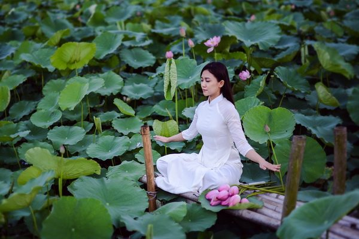

在湖畔炼功的法轮功女弟子（取自网络）

【希望之声2018年9月14日】（本台记者慧光综合报导）她是出生在中国大陆的一位年轻姑娘，父母都是商人，家庭条件非常优越，几乎是要什么有什么，生活中的所有需要都是按照最好的标准安排。到了上学的年龄，父母为她选择了最好的学校，希望她能够学有所成，将来接父母的班，延续已有的家业。然而现实是无情的，她的表现让父母大失所望。

因为生活中的一切来的太容易了，使她养成了随心所欲的习惯。她有足够的金钱，可以藐视一切，可以不用任何努力实现她想要的一切。因为她有钱，渐渐的她得到了一些学生的追捧，并且其势力越来越大。到了上高中的时候，她感觉自己就像“女王”一样不可一世，如果她想整谁，不用发号施令，一个眼神就会有人去办。

为了表现自己的地位和与众不同，她把一头乌黑的头发染成白色，并且自己动手把头发剪成凌乱不堪的样子。平时她总是保持一副冰冷、傲慢的表情，抽烟、喝酒、讲粗话，再加上指使、挑动学生打架斗殴成了她生活的全部。她的父母经常被学校训斥，母亲气的得了高血压和心脏病，父亲多次想把她送进“少管所”，但碍于颜面，又总是半路驱车返回。

那时候她与父母之间就像有一个巨大而不可逾越的鸿沟。即使偶尔坐在一起，也一定是在怒骂和斥责的叫嚷中开始，在无可奈何的痛苦中结束。面对父母的责骂，她总是保持一副冰冷麻木的样子。有一次，父亲在情急之下动手打了她，且下了狠手，导致她身上青一块紫一块。一怒之下她彻底离开了家，整天在社会上游荡，学也不上了。

为了跟父母赌气，她还喜欢上一个有妇之夫，并且挑动此人将父母开的店铺砸烂了两次。为此父母传话给她，希望她要走就离他们远点儿，不要再在他们眼前晃悠。可是她却反其道而行之，故意找茬儿惹他们生气。母亲哭着对她说：“我们前世做了什么对不起你的事儿，供你、养你，一切都给你最好的，你却给我们带来这么多的痛苦和不幸。”那时候她就像着了魔一样，对父母的苦心没有一丝一毫的体谅。

2009年夏天，有一次在她出门的时候，看到楼门口有一个小女孩在往各家的信箱里放传单（每个信箱都有一个投放信件的小口）。女孩的个子小，上层的信箱够不着。看见她走过来，女孩就对她说：“大姐姐，你能帮一下忙吗？”

看着女孩单纯的样子，她动了恻隐之心，默默的帮女孩把上层的信箱都放了。放完之后她也没说什么，推门就出去了。就在这时，小女孩追了过来，对她说：“大姐姐，你真好，谢谢你。”

长期的孤独寂寞，使她养成了冷漠的性格，习惯了对外界的事情不闻不问。突然听到女孩真诚的声音，她陡然感到鼻子一阵儿发酸，差点儿掉下泪来。

小女孩又接着对她说：“大姐姐，我这里有超好看的神韵晚会光盘，想送给你，希望你认真看一看。”面对女孩恳切的态度，她第一次露出淡淡的笑容，高兴的接纳了。

在朋友的住处，她打开了光盘，观看了神韵晚会视频。不知道为什么，看的过程中她一直在不停的流眼泪，总也止不住，多年来内心的悲苦、郁闷、麻木和冰冷的感觉似乎都被化解了、消溶了，她第一次有了做人的真实情感。突然她心生一念，好想回家，结束这流浪和飘泊不定的生活。

第二天早上，她回到自己住的地方，在楼门口发现了散落的传单，就顺手捡起一份，发现传单的内容是《明慧周刊》。

当她仔细看完上面的文章后，内心受到莫名的冲击，不知是喜悦还是激动，她好想哭。那段时间，她不知道为什么，眼泪特别多，好像内心的凄苦总想找人诉说。她开始想家了，但那时她还不敢回家，她不敢面对过去的一切。

没过多久，她又遇见了那个女孩，她恳请她把每次的《明慧周刊》都给她送一份，并向她提出了一些有关法轮功的问题，希望对方能为她解答。

那一次，小女孩用明亮有神的眼睛看着她，尽管面前这个“白发苍苍”的大姐姐让她有些惊讶，她还是热心的回答了她的问题。看着对方小小年纪却有着敏捷的思维，并且能够平静的侃侃而谈，她感到非常惊讶。听完之后她愣愣的问：“你这样小怎么会有这么好的口才呀，把我说的心服口服。”没想到小女孩开心的笑起来。在女孩真诚的感染下，她把以往的伪装都放下了，也跟着开心的笑起来。

最后，小女孩真诚的对她说：“大姐姐，你学法轮功吧，法轮功可好啦。”

她认真的说：“你看我这‘满头白发’的样子，法轮功能要吗？何况你还不知道我以前……”她实在不好意思接着往下说。

看到她难过的表情，女孩仿佛明白了什么，没有说话，拉着她的手径直去了自己家。到家之后与她一起阅读了法轮功的主要指导书——《转法轮》。并且相约，以后每天在女孩放学后来她家一起学炼法轮功。

她回忆说：“那段时间对我来说真是太宝贵了。我长这么大，从来没有感受过这种温暖，发自内心的有一种莫名的喜悦，尤其当我在内心深处呼唤‘师父’时，那种心情就像找到了阔别已久的亲人，真是无法形容。”

就这样她坚持了五个多月。在那段时间里，抽烟喝酒的陋习她好像全忘记了。她把头发也染回了黑色，并与之前的狐朋狗友全部断交。她重新找回了自己，可是她仍然不敢回家，不知道该如何面对父母。

有一天，在蒙蒙细雨中，她骑着自行车在街上走，被一辆疾驰的汽车撞上了。她被狠狠的摔在地上，下颏先着地，腿也被汽车压过。肇事司机慌张的将她送到医院，医生经过检查后对她说：“下颏骨骨折，小腿骨折，需要住院治疗。”这时她突然想起师父讲过的话，意识到自己已经是一个修炼人，遇到这种事情与常人不同，马上对医生说：“我没事儿，我要回家。”医生嘲讽的说：“你看你现在说话都不利索，骨头都断了，站都站不起来，你怎么回家？”

她不知从哪儿来的力气，坚持说：“我的骨头没有断，我就要回家。”一边说着，一边从病床上爬起来，抬腿就往外走。就在那一瞬间，她感到全身上下暖融融的，好象被一股热流包裹着，本来疼痛的地方，随着热流通过就不感到痛了，全身都变的很舒服。医生看到后惊呆了，赶紧喊道：“回来！赶快回来！你的骨头还断着呢，还没打石膏呢！你怎么能站起来呢？”

她听后稍稍镇静了一下，回过头来很认真的对他们说：“我真的没事儿。我是修炼法轮功的，请你们放心。”医生和肇事司机都惊讶的看着她从容的离去，她看到他们完全是一副目瞪口呆的样子。

她一面走一面流泪，双手情不自禁的合十在胸前，心中默默的不停的说“谢谢师父加持！谢谢师父加持！……”

这一次她没有犹豫，径直回到了父母家。

她按响了门铃，母亲打开了门。看到是她，脸上现出一种难以置信和疑惑的表情。她“扑通”一下跪下来，说：“妈，请您原谅，原谅我过去带给您的痛苦。我现在开始修炼法轮功了，以后我要做个好人，不会再去抽烟、喝酒，打架了，也不会再让您伤心了。请您相信我。”母亲呆呆的看着她，半响才一下子哭出声来。

她走进房间，又在父亲面前跪下来，诚恳的说：“爸，您为了我付出了很多心血，以前是女儿不懂事，总是让您和妈伤心难过。我现在开始修炼了，我会慢慢的做一个好人，做一个对社会有用的人，不会再让您伤心了。”就这样，父母都被她感动了，一家三口拥抱着哭成一团。

那一晚，她久久不能入睡，不堪回首的往事一幕幕出现在眼前。早上醒来，她为父母煮了清香的米粥，还做了一碟小菜。父母惊讶的笑着，眼眶里又涌出了激动的泪水。

因为她的回来，父母的心情好了，神情气度也有了明显的变化。父母看到她前后判若两人，也改变了因中共的谎言欺骗造成的对法轮功的误解。她说：“安宁、和睦、幸福，从此就像源源不断的清泉涌入我们家，涌入我们的心田。我在心里千遍万遍的说‘感谢师父的慈悲救度，法轮大法真好！’”

<h1 align="center"><b>西方专家谈中共活摘罪行 引澳洲人思考讨论</b></h1>

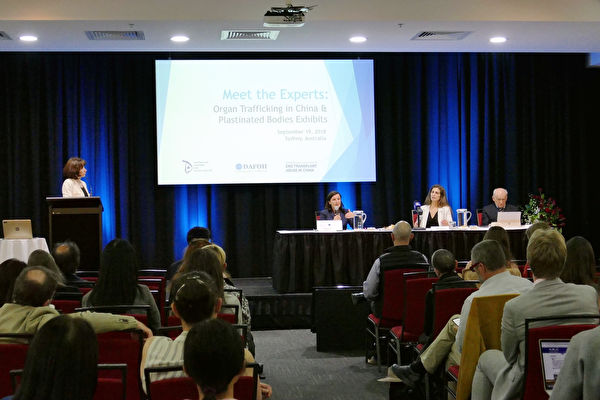

9月19日晚，来自加拿大与澳洲的律师、学者在悉尼市中心的韦斯利会议中心（Wesley Conference Centre），与听众共同探讨一个正在中国发生的罪恶。

【大纪元2018年09月21日讯】（大纪元记者安平雅、燕楠悉尼报导）“中国，地球上人口最多的国家，已成为一个器官移植产业快速发展的国家。在过去十余年间，大量良心犯被按需杀害。”这是9月19日晚，来自加拿大与澳洲的律师、学者们举行的一场座谈会上播放的短片的内容，也是当晚研讨的主题。

在悉尼韦斯利会议中心（Wesley Conference Centre），专家学者们与听众在共同探讨如何让更多的人了解发生在中国的罪恶，并探寻应做些什么来阻止罪恶的继续。
麦塔斯：罪恶的规模与持续性令人担忧

获2010年诺贝尔和平奖提名的加拿大人权律师麦塔斯（David Matas）特别厘清了在中国发生的大规模活摘良心犯器官用以移植牟利与某些国家的器官非法交易的不同之处。他说：“中国的器官移植滥用是政府控制的，所有的军队医院都在参与。而一些国家是黑市上的私人行为。”

麦塔斯表示，中国的大规模移植始于中共实施对法轮功的迫害之后。在中国，器官可以提前出售给病人，医院甚至可以打电话到法庭或监狱找器官。

座谈会播放了韩国《朝鲜日报》的媒体人假装成病人去大陆做器官移植，秘密拍摄制作的专题片《杀了才能活》。影片中看到，大量韩国人赴中国做器官移植。等待时间只要两周，多付钱还可以更快进行手术。

澳洲人权律师事务与人权小组委员会的联合主席、国际人权律师布里奇特（Madeleine Bridgett）表示，“在韩国换器官通常要等待五年，很多国家的自愿捐赠器官系统很薄弱，澳洲有2.14万人在等待移植器官。但在中国拿起电话就能很快获得器官，中国发生的事情很不寻常。”

听众中一名具有医学背景的律师认为，需要有更多人了解在中国发生的活摘（罪行），而且最好能有更多的调查。麦塔斯表示，他的调查是从各个方面进行的，其中包括一些不愿透露姓名的医生。因为中共不可能允许有独立的调查。他表示，问题的关键不在于某些个案，而是中共活摘器官的规模和持续性令人担心。
不合法的人体展涉活摘

座谈会的专家学者也谈到了引发争议与多方质疑的在悉尼举行的“真实人体展”与中共活摘有联系。该人体展在悉尼摩尔公园（Moore Park）持续了数月，于9月16日提前关闭，外界相信其提前关闭与各界对其的质疑有关。

国际人权律师布里奇特表示，应注意到两点，这个展览不提供尸体来源文件，除此之外，也不提供捐赠同意书，也就是当事人同意死后将身体或身体的某部位被使用在这个展览上的证明文件。“就我个人的意见，这个展览是不合法的，违反了器官法。”

布里奇特说，悉尼人体展的展体来自中国大连鸿峰生物科技有限公司，隋鸿锦1999年建立了这个尸体加工厂，与中共大规模抓捕法轮功学员的时间点相同。
教授打给中国医院的电话

悉尼大学医学教授辛格（Maria Fiatarone Singh）对比了中美两国的器官捐赠数据，显示中共的所谓自愿捐赠器官数量远低于官方实际进行的移植手术数量。

辛格教授讲述了自己做的电话调查，今年的6月5日，她联系了北京一家医院的肾病科大夫，表示自己是肾病末期患者，讨论了移植手术的价格，三周的治疗费用为1万美金。如手术失败，那位大夫强调会将她转去北京的另一家医院，那里做大量的移植手术，肾脏移植价格为6万元。但当辛格问到等待周期及那间医院的名字时，那名大夫变得很警惕。

辛格教授表示，“我越问细节和等待时间，他的声音听起来越紧张。我们达成协议，我将我的‘病例’发给他以便进行下一步程序。”
悉尼人：制止罪恶应做些什么？

一名在新州卫生厅工作的女士提问时说，强摘器官是非常不人道的，因为器官被摘取时，这些人很可能还有意识。她问嘉宾们可以做些什么来制止活摘罪行。

人权律师布里奇特表示，一方面她鼓励更多的人捐献器官，并且给自己的议员写信表示关注此事。另一方面，她认为由于中共封闭了外界的调查，看不到那里发生了什么，所以现在知道这方面情况的人应该打破沉默，不断地讨论这个话题，以便让更多人了解和关注这些问题。

麦塔斯则说，为了获得更好的器官质量，中共方面在摘除器官时会减少对受害人使用麻醉药，甚至不用。他举例，“作为警察的王立军没有经过医疗培训，但却能够建立一个移植实验中心”，而他的其中一个研究是如何减少药物的使用以保持器官的品质，该实验经过杀死数千人后得到了他希望的结果。

悉尼科技大学的一名医疗政策讲师讲到，她的学生认识的一个家庭的儿童到中国做肾脏移植手术，她也对这种儿童的移植器官来源提出质疑。

麦塔斯说，儿童器官的来源是另外的情况，与良心犯的器官不同。但他表示，“因为（中国的）人权侵犯问题泛滥后，形成了体制。”也就是在迫害法轮功的系统形成并运作成熟，它可以沿用到其他群体，比如维吾尔人、西藏人，甚至处于弱势的儿童。

<h1 align="center"><b>越南金融界高官的意外发现</b></h1>

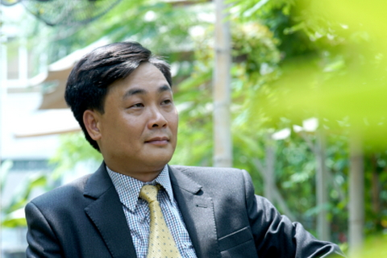

南永福省发展投资基金和信用担保部副主任安（Phung Anh Viet）先生

【希望之声2018年9月12日】（本台记者慧光综合报导）安（Phung Anh Viet）先生是越南人，毕业于河内理工大学工商管理专业，目前是永福省发展投资基金和信用担保部副主任。他有一位贤惠的夫人和一双儿女，家庭生活幸福美满。然而，他心爱的女儿在十岁那年，却突然发现患有严重的血液病，这让他心急如焚，他不得不多次带孩子到国家最好的血液病医院进行抢救。

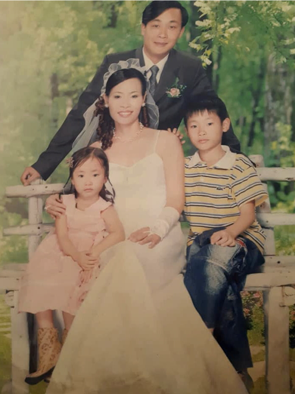

安（Phung Anh Viet）先生年轻时的全家合影

经过一年多的检查和治疗，效果依然不好。现代医学对此病几乎是无可奈何，医生在紧急情况下只能采用输血方式缓解症状，平时只能靠药物维持。可是该类药物有副作用，孩子变得非常虚弱。看着孩子萎靡不振的样子，别提他的心里有多难过了。

他曾把孩子的病历发给在德国的朋友，希望他们能提供更为先进的药物和治疗方式，但得到的消息让他失望。不过他并没有灰心，西医不行就找中医，甚至希望借助中西医结合的方式找到有效的治疗方案。他甚至不惜用重金购买红参、鲜鹿茸等贵重补品，然而这些努力都是徒劳的。

听说观世音菩萨能为世上的人拯救痛苦，他就在家里供起佛像，还经常去庙里烧香祈福，甚至专门请了一名僧人为孩子诵经。有位佛教的朋友对他说，人类的疾病都是由业力造成的，他就想通过自己修佛，替女儿偿还业力。他积极的学习佛教教义，每天诵经念佛。有些难喝的药他都是自己先喝，尝试过之后再让女儿服用。然而经过一切努力之后，孩子的病却依然没有任何缓解的迹象。

有一位关系非常好的邻居对他说，再这样下去你只会被骗取更多的钱而不会有效果。他却说：“如果我不去尝试我怎么能知道有没有效果呢？一想到我女儿的生命会出现危险，无论多么辛苦、无论花多少钱、付出多大我都无怨无悔。我要努力到最后，绝不会放弃。”孩子发病时是在2012年，他就一直这样坚持着。

光阴荏苒，转眼间就到了2016年，一个偶然的机会他看到了法轮功修炼者的修炼体会文章，看到有些癌症患者、曾经吸毒的人、甚至像脊髓炎这样的疑难病人都因为炼法轮功而痊愈了，这让他很惊讶。开始时他是不相信的，可是出于好奇心，他还是借来了法轮功的主要指导书《转法轮》，想从中一探究竟。

没想到这本书让他越读越着迷，因为书中的很多内容都是他闻所未闻的，即使在佛教的经书中也从没有见过。他认为自己读过的书已经很多了，对科学知识的了解也是很广泛的，可书中的很多内容都远远超出了他的认知范围。

为了验证法轮功的奇迹，他专门找到一位法轮功学员，对方已经是七十七岁的老人了，曾经患有严重的冠心病，在河内著名的心脏病专科医院做过手术，因为高龄和病情严重家人都以为他会死在手术台上，然而在修炼四个半月之后，他的病就痊愈了。老人在诉说自己的经历时，满脸都是泪水，还激动的站起身对他说：“你看我现在还像有病的样子吗？”看到老人真诚和善良，他被感动了。

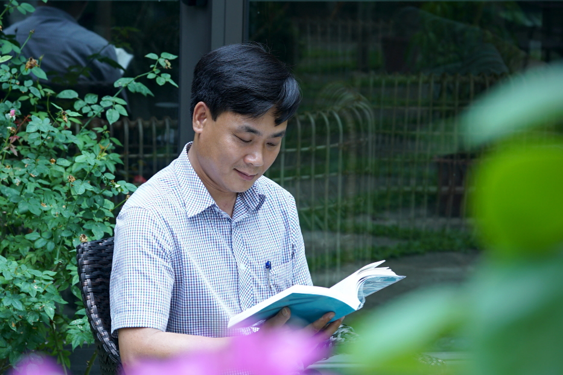

安（Phung Anh Viet）先生在阅读法轮功的主要指导书《转法轮》

当他兴高采烈的将了解到的情况说给家人听时，没想到家人都不相信，说现在的骗子太多了，空口无凭，怎么能随意的相信道听途说呢？为此他专门请了做医生的哥哥再次去到老人家，提出要查看老人的病历，没想到老人很高兴的同意了。因为手术后还不到五个月，有关病情的详细资料都还保存着。查过之后，哥哥向他证实病历是真实的。在事实面前，他的一切怀疑都烟消云散。

作为越共的一名官员，为了慎重起见，他还是通过司法和公安部门的熟人了解了越南法律的有关规定，得到的答复是：越南宪法规定人民有信仰自由的权利，越南法律并不禁止法轮功。同时法轮功的松散管理以及要求弟子不参与政治等因素也让他消除了所有顾虑。

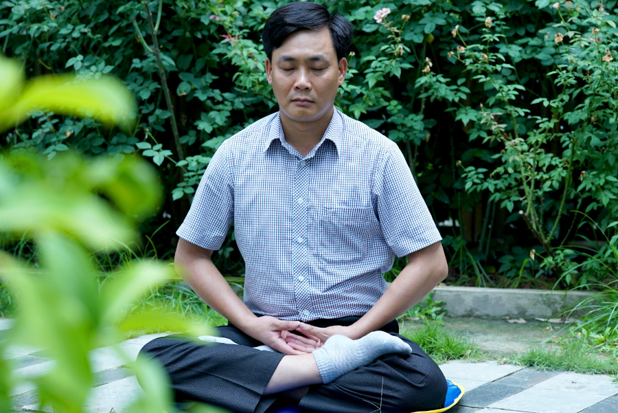

安（Phung Anh Viet）先生在炼法轮功第五套功法——静功

当他静下心来开始学法炼功之后，仅仅三个月，其实炼功也就只有一个多月，有一天他突然发现，自己多年的腰椎间盘突出症和颈椎病没有了任何感觉，从此更加坚定了他修炼的信心。同时法轮功修炼者时时处处以“真、善、忍”的标准要求自己，也让他找到了内心的平静。

他说：“修炼一段时间后，当我重新审视自己时，发现自己有了很多变化，这是我意想不到的。以前我追求名利，妒忌心很强，对个人地位看的很重，非常在意自己的前途，在朋友的眼中我是个很傲慢的人。可是修炼以后，这些心越来越淡，甚至在与朋友的谈话中提都不愿提。每当回想起修炼之前的表现时，自己也都忍不住会打个哆嗦，可是身在其中的时候不觉得那是问题，还觉得自己挺好。而现在我的心态很平静，家庭氛围也变得宁静祥和。”

“通过亲身体验我也意识到法轮功的珍贵，不像其它修炼方式，要剃度出家，要进入寺庙，要脱离世俗。法轮功就在普通的社会环境中修炼，我看到在越南就有千千万万的修炼者像普通人一样正常生活，可是他们不仅获得了健康，而且心灵得到净化，思想境界普遍提升，这些事实让我确信法轮功是正法。以前也听到过有关法轮功的一些谣言，至此全都不攻自破。”

“2016年9月，我开始给女儿读《转法轮》并教她炼功。过了大约一个半月之后，为了查看女儿的变化，我和妻子专门带她到医院进行检查。她的血小板原来只有24个单位，并且全身有许多地方皮下出血。仅仅经过一个半月的炼功，她的血小板就上升到68个单位，并且她的出血症状几乎消失了。这让我们既惊讶又兴奋，我们知道女儿有希望了。”

“因为孩子的理解能力有限，对大法法理无法理解到更深的内涵，所以其恢复过程比较慢。但是经过一年的努力，我女儿就不需要住院了。所有因药物引起的症状也逐渐消失，她可以正常饮食了，体力也得到恢复，完全和正常孩子一样了。2017年夏天，她通过了高中十年级的考试。”

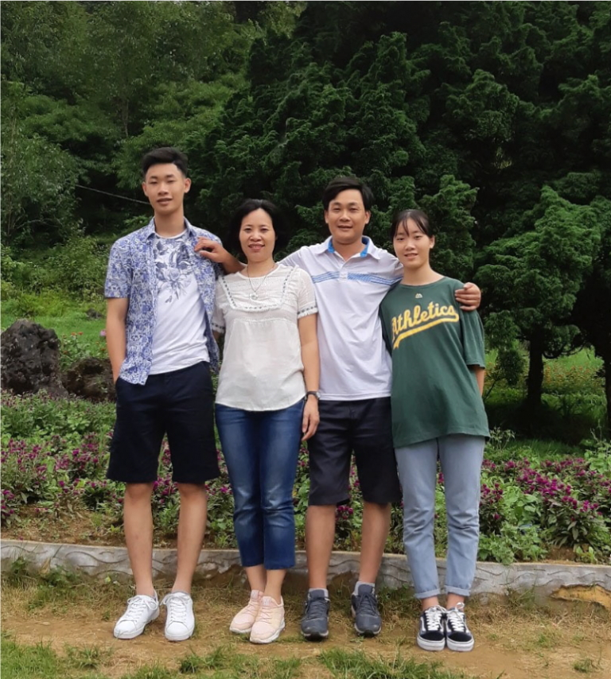

女儿康复后的全家合影

<h1 align="center"><b>多伦多“三退”民众的喜悦和感恩</b></h1>

【明慧网二零一八年九月十九日】（明慧记者章韵多伦多报道）在法轮功学员反迫害至今十九年的历程中，多伦多学员风雨兼程，用真心与慈悲传播真相，一线讲真相的学员在景点风雨无阻劝可贵的大陆华人“三退”，过程中让更多人明真相，退出了曾加入过的中共党、团、队组织。以下是一些“三退”后的民众的故事。

<b>中科院访问学者：谢谢你们师父！</b>

来自北京中科院的访问学者刘先生应邀参加多伦多大学的学术交流会，在景点遇上了法轮功学员，他告诉学员在国内要翻墙才能看到一些海外的信息，并表示他知道“天安门自焚”是假的。他与学员交谈良久，认真的听学员给他讲法轮功真相，并提出自己的很多疑问，学员给他一一解答。他最后明白了“三退”的意义后说：“那帮我把党退了吧！”然后他又问：“您帮我做了‘三退’，那我该怎么谢您呢？”学员说：“你不用谢我，要谢就感谢我们师父。”刘先生说：“谢谢你们师父！”

<b>多伦多大学博士后：你们真是民族的希望啊！</b>

刘女士和李先生目前在多伦多大学读博士后，他们俩在景点遇上了法轮功学员，与法轮功学员交谈了一个多小时。学员给他们从“天安门自焚”骗局讲起，到中共活摘法轮功学员器官，还讲到了“三退”的意义，他们非常认真地听着，还问了很多问题，当了解到中共“活摘器官”是真的时候，他们表示太惊讶了。他们做了“三退” 后，法轮功学员对他们说：“我希望你们记住我今天给你们说的事，也告诉你们的家人，让他们也都平安。”

刘女士激动地拥抱法轮功学员，说：“真的太感谢你了，你今天让我转变了我的很多想法。我现在全明白了，我觉得你们是民族英雄，你们真是民族的希望啊。”临别时他们还表示今年会去观看神韵交响乐和神韵艺术团到多伦多的演出，因为他们还会在多伦多呆一年。

<b>大陆高级会计师双手合十：谢谢告诉我“三退”</b>

六十五岁的刘女士从大陆来探亲，她是大陆一名高级会计师，在景点听过法轮功学员讲真相后，明白了 “三退” 的意义，说：“太谢谢你告诉我这件事了（指 ‘三退’）。我不是党员，他们不让我入党，因为我的家庭成份不好。但我很好学，我凭我的本事考了高级会计师。但我戴过红领巾，那就帮我彻底退了吧。” 她高兴的跟学员告别。但走出七、八步后，她又转身回到法轮功学员面前，双手合十真诚地说：“非常感谢你！你让我知道了我本来不知道的事。”

<b>上海市级干部：谢谢你们给了我一个好的选择！</b>

来自上海的一位不愿意透露姓名的市级干部，和太太在多伦多的景点遇见法轮功学员，当法轮功学员给他们讲真相时，他的太太拽着他走，不让他听真相。但他坚持留下来听，与学员交谈，明白真相后，他做了退党声明，并对学员说：“谢谢你们给了我一个好的选择！”他还拿了真相资料小册子。学员对他说：“你平安了，你还得告诉你的家人，让他们也平安，资料上面有翻墙的信息，可以让你的亲朋好友翻墙做‘三退’。”他说：“太谢谢你们了，你们真好，真了不起！”

<b>山东生意人：我这是第六次听真相　就帮我退了吧</b>

来自山东的生意人王先生，在尼亚加拉瀑布的景点遇见了法轮功学员，他向法轮功学员张女士问了很多的问题，一一得到解答后，他做“三退”后说：“我喜欢到处旅游，到处都能见到法轮功，从亚洲到欧洲，再到北美的美国、加拿大，都能遇见你们，你这是第六个给我讲真相的人了，我每次听完都没退，这次我真明白了你们的苦口婆心，就帮我退了吧。真心的谢谢你们了！”

<b>大陆部队干部：退了，共产党不是骗人就是杀人</b>

几年前，一位来自河南的新移民单女士在唐人街的景点很认真的听完学员给她讲真相，明白真相后很顺利的做了三退，她表示非常清楚中共的邪恶，她说：“我和我先生都是部队干部，转业到地方也是受排挤，转业时对我们的好多承诺不兑现，后来我们组织了很多转业干部到我们省政府门前去静坐。中共绝不可信。”之后的几年里，每当在唐人街遇见她，法轮功学员给她身边的朋友劝三退时，她准在一旁帮着劝：“退吧，退了，共产党有什么好的，不是骗人就是杀人。”她还帮退了不少人。

<h1 align="center"><b>印度籍美国软件工程师找到了人生中最重要的“秘诀”
</b></h1>

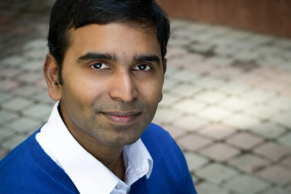

印度籍美国软件工程师斯里尼瓦桑（Sunam Srinivasan）

【希望之声2018年9月6日】（本台记者慧光综合报导）斯里尼瓦桑（Sunam Srinivasan）是印度人，他出生于印度钦奈的一个富裕家庭，他的家庭成员中有四名工程师和一名医生，都是有身份、有地位的成功人士，当然他也是其中一员。他是毕业于美国哥伦比亚大学的博士，目前工作在美国西雅图，是一家跨国公司的高级软件工程师。

斯里尼瓦桑小时候就很独立，当别的孩子玩耍的时候，他已经开始读书。他说：“从童年开始，我就把大部分时间花在阅读书籍上，包括小说和知识类书籍，我特别喜欢阅读百科全书。与其他喜欢运动的孩子不同，我就喜欢坐在自己的房间里看书。”

在高中的最后一年，他开始对人生有了自己的观察和思考，他说：“我发现人人都在追求物质生活的富裕，却在思想上远离了传统的道德价值观。现代人虽然在物质上很富有，可精神上却变得软弱、自私和孤独，生活中没有目标，没有方向。这个问题让我很困惑，因为我也一样，所以我企图在知识的海洋中寻找答案，也为自己寻找一种精神上支撑，我非常想搞清楚‘人生的真正含义是什么？’然而在现代科学领域这个问题是无解的，于是我开始转向宗教信仰和灵学，阅读了很多这方面的书籍。后来我对瑜伽修习者的生活很感兴趣，他们让我发现了生命中有更深刻的内涵。”

2001年，他离开自己的祖国来到美国，在佛罗里达大学攻读电子工程学士学位。刚来到美国的时候他还有点儿兴奋，然而从小就在优越家庭环境中长大的他，突然要自己照顾自己，也让他知道了生活的不易。

在佛罗里达大学读书期间，一次偶然的机会他接到一张法轮功的传单，在好奇心的驱使下，他开始从互联网上了解法轮功的相关信息，并尝试按照功法要领开始炼功。几个月之后，他明确的意识到——“这就是我想要的，因为我一直在寻找的答案在法轮功师父的讲法中都给出了解答”。

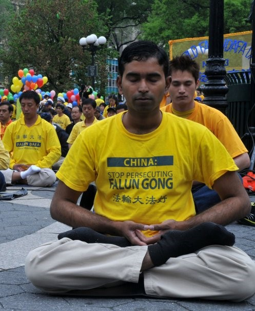

斯里尼瓦桑（Sunam Srinivasan）在炼法轮功第五套功法——静功

大法修炼带给他的改变也是显而易见的，他说：“我原有轻微的偏头痛，开始炼功以后很快就消失了；以前我的消化系统很敏感，对食物的要求比较高，有刺激性的食物都不敢吃，而修炼以后我可以毫无顾忌的吃各种美味佳肴。尤其是我能像婴儿一样睡觉，这对我保持旺盛的精力很重要。更重要的是精神上的改变，我的内心变得很平静，没有了担心、害怕和顾虑重重的感觉。”

2005年，在取得了硕士学位后，他又到著名的哥伦比亚大学继续攻读计算机科学博士学位，在这里他用了六年时间才完成自己的学业。

在回顾自己这段学习经历时，他说：“由于诸多原因，博士学位的完成有很大难度。它要求学生要有足够的创造力，在创新中完成自己的毕业论文设计，这对学生的压力很大，有不少学生半途而废，甚至在接近尾声时也不得不选择离开。可是我很幸运，这归结为修炼法轮功带给我的转变，因为修炼使我有充沛的精力和冷静的头脑，同时我觉得我的思想是开放的，在需要时智慧会源源而来，保证了我能够顺利的完成所有课程和毕业设计。”

在哥伦比亚大学学习期间，斯里尼瓦桑对自己的选择充满信心，所以他取得了很多成就，曾获得两项美国专利。博士毕业后的最初几年，他曾分别在华尔街的两家世界知名投资银行——高盛（Goldman Sachs）和美林（Merrill Lynch）工作。

无论是在金融领域还是在计算机行业，都充满着激烈竞争，作为在这些领域工作的专家，斯里尼瓦桑承担的压力也是可想而知的，但他始终对自己的工作充满信心。他说：“法轮功修炼对人的心性要求很高，要不断的净化自己的心灵，使自己的内心世界越来越干净，这样就能获得内心的平静，头脑也会更加清醒。无论面对多么困难和复杂的情况，我总能够冷静的思考，只要安定下来，我会立即找到解决方案，我想这就是大法给我的智慧。”

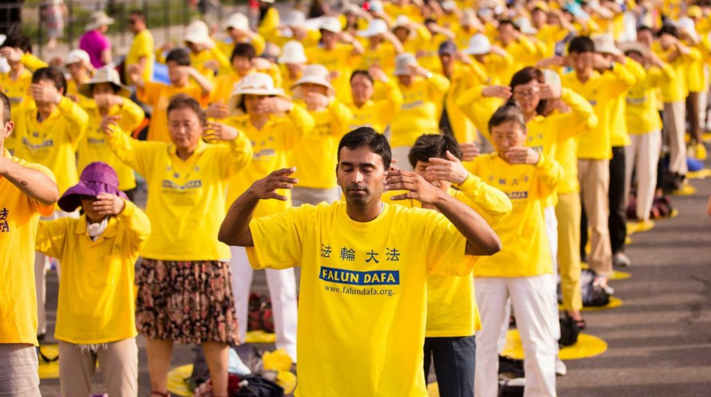

斯里尼瓦桑（Sunam Srinivasan，图中）参加集体炼功

当了解到中共对法轮功进行的残酷迫害后，斯里尼瓦桑感到震惊和不安。尤其在开始修炼以后，对法轮功修炼有了亲身体验，他越来越深刻地意识到中共的暴行和谎言不仅是对中国的伤害，也是对世界上善良民众的伤害，他说：“我不能袖手旁观，我也要向国际社会讲述法轮功真相，我要帮助更多人了解中国正在发生的事情。”

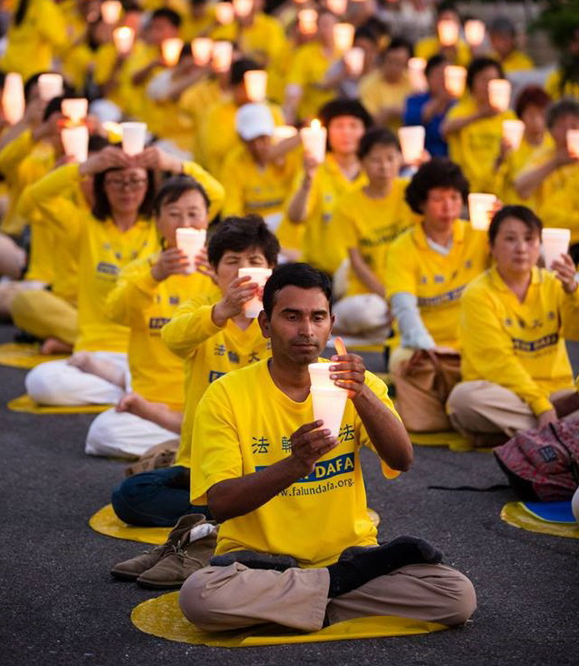

斯里尼瓦桑（Sunam Srinivasan，图中）参加法轮功学员的烛光夜悼活动

最后，斯里尼瓦桑说：“作为一名软件工程师，我接受过培训，可以建立基于标准、实用和强大的计算机系统，为用户提供令人兴奋的全新体验。而人生也是一个‘系统’，构建这个‘系统’也需要建立一定的‘规则’，这个‘规则’就是要尊重并坚持高尚的价值观，用正确的道德标准指导自己的行为，这样既能帮助别人，也能帮助自己，从而构建一个和谐的生存环境，而‘真、善、忍’的法则就是人生中、也是人类行为中最重要的基石。我在‘真、善、忍’的指导下成长、成熟，这也是指引我成功的最重要‘秘诀’”。

<h1 align="center"><b>研究：法轮功修炼提高免疫力</b></h1>

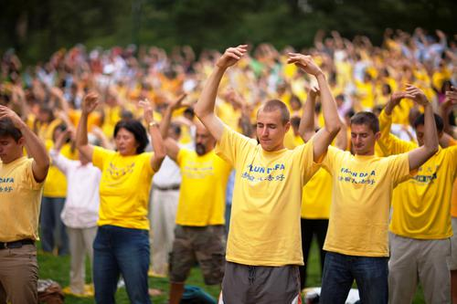

纽约中央公园，法轮功学员一起炼功的场面。

 
在快节奏、高竞争的现代社会里，虽然医疗水平发达了很多，但各种不治之症仍在威胁着人们的健康。法轮功公开传出25年来，创造了无数的医学奇迹，吸引了全世界一亿多人修炼，为人类健康作出了重大贡献。很多专业人士也在探讨法轮功改善健康、祛病健身的奥秘。

<b>基因层面观察到的变化</b>

美国一项研究结果表明，法轮功的修炼可以在分子水平上对基因的表达起调节作用。

科学家利用DNA微列（Microarray）和RNA保护等技术研究嗜中性粒细胞的基因表达情况，对比了一组修炼法轮功一年以上的修炼者与健康的非修炼者之间的异同。

在被检测的12,000个基因中，发现有250个基因的表达活性在法轮功修炼者组群中出现变化，其中有的基因表达活性增加，有的下降。表达活性出现变化的基因多与免疫、细胞凋亡、和蛋白质降解有关。

据研究人员介绍，已有相关报导发现，癌症病人和其他一些炎症病人的细胞，蛋白质降解明显增强，相关基因的活性也增加。而研究发现，法轮功修炼者的细胞中，参与蛋白质降解的一系列基因活性普遍下降几倍到十几倍。

<b>免疫力及双向调节机制</b>

最令研究人员惊讶的是法轮功修炼者的细胞表现出免疫双向调节的机制。免疫系统如双刃剑，它可以杀死病原保护机体，但是太强了也可以造成过度炎症反应，从而对自身造成伤害。例如，2003年SARS病暴发时，多数死亡病人是死于自身免疫力造成的肺部损害。

这项研究显示，在没有炎症刺激时，法轮功修炼者的嗜中性粒细胞存活时间比不炼功人的细胞要长，吞噬功能也强，因而有利于保护机体；而当有炎症因子时，法轮功修炼者的嗜中性粒细胞在杀死病原后会迅速凋亡，从而减少炎症的发生。这种自身的双向机制在过去的其他研究中没有见过。

<b>情绪和免疫功能的关系</b>

这项研究还发现，法轮功修炼者对紧张与压力做出反应的基因表达也下降。研究人员认为这可能是因为炼功能使人身心更轻松。

现居住在美国洛杉矶的武术大师、也是中医专家的李有甫先生，早年在中国大陆时曾经是中医和气功领域的知名人物，担任过中国人体科学研究中心的副研究员，他认为情绪紧张会导致许多健康问题，法轮功修炼能使人精神放松，心境平和，达到身心健康。

李有甫先生说：“我看过一篇文章，美国有一个医生，他的两个朋友已是癌症晚期，就劝他们住院，一边实验一边治疗。一个听从了，一个不听从。最后，听从的人反而死了。不听从的人去旅游了，旅游完了之后，发现病没有了，一检查病好了。

人每天着急、生气、忧郁、痛苦啊，肯定容易生病，他的精神系统、他的大脑和他的心境使得他的免疫系统不能正常运行，免疫功能降低就生病。

人在心情愉快、放松的状态下，能够提高免疫力。法轮功修炼要求提高心性，把名利情看得淡一点，比如别人欺负你、或者遇到不顺的环境，你还能按‘真、善、忍’来修炼自己，情绪稳定，他的免疫功能就会提高，抵抗疾病的能力就强。”

<b>血检证实法轮功超常</b>

李有甫先生还谈到，2000年3月，他曾和16名法轮功学员一起参与了一项在美国加州圣地亚哥的斯克瑞普斯免疫学研究所(The Scripps Research Institute)进行的血液研究试验。结果发现法轮功修炼者的免疫力远远高于正常标准。

他说：“我们17个人到了圣地亚哥Scripps生物医学研究所，他们把我们每个人静脉抽血，进行化验。他们实验的结果，就是说，每个人嗜中性白细胞的分枝比正常人要多。分枝多就象一个战士的手一样，多个几只手，这种白细胞的功能就比较强。这种白细胞能够杀死癌细胞，就是吞噬力比较强。还有另一个结果，就是这种白细胞没有普通人的白细胞那么多，但它的功能增强了，就是说免疫功能提高了。另外他们还发现，这些血液放在一个常温下，60小时以后，这些血液的细胞竟然没有死亡，没有受到伤害。正常人的血细胞呢，在室温下，如果说不放在冷冻室里面，两个小时以后就会死亡或破坏。他们感到很惊奇。所以说，经过法轮功修炼，血细胞都有很大的改变。 ”

上亿修炼者的亲身实践与科学实验已经证明了法轮功祛病健身的超常功效。愿人们能以一个真正科学的态度，一同来了解健康的奥秘，体会身心健康的幸福。 

<h1 align="center"><b>知名音乐家赞神韵音乐：就是善与大气魄</b></h1>

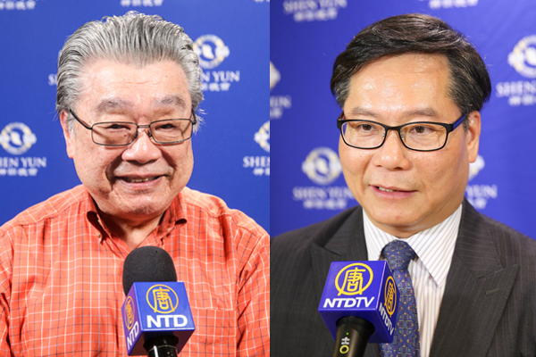

知名钢琴与大键琴演奏家宋允鹏（左）与知名小提琴家苏显达（右）均对神韵音乐表示赞赏。（大纪元合成）

 
【大纪元2018年09月10日讯】（大纪元记者徐曼沅台湾报导）“神韵的音乐就是一个善。”被誉为“台湾钢琴教父”的钢琴与大键琴演奏家宋允鹏赞赏神韵交响乐说。

美国神韵交响乐团9月13-27日将第三度莅临台湾巡演。神韵交响乐结合东西方音乐的精髓，将中华音乐的韵律与灵性，透过独特的配器与演奏技法，呈现出精准、辉煌的宏大气势。 

日前宋允鹏接受爱乐电台采访时向古典乐迷推荐神韵交响乐，宋允鹏认为神韵所有的团员，包括作曲、编曲者都有一个明确的目标，就是“善”。他说：“这也是巴赫的原则，每个大作曲家、大师，巴赫、莫札特等等都有浓厚的宗教信仰，神韵也有。”他认为这也是神韵音乐平易近人，很容易与听众互动的原因。

神韵原创音乐以中国音乐的旋律为基础，用西方管弦乐来表现曲目所需要的效果，获得许多听众的青睐。宋允鹏说：“对于国乐器，我们从小听到大，所以对这些旋律很亲切，神韵交响乐团用西方乐器，弥补国乐器缺乏的部分，如低音的雄厚、弦乐色彩的变化。”

“国乐器也有很多西方乐器无法表达的音色，神韵的作曲家充分地协调两种乐器的特色，包含乐器演奏声音的大小，都非常的用心。”中西乐器合璧在技术上非常困难，宋允鹏说：“西洋乐器习惯用十二平均律的方式弹奏，国乐往往会有些不中不西，有点像日本面包夹炒面，但神韵完全没有这方面的困扰，他们在这方面下很多功夫。”

宋允鹏表示：“整个音乐非常自然，这种做法非常有发展未来，不是发展一下就没了。”他认为神韵交响乐成功地调整东西方音乐的不同，为中华文化的国乐开拓了一条新的路。

神韵的音乐可以跨越国界与文化差异，宋允鹏认为现在这个年代，从手机就可以看到全世界的事情，他说：“每个人都是地球人，音乐更没有国界，不会说听不懂。”身为钢琴演奏家，许多人都曾向宋允鹏表示古典乐太难懂，交响乐听了太费劲，他说：“一个乐章40分钟，若聚精会神跟着去听的确会很疲惫，但神韵交响乐团的曲目却是依照着民谣的曲式，听了很舒服，不会太难，每个人都听得懂。”

宋允鹏说：“听神韵交响乐不会有压力。在海外，很多西方人听得都很高兴，南美洲的人都听得懂。不管是中东或者是中国人都听得懂。”

如果您未曾听过东方传统乐器与西方管弦配乐大型合奏，一定要去欣赏神韵交响乐团。宋允鹏说：“我说再多也没有用，一定要现场去听。”

<b>音乐教育家苏显达：只有神韵有这么大的气魄</b>

神韵交响乐团此次将在台北、屏东、云林、高雄、彰化、新竹、桃园、台中、嘉义、台南等十大城市巡回演出，打破过去交响乐团只在台湾北、中、南三大城市演出的惯例，为全台乐迷提供更方便的现场聆听机会。

台湾知名小提琴家、音乐教育家，现任国立台北艺术大学音乐学院院长苏显达说：“只有神韵有这么大的气魄。”

苏显达表示，二十世纪初期的音乐家就对东方乐器很感兴趣，因为东方乐器充满神秘色彩。但将传统的东方乐器与西方管弦乐配器结合并不容易，他说：“要将这两种乐器结合得和谐，实在是一个很大的考验，考验编曲者配器的功力。”

众所周知，中国音乐注重情绪的表现，西方音乐则是重视整体音乐的合奏效果，重视配器与和声效果，但神韵却成功结合了东西方音乐两者的特点。苏显达表示，很多所谓的融合是让西方乐器盖过东方乐器，或是东方乐器抢过其它乐器的风采，例如用了东方乐器唢呐以后，其它乐器的声音几乎都听不见了。但他说：“在我过去听到的神韵演奏，这部分结合得相当好。”

苏显达认为神韵缔造了一种音乐的可能性，他说：“音乐无国界，现代音乐家需要各式各样的元素，我们身处在悠久的历史下，结合这种方式，可以达到耳目一新的效果。神韵缔造了一种可能性。”

神韵交响乐的曲目丰富多样，充满正能量。无论是古典音乐发烧友或刚入门的听众都能感受其无限吸引力。演出曲目包括神韵原创作品，以及西方经典曲目，如德弗札克、法兰兹苏佩、柴可夫斯基等名家的不朽作品。

9/13～27，神韵交响乐团将三度莅临台湾十大城市巡演，了解更多：http://tw.shenyun.com/tickets.html

<h1 align="center"><b>千百度：修大法让她眼睛亮了驼背也直了</b></h1>

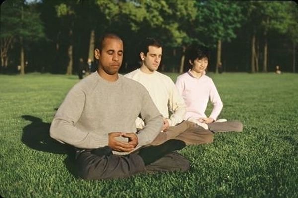

她按照大法真、善、忍的标准修心炼功，放下名利，看淡亲情，努力修出对众生的慈悲，全身的病陆陆续续都不翼而飞了。（大纪元)

 
 【大纪元2018年08月31日讯】这是一位四川农村妇女修炼法轮大法的传奇故事。

<b>从头到脚都是病</b>

修大法前，她从头到脚都是病：眼睛看不清东西，眼眶都是烂的，红线锁边；耳朵流脓流水；鼻子流脓流血，奇臭无比；头痛、头晕，常常突然就会天旋地转晕倒在地不省人事；胃痛，大口大口的吐血；满口的溃疡痛得不能进食；子宫长的瘤子自己在衣服外都能摸到；双足又痛又重，像戴着脚镣；走路时从不敢伸直腰杆，久了就成了驼背，全身瘦得皮包骨，丑得自己不敢照镜子。

全身这么多病，可家里、地里的活儿还得忍着病痛去干。上有八十多岁的残疾婆婆，下有幼小的孙女，还喂著各种家禽，每天都有干不完的活儿，凌晨两、三点才能睡觉，这种生不如死的日子，让她多次想触电自杀，又不忍丢下家中老小，常常情不自禁的大喊：“老天爷哪，快把我收了吧！”

那会，她的脾气也异常暴躁，丈夫酒后爱唠叨，她经常拿棒子打他，用竹竿打他的嘴，生起气来抓到什么就用什么打，和他吵架、打架是常事。

一九九八年的一天，她去割猪草，看到很多人在大队部炼功，羡慕他们好有福气啊：还有时间炼功。法轮大法优美的音乐、舒缓的动作一下吸引了她，使她久久不愿离开。回家她跟婆婆说起这事，说我也想炼。婆婆说：媳妇呀，等到六十岁再炼吧，那时我也走了，孙女也大了。就这样她与大法错失了机缘。

那年她四十八岁，她想：还得熬多少年啊？我这样能熬到六十岁吗？

<b>心生善念获救度</b> 

二零零一年的一天，一位法轮功学员路过她家门口，看到她的样子吃了一惊，赶紧递给她一张真相传单，说大法有多好，然后就走了。

她接过来边看边念给孙女听，很多字都不认得，但还是明白了意思。现在她都记得，传单上说的是某地几个大法弟子出钱出力为村民修了一座桥，被派出所知道了，把这几个好人抓去劳教了。她看罢气愤极了，对似懂非懂的孙女说：自古以来修桥补路是积大德的事，法轮功修桥就犯法？天理都不要了！

人心生一念，天地尽皆知。过后她突然胃痛难忍，跑到厕所拉出半桶混合著脓血的脏东西，接着又呕吐，伴随着高烧，内衣都湿透了。然后觉的怎么那么亮啊，到处都亮堂堂的，突然明白自己的眼睛好了，没有那层濛濛的东西了！

她不敢相信这是真的，到处看，又跑到外面去看河坎，看远处的山，真的都看得到了！突然又发现自己的腿和脚都不痛了，也不重了，她兴奋得像娃娃一样边跑边喊：“我看得到东山了！”

她决心立刻开始修炼法轮功。两天之内她找到几位法轮功学员学习炼功动作，可是只学会了动功。第三天她去田里放秧水，想着没学会静功，就双手上举对着天说：师父啊，我想炼静功，请您教教我吧！然后她坐在田埂上，把脚轻轻一拿就双盘上了，还坚持了大约三十分钟。对她这样腿脚僵硬的新学员来说这简直不可思议！从此五套功法，她天天都炼。

她又从同修那儿借来《转法轮》，恭恭敬敬的看，认不得的字就用本子记下来，跑去问同修或同修的子女，不管有多远。因为记不住，她急得打自己的头，骂自己是“猪脑袋”，跑几遍去问同一个字。结果，神奇的是，不长时间她就能通读《转法轮》了，看大法真相资料了。

自修大法以后，她自觉按照大法真、善、忍的标准修心炼功，放下名利，看淡亲情，努力修出对众生的慈悲，全身的病陆陆续续都不翼而飞了。

在炼功过程中，她亲耳听见驼著的背“咯咯”作响，很自然的她的背能伸直了；她天目看见师父把她的头顶掀开一块，很多脏东西像喷泉一样的往外喷了很久，此后她的脸色就变得红润了。还有很多奇迹，无法一一详述。

<b>明真相全家受益</b>

她孙女有先天性心脏病，她天天给她念“法轮大法好，真善忍好”，孙女的身体一天比一天的好起来。

她的家人有五个曾遭遇车祸，因为他们都明白了真相，做了“三退”，有的化险为夷，有的奇迹般康复。

二零零八年，女婿骑摩托被汽车撞上，甩出十几米远，脑浆都出来了。医院抢救后说没希望了。女儿跪地求医生再想想办法，医生摇头说：“已经尽了最大努力。”熟人来看望，说与其成植物人，长痛不如短痛，让拔掉女婿全身的管子。她拒绝了，趴在女婿耳边说：“现在只有大法师父能救你，你在心里和我一起念‘法轮大法好，真善忍好’，如果你念不了，你就好好听我念。”然后她反复的给他念，念著念著，女婿突然坐起来，又倒下去。她说：他明白了，不会成植物人了。果然，一个月后女婿就康复出院了，没留下任何后遗症。

外孙女跟女婿同时出的车祸，造成脑出血。她也给外孙女念“法轮大法好，真善忍好”，还教她自己念，告诉她只要专心的念，大法师父就会救她。外孙女念著念著就吐出很多脏东西，女儿说怎么还严重了，她说那是师父帮助她清理身体。果然第二天外孙女奇迹般的好了，出院了。

二零零六年她的另一个女婿在公路上也被汽车撞出十多米远，伤了肌肉。她赶去嘱咐家人不能讹司机的钱，自己给医药费；又让女婿来她家学法，很快就好了。

二零一七年二月，她丈夫卖完凉粉回家，被一辆大电瓶车从后面撞了，倒在一条深沟的边上，盆盆钵钵都甩到深沟里，人却毫发未伤。就在当天，那附近出了两起车祸，两人当场被撞死。

她说：“替世人悲哀之后，我深感自己得法和家人受益是多么幸运，深深感谢师尊洪恩救度！”

<h1 align="center"><b>专访关贵敏：动人歌声源自神的力量</b></h1>

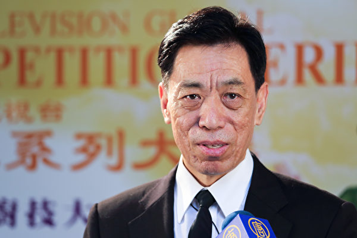

素有“中国歌王”美誉的著名男高音歌唱家关贵敏。（陈柏州／大纪元）

【大纪元2017年01月13日讯】（大纪元美国纽约记者站报导）昔日的中国歌王，今日的神韵明星。七旬高龄的关贵敏穿云裂石的歌声1月11日再次回荡在纽约林肯中心，让新老歌迷喜出望外。自从掌握了神韵的声乐唱法，关贵敏技艺更胜当年。他表示，这一切源自神的力量。

<b>神韵独特的美声唱法</b> 

关贵敏在纽约林肯中心大卫寇克剧院演唱的是一首全新的歌曲。他的歌声极具特色，高音嘹喨恢宏，中低音醇厚圆浑，缓急轻重收放自如。最令人惊讶的是，闻其声饱满刚健，完全不像一位七十高龄的人。

关贵敏说，这都要感谢神韵总导演教授他的美声唱法。这种古老的歌唱艺术失传已久 。

在中国，古老的戏曲唱法和欧洲早期的歌剧唱法一样，声音纯正而动听。但是，这种唱法在当今的欧洲和中国基本上都失传了。现在，神韵的独唱歌唱家将这种唱法再次展现在舞台上。

关贵敏表示，由于年龄的增长，如果他按照过去的方式训练，早就唱不了了。而现在他掌握了古老的传统美声唱法，能让歌声更有力度。全世界只有神韵艺术团掌握了这种传统唱法。

“我们的发声有秘诀，不完全靠喉咙 。这种方式是最早的、神传给人的技艺。”关贵敏透露。

<b>重踏艺术之路的奇迹</b> 

人到七十古来稀，而能以古稀之年保持世界一流歌唱水平的艺术家更是绝无仅有。关贵敏于上世纪70年代就是知名歌手，而且是中国大陆的一级演员。80年代，他却在事业鼎盛之时因患肝硬化而一度退出歌坛。那么，是什么让他的艺术生命重生呢？

1996年，关贵敏有幸修炼法轮大法，所有病痛不药而愈，找回无病一身轻的感觉。到他60多岁时，同龄甚至下一代的歌手都无法唱歌时，关贵敏却奇迹般地重返国际舞台，绽放老当益壮的神采。他说：“如果不修炼，我可能只能晒晒太阳、抱抱孙子，真是老态龙钟了。”

一般人靠睡觉，靠养生，靠休息使自己的声音保持清纯，但关贵敏直到今天，都保持着瘦长挺拔的体态与矍铄充沛的精力。他说：“诀窍就是我修炼的功法。”他通过修炼，配以独家的发声训练，不仅使歌唱技艺突破年龄的限制，更使自身维持机体的青春与身形的优美。

在保持身体健康的同时，关贵敏最大的变化来自内心。怎样做一个好人，如何辨别世间正邪善恶，他都有了明确的答案。动人的歌声不仅源于高超的歌唱技巧，更来自歌唱家纯净无暇的内心世界。关贵敏坚信，歌唱如同修行，若要追寻更高的艺术境界，不断提升道德修养才是根本大道。

<b>用歌声传递神性</b> 

近年来，关贵敏随神韵艺术团在世界各地巡回演出，足迹遍及欧洲、北美、亚洲等地区的顶级剧院。他表示，自己并不看重登上什么舞台，只想把修炼中感受到的讯息分享给世界观众。“我们正处在大变革的时代，宇宙、地球在更新换代。” 他说，人要听真相，做出正确的选择。

神韵晚会的歌曲，恰恰把关贵敏最想说的话表达出来。关贵敏表示，神韵歌词和曲子都是神韵总导演所作。他认为，神韵艺术就是神的力量，他只是传播的使者。

关贵敏说，人都有神性，他的歌声就是希望把人的神性激发出来，使人道德回升。

<h1 align="center"><b>中共明目张胆“抢钱”　暴露附体吸血本质</b></h1>

【明慧网二零一八年九月四日】最近，一连串的消息都是中共财政入不敷出背景下的强行征税。P2P网贷平台爆雷，本来应该追问这些钱到底去了哪儿？应当怎么给血本无归的投资者有个交待？政府应该承担什么责任？这些统统都没有。

反而出了一个新的税收政策，对于经营P2P的创投基金，征税比例从20%到35%，一时之间创投基金税负增加七成，把正在募资难、退出难的困境之中挣扎的创投基金，挤到了悬崖边上。

刚过了几天，中共当局又公开个人收入减税方案，人们开始没有什么反应。过了几天，人们才明白，最大的变化是以前是由企业交纳，转变为养老、医疗等社会报销费由税务部门统一征收。这意味着，以前是企业决定怎么交，是弹性缴纳，而现在是税务局直接收，是刚性缴纳，这一前一后的变化，使企业的成本会大大的增加，本来就困难重重的民营企业，这回更是雪上加霜，最后只有裁员、打烊，那员工们也只能回家待业。

7月16号，中共国家统计局公布的数字显示，今年上半年国内生产总值418，961亿，第二季度，国内生产总值同比增长6.7%，略低于第一季度的增长幅度6.8%。在经济放缓的背景下，中共依靠税收而来的财政收入却在增加。7月13号，中共财政部发布的消息称，今年上半年，财政收入保持平稳较快增长。一般公共预算收入104，331亿，同比增长10.6%。相当于此时GDP的1/4。在正常国家GDP下降，而财政收入反而增加，几乎是不可能的事情。好比本来在下雨，地上是湿的，雨停了，可是地上的水却更多了。

这样的情况下，居然还有专家在讨论“为国生育”，要开征社会抚养费，不生第二胎的要交税。为了搜刮民财，中共已经撕破了脸皮，直接从国民的腰包里掏钱。社会开始明显感觉到，中共有点失态了！

其实，在此前，并不是中共没有惦记民众的钱财，而是从其建政之始，就早已把一切财资物料，统统霸占为己有。从1950年开始的镇反、三反、五反、肃反，打倒了地主、资本家、企业主、商贩等，而他们的财产，以公私合营的名义，由中共统一占有。

就是连“打土豪，分土地”分给农民的土地，共产党又以“合作社”名义，把所有土地收了回来，百姓只有使用权，而没有土地财产权。大家知道，就是在二战法西斯统治的德国，还保留了私有产权和私有财产，土地归个人所有。而中共却将社会大大小小的一切财产，都用枪杆子赤裸裸地抢了过来。只不过中共抢劫民财，每一次都有一个表面的“名义”，为了人民、打倒剥削云云，而民众在系统性的谎言与暴力的恐吓中，根本不敢有任何疑问。

直到2004年《九评共产党》奇书问世，才揭开了真正的历史真相，书中写道：“共产党以垄断和肆意使用暴力，剥夺人民财产，以及最重要的，剥夺言论和新闻自由，剥夺人民的自由精神和意志，来达到其绝对控制社会权力的目标。以此而论，中共这一附体对社会的严密控制，可以说是古中今外无出其右者。”

1992年，法轮大法正式开传，把真善忍的宇宙真理传给世人，无数修炼者身心受益，给家庭，给社会带来了纯净、祥和的正派之气。而正是法轮大法的正，象照妖镜一样照出了中共邪党的邪，江氏集团与中共互相利用，掀起了对真善忍信仰的疯狂打压。

十九年来，法轮功学员冒着生命危险，把一本本《九评共产党》，送到您家的门口，送到您的信箱，送到您的手中。这是在告诉您真相，真正的历史真相，从1921年中共的建立，就从来没有人把其真实面目揭穿过，只有站在历史之上的《九评共产党》，才说清了这一切。原来中共的本质是邪恶的。

在东北地区、华北地区，老人们都知道狐黄白柳的存在，也就是能附在人身上的附体，但从表面上看不出来。附体的妖物会慢慢吸取人的精华，这个人慢慢越来越衰弱，直至生命的结束。

只要附体存在一天，它就是邪的，它就是恶的，它丝毫也不会对它依附的人身有任何的怜悯，就象《聊斋志异》里的画皮，美丽的面孔后面，却是吸尽了若干生命鲜血的魔鬼。

而中共是有史以来，隐藏最深、手段最厚黑的超级附体。中共横征暴敛，强行征税，是其外强中干的真实表现。凶残的本质，直到崩塌的最后一刻，也会毒性发作。

二零一八年上半年，回光返照的中共，更加歇斯底里地打击真善忍，二零一八年八月二十二日至二十三日，辽宁地区涉及十个城市的警察，非法抓捕47名法轮功学员和家属，其中包括家属4人。

据称，此次绑架是辽宁省公安厅督导的“专案组”联合行动，同时在各市多个部门配合出警，统一突击行动，实施非法抓捕、抄家、抢劫等犯罪行为。于八月二十二日开始统一联合行动，因此，简称为8.22案。

而自今年七月份至目前，河北省涞水县公安局、派出所在涞水县委、政府、政法委和维稳办的指使下，强行对全县五百五十名法轮功学员非法敲门强行拍照、搜集个人信息。除侵害法轮功学员和家人的住宅权、肖像权、个人隐私权、公民信仰权，更重要的是侵害了他们的名誉权。

他们找不到法轮功学员本人就不分昼夜的找他们的家人、亲属、邻居和周围民众，搞得他们怨声载道：“扫黑除恶”谁是黑恶？共产党才是最大的黑恶组织，法轮功都是好人，与扫黑除恶有什么关系？找他们干什么？人人要都学了法轮功，就没有黑恶了。

人在做，天在看，善恶有报是天理，任何一个恶行，都逃不过上天的法网！

现在，中共附体的青面獠牙，已经暴露的一清二楚，可贵的中国人，您还等待什么，认清中共附体本质，退出邪恶的党团队，还自己一个清白，您就能有一个光明的未来！

<h1 align="center"><b>曹长青：法轮功学员被摘器官是真的吗？</b></h1>

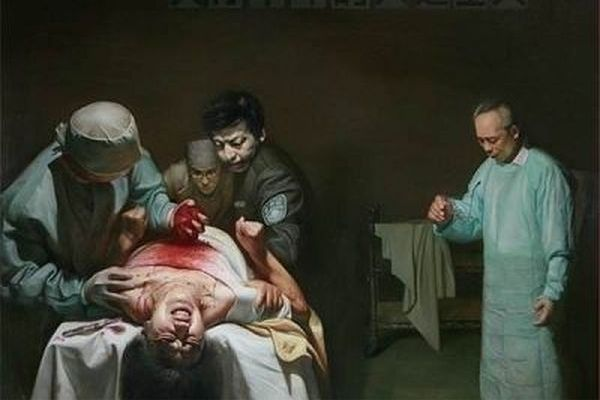

中共不仅长期纵容非法摘取器官，更使中国人的道德沦丧登峰造极，只有结束专制，把中共这个毒瘤摘掉，中国才可能走向健康。（大纪元）

美国人权作家葛特曼（Ethan Gutmann）调查法轮功学员在中国被摘器官的《屠杀》一书最近在台湾出了中文版，再次引起人们对中国器官移植黑幕的关注。

对于法轮功学员器官被活摘的问题，西方一直有专家学者进行调查，那么从常识和事实这两个角度来看，这种事情是否有可能？

首先，从常识角度来看。中国自愿捐献器官的人很少，因中国文化有保留全尸、不愿身体被破坏的传统，所以很多人不愿捐器官。中国曾有统计，愿意捐献器官者只有一千万分之六，等于14亿人中只有一千多器官捐献者。而美国，每年有一万多人捐献器官，30%以上的美国人签了死后捐赠器官的同意书，等于美国三亿人，有一亿人签署了。中国那么少人捐献，哪来那么多可移植的器官呢？中国器官移植学会主任陈实2005年底说，中国无偿捐出的器官总共63个，可那一年中国器官移植有四千多例。中共当局自己的解释主要是来自死刑犯。

中国政府1984年通过法律，可以摘取死刑犯器官，由此把医院的器官移植，变成医院和司法部门联合进行的事情。虽说要经过死刑犯同意，可在中国那种没有法治的情形下，死刑犯的真实意愿如何，没人知道。而且有把犯人直接拉到医院，甚至活摘器官的做法。对这一点，今年7月15日中国官方电视台《央视》播出的《面对面》节目对中国前卫生部副部长、器官移植专家黄洁夫的采访也可证实。黄洁夫说，当年医院和监狱有个协定，我要器官移植，你那边就准备。他说，器官移植，要求很严格，枪毙犯人的法场环境不行；意思是，要把犯人拉到医院，和器官移植手术同时进行。

这个卫生部高官清清楚楚知道，中共当局政策，等于默许这种残忍摘取器官；而且他本人就有这种经验：2005年，黄洁夫副部长陪同当时的中共政法委书记罗干到乌鲁木齐参加新疆自治区成立50周年活动时，他想炫耀一下本事，因他是中国第一个做肝脏器官移植成功的专家，就在新疆医科大学附属医院做了一个肝癌病人的手术，打开一看，是个理想的可以进行肝脏移植的器官，所以他把肝脏摘出来，体外把癌细胞全部切除，再把那个肝脏放回去。但为了保险，不在罗干这种高官面前丢面子，他要求广州和重庆的两所大型医院送来两个肝脏作为备用。他的手术（从《乌鲁木齐在线》和《新浪网》都可查到报导）进行了15个小时，术后观察24个小时，总共39小时后宣布手术成功。那两个送来的肝脏就不需要了。由于肝脏在缺血15小时后就坏掉了，那就浪费了两个肝脏，太可惜了。可是，送来的不是肝脏，是两个大活人！在黄洁夫要求重庆和广州送来两个肝脏后，那两个城市就各自宣布一个犯人执行死刑，到新疆执行。如果黄洁夫的手术失败，那就得把犯人当场摘器官了。

这位中共卫生部高官黄洁夫之前说过，他去过一次那种摘取器官的场所，用他的话说，是“供体”方面，去了一次，就再也不去了。也许是那种现场的残忍，让他看不下去、不能忍受了。

这位黄洁夫副部长，2014年到了台湾，想建立所谓两岸器官移植合作中心，由中国方面提供器官。但遭到台湾医界的反对，认为中国的器官移植有问题，国际有广泛报导和批评，最后这个合作没有进行。

另外，从事实角度来看。那么中国那些器官移植中，有多少是来自法轮功学员的？多年前，加拿大人权律师大卫．麦塔斯，前加拿大联邦部长大卫·乔高，这次在台湾出版中文版的揭露中国器官黑幕的人权记者葛特曼，他们三人曾合写300页的调查报告：《血腥的器官摘取——大屠杀》，提出很多证据和质疑：

第一，	时间点。中国大量器官移植，发生在中共领导人江泽民1999年下令镇压法轮功之后。在2000年之前的九年期间，中国肝脏移植手术全国不到200例。但在镇压法轮功之后，中国的器官移植就一路飙升，2005年一年超过4千例，后来移植手术冲到每年6万到10万例。他们认为，这些器官来源很多是法轮功学员。

第二，	做出这种判断的一个根据是，据美国人权机构数字，中国强制关押了200万人，其中一半是法轮功学员。无论是前面讲的死刑犯，还有所谓无人认领尸体就可摘取器官等，都给中共当局摘取法轮功学员器官提供了便利，因为这个行业利润巨大，所以中共军方医院，武警医院，甚至监狱医院等，都纷纷做器官移植，他们“近水楼台”，摧残法轮功学员，然后用什么意外并病死等说法，进行器官移植。像山西一家医院，光是肾移植，年度获利就是二亿六千万元！

第三，	上述几位西方律师记者等，以寻求器官的名义给中国57家医院等打电话，其中提到法轮功的人的器官是不是健康，医院回答说，他们练功，非常健康，质量好。这些录音记录证实，中国医院的器官来源有法轮功学员。

第四，	据逃出中国的法轮功学员说，他（她）们被酷刑，但狱方却定期为他们检查身体和验血等。后来明白，这可能是为了活摘器官时保证指标正常。

第五，	被强制关押的法轮功学员，很多宁死不屈，不提供自己的名字和家人朋友等。中共当局就用无人认领方式处理，摘取器官（当时中共法律允许）。在过去这些年，在中国失踪的法轮功人员很多，令人质疑这些人可能因器官移植需要而被害。

第六，	不要说法轮功学员，就是一般人，也可能因医生要发财（一个肝脏价格18万美元）合作害人，摘取器官。近年就看到中国有两起杀人事件，都和医生有关。一起是杀人后，把器官卖给医院，三名医生参与牟利；一起是五个医生把一个流浪汉杀害，摘取了器官。

2015年，在国际舆论谴责和压力下，中国政府终于宣布，不再从死刑犯身上摘取器官。但是，中国没有法治，监狱和医院等都有黑幕，所以器官移植领域的非法活动仍然存在。

中共不仅长期纵容非法摘取器官，其更大罪恶是，统治近七十年，摘掉了太多中国人的良心，中国的道德沦丧登峰造极。只有结束专制，把中共这个毒瘤摘掉，中国才可能走向健康。

（据2018年9月4日《政经看民视》节目上的谈话整理）

※本文原刊于：【读报】

<h1 align="center"><b>千里伸冤慈母心</b></h1>

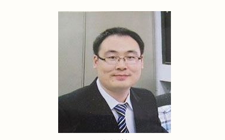

张树德是村里唯一读过研究生的人，被诬判7年后，其母不远千里到锦州找相关单位、人员伸冤。（明慧网）

【大纪元2018年09月08日讯】他是村里唯一读过研究生的人，毕业于哈尔滨工业大学，四年前应聘到辽宁省大连理工设计院，后被外派到盘锦市高新技术产业开发区工作。

2017年6月26日，因居住证到期，他到当地派出所办理顺延手续。警察问他有什么信仰时，他坦承相告：信仰法轮功。为此，他被非法抄家、被劫持到盘锦看守所、后被盘锦市兴隆台区法院非法判刑7年，罚金2万元。

出生在哈尔滨市双城区新兴乡的张树德，今年28岁。7岁时他就跟着爷爷奶奶一起修炼法轮功。法轮功帮他开智开慧，使他从一个普通农民家庭出生的孩子，成长为一名品学兼优的年轻人。

张树德的母亲是一个没有出过远门的农家妇女，儿子遭非法判决后，心急如焚，不远千里往返于黑龙江的哈尔滨和辽宁省盘锦市，一次次和参与迫害儿子的警察、检察官和法官们接触、交谈、沟通，渐渐换来人们的同情、理解和关注。

<b>在盘锦市检察院里的对话</b>

律师两次去看守所会见张树德都没见到，每次看守所都说：“张树德不愿见律师”（实际上，张树德要求会见律师时不穿号服、不戴手铐），并告知检察院的人来过。

于是在2018年4月11日，张树德的家属到了盘锦市，他的妈妈去了盘锦市检察院。

检察院门卫已经认识树德妈了，打了电话后，公诉科的一个副科长来了，说：“你来过一回了。”树德妈说：“是，为我儿子的冤案告状。”

见他们一同来的还有另外四个人，副科长一下就变脸了，要检查他们身份证，做记录。

一会儿来了十几个四五十岁的人，多半穿着便装。他们用异样的眼光看着来者，面带愠怒。

“我儿子就因为一句话说信仰法轮功，一个研究生，正在工作期间，就给冤判7年，这是违法的，所以我才告状，修炼法轮功合法。”树德妈说。

“法轮功已经洪传一百多个国家和地区，《转法轮》翻译成40多国文字。天安门自焚是栽赃陷害法轮功，是江泽民挑起民众对法轮功的仇恨。你们不按照法律办事。”树德妈把手里的多份资料摊开：“你们看看。”那些人不看，往后躲。

其中的一人问：“这法轮功啥时候合法了呢？”

树德妈说：“啥时候合法了？从一开始就合法。”

“大姐行了，你现在是上诉期，上诉期间不能告，还没执行呢。”有人说。

“谁判我孩子都是违法犯法的。拿去看看吧。”树德妈递上控告诉状，一人接了。

“你们说是不是冤判我儿子？今天走了，我还会来的呀！”有人劝树德妈离开，她回答道。

那些人中有个人两手抱拳给树德妈施礼，后面还有人做佛家的合十礼。

<b>张树德在看守所的状况</b>

律师会见张树德时，见他没戴手铐，反穿着看守所的衣服，心生敬佩。律师还得知，张树德进看守所后写了三封信，其中一封是写给习近平的，还有给当地司法部门的，信件都是通过看守所的警察寄出的。

狱警对律师说：“没见过张树德这样的，还让我们把大门打开。”在押人员一般都走小门，要哈著腰钻出入。

张树德意识到这是对人格的羞辱，不认可，对警察说：“你们让我见检察院的人，就得把大门打开，我走大门。”

经过他不断的努力，奴工生产他不参加，报数报名解除了，象征着犯罪嫌疑人的号服不穿了，不戴手铐了，允许走大门。

<b>三上兴隆台区检察院</b>

5月2日上午，树德妈和亲属第三次到兴隆台区检察院，询问控告状长时间没有回复的原因。一个控申科检察官来门卫室接待了她们。树德妈和他讲了一个多小时儿子遭诬判等情况，个门卫也在听，还插话说：“法院判重了。”

临走前，树德妈郑重地说：“迫害法轮功学员是违法的，是有罪的。法轮功是修佛的。”检察官听罢打了个冷战。

下午，树德妈找到了上次接待她的控申科女检察官刘广安，告诉她儿子的冤案，并告知迫害法轮功的后果。

之后，树德妈给律师打电话介绍去检察院的情况，律师说：“啥判重了？一点罪都没有！（修炼法轮功）完全是合法的，就是应该无罪释放。”律师很明白真相了。

<b>政法委人员的变化</b>

5月2日下午，树德妈还去了兴隆台区政法委，一史姓人员接待了她。他们聊了一个小时，树德妈说：“我就这一个儿子，毕业于哈尔滨工业大学，获学士、硕士，毕业后来到了盘锦市，为咱们盘锦做贡献来了，就因为一句信仰法轮功的话，被冤判7年。”还告诉他法轮功真相。

“大姐，我理解你的心情，你就去市中级法院找，会博得他们的同情。”

树德妈感到这些人和半年前判若两人。

<b>去市政府上访</b>

5月30日，树德妈去了盘锦市市政府，说找市长。门卫说，现在还没有市长。张树德的姨母说：“你真会开玩笑，我也开个玩笑，让我外甥给你们当市长。”说着话，树德妈把儿子的大照片拿了出来给他们看。

然后树德妈给门卫讲孩子被迫害的真相。门卫听罢，和颜悦色又坦诚地告诉她们去附近一百米处的市政府信访办，旁边还有律师事务所。

当日，树德妈还去了兴隆台区监察委员会，讲明冤情，被告知，法轮功的事不归那里管。在场的一上访人听了树德妈的诉说后说：“法轮功百分之八百赢。”

6月1日，家人第二次来到市政府，门卫不让进，一特警打了电话后把家属领到了信访办，当时来了一车特警。家属就把张树德的照片给他们看，又给他们讲儿子遭迫害的经历，还把一些真相资料给他们看，他们都接了。有人告诉树德妈，这事还得找法院。

<b>一而再再而三 去中院</b>

5月31日下午，树德妈一行人去了盘锦市中级法院。刑庭庭长李玉新不见。

6月1日，树德妈二进中级法院。在门卫室，家属把相关材料和信递交给他们，被拒。

6月7日上午，树德妈一行再去中级法院，递交给院长王宏、刑庭庭长李玉新的两封信，门卫收下了，答应转交。

家属把冤案装进信封里，在法院人员吃午饭的路上等他们，七八十人中只有两人接了资料。

<b>走进公安局</b>

5月31日下午，树德妈和亲属走进了盘锦市公安局，门卫请家属去公安局信访办。信访办的人感到惊奇，说：“这里还没遇到法轮功上访的呢。”

接待他们的一男子一直数落法轮功的不好，还说炼法轮功的叫人洗脑了。

家属说：“这话说的不在行，既不符合事实也不符合法律，大法洪传是在国家政府主管部门的主办单位允许下进行的，人传人，心传心，在合法、公开的环境传向全国又走向世界的。

“全国人大及全国人大常委会行使国家立法权和监督宪法的实施职权，1998年下半年，全国人大前委员长乔石偕同180多名全国人大离退休老干部经过半年的调研，得出：法轮功于国于民有百利而无一害的结论。如果你还要说洗脑，得看一看是不是马克思给你洗脑了。”

那人听了，尴尬不已。

家属又去了市信访办设立的律师事务所，说明冤情，递给他们资料。那里的人告诉家属去检察院，让一审法院重新开庭。

从律师事务所出来之后，家属去了盘锦市信访办。那里有五人，其中一年长的工作人员听后说：“一般有两种情况，第一种是傻；第二种是坚定地信，你儿子是第二种，坚定地信。”他们都接下家属给的资料。

6月4日，家人拿着多种资料，走访了六个律师事务所，获得同情和建议。

最后家人去了盘锦市人大，门卫不让见，也不让留材料。

家人去了盘锦市看守所，打电话给看守所教导员孙德利，问他张树德怎样？他说正常，并让把材料放门卫那儿。树德妈就把信和资料留给了门卫，让转给孙德利。

<b>一路上访、走访</b>

家属又去了市信访办设立的律师事务所，说明冤情，递给他们资料。那里的人告诉家属去检察院，让一审法院重新开庭。

从律师事务所出来之后，家属去了盘锦市信访办。那里有五人，其中一年长的工作人员听后说：“一般有两种情况，第一种是傻；第二种是坚定地信，你儿子是第二种，坚定地信。”他们都接下家属给的资料。

6月4日，家人拿着多种资料，走访了六个律师事务所，获得同情和建议。

最后家人去了盘锦市人大，门卫不让见，也不让留材料。

家人去了盘锦市看守所，打电话给看守所教导员孙德利，问他张树德怎样？他说正常，并让把材料放门卫那儿。树德妈就把信和资料留给了门卫，让转给孙德利。

<b>母亲的心声</b>

树德妈看到这些公检法的人明明白白地干着违法违宪的事情，且麻木地在干，真为他们的结局担心。张树德家族中的长辈们了解预言真相。

家中仍然在世的老爷爷告诉树德妈，不要难过，忍一忍，参与迫害的谁也跑不了，预言都写着呢：“云层以里吹打弹拉，云层以外哭喊连天。”“十年失了龙华会，休想天宫八宝台。”天上下来的很多人都回不去了。

张树德的一个太奶奶说过，到这个时候就是“千千菩萨随地走，万万罗汉下昆仑。”“天堂换佛祖，地府换阎君。”说的是：信佛的都被抓监狱去了，不长时间就放回来了。到那时老佛爷的道就明了。没落之年，被淘汰的人会很多很。

树德妈最后想告诉那些枉判法轮功学员的参与者，立即撤销违法的判决，释放所有被非法关押的法轮功学员，愿所有的生命都拥有一个真正美好的未来。

<h1 align="center"><b>她遇到一场夺命车祸却又奇迹生还</b></h1>

“护身符”里有乾坤 神佛就在一念中

【希望之声2018年9月9日】（本台记者慧光综合报导）在中国大陆河北省的一个小县城里有一位六十多岁的老太太，虽然没有多少文化，可为人热情、随和，喜欢帮助人，在乡里乡亲的印象中口碑很好。她有一位亲戚是法轮功学员，有一天送给她一个护身符，教她遇到困难时念“法轮大法好、真善忍好”，说念动这“九字真言”就能度过灾难，遇难呈祥，她当时就记下了，并且将护身符每天都带在身上，没想到后来遇到一次大难真的就应验了。

2010年秋的一天，她像往常一样在马路上行走，在通过一个十字路口的斑马线时，被一辆闯红灯的厢式货车撞倒了。货车的后轮从她身上碾压过去，导致她身体左侧的肋骨全部碾断，左侧大腿被碾开一条约四十厘米长的伤口，骨头都露出来了；头部严重摔伤，口鼻及两耳往外流血，整个人身血肉模糊，现场惨不忍睹。目击者都惊呆了，都认为这老太太肯定活不了了。

很快她就被救护车送到医院。在重症监护室里，医生经过检查后的诊断结果是：多脏器严重受损，十二根肋骨骨折，腿骨骨折，严重脑震荡，全身多处血肿及挫伤等。大夫先是在她的腋窝处打了个孔，将她胸腔内的积血引流出来，随后通知家人需要开胸做手术，但是不能保证人能活下来，最乐观的结果也只能保住性命，恐怕会终身瘫痪，再也站不起来了。

她后来回忆说，在与汽车相撞的那一瞬间，她的肉身完全失去了知觉，可是却感觉有另一个自我“呼”的一下脱离了这个世界，随后来到一个从没见过的地方。

她说：“那是一个透明、宽阔、干净、圣洁的世界，在那里我感到特别轻松、轻盈，心里充满着喜悦，没有烦恼，没有痛苦，非常美妙。走路轻飘飘的，自由自在。我心思‘这也许就是天堂吧！太美妙了！真是让人向往啊！感情这死了比活着好，太舒服了！’事隔多年了，那场景我依然记得清清楚楚，一辈子都忘不掉。要不是亲身经历过，谁敢相信哪？！”

不过这种美妙的感觉没有持续太久，“她”很快就回到了肉身上，人就苏醒了。

醒来后她感觉自己全身剧烈疼痛，想动动不了，心里说不出的难受，慢慢才意识到自己被车撞了。可是她马上想起了那位亲戚说的话，脑子里闪出了一念“我有护身符，法轮功师父会保护我”。

医生见她醒来，就向她简要介绍了伤情，并对她说要马上进行开胸手术。她听后表示坚决不做手术，只进行保守治疗。医生们对此非常惊讶，似乎还没遇到过这样的病人，都撞成这样了还拒绝医生的抢救。她后来说：“我当时也没有想更多，就觉得已经‘死过’一回了，死亡其实并不可怕，相反手术还会遭受更大痛苦，所以就拒绝了。”

医生无奈，只好按照她的要求进行保守治疗，可是他们都没有抱任何希望，都认为她挺不了几天。在那些医学专家们看来，她是没有生还希望的。

可是在住院期间，谁也没有想到她出人意料的一天天好起来。

医生看她头脑很清醒，有一天跟她商量说，腿上被碾压的伤口破坏面积大，需要植皮才能恢复，没想到她也不同意。她说：“我就相信有李老师保护我，就让它自己长，长啥样算啥样。”结果新肉生长的速度特别快，即使骨折处打上了石膏，愈合的也非常快。医院的专家说她的恢复能力超强，几乎是一天一个样，比年轻人还快。一个月后她就能下地了，对此那些医护人员都大惑不解，都说遇到奇迹了。

当时她住在骨科病房，整个病区都知道有一个老太太创造了奇迹。有一位伤情比她轻得多的年轻患者，为了请好大夫花钱送礼，还用进口药，可住了一年了生活还不能自理。看着她一天天好的奇快，病友和家属都羡慕不已，有人还疑惑的问她：“您是不是炼了什么功啊？汽车轧不死，好的还这么快。”

每当听到这话，她心里就充满了感激。她说：“我哪里炼了什么功啊，我就是经常念‘法轮大法好、真善忍好’，我相信法轮功学员说的话。眼前的事儿也证明法轮功学员说的是真话，否则我这一难肯定是过不去了。我感谢法轮功师父救了我，真是佛恩浩荡啊！”

后来她的家人到事故现场寻找目击证人，那里有几位常年摆摊的商贩，听说那个几乎被车压扁了的老太太又活过来了，还能下地了，还没落下后遗症，他们都惊讶的说：“这地方已经出过好几次车祸了，被撞的人没有一个活下来的，这个老太太真命大”。

家人又找到了处理当天事故的交警，警察说：“这种情况恐怕一万个人里头也活不了一个，我还从来没见过这么严重的车祸还能活过来的。”

常言说“伤筋动骨一百天”，按照医生的经验，即使普通骨折也需要四个月以上才能愈合，而老年人则需要的时间更长。可是她到三个月的时候就完全恢复了，不用轮椅，不用拐杖，一个人可以上下楼，于是大夫同意她出院了。

出院以后，她和正常人一样，家务活什么都能干，根本看不出是受过重伤的。有的亲属看她完全恢复了，就开玩笑的说：“我们都以为你扛不过去了，后事儿都商量好了，没想到你又活过来了，真是命大呀！”她坦然的说：“好人必有好报，我是有神佛看着呢。”

大难不死，也让她深刻的悟到，原来法轮功学员说的真相真是一点儿不假，她说：“是法轮功给了我第二次生命，有这么好的功法我为什么不学呢？”所以她找到那位亲戚，请来了《转法轮》书，开始学炼五套功法。

最后她说：“我怎么也不理解这样一个教人修心向善、使人身心健康、救人于危难的大法，中共为什么要禁止？为什么要残酷打压？我今天要用自己的亲身经历告诉世人‘法轮大法好！真、善、忍好！’同时提醒有缘人——机缘难得呀！”

<h1 align="center"><b>日本富士山脚下 中国人“三退”实录</b></h1>

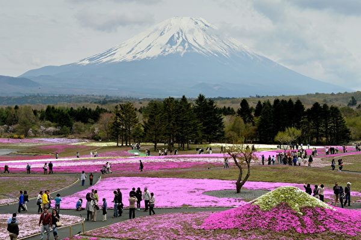

日本富士山一景。

 
【大纪元2018年09月06日讯】（大纪元记者李辰报导）日本富士山，山姿优美，山下五湖。山水美景吸引了来自世界各地的游客。中国人来日本欣赏美景的同时，也听闻法轮功真相，纷纷声明退出中共。至今，超过3.14亿中国人声明退出中共党、团、队（简称“三退”）。

以下是日本山梨县吉田市法轮功学员王女士，在富士山风景点向中国游客讲真相、劝“三退”的小故事。王女士来自河北石家庄，旅居日本近8年。

<b>北京博士生退团</b>

2018年8月30日，日本八木琦公园。一位小伙子坐在草坪上。

法轮功学员王女士走过去，只见那小伙子“圆脸，中等个，不胖不瘦，长得挺方正的”。

王女士问：是中国人吗？

小伙子：是。

王女士：大学生吗？

小伙子：是，我读博士，在北京。

王女士：你真了不起啊。

王女士：这就是富士山，来，我帮你照两张。你站这，你身后就是富士山。

照完相，两人继续聊。

王女士：你入党了吗？

小伙子：我没入。

王女士：那你肯定是团员。

小伙子：团是入了，那早退了。我都29岁了。

王女士：那不是人说的退，咱给神佛退。神佛保平安，（咱们）得福报。这是对你好。你自己选个美好的未来。

这个团就别要了，这个团不好，共产党要解体的时候啊，咱们就要替它陪葬。咱给神佛退，把咱印记给抹掉了，因为你入团的时候，发的那个毒誓，都有印记。神佛给咱抹掉了，天灾人祸的时候，咱就躲过了。

小伙子：嗯。

王女士：你在北京，你听过“天安门自焚”吗？

小伙子：听说过。

王女士：天安门自焚，那是假的。我们在国外都知道，（中共）找了5个人，像拍电影似的。死的那个是被打死的。好好的人，要是点着了，能不在地上打滚吗？那人就那么烧，咱们可别相信啊，别仇视法轮功。

王女士这里提到的“天安门自焚“案，指的是2001年1月23日中国大年三十，天安门广场发生的所谓5人“自焚”事件。中共官方新华社称，这5人是法轮功学员。但此案被国际社会公认是中共嫁祸法轮功的骗局。

“天安门自焚”案漏洞百出，漏洞包括：所谓自焚者王进东，炼功手势不是法轮功动作；中共官方媒体新华网，甚至还出现过三个不同面孔的王进东；另一自焚者刘葆荣说，喝了半雪碧瓶汽油，但据医学百科记载，人体口服汽油7.5克/每公斤体重，就能导致死亡；中央电视台的记者采访烧伤面积40%的王思影时，不穿隔离衣，违反了严重烧伤病人要住隔离病房，探视者需穿戴隔离衣帽、手套、鞋套等基本医学常识等。 

王女士接着说：法轮功啊，修“真、善、忍”，是修佛的。在全世界有100多个国家都在学。这也是咱中国人的自豪啊，因为法轮功是从中国传到全世界的。

你有时间，上贵州省平塘县。那是个旅游点，有个悬崖壁石断开了，上面写的是“中国共产党亡”，这是神给咱人显现，你有时间去看看吧。门票上，也是印着这6个大字。贵州上亿年的藏字石，那是真的，门票上都是这几个字。

小伙子：那行。

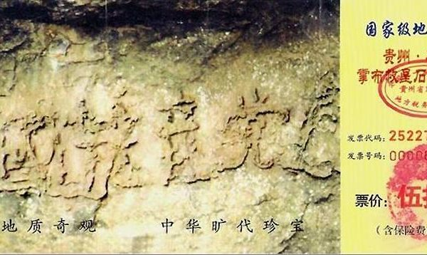

2002年6月，在贵州平塘县掌布风景区发现了2.7亿岁的“藏字石” ，图是“藏字石”景区门票图案正面，500年前崩裂的巨石断面内惊现六个排列整齐的大字“中国共产党亡”，其中“亡”字特别的大。经专家考察证实，“藏字石”上未发现任何人工雕凿加工痕迹，乃天然形成，堪称世界奇观，国内多家媒体都报导了此新闻，但都隐去“亡”字。（大纪元资料）

 
小伙子告诉王女士，他同意退团退队。

离开前，小伙子双手合十，向王女士连声说：谢谢，谢谢！

<b>两位北京医生退党退团</b>

2018年9月3日，日本大石公园。王女士碰到一男一女，“30多岁的样子。女的是黑龙江的， 男的是湖北的，都在北京医院上班。”

王女士：现在天灾人祸多少啊。猪得瘟疫病了，这都不是偶然的。北京雾霾，还有没有啊？

对方：还有。

王女士： 我家我妈我姐都在石家庄，雾霾对人身体一点好处没有啊。雾霾就像慢性瘟疫一样。石家庄我们家三口人都（肺癌）去世了，最小的40多岁，一个50多岁，最大的快70岁了。我3月份回去，还和大娘一起吃饭呢，检查出来了，6月份就走了，多快啊。她们都是肺癌去世的。

两人说：嗯。我俩都是大夫。

王女士：我从日本到北京，再回日本，吐的痰都是黑的，要清理差不多一个星期呢。

对方：是吗？

王女士：你们在日本多待一些日子，也都给你们清理了。

两人笑。

学员：日本人是不是道德好？问什么事情，他们是不是都很热情？帮助你们？

对方：是。

王女士：咱中国人就不行啊。咱中国人道德下滑啊。你问点什么事，手一指，你找去吧。

对方笑。

王女士：你看日本，地上一个烟头都没有。日本人信神，道德都有约束。

咱中国不行。中国那水都污染了，那粮食能给你做假的，有毒。你看那蔬菜，都有毒，都是农药。那油还是地沟油，在国内都不愿意上饭店吃饭去。孩子打预防针，疫苗还是假的。

对方笑。

王女士：咱（中国人）道德多败坏啊，人心根本就没有善念了。咱中国是无神论，造成现在人道德下滑。

王女士：这瘟疫都是对坏人来的，咱好人，都能留下。你们听说过，“三退”保平安吗？咱们也是缘分。 你们现在听到真相，是有福之人啊。

王女士：这退啊，咱给神佛退，不是给人退。入（团）的时候啊，发的这个毒誓啊，把这一生献给它。它解体的时候，都要咱们陪葬去。天灾人祸来的时候，就淘汰。把印记抹掉了，咱就得救了。天灾人祸来了，咱们也就摊不上。

女游客现场以“小玉”化名退党，男游客以“梁聪” 化名退团。

王女士接着给两人讲天安门自焚等真相。

离开前，女医生合十向王女士表示感谢。

<b>日本留学生退团退队</b>

2018年9月3日，日本大石公园。王女士碰到两个年青小伙子，上前跟他们讲真相。

王女士问：这两孩子，你们是中国人吗？

对方：是啊。

学员：你们是大学生吧。

对方：我们在日本千叶留学，来两年了。

一问，一个是石家庄的，一个是湖南的。

王女士：我们还老乡呢。

王女士：你们好好念书，留在日本，把父母也带来。

湖南的留学生：我不愿在这，语言不通。

王女士：这多好啊。吃得放心。在中国那吃的，除了毒，就有毒。

留学生：是。

王女士：就说石家庄吧，不怎么下雨，那个菜啊，就从地下灌水，那农药打上了，都长到菜里头去了。

留学生：是，都长到里头去了。

王女士：那人吃了，能好吗。这就是人害人啊，那农药，你也得吃啊。河北、河南、还有山东的，菜都这样式的，农药严重啊，都超标啊。

还有水。石家庄那水多难吃啊。在石家庄，你们是不是也买水吃？石家庄，抽深井水，拉到小区去卖。2块钱一桶，一桶40斤。

来自石家庄的留学生： 嗯。

王女士：水都污染了。你就别在石家庄了。你们都出国了，把父母也带着。

留学生：看看吧。

王女士：咱们中国当官有钱的，都出国一家一家的“三退”。“三退”很重要啊，“三退”保平安，“三退”就把党、团、队，都退出。

对方听着。

王女士：你知道非典吗，那年的非典就死了不少人啊。

王女士：孩子，上大学入党了没？

对方：没入。

王女士：入团了？

石家庄留学生：嗯。

王女士：我们退出它，神佛保咱平安。

湖南留学生：没入团。

王女士：红领巾也不行，你也发毒誓了。带红领巾也得退出。

两人都同意以化名“三退”。

<b>退党保平安</b>

共产党源自欧洲。《共产党宣言》在开篇中说：“一个幽灵，共产主义的幽灵，在欧洲游荡。”

共产党教主马克思，早年信奉基督教，后加入撒旦魔教，发誓与神斗，把毁灭人类当成人生目标。

共产主义运动，百年来造成超过一亿人死亡，成为20世纪以来人类史上的最大悲剧。

中共让加入其组织的人举著拳头发毒誓“为共产主义奋斗终身”。中共建政60多年来，系统地破坏人类传统文化，掀起各种运动，夺走了八千万中国同胞的生命。

2004年11月19日，《九评》编辑部发表《九评共产党》。《九评共产党》历数中共自起家到建政后对中国及中国人民犯下的种种罪恶，从历史、文化及道德层面促使读者反思，从而引发中国民众退出中共党、团、队组织的“三退”大潮。

《九评共产党》这样论述：“纵观八十多年的中国共产党历史，其所到之处永远伴随着谎言、战乱、饥荒、独裁、屠杀和恐惧；传统的信仰和价值观被共产党强力破坏；原有的伦理观念和社会体系被强制解体；人与人之间的关爱与和谐被扭曲成斗争与仇恨；对天地自然的敬畏与珍惜变成妄自尊大的‘战天斗地’，由此带来的社会道德体系和生态体系的全面崩溃，将中华民族乃至整个人类拖向深重的危机。”

2017年11月19日，《九评》编辑部发表新书《共产主义的终极目的》。书中揭示：“共产主义不是一种学说、一种社会制度、一个失败了的尝试，它是一个邪灵，其目的是通过毁灭文化、败坏道德来毁灭全人类。”

“历史已经证明，共产主义不是出路，而是绝路。”大纪元特稿表示，“中共欠下累累血债，其罪行必将被清算。”

“只有从思想上认清邪恶，退出中共的相关组织，消除邪恶的符号，才能自我拯救，才能恢复做人的尊严，找回道德良知。” 

<h1 align="center"><b>丹麦警方认错 法轮功学员每人可获赔三千多美元</b></h1>

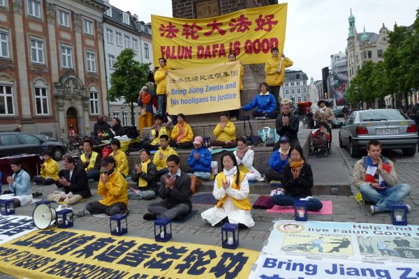

2012年6月，丹麦和北欧法轮功学员呼吁中国停止迫害法轮功。

【希望之声2018年9月2日】（本台记者童珍综合采访报导）
近日，丹麦和其他北欧国家的一些法轮功学员接受了丹麦警方的道歉认错，他们赞赏丹麦政府追查真相的努力，并开始陆续向丹麦警察局递交赔偿申请书。估计100多名法轮功学员每人可获2万丹麦克朗（相当于3,100多美元或2,600多欧元）的赔偿。这是怎么回事呢？

<b>国际首例：法轮功学员海外获经济赔偿</b>

丹麦和北欧国家的这些法轮功学员曾经在2012年和2013年中共领导人访问丹麦期间参加和平集会呼吁中国停止迫害法轮功时被丹麦警察阻拦，该事件被丹麦媒体曝光后，引来丹麦从民众到国会议员对丹麦警方违反宪法的指责，因为丹麦是个民主国家，公民享有宪法保护的言论自由和集会自由的权利。

经过多年的调查后，丹麦警方今年4月正式承认，他们在对待集会者的处理过程中犯下了严重错误，警方并宣布对提起诉讼的8名当事人给予经济赔偿，每人2万丹麦克朗。

今年7月丹麦警方又扩大了赔偿范围，并告知公众：“凡是曾经在2012年和2013年中共高官访问丹麦期间参加集会受到丹麦警察阻拦的民众，不分国籍，不设期限，随时可以通过电子邮件或普通信件方式向丹麦警察局递交赔偿申请。”

丹麦警方估计可能会有多达200人有权要求赔偿，其中大部分是法轮功学员。

这起案例是在国际社会中，由一个国家的政府部门对法轮功学员遭受不公待遇进行经济赔偿的全球首例事件。

<b>事件回放</b> 

2012年6月，前中共国家主席胡锦涛对丹麦进行国事访问，丹麦和北欧法轮功学员集会向胡锦涛一行呼吁停止迫害法轮功。当时丹麦警方出动四辆警车挡住了集会人群，以避免让胡锦涛一行看到抗议人群。另外，丹麦警察还粗暴地夺下了支持自由西藏人士手中的西藏旗帜，并拘留了6人。后来这6名西藏支持者将当事警察告上法庭。

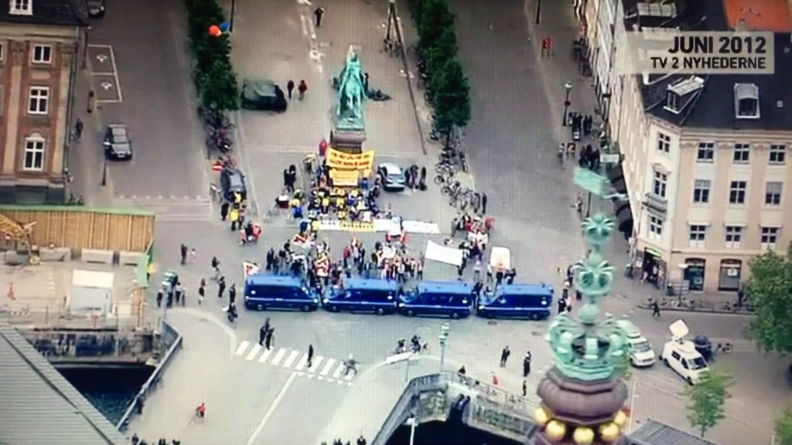

2012年6月，前中共国家主席胡锦涛访问丹麦期间，丹麦警方出动警车遮挡集会抗议人群以避免让胡锦涛一行看到抗议场面。（丹麦TV2视频截图） 

2013年6月，前中共政协主席俞正声访问丹麦期间，两名法轮功学员因为身穿黄色T恤而被丹麦警察强行带离抗议现场。之后，这两名法轮功学员也把当事警察告上了法庭。

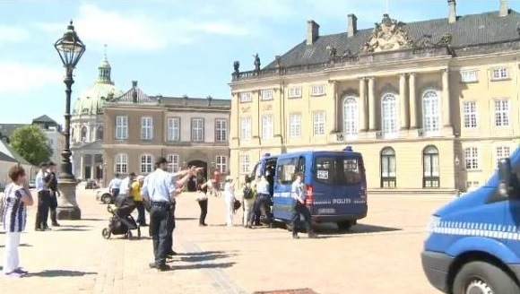

2013年6月，前中共政协主席俞正声访问丹麦期间，丹麦警方将两名身穿黄色T恤的法轮功学员强行带离抗议现场。（丹麦TV2视频截图） 

<b>真相浮现：中共涉嫌干涉丹麦内政</b>

2015年9月，丹麦最高法院在审理这8起诉讼案时，强制让当事警察提供了现场无线电对话录音，从录音片段中可以清晰地听到这样的声音：“把他们的旗子夺下来，快点！”

2015年10月，时任丹麦司法大臣平德(Søren Pind)公开了丹麦警方的一份“操作指令”，这是来自哥本哈根警察局有关驱逐抗议者的书面命令，上面写着：“抗议者不能被胡锦涛的车队看到”。这与当事警员的陈述一致，他们都表示自己当年对待抗议者的行为是因为来自上面的指令。

随后，平德大臣决定成立一个独立的调查委员会，深入调查该事件的真相，澄清事实，挖出真正的责任人。

调查委员会在2017年底的报告中披露，丹麦外交部想“营造这样的一个气氛”，就是中共方面的到访“一定要成功，不得有任何差错”。

鲍女士是状告丹麦警察违宪的两名法轮功学员之一，她记得当年在哥本哈根被警方强行推进警车带离抗议现场时，一名警员告诉她说，他们是奉最高命令而为之，不能让中共高官看到穿黄衣服的人。

曾经在中国大陆因为坚持法轮功信仰而被中共当局非法监禁三年半的鲍女士表示，她感谢丹麦政府接纳了她，她非常珍惜在丹麦获得信仰自由的权利，但是她也说到：“我万万没有想到，中共的魔爪伸向了丹麦。我非常想告诉丹麦政府和人民，中共是在全世界渗透的，它用经济手段来胁迫每个国家，我希望丹麦政府能够认清它的真面目，不要受它摆布从而破坏了自己国家的立国之本。”

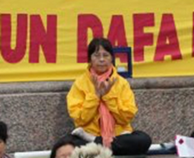

将丹麦警方告上法庭的法轮功学员鲍女士。(图片来自丹麦法轮功学员)

<b>丹麦国会议员：这是丹麦的耻辱！决不会再发生！</b>

丹麦人民党外交发言人艾斯普森(Søren Espersen)先生说：“我不相信普通警员会自己去做这样违法的事情，他们是被告知要这么做的。在丹麦发生这样的事情，这是丹麦的耻辱！”

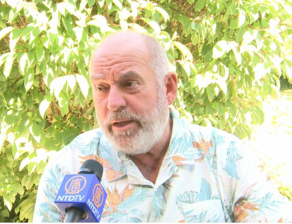

丹麦人民党外交发言人艾斯普森（Søren Espersen）先生。(明慧网图片) 

丹麦保守党议员本柯（Tom Behnke）先生质疑道：“20个不同的街头执勤警察每个人都想到了做同样的事，这难道是巧合？还是因为上层的策略有这样的倾向？”

艾斯普森议员认为，这是“丹麦政府一而再，再而三地受到压力（干涉），并做了中共想要的。” 他表示，丹麦应该抵制这种来自中共的打压。

丹麦人民党议员拜特（Kenneth Kristensen Berth）先生也表示，该案让大家真正看到了言论自由的可贵。他说：“我认为，我们会更加认识到言论自由是多么珍贵和重要，它实际上是不能够被干涉的。我想曾经发生的这一幕在丹麦绝不会重演。如果中共现任主席访问丹麦，你不会看到同样的情形再次发生！”

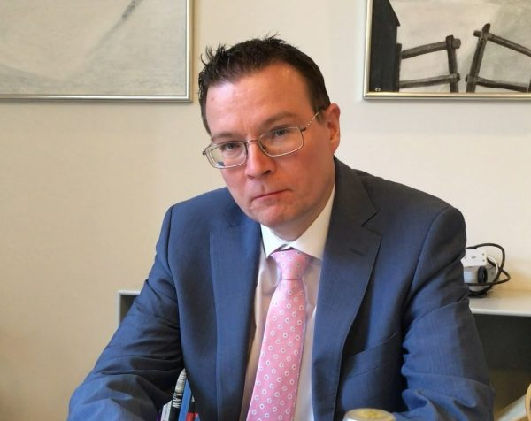

丹麦国会议员拜特（Kenneth Kristensen Berth） 先生。(明慧网图片) 

<b>律师：从未见过如此轰动全丹麦的大案</b>

托比亚斯（Tobias Stadarfeld Jensen）律师和他任职的律师事务所为鲍女士等人免费代理了诉讼，他说: “当我们听说，抗议者的西藏旗帜被警察没收，我们对丹麦人在丹麦无法行使言论自由的权利而感到震惊。当我们听说，法轮功做为合法的抗议群体，修炼者由于身穿黄T恤而被警察强行带走，我们非常震惊。我们毫不犹豫地决定，如果有人想要起诉丹麦警察，我们愿意帮助立案，并免费提供法律援助。”

托比亚斯先生表示，这起案件在丹麦引起了空前的轰动，非同寻常。他从未见过有如此之大的案件。他说：“我们从来没有见过对警察的调查有如此之大的，甚至需要国会设立调查委员会来调查究竟发生了什么。”

<b>丹麦民众：丹麦受到外国腐败势力干预</b> 

一位丹麦人克劳森（Tommy Clausen）惊讶于丹麦警方会做出违反宪法的事情，而且在调查开始时还试图掩盖，并阻止真相，他惊叹道：“所有这一切竟然发生在一个民主国家！何为民主！……真相就是，迷于民主者醒于独裁”。

另一位丹麦人立德高（Torben Lidegaard）评论道：“我在丹麦电台的节目中听到警察局的发言人曾经对此案进行的解释，全是胡说，……这超越了所有的底线，令人愤怒。”

另一位丹麦人欧尔森（Arne Albatros Olsen）则认为丹麦已成为“香蕉共和国”。他的意思是说，丹麦受到了外国强大腐败势力的干预，像那些盛产香蕉的贫穷国家被强大外国势力操纵的遭遇，他认为“丹麦实际上已经有东西腐败了”，他呼吁让外国媒体来敲醒丹麦。

<b>案件发酵：将继续回溯追查到1995年</b>

丹麦警方“违宪案”原本以为以警方的认错道歉和赔偿就结案了。然而丹麦国会中的多数党派并不认可，而且越来越多的丹麦警员站出来向媒体透露，2012年丹麦警方违宪拦阻抗议者的做法绝不是特例，早在1995年和2002年，当中共高官来访丹麦时，他们就接到命令指示要“尽量降低抗议者的可见度”。

例如在1995年中共前总理李鹏访问丹麦时，当时负责接待来访的副警官艾瑞克森（Torben Juel Eriksen）在做计划安排时，他就被指示，“不要让中共代表团看到有抗议活动，同时不让可能出现在酒店门前的抗议者打扰中共代表团”。 

在这种情势下，丹麦司法部决定扩大对“违宪案”的调查范围，时间将追溯到1995年。

<h1 align="center"><b>一位抑郁症患者走出阴霾迎来阳光</b></h1>

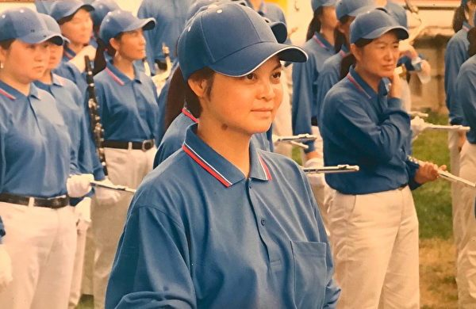

凯西玛（Kathy Ma，图中）目前是某地区天国乐团的成员

【希望之声2018年8月26日】（本台记者慧光综合报导）
凯西玛（Kathy Ma）是一位居住在美国旧金山的女性，年轻时丈夫因为有了外遇离开了她，使她受到严重的精神刺激，导致后来患上严重的抑郁症，经常出现内心烦躁、思维混乱，甚至会歇斯底里的哭喊，多次产生自杀欲望。在犯病的时候，她总能接受到一种信息，就是“杀死自己是唯一的选择”。 

她的父母每天都在提心吊胆中关注着她，一旦发现异常，就会用绳子把她捆绑住，防止她抓住刀子或从窗户中跳下去。每次抑郁症发作之后她也会平静几天，可几天后还会出现。如此反反复复的十多年，整个家庭因她而被惶恐和慌乱的氛围笼罩着，生活秩序全打乱了。

丈夫离开她的时候，她已经怀孕五个月，儿子出生后她就成了单身母亲。她的病也对孩子的出生和成长造成严重影响，儿子小时候很长时间不说话，开始她以为是孩子有生理缺陷，可到医院检查后医生说孩子的声带没有问题。其实他就是不愿意说话，即使到了六岁上学时他的话也很少，而且总是心情抑郁的样子，这也让她非常担心。

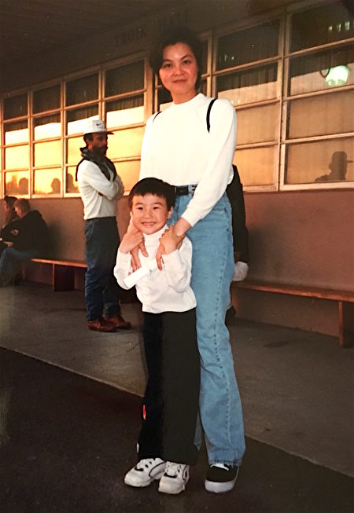

附图 凯西玛与儿子小时候的合影（Kathy Ma提供）

她的父母不仅要照顾她，还要照顾她的儿子。重重的生活压力导致她的病情越来越严重，即使正常的时候，也总是在寂寞、惭愧、沮丧的情绪中不能自拔。

当她犯病而出现狂躁情绪时，父母会将她与儿子分开。但儿子在另外的房间也能听到她哭闹的声音。有一次，儿子悲伤的哭着对她说：“妈妈，别把我留下来，你要走就把我也带走。”她的父母也对她说：“你认为就你是个悲惨的人？看看你儿子！他比你更可怜。你怎么能这样对他？”每当这时她都会感到非常内疚。

在前后十二年的时间里，她的抑郁症大约每周都要发作一次。她和父母花了很多钱，看过医生，找过有关专家，包括心理学专家，他们也给过多种治疗方案，但基本没有效果。

后来她走入宗教，做了一名基督徒，经常去教堂参加聚会。在那样的环境下，自杀的冲动会有所抑制，但悲伤和沮丧的情绪却无法消除。

后来有一天，一位朋友向她介绍了法轮功，并与她一起观看了法轮功师父的讲法录像。这个讲法录像全部看下来要十几个小时，在观看的过程中她就有了意外收获。上初中的时候，她的右臂下方有一个囊肿，囊肿发炎时整个右手臂都会很疼痛，严重时甚至无法写字。多年了，这个囊肿一直困扰着她，因为无大碍，也就没当回事儿。可是在看录像的过程中，这个囊肿却悄悄的消失了，这引起了她的注意。

再后来，朋友邀请她参加法轮功的集体活动，有一次，大家一起阅读法轮功的主要指导书《转法轮》时读到“失与得”的内容，她突然明白了人生中的很多事情，对自己的遭遇也找到了清楚的解释，这让她非常震惊。回到家里，她开始认真阅读这本书。她说：“读过《转法轮》后，我在人生中的所有疑惑都得到了解答，所有痛苦的原因都找到了答案。这本书我再也放不下了。”

走入法轮功修炼以后，她的病情很快得到了缓解，从过去的每周一次减到一月一次，后又减到几个月才出现一次，她看到了自己的希望，仿佛在黑暗中行走的人突然看到前面出现了阳光。

她还清楚的记得最后一次抑郁症发作时的情景，那天情况来的非常突然，过去最严重的症状都出现了，她又陷入了非理性的歇斯底里状态，不仅痛苦，而且很恐惧，可她突然想起师父的讲法，马上就平静下来。当她打开讲法录音听的时候，立刻就正常了。就在那一次她明白了，她以前的那些自杀的念头，其实并不是她自己的想法，而是被外来的信息控制了。这个信息来源很邪恶，在人的主意识不清醒的时候它就会悄悄的上来控制人。非常神奇的是，当明白这个道理之后，抑郁症就彻底消失，再也没有出现了。

当中共开始迫害法轮功之后，父母害怕了，因为他们经历了中共的多次整人运动，尽管他们人在美国，可心里的恐惧仍然让他们做出了果断的决定，就是阻止她继续炼法轮功，并威胁她说“如不听话就不再照顾她和儿子”。

已经在大法修炼中体会到人生真谛的凯西玛，并没有因为父母反对而停下自己脚步，在这种关键时刻反而头脑变得异常清醒。因为她知道，如果不是因为修炼法轮功，她还会在病痛的折磨中，还生活在绝望中，所以无论遇到什么苦难，她都不会重蹈覆辙。

如今，她儿子也走入法轮功修炼，她们都参加了当地的天国乐团。有人注意到了儿子的变化，在参加一个庆祝活动时，儿子发自内心的笑了。凯西玛说“过去他从未笑过”。儿子的变化也感动了她的父母，父母也开始修炼了。现在她们一家三代人都在修炼法轮功，家里充满着欢笑，一家人其乐融融。

<h1 align="center"><b>曾經的少年才子找到了中國的希望</b></h1>  

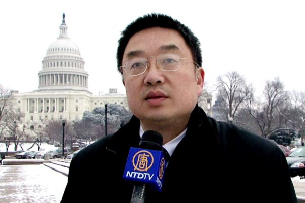

陈师众在接受新唐人电视台记者采访

【希望之声2017年8月7日】（本台记者慧光综合报导）陈师众是中国科技大学第一届少年班的尖子生，1980年，不到20岁的他就通过中美联合生物学考试，成为第一批赴美研究生，之后就读于康奈尔大学与加州大学圣地亚哥分校取得生物学博士。

1989年“六.四”天安门事件之后，陈师众忍无可忍，脱离了中共安插在美国各大学的学生会（中国学生学者联合会），加入了由爱国留学生自发成立的“中国学生学者自治联合会（简称‘学自联’）”，并担任第二届“学自联”副主席。若干年后他看到民主的理念难以改变道德日益下滑的中国人，因此而极度失望。

他说：“我一开始觉得民主、人权很崇高，是中国的出路。在1989到1995年间，几乎将全部精力投入到民运上。但是到1995年以后我就淡出了，因为我看到中国的问题已经不是民主制度能解决的了。”由于中共统治下对中国自然环境和人文环境的毁灭性破坏，让他看不到解决中国问题的希望。

有一件小事至今让他记忆犹新。1998年他看到一篇文章，说中国南方的燕子几乎绝迹，原因是中国人把燕窝都采光了。看到此消息后他感到几乎是无地自容的羞愧，他说“没想到中国人现在这么狠，不但自己生活悲惨，连生在中国的燕子也这么悲惨”。一直不愿意放弃中国国籍的他，终于决定申请加入美国国籍。

但是，1999年发生的一件震惊中外的大事件，让他看到了希望，那就是在北京中南海发生的法轮功万人“四.二五”和平上访。

 
1999年4月25日，他收到一封电子邮件，说北京有上万人到中南海和平请愿。“这个邮件没有引起我过多的重视。因为我觉得像中国这样民不聊生的地方，多少万人去请愿都不奇怪。”

第二天看到新闻的同事也跟他提起“四.二五”事件，说去请愿的不是学生而是主流的民众，他听了依旧不以为然。

那个周末去超市买菜，他第三次看到了法轮功的信息，就是所有的华人报纸都在刊登法轮功的故事，商场门口还贴着法轮功“真、善、忍”的广告。

“气功好像是中国人骨子里的传统，多少都知道一点。我当时很好奇，为什么法轮功有这么大的影响力，所以一口气把所有提到‘法轮功’三个字的报纸全买回了家。”陈师众说他清清楚楚地记得那天是5月1日、星期六。

看过报导以后，首先让他震惊的是李洪志先生要求炼法轮功的人都得做好人，而居然有一亿人听他的。他说：“以我对中国社会的了解，是一碗清水看到底的，教人去做好人、去吃亏，还有一亿人跟着学，这简直是匪夷所思了。”

看过香港、新加坡、加拿大到纽约各地法轮功学员的故事后，他发现他们确实是在做好人。这对他头脑里“中国人都是自私的”的观念形成了一个极大的冲击，同时在他心中也升起了希望——中国人还是有救的。

于是他开始对法轮功创始人感兴趣。报纸上称李洪志先生说他来自宇宙一个很高的地方，教人做好人的道理。这让他隐约记起以前的确看到过圣经和其他书上讲2000年世纪末时神会回来。“但是他应该出现在印度、西方呀，因为那里是释迦牟尼和耶稣诞生的地方”，开始他想当然的这样认为。

后来他又否定了自己的想法，“基于我自己对中国长期的关注和了解，我认为中国就是人类道德败坏最严重的地方，那么神要救人多半会到灾难最严重的地方去……哇，神真的是来了。”这个想法让他有一种醍醐灌顶的感觉。

 
参与民运多年的陈师众说，西方媒体关注“四.二五”是因为这个日子离“六.四”敏感日很近。这么大批民众到中南海请愿其实是冒着很大危险的，但是被采访到的法轮功学员没有人想到这一点，也没有慌张。“这些人没有恐惧也没有想参与政治，这让我既好奇又佩服。”陈师众说。

在随父母下放到湖北以前，陈师众是在北京长大的，尽管如此，他说如果让他找到国务院的信访办公室还得费一番周折。但是报纸上写这些法轮功学员来自黑龙江、内蒙古、海南等全国各地，他们有的骑车，有的坐汽车、乘火车，甚至是乘飞机，但几乎都是在同一时间赶到北京。

作为民运领袖人物，陈师众了解组织工作的难度。他说全世界公认动员组织能力最强的是以色列军队，能在宣布战争后24小时内把所有后备役人员动员起来组成军队，但这种动员需要全国的支持，而且是第一个小时报到的人和第23小时报到的人都算上。

陈师众说：“‘四.二五’请愿从早上八、九点钟就开始了，这些法轮功学员没有统一的交通工具，就为了讲一句真话，不远万里聚在一起，真是不可思议。报纸上分析说法轮功有现代化的通讯工具，我对此不以为然，中共公安部门有更现代化的工具，而且在中国只要有几百人参加的活动就肯定有特务混在其中。这些人一定是把请愿当作自己的事才能做到这样心齐。”

“四.二五”的奇迹让陈师众开始上网查询法轮功的相关信息。让他更惊奇的是原来法轮功已经传遍全世界，包括他所在的圣地亚哥都有炼功点。他说“他们早上五点钟起来炼功，这没有一定精神是做不到的。我就觉得这功太好了。那天是5月2日，这时我还没读过法轮功的著作，也没炼过功，就已经决定：我要炼这个，这是我要找的。”

陈师众说，如果没有“四.二五”，他不会知道法轮功。尽管这些请愿的学员心里没有恐惧，但实际上他们冒了极大危险，他说“对这些学员他永远心存感动”。

至于说“四.二五”是法轮功在挑战中共，并成为中共镇压法轮功的借口，陈师众说那是中共的谎言，因为从陆续透露出来的中共内部文件、包括江泽民本人的信件显示，它早在1994年就开始注意法轮功了，对怎样处理法轮功有过多次争论，并由罗干主持分别在1997年和1998年做过两次恶意的秘密调查，旨在“收集罪证”要把法轮功定罪为“邪教”，但是两次调查都不了了之。中共还在1996年禁止法轮功出版物出版，并通过国家媒体攻击法轮功。

陈师众说：

“种种对法轮功的打压，不是因为法轮功对中共有任何威胁，也不是它抓住了法轮功的把柄，唯一的原因是因为法轮功受欢迎的程度太好了。好东西太受欢迎了就错了——这就是中共强权下的荒唐逻辑。”

“在马克思主义和反神论洗脑50年后，竟然还有一亿人从法轮功中得到道德启示，中共对此妒忌的受不了。江泽民、周永康和罗干都说过：法轮功在争夺群众，和法轮功的斗争是意识形态领域的斗争。”

陈师众说中共镇压时是出于妒忌心，它肮脏的心灵无法理解高尚的情操，认为用暴力就能把这些法轮功学员吓回去。江泽民还信心满满地宣称三个月就消灭法轮功，每次出访都要亲自去宣传。“实际上镇压之后的十几年，仅在中国就不断有更多的新学员加入进来。我就认识纽约的一位法轮功学员，她的母亲2005年才开始修炼法轮功，后来在街上发真相资料时被非法抓捕。”

陈师众说：
“中共的暴力统治是建立在恐惧之上，而法轮功教给人良知和勇气，有了良知和勇气，中共的谎言与恐吓也就不灵了。中共镇压没有把法轮功吓到，反而要把自己折腾完了。”

“一个国家要能够治理好，一个当政者要把一个国家带好、管理好，这个国家必须得有‘民气儿’。当今，仅仅通过王岐山的打老虎、打苍蝇，他只是在破除这些畸形、破除这些弊端，但是一个国家要治理好，不能光靠破，还得有正面的东西。当今中国社会最大的正能量就在法轮功学员当中。”

“法轮功学员18年来面对这样残暴的迫害，经历了损失无数生命的惨痛，却没有出现过一例暴力反抗的行为；今天的中国社会一年有3万多的群体事件，法轮功学员没参与其中一件；中国出现了多少人伦悲剧，没有一件跟法轮功相关；在中国现在给习近平当局造成种种问题的，没有一件是由法轮功引起的，恰恰相反，给习近平造成种种问题的正好是迫害法轮功的那些势力。”

“这场迫害18年来把这个社会无端地给撕裂了。18年的迫害历史，已经用最残忍的方式，也是最不公平的方式，证明法轮功学员是无罪的。”

“面对这样一场邪恶的迫害，法轮功学员表现出来的善良惊天动地。善良无罪，可是这么一大批善良的民众，包括他们的家属几亿人却遭到了最残忍的迫害，这不是在把这个社会撕裂了吗？那么，结束这场迫害对这个社会也是一种解脱。”

“一旦有了这种解脱，法轮功学员不再是被社会歧视迫害的对象的时候，他们的这种正能量、18年来在被压迫的情况下所表现出来的这种正能量，对于这个国家会起到多么大的正面作用，对于习近平等当政者能起到多么大的帮助作用，习近平可能没从这个角度去想。只有结束这场迫害，解脱这个社会的分裂，解脱参与迫害的基层公安人员，让这个巨大的正能量释放出来，习近平就不必再担心他所头疼的事，这个社会就会被巨大的正能量来推动，中华民族的复兴梦将真正起于此时。”

“其实现在这些事情已经很容易了，法轮功学员已经用他们巨大的牺牲为结束这场迫害打下了最好的基础。万事具备，连东风都不欠，就差习近平他一念之间的决断。这样一个决定对于社会有百利而无一害，不会有任何的震动。因为法轮功学员已经为这一切的解决做好了最好的铺垫，不会有任何震动，只会有正面的能量释放。天赐良机、千载难逢，所以，此时此刻我们呼吁习近平，不要错过这个机会。”

“从古到今，不管是在中国历史上那些受命于天的天子，还是近代社会受权于民的这个政权，都是以治理好国家，让老百姓安居乐业为最终目的。如果习近平真能抓住机会，结束这场迫害，让巨大的正能量释放出来，他完全不必担心会失去他的权力，所以，结束这场迫害只会对他有正面的帮助。”

<h1 align="center"><b>“共产党丢人哪”世界景点见证中国人觉醒</b></h1>  

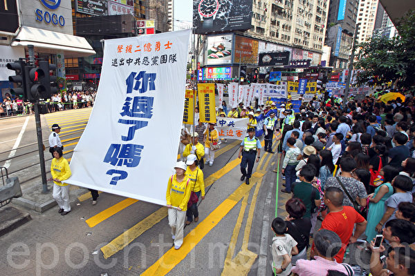

2015年，香港举行声援退党游行。

【大纪元2018年08月31日讯】“共产党丢人哪！法轮功的冤得到这儿来申！前面是宝马的大摩托车开道，后面是警车护航。旁边那么多人（给）法轮功挑大拇指。” 

“希特勒都没干出这样的事儿来，共产党干出来了。”

“中共要是倒台的话，不仅中国太平，全世界都太平。因为它在全世界各个角落捣乱，所有坏事儿的背后，都能找到中共的黑手。”

2018年6月15日，刚巧到德国法兰克福参加商展的大陆徐先生如是说。当天，德国部分法轮功学员在法兰克福市中心举行游行，同时在多处设立真相点，向中西方人士讲述法轮功无辜被迫害的真相，善劝华人退出中共。徐先生在市中心保罗广场看到了法轮功天国乐团的游行后，欣然退党。

世界各地景点见证了一些中国人的精神觉醒，大陆出国游客、海外华人纷纷“三退”。截至2018年8月31日，超过3.13亿华人在大纪元退党网站上声明退出中共党、团、队（简称“三退”）。

<b>德国法兰克福游行 大陆游客三退</b>

6月15日，在法兰克福市中心举行的法轮功游行，吸引了大量游客，特别是大陆游客的注意力。在一个法轮功学员那里就有十几个中国人做了“三退”。

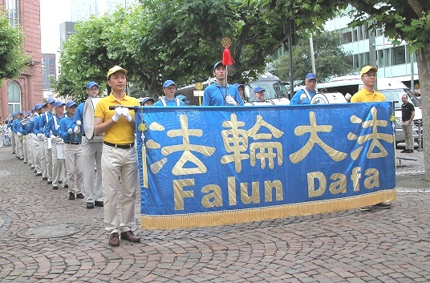

由法轮功学员组成的天国乐团整装待发。

观看了当天游行的徐先生介绍，自己是东北人，50多岁，毕业于中国某名牌大学，是某西方公司的驻京代表，因事业成功在北京小有名气。

徐先生告诉明慧网德国记者，他在当地是税收大户，挣得多，但从来不偷税漏税。但是正因为他税交得多，在大儿子的入学和第二个孩子的出生问题上，被中共大小官从下至上层层敲诈。即使政策允许也不给他办，就是管他要钱。他愤愤地说，“我总觉得共产党的政策是断子绝孙的政策。中国人生育率那么低，还在卡老百姓。”

讲到共产党对法轮功的迫害，他说：“我在国内天天翻墙，有时候翻不过去了就找大学生，他们手里总是有新的软件。我看到了活摘器官的事情，一开始不相信，后来知道的多了就相信了。我现在才知道共产党为什么要封网，这么恶劣的事情很多中国人不知道，要知道的话共产党一天都撑不住。”中共1999年取缔法轮功，声称法轮功对其构成威胁。

徐先生还对讲真相的法轮功学员说：“我从您身上能看到法轮功是这个（竖大拇指）。第一，是好人；第二，（您）七十多岁的人了，看上去这么年轻。”
学员劝他退出中共的党团队，徐先生说，“大姐你教我怎么退，我都入过，您现在就教我。我要自己退，我学会了，还可以把家里人都退了。”

边说他边拿出手机，很快上了网，在学员帮助下，几下点击后就学会了。他很高兴，说：“大姐我今天真没白遇到你，我回家帮我亲朋好友都退，这样一家子都得救了。”

一个随团出国旅游的小伙子，二十多岁，对发真相材料的女法轮功学员说：“你们法轮功说的全都是真的，全都对。”

问到他看游行的感想，他说：“第一，支持你们；第二，你们真的辛苦了。”没说几句，他爽快地退出共青团和少先队。

<b>纽约退党点 一天逾500人三退</b>

美国纽约。2018年3月11日，法轮功学员在八大道举行大游行，当天，46人退出中共党组织、166人退出中共团队、349人退出中共少先队，共逾500华人退出中共组织。

“游行那天，一眼望去，几乎所有的人都拿起手机拍摄，游行没开始就等著了。我在八大道居住这么多年，从没见过这样的欢迎阵势，盛大游行被一支支手机拍摄下来传播，我也收到微信传来的视频。”闽籍法轮功学员林秋萍说。

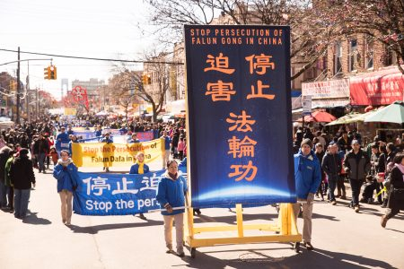

法轮功学员3月11日下午在布碌崙华人密集的八大道社区举行的新年游行活动，吸引众多民众驻足观看。

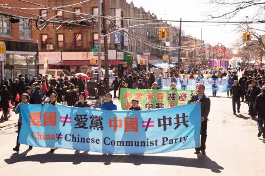

3月11日大游行中的真相条幅“ 爱国≠爱党 中国≠共 ”

她说，这一切人心的变化，正是法轮功学员常年的耐心和善心加上实际行动一点一滴地改变过来的。

她表示，以前困难时期，在布碌崙真相点曾遭人聚众围堵、高声叫嚣挑衅，如今，拿真相资料的人越来越多。那天观看了游行后，有人敬佩地对她说：“法轮功成功了！”“这是法轮功的天气（当天正值暴风雪后的放晴，阳光灿烂）。”

有一次，林秋萍在纽约44街日落公园里炼五套功法。炼完功有一人走过来说他学过很长时间的气功、拜过佛坛，从前对法轮功有不好的看法，现在改变看法了。因为看了她的炼功动作，就知道“这是真气功，如果你没有内在的那个东西，你是表现不出来、做不到的。我知道法轮功好”。

“周围观察、试探的人很多，我们的行为他都看得到。就包括你打坐时，很多人会看，动作看似简单却不简单，他想试试，很多人会回家试一下， 他做不到，就服你了。”法轮功以“真、善、忍”为原则，包括动功和打坐五套功法动作，祛病健身效果神奇。

林秋萍说，这些年来法轮功学员讲真相的过程，也就是大陆移民觉醒的过程。

<b>北爱尔兰 中国留学生、大陆游客退出中共</b>

2018年7月21日，北爱尔兰（Northern Ireland）当地和来自爱尔兰南部的部分法轮功学员，在北爱尔兰首府贝尔法斯特（Belfast）市中心举行游行集会和讲真相活动。

一位年轻的中国人路过活动现场，学员走过去跟他讲真相。

学员：我们从都柏林来的，一年来一次，你一定要珍惜呀！

小伙子点点头。

学员接着说：“你听说过现在三亿人做了三退，退党团队保平安吗？中共不是中国，爱党不是爱国。中共建政以来杀了八千万中国人，三反、五反、文革、六四杀学生，现在活摘法轮功学员器官，它做了这么多坏事。最后，这笔账算在‘党、团、队’员身上。咱们可别给他当陪葬。钱咱们没贪，人不是咱杀的，赶快退出来，将来清算它时，就与你没关系了。”

小伙子表示赞同。

学员：你是党员吗？

小伙子：是。

小伙子说姓赵，学员帮他取了化名，做了“三退”。他拿着报纸，高兴地走了。

当天，还有五个中国留学生，刚开始的时候不敢“三退”，进到附近的商店里去了。回来后，又远远地站在那看着法轮功学员炼功。

一位法轮功学员随着他们边走边讲。最后，其中一个小伙子听明白了，他一拍手说：“好，退！”

接着其他三人也做了“三退”。最后那个留学生说：“阿姨，我明白，谢谢！你说的话我会记住的。”

贝尔法斯特有一种很独特的敞篷游览车，需要乘客一起踩脚踏板，类似多人的自行车，这种车可以在步行街穿过，乘客们可以一边踩踏一边欣赏游览。

一辆这样载了十几个中国人的游览车当天也经过法轮功真相点，车上的中国人一边高兴地踩着脚踏板，一边高喊：“法轮大法好！”

<b>台湾101大楼前的故事</b>

在台湾，无论是日月潭、阿里山还是故宫博物院，都有法轮功真相点。在台湾101大楼前，写有“天灭共产党、退党保平安”等内容的展板、横幅到处可见，一些法轮功学员一边发资料，一边面带笑容地对大陆游客说：“欢迎来到美丽的台湾，祝您旅途平安”，并善劝来自中国大陆的游客能够明白法轮功真相，做出正确判断，为自己选择美好的未来……

林惠忆也是参加101大楼前的真相点讲真相、劝“三退”的学员之一。

有一次，她碰到三位年长的游客，她对他们说：“您以前入党时握著拳头对天发誓，你可想过那是毒誓啊！等于把命给共产党了。它执政以来杀害很多善良百姓，干下伤天害理的事，这都不是你干的，却算在你身上，就是要您背负它的深重罪业！我们是善良老百姓，它做的坏事不要去承担，‘三退’声明很重要，退给老天看的，声明能自救、声明能远离灾难、声明能保平安。”

这时，在林惠忆左手边的老先生一直猛点头，中间那位女士也不断附和说：“是啊是啊，退了退了。”

但右边的老奶奶却看着地上、一言不发。林惠忆没有放弃，依然平静说明共产党所做的恶行与退出中共的重要性。

就在林惠忆准备找其他游客继续讲真相时，左边的老先生迅速起身，轻拍女士的肩膀说：“咱们就退了吧！”

这时，林惠忆才意识到他们原来是一对老夫妻呀！老先生一说，那位老年女士立刻点了头。 老先生亲自把他和太太的化名都写在真相资料的空白处！

<b>分布在全球各地的法轮功真相点</b>

世界各地的法轮功学员自发在本地风景点、地标成立真相点。大陆游客一出国，大多都能听闻被中共封锁的真相，得知退党大潮的信息。以下为全球真相点的不完全统计图表。

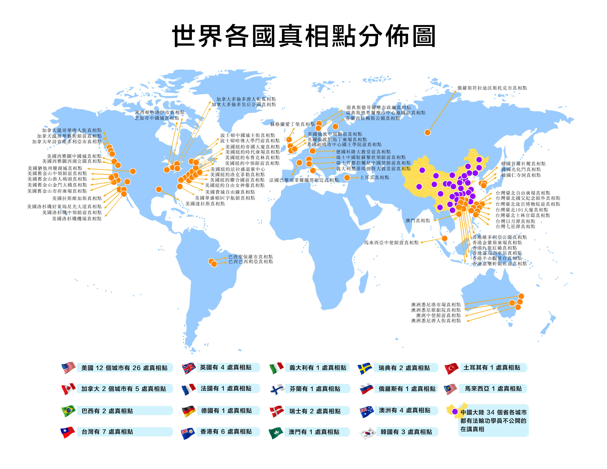

（全球退党服务中心）

<b>奇石道破天机：中国共产党亡</b>

2002年6月在贵州省平塘掌布乡发现藏字神石，石壁上凸显一排字迹，可清晰地辨识有6个大字“中国共产党亡”，字在石壁高1.52米至1.8米之间，字体大小相当，分布均匀，这便是震惊世界的世界地质奇观：藏字石。

经国家级地质专家考察证实：这块巨石有2.7亿年的历史，于500年前崩裂，上面的字是天然形成的，没有任何人工雕琢的痕迹。海内外一百多家报纸、电视台、网站转发了这个消息，国内媒体包括中央电视台也多次专题报导，但都统一措辞，隐去了最后一个“亡”字。“藏字石”的图片还被赫然印在贵州“藏字石”风景区的门票上。

几千年来的中国，在要出大事之前有一定有奇事发生。藏字石呈现“中国共产党亡”六个大字是否也在向人们预示著天机呢？

<b>退党保平安</b> 

《共产党宣言》在开篇中说：“一个幽灵，共产主义的幽灵，在欧洲游荡。”

共产党源自欧洲，中共建政60多年来，系统地破坏人类传统文化，掀起各种运动，夺走了八千万中国同胞的生命。

2004年11月19日，《九评》编辑部发表《九评共产党》。《九评共产党》历数中共自起家到建政后对中国及中国人民犯下的种种罪恶，从历史、文化及道德层面促使读者反思，从而引发中国民众退出中共党、团、队组织的“三退”大潮。

2017年11月19日，《九评》编辑部发表新书《共产主义的终极目的》。书中揭示：“共产主义不是一种学说、一种社会制度、一个失败了的尝试，它是一个邪灵，其目的是通过毁灭文化、败坏道德来毁灭全人类。”

“历史已经证明，共产主义不是出路，而是绝路。”大纪元特稿表示，“中共欠下累累血债，其罪行必将被清算。”

“只有从思想上认清邪恶，退出中共的相关组织，消除邪恶的符号，才能自我拯救，才能恢复做人的尊严，找回道德良知。”

<h1 align="center"><b>一位中共干部在参与镇压法轮功过程中的真实体验</b></h1>

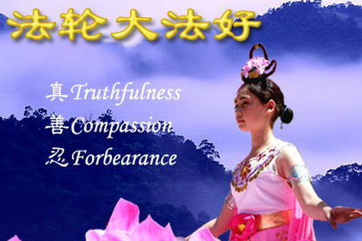

法轮大法好 神奇遍人间

【希望之声2017年11月29日】（本台记者慧光综合报导）我是在中国政府机关工作的一名干部，1999年“7.20”之后，单位领导派我负责“转化”法轮功学员。由于受党文化教育多年，也由于不了解法轮功到底是什么，当时我很抵触法轮功。我以为凭我对科学知识的掌握以及多年的工作经验，说服单位那几个炼法轮功的老头、老太太并不难。

之后，我搜集了从报纸宣传中得来的诋毁法轮功的负面信息，认真分析了当时的形势。从道理上说，继续修炼将要面临迫害，还要给单位领导及家人带来麻烦、压力和损失，这些都是显而易见的事实。经过充分准备，我对“转化“工作充满信心。然而，几年下来，我费尽心机，苦口婆心的劝说他们，不但没有什么效果，结果也让我大感意外：我没能劝阻他们，相反却被她们那种慈善的精神感染了。

有一个时期，我的内心矛盾极了。这边是上级领导要我绞尽脑汁去说服他们，而那边在与法轮功学员接触时，我不仅越来越找不到说服她们的理由，反而经常被她们的善良所感动。她们面对政府的镇压，不仅没有恐惧和害怕，反而选择了一种和平、理性的方式向政府讲真相，那种对信仰的坚定以及对人的善念，经常让我的内心产生震动。她们因为上访经常被抓，我也经常被单位领导和“610”的人叫去训话。最让我纠结的，一个是信党，一个是信佛，我不知道该如何选择？

说实话，我接受共产党的无神论教育多年，神佛在我的思想中就是迷信。但是我相信“实践是检验真理的唯一标准”，“时间会是最好的见证”。从这个角度去观察，无神论的思想渐渐的开始动摇。因为我从法轮功学员身上看到的东西，用无神论的观念根本解释不了。

我单位的一个老太太原来患有肺气肿、肺心病，整天气喘吁吁的，炼法轮功以后满面红光，活到九十多岁；一个老局长因体弱多病，提前离休，最严重的是心脏病，炼法轮功后百病全消，八十五岁的老头每天骑车满街跑，最神奇的是他原来满脸麻子，炼功以后没有了，后来还长出了新牙。

有一个小伙子是我的亲戚，有一次帮人挖菜窖，就在他上厕所的功夫，菜窖塌了，别人都砸里了，他却没事，他说他身上带着法轮功的护身符。

我家邻居，有两个癌症患者：一个胃癌已经扩散，炼法轮功后痊愈了；一个宫颈癌，炼法轮功后好了，还经常能看到法轮。她担心我迫害法轮功遭恶报，常来我家讲真相，我也担心自己曾撕过法轮功的书，怕遭报应，心里常念“法轮大法好，真善忍好”。

一天早晨三点多钟，我胃痛难忍，坐起来，闭眼默念“法轮大法好”，不一会儿，就在前额部位出现了一条金色亮线，并且在右侧出现一个有两寸多高的佛像，像电影中放慢镜头一样，慢慢的移动到我眼前，越来越大，越来越大，金光闪闪，到最后，我仰视都看不见佛的头部。我当时很激动，既感到震撼，同时也感到自责，我开始痛恨那些让我参与迫害修炼佛法的人。

我现在虽然还不敢修炼法轮功，但是我已经将念“法轮大法好”的美好，告诉那些身处危难或被病痛折磨的人。我舅舅肠癌做手术时，我让他本人及全家人都为他念“法轮大法好”。他手术时伤口缝了十三针，从手术室出来直到出院，刀口始终没痛过。和他一同做手术的病人都用止痛泵和药物止疼，他却一点不感到疼，医生和病友都觉的不可思议。

后来，我姐姐因乳腺癌做手术，我们全家在手术室外，都替她默念“法轮大法好”。她说每当她念“法轮大法好”时，疼痛减轻了，而且身体里像有个电风扇似的在旋转。还有一次，她疼痛时又念“法轮大法好”，看到一个带翅膀的小天使飞来了，拿个小白铲子，在她伤口一铲，就飞走了，她立刻就不疼了。

一个朋友听说法轮大法这么神奇，就借了一本《转法轮》看。第二天，她告诉我，她刚看了一半时，已经是半夜两点多钟，就在她家的天花板上出现了一个大法轮旋转，她一直看着，法轮也不走。后来，她倒杯水，边喝边看，法轮在她家待了十多分钟后才消失了。她激动的问我是咋回事？我也说不明白，这么多奇迹发生在我身边，决非偶然，是该反思的时候了。

一句“法轮大法好”就展现了这么多奇迹，那些面对迫害依然毫不动摇的坚定修炼者，该有多少神奇呢？再说了，没有神，能奇吗？

<h1 align="center"><b>关于古代报应故事的随想</b></h1>
【明慧网二零一八年八月三十日】看了很多关于人有了淫邪的念头，做了淫邪之事而遭报应的故事。很多人本来有很好的前途，但因为有了淫邪的念头，就失去了功名。有的人做了淫邪之事，不但功名失掉，此后一生都潦倒不堪，甚为惋惜。

相传明朝时福建省有位书生花秀圃，擅长书画，乡里亲友见他少年时就有才学，都预估他将来必成大器，他自己也自命不凡。可惜，他聪明没有用在正途，却做色情诗画，自己认为这些不过是娱乐而已，还让友人观看，却不知道会引动人的邪念，将人引向歧途。一次，他的姨表妹来他家探亲，在浏览了他的书画之后，胡思乱想，两人遂有不轨行为。过些时日，他的表妹觉得身体状况异常，恐已有了身孕，又怕事情被长辈们知道，将无地自容，竟然自缢而亡。

大约一个月后，花秀圃得病，忽冷忽热，昏睡了两天，在昏睡时不时地叫：“别打了！”醒来后告诉家人：“表妹是因我而死的，我梦见城隍老爷骂我：‘作贱有用之笔墨，害死无知之妇女，实在可耻！应该削除禄籍、功名俱废！先打八十大板再治罪。’之后就将我的名字纳入饿册。”再看花秀圃两股俱肿，全身上下都生了疮，医治了很久，还常复发。

后来花秀圃参加各种考试，不是因为错字、或文不对题，就是因为墨汁脏污了考卷而被淘汰；还有一次在试场整日苦思，仍然交白卷，但是出了考场又能振笔而论；每次考试总是令他捶胸顿足，不能如愿，科举一直无缘得中。随后，花秀圃潦倒穷困，饥饿而死，果真是入了饿册。

这些故事有的是当事人讲出，有的是借他人之口传开，真真切切，实实在在。神的报应如影随形，十分灵验。虽然可悲可叹，但是漫想起来，古代之人真的是十分幸运，让我等十分之羡慕啊！神，好像一位严厉的家长，时时刻刻在看管着人的道德，为善神知，为恶神亦知。善报有时，恶报也有时。如果古人能够好好利用这善恶报应的规律，岂不是生活的一天比一天好！做好事有好报，如果人一生都在做好事，甚至来生也做好事，永远永远地做好事，岂不是要永远永远地受好报，永远永远地都有幸福快乐的生活了吗？现在人都想过好日子，睡觉睡到自然醒，数钱数到手抽筋。如果善报无穷，这些都是可以实现的啊！这样看来，神给人的报应完全是为了人好，是为了让人有一个美好快乐幸福的未来！

所以在古代，就有很多神给人展现善报恶报的奇迹，让人明白行善的好处，行恶的悲惨，从而不做坏事做好事。因行善而改变坏运气的故事，更让人对善恶报应，因果循环坚信，从而积极行善。相传清代时，有一次杭州发生火灾，连烧了数十家，许多官员都出动前往救火。大家看到：火中有一位金甲神，手里拿红旗，左右指挥，围绕着一座住宅，火烧到那一家，便又回头。等到火熄灭后，在瓦砾中，看见那一栋房宅孑然独存，这是北新关吏顾某的家。当时顾某奉命到江南出差尚未回来，屋里只剩下妇人和几个小孩子。大家感到非常惊讶，不知道这件事情的原因。

顾某出差到江南后，把船停放在苏州的河边，看见一位少妇沿着河边，边走边哭。顾某问她原因，她说：“我丈夫欠五十两银子，被关在监狱，我不忍心看见丈夫先死，所以想投河自尽。”顾某便从行囊中拿出五十两银子给了她，少妇拜谢后离去。顾某坐船回程时，又经过该地，上岸到饮食店，刚好所救的少妇家，就在对面，那位少妇看见顾某，立刻告诉丈夫，他们夫妇便请顾某到家里，准备饭菜款待他，并且留他住宿。丈夫告诉少妇：“救命之恩，我们家贫无以为报，你陪他过夜来酬谢好了。”到了半夜，少妇来到顾某的寝室，顾某断然拒绝了她，并且回到自己船中过夜。

顾某返家后，慰问他的人接踵而至，大家询问他有什么福德，受到天神保护，竟然使家宅免于火难。顾某也说不出原因，大家一直追问，于是他想起前面那件事，人们屈指计算，跟起火的时间恰好吻合。

顾某救了夫妻俩人的命，又拒绝了邪淫，守住妇人名节，品节仁慈崇高，感天动地，因此上天也解救了他一家火灾之难，并且众人得见，彰显善报。

这就是人们说的现世报应：行恶，神很快就会降下惩罚；行善，神很快就会施予奖赏。

如果善恶报应总是这么灵验、及时，我想很多人就不会愿意去做坏事了吧！可是如果人不相信神的点化，把善报或恶报当作是偶然的现象，从而按照自己的意愿做事，就会使善恶报应显现的不是那么明显。所以在现代社会里，善恶报应的观念因为中共的否定，已经不那么明显了。比如当前很多被惩罚的贪官，很多都是一边做坏事，一边升官。长此以往，还以为做坏事，行贿，就可以升官发财，奉之为圭臬，道德反而变得不重要了。直到最后，恶事积累到极限时，就会是报应显现，而这时人也没有改过的机会了。在中共迫害法轮功期间，很多迫害修佛之人的警察不但没遭现世报应，反而升官发财。让人产生迷惑，误解。其实这就跟那些贪官一样，恶报虽未及时显现，时间长了，罪恶积累多了就会逐渐产生效果。近年来，在明慧网上收录的报应例子很多。据统计，如今打掉的“老虎”、“苍蝇”，90%以上都是曾经或正在参与迫害法轮功学员的。而善报的例子也不少，有的念法轮大法好而脱险，有的善待法轮功学员而生意兴隆，有的因为心存正念，而发生重大人生变化，很多很多。

中共不信神，否定神，当然就会否定神给人的善恶报应，所以这些被报应的贪官和警察很多都是以腐败名义被惩罚，绝口不提他们曾经迫害法轮功的罪恶。从中共贪官和警察的恶报中，我们会发现一个很大的迷局，在中共统治下，给了人很多虚假的福份，符合中共的意愿，加入中共，拥护中共，甚至为中共卖命，中共就给人升官，发财，为中共做的坏事越多，官升的越大，替中共做的坏事越坏，财发的越多。可是当中共发现自己行恶太大，难以维系统治的时候，就会把这些人当替罪羊祭出以平民愤，化解危机。这时中共所给的福份就会瞬间被剥夺，甚至失去生命。中共发动文革十年，给中华民族带来深重灾难，结束后，为摆脱罪恶，秘密杀死730多个警察封口，又把各种罪责分担到不同的中共党徒身上，而中共却独善其身，依然伟大、光荣、正确。如今，贪官遍地，民不聊生，中共又故技重施，“打老虎”，“拍苍蝇”，以平息民愤。从查抄出来的赃物看，他们在中共的庇护下赚的盆满钵满，富甲一方，可是当中共要他们替罪时，瞬间就成了万夫所指的阶下之囚。还有什么比这更可悲的呢！

也许有人会怀疑神为何不报应害佛、害众生的中共？中共是什么？这不是一个抽象的概念，曾经发毒誓，要追随中共的人都是中共的一部分，如果报应中共，这些人也要一起遭恶报。神是慈悲的，不是为了惩罚人而报应人，而是要人改过，不再犯错。所以才会有“三退”之事，退出中共的党、团、队，避免随中共一同遭恶报。

如果在古代，人们不会去相信中共。即使被中共统治，也不会随同中共作恶，中共早已亡了。正是因为中共裹挟了世人，才让神没有及时报应中共。尽快退出中共，中共才能尽早的遭恶报，中国人的苦难才会尽早结束！

<h1 align="center"><b>一位军人的神奇体验</b></h1>

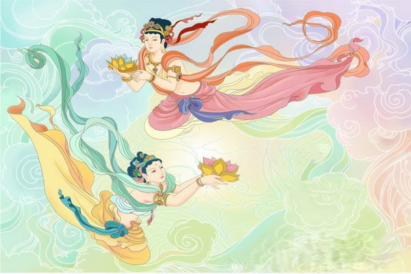

肉眼凡胎知识浅 真念一动神奇来

【希望之声2018年8月20日】（本台记者慧光综合报导）我是中国大陆的一名军人。几十年的军队生涯，接受的全是无神论的教育。在上个世纪的气功高潮中，由于好奇心的驱使我也积极投身进去，进去之后才发现，气功中的很多现象完全超出了我的认知范畴，也是用现代科学解释不了的。我花了很多钱参加了多种气功班，越往前走越发现气功的内涵很深，其中有很多奥妙让我越陷越深，我发现人类对生命的理解其实很肤浅，于是我开始思考生命和人生的意义究竟是什么。

在气功学习班上，我学了一些小能小术，按照气功师的指引我也能给人治病，但治好一个人我就要大病一场，于是我收手不干了。之后我把主要精力转向中国五经之首的《易经》，经过多年研究和验证，我有了宿命通功能，能大概的知道一个人的过去和将来。这个功能也让我知道人的一生其实都是定好的，但为什么会是这样？为什么让我知道这些？难道这都是偶然的吗？我心中充满了太多的疑惑。

后来我在朋友那里看到了法轮功的主要指导书《转法轮》，一口气看完，我被震撼了！书中解开了我的所有疑惑，我很明确的知道——这就是我要找的。但同时我又陷入了另一种苦恼，书中讲了修炼中“不二法门”的道理，就是说要修炼法轮功就要放弃以前学到的东西。那一阶段我非常苦闷，不知道该如何选择，终于有一天我在心里发出了呐喊：我是肉眼凡胎，分不清真佛假道，如果真有神，就让我真真切切的体会一下吧？！

没想到这一念发出后不久，真的体验就来了。

那一天我下班很晚，因为很疲劳，没来得及脱衣服就倒在床上，但是头脑很清醒，睡不着，两眼直盯着天花板。突然，我感到被一种无法抗拒的强大力量定住了，全身的任何部位都动不了。紧接着一股“热流”从头顶穿到脚底，前后持续约有二十多分钟。这个过程非常痛苦，因为从头顶往下穿越的“热流”虽然是热乎乎的，却像是有无数钢针在往下走，非常人所能忍受，但是我想喊又喊不出来。那一刻，我内心充满了恐惧，不知道是怎么回事儿，也不知道后面还会发生什么。

当这股“热流”穿过脚底之后，我发现自己平躺着的身体慢慢起空了，缓缓的飞了起来！竟然轻松的穿过了天花板和屋顶，然后到了城市的夜空中。我看到月光下的白云在我身边飘动，伸手就可摸着。扭头看下面的城市，也清晰异常。这时我的恐惧心没有了，转而出现了兴奋和喜悦，我心想，神都是踩着祥云上来的，我为什么是躺着上来呢？难道是因为我的层次很低吗？一念刚过，身体突然急速往前移动，我又害怕了，恐惧心一起，瞬间回落到床上。

我当时有抑制不住的兴奋，赶紧从床上爬起来，背靠着门后，怕自己是在做梦，就猛咬手指——很痛。然后睁大眼看着天花板，心想：师父啊，您终于显灵了！

我就这样呆呆的站了几小时，觉得累了，才回到床上。可是刚躺下，第二次又开始了。

这次我的身体又被定住，感觉一股能量穿越身体之后，我又起空了。不过这一次不是在人间，而是到了另外空间。那里是一个晶莹剔透的世界，有雄伟壮观的庙宇宫殿。我看到在一座宫殿前面的看台上有许许多多人站在那里，男女老少都有，都穿着常人的衣服。转眼间我就到了他们中间，我想找一找有没有认识的人，可转了一圈没发现有。看到他们都专注的看着同一方向，我也顺着目光看过去，只见一群群“飞天”仙女手里拿着花篮朝我们飞来。我当时动了一念，心想这“飞天”太漂亮了，凡心一起，瞬间又掉回到床上。

我再也睡不着了，翻身爬起来站到门后，呆呆的回想着刚才的情景，那一幕幕仍然非常清晰的展现在眼前。直到天亮，军号响了，我直接上班去了。

经过这一晚的亲身体验，我终于明白：法轮大法是正法！师父管我了！师父让我见识了宇宙空间的真相，其神圣伟大非人间所能相比，人世间再也没有什么能阻挡住我修炼的脚步了！我毫不犹豫的把书柜里乱七八糟的气功书清理出来，全部扔进了垃圾桶。

1999年“7.20”中共开始迫害法轮功之后，为躲避迫害我举家迁移到了一个很远的地方，过了一段与世隔绝的生活。当我从明慧网上看到师父发表的经文后，我知道我错了，看到世界各地法轮大法弟子反迫害的壮举令我热泪盈眶，我又举家迁回内地，投入正法洪流。之后不久，有一天炼功时，我看到我巨大无比的身体从肮脏的泥潭中站立起来了。

有一个当公务员的朋友受中共的毒害很深，我给他看了真相资料和光盘后他仍然不悟，我很着急。有一天炼功时，师父让我看到属于他的那个庞大的世界，我能清晰的感受到，我们是约好了下世来得法修炼的，而且下世之前就约定了在谁有迷茫的时候要互相提醒。这个朋友以前钻研过佛教，觉得一辈子修不成就放下了。我直接将他的来源告诉他，这对他触动很大，他慢慢的开始接受真相了。

有人对法轮功弟子历经磨难仍然不放弃修炼很不理解，我想说：“法轮大法是佛法，是造就宇宙的根本，对于人类来说，有意或无意中的行为符合了‘真、善、忍’的法理就会有福报，违背了‘真、善、忍’就会遭恶报。知道了宇宙真相的大法弟子是不会放弃的，无论天塌地陷，邪恶迫害有多严重。那些迫害大法弟子的邪恶之徒，已经没有了安身立命的根本，恶报早晚都会一波接一波的到来。”

<h1 align="center"><b>法轮功传向西方的神奇之始</b></h1>

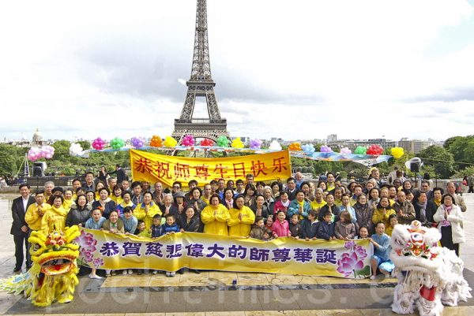

法轮功学员巴黎铁塔前庆祝大法弘传

 
【希望之声2017年4月28日】（本台记者陈克江综合报导）1995年3月12日，法轮功创始人李洪志先生应邀在巴黎中共驻法国大使馆文化处礼堂举行了一场报告会，时任中共驻法国大使蔡方柏和夫人等出席。法国巴黎因此成为法轮功从遥远的东方传播到整个西方世界的第一站。

法轮功西传，还有一个非常神奇的故事。1994年7月1日至8日，李洪志先生在中国辽宁大连举办法轮功学习班。期间，北京来电话，说有法国人专程来中国求见李洪志先生。李洪志先生说：“我知道他们是来给孩子治病的，告诉他们去找别的气功师吧！”不一会儿，电话又来了，说务必要见，并已准备出发了。李洪志先生听罢，说：“来就来吧，有缘来就见见吧！”

很快，从法国来的人到了大连。李洪志先生在宾馆与他们见了面。翻译首先介绍两位的身份，说他们是父子俩，犹太人，入籍法国，有大集团的产业。

那位父亲首先开口说：“我们是犹太人，我们知道当今的人类非常危险，有末劫之灾。我们的神告诉我们，只有一位中国人能救人类、能救法国人、能救犹太人。我们考察了很久，我们知道那就是您——中国的气功大师李洪志先生，于是，我们来求见您！”他说话非常直截了当，没有任何拐弯抹角：“我们的神让我们来请您去法国，去救救欧洲吧！”他接着说：“您去法国的一切手续、费用，我们全权负责。”那祈求的语气和虔诚的表情让在座的所有人都非常感动。

“你知道你们几个人在做一件什么事情吗？功德无量啊！”李洪志先生很平静的说，“还有其它的事也说说吧！”

那位年轻的法国人说，他有个8岁的儿子，天生大脑迟钝，不会说话，不能自由行动，流口水，在多少个国家到处求医无果，恳求老师救治。

简短交谈过后，李洪志先生用双手在床前画了一个人形，眼睛盯着看了一会儿。接着用手在人形的脑部向外扯拉起来，好象在抽着病丝似的，一连扯拉几次，然后双手合上，拿起桌上的茶杯，打开盖，把手里捂的东西放进去，然后把盖子盖上。再用手在人形上从头到脚拍打三次，之后，凝神看着，说：“我看是好了，那边应该在这个时间段有反应，你们打个电话问问。”遗憾的是，当时，李洪志先生住的宾馆条件太差，没有开通国际长途。

两位法国人离开宾馆前，李洪志先生说：“来，我让你们体验一下法轮，你们把手伸出来。”然后，凌空向着他们的方向用右手画了圈圈。过了大约十分钟，李洪志先生问有没有感觉。那位父亲说：“一股力量从手心涌进身体，非常强烈，而且很热。”问起他的儿子，他说：“我全身震动，力量很大，手最厉害，都15分钟了还放不下来。”

3个小时后，那位法国人的翻译打来电话，语音哽咽的说：“刚刚给法国去了电话，他太太说：‘你怎么才来电话？4点多钟时，我突然被一种强大的力量震醒，房间里非常光亮。我想到是不是我家先生找到了中国的那位气功大师，他给发功了。孩子怎么样了？’我马上跑到孩子的房间，一进门看见孩子在床上坐起来，见我进来，就开口问道：‘妈妈，我怎么啦？’发音清楚准确，从来没有过的事。他太太抱起孩子激动的痛哭失声。她一直等候着他来电话。她在电话的那头哭，她先生在这头哭，孩子的爷爷也哭，连我们俩站在旁边也跟着流泪。太让人感动了！李老师太伟大啦，太伟大啦！”。

翻译说：“他们想晚上同李老师见见面，急着明天就想赶回法国。”当晚，李洪志先生同法国来的一行人共进晚餐。听他们讲了打电话的过程，自然又是一番感谢和激动。边吃边谈，再次敲定了请李洪志先生去法国传法传功的事。 

<h1 align="center"><b>一位越南高中女教师的幸福之路</b></h1>

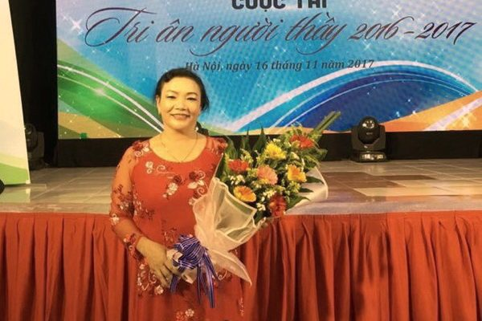

越南高中女教师林（Bien Lin）

【希望之声2018年8月16日】（本台记者慧光综合报导）林女士（Bien Lin）出生在越南，目前在平福省（Binh Phuoc）的一所高中担任老师。因为成长在贫穷的乡村，所以她学习很努力，取得了两个大学本科学位。她多才多艺，喜欢文学，也喜欢音乐。她很热爱教学工作，也很爱自己的学生，教过的学生升学率很高，每年都有很多学生考上大学，她因此受到学生的爱戴，申请到她所在班学习的学生也越来越多，为此她也感到自豪。

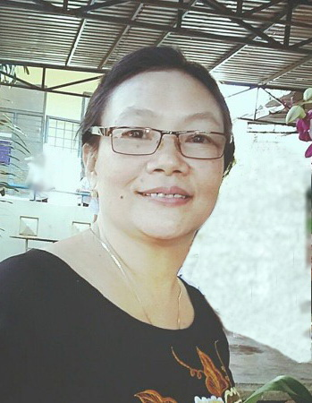

越南高中女教师林（Bien Lin）

 
虽然教师的工资水平不算太高，但她很会管理自己的时间，也有额外的收入。终于她买了房子，有了车子，物质生活渐渐的改善了许多，与小时候的生活条件相比完全是两个世界，她对自己的生活很满足。

然而多年的辛苦工作也让她付出了很高的代价。学校的日程安排得很紧，教学任务很重，她几乎没有时间休息，所有的家务只能交给女仆去做。长期的超负荷运转，也使她的身体出现了很多问题，经常感到疲惫和不适。她到胡志明市的Cho Ray医院接受了全面检查，医生确认的结果是她患有六种疾病：血脂高，转氨酶偏高，胃炎，颈椎病，静脉曲张以及鼻窦炎等。

2015年12月，她不小心摔了一跤，双腿、双手、肩背部和脚多处受伤，在医院做了多次检查和治疗，还采用穴位按摩和针灸三个月。针灸的时候她总有一种恐惧感，因为几乎每次都会造成意外出血。

虽然经过多种方式治疗，可她的健康状况并没有得到有效的改善。有三个月的时间，她服用了约四十多种药，但痛苦依旧存在。医生对她说服用药物只能改善一些症状，无法治愈。

为了对付静脉曲张，她买了紧身裤，可穿上后皮肤出现过敏症状让她很不舒服。每天上班的路上，她不得不服用止疼药，否则就难以坚持。她习惯在伤心的时候弹钢琴，以舒缓自己的情绪，可后来也不得不放弃了，因为右手出现了皮质老化，造成手指僵硬。她甚至无法打字，这让她很苦恼。所有这些虽然未危及生命，可让她很痛苦，也让她感到困惑。她曾想，每天都与医药和针灸为伴，这算是什么生活？难道我就只能这样度过后半生吗？

2016年5月，一位童年时期的朋友从河内来看望她，并给她带来一本《转法轮》书，还有一张法轮功功法的教学光盘，光盘里介绍了法轮功五套功法的动作要领。她对朋友说“很珍惜你对我的感情，感谢你能来看我”，但她并没有理解朋友的那份特别礼物的意义。朋友看到她的态度就对她说：“希望你能够认真的看一看，不然就把书和视频放在书柜里最重要的地方吧！”然后就走了。

她倒是真的按照朋友的交代，把书和光盘放在了书柜里，然后就忘记了，因为她太忙了。

有一次病的很严重，没有去上班，在痛苦和恐慌中，她突然想起了朋友送的礼物——《转法轮》和光盘，于是她马上拿起书开始阅读。起初她不明白书中写的是什么，但她还是坚持看了下去。随着阅读时间的推移，她渐渐的理解了书中的内涵。

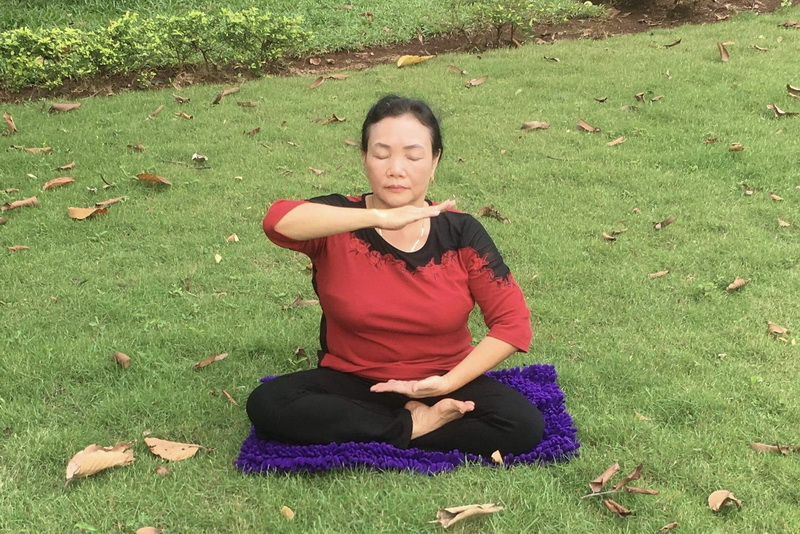

林（Bien Lin）在炼法轮功第五套功法——静功

 
她说：“当我理解了每个句子的含义时，我感到震惊。宇宙、生命是如此巨大，我了解的太少了。可是‘真、善、忍’的法理深深的吸引了我，如果人人都生活在‘真、善、忍’的世界，那才能体验到真正的幸福，才会远离痛苦和疾病。读过一遍之后，我有一种茅塞顿开的感觉。我很幸运，大法让我开悟了！我好像看到了一个充满希望、没有苦恼的世界。”

之后，她开始按照光盘的示范学习功法。第一次因为不熟悉，所以动作不到位，这让她有点儿尴尬，但是跟着示范动作做下来之后，她感到很舒服，很享受，并开始着迷。

同时她也意识到，人只是为了赚钱和物质生活是不够的，人必须要有内涵，这个内涵完全是自我培养的。于是她开始按照法轮功的要求逐渐改变自己的生活习惯，并开始按照“真、善、忍”的标准对照反思自己。她也开始为他人着想，比如为处境困难的学生减免学费，用自己的钱帮助贫困家庭等。她这样做很快得到了响应，有些同事和老同学也逐渐加入了她的行列。她说：“我在做好事的时候，无论大小，都让我感到很快乐，很开心。”

她说：“过去我总认为自己太忙，没有时间阅读和炼功，但现在我完全改变过来，我会尽快把工作做完，用更多的时间学法和炼功。当我这样做的时候，很快我就奇迹般的痊愈了。在很短的时间内，所有疾病的症状都消失了。原来每天都感到疼痛的双腿、双手、双肩、颈部和脊椎等部位彻底恢复正常，我可以轻快地去旅行了。在没有任何治疗的情况下，我的健康奇迹般的康复，这让我非常惊奇。当我用灵活的手指重新敲击钢琴的琴键时，又听到了清晰、熟悉的声音，我的心情激动异常，这久违的幸福感让我久久不能平静。”

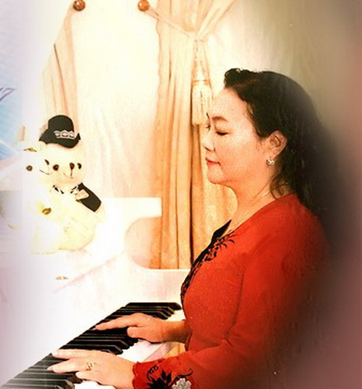

林（Bien Lin）在用钢琴表达自己修炼后的喜悦

 
她最后说：“现在我最喜欢的音乐就是法轮大法音乐。我要用音乐、用歌声将法轮大法的美好传递给更多的人，尤其是穷人，因为他们仍然处在精神或身体上的痛苦之中。我要让他们明白，法轮大法的‘真、善、忍’能够拯救他们出苦海，能够唤回他们纯净的心灵，让他们在乱世中清醒。”、

（本文根据NTD India报道翻译整理）

<h1 align="center"><b>在澳洲图文巴市语言文化节介绍法轮功</b></h1>

【明慧网二零一八年八月十五日】（明慧网澳洲昆士兰记者站报道）澳洲昆士兰图文巴市于二零一八年八月十二日迎来了第十三届“语言文化节”。法轮功（又称法轮大法）学员应邀参加了该活动，向民众介绍功法，受到欢迎。

 

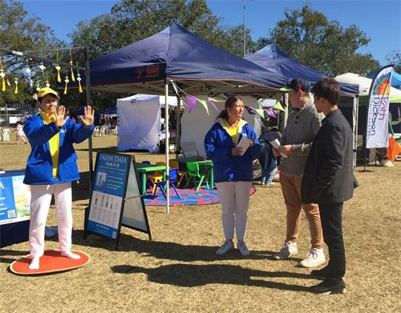

法轮功学员在澳洲图文巴市语言文化节上介绍功法

 
 
“语言文化节”是由图文巴多元文化协会主办并得到市政府及州政府大力支持的年度活动，其宗旨是把图文巴地区各族裔民众团结在一起，弘扬传统文化，并提供一个加深相互了解，增进民间友谊的平台。

澳洲的八月正值冬末，地处昆士兰东南部大分界岭高地的图文巴市，依然季风阵阵，寒意犹浓，但这丝毫未影响人们参加庆祝活动的热忱。当天，女王公园的西南角沉浸在一片欢快祥和的气氛中，游人不断，熙熙攘攘。

现场布满各色摊位，还设有三个临时舞台：“和平舞台”（Peace Stage）、“和谐舞台”（Harmony Stage） 和“善意舞台”（Good Will Stage），共有四十多个社区团体参加了表演，包括不同族裔的民间舞、合唱、独唱、演奏、功法展示，还有不少儿童节目。

法轮功学员自二零零六年起，年年应邀参加此庆祝活动，将法轮大法的美好传播给更多的有缘人。跟往年一样，来法轮大法信息台的民众络绎不绝，数百份传单很快就发完了，不少人驻足观看功法展示，拿取炼功点的信息，对法轮功表示出极大的兴趣。 

<b>印度女孩：我太喜欢法轮功了！</b>

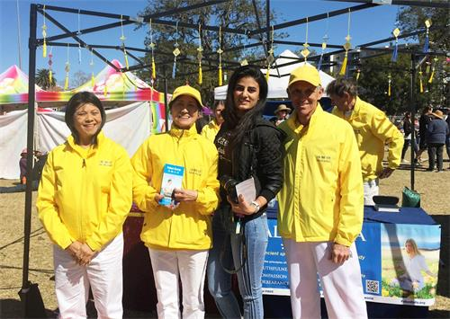

吉汗（右二）与法轮功学员合影留念

 
几位来自印度的游客，一下子就被法轮大法祥和的功法吸引住了，其中一名叫吉汗（Jihan）的姑娘禁不住坐下来跟学员学炼第五套功法，并跟学员合影留念。她说：“我太喜欢法轮功了！我会去网站上搜索更多的相关信息，我也想炼法轮功！”

<b>大陆学生：你帮我退出少先队吧</b>

有几位亚洲人模样的年轻学生在看功法演示，过去一问，原来他们来自日本，是短期交换生，其中一人是中国大陆的留日学生。法轮功学员把法轮功在中国无辜遭受中共迫害的真相和“三退”（退出中共党团队）大潮的信息告诉他。他说以前参加过少先队，小时候到年龄时全班就集体“入队”了。临离开时他对学员说：“阿姨，你帮我退出少先队吧。我也会把这个消息告诉家人。”

<b>民众踊跃学炼法轮功</b>

当天下午，学员应邀在“善意舞台”上展示法轮功功法。西人学员约翰（John Dowie）向观众一一介绍了五套功法。参加展示的学员动作缓慢优雅，观众观看上一个节目（非洲健身鼓点舞）时激起的亢奋情绪一下子平静下来，气氛一片祥和，不少观众起身跟着一起学动作。

结束后，好几位观众到信息台来拿取资料，说她们只是跟着做了几个法轮功功法动作，就感到周身舒畅，很想学炼法轮功。

一天的活动，转眼就结束了。学员们都为这么多民众与法轮大法结缘而感到由衷的欣慰。 

<h1 align="center"><b>一位心梗患者的神奇经历</b></h1>

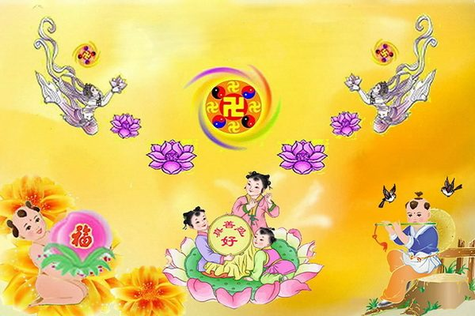

法轮常转救众生 珍惜机缘得福报

【希望之声2018年8月3日】（本台记者慧光综合报导）我生活在中国大陆的山东省淄博市，2003年2月，我突发心脏病，感觉胸口难受，呼吸困难，嘴唇发乌，面部肿胀，像快窒息了一样，之后被迅速送到医院抢救。在医院检查发现右心室有梗死症状，于是我在急诊室被抢救了八天八夜。每天不停的输液输氧，渐渐的才有所好转。那年我刚过五十岁，平时身体挺好的，除了偶尔会有头痛、腰痛、腿痛的小毛病以外，没发现有什么大病，可没想到突然遇到了这种情况，一下子就把我撂倒了。

如今这个年月，脑梗、心梗成了常见病、多发病，尤其是上了岁数的同事、朋友，常听见不是这个心梗了，就是那个脑梗了。很多人发病后抢救不及时就走了，一般人能抢救过来保住性命就算不错了。部分人虽然能保住性命，却留下了后遗症，全瘫的、半瘫的，坐轮椅的、拄拐杖的都有。我很庆幸我不仅保住了性命，而且没有留下后遗症。但是，经过这一场折腾，身体素质就差远了。我平时体重一百五、六十斤，是属于身强体壮的身板。可病过之后，全身软绵绵的，一点儿力气都没有。家人都认为我以后就成了被保护的对象，什么都不能干了，我也这么想。

2004年，在朋友的推荐下，我开始修炼法轮功，没想到我的身体出现了翻天覆地的变化，身体恢复到比发病以前的状态还要好，这是无论如何让我想象不到的。

开始炼功以后，我遇到了很多神奇的事儿，让我又激动又兴奋。尤其是开始阶段的清理身体，每天都会遇到“事儿”，可每天都会感到身体有变化。

记得是2005年夏天，有一天感觉心里很难受，就像心脏病又上来的感觉，来的非常突然，心口疼痛、憋屈，好像要出不来气儿似的，可我意识到这是师父在给我清理身体，没有丝毫的惊恐和不安，心里还暗暗高兴：“师父在给我清理身体了，这是好事。”到下午就慢慢没事了。到晚上虽然身体还是一点儿力气没有，可我还是坚持炼功。在炼第二套功法的“头前抱轮”动作时，感觉双小臂上有东西在转动，我知道那是法轮。同时身上的能量很强，使我的心情好激动，从此增强了我修炼的信心，也意识到了修炼的紧迫性，对学法、炼功抓的更紧了。平时总感觉时间过的很快，总觉的时间不够用，不知不觉一天就过去了。一天不看书、不炼功就觉的心里少了什么，不踏实。

修炼后，在不知不觉中，我的病都无影无踪了，而且再未吃过一粒药，身体像换了一个人似的，走路一身轻，尝到了“无病一身轻”的滋味。干活从不觉累，精力很充沛。

我很喜欢看师父的讲法录像，每次看师父的讲法录像时都会有不一样的感受，有的时候看到师父像坐在一片微微发黄而又微微发红的光团中，师父的头部发出的光像太阳一样光芒四射。每当看到这样的景象时，我会不由自主的泪流满面。

2006年我遇到了两次车祸都化险为夷，更让我体验到了佛法修炼的神奇。

那年4月，有一天我骑自行车出门办事，在马路的拐弯处，一辆摩托车朝我直冲过来，由于太突然了，我根本来不及反应，就在相撞的一瞬间，就觉得有一股力量把我从自行车上“吊起来”，然后摔到左边的马路牙子上。按摩托车撞我时的方向看，我应该向右面路上倒，可是师父却把我“吊”到左边的路肩上。自行车的车筐被压扁、压烂了，自行车也完全变了样，可是我却什么事也没有，马路上围观的人都觉得惊奇。

同年6月，我骑着自行车顺着公路往家赶，我跟平常一样，沿着马路右侧的边上往前骑，没想到一辆摩托车从我身后冲撞过来。当时我一点儿防备都没有，只听“砰”的一声，我从自行车上摔下来，并且是头着地，可就在这一瞬间，突然一股力量把我的上身“抓”起来，虽然我踉跄了几步还是摔倒了，可只是嘴擦破点儿皮，脚上的鞋被划破了，别的什么事儿都没有。再看我的自行车，车轮严重变形。同方向相撞，自行车被撞成这个样子，可想那力量有多大。那时我的体重是一百六十斤，如果没有神奇的力量相救，后果不堪设想。我心里知道，是师父又一次救了我。

修炼以后我明白了，这两次事故都不是偶然的，是生生世世的业力所致，通过这样的事故我还掉了大业。从那以后我的身体越来越好，是因为业力越来越少，人的疾病和痛苦都是业力造成的。通过不断的学习师父讲的法，我的心里越来越亮堂，人也越来越精神。

如今我修炼有十几年了，越来越感觉到法轮大法的神奇和超常。我深知我的生命是师父给的，不然我活不到今天。每当想起这些，对师父的感恩之心不知道该如何表达。在这乱法末世，能够有机会走入法轮大法修炼，我感觉非常荣幸。在今后的修炼中，我一定要加紧精进实修，做好大法弟子应该做的事情，不辜负师父的慈悲救度。

<h1 align="center"><b>中共公检法：陷害好人的犯罪链条</b></h1>

【明慧网二零一八年八月三日】一九九九年七月二十二日，中共开动所有媒体，连篇累牍的诬陷法轮功，栽赃法轮功是非法组织。这是中共对待异己“欲加之罪、何患无辞”的一贯表现。这一“非法”的定性被中共已经沿用了十九年。

要想将一个遵纪守法的群体当成非法组织去迫害，参与迫害的所有中共人员就必然违背法律，去进行非法的迫害。我们看一看二零一八年七月二十二日，中共诬陷法轮功为非法组织十九周年的日子里，法轮大法明慧网在这一天的报道中所报道的中共公、检、法的工作人员都是怎样非法对待法轮功学员的。

<b>中共公安：绑架、钻锁、“为了钱”</b>

《一句真心话　合肥市杭霞女士被非法庭审》中说，二零一七年十一月二十二日，安徽省合肥市皖江厂法轮大法学员杭霞，到瑶海公园散步，被一个穿黑衣服的人带到路边的警车上，说有人举报她。车子开到七里塘派出所，警察搜走杭霞家里的钥匙，非法到杭霞家抄家。说起举报的内容，直到开庭时人们才明白，原来就是因为她说了一句“真善忍好，法轮大法好”。

《黑龙江依兰县法院预谋非法庭审14位法轮功学员》中，提到佳木斯市桦川县法轮功学员施凤兰被依兰县公安局与桦川县公安局去家中绑架时，她家里的门锁都被他们强行钻坏。

中共警察绑架法轮功学员有什么借口？法轮功学员说一句“法轮大法好”都能成为被绑架的借口，这该有多荒唐！再看看警察绑架起法轮功学员来真象土匪一般，钻锁破门，肆意抢劫。那么是什么力量诱使这些警察为中共卖命呢？“综合消息”上有一条消息给出了答案。这条消息说，河北省涿州市公安局国保大队大队长杨玉刚自己说，他抓法轮功学员就是为了钱，可以从家属那儿压榨钱财。抄家时法轮功学员家的钱财物也可以顺手牵羊拿走。

<b>检察官：你是共产党员吗？</b>

上面提到的因一句“法轮大法好”遭绑架的杭霞，被瑶海区检察院非法批捕。家属为她聘请了北京律师。律师两次到合肥，瑶海区检察院公诉科副科长刘雯两次拒绝北京律师阅卷，并且每次都问律师：“是不是共产党员？”当律师回答“不是”时，她站起来就赶律师走。

检察官为何那么看重为杭霞辩护的律师是不是共产党员？从公正的角度上讲，律师最好是无党派人士。特别是涉及到信仰这一类案件，律师要是中共党员的话，就很难为其所代理的当事人作公正的辩护了。因此，检察官要求为法轮功学员辩护的律师必须是中共党员的作法从根本上就是错误的。

在以往对法轮功学员的非法审判中，许多法轮功学员都堂堂正正的申请共产党员身份的法官与检察官回避。其理由很简单，中共是无神论者，而法轮功学员都是信仰神佛的，法官与检察官如果是共产党员的话，就根本做不到公正的审判。而如今，当检察官一听律师不是中共党员时，竟然赶律师走，检察官的行为本身就是非法的。检察官已经做好在法庭上对法轮功学员进行非法起诉了。

<b>法官：“他是境外势力”，“就是没有法律依据”</b>

杭霞一案中，家人被逼，法院辞退了为杭霞准备作无罪辩护的律师后，又为她聘请了广东律师。可是当这个律师去法院阅卷时，法官竟然叫来三个法警说：“把他抓起来，他是境外势力。”

《长春市朝阳区法院剥夺高级工程师请律师的权利》中讲，二零一八年三月十七日，吉林省环境监测中心站高级工程师金燕，在与路人交谈时，涉及到法轮功问题，被举报后遭绑架，后又被非法起诉到朝阳区法院。七月二十日，金燕家人聘请的律师，到法院递交代理手续。法官拒绝接收，其理由是，律师必须提供律师所在地司法局开具的书面备案登记证明，可是这样的登记证明是没有法律依据的。律师经过多方沟通后对法官说：你索要这样的证明、拒绝接收律师的手续，是没有法律依据的。该法官竟然脱口而出：“就是没有法律依据！你别给我较这个真！”

这是什么法官？怎么拿“没有法律依据”当真理了，这么理直气壮！你法官怎么能没有法律依据呢？没有法律依据的审判不是非法审判是什么？

杭霞一案的法官更是蛮不讲理。律师到法院阅卷不应该吗？不阅卷怎么为当事人辩护？可是此案的法官竟然血口喷人：“把他抓起来，他是境外势力。”

在对以上案例的剖析中，我们可以看出中共对法轮功学员的迫害全部都是非法的。从警察的绑架，检察官的起诉，到法官的审判，每一个环节都在违背法律。公检法等部门联合起来非法的运作，形成了一个完整的迫害链条，而且，这样的迫害历时十九年。

这是一个多么邪恶的政党！为了将好人打成坏人，竟然无耻到这种地步。这场对好人持续十九年而不停止的迫害，将中共自己非法的本质暴露无遗！

<h1 align="center"><b>一位印度人历经磨难后的选择</b></h1>

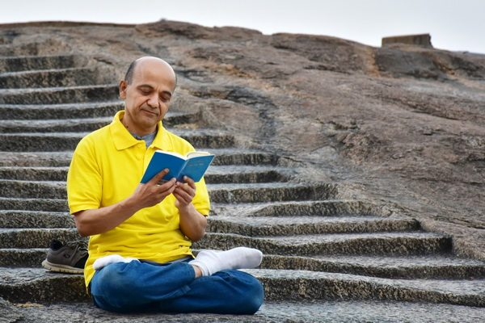

印度法轮功学员布哈拉（Sanjiv Bhalla）在阅读《转法轮》

【希望之声2018年8月9日】（本台记者慧光综合报导）布哈拉（Sanjiv Bhalla）是印度人，今年五十九岁了，他曾周游世界，有丰富的生活阅历，自学能力非常强。

他的父亲曾经在空军服役，小的时候他经常乘坐飞机，所以在他印象中总是从一个地方飞到另一个地方，印度不同地区的景象一直保留在记忆中。然而长大以后他却选择做了一名水手，并在世界各地的海洋中航行了十四年。

他回忆说，海上航行充满着冒险和挑战。他曾经在南中国海的海洋中经历了为期三天的台风，在与台风的搏斗中每一刻都面临着生与死的考验；他也曾在纽约港停留的船舶上经历了十分危险的爆炸事故，幸运的是他活了下来。在生死攸关的情况下他也经历了一些超现实的体验，这些体验历历在目，让他对人生、对客观世界有了更多的思考。

十四年的海洋生涯也让他付出了沉重的代价，苛刻的工作环境给他的健康留下了严重的后果，他在极端的险恶环境中遭受了两次脊椎错位，让他承受了难以忘怀的痛苦，最后不得不放弃海上生活，重新回到陆地，落户在印度的第三大城市班加罗尔。

回到陆地以后，他马上面临一个非常现实的问题——如何生存？以前的海上经历用不上了，他不得不选择一门专业技能重新学习。最终他选择了计算机程序设计，做了一名程序员。然而没有想到的是，新的专业并没有让他感到困难，而是健康问题给他带来了无法忍受且难以摆脱的痛苦，使他非常烦恼。

因为程序员需要长时间使用电脑工作，他受过伤的脊椎难以承受，导致他出现了急性脊椎炎，背部和颈部的剧烈疼痛使他不得不经常停下手中的工作。为了缓解疼痛，最初他采用了一些物理疗法，并在医生的建议下佩戴颈部支撑环，但这只能使感觉上暂时好一些，不能解决实际问题。

他说：“疼痛也有一个好处，就是逼迫你思考一个永远不会思考的问题，——那就是如何才能更好的解决疼痛的根本问题。”现代医学除了能让他缓解一下表面疼痛以外，好像做不了什么，没有任何从根本上解决问题的办法。于是他想到了传统的锻炼方式，开始时是从瑜伽中寻找出路。练习瑜伽也能够对疼痛有一些抑制作用，但是效果有限。后来他又转学太极，并参加了一个太极班。

非常奇怪的是，在太极班上他遇到了一个陌生人，非要拉着他去一个公园，无奈他只好跟随那人去到那里。在那里他看到有一群人在炼功，那个陌生人向他介绍说这是法轮功，并对他说“只有法轮功才能解决你的根本问题”。从那以后他再也没有见过这个人。

图1 布哈拉在炼法轮功第二套功法——法轮桩法（Veeresh M.Honnihal）

当时听过介绍之后，他没有太多的印象。只是觉得这个功法的动作比较简单，自己学起来不会感到困难。另一方面就是没有太多的要求，非常随意，没有时间、地点、方位等等死板的规定，这符合他的习惯，于是他接受了，开始练习法轮功。从那以后，像公园里的其他练习者一样，他一直坚持参加集体炼功。

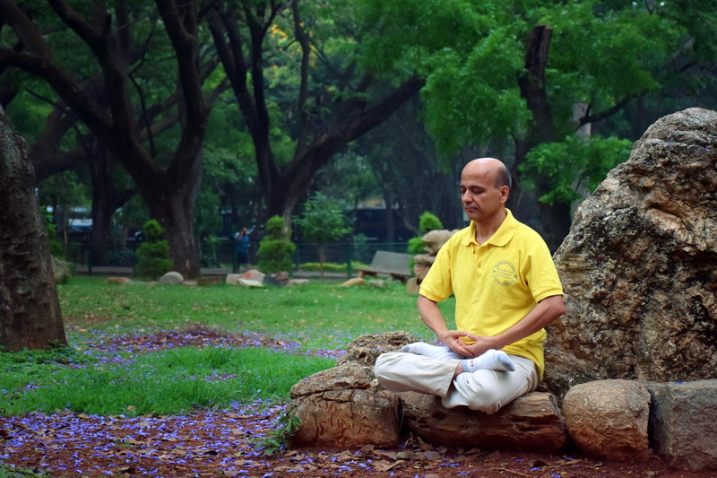

图2 布哈拉在炼法轮功第五套功法——静功（Veeresh M.Honnihal）

他说：“开始的时候并没有真正理解法轮大法是什么，修炼是什么，只是觉得这个功法很好，练习之后感觉很舒服，所以就一直跟着炼。奇迹发生在第二年，大约是在2010年，有一天在炼第二套功法——法轮桩法时，突然感受到全身有巨大的能量流动，使得全身不停地颤抖，就在这个过程中，听到脖子上‘咔哒’一声，好像颈椎有复位的感觉。奇妙的是，从此后颈椎完全恢复正常了，急性脊椎炎也好了，再没去看过医生，就是那个颈部支撑环再也没用过了。这个过程让我感到非常惊奇。”就这样折磨他几十年的由脊椎引起的病痛彻底解决了。

然而收获不仅仅是在健康方面，他说：“从很小的时候起，我就一直在寻找关于生命的答案，就是人生的意义是什么？在浩瀚宇宙中哪里才是我们真正的归宿？我曾通过不同的方式寻找它们，但是都没有找到。但当我读《转法轮》时，我终于清楚地知道我找到了答案。在一遍又一遍地阅读这本书后，答案越来越明确。现在我非常清楚的知道我该走一条什么样的路，法轮大法简单而深刻的教诲引导着我生命的各个方面。”

布哈拉在接受采访时形容自己比以前更健康，但同时他也强调“大法修炼仅仅做练习是不够的，按照‘真、善、忍’的法理去实践更重要”。他说：“‘真、善、忍’的道德价值观适用于任何人，对任何人都是有益的。在工作中我经常会遇到失败，但每次成功的时候，我发现都与我的心态有很大关系，当我用诚实、宽容的心态寻求解决方案时，总会有神奇的结果出现，完全超出了我的思维能力。”

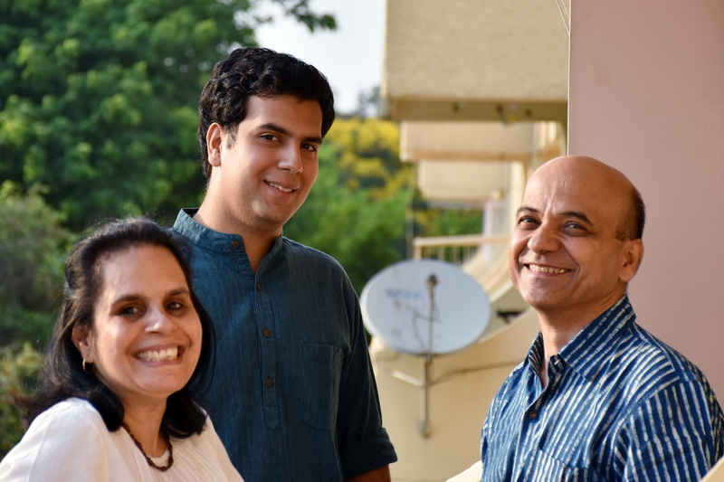

图3 布哈拉与夫人和儿子在一起（Veeresh M.Honnihal）

布哈拉最后说：“我夫人看到我修炼后的变化对我说‘你已经成为一个更好的人’，她的话让我很感动。大法修炼让我看到了自己的潜力，我有信心让自己变得越来越好，无论环境条件看起来多么艰难。这个感觉太神奇了，不修炼的人无论如何是想象不到的。”

（本文根据NTD India报道翻译整理）

<h1 align="center"><b>从农夫与蛇看中国人与中共</b></h1>
【明慧网二零一八年八月二十日】《农夫和蛇》（The Farmer and the Viper）是伊索寓言中的一个故事。

《农夫和蛇》的基本情节是：有一个寒冷的冬夜，农夫在路边拾到一条被冻僵的蛇，他觉得蛇很可怜，于是便把蛇搂在怀中，为它取暖。当蛇醒来，竟向着农夫的胸口大力一咬，令他中毒死亡。

而故事的结局有许多版本。在希腊语的版本中，临死前农夫叹道：“我该死，我怜悯恶人，应该受恶报。”

在罗马寓言家菲德洛斯整理的拉丁文版本中，结局是蛇向农夫教训道：“不要指望从恶人那里获得回报。”

在中世纪寓言家切里顿的奥多的版本中，蛇用了一个反问句回应农夫：“难道您不知道，在您的善心与我之间还隔着敌意与天然的反感吗？难道您不知道怀里的蛇、包里的老鼠和谷仓里的大火会给施舍他们的人糟糕的回报吗？”

在维基百科里对《农夫和蛇》的寓意，是这样解释的：对有毒有害的东西，需要警惕并远离，而不应怜悯它，否则会引火烧身、自取灭亡。

农夫的故事，对应到当下，就是中共与国人的现状。近日媒体爆出中国大陆全民公款养党，分布在全社会各部位的2000万人，每年耗资巨大，而到底花了多少钱？这钱花在哪里？怎么花的？完全是不能公开的秘密。

不能在阳光下公开的，一定是见不得人的。

中共不仅仅是公款养党，更是用纳税人的钱，反过来毒害合法公民。

江泽民集团发动和维持对法轮功的迫害花了多少钱？据明慧网报导，辽宁省司法厅高级官员曾在马三家劳动教养院解教大会上说：“对付法轮功的财政投入已超过了一场战争的经费。”1999－2002年，江氏集团迫害法轮功高峰期消耗的财政资源，高达国民生产总值的1/4。

全国各行各业几乎都参与迫害法轮功，这部份额外支出的数字会非常巨大，比如各地方拦截法轮功学员上访的资金、全国教育系统将迫害法轮功内容编入教科书中等等，这些也不会被计入可见的预算中。

据《九评共产党》揭露：二零零一年来，仅天安门一地，抓捕法轮功学员一天的开销就达170万到250万元人民币，一年达6.2亿到9.1亿元。全国数千个县市的村委会、地方警察、公安局、各级610成员及其大批雇佣人员，数百万中共不法之徒的工资开支每年可达上千亿元人民币，至于建立洗脑班、监狱等的费用更是天文数字。

为诋毁法轮功而不惜一切代价开动所有宣传机器，在报纸、电台、电视台、文艺、文化、教育等方面的资金投入无计其数；为封锁法轮功真相而投入巨额资金建立全方位的地面和网络监视系统；为输出迫害而在外交上更是下大赌注，重金收买一些国家以逃避联合国的谴责，巨资收购和渗透海外中文媒体以粉饰血腥镇压，出资派出大量特务收集海外法轮功学员资讯等等。

从1999年到2018年，对于法轮功全方位的疯狂迫害，动用的财政公款早已无可计数。中共对于法轮功“真善忍”的凶残迫害，已导致4246名真名实姓的大法弟子失去生命。

毒的就是毒的，对于邪恶的任何幻想，都是把自己置于悬崖边上而不自知。对于中共恶行的漠不关心，视而不见，怕麻烦不闻不问，那么邪恶的魔爪，迟早会象冰冻中苏醒的蛇一样，无情地噬咬世人。

在中共十九年的迫害真善忍正信中，中国社会道德沦丧，唯利是图，已到了没有任何底线的地步，诚信缺失、以钻营取巧为荣耀，导致经济一步步走向空壳化，成了真正的“金玉其外，败絮其中”的表面光。

然而吸血鬼的本色，怎么会停下它魔性的脚步？

对于全民性的掠夺，已经越来越明显，不生二胎要收税，丁克（单身）也要收税；而P2P（个人对个人投资）崩盘，导致大批投资者血本无归，有分析指出，P2P是权贵阶层对于百姓的又一次洗劫，这和股市吸血如出一辙。人们往往用正常的道理，去理解、去解释中共的种种现象与问题，那就是一个死胡同。

原因为何？在九评编辑部出版的新书《共产主义的终极目的》中，一语道破魔共之毒：“数十年呼唤不停、危机不断的诚信问题，起源于传统价值被中共颠覆，起源于中共鼓吹的“闷声发大财”价值观，起源于人们在共产党挑起的群众斗争中被迫互不信任、互相揭批。当人们想要解决问题时，发现一切努力遇到了中共就成了无解难题，因为问题是中共制造的。”

怎么办？选择与正义站在一起，才是真正的为自己负责任，对于邪恶的不闻不问，等于是纵容邪恶。到现在，已有3.1亿中国人退出中共党、团、队，这是真正的清醒，是真正的自救，您迈出这一步，就是迎接未来光明的最重要的一步！

<h1 align="center"><b>脱胎换骨不是梦 美妙感受难尽言</b></h1>

脱胎换骨不是梦 美妙感受难尽言

 
【希望之声2018年7月30日】（本台记者慧光综合报导） 我是中国大陆天津人，是一位普通女性，今年快七十岁了。可是我不说谁也看不出我的岁数，我头发乌黑，皮肤细嫩，皱纹不多。我们姐弟五人，我排行第二，比我小十岁的小妹妹都有不少白头发。有一次我姐姐染完头发问我小外甥：“你看看是大姨的头发黑，还是二姨的头发黑？”小外甥说：“大姨的头发没有二姨的亮。”小孩子说的是大实话，染出的头发没法跟我的头发比。

可我以前身体并不好，不到五十岁时身体就很糟糕了。

1997年前，我患有严重的风湿性关节炎和类风湿性关节炎多年，全身大小关节疼痛、肿胀，就连肌肉都是肿胀的。尤其是到了夏天，每当气温高、气压低、湿度大的时候，总觉得胸闷、憋气，心跳失常、眩晕，嘴唇都是紫的，一到这个时候就感觉难受极了，没地方躲没地方藏的，呆在哪里都不舒服。别人都穿短裤、裙子了，我还得穿秋裤，外面再套一条外裤。到了冬天，就穿一条自己做的厚棉裤，这条棉裤是加长的，比正常的要长出大半尺，因为我穿上之后要把裤脚塞在棉鞋里防止进风。

我几乎吃遍了所有治疗风湿性和类风湿性关节炎的药，都不能解决根本问题。后来看到医书上说“这病属于不死的癌症”，这让我很绝望。我曾经说过：“谁要是能把我的风湿和类风湿病治好，我倾家荡产都愿意。”

除了风湿和类风湿病，我还有三十多年的胃病，胃胀胃痛一直伴随着我。不能吃凉的，不能吃粘的，不能吃硬米饭，不能吃油炸的食品，只能吃馒头、发面饼和好消化的食物。因为有这些病症，头晕、头痛是常态，每天睡十二个小时都不够，上午一上班就趴在办公桌上睡，同事给我起个绰号叫“大觉迷”。当时的状态就是一天到晚迷迷糊糊的，大脑像一盆浆糊，健忘的厉害，见了人好半天想不起来叫什么名字；生活中经常丢三落四，在厨房里做饭不是忘了这个就是忘了那个，“骑驴找驴”是常有的事儿，就是手里拿着的东西浑然不觉还满屋子找。

就因为长期处于病态，总是一脸疲惫的样子，所以脸上早早就爬满了皱纹，而且肌肉松弛，显得很苍老。那时候总觉得人的一生太苦了，不知道什么时候才是尽头，很悲观。

也许是苦尽甘来吧，没想到在我的悲苦人生中遇到了重大转折。

1997年，在朋友的推荐下我走入法轮功修炼，出乎意料的是，没过多久我的身体就出现了脱胎换骨般的变化。

那时候我跟大家一起坚持每天炼功、学法，坚持按照“真、善、忍”的标准做人、做好人，身体很快就得到了净化，几乎每天都能感受到身体在变化，身体改变的速度快的让人难以想象。炼功没多久，我全身关节疼痛、肿胀的症状就消失了，变形的手指关节恢复正常。更重要的是——我不怕冷了，夏天穿秋裤、冬天穿棉裤的历史结束了。修炼以后到现在，即使在冬天我也只穿一条秋裤而不觉得冷。

记得有一年，天气刚转热，人们都还穿着长裤长衫，我却穿了一件连衣裙，光着脚丫穿着凉鞋在街上走，无意间碰上我原来单位的领导，她见到我后十分惊讶，说“看来你的风湿病确实是好了！我知道你在炼法轮功，不用说是炼法轮功炼的。电视里说的真是不能信。只要能祛病，就是好功法，自己在家里好好炼吧”。她还说“看到你现在的身体状况就什么都不用说了，真是‘现身说法’啊！”

修炼以后，我的胃也不胀不痛了，而且胃口好极了，吃什么都行，吃什么都没事儿，一年四季就喝凉水，这要在以前是想都不敢想的。睡眠越来越少，精神头儿却越来越足，头晕、头痛的毛病也没有了，一天睡四个小时就够了，有时睡两、三个小时也没事儿，甚至偶尔一宿不睡也照样精神十足。感觉大脑非常的清晰，记忆力比原来不知好上多少倍。

更让我想不到的是，我的皮肤改变了，皱纹不见了，谁看见都说我年轻了，比十几年前还年轻，尤其是满头乌黑的头发，姐妹们都说这是奇迹。由于我的亲身体验，亲朋好友也都见证了发生在我身上的真实变化，我在讲法轮功真相的时候就非常有说服力。以前有病的时候说话总是前言不搭后语，说了前一句不知道后句该说什么，而修炼以后完全不同，不用思考需要讲什么，该说的话就源源不断的出来了，非常恰如其分，得心应手，朋友们说我说出的话头头是道。有人对我说：“感觉你现在的头脑清晰的像一盆清水。”我就告诉他：“清水里还有水分子呢，我的大脑什么都没有，但是需要办什么事、说什么话的时候，最佳方案就自然出来了。”

修炼以后，不仅身体上的变化非常神奇，随着修炼境界的提升，更加奇妙的感受也越来越多，使我经常发自内心的感叹法轮大法的神奇和美妙。以下仅举两例：

一是身体自带“空调”功能。修炼后的头两年我就不过“夏天”了，就是到了夏天也没有夏天的感觉了。一到天气炎热的时候，我的身体里就感觉像出现了许多“泉眼”一样的东西，从这些“泉眼”里冒出来许许多多连绵不断的习习小风，非常柔和，非常凉爽，也非常舒服，而且它会自动调节，不用去管它，不像空调那样冷热要人去控制，那种感觉真是美妙极了。

二是我的体外有一个“罩”。这个“罩”离我的身体大约有五、六厘米的样子，始终包裹着我。能看见“罩”的外面暑气腾腾，但是暑气却进不了我的“罩”。我的“罩”内清爽宜人，完全是一个凉爽的世界，没有高温，没有暑热，与“罩”外完全是两重天地，其美妙之处真是难以用语言述说。

以上是我修炼法轮功以后身体上出现的变化，这都是我真实的感受。我是修“真、善、忍”的，不可能、也不敢说假话。这些感受是我没修炼之前做梦也想不到的、也不敢想的，也是花多少钱都买不来的。就是因为修炼了，真下决心修了师父为我安排的。这脱胎换骨的变化无论什么时候回想起来都让我激动不已，泪水涟涟，感恩师父的心无以言表。今后我要继续精进实修，按照师父指的路坚定的走下去，直至功成圆满。

<h2 align="center"><b>“为法轮功学员辩护的律师遭中共迫害”系列报导之程海</b></h2>
<h1 align="center"><b>程海律师：为法轮功学员辩护 我身心受益</b></h1>

京程海律师表示，为法轮功学员辩护，身心受益。图为程海。

 
【大纪元2018年08月16日讯】（大纪元记者萧律生采访报导）“代理法轮功学员的案子，我是身心都受益。”程海说，“法轮功学员的坚守对中国社会道德提升也有好处。”

今年65岁的北京律师程海，在被中共当局非法注销律师事务所和律师证的情况下，仍旧坚持为法轮功学员辩护。“年龄不是问题。美国总统川普，70岁了，还在当总统。”

他说自己目前仍能坚持，一方面因为在文革时，家里面被贬为臭老九，受到严重歧视，所以自己尤为重视社会的公平正义，而坚守这方面的律师本来就少，社会需要他们这类人；另一方面，自己身体很健康，还可以继续工作，程海把这个功劳归功于法轮功及法轮功学员。

<b>必须停止迫害法轮功</b>

从2007年起，程海开始陆续在全国范围内代理法轮功学员的案件，目前已经11个年头。“除了西藏、新疆、海南等偏远地区没有，其它都有做。法轮功学员的案子本来就是冤假错案。”

程海表示，必须要求中共停止迫害法轮功：从法律角度，刑事案件需要对社会有危害性，而法轮功无危害性；从道德角度，当下中国普遍缺少公共价值观，甚至出现人类历史上最无耻的口号——一切向钱看。法轮功的“真、善、忍”准则是帮助别人，尤其“与世无争”、“遇到问题向内找”都有利于社会。

他说，法轮功自1992年传出后，使众多中国人身心受益，不仅让难以治愈的癌症等患者恢复健康，而且从精神上疏导、解决人的各种问题，有利于个人、家庭和社会；而基于“真、善、忍”的信仰是社会稳定的基础。“至少从这两点，我认为是法轮功没有被有关部门认定为x教的根本原因。没有危害社会，没办法定义为x教。”

鉴于对法轮功及中共对法轮功学员犯下的罪行的了解，程海虽然五次遭中共当局殴打，但是仍表示会继续为法轮功学员辩护。

<b>五次被殴打</b>

1999年至2000年间，程海因为家中一起民事侵权案件，才开始接触法律、律师等。在这个过程中，他发现自己很适合做律师，结果此案未打完，他就考上律师了。

2001年，正式成为一名律师的程海，除了接触商业、刑事案件外，还参与代理公益诉讼，包括：2006年控告铁道部，因其严重不能满足社会需要的铁路规划等行政行为违法；2007年控告合肥市庐阳区公安分局和北京市昌平区公安分局，因中共的户口制度；2012年联合73名公民给主要国家机关监督建议函，要求立即停止违法的劳教、释放被劳教人员，次年初全国停止劳教实施等。

在这个过程中，程海代理法轮功学员的案子相对于其它案件来说更多一些，所以遭到中共当局的打压也更大一些。

2009年，程海准备为北京师范大学明史系研究生陶渊做辩护，正在与陶渊的母亲张盛荣签订委托书时，晋阳派出所警察非法闯入室内，并遭该派出所所长等人暴力殴打。

“2012、2013年，一个案子期间就被连打三次。”程海说，“大连安锅案，法院不让律师会见当事人，我据理力争，在法院被打一次，在法庭被打，还有一次是在看守所被打。他们非常仇恨律师。我的眼睛被打得青紫，当时要求律协、司法局维护律师权力，结果没有下文。” 
 

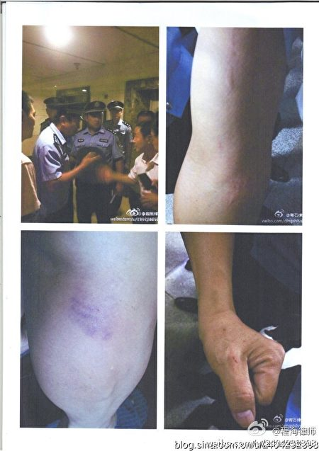

2013年8月15日，程海代理大连法轮功学员安锅一案，遭到看守所警察掐脖子、抢手机，暴力殴打。（程海微博）

2017年5月，程海代理山西运城垣曲县怀有三个月身孕的法轮功学员孟丽霞一案，遭警方暴力迫害。程海曾描述，警察猛拧他的胳膊，他的右手有11处被掐红，颈部也被掐红，并且他的左胸中部出现猛烈疼痛的现象。

“这是我代理法轮功案件以来，被非法关押时间最长的一次（非法关押8个小时），先前从来没有遇到过。”程海说。

<b>“法轮学员无罪”</b>

2013年起，程海代理的法轮功学员案件中，出现首例在批捕阶段得以获释的情形。之后的几年，尤其是2016年、2017年，他在安徽黄山、安徽合肥、陕西、浙江等地代理的案件中，陆续出现十多个案例，“检察院、法院听取律师汇报案件情况，最后不批捕，不追究”。

“他们应该知道是没有法律依据，公安部认定的14种邪教中没有法轮功，他们那样做是没有法律依据的。”程海说，“不过，有些地方还是很邪恶的。”

为此，程海一再请大纪元记者转告给法轮功学员一点建议。

首先一点，程海表示，从心底里，确信修炼法轮功、去向民众讲法轮功真相、散发真相小册子等是无罪的，就不要有犯罪嫌疑人心理。因为从法律的角度而言，迫害法轮功完全是违法的，毫无依据。

“没有犯罪，当公安询问时，完全就不要去搭理他们。”程海说，“他们说是犯罪，但是法轮功学员没有犯罪，所以对他们无可奉告，就不要对公检法说任何话。”

程海表示，一旦向公安承认，或者心里担心抄家抄出资料等等，“你自己认为不是犯罪，但是说了什么以后，既害了自己，也害了对方，因为让他们犯罪了。”

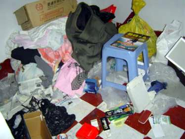

2004年3月31日晚上，警察对法轮功学员王茁、范德震、穆琴等人的住处葫芦岛市连山区新华大街海军部队5号院17号楼（四楼）进行抄家﹐王等四人被强行绑架走，下落不明。（明慧网）

 
“当孩子遇到危险时，父母会挺身而出，把自己生命置之度外地付出。信仰，就是需要用高于生命的高度来看待，无惧后，自然地就有勇气、有智慧。”程海说，“你们修炼人讲要向内找，找自己的原因，那就去捍卫自己的信仰，投入的、都去做。”

此外，程海建议被非法迫害的法轮功学员要敢于去控告各级迫害法轮功学员的机构、部门、工作人员。

程海说：“善恶是对立的，就是要揭露其犯罪行为。有些地方案件，拚命控告多了，那些工作人员就知道了，他们也害怕。所以再参与做迫害事情的人就少了，这样的案子就会少了。控告还是有作用的。” 

<h2 align="center"><b>神韵女高音歌唱家、“全世界华人美声唱法声乐大赛”评委耿皓蓝专访</b></h2>
<h1 align="center"><b>评委耿皓蓝谈声乐大赛：华人歌唱家的机遇</b></h1>

神韵艺术团女高音歌唱家耿皓蓝。（陈霆／大纪元）

【大纪元2018年08月16日讯】（大纪元记者叶蓁美国纽约采访报导）“她的声音来自上天。”这是神韵观众对女高音歌唱家耿皓蓝的由衷赞美。观众认为，她的声音“强劲有力”，对传统美声唱法的演绎“达到了巅峰的呈现”。

 
起初，耿皓蓝在音乐学院毕业的时候，曾为前途而忧虑：“国内学声乐的人特别多，竞争特别激烈，不知道以后的出路在哪。”大约十多年后，她登上世界舞台的中心，成为备受瞩目的顶级声乐艺术家。她说这得益于2009年她参加的新唐人“全世界华人美声唱法声乐大赛”。同年她被选入神韵艺术团担任独唱演员，从此声乐之路越走越广。

<b>目前，声乐大赛已经开始接受报名。详情可以登录网站或拨打热线查询。（大赛网站：https://vocal.ntdtv.com/ ，美国热线： 1-888-878-6166）</b>

今年11月，耿皓蓝作为五大评委之一，将重回声乐大赛。她希望分享自己的经历，激励更多年轻的华人歌唱家踊跃参赛，走出属于自己的艺术之路。

<b>与大赛结缘 从选手到评委</b>

在出国深造之前，耿皓蓝就听说了华人声乐大赛的大名。那时她还在上大四，参加当地的歌剧协会。该协会的老师告诉她，纽约有一个电视台主办的华人歌唱比赛，影响力很大。耿皓蓝一听说有个面向华人的国际比赛，就很动心，但因为人在中国错过了比赛。

毕业后她赴纽约留学，有一天恰好看到比赛的广告。她毫不犹豫地报名参赛，而且，评委主席竟然是风靡中国几十年的“歌王”关贵敏先生。

“哇，可以亲眼见到他！”耿皓蓝喜出望外。她在国内就非常喜欢关贵敏的歌声，但是多年来只能在电视上一睹他的风采。由一代歌王遴选大赛优胜者，不仅能让耿皓蓝近距离接触敬佩的前辈，也使她对大赛的专业和权威性增添了很多信心。

在她的印象中，关贵敏非常亲切、和善，给她提出歌唱建议，“感觉就像邻家的一位叔叔跟你讲话，对你谆谆教导。”耿皓蓝说，关老师和国内那些“大牌”的歌唱家完全不同，给她的提点也非常中肯，让她获益匪浅。

汇聚在大赛现场的华人选手们，很多来自于台湾、美国，还有像耿皓蓝一样来自中国大陆的。华夏子孙天然的纽带，为大家营造了友好祥和的氛围。耿皓蓝回忆，选手之间的良好互动也让她非常感动。

她说，如果有谁化妆缺什么东西，就会有人借出来；如果谁演唱结束，大家也会鼓励他“唱得好”。“不像其它比赛，大家一起争夺名次，而是很友善地互相帮助。”

今年，耿皓蓝担任华人美声唱法大赛的评委，身份的转变让她感受到肩负的责任。“以前在台上唱歌，想的没有那么多，但是评委有选拔人才的使命，要挖掘优秀的声乐人才。”

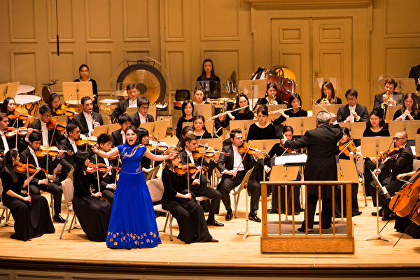

2017年10月13日，神韵交响乐团在波士顿交响乐厅演出。图为女高音歌唱家耿皓蓝的演出。（戴兵／大纪元）

<b>因大赛获难得的机遇</b>

2009年，作为第三届声乐大赛的金奖得主，耿皓蓝被神韵艺术团选为女高音独唱演员，每年在世界范围巡回演出。她认为，这样难得的机遇，促成了她在声乐艺术上的巨大成功。

为什么这样说呢？耿皓蓝表示，首先她在声乐技艺上有了突飞猛进的提升。以前她唱美声歌曲时，只擅长用意大利文或其它西方语言。虽然耿皓蓝在大赛中唱中文歌曲并获大奖，但她明白，这一直是她很大的挑战。“用中文演唱，最主要的是发音问题，就是咬字方面特别不一样。”

幸运的是，她在神韵艺术团中，学到久已失传的正统美声唱法。而且，神韵歌曲都是用中文歌词写成，她也在坚持不懈的练习中，掌握了唱中文歌曲的诀窍，将圆润悠扬的美声发挥得淋漓尽致。

神韵歌曲不仅是全中文歌曲，更是承载深刻内涵、复兴传统文化的旷世佳作。耿皓蓝认为，演唱神韵歌曲，与唱其它歌曲有显著不同，使她对声乐艺术也有了更深层的理解。“有一种难以用语言形容的身心升华的感觉。”她说。

这样神圣的歌曲，配上演出中背景天幕同步显示的外国语字幕，感动了世界各地的观众。参加声乐大赛前，耿皓蓝曾观赏过神韵晚会，被演出效果震撼，止不住地流眼泪。而她演唱时，也多次看到很多西方观众抹眼泪。“歌曲中神性的东西，可以打动世界各族裔。”

耿皓蓝说，全世界华人声乐大赛，真的是给选手提供了一个实现艺术理想的国际平台。

<b>大赛的宗旨是回归传统</b>

那么，在耿皓蓝心中，优秀的声乐家是怎样的？“首先声音条件必须非常好，大家想听的就是你的声音。”由于大赛的宗旨是弘扬纯真、纯善、纯美的正统美声唱法，因此她还强调，歌唱家的精神境界同样重要。“如果你的内心纯净，观众也更能体会到歌曲的纯净。”

耿皓蓝表示，当今社会世风日下，道德下滑得很厉害，很多世人忘记了生命本真最需要的东西。她遗憾地说：“像传统文化、那些古老的东西， 都已经被遗忘了。”但是华人声乐大赛崇尚传统艺术，无论对选手还是听众，都是非常好的启发。而且，传统音乐是真正有益于人类身心、促进道德回升的艺术精华。

“像古人提过‘音乐疗法’，好的音乐确实对人的身心有很多帮助。”耿皓蓝记得，有一年在辛辛那提演唱神韵歌曲后，有位西方妇女带着5、6岁的女儿来拜访她。平时她的女儿特别吵闹，但是一听耿皓蓝唱歌，就会片刻间安静下来认真听歌，还不停地流眼泪。音乐的力量如此神奇，母女俩都很想亲眼见见这位了不起的歌唱家。

女孩的故事，让耿皓蓝也深受触动，她甚至也流下了眼泪。“神韵的传统歌曲带给人的感受，是任何一种歌曲都不能达到的。”她说。

从技术层面说，耿皓蓝鼓励有志于参赛的选手们，要有信心唱好美声唱法的中文歌曲。“纯正的普通话，对演唱中文歌曲是很主要的。结合美声唱法技巧，就可以很好地诠释歌曲。”她认为，华人选手们有很棒的先决条件。她还建议选手们多多学习传统文化，“了解‘仁义礼智信’等传统价值，才能唱出更深层的涵义。”

最后，耿皓蓝表示，虽然十年过去了，国内外的声乐学子们，仍然处在前路未卜的迷茫中，很多人不能坚持歌唱事业。“特别是大陆的年轻人，体会不到国际上声乐艺术的现状。”新唐人电视台为各地华人音乐家们，提供展示才华的机会。耿皓蓝希望青年专业人士也抓住机会，通过参赛，为自己的演唱事业获得突破的机遇。

<h3><b>新唐人第七届“全世界华人美声唱法声乐大赛”将于11月8日到10日在纽约Engelman Hall of Baruch Performing Arts Center举行，报名办法和比赛章程详情请见大赛网站。</b></h3>

<h1 align="center"><b>学术研究论证 中共迫害法轮功是群体灭绝</b></h1>

6月22日，近万法轮功学员汇集美国华盛顿，悼念19年来被迫害至死的同修。图为高莉莉手捧妹妹高蓉蓉遗像。（Samira Bouaou/大纪元）

【大纪元2018年08月16日讯】（大纪元记者Margaret Wollensak多伦多报导/李平编译）近日，发表在国际期刊上的一篇研究论文《法轮功在中国：隐性群体灭绝》（Cold Genocide: Falun Gong in China）提出了一个沉重的话题，即隐性群体灭绝（cold genocide）与肉体消灭（hot genocide）之间的区别。

这篇由加拿大四名学者及律师花了两年时间合著的研究论文，近日发表在国际种族灭绝研究协会（IAGS）《种族灭绝研究与预防》（Genocide Studies and Prevention）期刊上。

曼尼托巴大学副教授张玛丽（Maria Cheung，音译）博士在论文中说，肉体消灭是在短时间内暴力摧毁和消灭一个群体。隐性群体灭绝是在一个漫长时间内，慢慢消灭一个群体，这种消灭通常是从很细微的多层面进行，不仅从外在形式上消灭一个群体，更是从精神、结构和社会层面消灭。

“隐性群体灭绝过程漫长，人们通常不太注意，不知道这种灭绝实质上是一种有目的的系统性灭绝。是否构成群体灭绝，取决于其背后意图和目的，即有目的性的消灭一个群体，而非取决于规模。”张博士说：“目前隐性群体灭绝理论还比较新，有许多问题有待更多探讨和确定。”

参与撰写该篇研究论文的还有温尼伯国际人权律师麦塔斯（David Matas）、反强摘器官医生组织（DAFOH）执行主管特雷（Torsten Trey）医生与多伦多律师安里查德（Richard An），四人共同耗时2年合作完成。

<b>群体灭绝无人性</b>

文章作者认为，中共1999年起对法轮功群体的迫害，构成隐性群体灭绝。

张博士认为，中共对法轮功的迫害虽符合群体灭绝传统定义，但传统定义过于偏重其外在层面，根本没发现中共对法轮功残酷迫害是多层面多维度进行。她说：“中共对法轮功的迫害，不仅仅是外在肉体上的，因为外在肉体和精神、心理和社会层面是密不可分的。”

法轮功，又称法轮大法，是一种以宇宙特性“真、善、忍”为根本指导、基于佛道两家的传统性命双修功法，1992年在中国大陆传出后，很快受到民众欢迎。到1990年代末，全国修炼法轮功的民众已达7,000万～1亿人。由于法轮功坚持恢复中华传统价值，加上修炼者日众，中共时任党魁江泽民极度恐惧与嫉妒，于1999年7月20日亲自下令消灭法轮功，从此发起了对法轮功史无前例的全面残酷迫害。

截至目前，数百万法轮功学员被非法关押、洗脑和残酷折磨。已有数据证实，至少有数千名法轮功学员在关押期间被中共杀害，真实被害数字据信已达数万。中共发起的这场迫害，摧毁无数法轮功修炼者及其家人的正常生活。更无耻的是，中共不仅系统性地迫害法轮功群体，还极力对内对外掩盖，使得外界很难了解这场迫害的真实残酷程度。

文章说，在中国大陆，与法轮功有关的网络搜索都经过严密审查和过滤，能搜索到的数据都经过中共歪曲篡改或删减，国内外媒体转载的，都是中共媒体污蔑宣传和歪曲误导。 不仅如此，中共还操控媒体，掩盖其对法轮功群体的长期迫害和不公对待。所有这一切，导致法轮功群体在中国大陆被边缘化，所遭受非人待遇被整个社会无视和淡化。

张博士说：“想真正了解法轮功真相的，除非真的钻进去深入挖掘，否则很难看到真相。这场迫害被整个社会无视长达19年，完全构成隐性群体灭绝。”

<b>器官活摘暴行</b>

江泽民发起的这场对法轮功群体的旷日持久的迫害中，最惨绝人寰的是对非法关押法轮功学员的器官活摘暴行，被活摘器官的法轮功学员，一般都痛苦死亡。

2006年，麦塔斯与人合作，公布全球首个中共活摘法轮功学员器官的报告，随后又发表《血腥的活摘器官》（Bloody Harvest）一书。2016年他与人合作发表的最新报告中，发现全中国169家经中共器官移植手术审批的医院，自2000年以来共进行100多万起器官移植手术，这一年正好是中共迫害法轮功群体的第2年。

张博士说：“目前全中国大陆共有170多家医院从事器官移植手术，器官移植好像已成为常规生意。如果不主动询问移植器官来源，谁也不知道这背后尽然是中共有系统性的杀人暴行。也就是说，器官强摘已成中国医院家常便饭，但都是偷偷私底下进行，罪恶滔天。”

<b>为什么构成群体灭绝？</b>

张博士表示，外界对中共对法轮功修炼者的迫害，外界知之甚少，是构成隐性群体灭绝的关键要素。也正是这一点，观察人士、局外人士和普通大众更难全面了解这场迫害的残酷程度。

中共对法轮功的迫害，旷日持久，当局有系统性地尽力掩盖，对法轮功修炼者的边缘化，使得中共这一群体灭绝罪行日益演变成常态。张博士说，常态化，是一种行为在民众意识不到的情况下，日益成为社会和日常生活中的一种常态。如此导致的结果是整个社会的无视和冷漠，罪行能够有恃无恐地继续进行。

张博士说：“许多人不解，中共对法轮功的迫害为什么构成群体灭绝，是因为他们不知道，这场迫害是中共有目的的、长期有系统性地消灭一个群体。”

<h1 align="center"><b>一位脑瘤患者危难关头的转变</b></h1>

“脑病”需心医 一念定生死 不信无生路 心诚感天地

【希望之声2018年7月28日】（本台记者慧光综合报导）我是中国大陆东北黑龙江人，今天要讲的是发生在我丈夫身上的故事。

2005年，我丈夫突然感觉头疼，右侧手脚发麻，说话也不太利索了，于是我们赶紧到哈尔滨医科大学附属第一医院去看病。在医院里经过各种检查，最后确诊是丈夫患有“脑胶质瘤”病。听说是大脑长瘤了，而且还有可能是恶性的，我们都害怕了，请了哈医大最好的专家，据说是肿瘤专业十大名医之一的一位教授给做的手术。第一次手术后不到十天，专家说还需要做X刀手术（注：X刀也叫光子刀，是继伽玛刀之后迅速发展起来的立体定向放射治疗技术）。手术之后又听医生的建议，用了国内最好的化疗药。整个一套流程都是按照最佳方案走下来的，专家说也是最有效最好的方案，尽管花了很多钱，可我们心里还是满意的。

手术前一天，我和丈夫还去了哈尔滨最大的佛教圣地“极乐寺”，给所有的佛、菩萨都上了香、磕了头，请佛、菩萨保佑丈夫手术成功。不管怎么样，我们做了我们能做的一切，做了最大努力。的确，我们的努力没有白做，手术后一切都很好，我们全家都非常高兴，以为丈夫的病肯定能好了。

可是好景不长，一年后丈夫的病就复发了，突然间就不能说话了，而且整个右边身体都不听使唤了。这时我姐姐跟我说，“谁也救不了他的命，只有学《转法轮》，炼法轮功才能救他的命”。可我丈夫是一个很固执的人，怎么说他都不相信。为了能说服他，我就先看起了《转法轮》。

当我阅读《转法轮》这本书的时候，一下子就被书中的内容吸引了，很后悔为什么没早看。我心想怪不得有那么多有文化有知识的人都炼法轮功，原来这不是普通的气功，是一门能让人彻底脱离苦海的宇宙大法。虽然得法晚，但我当时就下定了决心，要一修到底，做真修弟子。

因为我的认识上来了，我就不想把丈夫丢下，就每天督促着他学法、炼功。他虽然很固执，可自己的身体都这样了，也没有更好的出路，就只好跟着我一起做。但是他不入心，所以心性始终跟不上，病的症状也就时好时坏。

脑胶质瘤病属于神经系统疾病，严重时会有出现癫痫发作，轻的时候是局限性的，重的时候就是全身性的，就是俗话说的“羊角风”，由于发作时病人意识不清、肢体痉挛及抽搐，我平时就叫他“抽风”。2007年8月，也就是手术后两年吧，他就开始出现“抽风”，而且越来越严重，发作的次数也越来越频繁。我知道这是他的思想造成的，他没有把自己当成是真正的修炼人，那就是常人，所以他的身体没有改变。没办法我只好把他送去哈医大第一附属医院再做检查。做过核磁共振检查后，医生说他病情加重了，需要再做一次手术，而且这次手术效果肯定不会好，做完后可能还不如现在。因为他的肿瘤长在大脑功能区内了，正好都压迫在他的肢体神经上，手术只能拿掉他不压迫神经的部分，而手术做不到的地方会发展的特别快，所以后果不会好。

我把医生说的真实情况都跟丈夫说了，我说“再好的医生也救不了你的命，只有法轮功师父才能把你从地狱里救出来，但你必须坚定修炼的决心，把自己当作一名真修的大法弟子”。

回家后，丈夫还是不停的“抽风”，使他意识到了问题的严重性。没有别的路了，只能下决心修炼了，于是他就开始尽最大努力学法、炼功。几天后的一天半夜里，他又突然“抽”了起来，不过这次与以往不同，他就像被恶魔掐住脖子一样，眼睛都“突”出来了，两只手一个劲的东抓西抓，样子非常可怕，整个脸都成了黑紫色，脖子、两肩也都充血成紫色。当时吓的我手足无措，不知怎么办才好，情急之下突然想起师父能救命，就大声喊“师父快救命！师父快救命！……”喊过之后，丈夫的症状就开始缓解，大约过了约半个小时，他才缓过气来，不抽了。我知道这一次是慈悲的师父把他救回来了。

通过这一次的亲身体验，丈夫也认识到了修炼的严肃性，不修炼心性就是一个普通人，师父也不会管、也不能管，只有心性修好了，大法的神奇才能展现出来。认识提高了，行动也就跟上了。以后不管怎么难受他也坚持学法、炼功，有一次刚想炼功，突然就“抽”起来了，可是他不停的发正念，“抽”完了起来接着炼。就这样坚持两天后，他就不“抽”了，而且以后再也没“抽”过。

所有的亲朋好友都知道丈夫的病，谁看见他“抽”起来都害怕，医院也都没辙了。可是他走入法轮功修炼，这么严重的病彻底好了，完全恢复了正常，这是铁的事实，家人、亲人和好友都见证了这个过程。

丈夫用他自己的亲身经历不仅改变了身体，也改变了自己的人生道路，整个人不仅精神起来了，脾气也变好了，从此后他更加坚定了修炼的决心，学法、炼功再也不用人督促了。他说，我亲身体验了大法的神奇威力，也证实了大法威严，我今后一定要坚定的跟师父走，再也不会动摇了。

<h1 align="center"><b>江泽民为什么要不断升级诬蔑法轮功</b></h1>

图为乌云密布的北京天安门广场。

【大纪元2018年08月14日讯】（大纪元记者叶枫综合报导）1999年10月25日，江泽民接受法国《费加罗报》记者采访时，诽谤法轮功为“邪教”，这是中共发动镇压3个月以来，首次给法轮功贴上这一标签。

江泽民为何要不断升级诬蔑法轮功？其间有何内幕？这3个月以来，中国大陆和国际社会究竟发生了什么？
镇压后 法轮功学员不畏生死上访

1999年7月20日，江泽民因恐惧法轮功太受群众欢迎，下令全面镇压。

黑云压顶。广播、电台、电视、报纸等党媒一轰齐上，反复播报事先编造的“1400例杀人、自杀、死亡”等案例，栽赃法轮功、煽动仇恨。与此同时，动用军、警、特务等暴力手段强势镇压。

7月20日凌晨，大陆公安在全国30个省市同时抓捕各地法轮功义务辅导员。

出于对政府的信任，各地法轮功学员上访不断。

1999年7月21日，北京。北京府佑街戒备森严，实行交通管制。上午10时许，数千名上访的法轮功学员站在国务院信访办门外。当局出动大批警察，将他们强行拖上卡车，一车一车送到丰台体育馆、石景山体育馆……

同一天，黑龙江哈尔滨。凌晨4时许，一万余名哈尔滨学员在省政府门前上访。

同一天，广州。近万名学员在省府外上访。

同一天，上海。上海市人民广场挤满了前来上访的法轮功学员。

同一天，大连。上千名警察暴力驱逐上访的学员。
……

事态步步升级。

辽宁某地，法轮功学员上访现场。一位怀孕八个月的妇女，被警察用穿着大皮鞋的脚狠狠地往肚子上踢；一位妇女被警察抓住头往旁边4米高、厚厚的商场橱窗玻璃上撞，整块玻璃被撞碎了；七八十岁的老人也不能幸免：一位阿婆被四个警察抓住四肢，裤子都被扯掉了，远远地拖出去，重重地摔在地下……

1999年7月29日，北美明慧网报导，目前，中国大陆所有的信访渠道都被堵死，法轮功学员最后一点申诉机会已不复存在。

在北京，没等上访的法轮功学员到信访办门前，即被军警便衣抓捕上车，有的从此下落不明，有的被询问、登记、遣送回原籍，由当地公安或单位处理，以开除党籍和公职相威胁。

在去北京的火车、汽车上，警察肆无忌惮地翻包，审查身份证。一列前往北京的火车，所有的乘客被赶下车……

<b>法轮功创始人希望和中共当局直接沟通</b>

美东时间1999年7月27日，法轮功创始人李洪志先生，托人向中共驻美大使馆转交一封署名信，署名时间是7月22日。

信中，李洪志先生敦促，立即停止对法轮功的打压，呼吁用和平对话方式解决中共与法轮功之间的问题。李洪志先生说：“我也不愿意国家民族再次遭到不幸。”

1999年7月25日，法国国际广播电台对李洪志先生进行了电话专访。

记者就目前中共打压法轮功事件向李洪志先生提问，李洪志先生表示，希望通过与中国政府对话来和平解决问题，不愿再一次看到第二个“六四”事件的出现。

在采访中，李洪志先生还一再告诫法轮功弟子：不论受到怎样的打击和压制，决不能使用暴力。

但是，面对法轮功创始人的谆谆善劝，江泽民一意孤行。江下令“3个月内消灭法轮功”，镇压进一步加剧。

<b>镇压加剧 迫害致死案例传出</b>

1999年7月22日，辽宁抚顺。法轮大法义务辅导站站长武占瑞，被迫害致死。

1999年8月16日，黑龙江法轮功学员陈英，去京上访被押返途中，遭警察折磨，被迫跳车，不幸身亡。

1999年9月27日，山东招远。法轮功学员赵金华在地里干活时被绑架；10月7日，被派出所毒打致死。

1999年9月28日，江苏常州。法轮功学员诚种，被强行押至精神病医院，强制服用精神病药物，遭受电刑。

1999年10月7日，河北消息。河北省三河市与北京交界处，警车日夜巡回；9月25日起不到10天时间内，3,000多位法轮功学员被绑架。

1999年10月10日，一位东北女法轮功学员冒着生命危险向美国的朋友打电话，说长春某监狱关押了数百名法轮功学员。“有些弟子被打得很惨。不分男女一律脱光了打，打得浑身是伤。连孕妇都不放过。”

以上案例只是冰山一角。

就在中共疯狂打压之际，国际社会纷纷站出来谴责这场迫害。

<b>国际社会谴责中共迫害</b>

1999年7月22日，联合国人权监测委员会强烈谴责中共禁止法轮功，敦促中共立即释放被扣留的法轮功负责人及学员。亚洲人权监测委员会华盛顿理事Mike Jendrzejczyk表示：“此次禁止法轮功，关系到成千上万的中国百姓。中国人民应有信仰自由。”

加拿大是世界第一个站出来谴责中共迫害法轮功的政府。

1999年7月23日，加拿大向中共外交部递交抗议信。加拿大外交官在信中指出，中国宪法保证其12.3亿公民和平集会和言论自由的权利，上星期对法轮功的取缔侵犯了这些公民权，因为集会者非常平和，并寻求言论自由。

1999年8月4日，世界公民联合会“保护及防止歧视少数民族分委员会”驻联合国常任代表瑞内．瓦德罗（Rene V. L. Wadlow）向联合国人权委员会提交一份报告，呼吁敦促中共取消取缔法轮功。

1999年8月，澳大利亚在人权对话中提出了法轮功问题。

澳大利亚外交官Miles Kupa说，在北京三天的关于人权问题的双边对话中，中国（中共）镇压法轮功事件成为主要议题。他在一个记者招待会上说：“中国（中共）政府对法轮功的镇压，令人开始质疑中国在集会自由、结社自由、言论自由上对国际社会的承诺。”

1999年8月25日，美国国务院表示，不可能协助中国（中共）“缉拿”李洪志先生，并反对北京起诉法轮功学员。美国国务院发言人弗利表示，美国呼吁中国（中共）政府履行其在国际人权公约下的义务，保护思想自由、良心自由、宗教自由。

1999年10月6日，联合国记者协会（UN Correspondents Association）在纽约联合国大厦召开法轮功真相新闻简况发布会，披露法轮功受迫害等真相。

1999年10月22日，国际特赦组织发布中共迫害法轮功群众记录报告。

1999年10月26日，美国批评中共打压法轮功违反人权。美国国务院发言人罗宾说，中国（中共）政府10月25日拘禁更多的法轮功示威者的行为显然侵犯了法轮功群众的人权。

在谴责中共的同时，国际社会也纷纷褒奖法轮功。

<b>国际社会褒奖法轮功</b>

美国新泽西州泽西市市长Bret Schundler宣布，1999年8月8日为“李洪志先生日”。

美国首府华盛顿哥伦比亚特区市长Anthony William宣布，1999年8月9日至13日为“法轮大法周”。这份褒奖说：“法轮大法，从1992年开始在中国弘扬，其一切活动的宗旨都是按照宇宙的根本特性：真、善、忍。”“法轮大法，帮助人祛病健身，帮助人心灵净化，帮助人道德升华，帮助人弃恶从善。”

美国马里兰州巴尔的摩市市长Kurt L. Schmoke宣布，1999年8月13日为“李洪志先生日”。褒奖说：“巴尔的摩市民自豪地向法轮大法创始人李洪志先生致敬。”

美国马里兰州州长ParrisN.Glendening宣布，1999年8月14日授予李洪志先生荣誉市民证书。

美国宾西法尼亚州费城市长爱德华．阮得尔宣布，1999年8月16日为“法轮大法日”。

美国圣路易市宣布，1999年9月18日为圣路易市“法轮大法日”。
……

<b>国内国际压力下 江泽民为镇压寻求“合法化”</b>

江泽民迫害法轮功，不仅在国际上受到谴责，在国内同样遇阻。

中共党内对镇压法轮功，早已出现分歧。据《江泽民其人》一书披露，前人大委员长乔石对虐杀无辜炼功群众深感不安，亲自回京到天安门广场了解殴捕法轮功学员的实情。国务院总理朱镕基也亲自到北京公安五处，训诫公安干部说：“不要再为难法轮功学员啦！”

但是，江泽民继续一意孤行。

镇压3个月后，1999年10月25日，江泽民在法国向媒体诬蔑法轮功是“邪教”。

1999年11月，美国《华盛顿邮报》发表了一篇名为“中国（中共）镇压的裂缝”的报导，报告披露：镇压发生3个月后，江泽民下令给法轮功贴上“邪教”标签。这篇报导还说，中共中央政治局其他六个常委当时（1999年）都不同意江泽民镇压法轮功的决定。

美国华盛顿DC著名非政府机构“自由之家”，2017年8月发布中文版《中国宗教自由报告》，名为“中国灵魂争夺战”（The Battle for China’s Spirit）。报告表示，中共镇压在前，贴标签在后，“中共是在镇压法轮功遭到国际社会和中国国内批评后才这样做的”。

<b>江泽民为何要镇压法轮功</b>

“自由之家”的报告说：“总的来说，共产党对任何把自己的精神信仰置于对党的效忠之上的群体都持不容忍态度。”

报告认为中共镇压法轮功有以下因素：

1. 受欢迎：当1999年修炼法轮功的人数超过7,000万的时候，它超过了当时共产党6,300万党员这个数字。

2. 意识形态竞争：法轮功强调的“真、善、忍”世界观看来令共产党不满，因为其与唯物主义、政治斗争和民族主义这些马克思主义意识形态以及共产党统治合法性的原则相冲突。

3. “渗透”：法轮功在维持党国统治的一些重要国家机器中很受欢迎，如军队、国内安全部队、国家媒体以及党的纪律检查委员会。共产党逐渐开始担心法轮功炼功者对法轮功信仰原则的忠诚高于对中共领导人的忠诚。
……

<b>中共对法轮功的镇压失败</b>

“自由之家”的报告说：“从1999年7月起，中共使出全部手段对法轮功发起镇压。”

“在1999年的镇压后，当政府看到法轮功修炼者没有因为政府命令而停止修炼，2001年共产党开始强化打压。从1月份开始，新一轮的妖魔化宣传充斥媒体⋯⋯”

报告说，面对中共的迫害，法轮功学员展现了“坚韧、非暴力和创造性”；尽管共产党已经对法轮功进行了长达17年（编注：现为19年）斩草除根式的镇压，但是“共产党这部镇压机器是失败的”。

<h1 align="center"><b>地震中亲历的神奇能量</b></h1>

我们的小木屋正好在震央九份二山的山上。

921大地震（注）时，我已回台北。我们的小木屋正好在震央九份二山的山上，海拔近1000公尺，没打地基，只用四个木桩和锁錬插地架著。为了避潮，屋底离地一尺多高。心想，这回完了，木屋可能滚下山了。小姑住的那栋也一样，但较大，有公共客厅。

因电讯不通，小姑几天后才从山上来电说，当夜在狂震中醒来，拿手电筒四处探照，发现没事，就和阿爸（80多岁）继续入眠。

白天查看，书籍全部安然立于没有门的书柜中，电脑滑到桌边，室内只打破一个玻璃杯，接引的山泉水照样流通，茶园也没损坏，她如常工作。后来才发现走山了，主要道路断了，山上的人都跑光了，只剩小木屋这家从都市来的新住民。

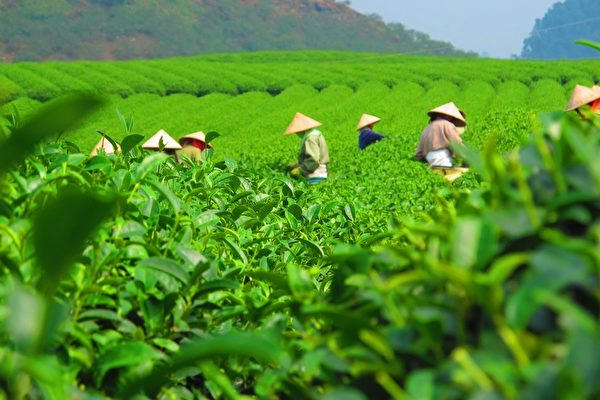

采茶工真的从另条陡峭的路上山采茶，成为令人津津乐道不可思议的事。

 
因预定采收的时间到了，小姑联络嘉义梅山的采茶工，人家以为她在劫难中还有心情开玩笑。后来采茶工真的从另条陡峭的路上山采茶，成为令人津津乐道不可思议的事。

令人难过的是，离茶园200米处坍方，造成半山腰14户人家41人葬身大地。之前我定时送孩子下山上学，他们有人会等在路边，或搭便车，或委托采购。这些住红瓦厝的村民就此人间蒸发。

当我回山上时，看到的完全是陌生景观，根本不知回去的路，而许多游客兴致勃勃地来参观，令人备觉感慨。

我们这家小木屋住民的万幸之幸，绝非偶然，因为我们的家园笼罩在慈悲的能量中，因为我们炼法轮功，是法轮大法修炼者，受到神奇能量的护祐。

这些年大大小小的地震中，我们都处之泰然。今年地震频频，在晃荡中，仍继续手边的工作。

当您遇到灾难时，即使还没炼法轮功，心里真心念“法轮大法好”，也是管用的，这类例子不胜枚举。当然有这样的缘分，能走入大法修炼，那是再幸运不过的了。＠*#

（注：这场发生在1999年9月21日、芮氏规模7.3的地震，是台湾自二战后伤亡损失最大的自然灾害。地震造成2,415人死亡，29人失踪，11,305人受伤，51,711间房屋全倒，53,768间房屋半倒。） 
 

<h1 align="center"><b>正义的家属们</b></h1>

【明慧网二零一八年八月十日】中共江氏集团迫害法轮大法已经十九年了，这场迫害，不但千千万万的法轮功学员受到精神、经济、肉体甚至生命的迫害，同时也在拷问着世上每个人的道德和良知。那些不畏强权暴力、坚信大法，和被迫害中的法轮功学员不离不弃、风雨同舟走过来的家属们，也为自己选择了一个美好的未来，我们为这些正义善良的生命感动和敬佩。下面摘选几位法轮功学员家属的感人故事（故事中的人名均为化名）。

<b>不离不弃的陪伴</b>

法轮功学员明宇的丈夫老刘，是一个不善言辞的老实人，他没有修炼法轮功，但从妻子身上他看到了法轮功的美好。他的妻子修大法前，年纪轻轻多病缠身，被病痛折磨的性格极端，脾气暴躁，搞得家庭不和睦，一家人生活的都不愉快。妻子修大法后，身心发生了很大的变化，在单位工作积极肯干，多次被评为公司和局里的先進生产者。在家庭中，尊老爱幼，任劳任怨，赢得了邻里和亲朋的称赞。

老刘亲眼目睹了妻子修大法后的巨大变化，认定了法轮功是一个祛病健身有奇效，能让人道德升华的好功法。所以，从妻子修炼开始到现在，他一直都默默地支持妻子，不离不弃相伴至今。特别从九九年大法被江氏集团残酷打压以来，老刘的正义和坚强更是让人刮目相看，不愧为一个顶天立地的堂堂男子汉。

中共迫害法轮功初期，明宇要去北京上访，走时怕丈夫担心没打招呼。她進京后打了一个电话告知丈夫，丈夫听后没有一句埋怨的话，只是关切的问她：身上带的钱够用吗？你自己要多注意安全，早点回家。

明宇第二次進京上访被当地警察劫持回本地看守所非法关押了两个多月。期间，老刘每星期都要去看守所送东西打听情况，那个负责传送东西的狱警一次很感慨地对明宇说：我在这里干了二十多年，从来也没有见过象你丈夫这么好的家属，你回家后一定要好好待他啊。两个月后，明宇又被拉到了派出所。半个多月，老刘每天晚上（白天上班）都要去派出所看望，在铁栏门外，望着妻子关切的问：他们打你没有？吃饱饭了？自己好好保重。给了难中妻子很大的鼓舞。

后来，明宇又被非法劳教。在劳教所不到三个月的时间里，老刘开车拉着妻弟和妻妹四次去五百多里外的劳教所探望。每次见面，都是嘱咐明宇要注意自己的身体，好好活着，全家人都盼望能早日回家。所里的警察也曾说过：这样的家属很少见。

这些年，明宇多次被抓捕，每次老刘知道后，都是第一时间和家人去找人要人，减轻了妻子受迫害的程度。

二零一五年，明宇依法以实名向最高检察院和最高法院举报江泽民，后诉状被退回本地，警察指派明宇的原单位人员到明宇家询问此事。老刘表情严肃，口气坚定地对来人说：是我叫她写的！你去告诉警察，有什么事找我，不要再找她。来人听后，一脸的尴尬，什么话也没有再说，悄悄地走了，回去后告诉领导说：以后再也不去某某某（明宇）家去讨无趣了，她丈夫太护她了。从那以后，单位真的再也没有找过明宇。

一次，单位电话通知老刘去交党费，他去单位后却写了退党申请书，在场的两名同事也一同写了退党申请书。他在大家庭中还带头签名举报江泽民。

法轮功被迫害这些年中，老刘承受了身心的巨大痛苦，但他从没有一句怨言和不满的话，曾有不怀好意的人几次劝他和妻子离婚，他都以沉默回敬了对方。后来明宇得知此事问他：你为什么不和我离婚，跟我遭受那么大的痛苦呢？老刘认真地说：你又没做错什么，在你痛苦的时候，我要再离开你，我还是个人吗？夫妻就应该有难同当，有福同享。

几年来，无论形势多么险恶严酷，无论世人怎样难听的语言刺激，老刘对修大法的妻子一直深信不疑，不离不弃，以他的忠诚和正义关心、呵护着妻子，相伴妻子一路走来。认识他的人都称赞他是一个难得的好丈夫。

<b>保护大法弟子的好村官</b>

老郭是法轮功学员小玲的哥哥，在村里担任村支书多年，他是一个敢说敢为，富有正义感的一名好村官。他虽然不修炼法轮大法，但这些年，他看到妹妹修法轮功后身心的巨大变化，看到村里几名法轮功学员的良好表现，他相信大法一定是个好法。他也深知中共的“假恶斗”邪恶本性，得知这些年来修炼法轮大法的人被迫害的那么严重，他心里很是不忍，但又无能为力。但他可以在他的职权范围内行使他的权利。这些年，镇派出所的警察也多次去他村里妄图抓捕法轮功学员，郭书记知道后，都是想办法拖延时间，争取把消息传出去，每次都智慧地保护了这些法轮功学员，使邪恶迫害的阴谋没能得逞。

一次，派出所的警察又去了他村抓人，因为每次抓捕计划都落空。这次，他们没有通知大队干部，而是直接闯入被抓的学员家中，把人抓走拖上了车。老郭得知消息后，急忙放下手中的事情，跑步赶到了警车跟前，气喘吁吁地直视着那些警察，用很严肃的口气对他们说：这是我的村民，对她的安全我负有不可推卸的责任，你们也不和我打声招呼，就私自把人抓走了，这叫干什么！这些炼法轮功的人都是我们村公认的好人，从来都不做违法乱纪的坏事，你们抓这些好人干什么？！把能耐用在抓那些真正犯罪的坏人身上多好。一边说着，一边伸手从车上拉下了那个被抓的学员，并安慰她：不用害怕，我是你们的父母官，有什么事我来承担，你赶快回家去吧。这个学员听了他的话，感激的看了书记一眼，快步的回了家。一旁的几个警察傻眼了，一句话也说不上来，眼睁睁地看着抓到手的人，就这样被这个看起来并不起眼的小村官轻易地放走了。他们无奈地上了车走了。村民们得知此事后，都敬佩郭书记的正直坦荡，也都更加信任这个小父母官了。

因为老郭相信法轮功，多次帮助法轮功学员化险为夷，他也得了福报，全家人身体健康，平平安安。几年前，家里建了一个加油站，生意兴隆，财源滚滚，用他自己的话说：我真是沾了大法的光啊！

<b>从反对到永远的支持</b>

老王的妻子是一名法轮功学员，退休前在单位是一个工作出色的女能人，在家里也是一个说一不二的强势女人，经常为一点小事就发火，夫妻争吵不断，关系不溶洽，都过的很累很苦。妻子修大法后，暴躁的脾气变的温和了，得理不让人的气势也不见了，成了一个温柔善良的好妻子。老王看在眼里。喜在心里。

可是一九九九年中共迫害法轮大法后，老王受谎言的毒害，加之妻子几次進京上访被抓捕迫害，他对大法的态度完全变了，坚决不同意妻子修炼了，几次阻止不成，对妻子又骂又打。但他妻子始终以一颗平和的心面对他，打不还手，骂不还口。但对法轮大法的坚定信念毫不动摇。

随着时间的推移，老王发现妻子修炼法轮功的心更加坚定，对自己和女儿问寒问暖，非常地关心，家里收拾得干净利索，井井有条，人也越来越年轻有气质，和亲朋好友们关系融洽，得到了大家的尊敬和称赞。而且家里的日子也越来越顺合。面对这真实的一切，老王完全清醒了，再也不反对妻子修大法了，开始默默地支持妻子修炼了，也相信大法了。后来他家中发生了几件神奇的事情，使老王更加相信大法不一般了，也由默默地支持妻子修炼变成了全力地支持，他主动承担了做饭等多项家务活，让妻子能有更多的时间做大法的事情。晚上只要有时间，他就会主动地陪伴妻子外出做大法的事情，有时陪伴在妻子身边，给观察周围的环境，有时和妻子前后拉开一点距离，看护着妻子，不让坏人趁机迫害。

一天晚上，妻子贴真相不干胶时，被一个七十多岁的老人看见了，他跟踪了一段路。老王看到后，快步追了上去，挡在了那人的面前，一声不吭，两眼很严厉地瞪着他，那人一看来者不善，吓得赶快调头离开了，使妻子避免了被迫害的事情。妻子无论干什么大法的事情，老王都是主动地帮忙，他几次认真地对妻子说：大法这么好。你修炼，我会永远支持你的。老王对大法师父也是很尊敬，这些年来，每当家中买了新鲜的水果或家中做了什么好吃的饭，他都会先拿到师父的法像前，恭敬地供上，然后再让家人吃。

<b>“这些都是我做的”</b>

一天，国保警察和派出所警察开着几辆警车闯到法轮功学员小梅家，当时小梅和丈夫都在家中。听到急速的砸门声，小梅机智的从另一个门逃脱了。当时家中摆放了很多没有做完的法轮功资料。警察象土匪一样砸开了门，一窝蜂似地涌進来，见到这么多的法轮功资料，象红了眼似的，到处寻找小梅，把家翻了个遍，抢走了不少的私人物品，并把小梅的丈夫抓走了。

人被抓到了拘留所，警察提审了几次，让他交代这些法轮大法资料是谁做的，谁给進的耗材。资料做好后都给谁等问题。小梅丈夫面对气势汹汹的警察，每次都堂堂正正地告诉他们：所有的东西都是我自己做的。警察问他是否也修炼，他很干脆地回答：不修炼。问他不修炼为什么也要做这些东西？他很严肃认真地告诉警察：因为他从自己妻子身上看到了大法的了不起，他的妻子修大法后变成了人人夸奖的好人，在家里是一个贤妻良母，也是一个出了名的孝顺媳妇，身体健康多年也不生病，家里家外一把手，家庭温馨和睦。他告诉警察，他做资料就是为了让更多的人明白大法的真相，也能学大法做好人。好人越多越好，能使社会稳定，家庭幸福，难道这还有罪吗？话说的很实在，有理有据，令那些提审的警察也无话可说。几次提审也没有问出什么有价值的东西，就把他非法关押了几天，无条件放回了家。

在拘留所非法关押期间，小梅的丈夫被逼背监规，穿马甲，他一概拒绝，告诉狱警：我没有犯法，不是犯人，这些东西我不会认可的。他的一身正气连那里的犯人们都很敬重他，那个地痞牢头都对他很客气，告诉监室的所有人，谁也不准欺负这个大哥，他是一个真正值得让人尊敬的好人。

小梅的丈夫这些年来，一直非常支持小梅修炼大法，平时自己家中用钱很节省，从不乱花一分钱，但用在大法上很是舍得。他还帮助妻子做了大量的工作，任劳任怨，从没有一句怨言。

法轮功被迫害这些年来，象这些令人敬佩的正义善良的家属们还有很多。在此，也迫切希望那些至今仍被邪党毒害，是非不分的糊涂家属们赶快清醒吧！你们修炼大法的亲人没有错，是中共邪党在毁人害人，迫害一群修心向善、道德高尚的好人，犯下的滔天大罪，令人神共愤！所以天要灭它。

善待法轮大法一念，天赐幸福平安！为了自己的未来，快快转变观念，相信大法，支持你们修炼大法的亲人，大法会赐予你们福份的。

<h1 align="center"><b>婆媳恩怨千千结　一本宝书解枷锁</b></h1> 

【明慧网二零一八年八月二日】（明慧记者沈容台湾采访报道）林惠忆是抱着祛病健身的想法开始修炼法轮功的，那一年（二零零三年），疲惫、胸闷、失眠、忧郁、恐慌、千眼、心律不齐、自律神经失调等病痛，一个接一个蔓延全身，才三十三岁的她拖着恍如五十三岁的身躯，看了西医、中医，挂了心脏科、妇科、精神科、身心科等林林总总，却始终查不出病因，也不见身体有任何好转。

当时已结婚十一年的惠忆，从踏进夫家开始，就和公公婆婆、大伯大嫂住在台北市的公寓里，除睡觉不在同一楼层外，九口人可随意上下、自由进出。“我什么时候离开家门、要去哪里做什么事，婆婆都知道，不管在哪里，只要婆婆一声喊，我就得赶快到她面前。所以我刚结婚时，常处于神经紧绷的状态，总会幻听似的问先生说，我好象又听到妈妈在叫我。”

虽说家家有本难念的经，但身处三代同堂还有大伯一家人的环境里，婆家的事、先生的事、孩子的事、兄嫂的事、屋内的事、屋外的事，通通汇流成惠忆的心事，而真正属于她的压力和委屈，却没有人可以分担。

图1：林惠忆修炼法轮功后，生活焕然一新。

婆婆脾气刚硬、作风强势，全家大小都必须唯命是从，没有任何沟通的余地。“而我在婆家的地位是最低的，很多粗活都是叫我做，例如要去市场买一家九口的粮食和日用品、要背着几十斤的猪鸭鱼肉回家等，甚至婆婆在骂人的时候，唯一被指名道姓的也只有我，所以以前常觉得很不公平，可偏偏我个性好强，对自己要求又高，就算内心又苦又痛，也不肯表现出来。”

结婚三年后，大女儿诞生，本是一件值得欢庆的大喜事，但婆婆插手干预、主导一切，身为母亲的她为求家庭和谐，只能把苦往肚里吞。隔一年，小女儿的降临，并没有让情况有所好转，即便惠忆想关心自己的孩子，也会招来一顿责骂。

<b>开始修炼　净土重现</b>

压伤的芦苇不堪折，将残的烛火不吹灭，惠忆忍受失去自由的日子不断苦撑，终因无法排解的抑郁和日积月累的压力，使得身体警钟大响，寻医无效，备受煎熬。就在惠忆走投无路之际，二零零四年，女儿同学的家长向她介绍了《转法轮》一书。

“我当时身体什么问题都有，却找不出原因，晚上的失眠尤为痛苦，明明累到极点，头脑仍很清醒，无法入睡，看很多医生都没有效。可是我没有想到看《转法轮》三、四天后，我竟然睡着了！当我惊讶地发现自己可以睡的时候，我就想知道的更多，想好好阅读这本书。后来看到书中讲法轮大法是性命双修的功法，有动作要炼，我就去买教功录像带回家自己学。”

“当时看到电视荧幕上的师父，我的目光完全被宝蓝色、卷卷的头发所吸引住，师父穿着黄袈裟，非常庄严神圣。当时还以为是假发，心想头发怎么会是蓝色的呢？就在我疑惑的时候，这个画面‘咻’一下就不见了。直到后来和同修交流学法，才知道我看到的是师父的法身。”

法轮大法是一套性命双修的修炼方法，除了学法修心，还有炼功修命的部份，不仅简单易学，也强身健体、生慧增力。惠忆回想第一次抱轮的景象仍记忆犹新。“我炼第二套功法时，光站在那不动，汗就象自来水一样，一直哗啦哗啦地流，即使开电风扇也是一样，真的不夸张。炼完后我整个经络都是舒展开的，身体象被重组了一样，我知道是师父在帮我净化身体。”

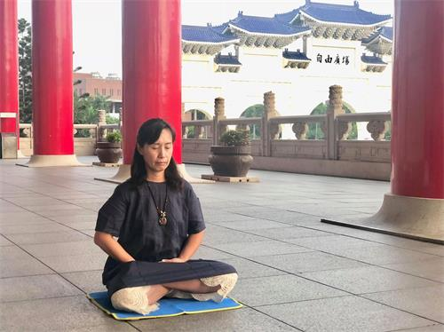

图2：惠忆在中正纪念堂晨炼。

图3：惠忆表示，炼完功，整个经络都是舒展开

从翻开宝书开始，惠忆就象走入了一方净土，真、善、忍的法理如同一股清流，浸润她枯槁已久的身心，原本药石罔效的病痛与对婆婆盘根错节的情绪，也在法轮大法的熔炼与修炼实践中，慢慢消失无踪。

<b>跳出表面　修出慈悲</b>

从法理中惠忆认识到，人和人之间都是因缘关系促成的，婆婆对她的责难，说不定是自己上辈子带给婆婆的魔难。且随着每天学法修心，惠忆发现自己的心胸逐渐扩大，更能跳出表面去看问题的实质，真正站在对方的立场着想，和婆婆之间的关系也变得温馨融洽。

惠忆说：“《转法轮》中有段话：‘我们平时要保持一颗慈悲的心，祥和的心态。突然间遇到什么问题的时候，你就能够把它处理好。’[1]所以我谨记法理，时时刻刻把自己当修炼人，一发生矛盾，就先站在婆婆的角度来看待。”以前惠忆容易因婆婆的严厉态度和挑剔言语落泪委屈，现在遇到冲突而情绪波动时，反而会抓住掩藏的负面情绪向内找、修自己。

惠忆表示：“三年前婆婆患脑栓，无法言语，她因为爱面子不敢说出自己的身体状况，当时我放下所有心结，真心抱着她说：‘我们在你身边，你不要担心。’婆婆听到后哭了，才愿意在大伯的安排下就医。今年婆婆又因乳癌在六月底做了切除手术，我和家人一起照顾婆婆，常去看他、陪她看看电视、聊聊剧情。虽然婆婆逻辑思维上象小孩，不容易记也记不住，有时还鸡同鸭讲的，但每当她看到我衣服上‘法轮大法好’的字时，就会露出很纯真的笑容，我知道她明白的一面是知道法轮大法好的。”

<b>突破自我　只为众生</b>

由于身心实实在在的受益，惠忆常将自己的亲身经历与法轮大法的美好让更多人知道。

然而，中国大陆资讯封锁，任何关于法轮功正面的消息都无法传播，于是惠忆在安排好时间、平衡好家庭，并取得先生与婆婆的理解支持后，于休假日早晨来到台湾著名景点。她举着展板、顶着艳阳，向来来往往的大陆游客讲述法轮功在中国遭受的迫害以及洪传世界的真相。

一次惠忆在国父纪念馆向三位抽烟的中年男游客问好，她友好地说：“你们好，欢迎你们来台湾旅游，现在全世界一百多个国家和地区都可以炼法轮功。当初江泽民迫害法轮功时，七个常委中六个都不同意，就他一意孤行，杀了这么多修佛向善的人，国际上都知道天安门自焚伪案是造假的……”

三位男子听闻真相不敢直视，就在他们急切走上游览车之际，第三位男子突然回过头来和惠忆鞠躬致谢：“我们都知道。”惠忆赶紧把握机会表示：“先生，我给你取一个化名，退出中共的党团队，这样中共干的坏事，就不会牵连到你身上了。”那位先生笑着表示同意。惠忆说：“我站在原地目送他们的游览车离开，心中好感动！因为这是我第一个劝退的人。”

有一次在101大楼，惠忆对着三位年长者说：“您以前入党时握着拳头对天发誓，你可想过那是毒誓啊！等于把命给共产党了。它执政以来杀害很多善良百姓，干下伤天害理的事，这都不是你干的，却算在你身上，就是要您背负它的深重罪业！我们是善良老百姓，它做的坏事不要去承担，三退声明很重要，退给老天看的，声明能自救，声明能远离灾难，声明能保平安。”这时在惠忆左手边的老先生一直猛点头，中间那位女士也不断附和说：“是啊是啊，退了退了。”但右手边的老奶奶却看着地上不发一语。惠忆没有放弃，依然平静说明共产党的恶行与退出中共的重要性。

“后来当我准备往其他游客那去时，左边的老先生迅速起身轻拍女士的肩膀说：‘咱们就退了吧！’这时我才知道原来他们是一对老夫妻呀！老先生一说她立刻点了头，我也赶紧递上化名，老先生还跟我借笔把他和太太的化名都写在真相资料的空白处！当我小心折好、放入口袋里，再看那位女士，她笑得好灿烂！我知道只要发自善心地为他好，说的话真的会打动对方。”

惠忆并提到一次印象深刻的例子。“有一次在101遇到一位骑自行车的年轻人，我告诉他展板讯息是内地看不到的，可以用手机拍下来带给身边的亲朋好友让他们了解。他很和善的表示：‘我都知道。’我接着问他声明三退了吗？他摇头说没有，我说：‘那就用子豪这个名退吧。’他瞪大眼睛、张大嘴巴吃惊地说：‘我就叫这个名！’说到这，我整个汗毛孔全开，内心激动地对他说：‘正是缘份等着你来的。’”

惠忆在景点讲真相的日子已有五年了，有时女儿也会来帮忙举着展板，“法轮功遭受千古奇冤”、“共产党活摘法轮功学员器官”、“退党（团、队）的人数已经超过三亿人”、“记住”、“记住法轮大法好，真善忍好”等清晰有力的标语，已让越来越多的中国人看见和听见。

惠忆真诚地说：“由衷希望与我有缘的人都能知道大法的美好！并知道共产党对好人的迫害没有停止，这不是过去式而是现在进行式。我利用自己的休闲时间在景点风吹日晒，没有钱没有名，没有别的目的，只想让可贵的中国人了解真相，避免在不知情的情况下沦为帮凶，成了真正的受害者。”

在忙碌的现代生活中，人们的脚步总来不及停歇，但一个又一个象惠忆一样的法轮功学员勇敢站了出来，他们希望，登上未来方舟的人们能不带遗憾，拥有真正美好的未来。

注：
[1] 李洪志师父著作：《转法轮》

 
<h1 align="center"><b>被江泽民点名非法判刑 三位军官的跌宕人生</b></h1>

图为乌云密布的北京天安门广场。(AFP)

 【大纪元2018年08月11日讯】他们是中国军队系统里的国家级功臣、大学教授、副军级、正师级军官……但是，江泽民出于一己之私，以权代法，下令对他们判刑。

以下是三位中共军官的凄惨人生故事：

<b>国家级功臣 空军指挥学院教授</b>

于长新，男，原空军指挥学院教授、正师职、副军级、军队离休干部、国家二等功臣、原法轮大法研究会成员。于长新是空军第一代飞行员，曾主编空军指挥学院教科书，是中国空军元老级人物。

四二五事件后，于长新即失去自由。

“四二五”，是指1999年4月25日，约一万名法轮功学员前往中南海信访办，要求释放被天津警察无故殴打的学员事件，被外界誉为开创中国历史上和平上访维权的先河。此事由时任总理朱镕基出面解决，和平落幕。

“四二五”之后，迫害升级。1999年7月1日，于长新被单位保卫处从家中骗走，总政和空军组成了一个二十多人的专案组，对其隔离“审查”，采取诱骗、威逼、折磨等手段，做思想转化工作，长时间不许于长新睡觉，给其身心造成很大伤害；期间，于长新被非法抄家两次。

于长新（明慧网）

在“转化”学习班上，于长新告诉对方：“论资历，我比你们在座的谁都高，试问像我这样的人能轻易相信什么吗？能是非好坏都不分吗？我修炼的亲身体会告诉我，我炼法轮功没有错，法轮大法是真正的科学。”法轮功是以“真、善、忍”为原则的佛家修炼功法，真修者身心健康、道德升华 。

由于“审查”也没有查出任何违法犯罪的证据，空军相关人员根据于长新的一贯表现，认为没有根据和理由给其处分。

然而，迫害法轮功的始作俑者江泽民，对于长新怀恨在心，先非法下令逮捕，又指令非法重判21年。

2000年1月6日，北京军事法院秘密冤判于长新17年重刑。

于长新被判刑后，其夫人姜昌凤也被赶出空军指挥学院宿舍区的家。因坚信法轮功，2001年，姜昌凤被非法重判10年，当时她已年近古稀。

<b>指挥学院博士生导师</b>

刘锡珍，女，解放军后勤指挥学院英语教授、博士生导师、军官、法轮功学员 。

2000年“十一”期间，几名法轮功学员在她家交流，想去天安门广场告诉世人：法轮功是被冤枉的。尚未去成即被不明真相者诬告，被警方绑架。

北京全军军事法庭以“预谋去天安门搞法轮功活动”为所谓的罪名，对其非法判刑5年。

明慧网报导，内部消息说，她因职级别较高，遭江泽民亲自点名非法重判。

2001年，刘锡珍被非法关押到“北京未成年犯管教所”囚禁，并被强行开除军籍。

关押刘锡珍的“北京未成年犯管教所”九分监区，是北京监狱管理局迫害法轮功的所谓的“标兵监区”，后被并入北京女子监狱，成为其八分监区。

北京女子监狱八分监区对法轮功学员采用多种迫害手段：不许睡觉、不许上厕所、体罚、奴工、车轮战、“亲情呼唤会（即：批斗会）”和“株连”等。

<b>陆军总医院妇产科主任医师</b>

李超然，女，解放军陆军总医院妇产科主任医师、正师级文职军官，于1992年开始修炼法轮功，曾担任解放军后勤指挥学院法轮功炼功点的义务辅导员。

2000年10月3日，李超然被绑架；10月13日，被抄家；2001年2月，被非法判刑4年，时年60多岁。内部消息说，李超然是迫害元凶江泽民亲自点名非法判刑的。

被非法判刑后，李超然被关进“北京市未成年犯管教所（简称，未管所）”九监区迫害。被关押在这里的法轮功学员，除了遭受暴力洗脑、强制转化、酷刑折磨等身心迫害，还被迫从事各种高强度奴工生产。

李超然被强制劳动摘羊绒，每天肺里吸进粉末灰尘，连眉毛、头发里都是。

明慧网曾对36个样本，即36家奴工场所（包含监狱、看守所、戒毒所和已经解体的劳教所）奴工每天的“工作”时间进行统计，显示奴工们每天要被迫10～20小时不等的恶劣奴役，当“生产任务繁重”时，奴工们几天几夜不得阖眼。

在调查的3,653个被关押迫害致死的法轮功学员案例中，共有6%，即221个案例在最后一次致死迫害中受到超负荷劳役迫害。

<b>位军人法轮功学员被迫害致死至少7</b>

明慧网报导，江泽民对军中法轮功学员的迫害从“四二五”就开始了，公开打压一开始，解放军总政治部即发文件，要求全军和武警部队认清“同法轮功的斗争是捍卫共产党人的根本信仰”。

军中自上而下，层层建立了专门迫害法轮功的“610”体系，总政治部设立“610”办公室，陆、海、空、二炮、武警各部队以及各军、师、团也相应建立了整套迫害系统。

据不完全统计，自1999年7月迫害发生以来，在中国大陆军队系统中至少有7人被迫害致死或含冤离世、11人遭非法判刑、20人遭非法劳教、33人遭绑架⋯⋯还有人数众多的军人被强制复员，难以统计。由于大陆信息封锁，这些数字只是冰山一角。

 
<h1 align="center"><b>为何还不醒？</b></h1>

【明慧网二零一八年八月一日】“毒疫苗”事件惊醒了很多人。无论是出于利益，还是对于自我的保护，相当多的人习惯于在大脑中，让危险因素处于被“冷冻状态”，怕一不留神，说出心里话，别人知道向上级泄密（中共统治下特有的“打小报告”的机制），影响了自己前程。

这样的人，凡是党不让听的，就不听；党不让看的，就不看；党不让说的，就不说。亲朋好友中，有道出中共真相，揭露时弊的，就和其保持距离。这样的人往往还讲一句话，叫“明哲保身”。

可是保得了身吗？当成千上万的“毒疫苗”流向社会时，当自己家的孩子也注射了问题疫苗时，“明哲保身”的人坐不住了。孩子身体流动的血液中，时时刻刻潜伏着危险因素。

为什么会出现这样的情形？凡是“明哲保身”的人，都要扪心自问，正是对于中共见不得光的种种恶行，不闻不问，装看不见，才让那些无法无天的人，恶胆越来越大。数年前，三聚氰胺毒奶粉的受害者，因打官司竟然陷入冤狱，而为其打官司的律师，执照被吊销。

一个连小孩子的生命都淡漠无视的国度，还有什么是可以在意的呢？还有什么是做不出来的呢？有句老话叫：“虎毒不食子。”老虎再厉害，也不伤害自己的孩子。而当下的中国，却连千千万万的孩童都不放过。

这就不是一时一事单纯的事件性质了，而是一个体系，一个体制，从根子上出了问题。

《大纪元时报》推出的新书《共产主义的终极目的》是这样阐释的：“共产党实施的是从微观到宏观的一揽子‘骗’。从人心灵深处的理想，到是非善恶标准，再到表面做人的底线，处处都是骗。骗钱、骗色、假烟、假酒、毒米、毒奶都是小儿科，这些都是共产党败坏道德之后的必然结果。”

没有了道德，人也就没有了行为底线。我们的血液中流着多少地沟油、苏丹红、肉禽增长素？别人吃，咱也跟着吃，别人吃了没事，咱也没事。没事？在过去二三十年中，中国已然是肝癌、胃癌、肺癌全世界增长率（不是绝对值）最快的国家，这是偶然的吗？几乎街坊四邻，亲朋好友，家家有得癌的，这个都不用调查，不用数据，人人都有感受，人人都一清二楚。

当法轮功学员，把传单、小册子送到您的手里，希望您静心读一读。这一切到底是怎么回事？共产党真正面目是什么？再让我们看一看《共产主义的终极目的》中的精辟论述：“共产邪灵毁人最为歹毒的一招是邪——邪变人心。共产党是从人出生、成长到死亡的过程中，一直根据共产邪灵的需要来塑造人，颠覆是非善恶标准，‘好的说成坏的，坏的说成好的’，叫人背弃古老的传统，生活行为越低下越如邪灵之意，毁人不倦。”

最终目的，共产邪恶要达到将人类拖向万劫不复的深渊，让人类道德沦丧，让人类失去良知，让人类为膨胀的欲望驱使！最终的结果，就是把麻木了的人彻底毁掉。

让您三退，退党、退团、退队，就是让您抛弃这宇宙中最恶毒的势力，让您从心灵深处种下善良的种子，让您从逆天悖理的污浊中退出，踏入天道法则的归途！

现在，在大纪元退党网站，三退人数已为三亿一千万人，他们都是在明理之后的理性选择。“毒疫苗”事件，或许就是上天把邪恶的共产党撕开又一个裂口，让世人看。如果过一段时间，“毒疫苗”被人淡忘，继续过着“现实至上，道德归零”的麻木生活，那下一次，可能就不是毒奶粉，毒疫苗了，上天对于失去最起码道德的人世，怎么可能任由其糜烂下去？可贵的中国人，还迟疑什么呢？ 退出党团队，为自己选择一个光明的未来！
 
 

<h1 align="center"><b>李清泉：逆流而上 誰能誠信經商</b></h1>

【大纪元2018年08月04日讯】刚刚发生的毒疫苗事件再一次向中国人敲响警钟：中国人的希望在哪里？毒疫苗毒害的大多是孩子，这不是在毁掉中国人的未来吗？所有的中国人都包括在内，除去那些吃穿用度皆有特殊渠道供应的高官群体，谁敢说上世纪九十年代以后，凡是注射过疫苗的用的都是真疫苗？

二零一零年《中国经济时报》报导了“山西疫苗乱象调查”，一度引起全社会轰动。人们震惊于幼儿用的疫苗都会有毒，怎么会有这么丧尽天良的人！

其实早在一九九五年，被称为童话大王的作家郑渊洁就写过一篇文章《我从一九九五年起就不信任学校收费让学生打的疫苗》，暴露出疫苗存在的问题了。郑渊洁住在北京，孩子在北京上学，那个时候推销疫苗的人都能够推销到北京的学生中去，其它地区的情况就可想而知了。

现在报导出来的毒疫苗有用开水兑药做成的。兑的什么药？没有明说。如果只是一点消炎之类的药物加上开水，这不等于把开水卖成黄金价了吗？

无良商家赚钱的秘诀就是一再压低成本。就像开水兑药生产疫苗一样，成本已经低到没有成本的地步了。在这种情况下，凡是做疫苗的企业，谁不做假，谁就没有办法在市场上竞争。这就像当年的奶粉中掺三聚氰胺一样，谁不掺，谁的价格就降不下来，谁就会被淘汰。最后造成几乎全国所有的奶制品行业全都涉嫌造假。

给大家讲两个本人知道的真实事例。先说纯净水。

以前有媒体曾报导过某个牌子的纯净水是直接从自来水中灌取的。知道后，再买水的时候就不买这个牌子的了。一次朋友来家里做客，特意买了某个知名品牌的纯净水给他烧开了泡茶喝。他却说：以后可别买这种水了，净骗人。接着他就开始讲原因，原来加工这牌子水的生产厂房就在他们厂旁边，是直接从地下抽的水，然后一过滤就成什么山泉了。

再说一下某个牌子的火腿肠。

这家企业被记者曝光所饲养的猪用了瘦肉精后，销量一下就下来了，据说，这一篇报导让这家企业损失巨大。当地政府积极运作，全网删除这方面的帖子，总算把这个事平息下来了。可是那以后呢？一位知道内情的朋友私下说：该怎么用还怎么用。现在市场上的猪都是三四个月就出栏了，不用饲料、不加瘦肉精，怎么在市场上竞争？当时是疏忽了，没有料到记者会那样报导，才造成这么大的损失。要是早知道会这样，给记者几十万，也比把事情捅出去好啊。现在谁想进去，没有厂方的人陪同，谁也进不去，都成保密单位了。

相信这样的事例说出来，大多数中国人都会相信，因为这样的事在中国已经成为常态了。就包括对这些事痛恨的人，如果你选择了创业，你能保证不随波逐流吗？当你的全部身家都投入进去后，你不掺假就生存不下去的时候，你能独善其身吗？现在的中国已经形成了一个“人人害我，我害人人”的“互害”社会了。

不是说中国人没有良知，可是当整个社会的生态环境被破坏到这种地步的时候，中国人还能走出绝地吗？

然而现实社会中，还真有一些这样的人，面对着互相欺骗的大环境，他们逆流而上，走出了一条诚信经商的路子。给大家举个例子。

这是海外法轮大法明慧网报导的中国大陆的一个事例。这篇文章的题目叫“上等辣椒粉带出一群上等商人”，发表于二零一二年五月三十日。

文章的主人公修炼法轮功前就是做辣椒粉批发生意的。他和其它商家一样，把玉米棒子的外皮粉碎了，再用工业染料染上色，然后掺到辣椒粉里面。他说：“都这么做，如果我不这么做，赚不了钱不说，连成本也保不出来，肯定赔钱。”

可是他修炼法轮功了，法轮功修的就是“真、善、忍”，你说这往辣椒粉里掺假的事还怎么做？要修炼就不能再掺假了。掺假的事不能做，那就只有改行了，他决定去建筑工地做小工。

而后他把没有掺假的存货拿到商场去批发。他对经销商说：“这辣椒是我的最后一批货，一点假也没有掺。因为我炼法轮功了，要做好人，讲‘真、善、忍’，所以没有掺假。卖得比往日贵，给出我的油费与工时费就行。”经销商是行家，当时就出了好价钱把货买走了。

还没有等他找到建筑队，经销商又向他订货了。就这样，他的辣椒粉生意就又做了起来，而且越做越好，钱赚得也越来越多。同行向他请教，他如实相告：“因为我炼法轮功了，要做好人，讲‘真、善、忍’，所以没有掺假。虽卖得比往日贵，但是他们都愿意要。”在他的带动下，这些供应商也渐渐不做掺假的辣椒粉了。

市场上的辣椒零售商经常风趣地说：“嗬，李大师的法轮功厉害。他的徒弟做好人，不掺假，用上等辣椒粉带出一群上等商人，把我们也改变了。”

法轮功被迫害十九年了，可是今天的中国人对法轮功为什么越来越接受？法轮功是什么？看看法轮功学员的言行就知道了。他们表现出来的“真、善、忍”的品质不正是我们这个社会最稀缺的吗？

法轮功学员是从内心严格要求自己做一个好人的。当他们甘愿去做好人的时候，无论在哪一个行业，都本着“真、善、忍”的原则去做的时候，自然就能起到引领作用。

可是中共为什么容不下他们啊？大家想想，中国有很多行业实际是被中共垄断的，相当多高利润行业的负责人其实是中共高官的白手套，他们负责为中共及其高官捞钱。这样的人怎么能容得了不造假的行为呢？当白开水都能当药卖的时候，那利润该有多高啊！当然这样生产出来的产品对中国人肯定是有害的。

从另一个角度讲，中共不只是一个政党，它实质是一个邪灵。看过《九评共产党》与《共产主义的终极目的》的人都知道，共产邪灵是以败坏人的道德与毁灭人类为目的的，它是从各个方面毒害人的，包括给幼儿注射毒疫苗，包括败坏各行各业。

然而，法轮功学员无论中共怎么迫害，他们始终如一地在走自己的路。大家看到了，法轮功学员所走的路，才真正是中国人所应走的路！中共再怎么败坏，可是它消除不了“真、善、忍”，只要有“真、善、忍”在，中国就有希望！

<h1 align="center"><b>超越苦难 中国小伙延续飞行梦</b></h1>

美国州际航空（Trans States Airlines）机长张国良。（张国良提供）

  
【大纪元2018年07月31日讯】（大纪元记者王琼、燕楠报导）他一米八七的个头儿，腰板总是挺得笔直，更让他显得伟岸挺拔，即使站在人潮中也绝不会被淹没。当他穿上飞行服，威风凛凛，气宇轩昂。

登上飞机前，他手扶飞机阶梯的手柄，脸上满是沉着与自信的神情。马上要进行下一次飞行任务了，他的同事抓住这一瞬间，给他拍了张照片留念。

他，张国良，曾是中国南方航空公司的飞行员，那时才20多岁。

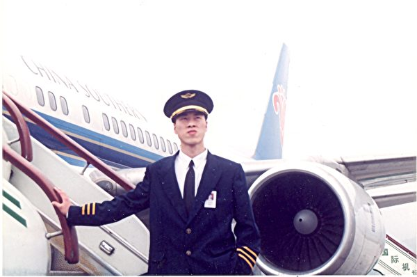

二十几岁时的张国良在中国南方航空公司担任飞行员。（张国良提供）

  
<b>“天上掉馅饼”般幸运</b>  

“小时候，我做梦都没想过自己有一天能当飞行员。”张国良说。

在中国社会，不是每一个人都能自由追逐自己的梦想。而对一个农村孩子来说，当飞行员这样的梦想简直一如登天。张国良回忆道：“当年在乡下，我觉得长大后，能有一个稳定的工作，固定的收入，就已经很好了。”

直到现在，张国良还觉得好像“天上掉下馅饼”似的。通过体检之后，他一路顺利。1993年进入中国民航飞行学院学习；接着又顺理成章地进入南方航空广州飞行部工作。

乡下的孩子手头都很拮据。但航空公司补贴了绝大部分的学费和食杂费，对张国良来说，这是非常丰厚的待遇。不仅如此，他还不用像其他学生那样担心找工作，因为在进入大学前他就知道自己将来会去南航工作了。

飞行员的职业，称其为“打工贵族”毫不为过，他们的薪资非常优渥。虽比不上企业老板，但张国良说，“当其他大企业的白领月收入在3000元左右的时候，我们的月收入基本可以拿到6000元左右。如果飞行多一点的话，甚至可以达到1万元左右，而且体检和医疗费用全都由公司支付。”

那会儿张国良总是觉得，和同龄人相比，自己是很幸运的。

<b>人生转折</b>

原本以为人生会继续顺遂，然而天有不测风云。

从人生巅峰跌至谷底也不过如此——在年轻气盛的追梦之年，张国良从一名人人羡慕的飞行员，沦落为办公室的杂工、洗衣厂的洗衣工，甚至还锒铛入狱，心中的苦涩恐怕大多数人都难以想像。

这要追溯到1999年7月20日。那一天，中共江泽民集团发动了对法轮功修炼者的全面迫害，一时间黑云压城。

对于在法轮功中修炼了3年零7个月的张国良来说，他不曾想到，按照“真善忍”做好人，竟成了中共迫害他的借口。接踵而至的变故让他措手不及，几乎将他逼到绝路。

江泽民集团为了实施对法轮功的迫害政策而成立610办公室，遍布全国各地。这个机构凌驾于宪法和任何法律之上，无论公检法机关还是各企事业单位，都得配合。

张国良就是广州当地610办公室关注的对象。

公司主管政治的一名上级领导没收了他的飞行员驾照，他被停飞了。

不能飞了，可610的人不让他的单位放他走，想继续对他实施监控，以阻止他向人们讲述法轮功遭受中共打压的真相。要知道，中共治下的一言堂媒体宣传，普通百姓只能看到对法轮功的污蔑和诽谤，甚至法轮功的书籍都被销毁了。谁想要自己去了解法轮功是什么，真是很难。

与此同时，张国良的脑海中不时冒出一些想法，“我能否生活下去？会不会坐牢？会不会被杀害？”这些念头纠缠着他，让他感到郁闷。

那时，中共铺天盖地的谎言宣传和压抑的政治氛围下，张国良说，他“看不到未来”。

<b>逆境中的坚持</b>

张国良前前后后大概有6年半的时间被关押迫害。那可是“他人生中最美好的青春年华”。

没被关押的时候，他在办公室当杂工，在洗衣厂当洗衣工。而同时，他还面对着监管部门的监视和隔三差五的骚扰，以及中共敏感时间就可能面临的软禁和关押。

第一次被关，是在一家旅馆的房间里，约一个月时间，一举一动都遭到监视。而这，只是张国良的噩梦的开始。

2000年12月2日，因为身上带有“真、善、忍”、“法轮大法好”的标语，张国良被非法拘留，随后警察把他关进看守所四个月，然后又将他送到广东花都劳教所劳教。

在看守所，一日两餐，每餐只有零星菜叶和不到三两的饭，他每天都饿得精神恍惚，还要做手工劳动；潮湿肮脏的被子让他全身长疮、流脓水，身体烂得可怕；监狱医院拒绝治疗他满身的烂疮，任其恶化，因他坚持对法轮功的信仰；他身体虚弱，出现各种病态；后来他被送到劳教所，想炼功锻炼，却因此被铐在树上……

这期间，每天都度日如年。

终于等到非法劳教期满，张国良等来的并不是自由——原单位把他软禁在广州北部花都的一个居住区的部队营房，每天被三名保安形影不离地看管着

张国良却没有因此变得消沉，而是继续在力所能及的范围，向周围的人传递法轮功的真相资料。

<b>信仰的力量</b>

为什么能够坚持下去？张国良说：“明白了人生真谛后，就会坚持修炼下去。”

1995年12月，张国良正读大学三年级，经同学介绍首次“拜读”了法轮功的书籍《转法轮》。“我记得当时自己开卷一读，便对这本书爱不释手，一口气读完后，就觉得这功法太好了，不但能对身体健康有益，还解开了我在人生中的种种迷团，我发现修炼是提升生命境界层次的最好办法。”

张国良说，通过提升自己，“我对人生充满了希望，我对生活、工作都变得非常积极和正面，努力使自己各方面都能接近或做到‘真、善、忍’。”

在南方航空公司工作期间，张国良的自律众人皆知。连公司领导都知道，他从不往家里拿飞机上的饮料、毛巾等机供品。这在当时是极为罕见的。

纵然生活变得漂泊不定、动荡不安，也都没有动摇过他对信念的坚持。

跟其他法轮功修炼者一样，即使面临再度被迫害的风险，张国良仍坚持自己出钱打印真相资料、刻录光盘，免费送给那些他能接触到的有缘人，因为他真心想告诉他们法轮功是什么，遭受了怎样的迫害。

历经被中共迫害之苦，他仍会挺直了腰板儿，不改初衷，“我们在社会上做好人，不断提升自己，做一个更好的人。做好人嘛，也不能因为种种困难和共产党的威胁而放弃。”

<b>再陷囹圄</b>

后来，张国良又在讲真相时被非法抓捕两次，分别于2002年和2004年身陷囹圄，经历了记忆中最黑暗的日子。2002年那次被绑架到广州臭名昭著的黄埔洗脑班后，他方才知道什么是生不如死。

除了张国良，那里同时还关押了几十位法轮功修炼者，是传言中迫害最严重的地方之一。

白天，他们被迫观看洗脑班规定的洗脑书籍和录影带，每天都必须写数千字的感想体会，如果达不到所谓的思想“标准”，或表露出对洗脑班的不满，就成了被折磨的对象。

夜晚，管教常常酷刑虐待法轮功学员，折磨他们。张国良经常可以听到法轮功学员被折磨得痛苦的嘶喊声，顿时恐惧感在漆黑的夜里从四周汹涌袭来，让他每晚夜不能寐，备受煎熬。到了第二天，他就会看到某位法轮功学员的脸上、身上骤增了触目惊心的累累伤痕。

而张国良自己，因为写的体会不符合洗脑班的转化标准，也遭受到酷刑。

两个洗脑班的打手曾强迫他以半蹲姿势罚站，并对他拳打脚踢。在白天的精神折磨和晚上的肉体折磨下，张国良处在崩溃的边缘。

现在回想起来，张国良还心有余悸。他说，这段经历让他“更加认识到中共手段的邪恶，好像文化大革命那套政治运动在重演”。

<b>艰辛逃难路</b>

由于具备飞行员的技能，张国良一直被中共当作“特殊人才”，受到重点监控。即使被冤判并被关押４年牢狱后，张国良远走云南谋生，迫害却依旧如影随形。他描述自己当时的处境时说，“（中共）将我挂在他们的黑名单里，无论我走到哪里，当地的警察和社区都会对我监控，让我没法过一个正常的生活。”

当张国良好不容易在云南的一家公司找到工作，刚任职不久时，他户籍所在地、广州白云区警察便追查到他的下落，将他抓了回去。他无奈，“恐怕在中国，没有哪一个公司愿意要一个天天被警察追找的员工，而且公司还要配合政府部门安排人手对这名员工进行监控。”

张国良感到自己难以在中国大陆生活下去，他的家人也同时背负着难以承受的精神压力。于是，他萌生了一个念头：离开中国。

但是这条路，也满是崎岖。

张国良难以像普通人一样正常出海关。即使他尝试去香港，也在关口被拦住，港澳通行证还给没收了。当时，安检人员打发他的理由是“自己想想”。

“我再傻也明白，我一定是被列上了黑名单。”他苦涩地说。

于是，他只好冒险，偷越边境。

在朋友们的帮助下，张国良被藏在一辆汽车上，后来又通过水路，辗转进入泰国。再后来，在联合国难民署的帮助下，张国良申请了难民。

突然成了一个异国他乡的难民，张国良感受到了背井离乡的孤独无助，饱尝生活的困难。“由于没有身份，我不能在泰国找工作。”他记得，他一度只能靠积蓄生活，还在国内的太太也省吃俭用，给他些资助。后来，他收到了难民署的救济。就这样东拼西凑，最后总算熬过了那段艰难的时光。

<b>开启新人生</b>

终于和太太在泰国团聚，2013年6月，张国良一家四口来到了美国，开始一段新的人生之路。
  

张国良一家来到美国后开始新的生活。（张国良提供）

  
  
被中共迫害那么多年，13年都没飞行过，张国良在美国基本是从零开始。经过大量的学习，克服了语言和技术的障碍，几度排除了想放弃飞行的想法，他才最终走了过来，再度坐在了飞机驾驶舱的位置上。

在新的环境里，张国良可以继续放飞儿时的梦想了，他重新开始努力成为飞行员。如今，他已是美国州际航空公司一名成熟的机长。  
  

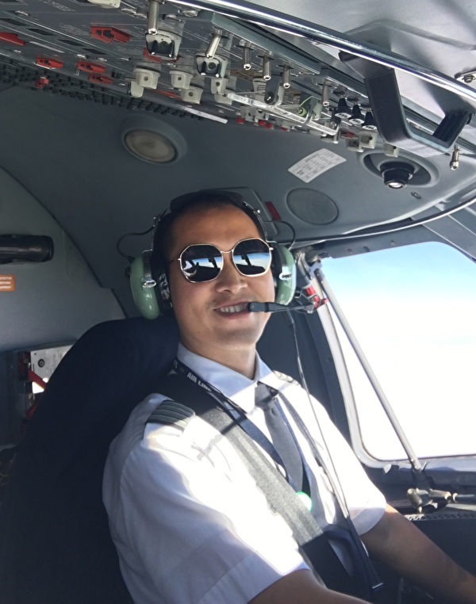

如今的张国良是美国州际航空公司的机长。（张国良提供）

  
  
张国良说：“能够再次回来做自己原来的工作，心里百感交集。美国的社会环境和中共统治下的社会有着鲜明的对比。”生活在西方的自由国度，反观大陆，他感慨道：“中共迫害法轮功是非常荒谬的，而且和普世价值完全背离，采用的手段也是违法的、见不得光。”

现在，他7岁的女儿和10岁的儿子都是法轮功的小弟子了，两个孩子在“真、善、忍”原则的指导下健康成长，让他欣慰。同一片蓝天，一家四口呼吸著自由的空气，也不忘继续向人们讲述法轮大法遭受迫害的真相。法轮功学员的讲真相活动上，总能看到他们一家高高矮矮的身影…… 

张国良一家四口一起参加法轮功活动。（张国良提供）

  
这天天气晴朗，张国良又驾驶着飞机在天空飞翔。眼前，是那一排熟悉的仪表盘，抬头望向机窗外，是驾驶员才能正面观赏到的美丽天空。黎明的橘红色太阳温暖明亮，天地相接处有一道长长的橘粉色连线，仿佛在将阳光传递给地上的人们。张国良坚信，“邪不胜正，乌云遮不住太阳，事实真相终究有大白的一天。”#  
 

<h1 align="center"><b>中共强摘人体器官 美政要促调查和立法</b></h1> 

左为美国联邦议员史密斯（Chris Smith），右为美国国际宗教自由委员（USCIRF）副主席Kristina Arriaga。（大纪元合成图）

【大纪元2018年08月05日讯】（大纪元记者李辰、林帆美国华盛顿DC报导）7月23日，面对来自40多个国家部长级代表和80多个国家的民间团体代表，美国前国会议员Frank Wolf在国务院首次宗教自由会议上发表演讲，告诉他们中共强摘法轮功学员器官的罪恶。

Frank Wolf 议员是美国《国际宗教自由法》的发起人，曾数次在国会声援法轮功。法轮功是以“真、善、忍”为原则的佛家修炼功法，祛病健身效果神奇。但中共镇压法轮功长达19年至今。

“法轮功学员面临严重的迫害”，Frank Wolf在国务院的发言中说，“事实上，数个‘强摘器官’报告显示：（中共）杀害他们，强摘其器官出售。”Wolf提议，面对宗教自由迫害，世界不能沉默，而要采取行动。

与Frank Wolf在国会共事多年的史密斯（Chris Smith）议员对Wolf的公开发言表示赞赏。美国国际宗教自由委员（USCIRF）副主席Kristina Arriaga向大纪元记者表示，美国政府应该就中共强摘器官指控进行调查，并立法禁止美国公民前往中国“器官移植旅游”。

“这好极了。”史密斯议员说，“法轮功学员修炼很好的功法，他们遵纪守法。（中共）政府必需停止镇压。”
 

联邦众议员克里斯‧史密斯（Chris Smith）。（李莎／大纪元）

“（中共）强摘人体器官，这么多人被杀害。法轮功学员是（被强摘器官的）目标。这极其残忍，必须立即停止。”史密斯议员曾就中共强摘器官指控在美国国会举行听证会。

美国众议院在2016年通过343号决议案，以制止中共强摘法轮功学员等良心犯器官，决议案提出对中国的器官移植滥用“进行一个可信、透明和独立的调查”。史密斯议员也是该决议案的强力支持者。

7月23日，在这次宗教自由部长会议的开场边会上，法轮大法信息中心副主任刘宁平博士受邀在美国参议院发言，他说，“1999年初，中共统计超过7,000万人修炼法轮功。由于恐惧法轮功的受欢迎程度、独立性、传统精神价值对中共意识形态构成威胁，1999年7月20日，中共前党魁江泽民发动了对法轮功的镇压。”他同时也介绍了大量法轮功学员在被关押期间，遭受酷刑折磨，甚至被活摘器官。

中国器官移植工业2000年起“飞跃”，各大器官移植医院打出广告，承诺数天或数周内可进行器官移植手术，令国际社会瞠目。而中共一直无法说清器官来源。

2016年，一份在华府发布的调查报告显示，中国每年进行6万-10万例器官移植手术，这些器官的主要来源是法轮功学员。韩国电视台 Chosun2017年11月发布的突破性调查记录片显示，中共继续强摘器官。

7月27日，美国国际宗教自由委员会（USCIRF）副主席Kristina Arriaga在受访中建议美国政府应对中共强摘器官指控采取行动。“如果可信的报告发现了什么，那么美国政府应该对此进行调查。”

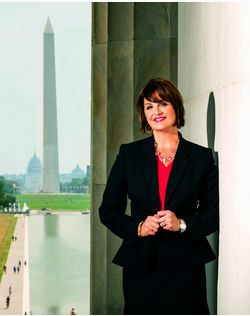

美国国际宗教自由委员会（USCIRF）副主席Kristina Arriaga（USCIRF图片）

  
美国在1998年通过《国际宗教自由法》，此后，成立了跨党派独立运作的联邦政府机构－－美国国际宗教自由委员会（USCIRF），监督各国的宗教自由状况。其建议在美国主流社会，被认为是评估宗教信仰自由方面的黄金标准。

Kristina Arriaga说，“（中共）对法轮功和基督教大肆镇压。目前，我们看到对维吾尔人和法轮功学员的打压呈加剧趋势。”

对于以色列、台湾等国家地区立法禁止公民前往中国进行“器官旅游” ，Kristina Arriaga建议，美国应跟进立法。“美国政府应该考虑禁止美国公民到中国去做器官移植，这些器官来自中国宗教少数群体。”
  

  
<h1 align="center"><b>中共對付老百姓的犯罪手段——監視 扣工資</b></h1>

中共采取多种犯罪手段如扣除工资、勒索、抢劫钱物对法轮功学员进行经济迫害。（明慧网）

  
  
【大纪元2018年07月31日讯】华北科技学院退休教师史瑞香，2017年年底因给该校领导送去介绍法轮功真相的台历后，被单位扣除工资至今，且24小时全天被人监视。
  

在中共《刑事诉讼法》中监视是对犯罪嫌疑人采取的一种强制措施。法轮功学员是合法公民，不是犯罪嫌疑人。没有法律授予警察或街道社区指派社会闲散人员监视、跟踪法轮功学员的权力。

中共《劳动法》第50条规定：“不得克扣或者无故拖欠劳动者工资。”

而中共自1999年对法轮功学员实行“名誉上搞臭、肉体上消灭、经济上截断”的政策以来，肆无忌惮地使用监视和扣除工资等多种犯罪手段，限制法轮功学员的自由和对他们实施经济迫害。

史瑞香，78岁，河北省廊坊市三河市燕郊镇人，2017年11月7日，为了给华北科技学院的领导们送新年祝福，让他们了解法轮功真相，史瑞香在院长、书记等几位主要院领导的办公室门口挂了几本洪扬“真善忍好”的台历。

没想到，当天史瑞香就被西城派出所警察绑架、抄家。

派出所的人对她说：“你年纪大了，也没造成什么影响，就不处理你了，让你儿子做你的‘监护人’。如果你再出事的话，就把你儿子抓起来。”当天下午史瑞香被儿子接回家。

11月底，华北科技学院保卫处的处长荆树栋、保卫处副处长、退休办书记潘德祥等五六个人到史瑞香家，告诉她：这个事北京老干部局（也叫北京安检局）都知道了。“要处理，决定扣发你半年的退休金，每月只发1,000元钱（史瑞香每月退休金5,000多）。半年内如果不出事，再补给你；如果出事，连你老伴的退休金也没了（老伴也是华北科技学院退休职工）。”

来者还告诉史瑞香别出门、别上北京去。接下来，史瑞香有四五天没出家门。保卫处的人又来告诉说：“可以出门，但只能在燕郊转，别的地方不许去。”

从那天开始，只要史瑞香一出小区的大门，后面就跟着两个人，无论去哪都跟着，哪怕她只是出门买个馒头，也要在后面跟着。这些人都是华北科技学院派来跟踪、监视史瑞香的。他们一共是六个人，两个人一班，上午一班，下午一班，晚上一班，一天24小时全天跟踪、监视。

一次，史瑞香去北京儿子家，去前她让一个人告诉跟踪她的人此事，结果那个人忘告诉了。单位保卫处的人发现史瑞香不见了，整个像炸了窝似的，到处打电话、到处找她。

至今已半年多过去了，史瑞香每月被扣掉的4,000元退休金，没有补还给她。

这期间，史瑞香一直被非法跟踪、监视；而且连她老伴也不放过，她老伴每天几点几分出去，几点几分回来，小区门口的保安都给记上，天天像看犯人一样看着两位近80岁的老人。

史瑞香的遭遇不是个案。

<b>更多老人未能幸免</b>

2015年5月1日，最高法院宣布“有案必立，有诉必理”后，重庆市合川区78岁的退休教师郑开源，2015年7月21日、11月14日，向最高人民检察院和最高法院投递《检举信》反映妻子被迫害致死的情况，要求严惩祸首江泽民。

2016年6月12日下午3点钟，合川区“610”出动五部警车，以头目肖长印队长为首的20多个警察把郑开源绑架到洗脑班，给他注射药物后，使他神经错乱，昼夜难眠。心虚的警察把他送回家，从此他就被非法监视、骚扰、抄家。在“610”的指使下，区教委停发郑开元的退休金，改发生活费，他退休的教师工资被扣除了十几万元。

大庆老年法轮功学员王花荣（女，70岁）在海南省琼海市讲法轮功真相、发资料等时，被构陷。2016年1月22日下午1点多，由海南省公安厅“610”头目及琼海市公安局“610”头目、国保大队、刑警大队、当地派出所警察，闯入王花荣的住处，把住宅楼围得水泄不通，来了20多辆警车。他们砸了门，同时断水断电，又抄走了私人用品。

从1月22日起，派警察（每个班两人）24小时换班，围住住宅，监视老太太，直到3月27日才撤走。老太太被围困了67天。

<b>监视</b>

往往各地区派出所、居委会派人监视当地的法轮功学员。

2018年3月2日开始至今，北京朝阳区法轮功学员马秀云、唐平顺夫妇，被“610”、居委会、派出所的人全天24小时监控。他们外出买东西时有人跟踪，人身自由、正常生活受到严重干扰。2月28日，片警曾来家里骚扰时说，“两会”期间别出去。

2017年9月22日，广东省佛山市法轮功学员余瑞贤在家楼下被佛山市“610”头目曾强带人蹲坑监视、绑架，被非法关押在张槎医院旧楼一个小房间里4晚3天后，流离失所20多天。

10月14日晚上，余瑞贤回家。因中共要开“十九大”，余瑞贤被监视居住，限制自由，家门口被设岗，出门就有居委会人员贴身跟踪，一直到10月底。

2015年，甘肃庄浪县乡镇干部杨文渊控告了江泽民，他写道：“这十多年中，有关部门或单位都安排人暗中监视、监控我，还在我家周围安监控摄像头，限制我的人身自由，我时时都处于一种无形的压力之中。严重地侵犯了我应该享有的信仰自由、人身自由权利。”

他还控诉，不但他长期生活在恐慌和忧虑之中，他的亲朋好友的心灵也遭到摧残 ，还给他妻子、儿子都造成了巨大的伤害和压力。

<b>扣除工资</b>

曾是西南石油学院地质系副教授的李延钧，曾为学校承担了多个项目，项目科研经费累计达一千多万元人民币，公开发表论文近40篇；培养了19名硕士，协助指导了4名博士。

自1999年7月20日中共疯狂迫害法轮功以后，李延钧多次被非法劳教、关押并被判刑。

2001年底，学校对他非法降工资三级、减一年工龄。

自1999年7月至2002年，他的经济损失不少于10万元人民币。2015年10月，西南石油大学联合省教育厅非法开除李延钧的公职并冻结其社保。

西南石油学院机电工程学院教授伍开松，多次被非法拘留。2000年12月，他被南充市政法委游街迫害，学校派车拉教师前往观看，被关押在绵阳市新华劳教所，之后，被非法停职停薪20个月后工资降三级，共扣除数万元。

不仅是工作单位，而且“610”、政法委等机构也直接扣除法轮功学员的工资或退休金。

2014年，西藏日喀则地区政法委、“610”人员，非法扣除法轮功学员周进霸半个月工资5,000多元。此前周进霸已被西藏自治区人力资源厅非法扣除工资8,000元。

2007年，陈世昌被西藏林芝地区政法委、“610”扣发退休金。
更多经济迫害手段

扣除工资只是中共对法轮功学员进行经济截断的众多手段中的一种，除此之外常用的犯罪还有抢劫钱物、勒索、非法罚款。
抢劫钱物

2018年4月30日，吉林省吉林市蛟河市法轮功学员李德宽被绑架到看守所。警察在他住处抢走人民币10万元。

2018年3月29日，牡丹区国保大队队长带着六七个人到山东菏泽60岁法轮功学员李振环家非法抄家，都穿着便衣，把私人物品电脑、法轮功书籍等洗劫一空。

其中一人又跑到李振环老伴屋里拉开抽屉，硬把1万元现金抢走。当老伴说这是他自己的钱，与妻子无关。那人竟说要“集资”。

山东省滨州市法轮功学员刘兰春在讲法轮功真相时遭人构陷。2018年5月23日上午，滨州市开发区公安分局治安大队警察闯入其家中录像、蒐查，下午绑架了刘兰春。

5月25日，警察又非法抄家，抢走电脑、打印机等私人用品，还将家里的现金近19万元劫走。
勒索

2018年4月12日上午9时多，吉林省长春市九台区法轮功学员于美花、王丽被九台九郊派出所警察绑架，被勒索2万元后于当晚回家。

2010年10月29日，山东德州市张秀琴讲法轮功真相时被德城区剪子股派出所二警察绑架，当日下午被关进德州市看守所。期间，警察到看守所提审，威胁张秀琴说，她若不说，就会被判刑等。

他们还抄了她的家，抢走了2,100元钱。张秀琴被关了一个月，她女婿被勒索了1万元钱后，她才被放回家。

2000年7月24日，牡丹江市林业广播电视大学原图书员陈金凤，在发放法轮功真相资料时，被警察跟踪、绑架，随后被非法抄家，搜走个人物品。她被非法关押在牡丹江看守所一个半月，被强迫交250元伙食费，勒索3,000元钱后才被放回家。
非法罚款

2018年上半年，据不完全统计，中共法庭、警察通过非法庭审、入室抄家抢劫、敲诈勒索法轮功学员现金1,914,302元，其中法庭非法罚金984,000元。

1至6月，沈阳市地区有7名法轮功学员被非法判刑，刑期最长的达6年，被勒索罚金共达57,000元人民币。

其中，梁志宏被沈阳市沈北新区法院非法判刑1年、罚金5,000元；郭旭红、王天娲被沈阳市法库县法院非法判刑1年、罚金20,000元；孙正玉被沈阳市皇姑区法院非法判刑3年6个月、罚金10,000元。

不仅仅是法院，而且派出所、公安局也对法轮功学员非法罚款。

2001年年后，辽宁铁岭市孙丽娟被杨木乡派出所所长张宏伟带四五个警察非法抄家，非法拘留15天。在清河看守所，她被天天被逼写悔过书。她拒绝，警察连打带骂并威胁，后来警察替她写悔过书。为阻止她炼功，进京上访，15天后，清河公安局又对她罚款500元（给了收据），丈夫为交罚款到处借钱。当时承诺一年后返还，到了一年却找借口不给。

2002年11月，孙丽娟再度被非法绑架，当天被释放后，流离失所。一个月后，又被杨木乡派出所所长张宏伟罚款800元，不给收据。  
  

		
<h1 align="center"><b>加拿大青年：我的梦想成真</b></h1>	
【明慧网二零一八年八月三日】我来自加拿大东部纽宾士域（New Brunswick）省的一个叫作汉普顿（Hampton）的小镇。一九九八年高中毕业后，我在纽宾士域大学学习计算机科学专业。大学二年级时，我渐渐的不能专心于学习，课程成绩也下降了。我花了很多时间跟朋友聚会，花在学习上的时间不够。我觉的我的人生中缺少一点什么，但我在学校上的课并不能给我答案。

有一天晚上，我躺在床上想我到底应该怎么样生活。我问我自己什么是我真正喜欢做的事？我觉的是找到一种办法帮助我成为更好的人。如果我能学会如何提高自己、使自己变的越来越好，那么无论我学什么做什么，我都能够在这个世界上畅行无阻。我十六岁开始练习武术，所以我觉的中国古老的传统武术中应该有一些东西可以指导我。就在那一刻，我决定跟着自己的心走，去实现这个愿望。

几个月后，我们大学组织了一次去北京中加学校的夏令营交流之旅。我觉的这有可能帮助我实现我的愿望，所以我报名参加了这个为期三周的夏令营。

在夏令营期间，我一直向那些中国老师询问怎么才能学习气功，因为这是我此行的目地。通常老师会提到武术和太极，但会说他们不知道到哪去学。夏令营的最后一天我们坐在教室里做书法课的作业。一位中国老师走过来坐在我旁边。她非常低声的对我说，她知道我在寻找一种功法，这种功法确实是存在的，只不过被政府禁止了。我的第一个反应是这种功法一定是一个非常好的功法。但这个从古老而神秘的文明中流传下来的功法怎么会被禁止呢？为什么这位老师会这么小声的在我耳边说话呢？我问她这种功法叫什么？她慢慢地低声回答法轮功。我又问了一遍，确保我能记住这个名字。在她重复三遍以后，我感觉这个名字已经深深的印入到我的脑海里了。然后书法课结束了，大家走出教室去拍照庆祝夏令营的结束。

当我一回到加拿大，我就上网去查法轮功。我找到了法轮大法的网站（www.falundafa.org） 并开始阅读法轮功的书。我很快意识到我的思想发生了变化。有一天，我坐在地下室里的沙发上看电视。妹妹从我身边走过时无缘无故地在我肩膀上打了一拳。这本来也不是一件什么大不了的事，恰好我的肩膀在运动时刚刚脱臼受伤，所以很疼。我很生气的回击了她一下。这时我从书中读过的一段话闪过我的脑海：“古代有句话叫：‘匹夫见辱，拔剑而起’。一个常人当他受到侮辱时，他会拔剑而起，他会张口骂人，出拳打人。”[1]我立刻意识到我做错了。我马上向妹妹道歉。我感受到老师的教诲已经在我脑海中产生影响了。

一年过去了，我读了几遍《法轮功》，但没有开始炼功。我不想自己炼，因为我的动作可能不标准。但是在我家附近没有炼功点。我在网站上找到了最近的两个炼功点。最近的一个在哈利法克斯（Halifax）。我的许多高中朋友都在那里上大学。我要去那，这么多朋友可能会让我分心，使我不能专注于学法炼功并从根本上改变以前的生活方式。

另一个炼功点在蒙特利尔（Montreal），离我家约十小时的车程。我的一个好朋友当时住在那，正在为成为奥运选手做训练。在我看来去蒙特利尔是我最好的选择，这位朋友有着非常严格的训练计划，和他在一起，我会更容易过上一种积极健康的生活。

我朋友同意和我分享他在蒙特利尔的奥林匹克体育场附近的一个地下室公寓。我安顿下来之后，马上按大法网站上的电话联系了炼功点的负责人，确认了星期六上午的炼功时间。我仔细研究了地图，又听了我朋友的建议，确定了怎样去炼功点。

星期六上午，当我下了地铁，马上就要到炼功开始的时间了。我就一路跑了过去，正好及时赶到。这次大家炼静功。我气喘吁吁，心跳加快。坐下来以后，我深呼吸了几下，专心听辅导员的指导。

师父在第五套功法的炼功要点中说到“心生慈悲”[2]。那一刻，我内心充满了对世上所有受苦受难的人的怜悯。打手印后是加持球状神通。当我的双手放到那个位置上时，一种令人难以置信的欢乐充满了我的全身。我内心传出了一个声音：“你终于开始做了，你终于开始做了。”

我的腿疼得非常厉害，但我记着师父在书中讲过在打坐中黑色物质在向腿上攻：“在很痛的时候，从炼功人身体内外有很大一块黑东西在往下消。打坐的痛是阵痛而且很钻心，有的人有悟性，就是不把腿拿下来”[1]。

在和大家一起学法炼功的几个星期后，我开始在唐人街发传单。起初，我只是听其他的学员怎么说或是照着读传单上的内容。渐渐的我开始能够与人们進行一些基本的对话并回答他们的问题了。

在蒙特利尔呆了六个月之后，我回到了老家。在离开蒙特利尔之前，我把大法的传单和真相资料装了满满的一个行李袋，好让我家乡的人们也知道有这么好的大法。

回到家乡不久，我开始上班。我在晚上利用业余时间在公园炼功并向路人发传单、介绍大法。之后不久的一个晚上我做了一个梦，在梦中我在宇宙中飞升。我觉的这是点化我的层次提升了。我坚持在公园炼功、发传单，让更多的人知道法轮大法是什么以及大法在中国是如何被迫害的。有时候，当我和路人谈论法轮大法时，我能感到头顶有很强的能量。我常做在宇宙中飞升的梦，每次都看到我飞得越来越高。我备受鼓舞：只要我坚持炼功并按照师父所说的去做，我的层次就会越来越高。
  

<h1 align="center"><b>一位上海大妈的回忆：我的十九年反迫害之路</b></h1>

尼的法轮功学员7月20日在马丁广场讲真相。

【希望之声2018年7月23日】（本台记者慧光综合报导）悉尼市中心的马丁广场于7月20日举办了纪念“7.20”反迫害19周年的活动。个子不高、性情谦和、脸上总带着微笑的汪淑茹阿姨又来了，回想起19年前中共开始迫害法轮功的日子，她讲诉了自己的亲身经历和走过的反迫害之路。

汪阿姨说她是提前病休的，因为她当时大病没有，小病不断。她走入法轮功修炼完全是因为法轮功治病的神奇功效。

她说：“我的身体不好，有很多病，例如萎缩性胃炎、颈椎骨质增生、心脏早搏等，睡眠也不好，经常头晕、头痛，中药西药每天吃。当时工资很低，只有四、五百元（人民币），而医药费的收据已经攒了两千多元了，单位根本就报销不了。”

“1995年9月份的一天，我在公园里发现了一个新的练功点，就去看介绍。旁边的人看我看得很认真，就让我试着练练看，说‘这个功是免费教功，也不花钱，效果很好’。我就决定去试试。”

“学静功的时候，我心想打坐的功法可能层次会很高，因此我也随着他们坐在那里想体验一下，这时看到旁边的人身边放着一本“中国法轮功（修订本）”，我就偷偷的翻了一翻。那个人炼完功后答应将书借给我一周。”

“就在当天晚上，虽然我仅仅是学了几下动作，可回家就睡了一个好觉，这是我没想到的。以前我的胃不好，很多东西如辣椒、冰棍、西瓜等食物都需要忌口，但是炼功之后，我很快就可以吃这些东西了，我确实是受益了。”

“看了书之后，我觉得这本书讲得有道理，就开始炼功了。”

1999年“7.20”中共宣布禁止修炼法轮功后，汪淑茹当天上午就去了位于人民广场的上海市信访办。

她说：“当时我的思想很简单，就是想给政府反映一些真实情况，修炼法轮功的人都是在按照‘真、善、忍’修炼，没做什么错事，政府不让炼，可能是误解，希望政府能了解实际情况，告诉他们我们是因为身体有病才炼法轮功，而炼功之后我们身体确实都健康了。我去了信访办，当天去了很多人。去到之后听说有代表进去了，人民广场上大概有上千人，都在静静地等待结果。但到下午时，突然出现了一群武警，他们要求我们离开广场。我们拒绝离开，因为上访还没有结果。他们就两个人架一个人把我们强行拖到广场旁边停的大巴车中，拉到原来的人民公园那里，并让我们登记姓名、家庭地址等信息，甚至禁止我们上厕所。等到下午四、五点钟才允许我们离开。随后我们又被居委会找去，继续做笔录，一直搞到晚上十二点。”

“第二天早晨，我按照原来的时间，再去我们位于乍浦路小公园的炼功点时，我发现那里已经空无一人。于是我又去了当地比较大的外滩公园，快到时当地的户籍警看到了我，就在后面边追我，叫我停下，我没有停。当我赶到外滩炼功点时，发现那个不大的炼功点已经被二十多名武警把守住了。周围停着警车，平常在外滩公园是很少会看到警车的。我没有犹豫，还是冲进了炼功点，坐在那里我就哭了。我说‘我们只是每天练练功，怎么就这么难？’我很快被架起来塞入了一辆警车，被送往郊区的一所学校，在那里又有人让我登记……”

“我对他们说：我们只是在公园炼功，对社会也没有任何不良影响，我炼功病都好了。为什么不让炼呢？”

1999年12月27日，当时国内的法轮功学员都在为大法蒙冤上访。汪阿姨她们炼功点上的学员也在讨论是不是去上访，但当时她们觉得去北京人生地不熟，在上海也可以对公众讲法轮功真相。所以学员们决定当天仍然去炼功点公开炼功。

27日早晨，大约有二十多个人参加了早晨的炼功。炼完功以后，上班的人先走了，就在她们这些退休的人正在炼功点打扫环境、捡烟头和碎纸屑的时候，警察来了，把他们都抓走了，警察说是因为有人举报。随后她被拘留一个月，获释后又被警方敲诈了三千多元钱。

没想到放出来二十天后，警察说要将收的钱还给她，把她骗到了派出所。去到之后却说她“扰乱社会秩序”，以此为由又将她拘留一个月，并随后投入劳教所关了一年。

汪阿姨说：“当时他们要求我在‘劳教拘留书’上签名，遭到了我的拒绝。我说‘我没做什么坏事。我哪里扰乱社会秩序了？我在公园里炼功，既没有在大马路上阻塞交通，也没有在政府门口影响政府上班，你们的指控根本就不成立的。”

“在劳教所里，365天我一天都没有休息过，给劳教所当奴工，做出口的‘三枪牌’棉毛衫和玩具。当时劳教所还没有太多的法轮功学员，我属于第一批，最初让我们剪线头。一天干十几个小时，吃不饱，伙食也不好，一天到晚生活在饥饿中。在那段时间，我牙周炎犯了，牙床肿，干活时间长了，脚也肿了，脚上的鞋子变得紧紧的。”

随后的一年多时间，汪阿姨为了躲避迫害一直在外东藏西躲，她曾想去看看在北京的姑姑，但姑姑对她说：“你千万不要来。你一离开家，派出所和居委会的人就去找了我，他们还让我家的邻居监控我们家，你一到就会被捕。”

汪阿姨于2002年回到上海，立刻就成了中共洗脑班的“常客”。

汪阿姨说，虽然在上海时，中共胁迫她的左邻右舍监控她，但是中共的这个政策并不受欢迎。

她说：“我在上海期间，居委会让一位已经下岗的邻居和我们当地的保安监视我。这位邻居对我说：‘汪阿姨，居委会已经问了好几次了，让我告诉他们你都在跟谁联系，保安进进出出也在盯着你。这个保安和我一起上山下乡过，我们很熟，我就跟他说，你也睁一只眼闭一只眼，人家都是好人，将来法轮功平反了，还不知道是怎么回事呢。所以你不要去害人家。’”

居委会还让汪淑茹隔壁一位70多岁的老人监视她，那位老人对居委会的人说：“我跟汪阿姨做了十几年的邻居了，人家这么好的人，也没干什么坏事，你叫我去盯人家，害人家干什么？到时候人家平反了，我这老脸往哪儿放呢？”

汪淑茹于2003年春节期间逃到了澳洲，来到了这个自由的国度，但是她在国内的亲人还会时不时受到骚扰。那些警察甚至恐吓她“回国会有好看的”，但是自从她来到澳洲以后，她每年的“7.20”都会参加悉尼法轮功学员发起的反迫害活动。她说：“我希望人们知道法轮功的美好，也希望制止中共的这场迫害，因为这场迫害是无道理的，是中共在下狠手迫害法轮功学员。” 

<h1 align="center"><b>“1400例”是骗局 这些数字告诉你</b></h1>

【大纪元2018年07月27日讯】（大纪元记者罗琼综合报导）中共江泽民集团在1999年7月20日镇压法轮功后，立即开足马力舆论上大肆造势，炮制了诸多谎言诋毁法轮功、欺骗民众。其中所谓“1400例”死亡案件就是其中一个弥天大谎。十九年来，法轮功学员不断揭露、曝光中共制造的多个骗局，帮助民众认清真相。
	

1999年6月10日，在江泽民的命令下，成立了一个凌驾于法律之上，操控国家机器专门迫害法轮功的机构“610”办公室。在“610”的指使下，全国居委会和公安系统到处收集和罗织自杀、杀人（包括精神病者杀人或自杀）以及住院濒死者等案例，再通过媒体的炒作和司法系统的伪造，编造出所谓练法轮功致死1400例的谎言，企图以此妖魔化法轮功，毒害民众，进一步升级迫害。

本文以“1400”这个数字为线索，通过第三者的质疑、对比、分析及媒体的调查，揭露中共“1400例”的骗局。

<b> 1. 不可信的数字</b> 

1999年10月25日，时任中共党魁江泽民访问法国前夕，接受了法国《费加罗报》社论委员会主席佩雷菲特的书面采访。江说：“据不完全统计，因练‘法轮功’致死的达一千四百多人。”第二天，这番话被中共党媒《人民日报》转载，之后，中共所有的媒体开始炒作这个数字。

中共拥有2000多种报纸、杂志、广播和电视等宣传机构，仅中央电视台就有十多个电视频道，覆盖全国。

大陆著名律师、东南大学法学院教授张赞宁认为，“1400”的数字是“不可信的”。他表示，中共掌握了国家信息，就可使这个数字具体落实到个位数，“不应该是笼统的1400多例，就算当时还不能到个位数，后来也应当补充完善”。

张赞宁还阐明一个观点，按中共的说法，假如法轮功真的有那么大的危害，那麽1400这个数字应该会不断增大。可是，随着时间的推移，十八年过去了，法轮功仍然存在，而这个数字却没有变化。这说明了什么呢？

张赞宁说，“那说明江泽民这个数字是杜撰的，没有事实依据的。”

《北京之春》主编胡平也认为1400例是个“可疑”的数字。

<b>2. 只被官媒使用的数字</b> 

对于江泽民咬定的“1400例”的数字，在中国大陆没有任何一个官媒做过考证，没有任何一个部门、机构做过调查。在中共的强权专制下，更不可能有独立调查机构实地调查，来查证这个数字的真伪，做出第三方判断。

至今，1400这个数字也只是被中共媒体使用。

<b>3. 另一组官方统计数字</b> 

中国《医药保健报》于1997年12月24日刊登了标题为“祛病健身首选法轮功”的文章。

1998年，由前人大委员长为首的中央老干部在详细调查后，得出了“法轮功于国于民有百利而无一害”的结论，并向中央做了汇报。

1998年，大陆医学界为配合国家体委对各气功功派的调查和申报工作，在北京市、武汉市、大连地区、广东省及其它地区（如南昌、广西、安徽等地）对当地炼功点上的法轮功学员进行了初步的医学调查。五次调查收回调查表格近35,000份。

调查的综合结果为：修炼前患有各种疾病者为31,030人，占总调查人数的90.3%，修炼法轮功的祛病健身总有效率为98%以上。

从调查结果发现，平均每位法轮功学员每年节约医药费2,600元以上，提高了国家经济效益，利国利民。

其中，武汉报告显示，99.5%的学员戒掉了吸烟、饮酒和赌博，而这是现代医学根本无法达到的疗效。

美国“世界新闻周刊”于1999年2月刊登了上述大陆国家体委官员对法轮功祛病健身效果及其带来的社会经济效益的高度评价。

<b> 4. “绝密文件”中的数字</b>

2012年5月15日，新唐人电视台播出了特别节目“解析‘1400例’- 诬蔑法轮功的‘1400例’真相”，其中曝光了一份来自中共高层的“绝密文件”，叫《案件线索情况工作表》。表格中提供了1404名死亡者的线索，但没有证据，更没有查证，而且“查证情况”一栏全是空白。

中共官方宣扬的所谓1400例，意味着“死不查证，死无查证”。

<b>5. 基于什么样的案例得出的数</b> 

由以下案例可以看出中共“1400例”是如何编造出来的。

例一，黑龙江省哈尔滨市阿城区新华乡崔家屯的农妇李淑贤，婚后住在阿城区大岭乡。1999年7月，她患胃溃疡住进哈尔滨第四医院，因家里穷缴不起住院费。医院院长告诉她，若是她称自己是炼法轮功的，就可免费。她照办了。
哈尔滨市《新晚报》的记者迅速赶来采访她，让她丈夫按编好的台词说话。事后李的病情加重，被医院强制出院，回家不久病故。

李淑贤的案例被编进1400例，在哈尔滨电视台、黑龙江电视台播出，然后又在中央电视台“走进千家万户”栏目中播出。

后来，阿城区办洗脑班，对被非法关押的法轮功学员播放此录像。法轮功学员说：“发生在我们身边的事，包括你们和大家都知道是谎言和欺骗，还拿出来给我们看？”当时，洗脑班马上收场，不敢放了。

例二，山东新泰市泰山机械厂工人王安收，因精神病发作用铁锨将其父亲打死。王患病杀父，这一点在当地法院的王与妻子尹彦菊离婚的判决书上写得非常清楚。

山东省新泰市人民法院（1999）新城民初字第245号民事判决书的部分内容为：“本院认为，被告（王安收）婚前患精神病并隐瞒，婚后精神病多次复发，且经久治不愈，曾因精神病发作杀害自己的父亲，原告（尹彦菊）坚决要求离婚，夫妻感情已完全破裂，原告离婚请求予以支持。”

可是王守安的案例却被收入“1400例”中，他因精神病行凶一事被用来栽赃法轮功。

例三，王喾是机关公务员，1984年得过乙型肝炎，1998年50岁时死于肝硬化，竟也被收入1400例。

王喾的妻子2001年投书给明慧网，写道：“1998年8月，不知记者采访的谁，在报上登出来了说白发人送黑发人，栽赃陷害法轮功。我丈夫纯属正常死亡，根本不是炼法轮功炼的，他本人从未炼过法轮功。”

她还提到，“50岁的他去世的原因是：1. 在工作中说真话受排挤；2. 工作中叫人骗了一把，自己拿钱给补上；3. 因为他哥哥在1995年8月25日去世，死于肝癌，时年50岁，弟弟在1997年5月9日死于肝病，时年46岁，因为他们兄弟都有肝病，所以对他压力很大。”

在中共所谓的1400例中，最多的案例是“因有病拒绝就医致死”，其中一例是北京市宣武区居民马锦绣。但是，马锦绣的小女儿金女士向国际社会揭露了中共的谎言。

马锦绣的女儿说，在她小时候，她妈妈已经身患重病。在她记忆中，妈妈每天要吃大量的药。“1997年的时候，她身体忽然又出现了一些不适的症状，亲戚赶紧把她送到医院，她在医院接受了半年多的治疗，各个方面的护理都做了，最后因为脑梗塞去世了。”

<b>6. 相比较的数字</b> 

《北京之春》主编胡平表示，即使假定中共造的“1400例”数字是真的，那么法轮功群体的死亡率也远远低于正常人的死亡率。

胡平做了以下比较：

在中共说的1400例中，有136例自杀案。从1992年至1999年，在230万（1999年中共迫害法轮功后声称法轮功学员的数字）法轮功学员中，年平均自杀率为0.84/10万，即十万个人中，不到一人自杀。

从《美国百科全书》（1998年版）提供的数字看，自杀率最低的国家爱尔兰，1968年自杀率为3.5/10万；美国，1967年自杀率为10.8/10万；法国，1968年自杀率为15.3/10万。

中国大陆有个数字说，中国每年有20万人自杀。《南方周末》出版的《真相》一书中提到，在农村，每年自杀人数超过30万人。

这样对比计算，这个自杀的比率是“1400例”的0.84/10万的20-30倍。更何况，法轮功学员的人数远远不只230万。中共内部在1999年统计，有至少七千万人炼法轮功，超过了共产党员的人数。胡平认为，那么那样的话，自杀率就更小。

此外，按照中共的说法，从1992年至1999年，在230万法轮功学员中有1404个死亡案例，那么年平均死亡率为0.87/万、8.7/10万，即每年一万个人中不到一人死亡，每年每十万人中死亡近9人。

根据中国国家统计局的数字，从1992年至1999年，中国年平均死亡率为0.65%、65/万，即一万个人中有65人死亡，高于1400例的76倍。

以上两组数字的比较表明，“1400例”的死亡率极其小、极其小，这也反证了法轮功强身健体的效果。

<b>7. 遭报应的数字</b> 

杨永亮是山西省运城市盐湖区安邑镇东街人，1999年中共迫害法轮功刚开始时，他患有精神病的妻子李玉亮正在住院。山西省运城市公安局政保科和运城市电视台合谋，要给杨的妻子录像，杨得按编好的台词对镜头说，妻子是炼法轮功炼成精神病的。交换条件是其妻的治疗费减半。

杨永亮昧著良心照办了，运城市电视台将编造的录像在黄金时间播放了几个月。

当地的法轮功学员找到杨永亮夫妻俩，告诉他们谤佛要遭报的，劝他们向民众澄清事实。他们说，事情已过去，不说了。

十六年过去了，2015年7月21日晚上，杨永亮与朋友喝完酒后开车回家，却鬼使神差地开到了地里，连人带车掉入一口大井中。第二天，一个放羊的人发现他时，杨已丧命，年仅44岁。

原中共公安部副部长、“610办公室”主任李东生，自2000年起升任广电总局副局长、中宣部副部长，他在“7.20”后竭力罗织“1400例”，利用舆论工具，诬陷诋毁法轮功。他也是“天安门自焚”伪案的导演之一。

十六年后，2016年1月12日，李东生被判有期徒刑15年。

2000年至2008年，担任新华社社长的田聪明，追随江泽民迫害集团，大肆刊登诽谤法轮功的文章，仅在2000年1月至2003年10月间，新华网对法轮功的诋毁文章达522篇之多。他也是炮制“自焚伪案”的责任当事人之一。

十七年后，2017年12月26日，田聪明患急性流感而死，媒体称其死得很恐怖。

其实，以上几例只是因迫害法轮功遭到报应者中的冰山一角，更多事例不胜枚举。

明慧网报导了大量参与迫害法轮功者而遭遇厄运的有名有姓的实例。他们中有专门迫害法轮功的非法机构“610”的人员，也有政法委的，公检法司的，从高官到平民，从中央到地区，囊括社会各个阶层，各个领域，从事文宣工作者首当其冲。明慧网统计，至少有100名参与诽谤法轮功的文宣官员遭报，包括李东生、田聪明。

谤佛遭报者自古有之。以史为鉴：后周世宗柴荣亲自用大斧子砍毁菩萨像，胸生恶疮而死，年仅39岁。

俗话说：“善恶有报是天理，只争来早与来迟”。

资料来源：新唐人、明慧网
 

<h1 align="center"><b>欧阳非：有感于“给党打针假疫苗”</b></h1>

【大纪元2018年07月27日讯】近日的假疫苗事件持续发酵，不但一众明星纷纷喊打，连中共领导人也不得不开炮，大叫 “触目惊心”，“突破人的道德底线”。 
	

假疫苗的盖子是因内部人举报而揭开，后来随着一篇自媒体文章《疫苗之王》对假疫苗背后的庞大利益链曝光，而引发了网络海啸。中国第二大疫苗制造商长春长生生物公司生产的十几万支狂犬病疫苗涉嫌肆意造假，包括编造生产记录和产品检验记录，随意变更工艺参数和设备。说白了，就是在做假药，根本起不到疫苗的疗效，也就是在变相杀人。狂犬病的致死率几乎百分之百，中国是全球第二大狂犬病发病国，过去十几年中，平均每年报告死亡病例2000多人。

真正让人们震惊的还不只是狂犬病疫苗。家长们开始翻看自己孩子的疫苗接种本，发现 “百白破疫苗”（百日咳，白喉，破伤风三合一）好多也是这个长生生物公司的，百白破疫苗需接种4次，分别于3、4、5月龄和18月龄各接种1次，对象是货真价实的小宝宝。人们网上一搜又抖搂出去年的新闻，原来长生生物公司的 “百白破疫苗”在去年11月就被查出是不合格疫苗而被迫停产，于是家长们着急了，愤怒了。旧账接着翻，假疫苗、毒疫苗媒体早就报导过多次。比如山东的“2016年中国疫苗事件”，涉及十八个省市，长达六年时间内大量供应无效或过期的疫苗；还有山西“2010年毒疫苗事件”，山西近百名儿童注射疫苗后或死或残。

这让人想起了2008年的三聚氰胺毒奶粉。奶粉、疫苗的对象主要是儿童。一次又一次地对儿童下毒手，这真正是在考验这个时代的良心。

每一次人们都感慨“突破了人的道德底线”。为什么这个底线总能不断地被突破呢？其实，不是在突破底线，而是压根儿就没有底线，这才是目前中国大陆的道德囧状。没有底线，当然就能一次又一次重复地发生著让人瞠目结舌的没有道德底线的悲剧来。

2011年10月在广东佛山发生的小悦悦事件，每当提起就让人深感沉重。两岁女童小悦悦被一辆客货车撞倒，司机不仅没有施救，还继续开车碾压离去，又遭后面的车辆继续碾压，监控录像显示前后有18名路人经过现场没有一人伸出援手。女童终因未及时施救而死亡。国际媒体惊呼 “中国失去了灵魂吗？”

小悦悦，毒奶粉，假疫苗……如果人们对儿童的生命都已经习惯性漠视的话，那这个社会还能珍视谁的生命呢？在中国大陆发生的活摘法轮功学员器官牟取暴利的事情，又有什么不可能的呢？

事实上，从1999年年7月20日江泽民迫害法轮功的“真、善、忍”信仰的那一刻起，中国就失去了道德底线。“真、善、忍”三个字成为了网络敏感词，“真、善、忍”横幅成为了天安门广场防范的重中之重，“真、善、忍”信仰者成为被非法抓捕、非法审判、非法监禁的对象。中国社会坠入道德的深渊，与迫害法轮功、打压“真、善、忍”同步，并不是偶然，而是必然的结果。“真、善、忍”成了国家的敌人，哪里还有道德底线呢？

道德没有了，人的眼睛就会失去分辨好坏的能力。在道德的深渊里，看见的不是地狱的烈火，而是“人民币”，这个社会还有未来吗？

2008年毒奶粉事件之后，笔者写过一篇文章，“冲袋奶粉给党喝”。十年过去了，悲剧依然一再发生，套句类似的话，“给党打针假疫苗”。党啊，这个共产邪灵，存在一天，就是民族的苦难。只有解体中共，停止迫害“真、善、忍”，道德回归，中华民族才能有出路。
 

<h1 align="center"><b>陌生人一句话帮他闯过巨难</b></h1>

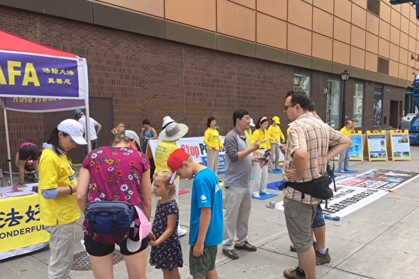

汪洋（手拿传单的男士）在渥太华闹市区讲真相。（李剑/大纪元）

【大纪元2018年07月26日讯】（大纪元记者梁耀报导）“第一天被非法关押在郑州白庙劳教所时，我谁也不认识。当我从第一个牢房走到最后一个牢房取被子时，有一人对面走来，轻声说，‘千万不要转化（指放弃信仰）！’当时这句话对我触动非常大，多鼓励的话呀，我才知道那里面有很多同修，同修的鼓励也让我的信念更坚定了。” 

汪洋是加拿大首都渥太华一家驰名世界的软件公司的高级工程师，年纪轻轻就事业有成。他做过项目经理，是单位技术骨干。然而，十九年前，他在中国和千千万万的法轮大法修炼人一样经历了惊涛骇浪，很难想像的是，帮他走过多年磨难、让他念念不忘是上述那位陌生人的一句话。

<b>得法之初</b> 

在还是一个大学生的时候，汪洋身体特别不好，在尝试了各种各样的气功后，于1998年5月走入法轮大法的修炼。

一年多后，汪洋的身心发生了天翻地覆的变化，不但摆脱了疾病，在精神层面的变化如醍醐灌顶一般。自小对传统文化感兴趣的他以前也曾学过佛家、道家、儒家的经典，“但是都觉得没有法轮功讲的这么清楚、这么真切，法轮功的著作通过浅显易懂的文字解答了我人生中许多困惑的问题，让我心服口服，”他说。

<b>亲身经历的七二零</b>

一九九九年七月，江氏集团发动了对法轮功的大规模迫害，当年的情景对汪洋来说，至今还历历在目。

七月二十一日一早，他就骑车去了国务院信访办上访，要求停止迫害。去之前，他没和父母说，怕他们担心，只是给女朋友打了一个电话，“因为她也知道自己炼功，我打电话说：‘如果我回不去，知道我怎么回事就好。’
”
看到许多法轮功学员都已经站在了信访办前的马路边上，挤得满满的，但排得很整齐，岁数大的学员，坐在里面，年轻一点的站在外面。

他描述说：“大概十点多，开来了许多的公共汽车，下来了许多军人，开始把法轮功学员往车上扔，而且越来越野蛮。法轮功学员开始就是手挽着手，尽量不被拉出去，那些军人就强行将我们扔上车，有的拽头发，有的就一个人抬手一个人抬脚，甚至几个人扔一个人。全部都上车后，车就开动起来了。”

在车上，很多法轮功学员给军人讲真相，这些军人虽然不说话，但也挺感动的。后来他们被拉到丰台体育场，所有人都被关起来。因为天气炎热，大家就坐在那学法、交流。

直到下午四、五点钟，大门开了，好多人就从那里面出来了，汪洋也从里面出来了，然后就坐车回到了国务院信访办门前，看到那里已经清场了，他找到自己的自行车，离开了，当时，夜幕已经开始降临。

当天，北京的法轮功学员基本都被放了，但是，许多外地法轮功学员被当地驻京办的人带走了。第二天广播、电视等媒体就开始滚动播出诬陷法轮功的宣传。

<b>“同修的一句话让我更坚定”</b> 

七二零之后，面对铺天盖地的打压和家人的反对，让汪洋也经历了一段很严肃的思考，他说：“思考自己到底走的对不对，大概挣扎了一、二十天，最后就坚定了，认为我走的路对，就一直走下去。”

后来，汪洋即将毕业去外地工作，“在大学毕业和工作交接那段时间，大学里的人都知道我炼功，但是单位的人都不知道。在外地工作的时候，我就想办法让周围同事，让他们都了解法轮功到底是怎么回事。因为自己是知道真相的，而很多人是不了解真相的，就是听电视上宣传，所以当时通过各种各样的方式讲真相。”

在他工作的河南省，因为在家里上网讲真相，当地警察通过各种各样的渠道查到家里的网址，2001年6月的一天，警察把汪洋从公司带到宿舍，并抄家。

“因为我当时电脑里有很多法轮功相关的资源，在网上发了很多真相材料，因为这个，他们把我送到看守所，后来又转到劳教所。”

汪洋被非法关押的劳教所是郑州白庙劳教所，“第一天被非法关押在郑州白庙劳教所，谁也不认识。我从第一个牢房走到最后一个牢房，取被子时，有一个人对面走来，轻声对我说，‘千万不要转化（指放弃信仰）！’当时那句话对我触动非常大，多鼓励的话呀，我才知道那里面有很多同修，同修的的鼓励也让我的信念更坚定了。”

<b>堂堂正正走出劳教所</b> 

在那里，汪洋认识了许多大法弟子。那里和其它劳教所一样，对法轮功学员进行所谓“强制转化”，就是强迫法轮功学员放弃信仰。“每天把你关到一个很小的屋子里，坐小板凳，很矮的一个小板凳，一坐就一天，还给你看诋毁法轮功的洗脑宣传片。”

劳教所还强迫每个法轮功学员写体会，诋毁法轮功。汪洋就利用这个机会，写了好多法轮功真相，说明为何自己要坚持修炼法轮功，然后给警察、狱警看。

“我对他们讲，让我放弃信仰，首先你得说服我，不管你是劳教所所长还是谁，我都跟他们挨个说，他们无法说服我，我却可以说服他们，所以当时在那个环境里他们还是比较佩服我的。另外，法轮功学员之间也很团结，互相鼓励。”

汪洋说，“当时在我进来几个月以后，进来一个老人，岁数很大，进来的时候很健康，过了一段时间之后，他身体就出现异状，脚就开始起大包。因为炼功，他可以练好，但是因为它（劳教所）不让炼功，之后很快就不行了，然后就去世了。”

当时也有大法弟子抵制迫害，包括不穿号服，绝食等，他们受到电棍电击等折磨。

汪洋说：“但是其实那些警察还是挺佩服大法的，大法弟子一般来说能力也都挺强的，当时我们那个环境，邪不压正。”

最后他没被所谓的转化，“他们也无计可施，我就堂堂正正的出来了。”

<b>信仰的力量让我们风雨同舟走过磨难</b>

汪洋说：“法轮功学员是一体，在劳教所那么严酷的迫害下，大家互相鼓励，那真是非常令人感动，后来我出来才听说，其实我刚出来，国外就报道了。我以前同学也说，知道我这个事儿是从明慧网上看到的报导。”

“国内国外也是一个整体，包括在监狱里、在劳教所里被迫害的同修，有海外大法弟子的支持，其实，这种力量我觉得给他们的鼓励还是挺大的。所以是信仰的力量吧。”

汪洋后来和女友结婚，并有了一个聪明可爱的儿子。妻子也得法修炼了。一家人移民至加拿大。出国后，汪洋和家人修炼更加精进。十几年如一日，通过各种方式向人们讲清法轮功真相。

“因为我自己也被迫害过，国内目前还有那么多大法弟子被迫害，自己不能坐视不管，还得尽自己最大的努力去帮助他们。”

通过长期讲真相，汪洋看到了身边的变化，以家人为例，因为受共产党的洗脑教育和无神论宣传，父母从一开始的反对，甚至认为他不太正常。后来汪洋的父母也出来探亲，看到海外的真实情况，跟国内想像的完全不一样，所以他们慢慢的明白真相了，也都做三退了，甚至回去也跟其他人讲。他说：“人心的变化非常大。”

<h1 align="center"><b>【唐浩】法轮功音乐飘进白宫 说明什么？</b></h1>

1999年7月20日，中共前党魁江泽民对法轮功发起铺天盖地的迫害镇压，遭非法抓捕、关押、迫害致死者，难以计数。

19年后，北京街头虽仍看不见法轮功学员的炼功身影，但法轮功音乐却已在美国白宫缭绕飘扬。

美东时间2018年7月19日[注1]，美国总统川普在白宫接受财经频道CNBC独家专访，专访地点选在椭圆形办公室外的屋檐下，天气晴朗，鸟语花香。

访谈中，川普针对美国经济、美中贸易战、双普会、美联储加息等热门议题做出重要说明，川普这场访谈也被世界各大媒体广为引述。

川普侃侃而谈时，远方传来阵阵悠扬的祥和音乐，在白宫庭院里飘荡。

仔细听，原来是法轮功第五套功法“神通加持法”的音乐。

当时，来自美东地区的部分法轮功学员正在邻近白宫的华盛顿纪念碑集体炼功，向华府民众展现“真、善、忍”的美好，并讲述法轮功遭受中共迫害的真相。

法轮功的炼功音乐，也因而在川普耳边绕梁回荡。

对待法轮功 美中态度大不同

对于法轮功，川普并不陌生。

日前，旅居美国的法轮功学员张玉华博士，为了营救在中国遭到监禁的丈夫马振宇，写信向川普请求援助。川普总统办公室多次向张玉华表达关切，5月底，张玉华还意外收到川普的签名回信。

信中写道：“亲爱的张玉华博士，感谢您花费时间写信……我们将继续扞卫美国的价值观，鼓励那些为人类尊严而奋斗的人们。”

事实上，教人遵循“真、善、忍”普世价值以待人处事的法轮功，正是比对美国与中国社会差异的关键指标：

在中国，前中共党魁江泽民血腥迫害法轮功；在美国，总统川普写信关切法轮功。

在中国，天安门广场上非法抓捕法轮功；在美国，白宫外面人们自由炼法轮功。

在中国，许多高官、书记指挥迫害法轮功；在美国，许多州长、市长颁奖褒扬法轮功。

在中国，警察迫害法轮功；在美国，警察保护法轮功。

在中国，法轮功学员遭迫害流离失所；在美国，法轮功学员可以办身份，安居乐业。

在中国，政府绑架人民批评法轮功；在美国，人民主动支持法轮功。

在中国，共产党员可以作威作福；在美国，共产党员连绿卡都不让办。

在中国，政府践踏人民言论自由与信仰自由；在美国，政府扞卫人民言论自由与信仰自由。

在中国，共产党宣扬“无神论”，灌输人们“假、恶、暴”及“假、大、空”等变异价值；在美国，总统教人要信仰神，恢复传统普世价值。

诸如此类的差异，还可以不断列举下去。

真善忍普世价值 映照国家政府的善与恶

归根结蒂地说，美中双方对法轮功的态度差异，适足反映出美国与中国在价值体系上的差异、立国精神与立党精神的差异、民主体制与极权体制的差异、人性与党性的差异，以及政府对人民态度的差异。

美国《独立宣言》开宗明义指出：“我们认为下面这些真理是不言而喻的：人人生而平等，造物主赋予他们若干不可剥夺的权利，其中包括生命权、自由权和追求幸福的权利。”

“为了保障这些权利，人类才在他们之间建立政府，而政府之正当权力，是经被治理者的同意而产生的。当任何形式的政府对这些目标具破坏作用时，人民便有权利改变或废除它，以建立一个新的政府。”

由此观之，《独立宣言》清楚说明了：美国开国之父们认为，人是神创造的，并被赋予生命、自由、幸福等权利；并强调政府的存在与权力的正当性，是来自人民的同意才获得授权的。一旦政府损害人民的权利，失去人民的认可，人民将有权改变或废除政府。

因此，显而易见，美国的立国精神当中，蕴含了信仰自由以及人人平等的“机会平等”，而政府应该保障每个人民的信仰自由与生命，并确保人民有平等的机会去追求幸福——这些正是美国世代相传的传统价值，是川普极力恢复与守护的对象。这些价值不但是中共统治下付之阙如的，也是众多中国人渴望移民美国的主因。

川普恢复传统 誓言守护信仰自由

从小笃信神的川普，自出任总统以来，一直积极恢复美国社会对神的信仰。

“美国国父们撰写《独立宣言》时，四度提及创世主（造物主），因为在美国，我们不崇敬政府，我们崇敬神。”这句宣言，成为川普的招牌名言，他多次强调，将带领美国坚定守护信仰自由，反对任何信仰迫害。

2017年5月4日，川普签署行政命令保障信仰自由，“（我们要）扞卫所有美国人民的权利，尊崇我们伟大的宪法，保护我们神圣的自由——这不是任何世上力量赋予我们的，而是天上创世主的恩赐。”

反观中国，尽管中共宪法里号称人民拥有信仰自由、言论自由，但目前仍有众多的宗教团体、信仰群体遭受严酷迫害，中国人民百姓的言论自由、信仰自由也遭受严密管控，形同虚设。

不过，此际，美国国务院正在华府召开全球首次“部长级促进宗教自由大会”（Ministerial to Advance Religious Freedom），为期三天的议程中，将论及世界各地的信仰迫害问题，包括中共在中国大陆迫害法轮功、迫害人民信仰自由的议题。美方希望透过建立这样的跨国机制，促进全球信仰自由，因为这是上天赐与人类的基本人权。

而全球一亿多名法轮功学员也殷殷期盼，缭绕在白宫庭园的炼功音乐，有朝一日，能再度飘回天安门广场上，悠扬回荡。

[注1] 中共于1999年7月19日夜间，开始大规模非法抓捕法轮功学员，7月20日官方正式宣布镇压法轮功。

<h1 align="center"><b>拒放弃信仰 女经理遭中共用邪术咒语攻击</b></h1>

法轮功学员何志维。（何志维提供）

【大纪元2018年06月22日讯】（大纪元记者易如美国华盛顿DC报导）走在法轮功游行队列里的何志维，健康快乐，让人很难想到她曾遭受过中共多种酷刑的折磨，导致颈椎间盘突出。

何志维今年57岁，广东南海人。1983年从中南林学院毕业后由国家分配到广东省珠海市经济特区发展公司担任秘书，1999年，她受聘到珠海市报关公司担任业务部副经理。

“那时，由于业务精通，我曾自己承包报关行，攒下一些钱，事业可谓顺利。丈夫是在海关工作的一位领导，有一个可爱的女儿，生活应该是令很多人羡慕的。”何志维说。

不过，自从生下女儿后，何志维就经常头痛，每次头痛时，头好像要裂开似的难受。为了医好病，一家人到处托关系、找名医，西医、中医、各种偏方，甚至练气功，什么方法都试过了，可是病依旧没有见好。“那时很绝望，头疼时好想撞墙一死了之，脾气也变得很坏。”何志维说。

1997年底，何志维经朋友介绍开始修炼法轮功。“我在海关大院找到了法轮功的炼功点，炼功没几天，头痛没了，脸色红润，人很精神，整个换了个人，多年的顽疾不治而愈。”

何志维说，更重要的是，经过看法轮功的书，明白了做人的真正意义，人也变得开朗，“待人慈善、多考虑别人、做事也不再急躁了，十多年来，‘真、善、忍’成为指导我做人的根本信念。”

何志维修炼后身心的变化，使她的妈妈、姐姐和弟弟都先后走入法轮功的修炼，“弟弟因此去掉了多年的抽烟恶习。”

1999年7月20日，中共前党魁江泽民发起全面镇压法轮功。媒体也随之铺天盖地地造谣诬陷。7月21日，何志维和女儿一起从珠海去了广东省政府上访。

“当时我心中只有一念，我必须站出来为法轮功说几句公道话：法轮功是好的，要为师父讨回公道。”

在广州经历了“禁止上访”和“武警抓人”后，她回到珠海，被单位逼写思想报告。

2000年5月、6月，何志维因向本单位同事讲述自己修炼法轮功受益的事实，并教同事炼功，被珠海市报关公司、公安局及“610”非法送看守所拘留，期间被逼做长达十几个小时的奴工，完不成任务时被罚蹲厕所。

2000年底至2001年，由于“610”不断骚扰，何志维被逼与丈夫离婚，由于拒绝放弃修炼，被开除公职。为了坚持信仰，她两次被迫离开珠海，家里留下年近八旬的母亲和13岁的女儿。

在何志维离家期间，家中被多次抄家抢掠，警察不但抄走了大法的书籍、物件和一部电脑，连何志维妈妈的一本清宣统年间的古董书《声律启蒙》都抢走了。

2002年4月初，何志维在外地被公安非法抓捕，随身的巨额现金及财物也被抢掠一空。之后她被非法劳教一年，关在广东三水妇女劳教所。

在劳教期间，由于坚持“真、善、忍”的信念，遭到高压洗脑，八天七夜通宵不准睡觉、不给大小便。

“妇教所对法轮功学员采用的手段是极其邪恶和令人发指的，他们逼我看污蔑法轮功的录像，甚至将法轮功师父的照片塞进我的内裤里，以达到摧毁我的意志。为防止我睡觉，狱警和他们指使的多名吸毒女子还把我按在地上蹲著，用扯下的头发刺插耳朵和鼻孔。”何志维说。

何志维曾在劳教所的一封信里写道：“我会无怨无悔地坚定地走下去。在劳教所，我也看到了众生的觉醒，那些曾做尽坏事的吸毒女子，当她们了解到我们是好人，都不想参与迫害，觉悟了的人都能善待我们，她们说不愿做伤天害理的事，有的因拒绝参与伤害我，甚至被恶警加期、被用电棍电打，还有些人冒着被严惩的危险帮助我。从这一切可以看到，迫害都是强加的。我会问心无愧地走出这个地方（妇教所）。”

2004年4月，在被非法劳教一年期满后，由于何志维不肯放弃信仰，又被押回珠海洗脑班。10月，洗脑班威胁她说不写悔过书等，永远出不了这门。何志维以绝食抗议拒写悔过书。12月，她又被送往广东省洗脑班加强迫害。

在何志维被非法关押后，警察利用她女儿想念母亲，造谣说炼法轮功的人不要家庭。“恰恰是迫害者把法轮功学员非法关押造成骨肉分离，然后利用人情强迫学员放弃修炼，当学员不肯放弃修炼时，便造谣说学员不要家庭，这是个流氓政权。”何志维说。

2005年6月10日，何志维在持续绝食抗议后走出了洗脑班。由于一直拒绝放弃信仰，她被珠海列为重点迫害对象，对她的迫害并没有放松。她的电话被监听，“610”也经常去她家里骚扰，为避免被迫害，她再一次离开了珠海，流离失所。

2009年4月，何志维再次被珠海“610”绑架，先后被劫持到三水法制学校、湛江法制学校、广州法制学校迫害。在湛江洗脑班里她遭恶徒施酷刑迫害。

“我被扣上手铐，单独关押在一个四壁不透风的屋子里，地上爬著虫子，不给坐，连站着都不准挨墙，用高音喇叭24小时大声放着充斥恐怖声音的音乐，昼夜不准睡觉。接着，又把我弄到一间用鬼神像布置得阴森森的房子，并强迫我对着那个鬼神像，双膝跪在大法经书上。当恶徒迫害时，强制让我站立，8个恶人将我围住，口里念著邪恶的咒语，并用手使阴力，掌推、让我不停的转动，拳击、猛打我的身体和头部，特别是头部，他们用大法书猛击我的头部，最后导致我颈椎间盘突出，造成头部剧痛、头晕，几近精神崩溃。”

据悉，这种迫害方式是海南省的“610”发明的，目的是施用邪术、用邪恶的咒语达到攻心，同时用阴力推击，让受害者处于不停的转动和击打中，特别是头部的猛击，长时间这样折磨以摧毁人的意志，是一种杀人不见血的酷刑。

而受此酷刑的人大脑会迅速充血、缺氧，出现头晕眼花、天旋地转，四肢无力，但仍被击打着，轻者即刻反胃呕吐，头部剧烈疼痛，不能进食；重者昏迷或成植物人，甚至脑充血死亡。

10月，何志维被从湛江转到广州洗脑班，在广州洗脑班里恶徒以何志维炼功、喊口号为借口，对她又实施各种残酷折磨。

“警察把我捆绑住手脚固定在一张椅子上，连续捆绑五天，始终不给松绑，吃饭也不松绑，令夹控人员喂食，大、小便被三个人抬到马桶上，不准洗澡，还遭到打骂羞辱。由于身体及屋内散发出恶臭，五天后，停止了这一轮迫害。”

何志维对这次迫害写下申诉书揭露恶徒暴行。“在得知我写了申诉书后，他们又对我实施新一轮迫害。”何志维说。

“大热天长时间不让洗澡和换洗衣服、剥夺睡眠，除了肉体折磨，他们还实施精神摧残：找来八九个人实施批斗会式的夹攻；一张攻击法轮功的光碟，长期不断重复大声播放甚至夜晚也不放过；用宗教洗脑，一张‘地藏经’连续播放一星期，这种车轮式的狂轰滥炸持续了两个多月。”

在这种恶劣的环境下，何志维一直坚定对大法的信念，一方面拒绝接受邪恶的洗脑，一方面仍坚持炼功。

由于何志维一直坚持炼功，恶徒又把她捆绑在束缚椅（一种专门对付精神病人的椅子，吃喝拉睡都在椅子上）上，不给饭吃、五天不给一滴水喝，恶警们为逼她妥协，甚至向她喷辣椒水，罚坐二十一天直至臀部溃烂，才停止了这一轮虐待。

为逼使何志维屈服妥协、不喊口号，恶徒不给她喝水、吃饭，在仅有的一点点饭里还放药，致使她几乎说不出话。最后，在何志维的强烈抗议下，才制止了又一轮的迫害。2010年12月，她走出了洗脑班。

2012年7月初，何志维在上班途中又被珠海市“610”等违法人员绑架至三水法制洗脑班。恶徒为让她放弃信仰，期间两度对她施以剥夺睡眠的酷刑。

“一次五天五夜，另一次九天九夜，导致我颈椎间盘三节突出。他们还甚至扬言要把我女儿抓进来一起洗脑。期间我亲人多次到三水探视，被他们拒绝。”

2013年2月4日，何志维又一次拒绝放弃信仰走出洗脑班。为了避免中共无休止的迫害，四个月后，她带着女儿逃离中国，辗转来到加拿大。

何志维说，她到加拿大后参加了腰鼓队，“我觉得这鼓声能敲醒中国人，唤醒他们的善念与良知，因为在我身边，那些曾做尽坏事的人，当她们明白了真相后，都不想再参与迫害了，都知道了法轮大法好、中共是邪恶。”

<h1 align="center"><b>“道士律师”遇到真正的修炼</b></h1>
<h2 align="center"><b>大韩法律救助公团水源支部李惇荣律师的故事</b></h2>

李惇荣在读法轮大法书籍。（全景林/大纪元）

【大纪元2018年07月12日讯】（大纪元记者赵润德韩国首尔采访报导）当今社会，在很多人的眼中，名誉、金钱和和睦的家庭就是幸福的全部了。然而，有时这些并不是幸福的最高尺度。韩国大韩法律救助公团水源支部的支部长李惇荣（54岁）律师说，他拥有了所有的这一切，但内心一直总是觉得很空虚。

“生活中的一切都很安稳，但是我一直在寻找精神上的突破口。经常喝酒、抽烟，不停地寻找刺激，但是精神上却无比空虚。不是恐惧，也不是兴奋，非常奇怪。我有时就想，宇宙如此广阔，而我存在的意义究竟是什么呢？如果我死后会完全消失，那是多么可怕的一件事情啊。”

李惇荣说，有时睡着睡着会自己惊醒，为了填补精神上的空虚，他读了很多书，同时接触了很多有关修炼的方法。同事也因此叫他“道士律师”但是，所有的这一切都没有为他带来改变，内心反而越来越空虚。

<b>X缘接法轮大法</b> 

2004年左右，李惇荣在大韩法律救助公团大田支部任职，有一天一位朋友对他说：“我发现了一个你会喜欢的东西。”他说，他在法院附近看到有人在炼功，是一种叫做“法轮功”的修炼方法。又有一天，一位同事递给他一本小册子，这次还是法轮功。接二连三的偶然也让他觉得这是一种必然，于是他立刻找到了法轮功的网站明慧网，并开始阅读指导修炼的主要书籍《转法轮》。

李惇荣回想说，“在读《转法轮》的那一瞬间，我就被深深地吸引了，目不转睛地读了起来，甚至觉得睡觉都是在浪费时间。书上写的都是我平时最想探索的，对于人生的一些问题，我以前不得其解，而阅读《转法轮》之后如醍醐灌顶。我感觉之前那颗无比空虚的心，渐渐丰盈起来了。”

之前，李惇荣总想找一位明师，希望他能为自己解惑答疑，然而，他一直都没有找到那位可以治愈自己心灵的明师，人生无比徬徨。现今，他说，从阅读《转法轮》的那一天起，终于遇到了自己一直寻寻觅觅的那位明师。

<b>成功戒烟、戒酒</b> 

修炼之前，李惇荣的烟瘾很大，是一个非烈烟不欢的“大烟鬼”，而且每次都要把整根烟吸完，完全吸到烟蒂处。他一天要吸一盒烟，因为他吸烟的特点，像吸了两三盒一样，浑身浓浓的烟味。另外，他还是个“大酒鬼”，几乎每天下班后都会去喝酒。烟和酒成为他生活中的不可或缺的重要部分。

可是他开始修炼后，没费力气就把上瘾的烟酒戒掉了，他感觉太神奇了。 “开始修炼一个月之后，有一次朋友劝酒，我就喝了一小口。但就在那一瞬间，我的头就像裂开一样火辣辣地疼。之前喝再多的酒都没有这样过，我吓了一跳。从那以后，一闻到酒味就觉得很难受。”

李惇荣说，“从那以后，自己没怎么费心，那么大的酒瘾就这么轻易地戒掉了。就这样自然而然地就不喜欢酒味，酒就成功戒掉了。

“和酒相比，我对烟的执著好像更强烈一些。虽然也不喜欢烟味，但是一开始戒烟也并非易事。不过有一天，我只吸了一口，内心深处不知为什么就觉得非常后悔。从那天开始，我就自然地不吸烟了。”

<b>记忆力增强</b> 

李惇荣说，戒烟、戒酒之后，记忆力恢复了很多。而且，修炼之后自己变得更有忍耐力了，处理一些比较棘手的案件时也不会觉得很难。虽然做的工作是一样的，但是由于自己的心境不同了，所以精神压力减轻了，疲劳感也减轻了。

李惇荣修炼之后，内心不再空虚，脸上一直挂着温和的笑容。孩子也说，爸爸变慈祥了，变得更平易近人。他说，“修炼之后，对人生的苦恼消失了，身体也越来越健康，生活充实而愉快。”

<b>传递法轮大法的美好</b> 

对李惇荣来说，法轮功就像穿透黑暗的一缕阳光，为他的生活带来了光明和充实。为了与别人分享这一份喜悦，他每周都到韩国的青溪山炼功。伴随着潺潺的流水声和悠扬的炼功音乐，李惇荣静静地展示著炼功动作，而这一份宁静与平和吸引了很多前来登山的人，他们也纷纷走入修炼。

李惇荣在炼法轮功第五套功法。（全景林／大纪元） 

李惇荣是隶属法律救助公团的律师，有很多人来找他咨询法律问题，他会找机会给这些人讲述真相。告诉他们，法轮功由于其显著的功效迅速获得中国公民的喜爱，而独裁者却容不下一个教人向善的修炼功法，制造谎言并横加迫害二十年。对被谎言舆论欺瞒、不知实情的中国人，李惇荣会告诉他们真相，并劝他们退出共产党的相关组织。

李惇荣说，“我现在觉得修炼是我存在的理由，虽然修炼已有14年之久，但是不足之处甚多。作为修炼人，应该时时处处为他人着想，先他后我，但是为他之心还远远不够，我应该更加精进。不过，得益于大法修炼，我内心一直是幸福和安详的，因为我找到了方向，不再徬徨。”
