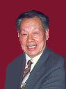

<h1 align="center"></h1>
<h1 align="center"><a href="https://github.com/3fmd/gm/blob/master/epub.md">免费下载epub电子书</a></h1>
<h2 align="center"> (推荐)Reasily - EPUB 阅读器，可以观看视频、音频(Reasily1802h.apk) 。 <a href="https://git.io/1802">点击直接下载</a></h2>

<h1 align="center"><a href="https://github.com/candysn/nini/blob/master/wnn-1.md"><b>5月~7月看更多</a></b></h1>
 

<h2 align="center"><b>“为法轮功学员辩护的律师遭中共迫害”系列报导之程海</b></h2>
<h1 align="center"><b>程海律师：为法轮功学员辩护 我身心受益</b></h1>

京程海律师表示，为法轮功学员辩护，身心受益。图为程海。

 
【大纪元2018年08月16日讯】（大纪元记者萧律生采访报导）“代理法轮功学员的案子，我是身心都受益。”程海说，“法轮功学员的坚守对中国社会道德提升也有好处。”

今年65岁的北京律师程海，在被中共当局非法注销律师事务所和律师证的情况下，仍旧坚持为法轮功学员辩护。“年龄不是问题。美国总统川普，70岁了，还在当总统。”

他说自己目前仍能坚持，一方面因为在文革时，家里面被贬为臭老九，受到严重歧视，所以自己尤为重视社会的公平正义，而坚守这方面的律师本来就少，社会需要他们这类人；另一方面，自己身体很健康，还可以继续工作，程海把这个功劳归功于法轮功及法轮功学员。

<b>必须停止迫害法轮功</b>

从2007年起，程海开始陆续在全国范围内代理法轮功学员的案件，目前已经11个年头。“除了西藏、新疆、海南等偏远地区没有，其它都有做。法轮功学员的案子本来就是冤假错案。”

程海表示，必须要求中共停止迫害法轮功：从法律角度，刑事案件需要对社会有危害性，而法轮功无危害性；从道德角度，当下中国普遍缺少公共价值观，甚至出现人类历史上最无耻的口号——一切向钱看。法轮功的“真、善、忍”准则是帮助别人，尤其“与世无争”、“遇到问题向内找”都有利于社会。

他说，法轮功自1992年传出后，使众多中国人身心受益，不仅让难以治愈的癌症等患者恢复健康，而且从精神上疏导、解决人的各种问题，有利于个人、家庭和社会；而基于“真、善、忍”的信仰是社会稳定的基础。“至少从这两点，我认为是法轮功没有被有关部门认定为x教的根本原因。没有危害社会，没办法定义为x教。”

鉴于对法轮功及中共对法轮功学员犯下的罪行的了解，程海虽然五次遭中共当局殴打，但是仍表示会继续为法轮功学员辩护。

<b>五次被殴打</b>

1999年至2000年间，程海因为家中一起民事侵权案件，才开始接触法律、律师等。在这个过程中，他发现自己很适合做律师，结果此案未打完，他就考上律师了。

2001年，正式成为一名律师的程海，除了接触商业、刑事案件外，还参与代理公益诉讼，包括：2006年控告铁道部，因其严重不能满足社会需要的铁路规划等行政行为违法；2007年控告合肥市庐阳区公安分局和北京市昌平区公安分局，因中共的户口制度；2012年联合73名公民给主要国家机关监督建议函，要求立即停止违法的劳教、释放被劳教人员，次年初全国停止劳教实施等。

在这个过程中，程海代理法轮功学员的案子相对于其它案件来说更多一些，所以遭到中共当局的打压也更大一些。

2009年，程海准备为北京师范大学明史系研究生陶渊做辩护，正在与陶渊的母亲张盛荣签订委托书时，晋阳派出所警察非法闯入室内，并遭该派出所所长等人暴力殴打。

“2012、2013年，一个案子期间就被连打三次。”程海说，“大连安锅案，法院不让律师会见当事人，我据理力争，在法院被打一次，在法庭被打，还有一次是在看守所被打。他们非常仇恨律师。我的眼睛被打得青紫，当时要求律协、司法局维护律师权力，结果没有下文。” 
 

2013年8月15日，程海代理大连法轮功学员安锅一案，遭到看守所警察掐脖子、抢手机，暴力殴打。（程海微博）

2017年5月，程海代理山西运城垣曲县怀有三个月身孕的法轮功学员孟丽霞一案，遭警方暴力迫害。程海曾描述，警察猛拧他的胳膊，他的右手有11处被掐红，颈部也被掐红，并且他的左胸中部出现猛烈疼痛的现象。

“这是我代理法轮功案件以来，被非法关押时间最长的一次（非法关押8个小时），先前从来没有遇到过。”程海说。

<b>“法轮学员无罪”</b>

2013年起，程海代理的法轮功学员案件中，出现首例在批捕阶段得以获释的情形。之后的几年，尤其是2016年、2017年，他在安徽黄山、安徽合肥、陕西、浙江等地代理的案件中，陆续出现十多个案例，“检察院、法院听取律师汇报案件情况，最后不批捕，不追究”。

“他们应该知道是没有法律依据，公安部认定的14种邪教中没有法轮功，他们那样做是没有法律依据的。”程海说，“不过，有些地方还是很邪恶的。”

为此，程海一再请大纪元记者转告给法轮功学员一点建议。

首先一点，程海表示，从心底里，确信修炼法轮功、去向民众讲法轮功真相、散发真相小册子等是无罪的，就不要有犯罪嫌疑人心理。因为从法律的角度而言，迫害法轮功完全是违法的，毫无依据。

“没有犯罪，当公安询问时，完全就不要去搭理他们。”程海说，“他们说是犯罪，但是法轮功学员没有犯罪，所以对他们无可奉告，就不要对公检法说任何话。”

程海表示，一旦向公安承认，或者心里担心抄家抄出资料等等，“你自己认为不是犯罪，但是说了什么以后，既害了自己，也害了对方，因为让他们犯罪了。”

2004年3月31日晚上，警察对法轮功学员王茁、范德震、穆琴等人的住处葫芦岛市连山区新华大街海军部队5号院17号楼（四楼）进行抄家﹐王等四人被强行绑架走，下落不明。（明慧网）

 
“当孩子遇到危险时，父母会挺身而出，把自己生命置之度外地付出。信仰，就是需要用高于生命的高度来看待，无惧后，自然地就有勇气、有智慧。”程海说，“你们修炼人讲要向内找，找自己的原因，那就去捍卫自己的信仰，投入的、都去做。”

此外，程海建议被非法迫害的法轮功学员要敢于去控告各级迫害法轮功学员的机构、部门、工作人员。

程海说：“善恶是对立的，就是要揭露其犯罪行为。有些地方案件，拚命控告多了，那些工作人员就知道了，他们也害怕。所以再参与做迫害事情的人就少了，这样的案子就会少了。控告还是有作用的。” 

<h2 align="center"><b>神韵女高音歌唱家、“全世界华人美声唱法声乐大赛”评委耿皓蓝专访</b></h2>
<h1 align="center"><b>评委耿皓蓝谈声乐大赛：华人歌唱家的机遇</b></h1>

神韵艺术团女高音歌唱家耿皓蓝。（陈霆／大纪元）

【大纪元2018年08月16日讯】（大纪元记者叶蓁美国纽约采访报导）“她的声音来自上天。”这是神韵观众对女高音歌唱家耿皓蓝的由衷赞美。观众认为，她的声音“强劲有力”，对传统美声唱法的演绎“达到了巅峰的呈现”。

 
起初，耿皓蓝在音乐学院毕业的时候，曾为前途而忧虑：“国内学声乐的人特别多，竞争特别激烈，不知道以后的出路在哪。”大约十多年后，她登上世界舞台的中心，成为备受瞩目的顶级声乐艺术家。她说这得益于2009年她参加的新唐人“全世界华人美声唱法声乐大赛”。同年她被选入神韵艺术团担任独唱演员，从此声乐之路越走越广。

<b>目前，声乐大赛已经开始接受报名。详情可以登录网站或拨打热线查询。（大赛网站：https://vocal.ntdtv.com/ ，美国热线： 1-888-878-6166）</b>

今年11月，耿皓蓝作为五大评委之一，将重回声乐大赛。她希望分享自己的经历，激励更多年轻的华人歌唱家踊跃参赛，走出属于自己的艺术之路。

<b>与大赛结缘 从选手到评委</b>

在出国深造之前，耿皓蓝就听说了华人声乐大赛的大名。那时她还在上大四，参加当地的歌剧协会。该协会的老师告诉她，纽约有一个电视台主办的华人歌唱比赛，影响力很大。耿皓蓝一听说有个面向华人的国际比赛，就很动心，但因为人在中国错过了比赛。

毕业后她赴纽约留学，有一天恰好看到比赛的广告。她毫不犹豫地报名参赛，而且，评委主席竟然是风靡中国几十年的“歌王”关贵敏先生。

“哇，可以亲眼见到他！”耿皓蓝喜出望外。她在国内就非常喜欢关贵敏的歌声，但是多年来只能在电视上一睹他的风采。由一代歌王遴选大赛优胜者，不仅能让耿皓蓝近距离接触敬佩的前辈，也使她对大赛的专业和权威性增添了很多信心。

在她的印象中，关贵敏非常亲切、和善，给她提出歌唱建议，“感觉就像邻家的一位叔叔跟你讲话，对你谆谆教导。”耿皓蓝说，关老师和国内那些“大牌”的歌唱家完全不同，给她的提点也非常中肯，让她获益匪浅。

汇聚在大赛现场的华人选手们，很多来自于台湾、美国，还有像耿皓蓝一样来自中国大陆的。华夏子孙天然的纽带，为大家营造了友好祥和的氛围。耿皓蓝回忆，选手之间的良好互动也让她非常感动。

她说，如果有谁化妆缺什么东西，就会有人借出来；如果谁演唱结束，大家也会鼓励他“唱得好”。“不像其它比赛，大家一起争夺名次，而是很友善地互相帮助。”

今年，耿皓蓝担任华人美声唱法大赛的评委，身份的转变让她感受到肩负的责任。“以前在台上唱歌，想的没有那么多，但是评委有选拔人才的使命，要挖掘优秀的声乐人才。”

2017年10月13日，神韵交响乐团在波士顿交响乐厅演出。图为女高音歌唱家耿皓蓝的演出。（戴兵／大纪元）

<b>因大赛获难得的机遇</b>

2009年，作为第三届声乐大赛的金奖得主，耿皓蓝被神韵艺术团选为女高音独唱演员，每年在世界范围巡回演出。她认为，这样难得的机遇，促成了她在声乐艺术上的巨大成功。

为什么这样说呢？耿皓蓝表示，首先她在声乐技艺上有了突飞猛进的提升。以前她唱美声歌曲时，只擅长用意大利文或其它西方语言。虽然耿皓蓝在大赛中唱中文歌曲并获大奖，但她明白，这一直是她很大的挑战。“用中文演唱，最主要的是发音问题，就是咬字方面特别不一样。”

幸运的是，她在神韵艺术团中，学到久已失传的正统美声唱法。而且，神韵歌曲都是用中文歌词写成，她也在坚持不懈的练习中，掌握了唱中文歌曲的诀窍，将圆润悠扬的美声发挥得淋漓尽致。

神韵歌曲不仅是全中文歌曲，更是承载深刻内涵、复兴传统文化的旷世佳作。耿皓蓝认为，演唱神韵歌曲，与唱其它歌曲有显著不同，使她对声乐艺术也有了更深层的理解。“有一种难以用语言形容的身心升华的感觉。”她说。

这样神圣的歌曲，配上演出中背景天幕同步显示的外国语字幕，感动了世界各地的观众。参加声乐大赛前，耿皓蓝曾观赏过神韵晚会，被演出效果震撼，止不住地流眼泪。而她演唱时，也多次看到很多西方观众抹眼泪。“歌曲中神性的东西，可以打动世界各族裔。”

耿皓蓝说，全世界华人声乐大赛，真的是给选手提供了一个实现艺术理想的国际平台。

<b>大赛的宗旨是回归传统</b>

那么，在耿皓蓝心中，优秀的声乐家是怎样的？“首先声音条件必须非常好，大家想听的就是你的声音。”由于大赛的宗旨是弘扬纯真、纯善、纯美的正统美声唱法，因此她还强调，歌唱家的精神境界同样重要。“如果你的内心纯净，观众也更能体会到歌曲的纯净。”

耿皓蓝表示，当今社会世风日下，道德下滑得很厉害，很多世人忘记了生命本真最需要的东西。她遗憾地说：“像传统文化、那些古老的东西， 都已经被遗忘了。”但是华人声乐大赛崇尚传统艺术，无论对选手还是听众，都是非常好的启发。而且，传统音乐是真正有益于人类身心、促进道德回升的艺术精华。

“像古人提过‘音乐疗法’，好的音乐确实对人的身心有很多帮助。”耿皓蓝记得，有一年在辛辛那提演唱神韵歌曲后，有位西方妇女带着5、6岁的女儿来拜访她。平时她的女儿特别吵闹，但是一听耿皓蓝唱歌，就会片刻间安静下来认真听歌，还不停地流眼泪。音乐的力量如此神奇，母女俩都很想亲眼见见这位了不起的歌唱家。

女孩的故事，让耿皓蓝也深受触动，她甚至也流下了眼泪。“神韵的传统歌曲带给人的感受，是任何一种歌曲都不能达到的。”她说。

从技术层面说，耿皓蓝鼓励有志于参赛的选手们，要有信心唱好美声唱法的中文歌曲。“纯正的普通话，对演唱中文歌曲是很主要的。结合美声唱法技巧，就可以很好地诠释歌曲。”她认为，华人选手们有很棒的先决条件。她还建议选手们多多学习传统文化，“了解‘仁义礼智信’等传统价值，才能唱出更深层的涵义。”

最后，耿皓蓝表示，虽然十年过去了，国内外的声乐学子们，仍然处在前路未卜的迷茫中，很多人不能坚持歌唱事业。“特别是大陆的年轻人，体会不到国际上声乐艺术的现状。”新唐人电视台为各地华人音乐家们，提供展示才华的机会。耿皓蓝希望青年专业人士也抓住机会，通过参赛，为自己的演唱事业获得突破的机遇。

<h3><b>新唐人第七届“全世界华人美声唱法声乐大赛”将于11月8日到10日在纽约Engelman Hall of Baruch Performing Arts Center举行，报名办法和比赛章程详情请见大赛网站。</b></h3>

<h1 align="center"><b>学术研究论证 中共迫害法轮功是群体灭绝</b></h1>

6月22日，近万法轮功学员汇集美国华盛顿，悼念19年来被迫害至死的同修。图为高莉莉手捧妹妹高蓉蓉遗像。（Samira Bouaou/大纪元）

【大纪元2018年08月16日讯】（大纪元记者Margaret Wollensak多伦多报导/李平编译）近日，发表在国际期刊上的一篇研究论文《法轮功在中国：隐性群体灭绝》（Cold Genocide: Falun Gong in China）提出了一个沉重的话题，即隐性群体灭绝（cold genocide）与肉体消灭（hot genocide）之间的区别。

这篇由加拿大四名学者及律师花了两年时间合著的研究论文，近日发表在国际种族灭绝研究协会（IAGS）《种族灭绝研究与预防》（Genocide Studies and Prevention）期刊上。

曼尼托巴大学副教授张玛丽（Maria Cheung，音译）博士在论文中说，肉体消灭是在短时间内暴力摧毁和消灭一个群体。隐性群体灭绝是在一个漫长时间内，慢慢消灭一个群体，这种消灭通常是从很细微的多层面进行，不仅从外在形式上消灭一个群体，更是从精神、结构和社会层面消灭。

“隐性群体灭绝过程漫长，人们通常不太注意，不知道这种灭绝实质上是一种有目的的系统性灭绝。是否构成群体灭绝，取决于其背后意图和目的，即有目的性的消灭一个群体，而非取决于规模。”张博士说：“目前隐性群体灭绝理论还比较新，有许多问题有待更多探讨和确定。”

参与撰写该篇研究论文的还有温尼伯国际人权律师麦塔斯（David Matas）、反强摘器官医生组织（DAFOH）执行主管特雷（Torsten Trey）医生与多伦多律师安里查德（Richard An），四人共同耗时2年合作完成。

<b>群体灭绝无人性</b>

文章作者认为，中共1999年起对法轮功群体的迫害，构成隐性群体灭绝。

张博士认为，中共对法轮功的迫害虽符合群体灭绝传统定义，但传统定义过于偏重其外在层面，根本没发现中共对法轮功残酷迫害是多层面多维度进行。她说：“中共对法轮功的迫害，不仅仅是外在肉体上的，因为外在肉体和精神、心理和社会层面是密不可分的。”

法轮功，又称法轮大法，是一种以宇宙特性“真、善、忍”为根本指导、基于佛道两家的传统性命双修功法，1992年在中国大陆传出后，很快受到民众欢迎。到1990年代末，全国修炼法轮功的民众已达7,000万～1亿人。由于法轮功坚持恢复中华传统价值，加上修炼者日众，中共时任党魁江泽民极度恐惧与嫉妒，于1999年7月20日亲自下令消灭法轮功，从此发起了对法轮功史无前例的全面残酷迫害。

截至目前，数百万法轮功学员被非法关押、洗脑和残酷折磨。已有数据证实，至少有数千名法轮功学员在关押期间被中共杀害，真实被害数字据信已达数万。中共发起的这场迫害，摧毁无数法轮功修炼者及其家人的正常生活。更无耻的是，中共不仅系统性地迫害法轮功群体，还极力对内对外掩盖，使得外界很难了解这场迫害的真实残酷程度。

文章说，在中国大陆，与法轮功有关的网络搜索都经过严密审查和过滤，能搜索到的数据都经过中共歪曲篡改或删减，国内外媒体转载的，都是中共媒体污蔑宣传和歪曲误导。 不仅如此，中共还操控媒体，掩盖其对法轮功群体的长期迫害和不公对待。所有这一切，导致法轮功群体在中国大陆被边缘化，所遭受非人待遇被整个社会无视和淡化。

张博士说：“想真正了解法轮功真相的，除非真的钻进去深入挖掘，否则很难看到真相。这场迫害被整个社会无视长达19年，完全构成隐性群体灭绝。”

<b>器官活摘暴行</b>

江泽民发起的这场对法轮功群体的旷日持久的迫害中，最惨绝人寰的是对非法关押法轮功学员的器官活摘暴行，被活摘器官的法轮功学员，一般都痛苦死亡。

2006年，麦塔斯与人合作，公布全球首个中共活摘法轮功学员器官的报告，随后又发表《血腥的活摘器官》（Bloody Harvest）一书。2016年他与人合作发表的最新报告中，发现全中国169家经中共器官移植手术审批的医院，自2000年以来共进行100多万起器官移植手术，这一年正好是中共迫害法轮功群体的第2年。

张博士说：“目前全中国大陆共有170多家医院从事器官移植手术，器官移植好像已成为常规生意。如果不主动询问移植器官来源，谁也不知道这背后尽然是中共有系统性的杀人暴行。也就是说，器官强摘已成中国医院家常便饭，但都是偷偷私底下进行，罪恶滔天。”

<b>为什么构成群体灭绝？</b>

张博士表示，外界对中共对法轮功修炼者的迫害，外界知之甚少，是构成隐性群体灭绝的关键要素。也正是这一点，观察人士、局外人士和普通大众更难全面了解这场迫害的残酷程度。

中共对法轮功的迫害，旷日持久，当局有系统性地尽力掩盖，对法轮功修炼者的边缘化，使得中共这一群体灭绝罪行日益演变成常态。张博士说，常态化，是一种行为在民众意识不到的情况下，日益成为社会和日常生活中的一种常态。如此导致的结果是整个社会的无视和冷漠，罪行能够有恃无恐地继续进行。

张博士说：“许多人不解，中共对法轮功的迫害为什么构成群体灭绝，是因为他们不知道，这场迫害是中共有目的的、长期有系统性地消灭一个群体。”

<h1 align="center"><b>一位脑瘤患者危难关头的转变</b></h1>

“脑病”需心医 一念定生死 不信无生路 心诚感天地

【希望之声2018年7月28日】（本台记者慧光综合报导）我是中国大陆东北黑龙江人，今天要讲的是发生在我丈夫身上的故事。

2005年，我丈夫突然感觉头疼，右侧手脚发麻，说话也不太利索了，于是我们赶紧到哈尔滨医科大学附属第一医院去看病。在医院里经过各种检查，最后确诊是丈夫患有“脑胶质瘤”病。听说是大脑长瘤了，而且还有可能是恶性的，我们都害怕了，请了哈医大最好的专家，据说是肿瘤专业十大名医之一的一位教授给做的手术。第一次手术后不到十天，专家说还需要做X刀手术（注：X刀也叫光子刀，是继伽玛刀之后迅速发展起来的立体定向放射治疗技术）。手术之后又听医生的建议，用了国内最好的化疗药。整个一套流程都是按照最佳方案走下来的，专家说也是最有效最好的方案，尽管花了很多钱，可我们心里还是满意的。

手术前一天，我和丈夫还去了哈尔滨最大的佛教圣地“极乐寺”，给所有的佛、菩萨都上了香、磕了头，请佛、菩萨保佑丈夫手术成功。不管怎么样，我们做了我们能做的一切，做了最大努力。的确，我们的努力没有白做，手术后一切都很好，我们全家都非常高兴，以为丈夫的病肯定能好了。

可是好景不长，一年后丈夫的病就复发了，突然间就不能说话了，而且整个右边身体都不听使唤了。这时我姐姐跟我说，“谁也救不了他的命，只有学《转法轮》，炼法轮功才能救他的命”。可我丈夫是一个很固执的人，怎么说他都不相信。为了能说服他，我就先看起了《转法轮》。

当我阅读《转法轮》这本书的时候，一下子就被书中的内容吸引了，很后悔为什么没早看。我心想怪不得有那么多有文化有知识的人都炼法轮功，原来这不是普通的气功，是一门能让人彻底脱离苦海的宇宙大法。虽然得法晚，但我当时就下定了决心，要一修到底，做真修弟子。

因为我的认识上来了，我就不想把丈夫丢下，就每天督促着他学法、炼功。他虽然很固执，可自己的身体都这样了，也没有更好的出路，就只好跟着我一起做。但是他不入心，所以心性始终跟不上，病的症状也就时好时坏。

脑胶质瘤病属于神经系统疾病，严重时会有出现癫痫发作，轻的时候是局限性的，重的时候就是全身性的，就是俗话说的“羊角风”，由于发作时病人意识不清、肢体痉挛及抽搐，我平时就叫他“抽风”。2007年8月，也就是手术后两年吧，他就开始出现“抽风”，而且越来越严重，发作的次数也越来越频繁。我知道这是他的思想造成的，他没有把自己当成是真正的修炼人，那就是常人，所以他的身体没有改变。没办法我只好把他送去哈医大第一附属医院再做检查。做过核磁共振检查后，医生说他病情加重了，需要再做一次手术，而且这次手术效果肯定不会好，做完后可能还不如现在。因为他的肿瘤长在大脑功能区内了，正好都压迫在他的肢体神经上，手术只能拿掉他不压迫神经的部分，而手术做不到的地方会发展的特别快，所以后果不会好。

我把医生说的真实情况都跟丈夫说了，我说“再好的医生也救不了你的命，只有法轮功师父才能把你从地狱里救出来，但你必须坚定修炼的决心，把自己当作一名真修的大法弟子”。

回家后，丈夫还是不停的“抽风”，使他意识到了问题的严重性。没有别的路了，只能下决心修炼了，于是他就开始尽最大努力学法、炼功。几天后的一天半夜里，他又突然“抽”了起来，不过这次与以往不同，他就像被恶魔掐住脖子一样，眼睛都“突”出来了，两只手一个劲的东抓西抓，样子非常可怕，整个脸都成了黑紫色，脖子、两肩也都充血成紫色。当时吓的我手足无措，不知怎么办才好，情急之下突然想起师父能救命，就大声喊“师父快救命！师父快救命！……”喊过之后，丈夫的症状就开始缓解，大约过了约半个小时，他才缓过气来，不抽了。我知道这一次是慈悲的师父把他救回来了。

通过这一次的亲身体验，丈夫也认识到了修炼的严肃性，不修炼心性就是一个普通人，师父也不会管、也不能管，只有心性修好了，大法的神奇才能展现出来。认识提高了，行动也就跟上了。以后不管怎么难受他也坚持学法、炼功，有一次刚想炼功，突然就“抽”起来了，可是他不停的发正念，“抽”完了起来接着炼。就这样坚持两天后，他就不“抽”了，而且以后再也没“抽”过。

所有的亲朋好友都知道丈夫的病，谁看见他“抽”起来都害怕，医院也都没辙了。可是他走入法轮功修炼，这么严重的病彻底好了，完全恢复了正常，这是铁的事实，家人、亲人和好友都见证了这个过程。

丈夫用他自己的亲身经历不仅改变了身体，也改变了自己的人生道路，整个人不仅精神起来了，脾气也变好了，从此后他更加坚定了修炼的决心，学法、炼功再也不用人督促了。他说，我亲身体验了大法的神奇威力，也证实了大法威严，我今后一定要坚定的跟师父走，再也不会动摇了。

<h1 align="center"><b>江泽民为什么要不断升级诬蔑法轮功</b></h1>

图为乌云密布的北京天安门广场。

【大纪元2018年08月14日讯】（大纪元记者叶枫综合报导）1999年10月25日，江泽民接受法国《费加罗报》记者采访时，诽谤法轮功为“邪教”，这是中共发动镇压3个月以来，首次给法轮功贴上这一标签。

江泽民为何要不断升级诬蔑法轮功？其间有何内幕？这3个月以来，中国大陆和国际社会究竟发生了什么？
镇压后 法轮功学员不畏生死上访

1999年7月20日，江泽民因恐惧法轮功太受群众欢迎，下令全面镇压。

黑云压顶。广播、电台、电视、报纸等党媒一轰齐上，反复播报事先编造的“1400例杀人、自杀、死亡”等案例，栽赃法轮功、煽动仇恨。与此同时，动用军、警、特务等暴力手段强势镇压。

7月20日凌晨，大陆公安在全国30个省市同时抓捕各地法轮功义务辅导员。

出于对政府的信任，各地法轮功学员上访不断。

1999年7月21日，北京。北京府佑街戒备森严，实行交通管制。上午10时许，数千名上访的法轮功学员站在国务院信访办门外。当局出动大批警察，将他们强行拖上卡车，一车一车送到丰台体育馆、石景山体育馆……

同一天，黑龙江哈尔滨。凌晨4时许，一万余名哈尔滨学员在省政府门前上访。

同一天，广州。近万名学员在省府外上访。

同一天，上海。上海市人民广场挤满了前来上访的法轮功学员。

同一天，大连。上千名警察暴力驱逐上访的学员。
……

事态步步升级。

辽宁某地，法轮功学员上访现场。一位怀孕八个月的妇女，被警察用穿着大皮鞋的脚狠狠地往肚子上踢；一位妇女被警察抓住头往旁边4米高、厚厚的商场橱窗玻璃上撞，整块玻璃被撞碎了；七八十岁的老人也不能幸免：一位阿婆被四个警察抓住四肢，裤子都被扯掉了，远远地拖出去，重重地摔在地下……

1999年7月29日，北美明慧网报导，目前，中国大陆所有的信访渠道都被堵死，法轮功学员最后一点申诉机会已不复存在。

在北京，没等上访的法轮功学员到信访办门前，即被军警便衣抓捕上车，有的从此下落不明，有的被询问、登记、遣送回原籍，由当地公安或单位处理，以开除党籍和公职相威胁。

在去北京的火车、汽车上，警察肆无忌惮地翻包，审查身份证。一列前往北京的火车，所有的乘客被赶下车……

<b>法轮功创始人希望和中共当局直接沟通</b>

美东时间1999年7月27日，法轮功创始人李洪志先生，托人向中共驻美大使馆转交一封署名信，署名时间是7月22日。

信中，李洪志先生敦促，立即停止对法轮功的打压，呼吁用和平对话方式解决中共与法轮功之间的问题。李洪志先生说：“我也不愿意国家民族再次遭到不幸。”

1999年7月25日，法国国际广播电台对李洪志先生进行了电话专访。

记者就目前中共打压法轮功事件向李洪志先生提问，李洪志先生表示，希望通过与中国政府对话来和平解决问题，不愿再一次看到第二个“六四”事件的出现。

在采访中，李洪志先生还一再告诫法轮功弟子：不论受到怎样的打击和压制，决不能使用暴力。

但是，面对法轮功创始人的谆谆善劝，江泽民一意孤行。江下令“3个月内消灭法轮功”，镇压进一步加剧。

<b>镇压加剧 迫害致死案例传出</b>

1999年7月22日，辽宁抚顺。法轮大法义务辅导站站长武占瑞，被迫害致死。

1999年8月16日，黑龙江法轮功学员陈英，去京上访被押返途中，遭警察折磨，被迫跳车，不幸身亡。

1999年9月27日，山东招远。法轮功学员赵金华在地里干活时被绑架；10月7日，被派出所毒打致死。

1999年9月28日，江苏常州。法轮功学员诚种，被强行押至精神病医院，强制服用精神病药物，遭受电刑。

1999年10月7日，河北消息。河北省三河市与北京交界处，警车日夜巡回；9月25日起不到10天时间内，3,000多位法轮功学员被绑架。

1999年10月10日，一位东北女法轮功学员冒着生命危险向美国的朋友打电话，说长春某监狱关押了数百名法轮功学员。“有些弟子被打得很惨。不分男女一律脱光了打，打得浑身是伤。连孕妇都不放过。”

以上案例只是冰山一角。

就在中共疯狂打压之际，国际社会纷纷站出来谴责这场迫害。

<b>国际社会谴责中共迫害</b>

1999年7月22日，联合国人权监测委员会强烈谴责中共禁止法轮功，敦促中共立即释放被扣留的法轮功负责人及学员。亚洲人权监测委员会华盛顿理事Mike Jendrzejczyk表示：“此次禁止法轮功，关系到成千上万的中国百姓。中国人民应有信仰自由。”

加拿大是世界第一个站出来谴责中共迫害法轮功的政府。

1999年7月23日，加拿大向中共外交部递交抗议信。加拿大外交官在信中指出，中国宪法保证其12.3亿公民和平集会和言论自由的权利，上星期对法轮功的取缔侵犯了这些公民权，因为集会者非常平和，并寻求言论自由。

1999年8月4日，世界公民联合会“保护及防止歧视少数民族分委员会”驻联合国常任代表瑞内．瓦德罗（Rene V. L. Wadlow）向联合国人权委员会提交一份报告，呼吁敦促中共取消取缔法轮功。

1999年8月，澳大利亚在人权对话中提出了法轮功问题。

澳大利亚外交官Miles Kupa说，在北京三天的关于人权问题的双边对话中，中国（中共）镇压法轮功事件成为主要议题。他在一个记者招待会上说：“中国（中共）政府对法轮功的镇压，令人开始质疑中国在集会自由、结社自由、言论自由上对国际社会的承诺。”

1999年8月25日，美国国务院表示，不可能协助中国（中共）“缉拿”李洪志先生，并反对北京起诉法轮功学员。美国国务院发言人弗利表示，美国呼吁中国（中共）政府履行其在国际人权公约下的义务，保护思想自由、良心自由、宗教自由。

1999年10月6日，联合国记者协会（UN Correspondents Association）在纽约联合国大厦召开法轮功真相新闻简况发布会，披露法轮功受迫害等真相。

1999年10月22日，国际特赦组织发布中共迫害法轮功群众记录报告。

1999年10月26日，美国批评中共打压法轮功违反人权。美国国务院发言人罗宾说，中国（中共）政府10月25日拘禁更多的法轮功示威者的行为显然侵犯了法轮功群众的人权。

在谴责中共的同时，国际社会也纷纷褒奖法轮功。

<b>国际社会褒奖法轮功</b>

美国新泽西州泽西市市长Bret Schundler宣布，1999年8月8日为“李洪志先生日”。

美国首府华盛顿哥伦比亚特区市长Anthony William宣布，1999年8月9日至13日为“法轮大法周”。这份褒奖说：“法轮大法，从1992年开始在中国弘扬，其一切活动的宗旨都是按照宇宙的根本特性：真、善、忍。”“法轮大法，帮助人祛病健身，帮助人心灵净化，帮助人道德升华，帮助人弃恶从善。”

美国马里兰州巴尔的摩市市长Kurt L. Schmoke宣布，1999年8月13日为“李洪志先生日”。褒奖说：“巴尔的摩市民自豪地向法轮大法创始人李洪志先生致敬。”

美国马里兰州州长ParrisN.Glendening宣布，1999年8月14日授予李洪志先生荣誉市民证书。

美国宾西法尼亚州费城市长爱德华．阮得尔宣布，1999年8月16日为“法轮大法日”。

美国圣路易市宣布，1999年9月18日为圣路易市“法轮大法日”。
……

<b>国内国际压力下 江泽民为镇压寻求“合法化”</b>

江泽民迫害法轮功，不仅在国际上受到谴责，在国内同样遇阻。

中共党内对镇压法轮功，早已出现分歧。据《江泽民其人》一书披露，前人大委员长乔石对虐杀无辜炼功群众深感不安，亲自回京到天安门广场了解殴捕法轮功学员的实情。国务院总理朱镕基也亲自到北京公安五处，训诫公安干部说：“不要再为难法轮功学员啦！”

但是，江泽民继续一意孤行。

镇压3个月后，1999年10月25日，江泽民在法国向媒体诬蔑法轮功是“邪教”。

1999年11月，美国《华盛顿邮报》发表了一篇名为“中国（中共）镇压的裂缝”的报导，报告披露：镇压发生3个月后，江泽民下令给法轮功贴上“邪教”标签。这篇报导还说，中共中央政治局其他六个常委当时（1999年）都不同意江泽民镇压法轮功的决定。

美国华盛顿DC著名非政府机构“自由之家”，2017年8月发布中文版《中国宗教自由报告》，名为“中国灵魂争夺战”（The Battle for China’s Spirit）。报告表示，中共镇压在前，贴标签在后，“中共是在镇压法轮功遭到国际社会和中国国内批评后才这样做的”。

<b>江泽民为何要镇压法轮功</b>

“自由之家”的报告说：“总的来说，共产党对任何把自己的精神信仰置于对党的效忠之上的群体都持不容忍态度。”

报告认为中共镇压法轮功有以下因素：

1. 受欢迎：当1999年修炼法轮功的人数超过7,000万的时候，它超过了当时共产党6,300万党员这个数字。

2. 意识形态竞争：法轮功强调的“真、善、忍”世界观看来令共产党不满，因为其与唯物主义、政治斗争和民族主义这些马克思主义意识形态以及共产党统治合法性的原则相冲突。

3. “渗透”：法轮功在维持党国统治的一些重要国家机器中很受欢迎，如军队、国内安全部队、国家媒体以及党的纪律检查委员会。共产党逐渐开始担心法轮功炼功者对法轮功信仰原则的忠诚高于对中共领导人的忠诚。
……

<b>中共对法轮功的镇压失败</b>

“自由之家”的报告说：“从1999年7月起，中共使出全部手段对法轮功发起镇压。”

“在1999年的镇压后，当政府看到法轮功修炼者没有因为政府命令而停止修炼，2001年共产党开始强化打压。从1月份开始，新一轮的妖魔化宣传充斥媒体⋯⋯”

报告说，面对中共的迫害，法轮功学员展现了“坚韧、非暴力和创造性”；尽管共产党已经对法轮功进行了长达17年（编注：现为19年）斩草除根式的镇压，但是“共产党这部镇压机器是失败的”。

<h1 align="center"><b>地震中亲历的神奇能量</b></h1>

我们的小木屋正好在震央九份二山的山上。

921大地震（注）时，我已回台北。我们的小木屋正好在震央九份二山的山上，海拔近1000公尺，没打地基，只用四个木桩和锁錬插地架著。为了避潮，屋底离地一尺多高。心想，这回完了，木屋可能滚下山了。小姑住的那栋也一样，但较大，有公共客厅。

因电讯不通，小姑几天后才从山上来电说，当夜在狂震中醒来，拿手电筒四处探照，发现没事，就和阿爸（80多岁）继续入眠。

白天查看，书籍全部安然立于没有门的书柜中，电脑滑到桌边，室内只打破一个玻璃杯，接引的山泉水照样流通，茶园也没损坏，她如常工作。后来才发现走山了，主要道路断了，山上的人都跑光了，只剩小木屋这家从都市来的新住民。

采茶工真的从另条陡峭的路上山采茶，成为令人津津乐道不可思议的事。

 
因预定采收的时间到了，小姑联络嘉义梅山的采茶工，人家以为她在劫难中还有心情开玩笑。后来采茶工真的从另条陡峭的路上山采茶，成为令人津津乐道不可思议的事。

令人难过的是，离茶园200米处坍方，造成半山腰14户人家41人葬身大地。之前我定时送孩子下山上学，他们有人会等在路边，或搭便车，或委托采购。这些住红瓦厝的村民就此人间蒸发。

当我回山上时，看到的完全是陌生景观，根本不知回去的路，而许多游客兴致勃勃地来参观，令人备觉感慨。

我们这家小木屋住民的万幸之幸，绝非偶然，因为我们的家园笼罩在慈悲的能量中，因为我们炼法轮功，是法轮大法修炼者，受到神奇能量的护祐。

这些年大大小小的地震中，我们都处之泰然。今年地震频频，在晃荡中，仍继续手边的工作。

当您遇到灾难时，即使还没炼法轮功，心里真心念“法轮大法好”，也是管用的，这类例子不胜枚举。当然有这样的缘分，能走入大法修炼，那是再幸运不过的了。＠*#

（注：这场发生在1999年9月21日、芮氏规模7.3的地震，是台湾自二战后伤亡损失最大的自然灾害。地震造成2,415人死亡，29人失踪，11,305人受伤，51,711间房屋全倒，53,768间房屋半倒。） 
 

<h1 align="center"><b>正义的家属们</b></h1>

【明慧网二零一八年八月十日】中共江氏集团迫害法轮大法已经十九年了，这场迫害，不但千千万万的法轮功学员受到精神、经济、肉体甚至生命的迫害，同时也在拷问着世上每个人的道德和良知。那些不畏强权暴力、坚信大法，和被迫害中的法轮功学员不离不弃、风雨同舟走过来的家属们，也为自己选择了一个美好的未来，我们为这些正义善良的生命感动和敬佩。下面摘选几位法轮功学员家属的感人故事（故事中的人名均为化名）。

<b>不离不弃的陪伴</b>

法轮功学员明宇的丈夫老刘，是一个不善言辞的老实人，他没有修炼法轮功，但从妻子身上他看到了法轮功的美好。他的妻子修大法前，年纪轻轻多病缠身，被病痛折磨的性格极端，脾气暴躁，搞得家庭不和睦，一家人生活的都不愉快。妻子修大法后，身心发生了很大的变化，在单位工作积极肯干，多次被评为公司和局里的先進生产者。在家庭中，尊老爱幼，任劳任怨，赢得了邻里和亲朋的称赞。

老刘亲眼目睹了妻子修大法后的巨大变化，认定了法轮功是一个祛病健身有奇效，能让人道德升华的好功法。所以，从妻子修炼开始到现在，他一直都默默地支持妻子，不离不弃相伴至今。特别从九九年大法被江氏集团残酷打压以来，老刘的正义和坚强更是让人刮目相看，不愧为一个顶天立地的堂堂男子汉。

中共迫害法轮功初期，明宇要去北京上访，走时怕丈夫担心没打招呼。她進京后打了一个电话告知丈夫，丈夫听后没有一句埋怨的话，只是关切的问她：身上带的钱够用吗？你自己要多注意安全，早点回家。

明宇第二次進京上访被当地警察劫持回本地看守所非法关押了两个多月。期间，老刘每星期都要去看守所送东西打听情况，那个负责传送东西的狱警一次很感慨地对明宇说：我在这里干了二十多年，从来也没有见过象你丈夫这么好的家属，你回家后一定要好好待他啊。两个月后，明宇又被拉到了派出所。半个多月，老刘每天晚上（白天上班）都要去派出所看望，在铁栏门外，望着妻子关切的问：他们打你没有？吃饱饭了？自己好好保重。给了难中妻子很大的鼓舞。

后来，明宇又被非法劳教。在劳教所不到三个月的时间里，老刘开车拉着妻弟和妻妹四次去五百多里外的劳教所探望。每次见面，都是嘱咐明宇要注意自己的身体，好好活着，全家人都盼望能早日回家。所里的警察也曾说过：这样的家属很少见。

这些年，明宇多次被抓捕，每次老刘知道后，都是第一时间和家人去找人要人，减轻了妻子受迫害的程度。

二零一五年，明宇依法以实名向最高检察院和最高法院举报江泽民，后诉状被退回本地，警察指派明宇的原单位人员到明宇家询问此事。老刘表情严肃，口气坚定地对来人说：是我叫她写的！你去告诉警察，有什么事找我，不要再找她。来人听后，一脸的尴尬，什么话也没有再说，悄悄地走了，回去后告诉领导说：以后再也不去某某某（明宇）家去讨无趣了，她丈夫太护她了。从那以后，单位真的再也没有找过明宇。

一次，单位电话通知老刘去交党费，他去单位后却写了退党申请书，在场的两名同事也一同写了退党申请书。他在大家庭中还带头签名举报江泽民。

法轮功被迫害这些年中，老刘承受了身心的巨大痛苦，但他从没有一句怨言和不满的话，曾有不怀好意的人几次劝他和妻子离婚，他都以沉默回敬了对方。后来明宇得知此事问他：你为什么不和我离婚，跟我遭受那么大的痛苦呢？老刘认真地说：你又没做错什么，在你痛苦的时候，我要再离开你，我还是个人吗？夫妻就应该有难同当，有福同享。

几年来，无论形势多么险恶严酷，无论世人怎样难听的语言刺激，老刘对修大法的妻子一直深信不疑，不离不弃，以他的忠诚和正义关心、呵护着妻子，相伴妻子一路走来。认识他的人都称赞他是一个难得的好丈夫。

<b>保护大法弟子的好村官</b>

老郭是法轮功学员小玲的哥哥，在村里担任村支书多年，他是一个敢说敢为，富有正义感的一名好村官。他虽然不修炼法轮大法，但这些年，他看到妹妹修法轮功后身心的巨大变化，看到村里几名法轮功学员的良好表现，他相信大法一定是个好法。他也深知中共的“假恶斗”邪恶本性，得知这些年来修炼法轮大法的人被迫害的那么严重，他心里很是不忍，但又无能为力。但他可以在他的职权范围内行使他的权利。这些年，镇派出所的警察也多次去他村里妄图抓捕法轮功学员，郭书记知道后，都是想办法拖延时间，争取把消息传出去，每次都智慧地保护了这些法轮功学员，使邪恶迫害的阴谋没能得逞。

一次，派出所的警察又去了他村抓人，因为每次抓捕计划都落空。这次，他们没有通知大队干部，而是直接闯入被抓的学员家中，把人抓走拖上了车。老郭得知消息后，急忙放下手中的事情，跑步赶到了警车跟前，气喘吁吁地直视着那些警察，用很严肃的口气对他们说：这是我的村民，对她的安全我负有不可推卸的责任，你们也不和我打声招呼，就私自把人抓走了，这叫干什么！这些炼法轮功的人都是我们村公认的好人，从来都不做违法乱纪的坏事，你们抓这些好人干什么？！把能耐用在抓那些真正犯罪的坏人身上多好。一边说着，一边伸手从车上拉下了那个被抓的学员，并安慰她：不用害怕，我是你们的父母官，有什么事我来承担，你赶快回家去吧。这个学员听了他的话，感激的看了书记一眼，快步的回了家。一旁的几个警察傻眼了，一句话也说不上来，眼睁睁地看着抓到手的人，就这样被这个看起来并不起眼的小村官轻易地放走了。他们无奈地上了车走了。村民们得知此事后，都敬佩郭书记的正直坦荡，也都更加信任这个小父母官了。

因为老郭相信法轮功，多次帮助法轮功学员化险为夷，他也得了福报，全家人身体健康，平平安安。几年前，家里建了一个加油站，生意兴隆，财源滚滚，用他自己的话说：我真是沾了大法的光啊！

<b>从反对到永远的支持</b>

老王的妻子是一名法轮功学员，退休前在单位是一个工作出色的女能人，在家里也是一个说一不二的强势女人，经常为一点小事就发火，夫妻争吵不断，关系不溶洽，都过的很累很苦。妻子修大法后，暴躁的脾气变的温和了，得理不让人的气势也不见了，成了一个温柔善良的好妻子。老王看在眼里。喜在心里。

可是一九九九年中共迫害法轮大法后，老王受谎言的毒害，加之妻子几次進京上访被抓捕迫害，他对大法的态度完全变了，坚决不同意妻子修炼了，几次阻止不成，对妻子又骂又打。但他妻子始终以一颗平和的心面对他，打不还手，骂不还口。但对法轮大法的坚定信念毫不动摇。

随着时间的推移，老王发现妻子修炼法轮功的心更加坚定，对自己和女儿问寒问暖，非常地关心，家里收拾得干净利索，井井有条，人也越来越年轻有气质，和亲朋好友们关系融洽，得到了大家的尊敬和称赞。而且家里的日子也越来越顺合。面对这真实的一切，老王完全清醒了，再也不反对妻子修大法了，开始默默地支持妻子修炼了，也相信大法了。后来他家中发生了几件神奇的事情，使老王更加相信大法不一般了，也由默默地支持妻子修炼变成了全力地支持，他主动承担了做饭等多项家务活，让妻子能有更多的时间做大法的事情。晚上只要有时间，他就会主动地陪伴妻子外出做大法的事情，有时陪伴在妻子身边，给观察周围的环境，有时和妻子前后拉开一点距离，看护着妻子，不让坏人趁机迫害。

一天晚上，妻子贴真相不干胶时，被一个七十多岁的老人看见了，他跟踪了一段路。老王看到后，快步追了上去，挡在了那人的面前，一声不吭，两眼很严厉地瞪着他，那人一看来者不善，吓得赶快调头离开了，使妻子避免了被迫害的事情。妻子无论干什么大法的事情，老王都是主动地帮忙，他几次认真地对妻子说：大法这么好。你修炼，我会永远支持你的。老王对大法师父也是很尊敬，这些年来，每当家中买了新鲜的水果或家中做了什么好吃的饭，他都会先拿到师父的法像前，恭敬地供上，然后再让家人吃。

<b>“这些都是我做的”</b>

一天，国保警察和派出所警察开着几辆警车闯到法轮功学员小梅家，当时小梅和丈夫都在家中。听到急速的砸门声，小梅机智的从另一个门逃脱了。当时家中摆放了很多没有做完的法轮功资料。警察象土匪一样砸开了门，一窝蜂似地涌進来，见到这么多的法轮功资料，象红了眼似的，到处寻找小梅，把家翻了个遍，抢走了不少的私人物品，并把小梅的丈夫抓走了。

人被抓到了拘留所，警察提审了几次，让他交代这些法轮大法资料是谁做的，谁给進的耗材。资料做好后都给谁等问题。小梅丈夫面对气势汹汹的警察，每次都堂堂正正地告诉他们：所有的东西都是我自己做的。警察问他是否也修炼，他很干脆地回答：不修炼。问他不修炼为什么也要做这些东西？他很严肃认真地告诉警察：因为他从自己妻子身上看到了大法的了不起，他的妻子修大法后变成了人人夸奖的好人，在家里是一个贤妻良母，也是一个出了名的孝顺媳妇，身体健康多年也不生病，家里家外一把手，家庭温馨和睦。他告诉警察，他做资料就是为了让更多的人明白大法的真相，也能学大法做好人。好人越多越好，能使社会稳定，家庭幸福，难道这还有罪吗？话说的很实在，有理有据，令那些提审的警察也无话可说。几次提审也没有问出什么有价值的东西，就把他非法关押了几天，无条件放回了家。

在拘留所非法关押期间，小梅的丈夫被逼背监规，穿马甲，他一概拒绝，告诉狱警：我没有犯法，不是犯人，这些东西我不会认可的。他的一身正气连那里的犯人们都很敬重他，那个地痞牢头都对他很客气，告诉监室的所有人，谁也不准欺负这个大哥，他是一个真正值得让人尊敬的好人。

小梅的丈夫这些年来，一直非常支持小梅修炼大法，平时自己家中用钱很节省，从不乱花一分钱，但用在大法上很是舍得。他还帮助妻子做了大量的工作，任劳任怨，从没有一句怨言。

法轮功被迫害这些年来，象这些令人敬佩的正义善良的家属们还有很多。在此，也迫切希望那些至今仍被邪党毒害，是非不分的糊涂家属们赶快清醒吧！你们修炼大法的亲人没有错，是中共邪党在毁人害人，迫害一群修心向善、道德高尚的好人，犯下的滔天大罪，令人神共愤！所以天要灭它。

善待法轮大法一念，天赐幸福平安！为了自己的未来，快快转变观念，相信大法，支持你们修炼大法的亲人，大法会赐予你们福份的。

<h1 align="center"><b>婆媳恩怨千千结　一本宝书解枷锁</b></h1> 

【明慧网二零一八年八月二日】（明慧记者沈容台湾采访报道）林惠忆是抱着祛病健身的想法开始修炼法轮功的，那一年（二零零三年），疲惫、胸闷、失眠、忧郁、恐慌、千眼、心律不齐、自律神经失调等病痛，一个接一个蔓延全身，才三十三岁的她拖着恍如五十三岁的身躯，看了西医、中医，挂了心脏科、妇科、精神科、身心科等林林总总，却始终查不出病因，也不见身体有任何好转。

当时已结婚十一年的惠忆，从踏进夫家开始，就和公公婆婆、大伯大嫂住在台北市的公寓里，除睡觉不在同一楼层外，九口人可随意上下、自由进出。“我什么时候离开家门、要去哪里做什么事，婆婆都知道，不管在哪里，只要婆婆一声喊，我就得赶快到她面前。所以我刚结婚时，常处于神经紧绷的状态，总会幻听似的问先生说，我好象又听到妈妈在叫我。”

虽说家家有本难念的经，但身处三代同堂还有大伯一家人的环境里，婆家的事、先生的事、孩子的事、兄嫂的事、屋内的事、屋外的事，通通汇流成惠忆的心事，而真正属于她的压力和委屈，却没有人可以分担。

图1：林惠忆修炼法轮功后，生活焕然一新。

婆婆脾气刚硬、作风强势，全家大小都必须唯命是从，没有任何沟通的余地。“而我在婆家的地位是最低的，很多粗活都是叫我做，例如要去市场买一家九口的粮食和日用品、要背着几十斤的猪鸭鱼肉回家等，甚至婆婆在骂人的时候，唯一被指名道姓的也只有我，所以以前常觉得很不公平，可偏偏我个性好强，对自己要求又高，就算内心又苦又痛，也不肯表现出来。”

结婚三年后，大女儿诞生，本是一件值得欢庆的大喜事，但婆婆插手干预、主导一切，身为母亲的她为求家庭和谐，只能把苦往肚里吞。隔一年，小女儿的降临，并没有让情况有所好转，即便惠忆想关心自己的孩子，也会招来一顿责骂。

<b>开始修炼　净土重现</b>

压伤的芦苇不堪折，将残的烛火不吹灭，惠忆忍受失去自由的日子不断苦撑，终因无法排解的抑郁和日积月累的压力，使得身体警钟大响，寻医无效，备受煎熬。就在惠忆走投无路之际，二零零四年，女儿同学的家长向她介绍了《转法轮》一书。

“我当时身体什么问题都有，却找不出原因，晚上的失眠尤为痛苦，明明累到极点，头脑仍很清醒，无法入睡，看很多医生都没有效。可是我没有想到看《转法轮》三、四天后，我竟然睡着了！当我惊讶地发现自己可以睡的时候，我就想知道的更多，想好好阅读这本书。后来看到书中讲法轮大法是性命双修的功法，有动作要炼，我就去买教功录像带回家自己学。”

“当时看到电视荧幕上的师父，我的目光完全被宝蓝色、卷卷的头发所吸引住，师父穿着黄袈裟，非常庄严神圣。当时还以为是假发，心想头发怎么会是蓝色的呢？就在我疑惑的时候，这个画面‘咻’一下就不见了。直到后来和同修交流学法，才知道我看到的是师父的法身。”

法轮大法是一套性命双修的修炼方法，除了学法修心，还有炼功修命的部份，不仅简单易学，也强身健体、生慧增力。惠忆回想第一次抱轮的景象仍记忆犹新。“我炼第二套功法时，光站在那不动，汗就象自来水一样，一直哗啦哗啦地流，即使开电风扇也是一样，真的不夸张。炼完后我整个经络都是舒展开的，身体象被重组了一样，我知道是师父在帮我净化身体。”

图2：惠忆在中正纪念堂晨炼。

图3：惠忆表示，炼完功，整个经络都是舒展开

从翻开宝书开始，惠忆就象走入了一方净土，真、善、忍的法理如同一股清流，浸润她枯槁已久的身心，原本药石罔效的病痛与对婆婆盘根错节的情绪，也在法轮大法的熔炼与修炼实践中，慢慢消失无踪。

<b>跳出表面　修出慈悲</b>

从法理中惠忆认识到，人和人之间都是因缘关系促成的，婆婆对她的责难，说不定是自己上辈子带给婆婆的魔难。且随着每天学法修心，惠忆发现自己的心胸逐渐扩大，更能跳出表面去看问题的实质，真正站在对方的立场着想，和婆婆之间的关系也变得温馨融洽。

惠忆说：“《转法轮》中有段话：‘我们平时要保持一颗慈悲的心，祥和的心态。突然间遇到什么问题的时候，你就能够把它处理好。’[1]所以我谨记法理，时时刻刻把自己当修炼人，一发生矛盾，就先站在婆婆的角度来看待。”以前惠忆容易因婆婆的严厉态度和挑剔言语落泪委屈，现在遇到冲突而情绪波动时，反而会抓住掩藏的负面情绪向内找、修自己。

惠忆表示：“三年前婆婆患脑栓，无法言语，她因为爱面子不敢说出自己的身体状况，当时我放下所有心结，真心抱着她说：‘我们在你身边，你不要担心。’婆婆听到后哭了，才愿意在大伯的安排下就医。今年婆婆又因乳癌在六月底做了切除手术，我和家人一起照顾婆婆，常去看他、陪她看看电视、聊聊剧情。虽然婆婆逻辑思维上象小孩，不容易记也记不住，有时还鸡同鸭讲的，但每当她看到我衣服上‘法轮大法好’的字时，就会露出很纯真的笑容，我知道她明白的一面是知道法轮大法好的。”

<b>突破自我　只为众生</b>

由于身心实实在在的受益，惠忆常将自己的亲身经历与法轮大法的美好让更多人知道。

然而，中国大陆资讯封锁，任何关于法轮功正面的消息都无法传播，于是惠忆在安排好时间、平衡好家庭，并取得先生与婆婆的理解支持后，于休假日早晨来到台湾著名景点。她举着展板、顶着艳阳，向来来往往的大陆游客讲述法轮功在中国遭受的迫害以及洪传世界的真相。

一次惠忆在国父纪念馆向三位抽烟的中年男游客问好，她友好地说：“你们好，欢迎你们来台湾旅游，现在全世界一百多个国家和地区都可以炼法轮功。当初江泽民迫害法轮功时，七个常委中六个都不同意，就他一意孤行，杀了这么多修佛向善的人，国际上都知道天安门自焚伪案是造假的……”

三位男子听闻真相不敢直视，就在他们急切走上游览车之际，第三位男子突然回过头来和惠忆鞠躬致谢：“我们都知道。”惠忆赶紧把握机会表示：“先生，我给你取一个化名，退出中共的党团队，这样中共干的坏事，就不会牵连到你身上了。”那位先生笑着表示同意。惠忆说：“我站在原地目送他们的游览车离开，心中好感动！因为这是我第一个劝退的人。”

有一次在101大楼，惠忆对着三位年长者说：“您以前入党时握着拳头对天发誓，你可想过那是毒誓啊！等于把命给共产党了。它执政以来杀害很多善良百姓，干下伤天害理的事，这都不是你干的，却算在你身上，就是要您背负它的深重罪业！我们是善良老百姓，它做的坏事不要去承担，三退声明很重要，退给老天看的，声明能自救，声明能远离灾难，声明能保平安。”这时在惠忆左手边的老先生一直猛点头，中间那位女士也不断附和说：“是啊是啊，退了退了。”但右手边的老奶奶却看着地上不发一语。惠忆没有放弃，依然平静说明共产党的恶行与退出中共的重要性。

“后来当我准备往其他游客那去时，左边的老先生迅速起身轻拍女士的肩膀说：‘咱们就退了吧！’这时我才知道原来他们是一对老夫妻呀！老先生一说她立刻点了头，我也赶紧递上化名，老先生还跟我借笔把他和太太的化名都写在真相资料的空白处！当我小心折好、放入口袋里，再看那位女士，她笑得好灿烂！我知道只要发自善心地为他好，说的话真的会打动对方。”

惠忆并提到一次印象深刻的例子。“有一次在101遇到一位骑自行车的年轻人，我告诉他展板讯息是内地看不到的，可以用手机拍下来带给身边的亲朋好友让他们了解。他很和善的表示：‘我都知道。’我接着问他声明三退了吗？他摇头说没有，我说：‘那就用子豪这个名退吧。’他瞪大眼睛、张大嘴巴吃惊地说：‘我就叫这个名！’说到这，我整个汗毛孔全开，内心激动地对他说：‘正是缘份等着你来的。’”

惠忆在景点讲真相的日子已有五年了，有时女儿也会来帮忙举着展板，“法轮功遭受千古奇冤”、“共产党活摘法轮功学员器官”、“退党（团、队）的人数已经超过三亿人”、“记住”、“记住法轮大法好，真善忍好”等清晰有力的标语，已让越来越多的中国人看见和听见。

惠忆真诚地说：“由衷希望与我有缘的人都能知道大法的美好！并知道共产党对好人的迫害没有停止，这不是过去式而是现在进行式。我利用自己的休闲时间在景点风吹日晒，没有钱没有名，没有别的目的，只想让可贵的中国人了解真相，避免在不知情的情况下沦为帮凶，成了真正的受害者。”

在忙碌的现代生活中，人们的脚步总来不及停歇，但一个又一个象惠忆一样的法轮功学员勇敢站了出来，他们希望，登上未来方舟的人们能不带遗憾，拥有真正美好的未来。

注：
[1] 李洪志师父著作：《转法轮》

 
<h1 align="center"><b>被江泽民点名非法判刑 三位军官的跌宕人生</b></h1>

图为乌云密布的北京天安门广场。(AFP)

 【大纪元2018年08月11日讯】他们是中国军队系统里的国家级功臣、大学教授、副军级、正师级军官……但是，江泽民出于一己之私，以权代法，下令对他们判刑。

以下是三位中共军官的凄惨人生故事：

<b>国家级功臣 空军指挥学院教授</b>

于长新，男，原空军指挥学院教授、正师职、副军级、军队离休干部、国家二等功臣、原法轮大法研究会成员。于长新是空军第一代飞行员，曾主编空军指挥学院教科书，是中国空军元老级人物。

四二五事件后，于长新即失去自由。

“四二五”，是指1999年4月25日，约一万名法轮功学员前往中南海信访办，要求释放被天津警察无故殴打的学员事件，被外界誉为开创中国历史上和平上访维权的先河。此事由时任总理朱镕基出面解决，和平落幕。

“四二五”之后，迫害升级。1999年7月1日，于长新被单位保卫处从家中骗走，总政和空军组成了一个二十多人的专案组，对其隔离“审查”，采取诱骗、威逼、折磨等手段，做思想转化工作，长时间不许于长新睡觉，给其身心造成很大伤害；期间，于长新被非法抄家两次。

于长新（明慧网）

在“转化”学习班上，于长新告诉对方：“论资历，我比你们在座的谁都高，试问像我这样的人能轻易相信什么吗？能是非好坏都不分吗？我修炼的亲身体会告诉我，我炼法轮功没有错，法轮大法是真正的科学。”法轮功是以“真、善、忍”为原则的佛家修炼功法，真修者身心健康、道德升华 。

由于“审查”也没有查出任何违法犯罪的证据，空军相关人员根据于长新的一贯表现，认为没有根据和理由给其处分。

然而，迫害法轮功的始作俑者江泽民，对于长新怀恨在心，先非法下令逮捕，又指令非法重判21年。

2000年1月6日，北京军事法院秘密冤判于长新17年重刑。

于长新被判刑后，其夫人姜昌凤也被赶出空军指挥学院宿舍区的家。因坚信法轮功，2001年，姜昌凤被非法重判10年，当时她已年近古稀。

<b>指挥学院博士生导师</b>

刘锡珍，女，解放军后勤指挥学院英语教授、博士生导师、军官、法轮功学员 。

2000年“十一”期间，几名法轮功学员在她家交流，想去天安门广场告诉世人：法轮功是被冤枉的。尚未去成即被不明真相者诬告，被警方绑架。

北京全军军事法庭以“预谋去天安门搞法轮功活动”为所谓的罪名，对其非法判刑5年。

明慧网报导，内部消息说，她因职级别较高，遭江泽民亲自点名非法重判。

2001年，刘锡珍被非法关押到“北京未成年犯管教所”囚禁，并被强行开除军籍。

关押刘锡珍的“北京未成年犯管教所”九分监区，是北京监狱管理局迫害法轮功的所谓的“标兵监区”，后被并入北京女子监狱，成为其八分监区。

北京女子监狱八分监区对法轮功学员采用多种迫害手段：不许睡觉、不许上厕所、体罚、奴工、车轮战、“亲情呼唤会（即：批斗会）”和“株连”等。

<b>陆军总医院妇产科主任医师</b>

李超然，女，解放军陆军总医院妇产科主任医师、正师级文职军官，于1992年开始修炼法轮功，曾担任解放军后勤指挥学院法轮功炼功点的义务辅导员。

2000年10月3日，李超然被绑架；10月13日，被抄家；2001年2月，被非法判刑4年，时年60多岁。内部消息说，李超然是迫害元凶江泽民亲自点名非法判刑的。

被非法判刑后，李超然被关进“北京市未成年犯管教所（简称，未管所）”九监区迫害。被关押在这里的法轮功学员，除了遭受暴力洗脑、强制转化、酷刑折磨等身心迫害，还被迫从事各种高强度奴工生产。

李超然被强制劳动摘羊绒，每天肺里吸进粉末灰尘，连眉毛、头发里都是。

明慧网曾对36个样本，即36家奴工场所（包含监狱、看守所、戒毒所和已经解体的劳教所）奴工每天的“工作”时间进行统计，显示奴工们每天要被迫10～20小时不等的恶劣奴役，当“生产任务繁重”时，奴工们几天几夜不得阖眼。

在调查的3,653个被关押迫害致死的法轮功学员案例中，共有6%，即221个案例在最后一次致死迫害中受到超负荷劳役迫害。

<b>位军人法轮功学员被迫害致死至少7</b>

明慧网报导，江泽民对军中法轮功学员的迫害从“四二五”就开始了，公开打压一开始，解放军总政治部即发文件，要求全军和武警部队认清“同法轮功的斗争是捍卫共产党人的根本信仰”。

军中自上而下，层层建立了专门迫害法轮功的“610”体系，总政治部设立“610”办公室，陆、海、空、二炮、武警各部队以及各军、师、团也相应建立了整套迫害系统。

据不完全统计，自1999年7月迫害发生以来，在中国大陆军队系统中至少有7人被迫害致死或含冤离世、11人遭非法判刑、20人遭非法劳教、33人遭绑架⋯⋯还有人数众多的军人被强制复员，难以统计。由于大陆信息封锁，这些数字只是冰山一角。

 
<h1 align="center"><b>为何还不醒？</b></h1>

【明慧网二零一八年八月一日】“毒疫苗”事件惊醒了很多人。无论是出于利益，还是对于自我的保护，相当多的人习惯于在大脑中，让危险因素处于被“冷冻状态”，怕一不留神，说出心里话，别人知道向上级泄密（中共统治下特有的“打小报告”的机制），影响了自己前程。

这样的人，凡是党不让听的，就不听；党不让看的，就不看；党不让说的，就不说。亲朋好友中，有道出中共真相，揭露时弊的，就和其保持距离。这样的人往往还讲一句话，叫“明哲保身”。

可是保得了身吗？当成千上万的“毒疫苗”流向社会时，当自己家的孩子也注射了问题疫苗时，“明哲保身”的人坐不住了。孩子身体流动的血液中，时时刻刻潜伏着危险因素。

为什么会出现这样的情形？凡是“明哲保身”的人，都要扪心自问，正是对于中共见不得光的种种恶行，不闻不问，装看不见，才让那些无法无天的人，恶胆越来越大。数年前，三聚氰胺毒奶粉的受害者，因打官司竟然陷入冤狱，而为其打官司的律师，执照被吊销。

一个连小孩子的生命都淡漠无视的国度，还有什么是可以在意的呢？还有什么是做不出来的呢？有句老话叫：“虎毒不食子。”老虎再厉害，也不伤害自己的孩子。而当下的中国，却连千千万万的孩童都不放过。

这就不是一时一事单纯的事件性质了，而是一个体系，一个体制，从根子上出了问题。

《大纪元时报》推出的新书《共产主义的终极目的》是这样阐释的：“共产党实施的是从微观到宏观的一揽子‘骗’。从人心灵深处的理想，到是非善恶标准，再到表面做人的底线，处处都是骗。骗钱、骗色、假烟、假酒、毒米、毒奶都是小儿科，这些都是共产党败坏道德之后的必然结果。”

没有了道德，人也就没有了行为底线。我们的血液中流着多少地沟油、苏丹红、肉禽增长素？别人吃，咱也跟着吃，别人吃了没事，咱也没事。没事？在过去二三十年中，中国已然是肝癌、胃癌、肺癌全世界增长率（不是绝对值）最快的国家，这是偶然的吗？几乎街坊四邻，亲朋好友，家家有得癌的，这个都不用调查，不用数据，人人都有感受，人人都一清二楚。

当法轮功学员，把传单、小册子送到您的手里，希望您静心读一读。这一切到底是怎么回事？共产党真正面目是什么？再让我们看一看《共产主义的终极目的》中的精辟论述：“共产邪灵毁人最为歹毒的一招是邪——邪变人心。共产党是从人出生、成长到死亡的过程中，一直根据共产邪灵的需要来塑造人，颠覆是非善恶标准，‘好的说成坏的，坏的说成好的’，叫人背弃古老的传统，生活行为越低下越如邪灵之意，毁人不倦。”

最终目的，共产邪恶要达到将人类拖向万劫不复的深渊，让人类道德沦丧，让人类失去良知，让人类为膨胀的欲望驱使！最终的结果，就是把麻木了的人彻底毁掉。

让您三退，退党、退团、退队，就是让您抛弃这宇宙中最恶毒的势力，让您从心灵深处种下善良的种子，让您从逆天悖理的污浊中退出，踏入天道法则的归途！

现在，在大纪元退党网站，三退人数已为三亿一千万人，他们都是在明理之后的理性选择。“毒疫苗”事件，或许就是上天把邪恶的共产党撕开又一个裂口，让世人看。如果过一段时间，“毒疫苗”被人淡忘，继续过着“现实至上，道德归零”的麻木生活，那下一次，可能就不是毒奶粉，毒疫苗了，上天对于失去最起码道德的人世，怎么可能任由其糜烂下去？可贵的中国人，还迟疑什么呢？ 退出党团队，为自己选择一个光明的未来！
 
 

<h1 align="center"><b>李清泉：逆流而上 誰能誠信經商</b></h1>

【大纪元2018年08月04日讯】刚刚发生的毒疫苗事件再一次向中国人敲响警钟：中国人的希望在哪里？毒疫苗毒害的大多是孩子，这不是在毁掉中国人的未来吗？所有的中国人都包括在内，除去那些吃穿用度皆有特殊渠道供应的高官群体，谁敢说上世纪九十年代以后，凡是注射过疫苗的用的都是真疫苗？

二零一零年《中国经济时报》报导了“山西疫苗乱象调查”，一度引起全社会轰动。人们震惊于幼儿用的疫苗都会有毒，怎么会有这么丧尽天良的人！

其实早在一九九五年，被称为童话大王的作家郑渊洁就写过一篇文章《我从一九九五年起就不信任学校收费让学生打的疫苗》，暴露出疫苗存在的问题了。郑渊洁住在北京，孩子在北京上学，那个时候推销疫苗的人都能够推销到北京的学生中去，其它地区的情况就可想而知了。

现在报导出来的毒疫苗有用开水兑药做成的。兑的什么药？没有明说。如果只是一点消炎之类的药物加上开水，这不等于把开水卖成黄金价了吗？

无良商家赚钱的秘诀就是一再压低成本。就像开水兑药生产疫苗一样，成本已经低到没有成本的地步了。在这种情况下，凡是做疫苗的企业，谁不做假，谁就没有办法在市场上竞争。这就像当年的奶粉中掺三聚氰胺一样，谁不掺，谁的价格就降不下来，谁就会被淘汰。最后造成几乎全国所有的奶制品行业全都涉嫌造假。

给大家讲两个本人知道的真实事例。先说纯净水。

以前有媒体曾报导过某个牌子的纯净水是直接从自来水中灌取的。知道后，再买水的时候就不买这个牌子的了。一次朋友来家里做客，特意买了某个知名品牌的纯净水给他烧开了泡茶喝。他却说：以后可别买这种水了，净骗人。接着他就开始讲原因，原来加工这牌子水的生产厂房就在他们厂旁边，是直接从地下抽的水，然后一过滤就成什么山泉了。

再说一下某个牌子的火腿肠。

这家企业被记者曝光所饲养的猪用了瘦肉精后，销量一下就下来了，据说，这一篇报导让这家企业损失巨大。当地政府积极运作，全网删除这方面的帖子，总算把这个事平息下来了。可是那以后呢？一位知道内情的朋友私下说：该怎么用还怎么用。现在市场上的猪都是三四个月就出栏了，不用饲料、不加瘦肉精，怎么在市场上竞争？当时是疏忽了，没有料到记者会那样报导，才造成这么大的损失。要是早知道会这样，给记者几十万，也比把事情捅出去好啊。现在谁想进去，没有厂方的人陪同，谁也进不去，都成保密单位了。

相信这样的事例说出来，大多数中国人都会相信，因为这样的事在中国已经成为常态了。就包括对这些事痛恨的人，如果你选择了创业，你能保证不随波逐流吗？当你的全部身家都投入进去后，你不掺假就生存不下去的时候，你能独善其身吗？现在的中国已经形成了一个“人人害我，我害人人”的“互害”社会了。

不是说中国人没有良知，可是当整个社会的生态环境被破坏到这种地步的时候，中国人还能走出绝地吗？

然而现实社会中，还真有一些这样的人，面对着互相欺骗的大环境，他们逆流而上，走出了一条诚信经商的路子。给大家举个例子。

这是海外法轮大法明慧网报导的中国大陆的一个事例。这篇文章的题目叫“上等辣椒粉带出一群上等商人”，发表于二零一二年五月三十日。

文章的主人公修炼法轮功前就是做辣椒粉批发生意的。他和其它商家一样，把玉米棒子的外皮粉碎了，再用工业染料染上色，然后掺到辣椒粉里面。他说：“都这么做，如果我不这么做，赚不了钱不说，连成本也保不出来，肯定赔钱。”

可是他修炼法轮功了，法轮功修的就是“真、善、忍”，你说这往辣椒粉里掺假的事还怎么做？要修炼就不能再掺假了。掺假的事不能做，那就只有改行了，他决定去建筑工地做小工。

而后他把没有掺假的存货拿到商场去批发。他对经销商说：“这辣椒是我的最后一批货，一点假也没有掺。因为我炼法轮功了，要做好人，讲‘真、善、忍’，所以没有掺假。卖得比往日贵，给出我的油费与工时费就行。”经销商是行家，当时就出了好价钱把货买走了。

还没有等他找到建筑队，经销商又向他订货了。就这样，他的辣椒粉生意就又做了起来，而且越做越好，钱赚得也越来越多。同行向他请教，他如实相告：“因为我炼法轮功了，要做好人，讲‘真、善、忍’，所以没有掺假。虽卖得比往日贵，但是他们都愿意要。”在他的带动下，这些供应商也渐渐不做掺假的辣椒粉了。

市场上的辣椒零售商经常风趣地说：“嗬，李大师的法轮功厉害。他的徒弟做好人，不掺假，用上等辣椒粉带出一群上等商人，把我们也改变了。”

法轮功被迫害十九年了，可是今天的中国人对法轮功为什么越来越接受？法轮功是什么？看看法轮功学员的言行就知道了。他们表现出来的“真、善、忍”的品质不正是我们这个社会最稀缺的吗？

法轮功学员是从内心严格要求自己做一个好人的。当他们甘愿去做好人的时候，无论在哪一个行业，都本着“真、善、忍”的原则去做的时候，自然就能起到引领作用。

可是中共为什么容不下他们啊？大家想想，中国有很多行业实际是被中共垄断的，相当多高利润行业的负责人其实是中共高官的白手套，他们负责为中共及其高官捞钱。这样的人怎么能容得了不造假的行为呢？当白开水都能当药卖的时候，那利润该有多高啊！当然这样生产出来的产品对中国人肯定是有害的。

从另一个角度讲，中共不只是一个政党，它实质是一个邪灵。看过《九评共产党》与《共产主义的终极目的》的人都知道，共产邪灵是以败坏人的道德与毁灭人类为目的的，它是从各个方面毒害人的，包括给幼儿注射毒疫苗，包括败坏各行各业。

然而，法轮功学员无论中共怎么迫害，他们始终如一地在走自己的路。大家看到了，法轮功学员所走的路，才真正是中国人所应走的路！中共再怎么败坏，可是它消除不了“真、善、忍”，只要有“真、善、忍”在，中国就有希望！

<h1 align="center"><b>超越苦难 中国小伙延续飞行梦</b></h1>

美国州际航空（Trans States Airlines）机长张国良。（张国良提供）

  
【大纪元2018年07月31日讯】（大纪元记者王琼、燕楠报导）他一米八七的个头儿，腰板总是挺得笔直，更让他显得伟岸挺拔，即使站在人潮中也绝不会被淹没。当他穿上飞行服，威风凛凛，气宇轩昂。

登上飞机前，他手扶飞机阶梯的手柄，脸上满是沉着与自信的神情。马上要进行下一次飞行任务了，他的同事抓住这一瞬间，给他拍了张照片留念。

他，张国良，曾是中国南方航空公司的飞行员，那时才20多岁。

二十几岁时的张国良在中国南方航空公司担任飞行员。（张国良提供）

  
<b>“天上掉馅饼”般幸运</b>  

“小时候，我做梦都没想过自己有一天能当飞行员。”张国良说。

在中国社会，不是每一个人都能自由追逐自己的梦想。而对一个农村孩子来说，当飞行员这样的梦想简直一如登天。张国良回忆道：“当年在乡下，我觉得长大后，能有一个稳定的工作，固定的收入，就已经很好了。”

直到现在，张国良还觉得好像“天上掉下馅饼”似的。通过体检之后，他一路顺利。1993年进入中国民航飞行学院学习；接着又顺理成章地进入南方航空广州飞行部工作。

乡下的孩子手头都很拮据。但航空公司补贴了绝大部分的学费和食杂费，对张国良来说，这是非常丰厚的待遇。不仅如此，他还不用像其他学生那样担心找工作，因为在进入大学前他就知道自己将来会去南航工作了。

飞行员的职业，称其为“打工贵族”毫不为过，他们的薪资非常优渥。虽比不上企业老板，但张国良说，“当其他大企业的白领月收入在3000元左右的时候，我们的月收入基本可以拿到6000元左右。如果飞行多一点的话，甚至可以达到1万元左右，而且体检和医疗费用全都由公司支付。”

那会儿张国良总是觉得，和同龄人相比，自己是很幸运的。

<b>人生转折</b>

原本以为人生会继续顺遂，然而天有不测风云。

从人生巅峰跌至谷底也不过如此——在年轻气盛的追梦之年，张国良从一名人人羡慕的飞行员，沦落为办公室的杂工、洗衣厂的洗衣工，甚至还锒铛入狱，心中的苦涩恐怕大多数人都难以想像。

这要追溯到1999年7月20日。那一天，中共江泽民集团发动了对法轮功修炼者的全面迫害，一时间黑云压城。

对于在法轮功中修炼了3年零7个月的张国良来说，他不曾想到，按照“真善忍”做好人，竟成了中共迫害他的借口。接踵而至的变故让他措手不及，几乎将他逼到绝路。

江泽民集团为了实施对法轮功的迫害政策而成立610办公室，遍布全国各地。这个机构凌驾于宪法和任何法律之上，无论公检法机关还是各企事业单位，都得配合。

张国良就是广州当地610办公室关注的对象。

公司主管政治的一名上级领导没收了他的飞行员驾照，他被停飞了。

不能飞了，可610的人不让他的单位放他走，想继续对他实施监控，以阻止他向人们讲述法轮功遭受中共打压的真相。要知道，中共治下的一言堂媒体宣传，普通百姓只能看到对法轮功的污蔑和诽谤，甚至法轮功的书籍都被销毁了。谁想要自己去了解法轮功是什么，真是很难。

与此同时，张国良的脑海中不时冒出一些想法，“我能否生活下去？会不会坐牢？会不会被杀害？”这些念头纠缠着他，让他感到郁闷。

那时，中共铺天盖地的谎言宣传和压抑的政治氛围下，张国良说，他“看不到未来”。

<b>逆境中的坚持</b>

张国良前前后后大概有6年半的时间被关押迫害。那可是“他人生中最美好的青春年华”。

没被关押的时候，他在办公室当杂工，在洗衣厂当洗衣工。而同时，他还面对着监管部门的监视和隔三差五的骚扰，以及中共敏感时间就可能面临的软禁和关押。

第一次被关，是在一家旅馆的房间里，约一个月时间，一举一动都遭到监视。而这，只是张国良的噩梦的开始。

2000年12月2日，因为身上带有“真、善、忍”、“法轮大法好”的标语，张国良被非法拘留，随后警察把他关进看守所四个月，然后又将他送到广东花都劳教所劳教。

在看守所，一日两餐，每餐只有零星菜叶和不到三两的饭，他每天都饿得精神恍惚，还要做手工劳动；潮湿肮脏的被子让他全身长疮、流脓水，身体烂得可怕；监狱医院拒绝治疗他满身的烂疮，任其恶化，因他坚持对法轮功的信仰；他身体虚弱，出现各种病态；后来他被送到劳教所，想炼功锻炼，却因此被铐在树上……

这期间，每天都度日如年。

终于等到非法劳教期满，张国良等来的并不是自由——原单位把他软禁在广州北部花都的一个居住区的部队营房，每天被三名保安形影不离地看管着

张国良却没有因此变得消沉，而是继续在力所能及的范围，向周围的人传递法轮功的真相资料。

<b>信仰的力量</b>

为什么能够坚持下去？张国良说：“明白了人生真谛后，就会坚持修炼下去。”

1995年12月，张国良正读大学三年级，经同学介绍首次“拜读”了法轮功的书籍《转法轮》。“我记得当时自己开卷一读，便对这本书爱不释手，一口气读完后，就觉得这功法太好了，不但能对身体健康有益，还解开了我在人生中的种种迷团，我发现修炼是提升生命境界层次的最好办法。”

张国良说，通过提升自己，“我对人生充满了希望，我对生活、工作都变得非常积极和正面，努力使自己各方面都能接近或做到‘真、善、忍’。”

在南方航空公司工作期间，张国良的自律众人皆知。连公司领导都知道，他从不往家里拿飞机上的饮料、毛巾等机供品。这在当时是极为罕见的。

纵然生活变得漂泊不定、动荡不安，也都没有动摇过他对信念的坚持。

跟其他法轮功修炼者一样，即使面临再度被迫害的风险，张国良仍坚持自己出钱打印真相资料、刻录光盘，免费送给那些他能接触到的有缘人，因为他真心想告诉他们法轮功是什么，遭受了怎样的迫害。

历经被中共迫害之苦，他仍会挺直了腰板儿，不改初衷，“我们在社会上做好人，不断提升自己，做一个更好的人。做好人嘛，也不能因为种种困难和共产党的威胁而放弃。”

<b>再陷囹圄</b>

后来，张国良又在讲真相时被非法抓捕两次，分别于2002年和2004年身陷囹圄，经历了记忆中最黑暗的日子。2002年那次被绑架到广州臭名昭著的黄埔洗脑班后，他方才知道什么是生不如死。

除了张国良，那里同时还关押了几十位法轮功修炼者，是传言中迫害最严重的地方之一。

白天，他们被迫观看洗脑班规定的洗脑书籍和录影带，每天都必须写数千字的感想体会，如果达不到所谓的思想“标准”，或表露出对洗脑班的不满，就成了被折磨的对象。

夜晚，管教常常酷刑虐待法轮功学员，折磨他们。张国良经常可以听到法轮功学员被折磨得痛苦的嘶喊声，顿时恐惧感在漆黑的夜里从四周汹涌袭来，让他每晚夜不能寐，备受煎熬。到了第二天，他就会看到某位法轮功学员的脸上、身上骤增了触目惊心的累累伤痕。

而张国良自己，因为写的体会不符合洗脑班的转化标准，也遭受到酷刑。

两个洗脑班的打手曾强迫他以半蹲姿势罚站，并对他拳打脚踢。在白天的精神折磨和晚上的肉体折磨下，张国良处在崩溃的边缘。

现在回想起来，张国良还心有余悸。他说，这段经历让他“更加认识到中共手段的邪恶，好像文化大革命那套政治运动在重演”。

<b>艰辛逃难路</b>

由于具备飞行员的技能，张国良一直被中共当作“特殊人才”，受到重点监控。即使被冤判并被关押４年牢狱后，张国良远走云南谋生，迫害却依旧如影随形。他描述自己当时的处境时说，“（中共）将我挂在他们的黑名单里，无论我走到哪里，当地的警察和社区都会对我监控，让我没法过一个正常的生活。”

当张国良好不容易在云南的一家公司找到工作，刚任职不久时，他户籍所在地、广州白云区警察便追查到他的下落，将他抓了回去。他无奈，“恐怕在中国，没有哪一个公司愿意要一个天天被警察追找的员工，而且公司还要配合政府部门安排人手对这名员工进行监控。”

张国良感到自己难以在中国大陆生活下去，他的家人也同时背负着难以承受的精神压力。于是，他萌生了一个念头：离开中国。

但是这条路，也满是崎岖。

张国良难以像普通人一样正常出海关。即使他尝试去香港，也在关口被拦住，港澳通行证还给没收了。当时，安检人员打发他的理由是“自己想想”。

“我再傻也明白，我一定是被列上了黑名单。”他苦涩地说。

于是，他只好冒险，偷越边境。

在朋友们的帮助下，张国良被藏在一辆汽车上，后来又通过水路，辗转进入泰国。再后来，在联合国难民署的帮助下，张国良申请了难民。

突然成了一个异国他乡的难民，张国良感受到了背井离乡的孤独无助，饱尝生活的困难。“由于没有身份，我不能在泰国找工作。”他记得，他一度只能靠积蓄生活，还在国内的太太也省吃俭用，给他些资助。后来，他收到了难民署的救济。就这样东拼西凑，最后总算熬过了那段艰难的时光。

<b>开启新人生</b>

终于和太太在泰国团聚，2013年6月，张国良一家四口来到了美国，开始一段新的人生之路。
  

张国良一家来到美国后开始新的生活。（张国良提供）

  
  
被中共迫害那么多年，13年都没飞行过，张国良在美国基本是从零开始。经过大量的学习，克服了语言和技术的障碍，几度排除了想放弃飞行的想法，他才最终走了过来，再度坐在了飞机驾驶舱的位置上。

在新的环境里，张国良可以继续放飞儿时的梦想了，他重新开始努力成为飞行员。如今，他已是美国州际航空公司一名成熟的机长。  
  

如今的张国良是美国州际航空公司的机长。（张国良提供）

  
  
张国良说：“能够再次回来做自己原来的工作，心里百感交集。美国的社会环境和中共统治下的社会有着鲜明的对比。”生活在西方的自由国度，反观大陆，他感慨道：“中共迫害法轮功是非常荒谬的，而且和普世价值完全背离，采用的手段也是违法的、见不得光。”

现在，他7岁的女儿和10岁的儿子都是法轮功的小弟子了，两个孩子在“真、善、忍”原则的指导下健康成长，让他欣慰。同一片蓝天，一家四口呼吸著自由的空气，也不忘继续向人们讲述法轮大法遭受迫害的真相。法轮功学员的讲真相活动上，总能看到他们一家高高矮矮的身影…… 

张国良一家四口一起参加法轮功活动。（张国良提供）

  
这天天气晴朗，张国良又驾驶着飞机在天空飞翔。眼前，是那一排熟悉的仪表盘，抬头望向机窗外，是驾驶员才能正面观赏到的美丽天空。黎明的橘红色太阳温暖明亮，天地相接处有一道长长的橘粉色连线，仿佛在将阳光传递给地上的人们。张国良坚信，“邪不胜正，乌云遮不住太阳，事实真相终究有大白的一天。”#  
 

<h1 align="center"><b>中共强摘人体器官 美政要促调查和立法</b></h1> 

左为美国联邦议员史密斯（Chris Smith），右为美国国际宗教自由委员（USCIRF）副主席Kristina Arriaga。（大纪元合成图）

【大纪元2018年08月05日讯】（大纪元记者李辰、林帆美国华盛顿DC报导）7月23日，面对来自40多个国家部长级代表和80多个国家的民间团体代表，美国前国会议员Frank Wolf在国务院首次宗教自由会议上发表演讲，告诉他们中共强摘法轮功学员器官的罪恶。

Frank Wolf 议员是美国《国际宗教自由法》的发起人，曾数次在国会声援法轮功。法轮功是以“真、善、忍”为原则的佛家修炼功法，祛病健身效果神奇。但中共镇压法轮功长达19年至今。

“法轮功学员面临严重的迫害”，Frank Wolf在国务院的发言中说，“事实上，数个‘强摘器官’报告显示：（中共）杀害他们，强摘其器官出售。”Wolf提议，面对宗教自由迫害，世界不能沉默，而要采取行动。

与Frank Wolf在国会共事多年的史密斯（Chris Smith）议员对Wolf的公开发言表示赞赏。美国国际宗教自由委员（USCIRF）副主席Kristina Arriaga向大纪元记者表示，美国政府应该就中共强摘器官指控进行调查，并立法禁止美国公民前往中国“器官移植旅游”。

“这好极了。”史密斯议员说，“法轮功学员修炼很好的功法，他们遵纪守法。（中共）政府必需停止镇压。”
 

联邦众议员克里斯‧史密斯（Chris Smith）。（李莎／大纪元）

“（中共）强摘人体器官，这么多人被杀害。法轮功学员是（被强摘器官的）目标。这极其残忍，必须立即停止。”史密斯议员曾就中共强摘器官指控在美国国会举行听证会。

美国众议院在2016年通过343号决议案，以制止中共强摘法轮功学员等良心犯器官，决议案提出对中国的器官移植滥用“进行一个可信、透明和独立的调查”。史密斯议员也是该决议案的强力支持者。

7月23日，在这次宗教自由部长会议的开场边会上，法轮大法信息中心副主任刘宁平博士受邀在美国参议院发言，他说，“1999年初，中共统计超过7,000万人修炼法轮功。由于恐惧法轮功的受欢迎程度、独立性、传统精神价值对中共意识形态构成威胁，1999年7月20日，中共前党魁江泽民发动了对法轮功的镇压。”他同时也介绍了大量法轮功学员在被关押期间，遭受酷刑折磨，甚至被活摘器官。

中国器官移植工业2000年起“飞跃”，各大器官移植医院打出广告，承诺数天或数周内可进行器官移植手术，令国际社会瞠目。而中共一直无法说清器官来源。

2016年，一份在华府发布的调查报告显示，中国每年进行6万-10万例器官移植手术，这些器官的主要来源是法轮功学员。韩国电视台 Chosun2017年11月发布的突破性调查记录片显示，中共继续强摘器官。

7月27日，美国国际宗教自由委员会（USCIRF）副主席Kristina Arriaga在受访中建议美国政府应对中共强摘器官指控采取行动。“如果可信的报告发现了什么，那么美国政府应该对此进行调查。”

美国国际宗教自由委员会（USCIRF）副主席Kristina Arriaga（USCIRF图片）

  
美国在1998年通过《国际宗教自由法》，此后，成立了跨党派独立运作的联邦政府机构－－美国国际宗教自由委员会（USCIRF），监督各国的宗教自由状况。其建议在美国主流社会，被认为是评估宗教信仰自由方面的黄金标准。

Kristina Arriaga说，“（中共）对法轮功和基督教大肆镇压。目前，我们看到对维吾尔人和法轮功学员的打压呈加剧趋势。”

对于以色列、台湾等国家地区立法禁止公民前往中国进行“器官旅游” ，Kristina Arriaga建议，美国应跟进立法。“美国政府应该考虑禁止美国公民到中国去做器官移植，这些器官来自中国宗教少数群体。”
  

  
<h1 align="center"><b>中共對付老百姓的犯罪手段——監視 扣工資</b></h1>

中共采取多种犯罪手段如扣除工资、勒索、抢劫钱物对法轮功学员进行经济迫害。（明慧网）

  
  
【大纪元2018年07月31日讯】华北科技学院退休教师史瑞香，2017年年底因给该校领导送去介绍法轮功真相的台历后，被单位扣除工资至今，且24小时全天被人监视。
  

在中共《刑事诉讼法》中监视是对犯罪嫌疑人采取的一种强制措施。法轮功学员是合法公民，不是犯罪嫌疑人。没有法律授予警察或街道社区指派社会闲散人员监视、跟踪法轮功学员的权力。

中共《劳动法》第50条规定：“不得克扣或者无故拖欠劳动者工资。”

而中共自1999年对法轮功学员实行“名誉上搞臭、肉体上消灭、经济上截断”的政策以来，肆无忌惮地使用监视和扣除工资等多种犯罪手段，限制法轮功学员的自由和对他们实施经济迫害。

史瑞香，78岁，河北省廊坊市三河市燕郊镇人，2017年11月7日，为了给华北科技学院的领导们送新年祝福，让他们了解法轮功真相，史瑞香在院长、书记等几位主要院领导的办公室门口挂了几本洪扬“真善忍好”的台历。

没想到，当天史瑞香就被西城派出所警察绑架、抄家。

派出所的人对她说：“你年纪大了，也没造成什么影响，就不处理你了，让你儿子做你的‘监护人’。如果你再出事的话，就把你儿子抓起来。”当天下午史瑞香被儿子接回家。

11月底，华北科技学院保卫处的处长荆树栋、保卫处副处长、退休办书记潘德祥等五六个人到史瑞香家，告诉她：这个事北京老干部局（也叫北京安检局）都知道了。“要处理，决定扣发你半年的退休金，每月只发1,000元钱（史瑞香每月退休金5,000多）。半年内如果不出事，再补给你；如果出事，连你老伴的退休金也没了（老伴也是华北科技学院退休职工）。”

来者还告诉史瑞香别出门、别上北京去。接下来，史瑞香有四五天没出家门。保卫处的人又来告诉说：“可以出门，但只能在燕郊转，别的地方不许去。”

从那天开始，只要史瑞香一出小区的大门，后面就跟着两个人，无论去哪都跟着，哪怕她只是出门买个馒头，也要在后面跟着。这些人都是华北科技学院派来跟踪、监视史瑞香的。他们一共是六个人，两个人一班，上午一班，下午一班，晚上一班，一天24小时全天跟踪、监视。

一次，史瑞香去北京儿子家，去前她让一个人告诉跟踪她的人此事，结果那个人忘告诉了。单位保卫处的人发现史瑞香不见了，整个像炸了窝似的，到处打电话、到处找她。

至今已半年多过去了，史瑞香每月被扣掉的4,000元退休金，没有补还给她。

这期间，史瑞香一直被非法跟踪、监视；而且连她老伴也不放过，她老伴每天几点几分出去，几点几分回来，小区门口的保安都给记上，天天像看犯人一样看着两位近80岁的老人。

史瑞香的遭遇不是个案。

<b>更多老人未能幸免</b>

2015年5月1日，最高法院宣布“有案必立，有诉必理”后，重庆市合川区78岁的退休教师郑开源，2015年7月21日、11月14日，向最高人民检察院和最高法院投递《检举信》反映妻子被迫害致死的情况，要求严惩祸首江泽民。

2016年6月12日下午3点钟，合川区“610”出动五部警车，以头目肖长印队长为首的20多个警察把郑开源绑架到洗脑班，给他注射药物后，使他神经错乱，昼夜难眠。心虚的警察把他送回家，从此他就被非法监视、骚扰、抄家。在“610”的指使下，区教委停发郑开元的退休金，改发生活费，他退休的教师工资被扣除了十几万元。

大庆老年法轮功学员王花荣（女，70岁）在海南省琼海市讲法轮功真相、发资料等时，被构陷。2016年1月22日下午1点多，由海南省公安厅“610”头目及琼海市公安局“610”头目、国保大队、刑警大队、当地派出所警察，闯入王花荣的住处，把住宅楼围得水泄不通，来了20多辆警车。他们砸了门，同时断水断电，又抄走了私人用品。

从1月22日起，派警察（每个班两人）24小时换班，围住住宅，监视老太太，直到3月27日才撤走。老太太被围困了67天。

<b>监视</b>

往往各地区派出所、居委会派人监视当地的法轮功学员。

2018年3月2日开始至今，北京朝阳区法轮功学员马秀云、唐平顺夫妇，被“610”、居委会、派出所的人全天24小时监控。他们外出买东西时有人跟踪，人身自由、正常生活受到严重干扰。2月28日，片警曾来家里骚扰时说，“两会”期间别出去。

2017年9月22日，广东省佛山市法轮功学员余瑞贤在家楼下被佛山市“610”头目曾强带人蹲坑监视、绑架，被非法关押在张槎医院旧楼一个小房间里4晚3天后，流离失所20多天。

10月14日晚上，余瑞贤回家。因中共要开“十九大”，余瑞贤被监视居住，限制自由，家门口被设岗，出门就有居委会人员贴身跟踪，一直到10月底。

2015年，甘肃庄浪县乡镇干部杨文渊控告了江泽民，他写道：“这十多年中，有关部门或单位都安排人暗中监视、监控我，还在我家周围安监控摄像头，限制我的人身自由，我时时都处于一种无形的压力之中。严重地侵犯了我应该享有的信仰自由、人身自由权利。”

他还控诉，不但他长期生活在恐慌和忧虑之中，他的亲朋好友的心灵也遭到摧残 ，还给他妻子、儿子都造成了巨大的伤害和压力。

<b>扣除工资</b>

曾是西南石油学院地质系副教授的李延钧，曾为学校承担了多个项目，项目科研经费累计达一千多万元人民币，公开发表论文近40篇；培养了19名硕士，协助指导了4名博士。

自1999年7月20日中共疯狂迫害法轮功以后，李延钧多次被非法劳教、关押并被判刑。

2001年底，学校对他非法降工资三级、减一年工龄。

自1999年7月至2002年，他的经济损失不少于10万元人民币。2015年10月，西南石油大学联合省教育厅非法开除李延钧的公职并冻结其社保。

西南石油学院机电工程学院教授伍开松，多次被非法拘留。2000年12月，他被南充市政法委游街迫害，学校派车拉教师前往观看，被关押在绵阳市新华劳教所，之后，被非法停职停薪20个月后工资降三级，共扣除数万元。

不仅是工作单位，而且“610”、政法委等机构也直接扣除法轮功学员的工资或退休金。

2014年，西藏日喀则地区政法委、“610”人员，非法扣除法轮功学员周进霸半个月工资5,000多元。此前周进霸已被西藏自治区人力资源厅非法扣除工资8,000元。

2007年，陈世昌被西藏林芝地区政法委、“610”扣发退休金。
更多经济迫害手段

扣除工资只是中共对法轮功学员进行经济截断的众多手段中的一种，除此之外常用的犯罪还有抢劫钱物、勒索、非法罚款。
抢劫钱物

2018年4月30日，吉林省吉林市蛟河市法轮功学员李德宽被绑架到看守所。警察在他住处抢走人民币10万元。

2018年3月29日，牡丹区国保大队队长带着六七个人到山东菏泽60岁法轮功学员李振环家非法抄家，都穿着便衣，把私人物品电脑、法轮功书籍等洗劫一空。

其中一人又跑到李振环老伴屋里拉开抽屉，硬把1万元现金抢走。当老伴说这是他自己的钱，与妻子无关。那人竟说要“集资”。

山东省滨州市法轮功学员刘兰春在讲法轮功真相时遭人构陷。2018年5月23日上午，滨州市开发区公安分局治安大队警察闯入其家中录像、蒐查，下午绑架了刘兰春。

5月25日，警察又非法抄家，抢走电脑、打印机等私人用品，还将家里的现金近19万元劫走。
勒索

2018年4月12日上午9时多，吉林省长春市九台区法轮功学员于美花、王丽被九台九郊派出所警察绑架，被勒索2万元后于当晚回家。

2010年10月29日，山东德州市张秀琴讲法轮功真相时被德城区剪子股派出所二警察绑架，当日下午被关进德州市看守所。期间，警察到看守所提审，威胁张秀琴说，她若不说，就会被判刑等。

他们还抄了她的家，抢走了2,100元钱。张秀琴被关了一个月，她女婿被勒索了1万元钱后，她才被放回家。

2000年7月24日，牡丹江市林业广播电视大学原图书员陈金凤，在发放法轮功真相资料时，被警察跟踪、绑架，随后被非法抄家，搜走个人物品。她被非法关押在牡丹江看守所一个半月，被强迫交250元伙食费，勒索3,000元钱后才被放回家。
非法罚款

2018年上半年，据不完全统计，中共法庭、警察通过非法庭审、入室抄家抢劫、敲诈勒索法轮功学员现金1,914,302元，其中法庭非法罚金984,000元。

1至6月，沈阳市地区有7名法轮功学员被非法判刑，刑期最长的达6年，被勒索罚金共达57,000元人民币。

其中，梁志宏被沈阳市沈北新区法院非法判刑1年、罚金5,000元；郭旭红、王天娲被沈阳市法库县法院非法判刑1年、罚金20,000元；孙正玉被沈阳市皇姑区法院非法判刑3年6个月、罚金10,000元。

不仅仅是法院，而且派出所、公安局也对法轮功学员非法罚款。

2001年年后，辽宁铁岭市孙丽娟被杨木乡派出所所长张宏伟带四五个警察非法抄家，非法拘留15天。在清河看守所，她被天天被逼写悔过书。她拒绝，警察连打带骂并威胁，后来警察替她写悔过书。为阻止她炼功，进京上访，15天后，清河公安局又对她罚款500元（给了收据），丈夫为交罚款到处借钱。当时承诺一年后返还，到了一年却找借口不给。

2002年11月，孙丽娟再度被非法绑架，当天被释放后，流离失所。一个月后，又被杨木乡派出所所长张宏伟罚款800元，不给收据。  
  

		
<h1 align="center"><b>加拿大青年：我的梦想成真</b></h1>	
【明慧网二零一八年八月三日】我来自加拿大东部纽宾士域（New Brunswick）省的一个叫作汉普顿（Hampton）的小镇。一九九八年高中毕业后，我在纽宾士域大学学习计算机科学专业。大学二年级时，我渐渐的不能专心于学习，课程成绩也下降了。我花了很多时间跟朋友聚会，花在学习上的时间不够。我觉的我的人生中缺少一点什么，但我在学校上的课并不能给我答案。

有一天晚上，我躺在床上想我到底应该怎么样生活。我问我自己什么是我真正喜欢做的事？我觉的是找到一种办法帮助我成为更好的人。如果我能学会如何提高自己、使自己变的越来越好，那么无论我学什么做什么，我都能够在这个世界上畅行无阻。我十六岁开始练习武术，所以我觉的中国古老的传统武术中应该有一些东西可以指导我。就在那一刻，我决定跟着自己的心走，去实现这个愿望。

几个月后，我们大学组织了一次去北京中加学校的夏令营交流之旅。我觉的这有可能帮助我实现我的愿望，所以我报名参加了这个为期三周的夏令营。

在夏令营期间，我一直向那些中国老师询问怎么才能学习气功，因为这是我此行的目地。通常老师会提到武术和太极，但会说他们不知道到哪去学。夏令营的最后一天我们坐在教室里做书法课的作业。一位中国老师走过来坐在我旁边。她非常低声的对我说，她知道我在寻找一种功法，这种功法确实是存在的，只不过被政府禁止了。我的第一个反应是这种功法一定是一个非常好的功法。但这个从古老而神秘的文明中流传下来的功法怎么会被禁止呢？为什么这位老师会这么小声的在我耳边说话呢？我问她这种功法叫什么？她慢慢地低声回答法轮功。我又问了一遍，确保我能记住这个名字。在她重复三遍以后，我感觉这个名字已经深深的印入到我的脑海里了。然后书法课结束了，大家走出教室去拍照庆祝夏令营的结束。

当我一回到加拿大，我就上网去查法轮功。我找到了法轮大法的网站（www.falundafa.org） 并开始阅读法轮功的书。我很快意识到我的思想发生了变化。有一天，我坐在地下室里的沙发上看电视。妹妹从我身边走过时无缘无故地在我肩膀上打了一拳。这本来也不是一件什么大不了的事，恰好我的肩膀在运动时刚刚脱臼受伤，所以很疼。我很生气的回击了她一下。这时我从书中读过的一段话闪过我的脑海：“古代有句话叫：‘匹夫见辱，拔剑而起’。一个常人当他受到侮辱时，他会拔剑而起，他会张口骂人，出拳打人。”[1]我立刻意识到我做错了。我马上向妹妹道歉。我感受到老师的教诲已经在我脑海中产生影响了。

一年过去了，我读了几遍《法轮功》，但没有开始炼功。我不想自己炼，因为我的动作可能不标准。但是在我家附近没有炼功点。我在网站上找到了最近的两个炼功点。最近的一个在哈利法克斯（Halifax）。我的许多高中朋友都在那里上大学。我要去那，这么多朋友可能会让我分心，使我不能专注于学法炼功并从根本上改变以前的生活方式。

另一个炼功点在蒙特利尔（Montreal），离我家约十小时的车程。我的一个好朋友当时住在那，正在为成为奥运选手做训练。在我看来去蒙特利尔是我最好的选择，这位朋友有着非常严格的训练计划，和他在一起，我会更容易过上一种积极健康的生活。

我朋友同意和我分享他在蒙特利尔的奥林匹克体育场附近的一个地下室公寓。我安顿下来之后，马上按大法网站上的电话联系了炼功点的负责人，确认了星期六上午的炼功时间。我仔细研究了地图，又听了我朋友的建议，确定了怎样去炼功点。

星期六上午，当我下了地铁，马上就要到炼功开始的时间了。我就一路跑了过去，正好及时赶到。这次大家炼静功。我气喘吁吁，心跳加快。坐下来以后，我深呼吸了几下，专心听辅导员的指导。

师父在第五套功法的炼功要点中说到“心生慈悲”[2]。那一刻，我内心充满了对世上所有受苦受难的人的怜悯。打手印后是加持球状神通。当我的双手放到那个位置上时，一种令人难以置信的欢乐充满了我的全身。我内心传出了一个声音：“你终于开始做了，你终于开始做了。”

我的腿疼得非常厉害，但我记着师父在书中讲过在打坐中黑色物质在向腿上攻：“在很痛的时候，从炼功人身体内外有很大一块黑东西在往下消。打坐的痛是阵痛而且很钻心，有的人有悟性，就是不把腿拿下来”[1]。

在和大家一起学法炼功的几个星期后，我开始在唐人街发传单。起初，我只是听其他的学员怎么说或是照着读传单上的内容。渐渐的我开始能够与人们進行一些基本的对话并回答他们的问题了。

在蒙特利尔呆了六个月之后，我回到了老家。在离开蒙特利尔之前，我把大法的传单和真相资料装了满满的一个行李袋，好让我家乡的人们也知道有这么好的大法。

回到家乡不久，我开始上班。我在晚上利用业余时间在公园炼功并向路人发传单、介绍大法。之后不久的一个晚上我做了一个梦，在梦中我在宇宙中飞升。我觉的这是点化我的层次提升了。我坚持在公园炼功、发传单，让更多的人知道法轮大法是什么以及大法在中国是如何被迫害的。有时候，当我和路人谈论法轮大法时，我能感到头顶有很强的能量。我常做在宇宙中飞升的梦，每次都看到我飞得越来越高。我备受鼓舞：只要我坚持炼功并按照师父所说的去做，我的层次就会越来越高。
  

<h1 align="center"><b>一位上海大妈的回忆：我的十九年反迫害之路</b></h1>

尼的法轮功学员7月20日在马丁广场讲真相。

【希望之声2018年7月23日】（本台记者慧光综合报导）悉尼市中心的马丁广场于7月20日举办了纪念“7.20”反迫害19周年的活动。个子不高、性情谦和、脸上总带着微笑的汪淑茹阿姨又来了，回想起19年前中共开始迫害法轮功的日子，她讲诉了自己的亲身经历和走过的反迫害之路。

汪阿姨说她是提前病休的，因为她当时大病没有，小病不断。她走入法轮功修炼完全是因为法轮功治病的神奇功效。

她说：“我的身体不好，有很多病，例如萎缩性胃炎、颈椎骨质增生、心脏早搏等，睡眠也不好，经常头晕、头痛，中药西药每天吃。当时工资很低，只有四、五百元（人民币），而医药费的收据已经攒了两千多元了，单位根本就报销不了。”

“1995年9月份的一天，我在公园里发现了一个新的练功点，就去看介绍。旁边的人看我看得很认真，就让我试着练练看，说‘这个功是免费教功，也不花钱，效果很好’。我就决定去试试。”

“学静功的时候，我心想打坐的功法可能层次会很高，因此我也随着他们坐在那里想体验一下，这时看到旁边的人身边放着一本“中国法轮功（修订本）”，我就偷偷的翻了一翻。那个人炼完功后答应将书借给我一周。”

“就在当天晚上，虽然我仅仅是学了几下动作，可回家就睡了一个好觉，这是我没想到的。以前我的胃不好，很多东西如辣椒、冰棍、西瓜等食物都需要忌口，但是炼功之后，我很快就可以吃这些东西了，我确实是受益了。”

“看了书之后，我觉得这本书讲得有道理，就开始炼功了。”

1999年“7.20”中共宣布禁止修炼法轮功后，汪淑茹当天上午就去了位于人民广场的上海市信访办。

她说：“当时我的思想很简单，就是想给政府反映一些真实情况，修炼法轮功的人都是在按照‘真、善、忍’修炼，没做什么错事，政府不让炼，可能是误解，希望政府能了解实际情况，告诉他们我们是因为身体有病才炼法轮功，而炼功之后我们身体确实都健康了。我去了信访办，当天去了很多人。去到之后听说有代表进去了，人民广场上大概有上千人，都在静静地等待结果。但到下午时，突然出现了一群武警，他们要求我们离开广场。我们拒绝离开，因为上访还没有结果。他们就两个人架一个人把我们强行拖到广场旁边停的大巴车中，拉到原来的人民公园那里，并让我们登记姓名、家庭地址等信息，甚至禁止我们上厕所。等到下午四、五点钟才允许我们离开。随后我们又被居委会找去，继续做笔录，一直搞到晚上十二点。”

“第二天早晨，我按照原来的时间，再去我们位于乍浦路小公园的炼功点时，我发现那里已经空无一人。于是我又去了当地比较大的外滩公园，快到时当地的户籍警看到了我，就在后面边追我，叫我停下，我没有停。当我赶到外滩炼功点时，发现那个不大的炼功点已经被二十多名武警把守住了。周围停着警车，平常在外滩公园是很少会看到警车的。我没有犹豫，还是冲进了炼功点，坐在那里我就哭了。我说‘我们只是每天练练功，怎么就这么难？’我很快被架起来塞入了一辆警车，被送往郊区的一所学校，在那里又有人让我登记……”

“我对他们说：我们只是在公园炼功，对社会也没有任何不良影响，我炼功病都好了。为什么不让炼呢？”

1999年12月27日，当时国内的法轮功学员都在为大法蒙冤上访。汪阿姨她们炼功点上的学员也在讨论是不是去上访，但当时她们觉得去北京人生地不熟，在上海也可以对公众讲法轮功真相。所以学员们决定当天仍然去炼功点公开炼功。

27日早晨，大约有二十多个人参加了早晨的炼功。炼完功以后，上班的人先走了，就在她们这些退休的人正在炼功点打扫环境、捡烟头和碎纸屑的时候，警察来了，把他们都抓走了，警察说是因为有人举报。随后她被拘留一个月，获释后又被警方敲诈了三千多元钱。

没想到放出来二十天后，警察说要将收的钱还给她，把她骗到了派出所。去到之后却说她“扰乱社会秩序”，以此为由又将她拘留一个月，并随后投入劳教所关了一年。

汪阿姨说：“当时他们要求我在‘劳教拘留书’上签名，遭到了我的拒绝。我说‘我没做什么坏事。我哪里扰乱社会秩序了？我在公园里炼功，既没有在大马路上阻塞交通，也没有在政府门口影响政府上班，你们的指控根本就不成立的。”

“在劳教所里，365天我一天都没有休息过，给劳教所当奴工，做出口的‘三枪牌’棉毛衫和玩具。当时劳教所还没有太多的法轮功学员，我属于第一批，最初让我们剪线头。一天干十几个小时，吃不饱，伙食也不好，一天到晚生活在饥饿中。在那段时间，我牙周炎犯了，牙床肿，干活时间长了，脚也肿了，脚上的鞋子变得紧紧的。”

随后的一年多时间，汪阿姨为了躲避迫害一直在外东藏西躲，她曾想去看看在北京的姑姑，但姑姑对她说：“你千万不要来。你一离开家，派出所和居委会的人就去找了我，他们还让我家的邻居监控我们家，你一到就会被捕。”

汪阿姨于2002年回到上海，立刻就成了中共洗脑班的“常客”。

汪阿姨说，虽然在上海时，中共胁迫她的左邻右舍监控她，但是中共的这个政策并不受欢迎。

她说：“我在上海期间，居委会让一位已经下岗的邻居和我们当地的保安监视我。这位邻居对我说：‘汪阿姨，居委会已经问了好几次了，让我告诉他们你都在跟谁联系，保安进进出出也在盯着你。这个保安和我一起上山下乡过，我们很熟，我就跟他说，你也睁一只眼闭一只眼，人家都是好人，将来法轮功平反了，还不知道是怎么回事呢。所以你不要去害人家。’”

居委会还让汪淑茹隔壁一位70多岁的老人监视她，那位老人对居委会的人说：“我跟汪阿姨做了十几年的邻居了，人家这么好的人，也没干什么坏事，你叫我去盯人家，害人家干什么？到时候人家平反了，我这老脸往哪儿放呢？”

汪淑茹于2003年春节期间逃到了澳洲，来到了这个自由的国度，但是她在国内的亲人还会时不时受到骚扰。那些警察甚至恐吓她“回国会有好看的”，但是自从她来到澳洲以后，她每年的“7.20”都会参加悉尼法轮功学员发起的反迫害活动。她说：“我希望人们知道法轮功的美好，也希望制止中共的这场迫害，因为这场迫害是无道理的，是中共在下狠手迫害法轮功学员。” 

<h1 align="center"><b>“1400例”是骗局 这些数字告诉你</b></h1>

【大纪元2018年07月27日讯】（大纪元记者罗琼综合报导）中共江泽民集团在1999年7月20日镇压法轮功后，立即开足马力舆论上大肆造势，炮制了诸多谎言诋毁法轮功、欺骗民众。其中所谓“1400例”死亡案件就是其中一个弥天大谎。十九年来，法轮功学员不断揭露、曝光中共制造的多个骗局，帮助民众认清真相。
	

1999年6月10日，在江泽民的命令下，成立了一个凌驾于法律之上，操控国家机器专门迫害法轮功的机构“610”办公室。在“610”的指使下，全国居委会和公安系统到处收集和罗织自杀、杀人（包括精神病者杀人或自杀）以及住院濒死者等案例，再通过媒体的炒作和司法系统的伪造，编造出所谓练法轮功致死1400例的谎言，企图以此妖魔化法轮功，毒害民众，进一步升级迫害。

本文以“1400”这个数字为线索，通过第三者的质疑、对比、分析及媒体的调查，揭露中共“1400例”的骗局。

<b> 1. 不可信的数字</b> 

1999年10月25日，时任中共党魁江泽民访问法国前夕，接受了法国《费加罗报》社论委员会主席佩雷菲特的书面采访。江说：“据不完全统计，因练‘法轮功’致死的达一千四百多人。”第二天，这番话被中共党媒《人民日报》转载，之后，中共所有的媒体开始炒作这个数字。

中共拥有2000多种报纸、杂志、广播和电视等宣传机构，仅中央电视台就有十多个电视频道，覆盖全国。

大陆著名律师、东南大学法学院教授张赞宁认为，“1400”的数字是“不可信的”。他表示，中共掌握了国家信息，就可使这个数字具体落实到个位数，“不应该是笼统的1400多例，就算当时还不能到个位数，后来也应当补充完善”。

张赞宁还阐明一个观点，按中共的说法，假如法轮功真的有那么大的危害，那麽1400这个数字应该会不断增大。可是，随着时间的推移，十八年过去了，法轮功仍然存在，而这个数字却没有变化。这说明了什么呢？

张赞宁说，“那说明江泽民这个数字是杜撰的，没有事实依据的。”

《北京之春》主编胡平也认为1400例是个“可疑”的数字。

<b>2. 只被官媒使用的数字</b> 

对于江泽民咬定的“1400例”的数字，在中国大陆没有任何一个官媒做过考证，没有任何一个部门、机构做过调查。在中共的强权专制下，更不可能有独立调查机构实地调查，来查证这个数字的真伪，做出第三方判断。

至今，1400这个数字也只是被中共媒体使用。

<b>3. 另一组官方统计数字</b> 

中国《医药保健报》于1997年12月24日刊登了标题为“祛病健身首选法轮功”的文章。

1998年，由前人大委员长为首的中央老干部在详细调查后，得出了“法轮功于国于民有百利而无一害”的结论，并向中央做了汇报。

1998年，大陆医学界为配合国家体委对各气功功派的调查和申报工作，在北京市、武汉市、大连地区、广东省及其它地区（如南昌、广西、安徽等地）对当地炼功点上的法轮功学员进行了初步的医学调查。五次调查收回调查表格近35,000份。

调查的综合结果为：修炼前患有各种疾病者为31,030人，占总调查人数的90.3%，修炼法轮功的祛病健身总有效率为98%以上。

从调查结果发现，平均每位法轮功学员每年节约医药费2,600元以上，提高了国家经济效益，利国利民。

其中，武汉报告显示，99.5%的学员戒掉了吸烟、饮酒和赌博，而这是现代医学根本无法达到的疗效。

美国“世界新闻周刊”于1999年2月刊登了上述大陆国家体委官员对法轮功祛病健身效果及其带来的社会经济效益的高度评价。

<b> 4. “绝密文件”中的数字</b>

2012年5月15日，新唐人电视台播出了特别节目“解析‘1400例’- 诬蔑法轮功的‘1400例’真相”，其中曝光了一份来自中共高层的“绝密文件”，叫《案件线索情况工作表》。表格中提供了1404名死亡者的线索，但没有证据，更没有查证，而且“查证情况”一栏全是空白。

中共官方宣扬的所谓1400例，意味着“死不查证，死无查证”。

<b>5. 基于什么样的案例得出的数</b> 

由以下案例可以看出中共“1400例”是如何编造出来的。

例一，黑龙江省哈尔滨市阿城区新华乡崔家屯的农妇李淑贤，婚后住在阿城区大岭乡。1999年7月，她患胃溃疡住进哈尔滨第四医院，因家里穷缴不起住院费。医院院长告诉她，若是她称自己是炼法轮功的，就可免费。她照办了。
哈尔滨市《新晚报》的记者迅速赶来采访她，让她丈夫按编好的台词说话。事后李的病情加重，被医院强制出院，回家不久病故。

李淑贤的案例被编进1400例，在哈尔滨电视台、黑龙江电视台播出，然后又在中央电视台“走进千家万户”栏目中播出。

后来，阿城区办洗脑班，对被非法关押的法轮功学员播放此录像。法轮功学员说：“发生在我们身边的事，包括你们和大家都知道是谎言和欺骗，还拿出来给我们看？”当时，洗脑班马上收场，不敢放了。

例二，山东新泰市泰山机械厂工人王安收，因精神病发作用铁锨将其父亲打死。王患病杀父，这一点在当地法院的王与妻子尹彦菊离婚的判决书上写得非常清楚。

山东省新泰市人民法院（1999）新城民初字第245号民事判决书的部分内容为：“本院认为，被告（王安收）婚前患精神病并隐瞒，婚后精神病多次复发，且经久治不愈，曾因精神病发作杀害自己的父亲，原告（尹彦菊）坚决要求离婚，夫妻感情已完全破裂，原告离婚请求予以支持。”

可是王守安的案例却被收入“1400例”中，他因精神病行凶一事被用来栽赃法轮功。

例三，王喾是机关公务员，1984年得过乙型肝炎，1998年50岁时死于肝硬化，竟也被收入1400例。

王喾的妻子2001年投书给明慧网，写道：“1998年8月，不知记者采访的谁，在报上登出来了说白发人送黑发人，栽赃陷害法轮功。我丈夫纯属正常死亡，根本不是炼法轮功炼的，他本人从未炼过法轮功。”

她还提到，“50岁的他去世的原因是：1. 在工作中说真话受排挤；2. 工作中叫人骗了一把，自己拿钱给补上；3. 因为他哥哥在1995年8月25日去世，死于肝癌，时年50岁，弟弟在1997年5月9日死于肝病，时年46岁，因为他们兄弟都有肝病，所以对他压力很大。”

在中共所谓的1400例中，最多的案例是“因有病拒绝就医致死”，其中一例是北京市宣武区居民马锦绣。但是，马锦绣的小女儿金女士向国际社会揭露了中共的谎言。

马锦绣的女儿说，在她小时候，她妈妈已经身患重病。在她记忆中，妈妈每天要吃大量的药。“1997年的时候，她身体忽然又出现了一些不适的症状，亲戚赶紧把她送到医院，她在医院接受了半年多的治疗，各个方面的护理都做了，最后因为脑梗塞去世了。”

<b>6. 相比较的数字</b> 

《北京之春》主编胡平表示，即使假定中共造的“1400例”数字是真的，那么法轮功群体的死亡率也远远低于正常人的死亡率。

胡平做了以下比较：

在中共说的1400例中，有136例自杀案。从1992年至1999年，在230万（1999年中共迫害法轮功后声称法轮功学员的数字）法轮功学员中，年平均自杀率为0.84/10万，即十万个人中，不到一人自杀。

从《美国百科全书》（1998年版）提供的数字看，自杀率最低的国家爱尔兰，1968年自杀率为3.5/10万；美国，1967年自杀率为10.8/10万；法国，1968年自杀率为15.3/10万。

中国大陆有个数字说，中国每年有20万人自杀。《南方周末》出版的《真相》一书中提到，在农村，每年自杀人数超过30万人。

这样对比计算，这个自杀的比率是“1400例”的0.84/10万的20-30倍。更何况，法轮功学员的人数远远不只230万。中共内部在1999年统计，有至少七千万人炼法轮功，超过了共产党员的人数。胡平认为，那么那样的话，自杀率就更小。

此外，按照中共的说法，从1992年至1999年，在230万法轮功学员中有1404个死亡案例，那么年平均死亡率为0.87/万、8.7/10万，即每年一万个人中不到一人死亡，每年每十万人中死亡近9人。

根据中国国家统计局的数字，从1992年至1999年，中国年平均死亡率为0.65%、65/万，即一万个人中有65人死亡，高于1400例的76倍。

以上两组数字的比较表明，“1400例”的死亡率极其小、极其小，这也反证了法轮功强身健体的效果。

<b>7. 遭报应的数字</b> 

杨永亮是山西省运城市盐湖区安邑镇东街人，1999年中共迫害法轮功刚开始时，他患有精神病的妻子李玉亮正在住院。山西省运城市公安局政保科和运城市电视台合谋，要给杨的妻子录像，杨得按编好的台词对镜头说，妻子是炼法轮功炼成精神病的。交换条件是其妻的治疗费减半。

杨永亮昧著良心照办了，运城市电视台将编造的录像在黄金时间播放了几个月。

当地的法轮功学员找到杨永亮夫妻俩，告诉他们谤佛要遭报的，劝他们向民众澄清事实。他们说，事情已过去，不说了。

十六年过去了，2015年7月21日晚上，杨永亮与朋友喝完酒后开车回家，却鬼使神差地开到了地里，连人带车掉入一口大井中。第二天，一个放羊的人发现他时，杨已丧命，年仅44岁。

原中共公安部副部长、“610办公室”主任李东生，自2000年起升任广电总局副局长、中宣部副部长，他在“7.20”后竭力罗织“1400例”，利用舆论工具，诬陷诋毁法轮功。他也是“天安门自焚”伪案的导演之一。

十六年后，2016年1月12日，李东生被判有期徒刑15年。

2000年至2008年，担任新华社社长的田聪明，追随江泽民迫害集团，大肆刊登诽谤法轮功的文章，仅在2000年1月至2003年10月间，新华网对法轮功的诋毁文章达522篇之多。他也是炮制“自焚伪案”的责任当事人之一。

十七年后，2017年12月26日，田聪明患急性流感而死，媒体称其死得很恐怖。

其实，以上几例只是因迫害法轮功遭到报应者中的冰山一角，更多事例不胜枚举。

明慧网报导了大量参与迫害法轮功者而遭遇厄运的有名有姓的实例。他们中有专门迫害法轮功的非法机构“610”的人员，也有政法委的，公检法司的，从高官到平民，从中央到地区，囊括社会各个阶层，各个领域，从事文宣工作者首当其冲。明慧网统计，至少有100名参与诽谤法轮功的文宣官员遭报，包括李东生、田聪明。

谤佛遭报者自古有之。以史为鉴：后周世宗柴荣亲自用大斧子砍毁菩萨像，胸生恶疮而死，年仅39岁。

俗话说：“善恶有报是天理，只争来早与来迟”。

资料来源：新唐人、明慧网
 

<h1 align="center"><b>欧阳非：有感于“给党打针假疫苗”</b></h1>

【大纪元2018年07月27日讯】近日的假疫苗事件持续发酵，不但一众明星纷纷喊打，连中共领导人也不得不开炮，大叫 “触目惊心”，“突破人的道德底线”。 
	

假疫苗的盖子是因内部人举报而揭开，后来随着一篇自媒体文章《疫苗之王》对假疫苗背后的庞大利益链曝光，而引发了网络海啸。中国第二大疫苗制造商长春长生生物公司生产的十几万支狂犬病疫苗涉嫌肆意造假，包括编造生产记录和产品检验记录，随意变更工艺参数和设备。说白了，就是在做假药，根本起不到疫苗的疗效，也就是在变相杀人。狂犬病的致死率几乎百分之百，中国是全球第二大狂犬病发病国，过去十几年中，平均每年报告死亡病例2000多人。

真正让人们震惊的还不只是狂犬病疫苗。家长们开始翻看自己孩子的疫苗接种本，发现 “百白破疫苗”（百日咳，白喉，破伤风三合一）好多也是这个长生生物公司的，百白破疫苗需接种4次，分别于3、4、5月龄和18月龄各接种1次，对象是货真价实的小宝宝。人们网上一搜又抖搂出去年的新闻，原来长生生物公司的 “百白破疫苗”在去年11月就被查出是不合格疫苗而被迫停产，于是家长们着急了，愤怒了。旧账接着翻，假疫苗、毒疫苗媒体早就报导过多次。比如山东的“2016年中国疫苗事件”，涉及十八个省市，长达六年时间内大量供应无效或过期的疫苗；还有山西“2010年毒疫苗事件”，山西近百名儿童注射疫苗后或死或残。

这让人想起了2008年的三聚氰胺毒奶粉。奶粉、疫苗的对象主要是儿童。一次又一次地对儿童下毒手，这真正是在考验这个时代的良心。

每一次人们都感慨“突破了人的道德底线”。为什么这个底线总能不断地被突破呢？其实，不是在突破底线，而是压根儿就没有底线，这才是目前中国大陆的道德囧状。没有底线，当然就能一次又一次重复地发生著让人瞠目结舌的没有道德底线的悲剧来。

2011年10月在广东佛山发生的小悦悦事件，每当提起就让人深感沉重。两岁女童小悦悦被一辆客货车撞倒，司机不仅没有施救，还继续开车碾压离去，又遭后面的车辆继续碾压，监控录像显示前后有18名路人经过现场没有一人伸出援手。女童终因未及时施救而死亡。国际媒体惊呼 “中国失去了灵魂吗？”

小悦悦，毒奶粉，假疫苗……如果人们对儿童的生命都已经习惯性漠视的话，那这个社会还能珍视谁的生命呢？在中国大陆发生的活摘法轮功学员器官牟取暴利的事情，又有什么不可能的呢？

事实上，从1999年年7月20日江泽民迫害法轮功的“真、善、忍”信仰的那一刻起，中国就失去了道德底线。“真、善、忍”三个字成为了网络敏感词，“真、善、忍”横幅成为了天安门广场防范的重中之重，“真、善、忍”信仰者成为被非法抓捕、非法审判、非法监禁的对象。中国社会坠入道德的深渊，与迫害法轮功、打压“真、善、忍”同步，并不是偶然，而是必然的结果。“真、善、忍”成了国家的敌人，哪里还有道德底线呢？

道德没有了，人的眼睛就会失去分辨好坏的能力。在道德的深渊里，看见的不是地狱的烈火，而是“人民币”，这个社会还有未来吗？

2008年毒奶粉事件之后，笔者写过一篇文章，“冲袋奶粉给党喝”。十年过去了，悲剧依然一再发生，套句类似的话，“给党打针假疫苗”。党啊，这个共产邪灵，存在一天，就是民族的苦难。只有解体中共，停止迫害“真、善、忍”，道德回归，中华民族才能有出路。
 

<h1 align="center"><b>陌生人一句话帮他闯过巨难</b></h1>

汪洋（手拿传单的男士）在渥太华闹市区讲真相。（李剑/大纪元）

【大纪元2018年07月26日讯】（大纪元记者梁耀报导）“第一天被非法关押在郑州白庙劳教所时，我谁也不认识。当我从第一个牢房走到最后一个牢房取被子时，有一人对面走来，轻声说，‘千万不要转化（指放弃信仰）！’当时这句话对我触动非常大，多鼓励的话呀，我才知道那里面有很多同修，同修的鼓励也让我的信念更坚定了。” 

汪洋是加拿大首都渥太华一家驰名世界的软件公司的高级工程师，年纪轻轻就事业有成。他做过项目经理，是单位技术骨干。然而，十九年前，他在中国和千千万万的法轮大法修炼人一样经历了惊涛骇浪，很难想像的是，帮他走过多年磨难、让他念念不忘是上述那位陌生人的一句话。

<b>得法之初</b> 

在还是一个大学生的时候，汪洋身体特别不好，在尝试了各种各样的气功后，于1998年5月走入法轮大法的修炼。

一年多后，汪洋的身心发生了天翻地覆的变化，不但摆脱了疾病，在精神层面的变化如醍醐灌顶一般。自小对传统文化感兴趣的他以前也曾学过佛家、道家、儒家的经典，“但是都觉得没有法轮功讲的这么清楚、这么真切，法轮功的著作通过浅显易懂的文字解答了我人生中许多困惑的问题，让我心服口服，”他说。

<b>亲身经历的七二零</b>

一九九九年七月，江氏集团发动了对法轮功的大规模迫害，当年的情景对汪洋来说，至今还历历在目。

七月二十一日一早，他就骑车去了国务院信访办上访，要求停止迫害。去之前，他没和父母说，怕他们担心，只是给女朋友打了一个电话，“因为她也知道自己炼功，我打电话说：‘如果我回不去，知道我怎么回事就好。’
”
看到许多法轮功学员都已经站在了信访办前的马路边上，挤得满满的，但排得很整齐，岁数大的学员，坐在里面，年轻一点的站在外面。

他描述说：“大概十点多，开来了许多的公共汽车，下来了许多军人，开始把法轮功学员往车上扔，而且越来越野蛮。法轮功学员开始就是手挽着手，尽量不被拉出去，那些军人就强行将我们扔上车，有的拽头发，有的就一个人抬手一个人抬脚，甚至几个人扔一个人。全部都上车后，车就开动起来了。”

在车上，很多法轮功学员给军人讲真相，这些军人虽然不说话，但也挺感动的。后来他们被拉到丰台体育场，所有人都被关起来。因为天气炎热，大家就坐在那学法、交流。

直到下午四、五点钟，大门开了，好多人就从那里面出来了，汪洋也从里面出来了，然后就坐车回到了国务院信访办门前，看到那里已经清场了，他找到自己的自行车，离开了，当时，夜幕已经开始降临。

当天，北京的法轮功学员基本都被放了，但是，许多外地法轮功学员被当地驻京办的人带走了。第二天广播、电视等媒体就开始滚动播出诬陷法轮功的宣传。

<b>“同修的一句话让我更坚定”</b> 

七二零之后，面对铺天盖地的打压和家人的反对，让汪洋也经历了一段很严肃的思考，他说：“思考自己到底走的对不对，大概挣扎了一、二十天，最后就坚定了，认为我走的路对，就一直走下去。”

后来，汪洋即将毕业去外地工作，“在大学毕业和工作交接那段时间，大学里的人都知道我炼功，但是单位的人都不知道。在外地工作的时候，我就想办法让周围同事，让他们都了解法轮功到底是怎么回事。因为自己是知道真相的，而很多人是不了解真相的，就是听电视上宣传，所以当时通过各种各样的方式讲真相。”

在他工作的河南省，因为在家里上网讲真相，当地警察通过各种各样的渠道查到家里的网址，2001年6月的一天，警察把汪洋从公司带到宿舍，并抄家。

“因为我当时电脑里有很多法轮功相关的资源，在网上发了很多真相材料，因为这个，他们把我送到看守所，后来又转到劳教所。”

汪洋被非法关押的劳教所是郑州白庙劳教所，“第一天被非法关押在郑州白庙劳教所，谁也不认识。我从第一个牢房走到最后一个牢房，取被子时，有一个人对面走来，轻声对我说，‘千万不要转化（指放弃信仰）！’当时那句话对我触动非常大，多鼓励的话呀，我才知道那里面有很多同修，同修的的鼓励也让我的信念更坚定了。”

<b>堂堂正正走出劳教所</b> 

在那里，汪洋认识了许多大法弟子。那里和其它劳教所一样，对法轮功学员进行所谓“强制转化”，就是强迫法轮功学员放弃信仰。“每天把你关到一个很小的屋子里，坐小板凳，很矮的一个小板凳，一坐就一天，还给你看诋毁法轮功的洗脑宣传片。”

劳教所还强迫每个法轮功学员写体会，诋毁法轮功。汪洋就利用这个机会，写了好多法轮功真相，说明为何自己要坚持修炼法轮功，然后给警察、狱警看。

“我对他们讲，让我放弃信仰，首先你得说服我，不管你是劳教所所长还是谁，我都跟他们挨个说，他们无法说服我，我却可以说服他们，所以当时在那个环境里他们还是比较佩服我的。另外，法轮功学员之间也很团结，互相鼓励。”

汪洋说，“当时在我进来几个月以后，进来一个老人，岁数很大，进来的时候很健康，过了一段时间之后，他身体就出现异状，脚就开始起大包。因为炼功，他可以练好，但是因为它（劳教所）不让炼功，之后很快就不行了，然后就去世了。”

当时也有大法弟子抵制迫害，包括不穿号服，绝食等，他们受到电棍电击等折磨。

汪洋说：“但是其实那些警察还是挺佩服大法的，大法弟子一般来说能力也都挺强的，当时我们那个环境，邪不压正。”

最后他没被所谓的转化，“他们也无计可施，我就堂堂正正的出来了。”

<b>信仰的力量让我们风雨同舟走过磨难</b>

汪洋说：“法轮功学员是一体，在劳教所那么严酷的迫害下，大家互相鼓励，那真是非常令人感动，后来我出来才听说，其实我刚出来，国外就报道了。我以前同学也说，知道我这个事儿是从明慧网上看到的报导。”

“国内国外也是一个整体，包括在监狱里、在劳教所里被迫害的同修，有海外大法弟子的支持，其实，这种力量我觉得给他们的鼓励还是挺大的。所以是信仰的力量吧。”

汪洋后来和女友结婚，并有了一个聪明可爱的儿子。妻子也得法修炼了。一家人移民至加拿大。出国后，汪洋和家人修炼更加精进。十几年如一日，通过各种方式向人们讲清法轮功真相。

“因为我自己也被迫害过，国内目前还有那么多大法弟子被迫害，自己不能坐视不管，还得尽自己最大的努力去帮助他们。”

通过长期讲真相，汪洋看到了身边的变化，以家人为例，因为受共产党的洗脑教育和无神论宣传，父母从一开始的反对，甚至认为他不太正常。后来汪洋的父母也出来探亲，看到海外的真实情况，跟国内想像的完全不一样，所以他们慢慢的明白真相了，也都做三退了，甚至回去也跟其他人讲。他说：“人心的变化非常大。”

<h1 align="center"><b>【唐浩】法轮功音乐飘进白宫 说明什么？</b></h1>

1999年7月20日，中共前党魁江泽民对法轮功发起铺天盖地的迫害镇压，遭非法抓捕、关押、迫害致死者，难以计数。

19年后，北京街头虽仍看不见法轮功学员的炼功身影，但法轮功音乐却已在美国白宫缭绕飘扬。

美东时间2018年7月19日[注1]，美国总统川普在白宫接受财经频道CNBC独家专访，专访地点选在椭圆形办公室外的屋檐下，天气晴朗，鸟语花香。

访谈中，川普针对美国经济、美中贸易战、双普会、美联储加息等热门议题做出重要说明，川普这场访谈也被世界各大媒体广为引述。

川普侃侃而谈时，远方传来阵阵悠扬的祥和音乐，在白宫庭院里飘荡。

仔细听，原来是法轮功第五套功法“神通加持法”的音乐。

当时，来自美东地区的部分法轮功学员正在邻近白宫的华盛顿纪念碑集体炼功，向华府民众展现“真、善、忍”的美好，并讲述法轮功遭受中共迫害的真相。

法轮功的炼功音乐，也因而在川普耳边绕梁回荡。

对待法轮功 美中态度大不同

对于法轮功，川普并不陌生。

日前，旅居美国的法轮功学员张玉华博士，为了营救在中国遭到监禁的丈夫马振宇，写信向川普请求援助。川普总统办公室多次向张玉华表达关切，5月底，张玉华还意外收到川普的签名回信。

信中写道：“亲爱的张玉华博士，感谢您花费时间写信……我们将继续扞卫美国的价值观，鼓励那些为人类尊严而奋斗的人们。”

事实上，教人遵循“真、善、忍”普世价值以待人处事的法轮功，正是比对美国与中国社会差异的关键指标：

在中国，前中共党魁江泽民血腥迫害法轮功；在美国，总统川普写信关切法轮功。

在中国，天安门广场上非法抓捕法轮功；在美国，白宫外面人们自由炼法轮功。

在中国，许多高官、书记指挥迫害法轮功；在美国，许多州长、市长颁奖褒扬法轮功。

在中国，警察迫害法轮功；在美国，警察保护法轮功。

在中国，法轮功学员遭迫害流离失所；在美国，法轮功学员可以办身份，安居乐业。

在中国，政府绑架人民批评法轮功；在美国，人民主动支持法轮功。

在中国，共产党员可以作威作福；在美国，共产党员连绿卡都不让办。

在中国，政府践踏人民言论自由与信仰自由；在美国，政府扞卫人民言论自由与信仰自由。

在中国，共产党宣扬“无神论”，灌输人们“假、恶、暴”及“假、大、空”等变异价值；在美国，总统教人要信仰神，恢复传统普世价值。

诸如此类的差异，还可以不断列举下去。

真善忍普世价值 映照国家政府的善与恶

归根结蒂地说，美中双方对法轮功的态度差异，适足反映出美国与中国在价值体系上的差异、立国精神与立党精神的差异、民主体制与极权体制的差异、人性与党性的差异，以及政府对人民态度的差异。

美国《独立宣言》开宗明义指出：“我们认为下面这些真理是不言而喻的：人人生而平等，造物主赋予他们若干不可剥夺的权利，其中包括生命权、自由权和追求幸福的权利。”

“为了保障这些权利，人类才在他们之间建立政府，而政府之正当权力，是经被治理者的同意而产生的。当任何形式的政府对这些目标具破坏作用时，人民便有权利改变或废除它，以建立一个新的政府。”

由此观之，《独立宣言》清楚说明了：美国开国之父们认为，人是神创造的，并被赋予生命、自由、幸福等权利；并强调政府的存在与权力的正当性，是来自人民的同意才获得授权的。一旦政府损害人民的权利，失去人民的认可，人民将有权改变或废除政府。

因此，显而易见，美国的立国精神当中，蕴含了信仰自由以及人人平等的“机会平等”，而政府应该保障每个人民的信仰自由与生命，并确保人民有平等的机会去追求幸福——这些正是美国世代相传的传统价值，是川普极力恢复与守护的对象。这些价值不但是中共统治下付之阙如的，也是众多中国人渴望移民美国的主因。

川普恢复传统 誓言守护信仰自由

从小笃信神的川普，自出任总统以来，一直积极恢复美国社会对神的信仰。

“美国国父们撰写《独立宣言》时，四度提及创世主（造物主），因为在美国，我们不崇敬政府，我们崇敬神。”这句宣言，成为川普的招牌名言，他多次强调，将带领美国坚定守护信仰自由，反对任何信仰迫害。

2017年5月4日，川普签署行政命令保障信仰自由，“（我们要）扞卫所有美国人民的权利，尊崇我们伟大的宪法，保护我们神圣的自由——这不是任何世上力量赋予我们的，而是天上创世主的恩赐。”

反观中国，尽管中共宪法里号称人民拥有信仰自由、言论自由，但目前仍有众多的宗教团体、信仰群体遭受严酷迫害，中国人民百姓的言论自由、信仰自由也遭受严密管控，形同虚设。

不过，此际，美国国务院正在华府召开全球首次“部长级促进宗教自由大会”（Ministerial to Advance Religious Freedom），为期三天的议程中，将论及世界各地的信仰迫害问题，包括中共在中国大陆迫害法轮功、迫害人民信仰自由的议题。美方希望透过建立这样的跨国机制，促进全球信仰自由，因为这是上天赐与人类的基本人权。

而全球一亿多名法轮功学员也殷殷期盼，缭绕在白宫庭园的炼功音乐，有朝一日，能再度飘回天安门广场上，悠扬回荡。

[注1] 中共于1999年7月19日夜间，开始大规模非法抓捕法轮功学员，7月20日官方正式宣布镇压法轮功。

<h1 align="center"><b>拒放弃信仰 女经理遭中共用邪术咒语攻击</b></h1>

法轮功学员何志维。（何志维提供）

【大纪元2018年06月22日讯】（大纪元记者易如美国华盛顿DC报导）走在法轮功游行队列里的何志维，健康快乐，让人很难想到她曾遭受过中共多种酷刑的折磨，导致颈椎间盘突出。

何志维今年57岁，广东南海人。1983年从中南林学院毕业后由国家分配到广东省珠海市经济特区发展公司担任秘书，1999年，她受聘到珠海市报关公司担任业务部副经理。

“那时，由于业务精通，我曾自己承包报关行，攒下一些钱，事业可谓顺利。丈夫是在海关工作的一位领导，有一个可爱的女儿，生活应该是令很多人羡慕的。”何志维说。

不过，自从生下女儿后，何志维就经常头痛，每次头痛时，头好像要裂开似的难受。为了医好病，一家人到处托关系、找名医，西医、中医、各种偏方，甚至练气功，什么方法都试过了，可是病依旧没有见好。“那时很绝望，头疼时好想撞墙一死了之，脾气也变得很坏。”何志维说。

1997年底，何志维经朋友介绍开始修炼法轮功。“我在海关大院找到了法轮功的炼功点，炼功没几天，头痛没了，脸色红润，人很精神，整个换了个人，多年的顽疾不治而愈。”

何志维说，更重要的是，经过看法轮功的书，明白了做人的真正意义，人也变得开朗，“待人慈善、多考虑别人、做事也不再急躁了，十多年来，‘真、善、忍’成为指导我做人的根本信念。”

何志维修炼后身心的变化，使她的妈妈、姐姐和弟弟都先后走入法轮功的修炼，“弟弟因此去掉了多年的抽烟恶习。”

1999年7月20日，中共前党魁江泽民发起全面镇压法轮功。媒体也随之铺天盖地地造谣诬陷。7月21日，何志维和女儿一起从珠海去了广东省政府上访。

“当时我心中只有一念，我必须站出来为法轮功说几句公道话：法轮功是好的，要为师父讨回公道。”

在广州经历了“禁止上访”和“武警抓人”后，她回到珠海，被单位逼写思想报告。

2000年5月、6月，何志维因向本单位同事讲述自己修炼法轮功受益的事实，并教同事炼功，被珠海市报关公司、公安局及“610”非法送看守所拘留，期间被逼做长达十几个小时的奴工，完不成任务时被罚蹲厕所。

2000年底至2001年，由于“610”不断骚扰，何志维被逼与丈夫离婚，由于拒绝放弃修炼，被开除公职。为了坚持信仰，她两次被迫离开珠海，家里留下年近八旬的母亲和13岁的女儿。

在何志维离家期间，家中被多次抄家抢掠，警察不但抄走了大法的书籍、物件和一部电脑，连何志维妈妈的一本清宣统年间的古董书《声律启蒙》都抢走了。

2002年4月初，何志维在外地被公安非法抓捕，随身的巨额现金及财物也被抢掠一空。之后她被非法劳教一年，关在广东三水妇女劳教所。

在劳教期间，由于坚持“真、善、忍”的信念，遭到高压洗脑，八天七夜通宵不准睡觉、不给大小便。

“妇教所对法轮功学员采用的手段是极其邪恶和令人发指的，他们逼我看污蔑法轮功的录像，甚至将法轮功师父的照片塞进我的内裤里，以达到摧毁我的意志。为防止我睡觉，狱警和他们指使的多名吸毒女子还把我按在地上蹲著，用扯下的头发刺插耳朵和鼻孔。”何志维说。

何志维曾在劳教所的一封信里写道：“我会无怨无悔地坚定地走下去。在劳教所，我也看到了众生的觉醒，那些曾做尽坏事的吸毒女子，当她们了解到我们是好人，都不想参与迫害，觉悟了的人都能善待我们，她们说不愿做伤天害理的事，有的因拒绝参与伤害我，甚至被恶警加期、被用电棍电打，还有些人冒着被严惩的危险帮助我。从这一切可以看到，迫害都是强加的。我会问心无愧地走出这个地方（妇教所）。”

2004年4月，在被非法劳教一年期满后，由于何志维不肯放弃信仰，又被押回珠海洗脑班。10月，洗脑班威胁她说不写悔过书等，永远出不了这门。何志维以绝食抗议拒写悔过书。12月，她又被送往广东省洗脑班加强迫害。

在何志维被非法关押后，警察利用她女儿想念母亲，造谣说炼法轮功的人不要家庭。“恰恰是迫害者把法轮功学员非法关押造成骨肉分离，然后利用人情强迫学员放弃修炼，当学员不肯放弃修炼时，便造谣说学员不要家庭，这是个流氓政权。”何志维说。

2005年6月10日，何志维在持续绝食抗议后走出了洗脑班。由于一直拒绝放弃信仰，她被珠海列为重点迫害对象，对她的迫害并没有放松。她的电话被监听，“610”也经常去她家里骚扰，为避免被迫害，她再一次离开了珠海，流离失所。

2009年4月，何志维再次被珠海“610”绑架，先后被劫持到三水法制学校、湛江法制学校、广州法制学校迫害。在湛江洗脑班里她遭恶徒施酷刑迫害。

“我被扣上手铐，单独关押在一个四壁不透风的屋子里，地上爬著虫子，不给坐，连站着都不准挨墙，用高音喇叭24小时大声放着充斥恐怖声音的音乐，昼夜不准睡觉。接着，又把我弄到一间用鬼神像布置得阴森森的房子，并强迫我对着那个鬼神像，双膝跪在大法经书上。当恶徒迫害时，强制让我站立，8个恶人将我围住，口里念著邪恶的咒语，并用手使阴力，掌推、让我不停的转动，拳击、猛打我的身体和头部，特别是头部，他们用大法书猛击我的头部，最后导致我颈椎间盘突出，造成头部剧痛、头晕，几近精神崩溃。”

据悉，这种迫害方式是海南省的“610”发明的，目的是施用邪术、用邪恶的咒语达到攻心，同时用阴力推击，让受害者处于不停的转动和击打中，特别是头部的猛击，长时间这样折磨以摧毁人的意志，是一种杀人不见血的酷刑。

而受此酷刑的人大脑会迅速充血、缺氧，出现头晕眼花、天旋地转，四肢无力，但仍被击打着，轻者即刻反胃呕吐，头部剧烈疼痛，不能进食；重者昏迷或成植物人，甚至脑充血死亡。

10月，何志维被从湛江转到广州洗脑班，在广州洗脑班里恶徒以何志维炼功、喊口号为借口，对她又实施各种残酷折磨。

“警察把我捆绑住手脚固定在一张椅子上，连续捆绑五天，始终不给松绑，吃饭也不松绑，令夹控人员喂食，大、小便被三个人抬到马桶上，不准洗澡，还遭到打骂羞辱。由于身体及屋内散发出恶臭，五天后，停止了这一轮迫害。”

何志维对这次迫害写下申诉书揭露恶徒暴行。“在得知我写了申诉书后，他们又对我实施新一轮迫害。”何志维说。

“大热天长时间不让洗澡和换洗衣服、剥夺睡眠，除了肉体折磨，他们还实施精神摧残：找来八九个人实施批斗会式的夹攻；一张攻击法轮功的光碟，长期不断重复大声播放甚至夜晚也不放过；用宗教洗脑，一张‘地藏经’连续播放一星期，这种车轮式的狂轰滥炸持续了两个多月。”

在这种恶劣的环境下，何志维一直坚定对大法的信念，一方面拒绝接受邪恶的洗脑，一方面仍坚持炼功。

由于何志维一直坚持炼功，恶徒又把她捆绑在束缚椅（一种专门对付精神病人的椅子，吃喝拉睡都在椅子上）上，不给饭吃、五天不给一滴水喝，恶警们为逼她妥协，甚至向她喷辣椒水，罚坐二十一天直至臀部溃烂，才停止了这一轮虐待。

为逼使何志维屈服妥协、不喊口号，恶徒不给她喝水、吃饭，在仅有的一点点饭里还放药，致使她几乎说不出话。最后，在何志维的强烈抗议下，才制止了又一轮的迫害。2010年12月，她走出了洗脑班。

2012年7月初，何志维在上班途中又被珠海市“610”等违法人员绑架至三水法制洗脑班。恶徒为让她放弃信仰，期间两度对她施以剥夺睡眠的酷刑。

“一次五天五夜，另一次九天九夜，导致我颈椎间盘三节突出。他们还甚至扬言要把我女儿抓进来一起洗脑。期间我亲人多次到三水探视，被他们拒绝。”

2013年2月4日，何志维又一次拒绝放弃信仰走出洗脑班。为了避免中共无休止的迫害，四个月后，她带着女儿逃离中国，辗转来到加拿大。

何志维说，她到加拿大后参加了腰鼓队，“我觉得这鼓声能敲醒中国人，唤醒他们的善念与良知，因为在我身边，那些曾做尽坏事的人，当她们明白了真相后，都不想再参与迫害了，都知道了法轮大法好、中共是邪恶。”

<h1 align="center"><b>“道士律师”遇到真正的修炼</b></h1>
<h2 align="center"><b>大韩法律救助公团水源支部李惇荣律师的故事</b></h2>

李惇荣在读法轮大法书籍。（全景林/大纪元）

【大纪元2018年07月12日讯】（大纪元记者赵润德韩国首尔采访报导）当今社会，在很多人的眼中，名誉、金钱和和睦的家庭就是幸福的全部了。然而，有时这些并不是幸福的最高尺度。韩国大韩法律救助公团水源支部的支部长李惇荣（54岁）律师说，他拥有了所有的这一切，但内心一直总是觉得很空虚。

“生活中的一切都很安稳，但是我一直在寻找精神上的突破口。经常喝酒、抽烟，不停地寻找刺激，但是精神上却无比空虚。不是恐惧，也不是兴奋，非常奇怪。我有时就想，宇宙如此广阔，而我存在的意义究竟是什么呢？如果我死后会完全消失，那是多么可怕的一件事情啊。”

李惇荣说，有时睡着睡着会自己惊醒，为了填补精神上的空虚，他读了很多书，同时接触了很多有关修炼的方法。同事也因此叫他“道士律师”但是，所有的这一切都没有为他带来改变，内心反而越来越空虚。

<b>X缘接法轮大法</b> 

2004年左右，李惇荣在大韩法律救助公团大田支部任职，有一天一位朋友对他说：“我发现了一个你会喜欢的东西。”他说，他在法院附近看到有人在炼功，是一种叫做“法轮功”的修炼方法。又有一天，一位同事递给他一本小册子，这次还是法轮功。接二连三的偶然也让他觉得这是一种必然，于是他立刻找到了法轮功的网站明慧网，并开始阅读指导修炼的主要书籍《转法轮》。

李惇荣回想说，“在读《转法轮》的那一瞬间，我就被深深地吸引了，目不转睛地读了起来，甚至觉得睡觉都是在浪费时间。书上写的都是我平时最想探索的，对于人生的一些问题，我以前不得其解，而阅读《转法轮》之后如醍醐灌顶。我感觉之前那颗无比空虚的心，渐渐丰盈起来了。”

之前，李惇荣总想找一位明师，希望他能为自己解惑答疑，然而，他一直都没有找到那位可以治愈自己心灵的明师，人生无比徬徨。现今，他说，从阅读《转法轮》的那一天起，终于遇到了自己一直寻寻觅觅的那位明师。

<b>成功戒烟、戒酒</b> 

修炼之前，李惇荣的烟瘾很大，是一个非烈烟不欢的“大烟鬼”，而且每次都要把整根烟吸完，完全吸到烟蒂处。他一天要吸一盒烟，因为他吸烟的特点，像吸了两三盒一样，浑身浓浓的烟味。另外，他还是个“大酒鬼”，几乎每天下班后都会去喝酒。烟和酒成为他生活中的不可或缺的重要部分。

可是他开始修炼后，没费力气就把上瘾的烟酒戒掉了，他感觉太神奇了。 “开始修炼一个月之后，有一次朋友劝酒，我就喝了一小口。但就在那一瞬间，我的头就像裂开一样火辣辣地疼。之前喝再多的酒都没有这样过，我吓了一跳。从那以后，一闻到酒味就觉得很难受。”

李惇荣说，“从那以后，自己没怎么费心，那么大的酒瘾就这么轻易地戒掉了。就这样自然而然地就不喜欢酒味，酒就成功戒掉了。

“和酒相比，我对烟的执著好像更强烈一些。虽然也不喜欢烟味，但是一开始戒烟也并非易事。不过有一天，我只吸了一口，内心深处不知为什么就觉得非常后悔。从那天开始，我就自然地不吸烟了。”

<b>记忆力增强</b> 

李惇荣说，戒烟、戒酒之后，记忆力恢复了很多。而且，修炼之后自己变得更有忍耐力了，处理一些比较棘手的案件时也不会觉得很难。虽然做的工作是一样的，但是由于自己的心境不同了，所以精神压力减轻了，疲劳感也减轻了。

李惇荣修炼之后，内心不再空虚，脸上一直挂着温和的笑容。孩子也说，爸爸变慈祥了，变得更平易近人。他说，“修炼之后，对人生的苦恼消失了，身体也越来越健康，生活充实而愉快。”

<b>传递法轮大法的美好</b> 

对李惇荣来说，法轮功就像穿透黑暗的一缕阳光，为他的生活带来了光明和充实。为了与别人分享这一份喜悦，他每周都到韩国的青溪山炼功。伴随着潺潺的流水声和悠扬的炼功音乐，李惇荣静静地展示著炼功动作，而这一份宁静与平和吸引了很多前来登山的人，他们也纷纷走入修炼。

李惇荣在炼法轮功第五套功法。（全景林／大纪元） 

李惇荣是隶属法律救助公团的律师，有很多人来找他咨询法律问题，他会找机会给这些人讲述真相。告诉他们，法轮功由于其显著的功效迅速获得中国公民的喜爱，而独裁者却容不下一个教人向善的修炼功法，制造谎言并横加迫害二十年。对被谎言舆论欺瞒、不知实情的中国人，李惇荣会告诉他们真相，并劝他们退出共产党的相关组织。

李惇荣说，“我现在觉得修炼是我存在的理由，虽然修炼已有14年之久，但是不足之处甚多。作为修炼人，应该时时处处为他人着想，先他后我，但是为他之心还远远不够，我应该更加精进。不过，得益于大法修炼，我内心一直是幸福和安详的，因为我找到了方向，不再徬徨。”
