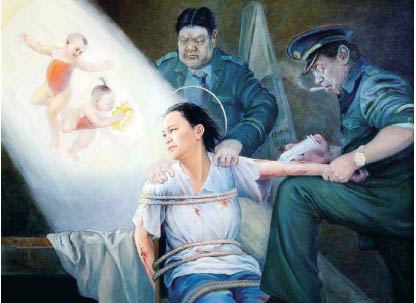
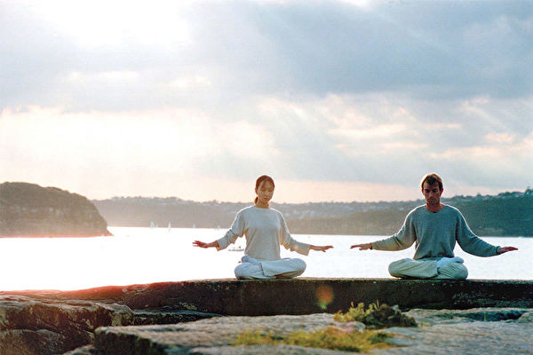

<h1 align="center"><a href="https://github.com/candysn/nini/blob/master/epub.md">epub電子書</a></h1>

<h1 align="center"><b>“法轮大法好”的呼声令中共如此惶恐不安</b></h1>

【明慧网二零一八年三月十三日】二零一八年三月三日，安徽法轮功学员孙方熙在北京天安门西侧入口安检候检区外侧准备进入天安门广场时，被安检人员拦截，他高喊“法轮大法好”，被警察绑架带走，至今下落不明。

由此引发了中共公安部所谓的“高度重视”，在副部长黄明的指使下，公安部国保局十四处在三月六日以机密文件的形式，发布了第1261号《情况与线索通报》。该文件被层层下发后，中共公安部辅以各种方式催办要求大陆各省（市）公安厅（局）督察落实。

但凡看过公安部国保局十四处下发的所谓第1261号机密文件内容的人，不免会产生这样的疑问：一句“法轮大法好”的呼声，为何令中共如此惶恐不安？笔者在此解读一二。

<b>一、“法轮大法好”是了解真相的民众的心声和共鸣</b>

“法轮大法好”，不仅仅是一句简单的口号，此乃亿万法轮大法真修者和了解真相的觉醒民众发自肺腑的心声。每个人无论最初因何走入法轮大法中修炼，只要能按照“真、善、忍”的理念归正自己，终会在实修中身心获益。其中有身患绝症的濒危死亡者通过真修法轮大法，奇迹般得以康复；也有家庭几近崩溃的反目夫妻通过得法实修，言归于好破镜重圆……法轮大法无论对修炼者个人，还是对家庭、对社会都是有百利而无一害。

自一九九九年七月至今，十九年来，江泽民集团利用中共对法轮大法开足马力，步步升级的打压，但是法轮功学员长期和平理性的反迫害，不仅使江泽民当初叫嚣“三个月内消灭法轮功”的邪恶计划彻底破产，相反，法轮大法在全世界广泛弘扬，深受各国人民的尊敬和爱戴，至今已洪传世界一百多个国家和地区，法轮功书籍被译成四十种语言出版发行，并可在互联网上免费下载。李洪志先生和法轮大法获得各国政府各类褒奖、支持决议案和信函超过三千项。许多国家的学校邀请法轮功学员介绍功法，引导孩子们从小就要按“真、善、忍”的标准做个好人。

以谎言与暴力作为统治工具的中共对法轮功的持续迫害，对“真、善、忍”的全面打压，导致中国财政空虚、法律系统和社会道德全面崩溃，将国家和民族拖入深渊，逐渐让人认清中共是真正祸害中华民族和危害世界的邪教组织。中共当然害怕越来越多的国人和世界各国民众亲身感受到“法轮大法好”，那样中共邪教的末日就在日益逼近。

<b>二、中共惧怕“法轮佛法”是中共邪灵本性所致</b>

法轮大法，是古往今来令很多修炼者渴求而求不到的一部高德大法，法轮功创始人李洪志先生在主要著作《转法轮》中透露了许多天机。法轮大法教人按照真善忍做人，启迪人们的善良本性，加上祛病健身有奇效，在短短的几年时间内，就有一亿人炼法轮功。这让汉奸出身、踏着六四血迹而上台的中共独裁者江泽民非常妒嫉和仇视法轮功，利用中共邪教在迫害法轮功之初，先行舆论抹黑，接着是焚毁法轮大法书籍、肆意抓人。

法轮大法真善忍像一面照妖镜，好与坏、善与恶、正与邪，用他一衡量就会一目了然。而中共是个邪灵，“假恶斗”是其邪教纲领，而马克思是撒旦邪教的信徒。为此，中共邪灵必然害怕“法轮佛法”。

<b>三、中共惧怕迫害法轮功的真相被揭开</b>

中共自迫害法轮功以来，无论是当初媒体鼓噪，对法轮功铺天盖地的妖魔化宣传，还是后续悄然转入地下的不公开迫害，始终都是将迫害法轮功当作“头等大事”。从江泽民喊出“三个月内消灭法轮功”，对法轮功学员“经济上截断，名誉上搞臭，肉体上消灭”、“打死算自杀”，及陆续揭露出的活摘法轮大法弟子器官牟利等，恨不能将法轮功修炼者赶尽杀绝。可令其意想不到的是，知道了人生真谛、宇宙真理的大法修炼者，面对强权不畏生死。而中共惧怕于对法轮功长时间的高调打压会引起国际社会的关注，更害怕造假宣传不得人心，于是将迫害由公开转为地下，这样一来，一方面掩盖了自身的罪恶，另一方面也可对外宣称中共迫害法轮功已取得了“阶段性胜利”。

中共江泽民政治流氓集团不仅欺下，也在瞒上。如果有越来越多的法轮功修炼者站出来喊“法轮大法好”，中共的这种阴谋就破产了。所以，中共每次布控迫害指令时，都会有重新普查这一说，而且要将迫害法轮功的所谓成果与中共官员的政绩挂钩，胁迫各级官员层层造假，上报的都是虚假数字。中共下级人员对此都心知肚明，所谓的摸底调查过程，就是减少或消灭“上报数字”的过程。可是如果在中共“两会”召开的敏感时段，在北京邪恶老巢、“两会”召开处传出众多法轮功学员高喊“法轮大法好”的呼声，中共通过欺下瞒上掩盖的真相就会彻底曝光。所以，“法轮大法好”的呼声令中共惶恐至极。

历史上迫害正信的从来没有成功过，谎言和假相终将会一一被揭穿。然而中国传统文化，被共产主义破坏了。共产主义篡夺了神的位置，来装正神，然而共产主义是幽灵、是魔鬼，中国人对它再好，它都会加害于人，因为魔鬼就是来毁灭生命的。自中共窃政以来，中国人的非正常死亡人数达到八千万之多，历次政治运动的一幕幕悲剧，就是共产邪灵干出来的，中国人在这样的环境中不断被中共洗脑和封锁信息，很难看明其真相。中国人要想好好生存下去，重振中华民族，让子孙后代幸福，我们就要在精神上、思想上唾弃共产主义，找回我们自己的根——传统文化。同时中国人要重拾信仰，民族才会强大。要想了解更多详细内容，请参见“大纪元”网站出版的《九评共产党》、《解体党文化》、《共产主义的终极目的》等系列著作。

在此也奉劝那些仍被中共邪灵利用的警察或官员，无论你过去曾否参与过对法轮大法弟子的迫害，只要诚心改过，不再被利用，中共上级的每一次督导迫害，也都是你善待大法、选择光明的机会。千万不要再为中共邪灵卖命了，否则，你们不仅葬送了自己的未来，也将给家庭和子孙带来巨大的灾难。

<h1 align="center"><b></b>法轮大法是万年难遇的高德大法</h1>
<table border="0" cellspacing="3" cellpadding="3">
<tbody>
<tr>
<td align="center"></td>
</tr>
<tr>
<td align="center">亿万法轮功学员无限感恩李洪志师父</td>
</tr>
</tbody>
</table>
<b>【希望之声2018年3月9日】（本台记者陈克江综合报导）</b>刘梅莲女士从中国大陆到加拿大多伦多探亲时，讲述了她在中国大陆修炼法轮功之前经历的一个非常神奇故事。这个故事说明：神佛真的存在，或许就在你的身边，只要虔诚的敬神信神，就一定能得到神佛的救度。以下是刘女士亲口讲述的这段非常往事。

我生长在中国南方一个靠海的地方，家乡的人历来都很相信佛、道、神。我受父母的教育，从小就有向往神的概念。在共产党极力宣扬无神论的年代，我心目中对佛、道、神的信仰从来没有动摇过。我在早些年就想，并对家人和亲朋好友都讲过，我退休后要皈依佛门，去修佛。

我在1984年生了重病，主要症状是整个人特别怕冷，造成全身分泌系统受到极大阻碍，形成全身冷痛，肌肉痛，人坐立不安，十分痛苦。我到处求医，西医、中医、青草堂等都看过了，还看了几个专家医生，也都不见疗效。我病到快死的地步了。

1992年下半年，有一天晚上，我做了一个梦，梦中我在海边码头海水涨潮前的烂泥滩里摔了一跤，怎么也站不起来。面对着正在升起的海水，我心里焦急万分。就在这万分危急的时刻，周围有人对我说：“叫师父帮你牵一下手。”我问：“师父在哪里？”

不一会儿，周围有人在喊：“师父来了，师父来了。”师父来到我的右侧，我心里又惊又喜地问道：“你是谁呀？”师父回答说：“我是谁你还不知道呀？”师父的声音洪亮有力，一边说着，一边伸出手来牵我的手。当师父牵着我的手时，他对我说：“我救你，我一定救你。”随后就把我从烂泥滩上牵起来，带我走上码头的台阶，到平路上走了一段，转进一个巷子。巷子的正对面是一间房子，进门后看到一尊巨大佛像，很高大。师父祥和地用右手示意说：“我在这里。”这时，我心里高兴的想：“我病好了一定到这儿来叩谢您。”

我正想说时，师父突然不见了。这时我吃了一惊，也就醒来了，才知道自己是在做梦。这时，我感觉到全身轻松、舒服了很多。我把这个梦讲给我的家人和亲友们听，他们都说这是个好梦，可能真的有大佛来救你了。过了两天，我全身真的开始出现巨大变化。

本来我每天夜里都要出现几次“发大冷”状态，现在夜间开始发热，热得出汗，全身皮肤开始排出一种象沙子一样黄色的锋利硬物。这些硬物不断地破皮而出，觉得发痒，却不觉得痛。同时排出的还有象碳粒那样的黑色硬物及象锯末般的黄色异物，共计有10多市斤。皮肤上的伤口不发炎，很快便自愈，还不留疤痕。之后，我的身体就像一种脱胎换骨后的感觉，达到一种轻松自然的无病状态。

当时我还没有开始修炼，但在梦中很清楚地见过师父，并能记住师父的形像。后来我身体好了，就赶快到庙里去找师父，连着找了几个有关的庙，把每个佛像都认认真真地看过，没有一个和我记得的师父形像一样。我失望而归，但我心中天天都在念著师父，在寻找这位救命恩人。

事有凑巧，有一天，我的大儿子来信叫我去找他在福州炼法轮功的朋友。我很快通过电话和她联系上了。但由于我不认识这位朋友，她说在某大门口捧著一本《转法轮》等我。我按时去了，当我离她所站的大门口还有一米多远时，一眼就看到她手里的《转法轮》闪了两次金光。我快步走到她跟前，接过这本宝书，翻开一看，就看见我到处苦苦寻找了很久的师父，这就是那天在梦中救我的师父啊！我兴奋不已，眼泪止不住的往下流。这一天是1998年7月9日，是我开始修炼法轮大法的日子。

我在修炼过程中，听到和看到师父的讲法录音、录影，和在梦中见到的形像，听到的声音一模一样。正式走上修炼路之后，我的心别提有多踏实了，再也不为身体的疾病烦恼了，遇到任何矛盾，首先找自己的不足，所有矛盾很快就能化解了。我的心胸变得更加宽广，时时处处与人为善，不断提高心性。过关时有苦，但过了之后，非常的快乐。真是像师父讲的：“寻师几多年  一朝亲得见  得法往回修  圆满随师还”。

我从得法后自己亲身修炼的实践中，深深体会到，法轮大法的博大精深和超常神奇的功效，是现代实证科学无法解释的。师父的功法就是玄妙、神奇。这本宝书《转法轮》是指导我们修炼的万年难遇的高德大法。

师父教我们以“真、善、忍”为标准，从做好人开始，不断去掉对个人名、利、情的执著。执著放下越多，身心净化越快。师恩难报，弟子唯有精进实修，尽最大努力把法轮佛法的美好传递给更多有缘人。

<h1 align="center"><b>一本“天书”让我体验到的神奇经历</b></h1>
<table border="0" cellspacing="3" cellpadding="3">
<tbody>
<tr>
<td align="center"></td>
</tr>
<tr>
<td align="center">被很多人誉为“天书”的《转法轮》已经翻译成40种文字在世界流传</td>
</tr>
</tbody>
</table>
<b>【希望之声2018年3月8日】（本台记者慧光综合报导）</b>我出生在中国大陆，曾经是一个多病缠身的人。经医院确诊的疾病就有慢性肾炎以及由肾炎引起的肾源性心脏病，还有神经官能症、慢性支气管炎、咳嗽哮喘等，每天都要吃药，一天不吃都会导致症状加重。除此之外，我还有十几年的失眠症，严重时一晚上要吃八片“安定”（药名），还不一定管用。经常因为休息不好而头昏脑胀，耳朵轰鸣，干什么都没有精神。

这些病伴随我二十多年，看过多少医生、吃过多少药都记不清了，从来没敢奢望过这些病能够根除，只希望能通过药物维持着、不再往前发展就心满意足了。然而做梦也没想到的是，因为看了一本书这些病都消失了。

1996年5月的一天下午，我习惯性的去了街边的一家小书店，突然看到书架上有一本书名是《转法轮》的书，我好奇的抽出来翻开，第一眼看到的是作者的画像，就在那一瞬间感觉头部出现一阵儿眩晕，只好靠在书架上闭上眼，想镇静一会儿，利用这个时间我也在思考是怎么回事儿，以前好像还没有出现过这种现象。

定了定神儿之后再看，知道这是法轮功师父的法像，但是感觉好面熟，似曾在哪里见过，可是又回忆不起来。随即翻看书中的目录，一下子被书中的内容所吸引，这都是我经常思考、而且是百思不得其解的内容，当时就毫不犹豫的买了下来。

拿回家正赶上吃晚饭，放下饭碗后就迫不及待的看了起来。这一看啊就再也不想放手了，看的过程中是一会儿激动，一会儿喜悦，一会儿兴奋，一口气看到凌晨三点多才粗略的看完，之后就一点儿睡意也没有了。当时就觉得这绝非是一本普通的书啊，我就像得到了宝贝一样爱不释手。看过一遍之后，我接着又从头到尾挑捡那些不太懂的题目再看一遍，就这样一宿没合眼。

第二天，我又在自己的书房里，翻来覆去的看了一整天，竟然一点儿也不觉得困，就是那种难以抑制的兴奋，自己也说不清楚的发自内心的喜悦。到了晚上才觉得困了，上了床沾上枕头就睡着了，这一觉一直睡了十多个小时，醒来后觉得头脑非常清醒，十多年了从来没有睡过这样的好觉，想都不敢想啊！同时也意识到，失眠症再也不会有了。

我反复端详师父的法像，心中想到，“这位师父的能量场太强大了，就才看了一遍书，就把十几年的失眠症改变了，真是不可思议啊！”

更为神奇的是，在以后的一个多月时间里，我只是每天翻看一下这本书，严格的说还不是系统的看，因为内容太多了，我只是挑选自己感兴趣的内容看，可就在不知不觉间经常忘记了吃药，而伴随多年的那些病症似乎不但没有加重，反而慢慢减轻了，不像以前那么难受了，甚至有种感觉，“忘了吃药也挺好的”。

让我惊奇的是，那时我还没有打算修炼，只是感觉师父说的好，“真、善、忍”好，从潜意识中有了一念，“我要按‘真、善、忍’的标准去做，要做一个好人”。

就这样到了9月份，有一天，我拿着书走在路上，一个不认识的人看到我说：“哎，你也炼法轮功啦？”

我随口说：“没炼，还不知道在哪儿学呢！”

他说：“没炼你就已经看上《转法轮》了？”

我说：“不炼就不能看书吗？”

他说：“光看书不行，还得炼功！你想不想学功啊？”

我说：“想啊！到哪去学？”

他说：“正好，我也正在学，晚饭后咱们一块去吧！”

没想到事情竟然这么凑巧，就像有人安排似的。

那天晚上是看师父的《济南讲法》录像，是最后一讲的后半部份。大约一个小时后，就播放师父的教功录像，开始学习功法动作。这一晚上，我几乎是不停的在流泪，情不自禁的流泪，无法抑制，那心情就像多年找不到父母的孩子现在找到了一样，激动的心情没法形容。心里一直有一个声音：“我可找到师父了！”在这之前为了治病我也学过几种气功，但没多久就感觉不行扔下了。

从那天起我正式得法修炼。在之后的一个月时间里，每天炼静功时，就忍不住的流泪，想见师父想的抓心，一个月以后才慢慢抑制住不哭了。

不到三个月，原来一把一把的吃药也没见好的各种病症都完全好了，那种无病一身轻的感受，真是太幸福啦！那期间梦里都想见到师父，心想这种大恩大德给师父磕多少头都无法表达，对师父无限感恩的心情真是无以言表。

如今我已经七十多岁了，也修炼了二十多年，大法修炼使我变成了一个身心健康、乐观向上的人，二十几年来再没吃过一粒药。

1999年“七.二零”以后，中共开始了对法轮功的残酷迫害，在师父的呵护下，在大法的指引下，我经受了各种魔难的考验，虽然磕磕绊绊，但还是比较稳定的走过来了，闯过来了。我庆幸自己能够成为一名法轮功弟子，我一定要坚定的跟师父走到底。

<h1 align="center"><b>从索要子弹费到贩卖人体器官</b></h1>

【明慧网二零一四年十二月三十日】张志新在文革时死得非常痛苦和凄惨。张志新被枪决后，还有一个让人痛心的情节：她的家人还为此掏出了一角钱的子弹费。
枪决人还要子弹费？这在古今中外的历史上恐怕只有中共才有这样的邪恶规定吧。人，不管他有多大的罪恶，多么的死有余辜，哪有向他的家属索取子弹费之类费用的？杀了人，却让家人为此买单！这该有多荒唐！其实，明白中共邪恶的人都知道，这哪里是政府缺钱？这分明是在羞辱他的家人，是在借羞辱他的家人达到恐吓民众的目的！

几十年过去了，中共的子弹费仍然存在。二零零四年的四川汉源发生警民冲突，十八岁的陈滔因涉嫌打死武警被捕，二零零六年十一月二十八日被秘密处决。警方通知陈滔的父亲，让他拿五十元子弹费去领儿子的骨灰。

杀了人，再让其家属来买单，真可称得上是中共的一大创举。而对于有些不用子弹枪决，而改用手术刀进行加害的人，中共还怎么收取子弹费？中共是没有借口收取子弹费了，可是中共为此获得的报酬，却是子弹费的无数倍。

十多年来，中国在人体器官移植的数量方面一直处于世界领先地位。哪来那么多的器官供病人移植？原来是中共建设了许多供人体器官移植的法轮功学员人体器官库。

一位曾经在“中国中医血栓病医疗中心”（位于辽宁省沈阳市苏家屯区雪松路49号）工作过的人员在海外公开揭露，这个医院，从二零零一年开始，约六千名法轮功学员当中的四分之三的人已经被挖空心脏、肾脏、眼角膜、皮肤后死去，并被毁灭尸体。

同年，沈阳军区后勤部下属的一名老军医对外披露：中共中央同意将法轮功作为阶级敌人进行任何符合经济发展的需要来处理，无须上报！也就是说，在中共看来，法轮功学员不再是人，而是产品原料，是商品。

海外追查迫害法轮功国际组织的工作人员，通过调查取证，从多个角度证实了这种罪恶的大面积存在。二零一四年九月，原中共解放军总后勤部卫生部长白书忠向追查国际调查员承认：“当时是江主席啊……有一个批示，说开展这些事情，就是器官移植……批示以后，反法轮功大家都做了很多工作……应该说，就是开展肾移植的不单是军队一方……”

那么器官移植的价钱是多少呢？一个肝脏移植包括医疗费用售价十万美元，肾脏每个六万五千美元，心脏十五万美元。仅天津东方器官移植中心，肝移植一年的收入就是一亿人民币。

被总后卫生部命名为“全军器官移植中心”的第三零九医院器官移植中心的医疗毛收入，由二零零六年的三千万元增长至二零一零年的二亿三千万元，五年增长近八倍；第三军医大学附属大坪医院九十年代末开始器官移植，医疗年收入从三千六百万增至二零零九年的九亿多元，增长近二十五倍。

因为是见不得人的秘密交易，同时也因为被摘取器官的法轮功学员大都没有姓名，或被刻意隐藏了身份，中共是不可能因此再向法轮功学员的家人收取杀人的费用的。

是不是不向家属索取杀人费，就说明中共杀人进步了呢？当然不是。要知道，这些人，没有一个是有罪之身，相当一部份人连所谓的法律程序都没有走，就那样被秘密绑架后，然后由医生动手摘取了器官。中共不是不想羞辱他们的家人，并借此恐吓民众，而是变换了手法，一方面营造出不怎么迫害法轮功的假相，一方面在这种表面平静的掩盖下进行着更加血腥和卑鄙的杀人。中共由此获得的费用远超子弹费千万倍。

从索要子弹费时的狰狞，到贩卖器官满足私欲的贪婪，中共的阴毒步步加深。

<h1 align="center"><b>一位八零后女孩的蜕变</b></h1>
<table border="0" cellspacing="3" cellpadding="3">
<tbody>
<tr>
<td align="center"></td>
</tr>
<tr>
<td align="center">迷茫中随波逐流 蜕变后华丽转身</td>
</tr>
</tbody>
</table>
【希望之声2018年3月6日】（本台记者慧光综合报导）我是个八零后女孩，出生在中国大陆山东。都说山东人耿直、脾气暴躁，此话一点儿不假，我从小就是在这样的环境中长大的。

打小在我的印象里，就是爷爷倔犟，奶奶糊涂，爸爸嗜酒如命，姐姐打起架来不要命。他们会为一句话、一点儿小事打起来，互不相让，闹得家里鸡犬不宁。一天放学进门，看到家里一片狼藉，我很害怕，后来知道是爸爸和姐姐又打架了，他们一个手拿菜刀，一个拎着板凳，互不相让。家里的锅碗勺盆经常是摔了又买、买了又摔，电视机就被爸爸摔坏了几台，老实、可怜的妈妈只知道抹眼泪。我从小就是生活在这样一个吵吵闹闹、打斗不休的家庭。

说句实话，我是在恐惧和不安中长大的，因为在家里得不到温暖和安慰，也让我的性情变得暴躁和消极，对人生充满着迷茫和厌恶。我厌恶人生，也厌恶这个世界。有一天爸爸当着我的面又要摔电视机时，我绝望的拿起一瓶农药想喝下去，我真的不想活了，虽然被家人发现夺了下来，但这个家让我感到绝望，一分钟都不想在家里呆。

十六岁那年，我终于可以离开家，到青岛去打工了。心灵的束缚一下子解脱了，我终于自由了，可以主宰自己的生活了。

在青岛，除了打工干活之外，吃、喝、玩、乐成了我业余生活的全部，还以为自己活得时尚、潇洒，可不知不觉中沾染上了很多恶习。为了找刺激，我每天喝酒、“K歌”，后来发展到“溜冰”（注：吸食冰毒的一种方法）、赌博，几乎是随心所欲，没有任何顾忌。

清醒时，我也知道人生不该这样走下去，很后悔堕落到这一步，可想回头又看不到任何希望，只有这么醉生梦死的混着。

渐渐的到了婚嫁年龄，经同学介绍我认识了现在的丈夫。交往中，知道他的父母都修炼法轮功。那时候受中共宣传的毒害，心里对法轮功很抵触，但我想结婚后一定要改变他们，不能让他们再炼。

为了保住这个婚姻，以前的恶习表面上是收敛了，但想完全改掉，根本做不到，稍不注意就会旧病复发，毒瘾还时常侵袭着我。我在很短时间就把娘家陪嫁的几万元钱挥霍一空。

为了不让我爸妈知道公婆炼法轮功，结婚一年多了我也不让他们进婆家门。然而，和公婆一起生活的时间长了，才发现他们完全不像电视、报纸宣传的那样，他们勤劳、善良，善待与其接触的每一个人，我和他们生活在一起感到很温暖。

由于婆家经济上不宽裕，婆婆穿的衣服总是补了又补，可在我怀孕的时候，她千方百计的给我买好吃的，甚至买来海参给我补养身体。但不管他们对我怎么好，我满脑子装的都是中共对法轮功妖魔化的画面，他们对我讲法轮功真相我也不相信。

在我生孩子的时候，正值甲型流感泛滥，住院时看到一位患甲型流感的产妇，生完孩子就死了，给我的心上蒙上一层阴影。我的孩子出生后，我高烧不退，双肺发炎，眼看着一天天过去不见好转，我觉的我就要死了，奄奄一息的吸着氧气，看着刚出生的孩子，心里好害怕……

这时，婆婆教我敬念“法轮大法好，真善忍好”，说能得到神佛的护佑，我摇摇头。恰好遇到一位眉清目秀的年轻护士走过来，面带微笑的对我说：“敬念‘法轮大法好，真善忍好’，对你恢复健康真的有帮助。”我很吃惊的看着她，心想“她怎么也这么说呢？难道婆婆说的是真的？”

求生的欲望让我决定听一次护士的话，诚心诚意的念念那九个字试试看。于是我就一遍接一遍的默念“法轮大法好！真善忍好！” “法轮大法好！真善忍好……”从下午念到晚上，念着念着我就睡着了。

神奇的是，一觉醒来，我居然全身不难受了，喘气也顺畅了，难受的症状全消失了！我的身体很快康复了。我的内心受到很大的震撼，很激动，“原来婆婆说的都是真的啊！”可我还是感到困惑，“法轮功为什么会这么神奇呢？” 我迫切想了解法轮功，就焦急的出院回家了。

回家后，我立即捧起了《转法轮》。

我一句一字的看了起来。书中那些博大、精深的内涵我第一次接触到，感觉太好了！很快我就感到身体里有东西在转，而且越来越强烈。我对婆婆说了，婆婆高兴的说“是师父给你下法轮了。”

这太让我惊讶了！我情不自禁的哭了……

多少年来无神论的教育以及中共对法轮功抹黑的宣传，在事实面前不攻自破。从那天起，我真正的走入了大法修炼，按照师父教导的“真、善、忍”标准做人，戒掉了以前种种不良习惯。因为我懂得了人生的意义，对生活充满了希望，心里感到从未有过的踏实和幸福。每次回娘家，我都会对我爸妈讲述大法的美好，他们看到我的变化，也由衷的感到高兴。

然而，修炼的道路也不是一帆风顺的。就在孩子两岁多的时候，我的婚姻亮起了红灯——丈夫有了外遇。是婆婆先知道的，因为我是修炼人，她就没有瞒我。

在百忙之中，我放下水果店的生意，鼓起勇气，约了丈夫和那个女孩一起吃饭。我对他们讲善恶有报的道理，劝他们改邪归正，做个好人。谁知那个女孩说：“我愿意和他一起下地狱。”

从那天之后，丈夫每天仍然和那个女孩鬼混着，而我依然用“真、善、忍”的法理约束自己，起正念，不为他们的不轨行为动心。有一天，我买了四十多元一斤的红枣去看望那个女孩，再一次真诚的和她畅谈。她终于被感动了，对我丈夫说：“你找了个好媳妇，你应该珍惜她！”然后毅然决然的离开了我丈夫，并劝他回家好好过日子，她不愿再担当那种不光彩的角色。

因为我走得正，我们这个五口之家又回归到正常的生活。这一切都离不开大法法理的指引，也是师父的慈悲救度。我万分感谢慈悲伟大的师父将我从地狱中捞起，为了救度那些曾经像我一样仍被谎言毒害的世人，我也加入了讲真相的行列。我无法表达对师父的感恩之心，唯有精进实修，做一名合格的大法弟子。

<h1 align="center"><b>大陆交警感叹“炼法轮功的真了不起”</b></h1>
<table border="0" cellspacing="3" cellpadding="3">
<tbody>

<tr>
<td align="center"></td>
</tr>
<tr>
<td align="center">老农发自内心地说：“在事实面前，我由衷地相信法轮大法好！法轮大法神奇！”（大纪元资料图）</td>
</tr>
</tbody>
</table>
【大纪元2018年03月01日讯】这是一个发生在辽宁某地城郊的真实故事，一次不寻常的车祸结案。

当地有位七十来岁的老农，与三十几岁的儿子相依为命。老农的儿子从小就患有癫痫性精神病，一直没有治好，三十多岁了还不能下地干活。因为他经常摔倒犯病，做母亲的总得看着他，走哪把他带到哪。为了谋生，老农给儿子买了一辆小凉快（电动车），拉人挣点钱。出车时老农得经常跟着儿子，怕他犯病出事！

谁料，二零一五年十月二日，因老农有事儿子独自出车，果然就发生了一场意外事故。原来，早晨八点多，儿子开车将另一个小三轮摩托车给撞翻了。当老农闻讯打车赶到现场时，立马惊呆了——被撞的是两位八十多岁的老人，已经不省人事，昏死过去。

老农心想，儿子这回可是摊事了。报警后在围观者的帮助下，两位老人被立刻送往医抢救，到市中心医院抢救室时已是十点多了，诊断结果一位是粉碎性骨折，一位是脑后出血。那位粉碎性骨折的伤者还没醒过来，他八十岁的妻子和另一妇女赶到，这两家人都是炼法轮功的，她们一到就齐声对着伤者喊：“法轮大法好！真善忍好！”喊了两次，老人就醒过来了！他老伴进屋先安慰老农，让他不要着急，说：“我们有师父救他，我带钱来了，不用你负责费用。”老农心想：哪有这样的老太太，不责怪我还自己带钱来。只见她们对着老人喊了两声“法轮大法好！真善忍好！”伤者就醒过来了！

老人醒后第一句话就是要求回家，不住院。护士说：“这么长时间救不醒你，赶快办住院手续，全面检查，就现在照相来看，很多骨头已碎，有不少已折断，得用仪器一个星期给你骨头对接上，再一个星期用药等等给你治，能不能全接上恢复原样还难说，何况你脑袋和别处是否有问题，为什么那么长时间救你醒不过来？医院不同意你回家。”老人提出：“我得回家，因你们救不了我。”护士回医疗室，又回来问他多大岁数了？他说：八十四岁。护士一声儿没吱，又回去问医生。回来就说：你可以回家了。她把要给老人用的东西全拿走了。其实他们是因他年龄大，又伤的重，没把握救他了，同意他回家了。另一位老人第二天也出院了！

老农心想：不住院怎么办？这么大岁数了，老人是不是被撞傻了？就和儿子跟着去了他家。老人对他们说：“我是炼法轮功的，你们不用担心。你们入过党、团、队没有？入过都退了吧。”他们老俩口都告诉老农和他儿子记住“法轮大法好、真善忍好”九个字，经常念，退出邪党组织可以保平安。老人说：“我们的事你们不用管了，回家去吧！今后一定要多注意。我们不找你们麻烦，你们也不用来了。”

第二天，老农母子俩和小叔子一起又去看望老人，问他有什么要求没有？交通队处理完了就不好办了。他们夫妻一致说：“你们不要再来了，我们绝不找你们的麻烦，一切由我们自己负担，交通队处理结案时，我们会负责任的，不用你们担心。”老农流着眼泪说：“炼法轮功这么好，不然这老人要住院治疗我可怎么办哪！这个车还是为了儿子的生活出路借钱买的。”

交通队十月十三日处理这件事时，老农和儿子去了，心想不知怎么处理，心里没底，这种事情也没听说过，别人说：不住院更不好办，要多少钱都要现金，不给不答应。怎么办？万没想到，俩家伤者的儿子都表示：对方不是有意撞车，不要处理司机，说是父亲嘱咐了，我们是炼法轮功的，一切费用自己负担，不给对方增加负担、麻烦。

交通队的人也愣住了，说：“我们从来没有这样处理过交通事故，都是责任者请求减轻处理少花钱，这个被撞者年龄这么大，伤又这么重，却要求不处理司机，一分钱不要，一切自己负担，一次会议就结案，还没碰到过！炼法轮功的真了不起。”

车祸发生后，老农的亲属、邻居都说：这回可够你们娘俩呛！家属不答应可怎么办？你们娘俩能受得了吗？这俩老人住起医院不出来怎么办？不住院狠要钱怎么办？后来交通队是按照俩老人的要求：没有惩处司机、一切费用都由伤者自负而结案的。亲朋们听了连连说：现在还有这样的事？不可思议！不可思议！

两位老人在没住院、没打针、没吃药、没有任何医疗的情况下，都康复了！

老农发自内心地说：“在事实面前，我由衷地相信法轮大法好！法轮大法神奇！通过这件事情，我的小叔子退了党，我退了团，亲属和邻居也都三退了，现在我们一大家子人都在念‘法轮大法好！真善忍好！’我儿子天天默念这九字吉言，癫痫病至今半年多一次也没犯过！他好几次对我说：咱们也炼法轮功吧！” 

<h1 align="center"><b>“最美油菜花节”掩盖下的罪恶</b></h1>
<table border="0" cellspacing="3" cellpadding="3">
<tbody>
<tr>
<td align="center"></td>
</tr>
<tr>
<td align="center">油菜花开。（全宇/大纪元）</td>
</tr>
</tbody>
</table>
【大纪元2018年03月05日讯】三月的汉中，山清水秀，金色的油菜花海全国闻名。每年一度的“最美油菜花节”即将开始。然而，在“美”的外表下却深藏着罪恶。长期以来，邪党利用各种所谓“敏感日”、什么“节”、什么“会”迫害法轮功修炼者成了惯例。

二零一八年一月十二日，汉中市勉县刑警大队副大队长苟新武带人非法闯入法轮功学员肖荣家中，把她绑架，当时警察没有出示任何合法手续；十三日非法拘禁于汉中市汉台区看守所。一月二十五日，勉县检察院三人去非法询问肖荣；二月八日勉县武侯派出所出面非法逮捕肖荣。迫害的借口，说是勉县天荡山景区出现讲“法轮大法好”、“天灭中共”的小树挂，害怕在今年勉县举办“汉中市油菜花节”时再大量出现真相信息，所以当局成立专案组，专门迫害法轮功修炼者，还扬言迫害一批法轮功修炼者。

明慧网二零一八年二月十四日报道：肖荣女士，一九五八年九月二十五日出生，一九九九年七月二十日迫害发生以前修炼法轮大法，身体和心性得到根本性提高。二零零八年从商业系统退休。肖荣坚持按真、善、忍标准做好人修炼，二零零零年被非法拘留十五天，二零一六年被警察蹲坑绑架，非法拘留三十四天，后被勒索一万元后取保候审。
<table border="0" cellspacing="3" cellpadding="3">
<tbody>
<tr>
<td align="center"></td>
</tr>
<tr>
<td align="center">示意图：手脚铐在一起</td>
</tr>
</tbody>
</table>
二零一六年，肖荣曾被非法关押在汉中市看守所残酷折磨四十天，手脚被铐在一起，家人被敲诈一万多元，回家后其母看到两个手腕有被手铐损伤的血痂，因被恐吓，回来后一直没有给大家说。

肖荣二零一八年一月十二日被劫持的第一天就被关在刑警大队铁笼子里，在汉中市看守所有人看到她手在后背被铐著。
<table border="0" cellspacing="3" cellpadding="3">
<tbody>
<tr>
<td align="center"></td>
</tr>
<tr>
<td align="center">
酷刑演示：背铐</td>
</tr>
</tbody>
</table>
当天警察同时绑架了法轮功修炼者薛丽君，勉县刑警大队的苟新武在没有穿警服、没有《搜查证》的前提下，非法搜查公民住宅，抢走大法书籍、电子产品等个人物品。然后将薛丽君绑架到刑警大队，关押近三十小时，于第二天晚上七点多放回。

自一九九九年七月二十日中共江泽民团伙疯狂迫害法轮功以后，明慧网二零一七年统计，在汉中市被绑架的法轮功学员至少有157人。汉中市汉台区法轮功学员张汉云，修炼前五年因闭经始终未怀孕，修炼不到半年，月经正常，怀上了孩子，全家人莫不感激法轮大法。二零零一年三月，汉中市汉台区公安分局政保科科长马平安、汉中市610等恶人欲强行将张汉云送往洗脑班，没抓到人，就将她父亲和弟弟的建筑工地查封，将她丈夫铐在略阳县嘉陵江桥头示众侮辱。最后绑架了住在亲戚家即将临产的张汉云。恶人将她拉到三十公里外的职工医院强行堕胎，因胎儿过大难产，他们竟将已届临盆的婴儿肢解取出！

中共本性假、恶、斗。自篡权以来，杀戮不断，通过周期性的各种政治运动，迫害了中国一半以上的家庭，害死了八千万无辜的中国民众。这个死亡数字，超过了两次世界大战死亡人数的总和。特别是对法轮功的迫害，更是时间长（自一九九九年七月开始至今，十八年）、迫害面广（迫害了上亿的法轮功修炼者）、迫害手段下流惨烈（强奸、性侮辱、电棍电、刑具打、地牢、死人床、打毒针等等，无所不用其极），甚至活摘法轮功学员的器官牟利。这场迫害使无数的法轮功学员被迫害致死、致残、致疯；数以千万计的法轮功学员被非法关押于监狱、劳教所、拘留所、洗脑班等黑窝中惨遭肉体和精神的双重折磨；使数百万法轮功学员失踪至今……

一个有良知的律师二零一六年在为法轮功学员辩护词里写道：“法轮功从传播以来，尤其是从被非法打压后，真实的坚守着真善忍的理念，展现著超越守法之上的道德标准，十七年来虽然面对侮辱嘲笑冤狱酷刑，他们坚持怀抱善意，承受着漫长而巨大的苦难，按照真，他们揭示讲述著真相，按照善，他们惨遭迫害而无怨无恨，希望唤醒世人的良知，拥有美好的未来，按照忍，他们忍受着苦难，割舍个人的所求所得，坚守着和平，理性，他们忍的坚强不屈，无所畏惧。他们相信正义真理必胜，十七年来从来没有以暴易暴、以怨报怨，全国没有发生过一起法轮功学员因遭受迫害与不公而采用暴力或非法手段鸣冤雪耻的事件，这是一种怎样的舍身救世精神，这是一种怎样的大慈大悲情怀？所展现出的境界甚至已被看作中华复兴，道德回升的希望。定罪这样的好人，打压真善忍信仰，就是无视自己的良知，在摧毁人类的普世价值，毁我道德，毁我美好，毁我希望！”

然而，善有善报，恶有恶报。陕西《华商报》二零一五年五月七日，刊登了一篇《好警嫂马建慧每天给瘫痪丈夫按摩全身》的报道。该报道说：马建慧的丈夫“来中”是汉中市南郑县公安局民警，现年五十五岁。二零一二年一月的一天中午，来中突发脑溢血晕倒在地。经医院救治和马建慧悉心照料，来中奇迹般地苏醒过来。但天不遂人愿，二零一四年九月，来中再度突发脑溢血，脑神经损伤严重，并导致失语、全瘫、进食功能完全丧失，只能在体内插入导管靠灌输流质食物和水维持身体需要。

该报道未说来中从事的具体工作及他为何走到如今生不如死的地步。一九九九年七月中共开始迫害法轮功，南郑县“610办公室”（中共专门迫害法轮功的非法组织）当时设在县公安局国保科，由科长来中具体负责。来中与时任南郑县公安局政委的齐建文等人，盲目的执行中共迫害法轮功的命令，不遗余力地参与迫害修心向善的好人。来中于二零零七年五月被提拔为南郑县公安局副局长；齐建文于二零零一年六月由南郑县公安局政委升为南郑县公安局局长，二零零八年一月再次提拔为汉中市公安局纪委书记。也正因为他们善恶不分，积极参与迫害善良的法轮佛法修炼者，将自己送上了不归路。

来中遭恶报还连累家人，其独女出嫁时间不长，就被丈夫抛弃，被打断肋骨住院。二零一零年九月，齐建文感到心脏不适，到医院检查，查出心脏病。回家收拾东西准备第二天住院，当晚就暴死在家中。

中共邪党这种背道而驰的“维稳”，以迫害老百姓来保什么“节”、什么“会”的做法会有什么后果呢？二零一八年“除夕复仇案”使汉中全球关注，不到一个月又出杀人案。试问：油菜花的“美”能掩盖这些“丑”吗？这样的“维稳”能“稳”吗？这样的恶果不正是那些迫害善良的人和机构所种下的吗！

法轮功学员修炼真、善、忍，他们的心地都非常的善良，他们坚信善恶有报是天理，他们希望每个人好，每个家庭好，每个国家好，希望整个人类都有美好的未来。不管他们自己遭受怎样的磨难，都希望能唤醒每个人，唤醒那些还在参与迫害的人，弃恶从善。希望各级政府不再以什么“节”、什么“会”迫害善良人，立即停止对真善忍的迫害，人心才能回归善良，社会才会回归善良！

<h1 align="center"><b>德国妇女游历55国 终于找到法轮大法</b></h1>
<table border="0" cellspacing="3" cellpadding="3">
<tbody>
<tr>
<td align="center"></td>
</tr>
<tr>
<td align="center">克里丝正在佛教圣地——鹿野苑炼法轮功的第五套功法</td>
 </tr>
</tbody>
</table>
【希望之声2018年3月5日】（本台记者陈克江综合报导）在今天印度北方邦贝拿勒斯西北约7公里处，有一处非常著名的佛教圣地——鹿野苑。2500多年前，释迦牟尼在菩提伽耶得道成佛后，第一次宣讲佛法的地方就是这里，因此，这里，又被称为释迦牟尼佛“初转法轮处”。

在鹿野苑大佛塔的后面，在绿树鲜花丛中，有一个红砖砌成的小旅馆，这家旅馆的老板娘名叫克里丝蒂安•伊丽莎白•泰希（Christians Elisabeth Teich），来自德国，家人都称她“克里丝”。克里丝每天重要的功课就是阅读法轮功创始人李洪志先生的著作《转法轮》，炼法轮功的五套功法，按照法轮功的核心理念——真、善、忍修心性，并将法轮佛法的福音传递给每一个有缘人。
<table border="0" cellspacing="3" cellpadding="3">
<tbody>
<tr>
<td align="center"></td>
</tr>
<tr>
<td align="center">克里丝正在自己家门口读《转法轮》</td>
</tr>
</tbody>
</table>
克里丝她从小喜爱大自然，长大后热衷旅行，希望借此领略异国的文化风情。几十年来，她背包走天涯，游历过55个国家。青年时期，克里丝研读了各类宗教哲学书籍，然后便踏上旅途。“二十岁出头时，我渴望去看世界。可是我没有钱，我就靠搭便车，跑了很多国家，比如法国、西班牙、意大利、荷兰、英格兰、苏格兰、爱尔兰和北非。有时我甚至露宿在农场和森林里。”

克里丝曾经作为社会工作者，在非洲帮助设立学校和儿童之家。1985年，埃塞俄比亚大饥荒期间，她在那里当义工，协助救济，目睹了人们的苦难和死亡。

在非洲工作7年后，克里丝又到南美工作了6年，服务当地社区。在那里，她见证更严酷的现实。这些经历震动着她的心，她渴望了解，人存在的真正意义是什么，造成种种不幸的根源又是什么？

浪迹天涯的日子里，克里丝的疑问一直没有解开。在巴西时，她看到了一张介绍拉达克地区的传单，拉达克是世界上最崎岖、最荒芜的山地之一，海拔在3000-7000米之间，大部分是人烟稀少的高地，位于克什米尔的东南部，现由印度控制。越是艰险的地方，克里丝越想去。这张传单促使她重返印度。

几年后，她遇到了现在的丈夫，终于安家落户。由于鹿野苑炎热潮湿，所以，每一年，克里丝都要去拉达克高原住上几个月。有一次，在妇女节的活动上，她看到一位美国华人女子打坐炼功。她立刻被吸引了，上前询问得知，那是法轮大法的静坐功法。
<table border="0" cellspacing="3" cellpadding="3">
<tbody>
<tr>
<td align="center"></td>
</tr>
<tr>
<td align="center">在青藏高原西部边缘的拉达克地区的法轮功真相点</td>
</tr>
</tbody>
</table>
此前，克里丝见识过各式各样的生命灵修的学说和实践，但是，都没有让她真正动心和投入进去。这次巧遇法轮大法，她便潜心研究。经过一段时间冷静的思考后，她认定这才是自己一生苦苦追寻的正道大法。于是，她决心修炼法轮大法。

一晃15年过去了。克里丝说：“这种功法完全改变了我。以前我经常病怏怏的，身体有很多毛病，炼功后大大好转。而且对于日常生活里的大小问题，我现在都能脚踏实地、平和地去应对。”

修炼法轮大法后，克里丝身体健康、心境平和，她想把这个好消息与更多的人分享。于是，她再次上路，在印度各地介绍法轮大法。至今，她已经拜访了60多所学校，足迹踏遍拉达克、印度东北部、乌塔普拉德什邦、北阿坎德邦、喜马偕尔邦和卡纳塔克邦等地。无论她走到哪里，就要把“法轮大法好，真善忍好”的真相传播到哪里。
<table border="0" cellspacing="3" cellpadding="3">
<tbody>
<tr>
<td align="center"></td>
</tr>
<tr>
<td align="center">克斯丝在印度一所学校教学生炼法轮功第五套功法</td>
</tr>
</tbody>
</table>
当克里丝与当地师生一起炼功时，她也谈到了令人悲伤的事情：这种平和的静坐修炼功法在其发源地——中国大陆，受到残酷的镇压。克里丝说：“中共宣扬无神论，从1999年开始迫害和杀害无辜的法轮功学员。我向印度师生介绍法轮大法的奇效时，我也告诉他们，中共是如何迫害这些好人的。而另一方面，全世界都已认同并欢迎这一精神修炼法门。”
<table border="0" cellspacing="3" cellpadding="3">
<tbody>
<tr>
<td align="center"></td>
</tr>
<tr>
<td align="center">克里丝在拉达克地区的一所学校里教授法轮大法的第五套功法</td>
</tr>
</tbody>
</table>
克里丝的脸上，挂着岁月的风霜，透著平静和欢愉。与她交谈时，可以感到她发自内心的快乐。那种快乐，有着动人的感染力，仿佛能够融化人生的苦涩。回顾昔日的风雨追寻，克里丝说：“周游世界，我得到了很多的爱和温暖——不过，最好的收获是‘心灵之道’……世间的苦难并未终结，而我找到了与众人分享‘真、善、忍’的大道。这条准则可以让人们重拾希望，开启更加美好的人生。”
<table border="0" cellspacing="3" cellpadding="3">
<tbody>
<tr>
<td align="center"></td>
</tr>
<tr>
<td align="center">克里丝在拉达克地区向当地民众讲真相</td>
</tr>
</tbody>
</table>
鹿野苑是佛教徒的精神圣地，但它现在更多的是一处旅游胜地。鹿野苑后面的这个砖砌的小旅馆里，克里丝每天都沐浴在法轮佛法的佛光中，净化着自己的身心。无论朝阳升起，还是夕阳西下，金色的阳光洒在宁静的院落，一片祥和。大门外侧，挂着一张贴纸，上面写着：“法轮大法好”。

<h1 align="center"><b>从“古惑仔”到修炼者 ——一位年轻人的修炼故事</b></h1>
<table border="0" cellspacing="3" cellpadding="3">
<tbody>
<tr>
<td align="center"></td>
</tr>
<tr>
<td align="center">无明步入歧途 得法走向光明</td>
</tr>
</tbody>
</table>
【希望之声2018年2月26日】（本台记者慧光综合报导）我出生在中国黑龙江省东部的一个小镇。记得还是在上小学的时候，我就觉得人活的没意思，总想去打架，谁要惹着我、欺负我，我会跟他没完。上初中后，男同学中分成几派，互相之间经常找茬儿打架斗殴。到初三的时候，我的胆子越来越大，不知道害怕是什么感觉，就知道只要我发狠、犯横就会让人高看一眼，对方只要服输服软我就会得到心理上的满足。

到高二的时候，一名同学告诉我，说有的学校有人向同学收保护费，只要每人每月交二十块钱，就可以得到“保护”。那一段时间，电视里正好上演香港《古惑仔》的连续剧，对我影响很大，我也经常幻想自己能够成为黑帮老大，那种生活对我非常有吸引力。当我听到可以“向同学收保护费”这件事，正中我下怀，这既可以抬高自己的地位，还能有钱花，何乐而不为呢？于是我也开始在学校里向同学收保护费。

一般胆小的同学知道我喜欢打架，都会乖乖交钱。但是也碰到一个硬茬儿，有一个同学不想交保护费，还让其家人在社会上找了几个大人来打我们。那一天中午，突然来了四个人，其中三个是成年人，到学校来找我，我们也是四个人，就和他们打到了一起。结果另外三个同学被打跑了，他们就集中对付我一个。我没想到会有人敢来打我，所以没带刀，就顺手找到一把铁锹，抡起来和他们打。他们受了伤，我的头上也被他们打开了一道一寸长的口子，嘴角被打豁，缝了几针，这疤痕一直还留着。

其实，我从儿时能记事的时候开始，就发自内心的相信有神，心中十分渴望着神来救度我。可是在中国大陆，中国古老的传统文化与信仰已经被破坏殆尽，无神论充斥着各个领域，毁坏着人们的道德。特别是走入商品经济大潮以后，人们信仰缺失、金钱至上、唯利是图，让我无从追寻神的足迹，也使我觉得活着没有意思，内心里经常被无望和空虚的情绪包围着。

1998年2月，一次偶然的机会，有一位亲属向我介绍了法轮功，并让我听到了法轮功师父的讲法录音，当时就感觉很震撼，从心里觉得这个法太好了！那时由于我很愚钝，只是从利益的角度去分析，觉得大法师父说（大意）“只要学功，大法就会给你调整身体，还下法轮，教你做人的道理，无偿的给予你一切，却什么都不要你的”，这不可能是假的。另一方面，我那位亲戚有较高的学历，是学理工科的，他能够相信法轮功，一定有他的道理。

那之后的一个月，我除了看《转法轮》，还炼了一个月的功法，感觉身体从里往外变年轻了，脸上的疙瘩没有了，发黑的脸有了红色，照镜子时越看自己越好看，骑自行车都好像有人推着一样。

1999年，中共开始镇压法轮功，包括他们制造了“天安门自焚伪案”，我都没有动摇过，心中一直觉着法轮功好。听到有人污蔑法轮功，还和他们争的脸红脖子粗，虽然我嘴笨说不出太多的理由，就是告诉他们“法轮功好”。可惜我没有坚持修下去，离开了大法。

2001年，我搬到了新买的还没装修的楼房里，没有电视，也没有网络。晚上没事，就从新开始读起《转法轮》来，第一讲、第二讲、第三讲，书中的每一个字，每一句话，都让我感到十分的真实，十分踏实。记得那是9月14日，看到书中有这么一段话：“这么好的功法，我们今天给你拿出来了，我已经捧给你了，送到你家门口来了。这就看你能不能修，能不能行。你要能行呢，你就修下去；你要不能行，你要修不了，那从此以后你再别想修炼了。除了魔骗你之外没有人再教你，以后你就别修了。我要度不了你，谁也度不了你。”（《转法轮》第278页）

当看到这里时，我一下子惊醒了，很后悔，“这么好的大法，我怎么就离开了呢！？”于是我拧碎、扔掉了刚买的才抽了一根的一盒烟，下决心开始修炼。我如饥似渴的看大法书，每天都看，每天都有脱胎换骨的感觉。

此后不久，我失眠的毛病就没有了。要知道失眠是非常痛苦的一件事，天天晚上瞪着眼睛睡不着觉，等到后半夜刚能睡着的时候，不一会儿又要起床上班了，白天困的不行，坐着都能睡着。

此次重新开始修炼，我是发自内心的，为了挽回中间的损失，就总想做好事帮助别人。有一次，以前一起打架的同学来找我，让我帮他打架，我告诉他我炼法轮功了，“戒打了”，他当时就哈哈大笑，说“只听说有戒烟戒酒的，还没听说过戒打架的！”后来还遇到过几件事，一次是老板的弟弟无故骂我，还有两次是我被无故殴打，我都按照炼功人的要求既没还口，也没还手，同时也做到了无怨无恨，我知道这些事都是有因缘关系的，可这事儿要在以前我是不可能这样做的。

还有一次，我从单位下班回家，看见有一个人躺在马路上，好像昏过去了，自行车扔在一边，车筐里的鱼和肉都散了一地。我从旁边经过，本来已经走过去了，可又想，我是修“真、善、忍”的，不能见死不救啊，于是就转回来，蹲下扒拉那个人，喊他醒醒。扒拉半天那人才醒过来，我问他家是哪儿的？有没有电话？他摇头什么也不回答。我把我的手机递给他，说你用我的手机给家里打个电话吧，那人慢慢的清醒了，先摸自己兜里的钱，一看没丢，就一再谢我，说啥要给我二十块钱，还说“现在像你这么好的人太少了！”我当然不要他的钱，就当着周围围观的人说“你也不用谢，我是炼法轮功的！”

在单位工作也是这样，不用别人看着、管着，我都会尽心尽力，把自己的活儿完成好。同事们都说，炼法轮功的人就是好啊，诚实可靠、人品好，可不像电视里说的那样。

通过亲身体验我想说，修炼法轮功真的能使人的道德提升，让人变得善良与宽容，我就是一个最真实的例子。

<h1 align="center"><b>坚守真理 黑龙江女律师的九死一生之路</b></h1>
<table border="0" cellspacing="3" cellpadding="3">
<tbody>
<tr>
<td align="center"></td>
</tr>
<tr>
<td align="center">中共酷刑演示：打毒针（绘画）（明慧网）</td>
</tr>
</tbody>
</table>
【大纪元2018年03月04日讯】“我经历了腥风血雨的一次次被迫害。这一次次的迫害，记录了迫害者的邪恶与残暴，记录了迫害者的一次次违法犯罪。”

“几年来，是‘真、善、忍’的光芒，照亮了我通往真理的路，一路走来，一路呼唤，呼唤维护人权，呼唤维护法律的尊严，呼唤良知重返中华大地，呼唤正义常驻人间……”

明慧网报导，这是黑龙江省绥化市庆安县法轮功学员刘忠杰、原黑龙江省天成律师事务所律师说的话。修炼法轮功后，刘忠杰按照法轮功的标准“真、善、忍”要求自己，案件代理费都是按照较低标准收取。她还把过去修炼前多收的好处费退给了当事人。法轮功使她变得道德高尚、心胸坦荡、乐观豁达。但1999年中共镇压法轮功之后，她曾多次被中共非法抄家、绑架、关押、劳教，被迫流离失所将近十年。

2012年9月10日，在外漂泊了十年的刘忠杰被绥化“610”（中共专职迫害法轮功的非法机构）及庆安县国保大队汪兴运等监控、跟踪，绑架到绥化看守所遭受四个多月的迫害。

2013年1月中旬，她被迫害致昏迷不醒，身体抽搐，出现严重脑梗塞病状，送医院抢救，经诊断为脑出血。

同年的3月5日，“610”人员威胁刘忠杰的家属把她带到法院，本来说是“核实情况”，却草草开庭，前后二十多分钟，非法判她一年半。在家属的强烈要求下，以及刘忠杰的哥哥与妹妹用工作来担保的情况下，才对她实行所谓的“缓期二年执行”。

在孩子上初中时，刘忠杰就被迫与丈夫离婚，无家可归，好多年在她姐姐家住，因不能咀嚼，连吃饭都是姐姐一口一口地喂。姐姐原来是一名教师，由于这场迫害也失去了工作。

父母看着女儿被迫害成这个样子，长年处于悲愤、煎熬之中。她母亲于2018年1月含冤离世。

被注射不明液体 生命垂危
1999年10月29日，刘忠杰因去北京为法轮功上访鸣冤，被当地人员中途截回后关押迫害两个半月。因为她的律师身份，她成了中共当地政府的重点迫害对象。

为了不许刘忠杰再次进京上访，律师所主任朱千春积极配合中共迫害机构，几次对刘忠杰进行构陷。2000年4月19日，刘忠杰被绑架关进拘留所，遭受迫害八个月。

为抗议迫害，刘忠杰曾绝食、绝水，遭到野蛮灌食，还被强行注射不明液体，致使她的经血呈绿色，身体剧烈抽搐，直至生命垂危，她才被允许家人接回。

遭酷刑迫害 绝食绝水抗议
刘忠杰从拘留所回家后，单位不许她上班，还派人轮流对她监控、恐吓，甚至晚上住到她家里去。

2001年1月17日，刘忠杰向民众发真相资料时被发展乡派出所绑架。1月22日，在没有任何法律手续的情况下，她被劫持到齐齐哈尔双合劳教所非法劳教一年。

在劳教所里，刘忠杰拒绝写诽谤法轮功的“保证书”。她被摁在铁椅子里，两个警察用一副带齿的手铐将她双手反背铐在椅背上。一动手铐锯齿就刻进肉中，疼痛钻心。接着，他们又将刘忠杰两脚塞在铁椅子下面的固定的两个孔中，脚进去就抽不出来，更无法活动。
<table border="0" cellspacing="3" cellpadding="3">
<tbody>
<tr>
<td align="center"></td>
</tr>
<tr>
<td align="center">中共酷刑迫害示意图：铁椅子（明慧网）</td>
</tr>
</tbody>
</table>
遭受了六天五夜的连续上刑，刘忠杰全身失去知觉，奄奄一息。警察怕她死在铁椅子上，才停止用刑。

2002年1月份，劳教所欲对已接近迫害期满的刘忠杰非法加期，刘忠杰绝食、绝水17天进行抗议，恶警把她绑在床上，这边狱医手拿胶皮管子，往刘忠杰鼻子里插，鼻子被插破出血，撕心裂肺的疼痛使她几欲昏厥。那边，大队长王岩摁著刘忠杰的手，哼著小曲，得意洋洋！

派出所警察：非整死你不可
2002年1月17日，当刘忠杰终于结束了劳教所地狱般的迫害回到家中时，律师所主任朱千春等人在第二天就到她家宣布：将她开除出律师行业，因她坚持炼法轮功。

“几经看守所、拘留所的精神折磨，又经劳教所的酷刑摧残，再经剥夺工作的沉重打击，我已心力交瘁、伤痕累累。但好在我有个幸福的家，几年的磨难，亲人为我承受了太多、太多。我本想好好弥补弥补对丈夫与女儿的亏欠，平平安安地过日子……”刘忠杰说。

但是，当地派出所在“610”办公室的指使下，三天两头上她家骚扰、监控、抄家，还三番五次地威胁她的丈夫，搅得她家人不得安宁，加上中共媒体不断对法轮功的诬蔑、造谣、制造恐怖和仇恨煽动，使年幼的孩子心里产生阴影，渐渐地对妈妈的处境感到无奈和恐惧。

2003年4月13日上午，跃进派出所警察又到刘忠杰家，说要给法轮功学员建档案，遭到她拒绝后，派出所所长派四个便衣来抓她，把她绑架到派出所。刘忠杰以绝食、绝水抗议，五天后，她才被放回家。警察还勒索了她丈夫200元钱。派出所一警察还当众扬言：“如果你再落在我手里，我非整死你不可！”

2003年7月25日，为了揭露中共对法轮功的迫害，刘忠杰与其他法轮功学员突破层层封锁到当地欢胜乡发法轮功真相资料时，被欢胜乡派出所绑架。当晚刘忠杰戴着手铐越墙走脱，被迫长期流落他乡……

<h1 align="center"><b>古稀之人双腿断成三截不治而愈</b></h1>

【明慧网二零一八年三月二日】我是一名退休教师，今年七十二岁，一九九七年六月为治病开始修炼法轮功。十几年来，法轮功虽然遭到中共残酷迫害，但现在洪传到世界一百多个国家和地区，有上亿人在修。大法弟子中人才济济，有一大批高级知识分子、世界一流科学家、文学家、艺术家，还有很多的国家高级官员，在大法中实修的弟子，个个受益匪浅。大法的神迹在每个弟子身上都有不同的体现。

我们村生癌病的人特多，手术后只有弟弟一个活着，已经十四年了。下面仅举几个在我家和亲人身上的发生的事例，说说大法显现的神奇。

<b>一、大法给我一个很健康的身体</b>

修炼前，我多病缠身，左口咽有一个小鸡蛋大小的良性瘤，上海几个大医院的专家都说这个位置神经集中，做手术很可能留下后遗症，故一直未动手术，但吃饭受阻、很难受；严重的肛裂，经常发作、出血量大，八五年做过一次手术，但不能根治，两年后又恢复原状；严重的鼻窦炎，经常出血，还有胃病、肩周炎、眩晕症、腰肌劳损，牙常疼，苦不堪言。这些无法医治的病，炼法轮功在不知不觉中都不翼而飞。

可我修炼法轮功刚刚两年时间，江泽民邪恶集团就开始镇压、残酷迫害法轮功和法轮功修炼人，因我当时没有从根本上认识到修法轮大法的严肃性，在江泽民集团铺天盖地的谎言欺骗下、在血雨腥风的残酷迫害面前，在怕心的驱使下，从二零零零年开始就不修了。到二零零二年我身体状况又跟之前一样了。

二零零二年六月，弟弟患胃癌做手术，我怀疑是父亲的基因遗传（父亲就是患胃病去世的）。我的胃本来就会经常发炎，到二零零三年的三月份，我胃的感觉跟弟弟手术前状态一样，吃药二个月无效，体重减少十几斤，人瘦得变了样，我怀疑得了跟弟弟一样的病，又不敢去深查。

现在世界上没有任何办法使一个人没病的，只有走修炼的路。于是我决定从新回到大法中修炼。慈悲的师父没有嫌弃我这个不争气的弟子，我从此认真学法、炼功、修心性，身上所有的疾病又很快消失。

一直到现在十几年了，我身体健康，未去过医院，也没吃过一粒药，更没打过针，整天精神抖擞。

大概是二零零七年初冬，我身上出现“带状疱疹”，我们地方上就叫“蛇蛋疮”，这种东西在常人身上不容易治，又特别疼，很痛苦。可是修炼法轮大法的我就不一样，我没看医生，没用任何药，就是坚持学法炼功发正念，第四天就不痛了，十来天就彻底好了。

<b>二、近古稀之年，双腿各断成三截不治而愈</b>

二零一二年六月，我在讲真相时，因恶人举报后，被绑架到派出所。他们不给我吃饭，又不放我走。为了不被继续关押迫害影响救人，乘他们不备，我从两米多的高围墙跳下准备走脱，结果摔在地上，一点动不了。送到医院一查，两个脚踝都摔断了，右脚踝还是粉碎性骨折，两脚象拨浪鼓似的，两个小腿也各有一处断了，左膝盖骨裂，头上摔个大血包，腰部有轻伤。

我当时一点没害怕，我想我是修炼人，和一般人不一样，我有威力无比的大法保护，只要坚信大法、坚信师父，一定会康复，而且比治疗好得快。于是我跟医生讲：我不吃药，更不手术，医生听了很惊讶，不理解。他对我说：不治你肯定残废，以后你会后悔的。我知道对不修炼的人来说，他说的是真话，不治疗结局就是这样。

之前我家附近一个和我一样年龄的老太太，腿只摔断一处，做手术时里边放的钢板第二年到医院取钢板时，钢板一拿腿又断了，她只断一根骨头及时治疗还这样，何况我这么大面积的重伤呢！

家人和亲戚看我伤这么严重，无论怎么劝说，我都坚持不治疗，把他们吓坏了，四、五天后，儿子、女儿把医院刚查的片子拿给市一级医院骨科专家看，专家说：我右腿已缩短了，必须立即牵引，不治肯定残废。

孩子们愁得吃不下饭、睡不着觉，老伴瘦了近十斤，弟弟急得流泪，所有知道这事的亲戚都为我担心，坚持不让我出院。而我听到这些一点不动心，我百分之百的相信师父。

大概第四天出奇迹了，头上拳头大的血包里的血从小便排出体外，血包自然消失了，第八天上午我就出院了。

更神奇的是，我这么重的伤，不用药，没有疼痛感，也不发烧，在床上动也不疼，吃饭、睡觉一切正常。护理的两个人说：这么重的伤不治还不疼，人家一处轻伤治疗，还疼得一两夜睡不着觉呢！觉的太神了！她们做护理工几年了，从未见过这种情况。我知道这是师父给我承受了。和我住在一起的人也都有感到神奇，我讲真相，他们都接受了。

回家后我认真学法，不能下地就在床上做炼功动作。不到三十天，我就站在地上炼功，第一天坚持十分钟，炼第一套功法；第二天咬牙坚持炼二十分钟，炼第一、三套功法。就这样每天增加一点，到第六天我就能站在地上炼一小时的动功了，然后我就能扶着凳子上卫生间了。这时，老伴才发现我炼功，他既担心又生气，特别是发现我在床上腿单盘炼第五套功法时，他就更害怕了，气得大骂，并说：“你不躺着让它长好还盘起来，刚刚长好的地方，这样一盘肯定又断了，这样下去肯定好不了，将来就是个瘫子。”我告诉他，法轮功是超常的，炼功比躺在床上好的快，不信你看结果。因为我知道有很多被恶人打伤打残的大法弟子都是没用药，靠信师信法，通过学法炼功好了的事例。

结果真的恢复很快，不到五十天，我在家不扶东西就能走了，而且很正常。老伴睡得晚、起床迟，五十几天我就能做早饭了，四个多月基本康复了。

现在一切正常，我们全家和亲朋好友都见证了法轮功的神奇，超常！都从内心相信法轮功，特别是女儿的小姑子，以前多次讲真相她不信，现在彻底相信了。

<b>三、我一人修炼，全家得福</b>

我修炼后，家人和亲人都得福报。

老伴相信大法，看过《转法轮》，他以前常失眠，经常牙痛、肚脐这地方经常疼，而且常泻肚子，这些久治不愈的病都好了，现在身体很好，红光满面，看上去很年轻。

儿子、女儿的生意兴隆，每年两家收入都有四、五十万，儿媳三十五岁就被提升为副处级。小孙女五岁时患中耳炎，第一次吃药无效，疼得大哭大闹，我让她听大法炼功音乐，几分钟就不闹了，第二天又服一次药就彻底好了，到现在未复发过（中耳炎会复发）。现在身体很好，学习成绩也好！

女儿不但生意兴隆，而且得到了大福报，女儿扁桃体经常发炎，一发作就发烧，扁桃体上还会生很多小白点，很疼，几十年未治好，而且越来越严重，很痛苦，准备手术切除。结果读《转法轮》，师父给她彻底清理好了。

妹妹身体多病，炼法轮功二十几天，就觉的无病一身轻，骑自行车象从高桥上往下冲一样。江泽民残酷迫害时，她吓得不炼了，后来身体不行了，又开始听师父讲法（她不识字），现在身体很好。

弟弟二零零二年六月癌症手术，他患的是活动性强的腺型癌，容易复发，三年后胃又有感觉，他也不识多少字，我叫他听师父讲法，现在身体也正常，什么农活都能干。我们村生癌病的人特多，手术后只有弟弟一个活着，已经十四年了。

这一切都是大法和师父恩赐的，我们全家人都非常感谢伟大的师父。

我写出这些真实的故事，旨在唤醒可贵的中国人，特别是那些到现在还不明真相的人，不要再被江泽民邪恶集团散布的弥天大谎迷惑，赶快了解真相，退出曾经加入的党团队组织，为自己和家人选择美好未来！

<h1 align="center"><b>甜蜜生活有配方 美国印裔糕点大厨的成功心得</b></h1>
<table border="0" cellspacing="3" cellpadding="3">
<tbody>
<tr>
<td align="center"></td>
</tr>
<tr>
<td align="center">拉凯什·纳亚克 （Rakesh Nayak）是“共同的纽带”餐厅的西饼部厨师长。 (Courtesy of Rakesh Nayak)</td>
</tr>
</tbody>
</table>
【大纪元2018年03月01日讯】（大纪元特约记者Daksha Devnani采访报导，田云编译）在美国德州休斯顿，有一个出名的咖啡糕点屋：“共同的纽带”（Common Bond Cafe & Bakery）。这里从早到晚生意兴隆，很多人慕名而来，专为品尝特色糕点——面包、饼干、甜点，花样繁多，创意独特，口感一流。据说，最令人难忘的是巧克力粒核桃饼干、杏仁牛角面包、开心果牛角面包……食客赞：“松软！香脆！酥皮层层叠叠，太好吃了！”

拉凯什·纳亚克（Rakesh Nayak）是餐厅糕点部的厨师长。他在幕后，每天像变戏法儿一样，端出一盘盘精美的糕点。他专注又自在，总能游刃有余。

从印度到美国，漂洋过海，梦想成真之路，没有捷径。拉凯什对记者敞开了心扉。

“我从小就喜欢烹调，总是和妈妈一起做饭做菜。我的祖父在南部城市乌度比开了一家餐馆。妈妈说，我遗传了祖父的烹饪基因。”

拉凯什的家庭比较保守，孩子们不能自由地编织未来。初级学院毕业后，拉凯什本想攻读酒店管理专业，可是家里的经济条件不允许，他只好放弃大学梦，转去学习烹饪和糕点制作。
<table border="0" cellspacing="3" cellpadding="3">
<tbody>
<tr>
<td align="center"></td>
</tr>
<tr>
<td align="center">拉凯什在厨房工作。(Courtesy of Rakesh Nayak)
</td>
</tr>
</tbody>
</table>
一年的课程结束后，拉凯什在孟买的希尔顿酒店当了半年的服务员，在这期间，他发现，制作糕点才是他的兴趣所在。几经转折，他登上了皇家加勒比游轮，开始在海上工作。

两年的航行充满了新奇。在这艘船上，他遇到了今生的伴侣：来自中国的苏茜。后来，苏茜去美国工作，拉凯什回到印度，两人暂时分离。
<table border="0" cellspacing="3" cellpadding="3">
<tbody>
<tr>
<td align="center"></td>
</tr>
<tr>
<td align="center">拉凯什与妻子苏茜。(Rakesh Nayak/Facebook)</td>
</tr>
</tbody>
</table>

2011年8月中旬，拉凯什收到了苏茜寄来的礼物：一本叫做“转法轮”的书。苏茜告诉他，这是法轮大法的主要著作。法轮大法源于中国，是古老的东方修炼功法。

拉凯什说：“这本书彻头彻尾地改变了我的生活，带来积极的变化。我第一次读书时，就感觉里面的话贴近我的心。我找到了在孟买的法轮大法学员，和他们一起炼功。我一开始炼功，就感觉太棒了，我的身体和头脑都充满了能量，一整天都非常高兴。”

修炼大法还有更多益处。拉凯什说，在日常生活中，他遵照大法的“真、善、忍”法理去待人处事，“我的脾气好多了，在厨房工作时更平和了。我的朋友和家人注意到，我变了。我妈妈说，这种功法肯定很神奇”。亲眼目睹了他的转变，他的妈妈和妹妹也一起修炼大法。
<table border="0" cellspacing="3" cellpadding="3">
<tbody>
<tr>
<td align="center"></td>
</tr>
<tr>
<td align="center">拉凯什在炼习法轮大法第五套功法。 (Courtesy of Rakesh Nayak)</td>
</tr>
</tbody>
</table>

当拉凯什听说，中共从1999年7月起镇压法轮功，很多大陆的学员被迫害致死，他惊呆了。“我不能相信，这样可怕的事情发生在21世纪。我得知，我的岳母（苏茜的母亲）也曾受到迫害。我立刻想到，我们要把这事告诉别人，让大家都来关注。”

后来，拉凯什到达纽约，和苏茜团聚。他马上开始向周围的人讲述法轮功受迫害的情况。“现在，我经常去中领馆前发传单，让人们了解在中国发生的事件。过往行人都很认真地听我讲，他们也都很难想像，如此野蛮的暴行还在继续。”

西饼房的工作相当紧张，拉凯什如何缓解高压？他说，“保持宽容和耐心很重要。作为糕点部的负责人，我会尽力照顾团队成员的不同需求，多考虑别人。现在我可以长时间地连续工作而不觉得疲劳，这多亏了神奇的五套功法。”
<table border="0" cellspacing="3" cellpadding="3">
<tbody>
<tr>
<td align="center"></td>
</tr>
<tr>
<td align="center">拉凯什·纳亚克烘烤的薄荷巧克力牛角面包。(rakesh_nyk/Instagram)
</td>
</tr>
</tbody>
</table>

拉凯什和苏莤有一个三岁的女儿，他不娇纵他的“小天使”，而是让她从小就体验“真、善、忍”，做好孩子。他愉快地表示，“修炼法轮大法，我的家庭生活更加谐和，夫妻关系更加稳固。”

这就是印度大厨的故事。他倾注真心，打造出甜蜜的杰作，收获了成功。白色餐盘中的精致和完美，源于心灵的祥和与宁静。
<table border="0" cellspacing="3" cellpadding="3">
<tbody>
<tr>
<td align="center"></td>
</tr>
<tr>
<td align="center">烘焙师拉凯什。 (Courtesy of Rakesh Nayak)</td>
</tr>
</tbody>
</table>

<table border="0" cellspacing="3" cellpadding="3">
<tbody>
<tr>
<td align="center"></td>
</tr>
<tr>
<td align="center">拉凯什有一个可爱的女儿。 (Courtesy of Rakesh Nayak)</td>
</tr>
</tbody>
</table>

<h1 align="center"><b>濒临死亡的妹妹从“鬼门关”走回来了</b></h1>
<table border="0" cellspacing="3" cellpadding="3">
<tbody>
<tr>
<td align="center"></td>
</tr>
<tr>
<td align="center">人生灾难行无路 起死回生转瞬间</td>
</tr>
</tbody>
</table>
【希望之声2018年2月27日】（本台记者慧光综合报导）1996年，我妹妹只有十八岁，她健康活泼，聪明漂亮，全家人都很喜欢她。可是在过年期间，她突然发病，全身乏力，低烧不退，且不停的干咳，到本地医院检查，医生诊断为肺炎。天天打针消炎，可病情依然越来越严重。后来换了一家大医院，确诊为突发结核性气胸，右侧肺叶已经全部化脓，原来前面那家医院给误诊了。当时我妹妹危在旦夕，险些失去了治疗机会。

医院为我妹妹做了腋下打洞放脓手术，腋下每天都有脓水流出，需要天天换药清理。本来活泼健康的大姑娘，在短短的两、三个月时间内，突然间变成了佝偻驼背的残疾人，生活几乎不能自理。更为严重的是，后来发现肺部的脓液感染了胸腔，医生说需要再次手术，要把胸腔里的器官全部清洗一遍，还不能保证手术能否成功。如果手术不成功，也许今后会成为植物人。而这次手术的费用需要五万元。

五万元，这对当时我们一个普通的农村家庭来说就是天文数字，全家人几乎都被这个突然的情况压垮了。爸爸一夜之间头发就全白了，因为家里即使砸锅卖铁也凑不出五万元，更何况医生说手术不一定成功，妹妹也可能会成为植物人。就是说即使能凑出五万元钱来，也换不回以前那个健康、懂事的妹妹了。

当时的情况对我们全家来说是最黑暗的日子，医院在告知手术通知的当天就不给妹妹用药了。如果不手术，妹妹回家就只有等死。当时正处于三伏天，天气很热，大家心里都明白，妹妹回家也就只能维持几天的生命了。妈妈说如果妹妹走了，她也不想活了。全家人一筹莫展，眼看着白发人要送黑发人，眼看就要家破人亡，就感觉好像到了世界末日，看不到任何希望。因为我结婚后在城里居住，爸爸就把妹妹从医院送到我家，然后回家去给妹妹准备寿衣去了。

也许是妹妹命不该绝吧。

就在爸爸回去的那天，有一个人告诉我，说公园里有一种叫法轮功的功法能治病，我抱着试试看的想法去了。当时正好赶上有人在那儿站着“抱轮”（法轮功第二套功法的动作），我当时一看手举到头顶要那么长时间不动，好人都不一定能坚持，妹妹怎么能行呢？踌躇间边上有一位辅导员说明天是星期天，在一个学校播放法轮功师父的讲法录像，你可以去看看，并且有免费义务教功。

我当时很犹豫，不过最后我想，反正是没有希望了，就让妹妹试试看吧。

第二天我用自行车推着妹妹去看讲法录像，结果一堂课下来妹妹竟自己走着回家了，而且一点儿不感到累。下午又自己骑自行车去听课了，每一次听完课回来都诉说着身体的变化。妹妹说她在听师父讲法的时候，感觉非常舒服，全身都被能量包围着，身上不停的有“东西”在转，后来知道那就是法轮在给她清理身体。九堂课听下来妹妹就完全恢复了健康，能吃饭也能干活了。

生死之间在几天之内竟然出现了这么大的变化，我们全家就像遇到了天大的喜事一样，每天都高兴的不知道说什么好。妹妹活过来了，妈妈的心情也好了，每天都带着发自内心的喜悦。

说实话，我当时还不懂得什么是佛法，也不知道佛法是什么，但是我和我全家都亲眼见证了佛法无边的威力，起死回生只在转瞬之间，这不是人力所能为的，也不是钱财能解决的事情。我妹妹从死亡线上走回来没花一分钱，我不知道妹妹与法轮大法是什么缘分，但是我亲眼目睹了伟大的佛法创造的奇迹，我从此也走入了法轮功修炼。事实证明，是慈悲伟大的师父给予了我们全家重生的机会。

不仅仅是我，全家人以及很多亲朋好友都通过这件事得法修炼了。走入修炼以后，那真是家庭和睦，买卖兴隆，老老少少健康幸福，无数事实证明，法轮佛法对国家对社会真是有百利而无一害。

然而，1999年中共发动了一场对法轮功的残酷迫害，这么好的大法被诬蔑，还不让人说话，我想只要是个有良知的人，都会站出来为大法说句公道话的。我因为讲述大法真相多次被中国政府绑架关押，并导致家庭破裂，衣食无着落……，即使这样，我也从来没有动摇过。因为无论中共编造多少谎言，也抹不去大法救人于危难的事实。

如今二十多年过去了，是慈悲伟大的师父一路的呵护与安排，使我走过了血雨腥风般的魔难，今后我也一定会坚定的走在大法修炼的路上，直至功成圆满。

<h1 align="center"><b>全球移植医生都知道中共活摘法轮功学员器官</b></h1>
<table border="0" cellspacing="3" cellpadding="3">
<tbody>
<tr>
<td align="center"></td>
</tr>
<tr>
<td align="center">中共活体摘取法轮功学员器官的罪行，近日在土耳其国际移植大会上被曝光。(Christopher Furlong/Getty Images）</td>
</tr>
</tbody>
</table>
【大纪元2014年09月13日讯】（大纪元记者章洪报导）为期四天的第十四届中东器官移植大会，9月10日上午在土耳其伊斯坦布尔市WOW大酒店的会展中心开幕，会上中共活摘器官的罪恶再被聚焦。在2008年的伊斯坦布尔会议上，国际器官移植学会正式提出了伊斯坦布尔宣言（Declaration of Istanbul），成为国际医学界对于器官移植与器官捐赠的伦理指引方针。

<b>中共罪行在土耳其国际移植大会上曝光</b>

据明慧网报导，第十四届中东器官移植大会由中东器官移植学会（MESOT）举办，主题为“器官捐赠并在伦理框架中应用”，有上百位来自土耳其、伊朗、沙特阿拉伯、卡塔尔、约旦、埃及、日本、南韩、香港、美国和德国等十多个国家的世界知名器官移植专家和学者前来参加。
　　
会议就中东地区的器官移植现状、非法器官买卖的预防、器官移植伦理道德、敦促各国器官移植方面有关法律的实施和制裁措施的实施，以及在世界各地建立器官移植监控机制等课题进行深度讨论。
　　
加拿大国家奖章获得者、著名人权大律师大卫．麦塔斯（David Matas）应邀在会上发言，他列举了一些中共活摘器官的证据，其中包括中国大陆的“天津市第一中心医院”在网络上公开大肆招揽器官移植生意的例子，向与会者证实中国大陆存在大量非自愿、非法从活人身上采集器官的现象，而这种可怕的现象主要针对法轮功学员。
　　
麦塔斯说：“很多法轮功学员都证实，他们在中国被非法关押期间，经常被迫验血或检查器官，而其他在押人员却无此经历。验血和器官检查并不是为了被关押中的法轮功学员的健康，因为他们一直被酷刑折磨，其实是为器官移植所做的必要检查。”
　　
“在中国进行的大量器官移植手术，异常短的等待时间是另一个确凿的证据。”麦塔斯补充说：“在世界上任何其它地方，等待的时间都在数月，甚至数年。而如此短暂的等待时间，则意味着有人为‘捐献器官’而被杀害。除了被关押的法轮功学员以外，没有任何解释可以说明器官移植数量的来源。”
　　
他说：“乔高和我的调查结果显示，法轮功学员中有很多人因为被活摘器官而死去。”

<b>国际器官移植学会通过伊斯坦布尔宣言 制定器官移植准则</b>

同样在土耳其伊斯坦布尔市，2008年4月30日到5月2日，在来自英国、美国、法国、印度等78个国家的150多位专家参加的移植大会上通过了“关于器官交易和移植旅行的伊斯坦布尔宣言”。宣言提出了一系列旨在提高器官捐献和打击器官贩卖、器官移植旅游业和器官移植的商品化的措施。
　　
伊斯坦布尔宣言成为国际医学界对于器官移植与器官捐赠的伦理指引方针，也是器官移植领域的一项世界性重要法规。世界卫生组织已经把这个纲要作为世界器官移植方面的官方意见（态度），并正式成文。
　　
《伊斯坦布尔宣言》提供了确保器官捐赠应遵循严格的程序和道德准则，宣言中明确提出：一个基本原则是﹕捐助者必须同意。另一个是，被判死刑的囚犯不能成为捐助者。此外，医学期刊扩展了这些原则，医学期刊不会发表那些使用死刑犯的器官做移植研究的文章。
　　
在这个宣言通过之后，世界上有超过100个国家强化了他们对于器官捐赠的国内法律，反对商业化器官移植与器官移植旅游。
　　
2006年，中共活摘法轮功学员器官的罪恶在国际社会首次曝光，随后愈来愈多的证据曝光。中国器官移植数量在2003年突然大幅度成倍增长。2003到2006年间在国际上掀起到中国器官移植的旅游热潮。中国一些医院的器官平均等待时间短到不可思议的1～2周。在美国，肝的平均等待时间是2年，肾的平均等待时间是3年。

<b>中共开空头支票</b>

来自中美洲危地马拉的世界器官移植协会（The Transplant Society）成员鲁道夫（Rudolf Garcia－Gallont）医生在2008年波士顿移植大会时表示，自从2006年在波士顿移植大会期间，法轮功将（中共活体摘取法轮功学员器官的）问题提出来之后，世界器官移植协会就开始采取行动。我想我们对这（指控）是没有任何疑义的。当时在那里（波士顿）的每位医生都知道这件事正在发生著，而且都对此有着明确的看法，这是毫无疑义的。
　
他说，那时世界器官移植协会为解决这个问题，采取了不同的行动，特别行动之一是学会主席尼铁尔尼先生（Nicholas Tilney）和世界器官移植协会国际事务主任德莫尼克医生（Francis L. Delmonico）（他也是世界器官移植协会在世界卫生组织的代表）到中国做了几次访问。他们坐下来和中共的卫生部官员谈。
　　
但是结果令国际移植协会失望，中共开了很多空头支票。今年2月，国际移植协会通过国际移植协会和《伊斯坦堡宣言》监护团体公开谴责中共默许的器官移植业，并向中共最高层发出公开信，随后国际移植协会再没有与中共方面的公开接触。无意与国际合作的中共也取消原定于今年6月在中国举行的国际移植学术会议。

<b>中国是世界上唯一仍然系统地从死刑犯身上进行器官移植的国家</b>

国际器官移植学会不久前在其网站上发表了致中南海的关于中国器官移植的公开信。

信中表示，中国是世界上唯一仍然系统地从死刑犯身上进行器官移植的国家。国际器官移植学会（TTS）已经强烈反对这种做法，并禁止从事这种行为的中国医生参加国际会议、在医学杂志发表文章、加入TTS等。
　　
公开信中强调：器官移植应始终是不受强迫的捐献，这是2008年5月《伊斯坦布尔宣言》的原则，也是25年来世界卫生组织（WHO）确认的原则。在第63届世界卫生大会上，包括中国在内的所有会员国通过的决议也重申了这一点。
　　
信中提到中共官员有关死刑犯同意的辩解，公开信表示：从我们的中国同事和一些调查的第一手报告显示，从中国囚犯获得器官的做法是移植外科医生和当地的司法和刑法官员之间臭名昭著的交易。天津网站（www.cntransplant.com）继续招募正在寻求器官移植的国际病人。

曾被评为科技界最有影响力的十大人物之一的国际知名专家、美国宾夕法利亚大学生物伦理学（Bioethics）中心主任卡普兰（Arthur Caplan）教授，于2011年提议在《柳叶刀》杂志（英国医学杂志The Lancet是世界上最悠久、最受重视的同行评审性质之医学期刊）抵制来自中国或其它任何按需杀人的国家的文章。目前，其它医学杂志也纷纷加入抵制行动，包括《美国器官移植杂志》（American Journal of Transplant）、《美国生物伦理学杂志》（American Journal of Bioethics）、《移植进展》（Transplantation Proceedings）、《临床研究》（Journal of Clinical Investigation）等著名杂志。

<b>医生都知道中共活摘法轮功学员器官</b>

DAFOH发言人特雷．陲伊医师（Dr. Torsten Trey）表示，世界各地医师越来越关注中国国内的器官移植手术。

英国器官移植学会伦理委员会（Ethics Committee of the British Transplantation Society）主席史蒂芬．威格摩尔（Stephen Wigmore）教授谴责中国的器官移植是一项“无法接受”的侵犯人权行为，并呼吁联合国及世界卫生组织展开调查。

2012年3月13日，卡普兰教授在美国费城医学院（The College of Physicians of Philadelphia）发表《使用囚犯遗体做器官来源的道德伦理问题》的学术演讲，并重点谈到中国境内“为需求而杀人”的活摘器官的惊人罪行的普遍性。

他说，如果你只是干等有人在监狱里死去，不可能在3周内就等到一个肝，而且这个肝还要配得上你的血型和体质。你只能去找到合适的供体，然后在器官移植游客还在时把他们杀掉。这就是根据需求来杀人。
　　
他说：“很容易就把这两件事联系起来。如果他们用囚徒的器官，他们需要相对健康、年轻的人。不需要多大的想像力，就可以断定，那其中有一些法轮功学员，是为了要器官才把他们杀害的，这是非常合乎逻辑的推断，你不能用老年人做器官供体，也不能用有病的，而法轮功学员相对更年轻，也更健康，因为他们有更健康的生活方式。所以他们一定会用法轮功学员的器官。”

著名心脏外科医生勒维（Jacob Lavee）教授是以色列Levier心脏移植主任、前以色列器官移植协会主席。当一名病人于2005年告诉他中国能在2周内提供心脏后，Lavee医生以专业经验判断，这个心脏来源有问题。这事让他开始调查，最后发现中国有大量来源不明的器官供应，最终了解这些器官来自于法轮功学员。并且这些器官已用于来自世界各地、所有能支付得起在中国进行器官移植的病人。
　　
自1999年迫害法轮功之后，中国器官移植数量急剧上升，仅官方公布的数据，从1999年的5,000例增长为2006年的2万例。
　　
在此期间，中国并没有发生技术上的巨大革新，唯一的重大变化是对近亿法轮功学员的镇压，以及数百万计的法轮功学员非法绑架、抓捕、拘留、关押与判刑。数以万计的法轮功学员在非法关押中，被强迫当作器官移植的供体，被当局按需谋杀、强摘器官致死。

从2006年8月开始，联合国酷刑问题特别报告员曼弗雷德．诺瓦克（Manfred Nowak）和联合国宗教信仰自由特派专员阿斯玛．加罕戈尔（Asma Jahangir）多次向反酷刑委员会提出法轮功学员被活摘器官的指证，也要求中共提供器官移植来源资料。
　　
诺瓦克说：“中共当局有义务对这方面提出解释与相关资料，但我们却从未获得任何回应，他们只会一味逃避拒绝，宣称指控有误，但对剧增的器官移植数量以及来源，却不提供任何符合科学或其它方面的解释。”

<h1 align="center"><b>认清中共　“三退”保平安</b></h1>

【明慧网二零一六年七月三十日】西来“幽灵”共产党（其实是一个魔教、邪灵）在中国篡夺政权以后，为了让人们听它的话、跟它走，就儿童时开始，它就迫使和诱惑人们加入它的少先队、继而加入它的共青团和共产党组织。它胡说什么只有加入共产党的组织，才说明自己“政治觉悟高”、“要求进步”，再加上只有加入共产党的这些组织，才能做官当干部、才能找到好的工作，许多人因此加入了共产党的这些组织。

共产邪灵要求人们在加入党、团、队组织时，都必须发誓：把自己的一生献给共产党，为共产主义事业奋斗终生。很多人都认为这个誓言没有什么，不过是用嘴说说，走走形式而已。其实，这是一个要命的毒誓。这些话一出口，就意味着您自愿地把生命交给中共了，承认是中共的一分子了。有功能的人看到，随着毒誓的发出，在人的右手和额头上就被印上了一个魔鬼的印记，你就成为归这个邪灵管的生命了。

把共产邪灵从西方引到中国，实际上是引狼入室。中共篡权以后，一方面竭力摧毁中华民族的传统文化，摧毁人的道德和行为规范；另一方面，接连不断地发动血雨腥风的政治运动：土改、镇反、肃反、三反五反、大跃进、反右倾、文化大革命、八九“六四”屠杀市民学生，一九九九年开始迫害修炼“真、善、忍”的广大法轮功民众，造成了八千多万中国同胞丧生，甚至在法轮功学员活着的时候摘取他们的身体器官贩卖牟取暴利，干出了这个地球上从未有过的罪恶，令人神共愤。再看当今的中国社会，道德沦丧，世风日下，礼崩乐坏，信义无存，黄赌毒假泛滥成灾，工人失业，农民失地，贪官横行，民不聊生。中共祸国殃民已经到了如此地步，天理难容！

二零零二年六月，在贵州省平塘县掌布乡风景区发现了一块“藏字石”，这块奇石长七米，高三米，五百年前崩裂的断面内惊现六个一尺见方排列整齐的大字“中国共产党亡”。年龄大的人都知道，这是上天在向世人传达“天灭中共”的天意！

中共的党、团、队是由所有加入过的人所组成的，所有向它发过毒誓、身上被它打上印记的人，都是中共的一分子，在天灭中共时，就会成为中共的陪葬品。大家知道，大多数入党的人是被中共的谎言所迷惑，没有看清共产党的邪恶本质，发的毒誓也不是发自内心。上天慈悲于人，现在网开一面，给所有加入过中共党、团、队的人一次机会：现在只要声明退出，有行为的表示，就能废除发过的毒誓、抹掉身上的印记，这样，天灭中共就与你无关了，再加上认同“法轮大法好，真善忍好”，就能在各种天灾人祸中保命保平安。

二零零四年十一月以来，中国出现了一个波澜壮阔的退党大潮，人们通过让亲戚帮助退，自己上网退、出国旅游退等多种方式进行“三退”，载自目前为止已有二亿八千多万人退出。

可是，直到今天，还有许多人犹豫不决，未作“三退”，其思想障碍主要有以下几个方面：

一是认为“三退”是搞政治。由于中共的长期洗脑和误导，对共产党不能说坏，只能说好。谁只要一说共产党不好，就会被扣上“搞政治”的大帽子而受到共产党的残酷迫害。什么是搞政治？搞政治的基本要点是，必须有政治主张，例如想要什么样的社会制度、政治体系，想要自己当政，还是要谁当政；还要有行动纲领以实现相应的政治目的。法轮功修炼者劝说别人“三退”没有任何对社会制度、权力的诉求，他们只是讲人心向善、远离邪恶的道理和躲避灾难、自我保护的方法。每个人选择什么是由每个人自己决定的。法轮功学员劝说别人“三退”是在救人，他们就像贵州省那个“藏字石”一样，没有任何政治目的。

二是认为自己是好人不用退。有人说，我虽然是老党员，可是没有做过伤天害理的事情，是个好人，不用退。你个人可能真的没有做过什么坏事，可是中共是由一个一个党员组成的，你是中共的一分子，中共的滔天罪恶，你就必须承担一份，因此，你就在天惩之列。现在你只有退出中共，与中共划清界限，中共做的任何坏事才都与你无关。古语说：“顺天者昌，逆天者亡”。好人也必须顺天意而行，顺天而行的人才是真正的好人。

三是对现在这种“三退”方法有怀疑。有人说现在这种“三退”方法没有通过组织，也不办任何手续，到底管用不管用，算不算弄虚作假？现在这种“三退”方法，是上天给需要“三退”的人提供的最简单最方便最安全的方法，是管用的，关键是你要真心退。神只看人心，“人心生一念，天地尽皆知”，只要你真心退，神会知道的。对于所有“三退”名单，是非常严肃对待的，大纪元退党网站都要进行认真登记和存档的。

四是有人认为退党是“叛变”行为。其实，绝大多数人入党是被共产党的谎言所迷惑，或者是想在中共体制内得到一些好处，而不是真正相信什么共产主义。实践证明，共产党吹嘘的共产主义“天堂”，就是要把人间变成地狱。共产党带给党员的是人性丧失，良知泯灭，善恶颠倒，最后成为它的陪葬品；带给人类的是人权的被剥夺，生产资料的丧失，以及杀戮、战争、饥荒和各种各样的灾难。对于有良知的人来说，身处中共这样一个无恶不作的组织中，是一种耻辱与罪恶。现在认清了它的真实面目和邪恶本质，退出它，不再与邪恶为伍，是人性的回归，良知的复苏，是脱离魔鬼，弃暗投明，会受到世人的尊敬，得到神佛的佑护。

五是认为共产党近期不可能灭亡，不用急着退。有人说什么中国现在经济发展很快，国力强盛，人民生活水平有很大提高，中共再有十年二十年也灭亡不了。无数事实告诉我们：大自然的变化，神的事情，那可不是用人的思维能够想象得了的。唐山大地震，几分钟就把一个城市变成了废墟，使二十四万人丧生，十六万人伤残；南亚大海啸，几分钟就使近三十万人丧生。苏联、罗马尼亚等东欧国家的共产党，都是在很短时间内垮台的。据有功能的人预测，天灭中共就在眼前！机不可失，时不再来，希望您能抓紧“三退”，不要因为一念之差，而失去自己生命的永远，给自己造成无法弥补的遗憾！

<h1 align="center"><b>送你一朵纸莲花 每一片花瓣都有故事</b></h1>
<table border="0" cellspacing="3" cellpadding="3">
<tbody>
<tr>
<td align="center"></td>
</tr>
<tr>
<td align="center">“和平的花瓣”活动宣导理解和宽容，旨在促进世界和平。（大纪元合成）</td>
</tr>
</tbody>
</table>
【大纪元2018年02月26日讯】（大纪元记者田云综合报导）九张彩纸，一条丝线，折成一朵精美的花，送出一片真心祝福。朋友，您见过这种纸莲花吗？14年来，成千上万朵五彩莲花，盛开在世界各地。您可知道，在缤纷的花瓣里，折叠了怎样的故事？

2003年10月2日，在澳大利亚墨尔本发起了一项国际性活动，叫做“和平的花瓣”。它的创意灵感来自一个名叫“法度”的小女孩，她和母亲戴志珍（Jane Dai）为了和平而奔走，足迹踏遍了40多个国家。

戴志珍是旅澳华人，1997年回中国时读到了《转法轮》，开始修炼法轮大法。1999年7月，中共发动了对法轮功的镇压，一夜之间，这种功法被禁止，许多修炼者被抓捕。戴志珍的丈夫陈承勇也是法轮功学员。他认为政府一定是搞错了，他要说句公道话。他写了一封简短的信：“法轮功非常好，法轮功使我和我的家人受益无穷。”
<table border="0" cellspacing="3" cellpadding="3">
<tbody>
<tr>
<td align="center"></td>
</tr>
<tr>
<td align="center">莲花出淤泥而不染，象征高洁的品质。(Jane Dai/Petals of Peace)</td>
</tr>
</tbody>
</table>
陈承勇去北京上访，却被抓捕，释放回家后又遭到绑架和酷刑折磨。2001年7月，戴志珍得到了丈夫去世的消息，当时，他们的女儿法度才一岁多。戴志珍说，听到噩耗后，“我心都碎了，整天把自己关在房间里，谁也不想见。第二天早上，我的头发全白了”。
<table border="0" cellspacing="3" cellpadding="3">
<tbody>
<tr>
<td align="center"></td>
</tr>
<tr>
<td align="center">“和平的花瓣”的创意来源于法度的故事。(Jane Dai/Petals of Peace)</td>
</tr>
</tbody>
</table>
在中国大陆，还有许多儿童和法度遭遇了同样的悲剧——他们的父亲或母亲因为坚持信仰而被关押、流离失所，甚至被迫害致死。这些孩子承受了与家人分离的痛苦，被剥夺了快乐和幸福。

多年来，戴志珍带着法度一道，向各界讲述自己的亲身经历，呼吁人们关注对法轮功的迫害，帮助无辜的法轮功学员。她们教小孩子制作纸莲花，传递“真善忍”的美好，倡导理解、宽容，促进世界和平。这就是“和平花瓣”的宗旨。

戴志珍曾对媒体表示：“莲花，它象征着和平。唯有真的想要做一个好人的时候，你才会有内在的宁静和平。”
<table border="0" cellspacing="3" cellpadding="3">
<tbody>
<tr>
<td align="center"></td>
</tr>
<tr>
<td align="center">戴志珍和女儿法度在一起。(Jane Dai/Petals of Peace)</td>
</tr>
</tbody>
</table>
“和平的花瓣”首先在澳洲的学校和社区的年轻人中推广开来，很快在世界各地获得热烈响应。在制作莲花时，又增添了新的创意：人们把一枚写有“法轮大法好”、“真、善、忍”的书签缀在花朵下面。

制作纸莲花需要细致的手工：裁纸、折叠、系线、伸展花瓣、连接书签或卡片等。美国麻州的一位志愿者说：“我们从来不觉得做莲花很难或是费时间。这是个愉快的过程。这些美丽的花朵能触动人们心底的善念，让他们感受并支持‘真、善、忍’。
<table border="0" cellspacing="3" cellpadding="3">
<tbody>
<tr>
<td align="center"></td>
</tr>
<tr>
<td align="center">孩子们都喜欢纸莲花。(Jane Dai/Petals of Peace)</td>
</tr>
</tbody>
</table>
在印度庞地切里市，美术老师塔尼娅·维诺格拉多沃是折莲花的能手。她从一位德国女士那里学到了这种技巧。每一次，当她分发莲花时，接受礼物的人都发出惊叹，向她致谢。有些人把纸莲花挂在车里或手袋上，有些人则放在家中，时时欣赏。
<table border="0" cellspacing="3" cellpadding="3">
<tbody>
<tr>
<td align="center"></td>
</tr>
<tr>
<td align="center">孩子们都喜欢纸莲花。(Veeresh M. Honnihal/NTD.tv)</td>
</tr>
</tbody>
</table>
在中华文化中，莲花出淤泥而不染，象征高洁的品质。法轮功学员制作的纸莲花，包含了更深的内涵。每一片闪亮的花瓣，展示出坚定的信念、真诚的诉说和美好的期望。朵朵“希望之莲”散发着特殊的光采，如清风掠过，拂动心灵。
<table border="0" cellspacing="3" cellpadding="3">
<tbody>
<tr>
<td align="center"></td>
</tr>
<tr>
<td align="center">五彩莲花创意缤纷。(Petals of Peace/Facebook)</td>
</tr>
</tbody>
</table>

<h1 align="center"><b>千百度：修炼大法后她自觉成了最幸福的人</b></h1>
<table border="0" cellspacing="3" cellpadding="3">
<tbody>
<tr>
<td align="center"></td>
</tr>
<tr>
<td align="center">修炼法轮大法那种生命深处的喜悦和充实感，是无以言表的。（明慧网）</td>
</tr>
</tbody>
</table>
【大纪元2018年02月27日讯】这是一个贵州法轮功学员的现身说法，讲述了她修炼法轮大法后所经历的巨大变化。

 
<b>从吃不了到吃得了</b>

修炼前，她虽没得过什么不治之症，但从记事起，风湿性关节炎、神经衰弱、冻疮、肠炎、胃炎、腰椎间盘突出、妇科病等小病就没间断过，几乎从小就不知道没病的滋味是什么。一遇到天气变化，她就关节发冷发疼、热水袋要用到夏天；秋天还过就手、脚、耳朵长满了冻疮，用什么方法也治不好，不仅晚上奇痒难忍，还因此被同学耻笑；多坐一会儿腰就疼，还得拿垫子垫著。因为天生的肠胃疾病，她吃东西不消化，长期便秘，吃完就肚子疼，睡觉又会胃疼，每天清晨都会被胃疼醒，然后用床脚抵住胃止疼。

尽管她中药西药吃了不少，偏方也试过，都不见好，最终只能看着好吃的不能吃，吃下去的东西又变成负担排不出来，经常四、五天不会上厕所，肚子里总像有块石头硬硬的。吃东西对别人来说是一种享受，对她来说就是续命而已。好多的美食于她都只能是看看，就连最清淡最普通的食物吃下去都成了负担。最痛苦的是排便，肚子胀得难受，可就是不能排便，吃什么水果药物也没用，每次上厕所都要蹲半小时以上，脚都麻了还是排不出来。有时候她就想：我是不是中毒了？导致肚子里面有什么怪物，才让我要遭这种罪。因为最基本的新陈代谢都不能完成，所以她每天都不开心，脾气也不好。

有幸的是，她走入了法轮大法的修炼，虽然修炼的动机并不是为了治病，但大法和师尊还是为她调理了身体。也是因为修炼了，她才知道了原来人的身体没有病是那么的舒服。现在她身体上那些原有的毛病都没有了，就连最顽固的肠胃炎都完全好了，不再每天被胃疼醒、不再看到好吃的不敢吃了、不再吃了东西不消化了、不再因便秘而苦恼、不再每天抱着个肚子无精打采了。现在的她是想吃什么吃什么，不用忌口也不用限量，消化系统也恢复了正常，每天清晨准时排便，既不费时也不费劲。而且，现在她吃东西时能体味到食物的美好，不像之前是简直就是被迫进食。

大法和师尊不仅赐给了她一个无病一身轻的健康体魄，还让她真正感受到了“吃得了”的幸福。
 
<b>从睡不着到睡得着</b>

修炼之前，还有一件事让她也很痛苦，那就是神经衰弱导致的失眠。每天都是睡着之后就开始做梦，没法进入深睡眠状态。也不能被吵，有点声响就会醒，醒来就无法入睡了。严重时，上床之后怎么都睡不着，翻来覆去直至天亮，尽管身体疲劳到极点了，动也动不了，但意识却十分清醒，甚至是亢奋，一点睡意没有，越想睡越紧张越睡不着。最痛苦的一次，这种状态持续了一个月，天天晚上都失眠，吃了安眠药都没用，折磨得她精神几近崩溃。

都说睡眠不好的人易怒、暴躁，她就是那种典型。年纪轻轻的就被失眠折磨得没有一点朝气，甚至还有了厌世的心态。不理解的人以为她有什么心事，其实并没有，就是单纯的睡不着。想着睡觉本是人的最基本的权利，而她却没有，越发觉得自己可怜与不幸了。

同样令人称奇和值得欣喜的是，虽然伴随她多年的失眠“顽疾”用喝牛奶、听轻音乐、制造芳香感、用睡眠枕头、吃安眠药等诸多办法都没治好，但修炼后，不知不觉中她却发觉自己能睡着了，而且还睡得很好，不爱做梦也不怕吵了。以前她是比较“认床”的，一换床换环境就必定失眠，现在是坐在沙发上都能睡着。

对于一个正常睡眠都被剥夺了几十年的人来说，安睡之后精神饱满的起来看日出，真是一种说不出的幸福。

<b>从想不开到想得开</b>

与大多数同龄人一样，她从小娇生惯养，养成了以自我为中心的性格。在家时有父母宠著，可到社会中就不会被人时时迁就了，况且人生不如意之事十之八九。就是因为这种过于自我的性格，让她遇到挫折了想不开，心特别窄。

修炼后，她不仅找到了人生的真正目标，不再为情所困，而且自觉对照真、善、忍的要求，努力改变原来的个性，从小气变得大器，从遇到点不平就想不开，到学会为别人着想，受到不公正待遇时还会找自己的问题。

丈夫是个不修炼的人，脾气不好，思维方式跟原来的她差不多，遇到矛盾时就爱拿她出气，稍不如他的心意就对她又打又骂，要是原来，那个“想不开”的她哪能受这门子气呀，早就和他干起来了，还指不定是谁欺负谁呢。但是她现在是修炼人了，师尊说了修炼人要有“大忍之心”，得做到“打不还手，骂不还口”[1]，所以她不但不和他一般见识，而且还努力在矛盾中向内找自己有什么不足，有哪些执着心没放下。通常是当她找到了自己的问题、归正了自我之后，丈夫的态度就变了，矛盾也缓和了，最后是大事化小、小事化了。

对于名利得失，修炼后她也能做到想得开、不计较了。以前的她，在做事认真负责的同时，也十分看重别人的认可，当看到比自己不负责的人被评为“优秀”时，心里总是愤愤不平的。现在的她，主动承担工作，到评先选优时还主动让给别人。有一次，领导一定要推荐她，说是为表示对她工作的认可，谁知报上去之后却又被否定了。领导怕她想不开还专门安慰她一番。她说没事，我能理解决策者的苦衷，在领导的位置也有他的顾虑，我是修炼人要为人着想，是不会有怨气的。最后领导给她的评价是“大器”。

现在的她一点都不羡慕那些功成名就的人，因为她清楚功名是带不走的身外之物，而且在追求这些的过程中或许还会失去健康、情谊、纯真等宝贵的东西；她也不奢求富贵，因为再富贵的生活也敌不过开心快乐的活着，而因修炼获得的健康与快乐是千金都买不来的。

回顾修炼前后的巨大变化，她发自内心的感慨：“师尊不仅将我的身心都给以净化，吃得了，睡得着，想得开，还让我知道为什么活着和该怎么活着了。那种生命深处的喜悦和充实感，是无以言表的。”

<h1 align="center"><b>一位中国大陆女作家的真实体验</b></h1>
<table border="0" cellspacing="3" cellpadding="3">
<tbody>
<tr>
<td align="center"></td>
</tr>
<tr>
<td align="center">《转法轮》被翻译成40种文字在114个国家流传</td>
</tr>
</tbody>
</table>
【希望之声2018年2月25日】（本台记者慧光综合报导）我曾经是一个纯粹的无神论者，从来没有想过自己的人生会有如此大的变化，1999年5月下旬，确切的说是5月22日傍晚开始，我很快完成了由一个彻底的无神论者向法轮大法修炼者的转变。

记得那天上午，单位正筹办一个书画展，我原来的一位同事将他的作品送来参展，闲谈间向我讲述了他久难治愈的慢性肝炎，因为修炼法轮功而很快痊愈的事。他知道我身体不好，也希望我走入法轮功修炼。而我对此很不以为然，心想“我是受过高等教育的人，怎会信这等迷信之说”。但是碍于面子，就答应他先看一看他所说的大法书，约好下午下班后去他家取书。

那时我身患心肌炎，去过好多医院，找过不少名医，但却难以治愈，只能维持和保养，为此我十分苦恼。我才三十多岁，是发展事业的最佳阶段，却要每天面对身体的痛苦和昂贵的医药费，而且看不到任何治愈的希望，不知道这样的日子何时才是尽头。我家住六楼，每次上楼，都要歇三、四次才能进家门。到家后必须先在沙发上躺半个多小时，然后才能起身做饭。而做饭，其实是丈夫将一切准备好，我只是炒一下菜而已。丈夫忙里忙外，我知道苦了他，但是没有办法，我常常暗自流泪。

1999年5月22日下午下班后，我去了原来的那位同事家，借回了《转法轮》一书。我记得很清楚，第二天是星期六。因为每个周末的两天，我都是习惯性的躺在床上，以此调养身体。早饭后，我就躺在床上开始看书。

这本书表面上看起来很普通，文字直白、简洁，但是却深深的吸引了我，使我一口气儿读了下去。因为职业的习惯，我看的书也不算少了，可这本看似普通的书却给了我完全不一样的感觉，看别的书从来没有过这样的感觉。他告诉我，要做一个好人，做一个真诚、善良和宽容的人。从中我明白了，一个人的心地怎样，与他的身体状况是息息相关的。这本书让我懂得了人要净化自己的心灵，从而才能使身体得到净化……。

由于从小接受的是无神论教育，对修炼我没有概念，但是书中说的一些修炼的事，让我觉得自己的心中有一种隐隐的渴望与向往，好像有一种久远的记忆和等待被唤醒。

第二天，丈夫对我说，你不要总躺着了，也要活动活动身体，我陪你出去转转吧。于是，我与丈夫各自骑上自行车，在街上漫无目的骑行。走了没多远，我忽然发觉自己的心脏与往常大不一样，身体左侧的心脏部位，感觉是那么轻松，那么舒畅，像被掏空了一样，这种久违了的轻松让我很不习惯。我不由惊奇的告诉丈夫，问他这是怎么回事，丈夫说，是不是看那本书看的啊？我说，不可能，看书还能治病啊？

后来，当我读完了《转法轮》才知道，书上确实说了：“给病人念一念此书，如病人能接受，可治病，但对业力大小不同的人效果也不同。”（《转法轮》第255页）——原来如此！

我的身体确实发生了奇迹般的变化，这是不容辩驳的事实。可当事实摆在了我的面前，尽管让我感到惊奇和惊喜，从心理上还是让我觉得不可思议。由此我也意识到，这绝非一本普通的书，其内涵深不可测。于是我又去了那位同事家，很急切的跟他说：“这本书我要了，不管多少钱我都给你。”

从此，《转法轮》在我面前展现了一个我从未涉及过的崭新的世界，原来，在那看似简单、明了的语言文字背后，却有那样深厚的内涵。我一遍又一遍的看，越看越感到惊奇，常常不由自主的发出赞叹，而心灵却越来越宁静、安然。看书过程中，也越看越觉得自己的渺小与可笑，我发现自己原来是那么浅薄，那么自以为是、妄自尊大。在浩瀚的宇宙中，我们只是一粒尘埃，有什么资格妄自尊大、人云亦云呢？

随着不断的看书，我的思想在飞快的起着变化，在不断地净化，境界在不知不觉中升华，就像换了一个人一样。而身体也越来越好，不仅心脏部位再没有不适的感觉，我的偏头痛、家族遗传的高血压以及胃寒等病症也不知不觉的消失了，真正尝到了无病一身轻的滋味。

后来我曾经和一位朋友讲过我修炼法轮功的故事，他说，听你讲这些，我觉得我们是两个世界。我很理解这位朋友的感觉，想当初我的那位同事与我讲时，我也是这样的感觉，感觉那个世界与我无关，与我相隔遥远。

可是，当我不抱有任何偏见与观念，当我不偏听偏信，用真正的自己的思想去了解和思索以后，当我真正的接触到那些信仰“真、善、忍”的真修实修者，我总是被深深地感动和震撼着。

在我接触过的人中，他们有教授、专家、学者和官员，有职员、工人、小贩和农民，无论什么职业，不管文化高低，他们都崇尚“真、善、忍”的人生准则，他们注重的不是物欲和权势，而是心灵的纯净和高洁，他们真诚善良的与人们相处，他们不畏威胁打压，不怕谎言诬陷下人们的误解和冷漠，坚修大法，坚守着正义和良知……

这里真的是一片净土。

在这片净土中，没有勾心斗角，没有尔虞我诈，没有吃喝嫖赌，没有坑蒙拐骗，没有贪污受贿，没有丑恶肮脏，因为这些恶行都是被善良的法轮功修炼者所唾弃和远离的。在这里，即使有的人没有多少文化，甚至生活贫困，地位卑微，但是，因为崇尚“真、善、忍”，他们拥有着脱离世俗的高贵品质，不能不让人打心底里敬佩。

<h1 align="center"><b>石铭：请关注持续恶化的法轮功人权！
——中共对法轮功学员惨绝人寰的迫害与屠杀仍在继续！</b></h1>
<table border="0" cellspacing="3" cellpadding="3">
<tbody>
<tr>
<td align="center"></td>
</tr>
<tr>
<td align="center">法轮功学员遭受中共残酷迫害。图为纽约法轮功学员在中国大使馆前烛光悼念被中共迫害致死的法轮功学员，抗议中共残酷迫害。 （摄影: 戴兵 / 大纪元）</td>
</tr>
</tbody>
</table>
【大纪元2018年02月25日讯】据对明慧网大陆消息局部搜索统计，2017年中共对法轮功的迫害中，导致133名法轮功学员被迫害致死，其中64人被迫害致死于看守所、洗脑班、派出所、地方骚扰；69人经监狱迫害致死。（包括2016年被迫害致死、2017年才曝光出来的法轮功学员。2017年曝光出来的2016年前被迫害致死的很多人未统计在内。家属被骚扰悲愤而去世的未统计在内。）

其中：辽宁省监狱2017年迫害致死的法轮功学员高达12名，成了全国迫害法轮功学员最严重的地方；其次是四川省监狱，虐杀11名法轮功学员，其中有六名法轮功学员被突然直接虐杀在监狱里。

在此仅举几个案例：明慧网二零一七年八月二十九日报道，天津蓟县白涧乡刘吉素村44岁的法轮功学员陈瑞芹，于2017年正月（详细日期不详）被天津女子监狱迫害致死。

陈瑞芹于二零一五年被非法判刑四年半，劫持到天津女子监狱。陈瑞芹因不放弃信仰，在天津女子监狱长期遭受凌虐，在五监区受到残酷迫害，被长时间罚站、不允许大小便，她的双脚脚趾曾被踩得鲜血淋漓，身体被殴打得伤痕累累，包夹在引水机上接来热水往她脸上泼，更下作地掐乳头、猥亵下身，甚至让她吃屎喝尿。包夹随手抓起尿桶、凳子等物件就打，还说：“杜大队当班可以随便打”。狱警徐莉颖鼓励包夹暴力殴打说：“打吧，打破了我亲自给她缝去。”

陈瑞芹死后不知多长时间才通知家人到监狱。狱警包围遗体不准亲人近前观看，陈瑞芹遗体的舌头都枯了，一切罪恶在罩布的掩盖之下，是否被活摘器官不得而知。

家人惧怕迫害，屈服于邪党淫威，不敢曝光、不敢申冤，至今仍处在悲伤与恐惧之中，对此事讳莫如深，对任何人不敢提及此事。

严红梅女士是四川省成都市天回第二实验小学校美术教师，于二零一七年十二月二十八日上午十点四十五分在成都女子监狱突然被残酷迫害致死，家人接到通知到金堂殡仪馆，看到严红梅遗体时，严红梅头上缠着纱布，身上盖着布。监狱方直接火化后，把骨灰让家属拿回了家。

崇州市羊马镇法轮功学员胡霞，于二零一七年十二月十九日早晨五点被成都女子监狱迫害致死，遗体被火化。二零一六年五月左右，胡霞被劫持到四川龙泉女子监狱，不为高压、恐吓所动，拒绝在“四书”上签字“转化”。杀人犯、牢头姜利（音）在恶警指使下，在监室里将胡霞闷水。姜利命几个被监管的刑事犯抓住胡霞的头发、胳膊，把她往盛满水的大塑料桶里闷。然后又推倒在厕所里暴力殴打。

毕云萍，哈尔滨人，死前是因十月下旬拒穿囚服，绝食抗议非法关押，被恶徒强制给她戴支口钳子，再缠满胶带，使其发出撕心裂肺的惨叫声，曾受尽各种折磨。灌食期间打过一针粉红色的点滴药水，心脏病突发莫名死亡。

辽宁法轮功学员王彦秋二零一四年一月被锦州古塔法院非法判刑四年。王彦秋在辽宁女子监狱马三家监区经常遭到警囚毒打被迫害致昏迷，在出狱前的一个月，一直是“植物人”状态。经历五个月的痛苦挣扎后，这位饱受摧残的善良妇女，于二零一七年十二月二十九日七点半悄然离世，终年五十六岁。

辽宁大连甘井子区六十一岁的法轮功学员耿仁娥女士，因诉江被骚扰、绑架，被非法判刑四年，在辽宁女子监狱被残酷迫害致生命垂危，“保外就医”仅八十七天，于二零一七年十月二十二日早上五点含冤离世。

宋玉杰，女，五十多岁是加格达奇人。非法关押黑龙江省女子监狱九监区，她曾亲口说过在监狱给她吃过破坏中枢神经的药，打过毒针，现已精神失常，流落街头，被家人遗弃。

保定法轮功学员戴丽丽，二十八岁，被非法判刑八年。因监狱恶警和包夹给其造成巨大的身心迫害，使她精神失常，总是大喊大叫，为了所谓的不影响其他人，让她睡在走廊里。

据明慧网二零一七年八月二十八日报道，仅黑龙江哈尔滨女子监狱现非法关押着法轮功学员大约270名左右，超过60岁以上的占百分之五十以上，年龄最大的77岁。在十一监区被关押迫害生活不能自理的至少有三人，她们依然被非法关押著不放。有一人被迫害致精神失常。

法轮功学员被关进小黑屋里的酷刑折磨惨绝人寰，明慧网《2017年中共监狱害死数十法轮功学员》文中写到：“对于绑架到小黑屋里迫害的法轮功学员，已经是全力迫害的对象了。所以监区选出全监狱最邪恶、凶残、流氓的坏人和最强势残忍的狱警，罪犯六个人分两班轮换，一班三人。进入小黑屋里，大法弟子坐中间的小矮凳。三个罪犯居高临下，左右一边一个伸出一只脚顶住大法弟子的膝盖不准移动，专门紧盯大法弟子的双腿双手，手里拿一支笔尖尖利的笔，不断猛戳向大法弟子疲倦后不经意不断松开的手指和拱起的手背，用硬盒猛敲大法弟子双膝盖骨。一个罪犯坐后面随时出手猛扯头发、猛锤头部，一边大骂看视频不专注。膝盖蹩向后坐，不多久，膝盖受伤经络的剧痛就会超过臀部、腰部的疼痛，超过罪犯的毒打猛掐。大法弟子不顾一切的伸一下腿，三个罪犯就会趁机把大法弟子猛摔下地猛打猛掐。”

“在恐怖邪恶的黑屋小间，从早到深夜时时出现著这些疯狂的镜头：阴毒而疯狂的笔尖不断直刺手背、铁盒猛力敲打已经受伤剧痛的双膝盖、猛扯头发、猛锤头部、猛抠猛掐颈部、乳房、两肋、大腿全身各处、猛摔猛打，日复一日、时时凶残折磨，每天的衣服都是斑斑血迹。如果法轮功学员忍受不了喊出声、或者善意劝告，马上一块擦厕所的湿抹布就被几个人擒著塞进口里。并且根本不为小黑屋之外的外界所知，即使受重伤也不许到医务室就诊，怕外界知道；绝对禁止大法弟子有向相关部门反映情况的举动。”

惨绝人寰的的迫害与屠杀仍在肆无忌惮的进行着继续著！这就是一贯标榜自己“伟大光荣正确”极力否定自己人权恶化的中共极权统治下的中国，这就是宣称自己“依法治国”却肆意践踏法律尊严的中共邪恶极权。人们可能看到反腐打虎拍蝇中成千上万的老虎苍蝇落入法网的反腐战绩，孰不知其背后仍在掩藏着惨绝人寰的屠杀！其中还有多少活摘器官的屠杀不为人知！

通过上述案例我们可以想像到法轮功学员被迫害的惨烈程度，中国人权状况恶化到什么程度！日前国际特赦组织22日发布的《2017/18年中国人权报告》显示，2017年中国人权状况进一步恶化。“法轮功学员继续遭受迫害、任意羁押、不公审判、酷刑和其它虐待。”

在现政权决意要推行“依法治国”的决策，惩治腐败日益推进的形势下，中共迫害法轮功的人权状况怎么会如此恶化呢？从法轮功学员被迫害的惨烈程度，说明中共江氏余孽在迫害法轮功上并没有收手，利用迫害法轮功搅局，把习近平当局捆绑进迫害法轮功的血债帮，从而达到逃避清算的目的，仍然在进行着。如果不是当局有意或默认迫害的持续进行，说明在某种意义上并没有真正的掌控大局，被江派掌控的中央政法委、六一零、公检法等部门，及仍然被这些部门占据的某些省市，就是制造这种人权状况恶化的推行者或实施者。

愿人类和国际社会关注中共发起的这场惨绝人寰的血腥迫害，关注世界上最大的人权案——法轮功人权！早日解体灭亡中共——这个杀人恶魔，拯救所有被其残酷迫害的善良好人，还人类应有的自由、平安与幸福！

<h1 align="center"><b>台北国父纪念馆前的真相点（图）</b></h1>

【明慧网二零一八年二月二十六日】时间飞逝，进入了土狗戊戌年，中国新年前的几波寒流，随着除夕而逐渐回暖了。有些中国大陆游客虽因花莲地震而有所迟疑，但仍有为数不少的大陆游客随团或自由行来到台湾度过新年假期。法轮功学员如同三百六十五天的每一天，继续坚持在台北国父纪念馆真相点守候并迎接游客到来，传递法轮功真相与澄清事实，不因假期、气候变化而更改，二零一八年已是第十年了。

<table border="0" cellspacing="3" cellpadding="3">
<tbody>
<tr>
<td align="center"></td>
</tr>
<tr>
<td align="center">图1～2：台北国父纪念馆前，大陆游客认真阅读法轮功真相展板</td>
</tr>
</tbody>
</table> 
因为是中国新年假期，景点附近的居民、往来的导游看到法轮功学员还出现在真相点上，竖起了大拇指表示赞许：“过年了，你们还在这里啊？”“法轮功真的了不起！”“辛苦了！”“法轮功就是能坚持！”

台湾保有传统过年气息，吸引了不少外国人来到台湾，一位来自加拿大的西方人经过景点时，看到使用广播器传播真相的学员在引导现场大陆游客们观看展板，非常好奇而停下来主动询问。他在加拿大看到过反活摘行动剧及活动诉求，也曾在香港举办退党游行时目睹青关会干扰的粗鄙恶劣行径，这次在景点看到法轮功学员对大陆游客平和善意的讲真相，他很好奇，上前了解详情。经学员解释，他很讶异地了解到：法轮功是佛家高层修炼大法，源自于中华民族五千年敬天敬神的神传文化。他本人就是因为喜爱中华文化因此而选择到台湾体验年节气氛的。

随着交谈，他更深入了解到法轮大法是什么，这场对修炼人的迫害为何发生。他提到：他住在青年旅馆，旅馆中有二位大约二十出头的大陆年轻人到台湾是“求道之旅”，他们一到了就寻找国家图书馆，想埋首于古籍中寻访传统信仰相关资讯，因为在对岸那里是严格禁止信仰自由的。今天有机缘接触到法轮功学员，等回到旅馆中，他会向这两位年轻人提起：法轮功是值得去了解的，也问问他们愿不愿意来到这景点走走看看。

当天不久又来了位俄罗斯年轻人，一看到真相展板上有中西方学员打坐的画面就激动不已，询问学员：今天在哪里可以找到这么多人集体炼功的场所？除了要拍照，他也想询问有关打坐的细节，兴奋之情溢于言表。学员告知：等他回到俄罗斯可以联系到当地学员，这样就能学功，体会第五套功法之玄妙……最后他极其珍惜地将大法简介收好后才依依不舍地离开。

当天还有一家自天津来的中国游客，虽然赶行程，但很友善地与学员打招呼，他们隔天就要离开台湾了，这趟台湾行更清楚了法轮功的确与政治无关。当初“天津事件”（四二五上访的起因）的真实缘由他们知道了，邪党栽赃诬陷法轮功的各种骗局也看到了……学员进一步解说：法轮功学员在和平时期修炼，在被残酷迫害时期还是修炼，这么多年就是实践了正信真理的追寻，就是坚持修炼。他们立即点头表示赞同。接着学员帮父女退出了中共相关组织，他们说回去会跟亲人分享这些所见所闻的。

过了中午时分，二位住在国父纪念馆周边上流社区的居民，因散步闲逛而听到了传播大法真相的广播声，他们是第一次听闻，也认真仔细聆听了完整内容，主动向学员说：“说的真好。”接着他们进一步询问：大陆游客听了你们广播后的反应是什么？学员回答：“在邪党统治下生活的人民刚来到台湾，防卫心理还很强，有的面无表情、故作充耳不闻，但有的就是会因此转头专注观看展板，也有相当多年轻人二话不说就拿起手机、相机将展板内容拍下来，中老年纪的偷偷竖起大拇指向学员点头致意……”听了后，这位高层人士对法轮功学员深表赞许。两位在详细了解更多细节后，相约要来学炼法轮功，深入体会这性命双修的高德大法不凡之处。

人们因着不同机缘而来到了国父纪念馆的真相景点，虽然只是短暂的停留，可能因此有了生命永恒的美好；期待他们都能记住：“法轮大法好！”

<h1 align="center"><b>新疆流亡医生揭活摘器官：中共如恶魔</b></h1>
<table border="0" cellspacing="3" cellpadding="3">
<tbody>
<tr>
<td align="center"></td>
</tr>
<tr>
<td align="center">不想成为中共刽子手，安华托帝放弃医师身份，选择流亡海外成为一名公车司机，并致力传达真实的中国人权现况。2日，安华受邀在高雄台权会演讲。 （李怡欣/大纪元）</td>
</tr>
</tbody>
</table>
 
【大纪元2017年11月15日讯】（大纪元记者李怡欣台湾高雄报导）流亡海外的新疆医师安华托帝·博格达，日前应邀在台权会高雄办公室演讲，针对中共器官活摘及新疆人权议题指出，中共活摘人体器官至今还在发生，“我想告诉台湾同胞，去中国不要单独活动，一定随时让家人知道行踪，‘要是生病了，只要一口气在，就算爬也要爬回台湾’”。
安华：任何人都可能遭中共活摘

很多人以为中共国家暴力只针对特定族群，如法轮功、维吾尔族人。安华托帝表示，这是对共产党缺乏清楚认识，“中共在混乱中滋生、在独裁中壮大，在和平中死亡”，为了不死，中共会不惜一切维持混乱，即使是和平、非战争时期。中共无一时刻不在制造“国家敌人”。

“在中国所有人、你只要把自己排除在共产主义分子之外的人，就是潜在被摘器官的目标”，因此，不只法轮功，被摘取器官的有维族、家庭教会等，如果能在中国追踪失踪人口，会发现涉及器官摘取是很普遍现象。

又为何是法轮功？安华表示，“因为这群人不抽烟、不喝酒、器官品质好，因此，成为主要受难群体”。这也说明了，为何自从1999年中共前党魁江泽民发动对法轮功信仰团体迫害、非法关押开始，中国器官移植出现惊人的爆炸性成长。
利益蒙蔽 医师变杀人犯？

安华引述一份中国医疗杂志“两例心肺移植术”论文其中一段话：“供体入室后，按常规予以麻醉及插管”。摘死人器官何需插管？身为外科医生的经验告诉他：“供体肯定是个活人！”这种耸人听闻的医学案例张狂地写在权威期刊上“实在太恐怖了！”说明活摘医师操刀无数，早已麻痹到忘记把“杀人证据”掩盖。

活摘器官已超越纳粹罪刑，驱动万恶的唯一答案是“利益”。安华说，医生为竞争病源，在网站招揽“生意”，宣传：“买一送一、保证质量、换坏重换”，一家医院网站标榜一年进行4千例器官移殖，中国有1百多家移植院所，“哪来这么多器官？”这已超出人类思维极限。

中共以体检、DNA测试等名义，对维吾尔族人大量采血，而过去，有被关押的法轮功学员也证实，在被监禁时自己曾被抽血。无法合理解释该行径，唯一可能就是为了建立“活体器官数据库”。

一张新疆某机场照片上，标示一条“特殊旅客、人体器官运输通道”，这令他感到不寒而栗，“那得需要多大的交通量，才会让一个机场，专门给你设一个特殊通道、快速通道？”这照片如果是真的，“特殊旅客就是器官的主人，通道就是他的黄泉路”。
“如果我不说，我也是罪犯帮凶”

令人难以置信的是“涉入的医疗人员知情，但认为理所当然、就像例行公事。”安华解释，民主社会的人无法理解中共，“中国人从小浸泡在共产党洗脑世界中，这些人甚至觉得消灭国家敌人是光荣的，没有丝毫罪恶感，除非，他离开中国，或接触外界文明、自由、民主价值，就会醒悟并感到罪恶”。

22年前，安华托帝任新疆地区外科医师，奉命前往刑场，等死囚伏法而未断气瞬间，动刀将热呼呼的器官割下带走，至此，他受大很大冲击，无法接受“医师从救人天职变成杀人刽子手”，他放弃在中国的美好前程，选择流亡海外，成为一名公车司机，并在海外致力传达真实的中国人权现况。

有人问他，“如果时间倒流，你后悔吗？”安华说，放弃医职当然后悔，不过，如再一次，他仍会义无反顾选择站在正义的一方，因为揭开这件事，是每一个人的道德责任。

“中共就是恶魔、甚至比魔鬼还坏，我们不应该让恶魔存在，这是人类的悲剧，也是人类最大的失误”，安华托帝提醒所有人，不要对中共抱有任何幻想，活摘器官将是引爆中共垮台的关键事件。 

<tr>

<h1 align="center"><b>“三退”才能上“方舟”</b></h1>

【明慧网二零一七年三月九日讯】

 <b>“诺亚方舟”《圣经》有记载</b>

大家可能听说过“诺亚方舟”，然而您知道吗？它不只是一个传说，而是被《圣经》记载下来的历史。《圣经》作为基督教的经典，其作者身份包括先知、使徒、祭司，也有君王和专职史官等，而且据信所有作者都是得到“上帝默示”的。

著名的英国民族学家弗雷责·本杰明考察发现，世界上任何一个有足够时间跨度的民族历史传说中，都有着“大洪水”传说。而且传说中对大洪水的描述惊人的相似。

时空跨度可能淡化人类记忆，却无法抹去历史的真实。是的，从今天上溯大约五千年，地球人类确实经历过一场“大洪水”劫难。在中国，诞生了“大禹治水”三过家门而不入的佳话。禹王治的什么水？治的是大洪水退去后剩下的那些水。在西方，则出现了诺亚方舟的凄美故事。

<b>诺亚方舟的故事</b>

创造西方世界万物的上帝耶和华，眼看其子民道德日益下滑，超越了神当初规定的做人标准的底线，充满败坏、强暴和不法的邪恶行为，于是计划用大洪水降灾于人。同时他发现，子民之中有一位叫诺亚的好人。耶和华向诺亚发出神谕，让他建造一艘方舟，带着他的妻子、儿子与媳妇；同时将种籽、牲畜与鸟类等动物带上方舟，且必须包括雌性与雄性。

当方舟建成，诺亚与家人，以及动物们进入方舟，大洪水也来了。《圣经》记载道：“二月十七日那一天，大渊的泉源都裂开了，天上的窗户也敞开了。四十昼夜降大雨在地上”。洪水淹没了最高的山，只有诺亚一家人与方舟中的生命得以存活。

220天之后，方舟在阿勒山附近停下来，等洪水消退了，诺亚一家人与各种动物便走出方舟，开始了新一轮的生息繁衍。今天整个西方人种和文化，都是以诺亚方舟为原点发展起来的。

解读《圣经》记载的诺亚方舟的故事，我们会得到如下重要启示：神是真实的存在；人是神的子民，神创造了人，同时给人规定了做人的道德标准；人类会因为堕落而受到上天的惩罚；神佛会在人类危难时拯救人类，只有那些对神信仰，达到神给人定的标准的人才会成为神拯救的对象。

<b>考古工作者找到了诺亚方舟遗骸</b>

现代人类有一门独立学科，叫做“考古”。考古界有一条铁律：越古越值钱。也就是说，文物的价值，取决于年代，与大小材质基本无关。为什么呢？这是因为考古学的真正目的，在于追溯人类起源的历史踪迹，回归人类的精神家园——对神的信仰。因此，《圣经》中对诺亚方舟的记载，便成为人类考古的热点。《圣经》的相关描述，也再次成为寻找诺亚方舟的指南。

二零一零年四月二十八日，一支由香港人和土耳其人组成的探索队在北京宣布，他们日前在土耳其东部的亚拉腊山（《圣经》记载的阿勒山）海拔超过4000米处发现了诺亚方舟遗迹，并成功进入巨型木结构的方舟内，探索队员还在方舟内发现了陶器、绳索以及类似种籽的物体。

遗骸为巨型木结构，木样本经分析，证实有4800年以上的历史。方舟共有7个空间，最大的空间高5米、长10米。方舟共分上中下三层，里面还有数个隔间，其中一间带有木杆围栏和一些绳索，与《圣经》记载的诺亚方舟完全一致。

<b>“藏字石”——神佛救命的呼喊</b>

历史会有惊人的相似，但却不会是一模一样的重复。五千年前，耶和华决定惩罚败坏的人类，告诉诺亚造方舟躲过劫难。五千后的今天，当人类进入十恶毒世，神再次决定给人以惩罚的时候，在神州大地的西南方，出现了一块神奇的“藏字石”，“中国共产党亡”六个大字振聋发聩，石破天惊！神佛用这种特殊的方式，向人们发出了救命的呼喊。

二零零二年六月，贵州省平塘县发现一块“藏字石”，引起轰动，中共新华网、央视等100多家媒体，都对此事作了报道。包括中国科学院院士在内的三批科学家对“藏字石”科学鉴定的一致结论是：未发现任何人工痕迹，纯粹天然。巨石形成于2.7亿年前，大约五百年前一分为二，断面凸显“中国共产党亡”六个大字。

   
那么，这个“藏字石”应该怎样解读呢？如果说冥冥之中自有天意的话，说白了，它是上天下达的《中共死刑判决书》。为什么中共会被判死刑？因为中共早已恶贯满盈，十恶不赦——

中共以撒旦教徒马克思为祖宗，宣扬“共产主义暴力革命”，为祸中华近百年，五千年中华神传文化被毁坏殆尽，代之以邪恶的“无神论”，强行灌输反天、反地、反人的“党文化”；战争年代杀人如麻，骗窃政权后运动不断，血雨腥风，历次政治运动害死八千万中国人；它集邪教、独裁、暴政、卖国、灭祖、贪腐、匪痞、流氓、黑帮、欺骗、淫乱于一身。特别是一九九九年七月开始的对信仰“真、善、忍”的法轮功学员的残酷迫害，无辜加害，酷刑百种，群体灭绝，活摘器官，如此恶魔行径，招致天怒人怨，必受天惩。《中共死刑判决书》，彰显的是神佛意志，兑现的是“善恶必报”的天理。
<tr>

<b>“三退”才能上“方舟”</b>

倾巢之下，焉有完卵。当中共作为一个整体被上天严惩的时候，它的所有成员都在劫难逃！
<table border="0" cellspacing="3" cellpadding="3">
<tbody>
<tr>
<td align="center"></td>
</tr>
<tr>
<td align="center">漫画：三退方能上方舟</td>
</tr>
</tbody>
</table>

天网恢恢，疏而不漏；神佛慈悲，网开一面。十八年来，法轮功学员发放的真相资料，铺平了填满海，码起来连着天。这些真相资料，可能是一份真相传单，可能是一张真相光盘，可能是一条真相横幅，可能是一个真相电话，也可能是一次面对面的聊天。接过来，看一看；停下来，听一听。看清楚了，听明白了，才能真正知道为什么要“三退”——那是神佛给人定下的得救的标准，那是大难来前登上当代“诺亚方舟”的船票。

目前蔚为壮观的“三退大潮”，就是法轮大法为曾经加入过中共邪党组织的人们开创的“三退保命”、值得您万分珍惜的宝贵机缘。中国老百姓有句话说“过了这个村，可没有这个店儿”。早退早平安，晚退晚平安，谁退谁平安，不退很危险！截止到二零一七年三月，在大纪元退党网站声明“三退”的人数，已超过二亿六千万人。命悬一线，生死一念。真心盼望您早一天明白真相，早一天登上当代诺亚方舟，躲过日益逼近的生死劫难。

<h1 align="center"><b>秘密撒旦崇拜和共产主义思想来源简介（图）</b></h1>

【明慧网二零一八年一月二十七日】在人类历史上，世界上的一些地区存在着广泛的土星崇拜。出乎现代人意料的是，古人对土星这个行星相当地了解，例如，古人已经知道土星有个大环（见下图）。他们认为既然崇拜土星，就要听土星的话，于是人们在结婚的时候就要戴结婚戒指；女人要听土星的话，就要戴耳环；国王要听土星的话，就要戴上王冠……这些都是表示对土星的崇拜，一直流传到现在。土星也叫指环王，前些年好莱坞拍的电影《指环王》也是这个意思。

<table border="0" cellspacing="3" cellpadding="3">
<tbody>
<tr>
<td align="center"></td>
</tr>
<tr>
<td align="center">土星环（NASA）</td>
</tr>
</tbody>
</table>

在古代中东的一些地区，例如《旧约》中说的迦南一带（大致对应于现代的黎巴嫩、叙利亚、约旦和以色列），是个多神论的地区。虽然人们信很多神，但是他们崇拜的一个主要的“神”，就是土星。土星在不同的地区和文化，有不同的名字，例如，El，Saturn，Baal，Bel，Cronus，Moloch……

当时迦南人在祭拜土星的时候，还祭活婴，就是把婴儿活活烧死，祭给他们的“神”——土星（Moloch），以求得谷物丰收与好运，以及其它的好处——财富、权力等等。祭活婴的过程大致如下：土星偶像的身体里面是空的，肚子里面烧上火，把婴儿放在偶像的手上，通过一种机制偶像的手可以运动，把婴儿放到张开的大嘴里，代表土星把婴儿吃了，婴儿就掉到偶像肚子里的大火中。婴儿就这样被活活地烧死了（见下图）。

<table border="0" cellspacing="3" cellpadding="3">
<tbody>
<tr>
<td align="center"></td>
</tr>
<tr>
<td align="center">（土星）活祭婴儿（网络图片）</td>
</tr>
</tbody>
</table>

为了掩过婴儿在被烧死过程中的哭叫声，在祭活婴的过程中伴有震耳欲聋的喇叭声、鼓声、笛子或其它的音乐等。同时在祭祀土星的过程中，常常伴有吸毒和性狂欢，就是公开的大规模的性乱等等堕落行为。

当时的迦南是个非常堕落、淫乱的地区，《旧约》也提到过迦南人的堕落。其实这些人信的根本就不是正神了，而是魔鬼了。在古代的西方、中东等地的民间信仰中，土星总是代表黑暗、无序、毁灭、死亡、堕落等等负面的因素，总是站在神的对立面，因此土星成为神的对立面的代表，即土星是魔鬼撒旦的代表，所以在这些民间信仰中，土星和撒旦是同义词，即用崇拜土星作为外表，来掩盖崇拜魔鬼撒旦的本质。这个土星（魔鬼）的崇拜扩散很广，也流传到欧洲。后来西方的一些秘密组织或秘密教派就用土星崇拜作为幌子，来掩盖他们对魔鬼撒旦的崇拜。在古希腊和古罗马的传说中，土星吃自己的孩子，这也是暗示祭活婴。

撒旦自然喜欢迦南人的这种堕落与败坏，因此在魔鬼撒旦的眼里，这种堕落的时代就是其“黄金时代”。这大概是土星（魔鬼）统治下的“黄金时代”的来源。

在古希腊的神话传说中，最初，土星的父亲统治天界，土星用镰刀阉割了其父，推翻了其父的统治，代替了其父成为天界的统治者。神话传说还说，在土星统治时期，出现了一个“黄金时代”。“黄金时代”的本身应该就是一个大谎言，因为它其实是个非常堕落的时代。后来土星的一个儿子木星（也就是宙斯），推翻了土星的统治，从而宙斯（木星）成了天界的统治者。

在古巴比伦、古埃及、古希腊时代，精英阶层很相信占星术。占星术有十二个星座，每隔两千多年太阳就要换一个星座。在《旧约》的出埃及中，摩西对以色列人崇拜金牛很生气。熟悉西方占星术的人们一看就明白，“金牛”其实是说“金牛座”，而在距今三千多年前的摩西时代，已经进入了白羊座，但是以色列人还在拜已经过时的“金牛座”，从而引起摩西的不满。到两千年前耶稣的时候，白羊座已经过去了，太阳进入了双鱼座。紧接着双鱼座的后面就是宝瓶座。至于宝瓶座什么时候到来，人们意见不太一致，有人认为人类（太阳系）已经进入宝瓶座一段时间了，有人认为在2012年玛雅历法结束的时候进入宝瓶座，也有人认为宝瓶座还没有到来。

问题就出在这个宝瓶座上。按照西方的占星术，每一个星座还对应一个统治者，这个统治者来自于太阳系中太阳、月亮和金木水火土五大行星。例如，狮子座的统治者是太阳，巨蟹座的统治者是月亮，白羊座的统治者是火星，双鱼座的统治者是木星，宝瓶座和摩羯座的统治者都是土星，等等。一年的十二个月也对应十二个星座，其中摩羯座和宝瓶座对应冬至后的两个月时间，在地球的北半球，这两个月时间不仅白天短、夜里长，而且寒冷，万物凋零，这正好和土星代表黑暗与死亡一致。这意味着，当星象进入宝瓶座的时候，就是神话传说中所谓的土星统治天界，这时人类将进入非常黑暗的时期，这个黑暗的时期就对应神话传说中土星统治下的“黄金时代”。所以，在欧洲和中东等地，在对土星崇拜的精英中（秘密社团和秘密教派），代代相传一个巨大的秘密（准确地说是谎言），就是要在未来土星统治天界的时候（对应于宝瓶座），在全世界重新建立一个非常黑暗的新“黄金时代”，而这个所谓的新“黄金时代”就是共产主义乌托邦社会——人间天堂（其实是人间地狱）。这样通过神话传说中土星和“黄金时代”的关系，加上占星术，从古至今欺骗了一批批社会精英秘密地策划在宝瓶座的时候（所谓的土星统治天界）重建黄金时代——邪恶、堕落的共产主义乌托邦。撒旦颠倒黑白，把这个黑暗的共产主义称为人间天堂。共产主义乌托邦其实是裹了一层糖霜的砒霜，它的本质是邪恶的，它摧毁道德，摧毁对神的信仰，其最终目的是败坏人类，从而毁灭人类。人们不要对其抱任何幻想。

公元前六世纪古希腊哲学家毕达哥拉斯（Pythagoras）周游古埃及和巴比伦，并且加入了古埃及和巴比伦的秘密教派，获得了古埃及与巴比伦秘密教派的秘密和占星术的知识。他回到希腊后，创立了一个秘密教派（秘密社团），秘密地传授这些知识。这个秘密教派的核心成员不能拥有私人财产，实行共产生活。从此古埃及和巴比伦的秘密知识就在希腊精英中流传……从此，巴比伦和中东地区的秘密土星（撒旦）崇拜和占星术，渐渐地流传到古希腊、古罗马，直到欧洲。共产主义思想在土星崇拜的秘密社团（教派）中，经过长时间的不断发展和完善，直到1776年德国秘密组织光照帮的成立，系统的共产主义理论成熟了。

在1847年，秘密社团在法国召开了一个秘密会议，决定公开发动革命实现共产主义，由秘密组织“正义者同盟”（不久改为“共产主义者同盟”）雇佣马克思，对光照帮的共产主义理论进行更新，于1848年出版了《共产党宣言》，作为世界共产主义革命运动的纲领文件。马克思在大学时代加入了魔教组织，他并不是共产主义的真正创始人。在这一年（1848年），欧洲的许多国家都爆发了共产革命，但都以失败而告终。

了解了共产主义思想的来源之后，大家就明白了，共产主义没有任何神圣之处，它确实来自秘密的魔鬼崇拜，它背后是共产邪灵，当人们加入共产党宣誓的时候，要发毒誓为共产主义奋斗终身，实际上就是把生命献给了魔鬼撒旦，这能有什么好结果吗？那么怎么办？办法有一个，就是不再与魔鬼为伍，退出中共的一切组织。

<h1 align="center"><b>诚念法轮大法好　福报连连</b></h1>

二零一七年三月十九日中午，我去参加喜宴。我这一桌八个人，有两位老师，一位医院科主任，一位居委会主任，一位校长太太，一位家庭主妇。我们都相识多年，她们全都明白大法真相，并已三退。吃饭间我们谈论善恶有报，大家都非常认同，争先恐后地列举生活中自己遇到的事例。

我指着校长太太对大家说：“嫂子诚念‘法轮大法好、真善忍好’十几年了，咱来听听她的故事。”近七十岁的某校长太太很健谈，她绘声绘色地讲起她自己的经历：

“十几年前，我知道诚念‘法轮大法好、真善忍好’会得福报，就天天念，常常念出声来。八年前，我腿疼，当医生的二儿子给我做CT检查，发现左大腿骨头内长瘤子了。赶紧打电话给在青岛当处长的大儿子，大儿子急忙联系大医院做手术，大医院的专家看后说：‘在这个部位长瘤子99%以上是恶性的，但你的瘤子是良性的，做完手术后，最好的结果是有病的腿要短些，走起路来一瘸一瘸的，手术后三个月才能扔拐杖。’没办法只好做了手术。手术中从我大腿骨中取出一个小鸡蛋大小的带蒂瘤子，化验是良性的。手术后三个月扔掉拐杖后，我的腿竟一样长，一点儿也不瘸。这不，现在天天出去遛狗，经常被狗拉着跑，一点儿问题没有，这是不是福报？”大家都认真的听着，不时的发出感叹。

嫂子又接着告诉大家：“我有两个儿子，生的都是孙女儿，丈夫的亲兄弟和我们关系不好，在村里到处说我们家没有孙子，断根儿了。前年可以生二胎了，不久二媳妇怀孕了。我整天念法轮大法好，求上天给我个孙子。两个月前，我们真的抱上了孙子。这不又是福报吗？”

大家都为嫂子的连连福报而高兴，我说：“法轮大法是佛法，今天做最大的好事莫过于传播大法真相，做最大的坏事莫过于迫害大法弟子。一个人，他不迫害大法，不一定好，但迫害大法，迫害大法弟子一定不好。”我再一次叮嘱大家，诚念“法轮大法好，真善忍好”，大难来临保平安。大家拿着我赠送的《天赐洪福》如获至宝。看着这些有缘人，我为她们的明智选择高兴。

<h1 align="center"><b>因坚持正信 在迫害中离世的老年法轮功学员</b></h1>

<table border="0" cellspacing="3" cellpadding="3">
<tbody>
<tr>
<td align="center"></td>
</tr>
<tr>
<td align="center">和平鸽带去亲人们对离世老人们深沉的悼念。（明慧网图片）</td>
</tr>
</tbody>
</table>

 当得知儿子高一喜遇害的消息后，姜自香老人嚎啕大哭，自那以后一天吃不上一顿饭，身体日渐消瘦。她整天担惊受怕，怕家里再有亲人出事，天天以泪洗面，精神恍惚。2017年12月18日晚6点，老人离开了人世，享年88岁。

在经受了多次的恐吓后，80岁的龙玉海状态变得更糟，生活上完全不能自理，人瘦成了皮包骨。那时他被诬判了三年，将遭受“监视居住”。他和老伴不得不再次拖着伤残的身体流离失所。三个多月后，2017年12月6日早上7点，老人在漂泊中离世。

根据明慧网从2017年1月至2018年2月21日报导的消息，据不完全统计，全国19个省、自治区、直辖市有61名法轮功学员在2017年被迫害致死，其中60岁以上离世的老人有27位，占离世者总人数的43%以上，其中逾80岁的老人有2位、逾70岁的有8位、逾60岁的有17位。他们是：

姜自香，88岁，牡丹江市人；龙玉海，80岁，成都人。

董永慧，79岁，山东滨州市人；祁庆元，74岁，辽宁省辽阳市小祁家镇小祁家村居民；霍润芝，73岁，吉林省农安县人；李秀红，73岁，北京人；孙玉发，72岁，吉林省白山市江源区人；王其家，71岁，吉林省长春市人；李明祥，71岁，安徽省阜阳市临泉县土坡乡李集行政村营子自然村人；黄海林，70岁，湖北黄石大冶市还地桥乡人。

陈凌梅，67岁，河北省涿州市人；杜景琴， 67岁，辽宁抚顺市人；冯娟，67岁，福建省佛山市居民；何先珍，67岁，四川西昌市市民；耿仁娥，66岁，辽宁大连甘井子区居民；田玉梅，66岁，吉林省洮南市人；唐净梅，66岁，江苏南京市居民；邢西美，66岁，山东省临沂市沂南县人；黄国栋，66岁，黑龙江省牡丹江市民；于桂香，65岁，吉林长春市人；李福琴，65岁，山东省潍坊市人；朱维英，65岁，安徽合肥市人；路远峰，63岁，辽宁沈阳市于洪区朝鲜族乡人；万铭芬，63岁，甘肃省白银市居民；吕瑞珍，62岁，广西陆川人；柴玉兰，62岁，河南省孟州市赵和镇苏庄村人；郭道友，约60岁，河北省秦皇岛市。

<table border="0" cellspacing="3" cellpadding="3">
<tbody>
<tr>
<td align="center"></td>
</tr>
<tr>
<td align="center">被迫害致死的法轮功学员（左起）：路远峰（63岁）、黄国栋（66岁）、杜景琴（67岁）。（明慧网图片）</td>
</tr>
</tbody>
</table>

在这些老年法轮功学员中，有的是在监狱遭受酷刑折磨致死的；有的是在被非法关押期间被迫害得奄奄一息后，送回家不久后离世的；有的是因为亲人被迫害致死，身心受到摧残含冤离世的；有的是为躲避迫害，在被迫流离失所期间离世的；有的是遭受当地公安局、“610”人员不断地骚扰、恐吓，在忧虑和担心中离世的，等等。

法轮功是修心重德的上乘佛家修炼法门，由李洪志先生于1992年5月在中国大陆公开传出，至今已洪传至世界一百多个国家和地区，其主要著作《转法轮》已被翻译成40多种语言在全世界公开发行。

李洪志先生教导人们按照“真、善、忍”的原则做好人，法轮功自问世之后，使成千上万的中国人民和世界人民身心受益。鉴于李洪志先生为人类做出的卓越贡献，法轮功获得了世界褒奖三千多项。

然而，1999年7月中共江泽民集团对法轮功发动了群体灭绝性的迫害，它操控了国家机器，对法轮功学员实施了长达至今持续十九年的“名誉上搞臭、经济上截断、肉体上消灭”的迫害政策，夺走了不计其数的法轮功修炼者的生命，仍非法关押成千上万的法轮功学员，使他们的家庭支离破碎。这场迫害给中华民族带来了深重的灾难。

<b>她曾有个幸福的家</b>

享年88岁的姜自香生前住在牡丹江市穆棱市穆棱镇河北村，她曾患胃病、败血症、舌癌，全家人为此愁容满面。自从一家人修炼法轮功后，姜自香全身的病神奇般痊愈，大女儿高秀荣的胃癌也好了，小儿子高一喜患有导致他几近失明的青光眼病也康复了，一家人幸福美满。

然而，自江泽民集团疯狂迫害法轮功以来，大女儿因坚持信仰被公安非法关押、游街、劳教。警察三番五次来抄家，丈夫高吉瑞受惊吓心碎而死。2016年4月19日晚，牡丹江国保撬门抄家，45岁的小儿子高一喜被绑架。10天后他离奇身亡，遗体遭强行解剖。

<table border="0" cellspacing="3" cellpadding="3">
<tbody>
<tr>
<td align="center"></td>
</tr>
<tr>
<td align="center">姜自香的儿子、法轮功学员高一喜。（明慧网）</td>
</tr>
</tbody>
</table>

2016年4月19日晚上10点，牡丹江国保支长等人撬门闯入高一喜的家，抄家翻钱，将高一喜和其媳妇孙凤霞绑架。

在两次审讯中，高一喜对指控他的所谓罪名否认并拒绝回答提问，他说出只有“法轮大法好”这几个字被警察记录在询问笔录中。

姜自香得知消息后，4月21日至25日，几次领着16岁的小孙女高美心从穆棱赶到牡丹江，几经周折才找到了立新警务室副队长吕洪峰。老人家一把拽住吕洪峰哭着说：“我要我儿子、儿媳，他们犯什么罪了？凭什么抓他们？你快把他们放了吧！”

吕洪峰使劲一甩，把老人甩在旁边的椅子上，差点倒在地上。之后，他扬长而去。

4月29日中午，祖孙俩来到牡丹江第二看守所，意外得知高一喜被送到牡丹江公安医院。姜自香又赶紧领着孙女边打听边赶往公安医院。

从下午1点到晚上9点，祖孙俩在公安医院病房门外哭诉著，苦苦哀求着，警察就是不让她们见高一喜。看守的警察蛮横地驱赶、恐吓她们：不离开就报110抓人，并威胁要家属拿出5,000元医药费。

多日来担惊受怕、时刻惦念小儿子安危的老人终于支撑不住瘫倒在地，警察却无动于衷。有好心人看着她们可怜，给拿来一些吃的。

4月30日上午，即在祖孙二人被一群人驱赶回家后的第二天早上，牡丹江公安医院宣布高一喜“猝死”。

自小儿子被抓走后，姜自香每天都在痛哭，牵挂着小儿子、小儿媳的安危，家人不敢把这个噩耗告诉她。

最后，老人还是知道了儿子遇害的消息。不久后，老人悲怆离世。

<table border="0" cellspacing="3" cellpadding="3">
<tbody>
<tr>
<td align="center"></td>
</tr>
<tr>
<td align="center">图为姜自香老人（中），左边为二女儿、二儿子，右边为小孙女、二女婿。（明慧网）</td>
</tr>
</tbody>
</table>

<b>他被迫多次流离失所</b>

2014年11月30日，成都两位老年法轮功学员龙玉海与郭淑云在仁寿县清水镇公路旁，将台历和关于法轮功真相的资料送给乡亲们。当时他们遭人举报，清水镇派出所出动警车，动用武力绑架了他们。

2015年1月下旬，龙玉海与郭淑云被仁寿检察院构陷，被起诉到仁寿法院。法院准备年后对他们开庭。

在身心受到严重的摧残下，龙玉海的神志已出现了恍惚状态，郭淑云的视力几近失明而且耳聋。在过年前三天他俩被迫离家出走，近半年后才回到家。仁寿清水派出所还在网上通缉他俩。

2016年6月左右，仁寿县清水派出所的所长和指导员来到龙玉海夫妇家将他们两人抓走，把他们带到仁寿医院做了几项检查。因为他们的血压都高，不被看守所接收。

两个月后，成都仁寿法院准备对他们开庭，龙玉海受到惊吓后神志又出现了不正常状态，郭淑云的视力模糊，已看不清东西了。他俩只好再次离家出走三个月。

2017年6月28日早上10点，从仁寿法院来了八个人到他们家，要对他们进行所谓的“开庭”。他们对龙玉海和郭淑云的家人说：“这只是走走形式。”当时两位老人基本上生活不能自理了。

一个多月后，所谓的“判决书”下来了。郭淑云被诬判四年，龙玉海被诬判三年，两人被非法罚款四千元人民币。

法院让他们到医院开证明，然后再研究他们够不够条件监外执行“监视居住”（在家被监视、不得自由外出）。

两位老人在巨大的精神压力下再度流离失所。在外漂泊了三个月后，2017年12月6日早上7点，龙玉海凄然离世，享年80岁。

<b>善恶有报是天理</b>

亲友们在对姜自香老人的悼词中说道：

“您在世间走过了88个春秋，经历了无数的风霜雨雪，依旧坚守‘真、善、忍’的普世价值，善心助人、诚实守信、勤劳节俭、宽容忍让。您的美德也影响着儿孙们，使他们也都成为真诚朴实而又亲切善良的好人。

“我们知道，您心里最惦念的是您的小儿子、您最疼爱的老幺高一喜冤死快两年了未得昭雪。他仅仅因为坚持按照‘真、善、忍’原则做好人，讲真话，帮助人们看穿中共谎言，了解法轮功被迫害真相就被警察非法抓走，10天后离奇死亡。

⋯⋯

“但请您相信，善恶有报是不变的天理。现在迫害法轮功的高官薄熙来、周永康、王立军等首犯已在天理报应中被查办入狱，其他继续行恶者也都面临天理与法律的清算。您儿子的冤屈在不久的将来一定会昭雪，人们将会看到正气善良得以伸张，一切都将真相大白！

“而您所做的一切不只是在帮助自己儿子讨还公道，您也是在为社会驱邪扶正，弘扬正气，为更多人争取一个做好人的权利。……您经历的苦难将化作无限的福德，您将享受未来的永恒美好与光明！”
